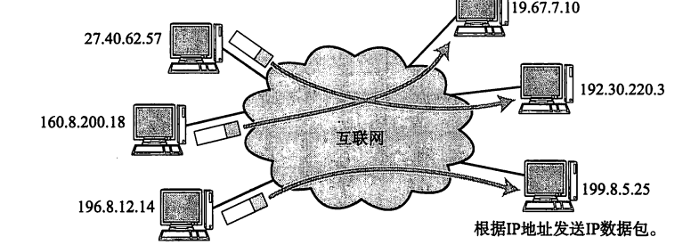
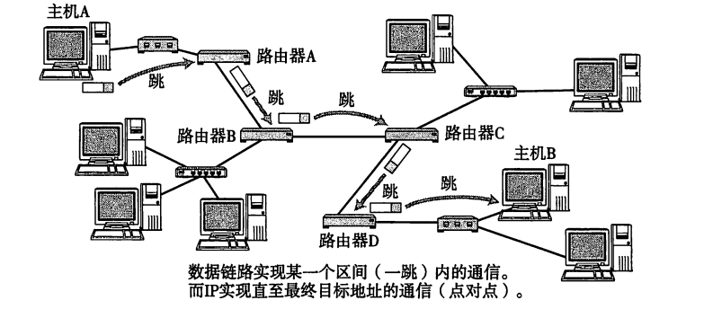
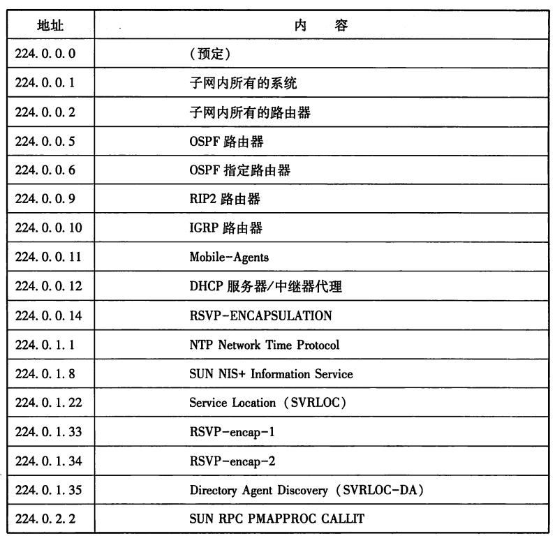
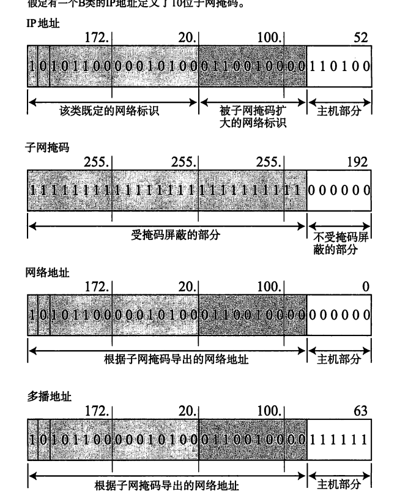
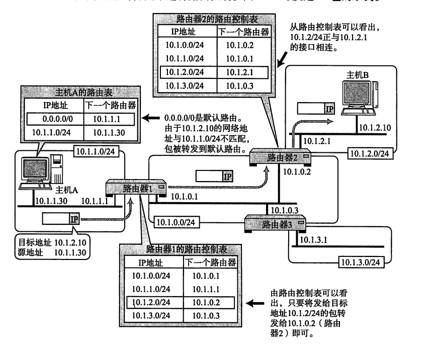

# 计算机网络笔记再战——理解几个经典的协议4

## IP——网际协议

​	我们终于来到了第一个严肃介绍的IP协议。他是一个经典的网络层协议，他控制了数据链路层在抽象的设备概念中的传递，也就是说，我们现在可以让数据链路层安心的传递，至于具体如何在设备之间如何按照调度流通，是IP层的事情。

​	我们常说的IP地址就是网络层的地址，到这里，我们使用一个IP地址来标识一个远程的目标：

​	在互联网内部，我们揭开这团迷雾，就是一系列用来进行转发的路由器设备：

​	也就是说，我们的数据包实际上就是让路由器进行一系列的转发，根据路由器的指示一步一步的到达目的地的终点！每一个路由器查看的就是包的目的地址，查询我们的路由控制表，来决定一个包到底往哪里去！

​	需要注意的是——IP是一个无连接的协议，或者说，它并不会跟对面打招呼说“我要传递了”才去传递，这一层次上使用IP协议的设备，对于来到的数据会立马进行转发出去。

## IP地址

​	现在，我们来谈IP地址，对于IPv4地址，一共有32位。虽然现在来看，32位地址远远不够用了，但是我们仍然使用了子网划分办法来对IP地址的作用域进行了一定的约束（比如说看到192大头的肯定就是本地私有网的地址，绝对没办法到公网上流通一个道理）

​	IPv4地址是有分类的，原本，他们的分类是基于网络规模和用途设计的，分为A、B、C、D、E五类，每类通过地址的前几位比特区分

#### **1. A类地址**
- **范围**：`0.0.0.0` 到 `127.255.255.255`  
- **二进制前缀**：第一位为 `0`（即 `0xxxxxxx`）。  
- **结构**：  
  - **网络部分**：第一个字节（8位），但实际可用网络号为 `1.0.0.0` 至 `126.0.0.0`（排除`0.x.x.x`和`127.x.x.x`保留段）。  
  - **主机部分**：后三个字节（24位），支持每个网络约1677万台主机（\(2^{24} - 2\)）。  
- **默认子网掩码**：`255.0.0.0`。  
- **用途**：适用于超大型网络（如ISP）。  

**特殊保留地址**：  
- `127.0.0.0/8`：环回地址（如`127.0.0.1`为本机）。  
- `0.0.0.0`：表示默认路由或无效地址。

#### **2. B类地址**
- **范围**：`128.0.0.0` 到 `191.255.255.255`  
- **二进制前缀**：前两位为 `10`（即 `10xxxxxx`）。  
- **结构**：  
  - **网络部分**：前两个字节（16位），实际网络号为 `128.0.0.0` 至 `191.255.0.0`，共 \(2^{14} = 16384\) 个网络。  
  - **主机部分**：后两个字节（16位），支持每个网络65534台主机（\(2^{16} - 2\)）。  
- **默认子网掩码**：`255.255.0.0`。  
- **用途**：适合中型企业或机构。

#### **3. C类地址**
- **范围**：`192.0.0.0` 到 `223.255.255.255`  
- **二进制前缀**：前三位为 `110`（即 `110xxxxx`）。  
- **结构**：  
  - **网络部分**：前三个字节（24位），共 \(2^{21} ≈ 209万\) 个网络。  
  - **主机部分**：最后一个字节（8位），支持每个网络254台主机（\(2^{8} - 2\)）。  
- **默认子网掩码**：`255.255.255.0`。  
- **用途**：适合小型网络（如家庭或办公室）。

#### **4. D类地址（组播地址）**
- **范围**：`224.0.0.0` 到 `239.255.255.255`  
- **二进制前缀**：前四位为 `1110`（即 `1110xxxx`）。  
- **用途**：用于组播通信（如视频会议、流媒体），不分配给单个设备。  
- **示例**：  
  - `224.0.0.1`：所有主机组播地址。  
  - `224.0.0.2`：所有路由器组播地址。

#### **5. E类地址（保留地址）**

- **范围**：`240.0.0.0` 到 `255.255.255.255`  
- **二进制前缀**：前四位为 `1111`（即 `1111xxxx`）。  
- **用途**：保留用于实验或未来扩展，不用于常规网络。

#### **特殊地址与私有地址**
1. **私有地址**（不可在公网路由）：  
   - **A类**：`10.0.0.0/8`  
   - **B类**：`172.16.0.0/12`（`172.16.0.0` 至 `172.31.255.255`）  
   - **C类**：`192.168.0.0/16`  
2. **自动配置地址**（APIPA）：`169.254.0.0/16`（DHCP失败时使用）。  
3. **受限广播地址**：`255.255.255.255`。  
4. **网络/广播地址**：主机位全0为网络地址，全1为广播地址（如`192.168.1.0`为网络地址，`192.168.1.255`为广播地址）。

#### 广播地址

​	当然，还有一类地址是广播地址，这样的地址是将主机地址部分全部写1，比如说对于B类的172.20子网下，我们会把余下的部分全部置一，得到172.20.255.255，这个地址就是将信息发送到整个子网中的所有设备。

## IP多播

​	IP多播（IP Multicast）是一种网络通信方式，允许一个发送者将数据包同时传输给多个接收者，而不是像单播（Unicast）那样一对一传输，或广播（Broadcast）那样发送给所有设备。多播通过高效利用网络资源，特别适合一对多或多对多的通信场景。

## 子网掩码

​	这个技术的提出是基于网络分类的退出而诞生的。我们现在的IP地址是需要两个部分的东西的——一个是IP地址，另一个就是子网掩码！我们需要一个子网掩码来决定哪一些位是主机位

​	CIDR进一步激进的推广了上面的做法，也就是彻底的取消了网络的分类（这就是为什么偷懒使用AI帮我写了，因为已经几乎不用了），我们使用子网掩码来动态的使用一个IP来隐藏一个巨大的网络（发送到了一个IP，这个IP往往表达一个门关，这个门关接受到信息后转发给内部的路由器再展开检查主机代码）这样的技术就是VLSM。

#### **传统分类与CIDR/VLSM的对比**

| **特性**       | **传统分类（A、B、C类）**           | **CIDR/VLSM**            |
| :------------- | :---------------------------------- | :----------------------- |
| **地址分配**   | 固定网络和主机划分                  | 灵活的网络和主机划分     |
| **掩码长度**   | 固定（A类：/8，B类：/16，C类：/24） | 可变长度（任意前缀长度） |
| **地址利用率** | 低（容易浪费地址）                  | 高（根据需求分配）       |
| **路由表大小** | 大（无法聚合）                      | 小（支持路由聚合）       |
| **适用场景**   | 早期网络                            | 现代网络（IPv4和IPv6）   |

### 路由控制

​	刚刚我们谈到了路由的办法，这里就是一个样例图，说明我们的包是如何传递和转发的。

​	常见的路由有这些：

#### 默认路由

​	我们指定一个默认的设备作为未匹配的设备作为标识——比如说代表的就是0.0.0.0/0，也就是一个没有设备的IP，意味着我们实际上没有命中设备

#### 主机路由

​	也就是让IP地址所有位都参与路由

#### 环回地址

​	127.0.0.1，这个就是表达自己的IP地址（下次谁说查出来你的IP是127.0.0.1的直接哈哈大笑就完事了）

### IP包的分发重组

​	我们知道通信是异步的，特化的，所以，IP作为一个宏观抽象，就必须介入屏蔽底层的抽象，现在我们的IP包分发都是分为若干带有分片标识的IP包。这里，分片的大小控制就是用了路由MTU发现的功能——也就是说，我们进行对路由器最大可以传递的单位大小进行一个试探。做法是：

1. 先不分片，直接赌我们的网络可以直接发送一整个包，对于接不住的网络会直接丢弃，发送一个ICMP包返回告知目的地不可达
2. 然后，逐步依次递减大小的对IP包分片，直到我们的目标设备不发回来目的不可达的ICMP包，我们认为就是最大的MTU（Max Transmit Unit）
3. 之后，每当出现了目的地不可达的时候，我们进一步分片试探，动态的调整我们的包分片。

## IPv6

IPv6（Internet Protocol version 6）是下一代互联网协议，旨在解决IPv4地址耗尽问题，并提供更多的改进和功能。IPv6的设计不仅扩展了地址空间，还引入了许多新的特性，以支持现代互联网的需求。

### 地址空间扩展

IPv6最显著的改进是其巨大的地址空间。IPv6地址长度为128位，相比IPv4的32位地址，IPv6提供了约3.4×10^38个唯一地址。这一扩展确保了未来几十年甚至更长时间内，互联网设备的增长需求能够得到满足。IPv6地址通常以八组四位十六进制数表示，例如`2001:0db8:85a3:0000:0000:8a2e:0370:7334`。为了简化表示，前导零可以省略，连续的零组可以用双冒号`::`代替，但双冒号只能使用一次。

### 地址类型

IPv6定义了三种主要的地址类型：单播地址、组播地址和任播地址。单播地址用于标识单个接口，数据包会被发送到该接口。组播地址用于标识一组接口，数据包会被发送到该组的所有接口。任播地址也用于标识一组接口，但数据包只会被发送到该组中最近的一个接口。IPv6取消了广播地址，取而代之的是更加灵活的组播地址。

### 自动配置

IPv6引入了无状态地址自动配置（SLAAC），允许设备在没有DHCP服务器的情况下自动配置自己的IPv6地址。设备通过接收路由器发送的路由器通告（RA）消息，结合自己的接口标识符（通常基于MAC地址），生成全球唯一的IPv6地址。此外，IPv6也支持有状态地址配置（DHCPv6），适用于需要更精确控制地址分配的场景。

### 报头简化

IPv6的报头结构相比IPv4更加简洁和高效。IPv6报头固定为40字节，包含8个字段，而IPv4报头长度可变，包含13个字段。IPv6报头的简化减少了路由器处理数据包的开销，提高了转发效率。此外，IPv6将可选字段移到了扩展报头中，使得路由器在处理数据包时只需查看基本报头，进一步提高了性能。

### 安全性

IPv6在设计时考虑了安全性，IPsec（Internet Protocol Security）成为IPv6的强制组成部分。IPsec提供了数据加密、认证和完整性保护，确保通信的安全性和隐私性。虽然IPsec也可以在IPv4中使用，但在IPv6中它是内置的，更容易部署和使用。

### 服务质量（QoS）

IPv6引入了流量类别和流标签字段，支持更好的服务质量（QoS）管理。流量类别字段用于标识数据包的优先级，流标签字段用于标识特定流的数据包，使得网络设备能够对不同类型的流量进行区别处理，确保关键应用的低延迟和高带宽需求。

### 移动性

IPv6对移动设备的支持更加友好。移动IPv6（MIPv6）允许设备在改变网络连接点时保持持续的IP连接，而无需中断正在进行的通信。这对于移动互联网和物联网设备尤为重要，确保了无缝的网络体验。

### 过渡机制

由于IPv6与IPv4不兼容，过渡期间需要采用多种机制确保两种协议的共存和互通。常见的过渡技术包括双栈（Dual Stack）、隧道（Tunneling）和协议转换（NAT64）。双栈允许设备同时运行IPv4和IPv6协议栈，隧道技术将IPv6数据包封装在IPv4数据包中传输，NAT64则允许IPv6设备与IPv4设备通信。