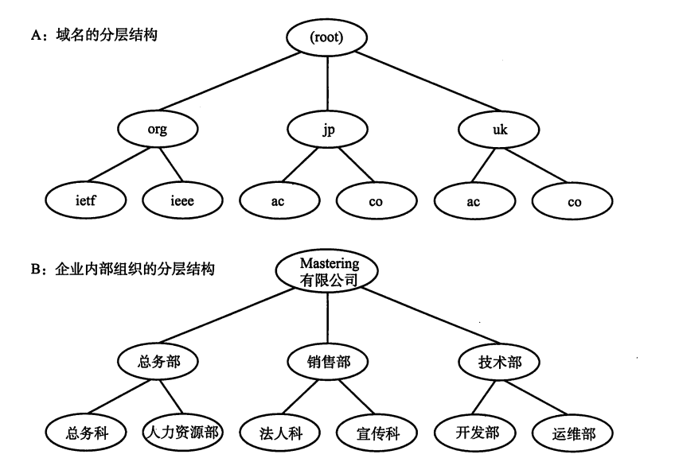

# 计算机网络笔记再战——理解几个经典的协议5——围绕IP的几个辅助协议

## DNS

​	没人喜欢天天背诵，输入一场串IP！我们需要一个稍微有含义一点的名称——比如说www.google.com来标记我访问的是谷歌，而不是一大长串的IP地址！域名服务解析就是一个完成这样的功能的一个协议。我们上面给出的网址就是一个域名。

### DNS查询

​	我们现在知道，一个域名映射了一个IP，问题是，一个域名映射了一个怎样的IP呢？这个是需要向DNS服务器查询的。我们向DNS服务器发起请求，指望从一个抽象的DNS服务器种获取可以访问的域名。其实内部，则是先从本地DNS服务器进行查询，在逐步上报到一层又一层的服务器进行查询，直到存在一个DNS服务器知道这个域名的IP地址。

## ARP

​	ARP（地址解析协议，Address Resolution Protocol）描述了IP地址对MAC地址的映射。它工作在数据链路层和网络层之间，主要目的是解决局域网中如何找到目标主机的物理地址问题。当一台计算机需要发送数据到局域网内的另一台计算机时，它需要知道目标计算机的MAC地址。假设发送方已经知道目标计算机的IP地址，**但它并不直接知道该计算机的MAC地址。在这种情况下，ARP协议就发挥了作用。**

​	ARP协议的工作过程大致如下：当一台计算机想要与同一局域网内的另一台计算机通信时，它会首先检查自己的ARP缓存（一个保存IP地址与MAC地址对应关系的表）。如果缓存中有目标IP地址的MAC地址映射，计算机就可以直接使用该地址发送数据帧。如果没有，发送方计算机会广播一个ARP请求包到局域网中，ARP请求包的内容是目标IP地址，并请求局域网上的所有设备回应该IP地址的MAC地址。所有接收到该ARP请求的设备都会检查自己的IP地址，**只有目标IP地址与请求中的地址匹配的设备才会发送ARP响应包**，响应包中包含该设备的MAC地址。发送方计算机收到ARP响应后，会将目标MAC地址缓存到自己的ARP缓存中，并使用该MAC地址来发送数据帧。

ARP协议有两种主要的消息类型：ARP请求和ARP响应。ARP请求用于在网络中查找某个IP地址对应的MAC地址，而ARP响应则是目标设备回传自己的MAC地址给请求设备。由于ARP请求是广播消息，所以每台计算机都能够收到，并且只有目标IP地址匹配的计算机会发送ARP响应。

ARP缓存是为了避免频繁进行ARP请求，每个计算机会存储一定时间内的IP-MAC地址映射。这个缓存的时间一般是几分钟，过期后会自动清除。ARP缓存中的条目有时也会因为网络的变化或者计算机的重新启动而失效。

## ICMP

​	我们之前就见过这个老朋友了，现在来详细的聊一聊。我们知道IP本身并不存储状态，或者说，他对IP包是否到达了一无所知，必须要ICMP进行辅助控制。

​	ICMP的主要作用是向网络设备传递网络层的诊断信息、错误报告以及流量管理等信息。ICMP协议本身并不用于传输应用数据，它的设计目的是支持网络的稳定运行和故障排除。ICMP协议在IP协议族中作为一种辅助协议，与IP协议密切配合。它能够向源主机报告数据传输过程中遇到的问题，如目标不可达、超时等，帮助网络管理员了解和诊断网络的状态。常见的ICMP消息类型包括回显请求和回显应答（即ping命令的基础）、目的不可达消息、超时消息等。通过这些消息，网络设备能够向源主机提供有关路由或数据传输的详细信息。例如，当一个路由器无法转发某个数据包时，它会使用ICMP发送“目标不可达”消息，通知源主机。

​	ICMP消息通常包含一个类型字段和一个代码字段，类型字段标识消息的种类，代码字段则提供更具体的信息。在ICMP中，不同的消息类型和代码组合用于指示不同的网络事件，如传输中出现的错误或特定操作的响应。ICMP协议的结构一般由头部和数据部分组成，头部包含类型、代码和校验和，而数据部分则可能包含与出错的IP数据包相关的部分信息，帮助源主机定位问题。

​	ICMP除了用于错误报告外，还广泛用于网络诊断和测试工具中。最著名的应用就是ping命令，它通过发送ICMP回显请求消息并等待回显应答，来检查网络中主机的连通性。Traceroute（跟踪路由）工具则利用ICMP超时消息来确定数据包经过的路由路径，帮助分析网络延迟和路由问题。

## DHCP

​	动态主机配置协议（DHCP）是一种网络管理协议，用于自动分配IP地址和其他相关网络配置信息给网络中的设备。通过DHCP，设备在连接到网络时能够自动获取所需的网络参数，如IP地址、子网掩码、默认网关和DNS服务器地址，从而实现快速、高效的网络接入。

​	**DHCP的工作原理基于客户端-服务器模型。当一台设备（客户端）首次连接到网络时，它会发送一个DHCP发现消息（DHCP Discover），以寻找可用的DHCP服务器。**DHCP服务器接收到该消息后，会向客户端提供一个IP地址租约（DHCP Offer），其中包含可用的IP地址和其他配置信息。客户端在接收到多个DHCP Offer后，通常会选择第一个收到的Offer，并向服务器发送一个DHCP请求消息（DHCP Request），以确认接受该IP地址。服务器在收到请求后，会发送一个DHCP确认消息（DHCP Acknowledgment），正式将IP地址分配给客户端，并完成整个配置过程。

​	此外，DHCP还支持为特定设备分配固定的IP地址（称为DHCP保留），这对于需要始终使用相同IP地址的设备（如服务器或打印机）非常有用。DHCP协议在IPv4和IPv6网络中都可以使用。在IPv4网络中，DHCP通常使用UDP端口67（服务器）和68（客户端）进行通信。而在IPv6网络中，DHCPv6使用UDP端口546（客户端）和547（服务器）。DHCPv6不仅提供了IPv6地址的自动分配功能，还可以分配其他IPv6相关的配置信息，如DNS服务器地址和前缀委派。

​	DHCP的优势在于其自动化和灵活性。通过自动分配IP地址，DHCP减少了手动配置的工作量，降低了配置错误的可能性。同时，DHCP支持动态地址分配，能够有效管理有限的IP地址资源，特别是在大型网络中。此外，DHCP还支持跨子网的地址分配，通过DHCP中继代理（DHCP Relay Agent），可以将DHCP请求从一个子网转发到另一个子网，从而扩展了DHCP的适用范围。

## NAT

​	NAT（网络地址转换）是一种在计算机网络中广泛使用的技术，它的主要作用是允许多个设备共享一个公网IP地址进行访问。通常情况下，局域网（LAN）中的设备通过私有IP地址与外界进行通信，但这些私有IP地址无法直接在互联网上进行通信，因为它们并不被全球唯一标识。为了使得这些私有网络中的设备能够访问互联网，NAT技术会在路由器或防火墙等设备上工作，通过修改IP地址和端口号，将私有网络的流量转发到公网IP地址，从而实现内网与外网的互联。

​	在NAT的工作过程中，内网设备使用私有IP地址发送数据包，而路由器会将这些数据包的源IP地址转换成其自身的公网IP地址，并将端口号与设备的私有IP地址及端口号关联起来，形成一个映射表。当返回的响应数据包到达时，路由器根据这个映射表将数据包中的目标IP和端口地址转换回相应的私有IP和端口，从而将数据包转发到正确的内网设备。

​	NAT的常见类型包括静态NAT、动态NAT和端口地址转换（PAT）。静态NAT将每个私有IP地址映射到一个固定的公网IP地址，适用于需要稳定公网IP的情况。动态NAT则是将私有IP地址映射到一个可用的公网IP地址池中的某个IP上，适用于公网IP地址数量有限的场景。PAT，又称为源NAT或端口重用，是通过将多个内网IP地址映射到同一个公网IP地址，并通过不同的端口号区分不同的连接，从而实现多个设备共享一个公网IP地址。

​	NAT技术的优势在于它能够有效节约公网IP地址，提供了一定的安全性，因为外部网络无法直接访问内部的私有IP地址。通过这种方式，NAT不仅减少了公网IP的消耗，还能在一定程度上保护内网设备免受外部的直接攻击。然而，NAT也有一些局限性，主要表现在它可能导致某些基于IP的协议无法正常工作（例如，一些点对点协议、VoIP通信等）。此外，NAT还可能增加网络延迟，因为每个数据包都需要进行地址转换。