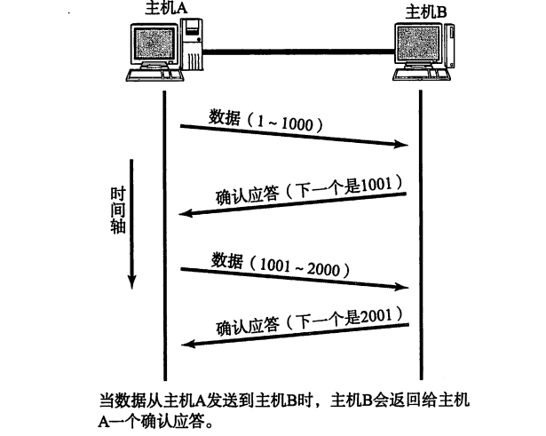
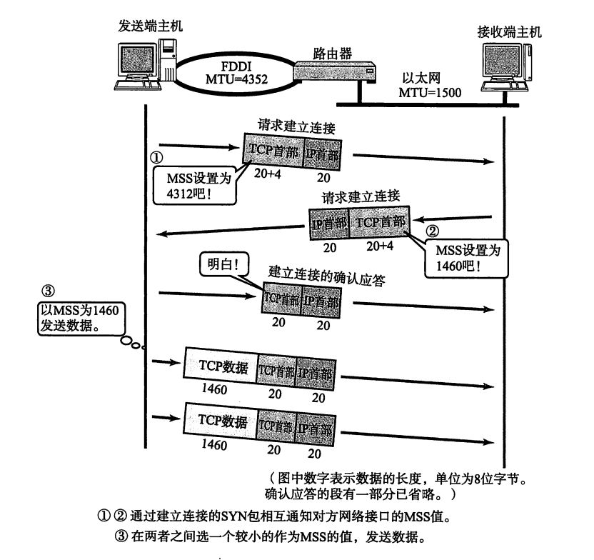
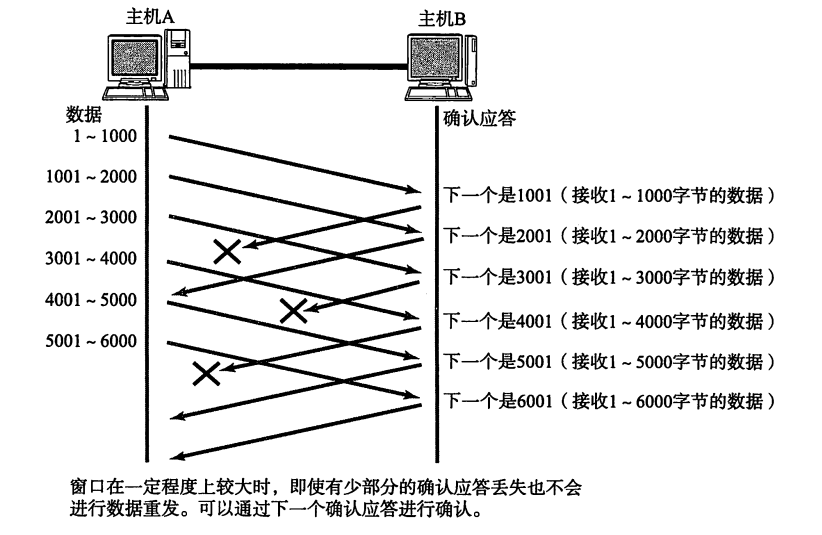
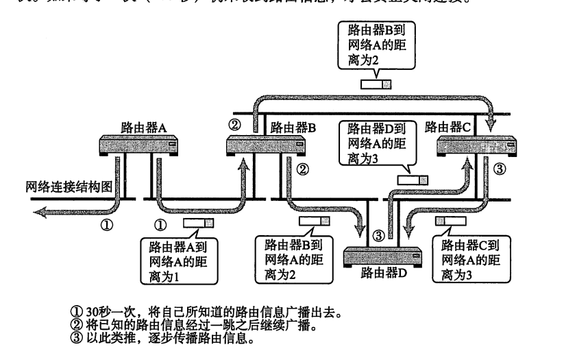

# 计算机网络笔记再战——理解几个经典的协议6——TCP与UDP

​	我们现在终于来到了传输层。顾名思义，我们就是在这里传递一整个信息单元。我们现在，是向一个IP和一个端口传递一个信息。

## 先说端口号

​	我们的计算机本质上占用一个IP，可是，上面还有非常多的应用程序，我们如何区分每一个包是到哪一个应用程序的呢？答案是使用端口号来作为一个标识一个终点。

​	一般的，我们的通信有五个特征：两个IP：源IP和目标IP，两个端口：源端口和目标端口以及协议号，五个特征中只要有一个不一样就不是一个通信！

​	端口的分配则是有著名端口（也就是一般流行协议占用的端口）和时序分配的端口（在最后一个被占用的端口处+1）

| 协议           | 端口号 |
| -------------- | ------ |
| HTTP           | 80     |
| HTTPS          | 443    |
| FTP (控制连接) | 21     |
| FTP (数据连接) | 20     |
| SSH            | 22     |
| Telnet         | 23     |
| SMTP           | 25     |
| DNS            | 53     |
| POP3           | 110    |
| IMAP           | 143    |
| SNMP           | 161    |
| DHCP (客户端)  | 68     |
| DHCP (服务器)  | 67     |
| RDP            | 3389   |

## TCP

​	经典三次握手，这个方式来保证TCP的有链接性质。

### 使用序号保证顺序性和应答来保证有效性

​	我们在原始的数据包中插入一个序号，来表达数据的次序，这样来保证数据可以再传递之后恢复原模原样。

​	对于尝试建立的应答机制，则是确保通信链路是有效的。一般是主机发送表达主机的通信功能正常，目标机接受并发送表达目标机可以正常的接受和发送，最后是主机传递数据表达主机的接受是正常的。



### 超时重传机制

​	重发超时是一种确定度量通信是否正常的机制。换而言之，当我们发送应答报文的时候，多久之前收到主机的回复是正常的这个事情。



### TCP窗口机制



TCP窗口控制机制（TCP Window Control）是确保可靠数据传输的一个关键机制，旨在调节和管理发送方与接收方之间的流量，从而避免网络过载，并确保数据在可靠的、按顺序的方式到达目的地。这个机制的核心是TCP的滑动窗口（Sliding Window）协议，它通过控制可发送数据的量来平衡两端的发送和接收能力。

在TCP连接中，接收方通常具有一个缓冲区，用于存储从发送方接收的数据。在接收方的缓冲区未满时，接收方允许发送方继续发送数据；如果缓冲区接近满时，接收方就会通知发送方减缓数据的发送。这个缓冲区的大小由接收方的“接收窗口”来表示。接收方通过在TCP报文段的“窗口大小”字段中告知发送方它的接收窗口大小，从而控制发送方的发送速率。

在TCP的滑动窗口机制中，发送方能够一次性发送多个数据段，而不必等待每个数据段的确认（ACK）。窗口大小决定了发送方可以连续发送而无需等待确认的最大字节数。随着数据的传输和确认，发送方的窗口不断向前滑动，使得新的数据段可以继续发送。窗口的大小动态变化，基于网络的拥塞情况以及接收方的缓冲区状态。

拥塞控制机制是窗口控制中的一个重要方面。为了防止过多的数据超出网络的处理能力，TCP协议使用了一种名为慢启动（Slow Start）和拥塞避免（Congestion Avoidance）的算法。在连接开始时，TCP会以非常小的窗口开始传输数据，每当成功收到确认时，窗口的大小会加倍增长。随着连接的延续，TCP会根据网络的实际情况逐渐增加窗口大小，但如果出现拥塞，窗口会减小，直到网络恢复正常。

此外，TCP还通过快速重传和快速恢复机制来提高数据传输的效率和可靠性。当接收方发现数据丢失时，会立即发送重复的确认（DupACK）给发送方，通知它重新发送丢失的数据段。发送方通过这些重复确认来识别丢失的数据段，并在不经过慢启动的情况下尽快重传。

```
+-------------------+-------------------+-------------------+-------------------+
|      Source       |    Destination    |    Sequence       |  Acknowledgment   |
|      Port (16)    |       Port (16)    |    Number (32)    |    Number (32)    |
+-------------------+-------------------+-------------------+-------------------+
| Data  | Reserved |  Control Flags  |   Window Size (16) |   Checksum (16)   |
| Offset| (3 bits) |   (9 bits)      |    (16 bits)       |    (16 bits)       |
| (4 bits)           |                   |                   |                   |
+-------------------+-------------------+-------------------+-------------------+
|  Urgent Pointer (16 bits)   |           Options (Variable)             |
+----------------------------+-------------------------------------------+
```

- TCP首部的第一个字段是源端口（Source Port）和目标端口（Destination Port），每个字段占用2个字节。这两个字段标识了数据传输的源地址和目的地址，即分别标识了发送方和接收方的端口号，它们决定了数据的最终接收者和发送者。接下来是序列号（Sequence Number），占用4个字节，它表示发送方发送的第一个字节在数据流中的位置。序列号是TCP协议确保数据按顺序传输的关键，它使接收方能够重新排列和处理接收到的数据。
- 紧随其后的是确认号（Acknowledgment Number），同样占用4个字节，它标识接收方期望接收到的下一个字节的序号。确认号仅在ACK标志位被设置时有效，表示接收方已经收到的数据字节数，并确认了下一个期望的字节。接下来是数据偏移（Data Offset），占4位，它指定了TCP首部的长度，指示首部的最后一个字节的位置，从而帮助接收方确定数据部分的开始位置。数据偏移字段后面是保留字段（Reserved），占3位，通常设置为0，保持兼容性。
- TCP首部的下一个字段是标志位（Flags），占9位，通常包含6个重要的控制标志位：URG（紧急指针有效）、ACK（确认字段有效）、PSH（推送数据段）、RST（重置连接）、SYN（同步连接）、FIN（终止连接）。这些标志位用于控制连接的建立、数据的传输以及连接的终止。
- 接下来是窗口大小（Window Size），占2个字节，指示接收方的缓冲区大小，或者说是接收窗口的大小，决定了发送方可以发送的最大数据量。这个字段用于流量控制，确保接收方的缓冲区不会被填满，导致丢包或阻塞。
- 接着是校验和（Checksum），占2个字节，用于检测TCP首部和数据部分在传输过程中是否发生了错误。校验和通过对数据进行计算得出，发送方和接收方都需要进行校验，以确保数据的完整性。
- 紧接着是紧急指针（Urgent Pointer），占2个字节，它仅在URG标志位被设置时有效，用于指示紧急数据的结束位置。紧急数据通常是具有优先级的数据，接收方需要立即处理。
- 最后是选项字段（Options），它是一个可选的部分，占用可变长度。选项字段用于提供一些附加功能，如最大段大小（MSS）、时间戳等。选项的长度可以根据需要变化，因此这个字段的长度是可变的。


## UDP

​	UDP就会简单很多，他就是一个超级简单的对IP的封装，不提供任何超时重传，包纠正等错误处理机制。所以，他比较迅速。

## 路由协议

​	我们下面要做的就是专门的讨论包转发这个事情。也就是讨论路由。路由分为静态路由和动态路由。

​	静态路由由人手动设置，也就是人直接介入控制。动态路由则是网络之间自动调节反馈，动态的规划每一个部分包应该走何处实现网络的最小阻塞。

### 协议分类：IGP和EGP

​	协议分为外部网关协议EGP和内部网关协议IGP。他们分别完成网络之间的路由和网络内部的路由。

### 几个经典的路由算法

- **距离向量路由算法（Distance Vector Routing）**
  距离向量路由算法是最基本的路由算法之一，每个路由器通过与邻居路由器交换距离信息来更新路由表。每个路由器维护一张包含到达各目的地的最短路径的表。每次更新时，路由器会将其自己的路由表发送给邻居路由器。邻居路由器接收到更新后，将自己对每个目的地的距离加上与该邻居的距离，从而更新自己的路由表。常见的距离向量算法包括RIP（Routing Information Protocol），它采用跳数作为距离度量标准。距离向量算法的优点是简单易实现，但缺点是收敛较慢且容易发生环路。
- **链路状态路由算法（Link State Routing）**
  链路状态路由算法与距离向量不同，它要求每个路由器向网络中的所有其他路由器广播其链路状态信息，描述它与每个邻居路由器的连接状况。每个路由器在接收到链路状态信息后，都会构建一张包含所有网络拓扑的完整图，并使用Dijkstra算法来计算到各目的地的最短路径。链路状态路由的代表协议是OSPF（Open Shortest Path First）。相比于距离向量，链路状态算法具有更快的收敛速度和更高的可扩展性，但其计算和存储要求较高。
- **洪泛路由算法（Flooding）**
  洪泛算法是一种简单的路由策略，每个路由器接收到一个数据包后，都会将该数据包广播到所有其他路由器，直到数据包到达目的地。洪泛算法不需要任何路由表，仅仅通过“广播”实现网络中的数据传输。尽管这种方法简单有效，适用于广播式的网络（如无线网络或一些特定的点对点网络），但它的缺点是网络带宽的浪费，因为每个数据包都被多次发送，可能导致严重的网络拥塞和冗余数据。
- **路径选择算法（Path Vector Routing）**
  路径选择算法是距离向量路由和链路状态路由的结合体。在路径选择算法中，每个路由器不仅传播距离信息，还传播其到达每个目的地的完整路径。这样，每个路由器可以选择根据路径的完整信息来做路由决策。BGP（Border Gateway Protocol）是路径选择算法的典型代表，常用于Internet的自治系统之间的路由选择。BGP能够根据路径的多种属性（如AS路径、路由策略等）来选择最佳路径。路径选择算法可以在复杂的大型网络中有效运作，但其复杂性较高，处理路径策略和更新的效率成为挑战。
- **混合路由算法（Hybrid Routing）**
  混合路由算法结合了距离向量和链路状态算法的优点。它试图通过将两者结合在一起，提供更高的效率和灵活性。一个典型的混合路由协议是EIGRP（Enhanced Interior Gateway Routing Protocol）。EIGRP结合了距离向量算法的简单性和链路状态算法的快速收敛特点，使用Diffusing Update Algorithm（DUAL）来实现网络拓扑的快速更新。EIGRP通过在路由更新时同时传递距离和链路状态信息来避免路由环路，并实现较快的收敛。

## RIP

​	RIP（路由信息协议）是一个典型的距离向量算法的路由协议，被广泛的用在LAN上



​	在这里，我们定义跳数为经过路由器的个数作为距离的标准，对路由表内部存储的IP——路由器映射对进行匹配。这样的话，就知道什么样的IP走那一条传递路径。

​	当然，这里很容易出现环形的链路导致通知报文无限的传递，办法是毒性逆转（直接说此路不同断开环的形成）和触发更新（立即将路径的链路更新广播到其他的路由器上）

## OSPF

OSPF（Open Shortest Path First，开放最短路径优先）是一种链路状态路由协议，广泛应用于大型企业网络和ISP的内部网（也称为自治系统）。OSPF采用Dijkstra算法计算最短路径，并通过将网络的拓扑信息传播给所有路由器，从而构建全局路由表。与距离向量路由协议（如RIP）相比，OSPF的收敛速度更快、扩展性更好，适合较大的网络环境。

#### **链路状态数据库（LSDB）**

OSPF的核心思想是通过交换链路状态信息来保持网络拓扑的一致性。每个路由器都有一张链路状态数据库（LSDB），该数据库包含了网络中所有路由器和它们之间连接的详细信息。每个路由器通过交换链路状态广告（LSA，Link State Advertisement）来描述自己与邻居的连接情况。LSA通过多播方式传播，所有路由器都能收到LSA，从而更新自己的LSDB。

#### **LSA（Link State Advertisement）**

LSA是OSPF路由器交换的基本信息单元，描述了每个路由器的链路状态。LSA包括多个类型，主要有：

- **Router LSA（类型1）**：由路由器生成，描述该路由器与其直接连接的网络和邻居的状态。
- **Network LSA（类型2）**：由网络的DR（Designated Router，指定路由器）生成，描述广播网络的拓扑。
- **Summary LSA（类型3和4）**：用于在不同区域之间传播路由信息，尤其是跨区域路由选择。
- **AS External LSA（类型5）**：用于从外部自治系统引入路由信息。

#### **区域划分**

为了提高OSPF的扩展性和减少路由计算的复杂度，OSPF支持区域（Area）划分。一个OSPF网络通常由多个区域组成，其中一个区域被称为骨干区域（Area 0），它是所有区域的核心，其他区域通过骨干区域相互连接。通过将网络划分为多个区域，OSPF能够限制LSA的传播范围，从而减少路由计算的负担。区域之间的路由信息通过路由器之间的ABR（Area Border Router）交换。每个区域内部都进行链路状态更新，而不同区域之间通过骨干区域交换路由信息。

#### **路由器角色**

OSPF定义了几种不同的路由器角色，每个角色在网络中的功能不同：

- **DR（Designated Router）**：在广播网络（如Ethernet）中，DR负责生成网络LSA，减少网络中交换的LSA数量。通常，DR是根据接口的优先级和IP地址来选举的。
- **BDR（Backup Designated Router）**：是DR的备份角色，当DR发生故障时，BDR将会接管DR的工作。
- **ABR（Area Border Router）**：连接多个区域的路由器，负责不同区域之间的路由信息交换。
- **ASBR（Autonomous System Boundary Router）**：连接外部自治系统的路由器，通常负责引入外部网络的路由信息，如通过BGP协议与其他自治系统通信。

#### **路由协议特性**

OSPF具有以下几种关键特性：

- **带宽计量**：OSPF使用带宽作为度量标准，而不是跳数。每个链路的带宽会影响计算的最短路径，OSPF默认的成本（Cost）是带宽的倒数。
- **收敛速度快**：OSPF的收敛速度比基于距离向量的协议快。因为路由器立即发现网络拓扑的变化并更新LSDB，因此能快速重新计算最短路径。
- **支持VLSM（Variable Length Subnet Mask）**：OSPF支持变长子网掩码，使得IP地址空间的利用更加灵活。
- **路由认证**：OSPF支持路由认证功能，可以对OSPF交换的LSA数据进行验证，确保网络安全。
- **多路径路由**：OSPF支持ECMP（Equal-Cost Multi-Path），即当有多个等价的最短路径时，数据包可以同时通过多个路径进行负载均衡。

## BGP

​	BGP（Border Gateway Protocol，边界网关协议）是一种用于自治系统（AS）之间交换路由信息的外部网关协议，是Internet核心路由协议之一。BGP主要用于在不同的自治系统之间传递路由信息，并帮助决定跨越多个自治系统的最佳路径。它是一个路径向量协议，与OSPF等内部网关协议（IGP）不同，BGP主要用于自治系统之间的路由选择。

​	BGP通过交换路由通告（Route Advertisement）来交换关于可达性的信息。这些路由通告不仅包括目的网络的地址和掩码，还包括如何到达该网络的路径信息。BGP选择路径时，不仅依据网络的可达性，还考虑了路径属性、策略、AS路径等多个因素。BGP是一个基于路径的协议，这意味着它不仅仅传递目的地的IP地址，还传递到达目标的路径信息。

1. **路径选择**
    BGP使用路径向量的方式来选择最优路径。每条路径都由一个AS路径（AS Path）标识，它记录了数据包从源自治系统到达目的自治系统经过的路径。BGP的选择标准不仅仅是路径长度，还包括以下几个因素：
   - **AS路径长度**：即路径中经过的自治系统数目，路径较短通常较优。
   - **路径的下一跳（Next Hop）**：决定数据包最终的传送目标，BGP通过下一跳来确定最佳路由。
   - **本地优先级（Local Preference）**：用于在本自治系统内选择最优路径，优先级高的路径优先被选择。
   - **多出口鉴别器（MED，Multi-Exit Discriminator）**：用于在两个自治系统之间，指示数据流的优先出口。较低的MED值意味着较优路径。
   - **路由聚合（Aggregated Routes）**：BGP可以通过聚合多个路由信息来减少路由表的大小。
2. **BGP路由通告**
    BGP在交换路由信息时，会通过BGP路由通告来广播一条或多条路由。BGP通告不仅包含目标地址，还包括路由的属性，如AS路径、下一跳等。路由器根据这些路由属性来做出路径选择。BGP路由信息的传播采用了“传递”的方式，即将信息从一个自治系统传递给其他自治系统，直到达到最终目标。
3. **策略控制**
    BGP提供了强大的路由策略控制能力，管理员可以通过配置BGP策略来影响路由选择。例如，可以通过设置本地优先级、AS路径过滤、MED值等来控制路由选择，从而实现复杂的路由策略。

1. **BGP类型**
    BGP有两种类型：
   - **EBGP（External BGP）**：用于不同自治系统之间的路由交换，是Internet中自治系统之间的主要路由协议。
   - **IBGP（Internal BGP）**：用于同一自治系统内部的路由交换，允许自治系统内的路由器知道自治系统外部的路由信息。
2. **路径向量协议**
    BGP是一种路径向量协议，与距离向量协议（如RIP）和链路状态协议（如OSPF）不同，BGP不仅仅传递目标网络地址，还传递到达目标的路径信息。每个路径由经过的AS序列（即AS路径）标识，这使得BGP能够避免环路并选择最优路径。
3. **路由器角色**
    在BGP中，路由器的角色分为两种：
   - **BGP邻居（Peers）**：BGP路由器通过建立邻居关系来交换路由信息。邻居关系是通过TCP连接（默认端口179）建立的。
   - **BGP路由器**：路由器会从BGP邻居接收路由通告，并通过选择最佳路径来更新自己的路由表。
4. **连接建立和维护**
    BGP通过TCP连接（端口号179）来进行通信，连接的建立通过三次握手完成。建立连接后，BGP会定期交换路由信息，确保网络拓扑和路由表的一致性。BGP还通过“Keepalive”报文定期检查连接的有效性，若发现连接中断，则会触发重新建立连接。

#### BGP的协议版本

1. **BGP-4**
    BGP-4是BGP的当前版本，支持CIDR（Classless Inter-Domain Routing，无类别域间路由）和VLSM（Variable Length Subnet Mask，变长子网掩码）。它支持路由聚合、路由反向传播以及跨多个AS的路由信息传播。BGP-4已经成为Internet中最广泛使用的BGP版本。
2. **BGP-3和早期版本**
    BGP-3及更早版本（如BGP-2）较为简单，不支持CIDR，因此在IP地址分配方面的灵活性较差。BGP-4被广泛应用并发展成为现在的标准。

#### BGP的路由策略和优化

BGP协议支持多种路由策略，能够根据不同的需求对路由进行优化。管理员可以通过以下方式调整路由策略：

- **路由过滤**：可以基于AS路径、前缀、地址等条件过滤进出的路由信息，控制网络中的路由传播。
- **路由重分发**：可以将来自其他路由协议（如OSPF、RIP）的路由信息引入BGP，或者将BGP路由信息传递给其他协议。
- **负载均衡**：BGP支持ECMP（Equal-Cost Multi-Path），可以根据不同路径的代价将流量分配到多个路径上，从而实现负载均衡。

#### BGP的优势和局限性

**优势**

- BGP支持大规模的网络，能够有效地管理复杂的路由信息。
- 提供了灵活的路由选择和策略控制，能够根据不同的需求选择最优路径。
- 具有较高的可扩展性，适用于Internet级别的路由选择。

**局限性**

- BGP协议复杂，配置和管理相对困难。
- 因为BGP是基于路径的协议，它的收敛速度相对较慢，可能导致网络变化时出现短时间的不稳定。
- BGP容易受到路由劫持等攻击，需要适当的安全策略来防范。