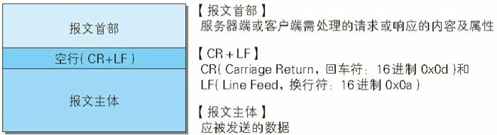
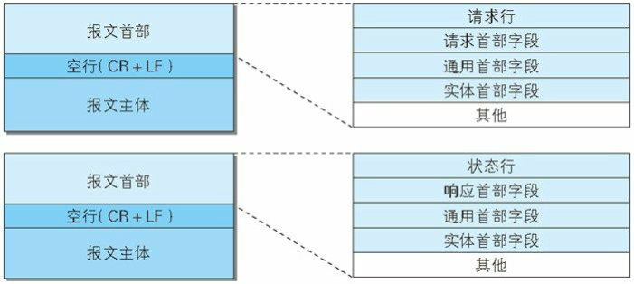

# 理解几个经典协议——HTTP章2

## HTTP报文分析

​	所以，承载我们HTTP协议规范的，实际上传递在网络中的信息报文，被称为HTTP报文。在上一个博客中，笔者说过了，**我们的请求端（客户端）的HTTP 报文叫做请求报文，响应端（服务器端）的叫做响应报文。**

​	超文本传输协议，是HTTP的全程，所以显然，我们的报文也就是使用一系列由换行符（CR + LF）组成的，

HTTP 报文大致可分为报文首部和报文主体两块。两者由最初出现的空行（CR+LF）来划分。通常，并不一定要有报文主体。

​	我们的报文实际上就是由这些部分组成的。

### 请求报文和响应报文

​	我们看到在这里，唯一的区别是请求行和状态行的区别。这是可以理解的，我们请求就是说明我们请求的东西，状态行告知我们请求的东西的状态

### 报文主体和实体主体的差异

​	报文（message）是 HTTP 通信中的基本单位，由 8 位组字节流（octet sequence，其中 octet 为 8 个比特）组成，通过 HTTP 通信传输。

​	实体（entity）作为请求或响应的有效载荷数据（补充项）被传输，其内容由实体首部和实体主体组成。HTTP 报文的主体用于传输请求或响应的实体主体。通常，报文主体等于实体主体。

​	只有当传输中进行编码操作时，实体主体的内容发生变化，才导致它和报文主体产生差异。报文和实体这两个术语在之后会经常出现，请事先理解两者的差异。

​	向待发送邮件内增加附件时，为了使邮件容量变小，我们会先用 ZIP压缩文件之后再添加附件发送。HTTP 协议中有一种被称为内容编码的功能也能进行类似的操作。内容编码指明应用在实体内容上的编码格式，并保持实体信息原样压缩。内容编码后的实体由客户端接收并负责解码。