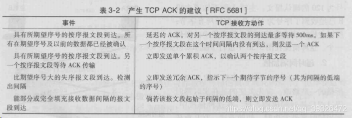
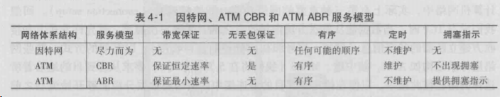
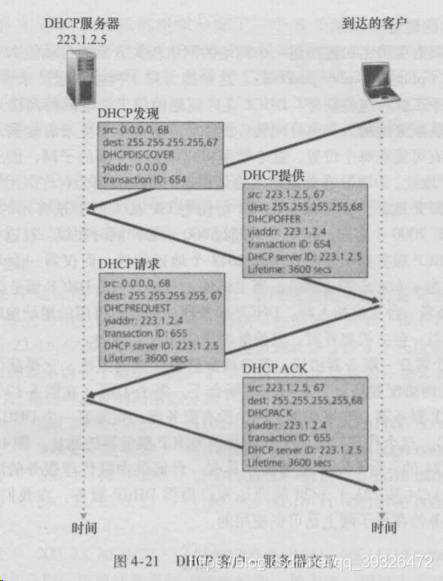
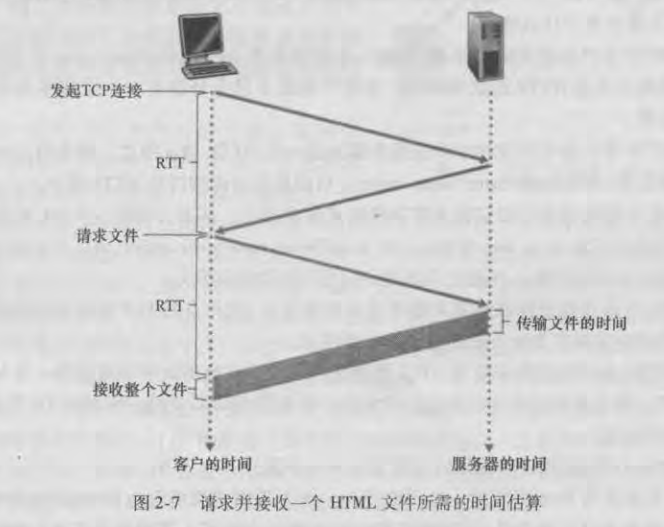
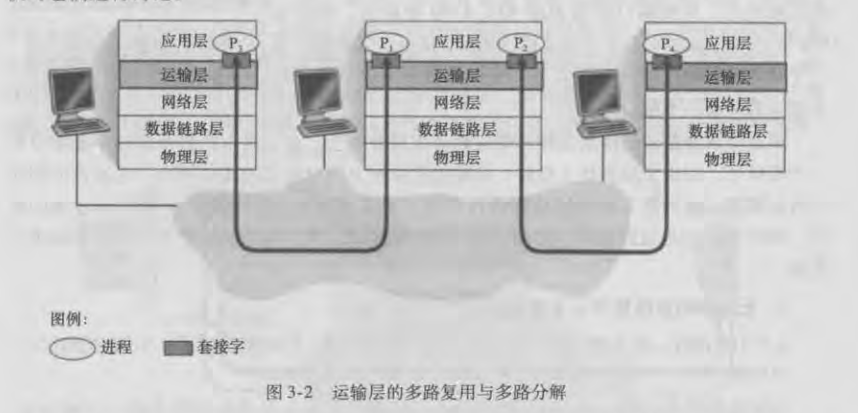

# 计算机网络教程-自顶向下方法

# 导论概要笔记

# 第一章 计算机网络和因特网

## 1.1 什么是因特网

> 我们可以从两个角度来回答这个问题：一种是描述组成它的软硬件；另一种是将其视为为分布式应用提供基础服务的联网设施来描述。其实，第一种角度，是从它的组成来描述，第二种角度是从它的功能来描述

## 1.1.1 组成描述

> 因特网是一个世界范围的计算机网络，这意味着它互联了数以亿计的计算设备（不仅仅是计算机哦）；这些设备包括但不限于传统PC、工作站以及所谓的服务器。现在有更多的设备加入到因特网中，比如便携式计算机、电视机、汽车、传感器等。
>
> 用因特网的术语来说，所有连入因特网的设备都叫做**主机或者端系统**
>
> 以下是重点的一些概念：
>
> **端系统**通过**通信链路**和**分组交换机**连接到一起。
>
> 端系统之间发送数据时，发送端系统将其数据分成一段一段，然后加上必要的信息后形成一个个的数据包，这个数据包用术语来说叫做分组。于是**分组**==用户数据+必要信息。链路系统就是用来传输分组的。分组到达接收端系统后，接收端系统将根据必要信息来抽取用户数据；
>
> 分组交换机从它的一条入链路接收分组，并且选择一条出链路将分组转发出去；分组交换机也有很多种类，最为有名的是路由器和链路层交换机；两者的的不同之处在于，**链路层交换机主要用在接入网中，路由器主要用在网络核心.**
>
> 端系统通过**因特网服务提供商（**Internet Service Provider，简称ISP）接入因特网；
>
> 很有名的协议有：**TCP（Transport Control Protocol，传输控制协议）和IP(Internet Protocol，网际协议)**；因为协议控制了信息的传递，所以对协议达成一致就很重要，所以需要一个标准来规范协议，以便创造可以协同工作的系统和产品

 

### 1.1.2 服务描述

> 应用程序编程接口（API)

### 1.1.3 协议

> 前面提到了分组这一概念，分组==用户数据+必要数据；这些必要数据为分组接收者理解用户数据提供保障，而协议就是如何使用必要数据理解用户数据的方法或者规则；分组接收者接收到分组并按照协议获得了用户数据后，还应该对此消息做出反应，而如何做出反应也是协议规范的一部分（不反应也是一种反应哦）
>
> **协议:**定义了两个或多个通信实体（不一定是端系统，还有可能是分组交换机等）之间交换信息的格式和次序以及对该信息所采取的动作
>
> 凡是通信实体的所有活动都要受到协议的约束。比如，硬件实现的控制协议控制了两块网卡之间的比特流；在端系统中，拥塞控制协议控制了发送方和接收方之间传输数据的速率等

## 1.2 网络的边缘

> **端系统**：与因特网相连的计算机和其它设备，往往处于网络的边缘
>
> **端系统分类：**客户和服务器

### 1.2.1 接入网

> **接入网**：是指将端系统连入到边缘路由器的物理链路
>
> **边缘路由器**：是指端系统到任何其他远程端系统路径上的第一台路由器
>
> 

- DSL(Digital Subscribe Line)数字用户线

> 这是一种宽带住宅接入的方法，它的ISP是本地电话公司。其使用的通信链路的物理材质为电话线，是一种双绞线。
>
> 用户使用DSL调制解调器通过电话线与ISP中的数字用户线接入复用器（DSLAM）来交换数据；家庭DSL调制解调器将数字数据转换为高频音后通过电话线传输到ISP中心，并且通过DSL解调器将DSLAM发送过来的模拟信号转为数字信号；

- CIC(Cable Internet Access)电缆因特网接入

> 这是另一种宽带住宅接入方法，它的ISP是有线电视公司。其使用的通信链路的物理材质有光纤和同轴电缆，也被称为混合光纤同轴（Hybrid Fiber Coax HFC）；
>
> 用户使用电缆调制解调器通过同轴电缆与光纤结点相连，光纤结点通过光缆与电缆头端相连，而电缆头端接入了因特网。在电缆头端，电缆调制解调器端接系统（Cable Modem Termination System）起到DSLAM的作用，即实现模拟信号和数字信号的转换；

- FTTH(Fiber TO The Home)光纤到户

> 这里主要是指使用光纤作为通信链路的材质，有两种竞争性的光纤分布方案，一种是主动光纤网络（Active Optical Network），另一种是被动光纤网络(Passive Optical Network).其主要区别在于，是否在传输数据时共享光纤。

- 以太网和WIFI

> 以太网接入是一种在公司、大学、家庭里很流行的接入方式；用户使用双绞线与以太网交换机相连，从而接入因特网；接入以太网交换机的速度可达100Mbps;
>
> 在无线局域网中，无线用户从一个接入点发送和接收数据，而该接入点与企业网相连，企业网最终接入因特网；在无线LAN中，用户需要在一个接入点的几十米范围之内；

- 广域无线接入

> 在移动设备中，通过蜂窝网提供商运营的基站来发送和接收分组，与WIFI不同的是，用户仅需要位于基站的数万米范围之内即可；

### 1.2.2 物理媒体

> 传输媒体是构成通信链路的主要部分，物理媒体通常可以分为导引性媒体和非导引性媒体；其中导引性媒体，信号沿着固体前行；而非导引性媒体中，信号沿着固体媒体前行
>
> 值得注意的是，架设传输媒体的人历成本要远远高于物理材料的成本

- 双绞线

最便宜的**引导性**传输媒体，由两条相互螺旋缠绕的铜线组成。目前局域网中的双绞线数据传输速率在10Mbps到10Gbps之间，所能达到的数据传输速率取决于线的粗细以及传输距离；双绞线实际上已经成为高速局域网联网的主要方式；因为现代的双绞线技术速率和传输距离都是很不错的；

- 同轴电缆

也由两个铜导体构成，但是它们是同心的，而非并行的；借助特殊的结构和绝缘层，同轴电缆可得到较高的数据传输速率；在电视系统中应用广泛；同轴电缆可被用作**引导性**的共享媒体；

- 光纤

一种可以**引导**光脉冲的媒体

- 陆地无线电信道

无线电信道承载电磁频谱中的信号，**不需要物理线路**，提供与移动用户的连接以及长距离承载信号的方式；是一种有吸引力的媒体；

- 卫星无线电信道

通过卫星连接两个或多个在地球上的微波发射方（也被称为地面站），该卫星在一个频段上接收信号，在另一个频段上发送信号；种类有同步卫星和近地轨道卫星；

## 1.3 网络核心

> 网络核心即为由互联端系统的分组交换机和链路构成的网状网络
>
> 通过网络链路和交换机移动数据有两种基本方法：电路交换和分组交换

### 1.3.1 分组交换

> 分组在通信链路上以等于该链路的最大传输速率传输通过通信链路。因此如果某条链路的最大传输速率为R，分组长度为L，则该链路传输该分组的时间为L/R；这个时间也被称为传输时延（值得注意的是，这里说的时间很有可能是传播时延而不是传输时延，这两者的区别在关于延迟时间的计算中将详细解释，虽然这里书上写的是传输，但是根据后文，我认为是传播）；分组交换的常见方式是存储转发机制；

- 存储转发

大多数分组交换机采用存储转发机制来转发分组；所谓存储转发是指交换机在收到一个完成的分组，才会向链路输出转发分组，否则就将收到的部分分组缓存起来；因为缓存等待一个分组的全部数据而导致的时间开销被称为存储转发时延

因为需要缓存分组，所以此时分组交换机需要一个缓冲队列；缓冲队列的空间有限性就有可能导致分组交换机无法继续缓存分组（因为链路被占用或者分组还没全部到位）而使到达分组交换机的数据包被迫丢弃；这就导致了分组不但承担了传输时延，还承担了队列时延。

- 排队时延与分组丢失

因为需要缓存分组，所以此时分组交换机需要一个输出缓存和输出队列；缓冲队列的空间有限性就有可能导致分组交换机无法继续缓存分组（因为链路被占用或者分组还没全部到位）而使到达分组交换机的数据包被迫丢弃；这就导致了分组不但承担了传输时延，还承担了队列时延。

- 转发表与路由选择协议

实际上，分组交换机之所以能够知道往哪去是因为其内部有一个**转发表**，这个表维护了一个IP地址和链路的对应关系，所以处理流程为：

1. 通过分组的必要信息，获得目的端系统的IP地址
2. 通过IP地址索引转发表，从而确定输出链路

### 1.3.2 电路交换

> 在电路交换网络中，在端系统通信会话期间，交换机会预留端系统间通信路径上的相关资源（缓存，链路传输速率），即先建立连接，然后通信；而在分组交换网络中，这些资源没有被预留；也就是说，在端系统进行通信时，其所需要的资源是被保持的，其他通信是无法使用这一部分资源的；也就说，端系统间真正建立了一条“连接”；而这一连接，用电话的术语被称为“电路”。传统的电话网络就是电路交换网络的例子。

- 电路交换网络中的复用

> **时分复用**（Time-Division Multiplexing TDM）：是指将时间划分为固定区间的**帧**，每个帧则又被划分为固定数量的时间**空隙**；当网络需要建立一条连接时，网络将在每个帧中为该连接指定一个时隙；在该时隙内，链路用来传输该链接的数据；
>
> **频分复用**(Frequency-Division Multiplexing)：将频率域划分为频段，然后将频段分配给连接；此频段被用来专门传输链接的数据。该频段的宽度成为带宽。

### 1.3.3 分组交换和电路交换的对比

**分组交换的优点**：

  它提供了比电路交换更好的带宽共享；
  它比电路交换更简单、更有效、实现成本更低；

**分组交换的缺点**：

  分组交换不适合实时服务，因为端到端的时延是可变、不可预测的，这和整个网络的情况相关；

**电路交换的优点**：

  提供了端对端传输数据的速率保证；

**电路交换的缺点：**

  电路交换存在静默期，这是指专用电路空因时，其占用的资源并没有得到充分的利用；
  建立连接的过程比较复杂；

总体上来说，分组交换的性能要好于电路交换的性能，但是不同类型的分组交换方式有不同的应用场景；比如一些对最低速率有着严格要求的应用，比如实时服务等，为了获得速率保证，牺牲网络的效率也是可以接受的。趋势向着分组交换发展
网络的网络

### 1.3.4 网络的网络

不得不说，因特网是一个庞大而复杂的系统，但是我们仍然有办法描述它（我们不是已经这么做过了吗？），但是我们需要一个模型来刻画因特网的结构；该用什么样的结构来刻画因特网呢？我想，最普遍的说法就是：因特网是网络的网络。但是这一说法足够精炼的同时也不够明确。更重要的是，我们可以选择更明确的方法来刻画因特网；书中通过5个模型不断过渡到最终模型，其实过渡的过程就结构不断合理、连接方式不断明确的过程。

我们在什么是因特网 一节中介绍ISP，端系统是通过ISP接入因特网的，为了实现端系统的互联，ISP也必须互联，其实网络模型就是用来表达ISP和端系统以及ISP之间的结构的抽象；

网络结构1：存在唯一的全球承载ISP互联所有的接入ISP，这是指，全球ISP是一个又路由器和通信链路构成的网络，该网络跨越全球，并且其他的接入ISP都至少和一个它的路由器相连；

网络结构2：存在多个全球承载ISP，它们分别于一部分的接入ISP互联；为了实现端系统的互联，这多个全球ISP也必须互联；网络结构是一个两层结构，其中全球承载ISP位于顶层，接入ISP处于底层；

网络结构3：顶层全球承载ISP基本上已经定型，但是接入ISP现在还很混乱，比如，它们直接同顶层ISP相连；而网络结构3中，接入ISP也是分层的：较小区域中的ISP连入较大区域的ISP，而不是直接与顶层ISP相连；为什么会出现这样的结构呢？这是因为，如果都直接同顶层ISP相连，那么两个同一较小区域内，分属不同ISP的端系统之间通信的数据也会到顶层ISP中心去一趟，如果它们不是直接接入顶层ISP，而是接入了一个较大区域的ISP，那么它们之间的通信数据就不用去顶层ISP中心了，因为它们通过较大区域的ISP已经实现了互连，所以通信速度肯定就上去了。

网络结构4：是在网络结构3的基础上，增加了以下特点而形成的结构：存在点（Point of Presence，PoP）、多宿、对等、因特网交换点（Internet exchange point，IXP）。

  PoP存在于等级结构中所有层次，但是底层ISP除外；一个PoP是ISP网络中的一台或者多台路由器群组，其中客户ISP能够通过第三方提供的高速链路直接将它的路由器和供应商的PoP连接，从而实现与提供商ISP连接。这样接入速度很明显就提高了。
  多宿（multi-home）是指，任何ISP（除第一层ISP）都可以与两个或者多个提供商ISP连接，这被称为多宿；这样网络的可靠性就提高了
  对等（peer） 是指，位于相同等级结构层次的一对邻近ISP能够直接将它们的网络连接到一起，使它们之间流量经直接连接而不是经过上游的中间ISP传输，这样既不用付费，速度也可能会快一些；
  因特网交换点是为了实现多个ISP可以对等而创建的。

网络结构5：网络结构5是在网络结构4的基础上增加了内容提供商网络而构成。内容提供商构建自己的网络，并且通过与较低层ISP对等而“绕过”较高层因特网ISP，而且内容提供商对端用户也有了更多的控制。

总体来说，今天的因特网是一个“网络的网络”，其结构复杂，由十多个顶层ISP和数十万个较低层ISP构成。近年来，主要的内容提供商创建自己的网络，直接在可能的地方与较低层ISP互联

##  1.4 分组交换中的时延、丢包、[吞吐量](https://so.csdn.net/so/search?q=吞吐量&spm=1001.2101.3001.7020)

因特网能够看成是一种运行在端系统上的分布式应用提供服务的基础设施

计算机网络必定要要限制在端系统之间的吞吐量，故在端系统之间存在时延、丢包；

###  1.4.1 分组交换网中的时延概述

> 一个分组在沿途每个节点承受不同类型的时延，这些时延中最为重要的是：结点处理时延、排队时延、传输时延和传播时延.这些时延总体累加起来是结点总时延

**时延的类型**

- 处理时延

处理时延是因为节点需要解析分组的必要信息然后决定其出链路（索引转发表等操作）而产生的，通常在微秒或者更低数量级；

- 排队时延

排队时延是因为分组所对应的出链路前面有其他分组正在传输，所以分组需要该链路的缓冲队列里等待其他分组传输完毕而产生的；一般来说，排队时延是到达该队列的流量强度和性质的函数，通常可以达到毫秒级到微秒级；

- 传输时延

传输时延是将所有分组的比特推向链路所有需要的时间，实际的传输时延通常在毫秒到微秒数量级。用L表示分组的长度，用Rbps表示从路由器A到B的链路传输速率。传输时延是L/R。

- 传播时延

传播时延是指比特进入链路后，从该链路的起点到下一个结点所用的时间；一旦分组中的最后一个比特到达路由器就意味着该分组的所有比特都已到达路由器；广域网中，传播时延一般是毫秒级的。传播时延是d/s。d是路由器A到B的距离。s是链路的传播速率。

**传输时延和传播时延的对比**

如果打个比方的话，传输时延就是大卡车经过收费站的时间而传播时间就是车在高速公路上行驶的时间。传输时延是分组长度和链路传输速率的函数。传播时延是两台路由器间距离的函数

###  1.4.2 排队时延和丢包

**丢包：**到达的分组发现一个满的队列。由于没有地方存储这个分组，路由器将丢弃该分组，该分组将会丢失

排队时延和丢包与网络的状况和结点的缓冲空间大小、处理速度相关；如果分组到达的速度高于结点的处理速度，那么分组就会在缓冲队列里排队等待。当缓冲空间用完后，如果还有到的分组，那么该分组将被迫丢弃

为了描述网络状体，我们引入了流量强度这一概念：流量强度=分组到达的速度/结点的处理速度；流量工程里一个金科玉律就是：设计系统时流量强度不能大于1；

当**流量强度**持续大于1时，就将出现丢包现象

### 1.4.3 端到端时延

> 

### 1.4.4 计算机网络的吞吐量

计算机网络的吞吐量实际上是一个速度指标，它描述了比特经过某个节点的速度。对于某条路径上的结点来说，和该结点有关的速度有两个：**接收数据的速度和发送数据的速度**，**而该结点的吞吐量是这两个速度中较小的一个**；对于某条路径来说，该路径的吞吐量则是所有节点的吞吐量的最小值；网络的吞吐量可以衡量网络的性能.

任何时间的**瞬时吞吐量**是主机B接受到该文件的速率

如果该文件由F比特组成，主机B接受到所有比特用去Ts，则文件的**平均吞吐量**为F/Tbps

吞吐量可以近似为源和目的地之间路径的最小传输速率。最小传输速率的链路为**瓶颈链路**。

在今天，因特网对吞吐率的限制因素通常是接入网。

## 1.5 协议层次及其服务模型

因特网是一个极为复杂的系统，该系统里存在着大量的应用程序和协议、各种类型的端系统、分组交换机和各种类型的链路级媒体。但是它同时也是有着清晰结构的，就像我们前面在网络核心 一节介绍的，我们仍能构建它的结构模型

### 1.5.1 分层体系结构

> 计算机网络采用分层的体系结构，**分层**的体系结构因为提供模块化而具有很高的价值，同时也易于服务实现的多样性：某一层对其上一层提供服务，同时它可以利用下一层提供的服务。只要对上提供的服务和对下利用的服务没有变化，其层内部的实现并不会对系统结构产生影响；对于大而复杂且需要不断更新的系统来说，改变服务的实现而不影响系统其他组件是分层模式的另一个重要优点
>
> 为了给网络协议的设计提供一个结构，网络设计者以分层的方式组织协议以及实现这些协议的软硬件
>
> 一个协议层可以使用软硬件实现，同时某个协议层的不同部分常常位于网络组件的各部分。协议分层具有概念化和结构化的优点。模块化使得更新系统组件更为容易。但是分层也有其缺点，就是功能上的冗余，比如许多协议栈针对链路和端到端两种情况都提供了差错恢复功能。第二种潜在的缺点就是某层的功能可能需要仅在其它层才出现的信息

总体来说，将各层的所有协议组合起来，称为**协议栈**。因特网的协议栈有5个层次组成**：物理层、链路层、网络成、传输层、应用层**

  **应用层**：应用层协议分布在多个端系统，端系统中的应用程序使用该协议与另一个端系统中的应用程序通信。处于应用层的分组称为**报文**；
  **传输层**：传输层在应**用程序端点之间**传输应用层报文，因特网中有两个传输层协议：TCP和UDP。处于传输层的分组称为**报文段**。TCP提供确保传递、流量控制、拥塞控制机制。UDP提供无连接服务，即不提供不必要服务的服务。没有可靠性、没有流量和拥塞控制。
  **网络层**：网络层将称为数据报的网络层分组从**一台主机移动到另一台主机**。网络层协议包含著名的IP协议以及其他一些路由选择协议。**数据报**
  **链路层**：链路层将称为**帧的链路层分组从一个结点移动到路径上的另一个端点**。一个帧可能被沿途不同链路上的不同链路层协议处理。**帧**
  **物理层**：物理层的任务是将**帧中的比特从一个结点移动到下一个节点**，它提供了传输信息的实际物理通道；

- OSI模型

在因特网协议栈出现以前，OSI模型是ISO组织研发的计算机网络结构模型。OSI的模型一共有7层，从下到上依次为：物理层，链路层，网络层，传输层，**会话层，表示层**，应用层。相比因特网体系结构，OSI多了两层。

因特网将两层的功能留给了开发者自行实现。

### **1.5.2 封装**

> 一个分组，在不同的层次有不同的称谓，是因为它们经过每一层的时候就被该层封装上了属于该层的相关信息，也就是前面提到的必要信息；于是，每一分层的分组有两种类型的字段：首部字段和有效负载；其中有效负载即为来自上一层的分组数据，而首部字段就是该层加上的必要信息；分组不断被封装以实现各层协议规定的相关功能


# 第二章、应用层

## 2.1 应用层协议原理

> 研发网络应用的核心是写出能够运行在不同端系统和通过网络彼此通信的程序；值得注意的是，我们不需要写在网络核心设备如路由器或者链路层交换机上运行的软件，这种设计方式即将应用程序限制在端系统的方法，促进了大量网络应用程序的迅速研发和部署

### 2.2.1 网络应用程序体系结构

> 应用程序的体系结构不同于网络的体系结构。从应用程序研发者的角度来看，网络体系结构是固定的，并为应用程序提供特定的服务集合；换言之，应用程序体系结构使用应用程序开发设计的，它规定了在端系统上如何组织应用程序。两种常见的现代网络应用程序所采用的体系结构为：**客户-服务器体系结果和对等体系结构**

- 客户-服务器体系结构

在该体系结构中，有一个**总是打开**的主机，即服务器，它接收和服务来自其他许多被称为客户的主机请求；值得注意的是，在该体系结构中，**客户之间是不直接通信**的；该服务器具有固定的、周知的地址

客户-服务器体系结构的著名应用有：Web、FTP、Telnet和电子邮件。

通常，如果仅有一台服务器处理所有的请求，那么服务器系统将很快变得不堪重负，为此，配备大量主机的数据中心常被用于创建强大的虚拟的服务器，一个数据中心可以有数十万台服务器，它们需要供电和维护，同时服务提供商还需要支付不断出现的互联和带宽费用，以及发送和接收到达/来自数据中心的数据；

- P2P体系结构

在P2P体系结构中，对位于数据中心的专用服务器有着最小（或者没有）依赖。应用程序在间断连接的**主机对之间使用直接通信**，这些主机被称为**对等**方。对等方并不为服务提供商所拥有，因为这种对等方通信不需要通过专门的服务器，所以该体系结构也被称为对等方到对等方结构

目前，流量密集型应用都是P2P体系结构的。这些应用包括文件共享（例如BitTorrent）、协助下载（例如迅雷）、因特网电话（例如Skype）和IPTV(例如迅雷看看)。

值得注意的是，某些应用具有混合的体系结构，它们结合了客户-服务器和P2P这两种体系结果，比如许多的即时通讯工具，服务器用来跟踪用户IP地址，但是用户之间的通信则使用直接发送

P2P体系结构最引人入胜的特性之一就是它们的**自扩展性**。比如在文件共享应用中，对等方可能通过向文件的原始拥有者发出请求而产生工作量，但是对等方也有可能通过为其他对等方传送文件而为原始拥有者分担压力；P2P体系结构也是成本有效的，因为他通常不需要庞大的服务器基础设施和服务带宽。

**但是P2P也面临着以下三个问题：**

1.   ISP友好。大多数住宅ISP受制于非对称带宽应用，也就是下载比上传要多得多。但是P2P视频和文件分发应用改变了从服务器到住宅ISP的上载流量，因而给ISP带来压力；
2.   安全性。因为其高度的分布和开放式，P2P应用也可能给安全带来挑战；
3.   激励。如何说服用户资源向应用提供带宽、存储和计算资源？这是一个问题；

### 2.1.2 进程通信

> 在操作系统中，实际进行通信的是进程而不是应用程序；当进程运行在同一个端系统上时，它们使用进程间通信机制相互通信；而进程间通信的规则是由端系统上的操作系统确定的。当进程运行在不同的端系统上时，它们通过跨越计算机网络的报文相互通信；发送进程产生报文并且向网络中发送，接收进程接收报文并对此作出响应（不响应也是一种响应）。

- 客户进程和服务器进程

对于没对通信进程，我们通常将这两个进程之一标识为客户，而另一个进程标识为服务器。

需要注意的是，在某些P2P应用中，一个进程可能既是客户也是服务器，因为在一个文件共享应用中，一个进程的确既能请求文件也能发送文件。所以从进程所扮演的角色来区分是客户进程还是服务器进程不够精确，所以我们从发起通信的顺序来定义它们：在给定的一对进城之间，**首先发起通信的进程被标记为客户进程，在会话开始时等待联系的进程被称为服务器进程。**

- 进程与计算机网络之间的接口

多数应用程序是由通信进程对组成的，运行在不同端系统上的进程对之间通过计算机网络来实现通信。所以，在应用程序进程和计算机网络之间存在一个接口，该接口被称为**套接字**。更为准确的说，套接字是同一台主机内应用层和运输层之间的接口。由于该套接字是建立网络应用程序的可编程接口，因此套接字也被称为应用程序和网络之间的**应用编程接口**（Application Programming Interface）.

应用程序开发者可以控制套接字在应用层的一切内容，但是对于运输层的相关部分，几乎没有控制权，可以做的有：

- 选择传输层协议和设定几个传输层参数，比如最大缓存和最长传输层报文长度

- 进程寻址

为了向特定目的进程发送报文，发送机进程需要知道接收进程（更为准确的说是，接收进程对应的套接字）的标记。该标记由两部分组成：**接收进程所在的主机地址和接收进程在该主机中的标记**；在因特网中，主机由IP地址标记，其中IP地址是一个32位（IPV4）标记；而接收进程（或者说是其对应的套接字）使用端口号标记；一些常用的应用程序有着固定的端口号，比如Web服务器使用80端口、邮件服务器（运行SMTP协议）使用25端口等

###  2.1.3 可供应用程序使用的运输服务

> 传输层协议的特点大致可以从以下这四个方面考量：可靠数据传输、吞吐量、定时和安全性

- 可靠数据传输

如同在第一章中介绍的，分组在传输过程中可能会丢失。比如，分组因为路由器中的缓存溢出而被丢弃或者分组在传输的过程中发生了损坏等情况；有些应用是不允许数据发生丢失的，比如电子邮件、文件传输、远程主机访问、Web文档传输以及金融应用等。为了支持这些应用，必须做一些工作以**确保应用程序一段发送的数据正确、完全地交付给接收数据的进程**。如果一个协议提供了这样得确保数据交付的服务，就认为该协提供了可靠数据传输。当应用程序使用可靠数据传输的传输层协议时，只要将要发送的数据传输进套接字就可以完全相信该数据可以完整无差错地到达接收方；

当一个运输层协议不提供可靠数据传输时，由发送方发送的数据就可能不能够到达接收进程。有些应用是允许这样的情况发生的，这些应用被称为丢失允许的应用。这类应用常见的有：交谈式音频和视频。它们能够承担丢失一定量的数据损失，在这些应用中，如果丢失少量数据将出现小干扰，但是不会出现致命的损伤，这些应用为**容忍丢失的应用**。

- 吞吐量

在一条网络路径上的两个进程之间的通信会话中，可用吞吐量就是指能够向接收进程交付比特的速率。因为会有其他会话共享该网络的路径的带宽，并且因为这些会话的到来和离开，可用吞吐量将发生变化；这就导致另一种自然的服务，即运输层协议能够提供确切的可用吞吐量。使用这种服务时，应用程序就能以明确的速度接收数据，并且运输层应当保证可用吞吐量必须总是至少为该速度；

对吞吐量有明确要求的应用程序被称为**带宽敏感的应用**。许多多媒体应用是带宽敏感的（尽管某些多媒体应用程序可能采用自适应编码技术对数字视频和音频以与当前可用带宽相匹配的速度加解码。），比如因特网电话。而**弹性应用**则对吞吐量没有严格的要求。这类应用包括：电子邮件、文件传输以及web传送等。值得注意的是，吞吐量当然是越多越好了。

- 定时

定时和吞吐量都是关于速度的。一个提供定时服务的例子是：发送方注入套接字中的每个比特到达接收方的套接字不迟于100ms。也就是说，定时是对数据从发送到到达所需时间的要求，而吞吐量是对数据交付速度的要求。打个比方，吞吐量是指一个小时内经过某个收费站的汽车数目，而定时则是第一辆车从出发到进入收费站的时间。有些应用为了服务的有效性而对数据到达时间有严格的要求，常见的应用有：因特网电话、多方在线游戏等；

- 安全性

运输层可以提供一些安全服务，以防止传输的数据以某种方式在这两个进程之间被察觉到。这些安全服务包括：数据的加解密、数据的完整性和端点鉴别等。

### 2.1.4 因特网提供的传输层服务

因特网（更一般的是TCP/IP网络）为应用程序提供连个运输层协议，即UDP和TCP。每个协议对应用程序提供了不同服务的组合。以下为常见的因特网应用的特点：


- TCP服务

TCP服务模型包括了面向连接的服务和可靠数据传输服务。

  **面向连接的服务**：在应用层数据报文开始流动之前，TCP会在客户端和服务器端相互交换传输层控制信息。这个握手过程将提示客户端和服务器端，让它们为即将到来的大量分组做好准备；握手阶段接收后将建立一个TCP连接。这条链接是**全双工**的，即连接双方使用该条链接可以同时进行报文的收发。这条连接将在通讯结束后拆除；
  **可靠的数据传输：**应用程序使用TCP协议可实现无差错、按适当顺序交付所有发送的数据，没有字节的丢失和冗余；

TCP服务还提供了**拥塞控制**机制。该机制不一定会给通行双方带来好处，但是会给网络带来整体好处；当发送方和接收方之间的网络出现拥塞时，TCP将使用拥塞控制机制来使网络恢复正常

- UDP服务

UDP服务是一种不提供不必要服务的轻量级运输协议。它仅提供最小服务。UDP是无连接的也就是说通信之前没有握手；UDP不提供数据的可靠传输；UDP也没有拥塞控制机制。有些应用场景下，UDP协议将带来更多的便利和效率，比如DNS和一些因特网电话服务（为了避免拥塞控制协议的控制而使用UDP）

- 传输层无法提供的服务

从可靠数据传输、吞吐量、定时、安全性等四个角度来看运输层提供的服务，我们发现，运输层无法对吞吐量和定时做出保证。但是，今天的因特网能够为时间敏感的应用提供满意的服务，尽管它并不提供任何定时或者带宽保证；

### 2.1.5 ssl与tcp与http

[http和https和ssl和tcp/ip之间的关系和区别](https://blog.csdn.net/u011068702/article/details/78268552)

### 2.1.6 应用层协议

应用层协议定义运行在不同端系统上的应用程序进程如何相互传递信息。涉及的内容包括：交换的报文类型（请求或者响应）、报文中包含哪些字段、字段如何被解释、一个进程何时收发报文并如何对报文进行响应等内容

需要注意的是，应用层协议是网络应用的一部分

### 2.1.7 本博客涉及的应用层应用

即将介绍的应用包括：Web、文件传输、电子邮件、目录服务和P2P。Web部分将介绍HTTP协议，它比较简单和易于理解；FTP则和HTTP形成了对照；电子邮件是比Web更为复杂的应用，因为它使用了多个应用层协议；大多数用户不会直接和DNS接触，但是DNS很好地说明了一种核心的网络功能是如何在应用层实现的。最后便是P2P应用的简单介绍了。

## 2.2 WEB和HTTP

### 2.2.1 HTTP概述

HTTP（HyperText Transfer Protocol）是WEB的应用层协议，它是Web的核心；HTTP有两部分实现，一个客户端程序一个服务器程序；HTTP定义了客户和服务器进行报文交换的方法；

Web页面是由对象组成的，一个对象是一个文件，它们通过一个URL地址进行寻址。客户和服务器交互的核心思想是客户通过HTTP请求对服务器发出对Web页面的请求报文，服务器收到该报文后将返回包含该对象的HTTP响应报文。URL地址由两部分组成：存放对象的服务器主机名和对象的路径名

HTTP使用**TCP**作为它的传输层协议；HTTP客户首先发起一个与服务器的TCP连接，需要注意的是，服务器根据请求作出响应，但是不存储任何关于该客户的状态信息；也正因为这样，HTTP被称为**无状态协议**。同时，Web使用了客户端-服务器的应用体系结构；其中web服务器总是开着的

### 2.2.2 持续连接和非持续连接

在因特网应用程序中，客户端和服务器将在很长的时间范围里通信；应用程序将根据自身的特点，选择以规则的间隔周期性性发出请求也可以间断性一个个发出请求。当通信是使用TCP协议时，服务器端需要做出一个决定：这些请求是使用一个TCP连接完成还是通过独立的TCP连接完成。如果采取前一个方法，则称应用程序使用**持续连接**，如果使用后一种方式，则称为**非持续连接**。

HTTP既可使用持续连接也可以使用非持续连接。尽管**HTTP在静默情况下使用持续连接**

- 采用非持续连接的HTTP

使用非持续连接时，每个TCP连接在服务器发送一个对象后就会关闭，也就是每个TCP只传送一个请求报文和响应报文；

为了描述持续连接和非持续连接的特点，我们引入RTT(Round-Trip Time)。RTT指的是，一个短分组从客户端到服务器，然后再返回客户端所用的时间。RTT包括分组的传播时延、排队时延、处理时延（因为是短分组，所以其传输时延可不计）；因为客户端和服务器建立TCP连接的时候，会通过一个三次握手的过程来交换传输控制信息。三次握手的前两次占用了一个RTT，客户结合第三次握手通行会通过该连接发送一个HTTP请求报文，一旦该分组到达服务器，服务器便开始使用TCP传输HTML对象。因此，粗略地说，响应时间是两个RTT加上传输HTML的时间（不是传播）。

- 采用持续连接的HTTP

从上面可以看出，非持续连接必须为每个请求新建一个TCP连接，而每个TCP连接将占用系统资源，包括缓冲区和变量等，这样服务器的负担就很重了。第二，一个对象将通过两个RTT的时延才能交付。

如果使用持续连接，那么服务器在发送响应报文后将保持该TCP打开，后续客户端可以使用该连接来向服务器发出请求。不但一个完整的页面可以通过同一个连接传送，同一台服务器上的多个页面也可以通过同一个连接发送。这就提高了效率；

一般来说，如果一条连接在一定的时间间隔后没被使用的话，就会被关闭。HTTP默认使用的是带流水线的持续连接。

### 2.2.3 HTTP报文格式：请求报文和响应报文

- 请求报文


一个请求报文具有至少一行的内容。请求报文的第一行称为**请求行**，其后继的各行被称为**首部行**。请求行包含三个内容：方法字段、URL字段、HTTP版本；其中方法字段可为：GET、POST、PUT、DELETE、HEAD等。URL字段里可以传递请求对象的标志；

首部行包含是否在发送完响应报文后关闭TCP连接的Connection；请求的主机地址（该头部信息被Web高速缓存所要求）；浏览器版本；可接受的语言等头部信息；

在首部行之后一个空行，之后便是请求的“实体体”。该实体体可以在POST方法里传递Form表单内容或者传递其它一些二进制流数据等。值得注意的是，表单也不一定必须使用POST方法。如果使用get,实体体为空，会显示在url中。

Head类似于get方法，将会用一个http报文进行响应，但是不返回请求对象，经常用作调试跟踪。put方法允许用户上传对象到指定的Web服务器上指定的路径。Delete方法允许用户或应用程序删除Web服务器上的对象。

- HTTP响应报文格式


响应报文总体上也分三个部分，第一部分是**状态行**，包含HTTP版本、状态以及状态信息等内容；第二部分是**首部行**，包含发送日期、服务器类型、上一次修改请求资源的时间、内容的类型等内容。第三部分是**实体体**。**实体体包含请求对象本身**。

这里的Date是从文件系统中检索到该对象，插入到响应报文，并发送该响应报文的时间。

- 常见状态码

200：请求成功 处理方式：获得响应的内容，进行处理

301：请求到的资源都会分配一个永久的URL，这样就可以在将来通过该URL来访问此资源 处理方式：重定向到分配的URL

400：非法请求 处理方式：丢弃

404：没有找到 处理方式：丢弃

505：服务器不支持请求报文使用的http版本。

### 2.2.4 用户与服务器的交互：Cookie


前面提到，HTTP是无状态协议，但是Web站点为了识别用户身份或者限制用户访问的时间或者将用户访问的内容同用户身份相关联，Web站点可以使用Cookie技术；

- Cookie技术包含4个组件
- HTTP响应报文里增加一个关于Cookie的首部行；
- HTTP请求报文里增加一个关于Cookie的首部行；
- 用户端系统保留一个Cookie文件，由浏览器保存维护；
- Web站点建立Cookie和用户身份的关联；

虽然，Cookie的使用方便了用户也方便了服务端，但是它的使用存在争议，因为使用Cookie被认为是对用户隐私的一种侵犯，因为Web站点可以通过Cookie得到很多用户的信息，并有可能将这部分信息卖给第三方等

### 2.2.5 Web缓存

Web缓存器也被称为**代理服务器**，它代表初始web服务器来满足HTTP请求。它有自己的存储空间，并在存储空间里保持有最近请求过的对象的副本；可以通过配置浏览器，将所有指向初始服务器的请求首先指向代理服务器。

当代理服务器收到一个HTTP请求后，它将检查本地是否缓存过该对象，如果缓存过该对象，将检查是否过期，如果没有过期，则直接将该对象返回给浏览器；如果本地不存在或者存在已过期，则代理服务器将根据请求报文里的Host首部行以及请求行里的URL字段向初始服务器发出请求，然后将响应对象返回给浏览器并缓存在本地。

通常，代理服务器与客户端的通信速度要快于初始服务器与客户端的连接速度；Web代理服务器可以大起大减少对客户请求的响应时间；而且，缓存器能从整体上大大降低因特网上的web流量，从而有助于提高所有应用程序的性能；

通过使用内容分发网络（Content Distribution Network），Web缓存器正在因特网中发挥越来越重要的作用

Web缓存即是客户又是服务器

### 2.2.6 条件GET方法

高速缓存器的使用，带来很多好处，但是有一个问题就是代理服务器对缓存对象的管理：如何确保所请求的对象是最新的？其实HTTP提供了一种机制，允许缓存器证实其使用的对象是最新的，这种机制就是条件GET方法。使用条件GET方法只需在使用GET方法的时候，增加一个If-Modified-Since首部行，其对应的内容是一个时间，如果所请求的资源在指定日期后被修改了，那么服务器将返回新的对象，否则**服务器**将返回一个包含空实体体的报文。这样代理服务器就可以确认缓存是否过期了。

## 2.3 文件传输协议FTP

在一个典型的FTP应用中，用户通过FTP代理和FTP交互。用户首先提供远程主机的主机名，使得FTP用户代理建立一个到远程主机的TCP连接，之后需要用户提供用户名和密码，它们作为FTP命令的一部分在TCP连接上传输；一旦服务器授权，用户便可以和服务器进行文件传输了。

HTTP和FTP都是应用层协议，它们都运行在**TCP**协议之上，但是它们之间也有一些重要区别，其中一个就是FTP使用连个并行的TCP连接来传输数据，一个TCP被称为**控制连接**，用来传输FTP命令；一个TCP连接被称为**数据连接**，用于传输文件数据；因为FTP协议内，控制信息是通过一个独立的TCP连接传输，所以我们称FTP的控制信息是**带外传送**的；如**果控制信息和数据信息通过同一个TCP传输，则称为带内传送。**TCP控制连接端口21，数据连接端口20

需要注意的是，**FTP中控制连接贯穿整个会话，但是数据连接会在一个文件开始传输的时候建立**，在传输结束后关闭；所以每次传输一个新的文件时，都会新建一个数据连接；

同时，**FTP需要在整个会话期间，保留用户的状态**，也就是将控制连接同用户账户关联起来，同时记录用户在远程目录树上的操作，这就限制了FTP可以同时维持的会话总数.

- FTP命令和回答

从客户到服务器的命令和从服务器到客户的回答，都是以7比特ASCII格式在控制连接上传递的

**常见的命令如下：**

| RETR <filename> | 从服务器上找回（复制）文件 |
| --------------- | -------------------------- |
|                 |                            |

| STOR <filename> | 储存（复制）文件到服务器上 |
| --------------- | -------------------------- |
|                 |                            |

| USER <username>> | 系统登录的用户名 |
| ---------------- | ---------------- |
|                  |                  |

| PASS <password> | 系统登录密码 |
| --------------- | ------------ |
|                 |              |

**常见的回答如下：**

 

| 125  | 打开数据连接，开始传输 |
| ---- | ---------------------- |
|      |                        |

 

| 331  | 要求密码 |
| ---- | -------- |
|      |          |

| 452  | 磁盘空间不足，写错误 |
| ---- | -------------------- |
|      |                      |

| 425  | 无法打开数据连接 |
| ---- | ---------------- |
|      |                  |

## 2.4 因特网中的电子邮件

 

因特网电子邮件系统有三个核心组件：**用户代理**、**邮件服务器**、**SMTP**（简单邮件传输协议，Simple Mail Transfer Protocol）。

邮件服务器构成了电子邮件系统的核心。每个收发方在邮件服务器上拥有一个邮箱；一个典型的电子邮件发送过成为：发送方通过用户代理将邮件传送到发送方的邮件服务器，然后再传输到接收方的邮件服务器，然后邮件被分发到接收方的邮箱里；接收方从邮件服务器里获取自己的邮件时需要通过邮件服务器的验证

SMTP是因特网中电子邮件的主要应用层协议，它使用**TCP可**靠数据传输从发送方的邮件服务器向接收方的邮件服务器发送邮件；在每台邮件服务器上同时运行SMTP服务器和SMTP客户端。当邮件服务器接收其他邮件服务器的邮件时，它表现为SMTP服务器，当邮件服务器向其他邮件服务器发送邮件时，表现为SMTP客户端。

如果发送端不能将邮件发送个接受端的服务器，发送端的邮件服务器会在一个报文队列中保持该报文并在以后尝试再次发送。

### 2.4.1 SMTP

**传输的三个阶段**：握手、传输、关闭连接。

SMTP25号端口。SMTP是**持续连接**的。对每一报文，客户使用一个新的MAIL FROM：crepes.fr开始。当所有报文发送完后才发送QUIT，断开连接。SMTP出现在因特网之前，尽管它有着很不错的特性，但是它具有的某种陈旧的特征表明它仍然是一种继承的技术，比如，它限制邮件报文的所有部分只能使用**7比特的ASCII**表示，这就导致二进制多媒体文件需要编码为ASCII，而且在发送方需要编码，接收方则需要解码。

值得注意的是，SMTP报文一般不**使用中间邮件服务器发送报文**，也就是邮件不会在中间某个邮件服务器保留；在SMTP握手阶段，SMTP客户端将介绍发送方和接收方的邮箱地址；一旦介绍完毕后，SMTP客户端将开始发送报文

### 

### 2.4.2 与HTTP对比

HTTP和SMTP都是用TCP协议；持续的HTTP和SMTP都是用持续连接；但是两者也有区别。

- 首先HTTP被设计为一个Pull协议而SMTP被设计为一个Push协议。即用户通过HTTP主动向服务器请求内容，而SMTP则是客户将内容推向服务器端；
- 第二个区别就是HTTP传输的数据不一定是用ASCII字符，但是SMTP则只能使用ASCII字符；
- 第三个重要区别就是，HTTP将每个对象封装在自己的响应报文里，而SMTP则将所有的报文对象放到一个报文之中；

### 2.4.3 邮件报文格式和MIME


报文由两部分组成：一个包含环境信息的首部和一个包含邮件内容的报文体；首部和报文体之间使用空行分开；首部行的格式为关键字：及其值；每个首部必须包含一个From和To首部行。首部也可以包含其它信息，比如Subject等。这与2.4.1中接触的SMTP命令不同，那节中的命令是握手协议的一部分；本节中研究的内容是邮件报文自身的一部分

### 2.4.4 邮件访问协议


需要注意的是，**SMTP是邮件服务器之间发送邮件报文**的协议，并不是用户通过代理和邮件服务器之间通信的协议；用户代理使用邮件访问协议来从邮件服务器上获取邮件信息；目前常用的邮件访问协议有**POP3**（Post Office Protocol-Version 3）、**因特网邮件访问协议**（**IMAP**，Internet Mail Access protocol）和**HTTP**

- POP3

POP3是一个非常简单的协议，因为简单，所以功能有限；POP3使用端口**110**来建立TCP连接（SMTP使用端口25）；POP3按照三个阶段进行工作：**特许、事务处理和更新**；在特许阶段，用户代理发送密码和用户名，进行身份鉴别；第二阶段，用户代理取回报文，同时还可以做删除、取消删除等标记或者统计邮件信息；第三个阶段是在用户退出后，POP3结束会话，删除被标记的邮件；

一个需要注意的是，POP3用户代理可以使用两种事务处理模式：一种是**下载并删除**，另一种是**下载保留**；POP3代理发出的命令和其工作模式相关；下载并删除的方法存在的问题是，如果用户在一台设备上查看了邮件（下载了邮件）后，邮件将被删除，那么在其他设备上将无法查看邮件；这给用户带来一定的不便。使用下载保存方式，则用户下载邮件后，邮件还在服务器上。

在用户代理与邮箱服务器之间的POP3会话期间，该POP3服务器保留了一些状态信息，特别是标记了哪些用户报文被标记为删除了。但是POP3服务器并不在POP3绘画过程中携带状态信息，大大简化了POP3的服务。

- IMAP

POP3协议无法为用户提供邮件分类管理的功能，虽然用户可以通过将邮件下载到本地，然后由用户代理程序做分类管理，但是处理的结果是无法同步到其他查看设备上的。为了解决这一问题，IMAP诞生了。IMAP是一个邮件访问协议，比POP3要复杂的多，当然也就有更多的特色了。

（远程）IMAP将每一份邮件和一个一个文件夹联系起来，当报文第一次到达服务器时，它与收件人的INBOX相关联。收件人可以将邮件移到新创建的文件夹，阅读邮件，删除邮件等。IMAP允许用户在不同文件夹里移动邮件并且查询邮件。值得注意的是，IMAP服务器维护了IMAP会话的用户状态信息，但是POP3并不；IMAP协议还允许用户代理获取报文组件而不是报文整体。

- 基于Web的电子邮件

这种方式主要是指，用户使用HTTP协议和邮件服务器通信。用户代理就是普通的浏览器，但是，邮件服务器之间还是使用SMTP协议的

## 2.5 DNS：因特网的目录服务

### 2.5.1 DNS提供的服务

首先，需要注意的是，在计算机网络里，我们通过**IP地址**来标记某一时刻网络中唯一的主机。IP地址（IPV4）由4个字节组成，有着严格的层次结果，每个字节使用点号分隔。同时，为了方便记忆，我们也通过为主机提供一个便于记忆的主机名来标志主机，这样主机之间的通信就变得方便了。但是，同时也就引入一个问题：**主机名和IP地址的转换问题**；因为在信息的发送者一端，通常使用主机名来标识主机，但是在计算机网络里是使用IP地址来标机主机。

计算机网络里有一种应用专门提供这样的服务，它就是**DNS（Domain Name System）域名系统**。**DNS是一个由分层的DNS服务器组成的分布式数据库和一个使得主机可以查询分布式数据库的应用层协议组成；**

用户主机上应该运行着DNS客户端。DNS通常被其他应用层协议使用，比如：HTTP、SMTP和FTP等。这些协议在正式工作以前，首先利用DNS提供的服务，将主机名转换为IP地址，可以发现的是，DNS为用户带来方便的同时，也为网络应用带来额外的时延——查询DNS服务器的时延。需要注意的是，缓存作为一种提高性能，特别是查询性能的手段，在DNS中同样适用。

DNS运行在UDP之上，使用53号端口

- 除了提供**主机名到IP地址的转换**外，DNS还提供以下重要服务：

  **主机别名**：虽然，主机名比起IP地址好记多了，但是有时候我们的主机名仍然很长，很不好记忆，所以我们需要为主机名再起一个名字，这就是主机别名，DNS不但提供主机名到IP地址的转换服务，还提供主机名与主机别名的转换；此时主机名被称为规范主机名；
  **邮件服务器别名**：DNS同样也提供邮件服务器主机名和别名的转换服务，实际上，公司的邮件服务器和Web服务器可以使用相同的主机别名；MX记录允许一个公司的邮件服务器和Web服务器使用相同的主机名。
  **负载分配**：DNS也被用在冗余的服务器之间分配负载。每个服务器有着不同的IP地址，但是它们都和同一个主机名相关联，也就是一个IP地址集合同一个规范主机名相联系；当某个DNS服务器收到DNS请求时，该服务器奖使用IP地址的整个集合作为相应，但是在每个应答中，循环这些地址的次序。因为客户端通常都是使用IP地址集合的首个元素，所以DNS就在冗余的Web服务器之间分配了负载。同理，多个邮件服务器可以具有相同的别名。

### 2.5.2 DNS工作机理概述

首先，DNS使用**UDP**作为其传输层协议；DNS服务使用**53**端口；当主机上的DNS客户端收到一个转换请求时，客户端将向网络发送一个DNS查询报文，然后客户端将收到一个包含相关信息的DNS回答报文，这个报文里有客户端想要的内容，之后DNS客户端将IP地址返回给请求的提出者即可。从使用DNS服务的请求者来看，DNS就像一个简单的提供直接转换服务的黑盒子，实际上这个黑盒子非常复杂，由分布在全球的大量DNS服务器以及定义DNS服务器和查询主机之间如何通信的应用层协议组成；

**DNS采用分布式的设计方案**，实际上，DNS是一个在因特网实现分布式数据库的精彩范例！而之所以这样做，是因为，**单一的DNS服务器无法解决单点故障、无法保证通信容量以及无法临近所有的查询主机和维护困难**等问题

- 分布式层次的数据库


为了处理扩展性问题，DNS服务器采用层次式组织，并且分布在全世界范围内；大致来说，存在三种DNS服务器：**根**DNS服务器、**顶级域**DNS服务器和**权威**DNS服务器；举例说明，其工作的普遍流程：一个DNS客户端，希望获得www.baidu.com的IP地址，粗略的说，DNS客户端首先和根DNS服务器取得联系，它将返回负责解析顶级域名com的服务器的IP地址（或者其集合），客户将同这些服务器之一取得联系，然后顶级域DNS服务器建返回baidu.com的权威服务器的IP集合，客户端通过与这些服务器之一取得联系，获得www.baidu.com的IP地址。

  根DNS服务器：因特网上有13个根DNS服务器，大部分分布在北美洲，尽管我们可以将这13个根DNS服务器视为单个的服务器，但是每台服务器实际上是一个冗余的计算机网络以提供安全性和可靠性；
  顶级域DNS服务器：负责顶级域名，如com，org，net，edu，gov以及各个国家的顶级域名的转换。
  权威DNS服务器：因特网上，具有公共可访问主机的每个组织机构必须公共可访问的DNS记录，这些记录将主机名映射为IP地址。一个组织的权威DNS服务器收藏了这些DNS记录，多数大学和大公司实现和维护它们自己的基本和辅助（备份）权威DNS服务器；当然，也可以通过付费的方式，将相关的信息插入到其它权威服务器中；

除了上面三种DNS服务器，还有一种不在DNS层次结构之中，但是很重要的DNS，是**本地DNS服务器**。本地DNS服务器通常邻近其所在网络的其他主机。当主机发出DNS请求时，该请求被发往本地DNS服务器，它起着代理的作用，并将请求转发到DNS服务器层次结构中。

DNS查询有两种，一种是**递归查询**一种是**迭代查询**；实践中，查询通常满足这样的模式：**从请求主机到本地DNS服务器的查询是递归的，其余查询是迭代的**。所谓迭代就是，如果请求的接收者不知道所请求的内容，那么接收者将扮演请求者，发出有关请求，直到获得所需要的内容，然后将内容返回给最初的请求者。也就是说，在递归查询中，一定要给请求者想要的答案；迭代查询则是指，如果接收者没有请求者所需要的准确内容，接收者将告诉请求者，如何去获得，但是自己并不去发出请求。

- DNS缓存

DNS缓存实际上是为了盖上时延性能并且减少在因特网上传输的DNS报文数量而引入的。DNS缓存原理十分简单，每当DNS服务器发出请求后收到回答时，就将回答的内容缓存在它自己的主机空间上。这样，如果有相同的请求到达时，就不需要再去发出请求，直接使用缓存即可；因为有了缓存，本地DNS就可以直接提供一些经常被访问的主机名所对应的IP地址，而不需要询问根DNS服务器了。需要注意的是，缓存不可避免的一个问题：有效时间。如果缓存过时而未得到更新，那么就会导致一些请求失败。

个人认为，缓存技术就是一种典型的使用空间换时间的策略

### 2.5.3 DNS记录和报文

共同实现分布式数据库的所有DNS服务器存储了资源记录(Resource Record)。而RR提供了主机名到IP地址的映射信息；一条RR是具有一下字段的4元组：（name, value, type, TTL）;其中TTL是指该记录的生存时间，它决定了该条记录何时被删除。

首先看看type，type有4种取值，包括：A、NS、CNAME、MX等：

-   type=A：则name为主机名，value为对应的IP地址；
-   type=NS：则name为域，value为如何获得该域下主机IP地址的权威DNS服务器的主机名；
-   type=CNAME：则value为name（本身为主机别名）所对应的主机的规范主机名；
-   type=MX：则value为那么所对应的邮件服务器的规范主机名；

如果为了获得邮件服务器的规范主机名，请求一条MX记录；为了获得其它服务器的规范主机名，请求一条CNAME记录

所以如果一条记录为type=A，则它直接包含了需要的信息；如果是NS，需要进一步得到权威DNS服务器的IP地址（同时返回一条NS记录，并返回一条以该NS记录的value值为name的A记录）希望得到一条A记录；而type=CNAME和MX的记录则实现了主机别名到主机规范名的转换，可以通过该规范名继续构建查询链条，直到获得希望的IP地址；

- DNS报文

DNS报文有两种，即**查询报文**和**回答报文**，并且两种报文有着相同的结构：
DNS报文结构：


  前12字节为首部区域。标识符是一个用来标记该查询的16比特数。该标志符会被复制到相应的回答报文里，以便匹配请求和回答；
  标志字段有若干标志，用来指出报文的类型（请求还是响应）、查询类型（递归还是迭代）、是否是所请求名字的权威DNS服务器、以及4个有关数量的字段，用来指示4类数据区域出现的数量；
  问题区域包含了正在进行的查询信息，包括名字字段、查询类型；
  回答区域包含了对最初请求的名字的资源记录，回答报文的回答区域可以包含多条RR，因此一个主机名能有多个IP地址；
  权威区域包含了其他权威服务器的信息；
  附加区域包含了其它有帮助的记录，比如在对于一个MX类型的请求回答报文里，回答区域里指出了邮件服务器的规范主机名，而附加区域里就有可能包含一个类型为A的关于该规范主机名的的IP地址；

- 向DNS数据库中插入数据

需要在注册登记机构完成这一任务，当你注册一个域名时，需要向该机构提供你的基本和辅助DNS服务器的名字和IP地址；该注册机构将确保一个类型为NS和类型为A的记录输入对应的顶级域名服务器；这样就完成了插入数据

## 2.6 P2P应用

对总是打开的基础设施服务器没有依赖，成对间歇连接的主机之间相互通信。

有两种典型因特网应用十分适合P2P体系结构，一种是**文件分发（BitTorrent)**，另一种是**大型对等方社区中的数据库**；我们将探讨**分布式散列表**的概念。P2P体系结构有着良好的**自扩展性**。这种扩展性的直接成因是：对等方除了比特的消费者之外还是他们的重新分发者

### 2.6.1 P2P文件分发（BitTorrent)

BitTorrent 是一种用于文件分发的流行P2P协议；用BitTorrent的术语来说，参与一个特定文件分发的所有对等方的集合被称为一个**洪流**；在一个洪流中的对等方彼此下载等长度的文件块；当一个对等方下载文件块的时候，也向其他对等方发送了多个块；一旦某对等方获得了完整文件，就可以自私地离开洪流或者大公无私地留下来继续向其他对等方发送文件.

  P2P文件共享协议，参与一个特定文件分发的所有对等方结合被称为一个洪流（torrent），在一个洪流的对等方彼此下载等长度的文件块，可以随时离开洪流，也可继续向其他对等方上载。每个洪流都有一个**追踪器。**
  Alice加入某洪流时，会在追踪器里进行注册，周期性通知追踪器它仍在洪流中。我们称所有与ALICE成功的创建了一个TCP链接的对等方成为邻近对等方。
  洪流随机从参与对等方的结合中选择一个子集，将他们的IP地址发给Alice，Alice维护这张对等方列表，试图与所有对等方建立并行的TCP连接。
  Alice周期询问每个邻近对等方（连上的）他们有的文件块列表，她随时知道邻居有哪些文件块
  Alice使用**最稀缺优先技术**，首先请求那些邻居们副本数量最少的块，使该文件块迅速分发，以**均衡每个块在洪流中的副本数量**
  BitTorrent使用一种算法，Alice优先从像她传时速度最快的邻居（4个，每10s修改一次）那里获取文件块。
  每过30s，Alice也要随机选择另外一个对等方Bob，向他发送块。若Alice是Bob最快的前四快，Bob也是Alice的前4快，则Bob和Alice互相发送数据。
  每过30s换一个新的对象，互相交换数据（**一报还一报**），为了使对等方能够找到彼此协调的速率上传

### 2.6.2 分布式散列表（DHT）

- 分布式、P2P版本的key-value数据库，在大量对等方上存储key-value值（键值对）
- 分布式数据库用来定位拥有某key-value的对等方，然后向查询方返回该键值对
- 使用散列函数把每个键映射为[0,-1]之间的一个整数。
- 把（键，值）对存储在最邻近对等方那里。比如有8个对等方，标识符为1，3，4，5，8，10，12和15。因此将（11，“wangwenxuan")存储在12上。
- 环形DHT。（就是环形）。为了防止放松的报文太多了，还可以可以增加捷径，使每个对等方不仅仅联系直接前驱和直接后继。
- 对等方扰动。对等方可能忽然离开或到来。为了处理对等方扰动。我们要求每个对等方联系第一个和第二个后继。周期性的证实他们俩是活着的。


## 2.7 套接字编程

当发送进程能够将数据分组退出套接字之门之前，当使用UDP时，必须将目的地址（IP+端口号）附着在分组上。在分组传给发送方的套接字后，因特网将使用目的地址通过因特网为该分组选路到接受进程的套接字。发送方的源地址也是由IP和端口号组成。然而，将源地址附着在分组上通常是由底层操作系统自动完成的。

# 第三章、传输层

输层位于应用层和网络层之间，是分层的网络体系结构中重要的部分，该层为运行在不同主机上的应用进程提供直接的通信服务起着至关重要的作用。在这里我们将讨论两个大的问题：将网络层在不同端系统之间的通信服务扩充到运行在两个端系统上不同的应用层进程之间的通信服务（如何实现进城之间通信的可靠传输）和控制传输层实体的传输速度以避免网络拥塞或者从网络拥塞中恢复过来，这里需要考虑的有拥塞的后果和原因以及常见的拥塞控制手段，特别的，我们将了解TCP协议中的拥塞控制。

## 3.1 概述和运输层服务

传输层协议为运行在不同端系统上的应用进程之间提供**逻辑通信**功能；应用层进程使用传输层提供的逻辑通信功能而无需考虑实现通信的物理基础设施的细节；

值得注意的是，**传输层协议是在端系统中实现**的而不是在路由器中实现的。传输层接收来自应用层的报文并通过添加传输层首部以生成传输层报文段。在生成过程中可能会对来自应用层的报文加以分割；然后在发送端系统中，运输层会将这些报文段交给网络层；网络层将其封装成网络层分组，也被称为数据报，然后向目的地发送**。路由器不会检查封装在数据报中的传输层报文段的字段**；在接收端，网络层从数据报中抽取传输层报文段，并将其交给传输层，传输层接收到报文段后，使该报文段中的数据被接收进程所使用。

网络应用可以使用多种传输层协议**，因特网有两种传输层协议，即TCP和UDP**，不同的传输层协议提供不同的运输层服务

应用    应用层协议    运输层协议
电子邮件    SMTP    TCP
远程终端访问    Telnet    TCP
Web    HTTP    TCP
文件传输    FTP    TCP
远程文件服务器    NFS    UDP
流式多媒体    通常专用    UDP或TCP
因特网电话    通常专用    UDP或TCP
网络管理    SNMP    UDP
路由选择协议    RIP    UDP
名字转换    DNS    UDP


### 3.1.1 传输层和网络层的关系

值得注意的是，网络层提供主机之间的逻辑通信而传输层为运行在不同主机上的应用进程提供逻辑通信；运输层协议只工作在端系统中。在端系统中，传输层协议将来自应用进程的报文移动到网络边缘即网络层，反过来也从网络层接收这些报文段；传输层对报文段如何在网络核心传输并不做干涉；事实上中间路由器既不处理也不识别传输层加载应用层报文上的任何信息

运输层协议能提供的服务常常受制于底层网络层协议的服务类型，如果网络层协议无法为主机之间的通信提供时延和带宽保证的话，运输层协议也就无法为进程之间发送的应用程序报文提供时延或者带宽保证.

然而即使底层网络协议不能在网络层提供响应的服务，运输层协议也能提供某些服务。例如，即使底层网络协议是不可靠的，运输协议也能为应用程序提供可抗的数据传输服务。

### 3.1.2 因特网传输概述

因特网为应用层提供了截然不同的两种传输层协议：**UDP（用户数据报协议）**它提供一种**不可靠、无连接**的服务；另一种是**TCP**，它提供**可靠的，面向连接**的服务；运输层分组也被称为报文段；

简单了解一下因特网的网络层，网络层协议有一个名字即IP，即网际协议。IP为主机间提供逻辑通信，IP的服务模型为**尽力而为交付服务**（best-effort delivery service）这意味着IP尽最大的努力在主机间交付报文段，但是不做任何保证。它不保证报文段的交付、不保证报文段按序交付、不保证报文段中数据的完整性；即**IP提供一种不可靠的服务**；每台主机都需要有一个网络层地址，即IP地址。

UDP和TCP最基本的责任就是将IP提供的主机间交付服务扩展到不同端系统上两个个进程之间的服务。这也被称为**传输层的多路分解和多路复用**；UDP和TCP通过在传输层首部添加差错检查字段来提供完整性检查。进程到进程之间的**数据交付和差错检查**是最低限度的两种传输层服务，**也是UDP可以提供的仅有的两种服务**。UDP和IP一样，也是不可靠服务；

TCP提供额外的服务，首先它是一种可靠数据服务，这意味着TCP协议保证数据的按序、完整地从发送端应用进程发送到接收端应用进程；TCP通过序号、确认、定时器以及流量控制来将IP的不可靠数据传输转换为可靠数据传输；其次，TCP提供拥塞控制，拥塞控制与其说是一种提供给应用程序的服务，不如说是一种提供给整个网络的服务，因为整个网络都将因为拥塞控制而受益；不太严格地说，拥塞控制力求为每一个经过一条拥塞网络的连接提供平等的共享网络链路带宽，从而避免一条TCP连接用过多的流量来淹没通信主机之间的链路和设备；拥塞控制是通过调节发送进网络的的流量速率来做得到；UDP不提供拥塞控制，使用UDP传输的应用程序可以根据需要以任意的速率发送数据。

## 3.2 多路复用和多路分解

有前面的介绍，我们可以知道，传输层将网络层提供的面向主机的逻辑通信扩充为面向不同应用进程的逻辑通信，并且这一过程称为多路复用和多路分解；值得注意的是，多路复用和多路分解是每个计算机网络都需要的

实际上，**传输层和应用程序进程之间通过Socket（套接字）**关联，这样通过Socket就可以区别同一主机上的不同应用进程，从而传输层提供服务变为可能；**传输层从同一台主机上的不同Socket接收数据的过程称为多路复用**；**传输层向同一台主机上的不同Socket传输数据的过程称为多路分解**；为了实现多路复用和多路分解，我们需要标志套接字，并将相关信息添加到报文段中。

实际上，每个套接字都有一个唯一的ID，被称为**端口号**；而在传输层接收到来自应用程序的分组并通过添加传输层首部而形成报文段的过程中，该端口号被写入；端口号大小在0-65535之间，其中0-1023属于周知端口号，它们为特定的Socket而拥有。

- 无连接的多路复用与多路分解

需要注意的是，在创建Socket的时候，是由传输层为之分配端口号；一个UDP套接字是由一个目的IP地址和目的端口号即二元组来标志的；如果两个UDP报文段有不同的源IP地址或者源端口号，但是有相同的目的IP和目的端口号的话，它们将通过同一个Socket到达同一个应用程序

- 面向连接的多路复用与多路连接

TCP协议中的Socket是通过一个**四元组**来标记的：（源IP地址，源端口号，目的IP地址，目的端口号）；两个具有不同源IP地址或者源端口号，但有相同的目的IP地址和目的端口号的TCP报文段将通过两个不同的Socket进入同一应用进程；这也表示，一个应用进程可以关联多个Socket，而一个Socket将只关联一个应用进程；常常，这样的对应关系是通过线程来实现的：一个进程有多个线程，而每个线程关联了一个Socket；这样做可以提高服务器性能嘛

实际上，传输层就是根据这些信息来实现多路分解的；而这些信息是在多路复用的时候被放置在报文段中的

## 3.3 无连接运输：UDP

一个不提供不必要服务的传输层协议是什么样的呢？什么都不做？那是不行的，我们必须做一些什么！前面提到过，差错检查和进程到进程的数据交付是传输层协议必须提供的功能，事实上，UDP的确做到了这些，并且。。只做了这些。它几乎没有对IP增强别的东西；因为在发送报文段之前，发送方和接收方的传输层实体之间没有握手，所以UDP也被称为无连接的；

DNS是一个使用UDP的应用层协议例子；UDP在接收到来自Socket的数据时，UDP为该报文添加首部字段（源和目的端口号，以及其他两个小字段），然后将报文段交给网络层，网络层通过IP协议尽力地将该报文段交付，至于结果，尽力就好；当DNS客户端等待不到对该查询的响应时（有可能网络层将其丢失了）则会向其他Name Server发送查询请求，要么就通知应用程序，做不到

既然TCP提供了可靠数据传输，并且提供了拥塞控制，为什么人们还需UDP呢？事实上，有些应用很适合UDP（因为没有连接过程啊，因为不会受拥塞控制的调节啊，更自由）；UDP有以下好处：

-   关于何时、发送什么数据的应用层控制更为精细：这是因为一旦应用程序将数据交给UDP，UDP就会打包将其发送给网络层，不会受到传输层的调节，这在一些实时应用中比较实用；当然，应用程序还可以通过UDP+自主开发一些功能的模式来扩展UDP。
-   无需建立连接：所以就不会引入额外的时延。这也可能是DNS使用UDP而不是TCP的主要原因，如果使用TCP的话，DNS服务将会慢很多；HTTP使用TCP的主要原因是对TCP的可靠性的依赖超过对速度的要求；
-   无需维护连接状态：TCP为了实现可靠数据传输和拥塞控制需要在端系统中维护一些参数，这些参数包括：接收和发送的缓存、拥塞控制参数、确认号和序号；这些参数信息都是必须的；而UDP因为不建立连接，所以自然也就不需要维护这些状态，这就减少了时空开销；
-   分组首部更小：TCP有20字节的首部开销，而UDP只有8字节；

这些应用程序使用了TCP作为其传输层协议：电子邮件、远程终端访问、Web、文件传输；这些应用通常使用UDP作为其传输层协议：远程文件服务器、网络管理（因为这里应用即便在网络处于拥塞的情况下仍要工作，所以UDP更为合适）、**路由选择协议**和**名称转换**（DNS）；这些应用两个都有使用：流式多媒体、因特网电话等多媒体应用；这**些应用对实时性的要求较高同时对可靠性的要求又不是很高，所以既可以使用UDP也可以使用TCP协议。**

不过在UDP之上运行多媒体应用是有争议的，因为UDP没有拥塞控制协议，所以其对网络有很大的威胁性：大量的UDP流量将使网络过度拥塞而造成TCP连接几乎无法传输数据，并且因为网络拥塞，所以应用又有着较高的丢包率，而因为丢包率UDP很有可能继续发送数据，由此使得网络效率低下。也有研究人员提出一些新的机制，使得所有数据源，包括UDP源执行自适应的拥塞控制来解决这一问题；

需要注意的是，使用UDP仍然可以实现可靠数据传输，只不过这一部分功能需要在应用程序中自主开发；将可靠性直接构建于应用程序中，将使其既可以可靠地传输数据又可以避免受制于TCP的拥塞控制（传输速率的控制）

### 3.3.1 UDP报文结构


UDP首部只有4个字段，每个字段占用两个字节，分别是：**源端口号、目的端口号、长度和校验和**；其中，**长度表示包含首部在内的UDP报文段长度**，以字节为单位；校验和字段用来计算报文段在传输的过程中是否出现了差错；一种常见的校验和的计算方法是：发送方将前三个字段做按位加运算，然后将其取反作为校验和；然后接收方对所有四个字段（每个字段16位）进行求和，如果没有出现差错，则最后的结果全是1，否则就表明出现了错误；出现错误的原因可能有：传输链路上数据受到干扰、数据存储在中间路由器的时候，出现了错误

UDP作为传输层协议，提供的差错检测功能很有可能和底层协议提供的相似功能产生冗余；但是，这是必须的，因为由于不能保证源和目的地之间所有链路都提供差错检测功能，即便数据在链路上正确传输，也无法保证其在中间路由器的内存中不发生错误；所以要实现端到端的差错检测，就必须在传输层协议中实现该功能；这一原则在系统设计中被称为**端到端原则**：“因为某一功能必须在端到端实现，与在较高层次提供这些功能的代价相比，在较低层次上设置的功能可能是冗余的，或者根本是没有用的”

IP作为网络层协议，可以运行在任何第二层协议上，所以运输层提供差错检测也是必须的；UDP可以检测差错，但是无法恢复差错，能做的除了将其丢弃外，便是将其交给应用程序然后给出警告.

## 3.4 可靠数据传输原理

可靠数据传输的问题，不仅在传输层需要考虑，在链路层以及应用层都需要考虑这个问题，所以了解一些其基本原理是必要的，特别是在详细了解TCP中为实现可靠数据传输而采取的。许多原理

可靠数据传输为上层实体提供的服务抽象是：数据可以通过一套可靠的信道进行传输，借助于可靠信道，传输数据就不会受到损坏或者丢失；并且所有数据都可以按照其发送顺序进行交付。而这正是TCP向调用它的应用所提供的服务模型

实现这种抽象服务是可靠数据传输的责任，但是因为可靠数据传输的底层协议可能是不可靠的，所以这项任务有一点困难；

单方向的可靠数据传输流程大概是这样的：可靠数据传输->不可靠数据传输->不可靠的传输信道->可靠数据接收->上传Data

### 3.4.1 构造可靠信道的可靠数据传输

> 一个可靠数据传输协议，将要面对以下问题：**分组丢失**、**分组损坏到达**、**分组乱序到达**
>
> 总结可靠传输需要的技术：检验和、序号、定时器、肯定和否定确认分组。

- （1）经完全可靠信道的可靠数据传输：rdt 1.0


最简答的情况，底层信号完全可靠，然而这在实际中不能实现

- （2）经具有比特差错信道的可靠数据传输：rdt 2.0

假设所有发送的分组都可以按其发送顺序被接收。基于重传机制的可靠数据传输协议称为**自动重传请求协议**（ARQ）。增加了ACK和NCK

ARQ协议中还需要另外三种协议功能来处理存在比特差错的情况：**差错检测，接收方反馈，重传**。

rdt2.0的发送端每发送一个分组需要等待接收端的确认信号，这种协议被称为**停等协议**。

-   (3) rdt 2.1

 

rdt 2.0 中有一个致命的缺陷，就是没有考虑到 ACK 和 NAK 分组受损的可能性。

考虑ACK和NAK受损的个两可能性：

- 增加足够的校验和比特
- 当接受到模糊不清的ACK和NAK分组时，只需要重传当前数据分组。这引入了**冗余分组**

> 冗余分组的根本困难在于接收方不知道它上次所发送的ACK和NAK是否被发送方正确接收到。因此它无法事先知道接收到的分组是新的还是一次重传。

解决这个新问题的一个简单的方法就是在数据分组中添加一个字段，让发送方对其数据分组编号，即将发送数据分组的 **序号** 放在该字段。于是，接收方只需要检查序号即可确定收到的分组是否一次重传。对于停等协议这种简单的情况，1 比特的序号就足够了。


-   (4) rdt 2.2

> 如果不发送NAK，而是对上次正确接收的分组发送一个ACK，我们也能实现同样的效果。
>
> 发送方接收到对一个分组的两个ACK（**冗余ACK）**后，就知道接收方没有正确接收到跟在确认两次的分组后面的分组。
>
> rdt 2.2 是在有比特差错信道上实现的一个无NAK的可靠数据传输协议。
>
> rdt 2.1和rdt 2.2的区别在于，接收方此时必须包括由一个ACK报文所确认的分组序号


 

- （5）经具有比特差错的丢包信道的可靠数据传输：rdt3.0
- 

> 在 rdt 3.0 中，丢包的问题让发送方解决。不管是发送的分组丢失，还是接收方返回的确认分组丢失，只要在经过一定的时延后，让发送方重发该分组即可。
>
> 由此产生的 **冗余数据分组** 则由接收方通过序号处理。为了实现基于时间的重传机制，需要一个**倒计时定时器**
>
> 因为分组序号在 0 和 1 之间交替，因此 rdt 3.0 有时被称为 **比特交替协议**。

### 

### 2.4.2 流水线可靠数据传输协议

>   rdt 3.0的核心问题在于他是一个停等协议

- 流水线协议

> rdt 3.0 是一个功能正确的协议，但是由于它是一个停等协议，大部分的时间都浪费在等待确认上面，所以性能不好。
> 解决这种特殊性能问题的一个简单的方法是：不使用停等方式运行，允许发送方发送多个分组而无需等待确认。这种技术被称为 流水线。
>
>
> **要使用流水线技术，则须：**
>
> -   增加序号范围。因为要传送多个分组，而每个传输中的分组必须有一个单独的序号。
> -   协议的发送方和接收方两端必须能缓存多个分组。发送方至少得能缓存那些已发送但未确认的分组，而接收方或许也需要缓存那些已经正确接收的分组。
> -   所需序号的范围和对缓冲的要求取决于数据传输协议如何处理丢失、损坏及延时过大的分组。
>
>  **流水线的差错恢复有两种基本方法**：
>
> - ​    回退 N 步
> - ​    选择重传

 

### 3.4.3 回退N步(GBN)

在回退N步中，发送方维护一个**N——窗口大小**和一个**base——发送方期待收到的最小待确认分组序号**，同样也是窗口的起点，还有一个**next Sequence**变量，表示上层需要发送分组时，可以使用的序号。这样全部序号就被划分为**0-base-1**，这一部分的分组是已发送且收到接收方确认的分组，**base~next Sequence-1**这一部分的分组是已发送但是尚未收到确认的，其中base是尚未收到确认的最小序号；**next-1~base+N-1**表示当前发送方可以使用的序号，表示一种发送能力；当发送方收到确认号为base的确认分组后就会向前移动窗口，所以回退N步也被称为**滑动窗口协议**

这是发送方需要维护的数据，同时发送方需要响应的事件有：**上层调用、收到ACK、超时事件**；

-   上层调用：检查next Sequence是否在窗口之内，如果在，这说明发送方还有发送能力，发送之；
-   收到ACK：回退N步策略对序号为n的分组采取**累积确认**的方式，即当收到序号为n的ACK时，表明序号小于等于n的分组全部到位；发送方收到的ACK毕竟来自接收方，收到ACK的情况还得看接收方如何发送；
-   超时事件：如果发生超时事件，那么发送方会重发所有已发送但是未确认的分组，即分组号在base和next sequence-1之间的所有分组；这也是为什么叫“回退N步”，如果收到一个ACK，则定时器会重行启动；如果没有待确认的分组，定时器将被终止；

在接收方，如果到达分组的序号为n且该分组是按序到达，那么发送ACK，这就导致发送方移动窗口；如果不是按序到达，那么接收方丢弃所有失序分组；丢弃一个正确接收的失序分组可能会导致更多的重传


### 

### 3.4.4 选择重传（SR）

回退N步协议存在一个问题就是当窗口和带宽的时延都较大时，单个分组的差错可能会引起GBN重传大量的分组，然后许多本来不用重传的分组会充斥在信道中，造成资源浪费；选择重传就是让发送方仅重传那些丢失和受损的分组而避免不必要的重传

**SR 发送方的事件和动作：**

-   从上层接收数据： 检查下一个可用于该分组的序号，若在发送方的窗口内，则将数据打包发送。
-   超时： 定时器再次用来防止丢失分组。但是现在每个分组必须得有单独的定时器。
-   收到 ACK：倘若该分组序号在窗口内，则 SR 发送方将那个被确认的分组标记为已接收。如果该分组的序号等于send_base，则窗口基序号向前移动到具有最小序号的未确认分组处。如果窗口移动了并且该序号落在窗口内的未发送分组，则发送这些分组。

**SR 接收方的事件于动作：**

-   序号在 [rcv_base, rcv_base + N -1] 内的分组被正确接收：在此情况下，收到的分组落在接收方的窗口内，一个选择 ACK 被回送给发送方。如果该分组以前没收到过，则缓存该分组。如果该分组的序号等于接收窗口的基序号，则该分组及以前缓存的序号连续的分组交付给上层。
-   序号在 [rcv_base - N, rcv_base - 1] 内的分组被正确接收： 产生一个 ACK，即使该分组是接收方以前已确认过的分组。因为视图不一致
-   其他情况：忽略该分组。

接收方将确认一个正确接收的分组而不管其是否按序；失序的分组被缓存，直到形成连续数据后将其提交给上层；值得注意的是，如果接收方收到了已经确认的分组，则说明确认ACK丢失，或者时延太长，接收方和发送方沟通不及时；这也表明了关于那些分组到位了，那些分组还没到位，接收方和发送方有着不一样的视图。

另外还需要注意的是，序号的重用问题，如果在分组中序号字段的位数为k，那么最大的序号为2^k-1，所以有可能不同分组同时占用一个序号，为了避免这种情况，需要做的是控制分组的生命周期。窗口长度必须小于或等于序号空间大小的一半。


**可靠数据传输机制和用途总结：**


## 3.5 面向连接的TCP

> nmap:如果目的主机该端口正在ing ,返回一个特殊报文段。RST置位

 

### 3.5.1 TCP连接

TCP协议之所以被称为是**面向连接**的协议，是因为在一个应用进程可以向另一个应用进程发送数据前，这两个进程将首先“握手”，即它们必须交换一些预报文段，已建立对关于数据传输的参数的共识；作为TCP连接建立的一部分，通信双方都将初始化与TCP连接的许多相关变量

TCP的连接，并不是一条像电路交换网络中端到端的TDM、FDM电路，也不是一条虚电路；其连接状态被端系统所维护而中间路由器完全忽略了该协议，中间路由器看到的只是数据，也就是说，TCP只运行在端系统之上；所以，TCP连接更像一种状态而不是物理的、实际的连接

TCP提供**全双工服务**，并且是**点对点**的，数据从A到B的同时，也能从B到A；TCP协议**无法提供“多播**”服务，一条TCP连接只关联一个发送方和接收方（当然，发送方也是接收方）；

对于TCP建立过程中的“握手”阶段，需要明白的是，手一**共握了三次**，前两次报文段不承载“有**效负载”**，第三次握手的时候，报文段是可以装载“有效负载”的；这个过程是这样的：通信的发起方首先发送一个特殊的TCP报文段给接收方，这是第一次握手；接收方收到该报文段后，对该报文段进行响应，此为第二次握手；发送方接收到响应报文段后，发送第三个报文段，其中包含了有效负载；因为TCP建立的过程，一共发生了三次握手，所以该过程也被称为**“三次握手**”

当TCP连接建立后，两个应用进程就可以发送数据了。应用程序将要发送的数据通过Socket传递给TCP，TCP将数据引导到该连接的发送缓存，**发送缓存**大小是在三次握手的过程中确定的；之后TCP将时不时从该缓存中拿出数据进行发送，一个有趣的事情是，TCP规范中没有规定TCP应该在何时发送缓存里的数据，描述为“TCP应该在它方便的时候以报文段的形式发送数据”；TCP每次可以从缓存中发送的最大数据长度称为**MSS**(Maximum Segment Size)。一般来说，MSS+TCP/IP首部的长度要小于等于链路的**MTU**（即链路层最大帧长度Maximum Transport Unit）而以太网和PPP的MTU都等于1500字节，TCP/IP的首部通常为40字节，所以MSS一般来说为1460字节。

**注意**：MSS指的是报文段中应用层数据最大长度，而不是包括TCP首部的报文段长度。

TCP为每块客户数据加上TCP首部后就形成了一个个TCP报文段；这些TCP报文段被交给网络层，然后被发送到网络中；当TCP报文段到达接收端时，便进入了接收端的缓存，等待被应用程序读取。

**TCP连接的每一端都有发送和接收缓存**

### 3.5.2 TCP报文段结构

TCP报文段结构，从整体上来说由首部+数据字段组成；其中数据字段来自应用层，其长度不能大于MSS；首部的常规长度为20字节，但是值得注意的是，TCP首部是可变长的；TCP首部是以32比特为单位组织的，其结构组成如下图：


- 源端口号和目的端口号

  这两个数据用于TCP的多路复用和多路分解；分别为16位；

- 序号

  该数据被用于实现可靠数据传输之按序到达，在一个TCP连接中，算是一个报文段的id，同时该id还指示了其所承载的数据的位置信息；占32位；

- 确认号

  该数据表示接收方已经正确接收的报文段的序号，在流水线的差错恢复方案里，不同的恢复策略有不同的意义：回退N步里，当发送方接收到对K的确认号时，表示所有序号小于K的报文段均已到达；而在选择重传里，则仅表示序号为K的报文段被正确接收；

- 首部长度

  TCP的首部是可变长的，所以该字段表示报文段的首部长度，也揭示了应用数据的开始位置；该字段以32比特为单位，占4比特

- 选项字段

  该字段用于在发送方和接收方之间协商MSS的大小，在高速网络环境下，也可用于调节窗口大小；

- 标记字段

  ACK位表示确认号字段的里的值是否有效，如果ACK被置位，那么该报文段就对确认号所指示的报文段进行了确认；

  RST、SYN和FIN位用于TCP的连接和拆除；

  PSH被置位时，指示接收方应该立即将数据交给上层；

  URG被置位时表示报文段里存在着发送端的上层实体置为紧急的数据；紧急数据的最后一个字节由16位紧急指针指出。当紧急数据存在并且给出了指向紧急数据尾指针时，TCP必须通知接收端的上层实体；

  然而，实际上，PSH、URG和紧急数据指针在实践中并没有被使用；标记字段一共6比特；

**1. 序号和确认号**

TCP报文段中两个重要的字段是确认号和序号；这两个字段是TCP实现可靠数据传输的重要部分；TCP将数据看作是一个**无结构、有序的字节流**；值得注意的是，TCP的序号是基于传输的字节流之上，而不是报文段的序列之上；也就是说，来自应用层的数据被TCP包装在多个报文段中，其中第2个报文段的序列号不是2，而是1001，如果MSS为1000。关于确认号，如果采取回退N步策略，那么TCP采用一种累计确认的方法，前面已经提到过，这里就不赘述；一条TCP连接可以采取任意数字作为初始序号，这样可以减少将那些残存在网络中的报文段误认为是新建连接的报文段（新旧连接恰巧采用了相同端口）

总体来说，一个报文段的序号就是该报文段数据字段首字节的序号；确认号就是接受主机正在等待接收的数据的下一个字节序号；值得注意的是，服务端对接收端发来的报文段的确认被装载到一个从服务端发往到接收端的报文段中，这种确认被称为“捎带”

TCP被称为提供累计确认

Telnet：应用层协议。

即使报文段没有护具仍有序号。这是因为TCP存在序号字段，报文段必须填入某个序号。

###  3.5.3 往返时间的估计与超时

TCP使用超时重传机制来处理报文段的问题；虽然这在概念上很简单，但是一个问题是，如何设置超时时间？如何设置超时时间，取决于网络的状态，所以需要做的是估计网络的状态。TCP使用一种Sample RTT的方法来估计RTT。**Sample RTT**就是从某报文段发出到收到对该报文段的确认之间的时间量。大多数TCP的实现是在某个时刻做一个Sample RTT测试。TCP并不为已经重发的报文段做Sample RTT测试，它只为传输一次的报文段测量Sample RTT。

TCP一般来说通过**Estimated RTT=(1-a)Estimated RTT+a\*Sample** RTT来计算因路由器的拥塞和端系统负载变化所导致变化的RTT。a一般取1/8；因为Estimated RTT表示最近的网络状况，所以其理应得到较大的权值；这种方法也被称为**指数加权移动平均**

除了估计RTT外，计算RTT的变化也是ok的，**DevRTT =(1-b)DevRTT+b\*|Sample RTT-Estimated RTT|**；其中b的推荐值为0.25；当Sample RTT变化较大的时候，DevRTT的值较大，当Sample RTT变化较小的时候，DevRTT就较小；

TCP是如何考虑超时时间的呢？该时间因略大于测量的RTT，不易过小——容易引起不必要的重传，也不易过大——网络对于报文段丢失情况的反应就会变慢；最后TCP采用了如下计算方式：Timeout Interval=Estimated RTT+4*Dev RTT；

当出现超时后，TimeOutInteval值将加倍。不管怎么样，一旦报文段收到并更新Estimated RTT后，TimeInteval就又用上值计算了

### 3.5.4 可靠数据传输

IP协议提供的是尽力而为的服务：不保证不丢失、不保证按序到达、不保证没有损坏，TCP协议在IP协议之上，提供**可靠数据传输**，从而保证一个进程从其相关联的缓存中读取的数据和另一端进程发送的数据是一致的；TCP使用**超时重传和冗余确认**技术来处理超时、丢失等情况；使用**确认、序号**等技术来保证按序到达；使用**校验和**来检验是否报文段在传输过程中是否发生了错误；

- TCP 发送方有三个与发送和重传有关的事件：
  - 从上层应用程序接收数据
  - 定时器
  - 收到 ACK

**1.超时时间加倍**

在大多数TCP实现中，当发生超时事件时，超时时间并不是从Estimated RTT和Dev RTT推算出来而是直接将超时时间设置为原来的两倍；然而，每当定时器在另两个事件（收到ACK和接收到上层应用数据）发生时，新的超时时间将由上面提到的两个值计算出来；实际上，这是一种形式受限的拥塞控制


**2. 快速重传**

响应超时事件，然后重传尚未收到确认的报文段，但是，当超时时间过长的时候，会显著增加端到端的延迟；一种可行的方法是对冗余ACK的的检测；在理解冗余ACK之前，需要先看一下接收方为什么会发送冗余ACK。接收方接收到某个报文段时，会检查该报文段是否是按序到达，如果不是，那么接收端会发送对已经收到的最后一个连续报文段的确认，所以如果发送方收到冗余ACK，说明有多个报文段到达了接收端，但不是接收端所期望的——这意味着，很有可能发生了丢失。所以发送方可以在定时器过时之前快速重传所丢失的报文段

**下表是 TCP 接收方的 ACK 接收策略：**


**3.是回退N步还是选择重传**

首先，我们需要明白的是，**TCP采用了累计确**认的机制，也就说，如果接收方正确接收了某一失序到达的分组，那么接收方发送的ACK将是对最后接收的按序到达的分组的确认，而不是对刚刚接收的分组的确认；当然，许多TCP实现都会缓存失序的分组；那么问题来了，发生超时事件后，GBN将重传所有待确认的分组，而不是丢失的分组；而选择重传会好很多

对TCP提出的一种修改意见是所谓的选择确认——即接收方对失序到达的分组也会确认，当该机制和重传机制相结合使得TCP更像选择重传，于是TCP的差错恢复协议最好被分类为GBN和SR协议的混合体.

### 3.5.5 流量控制

流量控制是一个**速度匹配**服务：TCP连接的发送方和接收方都各自维护一个缓存，因此两者的数据交换应该在一个合理的速度范围内：不让对方发生数据溢出；TCP为它的应用程序提供了这种服务：流量控制服务。虽然流量控制和拥塞控制所采取的动作非常相似，但是它们的目的很明显并不同。在接下来的讨论中，我们将假设TCP是这样实现的，即TCP接收方丢弃失序到达的报文段

在TCP首部中有一个**窗口大小**字段，TCP连接的双方通过该字段来向对方表明自己的窗口大小，即缓存空间的大小；同样，在TCP连接的两端，各自维护着相关的变量：**last Sent、last Acked**；在发送方，这两个变量之间的分组就是**已经发送但是尚未确认的分组**；而在接收方，**last Read**表示应用进程下一次读取的数据，**last Revd**表示最后纳入缓存的报文段编号（注意，我们讨论的前提是TCP会将失序到达的报文段丢弃哦~）；通过这些变量以及报文段首部中窗口大小字段，我们就可以对发送速度做一些控制：在发送方**last Sent-last Acked应该小于等于接收方的窗口大小**；在接收端A**=last Received-last Read就是已经使用的空间大小，所以窗口大小=buffer-A**；

对了，还有一个问题就是，如果接收方的窗口大小为0，那么发送端该如何处理呢？一个需要注意的事实是，接收方在没有ACK或者数据要向发送端发送的时候，是不会通知发送方其窗口大小已经改变，即如果应用程序读取了缓存中的数据，发送方是不会知道的，除非它向接收方发送了数据，而发送方对其进行了确认；实际上，发送方也是这么做的！当接收到窗口大小为0的报文段后，发送方会向接收方间隔发送只有一个字节的数据。

### 3.3.6 TCP连接管理

**1. TCP三次握手**

PS：TCP协议中，主动发起请求的一端称为『客户端』，被动连接的一端称为『服务端』。不管是客户端还是服务端，TCP连接建立完后都能发送和接收数据。

起初，服务器和客户端都为CLOSED状态。在通信开始前，双方都得创建各自的传输控制块（TCB）。
服务器创建完TCB后遍进入LISTEN状态，此时准备接收客户端发来的连接请求。

**第一次握手**

客户端向服务端发送连接请求报文段。该报文段的头部中SYN=1，ACK=0，seq=x。请求发送后，客户端便进入SYN-SENT状态。

  PS1：SYN=1，ACK=0表示该报文段为连接请求报文。
  PS2：x为本次TCP通信的字节流的初始序号。
  TCP规定：SYN=1的报文段不能有数据部分，但要消耗掉一个序号。

**第二次握手**

服务端收到连接请求报文段后，如果同意连接，则会发送一个应答：SYN=1，ACK=1，seq=y，ack=x+1。
该应答发送完成后便进入SYN-RCVD状态。

  PS1：SYN=1，ACK=1表示该报文段为连接同意的应答报文。
  PS2：seq=y表示服务端作为发送者时，发送字节流的初始序号。
  PS3：ack=x+1表示服务端希望下一个数据报发送序号从x+1开始的字节。

**第三次握手**

当客户端收到连接同意的应答后，还要向服务端发送一个确认报文段，表示：服务端发来的连接同意应答已经成功收到。
该报文段的头部为：ACK=1，seq=x+1，ack=y+1。
客户端发完这个报文段后便进入ESTABLISHED状态，服务端收到这个应答后也进入ESTABLISHED状态，此时连接的建立完成！

**为什么连接建立需要三次握手，而不是两次握手？**

防止失效的连接请求报文段被服务端接收，从而产生错误。

PS：失效的连接请求：若客户端向服务端发送的连接请求丢失，客户端等待应答超时后就会再次发送连接请求，此时，上一个连接请求就是『失效的』。

若建立连接只需两次握手，客户端并没有太大的变化，仍然需要获得服务端的应答后才进入ESTABLISHED状态，而服务端在收到连接请求后就进入ESTABLISHED状态。此时如果网络拥塞，客户端发送的连接请求迟迟到不了服务端，客户端便超时重发请求，如果服务端正确接收并确认应答，双方便开始通信，通信结束后释放连接。此时，如果那个失效的连接请求抵达了服务端，由于只有两次握手，服务端收到请求就会进入ESTABLISHED状态，等待发送数据或主动发送数据。但此时的客户端早已进入CLOSED状态，服务端将会一直等待下去，这样浪费服务端连接资源。


**2. TCP连接的释放一共需要四步，因此称为『四次挥手』：**
我们知道，TCP连接是双向的，因此在四次挥手中，前两次挥手用于断开一个方向的连接，后两次挥手用于断开另一方向的连接。
**第一次挥手**

若A认为数据发送完成，则它需要向B发送连接释放请求。该请求只有报文头，头中携带的主要参数为：
FIN=1，seq=u。此时，A将进入FIN-WAIT-1状态。

  PS1：FIN=1表示该报文段是一个连接释放请求。
  PS2：seq=u，u-1是A向B发送的最后一个字节的序号。

**第二次挥手**

B收到连接释放请求后，会通知相应的应用程序，告诉它A向B这个方向的连接已经释放。此时B进入CLOSE-WAIT状态，并向A发送连接释放的应答，其报文头包含：
ACK=1，seq=v，ack=u+1。

  PS1：ACK=1：除TCP连接请求报文段以外，TCP通信过程中所有数据报的ACK都为1，表示应答。
  PS2：seq=v，v-1是B向A发送的最后一个字节的序号。
  PS3：ack=u+1表示希望收到从第u+1个字节开始的报文段，并且已经成功接收了前u个字节。
  A收到该应答，进入FIN-WAIT-2状态，等待B发送连接释放请求。

第二次挥手完成后，A到B方向的连接已经释放，B不会再接收数据，A也不会再发送数据。但B到A方向的连接仍然存在，B可以继续向A发送数据。
**第三次挥手**

当B向A发完所有数据后，向A发送连接释放请求，请求头：FIN=1，ACK=1，seq=w，ack=u+1。B便进入LAST-ACK状态。
**第四次挥手**

A收到释放请求后，向B发送确认应答，此时A进入TIME-WAIT状态。该状态会持续2MSL时间，若该时间段内没有B的重发请求的话，就进入CLOSED状态，撤销TCB。当B收到确认应答后，也便进入CLOSED状态，撤销TCB。
**为什么A要先进入TIME-WAIT状态，等待时间后才进入CLOSED状态？**

为了保证B能收到A的确认应答。
若A发完确认应答后直接进入CLOSED状态，那么如果该应答丢失，B等待超时后就会重新发送连接释放请求，但此时A已经关闭了，不会作出任何响应，因此B永远无法正常关闭。


##  3.6 拥塞控制原理

### **3.6.1 拥塞原因与代价**

计算机网络拥塞的原因是因为网络中的分组太多，而链路带宽和路由器缓存容量都是有限的；

-   当分组的到达速率接近链路容量时，分组将经历巨大的排队时延；
-   发送方必须执行重传已补偿因为缓存溢出而丢弃的分组
-   发送方遇到大时延时所进行的不必要重传会引起路由器利用其链路带宽来转发不必要的分组副本。
-   当一个分组沿着一条路径被丢弃时，每个上游路由器用于转发该分组到丢弃该分组而使用的传输容量最终被浪费掉了；

### 3.6.2 拥塞控制方法

> 1. 拥塞控制：拥塞控制是作用于网络的，它是防止过多的数据注入到网络中，避免出现网络负载过大的情况；
> 2. 流量控制：流量控制是作用于接收者的，它是控制发送者的发送速度从而使接收者来得及接收。

总体来说，我们可以更具网络层是否为传输层拥塞控制提供了显式帮助来区分拥塞控制方法：**端到端拥塞控制和网络辅助拥塞控制**；

在**端到端拥塞控制**方法中，网络层并没有向传输层拥塞控制提供显式支持，即便网络中存在拥塞，端系统也必须通过对网络行为的观察（如分组丢失与时延）来判断；TCP必须通过端到端的方法解决拥塞控制，因为**IP层不会像端系统提供有关网络拥塞的反馈信息**。TCP报文段的丢失（超时或者收到3次冗余确认而得知）被认为是网络拥塞的一个迹象，TCP将相应地减小窗口长度；

在**网络辅助的拥塞控制**方法里，网络层会向发送方提供关于网络中拥塞状态的显式反馈消息；比如使用一个比特位来指示网络是否拥塞；拥塞信息从网络反馈到发送方一般有两种方式，其中直接反馈信息可以由网络路由器发送给发送方，这种方式的通知通常采用一种拥塞分组的形式；第二种形式的通知是路由器标记或者更新从发送方到接收方的分组中的某个字段来指示拥塞的产生，然后由接收方向发送方通知该网络发生了拥塞。

### 3.6.3 网络辅助的拥塞控制例子：ATM ABR拥塞控制 异步传输方式 可用比特率

ATM基本上采用一种面向虚电路的方法来处理分组交换。

ABR已被设计成一种弹性数据传输服务。

对于ATM ABR服务，数据信元经过一系列交换机传输到目的地。在数据信元中夹杂着所谓的资源管理信元（RM信元）。这些RM信元可被用作在主机和交换机之间传递与堵塞相关的消息。当一个RM信源到达目的地时，它将掉头并向发送端发送。交换机也可能自己产生一个RM信元，并将该信元直接发送给源。因此，RM信元可以用来提供直接网络反馈和经由接收方的网络反馈。

与拥塞相关的信令信息：

1. EFCI比特。每个数据信元都包含一比特的**显式转发拥塞指令（EFCI）。**某拥塞的网络交换机可把一个数据信元中的EFCI设为1来向目的主机发送网络已经堵塞的信令。当一个RM到达时，如果多数近来收到的数据信元的EFCI都是1.则目的地会将RM的堵**塞指示比特**（CI）设为1，并将RM信元发送给发送方。
2. CI和NI比特。RM信元的夹杂比率可调。每个RM信元包含一个拥塞指示比特（CI）和无增长比特（NI）。轻微堵塞NI设1，严重堵塞CI设1.
3. ER的设置。每一个RM信元还包含一个两个字节的显式速率（ER）字段。一个拥塞的交换机也许会降低ER的值。ER字段被设置为在源和目的路径上所有交换机中的最小可支持速率。

## 3.7 TCP拥塞控制原理

TCP必须使用端到端的拥塞控制而不是网络辅助的拥塞控制，因为IP并不会向端系统提供显式的网络拥塞反馈；TCP所采用的方法是让每一个发送方根据其所感知的网络拥塞程度来限制其能向连接发送流量的速率；如果TCP判断网络通畅，那么它会提高发送速率，如果TCP判断网络拥塞，那么它会限制发送速率；需要解决三个问题：TCP如何限制发送速率？TCP如何感知网络拥塞程度？TCP该以何种算法改变其发送速率？

我们知道，TCP连接的双方都维护着两个窗口，其中一个是作为发送方的窗口，也被称为**拥塞窗口**cwnd，它对发送方能向网络中发送流量的速率进行了限制，last sent-last acked<=min{cwnd,rwnd}；另一个自然是作为接收方的接收窗口。

我们假设，发送方可以在RTT时间范围内连续发送cwnd个字节的数据，所以发送速率即为cwnd/RTT；发送方通过调整窗口大小来对发送数据的速率加以控制

我们将TCP发送方的丢包事件定义为：要么**超时**，要么收到接收方的**3个冗余ACK**；如果网路拥塞，那么网络中的路由器就会发生缓存溢出，进而导致数据报被丢弃，然后就会引起发送方的丢包事件；此时，TCP发送方就可以认为TCP连接出现了拥塞

另外，TCP将接收方发送的ACK视为网络通畅的标志，如果ACK到达的速率较高，那么TCP的拥塞窗口就会以较高的速率扩大，如果ACK到达的速率较慢，那么TCP拥塞窗口的增加速度也会较慢；因为TCP使用ACK对拥塞窗口做出调节，所以也别称为**自计时**的；

TCP发送速率过高，网络就很容易拥塞；TCP发送方如果过于谨慎，那么就无法充分利用网络的带宽；所以TCP如何设置自己的发送速率，才能使得网络不会拥塞而且还充分利用带宽呢？关于这个问题，TCP使用下列指导性原则回答这些问题：

  一个丢失的报文段意味着拥塞，因此当丢失报文段时应当降低TCP发送方的速率；
  一个确认报文段指示该网络正在向接收方交付发送方的报文段，因此，当收到对先前报文段的确认时，可以增加发送方的速率；
  带宽检测；TCP调节器传输速率的策略是增加其速率以响应到达的ACK，除非出现丢包，此时才减少发送速率；以为网络中没有明确的拥塞控制状态信令，ACK和丢包事件充当了隐式信号.

以上为TCP拥塞控制的概述，接下来就是广受赞誉的TCP拥塞控制算法，该算法包含三个主要部分：**慢启动、拥塞避免、快速恢复；**慢启动和拥塞控制是TCP的强制部分；两者的差异在于对收到的ACK做出反应时增加cwnd长度的方式；快速恢复是推荐部分，对于TCP发送方并非是必须的
**1.慢启动**

TCP连接在开始的时候，其cwnd常设置为一个MSS，然后在慢启动状态每收到一个ACK，cwnd就增加一个MSS；这样的话，在慢启动阶段，发送速率是指数增加的（1,2,4,8…）

何时结束这种指数增长？有三种情况：发送了超时、发生了冗余ACK以及cwnd达到ssthresh。**ssthresh是慢启动阈值的速记**；在慢启动阶段，如果发生了超时事件，那么ssthresh就被设置为当前cwnd的一半，然后将cwnd置为1；当cwnd逐步增加到ssthresh时，再翻倍增加cwnd就有一点鲁莽了，所以此时TCP结束慢启动，进入拥塞避免模式。在拥塞避免模式里，TCP将更谨慎地增加cwnd；如果收到冗余ACK，那么TCP会做一次快速重传，然后进入快速恢复阶段；


**2.拥塞避免**

一旦进入拥塞避免状态，cwnd的值大约是上次遇到拥塞时的一半，所以TCP在每个RTT中，只将cwnd增加一个1个MSS大小；也就是说在拥塞避免阶段，cwnd是线性增加的；

当出现超时时，TCP将cwnd设置为1，然后将ssthresh更新为cwnd的一半；当收到冗余ACK时，TCP将cwnd减半，然后将ssthresh置为cwnd值的一半，并且进入快速恢复状态；


**3.快速恢复**

在快速恢复阶段，对于引起TCP进入该状态的缺失报文段，每收到一个ACK，cwnd增加一个MSS；最终，当对丢失报文段的一个ACK到达时，TCP降低cwnd后进入拥塞避免状态；如果出现超时事件，快速恢复在执行如同慢启动和拥塞避免中相同动作后，进入慢启动状态.


当多条连接共享一条瓶颈链路时，那些具有较小RTT的连接能够在链路空因时更快的抢到可用带宽（即较快的打开其拥塞窗口），因而将比那些具有较大RTT的连接享用更高的吞吐量。

# 第四章、网络层

## 4.1 概述

### 4.1.1 转发和路由选择

  **网络层的作用：将分组从一台发送主机移动到一台接收主机。需要两种功能：**
    **转发**：当一个分组到达路由器的一条输入链路时，路由器必须将该分组移动到适当的输出链路
    **路由选择**：分组从发送方流向接收方时，网络层必须决定这些分组采用的路由或路径，路由选择算法
    转发是路由器本地动作，路由选择是网络范围过程。比如开车从北京到上海，转发相当于在某个路口选择某一条岔路，路由选择相当于规划从北京到上海所有线路的过程
  每台路由都有一张**转发表**。路由器检查分组首部字段值（可能是目的地址或所属连接，看网络层协议）来转发分组，使用该值在转发表索引查询。该值指出了该分组将被转发的路由器输出链路接口
  路由选择算法决定了插入路由器转发表中的值。路由器接收路由选择协议报文，来配置转发表。有两种算法：
    **集中式
    分布式**
  **分组交换机**：指一台通用分组交换设备，根据分组首部字段值从输入链路接口转移分组到输出链路接口。
    **链路层交换机**：基于链路层字段中的值做转发决定
    **路由器**：基于网络层字段值做转发决定
  **连接建立：某些网络结构（ATM、帧中继、MPLS）除了转发和路由选择功能，还有连接建立功能**。要求从源到目的地沿着所选择路径彼此握手，建立连接。

### 4.1.2 网络服务模型

  定义了分组在发送与接收端系统之间的**端到端运输特性**
  **网络层可以提供的服务（注意IP并没有这些服务！）：**

- ​      确保交付

- ​      具有时延上界的确保交付

- ​      有序分组交付

- ​      确保最小带宽：模仿发送方和接收方之间一条特定比特率传输链路的行为。发送速率低于该速率，分组不会丢失，且会在预定时延内到达

- ​      确保最大时延抖动：确保发送方两个相继分组之间的时间 = 目的地接收到它们之间的时间

- ​      安全性服务：使用仅由源和目的地主机知晓的密钥，加密数据报，源加密，目的主机解密。此外还有数据完整性和源鉴别服务

  因特网的网络层IP协议提供单一服务，尽力而为服务，无带宽保证，无丢包保证，无顺序保证，不定时，无拥塞指示。

  **其他提供服务的服务模型：**



- 恒定比特率（CBR) ATM网络服务

  就是使网络连接看起来就像在发送和接收主机之间存在一条专用的、固定带宽的传输链路，以使用性质相同的虚拟管道来提供分组（ATM术语称为信元）流。

- 可用比特率（ABR）ATM网络服务

比尽力而为的服务稍好一点的服务。然而与IP不同的是，信元不能重排序。最小传输速率是可以保证的。

## 4.2虚电路和数据报网络

> 仅在网络层提供连接服务的计算机网络成为**虚电路**；仅在网络层提供无连接服务的计算机网络称为**数据报网络。**
>
> 运输层面向连接服务是在位于网络边缘的**端系统**中实现的；我们很快看到，网络层连接服务除了在端系统中，也在位于**网络核心的路由器**中实现

### 4.2.1 虚电路网络

>   包括**ATM、帧中继**的体系结构是虚电路网络，在网络层使用连接。**IP**是数据报网络

  **虚电路组成：**

- ​    源和目的主机之间的路径，一系列链路和路由器

- ​    VC号，该路径每段链路一个号码，属于一条虚电路的分组首部有VC号

- ​    该路径每台路由器转发表表项。当跨越一台路由器创建一条虚电路时，转发表增加一个新表项，终止将会删除

  一条虚电路每条链路上可能有不同VC号，每台路由器必须用一个新的VC号更新每个分组的VC号（which can get from the forwarding tables）也就是一个分组经过一台路由器，首部VC号可能就变了，原因：

- ​    逐链路代替该号码减少了分组首部VC字段长度

- ​    大大简化虚电路建立。如果要求一个VC号，创建虚电路时路由器需要交换处理大量报文来约定VC号

  虚电路网络中的路由器必须为进行中的连接维护**连接状态信息**。创建一个连接，转发表加一项，释放一个连接，转发表删一项。该信息将VC号与输出接口号联系起来。即使没有VC号转换，仍有必要维持状态信息，该信息将VC号和输出接口号联系起来。
  **虚电路3个阶段：**

- ​    虚电路建立

> ​      发送运输层与网络层联系，指定接收方地址，等待网络建立虚电路
> ​      网络层决定发送方和接收方之间的路径，即虚电路要通过一系列链路和路由器，为每条链路设置vc号
> ​      网络层在路径上每台路由器的转发表增加一个表项
>
> ​      预留该虚电路路径上的资源

- ​    数据传送

​      发起呼叫—>入呼叫—>接收呼叫—>呼叫连接—>数据流开始—>接收数据

- ​    虚电路拆除

​      网络层通知网络另一侧端系统结束呼叫，更新删除路由器上转发表项以表明虚电路不存在（说明路由器转发表项是虚电路的物理体现）
  **信令报文**

> ​     端系统向网络发送指示 虚电路启动与终止的报文
> ​    路由器之间传递的用于建立虚电路（修改路由器表中的连接状态）的报文。
>
> 用来交换这些报文的协议称为**信令协议**

### 4.2.2 数据报网络

>   每当端系统要发送分组，为分组加上目的地地址，推进网络。
>   分组从源到目的地传输，通过一系列路由器传递，每台都使用分组的目的地址转发该分组
>   每个路由器有转发表，将目的地址映射到输出链路接口，路由器将分组向该接口转发
>   目的地址（其实就是IP地址）32bit，转发表不可能对每个目的地址有一个表项，因此，路由器用分组的目的地址的前缀与表项进行匹配。当有多个匹配时，使用**最长前缀匹配规则。**
>   数据包网络中路由器不维持连接状态信息，但是维护了**转发状态信息**。实际上每1-5分钟，路由选择算法更新一次转发表。
>
>   因为在数据包网络中的转发表能在任何时刻修改，从一个端系统到另一个端系统发送一系列分组可能在通过网络时走不同的路径，并可能无序到达

### 4.2.3 虚电路和数据报网络的由来

>   虚电路来源于电话界（真电路）
>   端系统设备复杂，网络层服务模型应尽可能简单，复杂功能在更高级实现（按序、可靠数据传输、拥塞控制等）
>    因为简单，所以互联各种链路（卫星、以太网、光纤、无线）和丢包特性的网络变得容易
>    增加一个新服务器只需连接一台主机到网络，定义一个新的应用层协议即可，使得Web之类的新服务很快在因特网部署

## 4.3 路由器工作原理


  **路由器的组成部分**

- ​    输入端口：

​      执行将一条输入的物理链路与路由器相连接的**物理层**功能
​      执行与位于入链路远端的数据链路层交互的**数据链路层**功能
​      查找功能，查询转发表决定路由器的输出端口，将分组转发到输出端口

- ​    交换结构

​      将路由器的输入端口与输出端口相连
​      分组通过交换结构转发到输出端口

- ​    输出端口

​      存储从交换结构接收的分组，执行必要的链路层和物理层功能在输入链路上传输这些分组。
​      当链路是双向的时，输出端口与输入端口在同一线路卡成对出现

- ​    路由选择处理器

​      执行路由选择协议
​      维护路由选择表、连接的链路状态信息，为路由器计算转发表
​    **路由转发平面**
​      一台路由器的输入端口、输出端口和交换结构共同实现了转发功能，并且用**硬件**实现（软件太慢，需以纳秒时间尺度运行）
​    **路由控制平面**
​      路由器的控制功能（执行路由选择协议、对上线或者下线链路进行响应、管理功能），在毫秒时间尺度上运行，用**软件**实现并在选择处理器上执行（一种cpu）

### 4.3.1 输入端口：


**查找：**
    查找必须在纳秒级别执行，不仅要用硬件执行查找，而且要对大型转发表使用快速查找算法，而且需要更快的内存访问速度（DRAM、SRAM）。

**影子副本：**
 转发表由路由选择处理器计算和更新，从路由选择处理器经过独立总线复制到（输入）线路卡（**影子副本**）
    有了转发表副本，转发决策能在每个输入端口本地做出，无须调动路由选择处理器，避免集中式处理

**排队：**
    查找确定了某分组输出端口，分组就能发送进入交换结构。一个被阻塞的分组必须在输入端口处排队。

**尽管查找在输入端口可以说是最为重要的，但必须采取许多其它动作：**

必须出现物理层和数据链路层处理

必须检验分组的版本号、检验和和寿命字段。后两个字段必须重写

必须更新用于网络管理的计数器

**匹配加动作**

### 4.3.2 交换结构


  通过交换结构，分组才能实际地从一个输入端口交换（转发）到一个输出端口中
  **三种交换方式：**

- ​    经内存交换

​      一个分组到达输入端口时，该端口会先通过中断方式向路由选择处理器发出信号
​      分组从输入端口复制到处理代路由器查找交换进内存，是器内存中（现由输入线路卡处理的）
​      早期路由选择处理器从首部提取目的地址，在转发表查找输出端口，将分组复制到输出端口

- ​    经总线交换

​      输入端口经一根共享总线将分组直接传送到输出端口，无需路由选择处理器的干预
​      路由器的交换带宽受总线速率限制

- ​    经互联网络交换

​      纵横式交换机，2N条总线组成网络，连接N各输入端口和N个输出端口
​      每条垂直的总线与每条水平的总线交叉，交叉点通过交换结构控制器开启闭合
​      某分组到达端口A，需要转发到Y，交换机控制器闭合总线A和Y的交叉点，A在其总线上发送分组，仅由Y接收；同时B也能发分组到X，因为没有公用总线。纵横式网络能并行转发多个分组。但是如果两个不同输入端口的两个分组的目标是同一个输出端口。则一个分组必须在输入端等待。

### 4.3.3 输出端口


### 4.3.4 何处出现排队

  输入、输出端口都能形成分组队列，取决于流量负载、交换结构
  随着队列增长，路由器缓存空间会耗尽，出现**丢包**
  **需要路由器缓存吸收流量负载波动，需要多少缓存？**
    少量TCP流：RTT * C（链路容量）
    大量TCP流：RTT* C/ (N^1/2)
  输出端口排队，需要分组调度程序选出一个分组发送。提供服务质量保证。

  输出端口的一个**分组调度程序**必须在这些排队的分组中选取一个发送。分组调度程序在提供**服务质量保证**上有很大的作用
  **主动队列管理（RQM）：**
    缓存填满前丢弃（或首部加个标记）一个分组，向发送方提供一个拥塞信号
    **随机早期检测算法（RED）**：平均队列长度在某个范围内时，以某种概率被丢弃/标记。
  **线路前部阻塞（HOL）**

​    

深色阴影分组必须等待。但不仅该分组要等待，左下角队列中排在该分组之后的浅色阴影分组也要等待，即使右侧输出端口中无竞争。这种现象叫做线路前部阻塞（HOL）

### 4.3.5 路由选择控制平面

  网络范围的路由选择控制平面是分布式的，即不同部分（如路由选择算法）执行在不同的路由器上，并且通过彼此发送控制报文进行交互

## 4.4 网际协议（IP）：因特网中的转发和编址

  **网络层三个组件**

- ​    IP协议
- ​    路由选择协议
- ​    控制报文协议（ICMP）：报告数据报中的差错、对某些网络层信息请求进行响应的设施


### 4.4.1 数据报格式


- 版本号（IPv4、IPv6）：不同版本对数据报不同解释

- 首部长度：数据报可包含可变数量的选项。不过大部分没有，首部固定20字节

- 服务类型：区分不同类型的IP数据报

- 数据报长度：首部+数据的长度。该字段16bit，然而一般数据报很少超过1500字节

- 标识、标志、片偏移：IP分片相关。不过IPv6不允许在路由器上对分组分片

- 寿命TTL：确保数据报不会永远在网络中循环。每被一个路由器处理时，值-1。若值减到0，丢弃数据报

- 协议号：到达最终目的地才有用，指示了IP数据报的数据部分应该交给哪个运输层协议。如6交给TCP，如17交给UDP。协议号是将网络层与运输层绑定到一起的粘合剂；端口号是将运输层和应用层绑定的粘合剂

- 首部检验和：帮忙路由器检测收到IP数据报中首部的比特错误，有错一般丢弃。每台路由器上必须重新计算检验和。IP层仅对IP首部计算检验和，而TCP/UDP检验和是对整个TCP/UDP报文段进行的。

- 源和目的IP地址：源主机通过DNS查找目的地址

- 选项：IPv6已抛弃选项字段

- 数据（有效载荷）：包含运输层报文段（TCP或UDP），或ICMP报文段

  一个IP数据报有长为**20**的首部，如果数据报承载一个TCP报文段，则每个无分片数据报承载总长40的首部（还有TCP的20）以及应用层报文
  **1. IP数据报分片 more**

> 网络链路存在MTU (最大传输单元)—链路层数据帧可封装数据的上限不同链路的MTU不同
>
> IPv4的设计者决定把数据报的重新组装工作放在端系统而不是路由器中。
>
> 大IP分组向较小MTU链路转发时， 可以被“分片” (fragmented)
>
> 1个IP分组分为多片IP分组
> IP分片到达目的主机后进行“重组”(reassembled)
>
> IP首部的相关字段用于标识分片以及确定分片的相对顺序
>
> 总长度、标识、标志位和片偏移
>
> 假设原IP分组总长度为L，待转发链路的MTU为M
> 若L>M，且DF=0，则可以/需要分片
> 分片时每个分片的**标识**复制原IP分组的标识
> 通常分片时，除最后一个分片，其他分片均分为MTU允许的最大分片
>
> 最后一个片的**标志**为0，其余的为1.
>
> 例：
>
> 4000字节的数据报，在MTU1500字节的链路上
>
> 
>
> 数据报的有效载荷仅当在IP层已完全重构为初始IP数据报时，才会传递给目的地传输层。如果一个或多个片没有到达目的地，则该不完整的数据报被丢失。
> 并不是所有链路层协议都能承载相同长度的网络层分组，如以太网帧能承载不超过1500字节的数据，某些广域网链路帧不超过576字节
> 一个链路层帧承载的最大数据量：**最大传送单元MTU**
> 限制了IP数据报的长度，且发送方与目的路径上的每段链路可能使用不同的链路层协议，有不同的MTU。

**1）如何将过大的IP分组压缩进链路层帧的有效载荷字段？**
      将IP数据报中的数据分片成多个较小的IP数据报，用单独的链路层帧封装这些小IP数据报，每个小数据报叫**片**
      IPv4将数据报的重新组装放在端系统中，而不是路由器中
  **标识、标志、片偏移字段，帮助主机执行重组任务**
    一个4000字节的数据报（20+3980）到达一台路由器，转发到一条MTU为1500子节的链路上。必须分配3个独立的片，假设初始数据报的标识号是777，则前两片字节都为20+1480，第三层为20+1020
    IPv6废除了分片，简化了IP分组的处理

### 4.4.2 IPV4编址

  **主机与路由器连入网络的方法**

- ​    一台主机通常只有一条链路连接到网络，主机IP发送数据报从该链路发送
- ​    主机与物理链路的边界叫**接口**，一台路由器有多个接口
- ​    IP要求每台主机和路由器都有自己的**IP地址**，因此一个IP地址实际上是与每一个接口相关联的
- ​    每个IP地址长度32bit（4字节），总共2^32个可能的IP地址，约40亿个
- ​    **点分十进制记法**，如193.32.216.9
- ​    一个接口的IP地址的一部分需要由其连接的子网决定.如互联3个主机接口与1个路由器接口的网络形成一个子网，IP编址为这个子网分配一个地址：223.1.1.0/24，/24记法称为**子网掩码**，指示了32bit中的最左侧24bit定义了**子网地址**
- ​    为了确定**子网**，分开主机和路由器的每个接口，产生几个隔离的网络岛，使用接口端接这些隔离的网络的端点，这些隔离的网络中每一个都叫做一个子网
- ​    因特网地址分配策略：**无类别域间路由选择CDIR**
- ​    a.b.c.d/x的地址的x最高比特构成IP地址的**网络部分**，称为该地址的前缀，一个组织通常被分配一块连续的地址，即具有相同前缀的一段地址。BGP路由选择协议中，该组织网络外的路由器仅考虑x，减少了转发表的长度，因为形式为a.b.c.d/x单一表项足以将数据报转发到该组织内的任何目的地
- **地址聚合（路由聚合**）：使用单个网络前缀通告多个网络的能力

> ​    一个ISP将8个组织连接到因特网。该ISP向外界通告：向我发送以200.23.16.0/20开始的任何内容。外部无需知道在该地址块内还有8个其他组织，每个组织有自己的子网

-   一个地址的剩余32-x比特可认为是用于区分该组织内部设备的。组织内部路由器转发分组时，才会考虑这些比特
-   在CDIR出现之前，采用**分类编址**，**A、B、C**类网络，分别具有**8、16、24**比特子网地址

​      E类：240.0.0.0~255.255.255.255

​      D类    224.0.0.0~239.255.255.255

​      C类（/24）仅能容纳2^8-2=254台主机（其中两个用于特殊用途）192.0.0.0~223.255.255.255

B类（/16）支持65534台主机，一个组织分配一个B类地址却只用2000个接口，造成巨大浪费 128.0.0.0~191.255.255.255

A类 （/8）0.0.0.0~127.255.255.255

  **IP广播地址**
    当一台主机发出目的地址为**255.255.255.255**的数据报时，报文会交付给同一个网络的所有主机，路由器也会有选择的向邻近的子网发送报文（通常不这样做）。可用于DHCP发现报文的发送，广播最小生成树

**如何获取地址、分配地址？**
    **1. 获取一块地址**
      子网获取IP地址：由ISP从它大块地址中分配
      ISP获取IP地址：IP地址由因特网名字和编号分配机构ICANN管理（也管理DNS根服务器、AS标识号）。ICANN向区域性因特网注册机构分配地址，处理本地域内的地址分配/管理
    **2.获取主机地址**
      组织获得一块地址，就可为组织内的主机、路由器接口**逐个分**配IP地址
      主机地址能手动配置，也能自动配置，即动态主机配置协议DHCP
    **3.动态主机配置协议DHCP---UDP**
      DHCP允许主机自动获取一个IP地址
      DHCP可配置，可以使主机每次连网获得相同IP地址，也可每次分配一个临时IP地址。
      DHCP还允许主机查看子网掩码、默认网关（第一跳路由器地址）、本地DNS服务器地址
      DHCP能将主机连接进一个网络的自动能力，常被称为**即插即用协议**
      DHCP是一个**客户-服务器协议**。新来的主机要获得自使用的IP地址等网络配置信息
      **每个子网**都有一台**DHCP服务器**
       若子网没有DHCP服务器，则由一个路由器做**DHCP中继**代理，该代理知道该网络的DHCP服务器地址


      **新主机到来时，DHCP协议的四个步骤**

​        **1.DHCP服务器发现**

​          新到的客户通过广播DHCP发现报文，发现一个要与其交互的DHCP服务器
​          客户在**UDP**分组中向端口67发送该发现报文，此时必须用广播地址255.255.255.255，源地址是0.0.0.0
​        **2.DHCP服务器提供**
​          DHCP收到DHCP发现报文后，响应一个DHCP提供报文，仍然使用广播地址，因为此时新客户并没有IP地址
​          可能有多台DHCP服务器，每台服务器提供的报文中，有向客户主机推荐的IP地址、网络掩码以及IP地址租用期（一般几天或几小时）
​        **3.DHCP请求**
​          客户从提供中选一个，向选中的服务器提供一个DHCP请求报文进行响应，回显配置参数
​        **4.DHCP ACK**
​          收到DHCP请求报文后，用DHCP ACK报文对其记性响应，证实所传参数
​      客户收到ACK后，交互完成，在租期内使用DHCP分配的IP地址。DHCP提供了机制允许客户**更新**对一个IP地址的租用

 当一个移动结点在子网之间移动时，就不能维持与远程应用的TCP连接。
  **4.网络地址转换NAT**

> 地址10.0.0.0/8是保留的3个IP地址空间之一，这些地址用于家庭网络等专用网络或具有专用地址的地域。具有专用地址的地域是指其地址仅对还网络中的设备有意义的网络。
>
> 当ISP已经为SOHO网络当前地址范围分配过一块连续地址，而SOHO内主机越来也多时，需要用到NAT（比如电信给你家分配一个动态IP地址，家里要好几台手机电脑联网用一个IP地址，需要用NAT）。


    **NAT使能路由器**
      NAT路由器对外界来看像一个具有**单一IP地址的单一设备**。例如，家里有一个NAT使能路由器，其IP地址138.76.29.7，且进入和离开家庭的报文都有同样的该地址
      NAT路由器对外隐藏了家庭网络的细节
      NAT路由器从ISP的DHCP服务器得到它的地址，并且路由器运行一个**DHCP服务器**，为位于NAT-DHCP路由器控制的家庭网络地址空间中的主机提供地址
      **NAT转换表**：


    

        端口号和IP地址用于路由器将分组转发给特定的内部主机（比如家里的某个手机）
    **NAT重要问题**：
      违反各种原则，应该用IPv6来改进
      妨碍P2P应用程序，包括P2P共享和语音。一个对等方在NAT后面，不能充当服务器并接受TCP连接，其解决办法是连接反转
        **连接反转**：A通过C与B联系，C不位于NAT之后并与B建立了TCP连接，已经被很多P2P应用用于**NAT穿越**
        若对等方A和B都在NAT之后，使用应用程序进行中继处理，如Skype中继

  **5.UPnP**
    **NAT穿越**由通用**即插即用**（UPnP）提供
    UPnP是一种允许主机发现并配置邻接NAT的协议，要求主机和NAT都是UPnP兼容（运行在NAT使能路由器）。允许外部主机使用TCP和UDP向NAT化的主机发起通信会话。
    使用UPnP，在主机上运行的应用程序能为某些请求的公共端口号请求一个NAT映射**（专用IP地址，专用端口号 — 公共IP地址，公共端口号）**。如果某NAT接收请求并生成映射，来自外部的结点能发起到（公共IP地址，公共端口号）的TCP连接。

### 4.4.3 因特网控制报文协议ICMP

  ICMP被主机和路由器用来沟通网络层信息，如**差错报告**
    如『目的网络不可到达』这种错误是在ICMP产生的，IP路由器找不到路径通往指定主机，该路由器就向发送主机发出ICMP报文指示错误
  ICMP通常被认为是IP的一部分，但从体系结构上来讲它是位于IP之上的，因为ICMP报文是承载在IP分组中的。也就是说，ICMP报文是作为IP有效载荷承载的。
  **ping**：发送一个ICMP类型8编码0（回显请求）的报文到指定主机，目的主机发回一个类型0编码0（回显回答）的报文
  **源抑制报文**：拥塞的路由器向主机发送，强制主机减小发送速率。TCP在运输层有拥塞控制机制，不需要该报文的信息了
  **Traceroute：如何跟踪从一台主机到世界上任意一台主机之间的路由？**
    原理：IP协议规定，路由器收到TTL为0的数据报会将其丢弃，然后发送一个ICMP告警报文给源主机，which concludes the name and IP address of it
    方法：发送TTL为1~n的一系列IP数据报。当到达目的主机时，返回一个端口不可达（数据报携带了不可达UDP端口号）的ICMP报文，则结束探测

### 4.4.4 IPv6


  IPv4地址耗尽，也可升级强化IPv4某些方面
  I**Pv6数据报格式（不一样的地方）**

- ​    扩大的地址容量

​      32bit —> 128bit
​      除了单播多播地址，引入任播地址，使数据报交付给一组主机中的任意一个

- ​    简化高效的40字节首部

- ​    流标签与优先级。 如音频流、视频流、高优先级用户承载的流量

- ​    分片/重组。 只能在源与目的地进行

- ​    选项 放到了『下一个首部』位置，使得IP首部定长40字节

- ​    去除首部检验和

  **IPv6字段**

- 版本号(version)

  不同的IP协议版本使用不同的数据报格式。

- 通信量等级(Traffic Classes)

  使得源节点和路由器能够识别IPv6信息包的优先级。与IPv4服务类型TOS字段含义类似。

- 流标签(Flow Label)

  标记那些需要IPv6路由器特殊处理(如一种非默认服务质量或实时服务)的信息包顺序。

- 有效负载长度(Payload Length)

  定长40字节数据报首部后面的字节数量，包括扩展报头和负载数据，即数据报长度-40。

- 下一个首部(Next Header)

  当IPv6没有扩展报头时，该字段的作用和IPv4的上层协议字段一样。当含有扩展报头时，该字段的值即为第一个扩展报头的类型。

- 跳限制(Hop Limit)

  转发数据报的每台路由器对该字段的值减1，若减为0则丢弃该数据报。

- 源和目的IP地址(Source/Destination Address)

- 数据(Data)

  当数据报到达目的地时，该有效载荷就从IP数据报移出，并交给下一个首部字段中指定的协议。

- 源和目的IP地址(Source/Destination Address)

**2. IPv4到IPv6的迁移**
    **双栈**：同时使用IPv4和IPv6，这种结点有两种地址。DNS可解析两种地址。如果发送方和接收方中任意一个仅为IPV4使能的，则必须使用IPv4数据报。

​    例：


结点B必须生成一个IPv4数据报发给C，IPv6数据报的数据字段可以复制到IPv4数据报的数据字段中，并且要做适当的映射。在IPv4中没有对应的部分的数据，这些字段的信息会丢失

   **建隧道：**图中B和E，要使用IPV6交互，但是它们经由中间IPv4路由器关联的，我们将两台IPv6路由器之间的Ipv4路由器的集合成为一个**隧道**，将整个IPv6数据报放在IPv4的有效载荷中。

### 4.4.5 涉足IP安全性

  新型网络层协议：**IPsec**（如果你是Mac OS，网络设置中添加VPN服务时你会看到）。与IPv4和IPv6向后兼容
    在VPN（虚拟专用网）中部署
    两台主机要通信，IPsec只需在两台主机中可用，其他主机和路由器继续用普通的IPv4
    两台主机首先创建IPsec会话（面向连接的），在两台主机发送的TCP和UDP报文段都享受IPsec的安全性服务

- 密码技术约定
- IP数据报有效载荷的加密
- 数据完整性
- 初始鉴别。主机确信在数据报中的源IP地址是该数据报的实际源。

## 4.5 路由选择算法

  路由选择：确定从发送方到接收方通过路由器网络的好路径
  主机通常直接与一台路由器相连，该路由器即为该主机的**默认路由器**或**第一跳路由器**
    源主机默认路由器称为**源路由器**，目的主机默认路由器称为**目的路由器**
    一个分组从源主机到目的主机 == 从源路由器到目的路由器
  路由选择算法：给定一组路由器和连接路由器的链路，路由选择算法找到一条源路由器到目的路由器好的路径（最低费用），如最短路径算法（图）
    **第一种分类方法：**

​      **全局式路由选择算法**

​        用完整、全局性的网络信息计算出最短路径（最低费用路径）
​        practically具有全局状态信息的算法称作链路状态算法（LS）
​      **分散式路由选择算法**
​        迭代、分布式的方式计算最短路径
​        没有结点拥有关于网络链路的完整信息，每个结点仅有与其直接相连链路的信息即可工作
​        通过迭代计算并与相邻结点交换信息，逐渐计算出最低费用路径，距离向量算法（DV）
​    **第二种分类方法：**
​      **静态路由选择算法**
​        变化缓慢，通常人工干预
​      **动态路由选择算法**
​        网络流量负载或拓扑发生变化时改变路由选择路径
​        周期性运行或直接响应变化
​        也容易受路由选择循环、路由震荡等问题的影响
​    **第三种分类方法**：
​      **负载敏感算法**
​        链路费用动态变化来反映链路拥塞水平
​      **负载迟钝算法**
​        链路费用与拥塞无关，**当今因特网路由选择算法基本都是迟钝的**

### 4.5.1 链路状态路由选择算法LS

  网络拓扑和所有链路费用已知。实践中是由每个节点向网络其他所有节点广播链路状态分组完成的，例如OSPF路由选择协议由链，路状态广播算法完成
  所有节点都具有该网络的信息，每个节点运行LS算法
  **Dijkstra算法**
  会产生路由震荡，可以让每台路由器发送链路通告的时间随机化

### 4.5.2 距离向量路由算法DV

  **迭代、异步、分布式**
    分布式：**每个结点要从一个或多个直接相连邻居接收某些信息**，计算，将计算结果发给邻居
    迭代：过程持续到邻居之间无更多信息交换
    异步：不要求所有节点相互步伐一致操作
  **DV算法**
    Bellman-Ford方程
    无更新报文发送，不会出现进一步路由选择表计算，算法进入静止状态。直到一条链路费用发生改变
  链路费用改变与链路故障
  **路由选择环路，无穷计数问题**
  **增加毒性逆转**
    欺骗费用无穷大。如果z通过y路由选择到目的地x，则z通告y，它（z）到x的距离是无限大。
    解决两个直接相连无穷计数问题，更多结点环路无法解决
  **LS与DV路由选择算法的比较**
    报文复杂性
      显然LS复杂得多，每条链路费用改变都要通知所有结点
    收敛速度
      DV算法收敛较慢，且会遇到路由选择环路和无穷计数问题
    健壮性
      路由器发生故障，LS结点仅计算自己的转发表，提供了一定健壮性
      DV算法一个 不正确的结点会扩散到整个网络
  其他路由选择算法
    LS、DV基本上是当前因特网实践中使用的仅有的两种路由选择算法
    很多种新型算法，一种是基于将分组流量看做网络中源和目的之间的流
    电路交换路由选择算法也有参考价值

### 4.5.3 层次路由选择

  **问题**
    规模。当路由器数目变得很大，算法开销高的不可实现如LS更新链路费用
    **管理自治**。一个组织应该当按自己愿望运行管理其网络
  **解决方法：将路由器组织进自治系统AS**
    每个AS由一组处在相同管理控制下的路由器组成（如相同的ISP运营）
    相同AS中路由器全部运行同样的路由选择算法，叫做**自治系统内部路由选择协议**
    一个AS内一台或多台路由器负责向本AS之外的目的地转发分组，这些路由器称为**网关路由器**当有多台网关路由器，需要用到自制系统间路由选择协议来配置转发表
      因特网中所有AS中都运行相同的**AS间路由选择协议BGP4**

​    每台路由器接收来自一个AS内部路由选择协议和一个AS间路由选择协议的信息，并使用来自这两个协议的信息配置它的转发表。
  **某AS非网关路由器对转发表增加用于子网x（该AS外）的表项采取的动作：**
​    从AS间协议知道经多个网关可达子网x
​    使用AS内部协议的路由选择信息，决定到每个网关的最低费用路径的费用
​    **热土豆路由选择**：选择具有最小的最低费用的网关
​    从转发表确定最低费用网关接口I，将（x,I）添加到转发表中
  如果AS从一个相邻AS处知道一个目的地，该AS能向它某些其他相邻AS通告该路由选择信息
  一个ISP可能分为多个互联的AS

## 4.6 因特网中的路由选择

  AS内部路由选择协议，又称内部网关协议
    路由选择信息协议**RIP**，通常设置在下层ISP中
    开放最短优先**OSPF**，通常设置在上层ISP中

### 4.6.1 AS(自治系统)内部的路由选择：RIP（DV思想）

>   AS内部路由选择协议又成为**网关协议**
>
>   是一种**距离向量**协议，使用**跳数**作为其费用测度
>    **跳**：沿着源路由器到目的子网（包括）的最短路径经过的子网数量
>    一条路径的最大费用限制为15，因此RIP使用限制在网络直径不超过15跳的自治系统内
>   路由选择更新信息在邻居之间通过使用**RIP响应报文（RIP通告**）来交换，大约每30s交换一次
>    一台路由器或主机发出的响应报文包含了该AS内多达25个目的子网的列表，以及发送方到每个子网的距离
>    每台路由器维护一张称为**路由选择表的RIP表**，包括该路由器的**距离向量和转发表**（目的子网，下一台路由器，到目的地跳数）
>    路由器收到通告后，将通告与路由选择表合并，记下更短路径（DV算法还在收敛，或者新的链路加入AS）
>    **一台路由器超过180s没有从邻居听到报文，该邻居要么死记要么链路中断**
>      RIP可以修改本地路由选择表，向活着的邻居发送RIP通告
>      也可以使用RIP请求报文请求邻居到目的地的费用
>   RIP被当做一个**应用**进程来实现，能在一个标准socket上发送个接收报文，并且使用一个标准的运输层协议
>    路由器在**UD**P上用端口520相互发送RIP请求/响应报文。意思是RIP使用一个运输层协议实现网络层功能

### 4.6.2 AS内部的路由选择：OSPF（LS思想）

  OSPF和其兄弟IS-IS通常设置在上层ISP中，RIP在下层ISP和企业网中
  OSPF核心：使用洪泛链路状态信息的**LS**协议 + **Dijkstra最低费用路径算法**。**各条链路费用（权值）是管理员配置的**
  使用OSPF，一台路由器构建了整个AS的拓扑图，然后在本地运行Dijkstra算法
  使用OSPF，路由器向AS内所有其他路由器**广播路由选择信息**。即使链路未发生变化，也要周期性广播链路状态（at least 30 minutes at a time）

  OSPF报文由IP直接承载
  优点：
    **安全**：能够鉴别OSPF路由器之间的交换，仅有受信任的路由器能参与AS内的OSPF协议。包括使用MD5加密
    **多条相同费用路径**：无需仅选择单一路径承载所有流量
    **支持单播多播路由选择**
    **支持在单个路由选择域内的层次结构**：具有按层次结构构造一个自治系统的能力
  一个OSPF AS可以配置成多个区域，每个区域运行自己的OSPF LS算法，一个区域内每台路由器可以向该区域其他路由器广播链路状态
    一个区域内，一台或多台**区域边界路由器**负责为流向该区域以外的分组提供路由选择
    AS内只有一个OSPF区域配置成主干区域，为其他区域之间的流量提供路由选择。该主干包含AS内所有区域边界路由器，也可能包含一些非边界路由器
    某区域内分组—》区域边界路由器—》主干—》目的区域边界路由器—》目的地

### 4.6.3 AS间的路由选择：BGP

>   BGP：**边界网关协议**，跨越多个AS的源和目的对之间确定路径，现在用的BGP4
>   **BGP为AS提供：**
>    从相邻AS获得子网可达性信息
>    向本AS内部所有路由器传播这些可达性信息
>    基于可达性信息和AS策略，决定到达子网的路由
>   BGP使得每个子网向因特网其余部分通告它的存在：一个子网高声宣布『在这！』，并且确保因特网中所有AS知道该子网以及如何到达
>   **1. BGP基础**
>    是因特网中至关重要的协议，正是BGP将一切『粘合』起来
>    BGP中，路由器通过使用179端口的半永久**TCP**连接来交换路由信息
>      跨越两个 AS的TCP连接称为**外部BGP会话eBGP**，AS内部每对路由器之间的TCP连接成为**内部BGP会话iBGP**
>      iBGP并不总与物理链路对应
>      位于连接两端的两台路由器成为BGP对等方
>   假设你开了公司，与ISP签订协议，获得了一个IP地址范围（子网），每台路由器是通过BGP知道你公司地址的前缀进行转发的，这样别人才能成功将分组发到公司
>   BGP使每个AS知道经过其相邻AS可到达哪些目的地子网，**目的地是CDIR化的前缀，子网或子网的集合**
>   BGP中，一个AS由其全局唯一的AS号ASN标识，which is allocated by ICANN
>   当一台路由器通过BGP会话通告一个前缀时，它在前缀中包括一些属性。带属性的前缀称为一条路由，BGP对等方彼此通告路由
>    **AS-PATH：**该属性包含了前缀通告已经通过的AS，当一个前缀传送到一个AS时，AS将其ASN增加到AS-PATH中
>      路由器使用AS-PATH属性检测和**防止循环通告**
>      路由器使用AS-PATH在多条路径中选择相同的前缀
>    **NEXT-HOP：**是一个开始某AS-PATH的路由器接口
>      路由器使用该属性正确地配置它们的转发表
>      使用NEXT-HOP值和AS内部路由选择算法，路由器能确定到每条对等链路的路径的费用，用热土豆路由选择决定适当的接口
>   **BGP路由选择**
>    BGP使用eBGP和iBGP向在AS中的所有路由器发布路由，路由器可能知道到达任何一条前缀的多条路由。消除规则从上到下：
>
>   - ​      选择具有最高本地偏好值（管理员决定）的路由
>   - ​      选择具有最短AS-PATH的路由
>   - ​      最靠近NEXT-HOP路由器的路由，最靠近指最低费用路径最低，由AS内部算法决定（hot potato routing）
>   - ​      使用BGP标识符选择路由
>
>   路由选择策略
>     反应ISP之间商业关系

## 4.7 广播和多播路由选择

> 在**广播路由选择**（必须同一网段)中，网络提供了一种源节点到网络中事务所有其它结点的交付分组的服务；**多播路由选择**使单个源节点能够向其他网络结点的一个子集发送分组的副本。（不必同一网段).

###  4.7.1 广播路由选择算法

  **1.N次单播**
    给定N个目的节点，源结点产生该分组的N份副本，对不同目的地每个副本编址，用单播路由选择传送
    效率低，多份独立的副本会重复经过某段链路，让网络结点本身生成分组副本更有效

​    N次单播的一个假设是广播的接收方及其地址为发送方所知晓。但是怎样得到这些消息呢？最可能的是，可能还需要别的机制。浙江增加更多的开销。
  2.**无控制洪泛**
​    源节点向所有**邻居**发送分组副本，结点复制该分组并向它邻居转发
​    图中有环，会无休止循环
​    当一个结点与两个以上结点连接时，它将生成并转发广播分组的多个副本，副本中的每个又产生多个副本，产生**广播风暴**，使网络变得毫无用处
  **3.受控洪泛**
​    **序号控制洪泛**：源节点将其地址或其他唯一标识和**广播序号**放入广播分组，每个结点维护**它已经收到的、复制的和转发的源地址和序号列表。**当结点接受到一个广播分组时，它首先检查该分组是否在列表中。如果在，丢弃该分组；如果不在，复制该分组并向该结点的所有邻居转发。
​    **反向路径转发RPF**：仅当分组到达的链路正好位于它自己返回源的最短单薄路径上，才传输报文，否则丢弃。RPF仅需要知道在它到发送方的单薄路径上的下一个邻居；它仅用这个邻居的身份以决定是否洪泛一个接收到的广播分组。
  **4.生成树广播**

​    虽然**序号控制洪泛**和**RPF**避免了广播风暴，但它们不能完全避免冗余广播分组的传输。
​    构造最小生成树；结点只需知道哪些邻居在生成树中
​    分布式生成树算法
​      **基于中心的方法**：建立一棵生成树时，定义一个中心结点（**汇合点、核**），结点向中心结点单薄加入树的报文。加入树的报文使用单播路由选择朝着中心结点进发，直到它到达一个生成树中，经过的路径再嫁接到现有生成树中。

​     在实践中，广播协议被用于应用层和网络层

### 4.7.2 多播

  只有一部分路由器（那些具有加入该多播组的相连主机的路由器）实际需要接收多播流量。

  一些新兴应用要求将分组从一个或多个发送方交付给一组接收方，比如各种直播、游戏
  多播数据报使用间接地址来编址。每个分组难道携带所有接收方IP地址？这不科学
    用一个标识表示一组接收方（D类多播地址），接收方小组称为**多播组**
  **因特网组管理协议IGMP**
    IGMP + 多播路由选择协议 组成网络层多播
  **确定多播路由选择：**

​    **使用一棵组共享树的多播路由选择（共享的）：**通过组共享树进行多播路由选择的基础是构建一棵树。

​    **使用一棵基于源的树的多播路由选择：**而第二种方法为多播组中的每个源构建一棵多播路由选择树。

  解决应用RPF时会收到不想要的多播分组这个问题成为**剪枝。**一台接收到该多播分组的多播路由器，如它无加入改组的相连主机，则它向其上游路由器发送一个剪枝报文，则它就能向上游转发一个剪枝报文。


# 第五章、链路层

## 5.1 链路层概述

  运行链路层协议的任何设备均称为**结点**，沿着通信路径连接相邻结点的通信信道称为**链路**。通过特定链路时，传输结点将数据报封装在链路层帧中，将该**帧**传入链路
  举例：游客想从苏州到临汾玩，旅行社安排的线路是：第一段线路是从苏州乘火车到上海，第二段线路是在上海坐飞机到太原，第三段线路是太原坐大巴到临汾
    游客相当于数据报
    每个运输段相当于一条链路
    每种运输方式相当于一种链路层协议
    旅行社相当于一个路由选择协议

### 5.1.1链路层提供的服务

  **能够提供的协议可能包括：（不同协议包括不同，细节不同）**
    **成帧**
      网络层数据报经链路传送前，链路层协议要将其用链路层帧封装起来
      帧的结构由链路层协议规定
    **链路接入**
      **媒体访问控制MAC协议**，规定帧在链路上传输的规则，协调多个结点的帧传输
    **可靠交付**
      保证无差错经链路层移动每个网络层数据报
      **确认和重传**，类似TCP
      通常用于高差错率链路，如无线链路，同轴电缆、光纤、双绞线等链路不需要
      目的是在差错发生的链路上纠正差错，而不是通过运输层或应用层进行端到端数据重传

​      链路层可靠交付可能会被认为是一种不必要的开销。由于这个原因，许多有线的链路层协议不提供可靠交付服务。
​    **差错检测和纠正（硬件）**
​      奇偶校验
​      检验和
​      循环冗余检测
  **5.1.2 链路层在何处实现（较硬件）**
​    路由器中：在线路卡中实现
​    端主机中：**网络适配器（网络接口卡**，网卡），位于其核心的是**链路层控制器**，一个实现了许多链路层服务（成帧、链路介入、差错检测）的专用芯片。之前是物理分离的卡，现在网卡直接焊在了主板上
​    大部分链路层是在**硬件**中实现的，但部分链路层是在运行于主机CPU上的软件中实现的，软件实现了高级功能，如组装链路层寻址信息和激活控制器硬件，响应控制器中断
​    **链路层是协议栈中软件和硬件交接的地方**

## 5.2 差错检测和纠正技术

> **比特级差错检测与纠正，**即对从一个结点发送到另一个物理上连接的邻近结点的链路层帧中的比特损伤进行检测与纠正，它们通常是链路层提供的两种服务。
>
> 为了保护比特免受差错，使用**差错检测和纠正比特（EDC**）。通常，要保护的数据不仅包括从网络层传递下来需要通过链路传输的数据报，而且包括链路帧首部中的链路级的寻址信息、序号和其它字段。
>
> 即使采用差错检验比特，也还是可能有未检出比特差错。

 

 **传输数据中检测差错的三种技术**
    奇偶校验（描述差错检测和纠正背后的思想）
    检验和方法（应用于运输层）
    循环冗余检测（应用在适配器中的链路层）
  **奇偶校验**

 
    **单个奇偶校验位**

​      单个比特的奇偶校验是指在要发送的数据最后附加一个奇偶校验位.奇校验的意思就是整个编码中的1的个数要是奇数.偶校验就是1的个数是偶数.显然如果有偶数个比特发生错误,那么奇偶校验就检测不出来了.
​    **二维奇偶校验**


      D中的d个比特被划分为i行j列.对每行没咧计算奇偶值.产生的i + j + 1奇偶比特就构成了链路层帧的差错检测比特.
      当出现单个比特差错时,发生错误的行和列都会出现差错.接收方不仅可以检测差错,还可以根据行列索引来纠正它.
      二维奇偶校验也可以检测(但不能纠正)两个比特错误的任何组合.
      如果在同一行两个比特错误,则那一行的奇偶校验正确,但是会有两列的奇偶校验失败.如果不同行,则会有四列出错.这两种情况都无法纠错,只能检测.但是还是有一些偶数个错误的情况是二维奇偶校验无法检测的.
      接收方检测和纠错的能力被称为**前向纠错（FEC）**.

  **校验和方法**

> 在校验和方法中,数据被切成k比特的序列,这些序列全部相加之后取反码就是校验和.接收方收到数据之后,把所有数据加起来(包括校验和).用结果是否全为1来作为判断数据是否出错的标准.
>
> 和CRC相比,校验和提供较弱的保护.
> 为什么传输层使用校验和而链路层使用CRC呢?
> \1. 传输层使用软件实现,采用简单快速的方案是必须的(校验和)
> \2. 链路层的CRC用硬件实现,能够快速执行CRC操作.

  **循环冗余检测(CRC)**


> 编码解码步骤：
>
> CRC编码也称为多项式编码,因为该编码能够将要发送的比特串看成系数是0或1的一个比特串,对比特串的操作被解释为多项式算数.
> 这里不过多讨论多项式理论.
> 编码步骤如下 :
> \1. 发送方和接收方实现协商一个r + 1的比特模式(比特串)G,叫做生成**多项式**.要求G的最高位是1
> \2. 对于一个给定的数据段D,发送方选择r个附加比特R,并将它们附加到D上.
> \3. 使得得到的d + r比特模式用模2算数恰好能被G整除.(模2算数就是异或)
>
> 接收方的解码步骤很简单,用G去除收到的d + r比特.如果余数非0,接收方知道出了差错.否则认为数据被正确接收.
> 怎么计算R
>
> 要使得R对于n有: D * XOR R = nG.
> 两边同异或R得: D *  = nG XOR
> 所以 R = remainder {D * / G}

## 5.3 多路访问链路和协议

  **有两种类型的网络链路**
    **点对点链路**
      点对点协议PPP
      高级数据链路控制协议HDLC
    **广播链路**
      让多个发送和接收结点都连接到相同的、单一的、共享的广播信道上
      当任何一个结点传输一个帧时，信道广播该帧，其他结点都收到一个副本
      如以太网和无线局域网
  **多路访问问题**
    如何协调多个发送和接收结点对一个共享广播信道的访问
    所有结点都能传输帧，多个结点可能会同时传输帧，所有结点同时接到多个帧，传输的帧在所有接收方出碰撞了，发生碰撞时，所有帧丢失
    **多路访问协议**：结点通过协议规范它们在共享的广播信道上的传输行为
      **信道划分协议
      随机接入协议
      轮流协议**
    **协议希望有的特性，理想情况下对速率R bps的广播信道**
      仅有一个结点发送数据，结点具有R bps的吞吐量
      M个结点发送数据时，每个结点平均吞吐量R/M bps
      协议分散，不会因为主结点故障似整个系统崩溃
      协议简单不昂贵

### 5.3.1信道划分协议


**TDM(时分多路复用)**

TDM把时间划分为时间帧,并进一步把时间帧划分为N个时隙(slot).(时间帧和链路层交换的单元帧不是一个意思)
然后把每个时隙分给N个节点中的一个.无论何时某个节点在有分组想要发送的时候,他在循环的TDM帧中指派给它的时隙内传输分组比特.时隙长度一般应是一个时隙内能传输一个分组

​    **TDM的缺点**
​     \1. 最高速率只能达到R/N bps ,即使只有一个人使用信道
​     \2. 节点总是总是要等待它的时隙,可能会对缓存等造成压力

​     3.消除了碰撞且十分公平
**FDM(频分多路复用)**

FDM将Rbps的信道划分为不同的频段(每个频段具有R/N带宽),并把每个频段分给N个结点中的一个.因此FDM在N个较大的信道中创建了N个较小的R/N信道.

FDM的缺点和TDM相同,限制了每个结点只能使用R/N带宽..
 **码分多址CDMA**
      TDM和FDM分别为结点分配时隙和频率，CDMA对每个结点分配不同的编码
      每个结点用其唯一编码对发送数据进行编码，使得不同结点能同时传输，接收方仍能正确而接收
      抗干扰，军用系统，民用蜂窝电话

### 5.3.2随机接入协议

​    传输结点总是以**信道全部速率R bps**进行发送

​    有碰撞时，涉及碰撞的每个节点反复重发它的帧（等待一个**随机时延**），直到该帧无碰撞的通过

​    常用随机接入协议：
​    **1.时隙ALOHA**
​      当结点有新帧发送时，等到下一个时隙开始传输整个帧（设一个时隙传一个帧）。时隙开始时传输。
​      如果有碰撞，结点在时隙结束之前检测到这次碰撞，以p的概率在后序的每个时隙重传它的帧，直到无碰撞。

​      时隙ALOHA的确需要在结点中对时隙同步。刚好有一个结点传输的时隙称为一个**成功时隙**。时隙多路访问协议的效率定义为：当有大量的活跃结点且每个结点总有大量的帧要发送时，长期运行中成功时隙的份额。
​      效率：当活跃结点数量趋向无穷大时，最大效率1/e，即37%。一个给定的结点成功传送的概率是,因为有N个结点，任意一个结点成功传送的概率是N。
​    **2.（纯）ALOHA**
​      碰撞时，立即以概率p重传该帧，否则等待一个帧传输时间
​      效率：仅为时隙ALOHA的一半：.一个给定结点成功传输一次的该概率是

​    **3.载波侦听多路访问CSMA**
​      在时隙和纯ALOHA种，一个结点传输的决定独立于其他结点，不关心自己传输时别人是不是在传输
​      举例：有礼貌的人类谈话有两个重要规则
​        说话之前先听。如果在说话，等他们说完话再说，网络中称为**载波侦听** ，结点等待直到一小段时间没有传输，然后开始传输
​        如果与他人同时开始说话，停止说话。称为**碰撞检测**，当一个传输结点在传输时一直侦听此信道，如果检测到另一个结点正在传输，它就停止，等待一段随机事件，重复『侦听=当空因时传输』动作
​      这两个规则包含在CSMA和具有碰撞检测的CSMA/CD协议族中
​      所有结点都载波侦听了，为何当初会发生碰撞？
​        B的比特沿着广播媒体传播所实际需要的时间不是0（即使2*10^8），在还没到D时，尽管B正在发，但D侦听的信道空因，D就开始传输，于是发生了碰撞
​        广播信道端到端信道传播时延决定了性能，时延越大，不能侦听到已传输结点的可能就越大，碰撞越多，性能越差

​    **4.具有碰撞检测的载波侦听多路访问CSMA/CD**
​      **与广播信道相连的适配器：**
​        适配器从网络层一条获得一条数据报，准备链路层帧，并将其放入帧适配器缓存中
​        如果适配器侦听到信道空因，开始传输帧；如果侦听到信道在忙，等待，直到空因
​        传输过程中，适配器监视信道
​        如果适配器传输整个帧而未检测到其他信号，该适配器完成了该帧，否则停止传输帧
​        中止传输后，适配器等待一个随机时间量，继续侦听
​      选择随机回退时间间隔太大，信道会空因，太小会再次碰撞。当碰撞结点数量较少时时间应该间隔较短，否则较长。二进制指数后退算法解决这个问题
​        帧经历一连串n次碰撞，结点随机从{0，1，2，…，2^n-1}选择一个K值
​        一个帧经历碰撞越多，K选择的间隔越大.该算法称为**二进制指数倒退**。
​        以太网中，一个结点等待的实际时间量是K*512bit的时间.
​      **效率**
​        信道在大多数时间都会有效地工作。

###     5.3.3 轮流协议

​      **轮询协议**
​        指定一个主结点，以循环的方式轮询每个结点
​        主结点首先向结点A发送一个报文，告知A能传输帧的最大数量，A传完后主结点告诉B能传帧的最多数量，如此循环
​        缺点：有轮询时延；主结点故障，整个信道就GG
​      **令牌传递协议**
​        没有主结点，一个叫令牌token的特殊帧在结点之间以固定次序交换，如1发给2，2发给3，N发给1，就像网络拓扑结构中的环状网络令牌
​        当一个结点收到令牌时，有帧发送，则发送最大数量的帧，然后转发令牌；没帧发送，直接把令牌转发.

​        缺点：单点故障。
​    **DOCISIS**：用于电缆因特网接入的链路层协议

## 5.4 交换局域网

  交换机运行在链路层，它们使用**链路层地址**而不是IP地址来转发链路层帧通过交换机网络

###   5.4.1 链路层寻址和ARP

​    **1.MAC地址**
​      并不是**主机或路由器**具有链路层地址，而是它们的适配器（网络接口）具有链路层地址。具有多个网络接口的主机或路由器也有多个链路层地址，就像它也有多个IP地址一样。
​      链路层交换机并没有链路层地址，交换机透明地执行在主机与路由器之间承载数据报的任务
​      链路层地址也叫**LAN地址、物理地址、MAC地址**
​      MAC地址长度**6字节**，2^48个可能的MAC地址，通常用**十六进制表示法**，如5C-66-AB-90-75-B1
​      MAC地址一般是固定的（也有软件改变适配器MAC地址的可能）
​      **没有两块适配器有相同的MAC地址**，MAC地址空间由IEEE管理，IEEE给公司固定前24个比特，后面24个比特让公司自己去生成
​      MAC地址具有**扁平接口**。比如具有802.11接口的手机总是有相同mac地址，而当主机移动时，IP地址会改变（IP地址是**层次结构**）
​      MAC地址像身份证号，IP地址像邮政地址，有层次，会改变
​      当某适配器要向目的适配器发送一个帧时，发送适配器将目的适配器的MAC地址插入该帧，发送到局域网上，适配器可以接受一个并非向它寻址的帧，当适配器接受一个帧时，检查帧中的目的MAC地址与自己的MAC地址是否匹配，若匹配则取出数据报，向上传递，否则丢弃
​      适配器通过**MAC广播地址FF-FF-FF-FF-FF-FF**来广播
​    **2. 地址解析协议ARP（即插即用的）**
​      转换网络层地址和链路层地址，如**IP地址和MAC地址的转换**
​      DNS为因特网中任何地方的主机解析主机名，而ARP只为在同一个**子网**上的主机和路由器接口解析IP地址
​      每台主机和路由器在内存中有一个**ARP表**，包含IP地址到MAC地址的映射关系，过期时间20分钟
​      若发送方的ARP表没有目的主机的表项，发送反公用ARP协议来解析这个地址
​        首先发送方构造一个ARP分组，字段包括发送和接受IP地址和MAC地址，ARP查询分组和响应分组格式相同
​        适配器用MAC广播地址发送该ARP查询分组，每个适配器都把ARP分组向上传递给ARP模块，检查自己的IP地址和分组中的目的IP地址是否一致
​        匹配的主机发送回一个ARP响应分组，然后查询主机更新它的ARP表，并发送它的IP数据报
​      ARP协议是一个跨越链路层和网络层的协议
​    **3. 发送数据报到子网以外**
​      路由器有几个接口，就有几个IP地址、ARP模块和适配器，假设一个路由器连着两个子网A、B
​      子网A中的适配器要发往子网B中的适配器，先通过子网A的ARP把数据报发到子网A跟子网B相连的路由器（目的地址是路由器的MAC），路由器通过子网B的ARP将该数据报转发给目的适配器（目的地址是最终目的地的MAC）。

###   5.4.2 以太网

​    以太网占领了现有的**有线局域网**市场，就像因特网之于全球联网的地位
​    集线器是一种物理层设备，作用于比特而不是帧。当0或1的比特到达一个接口时，集线器只是重新生成这个比特，将其能量强度放大，并将该比特向其他所有接口传输出去
​    早期基于集线器**星形拓扑以太网**，现在位于中心的集线器被交换机所取代。交换机是无碰撞的存储转发分组交换机，运行在链路层
  **以太网帧结构**

 
    数据字段（46~1500字节）：承载了IP数据报（如），超过1500字节的数据报需要分片；若小于46字节，需要填充到46字节
    目的地址（6字节）：目的适配器的MAC地址。当目的适配器收到一个以太网帧，若目的地址是自己的MAC地址或广播地址，将数据字段传给网络层，其他则丢弃
    源地址
    类型字段：允许以太网复用多种网络层协议
    CRC（4字节）：差错检测
    前同步码（8字节）：以太网帧以前同步码开始，前7个字节用于唤醒接收适配器，同步发送方接收方时钟，第8个字节最后两个比特（11）警告目的适配器，重要内容来了
    以太网技术向网络层提供**不可靠**、**无连接**服务。没有通过CRC校验只是丢弃。

​    以太网有时候的确重传了数据，但并不知道正在传输新数据还是旧数据。
  **以太网技术**
​    早期10BASE-2和10BASE-5标准规定两种类型的同轴电缆的10Mbps以太网，每种标准限制在500米，通过转发器得到更长运行距离。

​    BASE表示基带以太网。前面的数字代表速率。T代表双绞线。F代表光纤。 100BASE-FX
​    今天的以太网，结点经点对点由双绞铜线或光纤构成的线段与一台交换机相连
​    10Gbps以太网，5类UTP线缆
​    线代交换机是**全双工**的，一台交换机和一个结点能同时向对方发送帧而没有干扰。在基于交换机的以太局域网中，没有必要使用MAC协议了！

###   5.4.3 链路层交换机

​    交换机的任务：接收入链路层帧，转发到出链路
​    交换机自身对子网中的主机和路由器是透明的，主机/路由器向另一个主机/路由器寻址一个帧，顺利将帧发送进局域网，并不知道交换机干嘛

​    交换机输出接口设有缓存
​    交换机是**即插即用设**备，管理员无需配置
​    交换机是**双工**的，任何交换机接口能同时发送和接收
  **转发和过滤**
​    借助于交换机表，包含局域网上某些主机和路由器的表项（MAC地址，通向该地址的交换机接口，表项放置的时间）
​    **假定目的地址为DD-DD-DD-DD-DD-DD的帧从交换机接口x到达，交换机用该MAC地址索引交换机表，有三种可能：**
​      表中没有该地址，交换机广播该帧
​      表中有表项将该地址与接口x联系起来，过滤掉，因为该帧从x来，DD也通过x去，说明该帧跟DD适配器在同一个局域网段，该帧已经在包含目的地的局域网网段广播过了
​      表中有表象将该地址与接口y≠x联系起来，该帧需要被转发到与接口y相连的局域网段，放到接口y前的输出缓存，完成转发功能
  **自学习：表是自动、动态建立的**
​    交换机表初始为空
​    对于每个接口接收到的每个入帧，交换机在其表中存储
​      该帧源MAC地址
​      帧到达的接口
​      当前时间
​    一段时间后，交换机没有接受到以该地址作为源地址的帧，在表中删除该地址。如果一台PC被另一台PC代替，原来PC的MAC地址将被清除
  **链路层交换机的性质**
​    消除碰撞
​      交换机缓存帧并且不会在网段上同时传输多于一个帧，交换机提供了比广播链路局域网高的多的性能改善
​    异质的链路
​      交换机将链路彼此隔离，因此局域网中的不同链路能够以不同速率运行，在不同媒介上运行
​    网络管理
​      主动断开异常适配器
​      收集带宽使用的统计数据、碰撞率和流量类型，这些信息用来调试解决问题
  **安全性**
​    交换机毒化：向交换机发送大量不同伪造源MAC地址的分组，用伪造表项填满了交换机表，没有为合法主机留下空间，导致交换机广播大多数帧，被嗅探器俘获到
  **交换机和路由器比较**


    路由器是第三层的分组交换机，交换机是第二层的分组交换机
    交换机：
      交换机即插即用，相对高的分钟过滤和转发速率
      防止广播帧循环，交换网络的活跃拓扑限制为一颗生成树
      大型交换网络要求在主机和路由器中有大的ARP表，生成大量ARP流量和处理量
      对广播风暴不提供任何保护，使得以太网崩溃
    路由器：
      分组不会被限制到生成树上，可以使用源到目的地的最佳路径，拓扑结构更加丰富
      对第二层的广播风暴提供了防火墙保护
      不是即插即用，需要人为配置IP地址
      对分组处理时间较长，因为必须处理第三层字段    


# 概论

## 概论

​		因特网是一个世界范围的计算机网络，即它是一个互联了遍及全世界的数以亿计的计算设备的网络。的确，在许多非传统设备连接到因特网的情况下，计算机网络这个术语开始昕起来有些过时了 用因特网术语来说.所有这些设备都称为**主机( host) 或端系统 (end syslem)**

​		端系统通过通信链路 (communication link 分组交换机 (packet switch) 连接到一起

​		不同的链路能够以不同的速率传输数据，链路的传输速率以比特/秒度量( bi t/ s ，或 bps) 当一台端系统要向另一台端系统发送数据时，发送端系统将数据分段，并为每段加上首部字节 由此形成的信息包用计算机网络的术语来说称为分组( packet) 这些分组通过网络发送到目的端系统，在那里被装配成初始数据

​		市面上流行着各种类型、各具特色的分组交换机，但在当今的因特网中，两种最著名的类型是路由器( router) 和链路层交换机( link -layer switch）。这两种类型的交换机朝着最终目的地转发分组 链路层交换机通常用于接人网中，而路由器通常用于网络核心从发送端系统到接收端系统，一个分组所经历的一系列通信链路和分组交换机称为**通过该网络的路径( route path)**

​		端系统通过因特网服务提供商 (Internet Service Provider, ISP) 接人因特网，包括如本地电缆或电话公司那样的住宅区 ISP 、公司 ISP 、大学 ISP ，以及那些在机场、旅馆、咖啡店和其他公共场所提供 WiFi 接人的 ISP 每个 ISP 是一个由多个分组交换机和多段通信链路组成的网络 ISP 为端系统提供了各种不同类型的网络接人，包括如线缆调制解调器或 DSL 那样的住宅宽带接人、高速局域网接人、无线接人和 56kbps 拨号调制解调器接人。 ISP 也为内容提供者提供因特网接人服务，将 Web 站点直接接人因特网 因特网就是将端系统彼此互联，因此为端系统提供接人的 ISP 也必须互联 低层的 ISP 通过国家的国际的高层 ISP (如Level 3 Communications AT&T Sprint NTI) 互联起来 高层 ISP是由通过高速光纤链路互联的高速路由器组成的 无论是高层还是低层 ISP 网络，它们每个都是独立管理的，运行着 协议(详情见后) ，遵从一定的命名和地址习惯 。

​		因特网标准( Internet t.andard) 由因特网工程任务组 (Internet Engineering Task Force , IETF) [ lETF 2012] 研发 IETF 的标准文档称为请求评论 (Request For Commenl ，RFC) 最初是作为普通的请求评论(因此而得名) ，以解决因特网先驱者们面临的网络和协议问题[Allman 201 J ]。RFC文挡往往是技术性很强并相当详细的。它们定义了 TCP HTIP(用于 Web) SMTP (用于电子邮件)等协议 目前已经有将近 6000 RFC 其他组织也在制定用于网络组件的标准，最引人注目的是针对网络链路的标准 例如. IEEE 802 LAN/MAN 标准化委员会 [IEEE 80 202] 制定了以太网和无线 WiFi 的标准。

​		通信要有规矩：与因特网相连的端系统提供了一个应用程序编程接口 (Appücation Programming Interface，API) ，该 API 规定了运行在一个端系统上的软件请求因特网基础设施向运行在另一个端系统上的特定目的地软件交付数据的方式。

​		那么，什么是协议呢？网络协议类似于人类协议，除了交换报文和采取动作的实体是某些设备的硬件或软件组件(这些设备可以是计算机、智能手机、平板电脑、路由器或其他具有网络能力的设备) 在因特网中，凡是涉及两个或多个远程通信实体的所有活动都受协议的制约例如，在两台物理上连接的计算机中，硬件实现的协议控制了在两块网络接口卡间的"线上"的比特流;在端系统中，拥塞控制协议控制了在发送方和接收方之间传输的分组发送的速率 ，协议在因特网中到处运行，因此本书的大量篇幅与计算机网络协议有关

​		以大家可能熟悉的一个计算机网络协议为例，考虑当你向一个 Web 服务器发出请求(即你在 Web 浏览器中键入一个 Web 网页的 URL) 时所发生的情况 1-2 右半部分显示了这种情形 首先，你的计算机将向该 Web 服务器发送一条连接请求报文，并等待回答Web 服务器将最终能接收到连接请求报文，并返回一条连接响应报文 得知请求该Web 文档正常以后，计算机则在一条 GET 报文中发送要从这台 Web 服务器上取回的网页名字 最后， Web 服务器向计算机返回该 Web 网页(文件)从上述的人类活动和网络例子中可见，报文的交换以及发送和接收这些报文时所采取的动作是定义一个协议的关键元素:

​		**一个协议定义了在两个或多个通信实体之间交换的报文格式和次序，以及报文发送和/或接收一条报文或其他事件所采取的动作**

​		**端系统也称为主机**，因为它们容纳(即运行)应用程序，如 Web 浏览器程序、 Web服务器程序、电子邮件阅读程序或电子邮件服务器程序等 本书通篇将交替使用主机和端系统这两个术语，即主机=端系统 主机有时又被进一步划分为两类:客户( client)服务器 (server) 客户非正式地等同于桌面陀、移动 PC 和智能手机等，而服务器非正式地等同于更为强大的机器，用于存储和发布 Web 页面、流视频、中继电子邮件等 今天，大部分提供搜索结果、电子邮件、 Web 页面和视频的服务器都属于大型数据中心( data center) 例如，谷歌公司( Google) 拥有 30 -50 个数据中心，其中许多数据中心都有 10万台以上的服务器。

​		考虑了位于"网络边缘"的应用程序和端系统后，我们接下来再考虑接入网( access network) ，这是指将端系统连接到其边缘路囱器( edge router) 的物理链路边缘路由器是端系统到任何其他远程端系统的路径上的第一台路由器。

## 分组交换网中的时延、丢包和吞吐量

​		前面讲过，分组从一台主机(源)出发，通过一系列路由器传输，在另一台主机(目的地)中结束它的历程 当分组从 个结点(主机或路 rh 器)沿着这条路径到后继结点(主机或路由器) .该分组在沿途的每个结点经受了几种不同类型的时延 这些时延最为重要的是结点处理时延 (nodal processing delay) 、排队时延( queuing delay) 、传输时延(位ansmission delay) 和传播时延 (propagalÍ on delay) ，这些时延总体累加起来是结点总时延( Lolal nodal delay) 许多因特网应用，如搜索、 Web 浏览、电子邮件、地图、 Il时讯息和 IP 语音，它们的性能受网络时延的影响都很大 为了深入理解分组交换和计算机网络，我们必须理解这些时延的性质和重要性

​		时延最为重要的是结点处理时延 (nodal processing delay) 、排队时延( queuing delay) 、传输时延(位ansmission delay) 和传播时延 (propagalÍ on delay) ，这些时延总体累加起来是结点总时延( Lolal nodal delay) 

​		( 1 )处理时延

​		检查分组首部和决定将该分组导向何处所需要的时间是处理时延的一部分 处理时延也能包括其他因素，如检查比特级别的差错所需要的时间，该差错出现在从上游结点向路由器 传输这些分组比特的过程中 高速路由器的处理时延通常是微秒或更低的数量级在这种结点处理之后，路由器将该分组引向通往路由器 链路之前的队列 。

​		(2) 排队时延

​		在队列中，当分组在链路上等待传输时，它经受排队时延 一个特定分组的排队时延长度将取决于先期到达的正在排队等待向链路传输的分组数量 如果该队列是空的，并且当前没有其他分组正在传输，则该分组的排队时延为0， 另一方面，如果流量很大，并且许多其他分组也在等待传输，该排队时延将很长 我们将很快看到，到达分组期待发现的分组数量是到达该队列的流量的强度和性质的函数 实际的排队时延可以是毫秒到微秒量级

(3) 传输时延

​		假定分组以先到先服务方式传输，这在分组交换网中是常见的方式，仅当所有已经到达的分组被传输后，才能传输刚到达的分组。用 比特表示该分组的长度，用 bps (即b/s) 表示从路由器 到路由器 的链路传输速率 例如，对于一条 10Mbps 的以太网链路，速率 = 10Mbps; 对于 100Mbps 的以太网链路，速率 = 100Mbps 传输时延是 UR这是将所有分组的比特推(传输)向链路所需要的时间 。实际的传输时延通常在毫秒到微秒量级。

(4) 传播时延

​		一旦一个比特被推向链路，该比特需要向路由器 传播 从该链路的起点到路由器传播所需要的时间是传播时延 该比特以该链路的传播速率传播 该传播速率取决于该链路的物理媒体(即光纤、双绞铜线等) ，其速率范围是 x108 -3 xl0 m1 ，这等于或略小于光速。该传播时延等于两台路由器之间的距离除以传播速率 即传播时延是 d/s 其中是路由器 和路由器 之间的距离， 是该链路的传播速率 一旦该分组的最后一个比特传播到结点 ，该比特及前面的所有比特被存储于路由器 整个过程将随着路由器执行转发而持续下去。在广域网中，传播时延为毫秒量级

(5) 传输时延和传播时延的比较

​		计算机网络领域的新手有时难以理解传输时延和传播时延之间的差异 该差异是微妙而重要的 传输时延是路由器将分组推出所需要的时间，它是分组长度和链路传输速率的函数，而与两台路由器之间的距离无关 另一方面，传播时延是一个比特从一台路由器向另一台路由器传播所需要的时间，它是两台路由器之间距离的函数，而与分组长度或链路传输速率无关

### 排队时延和丢包

​		什么时候排队时延大，什么时候又不大呢?该问题的答案很大程度取决于流量到达该队列的速率、链路的传输速率和到达流量的性质，即流量是周期性到达还是以突发形式到为了更深入地领会某些要点，令 表示分组到达队列的平均速率 (α 的单位是分组`/`秒，即 `pkt/s`) 前面讲过 是传输速率，即从队列中推出比特的速率(以 bps 也就是b/s 为单位) 为了简单起见，也假定所有分组都是由 比特组成的 则比特到达队列的平均速率Lαhps 最后，假定队列非常大，因此它基本能容纳无限数量的比特 。比率Lα/R称为流量强度( traffic intensity) ，它在估计排队时延的范围方面经常起着重要的作用`La/R > 1`，则比特到达队列的平均速率超过从该队列传输出去的速率。在这种不幸的情况下，该队列趋向于无界增加，并且排队时延将趋向无穷大!因此流量工程中的一条金科玉律是:设计系统时流量强度不能大于1

​		现在考虑 La/R 时的情况 这时到达流量的性质影响排队时延 例如，如果分组周期性到达，即每 `L / R`秒到达一 个分组，则每个分组将到达 个空队列中，不会有排队时. 在另 一方面，如果分组以突发形式到达而不是周期性到达，则有很大的平均排队时延。 例如.假定每 (L/R)N 秒同时到达 N个分组 则传输的第一个分组没有排队时延;传输的第二个分组就有 L/R 秒的排队时延;更为一般地，第 N 个传输的分组具有 (n -1) L/R 秒的排队时延。 我们将该例子中的计算平均排队时延的问题留给读者作为练习

​		以上描述周期性到达的两个例子有些学术味， 到达队列的过程通常是随机的，即到达并不遵循任何模式，分组之间的时间间隔是随机的 在这种更为真实的情况下，量 Lα/R通常不足以全面地表征时延的统计量 不过，直观地理解排队时延的范围很有用 特别是，如果流量强度接近于 ，则几乎没有分组到达并且到达间隔很大，那么到达的分组将不可能在队列中发现别的分组 因此，平均排队时延将接近 在另一方面，当流量强度接近 1时，将存在到达率超过传输能力的时间间隔(由于分组到达率的波动) ，在这些时段将形成队列 无论如何，随着流量强度接近平均排队氏度变得越来越长。

​		随着流量强度接近于1 ，平均排队时延迅连增加 该强度少量的增加将导致时延大得多的增加 也许你在公路上经历过这种事 如果经常在通常拥塞的公路上驾驶，这条蹈经常拥塞的事实意味着它的流量强度接近如果某些事件引起一个甚至稍微大于平常量的流量，经受的时延就可能很大

​		在上述讨论中，我们已经假设队列能够容纳无穷多的分组 在现实中，一条链路前的队列只有有限的容量，尽管排队容量'极大地依赖于路由器设计'和戚本 因为该排队容量是有限的，随着流量强度接近 ，排队时延并不实际趋向无穷大 相反，到达的分组将发现一个满的队列 由于没有地方存储这个分组，路由器将丢弃( drop) 该分组，即该分组将会丢失 (lost) 

​		从端系统的角度看，上述丢包现象看起来是一个分组已经传输到网络核心，但它绝不会从网络发送到目的地 分组丢失的份额随着流量强度增加而增加 因此，一个结点的性能常常不仅根据时延来度量，而且根据分组丢失的概率来度量 正如我们将在后面各章中讨论的那样，丢失的分组可能基于端到端的原则重传，以确保所有的数据最终从漉传送到了目的地

### 端到端时延

​		前面的讨论一直集中在结点时延上，即在单台路由器上的时延 我们现在考虑从源到目的地的总时延.为了能够理解这个概念，假定在源主机和目的主机之间有 N -1 台路由器。我们还要假设该网络此时是无拥塞的(因此排队时延是微不足道的) ，在每台路由器和源主机上的处理时延是$d_{proc}$，每台路由器和源主机的输出速率是 R bps，每条链路的传播时延是 $d_{prop}$， 结点时延累加起来，得到端到端时延:
$$
d_{end-end} = N(d_{proc} + d_{trans} + d_{prop})
$$
​		式中再次有 $d_{trans} = L/R$其中 L 是分组长度 .

## 计算机网络中的吞吐量

​		除了时延和丢包，计算机网络中另一个必不可少的性能测度是端到端吞吐量 为了定义吞吐量，考虑从主机 到主机 跨越计算机网络传送一个大文件 例如，也许是从一个P2 P 文件共享系统中的一个对等方向另一个对等方传送一个大视频片段 在任何时间瞬间的瞬时吞吐量( instantaneous tbroughput) 是主机 接收到该文件的速率(以 bps 计) 0 (许多应用程序包括许多文件共享系统，在下载期间其用户界面显示了其瞬时吞吐量，也许你以前已经观察过它! )如果该文件由 比特组成，主机 接收到所有 比特用去 秒，则文件传送的平均吞吐量 (average lhroughput) F/T bps 对于某些应用程序如因特网电话，希望具有低时延和在某个阔值之上的一致的瞬时吞吐量 例如.对某些因特网电话是超过24kbps ，对某些实时视频应用程序是超过 256kbps 对于其他应用程序，包括涉及文件传送的那些应用程序，时延不是至关重要的，但是希望具有尽可能高的吞吐.

​		

## 分层的协议结构

​		利用分层的体系结构，我们可以讨论一个定义良好的 大而复杂系统的特定部分这种简化本身由于提供模块化而具有很高价值，这使实现由层所提供的服务易于改变 只要该层对其上面的层提供相同的服务，并且使用来自下面层次的相同服务，当某层的实现变化时，该系统的其余部分保持不变 (值得注意的是，改变一个服务的实现与改变服务本身是极为不同的!)例如，如果登机口功能被改变了(例如让人们接身高登机和离机) , 航线系统的其余部分将保持不变，因为登机口仍然提供相同的功能(人们登机和离机) ; 改变后，它仅是以不同的方式实现了该功能 对于大而复杂且需要不断更新的系统，改变服务的实现而不影响该系统其他组件是分层的另一个重要优点

### 协议分层

​		我们对航线已经进行了充分讨论，现将注意力转向网络协议 为了给网络协议的设计提供一 个结构，网络设计者以分层 (layer) 的方式组织协议以及实现这些协议的网络硬件和软件。每个协议属于这些层次之一，就像图 1-22 所示的航线体系结构中的每种功能属于某一层一样。 我们再次关注某层向它的上一层提供的服务( service) ，即所谓一层的服务模型 service model)， 就像前面航线例子中的情况一样，每层通过在该层中执行某些动作或使用直接下层的服务来提供服务 例如，由第 n 层提供的服务可能包括报文从网络的一边到另一边的可靠传送。这可能是通过使用第n-1层的边缘到边缘的不可靠报文传送服务，加上第 n 层的检测和重传丢失报文的功能来实现的个协议层能够用软件、硬件或两者的结合来实现 诸如 HTIP SMTP 这样的应用层协议几乎总是在端系统中用软件实现的，运输层协议也是如此。因为物理层和数据链路层负责处理跨越特定链路的通信，它们通常是实现在与给定链路相联系的网络接口卡(例如以太网或 WiFi 接口卡)中 网络层经常是硬件和软件实现的棍合体 还要注意的是，如同分层的航线体系结构中的功能分布在构成该系统的各机场和飞行控制中心中一样，一个第 n 层协议也分布在构成该网络的端系统、分组交换机和其他组件中 这就是说，第n 层协议的不同部分常常位于这些网络组件的各部分中。

​		协议分层具有概念化和结构化的优点.如我们看到的那样，分层提供了一种结构化方式来讨论系统组件 模块化使更新系统组件更为容易 然而，需要提及的是，某些研究人员和联网工程师激烈地反对分层, 分层的一个潜在缺点是一层可能冗余较低层的功能 例如，许多协议栈在基于每段链路和基于端到端两种情况下，都提供了差错恢复 ； 第二种潜在的缺点是某层的功能可能需要仅在其他某层才出现的信息(如时间戳值) ，这违反了层次分离的目标。将这些综合起来，各层的所有协议被称为协议栈(protocol stack) 。因特网的协议栈由5个层次组成: 物理层、链路层、网络层、运输层和应用层(如图 1-23a 所示) 如果你查看本书目录，将会发现我们大致是以因特网协议校的层次来组织本书的 我们采用了自顶向下方法( lop- dowll approach) ，首先处理应用层，然后向下进行处理


( 1 )应用层

应用层是网络应用程序及它们的应用层协议存留的地方 因特网的应用层包括许多协议，例如 HTIP (它提供了 Web 文档的请求和传送)， SMTP (它提供了电子邮件报文的传输)和 ITP (它提供两个端系统之间的文件传送) 我们将看到，某些网络功能，这样对人友好的端系统名字转换为32 比特网络地址，也是借助于特定的应用层协议即域名系统 (DNS) 完成的。我们将在第二章中看到，创建并部署我们自己的新应用层协议是非常容易的

应用层协议分布在多个端系统上，一个端系统中的应用程序使用协议与另一个端系统

中的应用程序交换信息的分组 我们把这种位于应用层的信息分组称为报文 (mess鸣叫

(2) 运输层

因特网的运输层在应用程序端点之间传送应用层报文 在因特网中，有两个运输协议，即 TCP 和UDP ，利用其中的任一个都能运输应用层报文 TCP 向它的应用程序提供了面向连接的服务 这种服务包括了应用层报文向目的地的确保传递和流量控制(即发送方/接收方速率匹配 TCP 也将长报文划分为短报文，并提供拥塞控制机制，因此当网络拥塞时，源抑制其传输速率 UDP 协议向它的应用程序提供无连接服务 这是一种不提供不必要服务的服务，没有可靠性，没有流量控制，也没有拥塞控制 在本书中，我们把运输层分组称为报文段( segment)

(3 )网络层

​		因特网的网络层负责将称为数据报( datagram) 的网络层分组从一台主机移动到另一台主机 在一台源主机中的因特网运输层协议 (TCP或者 UDP) 向网络层递交运输层报文段和目的地址，就像你通过邮政服务寄信件时提供一个目的地址一样因特网的网络层包括著名的 协议，该协议定义了在数据报中的各个字段以及端系统和路由器如何作用于这些字段 仅有一个 协议，所有具有网络层的因特网组件必须运行 协议 因特网的网络层也包括决定路由的路由选择协议，它使得数据报根据该路由从源传输到目的地 因特网具有许多路由选择协议 如我们在1. 节所见，因特网是一个网络的网络，在一个网络中，其网络管理者能够运行所希望的任何路由选择协议。尽管网络层包括了 IP 协议和一些路由选择协议，但通常把它简单地称为 lP 层.这反映了IP将因特网连接在一起的粘合剂这样的事实

(4) 链路层

​		因特网的网络层通过源和目的地之间的一系列路由器路由数据报 为了将分组从结点(主机或路由器)移动到路径上的下一个结点，网络层必须依靠眩链路层的服务，特别是在每个结点，网络层将数据报下传给链路层，链路层沿着路径将数据报传递给下结点 在下个结点，链路层将数据报上传给网络层

​		由链路层提供的服务取决于应用于该链路的特定链路层协议 例如，某些协议基于链路提供可靠传递，从传输结点跨越一条链路到接收结点 值得注意的是，这种可靠的传递服务不同于 TCP 的可靠传递服务， TCP 提供从一个端系统到另 个端系统的可靠交付路层的例子包括以太网、 iF 和电缆接入网的 DOCS1S 协议 网为数据报从源到目的地传送通常需要经过几条链路，一个数据报可能被沿途不同链路上的不同链路层协议处理如，一个数据报可能被一段链路上的以太网和下一段链路上的 PPP 所处理 网络层将受到来自每个不同的链路层协议的不同服务 在本书中，我们把链路层分组称为帧(frame)

(5) 物理层

​		虽然链路层的任务是将整个帧从 个网络元素移动到邻近的网络元素，而物理层的任务是将该帧中的一个一个比特从一个结点移动到下一个结点 在这层中的协议仍然是链路相关的，并且进 步与该链路(例如，双绞铜线 单模光纤)的实际传输媒体相关如，以太网具有许多物理层协议:一个是关于双绞铜线的，另-个是关于同轴电缆的，还有一个是关于光纤的，等等 在每种场合中，跨越这些链路移动一个比特是以不同的方式进行的

## 封装（encapsulation）

 		在发送主机端，一个应用层报文 (application-layer message) (图 1-24 中的 M) 被传送给运输层 在最简单的情况下，运输层收取到报文并附上附加信息(所谓运输层首部信息，图 1-24 中的 H.) ，该首部将被接收端的运输层使用 应用层报文和运输层首部信息一道构成了运输层报文段( lransport layer segment) 运输层报文段因此封装了应用层报文 附加的信息也许包括了下列信息:如允许接收端运输层向上向适当的应用程序交付报文的信息;如差错检测位信息，该信息让接收方能够判断报文中的比特是存在途中已被改变。运输层则向网络层传递该报文段，网络层增加了如源和目的端系统地址等网络层首部信息(图 1-24 中的 Hn) ，产生了网络层数据报( network-layer dal ram) 该数据报接下来被传递给链路层，链路层(向然而然地)增加它自己的链路层首部信息并创建链路层帧 (link-layer frame) 所以，我们看到在38 每一层，一个分组具有两种类型的字段:首部宇段和有效载荷字段 (payload field) 有效载荷通常是来自上 层的分组

​		这里一个有用的类比是经过公共邮政服务在某公司分支办公室之间发送一封备忘录假定位于 个分支办公室的Alice 要向位于另一个分支办公室的 Bob 发送一封备忘录备忘录类比于应用层报文 Alice 将备忘录放人办公室之间的公函信封中，并在公函信封上方写上了 Bob 的名字和部门编号 该办公室之间的公函信封类比于运输层报文段，即它包括了首部信息 (Bob 的名字和部门编码)井封装了应用层报文(备忘录) 当发送方分支办公室的收发室拿到读办公室之间的备忘录，将其放入适合在公共邮政服务发送的信封中，并在邮政信封上写上发送和接收分支办公室的邮政地址 此处，邮政信封类比于数据报，它封装了运输层的报文段(办公室之间信封) ，该报文段封装了初始报文(备忘录)邮政服务将该邮政信封交付给接收方分支办公室的收发室 在此处开始了拆封过程 该收发室抽取了办公室间的备忘录并转发给 Bob 最后， Bob 打开封套并拿走了备忘录

​		封装的过程能够比前面描述的更为复杂 例如，一个大报文可能被划分为多个运输层的报文段(这些报文段每个可能被刷分为多个网络层数据报) 在接收端，则必须从其连续的数据报中重构这样一个报文段

# 应用层

## 应用层协议原理

​		

### 网络应用程序体系结构

​		**当进行软件编码之前，应当对应用程序有一个宽泛的体系结构计划**,记住应用程序的体系结构明显不同于网络的体系结构从应用程序研发轩的角度看，网络体系结构是同定的，并为应用程序提供了特定的服务集

​		在另一方面，应用程序体系结构 (applicalion arehilecture) 中应用程序研发者设计，规定了如何在各种端系统上组织该应用程序 在选择应用程序体系结构时，应用程序研发者很可能利用现代网络应用程序中所使用的两种主流体系结构之 :客户-服务器体系结构或对等(凹的体系结构

​		在客户-服务器体系结构 (clienl-server archilecture) 中，有 个总是打开的主机称为服务器，它服务于来自许多其他称为客户的主机的请求 。一个经典的例子是 Web 应用程序，其中总是打开的 Web 服务器服务于来自浏览器(运行在客户主机上)的请求Web 服务器接收到来自某客户对某对象的请求时，它向该客户发送所请求的对象作为响

​		值得注意的是利用客户-服务器体系结构.客户相互之间不直接通信;例如，在 Web应用中两个浏览器并不直接通信 客户-服务器体系结构的另 个特征是该服务器具有图定的、周知的地址，该地址称为 lP 地址(我们将很快讨论它) 因为该服务器具有同定的、周知的地址，并且因为该服务器总是打开的，客户总是能够通过向该服务器的lP地址发送分组来与其联系 具有客户-服务器体系结构的非常著名的应刷程序包捐 Web，FTPTelnet 和电子邮件 2-2a 中显示了这种客户-服务体系结构


​		在一个客户-服务器应用中，常常会出现一台单独的服务器主机跟不上它所有客户请求的情况 例如， 个流行的社交网络站点如果仅有一台服务器来处理所有请求，将很快变得不堪重负 为此，配备大量主机的数据中心常被用于创建强大的虚拟服务器 最为流行的因特网服务一一如搜索引擎(如谷歌和 Bing) 、因特网商务(如亚马逊和 e-Bay) 、基Web 的电子邮件(如 Gmail 和雅虎邮件)、社交网络(如脸谱和 推特) ，就应用了一个或多个数据中心 如在1. 3. 节中所讨论的那样，科歌有分布于全世界的 30 -50 个数据中心，这些数据中心共同处理搜索、 YouTube Gmail 和其他服务 一个数据中心能够有数十万台服务器，它们必须要供电和维护 此外，服务提供商必须支付不断出现的互联和带宽费用，以发送和接收到市来自数据中心的数据

​		在一个 P2P 体系结构 (P2 architecture) 中，对位于数据中心的专用服务器有最小的(或者没有)依赖 相反，应用程序在间断连接的主机对之间使用直接通信，这些主机对被称为对等方 这些对等方并不为服务提供商所有，相反却为用户控制的桌面机和膝上机所有，大多数对等方驻留在家庭 大学和办公室 因为这种对等方通信不必通过专门的服务器，该体系结构被称为对等方到对等方的 

​		许多目前流行的、流量密集型应用都是P2P体系结构的 这些应用包括文件共享(例如 BitTorrenl) 、对等方协助下载加速器(例如迅雷)、因特网电话(例如 Skype) IPTV (例如"迅雷看看"和 PPstream)2-2b 中显示了P2 的体系结构 需要提及的是，某些应用具有混合的体系结构，它结合了客户-服务器和P2 的元素 例如，对于许多即时讯息应用而言，服务器被用于跟踪用户的 地址，但用户到用户的报文在用户主机之间(无需通过中间服务器)直接发送

​		P2P 体系结构的最引人入胜的特性之一是它们的 自扩展性 self- scalabi1ity) 例如，在一个P2P 文件共享应用中，尽管每个对等方都由于请求文件产生工作量，但每个对等方通过向其他对等方分发文件也为系统增加服务能力 P2 体系结构也是成本有效的，因为它们通常不需要庞大的服务器基础设施和服务器带宽(这与具有数据中心的客户-服务器设计形成反差) 然而，未来自 应用面临三个主要挑战

- **ISP 友好** 大多数住宅 ISP (包括 DSL 和电缆 ISP) 已经受制于"非对称的"带宽应用，也就是说，下载比上载要多得多 但是白 视频流和文件分发应用改变了从服务器到住宅 ISP 的上载流量，因而给 ISP 带来了巨大压力 未来P2 应用需要设计对 ISP 友好的模式
- **安全性** 因为它们的高度分布和开放特性， P2 应用给安全带来挑战激励 未来P2 应用的成功也取决于说服用户自愿向应用提供带宽、存储和计算
- **激励** 未来P2P应用的成功也取决于说服用户自愿向应用提供带宽、存储和计算资源，这对激励设计带来挑战 

### 进程通信

​		在构建网络应用程序前，还需要对运行在多个端系统上的程序是如何互相通信的情况有一个基本了解 在操作系统的术语中，进行通信的实际上是进程 （process) 而不是程序

​		一个进程可以被认为是运行在端系统中的一个程序。当进程运行在相同的端系统上它们使用进程间通信机制相互通信 进程间通信的规则由端系统上的操作系统确定而在本书中，我们不怎么关注同一台主机上的进程间的通信，而关注运行在不同端系统(可能具有不同的操作系统)上的进程间的通信在两子不同端系统上的进程，通过跨越计算机网络交换报文 message) 而相互通信发送进程生成并向网络中发送报文;接收进程接收这些报文并可能通过将报文发送回去进行响应 2- 图示了进程是如何通过使用 层协议挠的应用层互相通信的

1. #### 客户和服务器进程

​		网络应用程序曲成对的进程组成，这些进程通过网络相互发送报文 例如，在 Web应用程序中， 一个客户浏览器进程与一台 Web 服务器进程交换报文 在一个P2P 文件共享系统中，文件从一个对等方中的进程传输到另一个对等方中的进程。对每对通信进程，**我们通常将这两个进程之一标识为客户( client) ，而另一个进程标识为服务器( server)**

​		对于 Web 而言，浏览器是一个客户进程， Web 服务器是 台服务器进程 对于P2P 文件共享，下载文件的对等方标识为客户，上载文件的对等方标识为服务器。

你或许已经观察到，如在P2P文件共享的某些应用中，一个进程能够既是客户又是服务器。在 P2P文件共享系统中，一个进程的确既能上载文件又能下载文件 无论如何，在任何给定的 对进程之间的通信会话场景中，我们仍能将一个进程标识为客户，另一个进程中示识为服务器。我们定义客户和服务器进程如下：

​		**在给定的一对进程之间的通信会话场景中，发起通信(即在该会话开始时发起与其他进程的联系)的进程被标识为客户，在会话开始时等待联系的进程是服务器**

​		在Web中，一个浏览器进程向一台 Web 服务器进程发起联系，因此该浏览器进程是客户，而该 Web 服务器进程是服务器 在P2P文件共享中，当对等方A请求对等方B送一个特定的文件时，在这个特定的通信会话中对等方A是客户，而对等方B是服务器。

​		在不致混淆的情况下，我们有时也使用术语"应用程序的客户端和服务器端" 在本章的结尾，我们将逐步讲解网络应用程序的客户端和服务器端的简单代码

2. #### 进程与计算机网络之问的接口

​		如上所述，多数应用程序是由通信进程对组成，每对中的两个进程五相发送报文,一个进程向另一个进程发送的报文必须通过下面的网络 进程通过一个称为套接字 (socket)的软件接口向网络发送报文和从网络接收报文 我们考虑一个类比来帮助我们理解进程和套接字。进程可类比于一座房子，而它的套接字可以类比于它的门。当一个进程想向位于另外一台主机上的另一个进程发送报文时，它把报文推出该门(套接字)。该发送进程假定该门到另外一侧之间有运输的基础设施，该设施将把报文传送到目的进程的门口 。一该报文抵达目的主机，它通过接收进程的门(套接字)传递，然后接收进程对该报文进行处理

​		2-3 显示了两个经过因特网通信的进程之间的套接宇通信(图 2-3 中假定由该进程使用的下面运输层协议是因特网的 TCP 协议) 如该图所示，套接字是同一台主机内应用层与运输层之间的接口。由于该套接字是建立网络应用程序的可编程接口，因此套接字也称为应用程序和网络之间的应用程序编程接口 (Application Programming Interface , API)应用程序开发者可以控制套接字在应用层端的一切，但是对该套接字的运输层端几乎没有控制权 应用程序开发者对于运输层的控制仅限于:

- ①选择运输层协议;
- ②也许能设定几个运输层参数，如最大缓存和最大报文段长度等(将在第 章中涉及) 。

​		一旦应用程序开发者选择了一个运输层协议(如果可供选择的话) ，则应用程序就建立在由该协议提供的运输层服务之上 我们将在 2. 节中对套接字进行更为详细的探讨

3. #### 进程寻址

​		为了向特定目的地发送邮政邮件，目的地需要有一个地址 类似地，在一台主机上运行的进程为了向在另一台主机上运行的进程发送分组，接收进程需要有一个地址 为了标识该接收进程，需要定义两种信息:

- ①主机的地址;
- ②定义在目的主机中的接收进程的标识符


​		在因特网中，主机由其 IP 地址( IP address) 标识。此时，我们只要知道 IP 地址是一个 32 比特的量且它能够唯 地标识该主机就够了 

​		除了知道报文送往目的地的主机地址外，发送进程还必须指定运行在接收主机上的接收进程(更具体地说，接收套接字) 因为一般而言一台主机能够运行许多网络应用，这些信息是需要的 目的地端口号(阳lt number) 用于这个目的 已经给流行的应用分配了特定的端口号 例如. Web 服务器用端口号 80 来标识 邮件服务器进程(使用 SMTP协议)用端口号 25 来标识 用于所有因特网标准协议的周知端口号的列表能够在 http ;// www. iana. org 处找到.

### 可供应用程序使用的运输服务

​		前面讲过套接字是应用程序进程和运输层协议之间的接口 在发送端的应用程序将报文推进该套接字 在该套接字的另一侧，运输层协议负责使该报文进人接收进程的套接字,包括因特网在内的很多网络提供了不止一种运输层协议 当开发一个应用时，必须选择一种可用的运输层协议 如何做出这种选择呢?最可能的方式是，通过研究这些可用的运输层协议所提供的服务，选择一个最能为你的应用需求提供恰当服务的协议 这种情况类似于在两个城市间旅行时选择飞机还是火车作为交通工具 你必须选择一种或另一种，而且每种运输模式为你提供不同的服务(例如，火车可以直到市区上客和下客，而飞机提供了更短的旅行时间)

​		一个运输层协议能够为调用它的应用程序提供什么样的服务呢?我们大体能够从四个方面对应用程序服务要求进行分类:可靠数据传输、吞吐量、定时和安全性

1. #### 可靠数据传输

​		如第1章讨论的那样，分组在计算机网络中可能丢失 例如，分组能够使路由器中的缓存溢出，或者当分组中的某些比特损坏后可能被丢弃 像电子邮件、文件传输、远程主机访问、 Web 文档传输以及金融应用等这样的应用，数据丢失可能会造成灾难性的后果(在后一种情况下，无论对银行或对顾客都是如此! 因此，为了支持这些应用、必须做一些工作以确保由应用程序的一端发送的数据正确、完全地交付给该应用程序的另一端如果一个协议提供了这样的确保数据交付服务，就认为提供了可靠数据传输( reliable data transfer) 运输层协议能够潜在地向应用程序提供的 个重要服务是进程到进程的可靠数据传输 当一个运输协议提供这种服务时，发送进程只要将其数据传递进套接字，就可以完全相信该数据将能无差错地到达接收进程，一个运输层协议不提供可靠数据传输时\由发送进程发送的某些数据可能不能够到达接收进程 这可能能被容忍丢失的应用 (loss-lol f' ranL application) 所接受，最值得注意的是多媒体应用，如交谈式音频/视频，它们能够承受一定量的数据丢失 在这些多媒体应用中，丢失的数据引起播放的音频/视频出现小干扰，而不是致命的损伤

2. #### 吞吐量

​		在第一章我们引入了可用吞吐量的概念，在沿着一条网络路径上的两个进程之间的通信会话场景中，可用吞吐量就是发送进程能够向接收进程交付比特的速率 因为其他会话将共享沿着该网络路径的带宽，并且因为这些会话将会到达和离开，该可用吞吐量将随时间波动 这些观察导致另一种向然的服务，即运输层协议能够以某种特定的速率提供确保的可用吞吐量 使用这种服务，该应用程序能够请求 r 比特/秒的确保吞吐量，并且该运输协议能够确保可用吞吐量-总是为至少r 比特/秒 这样的确保吞吐量的服务将对许多应用程序有吸引力 例如，如果因特网电话应用程序对语音以 32kbps 的速率进行编码，那么它也必须以这个速率向网络发送数据，并向接收应用程序交付数据 如果运输协议不能提供这种吞吐量，该应用程序或以较低速率进行编码(并且接收足够的吞吐量以维持这种较低的编码速率) ，或它可能必须放弃发送.这是因为对于这种因特网电话应用而言，接收所需吞吐量的一半是几乎没有或根本没有用处的 

​		具有吞吐量要求的应用程序被称为带宽敏感的应用 (bandwidth- sensitive applicaLi on) 许多当前的多媒体应用是带宽敏感的，尽管某些多媒体应用程序可能采用自适应编码技术对数字语音或视频以与当前可用带宽相匹配的速率进行编码带宽敏感的应用具有特定的吞吐量要求，而弹性应用( el皑白 applicaLi on) 能够根据情况或多或少地利用可供使用的吞吐量 电子邮件、文件传输以及 Web 传送都属于弹性应用 当然，吞吐量是越多越好 有一句格育说得好，钱越多越好，人越瘦越美，我们永远不会嫌吞吐量太多的!

3. #### 定时

​		运输层协议也能提供定时保证。如同具有吞吐量保证那样，定时保证能够以多种形式实现 一个保证的例子如 :发送方注人进套接字中的每个比特到达接收方的套接字不迟于 100ms 这种服务将对交互式实时应用程序有吸引力，如因特网电话、虚拟环境、电话会议和多方游戏，所有这些服务为了有效性而要求数据交付有严格的时间限制。例如，在因特网电话中，较长的时延会导致会话中出现不自然的停顿;在多方游戏和虚拟互动环境中，在做出动作并看到来自环境(如来自位于端到端连接中另一端点的玩家)的响应之间，较长的时延使得它失去真实感 对于非实时的应用，较低的时延总比较高的时延好，但对端到端的时延没有严格的约束

4. #### 安全性

​		最后，运输协议能够为应用程序提供一种或多种安全性服务 例如，在发送主机中，运输协议能够加密由发送进程传输的所有数据，在接收主机中，运输层协议能够在将数据交付给接收进程之前解密这些数据 这种服务将在发送和接收进程之间提供机密性，以防该数据以某种方式在这两个进程之间被观察到。运输协议还能提供除了机密性以外的其他安全性服务，包括数据完整性和端点鉴别。

### 因特网提供的运输服务

- ​		至此，已经考虑了计算机网络能够一般性地提供的运输服务。现在我 要更为具体地考察由因特阿提供的运输服务类型。因特网(更一般的是 TCP/IP 网络)为应用程序提供两个运输层协议，即 UDP 和TCP 。当你(作为一个软件开发者)为因特网创建一个新的应用时，首先要做出的决定是，选择 UDP 还是选择 TCP 。每个协议为调用它们的应用程序提供了不同的服务集合


1. #### TCP 服务

​		TCP服务模型包括面向连接服务和可靠数据传输服务。当某个应用程序调用 TCP 作为其运输协议时，该应用程序就能获得来自 TCP 的这两种服务。

- 面向连接的服务 在应用层数据报文开始流动之前， TCP 让客户和服务器互相交换运输层控制信息 这个所谓的握手过程提示客户和服务器，使它们为大量分组的到来做好准备 在握手阶段后，一个 TCP 连接 (TCP connection) 就在两个进程的套接字之间建立了 这条连接是全双工的，即连接双方的进程可以在此连接上同时进行报文收发。当应用程序结束报文发送时，必须拆除该连接
- 可靠的数据传送服务 通信进程能够依靠 TCP ，无差错、按适当顺序交付所有发送的数据 当应用程序的一端将字节流传进套接字时，它能够依靠 TCP 将相同的字节流交付给接收方的套接字，而没有字节的丢失和冗余TCP 协议还具有拥塞控制机制，这种服务不一定能为通信进程带来直接好处，但能为因特网带来整体好处。当发送方和接收方之间的网络出现拥塞时， TCP 的拥塞控制机制会问制发送进程(客户或服务器) 如我们将在第 章中所见， TCP 拥塞控制也试图限制每个TCP连接，使它 达到公平共享网络带宽的目的。


2. #### UDP 服务

​		**UDP 是一种不提供不必要服务的轻量级运输协议，它仅提供最小服务.**  UDP 是无连接的，因此在两个进程通信前没有握手过程 UDP 协议提供一种不可靠数据传送服务，也就是说，当进程将一个报文发送进 UDP 套接字时， UDP 协议并不保证该报文将到达接收进程 不仅如此，到达接收进程的报文也可能是乱序到达的

​		UDP 没有包括拥塞控制机制，所以 UDP 的发送端可以用它选定的任何速率向其下层(网络层)注人数据 (然而，值得注意的是实际端到端吞吐量可能小于这种速率，这可能是因为中间链路的带宽受限或因为拥塞而造成的)

3. #### 因特网运输协议所不提供的服务

我们已经从4个方面组织了运输协议服务:可靠数据传输、吞吐量、定时和安全性. TCP和UDP 提供了这些服务中的哪些呢?

​		我们已经注意到 TCP 提供了可靠的端到端数据传送 并且我们也知道 TCP 在应用层可以很容易地用 SSL 来加强以提供安全服务 但在我们对 TCP UDP 的简要描述中，明显地缺少了对吞吐量或定时保证的讨论，即这些服务目前的因特网运输协议并没有提供 这是否意味着诸如因特网电话这样的时间敏感应用不能运行在今天的因特网上呢?答案显然是否定的，因为在因特网上运行时间敏感应用已经有多年了 这些应用经常工作得相当好，因为它们已经被设计成尽最大可能对付这种保证的缺乏。总之，今天的因特网通常能够为时间敏感应用提供满意的服务，但它不能提供任何定时或带宽保证


​		可以看到，电子邮件、远程终端访问、 Web 、文件传输都使用了 TCP 这些应用选择 TCP 的最主要原因是 TCP 撞供了可靠数据传输服务，确保所有数据最终到达目的地 因为因特网电话应用(如 Skype)常能够容忍某些丢失但要求达到一定的最小座率才能有效工作，所以因特网电话应用的开发者涵常愿意将该应用运行在 UDP 上，从而设法避开 TCP 的拥塞控制机制和分组开销但陈|为许多防火墙被配置成阻挡(大多数类型的) UDP 流量，所以因特网电话应用通常设计成如果 UDP 通信失败就使用 TCP 作为备份

### 应用层协议

​		我们刚刚学习了通过把报文发送进套接字使网络进程间实现相互通信 但是如何构造这些报文?在这些报文中的各个字段的含义是什么?进程何时发送这些报文?这些问题将我们带进应用层协议的范围 应用层协议 (application-layer protocol) 定义了运行在不同端系统上的应用程序进程如何相互传递报文 特别是应用层协议定义了:

- 交换的报文类型，例如请求报文和响应报文
- 各种报文类型的语法，如报文中的各个字段及这些字段是如何描述的
- 字段的语义，即这些字段中包含的信息的含义

- 一个进程何时以及如何发送报文，对报文进行响应的规则。

​		有些应用层协议是由RFC文档定义的，因此它们位于公共域中 例如， Web 的应用层协议 HTTP (超文本传输协议)就作为一个RFC可供使用 如果浏览器开发者遵从 HTTP, RFC 规则，所开发出的浏览器就能访问任何遵从该文档标准的 Web 服务器并获取相应 Web 页面 还有很多别的应用层协议是专用的，有意不为公共域使用 例如，kype 使用了专用的应用层协议区分网络应用和应用层协议是很重要的 应用层协议只是网络应用的一部分(尽管从我们的角度看，它是应用非常重要的一部分)。我们来看一些例子 Web 是一种客户-服务器应用，它允许客户按照需求从 Web 服务器获得文档 Web 应用有很多组成部分，包括文档格式的标准(即 HTML) Web 浏览器(如 Firefox Microsoft Intemet Explorer)Web 服务器(如 Apache 、Microsoft 服务器程序) ，以及一个应用层协议。 

​		**Web 的应用层协议是 HTTP ，它定义了在浏览器和 Web 服务器之间传输的报文格式和序列** 因此， HTTP 只是 Web 应用的一个部分(尽管是重要部分)。举另外一个例子，因特网电子邮件应用也有很多组成部分，包括能容纳用户邮箱的邮件服务器、允许用户读取和生成邮件的邮件客户程序(如 Microsoft ûuùook) 、定义电子邮件报文结构的标准、定义报文如何在服务器之间以及如何在服务器与邮件客户程序之间传递的应用层协议、定义如何对报文首部的内容进行解释的应用层协议 用于电子邮件的主要应用层协议就是 SMTP(简单邮件传输协议)

## Web和HTTP

### HTTP 概况

​		**Web 的应用层协议是超文本传输协议 (HyperText Transfer Protocol , HTTP) ，它是 Web的核心，在 [RFC 1945 ]和 [RFC 2616 ]中进行了定义 HTTP 由两个程序实现**:一个客户程序和一个服务器程序 客户程序和服务器程序运行在不同的端系统中，通过交换HTTP 报文进行会话。 HTTP 定义了这些报文的结构以及客户和服务器进行报文交换的方式在详细解释 HTTP 之前，应当回顾某些 Web 术语.

​		**Web 页面 (Web page) (也叫文梢)是由对象组成的.一个对象( objecl) 只是一个文件，诸如一个 HTML 文件、一个 JPEG 图形、一个 Java IJ 、程序或一个视频片段这样的文件，且它们可通过一个 URL 地址寻址** 

​		多数 Web 页面含有一个 HTML 基本文件( base HTML file) 以及几个引用对象 例如，如果一个 Web 页面包含 HTML 文本和 JPEG形，那么这个 Web 页面有 个对象:一个 HT阻基本文件加 个图形 HTML 基本文件通过对象的 URL 地址引用页面中的其他对象 每个 URL 地址由两部分组成 :fr 放对象的服务器主机名和对象的路径名 

​		例如， URL 地址 http://www.someScbool.edu/someDepartment/picture.gif ，其中的 http://www.someScbool.edu就是主机名,someDepartment/picture.gif 是路径名 因为 Web 浏览器( Web hrowser) (例如 Inlernel Explorer Firefox) 实现了HTTP 的客户端，所以在 Web 环境中我们经常交替使用"制览器"和"客户"这两个术Web 服务器( Web server) 实现了 HTTP 的服务器端，它用于存储 Web 对象，每个对象由 URL 寻址 流行的 Web 服务器有 Apache MicrosoÍl Inlernel InfonnalÌon Server (微软互联网信息服务器) 

​		HTTP 定义了 Web 客户向 Web 服务器请求 Web 贞面的方式，以及服务器向客户传送 Web页面的方式 我们稍后详细讨论客户和服务器的交互过程，而其基本思想在图 2-6 中进行了图示 当用户请求一个 Web 页面(如点击一个超链接)时，浏览器向服务器发出对该页面中所包含对象的 HTTP 请求报文，服务器接收到请求并用包含这些对象的 HTTP 响应报文进行响应 


​		HTTP 使用 TCP 作为它的支撑运输协议(而不是在 UDP 上运行) . HTTP 客户首先发起一个与服务器的 TCP 连接 一旦连接建立，该浏览器和 服务器进程就可以通过套接字接口访问 TCP 如同在 2. 节中描述的那样，客户端的套接字接口是客户进程与 TCP 连接之间的门，在服务器端的套接字接口则是服务器进程与 TCP 连接之间的门 客户向它的套接字接口发送 HTTP 请求报文并从它的套接字接口接收 HTTP 响应报文。类似地，服务器从它的套接字接口接收 HTTP 请求报文和向它的套接字接口发送 HTTP 响应报文,一旦客户向它的套接字接口发送了一个请求报文，该报文就脱离了客户控制并进人 TCP 的控制. TCP 为HTTP 提供可靠数据传输服务

​		这意味着，一个客户进程发出的每个 HTTP 请求报文最终能完整地到达服务器;类似地，服务器进程发出的每个 HTTP 响应报文最终能完整地到达客户 这里我们看到了分层体系结构最大的优点，即 HTTP 协议不用担心数据丢失，也不关注 TCP 从网络的数据丢失和乱序故障中恢复的细节。那是 TCP 以及协议栈较低层协议的工作注意到下列现象很重要:服务器向客户发送被请求的文件，而不存储任何关于该客户的状态信息 假如某个特定的客户在短短的几秒钟内两次请求同一个对象，服务器并不会因为刚刚为该客户提供了该对象就不再做出反应，而是重新发送该对象，就像服务器已经完全忘记不久之前所做过的事一样 因为 HTTP 服务器并不保存关于客户的任何信息，所以我们说 HTTP 个无状态协议 (stateless protocol) 我们同时也注意到 Web 使用了客户-服务器应用程序体系结构: Web 服务器总是打开的，具有一个固定IP 地址，且它服务于可能来自数以百万计的不同浏览器的请求

### 非持续连接和持续连接

​		在许多因特网应用程序中，客户和服务器在一个相当长的时间范围内通信，其中客户发出一系列请求并且服务器对每个请求进行响应 依据应用程序以及该应用程序的使用方式，这一系列请求可以以规则的间隔周期性地或者间断性地一个接一个发出 当这种客户-服务器的交互是经 TCP 进行的，应用程序的研制者就需要做一个重要决定，即每个请求响应对是经一个单独的 TCP 连接发送，还是所有的请求及其响应经相同的 TCP 连接发送呢?采用前一种方法，该应用程序被称为使用 持续连接( non- persistent connection) ;采用后一种方法，该应用程序被称为使用持续连接( persistent connection) 为了深入地理解该设计问题，我们研究在特定的应用程序即 HπP 的情况下持续连接的优点和缺点， HTTP 既能够使用非持续连接，也能够使用持续连接 尽管 HTTP 在其默认方式下使用持续连接， HTTP 客户和服务器也能配置成使用非持续连接

1. #### 采用非持续连接的

​		我们看看在非持续连接情况下，从服务器向客户传送一个 Web 页面的步骤 假设该页面含有一个 HTML 基本文件和 10 JPEG 图形，并且这 11 个对象位于同一台服务器上, HTML 文件的URL为: http://www.someSchool.edu/someDepartment/home.index.我们看看发生了什么情况

- HTTP 客户进程在端口号 80 发起一个到服务器 www. someSchool. edu TCP 连接，该端口号是 HTTP 的默认端口。在客户和服务器上分别有一个套接字与该连接相关联
- HTTP 客户经它的套接字向该服务器发送一个 HTTP 请求报文 请求报文中包含了路径名/someDepa nen t/ home. index (后面我们会详细讨论 HTTP 报文)
- HTTP 服务器进程经它的套接字接收该请求报文，从其存储器 (RAM 或磁盘)中检索出对象 www.someSchool.edu/someDepartment/home.index ，在一个 HTTP 响应报文中封装对象，并通过其套接字向客户发送响应报文
- HTTP 服务器进程通知 TCP 断开该 TCP 连接 (但是直到 TCP 确认客户已经完整地收到响应报文为止，它才会实际中断连接
- HTTP 客户接收响应报文， TCP 连接关闭 该报文指出封装的对象是一个 HTML件，客户从响应报文中提取出该文件，检查该 HTML 文件，得到对 10 JPEG形的引用。
- 对每个引用的 JPEG 图形对象重复前4个步骤

​		当浏览器收到 Web 页面后，显示给用户。两个不同的浏览器也许会以不同的方式解释(即向用户显示)该页面 TP 与客户如何解释一个 Web 页面毫无关系 HTTP 规范( [RFC 1945] 和[RFCC2616]) 仅定义了在 HTTP 客户程序与 HTTP 服务器程序之间的通信协议

​		上面的步骤举例说明了非持续连接的使用，其中每个 TCP 连接在服务器发送一个对象后关闭， 即该连接并不为其他的对象而持续下来 值得注意的是每个 TCP 连接只传输1个请求报文和一个响应报文 因此在本例中，当用户请求该 Web 页面时，要产生 11 TCP 连接在上面描述的步骤中，我们有意没有明确客户获得这 10 JPEG 图形对象是使用 10个串行的 TCP 连接，还是某些 JPEG 对象使用了一些并行的 TCP 连接 

​		事实上，用户能够配置现代浏览器以控制并行度,在默认方式下，大部分浏览器打开 -10 个并行的 TCP接，而每条连接处理一个请求响应事务 如果用户愿意，最大并行连接数可以设置为1, 这样 10 条连接就会串行建立 我们在下一章会看到，使用并行连接可以缩短响应时间

​		在继续讨论之前，我们来简单估算一下从客户请求 HTML 基本文件起到该客户收到整个文件止所花费的时间 为此，我们给出往返时间( Round-Trip Time , RTT) 的定义.该时间是指一个短分组从客户到服务器然后再返回客户所花费的时间 RTT 包括分组传播时延、分组在中间路由器和交换机上的排队时延以及分组处理时延(这些在1. 节已经讨论过) 现在考虑当用户点击超链接时会发生什么现象. 这引起浏览器在它Web 服务器之间发起一个 TCP 连接;这涉及 次" 次握手"过程，即]客户向服务器发送一个小 TCP 报文段，服务器用一个小 TCP 报文段做出确认和响应，最后，客户向服务器返回确认。三次握手中前两个部分所耗费的时间占用了一个 RTT。完成了 次握手的前两个部分后，客户结合 次握手的第三部分(确认)向该 TCP 连接发送 HTTP 谙求报文。一旦该请求报文到达服务器，服务器就在该 TCP 连接上发送 HTML 文件 HTTP请求/响应用去了另一个 RTT 因此，粗略地讲，总的响应时间就是两个 RTT 加上服务器传输 HTML 文件的时间



#### 采用持续连接的 HTTP

​		非持续连接有一些缺点 首先，必须为每一个请求的对象建立和维护一个全新的连这给 Web 服务器带来了严重的负担，因为 Web 服务器可能同时服务于数以百计不同的客户的请求 ，就像我们刚描述的那样，每 个对象经受两倍 RTT 的交付时延，RTT 用于创建 TCP ，另一个 RTT 用于请求和接收一个对象在采用持续连接的情况下，服务器在发送响应后保持该 TCP 连接打开 在相同的客户与服务器之间的后续请求和响应报文能够通过相同的连接进行传送 特别是，一个完整的Web 页面(上例中的 HTML 基本文件加上 10 个图形)可以用单个持续 TCP 连接进行传更有甚者，位于同一台服务器的多个 Web 页面在从该服务器发送给同 个客户时，可以在单个持续 TCP 连接上进行 可以一个接一个地发出对对象的这些请求，而不必等待对未决请求(流水线)的回答。一般来说，如果一条连接经过一定时间间隔( 个可配置的超时间隔)仍未被使用， HTTP 服务器就关闭该连接 HTTP 的默认模式是使用带流水线的持续连接

### HTTP 报文格式

#### HTTP 请求报文

​		


​		通过仔细观察这个简单的请求报文，我们就能知道很多东西 首先，我们看到该报文是用普通的 ASCII 文本书写的，这样有一定计算机知识的人都能够阅读它。其次，我们看到该报文由5行组成，每行由一个回车和换行符结束 最后一行后再附加1个回车换行

​		虽然这个特定的报文仅有5行，但一个请求报文能够具有更多的行或者至少为1

​		HTTP 请求报文的第一行叫做请求行 (request line) ，其后继的行叫做首部行( header line) 请求行有3个字段:方法字段、 URL 字段和 HTTP 版本字段 

​		方法字段可以取几种不同的值，包括 GET , POST, HEAD, PUT, DELETE 。绝大部分的 HTTP 请求报文使用GET 方法 当浏览器请求一个对象时，使用 GET 方法，在 URL 字段带有请求对象的标识在本例中，该浏览器正在请求对象/somedirl page. html 其版本字段是自解释的;在本例中，浏览辑实现的是 HTTP/ l. 1版本

​		现在我们看看本例的首部行 首部行 Host: www. someschool. edu 指明了对象所在的主机。你也许认为该首部行是不必要的，因为在该主机中已经有一条 TCP 连接存在了但是，如我们将在 2.2.5 节中所见，该首部行提供的信息是 Web 代理高速缓存所要求通过包含 Connec Li on: close 首部行，该浏览器告诉服务器不希望麻烦地使用持续连接，它要求服务器在发送完被请求的对象后就关闭这条连接 User- agent: 首部行用来指明用户代理，即向服务器发送请求的浏览器的类型 这里浏览器类型是 Mozilla/5. 0 , Firefox 浏览器 这个首部行是有用的，因为服务器可以有效地为不同类型的用户代理

​		实际发送相同对象的不同版本 (每个版本都由相同的URL寻址 )最后， Accept-language 首部行表示用户想得到该对象的法语版本(如果服务器中有这样的对象的话) ; 否则，服务器应当发送它的默认版本 Accept -language 首部行仅是 HTTP 中可用的众多内容协商首部之一看过 个例子之后，我们再来看看如图 2-8 所示的一个请求报文的通用格式 我们看到该通用格式与我们前面的例子密切对应 然而，你可能已经注意到了在首部行(和附加的回车和换行)后有一个"实体体" (entity body) 使用 GET 方法时实体体为空，而使用POST 方法时才使用该实体体 当用户提交表单时， HTTP 客户常常使用 POST 方法，例如当用户向搜索引擎提供搜索关键词时 使用 POST 报文时，用户仍可以向服务器请求一个Web 页面，但 Web 页面的特定内容依赖于用户在表单字段中输人的内容 如果方法字段的值为 POST 时，则实体体中包含的就是用户在表单字段中的输人值


​		当然，如果不提"用表单生成的请求报文不是必须使用 POST 方法"这一点，那将是失职 HTML 表单经常使用 GET 方法，并在(表单字段中)所请求的 且中包括输入的数据 例如，一个表单使用 GET 方法，它有两个字段，分别填写的是" monkeys""hanan缸"，这样，该 URL 结构为帆仰. somesite. com/animalsearch? monkeys&bananas日复一日的网上冲浪中，你也许已经留意到了这种扩展的URL，

​		HEAD方法类似于 GET方法 当服务器收到使用 HEAD方法的请求时，将会用一个HTTP 报文进行响应，但是并不返回请求对象 应用程序开发者常用 HEAD 方法进行调试跟踪，PUT 方法常与 Web 发行工具联合使用，它允许用户上传对象到指定的 Web 服务器上指定的路径(目录) PUT 方法也被那些需要向 Web 服务器上传对象的应用程序使用DELETE 方法允许用户或者应用程序删除 Web 服务器上的对象

#### HTTP 报文

​		下面我们提供了一条典型的 HTTP 响应报文 该响应报文可以是对刚刚讨论的例子中请求报文的响应


​		我们仔细看一下这个响应报文 它有 个部分:一个初始状态行 (sLatus line) , 6 个首部行 (header 1ine) ，然后是实体体 (enLity body) 实体体部分是报文的主要部分，即它包含了所请求的对象本身(表示为 dala dala data data .. . 状态行有 个字段:协议版本宇段、状态码和相应状态信息 在这个例子中，状态行指示服务器正在使用 HTTP/l. 1, 并且一切正常(即服务器已经找到并正在发送所请求的对象)

​		我们现在来看看首部行 服务器用 Connection: close 首部行告诉客户，发送完报文后将关闭该 TCP 连接 Date: 首部行指示服务器产生并发送该响应报文的日期和时间 值得一提的是，这个时间不是指对象创建或者最后修改的时间;而是服务器从它的文件系统中检索到该对象，插入到响应报文，并发送该响应报文的时间 Server: 首部行指示该报文是由一台 Apache Web 服务器产生的.它类似于 HTTP 请求报文中的 User- agent 首部行Last- Moclified: 首部行指示了对象创建或者最后修改的日期和时间 Lasl-M ified: 首部行对既可能在本地客户也可能在网络缓存服务器上的对象缓存来说非常重要 我们将很快详细地讨论缓存服务器(也叫代理服务器) 0 Conlenl- Length: 首部行指示了被发送对象中的字节数 Conlent- Type: 首部行指示了实体体中的对象是 HTML 文本 (该对象类型应该正式地由 Conlent- Type: 首部行而不是用文件扩展名来指示


​		看过一个例子后，我们再来查看响应报文的通用格式(如图 2-9 所示) 该通用格式能够与前面例子中的响应报文对应起来 我们补充说明一下状态码和它们对应的短语态码及其相应的短语指示了请求的结果 一些常见的状态码和相关的短语包括:

- 200 OK: 请求成功 信息在返回的响应报文中
- 301 Movecl Pennanenùy: 请求的对象已经被永久转移了，新的 URL 定义在响应报文的LocaLi oD: 首部行中 客户软件将自动获取新的 URL
- 400 Bad Request: 一个通用差错代码，指示该请求不能被服务器理解
- 404 Not FO lll1 d: 被请求的文档不在服务器上
- 505 HTTP Version Not Supported: 服务器不支持请求报文使用的 HTTP 协议版本

​		你想看一下真实的 HTTP 响应报文吗?这正是我们高度推荐的事，而且也很容易做首先用 Telnet 登录到你喜欢的 Web 服务器上，接下来输入一个只有一行的请求报文去请求放在该服务器上的某些对象 例如，假设你看到命令提示，键入:

```
telnet cis.poly.edu 80 
GET j-ross/ HTTP/l.l 
Host: cis.poly.edu 
```

​		(在输入最后 行后连续按两次回车 )这就打开一个到主机 cis. poly. edu 80 端口的 TCP连接，并发送 HTTP 请求报文 你将会看到一个携带包括 Ross 教授主页的 HTML 基本文件的响应报文 如果你只是想看一下RFC 协议的报文行，而不是获取对象本身的话，那么可以用田AD 代替 GET 最后，用 -bananal代替/ -ross ，看看你得到什么类型的响应报文在本节中，我们讨论了 HTTP 请求报文和响应报文中的一些首部行 HTTP 规范中定义了很多可以被浏览器、 Web 服务器和 Web 缓存服务器插入的首部行 我们只提到了全部首部行中的少数几个，在 2.2.5 节中我们讨论网络 Web 缓存时还会涉及其他几个。一可读性很强的文献是 [Krishnamurty 2001 ] ，它对 HTTP 协议(包括它的首部行和状态码)进行了广泛讨论浏览器是如何决定在一个请求报文中包含哪些首部行的呢? Web 服务器又是如何决定个响应报文中包含哪些首部行呢?浏览器产生的首部行与很多因素有关，包括浏览器的类型和协议版本(例如 *HTTP/**1.* 浏览器将不会产生任何1. 版本的首部行) 、浏览器的用户配置(如喜好的语言)、浏览器当前是否有一个缓存的但是可能超期的对象版本Web 服务器的表现也类似:在产品、版本和配置上都有差异，所有这些都会影响响应报文中包含的首部行

### 用户与服务器的交互: cookie 

​		我们前面提到了 HTTP 服务器是无状态的 这简化了服务器的设计，并且允许工程师们去开发可以同时处理数以千计的 TCP 连接的高性能 Web 服务器 然而一个 Web 站点通常希望能够识别用户，可能是因为服务器希望限制用户的访问，或者因为它希望把内容与用户身份联系起来 为此. HTTP 使用了 cookie, cookie 在[RFC6265 ]中定义，它允许站点对用户进行眼踪. 目前大多数商务 Web 站点都使用了 cookie, 

​		如图2-10 所示， cookie 技术有4个组件:

- ①在 HTTP 响应报文中的 cookie 首部行;
- ②在 HTTP 请求报文中的一个 cookie 首部行;
- ③在用户端系统中保留有 cookie件，并由用户的浏览器进行管理;
- ④位于 Web 站点的一个后端数据库 

​		使用图 2-10 ，我们通过一个典型的例子看看 cookie 的工作过程 假设 Susan 总是从家中 PC 使用 InternelExplorer 上网，她首次与 Amazon com 联系 我们假定过去她已经访问过 eBay 站点 当请求报文到达该 Amazon Web 服务器时，该 Web 站点将产生一个唯一识别码，并以此作为索引在它的后端数据库中产生一个表项 接下来Amazon Web 服务器用一个包含 Sel- cookie: 首部的RFC哑响应报文对 Susan 的浏览器进行响应，其中 Set- cookie 首部含有该识别码例如，该首部行可能是Set-cookie: 1678 


​		当Susan 的浏览器收到了该 HTTP 响应报文时，它会看到该 Set- cookie: 首部. 该浏览器在它管理的特定 cookie 文件中添加一行，该行包含服务器的主机名和在 Set- cookie : 首部中的识别码 值得注意的是该 cookie 文件已经有了用于 eBay 的表项，因为 Susan去访问过该站点。当 usan 继续浏览 Amazon 网站时，每请求一个 Web 页面，其浏览器就会从该 cookie 文件中获取她对这个网站的识别码，并放到 HTTP 请求报文中包括识别码的 coolcie 首部行中特别是，发往该Amazon 服务器的每个 HTTP 请求报文都包括以下首部行:

​		Cookie: 1678 

​		在这种方式下， Arnazon 服务器可以跟踪 Susan 在Amazon 站点的活动 尽管AmazonWeb 站点不必知道 Susan 的名字，但它确切地知道用户 1678 按照什么顺序、在什么时间、希望购买的物品列表，这样在 Susan 结束会话时可以一起为它们付费。如果 Susan 再次访问Amazon 站点，比如说 个星期后，她的浏览器会在其请求报文中继续放人首部行 cookie: 1678 Amazon 将根据 Susan 过去在 Am on 访问的网页向她推荐产品 如果 Susan 也在Amazon 注册过，即提供了她的全名、电子邮件地址、邮政地址和信用卡账号，则 Amazon 能在其数据库中包括这些信息，将她的全名与识别码相关联(以及她在过去访问过的所有页面) 这就解释了 Ol azon 和其他 些电子商务网站实现"点击购物" (one-click shopping) 的道理，即当 Susan 在后继的访问中选择购买某个物品时，她不必重新输入姓名 信用卡账号或者地址等信息了

​		从上述讨论中我们看到， cookie 可以用于标识 个用户 用户首次访问 个站点时，可能需要提供 个用户标识(可能是名字) 在后继会话中，浏览器向服务器传递cookie 首部，从而向该服务器标识了用户 因此 cookie 可以在无状态的 HTTP 之上建立一个用户会话层 例如，当用户向一个基于 Web 的电子邮件系统(如 Hotmail) 注册时，浏览器向服务器发送 cookie 信息，允许该服务器在用户与应用程序会话的过程中标识该用户

​		尽管 cookie 常常能简化用户的因特网购物活动，但是它的使用仍具有争议，因为它们被认为是对用户隐私的 种侵害 如我们刚才所见，结合 cookie 和用户提供的账户信息，Web 站点可以知道许多有关用户的信息，并可能将这些信息卖给第三方. 


### Web 缓存

​		Web 缓存器 (Web cache) 也叫代理服务器 (proxy server) ，它是能够代表初始 Web 服务器来满足 HTTP 请求的网络实体 Web 缓存器有自己的磁盘存储空间，并在存储空间中保存最近请求过的对象的副本 如图 2-11 所示，可以配置用户的浏览器，使得用户的所有 HTTP请求首先指向 Web 缓存器。一旦某浏览器被配置，每个对某对象的浏览器请求首先被定向到该 Web 缓存器 举例来说，假设浏览器正在请求对象 http://www.someschool.edu/campus.gif.将会发 生如下情况:

- 浏览器建立一个到 Web 缓存器的 TCP 连接，并向 Web 缓存器中的对象发送一个HTTP 请求
- Web 缓存器进行检查，看看本地是否存储了该对象副本 如果有， Web 缓存器就向客户浏览器用 HTTP 响应报文返回该对象
- 如果 Web 缓存器中没有该对象，它就打开 个与该对象的初始服务器(如www. someschool. edu) TCP 连接 Web 缓存器则在这个缓存器到服务器的 TCP连接上发送 个对该对象的 HTTP 请求 在收到该请求后，初始服务器向该 Web缓存器发送具有该对象的 HT'回响应
- 当 Web 缓存器接收到该对象时，它在本地存储空间存储一份副本，并向客户的浏览器用HTTP 响应报文发送该副本(通过现有的客户浏览器和 Web 缓存器之间的TCP 连接)

​		值得注意的是 Web 缓存器是服务器同时又是客户 当它接收浏览器的请求并发回响应时，它是一个服务器 当它向初始服务器发出请求并接收响应时，它是一个客户Web 缓存器通常由 ISP 购买并安装 例如， 所大学可能在它的校园网上安装一台缓存器，并且将所有校园网上的用户浏览器配置为指向它 或者，一个主要的住宅 ISP (例如AOL) 可能在它的网络上安装一台或多台 Web 缓存器，并且预先配置其配套的浏览器指向这些缓存器

​		在因特网上部署 Web 缓存器有两个原因 首先， Web 缓存器可以大大减少对客户请求的响应时间，特别是当客户与初始服务器之间的瓶颈带宽远低于客户与 Web 缓存器之间的瓶颈带宽时更是如此 如果在客户与 Web 缓存器之间有 个高速连接(情况常常如此) ，并且如果用户所请求的对象在 Web 缓存器上，则 Web 缓存器可以迅速将该对象交付给用户 

​		其次，如我们马上用例子说明的那样， Web 缓存器能够大大减少一个机构的接入链路到因特网的通信量。通过减少通信量，该机构(如一家公司或者一所大学)就不必急于增加带宽，因此降低了费用。此外， Web 缓存器能从整体上大大减低因特网上的 Web流量，从而改善了所有应用的性能。

​		为了深人理解缓存器带来的好处，我们考虑在2-12 场景下的 个例子 亥图显示了两个网络，即机构(内部)网络和公共因特网的 部分构网络是个高速的局域网，它的一台路由器与因特网上的一台路由器通过 15Mbps 的链路连这些初始服务器与因特网相连但位于全世界各假设对象的平均长度为 1Mb ，从机构内的浏览器对这些初始服务器的平均访问速率为每秒 15请求。假设 HTTP 请求报文小到可以忽略，因而不会在网络中以及接人链路(从机构内部路由器到因特网路由器)上产生什么通信量。我们还假设在图二 12 中从因特网接入链路一侧的路由器转发HTTP 请求报文(在一个 数据报中)开始，到它收到其响应报文(通常在多个 数据报中)为止的时间平均为 我们非正式地将该恃续时延称为"因特网时延"总的响应时间，即从浏览器请求一个对象到接

​		总的响应时间，即从浏览器请求一个对象到接收到该对象为止的时间，是局域网时延、接人时延(即两台路由器之间的时延)和因特网时延之和 我们来粗略地估算一下这个时延 局域网上的流量强度(参见1. 4. 节)为( 15 个请求 /s) x (1 Mb 请求)/( 100Mbps) = 0.15 然而接人链路上的流量强度(从因特网路由器到机构路由器)为(1 个请求 /s) x (lMb/ 请求)/( 15Mbps) = 1 局域网上强度为 0. 15 的通信量最多导致数十毫秒的时延，因此我们可以忽略局域网时延 然而，如在1. 4. 节讨论的那样，如果流量强度接近 (就像在图 2-12 中接人链路的情况那样) ，链路上的时延会变得非常大并且无限增长 因此，满足请求的平均响应时间将在分钟的量级上 显然，必须想办法来改进时间响应特性一个可能的解决办法就是增加接人链路的速率，如从 Mhps 增加到 100Mbps 这可以将接人链路上的流量强度减少到 0.15 ，这样一来，两台路由器之间的链路时延也可以忽略了 这时，总的响应时间将大约为 秒钟，即为因特网时延 但这种解决方案也意味着该机构必须将它的接人链路由 15Mbps 升级为 100Mbps ，这是一种代价很高的方案

​		现在来考虑另一种解决方案，即不升级链路带宽而是在机构网络中安装一个 Web存器 这种解决方案如图 2-13 所示 实践中的命中率(即由一个缓存器所满足的请求的比率)通常在 0.2 -0.7 之间 为了便于阐述，我们假设该机构的缓存命中率为 0.4 冈为客户和缓存连接在一个相同的高速局域网上，这样 40% 的请求将儿乎立即会由缓存器得到响应，时延约在lOms 以内 然而，剩下的 60% 的请求仍然要由初始服务器来满足 但是只有 60% 的被请求对象通过接人链路，在接人链路上的流量强度从1. 减小到 0.6 。一般而言，在 15Mbps 链路上，当流量强度小于 0.8 时对应的时延较小，约为几十毫秒 这个时延与2秒因特网时延相比是微不足道的 考虑这些之后，平均时延因此为0.4 x (0.010 秒) + 0. 6 x (2.01 秒)这略大于1. 因此，第二种解决方 案提供的响应时延甚至比第一种解决方案更低，也不需要该机构升级它到因特网的链路 该机构理所当然地要购买和安装Web 缓存器 除此之外其成本较低，很多缓存器使用了运行在廉价 PC 上的公共域 

​		通过使用内容分发网络 (Content DistribuLion Network , CDN) , Web 缓存器正在因特网中发挥着越来越重要的作用 CDN公司在因特网上安装了许多地理上分散的缓存器，因而使大量流量实现了本地化多个共享的 CDN (例如 Akamai Limelíght) 和专用的 CDN (例如谷歌和微软)我们将在第 章中更为详细地讨论 CDN

### 条件 GET 方法

​		尽管高速缓存能减少用户感受到的响应时间，但也引人了一个新的问题，即存放在缓存器中的对象副本可能是陈旧的为机构网络添加一台缰存器换句话说，保存在服务器中的对象自该副本缓存在客户上以后可能已经被修改了 幸运的是， HTTP 协议有一种机制，允许缓存器证实它的对象是最新的 这种机制就是条件GET (conditional GET) 方法 如果:①请求报文使用 GET 方法;并且②请求报文中包含一个" If-Modified -Since : "首部行。那么，这个 HTTP 请求报文就是一个条件 GET请求报文为了说明 GET 方法的操作方式，我们看一个例子。首先，一个代理缓存器( proxy cache) 代表一个请求浏览器，向某 Web 服务器发送一个请求报文:

```
GET /fruit/kiwi.gif HTTP/l.l 
Host: www.exotiquecuisine.com
```

​		其次，该 Web 服务器向缓存器发送具有被请求的对象的响应报文:


​		该缓存器在将对象转发到请求的浏览器的同时，也在本地缓存了该对象 重要的是，缓存器在存储该对象时也存储了最后修改日期 第三，一个星期后，另一个用户经过该缓存器请求同一个对象，该对象仍在这个缓存器中 由于在过去的一个星期中位于 Web务器上的该对象可能已经被修改了，该缓存器通过发送一个条件 GET 执行最新检查体说来，该缓存器发送:


​		值得注意的是 H- Modifjed-Since: 首部行的值正好等于一星期前服务器发送的响应报文中的Last - Modified :首部行的值 该条件 GET 报文告诉服务器，仅当自指定日期之后该对象被修改过，才发送该对象 假设该对象自 2011 09: 23: 24 后没有被修改接下来的第四步， Web 服务器向该缓存器发送一个响应报文:


​		我们看到，作为对该条件 GET 方法的响应，该 Web 服务器仍发送一个响应报文，但并没有在该响应报文中包含所请求的对象 包含该对象只会浪费带宽，并增加用户感受到的响应时间，特别是如果该对象很大的时候更是如此 值得注意的是在最后的响应报文中，状态行中为 304 Not Modified ，它告诉缓存器可以使用该对象，能向请求的浏览器转发它(该代理缓存器)缓存的该对象副本

​		我们现在完成了对HTTP 的讨论，这是我们详细学习的第一个因特网协议(应用层协议) 我们已经学习了 HTTP 报文的格式，学习了当发送和接收这些报文时 Web 客户和服务器所采取的动作 我们还学习了一点 Web 应用程序基础设施，包括缓存、 cookie 和后端数据库，所有这些都以某种方式与 HTTP 协议有关。

## 文件传输协议: FTP 

​		在一个典型的FTP会话中，用户坐在一台主机(本地主机)前面，向一台远程主机传输(或接收来自远程主机的)文件 为使用户能访问它的远程账户，用户必须提供一个用户标识和口令 在提供了这种授权信息后，用户就能从本地文件系统向远程主机文件系统传送文件，反之亦然 如图 2-14 所示，用户通过一个FTP用户代理与FTP交互. 该用户首先提供远程主机的主机名，使本地主机的FTP客户进程建立一个到远程主机FTP服务器进程的 TCP 连接。该用户接着提供用户标识和口令，作为 FTP 命令的一部分在该 TCP连接上传送。一旦该服务器向该用户授权，用户可以将存放在本地文件系统中的一个或者多个文件复制到远程文件系统(反之亦然)。


​		HTTP FTP 都是文件传输协议，并且有很多共同的特点，例如，它们都运行在 TCP上.然而，这两个应用层协议也有一些重要的区别 其中最显著的就是 FTP 使用了两个并行的 TCP 连接来传输文件， 一个是控制连接 (control connection) ，一个是数据连接( data connection) 控制连接用于在两主机之间传输控制信息，如用户标识、口令、改变远程目录的命令以及"存放 (pul) "和"获取 (gel) ..文件的命令 数据连接用于实际发送一个文件 因为FTP协议使用一个独立的控制连接，所以我们也称FTP 的控制信息是带外( out-of-band) 传送的 如你所知， HTTP 协议是在传输文件的同一个 TCP 连接中发送请求和响应首部行的 因此， HTTP 也可以说是带内 (in-band) 发送控制信息的．FTP协议的控制连接和数据连接如图二-15 所示

​		当用户主机与远程主机开始一个问话时，FTP的客户(用户)端首先在服务器21 号端口与服务器(远程主机)端发起一个 FTP客户用于控制的 TCP 连接 FTP的客户端也通过该控制连接发送用户的标识和口令，发送改变远程目录的命令 ITP 的服务器端从该连接上收到一个文件传输的命令后(元论是向还是来自远程主机) ，就发起一个到客户端的 TCP 数据连接 FTP 在该数据连接上准确地传送一个文件，然后关闭该连接 在同一个会话期间，如果用户还需要传输另一个文件，FTP 则打开另一个数据连接 因而对RFC 传输而言，控制连接贯穿了整个用户会话期间，但是对会话中的每一次文件传输都需要建立一个新的数据连接(即数据连接是非持续的),FTP 服务器必须在整个会话期间保留用户的状态( state) 特别是，服务器必须把特定的用户账户与控制连接联系起来，随着用户在远程目录树上徘徊，服务器必须追踪用户在远程目录树上的当前位置 对每个进行中的用户会话的状态信息进行追踪，大大限制了同时维持的会话总数 而另一方面，前面讲过 HTTP 是无状态的，即它不必对任何用户状态进行追踪

### FTP 命令和回答

​		我们通过简要地讨论几个常见的凹?命令和回答来结束本节 从客户到服务器的命令和从服务器到客户的回答，都是以 比特 Ascn 格式在控制连接上传送的 因此，与HTTP 协议的命令类似， FfP协议的命令也是人可读的 为了区分连续的命令，每个命令后跟回车换行符 每个命令由 个大写字母 ASCII 字符组成，有些还具有可选参数。一些较为常见的命令如下:

• USER usemame: 用于向服务器传送用户标识

• PASS password: 用于向服务器发送用户口令

• LIST: 用于请求服务器回送当前远程目录中的所有文件列表 该文件列表是经一个(新建且非持续连接)数据连接传送的，而不是在控制 TCP 连接上传送。

• RETR filename: 用于从远程主机当前目录检索(自 gel) 文件 该命令引起远程主机发起一个数据连接，并经该数据连接发送所请求的文件

• STOP filename: 用于在远程主机的当前目录上存放(即 put) 文件贯穿控制连接，在用户发出的命令和FTP发送的命令之间通常有一一对应关系 每个命令都对应着一个从服务器发向客户的回答 回答是一个 位的数字，后跟一个可选信这与 HTTP 响应报文状态行的状态码和状态信息的结构相同 一些典型的回答连同它们可能的报文如下所示:

• 331 Usemame OK , Password requüed (用户名 OK ，需要口令)

• 125 Dala connection already open; transfer starting (数据连接已经打开，开始传送)

• 425 Can' L open daLa connection (无法打开数据连接)

• 452 Error writing (写文件差错)

## 因特网中的电子邮件

​		自从有了因特网，电子邮件就在因特网上流行起来 当因特网还在植根中时，电子邮件已经成为最为流行的应用程序 [Segaller 1998] ，年复一年，它变得越来越精细，越来越强大 它是当今因特网上最重要和实用的应用程序之一与普通邮件一样，电子邮件是一种异步通信媒介，即当人们方便时就可以收发邮件，不必与他人的计划进行协调 与普通邮件相比，电子邮件更为快速并且易于分发，而且价格便宜 现代电子邮件具有许多强大的特性，包括具有附件、超链接、 HTML 格式文本和图片的报文

​		在本节中，我们将讨论位于肉特网电子邮件的核心地位的应用层协议 在深入讨论这些应用层协议之前，我们先总体上看看因特网电子邮件系统和它的关键组件

​		图2-16 给出了因特网电子邮件系统的总体情况 从该图中我们可以看到它有3个主要组成部分: 用户代理( user agenl) 、邮件服务器 (mail server) 简单邮件传输协议(Simple Mai] Transfer Prolocol , SMTP) 下面我们结合发送方 Alice 发电子邮件给接收方Bob 的例子，对每个组成部分进行描述 用户代理允许用户阅读、回复、转发、保存和撰写报文 微软的 Outlook Apple Mail 是电子邮件用户代理的例子 当Alice 完成邮件撰写时，她的邮件代理向其邮件服务器发送邮件，此时邮件放在邮件服务器的外出报文队列中


​		邮件服务器形成了电子邮件体系结构的核心。每个接收方(如 Bob) 在其中的某个邮件服务器上有一个邮箱( mailbox) Bob 的邮箱管理和维护着发送给他的报文 一个典型的邮件发送过程是:从发送方的用户代理开始，传输到发送方的邮件服务器，再传输到接收方的邮件服务器，然后在这里被分发到接收方的邮箱中 Bob 要在他的邮箱中读取该报文时，包含他邮箱的邮件服务器(使用用户名和口令)来鉴别 Bob Alice 的邮箱也必须能处理 Bob 的邮件服务器的故障 如果 Alice 的服务器不能将邮件交付给 Bob 的服务器，Alice 的邮件服务器在一个报文队列( mess queue) 中保持该报文并在以后尝试再次发送通常每 30 分钟左右进行一次尝试;如果几天后仍不能成功，服务器就删除该报文并以电子邮件的形式通知发送方 (Alice)

​		SMTP 是因特网电子邮件中主要的应用层协议 它使用 TCP 可靠数据传输服务，从发送方的邮件服务器向接收方的邮件服务器发送邮件 像大多数应用层协议一样， SMTP有两个部分:运行在发送方邮件服务器的客户端和运行在接收方邮件服务器的服务器端每台邮件服务器上既运行 SMTP 的客户端也运行 SMTP 的服务器端 个邮件服务器向其他邮件服务器发送邮件时，它就表现为 SMTP 的客户;当邮件服务器从其他邮件服务器上接收邮件时，它就表现为SMTP的服务器

### SMTP 

​		RFC 5321 给出了 SMTP 的定义 SMTP 是因特网电子邮件应用的核心 如前所述，SMTP 用于从发送方的邮件服务器发送报文到接收方的邮件服务器 SMTP 问世的时间比HTTP 要挺得多(初始的 SMTP 协议的 RFC 可追溯到 1982 年，而 SMTP 在此之前很长一段时间就已经出现了) 尽管电子邮件应用在因特网上的独特地位可以证明 SMTP 有着众多非常出色的性质，但它所具有的某种陈旧特征表明它仍然是一种继承的技术 例如，它眼制所有邮件报文的体部分(不只是其首部)只能采用简单的7比特 ASCII表示 

​		2080 年代早期，这种限制是明智的，因为当时传输能力不足，没有人会通过电子邮件发送大的附件或是大的图片、声音或者视频文件 然而，在今天的多媒体时代， ASCU的限制的确有点痛苦，即在用 SMTP 传送邮件之前，需要将二进制多媒体数据编码为ASCII，并且在使用 SMTP 传输后要求将相应的 ASCII 码邮件解码还原为多媒体数据2.2 节讲过，使用 HTTP 传送前不需要将多媒体数据编码为 Ascn为了描述 SM押的基本操作.我们观察一种常见的情景 假设 Alice 想给 Bob 发送一封简单的 ASCII 报文

- Alice 调用她的邮件代理程序并提供 Bob 的邮件地址(例如 bob@ someschool. edu) , 撰写报文，然后指示用户代理发送该报文
- Alice 的用户代理把报文发给她的邮件服务器，在那里该报文被放在报文队列中
- 运行在Alice 的邮件服务器上的 SMTP 客户端发现了报文队列中的这个报文，它就创建一个到运行在 Bob 的邮件服务器上的 SMTP 服务器的 TCP 连接。
- 在经过一些初始 SMTP 握手后， SMTP 客户通过该 TCP 连接发送 Alice 的报文
- 在 Bob 的邮件服务器上， SMTP 的服务器端接收该报文 Bob 的邮件服务器然后将该报文放人 Bob 的邮箱中
- 在 Bob 方便的时候，他调用用户代理阅读该报文

图总结了上述这个情况


​		观察到下述现象是重要的: SMTP 一般不使用中间邮件服务器发送邮件，即使这两个邮件服务器位于地球的两端也是这样 假设Alice 的邮件服务器在中国香港，而 Bob 的服务器在美国圣路易斯，那么这个 TCP 连接也是从香港服务器到圣路易斯服务器之间的直接相连 特别是，如果 Bob 的邮件服务器没有开机，该报文会保留在Alice 的邮件服务器上并等待进行新的尝试，这意味着邮件并不在中间的某个邮件服务器存留

​		我们现在仔细观察一下， SMTP 是如何将一个报文从发送邮件服务器传送到接收邮件服务器的 我们将看到， SMTP 与人类面对面交往的行为方式有许多类似性 首先，客户SMTP (运行在发送邮件服务器上)在 25 号端口建立一个到服务器 SMTP (运行在接收邮件服务器上)的 TCP 连接 如果服务器没有开机，客户会在稍后继续尝试连接。一旦连接建立，服务器和客户执行某些应用层的握手，就像人们在互相交流前先进行自我介绍一样．SMTP的客户和服务器在传输信息前先相互介绍 SMTP 握手的阶段. SMTP 客户指示发送方的邮件地址(产生报文的那个人)和接收方的邮件地址 一旦该 SMTP 客户和服务器彼此介绍之后，客户发送该报文 SMTP 能依赖 TCP 提供的可靠数据传输无差错地将邮件投递到接收服务器 该客户如果有另外的报文要发送到眩服务器，就在眩相同的 TCP连接上重复这种处理;否则，它指示 TCP 关闭连接

​		接下来我们分析一个在 SMTP 客户( C) SMTP 服务器( S) 之间交换报文脚本的例客户的主机名为 crepes. fr ，服务器的主机名为 hamburger. edu C: 开头的 ASCII文本行正是客户交给其 TCP 套接字的那些行，以 S: 开头的 ASClI码则是服务器发送给其TCP 套接字的那些行 一旦创建了 TCP 连接，就开始了下列过程


​		在上例中，客户从邮件服务器 crepes. fr 向邮件服务器 hamburger. edu 发送了一个报文("Do you like ketchup? How about pickles?") 作为对话的一部分，该客户发送了 条命令: HELO (是因LLO 的缩写)、 MAIL FROM RCPT TO DATA 以及 Ul 些命令都是自解释的 该客户通过发送一个只包含一个句点的行，向服务器指示该报文结束了(按照 Ascn 码的表示方法，每个报文以 CRLF.CRLF 结束，其中的 CR LF 分别表示回车和换行 )服务器对每条命令做出回答，其中每个回答含有一个回答码和一些(可选的)英文解释 我们在这里指出 SMTP 用的是持续连接 如果发送邮件服务器有几个报文发往同一个接收邮件服务器，它可以通过同一个 TCP 连接发送这些所有的报文 对每个报文，该客户用一个新的 MAIL FROM: crepes. 仕开始，用一个独立的句点指示该邮件的结束，并且仅当所有邮件发送完后才发送 QUIT

​		我们强烈推荐你使用 Telnel 与一个 SMTP 服务器进行一次直接对话 使用的命令是

​		telnet serverName 25 

​		其中 serverName 是本地邮件服务器的名称 当你这么做时，就直接在本地主机与邮件服务器之间建立 TCP 连接 输完上述命令后，你立即会从该服务器收到 22 回答 接下来，在适当的时机发出 HELO MAIL FROM Rcvr TO DATA CRLF.CRLF 以及 QUIT SMTP 命令 强烈推荐你做本章后面的编程作业 在该作业中，你将在 SMTP 的客户端实现一个简单的用户代理，它允许你经本地邮件服务器向任意的接收方发送电子邮件报文

### 扩展:常见的SMTP HTTP请求码含义

#### SMTP

SMTP响应代码列表可用于帮助快速确定为什么电子邮件被退回，或者为什么在发送电子邮件时收到SMTP错误。

但是，如果您不熟悉SMTP监视，那么理解所有这些SMTP电子邮件状态代码可能会让人不知所措。

这就是为什么在此文章中，我们将为您提供21种最常见的SMTP响应代码，以及推荐的免费SMTP服务器测试工具的链接。

首先，让我们开始讨论什么是SMTP响应代码

#### **SMTP响应代码剖析**

在我们最近的文章中，我们讨论了电子邮件状态代码，并说明了当您的电子邮件程序发出请求时，接收邮件服务器将返回指示消息状态的代码。该代码称为“ SMTP响应代码”。

SMTP响应代码由三个数字组成：

1. 错误代码类别：此第一位数字指示服务器是否接受命令。有五个可能的值，范围从1-5。每个值定义服务器是否已接受命令，执行了操作，遇到临时问题，遇到错误等。
2. 主题： SMTP响应代码中的第二位数字为您提供了更多信息，指出是否存在语法问题，连接故障或其他问题。
3. 详细信息：最后一个数字提供有关邮件传输状态的更多信息。

现在，您已经基本了解SMTP响应代码是什么，下面是RFC821中 列出的21种常见SMTP响应代码（RFC代表“请求注释”文档，并且已经使用40多年了。定义新标准并共享技术信息，例如SMTP中继的工作方式）。

#### **用于电子邮件监控的21个常见SMTP响应代码**

SMTP代码固有的一个问题是，不同的服务器以不同的方式使用代码，因此无法确定地声明每个代码的含义。在阅读下面的每个响应代码时，请记住，根据邮件服务器的设置方式，其含义可能会有所不同。

**1）220-SMTP服务就绪。**这是一条一般性答复，指出SMTP服务器已准备好继续下一条命令。

**2）221-服务关闭。**该响应表明会话或与邮件服务器的连接正在结束，并且所有过程都已完成。最终结果可能是成功或失败。

**3）250-采取并完成了请求的操作。**这是发件人最好的消息，因为它表明SMTP通信已成功。SMTP响应代码250也是SMTP中最常见的响应代码，因为它是对每个接受的命令进行响应而发出的（每个消息大概4到6次）。

**4）354-开始输入消息并以…结尾。**这表明服务器已准备好接受消息本身。

**5）421-服务不可用，连接将关闭。**如果您收到“ SMTP错误（421）连接服务器故障”，则可以将其视为开放式错误，这通常与目标服务器“不可访问”有关。但是，这也可能意味着您的发送邮件服务器不可达。如果您使用远程邮件服务器进行发送，则需要确保其正常工作并且连接成功。您可以使用此工具测试SMTP连接。

**6）450-请求的命令失败，因为用户的邮箱不可用（例如因为它已被锁定），请稍后再试。**此响应代码还可能具有一些其他含义，例如：

a）收件人账户中不再存在电子邮件帐户
b）电子邮件账户中没有接收电子邮件的权限
c）收件人邮件服务器拒绝了到期的电子邮件进入黑名单或过滤**如何解决SMTP错误450：**

- 验证您尝试联系的电子邮件账户是否存在
- 检查您的邮件服务器的IP地址是否列入黑名单。在MailPick，我们强烈建议MX Toolbox运行黑名单检查.
- 如果您的电子邮件似乎是垃圾邮件，请从邮件中删除所有垃圾邮件内容
- 如果您使用附件，请尝试发送不带附件的电子邮件

**7）451-由于服务器错误，命令已中止。**通常这不是你的错，因为接收邮件服务器的规则可能阻止了邮件的处理。

**8）452-该命令已中止，因为服务器的系统存储空间不足。**这通常是由于尝试一次发送太多邮件时邮件服务器超载引起的。要解决此问题，请查看您的邮件队列并使用适当的发送速率

**9）455-服务器此时无法处理该命令。**如果您收到此消息，请留出更多时间尝试。如果不成功，请与收件人邮件服务器方面的管理员联系。

**10）500-服务器由于语法错误而无法识别命令**。此响应可能是有防病毒软件或防火墙软件引起的。若要确认是这种情况，请尝试禁用每一个来测试连接

**11）501-命令参数中遇到语法错误。**这类似于SMTP响应代码500。但是，501响应通常是由错误/无效的电子邮件地址引起的。

**12）502-未实现此命令。**如果收到此响应，则很可能是您的基础MTA遇到配置问题。查看您的MTA的配置，然后尝试重新连接。

**13）503-服务器遇到了错误的命令序列。**此响应表明所使用的参数与邮件服务器的预期顺序不符，这通常在不对电子邮件账户进行身份验证时发生。要解决此错误，请验证您的电子邮件账户是否正确进行身份验证，并确保所有MTA配置正确无误。

**14）504-未实现命令参数。**这与SMTP响应代码502非常相似。

**15）521-该主机从不接受邮件；虚拟服务器的响应。**此响应仅表示收件人邮件服务器不接受和传递电子邮件。要修复SMTP 521错误，请检查以确保邮件实际上是失败的并且没有被中继。

**16）541-由于策略原因而无法传递该邮件，通常是垃圾邮件过滤器**（仅某些SMTP服务器返回此错误代码。）如果您收到此SMTP响应，则表明您的电子邮件可能已被标记为垃圾邮件。确认您的服务器没有发送垃圾邮件并且不在任何黑名单中。

#### **SMTP电子邮件状态码500**

以下SMTP500响应代码是您需要注意的一些最重要的SMTP响应代码。

**17）550 -请求的命令失败，因为用户的邮箱不可用，例如因为找不到用户邮箱，或者由于策略原因而拒绝了该命令。**此外，SMTP响应代码550通常还用于指示永久失败的其他实例。例如，“ 550邮件服务器将您的邮件检测为垃圾邮件并阻止了传递。”

**18）551-收件人不在服务器本地。**然后，服务器提供转发地址以进行尝试。这通常用作垃圾邮件预防策略。

**19）552-由于超出了存储分配，操作被中止。**这通常是由于收件人的邮件服务器太满。这可能是因为收件人没有检查电子邮件，或者在某些极端情况下收件人是邮件爆炸的受害者。

**20）553-由于邮箱名称无效，命令被中止。**在这种情况下，邮箱无法验证电子邮件地址。检查以确保您要发送到的所有电子邮件地址都是正确的。

**21）554 —发送错误：对不起，您无法发送消息。**此邮箱已禁用。如果您收到SMTP代码554，则这只是正常的无效地址响应。检查电子邮件地址，然后重试。

#### **遇到SMTP响应代码时的处理方法**

首先，不要惊慌！

SMTP响应代码只是服务器相互通信的一种简单方法。

如果您收到SMTP响应，那么第一步就是问自己为什么收到响应。这通常从一些简单的研究开始。

为了使研究更加容易，我们强烈建议您在此页面上添加书签，以备日后在遇到SMTP响应代码时快速，轻松地参考。

您会发现，在大多数情况下，电子邮件回复代码可能不需要你采取任何措施。

但是，如果由于无效地址或永久性故障而收到SMTP错误，那么从您的电子邮件列表中删除失败的地址将是一个好主意，这样以后您就不会再重复发送到相同的错误电子邮件地址了。这是因为发送到错误的电子邮件地址将损害您的发件人信誉。

#### HTTP

200 （成功） 服务器已成功处理了请求。 通常，这表示服务器提供了请求的网页。
201 （已创建） 请求成功并且服务器创建了新的资源。
202 （已接受） 服务器已接受请求，但尚未处理。
203 （非授权信息） 服务器已成功处理了请求，但返回的信息可能来自另一来源。
204 （无内容） 服务器成功处理了请求，但没有返回任何内容。
205 （重置内容） 服务器成功处理了请求，但没有返回任何内容。
206 （部分内容） 服务器成功处理了部分 GET 请求。

##### 3** 开头 （请求被重定向）表示要完成请求，需要进一步操作。 通常，这些状态代码用来重定向。

300 （多种选择） 针对请求，服务器可执行多种操作。 服务器可根据请求者 (user agent) 选择一项操作，或提供操作列表供请求者选择。
301 （永久移动） 请求的网页已永久移动到新位置。 服务器返回此响应（对 GET 或 HEAD 请求的响应）时，会自动将请求者转到新位置。
302 （临时移动） 服务器目前从不同位置的网页响应请求，但请求者应继续使用原有位置来进行以后的请求。
303 （查看其他位置） 请求者应当对不同的位置使用单独的 GET 请求来检索响应时，服务器返回此代码。
304 （未修改） 自从上次请求后，请求的网页未修改过。 服务器返回此响应时，不会返回网页内容。
305 （使用代理） 请求者只能使用代理访问请求的网页。 如果服务器返回此响应，还表示请求者应使用代理。
307 （临时重定向） 服务器目前从不同位置的网页响应请求，但请求者应继续使用原有位置来进行以后的请求。

##### 4**开头 （请求错误）这些状态代码表示请求可能出错，妨碍了服务器的处理。

400 （错误请求） 服务器不理解请求的语法。
401 （未授权） 请求要求身份验证。 对于需要登录的网页，服务器可能返回此响应。
403 （禁止） 服务器拒绝请求。
404 （未找到） 服务器找不到请求的网页。
405 （方法禁用） 禁用请求中指定的方法。
406 （不接受） 无法使用请求的内容特性响应请求的网页。
407 （需要代理授权） 此状态代码与 401（未授权）类似，但指定请求者应当授权使用代理。
408 （请求超时） 服务器等候请求时发生超时。
409 （冲突） 服务器在完成请求时发生冲突。 服务器必须在响应中包含有关冲突的信息。
410 （已删除） 如果请求的资源已永久删除，服务器就会返回此响应。
411 （需要有效长度） 服务器不接受不含有效内容长度标头字段的请求。
412 （未满足前提条件） 服务器未满足请求者在请求中设置的其中一个前提条件。
413 （请求实体过大） 服务器无法处理请求，因为请求实体过大，超出服务器的处理能力。
414 （请求的 URI 过长） 请求的 URI（通常为网址）过长，服务器无法处理。
415 （不支持的媒体类型） 请求的格式不受请求页面的支持。
416 （请求范围不符合要求） 如果页面无法提供请求的范围，则服务器会返回此状态代码。
417 （未满足期望值） 服务器未满足"期望"请求标头字段的要求。

##### 5**开头（服务器错误）这些状态代码表示服务器在尝试处理请求时发生内部错误。 这些错误可能是服务器本身的错误，而不是请求出错。

500 （服务器内部错误） 服务器遇到错误，无法完成请求。
501 （尚未实施） 服务器不具备完成请求的功能。 例如，服务器无法识别请求方法时可能会返回此代码。
502 （错误网关） 服务器作为网关或代理，从上游服务器收到无效响应。
503 （服务不可用） 服务器目前无法使用（由于超载或停机维护）。 通常，这只是暂时状态。
504 （网关超时） 服务器作为网关或代理，但是没有及时从上游服务器收到请求。
505 （HTTP 版本不受支持） 服务器不支持请求中所用的 HTTP 协议版本。

### 2.4.4邮件访问协议

​		一旦SMTP将邮件报文从Alice的邮件服务器交付给Bob的邮件服务器，该报文就被放人了Bob的邮箱中在此讨论中，我们按惯例假定Bob是通过登录到服务器主机，并直接在该主机上运行一个邮件阅读程序来阅读他的邮件的直到20世纪90年代早期，这部是一种标准方式而在今天，邮件访问使用了种客户-服务器体系结构，即典型的用户通过在用户端系统上运行的客户程序来阅读电子邮件，这里的端系统可能是办公室的陀、便携机或者是智能手机通过在本地主机上运行邮件客户程序，用户享受系列丰富的特性，包括查看多媒体报文和附件的能力

​		假设Bob(接收方)在其本地PC上运行用户代理程序，考虑在他的本地PC上也放置一个邮件服务器是自然而然的事在这种情况下，Alice的邮件服务器就能直接与BobPC进行对话了然而这种方法会有个问题前面讲过邮件服务器管理用户的邮箱，并且运行SMTP的客户端和服务器端如果Bob的邮件服务器位于他的PC上，那么为了能够及时接收可能在任何时候到达的新邮件，他的PC必须总是不间断地运行着并一直保恃在线。

​		这对于大多数因特网用户而育是不现实的相反，典型的用户通常在本地PC上运个用户代理程序，而它访问存储在总是保持开机的共享邮件服务器上的邮箱该邮件服务器与其他户共事，并且:illí常由用户的ISP进行维护(如大学或公司)

​		现在我们考虑当从AliceBob发送一个电子邮件报文时所取的路径我们刚才已经知道，在沿着该路径的某些点上，电子邮件报文存放在Bob的邮件服务器上通过让üce的用户代理直接向Bob的邮件服务器发送报文，就能够做到这一点这能够由SMTP来完成:实际上，SMTP被设计成将电子邮件从台主机推到另台主机然而，通常Alice的用户代理和Bob的邮件服务器之间并没有个直接的SMTP对话相反，如图2-18所示，Alice的用户代理用SMTP将电子邮件报文推人她的邮件服务器，接着她的邮件服务器(作为一个SMTP客户)再用SMTP将眩邮件中继到Bob的邮件服务器为什么该过程要分成两步呢?主要是因为不通过Alice的邮件服务器进行中继.Aüce的用户代理将没有任何办法到达一个不可达的目的地接收服务器通过首先将邮件存放在自己的邮件服务器中，A]jce的邮件服务器可以重复地尝试向Bob的邮件服务器发送该报文，如每30分钟次，直到Bob的邮件服务器变得运行为止(并且如果Alice的邮件服务器关机，她则能向系统管理员进行申告!)SMTP RFC 文档定义了如何使用SMTP命令经过多个SMTP服务器进行报文中继

​		但是这里仍然有一个疏漏的环节!像Bob这样的接收方，是如何通过运行其本地PC应用层85上的用户代理，获得位于他的某ISP的邮件服务器上的邮件呢?值得注意的是Bob的用户代理不能使用SMTP取回报文，因为取报文是个拉操作，而SMTP协议是一个推协议通过引人一个特殊的邮件访问协议来解决这个难题，该协议将Bob邮件服务器上的报文传送给他的本地PC目前有一些流行的邮件访问协议，包括第三版的邮局协议(POSlOfficeProtocol-Version3,POP3)、因特网邮件访问协议(IntemetMailAccessProtocol,IMAP)以及HTTP

​		图2-18总结了应用于因特网电子邮件的一些协议:SMTP用来将邮件从发送方的邮件服务器传输到接收方的邮件服务器;SMTP也用来将邮件从发送方的用户代理传送到发送方的邮件服务器POP3这样的邮件访问协议用来将邮件从接收方的邮件服务器传送到接收方的用户代理

#### 1.POP3

​		POP3是一个极为简单的邮件访问协议，由RFC1939进行定义文档RFCJ939简短且可读性强因为该协议非常简单，放其功能相当有限当用户代理(客户)打开了到邮件服务器(服务器)端口110上的TCP连接后，POP3就开始工作了随着建立TCP连接，POP3按照个阶段进行工作:特许(auLhorization)、事务处理以及更新在第阶段即特许阶段，用户代理发送(以明文形式)用户名和口令以鉴别用户在第个阶段即事务处理阶段，用户代理取回报文;同时在这个阶段用户代理还能进行如下操作，对报文做删除标记，取消报文删除标记，以及获取邮件的统计信息在第三个阶段即更新阶段，它出现在客户发出了quit命令之后，目的是结束该POP3会话;这时，该邮件服务器删除那些被标记为删除的报文

​		在POP3事务处理过程中，用户代理发出一些命令，服务器对每个命令做出回答回答可能有两种:

+OK(有时后面还跟有服务器到客户的数据)，被服务器用来指示前丽的命令是正常的;

-ERR，被服务器用来指示前面的命令出现了某些差错特许阶段有两个主要的命令:user<username>和pass<password>为了举例说明这两个命令，我们建议你直接用Telnel登录到POP3服务器的110端口，然后发出这两个命令假设邮件服务器的名字为mailServer，那么你将看到类似的过程

```
:telnet mailServer110 
+OK POP3 server ready
user bob 
+OK 
pass hungry
+OK user successfully logged on
```

​		如果你的命令拼写错了，该POP3服务器将返回一个-ERR报文

​		现在我们来看下事务处理过程使用POP3的用户代理通常被用户配置为"下载并删除"或者"下载并保留"方式

​		POP3用户代理发出的命令序列取决于用户代理程序被配置为这两种工作方式的哪使用下载井删除方式，用户代理发出list, retr和dele举例来说，假设用户在他(她)的邮箱里有两个报文在下面的对话中，C:(代表客户)是用户代理，S:(代表服务器)是邮件服务器事务处理过程将类似于如下过程:


​		用户代理首先请求邮件服务器列出所有存储的报文的长度接着用户代理从邮件服务器取回并删除每封邮件注意在特许阶段以后，用户代理仅使用四个命令: list retr dele quit，这些命令的语法定义在RFC1939在处理quit命令后，POP3服务器进入更新阶段，从用户的邮箱中删除邮件1和2

​		 使用下载并删除方式存在的问题是，邮件接收方Bob可能是移动的，可能希望从多个不同的机器访问他的邮件报文，如从办公室的PC、家里的PC或他的便携机来访问邮件下载并删除方式将对Bob的邮件报文根据这台机器进行划分，特别是如果Bob最先是在他办公室的PC上收取了一条邮件，那么晚上当他在家里时，通过他的便携机将不能再收取该邮件使用下载并保留方式，用户代理下载某邮件后，该邮件仍保留在邮件服务器这时，Bob就能通过不同的机器重新读取这些邮件;他能在工作时收取封报文，而在工作回家后再次访问它.

​		用户代理与邮件服务器之间的POP3会话期间，该POP3服务器保留了一些状态信息;特别是记录了哪些用户报文被标记为删除了然而.POP3服务器并不在PO阳会话过程中携带状态信息会话中不包括状态信息大大简化了POP3服务的实现

### 2.IMAP

​			使用POP3访问时，一旦bob将邮件下载到本地主机后，他就能建立邮件文件夹，并将下载的邮件放人该文件夹中然后Bob可以删除报文，在文件夹之间移动报文，井查询报文(通过发送方的名字或报文主题)但是这种文件夹和报文存放在本地主机上的方式，会给移动用户带来问题，因为他更喜欢使用一个在远程服务器上的层次文件夹，这样他可以从任何一台机器上对所有报文进行访问PO白不可能做到这一点，POP3协议没有给用户提供任何创建远程文件夹并为报文指派文件夹的方法

​		为了解决这个或其他些问题，由RFC3501定义的因特网邮件访问协议(IMAP)运而生POP3一样.IMAP是一个邮件访问协议，但是它比POP3具有更多的特色，不过也比POP3复杂得多(因此客户和服务器端的实现也都复杂得多

​		lMAP服务器把每个报文与一个文件夹联系起来;当报文第一次到达服务器时，它与收件人的lNBOX文件夹相关联, 收件人则能够把邮件移到一个新的、用户创建的文件夹中，阅读邮件，删除邮件等IMAP协议为用户提供了创建文件夹以及将邮件从一个文件夹移动到另一个文件夹的命令IMAP还为用户提供了在远程文件夹中查询邮件的命令，按指定条件去查询匹配的邮件值得注意的是，与POP3不同，lMAP服务器维护了lMAP会话的用户状态信息，例如，文件夹的名字以及哪些报文与哪些文件夹相关联

​		IMAP的另一个重要特性是它具有允许用户代理获取报文组件的命令例如，一个用户代理可以只读取一个报文的报文首部，或只是一个多部分MIME报文的一部分当用户代理和其邮件服务器之间使用低带宽连接的时候，这个特性非常有用(如一个低速调制解调器链路)使用这种低带宽连接时，用户可能并不想取回他邮箱中的所有邮件，尤其要避免可能包含如音频或视频片断的大邮件

### 3.基于Web的电子邮件

​		今天越来越多的用户使用他们的Web浏览器收发电子邮件20世纪90年代中期Hot-mail引人了基于Web的接人今天，谷歌、雅虎以及几乎所有重要的大学或者公司也提供了基于Web的电子邮件使用这种服务，用户代理就是普通的浏览器，用户和他远程邮箱之间的通信则通过日TTP进行当一个收件人(如Bob)，想从他的邮箱中访问一个报文时，该电子邮件报文从Bob的邮件服务器发送到他的浏览器，使用的是HTTP而不是POP3或者IMAP协议当发件人(如Alice)要发送一封电子邮件报文时，该电子邮件报文从Alice的浏览器发送到她的邮件服务辑，使用的是HTTP而不是SMTP然而，Alice的邮件服务器在与其他的邮件服务器之间发送和接收邮件时，仍然使用的是SMTP

## 2.5DNS:因特网的目录服务

​		人类能以很多方式来标识。 例如，我们能够通过出生证书上的名字来标识;能够通过社会保险号码来标识;也能够通过驾驶执照上的号码来标识尽管这些标识办法都可以用来识别一个人，但是在特定环境下，某种识别方法可能比另一种方法更为适合。例如，IRS(美国的一个声名狼藉的税务征收机构)的计算机更喜欢使用定长的社会保险号码而不是出生证书上的姓名另一方面，普通人乐于使用更好记的出生证书上的姓名而不是社会保险号码(毫无疑问，你能想象人们之间以这种方式说话吗?如"你好，我叫132-67-9875请找一下我的丈夫178-87-1146"0)因特网上的主机和人类一样，可以使用多种方式进行标识主机的一种标识方法是用它的主机名(hostname)，如cnn.com, www.yahoo.com, gaia.cs.umass.edu以及cis.poly.edu等，这些名字便于记忆也乐于被人们接受然而，主机名几乎没有提供(即使有也很少)关于主机在因特网中位置的信息(一个名为www.eurecom.fr的主机以国家码.ft结束，告诉我们该主机很可能在法国，仅此而已)况且，因为主机名可能由不定长的字母数字组成，路由器难以处理由于这些原因，主机也可以使用所谓IP地址(IPaddress)进行标识

​		我们将在第4章更为详细地讨论地址，但现在简略地介绍一下还是有必要的。一地址由个字节组成，井有着严格的层次结构例如121.7.106.83这样一个IP址，其中的每个字节都被句点分隔开来，表示了0-255的十进制数字我们说地址具有层次结构，是因为当我们从左至右扫描它时，我们会得到越来越具体的关于主机位于因特网何处的信息(即在众多网络的哪个网络里)类似地，当我们从下向上查看邮政地址时，我们能够获得该地址位于何处的越来越具体的信息

### 2.5.1 DNS提供的服务

​		我们刚刚看到了识别主机有两种方式，通过主机名或者TP地址人们欢便于记忆的主机名标识方式，而路由器则喜欢定长的、有着层次结构的IP地址为了折衷这些不同的偏好，我们需要一种能进行主机名到地址转换的目录服务这就是域名系统(Domain Name System,DNS)的主要任务DNS是:

①一个由分层的DNS服务器(DNserver)实现的分布式数据库

②一个使得主机能够查询分布式数据库的应用层协议DNS服务器通常是运行BIND(BerkeleyInternetNameDomain)软件[BIND2012UNJX机器DNS协议运行在UDP之上，使用53号端口


​		DNS通常是由其他应用层协议所使用的，包括HTTP SMTP FTP，将用户提供的主机名解析为地址个例子，考虑当某个用户主机上的个浏览器(即一个HTTP客户)请求URL www.someschool.edνindex.html页面时会发生什么现象. 为了使用户的主机能够将一个HTTP请求报文发送到Web服务器www.someschool.edu，该用户主机必须获得附www.someschool.edu 的IP地址其做法如下

1. ​		同一台用户主机上运行着DNS应用的客户端
2. ​		浏览器从上述URL中抽取出主机名www.someschool.edu，并将这台主机名传给DNS应用的客户端
3. ​		DNS客户向DNS服务器发送一个包含主机名的请求
4. ​		DNS客户最终会收到一份回答报文，其中含有对应于该主机名的IP地址。
5. 一旦浏览器接收到来自DNS的该址，它能够向位于该lP地址80端口的HTTP服务器进程发起一个TCP连接

​		从这个例子中，我们可以看到DNS给使用它的因特网应用带来了额外的时延，有时还相当可观幸运的是，如我们下面讨论的那样，想获得的IP地址通常就缓存在一个"附近的"DNS服务器中，这有助于减少DNS的网络流量和DNS的平均时延应用是89除了进行主机名到IP地址的转换外，DNS还提供了一些重要的服务:

- ​		主机别名(hostaliasing)有着复杂主机名的主机能拥有个或者多个别名如，台名为relay1.wesl-coasLenlerprise.com的主机，可能还有两个别名为enlerpnse.com， www.entense.com在这种情况下，时ayl.west-coasL.enterprise.com也称为规范主机名(canonicalhostname)主机别名(当存在时)比主机规也名更加容易记忆应用程序可以调用DNS来获得主机别名对应的规范主机名以及主机LP地址

- ​		邮件服务器别名(mai]serveraliasing)显而易见，人们也非常希望电子邮件地址好记忆例如，如果BobHotma.i上有一个账户，Bob的邮件地址就像bob@hotmail.com这样简单然而，Hotmail邮件服务器的主机名可能更为复杂，不像hotmail.com那样简单好记(例如，规范主机名可能像relayl.west-co部L.holmaiJ.巳om那样)电子邮件应用程序可以调用DNS，对提供的邮件服务器别名进行解析，以获得该主机的规范主机名及其IP地址事实上，MX记录(参见后面)允许公司的邮件服务器和Web服务器使用相同(别名化的)的主机名;例如，一个公司的Web服务器和邮件服务器都能叫做enterprise.com
- ​		负载分配(loaddistribution)0DNS也用于在冗余的服务器(如冗余的Web服务器等)之间进行负载分配繁忙的站点(如cnn.com)被冗余分布在多台服务器上，每台服务器均运行在不同的端系统上.每个都有着不同的IP地址由于这些冗余Web服务器，一个地址集合因此与同一个规范主机名相联系DNS数据库中存储着这些IP地址集合。主与客户对映射到某地址集合的名字发出DNS请求时，该服务器用lP地址的整个集合进行响应，但在每个问答中循环这些地址次因为客户通常总是向IP地址排在最前面的服务器发送HTTP请求报文，所以DNS就在所有这些冗余的Web服务器之间循环分配了负载DNS的循环同样可以用于邮件服务器，因此，多个邮件服务器可以具有相同的别名。一些内容分发公司如Akamai也以更加复杂的方式使用DNS[Dilley2002]，以提供Web内容分发(参见第7章)

​		DNS由RFC1034RFC1035定义，并且在几个附加的RFC中进行了更新DNS个复杂的系统，我们在这里只是就其运行的主要方面进行学习感兴趣的读者可以参考这些旧℃文梢和Albilz和Li写的书Albitz1993];亦可参阅文章Mockapetris1998]和[Mockapetris2005]，其中[Mockapelris1998]是回顾性的文章，它提供了。NS组成和作原理的精细的描述

### 2.5.2DNS工作机理概述

​		下面给出一个DNS工作过程的总体概括，我们的讨论将集中在主机名到IP地址转换服务方面

​		假设运行在用户主机上的某些应用程序(如Web浏览器或邮件阅读器)需要将主机名转换为IP地址这些应用程序将调用DNS的客户端，并指明需要被转换的主机名(在很多基于UNIX的机器上，应用程序为了执行这种转换需要调用函数gethostbyname()用户主机上的DNS接收到后，向网络中发送DNS查询报文所有的DNS请求和回答报文使用UDP数据报经端口53发送经过若干毫秒到若干秒的时延后，用户主机上的DNS接收到一个提供所希望映射的DNS回答报文这个映射结果则被传递到调用DNS应用程序因此，从用户主机上调用应用程序的角度看，DNS个提供简单、直接的转换服务的黑盒子但事实上，实现这个服务的黑盒子非常复杂，它由分布于全球的大DNS服务器以及定义了DNS服务器与查询主机通信方式的应用层协议组成

​		DNS的一种简单设计是在因特网上只使用DNS服务器，该服务器包含所有的映在这种集中式设计中，客户直接将所有查询直接发往单一的DNS服务器，同时该DNS服务器直接对所有的查询客户做出响应尽管这种设计的简单性非常具有吸引力，但它不适用于当今的因特网，因为因特网有着数量巨大(并持续增长)的主机这种集中式设计的问题包括:

 单点故障(a single point of failure) 如果该DNS服务器崩溃，整个因特网随之瘫痪!

 通信容量(trafficvo]urne) 单个DNS服务器不得不处理所有的DNS查询(用于为上亿台主机产生的所有HTTP请求报文和电子邮件报文服务)远距离的集中式数据库(distantcentralizeddatabase)单个DNS服务器不可能"邻近"所有查询客户如果我们将单台DNS服务器放在纽约市，那么所有来自澳大利亚的查询必须传播到地球的另边，中间也许还要经过低速和拥塞的链路这将导致严重的时延

 维护(maintenance) 单个DNS服务器将不得不为所有的因特网主机保留记录这不仅将使这个中央数据库非常庞大，而且它还不得不为解决每个新添加的主机而频繁更新总的来说，在单一DNS服务器上运行集中式数据库完全没有可扩展能力因此，DNS采用了分布式的设计方案事实上，DNS是一千在因特网上实现分布式数据库的精彩范例

总的来说，在单一 DNS 服务器上运行集中式数据库完全没有可扩展能力 因此， DNS 采用了分布式的设计方案 事实上， DNS 是一千在因特网上实现分布式数据库的精彩范例


#### 1.分布式、层次数据库

​		为了处理扩展性问题，DNS使用了大量的DNS服务器，它们以层次方式组织，并且分布在全世界范围内没有一台DNS服务器拥有因特网上所有主机的映射相反，该映射分布在所有的DNS服务器上大致说来，有种类型的DNS服务器:根DNS服务器、顶级域(Top-LevelDomain,TLD)DNS服务器和权威DNS服务器. 这些服务器以图2-19中所示的层次结构组织起来为了理解这种类型的DNS服务器交互的方式，假定一个DNS客户要决定主机名附www.amazon.com的IP地址。 粗略说来，将发生下列事件：客户首先与根服务器之一联系，它将返回顶级域名com 的TLD服务器的IP地址，该客户则与这些服务器之一联系，它将为amazoo.com返回权威服务器的IP地址。最后，该客户与amazon.com权威服务器之一联系，它为主机名，www.amazoo.com返回其地址, 我们将很快更为详细地考察DNS查找过程. 不过我们先仔细看一下这种类型的DNS服务器

​		根DNS服务器在因特网上有13个根DNS服务器(标号为M)，它们中的大部分位于北美洲2-20中显示的是一张2012年的根DNS服务器分布图;通Root-servers2012可查看当前可用的根DNS服务器列表尽管我们将这13DNS服务器中的每个都视为单个的服务器，但每台"服务器"实际上是一个冗余服务器的网络，以提供安全性和可靠性到了2011年秋季，共有247个根服务器

​		顶级域(DNS)服务器这些服务器负责顶级域名如com, org, net, edu, gov以及所有国家的顶级域名如uk, fr, ca, jp. Verisign Global Registry Services公司维护com顶级域TLD服务器;Educause公司维护edu顶级域的TLD服务器有顶级域的列表参见[IANATLD2012J

​		权威DNS服务器在因特网上具有公共可访问主机(如Web服务器和邮件服务器)的每个组织机构必须提供公共可访问的DNS记录，这些记录将这些主机的名字映射为IP地址一个组织机构的权威DNS服务器收藏了这些DNS记录一个组织机构能够选择实现它自己的权威DNS服务器以保存这些记录;另一种方法是，该组织能够支付费用，让这些记录存储在某个服务提供商的一个权威DNS务器中多数大学和大公司实现和维护它们自己基本和辅助(备份)的权威DNS服务器


​		根、TLD和权威DNS服务器都处在该DNS服务器的层次结构中，如图2-19中所示还有另一类重要的DNS，称为本地DNS服务器(local DNS server)。一个本地DNS服务器严格说来并不属于该服务器的层次结构，但它对DNS层次结构是重要的。每个ISP(如一个大学、一个系、一个公司或一个居民区的ISP)都有一台本地DNS服务器(也叫默认名字服务器)当主机与某个ISP连接时，该ISP提供一台主机的地址，该主机具有一台或多台其本地DNS服务器的地址(通常通过DHCP，将在第章中讨论)通过访问WindowsUNIX的网络状态窗口，能够容易地确定你本地DNS服务器的IP地址主机的本地DNS服务器通常"邻近"本主机对某机构ISP而言，本地DNS服务器可能就与主机在同一个局域网中;对于某居民区ISP来说，本地DNS服务器边常与主机相隔不超过几台路由器当主机发出DNS请求时，该请求被发往本地DNS服务器，它起着代理的作用，并将该请求转发到DNS服务器层次结构中，我们下面将更为详细地讨论

​		我们来看一个简单的例子，假设主机cis.poly.edu 想知道主机 gaia.cs.umass.edu IP地址同时假设理工大学(Polylechnic)的本地DNS服务器为ùns.poly.edu，并且gaia.cs.umass.edu的权威DNS服务器为dns.umass.edu

​		如图2-21所示，主机cis.poly.edu首先向它的本地DNS服务器dns.poly.edu发送一个DNS查询报文查询报文含有被转换的主机名gaia.cι­umass.edu本地DNS服务器将该报文转发到根DNS服务器该根DNS服务器注意到edll前缀并向本地DNS服务器退回负责edu山的IP地址列表该本地DNS务器则再次向这些TLD服务器之一发送查询报文

​		该TLD服务器注意到ums.edu前缀.并用权威DNS服务器的地址进行响应.该权威DNS服务器是负责马萨诸塞大学的dns.umass.eclu

​		最后，本地DNS务器直接向dns.umass.edu重发查询报文，dns.umass.edu 用gaia.cs.umass.edu的lP地址进行响应注意到在本例中，为了获本地DNS服务一台主机名的映射，共发送了8份DNS4份查询报文和4份回答报文!我们将很快看到利用DNS缓存减少这种查询流量的方法

​		我们前面的例子假设了TLD服务器知道用于主机的权威DNS服务器的IP地址一般而言，这种假设并不总是正确的相反，TLD服务器只是知道中间的某个DNS服务器，该中间DNS服务器依次才能知道用于该主机的权威DNS服务器例如，再次假设马萨诸塞大学有一台用于本大学的DNS服务器，它称为dns.umass.eclu同时假设该大学的每个系都有自己的DNS服务器，每个系的DNS服务器是本系所有主机的权威服务器在这种情况下，当中间DNS服务器dnsum酬.edu收到了对某主机的请求时，该主机名是以cs.ums.edu结尾，它向clns.poly.edu返回也s.cs.ums.edu地址，后者是所有以cs.umass.edu结尾的主机的权威服务器本地DNS服务器dnspoly.edu则向权威DNS务器发送查询，该权威DNS服务器将请求的映射发送给本地DNS服务器，该本地服务器依次向请求主机返回该映射在这个例子中，共发送了10 份DNS报文

​		图2-21所示的例子利用了递归查询(recursive query)迭代查询(iterative query)应用层cis.po]y.edudns.poly.edu发出的查询是递归查询，因为该查询请求出s.poly.edu以自己的名义获得该映射而后继的个查询是迭代查询，因为所有的回答都是直接返回给dns.poly.ed从理论上讲，任何DNS查询既DNS服务器可以是迭代的也能是递归的。例如，图2-22显示了一条DNS查询链，其中的所有查询都是递归的。实践中，查询通常遵循图2-21的模式从请求主机到本地DNS服务器的查询是递归的，其余的查询是迭代的2.DNS缓存至此我们的讨论还没有涉及DNS系统个非常重要特色:DNS缓存(DNScaching)。实际上，为了改善时延性能并减少在因特网上到处传输的DNS报文数量，DNS广泛使用了缓存技术DNS缓存的原理非常简单在一个请求链中，当某DNS服务器接收一个DNS回答(例如，包含主机名到IP地址的映射)时，它能将该回答中的信息缓存在本地存储器中例如.在2-21中，每当本地DNS服务器由览.poly.edu从某个DNS服务器接收到一个回答，它能够缓存包含在该回答中的任何信息如果在DNS服务器中缓存了一台主机名IIP地址对，另一个对相同主机名的查询到达本地DNS服务器dns.poly.edu请求主机cis.poly.eduTLDDNS服务器权威DNS服务器dns.umass.edugaia.cs.umass.eduDNS服务器时，该DNS服务器就能够提2-22DNS中的递归查询供所要求的IP地址，即使它不是该主机名的权威服务器由于主机和主机名与IP地址间的映射并不是永久的，DNS服务器在一段时间后(通常设置为两天)将丢弃缓存的信息举一个例子，假定主机apricoLpoly.edudns.poly.edu查询主机名cnn.com的E此后，假定过了几个小时，Polytechnic理工大学的另外一台主机如kiwi.poly.edu也向dns.poly.edu查询相同的主机名因为有了缓存，该本地DNS服务器可以立即返回cnn.com的F地址，而不必查询任何其他DNS服务器本地DNS服务器也能够缓存TLD服务器的地址，因而允许本地DNS绕过查询链中的根DNS服务器(这经常发生)2.5.3DNS记录和报文共同实现DNS分布式数据库的所有DNS服务器存储了资源记录(ResourceRecord,RR),RR提供了主机名到地址的映射每个DNS回答报文包含了一条或多条资源记录。在本小节以及后续小节中，我们概要地介绍DNS资掠记录和报文;更详细的信息、可以在[Albitz1993]或有关DNSRFC文档[RFC1034;1035中找到。资源记录是一个包含了下列字段的元组:(Name,Value,Type,TTL)94TTL是该记录的生存时间，它决定了资源记录应当从缓存中删除的时间在下面给出的记录例子中，我们忽略掉TTL字段NameValue的值取决于Type:如果Type=A，则Name是主机名，Value是该主机名对应的IP地址因此，类型为的资源记录提供了标准的主机名到地址的映射例如(relayl.缸'.foo.com,145.37.93.126,A)就是一条类型记录如果Type=NS，则Name是个域(如[00.com)，而Value是个知道如何获得该域中主机地址的权威DNS服务器的主机名这个记录用于沿着查询链来路由DN查询例如([00com，由s.1'00.com,NS)就是一条类型为闸的记录如果Type=CNAME，则Value是别名为Name的主机对应的规范主机名该记录能够向查询的主机提供一个主机名对应的规范主机名，例如(foo.com,rel町1.bar.[00.com,CNAME)就是CNAME类型的记录如果Type=MX，则Value是个别名为Name的邮件服务器的规范主机名举例来说，(foo.com,mail.RFC.foo.com,MX)就是一条MX记录MX记录允许邮件服务器主机名具有简单的别名值得注意的是，通过使用MX记录，个公司的邮件服务器和其他服务器(如它的Web服务器)可以使用相同的别名为了获得邮件服务器的规范主机名，DNS客户应当请求一条MX记录;而为了获得其他服务器的规范主机名，DNS客户应当请求CNAME记录如果一台DNS服务器是用于某特定主机名的权威DNS服务器，那么该DNS服务器会有一条包含该主机名的类型记录(即使该DNS服务器不是其极戚DNS服务器，它也可能在缓存中包含有一条类型记录)如果服务器不是用于某主机名的权威服务器，那么该服务器将包含一条类型NS记录，该记录对应于包含主机名的域;它还将包括一条类型记录，该记录提供了在NS记录的Value字段中的DNS服务器的IP地址举例来说，假设一台ecluTLD服务器不是主机伊a.cs.um削.eclu的权威DNS服务器，则该服务器将包含一条包括主机cs.umass.eclu的域记录，如(umass.edu，出s.umass.eclu,NS);ecluTLD服务器还将包含条类型记录，如(出s.umass.edu,128.119.40.111,A)，该记录将名字dns.umass.eclu映射为一个IP地址


# 总结：应用层

## 一、简介：

网络应用是计算机网络存在的理由，没有了应用也不存在任何的[网络协议](https://so.csdn.net/so/search?q=网络协议&spm=1001.2101.3001.7020)。我们学习网络应用的原理和实现方面知识，从定义应用层概念开始，其中包括网络服务、客户】服务器、进程和运输层接口。
其中包括我们熟悉的web、email、dns等。

## 二、应用层协议原理

网络应用程序核心是能够在不同端系统和通过网络彼此通信的程序。像web应用程序，一个运行在web服务器主机，一个运行在用户主机上的浏览器程序。并且不需要关心下面层次的程序软件。

## 三、网络应用[体系结构](https://so.csdn.net/so/search?q=体系结构&spm=1001.2101.3001.7020)

应用程序体系结构由开发者设定，规定了如何在不同端系统上组织应用程序，当前两种主流的体系结构：客户-服务器体系结构（C-S）和对等（P2P）体系结构

- 客户服务器体系结构：一个总是打开的主机称为服务器，它服务于许多其他主机的请求称为客户。客户向服务器发起请求，服务器向客户发送响应，客户之间没有通信。服务器必须有固定的IP地址。
- P2P体系结构：应用程序在间断连接的主机之间直接通信没有专门的服务器。如电话会议、视频等。每个主机被称为对等方。每个对等方既可以请求数据也可以服务其他对等方。

## 四、进程通信

两个不同端系统之间的应用程序之间通信起始就是两个进程之间的通信，跨越计算机网络交换报文而进行通信。发送进程向网络发送报文，接收进程接收报文并且回应。

1. 客户和服务器进程：网络应用程序由成对的进程组成，如web应用程序由客户端的客户浏览器进程与web服务器端进程。对于P2P来说下载文件端是客户端，上传文件端是服务端。所以我们定义：发起通信的进程被标识为客户。会话开始等待连接的进程为服务器。
2. 计算机网络与进程之间的接口：进程通过套接字来实现软件接口向网络发送博文和接收报文。如socket套接字。
3. 进程寻址：发送报文需要目的地址，所以需要两种信息：1.主机地址也就是IP地址。2.目的主机中的接收进程，也就是端口号。

## 五、可供应用程序使用的运输服务

套接字是应用进程和运输层协议之间的接口，在套接字的另一侧，运输层协议负责从接收进程的套接字得到报文。运输层可以提供什么服务呢？

1. 可靠的数据传输：确保应用程序发送的数据准确无误地交付给另一端
2. 吞吐量：以某种特定速率提供确保的可用吞吐量。可用吞吐量：发送进程能够向接收进程交付比特的速率。
3. 定时：如超时重传机制
4. 安全性：对发送进程的数据进行加密传输，在接收方进行解密

## 六、因特网提供的运输服务

因特网为应用层提供了两个运输层协议：TCP和UDP

**1. TCP**：TCP服务提供面向连接服务和可靠数据传输服务。

- 面向连接：应用层数据报文在开始前，tcp让客户和服务器相互交换运输层信息。也就是三次握手。
- 可靠的数据传输服务：可以无差错、按适当顺序交付所有发送的数据。没有字节丢失和冗余。
- 拥塞控制：当发送方和接收方之间网络出现了阻塞的时候，TCP的拥塞控制会抑制发送进程和限制tcp连接。

**2. UDP**:不提供不必要服务的轻量级运输协议。没有握、不可靠数据传输、没有拥塞控制。

## 七、应用层协议

应用层协议定义了运行在不同端系统上的应用程序进程如何相互传递报文。应用层协议是网络应用的一部分，例如web应用层协议是http，电子邮件的应用层协议是smtp。应用层协议定义了：

- 交换的报文类型：请求报文和响应报文
- 各种报文类型语法：报文中各个字段如何描述的
- 字段的语义：字段中的信息含义确定一个进程何时以及如何发送报文，对报文进行响应规则。

## 八、HTTP

- HTTP:web的的应用层协议：超文本传输协议。hrrp定义了web客户向web服务器请求web页面的方式，以及服务器向客户传送页面的方式。
- web页面由对象组成，一个对象表示一个文件，多数web页面由一个HTML基本文件和多个对象组成。HTML基本文件通过对象的URL地址引用页面中的其他对象。
  3URL由两
- 分组成，存放对象的服务器主机名和对象的路径名。
- HTTP使用tcp作为它的运输协议。http客户首先发起一个与服务器连接的tcp请求，一旦建立连接，浏览器和服务器就可以通过套接字来访问tcp，客户端向套接字发送请求和接收响应。
- 非持续连接：每个tcp连接在服务器发送一个对象之后就关闭，连接不为其他对象而持续。当有多个对象时候就会产生多个连接。
- 持续连接：HTTP1.1，服务器发送响应之后保持该连接，后续的请求和响应可以通过相同的连接进行传送。

**1.HTTP报文格式**

- 客户端请求报文：请求行（request line）、首部行（header）、空行和请求数据四个部分组成，

  ```
   	GET /hello.txt HTTP/1.1
   	Host: www.example.com
   	User-Agent: curl/7.16.3 libcurl/7.16.3 OpenSSL/0.9.7l zlib/1.2.3
   	Connection：close
   	Accept-Language: en, mi
  12345
  ```

第一行：请求行：方法字段（get）+ URL字段（/hello.txt）+ HTTP版本字段（HTTP/1.1）。其中方法字段可以是 get、post、head、put、delete。
后继的行：首部行：host：指主机
Connection：close：表示服务器不使用持续连接。
User-Agent:用户代理，指服务器发送请求的浏览器类型。
Accept-Language：用户想要对象的语法版本
如图：


**2.服务器端响应报文**：状态行、首部行、空行和响应正文四部分组成。

```
		HTTP/1.1 200 OK
		Date: Mon, 27 Jul 2009 12:28:53 GMT
		Server: Apache
		Last-Modified: Wed, 22 Jul 2009 19:15:56 GMT
		Content-Length: 51
		Content-Type: text/plain
123456
```

第一行：状态行：版本号+状态
后继的行：首部行：Connection：close：发送完报文之后关闭tcp连接
Date：服务器产生并发送报文的时间
Server：指报文由Apache服务器产生
Last-Modified:指最后一次修改时间
Content-Length：发送对象的字节数
Content-Type：发送数据类型


**3.cookie**：用户与服务器之间的交互，用于标识客户，将内容与客户身份联系起来

- cookie的四个组件
  - http请求报文中的一个cookie的首部行
  - http响应报文中的一个cookie的首部行
  - web站点的一个后端数据库
  - 用户端系统中保留的cookie文件
- cookie使用：当客户端首次连接服务器时候，服务器将产生一个唯一的标识码，通过响应头部包含一个Set-cookie:1666 的首部传送给客户端，客户端收到之后保存在本地文件，在之后放服务端，都会在请求报文的首部行加入cookie:1666 。HTML基本文件通过对象的URL地址引用页面中的其他对象。
- cookie作用：服务器可以知道客户端在什么时间做了什么，就像我们逛淘宝一样，将各种东西加入购物车，服务端维护我们的物品列表，最后一起付款一样。

**3.web缓冲**
web缓冲区也叫代理服务器，它能够代表初始web服务器来满足http请求的网络实体。它有自己的缓冲区，存储最近请求过对象的副本。web缓冲器既是服务端又是客户端。

- 工作流程：当浏览器向服务端发起一个对象请求时，web缓冲区先看自己缓冲区有没有该对象，如果有就返回给浏览器，如果没有则向服务器请求，服务器返回时浏览器将保持副本，并且返回给客户端。
- 作用：
  1.web缓冲区可以大大减少请求时间。
  2.大大减少一个机构接入链路到因特网通信量，
  3.大大减少因特网的web流量。
  4.条件GET方法

上面说的web缓冲区可以减少请求时间，但是如果服务器端对象以及更改，那么缓冲区的对象就是陈旧的，因此http有个机制，允许缓冲区证明对象是最新的，这个机制就是条件get。

## 九、电子邮件

1.电子邮件系统由三部分组成：用户代理、邮件服务器、简单邮件传输协议（SMTP）。
\2. 使用tcp可靠数据传输服务
3.邮件服务器即运行SMTP客户端也运行SMTP服务端，当发送邮件时变为客户端，当接收文件时表现为服务端。

**1.SMTP**：SMTP用于从发送方的邮件服务器发送报文到接收方的邮件服务器。

- SMTP如何将报文从发送邮件服务器发送到接收服务器：客户SMTP在端口号25建立一个与服务器连接的tcp连接，如果服务器没有开则稍后重试，如果开了则建立连接、握手，如何客户端发送报文。
- SMTP与HTTP区别：
  相同点：都是从一台主机到另一台主机发送报文。持续的http和smtp都是持续连接的。
  不同点：
  1.http主要是拉协议，从服务器拉取资源。smtp是推协议，发送端向服务器推送资源。
  2.smtp报文采用7比特ASCII码格式，http没有限制
  3.http把每个对象封装在自己的HTTP响应报文中，而SMTP则把所有报文放在一个报文中。

**2.邮件访问协议**
现在的邮件访问使用的是 客户-服务器体系结构，用户通常在本地运行一个用户代理程序，而他访问存储在总是开启的共享邮件服务器上的邮箱。下面是三种当今流行的邮件访问协议

- POP3：第三版邮局协议：POP3是一个简单的邮件访问协议，将邮件从接收方服务器传送到接收方的用户代理。
  工作流程：
  1.特许：用户代理发送用户名、口令以及鉴别用户
  2.事务处理：用户代理取回报文，同时进行阅读、删除等做标记操作
  3.更新：删除邮件服务器被标记的报文
- IMAP：因特网邮件访问协议：当邮件到达服务器时候，自动与接收者的文件夹相关联。为用户提供了远程文件夹。
- 基于web的电子邮件：用户与远程邮箱通过http进行

## **十、DNS 因特网的目录服务**

- DNS:域名系统：能够进行主机名到IP地址转换的目录服务，dns由一个分层的DNS服务器实现的分布式数据库，dns一个使得主机能够查询分布式数据库的应用层协议。
- DNS运行在UDP之上。端口号53.
- DNS通常由应用层其他协议使用。
- DNS提供的服务：1.域名解析，2.主机别名、邮件服务器别名、负载分配。

**DNS工作机理**：一台主机上运行着DNS服务器，浏览器访问一个主机，将主机名发送给DNS应用客户端，然后DNS客户端向DNS服务器发起请求，服务端解析主机名的IP地址，
然后客户端接收到服务端带有IP地址的响应报文，然后浏览器收到DNS发送来的IP地址并访问。

**分布式、层次数据库**：DNS使用了大量DNS服务器，他们以层次方式组织起来分布在全世界，因特网上所有主机映射在这些服务器中。大致分为三种服务器：根DNS服务器、顶级域DNS服务器、权威DNS服务器。如图


```
首先如果客户想要访问baidu.com，客户首先与跟服务器进行联系，跟服务器返回顶域名com的TLD服务器，然后客户与TLD服务器联系，TLD服务器返回baidu.com的权威覅我去，最后客户与权威服务器联系，将baidu.com的IP地址返回客户。
	根DNS服务器：由13个不同组织管理着400多个根服务器 ，根服务器提供TLD服务器的IP地址。
	顶级域DNS服务器：每个顶级域名（com、edu、cn、net）和所有国家的顶级域名（uk、ca）都有TLD服务器。
	权威DNS服务器：权威DNS 服务器保存了一个组织机构可提供公共可访问的DNS记录。
	本地DNS服务器：不属于DNS服务器层次机构，但是对DNS层次结构至关重要。它起着代理作用，将主机请求发往DNS服务器。
12345
```

**DNS缓冲**：为了减少在因特网上传输的DNS数量。作用机理如图web缓冲区。

**DNS记录和报文**：

- 记录：共同实现DNS分布式数据库的所有DNS服务器存储了资源记录，这些资源记录提供了主机名和IP地址的映射。每个DNS回答报文包含了一条或多条资源记录。资源记录包含以下4个字段：
  (NAME、Value、Type、TTL）其他TTL是记录的生存时间，name和value的值取决于Type：
  TYPE=A：name是主机名，value对应IP地址。
  TYPE=NS: names域名，Value对应域中主机IP地址的获取该权威DNS服务器主机名。
  TYPE=CNAME: names是主机名，value是对应的规范主机名。
  TYPE=MX: names是别名，value是邮件服务器的规范主机名

- 报文格式如图
  

  前12个字节是首部区域：标识符：16比特，用于表示查询。该标识符会被复制到查询的回答报文中。
  标志：1比特的查询（0）/回答（1）。1比特的权威服务器标志。1比特的递归查询。
  4个数：表示首部后面4类数据区域出现的数量

**在DNS数据库中插入记录**：当注册一个域名时，需要向注册机构提供权威DNS服务器的名字和IP地址，然后注册机构 将记录输入顶级域名服务器。

## 十一、P2P文件发布

**P2P文件发布**：单一服务器向大量对等方发送文件。每个对等方可以向其他对等方重新发送它所受到的文件任何部分，从而在发送过程中协助服务器。

**1.P2P体系结构的扩展性**：P2P体系结构中的每个对等方都可以帮助服务器分发该文件，特别是当每个对等方接收到某些文件数据时它可以使用自己的上载能力将数据发送给其他对等方。

**2.BitTorrent**：P2P的文件分发协议。参与一个文件分发的所有对等方集合被称为洪流。洪流中的对等方彼此下载等长度的文件块（一般是256k）。每个对等方首次加入洪流时没有块，随着时间它的块越来越多，等一个对等方具有块的子集时候，它就可以随时离开，或者留下为其他对等方传输。

## 十二、视频流和内容分发网

**1.视频**：视频是一系列图像以恒定的速率（每秒30张图像）来展示，一张图像由像素阵列组成，每个像素是由一些比特编码来表示亮度和颜色。视频的一个特征是能够压缩，所以比特率是权衡视频质量。
**2.HTTP流**：存储在HTTP服务器中的一个普通视频文件，每个文件有特定的URL。
**3.DASH**：经HTTP的动态适应性流：视频编码有多个不同版本，每个版本的比特率不同， 对应的视频质量不同。
**4.CDN**：内容分发网：管理分布在各个地方的视频服务器。

## 十三、套接字编程

**1.UDP套接字编程：**

```
	服务器
		创建套接字 socket( )
		填充服务器网络信息结构体 sockaddr_in
		将套接字与服务器网络信息结构体绑定 bind( )
		进行通信 recvfrom( )/sendto( )
		
	客户端
		创建套接字 socket( )
		填充服务器网络信息结构体 sockaddr_in
		进行通信 sendto( )/recvfrom( )
12345678910
```

**2.TCP编程**

```
	服务器：
		创建套接字 socket( )
		填充服务器网络信息结构体 sockaddr_in
		将套接字与服务器网络信息结构体绑定 bind( ) 固定自己的信息
		将套接字设置为被动监听状态 listen( )
		阻塞等待客户端的连接请求 accept( )
		进行通信 接收数据recv( )/发送数据 send( )
		关闭套接字close（）
		
	客户端：
		创建套接字 socket( )
		填充服务器网络信息结构体 sockaddr_in
		发送客户端连接请求 connect( )
		进行通信 发送数据 send( )/接收数据recv( )
		关闭套接字close（）	
```

## Socket in C

## 一、简介

如今网络应用随处可见，web、http、email 等这些都是网络应用程序，他们都有着基于相同的基本编程模型，有着相似的整体逻辑结构，并且还有着相同的编程接口。我们需要了解基本的客户端-服务器编程模型。

**1.1 客户端-服务器编程模型**
每个应用程序都是基于客户端-服务器编程模型的，他们由一个服务器进程和多个客户端进程组成，服务器管理某种资源，通过操作这种资源来为客户端提供某种服务。例如ftp服务器管理磁盘文件，为客户端存储和检索。
客户端-服务器编程模型中的基本操作是事务，一个客户端-服务器事务由以下四步组成

1. 当一个客户端需要服务时，它向服务器发送一个请求，发起一个事务
2. 服务器收到请求后，解释它，并以适当的方式操作它的资源。
3. 服务器给客户端一个响应，并等待下一个请求。
4. 客户端收到响应并处理它。。
   客户端和服务器是两个进程而不是机器或者主机，这是一个非常重要的，因为一台主机可以有多个不同的客户端和服务器。

**1.2 网络**
通常，客户端和服务器是在不同主机上，他们通过计算机网络硬件和软件资源来通信。网络是一个很复杂的系统（过段时间我会做一个计算机网络的专栏来讲解，这里不大体说一下）。对于操作系统来说，网络只是一个
I/O设备，是数据源和数据接收方，一个插到I/O总线扩展槽的适配器提供了网络的物理接口，从网络上接收到的数据从适配器经过I/O和内存总线复制到内存，通常是通过DMA传送，当然数据也可以从内存到网络。
如图：


**1.3 两个重要的模型 OSI 和TCP IP 模型**
网络将不同功能分为不同模块，以分层的形式组合在一起，每层实现不同的功能，其内部实现方法对外部来说是透明的，每层向上提供服务，同时使用下层服务。

```
	OSI开放系统互联模型
	应用层		应用程序：FTP、E-mail、Telnet
	表示层		数据格式定义、数据转换/加密
	会话层		建立通信进程的逻辑名字与物理名字之间的联系 
	传输层		差错处理/恢复，流量控制，提供可靠的数据传输
	网络层		数据分组、路由选择
	数据链路层	数据组成可发送、接收的帧
	物理层		传输物理信号、接口、信号形式、速率
12345678
```

TCP/IP协议族：传输控制/网际协议(Transfer Control Protocol/Internet Protocol) 又称作网络通讯协议
TCP/IP协议是Internet事实上的工业标准，

```
	应用层	TFTP，HTTP，SNMP，FTP，SMTP，DNS，Telnet 
	传输层	TCP，UDP 
	网络层	IP，ICMP，RIP，OSPF，BGP，IGMP 
	网络接口与物理层 SLIP，CSLIP，PPP，ARP，RARP，MTU ISO2110，IEEE802.1,EEE802.2 
1234
```

通信协议模型如下图


数据封装与解封过程如下图


```
	TCP(Transport Control Protocol)传输控制协议
	IP(Internetworking Protocol)网间协议
	UDP(User Datagram Protocol)用户数据报协议
	SMTP(Simple Mail Transfer Protocol)简单邮件传输协议
	HTTP(Hypertext Transfer Protocol) 超文本传输协议
	FTP(File Transfer Protocol)文件传输协议
	ARP(Address Resolution Protocol)地址解析协议
1234567
```

**1.4 IP地址**
IP地址就是一个32位无符号的整数（IPV4）或者128位无符号的整数（IPV6），是因特网中主机的唯一标识。
ipv4表示形式：点分十进制，192.168.3.178

```
	IP地址分类（依据ipv4前八位来区分）
	A类	  0000 0000 - 0111 1111 0.0.0.1 - 126.255.255.255
	B类	  1000 0000 - 1011 1111 128.0.0.1 - 191.255.255.255
	C类	  1100 0000 - 1101 1111 192.0.0.1 - 223.255.255.255
	D类	  1110 0000 - 1110 1111 224.0.0.1 - 239.255.255.255 表示组播地址（多投点数据传送）
	E类	  1111 0000 - 1111 1111 240.0.0.1 - 255.x.x.x 属于保留测试
123456
```

127ip地址是保留回环地址，使用保留地址的网络只能在内部进行通信，而不能与其他网络互连。

**1.5 域名**
因特网客户端和服务器相互通信时使用的是IP地址，后来因特网定义了一组人性化的机制，将域名映射到IP地址，域名是一串用局点分割的单纯（字母、数组、破折号）。这个映射通过一个分布
世界范围内的数据库（DNS，域名系统）来管理，其每条定义了一组域名和一组IP地址之间的映射。每台主机都有本地定义的域名俗称 localhost ，这个域名总是映射回送地址127.0.0.1。
一个域名可以和一个ip映射。
多个域名可以映射同一个IP
多个域名可以映射同一组的多个IP

**1.6 端口**
客户端和服务器通过在连接上发送和接收字节流来通信，从连接一对进程来说是点对点的，从数据同时可以双向流动来说是全双工的，并且发出去的字符和接收到的字符来说是可靠的。
一个套接字连接的是一个端点，每个套接字都有相应的套接字地址，是由一个因特网地址和一个16位整数端口组成的，用 “端口” 来表示。
当客户端发起一个请求时，客服端的端口是由内核自动分配的，称为临时端口，而服务器的端口通常是已分配好的，例如web端口是80，email是25，我们可以在/etc/services来查到。
通俗点讲为了区分一台主机接收到的数据包应该转交给哪个进程来进行处理，使用端口号来区别。

**1.7 字节序**
字节序是一个处理器架构的特性，用于指示像整数这样的大数据内部的字节如何排序，同一台计算机内进程通信不需要关心这个问题。字节序分为大端序和小端序。
大端序：最大字节地址出现在最低有效字节上
小端序：最小字节地址出现在最低有效字节上
例如一个值：0x04030201，如果用一个指针 p 指向这个值，那么小端 p[0]存储1，p[3]存储4，大端相反。

**1.8 套接字**
套接字是通信端点的抽象，如同文件描述符一样。用来创建网络应用，
流式套接字(SOCK_STREAM) TCP
提供了一个面向连接、可靠的数据传输服务，数据无差错、无重复的发送且按发送顺序接收。内设置流量控制，避免数据流淹没慢的接收方。
数据被看作是字节流，无长度限制。

```
	数据报套接字(SOCK_DGRAM) UDP
		提供无连接服务。数据包以独立数据包的形式被发送，不提供无差错保证，数据可能丢失或重复，顺序发送，可能乱序接收。
	
	原始套接字(SOCK_RAW)
		可以对较低层次协议如IP、ICMP直接访问。使用这个套接字需要程序字节构造协议头部，同时需要超级用户权限。
12345
```

**1.9 UDP和TCP**
相同点：
同为传输层协议

不同点：
tcp：有连接，保证可靠
udp：无连接，不保证可靠

TCP（即传输控制协议）
是一种面向连接的传输层协议，它能提供高可靠性通信(即数据无误、
数据无丢失、数据无失序、数据无重复到达的通信)

适用情况：
适合于对传输质量要求较高，以及传输大量数据的通信。
在需要可靠数据传输的场合，通常使用TCP协议
MSN/QQ等即时通讯软件的用户登录账户管理相关的功能通常采用TCP协议

应用： SMTP 电子邮件
TELNET 远程终端接入
HTTP 万维网
FTP 文件传输

UDP（User Datagram Protocol）用户数据报协议
是不可靠的无连接的协议。在数据发送前，因为不需要进行连接，所以
可以进行高效率的数据传输。

适用情况：
发送小尺寸数据（如对DNS服务器进行IP地址查询时）
在接收到数据，给出应答较困难的网络中使用UDP。（如：无线网络）
适合于广播/组播式通信中。
MSN/QQ/Skype等即时通讯软件的点对点文本通讯以及音视频通讯通常采用UDP协议
流媒体、VOD、VoIP、IPTV等网络多媒体服务中通常采用UDP方式进行实时数据传输

应用： DNS 域名转换
TFTP 文件传输
SNMP 网络管理
NFS 远程文件服务器

**1.10 网络编程流程**
**TCP:**
**服务器：**
创建套接字 socket( )
填充服务器网络信息结构体 sockaddr_in
将套接字与服务器网络信息结构体绑定 bind( ) 固定自己的信息
将套接字设置为被动监听状态 listen( )
阻塞等待客户端的连接请求 accept( )
进行通信 接收数据recv( )/发送数据 send( )
关闭套接字close（）

**客户端：**
创建套接字 socket( )
填充服务器网络信息结构体 sockaddr_in
发送客户端连接请求 connect( )
进行通信 发送数据 send( )/接收数据recv( )
关闭套接字close（）

**UDP:
服务器**
创建套接字 socket( )
填充服务器网络信息结构体 sockaddr_in
将套接字与服务器网络信息结构体绑定 bind( )
进行通信 recvfrom( )/sendto( )

**客户端**
创建套接字 socket( )
填充服务器网络信息结构体 sockaddr_in
进行通信 sendto( )/recvfrom( )

## 二、[网络编程](https://so.csdn.net/so/search?q=网络编程&spm=1001.2101.3001.7020)函数

**2.1 创建套接字**

```
	    #include <sys/types.h>          /* See NOTES */
		#include <sys/socket.h>

		int socket(int domain, int type, int protocol);
		功能：创建一个套接字
		参数：
			domain：通信域，协议族
					AF_UNIX：本地通信
					AF_INET：ipv4网络协议
					AF_INET6：ipv6网络协议
					AF_PACKET：底层通信协议
			type：SOCK_STREAM：流式套接字 tcp（面向连接的套接字）
				  SOCK_DGRAM：数据报套接字 UDP （无连接的套接字）
				  SOCK_RAW：原始套接字
				  SOCK_SEQPACKET：固定长度的、有序的、可靠的、面向连接的报文传递。
			protocol：协议，一般为0
							如果需要其他协议:
							IPPROTO_IP：ipv4网际协议
							IPPROTO_IPV6：ipv6网际协议
							IPPROTO_ICMP：因特网控制报文协议
							IPPROTO_RAW：原始IP数据包协议
							IPPROTO_TCP：传输控制协议
							IPPROTO_UDP：用户数据报协议			
		返回值：
			成功：文件描述符
			失败：-1
1234567891011121314151617181920212223242526
```

注释：对于数据报（SOCK_DGRAM），两个对等进程之间通信时不需要建立逻辑连接，只需要向对等进程的套接字发送报文。
字节流（SOCK_STREAM），在交换数据前需要建立连接。
socket套接字与open相似，使用完之后直接用close关闭即可。

套机制通信是双向的，我们可以使用shutdown函数来禁止一个套接字的I/O。

```
			  #include <sys/socket.h>

			  int shutdown(int sockfd, int how);
			  参数：sockfd：socket函数返回的fd
					how：SHUT_RD：关闭读端：无法从套接字读数据
						 SHUT_WR:关闭写端：无法向套接字写数据
						 SHUT_RDWR：关闭读写端：既无法读又无法写。
1234567
```

设置允许重用本地地址和端口(最好加上)

```
		int on = 1;
		if (0 > setsockopt(sockfd, SOL_SOCKET, SO_REUSEADDR, &on, sizeof(on)))
		{
			perror("setsockopt");
			return -1;
		}　
123456
```

对于无连接的套接字（UDP），数据包到达时可能已经没有了次序，因此如果不能将所有数据放在一个数据包中，则应用程序必须关系数据包的次序，另外无连接的套接字数据包可能会丢失，所以
如果不可以容忍丢失数据就使用面向连接的套接字（tcp）

**2.2 字节序转换**
一般Linux系统采用小端序，TCP/IP协议采用大端序。使用下面四个函数来处理处理器字节序和网络字节序之间的转换。
\#include <arpa/inet.h>

```
	    uint32_t htonl(uint32_t hostlong);
		返回值：以网络字节序表示的32位整数
		
	    uint16_t htons(uint16_t hostshort);
		返回值：以网络字节序表示的16位整数
		
	    uint32_t ntohl(uint32_t netlong);
		返回值：以主机字节序表示的32位整数
		
	    uint16_t ntohs(uint16_t netshort);
		返回值：以主机字节序表示的16位整数
		区分：h：主机
			  n：网络
			  l：长（4字节）整数
			  s：短（2字节）整数
			  
		#include <sys/socket.h>
	    #include <netinet/in.h>
	    #include <arpa/inet.h>

	    int inet_aton(const char *cp, struct in_addr *inp);
		功能;j将cp字符串转换成32位网络字节序二进制值存放在inp
		返回值：失败 0  成功 非0 
		
	    in_addr_t inet_addr(const char *cp);
		功能：同上，返回转换后的地址

	    in_addr_t inet_network(const char *cp);

	    char *inet_ntoa(struct in_addr in);
		功能：将32位网络字节序二进制地址转换为字符串

	    struct in_addr inet_makeaddr(int net, int host);

	    in_addr_t inet_lnaof(struct in_addr in);

	    in_addr_t inet_netof(struct in_addr in);
```

**2.3 关联套接字与地址**
对于服务端需要给一个接收客户端请求的服务器套接字关联一个地址，客户端应有一种方法来发现连接服务器所需的地址，最简单办法就是服务器保留一个地址并注册在/etc/services中。

```
		#include <sys/types.h>          /* See NOTES */
		#include <sys/socket.h>

		int bind(int sockfd, const struct sockaddr *addr, socklen_t addrlen);
		功能：将套接字et与网络信息结构体绑定
		参数：
			sockfd：文件描述符，socket的返回值
			addr：网络信息结构体
				通用的（一般不用）
					struct sockaddr {
						sa_family_t sa_family; 2 bytes
						char        sa_data[14]; 14 bytes
					}
					
				网络信息结构体：sockaddr_in
					#include <netinet/in.h>
					
					struct sockaddr_in {           
						u_short sin_family;      // 地址族, AF_INET，2 bytes
						u_short sin_port;      	 // 端口，2 bytes	htons(9999);
						struct in_addr sin_addr; 
							==>
								struct in_addr
								{
									in_addr_t  s_addr; // IPV4地址，4 bytes inet_addr("172.16.6.123");
								};

						char sin_zero[8];        // 8 bytes unused，作为填充
					}; 
			addrlen：addr的长度
		返回值：
			成功：0
			失败：-1	  
```

用法：

```
			struct sockaddr_in serveraddr;
			
			serveraddr.sin_family = AF_INET;
			serveraddr.sin_port = htons(8888);
			serveraddr.sin_addr.s_addr = inet_addr("127.0.0.1");
			bind(sockfd, (struct sockaddr *)&serveraddr, sizeof(serveraddr));	  
```

使用限制：

1. 在进程正在运行的计算机上，指定的地址必须有效，不能指定一个其他机器的地址

2. 地址必须和创建的套接字时的地址族所支持的格式相匹配

3. 地址中端口号不得小于1024，

4. 一个套接字端点只能绑定到一个地址

   ```
    	查询绑定到套接字上的地址
    	#include <sys/socket.h>
   
    	int getsockname(int sockfd, struct sockaddr *addr, socklen_t *addrlen);
    	
    	如果已经建立连接使用下面函数查询对方地址
    	int getpeername(int sockfd, struct sockaddr *addr, socklen_t *addrlen);
   ```

**2.4 建立连接**
如果要处理一个面向连接（tcp）的网络服务，那么在开始数据交换前，需要在请求服务的套接字（客户端）和提供服务的进程套接字（服务端）之间建立连接。

```
		#include <sys/types.h>          /* See NOTES */
	    #include <sys/socket.h>

	    int connect(int sockfd, const struct sockaddr *addr, socklen_t addrlen);
		功能：发送客户端的连接请求
		参数：
			sockfd：文件描述符，socket的返回值
			addr：自己填充的服务器的网络信息结构体，必须与服务器保持一致
			addrlen：addr的长度
		返回值：
			成功：0
			失败：-1
```

当尝试连接服务器时，可能会因为一些原因导致连接失败，如果需要链接成功，要保证连接的计算机必须是开启并且运行的，服务器必须绑定到一个与之向连接的地址上，并且服务器等待队列有空间。
connect还用于无连接网络服务（UDP）

**2.5 建立监听**

```
		#include <sys/types.h>          /* See NOTES */
	    #include <sys/socket.h>

	    int listen(int sockfd, int backlog);
		功能：将套接字设置为被动监听的状态
		参数：
			sockfd：文件描述符，socket的返回值
			backlog：允许同时响应客户端连接请求的个数，最大128，一旦满了就拒绝多余请求，
		返回值：
			成功：0
			失败：-1
```

**2.6 建立连接**

```
		#include <sys/types.h>          /* See NOTES */
	    #include <sys/socket.h>

	    int accept(int sockfd, struct sockaddr *addr, socklen_t *addrlen);
		功能：阻塞等待客户端的连接请求
		参数：
			sockfd：文件描述符，socket的返回值
			addr：获取到的客户端的网络信息结构体
			addrlen：接收到客户端的addr的长度
			当不需要知道客户端地址时， addr 和addrlen 可设置为NULL
		返回值：
			成功：新的文件描述符(用于通信)
			失败：-1
		例子：
			int acceptfd;
			struct sockaddr_in clientaddr;
			
			acceptfd = accept(sockfd, (struct sockaddr *)&clientaddr, &addrlen);	  
```

注释：函数返回的文件描述符是套接字描述符，该描述符连接到调用connect的客户端，与原始套接字描述符具有相同的类型和地址族，原始的套接字将继续保持可用状态并接收其他连接请求。
如果没有连接请求accept将会一直阻塞直到请求来。当然服务器可以使用select和poll来等待请求，这样效率更高，我们下面会说。

**2.7 数据传输**
**2.7.1 发送数据**
当发送函数成功返回时并不意味着另一端接收到了数据，只是保证数据已经发送到了网络驱动程序。

```
			#include <sys/types.h>
		    #include <sys/socket.h>

		    ssize_t send(int sockfd, const void *buf, size_t len, int flags);
			功能：发送数据
			参数：
				sockfd：文件描述符
					服务器：accept的返回值acceptfd
					客户端：socket的返回值sockfd
				buf：发送的数据
				len：buf的长度
				flags： 一般为0
						MSG_CONFIRM：提供链路层反馈以保持地址映射有效。
						MSG_DONTROUTE：勿将数据包路由出本地网络
						MSG_DONTWAIT：允许非阻塞操作
						MSG_EOR：发送数据后关闭套接字的发送端
						MSG_MORE：延迟发送数据包允许写更多数据
						MSG_NOSIGNAL：在写无连接的套接字时不产生SIGPIPE信号
						MSG_OOB：如果协议支持，发送外带数据，
			返回值：
				成功：发送的数据的长度
				失败：-1

		    ssize_t sendto(int sockfd, const void *buf, size_t len, int flags,
						  const struct sockaddr *dest_addr, socklen_t addrlen);
			功能：与send函数一样，但是该函数可以在无连接套接字上指定一个目标地址，常用语udp
			参数：
				socket：文件描述符
				message：发送的数据
				length：数据的长度
				flags：标志位，一般为0
				dest_addr：目的地址（需要知道给谁发送）
				dest_len：addr的长度
			返回值：
				成功：发送的数据的长度
				失败：-1

		    ssize_t sendmsg(int sockfd, const struct msghdr *msg, int flags);
			功能：通过带有msghdr结构体里指定多重缓冲区传输数据
			struct msghdr {
			   void         *msg_name;       /* optional address */
			   socklen_t     msg_namelen;    /* size of address */
			   struct iovec *msg_iov;        /* scatter/gather array */
			   size_t        msg_iovlen;     /* # elements in msg_iov */
			   void         *msg_control;    /* ancillary data, see below */
			   size_t        msg_controllen; /* ancillary data buffer len */
			   int           msg_flags;      /* flags on received message */
		    };
```

**2.7.2 接收数据**

```
		    #include <sys/types.h>
		    #include <sys/socket.h>

		    ssize_t recv(int sockfd, void *buf, size_t len, int flags);
		   	功能：接收数据
			参数：
				sockfd：文件描述符
					服务器：accept的返回值acceptfd
					客户端：socket的返回值sockfd
				buf：接收的数据
				len：buf的长度
				flags： 一般为0阻塞   
						MSG_CMSG_CLOEXEC：套接字上接收的文件描述符设置执行时关闭的标准
						MSG_DONTWAIT：非阻塞
						MSG_ERRQUEUE：接收错误信息作为辅助数据
						MSG_OOB：获取外带数据
						MSG_PEEK：返回数据包内容而不真正取走数据包
						MSG_TRUNC：即使数据包被截断，也返回数据包实际长度
						MSG_WAITALL：等待直到所有数据可用
			返回值：
				成功：接收的数据的长度
				失败：-1
				0：发送端关闭文件描述符
			
		    ssize_t recvfrom(int sockfd, void *buf, size_t len, int flags,
							struct sockaddr *src_addr, socklen_t *addrlen);
				功能：接收数据
				参数：
					sockfd：文件描述符
					buf：接收的数据
					len：buf 的长度
					flags：标志位，一般为0
					src_addr：源的地址（接收者的信息，自动填充）
					addrlen：addr的长度
				返回值：
					成功：接收的数据的字节数
					失败：-1
			
		    ssize_t recvmsg(int sockfd, struct msghdr *msg, int flags);
			功能：将接收到的数据放入多个缓冲区
```

**2.8 带外数据**
带外数据是一些通信协议所支持的可选功能，与普通数据相比它允许更高优先级的数据传输，tcp支持带外数据，udp不支持。tcp将带外数据成为紧急数据，而且仅支持一个字节的紧急数据。

**2.9 TCP demo**
服务端

```
			#include<stdio.h>
			#include<stdlib.h>
			#include<sys/types.h>
			#include<sys/socket.h>
			#include<netinet/in.h>
			#include<unistd.h>
			#include<string.h>
			#include<pthread.h>
			#include<semaphore.h>

			#define N 512
			sem_t sem_r;
			sem_t sem_w;
			char buf[N];
			int accept_fd;
			int ret;

			void *handler_A(void *arg)
			{
				sem_wait(&sem_r);
				while(1) {
					memset(&buf,0,sizeof(buf));
					
					ret = recv(accept_fd,buf,sizeof(buf),0);
					if(ret < 0) {
						perror("fail to read");
						break;
					}
					else if(ret == 0){
						printf("write close\n");
						break;
					}
					else {
						fputs(buf,stdout);
					}
				}

				sem_post(&sem_r);

				pthread_exit((void *)0);

			}

			void *handler_B(void *arg)
			{
				sem_wait(&sem_w);
				
				while(1) {
					memset(&buf,0,sizeof(buf));

					fgets(buf,sizeof(buf),stdin);

					if((send(accept_fd,&buf,sizeof(buf),0)) < 0) {
						perror("fail to write");
						break;
					}
				}

				sem_post(&sem_r);

				pthread_exit((void *)0);
			}


			int main()
			{
				int socket_fd;
				socklen_t addrlen;
				struct sockaddr_in socket_addr;
				struct sockaddr_in clientaddr;

				pthread_t thread_A,thread_B;

				addrlen = sizeof(clientaddr);

				socket_fd = socket(AF_INET,SOCK_STREAM,0);
				if(socket_fd == -1) {
					perror("fail to socket");
					exit(1);
				}
				printf("socket............\n");
				memset(&socket_addr,0,sizeof(socket_addr));
				socket_addr.sin_family = AF_INET;
				socket_addr.sin_port = htons(8878);
				socket_addr.sin_addr.s_addr = inet_addr("192.168.1.22");


				if((bind(socket_fd,(struct sockaddr *)&socket_addr,sizeof(socket_addr))) == -1) {
					perror("fail to bind");
					exit(1);
				}
				printf("bind............\n");

				if((listen(socket_fd,5)) == -1) {
					perror("fail to listen");
					exit(1);
				}

				printf("listen..........\n");
				accept_fd = accept(socket_fd,(struct sockaddr*)&clientaddr,&addrlen);
				printf("accept:1ip %s port = %hu\n",inet_ntoa(clientaddr.sin_addr),ntohs(clientaddr.sin_port));

				if(sem_init(&sem_r,0,1) < 0) {
					perror("fail to sem_init");
					exit(1);
				}
				if(sem_init(&sem_w,0,1) < 0) {
					perror("fail to sem_init");
					exit(1);
				}

				if(pthread_create(&thread_A,NULL,handler_A,NULL) != 0) {
					perror("fail to pthread_create");
					exit(1);
				}
				if(pthread_create(&thread_B,NULL,handler_B,NULL) != 0) {
					perror("fail to pthread_create");
					exit(1);
				}

				pthread_join(thread_A,NULL);
				pthread_join(thread_B,NULL);
				sem_destroy(&sem_r);
				sem_destroy(&sem_w);

				close(socket_fd);
				close(accept_fd);

			}
```

客户端

```
			#include<stdio.h>
			#include<stdlib.h>
			#include<sys/types.h>
			#include<sys/socket.h>
			#include<netinet/in.h>
			#include<unistd.h>
			#include<string.h>
			#include<pthread.h>
			#include<semaphore.h>

			#define N 512
			char buf[N];
			sem_t sem_r;
			sem_t sem_w;
			int socket_fd;
			int ret;

			void *handler_A(void *arg)
			{
				sem_wait(&sem_r);
				while(1) {
					memset(&buf,0,sizeof(buf));
					
					ret = recv(socket_fd,buf,sizeof(buf),0);
					if(ret < 0) {
						perror("fail to read");
						break;
					}
					else if(ret == 0){
						printf("write close\n");
						break;
					}
					else {
						fputs(buf,stdout);
					}
				}

				sem_post(&sem_r);

				pthread_exit((void *)0);

			}

			void *handler_B(void *arg)
			{
				sem_wait(&sem_w);
				
				while(1) {
					memset(&buf,0,sizeof(buf));

					fgets(buf,sizeof(buf),stdin);
				//	value = p->data;

					if((send(socket_fd,buf,sizeof(buf),0)) < 0) {
						perror("fail to write");
						break;
					}
				}

				sem_post(&sem_r);

				pthread_exit((void *)0);
			}

			int main()
			{
				struct sockaddr_in connect_fd;
				pthread_t thread_A,thread_B;
				socket_fd = socket(AF_INET,SOCK_STREAM,0);

				if(socket_fd == -1) {
					perror("fail to socket");
					exit(1);
				}
				printf("socket.............\n");
				memset(&connect_fd,0,sizeof(connect_fd));
				connect_fd.sin_family = AF_INET;
				connect_fd.sin_port = htons(8878);
				connect_fd.sin_addr.s_addr = inet_addr("192.168.1.22");

				if((connect(socket_fd,(struct sockaddr *)&connect_fd,sizeof(connect_fd))) == -1) {
					perror("fail to connect");
					exit(1);
				}
				printf("connect............\n");

				if(sem_init(&sem_r,0,1) < 0) {
					perror("fail to sem_init");
					exit(1);
				}
				if(sem_init(&sem_w,0,1) < 0) {
					perror("fail to sem_init");
					exit(1);
				}

				if(pthread_create(&thread_A,NULL,handler_A,NULL) != 0) {
					perror("fail to pthread_create");
					exit(1);
				}
				if(pthread_create(&thread_B,NULL,handler_B,NULL) != 0) {
					perror("fail to pthread_create");
					exit(1);
				}
				
				pthread_join(thread_A,NULL);
				pthread_join(thread_B,NULL);
				sem_destroy(&sem_r);
				sem_destroy(&sem_w);
				close(socket_fd);
			}
123456789101112131415161718192021222324252627282930313233343536373839404142434445464748495051525354555657585960616263646566676869707172737475767778798081828384858687888990919293949596979899100101102103104105106107108109110
```

**2.10 UDP demo**
**服务端**

```
			#include <stdio.h>
			#include <string.h>
			#include <stdlib.h>
			#include <strings.h>

			#include <sys/types.h>
			#include <sys/socket.h>
			#include <netinet/in.h>
			#include <arpa/inet.h>

			int main()
			{
				/*1. 创建套接字*/
				int sockfd = socket(AF_INET, SOCK_DGRAM, 0);
				if (sockfd < 0)
				{
					perror("socket");
					return -1;
				}
				printf("socket..............\n");

				/*2. 绑定本机地址和端口*/
				struct sockaddr_in addr;
				memset(&addr, 0, sizeof(addr));
				addr.sin_family 		= AF_INET;
				addr.sin_port 			= htons(8888);
				addr.sin_addr.s_addr 	= htonl(INADDR_ANY);
				if (0 > bind(sockfd, (struct sockaddr*)&addr, \
							sizeof(addr)))
				{
					perror("bind");
					return -1;
				}
				printf("bind..............\n");

				/*3. 数据接收*/
				struct sockaddr_in cliaddr;
				socklen_t addrlen = sizeof(cliaddr);
				char buf[1024];
				int ret;
				while (1)
				{
					ret = recvfrom(sockfd, buf, sizeof(buf), \
							0, (struct sockaddr*)&cliaddr, &addrlen);
					if (0 > ret)
					{
						perror("recvfrom");
						break;
					}
					printf("recv: ");
					fputs(buf, stdout);

					if (0 > sendto(sockfd, buf, sizeof(buf), 0, \
								(struct sockaddr*)&cliaddr, addrlen))
					{
						perror("sendto");
						break;
					}
				}

				/*4. 关闭套接字*/
				close(sockfd);

				return 0;
			}
```

**客服端**

```
			#include <stdio.h>
			#include <string.h>
			#include <stdlib.h>
			#include <strings.h>

			#include <sys/types.h>
			#include <sys/socket.h>
			#include <netinet/in.h>
			#include <arpa/inet.h>

			int main(int argc, const char *argv[])
			{
				if (argc < 2)
				{
					fprintf(stderr, "Usage: %s <srv_ip>\n", argv[0]);
					return -1;
				}

				/*1. 创建套接字*/
				int sockfd = socket(AF_INET, SOCK_DGRAM, 0);
				if (sockfd < 0)
				{
					perror("socket");
					return -1;
				}
				printf("socket..............\n");

				struct sockaddr_in addr;
				memset(&addr, 0, sizeof(addr));
				addr.sin_family 		= AF_INET;
				addr.sin_port 			= htons(8888);
				addr.sin_addr.s_addr 	= inet_addr(argv[1]);

				/*3. 数据接收*/
				char buf[1024];
				int ret;
				while (1)
				{
					printf("send: ");
					fgets(buf, sizeof(buf), stdin);
					ret = sendto(sockfd, buf, sizeof(buf), 0, \
							(struct sockaddr*)&addr, sizeof(addr));
					if (0 > ret)
					{
						perror("recvfrom");
						break;
					}
					
					ret = recvfrom(sockfd, buf, sizeof(buf), \
							0, NULL, NULL);
					if (0 > ret)
					{
						perror("recvfrom");
						break;
					}
					printf("recv: ");
					fputs(buf, stdout);
				}

				/*4. 关闭套接字*/
				close(sockfd);

				return 0;
			}
```

## 网络高级编程

## 三、I/O模型

**3.1 I/O模型**

1. 阻塞IO：常用、简单、效率低
2. 非阻塞IO：可防止进程阻塞在IO操作上，需要轮询，极其消费CPU
3. IO多路复用：允许同时多个IO进行控制（重点）
4. 信号驱动IO：一种异步通信方式

**3.2 IO多路复用**

1. 为什么使用I/O多路复用？
   如果应用程序处理多路输入输出流，采用阻塞模式的话效率将极其的低，如果采用非阻塞，那么将一直轮询，CPU占用率又会非常高，所以使用I/O多路

2. IO多路复用基本思想
   先构造一张有关描述符的表，然后调用一个函数，当这些文件描述符中的一个或多个已准备好进行IO时函数才返回，函数返回时告诉进程已经有描述符就绪，可以进行IO操作。

3. 实现函数select
   select函数可以使我们执行I/O多路转接，通过传给select函数的参数可以告诉内核：
   a.我们所关心的描述符
   b.对于每个描述符我们所关心的条件，是否想从一个给定描述符读/写，是否关心描述符异常
   c.愿意等待多长时间
   也可以通过返回值得到以下信息
   a.已经准备好的文件描述符
   b. 对于读、写、异常者三个条件中每一个，哪些已经准备好
   然后我们就可以使用read和write函数读写。

   ```
    		#include<sys/time.h>
    		#include<sys/types.h>
    		#include<unistd.h>
   
    		int select(int nfds,fd_set *read_fds,fd_set *write_fds,fd_set *except_fds,struct timeval *timeout);
    		参数：  nfds 所有监控文件描述符最大的那一个 +1.(因为文件描述符编号从0开始，所以要加1)
    				read_fds 所有可读的文件描述符集合。		没有则为NULL
    				write_fds 所有可写的文件描述符集合。		没有则为NULL
    				except_fds 处于异常条件的文件描述符		没有则为NULL
    				timeval: 超时设置。 NULL：一直阻塞，直到有文件描述符就绪或出错
    									0   ：仅仅监测文件描述符集的状态，然后立即返回
    									非0 ：在指定时间内，如果没有事件发生，则超时返回
    		返回值：当timeval设置为NULL：返回值 -1 表示出错
    											>0 表示集合中有多少个描述符准备好
    				当设置timeval非0时： 返回值 -1：表示出错
    											>0: 表示集合中有多少描述符准备好
    											=0: 表示时间到了还没有描述符准备好
    											
    		对于fd_set数据类型有以下四种处理方式	 fd：文件描述符、 fdset文件描述符集合
    			void FD_SET(int fd,fd_set *fdset):   将fd加入到fdest        
    			void FD_CLR(int fd,fd_set *fdest)：  将fd从fdest里面清除
    			void FD_ZERO(fd_set *fdest)：	     从fdest中清除所有文件描述符
    			void FD_ISSET(int fd,fd_set *fdest)：判断fd是否在fdest集合中
    		这些接口实现为宏或者函数，调用  FD_ZERO 将fd_set变量的所有位置设置为0，如果要开启描述符集合的某一位，可以调用 FD_SET ，调用FD_CLR 可以清除某一位，FD_ISSET用来检测某一位是否打开。
    		在申明了一个描述符集合之后，必须使用FD_ZERO将其清零，下面是使用操作：
    			fd_set reset;
    			int fd;
    			FD_ZERO(&reset);
    			FD_SET(fd, &reset);
    			FD_ZERO(STDIN_FILENO, &reset);
    			if (FD_ISSET(fd, &reset)) {}
   ```

   对于“准备好” 这个词这里说明一下，什么才是准备好，什么是没有准备好，如果对读集（read_fds/write_fds） 中的一个描述符进行read/write操作没有阻塞则认为是准备好，或者对except_fds有一个未决异常条件，则认为准备好。
   一个描述符的阻塞并不影响整个select的阻塞。当文件描述符读到文件结尾时候，read返回0.

**4. 实现函数poll**
poll函数与select函数相似，不同的是，poll不是为每个条件（读、写、异常）构造一个文件描述符，而是构造一个pollfd结构数组，每个数组元素指定一个描述符编号，poll函数可以用于任何类型的文件描述符。

```
		#include <poll.h>

		int poll(struct pollfd *fds, nfds_t nfds, int timeout);
		参数：fds：pollfd结构数组
				struct pollfd {
				   int   fd;         /* 文件描述符 */
				   short events;     /* 请求事件 */
				   short revents;    /* 返回事件 */
				};
				events：需要将events设置为以下一个或者多个值，这些值会告诉内核哪些是我们关系的文件描述符
						POLLIN		不阻塞地读高优先级数据意外的数据
						POLLRDNORM	不阻塞地读普通数据
						POLLRDBAND	不阻塞地读优先级数据
						POLLPRI		不阻塞地读高优先级数据
						POLLOUT		普不阻塞地读写普通数据
						POLLWRNORM	同POLLOUT
						POLLWRBAND	不阻塞地写低优先级数据
						POLLERR		发生错误
						POLLHUP		发生挂起（当挂起后就不可以再写该描述符，但是可以读）
						POLLNVAL	描述字不是一个打开的文件
				revents：返回的文件描述符，用于说明描述符发生了哪些事件。
			  nfds：数组中元素数
			  timeout：等待时间
						= -1：永远等待，直到有一个描述符准备好，或者捕捉到一个信号，如果捕捉到信号返回-1。
						= 0 ：不等待，立即返回。这是轮询的方法。
						> 0： 等待的毫秒数，有文件描述符准备好或者timeout超时立即返回。超时返回值为0.
```

**5. 应用demo**

```
		select 程序
		#include <stdio.h>
		#include <string.h>
		#include <stdlib.h>
		#include <strings.h>

		#include <sys/types.h>
		#include <sys/stat.h>
		#include <fcntl.h>
		#include <sys/time.h>
		#include <unistd.h>
		#include <sys/select.h>

		int main()
		{
			int fd = open("/dev/input/mouse1", O_RDONLY);
			if (fd < 0)
			{
				perror("open");
				return -1;
			}

			fd_set fds, rfds;
			FD_ZERO(&fds);    //清空集合
			FD_SET(0, &fds);  //把键盘加入集合中
			FD_SET(fd, &fds); //把鼠标加入集合中

			int retval;
			while (1)
			{
				rfds = fds;
				struct timeval tv = {1, 0};
				//retval = select(fd+1, &rfds, NULL, NULL, NULL);
				retval = select(fd+1, &rfds, NULL, NULL, &tv);
				if (retval < 0)
				{
					perror("select");
					break;
				}
				else if (0 == retval)
				{
					printf("timeout..........\n");
					continue;
				}

				char buf[1024];
				if (FD_ISSET(0, &rfds))   //判断是否是键盘产生事件
				{
					read(0, buf, sizeof(buf));
					printf("Data from Keyboard!\n");
				}
				if (FD_ISSET(fd, &rfds))
				{
					read(fd, buf, sizeof(buf));
					printf("Data from Mouse!\n");
				}
			}

			close(fd);
		}
			  
		poll 程序	
		#include <stdio.h>
		#include <string.h>
		#include <stdlib.h>
		#include <strings.h>

		#include <sys/types.h>
		#include <sys/stat.h>
		#include <fcntl.h>
		#include <sys/time.h>
		#include <unistd.h>
		#include <sys/select.h>
		#include <poll.h>

		int main()
		{
			int fd = open("/dev/input/mouse1", O_RDONLY);
			if (fd < 0)
			{
				perror("open");
				return -1;
			}

		#if 0
			fd_set fds, rfds;
			FD_ZERO(&fds);    //清空集合
			FD_SET(0, &fds);  //把键盘加入集合中
			FD_SET(fd, &fds); //把鼠标加入集合中
		#else
			struct pollfd fds[2];
			fds[0].fd = 0;    //键盘
			fds[0].events = POLLIN; //请求读
			fds[1].fd = fd;    //鼠标
			fds[1].events = POLLIN; //请求读
		#endif

			int retval;
			while (1)
			{
				retval = poll(fds, 2, 1000);
				if (retval < 0)
				{
					perror("poll");
					break;
				}
				else if (0 == retval)
				{
					printf("timeout..........\n");
					continue;
				}

				char buf[1024];
				if (fds[0].revents == POLLIN)   //判断是否是键盘产生事件
				{
					read(0, buf, sizeof(buf));
					printf("Data from Keyboard!\n");
				}
				if (fds[1].revents == POLLIN)
				{
					read(fd, buf, sizeof(buf));
					printf("Data from Mouse!\n");
				}
			}

			close(fd);
		}
```

**四、服务器模型**
在网络中，通常都是一个服务器多个客户端，为了处理每个客户端不同的请求，服务器程序必须有不同的处理程序，所以就有了服务器模型，常用的服务器模型有两种：
循环服务器：同一时刻只可以处理一个客户请求
并发服务器：同一时刻可以处理多个客户请求

**4.1. 循环服务器模型**
服务器运行后等待客户端连接，当接收到一个客户连接后就开始处理请求，处理完之后断开连接。一次只可以处理一个客户端请求，只有处理完当前客户端请求才可以处理下一个客户端请求，如果
一个客户端一直占有则其他客户端将无法连接，所以一般很少用。

```
		socket(...); 
		bind(...); 
		listen(...); 
		while(1) 
		{    
			accept(...); 
			while(1) 
			{          
				recv(...); 
				process(...); 
				send(...); 
			}     
			close(...); 
		}		  
```

**4.2. 并发服务器**
并发服务器的设计思想服务器接收客户端连接请求后创建子进程来处理客户端服务，但是过多的客户端连接就会有多个子进程，这也会影响服务器效率。
流程如下:

```
			void handler(int sigo)
			{
				while (waitpid(-1, NULL, WNOHANG) > 0);	 //一个SIGCHLD可能对应多个僵尸进程，循环收尸
			}
			int sockfd = socket(...); 
			bind(...); 
			listen(...);
			signal(SIGCHLD, handler);  //注册SIGCHLD信号，当产生SIGCHLD信号时调用handler函数
			while(1) { 
				int connfd = accept(...); 
				if (fork() = = 0) { 
					close(sockfd);
					while(1) 
					{ 
						recv(...); 
						process(...); 
						send(...); 
					}
					close(connfd);           
					exit(...); 
				} 
				close(connfd); 
			}

```

**五、套接字属性设置与获取**
套接字机制提供了两个套接字接口来控制套接字行为，一个用来获取一个用来查询，可以设置/获取以下三种选项

1. 通用选项，工作在所有套接字类型上

2. 在套接字层次管理的选项，但是依赖下层协议支持

3. 特定于某种协议的选项，每个协议独有的。

   ```
    #include <sys/types.h>          /* See NOTES */
    #include <sys/socket.h>
   
    int getsockopt(int sockfd, int level, int optname,
                  void *optval, socklen_t *optlen);
    功能：查看当前选项值
    参数：同setsockopt参数
    返回值：成功0，失败-1	
    			  
    int setsockopt(int sockfd, int level, int optname,
                  const void *optval, socklen_t optlen);
    功能：设置套接字选项
    参数：	sockfd：套接字
    		level指定控制套接字的层次.可以取三种值: 
    			1)SOL_SOCKET:通用套接字选项. 
    			2)IPPROTO_IP:IP选项. 
    			3)IPPROTO_TCP:TCP选项.　
    		optname：以下值
    			 SO_DEBUG			如果*optval非0，则启动网络驱动调试功能
    			 SO_REUSEADDR		如果*optval非0，则重用bind中地址
    			 SO_TYPE			标识套接字类型（仅getsockopt）
    			 SO_ERROR			返回挂起套接字错误并清除
    			 SO_DONTROUTE		如果*optval非0，绕过通常路由
    			 SO_BROADCAST		如果*optval非0，广播数据报
    			 SO_SNDBUF			发送缓冲区的字节长度
    			 SO_SNDTIMEO		套接字发送调用超时值
    			 SO_RCVBUF			接收缓冲区的字节长度
    			 SO_RCVTIMEO		套接字接收调用超时值
    			 SO_KEEPALIVE		如果*optval非0，启用周期性keep-alive报文
    			 SO_OOBINLINE		如果*optval非0，将带外数据放在普通数据中				
    			 SO_LINGER			当有未发送报文而套接字关闭时，延迟时间		
    		optval：0：禁止选项
    				1：开启选项
    		optlen：指向optval参数的大小
    返回值：成功0，失败-1	
    
    设置超时监测：1.struct timeval tv = {1, 0};
    				if (0 > setsockopt(connfd, SOL_SOCKET, SO_RCVTIMEO, &tv, sizeof(tv)))
    				{
    					perror("setsockopt");
    					return -1;
    				}		
    			  2. struct timeval tv = {5, 0};
    				 select(fd+1, &rfds, NULL, NULL, &tv);
   ```

**六、广播和组播**
上面所说的都属于单播，如果发给局域网中所有主机则为广播，只有UDP协议才可以使用广播。
因为广播可以发送给所有主机，过多广播会占用大量网络宽带，所以组播是将一些主机加入到一个多播组，只有该组的主机可以接收。

**6.1 广播发送流程**

1. 创建用户数据报套接字
2. 缺省创建套接字不允许广播数据包，需要aetsockopt设置（SO_BROADCAST）属性
3. 接收方地址定位广播地址
4. 指定端口信息
5. 发送数据包

**6.2 广播接收**

1. 创建用户数据报套接字
2. 绑定IP地址（广播IP或者0.0.0.0）和端口号
3. 等待接收数据

**6.3 组播发送流程**

1. 创建用户数据报套接字
2. 接收方地址定位组播地址
3. 指定端口信息
4. 发送数据包

**6.4 组播接收流程**

1. 创建用户数据报套接字
2. 加入多播
3. 绑定IP地址（广播IP或者0.0.0.0）和端口号
4. 等待接收数据

**5.5 广播demo**
发送数据

```
		#include <stdio.h>
		#include <string.h>
		#include <stdlib.h>
		#include <strings.h>

		#include <sys/types.h>
		#include <sys/socket.h>
		#include <netinet/in.h>
		#include <arpa/inet.h>

		int main(int argc, const char *argv[])
		{
			/*1. 创建数据报套接字*/
			int sockfd = socket(AF_INET, SOCK_DGRAM, 0);
			if (sockfd < 0)
			{
				perror("socket");
				return -1;
			}
			printf("socket..............\n");

			/*2. 设置允许发送广播包*/
			int on = 1;
			if (0 > setsockopt(sockfd, SOL_SOCKET, SO_BROADCAST, &on, sizeof(on)))
			{
				perror("setsockopt");
				return -1;
			}

			/*3. 指定接收方的地址为广播地址，以及端口号*/
			struct sockaddr_in addr;
			memset(&addr, 0, sizeof(addr));
			addr.sin_family 		= AF_INET;
			addr.sin_port 			= htons(8888);
			addr.sin_addr.s_addr 	= inet_addr("192.168.3.255");

			/*4. 发送数据*/
			char buf[1024];
			int ret;
			while (1)
			{
				printf("send: ");
				fgets(buf, sizeof(buf), stdin);
				ret = sendto(sockfd, buf, sizeof(buf), 0, \
						(struct sockaddr*)&addr, sizeof(addr));
				if (0 > ret)
				{
					perror("recvfrom");
					break;
				}
			}

			/*4. 关闭套接字*/
			close(sockfd);

			return 0;
		}
```

接收数据

```
		#include <stdio.h>
		#include <string.h>
		#include <stdlib.h>
		#include <strings.h>

		#include <sys/types.h>
		#include <sys/socket.h>
		#include <netinet/in.h>
		#include <arpa/inet.h>

		int main()
		{
			/*1. 创建套接字*/
			int sockfd = socket(AF_INET, SOCK_DGRAM, 0);
			if (sockfd < 0)
			{
				perror("socket");
				return -1;
			}
			printf("socket..............\n");

			int on = 1;
			setsockopt(sockfd, SOL_SOCKET, SO_REUSEADDR, &on, sizeof(on));

			/*2. 绑定广播地址和端口*/
			struct sockaddr_in addr;
			memset(&addr, 0, sizeof(addr));
			addr.sin_family 		= AF_INET;
			addr.sin_port 			= htons(8888);
			addr.sin_addr.s_addr 	= inet_addr("192.168.3.255");
			if (0 > bind(sockfd, (struct sockaddr*)&addr, \
						sizeof(addr)))
			{
				perror("bind");
				return -1;
			}
			printf("bind..............\n");

			/*3. 数据接收*/
			struct sockaddr_in cliaddr;
			socklen_t addrlen = sizeof(cliaddr);
			char buf[1024];
			int ret;
			while (1)
			{
				ret = recvfrom(sockfd, buf, sizeof(buf), \
						0, (struct sockaddr*)&cliaddr, &addrlen);
				if (0 > ret)
				{
					perror("recvfrom");
					break;
				}
				printf("recv: ");
				fputs(buf, stdout);
			}

			/*4. 关闭套接字*/
			close(sockfd);

			return 0;
		}
```

**六、扩展函数**
**6.1 获取/设置主机名称**

```
	#include <unistd.h>

	int gethostname(char *name, size_t len);
	int sethostname(const char *name, size_t len);

```

**6.2 获取与套接字相连的远程协议地址**

```
	#include <sys/socket.h>

    int getpeername(int sockfd, struct sockaddr *addr, socklen_t *addrlen);

```

**6.3 获取本地套接字接口协议地址**

```
	#include <sys/socket.h>

    int getsockname(int sockfd, struct sockaddr *addr, socklen_t *addrlen);

```

**6.4 根据主机名获取主机信息**

```
	#include <netdb.h>

    struct hostent *gethostbyname(const char *name);
```

**6.5 根据主机地址获取主机地址**

```
	#include <sys/socket.h>       /* for AF_INET */
	
    struct hostent *gethostbyaddr(const void *addr, socklen_t len, int type);
```

**6.6 根据主机协议名获取主机协议信息**

```
	#include <netdb.h>
	
	struct protoent *getprotobyname(const char *name);
```

**6.7 根据协议号获取主机协议信息**

```
	#include <netdb.h>
	
    struct protoent *getprotobynumber(int proto);
```

# 运输层

​		运输层位于应用层和网络层之间，是分层的网络体系结构的重要部分该层为运行在不同主机上的应用进程提供直接的通信服务起着至关重要的作用我们在本章采用的教学方法是，交替也讨论运输层的原理和这些原理在现有的协议中是如何实现的与往常一样，我们将特别关注因特网协议，即TCPUDP运输层协议我们将从讨论运输层和网络层的关系开始这就进入了研究运输层第一个关键功能的阶段，即将网络层的在两个端系统之间的交付服务扩展到运行在两个不同端系统上的应用层进程之间的交付服务。

​		我们将在讨论因特网的无连接运输协议UDP时阐述这个功能。然后我们重新回到原理学习上，面对计算机网络中最为基础性的问题之一，即两个实体怎样才能在种会丢失或损坏数据的媒体上可靠地通信通过一系列复杂性不断增加(从而更真实!)的情况，我们将逐步建立起一套被运输协议用来解决这些问题的技术。然后，我们将说明这些原理是如何体现在因特网面向连接的运输协议TCP中的接下来我们讨论网络中的第二个基础性的重要问题，即控制运输层实体的传输速率以避免网络中的拥塞，或从拥塞中恢复过来我们将考虑拥塞的原因和后果，以及常用的拥塞控制技术。在透彻地理解了拥塞控制问题之后，我们将研究TCP的拥塞控制方法。

## 3.1概述和运输层服务

​		在前两章中，我们已对运输层的作用及其所提供的服务有所了解现在我们快速地回顾一下前面学过的有关运输层的知识运输层协议为运行在不同主机牛的应用进程之间提供了逻辑通信(logic communication)功能从应用程序的角度看，通过逻辑通信，运行不同进程的主机好像直接相连一样;实际上，这些主机也许位于地球的两侧，通过很多路由器及多种不同类型的链路相连应用进程使用运输层提供的逻辑通信功能彼此发送报文，而无需考虑承载这些报文的物理基础设施的细节3-1图示了逻辑通信的概念如图3-1所示，运输层协议是在端系统中而不是在路由器中实现的在发送端，运输层将从发送应用程序进程接收到的报文转换成运输层分组，用因特网术语来讲该分组称为运输层报文段segment)实现的方法(可能)是将应用报文划分为较小的块，并为每块加上一个运输层首部以生成运输层报文段然后，在发送端系统中，运输层将这些报文段传递给网络层，网路层将其封装成网络层分组(即数据报)并向目的地发送注意到下列事实是重要的:网络路由器仅作用于该数据报的网络层字段;即它们不检查封装在该数据报的运输层报文段的字段在接收端，网络层从数据报中提取运输层报文段，并将该报文段向上交给运输层运输层则处理接收到的报文段，使该报文段中的数据为接收应用进程使用网络应用程序可以使用多种的运输层协议例如，因特网有两种协议，即TCPUDP每种协议都能为调用的应用程序提供一组不同的运输层服务


### 3. 1. 1 运输层和网络层的关系

​		前面讲过，在协议栈中，运输层刚好位于网络层之上 网络层提供了主机之间的逻辑通信，而运输层为运行在不同主机上的进程之间提供了逻辑通信 这种差别虽然细微但很重要 

​		我们用一个家庭类比来帮助分析这种差别考虑有两个家庭， 家位于美国东海岸，一家位于美国西海岸，每家有 12 个孩子东海岸家庭的孩子们是西海岸家庭孩子们的堂兄弟姐妹 这两个家庭的孩子们喜欢彼此通信，每个人每星期要互相写一封信，每封信都用单独的信封通过传统的邮政服务传送此，每个家庭每星期向另 家发送 144 封信 (如果他们有电子邮件的话，这些孩子可以省不少钱! )每一个家庭有个孩子负责收发邮件，西海岸家庭是Ann 而东海岸家庭是运输层 125 每星期Ann去她的所有兄弟姐妹那里收集信件，并将这些信件交到每天到家门口来的邮政服务的邮车上 当信件到达西海岸家庭时， Ann 也负责将信件分发到她的兄弟姐妹手上在东海岸家庭中的 Bill 也负责类似的工作

​		在这个例子中，邮政服务为两个家庭间提供逻辑通信，邮政服务将信件从一家送往另家，而不是从一个人送往另一个人 在另一方面，缸 山为堂兄弟姐妹之间提供了逻辑通信， Ann 和Bill 从兄弟姐妹那里收取信件或到兄弟姐妹那里交付信件 注意到从堂兄弟姐妹们的角度来看， Ann和 Bill 就是邮件服务，尽管他们只是端到端交付过程的一部分(即端系统部分) 在解释运输层和网络层之间的关系时，这个家庭的例子是一个非常好的类比

```
应用层报文=信封上的字符
进程=堂兄弟姐妹
主机(又称为端系统) =家庭
运输层协议= Ann Bill
网络层协议=邮政服务(包括邮车)
```

​		我们继续观察这个类比 值得注意的是， An Bill 都是在各自家里进行工作的;例如，他们并没有参与任何一个中间邮件中心对邮件进行分拣，或者将邮件从一个邮件中心送到另一个邮件中心之类的工作 类似地，运输层协议只工作在端系统中 

​		在端系统中，运输层协议将来自应用进程的报文移动到网络边缘(即网络层) ，反过来也是一样，但对有关这些报文在网络核心如何移动并不作任何规定 事实上，如图 3-1 所示，中间路由器既不处理也不识别运输层加在应用层报文的任何信息我们还是继续讨论这两家的情况 现在假定 Ann Bill 外出度假，另外一对堂兄妹(如 Susan Harvey) 接替他们的工作，在家庭内部进行信件的收集和交付工作 不幸的是， Susan Harvey 的收集和交付工作与 Ann 血所做的并不完全一样 由于年龄更小， Susan Harvey 收发邮件的次数更少，而且偶尔还会丢失邮件(有时是被家里的狗咬坏了) 因此， Susan Harvey 这对堂兄妹并没有提供与 Ann Bill 一样的服务集合(即相同的服务模型) 与此类似，计算机网络中可以安排多种运输层协议，每种协议为应用程序提供不同的服务模型。

​		Ann Bill 所能提供的服务明显受制于邮政服务所能提供的服务 例如，如果邮政服务不能提供在两家之间传递邮件所需时间的最长期限(例如 天) ，那么 Ann Bill 就不可能保证邮件在堂兄弟姐妹之间传递信件的最长期限。与此类似，运输协议能够提供的服务常常受制于底层网络层协议的服务模型 如果网络层协议无法为主机之间发送的运输层报文段提供时延或带宽保证的话，运输层协议也就无法为进程之间发送的应用程序报文提供时延或带宽保证

​		然而，即使底层网络协议不能在网络层提供相应的服务，运输层协议也能提供某些服例如，如我们将在本章所见，即使底层网络协议是不可靠的，也就是说网络层协议会使分组丢失、篡改和冗余，运输协议也能为应用程序提供可靠的数据传输服务 另一个例子是(我们在第 章讨论网络安全时将会研究到) ，即使网络层不能保证运输层报文段的机密性，运输协议也能使用加密来确保应用程序报文不被入侵者读取

### 3.1.2 因特网运输层概述

​		前面讲过因特网(更一般地讲是一个 TCP/IP 网络)为应用层提供了两种截然不同的可用运输层协议 这些协议一种是 UDP (用户数据报协议) ，它为调用它的应用程序提供种不可靠、无连接的服务一种是 TCP (传输控制协议) ，它为调用它的应用程序提供了 种可靠的、面向连接的服务 当设计 个网络应用程序时，该应用程序的开发人员必须指定使用这两种运输协议中的哪 如我们在 2.7节看到的那样，应用程序开发人员在生成套接字时必须指定是选择 UDP 还是选择 TCP为了简化术语，在与肉特网有关的环境中，我们将运输层分组称为报文段(segment) 然而，需要指出的是，因特网文献(如 RFC 文档)也将 TCP 的运输层分组称为报文段，而常将 UDP 的分组称为数据报 而这类因特网文献也将网络层分组称为数据报!本书作为一本计算机网络的人门书籍，我们认为将 TCP UDP 的分组统称为报文段，而将数据报名称保留给网络层分组不容易混淆在对 UDP TCP 进行简要介绍之前，简单介绍一下因特网的网络层(我们将在第中详细地学习网络层)是有用的 因特网网络层协议有一个名字叫 IP ，即网际协议 IP主机之间提供了逻辑通信 IP 的服务模型是尽力而为交付服务( besl- effort delivery service)这意味着 IP 尽它"最大的努力"在通信的主机之间交忖报文段，但它并不做任何确保特别是，它不确保报文段的交付 不保证报文段的按序交付，不保证报文段中数据的完整由于这些原因， IP 被称为不可靠服务 (unreliable service) 在此还要指出的是，每台主机至少有一个网络层地址，即所谓的 地址 我们在第 章将详细讨论四地址;在这一章中，我们只需要记住每台主机有一个IP 地址

​		在对IP 服务模型有了初步了解后，我们总结一下 UDP TCP 所提供的服务模型UDP TCP 最基本的责任是，将两个端系统间 的交付服务扩展为运行在端系统上的两个进程之间的交付服务 将主机间交付扩展到进程间交付被称为运输层的多路复用( transport -layer multiplexing) 与多路分解( demultiplexing) 我们将在下一节讨论运输层的多路复用与多路分解 UDP TCP 还可以通过在其报文段首部中包括差错检查字段而提供完整性检查 进程到进程的数据交付和差错检查是两种最低限度的运输层服务，也是UDP 所能提供的仅有的两种服务 特别是，与 IP 一样， UDP 也是一种不可靠的服务，即不能保证一个进程所发送的数据能够完整无缺地(或全部! )到达目的进程 3.3 节中将更详细地讨论 UDP方面

​		TCP 为应用程序提供了几种附加服务 

​		首先，它提供可靠数据传输( reliable dala tTansfer) 通过使用流量控制、序号、确认和定时器(本章将详细介绍这些技术)， TCP 确保正确地、按序地将数据从发送进程交付给接收进程 这样， TCP 就将两个端系统间的不可靠 IP 服务转换成了一种进程间的可靠数据传输服务 TCP 还提供拥塞控制( congestion conlrol) 拥塞控制与其说是 种提供给调用它的应用程序的服务，不如说是一种提供给整个因特网的服务，这是 种带来通用好处的服务 

​		不太严格地说， TCP 拥塞控制防止任何一条 TCP 连接用过多流量来淹没通信主机之间的链路和交换设备 TCP 力求为每个通过一条拥塞网络链路的连接平等地共享网络链路带宽 这可以通过调节 TCP 连接的发送端发送进网络的流量速率来做到 在另 方面， UDP 流量是不可调节的 使用 UDP 传输的应用程序可以根据其需要以其愿意的任何速率发送数据一个能提供可靠数据传输和拥塞控制的协议必定是复杂的 我们将用几节的篇幅来介绍可靠数据传输和拥塞控制的原理，用另外几节介绍 TCP 协议本身 3.4 - 3.8 节将研究这些主题 本章采取基本原理和 TCP 协议交替介绍的方法 

​		例如，我们首先在一般环境下讨论可靠数据传输，然后讨论 TCP 是怎样具体提供可靠数据传输的 类似地，先在一般环境下讨论拥塞控制，然后讨论 TCP 是怎样实现拥塞控制的 但在全面介绍这些内容之前，我们先学习运输层的多路复用与多路分解

## 3.2 多路复用与多路分解

​		在本节中，我们讨论运输层的多路复用与多路分解，也就是将由网络层提供的主机到主机交付服务延伸到为运行在主机上的应用程序提供进程到进程的交付服务 为了使讨论具体起见，我们将在因特网环境中讨论这种基本的运输层服务 然而，需要强调的是，多路复用与多路分解服务是所有计算机网络都需要的

​		在目的主机，运输层从紧邻其下的网络层接收报文段 运输层负责将这些报文段中的数据交付给在主机上运行的适当应用程序进程 我们来看一个例子 假定你正坐在计算机前下载 Web 页面，同时还在运行一个凹?会话和两个 Telnet 会话 这样你就有 个网络应用进程在运行，即两个 Telnet 进程，一个RFC 进程和一个 HTTP 进程 当你的计算机中的运输层从底层的网络层接收数据时，它需要将所接收到的数据定向到这 个进程中的一现在我们来研究这是怎样完成的

​		首先回想 2.7 节的内容，一个进程(作为网络应用的一部分)有一个或多个套接字(socket) ，它相当于从网络向进程传递数据和从进程向网络传递数据的门户 因此，如3-2 所示，在接收主机中的运输层实际上并没有直接将数据交付给进程，而是将数据交给了一个中间的套接字 由于在任一时刻，在接收主机上可能有不止一个套接字，所以每个套接字都有唯一的标识符 标识符的格式取决于它是 UDP 还是 TCP 套接字，我们将很快对它们进行讨论



​		现在我们考虑接收主机怎样将一个到达的运输层报文段定向到适当的套接字为此目的，每个运输层报文段中具有几个字段在接收端，运输层检查这些字段，标识出接收套接字，进而将报文段定向到该套接字将运输层报文段中的数据交付到正确的套接字的工作称为多路分解demulliplexing)在源主机从不同套接字中收集数据块，并为每个数据块封装上首部信息(这将在以后用于分解)从而生成报文段，然后将报文段传递到网络层，所有这些工作称为多路复用(multiplexing)值得注意的是，图3-2中的中间那台主机的运输层必须将从其下的网络层收到的报文段分解后交给其上的P1进程或P2进程;这一过程是通过将到达的报文段数据定向到对应进程的套接字来完成的中间主机中的运输层也必须收集从这些套接字输出的数据，形成运输层报文段，然后将其向下传递给网络层管我们在因特网运输层协议的环境下引人了多路复用和多路分解，认识到下列事实是重要的:它们与在某层(在运输层或别处)的单一协议何时被位于接下来的较高层的多个协议使用有关

​		为了说明分僻的工作过程，可以再以前面节的家庭进行类比每一个孩子通过他们的名字来标识主与Bill从邮道员处收到一批信件，并通过查看收信人名字而将信件亲手交付给他的兄弟姐妹们时，他执行的就是一个分解操作当An从兄弟姐妹们那里收集信件并将它们交给邮递员时，她执行的就是一个多路复用操作

​		既然我们理解了运输层多路复用与多路分解的作用.那就再来看看在主机中它们实际是怎样工作的通过上述讨论，我们知道运输层多路复用要求:

①套接宇平唯一标识符;

②每个报文段有特殊字段来指示该报文段所要交付到的套接字

​			如图3-3所示，这些特殊字段是源端口号字段(sourceportoumberfield)和目的端口号字段(destinationportnurnberfield)0(UDP报文段和TCP报文段还有其他的一些字段，这些将在本章后继几节中进行讨论，，)端口号'是一个16比特的数，其大小在0-65535 ， 0-1023也围的端口号称为周知端口号(well-knownporlnumber)，是受限制的，这是指它们保留给诸如HTTP(它使用端口号80)和RFC'p(它使用端口号1)之类的周知应用层协议来使用周知端口的列表在RFC1700中给出.同时在http://www.iana.org上有更新文档[RFC3232当我们开发一个新的应用程序时(如在2.节中开发的一个应用程序), 必须为其分配一个端口号

​		现在应该清楚运输层是怎样能够实现分解服务的了:在主机上的每个套接字能够分配一个端口号，当报文段到达主机时，运输层检查报文段中的目的端口号，并将其定向到相应的套接字然后报文段中的数据通过套接字进人其所连接的进程如我们将看到的那样，UDP基本上是这样做的然而，也将如我们所见，TCP中的多路复用与多路分解更为复杂

### 1.无连接的多路复用与多路分解

​		2.7.1节讲过，在主机上运行的Python程序使用下面一行代码创建了一个UDP套接字:

```
c1ientSocket=socket(socket.AF_INET,socket.SOCK_DGRAM)
```

​		当用这种方式创建一个UDP套接字时，运输层自动地为该套接字分配一个端口号特别是，运输层从范围1024-65535内分配一个端口号，该端口号是当前未被该主机中任何其他UDP端口使用的号。另外一种方法是，在创建一个套接字后，我们能够在Python程序中增加一行代码，通过套接字bindO方法为这个UDP套接字关联一个特定的端口号(如19157):

```
clientSocket.bind((",19157))
```

​		如果应用程序开发者所编写的代码实现的是一个"周知协议"的服务器端，那么开发者就必须为其分配一个相应的周知端口号通常，应用程序的客户端让运输层自动地(并且是透明地)分配端口号，而服务器端则分配个特定的端口号通过为UDP套接字分配端口号，我们现在能够精确地描述UDP的复用与分解了定在主机中的一个进程具有UDP端口19157，它要发送个应用程序数据块给位于主机中的另进程，该进程具有UDP端口46428主机中的运输层创建个运输层报文段，其中包括应用程序数据、源端口号(19157)、日的端口号(46428)和两个其他值(将在后面讨论，它对当前的讨论并不重要)然后.运输层将得到的报文段传递到网络网络层将该报文段封装到数据报中，并尽力而为地将报文段交付给接收主机如果该报文段到达接收主机，接收主机运输层就检查该报文段中的目的端口号46428)并将该报文段交付给端门号46428所标识的套接字值得注意的是，主机能够运行多个进程，每个进程有自己的UDP套接字及相应的端口号值得注意的是，主机可能运行多个进程，每个进程都具有其自己的UDP套接字和相联系的端口号当从网络到达UDP报文段时，主机通过检查该报文段中的目的端口号，将每个报文段定向(分解)到相应的套接字

​		注意到下述事实是重要的:一个UDP套接字是由一个二元组来全面标识的，该二元组包含一个目的地址和一个目的端口号因此，如果两个UDP报文段有不同的源址和/或源端口号，但具有相同的目的地址和目的端口号，那么这两个报文段将通过相同的目的套接字被定向到相同的目的进程

​		你也许现在想知道，眼端口号的用途是什么呢?如图3-4所示，在的报文段中，源端口号用作"退回地址"的一部分，即当需要回发一个报文段给时，的报文段中的目的端口号便从的报文段中的源端口号中取值(完整的返回地址是A的IP地址和源端口号)举一个例子，回想2.7节学习过的那个UDP服务器程序UDPServer.py中，服务器使用recvform()方法从其自客户接收到的报文段中提取出客户端(源)端口号，然后，它将所提取的源端口号作为目的端口号，向客户发送一个新的报文段


### 2.面向连接的多路复用与多路分解

​		为了理解 TCP 分解，我们必须更为仔细地研究 TCP 套接字和 TCP 连接创建 TCP接字和 UDP 套接字之间的一个细微差别是， TCP 套接字是由 个四元组(源 JP 地址，游、端口号，目的 IP 地址，目的端口号)来标识的 这样，当 TCP 报文段从网络到达一台主机时，该主机使用全部 个值来将报文段定向(分解)到相应的套接字 特别与 UDP不同的是，两个具有不同源 地址或惊端口号的到达 TCP 报文段将被定向到两个不同的套接字，除非 TCP 报文段携带了初始创建连接的请求 为了深入地理解这 点，我们再来重新考虑 2.7.2 节中的 TCP 客户-服务器编程的例子:

TCP 服务器应用程序有 "welcoming socket " ，它在 12 号端口上 待来自TCP 客户(见图 2-29) 的连接建立请求

TCP 客户使用下面的代码创建一个套接字并发送 个连接建 请求报文段:

```
cl~entSocket = socket(AF INET , SOCK STREAM) clientSocket.connect((serverName , 12000))
```

一条连接建立请求只不过是 个目的端口号为 12000 TCP 首部的特定"连接建位"置位的 TCP 报文段(在 3.5 节进行讨论) 这个报文段也包含 个由客户选择的源端口号

当运行服务器进程的计算机的 机操作系统接收到具有目的端口 12000 的入连接请求报文段后，它就定位服务器进程，该进程正在端口号 12000 等待接受连接该服务器进程则创建一个新的套接字:

```
connectionSocket.addr = serverSocket.accept()
```

​		该服务器的运输层还注意到连接请求报文段中的下列4个值:

①该报文段中的源端口号;

②源主机地址;

③该报文段中的目的端口号; 

④向身的IP地址 

​		新创建的连接套接字通过这4个值来标识 所有后续到达的报文段，如果它们的源端口号、源主机 IP 地址、目的端口号和目的 地址都与这 个值匹配，则被分解到这个套接字 随着 TCP 连接完成，客户和服务器便可相互发送数据了

​		服务器主机可以支持很多并行的 TCP 套接字，每个套接字与一个进程相联系，并由其四元组来标识每个套接字 TCP 报文段到达主机时，所有4个字段(源 地址，源端口，目的 地址，目的端口)被用来将报文段定向(分解)到相应的套接字

​		3-5 图示了这种情况，图中主机 向服务器 发起了两个 HTTP 会话，主机 向服务器 发起了一个 HTTP 会话 主机 与主机 及服务器 都有自己唯一的 地址，它们分别是人 主机 为其两个 HTTP 连接分配了两个不同的源端口号 (261457532) 因为主机 选择源端口号时与主机 互不相干，因此它也可以将源端口号 6145分配给其 HTTP 连接 但这不是问题，即服务器 仍然能够正确地分解这两个具有相同源端口号的连接，因为这两条连接有不同的源 IP 


### 3.Web 服务器与 TCP

​		每个连接HITP进程运输层多路分解在结束这个讨论之前，再多说几句 Web 服务器以及它们如何使用端口号是有益的考虑一台运行 Web 服务器的主机，例如在端口 80 上运行一个 Apache Web 服务器 当客户(如浏览器)向该服务器发送报文段时，所有报文段的目的端口都将为 80 特别是，初始连接建立报文段和承载 HTTP 请求的报文段都有 80 的目的端口 如我们刚才描述的那样，该服务器能够根据源 IP 地址和源端口号来区分来自不同客户的报文段

​		3-5 显示了一台 Web 服务器为每条连接生成一个新进程 如图 3-5 所示，每个这样的进程都有自己的连接套接字，通过这些套接字可以收到 HTTP 请求和发送 HTTP 响应然而，我们要提及的是，连接套接字与进程之间并非总是有着一一对应的关系 事实上，当今的高性能 Web 服务器通常只使用一个进程，但是为每个新的客户连接创建一个具有新连接套接字的新线程 (线程可被看作是一个轻量级的子进程 )如果做了第 2章的第一个编程作业，你所构建的 Web 服务器就是这样工作的 对于这样一台服务器，在任意给定的时间内都可能有(具有不同标识的)许多连接套接字连接到相同的进程如果客户与服务器使用持续 HTTP ，则在整条连接 寺续期间，客户与服务器之间经由同一个服务器套接字交换 HTTP 报文 然而，如果客户与服务器使用非持续 HT霄，则对每一对请求/响应都创建一个新的 TCP 连接并在随后关闭，因此对每一对请求/响应创建一个新的套接字并在随后关闭 这种套撞字的频繁创建和关闭会严重地影响一个繁忙的 Web服务器的性能(尽管有许多操作系统技巧可用来减轻这个问题的影响) 读者若对与持续和非持续 HTTP 有关的操作系统问题感兴趣的话，可参见 [Nielsen L997 , Nahum 2002]

​		既然我们已经讨论过了运输层多路复用与多路分解问题，下面我们就继续讨论网特网运输层协议之一，即 UDP 在下一节中，我们将看到 UDP 元非就是对网络层协议增加了一点(多路)复用/(多路)分解服务而已

## 3.3 无连接运输 UDP

​		在本节中，我们要仔细地研究一下 UDP ，看它是怎样工作的，能做些什么 我们鼓励你回过来看一下 2. 节的内容，其中包括了 UDP 服务模型的概述，再看看 2.7.1 节，其中讨论了 UDP 上的套接字编程

​		为了激发我们讨论 UDP 的热情，假如你对设计一个不提供不必要服务的最简化的运输层协议感兴趣 你将打算怎样做呢?你也许会首先考虑使用一个无所事事的运输层协特别是在发送方一侧，你可能会考虑将来自应用进程的数据直接交给网络层;在接收方一侧，你可能会考虑将从网络层到达的报文直接交给应用进程 而正如我们在前一节所学的，我们必须做一点点事，而不是什么郁不做 运输层最低限度必须提供一种复用/分解服务，以便在网络层与正确的应用级进程之间传递数据由[RFC 768] 定义的 UDP 只是做了运输协议能够做的最少工作 除了复用/分解功能及少量的差错检测外，它几乎没有对 增加别的东西 

​		实际上，如果应用程序开发人员选择 UDP 而不是 TCP ，则该应用程序差不多就是直接与 IP 打交道。 UDP 从应用进程得到数据，附加上用于多路复用/分解服务的源和目的端口号字段，以及两个其他的小字段，然后将形成的报文段交给网络层 网络层将该运输层报文段封装到一个 数据报中，然后尽力而为地尝试将此报文段交付给接收主机 如果该报文段到达接收主机， UDP 使用目的端口号将报文段中的数据交付给正确的应用进程 值得注意的是，使用 UDP 时，在发送报文段之前，发送方和接收方的运输层实体之间没有握手 正因为如此， UDP 被称为是无连接的。

​		DNS 是一个通常使用UDP的应用层协议的例子 当一台主机中的 DNS 应用程序想要运输层 133 进行 次查询时，它构造了 DNS 查询报文并将其交给 UDP 元须执行任何与运行在日的端系统中的 UDP 实体之间的握手，主机端的 UDP 为此报文添加 首部字段，然后将形成的报文段交给网络层 网络层将此 UDP 报文段封装进一个IP数据报中，然后将其发送个名字服务器 在查询主机中的 DNS 应用程序则等待对该查询的响应 如果它没有收到响应(可能是由于底层网络丢失了查询或响应) ，则要么试图向另个名字服务器发送该查询，要么通知调用的应用程序它不能获得响应

​		现在你也许想知道，为什么应用开发人员宁愿在 UDP 之上构建应用，而不选捧在 TCP上构建应用?既然 TCP 提供了可靠数据传输服务，而 UDP 不能提供，邱么 TCP 是再总是首选的呢 答案是否定的，因为有许多应用更适合用 UDP ，原因主要以下儿点:

- 关于何时、发送什么数据的应用层控制更为精细 采用 UDP 时，只要应用进程将数据传递给 UDP UDP 就会将此数据打包进 UDP 报文段井立即将其传递给网络在另一方面， TCP 个拥塞控制机制，以便当顿和目的主机间的一条或多条链路变得极度拥塞时来遏制运输层 TCP 发送方 TCP 仍将继续重新发送数据报文段直到目的主机收到此报文并加以确认，而不管可靠交付需要用多段时间为实时应用通常要求最小的发送速率，不希望过分地延迟报文段的传送，且能容忍一些数据丢失， TCP 服务模型并不是特别适合这些应用的需要 如后面所讨论的，这些应用可以使用 UDP ，并作为应用的 部分来实现所需的、超出 UDP 的不提供不必要的报文段交付服务之外的额外功能
- 无需连接建立 如我们后面所讨论的， TCP 在开始数据传输之前要经过三次握手UDP 却不需要任何准备即可进行数据传输 因此 UDP 不会引人建立连接的时延这可能是 DNS 运行在 UDP 之上而不是运行在 TCP 之上的主要原因(如果运行在TCP 上，则 DNS 会慢得多) HTTP 使用 TCP 而不是 UDP ，因为对于具有文本数据的 Web网页来说，可靠性是至关重要的 但是，如我们在 2.2 节中简要讨论的那样， HTTP 中的 TCP 连接建立时延对于与下载 Web 文档相关的时延来说是一个重要因素
- 无连接状态 TCP 需要在端系统中维护连接状态 此连接状态包括接收和发送缓存、拥塞控制参数以及序号与确认号的参数 我们将在 3.5 节看到，要实现 TCP的可靠数据传输服务并提供拥塞控制 这些状态信息是必要的 在另一方面，UDP 不维护连接状态，也不跟踪这些参数 因此，某些专门用于某种特定应用的服务器当应用程序运行在 UDP 之上而不是运行在 TCP 上时，一般都能支持更多的活跃客户
- 分组首部开销小：每个 TCP 报文段都有 20 字节的首部开销，而 UDP 仅有8字节的开销

​		图3-6 列出了流行的因特网应用及其所使用的运输协议 如我们所期望的那样，电子邮件、远程终端访问、 Web 及文件传输都运行在 TCP 之上。因为所有这些应用都需要 TCP的可靠数据传输服务 无论如何，有很多重要的应用是运行在 UDP 上而不是 TCP UDP 被用于 RIP 路由选择表的更新(参见 4.6.1 节) 因为这些更新被周期性地发送(通常每 分钟一次) ，更新的丢失能被最近的更新所替代，因此丢包、过期的更新是无用的UDP 也用于承载网络管理数据 (SNMP ，参见第9章) 在这种场合下， UDP 要优于 TCP因为网络管理应用程序通常必须在该网络处于重压状态时运行，而正是在这个时候可靠的、拥塞受控的数据传输难以实现 此外，如我们前面所述， DNS 运行在 UDP 之上，从而避免了 TCP 的连接创建时延


​		如图 3-6 所示， UDP TCP 现在都用于多媒体应用，如因特网电话、实时视频会议流式存储音频与视频 我们将在第 章仔细学习这些应用 我们刚说过，既然所有这些应用都能容忍少量的分组丢失，因此可靠数据传输对于这些应用的成功并不是至关重要的此外， TCP 的拥塞控制会导致如因特网电话、视频会议之类的实时应用性能变得很差于这些原因，多媒体应用开发人员通常将这些应用运行在 UDP 之上而不是 TCP 之上。然而， TCP 被越来越多地应用于流式多媒体传输中。例如， [Sripanidkulchai 2004 ]发现大约75% 的按需和实况流式多媒体使用了 TCP。当分组丢包率低时，并且为了安全原因，某些机构阻塞 UDP 流量(参见第8章) ，对于流式媒体传输来说， TCP 变得越来越有吸引力了。

​		虽然目前通常这样做，但在 UDP 之上运行多媒体应用是有争议的 如我们前面所述， UDP 没有拥塞控制。但是，需要拥塞控制来预防网络进入一种拥塞状态，此时只能做很少的有用工作。如果每个人都启动流式高比特率视频而不使用任何拥塞控制的话，就会使路由器中有大量的分组溢出，以至于几乎没有 UDP 分组能成功地通过源到目的的路径传输。况且，由元控制的 UDP 发送方引人的高丢包率将引起 TCP 发送方(如我们将看到的那样， TCP 遇到拥塞将减小它们的发送速率)大大地减小它们的速率此， UDP 中缺乏拥塞控制能够导致 UDP 发送方和接收方之间的高丢包率，并挤垮了 TCP会话，这是一个潜在的严重问题[Floyd 1999] 很多研究人员已提出了一些新机制，以促使所有的数据源(包括 UDP 源)执行自适应的拥塞控制 [Mahdavi 1997; Floyd 2000; Kohler 2006 ;RFC 4340]

​		在讨论 UDP 报文段结构之前，我们要提一下，使用 UDP 的应用是可以实现可靠数据传输的 这可通过在应用程序自身中建立可靠性机制来完成(例如，可通过增加确认与重传机制来实现，如采用我们将在下一节学习的一些机制) 但这并不是无足轻重的任务，它会使应用开发人员长时间地忙于调试 无论如何，将可靠性直接构建于应用程序中可以使其"左右逢源" 也就是说应用进程可以进行可靠通信，而无需受制于由 TCP 拥塞控制机制而无需受制于传输速率限制。

### 3.3.1 UDP 报文段结构

​		UDP 报文段结构如图 3-7 所示，它由 RFC 768 定义 应用层数据占用 UDP 报文段的数据字段 例如，对于 DNS 应用，数据字段要么包含一个查询报文，要么包含一个响应报文 对于流式音频应用，音频抽样数据填充到数据字段 UDP 首部只有 个字段，每个字段由两个字节组成 如前一节所讨论的，通过端口号可以使目 的主机将应用数据交给运行在目的端系统中的相应进程(即执行分解功能) 长度字 32 比特段指示了在 UDP 报文段中的字节数(首部加数据) 因为数据字段的长度在一个 UDP 段中不同于在另一个段中，故需要一个明确的长度。接收方使用检验和来检查在该报文段中是杏出现了差错 实际上，计算检验和时，除了 UDP 报文段以外还包括了由首部的 些字段 但是我们忽略这些细节，以便能从整体上看问题 下面我们将讨论检验和的计算5. 节中将描述差错检测的基本原理 长度字段指明了包括首部在内的 UDP 报文段长度(以字节为单位)


### 3.3.2 UDP 检验和

​		长度目的精口号应用数据(级文〉枪敦和3-7 UDP 报文段结构UDP 检验和提供了差错检测功能 这就是说，检验和用于确定当 UDP 报文段从源到达目的地移动时，其中的比特是否发生了改变(例如，由于链路中的 噪声干扰或者存储在路由器中时引人问题) 发送方的 UDP 对报文段中的所有 ]6 比特字的和进行反码运算，求和时遇到的任何溢出都被囚卷 得到的结果被放在 UDP 报文段中的检验和字段 下面给出一个计算检验和的简单例子。在RFC 1071 中可以找到有效实现的细节，还可在[Stone 1998 j Stone 2000 ]中找到它处理真实数据的性能 举例来说，假定我们有下面16 比特的字:

0110011001100000

0101010101010101

1000111100001100 

这些 16 比特字的前两个之和是:

0110011001100000 + 0101010101010101 `->`101110111011 0101 

再将上面的和与第三个字相加，得出:

1011101110110101

1000111100001100

0100101011000010 

​		注意到最后一次加法有滥出，它要被回卷。反码运算就是将所有的0换成1 ，所有的1转换成0 因此，该和 0100101011000010 的反码运算结果是 1011010100111101 ，这变为了检验和 在接收方，全部的 16 比特宇(包括检验和)加在一起 如果该分组中没有引人差错，则显然在接收方处该和将是 1111111111111111 如果这些比特之一是0 ，那么我们就知道该分组中已经出现了差错

​		你可能想知道为什么 UDP 首先提供了检验和，就像许多链路层协议(包括流行的以太网协议)也提供了差错检测那样 其原因是由于不能保证源和日的之间的所有链路都提供差错检测;这就是说，也许这些链路中的一条可能使用没有差错检测的协议外，即使提文段经链路正确地传输，当报文段存储在某台路由器的内存中时，也可能引入比特差错 在既无法确保连链路的可靠性，又无法确保内存中的差错检测的情况下，如果端到端数据传输服务要提供差错检测. UDP 就必须在端到端基础上在运输层提供差错检测 这是 个在系统设计中被称颂的端到端原则( end - enu principle) 的例子[ Saltzer 1984] ，该原则表述为因为某种功能(在此时为差错检测)必须基于端到端实现"与在较高级别提供这些功能的代价相比，在较低级别上设置的功能可能是冗余的或几乎没有价值的因为假定 IP 是可以运行在任何第二层协议之上的，运输层提供差错检测作为 种保险措施是非常有用的 虽然 UDP 提供差错'检测，但它对差错恢复无能为力 UDP 的某种实现只是丢弃受损的报文段;其他实现是将受损的报文段交给应用程序并给出警告至此结束了关于 UDP 的讨论我们将很快看到 TCP 为应用提供了可靠数据传输UDP 所不能提供的其他服务 TCP 自然要比 UDP 复杂得多 然而，在讨论 TCP 之前，我们后退一步，先来讨论一下可靠数据传输的基本原理是有用的

## 3.4 可靠数据传输原理

​		在本节中，我们在通常情况下考虑可靠数据传输的问题 因为可靠数据传输的实现问题不仅在运输层出现，也会在链路层以及应用层出现，这时讨论它是恰当的 肉此，性问题对网络来说更为重要 如果的确要将所有网络中最为重要的"前 10 个"问题排名的话，可靠数据传输将是名列榜首的候选者 在下一节中，我们将学习 TCP ，尤其要说明TCP 所采用的许多原理，而这些正是我们打算描述的内容

​		3-8 图示说明了我们学习可靠数据传输的框架 为上层实体提供的服务抽象是:数据可以通过一条可靠的信道进行传输 借助于可靠信道，传输数据比特就不会受到损坏(由 变为 ，或者相反)或丢失，而且所有数据都是按照其发送顺序进行交付 这恰好就是 TCP 向调用它的因特网应用所提供的服务模型

​		实现这种服务抽象是可靠数据传输协议 (reliable data transfer protocol) 的责任 由于可靠数据传输协议的下层协议也许是不可靠的，因此这是一项困难的任务 例如， TCP在不可靠的( IP) 端到端网络层之上实现的可靠数据传输协议 更一般的情况是，两个可靠通信端点的下层可能是由一条物理链路(如在链路级数据传输协议的场合下)组成或是由一个全球互联网络(如在运输级协议的场合下)组成 然而，就我们的目的而言，我们可将较低层直接视为不可靠的点对点信道在本节中，考虑到底层信道模型越来越复杂，我们将不断地开发 个可靠数据传输协议的发送方和接收方 例如，我们将考虑当底层信道能够损坏比特或丢失整个分组时，需要什么样的协议机制 这里贯穿我们讨论始终的一个假设是分组将以它们发送的次序进行交付，某些分组可能会丢失;这就是说，底层信道将不会对分组重排序 3-8b 图示说明了用于数据传输协议的接口 通过调用 rdt_send ()函数，可以调用数据传输协议的发送它将要发送的数据交付给位于接收方的较高层 (这里 rdl 表示可靠数据传输协议，\_seod 指示 rd 的发送端正在被调用 开发任何协议的第一步就是要选择一个好的名字! ) 在接收端，主与分组从信道的接收端到达时，将调用 rdt_rcv () 当咄协议想要向较高层交付数据时 将通过调用 deliver_data( ) 来完成 后面，我们将使用术语"分组"而不用运输层的"报文段" 因为本节研讨的理论适用于一般的计算机网络，而不只是用于因特网运输层，所以这时采用通用术语"分组"也许更为合适


​		在本节中，我们仅考虑单向数据传输 unidirectional data transfer) 的情况，即数据传输是从发送端到接收端的, 可靠的双向数据传输 (bidirectional data transfer) (即全双工数据传输)情况从概念上讲不会更难，但解释起来更为单调乏味 虽然我们只考虑单向数据传输，注意到下列事实是重要的，我们的协议也需要在发送端和接收端两个方向上传输分组，如图 -8 所示 很快会看到 除了交换含有待传送的数据的分组之外， rdt 的发送端和接收端还需往返交换控制分组 rdt 的发送端和接收端郁要通过调用udt_send() 发送分组给对方(其中 udt 表示不可靠数据传输)。

### 3.4.1 构造可靠数据传输协议

​		我们现在一步步地研究一系列协议，它们一个比一个更为复杂，最后得到一个无错可靠的数据传输协议

#### 经完全可靠信造的可靠 传输: rdt 1.0

​		首先，我们考虑最简单的情况，即底层信道是完全可靠的 我们称该协议为 rdt 1. 0 , 该协议本身是简单的 3-9 显示了 rd 1. 发送方和接收方的 有限状态机( Finile- Stale 138 Machine , FSM) 的定义 3-9a 中的 FSM 定义了发送方的操作，图 3-9b 中的 FSM 定义了接收方的操作。注意到下列问题是重要的，发送方和接收方有各自的 FSM 3-9 中发送方和接收方的 FSM 每个都只有一个状态 FSM 描述图中的箭头指示了协议从一个状态变迁到另一个状态 (因为图 3-9 中的每个 FSM 都只有一个状态，因此变迁必定是从一个状态返回到自身;我们很快将看到更复杂的状态图 )引起变迁的事件显示在表示变迁的横线上方，事件发生时所采取的动作显示在横线下方 如果对一个事件没有动作，或没有就事件发生而采取了一个动作，我们将在横线上方或下方使用符号 ，以分别明确地表示缺少动作或事件 FSM 的初始状态用虚线表示 尽管图 3-9 中的 FSM 只有一个状态，但马上我们就将看到多状态的 FSM ，因此标识每个 FSM 的初始状态是非常重要的

​		rdt 的发送端只通过 rdt_send ( data) 事件接受来自较高层的数据，产生一个包含该数据的分组(经由 make_pkt( data) 动作) ，并将分组发送到信道中 实际上， rdt_send ( dala) 事件是由较高层应用的过程调用产生的(例如， rdt_send())。

​		在接收端， rdl 通过 rdt_rcv ( packet) 事件从底层信道接收一个分组，从分组中取出数据(经由 extract ( packet , data) 动作) ，并将数据上传给较高层(通过 deliver_data( data) 动作)实际上， rdt_rcv ( packet) 事件是由较低层协议的过程调用产生的(例如， rdt_rcv())

​		在这个简单的协议中，一个单元数据与一个分组没差别 而且，所有分组是从发送方流向接收方;有了完全可靠的信道，接收端就不需要提供任何反馈信息给发送方，因为不必担心出现差错!注意到我们也已经假定了接收方接收数据的速率能够与发送方发送数据的速率一样'快。因此，接收方没有必要请求发送方慢一点!

#### 2.经具有比特差错信道的可靠数据传输: rdt 2.0

​		底层信道更为实际的模型是分组中的比特可能受损 在分组的传输、传播或缓存的过程中，这种比特差错通常会出现在网络的物理部件中 我们眼下还将继续假定所有发送的分组(虽然有些比特可能受损)将按其发送的顺序被接收

​		在研发一种经这种信道进行可靠通信的协议之前，首先考虑一下人们会怎样处理这类情形 考虑一下你自己是怎样通过电话口述一条长消息的 在通常情况下，报文接收者在听到、理解并记下每句话后可能会说 "OK" 如果报文接收者听到一句含糊不清的话时，他可能要求你重复刚才那句话 这种口述报文协议使用了肯定确认 (positive acknowledgement) (" OK" )与否定确认 (negative acknowledgment) ("请重复一遍" 这些控制报文使得接收方可以让发送方知道哪些内容被正确接收，哪些内容接收有误并因此需要重复计算机网络环境中，基于这样重传机制的可靠数据传输协议称为自动重传请求( Automatic Repeal reQuesl , ARQ) 协议。

​		基本上， ARQ 协议中还需要另外三种协议功能来处理存在比特差错的情况:

- 差错检测:首先，需要一种机制以使接收方检测到何时出现了比特差错讲到， UDP 使用因特网检验和字段正是为了这个目的 在第 章中，我们将更详细地学习差错检测和纠错技术 这些技术使接收方可以检测并可能纠正分组中的比特差错 此刻，我们只需知道这些技术要求有额外的比特(除了待发送的初始数据比特之外的比特)从发送方发送到接收方;这些比特将被汇集在 rdt 2. 0数据分组的分组检验和字段中
- 接收方反馈 因为发送方和接收方通常在不同端系统上执行，可能相隔数千英里，发送方要了解接收方情况(此时为分组是再被正确接收)的唯一途径就是让接收方提供明确的反馈信息给发送方 在口述报文情况下回答的"肯定确认" (ACK) 否定确认" (NAK) 就是这种反馈的例子 类似地，我们的时 2.0 协议将从接收方向发送方回送 ACK NAK 分组 理论上，这些分组只需要一个比特长;如用0表示 NAK ，用1表示 ACK
- 重传: 接收方收到有差错的分组时，发送方将重传该分组文

​	 rdt 2.0 的发送端有两个状态 在最左边的状态中，发送端协议正等待来自上层传下来的数据 当产生 rdt_send (data) 事件时，发送方将产生一个包含待发送数据的分组 (sndpkt) , 带有检验和(例如，就像在 3.3.2 节讨论的对 UDP 报文段使用的方法) ，然后经由 udt_end( sndpkt) 操作发送该分组 在最右边的状态中，发送方协议等待来自接收方的 ACKAK 分组 如果收到一个 ACK 分组(图于 10 中符号 rdt_rcv( rcvpkt) && isACK( rcvpkt)应该事件) ，则发送方知道最近发送的分组已被正确接收，因此协议返回到等待来向上层的数据的状态 如果收到 NAK 分组，该协议重传最后一个分组并等待战收方为响应重传分组而回送的 ACK NAK 注意到下列事实很重要:当发送方处于等待 ACK NAK的状态时，它不能从上层获得更多的数据;这就是说， rdt_sendO 事件不可能出现;仅当接收到 ACK 并离开该状态时才能发生这样的事件 因此，发送方将不会发送一块新数据除非发送方确信接收方已正确接收当前分组. 由于这种行为， rdt2.0这样的协议被称为停等( slop -and-wait) 协议

​		rdt 2.0接收方的 FSM 仍然只有一个状态 当分组到达时，接收方要么回答一个 ACK要么回答一个 NAK ，这取决于收到的分组是再受损 在图 3-10 中，符号 rdt_rcv (rcvpkL) && conllpt( rc kt) 对应于收到一个分组井发现有错的事件rdt 2. 协议看起来似乎可以运行了，但遗憾的是，它存在一个致命的缺陷 尤其是我们没有考虑到 ACK NAK 分组受损的可能性! (在继续研究之前，你应该考虑怎样解决该问题 )遗憾的是，我们细小的疏忽并非像它看起来那么无关紧要 至少，我们需要在ACK/NAK 分组中添加检验和比特以检测这样的差错 更难的问题是协议应该怎样纠正ACK NAK 分组中的差错 这里的难点在于，如果一个 ACK NAK 分组受损，发送方无法知道接收方是否正确接收了上一块发送的数据考虑处理受损 ACK NAK 时的3种可能性:

- 对于第一种可能性，考虑在口述报文情况下人可能的做法 如果说话者不理解来自接收方回答的 "OK" 或"请重复一遍"，说话者将可能问"你说什么? (因此在我们的协议中引人了一种新型发送方到接收方的分组)。接收方则将复述其回但是如果说话者的"你说什么?"产生了差错，情况又会怎样呢?接收者不明白那句混淆的话是口述内容的一部分还是一个要求重复上次回答的请求，很可能回一句"你说什么?" 于是，该回答可能含糊不清了 显然，我们走上了一条困难重重之路
- 第二种可能性是增加足够的检验和比特，使发送方不仅可以检测差错，还可恢复差错 对于会产生差错但不丢失分组的信道，这就可以直接解决问题
- 第三种方法是，当发送方收到含糊不清的 ACK NAK 分组时，只需重传当前数据分组即可 然而，这种方法在发送方到接收方的信道中引人了冗余分组( duplicat packet) 冗余分组的根本困难在于接收方不知道它上次所发送的 ACK NAK是否被发送方正确地收到。因此它无法事先知道接收到的分组是新的还是一次重传

​		解决这个新问题的一个简单方法(几乎所有现有的数据传输协议中，包括 TCP ，都采用了这种方法)是在数据分组中添加一新字段，让发送方对其数据分组编号，即将发送数据分组的序号 (sequence number) 放在该字段 于是，接收方只需要检查序号即可确定收运输层 141 到的分组是再一次重传 对于停等协议这种简单情况， 比特序号就足够了，因为它可让接收方知道发送方是杏正在重传前一个发送分组(接收到的分组序号与最近收到的分组序号相同) ，或是一个新分组(序号变化了，用模 运算"前向"移动) 因为目前我们假定信道不去分组. ACK 和] NAK 分组本身不需要指明它们要确认的分组序号 发送方知道所接收到的 ACK NAK 分组(无论是杏是含糊不清的)是为响应其最近发送的数据分组而生成的

​		3- 11和图 3-12 给出了对 nlt 2. FSM 描述 这是 rdl 2. 的修订版。 rd 2. 的发送方和提收方 FSM 的状态数都是以前的两倍 这是因为协议状态此时必须反映出目前(向发送方)正发送的分组或(在搜收方)希望接收的分组的序号是 还是 。值得注意的是，发送或期望接收 号分组的状态中的动作与发送或期望接收0号分组的状态中的动作是相似的;唯一的不同是序号处理的方法不同

​		协议 rdt2.0 使用了从接收方到发送方的肯定确认和否定确认 当接收到失序的分组时，接收方对所接收的分组发送一个肯定确认。如果收到受损的分组 则接收方将发送一个再定确认 如果不发送 NAK ，而是对上次正确接收的分组发送一个 ACK ，我们也能实现与 NAK 一样的效果 发送方接收到对同一个分组的两个 ACK (即接收冗余 ACK ( duplicate ACK) )后，就知道接收方没有正确接收到跟在被确认两次的分组后面的分组rdt 2.2 是在有比特差错信道上实现的一个无 NAK 的可靠数据传输协议，如图 3-13 和图 3-14所示 rd t2. rd t2 .2 之间的细微变化在于，接收方此时必须包括由一个 ACK 报文所确认的分组序号(这可以通过在接收方 FSM 中，在 make_pktO 中包括参数 ACK ACK 1 来实现) ，发送方此时必须检查接收到的 ACK 报文中被确认的分组序号(这可通过在发送FSM 中，在 isACK() 中包括参数0或者1来实现)。


#### 3.经具有特差错的丢包信道的可靠数据传输: rdt 3. 0 

​		现在假定除了比特受损外，底层信道还会丢包，这在今天的计算机网络(包括因特网)中并不罕见 协议现在必须处理另外两个关注的问题:怎样检测丢包以及发生丢包后该做些什么 cL 2.2 中已经研发的技术，如使用检验和、序号、 ACK 分组和重传等，使我们能给出后一个问题的答案 为解决第一个关注的问题，还需增加一种新的协议机制


​		有很多可能的方法用于解决丢包问题(在本章结尾的习题中研究了几种其他方法)这里，我们让发送方负责检测和恢复丢包工作假定发送方传输一个数据分组，该分组或者接收方对该分组的ACK发生了丢失在这两种情况下，发送方都收不到应当到来的接收方的响应如果发送方愿意等待足够长的时间以便确定分组已丢失，则它只需重传该数据分组即可你应该相倍该协议确实有效

​		但是发送方需要等待多久才能确定己丢失了某些东西呢?很明显发送方至少需要等待这样长的时间:即发送方与接收方之间的一个往返时延(可能会包括在中间路由器的缓冲时延)加上接收方处理一个分组所需的时间在很多网络中，最坏情况下的最大时延是很难估算的，确定的因素非常少此外，理想的协议应尽可能快地从丢包中恢复出来;等待一个最坏情况的时延可能意味着要等待一段较长的时间，直到启动差错恢复为止。因此实践中采取的方法是发送方明智地选择一个时间值，以判定可能发生了丢包(尽管不能确保)如果在这个时间内没有收到ACK，则重传该分组注意到如果一个分组经历了一个特别大的时延，发送方可能会重传该分组，即使该数据分组及其ACK都没有丢失这就在发送方到接收方的信道中引人了冗余数据分组(duplicatedatapackeL)的可能性。幸运的是，由2.2协议已经有足够的功能(即序号)来处理冗余分组情况

​		从发送方的观点来看，重传是一种万能灵药发送方不知道是一个数据分组丢失，还是一个ACK丢失，或者只是该分组或ACK过度延时在所有这些情况下，动作是同样的:重传。为了实现基于时间的重传机制，需要一个倒计数定时器(∞untdowntirr阳)，在一个给定的时间量过期后，可中断发送方因此，发送方需要能做到:

①每次发送一个分组(包括第一次分组和重传分组)时，便启动一个定时器。

②响应定时器中断(采取适当的动作)

③终止定时器3-15给出了rdt3.0的发送方FSM，这是一个在可能出错和丢包的信道上可靠数据的协议;在课后习题中，将请你提供rclt3.的接收方FSM3-16显示了在没有丢包和延迟分组情况下协议运作的情况，以及它是如何处理数据分组丢失的在图3-16中，时间从图的顶部朝底部移动;注意到一个分组的接收时间必定迟于一个分组的发送时间，这是因为发送时延与传播时延之故在图3-16b-d中，发送方括号部分表明了定时器的设置时刻以及随后的超时本章后面的习题探讨了该协议几个更细微的方面因为分组序号在之间交替，因此rclt3.0有时被称为比特交替协议(altemating-bit protocol)


​		现在我们归纳一下数据传输协议的要点 在检验和、序号、定时器、肯定和否定确认分组这些技术中，每种机制都在协议的运行中起到了必不可少的作用。至此，我们得到了一个可靠数据传输协议!

### 3.4.2 流水线可靠数据传输协议

​		rdt 3.0 是一个功能正确的协议，但并非人人都对它的性能满意，特别是在今天的高速网络中更是如此。 rdt 3. 性能问题的核心在于它是一个停等协议为了评价该停等行为对性能的影响，可考虑一种具有两台主机的理想化场合，一台主机位于美国西海岸，另一台位于美国东海岸，如图 3-17 所示。在这两个端系统之间的光速往返传播时延 RIT 大约为 30 毫秒。假定彼此通过一条发送速率 Gbps (每秒 10特)的信道相连。包括首部字段和数据的分组长 字节 (8000 比特) ，发送一个分组进人 Gbps 链路实际所需时间是:


这就是说，发送方只有万分之 2. 时间是忙的 从其他角度来看，发送方在 30.008m内只能发送 1000 字节，有效的吞吐量仅为 267kbps ，即使有 Gbps 的链路可用!想象一个不幸的网络经理购买了一条千兆比容量的链路，但他仅能得到 267kbps 吞吐量的情况!这是一个形象的网络协议限制底层网络硬件所提供的能力的示例 而且，我们还忽略了在发送方和接收方的底层协议处理时间，以及可能出现在发送方与接收方之间的任何中间路由器上的处理与排队时延 考虑到这些因素，将进一步增加时延，使其性能更糟糕

​		解决这种特殊的性能问题的一个简单方法是:不使用停等方式运行，允许发送方发送多个分组而无需等待确认，如在图 3-17b 图示的那样。图 3-18b 显示了如果发送方可以在等待确认之前发送 个报文，其利用率也基本上提高 因为许多从发送方向接收方输送的分组可以被看成是填充到一条流水线 中，故这种技术被称为流水线( pipelining)水线技术对可靠数据传输协议可带来如下影响:

- 必须增加序号范围，因为每个输送中的分组(不计算重传的)必须有一个唯一的序号，而且也许有多个在输送中未确认的报文
- 协议的发送方和接收方两端也许必须缓存多个分组 发送方最低限度应当能缓冲那些已发送但没有确认的分组 如下面讨论的那样，接收方或许也需要缓存那些已正确接收的分组
- 所需序号范围和对缓冲的要求取决于数据传输协议如何处理丢失、损坏及延时过大的分组 解决流水线的差错恢复有两种基本方法是:回退 (Go- Back- 川，GBN) 和选择重传 (Selective Repeat. SR)

3.4.3 回退N步

​		在回退 (GBN) 协议中，允许发送方发送多个分组(当有多个分组可用时)而不需等待确认，但它也受限于在流水线中未确认的分组数不能超过某个最大允许数 。在本节中我们较为详细地描述 GBN 。但在继续阅读之前，建议你操作本书配套 Web 网站上GBN Java 小程序(这是一个非常好的 Java 程序)3-19 显示了发送方看到的 GBN 协议的序号范围 如果我们将基序号( base) 定义为最早的未确认分组的序号，将下一个序号( nextseqnum) 定义为最小的未使用序号(即下一个待发分组的序号) ，则可将序号范围分割成 [0 base-lJ 段内的序号对应于已经发送并被确认的分组 base , nextseqnum - 1 ]段内对应已经发送但未被确认的分组。[ nextseqn base+N-IJ 段内的序号能用于那些要被立即发送的分组，如果有数据来自上层的话 最后，大于或等于 base + 的序号是不能使用的，直到当前流水线中未被确认的分组(特别是序号为 base 的分组)已得到确认为止


​		如图 3-19 所提示的那样，那些已被发送但还未被确认的分组的许可序号范围可以被看成是一个在序号范围内长度为 的窗口 随着协议的运行，该窗口在序号 间向前滑因此 常被称为窗口长度 (window size) , GBN 协议也常被称为滑动窗口协议( sliding- window protocol) 你也许想知道，我们为什么先要限制这些被发送的、未被确认的分组的数目为 呢?为什么不允许这些分组为无限制的数目呢?我们将在 3.5 节看到，流量控制是对发送方施加限制的原因之一。 我们将在 3. 节学习 TCP 拥塞控制时分析另一个原因在实践中，一个分组的序号承载在分组首部的一个固定长度的字段中 如果分组序号字段的比特数是 则该序号范围是 [0, $2^k$-l] 个有限的序号范围内，所有涉及序号的运算必须使用模 运算 (即序号空间可被看作是 个挺度为 的环，其中序号$2^k -1$ 紧接着序号 前面讲过， rdt 3. 有一个 比特的序号，序号范围是 [0 1]本章末的几道习题中探讨了一个有限的序号范围所产生的结果 我们将在 3.5 节看到，TCP 有一个 32 比特的序号字段，其中的 TCP 序号是按宇节流 中的字节进行计数的，而不是按分组计数

​		3-20 和图 3-21 给出了 个基于 ACK 、无 NAK GBN 协议的发送方和接收方这两端的扩展 FSM 描述 我们称该 FSM 描述为扩展 FSM ，是因为我们已经增加了变量(类似于编程语言中的变量) base nextseqnum ，还增加了对这些变量的操作以及与这些变量有关的条件动作 注意到该扩展的 FSM 规约现在变得有点像编程语 规约 Bochman 1984 ]对 FSM 扩展技术提供了一个很好的综述，也提供了用于定义协议的其他基于编程的技术


GBN 发送方必须响应三种类型的事件:

- 上层的调用 当上层调用 rdt_sendO 时，发送方首先检查发送窗口是否已满，即是否有 个已发送但未被确认的分组 如果窗口未满，则产生一个分组并将其发送，并相应地更新变量 如果窗口已满，发送方只需将数据返回给上层，隐式地指示上层该窗口已满 然后上层可能会过一会儿再试 在实际实现中，发送方更可能缓存(并不立刻发送)这些数据，或者使用同步机制(如一个信号量或标志)允许上层在仅当窗口不满时才调用 rdt_send()
- 收到一个 ACK：GBN 协议中，对序号为 的分组的确认采取累积确认( cumulative acknowledgment) 的方式，表明接收方已正确接收到序号为凡的以前且包括在内的所有分组 稍后讨论 GBN 接收方一端时，我们将再次研究这个主题
- 超时事件 协议的名字"回退 步"来源于出现丢失和时延过长分组时发送方的行为 就像在停等协议中那样，定时器将再次用于恢复数据或确认分组的丢失如果出现超时，发送方重传所有已发送但还未被确认过的分组 3-20 中的发送方仅使用一个定时器，它可被当作是最早的已发送但未被确认的分组所使用的定时器。如果收到一个 ACK ，但仍有已发送但未被确认的分组，则定时器被重新启如果没有已发送但未被确认的分组，该定时器被终止

​		在GBN 中，接收方的动作也很简单 如果一个序号为凡的分组被正确接收到，并且按序(即上次交付给上层的数据是序号为 n-1 的分组) ，则接收方为分组n发送一个ACK ，并将该分组中的数据部分交付到上层 在所有其他情况下，接收方丢弃该分组，并为最近按序接收的分组重新发送 ACK 注意到因为一次交付给上层一个分组，如果分组已接收并交付，则所有序号比 小的分组也已经交付 因此，使用累积确认是 GBN 一个自然的选择

​		在GBN 协议中，接收方丢弃所有失序分组。尽管丢弃一个正确接收(但失序)的分组有点愚蠢和浪费，但这样做是有理由的 前面讲过，接收方必须按序将数据交付给上假定现在期望接收分组 而分组 n+ 1却到了 因为数据必须按序交付，接收方可能缓存(保存)分组凡+ ，然后，在它收到并交付分组 后，再将该分组交付到上层而，如果分组 丢失，则该分组及分组 + 最终将在发送方根据 GBN 重传规则而被重150 因此，接收方只需丢弃分组 n+l 即可 这种方法的优点是接收缓存简单， &[1接收方不需要缓存任何失序分组 因此，虽然发送方必须维护窗口的上下边界及 nexlseqnum 在该窗口中的位置，但是接收方需要维护的唯一信息就是下一个按序接收的分组的序号 该值保存在 expectedseqnum 变量中，如图 3-21 中接收方 FSM 所示 当然，丢弃一个正确接收的分组的缺点是随后对该分组的重传也许会丢失或出错，因此甚至需要更多的重传

​		3-22 给出了窗口长度为 个分组的 GBN 协议的运行情况 因为该窗口长度的限制，发送方发送分组 0-3 ，然后在继续发送之前，必须等待直到一个或多个分组被确认 当接收到每 个连续的 ACK (例如 ACK ACK 1) 时，该窗口便向前滑动，发送方便可以发送新的分组(分别是分组 和分组 5) 在接收方，分组 丢失，因此分组发现是失序分组并被丢弃


​		在结束对 GBN 的讨论之前，需要提请注意的是，在协议楼中实现该协议可能与图 3-20中的扩展 FSM 有相似的结构 该实现也可能是以各种过程形式出现，每个过程实现了在响应各种可能出现的事件时要采取的动作 在这种基于事件的编程( event - based programming) 方式中，这些过程要么被协议找中的其他过程调用，要么作为一次中断的结果 在发送方，这些事件包括:

①来自上层实体的调用去调用 rdt_send () ;

②定时器中断;

③报文到达时，来自下层的调用去调用 rdt_rcv()

 		本章后面的编程作业会使你有机会在一个模拟而真实的网络环境中实际实现这些例程这里我们注意到， GBN 协议中综合了我们将在 3.5 节中学习 TCP 可靠数据传输构件时遇到的所有技术 这些技术包括使用序号、累积确认、检验和以及超时/重传操作

### 3.4.4 选择重传

​		在图 3-17 中， GBN 协议潜在地允许发送方用多个分组"填充流水线"，因此避免了停等协议中所提到的信道利用率问题 然而， GBN 本身也有一些情况存在着性能问题 尤其是当窗口氏度和带宽时延积都很大时，在流水线中会有很多分组更是如此 单个分组的差错就能够引起 GBN 重传大量分组，许多分组根本没有必要重传 随着信道差错率的增加，流水线可能会被这些不必要重传的分组所充斥 想象一下，在我们口述消息的例子中，如果每次有一个单词含糊不清，其前后 1000 个单词(例如，窗口长度为 1000 个单词)不得不被重传的情况 此次口述会由于这些反复述说的单词而变慢

​		顾名思义，选择重传 (SR) 协议通过让发送方仅重传那些它怀疑在接收方出错(即丢失或受损)的分组而避免了不必要的重传 这种个别的、按需的重传要求接收方逐个地确认正确接收的分组 再次用窗口长度 来限制流水线中未完成、未被确认的分组数而，与 GBN 不同的是，发送方已经收到了对窗口中某些分组的 ACK 3-23 显示了 SR发送方看到的序号空间 3-24 详细描述了 SR 发送方所采取的动作


​		SR 接收方将确认一个正确接收的分组而不管其是否按序 失序的分组将被缓存直到所有丢失分组(即序号更小的分组)皆被收到为止，这时才可以将一批分组按序交付给上层。图 3-25 详细列出了 SR 接收方所采用的各种动作。图 3-2 给出了一个例子以说明出现丢包时 SR 的操作 值得注意的是，在图 3-26 中接收方初始时缓存了分组 ，并在最终收到分组 时，才将它们一并交付给上层


​		注意到图3-25中的第二步很重要，接收方重新确认(而不是忽略)己收到过的那些序号小于当前窗口基序号的分组你应该理解这种重新确认确实是需要的例如，给定在3-23中所示的发送方和接收方的序号空间，如果分组send_baseACK没有从接收方传播回发送方，则发送方最终将重传分组send_base，即使显然(对我们而不是对发送方来说1)接收方已经收到了该分组如果接收方不确认该分组，则发送方窗口将永远不能向前滑动!这个例子说明了SR协议(和很多其他协议一样)的一个重要方面对于哪些分组已经被正确接收，哪些没有，发送方和接收方并不总是能看到相同的结果SR协议而育，这就意味着发送方和接收方的窗口并不总是一致

​		当我们面对有限序号范围的现实时，发送方和接收方窗口间缺乏同步会产生严重的后考虑下面例子中可能发生的情况，该例有包括个分组序号的有限序号范围且窗口氏度为假定发送了分组，并在接收方被正确接收且确认了此时，接收方窗口落在第个分组上，其序号分别为现在考虑两种情况在第一种情况下，如图3-27a所示，对前个分组的ACK丢失，因此发送方重传这些分组此，接收方下一步要接收序号为的分组，即第一个发送分组的副本

​		在第二种情况下，如图 3-27b 所示，对前 3个分组的 ACK 都被正确交付 因此发送方向前移动窗口并发送第4，5，6个分组，其序号分别为3，0，1 序号为 的分组丢失，但序号为 0的分组到达(一个包含新数据的分组)现在考虑一下图 3-27 中接收方的观点，在发送方和接收方之间有一副假想的帘子，因为接收方不能"看见"发送方采取的动作 接收方所能观察到的是它从信道中收到的以及它向信道 中发出报文序列 就其所关注的而言，图 3-27 中的两种情况是等同的 没有办法区分是第一个分组的重传还是第 个分组的初次传输 显然，窗口长度比序号空间/J时协议无法工作 但窗口必须多小呢?本章后面的一道习题请你说明为何对于 SR 协议而言，窗口长度比须小于或等于序号空间大小的一半在本书配套的网站上，可以找到一个模仿 SR 协议运行的 Java 小程序 尝试进行你以前对 GBN Java 小程序所进行的相同的实验 这些结果与你期望的一致吗?

​		至此我们结束了对可靠数据传输协议的讨论 我们已涵盖许多基础知识，并介绍了多种机制，这些机制可一起提供可靠数据传输 3-1 总结这些机制 既然我们已经学习了所有这些运行中的机制，并能看到"全景"，我们建议你再复习一遍本节内容，看着这些机制是怎样逐步被添加进来，以涵盖复杂性渐增的(现实的)连接发送方与接收方的各种信道模型的，或者如何改善协议性能的


​		我们通过考虑在底层信道模型中的一个遗留假设来结束对可靠数据传输协议的讨论前面讲过，我们曾假定分组在发送方与接收方之间的信道中不能被重新排序这在发送方与接收方由单段物理线路相连的情况下，通常是一个合理的假设。然而，当连接两端的"信道"是一个网络时，分组重新排序是可能会发生的。分组重新排序的一个表现就是，一个具有序号或确认号的分组的旧副本可能会出现，即使发送方或接收方的窗口 中都没有包含对于分组重新排序，信道可被看成基本上是在缓存分组，并在将来任意时刻自然地释放出这些分组由于序号可以被重新使用，那么必须小心，以免出现这样的冗余分组。实际应用中采用的方法是，确保一个序号不被重新使用，直到发送方"确信"任何先前发送的序号为的分组都不再在网络中为止通过假定一个分组在网络中的"存活"时间不会超过某个固定最大时间量来做到这一点在高速网络的TCP扩展中，最长的分组寿命被假定为大约分钟RFC1323。 Sunshine1978描述了一种使用序号的方法，它可使重新排序问题完全避免

## 3.5面向连接的运输:TCP

​		既然我们已经学习了可靠数据传输的基本原理，我们就可以转而学习TCPTCP因特网运输层的面向连接的可靠的运输协议我们在本节中将看到，为了提供可靠数据传输，TCP依赖于前节所讨论的许多基本原理，其中包括差错检测、重传、累积确认、定时器以及用于序号和确认号的首部字段TCP定义在 RFC793、 RFC1122、 RFC1323RFC2018以及RFC25813.5.1TCP连接TCP被称为是面向连接的(connection-oriented)，这是因为在个应用进程可以开始向另个应用进程发送数据之前，这两个进程必须先相互"握手"，即它们必须相互发送某些预备报文段，以建立确保数据传输的参数作为TCP连接建立的部分，连接的双方都将初始化与TCP连接相关的许多TCP状态变量(其中的许多状态变量将在本节和3.7节中讨论)


​		这种 TCP "连接"不是一条像在电路交换网络中的端到端 TDM FDM 电路，也不是一条虚电路(参见第1 章) ，因为其连接状态完全保留在两个端系统中 由于 TCP 协议只在端系统中运行，而不在中间的网络元素(路由器和链路层交换机)中运行，所以中间的网络元素不会维持 TCP 连接状态 事实上，中间路由器对 TCP 连接完全视而不见，它们看到的是数据报，而不是连接TCP 连接提供的是全双工服务(full- duplex service) :如果一台主机上的进程 与另一台主机上的进程 存在一条 TCP 连接，那么应用层数据就可在从进程 流向进程 的同时，也从进程 流向进程 TCP 连接也总是点对点( point-to-point) 的，即在单个发送方与单个接收方之间的连接 所谓"多播" (参见 4. 节) ，即在1次发送操作中，从一个发送方将数据传送给多个接收方，对 TCP 来说这是不可能的 对于 TCP 而言，两台主机是一对，而3台主机则太多!

​		我们现在来看看 TCP 连接是怎样建立的 假设运行在某台主机上的一个进程想与另一台主机上的一个进程建立一条连接 前面讲过，发起连接的这个进程被称为客户进程，而另一个进程被称为服务器进程 该客户应用进程首先要通知客户运输层，它想与服务器上的一个进程建立一条连接 2.7.2 节讲过.一个 Python 客户程序通过发出下面的命令来实现此目的

```
clientSocket.connect((serverName,serverPort)) 
```

​		其中 serverName 是服务器的名字， serverPort 标识了服务器上的进程。客户上的 TCP便开始与服务器上的 TCP 建立一条 TCP 连接 我们将在本节后面更为详细地讨论连接建立的过程。现在知道下列事实就可以了:客户首先发送一个特殊的 TCP 报文段，服务器用另一个特殊的 TCP 报文段来响应，最后，客户再用第三个特殊报文段作为响应 前两个报文段不承载"有效载荷由于在这两台主机之间发送了 个报文段，所以这种连接建立过程常被称为三次握手( three- way handshake)

​		一旦建立起一条 TCP 连接，两个应用进程之间就可以相互发送数据了。我们考虑一下从客户进程向服务器进程发送数据的情况 2. 节中所述，客户进程通过套接字(该进程之门)传递数据流 数据一旦通过该门，它就由客户中运行的 TCP 控制了 如图 3-28所示， TCP 将这些数据引导到该连接的发送缓存 (send buffer) 里，发送缓存是在三次握手初期设置的缓存之一 接下来 TCP 就会不时从发送缓存里取出一块数据 有趣的是，在TCP 规范 [RFC 793 中却没提及 TCP 应何时实际发送缓存里的数据 ，只是描述为 "TCP应该在它方便的时候以报文段的形式发送数据 臼可从缓存中取出并放人报文段中的数据数量受限于最大报文段长度 (Maximum Segmenl Size , MSS) 0 MSS 通常根据最初确定的由本地发送主机发送的最大链路层帧长度(即所谓的最大传输单元 (Maximum Transmission Unit , MTU)) 来设置。设置该 MSS 要保证一个 TCP 报文段(当封装在一个 IP 数据报中)加上 TCP/IP 首部长度(通常 40 字节)将适合单个链路层帧。以太网和 PPP 链路层协议都具有 1500 字节的 MTU ，因此 MSS 的典型值为 1460 字节 已经提出了多种发现路径MTU的方法，并基于路径 值设置 MSS (路径 MTU 是指能在从源到目的地的所有链路上发送的最大链路层帧 [RFC 1191J) 注意到 MSS 是指在报文段里应用层数据的最大长度，而不是指包括 TCP 首部的 TCP 报文段的最大长度。(该术语很容易混淆，但是我们不得不采用它，因为它已经根深蒂固了。)

​		TCP 为每块客户数据配上一个 TCP 首部，从而形成多个 TCP 报文段 (TCP segment)这些报文段被下传给网络层，网络层将其分别封装在网络层 数据报中。然后这些据报被发送到网络中。当 TCP 在另一端接收到一个报文段后，该报文段的数据就被放人该TCP 连接的接收缓存中，如图 3-28 中所示。应用程序从此缓存中读取数据流。 TCP 连接的运输层 157 每一端都有各自的发送缓存和接收缓存


​		从以上讨论中我们可以看出， TCP 连接的组成包括:一台主机上的缓存、变量和与进程连接的套接字，以及另一台主机上的另一组缓存、变量和与进程连接的套接字 如前面讲过的那样，在这两台主机之间的网络元素(路由器、交换机和中继器)中，没有为该连接分配任何缓存和变量

### 3.5.2 TCP 报文段结构

​		简要地了解了 TCP 连接后，我们研究一下 TCP 报文段结构 TCP 报文段由首部字段和一个数据宇段组成 数据字段包含一块应用数据 如前所述， MSS 限制了报文段数据字段的最大长度 TCP 发送一个大文件，例如某 Web 页面上的一个图像时， TCP 通常是将该文件划分成长度为 MSS 的若干块(最后一块除外，它通常小于 MSS) 然而，交互式应用通常传送长度小于 MSS 的数据块例如，对于像 Telnet 这样的远程登录应用，TCP 报文段的数据字段经常只有一个字由于 TCP 的首部一般是 20 字节(比UDP 首部多 12 字节) ，所以 Telnet 发送的报文段也许只有 21 字节长

​		3-29 显示了 TCP 报文段的结构UDP 一样，首部包括 源端口号和目的端口号，它被用于多路复用/分解来自或送到上层应用的数据 另外，同 UDP 一样，首部也包括检验和字段( cbecksum field)TCP 报文段首部还包含下列字段: 3-29 TCP 报文段结构

- 32比特的序号字段 (sequence number field) 32 比特的确认号字段( acknowledgment number field) 这些字段被 TCP 发送方和接收方用来实现可靠数据传输服务，讨论见后。
- 16 比特的接收窗口字段 (receive window field) ，该字段用于流量控制 我们很快就会看到，该字段用于指示接收方愿意接受的字节数量 
- 4比特的首部长度字段 (header length field) ，该字段指示了以 32 比特的字为单位TCP 首部长度 由于 TCP 选项字段的原因， TCP 首部的长度是可变的 (通常，选项字段为空，所以 TCP 首部的典型长度就是 20 字节
- 可选与变长的选项字段 options field) ，该字段用于发送方与接收方协商最大报文段长度 (MSS) 时，或在高速网络环境下用作窗口调节因子时使用 首部宇段 中还定义了一个时间戳选项 可参见 RFC 854 RFC 1323 了解其他细节
- 比特的标志字段 (flag field) 0 ACK 比特用于指示确认字段中的值是有效的，即该报文段包括一个对已被成功接收报文段的确认 RST SYN FIN 比特用于连接建立和拆除，我们将在本节后面讨论该问题 PSH 比特被设置的时候，就指示接收方应立即将数据交给上层 最后， URG 比特用来指示报文段里存在着被发送端的上层实体置为"紧急"的数据 紧急数据的最后一个字节由 16 比特的数据指针字段指出 当紧急数据存在并给出指向紧急数据尾的指针的时候， TCP 必须通知接收端的上层实体 (在实践 中， PSH URG 和紧急数据指针并没有使为了完整性起见，我们才提到这些字段

#### 序号 确认号TCP 

​		TCP 报文段首部中两个最重要的字段是序号字段和确认号字段 这两个字段是 TCP靠传输服务的关键部分 但是在讨论这两个字段是如何用于提供可靠数据传输之前，我们首先来解释一下 TCP 在这两个字段中究竟放置了什么

​		TCP 把数据看成一个无结构的、有序的字节流 我们从 TCP 对序号的使用上可以看出这一点，因为序号是建立在传送的字节流之上，而不是建立在传送的报文段的序列之上一个报文段的序号 (sequence number for a segment) 因此是该报文段首字节的字节流编号举例来说，假设主机 上的一个进程想通过 TCP 连接向主机 上的一个进程发送个数据流 主机 中的 TCP 将隐式地对数据流中的每 个字节编号 假定数据流由一个包含 500000 字节的文件组成，其 MSS 1000 字节，数据流的首字节编号是 如图 3-30所示，该 TCP 将为该数据流构建 个报文段 给第一个报文段分配序号 ，第二个报文段分配序号 1000 ，第三个报文段分配序号 2000，以此类推 每一个序号被填人到相应 TCP报文段首部的序号字段中


​		现在我们考虑一下确认号 确认号要比序号难处理一些 前面讲过， TCP 是全双工的，肉此主机 在向主机 发送数据的同时，也许也接收来自主机 的数据(都是同一TCP 连接的一部分) 从主机 到达的每个报文段中都有一个序号用于从 流向 的数主机 填充进报文段的确认号是主机 期望从主机A收到的下一字节的序号 看一些例子有助于理解实际发生的事情 假设主机 已收到了来自主机A的编号为 0-535所有宇节，同时假设它打算发送一个报文段给主机 主机 等待主机 的数据流中字节536 及之后的所有字节 所以主机 就会在它发往主机 的报文段的确认号字段中填536再举一个例子，假设主机 己收到一个来自主机 的包含字节 0-535 的报文段，以及另一个包含字节 900 -1000 的报文段 由于某种原因，主机 还没有收到字节 536 -899 的报文段 在这个例子中，主机A为了重新构建主机 的数据流，仍在等待字节 536 (和其后的字节) 因此， 的下一个报文段将在确认号字段中包含 536 因为 TCP 只确认该流中至第一个丢失字节为止的字节，所以 TCP 被称为提供累积确认( cumulative acknowledgment)最后一个例子也会引发一个重要而微妙的问题 主机 在收到第二个报文段(字节536 -899) 之前收到第 个报文段(字节 900 - 1000) 因此，第三个报文段失序到达该微妙的问题是:当主机在一条 TCP 连接中收到失序报文段时该怎么办?有趣的是， TCP 并没有为此明确规定任何规则，而是把这一问题留给实现 TCP 的编程人员去处理们有两个基本的选择:

①接收方立即丢弃失序报文段(如前所述，这可以简化接收方的设计) ;

②接收方保留失序的字节，并等待缺少的字节以填补该间隔 显然，后一种选择对网络带宽而言更为有效，是实践中采用的方法

​		在图 3-30 中，我们假设初始序号为 事实上，一条 TCP 连接的双方均可随机地选择初始序号 这样做可以减少将那些仍在网络中存在的来自两台主机之间先前已终止的连接的报文段，误认为是后来这两台主机之间新建连接所产生的有效报文段的可能性(它碰巧与旧连接使用了相同的端口号) [Sunsrune 1978 

#### 2.Telnet: 序号和确认号的一个学习案例

​		Telnet RFC 854 定义，它现在是一个用于远程登录的流行应用层协议 它运行在TCP 之上，被设计成可在任意一对主机之间工作 Telnet 与我们第 章讨论的批量数据传输应用不同，它是一个交五式应用 我们在此讨论一个 TelneL 例子，因为该例子很好地阐TCP 的序号与确认号。我们注意到许多用户现在更愿意采用 SSH 协议而不是 Telnet ，因为在 Telnet 连接中发送的数据(包括口令! )是没有加密的，使得 Telnet 易于受到窗昕攻击(如在 8. 7节中讨论的那样)

​		假设主机A发起一个与主机B Telnet 会话 因为是主机 发起该会话，因此它被标记为客户，而主机 被标记为服务器 (在客户端的)用户键人的每个字符都会被发送至远程主机;远程主机将回送每个字符的副本给客户，并将这些字符显示在 Telnet 用户的屏幕上。这种"回显" (echo back) 用于确保由 TelneL 用户发送的字符已经被远程主机收到并在远程站点上得到处理。因此，在从用户击键到字符被显示在用户屏幕上这段时间内，每个字符在网络中传输了两次

​		现在假设用户输入了一个字符‘ C' .然后喝起了咖啡 我们考察一下在客户与服务器之间发送的 TCP 报文段 如图 3-31 所示，假设客户和服务器的起始序号分别是 4279 前面讲过，一个报文段的序号就是该报文段数据字段首字节的序号 因此，客户发送的第一个报文段的序号为 42 ，服务器发送的第一个报文段的序号为 79 前面讲过，确认号就是主机正在等待的数据的下一个字节序号 TCP 连接建立后但没有发送任何数据之前，该客户等待字节 79 ，而该服务器等待字节 42


​		如图 3-3 中所示，共发送 个报文段 个报文段是由客户发往服务器，在它的数据字段里包含一字节的字符‘ C' ASCII 如我们刚讲到的那样，第 个报文段的序号字段里是 42 另外，由于客户还没有接收到来自服务器的任何数据，因此该第一个报文段中的确认号宇段中是 79

​		第二个报文段是由服务器发往客户 它有两个目的:首先它是为该服务器所收到数据提供一个确认 通过在确认号宇段中填人 43 ，服务器告诉客户它已经成功地收到字节 42及以前的所有字节，现在正等待着宇节 43 的出现 该报文段的第 个目的是回显字符C' 因此，在第二个报文段的数据字段里填人的是字符‘ C' ASCII 第二个报文段的序号为 79 ，它是该 TCP 连接上从服务器到客户的数据流的起始序号，这也正是服务器要发送的第一个字节的数据 值得注意的是，对客户到服务器的数据的确认被装载在个承载服务器到客户的数据的报文段中;这种确认被称为是被捎带( piggybacked )在服务器到客户的数据报文段中的

​		第三个报文段是从客户发往服务器的 它的唯一目的是确认已从服务器收到的数据(前面讲过，第二个报文段中包含的数据是字符‘ C' ，是从服务器到客户的 )该报文段的数据字段为空(即确认信息没有被任何从客户到服务器的数据所捎带) 该报文段的确认号字段填人的是 80 ，因为客户已经收到了宇节流中序号为 79 及以前的字节，它现在正等待着字节 的出现 你可能认为这有点奇怪，即使该报文段里没有数据还仍有序号这是因为 TCP 存在序号字段，报文段需要填人某个序号

### 3.5.3 往返时间的估计与超时

​		TCP如同前面 3.4 节所讲的 rdt 协议一样，它采用超时/重传机制来处理报文段的丢失运输层 161 问题 尽管这在概念上简单.但是当在如 TCP 这样的实际协议中实现超时/重传机制时还是会产生许多微妙的问题 也许最明显的一个问题就是超时间隔长度的设置 显然，超时间隔必须大于该连接的往返时间 (RTT) ，即从一个报文段发出到它被确认的时间 否则会造成不必要的重传 但是这个时间间隔到底应该是多大呢?刚开始时应如何估计往返时间呢?是否应该为所有未确认的报文段各设一个定时器?问题如此之多!我们在本节中的讨论基于 Jacobson 1988 中有关 TCP 的工作以及 IETF 关于管理 TCP 定时器的建议[ RFC 6298 1. 估计往返时间我们开始学习 TCP 定时器的管理问题，要考虑一下 TCP 是如何估计发送方与接收方之间往返时间的 这是遇过如下方法完成的 报文段的样本 Rπ( 表示为 SampleRTT)是从某报文段被发出(即交给 IP) 到对该报文段的确认被收到之间的时间量 大多数 TCP的实现仅在某个时刻做一次 SampleRTT 测量，而不是为每个发送的报文段测量一个SampleRTT 这就是说，在任意时刻，仅为-个已发送的但目前尚未被确认的报文段估计SampleRTT ，从而产生一个接近每个 RTT 的新 SampleRTT 另外， TCP 决不为已被重传的报文段计算 SampleRTT; 它仅为传输一次的报文段测量 SampleRTT [Kan 1987]  (本章后面的一个习题请你考虑一下为什么要这么做)

​		显然，由于路由器的拥塞和端系统负载的变化，这些报文段的 SampleRTT 值会随之披由于这种波动，任何给定的 SampleRTT 值也许都是非典型的 因此，为了估计一个典型的 啊，自然要采取某种对 SampleRTT 取平均的办法 TCP 维持一个 SampleRTT 均值(称为 EstimatedRTT) 一旦获得一个新 Sample 时， TCP 就会根据下列公式来更新 EstimatedRTT


​		上面的公式是以编程语言的语句方式给出的，即 EstimatedRTT 的新值是由以前的 EstimatedRTT 值与 SampleRTT 新值加权组合而成的 在[ RFC 6298J 中给出的 参考值是α=0.125 (即 118) ，这时上面的公式变为


​		值得注意的是， EstimatedR节是一个 SampleRTT 值的加权平均值。如在本章后面习题中讨论的那样，这个加权平均对最近的样本赋予的权值要大于对老样本赋予的权值。这是很自然的，因为越近的样本越能更好地反映网络的当前拥塞情况 从统计学观点讲，这种平均被称为指数加权移动平均 (Exponential Weighted Moving Average , EWMA) 。在 EWMA中的"指数"一词看起来是指一个给定的 SampleRTT 的权值在更新的过程中呈指数型快速衰减 在课后习题中，将要求你推导出 EstimatedRTT 的指数表达形式

​		3-32 显示了当 α= 118 时，在 gaia. cs. umass. edu (在美国马萨诸塞州的Amherst)fantasia. ecom. 仕(在法国南部)之间的一条 TCP 连接上的 SampleRTT 值与 EstimatedRTI显然， SampleRTT 的变化在计算 EstimatedRTT 的过程中趋于平缓除了估算 Rπ 外，测量 Rπ‘的变化也是有价值的。 [RFC 6298] 定义了 RTT 偏差DevRπ ，用于估算 SampleRπ 一般会偏离 EstimaLedRTT 的程度:DevRTT = (1 -β) . DevRTT +β. I SampleRTT matedRTT I 注意到 DevRTT 是一个 SampleRπ EstimatedRTT 之间差值的 EWMA 如果 SampleRTT162 值波动较小，那么 DevRTI 的值就会很小 方面，如果披动很大，那么 DevRTI 的值就会很大 的推荐值为 0.25350 300 nu ~ 200 估计RTT150 JOO J 8 15 22 29 36 43 50 57 64 71 78 85 92 99 106 时间 (s)3-32 RTT 样本和 Rπ 估计设置和管理重传超时间隔假设已经给出了 EstimatedRTI 值和 DevRTI 值，那么 TCP 超时间隔应该用什么值呢?很明显，超时间隔应该大于等于 EstimatedRTI ，否则，将造成不必要的重传 但是超时间隔也不应该比 Estimate dRTI 大太多，否则当报文段丢失时， TCP 不能很快地重传该报文段，导致数据传输时延大 因此要求将超时间隔设为 EstimatedRTI 加上一定余量SampleRTI 值波动较大时，这个余量应该大些;当波动较小时，这个余量应该小些此， DevRTI 值应该在这里发挥作用了 TCP 的确定重传超时间隔的方法中，所有这些因素都考虑到了:TimeoutInterval = EstimatedRTI +4 . DevRTI 推荐的初始 TimeoutInterval 值为 秒[ RFC 6298 同样，当出现超时后， TimeoutInterval 值将加倍，以免即将被确认的后继报文段过早出现超时。不管怎样，一旦报文段收到并更新 EstimatedRTI 后， TimeoutInterval 就又使用上述公式计算了