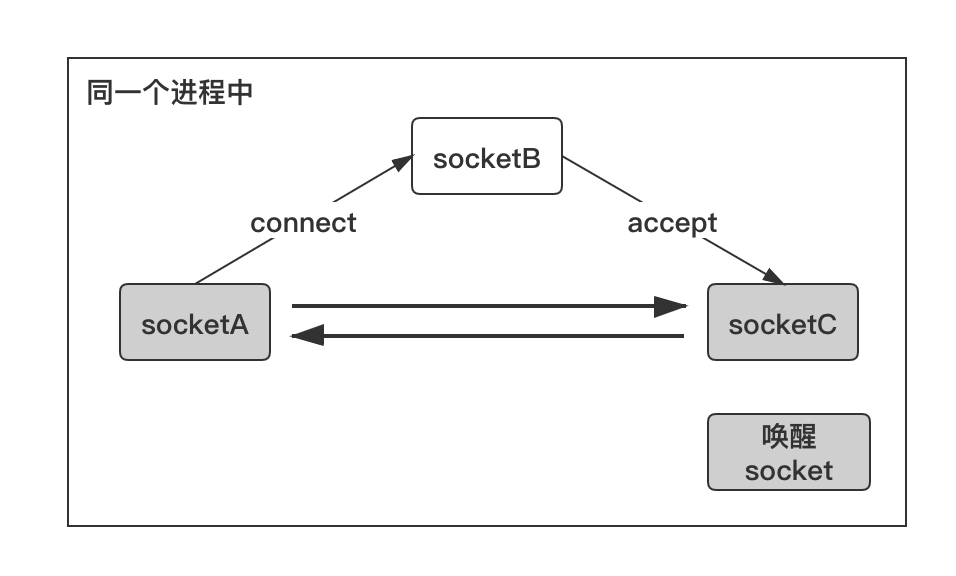
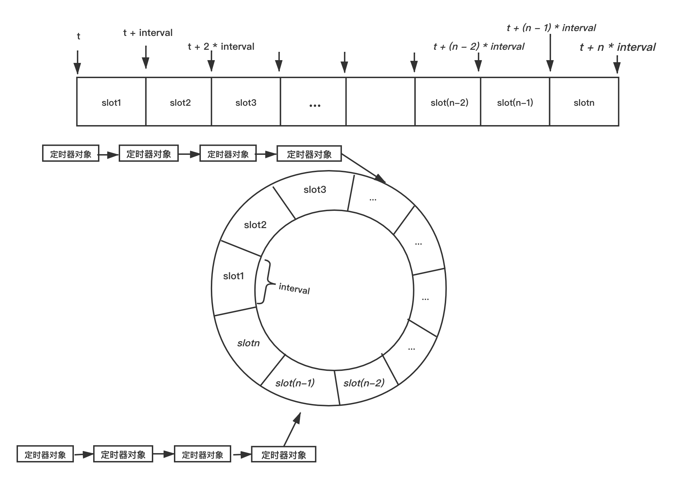

# C++基础

​	我们来学习服务器开发，首要的事情就是把基本工打好。

## IMPL方法

​	我们先来看一个经典的设计方法：impl方法。举个例子，我想要对外提供一个OCR库

```C++
class OCRPackage : public QObject
{
    Q_OBJECT;
public:
    enum class ErrorState{
        NO_ERROR,
        // config ERROR
        NO_EXECUTABLE,
        NO_SAVING_DIR,

        EMPTY_TASK,
        TASK_ALREADY_DEPATCH
    } error = ErrorState::NO_ERROR;

    enum class SupportLanguage{
        CHINESE,
        ENGLISH,
    };

    enum class Working_State{
        NO_START,
        STARTING,
        FINISH
    } working_state = OCRPackagePrivate::Working_State::NO_START;

    OCRPackagePrivate(QObject* parent = nullptr);
    OCRPackagePrivate(const OCRPackagePrivate&) = delete;
    const OCRPackagePrivate& operator=(const OCRPackagePrivate&) = delete;

    ~OCRPackagePrivate();

    void            setLanguage(SupportLanguage l){language = l;}
    SupportLanguage getLanguage(){return language;}
    void setCORE(QString path){this->exePath = path;}
    void addPic(QString pic){picLists.push_back(pic);}
    bool removePic(QString pic){return picLists.removeOne(pic);}
    void setResDir(QString dir){this->resultDir = dir;}
    bool startTasks();
    bool checkBasic();
    bool checkVadility();
    QStringList getResults(){return this->readResult;}

    bool cleanTasksAndThread();
    bool cleanAllPicsAndTasksThreads();
signals:
    // finish and ready signals are registered for the topper level
    void finish(int index);

    void ready(int index);

    void generateResult(); // TO readEachPackInfo()

    void finishAll(); // After reading signals

    void errorOccur();

private slots:

    void addFinishIndex(OCRSingtonsPackages* work); // Match the finishWork

    void readEachPackInfo();

private:
    // Path of the tessaract.exe
    QString                                         exePath;
    // Path of the place gonna save
    QString                                         resultDir;
    // Path of the pics waiting to be detected
    QStringList                                     picLists;
    // Wrapped OCR Package
    QList<OCRSingtonsPackages*>                     taskLists;
    // Threads working to get the execute
    QList<OCRWorkingThread*>                        workingThreads;
    // Current support Language
    SupportLanguage                                 language = SupportLanguage::CHINESE;
    // Packages of detections results
    QList<OCR_DetectInfo*>                          finished;
    // the strings
    QStringList                                     readResult;
    void initConnections();
    void releaseTaskLists();
    void releaseThread();
    bool constructTasks();

    // Reminder to the topper level
    void emitReady(int index);
    void emitFinish(int index);

    void sortTheOCRLists(){
        std::sort(finished.begin(), finished.end(),
        [](OCR_DetectInfo* a1, OCR_DetectInfo* a2)->bool{return a1->getIndex() < a2->getIndex();});
    }

    void setCurrentState(Working_State st){working_state = st;};
};
```

​	可以看到：这暴露了大量的实现细节，可不可以在完全不影响程序的情况下不暴露过多的信息呢？可以。

​	我们将真正的具体实现封装成Private类：

```C++
class OCRPackagePrivate;

class OCRPACKAG_EXPORT OCRPackage : public QObject
{
    Q_OBJECT; // enable signals
public:
    using TaskIndex = int;
    enum class ErrorState{
        NO_ERROR,
        // initializal error
        CORE_UNINITED,
        // config error
        NO_OCR_EXE_PATH,
        NO_SAVING_DIR_PATH,
        NO_TASK_BUT_START,
        // running time error
        TASK_ALREADY_DEPATCH,

        // UNKNOWN
        Unknown_Error,
    } error = OCRPackage::ErrorState::NO_ERROR;

    QString errorString();
    const QStringList supportedLanguageStrings{"汉语", "英语"};
    enum class LanguageOCR{
        CHINESE,
        ENGLISH
    };

    enum class ConfigMethod{
        BY_HAND_INPUT,
        BY_DIALOG_CONFIG
    };

    explicit OCRPackage(QObject* parent = nullptr);
    const OCRPackage& operator=(const OCRPackage&) = delete;
    OCRPackage(const OCRPackage&) = delete;
    ~OCRPackage();

    void        setLanguage(LanguageOCR l);
    LanguageOCR getLanguage();

    QStringList getSupportedLanguageStrings();
    bool configOCRExecutable(QString Path);
    bool configOCRSavingDirectory(QString Path);
    bool tryifIsRunnable(); // no error will be set!
    bool checkMissionStartAble(); // error will be set
    bool addSinglePic(QString pic);
    bool addMutltiPics(QStringList pics);
    bool removePicsTarget(QString pic);
    bool configExecutableOCRPath(QString path);
    bool configSavingDirPath(QString path);
    bool startRecognize();

    bool clearPackages();

    QStringList& getResult(){return results;}
    // for current state
signals:
    // emit the signals when a task is ready
    void readyTask(TaskIndex index);
    // emit the signals when a task is finish
    void finishTask(TaskIndex index);
    // emit the finish all
    void finishAll();
protected slots:
    void receiveReady(TaskIndex indexReady);
    void receiveFinish(TaskIndex indexFinish);
    void receiveFinishAll();
    void checkAndUpdateError();
private:
    OCRPackagePrivate*      privateCore = nullptr;
    QStringList             results;
    void                    initCore();
    void                    initConnections();
    bool                    isPackagePTRAvaible();
```

​	我们现在直接上面的类修改为`OCRPackagePrivate`类，这个OCRPackage只是在转发请求给实际实现他的私有类。现在，我们实际上就完成了接口和实现的分离，这样，OCRPackagePrivate的实现变化丝毫不会影响到对外的OCRPackage的作用。实际设计那些敏感的类可以如法炮制。

## 一些特性

### `std::initializer_list<T>`与统一初始化

​	我们下面来玩C++11的一个新特性：统一初始化。现在，我们可以给任何数据类型，而且是任何的无论是类变量还是局部变量一个统一的初始化方式，从而让程序书写变得简单而方便：

```c++
class Demo
{
public:
    int MyInt {3};
    std::string myString {"Sup!"};
    MyOtherClass {"Passed if", "Defined"};
}

int main()
{
    Demo d{}; 
}
```

​	他是如何实现的呢？答案是C++11引入了`std::intializer_list<T>`这种类型。

>std::initializer_list<T> 类型对象是一个访问 const T 类型对象数组的轻量代理对象。
>
>std::initializer_list 对象在这些时候自动构造：
>
>用花括号包围的初始化器列表来列表初始化一个对象，其中对应构造函数接受一个 std::initializer_list 参数
>以花括号包围的初始化器列表为赋值的右运算数，或函数调用参数，而对应的赋值运算符/函数接受 std::initializer_list 参数
>绑定花括号包围的初始化器列表到 auto，包括在范围 for 循环中
>std::initializer_list 可由一对指针或指针与其长度实现。复制一个 std::initializer_list 不会复制它对应的初始化列表的基底数组。
>
>如果声明了 std::initializer_list 的显式（全）或偏特化，那么程序非良构。

​	也就是说，我们实际上将初始化的参数视作了一个“数组”，对于那些想要接受一组相同类型的参数作为初始化的对象就可以使用`std::initializer_list`来接受之。

```c++
#incl#include <vector>
#include <initializer_list>
#include <iostream>

class MyIntVector
{
public:
	MyIntVector() = delete;
	~MyIntVector() = default;
	MyIntVector(std::initializer_list<int> l) {
		intVec.insert(intVec.end(), l);
	}

	void append(std::initializer_list<int> l) {
		intVec.insert(intVec.end(), l);
	}

	void print() {
		for (auto& each : intVec) {
			std::cout << each << ' ';
		}
		std::cout << std::endl;
	}

private:
	std::vector<int> intVec;
};

int main()
{
	MyIntVector intVec{ 1, 2, 3 };
	intVec.append({ 4, 5, 6 });
	intVec.print();
}
```

### 注解标签

​	现在在现代C++，我们有了统一的注释标签。

#### `[[noreturn]]`

​	告知这个函数没有返回值，这往往用在系统函数上从而对汇编代码进行一定的优化。

#### `[[deprecated]]`

​	遗弃的意思，也就是说这个API应当不被使用。编译器会给出警告或者是错误

```c++
#include <vector>
#include <initializer_list>
#include <iostream>

[[deprecated("Use other instead")]] void func() {
	//
}

int main()
{
	func();
}
```

​	MSVC直接抛出C4996错误表示函数已经被废弃。

#### `[[fallthrough]]`

​	`switch_case`语句下有的时候我们希望告知编译器我们的case就是连续执行的，所以我们需要添加这个标签表示我们的意图

#### `[[nodiscard]]`

​	表示我们的函数不应当被抛弃返回值，也就是强迫客户程序员一定要处理函数的返回值

#### `[[maybe_unused]]`

​	这个表示的是可能不被使用，在我们的函数参数中，可能出现一些参数实际上不被用到的情况（比如说改写子类方法的时候），为了防止编译器抛错，我们使用`maybe_unused`注解来提示编译器这个地方我们确实不需要使用这个参数。

### 类的一些新关键字

​	在C++11中多了新的一些类关键字：`final`，`override`，`=default`，`=delete` 

#### `final`

​	“最终的”，表示这个类无法被继承

```
class A final{};
```

#### `override`

​	对于那些重写了父类行为的子类方法，可以标注override来让编译器查看是否正确的重载了父类的函数。在先前就出现大量的因为错误的书写了函数名或者参数名称类型导致创建了重载函数而不是重写父类的行为。

​	现在，对于那些标注了`override`的方法，编译器会检查父类是否有这个函数，以及父类的这个函数的签命和子类这个函数的签命是否一致。

#### `=default`

​	这里指代的是让编译器给出自动的默认实现，这是对于那些经典的默认构造，拷贝构造，`operator=`以及析构函数，在之前不加有时候不会给出实现，导致链接的时候出现未定义的错误。

### auto自动类型推导

​	现在，我们可以使用auto来省略繁杂的类型书写：

**`auto`** 关键字指示编译器使用已声明变量的初始化表达式或 lambda 表达式参数来推导其类型。

在大多情况下，建议使用 **`auto`** 关键字（除非确实需要转换），因为此关键字具有以下好处：

>- **可靠性：**如果表达式的类型发生更改（包括函数返回类型发生更改的情况），它也能工作。
>- **性能：**确保不会进行转换。
>- **可用性：**不必担心类型名称拼写困难和拼写有误。
>- **效率：**代码会变得更高效。

可能不需要使用 **`auto`** 的转换情况：

- 你需要一个特定类型，任何其他类型都不行。
- 例如，在表达式模板帮助程序类型 `(valarray+valarray)` 中。

​	若要使用 **`auto`** 关键字，请使用它而不是类型来声明变量，并指定初始化表达式。 此外，还可通过使用说明符和声明符（如 **`const`**、**`volatile`**）、指针 (**`\*`**)、引用 (**`&`**) 以及右值引用 (**`&&`**) 来修改 **`auto`** 关键字。 编译器计算初始化表达式，然后使用该信息来推断变量类型。

**`auto`** 初始化表达式可以采用多种形式：

- 通用初始化语法，例如 `auto a { 42 };`。
- 赋值语法，例如 `auto b = 0;`。
- 通用赋值语法，它结合了上述两种形式，例如 `auto c = { 3.14159 };`。
- 直接初始化或构造函数样式的语法，例如 `auto d( 1.41421f );`。

当 **`auto`** 用于在基于范围的 **`for`** 语句中声明循环参数时，它使用不同的初始化语法，例如`for (auto& i : iterable) do_action(i);`。 有关详细信息，请参阅[基于范围的 `for` 语句 (C++)](https://learn.microsoft.com/zh-cn/cpp/cpp/range-based-for-statement-cpp?view=msvc-170)。

**`auto`** 关键字是类型的占位符，但它本身不是类型。 因此，**`auto`** 关键字不能用于强制转换或运算符，如 [`sizeof`](https://learn.microsoft.com/zh-cn/cpp/cpp/sizeof-operator?view=msvc-170) 和（用于 C++/CLI）[`typeid`](https://learn.microsoft.com/zh-cn/cpp/extensions/typeid-cpp-component-extensions?view=msvc-170)。


#### 有用性

**`auto`** 关键字是声明复杂类型变量的简单方法。 例如，可使用 **`auto`** 声明一个变量，其中初始化表达式涉及模板、指向函数的指针或指向成员的指针。

也可使用 **`auto`** 声明变量并将其初始化为 lambda 表达式。 您不能自行声明变量的类型，因为仅编译器知道 lambda 表达式的类型。 


#### 尾部的返回类型

您可将 **`auto`** 与 **`decltype`** 类型说明符一起使用来帮助编写模板库。 使用 **`auto`** 和 **`decltype`** 声明其返回类型取决于其模板自变量类型的函数模板。 或者，使用 **`auto`** 和 **`decltype`** 声明函数模板，该模板包装对其他函数的调用，然后返回任何返回类型的其他函数。 


#### 引用和 cv 限定符

使用 **`auto`** 会删除引用、**`const`** 限定符和 **`volatile`** 限定符。 

```cpp
// cl.exe /analyze /EHsc /W4
#include <iostream>

using namespace std;

int main( )
{
    int count = 10;
    int& countRef = count;
    auto myAuto = countRef;

    countRef = 11;
    cout << count << " ";

    myAuto = 12;
    cout << count << endl;
}
```

在前面的示例中，myAuto 是 **`int`**，而不是引用 **`int`**，因此，如果引用限定符尚未被 **`auto`** 删除，则输出为 `11 11` 而不是 `11 12`。


#### 使用括号初始值设定项 (C++14) 的类型推导

```cpp
#include <initializer_list>

int main()
{
    // std::initializer_list<int>
    auto A = { 1, 2 };

    // std::initializer_list<int>
    auto B = { 3 };

    // int
    auto C{ 4 };

    // C3535: cannot deduce type for 'auto' from initializer list'
    auto D = { 5, 6.7 };

    // C3518 in a direct-list-initialization context the type for 'auto'
    // can only be deduced from a single initializer expression
    auto E{ 8, 9 };

    return 0;
}
```

### Range-Based写法

​	我们大部分的循环都是在遍历容器，现在我们有一个更加简单的写法：

```c++
int arr[10];
// ...
for(int& i : arr){}
```

​	他就会等价于：

```
for(iterator i = arr.begin; i != arr.end; i++)
```

​	其中更加简便的是：我们直接取到的不是迭代器而就是内容，对于不加引用者这是表示的是拷贝元素出来，无法直接对容器内的对象本身进行操作，对于加引用者那就表示的是对对象本身进行操作。

​	想要对自定义的类型进行遍历，需要实现至少这两种方法：

```
Iterator begin();
Iterator end();
```

​	Iterator作为迭代器：

```
operator++
operator!=
operator*
```

​	这些操作是必须要实现的。

### 结构化绑定

​		在之前，函数想要返回多值，或者是含有多个值的类需要分解为原始的变量需要程序员手动的完成，在现在，我们支持结构化绑定之后，可以这样书写代码：

```
auto [a, b, c, ...] = expression;
auto [a, b, c, ...]{expression};
auto [a, b, c, ...](expression);
```

## 智能指针

我们今天的主题是简单的智能指针。智能指针主要有三种：`std::unique_ptr`，`std::shared_ptr`，`std::weak_ptr`，第三种被广泛认为是解决一个我们将要谈到的“循环引用”的topic服务的，我们实际上主要把目光放在前两个。

## `std::unique_ptr`

### 入门

```C++
_EXPORT_STD template <class _Ty, class _Dx /* = default_delete<_Ty> */>
class unique_ptr { // non-copyable pointer to an object
public:
    using pointer      = typename _Get_deleter_pointer_type<_Ty, remove_reference_t<_Dx>>::type;
    using element_type = _Ty;
    using deleter_type = _Dx;

    template <class _Dx2 = _Dx, _Unique_ptr_enable_default_t<_Dx2> = 0>
    constexpr unique_ptr() noexcept : _Mypair(_Zero_then_variadic_args_t{}) {}

    template <class _Dx2 = _Dx, _Unique_ptr_enable_default_t<_Dx2> = 0>
    constexpr unique_ptr(nullptr_t) noexcept : _Mypair(_Zero_then_variadic_args_t{}) {}
```

​	如MSVC所见，这就是你锁定到的定义，但是有些复杂，我们回到cpp_reference来看看：

```C++
template<
    class T,
    class Deleter = std::default_delete<T>
> class unique_ptr;
template <
    class T,
    class Deleter
> class unique_ptr<T[], Deleter>;
```

​	清晰了：实际上，这个unique_ptr就是一个负责托管资源的类。它需要一个实际的类和可能的删除器来实例化对象。举个例子：

```
#include <memory>
#include <vld.h>	// 自行寻找vld库
#include <iostream>
int main()
{
	int* leak = new int;
}
```

​	在C++11之前，我们可能会写出这样的代码：你立马反应过来，有问题！内存泄漏了！

​	为此，我引入vld检测小工具，马上就得到了证实：

```
Visual Leak Detector read settings from: D:\VLD\Visual Leak Detector\vld.ini
Visual Leak Detector Version 2.5.1 installed.
WARNING: Visual Leak Detector detected memory leaks!
---------- Block 1 at 0x0000000055796C60: 4 bytes ----------
  Leak Hash: 0x67B77119, Count: 1, Total 4 bytes
  Call Stack (TID 16744):
  Data:
    CD CD CD CD                                                  ........ ........
```

​	泄漏了一个int，符合我们的预期。现在，我们让他交给一个智能指针进行托管：

```C++
int main()
{
	int* leak = new int;
	std::unique_ptr<int> no_more_leak(leak);
}
```

​	现在不会泄漏了！

```
Visual Leak Detector read settings from: D:\VLD\Visual Leak Detector\vld.ini
Visual Leak Detector Version 2.5.1 installed.
No memory leaks detected.
Visual Leak Detector is now exiting.
```

​	由此可以看见，`std::unique_ptr`就是一个可以自动执行析构的内存管理类。换而言之，他会在这个变量应该结束声明周期的时候自动结束所托管资源的生命。

​	我们还没有结束话题！仔细看看：

```C++
template<
    class T,
    class Deleter = std::default_delete<T>
> class unique_ptr;
```

​	我们还有一个Deleter没有谈到！这个Deleter就是我们用户自己定义的Deleter。毕竟，当我们的资源很简单但是需要在删除的时候做处理时，就没有必要单独封装了。举个例子

```C++
#include <memory>		// std::unique_ptr
#include <vld.h>
#include <iostream>		// std::cout
#include <functional> 	// std::function
using MyIntDeleter = std::function<void(int*)>;

void deleter(int* be_del)
{
	std::cout << "将要删除指针:> " << be_del << ", 资源值是:> " << *be_del << "\n";
	delete be_del;
}

int main()
{
	
	int* leak = new int;
	std::unique_ptr<int, MyIntDeleter> no_more_leak(leak, deleter);
	*no_more_leak = 114514;
}
```

​	看看效果：

```
Visual Leak Detector read settings from: D:\VLD\Visual Leak Detector\vld.ini
Visual Leak Detector Version 2.5.1 installed.
将要删除指针:> 0000029931EA1750, 资源值是:> 114514
No memory leaks detected.
Visual Leak Detector is now exiting.
```

> 需要注意：
>
> ```C++
> 	int* leak = new int;
> 	*leak = 114514;
> 	std::unique_ptr<int, MyIntDeleter> no_more_leak(leak, deleter);
> 	delete leak; // is Legal ?
> ```
>
> 是不可行的，这里当我们托管了指针之后，就不要在使用原始指针去操作数据了！否则程序就会因为二次释放而崩溃！因此，一个合适的使用智能指针的方式是：
>
> ```C++
> std::unique_ptr<int, MyIntDeleter> no_more_leak(new int, deleter); // 尽可能不给外界提供原始操作接口
> *no_more_leak = ...;
> ```

​	这样行不行呢？

```
	int* leak = new int;
	std::unique_ptr<int, MyIntDeleter> no_more_leak = leak; // Is Legal?
	*no_more_leak = 114514;
```

​	不行！`std::unique_ptr`是一个独占性的资源管理器！另一个说法是：`unique_ptr` 不共享它的指针。它无法复制到其他 `unique_ptr`，自然也就没办法无法通过值传递到函数，也无法用于需要副本的任何标准模板库 (STL) 算法。只能移动`unique_ptr` 。这意味着，内存资源所有权将转移到另一个 `unique_ptr` ，并且原始 `unique_ptr`  不再拥有此资源。一言以蔽之：对于一个实例，只允许有一个资源管理器在管理它！

​	于是，在原始指针和智能指针之间，只存在直接的赋值：

```
std::unique_ptr<int, MyIntDeleter> no_more_leak = leak; // Is illegal
std::unique_ptr<int, MyIntDeleter> no_more_leak = std::move(leak); // Is illegal

std::unique_ptr<int, MyIntDeleter> no_more_leak(leak); // legal
std::unique_ptr<int, MyIntDeleter> no_more_leak(std::move(leak)); // legal, and is more obvious for readers that the function calls the move_constructor of the sources
```

​	但是，我们可以在智能指针之间便捷的使用等号进行资源管理的传递！注意到：我们的资源托管是独占的，意味着直接使用operator=和复制构造是不可能的！（`=delete`）

```C++ 
std::unique_ptr<int, MyIntDeleter> no_more_leak(leak, deleter);
std::unique_ptr<int, MyIntDeleter> no_more_leak_other = no_more_leak; // Error
std::unique_ptr<int, MyIntDeleter> no_more_leak_other(no_more_leak); // Error
```

​	怎么办？那就std::move手动告知我们是移动资源即可

```C++
std::unique_ptr<int, MyIntDeleter> no_more_leak_other(std::move(no_more_leak));
std::unique_ptr<int, MyIntDeleter> no_more_leak_other = std::move(no_more_leak);
```

​	现在，我们就可以将资源的管理权进行移动了！这样我们就实现了资源管理的传递性。

```
	std::unique_ptr 实现了独享所有权的语义。一个非空的 std::unique_ptr 总是拥有它所指向的资源。转移一个 std::unique_ptr 将会把所有权也从源指针转移给目标指针（源指针被置空）。拷贝一个 std::unique_ptr 将不被允许，因为如果你拷贝一个 std::unique_ptr ,那么拷贝结束后，这两个 std::unique_ptr 都会指向相同的资源，它们都认为自己拥有这块资源（所以都会企图释放）。因此 std::unique_ptr 是一个仅能移动（move_only）的类型。当指针析构时，它所拥有的资源也被销毁。默认情况下，资源的析构是伴随着调用 std::unique_ptr 内部的原始指针的 delete 操作的。
```

### API

#### 构造

​	我们如何产生一个unique_ptr实例呢？答案是：使用默认的构造：也就是当前的unique_ptr不托管任何对象

```
std::unique_ptr<int, MyIntDeleter> no_more_leak;
```

​	这就是一个例子！当前的no_more_leak不会托管任何对象。或者是为他给予一个可以被移动的类型（就比如说一个int!他当然可以被移动！）

```C++
int* leak = new int;
std::unique_ptr<int, MyIntDeleter> no_more_leak(leak, deleter);
```

​	或者：使用std::move来移动另一个智能指针。

```C++
std::unique_ptr<int, MyIntDeleter> no_more_leak_other(std::move(no_more_leak));
std::unique_ptr<int, MyIntDeleter> no_more_leak_other = std::move(no_more_leak);
```

​	在C++14中（据说是标准会那帮人忘记加了（大雾.png）），可以使用make_unique来返回一个独占的智能指针

```C++
_EXPORT_STD template <class _Ty, class... _Types, enable_if_t<!is_array_v<_Ty>, int> = 0>
_NODISCARD_SMART_PTR_ALLOC _CONSTEXPR23 unique_ptr<_Ty> make_unique(_Types&&... _Args) { // make a unique_ptr
return unique_ptr<_Ty>(new _Ty(_STD forward<_Types>(_Args)...));
}
```

​	实际上是：

```
template< class T, class... Args >
unique_ptr<T> make_unique( Args&&... args );
```

​	也就是说：我们可以在C++14及以上使用这个函数返回智能指针了。

​	在另一方面，智能指针支持对一个原始数组的管理。这里我们不重复上面的陈述了，只需要这样使用就可以管理一个数组：

```
using MyIntDeleter = std::function<void(int[])>;

void deleter(int be_del[] )
{
	std::cout << "将要删除指针:> " << be_del << "\n";
	delete[] be_del;
}

int main()
{
	std::unique_ptr<int[], MyIntDeleter> h(new int[10], deleter);
	for (int i = 0; i < 10; i++)
		h[i] = i; // Make Write
}
```

#### 修改

​	修改主要使用的是三个API：

```
// 释放管理器对资源的管理
pointer release() noexceptpointer release() noexcept 
// 替换被管理对象
void reset( pointer ptr = pointer() ) noexcept;
template< class U >
void reset( U ptr ) noexcept;
void reset( std::nullptr_t = nullptr ) noexcept;
// 交换 *this 和另一 unique_ptr 对象 other 的被管理对象和关联的删除器。
void swap( unique_ptr& other ) noexcept;
```

​	先看第一个：释放管理。release也就是这个意思。**注意：他不会删除被管理的资源，单纯只是解除了管理关系**，如果不知道怎么删，那就`get_deleter()`删除。

```C++
using IntDeleter = std::function<void(int*)>;

void make_del(int* ptr) {
	std::cout << "Del Int" << ptr << " :" << *ptr;
	delete ptr;
}

int main()
{
	std::unique_ptr<int, IntDeleter> intHandle(new int, make_del);
	*intHandle = 110;
	intHandle.get_deleter()(intHandle.release()); // 一个紧凑的写法
}
```

​	下一个就是reset了：reset自如其名：就是重置管理的资源。他比release做了一个进一步的工作：就是释放原先的资源，然后再去托管新的资源

```c++
using IntDeleter = std::function<void(int*)>;

void make_del(int* ptr) {
	std::cout << "Del Int" << ptr << " :" << *ptr << "\n";
	delete ptr;
}

int main()
{
	std::unique_ptr<int, IntDeleter> intHandle(new int, make_del);
	*intHandle = 110;
	intHandle.reset(new int);
	*intHandle = 220;
}
```

```
Visual Leak Detector read settings from: D:\VLD\Visual Leak Detector\vld.ini
Visual Leak Detector Version 2.5.1 installed.
Del Int000001C5F36A27B0 :110
Del Int000001C5F36A2F30 :220
No memory leaks detected.
Visual Leak Detector is now exiting.
```

​	程序首先接受了初始的资源并使用，在reset的流程中删除了旧的资源，转向托管新的资源。

​	最后一个是swap，说的是两个智能指针之间交换托管资源：

```c++
using IntDeleter = std::function<void(int*)>;

void make_del(int* ptr) {
	std::cout << "Del Int" << ptr << " :" << *ptr << "\n";
	delete ptr;
}

int main()
{
	std::unique_ptr<int, IntDeleter> intHandle(new int, make_del);
	std::unique_ptr<int, IntDeleter> intHandle2(new int, make_del);
	*intHandle = 110;
	*intHandle2 = 220;
	std::cout << "IntHandle handles:> " << intHandle.get() << "with value:> " << *intHandle << "\n";
	std::cout << "IntHandle2 handles:> " << intHandle2.get() << "with value:> " << *intHandle2 << "\n";
	intHandle.swap(intHandle2);
	std::cout << "IntHandle handles:> " << intHandle.get() << "with value:> " << *intHandle << "\n";
	std::cout << "IntHandle2 handles:> " << intHandle2.get() << "with value:> " << *intHandle2 << "\n";
}
```

​	很简单，他会交换两个智能指针所托管的资源。注意到资源地址没有改变，是在内存层面交换值而不是简单的交换地址。

```
Visual Leak Detector read settings from: D:\VLD\Visual Leak Detector\vld.ini
Visual Leak Detector Version 2.5.1 installed.
IntHandle handles:> 00000140C0A511F0with value:> 110
IntHandle2 handles:> 00000140C0A50EF0with value:> 220
IntHandle handles:> 00000140C0A50EF0with value:> 220 // 资源地址没变，但是值变了
IntHandle2 handles:> 00000140C0A511F0with value:> 110
Del Int00000140C0A511F0 :110
Del Int00000140C0A50EF0 :220
No memory leaks detected.
Visual Leak Detector is now exiting.
```

#### 资源观察器

​	这里，我们将会讨论的是智能指针这个管理器内部的参数是如何被获取的。有三个API：

```C++
    _NODISCARD _CONSTEXPR23 _Dx& get_deleter() noexcept {
        return _Mypair._Get_first();
    }

    _NODISCARD _CONSTEXPR23 const _Dx& get_deleter() const noexcept {
        return _Mypair._Get_first();
    }

    _NODISCARD _CONSTEXPR23 pointer get() const noexcept {
        return _Mypair._Myval2;
    }

    _CONSTEXPR23 explicit operator bool() const noexcept {
        return static_cast<bool>(_Mypair._Myval2);
    }
```

​	MSVC的实现很简单，他就是使用一个Pair实现的智能指针：有趣的是，这个智能指针的内部资源就是智能指针本身在托管，很有趣的实现。

```
    template <class, class>
    friend class unique_ptr;
    _Compressed_pair<_Dx, pointer> _Mypair;
```

​	首先我们要说的是`get()`,返回指向被管理对象的指针，如果无被管理对象，则为 nullptr。另一个就是我上面他提到的`get_deleter`返回删除器。注意到，对于没有安装删除器（初始化的时候没有指定删除器）的智能指针返回空。

```
explicit operator bool() const noexcept;
```

​	当然，他也可以返回bool：检查 *this 是否占有对象，即是否有 get() != nullptr。

​	剩下的实在是很好解决了：那些重载运算符同你一般的使用指针是完全一致的。

​	以上就是独占式的智能指针常见的API。

我们前一篇博客提到了`std::unique_ptr`，我们称呼他是一个独占性质的管理资源的资源管理器。现在，我们来看一下`std::shared_ptr`和为了解决`std::shared_ptr`存在的潜在缺陷（本质上是引用计数的缺陷）而派生的`std::weak_ptr`

​	这次为了更好的展示，我们使用一个demo资源类：

```
class Special
{
public:
	Special() {
		std::cout << "Create Class Instances Special!" << std::endl;
	}

	~Special() {
		std::cout << "delete Class Instances Special!" << std::endl;
	}
private:
	int sources;
};
```

## `std::shared_ptr` 入门

​	结合上一篇博客，我们知道，智能指针可以自动的在资源的声明周期结束之后进行析构。`std::shared_ptr`作为智能指针的一种，自然也是如此：

```
int main()
{
	std::shared_ptr<Special> shared(new Special);
}
```

​	没有任何意外：

```
Visual Leak Detector read settings from: D:\VLD\Visual Leak Detector\vld.ini
Visual Leak Detector Version 2.5.1 installed.
Create Class Instances Special!
delete Class Instances Special!
No memory leaks detected.
Visual Leak Detector is now exiting.
```

​	但是首先，我们看到的是：`shared_ptr`是可以shared它的资源的。代价就是`use_count++`

```
int main()
{
	std::shared_ptr<Special> shared(new Special);
	std::shared_ptr<Special> other_shared(shared);
	std::cout << "Current sources is handling for " << shared.use_count() << " times\n";
}
```

```
Visual Leak Detector read settings from: D:\VLD\Visual Leak Detector\vld.ini
Visual Leak Detector Version 2.5.1 installed.
Create Class Instances Special!
delete Class Instances Special!
No memory leaks detected.
Visual Leak Detector is now exiting.
```

​	可以看到，使用这个指针来指向资源，不发生拷贝行为，相反，只是将它的use_count（引用计数，用来记载有多少个指针此时正在把控这个资源）增加，（这里不放源码了，这里的shared_ptr实现是继承了`_ptr_base`的，这里是更改了父类的计数）

```
Visual Leak Detector read settings from: D:\VLD\Visual Leak Detector\vld.ini
Visual Leak Detector Version 2.5.1 installed.
Create Class Instances Special!
Current sources is handling for 2 times
delete Class Instances Special!
No memory leaks detected.
Visual Leak Detector is now exiting.
```

​	你可以看到，我们在第一行指定了一个资源管理器管理一个资源:`new Special`这样一个右值。在第二行又要求另一个资源管理器管理同一个资源（如你所见，就是调用拷贝函数）。我们的程序仍然正确的释放了资源，这是因为shared或者是other_shared被释放的时候，当use_count不是0的时候就减去一个use_count，减到0的时候就会自动释放

```C++
    void _Decref() noexcept { // decrement use count
        if (_MT_DECR(_Uses) == 0) { 
        // #define _MT_DECR(x) _INTRIN_ACQ_REL(_InterlockedDecrement)(reinterpret_cast<volatile long*>(&x)), 也就是原子的减，调用的是CPU命令当中集成的原子减指令，这是为了防止形成竞态
            _Destroy(); // 删除资源
            _Decwref();
        }
    }
```

​	其他的部分让我们看看API就好了：

## `std::shared_ptr's API`

### 构造

​	当然可以生成默认的构造：此时此刻，我们的`std::shared_ptr`就是空的，不托管任何资源

```
std::shared_ptr<Special> shared;
```

​	或者是托管一个裸指针：

```
std::shared_ptr<Special> shared(new Special);
```

​	或者是调用拷贝函数，

```
	std::shared_ptr<Special> shared(new Special);
	std::shared_ptr<Special> other_shared(shared);
```

​	亦或者是移动函数：

```
	std::shared_ptr<Special> shared(new Special);
	std::shared_ptr<Special> other_shared(std::move(shared));
	std::cout << "Current sources is handling for " << shared.use_count() << " times by shared\n";
	std::cout << "Current sources is handling for " << other_shared.use_count() << " times by other_shared\n";
```

​	结合你对移动构造的认识，你马上就会意识到：调用移动函数本质上就是更换资源托管器。这也正是它的作用。

​	我们得到`shared_ptr`的另一种更加可行的方式是：make_shared

```C++
std::make_shared<Special>(/*nullptr or set nothing to get a default shared_ptr*/);
std::make_shared<Special>(new Special); // wrapped a raw pointer
std::make_shared<Special>(other_shared); // copy a shared_ptr
```

​	通过这种方式也可以获得`shared_ptr`

> 这里插一句：使用这些智能指针访问就跟我们使用裸指针一样，使用`->`访问资源，`.`在这里则是表示对资源管理器自身进行操作。

### 修改器

​	就是这两个：

| [reset](https://zh.cppreference.com/w/cpp/memory/shared_ptr/reset) | 替换所管理的对象 (公开成员函数) |
| ------------------------------------------------------------ | ------------------------------- |
| [swap](https://zh.cppreference.com/w/cpp/memory/shared_ptr/swap) | 交换所管理的对象 (公开成员函数) |

​	这里跟`unique_ptr`在功能上类似，这里如果只是希望查看这两个函数可以做什么的可以参考我的上一篇博客：[C++ 智能指针-CSDN博客](https://blog.csdn.net/charlie114514191/article/details/136489270)。这里只是给出Demo。相信可以一目了然：

> reset空

```c++
void showUseCount_And_Reset()
{
	// 创建一个智能指针，让他托管
	std::shared_ptr<Special> spPtr(new Special);
	std::cout << spPtr.use_count() << std::endl;
	spPtr->setSources(100);
	spPtr.reset(); // set as nullptr, in other words, sources are released
	std::cout << spPtr.use_count() << std::endl;
}
```

```
Visual Leak Detector read settings from: D:\VLD\Visual Leak Detector\vld.ini
Visual Leak Detector Version 2.5.1 installed.
Create Class Instances Special!
1
delete Class Instances Special!
The sources of 00000159ADF00A60's value is:> 100
0
No memory leaks detected.
Visual Leak Detector is now exiting.
```

> reset另一个资源

```c++
void showUseCount_And_Reset()
{
	// 创建一个智能指针，让他托管
	std::shared_ptr<Special> spPtr(new Special);
	std::cout << spPtr.use_count() << std::endl;
	spPtr->setSources(100); 
	spPtr.reset(new Special);
	spPtr->setSources(200);
	std::cout << spPtr.use_count() << std::endl;
}
```

```
Visual Leak Detector read settings from: D:\VLD\Visual Leak Detector\vld.ini
Visual Leak Detector Version 2.5.1 installed.
Create Class Instances Special!
1
Create Class Instances Special!
delete Class Instances Special!
The sources of 000002403FB20AE0's value is:> 100
1
delete Class Instances Special! // reset here
The sources of 000002403FB20DA0's value is:> 200
No memory leaks detected.
Visual Leak Detector is now exiting.
```

```C++
void showUseCount_And_Reset()
{
	std::shared_ptr<Special> sp(new Special);
	sp->setSources(100);
	// 创建多个资源管理同时管理同一个资源：
	std::shared_ptr<Special> sp2 = sp;
	std::shared_ptr<Special> sp3 = sp;
	std::cout << sp.use_count() << std::endl;
	std::cout << sp2.use_count() << std::endl;
	std::cout << sp3.use_count() << std::endl;

	// 资源发生变动
	sp.reset(new Special);
	sp->setSources(200);
	std::cout << "sp2:> " << sp2->getSources() << std::endl;
	std::cout << "sp3:> " << sp3->getSources() << std::endl; 
}
```

```
Visual Leak Detector read settings from: D:\VLD\Visual Leak Detector\vld.ini
Visual Leak Detector Version 2.5.1 installed.
Create Class Instances Special!
3
3
3
Create Class Instances Special!
sp2:> 100
sp3:> 100
delete Class Instances Special!
The sources of 0000023F58B505E0's value is:> 100
delete Class Instances Special!
The sources of 0000023F58B501E0's value is:> 200
No memory leaks detected.
Visual Leak Detector is now exiting.
```

​	这个例子存在输出的竞态，实际上，仍然是释放了资源之后再去接受新的资源。其他的获取器API同`unique_ptr`差不多，这里不再赘述了

## `weak_ptr`入门

​	引用计数存在天然的缺陷！

​	我们知道：我们现在做出的假定是：资源管理器自己不会称为一个被管理的资源。什么意思呢？我们看看一个资源管理的逻辑图就知道了：

​	这是`unique_ptr`的资源逻辑管理示意图：我们看到了资源和管理器是一一映射的

```
ManagerA < - > A
ManagerB < - > B
ManagerC < - > C
```

​	这是`shared_ptr`的资源逻辑管理示意图：我们看到了资源和管理器是多对一映射的。

```
ManagerA < - > A
ManagerB < - > A
ManagerC < - > A
```

​	换而言之，我们的资源逻辑图不会出现一个环状的结构。什么是一个环状的结构呢？我们来看一个例子：

```
ManagerA < - > ManagerB
ManagerB < - > ManagerA
```

​	这个步骤单纯的依靠管理器本身初始化做不到，需要我们手动的构造以下场景：

```C++
class Special_HolderII;

class Special_HolderI
{
public:
	std::shared_ptr<Special_HolderII> sp;
	~Special_HolderI() {
		std::cout << "Special Holder I is released" << std::endl;
	}
};

class Special_HolderII
{
public:
	std::shared_ptr<Special_HolderI> sp;
	~Special_HolderII() {
		std::cout << "Special Holder II is released" << std::endl;
	}
};
```

​	你可以看到，我们的管理对象里包含了对方！这里就是导致潜在漏洞的点！我们初始化：

```C++
	std::shared_ptr<Special_HolderI>	sh1(new Special_HolderI);
	std::shared_ptr<Special_HolderII>	sh2(new Special_HolderII);
```

​	上面的代码首先声明了两个独立的shared_ptr，分别托管了这样的资源示意图：


​	两个圆圈就是两个shared_ptr，现在他们分别托管`Special_HolderI`和`Special_HolderII`，这两个资源管理器本身没有耦合！现在为止，我们在外部操作了两个智能指针托管资源让他们的引用计数为1

```c++
	// I
	std::cout << "sh1's use_count: " << sh1.use_count() << std::endl;
	std::cout << "sh2's use_count: " << sh2.use_count() << std::endl;
```

​	现在，我们操作资源，让资源耦合资源管理器，以一种奇怪的方式再次增加：

```
	sh1->sp = sh2;
	sh2->sp = sh1;
```

​	这是在干什么？仔细思考走完上面这两步的后果：我们的sh1托管一个资源管理器（他是属于sh1的）被赋值以sh2他所托管的对象（第一句的作用），而sh2托管的`Special_HolderI`类型的对象是就是sh1（第二句的作用）

​	同理：我们的sh2托管一个资源管理器（他是属于sh2的）被赋值以sh1他所托管的对象（第二句的作用），而sh1托管的`Special_HolderII`类型的对象是就是sh2（第一句的作用）

​	等等，这是**不同的智能指针**托管同一个对象。所以，我们一经发现这是同一个对象，不会释放自己handle的资源而是简单的增加引用计数。

​	现在构成了这样的一个图：


```
	// II
	std::cout << "sh1's use_count: " << sh1.use_count() << std::endl; // 2
	std::cout << "sh2's use_count: " << sh2.use_count() << std::endl; // 2
```

​	还不懂？？有点绕？我再重复一次！第一次我们的外部智能指针分别托管了对方类型的资源，让资源的引用数为1了。第二次我们操纵他们所托管的资源内部的智能指针托管**外部指针托管的对象（包含了他们自身的资源）**。这样，我们走一次逻辑链就会发现，第一次我们在**资源管理器的层次（资源外部）**上让A托管了B的资源，B托管了A的资源。第二次我们的赋值，则是在**资源层次**让资源内部的智能指针重复我们所作的事情。也就是在资源层次上让A托管了B的资源，B托管了A的资源。强行让编译器认为我们是在操作不同的指针指向同一个资源而不是实际上的同一个（同一个指针多次指向同一个资源当然不会增加引用计数）

​	这也被叫做shared_ptr的死锁。当我们释放的时候，触发了sh1和sh2的析构，进而准备释放成员。


​	现在Extern SH1和Extern SH2释放，引用计数被减1了，但是还有资源内部耦合没有被解除：**对象是动态分配的，而对象本身又含有shared_ptr指针，释放对象需要shared_ptr的释放使引用计数减为零，而shared_ptr的释放又需要对象的释放，两者互相等待对方先释放，往往是两者都无法释放。**

```
Visual Leak Detector read settings from: D:\VLD\Visual Leak Detector\vld.ini
Visual Leak Detector Version 2.5.1 installed.
sh1's use_count: 1
sh2's use_count: 1
sh1's use_count: 2
sh2's use_count: 2
WARNING: Visual Leak Detector detected memory leaks!
---------- Block 2 at 0x0000000007774F60: 24 bytes ----------
  Leak Hash: 0x386B91B3, Count: 1, Total 24 bytes
  Call Stack (TID 28472):
  Data:
    70 DE F3 EF    F7 7F 00 00    01 00 00 00    01 00 00 00     p....... ........
    90 B6 77 07    C1 01 00 00                                   ..w..... ........


---------- Block 4 at 0x00000000077752C0: 24 bytes ----------
  Leak Hash: 0x1142308C, Count: 1, Total 24 bytes
  Call Stack (TID 28472):
  Data:
    A0 DE F3 EF    F7 7F 00 00    01 00 00 00    01 00 00 00     ........ ........
    20 BD 77 07    C1 01 00 00                                   ..w..... ........


---------- Block 1 at 0x000000000777B690: 16 bytes ----------
  Leak Hash: 0x9A5D80CF, Count: 1, Total 16 bytes
  Call Stack (TID 28472):
  Data:
    20 BD 77 07    C1 01 00 00    C0 52 77 07    C1 01 00 00     ..w..... .Rw.....


---------- Block 3 at 0x000000000777BD20: 16 bytes ----------
  Leak Hash: 0xE93075EF, Count: 1, Total 16 bytes
  Call Stack (TID 28472):
  Data:
    90 B6 77 07    C1 01 00 00    60 4F 77 07    C1 01 00 00     ..w..... `Ow.....


Visual Leak Detector detected 4 memory leaks (288 bytes).
Largest number used: 288 bytes.
Total allocations: 288 bytes.
Visual Leak Detector is now exiting.
```

​	这样就泄漏了。

​	如何解决呢？答案是使用`weak_ptr`

​	根本原因在于：我们总是强耦合的管理资源，匆匆的宣布自己负责托管它。但是事实上过于急躁的宣布自己的所属权可能会导致死锁。

​	我们试想：如果我们可以在我们真正需要访问并且资源的时候在增加引用计数，而只是声明我跟资源有关系的时候不增加引用计数，这样我们就回避了过早的增加计数导致死锁的问题了。

​	weak_ptr正是这样的：

```c++
class Special_HolderII;

class Special_HolderI
{
public:
	std::shared_ptr<Special_HolderII> sp;
	~Special_HolderI() {
		std::cout << "Special Holder I is released" << std::endl;
	}
};

class Special_HolderII
{
public:
	std::weak_ptr<Special_HolderI> sp;
	~Special_HolderII() {
		std::cout << "Special Holder II is released" << std::endl;
	}
};


int main()
{
	std::shared_ptr<Special_HolderI>	sh1(new Special_HolderI);
	std::shared_ptr<Special_HolderII>	sh2(new Special_HolderII);
	// I
	std::cout << "sh1's use_count: " << sh1.use_count() << std::endl;
	std::cout << "sh2's use_count: " << sh2.use_count() << std::endl;
	sh1->sp = sh2;
	sh2->sp = sh1; // 这里只是声明我很资源有关系但是可能不打算使用，不增加计数
	// II
	std::cout << "sh1's use_count: " << sh1.use_count() << std::endl;
	std::cout << "sh2's use_count: " << sh2.use_count() << std::endl;
}
```

```
Visual Leak Detector read settings from: D:\VLD\Visual Leak Detector\vld.ini
Visual Leak Detector Version 2.5.1 installed.
sh1's use_count: 1
sh2's use_count: 1
sh1's use_count: 1
sh2's use_count: 2
Special Holder I is released
Special Holder II is released
No memory leaks detected.
Visual Leak Detector is now exiting.
```

​	值得注意的是：weak_ptr因为只是声明有关系，没办法真正有权利访问资源，需要使用API进行转化。这里就开始介绍：

## `std::weak_ptr's API`

​	std::weak_ptr支持拷贝和移动，以及从一个强管理的shared_ptr中派生，但是不支持默认的构造。也就是说它完全是shared_ptr的附属物，依靠shared_ptr生存。

​	使用`lock`来获取真正可以管理的实例对象：

```
创建共享被管理对象的所有权的新 std::shared_ptr 对象。若无被管理对象，即 *this 为空，则返回的 shared_ptr 也为空。相当于返回 expired() ? shared_ptr<T>() : shared_ptr<T>(*this)，原子地执行。
```

​	使用`expire`来检查我们的`weak_ptr`是否合法！

```
等价于 use_count() == 0。可能仍未对被管理对象调用析构函数，但此对象的析构已经临近（或可能已发生）。
```

> 使用weak_ptr的场景是：当**两个对象相互使用一个shared_ptr成员变量指向对方，会造成循环引用，使引用计数失效，从而导致内存泄漏。**
>
> 这是因为：weak_ptr 是一种不控制对象生命周期的智能指针, 它指向一个 shared_ptr 管理的对象. weak_ptr只是提供了对管理对象的一个访问手段。weak_ptr 设计的目的是为配合 shared_ptr 而引入的一种智能指针来协助 shared_ptr 工作, 它只可以从一个 shared_ptr 或另一个 weak_ptr 对象构造, 它的构造和析构不会引起引用记数的增加或减少。weak_ptr是用来解决shared_ptr相互引用时的死锁问题,如果说两个shared_ptr相互引用,那么这两个指针的引用计数永远不可能下降为0,资源永远不会释放。它是对对象的一种弱引用，不会增加对象的引用计数，


参考网站：

[cppreference.com](https://zh.cppreference.com/w/首页)

# 多线程编程资源同步

## 线程的几个基本问题

### I

​	在Windows下的主线程的退出，标志着其他的支线程也会退出！也就是说那些正打算工作的线程或者是已经开始工作的线程也将会停止工作而被回收所有的线程。

​	在Linux下则是相反：工作线程并不会因为主线程的退出而受到任何影响。但是这个时候，我们的子线程就会成为僵尸线程。

### II

​	子线程的奔溃，一般而言并不会导致整个程序跟随崩溃。但是，如果这个线程产生的是Segmant Fault这个信号，那么整个程序就会崩溃。

## 线程的基本操作

​	在Linux下，线程的创建：

```c
#include <pthread.h>
int pthread_create(pthread_t *tid, const pthread_attr_t *restrict attr, void *(*start_rtn)(void *), void *restrict arg);
// 返回：若成功返回0，否则返回错误编号
```

​	这个函数将会创建一个线程，其中，我们的线程句柄是从tid里捞出来的。当我们创建了线程的时候，这个线程就会跑起来了。

​	在Windows下：[**CreateThread**](https://learn.microsoft.com/zh-cn/windows/win32/api/processthreadsapi/nf-processthreadsapi-createthread) 函数为进程创建新线程。 创建线程必须指定新线程要执行的代码的起始地址。 此函数采用单个参数并返回 **DWORD** 值。 一个进程可以有多个线程同时执行同一函数。

```c
HANDLE CreateThread(
  [in, optional]  LPSECURITY_ATTRIBUTES   lpThreadAttributes,
  [in]            SIZE_T                  dwStackSize,
  [in]            LPTHREAD_START_ROUTINE  lpStartAddress,
  [in, optional]  __drv_aliasesMem LPVOID lpParameter,
  [in]            DWORD                   dwCreationFlags,
  [out, optional] LPDWORD                 lpThreadId
);
```

​	不过在现在，就没有必要去使用这些原生的API了，在C++11中，有标准库的`std::thread`，不过这些thread也是一旦创建就会开始执行。注意到：线程创建之后需要指定其在生存期间内有效：

```c++
#include <thread>

void pFunc()
{
	printf("Hello, world");
}

void demo(){
	std::thread t(pFunc);
}

int main()
{
	demo();
	while(1);
}
```

​	上面的代码一旦执行就会崩溃：原因是函数一旦执行完毕线程对象被销毁但是线程还在跑，造成了代码内部的非法访问。一个合理的解决办法是：

```c
#include <thread>

void pFunc()
{
	printf("Hello, world");
}

void demo(){
	std::thread t(pFunc);
	t.detach(); // 分离自跑自的
}

int main()
{
	demo();
	while(1);
}
```

​	再者就是join了，这里可以查看专门的语法学习。

​	常见的封装就是将Thread和它所需要的参数进行封装。

## Linux线程的同步对象

​	Linux互斥体的用法和Windows的临界区对象用法很相似，一般也是通过限制多个线程同时执行某段代码来达到保护资源的目的。和接下来要介绍的信号量、条件变量一样，Linux互斥体都实现在 NPTL （Native POSIX Thread Library）。在NPTL中我们使用数据结构**pthread_mutex_t**来表示一个互斥体对象（定义于**pthread.h**头文件中）。互斥体对象我们可以使用两种方式来初始化：

- 使用PTHREAD_MUTEX_INITIALIZER直接给互斥体变量赋值
  示例代码如下：

```text
#include <pthread.h>
pthread_mutex_t mymutex = PTHREAD_MUTEX_INITIALIZER;
```

- 使用**pthread_mutex_init**函数初始化

​	如果互斥体是动态分配的或者需要给互斥体设置属性，则需要使用**pthread_mutex_init**函数来初始化互斥体，这个函数的签名如下：

```text
xxxxxxxxxx int pthread_mutex_init(pthread_mutex_t* restrict mutex,              const pthread_mutexattr_t* restrict attr);	
```

​	参数**mutex**即我们需要初始化的 mutex 对象的指针，参数**attr**是需要设置的互斥体属性，通常情况下，我们使用默认属性可以将这个参数设置为NULL，后面我们会详细介绍每一种属性的用法。如果函数执行成功会返回0，如果执行失败会返回一个错误码。 **pthread_mutex_init**代码示例如下：

```text
#include <pthread.h>

pthread_mutex_t mymutex;
pthread_mutex_init(&mymutex, NULL);
```

​	当我们不再需要一个互斥体对象时，可以使用**pthread_mutex_destroy**函数来销毁它， **pthread_mutex_destroy**函数的签名如下：

```text
int pthread_mutex_destroy(pthread_mutex_t* mutex);
```

​	参数**mutex**即我们需要销毁的互斥体对象，如果函数执行成功会返回0，如果执行失败会返回一个错误码表明出错原因。这里我们需要注意两点：

- **使用PTHREAD_MUTEX_INITIALIZER初始化的互斥体无须销毁**；
- **不要去销毁一个已经加锁或正在被条件变量使用的互斥体对象**，当互斥体处于已加锁的状态或者正在和条件变量配合使用时，调用pthread_mutex_destroy函数会返回 EBUSY 错误。
  以下代码段演示了尝试销毁一个被锁定的互斥体对象：

```c
//test_destroy_locked_mutex.cpp
#include <pthread.h>
#include <stdio.h>
#include <errno.h>

int main()
{
	pthread_mutex_t mymutex;
	pthread_mutex_init(&mymutex, NULL);
	int ret = pthread_mutex_lock(&mymutex);
 
	//尝试对被锁定的mutex对象进行销毁
	ret = pthread_mutex_destroy(&mymutex);
	if (ret != 0)
	{
		if (ret == EBUSY)
			printf("EBUSY\n");
		printf("Failed to destroy mutex.\n");
	}

	ret = pthread_mutex_unlock(&mymutex);
	//尝试对已经解锁的mutex对象进行销毁
	ret = pthread_mutex_destroy(&mymutex);
	if (ret == 0)
		printf("Succeeded to destroy mutex.\n");

	return 0;
}
```

编译上述代码并执行得到我们期望的结果：

```text
[root@myaliyun codes]# g++ -g -o test_destroy_locked_mutex test_destroy_locked_mutex.cpp -lpthread
[root@myaliyun codes]# ./test_destroy_locked_mutex 
EBUSY
Failed to destroy mutex.
Succeed to destroy mutex.
```

​	在实际开发中，如果我们遵循正确的使用互斥体的规范，如创建互斥体对象后再对其加锁，加锁后才对其进行解锁操作，解锁后才做销毁操作，那么编码时一般不用考虑

> **pthread_mutex_init**/**pthread_mutex_destroy**/**pthread_mutex_lock**/**pthread_mutex_unlock**

等函数的返回值。

​	对于互斥体的加锁和解锁操作我们一般使用以下三个函数：

```text
int pthread_mutex_lock(pthread_mutex_t* mutex);
int pthread_mutex_trylock(pthread_mutex_t* mutex);
int pthread_mutex_unlock(pthread_mutex_t* mutex);
```

​	参数**mutex**设置为我们需要加锁和解锁的互斥体对象，上述函数执行成功返回0，如果执行失败则返回一个错误码表示具体的出错原因。具体错误码，随互斥体对象的属性类型的不同而不同。

​	设置互斥体对象的属性需要创建一个pthread_mutexattr_t类型的对象，和互斥体对象一样，需要使用pthread_mutexattr_init函数初始化之，当不需要这个属性对象时，记得使用pthread_mutexattr_destroy去销毁它，这两个函数的签名如下：

```text
int pthread_mutexattr_init(pthread_mutexattr_t* attr);
int pthread_mutexattr_destroy(pthread_mutexattr_t* attr);
```

​	使用**pthread_mutexattr_settype**/**pthread_mutexattr_gettype**设置或获取想要的属性类型：

```text
int pthread_mutexattr_settype(pthread_mutexattr_t* attr, int type);
int pthread_mutexattr_gettype(const pthread_mutexattr_t* restrict attr, int* restrict type);
```


属性类型一般有如下取值：

- **PTHREAD_MUTEX_NORMAL（普通锁）**
  这是互斥体对象的默认属性（即上文中介绍的**pthread_mutex_init**第二个函数设置为NULL）。当一个线程对一个普通锁加锁以后，其他线程会阻塞在**pthread_mutex_lock**调用处， 直到对互斥体加锁的线程释放了锁，我们来用一段实例代码来验证一下：

```c
#include <pthread.h>
#include <stdio.h>
#include <errno.h>
#include <unistd.h>

pthread_mutex_t mymutex;
int             resourceNo = 0;

void* worker_thread(void* param)
{
	pthread_t threadID = pthread_self();

	printf("thread start, ThreadID: %d\n", threadID);
 
	while (true)
	{
		pthread_mutex_lock(&mymutex);

		printf("Mutex lock, resourceNo: %d, ThreadID: %d\n", resourceNo, threadID);
		resourceNo++;

		printf("Mutex unlock, resourceNo: %d, ThreadID: %d\n", resourceNo, threadID);

		pthread_mutex_unlock(&mymutex);

		//休眠1秒
		sleep(1);
	}
 
	return NULL;
}

int main()
{
	pthread_mutexattr_t mutex_attr;
	pthread_mutexattr_init(&mutex_attr);
	pthread_mutexattr_settype(&mutex_attr, PTHREAD_MUTEX_NORMAL);
	pthread_mutex_init(&mymutex, &mutex_attr);

	//创建5个工作线程
	pthread_t threadID[5];
 
	for (int i = 0; i < 5; ++i)
	{
		pthread_create(&threadID[i], NULL, worker_thread, NULL);
	}

	for (int i = 0; i < 5; ++i)
	{
		pthread_join(threadID[i], NULL);
	}

	pthread_mutex_destroy(&mymutex);
	pthread_mutexattr_destroy(&mutex_attr);

	return 0;
}
```

​	上述代码创建了五个工作线程，由于使用了互斥体保护资源**resourceNo**，所以每次在**pthread_mutex_lock**与**pthread_mutex_unlock**之间的输出都是连续的，一个线程必须完成了这个工作，其他线程才有机会获得执行这段代码的机会，当一个线程拿到锁后，其他线程会阻塞在**pthread_mutex_lock**处。
程序执行结果如下：

```text
[root@localhost testmultithread]# ./test
thread start, ThreadID: 520349440
Mutex lock, resourceNo: 0, ThreadID: 520349440
Mutex unlock, resourceNo: 1, ThreadID: 520349440
thread start, ThreadID: 545527552
Mutex lock, resourceNo: 1, ThreadID: 545527552
Mutex unlock, resourceNo: 2, ThreadID: 545527552
thread start, ThreadID: 511956736
Mutex lock, resourceNo: 2, ThreadID: 511956736
Mutex unlock, resourceNo: 3, ThreadID: 511956736
thread start, ThreadID: 537134848
Mutex lock, resourceNo: 3, ThreadID: 537134848
Mutex unlock, resourceNo: 4, ThreadID: 537134848
thread start, ThreadID: 528742144
Mutex lock, resourceNo: 4, ThreadID: 528742144
Mutex unlock, resourceNo: 5, ThreadID: 528742144
Mutex lock, resourceNo: 5, ThreadID: 545527552
Mutex unlock, resourceNo: 6, ThreadID: 545527552
Mutex lock, resourceNo: 6, ThreadID: 537134848
Mutex unlock, resourceNo: 7, ThreadID: 537134848
Mutex lock, resourceNo: 7, ThreadID: 528742144
Mutex unlock, resourceNo: 8, ThreadID: 528742144
Mutex lock, resourceNo: 8, ThreadID: 520349440
Mutex unlock, resourceNo: 9, ThreadID: 520349440
Mutex lock, resourceNo: 9, ThreadID: 511956736
Mutex unlock, resourceNo: 10, ThreadID: 511956736
Mutex lock, resourceNo: 10, ThreadID: 545527552
Mutex unlock, resourceNo: 11, ThreadID: 545527552
Mutex lock, resourceNo: 11, ThreadID: 537134848
Mutex unlock, resourceNo: 12, ThreadID: 537134848
Mutex lock, resourceNo: 12, ThreadID: 520349440
Mutex unlock, resourceNo: 13, ThreadID: 520349440
Mutex lock, resourceNo: 13, ThreadID: 528742144
Mutex unlock, resourceNo: 14, ThreadID: 528742144
Mutex lock, resourceNo: 14, ThreadID: 511956736
Mutex unlock, resourceNo: 15, ThreadID: 511956736
Mutex lock, resourceNo: 15, ThreadID: 528742144
Mutex unlock, resourceNo: 16, ThreadID: 528742144
Mutex lock, resourceNo: 16, ThreadID: 545527552
Mutex unlock, resourceNo: 17, ThreadID: 545527552
Mutex lock, resourceNo: 17, ThreadID: 520349440
Mutex unlock, resourceNo: 18, ThreadID: 520349440
Mutex lock, resourceNo: 18, ThreadID: 537134848
Mutex unlock, resourceNo: 19, ThreadID: 537134848
Mutex lock, resourceNo: 19, ThreadID: 511956736
Mutex unlock, resourceNo: 20, ThreadID: 511956736
Mutex lock, resourceNo: 20, ThreadID: 545527552
Mutex unlock, resourceNo: 21, ThreadID: 545527552
Mutex lock, resourceNo: 21, ThreadID: 528742144
Mutex unlock, resourceNo: 22, ThreadID: 528742144
Mutex lock, resourceNo: 22, ThreadID: 520349440
Mutex unlock, resourceNo: 23, ThreadID: 520349440
Mutex lock, resourceNo: 23, ThreadID: 537134848
Mutex unlock, resourceNo: 24, ThreadID: 537134848
Mutex lock, resourceNo: 24, ThreadID: 511956736
Mutex unlock, resourceNo: 25, ThreadID: 511956736
Mutex lock, resourceNo: 25, ThreadID: 528742144
Mutex unlock, resourceNo: 26, ThreadID: 528742144
Mutex lock, resourceNo: 26, ThreadID: 545527552
Mutex unlock, resourceNo: 27, ThreadID: 545527552
Mutex lock, resourceNo: 27, ThreadID: 520349440
Mutex unlock, resourceNo: 28, ThreadID: 520349440
Mutex lock, resourceNo: 28, ThreadID: 511956736
Mutex unlock, resourceNo: 29, ThreadID: 511956736
Mutex lock, resourceNo: 29, ThreadID: 537134848
Mutex unlock, resourceNo: 30, ThreadID: 537134848
```

​	一个线程如果对一个已经加锁的普通锁再次使用pthread_mutex_lock加锁，程序会阻塞在第二次调用pthread_mutex_lock代码处。测试代码如下：

```text
#include <pthread.h>
#include <stdio.h>
#include <errno.h>
#include <unistd.h>

int main()
{
	pthread_mutex_t mymutex;
	pthread_mutexattr_t mutex_attr;
	pthread_mutexattr_init(&mutex_attr);
	pthread_mutexattr_settype(&mutex_attr, PTHREAD_MUTEX_NORMAL);
	pthread_mutex_init(&mymutex, &mutex_attr);

	int ret = pthread_mutex_lock(&mymutex);
	printf("ret = %d\n", ret);

	ret = pthread_mutex_lock(&mymutex);
	printf("ret = %d\n", ret);

	pthread_mutex_destroy(&mymutex);
	pthread_mutexattr_destroy(&mutex_attr);

	return 0;
}
```

​	编译并使用gdb将程序运行起来，程序只输出了一行，我们按Ctrl + c（下文中^C字符）将gdb中断下来，然后使用bt命令发现程序确实阻塞在第二个**pthread_mutex_lock**函数调用处：

```text
[root@localhost testmultithread]# g++ -g -o test test.cpp -lpthread
[root@localhost testmultithread]# gdb test
Reading symbols from /root/testmultithread/test...done.
(gdb) r
Starting program: /root/testmultithread/test 
[Thread debugging using libthread_db enabled]
Using host libthread_db library "/lib64/libthread_db.so.1".
ret = 0
^C
Program received signal SIGINT, Interrupt.
0x00007ffff7bcd4ed in __lll_lock_wait () from /lib64/libpthread.so.0
Missing separate debuginfos, use: debuginfo-install glibc-2.17-260.el7.x86_64 libgcc-4.8.5-36.el7.x86_64 libstdc++-4.8.5-36.el7.x86_64
(gdb) bt
#0  0x00007ffff7bcd4ed in __lll_lock_wait () from /lib64/libpthread.so.0
#1  0x00007ffff7bc8dcb in _L_lock_883 () from /lib64/libpthread.so.0
#2  0x00007ffff7bc8c98 in pthread_mutex_lock () from /lib64/libpthread.so.0
#3  0x00000000004007f4 in main () at ConsoleApplication10.cpp:17
(gdb) 
```

​	在这种场景下， **pthread_mutex_trylock**函数如果拿不到锁，不会阻塞，函数会立即返回，返回值是**EBUSY**错误码。

- **PTHREAD_MUTEX_ERRORCHECK（检错锁）**
  如果一个线程使用**pthread_mutex_lock**对已经加锁的互斥体对象再次加锁，**pthread_mutex_lock**会返回**EDEADLK**。
  我们使用下面的代码片段来验证一下同一个线程多次对同一个互斥体对象加锁是什么行为：

```text
#include <pthread.h>
#include <stdio.h>
#include <errno.h>
#include <unistd.h>

int main()
{
	pthread_mutex_t mymutex;
	pthread_mutexattr_t mutex_attr;
	pthread_mutexattr_init(&mutex_attr);
	pthread_mutexattr_settype(&mutex_attr, PTHREAD_MUTEX_ERRORCHECK);
	pthread_mutex_init(&mymutex, &mutex_attr);

	int ret = pthread_mutex_lock(&mymutex);
	printf("ret = %d\n", ret);

	ret = pthread_mutex_lock(&mymutex);
	printf("ret = %d\n", ret);
	if (ret == EDEADLK)
	{
		printf("EDEADLK\n");
	}

	pthread_mutex_destroy(&mymutex);
	pthread_mutexattr_destroy(&mutex_attr);

	return 0;
}
```

编译并运行程序，程序输出结果确实如上面所说：

```text
[root@localhost testmultithread]# g++ -g -o test11 test.cpp -lpthread
[root@localhost testmultithread]# ./test11
ret = 0
ret = 35
EDEADLK
```

再来实验一下一个线程对某个互斥体加锁，其他线程再次对该互斥体加锁的效果：

```text
#include <pthread.h>
#include <stdio.h>
#include <errno.h>
#include <unistd.h>

pthread_mutex_t mymutex;

void* worker_thread(void* param)
{
	pthread_t threadID = pthread_self();

	printf("thread start, ThreadID: %d\n", threadID);

	while (true)
	{
		int ret = pthread_mutex_lock(&mymutex);
		if (ret == EDEADLK)
		{
			printf("EDEADLK, ThreadID: %d\n", threadID);
		} 
		else
			printf("ret = %d, ThreadID: %d\n", ret, threadID);

		//休眠1秒
		sleep(1);
	}

	return NULL;
}

int main()
{
	pthread_mutexattr_t mutex_attr;
	pthread_mutexattr_init(&mutex_attr);
	pthread_mutexattr_settype(&mutex_attr, PTHREAD_MUTEX_ERRORCHECK);
	pthread_mutex_init(&mymutex, &mutex_attr);

	int ret = pthread_mutex_lock(&mymutex);
	printf("ret = %d\n", ret);

	//创建5个工作线程
	pthread_t threadID[5];
	for (int i = 0; i < 5; ++i)
	{
		pthread_create(&threadID[i], NULL, worker_thread, NULL);
	}

	for (int i = 0; i < 5; ++i)
	{
		pthread_join(threadID[i], NULL);
	}

	pthread_mutex_destroy(&mymutex);
	pthread_mutexattr_destroy(&mutex_attr);

	return 0;
}
```

编译程序，然后使用gdb运行起来，发现程序并没有有任何输出，按Ctrl + c中断下来，输入**info thread**命令发现工作线程均阻塞在**pthread_mutex_lock**函数调用处，操作及输出结果如下：

```text
[root@localhost testmultithread]# g++ -g -o test8 ConsoleApplication8.cpp -lpthread
[root@localhost testmultithread]# ./test8
ret = 0
thread start, ThreadID: -1821989120
thread start, ThreadID: -1830381824
thread start, ThreadID: -1838774528
thread start, ThreadID: -1847167232
thread start, ThreadID: -1813596416
^C
[root@localhost testmultithread]# gdb test8
Reading symbols from /root/testmultithread/test8...done.
(gdb) r
Starting program: /root/testmultithread/test8 
[Thread debugging using libthread_db enabled]
Using host libthread_db library "/lib64/libthread_db.so.1".
ret = 0
[New Thread 0x7ffff6fd2700 (LWP 3276)]
thread start, ThreadID: -151181568
[New Thread 0x7ffff67d1700 (LWP 3277)]
thread start, ThreadID: -159574272
[New Thread 0x7ffff5fd0700 (LWP 3278)]
thread start, ThreadID: -167966976
[New Thread 0x7ffff57cf700 (LWP 3279)]
thread start, ThreadID: -176359680
[New Thread 0x7ffff4fce700 (LWP 3280)]
thread start, ThreadID: -184752384
^C
Program received signal SIGINT, Interrupt.
0x00007ffff7bc7f47 in pthread_join () from /lib64/libpthread.so.0
Missing separate debuginfos, use: debuginfo-install glibc-2.17-260.el7.x86_64 libgcc-4.8.5-36.el7.x86_64 libstdc++-4.8.5-36.el7.x86_64
(gdb) bt
#0  0x00007ffff7bc7f47 in pthread_join () from /lib64/libpthread.so.0
#1  0x00000000004009e9 in main () at ConsoleApplication8.cpp:50
(gdb) inf threads
  Id   Target Id         Frame 
  6    Thread 0x7ffff4fce700 (LWP 3280) "test8" 0x00007ffff7bcd4ed in __lll_lock_wait () from /lib64/libpthread.so.0
  5    Thread 0x7ffff57cf700 (LWP 3279) "test8" 0x00007ffff7bcd4ed in __lll_lock_wait () from /lib64/libpthread.so.0
  4    Thread 0x7ffff5fd0700 (LWP 3278) "test8" 0x00007ffff7bcd4ed in __lll_lock_wait () from /lib64/libpthread.so.0
  3    Thread 0x7ffff67d1700 (LWP 3277) "test8" 0x00007ffff7bcd4ed in __lll_lock_wait () from /lib64/libpthread.so.0
  2    Thread 0x7ffff6fd2700 (LWP 3276) "test8" 0x00007ffff7bcd4ed in __lll_lock_wait () from /lib64/libpthread.so.0
* 1    Thread 0x7ffff7fee740 (LWP 3272) "test8" 0x00007ffff7bc7f47 in pthread_join () from /lib64/libpthread.so.0
(gdb)
```

通过上面的实验，如果互斥体的属性是**PTHREAD_MUTEX_ERRORCHECK**，当前线程重复调用**pthread_mutex_lock**会直接返回**EDEADLOCK**，其他线程如果对这个互斥体再次调用**pthread_mutex_lock**会阻塞在该函数的调用处。

- **PTHREAD_MUTEX_RECURSIVE（可重入锁）**
  该属性允许同一个线程对其持有的互斥体重复加锁，每成功调用**pthread_mutex_lock**一次，该互斥体对象的锁引用计数就会增加1，相反，每成功调用**pthread_mutex_unlock**一次，锁引用计数就会减少1。当锁引用计数值为0时，允许其他线程获得该锁，否则当其他线程调用**pthread_mutex_lock**尝试获取锁时，会阻塞在**pthread_mutex_lock**调用处。这种方式很好理解，这里就不贴示例代码了。

**我们来总结下Linux下的互斥体对象的使用要点：**

- 虽然我在上文演示了同一个线程对一个互斥体对象反复进行加锁，但实际开发中，我们需要用到这种场景的情形非常少。
- 与Windows的临界区对象一样，一些有很多出口的逻辑中，为了避免因忘记调用**pthread_mutex_unlock**出现死锁或者在逻辑出口处有大量解锁的重复代码出现，建议使用 RAII 技术将互斥体对象封装起来，具体方式我在上文中已经介绍过了，这里不再赘述。

### **Linux的信号量**

**信号量代表一定的资源数量，可以根据当前资源的数量按需唤醒指定数量的资源消费者线程，资源消费者线程一旦获取信号量后会让资源数量减少指定数目，如果资源数量减少为 0，则消费者线程将全部处于挂起状态；当有新的资源到来时，消费者线程将继续被唤醒。**

信号量含有“资源有多份，可以同时被多个线程访问”的意味。

Linux信号量常用的一组API函数是：

```text
#include <semaphore.h>
int sem_init(sem_t* sem, int pshared, unsigned int value);
int sem_destroy(sem_t* sem);
int sem_post(sem_t* sem);
int sem_wait(sem_t* sem);
int sem_trywait(sem_t* sem);
int sem_timedwait(sem_t* sem, const struct timespec* abs_timeout);
```

- 函数**sem_init**用于初始化一个信号量，第一个参数**sem**传入需要初始化的信号量对象的地址；第二个参数**pshared**表示该信号量是否可以被共享，取值为0表示该信号量只能在同一个进程多个线程之间共享，取值为非0表示可以在多个进程之间共享；第三个参数 **value**用于设置信号量初始状态下资源的数量。函数**sem_init**函数调用成功返回0， 失败返回-1，实际编码中只要我们的写法得当一般不用关心该函数的返回值。
- 函数**sem_destroy**用于销毁一个信号量。
- 函数**sem_post**将信号量的资源计数递增1，并解锁该信号量对象，这样其他由于使用**sem_wait**被阻塞的线程会被唤醒。
- 如果当前信号量资源计数为0，函数**sem_wait**会阻塞调用线程；直到信号量对象的资源计数大于0时被唤醒，唤醒后将资源计数递减1，然后立即返回；函数**sem_trywait**是函数**sem_wait**的非阻塞版本，如果当前信号量对象的资源计数等于0，**sem_trywait**会立即返回不会阻塞调用线程，返回值是-1，错误码errno被设置成**EAGAIN**；函数**sem_timedwait**是带有等待时间的版本，等待时间在第二个参数**abs_timeout**中设置，这是个结构体类型，其定义如下：

```text
struct timespec
{
	time_t tv_sec;      /* 秒 */
	long   tv_nsec;     /* 纳秒, 取值范围是 [0～999999999] */
};
```

**sem_timedwait**在参数**abs_timeout**设置的时间内等待信号量对象的资源计数大于0，否则超时返回，返回值为-1，错误码errno是**ETIMEDOUT**。当使用**sem_timedwait**时，参数**abs_timeout**不能设置为NULL，否则程序会在调用**sem_timedwait**处产生崩溃。对于参数**abs_timeout**，正如其名字暗示的，这是一个absolute time（绝对时间），也就是说，如果打算让函数等待5秒，那么应该先得到当前系统的时间，然后加上5秒计算出最终的时间作为参数**abs_timeout**的值。
使用以上几个函数还有几个需要注意的地方：

1. sem_wait、sem_trywait、sem_timedwait函数将资源计数递减一时会同时锁定信号量对象，因此当资源计数为1时，如果有多个线程调用sem_wait等函数等待该信号量时，只会有一个线程被唤醒。sem_wait函数返回时，会释放对该信号量的锁。
2. sem_wait、sem_trywait、sem_timedwait函数调用成功后返回值均为0，调用失败返回-1，可以通过错误码errno获得失败原因。
3. sem_wait、sem_trywait、sem_timedwait可以被Linux信号中断，被信号中断后，函数立即返回，返回值是-1，错误码errno为EINTR。
4. 虽然上述函数名没有以pthread_作为前缀，但是实际使用这个系列的函数时仍然需要链接pthread库。

我们看一个信号量的具体使用示例：

```text
#include <pthread.h>
#include <errno.h>
#include <unistd.h>
#include <list>
#include <semaphore.h>
#include <iostream>

class Task
{
public:
	Task(int taskID)
	{
		this->taskID = taskID;
	}
	
	void doTask()
	{
		std::cout << "handle a task, taskID: " << taskID << ", threadID: " << pthread_self() << std::endl; 
	}
	
private:
	int taskID;
};

pthread_mutex_t  mymutex;
std::list<Task*> tasks;
sem_t            mysemaphore;


void* consumer_thread(void* param)
{	
	Task* pTask = NULL;
	while (true)
	{
		if (sem_wait(&mysemaphore) != 0)
			continue;
		
		if (tasks.empty())
			continue;
		
		pthread_mutex_lock(&mymutex);	
		pTask = tasks.front();
		tasks.pop_front();
		pthread_mutex_unlock(&mymutex);
		
		pTask->doTask();
		delete pTask;
	}
	
	return NULL;
}

void* producer_thread(void* param)
{
	int taskID = 0;
	Task* pTask = NULL;
	
	while (true)
	{
		pTask = new Task(taskID);
			
		pthread_mutex_lock(&mymutex);
		tasks.push_back(pTask);
		std::cout << "produce a task, taskID: " << taskID << ", threadID: " << pthread_self() << std::endl; 
		
		pthread_mutex_unlock(&mymutex);
		
		//释放信号量，通知消费者线程
		sem_post(&mysemaphore);
		
		taskID ++;

		//休眠1秒
		sleep(1);
	}
	
	return NULL;
}

int main()
{
	pthread_mutex_init(&mymutex, NULL);
	//初始信号量资源计数为0
	sem_init(&mysemaphore, 0, 0);

	//创建5个消费者线程
	pthread_t consumerThreadID[5];
	for (int i = 0; i < 5; ++i)
	{
		pthread_create(&consumerThreadID[i], NULL, consumer_thread, NULL);
	}
	
	//创建一个生产者线程
	pthread_t producerThreadID;
	pthread_create(&producerThreadID, NULL, producer_thread, NULL);

	pthread_join(producerThreadID, NULL);
	
	for (int i = 0; i < 5; ++i)
	{
		pthread_join(consumerThreadID[i], NULL);
	}
	
	sem_destroy(&mysemaphore);
	pthread_mutex_destroy(&mymutex);

	return 0;
}
```

以上代码中我们创建1个生产者线程和5个消费者线程，初始信号量计数为0代表开始没有可执行任务，所以5个消费线程均阻塞在**sem_wait**调用处，接着生产者每隔1秒产生一个任务，然后通过调用**sem_post**将信号量资源计数增加1，此时其中一个线程会被唤醒，然后我们从任务队列中取出任务，执行任务，由于任务对象是new出来的，我们需要delete掉以避免内存泄露。

有读者可能会觉得奇怪：在调用**sem_wait**和**sem_post**时会对信号量对象进行加锁和解锁，为什么这里还需要使用一个互斥体？这个互斥体是用来保护队列**tasks**的，因为多个线程会同时读写之。这个例子类似于银行里多个客户等待柜台有空闲办理取钱业务，每次有空闲的柜台，就可以告诉客户，但是多人同时取钱时，银行的资金总账户增减一定是原子性的。

编译并生成可执行文件**semaphore** ，然后运行之，输出结果如下：

```text
[root@localhost testsemaphore]# g++ -g -o semaphore semaphore.cpp -lpthread
[root@localhost testsemaphore]# ./semaphore 
produce a task, taskID: 0, threadID: 140055260595968
handle a task, taskID: 0, threadID: 140055277381376
produce a task, taskID: 1, threadID: 140055260595968
handle a task, taskID: 1, threadID: 140055277381376
produce a task, taskID: 2, threadID: 140055260595968
handle a task, taskID: 2, threadID: 140055268988672
produce a task, taskID: 3, threadID: 140055260595968
handle a task, taskID: 3, threadID: 140055294166784
produce a task, taskID: 4, threadID: 140055260595968
handle a task, taskID: 4, threadID: 140055302559488
produce a task, taskID: 5, threadID: 140055260595968
handle a task, taskID: 5, threadID: 140055285774080
produce a task, taskID: 6, threadID: 140055260595968
handle a task, taskID: 6, threadID: 140055277381376
produce a task, taskID: 7, threadID: 140055260595968
handle a task, taskID: 7, threadID: 140055268988672
produce a task, taskID: 8, threadID: 140055260595968
handle a task, taskID: 8, threadID: 140055294166784
produce a task, taskID: 9, threadID: 140055260595968
handle a task, taskID: 9, threadID: 140055302559488
...更多输出结果省略...
```

### **Linux条件变量**

有人说Linux条件变量（Condition Variable）是最不会用错的一种线程同步对象，确实是这样，但这必须建立在对条件变量熟练使用的基础之上。我们先来讨论一下为什么会存在条件变量这样一种机制。

#### **1. 为什么需要使用条件变量？**

实际应用中，我们常常会有类似如下需求：

```text
//以下是伪码，m的类型是pthread_mutex_t，并且已经初始化过了
int WaitForTrue()
{
	pthread_mutex_lock(&m);
	while (condition is false)		//条件不满足
	{
		pthread_mutex_unlock(&m);	//解锁等待其他线程改变condition
		sleep(n);					//睡眠n秒
		//n秒后再次加锁验证条件是否满足
		pthread_mutex_lock(&m);
	}
	
	return 1;
}
```

以上逻辑可以表示成如下流程图：


**这段逻辑的用途是我们需要反复判断一个多线程共享条件是否满足，一直到该条件满足为止，由于该条件被多个线程操作因此每次判断之前我们都需要进行加锁操作，判断完毕后需要进行解锁操作。**但是上述逻辑存在严重的效率问题，假设我们解锁离开临界区后，此时由于其他线程修改了条件导致条件满足了，此时程序仍然需要睡眠n秒后才能得到反馈。因此我们需要这样一种机制：

某个线程A在条件不满足的情况下，主动让出互斥体，让其他线程去折腾，线程在此处等待，等待条件的满足；一旦条件满足，线程就可以被立刻唤醒。线程A之所以可以安心等待，依赖的是其他线程的协作，它确信会有一个线程在发现条件满足以后，将向它发送信号，并且让出互斥体。如果其他线程不配合（不发信号，不让出互斥体），这个主动让出互斥体并等待事件发生的线程A就真的要等到花儿都谢了。

这个例子解释了为什么需要条件等待，但是条件等待还不是条件变量的全部功能。


#### **2. 条件变量为什么要与互斥体对象结合**

很多第一次学习Linux条件变量的读者会觉得困惑：为什么条件变量一定要与一个互斥体对象结合使用？假设条件变量不与互斥体对象结合，我们来看下是什么效果，以下是伪代码：

```text
1 //m的类型是pthread_mutex_t，并且已经初始化过了，cv是条件变量
2 pthread_mutex_lock(&m)
3 while(condition_is_false)
4 {
5     pthread_mutex_unlock(&m);
6     //解锁之后，等待之前，可能条件已经满足，信号已经发出，但是该信号可能会被错过
7     cond_wait(&cv);
8     pthread_mutex_lock(&m);
9 }
```

上述代码中，假设线程A执行完第5行代码 `pthread_mutex_unlock(&m);` 后CPU时间片被剥夺，此时另外一个线程B获得该互斥体对象m，然后发送条件信号，等线程A重新获得时间片后，由于该信号已经被错过了，这样可能会导致线程A在第7行 `cond_wait(&cv);` 无限阻塞下去。

造成这个问题的根源是释放互斥体对象与条件变量等待唤醒不是原子操作，即解锁和等待这两个步骤必须是位于同一个原子操作中才能确保cond_wait唤醒之前不会有其他线程获得这个互斥体对象。


#### **3. 条件变量的使用**

介绍了这么多，我们来正式介绍一下条件变量相关的系统API的使用方法。

条件变量的初始化和销毁可以使用如下API函数：

```text
int pthread_cond_init(pthread_cond_t* cond, const pthread_condattr_t* attr);
int pthread_cond_destroy(pthread_cond_t* cond);
```

在Linux系统中**pthread_cond_t**即是条件变量的类型，当然和前面介绍的互斥体一样，也可以使用如下方式去初始化一个条件变量：

```text
pthread_cond_t cond = PTHREAD_COND_INITIALIZER;
```

等待条件变量的满足可以使用如下API函数：

```text
int pthread_cond_wait(pthread_cond_t* restrict cond, pthread_mutex_t* restrict mutex);
int pthread_cond_timedwait(pthread_cond_t* restrict cond, pthread_mutex_t* restrict mutex, const struct timespec* restrict abstime);
```

如果条件变量等待的条件没有满足，则调用**pthread_cond_wait**的线程会一直等待下去；**pthread_cond_timedwait**是**pthread_cond_wait**的非阻塞版本，它会在指定时间内等待条件满足，超过参数**abstime**设置的时间后**pthread_cond_timedwait**函数会立即返回。

注意：对于参数**abstime**，和上一节介绍sem_timedwait函数的超时参数abs_timeout一样，这同样是一个absolute time（绝对时间），设置方法与sem_timedwait函数的超时参数abs_timeout设置方法一样。

因调用**pthread_cond_wait**等待的线程可以被以下API函数唤醒：

```text
int pthread_cond_signal(pthread_cond_t* cond);
int pthread_cond_broadcast(pthread_cond_t* cond);     
```

**pthread_cond_signal**一次唤醒一个线程，如果有多个线程调用**pthread_cond_wait**等待，具体哪个线程被唤醒是不确定的（可以认为是随机的）；**pthread_cond_broadcast**可以同时唤醒所有调用**pthread_cond_wait**等待的线程。前者相当于发送一次条件通知，后者广播一次条件通知。函数调用成功，**pthread_cond_signal**和**pthread_cond_broadcast**均返回 0，反之均返回具体错误码值。


我们将前文中介绍信号量的示例代码用条件变量来改写下：

```text
#include <pthread.h>
#include <errno.h>
#include <unistd.h>
#include <list>
#include <semaphore.h>
#include <iostream>

class Task
{
public:
	Task(int taskID)
	{
		this->taskID = taskID;
	}
	
	void doTask()
	{
		std::cout << "handle a task, taskID: " << taskID << ", threadID: " << pthread_self() << std::endl; 
	}
	
private:
	int taskID;
};

pthread_mutex_t  mymutex;
std::list<Task*> tasks;
pthread_cond_t   mycv;

void* consumer_thread(void* param)
{	
	Task* pTask = NULL;
	while (true)
	{
		pthread_mutex_lock(&mymutex);
		while (tasks.empty())
		{				
			//如果获得了互斥锁，但是条件不合适的话，pthread_cond_wait会释放锁，不往下执行。
			//当发生变化后，条件合适，pthread_cond_wait将直接获得锁。
			pthread_cond_wait(&mycv, &mymutex);
		}
		
		pTask = tasks.front();
		tasks.pop_front();

		pthread_mutex_unlock(&mymutex);
		
		if (pTask == NULL)
			continue;

		pTask->doTask();
		delete pTask;
		pTask = NULL;		
	}
	
	return NULL;
}

void* producer_thread(void* param)
{
	int taskID = 0;
	Task* pTask = NULL;
	
	while (true)
	{
		pTask = new Task(taskID);
			
		pthread_mutex_lock(&mymutex);
		tasks.push_back(pTask);
		std::cout << "produce a task, taskID: " << taskID << ", threadID: " << pthread_self() << std::endl; 
		
		pthread_mutex_unlock(&mymutex);
		
		//释放信号量，通知消费者线程
		pthread_cond_signal(&mycv);
		
		taskID ++;

		//休眠1秒
		sleep(1);
	}
	
	return NULL;
}

int main()
{
	pthread_mutex_init(&mymutex, NULL);
	pthread_cond_init(&mycv, NULL);

	//创建5个消费者线程
	pthread_t consumerThreadID[5];
	for (int i = 0; i < 5; ++i)
	{
		pthread_create(&consumerThreadID[i], NULL, consumer_thread, NULL);
	}
	
	//创建一个生产者线程
	pthread_t producerThreadID;
	pthread_create(&producerThreadID, NULL, producer_thread, NULL);

	pthread_join(producerThreadID, NULL);
	
	for (int i = 0; i < 5; ++i)
	{
		pthread_join(consumerThreadID[i], NULL);
	}
	
	pthread_cond_destroy(&mycv);
	pthread_mutex_destroy(&mymutex);

	return 0;
}
```


编译并执行上述程序，输出结果如下：

```text
[root@localhost testsemaphore]# g++ -g -o cv cv.cpp -lpthread
[root@localhost testsemaphore]# ./cv
produce a task, taskID: 0, threadID: 140571200554752
handle a task, taskID: 0, threadID: 140571242518272
produce a task, taskID: 1, threadID: 140571200554752
handle a task, taskID: 1, threadID: 140571225732864
produce a task, taskID: 2, threadID: 140571200554752
handle a task, taskID: 2, threadID: 140571208947456
produce a task, taskID: 3, threadID: 140571200554752
handle a task, taskID: 3, threadID: 140571242518272
produce a task, taskID: 4, threadID: 140571200554752
handle a task, taskID: 4, threadID: 140571234125568
produce a task, taskID: 5, threadID: 140571200554752
handle a task, taskID: 5, threadID: 140571217340160
produce a task, taskID: 6, threadID: 140571200554752
handle a task, taskID: 6, threadID: 140571225732864
produce a task, taskID: 7, threadID: 140571200554752
handle a task, taskID: 7, threadID: 140571208947456
produce a task, taskID: 8, threadID: 140571200554752
handle a task, taskID: 8, threadID: 140571242518272
...更多输出结果省略...
```

条件变量最关键的一个地方就是需要清楚地记得**pthread_cond_wait**在条件满足与不满足时的两种行为，这是难点也是**重点**：

- 当**pthread_cond_wait**函数阻塞时，它会释放其绑定的互斥体，并阻塞线程，因此在调用该函数前应该对互斥体有个加锁操作（上述代码的第**34**行的`pthread_mutex_lock(&mymutex);`）。
- 当收到条件信号时， **pthread_cond_wait**会返回并对其绑定的互斥体进行加锁，因此在其下面一定有个对互斥体进行解锁的操作（上述代码的第**45**行`pthread_mutex_unlock(&mymutex);`）。


#### **4. 条件变量的虚假唤醒**

上面将互斥体和条件变量配合使用的示例代码中有个很有意思的地方，就是使用了while语句，醒来 之后要再次判断条件是否满足。

```text
while (tasks.empty())
{				
	pthread_cond_wait(&mycv, &mymutex);
}
```

为什么不写成：

```text
if (tasks.empty())
{				
	pthread_cond_wait(&mycv, &mymutex);
}
```

答案是不得不如此。因为某次操作系统唤醒pthread_cond_wait时tasks.empty()可能仍然为 true，言下之意就是操作系统可能会在一些情况下唤醒条件变量，也就是说存在没有其他线程向条件变量发送信号，但等待此条件 变量的线程也有可能会醒来的情形。我们将条件变量的这种行为称之为 **虚假唤醒**（**spurious wakeup**）。因此将条件（判断 tasks.empty() 为true）放在一个while循环中意味着光唤醒条件变量不行，还必须满足条件，程序才能继续执行正常的逻辑。

这看起来像是个bug，但它在Linux系统中是实实在在存在的。为什么会存在虚假唤醒呢？一个原因是 **pthread_cond_wait**是futex系统调用，属于阻塞型的系统调用，当系统调用被信号中断的时候，会返回**-1**，并且把errno错误码置EINTR。很多这种系统调用为了防止被信号中断都会重启系统调用（即再次调用一次这个函数），代码如下：

```text
pid_t r_wait(int *stat_loc)
{
    int retval;
    //wait函数因为被信号中断导致调用失败会返回-1，错误码是EINTR  
    //注意：这里的while循环体是一条空语句
    while(((retval = wait(stat_loc)) == -1 && (errno == EINTR));
    
    return retval;
}
```

但是**pthread_cond_wait**用途有点不一样，假设**pthread_cond_wait**函数被信号中断了，在**pthread_cond_wait**返回之后，到重新调用之前，**pthread_cond_signal**或**pthread_cond_broadcast**可能已经调用过。一旦错失，可能由于条件信号不再产生，再次调用**pthread_cond_wait**将导致程序无限制地等待下去。为了避免这种情况，宁可虚假唤醒，也不能再次调用**pthread_cond_wait**，以免陷入无穷的等待中。


除了上面的信号因素外，还存在以下情况：条件满足了发送信号，但等到调用**pthread_cond_wait**的线程得到CPU时间片时，条件又再次不满足了。

好在无论是哪种情况，醒来之后再次测试条件是否满足就可以解决虚假等待的问题。**这就是使用 while 循环来判断条件，而不是使用 if 语句的原因。**


#### **5. 条件变量信号丢失问题**

上文中，我们介绍了，如果一个条件变量信号产生时（调用**pthread_cond_signal**或 **pthread_cond_broadcast**），没有相关的线程调用**pthread_cond_wait**捕获该信号，那么该信号就会永久性地丢失了，再次调用**pthread_cond_wait**会导致永久性的阻塞。这种情况在设计那些条件变量信号只会产生一次的逻辑中尤其需要注意。举个例子，假设现在某个程序中有一批等待条件变量的线程，和一个只产生一次条件变量信号的线程。为了让等待条件变量的线程能够正常运行而不阻塞，编写这段逻辑时，一定要确保等待的线程在产生条件变量信号的线程发送条件信号之前调用**pthread_cond_wait**。

这和生活中的很多例子一样，即许多事情你只有一次机会，你必须提前准备好再去尝试这次机会，这个机会不会等待你的准备，一旦你错过，就不会再有第二次机会了。

条件变量是最常用的一种多线程编程同步技术之一，希望读者能理解和熟练使用它。

### **Linux读写锁**

#### **1. 读写锁的应用场景**

实际应用中，很多时候对共享变量的访问有以下特点：

```text
大多数情况下线程只是读取共享变量的值，并不修改，只有极少数情况下，线程才会真正地修改共享变量的值。
```

对于这种情况，读请求之间是无需同步的，它们之间的并发访问是安全的。然而写请求必须锁住读请求和其他写请求。

这种情况在实际中是存在的，如读取一个全局对象的状态属性，大多数情况下这个状态属性值是不会变化的，偶尔才会出现被修改的情况。如果使用互斥体，完全阻止读请求并发，则会造成性能的损失。


#### **2. 读写锁使用方法**

读写锁在Linux系统中使用类型**pthread_rwlock_t**表示，读写锁的初始化和销毁使用如下系统API函数：

```text
#include <pthread.h>

int pthread_rwlock_init(pthread_rwlock_t* rwlock, const pthread_rwlockattr_t* attr);
int pthread_rwlock_destroy(pthread_rwlock_t* rwlock);
```

参数**rwlock**是需要初始化和销毁的读写锁对象的地址， 参数**attr**用于设置读写锁的属性，一般设置为NULL，表示使用默认属性。函数调用成功返回0，调用失败返回非0值，你可以通过检测错误码**errno**获取错误原因。

当然，如果不需要动态创建或者设置非默认属性的读写锁对象，也可以使用如下语法初始化一个读写锁对象：

```text
pthread_rwlock_t myrwlock = PTHREAD_RWLOCK_INITIALIZER;
```


下面是三个请求读锁的系统API接口：

```text
int pthread_rwlock_rdlock(pthread_rwlock_t* rwlock);
int pthread_rwlock_tryrdlock(pthread_rwlock_t* rwlock);
int pthread_rwlock_timedrdlock(pthread_rwlock_t* rwlock, const struct timespec* abstime);
```

而下面三个请求写锁的系统API接口：

```text
int pthread_rwlock_wrlock(pthread_rwlock_t* rwlock);
int pthread_rwlock_trywrlock(pthread_rwlock_t* rwlock);
int pthread_rwlock_timedwrlock(pthread_rwlock_t* rwlock, const struct timespec* abstime);
```

**读锁用于共享模式**：

- 如果当前读写锁已经被某线程以**读模式**占有了，其他线程调用**pthread_rwlock_rdlock**（请求读锁）会立刻获得读锁；
- 如果当前读写锁已经被某线程以**读模式**占有了，其他线程调用**pthread_rwlock_wrlock**（请求写锁）会陷入**阻塞**；

**写锁用的是独占模式**：

- 如果当前读写锁被某线程以**写模式**占有，无论调用**pthread_rwlock_rdlock**还是**pthread_rwlock_wrlock**都会陷入**阻塞**，即写模式下不允许任何**读锁**请求通过，也不允许任何**写锁**请求通过，读锁请求和写锁请求都要陷入阻塞，直到线程释放写锁。


可以将上述读写锁逻辑总结成如下表格：

| 锁当前状态/其他线程请求锁类型 | 请求读锁 | 请求写锁 |
| ----------------------------- | -------- | -------- |
| 无锁                          | 通过     | 通过     |
| 已经获得读锁                  | 通过     | 阻止     |
| 已经获得写锁                  | 阻止     | 阻止     |


无论是读锁还是写锁，锁的释放都是一个接口：

```text
int pthread_rwlock_unlock (pthread_rwlock_t* rwlock);
```


无论是请求读锁还是写锁，都提供了trylock的功能（**pthread_rwlock_tryrdlock**和**pthread_rwlock_trywrlock**），调用线程不会阻塞，而会立即返回。如果能成功获得读锁或者写锁，函数返回 0，如果不能获得读锁或写锁时，函数返回非0值，此时错误码errno是EBUSY。

当然，无论是请求读锁还是写锁都提供了限时等待功能，如果不能获取读写锁，则会陷入阻塞，最多等待到参数**abstime**设置的时间，如果仍然无法获得锁，则返回，错误码errno是 ETIMEOUT。


#### **3. 读写锁的属性**

上文介绍**pthread_rwlock_init**函数时，提到其第二个参数可以设置读写锁的属性，读写锁的属性类型是**pthread_rwlockattr_t** ，glibc引入了如下接口来查询和改变读写锁的类型：

```text
#include <pthread.h>

int pthread_rwlockattr_setkind_np(pthread_rwlockattr_t* attr, int pref);
int pthread_rwlockattr_getkind_np(const pthread_rwlockattr_t* attr, int* pref);
```

**pthread_rwlockattr_setkind_np**的第二个参数**pref**即设置读写锁的类型，其取值有如下几种：

```text
enum
{
    //读者优先(即同时请求读锁和写锁时，请求读锁的线程优先获得锁)
    PTHREAD_RWLOCK_PREFER_READER_NP, 
    //不要被名字所迷惑，也是读者优先
    PTHREAD_RWLOCK_PREFER_WRITER_NP, 
    //写者优先(即同时请求读锁和写锁时，请求写锁的线程优先获得锁)
    PTHREAD_RWLOCK_PREFER_WRITER_NONRECURSIVE_NP, 				
    PTHREAD_RWLOCK_DEFAULT_NP = PTHREAD_RWLOCK_PREFER_READER_NP
};
```

当然，为了得到一个有效的**pthread_rwlockattr_t**对象，需要先调用**pthread_rwlockattr_init**函数初始化这样一个属性对象，在不需要的时候记得使用**pthread_rwlockattr_destroy**销毁之：

```text
int pthread_rwlockattr_init(pthread_rwlockattr_t* attr);
int pthread_rwlockattr_destroy(pthread_rwlockattr_t* attr);
```


以下代码片段演示了如何初始化一个写者优先的读写锁：

```text
pthread_rwlockattr_t attr;
pthread_rwlockattr_init(&attr);
pthread_rwlockattr_setkind_np(&attr, PTHREAD_RWLOCK_PREFER_WRITER_NONRECURSIVE_NP);
pthread_rwlock_t rwlock;
pthread_rwlock_init(&rwlock, &attr);
```


#### **4. 读写锁使用示例**

```text
#include <pthread.h>
#include <unistd.h>
#include <iostream>

int resourceID = 0;
pthread_rwlock_t myrwlock;

void* read_thread(void* param)
{	
	while (true)
	{
		//请求读锁
		pthread_rwlock_rdlock(&myrwlock);

		std::cout << "read thread ID: " << pthread_self() << ", resourceID: " << resourceID << std::endl;
				
		//使用睡眠模拟读线程读的过程消耗了很久的时间
		sleep(1);
				
		pthread_rwlock_unlock(&myrwlock);
	}
	
	return NULL;
}

void* write_thread(void* param)
{
	while (true)
	{
		//请求写锁
		pthread_rwlock_wrlock(&myrwlock);

		++resourceID;
		std::cout << "write thread ID: " << pthread_self() << ", resourceID: " << resourceID << std::endl;
				
		//使用睡眠模拟读线程读的过程消耗了很久的时间
		sleep(1);
				
		pthread_rwlock_unlock(&myrwlock);
	}
	
	return NULL;
}

int main()
{
	pthread_rwlock_init(&myrwlock, NULL);

	//创建5个请求读锁线程
	pthread_t readThreadID[5];
	for (int i = 0; i < 5; ++i)
	{
		pthread_create(&readThreadID[i], NULL, read_thread, NULL);
	}
	
	//创建一个请求写锁线程
	pthread_t writeThreadID;
	pthread_create(&writeThreadID, NULL, write_thread, NULL);

	pthread_join(writeThreadID, NULL);
	
	for (int i = 0; i < 5; ++i)
	{
		pthread_join(readThreadID[i], NULL);
	}
	
	pthread_rwlock_destroy(&myrwlock);

	return 0;
}
```

上述程序中创建五个请求读锁的“读”线程和一个请求写锁的“写”线程，共享的资源是一个整形变量 **resourceID**，我们编译并执行得到输出结果：

```text
[root@localhost testmultithread]# g++ -g -o rwlock rwlock.cpp -lpthread
[root@localhost testmultithread]# ./rwlock
read thread ID: 140575861593856, resourceID: 0
read thread ID: 140575878379264, resourceID: 0
read thread ID: 140575853201152, resourceID: 0
read thread ID: 140575869986560, resourceID: 0
read thread ID: 140575886771968, resourceID: 0
read thread ID: read thread ID: read thread ID: read thread ID: 140575861593856140575886771968, resourceID: 0, resourceID: 
0
140575878379264read thread ID: 140575869986560, resourceID: 0
, resourceID: 0
140575853201152, resourceID: 0
read thread ID: read thread ID: read thread ID: 140575861593856140575853201152140575886771968, resourceID: , resourceID: 0, resourceID: 00


read thread ID: 140575869986560, resourceID: 0
这里省略更多输出结果
```

上述输出结果，我们验证了两个结论：

- 由于读写锁对象**myrwlock**使用了默认属性，其行为是请求读锁的线程优先获得到锁，请求写锁的线程**write_thread**很难获得锁的机会，因此结果中基本没有请求写锁线程的输出结果。
- 由于多个请求读锁的线程**read_thread**可以自由获得读锁，且代码**15**行（`std::cout << "read thread ID: " << pthread_self() << ", resourceID: " << resourceID << std::endl;`）的输出不是原子性的，所以多个“读”线程的输出可能会交替，出现“错乱”现象。


我们将读写锁对象**myrwlock**的属性修改成请求写锁优先，再来试一试：

```text
#include <pthread.h>
#include <unistd.h>
#include <iostream>

int resourceID = 0;
pthread_rwlock_t myrwlock;

void* read_thread(void* param)
{	
	while (true)
	{
		//请求读锁
		pthread_rwlock_rdlock(&myrwlock);

		std::cout << "read thread ID: " << pthread_self() << ", resourceID: " << resourceID << std::endl;
				
		//使用睡眠模拟读线程读的过程消耗了很久的时间
		sleep(1);
				
		pthread_rwlock_unlock(&myrwlock);
	}
	
	return NULL;
}

void* write_thread(void* param)
{
	while (true)
	{
		//请求写锁
		pthread_rwlock_wrlock(&myrwlock);

		++resourceID;
		std::cout << "write thread ID: " << pthread_self() << ", resourceID: " << resourceID << std::endl;
				
		//使用睡眠模拟读线程读的过程消耗了很久的时间
		sleep(1);
		
		pthread_rwlock_unlock(&myrwlock);
	}
	
	return NULL;
}

int main()
{
	pthread_rwlockattr_t attr;
	pthread_rwlockattr_init(&attr);
	//设置成请求写锁优先
	pthread_rwlockattr_setkind_np(&attr, PTHREAD_RWLOCK_PREFER_WRITER_NONRECURSIVE_NP);
	pthread_rwlock_init(&myrwlock, &attr);

	//创建5个请求读锁线程
	pthread_t readThreadID[5];
	for (int i = 0; i < 5; ++i)
	{
		pthread_create(&readThreadID[i], NULL, read_thread, NULL);
	}
	
	//创建一个请求写锁线程
	pthread_t writeThreadID;
	pthread_create(&writeThreadID, NULL, write_thread, NULL);

	pthread_join(writeThreadID, NULL);
	
	for (int i = 0; i < 5; ++i)
	{
		pthread_join(readThreadID[i], NULL);
	}
	
	pthread_rwlock_destroy(&myrwlock);

	return 0;
}
```

编译程序并运行，输出结果如下：

```text
[root@localhost testmultithread]# g++ -g -o rwlock2 rwlock2.cpp -lpthread
[root@localhost testmultithread]# ./rwlock2
read thread ID: 140122217539328, resourceID: 0
read thread ID: 140122242717440, resourceID: 0
read thread ID: 140122209146624, resourceID: 0
write thread ID: 140122200753920, resourceID: 1
read thread ID: 140122234324736, resourceID: 1
write thread ID: 140122200753920, resourceID: 2
write thread ID: 140122200753920, resourceID: 3
write thread ID: 140122200753920, resourceID: 4
write thread ID: 140122200753920, resourceID: 5
write thread ID: 140122200753920, resourceID: 6
write thread ID: 140122200753920, resourceID: 7
write thread ID: 140122200753920, resourceID: 8
write thread ID: 140122200753920, resourceID: 9
write thread ID: 140122200753920, resourceID: 10
write thread ID: 140122200753920, resourceID: 11
write thread ID: 140122200753920, resourceID: 12
write thread ID: 140122200753920, resourceID: 13
read thread ID: 140122217539328, resourceID: 13
write thread ID: 140122200753920, resourceID: 14
write thread ID: 140122200753920, resourceID: 15
write thread ID: 140122200753920, resourceID: 16
write thread ID: 140122200753920, resourceID: 17
write thread ID: 140122200753920, resourceID: 18
write thread ID: 140122200753920, resourceID: 19
write thread ID: 140122200753920, resourceID: 20
write thread ID: 140122200753920, resourceID: 21
write thread ID: 140122200753920, resourceID: 22
write thread ID: 140122200753920, resourceID: 23
...更多输出结果省略...
```

由于将**myrwlock**设置成请求写锁优先，上述结果中几乎都是**write_thread**的输出结果。

我们将**write_thread**中的**37**行sleep语句挪到**39**行后面，增加请求写锁线程的睡眠时间，再看看执行结果。

```text
#include <pthread.h>
#include <unistd.h>
#include <iostream>

int resourceID = 0;
pthread_rwlock_t myrwlock;

void* read_thread(void* param)
{	
	while (true)
	{
		//请求读锁
		pthread_rwlock_rdlock(&myrwlock);

		std::cout << "read thread ID: " << pthread_self() << ", resourceID: " << resourceID << std::endl;
				
		//使用睡眠模拟读线程读的过程消耗了很久的时间
		sleep(1);
				
		pthread_rwlock_unlock(&myrwlock);
	}
	
	return NULL;
}

void* write_thread(void* param)
{
	while (true)
	{
		//请求写锁
		pthread_rwlock_wrlock(&myrwlock);

		++resourceID;
		std::cout << "write thread ID: " << pthread_self() << ", resourceID: " << resourceID << std::endl;
						
		pthread_rwlock_unlock(&myrwlock);
		
		//放在这里增加请求读锁线程获得锁的几率
		sleep(1);
	}
	
	return NULL;
}

int main()
{
	pthread_rwlockattr_t attr;
	pthread_rwlockattr_init(&attr);
	//设置成请求写锁优先
	pthread_rwlockattr_setkind_np(&attr, PTHREAD_RWLOCK_PREFER_WRITER_NONRECURSIVE_NP);
	pthread_rwlock_init(&myrwlock, &attr);

	//创建5个请求读锁线程
	pthread_t readThreadID[5];
	for (int i = 0; i < 5; ++i)
	{
		pthread_create(&readThreadID[i], NULL, read_thread, NULL);
	}
	
	//创建一个请求写锁线程
	pthread_t writeThreadID;
	pthread_create(&writeThreadID, NULL, write_thread, NULL);

	pthread_join(writeThreadID, NULL);
	
	for (int i = 0; i < 5; ++i)
	{
		pthread_join(readThreadID[i], NULL);
	}
	
	pthread_rwlock_destroy(&myrwlock);

	return 0;
}
```

再次编译程序并执行，得到输出结果：

```text
[root@localhost testmultithread]# g++ -g -o rwlock3 rwlock3.cpp -lpthread
[root@localhost testmultithread]# ./rwlock3
read thread ID: 140315524790016, resourceID: 0
read thread ID: 140315549968128, resourceID: 0
read thread ID: 140315541575424, resourceID: 0
write thread ID: 140315508004608, resourceID: 1
read thread ID: 140315549968128, resourceID: 1
read thread ID: 140315541575424, resourceID: 1
read thread ID: 140315524790016, resourceID: 1
read thread ID: 140315516397312, resourceID: 1
read thread ID: 140315533182720, resourceID: 1
write thread ID: 140315508004608, resourceID: 2
read thread ID: 140315541575424, resourceID: 2
read thread ID: 140315524790016, resourceID: 2
read thread ID: 140315533182720, resourceID: 2
read thread ID: 140315516397312, resourceID: 2
read thread ID: 140315549968128, resourceID: 2
read thread ID: 140315516397312, resourceID: 2
write thread ID: 140315508004608, resourceID: 3
read thread ID: 140315549968128, resourceID: 3
read thread ID: 140315541575424, resourceID: 3
read thread ID: 140315533182720, resourceID: 3read thread ID: read thread ID: 140315524790016, resourceID: 3
140315516397312, resourceID: 3

read thread ID: read thread ID: read thread ID: 140315524790016140315549968128, resourceID: , resourceID: 33
140315516397312, resourceID: 3
read thread ID: 140315541575424, resourceID: read thread ID: 140315533182720, resourceID: 3
3

write thread ID: 140315508004608, resourceID: 4
read thread ID: 140315516397312, resourceID: 4
read thread ID: 140315541575424, resourceID: 4
read thread ID: 140315524790016, resourceID: 4
read thread ID: 140315549968128, resourceID: 4
read thread ID: 140315533182720, resourceID: 4
read thread ID: 140315524790016, resourceID: 4
read thread ID: 140315541575424, resourceID: 4
write thread ID: 140315508004608, resourceID: 5
read thread ID: 140315516397312, resourceID: 5
read thread ID: 140315541575424, resourceID: 5
read thread ID: 140315524790016, resourceID: 5
read thread ID: 140315533182720, resourceID: 5
read thread ID: 140315549968128, resourceID: 5
```

这次请求读锁的线程和请求写锁的线程的输出结果分布就比较均匀了。

## Windows线程的同步对象

### **WaitForSingleObject 与 WaitForMultipleObjects 函数**

在介绍 Windows 线程资源同步对象之前，我们先来介绍一下两个与之相关的、非常重要的函数，即**WaitForSingleObject**和**WaitForMultipleObjects** 。先来说**WaitForSingleObject**，这个函数的签名是：

```cpp
DWORD WaitForSingleObject(HANDLE hHandle, DWORD dwMilliseconds);
```

这个函数的作用是等待一个内核对象，在Windows系统上一个内核对象通常使用其句柄来操作，参数**hHandle**即需要等待的内核对象，参数**dwMilliseconds**是等待这个内核对象的最大时间，时间单位是毫秒，其类型是DWORD，这是一个**unsigned long**类型。如果我们需要无限等待下去，可以将这个参数值设置为**INFINITE**宏。

在Windows上可以调用**WaitForSingleObject**等待的常见对象如下表所示：

| 可以被等待的对象    | 等待对象成功的含义                                       | 对象类型 |
| ------------------- | -------------------------------------------------------- | -------- |
| 线程                | 等待线程结束                                             | HANDLE   |
| Process             | 等待进程结束                                             | HANDLE   |
| Event （事件）      | 等待 Event 有信号                                        | HANDLE   |
| Mutex (互斥体)      | 等待持有 Mutex 的线程释放该 Mutex，等待成功，拥有该Mutex | HANDLE   |
| Semaphore（信号量） | 等待该 Semaphore 对象有信号                              | HANDLE   |

上面介绍的等待线程对象上文中已经详细介绍过了，这里不再重复了，等待进程退出与等待线程退出类似，也不再赘述。下文中我们将详细介绍 Event、Mutex、Semaphore 这三种类型的资源同步对象，这里我们先接着介绍**WaitForSingleObject**函数的用法，该函数的返回值一般有以下类型：

- **WAIT_FAILED**，表示**WaitForSingleObject**函数调用失败了，调用失败时，可以通过**GetLastError** 函数得到具体的错误码；
- **WAIT_OBJECT_0**，表示**WaitForSingleObject**成功“等待”到设置的对象；
- **WAIT_TIMEOUT**，等待超时；
- **WAIT_ABANDONED**，当等待的对象是Mutex类型时，如果持有该Mutex对象的线程已经结束，但是没有在结束前释放该Mutex，此时该Mutex已经处于废弃状态，其行为是未知的，不建议再使用该Mutex。

**WaitForSingleObject**如其名字一样，只能“等待”单个对象，如果需要同时等待多个对象可以使用**WaitForMultipleObjects**，除了对象的数量变多了，其用法基本上和**WaitForSingleObject**一样。 **WaitForMultipleObjects**函数签名如下：

```text
DWORD WaitForMultipleObjects(
    DWORD        nCount,
    const HANDLE *lpHandles,
    BOOL         bWaitAll,
    DWORD        dwMilliseconds
);
```

参数**lpHandles**是需要等待的对象数组指针，参数**nCount**指定了该数组的长度，参数**bWaitAll**表示是否等待数组**lpHandles**所有对象有“信号”，取值为**TRUE** 时，**WaitForMultipleObjects**会等待所有对象有信号才会返回，取值为**FALSE**时，当其中有一个对象有信号时，立即返回，此时其返回值表示哪个对象有信号。

在参数**bWaitAll**设置为 **FALSE** 的情况下， 除了上面介绍的返回值是**WAIT_FAILED**和**WAIT_TIMEOUT**以外，返回值还有另外两种情形（分别对应**WaitForSingleObject**返回值是**WAIT_OBJECT_0** 和**WAIT_ABANDONED**两种情形）：

- **WAIT_OBJECT_0** ～ (**WAIT_OBJECT_0** + *nCount*– 1)，举个例子，假设现在等待三个对象A1、A2、A3，它们在数组**lpHandles**中的下标依次是0、1、2，某次**WaitForMultipleObjects**返回值是 **Wait_OBJECT_0 + 1**，则表示对象A2有信号，导致WaitForMultipleObjects调用成功返回。
  伪码如下：
  HANDLE waitHandles[3];
  waitHandles[0] = hA1Handle;
  waitHandles[1] = hA2Handle;
  waitHandles[2] = hA3Handle;

  DWORD dwResult = WaitForMultipleObjects(3, waitHandles, FALSE, 3000);
  switch(dwResult)
  {
  case WAIT_OBJECT_0 + 0:
  //A1 有信号
  break;

  case WAIT_OBJECT_0 + 1:
  //A2 有信号
  break;

  case WAIT_OBJECT_0 + 2:
  //A3 有信号
  break;

  default:
  //出错或超时
  break;
  }

- **WAIT_ABANDONED_0** ～ (**WAIT_ABANDONED_0** + *nCount*– 1)，这种情形与上面的使用方法相同，通过**nCount - 1**可以知道是等待对象数组中哪个对象始终没有被其他线程释放使用权。

这里说了这么多理论知识，读者将在下文介绍的Windows常用的资源同步对象章节中看到具体的示例代码。


### **Windows的临界区对象**

在所有的Windows资源同步对象中，CriticalSection（临界区对象，有些书上翻译成“关键段”）是最简单易用的，从程序的术语来说，它防止多线程同时执行其保护的那段代码（**临界区代码**），即临界区代码某一时刻只允许一个线程去执行，示意图如下：


Windows没有公开CriticalSection数据结构的定义，我们一般使用如下五个API函数操作临界区对象：

```text
void InitializeCriticalSection(LPCRITICAL_SECTION lpCriticalSection);
void DeleteCriticalSection(LPCRITICAL_SECTION lpCriticalSection);

BOOL TryEnterCriticalSection(LPCRITICAL_SECTION lpCriticalSection);
void EnterCriticalSection(LPCRITICAL_SECTION lpCriticalSection);
void LeaveCriticalSection(LPCRITICAL_SECTION lpCriticalSection);
```

**InitializeCriticalSection**和**DeleteCriticalSection**用于初始化和销毁一个**CRITICAL_SECTION**对象；位于**EnterCriticalSection**和**LeaveCriticalSection**之间的代码即临界区代码；调用**EnterCriticalSection**的线程会尝试“进入“临界区，如果进入不了，则会阻塞调用线程，直到成功进入或者超时；**TryEnterCriticalSection**会尝试进入临界区，如果可以进入，则函数返回**TRUE** ，如果无法进入则立即返回不会阻塞调用线程，函数返回**FALSE**。**LeaveCriticalSection**函数让调用线程离开临界区，离开临界区以后，临界区的代码允许其他线程调用**EnterCriticalSection**进入。

**EnterCriticalSection** 超时时间很长，可以在注册表**HKEY_LOCAL_MACHINE\SYSTEM\CurrentControlSet\Control\Session Manager**这个位置修改参数CriticalSectionTimeout的值调整，当然实际开发中我们从来不会修改这个值，如果你的代码等待时间较长最终超时，请检查你的逻辑设计是否合理。


我们来看一段实例代码：

```text
1  #include <Windows.h>
2  #include <list>
3  #include <iostream>
4  #include <string>
5 
6  CRITICAL_SECTION       g_cs;
7  int                    g_number = 0;
8
9  DWORD __stdcall WorkerThreadProc(LPVOID lpThreadParameter)
10 {
11    DWORD dwThreadID = GetCurrentThreadId();
12    
13    while (true)
14    {
15        EnterCriticalSection(&g_cs);
16		  std::cout << "EnterCriticalSection, ThreadID: " << dwThreadID << std::endl;
17        g_number++;
18        SYSTEMTIME st;
19        //获取当前系统时间
20        GetLocalTime(&st);
21        char szMsg[64] = { 0 };
22        sprintf(szMsg, 
23                "[%04d-%02d-%02d %02d:%02d:%02d:%03d]NO.%d, ThreadID: %d.", 
24                st.wYear, st.wMonth, st.wDay, 
25				  st.wHour, st.wMinute, st.wSecond, st.wMilliseconds, 
26                g_number, dwThreadID);
27
28        std::cout << szMsg << std::endl;
29        std::cout << "LeaveCriticalSection, ThreadID: " << dwThreadID << std::endl;
30        LeaveCriticalSection(&g_cs);
31
32        //睡眠1秒
33        Sleep(1000);
34    }
35
36    return 0;
37 }
38
39 int main()
40 {
41    InitializeCriticalSection(&g_cs);
42
43    HANDLE hWorkerThread1 = CreateThread(NULL, 0, WorkerThreadProc, NULL, 0, NULL);
44    HANDLE hWorkerThread2 = CreateThread(NULL, 0, WorkerThreadProc, NULL, 0, NULL);
45
46    WaitForSingleObject(hWorkerThread1, INFINITE);
47    WaitForSingleObject(hWorkerThread2, INFINITE);
48
49    //关闭线程句柄
50    CloseHandle(hWorkerThread1);
51    CloseHandle(hWorkerThread2);
52
53    DeleteCriticalSection(&g_cs);
54
55    return 0;
56 }
```

上述程序执行输出结果如下：

```text
EnterCriticalSection, ThreadID: 1224
[2019-01-19 22:25:41:031]NO.1, ThreadID: 1224.
LeaveCriticalSection, ThreadID: 1224
EnterCriticalSection, ThreadID: 6588
[2019-01-19 22:25:41:031]NO.2, ThreadID: 6588.
LeaveCriticalSection, ThreadID: 6588
EnterCriticalSection, ThreadID: 6588
[2019-01-19 22:25:42:031]NO.3, ThreadID: 6588.
LeaveCriticalSection, ThreadID: 6588
EnterCriticalSection, ThreadID: 1224
[2019-01-19 22:25:42:031]NO.4, ThreadID: 1224.
LeaveCriticalSection, ThreadID: 1224
EnterCriticalSection, ThreadID: 1224
[2019-01-19 22:25:43:031]NO.5, ThreadID: 1224.
LeaveCriticalSection, ThreadID: 1224
EnterCriticalSection, ThreadID: 6588
[2019-01-19 22:25:43:031]NO.6, ThreadID: 6588.
LeaveCriticalSection, ThreadID: 6588
EnterCriticalSection, ThreadID: 1224
[2019-01-19 22:25:44:031]NO.7, ThreadID: 1224.
LeaveCriticalSection, ThreadID: 1224
EnterCriticalSection, ThreadID: 6588
[2019-01-19 22:25:44:031]NO.8, ThreadID: 6588.
LeaveCriticalSection, ThreadID: 6588
```

上述代码中我们新建两个工作线程，线程函数都是**WorkerThreadProc**。线程函数在**15**行调用**EnterCriticalSection**进入临界区，在**30**行调用**LeaveCriticalSection**离开临界区，**16**～**29**行之间的代码即临界区的代码，这段代码由于受到临界区对象**g_cs**的保护，因为每次只允许一个工作线程执行这段代码。虽然临界区代码中有多个输出，但是这些输出一定都是连续的，不会出现交叉输出的结果。

细心的读者会发现上述输出中存在同一个的线程连续两次进入临界区，这是有可能的。也就是说，当其中一个线程离开临界区，即使此时有其他线程在这个临界区外面等待，由于线程调度的不确定性，此时正在等待的线程也不会有先进入临界区的优势，它和刚离开这个临界区的线程再次竞争进入临界区是机会均等的。我们来看一张图：


上图中我们将线程函数的执行流程绘制成一个流程图，两个线程竞争进入临界区可能存在如下情形，为了表述方便，我们将线程称A、B。

- **情形一**：线程A被唤醒获得CPU时间片进入临界区，执行流程①，然后执行临界区代码输出 -> 线程B获得CPU时间片，执行流程②，然后失去CPU时间片进入休眠 -> 线程A执行完临界区代码离开临界区后执行流程⑤，然后失去CPU时间片进入休眠 -> 线程B被唤醒获得CPU时间片执行流程③、①，然后执行临界区代码输出。
  这种情形下，线程A和线程B会轮流进入临界区执行代码。
- **情形二**：线程A被唤醒获得CPU时间片进入临界区，执行流程①，然后执行临界区代码输出 -> 线程B获得CPU时间片，执行流程③，然后执行流程②在临界区外面失去CPU时间片进入休眠 -> 线程A执行完临界区代码离开临界区后执行流程④、① 。
  这种情形下，会出现某个线程连续两次甚至更多次的进入临界区执行代码。

如果某个线程在尝试进入临界区时因无法阻塞而进入睡眠状态，当其他线程离开这个临界区后，之前因为这个临界区而阻塞的线程可能会被唤醒进行再次竞争，也可能不被唤醒。但是存在这样一种特例，假设现在存在两个线程A和B，线程A为离开临界区的线程且不需要再次进入临界区，那么线程B在被唤醒时一定可以进入临界区。线程B从睡眠状态被唤醒，这涉及到一次线程的切换，有时候这种开销是不必要的，我们可以让B执行一个简单的循环等待一段时间后再进入临界区，而不是先睡眠再唤醒，前者与后者相比，执行这个循环的消耗更小。这就是所谓的“自旋”，在这种情形下，Windows 提供了另外一个初始化临界区的函数**InitializeCriticalSectionAndSpinCount**，这个函数比**InitializeCriticalSection**多一个自旋的次数：

```text
BOOL InitializeCriticalSectionAndSpinCount(
      LPCRITICAL_SECTION lpCriticalSection,
      DWORD              dwSpinCount
);
```

参数**dwSpinCount**是自旋的次数，利用自旋来避免线程因为等待而进入睡眠、然后再次被唤醒，消除线程上下文切换带来的消耗，提高效率。当然，在实际开发中这种方式是靠不住的，线程调度是操作系统内核的策略，应用层上的应用不应该假设线程的调度策略是按预想的来执行，但是理解线程与临界区之间的原理有助于你编写出更高效的代码来。

需要说明的是，临界区对象通过保护一段代码不被多个线程同时执行，进而来保证多个线程之间读写一个对象是安全的。由于同一时刻只有一个线程可以进入临界区，因此这种对资源的操作是排他的，即对于同一个临界区对象，不会出现多个线程同时操作该资源，哪怕是资源本身可以在同一时刻被多个线程进行操作，如多个线程对资源进行读操作，这就带来了效率问题。

我们一般将进入临界区的线程称为该临界区的拥有者（owner）——临界区持有者。

最后，为了避免死锁，**EnterCriticalSection**和**LeaveCriticalSection**需要成对使用，尤其是在具有多个出口的函数中，记得在每个分支处加上**LeaveCriticalSection**。伪码如下：

```text
void someFunction()
{
    EnterCriticalSection(&someCriticalSection);
    if (条件A)
    {
        if (条件B)
        {
            LeaveCriticalSection(&someCriticalSection);
            //出口1
            return;
        }

        LeaveCriticalSection(&someCriticalSection);
        //出口2
        return;
    }

    if (条件C)
    {
        LeaveCriticalSection(&someCriticalSection);
        // 出口3
        return;
    }

    if (条件C)
    {
        LeaveCriticalSection(&someCriticalSection);
        // 出口4
        return;
    }
}
```

上述代码中，为了能让临界区对象被正常的释放，在函数的每个出口都加上了 **LeaveCriticalSection** 调用，如果函数的出口非常多，这样的代码太难维护了。所以一般建议使用 RAII 技术将临界区API封装成对象，该对象在其作用域内调用构造函数进入临界区，在出了其作用域后调用析构函数离开临界区，示例代码如下：

```text
class CCriticalSection
{
public:
    CCriticalSection(CRITICAL_SECTION& cs) : mCS(cs)
    {
        EnterCriticalSection(&mCS);
    }

    ~CCriticalSection()
    {
        LeaveCriticalSection(&mCS);
    }

private:
    CRITICAL_SECTION& mCS;
};
```

利用 **CCriticalSection** 类，我们可以对上述伪码进行优化：

```text
void someFunction()
{
    CCriticalSection autoCS(someCriticalSection);
    if (条件A)
    {
        if (条件B)
        { 
            //出口1
            return;
        }
   
        //出口2
        return;
    }

    if (条件C)
    {      
        // 出口3
        return;
    }

    if (条件C)
    {        
        // 出口4
        return;
    }
}
```

上述代码中，变量**autoCS**会在出了函数作用域后调用其析构函数，在析构函数中调用**LeaveCriticalSection**自动离开临界区。


### **Windows Event对象**

本节讨论的Event对象不是Windows UI事件驱动机制中的事件，而是多线程资源同步中的Event对象，它也是Windows内核对象之一。在Windows多线程程序设计中，使用频率较高，我们先来学习一下如何创建Event对象，然后逐步展开。创建Event的Windows API函数签名是：

```text
HANDLE CreateEvent(
  LPSECURITY_ATTRIBUTES lpEventAttributes,
  BOOL                  bManualReset,
  BOOL                  bInitialState,
  LPCTSTR               lpName
);
```

参数和返回值说明：

- 参数**lpEventAttributes**，这个参数设置了Event对象的安全属性，Windows中所有的内核对象都可以设置这个属性，我们一般设置为NULL，即使用默认安全属性。
- 参数**bManualReset**，这个参数设置Event对象受信（变成有信号状态）时的行为，当设置为TRUE时，表示需要手动调用ResetEvent函数去将Event重置成无信号状态；当设置为FALSE，Event事件对象受信后会自动重置为无信号状态。
- 参数**bInitialState**设置Event事件对象初始状态是否是受信的，TRUE表示有信号，FALSE表示无信号。
- 参数**lpName**可以设置Event对象的名称，如果不需要设置名称，可以将该参数设置为NULL。一个Event对象根据是否设置了名称分为**具名对象**（具有名称的对象）和**匿名对象**。Event对象是可以通过名称在不同进程之间共享的，通过这种方式共享很有用，我们在后面章节中会详细介绍如何共享。
- **返回值**，如果成功创建Event对象返回对象的句柄，如果创建失败返回NULL。


一个无信号的Event对象，我们可以通过**SetEvent**将其变成受信状态，**SetEvent**的函数签名如下：

```text
BOOL SetEvent(HANDLE hEvent);
```

我们将参数**hEvent**设置为我们需要设置信号的Event句柄即可。

同理，一个已经受信的Event对象，我们可以使用**ResetEvent**对象将其变成无信号状态，**ResetEvent**的函数签名如下：

```text
BOOL ResetEvent(HANDLE hEvent);
```

参数**hEvent** 即我们需要重置的Event对象句柄。

说了这么多，我们来看一个具体的例子。假设我们现在有两个线程，其中一个是主线程，主线程等待工作线程执行某一项耗时的任务完成后，将任务结果显示出来。代码如下：

```text
#include <Windows.h>
#include <string>
#include <iostream>

bool        g_bTaskCompleted = false;
std::string g_TaskResult;

DWORD __stdcall WorkerThreadProc(LPVOID lpThreadParameter)
{
    //使用Sleep函数模拟一个很耗时的操作
    //睡眠3秒
    Sleep(3000);
    g_TaskResult = "task completed";
    g_bTaskCompleted = true;

    return 0;
}

int main()
{
    HANDLE hWorkerThread = CreateThread(NULL, 0, WorkerThreadProc, NULL, 0, NULL); 
    while (true)
    {
        if (g_bTaskCompleted)
        {
            std::cout << g_TaskResult << std::endl;
            break;
        }        
        else
            std::cout << "Task is in progress..." << std::endl;
    }
    
    CloseHandle(hWorkerThread);
    return 0;
}
```

程序执行结果如下图所示：


上述代码中，主线程为了等待工作线程完成任务后获取结果，使用了一个循环去不断查询任务完成标识，这是很低效的一种做法，等待的线程（主线程）做了很多无用功，对CPU时间片也是一种浪费。我们使用Event对象来改写一下上述代码：

```text
1  #include <Windows.h>
2  #include <string>
3  #include <iostream>
4 
5  bool        g_bTaskCompleted = false;
6  std::string g_TaskResult;
7  HANDLE      g_hTaskEvent = NULL;
8 
9  DWORD __stdcall WorkerThreadProc(LPVOID lpThreadParameter)
10 {
11    //使用Sleep函数模拟一个很耗时的操作
12    //睡眠3秒
13    Sleep(3000);
14    g_TaskResult = "task completed";
15    g_bTaskCompleted = true;
16
17    //设置事件信号
18    SetEvent(g_hTaskEvent);
19
20    return 0;
21 }
22
23 int main()
24 {
25    //创建一个匿名的手动重置初始无信号的事件对象
26    g_hTaskEvent = CreateEvent(NULL, TRUE, FALSE, NULL);
27    HANDLE hWorkerThread = CreateThread(NULL, 0, WorkerThreadProc, NULL, 0, NULL); 
28    
29    DWORD dwResult = WaitForSingleObject(g_hTaskEvent, INFINITE);
30    if (dwResult == WAIT_OBJECT_0)
31    {
32        std::cout << g_TaskResult << std::endl;
33    }
34    
35    CloseHandle(hWorkerThread);
36    CloseHandle(g_hTaskEvent);
37    return 0;
38 }
```

上述代码中，主线程在工作线程完成任务之前会一直阻塞代码**29**行，没有任何消耗，当工作线程完成任务后调用**SetEvent**让事件对象受信，这样主线程会立即得到通知，从**WaitForSingleObject**返回，此时任务已经完成，就可以得到任务结果了。

在实际的开发中，我们可以利用等待的时间去做一点其他的事情，在我们需要的时候去检测一下事件对象是否有信号即可。另外，Event对象有两个显著的特点：

- 与临界区对象（以及接下来要介绍的Mutex对象）相比，Event对象没有让持有者线程变成其owner这一说法，所以Event对象可以同时唤醒多个等待的工作线程。
- 手动重置的Event对象一旦变成受信状态，其信号不会丢失，也就是说当Event从无信号变成有信号时，即使某个线程当时没有调用WaitForSingleObject等待该Event对象受信，而是在这之后才调用WaitForSingleObject，仍然能检测到事件的受信状态，即不会丢失信号，而后面要介绍的条件变量就可能会丢失信号。

蘑菇街开源的即时通讯Teamtalk pc版（代码下载地址参见链接12）在使用socket连接服务器时，使用Event对象设计了一个超时做法。传统的做法是将socket设置为非阻塞的，调用完connect函数之后，调用select函数检测socket是否可写，在select函数里面设置超时时间。Teamtalk的做法如下：

```text
 //TcpClientModule_Impl.cpp 145行
 IM::Login::IMLoginRes* TcpClientModule_Impl::doLogin(CString &linkaddr, UInt16 port
	,CString& uName,std::string& pass)
{
	//imcore::IMLibCoreConnect 中通过connect连接服务器
	m_socketHandle = imcore::IMLibCoreConnect(util::cStringToString(linkaddr), port);
	imcore::IMLibCoreRegisterCallback(m_socketHandle, this);
	if(util::waitSingleObject(m_eventConnected, 5000))
	{
		IM::Login::IMLoginReq imLoginReq;
		string& name = util::cStringToString(uName);
		imLoginReq.set_user_name(name);
		imLoginReq.set_password(pass);
		imLoginReq.set_online_status(IM::BaseDefine::USER_STATUS_ONLINE);
		imLoginReq.set_client_type(IM::BaseDefine::CLIENT_TYPE_WINDOWS);
		imLoginReq.set_client_version("win_10086");

		if (TCPCLIENT_STATE_OK != m_tcpClientState)
			return 0;

		sendPacket(IM::BaseDefine::SID_LOGIN, IM::BaseDefine::CID_LOGIN_REQ_USERLOGIN, ++g_seqNum
			, &imLoginReq);
		m_pImLoginResp->Clear();
		util::waitSingleObject(m_eventReceived, 10000);
	}

	return m_pImLoginResp;
}
```

**util::waitSingleObject**即封装API WaitForSingleObject函数：

```text
//utilCommonAPI.cpp 197行
BOOL waitSingleObject(HANDLE handle, Int32 timeout)
{
	int t = 0;
	DWORD waitResult = WAIT_FAILED;
	do
	{
		int timeWaiter = 500;
		t += timeWaiter;
		waitResult = WaitForSingleObject(handle, timeWaiter);
	} while ((WAIT_TIMEOUT == waitResult) && (t < timeout));

	return (WAIT_OBJECT_0 == waitResult);
}
```

等待的m_eventConnected对象即是一个Event类型：

```text
//定义
HANDLE							m_eventConnected;
//在TcpClientModule_Impl构造函数中初始化
//m_eventConnected = CreateEvent(NULL, FALSE, FALSE, NULL);
```

这个WaitForSingleObejct何时会返回呢？如果网络线程中connect函数可以正常连接服务器，会让m_eventConnected受信，这样WaitForSingleObejct 函数就会返回了，接着组装登录数据包接着发数据。

```text
void TcpClientModule_Impl::onConnectDone()
{
	m_tcpClientState = TCPCLIENT_STATE_OK;
	::SetEvent(m_eventConnected);

	m_bDoReloginServerNow = FALSE;
	if (!m_pServerPingTimer)
	{
		_startServerPingTimer();
	}
}
```

归纳起来，这里利用了一个Event对象实现了一个同步登录的过程，网络连接最大超时事件设置成了5000毫秒（5秒）：

```text
util::waitSingleObject(m_eventConnected, 5000)
```


### **Windows Mutex 对象**

**Mutex**（ 互斥体）采用的是英文 **mutual exclusive**（互相排斥之意）的缩写。见名知义，Windows 中的 Mutex 对象在同一个时刻最多只能属于一个线程，当然也可以也不属于任何线程，获得 Mutex 对象的线程成为该 Mutex 的拥有者（owner）。我们可以在创建 Mutex 对象时设置 Mutex 是否属于创建它的线程，其他线程如果希望获得该 Mutex，则可以调用 WaitForSingleObject 进行申请。创建 Mutex 的 API 是 **CreateMutex**，其函数签名如下：

```text
HANDLE CreateMutex(
      LPSECURITY_ATTRIBUTES lpMutexAttributes,
      BOOL                  bInitialOwner,
      LPCTSTR               lpName
);
```

参数和返回值说明：

- 参数 **lpMutexAttributes** 用法同 CreateEvent，上面已经介绍过了，一般设置为 NULL；
- 参数 **bInitialOwner**，设置调用 CreateMutex 的线程是否立即拥有该 Mutex 对象，TRUE 拥有，FALSE 不拥有，不拥有时，其他线程调用 WaitForSingleObject 可以获得该 Mutex 对象；
- 参数 **lpName**，Mutex 对象的名称，Mutex 对象和 Event 对象一样，也可以通过名称在多个线程之间共享，如果不需要名称可以将该参数设置为 NULL，根据是否具有名称 Mutex 对象分为具名 Mutex 和匿名 Mutex；
- 返回值，如果函数调用成功返回 Mutex 的句柄，调用失败返回 NULL。

当一个线程不再需要该 Mutex，可以使用 **ReleaseMutex** 函数释放 Mutex，让其他需要等待该 Mutex 的线程有机会获得该 Mutex，**ReleaseMutex** 的函数签名如下：

```text
BOOL ReleaseMutex(HANDLE hMutex);
```

参数 **hMutex** 即需要释放所有权的 Mutex 对象句柄。


我们来看一段具体的实例代码：

```text
#include <Windows.h>
#include <string>
#include <iostream>

HANDLE      g_hMutex = NULL;
int         g_iResource = 0;

DWORD __stdcall WorkerThreadProc(LPVOID lpThreadParameter)
{
    DWORD dwThreadID = GetCurrentThreadId();
    while (true)
    {
        if (WaitForSingleObject(g_hMutex, 1000) == WAIT_OBJECT_0)
        {
            g_iResource++;
            std::cout << "Thread: " << dwThreadID << " becomes mutex owner, ResourceNo: " << g_iResource  << std::endl;
            ReleaseMutex(g_hMutex);
        }
        Sleep(1000);
    }
    
    return 0;
}

int main()
{
    //创建一个匿名的Mutex对象并设置默认情况下主线程不拥有该Mutex
    g_hMutex = CreateMutex(NULL, FALSE, NULL);
    
    HANDLE hWorkerThreads[5]; 
    for (int i = 0; i < 5; ++i)
    {
        hWorkerThreads[i] = CreateThread(NULL, 0, WorkerThreadProc, NULL, 0, NULL);
    }

    for (int i = 0; i < 5; ++i)
    {
        //等待工作线程退出
        WaitForSingleObject(hWorkerThreads[i], INFINITE);
        CloseHandle(hWorkerThreads[i]);
    }
    
    CloseHandle(g_hMutex);
    return 0;
}
```

上述代码中，主线程创建一个 Mutex，并且设置不拥有它，然后五个工作线程去竞争获得这个 Mutex 的使用权，拿到这个 Mutex 之后就可以操作共享资源 **g_iResource** 了，程序的执行效果是五个工作线程随机获得该资源的使用权：


互斥体对象的排他性，有点类似于公共汽车上的座位，如果一个座位已经被别人占用，其他人需要等待，如果该座位没人坐，则其他人“先到先得”。当你不需要使用的时候，你需要把座位腾出来让其他需要的人使用。假设某个线程在退出后，仍然没有释放其持有的 Mutex 对象，这时候使用 WaitForSingleObject 等待该 Mutex 对象的线程，也会立即返回，返回值是 **WAIT_ABANDONED**，表示该 Mutex 处于废弃状态（abandoned），处于废弃状态的 Mutex 不能再使用，其行为是未定义的。


### **Windows Semaphore 对象**

Semaphore 也是 Windows 多线程同步常用的对象之一，与上面介绍的 Event、Mutex 不同，信号量存在一个资源计数的概念，Event 对象虽然可以同时唤醒多个线程，但是它不能精确地控制同时唤醒指定数目的线程，而 Semaphore 可以。创建 Semaphore 对象的 API 函数签名如下：

```text
HANDLE CreateSemaphore(
      LPSECURITY_ATTRIBUTES lpSemaphoreAttributes,
      LONG                  lInitialCount,
      LONG                  lMaximumCount,
      LPCTSTR               lpName
);
```

**参数**和**返回值**介绍：

- 参数 **lpSemaphoreAttributes** 指定了 Semaphore 对象的安全属性，一般设置为 NULL 使用默认安全属性；
- 参数 **lInitialCount** 指定初始可用资源数量，假设初始资源数量为 2，如果有 5 个线程正在调用 WaitForSingleObject 函数等待该信号量，则有 2 个线程会被唤醒，**每调用一次 WaitForSingleObject 获得 Semaphore 对象，该对象的资源计数会减少一个**。
- 参数 **lMaximumCount** 最大资源数量上限，如果使用 **ReleaseSemaphore** 不断增加资源计数，资源数量最大不能超过这个值，这个值必须设置大于 0。
- 参数 **lpName** 指定 Semaphore 对象的名称，Semaphore 对象也是可以通过名称跨进程共享的，如果不需要设置名称可以将该参数设置为 NULL，设置了名称的 Semaphore 对象被称为具名信号量，反之叫匿名信号量。
- **返回值**：函数调用成功返回 Semaphore 对象的句柄，反之返回 NULL。

如果需要增加信号量的资源计数个数，可以使用 **ReleaseSemaphore** 函数，其签名如下：

```text
BOOL ReleaseSemaphore(
      HANDLE hSemaphore,
      LONG   lReleaseCount,
      LPLONG lpPreviousCount
);
```

- 参数 **hSemaphore** 是需要操作的信号量句柄；
- 参数 **lReleaseCount**，需要增加的资源数量；
- 参数 **lpPreviousCount** 是一个 long 型（32 位系统上 4 个字节）的指针，函数执行成功后，返回上一次资源的数量，如果用不到该参数，可以设置为 NULL。

Windows的信号量与Linux的信号量用法基本相同，我们来看一个具体的例子。

假设现在有一个即时通讯的程序，网络线程不断从网络上收到一条条聊天消息，其他 4 个消息处理线程需要对收到的聊天信息进行加工。由于我们需要根据当前消息的数量来唤醒其中 4 个工作线程中的一个或多个，这正是信号量使用的典型案例，代码如下：

```text
#include <Windows.h>
#include <string>
#include <iostream>
#include <list>
#include <time.h>

HANDLE                  g_hMsgSemaphore = NULL;
std::list<std::string>  g_listChatMsg;
//保护g_listChatMsg的临界区对象
CRITICAL_SECTION        g_csMsg;

DWORD __stdcall NetThreadProc(LPVOID lpThreadParameter)
{
    int nMsgIndex = 0;
    while (true)
    {
        EnterCriticalSection(&g_csMsg);
        //随机产生1～4条消息
        int count = rand() % 4 + 1;
        for (int i = 0; i < count; ++i)
        {
            nMsgIndex++;
            SYSTEMTIME st;
            GetLocalTime(&st);
            char szChatMsg[64] = { 0 };
            sprintf_s(szChatMsg, 64, "[%04d-%02d-%02d %02d:%02d:%02d:%03d] A new msg, NO.%d.",
                st.wYear,
                st.wMonth,
                st.wDay,
                st.wHour,
                st.wMinute,
                st.wSecond,
                st.wMilliseconds,
                nMsgIndex);
            g_listChatMsg.emplace_back(szChatMsg);
        }   
        LeaveCriticalSection(&g_csMsg);

        //增加count个资源数量
        ReleaseSemaphore(g_hMsgSemaphore, count, NULL);
    }// end while-loop
   
    return 0;
}

DWORD __stdcall ParseThreadProc(LPVOID lpThreadParameter)
{
    DWORD dwThreadID = GetCurrentThreadId();
    std::string current;
    while (true)
    {
        if (WaitForSingleObject(g_hMsgSemaphore, INFINITE) == WAIT_OBJECT_0)
        {
            EnterCriticalSection(&g_csMsg);
            if (!g_listChatMsg.empty())
            {
                current = g_listChatMsg.front();
                g_listChatMsg.pop_front();
                std::cout << "Thread: " << dwThreadID << " parse msg: " << current << std::endl;
            }         
            LeaveCriticalSection(&g_csMsg);
        }
    }

    return 0;
}

int main()
{
    //初始化随机数种子
    srand(time(NULL));
    InitializeCriticalSection(&g_csMsg);
    
    //创建一个匿名的Semaphore对象，初始资源数量为0
    g_hMsgSemaphore = CreateSemaphore(NULL, 0, INT_MAX, NULL);

    HANDLE hNetThread = CreateThread(NULL, 0, NetThreadProc, NULL, 0, NULL);

    HANDLE hWorkerThreads[4];
    for (int i = 0; i < 4; ++i)
    {
        hWorkerThreads[i] = CreateThread(NULL, 0, ParseThreadProc, NULL, 0, NULL);
    }

    for (int i = 0; i < 4; ++i)
    {
        //等待工作线程退出
        WaitForSingleObject(hWorkerThreads[i], INFINITE);
        CloseHandle(hWorkerThreads[i]);
    }

    WaitForSingleObject(hNetThread, INFINITE);
    CloseHandle(hNetThread);

    CloseHandle(g_hMsgSemaphore);

    DeleteCriticalSection(&g_csMsg);
    return 0;
}
```

上述代码中，网络线程每次随机产生 1 ～ 4 个聊天消息放入消息容器 **g_listChatMsg** 中，然后根据当前新产生的消息数目调用 **ReleaseSemaphore** 增加相应的资源计数，这样就有相应的处理线程被唤醒，从容器 **g_listChatMsg** 中取出消息进行处理。

> 注意：由于会涉及到多个线程操作消息容器 **g_listChatMsg**，我们这里使用了一个临界区对象 **g_csMsg** 对其进行保护。


程序执行效果如下：

```text
//这里截取输出中间部分...输出太多，部分结果省略
Thread: 3704 parse msg: [2019-01-20 16:31:47:568] A new msg, NO.26.
Thread: 3704 parse msg: [2019-01-20 16:31:47:568] A new msg, NO.27.
Thread: 3704 parse msg: [2019-01-20 16:31:47:568] A new msg, NO.28.
Thread: 3704 parse msg: [2019-01-20 16:31:47:568] A new msg, NO.29.
Thread: 3704 parse msg: [2019-01-20 16:31:47:568] A new msg, NO.30.
Thread: 3704 parse msg: [2019-01-20 16:31:47:568] A new msg, NO.31.
Thread: 3704 parse msg: [2019-01-20 16:31:47:568] A new msg, NO.32.
Thread: 3704 parse msg: [2019-01-20 16:31:47:568] A new msg, NO.33.
Thread: 3704 parse msg: [2019-01-20 16:31:47:568] A new msg, NO.34.
Thread: 3704 parse msg: [2019-01-20 16:31:47:568] A new msg, NO.35.
Thread: 3704 parse msg: [2019-01-20 16:31:47:568] A new msg, NO.36.
Thread: 3704 parse msg: [2019-01-20 16:31:47:568] A new msg, NO.37.
Thread: 3704 parse msg: [2019-01-20 16:31:47:568] A new msg, NO.38.
Thread: 3704 parse msg: [2019-01-20 16:31:47:568] A new msg, NO.39.
Thread: 3704 parse msg: [2019-01-20 16:31:47:568] A new msg, NO.40.
Thread: 3704 parse msg: [2019-01-20 16:31:47:568] A new msg, NO.41.
Thread: 3704 parse msg: [2019-01-20 16:31:47:568] A new msg, NO.42.
Thread: 3704 parse msg: [2019-01-20 16:31:47:568] A new msg, NO.43.
Thread: 3704 parse msg: [2019-01-20 16:31:47:569] A new msg, NO.44.
Thread: 3704 parse msg: [2019-01-20 16:31:47:569] A new msg, NO.45.
Thread: 3704 parse msg: [2019-01-20 16:31:47:569] A new msg, NO.46.
Thread: 3704 parse msg: [2019-01-20 16:31:47:569] A new msg, NO.47.
Thread: 5512 parse msg: [2019-01-20 16:31:47:569] A new msg, NO.48.
Thread: 6676 parse msg: [2019-01-20 16:31:47:569] A new msg, NO.49.
Thread: 6676 parse msg: [2019-01-20 16:31:47:569] A new msg, NO.50.
```


### **Windows 读写锁**

与 Linux 的读写相同的原理，Windows 系统也有读写锁。Windows 系统上的读写锁叫 **Slim Reader/Writer (SRW) Locks**，对应的数据类型叫 **SRWLOCK**，微软也没有公开这个数据结构的细节，只提供了一些 API 函数对其操作之。

```text
//初始化一个读写锁，PSRWLOCK 的定义是 SRWLOCK*
void InitializeSRWLock(PSRWLOCK SRWLock);

//以共享模式获得读写锁
void AcquireSRWLockShared(PSRWLOCK SRWLock);
//释放共享模式的读写锁
void ReleaseSRWLockShared(PSRWLOCK SRWLock);

//以排他模式获得读写锁
void AcquireSRWLockExclusive(PSRWLOCK SRWLock);
//释放排他模式的读写锁
void ReleaseSRWLockExclusive(PSRWLOCK SRWLock);
```

还可以使用如下语法初始化一个 SRWLOCK 对象：

```text
SRWLOCK mySRWLock = SRWLOCK_INIT;
```

与临界区对象不同的是， Windows 不需要显式销毁一个读写锁对象，因此不存在 DeleteSRWLock 这样的函数用于销毁一个读写锁。

综合前面介绍的 Linux 的读写锁，以下是我对 Windows 和 Linux 平台的读写锁对象进行简单封装的一个工具类，用于模拟 C++17 的 std::shared_mutex（下文中介绍）：

**SharedMutex.h**

```text
/** 
 * SharedMutex.h C++11 没有std::shared_mutex, 自己实现一个
 * zhangyl 20191108
 */

#ifndef __SHARED_MUTEX_H__
#define __SHARED_MUTEX_H__

#ifdef WIN32
#include <Windows.h>
#else
#include 
#include <pthread.h>
#endif

//模拟std::shared_mutex
class SharedMutex final
{
public:
    SharedMutex();
    ~SharedMutex();

    void acquireReadLock();
    void acquireWriteLock();
    void unlockReadLock();
    void unlockWriteLock();

private:
    SharedMutex(const SharedMutex& rhs) = delete;
    SharedMutex& operator =(const SharedMutex& rhs) = delete;

private:
#ifdef WIN32
    SRWLOCK             m_SRWLock;
#else
    pthread_rwlock_t    m_SRWLock;
#endif   
};

//模拟std::shared_lock
class SharedLockGuard final
{
public:
    SharedLockGuard(SharedMutex& sharedMutex);
    ~SharedLockGuard();

private:
    SharedLockGuard(const SharedLockGuard& rhs) = delete;
    SharedLockGuard operator=(const SharedLockGuard& rhs) = delete;

private:
    SharedMutex&        m_SharedMutex;
};

//模拟std::unique_lock
class UniqueLockGuard final
{
public:
    UniqueLockGuard(SharedMutex& sharedMutex);
    ~UniqueLockGuard();

private:
    UniqueLockGuard(const UniqueLockGuard& rhs) = delete;
    UniqueLockGuard operator=(const UniqueLockGuard& rhs) = delete;

private:
    SharedMutex& m_SharedMutex;
};

#endif //!__SHARED_MUTEX_H__
```

**SharedMutex.cpp**

```text
/**
 * SharedMutex.cpp
 * zhangyl 20191108
 */

#include "SharedMutex.h"

SharedMutex::SharedMutex()
{
#ifdef WIN32
    ::InitializeSRWLock(&m_SRWLock);
#else
    ::pthread_rwlock_init(&m_SRWLock, nullptr);
#endif   
}

SharedMutex::~SharedMutex()
{
#ifdef WIN32
    //Windows上读写锁不需要显式销毁
#else
    ::pthread_rwlock_destroy(&m_SRWLock);
#endif
}

void SharedMutex::acquireReadLock()
{
#ifdef WIN32
    ::AcquireSRWLockShared(&m_SRWLock);
#else
    ::pthread_rwlock_rdlock(&m_SRWLock);
#endif   
}

void SharedMutex::acquireWriteLock()
{
#ifdef WIN32
    ::AcquireSRWLockExclusive(&m_SRWLock);
#else
    ::pthread_rwlock_wrlock(&m_SRWLock);
#endif   
}

void SharedMutex::unlockReadLock()
{
#ifdef WIN32   
    ::ReleaseSRWLockShared(&m_SRWLock);   
#else
    ::pthread_rwlock_unlock(&m_SRWLock);
#endif
}

void SharedMutex::unlockWriteLock()
{
#ifdef WIN32  
    ::ReleaseSRWLockExclusive(&m_SRWLock);
#else
    ::pthread_rwlock_unlock(&m_SRWLock);
#endif
}

SharedLockGuard::SharedLockGuard(SharedMutex& sharedMutex) :
    m_SharedMutex(sharedMutex)
{
    m_SharedMutex.acquireReadLock();
}

SharedLockGuard::~SharedLockGuard()
{
    m_SharedMutex.unlockReadLock();
}

UniqueLockGuard::UniqueLockGuard(SharedMutex& sharedMutex) :
    m_SharedMutex(sharedMutex)
{
    m_SharedMutex.acquireWriteLock();
}

UniqueLockGuard::~UniqueLockGuard()
{
    m_SharedMutex.unlockWriteLock();
}
```


### **Windows 条件变量**

和 Linux 的条件变量作用一样，Windows 系统在**Windows XP** 和 **Windows Server 2003** 版本以后也引入了条件变量（言下之意，Windows XP 及以下版本不支持条件变量）。在 Windows 中代表条件变量的结构体对象是 **CONDITION_VARIABLE**，微软并没有给出这个结构的具体定义，只提供了一系列 API 函数去操作这个对象。

初始化一个 Windows 条件变量使用如下 API 函数：

```text
//PCONDITION_VARIABLE 类型是 CONDITION_VARIABLE*，
//即结构体 CONDITION_VARIABLE 的指针类型
void InitializeConditionVariable(PCONDITION_VARIABLE ConditionVariable);
```

你也可以使用如下语法初始化一个条件变量对象：

```text
CONDITION_VARIABLE myConditionVariable = CONDITION_VARIABLE_INIT;
```

> 与临界区（**CriticalSection**）、读写锁（**Slim Reader/Writer Locks**）一样，Windows 的条件变量也是 user-mode 对象，不可以跨进程共享。

Windows 上使用条件变量需要配合一个临界区或读写锁，使用临界区的方式和 Linux 的条件变量类似，等待资源变为可用的线程调用 **SleepConditionVariableCS()** 或 **SleepConditionVariableSRW** 函数进行等待，这两个函数的签名如下：

```text
BOOL SleepConditionVariableCS(
  PCONDITION_VARIABLE ConditionVariable,
  PCRITICAL_SECTION   CriticalSection,
  DWORD               dwMilliseconds
);

BOOL SleepConditionVariableSRW(
  PCONDITION_VARIABLE ConditionVariable,
  PSRWLOCK            SRWLock,
  DWORD               dwMilliseconds,
  ULONG               Flags
);
```

这两个函数分别使用了一个临界区（**CriticalSection** 参数）和一个读写锁（ **SRWLock** 参数），参数 **dwMilliseconds** 可用于设置一个等待时间，如果需要无限等待可以设置值为 **INFINITE**，这两个函数在 **dwMilliseconds** 超时时间内阻塞当前调用线程。函数调用成功返回非 0 值，调用失败返回 0 值。如果是由于 **dwMilliseconds** 超时而造成的调用失败，调用 GetLastError() 会得到错误码 **ERROR_TIMEOUT**。

和 Linux 条件变量使用方式一样，在调用 **SleepConditionVariableCS** 或者 **SleepConditionVariableSRW** 函数之前，调用线程必须“持有”对应的临界区或读写锁对象；在调用 **SleepConditionVariableCS** 或 **SleepConditionVariableSRW** 函数之后，线程进入睡眠后，会释放“持有”的临界区或读写锁对象；**SleepConditionVariableCS** 或者 **SleepConditionVariableSRW** 函数成功返回后，将再次“持有”对应的互斥体或读写锁对象，此时资源已经变为可用，在操作完资源后如果希望其他线程可以继续操作资源，需要释放其“持有”的临界区或读写锁对象。

以上步骤伪码如下（这里以临界区为例）：

```text
CRITICAL_SECTION CritSection;
CONDITION_VARIABLE ConditionVar;

void PerformOperationOnSharedResource()
{ 
   //进入临界区，持有“临界区”锁
   EnterCriticalSection(&CritSection);

   // 等待共享资源变为可用
   while( TestSharedResourceAvailable() == FALSE )
   {
      //线程无限等待，直到资源可通
      SleepConditionVariableCS(&ConditionVar, &CritSection, INFINITE);
   }
   
   //资源这里已经变为可用，其进行操作
   OperateSharedResource();

   //离开临界区对象，让其他线程可以对共享资源进行操作
   LeaveCriticalSection(&CritSection);

   //其他一些操作
}
```

等待资源变为可用的线程在调用 **SleepConditionVariableCS** 或者 **SleepConditionVariableSRW** 函数后，释放其“持有”的临界区或读写锁对象后，其他线程就有机会对共享资源进行修改了，这些线程修改了共享资源后让资源变为可用，可以调用 **WakeConditionVariable** 或 **WakeAllConditionVariable** 唤醒调用 **SleepConditionVariableCS** 或者 **SleepConditionVariableSRW** 函数等待的线程，前者只唤醒一个等待的线程，后者唤醒所有等待的线程。这两个函数的签名如下：

```text
//唤醒单个线程
void WakeConditionVariable(PCONDITION_VARIABLE ConditionVariable);

//唤醒多个线程
void WakeAllConditionVariable(PCONDITION_VARIABLE ConditionVariable);
```

需要注意的是，和 Linux 的条件变量一样，Windows 的条件变量也存在虚假唤醒这一行为，所以当条件变量被唤醒时，不一定是其他线程调用 **WakeConditionVariable** 或 **WakeAllConditionVariable** 唤醒的，而是操作系统造成的虚假唤醒。所以上述伪代码中，即使 **SleepConditionVariableCS** 函数返回了，还需要再次判断一下资源是否可用，所以放在一个 while 循环里面判断资源是否可用。

```text
// 等待共享资源变为可用
while( TestSharedResourceAvailable() == FALSE )
{
    //线程无限等待，直到资源可通
    //SleepConditionVariableCS 返回后会再次对 while 条件进行判断，
    //如果是虚假唤醒，while 条件仍然是 FALSE，线程再次调用 SleepConditionVariableCS 进行等待
    SleepConditionVariableCS(&ConditionVar, &CritSection, INFINITE);
}
```

我们将 3.5 节的条件变量的例子改写成 Windows 版本：

```text
/** 
 * 演示 Windows 条件变量的使用
 * zhangyl 20191111
 */

#include <Windows.h>
#include <iostream>
#include <list>

class Task
{
public:
    Task(int taskID)
    {
        this->taskID = taskID;
    }

    void doTask()
    {
        std::cout << "handle a task, taskID: " << taskID << ", threadID: " << GetCurrentThreadId() << std::endl;
    }

private:
    int taskID;
};

CRITICAL_SECTION    myCriticalSection;
CONDITION_VARIABLE  myConditionVar;
std::list<Task*>    tasks;

DWORD WINAPI consumerThread(LPVOID param)
{
    Task* pTask = NULL;
    while (true)
    {
        //进入临界区
        EnterCriticalSection(&myCriticalSection);
        while (tasks.empty())
        {
            //如果SleepConditionVariableCS挂起，挂起前会离开临界区，不往下执行。
            //当发生变化后，条件合适，SleepConditionVariableCS将直接进入临界区。
            SleepConditionVariableCS(&myConditionVar, &myCriticalSection, INFINITE);
        }

        pTask = tasks.front();
        tasks.pop_front();

        //SleepConditionVariableCS被唤醒后进入临界区，
        //为了让其他线程有机会操作tasks，这里需要再次离开临界区
        LeaveCriticalSection(&myCriticalSection);

        if (pTask == NULL)
            continue;

        pTask->doTask();
        delete pTask;
        pTask = NULL;
    }

    return NULL;
}

DWORD WINAPI producerThread(LPVOID param)
{
    int taskID = 0;
    Task* pTask = NULL;

    while (true)
    {
        pTask = new Task(taskID);

        //进入临界区
        EnterCriticalSection(&myCriticalSection);
        tasks.push_back(pTask);
        std::cout << "produce a task, taskID: " << taskID << ", threadID: " << GetCurrentThreadId() << std::endl;

        LeaveCriticalSection(&myCriticalSection);

        WakeConditionVariable(&myConditionVar);

        taskID++;

        //休眠1秒
        Sleep(1000);
    }

    return NULL;
}

int main()
{
    InitializeCriticalSection(&myCriticalSection);
    InitializeConditionVariable(&myConditionVar);

    //创建5个消费者线程
    HANDLE consumerThreadHandles[5];
    for (int i = 0; i < 5; ++i)
    {
        consumerThreadHandles[i] = CreateThread(NULL, 0, consumerThread, NULL, 0, NULL);
    }

    //创建一个生产者线程
    HANDLE producerThreadHandle = CreateThread(NULL, 0, producerThread, NULL, 0, NULL);

    //等待生产者线程退出
    WaitForSingleObject(producerThreadHandle, INFINITE);

    //等待消费者线程退出
    for (int i = 0; i < 5; ++i)
    {
        WaitForSingleObject(consumerThreadHandles[i], INFINITE);
    }

    DeleteCriticalSection(&myCriticalSection);

    return 0;
}
```

上述代码创建了 1 个生产者线程和 5 个消费者线程，每当生产者产生一个 task 后放入队列中，并随机唤醒一个消费者线程，因此每次处理任务的消费者线程的 ID 是不一样的，程序执行结果如下：


### **多进程之间共享线程同步对象**

前面介绍的 Windows Event、Mutex、Semaphore 对象其创建函数 CreateX 都可以给这些对象指定一个名字，有了名字之后这些线程资源同步对象就可以通过这个名字在不同进程之间共享。

在 Windows 系统上读者应该有这样的体验：有些程序无论双击其启动图标几次都只会启动一个实例，我们把这类程序叫做**单实例程序**（Single Instance）。我们可以利用命名的线程资源同步对象来实现这个效果，这里以互斥体为例。

示例代码如下：

```text
int APIENTRY _tWinMain(_In_ HINSTANCE hInstance,
                     _In_opt_ HINSTANCE hPrevInstance,
                     _In_ LPTSTR    lpCmdLine,
                     _In_ int       nCmdShow)
{
	//...省略无关代码...

    if (CheckInstance())
    {
        HWND hwndPre = FindWindow(szWindowClass, NULL);
        if (IsWindow(hwndPre))
        {
            if (::IsIconic(hwndPre))
                ::SendMessage(hwndPre, WM_SYSCOMMAND, SC_RESTORE | HTCAPTION, 0);

            ::SetWindowPos(hwndPre, HWND_TOP, 0, 0, 0, 0, SWP_NOMOVE | SWP_NOSIZE | SWP_SHOWWINDOW | SWP_NOACTIVATE);
            ::SetForegroundWindow(hwndPre);
            ::SetFocus(hwndPre);
            return 0;
        }
    }
    
    //...省略无关代码
}
```

上述代码在 WinMain 函数开始处先检查是否已经存在运行起来的程序实例，如果存在，则找到运行中的实例程序主窗口并激活之，这就是读者看到最小化很多单例程序后双击该程序图标会重新激活最小化的程序的效果实现原理。

现在重点是 **CheckInstance()** 函数的实现：

```cpp
bool CheckInstance()
{
    HANDLE hSingleInstanceMutex = CreateMutex(NULL, FALSE, _T("MySingleInstanceApp"));
    if (hSingleInstanceMutex != NULL)
    {
        if (GetLastError() == ERROR_ALREADY_EXISTS)
        {
            return true;
        }
    }

    return false;
}
```

假设首次启动这个进程，这个进程会调用 **CreateMutex** 函数创建一个名称为“**MySingleInstanceApp**”的互斥体对象。当再次准备启动一份这个进程时，再次调用 **CreateMutex** 函数，由于该名称的互斥体对象已经存在，将会返回已经存在的互斥体对象地址，此时通过 GetLastError() 函数得到的错误码是 **ERROR_ALREADY_EXISTS** 表示该名称的互斥体对象已经存在，此时我们激活已经存在的前一个实例，然后退出当前进程即可。

# 网络编程重难点

## 常见的socket函数

| 命名          | 说明                                   |
| ------------- | -------------------------------------- |
| socket        | 创建一种类型的套接字                   |
| bind          | 绑定一个套接字到一个IP和端口的二元组上 |
| listen        | 将一个套接字设置为监听状态             |
| connect       | 试图连接一个套接字                     |
| accept        | 尝试接受一个连接（用在服务器端上）     |
| send          | 发送数据                               |
| recv          | 接收数据                               |
| select        | 判断一组socket上的读写和异常事件       |
| gethostbyname | 获取机器主机名称                       |
| close         | 关闭一个套接字                         |
| shutdown      | 关闭套接字的收发通道                   |
| setsockopt    | 设置一个套接字选项                     |
| getsockopt    | 得到一个套接字选项                     |

### 关于man上的socket

PROLOG
       This  manual page is part of the POSIX Programmer's Manual.  The Linux implementation of this inter‐
       face may differ (consult the corresponding Linux manual page for details of Linux behavior), or  the
       interface may not be implemented on Linux.

NAME
       connect — connect a socket

SYNOPSIS
       #include <sys/socket.h>

       int connect(int socket, const struct sockaddr *address,
           socklen_t address_len);

DESCRIPTION
       The  connect()  function shall attempt to make a connection on a connection-mode socket or to set or
       reset the peer address of a connectionless-mode socket. The function takes the following arguments:

       socket      Specifies the file descriptor associated with the socket.
    
       address     Points to a sockaddr structure containing the peer address. The length and format of the
                   address depend on the address family of the socket.
    
       address_len Specifies the length of the sockaddr structure pointed to by the address argument.
    
       If the socket has not already been bound to a local address, connect() shall bind it to  an  address
       which, unless the socket's address family is AF_UNIX, is an unused local address.
    
       If the initiating socket is not connection-mode, then connect() shall set the socket's peer address,
       and  no  connection is made. For SOCK_DGRAM sockets, the peer address identifies where all datagrams
       are sent on subsequent send() functions, and limits the remote sender for  subsequent  recv()  func‐
       tions.  If  the  sa_family member of address is AF_UNSPEC, the socket's peer address shall be reset.
       Note that despite no connection being made, the term ‘‘connected'' is used to describe a connection‐
       less-mode socket for which a peer address has been set.
    
       If the initiating socket is connection-mode, then connect() shall attempt to establish a  connection
       to  the  address  specified by the address argument. If the connection cannot be established immedi‐
       ately and O_NONBLOCK is not set for the file descriptor for the socket, connect() shall block for up
       to an unspecified timeout interval until the connection is established. If the timeout interval  ex‐
       pires before the connection is established, connect() shall fail and the connection attempt shall be
       aborted. If connect() is interrupted by a signal that is caught while blocked waiting to establish a
       connection,  connect()  shall fail and set errno to [EINTR], but the connection request shall not be
       aborted, and the connection shall be established asynchronously.
    
       If the connection cannot be established immediately and O_NONBLOCK is set for  the  file  descriptor
       for  the  socket,  connect()  shall  fail and set errno to [EINPROGRESS], but the connection request
       shall not be aborted, and the connection shall be established asynchronously.  Subsequent  calls  to
       connect()  for  the  same  socket, before the connection is established, shall fail and set errno to
       [EALREADY].
    
       When the connection has been established asynchronously, pselect(), select(), and poll() shall indi‐
       cate that the file descriptor for the socket is ready for writing.
    
       The socket in use may require the process to have appropriate privileges to use the connect()  func‐
       tion.

RETURN VALUE
       Upon  successful completion, connect() shall return 0; otherwise, -1 shall be returned and errno set
       to indicate the error.

ERRORS
       The connect() function shall fail if:

       EADDRNOTAVAIL
              The specified address is not available from the local machine.
    
       EAFNOSUPPORT
              The specified address is not a valid address for the address family of the specified socket.
    
       EALREADY
              A connection request is already in progress for the specified socket.
    
       EBADF  The socket argument is not a valid file descriptor.
    
       ECONNREFUSED
              The target address was not listening for connections or refused the connection request.
    
       EINPROGRESS
              O_NONBLOCK is set for the file descriptor for the socket and the connection cannot be immedi‐
              ately established; the connection shall be established asynchronously.
    
       EINTR  The attempt to establish a connection was interrupted  by  delivery  of  a  signal  that  was
              caught; the connection shall be established asynchronously.
    
       EISCONN
              The specified socket is connection-mode and is already connected.
    
       ENETUNREACH
              No route to the network is present.
    
       ENOTSOCK
              The socket argument does not refer to a socket.
    
       EPROTOTYPE
              The  specified  address  has a different type than the socket bound to the specified peer ad‐
              dress.
    
       ETIMEDOUT
              The attempt to connect timed out before a connection was made.
    
       If the address family of the socket is AF_UNIX, then connect() shall fail if:
    
       EIO    An I/O error occurred while reading from or writing to the file system.
    
       ELOOP  A loop exists in symbolic links encountered during resolution of the pathname in address.
    
       ENAMETOOLONG
              The length of a component of a pathname is longer than {NAME_MAX}.
    
       ENOENT A component of the pathname does not name an existing  file  or  the  pathname  is  an  empty
              string.
    
       ENOTDIR
              A component of the path prefix of the pathname in address names an existing file that is nei‐
              ther  a  directory nor a symbolic link to a directory, or the pathname in address contains at
              least one non-<slash> character and ends with one or more trailing <slash> characters and the
              last pathname component names an existing file that is neither a  directory  nor  a  symbolic
              link to a directory.
    
       The connect() function may fail if:
    
       EACCES Search  permission is denied for a component of the path prefix; or write access to the named
              socket is denied.
    
       EADDRINUSE
              Attempt to establish a connection that uses addresses that are already in use.
    
       ECONNRESET
              Remote host reset the connection request.
    
       EHOSTUNREACH
              The destination host cannot be reached (probably because the host is down or a remote  router
              cannot reach it).
    
       EINVAL The  address_len  argument  is  not a valid length for the address family; or invalid address
              family in the sockaddr structure.
    
       ELOOP  More than {SYMLOOP_MAX} symbolic links were encountered during resolution of the pathname  in
              address.
    
       ENAMETOOLONG
              The  length  of a pathname exceeds {PATH_MAX}, or pathname resolution of a symbolic link pro‐
              duced an intermediate result with a length that exceeds {PATH_MAX}.
    
       ENETDOWN
              The local network interface used to reach the destination is down.
    
       ENOBUFS
              No buffer space is available.
    
       EOPNOTSUPP
              The socket is listening and cannot be connected.
    
       The following sections are informative.

EXAMPLES
       None.

APPLICATION USAGE
       If connect() fails, the state of the socket is unspecified. Conforming applications should close the
       file descriptor and create a new socket before attempting to reconnect.

RATIONALE
       None.

FUTURE DIRECTIONS
       None.

SEE ALSO
       accept(), bind(), close(), getsockname(), poll(), pselect(), send(), shutdown(), socket()

       The Base Definitions volume of POSIX.1‐2017, <sys_socket.h>

这就是man手册，可以灵活的查看各种文档。

## TCP网络通信的基本流程

对于服务器端：

> 1. 调用socket函数创建一个socket
> 2. 调用bind函数绑定到一个IP和端口的二元组
> 3. 调用listen函数开启监听
> 4. 调用accept函数接受客户端的请求
> 5. 基于新产生的socket 对之进行recv或者是send
> 6. 关闭socket

​	对于客户端

>1. 调用socket函数创建一个socket
>2. 调用connect函数连接到服务器
>3. 对之进行recv或者是send
>4. 关闭socket

​	代码是简单的：

> 服务器端

```c++
#include <netinet/in.h>
#include <sys/types.h>
#include <sys/socket.h>
#include <arpa/inet.h>
#include <unistd.h>
#include <iostream>
#include <string>

#define MAX_ALLOWED_BUF_SIZE 64

int main()
{
    int listenfd = socket(AF_INET, SOCK_STREAM, 0);
    if(listenfd == -1)
    {
        std::cerr << "Can not create socket!";
        return -1;
    }

    struct sockaddr_in bindaddr;
    bindaddr.sin_family = AF_INET;
    bindaddr.sin_port = htons(3000);
    bindaddr.sin_addr.s_addr = htonl(INADDR_ANY);
    if(bind(listenfd, (const struct sockaddr*)&bindaddr, sizeof(bindaddr)) == -1)
    {
        std::cerr << "Can not bind socket!";
        return -1;
    }    

    if(listen(listenfd, SOMAXCONN) == -1)
    {
        std::cerr << "Can not listen socket!";
        return -1;
    }

    while(1)
    {
        struct sockaddr_in clientaddr;
        socklen_t clientaddr_len = sizeof(clientaddr);
        int clientfd = accept(listenfd, (struct sockaddr*)&clientaddr, &clientaddr_len);
        if(clientfd == -1)
        {
            std::cerr << "Can not listen, ignore!\n";
        }
        char receive_buf[MAX_ALLOWED_BUF_SIZE] = {};

        int ret = recv(clientfd, receive_buf, MAX_ALLOWED_BUF_SIZE, 0);
        if(ret > 0)
        {
            std::string messageFromClient(receive_buf); 
            std::cout << "Server received the client's request with message:> " << messageFromClient << "\n";
            std::cout << "Message shell send back!";
            std::string sendback = "Hello, World!";
            const char* backRaw = sendback.c_str();
            ret = send(clientfd, backRaw , sendback.size(), 0);
            if(ret != sendback.size())
            {
                std::cerr << "depatch back data error!\n";
            }
        }
        else {
            std::cerr << "Error in receiving datas!\n";
        }

        close(clientfd);
    }
    std::cout << "Server closed! Bye\n";
    close(listenfd);
}
```

> 客户端

```c++
#include <netinet/in.h>
#include <sys/types.h>
#include <sys/socket.h>
#include <arpa/inet.h>
#include <unistd.h>
#include <iostream>
#include <string.h>
#define SERVER_ADDR "127.0.0.1"
#define SERVER_PORT 3000
#define DATA        "Sup!"

int main()
{
    int clientfd = socket(AF_INET, SOCK_STREAM, 0);
    if(clientfd == -1)
    {
        std::cerr << "Can not create socket!";
        return -1;
    }

    struct sockaddr_in connectAddr;
    connectAddr.sin_family = AF_INET;
    connectAddr.sin_port = htons(SERVER_PORT);
    connectAddr.sin_addr.s_addr = inet_addr(SERVER_ADDR);
    if(connect(clientfd, (const struct sockaddr *)&connectAddr, sizeof(connectAddr)) == -1)
    {
        std::cerr << "Connect Error!\n";
        return -1;
    }

    int ret = send(clientfd, DATA, strlen(DATA), 0);
    if(ret != strlen(DATA)){
        std::cerr << "send Error!\n";
        return -1;  
    }

    char recvBuf[64] = {};
    ret = recv(clientfd, recvBuf, 64, 0);
    if(ret > 0)
        std::cout << "Received from server:> " << recvBuf << "\n";
    else
        std::cerr << "Error occured!\n";
    close(clientfd);
}
```

### select函数

​	我们来看man手册是如何描述的：

```
SELECT(3P)                               POSIX Programmer's Manual                               SELECT(3P)

PROLOG
       This  manual page is part of the POSIX Programmer's Manual.  The Linux implementation of this inter‐
       face may differ (consult the corresponding Linux manual page for details of Linux behavior), or  the
       interface may not be implemented on Linux.

NAME
       select — synchronous I/O multiplexing

SYNOPSIS
       #include <sys/select.h>

       int select(int nfds, fd_set *restrict readfds,
           fd_set *restrict writefds, fd_set *restrict errorfds,
           struct timeval *restrict timeout);

DESCRIPTION
       Refer to pselect().

COPYRIGHT
       Portions  of  this  text  are reprinted and reproduced in electronic form from IEEE Std 1003.1-2017,
       Standard for Information Technology -- Portable Operating System Interface (POSIX), The  Open  Group
       Base  Specifications  Issue  7,  2018 Edition, Copyright (C) 2018 by the Institute of Electrical and
       Electronics Engineers, Inc and The Open Group.  In the event of any discrepancy between this version
       and the original IEEE and The Open Group Standard, the original IEEE and The Open Group Standard  is
       the   referee   document.   The  original  Standard  can  be  obtained  online  at  http://www.open‐
       group.org/unix/online.html .

       Any typographical or formatting errors that appear in this page are most likely to have been  intro‐
       duced  during  the  conversion  of  the  source files to man page format. To report such errors, see
       https://www.kernel.org/doc/man-pages/reporting_bugs.html .

IEEE/The Open Group                                 2017                                         SELECT(3P)
```

​	select函数是实现IO多路复用的一种方式。什么是IO多路复用？举一个简单地网络服务器的例子，如果你的服务器需要和多个客户端保持连接，处理客户端的请求，属于多进程的并发问题，如果创建很多个进程来处理这些IO流，会导致CPU占有率很高。所以人们提出了I/O多路复用模型：一个线程，通过记录I/O流的状态来同时管理多个I/O。select只是IO复用的一种方式，其他的还有：poll，epoll等。

- maxfd：文件描述符的范围，比待监控的最大文件描述符加1。
- readfds：它是指向fd_set结构的指针，fd_set是一个描述符集合。这个集合中是要监控的读类型的文件的描述符。
- writefds：他也是指向fd_set结构的指针，这个集合是要监控的写类型的文件的描述符。
- errorfds：与上面两个参数类似，它是用来监视文件错误异常的文件描述符的集合。
- timeout：它是select函数的超时时间，这个参数至关重要，它可以使select处于三种状态。

​     1，若将NULL以形参传入，即不传入时间结构，则select一直置于阻塞状态，直到监控到文件描述符集合中某个文件描述符发生变化为止；2，若将时间值设为0秒0毫秒，就变成一个纯粹的非阻塞函数，不管文件描述符是否有变化，都立刻返回继续执行，文件无变化返回0，有变化返回一个正值；3，timeout的值大于0，这就是等待的超时时间，即select在timeout时间内阻塞，超时时间之内有事件到来就返回了，否则在超时后返回0。

函数的返回值，在正常情况下返回满足要求的文件描述符个数，时间超时返回0，出错或者select被某个信号中断返回-1。

2、下面我们来看一下几个select函数相关的宏

> FD_CLR(inr fd, fd_set *fdset)；用来清除描述符集合fdset中的描述符fd
>
> FD_ISSET(int fd,f d_set *fdset)；用来检测描述符集合fdset中的描述符fd是否发生了变化
>
> FD_SET(int fd, fd_set *fdset)；用来将描述符fd添加到描述符集合fdset中
>
> FD_ZERO(fd_set *fdset)；用来清除描述符集合fdset

3、实例分析

​    下面我们来看一个实例，这个实例是一个程序中的一个线程，它的作用是对2个CAN口和3个串口进行监控，当接口有数据发送来的时候把数据读到数组中，代码用c++编写，所有代码放到一个类中，并且这个类的start函数启动一个线程来执行上面说的监控功能。在类的构造函数中，初始化了接口，如下所示。

```c
ReceiveUartData::ReceiveUartData()
{
	//初始化CAN0
	can0_fd=can0.CanInit(CAN0);
	can1_fd=can1.CanInit(CAN1);
 
	//初始化串口
	uart1_fd = uart1.uartOpen(UART1,O_RDWR|O_NONBLOCK,BAUDRATE1);
	uart2_fd = uart2.uartOpen(UART2,O_RDWR|O_NONBLOCK,BAUDRATE2);
	uart3_fd = uart3.uartOpen(UART3,O_RDWR|O_NONBLOCK,BAUDRATE3);
}
```

初始化接口时，会返回各接口对应的文件描述符。

在线程的run函数中，通过一个while(1)循环对几个接口进行循环监控。

在执行select函数之前，首先要把相应的描述符填写到集合中，如下所示代码。

```c
    		//清零描述符集合		
		FD_ZERO(&read_set);
		max_fd=-1;
		//装载描述符
		for(int i=0;i<5;i++)
		{
			if(fd_array[i]>max_fd)
				max_fd=fd_array[i];
			FD_SET(fd_array[i],&read_set);
		}
```

然后是，设置超时时间，并启动select监控，如下所示

```c
		//设置超时时间
		timeout.tv_sec=3;
		timeout.tv_usec=0;
 
		ret = select(max_fd+1, &read_set, 0, 0, &timeout);
```

这里设置的超时时间是3秒，如果3秒内几个接口都没有数据，则select超时退出，如果某个接口有数据，则向下进行。下面的代码是对几个接口的数据接收。

```c
		if (ret == -1)
		{
		    printf("select function failed!\n");
		}
		else if (ret == 0)
		{
		    printf("select function time out!\n");
		}
		else
		{
		    //判断是哪个设备来的数据并读取
		    if(FD_ISSET(can0_fd,&read_set))
		    {
		        struct can_frame can0_data = can0.readBus(can0_fd);
		    }
 
		    if(FD_ISSET(can1_fd,&read_set))
		    {
		        struct can_frame can1_data = can1.readBus(can1_fd);
		    }
 
		    if(FD_ISSET(uart1_fd,&read_set))
		    {
		            num1 = uart1.uartRead(uart1_fd,rbuff1,200);
		    }
 
		    if(FD_ISSET(uart2_fd,&read_set))
		    {
		            num2 = uart2.uartRead(uart2_fd,rbuff2,200);
		    }
		    if(FD_ISSET(uart3_fd,&read_set))
		    {
			    num3 = uart3.uartRead(uart3_fd,rbuff3,200);
		    }
 
                }
```

在这段中，如果判断有数据接收，则会对每个接口依次进行判断，并对有数据的接口发生来的数据进行接收。

​	实战一下：

```c++
#include <bits/types/struct_timeval.h>
#include <cerrno>
#include <netinet/in.h>
#include <sys/select.h>
#include <sys/types.h>
#include <sys/socket.h>
#include <arpa/inet.h>
#include <unistd.h>
#include <sys/time.h>
#include <vector>
#include <errno.h>
#include <iostream>

const int INVALID_FD = -1;


int main()
{
    int listenfd = socket(AF_INET, SOCK_STREAM, 0);
    if(listenfd == INVALID_FD)
    {
        std::cerr << "Listen Error\n";
        return -1;
    }

    struct sockaddr_in bindaddr;
    bindaddr.sin_addr.s_addr = htonl(INADDR_ANY);
    bindaddr.sin_port = htons(3000);
    bindaddr.sin_family = AF_INET;

    if(bind(listenfd, (struct sockaddr*)&bindaddr, sizeof(bindaddr)) == -1)
    {
        std::cerr << "bind error!";
        close(listenfd);
        return -1;
    }

    if(listen(listenfd, SOMAXCONN) == -1)
    {
        std::cerr << "listen error!";
        close(listenfd);
        return -1;
    }

    std::vector<int> clientfds;
    int maxFd = 0;
    while(1)
    {
        fd_set readset;
        FD_ZERO(&readset);

        FD_SET(listenfd, &readset);
        maxFd = listenfd;

        for(auto& each_fd : clientfds)
        {
            if(each_fd != INVALID_FD)
            {
                FD_SET(each_fd, &readset);
                if(maxFd < each_fd)
                    maxFd = each_fd;
            }
        }

        timeval tm;
        tm.tv_sec = 1;
        tm.tv_usec = 0;
        int ret = select(maxFd + 1, &readset,NULL, NULL,&tm);
        if(ret == -1){
            if(errno != EINTR)
                break; // break the loop
        }
        else if(ret == 0)
        {continue;}
        else 
        {
            if(FD_ISSET(listenfd, &readset))
            {
                struct sockaddr_in clientaddr;
                socklen_t cliaddr_len = sizeof(clientaddr);
                int clientfd = accept(listenfd, 
                                    (struct sockaddr *)&clientaddr, 
                                   &cliaddr_len);
                if(clientfd == INVALID_FD)
                    break; // Break the process
                std::cout << "Handle a connections with fd:> " << clientfd << "\n";
                clientfds.push_back(clientfd);
            }
            else 
            {
                char buf[64] = {};
                for(auto& each_fd : clientfds)
                {
                    if(each_fd != INVALID_FD && FD_ISSET(each_fd, &readset))
                    {
                        int buf_len = recv(each_fd, buf, 64, 0);
                        if(buf_len <= 0)
                        {
                            std::cerr << "Receive Error!\n";
                            close(each_fd);
                            each_fd = INVALID_FD;
                            continue;
                        }
                    }
                    std::cout << "clientfd:> " << each_fd << ", get data with:> "
                              << buf << "\n";
                }
            }
            
        }
    }

    for(auto& each : clientfds)
        if(each != INVALID_FD)
            close(each);
    close(listenfd);
}
```


### bind函数分析

​	还是老规矩：

```
NAME
       bind - bind a name to a socket

LIBRARY
       Standard C library (libc, -lc)

SYNOPSIS
       #include <sys/socket.h>

       int bind(int sockfd, const struct sockaddr *addr,
                socklen_t addrlen);

DESCRIPTION
       When  a  socket is created with socket(2), it exists in a name space (address family) but has no ad‐
       dress assigned to it.  bind() assigns the address specified by addr to the socket referred to by the
       file descriptor sockfd.  addrlen specifies the size, in bytes, of the address structure  pointed  to
       by addr.  Traditionally, this operation is called “assigning a name to a socket”.

       It  is normally necessary to assign a local address using bind() before a SOCK_STREAM socket may re‐
       ceive connections (see accept(2)).
    
       The rules used in name binding vary between address families.  Consult the manual entries in Section
       7 for detailed information.  For AF_INET, see ip(7); for AF_INET6, see  ipv6(7);  for  AF_UNIX,  see
       unix(7); for AF_APPLETALK, see ddp(7); for AF_PACKET, see packet(7); for AF_X25, see x25(7); and for
       AF_NETLINK, see netlink(7).
    
       The  actual  structure passed for the addr argument will depend on the address family.  The sockaddr
       structure is defined as something like:
    
           struct sockaddr {
               sa_family_t sa_family;
               char        sa_data[14];
           }
    
       The only purpose of this structure is to cast the structure pointer passed in addr in order to avoid
       compiler warnings.  See EXAMPLES below.

RETURN VALUE
       On success, zero is returned.  On error, -1 is returned, and errno is set to indicate the error.

ERRORS
       EACCES The address is protected, and the user is not the superuser.

       EADDRINUSE
              The given address is already in use.
    
       EADDRINUSE
              (Internet domain sockets) The port number was specified as zero in the socket address  struc‐
              ture, but, upon attempting to bind to an ephemeral port, it was determined that all port num‐
              bers   in   the   ephemeral  port  range  are  currently  in  use.   See  the  discussion  of
              /proc/sys/net/ipv4/ip_local_port_range ip(7).
    
       EBADF  sockfd is not a valid file descriptor.
    
       EINVAL The socket is already bound to an address.
    
       EINVAL addrlen is wrong, or addr is not a valid address for this socket's domain.
    
       ENOTSOCK
              The file descriptor sockfd does not refer to a socket.
    
       The following errors are specific to UNIX domain (AF_UNIX) sockets:
    
       EACCES Search permission is denied on a component  of  the  path  prefix.   (See  also  path_resolu‐
              tion(7).)
    
       EADDRNOTAVAIL
              A nonexistent interface was requested or the requested address was not local.
    
       EFAULT addr points outside the user's accessible address space.
    
       ELOOP  Too many symbolic links were encountered in resolving addr.
    
       ENAMETOOLONG
              addr is too long.
    
       ENOENT A component in the directory prefix of the socket pathname does not exist.
    
       ENOMEM Insufficient kernel memory was available.
    
       ENOTDIR
              A component of the path prefix is not a directory.
    
       EROFS  The socket inode would reside on a read-only filesystem.

STANDARDS
       POSIX.1-2008.

HISTORY
       POSIX.1-2001, SVr4, 4.4BSD (bind() first appeared in 4.2BSD).

BUGS
       The transparent proxy options are not described.

EXAMPLES
       An example of the use of bind() with Internet domain sockets can be found in getaddrinfo(3).

       The  following  example  shows  how to bind a stream socket in the UNIX (AF_UNIX) domain, and accept
       connections:
    
       #include <stdio.h>
       #include <stdlib.h>
       #include <string.h>
       #include <sys/socket.h>
       #include <sys/un.h>
       #include <unistd.h>
    
       #define MY_SOCK_PATH "/somepath"
       #define LISTEN_BACKLOG 50
    
       #define handle_error(msg) \
           do { perror(msg); exit(EXIT_FAILURE); } while (0)
    
       int
       main(void)
       {
           int                 sfd, cfd;
           socklen_t           peer_addr_size;
           struct sockaddr_un  my_addr, peer_addr;
    
           sfd = socket(AF_UNIX, SOCK_STREAM, 0);
           if (sfd == -1)
               handle_error("socket");
    
           memset(&my_addr, 0, sizeof(my_addr));
           my_addr.sun_family = AF_UNIX;
           strncpy(my_addr.sun_path, MY_SOCK_PATH,
                   sizeof(my_addr.sun_path) - 1);
    
           if (bind(sfd, (struct sockaddr *) &my_addr,
                    sizeof(my_addr)) == -1)
               handle_error("bind");
    
           if (listen(sfd, LISTEN_BACKLOG) == -1)
               handle_error("listen");
    
           /* Now we can accept incoming connections one
              at a time using accept(2). */
    
           peer_addr_size = sizeof(peer_addr);
           cfd = accept(sfd, (struct sockaddr *) &peer_addr,
                        &peer_addr_size);
           if (cfd == -1)
               handle_error("accept");
    
           /* Code to deal with incoming connection(s)... */
    
           if (close(sfd) == -1)
               handle_error("close");
    
           if (unlink(MY_SOCK_PATH) == -1)
               handle_error("unlink");
       }

SEE ALSO
       accept(2), connect(2), getsockname(2), listen(2), socket(2), getaddrinfo(3),  getifaddrs(3),  ip(7),
       ipv6(7), path_resolution(7), socket(7), unix(7)

Linux man-pages 6.7                              2023-10-31                                         bind(2)
```

​	bind就是绑定的意思，他将IP和端口绑定到了一个socket上，如果我们不关心程序绑定的IP，实际上我们就可以直接使用一个宏`INADDR_ANY`。

​	bind可以使用的端口大小是一个`C Short(0 ~ 65535)`的范围：当我们给程序的端口号指定为0的时候，实际上我们就要求程序运行的时候随机分配一个端口。服务段程序一般不会这样做：因为要让客户端确切的访问到程序的存在！

### socket的阻塞模式和非阻塞模式

​	很简单：就是当前的条件满足的时候socket函数会不会等待直到达成条件才会继续执行。Linux下，当我们拿到了socket的文件描述符之后，就可以选择使用fcntl函数更改模式：

```
int oldSocket = fcntl(sockfd, F_GETFL, 0);
int newSocket = oldSocket | O_NONBLOCK;
fcntl(sockfd, F_SETFL, newSocket);
```

​	或者，直接在创建的时候给SOCK_NONBLOCK：

```
int s = socket(AF_INET, SOCK_STREAM | SOCK_NONBLOCK, IPROTO_TCP);
```

### send, recv的阻塞模式和非阻塞模式

​	这两个函数的本质都是从内核的数据缓冲区那里写入和读取数据，只是缓冲区的写入和读出都是由网卡进行。因此，对于阻塞态下，直到缓冲区满了我们的两个函数调用才不会阻塞，对于非缓冲区，则会返回错误码EWOULDBLOCK或者是EAGAIN（错误码相同）

### connect的阻塞模式和非阻塞模式

​	阻塞模式我们在之前的代码里看到了，但对于非阻塞模式：连接没成功可能是EINPROGRESS，表示的是正在尝试连接。我们随后正确的做法是在指定的事件内判断socket是否可写：方法是

> 1. 首先使用select函数检查是不是可写的
>
> 2. 其次使用getsocketopt查看socket是不是真的出错**前言：**
>
>    在linux系统中，实际上所有的I/O设备都被抽象为了文件这个概念，一切皆文件，Everything is File，磁盘、网络数据、终端，甚至进程间通信工具管道pipe等都被当做文件对待。
>
>    在了解多路复用select、poll、epoll实现之前，我们先简单回忆复习以下两个概念：
>
>    ## 一、什么是多路复用：
>
>    - 多路: 指的是多个socket网络连接;
>    - 复用: 指的是复用一个线程、使用一个线程来检查多个文件描述符（Socket）的就绪状态
>    - 多路复用主要有三种技术：select，poll，epoll。epoll是最新的, 也是目前最好的多路复用技术；
>
>    ## 二、五种IO模型：
>
>    ```text
>    [1]blockingIO - 阻塞IO
>    [2]nonblockingIO - 非阻塞IO
>    [3]signaldrivenIO - 信号驱动IO
>    [4]asynchronousIO - 异步IO
>    [5]IOmultiplexing - IO多路复用
>    ```
>
>    ### **阻塞式I/O模型：**
>
>    
>
>    进程/线程在从调用recvfrom开始到它返回的整段时间内是被阻塞的，recvfrom成功返回后，应用进程/线程开始处理数据报。主要特点是进程阻塞挂起不消耗CPU资源，能及时响应每个操作；实现难度低，适用并发量小的网络应用开发，不适用并发量大的应用，因为一个请求IO会阻塞进程，所以每请求分配一个处理进程（线程）去响应，系统开销大。
>
>    ### **非阻塞式I/O模型：**
>
>    
>
>    进程发起IO系统调用后，如果内核缓冲区没有数据，需要到IO设备中读取，进程返回一个错误而不会被阻塞；进程发起IO系统调用后，如果内核缓冲区有数据，内核就会把数据返回进程。
>
>    - 进程轮询（重复）调用，消耗CPU的资源；
>    - 实现难度低、开发应用相对阻塞IO模式较难；
>    - 适用并发量较小、且不需要及时响应的网络应用开发；
>
>    ### 信号驱动IO**：**
>
>    
>
>    当进程发起一个IO操作，会向内核注册一个信号处理函数，然后进程返回不阻塞；当内核数据就绪时会发送一个信号给进程，进程便在信号处理函数中调用IO读取数据。
>
>    特点：回调机制，实现、开发应用难度大；
>
>    ### 异步IO
>
>    
>
>    当进程发起一个IO操作，进程返回（不阻塞），但也不能返回果结；内核把整个IO处理完后，会通知进程结果。如果IO操作成功则进程直接获取到数据。
>
>    特点：
>
>    - 不阻塞，数据一步到位；Proactor模式；
>    - 需要操作系统的底层支持，LINUX 2.5 版本内核首现，2.6 版本产品的内核标准特性；
>    - 实现、开发应用难度大；
>    - 非常适合高性能高并发应用；
>
>    ### **IO复用模型**
>
>    
>
>    大多数文件系统的默认IO操作都是缓存IO。在Linux的缓存IO机制中，操作系统会将IO的数据缓存在文件系统的页缓存（page cache）。也就是说，数据会先被拷贝到操作系统内核的缓冲区中，然后才会从操作系统内核的缓存区拷贝到应用程序的地址空间中。这种做法的缺点就是，**需要在应用程序地址空间和内核进行多次拷贝，这些拷贝动作所带来的CPU以及内存开销是非常大的**。
>
>    至于为什么不能直接让磁盘控制器把数据送到应用程序的地址空间中呢？**最简单的一个原因就是应用程序不能直接操作底层硬件。**
>
>    总的来说，IO分两阶段：
>
>    1)数据准备阶段
>
>    2)内核空间复制回用户进程缓冲区阶段。如下图：
>
>    
>
>    ## 三、I/O 多路复用之select、poll、epoll详解
>
>    目前支持I/O多路复用的系统调用有`select，pselect，poll，epoll。`与多进程和多线程技术相比，`I/O多路复用技术的最大优势是系统开销小，系统不必创建进程/线程`，也不必维护这些进程/线程，从而大大减小了系统的开销。
>
>    I/O多路复用就是通过一种机制，一个进程可以监视多个描述符，一旦某个描述符就绪（一般是读就绪或者写就绪），能够通知程序进行相应的读写操作。但select，poll，epoll本质上都是同步I/O，因为他们都需要在读写事件就绪后自己负责进行读写，也就是说这个读写过程是阻塞的，而异步I/O则无需自己负责进行读写，异步I/O的实现会负责把数据从内核拷贝到用户空间
>
>    ### **select**
>
>    ```cpp
>    int select (int n, fd_set *readfds, fd_set *writefds, fd_set *exceptfds, struct timeval *timeout);
>    ```
>
>    - readfds：内核检测该集合中的IO是否可读。如果想让内核帮忙检测某个IO是否可读，需要手动把文件描述符加入该集合。
>    - writefds：内核检测该集合中的IO是否可写。同readfds，需要手动把文件描述符加入该集合。
>    - exceptfds：内核检测该集合中的IO是否异常。同readfds，需要手动把文件描述符加入该集合。
>    - nfds：以上三个集合中最大的文件描述符数值 + 1，例如集合是{0,1,5,10}，那么 maxfd 就是 11
>    - timeout：用户线程调用select的超时时长。
>      - 设置成NULL，表示如果没有 I/O 事件发生，则 select 一直等待下去。
>      - 设置为非0的值，这个表示等待固定的一段时间后从 select 阻塞调用中返回。
>      - 设置成 0，表示根本不等待，检测完毕立即返回。
>
>    函数返回值：
>
>    - 大于0：成功，返回集合中已就绪的IO总个数
>    - 等于-1：调用失败
>    - 等于0：没有就绪的IO
>
>    从上述的select函数声明可以看出，fd_set本质是一个数组，为了方便我们操作该数组，操作系统提供了以下函数：
>
>    ```cpp
>    // 将文件描述符fd从set集合中删除 
>    void FD_CLR(int fd, fd_set *set); 
>    
>    // 判断文件描述符fd是否在set集合中 
>    int  FD_ISSET(int fd, fd_set *set); 
>    
>    // 将文件描述符fd添加到set集合中 
>    void FD_SET(int fd, fd_set *set); 
>    
>    // 将set集合中, 所有文件描述符对应的标志位设置为0
>    void FD_ZERO(fd_set *set);
>    ```
>
>    select 函数监视的文件描述符分3类，分别是writefds、readfds、和exceptfds，当用户process调用select的时候，select会将需要监控的readfds集合拷贝到内核空间（假设监控的仅仅是socket可读），然后遍历自己监控的skb(SocketBuffer)，挨个调用skb的poll逻辑以便检查该socket是否有可读事件，遍历完所有的skb后，如果没有任何一个socket可读，那么select会调用schedule_timeout进入schedule循环，使得process进入睡眠。如果在timeout时间内某个socket上有数据可读了，或者等待timeout了，则调用select的process会被唤醒，接下来select就是遍历监控的集合，挨个收集可读事件并返回给用户了，相应的伪码如下：
>
> 
>
>    ```cpp
>    int select(
>        int nfds,
>        fd_set *readfds,
>        fd_set *writefds,
>        fd_set *exceptfds,
>        struct timeval *timeout);
>    // nfds:监控的文件描述符集里最大文件描述符加1
>    // readfds：监控有读数据到达文件描述符集合，传入传出参数
>    // writefds：监控写数据到达文件描述符集合，传入传出参数
>    // exceptfds：监控异常发生达文件描述符集合, 传入传出参数
>    // timeout：定时阻塞监控时间，3种情况
>    //  1.NULL，永远等下去
>    //  2.设置timeval，等待固定时间
>    //  3.设置timeval里时间均为0，检查描述字后立即返回，轮询
> 
>    /* 
>    * select服务端伪码
>    * 首先一个线程不断接受客户端连接，并把socket文件描述符放到一个list里。
>    */
>    while(1) {
>      connfd = accept(listenfd);
>      fcntl(connfd, F_SETFL, O_NONBLOCK);
>      fdlist.add(connfd);
>    }
>    /*
>    * select函数还是返回刚刚提交的list，应用程序依然list所有的fd，只不过操作系统会将准备就绪的文件描述符做上标识，
>    * 用户层将不会再有无意义的系统调用开销。
>    */
>    struct timeval timeout;
>    int max = 0;  // 用于记录最大的fd，在轮询中时刻更新即可
>    // 初始化比特位
>    FD_ZERO(&read_fd);
>    while (1) {
>        // 阻塞获取 每次需要把fd从用户态拷贝到内核态
>        nfds = select(max + 1, &read_fd, &write_fd, NULL, &timeout);
>        // 每次需要遍历所有fd，判断有无读写事件发生
>        for (int i = 0; i <= max && nfds; ++i) {
>            // 只读已就绪的文件描述符，不用过多遍历
>            if (i == listenfd) {
>                // 这里处理accept事件
>                FD_SET(i, &read_fd);//将客户端socket加入到集合中
>            }
>            if (FD_ISSET(i, &read_fd)) {
>                // 这里处理read事件
>            }
>        }
>    }
>    ```
>
>    下面的动图能更直观的让我们了解select：
>
>    
>
> 
>
>    通过上面的select逻辑过程分析，相信大家都意识到，select存在三个问题：
>
>    > [1] 每次调用select，都需要把被监控的fds集合从用户态空间拷贝到内核态空间，高并发场景下这样的拷贝会使得消耗的资源是很大的。
>    > [2] 能监听端口的数量有限，单个进程所能打开的最大连接数由FD_SETSIZE宏定义，监听上限就等于fds_bits位数组中所有元素的二进制位总数，其大小是32个整数的大小（在32位的机器上，大小就是3232，同理64位机器上为3264），当然我们可以对宏FD_SETSIZE进行修改，然后重新编译内核，但是性能可能会受到影响，一般该数和系统内存关系很大，具体数目可以`cat /proc/sys/fs/file-max`察看。32位机默认1024个，64位默认2048。
>
>    
>
>    > [3] 被监控的fds集合中，只要有一个有数据可读，整个socket集合就会被遍历一次调用sk的poll函数收集可读事件：由于当初的需求是朴素，仅仅关心是否有数据可读这样一个事件，当事件通知来的时候，由于数据的到来是异步的，我们不知道事件来的时候，有多少个被监控的socket有数据可读了，于是，只能挨个遍历每个socket来收集可读事件了。
>
>    ### **poll**
>
>    poll的实现和select非常相似，只是描述fd集合的方式不同。针对select遗留的三个问题中（问题(2)是fd限制问题，问题(1)和(3)则是性能问题），poll只是使用pollfd结构而不是select的fd_set结构，这就解决了select的问题(2)fds集合大小1024限制问题。但poll和select同样存在一个性能缺点就是包含大量文件描述符的数组被整体复制于用户态和内核的地址空间之间，而不论这些文件描述符是否就绪，它的开销随着文件描述符数量的增加而线性增大。
>
>    ```cpp
> struct pollfd {
> 　　 int fd;           /*文件描述符*/
> 　　 short events;     /*监控的事件*/
> 　　 short revents;    /*监控事件中满足条件返回的事件*/
> };
> int poll(struct pollfd *fds, unsigned long nfds, int timeout);   
>    ```
>
>    函数参数：
>
>    - fds：struct pollfd类型的数组, 存储了待检测的文件描述符，struct pollfd有三个成员：
>    - fd：委托内核检测的文件描述符
>    - events：委托内核检测的fd事件（输入、输出、错误），每一个事件有多个取值
>    - revents：这是一个传出参数，数据由内核写入，存储内核检测之后的结果
>    - nfds：描述的是数组 fds 的大小
>    - timeout: 指定poll函数的阻塞时长
>      - -1：一直阻塞，直到检测的集合中有就绪的IO事件，然后解除阻塞函数返回
>      - 0：不阻塞，不管检测集合中有没有已就绪的IO事件，函数马上返回
>      - 大于0：表示 poll 调用方等待指定的毫秒数后返回
>
>    函数返回值：
>
>    - -1：失败
>    - 大于0：表示检测的集合中已就绪的文件描述符的总个数
>
>    下面是poll的函数原型，poll改变了fds集合的描述方式，使用了pollfd结构而不是select的fd_set结构，使得poll支持的fds集合限制远大于select的1024。poll虽然解决了fds集合大小1024的限制问题，从实现来看。很明显它并没优化大量描述符数组被整体复制于用户态和内核态的地址空间之间，以及个别描述符就绪触发整体描述符集合的遍历的低效问题。poll随着监控的socket集合的增加性能线性下降，使得poll也并不适合用于大并发场景。
>
>    ```cpp
> poll服务端实现伪码：
> struct pollfd fds[POLL_LEN];
> unsigned int nfds=0;
> fds[0].fd=server_sockfd;
> fds[0].events=POLLIN|POLLPRI;
> nfds++;
> while {
>     res=poll(fds,nfds,-1);
>     if(fds[0].revents&(POLLIN|POLLPRI)) {
>         //执行accept并加入fds中，nfds++
>         if(--res<=0) continue
>     }
>     //循环之后的fds
>     if(fds[i].revents&(POLLIN|POLLERR )) {
>         //读操作或处理异常等
>         if(--res<=0) continue
>     }
> }
>    ```
>
>    ### **epoll**
>
>    在linux的网络编程中，很长的时间都在使用select来做事件触发。在linux新的内核中，有了一种替换它的机制，就是epoll。相比于select，epoll最大的好处在于它不会随着监听fd数目的增长而降低效率。如前面我们所说，在内核中的select实现中，它是采用轮询来处理的，轮询的fd数目越多，自然耗时越多。并且，在linux/posix_types.h头文件有这样的声明：
>    \#define __FD_SETSIZE 1024
>    表示select最多同时监听1024个fd，当然，可以通过修改头文件再重编译内核来扩大这个数目，但这似乎并不治本。
>
>    创建一个epoll的句柄，size用来告诉内核这个监听的数目一共有多大。这个参数不同于select()中的第一个参数，给出最大监听的fd+1的值。需要注意的是，当创建好epoll句柄后，它就是会占用一个fd值，在linux下如果查看/proc/进程id/fd/，是能够看到这个fd的，所以在使用完epoll后，必须调用close()关闭，否则可能导致fd被耗尽。
>
>    epoll的接口非常简单，一共就三个函数：
>
>    - epoll_create：创建一个epoll句柄
>    - epoll_ctl：向 epoll 对象中添加/修改/删除要管理的连接
>    - epoll_wait：等待其管理的连接上的 IO 事件
>
>    **epoll_create 函数**
>
>    ```cpp
> int epoll_create(int size);
>    ```
>
>    - **功能：**该函数生成一个 epoll 专用的文件描述符。
>    - **参数size:** 用来告诉内核这个监听的数目一共有多大，参数 size 并不是限制了 epoll 所能监听的描述符最大个数，只是对内核初始分配内部数据结构的一个建议。自从 linux 2.6.8 之后，size 参数是被忽略的，也就是说可以填只有大于 0 的任意值。
>    - **返回值：**如果成功，返回poll 专用的文件描述符，否者失败，返回-1。
>
>    epoll_create的源码实现：
>
>    ```cpp
>    SYSCALL_DEFINE1(epoll_create1, int, flags)
>    {
>        struct eventpoll *ep = NULL;
> 
>        //创建一个 eventpoll 对象
>        error = ep_alloc(&ep);
>    }
> 
>    //struct eventpoll 的定义
>    // file：fs/eventpoll.c
>    struct eventpoll {
> 
>        //sys_epoll_wait用到的等待队列
>        wait_queue_head_t wq;
> 
>        //接收就绪的描述符都会放到这里
>        struct list_head rdllist;
> 
>        //每个epoll对象中都有一颗红黑树
>        struct rb_root rbr;
> 
>        ......
>    }
>    static int ep_alloc(struct eventpoll **pep)
>    {
>        struct eventpoll *ep;
> 
>        //申请 epollevent 内存
>        ep = kzalloc(sizeof(*ep), GFP_KERNEL);
> 
>        //初始化等待队列头
>        init_waitqueue_head(&ep->wq);
> 
>        //初始化就绪列表
>        INIT_LIST_HEAD(&ep->rdllist);
> 
>        //初始化红黑树指针
>        ep->rbr = RB_ROOT;
> 
>        ......
>    }
>    ```
>
>    其中eventpoll 这个结构体中的几个成员的含义如下：
>
>    - **wq：** 等待队列链表。软中断数据就绪的时候会通过 wq 来找到阻塞在 epoll 对象上的用户进程。
>    - **rbr：** 红黑树。为了支持对海量连接的高效查找、插入和删除，eventpoll 内部使用的就是红黑树。通过红黑树来管理用户主进程accept添加进来的所有 socket 连接。
>    - **rdllist：** 就绪的描述符链表。当有连接就绪的时候，内核会把就绪的连接放到 rdllist 链表里。这样应用进程只需要判断链表就能找出就绪进程，而不用去遍历红黑树的所有节点了。
>
>    **epoll_ctl 函数**
>
>    ```cpp
> int epoll_ctl(int epfd, int op, int fd, struct epoll_event *event); 
>    ```
>
>    - **功能：**epoll 的事件注册函数，它不同于 select() 是在监听事件时告诉内核要监听什么类型的事件，而是在这里先注册要监听的事件类型。
>    - **参数epfd:** epoll 专用的文件描述符，epoll_create()的返回值
>    - **参数op:** 表示动作，用三个宏来表示：
>
>       1. EPOLL_CTL_ADD：注册新的 fd 到 epfd 中；
>       2. EPOLL_CTL_MOD：修改已经注册的fd的监听事件；
>       3. EPOLL_CTL_DEL：从 epfd 中删除一个 fd；
>
>    - **参数fd:** 需要监听的文件描述符
>    - **参数event:** 告诉内核要监听什么事件，struct epoll_event 结构如:
>    - **events****可以是以下几个宏的集合：**
>    - EPOLLIN ：表示对应的文件描述符可以读（包括对端 SOCKET 正常关闭）；
>    - EPOLLOUT：表示对应的文件描述符可以写；
>    - EPOLLPRI：表示对应的文件描述符有紧急的数据可读（这里应该表示有带外数据到来）；
>    - EPOLLERR：表示对应的文件描述符发生错误；
>    - EPOLLHUP：表示对应的文件描述符被挂断；
>    - EPOLLET ：将 EPOLL 设为边缘触发(Edge Trigger)模式，这是相对于水平触发(Level Trigger)来说的。
>    - EPOLLONESHOT：只监听一次事件，当监听完这次事件之后，如果还需要继续监听这个 socket 的话，需要再次把这个 socket 加入到 EPOLL 队列里
>    - **返回值：**0表示成功，-1表示失败。
>
>    **epoll_wait函数**
>
>    ```cpp
> int epoll_wait(int epfd, struct epoll_event * events, int maxevents, int timeout); 
>    ```
>
>    - **功能：**等待事件的产生，收集在 epoll 监控的事件中已经发送的事件，类似于 select() 调用。
>    - **参数epfd:** epoll 专用的文件描述符，epoll_create()的返回值
>    - **参数events:** 分配好的 epoll_event 结构体数组，epoll 将会把发生的事件赋值到events 数组中（events 不可以是空指针，内核只负责把数据复制到这个 events 数组中，不会去帮助我们在用户态中分配内存）。
>    - **参数maxevents:** maxevents 告之内核这个 events 有多少个 。
>    - **参数timeout:** 超时时间，单位为毫秒，为 -1 时，函数为阻塞。
>    - **返回值：**
>
>       1. 如果成功，表示返回需要处理的事件数目
>       2. 如果返回0，表示已超时
>       3. 如果返回-1，表示失败
>
>    ```cpp
>    #include <sys/socket.h>
>    #include <netinet/in.h>
>    #include <arpa/inet.h>
>    #include <stdio.h>
>    #include <unistd.h>
>    #include <errno.h>
>    #include <fcntl.h>
>    #include <stdlib.h>
>    #include <cassert>
>    #include <sys/epoll.h>
>    #include <sys/types.h>
>    #include <sys/stat.h>
>    #include <string.h>
>    #include<iostream>
>    const int MAX_EVENT_NUMBER = 10000; //最大事件数
>    // 设置句柄非阻塞
>    int setnonblocking(int fd)
>    {
>        int old_option = fcntl(fd, F_GETFL);
>        int new_option = old_option | O_NONBLOCK;
>        fcntl(fd, F_SETFL, new_option);
>        return old_option;
>    }
> 
>    int main(){
> 
>        // 创建套接字
>        int nRet=0;
>        int m_listenfd = socket(PF_INET, SOCK_STREAM, 0);
>        if(m_listenfd<0)
>        {
>            printf("fail to socket!");
>            return -1;
>        }
>        // 
>        struct sockaddr_in address;
>        bzero(&address, sizeof(address));
>        address.sin_family = AF_INET;
>        address.sin_addr.s_addr = htonl(INADDR_ANY);
>        address.sin_port = htons(6666);
> 
>        int flag = 1;
>        // 设置ip可重用
>        setsockopt(m_listenfd, SOL_SOCKET, SO_REUSEADDR, &flag, sizeof(flag));
>        // 绑定端口号
>        int ret = bind(m_listenfd, (struct sockaddr *)&address, sizeof(address));
>        if(ret<0)
>        {
>            printf("fail to bind!,errno :%d",errno);
>            return ret;
>        }
> 
>        // 监听连接fd
>        ret = listen(m_listenfd, 200);
>        if(ret<0)
>        {
>            printf("fail to listen!,errno :%d",errno);
>            return ret;
>        }
> 
>        // 初始化红黑树和事件链表结构rdlist结构
>        epoll_event events[MAX_EVENT_NUMBER];
>        // 创建epoll实例
>        int m_epollfd = epoll_create(5);
>        if(m_epollfd==-1)
>        {
>            printf("fail to epoll create!");
>            return m_epollfd;
>        }
> 
> 
> 
>        // 创建节点结构体将监听连接句柄
>        epoll_event event;
>        event.data.fd = m_listenfd;
>        //设置该句柄为边缘触发（数据没处理完后续不会再触发事件，水平触发是不管数据有没有触发都返回事件），
>        event.events = EPOLLIN | EPOLLET | EPOLLRDHUP;
>        // 添加监听连接句柄作为初始节点进入红黑树结构中，该节点后续处理连接的句柄
>        epoll_ctl(m_epollfd, EPOLL_CTL_ADD, m_listenfd, &event);
> 
>        //进入服务器循环
>        while(1)
>        {
>            int number = epoll_wait(m_epollfd, events, MAX_EVENT_NUMBER, -1);
>            if (number < 0 && errno != EINTR)
>            {
>                printf( "epoll failure");
>                break;
>            }
>            for (int i = 0; i < number; i++)
>            {
>                int sockfd = events[i].data.fd;
>                // 属于处理新到的客户连接
>                if (sockfd == m_listenfd)
>                {
>                    struct sockaddr_in client_address;
>                    socklen_t client_addrlength = sizeof(client_address);
>                    int connfd = accept(m_listenfd, (struct sockaddr *)&client_address, &client_addrlength);
>                    if (connfd < 0)
>                    {
>                        printf("errno is:%d accept error", errno);
>                        return false;
>                    }
>                    epoll_event event;
>                    event.data.fd = connfd;
>                    //设置该句柄为边缘触发（数据没处理完后续不会再触发事件，水平触发是不管数据有没有触发都返回事件），
>                    event.events = EPOLLIN | EPOLLRDHUP;
>                    // 添加监听连接句柄作为初始节点进入红黑树结构中，该节点后续处理连接的句柄
>                    epoll_ctl(m_epollfd, EPOLL_CTL_ADD, connfd, &event);
>                    setnonblocking(connfd);
>                }
>                else if (events[i].events & (EPOLLRDHUP | EPOLLHUP | EPOLLERR))
>                {
>                    //服务器端关闭连接，
>                    epoll_ctl(m_epollfd, EPOLL_CTL_DEL, sockfd, 0);
>                    close(sockfd);
>                }
>                //处理客户连接上接收到的数据
>                else if (events[i].events & EPOLLIN)
>                {
>                    char buf[1024]={0};
>                    read(sockfd,buf,1024);
>                    printf("from client :%s");
> 
>                    // 将事件设置为写事件返回数据给客户端
>                    events[i].data.fd = sockfd;
>                    events[i].events = EPOLLOUT | EPOLLET | EPOLLONESHOT | EPOLLRDHUP;
>                    epoll_ctl(m_epollfd, EPOLL_CTL_MOD, sockfd, &events[i]);
>                }
>                else if (events[i].events & EPOLLOUT)
>                {
>                    std::string response = "server response \n";
>                    write(sockfd,response.c_str(),response.length());
> 
>                    // 将事件设置为读事件，继续监听客户端
>                    events[i].data.fd = sockfd;
>                    events[i].events = EPOLLIN | EPOLLRDHUP;
>                    epoll_ctl(m_epollfd, EPOLL_CTL_MOD, sockfd, &events[i]);
>                }
>                //else if 可以加管道，unix套接字等等数据
>            }
>        }
> 
> 
>    }
>    ```
>
>    如下图，可以帮助我们理解的更加丝滑(/手动狗头)：
>
>    
>
> 
>
>    ### epoll的边缘触发与水平触发
>
>    **水平触发(LT)**
>
>    关注点是数据是否有无，只要读缓冲区不为空，写缓冲区不满，那么epoll_wait就会一直返回就绪，水平触发是epoll的默认工作方式。
>
>    **边缘触发(ET)**
>
>    关注点是变化，只要缓冲区的数据有变化，epoll_wait就会返回就绪。
>    这里的数据变化并不单纯指缓冲区从有数据变为没有数据，或者从没有数据变为有数据，还包括了数据变多或者变少。即当buffer长度有变化时，就会触发。
>    假设epoll被设置为了边缘触发，当客户端写入了100个字符，由于缓冲区从0变为了100，于是服务端epoll_wait触发一次就绪，服务端读取了2个字节后不再读取。这个时候再去调用epoll_wait会发现不会就绪，只有当客户端再次写入数据后，才会触发就绪。
>    这就导致如果使用ET模式，那就必须保证要「一次性把数据读取&写入完」，否则会导致数据长期无法读取/写入。
>
>    ## **epoll 为什么比select、poll更高效？**
>
>    - epoll 采用红黑树管理文件描述符
>      从上图可以看出，epoll使用红黑树管理文件描述符，红黑树插入和删除的都是时间复杂度 O(logN)，不会随着文件描述符数量增加而改变。
>      select、poll采用数组或者链表的形式管理文件描述符，那么在遍历文件描述符时，时间复杂度会随着文件描述的增加而增加。
>    - epoll 将文件描述符添加和检测分离，减少了文件描述符拷贝的消耗
>      select&poll 调用时会将全部监听的 fd 从用户态空间拷贝至内核态空间并线性扫描一遍找出就绪的 fd 再返回到用户态。下次需要监听时，又需要把之前已经传递过的文件描述符再读传递进去，增加了拷贝文件的无效消耗，当文件描述很多时，性能瓶颈更加明显。
>      而epoll只需要使用epoll_ctl添加一次，后续的检查使用epoll_wait，减少了文件拷贝的消耗。
>
> 
>
>    ## 四、总结
>
>    select，poll，epoll都是IO多路复用机制，即可以监视多个描述符，一旦某个描述符就绪（读或写就绪），能够通知程序进行相应读写操作。 但select，poll，epoll本质上都是**同步I/O**，因为他们都需要在读写事件就绪后自己负责进行读写，也就是说这个读写过程是阻塞的，而异步I/O则无需自己负责进行读写，异步I/O的实现会负责把数据从内核拷贝到用户空间。
>
>    - select，poll实现需要自己不断轮询所有fd集合，直到设备就绪，期间可能要睡眠和唤醒多次交替。而epoll其实也需要调用epoll_wait不断轮询就绪链表，期间也可能多次睡眠和唤醒交替，但是它是设备就绪时，调用回调函数，把就绪fd放入就绪链表中，并唤醒在epoll_wait中进入睡眠的进程。虽然都要睡眠和交替，但是select和poll在“醒着”的时候要遍历整个fd集合，而epoll在“醒着”的时候只要判断一下就绪链表是否为空就行了，这节省了大量的CPU时间。这就是回调机制带来的性能提升。
>    - select，poll每次调用都要把fd集合从用户态往内核态拷贝一次，并且要把current往设备等待队列中挂一次，而epoll只要一次拷贝，而且把current往等待队列上挂也只挂一次（在epoll_wait的开始，注意这里的等待队列并不是设备等待队列，只是一个epoll内部定义的等待队列）。这也能节省不少的开销。
>
> |              | select                                                       | poll                                                         | epoll                                             |
> | ------------ | ------------------------------------------------------------ | ------------------------------------------------------------ | ------------------------------------------------- |
> | 性能         | 随着连接数的增加，性能急剧下降，处理成千上万的并发连接数时，性能很差 | 随着连接数的增加，性能急剧下降，处理成千上万的并发连接数时，性能很差 | 随着连接数的增加，性能基本没有变化                |
> | 连接数       | 一般1024                                                     | 无限制                                                       | 无限制                                            |
> | 内存拷贝     | 每次调用select拷贝                                           | 每次调用poll拷贝                                             | fd首次调用epoll_ctl拷贝，每次调用epoll_wait不拷贝 |
> | 数据结构     | bitmap                                                       | 数组                                                         | 红黑树                                            |
> | 内在处理机制 | 线性轮询                                                     | 线性轮询                                                     | FD挂在红黑树，通过事件回调callback                |
> | 时间复杂度   | O(n)                                                         | O(n)                                                         | O(1)                                              |

# 常见网络工具

## ifconfig

​	这个工具是查看当前系统的网卡和IP地址相关的信息的指令

```
IFCONFIG(8)                         Linux System Administrator's Manual                         IFCONFIG(8)

NAME
       ifconfig - configure a network interface

SYNOPSIS
       ifconfig [-v] [-a] [-s] [interface]
       ifconfig [-v] interface [aftype] options | address ...

DESCRIPTION
       Ifconfig  is  used  to configure the kernel-resident network interfaces.  It is used at boot time to
       set up interfaces as necessary.  After that, it is usually only needed when debugging or when system
       tuning is needed.

       If no arguments are given, ifconfig displays the status of the currently active  interfaces.   If  a
       single  interface argument is given, it displays the status of the given interface only; if a single
       -a argument is given, it displays the status of all interfaces, even those that  are  down.   Other‐
       wise, it configures an interface.

Address Families
       If the first argument after the interface name is recognized as the name of a supported address fam‐
       ily, that address family is used for decoding and displaying all protocol addresses.  Currently sup‐
       ported  address families include inet (TCP/IP, default), inet6 (IPv6), ax25 (AMPR Packet Radio), ddp
       (Appletalk Phase 2), ipx (Novell IPX) and netrom (AMPR Packet radio).  All numbers supplied as parts
       in IPv4 dotted decimal notation may be decimal, octal, or hexadecimal, as specified  in  the  ISO  C
       standard  (that  is, a leading 0x or 0X implies hexadecimal; otherwise, a leading '0' implies octal;
       otherwise, the number is interpreted as decimal). Use of hexadecimal and octal numbers is  not  RFC-
       compliant and therefore its use is discouraged.

OPTIONS
       -a     display all interfaces which are currently available, even if down

       -s     display a short list (like netstat -i)
    
       -v     be more verbose for some error conditions
    
       interface
              The  name of the interface.  This is usually a driver name followed by a unit number, for ex‐
              ample eth0 for the first Ethernet interface. If your kernel supports  alias  interfaces,  you
              can specify them with syntax like eth0:0 for the first alias of eth0. You can use them to as‐
              sign  more addresses. To delete an alias interface use ifconfig eth0:0 down.  Note: for every
              scope (i.e. same net with address/netmask combination) all aliases are deleted, if you delete
              the first (primary).
    
       up     This flag causes the interface to be activated.  It is implicitly specified if an address  is
              assigned  to  the  interface; you can suppress this behavior when using an alias interface by
              appending an - to the alias (e.g.  eth0:0-).  It is  also  suppressed  when  using  the  IPv4
              0.0.0.0 address as the kernel will use this to implicitly delete alias interfaces.
    
       down   This flag causes the driver for this interface to be shut down.
    
       [-]arp Enable or disable the use of the ARP protocol on this interface.
    
       [-]promisc
              Enable  or  disable  the  promiscuous mode of the interface.  If selected, all packets on the
              network will be received by the interface.
    
       [-]allmulti
              Enable or disable all-multicast mode.  If selected, all multicast packets on the network will
              be received by the interface.
    
       mtu N  This parameter sets the Maximum Transfer Unit (MTU) of an interface.
    
       dstaddr addr
              Set the remote IP address for a point-to-point link (such as PPP).  This keyword is now obso‐
              lete; use the pointopoint keyword instead.
    
       netmask addr
              Set the IP network mask for this interface.  This value defaults to the usual class A, B or C
              network mask (as derived from the interface IP address), but it can be set to any value.
    
       add addr/prefixlen
              Add an IPv6 address to an interface.
    
       del addr/prefixlen
              Remove an IPv6 address from an interface.
    
       tunnel ::aa.bb.cc.dd
              Create a new SIT (IPv6-in-IPv4) device, tunnelling to the given destination.
    
       irq addr
              Set the interrupt line used by this device.  Not all devices can dynamically change their IRQ
              setting.
    
       io_addr addr
              Set the start address in I/O space for this device.
    
       mem_start addr
              Set the start address for shared memory used by this device.  Only a few devices need this.
    
       media type
              Set the physical port or medium type to be used by the device.  Not all  devices  can  change
              this  setting,  and those that can vary in what values they support.  Typical values for type
              are 10base2 (thin Ethernet), 10baseT (twisted-pair 10Mbps  Ethernet),  AUI  (external  trans‐
              ceiver)  and  so on.  The special medium type of auto can be used to tell the driver to auto-
              sense the media.  Again, not all drivers can do this.
    
       [-]broadcast [addr]
              If the address argument is given, set the protocol  broadcast  address  for  this  interface.
              Otherwise, set (or clear) the IFF_BROADCAST flag for the interface.
    
       [-]pointopoint [addr]
              This  keyword  enables  the  point-to-point mode of an interface, meaning that it is a direct
              link between two machines with nobody else listening on it.
              If the address argument is also given, set the protocol address of  the  other  side  of  the
              link,  just  like the obsolete dstaddr keyword does.  Otherwise, set or clear the IFF_POINTO‐
              POINT flag for the interface.
    
       hw class address
              Set the hardware address of this interface, if the device  driver  supports  this  operation.
              The keyword must be followed by the name of the hardware class and the printable ASCII equiv‐
              alent  of  the  hardware address.  Hardware classes currently supported include ether (Ether‐
              net), ax25 (AMPR AX.25), ARCnet and netrom (AMPR NET/ROM).
    
       multicast
              Set the multicast flag on the interface. This should not normally be needed  as  the  drivers
              set the flag correctly themselves.
    
       address
              The IP address to be assigned to this interface.
    
       txqueuelen length
              Set  the length of the transmit queue of the device. It is useful to set this to small values
              for slower devices with a high latency (modem links, ISDN) to  prevent  fast  bulk  transfers
              from disturbing interactive traffic like telnet too much.
    
       name newname
              Change the name of this interface to newname. The interface must be shut down first.

NOTES
       Since  kernel  release  2.2 there are no explicit interface statistics for alias interfaces anymore.
       The statistics printed for the original address are shared with all alias addresses on the same  de‐
       vice.  If  you  want per-address statistics you should add explicit accounting rules for the address
       using the iptables(8) command.

       Since net-tools 1.60-4 ifconfig is printing byte counters  and  human  readable  counters  with  IEC
       60027-2  units. So 1 KiB are 2^10 byte. Note, the numbers are truncated to one decimal (which can by
       quite a large error if you consider 0.1 PiB is 112.589.990.684.262 bytes :)
    
       Interrupt problems with Ethernet device drivers fail with EAGAIN (SIOCSIIFLAGS: Resource temporarily
       unavailable) it is  most  likely  a  interrupt  conflict.  See  http://www.scyld.com/expert/irq-con‐
       flict.html for more information.

FILES
       /proc/net/dev
       /proc/net/if_inet6

BUGS
       Ifconfig uses the ioctl access method to get the full address information, which limits hardware ad‐
       dresses  to  8  bytes.  Because Infiniband hardware address has 20 bytes, only the first 8 bytes are
       displayed correctly.  Please use ip link command from iproute2 package to display link layer  infor‐
       mations including the hardware address.

       While appletalk DDP and IPX addresses will be displayed they cannot be altered by this command.
```

​	我们现在就可以ifconfig看看自己虚拟机的网卡配置：


​	想要开启或者是禁用某一个网卡，只需要ifconfig up/down 网卡名称即可。

​	我们还可以将网卡绑定到一个固定的IP上：

```
ifconfig 网卡名称 add IP地址 # 绑定到一个固定的IP上
ifconfig 网卡名称 del IP地址 # 解绑一个固定的IP上
```

## Ping

​	Ping很简单，实际上就是检查目标主机到本地主机是不是通常的，正如同我们检查网络从来都是

```
ping baidu.com
```

​	一个道理。

```
NAME
       ping - send ICMP ECHO_REQUEST to network hosts

SYNOPSIS

       ping [-aAbBdCDfhHLnOqrRUvV46] [-c count] [-e identifier] [-F flowlabel] [-i interval] [-I interface]
            [-l preload] [-m mark] [-M pmtudisc_option] [-N nodeinfo_option] [-w deadline] [-W timeout]
            [-p pattern] [-Q tos] [-s packetsize] [-S sndbuf] [-t ttl] [-T timestamp option] [hop...]
            {destination}

DESCRIPTION
       ping uses the ICMP protocol's mandatory ECHO_REQUEST datagram to elicit an ICMP ECHO_RESPONSE from a
       host or gateway. ECHO_REQUEST datagrams (“pings”) have an IP and ICMP header, followed by a struct
       timeval and then an arbitrary number of “pad” bytes used to fill out the packet.

       ping works with both IPv4 and IPv6. Using only one of them explicitly can be enforced by specifying
       -4 or -6.
    
       ping can also send IPv6 Node Information Queries (RFC4620). Intermediate hops may not be allowed,
       because IPv6 source routing was deprecated (RFC5095).

OPTIONS
       -4
           Use IPv4 only.

       -6
           Use IPv6 only.
    
       -a
           Audible ping.
    
       -A
           Adaptive ping. Interpacket interval adapts to round-trip time, so that effectively not more than
           one (or more, if preload is set) unanswered probe is present in the network. The default
           interval is 2 ms, for more info see option -i. On networks with low RTT this mode is essentially
           equivalent to flood mode.
    
       -b
           Allow pinging a broadcast address.
    
       -B
           Do not allow ping to change source address of probes. The address is bound to one selected when
           ping starts.
    
       -c count
           Stop after sending count ECHO_REQUEST packets. With deadline option, ping waits for count
           ECHO_REPLY packets, until the timeout expires.
    
       -C
           Call connect() syscall on socket creation.
    
       -d
           Set the SO_DEBUG option on the socket being used. Essentially, this socket option is not used by
           Linux kernel.
    
       -D
           Print timestamp (unix time + microseconds as in gettimeofday) before each line.
    
       -e identifier
           Set the identification field of ECHO_REQUEST. Value 0 implies using raw socket (not supported on
           ICMP datagram socket). The value of the field may be printed with -v option.
    
       -f
           Flood ping. For every ECHO_REQUEST sent a period “.” is printed, while for every ECHO_REPLY
           received a backspace is printed. This provides a rapid display of how many packets are being
           dropped. If interval is not given, it sets interval to zero and outputs packets as fast as they
           come back or one hundred times per second, whichever is more. Only the super-user may use this
           option with zero interval.
    
       -F flow label
           IPv6 only. Allocate and set 20 bit flow label (in hex) on echo request packets. If value is
           zero, kernel allocates random flow label.
    
       -h
           Show help.
    
       -H
           Force DNS name resolution for the output. Useful for numeric destination, or -f option, which by
           default do not perform it. Override previously defined -n option.
    
       -i interval
           Wait interval seconds between sending each packet. Real number allowed with dot as a decimal
           separator (regardless locale setup). The default is to wait for one second between each packet
           normally, or not to wait in flood mode. Only super-user may set interval to values less than 2
           ms. Broadcast and multicast ping have even higher limitation for regular user: minimum is 1 sec.
    
       -I interface
           interface is either an address, an interface name or a VRF name. If interface is an address, it
           sets source address to specified interface address. If interface is an interface name, it sets
           source interface to specified interface. If interface is a VRF name, each packet is routed using
           the corresponding routing table; in this case, the -I option can be repeated to specify a source
           address. NOTE: For IPv6, when doing ping to a link-local scope address, link specification (by
           the '%'-notation in destination, or by this option) can be used but it is no longer required.
    
       -l preload
           If preload is specified, ping sends that many packets not waiting for reply. Only the super-user
           may select preload more than 3.
    
       -L
           Suppress loopback of multicast packets. This flag only applies if the ping destination is a
           multicast address.
    
       -m mark
           use mark to tag the packets going out. This is useful for variety of reasons within the kernel
           such as using policy routing to select specific outbound processing.
    
       -M pmtudisc_opt
           Select Path MTU Discovery strategy.  pmtudisc_option may be either do (set DF flag but subject
           to PMTU checks by kernel, packets too large will be rejected), want (do PMTU discovery, fragment
           locally when packet size is large), probe (set DF flag and bypass PMTU checks, useful for
           probing), or dont (do not set DF flag).
    
       -N nodeinfo_option
           IPv6 only. Send IPv6 Node Information Queries (RFC4620), instead of Echo Request. CAP_NET_RAW
           capability is required.
    
           help
               Show help for NI support.
    
           name
               Queries for Node Names.
    
           ipv6
               Queries for IPv6 Addresses. There are several IPv6 specific flags.
    
               ipv6-global
                   Request IPv6 global-scope addresses.
    
               ipv6-sitelocal
                   Request IPv6 site-local addresses.
    
               ipv6-linklocal
                   Request IPv6 link-local addresses.
    
               ipv6-all
                   Request IPv6 addresses on other interfaces.
    
           ipv4
               Queries for IPv4 Addresses. There is one IPv4 specific flag.
    
               ipv4-all
                   Request IPv4 addresses on other interfaces.
    
           subject-ipv6=ipv6addr
               IPv6 subject address.
    
           subject-ipv4=ipv4addr
               IPv4 subject address.
    
           subject-name=nodename
               Subject name. If it contains more than one dot, fully-qualified domain name is assumed.
    
           subject-fqdn=nodename
               Subject name. Fully-qualified domain name is always assumed.
    
       -n
           Numeric output only. No attempt will be made to lookup symbolic names for host addresses (no
           reverse DNS resolution). This is the default for numeric destination or -f option. Override
           previously defined -H option.
    
       -O
           Report outstanding ICMP ECHO reply before sending next packet. This is useful together with the
           timestamp -D to log output to a diagnostic file and search for missing answers.
    
       -p pattern
           You may specify up to 16 “pad” bytes to fill out the packet you send. This is useful for
           diagnosing data-dependent problems in a network. For example, -p ff will cause the sent packet
           to be filled with all ones.
    
       -q
           Quiet output. Nothing is displayed except the summary lines at startup time and when finished.
    
       -Q tos
           Set Quality of Service -related bits in ICMP datagrams.  tos can be decimal (ping only) or hex
           number.
    
           In RFC2474, these fields are interpreted as 8-bit Differentiated Services (DS), consisting of:
           bits 0-1 (2 lowest bits) of separate data, and bits 2-7 (highest 6 bits) of Differentiated
           Services Codepoint (DSCP). In RFC2481 and RFC3168, bits 0-1 are used for ECN.
    
           Historically (RFC1349, obsoleted by RFC2474), these were interpreted as: bit 0 (lowest bit) for
           reserved (currently being redefined as congestion control), 1-4 for Type of Service and bits 5-7
           (highest bits) for Precedence.
    
       -r
           Bypass the normal routing tables and send directly to a host on an attached interface. If the
           host is not on a directly-attached network, an error is returned. This option can be used to
           ping a local host through an interface that has no route through it provided the option -I is
           also used.
    
       -R
           ping only. Record route. Includes the RECORD_ROUTE option in the ECHO_REQUEST packet and
           displays the route buffer on returned packets. Note that the IP header is only large enough for
           nine such routes. Many hosts ignore or discard this option.
    
       -s packetsize
           Specifies the number of data bytes to be sent. The default is 56, which translates into 64 ICMP
           data bytes when combined with the 8 bytes of ICMP header data.
    
       -S sndbuf
           Set socket sndbuf. If not specified, it is selected to buffer not more than one packet.
    
       -t ttl
           ping only. Set the IP Time to Live.
    
       -T timestamp option
           Set special IP timestamp options.  timestamp option may be either tsonly (only timestamps),
           tsandaddr (timestamps and addresses) or tsprespec host1 [host2 [host3 [host4]]] (timestamp
           prespecified hops).
    
       -U
           Print full user-to-user latency (the old behaviour). Normally ping prints network round trip
           time, which can be different f.e. due to DNS failures.
    
       -v
           Verbose output. Do not suppress DUP replies when pinging multicast address.
    
       -V
           Show version and exit.
    
       -w deadline
           Specify a timeout, in seconds, before ping exits regardless of how many packets have been sent
           or received. In this case ping does not stop after count packet are sent, it waits either for
           deadline expire or until count probes are answered or for some error notification from network.
    
       -W timeout
           Time to wait for a response, in seconds. The option affects only timeout in absence of any
           responses, otherwise ping waits for two RTTs. Real number allowed with dot as a decimal
           separator (regardless locale setup). 0 means infinite timeout.
    
       When using ping for fault isolation, it should first be run on the local host, to verify that the
       local network interface is up and running. Then, hosts and gateways further and further away should
       be “pinged”. Round-trip times and packet loss statistics are computed. If duplicate packets are
       received, they are not included in the packet loss calculation, although the round trip time of
       these packets is used in calculating the minimum/average/maximum/mdev round-trip time numbers.
    
       Population standard deviation (mdev), essentially an average of how far each ping RTT is from the
       mean RTT. The higher mdev is, the more variable the RTT is (over time). With a high RTT variability,
       you will have speed issues with bulk transfers (they will take longer than is strictly speaking
       necessary, as the variability will eventually cause the sender to wait for ACKs) and you will have
       middling to poor VoIP quality.
    
       When the specified number of packets have been sent (and received) or if the program is terminated
       with a SIGINT, a brief summary is displayed. Shorter current statistics can be obtained without
       termination of process with signal SIGQUIT.
    
       This program is intended for use in network testing, measurement and management. Because of the load
       it can impose on the network, it is unwise to use ping during normal operations or from automated
       scripts.

EXIT STATUS
       If ping does not receive any reply packets at all it will exit with code 1. If a packet count and
       deadline are both specified, and fewer than count packets are received by the time the deadline has
       arrived, it will also exit with code 1. On other error it exits with code 2. Otherwise it exits with
       code 0. This makes it possible to use the exit code to see if a host is alive or not.

IPV6 LINK-LOCAL DESTINATIONS
       For IPv6, when the destination address has link-local scope and ping is using ICMP datagram sockets,
       the output interface must be specified. When ping is using raw sockets, it is not strictly necessary
       to specify the output interface but it should be done to avoid ambiguity when there are multiple
       possible output interfaces.

       There are two ways to specify the output interface:
    
       • using the % notation
           The destination address is postfixed with % and the output interface name or ifindex, for
           example:
    
           ping fe80::5054:ff:fe70:67bc%eth0
    
           ping fe80::5054:ff:fe70:67bc%2
    
       • using the -I option
           When using ICMP datagram sockets, this method is supported since the following kernel versions:
           5.17, 5.15.19, 5.10.96, 5.4.176, 4.19.228, 4.14.265. Also it is not supported on musl libc.

ICMP PACKET DETAILS
       An IP header without options is 20 bytes. An ICMP ECHO_REQUEST packet contains an additional 8 bytes
       worth of ICMP header followed by an arbitrary amount of data. When a packetsize is given, this
       indicates the size of this extra piece of data (the default is 56). Thus the amount of data received
       inside of an IP packet of type ICMP ECHO_REPLY will always be 8 bytes more than the requested data
       space (the ICMP header).

       If the data space is at least of size of struct timeval ping uses the beginning bytes of this space
       to include a timestamp which it uses in the computation of round trip times. If the data space is
       shorter, no round trip times are given.

DUPLICATE AND DAMAGED PACKETS
       ping will report duplicate and damaged packets. Duplicate packets should never occur, and seem to be
       caused by inappropriate link-level retransmissions. Duplicates may occur in many situations and are
       rarely (if ever) a good sign, although the presence of low levels of duplicates may not always be
       cause for alarm.

       Damaged packets are obviously serious cause for alarm and often indicate broken hardware somewhere
       in the ping packet's path (in the network or in the hosts).

ID COLLISIONS
       Unlike TCP and UDP, which use port to uniquely identify the recipient to deliver data, ICMP uses
       identifier field (ID) for identification. Therefore, if on the same machine, at the same time, two
       ping processes use the same ID, echo reply can be delivered to a wrong recipient. This is a known
       problem due to the limited size of the 16-bit ID field. That is a historical limitation of the
       protocol that cannot be fixed at the moment unless we encode an ID into the ping packet payload.
       ping prints DIFFERENT ADDRESS error and packet loss is negative.

       ping uses PID to get unique number. The default value of /proc/sys/kernel/pid_max is 32768. On the
       systems that use ping heavily and with pid_max greater than 65535 collisions are bound to happen.

TRYING DIFFERENT DATA PATTERNS
       The (inter)network layer should never treat packets differently depending on the data contained in
       the data portion. Unfortunately, data-dependent problems have been known to sneak into networks and
       remain undetected for long periods of time. In many cases the particular pattern that will have
       problems is something that doesn't have sufficient “transitions”, such as all ones or all zeros, or
       a pattern right at the edge, such as almost all zeros. It isn't necessarily enough to specify a data
       pattern of all zeros (for example) on the command line because the pattern that is of interest is at
       the data link level, and the relationship between what you type and what the controllers transmit
       can be complicated.

       This means that if you have a data-dependent problem you will probably have to do a lot of testing
       to find it. If you are lucky, you may manage to find a file that either can't be sent across your
       network or that takes much longer to transfer than other similar length files. You can then examine
       this file for repeated patterns that you can test using the -p option of ping.

TTL DETAILS
       The TTL value of an IP packet represents the maximum number of IP routers that the packet can go
       through before being thrown away. In current practice you can expect each router in the Internet to
       decrement the TTL field by exactly one.

       The TTL field for TCP packets may take various values. The maximum possible value of this field is
       255, a recommended initial value is 64. For more information, see the TCP/Lower-Level Interface
       section of RFC9293.
    
       In normal operation ping prints the TTL value from the packet it receives. When a remote system
       receives a ping packet, it can do one of three things with the TTL field in its response:
    
           • Not change it; this is what Berkeley Unix systems did before the 4.3BSD Tahoe release. In this
           case the TTL value in the received packet will be 255 minus the number of routers in the
           round-trip path.
    
           • Set it to 255; this is what current Berkeley Unix systems do. In this case the TTL value in
           the received packet will be 255 minus the number of routers in the path from the remote system
           to the pinging host.
    
           • Set it to some other value. Some machines use the same value for ICMP packets that they use
           for TCP packets, for example either 30 or 60. Others may use completely wild values.

BUGS
           • Many Hosts and Gateways ignore the RECORD_ROUTE option.

           • The maximum IP header length is too small for options like RECORD_ROUTE to be completely
           useful. There's not much that can be done about this, however.
    
           • Flood pinging is not recommended in general, and flood pinging the broadcast address should
           only be done under very controlled conditions.

SEE ALSO
       ip(8), ss(8).

HISTORY
       The ping command appeared in 4.3BSD.

       The version described here is its descendant specific to Linux.
    
       As of version s20150815, the ping6 binary doesn't exist anymore. It has been merged into ping.
       Creating a symlink named ping6 pointing to ping will result in the same functionality as before.

SECURITY
       ping requires CAP_NET_RAW capability to be executed 1) if the program is used for non-echo queries
       (see -N option) or when the identification field set to 0 for ECHO_REQUEST (see -e), or 2) if kernel
       does not support ICMP datagram sockets, or 3) if the user is not allowed to create an ICMP echo
       socket. The program may be used as set-uid root.

AVAILABILITY
       ping is part of iputils package.
```

​	值得一提的是Ping是基于ICMP协议的，开代理看通没通还是要curl比较合适。

## telnet

```
TELNET(1)                                      User Commands                                      TELNET(1)

NAME
       telnet - User interface to TELNET

SYNOPSIS
       telnet [OPTION...] [HOST [PORT]]

DESCRIPTION
       Login to remote system HOST (optionally, on service port PORT)

              General options:
    
       -4, --ipv4
              use only IPv4
    
       -6, --ipv6
              use only IPv6
    
       -8, --binary
              use an 8-bit data transmission
    
       -a, --login
              attempt automatic login
    
       -b, --bind=ADDRESS
              bind to specific local ADDRESS
    
       -c, --no-rc
              do not read the user's .telnetrc file
    
       -d, --debug
              turn on debugging
    
       -e, --escape=CHAR
              use CHAR as an escape character
    
       -E, --no-escape
              use no escape character
    
       -K, --no-login
              do not automatically login to the remote system
    
       -l, --user=USER
              attempt automatic login as USER
    
       -L, --binary-output
              use an 8-bit data transmission for output only
    
       -n, --trace=FILE
              record trace information into FILE
    
       -r, --rlogin
              use a user-interface similar to rlogin
    
       -?, --help
              give this help list
    
       --usage
              give a short usage message
    
       -V, --version
              print program version
    
       Mandatory or optional arguments to long options are also mandatory or optional for any corresponding
       short options.

AUTHOR
       Written by many authors.

REPORTING BUGS
       Report bugs to <bug-inetutils@gnu.org>.

COPYRIGHT
       Copyright  ©  2023  Free  Software  Foundation,  Inc.   License  GPLv3+:  GNU GPL version 3 or later
       <https://gnu.org/licenses/gpl.html>.
       This is free software: you are free to change and redistribute it.  There is NO WARRANTY, to the ex‐
       tent permitted by law.

SEE ALSO
       telnetd(1)

       The full documentation for telnet is maintained as a Texinfo manual.  If the info  and  telnet  pro‐
       grams are properly installed at your site, the command
    
              info telnet
    
       should give you access to the complete manual.

GNU inetutils 2.5                              December 2023                                      TELNET(1)
```

​	它可以监听IP + 端口的服务如何

## netstat

​	查看网络连接的状态如何：

```
NETSTAT(8)                          Linux System Administrator's Manual                          NETSTAT(8)

NAME
       netstat  -  Print network connections, routing tables, interface statistics, masquerade connections,
       and multicast memberships

SYNOPSIS
       netstat  [address_family_options]  [--tcp|-t]  [--udp|-u]  [--udplite|-U]   [--sctp|-S]   [--raw|-w]
       [--l2cap|-2]  [--rfcomm|-f]  [--listening|-l]  [--all|-a]  [--numeric|-n]  [--numeric-hosts]  [--nu‐
       meric-ports]  [--numeric-users]  [--symbolic|-N]  [--extend|-e[--extend|-e]]  [--timers|-o]  [--pro‐
       gram|-p] [--verbose|-v] [--continuous|-c] [--wide|-W]

       netstat   {--route|-r}  [address_family_options]  [--extend|-e[--extend|-e]]  [--verbose|-v]  [--nu‐
       meric|-n] [--numeric-hosts] [--numeric-ports] [--numeric-users] [--continuous|-c]
    
       netstat {--interfaces|-i} [--all|-a] [--extend|-e[--extend|-e]] [--verbose|-v] [--program|-p] [--nu‐
       meric|-n] [--numeric-hosts] [--numeric-ports] [--numeric-users] [--continuous|-c]
    
       netstat {--groups|-g} [--numeric|-n] [--numeric-hosts] [--numeric-ports]  [--numeric-users]  [--con‐
       tinuous|-c]
    
       netstat  {--masquerade|-M}  [--extend|-e]  [--numeric|-n] [--numeric-hosts] [--numeric-ports] [--nu‐
       meric-users] [--continuous|-c]
    
       netstat {--statistics|-s} [--tcp|-t] [--udp|-u] [--udplite|-U] [--sctp|-S] [--raw|-w]
    
       netstat {--version|-V}
    
       netstat {--help|-h}
    
       address_family_options:
    
       [-4|--inet]  [-6|--inet6]  [--protocol={inet,inet6,unix,ipx,ax25,netrom,ddp,bluetooth,   ...   }   ]
       [--unix|-x] [--inet|--ip|--tcpip] [--ax25] [--x25] [--rose] [--ash] [--bluetooth] [--ipx] [--netrom]
       [--ddp|--appletalk] [--econet|--ec]

NOTES
       This  program  is mostly obsolete.  Replacement for netstat is ss.  Replacement for netstat -r is ip
       route.  Replacement for netstat -i is ip -s link.  Replacement for netstat -g is ip maddr.

DESCRIPTION
       Netstat prints information about the Linux networking subsystem.  The type of information printed is
       controlled by the first argument, as follows:

   (none)
       By default, netstat displays a list of open sockets.  If you don't  specify  any  address  families,
       then the active sockets of all configured address families will be printed.

   --route, -r
       Display  the  kernel  routing  tables.  See the description in route(8) for details.  netstat -r and
       route -e produce the same output.

   --groups, -g
       Display multicast group membership information for IPv4 and IPv6.

   --interfaces, -i
       Display a table of all network interfaces.

   --masquerade, -M
       Display a list of masqueraded connections.

   --statistics, -s
       Display summary statistics for each protocol.

OPTIONS
   --verbose, -v
       Tell the user what is going on by being verbose. Especially print some useful information about  un‐
       configured address families.

   --wide, -W
       Do  not  truncate  IP  addresses  by using output as wide as needed. This is optional for now to not
       break existing scripts.

   --numeric, -n
       Show numerical addresses instead of trying to determine symbolic host, port or user names.

   --numeric-hosts
       shows numerical host addresses but does not affect the resolution of port or user names.

   --numeric-ports
       shows numerical port numbers but does not affect the resolution of host or user names.

   --numeric-users
       shows numerical user IDs but does not affect the resolution of host or port names.

   --protocol=family, -A
       Specifies the address families (perhaps better described as low level protocols) for  which  connec‐
       tions are to be shown.  family is a comma (',') separated list of address family keywords like inet,
       inet6,  unix,  ipx, ax25, netrom, econet, ddp, and bluetooth.  This has the same effect as using the
       --inet|-4, --inet6|-6, --unix|-x, --ipx, --ax25, --netrom, --ddp, and --bluetooth options.

       The address family inet (Iv4) includes raw, udp, udplite and tcp protocol sockets.
    
       The address family bluetooth (Iv4) includes l2cap and rfcomm protocol sockets.

   -c, --continuous
       This will cause netstat to print the selected information every second continuously.

   -e, --extend
       Display additional information.  Use this option twice for maximum detail.

   -o, --timers
       Include information related to networking timers.

   -p, --program
       Show the PID and name of the program to which each socket belongs.  A hyphen is shown if the  socket
       belongs  to  the kernel (e.g. a kernel service, or the process has exited but the socket hasn't fin‐
       ished closing yet).

   -l, --listening
       Show only listening sockets.  (These are omitted by default.)

   -a, --all
       Show both listening and non-listening sockets.  With the --interfaces option, show  interfaces  that
       are not up

   -F
       Print routing information from the FIB.  (This is the default.)

   -C
       Print routing information from the route cache.

OUTPUT
   Active Internet connections (TCP, UDP, UDPLite, raw)
   Proto
       The protocol (tcp, udp, udpl, raw) used by the socket.

   Recv-Q
       Established: The count of bytes not copied by the user program connected to this socket.  Listening:
       Since Kernel 2.6.18 this column contains the current syn backlog.

   Send-Q
       Established: The count of bytes not acknowledged by the remote host.  Listening: Since Kernel 2.6.18
       this column contains the maximum size of the syn backlog.

   Local Address
       Address  and port number of the local end of the socket.  Unless the --numeric (-n) option is speci‐
       fied, the socket address is resolved to its canonical host name  (FQDN),  and  the  port  number  is
       translated into the corresponding service name.

   Foreign Address
       Address and port number of the remote end of the socket.  Analogous to "Local Address".

   State
       The state of the socket. Since there are no states in raw mode and usually no states used in UDP and
       UDPLite, this column may be left blank. Normally this can be one of several values:

       ESTABLISHED
              The socket has an established connection.
    
       SYN_SENT
              The socket is actively attempting to establish a connection.
    
       SYN_RECV
              A connection request has been received from the network.
    
       FIN_WAIT1
              The socket is closed, and the connection is shutting down.
    
       FIN_WAIT2
              Connection is closed, and the socket is waiting for a shutdown from the remote end.
    
       TIME_WAIT
              The socket is waiting after close to handle packets still in the network.
    
       CLOSE  The socket is not being used.
    
       CLOSE_WAIT
              The remote end has shut down, waiting for the socket to close.
    
       LAST_ACK
              The remote end has shut down, and the socket is closed. Waiting for acknowledgement.
    
       LISTEN The  socket is listening for incoming connections.  Such sockets are not included in the out‐
              put unless you specify the --listening (-l) or --all (-a) option.
    
       CLOSING
              Both sockets are shut down but we still don't have all our data sent.
    
       UNKNOWN
              The state of the socket is unknown.

   User
       The username or the user id (UID) of the owner of the socket.

   PID/Program name
       Slash-separated pair of the process id (PID) and process name of the process that owns  the  socket.
       --program  causes  this  column to be included.  You will also need superuser privileges to see this
       information on sockets you don't own.  This identification information is not yet available for  IPX
       sockets.

   Timer
       TCP  timer associated with this socket. The format is timer(a/b/c).  The timer is one of the follow‐
       ing values:

       off    There is no timer set for this socket.
    
       on     The retransmission timer is active for the socket.
    
       keepalive
              The keepalive timer is active for the socket.
    
       timewait
              The connection is closing and the timewait timer is active for the socket.
    
       The values in the brackets:
    
       a      Timer value.
    
       b      Number of retransmissions sent.
    
       c      Number of keepalives sent.

   Active UNIX domain Sockets
   Proto
       The protocol (usually unix) used by the socket.

   RefCnt
       The reference count (i.e. attached processes via this socket).

   Flags
       The flags displayed is SO_ACCEPTON (displayed as ACC), SO_WAITDATA (W) or  SO_NOSPACE  (N).   SO_AC‐
       CECPTON  is  used  on unconnected sockets if their corresponding processes are waiting for a connect
       request. The other flags are not of normal interest.

   Type
       There are several types of socket access:

       SOCK_DGRAM
              The socket is used in Datagram (connectionless) mode.
    
       SOCK_STREAM
              This is a stream (connection) socket.
    
       SOCK_RAW
              The socket is used as a raw socket.
    
       SOCK_RDM
              This one serves reliably-delivered messages.
    
       SOCK_SEQPACKET
              This is a sequential packet socket.
    
       SOCK_PACKET
              Raw interface access socket.
    
       UNKNOWN
              Who ever knows what the future will bring us - just fill in here :-)

   State
       This field will contain one of the following Keywords:

       FREE   The socket is not allocated
    
       LISTENING
              The socket is listening for a connection request.  Such sockets are only included in the out‐
              put if you specify the --listening (-l) or --all (-a) option.
    
       CONNECTING
              The socket is about to establish a connection.
    
       CONNECTED
              The socket is connected.
    
       DISCONNECTING
              The socket is disconnecting.
    
       (empty)
              The socket is not connected to another one.
    
       UNKNOWN
              This state should never happen.

   PID/Program name
       Process ID (PID) and process name of the process that has the socket open.  More info  available  in
       Active Internet connections section written above.

   Path
       This is the path name as which the corresponding processes attached to the socket.

   Active IPX sockets
       (this needs to be done by somebody who knows it)

   Active NET/ROM sockets
       (this needs to be done by somebody who knows it)

   Active AX.25 sockets
       (this needs to be done by somebody who knows it)

FILES
       /etc/services -- The services translation file

       /proc  --  Mount  point for the proc filesystem, which gives access to kernel status information via
       the following files.
    
       /proc/net/dev -- device information
    
       /proc/net/raw -- raw socket information
    
       /proc/net/tcp -- TCP socket information
    
       /proc/net/udp -- UDP socket information
    
       /proc/net/udplite -- UDPLite socket information
    
       /proc/net/igmp -- IGMP multicast information
    
       /proc/net/unix -- Unix domain socket information
    
       /proc/net/ipx -- IPX socket information
    
       /proc/net/ax25 -- AX25 socket information
    
       /proc/net/appletalk -- DDP (appletalk) socket information
    
       /proc/net/nr -- NET/ROM socket information
    
       /proc/net/route -- IP routing information
    
       /proc/net/ax25_route -- AX25 routing information
    
       /proc/net/ipx_route -- IPX routing information
    
       /proc/net/nr_nodes -- NET/ROM nodelist
    
       /proc/net/nr_neigh -- NET/ROM neighbours
    
       /proc/net/ip_masquerade -- masqueraded connections
    
       /sys/kernel/debug/bluetooth/l2cap -- Bluetooth L2CAP information
    
       /sys/kernel/debug/bluetooth/rfcomm -- Bluetooth serial connections
    
       /proc/net/snmp -- statistics

SEE ALSO
       route(8), ifconfig(8), iptables(8), proc(5), ss(8), ip(8)

BUGS
       Occasionally strange information may appear if a socket changes as it is viewed. This is unlikely to
       occur.

AUTHORS
       The netstat user interface was written by Fred Baumgarten  <dc6iq@insu1.etec.uni-karlsruhe.de>,  the
       man   page   basically   by   Matt   Welsh   <mdw@tc.cornell.edu>.   It  was  updated  by  Alan  Cox
       <Alan.Cox@linux.org>, updated again by Tuan Hoang <tqhoang@bigfoot.com>. The man page and  the  com‐
       mand included in the net-tools package is totally rewritten by Bernd Eckenfels <ecki@linux.de>.  UD‐
       PLite options were added by Brian Micek <bmicek@gmail.com>

net-tools                                        2014-10-07                                      NETSTAT(8)
```

## lsof

​	这个指令列出来的是列出所有的文件标识符

```
LSOF(8)                                   System Manager's Manual                                   LSOF(8)

NAME
       lsof - list open files

SYNOPSIS
       lsof  [ -?abChHlnNOPQRtUvVX ] [ -A A ] [ -c c ] [ +c c ] [ +|-d d ] [ +|-D D ] [ +|-e s ] [ +|-E ] [
       +|-f [cfgGn] ] [ -F [f] ] [ -g [s] ] [ -i [i] ] [ -k k ] [ -K k ] [ +|-L [l] ] [ +|-m m ] [ +|-M ] [
       -o [o] ] [ -p s ] [ +|-r [t[m<fmt>]] ] [ -s [p:s] ] [ -S [t] ] [ -T [t] ] [ -u s ] [  +|-w  ]  [  -x
       [fl] ] [ -z [z] ] [ -Z [Z] ] [ -- ] [names]

DESCRIPTION
       Lsof  revision  4.99.3 lists on its standard output file information about files opened by processes
       for the following UNIX dialects:

            Apple Darwin 9, Mac OS X 10, macOS 11 and above
            FreeBSD 8.2 and above
            Linux 2.1.72 and above
            NetBSD 1.2 and above
            OpenBSD 7.2 and above
            Solaris 9, 10 and 11 and above
            OpenIndiana 5.11 and above
    
       (See the DISTRIBUTION section of this manual page for information on how to obtain the  latest  lsof
       revision.)
    
       An  open file may be a regular file, a directory, a block special file, a character special file, an
       executing text reference, a library, a stream or a network file (Internet socket, NFS file  or  UNIX
       domain socket.)  A specific file or all the files in a file system may be selected by path.
    
       Instead  of a formatted display, lsof will produce output that can be parsed by other programs.  See
       the -F, option description, and the OUTPUT FOR OTHER PROGRAMS section for more information.
    
       In addition to producing a single output list, lsof will run in repeat mode.  In repeat mode it will
       produce output, delay, then repeat the output operation until stopped with an interrupt or quit sig‐
       nal.  See the +|-r [t[m<fmt>]] option description for more information.

OPTIONS
       In the absence of any options, lsof lists all open files belonging to all active processes.

       If any list request option is specified, other list requests must be specifically requested -  e.g.,
       if -U is specified for the listing of UNIX socket files, NFS files won't be listed unless -N is also
       specified; or if a user list is specified with the -u option, UNIX domain socket files, belonging to
       users not in the list, won't be listed unless the -U option is also specified.
    
       Normally,  list options that are specifically stated are ORed - i.e., specifying the -i option with‐
       out an address and the -ufoo option produces a listing of all network files OR  files  belonging  to
       processes owned by user ‘‘foo''.  The exceptions are:
    
       1) the ‘^' (negated) login name or user ID (UID), specified with the -u option;
    
       2) the ‘^' (negated) process ID (PID), specified with the -p option;
    
       3) the ‘^' (negated) process group ID (PGID), specified with the -g option;
    
       4) the ‘^' (negated) command, specified with the -c option;
    
       5) the (‘^') negated TCP or UDP protocol state names, specified with the -s [p:s] option.
    
       Since they represent exclusions, they are applied without ORing or ANDing and take effect before any
       other selection criteria are applied.
    
       The -a option may be used to AND the selections.  For example, specifying -a, -U, and -ufoo produces
       a listing of only UNIX socket files that belong to processes owned by user ‘‘foo''.
    
       Caution: the -a option causes all list selection options to be ANDed; it can't be used to cause AND‐
       ing  of  selected  pairs  of selection options by placing it between them, even though its placement
       there is acceptable.  Wherever -a is placed, it causes the ANDing of all selection options.
    
       Items of the same selection set - command names, file descriptors, network addresses, process  iden‐
       tifiers,  user  identifiers, zone names, security contexts - are joined in a single ORed set and ap‐
       plied before  the  result  participates  in  ANDing.   Thus,  for  example,  specifying  -i@aaa.bbb,
       -i@ccc.ddd,  -a,  and -ufff,ggg will select the listing of files that belong to either login ‘‘fff''
       OR ‘‘ggg'' AND have network connections to either host aaa.bbb OR ccc.ddd.
    
       Options may be grouped together following a single prefix -- e.g., the option set ‘‘-a -b  -C''  may
       be  stated  as -abC.  However, since values are optional following +|-f, -F, -g, -i, +|-L, -o, +|-r,
       -s, -S, -T, -x and -z.  when you have no values for them be careful  that  the  following  character
       isn't  ambiguous.  For example, -Fn might represent the -F and -n options, or it might represent the
       n field identifier character following the -F option.  When ambiguity is possible, start a  new  op‐
       tion with a ‘-' character - e.g., ‘‘-F -n''.  If the next option is a file name, follow the possibly
       ambiguous option with ‘‘--'' - e.g., ‘‘-F -- name''.
    
       Either  the  ‘+' or the ‘-' prefix may be applied to a group of options.  Options that don't take on
       separate meanings for each prefix - e.g., -i - may be grouped under either prefix.  Thus, for  exam‐
       ple,  ‘‘+M  -i''  may be stated as ‘‘+Mi'' and the group means the same as the separate options.  Be
       careful of prefix grouping when one or more options in the group does take on separate meanings  un‐
       der  different  prefixes - e.g., +|-M; ‘‘-iM'' is not the same request as ‘‘-i +M''.  When in doubt,
       use separate options with appropriate prefixes.
    
       -? -h    These two equivalent options select a usage (help) output list.  Lsof displays a  shortened
                form  of  this  output when it detects an error in the options supplied to it, after it has
                displayed messages explaining each error.  (Escape the ‘?'  character  as  your  shell  re‐
                quires.)
    
       -a       causes list selection options to be ANDed, as described above.
    
       -A A     is available on systems configured for AFS whose AFS kernel code is implemented via dynamic
                modules.   It  allows  the  lsof user to specify A as an alternate name list file where the
                kernel addresses of the dynamic modules might be found.  See the lsof FAQ (The FAQ  section
                gives  its  location.)   for more information about dynamic modules, their symbols, and how
                they affect lsof.
    
       -b       causes lsof to avoid kernel  functions  that  might  block  -  lstat(2),  readlink(2),  and
                stat(2).
    
                See  the  BLOCKS  AND TIMEOUTS and AVOIDING KERNEL BLOCKS sections for information on using
                this option.
    
       -c c     selects the listing of files for processes executing the command that begins with the char‐
                acters of c.  Multiple commands may be specified, using  multiple  -c  options.   They  are
                joined in a single ORed set before participating in AND option selection.
    
                If  c  begins  with  a  ‘^',  then  the  following  characters specify a command name whose
                processes are to be ignored (excluded.)
    
                If c begins and ends with a slash ('/'), the characters between the slashes are interpreted
                as a regular expression.  Shell meta-characters in the regular expression must be quoted to
                prevent their interpretation by the shell.  The closing slash may be followed by these mod‐
                ifiers:
    
                     b    the regular expression is a basic one.
                     i    ignore the case of letters.
                     x    the regular expression is an extended one
                          (default).
    
                See the lsof FAQ (The FAQ section gives its location.)  for more information on  basic  and
                extended regular expressions.
    
                The  simple command specification is tested first.  If that test fails, the command regular
                expression is applied.  If the simple command test succeeds, the command regular expression
                test isn't made.  This may result in ‘‘no command found for regex:'' messages  when  lsof's
                -V option is specified.
    
       +c w     defines the maximum number of initial characters of the name, supplied by the UNIX dialect,
                of  the  UNIX  command associated with a process to be printed in the COMMAND column.  (The
                lsof default is nine.)
    
                Note that many UNIX dialects do not supply all command name characters to lsof in the files
                and structures from which lsof obtains command name.  Often dialects limit  the  number  of
                characters  supplied  in those sources.  For example, Linux 2.4.27 and Solaris 9 both limit
                command name length to 16 characters.
    
                If w is zero ('0'), all command characters supplied to lsof by the  UNIX  dialect  will  be
                printed.
    
                If  w  is  less than the length of the column title, ‘‘COMMAND'', it will be raised to that
                length.
    
       -C       disables the reporting of any path name components from the kernel's name cache.   See  the
                KERNEL NAME CACHE section for more information.
    
       +d s     causes  lsof  to search for all open instances of directory s and the files and directories
                it contains at its top level.  +d does NOT descend the directory tree, rooted at s.  The +D
                D option may be used to request a full-descent directory tree search, rooted  at  directory
                D.
    
                Processing  of the +d option does not follow symbolic links within s unless the -x or -x  l
                option is also specified.  Nor does it search for open files on file system mount points on
                subdirectories of s unless the -x or -x  f option is also specified.
    
                Note: the authority of the user of this option limits it to searching for  files  that  the
                user has permission to examine with the system stat(2) function.
    
       -d s     specifies  a  list of file descriptors (FDs) to exclude from or include in the output list‐
                ing.  The file descriptors are specified in the comma-separated set s - e.g.,  ‘‘cwd,1,3'',
                ‘‘^6,^2''.  (There should be no spaces in the set.)
    
                The list is an exclusion list if all entries of the set begin with ‘^'.  It is an inclusion
                list if no entry begins with ‘^'.  Mixed lists are not permitted.
    
                A  file  descriptor number range may be in the set as long as neither member is empty, both
                members are numbers, and the ending member is larger than the starting one - e.g.,  ‘‘0-7''
                or  ‘‘3-10''.   Ranges  may  be specified for exclusion if they have the ‘^' prefix - e.g.,
                ‘‘^0-7'' excludes all file descriptors 0 through 7.
    
                Multiple file descriptor numbers are joined in a single ORed set  before  participating  in
                AND option selection.
    
                When  there are exclusion and inclusion members in the set, lsof reports them as errors and
                exits with a non-zero return code.
    
                See the description of File Descriptor (FD) output values in the OUTPUT  section  for  more
                information on file descriptor names.
    
                fd  is  a  pseudo  file descriptor name for specifying the whole range of possible file de‐
                scriptor numbers.  fd does not appear in FD column of output.
    
       +D D     causes lsof to search for all open instances of directory D and all the files and  directo‐
                ries it contains to its complete depth.
    
                Processing  of the +D option does not follow symbolic links within D unless the -x or -x  l
                option is also specified.  Nor does it search for open files on file system mount points on
                subdirectories of D unless the -x or -x  f option is also specified.
    
                Note: the authority of the user of this option limits it to searching for  files  that  the
                user has permission to examine with the system stat(2) function.
    
                Further  note:  lsof  may  process this option slowly and require a large amount of dynamic
                memory to do it.  This is because it must descend the entire directory tree, rooted  at  D,
                calling stat(2) for each file and directory, building a list of all the files it finds, and
                searching  that  list  for  a match with every open file.  When directory D is large, these
                steps can take a long time, so use this option prudently.
    
       -D D     directs lsof's use of the device cache file.  The use  of  this  option  is  sometimes  re‐
                stricted.   See  the DEVICE CACHE FILE section and the sections that follow it for more in‐
                formation on this option.
    
                -D must be followed by a function letter; the function letter may optionally be followed by
                a path name.  Lsof recognizes these function letters:
    
                     ? - report device cache file paths
                     b - build the device cache file
                     i - ignore the device cache file
                     r - read the device cache file
                     u - read and update the device cache file
    
                The b, r, and u functions, accompanied by a path  name,  are  sometimes  restricted.   When
                these  functions  are  restricted, they will not appear in the description of the -D option
                that accompanies -h or -?  option output.  See the DEVICE CACHE FILE section and  the  sec‐
                tions that follow it for more information on these functions and when they're restricted.
    
                The  ?   function  reports  the  read-only and write paths that lsof can use for the device
                cache file, the names of any environment variables whose  values  lsof  will  examine  when
                forming the device cache file path, and the format for the personal device cache file path.
                (Escape the ‘?' character as your shell requires.)
    
                When  available, the b, r, and u functions may be followed by the device cache file's path.
                The standard default is .lsof_hostname in the home directory of the real user ID that  exe‐
                cutes  lsof,  but this could have been changed when lsof was configured and compiled.  (The
                output of the -h and -?  options show the current default prefix - e.g.,  ‘‘.lsof''.)   The
                suffix, hostname, is the first component of the host's name returned by gethostname(2).
    
                When available, the b function directs lsof to build a new device cache file at the default
                or specified path.
    
                The i function directs lsof to ignore the default device cache file and obtain its informa‐
                tion about devices via direct calls to the kernel.
    
                The  r function directs lsof to read the device cache at the default or specified path, but
                prevents it from creating a new device cache file when none exists or the existing  one  is
                improperly  structured.   The r function, when specified without a path name, prevents lsof
                from updating an incorrect or outdated device cache file, or creating  a  new  one  in  its
                place.   The  r function is always available when it is specified without a path name argu‐
                ment; it may be restricted by the permissions of the lsof process.
    
                When available, the u function directs lsof to read the device cache file at the default or
                specified path, if possible, and to rebuild it, if necessary.  This is the  default  device
                cache file function when no -D option has been specified.
    
       +|-e s   exempts  the file system whose path name is s from being subjected to kernel function calls
                that might block.  The +e option exempts stat(2),  lstat(2)  and  most  readlink(2)  kernel
                function  calls.   The  -e  option exempts only stat(2) and lstat(2) kernel function calls.
                Multiple file systems may be specified with separate +|-e specifications and each may  have
                readlink(2) calls exempted or not.
    
                This option is currently implemented only for Linux.
    
                CAUTION:  this  option can easily be mis-applied to other than the file system of interest,
                because it uses path name rather than the more reliable device and inode numbers.   (Device
                and  inode  numbers  are  acquired via the potentially blocking stat(2) kernel call and are
                thus not available, but see the +|-m m option as a possible alternative way to  supply  de‐
                vice numbers.)  Use this option with great care and fully specify the path name of the file
                system to be exempted.
    
                When open files on exempted file systems are reported, it may not be possible to obtain all
                their  information.   Therefore,  some  information  columns  will be blank, the characters
                ‘‘UNKN'' preface the values in the TYPE column, and  the  applicable  exemption  option  is
                added  in parentheses to the end of the NAME column.  (Some device number information might
                be made available via the +|-m m option.)
    
       +|-E     +E specifies that Linux pipe, Linux UNIX socket, Linux INET(6) socket  closed  in  a  local
                host,  Linux pseudoterminal files, POSIX Message Queueue implementation in Linux, and Linux
                eventfd should be displayed with endpoint information and the files of the endpoints should
                also be displayed.
    
                Note 1: UNIX socket file endpoint information is only available when the  features  enabled
                line of -v output contains uxsockept, and psudoterminal endpoint information is only avail‐
                able when the features enabled line contains ptyept.
    
                Note  2:  POSIX  Message Queue file endpoint information is only available when mqueue file
                system is mounted.
    
                Pipe endpoint information is displayed in the NAME column in the  form  ‘‘PID,cmd,FDmode'',
                where  PID  is the endpoint process ID; cmd is the endpoint process command; FD is the end‐
                point file's descriptor; and mode is the endpoint file's access mode.
    
                Pseudoterminal   endpoint   information   is   displayed   in   the    NAME    column    as
                ‘‘->/dev/ptsmin PID,cmd,FDmode'' or ‘‘PID,cmd,FDmode''.  The first form is for a master de‐
                vice;  the  second,  for  a slave device.  min is a slave device's minor device number; and
                PID, cmd, FD and mode are the same as with pipe endpoint information.  Note:  psudoterminal
                endpoint information is only available when the features enabled line of -v output contains
                ptyept. In addition, this feature works on Linux kernels above 4.13.0.
    
                UNIX socket file endpoint information is displayed in the NAME column in the form
                ‘‘type=TYPE ->INO=INODE PID,cmd,FDmode'',  where  TYPE  is the socket type; INODE is the i-
                node number of the connected socket; and PID, cmd, FD and mode are the same  as  with  pipe
                endpoint  information.   Note: UNIX socket file endpoint information is available only when
                the features enabled line of -v output contains uxsockept.
    
                INET socket file endpoint information is inserted to the value at the NAME  column  in  the
                form
                ‘‘  -> PID,cmd,FDmode'', where PID, cmd, FD and mode are the same as with pipe endpoint in‐
                formation. The endpoint information is available only if the socket is used for local  IPC;
                both endpoints bind to the same local IPv4 or IPv6 address.
    
                POSIX  Message  Queue file endpoint information is displayed in the NAME column in the same
                form as that of pipe.
    
                eventfd endpoint information is displayed in the NAME column in the same form  as  that  of
                pipe. This feature works on Linux kernels above 5.2.0.
    
                Multiple occurrences of this information can appear in a file's NAME column.
    
                -E  specifies  that endpoint supported files should be displayed with endpoint information,
                but not the files of the endpoints.
    
       +|-f [cfgGn]
                f by itself clarifies how path name arguments are to be interpreted.  When followed  by  c,
                f, g, G, or n in any combination it specifies that the listing of kernel file structure in‐
                formation is to be enabled (‘+') or inhibited (‘-').
    
                Normally  a path name argument is taken to be a file system name if it matches a mounted-on
                directory name reported by mount(8), or if it represents a block device, named in the mount
                output and associated with a mounted directory name.  When +f is specified, all  path  name
                arguments  will  be  taken  to be file system names, and lsof will complain if any are not.
                This can be useful, for example, when the file system  name  (mounted-on  device)  isn't  a
                block device.  This happens for some CD-ROM file systems.
    
                When  -f  is specified by itself, all path name arguments will be taken to be simple files.
                Thus, for example, the ‘‘-f -- /'' arguments direct lsof to search for open  files  with  a
                ‘/' path name, not all open files in the ‘/' (root) file system.
    
                Be  careful to make sure +f and -f are properly terminated and aren't followed by a charac‐
                ter (e.g., of the file or file system name) that might be taken as a parameter.  For  exam‐
                ple, use ‘‘--'' after +f and -f as in these examples.
    
                     $ lsof +f -- /file/system/name
                     $ lsof -f -- /file/name
    
                The  listing  of information from kernel file structures, requested with the +f [cfgGn] op‐
                tion form, is normally inhibited, and is not available in whole or part for some dialects -
                e.g., /proc-based Linux kernels below 2.6.22.  When the prefix to f is a plus  sign  (‘+'),
                these characters request file structure information:
    
                     c    file structure use count (not Linux)
                     f    file structure address (not Linux)
                     g    file flag abbreviations (Linux 2.6.22 and up)
    
                          Abbrev.   Flag in C code (see open(2))
    
                          W         O_WRONLY
                          RW        O_RDWR
                          CR        O_CREAT
                          EXCL      O_EXCL
                          NTTY      O_NOCTTY
                          TR        O_TRUNC
                          AP        O_APPEND
                          ND        O_NDELAY
                          SYN       O_SYNC
                          ASYN      O_ASYNC
                          DIR       O_DIRECT
                          DTY       O_DIRECTORY
                          NFLK      O_NOFOLLOW
                          NATM      O_NOATIME
                          DSYN      O_DSYNC
                          RSYN      O_RSYNC
                          LG        O_LARGEFILE
                          CX        O_CLOEXEC
                          TMPF      O_TMPFILE
    
                     G    file flags in hexadecimal (Linux 2.6.22 and up)
                     n    file structure node address (not Linux)
    
                When  the  prefix  is  minus (‘-') the same characters disable the listing of the indicated
                values.
    
                File structure addresses, use counts, flags, and node addresses may be used to detect  more
                readily  identical files inherited by child processes and identical files in use by differ‐
                ent processes.  Lsof column output can be sorted by output columns holding the  values  and
                listed to identify identical file use, or lsof field output can be parsed by an AWK or Perl
                post-filter script, or by a C program.
    
       -F f     specifies  a  character list, f, that selects the fields to be output for processing by an‐
                other program, and the character that terminates each output field.  Each field to be  out‐
                put  is  specified  with a single character in f.  The field terminator defaults to NL, but
                may be changed to NUL (000).  See the OUTPUT FOR OTHER PROGRAMS section for  a  description
                of the field identification characters and the field output process.
    
                When  the field selection character list is empty, all standard fields are selected (except
                the raw device field, security context and zone field for compatibility reasons) and the NL
                field terminator is used.
    
                When the field selection character list contains only a zero (‘0'), all fields are selected
                (except the raw device field for compatibility reasons) and the NUL terminator character is
                used.
    
                Other combinations of fields and their associated field terminator character  must  be  set
                with explicit entries in f, as described in the OUTPUT FOR OTHER PROGRAMS section.
    
                When  a  field  selection  character identifies an item lsof does not normally list - e.g.,
                PPID, selected with -R - specification of the field character - e.g., ‘‘-FR''  -  also  se‐
                lects the listing of the item.
    
                When  the  field selection character list contains the single character ‘?', lsof will dis‐
                play a help list of the field identification characters.  (Escape the ‘?' character as your
                shell requires.)
    
       -g [s]   excludes or selects the listing of files for the processes  whose  optional  process  group
                IDentification  (PGID)  numbers  are  in  the  comma-separated  set  s  -  e.g., ‘‘123'' or
                ‘‘123,^456''.  (There should be no spaces in the set.)
    
                PGID numbers that begin with ‘^' (negation) represent exclusions.
    
                Multiple PGID numbers are joined in a single ORed set before participating  in  AND  option
                selection.   However,  PGID  exclusions are applied without ORing or ANDing and take effect
                before other selection criteria are applied.
    
                The -g option also enables the output display of PGID numbers.  When  specified  without  a
                PGID set that's all it does.
    
       -H       directs lsof to print human readable sizes, e.g. 123.4K 456.7M.
    
       -i [i]   selects the listing of files any of whose Internet address matches the address specified in
                i.   If  no  address is specified, this option selects the listing of all Internet and x.25
                (HP-UX) network files.
    
                If -i4 or -i6 is specified with no following address, only files of the indicated  IP  ver‐
                sion, IPv4 or IPv6, are displayed.  (An IPv6 specification may be used only if the dialects
                supports  IPv6,  as indicated by ‘‘[46]'' and ‘‘IPv[46]'' in lsof's -h or -?  output.)  Se‐
                quentially specifying -i4, followed by -i6 is the same as specifying  -i,  and  vice-versa.
                Specifying -i4, or -i6 after -i is the same as specifying -i4 or -i6 by itself.
    
                Multiple  addresses  (up  to a limit of 100) may be specified with multiple -i options.  (A
                port number or service name range is counted as one address.)  They are joined in a  single
                ORed set before participating in AND option selection.
    
                An Internet address is specified in the form (Items in square brackets are optional.):
    
                [46][protocol][@hostname|hostaddr][:service|port]
    
                where:
                     46 specifies the IP version, IPv4 or IPv6
                          that applies to the following address.
                          '6' may be be specified only if the UNIX
                          dialect supports IPv6.  If neither '4' nor
                          '6' is specified, the following address
                          applies to all IP versions.
                     protocol is a protocol name - TCP, UDP or UDPLITE.
                     hostname is an Internet host name.  Unless a
                          specific IP version is specified, open
                          network files associated with host names
                          of all versions will be selected.
                     hostaddr is a numeric Internet IPv4 address in
                          dot form; or an IPv6 numeric address in
                          colon form, enclosed in brackets, if the
                          UNIX dialect supports IPv6.  When an IP
                          version is selected, only its numeric
                          addresses may be specified.
                     service is an /etc/services name - e.g., smtp -
                          or a list of them.
                     port is a port number, or a list of them.
    
                IPv6  options  may  be  used only if the UNIX dialect supports IPv6.  To see if the dialect
                supports IPv6, run lsof and specify the -h or -?  (help) option.  If the displayed descrip‐
                tion of the -i option contains ‘‘[46]'' and ‘‘IPv[46]'', IPv6 is supported.
    
                IPv4 host names and addresses may not be specified if network file selection is limited  to
                IPv6  with -i 6.  IPv6 host names and addresses may not be specified if network file selec‐
                tion is limited to IPv4 with -i 4.  When an open IPv4 network file's address is  mapped  in
                an  IPv6  address, the open file's type will be IPv6, not IPv4, and its display will be se‐
                lected by '6', not '4'.
    
                At least one address component - 4, 6, protocol, hostname, hostaddr, or service -  must  be
                supplied.  The ‘@' character, leading the host specification, is always required; as is the
                ‘:',  leading the port specification.  Specify either hostname or hostaddr.  Specify either
                service name list or port number list.  If a service name list is specified,  the  protocol
                may also need to be specified if the TCP, UDP and UDPLITE port numbers for the service name
                are different.  Use any case - lower or upper - for protocol.
    
                Service  names  and  port  numbers may be combined in a list whose entries are separated by
                commas and whose numeric range entries are separated by minus signs.  There may be  no  em‐
                bedded  spaces, and all service names must belong to the specified protocol.  Since service
                names may contain embedded minus signs, the starting entry of a range can't  be  a  service
                name; it can be a port number, however.
    
                Here are some sample addresses:
    
                     -i6 - IPv6 only
                     TCP:25 - TCP and port 25
                     @1.2.3.4 - Internet IPv4 host address 1.2.3.4
                     @[3ffe:1ebc::1]:1234 - Internet IPv6 host address
                          3ffe:1ebc::1, port 1234
                     UDP:who - UDP who service port
                     TCP@lsof.itap:513 - TCP, port 513 and host name lsof.itap
                     tcp@foo:1-10,smtp,99 - TCP, ports 1 through 10,
                          service name smtp, port 99, host name foo
                     tcp@bar:1-smtp - TCP, ports 1 through smtp, host bar
                     :time - either TCP, UDP or UDPLITE time service port
    
       -K k     selects  the  listing  of tasks (threads) of processes, on dialects where task (thread) re‐
                porting is supported.  (If help output - i.e., the output of the -h or -?  options -  shows
                this option, then task (thread) reporting is supported by the dialect.)
    
                If  -K is followed by a value, k, it must be ‘‘i''.  That causes lsof to ignore tasks, par‐
                ticularly in the default, list-everything case when no other options are specified.
    
                When -K and -a are both specified on Linux, and the tasks of a main process are selected by
                other options, the main process will also be listed as though it were a task, but without a
                task ID.  (See the description of the TID column in the OUTPUT section.)
    
                Where the FreeBSD version supports threads, all threads will be listed with their IDs.
    
                In general threads and tasks inherit the files of the caller, but may close some  and  open
                others, so lsof always reports all the open files of threads and tasks.
    
       -k k     specifies a kernel name list file, k, in place of /vmunix, /mach, etc.  -k is not available
                under AIX on the IBM RISC/System 6000.
    
       -l       inhibits  the  conversion  of user ID numbers to login names.  It is also useful when login
                name lookup is working improperly or slowly.
    
       +|-L [l] enables (‘+') or disables (‘-') the listing of file link counts, where they are available -
                e.g., they aren't available for sockets, or most FIFOs and pipes.
    
                When +L is specified without a following number, all link counts will be listed.   When  -L
                is specified (the default), no link counts will be listed.
    
                When  +L is followed by a number, only files having a link count less than that number will
                be listed.  (No number may follow -L.)  A specification of the  form  ‘‘+L1''  will  select
                open  files  that  have  been unlinked.  A specification of the form ‘‘+aL1 <file_system>''
                will select unlinked open files on the specified file system.
    
                For other link count comparisons, use field output (-F) and  a  post-processing  script  or
                program.
    
       +|-m m   specifies an alternate kernel memory file or activates mount table supplement processing.
    
                The option form -m m specifies a kernel memory file, m, in place of /dev/kmem or /dev/mem -
                e.g., a crash dump file.
    
                The  option form +m requests that a mount supplement file be written to the standard output
                file.  All other options are silently ignored.
    
                There will be a line in the mount supplement file for each mounted file system,  containing
                the  mounted file system directory, followed by a single space, followed by the device num‐
                ber in hexadecimal "0x" format - e.g.,
    
                     / 0x801
    
                Lsof can use the mount supplement file to get device numbers for file systems when it can't
                get them via stat(2) or lstat(2).
    
                The option form +m m identifies m as a mount supplement file.
    
                Note: the +m and +m m options are not available for all supported dialects.  Check the out‐
                put of lsof's -h or -?  options to see if the +m and +m m options are available.
    
       +|-M     Enables (+) or disables (-) the reporting of portmapper registrations for  local  TCP,  UDP
                and UDPLITE ports, where port mapping is supported.  (See the last paragraph of this option
                description for information about where portmapper registration reporting is supported.)
    
                The  default  reporting  mode is set by the lsof builder with the HASPMAPENABLED #define in
                the dialect's machine.h header file; lsof is distributed with  the  HASPMAPENABLED  #define
                deactivated,  so portmapper reporting is disabled by default and must be requested with +M.
                Specifying lsof's -h or -?  option will report the default mode.  Disabling portmapper reg‐
                istration when it is already disabled or enabling it when already  enabled  is  acceptable.
                When  portmapper  registration reporting is enabled, lsof displays the portmapper registra‐
                tion (if any) for local TCP, UDP or UDPLITE ports in square brackets immediately  following
                the port numbers or service names - e.g., ‘‘:1234[name]'' or ‘‘:name[100083]''.  The regis‐
                tration information may be a name or number, depending on what the registering program sup‐
                plied to the portmapper when it registered the port.
    
                When  portmapper  registration  reporting  is enabled, lsof may run a little more slowly or
                even become blocked when access to the portmapper becomes congested  or  stopped.   Reverse
                the reporting mode to determine if portmapper registration reporting is slowing or blocking
                lsof.
    
                For purposes of portmapper registration reporting lsof considers a TCP, UDP or UDPLITE port
                local if: it is found in the local part of its containing kernel structure; or if it is lo‐
                cated  in the foreign part of its containing kernel structure and the local and foreign In‐
                ternet addresses are the same; or if it is located in the foreign part  of  its  containing
                kernel  structure  and  the  foreign Internet address is INADDR_LOOPBACK (127.0.0.1).  This
                rule may make lsof ignore some foreign ports on machines with multiple interfaces when  the
                foreign Internet address is on a different interface from the local one.
    
                See  the lsof FAQ (The FAQ section gives its location.)  for further discussion of portmap‐
                per registration reporting issues.
    
                Portmapper registration reporting is supported only on dialects that have RPC header files.
                (Some Linux distributions with GlibC 2.14 do not have them.)  When portmapper  registration
                reporting is supported, the -h or -?  help output will show the +|-M option.
    
       -n       inhibits  the  conversion  of  network numbers to host names for network files.  Inhibiting
                conversion may make lsof run faster.  It is also useful when host name lookup is not  work‐
                ing properly.
    
       -N       selects the listing of NFS files.
    
       -o       directs lsof to display file offset at all times.  It causes the SIZE/OFF output column ti‐
                tle  to  be  changed  to OFFSET.  Note: on some UNIX dialects lsof can't obtain accurate or
                consistent file offset information from its kernel data sources, sometimes just for partic‐
                ular kinds of files (e.g., socket files.)  Consult the lsof FAQ (The FAQ section gives  its
                location.)  for more information.
    
                The  -o  and -s options are mutually exclusive; they can't both be specified.  When neither
                is specified, lsof displays whatever value - size or offset - is appropriate and  available
                for the type of the file.
    
       -o o     defines  the  number of decimal digits (o) to be printed after the ‘‘0t'' for a file offset
                before the form is switched to ‘‘0x...''.  An o value of zero (unlimited) directs  lsof  to
                use the ‘‘0t'' form for all offset output.
    
                This  option  does  NOT  direct  lsof to display offset at all times; specify -o (without a
                trailing number) to do that.  -o o only specifies the number of digits after ‘‘0t'' in  ei‐
                ther  mixed  size  and  offset or offset-only output.  Thus, for example, to direct lsof to
                display offset at all times with a decimal digit count of 10, use:
    
                     -o -o 10
                or
                     -oo10
    
                The default number of digits allowed after ‘‘0t'' is normally 8, but may have been  changed
                by the lsof builder.  Consult the description of the -o o option in the output of the -h or
                -?  option to determine the default that is in effect.
    
       -O       directs  lsof  to  bypass the strategy it uses to avoid being blocked by some kernel opera‐
                tions - i.e., doing them in forked child processes.  See the BLOCKS AND TIMEOUTS and AVOID‐
                ING KERNEL BLOCKS sections for more information on kernel operations that may block lsof.
    
                While use of this option will reduce lsof startup overhead, it may also cause lsof to  hang
                when the kernel doesn't respond to a function.  Use this option cautiously.
    
       -p s     excludes or selects the listing of files for the processes whose optional process IDentifi‐
                cation  (PID)  numbers  are  in  the comma-separated set s - e.g., ‘‘123'' or ‘‘123,^456''.
                (There should be no spaces in the set.)
    
                PID numbers that begin with ‘^' (negation) represent exclusions.
    
                Multiple process ID numbers are joined in a single ORed set before participating in AND op‐
                tion selection.  However, PID exclusions are applied without ORing or ANDing and  take  ef‐
                fect before other selection criteria are applied.
    
       -P       inhibits  the  conversion  of port numbers to port names for network files.  Inhibiting the
                conversion may make lsof run a little faster.  It is also useful when port name  lookup  is
                not working properly.
    
       -Q       ignore  failed  search terms. When lsof is told to search for users of a file, or for users
                of a device, or for a specific PID, or for certain protocols in use by that PID, and so on,
                lsof will return an error if any of the search results are empty. The -Q option will change
                this behavior so that lsof will instead return a successful exit code (0) even  if  any  of
                the  search  results  are  empty. In addition, missing search terms will not be reported to
                stderr.
    
       +|-r [t[c<N>][m<fmt>]]
                puts lsof in repeat mode.  There lsof lists open files as selected by other options, delays
                t seconds (default fifteen), then repeats the listing, delaying  and  listing  repetitively
                until stopped by a condition defined by the prefix to the option.
    
                If  the prefix is a ‘-', repeat mode is endless.  Lsof must be terminated with an interrupt
                or quit signal.  ‘c<N>' is for specifying the limits of repeating; if the number of  itera‐
                tions reaches at ‘<N>', Lsof stops itself.
    
                If  the  prefix is ‘+', repeat mode will end the first cycle no open files are listed - and
                of course when lsof is stopped with an interrupt or quit signal.  When repeat mode ends be‐
                cause no files are listed, the process exit code will be zero if any open files  were  ever
                listed; one, if none were ever listed.
    
                Lsof marks the end of each listing: if field output is in progress (the -F, option has been
                specified),  the  default marker is ‘m'; otherwise the default marker is ‘‘========''.  The
                marker is followed by a NL character.
    
                The optional "m<fmt>" argument specifies a format for the marker line.  The  <fmt>  charac‐
                ters  following  ‘m' are interpreted as a format specification to the strftime(3) function,
                when both it and the localtime(3) function are available in the dialect's C library.   Con‐
                sult  the  strftime(3) documentation for what may appear in its format specification.  Note
                that when field output is requested with the -F option, <fmt> cannot contain the NL format,
                ‘‘%n''.  Note also that when <fmt> contains spaces or  other  characters  that  affect  the
                shell's interpretation of arguments, <fmt> must be quoted appropriately.
    
                Repeat mode reduces lsof startup overhead, so it is more efficient to use this mode than to
                call lsof repetitively from a shell script, for example.
    
                To use repeat mode most efficiently, accompany +|-r with specification of other lsof selec‐
                tion  options,  so  the amount of kernel memory access lsof does will be kept to a minimum.
                Options that filter at the process level - e.g., -c, -g, -p, -u - are  the  most  efficient
                selectors.
    
                Repeat mode is useful when coupled with field output (see the -F, option description) and a
                supervising awk or Perl script, or a C program.
    
       -R       directs lsof to list the Parent Process IDentification number in the PPID column.
    
       -s [p:s] s alone directs lsof to display file size at all times.  It causes the SIZE/OFF output col‐
                umn title to be changed to SIZE.  If the file does not have a size, nothing is displayed.
    
                The  optional  -s p:s form is available only for selected dialects, and only when the -h or
                -?  help output lists it.
    
                When the optional form is available, the s may be followed by a protocol name  (p),  either
                TCP or UDP, a colon (‘:') and a comma-separated protocol state name list, the option causes
                open  TCP  and UDP files to be excluded if their state name(s) are in the list (s) preceded
                by a ‘^'; or included if their name(s) are not preceded by a ‘^'.
    
                Dialects that support this option may support only one protocol.  When an unsupported  pro‐
                tocol is specified, a message will be displayed indicating state names for the protocol are
                unavailable.
    
                When  an inclusion list is defined, only network files with state names in the list will be
                present in the lsof output.  Thus, specifying one state name means that only network  files
                with that lone state name will be listed.
    
                Case  is  unimportant  in  the  protocol or state names, but there may be no spaces and the
                colon (‘:') separating the protocol name (p) and the state name list (s) is required.
    
                If only TCP and UDP files are to be listed, as controlled by the specified  exclusions  and
                inclusions, the -i option must be specified, too.  If only a single protocol's files are to
                be listed, add its name as an argument to the -i option.
    
                For example, to list only network files with TCP state LISTEN, use:
    
                     -iTCP -sTCP:LISTEN
    
                Or, for example, to list network files with all UDP states except Idle, use:
    
                     -iUDP -sUDP:^Idle
    
                State names vary with UNIX dialects, so it's not possible to provide a complete list.  Some
                common  TCP  state names are: CLOSED, IDLE, BOUND, LISTEN, ESTABLISHED, SYN_SENT, SYN_RCDV,
                ESTABLISHED, CLOSE_WAIT, FIN_WAIT1, CLOSING, LAST_ACK, FIN_WAIT_2, and TIME_WAIT.  Two com‐
                mon UDP state names are Unbound and Idle.
    
                See the lsof FAQ (The FAQ section gives its location.)  for more information on how to  use
                protocol state exclusion and inclusion, including examples.
    
                The  -o (without a following decimal digit count) and -s option (without a following proto‐
                col and state name list) are mutually exclusive; they can't both be specified.   When  nei‐
                ther  is  specified,  lsof  displays  whatever  value - size or offset - is appropriate and
                available for the type of file.
    
                Since some types of files don't have true sizes - sockets, FIFOs, pipes, etc. -  lsof  dis‐
                plays for their sizes the content amounts in their associated kernel buffers, if possible.
    
       -S [t]   specifies  an optional time-out seconds value for kernel functions - lstat(2), readlink(2),
                and stat(2) - that might otherwise deadlock.  The minimum for t is two; the  default,  fif‐
                teen; when no value is specified, the default is used.
    
                See the BLOCKS AND TIMEOUTS section for more information.
    
       -T [t]   controls  the reporting of some TCP/TPI information, also reported by netstat(1), following
                the network addresses.  In normal output the information appears in parentheses, each  item
                except  TCP or TPI state name identified by a keyword, followed by ‘=', separated from oth‐
                ers by a single space:
    
                     <TCP or TPI state name>
                     QR=<read queue length>
                     QS=<send queue length>
                     SO=<socket options and values>
                     SS=<socket states>
                     TF=<TCP flags and values>
                     WR=<window read length>
                     WW=<window write length>
    
                Not all values are reported for all UNIX dialects.  Items values (when available)  are  re‐
                ported after the item name and '='.
    
                When the field output mode is in effect (See OUTPUT FOR OTHER PROGRAMS.)  each item appears
                as a field with a ‘T' leading character.
    
                -T with no following key characters disables TCP/TPI information reporting.
    
                -T with following characters selects the reporting of specific TCP/TPI information:
    
                     f    selects reporting of socket options,
                          states and values, and TCP flags and
                          values.
                     q    selects queue length reporting.
                     s    selects connection state reporting.
                     w    selects window size reporting.
    
                Not  all  selections are enabled for some UNIX dialects.  State may be selected for all di‐
                alects and is reported by default.  The -h or -?  help output for the -T option  will  show
                what selections may be used with the UNIX dialect.
    
                When -T is used to select information - i.e., it is followed by one or more selection char‐
                acters - the displaying of state is disabled by default, and it must be explicitly selected
                again in the characters following -T.  (In effect, then, the default is equivalent to -Ts.)
                For example, if queue lengths and state are desired, use -Tqs.
    
                Socket  options,  socket states, some socket values, TCP flags and one TCP value may be re‐
                ported (when available in the UNIX dialect) in the form of the names that  commonly  appear
                after  SO_,  so_,  SS_,  TCP_   and  TF_  in  the  dialect's  header  files  -  most  often
                <sys/socket.h>, <sys/socketvar.h> and <netinet/tcp_var.h>.  Consult those header files  for
                the meaning of the flags, options, states and values.
    
                ‘‘SO=''  precedes socket options and values; ‘‘SS='', socket states; and ‘‘TF='', TCP flags
                and values.
    
                If a flag or option has a value, the value will  follow  an  '='  and  the  name  --  e.g.,
                ‘‘SO=LINGER=5'',  ‘‘SO=QLIM=5'',  ‘‘TF=MSS=512''.   The  following  seven values may be re‐
                ported:
    
                     Name
                     Reported  Description (Common Symbol)
    
                     KEEPALIVE keep alive time (SO_KEEPALIVE)
                     LINGER    linger time (SO_LINGER)
                     MSS       maximum segment size (TCP_MAXSEG)
                     PQLEN          partial listen queue connections
                     QLEN      established listen queue connections
                     QLIM      established listen queue limit
                     RCVBUF    receive buffer length (SO_RCVBUF)
                     SNDBUF    send buffer length (SO_SNDBUF)
    
                Details on what socket options and values, socket states, and TCP flags and values  may  be
                displayed for particular UNIX dialects may be found in the answer to the ‘‘Why doesn't lsof
                report  socket options, socket states, and TCP flags and values for my dialect?'' and ‘‘Why
                doesn't lsof report the partial listen queue connection count for my dialect?''   questions
                in the lsof FAQ (The FAQ section gives its location.)  On Linux this option also prints the
                state of UNIX domain sockets.
    
       -t       produce  terse output comprising only process identifiers (without a header), so that it is
                easy to use programmatically. e.g.
    
                     # reload anything using old SSL
                     lsof -t /lib/*/libssl.so.* | xargs -r kill -HUP
    
                     # get list of processes and then iterate over them (Bash only)
                     mapfile -t pids < <(
                         lsof -wt /var/log/your.log
                     )
                     for pid in "${pids[@]}" ; do
                         your_command -p "$pid"
                     done
    
                The -t option implies the -w option.
    
       -u s     selects the listing of files for the user whose login names or user ID numbers are  in  the
                comma-separated  set s - e.g., ‘‘abe'', or ‘‘548,root''.  (There should be no spaces in the
                set.)
    
                Multiple login names or user ID numbers are joined in a single ORed set before  participat‐
                ing in AND option selection.
    
                If  a  login  name  or user ID is preceded by a ‘^', it becomes a negation - i.e., files of
                processes owned by the login name or user ID will never be listed.  A negated login name or
                user ID selection is neither ANDed nor ORed with other selections; it is applied before all
                other selections and absolutely excludes the listing of the files of the process.  For  ex‐
                ample,  to direct lsof to exclude the listing of files belonging to root processes, specify
                ‘‘-u^root'' or ‘‘-u^0''.
    
       -U       selects the listing of UNIX domain socket files.
    
       -v       selects the listing of lsof version information, including: revision number; when the  lsof
                binary was constructed; who constructed the binary and where; the name of the compiler used
                to  construct  the  lsof binary; the version number of the compiler when readily available;
                the compiler and loader flags used to construct the lsof binary;  and  system  information,
                typically the output of uname's -a option.
    
       -V       directs lsof to indicate the items it was asked to list and failed to find - command names,
                file names, Internet addresses or files, login names, NFS files, PIDs, PGIDs, and UIDs.
    
                When  other options are ANDed to search options, or compile-time options restrict the list‐
                ing of some files, lsof may not report that it failed to find a search item when  an  ANDed
                option  or compile-time option prevents the listing of the open file containing the located
                search item.
    
                For example, ‘‘lsof -V -iTCP@foobar -a -d 999'' may not report a  failure  to  locate  open
                files at ‘‘TCP@foobar'' and may not list any, if none have a file descriptor number of 999.
                A  similar  situation  arises when HASSECURITY and HASNOSOCKSECURITY are defined at compile
                time and they prevent the listing of open files.
    
       +|-w     Enables (+) or disables (-) the suppression of warning messages.
    
                The lsof builder may choose to have warning messages disabled or enabled by  default.   The
                default  warning  message  state  is indicated in the output of the -h or -?  option.  Dis‐
                abling warning messages when they are already disabled or enabling them  when  already  en‐
                abled is acceptable.
    
                The -t option implies the -w option.
    
       -x [fl]  may accompany the +d and +D options to direct their processing to cross over symbolic links
                and|or  file  system mount points encountered when scanning the directory (+d) or directory
                tree (+D).
    
                If -x is specified by itself without a following parameter, cross-over processing  of  both
                symbolic  links  and  file  system mount points is enabled.  Note that when -x is specified
                without a parameter, the next argument must begin with '-' or '+'.
    
                The optional 'f' parameter enables file system mount point cross-over processing; 'l', sym‐
                bolic link cross-over processing.
    
                The -x option may not be supplied without also supplying a +d or +D option.
    
       -X       This is a dialect-specific option.
    
           AIX:
                This IBM AIX RISC/System 6000 option requests the  reporting  of  executed  text  file  and
                shared library references.
    
                WARNING: because this option uses the kernel readx() function, its use on a busy AIX system
                might  cause an application process to hang so completely that it can neither be killed nor
                stopped.  I have never seen this happen or had a report of its happening, but I think there
                is a remote possibility it could happen.
    
                By default use of readx() is disabled.  On AIX 5L and above lsof may need setuid-root  per‐
                mission to perform the actions this option requests.
    
                The  lsof  builder may specify that the -X option be restricted to processes whose real UID
                is root.  If that has been done, the -X option will not appear in the -h or -?  help output
                unless the real UID of the lsof process is root.  The default lsof distribution allows  any
                UID to specify -X, so by default it will appear in the help output.
    
                When  AIX  readx() use is disabled, lsof may not be able to report information for all text
                and loader file references, but it may also avoid  exacerbating  an  AIX  kernel  directory
                search kernel error, known as the Stale Segment ID bug.
    
                The  readx()  function, used by lsof or any other program to access some sections of kernel
                virtual memory, can  trigger  the  Stale  Segment  ID  bug.   It  can  cause  the  kernel's
                dir_search()  function to believe erroneously that part of an in-memory copy of a file sys‐
                tem directory has been zeroed.  Another application process, distinct from lsof, asking the
                kernel to search the directory - e.g., by using open(2) - can cause  dir_search()  to  loop
                forever, thus hanging the application process.
    
                Consult  the  lsof  FAQ (The FAQ section gives its location.)  and the 00README file of the
                lsof distribution for a more complete description of the Stale Segment ID  bug,  its  APAR,
                and methods for defining readx() use when compiling lsof.
    
           Linux:
                This Linux option requests that lsof skip the reporting of information on all open TCP, UDP
                and UDPLITE IPv4 and IPv6 files.
    
                This Linux option is most useful when the system has an extremely large number of open TCP,
                UDP  and  UDPLITE  files,  the  processing  of  whose information in the /proc/net/tcp* and
                /proc/net/udp* files would take lsof a long time, and whose reporting is not of interest.
    
                Use this option with care and only when you are sure that the information you want lsof  to
                display isn't associated with open TCP, UDP or UDPLITE socket files.
    
           Solaris 10 and above:
                This Solaris 10 and above option requests the reporting of cached paths for files that have
                been deleted - i.e., removed with rm(1) or unlink(2).
    
                The cached path is followed by the string ‘‘ (deleted)'' to indicate that the path by which
                the file was opened has been deleted.
    
                Because  intervening changes made to the path - i.e., renames with mv(1) or rename(2) - are
                not recorded in the cached path, what lsof reports is only the path by which the  file  was
                opened, not its possibly different final path.
    
       -z [z]   specifies how Solaris 10 and higher zone information is to be handled.
    
                Without  a following argument - e.g., NO z - the option specifies that zone names are to be
                listed in the ZONE output column.
    
                The -z option may be followed by a zone name, z.  That causes lsof to list only open  files
                for  processes  in  that zone.  Multiple -z z option and argument pairs may be specified to
                form a list of named zones.  Any open file of any process in  any  of  the  zones  will  be
                listed, subject to other conditions specified by other options and arguments.
    
       -Z [Z]   specifies how SELinux security contexts are to be handled.  It and 'Z' field output charac‐
                ter support are inhibited when SELinux is disabled in the running Linux kernel.  See OUTPUT
                FOR OTHER PROGRAMS for more information on the 'Z' field output character.
    
                Without a following argument - e.g., NO Z - the option specifies that security contexts are
                to be listed in the SECURITY-CONTEXT output column.
    
                The  -Z option may be followed by a wildcard security context name, Z.  That causes lsof to
                list only open files for processes in that security context.  Multiple -Z Z option and  ar‐
                gument  pairs  may  be specified to form a list of security contexts.  Any open file of any
                process in any of the security contexts will be listed, subject to other conditions  speci‐
                fied  by  other options and arguments.  Note that Z can be A:B:C or *:B:C or A:B:* or *:*:C
                to match against the A:B:C context.
    
       --       The double minus sign option is a marker that signals the end of the keyed options.  It may
                be used, for example, when the first file name begins with a minus sign.  It  may  also  be
                used  when  the absence of a value for the last keyed option must be signified by the pres‐
                ence of a minus sign in the following option and before the start of the file names.
    
       names    These are path names of specific files to list.  Symbolic links are  resolved  before  use.
                The first name may be separated from the preceding options with the ‘‘--'' option.
    
                If  a  name  is the mounted-on directory of a file system or the device of the file system,
                lsof will list all the files open on the file system.  To be considered a file system,  the
                name  must  match  a  mounted-on  directory name in mount(8) output, or match the name of a
                block device associated with a mounted-on directory name.  The +|-f option may be  used  to
                force lsof to consider a name a file system identifier (+f) or a simple file (-f).
    
                If  name  is a path to a directory that is not the mounted-on directory name of a file sys‐
                tem, it is treated just as a regular file is treated - i.e., its listing is  restricted  to
                processes  that have it open as a file or as a process-specific directory, such as the root
                or current working directory.  To request that lsof look for open files inside a  directory
                name, use the +d s and +D D options.
    
                If a name is the base name of a family of multiplexed files - e.g, AIX's /dev/pt[cs] - lsof
                will  list  all  the  associated  multiplexed  files  on  the  device that are open - e.g.,
                /dev/pt[cs]/1, /dev/pt[cs]/2, etc.
    
                If a name is a UNIX domain socket name, lsof will usually search for it by  the  characters
                of  the name alone - exactly as it is specified and is recorded in the kernel socket struc‐
                ture.  (See the next paragraph for an exception to that rule for Linux.)  Specifying a rel‐
                ative path - e.g., ./file - in place of the file's absolute path - e.g., /tmp/file -  won't
                work  because  lsof  must match the characters you specify with what it finds in the kernel
                UNIX domain socket structures.
    
                If a name is a Linux UNIX domain socket name, in one case lsof is able to search for it  by
                its  device  and inode number, allowing name to be a relative path.  The case requires that
                the absolute path -- i.e., one beginning with a slash ('/') be used  by  the  process  that
                created  the  socket,  and hence be stored in the /proc/net/unix file; and it requires that
                lsof be able to  obtain  the  device  and  node  numbers  of  both  the  absolute  path  in
                /proc/net/unix  and  name  via  successful stat(2) system calls.  When those conditions are
                met, lsof will be able to search for the UNIX domain socket when some  path  to  it  is  is
                specified  in name.  Thus, for example, if the path is /dev/log, and an lsof search is ini‐
                tiated when the working directory is /dev, then name could be ./log.
    
                If a name is none of the above, lsof will list any open files whose device and inode  match
                that of the specified path name.
    
                If  you  have  also specified the -b option, the only names you may safely specify are file
                systems for which your mount table supplies alternate device  numbers.   See  the  AVOIDING
                KERNEL BLOCKS and ALTERNATE DEVICE NUMBERS sections for more information.
    
                Multiple  file names are joined in a single ORed set before participating in AND option se‐
                lection.

AFS
       Lsof supports the recognition of AFS files for these dialects (and AFS versions):

            AIX 4.1.4 (AFS 3.4a)
            HP-UX 9.0.5 (AFS 3.4a)
            Linux 1.2.13 (AFS 3.3)
            Solaris 2.[56] (AFS 3.4a)
    
       It may recognize AFS files on other versions of these dialects, but has not been tested there.   De‐
       pending  on how AFS is implemented, lsof may recognize AFS files in other dialects, or may have dif‐
       ficulties recognizing AFS files in the supported dialects.
    
       Lsof may have trouble identifying all aspects of AFS files in supported  dialects  when  AFS  kernel
       support  is  implemented  via dynamic modules whose addresses do not appear in the kernel's variable
       name list.  In that case, lsof may have to guess at the identity of AFS files, and might not be able
       to obtain volume information from the kernel that is needed for calculating AFS volume node numbers.
       When lsof can't compute volume node numbers, it reports blank in the NODE column.
    
       The -A A option is available in some dialect implementations of lsof for specifying  the  name  list
       file  where dynamic module kernel addresses may be found.  When this option is available, it will be
       listed in the lsof help output, presented in response to the -h or -?
    
       See the lsof FAQ (The FAQ section gives its location.)  for more information about dynamic  modules,
       their symbols, and how they affect lsof options.
    
       Because AFS path lookups don't seem to participate in the kernel's name cache operations, lsof can't
       identify path name components for AFS files.

SECURITY
       Lsof  has  three features that may cause security concerns.  First, its default compilation mode al‐
       lows anyone to list all open files with it.  Second, by  default  it  creates  a  user-readable  and
       user-writable  device cache file in the home directory of the real user ID that executes lsof.  (The
       list-all-open-files and device cache features may be disabled when lsof is compiled.)  Third, its -k
       and -m options name alternate kernel name list or memory files.

       Restricting the listing of all open files is controlled by the  compile-time  HASSECURITY  and  HAS‐
       NOSOCKSECURITY options.  When HASSECURITY is defined, lsof will allow only the root user to list all
       open  files.  The non-root user may list only open files of processes with the same user IDentifica‐
       tion number as the real user ID number of the lsof process (the one that its user logged on with).
    
       However, if HASSECURITY and HASNOSOCKSECURITY are both defined, anyone may list open  socket  files,
       provided they are selected with the -i option.
    
       When HASSECURITY is not defined, anyone may list all open files.
    
       Help  output, presented in response to the -h or -?  option, gives the status of the HASSECURITY and
       HASNOSOCKSECURITY definitions.
    
       See the Security section of the 00README file of the lsof distribution for information  on  building
       lsof with the HASSECURITY and HASNOSOCKSECURITY options enabled.
    
       Creation  and  use  of a user-readable and user-writable device cache file is controlled by the com‐
       pile-time HASDCACHE option.  See the DEVICE CACHE FILE section and the sections that follow  it  for
       details  on how its path is formed.  For security considerations it is important to note that in the
       default lsof distribution, if the real user ID under which lsof is  executed  is  root,  the  device
       cache  file  will be written in root's home directory - e.g., / or /root.  When HASDCACHE is not de‐
       fined, lsof does not write or attempt to read a device cache file.
    
       When HASDCACHE is defined, the lsof help output, presented in response to the -h, -D?,  or  -?   op‐
       tions,  will  provide device cache file handling information.  When HASDCACHE is not defined, the -h
       or -?  output will have no -D option description.
    
       Before you decide to disable the device cache file feature - enabling it improves the performance of
       lsof by reducing the startup overhead of examining all the nodes in /dev (or /devices)  -  read  the
       discussion  of  it  in  the 00DCACHE file of the lsof distribution and the lsof FAQ (The FAQ section
       gives its location.)
    
       WHEN IN DOUBT, YOU CAN TEMPORARILY DISABLE THE USE OF THE DEVICE CACHE FILE WITH THE -Di OPTION.
    
       When lsof user declares alternate kernel name list or memory files with the -k and -m options,  lsof
       checks  the user's authority to read them with access(2).  This is intended to prevent whatever spe‐
       cial power lsof's modes might confer on it from letting it read files not  normally  accessible  via
       the authority of the real user ID.

OUTPUT
       This section describes the information lsof lists for each open file.  See the OUTPUT FOR OTHER PRO‐
       GRAMS section for additional information on output that can be processed by another program.

       Lsof  only outputs printable (declared so by isprint(3)) 8 bit characters.  Non-printable characters
       are printed in one of three forms: the C ‘‘\[bfrnt]'' form; the control character  ‘^'  form  (e.g.,
       ‘‘^@''); or hexadecimal leading ‘‘\x'' form (e.g., ‘‘\xab'').  Space is non-printable in the COMMAND
       column (‘‘\x20'') and printable elsewhere.
    
       For  some  dialects  - if HASSETLOCALE is defined in the dialect's machine.h header file - lsof will
       print the extended 8 bit characters of a language locale.  The lsof process must be supplied a  lan‐
       guage  locale  environment  variable  (e.g., LANG) whose value represents a known language locale in
       which the extended characters are considered printable by isprint(3).  Otherwise lsof considers  the
       extended  characters  non-printable and prints them according to its rules for non-printable charac‐
       ters, stated above.  Consult your dialect's setlocale(3) man page for the names of other environment
       variables that may be used in place of LANG - e.g., LC_ALL, LC_CTYPE, etc.
    
       Lsof's language locale support for a dialect also covers wide characters - e.g., UTF-8 -  when  HAS‐
       SETLOCALE  and  HASWIDECHAR  are defined in the dialect's machine.h header file, and when a suitable
       language locale has been defined in the appropriate environment variable for the lsof process.  Wide
       characters are printable under those conditions if iswprint(3) reports them to be.  If HASSETLOCALE,
       HASWIDECHAR and a suitable language locale aren't defined, or if iswprint(3) reports wide characters
       that aren't printable, lsof considers the wide characters non-printable and prints each of  their  8
       bits according to its rules for non-printable characters, stated above.
    
       Consult  the  answers  to  the  "Language locale support" questions in the lsof FAQ (The FAQ section
       gives its location.) for more information.
    
       Lsof dynamically sizes the output columns each time it runs, guaranteeing that each column is a min‐
       imum size.  It also guarantees that each column is separated from its predecessor by  at  least  one
       space.
    
       COMMAND    contains  the  first  nine characters of the name of the UNIX command associated with the
                  process.  If a non-zero w value is specified to the +c w option, the column contains  the
                  first  w characters of the name of the UNIX command associated with the process up to the
                  limit of characters supplied to lsof by the UNIX dialect.  (See the description of the +c
                  w command or the lsof FAQ for more information.  The FAQ section gives its location.)
    
                  If w is less than the length of the column title, ‘‘COMMAND'', it will be raised to  that
                  length.
    
                  If a zero w value is specified to the +c w option, the column contains all the characters
                  of the name of the UNIX command associated with the process.
    
                  All  command  name characters maintained by the kernel in its structures are displayed in
                  field output when the command name descriptor (‘c') is specified.   See  the  OUTPUT  FOR
                  OTHER  COMMANDS section for information on selecting field output and the associated com‐
                  mand name descriptor.
    
       PID        is the Process IDentification number of the process.
    
       TID        is the task (thread) IDentification number, if task (thread) reporting  is  supported  by
                  the  dialect  and a task (thread) is being listed.  (If help output - i.e., the output of
                  the -h or -?  options - shows this option, then task (thread) reporting is  supported  by
                  the dialect.)
    
                  A blank TID column in Linux indicates a process - i.e., a non-task.
    
       TASKCMD    is  the  task  command name.  Generally this will be the same as the process named in the
                  COMMAND column, but some task implementations (e.g., Linux) permit a task to  change  its
                  command name.
    
                  The TASKCMD column width is subject to the same size limitation as the COMMAND column.
    
       ZONE       is the Solaris 10 and higher zone name.  This column must be selected with the -z option.
    
       SECURITY-CONTEXT
                  is  the SELinux security context.  This column must be selected with the -Z option.  Note
                  that the -Z option is inhibited when SELinux is disabled in the running Linux kernel.
    
       PPID       is the Parent Process IDentification number of the process.  It is  only  displayed  when
                  the -R option has been specified.
    
       PGID       is  the process group IDentification number associated with the process.  It is only dis‐
                  played when the -g option has been specified.
    
       USER       is the user ID number or login name of the user to whom the process belongs, usually  the
                  same  as  reported  by ps(1).  However, on Linux USER is the user ID number or login that
                  owns the directory in /proc where lsof finds information about the process.  Usually that
                  is the same value reported by ps(1), but may differ when the process has changed its  ef‐
                  fective user ID.  (See the -l option description for information on when a user ID number
                  or login name is displayed.)
    
       FD         is the File Descriptor number of the file or:
    
                       cwd  current working directory;
                       Lnn  library references (AIX);
                       ctty character tty;
                       DEL  deleted file;
                       err  FD information error (see NAME column);
                       fp.  Fileport (Darwin);
                       jld  jail directory (FreeBSD);
                       ltx  shared library text (code and data);
                       Mxx  hex memory-mapped type number xx.
                       m86  DOS Merge mapped file;
                       mem  memory-mapped file;
                       mmap memory-mapped device;
                       NOFD for a Linux /proc/<PID>/fd directory that can't be opened --
                            the directory path appears in the NAME column, followed by an error
                            message;
                       pd   parent directory;
                       Rnn  unknown pregion number (HP-UX);
                       rtd  root directory;
                       twd  per task current working directory;
                       txt  program text (code and data);
                       v86  VP/ix mapped file;
    
                  FD  is  followed  by one of these characters, describing the mode under which the file is
                  open:
    
                       r for read access;
                       w for write access;
                       u for read and write access;
                       space if mode unknown and no lock
                            character follows;
                       ‘-' if mode unknown and lock
                            character follows.
    
                  The mode character is followed by one of these lock characters, describing  the  type  of
                  lock applied to the file:
    
                       N for a Solaris NFS lock of unknown type;
                       r for read lock on part of the file;
                       R for a read lock on the entire file;
                       w for a write lock on part of the file;
                       W for a write lock on the entire file;
                       u for a read and write lock of any length;
                       U for a lock of unknown type;
                       x for an SCO OpenServer Xenix lock on part of the file;
                       X for an SCO OpenServer Xenix lock on the entire file;
                       space if there is no lock.
    
                  See the LOCKS section for more information on the lock information character.
    
                  The FD column contents constitutes a single field for parsing in post-processing scripts.
                  FD numbers larger than 9999 are abbreviated to a ‘‘*'' followed by the last three digits.
                  E.g., 10001 appears as ‘‘*001''
    
       TYPE       is the type of the node associated with the file - e.g., VDIR, VREG, etc.
    
                  or ‘‘ax25'' for a Linux AX.25 socket;
    
                  or ‘‘a_inode'' for anonymous inode;
    
                  or ‘‘icmp'' for an ICMP socket;
    
                  or ‘‘inet'' for an Internet domain socket;
    
                  or ‘‘ipx'' for an IPX socket;
    
                  or ‘‘key'' for an internal key management socket;
    
                  or ‘‘lla'' for a HP-UX link level access file;
    
                  or ‘‘ndrv'' for a net driver socket;
    
                  or ‘‘netlink'' for a netlink socket;
    
                  or ‘‘pack'' for a packet socket;
    
                  or ‘‘ppp'' for a PPP socket;
    
                  or ‘‘raw'' for a raw socket;
    
                  or ‘‘raw6'' for a raw IPv6 socket;
    
                  or ‘‘rte'' for an AF_ROUTE socket;
    
                  or ‘‘sock'' for a socket of unknown domain;
    
                  or ‘‘systm'' for a system socket;
    
                  or ‘‘unix'' for a UNIX domain socket;
    
                  or ‘‘x.25'' for an HP-UX x.25 socket;
    
                  or ‘‘ATALK'' for an AppleTalk socket;
    
                  or ‘‘BLK'' for a block special file;
    
                  or ‘‘CHR'' for a character special file;
    
                  or ‘‘DEL'' for a Linux map file that has been deleted;
    
                  or ‘‘DIR'' for a directory;
    
                  or ‘‘DOOR'' for a VDOOR file;
    
                  or ‘‘EVENTFD'' for an eventfd;
    
                  or ‘‘FIFO'' for a FIFO special file;
    
                  or ‘‘FSEVENTS'' for fsevents;
    
                  or ‘‘IPv4'' for an IPv4 socket;
    
                  or  ‘‘IPv6''  for  an  open IPv6 network file - even if its address is IPv4, mapped in an
                  IPv6 address;
    
                  or ‘‘KQUEUE'' for a BSD style kernel event queue file;
    
                  or ‘‘LINK'' for a symbolic link file;
    
                  or ‘‘MPB'' for a multiplexed block file;
    
                  or ‘‘MPC'' for a multiplexed character file;
    
                  or ‘‘PAS'' for a /proc/as file;
    
                  or ‘‘PAXV'' for a /proc/auxv file;
    
                  or ‘‘PCRE'' for a /proc/cred file;
    
                  or ‘‘PCTL'' for a /proc control file;
    
                  or ‘‘PCUR'' for the current /proc process;
    
                  or ‘‘PCWD'' for a /proc current working directory;
    
                  or ‘‘PDIR'' for a /proc directory;
    
                  or ‘‘PETY'' for a /proc executable type (etype);
    
                  or ‘‘PFD'' for a /proc file descriptor;
    
                  or ‘‘PFDR'' for a /proc file descriptor directory;
    
                  or ‘‘PFIL'' for an executable /proc file;
    
                  or ‘‘PFPR'' for a /proc FP register set;
    
                  or ‘‘PGD'' for a /proc/pagedata file;
    
                  or ‘‘PGID'' for a /proc group notifier file;
    
                  or ‘‘PIPE'' for pipes;
    
                  or ‘‘PLC'' for a /proc/lwpctl file;
    
                  or ‘‘PLDR'' for a /proc/lpw directory;
    
                  or ‘‘PLDT'' for a /proc/ldt file;
    
                  or ‘‘PLPI'' for a /proc/lpsinfo file;
    
                  or ‘‘PLST'' for a /proc/lstatus file;
    
                  or ‘‘PLU'' for a /proc/lusage file;
    
                  or ‘‘PLWG'' for a /proc/gwindows file;
    
                  or ‘‘PLWI'' for a /proc/lwpsinfo file;
    
                  or ‘‘PLWS'' for a /proc/lwpstatus file;
    
                  or ‘‘PLWU'' for a /proc/lwpusage file;
    
                  or ‘‘PLWX'' for a /proc/xregs file;
    
                  or ‘‘PMAP'' for a /proc map file (map);
    
                  or ‘‘PMPS'' for a /proc/maps file;
    
                  or ‘‘PMEM'' for a /proc memory image file;
    
                  or ‘‘PNTF'' for a /proc process notifier file;
    
                  or ‘‘POBJ'' for a /proc/object file;
    
                  or ‘‘PODR'' for a /proc/object directory;
    
                  or ‘‘POLP'' for an old format /proc light weight process file;
    
                  or ‘‘POPF'' for an old format /proc PID file;
    
                  or ‘‘POPG'' for an old format /proc page data file;
    
                  or ‘‘PORT'' for a SYSV named pipe;
    
                  or ‘‘PREG'' for a /proc register file;
    
                  or ‘‘PRMP'' for a /proc/rmap file;
    
                  or ‘‘PROCDSC'' for a processor descriptor;
    
                  or ‘‘PRTD'' for a /proc root directory;
    
                  or ‘‘PSGA'' for a /proc/sigact file;
    
                  or ‘‘PSIN'' for a /proc/psinfo file;
    
                  or ‘‘PSTA'' for a /proc status file;
    
                  or ‘‘PSXMQ'' for a POSIX message queue file;
    
                  or ‘‘PSXSEM'' for a POSIX semaphore file;
    
                  or ‘‘PSXSHM'' for a POSIX shared memory file;
    
                  or ‘‘PTS'' for a /dev/pts file;
    
                  or ‘‘PUSG'' for a /proc/usage file;
    
                  or ‘‘PW'' for a /proc/watch file;
    
                  or ‘‘PXMP'' for a /proc/xmap file;
    
                  or ‘‘REG'' for a regular file;
    
                  or ‘‘SHM'' for a shared memory file;
    
                  or ‘‘SMT'' for a shared memory transport file;
    
                  or ‘‘STR'' for streams;
    
                  or ‘‘STSO'' for a stream socket;
    
                  or ‘‘UNKN'' for an unknown file;
    
                  or ‘‘UNKNcwd'' for unknown current working directory;
    
                  or ‘‘UNKNdel'' for unknown deleted file;
    
                  or ‘‘UNKNfd'' for unknown file descriptor;
    
                  or ‘‘UNKNmem'' for unknown memory-mapped file;
    
                  or ‘‘UNKNrtd'' for unknown root directory;
    
                  or ‘‘UNKNtxt'' for unknown program text;
    
                  or ‘‘UNNM'' for an unnamed type file;
    
                  or ‘‘XNAM'' for an OpenServer Xenix special file of unknown type;
    
                  or ‘‘XSEM'' for an OpenServer Xenix semaphore file;
    
                  or ‘‘XSD'' for an OpenServer Xenix shared data file;
    
                  or ‘‘UNSP'' for an unsupported file;
    
                  or the four type number octets if the corresponding name isn't known.
    
       FILE-ADDR  contains the kernel file structure address when f has been specified to +f;
    
       FCT        contains the file reference count from the kernel file structure when c has  been  speci‐
                  fied to +f;
    
       FILE-FLAG  when  g  or G has been specified to +f, this field contains the contents of the f_flag[s]
                  member of the kernel file structure and the kernel's  per-process  open  file  flags  (if
                  available); ‘G' causes them to be displayed in hexadecimal; ‘g', as short-hand names; two
                  lists  may  be displayed with entries separated by commas, the lists separated by a semi‐
                  colon (‘;'); the first list may contain short-hand names for f_flag[s]  values  from  the
                  following table:
    
                       AIO       asynchronous I/O (e.g., FAIO)
                       AP        append
                       ASYN      asynchronous I/O (e.g., FASYNC)
                       BAS       block, test, and set in use
                       BKIU      block if in use
                       BL        use block offsets
                       BSK       block seek
                       CA        copy avoid
                       CIO       concurrent I/O
                       CLON      clone
                       CLRD      CL read
                       CR        create
                       DF        defer
                       DFI       defer IND
                       DFLU      data flush
                       DIR       direct
                       DLY       delay
                       DOCL      do clone
                       DSYN      data-only integrity
                       DTY       must be a directory
                       EVO       event only
                       EX        open for exec
                       EXCL      exclusive open
                       FSYN      synchronous writes
                       GCDF      defer during unp_gc() (AIX)
                       GCMK      mark during unp_gc() (AIX)
                       GTTY      accessed via /dev/tty
                       HUP       HUP in progress
                       KERN      kernel
                       KIOC      kernel-issued ioctl
                       LCK       has lock
                       LG        large file
                       MBLK      stream message block
                       MK        mark
                       MNT       mount
                       MSYN      multiplex synchronization
                       NATM      don't update atime
                       NB        non-blocking I/O
                       NBDR      no BDRM check
                       NBIO      SYSV non-blocking I/O
                       NBF       n-buffering in effect
                       NC        no cache
                       ND        no delay
                       NDSY      no data synchronization
                       NET       network
                       NFLK      don't follow links
                       NMFS      NM file system
                       NOTO      disable background stop
                       NSH       no share
                       NTTY      no controlling TTY
                       OLRM      OLR mirror
                       PAIO      POSIX asynchronous I/O
                       PATH      path
                       PP        POSIX pipe
                       R         read
                       RC        file and record locking cache
                       REV       revoked
                       RSH       shared read
                       RSYN      read synchronization
                       RW        read and write access
                       SL        shared lock
                       SNAP      cooked snapshot
                       SOCK      socket
                       SQSH      Sequent shared set on open
                       SQSV      Sequent SVM set on open
                       SQR       Sequent set repair on open
                       SQS1      Sequent full shared open
                       SQS2      Sequent partial shared open
                       STPI      stop I/O
                       SWR       synchronous read
                       SYN       file integrity while writing
                       TCPM      avoid TCP collision
                       TMPF      temporary file
                       TR        truncate
                       W         write
                       WKUP      parallel I/O synchronization
                       WTG       parallel I/O synchronization
                       VH        vhangup pending
                       VTXT      virtual text
                       XL        exclusive lock
    
                  this  list  of  names  was  derived  from F* #define's in dialect header files <fcntl.h>,
                  <linux</fs.h>, <sys/fcntl.c>, <sys/fcntlcom.h>, and <sys/file.h>; see the common.h header
                  file for a list showing the correspondence between the above  short-hand  names  and  the
                  header file definitions;
    
                  the second list (after the semicolon) may contain short-hand names for kernel per-process
                  open file flags from this table:
    
                       ALLC      allocated
                       BR        the file has been read
                       BHUP      activity stopped by SIGHUP
                       BW        the file has been written
                       CLSG      closing
                       CX        close-on-exec (see fcntl(F_SETFD))
                       LCK       lock was applied
                       MP        memory-mapped
                       OPIP      open pending - in progress
                       RSVW      reserved wait
                       SHMT      UF_FSHMAT set (AIX)
                       USE       in use (multi-threaded)
    
       NODE-ID    (or INODE-ADDR for some dialects) contains a unique identifier for the file node (usually
                  the  kernel  vnode  or inode address, but also occasionally a concatenation of device and
                  node number) when n has been specified to +f;
    
       DEVICE     contains the device numbers, separated by commas, for a character special, block special,
                  regular, directory or NFS file;
    
                  or ‘‘memory'' for a memory file system node under Tru64 UNIX;
    
                  or the address of the private data area of a Solaris socket stream;
    
                  or a kernel reference address that identifies the file (The kernel reference address  may
                  be used for FIFO's, for example.);
    
                  or the base address or device name of a Linux AX.25 socket device.
    
                  Usually only the lower thirty two bits of Tru64 UNIX kernel addresses are displayed.
    
       SIZE, SIZE/OFF, or OFFSET
                  is the size of the file or the file offset in bytes.  A value is displayed in this column
                  only  if it is available.  Lsof displays whatever value - size or offset - is appropriate
                  for the type of the file and the version of lsof.
    
                  On some UNIX dialects lsof can't obtain accurate or consistent  file  offset  information
                  from  its kernel data sources, sometimes just for particular kinds of files (e.g., socket
                  files.)  In other cases, files don't have true sizes - e.g., sockets, FIFOs, pipes  -  so
                  lsof  displays  for  their  sizes the content amounts it finds in their kernel buffer de‐
                  scriptors (e.g., socket buffer size counts or TCP/IP window sizes.)  Consult the lsof FAQ
                  (The FAQ section gives its location.)  for more information.
    
                  The file size is displayed in decimal; the offset is normally displayed in decimal with a
                  leading ‘‘0t'' if it contains 8 digits or less; in hexadecimal with a leading  ‘‘0x''  if
                  it is longer than 8 digits.  (Consult the -o o option description for information on when
                  8 might default to some other value.)
    
                  Thus  the leading ‘‘0t'' and ‘‘0x'' identify an offset when the column may contain both a
                  size and an offset (i.e., its title is SIZE/OFF).
    
                  If the -o option is specified, lsof always displays the file offset  (or  nothing  if  no
                  offset  is available) and labels the column OFFSET.  The offset always begins with ‘‘0t''
                  or ‘‘0x'' as described above.
    
                  The lsof user can control the switch from ‘‘0t'' to ‘‘0x'' with the -o o option.  Consult
                  its description for more information.
    
                  If the -s option is specified, lsof always displays the file size (or nothing if no  size
                  is  available) and labels the column SIZE.  The -o and -s options are mutually exclusive;
                  they can't both be specified.
    
                  If the -H option is specified, lsof displays file size in human readable form.
    
                  For files that don't have a fixed size - e.g., don't reside on a disk device - lsof  will
                  display  appropriate  information about the current size or position of the file if it is
                  available in the kernel structures that define the file.
    
       NLINK      contains the file link count when +L has been specified;
    
       NODE       is the node number of a local file;
    
                  or the inode number of an NFS file in the server host;
    
                  or the Internet protocol type - e.g, ‘‘TCP'';
    
                  or ‘‘STR'' for a stream;
    
                  or ‘‘CCITT'' for an HP-UX x.25 socket;
    
                  or the IRQ or inode number of a Linux AX.25 socket device.
    
       NAME       is the name of the mount point and file system on which the file resides;
    
                  or the name of a file specified in the names option (after any symbolic links  have  been
                  resolved);
    
                  or the name of a character special or block special device;
    
                  or  the  local and remote Internet addresses of a network file; the local host name or IP
                  number is followed by a colon (':'), the port, ‘‘->'', and the two-part  remote  address;
                  IP  addresses  may be reported as numbers or names, depending on the +|-M, -n, and -P op‐
                  tions; colon-separated IPv6 numbers are enclosed in square brackets; IPv4 INADDR_ANY  and
                  IPv6  IN6_IS_ADDR_UNSPECIFIED  addresses, and zero port numbers are represented by an as‐
                  terisk ('*'); a UDP destination address may be followed by the  amount  of  time  elapsed
                  since  the last packet was sent to the destination; TCP, UDP and UDPLITE remote addresses
                  may be followed by TCP/TPI information in parentheses - state  (e.g.,  ‘‘(ESTABLISHED)'',
                  ‘‘(Unbound)''),  queue  sizes, and window sizes (not all dialects) - in a fashion similar
                  to what netstat(1) reports; see the -T option  description  or  the  description  of  the
                  TCP/TPI field in OUTPUT FOR OTHER PROGRAMS for more information on state, queue size, and
                  window size;
    
                  or  the address or name of a UNIX domain socket, possibly including a stream clone device
                  name, a file system object's path name, local and foreign kernel addresses,  socket  pair
                  information, and a bound vnode address;
    
                  or the local and remote mount point names of an NFS file;
    
                  or ‘‘STR'', followed by the stream name;
    
                  or  a  stream  character device name, followed by ‘‘->'' and the stream name or a list of
                  stream module names, separated by ‘‘->'';
    
                  or ‘‘STR:'' followed by the SCO OpenServer stream device and module names,  separated  by
                  ‘‘->'';
    
                  or  system  directory name, ‘‘ -- '', and as many components of the path name as lsof can
                  find in the kernel's name cache for selected dialects (See the KERNEL NAME CACHE  section
                  for more information.);
    
                  or ‘‘PIPE->'', followed by a Solaris kernel pipe destination address;
    
                  or  ‘‘COMMON:'',  followed by the vnode device information structure's device name, for a
                  Solaris common vnode;
    
                  or the address family, followed by a slash (‘/'), followed  by  fourteen  comma-separated
                  bytes of a non-Internet raw socket address;
    
                  or the HP-UX x.25 local address, followed by the virtual connection number (if any), fol‐
                  lowed by the remote address (if any);
    
                  or  ‘‘(dead)''  for  disassociated  Tru64 UNIX files - typically terminal files that have
                  been flagged with the TIOCNOTTY ioctl and closed by daemons;
    
                  or ‘‘rd=<offset>'' and ‘‘wr=<offset>'' for the values of the read and write offsets of  a
                  FIFO;
    
                  or  ‘‘clone n:/dev/event'' for SCO OpenServer file clones of the /dev/event device, where
                  n is the minor device number of the file;
    
                  or ‘‘(socketpair: n)'' for a Solaris 2.6, 8, 9  or 10 UNIX domain socket, created by  the
                  socketpair(3N) network function;
    
                  or  ‘‘no  PCB''  for socket files that do not have a protocol block associated with them,
                  optionally followed by ‘‘, CANTSENDMORE'' if sending on the socket has been disabled,  or
                  ‘‘,  CANTRCVMORE'' if receiving on the socket has been disabled (e.g., by the shutdown(2)
                  function);
    
                  or  the  local  and  remote  addresses  of  a  Linux  IPX  socket  file   in   the   form
                  <net>:[<node>:]<port>,  followed  in parentheses by the transmit and receive queue sizes,
                  and the connection state;
    
                  or ‘‘dgram'' or ‘‘stream'' for the type UnixWare 7.1.1 and above  in-kernel  UNIX  domain
                  sockets,  followed  by  a colon (':') and the local path name when available, followed by
                  ‘‘->'' and the remote path name or kernel socket address in hexadecimal when available;
    
                  or the association value, association index, endpoint value, local address,  local  port,
                  remote address and remote port for Linux SCTP sockets;
    
                  or ‘‘protocol: '' followed by the Linux socket's protocol attribute.
    
       For dialects that support a ‘‘namefs'' file system, allowing one file to be attached to another with
       fattach(3C),  lsof will add ‘‘(FA:<address1><direction><address2>)'' to the NAME column.  <address1>
       and <address2> are hexadecimal vnode addresses.  <direction> will be ‘‘<-'' if <address2>  has  been
       fattach'ed to this vnode whose address is <address1>; and ‘‘->'' if <address1>, the vnode address of
       this  vnode,  has been fattach'ed to <address2>.  <address1> may be omitted if it already appears in
       the DEVICE column.
    
       Lsof may add two parenthetical notes to the NAME column for open Solaris 10 files: ‘‘(?)''  if  lsof
       considers the path name of questionable accuracy; and ‘‘(deleted)'' if the -X option has been speci‐
       fied  and  lsof  detects  the open file's path name has been deleted.  Consult the lsof FAQ (The FAQ
       section gives its location.)  for more information on these NAME column additions.

LOCKS
       Lsof can't adequately report the wide variety of UNIX dialect file  locks  in  a  single  character.
       What it reports in a single character is a compromise between the information it finds in the kernel
       and the limitations of the reporting format.

       Moreover,  when  a process holds several byte level locks on a file, lsof only reports the status of
       the first lock it encounters.  If it is a byte level lock, then the lock character will be  reported
       in  lower  case - i.e., ‘r', ‘w', or ‘x' - rather than the upper case equivalent reported for a full
       file lock.
    
       Generally lsof can only report on locks held by local  processes  on  local  files.   When  a  local
       process  sets  a lock on a remotely mounted (e.g., NFS) file, the remote server host usually records
       the lock state.  One exception is Solaris - at some patch levels of 2.3, and in all  versions  above
       2.4, the Solaris kernel records information on remote locks in local structures.
    
       Lsof  has  trouble  reporting locks for some UNIX dialects.  Consult the BUGS section of this manual
       page or the lsof FAQ (The FAQ section gives its location.)  for more information.

OUTPUT FOR OTHER PROGRAMS
       When the -F option is specified, lsof produces output that is suitable  for  processing  by  another
       program - e.g, an awk or Perl script, or a C program.

       Each unit of information is output in a field that is identified with a leading character and termi‐
       nated  by  a NL (012) (or a NUL (000) if the 0 (zero) field identifier character is specified.)  The
       data of the field follows immediately after the field identification character and  extends  to  the
       field terminator.
    
       It is possible to think of field output as process and file sets.  A process set begins with a field
       whose identifier is ‘p' (for process IDentifier (PID)).  It extends to the beginning of the next PID
       field or the beginning of the first file set of the process, whichever comes first.  Included in the
       process  set  are  fields that identify the command, the process group IDentification (PGID) number,
       the task (thread) ID (TID), and the user ID (UID) number or login name.
    
       A file set begins with a field whose identifier is ‘f' (for file descriptor).   It  is  followed  by
       lines that describe the file's access mode, lock state, type, device, size, offset, inode, protocol,
       name  and  stream  module  names.   It  extends  to  the  beginning of the next file or process set,
       whichever comes first.
    
       When the NUL (000) field terminator has been selected with the 0 (zero) field identifier  character,
       lsof ends each process and file set with a NL (012) character.
    
       Lsof  always produces one field, the PID (‘p') field.  In repeat mode, the marker (‘m') is also pro‐
       duced.  All other fields may be declared optionally in the field identifier character list that fol‐
       lows the -F option.  When a field selection character identifies an item lsof does not normally list
       - e.g., PPID, selected with -R - specification of the field character - e.g., ‘‘-FR'' - also selects
       the listing of the item.
    
       Lsof version from 4.88 to 4.93.2 always produced one more field, the file  descriptor  (‘f')  field.
       However,  lsof in this version doesn't produce it. This change is for supporting the use case that a
       user needs only the PID field, and doesn't need the file descriptor field. Specify ‘f' explicitly if
       you need the field.
    
       It is entirely possible to select a set of fields that cannot easily be parsed - e.g., if the  field
       descriptor field is not selected, it may be difficult to identify file sets.  To help you avoid this
       difficulty,  lsof  supports  the  -F option; it selects the output of all fields with NL terminators
       (the -F0 option pair selects the output of all fields with NUL terminators).  For compatibility rea‐
       sons neither -F nor -F0 select the raw device field.
    
       These are the fields that lsof will produce.  The single character listed first is the field identi‐
       fier.
    
            a    file access mode
            c    process command name (all characters from proc or
                 user structure)
            C    file structure share count
            d    file's device character code
            D    file's major/minor device number (0x<hexadecimal>)
            f    file descriptor
            F    file structure address (0x<hexadecimal>)
            G    file flaGs (0x<hexadecimal>; names if +fg follows)
            g    process group ID
            i    file's inode number
            K    tasK ID
            k    link count
            l    file's lock status
            L    process login name
            m    marker between repeated output (always selected in repeat mode)
            M    the task comMand name
            n    file name, comment, Internet address
            N    node identifier (ox<hexadecimal>
            o    file's offset (0t<decimal> or 0x<hexadecimal>, see -o o)
            p    process ID (always selected)
            P    protocol name
            r    raw device number (0x<hexadecimal>)
            R    parent process ID
            s    file's size (decimal)
            S    file's stream identification
            t    file's type
            T    TCP/TPI information, identified by prefixes (the
                 ‘=' is part of the prefix):
                     QR=<read queue size>
                     QS=<send queue size>
                     SO=<socket options and values> (not all dialects)
                     SS=<socket states> (not all dialects)
                     ST=<connection state>
                     TF=<TCP flags and values> (not all dialects)
                     WR=<window read size>  (not all dialects)
                     WW=<window write size>  (not all dialects)
                 (TCP/TPI information isn't reported for all supported
                   UNIX dialects. The -h or -? help output for the
                   -T option will show what TCP/TPI reporting can be
                   requested.)
            u    process user ID
            z    Solaris 10 and higher zone name
            Z    SELinux security context (inhibited when SELinux is disabled)
            0    use NUL field terminator character in place of NL
            1-9  dialect-specific field identifiers (The output
                 of -F? identifies the information to be found
                 in dialect-specific fields.)
    
       You can get on-line help information on these characters and their descriptions  by  specifying  the
       -F?   option  pair.   (Escape  the ‘?' character as your shell requires.)  Additional information on
       field content can be found in the OUTPUT section.
    
       As an example, ‘‘-F pcfn'' will select the process ID (‘p'), command  name  (‘c'),  file  descriptor
       (‘f')  and  file  name  (‘n') fields with an NL field terminator character; ‘‘-F pcfn0'' selects the
       same output with a NUL (000) field terminator character.
    
       Lsof doesn't produce all fields for every process or file set, only those that are available.   Some
       fields  are mutually exclusive: file device characters and file major/minor device numbers; file in‐
       ode number and protocol name; file name and stream identification; file size and offset.  One or the
       other member of these mutually exclusive sets will appear in field output, but not both.
    
       Normally lsof ends each field with a NL (012) character.  The 0 (zero)  field  identifier  character
       may  be  specified to change the field terminator character to a NUL (000).  A NUL terminator may be
       easier to process with xargs (1), for example, or with programs whose  quoting  mechanisms  may  not
       easily  cope  with the range of characters in the field output.  When the NUL field terminator is in
       use, lsof ends each process and file set with a NL (012).
    
       Three aids to producing programs that can process lsof field output are included in the lsof distri‐
       bution.  The first is a C header file, lsof_fields.h, that contains symbols for the field  identifi‐
       cation characters, indexes for storing them in a table, and explanation strings that may be compiled
       into programs.  Lsof uses this header file.
    
       The  second  aid  is  a set of sample scripts that process field output, written in awk, Perl 4, and
       Perl 5.  They're located in the scripts subdirectory of the lsof distribution.
    
       The third aid is the C library used for the lsof test suite.  The test suite is  written  in  C  and
       uses  field  output  to  validate  the  correct  operation of lsof.  The library can be found in the
       tests/LTlib.c file of the lsof distribution.  The library uses  the  first  aid,  the  lsof_fields.h
       header file.

BLOCKS AND TIMEOUTS
       Lsof  can  be  blocked  by  some kernel functions that it uses - lstat(2), readlink(2), and stat(2).
       These functions are stalled in the kernel, for example, when the hosts where mounted NFS  file  sys‐
       tems reside become inaccessible.

       Lsof  attempts  to  break  these  blocks with timers and child processes, but the techniques are not
       wholly reliable.  When lsof does manage to break a block, it will report the  break  with  an  error
       message.  The messages may be suppressed with the -t and -w options.
    
       The default timeout value may be displayed with the -h or -?  option, and it may be changed with the
       -S [t] option.  The minimum for t is two seconds, but you should avoid small values, since slow sys‐
       tem  responsiveness  can cause short timeouts to expire unexpectedly and perhaps stop lsof before it
       can produce any output.
    
       When lsof has to break a block during its access of mounted file  system  information,  it  normally
       continues, although with less information available to display about open files.
    
       Lsof  can also be directed to avoid the protection of timers and child processes when using the ker‐
       nel functions that might block by specifying the -O option.  While this will allow lsof to start  up
       with  less  overhead,  it exposes lsof completely to the kernel situations that might block it.  Use
       this option cautiously.

AVOIDING KERNEL BLOCKS
       You can use the -b option to tell lsof to avoid using kernel functions that would block.  Some  cau‐
       tions apply.

       First,  using this option usually requires that your system supply alternate device numbers in place
       of the device numbers that lsof would normally obtain with the lstat(2)  and  stat(2)  kernel  func‐
       tions.  See the ALTERNATE DEVICE NUMBERS section for more information on alternate device numbers.
    
       Second,  you  can't  specify names for lsof to locate unless they're file system names.  This is be‐
       cause lsof needs to know the device and inode numbers of files listed with names  in  the  lsof  op‐
       tions,  and  the  -b option prevents lsof from obtaining them.  Moreover, since lsof only has device
       numbers for the file systems that have alternates, its ability to locate files on file  systems  de‐
       pends  completely  on  the availability and accuracy of the alternates.  If no alternates are avail‐
       able, or if they're incorrect, lsof won't be able to locate files on the named file systems.
    
       Third, if the names of your file system directories that lsof obtains from your system's mount table
       are symbolic links, lsof won't be able to resolve the links.  This is because the -b  option  causes
       lsof to avoid the kernel readlink(2) function it uses to resolve symbolic links.
    
       Finally,  using  the -b option causes lsof to issue warning messages when it needs to use the kernel
       functions that the -b option directs it to avoid.  You can suppress these messages by specifying the
       -w option, but if you do, you won't see the alternate device numbers reported in  the  warning  mes‐
       sages.

ALTERNATE DEVICE NUMBERS
       On  some  dialects,  when lsof has to break a block because it can't get information about a mounted
       file system via the lstat(2) and stat(2) kernel functions, or because you specified the  -b  option,
       lsof  can  obtain  some of the information it needs - the device number and possibly the file system
       type - from the system mount table.  When that is possible, lsof will report the  device  number  it
       obtained.  (You can suppress the report by specifying the -w option.)

       You  can  assist this process if your mount table is supported with an /etc/mtab or /etc/mnttab file
       that contains an options field by adding a ‘‘dev=xxxx'' field for mount points that do not have  one
       in  their  options  strings.  Note: you must be able to edit the file - i.e., some mount tables like
       recent Solaris /etc/mnttab or Linux /proc/mounts are read-only and can't be modified.
    
       You may also be able to supply device numbers using the +m and +m m options, provided they are  sup‐
       ported  by your dialect.  Check the output of lsof's -h or -?  options to see if the +m and +m m op‐
       tions are available.
    
       The ‘‘xxxx'' portion of the field is the hexadecimal value  of  the  file  system's  device  number.
       (Consult  the  st_dev  field of the output of the lstat(2) and stat(2) functions for the appropriate
       values for your file systems.)  Here's an example from a Sun Solaris 2.6 /etc/mnttab for a file sys‐
       tem remotely mounted via NFS:
    
            nfs  ignore,noquota,dev=2a40001
    
       There's an advantage to having ‘‘dev=xxxx'' entries in your mount table file,  especially  for  file
       systems  that  are  mounted  from  remote NFS servers.  When a remote server crashes and you want to
       identify its users by running lsof on one of its clients, lsof probably won't be able to get  output
       from the lstat(2) and stat(2) functions for the file system.  If it can obtain the file system's de‐
       vice  number  from  the  mount  table,  it will be able to display the files open on the crashed NFS
       server.
    
       Some dialects that do not use an ASCII /etc/mtab or /etc/mnttab file for the mount table  may  still
       provide  an alternative device number in their internal mount tables.  This includes AIX, Apple Dar‐
       win, FreeBSD, NetBSD, OpenBSD, and Tru64 UNIX.  Lsof knows how to obtain the alternative device num‐
       ber for these dialects and uses it when its attempt to  lstat(2)  or  stat(2)  the  file  system  is
       blocked.
    
       If  you're  not  sure your dialect supplies alternate device numbers for file systems from its mount
       table, use this lsof incantation to see if it reports any alternate device numbers:
    
              lsof -b
    
       Look for standard error file warning messages that begin ‘‘assuming "dev=xxxx" from ...''.

KERNEL NAME CACHE
       Lsof is able to examine the kernel's name cache or use other kernel facilities (e.g., the ADVFS  4.x
       tag_to_path() function under Tru64 UNIX) on some dialects for most file system types, excluding AFS,
       and extract recently used path name components from it.  (AFS file system path lookups don't use the
       kernel's name cache; some Solaris VxFS file system operations apparently don't use it, either.)

       Lsof reports the complete paths it finds in the NAME column.  If lsof can't report all components in
       a path, it reports in the NAME column the file system name, followed by a space, two ‘-' characters,
       another space, and the name components it has located, separated by the ‘/' character.
    
       When  lsof  is  run in repeat mode - i.e., with the -r option specified - the extent to which it can
       report path name components for the same file may vary from cycle to cycle.   That's  because  other
       running  processes  can cause the kernel to remove entries from its name cache and replace them with
       others.
    
       Lsof's use of the kernel name cache to identify the paths of files can lead it to  report  incorrect
       components  under  some  circumstances.   This can happen when the kernel name cache uses device and
       node number as a key (e.g., SCO OpenServer) and a key on a rapidly changing file system  is  reused.
       If the UNIX dialect's kernel doesn't purge the name cache entry for a file when it is unlinked, lsof
       may find a reference to the wrong entry in the cache.  The lsof FAQ (The FAQ section gives its loca‐
       tion.)  has more information on this situation.
    
       Lsof can report path name components for these dialects:
    
            FreeBSD
            HP-UX
            Linux
            NetBSD
            SCO OpenServer
            SCO|Caldera UnixWare
            Solaris
            Tru64 UNIX
    
       Lsof can't report path name components for these dialects:
    
            AIX
            OpenBSD
    
       If  you  want to know why lsof can't report path name components for some dialects, see the lsof FAQ
       (The FAQ section gives its location.)

DEVICE CACHE FILE
       Examining all members of the /dev (or /devices) node tree with stat(2) functions can be time consum‐
       ing.  What's more, the information that lsof needs - device number, inode number, and path -  rarely
       changes.

       Consequently,  lsof  normally  maintains an ASCII text file of cached /dev (or /devices) information
       (exception: the /proc-based Linux lsof where it's not needed.)  The local system  administrator  who
       builds lsof can control the way the device cache file path is formed, selecting from these options:
    
            Path from the -D option;
            Path from an environment variable;
            System-wide path;
            Personal path (the default);
            Personal path, modified by an environment variable.
    
       Consult  the  output of the -h, -D? , or -?  help options for the current state of device cache sup‐
       port.  The help output lists the default read-mode device cache file path that is in effect for  the
       current  invocation of lsof.  The -D?  option output lists the read-only and write device cache file
       paths, the names of any applicable environment variables, and the personal device cache path format.
    
       Lsof can detect that the current device cache file has been accidentally or maliciously modified  by
       integrity  checks,  including  the  computation  and verification of a sixteen bit Cyclic Redundancy
       Check (CRC) sum on the file's contents.  When lsof senses something wrong with the file, it issues a
       warning and attempts to remove the current cache file and create a new copy, but only to a path that
       the process can legitimately write.
    
       The path from which a lsof process may attempt to read a device cache file may not be  the  same  as
       the  path to which it can legitimately write.  Thus when lsof senses that it needs to update the de‐
       vice cache file, it may choose a different path for writing it from the path from which it  read  an
       incorrect or outdated version.
    
       If  available,  the  -Dr  option  will inhibit the writing of a new device cache file.  (It's always
       available when specified without a path name argument.)
    
       When a new device is added to the system, the device cache file may need  to  be  recreated.   Since
       lsof  compares the mtime of the device cache file with the mtime and ctime of the /dev (or /devices)
       directory, it usually detects that a new device has been added; in that case lsof issues  a  warning
       message and attempts to rebuild the device cache file.
    
       Whenever  lsof  writes  a  device cache file, it sets its ownership to the real UID of the executing
       process, and its permission modes to 0600, this restricting its reading and writing  to  the  file's
       owner.

LSOF PERMISSIONS THAT AFFECT DEVICE CACHE FILE ACCESS
       Two permissions of the lsof executable affect its ability to access device cache files.  The permis‐
       sions are set by the local system administrator when lsof is installed.

       The  first and rarer permission is setuid-root.  It comes into effect when lsof is executed; its ef‐
       fective UID is then root, while its real (i.e., that of the logged-on user) UID is  not.   The  lsof
       distribution recommends that versions for these dialects run setuid-root.
    
            HP-UX 11.11 and 11.23
            Linux
    
       The  second  and  more  common  permission is setgid.  It comes into effect when the effective group
       IDentification number (GID) of the lsof process is set to one that can access kernel memory  devices
       - e.g., ‘‘kmem'', ‘‘sys'', or ‘‘system''.
    
       An  lsof  process that has setgid permission usually surrenders the permission after it has accessed
       the kernel memory devices.  When it does that, lsof can allow more liberal device cache path  forma‐
       tions.   The lsof distribution recommends that versions for these dialects run setgid and be allowed
       to surrender setgid permission.
    
            AIX 5.[12] and 5.3-ML1
            Apple Darwin 7.x Power Macintosh systems
            FreeBSD 4.x, 4.1x, 5.x and [6789].x for x86-based systems
            FreeBSD 5.x, [6789].x and 1[012].8for Alpha, AMD64 and Sparc64
                based systems
            HP-UX 11.00
            NetBSD 1.[456], 2.x and 3.x for Alpha, x86, and SPARC-based
                systems
            OpenBSD 2.[89] and 3.[0-9] for x86-based systems
            SCO OpenServer Release 5.0.6 for x86-based systems
            SCO|Caldera UnixWare 7.1.4 for x86-based systems
            Solaris 2.6, 8, 9 and 10
            Tru64 UNIX 5.1
    
       (Note: lsof for AIX 5L and above needs setuid-root permission if its -X option is used.)
    
       Lsof for these dialects does not support a device cache, so the permissions given to the  executable
       don't apply to the device cache file.
    
            Linux

DEVICE CACHE FILE PATH FROM THE -D OPTION
       The  -D  option  provides  limited means for specifying the device cache file path.  Its ?  function
       will report the read-only and write device cache file paths that lsof will use.

       When the -D b, r, and u functions are available, you can use them to request that the cache file  be
       built  in  a  specific  location  (b[path]);  read  but  not  rebuilt (r[path]); or read and rebuilt
       (u[path]).  The b, r, and u functions are restricted under some  conditions.   They  are  restricted
       when  the  lsof process is setuid-root.  The path specified with the r function is always read-only,
       even when it is available.
    
       The b, r, and u functions are also restricted when the lsof process runs  setgid  and  lsof  doesn't
       surrender  the  setgid  permission.   (See the LSOF PERMISSIONS THAT AFFECT DEVICE CACHE FILE ACCESS
       section for a list of implementations that normally don't surrender their setgid permission.)
    
       A further -D function, i (for ignore), is always available.
    
       When available, the b function tells lsof to read  device  information  from  the  kernel  with  the
       stat(2) function and build a device cache file at the indicated path.
    
       When  available, the r function tells lsof to read the device cache file, but not update it.  When a
       path argument accompanies -Dr, it names the device cache file path.  The r function is always avail‐
       able when it is specified without a path name argument.  If lsof is not running setuid-root and sur‐
       renders its setgid permission, a path name argument may accompany the r function.
    
       When available, the u function tells lsof to attempt to read and use the device cache file.   If  it
       can't read the file, or if it finds the contents of the file incorrect or outdated, it will read in‐
       formation  from  the  kernel,  and attempt to write an updated version of the device cache file, but
       only to a path it considers legitimate for the lsof process effective and real UIDs.

DEVICE CACHE PATH FROM AN ENVIRONMENT VARIABLE
       Lsof's second choice for the device cache file is the contents of the LSOFDEVCACHE environment vari‐
       able.  It avoids this choice if the lsof process is setuid-root, or the real UID of the  process  is
       root.

       A  further  restriction  applies to a device cache file path taken from the LSOFDEVCACHE environment
       variable: lsof will not write a device cache file to the path if the lsof process doesn't  surrender
       its  setgid  permission.  (See the LSOF PERMISSIONS THAT AFFECT DEVICE CACHE FILE ACCESS section for
       information on implementations that don't surrender their setgid permission.)
    
       The local system administrator can disable the use  of  the  LSOFDEVCACHE  environment  variable  or
       change its name when building lsof.  Consult the output of -D?  for the environment variable's name.

SYSTEM-WIDE DEVICE CACHE PATH
       The  local  system  administrator  may  choose to have a system-wide device cache file when building
       lsof.  That file will generally be constructed by a special system administration procedure when the
       system is booted or when the contents of /dev or /devices) changes.  If defined, it is lsof's  third
       device cache file path choice.

       You  can tell that a system-wide device cache file is in effect for your local installation by exam‐
       ining the lsof help option output - i.e., the output from the -h or -?  option.
    
       Lsof will never write to the system-wide device cache file path by default.  It must  be  explicitly
       named  with  a -D function in a root-owned procedure.  Once the file has been written, the procedure
       must change its permission modes to 0644 (owner-read and owner-write, group-read, and other-read).

PERSONAL DEVICE CACHE PATH (DEFAULT)
       The default device cache file path of the lsof distribution is one recorded in the home directory of
       the real UID that executes lsof.  Added to the home directory is a second path component of the form
       .lsof_hostname.

       This is lsof's fourth device cache file path choice, and is usually the default.  If  a  system-wide
       device cache file path was defined when lsof was built, this fourth choice will be applied when lsof
       can't  find the system-wide device cache file.  This is the only time lsof uses two paths when read‐
       ing the device cache file.
    
       The hostname part of the second component is the base name of the executing  host,  as  returned  by
       gethostname(2).  The base name is defined to be the characters preceding the first ‘.'  in the geth‐
       ostname(2) output, or all the gethostname(2) output if it contains no ‘.'.
    
       The  device  cache  file  belongs to the user ID and is readable and writable by the user ID alone -
       i.e., its modes are 0600.  Each distinct real user ID on a given host that executes lsof has a  dis‐
       tinct  device  cache  file.   The  hostname  part of the path distinguishes device cache files in an
       NFS-mounted home directory into which device cache files are written from several different hosts.
    
       The personal device cache file path formed by this method represents a device cache file  that  lsof
       will attempt to read, and will attempt to write should it not exist or should its contents be incor‐
       rect or outdated.
    
       The -Dr option without a path name argument will inhibit the writing of a new device cache file.
    
       The  -D?  option will list the format specification for constructing the personal device cache file.
       The conversions used in the format specification are described in the 00DCACHE file of the lsof dis‐
       tribution.

MODIFIED PERSONAL DEVICE CACHE PATH
       If this option is defined by the local system administrator when lsof is built,  the  LSOFPERSDCPATH
       environment variable contents may be used to add a component of the personal device cache file path.

       The  LSOFPERSDCPATH variable contents are inserted in the path at the place marked by the local sys‐
       tem administrator with the ‘‘%p'' conversion in the HASPERSDC format specification of the  dialect's
       machine.h  header  file.   (It's placed right after the home directory in the default lsof distribu‐
       tion.)
    
       Thus, for example, if LSOFPERSDCPATH contains ‘‘LSOF'', the home directory  is  ‘‘/Homes/abe'',  the
       host  name is ‘‘lsof.itap.purdue.edu'', and the HASPERSDC format is the default (‘‘%h/%p.lsof_%L''),
       the modified personal device cache file path is:
    
            /Homes/abe/LSOF/.lsof_vic
    
       The LSOFPERSDCPATH environment variable is ignored when the lsof process is setuid-root or when  the
       real UID of the process is root.
    
       Lsof  will  not write to a modified personal device cache file path if the lsof process doesn't sur‐
       render setgid permission.  (See the LSOF PERMISSIONS THAT AFFECT DEVICE CACHE  FILE  ACCESS  section
       for a list of implementations that normally don't surrender their setgid permission.)
    
       If, for example, you want to create a sub-directory of personal device cache file paths by using the
       LSOFPERSDCPATH  environment  variable  to name it, and lsof doesn't surrender its setgid permission,
       you will have to allow lsof to create device cache files at the standard personal path and move them
       to your subdirectory with shell commands.
    
       The local system administrator may: disable this option when lsof is built; change the name  of  the
       environment  variable  from LSOFPERSDCPATH to something else; change the HASPERSDC format to include
       the personal path component in another place; or exclude the personal path component entirely.  Con‐
       sult the output of the -D?  option for the environment variable's  name  and  the  HASPERSDC  format
       specification.

DIAGNOSTICS
       Errors are identified with messages on the standard error file.

       Lsof  returns  a  one  (1) if any error was detected, including the failure to locate command names,
       file names, Internet addresses or files, login names, NFS files, PIDs, PGIDs, or UIDs it  was  asked
       to  list.  If the -V option is specified, lsof will indicate the search items it failed to list.  If
       the -Q option is specified, lsof will ignore any search item failures and only return  an  error  if
       something unusual and unrecoverable happened.
    
       It returns a zero (0) if no errors were detected and if either the -Q option was specified or it was
       able to list some information about all the specified search arguments.
    
       When  lsof cannot open access to /dev (or /devices) or one of its subdirectories, or get information
       on a file in them with stat(2), it issues a warning message and continues.   That  lsof  will  issue
       warning  messages  about  inaccessible files in /dev (or /devices) is indicated in its help output -
       requested with the -h or >B -?  options -  with the message:
    
            Inaccessible /dev warnings are enabled.
    
       The warning message may be suppressed with the -w option.  It may also have been suppressed  by  the
       system administrator when lsof was compiled by the setting of the WARNDEVACCESS definition.  In this
       case, the output from the help options will include the message:
    
            Inaccessible /dev warnings are disabled.
    
       Inaccessible device warning messages usually disappear after lsof has created a working device cache
       file.

EXAMPLES
       For  a  more extensive set of examples, documented more fully, see the 00QUICKSTART file of the lsof
       distribution.

       To list all open files, use:
    
              lsof
    
       To list all open Internet, x.25 (HP-UX), and UNIX domain files, use:
    
              lsof -i -U
    
       To list all open IPv4 network files in use by the process whose PID is 1234, use:
    
              lsof -i 4 -a -p 1234
    
       If it's okay for PID 1234 to not exist, or for PID 1234 to not have any open IPv4 network files, add
       -Q :
    
              lsof -Q -i 4 -a -p 1234
    
       Presuming the UNIX dialect supports IPv6, to list only open IPv6 network files, use:
    
              lsof -i 6
    
       To list all files using any protocol on ports 513, 514, or  515  of  host  wonderland.cc.purdue.edu,
       use:
    
              lsof -i @wonderland.cc.purdue.edu:513-515
    
       To list all files using any protocol on any port of mace.cc.purdue.edu (cc.purdue.edu is the default
       domain), use:
    
              lsof -i @mace
    
       To  list  all open files for login name ‘‘abe'', or user ID 1234, or process 456, or process 123, or
       process 789, use:
    
              lsof -p 456,123,789 -u 1234,abe
    
       To list all open files on device /dev/hd4, use:
    
              lsof /dev/hd4
    
       To find the process that has /u/abe/foo open without worrying if there are none, use:
    
              lsof -Q /u/abe/foo
    
       To take action only if a process has /u/abe/foo open, use:
    
              lsof /u/abe/foo  echo "still in use"
    
       To send a SIGHUP to the processes that have /u/abe/bar open, use:
    
              kill -HUP ‘lsof -t /u/abe/bar‘
    
       To find any open file, including an open UNIX domain socket file, with the name /dev/log, use:
    
              lsof /dev/log
    
       To find processes with open files on the NFS file system named /nfs/mount/point whose server is  in‐
       accessible, and presuming your mount table supplies the device number for /nfs/mount/point, use:
    
              lsof -b /nfs/mount/point
    
       To do the preceding search with warning messages suppressed, use:
    
              lsof -bw /nfs/mount/point
    
       To ignore the device cache file, use:
    
              lsof -Di
    
       To  obtain  PID and command name field output for each process, file descriptor, file device number,
       and file inode number for each file of each process, use:
    
              lsof -FpcfDi
    
       To list the files at descriptors 1 and 3 of every process running the  lsof  command  for  login  ID
       ‘‘abe'' every 10 seconds, use:
    
              lsof -c lsof -a -d 1 -d 3 -u abe -r10
    
       To list the current working directory of processes running a command that is exactly four characters
       long and has an 'o' or 'O' in character three, use this regular expression form of the -c c option:
    
              lsof -c /^..o.$/i -a -d cwd
    
       To find an IP version 4 socket file by its associated numeric dot-form address, use:
    
              lsof -i@128.210.15.17
    
       To  find an IP version 6 socket file (when the UNIX dialect supports IPv6) by its associated numeric
       colon-form address, use:
    
              lsof -i@[0:1:2:3:4:5:6:7]
    
       To find an IP version 6 socket file (when the UNIX dialect supports IPv6) by an  associated  numeric
       colon-form address that has a run of zeroes in it - e.g., the loop-back address - use:
    
              lsof -i@[::1]
    
       To obtain a repeat mode marker line that contains the current time, use:
    
              lsof -rm====%T====
    
       To add spaces to the previous marker line, use:
    
              lsof -r "m==== %T ===="

BUGS
       Since lsof reads kernel memory in its search for open files, rapid changes in kernel memory may pro‐
       duce unpredictable results.

       When  a file has multiple record locks, the lock status character (following the file descriptor) is
       derived from a test of the first lock structure, not from any combination of the  individual  record
       locks that might be described by multiple lock structures.
    
       Lsof  can't search for files with restrictive access permissions by name unless it is installed with
       root set-UID permission.  Otherwise it is limited to searching for files to which its  user  or  its
       set-GID group (if any) has access permission.
    
       The  display of the destination address of a raw socket (e.g., for ping) depends on the UNIX operat‐
       ing system.  Some dialects store the destination address in the raw socket's protocol control block,
       some do not.
    
       Lsof can't always represent Solaris device numbers in the same way that ls(1)  does.   For  example,
       the  major and minor device numbers that the lstat(2) and stat(2) functions report for the directory
       on which CD-ROM files are mounted (typically /cdrom) are not the same as the ones  that  it  reports
       for  the device on which CD-ROM files are mounted (typically /dev/sr0).  (Lsof reports the directory
       numbers.)
    
       The support for /proc file systems is available only for BSD and Tru64 UNIX dialects, Linux, and di‐
       alects derived from SYSV R4 - e.g., FreeBSD, NetBSD, OpenBSD, Solaris, UnixWare.
    
       Some /proc file items - device number, inode number, and file size - are  unavailable  in  some  di‐
       alects.   Searching  for  files in a /proc file system may require that the full path name be speci‐
       fied.
    
       No text (txt) file descriptors are displayed for Linux processes.  All entries for files other  than
       the  current  working  directory, the root directory, and numerical file descriptors are labeled mem
       descriptors.
    
       Lsof can't search for Tru64 UNIX named  pipes  by  name,  because  their  kernel  implementation  of
       lstat(2) returns an improper device number for a named pipe.
    
       Lsof  can't  report fully or correctly on HP-UX 9.01, 10.20, and 11.00 locks because of insufficient
       access to kernel data or errors in the kernel data.  See the lsof FAQ (The FAQ section gives its lo‐
       cation.)  for details.
    
       The AIX SMT file type is a fabrication.  It's made up for file structures whose type (15) isn't  de‐
       fined  in the AIX /usr/include/sys/file.h header file.  One way to create such file structures is to
       run X clients with the DISPLAY variable set to ‘‘:0.0''.
    
       The +|-f[cfn] option is not supported under /proc-based Linux lsof, because it doesn't  read  kernel
       structures from kernel memory.

ENVIRONMENT
       Lsof may access these environment variables.

       LANG              defines a language locale.  See setlocale(3) for the names of other variables that
                         can be used in place of LANG - e.g., LC_ALL, LC_TYPE, etc.
    
       LSOFDEVCACHE      defines  the path to a device cache file.  See the DEVICE CACHE PATH FROM AN ENVI‐
                         RONMENT VARIABLE section for more information.
    
       LSOFPERSDCPATH    defines the middle component of a modified personal device cache file  path.   See
                         the MODIFIED PERSONAL DEVICE CACHE PATH section for more information.

FAQ
       Frequently-asked  questions  and  their answers (an FAQ) are available in the 00FAQ file of the lsof
       distribution.

       That latest version of the file is found at:
    
              https://github.com/lsof-org/lsof/blob/master/00FAQ

FILES
       /dev/kmem         kernel virtual memory device

       /dev/mem          physical memory device
    
       /dev/swap         system paging device
    
       .lsof_hostname    lsof's device cache file (The suffix, hostname, is  the  first  component  of  the
                         host's name returned by gethostname(2).)

AUTHORS
       Lsof was written by Victor A.Abell <abe@purdue.edu> of Purdue University.  Since version 4.93.0, the
       lsof-org  team  at  GitHub maintains lsof.  Many others have contributed to lsof.  They're listed in
       the 00CREDITS file of the lsof distribution.

DISTRIBUTION
       The latest distribution of lsof is available at

              https://github.com/lsof-org/lsof/releases

SEE ALSO
       Not all the following manual pages may exist in every UNIX dialect to which lsof has been ported.

       access(2), awk(1), crash(1), fattach(3C), ff(1),  fstat(8),  fuser(1),  gethostname(2),  isprint(3),
       kill(1),  localtime(3),  lstat(2),  modload(8),  mount(8), netstat(1), ofiles(8L), open(2), perl(1),
       ps(1), readlink(2), setlocale(3), stat(2), strftime(3), time(2), uname(1).
    
                                              Revision-4.99.3                                       LSOF(8)
```

## nc

`ncat` 或者说 `nc` 是一款功能类似 `cat` 的工具，但是是用于网络的。它是一款拥有多种功能的 `CLI` 工具，可以用来在网络上读、写以及重定向数据。 它被设计成可以被脚本或其他程序调用的可靠的后端工具。同时由于它能创建任意所需的连接，因此也是一个很好的网络调试工具。

`ncat`/`nc` 既是一个端口扫描工具，也是一款安全工具，还是一款监测工具，甚至可以做为一个简单的 `TCP` 代理。 由于有这么多的功能，它被誉为是网络界的瑞士军刀。 这是每个系统管理员都应该知道并且掌握它。

## tcpdump

````
LSOF(8)                                   System Manager's Manual                                   LSOF(8)

NAME
       lsof - list open files

SYNOPSIS
       lsof  [ -?abChHlnNOPQRtUvVX ] [ -A A ] [ -c c ] [ +c c ] [ +|-d d ] [ +|-D D ] [ +|-e s ] [ +|-E ] [
       +|-f [cfgGn] ] [ -F [f] ] [ -g [s] ] [ -i [i] ] [ -k k ] [ -K k ] [ +|-L [l] ] [ +|-m m ] [ +|-M ] [
       -o [o] ] [ -p s ] [ +|-r [t[m<fmt>]] ] [ -s [p:s] ] [ -S [t] ] [ -T [t] ] [ -u s ] [  +|-w  ]  [  -x
       [fl] ] [ -z [z] ] [ -Z [Z] ] [ -- ] [names]

DESCRIPTION
       Lsof  revision  4.99.3 lists on its standard output file information about files opened by processes
       for the following UNIX dialects:

            Apple Darwin 9, Mac OS X 10, macOS 11 and above
            FreeBSD 8.2 and above
            Linux 2.1.72 and above
            NetBSD 1.2 and above
            OpenBSD 7.2 and above
            Solaris 9, 10 and 11 and above
            OpenIndiana 5.11 and above
    
       (See the DISTRIBUTION section of this manual page for information on how to obtain the  latest  lsof
       revision.)
    
       An  open file may be a regular file, a directory, a block special file, a character special file, an
       executing text reference, a library, a stream or a network file (Internet socket, NFS file  or  UNIX
       domain socket.)  A specific file or all the files in a file system may be selected by path.
    
       Instead  of a formatted display, lsof will produce output that can be parsed by other programs.  See
       the -F, option description, and the OUTPUT FOR OTHER PROGRAMS section for more information.
    
       In addition to producing a single output list, lsof will run in repeat mode.  In repeat mode it will
       produce output, delay, then repeat the output operation until stopped with an interrupt or quit sig‐
       nal.  See the +|-r [t[m<fmt>]] option description for more information.

OPTIONS
       In the absence of any options, lsof lists all open files belonging to all active processes.

       If any list request option is specified, other list requests must be specifically requested -  e.g.,
       if -U is specified for the listing of UNIX socket files, NFS files won't be listed unless -N is also
       specified; or if a user list is specified with the -u option, UNIX domain socket files, belonging to
       users not in the list, won't be listed unless the -U option is also specified.
    
       Normally,  list options that are specifically stated are ORed - i.e., specifying the -i option with‐
       out an address and the -ufoo option produces a listing of all network files OR  files  belonging  to
       processes owned by user ‘‘foo''.  The exceptions are:
    
       1) the ‘^' (negated) login name or user ID (UID), specified with the -u option;
    
       2) the ‘^' (negated) process ID (PID), specified with the -p option;
    
       3) the ‘^' (negated) process group ID (PGID), specified with the -g option;
    
       4) the ‘^' (negated) command, specified with the -c option;
    
       5) the (‘^') negated TCP or UDP protocol state names, specified with the -s [p:s] option.
    
       Since they represent exclusions, they are applied without ORing or ANDing and take effect before any
       other selection criteria are applied.
    
       The -a option may be used to AND the selections.  For example, specifying -a, -U, and -ufoo produces
       a listing of only UNIX socket files that belong to processes owned by user ‘‘foo''.
    
       Caution: the -a option causes all list selection options to be ANDed; it can't be used to cause AND‐
       ing  of  selected  pairs  of selection options by placing it between them, even though its placement
       there is acceptable.  Wherever -a is placed, it causes the ANDing of all selection options.
    
       Items of the same selection set - command names, file descriptors, network addresses, process  iden‐
       tifiers,  user  identifiers, zone names, security contexts - are joined in a single ORed set and ap‐
       plied before  the  result  participates  in  ANDing.   Thus,  for  example,  specifying  -i@aaa.bbb,
       -i@ccc.ddd,  -a,  and -ufff,ggg will select the listing of files that belong to either login ‘‘fff''
       OR ‘‘ggg'' AND have network connections to either host aaa.bbb OR ccc.ddd.
    
       Options may be grouped together following a single prefix -- e.g., the option set ‘‘-a -b  -C''  may
       be  stated  as -abC.  However, since values are optional following +|-f, -F, -g, -i, +|-L, -o, +|-r,
       -s, -S, -T, -x and -z.  when you have no values for them be careful  that  the  following  character
       isn't  ambiguous.  For example, -Fn might represent the -F and -n options, or it might represent the
       n field identifier character following the -F option.  When ambiguity is possible, start a  new  op‐
       tion with a ‘-' character - e.g., ‘‘-F -n''.  If the next option is a file name, follow the possibly
       ambiguous option with ‘‘--'' - e.g., ‘‘-F -- name''.
    
       Either  the  ‘+' or the ‘-' prefix may be applied to a group of options.  Options that don't take on
       separate meanings for each prefix - e.g., -i - may be grouped under either prefix.  Thus, for  exam‐
       ple,  ‘‘+M  -i''  may be stated as ‘‘+Mi'' and the group means the same as the separate options.  Be
       careful of prefix grouping when one or more options in the group does take on separate meanings  un‐
       der  different  prefixes - e.g., +|-M; ‘‘-iM'' is not the same request as ‘‘-i +M''.  When in doubt,
       use separate options with appropriate prefixes.
    
       -? -h    These two equivalent options select a usage (help) output list.  Lsof displays a  shortened
                form  of  this  output when it detects an error in the options supplied to it, after it has
                displayed messages explaining each error.  (Escape the ‘?'  character  as  your  shell  re‐
                quires.)
    
       -a       causes list selection options to be ANDed, as described above.
    
       -A A     is available on systems configured for AFS whose AFS kernel code is implemented via dynamic
                modules.   It  allows  the  lsof user to specify A as an alternate name list file where the
                kernel addresses of the dynamic modules might be found.  See the lsof FAQ (The FAQ  section
                gives  its  location.)   for more information about dynamic modules, their symbols, and how
                they affect lsof.
    
       -b       causes lsof to avoid kernel  functions  that  might  block  -  lstat(2),  readlink(2),  and
                stat(2).
    
                See  the  BLOCKS  AND TIMEOUTS and AVOIDING KERNEL BLOCKS sections for information on using
                this option.
    
       -c c     selects the listing of files for processes executing the command that begins with the char‐
                acters of c.  Multiple commands may be specified, using  multiple  -c  options.   They  are
                joined in a single ORed set before participating in AND option selection.
    
                If  c  begins  with  a  ‘^',  then  the  following  characters specify a command name whose
                processes are to be ignored (excluded.)
    
                If c begins and ends with a slash ('/'), the characters between the slashes are interpreted
                as a regular expression.  Shell meta-characters in the regular expression must be quoted to
                prevent their interpretation by the shell.  The closing slash may be followed by these mod‐
                ifiers:
    
                     b    the regular expression is a basic one.
                     i    ignore the case of letters.
                     x    the regular expression is an extended one
                          (default).
    
                See the lsof FAQ (The FAQ section gives its location.)  for more information on  basic  and
                extended regular expressions.
    
                The  simple command specification is tested first.  If that test fails, the command regular
                expression is applied.  If the simple command test succeeds, the command regular expression
                test isn't made.  This may result in ‘‘no command found for regex:'' messages  when  lsof's
                -V option is specified.
    
       +c w     defines the maximum number of initial characters of the name, supplied by the UNIX dialect,
                of  the  UNIX  command associated with a process to be printed in the COMMAND column.  (The
                lsof default is nine.)
    
                Note that many UNIX dialects do not supply all command name characters to lsof in the files
                and structures from which lsof obtains command name.  Often dialects limit  the  number  of
                characters  supplied  in those sources.  For example, Linux 2.4.27 and Solaris 9 both limit
                command name length to 16 characters.
    
                If w is zero ('0'), all command characters supplied to lsof by the  UNIX  dialect  will  be
                printed.
    
                If  w  is  less than the length of the column title, ‘‘COMMAND'', it will be raised to that
                length.
    
       -C       disables the reporting of any path name components from the kernel's name cache.   See  the
                KERNEL NAME CACHE section for more information.
    
       +d s     causes  lsof  to search for all open instances of directory s and the files and directories
                it contains at its top level.  +d does NOT descend the directory tree, rooted at s.  The +D
                D option may be used to request a full-descent directory tree search, rooted  at  directory
                D.
    
                Processing  of the +d option does not follow symbolic links within s unless the -x or -x  l
                option is also specified.  Nor does it search for open files on file system mount points on
                subdirectories of s unless the -x or -x  f option is also specified.
    
                Note: the authority of the user of this option limits it to searching for  files  that  the
                user has permission to examine with the system stat(2) function.
    
       -d s     specifies  a  list of file descriptors (FDs) to exclude from or include in the output list‐
                ing.  The file descriptors are specified in the comma-separated set s - e.g.,  ‘‘cwd,1,3'',
                ‘‘^6,^2''.  (There should be no spaces in the set.)
    
                The list is an exclusion list if all entries of the set begin with ‘^'.  It is an inclusion
                list if no entry begins with ‘^'.  Mixed lists are not permitted.
    
                A  file  descriptor number range may be in the set as long as neither member is empty, both
                members are numbers, and the ending member is larger than the starting one - e.g.,  ‘‘0-7''
                or  ‘‘3-10''.   Ranges  may  be specified for exclusion if they have the ‘^' prefix - e.g.,
                ‘‘^0-7'' excludes all file descriptors 0 through 7.
    
                Multiple file descriptor numbers are joined in a single ORed set  before  participating  in
                AND option selection.
    
                When  there are exclusion and inclusion members in the set, lsof reports them as errors and
                exits with a non-zero return code.
    
                See the description of File Descriptor (FD) output values in the OUTPUT  section  for  more
                information on file descriptor names.
    
                fd  is  a  pseudo  file descriptor name for specifying the whole range of possible file de‐
                scriptor numbers.  fd does not appear in FD column of output.
    
       +D D     causes lsof to search for all open instances of directory D and all the files and  directo‐
                ries it contains to its complete depth.
    
                Processing  of the +D option does not follow symbolic links within D unless the -x or -x  l
                option is also specified.  Nor does it search for open files on file system mount points on
                subdirectories of D unless the -x or -x  f option is also specified.
    
                Note: the authority of the user of this option limits it to searching for  files  that  the
                user has permission to examine with the system stat(2) function.
    
                Further  note:  lsof  may  process this option slowly and require a large amount of dynamic
                memory to do it.  This is because it must descend the entire directory tree, rooted  at  D,
                calling stat(2) for each file and directory, building a list of all the files it finds, and
                searching  that  list  for  a match with every open file.  When directory D is large, these
                steps can take a long time, so use this option prudently.
    
       -D D     directs lsof's use of the device cache file.  The use  of  this  option  is  sometimes  re‐
                stricted.   See  the DEVICE CACHE FILE section and the sections that follow it for more in‐
                formation on this option.
    
                -D must be followed by a function letter; the function letter may optionally be followed by
                a path name.  Lsof recognizes these function letters:
    
                     ? - report device cache file paths
                     b - build the device cache file
                     i - ignore the device cache file
                     r - read the device cache file
                     u - read and update the device cache file
    
                The b, r, and u functions, accompanied by a path  name,  are  sometimes  restricted.   When
                these  functions  are  restricted, they will not appear in the description of the -D option
                that accompanies -h or -?  option output.  See the DEVICE CACHE FILE section and  the  sec‐
                tions that follow it for more information on these functions and when they're restricted.
    
                The  ?   function  reports  the  read-only and write paths that lsof can use for the device
                cache file, the names of any environment variables whose  values  lsof  will  examine  when
                forming the device cache file path, and the format for the personal device cache file path.
                (Escape the ‘?' character as your shell requires.)
    
                When  available, the b, r, and u functions may be followed by the device cache file's path.
                The standard default is .lsof_hostname in the home directory of the real user ID that  exe‐
                cutes  lsof,  but this could have been changed when lsof was configured and compiled.  (The
                output of the -h and -?  options show the current default prefix - e.g.,  ‘‘.lsof''.)   The
                suffix, hostname, is the first component of the host's name returned by gethostname(2).
    
                When available, the b function directs lsof to build a new device cache file at the default
                or specified path.
    
                The i function directs lsof to ignore the default device cache file and obtain its informa‐
                tion about devices via direct calls to the kernel.
    
                The  r function directs lsof to read the device cache at the default or specified path, but
                prevents it from creating a new device cache file when none exists or the existing  one  is
                improperly  structured.   The r function, when specified without a path name, prevents lsof
                from updating an incorrect or outdated device cache file, or creating  a  new  one  in  its
                place.   The  r function is always available when it is specified without a path name argu‐
                ment; it may be restricted by the permissions of the lsof process.
    
                When available, the u function directs lsof to read the device cache file at the default or
                specified path, if possible, and to rebuild it, if necessary.  This is the  default  device
                cache file function when no -D option has been specified.
    
       +|-e s   exempts  the file system whose path name is s from being subjected to kernel function calls
                that might block.  The +e option exempts stat(2),  lstat(2)  and  most  readlink(2)  kernel
                function  calls.   The  -e  option exempts only stat(2) and lstat(2) kernel function calls.
                Multiple file systems may be specified with separate +|-e specifications and each may  have
                readlink(2) calls exempted or not.
    
                This option is currently implemented only for Linux.
    
                CAUTION:  this  option can easily be mis-applied to other than the file system of interest,
                because it uses path name rather than the more reliable device and inode numbers.   (Device
                and  inode  numbers  are  acquired via the potentially blocking stat(2) kernel call and are
                thus not available, but see the +|-m m option as a possible alternative way to  supply  de‐
                vice numbers.)  Use this option with great care and fully specify the path name of the file
                system to be exempted.
    
                When open files on exempted file systems are reported, it may not be possible to obtain all
                their  information.   Therefore,  some  information  columns  will be blank, the characters
                ‘‘UNKN'' preface the values in the TYPE column, and  the  applicable  exemption  option  is
                added  in parentheses to the end of the NAME column.  (Some device number information might
                be made available via the +|-m m option.)
    
       +|-E     +E specifies that Linux pipe, Linux UNIX socket, Linux INET(6) socket  closed  in  a  local
                host,  Linux pseudoterminal files, POSIX Message Queueue implementation in Linux, and Linux
                eventfd should be displayed with endpoint information and the files of the endpoints should
                also be displayed.
    
                Note 1: UNIX socket file endpoint information is only available when the  features  enabled
                line of -v output contains uxsockept, and psudoterminal endpoint information is only avail‐
                able when the features enabled line contains ptyept.
    
                Note  2:  POSIX  Message Queue file endpoint information is only available when mqueue file
                system is mounted.
    
                Pipe endpoint information is displayed in the NAME column in the  form  ‘‘PID,cmd,FDmode'',
                where  PID  is the endpoint process ID; cmd is the endpoint process command; FD is the end‐
                point file's descriptor; and mode is the endpoint file's access mode.
    
                Pseudoterminal   endpoint   information   is   displayed   in   the    NAME    column    as
                ‘‘->/dev/ptsmin PID,cmd,FDmode'' or ‘‘PID,cmd,FDmode''.  The first form is for a master de‐
                vice;  the  second,  for  a slave device.  min is a slave device's minor device number; and
                PID, cmd, FD and mode are the same as with pipe endpoint information.  Note:  psudoterminal
                endpoint information is only available when the features enabled line of -v output contains
                ptyept. In addition, this feature works on Linux kernels above 4.13.0.
    
                UNIX socket file endpoint information is displayed in the NAME column in the form
                ‘‘type=TYPE ->INO=INODE PID,cmd,FDmode'',  where  TYPE  is the socket type; INODE is the i-
                node number of the connected socket; and PID, cmd, FD and mode are the same  as  with  pipe
                endpoint  information.   Note: UNIX socket file endpoint information is available only when
                the features enabled line of -v output contains uxsockept.
    
                INET socket file endpoint information is inserted to the value at the NAME  column  in  the
                form
                ‘‘  -> PID,cmd,FDmode'', where PID, cmd, FD and mode are the same as with pipe endpoint in‐
                formation. The endpoint information is available only if the socket is used for local  IPC;
                both endpoints bind to the same local IPv4 or IPv6 address.
    
                POSIX  Message  Queue file endpoint information is displayed in the NAME column in the same
                form as that of pipe.
    
                eventfd endpoint information is displayed in the NAME column in the same form  as  that  of
                pipe. This feature works on Linux kernels above 5.2.0.
    
                Multiple occurrences of this information can appear in a file's NAME column.
    
                -E  specifies  that endpoint supported files should be displayed with endpoint information,
                but not the files of the endpoints.
    
       +|-f [cfgGn]
                f by itself clarifies how path name arguments are to be interpreted.  When followed  by  c,
                f, g, G, or n in any combination it specifies that the listing of kernel file structure in‐
                formation is to be enabled (‘+') or inhibited (‘-').
    
                Normally  a path name argument is taken to be a file system name if it matches a mounted-on
                directory name reported by mount(8), or if it represents a block device, named in the mount
                output and associated with a mounted directory name.  When +f is specified, all  path  name
                arguments  will  be  taken  to be file system names, and lsof will complain if any are not.
                This can be useful, for example, when the file system  name  (mounted-on  device)  isn't  a
                block device.  This happens for some CD-ROM file systems.
    
                When  -f  is specified by itself, all path name arguments will be taken to be simple files.
                Thus, for example, the ‘‘-f -- /'' arguments direct lsof to search for open  files  with  a
                ‘/' path name, not all open files in the ‘/' (root) file system.
    
                Be  careful to make sure +f and -f are properly terminated and aren't followed by a charac‐
                ter (e.g., of the file or file system name) that might be taken as a parameter.  For  exam‐
                ple, use ‘‘--'' after +f and -f as in these examples.
    
                     $ lsof +f -- /file/system/name
                     $ lsof -f -- /file/name
    
                The  listing  of information from kernel file structures, requested with the +f [cfgGn] op‐
                tion form, is normally inhibited, and is not available in whole or part for some dialects -
                e.g., /proc-based Linux kernels below 2.6.22.  When the prefix to f is a plus  sign  (‘+'),
                these characters request file structure information:
    
                     c    file structure use count (not Linux)
                     f    file structure address (not Linux)
                     g    file flag abbreviations (Linux 2.6.22 and up)
    
                          Abbrev.   Flag in C code (see open(2))
    
                          W         O_WRONLY
                          RW        O_RDWR
                          CR        O_CREAT
                          EXCL      O_EXCL
                          NTTY      O_NOCTTY
                          TR        O_TRUNC
                          AP        O_APPEND
                          ND        O_NDELAY
                          SYN       O_SYNC
                          ASYN      O_ASYNC
                          DIR       O_DIRECT
                          DTY       O_DIRECTORY
                          NFLK      O_NOFOLLOW
                          NATM      O_NOATIME
                          DSYN      O_DSYNC
                          RSYN      O_RSYNC
                          LG        O_LARGEFILE
                          CX        O_CLOEXEC
                          TMPF      O_TMPFILE
    
                     G    file flags in hexadecimal (Linux 2.6.22 and up)
                     n    file structure node address (not Linux)
    
                When  the  prefix  is  minus (‘-') the same characters disable the listing of the indicated
                values.
    
                File structure addresses, use counts, flags, and node addresses may be used to detect  more
                readily  identical files inherited by child processes and identical files in use by differ‐
                ent processes.  Lsof column output can be sorted by output columns holding the  values  and
                listed to identify identical file use, or lsof field output can be parsed by an AWK or Perl
                post-filter script, or by a C program.
    
       -F f     specifies  a  character list, f, that selects the fields to be output for processing by an‐
                other program, and the character that terminates each output field.  Each field to be  out‐
                put  is  specified  with a single character in f.  The field terminator defaults to NL, but
                may be changed to NUL (000).  See the OUTPUT FOR OTHER PROGRAMS section for  a  description
                of the field identification characters and the field output process.
    
                When  the field selection character list is empty, all standard fields are selected (except
                the raw device field, security context and zone field for compatibility reasons) and the NL
                field terminator is used.
    
                When the field selection character list contains only a zero (‘0'), all fields are selected
                (except the raw device field for compatibility reasons) and the NUL terminator character is
                used.
    
                Other combinations of fields and their associated field terminator character  must  be  set
                with explicit entries in f, as described in the OUTPUT FOR OTHER PROGRAMS section.
    
                When  a  field  selection  character identifies an item lsof does not normally list - e.g.,
                PPID, selected with -R - specification of the field character - e.g., ‘‘-FR''  -  also  se‐
                lects the listing of the item.
    
                When  the  field selection character list contains the single character ‘?', lsof will dis‐
                play a help list of the field identification characters.  (Escape the ‘?' character as your
                shell requires.)
    
       -g [s]   excludes or selects the listing of files for the processes  whose  optional  process  group
                IDentification  (PGID)  numbers  are  in  the  comma-separated  set  s  -  e.g., ‘‘123'' or
                ‘‘123,^456''.  (There should be no spaces in the set.)
    
                PGID numbers that begin with ‘^' (negation) represent exclusions.
    
                Multiple PGID numbers are joined in a single ORed set before participating  in  AND  option
                selection.   However,  PGID  exclusions are applied without ORing or ANDing and take effect
                before other selection criteria are applied.
    
                The -g option also enables the output display of PGID numbers.  When  specified  without  a
                PGID set that's all it does.
    
       -H       directs lsof to print human readable sizes, e.g. 123.4K 456.7M.
    
       -i [i]   selects the listing of files any of whose Internet address matches the address specified in
                i.   If  no  address is specified, this option selects the listing of all Internet and x.25
                (HP-UX) network files.
    
                If -i4 or -i6 is specified with no following address, only files of the indicated  IP  ver‐
                sion, IPv4 or IPv6, are displayed.  (An IPv6 specification may be used only if the dialects
                supports  IPv6,  as indicated by ‘‘[46]'' and ‘‘IPv[46]'' in lsof's -h or -?  output.)  Se‐
                quentially specifying -i4, followed by -i6 is the same as specifying  -i,  and  vice-versa.
                Specifying -i4, or -i6 after -i is the same as specifying -i4 or -i6 by itself.
    
                Multiple  addresses  (up  to a limit of 100) may be specified with multiple -i options.  (A
                port number or service name range is counted as one address.)  They are joined in a  single
                ORed set before participating in AND option selection.
    
                An Internet address is specified in the form (Items in square brackets are optional.):
    
                [46][protocol][@hostname|hostaddr][:service|port]
    
                where:
                     46 specifies the IP version, IPv4 or IPv6
                          that applies to the following address.
                          '6' may be be specified only if the UNIX
                          dialect supports IPv6.  If neither '4' nor
                          '6' is specified, the following address
                          applies to all IP versions.
                     protocol is a protocol name - TCP, UDP or UDPLITE.
                     hostname is an Internet host name.  Unless a
                          specific IP version is specified, open
                          network files associated with host names
                          of all versions will be selected.
                     hostaddr is a numeric Internet IPv4 address in
                          dot form; or an IPv6 numeric address in
                          colon form, enclosed in brackets, if the
                          UNIX dialect supports IPv6.  When an IP
                          version is selected, only its numeric
                          addresses may be specified.
                     service is an /etc/services name - e.g., smtp -
                          or a list of them.
                     port is a port number, or a list of them.
    
                IPv6  options  may  be  used only if the UNIX dialect supports IPv6.  To see if the dialect
                supports IPv6, run lsof and specify the -h or -?  (help) option.  If the displayed descrip‐
                tion of the -i option contains ‘‘[46]'' and ‘‘IPv[46]'', IPv6 is supported.
    
                IPv4 host names and addresses may not be specified if network file selection is limited  to
                IPv6  with -i 6.  IPv6 host names and addresses may not be specified if network file selec‐
                tion is limited to IPv4 with -i 4.  When an open IPv4 network file's address is  mapped  in
                an  IPv6  address, the open file's type will be IPv6, not IPv4, and its display will be se‐
                lected by '6', not '4'.
    
                At least one address component - 4, 6, protocol, hostname, hostaddr, or service -  must  be
                supplied.  The ‘@' character, leading the host specification, is always required; as is the
                ‘:',  leading the port specification.  Specify either hostname or hostaddr.  Specify either
                service name list or port number list.  If a service name list is specified,  the  protocol
                may also need to be specified if the TCP, UDP and UDPLITE port numbers for the service name
                are different.  Use any case - lower or upper - for protocol.
    
                Service  names  and  port  numbers may be combined in a list whose entries are separated by
                commas and whose numeric range entries are separated by minus signs.  There may be  no  em‐
                bedded  spaces, and all service names must belong to the specified protocol.  Since service
                names may contain embedded minus signs, the starting entry of a range can't  be  a  service
                name; it can be a port number, however.
    
                Here are some sample addresses:
    
                     -i6 - IPv6 only
                     TCP:25 - TCP and port 25
                     @1.2.3.4 - Internet IPv4 host address 1.2.3.4
                     @[3ffe:1ebc::1]:1234 - Internet IPv6 host address
                          3ffe:1ebc::1, port 1234
                     UDP:who - UDP who service port
                     TCP@lsof.itap:513 - TCP, port 513 and host name lsof.itap
                     tcp@foo:1-10,smtp,99 - TCP, ports 1 through 10,
                          service name smtp, port 99, host name foo
                     tcp@bar:1-smtp - TCP, ports 1 through smtp, host bar
                     :time - either TCP, UDP or UDPLITE time service port
    
       -K k     selects  the  listing  of tasks (threads) of processes, on dialects where task (thread) re‐
                porting is supported.  (If help output - i.e., the output of the -h or -?  options -  shows
                this option, then task (thread) reporting is supported by the dialect.)
    
                If  -K is followed by a value, k, it must be ‘‘i''.  That causes lsof to ignore tasks, par‐
                ticularly in the default, list-everything case when no other options are specified.
    
                When -K and -a are both specified on Linux, and the tasks of a main process are selected by
                other options, the main process will also be listed as though it were a task, but without a
                task ID.  (See the description of the TID column in the OUTPUT section.)
    
                Where the FreeBSD version supports threads, all threads will be listed with their IDs.
    
                In general threads and tasks inherit the files of the caller, but may close some  and  open
                others, so lsof always reports all the open files of threads and tasks.
    
       -k k     specifies a kernel name list file, k, in place of /vmunix, /mach, etc.  -k is not available
                under AIX on the IBM RISC/System 6000.
    
       -l       inhibits  the  conversion  of user ID numbers to login names.  It is also useful when login
                name lookup is working improperly or slowly.
    
       +|-L [l] enables (‘+') or disables (‘-') the listing of file link counts, where they are available -
                e.g., they aren't available for sockets, or most FIFOs and pipes.
    
                When +L is specified without a following number, all link counts will be listed.   When  -L
                is specified (the default), no link counts will be listed.
    
                When  +L is followed by a number, only files having a link count less than that number will
                be listed.  (No number may follow -L.)  A specification of the  form  ‘‘+L1''  will  select
                open  files  that  have  been unlinked.  A specification of the form ‘‘+aL1 <file_system>''
                will select unlinked open files on the specified file system.
    
                For other link count comparisons, use field output (-F) and  a  post-processing  script  or
                program.
    
       +|-m m   specifies an alternate kernel memory file or activates mount table supplement processing.
    
                The option form -m m specifies a kernel memory file, m, in place of /dev/kmem or /dev/mem -
                e.g., a crash dump file.
    
                The  option form +m requests that a mount supplement file be written to the standard output
                file.  All other options are silently ignored.
    
                There will be a line in the mount supplement file for each mounted file system,  containing
                the  mounted file system directory, followed by a single space, followed by the device num‐
                ber in hexadecimal "0x" format - e.g.,
    
                     / 0x801
    
                Lsof can use the mount supplement file to get device numbers for file systems when it can't
                get them via stat(2) or lstat(2).
    
                The option form +m m identifies m as a mount supplement file.
    
                Note: the +m and +m m options are not available for all supported dialects.  Check the out‐
                put of lsof's -h or -?  options to see if the +m and +m m options are available.
    
       +|-M     Enables (+) or disables (-) the reporting of portmapper registrations for  local  TCP,  UDP
                and UDPLITE ports, where port mapping is supported.  (See the last paragraph of this option
                description for information about where portmapper registration reporting is supported.)
    
                The  default  reporting  mode is set by the lsof builder with the HASPMAPENABLED #define in
                the dialect's machine.h header file; lsof is distributed with  the  HASPMAPENABLED  #define
                deactivated,  so portmapper reporting is disabled by default and must be requested with +M.
                Specifying lsof's -h or -?  option will report the default mode.  Disabling portmapper reg‐
                istration when it is already disabled or enabling it when already  enabled  is  acceptable.
                When  portmapper  registration reporting is enabled, lsof displays the portmapper registra‐
                tion (if any) for local TCP, UDP or UDPLITE ports in square brackets immediately  following
                the port numbers or service names - e.g., ‘‘:1234[name]'' or ‘‘:name[100083]''.  The regis‐
                tration information may be a name or number, depending on what the registering program sup‐
                plied to the portmapper when it registered the port.
    
                When  portmapper  registration  reporting  is enabled, lsof may run a little more slowly or
                even become blocked when access to the portmapper becomes congested  or  stopped.   Reverse
                the reporting mode to determine if portmapper registration reporting is slowing or blocking
                lsof.
    
                For purposes of portmapper registration reporting lsof considers a TCP, UDP or UDPLITE port
                local if: it is found in the local part of its containing kernel structure; or if it is lo‐
                cated  in the foreign part of its containing kernel structure and the local and foreign In‐
                ternet addresses are the same; or if it is located in the foreign part  of  its  containing
                kernel  structure  and  the  foreign Internet address is INADDR_LOOPBACK (127.0.0.1).  This
                rule may make lsof ignore some foreign ports on machines with multiple interfaces when  the
                foreign Internet address is on a different interface from the local one.
    
                See  the lsof FAQ (The FAQ section gives its location.)  for further discussion of portmap‐
                per registration reporting issues.
    
                Portmapper registration reporting is supported only on dialects that have RPC header files.
                (Some Linux distributions with GlibC 2.14 do not have them.)  When portmapper  registration
                reporting is supported, the -h or -?  help output will show the +|-M option.
    
       -n       inhibits  the  conversion  of  network numbers to host names for network files.  Inhibiting
                conversion may make lsof run faster.  It is also useful when host name lookup is not  work‐
                ing properly.
    
       -N       selects the listing of NFS files.
    
       -o       directs lsof to display file offset at all times.  It causes the SIZE/OFF output column ti‐
                tle  to  be  changed  to OFFSET.  Note: on some UNIX dialects lsof can't obtain accurate or
                consistent file offset information from its kernel data sources, sometimes just for partic‐
                ular kinds of files (e.g., socket files.)  Consult the lsof FAQ (The FAQ section gives  its
                location.)  for more information.
    
                The  -o  and -s options are mutually exclusive; they can't both be specified.  When neither
                is specified, lsof displays whatever value - size or offset - is appropriate and  available
                for the type of the file.
    
       -o o     defines  the  number of decimal digits (o) to be printed after the ‘‘0t'' for a file offset
                before the form is switched to ‘‘0x...''.  An o value of zero (unlimited) directs  lsof  to
                use the ‘‘0t'' form for all offset output.
    
                This  option  does  NOT  direct  lsof to display offset at all times; specify -o (without a
                trailing number) to do that.  -o o only specifies the number of digits after ‘‘0t'' in  ei‐
                ther  mixed  size  and  offset or offset-only output.  Thus, for example, to direct lsof to
                display offset at all times with a decimal digit count of 10, use:
    
                     -o -o 10
                or
                     -oo10
    
                The default number of digits allowed after ‘‘0t'' is normally 8, but may have been  changed
                by the lsof builder.  Consult the description of the -o o option in the output of the -h or
                -?  option to determine the default that is in effect.
    
       -O       directs  lsof  to  bypass the strategy it uses to avoid being blocked by some kernel opera‐
                tions - i.e., doing them in forked child processes.  See the BLOCKS AND TIMEOUTS and AVOID‐
                ING KERNEL BLOCKS sections for more information on kernel operations that may block lsof.
    
                While use of this option will reduce lsof startup overhead, it may also cause lsof to  hang
                when the kernel doesn't respond to a function.  Use this option cautiously.
    
       -p s     excludes or selects the listing of files for the processes whose optional process IDentifi‐
                cation  (PID)  numbers  are  in  the comma-separated set s - e.g., ‘‘123'' or ‘‘123,^456''.
                (There should be no spaces in the set.)
    
                PID numbers that begin with ‘^' (negation) represent exclusions.
    
                Multiple process ID numbers are joined in a single ORed set before participating in AND op‐
                tion selection.  However, PID exclusions are applied without ORing or ANDing and  take  ef‐
                fect before other selection criteria are applied.
    
       -P       inhibits  the  conversion  of port numbers to port names for network files.  Inhibiting the
                conversion may make lsof run a little faster.  It is also useful when port name  lookup  is
                not working properly.
    
       -Q       ignore  failed  search terms. When lsof is told to search for users of a file, or for users
                of a device, or for a specific PID, or for certain protocols in use by that PID, and so on,
                lsof will return an error if any of the search results are empty. The -Q option will change
                this behavior so that lsof will instead return a successful exit code (0) even  if  any  of
                the  search  results  are  empty. In addition, missing search terms will not be reported to
                stderr.
    
       +|-r [t[c<N>][m<fmt>]]
                puts lsof in repeat mode.  There lsof lists open files as selected by other options, delays
                t seconds (default fifteen), then repeats the listing, delaying  and  listing  repetitively
                until stopped by a condition defined by the prefix to the option.
    
                If  the prefix is a ‘-', repeat mode is endless.  Lsof must be terminated with an interrupt
                or quit signal.  ‘c<N>' is for specifying the limits of repeating; if the number of  itera‐
                tions reaches at ‘<N>', Lsof stops itself.
    
                If  the  prefix is ‘+', repeat mode will end the first cycle no open files are listed - and
                of course when lsof is stopped with an interrupt or quit signal.  When repeat mode ends be‐
                cause no files are listed, the process exit code will be zero if any open files  were  ever
                listed; one, if none were ever listed.
    
                Lsof marks the end of each listing: if field output is in progress (the -F, option has been
                specified),  the  default marker is ‘m'; otherwise the default marker is ‘‘========''.  The
                marker is followed by a NL character.
    
                The optional "m<fmt>" argument specifies a format for the marker line.  The  <fmt>  charac‐
                ters  following  ‘m' are interpreted as a format specification to the strftime(3) function,
                when both it and the localtime(3) function are available in the dialect's C library.   Con‐
                sult  the  strftime(3) documentation for what may appear in its format specification.  Note
                that when field output is requested with the -F option, <fmt> cannot contain the NL format,
                ‘‘%n''.  Note also that when <fmt> contains spaces or  other  characters  that  affect  the
                shell's interpretation of arguments, <fmt> must be quoted appropriately.
    
                Repeat mode reduces lsof startup overhead, so it is more efficient to use this mode than to
                call lsof repetitively from a shell script, for example.
    
                To use repeat mode most efficiently, accompany +|-r with specification of other lsof selec‐
                tion  options,  so  the amount of kernel memory access lsof does will be kept to a minimum.
                Options that filter at the process level - e.g., -c, -g, -p, -u - are  the  most  efficient
                selectors.
    
                Repeat mode is useful when coupled with field output (see the -F, option description) and a
                supervising awk or Perl script, or a C program.
    
       -R       directs lsof to list the Parent Process IDentification number in the PPID column.
    
       -s [p:s] s alone directs lsof to display file size at all times.  It causes the SIZE/OFF output col‐
                umn title to be changed to SIZE.  If the file does not have a size, nothing is displayed.
    
                The  optional  -s p:s form is available only for selected dialects, and only when the -h or
                -?  help output lists it.
    
                When the optional form is available, the s may be followed by a protocol name  (p),  either
                TCP or UDP, a colon (‘:') and a comma-separated protocol state name list, the option causes
                open  TCP  and UDP files to be excluded if their state name(s) are in the list (s) preceded
                by a ‘^'; or included if their name(s) are not preceded by a ‘^'.
    
                Dialects that support this option may support only one protocol.  When an unsupported  pro‐
                tocol is specified, a message will be displayed indicating state names for the protocol are
                unavailable.
    
                When  an inclusion list is defined, only network files with state names in the list will be
                present in the lsof output.  Thus, specifying one state name means that only network  files
                with that lone state name will be listed.
    
                Case  is  unimportant  in  the  protocol or state names, but there may be no spaces and the
                colon (‘:') separating the protocol name (p) and the state name list (s) is required.
    
                If only TCP and UDP files are to be listed, as controlled by the specified  exclusions  and
                inclusions, the -i option must be specified, too.  If only a single protocol's files are to
                be listed, add its name as an argument to the -i option.
    
                For example, to list only network files with TCP state LISTEN, use:
    
                     -iTCP -sTCP:LISTEN
    
                Or, for example, to list network files with all UDP states except Idle, use:
    
                     -iUDP -sUDP:^Idle
    
                State names vary with UNIX dialects, so it's not possible to provide a complete list.  Some
                common  TCP  state names are: CLOSED, IDLE, BOUND, LISTEN, ESTABLISHED, SYN_SENT, SYN_RCDV,
                ESTABLISHED, CLOSE_WAIT, FIN_WAIT1, CLOSING, LAST_ACK, FIN_WAIT_2, and TIME_WAIT.  Two com‐
                mon UDP state names are Unbound and Idle.
    
                See the lsof FAQ (The FAQ section gives its location.)  for more information on how to  use
                protocol state exclusion and inclusion, including examples.
    
                The  -o (without a following decimal digit count) and -s option (without a following proto‐
                col and state name list) are mutually exclusive; they can't both be specified.   When  nei‐
                ther  is  specified,  lsof  displays  whatever  value - size or offset - is appropriate and
                available for the type of file.
    
                Since some types of files don't have true sizes - sockets, FIFOs, pipes, etc. -  lsof  dis‐
                plays for their sizes the content amounts in their associated kernel buffers, if possible.
    
       -S [t]   specifies  an optional time-out seconds value for kernel functions - lstat(2), readlink(2),
                and stat(2) - that might otherwise deadlock.  The minimum for t is two; the  default,  fif‐
                teen; when no value is specified, the default is used.
    
                See the BLOCKS AND TIMEOUTS section for more information.
    
       -T [t]   controls  the reporting of some TCP/TPI information, also reported by netstat(1), following
                the network addresses.  In normal output the information appears in parentheses, each  item
                except  TCP or TPI state name identified by a keyword, followed by ‘=', separated from oth‐
                ers by a single space:
    
                     <TCP or TPI state name>
                     QR=<read queue length>
                     QS=<send queue length>
                     SO=<socket options and values>
                     SS=<socket states>
                     TF=<TCP flags and values>
                     WR=<window read length>
                     WW=<window write length>
    
                Not all values are reported for all UNIX dialects.  Items values (when available)  are  re‐
                ported after the item name and '='.
    
                When the field output mode is in effect (See OUTPUT FOR OTHER PROGRAMS.)  each item appears
                as a field with a ‘T' leading character.
    
                -T with no following key characters disables TCP/TPI information reporting.
    
                -T with following characters selects the reporting of specific TCP/TPI information:
    
                     f    selects reporting of socket options,
                          states and values, and TCP flags and
                          values.
                     q    selects queue length reporting.
                     s    selects connection state reporting.
                     w    selects window size reporting.
    
                Not  all  selections are enabled for some UNIX dialects.  State may be selected for all di‐
                alects and is reported by default.  The -h or -?  help output for the -T option  will  show
                what selections may be used with the UNIX dialect.
    
                When -T is used to select information - i.e., it is followed by one or more selection char‐
                acters - the displaying of state is disabled by default, and it must be explicitly selected
                again in the characters following -T.  (In effect, then, the default is equivalent to -Ts.)
                For example, if queue lengths and state are desired, use -Tqs.
    
                Socket  options,  socket states, some socket values, TCP flags and one TCP value may be re‐
                ported (when available in the UNIX dialect) in the form of the names that  commonly  appear
                after  SO_,  so_,  SS_,  TCP_   and  TF_  in  the  dialect's  header  files  -  most  often
                <sys/socket.h>, <sys/socketvar.h> and <netinet/tcp_var.h>.  Consult those header files  for
                the meaning of the flags, options, states and values.
    
                ‘‘SO=''  precedes socket options and values; ‘‘SS='', socket states; and ‘‘TF='', TCP flags
                and values.
    
                If a flag or option has a value, the value will  follow  an  '='  and  the  name  --  e.g.,
                ‘‘SO=LINGER=5'',  ‘‘SO=QLIM=5'',  ‘‘TF=MSS=512''.   The  following  seven values may be re‐
                ported:
    
                     Name
                     Reported  Description (Common Symbol)
    
                     KEEPALIVE keep alive time (SO_KEEPALIVE)
                     LINGER    linger time (SO_LINGER)
                     MSS       maximum segment size (TCP_MAXSEG)
                     PQLEN          partial listen queue connections
                     QLEN      established listen queue connections
                     QLIM      established listen queue limit
                     RCVBUF    receive buffer length (SO_RCVBUF)
                     SNDBUF    send buffer length (SO_SNDBUF)
    
                Details on what socket options and values, socket states, and TCP flags and values  may  be
                displayed for particular UNIX dialects may be found in the answer to the ‘‘Why doesn't lsof
                report  socket options, socket states, and TCP flags and values for my dialect?'' and ‘‘Why
                doesn't lsof report the partial listen queue connection count for my dialect?''   questions
                in the lsof FAQ (The FAQ section gives its location.)  On Linux this option also prints the
                state of UNIX domain sockets.
    
       -t       produce  terse output comprising only process identifiers (without a header), so that it is
                easy to use programmatically. e.g.
    
                     # reload anything using old SSL
                     lsof -t /lib/*/libssl.so.* | xargs -r kill -HUP
    
                     # get list of processes and then iterate over them (Bash only)
                     mapfile -t pids < <(
                         lsof -wt /var/log/your.log
                     )
                     for pid in "${pids[@]}" ; do
                         your_command -p "$pid"
                     done
    
                The -t option implies the -w option.
    
       -u s     selects the listing of files for the user whose login names or user ID numbers are  in  the
                comma-separated  set s - e.g., ‘‘abe'', or ‘‘548,root''.  (There should be no spaces in the
                set.)
    
                Multiple login names or user ID numbers are joined in a single ORed set before  participat‐
                ing in AND option selection.
    
                If  a  login  name  or user ID is preceded by a ‘^', it becomes a negation - i.e., files of
                processes owned by the login name or user ID will never be listed.  A negated login name or
                user ID selection is neither ANDed nor ORed with other selections; it is applied before all
                other selections and absolutely excludes the listing of the files of the process.  For  ex‐
                ample,  to direct lsof to exclude the listing of files belonging to root processes, specify
                ‘‘-u^root'' or ‘‘-u^0''.
    
       -U       selects the listing of UNIX domain socket files.
    
       -v       selects the listing of lsof version information, including: revision number; when the  lsof
                binary was constructed; who constructed the binary and where; the name of the compiler used
                to  construct  the  lsof binary; the version number of the compiler when readily available;
                the compiler and loader flags used to construct the lsof binary;  and  system  information,
                typically the output of uname's -a option.
    
       -V       directs lsof to indicate the items it was asked to list and failed to find - command names,
                file names, Internet addresses or files, login names, NFS files, PIDs, PGIDs, and UIDs.
    
                When  other options are ANDed to search options, or compile-time options restrict the list‐
                ing of some files, lsof may not report that it failed to find a search item when  an  ANDed
                option  or compile-time option prevents the listing of the open file containing the located
                search item.
    
                For example, ‘‘lsof -V -iTCP@foobar -a -d 999'' may not report a  failure  to  locate  open
                files at ‘‘TCP@foobar'' and may not list any, if none have a file descriptor number of 999.
                A  similar  situation  arises when HASSECURITY and HASNOSOCKSECURITY are defined at compile
                time and they prevent the listing of open files.
    
       +|-w     Enables (+) or disables (-) the suppression of warning messages.
    
                The lsof builder may choose to have warning messages disabled or enabled by  default.   The
                default  warning  message  state  is indicated in the output of the -h or -?  option.  Dis‐
                abling warning messages when they are already disabled or enabling them  when  already  en‐
                abled is acceptable.
    
                The -t option implies the -w option.
    
       -x [fl]  may accompany the +d and +D options to direct their processing to cross over symbolic links
                and|or  file  system mount points encountered when scanning the directory (+d) or directory
                tree (+D).
    
                If -x is specified by itself without a following parameter, cross-over processing  of  both
                symbolic  links  and  file  system mount points is enabled.  Note that when -x is specified
                without a parameter, the next argument must begin with '-' or '+'.
    
                The optional 'f' parameter enables file system mount point cross-over processing; 'l', sym‐
                bolic link cross-over processing.
    
                The -x option may not be supplied without also supplying a +d or +D option.
    
       -X       This is a dialect-specific option.
    
           AIX:
                This IBM AIX RISC/System 6000 option requests the  reporting  of  executed  text  file  and
                shared library references.
    
                WARNING: because this option uses the kernel readx() function, its use on a busy AIX system
                might  cause an application process to hang so completely that it can neither be killed nor
                stopped.  I have never seen this happen or had a report of its happening, but I think there
                is a remote possibility it could happen.
    
                By default use of readx() is disabled.  On AIX 5L and above lsof may need setuid-root  per‐
                mission to perform the actions this option requests.
    
                The  lsof  builder may specify that the -X option be restricted to processes whose real UID
                is root.  If that has been done, the -X option will not appear in the -h or -?  help output
                unless the real UID of the lsof process is root.  The default lsof distribution allows  any
                UID to specify -X, so by default it will appear in the help output.
    
                When  AIX  readx() use is disabled, lsof may not be able to report information for all text
                and loader file references, but it may also avoid  exacerbating  an  AIX  kernel  directory
                search kernel error, known as the Stale Segment ID bug.
    
                The  readx()  function, used by lsof or any other program to access some sections of kernel
                virtual memory, can  trigger  the  Stale  Segment  ID  bug.   It  can  cause  the  kernel's
                dir_search()  function to believe erroneously that part of an in-memory copy of a file sys‐
                tem directory has been zeroed.  Another application process, distinct from lsof, asking the
                kernel to search the directory - e.g., by using open(2) - can cause  dir_search()  to  loop
                forever, thus hanging the application process.
    
                Consult  the  lsof  FAQ (The FAQ section gives its location.)  and the 00README file of the
                lsof distribution for a more complete description of the Stale Segment ID  bug,  its  APAR,
                and methods for defining readx() use when compiling lsof.
    
           Linux:
                This Linux option requests that lsof skip the reporting of information on all open TCP, UDP
                and UDPLITE IPv4 and IPv6 files.
    
                This Linux option is most useful when the system has an extremely large number of open TCP,
                UDP  and  UDPLITE  files,  the  processing  of  whose information in the /proc/net/tcp* and
                /proc/net/udp* files would take lsof a long time, and whose reporting is not of interest.
    
                Use this option with care and only when you are sure that the information you want lsof  to
                display isn't associated with open TCP, UDP or UDPLITE socket files.
    
           Solaris 10 and above:
                This Solaris 10 and above option requests the reporting of cached paths for files that have
                been deleted - i.e., removed with rm(1) or unlink(2).
    
                The cached path is followed by the string ‘‘ (deleted)'' to indicate that the path by which
                the file was opened has been deleted.
    
                Because  intervening changes made to the path - i.e., renames with mv(1) or rename(2) - are
                not recorded in the cached path, what lsof reports is only the path by which the  file  was
                opened, not its possibly different final path.
    
       -z [z]   specifies how Solaris 10 and higher zone information is to be handled.
    
                Without  a following argument - e.g., NO z - the option specifies that zone names are to be
                listed in the ZONE output column.
    
                The -z option may be followed by a zone name, z.  That causes lsof to list only open  files
                for  processes  in  that zone.  Multiple -z z option and argument pairs may be specified to
                form a list of named zones.  Any open file of any process in  any  of  the  zones  will  be
                listed, subject to other conditions specified by other options and arguments.
    
       -Z [Z]   specifies how SELinux security contexts are to be handled.  It and 'Z' field output charac‐
                ter support are inhibited when SELinux is disabled in the running Linux kernel.  See OUTPUT
                FOR OTHER PROGRAMS for more information on the 'Z' field output character.
    
                Without a following argument - e.g., NO Z - the option specifies that security contexts are
                to be listed in the SECURITY-CONTEXT output column.
    
                The  -Z option may be followed by a wildcard security context name, Z.  That causes lsof to
                list only open files for processes in that security context.  Multiple -Z Z option and  ar‐
                gument  pairs  may  be specified to form a list of security contexts.  Any open file of any
                process in any of the security contexts will be listed, subject to other conditions  speci‐
                fied  by  other options and arguments.  Note that Z can be A:B:C or *:B:C or A:B:* or *:*:C
                to match against the A:B:C context.
    
       --       The double minus sign option is a marker that signals the end of the keyed options.  It may
                be used, for example, when the first file name begins with a minus sign.  It  may  also  be
                used  when  the absence of a value for the last keyed option must be signified by the pres‐
                ence of a minus sign in the following option and before the start of the file names.
    
       names    These are path names of specific files to list.  Symbolic links are  resolved  before  use.
                The first name may be separated from the preceding options with the ‘‘--'' option.
    
                If  a  name  is the mounted-on directory of a file system or the device of the file system,
                lsof will list all the files open on the file system.  To be considered a file system,  the
                name  must  match  a  mounted-on  directory name in mount(8) output, or match the name of a
                block device associated with a mounted-on directory name.  The +|-f option may be  used  to
                force lsof to consider a name a file system identifier (+f) or a simple file (-f).
    
                If  name  is a path to a directory that is not the mounted-on directory name of a file sys‐
                tem, it is treated just as a regular file is treated - i.e., its listing is  restricted  to
                processes  that have it open as a file or as a process-specific directory, such as the root
                or current working directory.  To request that lsof look for open files inside a  directory
                name, use the +d s and +D D options.
    
                If a name is the base name of a family of multiplexed files - e.g, AIX's /dev/pt[cs] - lsof
                will  list  all  the  associated  multiplexed  files  on  the  device that are open - e.g.,
                /dev/pt[cs]/1, /dev/pt[cs]/2, etc.
    
                If a name is a UNIX domain socket name, lsof will usually search for it by  the  characters
                of  the name alone - exactly as it is specified and is recorded in the kernel socket struc‐
                ture.  (See the next paragraph for an exception to that rule for Linux.)  Specifying a rel‐
                ative path - e.g., ./file - in place of the file's absolute path - e.g., /tmp/file -  won't
                work  because  lsof  must match the characters you specify with what it finds in the kernel
                UNIX domain socket structures.
    
                If a name is a Linux UNIX domain socket name, in one case lsof is able to search for it  by
                its  device  and inode number, allowing name to be a relative path.  The case requires that
                the absolute path -- i.e., one beginning with a slash ('/') be used  by  the  process  that
                created  the  socket,  and hence be stored in the /proc/net/unix file; and it requires that
                lsof be able to  obtain  the  device  and  node  numbers  of  both  the  absolute  path  in
                /proc/net/unix  and  name  via  successful stat(2) system calls.  When those conditions are
                met, lsof will be able to search for the UNIX domain socket when some  path  to  it  is  is
                specified  in name.  Thus, for example, if the path is /dev/log, and an lsof search is ini‐
                tiated when the working directory is /dev, then name could be ./log.
    
                If a name is none of the above, lsof will list any open files whose device and inode  match
                that of the specified path name.
    
                If  you  have  also specified the -b option, the only names you may safely specify are file
                systems for which your mount table supplies alternate device  numbers.   See  the  AVOIDING
                KERNEL BLOCKS and ALTERNATE DEVICE NUMBERS sections for more information.
    
                Multiple  file names are joined in a single ORed set before participating in AND option se‐
                lection.

AFS
       Lsof supports the recognition of AFS files for these dialects (and AFS versions):

            AIX 4.1.4 (AFS 3.4a)
            HP-UX 9.0.5 (AFS 3.4a)
            Linux 1.2.13 (AFS 3.3)
            Solaris 2.[56] (AFS 3.4a)
    
       It may recognize AFS files on other versions of these dialects, but has not been tested there.   De‐
       pending  on how AFS is implemented, lsof may recognize AFS files in other dialects, or may have dif‐
       ficulties recognizing AFS files in the supported dialects.
    
       Lsof may have trouble identifying all aspects of AFS files in supported  dialects  when  AFS  kernel
       support  is  implemented  via dynamic modules whose addresses do not appear in the kernel's variable
       name list.  In that case, lsof may have to guess at the identity of AFS files, and might not be able
       to obtain volume information from the kernel that is needed for calculating AFS volume node numbers.
       When lsof can't compute volume node numbers, it reports blank in the NODE column.
    
       The -A A option is available in some dialect implementations of lsof for specifying  the  name  list
       file  where dynamic module kernel addresses may be found.  When this option is available, it will be
       listed in the lsof help output, presented in response to the -h or -?
    
       See the lsof FAQ (The FAQ section gives its location.)  for more information about dynamic  modules,
       their symbols, and how they affect lsof options.
    
       Because AFS path lookups don't seem to participate in the kernel's name cache operations, lsof can't
       identify path name components for AFS files.

SECURITY
       Lsof  has  three features that may cause security concerns.  First, its default compilation mode al‐
       lows anyone to list all open files with it.  Second, by  default  it  creates  a  user-readable  and
       user-writable  device cache file in the home directory of the real user ID that executes lsof.  (The
       list-all-open-files and device cache features may be disabled when lsof is compiled.)  Third, its -k
       and -m options name alternate kernel name list or memory files.

       Restricting the listing of all open files is controlled by the  compile-time  HASSECURITY  and  HAS‐
       NOSOCKSECURITY options.  When HASSECURITY is defined, lsof will allow only the root user to list all
       open  files.  The non-root user may list only open files of processes with the same user IDentifica‐
       tion number as the real user ID number of the lsof process (the one that its user logged on with).
    
       However, if HASSECURITY and HASNOSOCKSECURITY are both defined, anyone may list open  socket  files,
       provided they are selected with the -i option.
    
       When HASSECURITY is not defined, anyone may list all open files.
    
       Help  output, presented in response to the -h or -?  option, gives the status of the HASSECURITY and
       HASNOSOCKSECURITY definitions.
    
       See the Security section of the 00README file of the lsof distribution for information  on  building
       lsof with the HASSECURITY and HASNOSOCKSECURITY options enabled.
    
       Creation  and  use  of a user-readable and user-writable device cache file is controlled by the com‐
       pile-time HASDCACHE option.  See the DEVICE CACHE FILE section and the sections that follow  it  for
       details  on how its path is formed.  For security considerations it is important to note that in the
       default lsof distribution, if the real user ID under which lsof is  executed  is  root,  the  device
       cache  file  will be written in root's home directory - e.g., / or /root.  When HASDCACHE is not de‐
       fined, lsof does not write or attempt to read a device cache file.
    
       When HASDCACHE is defined, the lsof help output, presented in response to the -h, -D?,  or  -?   op‐
       tions,  will  provide device cache file handling information.  When HASDCACHE is not defined, the -h
       or -?  output will have no -D option description.
    
       Before you decide to disable the device cache file feature - enabling it improves the performance of
       lsof by reducing the startup overhead of examining all the nodes in /dev (or /devices)  -  read  the
       discussion  of  it  in  the 00DCACHE file of the lsof distribution and the lsof FAQ (The FAQ section
       gives its location.)
    
       WHEN IN DOUBT, YOU CAN TEMPORARILY DISABLE THE USE OF THE DEVICE CACHE FILE WITH THE -Di OPTION.
    
       When lsof user declares alternate kernel name list or memory files with the -k and -m options,  lsof
       checks  the user's authority to read them with access(2).  This is intended to prevent whatever spe‐
       cial power lsof's modes might confer on it from letting it read files not  normally  accessible  via
       the authority of the real user ID.

OUTPUT
       This section describes the information lsof lists for each open file.  See the OUTPUT FOR OTHER PRO‐
       GRAMS section for additional information on output that can be processed by another program.

       Lsof  only outputs printable (declared so by isprint(3)) 8 bit characters.  Non-printable characters
       are printed in one of three forms: the C ‘‘\[bfrnt]'' form; the control character  ‘^'  form  (e.g.,
       ‘‘^@''); or hexadecimal leading ‘‘\x'' form (e.g., ‘‘\xab'').  Space is non-printable in the COMMAND
       column (‘‘\x20'') and printable elsewhere.
    
       For  some  dialects  - if HASSETLOCALE is defined in the dialect's machine.h header file - lsof will
       print the extended 8 bit characters of a language locale.  The lsof process must be supplied a  lan‐
       guage  locale  environment  variable  (e.g., LANG) whose value represents a known language locale in
       which the extended characters are considered printable by isprint(3).  Otherwise lsof considers  the
       extended  characters  non-printable and prints them according to its rules for non-printable charac‐
       ters, stated above.  Consult your dialect's setlocale(3) man page for the names of other environment
       variables that may be used in place of LANG - e.g., LC_ALL, LC_CTYPE, etc.
    
       Lsof's language locale support for a dialect also covers wide characters - e.g., UTF-8 -  when  HAS‐
       SETLOCALE  and  HASWIDECHAR  are defined in the dialect's machine.h header file, and when a suitable
       language locale has been defined in the appropriate environment variable for the lsof process.  Wide
       characters are printable under those conditions if iswprint(3) reports them to be.  If HASSETLOCALE,
       HASWIDECHAR and a suitable language locale aren't defined, or if iswprint(3) reports wide characters
       that aren't printable, lsof considers the wide characters non-printable and prints each of  their  8
       bits according to its rules for non-printable characters, stated above.
    
       Consult  the  answers  to  the  "Language locale support" questions in the lsof FAQ (The FAQ section
       gives its location.) for more information.
    
       Lsof dynamically sizes the output columns each time it runs, guaranteeing that each column is a min‐
       imum size.  It also guarantees that each column is separated from its predecessor by  at  least  one
       space.
    
       COMMAND    contains  the  first  nine characters of the name of the UNIX command associated with the
                  process.  If a non-zero w value is specified to the +c w option, the column contains  the
                  first  w characters of the name of the UNIX command associated with the process up to the
                  limit of characters supplied to lsof by the UNIX dialect.  (See the description of the +c
                  w command or the lsof FAQ for more information.  The FAQ section gives its location.)
    
                  If w is less than the length of the column title, ‘‘COMMAND'', it will be raised to  that
                  length.
    
                  If a zero w value is specified to the +c w option, the column contains all the characters
                  of the name of the UNIX command associated with the process.
    
                  All  command  name characters maintained by the kernel in its structures are displayed in
                  field output when the command name descriptor (‘c') is specified.   See  the  OUTPUT  FOR
                  OTHER  COMMANDS section for information on selecting field output and the associated com‐
                  mand name descriptor.
    
       PID        is the Process IDentification number of the process.
    
       TID        is the task (thread) IDentification number, if task (thread) reporting  is  supported  by
                  the  dialect  and a task (thread) is being listed.  (If help output - i.e., the output of
                  the -h or -?  options - shows this option, then task (thread) reporting is  supported  by
                  the dialect.)
    
                  A blank TID column in Linux indicates a process - i.e., a non-task.
    
       TASKCMD    is  the  task  command name.  Generally this will be the same as the process named in the
                  COMMAND column, but some task implementations (e.g., Linux) permit a task to  change  its
                  command name.
    
                  The TASKCMD column width is subject to the same size limitation as the COMMAND column.
    
       ZONE       is the Solaris 10 and higher zone name.  This column must be selected with the -z option.
    
       SECURITY-CONTEXT
                  is  the SELinux security context.  This column must be selected with the -Z option.  Note
                  that the -Z option is inhibited when SELinux is disabled in the running Linux kernel.
    
       PPID       is the Parent Process IDentification number of the process.  It is  only  displayed  when
                  the -R option has been specified.
    
       PGID       is  the process group IDentification number associated with the process.  It is only dis‐
                  played when the -g option has been specified.
    
       USER       is the user ID number or login name of the user to whom the process belongs, usually  the
                  same  as  reported  by ps(1).  However, on Linux USER is the user ID number or login that
                  owns the directory in /proc where lsof finds information about the process.  Usually that
                  is the same value reported by ps(1), but may differ when the process has changed its  ef‐
                  fective user ID.  (See the -l option description for information on when a user ID number
                  or login name is displayed.)
    
       FD         is the File Descriptor number of the file or:
    
                       cwd  current working directory;
                       Lnn  library references (AIX);
                       ctty character tty;
                       DEL  deleted file;
                       err  FD information error (see NAME column);
                       fp.  Fileport (Darwin);
                       jld  jail directory (FreeBSD);
                       ltx  shared library text (code and data);
                       Mxx  hex memory-mapped type number xx.
                       m86  DOS Merge mapped file;
                       mem  memory-mapped file;
                       mmap memory-mapped device;
                       NOFD for a Linux /proc/<PID>/fd directory that can't be opened --
                            the directory path appears in the NAME column, followed by an error
                            message;
                       pd   parent directory;
                       Rnn  unknown pregion number (HP-UX);
                       rtd  root directory;
                       twd  per task current working directory;
                       txt  program text (code and data);
                       v86  VP/ix mapped file;
    
                  FD  is  followed  by one of these characters, describing the mode under which the file is
                  open:
    
                       r for read access;
                       w for write access;
                       u for read and write access;
                       space if mode unknown and no lock
                            character follows;
                       ‘-' if mode unknown and lock
                            character follows.
    
                  The mode character is followed by one of these lock characters, describing  the  type  of
                  lock applied to the file:
    
                       N for a Solaris NFS lock of unknown type;
                       r for read lock on part of the file;
                       R for a read lock on the entire file;
                       w for a write lock on part of the file;
                       W for a write lock on the entire file;
                       u for a read and write lock of any length;
                       U for a lock of unknown type;
                       x for an SCO OpenServer Xenix lock on part of the file;
                       X for an SCO OpenServer Xenix lock on the entire file;
                       space if there is no lock.
    
                  See the LOCKS section for more information on the lock information character.
    
                  The FD column contents constitutes a single field for parsing in post-processing scripts.
                  FD numbers larger than 9999 are abbreviated to a ‘‘*'' followed by the last three digits.
                  E.g., 10001 appears as ‘‘*001''
    
       TYPE       is the type of the node associated with the file - e.g., VDIR, VREG, etc.
    
                  or ‘‘ax25'' for a Linux AX.25 socket;
    
                  or ‘‘a_inode'' for anonymous inode;
    
                  or ‘‘icmp'' for an ICMP socket;
    
                  or ‘‘inet'' for an Internet domain socket;
    
                  or ‘‘ipx'' for an IPX socket;
    
                  or ‘‘key'' for an internal key management socket;
    
                  or ‘‘lla'' for a HP-UX link level access file;
    
                  or ‘‘ndrv'' for a net driver socket;
    
                  or ‘‘netlink'' for a netlink socket;
    
                  or ‘‘pack'' for a packet socket;
    
                  or ‘‘ppp'' for a PPP socket;
    
                  or ‘‘raw'' for a raw socket;
    
                  or ‘‘raw6'' for a raw IPv6 socket;
    
                  or ‘‘rte'' for an AF_ROUTE socket;
    
                  or ‘‘sock'' for a socket of unknown domain;
    
                  or ‘‘systm'' for a system socket;
    
                  or ‘‘unix'' for a UNIX domain socket;
    
                  or ‘‘x.25'' for an HP-UX x.25 socket;
    
                  or ‘‘ATALK'' for an AppleTalk socket;
    
                  or ‘‘BLK'' for a block special file;
    
                  or ‘‘CHR'' for a character special file;
    
                  or ‘‘DEL'' for a Linux map file that has been deleted;
    
                  or ‘‘DIR'' for a directory;
    
                  or ‘‘DOOR'' for a VDOOR file;
    
                  or ‘‘EVENTFD'' for an eventfd;
    
                  or ‘‘FIFO'' for a FIFO special file;
    
                  or ‘‘FSEVENTS'' for fsevents;
    
                  or ‘‘IPv4'' for an IPv4 socket;
    
                  or  ‘‘IPv6''  for  an  open IPv6 network file - even if its address is IPv4, mapped in an
                  IPv6 address;
    
                  or ‘‘KQUEUE'' for a BSD style kernel event queue file;
    
                  or ‘‘LINK'' for a symbolic link file;
    
                  or ‘‘MPB'' for a multiplexed block file;
    
                  or ‘‘MPC'' for a multiplexed character file;
    
                  or ‘‘PAS'' for a /proc/as file;
    
                  or ‘‘PAXV'' for a /proc/auxv file;
    
                  or ‘‘PCRE'' for a /proc/cred file;
    
                  or ‘‘PCTL'' for a /proc control file;
    
                  or ‘‘PCUR'' for the current /proc process;
    
                  or ‘‘PCWD'' for a /proc current working directory;
    
                  or ‘‘PDIR'' for a /proc directory;
    
                  or ‘‘PETY'' for a /proc executable type (etype);
    
                  or ‘‘PFD'' for a /proc file descriptor;
    
                  or ‘‘PFDR'' for a /proc file descriptor directory;
    
                  or ‘‘PFIL'' for an executable /proc file;
    
                  or ‘‘PFPR'' for a /proc FP register set;
    
                  or ‘‘PGD'' for a /proc/pagedata file;
    
                  or ‘‘PGID'' for a /proc group notifier file;
    
                  or ‘‘PIPE'' for pipes;
    
                  or ‘‘PLC'' for a /proc/lwpctl file;
    
                  or ‘‘PLDR'' for a /proc/lpw directory;
    
                  or ‘‘PLDT'' for a /proc/ldt file;
    
                  or ‘‘PLPI'' for a /proc/lpsinfo file;
    
                  or ‘‘PLST'' for a /proc/lstatus file;
    
                  or ‘‘PLU'' for a /proc/lusage file;
    
                  or ‘‘PLWG'' for a /proc/gwindows file;
    
                  or ‘‘PLWI'' for a /proc/lwpsinfo file;
    
                  or ‘‘PLWS'' for a /proc/lwpstatus file;
    
                  or ‘‘PLWU'' for a /proc/lwpusage file;
    
                  or ‘‘PLWX'' for a /proc/xregs file;
    
                  or ‘‘PMAP'' for a /proc map file (map);
    
                  or ‘‘PMPS'' for a /proc/maps file;
    
                  or ‘‘PMEM'' for a /proc memory image file;
    
                  or ‘‘PNTF'' for a /proc process notifier file;
    
                  or ‘‘POBJ'' for a /proc/object file;
    
                  or ‘‘PODR'' for a /proc/object directory;
    
                  or ‘‘POLP'' for an old format /proc light weight process file;
    
                  or ‘‘POPF'' for an old format /proc PID file;
    
                  or ‘‘POPG'' for an old format /proc page data file;
    
                  or ‘‘PORT'' for a SYSV named pipe;
    
                  or ‘‘PREG'' for a /proc register file;
    
                  or ‘‘PRMP'' for a /proc/rmap file;
    
                  or ‘‘PROCDSC'' for a processor descriptor;
    
                  or ‘‘PRTD'' for a /proc root directory;
    
                  or ‘‘PSGA'' for a /proc/sigact file;
    
                  or ‘‘PSIN'' for a /proc/psinfo file;
    
                  or ‘‘PSTA'' for a /proc status file;
    
                  or ‘‘PSXMQ'' for a POSIX message queue file;
    
                  or ‘‘PSXSEM'' for a POSIX semaphore file;
    
                  or ‘‘PSXSHM'' for a POSIX shared memory file;
    
                  or ‘‘PTS'' for a /dev/pts file;
    
                  or ‘‘PUSG'' for a /proc/usage file;
    
                  or ‘‘PW'' for a /proc/watch file;
    
                  or ‘‘PXMP'' for a /proc/xmap file;
    
                  or ‘‘REG'' for a regular file;
    
                  or ‘‘SHM'' for a shared memory file;
    
                  or ‘‘SMT'' for a shared memory transport file;
    
                  or ‘‘STR'' for streams;
    
                  or ‘‘STSO'' for a stream socket;
    
                  or ‘‘UNKN'' for an unknown file;
    
                  or ‘‘UNKNcwd'' for unknown current working directory;
    
                  or ‘‘UNKNdel'' for unknown deleted file;
    
                  or ‘‘UNKNfd'' for unknown file descriptor;
    
                  or ‘‘UNKNmem'' for unknown memory-mapped file;
    
                  or ‘‘UNKNrtd'' for unknown root directory;
    
                  or ‘‘UNKNtxt'' for unknown program text;
    
                  or ‘‘UNNM'' for an unnamed type file;
    
                  or ‘‘XNAM'' for an OpenServer Xenix special file of unknown type;
    
                  or ‘‘XSEM'' for an OpenServer Xenix semaphore file;
    
                  or ‘‘XSD'' for an OpenServer Xenix shared data file;
    
                  or ‘‘UNSP'' for an unsupported file;
    
                  or the four type number octets if the corresponding name isn't known.
    
       FILE-ADDR  contains the kernel file structure address when f has been specified to +f;
    
       FCT        contains the file reference count from the kernel file structure when c has  been  speci‐
                  fied to +f;
    
       FILE-FLAG  when  g  or G has been specified to +f, this field contains the contents of the f_flag[s]
                  member of the kernel file structure and the kernel's  per-process  open  file  flags  (if
                  available); ‘G' causes them to be displayed in hexadecimal; ‘g', as short-hand names; two
                  lists  may  be displayed with entries separated by commas, the lists separated by a semi‐
                  colon (‘;'); the first list may contain short-hand names for f_flag[s]  values  from  the
                  following table:
    
                       AIO       asynchronous I/O (e.g., FAIO)
                       AP        append
                       ASYN      asynchronous I/O (e.g., FASYNC)
                       BAS       block, test, and set in use
                       BKIU      block if in use
                       BL        use block offsets
                       BSK       block seek
                       CA        copy avoid
                       CIO       concurrent I/O
                       CLON      clone
                       CLRD      CL read
                       CR        create
                       DF        defer
                       DFI       defer IND
                       DFLU      data flush
                       DIR       direct
                       DLY       delay
                       DOCL      do clone
                       DSYN      data-only integrity
                       DTY       must be a directory
                       EVO       event only
                       EX        open for exec
                       EXCL      exclusive open
                       FSYN      synchronous writes
                       GCDF      defer during unp_gc() (AIX)
                       GCMK      mark during unp_gc() (AIX)
                       GTTY      accessed via /dev/tty
                       HUP       HUP in progress
                       KERN      kernel
                       KIOC      kernel-issued ioctl
                       LCK       has lock
                       LG        large file
                       MBLK      stream message block
                       MK        mark
                       MNT       mount
                       MSYN      multiplex synchronization
                       NATM      don't update atime
                       NB        non-blocking I/O
                       NBDR      no BDRM check
                       NBIO      SYSV non-blocking I/O
                       NBF       n-buffering in effect
                       NC        no cache
                       ND        no delay
                       NDSY      no data synchronization
                       NET       network
                       NFLK      don't follow links
                       NMFS      NM file system
                       NOTO      disable background stop
                       NSH       no share
                       NTTY      no controlling TTY
                       OLRM      OLR mirror
                       PAIO      POSIX asynchronous I/O
                       PATH      path
                       PP        POSIX pipe
                       R         read
                       RC        file and record locking cache
                       REV       revoked
                       RSH       shared read
                       RSYN      read synchronization
                       RW        read and write access
                       SL        shared lock
                       SNAP      cooked snapshot
                       SOCK      socket
                       SQSH      Sequent shared set on open
                       SQSV      Sequent SVM set on open
                       SQR       Sequent set repair on open
                       SQS1      Sequent full shared open
                       SQS2      Sequent partial shared open
                       STPI      stop I/O
                       SWR       synchronous read
                       SYN       file integrity while writing
                       TCPM      avoid TCP collision
                       TMPF      temporary file
                       TR        truncate
                       W         write
                       WKUP      parallel I/O synchronization
                       WTG       parallel I/O synchronization
                       VH        vhangup pending
                       VTXT      virtual text
                       XL        exclusive lock
    
                  this  list  of  names  was  derived  from F* #define's in dialect header files <fcntl.h>,
                  <linux</fs.h>, <sys/fcntl.c>, <sys/fcntlcom.h>, and <sys/file.h>; see the common.h header
                  file for a list showing the correspondence between the above  short-hand  names  and  the
                  header file definitions;
    
                  the second list (after the semicolon) may contain short-hand names for kernel per-process
                  open file flags from this table:
    
                       ALLC      allocated
                       BR        the file has been read
                       BHUP      activity stopped by SIGHUP
                       BW        the file has been written
                       CLSG      closing
                       CX        close-on-exec (see fcntl(F_SETFD))
                       LCK       lock was applied
                       MP        memory-mapped
                       OPIP      open pending - in progress
                       RSVW      reserved wait
                       SHMT      UF_FSHMAT set (AIX)
                       USE       in use (multi-threaded)
    
       NODE-ID    (or INODE-ADDR for some dialects) contains a unique identifier for the file node (usually
                  the  kernel  vnode  or inode address, but also occasionally a concatenation of device and
                  node number) when n has been specified to +f;
    
       DEVICE     contains the device numbers, separated by commas, for a character special, block special,
                  regular, directory or NFS file;
    
                  or ‘‘memory'' for a memory file system node under Tru64 UNIX;
    
                  or the address of the private data area of a Solaris socket stream;
    
                  or a kernel reference address that identifies the file (The kernel reference address  may
                  be used for FIFO's, for example.);
    
                  or the base address or device name of a Linux AX.25 socket device.
    
                  Usually only the lower thirty two bits of Tru64 UNIX kernel addresses are displayed.
    
       SIZE, SIZE/OFF, or OFFSET
                  is the size of the file or the file offset in bytes.  A value is displayed in this column
                  only  if it is available.  Lsof displays whatever value - size or offset - is appropriate
                  for the type of the file and the version of lsof.
    
                  On some UNIX dialects lsof can't obtain accurate or consistent  file  offset  information
                  from  its kernel data sources, sometimes just for particular kinds of files (e.g., socket
                  files.)  In other cases, files don't have true sizes - e.g., sockets, FIFOs, pipes  -  so
                  lsof  displays  for  their  sizes the content amounts it finds in their kernel buffer de‐
                  scriptors (e.g., socket buffer size counts or TCP/IP window sizes.)  Consult the lsof FAQ
                  (The FAQ section gives its location.)  for more information.
    
                  The file size is displayed in decimal; the offset is normally displayed in decimal with a
                  leading ‘‘0t'' if it contains 8 digits or less; in hexadecimal with a leading  ‘‘0x''  if
                  it is longer than 8 digits.  (Consult the -o o option description for information on when
                  8 might default to some other value.)
    
                  Thus  the leading ‘‘0t'' and ‘‘0x'' identify an offset when the column may contain both a
                  size and an offset (i.e., its title is SIZE/OFF).
    
                  If the -o option is specified, lsof always displays the file offset  (or  nothing  if  no
                  offset  is available) and labels the column OFFSET.  The offset always begins with ‘‘0t''
                  or ‘‘0x'' as described above.
    
                  The lsof user can control the switch from ‘‘0t'' to ‘‘0x'' with the -o o option.  Consult
                  its description for more information.
    
                  If the -s option is specified, lsof always displays the file size (or nothing if no  size
                  is  available) and labels the column SIZE.  The -o and -s options are mutually exclusive;
                  they can't both be specified.
    
                  If the -H option is specified, lsof displays file size in human readable form.
    
                  For files that don't have a fixed size - e.g., don't reside on a disk device - lsof  will
                  display  appropriate  information about the current size or position of the file if it is
                  available in the kernel structures that define the file.
    
       NLINK      contains the file link count when +L has been specified;
    
       NODE       is the node number of a local file;
    
                  or the inode number of an NFS file in the server host;
    
                  or the Internet protocol type - e.g, ‘‘TCP'';
    
                  or ‘‘STR'' for a stream;
    
                  or ‘‘CCITT'' for an HP-UX x.25 socket;
    
                  or the IRQ or inode number of a Linux AX.25 socket device.
    
       NAME       is the name of the mount point and file system on which the file resides;
    
                  or the name of a file specified in the names option (after any symbolic links  have  been
                  resolved);
    
                  or the name of a character special or block special device;
    
                  or  the  local and remote Internet addresses of a network file; the local host name or IP
                  number is followed by a colon (':'), the port, ‘‘->'', and the two-part  remote  address;
                  IP  addresses  may be reported as numbers or names, depending on the +|-M, -n, and -P op‐
                  tions; colon-separated IPv6 numbers are enclosed in square brackets; IPv4 INADDR_ANY  and
                  IPv6  IN6_IS_ADDR_UNSPECIFIED  addresses, and zero port numbers are represented by an as‐
                  terisk ('*'); a UDP destination address may be followed by the  amount  of  time  elapsed
                  since  the last packet was sent to the destination; TCP, UDP and UDPLITE remote addresses
                  may be followed by TCP/TPI information in parentheses - state  (e.g.,  ‘‘(ESTABLISHED)'',
                  ‘‘(Unbound)''),  queue  sizes, and window sizes (not all dialects) - in a fashion similar
                  to what netstat(1) reports; see the -T option  description  or  the  description  of  the
                  TCP/TPI field in OUTPUT FOR OTHER PROGRAMS for more information on state, queue size, and
                  window size;
    
                  or  the address or name of a UNIX domain socket, possibly including a stream clone device
                  name, a file system object's path name, local and foreign kernel addresses,  socket  pair
                  information, and a bound vnode address;
    
                  or the local and remote mount point names of an NFS file;
    
                  or ‘‘STR'', followed by the stream name;
    
                  or  a  stream  character device name, followed by ‘‘->'' and the stream name or a list of
                  stream module names, separated by ‘‘->'';
    
                  or ‘‘STR:'' followed by the SCO OpenServer stream device and module names,  separated  by
                  ‘‘->'';
    
                  or  system  directory name, ‘‘ -- '', and as many components of the path name as lsof can
                  find in the kernel's name cache for selected dialects (See the KERNEL NAME CACHE  section
                  for more information.);
    
                  or ‘‘PIPE->'', followed by a Solaris kernel pipe destination address;
    
                  or  ‘‘COMMON:'',  followed by the vnode device information structure's device name, for a
                  Solaris common vnode;
    
                  or the address family, followed by a slash (‘/'), followed  by  fourteen  comma-separated
                  bytes of a non-Internet raw socket address;
    
                  or the HP-UX x.25 local address, followed by the virtual connection number (if any), fol‐
                  lowed by the remote address (if any);
    
                  or  ‘‘(dead)''  for  disassociated  Tru64 UNIX files - typically terminal files that have
                  been flagged with the TIOCNOTTY ioctl and closed by daemons;
    
                  or ‘‘rd=<offset>'' and ‘‘wr=<offset>'' for the values of the read and write offsets of  a
                  FIFO;
    
                  or  ‘‘clone n:/dev/event'' for SCO OpenServer file clones of the /dev/event device, where
                  n is the minor device number of the file;
    
                  or ‘‘(socketpair: n)'' for a Solaris 2.6, 8, 9  or 10 UNIX domain socket, created by  the
                  socketpair(3N) network function;
    
                  or  ‘‘no  PCB''  for socket files that do not have a protocol block associated with them,
                  optionally followed by ‘‘, CANTSENDMORE'' if sending on the socket has been disabled,  or
                  ‘‘,  CANTRCVMORE'' if receiving on the socket has been disabled (e.g., by the shutdown(2)
                  function);
    
                  or  the  local  and  remote  addresses  of  a  Linux  IPX  socket  file   in   the   form
                  <net>:[<node>:]<port>,  followed  in parentheses by the transmit and receive queue sizes,
                  and the connection state;
    
                  or ‘‘dgram'' or ‘‘stream'' for the type UnixWare 7.1.1 and above  in-kernel  UNIX  domain
                  sockets,  followed  by  a colon (':') and the local path name when available, followed by
                  ‘‘->'' and the remote path name or kernel socket address in hexadecimal when available;
    
                  or the association value, association index, endpoint value, local address,  local  port,
                  remote address and remote port for Linux SCTP sockets;
    
                  or ‘‘protocol: '' followed by the Linux socket's protocol attribute.
    
       For dialects that support a ‘‘namefs'' file system, allowing one file to be attached to another with
       fattach(3C),  lsof will add ‘‘(FA:<address1><direction><address2>)'' to the NAME column.  <address1>
       and <address2> are hexadecimal vnode addresses.  <direction> will be ‘‘<-'' if <address2>  has  been
       fattach'ed to this vnode whose address is <address1>; and ‘‘->'' if <address1>, the vnode address of
       this  vnode,  has been fattach'ed to <address2>.  <address1> may be omitted if it already appears in
       the DEVICE column.
    
       Lsof may add two parenthetical notes to the NAME column for open Solaris 10 files: ‘‘(?)''  if  lsof
       considers the path name of questionable accuracy; and ‘‘(deleted)'' if the -X option has been speci‐
       fied  and  lsof  detects  the open file's path name has been deleted.  Consult the lsof FAQ (The FAQ
       section gives its location.)  for more information on these NAME column additions.

LOCKS
       Lsof can't adequately report the wide variety of UNIX dialect file  locks  in  a  single  character.
       What it reports in a single character is a compromise between the information it finds in the kernel
       and the limitations of the reporting format.

       Moreover,  when  a process holds several byte level locks on a file, lsof only reports the status of
       the first lock it encounters.  If it is a byte level lock, then the lock character will be  reported
       in  lower  case - i.e., ‘r', ‘w', or ‘x' - rather than the upper case equivalent reported for a full
       file lock.
    
       Generally lsof can only report on locks held by local  processes  on  local  files.   When  a  local
       process  sets  a lock on a remotely mounted (e.g., NFS) file, the remote server host usually records
       the lock state.  One exception is Solaris - at some patch levels of 2.3, and in all  versions  above
       2.4, the Solaris kernel records information on remote locks in local structures.
    
       Lsof  has  trouble  reporting locks for some UNIX dialects.  Consult the BUGS section of this manual
       page or the lsof FAQ (The FAQ section gives its location.)  for more information.

OUTPUT FOR OTHER PROGRAMS
       When the -F option is specified, lsof produces output that is suitable  for  processing  by  another
       program - e.g, an awk or Perl script, or a C program.

       Each unit of information is output in a field that is identified with a leading character and termi‐
       nated  by  a NL (012) (or a NUL (000) if the 0 (zero) field identifier character is specified.)  The
       data of the field follows immediately after the field identification character and  extends  to  the
       field terminator.
    
       It is possible to think of field output as process and file sets.  A process set begins with a field
       whose identifier is ‘p' (for process IDentifier (PID)).  It extends to the beginning of the next PID
       field or the beginning of the first file set of the process, whichever comes first.  Included in the
       process  set  are  fields that identify the command, the process group IDentification (PGID) number,
       the task (thread) ID (TID), and the user ID (UID) number or login name.
    
       A file set begins with a field whose identifier is ‘f' (for file descriptor).   It  is  followed  by
       lines that describe the file's access mode, lock state, type, device, size, offset, inode, protocol,
       name  and  stream  module  names.   It  extends  to  the  beginning of the next file or process set,
       whichever comes first.
    
       When the NUL (000) field terminator has been selected with the 0 (zero) field identifier  character,
       lsof ends each process and file set with a NL (012) character.
    
       Lsof  always produces one field, the PID (‘p') field.  In repeat mode, the marker (‘m') is also pro‐
       duced.  All other fields may be declared optionally in the field identifier character list that fol‐
       lows the -F option.  When a field selection character identifies an item lsof does not normally list
       - e.g., PPID, selected with -R - specification of the field character - e.g., ‘‘-FR'' - also selects
       the listing of the item.
    
       Lsof version from 4.88 to 4.93.2 always produced one more field, the file  descriptor  (‘f')  field.
       However,  lsof in this version doesn't produce it. This change is for supporting the use case that a
       user needs only the PID field, and doesn't need the file descriptor field. Specify ‘f' explicitly if
       you need the field.
    
       It is entirely possible to select a set of fields that cannot easily be parsed - e.g., if the  field
       descriptor field is not selected, it may be difficult to identify file sets.  To help you avoid this
       difficulty,  lsof  supports  the  -F option; it selects the output of all fields with NL terminators
       (the -F0 option pair selects the output of all fields with NUL terminators).  For compatibility rea‐
       sons neither -F nor -F0 select the raw device field.
    
       These are the fields that lsof will produce.  The single character listed first is the field identi‐
       fier.
    
            a    file access mode
            c    process command name (all characters from proc or
                 user structure)
            C    file structure share count
            d    file's device character code
            D    file's major/minor device number (0x<hexadecimal>)
            f    file descriptor
            F    file structure address (0x<hexadecimal>)
            G    file flaGs (0x<hexadecimal>; names if +fg follows)
            g    process group ID
            i    file's inode number
            K    tasK ID
            k    link count
            l    file's lock status
            L    process login name
            m    marker between repeated output (always selected in repeat mode)
            M    the task comMand name
            n    file name, comment, Internet address
            N    node identifier (ox<hexadecimal>
            o    file's offset (0t<decimal> or 0x<hexadecimal>, see -o o)
            p    process ID (always selected)
            P    protocol name
            r    raw device number (0x<hexadecimal>)
            R    parent process ID
            s    file's size (decimal)
            S    file's stream identification
            t    file's type
            T    TCP/TPI information, identified by prefixes (the
                 ‘=' is part of the prefix):
                     QR=<read queue size>
                     QS=<send queue size>
                     SO=<socket options and values> (not all dialects)
                     SS=<socket states> (not all dialects)
                     ST=<connection state>
                     TF=<TCP flags and values> (not all dialects)
                     WR=<window read size>  (not all dialects)
                     WW=<window write size>  (not all dialects)
                 (TCP/TPI information isn't reported for all supported
                   UNIX dialects. The -h or -? help output for the
                   -T option will show what TCP/TPI reporting can be
                   requested.)
            u    process user ID
            z    Solaris 10 and higher zone name
            Z    SELinux security context (inhibited when SELinux is disabled)
            0    use NUL field terminator character in place of NL
            1-9  dialect-specific field identifiers (The output
                 of -F? identifies the information to be found
                 in dialect-specific fields.)
    
       You can get on-line help information on these characters and their descriptions  by  specifying  the
       -F?   option  pair.   (Escape  the ‘?' character as your shell requires.)  Additional information on
       field content can be found in the OUTPUT section.
    
       As an example, ‘‘-F pcfn'' will select the process ID (‘p'), command  name  (‘c'),  file  descriptor
       (‘f')  and  file  name  (‘n') fields with an NL field terminator character; ‘‘-F pcfn0'' selects the
       same output with a NUL (000) field terminator character.
    
       Lsof doesn't produce all fields for every process or file set, only those that are available.   Some
       fields  are mutually exclusive: file device characters and file major/minor device numbers; file in‐
       ode number and protocol name; file name and stream identification; file size and offset.  One or the
       other member of these mutually exclusive sets will appear in field output, but not both.
    
       Normally lsof ends each field with a NL (012) character.  The 0 (zero)  field  identifier  character
       may  be  specified to change the field terminator character to a NUL (000).  A NUL terminator may be
       easier to process with xargs (1), for example, or with programs whose  quoting  mechanisms  may  not
       easily  cope  with the range of characters in the field output.  When the NUL field terminator is in
       use, lsof ends each process and file set with a NL (012).
    
       Three aids to producing programs that can process lsof field output are included in the lsof distri‐
       bution.  The first is a C header file, lsof_fields.h, that contains symbols for the field  identifi‐
       cation characters, indexes for storing them in a table, and explanation strings that may be compiled
       into programs.  Lsof uses this header file.
    
       The  second  aid  is  a set of sample scripts that process field output, written in awk, Perl 4, and
       Perl 5.  They're located in the scripts subdirectory of the lsof distribution.
    
       The third aid is the C library used for the lsof test suite.  The test suite is  written  in  C  and
       uses  field  output  to  validate  the  correct  operation of lsof.  The library can be found in the
       tests/LTlib.c file of the lsof distribution.  The library uses  the  first  aid,  the  lsof_fields.h
       header file.

BLOCKS AND TIMEOUTS
       Lsof  can  be  blocked  by  some kernel functions that it uses - lstat(2), readlink(2), and stat(2).
       These functions are stalled in the kernel, for example, when the hosts where mounted NFS  file  sys‐
       tems reside become inaccessible.

       Lsof  attempts  to  break  these  blocks with timers and child processes, but the techniques are not
       wholly reliable.  When lsof does manage to break a block, it will report the  break  with  an  error
       message.  The messages may be suppressed with the -t and -w options.
    
       The default timeout value may be displayed with the -h or -?  option, and it may be changed with the
       -S [t] option.  The minimum for t is two seconds, but you should avoid small values, since slow sys‐
       tem  responsiveness  can cause short timeouts to expire unexpectedly and perhaps stop lsof before it
       can produce any output.
    
       When lsof has to break a block during its access of mounted file  system  information,  it  normally
       continues, although with less information available to display about open files.
    
       Lsof  can also be directed to avoid the protection of timers and child processes when using the ker‐
       nel functions that might block by specifying the -O option.  While this will allow lsof to start  up
       with  less  overhead,  it exposes lsof completely to the kernel situations that might block it.  Use
       this option cautiously.

AVOIDING KERNEL BLOCKS
       You can use the -b option to tell lsof to avoid using kernel functions that would block.  Some  cau‐
       tions apply.

       First,  using this option usually requires that your system supply alternate device numbers in place
       of the device numbers that lsof would normally obtain with the lstat(2)  and  stat(2)  kernel  func‐
       tions.  See the ALTERNATE DEVICE NUMBERS section for more information on alternate device numbers.
    
       Second,  you  can't  specify names for lsof to locate unless they're file system names.  This is be‐
       cause lsof needs to know the device and inode numbers of files listed with names  in  the  lsof  op‐
       tions,  and  the  -b option prevents lsof from obtaining them.  Moreover, since lsof only has device
       numbers for the file systems that have alternates, its ability to locate files on file  systems  de‐
       pends  completely  on  the availability and accuracy of the alternates.  If no alternates are avail‐
       able, or if they're incorrect, lsof won't be able to locate files on the named file systems.
    
       Third, if the names of your file system directories that lsof obtains from your system's mount table
       are symbolic links, lsof won't be able to resolve the links.  This is because the -b  option  causes
       lsof to avoid the kernel readlink(2) function it uses to resolve symbolic links.
    
       Finally,  using  the -b option causes lsof to issue warning messages when it needs to use the kernel
       functions that the -b option directs it to avoid.  You can suppress these messages by specifying the
       -w option, but if you do, you won't see the alternate device numbers reported in  the  warning  mes‐
       sages.

ALTERNATE DEVICE NUMBERS
       On  some  dialects,  when lsof has to break a block because it can't get information about a mounted
       file system via the lstat(2) and stat(2) kernel functions, or because you specified the  -b  option,
       lsof  can  obtain  some of the information it needs - the device number and possibly the file system
       type - from the system mount table.  When that is possible, lsof will report the  device  number  it
       obtained.  (You can suppress the report by specifying the -w option.)

       You  can  assist this process if your mount table is supported with an /etc/mtab or /etc/mnttab file
       that contains an options field by adding a ‘‘dev=xxxx'' field for mount points that do not have  one
       in  their  options  strings.  Note: you must be able to edit the file - i.e., some mount tables like
       recent Solaris /etc/mnttab or Linux /proc/mounts are read-only and can't be modified.
    
       You may also be able to supply device numbers using the +m and +m m options, provided they are  sup‐
       ported  by your dialect.  Check the output of lsof's -h or -?  options to see if the +m and +m m op‐
       tions are available.
    
       The ‘‘xxxx'' portion of the field is the hexadecimal value  of  the  file  system's  device  number.
       (Consult  the  st_dev  field of the output of the lstat(2) and stat(2) functions for the appropriate
       values for your file systems.)  Here's an example from a Sun Solaris 2.6 /etc/mnttab for a file sys‐
       tem remotely mounted via NFS:
    
            nfs  ignore,noquota,dev=2a40001
    
       There's an advantage to having ‘‘dev=xxxx'' entries in your mount table file,  especially  for  file
       systems  that  are  mounted  from  remote NFS servers.  When a remote server crashes and you want to
       identify its users by running lsof on one of its clients, lsof probably won't be able to get  output
       from the lstat(2) and stat(2) functions for the file system.  If it can obtain the file system's de‐
       vice  number  from  the  mount  table,  it will be able to display the files open on the crashed NFS
       server.
    
       Some dialects that do not use an ASCII /etc/mtab or /etc/mnttab file for the mount table  may  still
       provide  an alternative device number in their internal mount tables.  This includes AIX, Apple Dar‐
       win, FreeBSD, NetBSD, OpenBSD, and Tru64 UNIX.  Lsof knows how to obtain the alternative device num‐
       ber for these dialects and uses it when its attempt to  lstat(2)  or  stat(2)  the  file  system  is
       blocked.
    
       If  you're  not  sure your dialect supplies alternate device numbers for file systems from its mount
       table, use this lsof incantation to see if it reports any alternate device numbers:
    
              lsof -b
    
       Look for standard error file warning messages that begin ‘‘assuming "dev=xxxx" from ...''.

KERNEL NAME CACHE
       Lsof is able to examine the kernel's name cache or use other kernel facilities (e.g., the ADVFS  4.x
       tag_to_path() function under Tru64 UNIX) on some dialects for most file system types, excluding AFS,
       and extract recently used path name components from it.  (AFS file system path lookups don't use the
       kernel's name cache; some Solaris VxFS file system operations apparently don't use it, either.)

       Lsof reports the complete paths it finds in the NAME column.  If lsof can't report all components in
       a path, it reports in the NAME column the file system name, followed by a space, two ‘-' characters,
       another space, and the name components it has located, separated by the ‘/' character.
    
       When  lsof  is  run in repeat mode - i.e., with the -r option specified - the extent to which it can
       report path name components for the same file may vary from cycle to cycle.   That's  because  other
       running  processes  can cause the kernel to remove entries from its name cache and replace them with
       others.
    
       Lsof's use of the kernel name cache to identify the paths of files can lead it to  report  incorrect
       components  under  some  circumstances.   This can happen when the kernel name cache uses device and
       node number as a key (e.g., SCO OpenServer) and a key on a rapidly changing file system  is  reused.
       If the UNIX dialect's kernel doesn't purge the name cache entry for a file when it is unlinked, lsof
       may find a reference to the wrong entry in the cache.  The lsof FAQ (The FAQ section gives its loca‐
       tion.)  has more information on this situation.
    
       Lsof can report path name components for these dialects:
    
            FreeBSD
            HP-UX
            Linux
            NetBSD
            SCO OpenServer
            SCO|Caldera UnixWare
            Solaris
            Tru64 UNIX
    
       Lsof can't report path name components for these dialects:
    
            AIX
            OpenBSD
    
       If  you  want to know why lsof can't report path name components for some dialects, see the lsof FAQ
       (The FAQ section gives its location.)

DEVICE CACHE FILE
       Examining all members of the /dev (or /devices) node tree with stat(2) functions can be time consum‐
       ing.  What's more, the information that lsof needs - device number, inode number, and path -  rarely
       changes.

       Consequently,  lsof  normally  maintains an ASCII text file of cached /dev (or /devices) information
       (exception: the /proc-based Linux lsof where it's not needed.)  The local system  administrator  who
       builds lsof can control the way the device cache file path is formed, selecting from these options:
    
            Path from the -D option;
            Path from an environment variable;
            System-wide path;
            Personal path (the default);
            Personal path, modified by an environment variable.
    
       Consult  the  output of the -h, -D? , or -?  help options for the current state of device cache sup‐
       port.  The help output lists the default read-mode device cache file path that is in effect for  the
       current  invocation of lsof.  The -D?  option output lists the read-only and write device cache file
       paths, the names of any applicable environment variables, and the personal device cache path format.
    
       Lsof can detect that the current device cache file has been accidentally or maliciously modified  by
       integrity  checks,  including  the  computation  and verification of a sixteen bit Cyclic Redundancy
       Check (CRC) sum on the file's contents.  When lsof senses something wrong with the file, it issues a
       warning and attempts to remove the current cache file and create a new copy, but only to a path that
       the process can legitimately write.
    
       The path from which a lsof process may attempt to read a device cache file may not be  the  same  as
       the  path to which it can legitimately write.  Thus when lsof senses that it needs to update the de‐
       vice cache file, it may choose a different path for writing it from the path from which it  read  an
       incorrect or outdated version.
    
       If  available,  the  -Dr  option  will inhibit the writing of a new device cache file.  (It's always
       available when specified without a path name argument.)
    
       When a new device is added to the system, the device cache file may need  to  be  recreated.   Since
       lsof  compares the mtime of the device cache file with the mtime and ctime of the /dev (or /devices)
       directory, it usually detects that a new device has been added; in that case lsof issues  a  warning
       message and attempts to rebuild the device cache file.
    
       Whenever  lsof  writes  a  device cache file, it sets its ownership to the real UID of the executing
       process, and its permission modes to 0600, this restricting its reading and writing  to  the  file's
       owner.

LSOF PERMISSIONS THAT AFFECT DEVICE CACHE FILE ACCESS
       Two permissions of the lsof executable affect its ability to access device cache files.  The permis‐
       sions are set by the local system administrator when lsof is installed.

       The  first and rarer permission is setuid-root.  It comes into effect when lsof is executed; its ef‐
       fective UID is then root, while its real (i.e., that of the logged-on user) UID is  not.   The  lsof
       distribution recommends that versions for these dialects run setuid-root.
    
            HP-UX 11.11 and 11.23
            Linux
    
       The  second  and  more  common  permission is setgid.  It comes into effect when the effective group
       IDentification number (GID) of the lsof process is set to one that can access kernel memory  devices
       - e.g., ‘‘kmem'', ‘‘sys'', or ‘‘system''.
    
       An  lsof  process that has setgid permission usually surrenders the permission after it has accessed
       the kernel memory devices.  When it does that, lsof can allow more liberal device cache path  forma‐
       tions.   The lsof distribution recommends that versions for these dialects run setgid and be allowed
       to surrender setgid permission.
    
            AIX 5.[12] and 5.3-ML1
            Apple Darwin 7.x Power Macintosh systems
            FreeBSD 4.x, 4.1x, 5.x and [6789].x for x86-based systems
            FreeBSD 5.x, [6789].x and 1[012].8for Alpha, AMD64 and Sparc64
                based systems
            HP-UX 11.00
            NetBSD 1.[456], 2.x and 3.x for Alpha, x86, and SPARC-based
                systems
            OpenBSD 2.[89] and 3.[0-9] for x86-based systems
            SCO OpenServer Release 5.0.6 for x86-based systems
            SCO|Caldera UnixWare 7.1.4 for x86-based systems
            Solaris 2.6, 8, 9 and 10
            Tru64 UNIX 5.1
    
       (Note: lsof for AIX 5L and above needs setuid-root permission if its -X option is used.)
    
       Lsof for these dialects does not support a device cache, so the permissions given to the  executable
       don't apply to the device cache file.
    
            Linux

DEVICE CACHE FILE PATH FROM THE -D OPTION
       The  -D  option  provides  limited means for specifying the device cache file path.  Its ?  function
       will report the read-only and write device cache file paths that lsof will use.

       When the -D b, r, and u functions are available, you can use them to request that the cache file  be
       built  in  a  specific  location  (b[path]);  read  but  not  rebuilt (r[path]); or read and rebuilt
       (u[path]).  The b, r, and u functions are restricted under some  conditions.   They  are  restricted
       when  the  lsof process is setuid-root.  The path specified with the r function is always read-only,
       even when it is available.
    
       The b, r, and u functions are also restricted when the lsof process runs  setgid  and  lsof  doesn't
       surrender  the  setgid  permission.   (See the LSOF PERMISSIONS THAT AFFECT DEVICE CACHE FILE ACCESS
       section for a list of implementations that normally don't surrender their setgid permission.)
    
       A further -D function, i (for ignore), is always available.
    
       When available, the b function tells lsof to read  device  information  from  the  kernel  with  the
       stat(2) function and build a device cache file at the indicated path.
    
       When  available, the r function tells lsof to read the device cache file, but not update it.  When a
       path argument accompanies -Dr, it names the device cache file path.  The r function is always avail‐
       able when it is specified without a path name argument.  If lsof is not running setuid-root and sur‐
       renders its setgid permission, a path name argument may accompany the r function.
    
       When available, the u function tells lsof to attempt to read and use the device cache file.   If  it
       can't read the file, or if it finds the contents of the file incorrect or outdated, it will read in‐
       formation  from  the  kernel,  and attempt to write an updated version of the device cache file, but
       only to a path it considers legitimate for the lsof process effective and real UIDs.

DEVICE CACHE PATH FROM AN ENVIRONMENT VARIABLE
       Lsof's second choice for the device cache file is the contents of the LSOFDEVCACHE environment vari‐
       able.  It avoids this choice if the lsof process is setuid-root, or the real UID of the  process  is
       root.

       A  further  restriction  applies to a device cache file path taken from the LSOFDEVCACHE environment
       variable: lsof will not write a device cache file to the path if the lsof process doesn't  surrender
       its  setgid  permission.  (See the LSOF PERMISSIONS THAT AFFECT DEVICE CACHE FILE ACCESS section for
       information on implementations that don't surrender their setgid permission.)
    
       The local system administrator can disable the use  of  the  LSOFDEVCACHE  environment  variable  or
       change its name when building lsof.  Consult the output of -D?  for the environment variable's name.

SYSTEM-WIDE DEVICE CACHE PATH
       The  local  system  administrator  may  choose to have a system-wide device cache file when building
       lsof.  That file will generally be constructed by a special system administration procedure when the
       system is booted or when the contents of /dev or /devices) changes.  If defined, it is lsof's  third
       device cache file path choice.

       You  can tell that a system-wide device cache file is in effect for your local installation by exam‐
       ining the lsof help option output - i.e., the output from the -h or -?  option.
    
       Lsof will never write to the system-wide device cache file path by default.  It must  be  explicitly
       named  with  a -D function in a root-owned procedure.  Once the file has been written, the procedure
       must change its permission modes to 0644 (owner-read and owner-write, group-read, and other-read).

PERSONAL DEVICE CACHE PATH (DEFAULT)
       The default device cache file path of the lsof distribution is one recorded in the home directory of
       the real UID that executes lsof.  Added to the home directory is a second path component of the form
       .lsof_hostname.

       This is lsof's fourth device cache file path choice, and is usually the default.  If  a  system-wide
       device cache file path was defined when lsof was built, this fourth choice will be applied when lsof
       can't  find the system-wide device cache file.  This is the only time lsof uses two paths when read‐
       ing the device cache file.
    
       The hostname part of the second component is the base name of the executing  host,  as  returned  by
       gethostname(2).  The base name is defined to be the characters preceding the first ‘.'  in the geth‐
       ostname(2) output, or all the gethostname(2) output if it contains no ‘.'.
    
       The  device  cache  file  belongs to the user ID and is readable and writable by the user ID alone -
       i.e., its modes are 0600.  Each distinct real user ID on a given host that executes lsof has a  dis‐
       tinct  device  cache  file.   The  hostname  part of the path distinguishes device cache files in an
       NFS-mounted home directory into which device cache files are written from several different hosts.
    
       The personal device cache file path formed by this method represents a device cache file  that  lsof
       will attempt to read, and will attempt to write should it not exist or should its contents be incor‐
       rect or outdated.
    
       The -Dr option without a path name argument will inhibit the writing of a new device cache file.
    
       The  -D?  option will list the format specification for constructing the personal device cache file.
       The conversions used in the format specification are described in the 00DCACHE file of the lsof dis‐
       tribution.

MODIFIED PERSONAL DEVICE CACHE PATH
       If this option is defined by the local system administrator when lsof is built,  the  LSOFPERSDCPATH
       environment variable contents may be used to add a component of the personal device cache file path.

       The  LSOFPERSDCPATH variable contents are inserted in the path at the place marked by the local sys‐
       tem administrator with the ‘‘%p'' conversion in the HASPERSDC format specification of the  dialect's
       machine.h  header  file.   (It's placed right after the home directory in the default lsof distribu‐
       tion.)
    
       Thus, for example, if LSOFPERSDCPATH contains ‘‘LSOF'', the home directory  is  ‘‘/Homes/abe'',  the
       host  name is ‘‘lsof.itap.purdue.edu'', and the HASPERSDC format is the default (‘‘%h/%p.lsof_%L''),
       the modified personal device cache file path is:
    
            /Homes/abe/LSOF/.lsof_vic
    
       The LSOFPERSDCPATH environment variable is ignored when the lsof process is setuid-root or when  the
       real UID of the process is root.
    
       Lsof  will  not write to a modified personal device cache file path if the lsof process doesn't sur‐
       render setgid permission.  (See the LSOF PERMISSIONS THAT AFFECT DEVICE CACHE  FILE  ACCESS  section
       for a list of implementations that normally don't surrender their setgid permission.)
    
       If, for example, you want to create a sub-directory of personal device cache file paths by using the
       LSOFPERSDCPATH  environment  variable  to name it, and lsof doesn't surrender its setgid permission,
       you will have to allow lsof to create device cache files at the standard personal path and move them
       to your subdirectory with shell commands.
    
       The local system administrator may: disable this option when lsof is built; change the name  of  the
       environment  variable  from LSOFPERSDCPATH to something else; change the HASPERSDC format to include
       the personal path component in another place; or exclude the personal path component entirely.  Con‐
       sult the output of the -D?  option for the environment variable's  name  and  the  HASPERSDC  format
       specification.

DIAGNOSTICS
       Errors are identified with messages on the standard error file.

       Lsof  returns  a  one  (1) if any error was detected, including the failure to locate command names,
       file names, Internet addresses or files, login names, NFS files, PIDs, PGIDs, or UIDs it  was  asked
       to  list.  If the -V option is specified, lsof will indicate the search items it failed to list.  If
       the -Q option is specified, lsof will ignore any search item failures and only return  an  error  if
       something unusual and unrecoverable happened.
    
       It returns a zero (0) if no errors were detected and if either the -Q option was specified or it was
       able to list some information about all the specified search arguments.
    
       When  lsof cannot open access to /dev (or /devices) or one of its subdirectories, or get information
       on a file in them with stat(2), it issues a warning message and continues.   That  lsof  will  issue
       warning  messages  about  inaccessible files in /dev (or /devices) is indicated in its help output -
       requested with the -h or >B -?  options -  with the message:
    
            Inaccessible /dev warnings are enabled.
    
       The warning message may be suppressed with the -w option.  It may also have been suppressed  by  the
       system administrator when lsof was compiled by the setting of the WARNDEVACCESS definition.  In this
       case, the output from the help options will include the message:
    
            Inaccessible /dev warnings are disabled.
    
       Inaccessible device warning messages usually disappear after lsof has created a working device cache
       file.

EXAMPLES
       For  a  more extensive set of examples, documented more fully, see the 00QUICKSTART file of the lsof
       distribution.

       To list all open files, use:
    
              lsof
    
       To list all open Internet, x.25 (HP-UX), and UNIX domain files, use:
    
              lsof -i -U
    
       To list all open IPv4 network files in use by the process whose PID is 1234, use:
    
              lsof -i 4 -a -p 1234
    
       If it's okay for PID 1234 to not exist, or for PID 1234 to not have any open IPv4 network files, add
       -Q :
    
              lsof -Q -i 4 -a -p 1234
    
       Presuming the UNIX dialect supports IPv6, to list only open IPv6 network files, use:
    
              lsof -i 6
    
       To list all files using any protocol on ports 513, 514, or  515  of  host  wonderland.cc.purdue.edu,
       use:
    
              lsof -i @wonderland.cc.purdue.edu:513-515
    
       To list all files using any protocol on any port of mace.cc.purdue.edu (cc.purdue.edu is the default
       domain), use:
    
              lsof -i @mace
    
       To  list  all open files for login name ‘‘abe'', or user ID 1234, or process 456, or process 123, or
       process 789, use:
    
              lsof -p 456,123,789 -u 1234,abe
    
       To list all open files on device /dev/hd4, use:
    
              lsof /dev/hd4
    
       To find the process that has /u/abe/foo open without worrying if there are none, use:
    
              lsof -Q /u/abe/foo
    
       To take action only if a process has /u/abe/foo open, use:
    
              lsof /u/abe/foo  echo "still in use"
    
       To send a SIGHUP to the processes that have /u/abe/bar open, use:
    
              kill -HUP ‘lsof -t /u/abe/bar‘
    
       To find any open file, including an open UNIX domain socket file, with the name /dev/log, use:
    
              lsof /dev/log
    
       To find processes with open files on the NFS file system named /nfs/mount/point whose server is  in‐
       accessible, and presuming your mount table supplies the device number for /nfs/mount/point, use:
    
              lsof -b /nfs/mount/point
    
       To do the preceding search with warning messages suppressed, use:
    
              lsof -bw /nfs/mount/point
    
       To ignore the device cache file, use:
    
              lsof -Di
    
       To  obtain  PID and command name field output for each process, file descriptor, file device number,
       and file inode number for each file of each process, use:
    
              lsof -FpcfDi
    
       To list the files at descriptors 1 and 3 of every process running the  lsof  command  for  login  ID
       ‘‘abe'' every 10 seconds, use:
    
              lsof -c lsof -a -d 1 -d 3 -u abe -r10
    
       To list the current working directory of processes running a command that is exactly four characters
       long and has an 'o' or 'O' in character three, use this regular expression form of the -c c option:
    
              lsof -c /^..o.$/i -a -d cwd
    
       To find an IP version 4 socket file by its associated numeric dot-form address, use:
    
              lsof -i@128.210.15.17
    
       To  find an IP version 6 socket file (when the UNIX dialect supports IPv6) by its associated numeric
       colon-form address, use:
    
              lsof -i@[0:1:2:3:4:5:6:7]
    
       To find an IP version 6 socket file (when the UNIX dialect supports IPv6) by an  associated  numeric
       colon-form address that has a run of zeroes in it - e.g., the loop-back address - use:
    
              lsof -i@[::1]
    
       To obtain a repeat mode marker line that contains the current time, use:
    
              lsof -rm====%T====
    
       To add spaces to the previous marker line, use:
    
              lsof -r "m==== %T ===="

BUGS
       Since lsof reads kernel memory in its search for open files, rapid changes in kernel memory may pro‐
       duce unpredictable results.

       When  a file has multiple record locks, the lock status character (following the file descriptor) is
       derived from a test of the first lock structure, not from any combination of the  individual  record
       locks that might be described by multiple lock structures.
    
       Lsof  can't search for files with restrictive access permissions by name unless it is installed with
       root set-UID permission.  Otherwise it is limited to searching for files to which its  user  or  its
       set-GID group (if any) has access permission.
    
       The  display of the destination address of a raw socket (e.g., for ping) depends on the UNIX operat‐
       ing system.  Some dialects store the destination address in the raw socket's protocol control block,
       some do not.
    
       Lsof can't always represent Solaris device numbers in the same way that ls(1)  does.   For  example,
       the  major and minor device numbers that the lstat(2) and stat(2) functions report for the directory
       on which CD-ROM files are mounted (typically /cdrom) are not the same as the ones  that  it  reports
       for  the device on which CD-ROM files are mounted (typically /dev/sr0).  (Lsof reports the directory
       numbers.)
    
       The support for /proc file systems is available only for BSD and Tru64 UNIX dialects, Linux, and di‐
       alects derived from SYSV R4 - e.g., FreeBSD, NetBSD, OpenBSD, Solaris, UnixWare.
    
       Some /proc file items - device number, inode number, and file size - are  unavailable  in  some  di‐
       alects.   Searching  for  files in a /proc file system may require that the full path name be speci‐
       fied.
    
       No text (txt) file descriptors are displayed for Linux processes.  All entries for files other  than
       the  current  working  directory, the root directory, and numerical file descriptors are labeled mem
       descriptors.
    
       Lsof can't search for Tru64 UNIX named  pipes  by  name,  because  their  kernel  implementation  of
       lstat(2) returns an improper device number for a named pipe.
    
       Lsof  can't  report fully or correctly on HP-UX 9.01, 10.20, and 11.00 locks because of insufficient
       access to kernel data or errors in the kernel data.  See the lsof FAQ (The FAQ section gives its lo‐
       cation.)  for details.
    
       The AIX SMT file type is a fabrication.  It's made up for file structures whose type (15) isn't  de‐
       fined  in the AIX /usr/include/sys/file.h header file.  One way to create such file structures is to
       run X clients with the DISPLAY variable set to ‘‘:0.0''.
    
       The +|-f[cfn] option is not supported under /proc-based Linux lsof, because it doesn't  read  kernel
       structures from kernel memory.

ENVIRONMENT
       Lsof may access these environment variables.

       LANG              defines a language locale.  See setlocale(3) for the names of other variables that
                         can be used in place of LANG - e.g., LC_ALL, LC_TYPE, etc.
    
       LSOFDEVCACHE      defines  the path to a device cache file.  See the DEVICE CACHE PATH FROM AN ENVI‐
                         RONMENT VARIABLE section for more information.
    
       LSOFPERSDCPATH    defines the middle component of a modified personal device cache file  path.   See
                         the MODIFIED PERSONAL DEVICE CACHE PATH section for more information.

FAQ
       Frequently-asked  questions  and  their answers (an FAQ) are available in the 00FAQ file of the lsof
       distribution.

       That latest version of the file is found at:
    
              https://github.com/lsof-org/lsof/blob/master/00FAQ

FILES
       /dev/kmem         kernel virtual memory device

       /dev/mem          physical memory device
    
       /dev/swap         system paging device
    
       .lsof_hostname    lsof's device cache file (The suffix, hostname, is  the  first  component  of  the
                         host's name returned by gethostname(2).)

AUTHORS
       Lsof was written by Victor A.Abell <abe@purdue.edu> of Purdue University.  Since version 4.93.0, the
       lsof-org  team  at  GitHub maintains lsof.  Many others have contributed to lsof.  They're listed in
       the 00CREDITS file of the lsof distribution.

DISTRIBUTION
       The latest distribution of lsof is available at

              https://github.com/lsof-org/lsof/releases

SEE ALSO
       Not all the following manual pages may exist in every UNIX dialect to which lsof has been ported.

       access(2), awk(1), crash(1), fattach(3C), ff(1),  fstat(8),  fuser(1),  gethostname(2),  isprint(3),
       kill(1),  localtime(3),  lstat(2),  modload(8),  mount(8), netstat(1), ofiles(8L), open(2), perl(1),
       ps(1), readlink(2), setlocale(3), stat(2), strftime(3), time(2), uname(1).
    
                                              Revision-4.99.3                                       LSOF(8)


## tcpdump

```
TCPDUMP(1)                                General Commands Manual                                TCPDUMP(1)

NAME
       tcpdump - dump traffic on a network

SYNOPSIS
       tcpdump [ -AbdDefhHIJKlLnNOpqStuUvxX# ] [ -B buffer_size ]
               [ -c count ] [ --count ] [ -C file_size ]
               [ -E spi@ipaddr algo:secret,...  ]
               [ -F file ] [ -G rotate_seconds ] [ -i interface ]
               [ --immediate-mode ] [ -j tstamp_type ] [ -m module ]
               [ -M secret ] [ --number ] [ --print ] [ -Q in|out|inout ]
               [ -r file ] [ -s snaplen ] [ -T type ] [ --version ]
               [ -V file ] [ -w file ] [ -W filecount ] [ -y datalinktype ]
               [ -z postrotate-command ] [ -Z user ]
               [ --time-stamp-precision=tstamp_precision ]
               [ --micro ] [ --nano ]
               [ expression ]

DESCRIPTION
       Tcpdump  prints  out  a description of the contents of packets on a network interface that match the
       Boolean expression (see pcap-filter(7) for the expression syntax); the description is preceded by  a
       time  stamp,  printed,  by default, as hours, minutes, seconds, and fractions of a second since mid‐
       night.  It can also be run with the -w flag, which causes it to save the packet data to a  file  for
       later  analysis,  and/or  with  the -r flag, which causes it to read from a saved packet file rather
       than to read packets from a network interface.  It can also be run with the -V flag, which causes it
       to read a list of saved packet files. In all cases, only  packets  that  match  expression  will  be
       processed by tcpdump.

       Tcpdump  will,  if not run with the -c flag, continue capturing packets until it is interrupted by a
       SIGINT signal (generated, for example, by typing your interrupt character, typically control-C) or a
       SIGTERM signal (typically generated with the kill(1) command); if run with the -c flag, it will cap‐
       ture packets until it is interrupted by a SIGINT or SIGTERM signal or the specified number of  pack‐
       ets have been processed.
    
       When tcpdump finishes capturing packets, it will report counts of:
    
              packets ‘‘captured'' (this is the number of packets that tcpdump has received and processed);
    
              packets ‘‘received by filter'' (the meaning of this depends on the OS on which you're running
              tcpdump,  and  possibly  on  the way the OS was configured - if a filter was specified on the
              command line, on some OSes it counts packets regardless of whether they were matched  by  the
              filter  expression  and,  even  if  they were matched by the filter expression, regardless of
              whether tcpdump has read and processed them yet, on other OSes it counts  only  packets  that
              were  matched  by  the filter expression regardless of whether tcpdump has read and processed
              them yet, and on other OSes it counts only packets that were matched by the filter expression
              and were processed by tcpdump);
    
              packets ‘‘dropped by kernel'' (this is the number of packets that were dropped, due to a lack
              of buffer space, by the packet capture mechanism in the OS on which tcpdump  is  running,  if
              the OS reports that information to applications; if not, it will be reported as 0).
    
       On  platforms that support the SIGINFO signal, such as most BSDs (including macOS) and Digital/Tru64
       UNIX, it will report those counts when it receives a SIGINFO signal (generated, for example, by typ‐
       ing your ‘‘status'' character, typically control-T, although on some platforms, such as  macOS,  the
       ‘‘status''  character is not set by default, so you must set it with stty(1) in order to use it) and
       will continue capturing packets. On platforms that do not support the SIGINFO signal, the  same  can
       be achieved by using the SIGUSR1 signal.
    
       Using  the SIGUSR2 signal along with the -w flag will forcibly flush the packet buffer into the out‐
       put file.
    
       Reading packets from a network interface may require that  you  have  special  privileges;  see  the
       pcap(3PCAP) man page for details.  Reading a saved packet file doesn't require special privileges.

OPTIONS
       -A     Print each packet (minus its link level header) in ASCII.  Handy for capturing web pages.

       -b     Print the AS number in BGP packets in ASDOT notation rather than ASPLAIN notation.
    
       -B buffer_size
       --buffer-size=buffer_size
              Set the operating system capture buffer size to buffer_size, in units of KiB (1024 bytes).
    
       -c count
              Exit after receiving count packets.
    
       --count
              Print  only on stdout the packet count when reading capture file(s) instead of parsing/print‐
              ing the packets. If a filter is specified on the command line, tcpdump  counts  only  packets
              that were matched by the filter expression.
    
       -C file_size
              Before  writing  a  raw packet to a savefile, check whether the file is currently larger than
              file_size and, if so, close the current savefile and open a new  one.   Savefiles  after  the
              first  savefile will have the name specified with the -w flag, with a number after it, start‐
              ing at 1 and continuing upward.  The units of file_size  are  millions  of  bytes  (1,000,000
              bytes, not 1,048,576 bytes).
    
       -d     Dump the compiled packet-matching code in a human readable form to standard output and stop.
    
              Please mind that although code compilation is always DLT-specific, typically it is impossible
              (and  unnecessary)  to  specify which DLT to use for the dump because tcpdump uses either the
              DLT of the input pcap file specified with -r, or the default DLT  of  the  network  interface
              specified  with  -i,  or the particular DLT of the network interface specified with -y and -i
              respectively. In these cases the dump shows the same exact code that would filter  the  input
              file or the network interface without -d.
    
              However,  when neither -r nor -i is specified, specifying -d prevents tcpdump from guessing a
              suitable network interface (see -i).  In this case the DLT defaults to EN10MB and can be  set
              to another valid value manually with -y.
    
       -dd    Dump packet-matching code as a C program fragment.
    
       -ddd   Dump packet-matching code as decimal numbers (preceded with a count).
    
       -D
       --list-interfaces
              Print  the  list  of  the network interfaces available on the system and on which tcpdump can
              capture packets.  For each network interface, a number and an interface name,  possibly  fol‐
              lowed  by a text description of the interface, are printed.  The interface name or the number
              can be supplied to the -i flag to specify an interface on which to capture.
    
              This can be useful on systems that don't have a command to list them (e.g., Windows  systems,
              or UNIX systems lacking ifconfig -a); the number can be useful on Windows 2000 and later sys‐
              tems, where the interface name is a somewhat complex string.
    
              The  -D flag will not be supported if tcpdump was built with an older version of libpcap that
              lacks the pcap_findalldevs(3PCAP) function.
    
       -e     Print the link-level header on each dump line.  This can be used, for example, to  print  MAC
              layer addresses for protocols such as Ethernet and IEEE 802.11.
    
       -E     Use  spi@ipaddr  algo:secret  for decrypting IPsec ESP packets that are addressed to addr and
              contain Security Parameter Index value spi. This combination may be repeated  with  comma  or
              newline separation.
    
              Note that setting the secret for IPv4 ESP packets is supported at this time.
    
              Algorithms  may  be  des-cbc, 3des-cbc, blowfish-cbc, rc3-cbc, cast128-cbc, or none.  The de‐
              fault is des-cbc.  The ability to decrypt packets is only present  if  tcpdump  was  compiled
              with cryptography enabled.
    
              secret  is  the  ASCII  text for ESP secret key.  If preceded by 0x, then a hex value will be
              read.
    
              The option assumes RFC 2406 ESP, not RFC 1827 ESP.  The option is  only  for  debugging  pur‐
              poses,  and  the  use  of this option with a true ‘secret' key is discouraged.  By presenting
              IPsec secret key onto command line you make it visible to others, via ps(1) and  other  occa‐
              sions.
    
              In  addition  to  the above syntax, the syntax file name may be used to have tcpdump read the
              provided file in. The file is opened upon receiving the first ESP packet, so any special per‐
              missions that tcpdump may have been given should already have been given up.
    
       -f     Print ‘foreign' IPv4 addresses numerically rather than symbolically (this option is  intended
              to get around serious brain damage in Sun's NIS server — usually it hangs forever translating
              non-local internet numbers).
    
              The  test  for ‘foreign' IPv4 addresses is done using the IPv4 address and netmask of the in‐
              terface on that capture is being done.  If that address or netmask are not available,  either
              because  the  interface on that capture is being done has no address or netmask or because it
              is the "any" pseudo-interface, which is available in Linux and in recent  versions  of  macOS
              and Solaris, and which can capture on more than one interface, this option will not work cor‐
              rectly.
    
       -F file
              Use  file  as input for the filter expression.  An additional expression given on the command
              line is ignored.
    
       -G rotate_seconds
              If specified, rotates the dump file specified with the -w option  every  rotate_seconds  sec‐
              onds.  Savefiles will have the name specified by -w which should include a time format as de‐
              fined  by strftime(3).  If no time format is specified, each new file will overwrite the pre‐
              vious.  Whenever a generated filename is not unique, tcpdump will overwrite the  pre-existing
              data; providing a time specification that is coarser than the capture period is therefore not
              advised.
    
              If used in conjunction with the -C option, filenames will take the form of ‘file<count>'.
    
       -h
       --help Print the tcpdump and libpcap version strings, print a usage message, and exit.
    
       --version
              Print the tcpdump and libpcap version strings and exit.
    
       -H     Attempt to detect 802.11s draft mesh headers.
    
       -i interface
       --interface=interface
              Listen,  report  the list of link-layer types, report the list of time stamp types, or report
              the results of compiling a filter expression on interface.  If unspecified and if the -d flag
              is not given, tcpdump searches the system interface list for the lowest numbered,  configured
              up interface (excluding loopback), which may turn out to be, for example, ‘‘eth0''.
    
              On  Linux  systems  with 2.2 or later kernels and on recent versions of macOS and Solaris, an
              interface argument of ‘‘any'' can be used to capture packets from all interfaces.  Note  that
              captures on the ‘‘any'' pseudo-interface will not be done in promiscuous mode.
    
              If  the  -D flag is supported, an interface number as printed by that flag can be used as the
              interface argument, if no interface on the system has that number as a name.
    
       -I
       --monitor-mode
              Put the interface in "monitor mode"; this is supported only on IEEE 802.11 Wi-Fi  interfaces,
              and supported only on some operating systems.
    
              Note that in monitor mode the adapter might disassociate from the network with which it's as‐
              sociated,  so that you will not be able to use any wireless networks with that adapter.  This
              could prevent accessing files on a network server, or resolving host  names  or  network  ad‐
              dresses,  if  you are capturing in monitor mode and are not connected to another network with
              another adapter.
    
              This flag will affect the output of the -L flag.  If -I isn't  specified,  only  those  link-
              layer  types available when not in monitor mode will be shown; if -I is specified, only those
              link-layer types available when in monitor mode will be shown.
    
       --immediate-mode
              Capture in "immediate mode".  In this mode, packets are delivered to tcpdump as soon as  they
              arrive, rather than being buffered for efficiency.  This is the default when printing packets
              rather  than  saving packets to a ‘‘savefile'' if the packets are being printed to a terminal
              rather than to a file or pipe.
    
       -j tstamp_type
       --time-stamp-type=tstamp_type
              Set the time stamp type for the capture to tstamp_type.  The names to use for the time  stamp
              types  are  given in pcap-tstamp(7); not all the types listed there will necessarily be valid
              for any given interface.
    
       -J
       --list-time-stamp-types
              List the supported time stamp types for the interface and exit.  If the time stamp type  can‐
              not be set for the interface, no time stamp types are listed.
    
       --time-stamp-precision=tstamp_precision
              When  capturing, set the time stamp precision for the capture to tstamp_precision.  Note that
              availability of high precision time stamps (nanoseconds) and their actual accuracy  is  plat‐
              form and hardware dependent.  Also note that when writing captures made with nanosecond accu‐
              racy  to  a savefile, the time stamps are written with nanosecond resolution, and the file is
              written with a different magic number, to indicate that the time stamps are  in  seconds  and
              nanoseconds; not all programs that read pcap savefiles will be able to read those captures.
    
              When  reading  a savefile, convert time stamps to the precision specified by timestamp_preci‐
              sion, and display them with that resolution.  If the precision specified  is  less  than  the
              precision of time stamps in the file, the conversion will lose precision.
    
              The  supported  values  for timestamp_precision are micro for microsecond resolution and nano
              for nanosecond resolution.  The default is microsecond resolution.
    
       --micro
       --nano Shorthands for --time-stamp-precision=micro  or  --time-stamp-precision=nano,  adjusting  the
              time  stamp precision accordingly.  When reading packets from a savefile, using --micro trun‐
              cates time stamps if the savefile was created with  nanosecond  precision.   In  contrast,  a
              savefile created with microsecond precision will have trailing zeroes added to the time stamp
              when --nano is used.
    
       -K
       --dont-verify-checksums
              Don't  attempt  to verify IP, TCP, or UDP checksums.  This is useful for interfaces that per‐
              form some or all of those checksum calculation  in  hardware;  otherwise,  all  outgoing  TCP
              checksums will be flagged as bad.
    
       -l     Make stdout line buffered.  Useful if you want to see the data while capturing it.  E.g.,
    
                     tcpdump -l | tee dat
    
              or
    
                     tcpdump -l > dat & tail -f dat
    
              Note  that on Windows,‘‘line buffered'' means ‘‘unbuffered'', so that WinDump will write each
              character individually if -l is specified.
    
              -U is similar to -l in its behavior, but it will cause output to be  ‘‘packet-buffered'',  so
              that the output is written to stdout at the end of each packet rather than at the end of each
              line; this is buffered on all platforms, including Windows.
    
       -L
       --list-data-link-types
              List  the known data link types for the interface, in the specified mode, and exit.  The list
              of known data link types may be dependent on the specified mode; for example, on  some  plat‐
              forms,  a  Wi-Fi  interface might support one set of data link types when not in monitor mode
              (for example, it might support only fake Ethernet headers, or might  support  802.11  headers
              but  not  support  802.11  headers with radio information) and another set of data link types
              when in monitor mode (for example, it might support 802.11 headers, or  802.11  headers  with
              radio information, only in monitor mode).
    
       -m module
              Load  SMI  MIB module definitions from file module.  This option can be used several times to
              load several MIB modules into tcpdump.
    
       -M secret
              Use secret as a shared secret for validating the digests found in TCP segments with the  TCP-
              MD5 option (RFC 2385), if present.
    
       -n     Don't convert addresses (i.e., host addresses, port numbers, etc.) to names.
    
       -N     Don't  print  domain name qualification of host names.  E.g., if you give this flag then tcp‐
              dump will print ‘‘nic'' instead of ‘‘nic.ddn.mil''.
    
       -#
       --number
              Print an optional packet number at the beginning of the line.
    
       -O
       --no-optimize
              Do not run the packet-matching code optimizer.  This is useful only if you suspect a  bug  in
              the optimizer.
    
       -p
       --no-promiscuous-mode
              Don't put the interface into promiscuous mode.  Note that the interface might be in promiscu‐
              ous mode for some other reason; hence, ‘-p' cannot be used as an abbreviation for ‘ether host
              {local-hw-addr} or ether broadcast'.
    
       --print
              Print  parsed  packet  output,  even if the raw packets are being saved to a file with the -w
              flag.
    
       -Q direction
       --direction=direction
              Choose send/receive direction direction for which packets should be captured. Possible values
              are ‘in', ‘out' and ‘inout'. Not available on all platforms.
    
       -q     Quick (quiet?) output.  Print less protocol information so output lines are shorter.
    
       -r file
              Read packets from file (which was created with the -w option or by  other  tools  that  write
              pcap or pcapng files).  Standard input is used if file is ‘‘-''.
    
       -S
       --absolute-tcp-sequence-numbers
              Print absolute, rather than relative, TCP sequence numbers.
    
       -s snaplen
       --snapshot-length=snaplen
              Snarf  snaplen bytes of data from each packet rather than the default of 262144 bytes.  Pack‐
              ets truncated because of a limited snapshot are indicated in the  output  with  ‘‘[|proto]'',
              where proto is the name of the protocol level at which the truncation has occurred.
    
              Note that taking larger snapshots both increases the amount of time it takes to process pack‐
              ets and, effectively, decreases the amount of packet buffering.  This may cause packets to be
              lost.   Note  also  that  taking smaller snapshots will discard data from protocols above the
              transport layer, which loses information that may be important.  NFS  and  AFS  requests  and
              replies,  for  example,  are  very large, and much of the detail won't be available if a too-
              short snapshot length is selected.
    
              If you need to reduce the snapshot size below the default, you should limit  snaplen  to  the
              smallest  number  that  will  capture the protocol information you're interested in.  Setting
              snaplen to 0 sets it to the default of 262144, for backwards compatibility with recent  older
              versions of tcpdump.
    
       -T type
              Force packets selected by "expression" to be interpreted the specified type.  Currently known
              types  are  aodv (Ad-hoc On-demand Distance Vector protocol), carp (Common Address Redundancy
              Protocol), cnfp (Cisco NetFlow protocol), domain (Domain Name System), lmp  (Link  Management
              Protocol), pgm (Pragmatic General Multicast), pgm_zmtp1 (ZMTP/1.0 inside PGM/EPGM), ptp (Pre‐
              cision Time Protocol), radius (RADIUS), resp (REdis Serialization Protocol), rpc (Remote Pro‐
              cedure  Call),  rtcp  (Real-Time  Applications control protocol), rtp (Real-Time Applications
              protocol), snmp (Simple Network Management Protocol), someip (SOME/IP),  tftp  (Trivial  File
              Transfer  Protocol),  vat (Visual Audio Tool), vxlan (Virtual eXtensible Local Area Network),
              wb (distributed White Board) and zmtp1 (ZeroMQ Message Transport Protocol 1.0).
    
              Note that the pgm type above affects UDP interpretation only, the native PGM is always recog‐
              nised as IP  protocol  113  regardless.  UDP-encapsulated  PGM  is  often  called  "EPGM"  or
              "PGM/UDP".
    
              Note that the pgm_zmtp1 type above affects interpretation of both native PGM and UDP at once.
              During the native PGM decoding the application data of an ODATA/RDATA packet would be decoded
              as  a  ZeroMQ datagram with ZMTP/1.0 frames.  During the UDP decoding in addition to that any
              UDP packet would be treated as an encapsulated PGM packet.
    
       -t     Don't print a timestamp on each dump line.
    
       -tt    Print the timestamp, as seconds since January 1, 1970, 00:00:00, UTC, and fractions of a sec‐
              ond since that time, on each dump line.
    
       -ttt   Print a delta (microsecond or nanosecond resolution depending on  the  --time-stamp-precision
              option) between current and previous line on each dump line.  The default is microsecond res‐
              olution.
    
       -tttt  Print a timestamp, as hours, minutes, seconds, and fractions of a second since midnight, pre‐
              ceded by the date, on each dump line.
    
       -ttttt Print  a  delta (microsecond or nanosecond resolution depending on the --time-stamp-precision
              option) between current and first line on each dump line.  The default is microsecond resolu‐
              tion.
    
       -u     Print undecoded NFS handles.
    
       -U
       --packet-buffered
              If the -w option is not specified, or if it is specified but the --print flag is also  speci‐
              fied,  make  the  printed  packet output ‘‘packet-buffered''; i.e., as the description of the
              contents of each packet is printed, it will be written to the standard output,  rather  than,
              when not writing to a terminal, being written only when the output buffer fills.
    
              If the -w option is specified, make the saved raw packet output ‘‘packet-buffered''; i.e., as
              each  packet  is saved, it will be written to the output file, rather than being written only
              when the output buffer fills.
    
              The -U flag will not be supported if tcpdump was built with an older version of libpcap  that
              lacks the pcap_dump_flush(3PCAP) function.
    
       -v     When  parsing and printing, produce (slightly more) verbose output.  For example, the time to
              live, identification, total length and options in an IP packet are printed.  Also enables ad‐
              ditional packet integrity checks such as verifying the IP and ICMP header checksum.
    
              When writing to a file with the -w option and at the same time not reading from a  file  with
              the -r option, report to stderr, once per second, the number of packets captured. In Solaris,
              FreeBSD and possibly other operating systems this periodic update currently can cause loss of
              captured packets on their way from the kernel to tcpdump.
    
       -vv    Even more verbose output.  For example, additional fields are printed from NFS reply packets,
              and SMB packets are fully decoded.
    
       -vvv   Even  more  verbose output.  For example, telnet SB ... SE options are printed in full.  With
              -X Telnet options are printed in hex as well.
    
       -V file
              Read a list of filenames from file. Standard input is used if file is ‘‘-''.
    
       -w file
              Write the raw packets to file rather than parsing and printing them out.  They can  later  be
              printed with the -r option.  Standard output is used if file is ‘‘-''.
    
              This output will be buffered if written to a file or pipe, so a program reading from the file
              or pipe may not see packets for an arbitrary amount of time after they are received.  Use the
              -U flag to cause packets to be written as soon as they are received.
    
              The  MIME type application/vnd.tcpdump.pcap has been registered with IANA for pcap files. The
              filename extension .pcap appears to be the most commonly used along with .cap and .dmp.  Tcp‐
              dump  itself doesn't check the extension when reading capture files and doesn't add an exten‐
              sion when writing them (it uses magic numbers in the file header instead). However, many  op‐
              erating systems and applications will use the extension if it is present and adding one (e.g.
              .pcap) is recommended.
    
              See pcap-savefile(5) for a description of the file format.
    
       -W filecount
              Used  in  conjunction  with the -C option, this will limit the number of files created to the
              specified number, and begin overwriting files from the beginning, thus creating a  'rotating'
              buffer.   In  addition,  it will name the files with enough leading 0s to support the maximum
              number of files, allowing them to sort correctly.
    
              Used in conjunction with the -G option, this will limit the number of rotated dump files that
              get created, exiting with status 0 when reaching the limit.
    
              If used in conjunction with both -C and -G, the -W option will currently be ignored, and will
              only affect the file name.
    
       -x     When parsing and printing, in addition to printing the headers of each packet, print the data
              of each packet (minus its link level header) in hex.  The smaller of  the  entire  packet  or
              snaplen  bytes  will be printed.  Note that this is the entire link-layer packet, so for link
              layers that pad (e.g. Ethernet), the padding bytes will also be printed when the higher layer
              packet is shorter than the required padding.  In the current  implementation  this  flag  may
              have the same effect as -xx if the packet is truncated.
    
       -xx    When parsing and printing, in addition to printing the headers of each packet, print the data
              of each packet, including its link level header, in hex.
    
       -X     When parsing and printing, in addition to printing the headers of each packet, print the data
              of  each  packet  (minus  its  link  level  header) in hex and ASCII.  This is very handy for
              analysing new protocols.  In the current implementation this flag may have the same effect as
              -XX if the packet is truncated.
    
       -XX    When parsing and printing, in addition to printing the headers of each packet, print the data
              of each packet, including its link level header, in hex and ASCII.
    
       -y datalinktype
       --linktype=datalinktype
              Set the data link type to use while capturing packets (see -L) or just compiling and  dumping
              packet-matching code (see -d) to datalinktype.
    
       -z postrotate-command
              Used  in  conjunction with the -C or -G options, this will make tcpdump run " postrotate-com‐
              mand file " where file is the savefile being closed after each rotation. For example,  speci‐
              fying -z gzip or -z bzip2 will compress each savefile using gzip or bzip2.
    
              Note  that tcpdump will run the command in parallel to the capture, using the lowest priority
              so that this doesn't disturb the capture process.
    
              And in case you would like to use a command that itself takes flags or  different  arguments,
              you  can  always  write a shell script that will take the savefile name as the only argument,
              make the flags & arguments arrangements and execute the command that you want.
    
       -Z user
       --relinquish-privileges=user
              If tcpdump is running as root, after opening the capture device or input savefile, but before
              opening any savefiles for output, change the user ID to user and the group ID to the  primary
              group of user.
    
              This behavior can also be enabled by default at compile time.
    
        expression
              selects which packets will be dumped.  If no expression is given, all packets on the net will
              be dumped.  Otherwise, only packets for which expression is ‘true' will be dumped.
    
              For the expression syntax, see pcap-filter(7).
    
              The  expression  argument  can  be passed to tcpdump as either a single Shell argument, or as
              multiple Shell arguments, whichever is more convenient.  Generally, if  the  expression  con‐
              tains  Shell  metacharacters, such as backslashes used to escape protocol names, it is easier
              to pass it as a single, quoted argument rather than to escape the Shell metacharacters.  Mul‐
              tiple arguments are concatenated with spaces before being parsed.

EXAMPLES
       To print all packets arriving at or departing from sundown:
              tcpdump host sundown

       To print traffic between helios and either hot or ace:
              tcpdump host helios and \( hot or ace \)
    
       To print all IP packets between ace and any host except helios:
              tcpdump ip host ace and not helios
    
       To print all traffic between local hosts and hosts at Berkeley:
              tcpdump net ucb-ether
    
       To print all ftp traffic through internet gateway snup: (note that the expression is quoted to  pre‐
       vent the shell from (mis-)interpreting the parentheses):
              tcpdump 'gateway snup and (port ftp or ftp-data)'
    
       To print traffic neither sourced from nor destined for local hosts (if you gateway to one other net,
       this stuff should never make it onto your local net).
              tcpdump ip and not net localnet
    
       To  print the start and end packets (the SYN and FIN packets) of each TCP conversation that involves
       a non-local host.
              tcpdump 'tcp[tcpflags] & (tcp-syn|tcp-fin) != 0 and not src and dst net localnet'
    
       To print the TCP packets with flags RST and ACK both set.  (i.e. select only the RST and  ACK  flags
       in the flags field, and if the result is "RST and ACK both set", match)
              tcpdump 'tcp[tcpflags] & (tcp-rst|tcp-ack) == (tcp-rst|tcp-ack)'
    
       To  print all IPv4 HTTP packets to and from port 80, i.e. print only packets that contain data, not,
       for example, SYN and FIN packets and ACK-only packets.   (IPv6  is  left  as  an  exercise  for  the
       reader.)
              tcpdump 'tcp port 80 and (((ip[2:2] - ((ip[0]&0xf)<<2)) - ((tcp[12]&0xf0)>>2)) != 0)'
    
       To print IP packets longer than 576 bytes sent through gateway snup:
              tcpdump 'gateway snup and ip[2:2] > 576'
    
       To print IP broadcast or multicast packets that were not sent via Ethernet broadcast or multicast:
              tcpdump 'ether[0] & 1 = 0 and ip[16] >= 224'
    
       To print all ICMP packets that are not echo requests/replies (i.e., not ping packets):
              tcpdump 'icmp[icmptype] != icmp-echo and icmp[icmptype] != icmp-echoreply'

OUTPUT FORMAT
       The  output  of tcpdump is protocol dependent.  The following gives a brief description and examples
       of most of the formats.

       Timestamps
    
       By default, all output lines are preceded by a timestamp.  The timestamp is the current  clock  time
       in the form
              hh:mm:ss.frac
       and is as accurate as the kernel's clock.  The timestamp reflects the time the kernel applied a time
       stamp to the packet.  No attempt is made to account for the time lag between when the network inter‐
       face  finished receiving the packet from the network and when the kernel applied a time stamp to the
       packet; that time lag could include a delay between the time when the network interface finished re‐
       ceiving a packet from the network and the time when an interrupt was delivered to the kernel to  get
       it  to read the packet and a delay between the time when the kernel serviced the ‘new packet' inter‐
       rupt and the time when it applied a time stamp to the packet.
    
       Link Level Headers
    
       If the '-e' option is given, the link level header is printed out.  On  Ethernets,  the  source  and
       destination addresses, protocol, and packet length are printed.
    
       On  FDDI  networks,  the  '-e' option causes tcpdump to print the ‘frame control' field,  the source
       and destination addresses, and the packet length.  (The ‘frame control' field governs the  interpre‐
       tation  of  the  rest  of  the  packet.   Normal packets (such as those containing IP datagrams) are
       ‘async' packets, with a priority value between 0 and 7; for example, ‘async4'.  Such packets are as‐
       sumed to contain an 802.2 Logical Link Control (LLC) packet; the LLC header is printed if it is  not
       an ISO datagram or a so-called SNAP packet.
    
       On Token Ring networks, the '-e' option causes tcpdump to print the ‘access control' and ‘frame con‐
       trol'  fields,  the  source  and destination addresses, and the packet length.  As on FDDI networks,
       packets are assumed to contain an LLC packet.  Regardless of whether the '-e' option is specified or
       not, the source routing information is printed for source-routed packets.
    
       On 802.11 networks, the '-e' option causes tcpdump to print the ‘frame control' fields, all  of  the
       addresses  in the 802.11 header, and the packet length.  As on FDDI networks, packets are assumed to
       contain an LLC packet.
    
       (N.B.: The following description assumes familiarity with the SLIP compression  algorithm  described
       in RFC 1144.)
    
       On  SLIP links, a direction indicator (‘‘I'' for inbound, ‘‘O'' for outbound), packet type, and com‐
       pression information are printed out.  The packet type is printed first.  The three  types  are  ip,
       utcp,  and  ctcp.  No further link information is printed for ip packets.  For TCP packets, the con‐
       nection identifier is printed following the type.  If the packet is compressed, its  encoded  header
       is printed out.  The special cases are printed out as *S+n and *SA+n, where n is the amount by which
       the  sequence number (or sequence number and ack) has changed.  If it is not a special case, zero or
       more changes are printed.  A change is indicated by U (urgent pointer), W (window), A (ack), S  (se‐
       quence  number),  and  I (packet ID), followed by a delta (+n or -n), or a new value (=n).  Finally,
       the amount of data in the packet and compressed header length are printed.
    
       For example, the following line shows an outbound compressed TCP packet, with an implicit connection
       identifier; the ack has changed by 6, the sequence number by 49, and the packet ID by 6; there are 3
       bytes of data and 6 bytes of compressed header:
              O ctcp * A+6 S+49 I+6 3 (6)
    
       ARP/RARP Packets
    
       ARP/RARP output shows the type of request and its arguments.  The format is intended to be self  ex‐
       planatory.  Here is a short sample taken from the start of an ‘rlogin' from host rtsg to host csam:
              arp who-has csam tell rtsg
              arp reply csam is-at CSAM
       The  first  line  says that rtsg sent an ARP packet asking for the Ethernet address of internet host
       csam.  Csam replies with its Ethernet address (in this example, Ethernet addresses are in  caps  and
       internet addresses in lower case).
    
       This would look less redundant if we had done tcpdump -n:
              arp who-has 128.3.254.6 tell 128.3.254.68
              arp reply 128.3.254.6 is-at 02:07:01:00:01:c4
    
       If  we  had done tcpdump -e, the fact that the first packet is broadcast and the second is point-to-
       point would be visible:
              RTSG Broadcast 0806  64: arp who-has csam tell rtsg
              CSAM RTSG 0806  64: arp reply csam is-at CSAM
       For the first packet this says the Ethernet source address is RTSG, the destination is the  Ethernet
       broadcast  address,  the  type field contained hex 0806 (type ETHER_ARP) and the total length was 64
       bytes.
    
       IPv4 Packets
    
       If the link-layer header is not being printed, for IPv4 packets, IP is printed after the time stamp.
    
       If the -v flag is specified, information from the IPv4 header is shown in parentheses after  the  IP
       or the link-layer header.  The general format of this information is:
              tos tos, ttl ttl, id id, offset offset, flags [flags], proto proto, length length, options (options)
       tos  is  the  type  of  service  field;  if the ECN bits are non-zero, those are reported as ECT(1),
       ECT(0), or CE.  ttl is the time-to-live; it is not reported if it is zero.  id is the IP identifica‐
       tion field.  offset is the fragment offset field; it is printed whether this is part of a fragmented
       datagram or not.  flags are the MF and DF flags; + is reported if MF is set, and DF is reported if F
       is set.  If neither are set, . is reported.  proto is the protocol ID field.  length  is  the  total
       length field.  options are the IP options, if any.
    
       Next,  for TCP and UDP packets, the source and destination IP addresses and TCP or UDP ports, with a
       dot between each IP address and its corresponding port, will be printed, with  a  >  separating  the
       source and destination.  For other protocols, the addresses will be printed, with a > separating the
       source and destination.  Higher level protocol information, if any, will be printed after that.
    
       For fragmented IP datagrams, the first fragment contains the higher level protocol header; fragments
       after  the first contain no higher level protocol header.  Fragmentation information will be printed
       only with the -v flag, in the IP header information, as described above.
    
       TCP Packets
    
       (N.B.:The following description assumes familiarity with the TCP protocol described in RFC 793.   If
       you are not familiar with the protocol, this description will not be of much use to you.)
    
       The general format of a TCP protocol line is:
              src > dst: Flags [tcpflags], seq data-seqno, ack ackno, win window, urg urgent, options [opts], length len
       Src and dst are the source and destination IP addresses and ports.  Tcpflags are some combination of
       S  (SYN),  F  (FIN), P (PSH), R (RST), U (URG), W (CWR), E (ECE) or ‘.' (ACK), or ‘none' if no flags
       are set.  Data-seqno describes the portion of sequence space covered by the data in this packet (see
       example below).  Ackno is sequence number of the next data expected the other direction on this con‐
       nection.  Window is the number of bytes of receive buffer space available  the  other  direction  on
       this  connection.   Urg indicates there is ‘urgent' data in the packet.  Opts are TCP options (e.g.,
       mss 1024).  Len is the length of payload data.
    
       Iptype, Src, dst, and flags are always present.  The other fields depend  on  the  contents  of  the
       packet's TCP protocol header and are output only if appropriate.
    
       Here is the opening portion of an rlogin from host rtsg to host csam.
              IP rtsg.1023 > csam.login: Flags [S], seq 768512:768512, win 4096, opts [mss 1024]
              IP csam.login > rtsg.1023: Flags [S.], seq, 947648:947648, ack 768513, win 4096, opts [mss 1024]
              IP rtsg.1023 > csam.login: Flags [.], ack 1, win 4096
              IP rtsg.1023 > csam.login: Flags [P.], seq 1:2, ack 1, win 4096, length 1
              IP csam.login > rtsg.1023: Flags [.], ack 2, win 4096
              IP rtsg.1023 > csam.login: Flags [P.], seq 2:21, ack 1, win 4096, length 19
              IP csam.login > rtsg.1023: Flags [P.], seq 1:2, ack 21, win 4077, length 1
              IP csam.login > rtsg.1023: Flags [P.], seq 2:3, ack 21, win 4077, urg 1, length 1
              IP csam.login > rtsg.1023: Flags [P.], seq 3:4, ack 21, win 4077, urg 1, length 1
       The first line says that TCP port 1023 on rtsg sent a packet to port login on csam.  The S indicates
       that  the  SYN  flag was set.  The packet sequence number was 768512 and it contained no data.  (The
       notation is ‘first:last' which means ‘sequence numbers first up to but not including last'.)   There
       was  no  piggy-backed  ACK, the available receive window was 4096 bytes and there was a max-segment-
       size option requesting an MSS of 1024 bytes.
    
       Csam replies with a similar packet except it includes a piggy-backed ACK for rtsg's SYN.  Rtsg  then
       ACKs  csam's  SYN.  The ‘.' means the ACK flag was set.  The packet contained no data so there is no
       data sequence number or length.  Note that the ACK sequence number is  a  small  integer  (1).   The
       first  time  tcpdump  sees  a TCP ‘conversation', it prints the sequence number from the packet.  On
       subsequent packets of the conversation, the difference between the current packet's sequence  number
       and  this  initial sequence number is printed.  This means that sequence numbers after the first can
       be interpreted as relative byte positions in the conversation's data stream  (with  the  first  data
       byte each direction being ‘1').  ‘-S' will override this feature, causing the original sequence num‐
       bers to be output.
    
       On the 6th line, rtsg sends csam 19 bytes of data (bytes 2 through 20 in the rtsg → csam side of the
       conversation).   The  PSH  flag is set in the packet.  On the 7th line, csam says it's received data
       sent by rtsg up to but not including byte 21.  Most of this data is apparently sitting in the socket
       buffer since csam's receive window has gotten 19 bytes smaller.  Csam also sends one byte of data to
       rtsg in this packet.  On the 8th and 9th lines, csam sends two bytes of urgent, pushed data to rtsg.
    
       If the snapshot was small enough that tcpdump didn't capture the full TCP header, it  interprets  as
       much  of the header as it can and then reports ‘‘[|tcp]'' to indicate the remainder could not be in‐
       terpreted.  If the header contains a bogus option (one with a length that's either too small or  be‐
       yond  the end of the header), tcpdump reports it as ‘‘[bad opt]'' and does not interpret any further
       options (since it's impossible to tell where they start).  If the header  length  indicates  options
       are present but the IP datagram length is not long enough for the options to actually be there, tcp‐
       dump reports it as ‘‘[bad hdr length]''.
    
       Capturing TCP packets with particular flag combinations (SYN-ACK, URG-ACK, etc.)
    
       There are 8 bits in the control bits section of the TCP header:
    
              CWR | ECE | URG | ACK | PSH | RST | SYN | FIN
    
       Let's  assume  that we want to watch packets used in establishing a TCP connection.  Recall that TCP
       uses a 3-way handshake protocol when it initializes a new connection; the connection  sequence  with
       regard to the TCP control bits is
    
              1) Caller sends SYN
              2) Recipient responds with SYN, ACK
              3) Caller sends ACK
    
       Now  we're  interested  in  capturing packets that have only the SYN bit set (Step 1).  Note that we
       don't want packets from step 2 (SYN-ACK), just a plain initial SYN.  What we need is a correct  fil‐
       ter expression for tcpdump.
    
       Recall the structure of a TCP header without options:
    
        0                            15                              31
       -----------------------------------------------------------------
       |          source port          |       destination port        |
       -----------------------------------------------------------------
       |                        sequence number                        |
       -----------------------------------------------------------------
       |                     acknowledgment number                     |
       -----------------------------------------------------------------
       |  HL   | rsvd  |C|E|U|A|P|R|S|F|        window size            |
       -----------------------------------------------------------------
       |         TCP checksum          |       urgent pointer          |
       -----------------------------------------------------------------
    
       A  TCP  header  usually  holds 20 octets of data, unless options are present.  The first line of the
       graph contains octets 0 - 3, the second line shows octets 4 - 7 etc.
    
       Starting to count with 0, the relevant TCP control bits are contained in octet 13:
    
        0             7|             15|             23|             31
       ----------------|---------------|---------------|----------------
       |  HL   | rsvd  |C|E|U|A|P|R|S|F|        window size            |
       ----------------|---------------|---------------|----------------
       |               |  13th octet   |               |               |
    
       Let's have a closer look at octet no. 13:
    
                       |               |
                       |---------------|
                       |C|E|U|A|P|R|S|F|
                       |---------------|
                       |7   5   3     0|
    
       These are the TCP control bits we are interested in.  We have numbered the bits in this octet from 0
       to 7, right to left, so the PSH bit is bit number 3, while the URG bit is number 5.
    
       Recall that we want to capture packets with only SYN set.  Let's see what happens to octet 13  if  a
       TCP datagram arrives with the SYN bit set in its header:
    
                       |C|E|U|A|P|R|S|F|
                       |---------------|
                       |0 0 0 0 0 0 1 0|
                       |---------------|
                       |7 6 5 4 3 2 1 0|
    
       Looking at the control bits section we see that only bit number 1 (SYN) is set.
    
       Assuming  that  octet number 13 is an 8-bit unsigned integer in network byte order, the binary value
       of this octet is
    
              00000010
    
       and its decimal representation is
    
          7     6     5     4     3     2     1     0
       0*2 + 0*2 + 0*2 + 0*2 + 0*2 + 0*2 + 1*2 + 0*2  =  2
    
       We're almost done, because now we know that if only SYN is set, the value of the 13th octet  in  the
       TCP header, when interpreted as a 8-bit unsigned integer in network byte order, must be exactly 2.
    
       This relationship can be expressed as
              tcp[13] == 2
    
       We  can  use this expression as the filter for tcpdump in order to watch packets which have only SYN
       set:
              tcpdump -i xl0 tcp[13] == 2
    
       The expression says "let the 13th octet of a TCP datagram have the decimal value 2",  which  is  ex‐
       actly what we want.
    
       Now,  let's  assume  that  we need to capture SYN packets, but we don't care if ACK or any other TCP
       control bit is set at the same time.  Let's see what happens to octet 13 when a  TCP  datagram  with
       SYN-ACK set arrives:
    
            |C|E|U|A|P|R|S|F|
            |---------------|
            |0 0 0 1 0 0 1 0|
            |---------------|
            |7 6 5 4 3 2 1 0|
    
       Now bits 1 and 4 are set in the 13th octet.  The binary value of octet 13 is
    
                   00010010
    
       which translates to decimal
    
          7     6     5     4     3     2     1     0
       0*2 + 0*2 + 0*2 + 1*2 + 0*2 + 0*2 + 1*2 + 0*2   = 18
    
       Now  we  can't  just use 'tcp[13] == 18' in the tcpdump filter expression, because that would select
       only those packets that have SYN-ACK set, but not those with only SYN set.  Remember that  we  don't
       care if ACK or any other control bit is set as long as SYN is set.
    
       In  order to achieve our goal, we need to logically AND the binary value of octet 13 with some other
       value to preserve the SYN bit.  We know that we want SYN to be set in any case, so  we'll  logically
       AND the value in the 13th octet with the binary value of a SYN:
    
                 00010010 SYN-ACK              00000010 SYN
            AND  00000010 (we want SYN)   AND  00000010 (we want SYN)
                 --------                      --------
            =    00000010                 =    00000010
    
       We  see  that this AND operation delivers the same result regardless whether ACK or another TCP con‐
       trol bit is set.  The decimal representation of the AND value as well as the result of  this  opera‐
       tion  is  2  (binary 00000010), so we know that for packets with SYN set the following relation must
       hold true:
    
              ( ( value of octet 13 ) AND ( 2 ) ) == ( 2 )
    
       This points us to the tcpdump filter expression
                   tcpdump -i xl0 'tcp[13] & 2 == 2'
    
       Some offsets and field values may be expressed as names rather than as numeric values.  For  example
       tcp[13]  may be replaced with tcp[tcpflags]. The following TCP flag field values are also available:
       tcp-fin, tcp-syn, tcp-rst, tcp-push, tcp-ack, tcp-urg, tcp-ece and tcp-cwr.
    
       This can be demonstrated as:
                   tcpdump -i xl0 'tcp[tcpflags] & tcp-push != 0'
    
       Note that you should use single quotes or a backslash in the expression to hide the AND  ('&')  spe‐
       cial character from the shell.
    
       UDP Packets
    
       UDP format is illustrated by this rwho packet:
              actinide.who > broadcast.who: udp 84
       This  says that port who on host actinide sent a UDP datagram to port who on host broadcast, the In‐
       ternet broadcast address.  The packet contained 84 bytes of user data.
    
       Some UDP services are recognized (from the source or destination port number) and the  higher  level
       protocol  information  printed.  In particular, Domain Name service requests (RFC 1034/1035) and Sun
       RPC calls (RFC 1050) to NFS.
    
       TCP or UDP Name Server Requests
    
       (N.B.:The following description assumes familiarity with the Domain Service  protocol  described  in
       RFC  1035.   If  you are not familiar with the protocol, the following description will appear to be
       written in Greek.)
    
       Name server requests are formatted as
              src > dst: id op? flags qtype qclass name (len)
              h2opolo.1538 > helios.domain: 3+ A? ucbvax.berkeley.edu. (37)
       Host h2opolo asked the domain server on helios for an address record (qtype=A) associated  with  the
       name  ucbvax.berkeley.edu.   The query id was ‘3'.  The ‘+' indicates the recursion desired flag was
       set.  The query length was 37 bytes, excluding the TCP or UDP and IP protocol  headers.   The  query
       operation was the normal one, Query, so the op field was omitted.  If the op had been anything else,
       it  would  have been printed between the ‘3' and the ‘+'.  Similarly, the qclass was the normal one,
       C_IN, and omitted.  Any other qclass would have been printed immediately after the ‘A'.
    
       A few anomalies are checked and may result in extra fields enclosed in square brackets:  If a  query
       contains  an  answer,  authority records or additional records section, ancount, nscount, or arcount
       are printed as ‘[na]', ‘[nn]' or  ‘[nau]' where n is the appropriate count.  If any of the  response
       bits  are  set  (AA,  RA or rcode) or any of the ‘must be zero' bits are set in bytes two and three,
       ‘[b2&3=x]' is printed, where x is the hex value of header bytes two and three.
    
       TCP or UDP Name Server Responses
    
       Name server responses are formatted as
              src > dst:  id op rcode flags a/n/au type class data (len)
              helios.domain > h2opolo.1538: 3 3/3/7 A 128.32.137.3 (273)
              helios.domain > h2opolo.1537: 2 NXDomain* 0/1/0 (97)
       In the first example, helios responds to query id 3 from h2opolo  with  3  answer  records,  3  name
       server  records  and 7 additional records.  The first answer record is type A (address) and its data
       is internet address 128.32.137.3.  The total size of the response was 273 bytes,  excluding  TCP  or
       UDP  and  IP  headers.   The  op  (Query) and response code (NoError) were omitted, as was the class
       (C_IN) of the A record.
    
       In the second example, helios responds to query 2 with a response code of non-existent domain (NXDo‐
       main) with no answers, one name server and no authority records.  The ‘*' indicates that the author‐
       itative answer bit was set.  Since there were no answers, no type, class or data were printed.
    
       Other flag characters that might appear are ‘-' (recursion available, RA, not set)  and  ‘|'  (trun‐
       cated  message,  TC,  set).   If the ‘question' section doesn't contain exactly one entry, ‘[nq]' is
       printed.
    
       SMB/CIFS decoding
    
       tcpdump now includes fairly extensive  SMB/CIFS/NBT  decoding  for  data  on  UDP/137,  UDP/138  and
       TCP/139.  Some primitive decoding of IPX and NetBEUI SMB data is also done.
    
       By default a fairly minimal decode is done, with a much more detailed decode done if -v is used.  Be
       warned  that  with  -v  a single SMB packet may take up a page or more, so only use -v if you really
       want all the gory details.
    
       For   information   on   SMB   packet   formats   and    what    all    the    fields    mean    see
       https://download.samba.org/pub/samba/specs/  and other online resources.  The SMB patches were writ‐
       ten by Andrew Tridgell (tridge@samba.org).
    
       NFS Requests and Replies
    
       Sun NFS (Network File System) requests and replies are printed as:
              src.sport > dst.nfs: NFS request xid xid len op args
              src.nfs > dst.dport: NFS reply xid xid reply stat len op results
              sushi.1023 > wrl.nfs: NFS request xid 26377
                   112 readlink fh 21,24/10.73165
              wrl.nfs > sushi.1023: NFS reply xid 26377
                   reply ok 40 readlink "../var"
              sushi.1022 > wrl.nfs: NFS request xid 8219
                   144 lookup fh 9,74/4096.6878 "xcolors"
              wrl.nfs > sushi.1022: NFS reply xid 8219
                   reply ok 128 lookup fh 9,74/4134.3150
       In the first line, host sushi sends a transaction with id 26377 to wrl.  The request was 112  bytes,
       excluding  the UDP and IP headers.  The operation was a readlink (read symbolic link) on file handle
       (fh) 21,24/10.731657119.  (If one is lucky, as in this case, the file handle can be interpreted as a
       major,minor device number pair, followed by the inode number and generation number.) In  the  second
       line, wrl replies ‘ok' with the same transaction id and the contents of the link.
    
       In  the  third line, sushi asks (using a new transaction id) wrl to lookup the name ‘xcolors' in di‐
       rectory file 9,74/4096.6878. In the fourth line, wrl sends a reply with the  respective  transaction
       id.
    
       Note  that  the  data  printed depends on the operation type.  The format is intended to be self ex‐
       planatory if read in conjunction with an NFS protocol spec.  Also note that older versions  of  tcp‐
       dump  printed  NFS packets in a slightly different format: the transaction id (xid) would be printed
       instead of the non-NFS port number of the packet.
    
       If the -v (verbose) flag is given, additional information is printed.  For example:
              sushi.1023 > wrl.nfs: NFS request xid 79658
                   148 read fh 21,11/12.195 8192 bytes @ 24576
              wrl.nfs > sushi.1023: NFS reply xid 79658
                   reply ok 1472 read REG 100664 ids 417/0 sz 29388
       (-v also prints the IP header TTL, ID, length, and fragmentation fields,  which  have  been  omitted
       from this example.)  In the first line, sushi asks wrl to read 8192 bytes from file 21,11/12.195, at
       byte  offset  24576.  Wrl replies ‘ok'; the packet shown on the second line is the first fragment of
       the reply, and hence is only 1472 bytes long (the other bytes will follow in  subsequent  fragments,
       but  these  fragments  do not have NFS or even UDP headers and so might not be printed, depending on
       the filter expression used).  Because the -v flag is given, some of the file attributes  (which  are
       returned  in  addition to the file data) are printed: the file type (‘‘REG'', for regular file), the
       file mode (in octal), the UID and GID, and the file size.
    
       If the -v flag is given more than once, even more details are printed.
    
       NFS reply packets do not explicitly identify the RPC operation.  Instead,  tcpdump  keeps  track  of
       ‘‘recent''  requests, and matches them to the replies using the transaction ID.  If a reply does not
       closely follow the corresponding request, it might not be parsable.
    
       AFS Requests and Replies
    
       Transarc AFS (Andrew File System) requests and replies are printed as:
    
              src.sport > dst.dport: rx packet-type
              src.sport > dst.dport: rx packet-type service call call-name args
              src.sport > dst.dport: rx packet-type service reply call-name args
              elvis.7001 > pike.afsfs:
                   rx data fs call rename old fid 536876964/1/1 ".newsrc.new"
                   new fid 536876964/1/1 ".newsrc"
              pike.afsfs > elvis.7001: rx data fs reply rename
       In the first line, host elvis sends a RX packet to pike.  This was a RX data packet to the fs (file‐
       server) service, and is the start of an RPC call.  The RPC call was a rename, with the old directory
       file id of 536876964/1/1 and an old filename of ‘.newsrc.new',  and  a  new  directory  file  id  of
       536876964/1/1  and  a new filename of ‘.newsrc'.  The host pike responds with a RPC reply to the re‐
       name call (which was successful, because it was a data packet and not an abort packet).
    
       In general, all AFS RPCs are decoded at least by RPC call name.  Most AFS RPCs have at least some of
       the arguments decoded (generally only the ‘interesting' arguments, for some definition of  interest‐
       ing).
    
       The  format  is intended to be self-describing, but it will probably not be useful to people who are
       not familiar with the workings of AFS and RX.
    
       If the -v (verbose) flag is given twice, acknowledgement packets and additional  header  information
       is  printed,  such as the RX call ID, call number, sequence number, serial number, and the RX packet
       flags.
    
       If the -v flag is given twice, additional information is printed, such as the  RX  call  ID,  serial
       number,  and the RX packet flags.  The MTU negotiation information is also printed from RX ack pack‐
       ets.
    
       If the -v flag is given three times, the security index and service id are printed.
    
       Error codes are printed for abort packets, with the exception of Ubik beacon packets (because  abort
       packets are used to signify a yes vote for the Ubik protocol).
    
       AFS  reply  packets  do  not explicitly identify the RPC operation.  Instead, tcpdump keeps track of
       ‘‘recent'' requests, and matches them to the replies using the call number and service ID.  If a re‐
       ply does not closely follow the corresponding request, it might not be parsable.
    
       KIP AppleTalk (DDP in UDP)
    
       AppleTalk DDP packets encapsulated in UDP datagrams are de-encapsulated and dumped  as  DDP  packets
       (i.e., all the UDP header information is discarded).  The file /etc/atalk.names is used to translate
       AppleTalk net and node numbers to names.  Lines in this file have the form
              number    name
    
              1.254          ether
              16.1      icsd-net
              1.254.110 ace
       The  first  two lines give the names of AppleTalk networks.  The third line gives the name of a par‐
       ticular host (a host is distinguished from a net by the 3rd octet in the number - a net number  must
       have  two octets and a host number must have three octets.)  The number and name should be separated
       by whitespace (blanks or tabs).  The /etc/atalk.names file may contain blank lines or comment  lines
       (lines starting with a ‘#').
    
       AppleTalk addresses are printed in the form
              net.host.port
    
              144.1.209.2 > icsd-net.112.220
              office.2 > icsd-net.112.220
              jssmag.149.235 > icsd-net.2
       (If  the /etc/atalk.names doesn't exist or doesn't contain an entry for some AppleTalk host/net num‐
       ber, addresses are printed in numeric form.)  In the first example, NBP (DDP port 2)  on  net  144.1
       node  209  is sending to whatever is listening on port 220 of net icsd node 112.  The second line is
       the same except the full name of the source node is known (‘office').  The third line is a send from
       port 235 on net jssmag node 149 to broadcast on the icsd-net NBP port (note that the  broadcast  ad‐
       dress  (255)  is  indicated  by a net name with no host number - for this reason it's a good idea to
       keep node names and net names distinct in /etc/atalk.names).
    
       NBP (name binding protocol) and ATP (AppleTalk transaction protocol) packets have their contents in‐
       terpreted.  Other protocols just dump the protocol name (or number if no name is registered for  the
       protocol) and packet size.
    
       NBP packets are formatted like the following examples:
              icsd-net.112.220 > jssmag.2: nbp-lkup 190: "=:LaserWriter@*"
              jssmag.209.2 > icsd-net.112.220: nbp-reply 190: "RM1140:LaserWriter@*" 250
              techpit.2 > icsd-net.112.220: nbp-reply 190: "techpit:LaserWriter@*" 186
       The  first line is a name lookup request for laserwriters sent by net icsd host 112 and broadcast on
       net jssmag.  The nbp id for the lookup is 190.  The second line shows a reply for this request (note
       that it has the same id) from host jssmag.209 saying  that  it  has  a  laserwriter  resource  named
       "RM1140"  registered  on  port 250.  The third line is another reply to the same request saying host
       techpit has laserwriter "techpit" registered on port 186.
    
       ATP packet formatting is demonstrated by the following example:
              jssmag.209.165 > helios.132: atp-req  12266<0-7> 0xae030001
              helios.132 > jssmag.209.165: atp-resp 12266:0 (512) 0xae040000
              helios.132 > jssmag.209.165: atp-resp 12266:1 (512) 0xae040000
              helios.132 > jssmag.209.165: atp-resp 12266:2 (512) 0xae040000
              helios.132 > jssmag.209.165: atp-resp 12266:3 (512) 0xae040000
              helios.132 > jssmag.209.165: atp-resp 12266:4 (512) 0xae040000
              helios.132 > jssmag.209.165: atp-resp 12266:5 (512) 0xae040000
              helios.132 > jssmag.209.165: atp-resp 12266:6 (512) 0xae040000
              helios.132 > jssmag.209.165: atp-resp*12266:7 (512) 0xae040000
              jssmag.209.165 > helios.132: atp-req  12266<3,5> 0xae030001
              helios.132 > jssmag.209.165: atp-resp 12266:3 (512) 0xae040000
              helios.132 > jssmag.209.165: atp-resp 12266:5 (512) 0xae040000
              jssmag.209.165 > helios.132: atp-rel  12266<0-7> 0xae030001
              jssmag.209.133 > helios.132: atp-req* 12267<0-7> 0xae030002
       Jssmag.209 initiates transaction id 12266 with host helios  by  requesting  up  to  8  packets  (the
       ‘<0-7>').   The  hex  number  at the end of the line is the value of the ‘userdata' field in the re‐
       quest.
    
       Helios responds with 8 512-byte packets.  The ‘:digit' following the transaction id gives the packet
       sequence number in the transaction and the number in parens is the amount of data in the packet, ex‐
       cluding the ATP header.  The ‘*' on packet 7 indicates that the EOM bit was set.
    
       Jssmag.209 then requests that packets 3 & 5 be retransmitted.  Helios resends them  then  jssmag.209
       releases  the  transaction.  Finally, jssmag.209 initiates the next request.  The ‘*' on the request
       indicates that XO (‘exactly once') was not set.

BACKWARD COMPATIBILITY
       The TCP flag names tcp-ece and tcp-cwr became available when linking with libpcap 1.9.0 or later.

SEE ALSO
       stty(1), pcap(3PCAP), bpf(4), nit(4P), pcap-savefile(5), pcap-filter(7), pcap-tstamp(7)

              https://www.iana.org/assignments/media-types/application/vnd.tcpdump.pcap

AUTHORS
       The original authors are:

       Van Jacobson, Craig Leres and Steven McCanne, all of the Lawrence Berkeley National Laboratory, Uni‐
       versity of California, Berkeley, CA.
    
       It is currently maintained by The Tcpdump Group.
    
       The current version is available via HTTPS:
    
              https://www.tcpdump.org/
    
       The original distribution is available via anonymous ftp:
    
              ftp://ftp.ee.lbl.gov/old/tcpdump.tar.Z
    
       IPv6/IPsec support is added by WIDE/KAME project.  This program uses  OpenSSL/LibreSSL,  under  spe‐
       cific configurations.

BUGS
       To report a security issue please send an e-mail to security@tcpdump.org.

       To  report  bugs and other problems, contribute patches, request a feature, provide generic feedback
       etc. please see the file CONTRIBUTING.md in the tcpdump source tree root.
    
       NIT doesn't let you watch your own outbound traffic, BPF will.  We recommend that you use  the  lat‐
       ter.
    
       On Linux systems with 2.0[.x] kernels:
    
              packets on the loopback device will be seen twice;
    
              packet  filtering  cannot  be done in the kernel, so that all packets must be copied from the
              kernel in order to be filtered in user mode;
    
              all of a packet, not just the part that's within the snapshot length, will be copied from the
              kernel (the 2.0[.x] packet capture mechanism, if asked to copy only part of a packet to user‐
              space, will not report the true length of the packet; this would cause most IP packets to get
              an error from tcpdump);
    
              capturing on some PPP devices won't work correctly.
    
       We recommend that you upgrade to a 2.2 or later kernel.
    
       Some attempt should be made to reassemble IP fragments or, at least to compute the right length  for
       the higher level protocol.
    
       Name server inverse queries are not dumped correctly: the (empty) question section is printed rather
       than  real  query in the answer section.  Some believe that inverse queries are themselves a bug and
       prefer to fix the program generating them rather than tcpdump.
    
       A packet trace that crosses a daylight savings time change will give skewed time  stamps  (the  time
       change is ignored).
    
       Filter  expressions  on  fields  other  than  those  in Token Ring headers will not correctly handle
       source-routed Token Ring packets.
    
       Filter expressions on fields other than those in 802.11 headers will  not  correctly  handle  802.11
       data packets with both To DS and From DS set.
    
       ip6 proto should chase header chain, but at this moment it does not.  ip6 protochain is supplied for
       this behavior.
    
       Arithmetic expression against transport layer headers, like tcp[0], does not work against IPv6 pack‐
       ets.  It only looks at IPv4 packets.
    
                                               12 March 2023                                     TCPDUMP(1)
````

# 网络通信协议设计

## TCP粘包解包

​	首先回到我们最熟悉的TCP:他是一个流式协议（SOCK_STREAM也正是在强烈的暗示这一点）我们需要人为的给这些包画上边界。换句话说。双方需要规定两者传输的大小是如何的，这样才可以正确的处理数据。

​	如何解决粘包（也就是收到了大于一个包长度的数据）问题：

> 1. 固定包场的数据包：每一次就规定取出若干个字节进行解析。这种方式简单但是灵活性很差。对于那些字节数不足的我们不得不填充特殊字符（比如说`\0`），超过了还得要进行分片处理
> 2. 用指定的标志作为结尾：很常见，比如说在FTP或者是SMTP中遇到一个`\r\n`就认为是结尾，但是对于文本内含有这些控制字符者则需要对之进行转义
> 3. 包头 + 包体（先来的信息高速我们数据大小有多大，接受指定的大小之后就开始处理）

​	在理解了前面介绍的数据包的三种格式后，我们来介绍一下针对上述三种格式的数据包技术上应该如何处理。其处理流程都是一样的，这里我们以 **包头 + 包体** 这种格式的数据包来说明。处理流程如下：


假设我们的包头格式如下：

```text
//强制1字节对齐
#pragma pack(push, 1)
//协议头
struct msg_header
{   
    int32_t  bodysize;         //包体大小  
};
#pragma pack(pop)
```

那么上面的流程实现代码如下：

```text
//包最大字节数限制为10M
#define MAX_PACKAGE_SIZE    10 * 1024 * 1024

void ChatSession::OnRead(const std::shared_ptr<TcpConnection>& conn, Buffer* pBuffer, Timestamp receivTime)
{
    while (true)
    {
        //不够一个包头大小
        if (pBuffer->readableBytes() < (size_t)sizeof(msg_header))
        {
            //LOGI << "buffer is not enough for a package header, pBuffer->readableBytes()=" << pBuffer->readableBytes() << ", sizeof(msg_header)=" << sizeof(msg_header);
            return;
        }

        //取包头信息
        msg_header header;
        memcpy(&header, pBuffer->peek(), sizeof(msg_header));

        //包头有错误，立即关闭连接
        if (header.bodysize <= 0 || header.bodysize > MAX_PACKAGE_SIZE)
        {
            //客户端发非法数据包，服务器主动关闭之
            LOGE("Illegal package, bodysize: %lld, close TcpConnection, client: %s", header.bodysize, conn->peerAddress().toIpPort().c_str());
            conn->forceClose();
            return;
        }

        //收到的数据不够一个完整的包
        if (pBuffer->readableBytes() < (size_t)header.bodysize + sizeof(msg_header))
            return;

        pBuffer->retrieve(sizeof(msg_header));
        //inbuf用来存放当前要处理的包
        std::string inbuf;
        inbuf.append(pBuffer->peek(), header.bodysize);
        pBuffer->retrieve(header.bodysize);
        //解包和业务处理
        if (!Process(conn, inbuf.c_str(), inbuf.length()))
        {
            //客户端发非法数据包，服务器主动关闭之
            LOGE("Process package error, close TcpConnection, client: %s", conn->peerAddress().toIpPort().c_str());
            conn->forceClose();
            return;
        }
    }// end while-loop
}
```

​	上述流程代码的处理过程和流程图中是一致的，pBuffer 这里是一个自定义的接收缓冲区，这里的代码，已经将收到的数据放入了这个缓冲区，所以判断当前已收取的字节数目只需要使用这个对象的相应方法即可。**上述代码有些细节我需要强调一下：**

- 取包头时，你应该拷贝一份数据包头大小的数据出来，而不是从缓冲区 pBuffer 中直接将数据取出来（即取出来的数据从 pBuffer 中移除），这是因为倘若接下来根据包头中的字段得到包体大小时，如果剩余数据不够一个包体大小，你又得把这个包头数据放回缓冲区。为了避免这种不必要的操作，只有缓冲区数据大小够整个包的大小（代码中：header.bodysize + sizeof(msg)）你才需要把整个包大小的数据从缓冲区移除，这也是这里的 pBuffer->peek() 方法 peek 单词的含义（中文可以翻译成”瞟一眼“或者”偷窥“）。


- 通过包头得到包体大小时，你一定要对 bodysize 的数值进行校验，我这里要求 bodysize 必须大于 0 且不大于 10 * 1024 * 1024（即 10 M）。当然，你可以根据实际情况决定 bodysize 的上下限（包体大小是 0 字节的包在某些业务场景下是允许的）。记住，一定要判断这个上下限，因为假设这是一个非法的客户端发来的数据，其 bodysize 设置了一个比较大的数值，例如 1 * 1024 * 1024 * 1024（即 1 G），你的逻辑会让你一直缓存该客户端发来的数据，那么很快你的服务器内存将会被耗尽，操作系统在检测到你的进程占用内存达到一定阈值时会杀死你的进程，导致服务不能再正常对外服务。如果你判断了 bodysize 字段是否满足你设置的上下限，对于非法的 bodysize，直接关闭这路连接即可。这也是服务的一种自我保护措施，避免因为非法数据包带来的损失。还有另外一种情况下 bodysize 也可能不是预期的合理值，即因为网络环境差或者某次数据解析逻辑错误，导致后续的数据错位，把不该当包头数据的数据当成了包头，这个时候解析出来的 bodysize 也可能不是合理值，同样，这种情形下也会被这段检验逻辑检测到，最终关闭连接。


- 不知道你有没有注意到整个判断包头、包体以及处理包的逻辑放在一个 while 循环里面，这是必要的。如果没有这个 while 循环，当你一次性收到多个包时，你只会处理一个，下次接着处理就需要等到新一批数据来临时再次触发这个逻辑。这样造成的结果就是，对端给你发送了多个请求，你最多只能应答一个，后面的应答得等到对端再次给你发送数据时。这就是对**粘包**逻辑的正确处理。


以上逻辑和代码是最基本的**粘包和半包处理机制**，也就是所谓的**技术上的解包处理逻辑**（业务上的解包处理逻辑后面章节再介绍）。希望读者能理解它，在理解它的基础之上，我们可以给解包拓展很多功能，例如，我们再给我们的协议包增加一个支持压缩的功能，我们的包头变成下面这个样子：

```text
#pragma pack(push, 1)
//协议头
struct msg_header
{
    char     compressflag;     //压缩标志，如果为1，则启用压缩，反之不启用压缩
    int32_t  originsize;       //包体压缩前大小
    int32_t  compresssize;     //包体压缩后大小
    char     reserved[16];	   //保留字段，用于将来拓展
};
#pragma pack(pop)
```

修改后的代码如下：

```text
//包最大字节数限制为10M
#define MAX_PACKAGE_SIZE    10 * 1024 * 1024

void ChatSession::OnRead(const std::shared_ptr<TcpConnection>& conn, Buffer* pBuffer, Timestamp receivTime)
{
    while (true)
    {
        //不够一个包头大小
        if (pBuffer->readableBytes() < (size_t)sizeof(msg_header))
        {
            //LOGI << "buffer is not enough for a package header, pBuffer->readableBytes()=" << pBuffer->readableBytes() << ", sizeof(msg_header)=" << sizeof(msg_header);
            return;
        }

        //取包头信息
        msg_header header;
        memcpy(&header, pBuffer->peek(), sizeof(msg_header));

        //数据包压缩过
        if (header.compressflag == PACKAGE_COMPRESSED)
        {
            //包头有错误，立即关闭连接
            if (header.compresssize <= 0 || header.compresssize > MAX_PACKAGE_SIZE ||
                header.originsize <= 0 || header.originsize > MAX_PACKAGE_SIZE)
            {
                //客户端发非法数据包，服务器主动关闭之
                LOGE("Illegal package, compresssize: %lld, originsize: %lld, close TcpConnection, client: %s", header.compresssize, header.originsize, conn->peerAddress().toIpPort().c_str());
                conn->forceClose();
                return;
            }

            //收到的数据不够一个完整的包
            if (pBuffer->readableBytes() < (size_t)header.compresssize + sizeof(msg_header))
                return;

            pBuffer->retrieve(sizeof(msg_header));
            std::string inbuf;
            inbuf.append(pBuffer->peek(), header.compresssize);
            pBuffer->retrieve(header.compresssize);
            std::string destbuf;
            if (!ZlibUtil::UncompressBuf(inbuf, destbuf, header.originsize))
            {
                LOGE("uncompress error, client: %s", conn->peerAddress().toIpPort().c_str());
                conn->forceClose();
                return;
            }

            //业务逻辑处理
            if (!Process(conn, destbuf.c_str(), destbuf.length()))
            {
                //客户端发非法数据包，服务器主动关闭之
                LOGE("Process error, close TcpConnection, client: %s", conn->peerAddress().toIpPort().c_str());
                conn->forceClose();
                return;
            }
        }
        //数据包未压缩
        else
        {
            //包头有错误，立即关闭连接
            if (header.originsize <= 0 || header.originsize > MAX_PACKAGE_SIZE)
            {
                //客户端发非法数据包，服务器主动关闭之
                LOGE("Illegal package, compresssize: %lld, originsize: %lld, close TcpConnection, client: %s", header.compresssize, header.originsize, conn->peerAddress().toIpPort().c_str());
                conn->forceClose();
                return;
            }

            //收到的数据不够一个完整的包
            if (pBuffer->readableBytes() < (size_t)header.originsize + sizeof(msg_header))
                return;

            pBuffer->retrieve(sizeof(msg_header));
            std::string inbuf;
            inbuf.append(pBuffer->peek(), header.originsize);
            pBuffer->retrieve(header.originsize);
            //业务逻辑处理
            if (!Process(conn, inbuf.c_str(), inbuf.length()))
            {
                //客户端发非法数据包，服务器主动关闭之
                LOGE("Process error, close TcpConnection, client: %s", conn->peerAddress().toIpPort().c_str());
                conn->forceClose();
                return;
            }
        }// end else

    }// end while-loop
}
```

### TLV协议

ASN.1是一种ISO/ITU-T 标准。其中一种编码BER（Basic Encoding Rules）简单好用，它使用三元组编码，简称TLV编码。
它是由数据的类型Tag（T），数据的长度Length（L），数据的值Value（V）构成的一组数据报文。TLV是基于二进制编码的，将数据以（T -L- V）的形式编码为字节数组，即TLV是字节流的数据传输协议。它规定了一帧数据的首个字节或几个字节来表示数据类型，紧接着一个或几个字节表示数据长度，最后是数据的内容。

每个字段编码后内存组织如下：

字段可以是结构，即可以嵌套

以下将分别针对Tag、Length、Value进行解说：

#### Tag

描述Value的数据类型，TLV嵌套时可以用于描述消息的类型

Tag由一个或多个字节组成，上图描述首字节0~7位的具体含义

**① Tag首节字说明**

第6~7位：表示TLV的类型，00表示TLV描述的是基本数据类型(Primitive Frame, int,string,long…)，01表示用户自定义类型(Private Frame，常用于描述协议中的消息)。
第5位：表示Value的编码方式，分别支持Primitive及Constructed两种编码方式, Primitive指以原始数据类型进行编码，Constructed指以TLV方式进行编码，0表示以Primitive方式编码，1表示以Constructed方式编码。
第0-4位：当Tag Value小于0x1F(31)时，首字节0～4位用来描述Tag Value，否则0~4位全部置1，作为存在后续字节的标志，Tag Value将采用后续字节进行描述。
在这里插入图片描述
**② Tag后续字节说明**

后续字节采用每个字节的0～6位（即7bit）来存储Tag Value, 第7位用来标识是否还有后续字节。

第7位：描述是否还有后续字节，1表示有后续字节，0表示没有后续字节，即结束字节。
第0~6位：填充Tag Value的对应bit(从低位到高位开始填充)，如：Tag Value为：0000001 11111111 11111111 (10进制：131071), 填充后实际字节内容为：10000111 11111111 01111111。


#### Length

描述Value的长度

描述Value部分所占字节的个数，编码格式分两类：定长方式（DefiniteForm）和不定长方式（IndefiniteForm）。

**定长方式**中，按长度是否超过一个八位，又分为短、长两种形式，编码方式如下：

短形式： 字节第7位为0，表示Length使用1个字节即可满足Value类型长度的描述，范围在0~127之间的。

长形式：即Value类型的长度大于127时，Length需要多个字节来描述，这时第一个字节的第7位置为1，0~6位用来描述Length值占用的字节数，然后直将Length值转为byte后附在其后，如： Value大小占234个字节（11101010）,由于大于127，这时Length需要使用两个字节来描述，10000001 11101010

**不定长方式**
Length所在八位组固定编码为0x80，但在Value编码结束后以两个0x00结尾。这种方式使得可以在编码没有完全结束的情况下，可以先发送部分数据给对方。


#### Value

描述数据的值

由一个或多个值组成 ，值可以是一个原始数据类型(Primitive Data)，也可以是一个TLV结构(Constructed Data)

**① Primitive Data 编码**

**② Constructed Data 编码**


### TLV协议的完善

假如数据报文是如下这样简单的TLV:

当接收数据时发生一个温度的TLV错误 ,变成如下所示:

这里一个TLV错误,导致数据读取时找到最近的0x03作为温度的Tag, 0x02表示Length, 0x0c 16 就是value值, 那后面岂不是乱套了, 若定义了0x04标识,那在从该位置进行解析,接收的数据就GG了.
所以加上**标识和和CRC校验位**, **标识一般采用0xfd**,不容易引起错误, 最好不要用0x01 02 等作为头;
CRC校验时需要将整个HTLV都校验,如果检验错误直接丢弃该HTLV数据,再寻找下一个HTLV即可.


**完整的TLV的协议:**


报文头:用来标志一个报文的开始;
CRC16:占2个字节，从报文头开始到数据结尾(Value)所有数据的CRC校验和;

## 设计通信协议的注意事项

### 字节对齐

留心的读者一定注意到，前面讨论的协议示例中：

```text
#pragma pack(push, 1)
struct userinfo
{
    //版本号
    short   version;
    //命令号
    int32_t cmd;
    //用户性别
    char    gender;
    //用户昵称
    char	name[8];
    //用户年龄
    int32_t	age;
};
#pragma pack(pop)
```

有一组成对的 **#pragma XX** 指令，其中 #pragma pack(push, n)，是告诉编译器接下来的所有结构体（这里就是 userinfo 协议）的每一个字段按 n 个字节对齐，这里 n = 1，按一个字节对齐，即去除任何 padding 字节。这样做的目的是为了内存更加紧凑，节省存储空间。

我们不再需要这个对齐功能后，应该使用 **#pragma pack(pop)** 让编译器恢复之前的对齐方式。

```text
注意：#pragma pack(push, n) 与 #pragma pack(pop) 一定要成对使用，如果你漏掉其中任何一个，编译出来的代码可能会出现很多奇怪的运行结果。
```

### 显式指定整型字段的长度

对于一个 int 型字段，在作为协议传输时，我们应该显式地指定该类型的长度，也就是说，你应该使用 int32_t、int64_t 这样的类型来代替 int、long。之所以这么做，是因为在不同字长的机器上，对于默认的 int 和 long 的长度可能不一样，例如 long 型，在 32 位操作系统上其长度是 4 个字节，而在 64 位机器上其长度是 8 个字节。如果不显式指定这种整形的长度，可能因为不同机器字长不同，导致协议解析出错或者产生错误的结果。

### 6.6.3 涉及到浮点数要考虑精度问题，建议放大成整数或者使用字符串去传输

由于计算机表示浮点数存在精度取舍不准确的问题，例如对于 1.000000，有的计算机可能会得到 0.999999，在某些应用中，如果这个浮点数的业务单位比较大（如表示金额，单位为亿），就会造成很大的影响。因此为了避免不同的机器解析得到不同的结果，建议在网络传输时将浮点数值放大相应的倍数变成整数或者转换为字符串来进行传输。

### 大小端编码问题

在第四章我们已经详细地介绍大小端的问题（即主机字节序和网络字节序），在设计协议格式时，如果协议中存在整型字段，建议使用同一个字节序。通常的做法是在进行网络传输时将所有的整型转换为网络字节序（大端编码，Big Endian），避免不同的机器因为大小端问题解析得到不同的整型值。

当然，不一定非要转换为网络字节序，如果明确的知道通信的双方使用的是相同的字节序，则也可以不转换。

### 协议与自动升级功能

对于一个商业的产品，发布出去的客户端一般通过客户端的自动升级功能去获得更新（IOS App 除外，苹果公司要求所有的 App 必须在其 App Store 上更新新版本，禁止热更新）。在客户端与服务器通信的所有协议格式中，自动升级协议是最重要的一个，无论版本如何迭代，一定要保证自动升级协议的新旧兼容，这样做有如下原因：

- 如果新的服务器不能兼容旧客户端中的自动升级协议，那么旧的客户端用户将无法升级成新的版本了，这样的产品相当于把自己给“阉割”了。对于不少产品，不通过自动升级而让众多用户去官网下载新的版本是一件很难做到的事情，这种决策可能会导致大量用户流失；
- 退一步讲，对于一些测试不完善，或者处于快速迭代中的产品，只要保证自动升级功能正常，旧版本任何 bug 和瑕疵都可以通过升级新版本解决。这对于一些想投放市场试水，但又可能设计不充分的产品尤其重要。

> 顺便提一下，一般自动升级功能是根据当前版本的版本号与服务器端新版本的版本号进行比较，如果二者之间存在一个大版本号的差别（如1.0.0 与 2.0.0），即有重大功能更新，则应该强制客户端更新下载最新版本；如果只是一个小版本号的更新（如 1.0.0 与 1.1.0），则可以让用户选择是否更新。当然，如果是新版本修正了前一个版本中严重影响使用的 bug，也应当强制用户更新。

## 包分片

​	我们这里说的**包分片**，指的是应用层的对包的拆分。当一个包的数据较大，超过一个包的最长长度时，我们需要对包进行分片。有的读者可能会有疑问：分成多个包就行了，为什么要对包进行分片？在实际应用中，一般会根据业务需求对包的类型进行编号，例如使用一个 wCmd 表示业务号，但某些业务类型某次携带的数据可能比较大，超过了单个包的最大长度，这个时候我们需要将该数据拆分成多个包片，但其业务号隶属于同一个包，这就是所谓的”**包分片**“

在理解了包分片的原理后，设计包分片功能也很简单了。这里提供两种包分片的思路。

1. 设置分片标志

   在包头部分设置一个字段表示当前包是否属于某个大包的分片，分片标志字段一般有 4 种取值类型：**无分片标志、包的第一个分片标志、包的最后一个分片标志、第一个分片与最后一个分片之间的包分片标志。**

2. 每个包分片的包头部分有该包的总分片数目和当前分片编号。

> 对于 TCP 协议来说，由于其**数据传输本身是有序的**，因此多个分片，只要我们一端按顺序依次发送，另外一端收包时一定会按发送的顺序收到。因此，我们不用考虑包分片的顺序问题。

我们来看一个具体的包分片的例子：

假设现在有如下协议头定义：

```text
//与客户端交互协议包头
#pragma pack(push, 1)
typedef struct tagNtPkgHead
{
    unsigned char   bStartFlag;     //协议包起始标志 0xFF
    unsigned char   bVer;           //版本号
    unsigned char   bEncryptFlag;   //加密标志(如果不加密,则为0)
    unsigned char   bFrag;          //是否有包分片(1 有包分片 0 无包分片)
    unsigned short  wLen;           //总包长
    unsigned short  wCmd;           //命令号
    unsigned short  wSeq;           //包的序列号,业务使用
    unsigned short  wCrc;           //Crc16校验码
    unsigned int    dwSID;          //会话ID
    unsigned short  wTotal;         //有包分片时，分片总数
    unsigned short  wCurSeq;        //有包分片时，分片序号，从0开始，无分片时也为0
} NtPkgHead, *PNtPkgHead;
#pragma pack(pop)
```

对端在处理包分片的逻辑伪码如下：

```text
UINT CSocketClient::RecvDataThreadProc(LPVOID lpParam)
{
    LOG_NORMAL("Start recv data thread.");
    DWORD           dwWaitResult;
    std::string     strPkg;
    //临时存放一个完整的包数据的变量
    std::string     strTotalPkg;
    unsigned short  uPkgLen = 0;
    unsigned int    uBodyLen = 0;
    unsigned int    uTotalPkgLen = 0;
    unsigned int    uCmd = 0;
    NtPkgHead       pkgHead;
    unsigned short  uTotal = 0;
    //记录上一次的包分片序号，包分片序号从0开始
    unsigned short  uCurSeq = 0;
    int             nWaitTimeout = 1;

    CSocketClient* pSocketClient = (CSocketClient*)lpParam;

    while (!m_bExit)
    {      
        //检测是否有数据
        if (!pSocketClient->CheckReceivedData())
        {
            //休眠10豪秒
            Sleep(10);
            continue;
        }
            
        //接收数据，并放入pSocketClient->m_strRecvBuf中
        if (!pSocketClient->Recv())
        {
            LOG_ERROR("Recv data error");
                
            //收数据出错，清空接收缓冲区，可以做一些关闭连接、重连等动作，
            pSocketClient->m_strRecvBuf.clear();

            Reconnect();
            continue;
        }

        //一定要放在一个循环里面解包，因为当前缓冲区中可能存在多个数据包
        while (true)
        {
            //判断当前收到的数据是否够一个包头大小
            if (pSocketClient->m_strRecvBuf.length() < sizeof(NtPkgHead))
                break;

            memset(&pkgHead, 0, sizeof(pkgHead));
            memcpy_s(&pkgHead, sizeof(pkgHead), pSocketClient->m_strRecvBuf.c_str(), sizeof(pkgHead));
            
            //对包消息头检验
            if (!CheckPkgHead(&pkgHead))
            {
                //如果包头检验不通过，缓冲区里面的数据已经是脏数据了，直接清空掉，
                //可以做一些关闭连接并重连的动作             
                LOG_ERROR("Check package head error, discard data %d bytes", (int)pSocketClient->m_strRecvBuf.length());
                
                pSocketClient->m_strRecvBuf.clear();

                Reconnect();
                break;
            }

            //判断当前数据是否够一个整包的大小
            uPkgLen = ntohs(pkgHead.wLen);
            if (pSocketClient->m_strRecvBuf.length() < uPkgLen)
                break;

            strPkg.clear();
            strPkg.append(pSocketClient->m_strRecvBuf.c_str(), uPkgLen);

            //从收取缓冲区中移除已经处理的数据部分
            pSocketClient->m_strRecvBuf.erase(0, uPkgLen);

            uTotal = ::ntohs(pkgHead.wTotal);
            uCurSeq = ::ntohs(pkgHead.wCurSeq);
            //无分片或第一个分片
            if (uCurSeq == 0)
            {
                strTotalPkg.clear();
                uTotalPkgLen = 0;
            }

            uBodyLen = uPkgLen - sizeof(NtPkgHead);
            uTotalPkgLen += uBodyLen;
            strTotalPkg.append(strPkg.data() + sizeof(NtPkgHead), uBodyLen);

            //无分包 或 分包的最后一个包 则将组装后的包发送出去
            if (uTotal == 0 || (uTotal != 0 && uTotal == uCurSeq + 1))
            {
                uCmd = ::ntohs(pkgHead.wCmd);

                //ProxyPackage是解析出来的业务包定义
                ProxyPackage proxyPackage;
                //拷贝业务号
                proxyPackage.nCmd = uCmd;
                //拷贝包长度
                proxyPackage.nLength = uTotalPkgLen;
                //拷贝包体内容
                proxyPackage.pszJson = new char[uTotalPkgLen];
                memset(proxyPackage.pszJson, 0, uTotalPkgLen * sizeof(char));
                memcpy_s(proxyPackage.pszJson, uTotalPkgLen, strTotalPkg.c_str(), strTotalPkg.length());

                //将一个完整的包交给业务处理
                pSocketClient->m_pNetProxy->AddPackage((const char*)&proxyPackage, sizeof(proxyPackage));
            }
        }// end inner-while-loop


    }// end outer-while-loop


    LOG_NORMAL("Exit recv data thread.");

    return 0;
}
```

​	上述代码在一个网络数据收取线程中，先检测是否有可读数据，如果有可读数据，则从 socket 上读取该数据存入接收缓冲区 **pSocketClient->m_strRecvBuf** 中，然后判断收到的数据是否够一个包头的大小（**sizeof(NtPkgHead)**），如果不够，退出当前循环等待后续数据到来；如果够，对包头数据进行校验后，从包头中得到整包的大小（**ntohs(pkgHead.wLen)**）（这里表示整包的大小的字段 **wLen** 使用了网络字节序，我们调用 **ntohs()** 函数得到本机字节序）；然后判断收到的数据是否够一个整包的大小，如果不够，退出当前循环等待后续数据到来；如果够，则根据记录当前包分片序号的变量 **uCurSeq** （**uCurSeq = ::ntohs(pkgHead.wCurSeq)**）来确定该包是否是某个分片，**uCurSeq** 等于 0 时说明此次从一个新的包片或完整的包开始的；从接收缓冲区中将当前包片或者完整包的数据放入变量 **strTotalPkg** 中存储起来（注意 **pkgHead.wTotal** 和 **pkgHead.wCurSeq** 均使用了网络字节序，需要转换成本地字节序）。接着，根据包头字段 **pkgHead.wTotal** 和 **pkgHead.wCurSeq** 转换成本机字节序的值判断这是否是一个完整的包（当 uTotal == 0 时）或者是最后一个包分片（当 uTotal != 0 && uTotal == uCurSeq + 1 时），此时 **strTotalPkg** 存放的就是一个完整的包数据了，接着将其拷贝出来（这里是拷贝至 ProxyPackage 结构中），进行业务逻辑处理。如果当前包片只是一个大包的中间包片，则继续进行下一轮数据的处理。**strTotalPkg** 中存放的数据达到一个完整的包时会在业务处理后、下一轮循环存入新的包片数据前清空掉（代码第 81 行）。

上述流程可用如下流程图表示：


## HTTP

http 协议是建立在 TCP 协议之上的应用层协议，**HTTP** 的全写是 **H**yper**t**ext **T**ransfer **P**rotocol，超级文本传输协议。http 协议的格式如下：

```cpp
GET或POST 请求的url路径（一般是去掉域名的路径） HTTP协议版本号\r\n
字段1名: 字段1值\r\n
字段2名: 字段2值\r\n
      ...
字段n名 : 字段n值\r\n
\r\n
http协议包体内容
```

​	如上图所示， http 协议由包头（1 ~ 6 行）和包体（7 行以后）两部分组成，包头与包体之间使用一个 **\r\n** 分割，其中包头每一行均以 **\r\n** 结束，最后包头结束时再添加一个\r\n（空行）表示包头结束。也就是说 http 协议大多数情况下是文本形式的明文格式，这也是 **H**yper**t**ext **T**ransfer **P**rotocol 中的 **text（文本）**的名称含义。

由于 http 协议包头的每一行都是以 **\r\n** 结束，所以 http 协议包头以 **\r\n\r\n** 结束，我们在用程序解析 http 格式的数据时可以通过 **\r\n\r\n** 来界定包头的结束位置和包体的起始位置。

也就是说，http 协议也分为 head（包头） 和 body（包体） 两部分，注意这里的 head 和 body 不是指 html 文档中的 <head> 和 <body> 标签，实际上，html 文档中内容（当然也包括其中的 <head> 和 <body> 标签）仅是 http 协议包的 body 的一部分。


### GET 与 POST 方法

HTTP 请求的方法有 GET、POST、HEAD、PUT、DELETE 等，其中 **GET** 和 **POST** 是我们用的最多的两个方法。我们来以一个具体的例子说明使用 **GET** 方法时 HTTP 协议包格式。

假设，我们在浏览器中请求 http://www.hootina.org/index_2013.php 这个网址，这是一个典型的 GET 方法，浏览器为我们组装的 http 数据包格式如下：

```cpp
GET /index_2013.php HTTP/1.1\r\n
Host: www.hootina.org\r\n
Connection: keep-alive\r\n
Upgrade-Insecure-Requests: 1\r\n
User-Agent: Mozilla/5.0 (Windows NT 6.1; Win64; x64) AppleWebKit/537.36 (KHTML, like Gecko) Chrome/65.0.3325.146 Safari/537.36\r\n
Accept: text/html,application/xhtml+xml,application/xml;q=0.9,image/webp,image/apng,*/*;q=0.8\r\n
Accept-Encoding: gzip, deflate\r\n
Accept-Language: zh-CN,zh;q=0.9,en;q=0.8\r\n
\r\n
```

读者可以通过打开浏览器的调试窗口查看得到上面的信息，例如，对于 Chrome 浏览器，在页面上右键选择【检查】菜单即可，快捷键 F12：


上面这个请求只有包头没有包体，http 协议的包体部分不是必需的，也就是说 GET 请求一般没有包体部分。

如果 GET 请求带参数，那么一般是附加在请求的 URL 后面，参数与参数之间使用 & 分割，例如请求 http://www.hootina.org/index_2013.php?param1=value1&param2=value2&param3=value3，这个请求有三个参数 param1、param2 和 param3，其对应的参数值分别是 value1、value2、value3。

我们看下这个请求组装的 http 协议报文格式：

```java
GET /index_2013.php?param1=value1&param2=value2&param3=value3 HTTP/1.1\r\n
Host: www.hootina.org\r\n
Connection: keep-alive\r\n
Upgrade-Insecure-Requests: 1\r\n
User-Agent: Mozilla/5.0 (Windows NT 6.1; Win64; x64) AppleWebKit/537.36 (KHTML, like Gecko) Chrome/65.0.3325.146 Safari/537.36\r\n
Accept: text/html,application/xhtml+xml,application/xml;q=0.9,image/webp,image/apng,*/*;q=0.8\r\n
Accept-Encoding: gzip, deflate\r\n
Accept-Language: zh-CN,zh;q=0.9,en;q=0.8\r\n
\r\n
```

由于浏览器对 URL 的长度最大值有限制，因此放在 URL 后面的 GET 参数数量和长度也是有限制的，不同的浏览器最大长度限制值不一样。

再来看下 **POST** 方法。

POST 方法请求的数据放在 HTTP 协议包的什么位置呢？我们再来看一个例子，以 12306 网站（https://kyfw.12306.cn/otn/login/init）中登录输入用户名、密码和选择正确的图片验证码后点击登录按钮为例，这是一个典型的 http post 请求。


浏览器以 POST 方式组装了 http 协议包发送了我们的用户名、密码和图片验证码等信息，组装的 HTTP 包内容格式如下：

```cpp
POST /passport/web/login HTTP/1.1\r\n
Host: kyfw.12306.cn\r\n
Connection: keep-alive\r\n
Content-Length: 55\r\n
Accept: application/json, text/javascript, */*; q=0.01\r\n
Origin: https://kyfw.12306.cn\r\n
X-Requested-With: XMLHttpRequest\r\n
User-Agent: Mozilla/5.0 (Windows NT 6.1; Win64; x64) AppleWebKit/537.36 (KHTML, like Gecko) Chrome/65.0.3325.146 Safari/537.36\r\n
Content-Type: application/x-www-form-urlencoded; charset=UTF-8\r\n
Referer: https://kyfw.12306.cn/otn/login/init\r\n
Accept-Encoding: gzip, deflate, br\r\n
Accept-Language: zh-CN,zh;q=0.9,en;q=0.8\r\n
Cookie: _passport_session=0b2cc5b86eb74bcc976bfa9dfef3e8a20712; _passport_ct=18d19b0930954d76b8057c732ce4cdcat8137; route=6f50b51faa11b987e576cdb301e545c4; RAIL_EXPIRATION=1526718782244; RAIL_DEVICEID=QuRAhOyIWv9lwWEhkq03x5Yl_livKZxx7gW6_-52oTZQda1c4zmVWxdw5Zk79xSDFHe9LJ57F8luYOFp_yahxDXQAOmEV8U1VgXavacuM2UPCFy3knfn42yTsJM3EYOy-hwpsP-jTb2OXevJj5acf40XsvsPDcM7; BIGipServerpool_passport=300745226.50215.0000; BIGipServerotn=1257243146.38945.0000; BIGipServerpassport=1005060362.50215.0000\r\n
\r\n
username=balloonwj%40qq.com&password=iloveyou&appid=otn
```

其中 username=balloonwj%40qq.com&password=iloveyou&appid=otn 就是我们的 POST 请求携带的数据，但是读者需要注意以下几个事项：

1. 我的用户名是 balloonwj@qq.com，在包体里面变成 balloonwj%40qq.com，其中 %40 是 @ 符号的 16 进制转码形式。浏览器会对部分 URL 或者包体部分的部分字符做一下 16 进制转码，这个码表可以参考这里：http://www.w3school.com.cn/tags/html_ref_urlencode.html。
2. 这里有三个变量，分别是 username、password 和 appid，它们之间使用 & 符号分割，但是请注意，这不意味着 POST 请求传递多个数据时必须使用 & 符号分割。只不过这里是浏览器 html 表单（浏览器中输入用户名和密码的文本框是 html 表单的一种）分割多个变量采用的默认方式而已。读者可以根据自己的需求，灵活组织 POST 方法携带的数据格式，只要收发端协商好格式就可以。例如分割多个变量也可以使用如下几种形式：

```java
方法一：
username=balloonwj%40qq.com|password=iloveyou|appid=otn

方法二：
username:balloonwj%40qq.com\r\n
password:iloveyou\r\n
appid:otn\r\n

方法三
username,password,appid=balloonwj%40qq.com,iloveyou,otn
```

1. POST 方法请求的数据是放在 http 包体中的（\r\n\r\n 标志之后）。


如上图所示，由于 http 协议是基于 TCP 协议的，TCP 协议是流式协议，包头部分可以通过多出的 **\r\n** 来分界，但对端如何知道包体部分有多长呢？这是协议本身要解决的问题。目前一般有两种方式，第一种方式就是在包头中设置一个 **Content-Length** 字段（字段名不区分大小写），这个字段的值标识了包体的长度。这种在包头中通过字段设置包体长度的方法我们在前面章节中已经介绍过了，这里不再赘述。

上图中 **Content-Length** 值为 55，这是数据 `username=balloonwj%40qq.com&password=iloveyou&appid=otn` 字符串的长度，服务器收到一个数据包后，先从包头解析出这个字段的值，再根据这个值去读取相应长度的数据作为 http 协议的包体数据。

**GET 与 POST 请求的安全性比较**

在了解了 http 的 GET 和 POST 方法之后，有的开发者可能会有这样一种认识，即 POST 请求比 GET 请求要安全，其理由是：GET 请求的数据直接暴露在 URL 后面，而 POST 请求的数据在 http 协议包的包体里面。这种认识其实是偏颇的，就算是 POST 请求，仍然可以通过打开浏览器的调试窗口查看，或者进行抓包分析，所以理论上说这两种类型的请求方式数据被破解的难度是相同的，因此在实际开发中，无论是 POST 还是 GET 请求，我们会对一些关键性的信息进行一些混淆和加密。

在对安全要求更高的应用中，如交易支付，会将 SSL 与 HTTP 结合起来，即所谓的 **HTTPS**。 **HTTPS** 是在 HTTP 的基础上通过传输加密和身份认证保证了传输过程的安全性，SSL 全称是 **Secure Socket Layer**（安全套接字层），即在 TCP 层与 HTTP 层再加入一个 SSL 层。HTTPS 使用一个不同于 HTTP 的默认端口及一个加密/身份验证层，HTTPS 默认端口为 443。HTTPS 现在被广泛用于互联网上对安全敏感的通讯。有兴趣的读者可以自行搜索更多关于 HTTPS 的内容进一步学习。

### HTTP chunk 编码

HTTP 协议在传输的过程中，如果包体过大，例如使用 http 上传一个大文件，或者传输内容给对端时，内容是动态产生的，例如一个动态 php 页面，传输方无法预先知道传输的内容有多大，这个时候就可以使用 http chunk 编码技术了。

**HTTP chunked** 技术原理是将整个 HTTP **包体**分成多个小块，每一块都有自己的字段说明自身的长度，对端收到这些块后，去除说明部分，将多个小块合并在一起得到完整的包体内容。传输方在 http 包头中设置 **Transfer-Encoding：chunked** 来告诉对端这个数据是分块传输的（代替 **Content-Length** 字段）。

分块传输的编码格式：

```text
[chunkSize][\r\n][chunkData][\r\n][chunkSize][\r\n][chunkData][\r\n][chunkSize=0][\r\n][\r\n]
```

编码格式中使用若干个 chunk 组成，每一个 chunk 为 `[chunkSize][\r\n][chunkData][\r\n]`，最后以一个 chunkSize 为 0 且没有 chunkData 的 chunk 结束。每个 chunk 有两部分组成，第一部分是该 chunk 的长度（chunkSize），第二部分是指定长度的内容，每个部分用 **\r\n** 隔开。需要注意的是最后一个长度为 0 的 chunk 只有 chunkSize 没有 chunkData，因此其格式变成了 `[chunkSize=0][\r\n][\r\n]`。

chunkSize 是以**十六进制**的 ASCII 码表示每个字节，例如某个 chunkSize 部分一共两个字节，第一个字节值是 35（十六进制），第二个字节值是 36（十六进制），十六进制的 35 和十六进制 36 在 ASCII 码表中分别表示阿拉伯数字 **5** 和 **6**，因此被 http 协议解释为十六进制数 56，十六进制 56 对应十进制的 86，后面紧跟 **\r\n**（**0d 0a**），再接着是连续的 86 个字节的 chunkData。chunk 数据以 0 长度的 chunk 块结束，也就是 **30 0d 0a 0d 0a**，十六进制 **30** 对应阿拉伯数字 0。这个 chunk 的结构如下图所示：


在介绍了 chunked 技术的编码格式后，对端对 chunked 格式的解压也很容易了。首先对端要在收到的 http 头部找到 **Transfer-Encoding** 字段，并且其值是 **chunked**，说明这个 HTTP 数据包使用 chunked 技术编码的。接下来按格式对分块进行解析就可以了：

1. 找到 HTTP 包体开始的地方（HTTP 头部 \r\n\r\n 下一个位置）和接下来一个 \r\n 中间的部分，这是第一个 chunkSize 内容；
2. 假设第一个 chunkSize 的长度是 n 个字节，对照 ASCII 码表将这 n 个字节依次转换成数字，然后将这些数字拼凑起来当成十六进制数值，再转换成十进制，这就是接下来的 chunkData 的长度。
3. 接下就跳过 \r\n 去获取下一个数据块的 chunkSize 和 chunkData，直到遇到一个 chunkSize 为 0 的数据块。
4. 然后将各个数据块的 chunkData 按顺序拼接在一起得到这个 http 数据包的完整包体。

理顺上面的逻辑后，用代码实现起来就比较简单了，这里就不展示具体的例子了。

### http 客户端的编码实现

如果读者能理解上文说的 http 协议格式，就可以自己通过代码组装 http 协议报文来发送 http 请求了，这也是各种 http 工具和库模拟 HTTP 请求的基本原理。这个过程大致如下：

举个例子，我们要请求 http://www.hootina.org/index_2013.php 这个 URL，我们先取出 URL 中的域名部分，即 `hootina.org`，然后通过 socket API **gethostbyname() 函数**得到 hootina.org 这个域名对应的 ip 地址，因为这个 URL 中没有显式指定请求的端口号，所以使用 HTTP 协议的默认端口号 80。有了 ip 和端口号之后，我们使用 socket API **connect() 函数** 去连接服务器，然后根据上面介绍的格式组装成 http 协议包，并利用 socket API **send()** 函数将组装的协议包发出去，如果服务器有应答，我们可以使用 socket API **recv()** 去接收数据，然后再按 http 协议格式进行解包（分为解析包头和包体两个步骤）就可以了。

### http 服务端的实现

我们这里简化一些问题，假设客户端发送的请求都是 GET 请求，当客户端发来 http 请求之后，我们拿到 http 包后就可以做相应的处理，这里用 Flamingo 服务器实现一个支持 http 协议格式的注册请求为例。假设用户在浏览器里面输入以下网址，就可以实现一个注册功能：

```text
http://120.55.94.78:12345/register.do?p={"username": "13917043329", "nickname": "balloon", "password": "123"}
```

这里我们的 http 协议使用的是 12345 端口号而不是默认的 80 端口，如何侦听 12345 端口是网络编程基础知识，这里就不介绍了。当我们收到数据以后：

```cpp
void HttpSession::OnRead(const std::shared_ptr<TcpConnection>& conn, Buffer* pBuffer, Timestamp receiveTime)
{
    string inbuf;
    //先把所有数据都取出来
    inbuf.append(pBuffer->peek(), pBuffer->readableBytes());
    //因为一个http包头的数据至少\r\n\r\n，所以大于4个字符
    //小于等于4个字符，说明数据未收完，退出，等待网络底层接着收取
    if (inbuf.length() <= 4)
        return;

    //我们收到的GET请求数据包一般格式如下：
    /*
    GET /register.do?p={%22username%22:%20%2213917043329%22,%20%22nickname%22:%20%22balloon%22,%20%22password%22:%20%22123%22} HTTP/1.1\r\n
    Host: 120.55.94.78:12345\r\n
    Connection: keep-alive\r\n
    Upgrade-Insecure-Requests: 1\r\n
    User-Agent: Mozilla/5.0 (Windows NT 6.1; Win64; x64) AppleWebKit/537.36 (KHTML, like Gecko) Chrome/65.0.3325.146 Safari/537.36\r\n
    Accept-Encoding: gzip, deflate\r\n
    Accept-Language: zh-CN, zh; q=0.9, en; q=0.8\r\n
    \r\n
     */
    //检查是否以\r\n\r\n结束，如果不是说明包头不完整，退出
    string end = inbuf.substr(inbuf.length() - 4);
    if (end != "\r\n\r\n")
        return;

    //以\r\n分割每一行
    std::vector<string> lines;
    StringUtil::Split(inbuf, lines, "\r\n");
    if (lines.size() < 1 || lines[0].empty())
    {
        conn->forceClose();
        return;
    }

    std::vector<string> chunk;
    StringUtil::Split(lines[0], chunk, " ");
    //chunk中至少有三个字符串：GET url HTTP版本号
    if (chunk.size() < 3)
    {
        conn->forceClose();
        return;
    }

    LOG_INFO << "url: " << chunk[1] << " from " << conn->peerAddress().toIpPort();
    //inbuf = /register.do?p={%22username%22:%20%2213917043329%22,%20%22nickname%22:%20%22balloon%22,%20%22password%22:%20%22123%22}
    std::vector<string> part;
    //通过?分割成前后两端，前面是url，后面是参数
    StringUtil::Split(chunk[1], part, "?");
    //chunk中至少有三个字符串：GET、url和HTTP版本号
    if (part.size() < 2)
    {
        conn->forceClose();
        return;
    }

    string url = part[0];
    string param = part[1].substr(2);
        
    if (!Process(conn, url, param))
    {
        LOG_ERROR << "handle http request error, from:" << conn->peerAddress().toIpPort() << ", request: " << pBuffer->retrieveAllAsString();
    }

    //短连接，处理完关闭连接
    conn->forceClose();
}
```

上述代码中，在接收到的字节流中必须存在 **\r\n\r\n** 标志（即至少有一个 http 包头部分），然后利用 \r\n 分割得到每一行，其中第一行的数据是：

```cpp
GET /register.do?p={%22username%22:%20%2213917043329%22,%20%22nickname%22:%20%22balloon%22,%20%22password%22:%20%22123%22} HTTP/1.1
```

> 注意：这里为了方便说明问题，并没有处理对端是 http chunked 传输的 http 包。

其中 %22 是 "（双引号）的 URL 转码形式，%20 是空格的 URL 转码形式，然后我们根据空格分成三段，其中第二段就是我们的网址 URL和参数：

```cpp
/register.do?p={%22username%22:%20%2213917043329%22,%20%22nickname%22:%20%22balloon%22,%20%22password%22:%20%22123%22}
```

然后我们根据网址与参数之间的问号将这个分成两段，第一段是 URL，第二段是 GET 参数内容，然后我们根据 URL 匹配网址。

```cpp
bool HttpSession::Process(const std::shared_ptr<TcpConnection>& conn, const std::string& url, const std::string& param)
{
    if (url.empty())
        return false;

    if (url == "/register.do")
        OnRegisterResponse(param, conn);
    else if (url == "/login.do")
        OnLoginResponse(param, conn);
    else
        return false;

    
    return true;
}
```

如果是注册请求，会走注册处理逻辑：

```cpp
void HttpSession::OnRegisterResponse(const std::string& data, const std::shared_ptr<TcpConnection>& conn)
{
    string retData;
    string decodeData;
    URLEncodeUtil::Decode(data, decodeData);
    BussinessLogic::RegisterUser(decodeData, conn, false, retData);
    if (!retData.empty())
    {
        std::string response;
        URLEncodeUtil::Encode(retData, response);
        MakeupResponse(retData, response);
        conn->send(response);

        LOG_INFO << "Response to client: cmd=msg_type_register" << ", data=" << retData << conn->peerAddress().toIpPort();;
    }
}
```

注册结果放在 retData 中，为了发给客户端，我们对应答结果中的特殊字符（如双引号）进行转码，如返回结果是：

```cpp
{"code":0, "msg":"ok"}
```

会被转码成：

```cpp
{%22code%22:0,%20%22msg%22:%22ok%22}
```

然后，将数据组装成 http 协议发给客户端，给客户端的应答协议与 http 请求协议有一点点差别，就是将请求的 URL 路径换成 http 响应码，如 200 表示应答正常返回、404 表示页面不存在。应答协议格式如下：

```cpp
GET或POST 响应码 HTTP协议版本号\r\n
字段1名: 字段1值\r\n
字段2名: 字段2值\r\n
      ...
字段n名 : 字段n值\r\n
\r\n
http协议包体内容
```

举个例子如：

```cpp
HTTP/1.1 200 OK\r\n
Content-Type: text/html\r\n
Content-Length:42\r\n
\r\n
{%22code%22:%200,%20%22msg%22:%20%22ok%22}
```

注意，包头中的 **Content-Length** 字段值必须设置成包体（即字符串 `{%22code%22:%200,%20%22msg%22:%20%22ok%22}` ）的长度，这里是 42。

浏览器会得到如下应答结果，如下图所示：

	需要注意的是， http 请求一般是短连接，即一次请求完数据后连接就会断开，这里我们也实现了这个功能，在上述代码第 **68** 行：

```text
conn->forceClose();
```

我们这里的实现是无论一个 http 请求是否成功，服务器处理完后会立即关闭连接。

当然，上述实现代码中还存在一些没处理好的地方，例如，如果你仔细观察上面的代码就会发现，上述代码在处理收到的数据时，没有考虑到如下情形：即对不满足一个 http 包头时的处理，如果某个客户端（不是使用浏览器）通过程序模拟了一个连接请求，但是迟迟不发含有 `\r\n\r\n` 的数据，这路连接将会一直占用。因此，我们可以判断收到的数据长度，防止别有用心的客户端给我们的服务器乱发数据。我们假定每个 http 请求最大数据包长度是 2048，如果用户发送的数据累积不含 `\r\n\r\n` 且超过 2048 个，我们认为连接非法，将其断开。代码修改成如下形式：

```cpp
void HttpSession::OnRead(const std::shared_ptr<TcpConnection>& conn, Buffer* pBuffer, Timestamp receivTime)
{
    //LOG_INFO << "Recv a http request from " << conn->peerAddress().toIpPort();
    
    string inbuf;
    //先把所有数据都取出来
    inbuf.append(pBuffer->peek(), pBuffer->readableBytes());
    //因为一个http包头的数据至少\r\n\r\n，所以大于4个字符
    //小于等于4个字符，说明数据未收完，退出，等待网络底层接着收取
    if (inbuf.length() <= 4)
        return;

    //我们收到的GET请求数据包一般格式如下：
    /*
    GET /register.do?p={%22username%22:%20%2213917043329%22,%20%22nickname%22:%20%22balloon%22,%20%22password%22:%20%22123%22} HTTP/1.1\r\n
    Host: 120.55.94.78:12345\r\n
    Connection: keep-alive\r\n
    Upgrade-Insecure-Requests: 1\r\n
    User-Agent: Mozilla/5.0 (Windows NT 6.1; Win64; x64) AppleWebKit/537.36 (KHTML, like Gecko) Chrome/65.0.3325.146 Safari/537.36\r\n
    Accept-Encoding: gzip, deflate\r\n
    Accept-Language: zh-CN, zh; q=0.9, en; q=0.8\r\n
    \r\n
     */
    
    string end = inbuf.substr(inbuf.length() - 4);  
    if (end != "\r\n\r\n")
    {
        if (inbuf.length() >= MAX_URL_LENGTH)
        {
            //超过2048个字符，且不含\r\n\r\n，我们认为是非法请求
            conn->forceClose();
        }
        
        //检查是否以\r\n\r\n结束，如果不是且长度不超过2048个字符说明包头不完整，退出
        return;           
    } 

    //找到完整的包头
    //以\r\n分割每一行
    std::vector<string> lines;
    StringUtil::Split(inbuf, lines, "\r\n");
    if (lines.size() < 1 || lines[0].empty())
    {
        conn->forceClose();
        return;
    }

    std::vector<string> chunk;
    StringUtil::Split(lines[0], chunk, " ");
    //chunk中至少有三个字符串：GET+url+HTTP版本号
    if (chunk.size() < 3)
    {
        conn->forceClose();
        return;
    }

    LOG_INFO << "url: " << chunk[1] << " from " << conn->peerAddress().toIpPort();
    //inbuf = /register.do?p={%22username%22:%20%2213917043329%22,%20%22nickname%22:%20%22balloon%22,%20%22password%22:%20%22123%22}
    std::vector<string> part;
    //通过?分割成前后两端，前面是url，后面是参数
    StringUtil::Split(chunk[1], part, "?");
    //chunk中至少有三个字符串：GET+url+HTTP版本号
    if (part.size() < 2)
    {
        conn->forceClose();
        return;
    }

    string url = part[0];
    string param = part[1].substr(2);
        
    if (!Process(conn, url, param))
    {
        LOG_ERROR << "handle http request error, from:" << conn->peerAddress().toIpPort() << ", request: " << pBuffer->retrieveAllAsString();
    }

    //短连接，处理完关闭连接
    conn->forceClose();
}
```

上述代码逻辑只能解决客户端发送非法数据的情况，如果一个客户端连上来不给我们发任何数据，这段逻辑就无能为力了。如果不断有客户端这么做，会浪费我们大量的连接资源，所以我们还需要一个定时器去定时检测哪些 http 连接超过一定时间内没给我们发数据，找到后将连接断开。这又涉及到服务器定时器如何设计了，关于这部分请参考定时器相关的章节。

> 实际开发中，在设计通用 web 服务器时，需要对对端发过来的 http 数据做的校验远比这个例子考虑的情形要多。这里只是为了说明问题方便，仅列举了少数几种情形。大多数 Web 服务器在接收到请求时可能会从磁盘加载某个文件内容返回给客户端，其基本原理也是利用文件内容组装成 http 应答包。

### http 协议与长连接

在大多数开发者的认知中，一提到 http 协议和 http 请求，那么必然要和短连接关联起来，这种认识是不正确的。尽管目前大多数的 Web 服务器，其实现的 http 连接基本上都是短连接，但可以在 http 协议头中设置 **keepalive** 字段，该字段建议连接的双方使用长连接进行通信，而不是每次请求都建立新的连接，但这只是一个建议选项，不少 Web 服务器并不遵循 keepalive 字段的建议。

相反，在实际商业项目中，有这样一种场景会使用长连接的 http 协议：在一些业务需要对外保密的企业，一般禁止内部员工通过除浏览器以外任何客户端访问外网，企业内部会安装一些安全软件，这类软件会过滤掉除 http 协议格式以外的所有数据包。为了应对这种网络场景，可以使用 http 长连接访问外网，这是很多客户端支持 http 代理的原因。

### libcurl

libcurl 是一个被广泛使用、跨平台用于发送 http 请求的第三方 C/C++ 库，其下载地址是： https://curl.haxx.se/libcurl/ 。其基本用法如下：

1. 使用 **curl_easy_init()** 函数初始化一个 **CURL** 对象；

   ```text
   CURL* curl = curl_easy_init();
   ```

2. 调用 **curl_easy_setopt()** 函数给 **CURL** 对象设置相关选项，如请求的 URL 地址、请求的方法、请求最大超时时间、是否需要在请求结果中保留 HTTP 协议头信息、请求结果放在哪里等。

   ```text
   //设置请求的URL
   curl_easy_setopt(curl, CURLOPT_URL, url); 
   //设置CURLOPT_POST这个选项值，则使用POST方法进行请求，否则为GET方法
   curl_easy_setopt(curl, CURLOPT_POST, 1L); 
   //将请求结果放到response中，response的类型是std::string
   curl_easy_setopt(curl, CURLOPT_WRITEDATA, (void*)&response);
   //设置连接超时时间
   curl_easy_setopt(curl, CURLOPT_CONNECTTIMEOUT, connTimeout); 
   //设置读取数据的超时时间
   curl_easy_setopt(curl, CURLOPT_TIMEOUT, readTimeout);
   //请求结果中保留应答的http协议头信息
   curl_easy_setopt(curl, CURLOPT_HEADER, 1L);
   ```

3. 调用 **curl_easy_perform()** 函数发送实际的 http 请求，并得到一个类型为 **CURLcode** 的返回值，如果返回值为 **CURLE_OK** 说明请求成功。

   ```text
   CURLcode res = curl_easy_perform(curl);
   ```

4. 无论调用成功与否，调用 **curl_easy_cleanup()** 函数释放 **curl_easy_init()** 函数分配的 **CURL** 对象。

   ```text
   curl_easy_cleanup(curl);
   ```

我基于 libcurl 做了一个简单的封装，实现如下：

**CurlClient.h**

```text
/** 
 * 封装curl的http库, CurlClient.h
 * zhangyl 2019.08.27
 */

#ifndef __CURL_CLIENT_H__
#define __CURL_CLIENT_H__

#include <string>

#include "curl.h"

class CCurlClient final
{
public:
    CCurlClient();
    ~CCurlClient();

    CCurlClient(const CCurlClient& rhs) = delete;
    CCurlClient& operator=(const CCurlClient& rhs) = delete;

    /**
     * 初始化libcurl
     * 非线程安全函数，建议在程序初始化时调用一次，以免出现多线程调用curl_easy_init出现崩溃问题
     */
    static void init();
    /**
     * 反初始化libcurl
     * 非线程安全函数，建议在程序退出时调用一次
     */
    static void uninit();

    /** 发送http get请求
     * @param url 请求的网址
     * @param headers 随请求发送的自定义http头信息，多个自定义头之间使用\r\n分割，最后一个以\r\n结束，无自定义http头信息则设置为nullptr
     * @param response 如果请求成功则存储http请求结果(注意：response在函数调用中是追加模式，也就是说如果上一次response的值不清空，调用这个函数时会追加，而不是覆盖)
     * @param autoRedirect 请求得到http 3xx的状态码是否自动重定向至新的url
     * @param bReserveHeaders 请求的结果中（存储于response），是否保留http头部信息
     * @param connTimeout 连接超时时间，单位为秒（对于某些http URI资源不好的，总是返回超时可以将该参数设置大一点）
     * @param readTimeout 读取数据超时时间，单位为秒（对于某些http URI资源不好的，总是返回超时可以将该参数设置大一点）
     */
    bool get(const char* url, const char* headers, std::string& response, bool autoRedirect = false, bool bReserveHeaders = false, int64_t connTimeout = 1L, int64_t readTimeout = 5L);
    
    /** 发送http post请求
     * @param url 请求的网址
     * @param headers 随请求发送的自定义http头信息，多个自定义头之间使用\r\n分割，最后一个以\r\n结束，无自定义http头信息则设置为nullptr
     * @param postParams post参数内容
     * @param response 如果请求成功则存储http请求结果(注意：response在函数调用中是追加模式，也就是说如果上一次response的值不清空，调用这个函数时会追加，而不是覆盖)
     * @param autoRedirect 请求得到http 3xx的状态码是否自动重定向至新的url
     * @param bReserveHeaders 请求的结果中（存储于response），是否保留http头部信息
     * @param connTimeout 连接超时时间，单位为秒（对于某些http URI资源不好的，总是返回超时可以将该参数设置大一点）
     * @param readTimeout 读取数据超时时间，单位为秒（对于某些http URI资源不好的，总是返回超时可以将该参数设置大一点）
     */
    bool post(const char* url, const char* headers, const char* postParams, std::string& response, bool autoRedirect = false, bool bReserveHeaders = false, int64_t connTimeout = 1L, int64_t readTimeout = 5L);


private:
    static bool  m_bGlobalInit;
};

#endif //!__CURL_CLIENT_H__
```

```text
/**
 * 封装curl的http库, CurlClient.cpp
 * zhangyl 2019.08.27
 */

#include "CurlClient.h"
#include <iostream>  

void* returnback = NULL;
// reply of the requery  

size_t req_reply(void* ptr, size_t size, size_t nmemb, void* stream)
{
    std::string* str = (std::string*)stream;
    (*str).append((char*)ptr, size * nmemb);
    return size * nmemb;
}

bool CCurlClient::m_bGlobalInit = false;

CCurlClient::CCurlClient()
{
}

CCurlClient::~CCurlClient()
{
}

void CCurlClient::init()
{
    if (!m_bGlobalInit)
    {
        curl_global_init(CURL_GLOBAL_ALL);
        m_bGlobalInit = true;
    }
}

void CCurlClient::uninit()
{
    if (m_bGlobalInit)
    {
        curl_global_cleanup();
        m_bGlobalInit = false;
    }
}

// http GET  
bool CCurlClient::get(const char* url, const char* headers, std::string& response,
                      bool autoRedirect/* = false*/, bool bReserveHeaders/* = false*/, int64_t connTimeout/* = 1L*/, int64_t readTimeout/* = 5L*/)
{
    // init curl  
    CURL* curl = curl_easy_init();
    if (curl == nullptr)
        return false;

    // set params  
    curl_easy_setopt(curl, CURLOPT_URL, url); // url  
    curl_easy_setopt(curl, CURLOPT_SSL_VERIFYPEER, false); // if want to use https  
    curl_easy_setopt(curl, CURLOPT_SSL_VERIFYHOST, false); // set peer and host verify false  
    curl_easy_setopt(curl, CURLOPT_VERBOSE, 0L);
    curl_easy_setopt(curl, CURLOPT_READFUNCTION, NULL);
    curl_easy_setopt(curl, CURLOPT_WRITEFUNCTION, req_reply);
    curl_easy_setopt(curl, CURLOPT_WRITEDATA, (void*)&response);
    //禁用SIGALRM+sigsetjmp/siglongjmp的超时机制，
    //采用其他超时机制，因为该机制修改了一个全局变量，在多线程下可能会出现问题
    curl_easy_setopt(curl, CURLOPT_NOSIGNAL, 1L);
    curl_easy_setopt(curl, CURLOPT_CONNECTTIMEOUT, connTimeout); // set transport and time out time  
    curl_easy_setopt(curl, CURLOPT_TIMEOUT, readTimeout);

    //遇到 http 3xx 状态码是否自定重定位
    if (autoRedirect)
        curl_easy_setopt(curl, CURLOPT_FOLLOWLOCATION, 1L);
    else
        curl_easy_setopt(curl, CURLOPT_FOLLOWLOCATION, 0L);

    if (bReserveHeaders)
        curl_easy_setopt(curl, CURLOPT_HEADER, 1L);
    else
        curl_easy_setopt(curl, CURLOPT_HEADER, 0L);

    //添加自定义头信息
    if (headers != nullptr)
    {
        struct curl_slist* chunk = NULL;
        chunk = curl_slist_append(chunk, headers);
        curl_easy_setopt(curl, CURLOPT_HTTPHEADER, chunk);
    }

    // start req  
    CURLcode res = curl_easy_perform(curl);

    // release curl  
    curl_easy_cleanup(curl);

    return res == CURLcode::CURLE_OK;
}

// http POST  
bool CCurlClient::post(const char* url, const char* headers, const char* postParams, std::string& response,
                       bool autoRedirect/* = false*/, bool bReserveHeaders/* = false*/, int64_t connTimeout/* = 1L*/, int64_t readTimeout/* = 5L*/)
{
    // init curl  
    CURL* curl = curl_easy_init();
    if (curl == nullptr)
        return false;

    // set params  
    curl_easy_setopt(curl, CURLOPT_POST, 1L); // post req  
    curl_easy_setopt(curl, CURLOPT_URL, url); // url  
    curl_easy_setopt(curl, CURLOPT_POSTFIELDS, postParams); // params  
    curl_easy_setopt(curl, CURLOPT_SSL_VERIFYPEER, false); // if want to use https  
    curl_easy_setopt(curl, CURLOPT_SSL_VERIFYHOST, false); // set peer and host verify false  
    curl_easy_setopt(curl, CURLOPT_VERBOSE, 0L);
    curl_easy_setopt(curl, CURLOPT_READFUNCTION, NULL);
    curl_easy_setopt(curl, CURLOPT_WRITEFUNCTION, req_reply);
    curl_easy_setopt(curl, CURLOPT_WRITEDATA, (void*)& response);
    //禁用SIGALRM+sigsetjmp/siglongjmp的超时机制，
    //采用其他超时机制，因为该机制修改了一个全局变量，在多线程下可能会出现问题
    curl_easy_setopt(curl, CURLOPT_NOSIGNAL, 1L);
    curl_easy_setopt(curl, CURLOPT_CONNECTTIMEOUT, connTimeout);
    curl_easy_setopt(curl, CURLOPT_TIMEOUT, readTimeout);

    //遇到 http 3xx 状态码是否自定重定位
    if (autoRedirect)
        curl_easy_setopt(curl, CURLOPT_FOLLOWLOCATION, 1L);
    else
        curl_easy_setopt(curl, CURLOPT_FOLLOWLOCATION, 0L);

    if (bReserveHeaders)
        curl_easy_setopt(curl, CURLOPT_HEADER, 1L);
    else
        curl_easy_setopt(curl, CURLOPT_HEADER, 0L);

    //添加自定义头信息
    if (headers != nullptr)
    {
        struct curl_slist* chunk = NULL;
        chunk = curl_slist_append(chunk, headers);
        curl_easy_setopt(curl, CURLOPT_HTTPHEADER, chunk);
    }

    // start req   
    CURLcode res = curl_easy_perform(curl);

    // release curl  
    curl_easy_cleanup(curl);

    return res == CURLcode::CURLE_OK;
}
```

上述代码实现中，有以下几个需要注意的事项：

1. 函数 **curl_easy_init()** 第一次调用时其内部会调用 **curl_global_init(CURL_GLOBAL_ALL)**，**curl_global_init() **函数会初始化 libcurl 的一些内部全局状态，这个步骤是非线程安全的，也就是说如果多个线程同时首次调用 **curl_easy_init()** 函数可能会出现线程安全问题，笔者在实际开发中遇到的现象就是程序莫名其妙的在 **curl_easy_init()** 函数中崩溃，因此我将 **curl_global_init()** 函数调用单独提取出来封装成一个 **init()** 方法，你的程序调用这个库的 **CCurlClient::get/post()** 方法之前应该调用且只调用一个 **CCurlClient::init()** 方法。

2. 以下两行代码分别设置了 http 请求的连接超时时间和读取数据的超时时间，对于一些 URL 资源地址网络不是很畅通的 web 服务器，应该将这两个超时值稍微设置长一点，而不是使用我这里给的默认值，否则可能会因为超时时间太短而无法得到期望的结果。

   ```text
   curl_easy_setopt(curl, CURLOPT_CONNECTTIMEOUT, connTimeout);
   curl_easy_setopt(curl, CURLOPT_TIMEOUT, readTimeout);
   ```

3. 有些 http 请求的结果，资源所在的 web 服务器会返回一个 3xx 开头的重定向 HTTP 状态码，服务器是想告诉你资源已经被挪到其他地址去了，可以使用重定向提示的地址去访问你要的资源。对于这种情况，我们需要将 **CCurlClient::get/post()** 方法的 **autoRedirect** 参数值设置为 true 以告诉 libcurl 自动重定向至新的 URL 获取数据。

**CCurlClient** 类用法示例：

```text
std::string httpResponse;
CCurlClient curlClient;
std::ostringstream headers;
headers << "CLIENT-ID: " << m_strClientID << "\r\n" << "ACCOUNT-ID: " << m_strAccountID << "\r\n";
if (!curlClient.get(someURL, headers.str().c_str(), httpResponse))
{
	//TODO：请求失败的操作
	return;
}

//请求成功后，应答结果就存储在httpResponse中
//TODO：对httpResponse进一步操作
```

### Restful 接口与 Java SpringMVC

时下最流行的对于提供 http 接口的 web 服务都建议遵循 Restful 设计风格，这是一种建议将 http URL 的路径定义为可对资源类型和特性进行描述的规范。

从事 Java 开发的读者应该对 SpringMVC 框架很熟悉，该框架提供的 Controller 很容易提供一个对外访问的 http 接口（当然，实际提供此功能的是框架自带的 Tomcat 服务器），一个 Controller 可以按如下方式提供一个 http 接口：

```text
@GetMapping(value = "/symbol")
public String fixKlineItem(@RequestParam(value = "symbol") String symbol,
						 @RequestParam(value = "type") String type) {	
	//TODO：对http请求的一些处理工作
	return "{\"symbol\": \"600053\"}";
}
```

上述 rest 接口提供了一个对外访问的 http 接口，可以通过如下 URL 去访问：

```text
http://somehost.com/symbo?symbol=600053&type=1
```

这个接口需要提供两个参数，分别是 **symbol** 和 **type**。

这种方式开发对外的 http 接口很方便，不需要手动处理接收过来的 http 请求协议包，但并不意味着这些工作不存在，这些工作已经由 tomcat 和 SpringMVC 框架替开发者做掉了，开发者可以专注于业务逻辑的开发。

但需要提醒一下一些做 Java 开发的读者，虽然你不再需要手动解析 http 协议包，但是框架是如何做的这些工作，建议读者还是在业余时间认真学习一下，这样才能知其然也知其所以然，提高自己的开发水平。

## 邮件

**POP3** 全称是 Post Office Protocol 3 ，即邮局协议的第 3 个版本，它规定怎样将个人计算机连接到 Internet 的邮件服务器和下载电子邮件的电子协议，它是因特网电子邮件的第一个离线协议标准，POP3 允许用户从服务器上把邮件存储到本地主机（即自己的计算机）上，同时删除保存在邮件服务器上的邮件，而 POP3 服务器则是遵循 POP3 协议的接收邮件服务器，用来接收电子邮件的。

**SMTP**

**SMTP** 的全称是 Simple Mail Transfer Protocol，即简单邮件传输协议。它是一组用于从源地址到目的地址传输邮件的规范，它帮助每台计算机在发送或中转邮件时找到下一个目的地。SMTP 服务器就是遵循 SMTP 协议的邮件发送服务器。

**IMAP**

**IMAP**全称是 Internet Mail Access Protocol，即交互式邮件存取协议，它是与 POP3 协议类似的邮件访问标准协议之一。不同的是，开启了 IMAP 后，在电子邮件客户端收取的邮件仍然保留在服务器上，同时在客户端上的操作都会反馈到服务器上，如：删除邮件，标记已读等，服务器上的邮件也会做相应的动作。所以无论从浏览器登录邮箱或者客户端软件登录邮箱，看到的邮件以及状态都是一致的，而 POP3 对邮件的操作只会在本地邮件客户端起作用。

# 单个服务的设计模式方法

​	一般通信方式就是我们所说的**网络通信**，即所谓的 **socket** 通信。因此**网络通信组件**是一个服务器端程序的基础组件，设计的好坏，直接影响到其对外服务的能力

## 基础原则

### **尽量少等待原则**

笔者认为一个好的网络通信框架至少要解决以下问题：

> 1. 如何检测有新客户端连接？
> 2. 如何接受客户端连接？
> 3. 如何检测客户端是否有数据发来？
> 4. 如何收取客户端发来的数据？
> 5. 如何检测连接异常？发现连接异常之后，如何处理？
> 6. 如何给客户端发送数据？
> 7. 如何在给客户端发完数据后关闭连接？

​	我们的可以辅助实现少等待的API分为两类

- **层次一**：**select** 和 **poll**；
- **层次二**：**WSAAsyncSelect**、**WSAEventSelect**、**IOCP**、**epoll**。

​	先来分析**第一级别**的函数，**select** 和 **poll** 函数本质上还是在一定时间内主动去查询一组 socket 句柄（可能是一个也可能是多个）上是否有事件（可读事件、可写事件或者出错事件等），也就是说我们还是需要每隔一段时间内主动去做这些检测。如果在这段时间内检测出一些事件来，我们这段时间就算没白花，倘若这段时间内没有事件呢？我们只能是做无用功了，这样也是对系统资源的一种浪费。因为假如一个服务器有多个连接，在 CPU 时间片有限的情况下，我们花费了一定的时间检测了一部分 socket 上的事件，却发现它们什么事件都没有，而在这段时间内我们却有一些事情需要处理，那我们为什么要花时间去做这个检测呢？把这个时间用在做我们需要做的事情不好吗？所以对于服务器程序来说，要想高效，我们应该尽量避免花费时间主动去查询一些 socket 是否有事件，而是等这些 socket 有事件的时候系统主动告诉我们，然后我们再去处理。这也就是层次二的函数做的事情。

​	**第二级别**的函数实际相当于变主动查询为被动通知。当有事件时，系统会告诉我们，此时我们再去处理，此时不浪费任何时间。只不过第二级别的函数通知我们的方式是各不相同，比如 **WSAAsyncSelect** 是利用 Windows 窗口消息队列的事件机制来通知我们设定的窗口过程函数，IOCP 是利用 **GetQueuedCompletionStatus** 函数从挂起状态唤醒并返回，**epoll** 是 epoll_wait 函数返回而已。

​	另外使用 IO 复用 API，如果套接字无效了，应该及时关闭，并从 IO 复用函数上移除，否则可能造成死循环或者浪费 CPU 检测周期。

​	根据上文介绍的两个原则，在高性能服务器设计中，我们一般将 socket 设置成非阻塞的，利用层次二提到的 IO 复用函数来检测各个 socket 上的事件（读、写、出错等事件）。

好了，现在我们来回答**栏目 1** 中提出的七个问题：

> 如何检测有新客户端连接？
>
> 如何接受客户端连接？

默认 **accept** 函数会阻塞在那里，如果 epoll_wait 检测到侦听 socket 上有 EPOLLIN 事件；或者**WSAAsyncSelect** 检测到有 **FD_ACCEPT** 事件，那么就表明此时有新连接到来，这个时候再调用 accept 函数，就不会阻塞了。

> 如何检测客户端是否有数据发来？
>
> 如何收取客户端发来的数据？

​	**accept** 产生的新 socket 你也应该设置成非阻塞的，而且应该在 **epoll_wait** 或 **WSAAsyncSelect** 报告这些 socket 有可读事件的时候才去收取数据，这样才不会做无用功。

​	至于一次性收多少数据好呢？我们可以根据自己的实际需求来决定，甚至你可以在一个循环里面反复 **recv** （或 **read**）。对于非阻塞模式的 socket，如果没有数据了，recv 或者 read 也会立即返回（返回值是 -1），此时错误码 **EWOULDBLOCK** （或 **EAGAIN**）会表明当前已经没有数据了。

> 如何检测连接异常？发现连接异常之后，如何处理？

​	同样当我们收到异常事件后例如 EPOLLERR 或关闭事件 FD_CLOSE，我们就知道了有异常产生，**我们对异常的处理一般就是关闭对应的 socket。另外，如果 send/recv 或者 read/write 函数对一个 socket 进行操作时，如果返回 0，也说明对端已经关闭了socket，此时这路连接也没必要存在了，我们也可以关闭本端的 socket。**

需要说明的是，由于 TCP 连接是状态机，两个端点之间的路由错误导致的链路问题是检测不出来的，这种情形需要定时器结合心跳包去检测。定时器和心跳包相关内容将在后面章节介绍。

> 如何给客户端发送数据？

​	给客户端发送数据，比收数据要稍微麻烦一点，也是需要讲点技巧的。对于 epoll 的水平模式（Level Trigger），首先我们不能像注册检测数据可读事件一样一开始就注册检测数据可写事件，因为如果注册可写事件的话，一般情况下只要对端正常收取数据，我们的 socket 就通常都是可写的，这会导致频繁地触发可写事件。但是可写事件触发时我们并不一定有数据需要发送。所以正确的做法是：**如果有数据要发送，则先尝试着去发送，如果发送不了或者只发送出去部分，剩下的我们需要将其缓存起来**，然后再设置检测该socket上可写事件，下次可写事件产生时，再继续发送，如果还是不能完全发出去，**则继续设置侦听可写事件，如此往复，一直到所有数据都发出去为止。一旦所有数据都发出去以后，我们要移除侦听可写事件，避免无用的可写事件通知。**不知道你注意到没有，如果某次只发出去部分数据，剩下的数据应该暂且存起来，这个时候我们就需要一个缓冲区来存放这部分数据，这个缓冲区我们称为“发送缓冲区”。发送缓冲区不仅存放本次没有发完的数据，还用来存放在发送过程中，上层又传来的新的需要发送的数据。为了保证顺序，新的数据应该追加在当前剩下的数据的后面，发送的时候从发送缓冲区的头部开始发送。也就是说先来的先发送，后来的后发送。

> 如何在给客户端发完数据后关闭连接？

​	这个问题比较难处理，因为这里的“发送完”不一定是真正的发送完，我们调用 send 或 write 函数即使返回成功，也只能说明向操作系统的协议栈里面成功写入数据，并不是数据被发到网络上去。至于最后数据能否被发出去、何时被发出去很难判断，发出去对方是否收到就更难判断了。所以，我们目前只能简单地认为 send 或者 write 返回我们发出数据的字节数大小，我们就认为“发完数据”了。当然，你也可以调用 shutdown 函数来实现所谓的“半关闭”。

> socket 有一个 linger 选项，可以设置某个 socket 在关闭之后，剩下的数据可以最多逗留的时间。如果在逗留的时间内数据还不能发出去，那数据就真的丢掉了。

​	网络通信双方中根据连接的保持状况分为**长连接**和**短连接**，长连接是长时间保持通信双方的连接状态，这其实是相对于短连接而言的。

​		最原始的服务器结构，是创建好侦听 socket，在一个循环里面接受新的连接，产生对应的客户端 fd，然后利用这个客户端 fd 与客户端进行通信（收发数据）。

```c++
/**
 * TCP服务器通信基本模型
 * zhangyl 2018.12.13
 */
#include <sys/types.h> 
#include <sys/socket.h>
#include <arpa/inet.h>
#include <unistd.h>
#include <iostream>
#include <string.h>

int main(int argc, char* argv[])
{
    //1.创建一个侦听socket
    int listenfd = socket(AF_INET, SOCK_STREAM, 0);
    if (listenfd == -1)
    {
        std::cout << "create listen socket error." << std::endl;
        return -1;
    }

    //2.初始化服务器地址
    struct sockaddr_in bindaddr;
    bindaddr.sin_family = AF_INET;
    bindaddr.sin_addr.s_addr = htonl(INADDR_ANY);
    bindaddr.sin_port = htons(3000);
    if (bind(listenfd, (struct sockaddr *)&bindaddr, sizeof(bindaddr)) == -1)
    {
        std::cout << "bind listen socket error." << std::endl;
        return -1;
    }

	//3.启动侦听
    if (listen(listenfd, SOMAXCONN) == -1)
    {
        std::cout << "listen error." << std::endl;
        return -1;
    }

    while (true)
    {
        struct sockaddr_in clientaddr;
        socklen_t clientaddrlen = sizeof(clientaddr);
		//4. 接受客户端连接
        int clientfd = accept(listenfd, (struct sockaddr *)&clientaddr, &clientaddrlen);
        if (clientfd != -1)
        {         	
			char recvBuf[32] = {0};
			//5. 从客户端接受数据
			int ret = recv(clientfd, recvBuf, 32, 0);
			if (ret > 0) 
			{
				std::cout << "recv data from client, data: " << recvBuf << std::endl;
				//6. 将收到的数据原封不动地发给客户端
				ret = send(clientfd, recvBuf, strlen(recvBuf), 0);
				if (ret != strlen(recvBuf))
					std::cout << "send data error." << std::endl;
				
				std::cout << "send data to client successfully, data: " << recvBuf << std::endl;
			} 
			else 
			{
				std::cout << "recv data error." << std::endl;
			}
			
			close(clientfd);
        }
    }
	
	//7.关闭侦听socket
	close(listenfd);

    return 0;
}
```

```c++
int main(int argc, char* argv[])
{
    //1. 初始化阶段

    while (true)
    {
        //2. 利用 accept 函数接受连接，产生客户端 fd
        
        //3. 利用步骤 2 中的 fd 与某个客户端通信
    }
	
	//3. 资源清理

    return 0;
}
```

​	框架无非就是如此

​	目前存在很多的网络通信库，从 C/C++ 的 libevent 库，到 Java 的 Netty 框架，再到 python 的 Twisted 库等，目前主流的网络库使用的都是 **Reactor 模式**（中文译作： 反应器模式或反射器模式）。那么到底什么是 Reactor 模式呢？Reactor 模式有什么优点？Reactor 模式英文解释如下：

> *The reactor design pattern is an event handling pattern for handling service requests delivered concurrently to a service handler by one or more inputs. The service handler then demultiplexes the incoming requests and dispatches them synchronously to the associated request handlers.*

​	翻译成中文的意思就是：

> *反应器设计模式( Reactor pattern )是一种事件处理设计模式，该模式可以将一个或多个 IO 请求服务并发地传递给服务处理器，即当（ IO 处理）请求抵达后，服务处理程序使用多路复用技术，然后同步地派发这些请求至相关的请求处理程序。*
>
> **

一个 Reactor 模式结构一般包含以下模块：

- 资源请求事件（Resource Request）
- 多路复用器与事件分发器（IO Demultiplexer & Event Dispatcher）
- 事件处理器（EventHandler）

​	顾客去饭店吃饭，由于客户较多，饭店的服务员数量有限，所以饭店都是某个服务员负责某几桌客户，当顾客有需求时（点菜、结账等），可以把需要告诉服务员，由服务员去把这些需求再转发给其他相关人员（点菜转发给厨房，结账交给收银）

​	我们引出 **one thread one loop 思想**，所谓 one thread one loop，翻译成中文的意思就是一个线程对应一个循环，这里说的线程针对的是网络相关的线程，也就是说一个每个线程函数里面有一个循环流程，这些循环流程里面做的都是相同的事情。

```
//线程函数
void* thread_func(void* thread_arg)
{
	//这里做一些需要的初始化工作

	while (线程退出标志)
	{
		//步骤一：利用select/poll/epoll等IO复用技术，分离出读写事件

		//步骤二：处理读事件或写事件

		//步骤三：做一些其他的事情
	}


	//这里做一些需要的清理工具
}
```

​	关键部分是线程函数里面的 **while 循环部分**，步骤一利用 IO 复用技术分离出 socket 读写事件这里不再介绍了，前面已经介绍得足够多了。

​	重点是步骤二，处理读事件和可写事件，需要注意的是，在 Linux 操作系统下，除了 socket 对象以外，其他对象也可以挂到 IO 复用函数去（下面的章节中读者很快就会看到）。

​	这里我们暂时先讨论 socket 对象，以处理读事件为例：对于侦听 socket，我们认为它的读事件一般就是接收新连接“等”操作，注意这里的“等”我加了个引号，也就是说，我们不仅仅可以接收新连接，也可以多做一点事情，如将由 accept 函数新产生的客户端 socket 绑定到 IO 复用函数上去，创建代表连接的对象等等各种操作；对于普通的 socket 的读事件，在不考虑出错的情况下，我们可以调用 recv 或者 read 函数收取数据，甚至我们可以对收到的数据解包，并做一些业务逻辑的处理。举个例子，假设我们收到的数据经解包后发现是登陆请求包，我们可以接着处理这些登陆数据，并应答客户端。那么这里的处理读事件实际上就包括：收数据、解包、处理数据、应答客户端四个步骤。对于处理写事件，一般就是发送数据了。

​	步骤三，做一些其他的事情。其他的事情就具体问题具体对待了，如我们可以将上一步的解包或者验证数据放在这里。毕竟从程序设计的结构来说，检测事件（步骤一）和收发数据这个属于网络通信层的工作，而解包和处理数据属于业务层的工作。一个良好的设计，这两个工作应该是分离的。

​	根据上面介绍的线程函数中的循环结构，服务器端为了能流畅处理多个客户端连接，一般在某个线程 A 里面 accept 新的客户端连接并生成新连接的 socket，然后将这些新连接的 socket 传递给另外开的数个工作线程 B1、B2、B3、B4，这些工作线程继续处理这些新连接上的网络 IO 事件（即收发数据），同时，这些工作线程还处理系统中的另外一些事务。这里我们将线程 A 称为主线程，B1、B2、B3、B4 等称为工作线程。工作线程的代码框架上文介绍过了，我们使用伪代码表示一下：

```cpp
while (!m_bQuitFlag)
{
	epoll_or_select_func();

	handle_io_events();

	handle_other_things();
}
```

​	在 **epoll_or_select_func()** 中通过 select/poll/epoll 等 IO 复用函数去检测 socket 上的 IO 事件，若存在这些事件则下一步调用 **handle_io_events()** 来处理这些事件（收发数据），做完之后可能还要做一些其他任务，调用**handle_other_things()** 即可。

这样做有三个好处：

1. 线程 A 只需要处理新连接的到来即可，不用处理网络 IO 事件。如果在线程 A 里面既处理新连接又处理网络 IO，则可能由于线程忙于处理 IO 事件，而无法及时处理客户端的新连接请求，这是很不好的。
2. 线程 A 接受的新连接（每个连接对应一个 socket fd），可以根据一定的负载均衡策略将这些新的 socket 分配给各个工作线程。round robin （轮询策略）是其中一种很简便、常用的算法，即在假设不考虑中途有连接断开的情况，一个新连接来了分配给 B1，接着又来一个分配给 B2，再来一个分配给 B3，再来一个分配给 B4，如此反复。线程 A 会记录了各个工作线程上的 socket fd 数量，这样可以最大化地来平衡资源，避免一些工作线程“忙死”，另外一些工作线程“闲死”的现象。
3. 在工作线程不满载的情况下，可以让工作线程做其他的事情。比如现在有四个工作线程，但只有三个连接。那么线程 B4 就可以在 handle_other_thing() 做一些其他事情。

程序的这种基础框架需要解决一个很重要的效率问题：

​	在上述 while 循环里面，epoll_or_selec_func() 中的 poll/select/epoll_wait 等函数一般设置了一个超时时间。如果设置超时时间为 0，那么在没有任何网络 IO 事件和其他任务处理需要处理的情况下，这些工作线程实际上会空转，白白地浪费 CPU 时间片；如果设置的超时时间大于 0，在没有网络 IO 事件的情况，poll/select/epoll_wait 等函数会在挂起指定时间后才能返回，导致需要 handle_other_thing() 不能及时执行，导致其他任务不能及时处理，也就是说一旦有其他任务需要处理，由于 IO 复用函数需要等待一段时间，导致这些其他任务在一定的延时后才能处理。这两种情形都不好。那如何解决该问题呢？

​	**其实我们想达到的效果是，如果没有网络 IO 事件和其他任务要处理，那么这些工作线程最好直接挂起而不是空转；如果有其他任务要处理，这些工作线程要能立刻处理这些任务而不是在 poll/select/epoll_wait 等函数挂起指定时间后才开始处理这些任务**。

为此，我们仍然会给 poll/select/epoll_wait 等函数设置一定的超时事件，但对于 **handle_other_thing()** 函数的执行，我们采用一种特殊的唤醒策略。以 Linux 为例，不管 epoll_fd 上有没有文件描述符 fd，我们都会给 epoll_fd 绑定一个特殊的 fd，这个 fd 被称为 **wakeup fd**（**唤醒 fd**）。当我们有其他任务需要立即处理时，即让 **handle_other_thing()** 立刻执行，向这个唤醒 fd 上随便写入 1 个字节的，这样这个 fd 立即就变成可读的了，select/poll/epoll_wait 函数会立即被唤醒并返回，接下来就可以马上执行 handle_other_thing() 函数了，其他任务就可以得到立即处理；反之，没有其他任务也没有网络 IO 事件时，epoll_or_select_func() 就挂在那里什么也不做。

### 唤醒机制的实现

这个唤醒 fd 在 Linux 操作系统上可以通过以下几种方法实现：

1. 使用**管道 fd（pipe）**：创建一个管道，将管道的一端绑定到 epollfd 上，需要唤醒时，向管道的另一端写入一个字节，工作线程立即被唤醒。

   ```C++
   #include <unistd.h>
   
   int pipe(int pipefd[2]);
   ```

   ```C++
   #include <fcntl.h> 
   #include <unistd.h>
   int pipe2(int pipefd[2], int flags);
   ```

2. 使用 Linux 2.6新增的 **eventfd**

   ```C++
   #include <sys/eventfd.h>
   
   int eventfd(unsigned int initval, int flags);
   ```

   eventfd 使用方法和管道 fd 使用方法一样，将生成的 eventfd() 函数返回的 eventfd 绑定到 epollfd上，需要唤醒时，向这个 eventfd 上写入一个字节，IO 复用函数被立即被唤醒。

3. 使用 **socketpair**，socketpair 是一对相互连接的 socket，相当于服务器端和客户端的两个端点，每一端都可以读写数据，向其中一端写入数据，就可以从另外一端读取数据。

   ```C++
   #include <sys/types.h>
   #include <sys/socket.h>
   
   int socketpair(int domain, int type, int protocol, int sv[2]);
   ```

   调用这个函数返回的两个 socket 句柄就是 sv[0] 和 sv[1]，在一个其中任何一个写入字节，在另外一个收取字节。使用方法与上面其他两种一样，将收取的字节的 socket 句柄绑定到 epollfd 上。需要时，向另外一个写入的socket上写入一个字节，工作线程立即被唤醒。

   需要注意的是，和创建普通 socket 稍微不同的是，创建 socketpair，其第一个参数 domain 必须要设置成AFX_UNIX。

在 Windows 操作系统上，如果使用 select 函数作为 IO 复用函数，由于 Windows 系统上的 select 只支持检测套接字这一种，因此 Windows 上一般只能模仿 Linux 的 socketpair 的思路，即手动创建两个 socket，然后调用connect/accept 函数建立一个连接，相当于一个 socket 作为客户端连接 socket（调用 connect），去连接某个侦听 socket，另外一个 socket 作为侦听端接受连接后（调用 accept 函数）返回的 socket。然后将读取数据的那一端的 socket 绑定到 select 函数上并检测其可读事件。这是在写跨两个平台代码时，需要注意的地方。

> 这段文字中一共有三个 socket，这端的 socket（称为 A），调用 connect 函数传入，另外一端的侦听 socket（称为 B） 和调用 accept 函数返回的 socket（称为 C），我们这里唤醒使用 A 和 C。



说了这么多，我们来看一个具体的例子：

**创建唤醒 fd**

```C++
bool EventLoop::createWakeupfd()
{
#ifdef WIN32
    wakeupFdListen_ = sockets::createOrDie();
    wakeupFdSend_ = sockets::createOrDie();

    //Windows上需要创建一对socket  
    struct sockaddr_in bindaddr;
    bindaddr.sin_family = AF_INET;
    bindaddr.sin_addr.s_addr = htonl(INADDR_LOOPBACK);
    //将port设为0，然后进行bind，再接着通过getsockname来获取port，这可以满足获取随机端口的情况。
    bindaddr.sin_port = 0;
    sockets::setReuseAddr(wakeupFdListen_, true);
    sockets::bindOrDie(wakeupFdListen_, bindaddr);
    sockets::listenOrDie(wakeupFdListen_);

    struct sockaddr_in serveraddr;
    int serveraddrlen = sizeof(serveraddr);
    if (getsockname(wakeupFdListen_, (sockaddr*)& serveraddr, &serveraddrlen) < 0)
    {
        //让程序挂掉
        LOGF("Unable to bind address info, EventLoop: 0x%x", this);
        return false;
    }

    int useport = ntohs(serveraddr.sin_port);
    LOGD("wakeup fd use port: %d", useport);

    //serveraddr.sin_family = AF_INET;
    //serveraddr.sin_addr.s_addr = inet_addr("127.0.0.1");
    //serveraddr.sin_port = htons(INNER_WAKEUP_LISTEN_PORT);   
    if (::connect(wakeupFdSend_, (struct sockaddr*) & serveraddr, sizeof(serveraddr)) < 0)
    {
        //让程序挂掉
        LOGF("Unable to connect to wakeup peer, EventLoop: 0x%x", this);
        return false;
    }

    struct sockaddr_in clientaddr;
    socklen_t clientaddrlen = sizeof(clientaddr);
    wakeupFdRecv_ = ::accept(wakeupFdListen_, (struct sockaddr*) & clientaddr, &clientaddrlen);
    if (wakeupFdRecv_ < 0)
    {
        //让程序挂掉
        LOGF("Unable to accept wakeup peer, EventLoop: 0x%x", this);
        return false;
    }

    sockets::setNonBlockAndCloseOnExec(wakeupFdSend_);
    sockets::setNonBlockAndCloseOnExec(wakeupFdRecv_);

#else
    //Linux上一个eventfd就够了，可以实现读写
    wakeupFd_ = ::eventfd(0, EFD_NONBLOCK | EFD_CLOEXEC);
    if (wakeupFd_ < 0)
    {
        //让程序挂掉
        LOGF("Unable to create wakeup eventfd, EventLoop: 0x%x", this);
        return false;
    }

#endif

    return true;
}
```

​	代码中，有一个实现细节需要注意一下。在 Windows 平台上，作为服务端的一方，创建一个侦听 socket（代码中的 **wakeupFdListen_**）后，需要调用 bind 函数绑定特定的 ip 和端口号，我们这里不要使用一个固定端口号，因为工作线程可能存在多个，一旦端口号固定，在创建下一个工作线程时，会因为端口号已经被占用导致 bind 函数调用失败，导致其他工作线程无法创建出来。因此这里将端口号设置为 0（代码 **12** 行），操作系统会给我们分配一个可用的端口号。现在作为客户端一方，调用 connect 函数时需要指定明确的 ip 和端口号，这个时候 getsockname 函数就能获取到操作系统为 bind 函数分配的端口号（代码 **19** 行）。


**唤醒函数实现**

```C++
bool EventLoop::wakeup()
{
    uint64_t one = 1;
#ifdef WIN32
    int32_t n = sockets::write(wakeupFdSend_, &one, sizeof(one));
#else
    int32_t n = sockets::write(wakeupFd_, &one, sizeof(one));
#endif


    if (n != sizeof one)
    {
#ifdef WIN32
        DWORD error = WSAGetLastError();
        LOGSYSE("EventLoop::wakeup() writes %d  bytes instead of 8, fd: %d, error: %d", n, wakeupFdSend_, (int32_t)error);
#else
        int error = errno;
        LOGSYSE("EventLoop::wakeup() writes %d  bytes instead of 8, fd: %d, error: %d, errorinfo: %s", n, wakeupFd_, error, strerror(error));
#endif


        return false;
    }

    return true;
}
```

无论使用哪种 fd 作为唤醒 fd，一定要在唤醒后及时将唤醒 fd 中的数据读出来，即消耗掉这个 fd 的接收缓冲区里面的数据，否则可能会由于不断的调用，导致这个 fd 接受缓冲区被写满，导致下次唤醒失败（即向 fd 写入数据失败）。

**从唤醒 fd 中读取数据**

```C++
bool EventLoop::handleRead()
{
    uint64_t one = 1;
#ifdef WIN32
    int32_t n = sockets::read(wakeupFdRecv_, &one, sizeof(one));
#else
    int32_t n = sockets::read(wakeupFd_, &one, sizeof(one));
#endif

    if (n != sizeof one)
    {
#ifdef WIN32
        DWORD error = WSAGetLastError();
        LOGSYSE("EventLoop::wakeup() read %d  bytes instead of 8, fd: %d, error: %d", n, wakeupFdRecv_, (int32_t)error);
#else
        int error = errno;
        LOGSYSE("EventLoop::wakeup() read %d  bytes instead of 8, fd: %d, error: %d, errorinfo: %s", n, wakeupFd_, error, strerror(error));
#endif
        return false;
    }

    return true;
}
```

**EventLoop::handleRead()** 函数可以在触发唤醒 fd 的读事件后调用。

### handle_other_things() 方法的逻辑

在了解了唤醒机制之后，我们来看一下 **handle_other_things()** 方法的使用，**handle_other_things()** 可以设计成从一个 "other_things" 集合中取出具体的任务来执行：

```text
void EventLoop::handle_other_things()
{
    std::vector<OtherThingFunctor> otherThingFunctors;
    callingPendingFunctors_ = true;

    {
        std::unique_lock<std::mutex> lock(mutex_);
        otherThingFunctors.swap(pendingOtherThingFunctors_);
    }

    for (size_t i = 0; i < otherThingFunctors.size(); ++i)
    {
        otherThingFunctors[i](./);
    }
    
    callingPendingFunctors_ = false;
}
```

**pendingOtherThingFunctors_** 这里是一个类成员变量，这里的实现使用了 std::vector，工作线程本身会从这个容器中取出任务来执行，这里我们将任务封装成一个个的函数对象，从容器中取出来直接执行就可以了。这里使用了一个特殊的小技巧，为了减小锁 （**mutex_**，也是成员变量，与 **pendingOtherThingFunctors_** 作用域一致）的作用范围，提高程序执行效率，我们使用了一个局部变量 **otherThingFunctors** 将成员变量 **pendingOtherThingFunctors_** 中的数据倒换进这个局部变量中。

添加 "other_things"，可以在任意线程添加，也就是说可以在网络线程之外的线程中添加任务，因此可能涉及到多个线程同时操作 **pendingOtherThingFunctors_** 对象，因此需要对其使用锁（这里是 **mutex_**）进行保护。添加 "other_things" 代码如下：

```text
void EventLoop::queueInLoop(const Functor& cb)
{
    {
        std::unique_lock<std::mutex> lock(mutex_);
        pendingOtherThingFunctors_.push_back(cb);
    }
	
	//如果在其他线程调用了这个函数，立即尝试唤醒handle_other_things()所在线程
    if (!isInLoopThread() || callingPendingFunctors_)
    {
        wakeup();
    }
}
```

最后，在某些程序结构中，根据需要执行的 **other_things** 的类型，可以存在多个 **handle_other_things()** 方法，程序结构就演变成了：

```text
while (!m_bQuitFlag)
{
	epoll_or_select_func();

	handle_io_events();

	handle_other_things1();
	
	handle_other_things2();
	
	handle_other_things3();
	
	//根据实际需要可以有更多的handle_other_things()
}
```

另外，对于 **handle_other_things()** 这类方法可以在 one thread one loop 结构中 while 循环内部的任意位置，不一定要位于 **handle_io_events()** 函数后面，**handle_other_things()** 系列方法我们有时候也称为钩子函数（Hook Functions）。例如：

```text
while (!m_bQuitFlag)
{
	handle_other_things1();
	
	epoll_or_select_func();
	
	handle_other_things2();

	handle_io_events();
	
	handle_other_things3();
	
	//根据实际需要可以有更多的handle_other_things()
}
```

### 带上定时器的程序结构

定时器是程序常用的一个功能之一，上述结构中可以在线程循环执行流中加上检测和处理定时器事件的逻辑，添加的位置一般放在程序循环执行流的第一步。加上定时器逻辑后程序结构变为：

```text
while (!m_bQuitFlag)
{
	check_and_handle_timers();
	
	epoll_or_select_func();

	handle_io_events();

	handle_other_things();
}
```

​	这里需要注意的是，**epoll_or_select_func()** 中使用 IO 复用函数的超时时间尽量不要大于 **check_and_handle_timers()** 中所有定时器中的最小时间间隔，以免定时器逻辑处理延迟较多。

### one thread one loop 的效率保障

​	需要注意的是，在整个 loop 结构中，为了保证整个 Loop 的各个逻辑步骤高效的运行，除了 **epoll_or_select_func** 步骤中的 IO 复用函数可能会造成等待，任何其他步骤（包括定时器触发后的回调逻辑）中都不能有阻塞整个流程或者耗时的操作。如果业务决定了定时器回调逻辑（对应 **check_and_handle_timers** 函数）或读写事件处理逻辑（对应 **handle_io_events** 函数）或其他自定义逻辑（对应 **handle_other_things** 函数）中有耗时的操作，那么需要另外再开新的业务线程去处理，IO 线程（即 Loop 所在的线程）本身不能处理，业务线程处理完毕后将处理结果或者数据通过特定的方式返回给 IO 线程，

## 发送/接收缓冲区设计要点

### 为什么需要发送/接收缓冲区

对于**接收缓冲区**也是一样的道理，当收到数据以后，我们可以直接进行解包，但是这样并不好，理由有三：

**理由一**：除非一些约定俗称的协议格式（例如 http 协议），大多数服务器的业务的协议都是不同的，也就是说一个数据包里面的数据格式的解读应该是业务层的事情。不同的业务一般有不同的协议格式，协议格式与具体的业务有关，网络通信层一般不知道也不需要知道上层协议中的数据具体格式，为了让网络层更加通用，网络通信层应该与业务层解耦。

**理由二**：即使知道协议格式，由于 TCP 协议是流式协议，我们某一次收到的数据长度不一定够一个完整的包大小，此时我们需要一个地方将这些不完整的数据缓存起来，以便等数据足够一个包时再处理。

**理由三**：即便接收到的数据足够一个包，出于一些特殊的业务逻辑要求，我们需要将收到的数据暂时缓存起来，等满足一定的条件时再取出来处理。

鉴于以上三点，我们的网络层确实需要一个接收缓冲区，将收取到的数据放到该缓冲区里面去，并由专门的业务线程或者业务逻辑去从接收缓冲区中取出数据，并解包处理业务。

### 如何设计发送/接收缓冲区

一般的发送缓冲区和接收缓冲区根据功能至少需要提供两类接口，即存数据和取数据的接口。对于发送缓冲区，由于上层交给网络层的数据是有序的，某次需要发送的数据未发完，其剩余的数据一定排在后续产生的数据前面；对于接收缓冲区，不断从 socket 上读取数据，后面读到的数据一定排在前面读到的数据的后面。

另外，发送和接收缓冲区其容量应该设置成多大？这是一个老生常谈的问题了：预分配的内存太小不够用，太大的话可能会造成浪费。怎么办呢？答案就是像 std::string、vector 一样，设计出一个可以动态增长的缓冲区，按需分配，不够还可以扩展。

既然是用于收发数据的缓冲区，我们可能需要向其中写入或者读取各种数据类型，如 char、short、int32、int64、string 等，所以这是我们在设计缓冲区对象时需要考虑的情形。

对于接收缓冲区，我们可能需要从接收缓冲区中寻找特殊的标志，例如在某个业务的数据包以 \n 为结束标志的，我们需要在其中寻找 \n 标志以确定缓冲区中的数据长度是否至少足够一个包的长度。

- 对于服务器端程序来说，由于需要同时服务多个客户端，而每一路连接都会有一个接收和发送缓冲区，即所谓的 per-socket buffer，也就是说不同连接的从 socket 上读取出来但还没被业务处理的数据会放在自己对应的接收缓冲区中，因 TCP 窗口太小，暂时发不出去的数据，也会存放在自己所属连接的发送缓冲区中。
- 上述例子中，我们假定的缓冲区是可以无限扩展的，实际开发中，尤其对于服务器开发，由于存在多个连接，一般接收和发送缓冲区的初始容量都设置的不大，然后按需扩展，但一定有一个上限，且这个上限一般不会太大。如果在较长时间内，发送缓冲区中的数据一直发不出去，我们可以认为这路连接出问题了，可以将其缓冲区回收并关闭连接。同样的道理，如果接收缓冲区的数据一直滞留、甚至积压，我们就要好好的检查一下我们处理数据的逻辑是否有问题，为何不能及时处理数据。当然，实际开发中还会遇到这样一种情况，即对端短时间内给服务器端发送大量数据，此时我们需要做一个限制策略，例如在 1 秒内，某路连接的接收缓冲区中的数据已经达到 30 M，我们可以设置一个标志，不再从该路连接的 socket 上继续读取数据，直到接收缓冲区的数据被处理掉再清除该标志以便继续从该连接的 socket 上收取数据。

### 服务器端发数据时，如果对端一直不收，怎么办

对于这种情况，我们一般建议从以下几个方面来增加一些防御措施：

1. 设置每路连接的发送缓冲区大小上限（如 2 M，或者小于这个值），当某路连接上的数据发送不出去的时候，即将数据存入发送缓冲区时，先判断一下缓冲区最大剩余空间，如果剩余空间已经小于我们要放入的数据大小，也就是说缓冲区中数据大小超过了我们规定的上限，则认为该连接出现了问题，关闭该路连接并回收相应的资源（如清空缓冲区、回收套接字资源等）。示例代码如下：

   ```C++
   //outputBuffer_为发送缓冲区对象
   size_t remainingLen = outputBuffer_.remainingBytes();
   //如果加入到缓冲区中的数据长度超出了发送缓冲区最大剩余量
   if (remainingLen < dataToAppend.length())
   {
       //关闭连接
       forceClose();
       return;
   }
   
   outputBuffer_.append(static_cast<const char*>(dataToAppend.c_str()), dataToAppend.length());
   ```

2. 还有另外一种场景，当有一部分数据已经积压在发送缓冲区了，此后服务器端未产生新的待发送的数据，此时如果不做任何处理，发送缓冲区的数据会一直积压，但是发送缓冲区的数据容量也不会超过上限。如果不做任何处理的话，该数据会一直在缓冲区中积压，白白浪费系统资源。对于这种情况一般我们会设置一个定时器，每隔一段时间（如 6 秒）去检查一下各路连接的发送缓冲区中是否还有数据未发送出去，也就是说如果一个连接超过一定时间内还存在未发送出去的数据，我们也认为该连接出现了问题，我们可以关闭该路连接并回收相应的资源（如清空缓冲区、回收套接字资源等）。示例代码如下：

   ```C++
   //每3秒检测一次
   const int SESSION_CHECK_INTERVAL = 6000;
   
   SetTimer(SESSION_CHECK_TIMER_ID, SESSION_CHECK_INTERVAL);
   
   void CSessionManager::OnTimer()
   {
       for (auto iter = m_mapSession.begin(); iter != m_mapSession.end(); ++iter)
       {
           if (!CheckSession(iter->value))
           {
               //关闭session，回收相关的资源
               iter->value->ForceClose();
   
               iter = m_mapSession.erase(iter);
           }
       }   
   }
   
   //检测相应连接的发送缓冲区中是否还有未发送数据
   void CSessionManager::CheckSession(CSession* pSession)
   {
    	return pSession->GetConnection().OutputBuffer.IsEmpty();
   }
   ```

   上述代码，每隔 6 秒检测所有的 Session 的对应的 Connection 对象，如果发现发送缓冲区非空，说明该连接中发送缓冲区中数据已经驻留 6 秒了，将该连接关闭并清理资源。

## 网络库的分层设计

在常见的网络通信库中，根据功能也可以分成很多层，根据离业务的远近从上到下依次是：


- **Session 层**

  该层处于最上层，在设计上不属于网络框架本身的部分，其作用是记录各种业务状态数据和处理各种业务逻辑。业务逻辑处理完毕后，如果需要进行网络通信，则依赖 Connection 层进行数据收发。

  例如一个 session 类可能有如下接口和成员数据：

  ```c++
  class ChatSession
  {
  public:
      ChatSession(const std::shared_ptr<TcpConnection>& conn, int sessionid);
      virtual ~ChatSession();
      
      int32_t GetSessionId()
      {
          return m_id;
      }
  
      int32_t GetUserId()
      {
          return m_userinfo.userid;
      }
  
      std::string GetUsername()
      {
          return m_userinfo.username;
      }
  
      std::string GetNickname()
      {
          return m_userinfo.nickname;
      }
  
      std::string GetPassword()
      {
          return m_userinfo.password;
      }
  
      int32_t GetClientType()
      {
          return m_userinfo.clienttype;
      }
  
      int32_t GetUserStatus()
      {
          return m_userinfo.status;
      }
  
      int32_t GetUserClientType()
      {
          return m_userinfo.clienttype;
      }
  
      void SendUserStatusChangeMsg(int32_t userid, int type, int status = 0);
  
  private:
  	//各个业务逻辑处理方法
      bool Process(const std::shared_ptr<TcpConnection>& conn, const char* inbuf, size_t buflength);
      
      void OnHeartbeatResponse(const std::shared_ptr<TcpConnection>& conn);
      void OnRegisterResponse(const std::string& data, const std::shared_ptr<TcpConnection>& conn);
      void OnLoginResponse(const std::string& data, const std::shared_ptr<TcpConnection>& conn);
      void OnGetFriendListResponse(const std::shared_ptr<TcpConnection>& conn);
      void OnFindUserResponse(const std::string& data, const std::shared_ptr<TcpConnection>& conn);
      void OnChangeUserStatusResponse(const std::string& data, const std::shared_ptr<TcpConnection>& conn);
      void OnOperateFriendResponse(const std::string& data, const std::shared_ptr<TcpConnection>& conn);
      
      std::shared_ptr<TcpConnection> GetConnectionPtr()
      {
          if (tmpConn_.expired())
              return NULL;
  
          return tmpConn_.lock();
      }
  	//调用下层Connection层发送数据的方法
      void Send(int32_t cmd, int32_t seq, const std::string& data);
      void Send(int32_t cmd, int32_t seq, const char* data, int32_t dataLength);
      void Send(const std::string& p);
      void Send(const char* p, int32_t length);
  
  private:
      int32_t           m_id;                 //session id
      OnlineUserInfo    m_userinfo;
      int32_t           m_seq;                //当前Session数据包序列号
      bool              m_isLogin;            //当前Session对应的用户是否已经登录
      
      //引用下层Connection层的成员变量
      std::weak_ptr<TcpConnection>    tmpConn_;
  };
  ```

  上述代码中除了业务状态数据和业务接口以外，还有一个 **Send** 系列的函数，这个函数依赖 Connection 对象进行数据收发。但是需要注意的是 Session 对象并不拥有 Connection 对象，也就是说 Session 对象不控制 Connection 对象的生命周期，这是因为虽然 Session 对象的主动销毁（如收到客户端不合理的数据，关闭 Session 对象）会引起 Connection 对象的销毁，但 Connection 对象本身也可能因为网络出错等原因被销毁，进而引起 Session 对象被销毁。因此，上述类接口描述中，ChatSession 类使用了一个弱指针（weak_ptr）来引用 TCPConnection 对象。这是需要注意的地方。

- **Connection 层**

  该层是网络框架设计中最上面的一层（技术层的最上层），每一路客户端连接对应一个 Connection 对象。一般用于记录该路连接的各种状态，常见的状态信息有，如连接状态、数据收发缓冲区信息、数据流量记录状态、本端和对端地址和端口号信息等，同时也提供对各种网络事件的处理接口，这些接口或被本层自己使用，或被 Session 层使用。Connection 持有一个 Channel 对象，且掌管着 Channel 对象的生命周期。

  一个 Connection 对象可能提供的接口和记录的数据状态如下：

  ```C++
  class TcpConnection
  {
  	public:		
  		TcpConnection(EventLoop* loop,
  			            const string& name,
  			            int sockfd,
  			            const InetAddress& localAddr,
  			            const InetAddress& peerAddr);
  		~TcpConnection();
  
  		const InetAddress& localAddress() const { return localAddr_; }
  		const InetAddress& peerAddress() const { return peerAddr_; }
  		bool connected() const { return state_ == kConnected; }
  
  		
  		void send(const void* message, int len);
  		void send(const string& message);		
  		void send(Buffer* message);  // this one will swap data
  		void shutdown(); // NOT thread safe, no simultaneous calling
  		
  		void forceClose();
  
  		void setConnectionCallback(const ConnectionCallback& cb)
  		{
  			connectionCallback_ = cb;
  		}
  
  		void setMessageCallback(const MessageCallback& cb)
  		{
  			messageCallback_ = cb;
  		}
  		
  		void setCloseCallback(const CloseCallback& cb)
  		{
  			closeCallback_ = cb;
  		}
  		
  		void setErrorCallback(const ErrorCallback& cb)
  		{
  			errorCallback_ = cb;
  		}
  
  		Buffer* inputBuffer()
  		{
  			return &inputBuffer_;
  		}
  
  		Buffer* outputBuffer()
  		{
  			return &outputBuffer_;
  		}
  
  	private:
  		enum StateE { kDisconnected, kConnecting, kConnected, kDisconnecting };
  		void handleRead(Timestamp receiveTime);
  		void handleWrite();
  		void handleClose();
  		void handleError();
  		void sendInLoop(const string& message);
  		void sendInLoop(const void* message, size_t len);
  		void shutdownInLoop();
  		void forceCloseInLoop();
  		void setState(StateE s) { state_ = s; }
  
      private:
  		//连接状态信息
  		StateE                      state_;
  		//引用Channel对象
  		std::shared_ptr<Channel>    channel_;
  		//本端的地址信息
  		const InetAddress           localAddr_;
  		//对端的地址信息
  		const InetAddress           peerAddr_;
  		
  		ConnectionCallback          connectionCallback_;
  		MessageCallback             messageCallback_;
  		CloseCallback               closeCallback_;
  		ErrorCallback				errorCallback_;	
  		
  		//接收缓冲区
  		Buffer                      inputBuffer_;
  		//发送缓冲区
  		Buffer                      outputBuffer_; 
  		//流量统计类
  		CFlowStatistics				flowStatistics;
  };
  ```

  

- **Channel 层**

  Channel 层一般持有一个 socket（Linux 下也叫 fd），是实际进行数据收发的地方，因而一个 Channel 对象会记录当前需要监听的各种网络事件（读写和出错事件）状态，同时提供对这些事件的状态的判断和增删改的接口。在部分网络库的实现中，Channel 对象管理着 socket 对象的生命周期，而另外一些库的实现则由 Connection 对象来管理 socket 的生命周期。如果实现是前者，则 Channel 对象也提供对 socket 进行创建和关闭的接口。由于 TCP 收发数据是全双工的（收发走独立的通道，互不影响），收发逻辑一般不会有什么依赖关系，但收发操作一般会在同一个线程中进行操作，这样的目的是为了防止收或发的过程中，改变了 socket 的状态，对另外一个操作产生影响。例如在一个线程中收数据时出错，关闭了连接，另外一个线程正在发送数据，这该情何以堪呢。

  一个 Channel 对象提供的函数接口和状态数据如下所示：

  ```C++
  class Channel
  {
  public:
  	Channel(EventLoop* loop, int fd);
  	~Channel();
  
  	void handleEvent(Timestamp receiveTime);
  	
  	int fd() const;
  	int events() const;
  	void set_revents(int revt);
  	void add_revents(int revt);
  	void remove_events();
  	bool isNoneEvent() const;
  
  	bool enableReading();
  	bool disableReading();
  	bool enableWriting();
  	bool disableWriting();
  	bool disableAll();
  
  	bool isWriting() const { return events_ & kWriteEvent; }
  
  private:		
  	const int                   fd_;
  	//当前需要检测的事件
  	int                         events_;
  	//处理后的事件
  	int                         revents_; 		
  };
  ```

- **socket 层**

  严格意义上说，并不存在所谓的 socket 层，这一层只是对常用的 socket 函数进行了一层封装，例如封装实现跨平台，方便上层（Channel 层或 Connection 层）使用。很多网络库没有这一层。例如下面就是对常用的 socket 函数的功能做了一层简单的封装：

  ```C++
  namespace sockets
  {		
          SOCKET createOrDie();
          SOCKET createNonblockingOrDie();
  
          void setNonBlockAndCloseOnExec(SOCKET sockfd);
  
          void setReuseAddr(SOCKET sockfd, bool on);
          void setReusePort(SOCKET sockfd, bool on);
  
  		int  connect(SOCKET sockfd, const struct sockaddr_in& addr);
  		void bindOrDie(SOCKET sockfd, const struct sockaddr_in& addr);
  		void listenOrDie(SOCKET sockfd);
  		int  accept(SOCKET sockfd, struct sockaddr_in* addr);
          int32_t read(SOCKET sockfd, void *buf, int32_t count);
  #ifndef WIN32
  		ssize_t readv(SOCKET sockfd, const struct iovec *iov, int iovcnt);
  #endif
  		int32_t write(SOCKET sockfd, const void *buf, int32_t count);
  		void close(SOCKET sockfd);
  		void shutdownWrite(SOCKET sockfd);
  
  		void toIpPort(char* buf, size_t size, const struct sockaddr_in& addr);
  		void toIp(char* buf, size_t size, const struct sockaddr_in& addr);
  		void fromIpPort(const char* ip, uint16_t port, struct sockaddr_in* addr);
  
  		int getSocketError(SOCKET sockfd);
  
  		const struct sockaddr* sockaddr_cast(const struct sockaddr_in* addr);
  		struct sockaddr* sockaddr_cast(struct sockaddr_in* addr);
  		const struct sockaddr_in* sockaddr_in_cast(const struct sockaddr* addr);
  		struct sockaddr_in* sockaddr_in_cast(struct sockaddr* addr);
  
  		struct sockaddr_in getLocalAddr(SOCKET sockfd);
  		struct sockaddr_in getPeerAddr(SOCKET sockfd);
  }
  ```

  

  在实际实践中，有的服务设计网络通信模块时会将 Connection 对象与 Channel 对象合并成一个对象，这取决于当前业务需要记录的技术上的数据的多少和技术上处理这些数据的复杂性高低。所以在某些服务代码中只看到 Connection 对象或者 Channel 对象请不要觉得奇怪。

  另外，对于服务器端程序，抛开业务本身，在技术层面上，我们需要管理许多的 Connection 对象，一般会使用一个叫 Server 对象（如 TcpServer）来集中管理，这是网络库本身需要处理好的部分。例如一个 TcpServer 对象可能提供的函数接口和状态数据如下：

  ```text
  class TcpServer
  {
  public:
  	typedef std::function<void(EventLoop*)> ThreadInitCallback;
  	enum Option
  	{
  		kNoReusePort,
  		kReusePort,
  	};
  
  	TcpServer(EventLoop* loop,
  			  const InetAddress& listenAddr,
  			  const std::string& nameArg,
  			  Option option = kReusePort);      
  	~TcpServer();  
  
  	void addConnection(int sockfd, const InetAddress& peerAddr);		
  	void removeConnection(const TcpConnection& conn);
  
  	typedef std::map<string, TcpConnectionPtr> ConnectionMap;
  
  private:
  	int                                             nextConnId_;
  	ConnectionMap                                   connections_;
  };
  ```

> 对于客户端程序，同样也可以设计出一个 TCPClient 对象管理各个 Connector（连接器对象）。

对于 Session 对象来说，虽然与 Connection 对象一一对应，但在业务层（网络通信框架之外）需要有专门的类去管理这些 Session 对象的生命周期，我们一般把这个专门的类称之为 SessionManager 或者 SessionFactory。

###  Session 进一步分层

​	不同的服务，其业务可能千差万别，实际开发中我们可能根据业务场景，将 Session 层进一步拆分成多个层，每一层专注于其自己的业务逻辑。例如对于即时聊天服务器，我们可以将 Session 划分为两层：ChatSession、CompressionSession 和 TcpSession，ChatSession 专注于聊天业务本身的处理，CompressSession 负责数据的解压缩，TcpSession 用于将数据加工成网络层需要的格式或者将网络层送上来的数据还原成业务需要的格式（如数据装包和解包）。

### 信息与 EventLoop/Thread 的对应关系

​	综合各层对象，一个 socket（fd）只会对应一个channel 对象、一个 Connection 对象以及一个 Session 对象，这一组对象构成了**一路连接信息**（技术上加业务上的）。结合我们前面介绍了 **one thread one loop** 思想，每一路连接信息只能属于一个 loop，也就是只会属于某一个线程；但是，反过来，一个 loop 或者一个线程可以同时拥有多个连接信息。这就保证了我们只会在同一个线程里面去是处理特定的 socket 的收发事件。

## 后端服务中的定时器设计

### 最简单的定时器

一个最简单的定时器功能可以按如下思路实现：

```C++
void WebSocketServer::doCheckHeartbeat()
{
    while (m_bRunning)
    {
        //休眠3秒
        sleep(3000)
        
        //检测所有会话的心跳
        checkSessionHeartbeat();
    }
}
```

​	上述代码在一个新的线程中每隔 3 秒对所有连接会话做心跳检测。这是一个非常简单的实现逻辑，读者可能会觉得有点不可思议，直接使用 sleep 函数休眠 3 秒作为时间间隔，这未免有点“简单粗暴”了吧？这段代码来源于我们之前一个商业项目，并且它至今工作的很好。所以凡事都没有那么绝对，在一些特殊场景下我们确实可以按这种思路来实现定时器，只不过 sleep 函数可能换成一些可以指定超时或等待时间的、让线程挂起或等待的函数（如 select、poll 等）。

但是上述实现定时器的方法毕竟适用场景太少，也不能与我们本章介绍的主题 one thread one loop 结构相结合，one thread one loop 结构中的定时器才是我们本节的重点。你可以认为前面介绍的定时器实现只是个热身，现在让我们正式开始。

### 定时器设计的基本思路

根据实际的场景需求，我们的定时器对象一般需要一个唯一标识、过期时间、重复次数、定时器到期时触发的动作，因此一个定时器对象可以设计成如下结构：

```C++
typedef std::function<void()> TimerCallback;

//定时器对象
class Timer
{
    Timer() ;
    ~Timer();

    void run()
    {
        callback();
    }
    
    //其他实现下文会逐步完善...

private:
    //定时器的id，唯一标识一个定时器
    int64_t         m_id;
    //定时器的到期时间
    time_t          m_expiredTime;
    //定时器重复触发的次数
    int32_t         m_repeatedTimes;
    //定时器触发后的回调函数
    TimerCallback   m_callback;
};
```


​	需要注意的是，正如前面章节强调的，定时器回调函数 m_callback 中不能有耗时或者阻塞线程的操作，如果存在这种操作为了不影响整个循环流的执行，需要将这些耗时或者阻塞操作移到其他线程中去。

```C++
while (!m_bQuitFlag)
{
	check_and_handle_timers();
	
	epoll_or_select_func();

	handle_io_events();

	handle_other_things();
}
```

我们在函数 **check_and_handle_timers()** 中对各个定时器对象进行处理（检测是否到期，如果到期调用相应的定时器函数），我们先从最简单的情形开始讨论，将定时器对象放在一个 std::list 对象中：

```C++
//m_listTimers可以是EventLoop的成员变量
std::list<Timer*> m_listTimers;

void EventLoop::check_and_handle_timers()
{
    for (auto& timer : m_listTimers)
    {
        //判断定时器是否到期
        if (timer->isExpired())
        {
            timer->run();
        }
    }
}
```

为了方便管理所有定时器对象，我们可以专门新建一个 **TimerManager** 类去对定时器对象进行管理，该对象提供了增加、移除和判断定时器是否到期等接口：

```C++
class TimerManager
{
public:
    TimerManager() = default;
    ~TimerManager() = default;

    /** 添加定时器
     * @param repeatedCount 重复次数
     * @param 触发间隔
     * @
     * @return 返回创建成功的定时器id
     */
    int64_t addTimer(int32_t repeatedCount, int64_t interval, const TimerCallback& timerCallback);

    /** 移除指定id的定时器
     * @param timerId 待移除的定时器id
     * @return 成功移除定时器返回true，反之返回false
     */
    bool removeTimer(int64_t timerId);

    /** 检测定时器是否到期，如果到期则触发定时器函数
     */
    void checkAndHandleTimers();


private:
    std::list<Timer*> m_listTimers;

};
```

这样 **check_and_handle_timers()** 调用实现变成如下形式：

```C++
void EventLoop::check_and_handle_timers()
{
    //m_timerManager可以是EventLoop的成员变量
    m_timerManager.checkAndHandleTimers();
}
```

**addTimer**、**removeTimer**、**checkAndHandleTimers** 的实现如下：

```C++
int64_t TimerManager::addTimer(int32_t repeatedCount, int64_t interval, const TimerCallback& timerCallback)
{
    Timer* pTimer = new Timer(repeatedCount, interval, timerCallback);

    m_listTimers.push_back(pTimer);

    return pTimer->getId();
}

bool TimerManager::removeTimer(int64_t timerId)
{
    for (auto iter = m_listTimers.begin(); iter != m_listTimers.end(); ++iter)
    {
        if ((*iter)->getId() == timerId)
        {
            m_listTimers.erase(iter);
            return true;
        }
    }

    return false;
}

void TimerManager::checkAndHandleTimers()
{
    Timer* deletedTimer;
    for (auto iter = m_listTimers.begin(); iter != m_listTimers.end(); )
    {
        if ((*iter)->isExpired())
        {
            (*iter)->run();
            
            if ((*iter)->getRepeatedTimes() == 0)
            {
                //定时器不需要重复，从集合中移除该对象
                deletedTimer = *iter;
                iter = m_listTimers.erase(iter);
                delete deletedTimer;
                continue;
            }
            else 
            {
                ++iter;
            }
        }
    }
}
```

给 **addTimer** 函数传递必要的参数后创建一个 Timer 对象，并返回唯一标识该定时器对象的 id，后续步骤就可以通过定时器 id 来操作这个定时器对象。

我这里的定时器 id 使用了一个单调递增的 int64_t 的整数，你也可以使用其他类型，如 uid，只要能唯一区分每个定时器对象即可。当然，在我这里的设计逻辑中，可能多个线程多个 EventLoop，每一个 EventLoop 含有一个 m_timerManager 对象，但我希望所有的定时器的 id 能够全局唯一，所以我这里每次生成定时器 id 时使用了一个整型原子变量的 id 基数，我将它设置为 Timer 对象的静态成员变量，每次需要生成新的定时器 id 时将其递增 1 即可，这里我利用 C++ 11 的 std::mutex 对 **s_initialId** 进行保护。

```C++
//Timer.h
class Timer
{
public:
	Timer::Timer(int32_t repeatedTimes, int64_t interval, const TimerCallback& timerCallback);
	~Timer() {}
	
	bool isExpired();

    void run()
    {
        callback();
    }
    
	//其他无关代码省略...
	
public:
	//生成一个唯一的id
	static int64_t generateId();
	
private:
    //定时器id基准值，初始值为 0
    static int64_t     s_initialId{0};
    //保护s_initialId的互斥体对象
    static std::mutex  s_mutex{};	   
};
```

```C++
//Timer.cpp
int64_t Timer::generateId()
{
	int64_t tmpId;
	s_mutex.lock();
	++s_initialId;
	tmpId = s_initialId;
	s_mutex.unlock();
	
	return tmpId;	
}

Timer::Timer(int32_t repeatedTimes, int64_t interval, const TimerCallback& timerCallback)
{
    m_repeatedTimes = repeatedTimes;
    m_interval = interval;

    //当前时间加上触发间隔得到下一次的过期时间
    m_expiredTime = (int64_t)time(nullptr) + interval;

    m_callback = timerCallback;

    m_id = Timer::generateId();
}
```

定时器的下一次过期时间 **m_expiredTime** 是添加定时器的时间点加上触发间隔 **interval**，即上述代码第 **9** 行，也就是说我这里使用绝对时间点作为定时器的过期时间，读者在自己的实现时也可以使用相对时间间隔。

在我的实现中，定时器还有个表示触发次数的变量：**m_repeatedCount**，m_repeatedCount 为 -1 时表示不限制触发次数（即一直触发次数），m_repeatedCount 大于 0 时，每触发一次，m_repeatedCount 递减 1，一直到 m_repeatedCount 等于 0 从定时器集合中移除。

```C++
void TimerManager::checkAndHandleTimers()
{
    Timer* deletedTimer;
    for (auto iter = m_listTimers.begin(); iter != m_listTimers.end(); )
    {
        if ((*iter)->isExpired())
        {
            //执行定时器事件
            (*iter)->run();
            
            if ((*iter)->getRepeatedTimes() == 0)
            {
                //定时器不需要重复触发从集合中移除该对象
                deletedTimer = *iter;
                iter = m_listTimers.erase(iter);
                delete deletedTimer;
                continue;
            }
            else 
            {
                ++iter;
            }
        }
    }
}
```

上述代码中我们先遍历定时器对象集合，然后调用 **Timer::isExpired()** 函数判断当前定时器对象是否到期，该函数的实现如下：

```C++
bool Timer::isExpired()
{
    int64_t now = time(nullptr);
    return now >= m_expiredTime;
}
```

实现很简单，即用定时器的到期时间与当前系统时间做比较。

如果一个定时器已经到期了，则执行定时器 **Timer::run()**，该函数不仅调用定时器回调函数，还更新定时器对象的状态信息（如触发的次数和下一次触发的时间点）：

```C++
void Timer::run()
{
    m_callback();

    if (m_repeatedTimes >= 1)
    {
        --m_repeatedTimes;
    }
		
		//计算下一次的触发时间
    m_expiredTime += m_interval;
}
```

除了定时器触发次数变为 0 时会从定时器列表中移除，也可以调用 **removeTimer()** 函数主动从定时器列表中移除一个定时器对象：

```C++
bool TimerManager::removeTimer(int64_t timerId)
{
    for (auto iter = m_listTimers.begin(); iter != m_listTimers.end(); ++iter)
    {
        if ((*iter)->getId() == timerId)
        {
            m_listTimers.erase(iter);
            return true;
        }
    }

    return false;
}
```

**removeTimer()** 函数成功通过一个定时器 id 成功移除一个定时器对象时会返回 true，反之返回 false。

我们再贴下完整的代码：

**Timer.h**

```C++
#ifndef __TIMER_H__
#define __TIMER_H__

#include <functional>

typedef std::function<void()> TimerCallback;

class Timer
{
public:
    /**
     * @param repeatedTimes 定时器重复次数，设置为-1表示一直重复下去
     * @param interval      下一次触发的时间间隔
     * @param timerCallback 定时器触发后的回调函数
     */
    Timer(int32_t repeatedTimes, int64_t interval, const TimerCallback& timerCallback);
    ~Timer();

    int64_t getId()
    {
        return m_id;
    }

    bool isExpired();

    int32_t getRepeatedTimes()
    {
        return m_repeatedTimes;
    }

    void run();

    //其他实现暂且省略
    
public:
	//生成一个唯一的id
	static int64_t generateId();

private:
    //定时器的id，唯一标识一个定时器
    int64_t                     m_id;
    //定时器的到期时间
    time_t                      m_expiredTime;
    //定时器重复触发的次数
    int32_t                     m_repeatedTimes;
    //定时器触发后的回调函数
    TimerCallback               m_callback;
    //触发时间间隔                
    int64_t                     m_interval;

    //定时器id基准值，初始值为 0
    static int64_t     			s_initialId{0};
    //保护s_initialId的互斥体对象
    static std::mutex  			s_mutex{};	
};

#endif //!__TIMER_H__
```

**Timer.cpp**

```C++
#include "Timer.h"
#include <time.h>

int64_t Timer::generateId()
{
	int64_t tmpId;
	s_mutex.lock();
	++s_initialId;
	tmpId = s_initialId;
	s_mutex.unlock();
	
	return tmpId;	
}

Timer::Timer(int32_t repeatedTimes, int64_t interval, const TimerCallback& timerCallback)
{
    m_repeatedTimes = repeatedTimes;
    m_interval = interval;

    //当前时间加上触发间隔得到下一次的过期时间
    m_expiredTime = (int64_t)time(nullptr) + interval;

    m_callback = timerCallback;

    //生成一个唯一的id
    m_id = Timer::generateId();
}

bool Timer::isExpired() const
{
    int64_t now = time(nullptr);
    return now >= m_expiredTime;
}

void Timer::run()
{
    m_callback();

    if (m_repeatedTimes >= 1)
    {
        --m_repeatedTimes;
    }

    m_expiredTime += m_interval;
}
```

**TimerManager.h**

```C++
#ifndef __TIMER_MANAGER_H__
#define __TIMER_MANAGER_H__

#include <stdint.h>
#include <list>

#include "Timer.h"

void defaultTimerCallback()
{

}

class TimerManager
{
public:
    TimerManager() = default;
    ~TimerManager() = default;

    /** 添加定时器
     * @param repeatedCount 重复次数
     * @param interval      触发间隔
     * @param timerCallback 定时器回调函数
     * @return              返回创建成功的定时器id
     */
    int64_t addTimer(int32_t repeatedCount, int64_t interval, const TimerCallback& timerCallback);

    /** 移除指定id的定时器
     * @param timerId 待移除的定时器id
     * @return 成功移除定时器返回true，反之返回false
     */
    bool removeTimer(int64_t timerId);

    /** 检测定时器是否到期，如果到期则触发定时器函数
     */
    void checkAndHandleTimers();


private:
    std::list<Timer*> m_listTimers;
};

#endif //!__TIMER_MANAGER_H__
```

**TimerManager.cpp**

```C++
#include "TimerManager.h"
    
int64_t TimerManager::addTimer(int32_t repeatedCount, int64_t interval, const TimerCallback& timerCallback)
{
    Timer* pTimer = new Timer(repeatedCount, interval, timerCallback);

    m_listTimers.push_back(pTimer);

    return pTimer->getId();
}

bool TimerManager::removeTimer(int64_t timerId)
{
    for (auto iter = m_listTimers.begin(); iter != m_listTimers.end(); ++iter)
    {
        if ((*iter)->getId() == timerId)
        {
            m_listTimers.erase(iter);
            return true;
        }
    }

    return false;
}

void TimerManager::checkAndHandleTimers()
{
    Timer* deletedTimer;
    for (auto iter = m_listTimers.begin(); iter != m_listTimers.end(); )
    {
        if ((*iter)->isExpired())
        {
            (*iter)->run();
            
            if ((*iter)->getRepeatedTimes() == 0)
            {
                //定时器不需要触发从集合中移除该对象
                deletedTimer = *iter;
                iter = m_listTimers.erase(iter);
                delete deletedTimer;
                continue;
            }
            else 
            {
                ++iter;
            }
        }
    }
}
```

以上就是定时器的设计的基本思路，你一定要明白在在这个流程中一个定时器对象具有哪些属性，以及定时器对象该如何管理。当然，这里自顶向下一共三层结构，分别是 EventLoop、TimerManager、Timer，其中 TimerManager 对象不是必需的，在一些设计中直接用 EventLoop 封装相应方法对 Timer 对象进行管理。

理解了 one thread one loop 中定时器的设计之后，我们来看下上述定时器实现中的性能问题。

### 定时器效率优化

上述定时器实现中存在严重的性能问题，即每次我们检测定时器对象是否触发都要遍历定时器集合，移除定时器对象时也需要遍历定时器集合，其实我们可以将定时器按过期时间从小到大排序，这样我们检测定时器对象时，只要从最小的过期时间开始检测，一旦找到过期时间大于当前时间的定时器对象，后面的定时器对象就不需要再判断了。

#### [#](https://cppguide.cn/pages/2feff5/#_1-定时器对象集合的数据结构优化一)1. 定时器对象集合的数据结构优化一

我们可以在每次将定时器对象添加到集合时自动进行排序，如果我们仍然使用 std::list 作为定时器集合，我们可以给 std::list 自定义一个排序函数（从小到大排序）。实现如下：

```C++
//Timer.h
class Timer
{
public:
		//无关代码省略...

    int64_t getExpiredTime() const
    {
        return m_expiredTime;
    }
}; 
```

```C++
//TimerManager.h
struct TimerCompare  
{  
    bool operator() (const Timer* lhs, const Timer* rhs)  
    {  
        return lhs->getExpiredTime() <  rhs->getExpiredTime();
    }
}
```

每次添加定时器时调用下自定义排序函数对象 **TimerCompare** （代码第 8 行）：

```C++
int64_t TimerManager::addTimer(int32_t repeatedCount, int64_t interval, const TimerCallback& timerCallback)
{
    Timer* pTimer = new Timer(repeatedCount, interval, timerCallback);

    m_listTimers.push_back(pTimer);

    //对定时器对象按过期时间从小到大排序
    m_listTimers.sort(TimerCompare());

    return pTimer->getId();
}
```

将定时器对象按过期时间从小到大排好序后，我们检测各个定时器对象是否触发不用再遍历整个定时器对象集合，只要按过期时间从最小的一直找到大于当前系统时间的定时器对象就可以停止。

```C++
void TimerManager::checkAndHandleTimers()
{
    //遍历过程中是否调整了部分定时器的过期时间
    bool adjusted = false;
    Timer* deletedTimer;
    for (auto iter = m_listTimers.begin(); iter != m_listTimers.end(); )
    {
        if ((*iter)->isExpired())
        {
            (*iter)->run();
            
            if ((*iter)->getRepeatedTimes() == 0)
            {
                //定时器不需要再触发时从集合中移除该对象
                deletedTimer = *iter;
                iter = m_listTimers.erase(iter);
                delete deletedTimer;
                continue;
            }
            else 
            {
                ++iter;
                //标记下集合中有定时器调整了过期时间
                adjusted = true;
            }
        }
        else
        {
            //找到大于当前系统时间的定时器对象就不需要继续往下检查了，退出循环
            break;
        }// end if      
    }// end for-loop

    //由于调整了部分定时器的过期时间，需要重新排序一下
    if (adjusted)
    {
        m_listTimers.sort(TimerCompare());
    }
}
```

上述代码中有个细节需要注意：假设现在系统时刻是 now，定时器集合中定时器过期时间从小到大依次为 t1、t2、t3、t4、t5 ... tn，假设 now > t4 且 now < t5，即 t1、t2、t3、t4 对应的定时器会触发，触发后，会从 t1、t2、t3、t4 减去相应的时间间隔，这样更新后的 t1’、t2‘、t3‘、t4’ 就不一定小于 t5 ~ tn 了，因此需要再次对定时器集合进行排序。但是，存在一种情形：如果 t1~t5 正好在触发后其对应的触发次数变为 0，因此需要从定时器列表中移除它们，这种情形下又不需要对定时器列表进行排序。因此上述代码使用了一个 adjusted 变量以记录是否有过期时间被更新且未从列表中移除的定时器对象，如果有则之后再次对定时器集合进行排序。

上述设计虽然解决了定时器遍历效率低下的问题，但是没法解决移除一个定时器仍然需要遍历的问题， 使用链表结构的 std::list 插入非常方便但定位某个具体的元素效率就比较低了。我们将 std::list 换成 std::map 再试试，当然我们仍然需要对 std::map 中的定时器对象按过期时间进行自定义排序。

#### 定时器对象集合的数据结构优化二

Timer.h 和 Timer.cpp 文件保持不变，修改后的 TimerManager.h 与 TimerManager.cpp 文件如下：

**TimerManager.h**

```C++
#ifndef __TIMER_MANAGER_H__
#define __TIMER_MANAGER_H__

#include <stdint.h>
#include <map>

#include "Timer.h"

struct TimerCompare  
{  
    bool operator () (const Timer* lhs, const Timer* rhs)  
    {  
        return lhs->getExpiredTime() <  rhs->getExpiredTime();
    }
}; 

void defaultTimerCallback()
{

}

class TimerManager
{
public:
    TimerManager() = default;
    ~TimerManager() = default;

    /** 添加定时器
     * @param repeatedCount 重复次数
     * @param interval      触发间隔
     * @param timerCallback 定时器回调函数
     * @return              返回创建成功的定时器id
     */
    int64_t addTimer(int32_t repeatedCount, int64_t interval, const TimerCallback& timerCallback);

    /** 移除指定id的定时器
     * @param timerId 待移除的定时器id
     * @return 成功移除定时器返回true，反之返回false
     */
    bool removeTimer(int64_t timerId);

    /** 检测定时器是否到期，如果到期则触发定时器函数
     */
    void checkAndHandleTimers();


private:
    //key是定时器id，value是定时器对象，注意模板的第三个参数是自定义排序对象TimerCompare
    std::map<int64_t, Timer*, TimerCompare>   m_mapTimers;
};

#endif //!__TIMER_MANAGER_H__
```

**TimerManager.cpp**

```C++
#include "TimerManager.h"
    
int64_t TimerManager::addTimer(int32_t repeatedCount, int64_t interval, const TimerCallback& timerCallback)
{
    Timer* pTimer = new Timer(repeatedCount, interval, timerCallback);
    int64_t timerId = pTimer->getId();

    //插入时会自动按TimerCompare对象进行排序
    m_mapTimers[timerId] = pTimer;

    return timerId;
}

bool TimerManager::removeTimer(int64_t timerId)
{
    auto iter = m_mapTimers.find(timerId);
    if (iter != m_mapTimers.end())
    {
        m_mapTimers.erase(iter);
        return true;
    }

    return false;
}

void TimerManager::checkAndHandleTimers()
{
    //遍历过程中是否调整了部分定时器的过期时间
    bool adjusted = false;
    Timer* deletedTimer;
    for (auto iter = m_mapTimers.begin(); iter != m_mapTimers.end(); )
    {
        if (iter->second->isExpired())
        {
            iter->second->run();
            
            if (iter->second->getRepeatedTimes() == 0)
            {
                //定时器不需要再触发时从集合中移除该对象
                deletedTimer = *iter;
                iter = m_listTimers.erase(iter);
                delete deletedTimer;
                continue;
            }
            else 
            {
                ++iter;
                //标记下集合中有定时器调整了过期时间
                adjusted = true;
            }
        }
        else
        {
            //找到大于当前系统时间的定时器对象就不需要继续往下检查了，退出循环
            break;
        }   
    }

    //由于调整了部分定时器的过期时间，需要重新排序一下
    if (adjusted)
    {
        std::map<int64_t, Timer*, TimerCompare> localMapTimers;    
        for (const auto& iter : m_mapTimers)
        {
            localMapTimers[iter.first] = iter.second;
        }

        m_mapTimers.clear();
        m_mapTimers.swap(localMapTimers);
    }
}
```

​	上述实现中，无论使用 std::list 还是使用 std::map 后，当某个定时器对象需要调整过期时间后仍然要对整体进行排序，这样效率非常低。

#### 定时器对象集合的数据结构优化三

实际上，为了追求定时器的效率，我们一般有两种常用的方法，**时间轮**和**时间堆**。

**时间轮**

我们先来介绍时间轮的如何实现。

**时间轮**的基本思想是将现在时刻 t 加上一个时间间隔 interval，以 interval 为步长，将各个定时器对象的过期时间按步长分布在不同的时间槽（time slot）中，当一个时间槽中出现多个定时器对象时，这些定时器对象按加入槽中的顺序串成链表，时间轮的示意图如下：



因为每个时间槽的时间间隔是一定的，因此对时间轮中的定时器对象的检测会有两种方法：

第一种方法在每次检测时判断当前系统时间处于哪个时间槽中，比该槽序号小的槽中的所有定时器都已到期，执行对应的定时器函数之后，移除不需要重新触发的定时器，或重新计算需要下一次触发的定时器对象的时间并重新计算将其移到新的时间槽中。这个适用于我们上文说的 one loop one thread 结构。

第二种方法，即每次检测时假设当前的时间与之前相比跳动了一个时间轮的间隔，这种方法适用场景比较小，也不适用于我们这里介绍的 one loop one thread 结构。

时间轮的本质实际上将一个链表按时间分组，虽然提高了一些效率，但是效率上还是存在一个的问题，尤其是当某个时间槽对应的链表较长时。

**时间堆**

再来说**时间堆**，所谓时间堆其实就是利用数据结构中的小根堆（Min Heap）来组织定时器对象，根据到期时间的大小来组织。小根堆示意图如下：


如图所示，图中小根堆的各个节点代表一个定时器对象，它们按过期时间从小到大排列。使用小根堆在管理定时器对象和执行效率上都要优于前面方案中 std::list 和 std::map，这是目前一些主流网络库中涉及到定时器部分的实现，如 Libevent。我在实际项目中会使用 stl 提供的优先队列，即 std::priority_queue，作为定时器的实现，使用 std::priority_queue 的排序方式是从小到大，这是因为 std::priority 从小到大排序时其内部实现数据结构也是小根堆。

我们看一个具体的示例，以著名开源网络库 Libevent 中的定时器为实例来讲解一下。

### 对时间的缓存

在使用定时器功能时，我们免不了要使用获取系统时间的函数，而在大多数操作系统上获取系统时间的函数属于系统调用，一次系统调用相对于 one thread one loop 结构中的其他逻辑来说可能耗时更多，因此为了提高效率，在一些对时间要求精度不是特别高的情况，我们可能会缓存一些时间，在较近的下次如果需要系统时间，可以使用上次缓存的时间，而不是再次调用获取系统时间的函数，目前不少网络库和商业服务在定时器逻辑这一块都使用这一策略。

上述逻辑的伪码如下：

```text
while (!m_bQuitFlag)
{
	//在这里第一次获取系统时间，并缓存之
	get_system_time_and_cache();
	
	//利用上一步获取的系统时间做一些耗时短的事情
	do_something_quickly_with_system_timer();
	
	//这里可以不用再次获取系统时间，而是利用第一步缓存的时间作为当前系统时间
	use_cached_time_to_check_and_handle_timers();
	
	epoll_or_select_func();

	handle_io_events();

	handle_other_things();
}
```

定时器的基本实现原理和逻辑并不复杂，核心关键点是如何设计出高效的定时器对象集合数据结构，使每次的从定时器集合中增加、删除、修改和遍历定时器对象更高效。另外，为了进一步提高定时器逻辑的执行效率，在某些场景下可能会利用上次缓存的时间去代替再一次的获取系统时间的系统调用。

定时器的设计还有其他一些需要考虑的问题，例如如果服务器机器时间被认为调提前或者延后了怎么解决，以及定时器事件的时间精度等问题。
