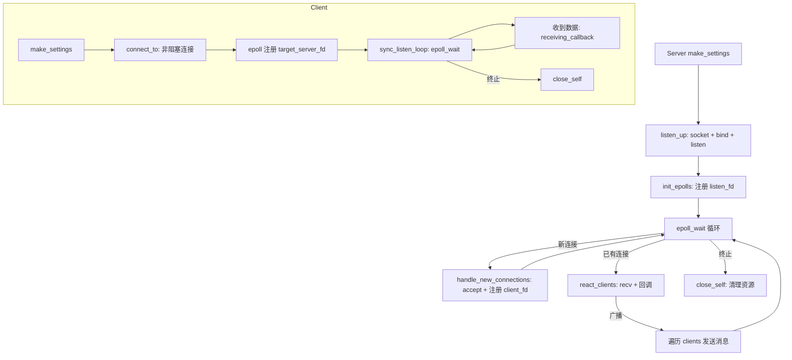

# 快速入门Socket编程——封装一套便捷的Socket编程：基于Epoll的框架思路说明

## epoll 详解

### 1. epoll 是什么

`epoll` 是 Linux 提供的一种 **I/O 多路复用**机制，相比 `select`/`poll`，它通过**事件驱动+回调式的就绪列表**避免了在每次等待前都要把整张 fd 集合重新拷贝进内核、并在返回后再从头扫描所有 fd 的 O(n) 复杂度。`epoll` 在典型高并发网络服务中能以近似 O(1) 的代价获取“本次真正发生事件的那些 fd”。这个底层就是经典的红黑树实现，所以查询速度显然O(1)。

### 2. 几个一定要知道的API

- `epoll_create1(int flags)`：创建 epoll 实例，返回一个 epoll fd；常用 `EPOLL_CLOEXEC` 规避子进程 fd 继承问题。
- `epoll_ctl(int epfd, int op, int fd, struct epoll_event* ev)`：把某个 socket fd 注册到 epoll 上、更新其监听的事件、或从 epoll 中删除。`op` 常见有 `EPOLL_CTL_ADD / MOD / DEL`。
- `epoll_wait(int epfd, struct epoll_event* events, int maxevents, int timeout)`：阻塞等待内核把“就绪的事件”拷贝到 `events` 数组中，并返回本次发生事件的数量。

### 3. 水平触发（LT）与边缘触发（ET）

- **LT（Level-Triggered）水平触发**：当某 fd 处于“可读/可写”状态，只要你没有把缓冲区读空/写满，每次 `epoll_wait()` 都还会继续返回它。使用简单、默认模式。
- **ET（Edge-Triggered）边缘触发**：只有当状态发生“边缘变化”时才触发一次事件回调；要求**配合非阻塞 fd** 并在一次事件中把数据“读到 EAGAIN”为止，否则可能丢事件。性能更好、但实现复杂度高。

### 4. 为什么要把 socket 设为非阻塞

在 Reactor（就绪通知）模型中，`epoll` 只是告诉你“fd 可读了”，但真正的 `recv()`/`send()` 是你自己在用户态完成的。如果 fd 是阻塞式的，`recv()` 在数据不足时会阻塞住整个 Reactor 线程，影响其他连接的调度。所以常规做法是：

- 用 `fcntl(fd, F_SETFL, O_NONBLOCK)` 把 fd 设为非阻塞；
- 配合 `epoll` 事件，**每次尽可能多地读/写**，直到返回 `EAGAIN`/`EWOULDBLOCK`。

### 5. epoll 的典型事件循环写法

1. `epoll_create1()` 创建 epoll；
2. 监听 socket（`listen_fd`）设非阻塞，并以 `EPOLLIN` 注册；
3. `while (running)` 里 `epoll_wait()`；
4. 对于返回的每个事件：
   - 如果是 `listen_fd`，说明有新连接，`accept()`（非阻塞）后把新 `client_fd` 也注册到 epoll；
   - 如果是 `client_fd`，则 `recv()` 数据，交给回调；若对端关闭，清理并 `EPOLL_CTL_DEL`。

### 6. 常见坑与工程实践

- **必须非阻塞**：ET 模式尤其必须；LT 模式虽不强制，但推荐统一非阻塞。
- **EINTR 重启**：被信号打断的系统调用要重试（你的 `react_clients` 中有 `while (len < 0 && errno == EINTR)` 处理）。
- **EAGAIN / EWOULDBLOCK**：表示暂时无数据，不是错误；不要立刻关闭 fd。
- **EPOLLONESHOT**：如果使用该标记，需要在处理完毕后再 `MOD` 回去，否则 fd 会“静默”不再触发事件。
- **fd 生命周期管理**：记得 `close()` 前 `epoll_ctl(DEL)`，避免悬空事件。
- **大缓冲区复用**：服务端与客户端都用 `std::vector<char>` 作为共享缓冲，避免频繁分配。

------

## 服务器框架运行的基本流程：

### 配置阶段：`make_settings`

服务端启动时首先调用 `make_settings`，它把外部传入的 `SocketsCommon::ServerProtocolSettings` 翻译成内部可直接使用的 Linux 参数：

- 通过 `ip_version_map` 与 `transfer_protocolt_type`，将抽象的协议族（IPv4/IPv6）与传输类型（TCP/UDP）映射为 `AF_INET/AF_INET6` 与 `SOCK_STREAM/SOCK_DGRAM`。
- 读取 `epoll_max_contains`，指定每次 `epoll_wait` 返回的最大事件数量。
- 读取 `buffer_length`，分配接收缓冲区 `buffer`。
- 将 `is_settings` 标记设为 `true`，表示已经完成配置，可以进入监听阶段。

```cpp
void LinuxServerSocket::make_settings(const ServerProtocolSettings& settings) {
    protocol_family = ip_version_map.at(settings.settings.ip_versionType_v);
    socket_type = transfer_protocolt_type.at(settings.settings.transferType_v);
    max_epoll_contains = settings.epoll_max_contains;
    buffer_cached_size = settings.buffer_length;
    buffer.resize(buffer_cached_size);
    is_settings = true;
}
```

### 2. 监听阶段：`listen_up`

`listen_up` 是把服务器真正“挂起来”的步骤：

1. 检查是否已经配置（`is_settings`），否则抛出 `configure_error()`。
2. 调用 `socket()` 创建服务端监听套接字 `socket_fd`，并判断是否创建成功（自定义 `socket_internal_error_create()`）。
3. 准备 `sockaddr_in` 结构体，设置 `sin_family`、`sin_port`（网络字节序，`htons(port)`）、`sin_addr.s_addr = INADDR_ANY` 表示绑定所有本地地址。
4. 调用 `bind()` 绑定端口，如失败抛出 `bind_error()`。
5. 调用 `listen()` 进入监听状态，设置 `backlog = max_accept`，失败则抛出 `listen_error()`。
6. 以上过程中若有任一异常，被 `try/catch` 捕获后置位 `error_state = true` 并重新抛出。
7. 监听成功后，标记 `already_listen_up = true`，然后调用 `init_epolls()` 初始化 epoll。

### 3. epoll 初始化：`init_epolls`

`init_epolls()` 做了两个关键动作：

1. 通过 `fcntl` 将 `socket_fd` 设置为非阻塞（`O_NONBLOCK`），防止 `accept()` 在没有新连接时阻塞。
2. 调用 `epoll_create1(EPOLL_CLOEXEC)` 创建 `epfd`，意味着 epoll 控制块在 fork 后不会被子进程继承。
3. 准备并注册 `epoll_event ev`，关注读事件 `EPOLLIN`，并将 `socket_fd` 添加到 epoll 的兴趣列表里：`epoll_ctl(epfd, EPOLL_CTL_ADD, socket_fd, &ev)`。

### 4. 主事件循环：`start_workloop`

当 `start_workloop` 被调用，服务器进入真正的 Reactor 事件循环阶段：

1. 首先检查 `already_listen_up`，如果还没 `listen` 就启动，会抛出 `socket_dead_error()`。
2. 内部保存外部传入的 `ServerWorkers`，这是一组业务层回调（accept/receive/close/broadcast）。
3. 分配 `events` 数组作为 `epoll_wait` 的承载空间，长度为 `max_epoll_contains`。
4. 进入 `while (!shell_terminate)` 循环：
   - 调用 `epoll_wait(epfd, events.data(), max_epoll_contains, -1)` 阻塞等待事件。
   - 遍历返回的 `nfds` 个事件：
     - 若 `events[i].data.fd == socket_fd`，说明监听 fd 上有事件 —— 有新客户端连入，调用 `handle_new_connections()`。
     - 否则说明某个已连接客户端 fd 有可读事件，调用 `react_clients(current_fd)` 处理其数据。

**这整段就是一个典型的 Reactor “事件分发器”。**

```cpp
void LinuxServerSocket::start_workloop(const ServerWorkers& worker) {
    internal_worker = worker;
    std::vector<epoll_event> events(max_epoll_contains);
    while (!shell_terminate) {
        int nfds = epoll_wait(epfd, events.data(), max_epoll_contains, -1);
        for (int i = 0; i < nfds; ++i) {
            int current_fd = events[i].data.fd;
            if (current_fd == socket_fd) handle_new_connections();
            else react_clients(current_fd);
        }
    }
}
```

### 5. 新连接处理：`handle_new_connections`

`handle_new_connections()` 专门处理监听 fd 上的 `EPOLLIN`：

1. 调用 `accept(socket_fd, nullptr, nullptr)` 接收新连接。
2. 如果返回 `client_fd < 0` 且 `errno` 是 `EAGAIN/EWOULDBLOCK`，表示在非阻塞场景下目前没有真正的连接（可能是水平触发导致重复被唤醒），直接返回；否则抛出 `runtime_error("Accept Error")`。
3. 对 `client_fd` 同样设置 `O_NONBLOCK`。
4. 以 `EPOLLIN` 注册这个 `client_fd` 到 epoll 中：`epoll_ctl(epfd, EPOLL_CTL_ADD, client_fd, &cev)`。
5. 将它封装为 `LinuxLightPassiveClient` 插入 `clients` 集合中，便于后续广播或关闭管理。
6. 如果设置了 `internal_worker.accept_callback`，则立即回调，业务侧可以在这里记录连接或发送欢迎消息。

### 6. 已有客户端的读事件处理：`react_clients`

`react_clients` 用于处理某个已连接 fd 的 `EPOLLIN` 事件：

1. 尝试 `recv(current_fd, buffer.data(), buffer_cached_size, 0)` 读取数据；如果被信号打断（`EINTR`），则循环重试。
2. 根据返回值分类处理：
   - `len > 0`：说明收到数据。
     - 复制一份 `std::string received_data_copy(buffer.data(), len)`。
     - 若设置了 `receiving_callback`，创建 `LinuxLightPassiveClient client{current_fd}`，把数据交给回调处理。
     - 若 `broadcast_enabled`，则把这份消息交给 `broadcast_callback` 做加工，再对 `clients` 集合所有**非发送者**的连接逐个触发 **“这里用了 receiving_callback 来当广播的发送管道，非常规但可行”**。
   - `len == 0`：对端关闭连接（FIN），调用 `close_target_client(current_fd)` 统一清理。
   - `len < 0`：如果不是常见的“资源暂不可用”（`EAGAIN/EWOULDBLOCK`），说明发生了真正的错误，同样 `close_target_client(current_fd)`。

**注意**：这里的广播路径里**复用了 `receiving_callback` 来“把广播消息再投喂给其他客户端”**，这种写法比较灵活，但职责上略有混淆（也可以设计一个“send 回调”或直接调用被动客户端对象的 `async_send` 来发送）。

### 7. 客户端关闭处理：`close_target_client`

当某个客户端需要关闭时：

1. 从 `clients` 集合中移除该 fd 对应的 `LinuxLightPassiveClient`。
2. `epoll_ctl(epfd, EPOLL_CTL_DEL, fd, nullptr)` 把它从 epoll 移除，防止后续事件对已关闭 fd 触发。
3. 调用 `::close(fd)` 释放系统资源。
4. 如用户设置了 `close_client_callback`，则回调通知业务层，业务层可进行日志记录或统计。

### 8. 服务端自我关闭：`close_self`

当服务器需要停止：

1. 将 `shell_terminate` 置为 `true`，让 `start_workloop` 的主循环自然退出。
2. 遍历 `clients` 集合，逐个 `::close(client.passive_client_fd)`。
3. 关闭 epoll fd（`epfd`）与监听 fd（`socket_fd`）。
4. 清空内部状态，确保下次不会误操作已关闭的资源。

------

## 客户端框架运行的基本流程：

### 1. 配置阶段：`make_settings`

客户端启动时调用 `make_settings`：

- 保存 `epoll_max_contains`（客户端 epoll 监听的最大事件数）。
- 根据 `settings.settings.transferType_v`（TCP/UDP）选择 `SOCK_STREAM/SOCK_DGRAM` 给 `sock_family`。
- 分配 `buffer` 作为接收缓冲区。
- 标记 `is_settings = true`。

### 2. 连接建立：`connect_to`

这是客户端最复杂的阶段之一，涉及同步 DNS、非阻塞 connect 以及 select 检查连接完成：

1. 校验是否做过 `make_settings`，否则抛出 `configure_error()`。
2. 使用 `getaddrinfo()` 对目标 `host:port` 做 DNS 解析，允许 IPv4/IPv6（`hints.ai_family = AF_UNSPEC`）。
3. 遍历 `addrinfo` 链表：
   - 创建一个 `socket(p->ai_family, p->ai_socktype | SOCK_NONBLOCK, p->ai_protocol)`，一开始就用非阻塞。
   - 尝试 `::connect()`：
     - 如果立刻返回 0，说明同步连接成功，直接 break。
     - 如果返回 `-1` 且 `errno == EINPROGRESS`，表示正在进行非阻塞连接，此时使用 `select()` 监听 `writefds` + 3 秒超时来判断连接是否最终建立成功：
       - `select()` 返回后，检查 `SO_ERROR` 是否为 0 来确认是否成功。
   - 如果当前地址尝试失败，`close(target_server_fd)` 并尝试下一个地址。
4. 最终如果 `target_server_fd < 0`，抛出 `server_unreachable()`。
5. 创建 `epoll_fd = epoll_create1(0)`，并把 `target_server_fd` 以 `EPOLLIN` 模式注册进去。
6. 把 `is_running = true`，并启动一个新线程（`run_thread`）跑 `sync_listen_loop()`，这就是客户端侧的 Reactor 循环。

### 3. 异步发送：`async_send_to`

客户端的发送比较简单：

- 如果客户端还没成功连接（`!is_running`），直接抛出 `server_unreachable()`；
- 否则直接调用 `::send(target_server_fd, datas.data(), datas.size(), 0)` 把数据发出去。
   由于 socket 是非阻塞的，这里如果发送缓冲区满可能会返回 `EAGAIN`，你可以根据需要在实现里做缓冲队列重试，这段代码目前是“尽力而为”。

### 4. 注册接收回调：`async_receive_from`

- 把业务层传入的 `ClientWorker`（只包含 `receiving_callback`）移动保存起来（`this->worker = std::move(worker)`）。
- 真正的接收动作在 `sync_listen_loop()` 线程里执行，当有数据时触发该回调。

### 5. 事件循环：`sync_listen_loop`

客户端自有一个 epoll 循环来监听从服务器返回的数据：

1. 在 `while (!shell_terminate)` 循环中，调用 `epoll_wait(epoll_fd, events.data(), epoll_max_fds, 1000)`，设置了 1000ms 的超时，避免永久阻塞，便于定期检测 `shell_terminate`。
2. 对返回的每个事件：
   - 确认 `events[i].data.fd == target_server_fd`（当前仅监听一个 fd）；
   - 调用 `::recv(target_server_fd, buffer.data(), buffer.size(), 0)` 读取数据：
     - `len > 0`：若设置了 `worker.receiving_callback`，则把字符串交给业务处理；
     - `len == 0`：服务端关闭连接；将 `shell_terminate = true`，退出循环；
     - 否则如果错误且不是 `EAGAIN/EWOULDBLOCK`，也判定连接异常，退出循环。
3. 循环退出后，线程返回；`close_self` 中会 `join()` 这个线程，确保资源正确回收。

### 6. 关闭流程：`close_self` 与析构

当客户端需要主动关闭或对象析构时：

1. 设置 `shell_terminate = true`，让 `sync_listen_loop` 线程自己退出来。
2. 将 `is_running = false`。
3. 关闭 `epoll_fd` 与 `target_server_fd`。
4. 如果 `run_thread` 仍然存活且不是当前线程，则 `join()`，保证线程安全退出。
5. 在 `~LinuxClientSocket()` 中调用 `close_self()`，确保资源不会泄漏。

------

## 完整流程图



