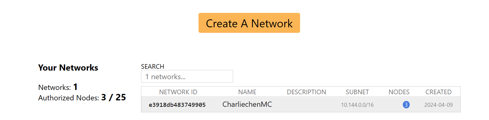
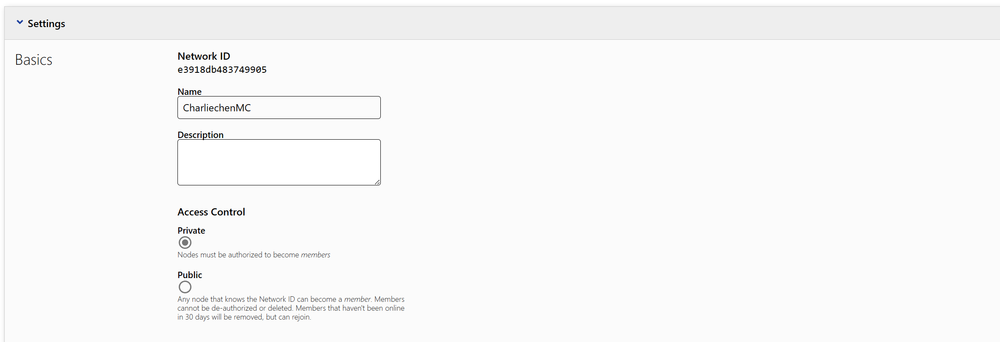
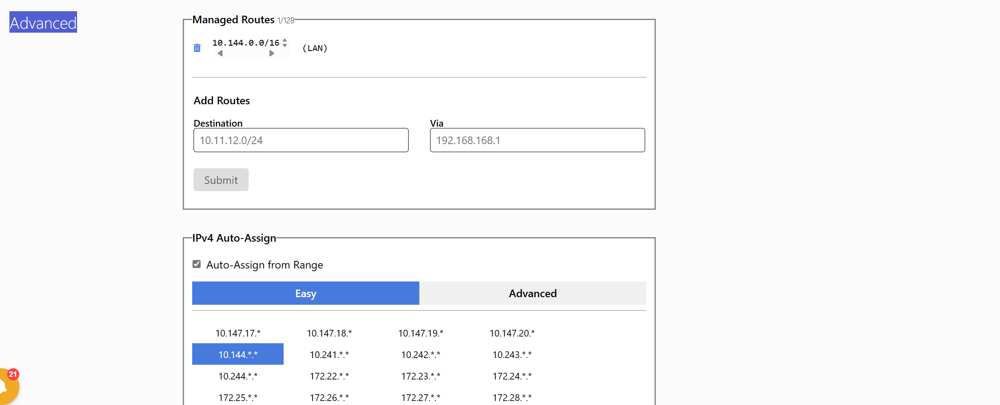
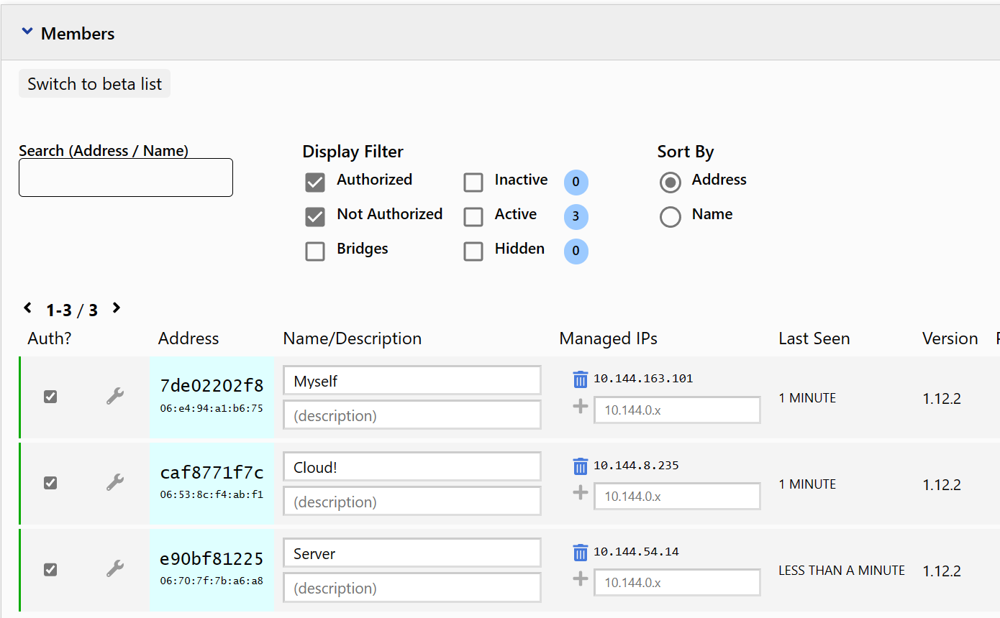
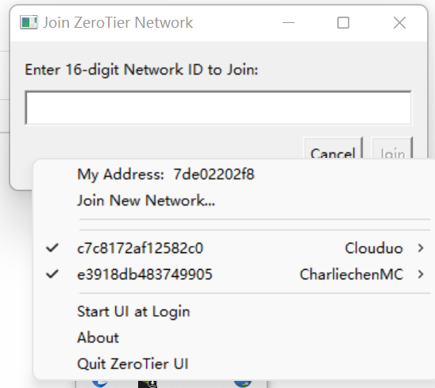
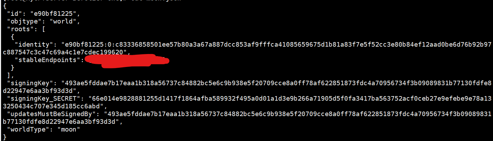
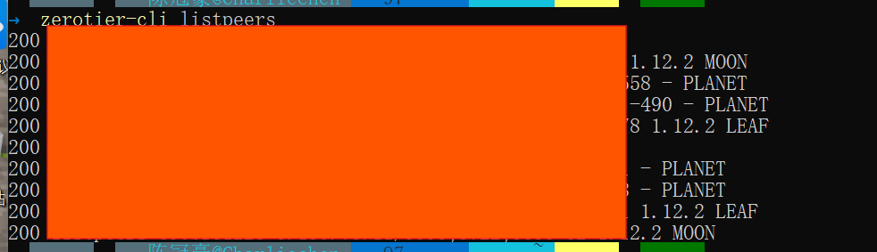
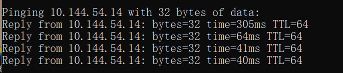

# ZeroTier软件原理与使用

## 内网穿透

​	啥是内网穿透呢？首先说内网是什么，他有一个更加常用的名称叫局域网，就是路由器搭建的网络，称为内网，比如需要访问别的站点，就要是公网，同样公网也分为[公有内网](https://www.zhihu.com/search?q=公有内网&search_source=Entity&hybrid_search_source=Entity&hybrid_search_extra={"sourceType"%3A"answer"%2C"sourceId"%3A2307708875})，这里就不做过多解释了，**进行 NAT 穿透是为了使具有某一个特定源 IP 地址和源端口号的数据包不被 NAT 设备屏蔽而正确路由到内网主机。**

​	NAT 是一种将私有（保留）地址转化为合法IP地址的转换技术，它被广泛应用于各种类型 Internet 接入方式和各种类型的网络中。NAT可以完成重用地址，并且对于内部的[网络结构](https://www.zhihu.com/search?q=网络结构&search_source=Entity&hybrid_search_source=Entity&hybrid_search_extra={"sourceType"%3A"answer"%2C"sourceId"%3A2307708875})可以实现对外隐蔽。

​	人话的翻译就是，我们在一个子网内部自行分配了一组IP，这个IP是没有办法流通到公网上去的，需要依靠NAT转换成公网IP + 一个端口进行访问。

​	于是，内网穿透实际上就是另立山头，将若干台位于不同子网的主机拉拢到同一个虚拟局域网内七一虚拟局域网维护真实的子网下个设备IP转换的表从而实现一种类似于“点对点通信”的方式

### 内网穿透的四种常见手段

#### **端口映射**

端口映射是一种将公网上的 IP 地址和端口映射到局域网内一台计算机的指定端口上的技术。实现端口映射需要在路由器上进行配置，将路由器的公网 IP 地址和端口与内网中的计算机的 IP 地址和端口相映射。当公网用户请求这个 IP 地址和端口时，路由器会将请求转发到内网计算机的指定端口上，从而实现内网穿透。

#### **反向代理**

反向代理是一种将公网上的访问请求转发到局域网内一台计算机的指定端口上的技术。实现反向代理需要在公网服务器上部署一个[代理服务器](https://www.zhihu.com/search?q=代理服务器&search_source=Entity&hybrid_search_source=Entity&hybrid_search_extra={"sourceType"%3A"answer"%2C"sourceId"%3A2977072976})，在代理服务器上配置[反向代理规则](https://www.zhihu.com/search?q=反向代理规则&search_source=Entity&hybrid_search_source=Entity&hybrid_search_extra={"sourceType"%3A"answer"%2C"sourceId"%3A2977072976})，将公网请求转发到内网服务器上的指定端口。从而实现内网穿透。

#### **VPN**

VPN 是一种通过公用网络建立安全的、点对点连接的私人网络技术。VPN 可以让远程用户或外部网络通过加密的方式连接到内部网络，实现内网穿透。

在 VPN 方案中，用户首先需要通过 VPN 客户端与 VPN 服务器建立连接。VPN 服务器位于内网外，可以拥有一个公网 IP 地址，而 VPN 客户端位于内网中。当 VPN 客户端需要访问内网中的资源时，它会通过 VPN 通道向 VPN 服务器发起请求。VPN 服务器接收到请求后，会对其进行处理并将其转发给内网中的资源。同样的，内网中的资源也可以通过 VPN 通道向外网提供服务，从而实现内网穿透。

**VPN 方案的优点是安全性较高，能够通过加密的方式保护数据的传输，同时也支持多种协议，比如 PPTP、L2TP、SSTP、OpenVPN 等**。但是，VPN 方案的缺点是需要在内网中部署 VPN 服务器，并且需要额外的软件支持，部署和维护较为复杂。

#### **NAT 穿透**

​	在 NAT 网络中，内网的 IP 地址和[端口号](https://www.zhihu.com/search?q=端口号&search_source=Entity&hybrid_search_source=Entity&hybrid_search_extra={"sourceType"%3A"answer"%2C"sourceId"%3A2977072976})经过 NAT 转换后，对外部网络是不可见的。因此，当外部网络需要连接内网中的计算机时，需要通过一定的方式绕过 NAT 转换，使得内网计算机可以直接和外网通信。

​	NAT Traversal 通常通过以下两种方式实现：

> 注意，无论是 UDP 穿透还是 TCP 穿透，他们的本质都是为了在 NAT 网络环境中建立一条可靠的通信路径，使得外部网络中的设备可以通过 NAT 设备访问内部网络中的服务。其中的关键在于找到一个合适的转发端口，将外部网络请求转发给内部网络的服务。

1）UDP Hole Punching（UDP 穿透）

​	UDP Hole Punching 是一种通过 UDP 协议建立连接的 NAT Traversal 技术，它利用 NAT 路由器在 UDP 通信过程中开启的临时端口号，绕过 NAT 转换建立直接连接。其实现流程如下：

- 客户端向服务器发送 UDP 数据包，该数据包中包含了客户端的公网 IP 地址和[临时端口号](https://www.zhihu.com/search?q=临时端口号&search_source=Entity&hybrid_search_source=Entity&hybrid_search_extra={"sourceType"%3A"answer"%2C"sourceId"%3A2977072976})。
- 由于 UDP 数据包是无连接的，NAT 路由器并不知道该数据包是要转发到哪个内网计算机上。因此，客户端需要在数据包中携带一个[标识符](https://www.zhihu.com/search?q=标识符&search_source=Entity&hybrid_search_source=Entity&hybrid_search_extra={"sourceType"%3A"answer"%2C"sourceId"%3A2977072976})，以便让服务器识别该数据包是由哪个客户端发送的。
- 服务器收到客户端发送的 UDP 数据包后，会回复一个数据包到客户端，该数据包中携带了服务器的公网 IP 地址和端口号。
- 客户端和服务器都会开启一个新的 UDP 数据包监听器，用于接收对方发送的数据包。由于 NAT 路由器会将第一个发送的 UDP 数据包的临时端口号映射到对应的内网计算机上，因此客户端和服务器都可以通过该端口号向对方发送数据包，建立连接。

2）TCP Hole Punching（TCP 穿透）

TCP Hole Punching 是一种通过 TCP 协议建立连接的 NAT Traversal 技术，它利用 TCP 三次握手建立连接的特点，通过同时向 NAT 路由器发送数据包，使得 NAT 路由器在建立连接时将数据包转发到对应的内网计算机上，从而实现 NAT 穿透。其实现流程如下：

- 客户端向服务器发送 SYN 数据包，该数据包中包含了客户端的公网 IP 地址和端口号。
- 服务器收到客户端发送的 SYN 数据包后，回复一个 SYN+ACK 数据包到客户端，该数据包中携带了服务器的公网 IP 地址和端口号。
- 客户端收到服务器的 SYN+ACK 数据包后，会回复一个 ACK 数据包到服务器，该数据包中携带了客户端的公网 IP 地址和端口号。
- 由于客户端和服务器都同时向对方发送了数据包，
- NAT 路由器在记录连接信息时就会将客户端和服务器的信息都记录下来，并将对应的端口打开。此时，客户端和服务器就可以直接通过 NAT 路由器通信了。这个时候，[NAT 路由器](https://www.zhihu.com/search?q=NAT 路由器&search_source=Entity&hybrid_search_source=Entity&hybrid_search_extra={"sourceType"%3A"answer"%2C"sourceId"%3A2977072976})其实就相当于一个[交换机](https://www.zhihu.com/search?q=交换机&search_source=Entity&hybrid_search_source=Entity&hybrid_search_extra={"sourceType"%3A"answer"%2C"sourceId"%3A2977072976})了，因为它只需要根据端口信息进行转发就可以了，不需要再进行 IP 地址转换。

​	需要注意的是，TCP Hole Punching 的成功率比 UDP Hole Punching 要高，但是由于 TCP 协议的特点，它只能在客户端和服务器之间建立点对点的连接，无法实现多客户端之间的通信。另外，由于 TCP 协议在建立连接时需要进行三次握手，因此 TCP Hole Punching 的连接建立速度相对较慢，不适合需要快速建立连接的场景。

## ZeroTier

​	他就是干上面这个事情的，想要使用它很简单。

### 下载ZeroTier的客户端软件

> [Download (zerotier.com)](https://www.zerotier.com/download/)

他提供了一些操作的接口供希望在虚拟局域网中操作的客户进行使用。下载好了之后直接单击软件安装即可。

### 进入Web操作界面

> [ZeroTier Central](https://my.zerotier.com/)

#### Basic



​	这里的截图中，单击Create A Network之后，就会创建一个虚拟子网。




​	在这里设置这个网络的名称和描述，以及访问权限：一般都是Private，不建议更改

#### Advanced

​	高级设置



  	里头可以设置被映射成如何的IP，以及IPv4, IPv6等高级选项，可以查看之。

#### 成员



​	这里就是我们的操作页面了，在这里，我们首先把所有的目标设备先加入到子网来：

> Shell下添加
>
> ```
> zerotier-cli join ID #虚拟子网的Network ID
> ```
>
> Windows端口
>
> 

​	现在，对加入的设备打上最旁边的√表示同意将设备纳入虚拟网络：稍等片刻，我们的子网就会给出各个设备之间分配到的子网IP，我们需要用它来访问设备。

## 搭建Moon服务器

​	事实上，如果我们可以接受平均300ms的延迟，可以不理会本章节，但是如果是希望打游戏，那么就不行。

### 引入几个基本的概念

​	我们下面要搭建服务器，首先，你需要有一台服务器（不然搭集贸），如何去阿里云或者是腾讯云申请服务器不是我们的重点，我们假设你有了一台服务器并且有了基础的工具集（或者，执行下面的操作缺啥下啥就OK，以及最好在自己的操作系统上装一个XShell和XFTP方便操作，以及服务器端上搞一个vim）

​	需要先了解一下几个概念：

#### Earth

根据其介绍，将地球上的所有设备连起来。那这里的 Earth 指的就是整体的一个服务。

#### Planet

星球嘛。指的是官方提供的服务器节点。各客户端都是通过这些服务来互相寻址的。相当于 zookeeper 的不同节点。

#### Moon

自定义的 Planet。由于 Zerotier 没有国内节点，在两个设备刚开始互连的时候有可能需要通过国外的节点寻址（不过我没发现有什么慢的）导致创建连接的速度偏慢。在自己的网络里搭建 Moon 可以使连接提速。

#### Leaf

客户端。就是连接到网络上的每一个设备。其实经过测试，Moon 也是客户端的一种。这里特指没有额外功能，单纯用于连接的客户端。

### 开始搭建

​	我们就是希望将转发服务器改成我们自己的，怎么办呢？

​	在你的服务器Shell上，键入：

```
curl -s https://install.zerotier.com/ | sudo bash
```

​	这将会下载Zerotier客户端（毕竟没有GUI）

```
sudo systemctl start zerotier-one.service
sudo systemctl enable zerotier-one.service
```

​	启动这些服务，这样的话就让ZeroTier跑起来了。我们如法炮制加入虚拟子网的过程

```
sudo zerotier-one cli join 你的网络ID 
```

​	可能会出线端口被占用的问题：

```
cannot bind to local control interface port 9993
```

​	很简单，端口被占用了

```
netstat -lp | grep zero
```

​	看看是什么服务在占用，很可能是他自己（大嘘。

​	所以，要么杀进程（不太优雅）

```
killall -9 zerotier-one
```

​	注意多试几次，有的时候一部分进程是没有接受到SIGKILL信号的，不会结束进程，直到shell提示你没有更多的zerotier进程的时候，才不要执行这段指令。

​	然后重新启动zerotier

```
/etc/init.d/zerotier-one restart
```

​	或者是操纵systemctl重启，这里可以参考：

>[systemctl 管理服务的启动、重启、停止、重载、查看状态命令_systemctl restart-CSDN博客](https://blog.csdn.net/hhljllyx/article/details/108804777)

### 生成moon配置文件

​	首先生成配置文件

```shell
cd /var/lib/zerotier-one
zerotier-idtool initmoon identity.public > moon.json
```

​	这个时候，将会生成一个moon.json文件

​	打开它：在stableEndpoints这个地方：

```
["xxx.xxx.xxx.xxx/9993"]
```

​	地方填你的服务器公网IP + 9993端口。



```text
zerotier-idtool genmoon moon.json
```

​	这个时候就会生成moon的网络ID和配置文件

​	将他放到moons.d文件下

```
mkdir moons.d
sudo mv 000000xxxxxxxxx.moon moons.d/ # ls一下，就是生成的moon文件
```

​	现在,我们输入:

```
sudo systemctl restart zerotier-one
```

​	来重启Zerotier服务.

​	然后,去其他平台上的电脑: 举个例子,我的windows平台上 

```
zerotier-cli listpeers
```



​	`(嗯,不爆服务器金币哈)`

> 对了,存在一种情况:你一看MOON的IP是----,表示的是没有连接成功,说明端口被防火墙拦住了,记得去阿里云或者是你的其他服务器平台上放行端口9993或者是你设计的端口

​	ping一下, IP地址自己去自己的Network上看分配到了什么IP:



## Referrence

>  内网穿透：[(99+ 封私信 / 80 条消息) 内网穿透是什么意思？ - 知乎 (zhihu.com)](https://www.zhihu.com/question/63098230)
>
>  ZeroTier:[ZeroTier](https://www.zerotier.com/)
>
>  ZeroTier文档：[Getting Started with ZeroTier - ZeroTier Knowledge Base - Confluence (atlassian.net)](https://zerotier.atlassian.net/wiki/spaces/SD/pages/8454145/Getting+Started+with+ZeroTier)

