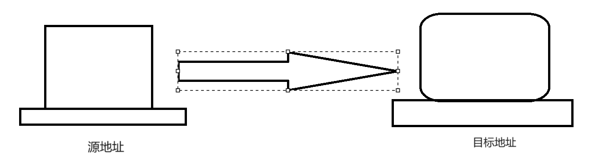
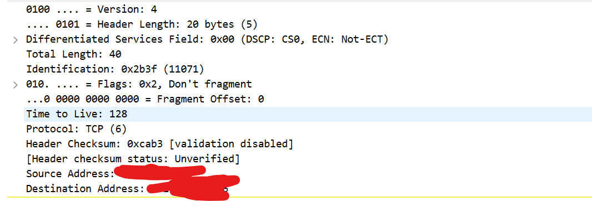

# RFC 791 （1）-导论

> 提示：本系列将会开始RFC文档阅读，这里会给出我的一些笔记

## 浅论

​	我们这篇RFC文档描述的是IP和ICMP协议，我们都知道，在传统的OSI七层或者是现在被简化的五层：应用层，传输层，网络层，数据链路层以及物理层中，它属于网络层的传输。接触过计算机网络导论的同志们都知道，他是为上层的TCP，UDP提供服务的（为传输层的服务本身提供服务），而又处理下层的数据链路层前来的数据包（卸下Local本地的数据链路层的相关协议信息后，剩下的他认为这是传输数据的那部分）。

### IP是啥

​	一个协议！我相信大家都知道这个浅显的事实，他指挥了

> 接收上：在网络层工作的机器如何解读下层带来的数据包，然后进一步根据里头的控制信息解读在内层的数据，好向上提交给传输层解析
>
> 发送上：接受上面的传输层已经封装好的数据构成一个数据包`(Datagram)`，添加自己的控制信息，目标IP等，向下传递给工作数据链路层的设备

​	IP正是在本网络层中描绘了设备之间如何根据他给出的IP地址，也就是从源地址到目的地址中，在网络中传递数据（`Transmitting Blocks of Data from sources to destination`）

### IP可以管啥

​	有趣的是：正如RFC文档所描述的是，这个我相信也有不少博主强调过的：

>IP不在乎，也不保证比较强的数据可靠性，数据顺序正确性和流控制，人话就是他只管送，不管对不对

​	那这些谁来做呢？上层做！TCP不正是提供了这些功能吗？（流控制，顺序性等），我们正好省时省力，将每个工作安排的井井有条而不重复做无用工作

### 操作

​		IP实现了两个最基本的功能：addressing（寻址）和fragmentation（拆包）。我们在网络层视图中，嗯，实际上就是这样的：



​	（实际细节如何？不是我们在乎的！我们只在乎到数据刷的从一台设备跑到了另一台设备），我们就这样实现了一种addressing！在浩大的网络层中找到我们的目标设备投递自己的数据包

​	这里的源地址和目标地址就是我们的IP包内的地址字段！具体的分析在之后的博客中详细阐述。这几台设备制定发送的数据包和解析收到的数据包就是这样由IP指挥规定的

​	可以在这里就阐述的是：IP它有四个独特的控制信息：

> 1. Type Of service：服务种类
>
>    | 代码                            | 说明                                                         |
>    | ------------------------------- | ------------------------------------------------------------ |
>    | `1000 – minimize delay`         | 最小延迟 对应于对延迟敏感的应用，如telnet和人login等。       |
>    | `0100 – maximize throughput`    | 最大吞吐量 对应于对吞吐量要求比较高的应用，如FTP文件应用，对文件传输吞吐量有比较高的要求。 |
>    | `0000 – normal service`         | 一般服务                                                     |
>    | `0001 – minimize monetary cost` | 最小费用                                                     |
>    | `0010 – maximize reliability`   | 最高可靠性 对网络传输可靠性要求高的应用，如使用SNMP的应用、路由协议等等。 |
>
>    具体的含义等之后详解的时候我会细细说明！
>
> 2. TTL（Time To Live）这是描述这个包还可以存在多久的！一般的，IP可能需要过路由器一次一次扔数据包，扔一次TTL字段咱就减一个1：
>
>    ```cpp
>    // 显然不是源码，但是这是一个伪代码！
>    void getAndSend(IP_Package& package){
>    	handlePackage(package);
>        package->ttl--;
>        sendTo(package->dest_addr, package);
>    }
>    ```
>
> 3. Option：这里则是选项，装着时间戳，安全相关和一些特别的调度安排
>
> 4. 头部校验和：咱们是说IP不管数据，他还是得管他自己的控制信息的，但是检查很弱，使用的是校验和检查

## 范例查看



随便抓点包就OK：我们这里使用的是IPv4！具体一些信息我们将会在后续详细分析！

# RFC 791 （2）

## 总览

​	RFC791文档的第二部分就是对IP进行总浏览：可以看到，我们的五层划分是这样的：

```
                                    
                 +------+ +-----+ +-----+     +-----+  
                 |Telnet| | FTP | | TFTP| ... | ... |  
                 +------+ +-----+ +-----+     +-----+  
                       |   |         |           |     
                      +-----+     +-----+     +-----+  
                      | TCP |     | UDP | ... | ... |  
                      +-----+     +-----+     +-----+  
                         |           |           |     
                      +--------------------------+----+
                      |    Internet Protocol & ICMP   |
                      +--------------------------+----+
                                     |                 
                        +---------------------------+  
                        |   Local Network Protocol  |  
                        +---------------------------+  

                         Protocol Relationships
```

​	可以这样理解这些协议之间的关系：最上一层是应用层的协议，比如说`telnet, FTP, TFTP`等传统应用层协议！他们是使用了TCP或者udp这样一些传输协议的服务来完成自身的服务，而TCP UDP这些传输层的服务则是基于IP或者是ICMP的网络层服务完成自身的服务的，而IP和ICMP又是依靠或者说是依赖于本地网络的一些协议来完成他们的工作！可以看到层层的抽象共同完成了进程之间的报文传输！

​	由于RFC791着重描述与IP的工作原理，所以这里我们从IP的报文封装与拆包来进行分析！

### 操作

​	IP的封装与拆包实际上是按照这样的流程完成的。

​	为了严谨假设，我们假设两台主机之间需要通过一个网关跳转才能够完成传输！那么对于发送报文的应用进程，它需要准备好它的数据，然后调用本地的网络模型来发送数据。他把数据放到了一个上层应用已经结束封装的数据包，然后准备使用IP协议来构建IP报文，它向里面填充自身的源地址，目标地址，数据以及一些选项等。

​	在这里它需要向网关发送数据，那么这里的目标地址就需要填写网关的IP。然后他就会把这样的一个IP报文发送给网关，网关接收到了这样的IP报文之后它首先要剥离协议的头，从而把数据包从中裸露出来方便处理。他需要查看装在了数据段的目标地址，网关查看自己的转发表，这样他才能决定要转发到哪一个网关或者主机上！

​	由于在这个场景里面我们的表里面已经存储了目标主机的IP地址，所以在这里他直接往目标主机发送IP报文。于是他再一次封装IP报文，然后向目标主机投递这个IP报文，目标主机接收到了这个IP报文后向上传递，最终以一种系统调用的方式通知目标进程接收网报数据！所以整个流程就可以使用这样的图来简单的描述

```
   Application                                           Application
   Program                                                   Program
         \                                                   /      
       Internet Module      Internet Module      Internet Module    
             \                 /       \                /           
             LNI-1          LNI-1      LNI-2         LNI-2          
                \           /             \          /              
               Local Network 1           Local Network 2            


                            Transmission Path

```

## `Addressing` 与 `Fragmentation`

​	我们知道IP报文是会在主机与主机之间进行传递！那么我们应该如何标识他们？

​	我们传递的报文可能会很大！在这种情况下一个报文可能并没有办法完全容纳我们的数据！这个时候它可能就需要分片！下面我们来讨论IP协议提要求提供的这两个基础功能是怎样的 

### `Addressing`

​	我们之前就说过，IP提供的最基础的两个服务，一个是Addressing（寻址），另一个就是Fragmentation（分片）。我们是怎么区分寻址的呢？答案是使用一些区分字段：

> names：主机的名称，这个地方是不是想起来DNS了？是的！这里就是记载着names - Address映射对
>
> addresses:主机的地址
>
> route：记载着如何到达

​	当然，IP地址实际上也需要向下转化为本地的网络协议使用的地址（比如说MAC地址）

​	一般的，我们考虑IP地址，在1980年那个主机并不太多的时代，将IP地址分成ABC类。我们后面会进一步详细的讨论

### `Fragmentation`

​		我们下面就讨论分片这个事情：分片，简而言之就是把一个巨大无比的数据报将它分解为小的一个分组就可以容纳的小碎片！当然一个数据报段文可以标记为不要分段！那么这个时候被标记了不要分段的数据包将会被解释为不是分段的，所以如果这个数据报它确实需要分段才能够发送，但是被标记为不分段时，它会被遗弃掉！

​	我们如何指示我们的数据报是分段的呢？答案很简单，在header里有所指示就行！我们的发送方将数据进行分段，然后传递出去！那么接收方就要依赖`identification(身份)`段中的标识来接受报文（这表明了这是这个分段组的！）

​	举个例子。假如说，我们要发送一个很大的报文时：这个巨大的数据包被拆分成一个一个数据段（注意第一个IP报文的数据段必须是64位大小的整数倍，后面的无所谓），每个数据包前面添加IP协议控制报文段，从而将这些将一个巨大的数据包转化为若干的IP分组报文！

​	第一个标识中写入自己的分组偏移量是零，之后的分组按照顺序依次递增，而同时在第一个报文中设置“是否有更多分组”的标志位中设置唯1，在最后一个分组中“是否有更多分组”的标志位中设置为0！这样我们的接收方它首先查看偏移量来表明这是第几个报文，同时查看是否有更多分组来决定还不还要继续接收这个报文流！直到接收到一个报文其分组标识为零的时候，它才会停止接收这个报文流！