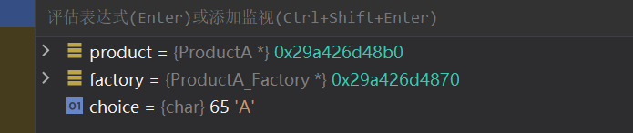

# 设计模式小记

## Abstract Factory 抽象工厂

​		工厂，顾名思义，就是产生产品的场所。在这里，他指代的是面向一系列的产品提供一个共同的抽象接口的含义，而不需要指定他们具体的类

### 1. 抽象工厂模式的特性

​		在抽象工厂模式中，客户端并不直接创建对象，而是通过调用工厂方法来创建对象。这样，客户端可以从具体产品中解耦，使得系统更具有可扩展性。

### 2. 抽象工厂模式的组成部分

抽象工厂模式主要包含以下四个组成部分：

1. **抽象工厂（Abstract Factory）**：抽象工厂定义了一个接口，声明了一组用于创建抽象产品的方法。（作为一个父类）
2. **具体工厂（Concrete Factory）**：具体工厂实现了抽象工厂中定义的接口，用于创建具体产品对象。（也就是实际代码里具体选择的子类工厂）
3. **抽象产品（Abstract Product）**：抽象产品为一类产品对象声明一个接口。
4. **具体产品（Concrete Product）**：具体产品实现了抽象产品声明的接口，表示特定工厂创建的产品对象。

### 3. 抽象工厂模式的应用场景

抽象工厂模式适用于以下场景：

1. 一个系统需要独立于其产品的创建、组合和表示时。
2. 一个系统要由多个产品系列中的一个来配置时。
3. 当你需要强调一系列相关产品的设计以便进行联合使用时。
4. 当你需要提供一个产品类库，而只想显示它们的接口而不是实现时。

### 4. 抽象工厂模式的实现示例

以下是一个关于按钮和复选框的抽象工厂模式示例：

#### Java实例

```java
// 抽象产品：按钮
interface Button {
    void render();
}

// 具体产品：Windows按钮
class WindowsButton implements Button {
    @Override
    public void render() {
        System.out.println("渲染Windows按钮");
    }
}

// 具体产品：Mac按钮
class MacButton implements Button {
    @Override
    public void render() {
        System.out.println("渲染Mac按钮");
    }
}

// 抽象产品：复选框
interface Checkbox {
    void render();
}

// 具体产品：Windows复选框
class WindowsCheckbox implements Checkbox {
    @Override
    public void render() {
        System.out.println("渲染Windows复选框");
    }
}

// 具体产品：Mac复选框
class MacCheckbox implements Checkbox {
    @Override
    public void render() {
        System.out.println("渲染Mac复选框");
    }
}

// 抽象工厂
interface GUIFactory {
    Button createButton();
    Checkbox createCheckbox();
}

// 具体工厂：Windows工厂
class WindowsFactory implements GUIFactory {
    @Override
    public Button createButton() {
        return new WindowsButton();
    }

    @Override
    public Checkbox createCheckbox() {
        return new WindowsCheckbox();
    }
}

// 具体工厂：Mac工厂
class MacFactory implements GUIFactory {
    @Override
    public Button createButton() {
        return new MacButton();
    }

    @Override
    public Checkbox createCheckbox() {
        return new MacCheckbox();
    }
}

// 客户端代码
public class Client {
    private Button button;
    private Checkbox checkbox;

    publicClient(GUIFactory factory) {
        button = factory.createButton();
        checkbox = factory.createCheckbox();
    }

    public void renderUI() {
        button.render();
        checkbox.render();
    }

    public static void main(String[] args) {
        GUIFactory factory;
        String osName = System.getProperty("os.name").toLowerCase();

        if (osName.contains("windows")) {
            factory = new WindowsFactory();
        } else {
            factory = new MacFactory();
        }

        Client client = new Client(factory);
        client.renderUI();
    }
}
```

​		在上面的示例中，我们定义了两个抽象产品（`Button` 和 `Checkbox`），以及它们的具体实现（`WindowsButton`、`MacButton`、`WindowsCheckbox` 和 `MacCheckbox`）。然后，我们创建了一个抽象工厂（`GUIFactory`）以及两个具体工厂（`WindowsFactory` 和 `MacFactory`），用于根据操作系统类型创建对应的按钮和复选框。最后，在客户端代码中，我们使用工厂创建了按钮和复选框，并调用它们的 `render` 方法来渲染它们。

#### C++ 实例

​		我们下面开始按照步骤实践一下抽象工厂的使用步骤

> **第一步，定义抽象工厂父类**：

```C++
class AbstractProduct;
class AbstractFactory
{
public:
    virtual AbstractProduct* createProduct() = 0;
};
```

​		现在，我们的工厂的共同点就是：它一定会创建一个产品。我们之后所有的工厂模型一定会去调用抽象函数：

```
AbstractProduct* createProduct();
```

​		这个接口来完成所以的附属抽象产品的创建。

> **第二步，定义抽象产品类**

```C++
class AbstractProduct
{
public:
    virtual void displayProduct() = 0;
    virtual void processProduct() = 0;
};
```

​		毫无疑问，我们的抽象产品必须凝聚所有的目标产品的共同点。比如说，我们需要告诉它自己是啥：

```C++
void displayProduct()
```

​		需要给外界提供作用方法：

```C++
void processProduct();
```

​		我们之所以让函数成为纯虚函数，是为了强制客户程序员在后续的开发中必须重构这两个函数。来表征自己产品的特殊。

> （我自己的看法：其实，根据因果，我私下认为先制定出抽象产品的定义后才考虑抽象工厂。方便我们得知如何更好的提供抽象接口。

> **第三步，提供具象的产品**

​		当然，这里就不算特别属于抽象工厂的范畴了，至于是提供产品蔟还是产品，看需求的复杂程度完成指定。

```C++
class ProductA : public AbstractProduct{
public:
    void displayProduct() override{
        MSG("This is product A");
    }
    void processProduct() override{
        MSG("Is dealing with Product A");
    }
};

class ProductB : public AbstractProduct
{
public:
    void displayProduct() override{
        MSG("This is product B");
    }
    void processProduct() override{
        MSG("Is dealing with Product B");
    }
};

// ... more
```

> **第四步：依照产品提供对应的具象Factory**

```C++
class ProductA_Factory : public AbstractFactory
{
public:
    ProductA* createProduct() override{
        MSG("A is creating");
        return new ProductA;
    };
};

class ProductB_Factory : public AbstractFactory
{
public:
    ProductB* createProduct() override{
        MSG("B is creating");
        return new ProductB;
    };
};
```

> **第五步：编写客户代码即可**

```C++
int main()
{
    AbstractProduct* product = nullptr;
    AbstractFactory* factory = nullptr;

    char choice = 'A';
    std::cin >> choice;
    if(choice == 'A')
        factory = new ProductA_Factory;
    else if(choice == 'B')
        factory = new ProductB_Factory;
    else
        return -1;
    product = factory->createProduct();
    product->displayProduct();
    product->processProduct();

    delete factory;
    delete product;
}
```

 		现在，我们可以依据外界选择特定的子类进行执行了：

​		当我们外界输入A时，C++自动转化为对应的子类：



### 5. 抽象工厂模式与工厂方法模式的比较

抽象工厂模式和工厂方法模式都属于创建型设计模式，它们的主要区别在于：

1. **工厂方法模式**只关注单个产品等级结构，例如只关注按钮的创建。工厂方法模式为每个产品提供一个工厂，客户端通过调用工厂方法来创建产品。工厂方法模式可以轻松地扩展为创建新产品，只需要添加一个新的具体产品类和对应的具体工厂类即可。
2. **抽象工厂模式**关注多个产品等级结构，例如同时关注按钮和复选框的创建。抽象工厂模式为一组相关产品提供一个统一的工厂接口，客户端通过调用工厂方法来创建一组相关产品。抽象工厂模式可以轻松地扩展为创建新的产品系列，只需要添加一个新的具体工厂类即可。

抽象工厂模式与工厂方法模式一样，都是创建型设计模式，它们之间的不同是：

1. 工厂方法模式注重于产品等级结构上的扩展，而抽象工厂模式注重于产品族的扩展。
2. 工厂方法模式只有一个抽象产品类，而抽象工厂模式有多个抽象产品类。
3. 工厂方法模式一个具体工厂只能实现一个产品类，而抽象工厂模式有一个具体工厂可以实现多个产品类。

### 6. 优缺点

#### 优点：

1. 抽象工厂模式可以确保系统中所有产品的一致性，因为每个工厂都生产同样类型的产品。
2. 抽象工厂模式使得易于**交换产品系列**，因为整个产品系列都被一个工厂所生产，只需要更换工厂即可更换整个产品系列。
3. 抽象工厂模式使得**易于交换产品家族**，因为每个工厂生产的产品和其它工厂无关，只需要更换工厂即可更换整个产品家族。
4. 抽象工厂模式可以减少客户端与不同对象之间的耦合度，因为客户端只需要知道它使用的是哪个工厂即可。

#### 缺点：

1. 抽象工厂模式增加了代码的复杂度，增加了程序的理解难度。
2. 抽象工厂模式对于新的产品类型的支持并不太好，**因为修改产品族需要修改抽象工厂接口，这就需要修改所有的实现工厂类。**
3. **抽象工厂模式可以使得产品族扩展变得困难，因为每次扩展新的产品都需要新增一整个工厂类以及其它相关类。**，也就是说，我们要求此类设计模式应用在那些**需求较为稳定的场景**