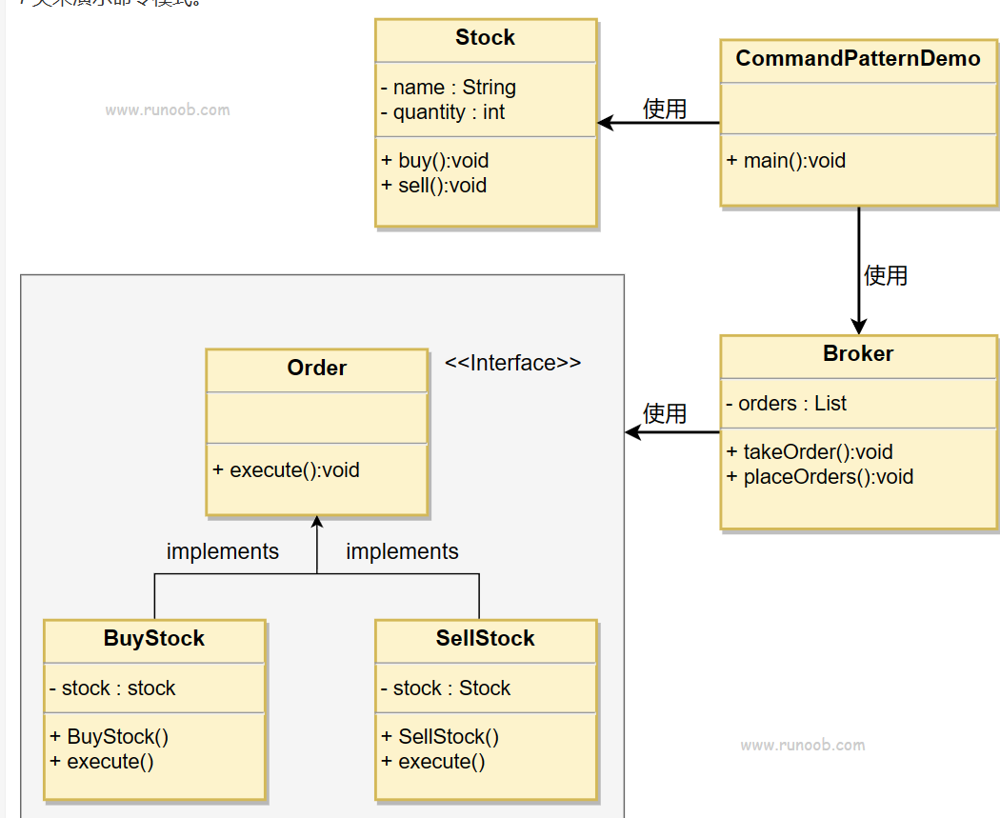
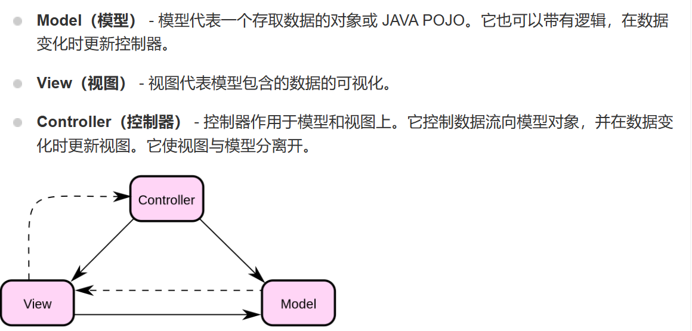
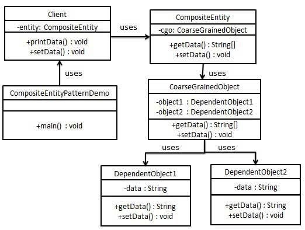

# 设计模式1

## CRTP

​		奇异递归模板模式在C++中是一种设计模式：他将自身作为模板参数传递给基类

```
struct Foo: SomeBase<Foo>
{
	...
}
```

​		这样，我们就可以将自身的信息传递给基类了：你看

```C++
struct MyClass:SomeBase<MyClass>
{
	class iterator{
        ...
    }
    iterator begin() const;
    iterator end() const;
}
```

```C++
template<typename Derived>
struct SomeBase
{
    void foo()
    {
        for(auto& item: *static_cast<Derived*>(this))
        {
            ...
        }
    }
}
```

## Mixin

C++中，可以使用模板来进行类的组合

```C++
template<typename T> struct Mixin:T
{
	...
}
```

​		这样我们就可以有类型`<Foo<Bar<Baz>>>`而不需要真正的构造一个FooBarBaz类型。

## SOLID设计原则

​		**SOLID** 是面向对象设计五大重要原则的首字母缩写，当我们设计类和模块时，遵守 SOLID 原则就如同它的名字一样：(solid，**可靠的**)，可以让软件更加稳定、灵活和健壮。

### Single Responsibility Principle（SRP）：单一职责原则

**一个类或者一个模块只做一件事**。让一个类或者一个模块专注于单一的功能，减少功能之间的耦合程度。这样做在需要修改某个功能时，就不会影响到其他的功能。


### Open Closed Principle（OCP）：开闭原则

**对扩展开放，对修改关闭**。一个类独立之后就不应该去修改它，而是以扩展的方式适应新需求。


### Liskov Substitution Principle（LSP）：里氏替换原则

所有基类出现的地方都可以用派生类替换而不会让程序产生错误，派生类可以**扩展基类的功能**，但**不能改变基类原有的功能**。


### Interface Segregation Principle（ISP）：接口隔离原则

**一个接口应该拥有尽可能少的行为**，使其精简单一。对于**不同的功能的模块分别使用不同接口**，而不是使用同一个通用的接口。


### Dependence Inversion Principle（DIP）：依赖倒置原则

高级模块不应该依赖低级模块，而是**依赖抽象接口**，通过抽象接口使用对应的低级模块。


# 设计模式小记

## Abstract Factory 抽象工厂

​		工厂，顾名思义，就是产生产品的场所。在这里，他指代的是面向一系列的产品提供一个共同的抽象接口的含义，而不需要指定他们具体的类

### 1. 抽象工厂模式的特性

​		在抽象工厂模式中，客户端并不直接创建对象，而是通过调用工厂方法来创建对象。这样，客户端可以从具体产品中解耦，使得系统更具有可扩展性。

### 2. 抽象工厂模式的组成部分

抽象工厂模式主要包含以下四个组成部分：

1. **抽象工厂（Abstract Factory）**：抽象工厂定义了一个接口，声明了一组用于创建抽象产品的方法。（作为一个父类）
2. **具体工厂（Concrete Factory）**：具体工厂实现了抽象工厂中定义的接口，用于创建具体产品对象。（也就是实际代码里具体选择的子类工厂）
3. **抽象产品（Abstract Product）**：抽象产品为一类产品对象声明一个接口。
4. **具体产品（Concrete Product）**：具体产品实现了抽象产品声明的接口，表示特定工厂创建的产品对象。

### 3. 抽象工厂模式的应用场景

抽象工厂模式适用于以下场景：

1. 一个系统需要独立于其产品的创建、组合和表示时。
2. 一个系统要由多个产品系列中的一个来配置时。
3. 当你需要强调一系列相关产品的设计以便进行联合使用时。
4. 当你需要提供一个产品类库，而只想显示它们的接口而不是实现时。

### 4. 抽象工厂模式的实现示例

以下是一个关于按钮和复选框的抽象工厂模式示例：

#### Java实例

```java
// 抽象产品：按钮
interface Button {
    void render();
}

// 具体产品：Windows按钮
class WindowsButton implements Button {
    @Override
    public void render() {
        System.out.println("渲染Windows按钮");
    }
}

// 具体产品：Mac按钮
class MacButton implements Button {
    @Override
    public void render() {
        System.out.println("渲染Mac按钮");
    }
}

// 抽象产品：复选框
interface Checkbox {
    void render();
}

// 具体产品：Windows复选框
class WindowsCheckbox implements Checkbox {
    @Override
    public void render() {
        System.out.println("渲染Windows复选框");
    }
}

// 具体产品：Mac复选框
class MacCheckbox implements Checkbox {
    @Override
    public void render() {
        System.out.println("渲染Mac复选框");
    }
}

// 抽象工厂
interface GUIFactory {
    Button createButton();
    Checkbox createCheckbox();
}

// 具体工厂：Windows工厂
class WindowsFactory implements GUIFactory {
    @Override
    public Button createButton() {
        return new WindowsButton();
    }

    @Override
    public Checkbox createCheckbox() {
        return new WindowsCheckbox();
    }
}

// 具体工厂：Mac工厂
class MacFactory implements GUIFactory {
    @Override
    public Button createButton() {
        return new MacButton();
    }

    @Override
    public Checkbox createCheckbox() {
        return new MacCheckbox();
    }
}

// 客户端代码
public class Client {
    private Button button;
    private Checkbox checkbox;

    publicClient(GUIFactory factory) {
        button = factory.createButton();
        checkbox = factory.createCheckbox();
    }

    public void renderUI() {
        button.render();
        checkbox.render();
    }

    public static void main(String[] args) {
        GUIFactory factory;
        String osName = System.getProperty("os.name").toLowerCase();

        if (osName.contains("windows")) {
            factory = new WindowsFactory();
        } else {
            factory = new MacFactory();
        }

        Client client = new Client(factory);
        client.renderUI();
    }
}
```

​		在上面的示例中，我们定义了两个抽象产品（`Button` 和 `Checkbox`），以及它们的具体实现（`WindowsButton`、`MacButton`、`WindowsCheckbox` 和 `MacCheckbox`）。然后，我们创建了一个抽象工厂（`GUIFactory`）以及两个具体工厂（`WindowsFactory` 和 `MacFactory`），用于根据操作系统类型创建对应的按钮和复选框。最后，在客户端代码中，我们使用工厂创建了按钮和复选框，并调用它们的 `render` 方法来渲染它们。

#### C++ 实例

​		我们下面开始按照步骤实践一下抽象工厂的使用步骤

> **第一步，定义抽象工厂父类**：

```C++
class AbstractProduct;
class AbstractFactory
{
public:
    virtual AbstractProduct* createProduct() = 0;
};
```

​		现在，我们的工厂的共同点就是：它一定会创建一个产品。我们之后所有的工厂模型一定会去调用抽象函数：

```
AbstractProduct* createProduct();
```

​		这个接口来完成所以的附属抽象产品的创建。

> **第二步，定义抽象产品类**

```C++
class AbstractProduct
{
public:
    virtual void displayProduct() = 0;
    virtual void processProduct() = 0;
};
```

​		毫无疑问，我们的抽象产品必须凝聚所有的目标产品的共同点。比如说，我们需要告诉它自己是啥：

```C++
void displayProduct()
```

​		需要给外界提供作用方法：

```C++
void processProduct();
```

​		我们之所以让函数成为纯虚函数，是为了强制客户程序员在后续的开发中必须重构这两个函数。来表征自己产品的特殊。

> （我自己的看法：其实，根据因果，我私下认为先制定出抽象产品的定义后才考虑抽象工厂。方便我们得知如何更好的提供抽象接口。

> **第三步，提供具象的产品**

​		当然，这里就不算特别属于抽象工厂的范畴了，至于是提供产品蔟还是产品，看需求的复杂程度完成指定。

```C++
class ProductA : public AbstractProduct{
public:
    void displayProduct() override{
        MSG("This is product A");
    }
    void processProduct() override{
        MSG("Is dealing with Product A");
    }
};

class ProductB : public AbstractProduct
{
public:
    void displayProduct() override{
        MSG("This is product B");
    }
    void processProduct() override{
        MSG("Is dealing with Product B");
    }
};

// ... more
```

> **第四步：依照产品提供对应的具象Factory**

```C++
class ProductA_Factory : public AbstractFactory
{
public:
    ProductA* createProduct() override{
        MSG("A is creating");
        return new ProductA;
    };
};

class ProductB_Factory : public AbstractFactory
{
public:
    ProductB* createProduct() override{
        MSG("B is creating");
        return new ProductB;
    };
};
```

> **第五步：编写客户代码即可**

```C++
int main()
{
    AbstractProduct* product = nullptr;
    AbstractFactory* factory = nullptr;

    char choice = 'A';
    std::cin >> choice;
    if(choice == 'A')
        factory = new ProductA_Factory;
    else if(choice == 'B')
        factory = new ProductB_Factory;
    else
        return -1;
    product = factory->createProduct();
    product->displayProduct();
    product->processProduct();

    delete factory;
    delete product;
}
```

 		现在，我们可以依据外界选择特定的子类进行执行了：

​		当我们外界输入A时，C++自动转化为对应的子类：


### 5. 抽象工厂模式与工厂方法模式的比较

抽象工厂模式和工厂方法模式都属于创建型设计模式，它们的主要区别在于：

1. **工厂方法模式**只关注单个产品等级结构，例如只关注按钮的创建。工厂方法模式为每个产品提供一个工厂，客户端通过调用工厂方法来创建产品。工厂方法模式可以轻松地扩展为创建新产品，只需要添加一个新的具体产品类和对应的具体工厂类即可。
2. **抽象工厂模式**关注多个产品等级结构，例如同时关注按钮和复选框的创建。抽象工厂模式为一组相关产品提供一个统一的工厂接口，客户端通过调用工厂方法来创建一组相关产品。抽象工厂模式可以轻松地扩展为创建新的产品系列，只需要添加一个新的具体工厂类即可。

抽象工厂模式与工厂方法模式一样，都是创建型设计模式，它们之间的不同是：

1. 工厂方法模式注重于产品等级结构上的扩展，而抽象工厂模式注重于产品族的扩展。
2. 工厂方法模式只有一个抽象产品类，而抽象工厂模式有多个抽象产品类。
3. 工厂方法模式一个具体工厂只能实现一个产品类，而抽象工厂模式有一个具体工厂可以实现多个产品类。

### 6. 优缺点

#### 优点：

1. 抽象工厂模式可以确保系统中所有产品的一致性，因为每个工厂都生产同样类型的产品。
2. 抽象工厂模式使得易于**交换产品系列**，因为整个产品系列都被一个工厂所生产，只需要更换工厂即可更换整个产品系列。
3. 抽象工厂模式使得**易于交换产品家族**，因为每个工厂生产的产品和其它工厂无关，只需要更换工厂即可更换整个产品家族。
4. 抽象工厂模式可以减少客户端与不同对象之间的耦合度，因为客户端只需要知道它使用的是哪个工厂即可。

#### 缺点：

1. 抽象工厂模式增加了代码的复杂度，增加了程序的理解难度。
2. 抽象工厂模式对于新的产品类型的支持并不太好，**因为修改产品族需要修改抽象工厂接口，这就需要修改所有的实现工厂类。**
3. **抽象工厂模式可以使得产品族扩展变得困难，因为每次扩展新的产品都需要新增一整个工厂类以及其它相关类。**，也就是说，我们要求此类设计模式应用在那些**需求较为稳定的场景**

# 设计模式小记 2

## Builder

### 简单介绍

​		建造者模式（Builder Pattern）使用多个简单的对象一步一步构建成一个复杂的对象。这种类型的设计模式属于创建型模式，它提供了一种创建对象的最佳方式。一个 Builder 类会一步一步构造最终的对象。该 Builder 类是独立于其他对象的。也就是说，我们把构造的部分使用Builder的方法进行分离。此种方法往往采用那些可能需要延迟完全构造的对象比较适合使用。

### 优缺点分析

Builder 设计模式的优点有：

- 可以将一个**复杂对象的构建与其表示分离，使得同样的构建过程可以创建不同的表示。**
- 可以将类的构造函数中的可**选参数分离出来，使用setter的方式进行初始化，非常的灵活。**
- 可以使用链式调用，属性连续设置，看起来简洁，易于理解。
- 可以**隔离复杂对象的创建和使用，隐藏了产品的内部结构和实现细节**。
- 可以对产品进行更精细的控制，只需调用需要的构造步骤即可。

Builder 设计模式的缺点有：

- 产品组成部分必须相同，限制了使用范围。
- 如果产品内部变化复杂，会增加更多的具体建造者类，增加了系统的复杂度和运行成本。
- 需要创建额外的Builder接口和具体建造者类，增加了代码量。
- 与抽象工厂模式相比，不能很好地处理产品族的问题。

### 实现`(java)`

​		我们假设一个快餐店的商业案例，其中，一个典型的套餐可以是一个汉堡（Burger）和一杯冷饮（Cold drink）。汉堡（Burger）可以是素食汉堡（Veg Burger）或鸡肉汉堡（Chicken Burger），它们是包在纸盒中。冷饮（Cold drink）可以是可口可乐（coke）或百事可乐（pepsi），它们是装在瓶子中。

​		我们将创建一个表示食物条目（比如汉堡和冷饮）的 *Item* 接口和实现 *Item* 接口的实体类，以及一个表示食物包装的 *Packing* 接口和实现 *Packing* 接口的实体类，汉堡是包在纸盒中，冷饮是装在瓶子中。

​		然后我们创建一个 *Meal* 类，带有 *Item* 的 *ArrayList* 和一个通过结合 *Item* 来创建不同类型的 *Meal* 对象的 *MealBuilder*。*BuilderPatternDemo* 类使用 *MealBuilder* 来创建一个 *Meal*。


#### 步骤 1

创建一个表示食物条目和食物包装的接口。

##### Item.java

```java
public interface Item {
   public String name();
   public Packing packing();
   public float price();    
}
```


##### Packing.java

```java
public interface Packing {
   public String pack();
}
```


#### 步骤 2

创建实现 Packing 接口的实体类。

##### Wrapper.java

```java
public class Wrapper implements Packing {
 
   @Override
   public String pack() {
      return "Wrapper";
   }
}
```

##### Bottle.java

```java
public class Bottle implements Packing {
 
   @Override
   public String pack() {
      return "Bottle";
   }
}
```

#### 步骤 3

创建实现 Item 接口的抽象类，该类提供了默认的功能。

##### Burger.java

```java
public abstract class Burger implements Item {
 
   @Override
   public Packing packing() {
      return new Wrapper();
   }
 
   @Override
   public abstract float price();
}
```

##### ColdDrink.java

```java
public abstract class ColdDrink implements Item {
 
    @Override
    public Packing packing() {
       return new Bottle();
    }
 
    @Override
    public abstract float price();
}
```

#### 步骤 4

创建扩展了 Burger 和 ColdDrink 的实体类。

##### VegBurger.java

```java
public class VegBurger extends Burger {
 
   @Override
   public float price() {
      return 25.0f;
   }
 
   @Override
   public String name() {
      return "Veg Burger";
   }
}
```

##### ChickenBurger.java

```java
public class ChickenBurger extends Burger {
 
   @Override
   public float price() {
      return 50.5f;
   }
 
   @Override
   public String name() {
      return "Chicken Burger";
   }
}
```

##### Coke.java

```java
public class Coke extends ColdDrink {
 
   @Override
   public float price() {
      return 30.0f;
   }
 
   @Override
   public String name() {
      return "Coke";
   }
}
```

##### Pepsi.java

```java
public class Pepsi extends ColdDrink {
 
   @Override
   public float price() {
      return 35.0f;
   }
 
   @Override
   public String name() {
      return "Pepsi";
   }
}
```

#### 步骤 5

创建一个 Meal 类，带有上面定义的 Item 对象。

##### Meal.java

```java
import java.util.ArrayList;
import java.util.List;
 
public class Meal {
   private List<Item> items = new ArrayList<Item>();    
 
   public void addItem(Item item){
      items.add(item);
   }
 
   public float getCost(){
      float cost = 0.0f;
      for (Item item : items) {
         cost += item.price();
      }        
      return cost;
   }
 
   public void showItems(){
      for (Item item : items) {
         System.out.print("Item : "+item.name());
         System.out.print(", Packing : "+item.packing().pack());
         System.out.println(", Price : "+item.price());
      }        
   }    
}
```

#### 步骤 6

创建一个 MealBuilder 类，实际的 builder 类负责创建 Meal 对象。

##### MealBuilder.java

```java
public class MealBuilder {
 
   public Meal prepareVegMeal (){
      Meal meal = new Meal();
      meal.addItem(new VegBurger());
      meal.addItem(new Coke());
      return meal;
   }   
 
   public Meal prepareNonVegMeal (){
      Meal meal = new Meal();
      meal.addItem(new ChickenBurger());
      meal.addItem(new Pepsi());
      return meal;
   }
}
```

#### 步骤 7

BuiderPatternDemo 使用 MealBuilder 来演示建造者模式（Builder Pattern）。

##### BuilderPatternDemo.java

```java
public class BuilderPatternDemo {
   public static void main(String[] args) {
      MealBuilder mealBuilder = new MealBuilder();
 
      Meal vegMeal = mealBuilder.prepareVegMeal();
      System.out.println("Veg Meal");
      vegMeal.showItems();
      System.out.println("Total Cost: " +vegMeal.getCost());
 
      Meal nonVegMeal = mealBuilder.prepareNonVegMeal();
      System.out.println("\n\nNon-Veg Meal");
      nonVegMeal.showItems();
      System.out.println("Total Cost: " +nonVegMeal.getCost());
   }
}
```

#### 步骤 8

执行程序，输出结果：

```
Veg Meal
Item : Veg Burger, Packing : Wrapper, Price : 25.0
Item : Coke, Packing : Bottle, Price : 30.0
Total Cost: 55.0


Non-Veg Meal
Item : Chicken Burger, Packing : Wrapper, Price : 50.5
Item : Pepsi, Packing : Bottle, Price : 35.0
Total Cost: 85.5
```

### 实现`(C++)`

​		大概如此：

```C++ 
#include <iostream>
#include <string>
#include <vector>
// 先有鸡还是现有蛋的问题
class ClassInfoBuilder{
public:
    friend class ClassInfo;
    ClassInfoBuilder() = delete;
    explicit ClassInfoBuilder(std::string& className) {
        name = className;
    }
    ClassInfoBuilder& addPublicMembers(std::string&& pub){
        publicMembers.push_back(pub);
        return *this;
    }

    ClassInfoBuilder& addPrivateMembers(std::string&& privates){
        privateMembers.push_back(privates);
        return *this;
    }

private:
    std::string name;
    std::vector<std::string> publicMembers;
    std::vector<std::string> privateMembers;
};


class ClassInfo{
public:
    ClassInfo() = default;
    ~ClassInfo(){
    	if(mainCoreBuilder)
    		delete mainCoreBuilder;
    	mainCoreBuilder = nullptr;
    }
    explicit ClassInfo(std::string name){
        buildClassInfo(name);
    }

    ClassInfoBuilder& buildClassInfo(std::string& className){
        if(!mainCoreBuilder){
           delete mainCoreBuilder;
        }
        mainCoreBuilder = new ClassInfoBuilder(className);
        return *mainCoreBuilder;
    }

    ClassInfo& addPublicMembers(std::string&& name){
        if(!mainCoreBuilder){
            return *this;
        }
        mainCoreBuilder->addPublicMembers(std::forward<std::string&&>(name));
        return *this;
    }

    ClassInfo& addPrivateMembers(std::string&& name){
        if(!mainCoreBuilder){
            return *this;
        }
        mainCoreBuilder->addPrivateMembers(std::forward<std::string&&>(name));
        return *this;
    }

    void showInfos(){
        std::cout << "Current Class Name:> " << mainCoreBuilder->name << "\n";
        std::cout << "Public Members are here\n";
        for(std::string& each : mainCoreBuilder->publicMembers)
            std::cout << each << " ";
        std::cout << std::endl;
        std::cout << "Private Members are here\n";
        for(std::string& each : mainCoreBuilder->privateMembers)
            std::cout << each << " ";
        std::cout << std::endl;
    }
private:
    ClassInfoBuilder* mainCoreBuilder;
};

int main()
{
    std::string name = "aClass";
    ClassInfo info;
    info.buildClassInfo(name).addPublicMembers("111")
    .addPublicMembers("222").addPrivateMembers("333").addPrivateMembers("444");
    info.showInfos();
}
```

# 设计模式小记 3

## Factory Mode

​		我们下面来讨论一下工厂模式：我们将会定义创建对象的接口，让子类去决定实例化哪一个类。由于这样的构造存在父子层面，又被称之为虚构造器。

​		

### 1. 介绍

#### 定义

​		工厂方法模式，又称工厂模式、多态工厂模式和虚拟构造器模式，通过定义工厂父类负责定义创建对象的公共接口，而子类则负责生成具体的对象。

#### 主要作用

​		将类的实例化（具体产品的创建）延迟到工厂类的子类（具体工厂）中完成，即由子类来决定应该实例化（创建）哪一个类。

#### 解决的问题

​		工厂一旦需要生产新产品就需要修改工厂类的方法逻辑，违背了“开放 - 关闭原则”

> 1. 即**简单工厂模式**的缺点
> 2. 之所以可以解决简单工厂的问题，是因为工厂方法模式把具体产品的创建推迟到工厂类的子类（具体工厂）中，此时工厂类不再负责所有产品的创建，而只是给出具体工厂必须实现的接口，这样工厂方法模式在添加新产品的时候就不修改工厂类逻辑而是添加新的工厂子类，符合开放封闭原则，克服了简单工厂模式中缺点

------

### 模式原理

2.1 UML类图


2.2 模式组成

| 组成（角色）                 | 关系                               | 作用                                                  |
| :--------------------------- | :--------------------------------- | :---------------------------------------------------- |
| 抽象产品（Product）          | 具体产品的父类                     | 描述具体产品的公共接口                                |
| 具体产品（Concrete Product） | 抽象产品的子类；工厂类创建的目标类 | 描述生产的具体产品                                    |
| 抽象工厂（Creator）          | 具体工厂的父类                     | 描述具体工厂的公共接口                                |
| 具体工厂（Concrete Creator） | 抽象工厂的子类；被外界调用         | 描述具体工厂；实现FactoryMethod工厂方法创建产品的实例 |

2.3 使用步骤

**步骤1：** 创建**抽象工厂类**，定义具体工厂的公共接口； 
**步骤2：** 创建**抽象产品类** ，定义具体产品的公共接口； 
**步骤3：** 创建**具体产品类**（继承抽象产品类） & 定义生产的具体产品； 
**步骤4：**创建**具体工厂类**（继承抽象工厂类），定义创建对应具体产品实例的方法； 
**步骤5：**外界通过调用具体工厂类的方法，从而创建不同**具体产品类的实例**

------

### 实例`(java)`

​		这部分的C++代码同Abstract Factory的那部分一致，这里就不再贴出。

#### 实例概况

- 背景：小成有一间塑料加工厂（仅生产A类产品）；随着客户需求的变化，客户需要生产B类产品；

- 冲突：改变原有塑料加工厂的配置和变化非常困难，假设下一次客户需要再发生变化，再次改变将增大非常大的成本；

- 解决方案：小成决定置办

  塑料分厂B

  来生产B类产品； 

  > 即工厂方法模式

3.2 使用步骤

**步骤1：** 创建**抽象工厂类**，定义具体工厂的公共接口

```java
abstract class Factory{
    public abstract Product Manufacture();
}
```

**步骤2：** 创建**抽象产品类** ，定义具体产品的公共接口；

```java
abstract class Product{
    public abstract void Show();
}
```

**步骤3：** 创建**具体产品类**（继承抽象产品类）， 定义生产的具体产品；

```java
//具体产品A类
class  ProductA extends  Product{
    @Override
    public void Show() {
        System.out.println("生产出了产品A");
    }
}
 
//具体产品B类
class  ProductB extends  Product{
 
    @Override
    public void Show() {
        System.out.println("生产出了产品B");
    }
}
```

**步骤4：**创建**具体工厂类**（继承抽象工厂类），定义创建对应具体产品实例的方法；

```java
//工厂A类 - 生产A类产品
class  FactoryA extends Factory{
    @Override
    public Product Manufacture() {
        return new ProductA();
    }
}
 
//工厂B类 - 生产B类产品
class  FactoryB extends Factory{
    @Override
    public Product Manufacture() {
        return new ProductB();
    }
}
```

**步骤5：**外界通过调用具体工厂类的方法，从而创建不同**具体产品类的实例**

```java
//生产工作流程
public class FactoryPattern {
    public static void main(String[] args){
        //客户要产品A
        FactoryA mFactoryA = new FactoryA();
        mFactoryA.Manufacture().Show();
 
        //客户要产品B
        FactoryB mFactoryB = new FactoryB();
        mFactoryB.Manufacture().Show();
    }
}
```

结果：

```less
生产出了产品A
生产出了产品B
```

------

### 优点

- 更符合开-闭原则 
  新增一种产品时，只需要增加相应的具体产品类和相应的工厂子类即可

  > 简单工厂模式需要修改工厂类的判断逻辑

- 符合单一职责原则 
  每个具体工厂类只负责创建对应的产品

  > 简单工厂中的工厂类存在复杂的switch逻辑判断

- 不使用静态工厂方法，可以形成基于继承的等级结构。

  > 简单工厂模式的工厂类使用静态工厂方法

总结：工厂模式可以说是简单工厂模式的进一步抽象和拓展，在保留了简单工厂的封装优点的同时，让扩展变得简单，让继承变得可行，增加了多态性的体现。

------

### 缺点

- 添加新产品时，除了增加新产品类外，还要提供与之对应的具体工厂类，系统类的个数将成对增加，在一定程度上增加了系统的复杂度；同时，有更多的类需要编译和运行，会给系统带来一些额外的开销；
- 由于考虑到系统的可扩展性，需要引入抽象层，在客户端代码中均使用抽象层进行定义，增加了系统的抽象性和理解难度，且在实现时可能需要用到DOM、反射等技术，增加了系统的实现难度。
- 虽然保证了工厂方法内的对修改关闭，但对于使用工厂方法的类，如果要更换另外一种产品，仍然需要修改实例化的具体工厂类；
- 一个具体工厂只能创建一种具体产品

------

### 应用场景

- 当一个类不知道它所需要的对象的类时 
  在工厂方法模式中，客户端不需要知道具体产品类的类名，只需要知道所对应的工厂即可；
- 当一个类希望通过其子类来指定创建对象时 
  在工厂方法模式中，对于抽象工厂类只需要提供一个创建产品的接口，而由其子类来确定具体要创建的对象，利用面向对象的多态性和里氏代换原则，在程序运行时，子类对象将覆盖父类对象，从而使得系统更容易扩展。
- 将创建对象的任务委托给多个工厂子类中的某一个，客户端在使用时可以无须关心是哪一个工厂子类创建产品子类，需要时再动态指定，可将具体工厂类的类名存储在配置文件或数据库中。

### 一些区别

**工厂方法模式**：一个抽象产品类，可以派生出多个具体产品类。每个具体工厂类只能创建一个具体产品类的实例。

**抽象工厂模式**：多个抽象产品类，每个抽象产品类可以派生出多个具体产品类。一个抽象工厂类可以派生出多个具体工厂类。每个具体工厂类可以创建多个具体产品的实例。

**区别**：工厂方法模式只有一个抽象产品类，而抽象工厂模式有多个。工厂方法模式的具体工厂类只能创建一个具体产品类的实例，而抽象工厂模式可以创建多个。

# 设计模式小记 4

## Prototype 原型模式

​		广义的讲，这类设计模式是为了尽可能少的减小开销而出现的，举个例子，在数据库做查询的时候，我们不可能对每一次用户的请求都在数据库理翻腾倒海的查询，而是可以使用类似于简单拷贝的方式，将那些反复使用的操作部分独立出来，这样，我们只需要在一定时间内对这部分拷贝出来的对象进行操作，回头一并写入即可。

​		一个经典的例子就是Linux的进程fork：我们实际上并不需要完完全全的立马构造全新的进程，而是拷贝原进程做修改即可。

### 介绍

​		原型模式（Prototype Pattern）是用于创建重复的对象，同时又能保证性能。这种类型的设计模式属于创建型模式，它提供了一种创建对象的最佳方式之一。

​		这种模式是实现了一个原型接口，该接口用于创建当前对象的克隆。当直接创建对象的代价比较大时，则采用这种模式。例如，一个对象需要在一个高代价的数据库操作之后被创建。我们可以缓存该对象，在下一个请求时返回它的克隆，在需要的时候更新数据库，以此来减少数据库调用。

**意图：**用原型实例指定创建对象的种类，并且通过拷贝这些原型创建新的对象。

**主要解决：**在运行期建立和删除原型。

**何时使用：** 1、当一个系统应该独立于它的产品创建，构成和表示时。 2、当要实例化的类是在运行时刻指定时，例如，通过动态装载。 3、为了避免创建一个与产品类层次平行的工厂类层次时。 4、当一个类的实例只能有几个不同状态组合中的一种时。建立相应数目的原型并克隆它们可能比每次用合适的状态手工实例化该类更方便一些。

**如何解决：**利用已有的一个原型对象，快速地生成和原型对象一样的实例。

**关键代码：** 

> 实现克隆操作，在 JAVA 实现 Cloneable 接口，重写 clone()，在 .NET 中可以使用 Object 类的 MemberwiseClone() 方法来实现对象的浅拷贝或通过序列化的方式来实现深拷贝。 2、原型模式同样用于隔离类对象的使用者和具体类型（易变类）之间的耦合关系，它同样要求这些"易变类"拥有稳定的接口。

**应用实例：** 

> 细胞分裂
>
> JAVA 中的 Object clone() 方法。

**优点：**

> 1、性能提高。
>
> 2、逃避构造函数的约束。

**缺点：** 

> 1、配备克隆方法需要对类的功能进行通盘考虑，这对于全新的类不是很难，但对于已有的类不一定很容易，特别当一个类引用不支持串行化的间接对象，或者引用含有循环结构的时候。
>
> 2、必须实现 Cloneable 接口。

**使用场景：** 

1. 资源优化场景。 
2. 类初始化需要消化非常多的资源，这个资源包括数据、硬件资源等。 
3. 性能和安全要求的场景。 
4. 通过 new 产生一个对象需要非常繁琐的数据准备或访问权限，则可以使用原型模式。 
5. 一个对象多个修改者的场景。 
6. 一个对象需要提供给其他对象访问，而且各个调用者可能都需要修改其值时，可以考虑使用原型模式拷贝多个对象供调用者使用。 
7. 在实际项目中，原型模式很少单独出现，一般是和工厂方法模式一起出现，通过 clone 的方法创建一个对象，然后由工厂方法提供给调用者。原型模式已经与 Java 融为浑然一体，大家可以随手拿来使用。

**注意事项：**与通过对一个类进行实例化来构造新对象不同的是，原型模式是通过拷贝一个现有对象生成新对象的。浅拷贝实现 Cloneable，重写，深拷贝是通过实现 Serializable 读取二进制流。

### 实现

​		我们将创建一个抽象类 *Shape* 和扩展了 *Shape* 类的实体类。下一步是定义类 *ShapeCache*，该类把 shape 对象存储在一个 *Hashtable* 中，并在请求的时候返回它们的克隆。

*PrototypePatternDemo* 类使用 *ShapeCache* 类来获取 *Shape* 对象。


#### 步骤 1

创建一个实现了 *Cloneable* 接口的抽象类。

##### Shape.java

```java
public abstract class Shape implements Cloneable {
   
   private String id;
   protected String type;
   
   abstract void draw();
   
   public String getType(){
      return type;
   }
   
   public String getId() {
      return id;
   }
   
   public void setId(String id) {
      this.id = id;
   }
   
   public Object clone() {
      Object clone = null;
      try {
         clone = super.clone();
      } catch (CloneNotSupportedException e) {
         e.printStackTrace();
      }
      return clone;
   }
}
```

#### 步骤 2

创建扩展了上面抽象类的实体类。

##### Rectangle.java

```java
public class Rectangle extends Shape {
 
   public Rectangle(){
     type = "Rectangle";
   }
 
   @Override
   public void draw() {
      System.out.println("Inside Rectangle::draw() method.");
   }
}
```

##### Square.java

```java
public class Square extends Shape {
 
   public Square(){
     type = "Square";
   }
 
   @Override
   public void draw() {
      System.out.println("Inside Square::draw() method.");
   }
}
```

##### Circle.java

```java
public class Circle extends Shape {
 
   public Circle(){
     type = "Circle";
   }
 
   @Override
   public void draw() {
      System.out.println("Inside Circle::draw() method.");
   }
}
```

#### 步骤 3

创建一个类，从数据库获取实体类，并把它们存储在一个 *Hashtable* 中。

##### ShapeCache.java

```java
import java.util.Hashtable;
 
public class ShapeCache {
    
   private static Hashtable<String, Shape> shapeMap 
      = new Hashtable<String, Shape>();
 
   public static Shape getShape(String shapeId) {
      Shape cachedShape = shapeMap.get(shapeId);
      return (Shape) cachedShape.clone();
   }
 
   // 对每种形状都运行数据库查询，并创建该形状
   // shapeMap.put(shapeKey, shape);
   // 例如，我们要添加三种形状
   public static void loadCache() {
      Circle circle = new Circle();
      circle.setId("1");
      shapeMap.put(circle.getId(),circle);
 
      Square square = new Square();
      square.setId("2");
      shapeMap.put(square.getId(),square);
 
      Rectangle rectangle = new Rectangle();
      rectangle.setId("3");
      shapeMap.put(rectangle.getId(),rectangle);
   }
}
```

#### 步骤 4

*PrototypePatternDemo* 使用 *ShapeCache* 类来获取存储在 *Hashtable* 中的形状的克隆。

##### PrototypePatternDemo.java

```java
public class PrototypePatternDemo {
   public static void main(String[] args) {
      ShapeCache.loadCache();
 
      Shape clonedShape = (Shape) ShapeCache.getShape("1");
      System.out.println("Shape : " + clonedShape.getType());        
 
      Shape clonedShape2 = (Shape) ShapeCache.getShape("2");
      System.out.println("Shape : " + clonedShape2.getType());        
 
      Shape clonedShape3 = (Shape) ShapeCache.getShape("3");
      System.out.println("Shape : " + clonedShape3.getType());        
   }
}
```


#### 步骤 5

执行程序，输出结果：

```
Shape : Circle
Shape : Square
Shape : Rectangle
```

### 实例`(C++)`

```C++
#include <iostream>
#include <utility>
#include <unordered_map>
#define MSG(X) std::cout << X << std::endl
class AbstractRecord
{
public:
    virtual void displayRecord() = 0;
    virtual AbstractRecord* makeCopy() = 0;
};

class ProductARecord : public AbstractRecord
{
public:
    ProductARecord(std::string name, std::string number):
        name(std::move(name)), number(std::move(number)){}

    virtual void displayRecord() override{
        MSG("A is recording:> ");
        MSG(name);
        MSG(number);
    }

    ProductARecord* makeCopy(){
        return new ProductARecord(*this);
    }

private:
    std::string name;
    std::string number;
};

class ProductBRecord : public AbstractRecord{
public:
    ProductBRecord(std::string name, std::string phoneNumber):
        name(std::move(name)),phoneNumber(std::move(phoneNumber)){};

    virtual void displayRecord() override{
        MSG("A is recording:> ");
        MSG(name);
        MSG(phoneNumber);
    }

    ProductBRecord* makeCopy(){
        return new ProductBRecord(*this);
    }

private:
    std::string name;
    std::string phoneNumber;
};


class FactoryProtoType{
public:
    enum class Allowed_Prototype{
        PRODUCT_A,
        Product_B
    };

    FactoryProtoType()
    {
        map[Allowed_Prototype::PRODUCT_A] = new ProductARecord("Product A", "114514");
        map[Allowed_Prototype::Product_B] = new ProductBRecord("Product B", "1919810");
    }


    AbstractRecord* getRecord(Allowed_Prototype whatType){
        return map[whatType]->makeCopy();
    }

private:
    std::unordered_map<Allowed_Prototype, AbstractRecord*> map;
};

int main()
{
    FactoryProtoType fac;
    ProductARecord* a = dynamic_cast<ProductARecord*>
            (fac.getRecord(FactoryProtoType::Allowed_Prototype::PRODUCT_A));
    a->displayRecord();

    ProductBRecord* b = dynamic_cast<ProductBRecord*>(fac.getRecord(FactoryProtoType::Allowed_Prototype::Product_B));
    b->displayRecord();

    delete a;
    delete b;
}
```

# 设计模式小记 5

## **Adapter（适配器模式）**

### 概论

​		Adapter（适配器模式）属于结构型模式，别名 `wrapper`，结构性模式关注的是如何组合类与对象，以获得更大的结构，我们平常工作大部分时间都在与这种设计模式打交道。

​		**意图：将一个类的接口转换成客户希望的另一个接口。Adapter 模式使得原本由于接口不兼容而不能在一起工作的那些类可以一起工作。**

​		这个设计模式的意图很好懂，就是把接口不兼容问题抹平。注意，也仅仅能解决接口不一致的问题，而不能解决功能不一致的问题。

### **举例子**

​		如果看不懂上面的意图介绍，没有关系，设计模式需要在日常工作里用起来，结合例子可以加深你的理解，下面我准备了三个例子，让你体会什么场景下会用到这种设计模式。

#### **接口转换器**

​		插座的种类很多，我们都用过许多适配器，将不同的插头进行转换，可以在不替换插座的情况下正常使用。USB 接口转换也同样精彩，有将 TypeC 接口转换为 TypeA 的，也有将 TypeA 接口转换为 TypeC 的，支持双向转换。接口转换器就是我们在生活中使用到的适配器模式，因为厂商并没有生产一个新的插座，我们也没有因为接口不适配而换一个手机，一切只需要一个接口转换器即可，这就是运用设计模式的收益。

#### **数据库 ORM**

ORM 屏蔽了 SQL 这一层，带来的好处是不需要理解不同 SQL 语法之间的区别，对于通用功能，ORM 会根据不同的平台，比如 Postgresql、Mysql 进行 SQL 的转换。

对 ORM 来说，屏蔽不同平台的差异，就是利用适配器模式做到的。

#### **API Deprecated**

​		当一个广泛使用的库进行了含有 break change 的升级时，往往要留给开发者足够的时间去升级，而不能升级后就直接挂掉，因此被废弃的 API 要标记为 `deprecated`，而这种被废弃标记的 API 的实际实现，往往是使用新的 API 替代，这种场景正是使用了适配器模式，将新的 API 适配到旧的 API，实现 API Deprecated。

### **意图解释**

上面三个例子都满足下面两个条件：

> 1. API 不兼容：因为接口的不同；数据库 SQL 语法的不同；框架 API 的不同。
> 2. 但能力已支持：插座都拥有充电或读取能力；不同的 SQL 都拥有查询数据库能力；新 API 覆盖了旧 API 的能力。这样就可以通过适配器满足 Adapter 的意图：

**意图：将一个类的接口转换成客户希望的另一个接口。Adapter 模式使得原本由于接口不兼容而不能在一起工作的那些类可以一起工作。**

### 使用场景

> 使用一个已经存在的类，但是他的接口不符合我们的需求
>
> 创建一个可以复用的类，它可以和其他不相关的类一块协同工作

### **结构图**

适配器的实现分为继承与组合模式。

下面是名词解释：

- `Adapter` 适配器，把 `Adeptee` 适配成 `Target`。
- `Adaptee` 被适配的内容，比如不兼容的接口。
- `Target` 适配为的内容，比如需要用的接口。

继承：


​		适配器继承 `Adaptee` 并实现 `Target`，适用场景是 `Adaptee` 与 `Target` 结构类似的情况，因为这样只需要实现部分差异化即可。

组合：


​		组合的拓展性更强，但工作量更大，如果 `Target` 与 `Adaptee` 结构差异较大，适合用组合模式。

## **代码例子**

下面例子使用 typescript 编写。

### typescript

继承：

```typescript
interface ITarget {
  // 标准方式是 hello
  hello: () => void
}

class Adaptee {
  // 要被适配的类方法叫 sayHello
  sayHello() {
    console.log('hello')
  }
}

// 适配器继承 Adaptee 并实现 ITarget
class Adapter extends Adaptee implements ITarget {
  hello() {
    // 用 sayHello 对接到 hello
    super.sayHello()
  }
}
```

组合：

```typescript
interface ITarget {
  // 标准方式是 hello
  hello: () => void
}

class Adaptee {
  // 要被适配的类方法叫 sayHello
  sayHello() {
    console.log('hello')
  }
}

// 适配器继承 Adaptee 并实现 ITarget
class Adapter implements ITarget {
  private adaptee: Adaptee 

  constructor(adaptee: Adaptee) {
    this.adaptee = adaptee
  }

  hello() {
    // 用 adaptee.sayHello 对接到 hello
    this.adaptee.sayHello()
  }
}
```

### 实现（java）

​		我们有一个 *MediaPlayer* 接口和一个实现了 *MediaPlayer* 接口的实体类 *AudioPlayer*。默认情况下，*AudioPlayer* 可以播放 mp3 格式的音频文件。

我们还有另一个接口 *AdvancedMediaPlayer* 和实现了 *AdvancedMediaPlayer* 接口的实体类。该类可以播放 vlc 和 mp4 格式的文件。

我们想要让 *AudioPlayer* 播放其他格式的音频文件。为了实现这个功能，我们需要创建一个实现了 *MediaPlayer* 接口的适配器类 *MediaAdapter*，并使用 *AdvancedMediaPlayer* 对象来播放所需的格式。

*AudioPlayer* 使用适配器类 *MediaAdapter* 传递所需的音频类型，不需要知道能播放所需格式音频的实际类。*AdapterPatternDemo* 类使用 *AudioPlayer* 类来播放各种格式。


#### 步骤 1

为媒体播放器和更高级的媒体播放器创建接口。

##### MediaPlayer.java

```java
public interface MediaPlayer {
   public void play(String audioType, String fileName);
}
```

##### AdvancedMediaPlayer.java

```java
public interface AdvancedMediaPlayer { 
   public void playVlc(String fileName);
   public void playMp4(String fileName);
}
```

#### 步骤 2

创建实现了 *AdvancedMediaPlayer* 接口的实体类。

##### VlcPlayer.java

```java
public class VlcPlayer implements AdvancedMediaPlayer{
   @Override
   public void playVlc(String fileName) {
      System.out.println("Playing vlc file. Name: "+ fileName);      
   }
 
   @Override
   public void playMp4(String fileName) {
      //什么也不做
   }
}
```

##### Mp4Player.java

```java
public class Mp4Player implements AdvancedMediaPlayer{
 
   @Override
   public void playVlc(String fileName) {
      //什么也不做
   }
 
   @Override
   public void playMp4(String fileName) {
      System.out.println("Playing mp4 file. Name: "+ fileName);      
   }
}
```

#### 步骤 3

创建实现了 *MediaPlayer* 接口的适配器类。

##### MediaAdapter.java

```java
public class MediaAdapter implements MediaPlayer {
 
   AdvancedMediaPlayer advancedMusicPlayer;
 
   public MediaAdapter(String audioType){
      if(audioType.equalsIgnoreCase("vlc") ){
         advancedMusicPlayer = new VlcPlayer();       
      } else if (audioType.equalsIgnoreCase("mp4")){
         advancedMusicPlayer = new Mp4Player();
      }  
   }
 
   @Override
   public void play(String audioType, String fileName) {
      if(audioType.equalsIgnoreCase("vlc")){
         advancedMusicPlayer.playVlc(fileName);
      }else if(audioType.equalsIgnoreCase("mp4")){
         advancedMusicPlayer.playMp4(fileName);
      }
   }
}
```

#### 步骤 4

创建实现了 *MediaPlayer* 接口的实体类。

##### AudioPlayer.java

```java
public class AudioPlayer implements MediaPlayer {
   MediaAdapter mediaAdapter; 
 
   @Override
   public void play(String audioType, String fileName) {    
 
      //播放 mp3 音乐文件的内置支持
      if(audioType.equalsIgnoreCase("mp3")){
         System.out.println("Playing mp3 file. Name: "+ fileName);         
      } 
      //mediaAdapter 提供了播放其他文件格式的支持
      else if(audioType.equalsIgnoreCase("vlc") 
         || audioType.equalsIgnoreCase("mp4")){
         mediaAdapter = new MediaAdapter(audioType);
         mediaAdapter.play(audioType, fileName);
      }
      else{
         System.out.println("Invalid media. "+
            audioType + " format not supported");
      }
   }   
}
```


#### 步骤 5

使用 AudioPlayer 来播放不同类型的音频格式。

##### AdapterPatternDemo.java

```java
public class AdapterPatternDemo {
   public static void main(String[] args) {
      AudioPlayer audioPlayer = new AudioPlayer();
 
      audioPlayer.play("mp3", "beyond the horizon.mp3");
      audioPlayer.play("mp4", "alone.mp4");
      audioPlayer.play("vlc", "far far away.vlc");
      audioPlayer.play("avi", "mind me.avi");
   }
}
```

#### 步骤 6

执行程序，输出结果：

```
Playing mp3 file. Name: beyond the horizon.mp3
Playing mp4 file. Name: alone.mp4
Playing vlc file. Name: far far away.vlc
Invalid media. avi format not supported
```


### C++中

​		我们需要在C++中**尝试公共继承Target类（就是客户类），私有继承我们的被代理类（也就是库类）**

​		这样我们就会使用桥接器的公共接口来配适我们的开发，从而封装我们的库私有接口。

​		我们来举个例子

```C++
#include <iostream>
#define MSG(X) std::cout << X << std::endl;

class AbsProduct{
public:
    virtual ~AbsProduct() = default;
};

class ProductA : public AbsProduct
{
public:
    virtual void processInA(){
        MSG("Process in A method");
    }
};

class ProductB : public AbsProduct
{
public:
    virtual void processInB(){
        MSG("Process in B method");
    }
};

class ProcessInAvailableProductAbs
{
public:
    virtual void process() = 0;
};

class ProcessInAvailableProduct : public ProcessInAvailableProductAbs , private ProductA, private ProductB
{
public:
    enum class SupportClass{
        PRO_A,
        PRO_B
    };

    ProcessInAvailableProduct() = delete;

    ProcessInAvailableProduct(SupportClass _class){
        switch (_class) {
            case SupportClass::PRO_A:
                pro = new ProductA;
                break;
            case SupportClass::PRO_B:
                pro = new ProductB;
                break;
            default:
                break;
        }
        choice = _class;
    }

    virtual void process() override{
        switch (choice) {
            case SupportClass::PRO_A:
            {
                ProductA* a = dynamic_cast<ProductA*>(pro);
                a->processInA();

            }break;
            case SupportClass::PRO_B:
            {
                ProductB* b = dynamic_cast<ProductB*>(pro);
                b->processInB();
            }break;
        }
    }

private:
    AbsProduct*     pro;
    SupportClass choice;
};

int main()
{
    ProcessInAvailableProduct solution(ProcessInAvailableProduct::SupportClass::PRO_A);
    solution.process();
    ProcessInAvailableProduct solution2(ProcessInAvailableProduct::SupportClass::PRO_B);
    solution2.process();
}
```


### **弊端**

**使用适配器模式本身就可能是个问题**，因为一个好的系统内部不应该做任何侨界，模型应该保持一致性。只有在如下情况才考虑使用适配器模式：

1. 新老系统接替，改造成本非常高。
2. 三方包适配。
3. 新旧 API 兼容。
4. 统一多个类的接口。一般可以结合工厂方法使用。

### **总结**

适配器模式也复合开闭原则，在不对原有对象改造的前提下，构造一个适配器就能完成模块衔接。

适配器模式的实现分为类与对象模式，类模式用继承，对象模式用组合，分别适用于 `Adaptee` 与 `Target` 结构相似与结构差异较大的场景，在任何情况下，组合模式都是灵活性最高的。

最后用一张图概括一下适配器模式的思维：


### 复盘：

**意图：**将一个类的接口转换成客户希望的另外一个接口。适配器模式使得原本由于接口不兼容而不能一起工作的那些类可以一起工作。

**主要解决：**主要解决在软件系统中，常常要将一些"现存的对象"放到新的环境中，而新环境要求的接口是现对象不能满足的。

**何时使用：** 1、系统需要使用现有的类，而此类的接口不符合系统的需要。 2、想要建立一个可以重复使用的类，用于与一些彼此之间没有太大关联的一些类，包括一些可能在将来引进的类一起工作，这些源类不一定有一致的接口。 3、通过接口转换，将一个类插入另一个类系中。（比如老虎和飞禽，现在多了一个飞虎，在不增加实体的需求下，增加一个适配器，在里面包容一个虎对象，实现飞的接口。）

**如何解决：**继承或依赖（推荐）。

**关键代码：**适配器继承或依赖已有的对象，实现想要的目标接口。

**应用实例：** 1、美国电器 110V，中国 220V，就要有一个适配器将 110V 转化为 220V。 2、JAVA JDK 1.1 提供了 Enumeration 接口，而在 1.2 中提供了 Iterator 接口，想要使用 1.2 的 JDK，则要将以前系统的 Enumeration 接口转化为 Iterator 接口，这时就需要适配器模式。 3、在 LINUX 上运行 WINDOWS 程序。 4、JAVA 中的 jdbc。

**优点：** 1、可以让任何两个没有关联的类一起运行。 2、提高了类的复用。 3、增加了类的透明度。 4、灵活性好。

**缺点：** 1、过多地使用适配器，会让系统非常零乱，不易整体进行把握。比如，明明看到调用的是 A 接口，其实内部被适配成了 B 接口的实现，一个系统如果太多出现这种情况，无异于一场灾难。因此如果不是很有必要，可以不使用适配器，而是直接对系统进行重构。 2.由于 JAVA 至多继承一个类，所以至多只能适配一个适配者类，而且目标类必须是抽象类。

**使用场景：**有动机地修改一个正常运行的系统的接口，这时应该考虑使用适配器模式。

**注意事项：**适配器不是在详细设计时添加的，而是解决正在服役的项目的问题。

# 设计模式小记 6

## Bridge模式

​		我们常常用来处理那些一个抽象存在多个实现的方式。也就是说，我们的一个类在不同的环境下达到相同的效果需要采用不同的实现，这个时候，我们就需要采用Bridge方式来分离接口和实现。

​		桥接（Bridge）是用于把抽象化与实现化解耦，使得二者可以独立变化。这种类型的设计模式属于结构型模式，它通过提供抽象化和实现化之间的桥接结构，来实现二者的解耦。

​		这种模式涉及到一个作为桥接的接口，使得实体类的功能独立于接口实现类，这两种类型的类可被结构化改变而互不影响。

​		桥接模式的目的是将抽象与实现分离，使它们可以独立地变化，该模式通过将一个对象的抽象部分与它的实现部分分离，使它们可以独立地改变。它通过组合的方式，而不是继承的方式，将抽象和实现的部分连接起来。

​		我们通过下面的实例来演示桥接模式（Bridge Pattern）的用法。其中，可以使用相同的抽象类方法但是不同的桥接实现类，来画出不同颜色的圆。

### 介绍

**意图：**将抽象部分与实现部分分离，使它们都可以独立的变化。

**主要解决：**在有多种可能会变化的情况下，用继承会造成类爆炸问题，扩展起来不灵活。

**何时使用：**实现系统可能有多个角度分类，每一种角度都可能变化。

**如何解决：**把这种多角度分类分离出来，让它们独立变化，减少它们之间耦合。

**关键代码：**抽象类依赖实现类。

**应用实例：** 1、猪八戒从天蓬元帅转世投胎到猪，转世投胎的机制将尘世划分为两个等级，即：灵魂和肉体，前者相当于抽象化，后者相当于实现化。生灵通过功能的委派，调用肉体对象的功能，使得生灵可以动态地选择。 2、墙上的开关，可以看到的开关是抽象的，不用管里面具体怎么实现的。

**优点：** 1、抽象和实现的分离。 2、优秀的扩展能力。 3、实现细节对客户透明。

**缺点：**桥接模式的引入会增加系统的理解与设计难度，由于聚合关联关系建立在抽象层，要求开发者针对抽象进行设计与编程。

**使用场景：** 1、如果一个系统需要在构件的抽象化角色和具体化角色之间增加更多的灵活性，避免在两个层次之间建立静态的继承联系，通过桥接模式可以使它们在抽象层建立一个关联关系。 2、对于那些不希望使用继承或因为多层次继承导致系统类的个数急剧增加的系统，桥接模式尤为适用。 3、一个类存在两个独立变化的维度，且这两个维度都需要进行扩展。

**注意事项：**对于两个独立变化的维度，使用桥接模式再适合不过了。

以下是桥接模式的几个关键角色：

- 抽象（Abstraction）：定义抽象接口，通常包含对实现接口的引用。
- 扩展抽象（Refined Abstraction）：对抽象的扩展，可以是抽象类的子类或具体实现类。
- 实现（Implementor）：定义实现接口，提供基本操作的接口。
- 具体实现（Concrete Implementor）：实现实现接口的具体类。

### 实现（java）

​		我们有一个作为桥接实现的 *DrawAPI* 接口和实现了 *DrawAPI* 接口的实体类 *RedCircle*、*GreenCircle*。*Shape* 是一个抽象类，将使用 *DrawAPI* 的对象。*BridgePatternDemo* 类使用 *Shape* 类来画出不同颜色的圆。


#### 步骤 1

创建桥接实现接口。

##### DrawAPI.java

```java
public interface DrawAPI {
   public void drawCircle(int radius, int x, int y);
}
```

#### 步骤 2

创建实现了 *DrawAPI* 接口的实体桥接实现类。

##### RedCircle.java

```java
public class RedCircle implements DrawAPI {
   @Override
   public void drawCircle(int radius, int x, int y) {
      System.out.println("Drawing Circle[ color: red, radius: "
         + radius +", x: " +x+", "+ y +"]");
   }
}
```

##### GreenCircle.java

```java
public class GreenCircle implements DrawAPI {
   @Override
   public void drawCircle(int radius, int x, int y) {
      System.out.println("Drawing Circle[ color: green, radius: "
         + radius +", x: " +x+", "+ y +"]");
   }
}
```

#### 步骤 3

使用 *DrawAPI* 接口创建抽象类 *Shape*。

##### Shape.java

```java
public abstract class Shape {
   protected DrawAPI drawAPI;
   protected Shape(DrawAPI drawAPI){
      this.drawAPI = drawAPI;
   }
   public abstract void draw();  
}
```

#### 步骤 4

创建实现了 *Shape* 抽象类的实体类。

##### Circle.java

```java
public class Circle extends Shape {
   private int x, y, radius;
 
   public Circle(int x, int y, int radius, DrawAPI drawAPI) {
      super(drawAPI);
      this.x = x;  
      this.y = y;  
      this.radius = radius;
   }
 
   public void draw() {
      drawAPI.drawCircle(radius,x,y);
   }
}
```

#### 步骤 5

使用 *Shape* 和 *DrawAPI* 类画出不同颜色的圆。

##### BridgePatternDemo.java

```java
public class BridgePatternDemo {
   public static void main(String[] args) {
      Shape redCircle = new Circle(100,100, 10, new RedCircle());
      Shape greenCircle = new Circle(100,100, 10, new GreenCircle());
 
      redCircle.draw();
      greenCircle.draw();
   }
}
```

#### 步骤 6

执行程序，输出结果：

```
Drawing Circle[ color: red, radius: 10, x: 100, 100]
Drawing Circle[  color: green, radius: 10, x: 100, 100]
```

### 实现(C++)

​		这种方式天然具有抽象和实现的分离特性，即可以允许我们更好的关注抽象，在调试的时候更容易得知模块出现的问题在何处。

> ImplProduct.h: 实现内核

```C++
//
// Created by 陈冠豪 on 2024/1/5.
//
#include <iostream>
#define MSG(X) std::cout << X << std::endl

enum class SELECTION_CHOICE{
    A_FIT,
    B_FIT
};

static const SELECTION_CHOICE this_choice = SELECTION_CHOICE::B_FIT;

class AbsPro
{
public:
    virtual void process() = 0;
};

class ProA : public AbsPro
{
public:
    void process() override{
        MSG("Process in A implements");
    }
};

class ProB : public AbsPro
{
public:
    void process() override
    {
        MSG("Process in B implements");
    }
};

class ImplProduct
{
public:
    ImplProduct(){
        if(this_choice == SELECTION_CHOICE::A_FIT)
            pro = new ProA;
        else
            pro = new ProB;
    }

    virtual void process(){
        pro->process();
    };

private:
    AbsPro* pro;
};
```

> 分离MyProduct的具象实现和抽象接口

> MyProduct.h

```C++
#ifndef UNTITLED5_MYPRODUCT_H
#define UNTITLED5_MYPRODUCT_H

class ImplProduct;
class MyProduct
{
public:
    MyProduct();
    void process();
private:
    ImplProduct* product;
};

#endif //UNTITLED5_MYPRODUCT_H
```

> MyProduct,cpp

```C++
//
// Created by 陈冠豪 on 2024/1/5.
//
#include "MyProduct.h"
#include "ImplProducts.h"
MyProduct::MyProduct()
{
    this->product = new ImplProduct;
}

void MyProduct::process(){
    this->product->process();
}
```

​		现在我们就做好了抽象。

```C++
#include "MyProduct.h"

int main()
{
    MyProduct a;
    a.process();
}
```

​		只需要更改

```
static const SELECTION_CHOICE this_choice = SELECTION_CHOICE::B_FIT;
```

​		就可以灵活的切换实现。即使表现上完全一致。

# 设计模式小记7

## Composite

组合模式（Composite Pattern），又叫部分整体模式，是用于把一组相似的对象当作一个单一的对象。组合模式依据树形结构来组合对象，用来表示部分以及整体层次。这种类型的设计模式属于结构型模式，它创建了对象组的树形结构。

这种模式创建了一个包含自己对象组的类。该类提供了修改相同对象组的方式。

我们通过下面的实例来演示组合模式的用法。实例演示了一个组织中员工的层次结构。

## 介绍

**意图：**将对象组合成树形结构以表示"部分-整体"的层次结构。组合模式使得用户对单个对象和组合对象的使用具有一致性。

**主要解决：**它在我们树型结构的问题中，模糊了简单元素和复杂元素的概念，客户程序可以像处理简单元素一样来处理复杂元素，从而使得客户程序与复杂元素的内部结构解耦。

**何时使用：** 1、您想表示对象的部分-整体层次结构（树形结构）。 2、您希望用户忽略组合对象与单个对象的不同，用户将统一地使用组合结构中的所有对象。

**如何解决：**树枝和叶子实现统一接口，树枝内部组合该接口。

**关键代码：**树枝内部组合该接口，并且含有内部属性 List，里面放 Component。

**应用实例：** 1、算术表达式包括操作数、操作符和另一个操作数，其中，另一个操作数也可以是操作数、操作符和另一个操作数。 2、在 JAVA AWT 和 SWING 中，对于 Button 和 Checkbox 是树叶，Container 是树枝。

**优点：** 1、高层模块调用简单。 2、节点自由增加。

**缺点：**在使用组合模式时，其叶子和树枝的声明都是实现类，而不是接口，违反了依赖倒置原则。

**使用场景：**部分、整体场景，如树形菜单，文件、文件夹的管理。

**注意事项：**定义时为具体类。

## 实现

我们有一个类 *Employee*，该类被当作组合模型类。*CompositePatternDemo* 类使用 *Employee* 类来添加部门层次结构，并打印所有员工。


#### 步骤 1

创建 *Employee* 类，该类带有 *Employee* 对象的列表。

##### Employee.java

```java
import java.util.ArrayList;
import java.util.List;
 
public class Employee {
   private String name;
   private String dept;
   private int salary;
   private List<Employee> subordinates;
 
   //构造函数
   public Employee(String name,String dept, int sal) {
      this.name = name;
      this.dept = dept;
      this.salary = sal;
      subordinates = new ArrayList<Employee>();
   }
 
   public void add(Employee e) {
      subordinates.add(e);
   }
 
   public void remove(Employee e) {
      subordinates.remove(e);
   }
 
   public List<Employee> getSubordinates(){
     return subordinates;
   }
 
   public String toString(){
      return ("Employee :[ Name : "+ name 
      +", dept : "+ dept + ", salary :"
      + salary+" ]");
   }   
}
```

#### 步骤 2

使用 *Employee* 类来创建和打印员工的层次结构。

##### CompositePatternDemo.java

```java
public class CompositePatternDemo {
   public static void main(String[] args) {
      Employee CEO = new Employee("John","CEO", 30000);
 
      Employee headSales = new Employee("Robert","Head Sales", 20000);
 
      Employee headMarketing = new Employee("Michel","Head Marketing", 20000);
 
      Employee clerk1 = new Employee("Laura","Marketing", 10000);
      Employee clerk2 = new Employee("Bob","Marketing", 10000);
 
      Employee salesExecutive1 = new Employee("Richard","Sales", 10000);
      Employee salesExecutive2 = new Employee("Rob","Sales", 10000);
 
      CEO.add(headSales);
      CEO.add(headMarketing);
 
      headSales.add(salesExecutive1);
      headSales.add(salesExecutive2);
 
      headMarketing.add(clerk1);
      headMarketing.add(clerk2);
 
      //打印该组织的所有员工
      System.out.println(CEO); 
      for (Employee headEmployee : CEO.getSubordinates()) {
         System.out.println(headEmployee);
         for (Employee employee : headEmployee.getSubordinates()) {
            System.out.println(employee);
         }
      }        
   }
}
```

### 步骤 3

执行程序，输出结果为：

```
Employee :[ Name : John, dept : CEO, salary :30000 ]
Employee :[ Name : Robert, dept : Head Sales, salary :20000 ]
Employee :[ Name : Richard, dept : Sales, salary :10000 ]
Employee :[ Name : Rob, dept : Sales, salary :10000 ]
Employee :[ Name : Michel, dept : Head Marketing, salary :20000 ]
Employee :[ Name : Laura, dept : Marketing, salary :10000 ]
Employee :[ Name : Bob, dept : Marketing, salary :10000 ]
```

# 设计模式小记8

## Decorator 装饰器模式

装饰器模式（Decorator Pattern）允许向一个现有的对象添加新的功能，同时又不改变其结构。这种类型的设计模式属于结构型模式，它是作为现有的类的一个包装。

装饰器模式通过将对象包装在装饰器类中，以便动态地修改其行为。

这种模式创建了一个装饰类，用来包装原有的类，并在保持类方法签名完整性的前提下，提供了额外的功能。

我们通过下面的实例来演示装饰器模式的用法。其中，我们将把一个形状装饰上不同的颜色，同时又不改变形状类。

## 介绍

**意图：**动态地给一个对象添加一些额外的职责。就增加功能来说，装饰器模式相比生成子类更为灵活。

**主要解决：**一般的，我们为了扩展一个类经常使用继承方式实现，由于继承为类引入静态特征，并且随着扩展功能的增多，子类会很膨胀。

**何时使用：**在不想增加很多子类的情况下扩展类。

**如何解决：**将具体功能职责划分，同时继承装饰者模式。

**关键代码：** 1、Component 类充当抽象角色，不应该具体实现。 2、修饰类引用和继承 Component 类，具体扩展类重写父类方法。

**应用实例：** 1、孙悟空有 72 变，当他变成"庙宇"后，他的根本还是一只猴子，但是他又有了庙宇的功能。 2、不论一幅画有没有画框都可以挂在墙上，但是通常都是有画框的，并且实际上是画框被挂在墙上。在挂在墙上之前，画可以被蒙上玻璃，装到框子里；这时画、玻璃和画框形成了一个物体。

**优点：**装饰类和被装饰类可以独立发展，不会相互耦合，装饰模式是继承的一个替代模式，装饰模式可以动态扩展一个实现类的功能。

**缺点：**多层装饰比较复杂。

**使用场景：** 1、扩展一个类的功能。 2、动态增加功能，动态撤销。

**注意事项：**可代替继承。

**装饰器模式包含以下几个核心角色：**

- 抽象组件（Component）：定义了原始对象和装饰器对象的公共接口或抽象类，可以是具体组件类的父类或接口。
- 具体组件（Concrete Component）：是被装饰的原始对象，它定义了需要添加新功能的对象。
- 抽象装饰器（Decorator）：继承自抽象组件，它包含了一个抽象组件对象，并定义了与抽象组件相同的接口，同时可以通过组合方式持有其他装饰器对象。
- 具体装饰器（Concrete Decorator）：实现了抽象装饰器的接口，负责向抽象组件添加新的功能。具体装饰器通常会在调用原始对象的方法之前或之后执行自己的操作。

装饰器模式通过嵌套包装多个装饰器对象，可以实现多层次的功能增强。每个具体装饰器类都可以选择性地增加新的功能，同时保持对象接口的一致性。

## 实现

我们将创建一个 *Shape* 接口和实现了 *Shape* 接口的实体类。然后我们创建一个实现了 *Shape* 接口的抽象装饰类 *ShapeDecorator*，并把 *Shape* 对象作为它的实例变量。

*RedShapeDecorator* 是实现了 *ShapeDecorator* 的实体类。

*DecoratorPatternDemo* 类使用 *RedShapeDecorator* 来装饰 *Shape* 对象。


#### 步骤 1

创建一个接口：

##### Shape.java

```
public interface Shape {
   void draw();
}
```

#### 步骤 2

创建实现接口的实体类。

```java
public class Rectangle implements Shape {
 
   @Override
   public void draw() {
      System.out.println("Shape: Rectangle");
   }
}
```

```java
public class Circle implements Shape {
 
   @Override
   public void draw() {
      System.out.println("Shape: Circle");
   }
}
```

#### 步骤 3

创建实现了 *Shape* 接口的抽象装饰类。

##### ShapeDecorator.java

```java
public abstract class ShapeDecorator implements Shape {
   protected Shape decoratedShape;
 
   public ShapeDecorator(Shape decoratedShape){
      this.decoratedShape = decoratedShape;
   }
 
   public void draw(){
      decoratedShape.draw();
   }  
}
```

#### 步骤 4

创建扩展了 *ShapeDecorator* 类的实体装饰类。

##### RedShapeDecorator.java

```java
public class RedShapeDecorator extends ShapeDecorator {
 
   public RedShapeDecorator(Shape decoratedShape) {
      super(decoratedShape);     
   }
 
   @Override
   public void draw() {
      decoratedShape.draw();         
      setRedBorder(decoratedShape);
   }
 
   private void setRedBorder(Shape decoratedShape){
      System.out.println("Border Color: Red");
   }
}
```

#### 步骤 5

使用 *RedShapeDecorator* 来装饰 *Shape* 对象。

##### DecoratorPatternDemo.java

```java
public class DecoratorPatternDemo {
   public static void main(String[] args) {
 
      Shape circle = new Circle();
      ShapeDecorator redCircle = new RedShapeDecorator(new Circle());
      ShapeDecorator redRectangle = new RedShapeDecorator(new Rectangle());
      //Shape redCircle = new RedShapeDecorator(new Circle());
      //Shape redRectangle = new RedShapeDecorator(new Rectangle());
      System.out.println("Circle with normal border");
      circle.draw();
 
      System.out.println("\nCircle of red border");
      redCircle.draw();
 
      System.out.println("\nRectangle of red border");
      redRectangle.draw();
   }
}
```

#### 步骤 6

执行程序，输出结果：

```
Circle with normal border
Shape: Circle

Circle of red border
Shape: Circle
Border Color: Red

Rectangle of red border
Shape: Rectangle
Border Color: Red
```

### C++ 实现

```c++
#include <iostream>

class A{
public:
    void doDraw()
    {
        std::cout << "Draw" << std::endl;
    }
};

class DecorateWithSth
{
public:
    explicit DecorateWithSth(A* a):m_a(a){}
    void doDraw(){
        // Process with A or set sth new
        std::cout << "Decorate!" << std::endl;
        m_a->doDraw();
    }
private:
    A*          m_a;
};

int main() {
    A* a = new A;
    DecorateWithSth decorator(a);
    decorator.doDraw();
    delete a;
    return 0;
}
```

#  设计模式小记9

## Facade

​		这是为了给所有的内部复杂的子系统提供一个一致的高层抽象，避免直接介入系统内部（低情商，写一个类来收拾烂摊子）

外观模式（Facade Pattern）隐藏系统的复杂性，并向客户端提供了一个客户端可以访问系统的接口。这种类型的设计模式属于结构型模式，它向现有的系统添加一个接口，来隐藏系统的复杂性。

这种模式涉及到一个单一的类，该类提供了客户端请求的简化方法和对现有系统类方法的委托调用。

## 介绍

**意图：**为子系统中的一组接口提供一个一致的界面，外观模式定义了一个高层接口，这个接口使得这一子系统更加容易使用。

**主要解决：**降低访问复杂系统的内部子系统时的复杂度，简化客户端之间的接口。

**何时使用：** 1、客户端不需要知道系统内部的复杂联系，整个系统只需提供一个"接待员"即可。 2、定义系统的入口。

**如何解决：**客户端不与系统耦合，外观类与系统耦合。

**关键代码：**在客户端和复杂系统之间再加一层，这一层将调用顺序、依赖关系等处理好。

**应用实例：** 1、去医院看病，可能要去挂号、门诊、划价、取药，让患者或患者家属觉得很复杂，如果有提供接待人员，只让接待人员来处理，就很方便。 2、JAVA 的三层开发模式。

**优点：** 1、减少系统相互依赖。 2、提高灵活性。 3、提高了安全性。

**缺点：**不符合开闭原则，如果要改东西很麻烦，继承重写都不合适。

**使用场景：** 1、为复杂的模块或子系统提供外界访问的模块。 2、子系统相对独立。 3、预防低水平人员带来的风险。

**注意事项：**在层次化结构中，可以使用外观模式定义系统中每一层的入口。

## 实现

我们将创建一个 *Shape* 接口和实现了 *Shape* 接口的实体类。下一步是定义一个外观类 *ShapeMaker*。

*ShapeMaker* 类使用实体类来代表用户对这些类的调用。*FacadePatternDemo* 类使用 *ShapeMaker* 类来显示结果。


#### 步骤 1

创建一个接口。

##### Shape.java

```java
public interface Shape {
   void draw();
}
```

#### 步骤 2

创建实现接口的实体类。

##### Rectangle.java

```java
public class Rectangle implements Shape {
 
   @Override
   public void draw() {
      System.out.println("Rectangle::draw()");
   }
}
```

##### Square.java

```java
public class Circle implements Shape {
 
   @Override
   public void draw() {
      System.out.println("Circle::draw()");
   }
}
```

#### Circle.java

```java
public class Circle implements Shape {
 
   @Override
   public void draw() {
      System.out.println("Circle::draw()");
   }
}
```

#### 步骤 3

创建一个外观类。

##### ShapeMaker.java

```java
public class ShapeMaker {
   private Shape circle;
   private Shape rectangle;
   private Shape square;
 
   public ShapeMaker() {
      circle = new Circle();
      rectangle = new Rectangle();
      square = new Square();
   }
 
   public void drawCircle(){
      circle.draw();
   }
   public void drawRectangle(){
      rectangle.draw();
   }
   public void drawSquare(){
      square.draw();
   }
}
```


#### 步骤 4

使用该外观类画出各种类型的形状。

##### FacadePatternDemo.java

```java
public class FacadePatternDemo {
   public static void main(String[] args) {
      ShapeMaker shapeMaker = new ShapeMaker();
 
      shapeMaker.drawCircle();
      shapeMaker.drawRectangle();
      shapeMaker.drawSquare();      
   }
}
```

#### 步骤 5

执行程序，输出结果：

```
Circle::draw()
Rectangle::draw()
Square::draw()
```

# 设计模式小记10

## 享元模式

​		享元模式（Flyweight Pattern）主要用于减少创建对象的数量，以减少内存占用和提高性能。这种类型的设计模式属于结构型模式，它提供了减少对象数量从而改善应用所需的对象结构的方式。

​		享元模式尝试重用现有的同类对象，如果未找到匹配的对象，则创建新对象。我们将通过创建 5 个对象来画出 20 个分布于不同位置的圆来演示这种模式。由于只有 5 种可用的颜色，所以 color 属性被用来检查现有的 *Circle* 对象。

​		简单的讲就是：将那些需求固定的东西存储下来，从而大大减少对象的数量防止内存膨胀。

### 介绍

**意图：**运用共享技术有效地支持大量细粒度的对象。

**主要解决：**在有大量对象时，有可能会造成内存溢出，我们把其中共同的部分抽象出来，如果有相同的业务请求，直接返回在内存中已有的对象，避免重新创建。

**何时使用：** 1、系统中有大量对象。 2、这些对象消耗大量内存。 3、这些对象的状态大部分可以外部化。 4、这些对象可以按照内蕴状态分为很多组，当把外蕴对象从对象中剔除出来时，每一组对象都可以用一个对象来代替。 5、系统不依赖于这些对象身份，这些对象是不可分辨的。

**如何解决：**用唯一标识码判断，如果在内存中有，则返回这个唯一标识码所标识的对象。

**关键代码：**用 HashMap 存储这些对象。

**应用实例：** 1、JAVA 中的 String，如果有则返回，如果没有则创建一个字符串保存在字符串缓存池里面。 2、数据库的连接池。

**优点：**大大减少对象的创建，降低系统的内存，使效率提高。

**缺点：**提高了系统的复杂度，需要分离出外部状态和内部状态，而且外部状态具有固有化的性质，不应该随着内部状态的变化而变化，否则会造成系统的混乱。

**使用场景：** 1、系统有大量相似对象。 2、需要缓冲池的场景。

**注意事项：** 1、注意划分外部状态和内部状态，否则可能会引起线程安全问题。 2、这些类必须有一个工厂对象加以控制。

### 实现

我们将创建一个 *Shape* 接口和实现了 *Shape* 接口的实体类 *Circle*。下一步是定义工厂类 *ShapeFactory*。

*ShapeFactory* 有一个 *Circle* 的 *HashMap*，其中键名为 *Circle* 对象的颜色。无论何时接收到请求，都会创建一个特定颜色的圆。*ShapeFactory* 检查它的 *HashMap* 中的 circle 对象，如果找到 *Circle* 对象，则返回该对象，否则将创建一个存储在 hashmap 中以备后续使用的新对象，并把该对象返回到客户端。

*FlyWeightPatternDemo* 类使用 *ShapeFactory* 来获取 *Shape* 对象。它将向 *ShapeFactory* 传递信息（*red / green / blue/ black / white*），以便获取它所需对象的颜色。


#### 步骤 1

创建一个接口。

##### Shape.java

```java
public interface Shape {
   void draw();
}
```

#### 步骤 2

创建实现接口的实体类。

##### Circle.java

```java
public class Circle implements Shape {
   private String color;
   private int x;
   private int y;
   private int radius;
 
   public Circle(String color){
      this.color = color;     
   }
 
   public void setX(int x) {
      this.x = x;
   }
 
   public void setY(int y) {
      this.y = y;
   }
 
   public void setRadius(int radius) {
      this.radius = radius;
   }
 
   @Override
   public void draw() {
      System.out.println("Circle: Draw() [Color : " + color 
         +", x : " + x +", y :" + y +", radius :" + radius);
   }
}
```

#### 步骤 3

创建一个工厂，生成基于给定信息的实体类的对象。

##### ShapeFactory.java

```java
import java.util.HashMap;
 
public class ShapeFactory {
   private static final HashMap<String, Shape> circleMap = new HashMap<>();
 
   public static Shape getCircle(String color) {
      Circle circle = (Circle)circleMap.get(color);
 
      if(circle == null) {
         circle = new Circle(color);
         circleMap.put(color, circle);
         System.out.println("Creating circle of color : " + color);
      }
      return circle;
   }
}
```

#### 步骤 4

使用该工厂，通过传递颜色信息来获取实体类的对象。

##### FlyweightPatternDemo.java

```java
public class FlyweightPatternDemo {
   private static final String colors[] = 
      { "Red", "Green", "Blue", "White", "Black" };
   public static void main(String[] args) {
 
      for(int i=0; i < 20; ++i) {
         Circle circle = 
            (Circle)ShapeFactory.getCircle(getRandomColor());
         circle.setX(getRandomX());
         circle.setY(getRandomY());
         circle.setRadius(100);
         circle.draw();
      }
   }
   private static String getRandomColor() {
      return colors[(int)(Math.random()*colors.length)];
   }
   private static int getRandomX() {
      return (int)(Math.random()*100 );
   }
   private static int getRandomY() {
      return (int)(Math.random()*100);
   }
}
```

#### 步骤 5

执行程序，输出结果：

```
Creating circle of color : Black
Circle: Draw() [Color : Black, x : 36, y :71, radius :100
Creating circle of color : Green
Circle: Draw() [Color : Green, x : 27, y :27, radius :100
Creating circle of color : White
Circle: Draw() [Color : White, x : 64, y :10, radius :100
Creating circle of color : Red
Circle: Draw() [Color : Red, x : 15, y :44, radius :100
Circle: Draw() [Color : Green, x : 19, y :10, radius :100
Circle: Draw() [Color : Green, x : 94, y :32, radius :100
Circle: Draw() [Color : White, x : 69, y :98, radius :100
Creating circle of color : Blue
Circle: Draw() [Color : Blue, x : 13, y :4, radius :100
Circle: Draw() [Color : Green, x : 21, y :21, radius :100
Circle: Draw() [Color : Blue, x : 55, y :86, radius :100
Circle: Draw() [Color : White, x : 90, y :70, radius :100
Circle: Draw() [Color : Green, x : 78, y :3, radius :100
Circle: Draw() [Color : Green, x : 64, y :89, radius :100
Circle: Draw() [Color : Blue, x : 3, y :91, radius :100
Circle: Draw() [Color : Blue, x : 62, y :82, radius :100
Circle: Draw() [Color : Green, x : 97, y :61, radius :100
Circle: Draw() [Color : Green, x : 86, y :12, radius :100
Circle: Draw() [Color : Green, x : 38, y :93, radius :100
Circle: Draw() [Color : Red, x : 76, y :82, radius :100
Circle: Draw() [Color : Blue, x : 95, y :82, radius :100
```

### C++实现

Flyweight Pattern 一般用于处理大量相似的对象，以减小内存占用和提高程序运行效率。

使用场景：当需要处理一系列相似的对象时，如果每个对象都独占一部分内存，那么内存的占用将十分巨大。此时可以使用享元模式，将这些对象中相同的部分共享使用（即使用同一个对象），仅将不同的部分作为可以自定义的参数传入对象中即可。

优点：大大减少了内存的占用，提高了程序运行效率。

代码例子：

```cpp
#include <iostream>
#include <map>
#include <memory>
#include <string>

// 享元类
class Flyweight {
public:
    virtual ~Flyweight() {}
    virtual void operation(const std::string& extrinsicState) const = 0;
};

// 具体享元类
class ConcreteFlyweight : public Flyweight {
public:
    ConcreteFlyweight(const std::string& intrinsicState) : intrinsicState_(intrinsicState) {}

    void operation(const std::string& extrinsicState) const override {
        std::cout << "ConcreteFlyweight: intrinsicState = " << intrinsicState_
                  << ", extrinsicState = " << extrinsicState << std::endl;
    }

private:
    std::string intrinsicState_;
};

// 享元工厂
class FlyweightFactory {
public:
    std::shared_ptr<Flyweight> getFlyweight(const std::string& key) {
        if (flyweights_.find(key) == flyweights_.end()) {
            flyweights_[key] = std::make_shared<ConcreteFlyweight>(key);
        }
        return flyweights_[key];
    }

private:
    std::map<std::string, std::shared_ptr<Flyweight>> flyweights_;
};

int main() {
    FlyweightFactory factory;
    std::shared_ptr<Flyweight> flyweight1 = factory.getFlyweight("A");
    flyweight1->operation("operation1");

    std::shared_ptr<Flyweight> flyweight2 = factory.getFlyweight("B");
    flyweight2->operation("operation2");

    std::shared_ptr<Flyweight> flyweight3 = factory.getFlyweight("A");
    flyweight3->operation("operation3");

    return 0;
}
```

在这个示例中，我们创建了一个名为 Flyweight 的抽象享元类，它具有一个名为 operation 的虚拟方法。

然后，我们创建了一个名为 ConcreteFlyweight 的具体享元类，它继承自 Flyweight 类。ConcreteFlyweight 类包含一个名为 intrinsicState_ 的内部状态，它在构造函数中初始化。

还创建了一个名为 FlyweightFactory 的享元工厂类，它负责创建和管理享元对象。

getFlyweight 方法接受一个键作为参数，并返回一个与该键关联的享元对象。如果该键的享元对象尚不存在，工厂将创建一个新的 ConcreteFlyweight 实例并将其添加到内部映射中。

在 main 函数中，我们创建了一个享元工厂实例，并使用工厂获取了几个享元对象。请注意，当我们请求具有相同键的享元对象时，工厂会返回相同的实例。

# 设计模式小记11

## Proxy代理模式

在代理模式（Proxy Pattern）中，一个类代表另一个类的功能。这种类型的设计模式属于结构型模式。

在代理模式中，我们创建具有现有对象的对象，以便向外界提供功能接口。

## 介绍

**意图：**为其他对象提供一种代理以控制对这个对象的访问。

**主要解决：**在直接访问对象时带来的问题，比如说：要访问的对象在远程的机器上。在面向对象系统中，有些对象由于某些原因（比如对象创建开销很大，或者某些操作需要安全控制，或者需要进程外的访问），直接访问会给使用者或者系统结构带来很多麻烦，我们可以在访问此对象时加上一个对此对象的访问层。

**何时使用：**想在访问一个类时做一些控制。

**如何解决：**增加中间层。

**关键代码：**实现与被代理类组合。

**应用实例：** 1、Windows 里面的快捷方式。 2、猪八戒去找高翠兰结果是孙悟空变的，可以这样理解：把高翠兰的外貌抽象出来，高翠兰本人和孙悟空都实现了这个接口，猪八戒访问高翠兰的时候看不出来这个是孙悟空，所以说孙悟空是高翠兰代理类。 3、买火车票不一定在火车站买，也可以去代售点。 4、一张支票或银行存单是账户中资金的代理。支票在市场交易中用来代替现金，并提供对签发人账号上资金的控制。 5、spring aop。

**优点：** 1、职责清晰。 2、高扩展性。 3、智能化。

**缺点：** 1、由于在客户端和真实主题之间增加了代理对象，因此有些类型的代理模式可能会造成请求的处理速度变慢。 2、实现代理模式需要额外的工作，有些代理模式的实现非常复杂。

**使用场景：**按职责来划分，通常有以下使用场景： 1、远程代理。 2、虚拟代理。 3、Copy-on-Write 代理。 4、保护（Protect or Access）代理。 5、Cache代理。 6、防火墙（Firewall）代理。 7、同步化（Synchronization）代理。 8、智能引用（Smart Reference）代理。

**注意事项：** 1、和适配器模式的区别：适配器模式主要改变所考虑对象的接口，而代理模式不能改变所代理类的接口。 2、和装饰器模式的区别：装饰器模式为了增强功能，而代理模式是为了加以控制。

## 实现

我们将创建一个 *Image* 接口和实现了 *Image* 接口的实体类。*ProxyImage* 是一个代理类，减少 *RealImage* 对象加载的内存占用。

*ProxyPatternDemo* 类使用 *ProxyImage* 来获取要加载的 *Image* 对象，并按照需求进行显示。


#### 步骤 1

创建一个接口。

##### Image.java

```java
public interface Image {
   void display();
}
```

#### 步骤 2

创建实现接口的实体类。

##### RealImage.java

```java
public class RealImage implements Image {
 
   private String fileName;
 
   public RealImage(String fileName){
      this.fileName = fileName;
      loadFromDisk(fileName);
   }
 
   @Override
   public void display() {
      System.out.println("Displaying " + fileName);
   }
 
   private void loadFromDisk(String fileName){
      System.out.println("Loading " + fileName);
   }
}
```

##### ProxyImage.java

```java
public class ProxyImage implements Image{
 
   private RealImage realImage;
   private String fileName;
 
   public ProxyImage(String fileName){
      this.fileName = fileName;
   }
 
   @Override
   public void display() {
      if(realImage == null){
         realImage = new RealImage(fileName);
      }
      realImage.display();
   }
}
```

#### 步骤 3

当被请求时，使用 *ProxyImage* 来获取 *RealImage* 类的对象。

##### ProxyPatternDemo.java

```java
public class ProxyPatternDemo {
   
   public static void main(String[] args) {
      Image image = new ProxyImage("test_10mb.jpg");
 
      // 图像将从磁盘加载
      image.display(); 
      System.out.println("");
      // 图像不需要从磁盘加载
      image.display();  
   }
}
```


#### 步骤 4

执行程序，输出结果：

```
Loading test_10mb.jpg
Displaying test_10mb.jpg

Displaying test_10mb.jpg
```

### 实现C++

​		这个我可有的说了：最近封装opencv库一直发愁怎么提供代理层，这里浅浅简化逻辑

```C++
#include <iostream>
#include <string>
class Image
{
public:
    void setName(std::string& Name){ this->name = Name;}
    void display(){
        std::cout << "Displaying:> " << name << std::endl;
    }
private:
    std::string name;
};

class ImageProxy
{
public:
    ImageProxy() = delete;
    ImageProxy(std::string Name):name(Name){}
    ~ImageProxy(){
        delete image;
        image = nullptr;
    }
    void display(){
        if(!image){
            image = new Image;
            image->setName(name);
        }
        image->display();
    }
private:
    Image* image = nullptr;
    std::string name;
};

int main()
{
    ImageProxy image("Hello Image!");
    image.display();
}
```

# 设计模式小记12

## 责任链模式

​		顾名思义，责任链模式（Chain of Responsibility Pattern）为请求创建了一个接收者对象的链。这种模式给予请求的类型，对请求的发送者和接收者进行解耦。这种类型的设计模式属于行为型模式。

​		在这种模式中，通常每个接收者都包含对另一个接收者的引用。如果一个对象不能处理该请求，那么它会把相同的请求传给下一个接收者，依此类推。

​		这样做的好处是：专门有一个类来处理这样的需求传递而不是直接指定，防止耦合产生

## 介绍

**意图：**避免请求发送者与接收者耦合在一起，让多个对象都有可能接收请求，将这些对象连接成一条链，并且沿着这条链传递请求，直到有对象处理它为止。

**主要解决：**职责链上的处理者负责处理请求，客户只需要将请求发送到职责链上即可，无须关心请求的处理细节和请求的传递，所以职责链将请求的发送者和请求的处理者解耦了。

**何时使用：**在处理消息的时候以过滤很多道。

**如何解决：**拦截的类都实现统一接口。

**关键代码：**Handler 里面聚合它自己，在 HandlerRequest 里判断是否合适，如果没达到条件则向下传递，向谁传递之前 set 进去。

**应用实例：** 1、红楼梦中的"击鼓传花"。 2、JS 中的事件冒泡。 3、JAVA WEB 中 Apache Tomcat 对 Encoding 的处理，Struts2 的拦截器，jsp servlet 的 Filter。

**优点：** 1、降低耦合度。它将请求的发送者和接收者解耦。 2、简化了对象。使得对象不需要知道链的结构。 3、增强给对象指派职责的灵活性。通过改变链内的成员或者调动它们的次序，允许动态地新增或者删除责任。 4、增加新的请求处理类很方便。

**缺点：** 1、不能保证请求一定被接收。 2、系统性能将受到一定影响，而且在进行代码调试时不太方便，可能会造成循环调用。 3、可能不容易观察运行时的特征，有碍于除错。

**使用场景：** 1、有多个对象可以处理同一个请求，具体哪个对象处理该请求由运行时刻自动确定。 2、在不明确指定接收者的情况下，向多个对象中的一个提交一个请求。 3、可动态指定一组对象处理请求。

**注意事项：**在 JAVA WEB 中遇到很多应用。

## 实现

我们创建抽象类 *AbstractLogger*，带有详细的日志记录级别。然后我们创建三种类型的记录器，都扩展了 *AbstractLogger*。每个记录器消息的级别是否属于自己的级别，如果是则相应地打印出来，否则将不打印并把消息传给下一个记录器。


#### 步骤 1

创建抽象的记录器类。

##### AbstractLogger.java

```java
public abstract class AbstractLogger {
   public static int INFO = 1;
   public static int DEBUG = 2;
   public static int ERROR = 3;
 
   protected int level;
 
   //责任链中的下一个元素
   protected AbstractLogger nextLogger;
 
   public void setNextLogger(AbstractLogger nextLogger){
      this.nextLogger = nextLogger;
   }
 
   public void logMessage(int level, String message){
      if(this.level <= level){
         write(message);
      }
      if(nextLogger !=null){
         nextLogger.logMessage(level, message);
      }
   }
 
   abstract protected void write(String message);
   
}
```

#### 步骤 2

创建扩展了该记录器类的实体类。

##### ConsoleLogger.java

```java
public class ConsoleLogger extends AbstractLogger {
 
   public ConsoleLogger(int level){
      this.level = level;
   }
 
   @Override
   protected void write(String message) {    
      System.out.println("Standard Console::Logger: " + message);
   }
}
```

##### ErrorLogger.java

```java
public class ErrorLogger extends AbstractLogger {
 
   public ErrorLogger(int level){
      this.level = level;
   }
 
   @Override
   protected void write(String message) {    
      System.out.println("Error Console::Logger: " + message);
   }
}
```

##### FileLogger.java

```java
public class FileLogger extends AbstractLogger {
 
   public FileLogger(int level){
      this.level = level;
   }
 
   @Override
   protected void write(String message) {    
      System.out.println("File::Logger: " + message);
   }
}
```

#### 步骤 3

创建不同类型的记录器。赋予它们不同的错误级别，并在每个记录器中设置下一个记录器。每个记录器中的下一个记录器代表的是链的一部分。

##### ChainPatternDemo.java

```java
public class ChainPatternDemo {
   
   private static AbstractLogger getChainOfLoggers(){
 
      AbstractLogger errorLogger = new ErrorLogger(AbstractLogger.ERROR);
      AbstractLogger fileLogger = new FileLogger(AbstractLogger.DEBUG);
      AbstractLogger consoleLogger = new ConsoleLogger(AbstractLogger.INFO);
 
      errorLogger.setNextLogger(fileLogger);
      fileLogger.setNextLogger(consoleLogger);
 
      return errorLogger;  
   }
 
   public static void main(String[] args) {
      AbstractLogger loggerChain = getChainOfLoggers();
 
      loggerChain.logMessage(AbstractLogger.INFO, "This is an information.");
 
      loggerChain.logMessage(AbstractLogger.DEBUG, 
         "This is a debug level information.");
 
      loggerChain.logMessage(AbstractLogger.ERROR, 
         "This is an error information.");
   }
}
```

#### 步骤 4

执行程序，输出结果：

```
Standard Console::Logger: This is an information.
File::Logger: This is a debug level information.
Standard Console::Logger: This is a debug level information.
Error Console::Logger: This is an error information.
File::Logger: This is an error information.
Standard Console::Logger: This is an error information.
```

### C++实现

```C++
#include <iostream>
#include <string>

class ABSErrorHandler
{
public:
    enum class LEVEL{
        SIMPLE,
        MEDIUM,
        FINAL
    };

    ~ABSErrorHandler()
    {
        delete this->nextHandler;
    }

    void tryHandle(int errorLevel){
        if(curLevel <= errorLevel)
        {
            if(nextHandler)
                nextHandler->tryHandle(errorLevel);
            else
            {
                std::cout << "Error Occurred! System can not handle this!\n";
            }
        }
        else
            std::cout << "Handle the error, process in the level " << curLevel << " handler\n";
    }

    void setNextHandler(ABSErrorHandler* abs)
    {
        this->nextHandler = abs;
    }

    ABSErrorHandler* getNextHandler(){return this->nextHandler;}

protected:
    int                 curLevel;
    ABSErrorHandler*    nextHandler = nullptr;
};

class SimpleHandle : public ABSErrorHandler
{
public:
    SimpleHandle(){curLevel = static_cast<int>(ABSErrorHandler::LEVEL::SIMPLE);}
};

class MediumHandle : public ABSErrorHandler
{
public:
    MediumHandle(){curLevel = static_cast<int>(ABSErrorHandler::LEVEL::MEDIUM);}
};

class FinalHandle : public ABSErrorHandler
{
public:
    FinalHandle(){curLevel = static_cast<int>(ABSErrorHandler::LEVEL::FINAL);}
};

SimpleHandle* composeHandlerChain()
{
    SimpleHandle* sim = new SimpleHandle;
    sim->setNextHandler(new MediumHandle);
    sim->getNextHandler()->setNextHandler(new FinalHandle);
    return sim;
}

int main()
{
    SimpleHandle* sim = composeHandlerChain();
    for(int i = 0; i < 4; i++)
        sim->tryHandle(i);
    delete sim;
}
```

# 设计模式13

## 命令模式

​		命令模式（Command Pattern）是一种数据驱动的设计模式，它属于行为型模式。请求以命令的形式包裹在对象中，并传给调用对象。调用对象寻找可以处理该命令的合适的对象，并把该命令传给相应的对象，该对象执行命令。

​		说白了就是传递信息取代传递对象本身。

### 介绍

**意图：**将一个请求封装成一个对象，从而使您可以用不同的请求对客户进行参数化。

**主要解决：**在软件系统中，行为请求者与行为实现者通常是一种紧耦合的关系，但某些场合，比如需要对行为进行记录、撤销或重做、事务等处理时，这种无法抵御变化的紧耦合的设计就不太合适。

**何时使用：**在某些场合，比如要对行为进行"记录、撤销/重做、事务"等处理，这种无法抵御变化的紧耦合是不合适的。在这种情况下，如何将"行为请求者"与"行为实现者"解耦？将一组行为抽象为对象，可以实现二者之间的松耦合。

**如何解决：**通过调用者调用接受者执行命令，顺序：调用者→命令→接受者。

**关键代码：**定义三个角色：1、received 真正的命令执行对象 2、Command 3、invoker 使用命令对象的入口

**应用实例：**struts 1 中的 action 核心控制器 ActionServlet 只有一个，相当于 Invoker，而模型层的类会随着不同的应用有不同的模型类，相当于具体的 Command。

**优点：** 1、降低了系统耦合度。 2、新的命令可以很容易添加到系统中去。

**缺点：**使用命令模式可能会导致某些系统有过多的具体命令类。

**使用场景：**认为是命令的地方都可以使用命令模式，比如： 1、GUI 中每一个按钮都是一条命令。 2、模拟 CMD。

**注意事项：**系统需要支持命令的撤销(Undo)操作和恢复(Redo)操作，也可以考虑使用命令模式，见命令模式的扩展。

命令模式结构示意图:


#### 实现

我们首先创建作为命令的接口 *Order*，然后创建作为请求的 *Stock* 类。实体命令类 *BuyStock* 和 *SellStock*，实现了 *Order* 接口，将执行实际的命令处理。创建作为调用对象的类 *Broker*，它接受订单并能下订单。

*Broker* 对象使用命令模式，基于命令的类型确定哪个对象执行哪个命令。*CommandPatternDemo* 类使用 *Broker* 类来演示命令模式。



#### 步骤 1

创建一个命令接口。

##### Order.java

```java
public interface Order {
   void execute();
}
```

#### 步骤 2

创建一个请求类。

##### Stock.java

```java
public class Stock {
   
   private String name = "ABC";
   private int quantity = 10;
 
   public void buy(){
      System.out.println("Stock [ Name: "+name+", 
         Quantity: " + quantity +" ] bought");
   }
   public void sell(){
      System.out.println("Stock [ Name: "+name+", 
         Quantity: " + quantity +" ] sold");
   }
}
```

#### 步骤 3

创建实现了 *Order* 接口的实体类。

##### BuyStock.java

```java
public class Stock {
   
   private String name = "ABC";
   private int quantity = 10;
 
   public void buy(){
      System.out.println("Stock [ Name: "+name+", 
         Quantity: " + quantity +" ] bought");
   }
   public void sell(){
      System.out.println("Stock [ Name: "+name+", 
         Quantity: " + quantity +" ] sold");
   }
}
```

##### SellStock.java

```java
public class SellStock implements Order {
   private Stock abcStock;
 
   public SellStock(Stock abcStock){
      this.abcStock = abcStock;
   }
 
   public void execute() {
      abcStock.sell();
   }
}
```

#### 步骤 4

创建命令调用类。

##### Broker.java

```java
import java.util.ArrayList;
import java.util.List;
 
public class Broker {
   private List<Order> orderList = new ArrayList<Order>(); 
 
   public void takeOrder(Order order){
      orderList.add(order);      
   }
 
   public void placeOrders(){
      for (Order order : orderList) {
         order.execute();
      }
      orderList.clear();
   }
}
```


#### 步骤 5

使用 Broker 类来接受并执行命令。

##### CommandPatternDemo.java

```java
public class CommandPatternDemo {
   public static void main(String[] args) {
      Stock abcStock = new Stock();
 
      BuyStock buyStockOrder = new BuyStock(abcStock);
      SellStock sellStockOrder = new SellStock(abcStock);
 
      Broker broker = new Broker();
      broker.takeOrder(buyStockOrder);
      broker.takeOrder(sellStockOrder);
 
      broker.placeOrders();
   }
}
```

#### 步骤 6

执行程序，输出结果：

```
Stock [ Name: ABC, Quantity: 10 ] bought
Stock [ Name: ABC, Quantity: 10 ] sold
```

### 实现`(C++)`

> 特别的下面这个代码适合使用FlyWeight形式再次改进——这只需要加入map即可，这里不再重写展示

```C++ 
#include <iostream>
#include <string>
#include <vector>
class ABSCommand
{
public:
    virtual void execute() = 0;
};

class ProductSelf
{
public:
    virtual void ProcessA(){
        std::cout << "Doing Process A\n";
    }

    virtual void ProcessB(){
        std::cout << "Doing Process B\n";
    }
};

class CommandProA : public ABSCommand
{
public:
    CommandProA() = delete;
    CommandProA(ProductSelf* _who){who = _who;}
    virtual void execute() override{
        if(who)
            who->ProcessA();
    }
private:
    ProductSelf* who;
};

class CommandProB : public ABSCommand
{
public:
    CommandProB() = delete;
    CommandProB(ProductSelf* _who){who = _who;}
    virtual void execute() override{
        if(who)
            who->ProcessB();
    }

private:
    ProductSelf* who;
};

class CommandHandler
{
public:
    ~CommandHandler(){
        for(ABSCommand* abs : commandLists)
            delete abs;
    }
    void push_back(ABSCommand* command){
        commandLists.push_back(command);
    }
    void executeThis(){
        for(ABSCommand* abs : commandLists)
            abs->execute();
        commandLists.clear();
    }

private:
    std::vector<ABSCommand*> commandLists;
};

int main()
{
    ProductSelf a;
    CommandHandler handler;
    for(int i = 0; i <= 20; i++)
    {
        if (i % 2 == 0)
            handler.push_back(new CommandProA(&a));
        else
            handler.push_back(new CommandProB(&a));
    }
    handler.executeThis();
}
```

# 设计模式小记14

## 解释器模式

​		解释器模式（Interpreter Pattern）提供了评估语言的语法或表达式的方式，它属于行为型模式。这种模式实现了一个表达式接口，该接口解释一个特定的上下文。这种模式被用在 SQL 解析、符号处理引擎等。

### 介绍

**意图：**给定一个语言，定义它的文法表示，并定义一个解释器，这个解释器使用该标识来解释语言中的句子。

**主要解决：**对于一些固定文法构建一个解释句子的解释器。

**何时使用：**如果一种特定类型的问题发生的频率足够高，那么可能就值得将该问题的各个实例表述为一个简单语言中的句子。这样就可以构建一个解释器，该解释器通过解释这些句子来解决该问题。

**如何解决：**构建语法树，定义终结符与非终结符。

**关键代码：**构建环境类，包含解释器之外的一些全局信息，一般是 HashMap。

**应用实例：**编译器、运算表达式计算。

**优点：** 1、可扩展性比较好，灵活。 2、增加了新的解释表达式的方式。 3、易于实现简单文法。

**缺点：** 1、可利用场景比较少。 2、对于复杂的文法比较难维护。 3、解释器模式会引起类膨胀。 4、解释器模式采用递归调用方法。

**使用场景：** 1、可以将一个需要解释执行的语言中的句子表示为一个抽象语法树。 2、一些重复出现的问题可以用一种简单的语言来进行表达。 3、一个简单语法需要解释的场景。

**注意事项：**可利用场景比较少，JAVA 中如果碰到可以用 expression4J 代替。

### 实现

我们将创建一个接口 *Expression* 和实现了 *Expression* 接口的实体类。定义作为上下文中主要解释器的 *TerminalExpression* 类。其他的类 *OrExpression*、*AndExpression* 用于创建组合式表达式。

*InterpreterPatternDemo*，我们的演示类使用 *Expression* 类创建规则和演示表达式的解析。


#### 步骤 1

创建一个表达式接口。

##### Expression.java

```java
public interface Expression {
   public boolean interpret(String context);
}
```

#### 步骤 2

创建实现了上述接口的实体类。

##### TerminalExpression.java

```java
public class TerminalExpression implements Expression {
   
   private String data;
 
   public TerminalExpression(String data){
      this.data = data; 
   }
 
   @Override
   public boolean interpret(String context) {
      if(context.contains(data)){
         return true;
      }
      return false;
   }
}
```

##### OrExpression.java

```java
public class OrExpression implements Expression {
    
   private Expression expr1 = null;
   private Expression expr2 = null;
 
   public OrExpression(Expression expr1, Expression expr2) { 
      this.expr1 = expr1;
      this.expr2 = expr2;
   }
 
   @Override
   public boolean interpret(String context) {      
      return expr1.interpret(context) || expr2.interpret(context);
   }
}
```

##### AndExpression.java

```java
public class AndExpression implements Expression {
    
   private Expression expr1 = null;
   private Expression expr2 = null;
 
   public AndExpression(Expression expr1, Expression expr2) { 
      this.expr1 = expr1;
      this.expr2 = expr2;
   }
 
   @Override
   public boolean interpret(String context) {      
      return expr1.interpret(context) && expr2.interpret(context);
   }
}
```

#### 步骤 3

*InterpreterPatternDemo* 使用 *Expression* 类来创建规则，并解析它们。

##### InterpreterPatternDemo.java

```java
public class InterpreterPatternDemo {
 
   //规则：Robert 和 John 是男性
   public static Expression getMaleExpression(){
      Expression robert = new TerminalExpression("Robert");
      Expression john = new TerminalExpression("John");
      return new OrExpression(robert, john);    
   }
 
   //规则：Julie 是一个已婚的女性
   public static Expression getMarriedWomanExpression(){
      Expression julie = new TerminalExpression("Julie");
      Expression married = new TerminalExpression("Married");
      return new AndExpression(julie, married);    
   }
 
   public static void main(String[] args) {
      Expression isMale = getMaleExpression();
      Expression isMarriedWoman = getMarriedWomanExpression();
 
      System.out.println("John is male? " + isMale.interpret("John"));
      System.out.println("Julie is a married women? " 
      + isMarriedWoman.interpret("Married Julie"));
   }
}
```

##### 步骤 4

执行程序，输出结果：

```
John is male? true
Julie is a married women? true
```

# 设计模式小记15

## 迭代器模式

迭代器模式（Iterator Pattern）是 Java 和 .Net 编程环境中非常常用的设计模式。这种模式用于顺序访问集合对象的元素，不需要知道集合对象的底层表示。

迭代器模式属于行为型模式。

这里不再多解释了——C++迭代器很熟悉的，完全一致。

##### 介绍

**意图：**提供一种方法顺序访问一个聚合对象中各个元素, 而又无须暴露该对象的内部表示。

**主要解决：**不同的方式来遍历整个整合对象。

**何时使用：**遍历一个聚合对象。

**如何解决：**把在元素之间游走的责任交给迭代器，而不是聚合对象。

**关键代码：**定义接口：hasNext, next。

**应用实例：**JAVA 中的 iterator。

**优点：** 1、它支持以不同的方式遍历一个聚合对象。 2、迭代器简化了聚合类。 3、在同一个聚合上可以有多个遍历。 4、在迭代器模式中，增加新的聚合类和迭代器类都很方便，无须修改原有代码。

**缺点：**由于迭代器模式将存储数据和遍历数据的职责分离，增加新的聚合类需要对应增加新的迭代器类，类的个数成对增加，这在一定程度上增加了系统的复杂性。

**使用场景：** 1、访问一个聚合对象的内容而无须暴露它的内部表示。 2、需要为聚合对象提供多种遍历方式。 3、为遍历不同的聚合结构提供一个统一的接口。

**注意事项：**迭代器模式就是分离了集合对象的遍历行为，抽象出一个迭代器类来负责，这样既可以做到不暴露集合的内部结构，又可让外部代码透明地访问集合内部的数据。

##### 实现

我们将创建一个叙述导航方法的 *Iterator* 接口和一个返回迭代器的 *Container* 接口。实现了 *Container* 接口的实体类将负责实现 *Iterator* 接口。

*IteratorPatternDemo*，我们的演示类使用实体类 *NamesRepository* 来打印 *NamesRepository* 中存储为集合的 *Names*。


#### 步骤 1

创建接口:

##### Iterator.java

```java
public interface Iterator {
   public boolean hasNext();
   public Object next();
}
```

##### Container.java

```java
public interface Container {
   public Iterator getIterator();
}
```

#### 步骤 2

创建实现了 *Container* 接口的实体类。该类有实现了 *Iterator* 接口的内部类 *NameIterator*。

##### NameRepository.java

```java
public class NameRepository implements Container {
   public String[] names = {"Robert" , "John" ,"Julie" , "Lora"};
 
   @Override
   public Iterator getIterator() {
      return new NameIterator();
   }
 
   private class NameIterator implements Iterator {
 
      int index;
 
      @Override
      public boolean hasNext() {
         if(index < names.length){
            return true;
         }
         return false;
      }
 
      @Override
      public Object next() {
         if(this.hasNext()){
            return names[index++];
         }
         return null;
      }     
   }
}
```

#### 步骤 3

使用 *NameRepository* 来获取迭代器，并打印名字。

##### IteratorPatternDemo.java

```java
public class IteratorPatternDemo {
   
   public static void main(String[] args) {
      NameRepository namesRepository = new NameRepository();
 
      for(Iterator iter = namesRepository.getIterator(); iter.hasNext();){
         String name = (String)iter.next();
         System.out.println("Name : " + name);
      }  
   }
}
```

#### 步骤 4

执行程序，输出结果：

```
Name : Robert
Name : John
Name : Julie
Name : Lora
```

# 设计模式小记16

## 中介者模式

​		中介者模式（Mediator Pattern）是用来降低多个对象和类之间的通信复杂性。这种模式提供了一个中介类，该类通常处理不同类之间的通信，并支持松耦合，使代码易于维护。中介者模式属于行为型模式。

### 介绍

**意图：**用一个中介对象来封装一系列的对象交互，中介者使各对象不需要显式地相互引用，从而使其耦合松散，而且可以独立地改变它们之间的交互。

**主要解决：**对象与对象之间存在大量的关联关系，这样势必会导致系统的结构变得很复杂，同时若一个对象发生改变，我们也需要跟踪与之相关联的对象，同时做出相应的处理。

**何时使用：**多个类相互耦合，形成了网状结构。

**如何解决：**将上述网状结构分离为星型结构。

**关键代码：**对象 Colleague 之间的通信封装到一个类中单独处理。

**应用实例：** 1、中国加入 WTO 之前是各个国家相互贸易，结构复杂，现在是各个国家通过 WTO 来互相贸易。 2、机场调度系统。 3、MVC 框架，其中C（控制器）就是 M（模型）和 V（视图）的中介者。

**优点：** 1、降低了类的复杂度，将一对多转化成了一对一。 2、各个类之间的解耦。 3、符合迪米特原则。

**缺点：**中介者会庞大，变得复杂难以维护。

**使用场景：** 1、系统中对象之间存在比较复杂的引用关系，导致它们之间的依赖关系结构混乱而且难以复用该对象。 2、想通过一个中间类来封装多个类中的行为，而又不想生成太多的子类。

**注意事项：**不应当在职责混乱的时候使用。

### 实现

我们通过聊天室实例来演示中介者模式。实例中，多个用户可以向聊天室发送消息，聊天室向所有的用户显示消息。我们将创建两个类 *ChatRoom* 和 *User*。*User* 对象使用 *ChatRoom* 方法来分享他们的消息。

*MediatorPatternDemo*，我们的演示类使用 *User* 对象来显示他们之间的通信。


#### 步骤 1

创建中介类。

##### ChatRoom.java

```java
import java.util.Date;
 
public class ChatRoom {
   public static void showMessage(User user, String message){
      System.out.println(new Date().toString()
         + " [" + user.getName() +"] : " + message);
   }
}
```

#### 步骤 2

创建 user 类。

##### User.java

```java
public class User {
   private String name;
 
   public String getName() {
      return name;
   }
 
   public void setName(String name) {
      this.name = name;
   }
 
   public User(String name){
      this.name  = name;
   }
 
   public void sendMessage(String message){
      ChatRoom.showMessage(this,message);
   }
}
```

#### 步骤 3

使用 *User* 对象来显示他们之间的通信。

##### MediatorPatternDemo.java

```java
public class MediatorPatternDemo {
   public static void main(String[] args) {
      User robert = new User("Robert");
      User john = new User("John");
 
      robert.sendMessage("Hi! John!");
      john.sendMessage("Hello! Robert!");
   }
}
```

#### 步骤 4

执行程序，输出结果：

```
Thu Jan 31 16:05:46 IST 2013 [Robert] : Hi! John!
Thu Jan 31 16:05:46 IST 2013 [John] : Hello! Robert!
```

# 设计模式小记 17

## 备忘录模式

备忘录模式（Memento Pattern）保存一个对象的某个状态，以便在适当的时候恢复对象。备忘录模式属于行为型模式。

## 介绍

**意图：**在不破坏封装性的前提下，捕获一个对象的内部状态，并在该对象之外保存这个状态。

**主要解决：**所谓备忘录模式就是在不破坏封装的前提下，捕获一个对象的内部状态，并在该对象之外保存这个状态，这样可以在以后将对象恢复到原先保存的状态。

**何时使用：**很多时候我们总是需要记录一个对象的内部状态，这样做的目的就是为了允许用户取消不确定或者错误的操作，能够恢复到他原先的状态，使得他有"后悔药"可吃。

**如何解决：**通过一个备忘录类专门存储对象状态。

**关键代码：**客户不与备忘录类耦合，与备忘录管理类耦合。

**应用实例：** 1、后悔药。 2、打游戏时的存档。 3、Windows 里的 ctrl + z。 4、IE 中的后退。 5、数据库的事务管理。

**优点：** 1、给用户提供了一种可以恢复状态的机制，可以使用户能够比较方便地回到某个历史的状态。 2、实现了信息的封装，使得用户不需要关心状态的保存细节。

**缺点：**消耗资源。如果类的成员变量过多，势必会占用比较大的资源，而且每一次保存都会消耗一定的内存。

**使用场景：** 1、需要保存/恢复数据的相关状态场景。 2、提供一个可回滚的操作。

**注意事项：** 1、为了符合迪米特原则，还要增加一个管理备忘录的类。 2、为了节约内存，可使用原型模式+备忘录模式。

## 实现

备忘录模式使用三个类 *Memento*、*Originator* 和 *CareTaker*。Memento 包含了要被恢复的对象的状态。Originator 创建并在 Memento 对象中存储状态。Caretaker 对象负责从 Memento 中恢复对象的状态。

*MementoPatternDemo*，我们的演示类使用 *CareTaker* 和 *Originator* 对象来显示对象的状态恢复。


#### 步骤 1

创建 Memento 类。

##### Memento.java

```java
public class Memento {
   private String state;
 
   public Memento(String state){
      this.state = state;
   }
 
   public String getState(){
      return state;
   }  
}
```

#### 步骤 2

创建 Originator 类。

##### Originator.java

```java
public class Originator {
   private String state;
 
   public void setState(String state){
      this.state = state;
   }
 
   public String getState(){
      return state;
   }
 
   public Memento saveStateToMemento(){
      return new Memento(state);
   }
 
   public void getStateFromMemento(Memento Memento){
      state = Memento.getState();
   }
}
```

#### 步骤 3

创建 CareTaker 类。

##### CareTaker.java

```java
import java.util.ArrayList;
import java.util.List;
 
public class CareTaker {
   private List<Memento> mementoList = new ArrayList<Memento>();
 
   public void add(Memento state){
      mementoList.add(state);
   }
 
   public Memento get(int index){
      return mementoList.get(index);
   }
}
```

#### 步骤 4

使用 *CareTaker* 和 *Originator* 对象。

##### MementoPatternDemo.java

```java
public class MementoPatternDemo {
   public static void main(String[] args) {
      Originator originator = new Originator();
      CareTaker careTaker = new CareTaker();
      originator.setState("State #1");
      originator.setState("State #2");
      careTaker.add(originator.saveStateToMemento());
      originator.setState("State #3");
      careTaker.add(originator.saveStateToMemento());
      originator.setState("State #4");
 
      System.out.println("Current State: " + originator.getState());    
      originator.getStateFromMemento(careTaker.get(0));
      System.out.println("First saved State: " + originator.getState());
      originator.getStateFromMemento(careTaker.get(1));
      System.out.println("Second saved State: " + originator.getState());
   }
}
```

#### 步骤 5

验证输出。

```
Current State: State #4
First saved State: State #2
Second saved State: State #3
```

# 设计模式小记18

## 观察者模式

观察者模式是一种行为型设计模式，它定义了一种一对多的依赖关系，当一个对象的状态发生改变时，其所有依赖者都会收到通知并自动更新。

当对象间存在一对多关系时，则使用观察者模式（Observer Pattern）。比如，当一个对象被修改时，则会自动通知依赖它的对象。观察者模式属于行为型模式。

#### 介绍

**意图：**定义对象间的一种一对多的依赖关系，当一个对象的状态发生改变时，所有依赖于它的对象都得到通知并被自动更新。

**主要解决：**一个对象状态改变给其他对象通知的问题，而且要考虑到易用和低耦合，保证高度的协作。

**何时使用：**一个对象（目标对象）的状态发生改变，所有的依赖对象（观察者对象）都将得到通知，进行广播通知。

**如何解决：**使用面向对象技术，可以将这种依赖关系弱化。

**关键代码：**在抽象类里有一个 ArrayList 存放观察者们。

**应用实例：** 1、拍卖的时候，拍卖师观察最高标价，然后通知给其他竞价者竞价。 2、西游记里面悟空请求菩萨降服红孩儿，菩萨洒了一地水招来一个老乌龟，这个乌龟就是观察者，他观察菩萨洒水这个动作。

**优点：** 1、观察者和被观察者是抽象耦合的。 2、建立一套触发机制。

**缺点：** 1、如果一个被观察者对象有很多的直接和间接的观察者的话，将所有的观察者都通知到会花费很多时间。 2、如果在观察者和观察目标之间有循环依赖的话，观察目标会触发它们之间进行循环调用，可能导致系统崩溃。 3、观察者模式没有相应的机制让观察者知道所观察的目标对象是怎么发生变化的，而仅仅只是知道观察目标发生了变化。

**使用场景：**

- 一个抽象模型有两个方面，其中一个方面依赖于另一个方面。将这些方面封装在独立的对象中使它们可以各自独立地改变和复用。
- 一个对象的改变将导致其他一个或多个对象也发生改变，而不知道具体有多少对象将发生改变，可以降低对象之间的耦合度。
- 一个对象必须通知其他对象，而并不知道这些对象是谁。
- 需要在系统中创建一个触发链，A对象的行为将影响B对象，B对象的行为将影响C对象……，可以使用观察者模式创建一种链式触发机制。

**注意事项：** 1、JAVA 中已经有了对观察者模式的支持类。 2、避免循环引用。 3、如果顺序执行，某一观察者错误会导致系统卡壳，一般采用异步方式。

**观察者模式包含以下几个核心角色：**

- 主题（Subject）：也称为被观察者或可观察者，它是具有状态的对象，并维护着一个观察者列表。主题提供了添加、删除和通知观察者的方法。
- 观察者（Observer）：观察者是接收主题通知的对象。观察者需要实现一个更新方法，当收到主题的通知时，调用该方法进行更新操作。
- 具体主题（Concrete Subject）：具体主题是主题的具体实现类。它维护着观察者列表，并在状态发生改变时通知观察者。
- 具体观察者（Concrete Observer）：具体观察者是观察者的具体实现类。它实现了更新方法，定义了在收到主题通知时需要执行的具体操作。

观察者模式通过将主题和观察者解耦，实现了对象之间的松耦合。当主题的状态发生改变时，所有依赖于它的观察者都会收到通知并进行相应的更新。

#### 实现

观察者模式使用三个类 Subject、Observer 和 Client。Subject 对象带有绑定观察者到 Client 对象和从 Client 对象解绑观察者的方法。我们创建 *Subject* 类、*Observer* 抽象类和扩展了抽象类 *Observer* 的实体类。

*ObserverPatternDemo*，我们的演示类使用 *Subject* 和实体类对象来演示观察者模式。


#### 步骤 1

创建 Subject 类。

##### Subject.java

```java 
import java.util.ArrayList;
import java.util.List;
 
public class Subject {
   
   private List<Observer> observers 
      = new ArrayList<Observer>();
   private int state;
 
   public int getState() {
      return state;
   }
 
   public void setState(int state) {
      this.state = state;
      notifyAllObservers();
   }
 
   public void attach(Observer observer){
      observers.add(observer);      
   }
 
   public void notifyAllObservers(){
      for (Observer observer : observers) {
         observer.update();
      }
   }  
}
```

#### 步骤 2

创建 Observer 类。

##### Observer.java

```java
public abstract class Observer {
   protected Subject subject;
   public abstract void update();
}
```

#### 步骤 3

创建实体观察者类。

##### BinaryObserver.java

##### OctalObserver.java

##### HexaObserver.java

```java
public class BinaryObserver extends Observer{
 
   public BinaryObserver(Subject subject){
      this.subject = subject;
      this.subject.attach(this);
   }
 
   @Override
   public void update() {
      System.out.println( "Binary String: " 
      + Integer.toBinaryString( subject.getState() ) ); 
   }
}

public class OctalObserver extends Observer{
 
   public OctalObserver(Subject subject){
      this.subject = subject;
      this.subject.attach(this);
   }
 
   @Override
   public void update() {
     System.out.println( "Octal String: " 
     + Integer.toOctalString( subject.getState() ) ); 
   }
}

public class HexaObserver extends Observer{
 
   public HexaObserver(Subject subject){
      this.subject = subject;
      this.subject.attach(this);
   }
 
   @Override
   public void update() {
      System.out.println( "Hex String: " 
      + Integer.toHexString( subject.getState() ).toUpperCase() ); 
   }
}
```

#### 步骤 4

使用 *Subject* 和实体观察者对象。

##### ObserverPatternDemo.java

```java
public class ObserverPatternDemo {
   public static void main(String[] args) {
      Subject subject = new Subject();
 
      new HexaObserver(subject);
      new OctalObserver(subject);
      new BinaryObserver(subject);
 
      System.out.println("First state change: 15");   
      subject.setState(15);
      System.out.println("Second state change: 10");  
      subject.setState(10);
   }
}
```


#### 步骤 5

执行程序，输出结果：

```
First state change: 15
Hex String: F
Octal String: 17
Binary String: 1111
Second state change: 10
Hex String: A
Octal String: 12
Binary String: 1010
```

# 设计模式小记19

## 状态模式

​		在状态模式（State Pattern）中，类的行为是基于它的状态改变的。这种类型的设计模式属于行为型模式。

​		在状态模式中，我们创建表示各种状态的对象和一个行为随着状态对象改变而改变的 context 对象。

### 介绍

**意图：**允许对象在内部状态发生改变时改变它的行为，对象看起来好像修改了它的类。

**主要解决：**对象的行为依赖于它的状态（属性），并且可以根据它的状态改变而改变它的相关行为。

**何时使用：**代码中包含大量与对象状态有关的条件语句。

**如何解决：**将各种具体的状态类抽象出来。

**关键代码：**通常命令模式的接口中只有一个方法。而状态模式的接口中有一个或者多个方法。而且，状态模式的实现类的方法，一般返回值，或者是改变实例变量的值。也就是说，状态模式一般和对象的状态有关。实现类的方法有不同的功能，覆盖接口中的方法。状态模式和命令模式一样，也可以用于消除 if...else 等条件选择语句。

**应用实例：** 1、打篮球的时候运动员可以有正常状态、不正常状态和超常状态。 2、曾侯乙编钟中，'钟是抽象接口','钟A'等是具体状态，'曾侯乙编钟'是具体环境（Context）。

**优点：** 1、封装了转换规则。 2、枚举可能的状态，在枚举状态之前需要确定状态种类。 3、将所有与某个状态有关的行为放到一个类中，并且可以方便地增加新的状态，只需要改变对象状态即可改变对象的行为。 4、允许状态转换逻辑与状态对象合成一体，而不是某一个巨大的条件语句块。 5、可以让多个环境对象共享一个状态对象，从而减少系统中对象的个数。

**缺点：** 1、状态模式的使用必然会增加系统类和对象的个数。 2、状态模式的结构与实现都较为复杂，如果使用不当将导致程序结构和代码的混乱。 3、状态模式对"开闭原则"的支持并不太好，对于可以切换状态的状态模式，增加新的状态类需要修改那些负责状态转换的源代码，否则无法切换到新增状态，而且修改某个状态类的行为也需修改对应类的源代码。

**使用场景：** 1、行为随状态改变而改变的场景。 2、条件、分支语句的代替者。

**注意事项：**在行为受状态约束的时候使用状态模式，而且状态不超过 5 个。

### 实现

我们将创建一个 *State* 接口和实现了 *State* 接口的实体状态类。*Context* 是一个带有某个状态的类。

*StatePatternDemo*，我们的演示类使用 *Context* 和状态对象来演示 Context 在状态改变时的行为变化。


#### 步骤 1

创建一个接口。

##### State.java

```java
public interface State {
   public void doAction(Context context);
}
```

#### 步骤 2

创建实现接口的实体类。

##### StartState.java

```java
public class StartState implements State {
 
   public void doAction(Context context) {
      System.out.println("Player is in start state");
      context.setState(this); 
   }
 
   public String toString(){
      return "Start State";
   }
}
```

##### StopState.java

```java
public class StopState implements State {
 
   public void doAction(Context context) {
      System.out.println("Player is in stop state");
      context.setState(this); 
   }
 
   public String toString(){
      return "Stop State";
   }
}
```

#### 步骤 3

创建 *Context* 类。

##### Context.java

```java
public class Context {
   private State state;
 
   public Context(){
      state = null;
   }
 
   public void setState(State state){
      this.state = state;     
   }
 
   public State getState(){
      return state;
   }
}
```

#### 步骤 4

使用 *Context* 来查看当状态 *State* 改变时的行为变化。

##### StatePatternDemo.java

```java
public class StatePatternDemo {
   public static void main(String[] args) {
      Context context = new Context();
 
      StartState startState = new StartState();
      startState.doAction(context);
 
      System.out.println(context.getState().toString());
 
      StopState stopState = new StopState();
      stopState.doAction(context);
 
      System.out.println(context.getState().toString());
   }
}
```

#### 步骤 5

执行程序，输出结果：

```
Player is in start state
Start State
Player is in stop state
Stop State
```

# 设计模式小记20

## 策略模式

在策略模式（Strategy Pattern）中一个类的行为或其算法可以在运行时更改。这种类型的设计模式属于行为型模式。

在策略模式定义了一系列算法或策略，并将每个算法封装在独立的类中，使得它们可以互相替换。通过使用策略模式，可以在运行时根据需要选择不同的算法，而不需要修改客户端代码。

在策略模式中，我们创建表示各种策略的对象和一个行为随着策略对象改变而改变的 context 对象。策略对象改变 context 对象的执行算法。

### 介绍

**意图：**定义一系列的算法,把它们一个个封装起来, 并且使它们可相互替换。

**主要解决：**在有多种算法相似的情况下，使用 if...else 所带来的复杂和难以维护。

**何时使用：**一个系统有许多许多类，而区分它们的只是他们直接的行为。

**如何解决：**将这些算法封装成一个一个的类，任意地替换。

**关键代码：**实现同一个接口。

**应用实例：** 1、诸葛亮的锦囊妙计，每一个锦囊就是一个策略。 2、旅行的出游方式，选择骑自行车、坐汽车，每一种旅行方式都是一个策略。 3、JAVA AWT 中的 LayoutManager。

**优点：** 1、算法可以自由切换。 2、避免使用多重条件判断。 3、扩展性良好。

**缺点：** 1、策略类会增多。 2、所有策略类都需要对外暴露。

**使用场景：** 1、如果在一个系统里面有许多类，它们之间的区别仅在于它们的行为，那么使用策略模式可以动态地让一个对象在许多行为中选择一种行为。 2、一个系统需要动态地在几种算法中选择一种。 3、如果一个对象有很多的行为，如果不用恰当的模式，这些行为就只好使用多重的条件选择语句来实现。

**注意事项：**如果一个系统的策略多于四个，就需要考虑使用混合模式，解决策略类膨胀的问题。

**策略模式包含以下几个核心角色：**

- 环境（Context）：维护一个对策略对象的引用，负责将客户端请求委派给具体的策略对象执行。环境类可以通过依赖注入、简单工厂等方式来获取具体策略对象。
- 抽象策略（Abstract Strategy）：定义了策略对象的公共接口或抽象类，规定了具体策略类必须实现的方法。
- 具体策略（Concrete Strategy）：实现了抽象策略定义的接口或抽象类，包含了具体的算法实现。

策略模式通过将算法与使用算法的代码解耦，提供了一种动态选择不同算法的方法。客户端代码不需要知道具体的算法细节，而是通过调用环境类来使用所选择的策略。

### 实现

我们将创建一个定义活动的 *Strategy* 接口和实现了 *Strategy* 接口的实体策略类。*Context* 是一个使用了某种策略的类。

*StrategyPatternDemo*，我们的演示类使用 *Context* 和策略对象来演示 Context 在它所配置或使用的策略改变时的行为变化。


#### 步骤 1

创建一个接口。

##### Strategy.java

```java
public interface Strategy {
   public int doOperation(int num1, int num2);
}
```

#### 步骤 2

创建实现接口的实体类。

##### OperationAdd.java

```java
public class OperationAdd implements Strategy{
   @Override
   public int doOperation(int num1, int num2) {
      return num1 + num2;
   }
}
```

##### OperationSubtract.java

```java
public class OperationSubtract implements Strategy{
   @Override
   public int doOperation(int num1, int num2) {
      return num1 - num2;
   }
}
```

##### OperationMultiply.java

```java
public class OperationMultiply implements Strategy{
   @Override
   public int doOperation(int num1, int num2) {
      return num1 * num2;
   }
}
```


#### 步骤 3

创建 *Context* 类。

##### Context.java

```java
public class Context {
   private Strategy strategy;
 
   public Context(Strategy strategy){
      this.strategy = strategy;
   }
 
   public int executeStrategy(int num1, int num2){
      return strategy.doOperation(num1, num2);
   }
}
```

#### 步骤 4

使用 *Context* 来查看当它改变策略 *Strategy* 时的行为变化。

##### StrategyPatternDemo.java

```java
public class StrategyPatternDemo {
   public static void main(String[] args) {
      Context context = new Context(new OperationAdd());    
      System.out.println("10 + 5 = " + context.executeStrategy(10, 5));
 
      context = new Context(new OperationSubtract());      
      System.out.println("10 - 5 = " + context.executeStrategy(10, 5));
 
      context = new Context(new OperationMultiply());    
      System.out.println("10 * 5 = " + context.executeStrategy(10, 5));
   }
}
```

#### 步骤 5

执行程序，输出结果：

```
10 + 5 = 15
10 - 5 = 5
10 * 5 = 50
```

# 设计模式小记21

## 模板模式

​		在模板模式（Template Pattern）中，一个抽象类公开定义了执行它的方法的方式/模板。它的子类可以按需要重写方法实现，但调用将以抽象类中定义的方式进行。这种类型的设计模式属于行为型模式。

### 介绍

**意图：**定义一个操作中的算法的骨架，而将一些步骤延迟到子类中。模板方法使得子类可以不改变一个算法的结构即可重定义该算法的某些特定步骤。

**主要解决：**一些方法通用，却在每一个子类都重新写了这一方法。

**何时使用：**有一些通用的方法。

**如何解决：**将这些通用算法抽象出来。

**关键代码：**在抽象类实现，其他步骤在子类实现。

**应用实例：** 1、在造房子的时候，地基、走线、水管都一样，只有在建筑的后期才有加壁橱加栅栏等差异。 2、西游记里面菩萨定好的 81 难，这就是一个顶层的逻辑骨架。 3、spring 中对 Hibernate 的支持，将一些已经定好的方法封装起来，比如开启事务、获取 Session、关闭 Session 等，程序员不重复写那些已经规范好的代码，直接丢一个实体就可以保存。

**优点：** 1、封装不变部分，扩展可变部分。 2、提取公共代码，便于维护。 3、行为由父类控制，子类实现。

**缺点：**每一个不同的实现都需要一个子类来实现，导致类的个数增加，使得系统更加庞大。

**使用场景：** 1、有多个子类共有的方法，且逻辑相同。 2、重要的、复杂的方法，可以考虑作为模板方法。

**注意事项：**为防止恶意操作，一般模板方法都加上 final 关键词。

### 实现

我们将创建一个定义操作的 *Game* 抽象类，其中，模板方法设置为 final，这样它就不会被重写。*Cricket* 和 *Football* 是扩展了 *Game* 的实体类，它们重写了抽象类的方法。

*TemplatePatternDemo*，我们的演示类使用 *Game* 来演示模板模式的用法。


#### 步骤 1

创建一个抽象类，它的模板方法被设置为 final。

##### Game.java

```java
public abstract class Game {   
    abstract void initialize();   
    abstract void startPlay();  
    abstract void endPlay();    
    //模板   
    public final void play(){       
        //初始化游戏      
        initialize();       
        //开始游戏      
        startPlay();       
        //结束游戏      
        endPlay();   
    } 
}
```


#### 步骤 2

创建扩展了上述类的实体类。

##### Cricket.java

```java
public class Cricket extends Game {
 
   @Override
   void endPlay() {
      System.out.println("Cricket Game Finished!");
   }
 
   @Override
   void initialize() {
      System.out.println("Cricket Game Initialized! Start playing.");
   }
 
   @Override
   void startPlay() {
      System.out.println("Cricket Game Started. Enjoy the game!");
   }
}
```

##### Football.java

```java
public class Football extends Game {
 
   @Override
   void endPlay() {
      System.out.println("Football Game Finished!");
   }
 
   @Override
   void initialize() {
      System.out.println("Football Game Initialized! Start playing.");
   }
 
   @Override
   void startPlay() {
      System.out.println("Football Game Started. Enjoy the game!");
   }
}
```


#### 步骤 3

使用 *Game* 的模板方法 play() 来演示游戏的定义方式。

##### TemplatePatternDemo.java

```java
public class TemplatePatternDemo {
   public static void main(String[] args) {
 
      Game game = new Cricket();
      game.play();
      System.out.println();
      game = new Football();
      game.play();      
   }
}
```


#### 步骤 4

执行程序，输出结果：

```
Cricket Game Initialized! Start playing.
Cricket Game Started. Enjoy the game!
Cricket Game Finished!

Football Game Initialized! Start playing.
Football Game Started. Enjoy the game!
Football Game Finished!
```

# 设计模式22

## 访问者模式

在访问者模式（Visitor Pattern）中，我们使用了一个访问者类，它改变了元素类的执行算法。通过这种方式，元素的执行算法可以随着访问者改变而改变。这种类型的设计模式属于行为型模式。根据模式，元素对象已接受访问者对象，这样访问者对象就可以处理元素对象上的操作。

### 介绍

**意图：**主要将数据结构与数据操作分离。

**主要解决：**稳定的数据结构和易变的操作耦合问题。

**何时使用：**需要对一个对象结构中的对象进行很多不同的并且不相关的操作，而需要避免让这些操作"污染"这些对象的类，使用访问者模式将这些封装到类中。

**如何解决：**在被访问的类里面加一个对外提供接待访问者的接口。

**关键代码：**在数据基础类里面有一个方法接受访问者，将自身引用传入访问者。

**应用实例：**您在朋友家做客，您是访问者，朋友接受您的访问，您通过朋友的描述，然后对朋友的描述做出一个判断，这就是访问者模式。

**优点：** 1、符合单一职责原则。 2、优秀的扩展性。 3、灵活性。

**缺点：** 1、具体元素对访问者公布细节，违反了迪米特原则。 2、具体元素变更比较困难。 3、违反了依赖倒置原则，依赖了具体类，没有依赖抽象。

**使用场景：** 1、对象结构中对象对应的类很少改变，但经常需要在此对象结构上定义新的操作。 2、需要对一个对象结构中的对象进行很多不同的并且不相关的操作，而需要避免让这些操作"污染"这些对象的类，也不希望在增加新操作时修改这些类。

**注意事项：**访问者可以对功能进行统一，可以做报表、UI、拦截器与过滤器。

### 实现

我们将创建一个定义接受操作的 *ComputerPart* 接口。*Keyboard*、*Mouse*、*Monitor* 和 *Computer* 是实现了 *ComputerPart* 接口的实体类。我们将定义另一个接口 *ComputerPartVisitor*，它定义了访问者类的操作。*Computer* 使用实体访问者来执行相应的动作。

*VisitorPatternDemo*，我们的演示类使用 *Computer*、*ComputerPartVisitor* 类来演示访问者模式的用法。


#### 步骤 1

定义一个表示元素的接口。

##### ComputerPart.java

```java
public interface ComputerPart {
   public void accept(ComputerPartVisitor computerPartVisitor);
}
```

#### 步骤 2

创建扩展了上述类的实体类。

##### Keyboard.java

##### Monitor.java

##### Mouse.java

##### Computer.java

```java
public class Keyboard  implements ComputerPart {
 
   @Override
   public void accept(ComputerPartVisitor computerPartVisitor) {
      computerPartVisitor.visit(this);
   }
}

public class Monitor  implements ComputerPart {
 
   @Override
   public void accept(ComputerPartVisitor computerPartVisitor) {
      computerPartVisitor.visit(this);
   }
}

public class Mouse  implements ComputerPart {
 
   @Override
   public void accept(ComputerPartVisitor computerPartVisitor) {
      computerPartVisitor.visit(this);
   }
}

public class Computer implements ComputerPart {
   
   ComputerPart[] parts;
 
   public Computer(){
      parts = new ComputerPart[] {new Mouse(), new Keyboard(), new Monitor()};      
   } 
 
 
   @Override
   public void accept(ComputerPartVisitor computerPartVisitor) {
      for (int i = 0; i < parts.length; i++) {
         parts[i].accept(computerPartVisitor);
      }
      computerPartVisitor.visit(this);
   }
}
```


#### 步骤 3

定义一个表示访问者的接口。

##### ComputerPartVisitor.java

```java
public interface ComputerPartVisitor {
   public void visit(Computer computer);
   public void visit(Mouse mouse);
   public void visit(Keyboard keyboard);
   public void visit(Monitor monitor);
}
```

#### 步骤 4

创建实现了上述类的实体访问者。

##### ComputerPartDisplayVisitor.java

```java
public class ComputerPartDisplayVisitor implements ComputerPartVisitor {
 
   @Override
   public void visit(Computer computer) {
      System.out.println("Displaying Computer.");
   }
 
   @Override
   public void visit(Mouse mouse) {
      System.out.println("Displaying Mouse.");
   }
 
   @Override
   public void visit(Keyboard keyboard) {
      System.out.println("Displaying Keyboard.");
   }
 
   @Override
   public void visit(Monitor monitor) {
      System.out.println("Displaying Monitor.");
   }
}
```

#### 步骤 5

使用 *ComputerPartDisplayVisitor* 来显示 *Computer* 的组成部分。

##### VisitorPatternDemo.java

```java
public class VisitorPatternDemo {
   public static void main(String[] args) {
 
      ComputerPart computer = new Computer();
      computer.accept(new ComputerPartDisplayVisitor());
   }
}
```


#### 步骤 6

执行程序，输出结果：

```
Displaying Mouse.
Displaying Keyboard.
Displaying Monitor.
Displaying Computer.
```

# MVC模式

​		MVC 模式代表 Model-View-Controller（模型-视图-控制器） 模式。这种模式用于应用程序的分层开发。



## 实现

我们将创建一个作为模型的 *Student* 对象。*StudentView* 是一个把学生详细信息输出到控制台的视图类，*StudentController* 是负责存储数据到 *Student* 对象中的控制器类，并相应地更新视图 *StudentView*。

*MVCPatternDemo*，我们的演示类使用 *StudentController* 来演示 MVC 模式的用法。


### 步骤 1

创建模型。

#### Student.java

```java
public class Student {
   private String rollNo;
   private String name;
   public String getRollNo() {
      return rollNo;
   }
   public void setRollNo(String rollNo) {
      this.rollNo = rollNo;
   }
   public String getName() {
      return name;
   }
   public void setName(String name) {
      this.name = name;
   }
}
```

### 步骤 2

创建视图。

#### StudentView.java

```
public class StudentView {
   public void printStudentDetails(String studentName, String studentRollNo){
      System.out.println("Student: ");
      System.out.println("Name: " + studentName);
      System.out.println("Roll No: " + studentRollNo);
   }
}
```

### 步骤 3

创建控制器。

#### StudentController.java

```java
public class StudentController {
   private Student model;
   private StudentView view;
 
   public StudentController(Student model, StudentView view){
      this.model = model;
      this.view = view;
   }
 
   public void setStudentName(String name){
      model.setName(name);    
   }
 
   public String getStudentName(){
      return model.getName();    
   }
 
   public void setStudentRollNo(String rollNo){
      model.setRollNo(rollNo);      
   }
 
   public String getStudentRollNo(){
      return model.getRollNo();     
   }
 
   public void updateView(){           
      view.printStudentDetails(model.getName(), model.getRollNo());
   }  
}
```


### 步骤 4

使用 *StudentController* 方法来演示 MVC 设计模式的用法。

#### MVCPatternDemo.java

```
public class MVCPatternDemo {
   public static void main(String[] args) {
 
      //从数据库获取学生记录
      Student model  = retrieveStudentFromDatabase();
 
      //创建一个视图：把学生详细信息输出到控制台
      StudentView view = new StudentView();
 
      StudentController controller = new StudentController(model, view);
 
      controller.updateView();
 
      //更新模型数据
      controller.setStudentName("John");
 
      controller.updateView();
   }
 
   private static Student retrieveStudentFromDatabase(){
      Student student = new Student();
      student.setName("Robert");
      student.setRollNo("10");
      return student;
   }
}
```


### 步骤 5

执行程序，输出结果：

```
Student: 
Name: Robert
Roll No: 10
Student: 
Name: John
Roll No: 10
```

# 业务代表模式

​		业务代表模式（Business Delegate Pattern）用于**对表示层和业务层解耦**。它基本上是用来减少通信或对表示层代码中的业务层代码的远程查询功能。在业务层中我们有以下实体。

- **客户端（Client）** - 表示层代码可以是 JSP、servlet 或 UI java 代码。
- **业务代表（Business Delegate）** - 一个为客户端实体提供的入口类，它提供了对业务服务方法的访问。
- **查询服务（LookUp Service）** - 查找服务对象负责获取相关的业务实现，并提供业务对象对业务代表对象的访问。
- **业务服务（Business Service）** - 业务服务接口。实现了该业务服务的实体类，提供了实际的业务实现逻辑。

## 实现

​		我们将创建 *Client*、*BusinessDelegate*、*BusinessService*、*LookUpService*、*JMSService* 和 *EJBService* 来表示业务代表模式中的各种实体。

* BusinessDelegatePatternDemo* 类使用 *BusinessDelegate* 和 *Client* 来演示业务代表模式的用法。


### 步骤 1

创建 BusinessService 接口。

#### BusinessService.java

```java
public interface BusinessService {
   public void doProcessing();
}
```


### 步骤 2

创建实体服务类。

#### EJBService.java

```java
public class EJBService implements BusinessService {
 
   @Override
   public void doProcessing() {
      System.out.println("Processing task by invoking EJB Service");
   }
}
```

#### JMSService.java

```java
public class JMSService implements BusinessService {
 
   @Override
   public void doProcessing() {
      System.out.println("Processing task by invoking JMS Service");
   }
}
```


### 步骤 3

创建业务查询服务。

#### BusinessLookUp.java

```java
public class BusinessLookUp {
   public BusinessService getBusinessService(String serviceType){
      if(serviceType.equalsIgnoreCase("EJB")){
         return new EJBService();
      }else {
         return new JMSService();
      }
   }
}
```


### 步骤 4

创建业务代表。

#### BusinessDelegate.java

```java
public class BusinessDelegate {
   private BusinessLookUp lookupService = new BusinessLookUp();
   private BusinessService businessService;
   private String serviceType;
 
   public void setServiceType(String serviceType){
      this.serviceType = serviceType;
   }
 
   public void doTask(){
      businessService = lookupService.getBusinessService(serviceType);
      businessService.doProcessing();     
   }
}
```


### 步骤 5

创建客户端。

#### Client.java

```java
public class Client {
   
   BusinessDelegate businessService;
 
   public Client(BusinessDelegate businessService){
      this.businessService  = businessService;
   }
 
   public void doTask(){      
      businessService.doTask();
   }
}
```

### 步骤 6

使用 BusinessDelegate 和 Client 类来演示业务代表模式。

#### BusinessDelegatePatternDemo.java

```java
public class BusinessDelegatePatternDemo {
   
   public static void main(String[] args) {
 
      BusinessDelegate businessDelegate = new BusinessDelegate();
      businessDelegate.setServiceType("EJB");
 
      Client client = new Client(businessDelegate);
      client.doTask();
 
      businessDelegate.setServiceType("JMS");
      client.doTask();
   }
}
```


### 步骤 7

执行程序，输出结果：

```
Processing task by invoking EJB Service
Processing task by invoking JMS Service
```

# 组合实体模式

​		组合实体模式（Composite Entity Pattern）用在 EJB 持久化机制中。一个组合实体是一个 EJB 实体 bean，代表了对象的图解。当更新一个组合实体时，内部依赖对象 beans 会自动更新，因为它们是由 EJB 实体 bean 管理的。以下是组合实体 bean 的参与者。

- **组合实体（Composite Entity）** - 它是主要的实体 bean。它可以是粗粒的，或者可以包含一个粗粒度对象，用于持续生命周期。
- **粗粒度对象（Coarse-Grained Object）** - 该对象包含依赖对象。它有自己的生命周期，也能管理依赖对象的生命周期。
- **依赖对象（Dependent Object）** - 依赖对象是一个持续生命周期依赖于粗粒度对象的对象。
- **策略（Strategies）** - 策略表示如何实现组合实体。

## 实现

我们将创建作为组合实体的 *CompositeEntity* 对象。*CoarseGrainedObject* 是一个包含依赖对象的类。

*CompositeEntityPatternDemo*，我们的演示类使用 *Client* 类来演示组合实体模式的用法。



### 步骤 1

创建依赖对象。

#### DependentObject1.java

```java
public class DependentObject1 {
   
   private String data;
 
   public void setData(String data){
      this.data = data; 
   } 
 
   public String getData(){
      return data;
   }
}
```


#### DependentObject2.java

```java
public class DependentObject2 {
   
   private String data;
 
   public void setData(String data){
      this.data = data; 
   } 
 
   public String getData(){
      return data;
   }
}
```


### 步骤 2

创建粗粒度对象。

#### CoarseGrainedObject.java

```java
public class CoarseGrainedObject {
   DependentObject1 do1 = new DependentObject1();
   DependentObject2 do2 = new DependentObject2();
 
   public void setData(String data1, String data2){
      do1.setData(data1);
      do2.setData(data2);
   }
 
   public String[] getData(){
      return new String[] {do1.getData(),do2.getData()};
   }
}
```


### 步骤 3

创建组合实体。

#### CompositeEntity.java

```java
public class CompositeEntity {
   private CoarseGrainedObject cgo = new CoarseGrainedObject();
 
   public void setData(String data1, String data2){
      cgo.setData(data1, data2);
   }
 
   public String[] getData(){
      return cgo.getData();
   }
}
```


### 步骤 4

创建使用组合实体的客户端类。

#### Client.java

```java
public class Client {
   private CompositeEntity compositeEntity = new CompositeEntity();
 
   public void printData(){
      for (int i = 0; i < compositeEntity.getData().length; i++) {
         System.out.println("Data: " + compositeEntity.getData()[i]);
      }
   }
 
   public void setData(String data1, String data2){
      compositeEntity.setData(data1, data2);
   }
}
```


### 步骤 5

使用 *Client* 来演示组合实体设计模式的用法。

#### CompositeEntityPatternDemo.java

```java
public class CompositeEntityPatternDemo {
   public static void main(String[] args) {
       Client client = new Client();
       client.setData("Test", "Data");
       client.printData();
       client.setData("Second Test", "Data1");
       client.printData();
   }
}
```


### 步骤 6

执行程序，输出结果：

```
Data: Test
Data: Data
Data: Second Test
Data: Data1
```

# 数据访问对象模式

数据访问对象模式（Data Access Object Pattern）或 DAO 模式用于把低级的数据访问 API 或操作从高级的业务服务中分离出来。以下是数据访问对象模式的参与者。

- **数据访问对象接口（Data Access Object Interface）** - 该接口定义了在一个模型对象上要执行的标准操作。
- **数据访问对象实体类（Data Access Object concrete class）** - 该类实现了上述的接口。该类负责从数据源获取数据，数据源可以是数据库，也可以是 xml，或者是其他的存储机制。
- **模型对象/数值对象（Model Object/Value Object）** - 该对象是简单的 POJO，包含了 get/set 方法来存储通过使用 DAO 类检索到的数据。

## 实现

我们将创建一个作为模型对象或数值对象的 *Student* 对象。*StudentDao* 是数据访问对象接口。*StudentDaoImpl* 是实现了数据访问对象接口的实体类。*DaoPatternDemo*，我们的演示类使用 *StudentDao* 来演示数据访问对象模式的用法。


### 步骤 1

创建数值对象。

#### Student.java

```java
public class Student {
   private String name;
   private int rollNo;
 
   Student(String name, int rollNo){
      this.name = name;
      this.rollNo = rollNo;
   }
 
   public String getName() {
      return name;
   }
 
   public void setName(String name) {
      this.name = name;
   }
 
   public int getRollNo() {
      return rollNo;
   }
 
   public void setRollNo(int rollNo) {
      this.rollNo = rollNo;
   }
}
```


### 步骤 2

创建数据访问对象接口。

#### StudentDao.java

```java
import java.util.List;
 
public interface StudentDao {
   public List<Student> getAllStudents();
   public Student getStudent(int rollNo);
   public void updateStudent(Student student);
   public void deleteStudent(Student student);
}
```


### 步骤 3

创建实现了上述接口的实体类。

#### StudentDaoImpl.java

```java
import java.util.ArrayList;
import java.util.List;
 
public class StudentDaoImpl implements StudentDao {
   
   //列表是当作一个数据库
   List<Student> students;
 
   public StudentDaoImpl(){
      students = new ArrayList<Student>();
      Student student1 = new Student("Robert",0);
      Student student2 = new Student("John",1);
      students.add(student1);
      students.add(student2);    
   }
   @Override
   public void deleteStudent(Student student) {
      students.remove(student.getRollNo());
      System.out.println("Student: Roll No " + student.getRollNo() 
         +", deleted from database");
   }
 
   //从数据库中检索学生名单
   @Override
   public List<Student> getAllStudents() {
      return students;
   }
 
   @Override
   public Student getStudent(int rollNo) {
      return students.get(rollNo);
   }
 
   @Override
   public void updateStudent(Student student) {
      students.get(student.getRollNo()).setName(student.getName());
      System.out.println("Student: Roll No " + student.getRollNo() 
         +", updated in the database");
   }
}
```


### 步骤 4

使用 *StudentDao* 来演示数据访问对象模式的用法。

#### DaoPatternDemo.java

```java
public class DaoPatternDemo {
   public static void main(String[] args) {
      StudentDao studentDao = new StudentDaoImpl();
 
      //输出所有的学生
      for (Student student : studentDao.getAllStudents()) {
         System.out.println("Student: [RollNo : "
            +student.getRollNo()+", Name : "+student.getName()+" ]");
      }
 
 
      //更新学生
      Student student =studentDao.getAllStudents().get(0);
      student.setName("Michael");
      studentDao.updateStudent(student);
 
      //获取学生
      studentDao.getStudent(0);
      System.out.println("Student: [RollNo : "
         +student.getRollNo()+", Name : "+student.getName()+" ]");      
   }
}
```


### 步骤 5

执行程序，输出结果：

```
Student: [RollNo : 0, Name : Robert ]
Student: [RollNo : 1, Name : John ]
Student: Roll No 0, updated in the database
Student: [RollNo : 0, Name : Michael ]
```

# 前端控制器模式

前端控制器模式（Front Controller Pattern）是用来提供一个集中的请求处理机制，所有的请求都将由一个单一的处理程序处理。该处理程序可以做认证/授权/记录日志，或者跟踪请求，然后把请求传给相应的处理程序。以下是这种设计模式的实体。

- **前端控制器（Front Controller）** - 处理应用程序所有类型请求的单个处理程序，应用程序可以是基于 web 的应用程序，也可以是基于桌面的应用程序。
- **调度器（Dispatcher）** - 前端控制器可能使用一个调度器对象来调度请求到相应的具体处理程序。
- **视图（View）** - 视图是为请求而创建的对象。

## 实现

我们将创建 *FrontController*、*Dispatcher* 分别当作前端控制器和调度器。*HomeView* 和 *StudentView* 表示各种为前端控制器接收到的请求而创建的视图。

*FrontControllerPatternDemo*，我们的演示类使用 *FrontController* 来演示前端控制器设计模式。


### 步骤 1

创建视图。

#### HomeView.java

```java
public class HomeView {
   public void show(){
      System.out.println("Displaying Home Page");
   }
}
```

#### StudentView.java

```java
public class StudentView {
   public void show(){
      System.out.println("Displaying Student Page");
   }
}
```


### 步骤 2

创建调度器 Dispatcher。

#### Dispatcher.java

```java
public class Dispatcher {
   private StudentView studentView;
   private HomeView homeView;
   public Dispatcher(){
      studentView = new StudentView();
      homeView = new HomeView();
   }
 
   public void dispatch(String request){
      if(request.equalsIgnoreCase("STUDENT")){
         studentView.show();
      }else{
         homeView.show();
      }  
   }
}
```


### 步骤 3

创建前端控制器 FrontController。

#### FrontController.java

```java
public class FrontController {
   
   private Dispatcher dispatcher;
 
   public FrontController(){
      dispatcher = new Dispatcher();
   }
 
   private boolean isAuthenticUser(){
      System.out.println("User is authenticated successfully.");
      return true;
   }
 
   private void trackRequest(String request){
      System.out.println("Page requested: " + request);
   }
 
   public void dispatchRequest(String request){
      //记录每一个请求
      trackRequest(request);
      //对用户进行身份验证
      if(isAuthenticUser()){
         dispatcher.dispatch(request);
      }  
   }
}
```


### 步骤 4

使用 *FrontController* 来演示前端控制器设计模式。

#### FrontControllerPatternDemo.java

```java
public class FrontControllerPatternDemo {
   public static void main(String[] args) {
      FrontController frontController = new FrontController();
      frontController.dispatchRequest("HOME");
      frontController.dispatchRequest("STUDENT");
   }
}
```


### 步骤 5

执行程序，输出结果：

```
Page requested: HOME
User is authenticated successfully.
Displaying Home Page
Page requested: STUDENT
User is authenticated successfully.
Displaying Student Page
```

# 拦截过滤器模式

拦截过滤器模式（Intercepting Filter Pattern）用于对应用程序的请求或响应做一些预处理/后处理。定义过滤器，并在把请求传给实际目标应用程序之前应用在请求上。过滤器可以做认证/授权/记录日志，或者跟踪请求，然后把请求传给相应的处理程序。以下是这种设计模式的实体。

- **过滤器（Filter）** - 过滤器在请求处理程序执行请求之前或之后，执行某些任务。
- **过滤器链（Filter Chain）** - 过滤器链带有多个过滤器，并在 Target 上按照定义的顺序执行这些过滤器。
- **Target** - Target 对象是请求处理程序。
- **过滤管理器（Filter Manager）** - 过滤管理器管理过滤器和过滤器链。
- **客户端（Client）** - Client 是向 Target 对象发送请求的对象。

## 实现

我们将创建 *FilterChain*、*FilterManager*、*Target*、*Client* 作为表示实体的各种对象。*AuthenticationFilter* 和 *DebugFilter* 表示实体过滤器。

*InterceptingFilterDemo* 类使用 *Client* 来演示拦截过滤器设计模式。


### 步骤 1

创建过滤器接口 Filter。

#### Filter.java

```java
public interface Filter {
   public void execute(String request);
}
```


### 步骤 2

创建实体过滤器。

#### AuthenticationFilter.java

```java
public class AuthenticationFilter implements Filter {
   public void execute(String request){
      System.out.println("Authenticating request: " + request);
   }
}
```

#### DebugFilter.java

```java
public class DebugFilter implements Filter {
   public void execute(String request){
      System.out.println("request log: " + request);
   }
}
```

### 步骤 3

创建 Target。

#### Target.java

```java
public class Target {
   public void execute(String request){
      System.out.println("Executing request: " + request);
   }
}
```


### 步骤 4

创建过滤器链。

#### FilterChain.java

```java
import java.util.ArrayList;
import java.util.List;
 
public class FilterChain {
   private List<Filter> filters = new ArrayList<Filter>();
   private Target target;
 
   public void addFilter(Filter filter){
      filters.add(filter);
   }
 
   public void execute(String request){
      for (Filter filter : filters) {
         filter.execute(request);
      }
      target.execute(request);
   }
 
   public void setTarget(Target target){
      this.target = target;
   }
}
```

### 步骤 5

创建过滤管理器。

##### FilterManager.java

```java
public class FilterManager {
   FilterChain filterChain;
 
   public FilterManager(Target target){
      filterChain = new FilterChain();
      filterChain.setTarget(target);
   }
   public void setFilter(Filter filter){
      filterChain.addFilter(filter);
   }
 
   public void filterRequest(String request){
      filterChain.execute(request);
   }
}
```


### 步骤 6

创建客户端 Client。

#### Client.java

```java
public class InterceptingFilterDemo {
   public static void main(String[] args) {
      FilterManager filterManager = new FilterManager(new Target());
      filterManager.setFilter(new AuthenticationFilter());
      filterManager.setFilter(new DebugFilter());
 
      Client client = new Client();
      client.setFilterManager(filterManager);
      client.sendRequest("HOME");
   }
}
```


### 步骤 7

使用 *Client* 来演示拦截过滤器设计模式。

#### InterceptingFilterDemo.java

```java
public class InterceptingFilterDemo {
   public static void main(String[] args) {
      FilterManager filterManager = new FilterManager(new Target());
      filterManager.setFilter(new AuthenticationFilter());
      filterManager.setFilter(new DebugFilter());
 
      Client client = new Client();
      client.setFilterManager(filterManager);
      client.sendRequest("HOME");
   }
}
```


### 步骤 8

执行程序，输出结果：

```
Authenticating request: HOME
request log: HOME
Executing request: HOME
```

# 服务定位器模式

服务定位器模式（Service Locator Pattern）用在我们想使用 JNDI 查询定位各种服务的时候。考虑到为某个服务查找 JNDI 的代价很高，服务定位器模式充分利用了缓存技术。在首次请求某个服务时，服务定位器在 JNDI 中查找服务，并缓存该服务对象。当再次请求相同的服务时，服务定位器会在它的缓存中查找，这样可以在很大程度上提高应用程序的性能。以下是这种设计模式的实体。

- **服务（Service）** - 实际处理请求的服务。对这种服务的引用可以在 JNDI 服务器中查找到。
- **Context / 初始的 Context** - JNDI Context 带有对要查找的服务的引用。
- **服务定位器（Service Locator）** - 服务定位器是通过 JNDI 查找和缓存服务来获取服务的单点接触。
- **缓存（Cache）** - 缓存存储服务的引用，以便复用它们。
- **客户端（Client）** - Client 是通过 ServiceLocator 调用服务的对象。

## 实现

我们将创建 *ServiceLocator*、*InitialContext*、*Cache*、*Service* 作为表示实体的各种对象。*Service1* 和 *Service2* 表示实体服务。

*ServiceLocatorPatternDemo* 类在这里是作为一个客户端，将使用 *ServiceLocator* 来演示服务定位器设计模式。


### 步骤 1

创建服务接口 Service。

#### Service.java

```java
public interface Service {
   public String getName();
   public void execute();
}
```


### 步骤 2

创建实体服务。

#### Service1.java

```java
public class Service1 implements Service {
   public void execute(){
      System.out.println("Executing Service1");
   }
 
   @Override
   public String getName() {
      return "Service1";
   }
}
```

#### Service2.java

```java
public class Service2 implements Service {
   public void execute(){
      System.out.println("Executing Service2");
   }
 
   @Override
   public String getName() {
      return "Service2";
   }
}
```

### 步骤 3

为 JNDI 查询创建 InitialContext。

#### InitialContext.java

```java
public class InitialContext {
   public Object lookup(String jndiName){
      if(jndiName.equalsIgnoreCase("SERVICE1")){
         System.out.println("Looking up and creating a new Service1 object");
         return new Service1();
      }else if (jndiName.equalsIgnoreCase("SERVICE2")){
         System.out.println("Looking up and creating a new Service2 object");
         return new Service2();
      }
      return null;      
   }
}
```


### 步骤 4

创建缓存 Cache。

#### Cache.java

```java
import java.util.ArrayList;
import java.util.List;
 
public class Cache {
 
   private List<Service> services;
 
   public Cache(){
      services = new ArrayList<Service>();
   }
 
   public Service getService(String serviceName){
      for (Service service : services) {
         if(service.getName().equalsIgnoreCase(serviceName)){
            System.out.println("Returning cached  "+serviceName+" object");
            return service;
         }
      }
      return null;
   }
 
   public void addService(Service newService){
      boolean exists = false;
      for (Service service : services) {
         if(service.getName().equalsIgnoreCase(newService.getName())){
            exists = true;
         }
      }
      if(!exists){
         services.add(newService);
      }
   }
}
```


### 步骤 5

创建服务定位器。

#### ServiceLocator.java

```java
public class ServiceLocator {
   private static Cache cache;
 
   static {
      cache = new Cache();    
   }
 
   public static Service getService(String jndiName){
 
      Service service = cache.getService(jndiName);
 
      if(service != null){
         return service;
      }
 
      InitialContext context = new InitialContext();
      Service service1 = (Service)context.lookup(jndiName);
      cache.addService(service1);
      return service1;
   }
}
```


### 步骤 6

使用 *ServiceLocator* 来演示服务定位器设计模式。

#### ServiceLocatorPatternDemo.java

```java
public class ServiceLocatorPatternDemo {
   public static void main(String[] args) {
      Service service = ServiceLocator.getService("Service1");
      service.execute();
      service = ServiceLocator.getService("Service2");
      service.execute();
      service = ServiceLocator.getService("Service1");
      service.execute();
      service = ServiceLocator.getService("Service2");
      service.execute();      
   }
}
```


### 步骤 7

执行程序，输出结果：

```
Looking up and creating a new Service1 object
Executing Service1
Looking up and creating a new Service2 object
Executing Service2
Returning cached  Service1 object
Executing Service1
Returning cached  Service2 object
Executing Service2
```

# 传输对象模式

传输对象模式（Transfer Object Pattern）用于从客户端向服务器一次性传递带有多个属性的数据。传输对象也被称为数值对象。传输对象是一个具有 getter/setter 方法的简单的 POJO 类，它是可序列化的，所以它可以通过网络传输。它没有任何的行为。服务器端的业务类通常从数据库读取数据，然后填充 POJO，并把它发送到客户端或按值传递它。对于客户端，传输对象是只读的。客户端可以创建自己的传输对象，并把它传递给服务器，以便一次性更新数据库中的数值。以下是这种设计模式的实体。

- **业务对象（Business Object）** - 为传输对象填充数据的业务服务。
- **传输对象（Transfer Object）** - 简单的 POJO，只有设置/获取属性的方法。
- **客户端（Client）** - 客户端可以发送请求或者发送传输对象到业务对象。

## 实现

我们将创建一个作为业务对象的 *StudentBO* 和作为传输对象的 *StudentVO*，它们都代表了我们的实体。

*TransferObjectPatternDemo* 类在这里是作为一个客户端，将使用 *StudentBO* 和 *Student* 来演示传输对象设计模式。


### 步骤 1

创建传输对象。

#### StudentVO.java

```java
public class StudentVO {
   private String name;
   private int rollNo;
 
   StudentVO(String name, int rollNo){
      this.name = name;
      this.rollNo = rollNo;
   }
 
   public String getName() {
      return name;
   }
 
   public void setName(String name) {
      this.name = name;
   }
 
   public int getRollNo() {
      return rollNo;
   }
 
   public void setRollNo(int rollNo) {
      this.rollNo = rollNo;
   }
}
```


### 步骤 2

创建业务对象。

#### StudentBO.java

```java
import java.util.ArrayList;
import java.util.List;
 
public class StudentBO {
   
   //列表是当作一个数据库
   List<StudentVO> students;
 
   public StudentBO(){
      students = new ArrayList<StudentVO>();
      StudentVO student1 = new StudentVO("Robert",0);
      StudentVO student2 = new StudentVO("John",1);
      students.add(student1);
      students.add(student2);    
   }
   public void deleteStudent(StudentVO student) {
      students.remove(student.getRollNo());
      System.out.println("Student: Roll No " 
      + student.getRollNo() +", deleted from database");
   }
 
   //从数据库中检索学生名单
   public List<StudentVO> getAllStudents() {
      return students;
   }
 
   public StudentVO getStudent(int rollNo) {
      return students.get(rollNo);
   }
 
   public void updateStudent(StudentVO student) {
      students.get(student.getRollNo()).setName(student.getName());
      System.out.println("Student: Roll No " 
      + student.getRollNo() +", updated in the database");
   }
}
```


### 步骤 3

使用 *StudentBO* 来演示传输对象设计模式。

#### TransferObjectPatternDemo.java

```java
public class TransferObjectPatternDemo {
   public static void main(String[] args) {
      StudentBO studentBusinessObject = new StudentBO();
 
      //输出所有的学生
      for (StudentVO student : studentBusinessObject.getAllStudents()) {
         System.out.println("Student: [RollNo : "
         +student.getRollNo()+", Name : "+student.getName()+" ]");
      }
 
      //更新学生
      StudentVO student =studentBusinessObject.getAllStudents().get(0);
      student.setName("Michael");
      studentBusinessObject.updateStudent(student);
 
      //获取学生
      studentBusinessObject.getStudent(0);
      System.out.println("Student: [RollNo : "
      +student.getRollNo()+", Name : "+student.getName()+" ]");
   }
}
```


### 步骤 4

执行程序，输出结果：

```
Student: [RollNo : 0, Name : Robert ]
Student: [RollNo : 1, Name : John ]
Student: Roll No 0, updated in the database
Student: [RollNo : 0, Name : Michael ]
```