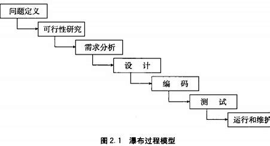
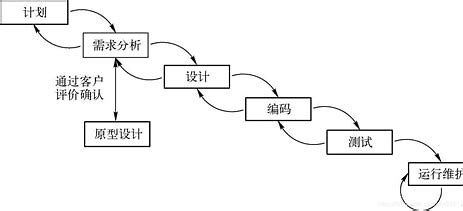
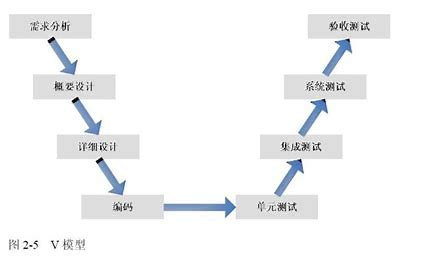
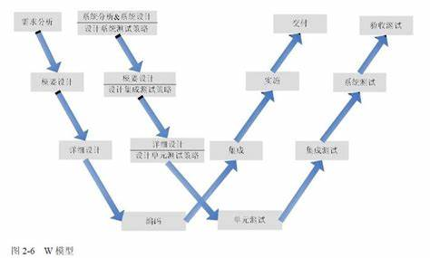
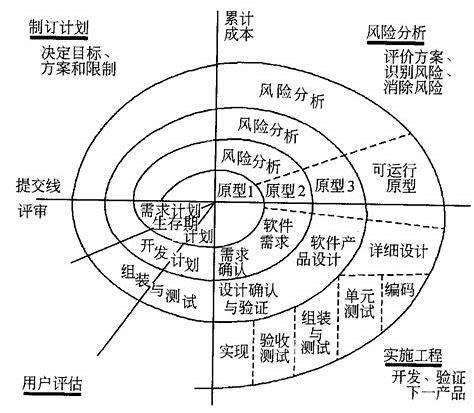

# 软件架构设计小论1——论几种最经典的软件开发模型

## 前言

​	笔者最近打算仔细经营自己的Github，做一些高质量的项目锻炼自己的能力。这些项目经过笔者自己的预估分析，体量都不小。因此，一个较为合理的架构设计将会有助于自己的软件开发，节约自己的时间，以一种事半功倍的效果完成自己的预期。

​	笔者这里将会列出的有如下几个经典的架构设计。我将会介绍的是——从最经典的瀑布模型，到原型模型，再到注重测试的V模型和W模型，再到更加成熟完善的螺旋模型。最后，是基于构建组装作为接口交流与复用的构组装建模型

## 瀑布模型（与软件设计的基本思考过程）

​	“瀑布”这个词笔者认为是形象的。

​	我们回忆一下自从我们接触了编程这一概念，从学习结束一门语言结束到使用这门语言进行编程的时候，我们做的事情：

1. 我们分析一下我们打算解决的问题：这在软件工程中被定义为：问题的定义。也就是说，我们需要搞明白我们到底要干什么，或者说，在实际的生产开发中，我们的对接客户到底要什么！
2. 这个需求是否可行？比如说，笔者曾经就听说过有人想要开发一个根据脚步进行身份识别的系统，但是仔细一想，这样的系统可靠性极低，完全不具备标识人的特征。所以这个项目自然也就被搁置了
3. 我们分析得出这个需求的实现是可行，那我们马上就要迎来一个问题：我们如何拆解这个需求？如何让这个庞大的需求递归的分为若干更小的，更容易实现的子需求呢？比如说，笔者要开发一个PDF阅读器，或者，有人让你开发一个PDF阅读器，你应该如何做呢？你可能会立刻的分析——一个PDF阅读器有什么？界面导览，文件加载，插件服务。。。等等！
4. 设计我们的子需求的运作系统，也就是设计我们的架构。比如说，我们可以采用最为基本的面对过程设计一套流水线，或者是关心一个目标对象的时候使用面对对象的设计思路。或者更进一步，采用诸如服务-客户的CS交流模式，甚至是更加高级的组件接口交流等抽象的架构。总而言之，在这里就是我们动手编程的前夕。一些同志并不在意这个步骤，但事实上，一个好的设计可以省出绝大部分的力气来进行维护
5. 编程。这样看，我们在语法书中学到的，无非就是让我们的代码编写贴合我们的语义！不是吗（笑
6. 测试！有人之前问我，如何证明自己的项目是可靠的呢？提供一个完整的测试！测试存在专门的流程和方法论进行测试，这里我们就不再细究了
7. 运行和维护：换而言之，我们的项目通过了需求的测试，可以给其他人使用了！现在一个项目的开发周期作为结束，进入我们的运行周期了。

​	上面的图就表达了我们这样的流程**是递进的**，一个经典的过程式的开发，前后有非常明确的流程关系，不可以进行任意的调整。

​	你很快就会发现，瀑布模型的特点是这样的：

> :heavy_check_mark: :瀑布模型的优点
>
> - :heavy_check_mark:步骤严密，非常的有序。换而言之就是开发的确定性极强，非常有利于开发组织的管理。
>
> :negative_squared_cross_mark::
>
> - :negative_squared_cross_mark::事实是——大部分软件的需求自己就是不明确的。你的客户，甚至是你自己，完全不是全知的！大部分情况下——我们完全没法回答自己到底要什么！这种模型的特点就是要求你完全的清楚自己要什么——而且，你还需要保证，你的需求不随时间而发生本质性的变动，但事实上是——发生一小部分变动，我们的项目就要退倒重来，或者对代码进行魔改，发现自己的架构设计越发的没办法迎合自己的需求，最终成为一坨屎山。
> - :negative_squared_cross_mark::过于刻板的开发链条丧失了开发的灵活性。伴随市场变化的随即莫测，很可能我们开发完了产品，客户已经不再有这样的需求了，市场不需要你经过大规模精力，财力开发的软件了。这就造成了空前的财力物力人力浪费
> - :negative_squared_cross_mark::另一方面，他要求对一整个项目进行如上图所示的流水线开发，而不是一个模块一个模块的开发。所以，为了尽快的交付项目，他不容许任何一个步骤出现任何一点闪失！极低的容错率，任何参与过项目开发的同志显然知道这是多么的幽默（笑
> - 这样看来，一个完全封闭的，不与市场和客户交流的开发是难以维持在市场上，事实证明， 采用这样的模式开发软件变得非常的不显示（我不需要举例，自己试着完全的按照上面的流程搓一个基于C语言的HTTP Server，你会回来认同我的

## 原型模式（注重需求同步的模型）

​	所以，早在上个世纪70年代左右，纯粹的瀑布模型就被抛弃了。我们马上就迎来了瀑布模型的第一次改进。那就是将原本严密的开发流程进行一定的松动，引入一部分“复用”的原则来辅助我们的开发。

​	可以看到，我们的原型模式就是在前三个阶段进行一定的调整，我们终于将潜在的变动纳入我们的系统中了，那就是对客户的需求采纳进入我们的项目开发。不同于我们的原型模式，客户的动态需求可以更快的反应到我们的开发中，而不是在一开始就定死，直到交付的时候大眼瞪小眼！

​	办法是——我们提供一个原型，让客户先看看是不是大致的满足他的需求？交流是不是这样做可以保证解决它的问题。

​	停一下，我们必须回答何为原型？

> 一个对象的原始模型，一个基础的模型。是一个事物演化的源头。

​	所以，我们不难猜测，原型开发，就是一个跟客户battle的流程，我们听取客户开始的描述，给出一个大致的软件模型模样汇报给我们的客户，他看到这个模型后，会进一步的说明自己的需求。在这个过程中，双方都会逐步明确自己到底要什么，以及我们的开发现在开始出现减量，那就是我们的开发从一个项目一个项目走向了一个原型阶段一个原型阶段，**客户说我们的原型需要改进，我们就对手头的东西增增减减改改查查，客户满意了，就采用了（这就是演进型的原型模式）；客户说我们开发的完全是狗屁，但是里面的架构设计的确满足它的胃口，可以继续沿用这样的设计思路设计它的产品。（这就是抛弃型的原型模式）**那我们就抛弃之前的开发而不必担心太多的成本问题（都是大饼何来成本？）

​	所以，我们将客户一定程度的纳入我们的开发流程，为了方便，我们自然会去寻找已经成熟的模型方案，在上面的基础上修修补补，进行反复的交流直到满足客户的定义，我们再将产品以一个双方都保证无误需求的确定状态，而不是我们的单相思把产品实现。就是如此！

> :heavy_check_mark: 优点
>
> 如上面所说，我们成功的缓解了客户需求在时间程度的不对等，导致的潜在的无效开发与无效投入
>
> :negative_squared_cross_mark: 缺点
>
> - 不是所有的模型都有一个好的原型，一些原型可能非常的复杂，不好下手！
> - 不是所有的需求都可以达到一种收敛，换而言之，我们幻想的：客户跟我们友好交流逐步达成目的很有可能会因为各种原因失败，沦入无限的battle导致项目几乎永远也无法完成
> - 我们只是确定了需求，但是，没有办法让对方甚至是自己，说服我们的需求实现是合理的，双方都是在构建大饼，但是没有把交流延伸到开发，测试上。

​	因此，我们进一步出现了V模型和W模型

## V模型与W模型（注重测试部分的模型）

​	其实，一句话就可以说明白——我们把测试计划提前出来，也就是将我们的整个开发流程中都伴随者测试的计划推进和测试本身实现的推进

​	仔细看看，W模型将V模型更加明晰与合理化。V模型空泛的强调我们测试至始至终，但你没有办法对一个不存在的东西做测试。W模型则是更加精确的指出我们提前的是测试需求计划，在我们开发的时候就要做好测试的预备，预留接口，设计对应的子模块，不要让自己的测试太狼狈。

## 螺旋模型（原型模式的一个终极改良）

​	我们之前说过，前面的模型都是针对一个部分一个部分的改进，我们将他们结合起来，现在，你看整个图就不会感到眩晕。实际上，就是将我们的瀑布模型细化到了原型上，我们周期性的完成对原型的瀑布开发而不是对项目的瀑布开发，再每一个环节中都严密的执行了我们对原型完整的定制，编写和测试，确保每一个步骤的可靠性。同时，不丧失一定的灵活和调整。这样看起来，我们的软件开发就显得十分的严密，同时追和市场的需求

​	以上，我们就把几种最经典的架构开发说明白了。