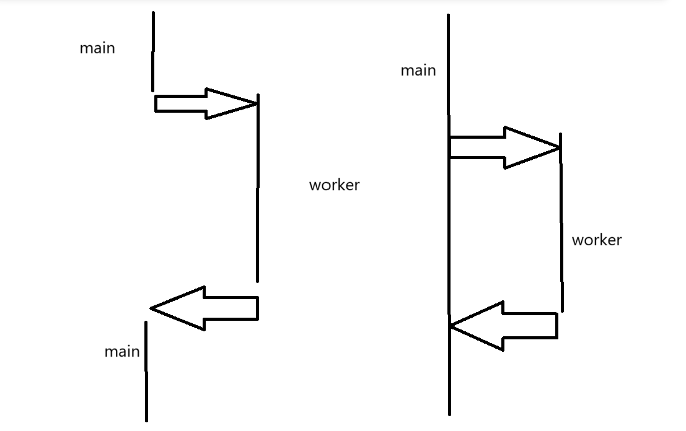

# 高阶开发基础——快速入门C++并发编程1

## 前言

​	这个部分是高阶开发的第一个基础部分，也就是并发编程。笔者需要激进的假设各位已经掌握了基本的C++语法。学习过经典的计算机四件套中的计算机组成原理，操作系统。对并发已经有了最初步的认识。这里，笔者打算做一个偏向于总结性质的博客笔记。来在后续学习更加高阶的开发的时候理解并掌握并发和异步的知识。

## 并发与线程

​	笔者先前开过一些线程部分的博客，但是遗憾的是都烂尾了。

> 传送门：
>
> https://blog.csdn.net/charlie114514191/article/details/138192417
>
> https://blog.csdn.net/charlie114514191/article/details/138243670

​	可以先看这两篇笔者早期的博客进行梳理，但是并不全面。主要是铺垫一下对`std::thread`的理解。

​	简单谈到并发就是——发挥机器多核的性能，让同一时间计算机做多个事情。换而言之，就跟我现在左手拿着杯子喝水，右手正在敲键盘，眼睛正在看着我的Typora编辑文档一样。这三个事情我都是在同时进行。这就属于一种并发。相比你很快意识到，并发可以有效的提升程序的性能，对于UI编程，则是特别的提升了程序的响应程度。至少，一个良好设计的UI界面程序不会因为程序做耗时的操作而卡死。

​	将飘渺的并发落到实地的就是线程。可以这样认为：我们的主程序被装在一个进程当中（各位看官不着急反驳多进程的进程协作的大型项目，这个属于另外的进程协作话题）后，想要在一个进程的运行时并发的完成任务，就需要开辟多个线程完成指定的任务。这样来看，我们学习C++并发编程，**实际上就是在谈论如何使用C++提供的并发构件完成我们的需求**。更加具体的说，使用std::thread来完成我们在C++中的并发（题外话，是对异步更加感兴趣的了解经典的std::async和std::await，疑似不少人并不知道C++原生提供了简单的异步原语）。

​	这里，我们不谈论线程在操作系统的实现。你需要知道的是——任何一个进程，现在是线程，都需要一个任务堆栈完成自己的任务。我们的线程有自己的私有栈，可以认为线程就是一个迷你的进程。也都可以访问，读写进程中的公共数据（我们后面的竞争冒险话题围绕于此）

## 理解std::thread

### 推介cpp reference

​	笔者混迹于一些C++的交流群，不少大佬是从这里查询C++提供的脚手架的使用办法。这里提供的是连接：

> English Version:[cppreference.com](https://en.cppreference.com/w/)
>
> 中文版本：[cppreference.com](https://zh.cppreference.com/w/首页)

### 从std::thread开始

​	thread就是线程的意思。从编程的角度上，我们需要理解的是

> 提供一个任务和一个任务需要的输入，能够并发的返回给我们一个输出即可。



​	这个图的解读姿势是——左侧是我们这样写代码的流程执行流

```c++
int main()
{
    ...
	worker();
    ...
}
```

​	当我们使用并发的时候...

```c++
int main()
{
	std::thread working_thread = std::thread(worker);
    printf("You see iam still in!");
    working_thread.join();
}
```

​	理解这个事情，我们就知道，使用std::thread而且完成了线程启动之后。我们的线程就会立刻的开始执行我们委派的任务，我们继续若无其事的在主线程干好其他的工作即可。

### 如何构造一个std::thread

​	很好，那我们应该如何构造一个std::thread呢？这个事情我们可以查看C++ Reference

> [std::thread::thread - cppreference.com](https://zh.cppreference.com/w/cpp/thread/thread/thread)

​	可以看到，我们可以移动一个线程，向内传递一个工作函数和它所需要的参数。但是不可以拷贝一个线程（拷贝一个线程是没有意义的，这个你想一下，比起来完成多个任务肯定是委派相同的工作函数带上不同的参数，或者说，没有必要在相同的时间接受相同的输入做同样的事情，更何况带来的冲突会让你喝上两壶！）

```
#include <cstdio>
#include <print>
#include <string>
#include <thread>

void worker(std::string &value, int &a) {
    a++;
    std::print("handlings the string {}\n"
               "With the value of ready invoked as {}\n",
               value, a);
}

int main() {
    std::string value = "hello";
    int ready = 1;
    std::thread th(worker, std::ref(value), std::ref(ready));
    th.join();
}
```

​	这就是一个带有参数例子的std::thread构造，当然，你需要知道的是std::ref是一个C++Type traits，用来表达显示的传递一个引用，这是因为thread的参数类型默认按照值进行传递。（这个事情是为了有效引用考虑的，当你使用了std::ref的时候，就保证了你清楚的知道你在传递一个引用！）试一试这个代码！

> 引申思考：传进去将亡值会发生什么？值得提示的是，高版本的编译器会明确阻止你，但是低版本的不会（GCC测试），所以，不要写未定义的程序。（为什么是未定义的？答案是，一些场景下将亡值因为瞬间被使用完毕而赶在了被回收之前，值仍然有效，但是只要程序一个复杂起来，瞬间爆炸的概论大幅度提升）

### 如何确保正确的结束线程

​	再来看看这个图：


​	毫无疑问，我们的线程是有始有终的，必须明确好我们的线程是如何终止的。你可以尝试一下：

```
#include <cstdio>
#include <print>
#include <string>
#include <thread>

void worker(std::string &value, int &a) {
    a++;
    std::print("handlings the string {}\n"
               "With the value of ready invoked as {}\n",
               value, a);
}

int main() {
    std::string value = "hello";
    int ready = 1;
    std::thread th(worker, std::ref(value), std::ref(ready));
    // th.join();
}
```

​	这个代码有极高的概率崩溃，为什么是概率？因为我们不知道处理器是否会在主线程（Main函数）推出之前把worker执行完毕，既然不知道，那就是UB，当我们没有执行完子线程就退出，线程就会发出异常，程序就会崩溃。解决这个的最好的办法就是讲清楚：

> 你到底是希望在main函数之前要求把活做完呢？（在结尾join线程）还是发出去后就不理睬我们的线程自生自灭了？（将线程detach出去）

​	C++中，我们的std::thread的两个重要表达如何处理线程结束的两个成员函数是`join()` 和 `detach()` ，他们用于控制线程的生命周期。

​	`join()` 用于等待线程执行完毕。调用 `join()` 的线程会阻塞，直到被调用的线程完成其任务。如果我们构造一个非空的线程立马join，那么就会变成同步原语，所以，一般是在主线程做好了一些事情后调用join来等待线程。所以，当你需要确保一个线程在继续执行主线程或其他线程之前完成其任务时，使用 `join()`。下面是一个简单的join的小例子

```
#include <iostream>
#include <thread>

void task() {
    std::cout << "Thread is running..." << std::endl;
}

int main() {
    std::thread t(task);
    t.join();  // 等待线程t执行完毕
    std::cout << "Thread has finished." << std::endl;
    return 0;
}
```

​	`detach()` 用于将线程与 `std::thread` 对象分离，使得线程在后台独立运行。调用 `detach()` 后，`std::thread` 对象不再与该线程关联，线程的资源会在其完成任务后自动释放。换而言之，他坐完事就让他自生自灭了，那就使用detach，让他自己干活，我们不会跟他产生任何直接联系了，这个时候使用detach就能很好的表达我们的含义（当你不需要等待线程完成，或者希望线程在后台运行时，使用 `detach()`。）。当然很少用。一般都是join的

```
#include <iostream>
#include <thread>

void task() {
    std::cout << "Thread is running..." << std::endl;
}

int main() {
    std::thread t(task);
    t.detach();  // 将线程t分离，使其在后台运行
    std::cout << "Thread is detached." << std::endl;
    // 主线程继续执行，不等待t完成
    return 0;
}
```

#### 注意

​	我们的join和detach都只能调用一次，C++使用了一个方法叫做joinable来检查我们能不能对一个线程进行join和detach。

```
#include <iostream>
#include <thread>
void foo() {
    std::cout << "Thread started" << std::endl;
    // ...
    std::cout << "Thread about to quit" << std::endl;
}
int main() {
    std::thread t(foo);
    if (t.joinable()) {
    	std::cout << "Thread is joinable, join the thread right now" << std::endl;
        t.join();
    }
    std::cout << "Thread has been joined" << std::endl;
    return 0;
}
```

​	这样的程序才是健壮的!

# Reference

> [cppreference.com](https://zh.cppreference.com/w/首页)
> [1. C++11 Thead线程库的基本使用-See的编程日记 (seestudy.cn)](http://www.seestudy.cn/?list_9/31.html)

