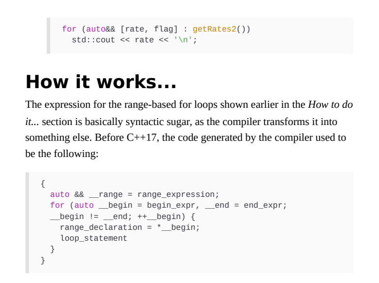

# C++23

### 学习现代核心语言功能

在过去的几十年里，随着C++11的开发和发布，以及后来的新版本：C++14、C++17、C++20和C++23，C++语言经历了一场重大变革。这些新标准引入了新概念，简化和扩展了现有的语法和语义，并全面改变了我们编写代码的方式。与我们以前所知道的相比，C++11看起来和感觉上都是一种新语言，使用这些新标准编写的代码被称为现代C++代码。本章将从C++11开始介绍一些语言特性，这些特性可以帮助您完成许多编码例程。然而，语言的核心远远超出了本章所讨论的主题，本书的其他章节也讨论了许多其他特征。本章包含的配方如下：

- 尽可能使用auto创建类型别名和别名模板
- 理解统一初始化
- 理解各种形式的非静态成员
- 初始化控制
- 查询对象对齐
- 使用作用域枚举
- 对虚拟方法使用override和final
- 使用基于范围的for循环在范围上迭代
- 为自定义类型启用基于范围的for循环
- 使用显式构造函数和转换运算符避免隐式转换
- 使用未命名命名空间而非静态全局
- 使用内联命名空间
- 进行符号版本控制
- 使用结构化绑定处理多返回值
- 使用类模板参数推断简化代码
- 使用下标运算符访问集合中的元素

让我们从学习自动类型推断开始。尽可能使用auto自动类型推导是现代C++中最重要和最广泛使用的功能之一。新的C++标准使得在各种上下文中使用auto作为类型的占位符成为可能，让编译器推断出实际的类型。在C++11中，auto可用于声明局部变量，并用于具有尾随返回类型的函数的返回类型。在C++14中，auto可以用于函数的返回类型，而不指定尾随类型，也可以用于Lambda表达式中的参数声明。在C++17中，它可用于声明结构化绑定，本章末尾将对此进行讨论。在C++20中，它可以用所谓的缩写函数模板来简化函数模板语法。在C++23中，它可以用于对prvalue副本执行显式强制转换。未来标准版本可能会将auto的使用扩展到更多的情况。C++11和C++14中引入的auto的使用有几个重要的好处，所有这些都将在《它是如何工作的》一书中讨论。。。部分。开发人员应该意识到这一点，并尽可能使用auto。安德烈·亚历山德雷斯库（Andrei Alexandrescu）为此创造了一个实际的术语，并由赫伯·萨特（Herb Sutter）推广——几乎总是自动（AAA）(https://herbsutter.com/2013/08/12/gotw-94-solution-aaa-style-almost-always-auto/).如何操作…在以下情况下，考虑使用auto作为实际类型的占位符：当你不想提交到特定类型时，用auto name=expression的形式声明局部变量：

```
auto i=42;//整数
auto d=42.5;//double
auto s=“text”;//char const*
auto v={1,2,3};//std:：initializer_list<int>当您需要提交到特定类型时，使用auto name=type id{expression}形式声明局部变量：
auto b=new char[10]{0};//char*
auto s1=std:：string{“text”};//std:：string
auto v1=std:：vector<int>{1,2,3};//std:：vector<int>
auto p=std:：make_shared<int>（42）;
```

以auto-name=lambda表达式的形式声明命名的lambda函数，除非需要将lambda传递或返回给函数：

```
auto upper = [](char const c){return toupper(c);}
```

声明lambda参数和返回值：

```
auto add=[]（auto const a，auto const b）{return a+b；}；
```

​	当你不想提交到特定类型时，要声明一个函数返回类型：

```
template<typename F，typename t>
auto apply(F&& f，T value){return F(value);}
```

#### 它是如何工作的。。。

自动说明符基本上是实际类型的占位符。使用auto时，编译器会从以下实例中推断出实际类型：

当使用auto声明变量时，根据用于初始化变量的表达式类型。

当auto用作函数返回类型的占位符时，从函数的尾随返回类型或返回表达式类型开始。

在某些情况下，有必要承诺特定类型。例如，在第一个例子中，编译器将s的类型推断为char const*。如果目的是有一个std:：string，那么必须明确指定类型。同样，v的类型被推断为：initializer_list<int>，因为它绑定到auto而不是特定类型；在这种情况下，规则说推导出的类型是td:：initializer_list<T>，在我们的例子中T是int。然而，意图可能是有一个std:：vector<int>。在这种情况下，必须在赋值的右侧明确指定类型。使用自动说明符而不是实际类型有一些重要好处；以下是最重要的列表：不可能让变量保持未初始化状态。这是开发人员在声明变量和指定实际类型时经常犯的错误。然而，对于auto来说，这是不可能的，因为auto需要初始化变量才能推断类型。使用已定义的值初始化变量很重要，因为未初始化的变量会导致未定义的行为。使用auto可确保您始终使用预期的类型，并且不会发生隐式转换。考虑以下示例，其中我们检索局部变量的向量大小。在第一种情况下，变量的类型是int，尽管size（）方法返回size_t。这意味着将发生从size_t到int的隐式转换。但是，使用auto作为类型将推断出正确的类型，即size_t:

```
auto v=std:：vector<int>{1,2,3}；//隐式转换，可能丢失数据
int size1=v.size（）；//好的
auto size2=v.size();//格式错误（gcc中的警告，clang&VC++中的错误）auto-size3=int{v.size()}；
```

​	使用auto可以促进良好的面向对象实践，例如将接口置于实现之上。这在面向对象编程（OOP）中很重要，因为它提供了在不同实现之间进行更改的灵活性、代码的模块化以及更好的可测试性，因为它很容易模拟对象。指定的类型数量越少，代码就越通用，对未来的更改也越开放，这是面向对象编程的基本原则。这意味着更少的打字（一般来说）和更少的关注我们无论如何都不关心的实际类型。通常情况下，即使我们明确指定了类型，我们实际上并不关心它。一个非常常见的情况是迭代器，但还有更多。当你想在一个范围内迭代时，你并不关心致畸物的实际类型。您只对迭代器本身感兴趣；因此，使用自动保存键入（可能很长）名称所花费的时间，并帮助您专注于实际代码而不是类型名称。在以下示例中，在firstfor循环中，我们显式使用迭代器的类型。这是大量的文本打字；长语句实际上会降低代码的可读性，您还需要知道类型名称，而您实际上并不关心它。带有自动说明符的第二个循环看起来更简单，可以省去键入和关心实际类型的麻烦：

```
std::map<int, std::string> m;
for(std::map<int, std::string>::const_iterator it = m.cbegin(); it != m.cend(); ++it)
{ 
	/*...*/ 
}

for (auto it = m.cbegin(); it != m.cend(); ++it){ /*...*/ 
```

​	使用auto声明变量提供了一种一致的编码风格，类型始终在右侧。如果你动态地分配对象，你需要在赋值的左侧和右侧都写类型，例如，int*p=new int（42）。使用auto时，仅在右侧指定一次类型。但是，使用auto时会有一些问题：auto说明符只是类型的占位符，而不是consumptive/volatile和引用说明符。如果你需要一个st/volatile和/或一个引用类型，那么你需要明确地指定它们。在以下示例中，get（）成员函数offoo返回对int的引用；当从返回值初始化变量x时，编译器推断的类型是int，而不是int&。因此，对x所做的任何更改都不会传播到foo.x_。为了做到这一点，我们应该使用auto&

```c++
#include <stdio.h>
#include <iostream>

class Foo
{
private:
    int x;
public:
    Foo(int const value = 0): x{value}{}
    int& get(){return x;}
};
int main(int, char**){
    Foo f(32);
    auto res = f.get();
    res = 100;
    std::cout << f.get() << std::endl;
}
```

​	不能对不可移动的类型使用自动：

```
auto nope = std::atomic<int>(42); //error
```

​	不能将auto用于多单词类型，如long long、long double或struct foo。然而，在第一种情况下，可能的解决方法是使用文字或类型别名；此外，使用Clang和GCC（但不是MSVC），可以将类型名称放在括号中，（long long）{42}。对于第二种情况，C++只支持使用这种形式的struct/class以兼容C，无论如何都应该避免:

```
auto l1 = long long{ 42 }; // error
using llong = long long;
auto l2 = llong{ 42 }; // OK
auto l3 = 42LL; // OK
auto l4 = (long long){ 42 }; // OK with gcc/clang
```

​	如果你使用了auto说明符，但仍然需要知道类型，那么在大多数IDE中，你可以通过将光标放在变量上来实现。然而，如果你离开IDE，那就不可能了，了解实际类型的唯一方法是自己从初始化表达式中推断出来，这可能意味着在代码中搜索函数返回类型。auto可用于指定函数的返回类型。在C++11中，这需要在函数声明中使用尾随返回类型。在C++14中，这一点已经放宽，返回值的类型由编译器从返回表达式中推断出来。如果有多个返回值，它们应该具有相同的类型：

```
auto func1(int const val) -> int
{ 
	return 2*i; 
}// C++14
auto func2(int const i)
{ 
	return 2*i; 
}
```

​	如前所述，auto不保留const/volatile和引用限定符。这会导致auto作为函数返回类型的占位符出现问题。为了解释这一点，让我们考虑前面的foo.get（）示例。这一次，我们有一个名为proxy_get（）的包装函数，它引用foo，调用get（），并返回get（）返回的值，即int&。但是，编译器会将proxy_get（）的返回类型推断为int，而不是int&。尝试将该值赋给int&失败，返回错误：

```
class foo{ 
int x_;
public: 
	foo(int const x = 0) :x_{ x } {} 
	int& get() { return x_; }
};

auto proxy_get(foo& f) { return f.get(); }
auto f = foo{ 42 };
auto& x = proxy_get(f); // cannot convert from 'int' to 'int &'
```

要解决这个问题，我们需要实际返回auto&。然而，模板和完美转发返回类型存在问题，而不知道它是值还是引用。C++14中这个问题的解决方案是decltype（auto），它将正确推断类型：

```
decltype(auto) proxy_get(foo& f){ return f.get(); }
auto f = foo{ 42 };
decltype(auto) x = proxy_get(f);
```

decltype说明符用于检查实体或表达式的声明类型。当声明类型很麻烦或根本无法用标准符号声明时，它最有用。这方面的示例包括声明lambda类型和依赖于模板参数的类型。最后一个可以使用auto的重要情况是使用lambdas。从C++14开始，lambda返回类型和lambda参数类型都可以是auto。这样的lambda被称为泛型lambda，因为lambda定义的闭包类型有一个模板化的调用运算符。下面显示了一个泛型clambda，它接受两个auto参数，并返回将operator+应用于实际类型的结果：

```
auto ladd = [] (auto const a, auto const b) { return a + b; }
```

编译器生成的函数对象具有以下形式，其中调用运算符是一个函数模板：

```
template<typename T, typename U> auto operator () (T const a, U const b) const { return a+b; }} L;
```

此lambda可用于添加任何定义了运算符+的内容，如以下代码段所示：

```
#include <string>
#include <iostream>

struct 
{
    template<typename T, typename U>
    constexpr auto operator()(T a, U b){return a + b;}
}L;

std::string operator""s(const char* h, size_t w){
    return {h};
}


int main()
{
    auto res = L("Come "s , "On!"s);
    std::cout << res;
}
```

## GotW #94 Solution: AAA Style (Almost Always Auto)

 [Herb Sutter](https://herbsutter.com/author/herbsutter/) [C++](https://herbsutter.com/category/c/) 2013-08-12 18 Minutes

*Toward correct-by-default, efficient-by-default, and pitfall-free-by-default variable declarations, using “AAA style”… where “triple-A” is both a mnemonic and an evaluation of its value.
*

## Problem

## JG Questions

1. What does this code do? What would be a good name for some_function?

```
template<class Container, class Value>
void some_function( Container& c, const Value& v ) {
    if( find(begin(c), end(c), v) == end(c) )
        c.emplace_back(v); 
    assert( !c.empty() );
}
```

2. What does “write code against interfaces, not implementations” mean, and why is it generally beneficial?

## Guru Questions

3. What are some popular concerns about using auto to declare variables? Are they valid? Discuss.
4. When declaring a new local variable x, what advantages are there to declaring it using auto and one of the two following syntaxes:

(a) auto x = init; when you don’t need to commit to a specific type? (Note: The expression init might include calling a helper that performs partial type adjustment, such as as_signed, while still not committing to a specific type.)

(b) auto x = type{ init }; when you do want to commit to a specific type by naming a type?

List as many as you can. (Hint: Look back to GotW #93.)

5. Explain how using the style suggested in #4 is consistent with, or actively leverages, the following other C++ features:

(a) Heap allocation syntax.

(b) Literal suffixes, including user-defined literal operators.

(c) Named lambda syntax.

(d) Function declarations.

(e) Template alias declarations.

6. Are there any cases where it is not possible to use the style in #4 to declare all local variables?

## Solution

## 1. What does this code do? What would be a good name for some_function?

```
template<class Container, class Value>
void append_unique( Container& c, const Value& v ) {
    if( find(begin(c), end(c), v) == end(c) )
        c.emplace_back(v); 
    assert( !c.empty() );
}
```

Let’s call this function append_unique. First, it checks to see whether the value v is already in the container. If not, it appends it at the end. Finally, it asserts that c is not empty, since by now it must contain one copy of the value v.

You probably thought this question was fairly easy.

Maybe *too* easy.

If so, good. That’s the point of the example. Hold the thought, and we’ll come back to this in Question 3.

## 2. What does “write code against interfaces, not implementations” mean, and why is it generally beneficial?

It means we should care principally about “what,” not “how.” This separation of concerns applies at all levels in high-quality modern software—hiding *code*, hiding *data*, and hiding *type*. Each increases encapsulation and reduces coupling, which are essential for large-scale and robust software.

Please indulge a little repetition in the following paragraphs. It’s there to make a point about similarity.

**Hiding code.** With the invention of separately compiled functions and structured programming, we gained “encapsulation to *hide code.*” The caller knows the signature only—the function’s internal code is not his concern and not accessible programmatically, even if the function is inline and the body happens to be visible in source code. We try hard not to inadvertently leak implementation details, such as internal data structure types. The point is that the caller does not, and should not, commit to knowledge of the current internal code; if he did, it would create interdependencies and make separately compiled libraries impossible.

**Hiding data (and code).** With object oriented styles (OO), we gained two new manifestations of this separation. First, we got “more encapsulation to *hide both code and data.*” The caller knows the class name, bases, and member function signatures only—the class’s internal data and internal code are hidden and not accessible programmatically, even though the private class members are lexically visible in the class definition and inline function bodies may also be visible. (In turn, dynamic libraries and the potential future-C++ modules work aim to accomplish the same thing at a still larger scale.) Again we try hard not to inadvertently leak implementation details, and again the point is that the caller does not, and should not, commit to knowledge of the current internal data or code, which would make the class difficult to ever change or to ship on its own as a library.

**Hiding type (run-time polymorphism).** Second, OO also gave us “separation of interfaces to *hide type.*” A base class or interface can delegate work to a concrete derived implementation via virtual functions. Now the interface the caller sees and the implementation are actually different types, and the caller knows the base type only—he doesn’t know or care about the concrete type, including even its size. The point, once again, is that the caller does not, and should not, commit to a single concrete type, which would make the caller’s code less general and less able to be reused with new types.

**Hiding type (compile-time polymorphism).** With templates, we gained a new compile-time form of this separation—and it’s still “separation of interfaces to *hide type*.” The caller knows an ad-hoc “duck typed” set of operations he wants to perform using a type, and any type that supports those operations will do just fine. The contemplated future C++ concepts feature will allow making this stricter and less ad-hoc, but still avoids committing to a concrete type at all. The whole point is still is that the caller does not, and should not, commit to a single concrete type, which would make the caller’s code less generic and less able to be reused with new types.

## 3. What are some popular concerns about using auto to declare variables? Are they valid? Discuss.

In many languages, not just C++, there are several reasons people commonly give for why they are reluctant to use auto to declare variables (or the equivalent in another language, such as var or let). We could summarize them as: *laziness*, *commitment*, and *readability*. Let’s take them in order.

### Laziness and commitment

First, laziness: One common concern is that “writing auto to declare a variable is primarily about saving typing.” However, this is just a misunderstanding of auto. As we saw in GotW #92 and #93 and will see again below, the main reasons to declare variables using auto are for correctness, performance, maintainability, and robustness—and, yes, convenience, but that’s in last place on the list.

> **Guideline:** Remember that preferring **auto** variables is motivated primarily by correctness, performance, maintainability, and robustness—and only lastly about typing convenience.

Second, commitment: “But in some cases I do want to commit to a specific type, not automatically deduce it, so I can’t use auto.” It’s true that sometimes you do want to commit to a specific type, but you can still use auto. As demonstrated in GotW #92 and #93, not only can you still write declarations of the form auto x = type{ init }; (instead of type x{init};) to commit to a specific type, but there are good reasons for doing so, such as that saying auto means you can’t possibly forget to initialize the variable.

> **Guideline:** Consider declaring local variables **auto x = type{ expr };** when you do want to explicitly commit to a type. It is self-documenting to show that the code is explicitly requesting a conversion, it guarantees the variable will be initialized, and it won’t allow an accidental implicit narrowing conversion. Only when you do want explicit narrowing, use **( )** instead of **{ }**.

### (Un)readability?

The third and most common argument concerns readability: “My code gets unreadable quickly when I don’t know what exact type my variable is without hunting around to see what that function or expression returns, so I can’t just use auto all the time.” There is truth to this, including losing the ability to search for occurrences of specific types when using the non-typed syntax *auto x = expr;* in 4(a) below, so this appears at first to be a strong argument. And it’s true that any feature can be overused. However, I think this argument is actually weaker than it first seems for four reasons, two minor and two major.

The two minor counterarguments are:

- The “can’t use auto” part isn’t actually true, because as we just saw above you can be explicit about your type and still use auto, with good benefit.
- The argument doesn’t apply when you’re using an IDE, because you can always tell the exact type, for example by hovering over the variable. Granted, this mitigation goes away when you leave the IDE, such as if you print the code.

But we should focus on the two major counterarguments:

- It reflects a bias to code against implementations, not interfaces. Overcommitting to explicit types makes code less generic and more interdependent, and therefore more brittle and limited. It runs counter to the excellent reasons to “write code against interfaces, not implementations” we saw in Question 2.
- **We (meaning \*you\*) already ignore actual types all the time…
  
  **

“… Wait, what? I do not ignore types all the time,” someone might say. Actually, not only do you do it, but you’re so comfortable and cavalier about it that you may not even realize you’re doing it. Let’s go back to that code in Question 1:

```
template<class Container, class Value>
void append_unique( Container& c, const Value& v ) {
    if( find(begin(c), end(c), v) == end(c) )
        c.emplace_back(v); 
    assert( !c.empty() );
}
```

*Quick quiz:* How many specific types are mentioned in that function? Name as many as you can.

Take a moment to consider that before reading on…

… We can see pretty quickly that the answer is a nice round number: Zero. Zilch. (Pedantic mode: Yes, there’s void, but I’m going to declare that void doesn’t count because it’s to denote “no type,” it’s not a meaningful type.)

Not a single specific type appears anywhere in this code, and the lack of exact types makes it much more powerful and doesn’t significantly harm its readability. Like most people, you probably thought Question 1 felt “easy” when we did it in isolation. Granted, this is generic code, and not all your code will be templates—but the point is that the code isn’t unreadable even though it doesn’t mention specific types, and in fact auto gives you the ability to write generic code even when *not* writing a template.

So starting with the cases illustrated in this short example, let’s consider some places where we routinely ignore exact types. First, function template parameters:

- What exact type is Container? We have no idea, and that’s great… anything we can call begin, end, emplace_back and empty on and otherwise use as needed by this code will do just fine. In fact, we’re glad we don’t know anything about the exact type, because it means we’re following the Open/Closed Principle and staying open for extension— this append_unique will work fine with a type that won’t be written until years from now. Interestingly, the concepts feature currently being proposed for ISO C++ to express template parameter constraints doesn’t change how this works at all, it only makes it more convenient to express and check the requirements. Note how much more powerful this is compared to OO style frameworks: In OO frameworks where containers have to inherit from a base class or interface, that’s already inducing coupling and limiting the ability to just plug in and use arbitrary suitable types. It is important that we can know nothing at all about the type here besides its necessary interface, not even restricting it by as much as limiting it to types in a particular inheritance hierarchy. We should strongly resist compromising this wonderful and powerful “strictly typed but loosely coupled” genericity.
- What exact type is Value? Again, we don’t know, and we don’t want to know… anything we can pass to find and emplace_back is just dandy. At this point some of you may be thinking: “Oh yes we know what type it is, it’s the container’s value type!” No, it doesn’t have to be that, it just has to be convertible, and that’s important. For example, we want vector<string> vec; append_unique(vec, “xyzzy”); to work, and “xyzzy” is a const char[6], not a string.

Second, function return values:

- What type does find return? Some iterator type, the same as begin(c) coughed up, but we don’t know specifically what type it is just from reading this code, and it doesn’t matter. We can look up the signature if we’re feeling really curious, but nobody bothers doing that because anything that’s comparable to end(c) will do.
- What type does empty return? We don’t even think twice about it. Something testable like a bool… we don’t care much what exactly as long as we can “not” it.

Third, many function parameters:

- What specific type does emplace_back take? Don’t know; might be the same as v, might not. Really don’t care. Can we pass v to it? Yes? Groovy.

And that’s just in this example. We routinely and desirably ignore types in many other places, such as:

- Fourth, any temporary object: We never get to name the object, much less name its type, and we may know what the type is but we don’t care about actually spelling out either name in our code.
- Fifth, any use of a base class: We don’t know the dynamic concrete type we’re actually using, and that’s a benefit, not a bug.
- Sixth, any call to a virtual function: Ditto; plus on top of that if the virtual function return type itself could also be covariant for another layer of “we don’t know the dynamic concrete type” since in the presence of covariance we don’t know what type we’re actually getting back.
- Seventh, any use of function<>, bind, or other type erasure: Just think about how little we actually know, and how happy it makes us. For example, given a function<int(string)>, not only don’t we know what specific function or object it’s bound to, we don’t even know that thing’s signature—it might not actually even take a string or return an int, because conversions are allowed in both directions, so it only has to take something a string can be converted to, and return something that can be converted to an int. All we know is that it’s something that we can invoke with a string and that gives us back something we can use as an int. Ignorance is bliss.
- Eighth, Any use of a C++14 generic lambda function: A generic lambda just means the function call operator is a template, after all, and like any function template it gets stamped out individually for whatever actual argument types you pass each time you use it.

There are probably more.

Although lack of commitment may be a bad thing in other areas of life, not committing to a specific type is often desirable by default in reusable code.

## 4. When declaring a new local variable x, what advantages are there to declaring it using auto and one of the two following syntaxes:

Let’s consider the base case first, which has by far the strongest arguments in its favor and is gaining quite a bit of traction in the C++ community.

### (a) auto x = init; when you don’t need to commit to a specific type?

GotW #93 offered many concrete examples to support habitually declaring local variables using auto x = expr; when you don’t need to explicitly commit to a type. The advantages include:

- It guarantees the variable will be initialized. Uninitialized variables are impossible because once you start by saying auto the = is required and cannot be forgotten.
- It is efficient by default and guarantees that no implicit conversions (including narrowing conversions), temporary objects, or wrapper indirections will occur. In particular, prefer using auto instead of function<> to name lambdas unless you need the type erasure and indirection.
- It guarantees that you will use the correct exact type now.
- It guarantees that you will continue to use the correct exact type under maintenance as the code changes, and the variable’s type automatically tracks other functions’ and expressions’ types unless you explicitly said otherwise.
- It is the simplest way to portably spell the implementation-specific type of arithmetic operations on built-in types, which vary by platform, and ensure that you cannot accidentally get lossy narrowing conversions when storing the result.
- It is the only good option for hard-to-spell and impossible-to-spell types such as lambdas, binders, detail:: helpers, and template helpers (including expression templates when they should stay unevaluated for performance), short of resorting to repetitive decltype expressions or more-expensive indirections like function<>.
- It is more symmetric and consistent with other parts of modern C++ (see Question 5).
- And yes, it is just generally simpler and less typing.

See GotW #93 for concrete examples of these cases, where using auto helps eliminate correctness bugs, performance bugs, and silently nonportable code.

As noted in the questions, the expression init might include calling a helper that performs partial type adjustment, such as as_signed, while still not committing to a specific type. As shown in GotW #93, prefer to use auto x = as_signed(integer_expr); or auto x = as_unsigned(integer_expr); to store the result of an integer computation that should be signed or unsigned—these should be viewed as “casts that preserve width,” so we are not casting to a specific type but rather casting an attribute of the type while correctly preserving the other basic characteristics of the type, notably by not forcing it to commit to a particular size.

Using auto together with as_signed or as_unsigned makes code more portable: the variable will both be large enough (thanks to auto) and preserve the required signedness on all platforms. Note that signed/unsigned conversions within integer_expr may still occur and so you may need additional finer-grained as_signed/as_unsigned casts within the expression for full portability.

### (b) auto x = type{ init }; when you do want to commit to a specific type by naming a type?

This is the explicitly typed form, and it still has advantages but they are not as clearly strong as implicitly typed form. The jury is still out on whether to recommend this one wholesale, as we’re still trying it out, but it does offer some advantages and I suggest you try it out for a while and see if it works well for you.

So here’s the recommendation to consider trying out for yourself: Consider declaring local variables auto x = type{ expr }; when you do want to explicitly commit to a type. (Only when you do want to allow explicit narrowing, use ( ) instead of { }.) The advantages of this typed auto declaration style include:

- It guarantees the variable will be initialized; you can’t forget.
- It is self-documenting to show that the code is explicitly requesting a conversion.
- It won’t allow an accidental implicit narrowing conversion.
- It is more symmetric and consistent, both with the basic auto x = init; form and with other parts of C++…

… which brings us to Question 5.

## 5. Explain how using the style suggested in #4 is consistent with, or actively leverages, the following other C++ features:

Let’s start off this question with some side-by-side examples that give us a taste of the symmetry we gain when we habitually declare variables using modern auto style. Starting with two examples where we don’t need to commit to a type and then two where we do, we see that the right-hand style is not only more robust and maintainable for the reasons already given, but also arguably cleaner and more regular with the type consistently on the right when it is mentioned:

```
// Classic C++ declaration order     // Modern C++ style

const char* s = "Hello";             auto s = "Hello";
widget w = get_widget();             auto w = get_widget();

employee e{ empid };                 auto e = employee{ empid };
widget w{ 12, 34 };                  auto w = widget{ 12, 34 };
```

Now consider the (dare we say elegant) symmetry with each of the following.

### (a) Heap allocation syntax.

When allocating heap variables, did you notice that the type name is already on the right naturally anyway? And since it’s there, we don’t want to have to repeat it. (I’ll show the raw “new” form for completeness, but prefer make_unique and make_shared in that order for allocation in modern code, resorting to raw new only well-encapsulated inside the implementation of low-level data structures.)

```
// Classic C++ declaration order     // Modern C++ style

widget* w = new widget{};            /* auto w = new widget{}; */
unique_ptr<widget> w                 auto w = make_unique<widget>();
  = make_unique<widget>();
```

### (b) Literal suffixes, including user-defined literal operators.

Using auto declaration style doesn’t merely work naturally with built-in literal suffixes like ul for unsigned long, plus user-defined literals including standard ones now in draft C++14, but it actively encourages using them:

```
// Classic C++ declaration order     // Modern C++ style

int x = 42;                          auto x = 42;
float x = 42.;                       auto x = 42.f;
unsigned long x = 42;                auto x = 42ul;
std::string x = "42";                auto x = "42"s;   // C++14
chrono::nanoseconds x{ 42 };         auto x = 42ns;    // C++14
```

Based on the examples so far, which do you think is more regular? But wait, there’s more…

### (c) Named lambda syntax. (d) Function declarations.

Lambdas have unutterable types, and auto is the best way to capture them exactly and efficiently. But because their declarations are now so similar, let’s consider lambdas and (other) functions together, and in the last two lines of this example also use C++14 return type deduction:

```
// Classic C++ declaration order     // Modern C++ style

int f( double );                     auto f (double) -> int;
…                                    auto f (double) { /*...*/ };
…                                    auto f = [=](double) { /*...*/ };
```

### (e) Template alias declarations.

Modern C++ frees us from the tyranny of un-template-able typedef:

```
// Classic C++ workaround            // Modern C++ style

typedef set<string> dict;            using dict = set<string>;

template<class T> struct myvec {     template<class T>
  typedef vector<T,myalloc> type;    using myvec = vector<T,myalloc>;
};
```

### An observation

Have you noticed that the C++ world is moving to a left-to-right declaration style everywhere, of the form

**category** name = **type** and/or initializer ;

where “category” can be auto or using?

Take a moment to re-skim the two columns of examples above. Even ignoring correctness and performance advantages, do you find the right-hand column to be most consistent, and most readable?

## 6. Are there any cases where it is not possible to use the style in #4 to declare all local variables?

There is one case I know of where this style cannot be followed, and it applies to the type-specific auto x = type{ init }; form. In that form, type has to be moveable (even though the move operation will be routinely elided by compilers), so these won’t work:

```
auto lock = lock_guard<mutex>{ m };  // error, not moveable
auto ai   = atomic<int>{};           // error, not moveable
```

(Aside: For at least some of these cases, an argument could be made that this is actually more of a defect in the type itself, in particular that perhaps atomic<int> should be moveable.)

Having said that, there are three other cases I know of that you might encounter that may at first look like they don’t work with this auto style, but actually do. Let’s consider those for completeness.

First, the basic form auto x = init; will exactly capture an initializer_list or a proxy type, such as an expression template. This is a feature, not a bug, because you have a convenient way to spell both “capture the list or proxy” and “resolve the computation” depending which you mean, and the default syntax goes to the more efficient one: If you want to efficiently capture the list or proxy, use the basic form which gives you performance by default, and if you mean to force the proxy to resolve the computation, specify the explicit type to ask for the conversion you want. For example:

```
auto i1 = { 1 };                       // initializer_list<int>
auto i2 = 1;                           // int

auto a = matrix{...}, b = matrix{...}; // some type that does lazy eval
auto ab = a * b;                       // to capture the lazy-eval proxy
auto c = matrix{ a * b };              // to force computation
```

Second, here is a rare case that you may discover now that we have auto: Due to the mechanics of the C++ grammar, you can’t legally write a multi-word type like long long or class widget in the place where type goes in the auto x = type{ init }; form. However, note that this affects only those two cases:

- The multi-word built-in types like long long, where you’re better off anyway writing a known-width type alias or using a literal.
- Elaborated type specifiers like class widget, where the “class” part is already redundant. The “class widget” syntax is allowed as a compatibility holdover from C which liked seeing struct widget everywhere unless you typedef‘d the struct part away.

So just avoid the multi-word form and use the better alternative instead:

```
auto x = long long{ 42 };            // error
auto x = int64_t{ 42 };              // ok, better 
auto x = 42LL;                       // ok, better 

auto y = class X{1,2,3};             // error
auto y = X{1,2,3};                   // ok
```

## Summary

We already ignore explicit and exact types much of the time, including with temporary objects, virtual functions, templates, and more. This is a feature, not a bug, because it makes our code less tightly coupled, and more generic, flexible, reusable, and future-proof.

Declaring variables using auto, whether or not we want to commit to a type, offers advantages for correctness, performance, maintainability, and robustness, as well as typing convenience. Furthermore, it is an example of how the C++ world is moving to a left-to-right declaration style everywhere, of the form

**category** name = **type** and/or initializer ;

where “category” can be auto or using, and we can get not only correctness and performance but also consistency benefits by using the style to consistently declare local variables (including using literals and user-defined literals), function declarations, named lambdas, aliases, template aliases, and more.

## Acknowledgments

Thanks in particular to Scott Meyers and Andrei Alexandrescu for their time and insights in reviewing and discussing drafts of this material. Both helped generate candidate names for this idiom; it was Alexandrescu who suggested the name “AAA (almost always auto)” which I merged with the best names I’d thought of to that point (“auto style” or “auto (+type) style”) to get “AAA Style (almost always auto).” Thanks also to the following for their feedback to improve this article: Adrian, avjewe, mttpd, ned, zadecn, noniussenior, Marcel Wid, J Guy Davidson, Mark Garcia, Jonathan Wakely, “x y.”


## 创建类型别名和别名模板

在C++中，可以创建可以代替类型名使用的同义词。这是通过创建typedef声明来实现的。这在某些情况下很有用，例如为类型创建更短或更有意义的名称，或为函数指针创建名称。但是，typedef声明不能与模板一起使用来创建模板类型别名。例如，std:：vector<T>不是一个类型（std:：vector<int>是一个类型），而是当类型占位符T被替换为实际类型时可以创建的所有类型的一种族。在C++11中，类型别名是另一个已声明类型的名称，analias-template是另一种已声明模板的名称。这两种别名都引入了新的用法语法。

#### 如何操作…

​	使用identifier=type id的形式创建类型别名，如下例所示：


typedef声明为一个类型d引入了同义词（换句话说，别名）。它不会引入其他类型（如类、结构、联合或枚举声明）。使用typedef声明引入的类型名称遵循与标识符名称相同的隐藏规则。它们也可以重新声明，但只能引用相同的类型（因此，您可以使用有效的多个typedef声明，在翻译单元中引入相同的类型名称同义词，只要它是同一类型的同义词）。以下是typedef声明的典型示例：


​	类型别名声明等效于typedef声明。它可以出现在块作用域、类作用域或命名空间作用域中。根据C++11标准（第9.2.4段，文档版本N4917）：typedef名称也可以通过别名声明引入。using关键字后面的标识符成为typedef名称，标识符后面的可选属性ᦆ说明符seq属于该typedef名称。它的语义与typedef说明符引入的语义相同。特别是，它没有定义新类型，也不应出现在type-id中。但是，在为数组类型和函数指针类型创建别名时，别名声明更具可读性，也更清楚地说明了别名的实际类型。在How to do it…部分的示例中，很容易理解array_t是10个整数类型数组的名称，而fn是一个函数类型的名称，它接受byte和double两个参数并返回void。这也与声明std:：function对象的语法一致（例如，std:：function<void（byte，double）>f）。重要的是要注意以下几点：Alias模板不能部分或显式地专门化。在推导模板参数时，别名模板永远不会通过模板参数推导得出。专门化别名模板时生成的类型不允许直接或间接使用其自己的类型。新语法的驱动目的是定义别名模板。这些模板在专门化时，相当于将别名模板的模板参数替换为type-id中的模板参数的结果。另请参阅用类模板参数推导实现代码，以学习如何在不显式指定模板参数的情况下使用类模板

​	Brace初始化是C++11中初始化数据的统一方法。因此，它也被称为统一初始化。这可以说是开发人员应该理解和使用的C++11最重要的特性之一。它消除了初始化基本类型、聚合和非聚合类型以及数组和标准容器之间的先前区别。准备就绪要继续此配方，您需要熟悉方向化，它从一组显式的构造函数参数初始化对象，以及复制初始化，它从另一个对象初始化对象。以下是两种初始化类型的简单示例：

```
std::string s1("test"); // 直接初始化
std::string s2 = "test"; // 拷贝初始化
```

记住这些，让我们探索如何执行统一初始化。如何操作…要统一初始化对象，无论其类型如何，请使用大括号￾初始化形式{}，该形式可用于直接初始化和复制初始化。当与大括号初始化一起使用时，这些被称为直接列表和复制列表初始化：


当提供参数时，非聚合类可以用括号（函数形式）初始化，而当执行默认初始化（调用默认构造函数）时，只能不使用任何括号初始化。在下一个例子中，foo是How to do it…部分中定义的结构：

```
foo f1;
foo f2(42, 1.2);
foo f3(42);
foo f4();
```

​	Aggregate和POD类型可以使用大括号初始化进行初始化。在下面的例子中，bar是How to doit中定义的结构。。。

```
bar b = {42, 1.2};
int a[] = {1, 2, 3, 4, 5};
```

​	普通旧数据（POD）类型是一种简单的类型（具有编译器提供或明确默认的特殊成员，并占用连续的内存区域）和标准布局的类型（不包含与C语言不兼容的语言功能（如虚函数）的类，所有成员都有相同的访问控制）。POD类型的概念在C++20中已被弃用，取而代之的是琐碎和标准的布局类型。

​	除了初始化数据的不同方法外，还有一些局限性。例如，初始化标准容器的唯一方法（除了复制构造）是首先声明一个对象，然后向其中插入元素；std:：vector是一个例外，因为可以在使用聚合初始化之前对数组中的值进行初始化。然而，另一方面，动态分配的聚合不能直接初始化。How to do it…一节中的所有示例都使用直接初始化，但使用大括号初始化也可以进行复制初始化。这两种形式，直接初始化和复制初始化，在大多数情况下可能是等效的，但复制初始化的许可度较低，因为它在隐式转换序列中不考虑显式构造函数，隐式转换顺序必须直接从初始化器生成一个对象，而直接初始化则要求从初始化器到构造函数的参数进行隐式转换。动态分配的数组只能使用方向初始化进行初始化。在前面的示例中显示的类中，foo是一个同时具有默认构造函数和带参数构造函数的类。要使用defair构造函数执行默认初始化，我们需要使用emptybrace，即{}。要使用带参数的构造函数，我们需要在大括号｛｝中为所有参数提供值。与非聚合类型不同，在非聚合类型中，默认初始化意味着调用默认构造函数，而对于聚合类型，默认初始化则意味着使用零进行初始化。之前也可以初始化标准容器，如向量和映射，因为所有标准容器在C++11中都有一个额外的构造函数，它接受类型std:：initializer_list<T>的参数。这基本上是一个轻量级的代理

​	T const类型的元素数组。然后，这些构造函数根据初始化器列表中的值初始化内部数据。使用std:：initializer_list进行初始化的方式如下：编译器解析初始化列表中元素的类型（所有元素必须具有相同的类型）。编译器使用初始化器列表中的元素创建一个数组。编译器创建一个std:：initializer_list<T>对象来包装之前创建的数组。std:：initializer_list<T>对象作为参数传递给构造函数。初始化器列表总是优先于使用大括号初始化的其他构造函数。如果一个类存在这样的构造函数，那么在执行大括号初始化时就会调用：

```
class foo{ 
	int a_; 
	int b_;
public: 
	foo() :a_(0), b_(0) {} 
	foo(int a, int b = 0) :a_(a), b_(b) {} 
foo(std::initializer_list<int> l) {}
};

foo f{ 1, 2 }; // calls constructor with initializer_list<int>
```

​	调用构造函数优先级规则适用于任何函数，而不仅仅是构造函数。在以下示例中，存在同一函数的两个重载。使用初始化器列表调用函数会解析对anstd:：initializer_list重载的调用：

```
void func(int const a, int const b, int const c){ 
	std::cout << a << b << c << '\n';}
void func(std::initializer_list<int> const list){ 
	for (auto const & e : list) 
		std::cout << e << '\n';
}
func({ 1,2,3 }); // calls second overload
```

然而，这有可能导致错误。让我们以thestd:：vector类型为例。在向量的构造函数中，有一个构造函数只有一个参数，表示要分配的元素的初始数量，另一个构造函数有一个std:：initializer_list作为参数。若目的是创建一个预先分配大小的向量，使用大括号初始化将不起作用，因为构造函数tests:：initializer_list将是调用的最佳重载：

```
std:：vector<int>v{5};
```

前面的代码并没有创建一个有五个元素的向量，而是创建了一个有一个元素值为5的向量。为了能够实际创建具有五个元素的avector，必须使用括号形式的初始化：

```
std:：vector<int>v（5）;
```

另一件需要注意的事情是，大括号初始化不允许缩小转换范围。根据C++标准（参见


​	以下示例显示了直接列表初始化和复制列表初始化的几个示例。在C++11中，所有这些表达式的推导类型都是`std::initializer_list<int>`：

```
auto a = {42}; // std::initializer_list<int>
auto b {42}; // std::initializer_list<int>
auto c = {4, 2}; // std::initializer_list<int>
auto d {4, 2}; // std::initializer_list<int>
```

​	C++17改变了列表初始化的规则，区分了直接列表初始化和复制列表初始化。类型推断的新规则如下：对于复制列表初始化，如果列表中的所有元素都具有相同的类型或格式错误，则自动推断将推断`std::initializer_list<T>`。对于直接列表初始化，如果列表只有一个元素，自动推断将推断出一个T，如果有多个元素，则推断出格式错误。根据这些新规则，前面的示例将更改如下（注释中提到了推断的类型）：

```
auto a = {42}; // std::initializer_list<int>
auto b {42}; // int
auto c = {4, 2}; // std::initializer_list<int>
auto d {4, 2}; // error, too many
```

在这种情况下，a和c被推断为std:：initializer_list<int>，b被推断为int，d使用直接初始化，在大括号初始化列表中有多个值，会触发编译器错误。

#### 了解各种形式的非静态成员初始化

学习如何最好地执行类成员的初始化。了解各种形式非静态成员的初始化构造函数是非静态类成员初始化的地方。许多开发人员更喜欢构造函数体中的赋值。除了实际需要的几个例外情况外，非静态成员的初始化应该在构造函数的初始化器列表中完成，或者从C++11开始，在类中声明时使用默认成员初始化。在C++11之前，类的常量和非常量非静态数据成员必须在构造函数中初始化。类中的声明初始化仅适用于静态常量。正如我们将在这里看到的，这个限制在C++11中被删除了，它允许在类声明中初始化非静态。这种初始化称为默认成员初始化，将在以下部分进行解释。本食谱将探索非静态成员初始化的方法。为每个成员使用适当的初始化方法不仅可以提高代码效率，还可以使代码更有条理、更易读。如何操作…要初始化类的非静态成员，您应该：

​	对静态和非静态常量使用默认成员初始化（见以下代码中的[1]和[2]）。使用默认成员初始化为具有多个构造函数的类成员提供默认值，这些构造函数将为这些成员使用一个通用的初始化器（见以下代码中的[3]和[4]）。使用构造函数初始化器列表初始化没有默认值但依赖于构造函数参数的成员（请参阅以下代码中的[5]和[6]）。当其他选项不可能时，在构造函数中使用赋值（示例包括用指针this初始化数据成员，检查构造函数参数值，以及在用这些值初始化成员或对两个非静态数据成员的自引用之前抛出异常）。以下示例显示了这些初始化形式：


​	然而，许多开发人员不在构造函数体中使用初始化器列表和首选赋值，甚至不混合赋值和初始化器列表。这可能有几个原因——对于有很多成员的大型类，构造函数赋值可能比长初始化器列表更容易阅读，可能会分成许多行，也可能是因为这些开发人员熟悉其他没有初始化器列表的编程语言。值得注意的是，非静态数据成员的初始化顺序是它们在类定义中声明的顺序，而不是它们在构造函数初始化器列表中的初始化顺序。相反，非静态数据成员被销毁的顺序是反向构造顺序。在构造函数中使用赋值是低效的，因为这可能会创建稍后被丢弃的临时对象。如果未在初始化器列表中初始化，则非静态成员将通过其默认构造函数进行初始化

​	然后，在构造函数体中为值赋值时，将调用赋值运算符。如果默认构造函数分配资源（如内存或文件），并且必须在赋值运算符中取消分配和重新分配，这可能会导致工作效率低下。这在以下代码片段中得到了示例：


前面的代码生成了以下输出，显示了如何首先默认初始化数据成员f，然后为其分配一个新值：


若要跟踪创建和销毁了哪个对象，可以稍微更改上面的foo类，并为每个特殊成员函数打印this pointer的值。你可以将此作为后续练习。将初始化从构造函数体中的赋值更改为初始化器列表，会将对默认构造函数和赋值运算符的调用替换为对复制构造函数

```
bar（foo const&value）：f（value）
```

​	的调用。添加前一行代码会产生以下输出：


出于这些原因，至少对于内置类型以外的类型（如bool、char、int、float、double或指针），您应该更喜欢构造函数初始化器列表。然而，为了与你的初始化风格保持一致，你应该尽可能地选择构造函数初始化器列表。有几种情况下无法使用初始化器列表；这些包括以下情况（但该列表可以扩展到其他情况）：

​	如果一个成员必须用指向包含它的对象的指针或引用进行初始化，在初始化列表中使用this指针可能会触发某些编译器的警告，要求在构造对象之前使用它。如果您有两个数据成员，它们必须包含对彼此的引用。如果您想在用参数的值初始化非静态数据成员之前测试输入参数并抛出异常。从C++11开始，非静态数据成员可以在类中声明时进行初始化。这被称为默认成员初始化，因为它应该用默认值表示初始化。默认成员初始化用于未基于构造函数参数初始化的常量和成员（换句话说，其值不依赖于对象构造方式的成员）：


在前面的例子中，DefaultHeight和DefaultWidth都是常量；因此，这些值不依赖于对象的构造方式，因此在声明时会进行初始化。textFlow对象是一个非常量、非静态数据成员，其值也不取决于对象的初始化方式（可以通过其他成员更改功能）；因此，在声明时，它也会使用默认成员初始化进行初始化。相反，文本也是一个非恒定的非静态数据成员，但它的初始值取决于对象的构造方式。因此，它在构造函数的初始化器列表中使用作为参数传递给构造函数的值进行初始化。如果数据成员同时使用默认成员初始化和构造函数初始化器列表进行初始化，则后者优先，默认值将被丢弃。为了说明这一点，让我们再次考虑前面提到的foo类和下面使用它的bar类：


### 控制和查询对象对齐

​	C++11提供了指定和查询类型对齐要求的标准化方法（以前只能通过编译器特定的方法）。为了提高不同处理器的性能，并允许使用仅处理特定对齐数据的指令，控制对齐非常重要。例如，英特尔数据流单指令多数据扩展指令集（SSE）和英特尔SSE2是一组处理器指令，当对多个数据对象应用相同的操作时，可以大大提高性能，需要16字节的数据对齐。相反，对于将大多数整数处理器命令扩展到256位的Intel Advanced Vector Extensions（或Intel AVX），强烈建议使用32字节的实现。此配方探索了用于控制对齐要求的alignas说明符和用于检索类型的对齐要求的对齐运算符。准备就绪您应该熟悉什么是数据对齐以及编译器执行默认数据对齐的方式。

	处理器不是一次访问一个字节，而是以两次幂的较大块（2、4、8、16、32等）访问内存。因此，编译器必须对齐内存中的数据，以便处理器可以轻松访问。如果这些数据未对齐，编译器必须做额外的工作来访问数据；它必须读取多个数据块，移位和丢弃不必要的字节，并组合其余的字节。C++编译器根据数据类型的大小对齐变量。该标准仅规定了char、有符号char、无符号char、char8_t（在C++20中引入）和std:：byte（在C++17中引入)的大小，这些大小必须为1。它还要求短裤的尺码必须至少为16位，long的大小必须至少为32位，long long的大小至少为64位。它还要求1==sizeof（char）<=sizeof（short）<=sizes（int）<=size（long）<=Sizes（long long)。因此，大多数类型的大小是特定于编译器的，可能取决于平台。通常，bool和char为1个字节，short为2个字节，int、long和float为4个字节，double和longlong为8个字节，以此类推。当涉及到结构或联合时，对齐必须与最大成员的大小相匹配，以避免性能问题。为了举例说明这一点，让我们考虑以下数据结构


foo1和foo2的大小不同，但对齐方式相同，即1，因为所有数据成员都是char类型，大小为1byte。在结构foo3中，第二个成员是一个整数，其大小为4。因此，此结构的成员对齐是在4的倍数的地址上完成的。为了实现这一点，编译器引入了添加字节。结构foo3实际上被转换为以下内容：


类似地，以下结构的大小为32字节，对齐方式为8；这是因为最大的成员是一个8号的替身。然而，这种结构需要在几个地方进行填充，以确保所有成员都可以在8的倍数的地址处访问：


​	在C++11中，使用alignas说明符指定对象或类型的对齐方式。这可以采用表达式（计算结果为0的整数常量表达式或对齐的有效值）、类型id或参数包。alignas说明符可以应用于不表示位字段的变量或类数据成员的声明，也可以应用于类、联合或枚举的声明。应用alignas规范的类型或对象的对齐要求等于声明中使用的所有alignas规范中最大的、大于零的表达式。使用alignas说明符时有几个限制：唯一有效的对齐是2的幂（1、2、4、8、16、32等）。任何其他值都是非法的，程序被认为是格式错误的；这不一定会产生错误，因为编译器可能会选择忽略规范。始终忽略0的对齐。如果声明中的最大对齐小于没有任何对齐说明符的自然对齐，则程序也被认为是格式错误的。在以下示例中，alignas说明符已应用于类声明。没有alignas说明符的自然对齐将是1，但有了alignas（4），它变为4：


​	换句话说，编译器将前面的类转换为以下内容

	alignas说明符既可以应用于类声明，也可以应用于成员数据声明。在这种情况下，最严格（即最大）的值获胜。在以下示例中，成员a的自然大小为1，需要对齐为2；构件b的自然尺寸为4，需要8的对齐，因此最严格的对齐将是8。整个类的对齐要求是4，比最严格的对齐要求弱（即更小)，因此，尽管编译器会产生警告


​	alignas说明符也可以应用于变量。在下面的例子中，变量a是一个整数，需要以8的倍数放置在内存中。下一个变量，即4个long的数组，需要以256的倍数放置在内存中。因此，编译器将在两个变量之间引入多达244个字节的填充（取决于变量a在内存中的位置，在8的地址倍数处）：

看看地址，我们可以看到a的地址确实是8的倍数，b的地址是256的倍数（十六进制100）。要查询类型的对齐方式，我们使用alignof运算符。与sizeof不同，此运算符只能应用于类型，不能应用于变量或类数据成员。它可以应用于的类型是完整类型、数组类型或引用类型。对于数组，返回的值是元素类型的对齐；对于引用，返回的值是引用类型的对齐。这里有几个例子：

| 表达式          | 说明                                    |
| --------------- | --------------------------------------- |
| alignof(char)   | char的自然对齐是1                       |
| alignof(int)    | int的自然对齐是4                        |
| alignof(int*)   | 指针大小                                |
| alignof(int[4]) | 对齐的是元素的大小，故这里是sizeof(int) |
| alignof(foo&)   | foo的大小对齐                           |

这意味着优化CPU的读写操作，避免缓存行产生不必要的无效。这在某些以性能为关键的应用程序类别中非常重要，例如游戏或交易应用程序。相反，alignof运算符会重试指定类型的最小对齐要求。

#### 使用作用域枚举枚举

​	枚举是C++中的一种基本类型，它定义了一个值的集合，总是一个完整的底层类型。它们的命名值是恒定的，被称为枚举器。使用关键字enum声明的枚举称为无作用域枚举，而使用枚举类或枚举结构声明的枚举则称为作用域枚举。后者是在C++11中引入的，旨在解决几个没有范围枚举的问题，本食谱对此进行了解释。如何操作…使用枚举时，您应该：更喜欢使用作用域枚举而不是非作用域枚举使用枚举类或枚举结构声明作用域枚举：

```
enum class Status{Unknown, Created, Connected};
Status s = Status::Created;
```

枚举类和枚举结构声明是等效的，在本食谱和本书的其余部分，我们将使用枚举类。因为作用域枚举是受限制的名称空间，所以C++20标准允许我们将它们与using指令相关联。您可以执行以下操作：使用ausing指令在本地作用域中引入作用域枚举标识符，如下所示：


对于那些需要整数作为参数的老API。在C++23中，您可以使用std:：to_undering（）实用函数

未作用域枚举有几个问题会给开发人员带来问题：它们将枚举器导出到周围的作用域（因此，它们被称为未作用域的枚举），这有以下两个缺点：如果同一命名空间中的两个枚举具有相同名称的枚举器，则可能会导致名称冲突。无法使用具有完全限定名称的枚举：


在C++11之前，他们无法指定底层类型，而底层类型必须是整型。此类型不得大于int，除非枚举值不能容纳有符号或无符号整数。因此，无法提前申报枚举。

​	原因是枚举的大小未知。这是因为在定义枚举器的值之前，底层类型是未知的，以便编译器可以选择适当的整数类型。这在C++11中已得到修复。枚举值隐式转换为int。这意味着您可能有意或无意地将具有特定含义的枚举和整数（甚至可能与枚举的含义无关）混合在一起，编译器将无法警告您：


​	作用域枚举基本上是强类型枚举，其行为与非作用域枚举不同：它们不会将枚举器导出到周围的作用域。前面显示的两个枚举将更改为以下内容，不再产生名称冲突，并且可以完全限定枚举器的名称：


好的，您可以指定基础类型。对于未作用域枚举的底层类型，同样的规则也适用于作用域枚举，除了用户可以显式指定底层类型。这也解决了正向声明的问题，因为在定义可用之前可以知道底层类型：


原因是枚举的大小未知。这是因为在定义枚举器的值之前，底层类型是未知的，以便编译器可以选择适当的整数类型。这在C++11中已得到修复。枚举值隐式转换为int。这意味着您可能有意或无意地将具有特定含义的枚举和整数（甚至可能与枚举的含义无关）混合在一起，编译器将无法警告您：枚举代码｛OK，Failure｝；void include_foffset（整数像素）{/*…*/}include_fOffset（失败）；作用域枚举基本上是强类型枚举，其行为与非作用域枚举不同：它们不会将枚举器导出到周围的作用域。前面显示的两个枚举将更改为以下内容，不再产生名称冲突，并且可以完全限定枚举器的名称：枚举类Status｛Unknown，Created，Connected｝；枚举类代码｛正常、失败、未知｝；//OKCodes代码=代码：：未知；//好的，您可以指定基础类型。对于未作用域枚举的底层类型，同样的规则也适用于作用域枚举，除了用户可以显式指定底层类型。这也解决了正向声明的问题，因为在定义可用之前可以知道底层类型：


​	但是，作用域枚举有一个缺点：它们是受限的命名空间。它们不会导出外部作用域中的标识符，这有时会很不方便，例如，如果您正在编写一个开关，并且需要为每个case标签重复枚举名称，如下例所示：

```
std::string_view to_string(Status const s)
{
 switch (s)
 {
 case Status::Unknown: return "Unknown";
 case Status::Created: return "Created";
 case Status::Connected: return "Connected";
 }
}
```

​	在C++20中，这可以通过一个名为作用域枚举的using指令来简化。前面的代码可以简化如下：

```
std::string_view to_string(Status const s)
{
 switch (s)
 {
 using enum Status;
 case Unknown: return "Unknown";
 case Created: return "Created";
 case Connected: return "Connected";
 }
}
```

此using指令的效果是所有枚举标识符都引入了本地作用域，从而可以用非限定形式引用它们。也可以使用具有限定标识符名称的using指令将特定的枚举标识符仅带到本地作用域中，例如使用Status：：Connected。该标准的C++23版本添加了几个用于处理作用域枚举的实用函数。第一个是td:：to_undering（），在<utility>标头中可用。它的作用是将枚举转换为其基础类型。它的目的是使用不使用scopedenumerations的API（无论是否为遗留API）。让我们来看一个例子。考虑以下函数old_api（），它将一个整数参数（它将其解释为控制用户权限的标志）带入系统：


​	C++23中引入的另一个实用程序是一个名为is_scoped_enum<T>的类型特征，可以在<type_traits>标头中找到。这包含一个名为value的数字常量，如果模板类型参数T是作用域枚举类型，则等于true，否则等于false。还有一个辅助变量模板is_scoped_enum_v<T>。此类型特征的目的是根据枚举的类型，确定是否应对枚举以应用不同的行为。这里有一个简单的例子：


第一行将打印0，因为A是一个未作用域的枚举，而第二行将打印1，因为B是一个作用域枚举。另请参阅第9章“创建编译时常量表达式”

#### 了解如何使用编译时常量使用override和final for virtual方法

与其他类似的编程语言不同，C++没有声明接口的特定语法（这些接口基本上只是具有纯虚方法的类），并且在虚方法的声明方式方面也存在一些不足。在C++中，虚方法是通过虚关键字引入的。然而，关键字virtual对于在派生类中声明覆盖是可选的，这可能会在处理大型类或层次结构时导致混淆。您可能需要在整个层次结构中导航到基础，以确定函数是否是虚拟的。相反，有时，确保虚函数或派生类不能再被重写或进一步派生是有用的。在这个食谱中，我们将看到如何使用C++11特殊标识符override和final来声明虚拟函数或类。准备好你应该熟悉C++中的继承和多态性，以及抽象类、纯说明符、虚方法和超中间值方法等概念。如何做到这一点…为了确保在基类和派生类中正确声明虚方法，并确保提高可读性，请执行以下操作：在派生类中声明虚函数时，使用virtual关键字，这些派生类应该覆盖基类中的虚函数。

​	与其他类似的编程语言不同，C++没有声明接口的特定语法（这些接口基本上只是具有纯虚方法的类），并且在虚方法的声明方式方面也存在一些不足。在C++中，虚方法是通过虚关键字引入的。然而，关键字virtual对于在派生类中声明覆盖是可选的，这可能会在处理大型类或层次结构时导致混淆。您可能需要在整个层次结构中导航到基础，以确定函数是否是虚拟的。相反，有时，确保虚函数或派生类不能再被重写或进一步派生是有用的。在这个食谱中，我们将看到如何使用C++11特殊标识符override和final来声明虚拟函数或类。准备好你应该熟悉C++中的继承和多态性，以及抽象类、纯说明符、虚方法和超中间值方法等概念。如何做到这一点…为了确保在基类和派生类中正确声明虚方法，并确保提高可读性，请执行以下操作：在派生类中声明虚函数时，使用virtual关键字，这些派生类应该覆盖基类中的虚函数。始终在虚拟函数的声明或定义的声明器部分之后使用重写特殊标识符：

```
class Base
{
 virtual void foo() = 0;
 virtual void bar() {}
 virtual void foobar() = 0;
};
void Base::foobar() {}
class Derived1 : public Base
{
 virtual void foo() override = 0;
 virtual void bar() override {}
 virtual void foobar() override {}
};
class Derived2 : public Derived1
{
 virtual void foo() override {}
};
```

声明器是函数类型中不包括返回类型的部分。为了确保函数不能被进一步重写或类不能再被派生，请使用最终的特殊标识符，如下所示：在虚拟函数声明或定义的声明器部分之后，以防止派生类中的进一步重写：

```
class Derived2 : public Derived1
{
 virtual void foo() final {}
};
```

​	在类声明中的类名之后，防止类的进一步派生：

```
class Derived4 final : public Derived1
{
 virtual void foo() override {}
};
```

​	重载的工作方式非常简单；在虚函数声明或定义中，它确保函数实际上重写了基类函数；否则，编译器将触发错误。应当注意，覆盖和最终特殊标识符都是仅在成员函数声明或定义中具有意义的特殊标识符。它们不是保留关键字，仍然可以在程序的其他地方用作用户定义的标识符。使用重写特殊标识符有助于编译器检测虚拟方法不重写另一个方法的情况，如下例所示

```
class Base
{
public:
 virtual void foo() {}
 virtual void bar() {}
};
class Derived1 : public Base
{
public:
 void foo() override {}
 // for readability use the virtual keyword
  virtual void bar(char const c) override {}
 // error, no Base::bar(char const)
};
```

如果没有重写说明符，Derived1类的虚拟bar（char const）方法就不会是重写方法，而是来自Base的bar（）的重载。另一个特殊标识符final用于成员函数声明或定义中，以指示该函数是虚的，不能在派生类中重写。如果派生类试图重写虚函数，编译器会触发错误：


​	由于override和final在定义的上下文中使用时都有这种特殊含义，并且实际上不是保留关键字，因此您仍然可以在C++代码的任何其他地方使用它们。这确保了在C++11之前编写的现有代码不会因为标识符使用这些名称而中断：

```
class foo
{
 int final = 0;
 void override() {}
};
```

​	尽管前面给出的建议建议在重写的虚拟方法的声明中同时使用virtual和override，但virtual关键字是可选的，可以省略以缩短声明。重写说明符的存在应足以向其指示该方法是虚拟的。这是一个个人参考的问题，不影响语义。另请参阅第10章，带有奇怪重复模板模式的静态多态性，了解CRTP模式如何帮助在编译时实现多态性使用基于范围的循环在范围上迭代

许多编程语言支持称为foreach的for循环变体，即在acolection的元素上重复一组语句。C++在C++11之前没有对此的核心语言支持。最接近的特性是标准库中名为std:：for_each的通用算法，该算法将一个函数应用于范围内的所有元素。C++11为每个循环提供了语言支持，这些循环实际上被称为基于范围的for循环。新的C++17标准对原始语言特性进行了多项改进。




这段代码中begin_xpr和end_exper的位置取决于数组的类型：对于类C数组：__range和__range+\_\_bound（其中\_\_bound是数组中的元素数）。对于具有begin和end成员的类类型（无论其类型和可访问性如何）：\_\_range.begin（）和\_\_range.end（）。对于其他人来说，它是开始（_\_range）和结束（__ranges），这是通过依赖参数的查找来确定的。值得注意的是，如果一个类包含任何被称为begin或end的成员（函数、数据成员或枚举器），无论其类型和可访问性，它们将被选择用于begin_expr和end_expr。因此，这样的类类型不能用于基于范围的for循环。在C++17中，编译器生成的代码略有不同：

```
{
 init-statement
 auto && __range = range_expression;
 auto __begin = begin_expr;
 auto __end = end_expr;
 for (; __begin != __end; ++__begin) {
 range_declaration = *__begin;
 loop_statement
 }
}
```

​	初始化语句可以是空语句、表达式语句、简单声明，或者从C++23开始是别名声明。以下代码片段中显示了一个示例：

```
for (auto rates = getRates(); int rate : rates)
{
 std::cout << rate << '\n';
}
```

在C++23之前，这有助于避免在范围表达式中使用临时变量时出现未定义的行为。范围表达式返回的临时值的生存期将延长到循环结束。但是，如果临时对象在范围表达式结束时被销毁，则范围表达式内的临时对象的安全期不会延长。我们将借助以下代码片段对此进行解释：

```
struct item
{
 std::vector<int> getRates()
 {
 return std::vector<int> {1, 1, 2, 3, 5, 8, 13};
 }
};
item make_item()
{
 return item{};
}
// undefined behavior, until C++23
for (int rate : make_item().getRates())
{
 std::cout << rate << '\n';
} 
```

由于make_item（）按值返回，因此我们有一个临时的值域内表达式。这引入了未定义的行为，可以通过初始化语句避免，如下所示

```
for (auto item = make_item(); int rate : item.getRates())
{
 std::cout << rate << '\n';
}
```

​	这个问题在C++23中不再出现，因为这个版本的标准还延长了范围内所有临时变量的生存期，直到循环结束。另请参阅为自定义类型启用基于范围的for循环

了解如何使用户定义的类型能够与基于范围的for loops一起使用第12章，使用范围库迭代集合，了解C++20范围库的基本原理循环，使代码在许多情况下更具可读性。然而，基于范围的for循环不能开箱即用，任何类型都表示一个范围，但需要存在begin（）和end（）函数（对于非65534数组类型），无论是作为成员还是自由函数。在这个食谱中，我们将学习如何在基于范围的for循环中使用自定义类型。准备就绪如果您需要了解基于范围的for循环是如何工作的，以及编译器为这样的循环生成什么代码，建议您在继续使用此配方之前阅读使用基于范围的for循环迭代一个范围配方。为了展示我们如何为表示序列的自定义类型启用基于范围的for循环，我们将使用以下简单数组的实现

```
template <typename T, size_t const Size>
class dummy_array
{
 T data[Size] = {};
public:
 T const & GetAt(size_t const index) const
 {
 if (index < Size) return data[index];
 throw std::out_of_range("index out of range");
 }
 void SetAt(size_t const index, T const & value)
 {
 if (index < Size) data[index] = value;
 else throw std::out_of_range("index out of range");
 }
 size_t GetSize() const { return Size; }
};
```

​	此配方的目的是允许编写以下代码

```
arr.SetAt(0, 1);
arr.SetAt(1, 2);
arr.SetAt(2, 3);
for(auto&& e : arr)
{
 std::cout << e << '\n';
}
```

以下部分详细描述了实现这一切所需的步骤。如何操作…要在基于范围的for循环中使用自定义类型，您需要执行以下操作：为该类型创建可变和常量迭代器，必须实现以下运算符：operator++（前缀和后缀版本）用于递增迭代器运算符*，用于解引用迭代器并访问迭代器运算符指向的实际元素！=用于将迭代器与另一个迭代器进行不平等比较。为该类型提供免费的begin（）和end（）函数。鉴于前面的简单范围示例，我们需要提供以下内容：迭代器类的以下最小实现：

```
template <typename T, typename C, size_t const Size>
class dummy_array_iterator_type
{
public:
 dummy_array_iterator_type(C& collection,
 size_t const index) :
 index(index), collection(collection)
 { }
 bool operator!= (dummy_array_iterator_type const & other)
 {
 return index != other.index;
 }
 T const & operator* () const
 {
 return collection.GetAt(index);
 }
 dummy_array_iterator_type& operator++()
 {
 ++index;
 return *this;
 }
 dummy_array_iterator_type operator++(int)
 {
 auto temp = *this;
 ++*this;
 return temp;
 }
private:
 size_t index;
 C& collection;
};
```

```
template <typename T, size_t const Size>
using dummy_array_iterator =
 dummy_array_iterator_type<
 T, dummy_array<T, Size>, Size>;
template <typename T, size_t const Size>
using dummy_array_const_iterator =
 dummy_array_iterator_type<
 T, dummy_array<T, Size> const, Size>;
```

```
template <typename T, size_t const Size>
inline dummy_array_iterator<T, Size> begin(
 dummy_array<T, Size>& collection)
{
 return dummy_array_iterator<T, Size>(collection, 0);
}
template <typename T, size_t const Size>
inline dummy_array_iterator<T, Size> end(
 dummy_array<T, Size>& collection)
{
 return dummy_array_iterator<T, Size>(
 collection, collection.GetSize());
}
template <typename T, size_t const Size>
inline dummy_array_const_iterator<T, Size> begin(
 dummy_array<T, Size> const & collection)
{
 return dummy_array_const_iterator<T, Size>(
 collection, 0);
}
template <typename T, size_t const Size>
inline dummy_array_const_iterator<T, Size> end(
 dummy_array<T, Size> const & collection)
{
 return dummy_array_const_iterator<T, Size>(
 collection, collection.GetSize());
}
```

​	有了这个实现，基于范围的for循环shownearlier就会按预期编译和执行。当执行依赖于参数的查找时，编译器将识别我们编写的两个begin（）和end（）函数（它们引用了dummy_array），因此，它生成的代码变得有效。在前面的示例中，我们定义了一个迭代器类模板和两个别名模板，分别称为dummy_array_iterator和summy_array_const_iterator。begin（）和end（）函数都有两个重载，用于这两种类型的迭代器。这是必要的，这样我们考虑的容器就可以用于具有常量和非常量实例的基于范围的for循环：

```
template <typename T, const size_t Size>
void print_dummy_array(dummy_array<T, Size> const & arr)
{
 for (auto && e : arr)
 {
 std::cout << e << '\n';
 }
}
```

我们为这个配方考虑的简单range类启用基于范围的for循环的一种可能的替代方法是提供成员begin（）和end（）函数。一般来说，只有当你拥有并可以修改源代码时，这才有意义。相反，此配方中显示的解决方案在所有情况下都有效，应优先于其他替代方案。

#### 使用显式构造函数和转换运算符来避免隐式转换

​	在C++11之前，具有单个参数的构造函数被视为转换构造函数（因为它接受另一种类型的值并从中创建类的新实例）。在C++11中，每个没有显式说明符的构造函数都被视为转换构造函数。这很重要，因为这样的构造函数定义了从其参数的类型到类类型的隐式转换。类还可以对将类的类型转换为其他指定类型的转换运算符进行建模。所有这些在某些情况下都是有用的，但在其他情况下可能会产生问题。在这个食谱中，我们将学习如何使用显式构造函数和转换运算符。准备好对于这个配方，你需要熟悉转换构造函数和转换运算符。在本教程中，您将学习如何编写显式构造函数和转换运算符，以避免与类型之间的隐式转换。

### 显示转换

​	要声明显式构造函数和显式转换运算符（无论它们是函数还是函数模板），请在声明中使用exprifit说明符。以下示例显示了显式构造函数和显式转换运算符

```
struct handle_t
{
 explicit handle_t(int const h) : handle(h) {}
 explicit operator bool() const { return handle != 0; };
private:
 int handle;
};
```

​	为了理解为什么显式构造函数是必要的以及它们是如何工作的，我们将首先看看转换构造函数。以下类foo有三个构造函数：一个默认构造函数（没有参数）、一个接受int的构造函数和一个接受两个参数（int和adouble）的构造函数。他们除了打印信息什么都不做。从C++11开始，这些都被认为是转换构造函数。该类还具有一个转换运算符，用于将foo类型的值转换为bool

```
struct foo
{
foo()
 { std::cout << "foo" << '\n'; }
 foo(int const a)
 { std::cout << "foo(a)" << '\n'; }
 foo(int const a, double const b)
 { std::cout << "foo(a, b)" << '\n'; }
 operator bool() const { return true; }
};
```

基于此，可以定义以下对象（注意注释表示控制台的输出）：

```
foo f1; // foo()
foo f2 {}; // foo()
foo f3(1); // foo(a)
foo f4 = 1; // foo(a)
foo f5 { 1 }; // foo(a)
foo f6 = { 1 }; // foo(a)
foo f7(1, 2.0); // foo(a, b)
foo f8 { 1, 2.0 }; // foo(a, b)
foo f9 = { 1, 2.0 }; // foo(a, b)
```

变量f1和f2调用默认构造函数。f3、f4、f5和f6调用接受int的构造函数。请注意，这些对象的所有定义都是等效的，即使它们看起来不同（f3是使用函数形式初始化的，f4和f6是复制初始化的，f5是使用大括号初始化列表直接初始化的）。同样，f7、f8和f9使用两个参数调用构造函数。在这种情况下，f5和f6将打印foo（l），而f8和f9将生成编译器错误（尽管编译器可以选择忽略一些警告，例如GCC的-Wno缩窄），因为初始化器列表中的所有元素都应该是整数。

​	值得注意的是，如果foo定义了一个接受astd:：initializer_list的构造函数，那么使用{}的所有初始化都将解析为该构造函数：

```
foo(std::initializer_list<int> l)
{ std::cout << "foo(l)" << '\n'; }
```

​	这些可能看起来都是正确的，但隐式转换构造函数允许隐式转换可能不是我们想要的情况

​	首先，让我们来看一些正确的例子：

```
void bar(foo const f)
{
}
bar({}); // foo()
bar(1); // foo(a)
bar({ 1, 2.0 }); // foo(a, b)
```

从foo类到bool的转换运算符也使我们能够在需要布尔值的地方使用foo对象。这里有一个例子：

```
bool flag = f1; // OK, expect bool conversion
if(f2) { /* do something */ } // OK, expect bool conversion
std::cout << f3 + f4 << '\n'; // wrong, expect foo addition
if(f5 == f6) { /* do more */ } // wrong, expect comparing foos
```

​	期待比较foos前两个是预期foo用作布尔值的示例。然而，最后两个，一个带有加法，一个用于相等性测试，可能是不正确的，因为我们很可能希望添加foo对象并测试fooobjects的相等性，而不是它们隐式转换为的布尔值。

​	也许一个更现实的例子是考虑字符串缓冲区的实现，以了解可能出现问题的地方。这将是一个包含内部字符缓冲区的类。此类提供了几个转换构造函数：一个默认构造函数、一个接受表示缓冲区大小的size_t参数以进行预分配的构造函数，以及一个接受指向char的指针的构造函数，char应用于分配和初始化内部缓冲区。简单地说，我们用于此示例的字符串缓冲区的实现如下：

```
class string_buffer
{
public:
 string_buffer() {}
 string_buffer(size_t const size) { data.resize(size); }
 string_buffer(char const * const ptr) : data(ptr) {}
 size_t size() const { return data.size(); }
 operator bool() const { return !data.empty(); }
 operator char const * () const { return data.c_str(); }
private:
 std::string data;
};
```

​	根据这个定义，我们可以构造以下对象：

```
std::shared_ptr<char> str;
string_buffer b1; // calls string_buffer()
string_buffer b2(20); // calls string_buffer(size_t cons
string_buffer b3(str.get());
```

b1是使用默认构造函数创建的，因此具有一个缓冲区；b2是使用带有单个参数的构造函数初始化的，其中参数的值表示内部缓冲区字符的大小；b3用一个现有的缓冲区初始化，该缓冲区用于定义内部缓冲区的大小并将其值复制到内部缓冲区中。但是，相同的定义也支持以下对象定义：

```
{DefaultHeight, Large, MaxSize};
string_buffer b4 = 'a';
string_buffer b5 = MaxSize;
```

这种情况下，b4用char初始化。由于存在到size_t的隐式转换，因此将调用具有单个参数的构造函数。这里的意图不一定很明确；也许它应该是“a”而不是“a”，在这种情况下，第三个构造函数会被调用。然而，b5很可能是一个错误，因为MaxSize是一个表示ItemSizes的枚举数，与字符串缓冲区大小无关。编译器不会以任何方式标记这些错误情况。将未作用域的枚举隐式转换为int是一个很好的论据，表明更倾向于使用作用域枚举（用枚举类声明），而作用域枚举没有这种隐式转换。如果ItemSizes是一个scoped enum，则不会出现这里描述的情况。在构造函数的声明中使用显式说明符时，该构造函数将成为显式构造函数，不再允许对类类型的对象进行隐式构造。为了说明这一点，我们将稍微更改string_buffer类，将所有构造函数声明为显式：

```
class string_buff{public:e plicit string buffer(){
 explicit string_buffer() {}
 explicit string_buffer(size_t const size) { data.resize(size)
 explicit string_buffer(char const * const ptr) :data(ptr) {}
 size_t size() const { return data.size(); }
 explicit operator bool() const { return !data.empty(); }
 explicit operator char const * () const { return data.c_str()
private:
 std::string data;
}
```

​	这里的变化很小，但前面例子中b4和b5的定义不再适用，而且是不正确的。这是因为在重载解析期间，从char或int到size_t的隐式转换不再可用，以确定应该调用什么构造函数。结果b4和b5都出现了编译器错误。请注意，b1、b2和b3仍然是有效的定义，即使构造函数是显式的。在这种情况下，解决问题的唯一方法是提供从char或int到string_buffer的显式强制转换

```
string_buffer b4 = string_buffer('a');
string_buffer b5 = static_cast<string_buffer>(MaxSize);
string_buffer b6 = string_buffer{ "a" };
```

​	使用显式构造函数，编译器能够立即标记错误情况，开发人员可以相应地做出反应，要么用正确的值修复初始化，要么提供显式强制转换。只有在使用复制初始化完成初始化时才会出现这种情况，而在使用函数初始化或通用初始化时则不会出现这种情况。

​	对于显式构造函数，以下定义仍然是可能的（但是错误的）

```
string_buffer b7{ 'a' };
string_buffer b8('a');
```

​	与构造函数类似，转换运算符可以声明为显式的（如前所述）。在这种情况下，从对象类型到转换运算符指定的类型的隐式转换不再可能，需要显式转换。考虑到b1和b2，它们是我们之前定义的thesting_buffer对象，使用显式运算符bool转换不再可能：

```
std::cout << b4 + b5 << '\n'; // error
if(b4 == b5) {} // error
Instead, they require explicit conversion to bool:
std::cout << static_cast<bool>(b4) + static_cast<bool>(b5);
if(static_cast<bool>(b4) == static_cast<bool>(b5)) {}
```

​	添加两个bool值没有多大意义。前面的示例仅用于显示如何需要显式强制转换才能使语句编译。当没有显式静态强制转换时，编译器发出的错误应该有助于你找出表达式本身是错误的，而其他东西可能是有意的。另请参见

### 使用未命名的命名空间而不是静态全局变量

​	程序越大，当程序链接到多个翻译单元时，发生名称冲突的可能性就越大。在源文件中声明的函数或变量，旨在位于翻译单元的本地，可能会与另一个翻译单元中声明的其他类似函数或变量冲突。这是因为所有未声明为静态的符号都有外部链接，它们的名称在整个程序中必须是唯一的。这个问题的典型C解决方案是将这些符号声明为静态，将它们的链接从外部更改为内部，从而使它们成为翻译单元的局部。另一种方法是在名称前加上它们所属的模块或库的名称。在这个食谱中，我们将研究C++解决这个问题的方法。准备好在这个食谱中，我们将讨论全局函数和统计函数等概念，以及变量、名称空间和转换单元。我们希望您对这些概念有一个基本的了解。除此之外，它还要求你理解内部联系和外部联系之间的区别；这是这个食谱的关键。

​	当你需要将全局符号声明为静态以避免链接问题时，你应该更喜欢使用未命名的命名空间：

1. 在源文件中声明一个没有名称的命名空间。
2. 将全局函数或变量的定义放在未命名的命名空间中，而不使其静态。

以下示例显示了两个不同翻译单元中名为print（）的函数；它们中的每一个都在一个未命名的命名空间中定义：

```
// file1.cpp
namespace
{
 void print(std::string const & message)
 {
 std::cout << "[file1] " << message << '\n';
 }
}
void file1_run()
{
 print("run");
}
// file2.cpp
namespace
{
 void print(std::string const & message)
 {
 std::cout << "[file2] " << message << '\n';
 }
}
void file2_run()
{
 print("run");
}
```

​	它是如何工作的。。。当一个函数在翻译单元中声明时，它具有外部链接。这意味着来自两个不同翻译单元的两个同名函数将产生链接错误，因为不可能有两个同名符号。在C中，有时在C++中，解决这个问题的方法是将函数或变量声明为静态，并将其链接从外部更改为内部。在这种情况下，其名称不再导出到翻译单元之外，从而避免了链接问题。C++中正确的解决方案是使用未命名的命名空间。当你定义一个如前所示的名称空间时，编译器会转换为以下内容：

```
// file1.cpp
namespace _unique_name_ {}
using namespace _unique_name_;
namespace _unique_name_
{
 void print(std::string message)
 {
 std::cout << "[file1] " << message << '\n';
 }
}
void file1_run()
{
 print("run");
}
```

​	首先，它声明了一个具有唯一名称的命名空间（名称是什么以及如何生成该名称是编译器实现的细节，不应该成为问题）。此时，名称空间为空，此行的目的是基本建立名称空间。第二，使用该指令将uniquename_命名空间中的所有内容都带到当前命名空间中。第三，具有编译器生成的名称空间的定义与原始源代码中的定义相同（当它没有名称时）。通过在未命名的命名空间中定义翻译单元的local print（）函数，它们只具有局部可见性，但它们的外部链接不再产生链接错误，因为它们现在具有外部唯一的名称。未命名的命名空间也适用于涉及模板的更模糊的情况。在C++11之前，模板非类型参数不能是具有内部链接的名称，因此无法使用静态变量。相反，未命名名称空间中的符号具有外部链接，可以用作模板参数。尽管C++11取消了对模板非类型参数的链接限制，但在最新版本的VC++编译器中仍然存在。以下示例显示了此问题：

```
template <int const& Size>
class test {};
static int Size1 = 10;
namespace
{
 int Size2 = 10;
}
test<Size1> t1;
test<Size2> t2;
```

​	在此代码段中，t1变量的声明会产生编译器错误，因为非类型参数表达式Size1具有内部链接。相反，t2变量的声明是正确的，因为Size2具有外部联系。（请注意，使用Clang和GCC编译此代码段不会产生错误。）

### 用内联命名空间进行符号版本控制

​	C++11标准引入了一种称为内联命名空间的新型命名空间，它基本上是一种机制，使嵌套命名空间的声明看起来和行为都像是周围命名空间的一部分。内联命名空间是使用命名空间声明中的内联关键字声明的（未命名的命名空间也可以内联）。这是库版本控制的一个有用功能，在本教程中，我们将学习如何使用内联名称空间对符号进行版本控制。从这个食谱中，您将学习如何使用内联命名空间和条件编译对源代码进行版本控制。准备好在这个食谱中，我们将讨论名称空间和嵌套名称空间、模板和模板专业化，以及使用预处理器宏的条件编译。要继续使用此食谱，需要熟悉这些概念。

​	要提供库的多个版本并让用户决定使用哪个版本，请执行以下操作：在命名空间中定义库的内容。在内部内联命名空间中定义库的每个版本或其部分。使用预处理器宏和#if指令启用特定版本的库。以下示例显示了客户端可以使用的具有两个版本的库

```
namespace modernlib
{
 #ifndef LIB_VERSION_2
 inline namespace version_1
 {
 template<typename T>
 int test(T value) { return 1; }
 }
 #endif
 #ifdef LIB_VERSION_2
 inline namespace version_2
 {
 template<typename T>
 int test(T value) { return 2; }
 }
 #endif
}
```

​	内联命名空间的成员被视为周围命名空间的成员。这样的成员可以部分专门化、显式实例化或显式专门化。这是一个传递属性，这意味着如果一个命名空间a包含一个内联命名空间B，而内联命名空间B又包含内联命名空间C，那么C的成员将同时显示为B和a的成员，而B的成员将显示为a的成员。为了更好地理解内联命名空间为什么有用，让我们考虑开发一个随着时间的推移从第一个版本发展到第二个版本（以及更进一步）的库的情况。这个库在名为modernlib的名称空间下定义了它的所有类型和函数。在第一个版本中，这个库可能看起来像这样：

```
namespace modernlib
{
 template<typename T>
 int test(T value) { return 1; }
}
```

​	库的客户端可以进行以下调用并返回值1

```
auto x = modernlib::test(42);
```

​	然而，客户端可能会决定将模板函数test（）专门化如下：

```
struct foo { int a; };
namespace modernlib
{
 template<>
 int test(foo value) { return value.a; }
}
auto y = modernlib::test(foo{ 42 });
```

​	在这种情况下，y的值不再是1，而是42，因为用户专用函数被调用了。到目前为止，一切都正常工作，但作为库开发人员，您决定创建库的第二个版本，但仍然发布第一个和第二个版，并让用户控制宏的使用内容。在第二个版本中，您提供了一个新的test（）函数实现，它不再返回1，而是返回2。为了能够提供第一个和第二个实现，您将它们放入名为version_1和version_2的嵌套名称空间中，并使用预处理器宏有条件地编译库

```
namespace modernlib
{
 namespace version_1
 {
 template<typename T>
 int test(T value) { return 1; }
 }
 #ifndef LIB_VERSION_2
 using namespace version_1;
 #endif
 namespace version_2
 {
 template<typename T>
 int test(T value) { return 2; }
 }
 #ifdef LIB_VERSION_2
 using namespace version_2;
 #endif
}
```

​	突然之间，客户端代码中断，无论它是使用库的第一个版本还是第二个版本。这是因为测试函数现在位于嵌套命名空间中，foo的专门化是在modernlib命名空间中完成的，而实际上应该在modernlib:：version_1或modernlib：：version_2中完成。这是因为模板的专门化需要在声明模板的同一命名空间中完成。在这种情况下，客户端需要更改代码，如下所示

```
#define LIB_VERSION_2
#include "modernlib.h"
struct foo { int a; };
namespace modernlib
{
 namespace version_2
 {
 template<>
 int test(foo value) { return value.a; }
 }
}
```

​	这是一个问题，因为库泄漏了实现细节，客户端需要知道这些细节才能进行模板专门化。这些内部细节以本食谱“如何操作…”部分所示的方式隐藏在内联命名空间中。有了modernlib库的定义，modernlib命名空间中具有test（）函数专门化的客户端代码就不再被破坏，因为当模板专门化完成时，version_1:：test（）或version_2:：tests（）（取决于客户端实际使用的版本）的行为就像它是封闭的modernlib名称空间的一部分的细节

​	实现现在对客户端隐藏，客户端只能看到周围的名称空间modernlib。但是，您应该记住，名称空间std是为标准保留的，永远不应该内联。此外，如果名称空间在其第一个定义中没有内联，则不应内联定义。另请参阅使用未命名名称空间而不是静态全局变量，探索任何名称空间并了解它们如何帮助第4章“有条件编译源代码”，了解执行条件编译的各种选项

### 使用结构化绑定处理多返回值

​	从函数返回多个值是非常常见的，但C++中没有一种一流的解决方案可以直接实现这一点。开发人员必须在通过函数的引用参数返回多个值、定义包含多个值的结构或返回std:：pair或std:：tuple之间做出选择。前两个使用命名变量，这赋予了它们明确指示返回值含义的优点，但缺点是必须明确定义它们。std:：pair的成员被称为first和second，而std:：tuple的未命名成员只能通过函数调用检索，但可以使用std:：tie（）复制到命名变量中。这些解决方案都不理想。


结构化绑定（有时称为分解声明）是一种语言特性，其工作原理与std:：tie（）类似，只是我们不必为每个需要用std:：tie（）明确解包的值定义命名变量。使用结构化绑定，我们使用自动说明符在单个定义中定义所有名称变量，以便编译器可以推断出每个变量的正确类型。为了举例说明这一点，让我们考虑将项目插入std:：map的情况。insert方法返回一个std:：pair，其中包含插入元素或阻止插入的元素的迭代器，以及一个Boolean，指示插入是否成功。以下代码非常明确，使用second或first->second会使代码更难阅读，因为你需要不断弄清楚它们代表什么：

```
std::map<int, std::string> m;
auto result = m.insert({ 1, "one" });
std::cout << "inserted = " << result.second << '\n'
 << "value = " << result.first->second << '\n';
```

使用std:：tie可以使前面的代码更具可读性，它将元组解包为单个对象（并与std:：pair一起使用，因为std:：tuple具有从std:：pai转换的赋值）

```
std::map<int, std::string> m;
std::map<int, std::string>::iterator it;
bool inserted;
std::tie(it, inserted) = m.insert({ 1, "one" });
std::cout << "inserted = " << inserted << '\n'
 << "value = " << it->second << '\n';
std::tie(it, inserted) = m.insert({ 1, "two" });
std::cout << "inserted = " << inserted << '\n'
 << "value = " << it->second << '\n';
```

​	代码不一定更简单，因为它需要预先定义要解包的对象。同样，元组中的元素越多，需要定义的对象就越多，但使用命名对象会使代码更容易阅读。C++17结构化绑定将元组元素解包为namedojects提升到语言特性的级别；不需要使用std:：tie（），对象在声明时初始化：

```
std::map<int, std::string> m;
{
 auto [it, inserted] = m.insert({ 1, "one" });
 std::cout << "inserted = " << inserted << '\n'
 << "value = " << it->second << '\n';
}
{
 auto [it, inserted] = m.insert({ 1, "two" });
 std::cout << "inserted = " << inserted << '\n'
 << "value = " << it->second << '\n';
}
```

在前面的例子中使用多个块是必要的，因为变量不能在同一个块中重新声明，结构化绑定意味着使用自动说明符进行声明。因此，如果需要进行多个调用，如上例所示，并使用结构化绑定，则必须使用不同的变量名或多个块。一

​	另一种方法是避免结构化绑定，使用std:：tie（），因为它可以用相同的变量多次调用，所以你只需要声明一次。在C++17中，还可以分别以if（init；condition）和switch（init；条件）的形式在if和switch语句中声明变量。这可以与结构化绑定相结合，以生成更简单的代码。让我们来看一个例子：

```
if(auto [it, inserted] = m.insert({ 1, "two" }); inserted)
{ std::cout << it->second << '\n'; }
```

​	在前面的代码片段中，我们试图在映射中插入一个新值。调用的结果被解包为两个变量，它被插入，并在初始化部分的if语句的范围内定义。然后，根据插入的变量的值计算if语句的条件。还有更多。。。尽管我们专注于将名称绑定到元组的元素，但结构化绑定可以在更广泛的范围内使用，因为它们还支持绑定到数组元素或类的数据成员。如果你想绑定到数组的元素，你必须为数组的每个元素提供一个名称；否则，该声明的格式不正确。以下是绑定到数组元素的示例：

```
int arr[] = { 1,2 };
auto [a, b] = arr;
auto& [x, y] = arr;
arr[0] += 10;
arr[1] += 10;
std::cout << arr[0] << ' ' << arr[1] << '\n'; // 11 12
std::cout << a << ' ' << b << '\n'; // 1 2
std::cout << x << ' ' << y << '\n'; // 11 12
```

​	在这个例子中，arr是一个有两个元素的数组。我们首先将a和b绑定到它的元素，然后将x和y引用绑定到其元素。对数组元素所做的更改无法通过变量a和b看到，但可以通过x和y引用看到，如将这些值打印到控制台的注释中所示。这是因为当我们进行第一次绑定时，会创建数组的副本，并将a和b绑定到副本的元素。正如我们已经提到的，还可以绑定到aclass的数据成员。以下限制适用：绑定仅适用于类的非静态成员。类不能有匿名联合成员。标识符的数量必须与类的非统计成员的数量匹配。标识符的绑定按照数据成员声明的顺序进行，其中可以包括位字段。这里显示了一个示例：

```
struct foo
{
 int id;
 std::string name;
};
foo f{ 42, "john" };
auto [i, n] = f;
auto& [ri, rn] = f;
f.id = 43;
std::cout << f.id << ' ' << f.name << '\n'; // 43 john
std::cout << i <<'''' << n <<''\''; // 42 john
std::cout << ri <<'''' << rn <<''\''; // 43 john
```

​	同样，foo对象的变化对变量i和n不可见，但对ri和rn可见。这是因为结构binding中的每个标识符都成为引用类数据成员的左值的名称（就像数组一样，它引用数组的一个元素）。但是，标识符的引用类型是相应的数据成员（或arrayelement）。新的C++20标准对结构绑定引入了一系列改进，包括以下内容：在结构绑定的声明中包含静态或线程本地存储类说明符的可能性。使用[[maybe_unuse]]属性声明结构化绑定。一些编译器，如Clang和GCC，已经支持此功能。在lambdas中捕获结构绑定标识符的可能性。标识符，包括绑定到位字段的标识符，可以通过值捕获。相反，除了绑定到bitfieldscan的标识符外，所有标识符都可以通过引用捕获。这些更改使我们能够编写以下内容：

```
foo f{ 42,"john" };
auto [i, n] = f;
auto l1 = [i] {std::cout << i; };
auto l2 = [=] {std::cout << i; };
auto l3 = [&i] {std::cout << i; };
auto l4 = [&] {std::cout << i; };
```

​	这些示例展示了在C++20中用lambdas捕获结构化绑定的各种方法。有时，我们需要绑定不使用的变量。在C++26中，可以通过使用下划线（_）而不是aname来忽略变量。尽管在撰写本文时没有任何编译器支持，但此功能已包含在C++26

```
foo f{ 42,"john" };
auto [_, n] = f;
```

​	这里，\_是绑定到foo对象id成员的变量的占位符。它用于表示此值未被使用，并在此上下文中将被忽略。\_占位符的使用不仅限于结构化绑定。它可以用作非静态类成员、结构化绑定和ambda捕获的标识符。您可以使用下划线在同一范围内重新定义现有的声明，从而可以忽略多个变量。但是，如果在重新声明后使用名为_的变量，则认为程序格式不正确。另请参阅尽可能使用auto，了解C++中自动类型推导的工作原理第3章，使用带有标准算法的lambdas，学习如何将Lambda与标准库通用算法一起使用第4章，向编译器提供带有属性的元数据，学习如何使用标准

### 用类模板参数推导实现代码模板

C++中无处不在，但必须一直指定模板参数可能会很烦人。在某些情况下，编译器实际上可以从上下文中推断出模板参数。C++17中提供的此功能称为类模板参数推断，使编译器能够从初始化器的类型推断出缺少的模板参数。在这个食谱中，我们将学习如何利用这个功能。如何做到…在C++17中，你可以跳过指定模板参数，让编译器在以下情况下推断它们：

​	当你声明一个变量或一个变量模板并初始化它时：

```
std::pair p{ 42, "demo" }; // deduces std::pair<int, cha
std::vector v{ 1, 2 }; // deduces std::vector<int>
std::less l; // deduces std::less<void>
```

​	当你使用新表达式创建对象时

```
template <class T>
struct foo
{
 foo(T v) :data(v) {}
private:
 T data;
};
auto f = new foo(42);
```

当你执行类似函数的强制转换表达式时：

```
std::mutex mx;
// deduces std::lock_guard<std::mutex>
auto lock = std::lock_guard(mx);
std::vector<int> v;
// deduces std::back_insert_iterator<std::vector<int>>
std::fill_n(std::back_insert_iterator(v), 5, 42);
```


在这里显示的foo类模板的情况下，我们可以编写以下make_foo（）函数模板来启用相同的行为：

```
template <typename T>
constexpr foo<T> make_foo(T&& value)
{
 return foo{ value };
}
auto f = make_foo(42);
```

​	在C++17中，在“它是如何工作的…”中列出的情况下，这不再是必需的。。。部分。让我们以以下声明为例：std:：pair p{42，“demo”}；在这种情况下，std:：pair不是类型，但它充当atype的占位符，激活类模板参数推导。当编译器在使用初始化或函数样式转换声明变量时遇到它时，它会构建一组推导指南。这些推导指南是假设类类型的虚构构造函数。作为用户，您可以使用用户定义的扣除规则来补充此集。此集合用于执行模板参数推导和过载解析。在std:：pair的情况下，编译器将构建一组推导指南，其中包括以下虚构的函数模板（但不仅限于这些）

```
template <class T1, class T2>
std::pair<T1, T2> F();
template <class T1, class T2>
std::pair<T1, T2> F(T1 const& x, T2 const& y);
template <class T1, class T2, class U1, class U2>
std::pair<T1, T2> F(U1&& x, U2&& y);
```

​	这些编译器生成的推导指南是从类模板的构造函数创建的，如果没有，则为假设的默认构造函数创建推导指南。此外，在所有情况下，都会为假设的复制构造函数创建一个推导指南。用户定义的推导指南是具有跟踪返回类型且没有auto关键字的函数签名（因为它们表示没有返回值的假设构造函数）。它们必须在它们所应用的类模板的名称空间中进行定义。为了理解这是如何工作的，让我们考虑同一个例子：：pair object:std:：pair p{42，“demo”}；编译器推断的类型是std:：pair<int，char const\*>。如果我们想指示编译器推断std:：string而不是char const*，那么我们需要几个用户定义的推断规则，如下所示：

```
namespace std {
 template <class T>
 pair(T&&, char const*)->pair<T, std::string>;
 template <class T>
 pair(char const*, T&&)->pair<std::string, T>;
 pair(char const*, char const*)->pair<std::string, std::strin
}
```

​	这些将使我们能够执行以下声明，其中字符串“demo”的类型始终被推断为std:：string:

```
std::pair p1{ 42, "demo" }; // std::pair<int, std::string>
std::pair p2{ "demo", 42 }; // std::pair<std::string, int>
std::pair p3{ "42", "demo" };
```

正如你从这个例子中看到的，演绎指南不一定是函数模板。重要的是要注意，如果模板参数列表存在，则无论指定的参数数量多少，类模板参数推导都不会发生。示例如下

```
std::pair<> p1 { 42, "demo" };
std::pair<int> p2 { 42, "demo" };
```

​	因为这两个声明都指定了一个模板参数列表，所以它们是无效的，并会产生编译器错误。在某些已知的情况下，类模板参数推导不起作用：聚合模板，您可以在其中编写用户定义的推导指南来规避问题。

```
template<class T>
struct Point3D { T x; T y; T z; }; 
Point3D p{1, 2, 2}; // error, requires Point3D<int>
```

​	类型别名，如下例所示（对于GCC，当使用-std=c++20编译时，这实际上是有效的）：

```
template <typename T>
using my_vector = std::vector<T>;
std::vector v{1,2,3}; // OK
my_vector mv{1,2,3}; // error
```

​	继承了构造函数，因为当继承构造函数时，无论是隐式的还是用户定义的演绎指南都不会被继承

```
template <typename T> 
struct box
{
 box(T&& t) : content(std::forward<T>(t)) {}
 virtual void unwrap()
 { std::cout << "unwrapping " << content << '\n'; }
 T content;
};
template <typename T>
struct magic_box : public box<T>
{
 using box<T>::box;
 virtual void unwrap() override
 { std::cout << "unwrapping " << box<T>::content << '\n';
};
int main()
{
 box b(42); // OK
 b.unwrap();
 magic_box m(21); // error, requires magic_box<int>
 m.unwrap();
}
```

### 使用下标运算符访问一个选项中的元素

​	访问数组的元素不仅是C++的基本功能，也是任何支持数组的编程语言的基本功能。许多编程语言的语法也是相同的。在C++中，用于此目的的下标运算符[]可以重载，以提供对类中数据的访问。通常，对容器建模的类就是这种情况。在这个食谱中，我们将看到如何利用这个运算符以及C++23带来了什么变化。如何操作…要提供对容器中元素的随机访问，请按如下方式重载下标运算符：对于一维容器，您可以用一个参数重载下标运算符，而不管标准的版本如何：

```
template <typename T>
struct some_buffer
{
 some_buffer(size_t const size):data(size)
 {}
 size_t size() const { return data.size(); }
 T const& operator[](size_t const index) const
  {
 if(index >= data.size())
 std::runtime_error("invalid index");
 return data[index];
 }
 T & operator[](size_t const index)
 {
 if (index >= data.size())
 std::runtime_error("invalid index");
 return data[index];
 }
private:
 std::vector<T> data;
};
```

​	对于多维容器，在C++23中，您可以用多个参数重载订阅运算符

```
template <typename T, size_t ROWS, size_t COLS>
struct matrix
{
 T& operator[](size_t const row, size_t const col)
 {
 if(row >= ROWS || col >= COLS)
 throw std::runtime_error("invalid index");
 return data[row * COLS + col];
 }
 T const & operator[](size_t const row, 
 {
 if (row >= ROWS || col >= COLS)
 throw std::runtime_error("invalid index");
 return data[row * COLS + col];
 }
private:
 std::array<T, ROWS* COLS> data;
};
```

​	它是如何工作的…下标运算符用于访问数组中的元素。然而，在通常对容器（或一般的集合）建模的类中，可以将其作为成员函数重载以访问其元素。为此，std:：vector、std:：set和std:：map等标准容器为下标运算符提供了重载。因此，您可以编写如下代码：

```
std::vector<int> v {1, 2, 3};
v[2] = v[1] + v[0];
```

​	在上一节中，我们看到了如何重载下标运算符。通常有两个重载，一个是常量，另一个是可变的。const限定重载返回对常量对象的引用，而可变重载返回引用。下标运算符的主要问题是，在C++23之前，它只能有一个参数。因此，它不能用于提供对多维容器元素的访问。因此，开发人员通常会为此使用调用运算符。下面的代码片段中显示了一个示例：

```
template <typename T, size_t ROWS, size_t COLS>
struct matrix
{
 T& operator()(size_t const row, size_t const col)
 {
 if(row >= ROWS || col >= COLS)
 throw std::runtime_error("invalid index");
 return data[row * COLS + col];
 }
 T const & operator()(size_t const row, size_t const col) const
 {
 if (row >= ROWS || col >= COLS)
 throw std::runtime_error("invalid index");
 return data[row * COLS + col];
 }
private:
 std::array<T, ROWS* COLS> data;
};
matrix<int, 2, 3> m;
m(0, 0) = 1;
```

​	为了帮助实现这一点，并允许更一致的方法，C++11允许使用语法为[{expr1，expr2，…}]的下标运算符。下面显示了一个利用此语法的矩阵类的修改实现

```
template <typename T, size_t ROWS, size_t COLS>
struct matrix
{
 T& operator[](std::initializer_list<size_t> index)
 {
 size_t row = *index.begin();
 size_t col = *(index.begin() + 1);
 if (row >= ROWS || col >= COLS)
 throw std::runtime_error("invalid index");
 return data[row * COLS + col];
 }
 T const & operator[](std::initializer_list<size_t> index) co
 {
 size_t row = *index.begin();
 size_t col = *(index.begin() + 1);
 if (row >= ROWS || col >= COLS)
 throw std::runtime_error("invalid index");
 return data[row * COLS + col];
 }
private:
 std::array<T, ROWS* COLS> data;
};
matrix<int, 2, 3> m;
m[{0, 0}] = 1;
```

​	然而，这种语法相当繁琐，在实践中可能很少使用。因此，C++23标准允许使用多个参数重载下标运算符。这里显示了一个修改后的矩阵类：

```
template <typename T, size_t ROWS, size_t COLS>
struct matrix
{
 T& operator[](size_t const row, size_t const col)
 {
 if(row >= ROWS || col >= COLS)
 throw std::runtime_error("invalid index");
 return data[row * COLS + col];
 }
 T const & operator[](size_t const row, size_t const col) con
 {
 if (row >= ROWS || col >= COLS)
 throw std::runtime_error("invalid index");
 return data[row * COLS + col];
 }
private:
 std::array<T, ROWS* COLS> data;
};
matrix<int, 2, 3> m;
m[0, 0] = 1;
```

​	这使得调用语法与访问一维容器保持一致。std:：mdspan使用它来提供元素访问。这是一个新的C++23类，它将非拥有视图表示为连续序列（如数组），但它将序列重新解释为多维数组。前面显示的矩阵类实际上可以用数组上的mdspanview替换，如以下代码片段所示：

```
int data[2*3] = {};
auto m = std::mdspan<int, std::extents<2, 3>> (data);
m[0, 0] = 1;
```

### Modern C++

根据需要表示的值的类型，使用可用的数字类型之一：

要表示整数值（当范围并不重要时），请使用int类型。这是默认的基本（有符号）整数类型，通常大小为32位，但不能保证。您可以将其用于诸如人的年龄、日期中的日、月和年、电影或书籍的评级、收藏中的项目数量以及无数其他值：

```
int age=42;
int attendance=96321;
```

​	当您需要对可能值的范围或内存表示施加限制时，请使用有符号性（有符号/无符号）和大小（短/长/长-长）修饰符。例如，您可能希望使用无符号整数来表示不能为负值的值。应避免混合使用有符号整数和无符号整数。另一方面，您可能希望优化用于存储某些值的内存，例如表示日期的值，在这种情况下，您可以使用一个保证至少为16位的短整数。如果你需要表示大的值，比如文件的大小，

```
unsigned int length = 32;
short year = 2023; // same as short int
unsigned long long filesize = 3'758'096'384;
```

要表示std:：array索引（不能为负）、集合中的元素数量（如标准容器）或sizeof运算符的结果，请使用std:：size_t。这是一个无符号

​	至少16位的整数类型。标准容器定义了一个名为size_type的成员类型别名，用于容器的大小和索引，这种类型通常是的同义词

```
std::size_t items = arr.size();
```

要存储指针算术运算的结果，或呈现类C数组索引（可以是负数），请使用std:：ptrdiff_t。C++标准容器定义了一个名为difference_type的成员类型别名来存储迭代器之间的差异，这通常被定义为std:：ptridiff_t的同义词。当您需要存储需要保证范围的值时，请使用std：int8_t、std：int16_t、std:：int32_t或std:：int64_t类型之一。虽然这些是可选的，但它们是为所有现代架构定义的。当您需要存储非负值或对保证范围内的值执行位操作时，请使用testd:：uint8_t、std:：uint16_t、std:：guint32_t或std:：uint64_ttypes之一。当你需要存储一个需要保证范围的值，同时又想优化以实现最快的访问时，请使用以下类型之一：testd:：int_fast8_t、std:：int_fast 16_t、std:：int_flast32_t、orstd:：int_fast64_t（或其无符号对应类型）。这些保证在所有目标架构上都可用。当你需要存储一个需要保证范围的值，同时又想优化内存使用时，可以使用std:：int_least8_t、std:：int_last16_t、std:：int_least32_t中的一个，或者

td:：int_least64_t（或其无符号对应项）。这些也保证在所有目标架构上可用。要表示实数，请使用double类型。这是默认浮点类型，大小为64位。该名称表示双精度类型，而不是使用浮点类型实现的单精度类型（使用32位）。还提供了一种称为long double的扩展精度类型。标准没有指定其实际精度，但要求它至少与double类型相同。在某些编译器上，这可能是四倍精度（使用128位），尽管有些编译器（如VC++）将其视为双倍

```
double price = 4.99;
float temperature = 36.5;
long double pi = 3.1415926535897932384626433832795028841971
```

带修饰符的整数类型等价即使顺序未定义，通常的做法是从有符号修饰符开始，然后是大小修饰符，最后是int类型。因此，前一个表中左列类型的规范形式是无符号长整型。无论整型的有符号性或大小如何，都可能发生称为上溢或下溢的过程。当试图存储大于数据类型最大值的值时，就会发生溢出。在相反的情况下，当试图存储小于数据类型最小值的值时，就会发生欠流。让我们考虑短类型的情况。这是一种有符号整数类型，可以存储-32768到32767范围内的值。如果我们想存储32768，会发生什么？由于这大于最大值，因此会发生飞越。十进制32767是二进制的01111111 11111111，下一个值是10000000000000000，在16位表示法中，十进制为-32768。

C++中整型的一个重要问题是缺乏对其大小的规范。唯一定义良好的大小是char类型（及其有符号和无符号修饰符），它必须是1。对于其余的，适用以下关系：

```
1 == sizeof(char) <= sizeof(short) <= sizeof(int) <= sizeof(long)
```

在实践中，在大多数平台上，short是16位的，int和long都是32位的，long long是64位的。但是，有些平台的long和long都为64位，或者int是16位。为了克服这种异构性，C++11标准引入了一系列固定宽度的整数。这些整数在\<cstdint>头文件中定义，并分为两类：一类可选的类型，可能在某些平台上不可用。这些类型有确切的位数，如它们的名称所示：int 8_t和uint8_t是8比特16_t，uint16_t是16比特32_t，而uint32_t是32比特，int64_t和uint64_t是64位的。还有intptr_t和uintptr_t，它们的大小足够大，可以存储指向void类型类别的指针，这是强制性的，因此在所有平台上都可用。这些又分为两类：一类是为快速访问而优化的；这些被称为int_fastX_t和uint_fastX_t，其中X是8、16、32或64，表示比特数。这些类型提供了在特定架构上访问最快的集成类型，该架构的宽度至少为X；这些被称为int_leastX_t和uint_leastX_t，其中X是8、16、32或64，表示比特数。这些类型提供了在特定架构上表示的最小的集成类型，但其宽度至少为X。在实践中，大多数编译器将8位类型（int8_t、uint8_t，int_least8_t）视为与有符号char和无符号char相同的类型。这意味着在不同的系统上，使用它们的程序的行为可能与使用其他固定宽度整数类型的程序不同。这里有一个例子来证明这一点

```
std::int8_t x = 42;
std::cout << x << '\n'; // [1] prints *
std::int16_t y = 42;
std::cout << y << '\n'; // [2] prints 42
```

#### 数值类型的限制和其他属性

有时，有必要知道和使用可以用数值类型表示的最小值和最大值，如char、int或uble。许多开发人员为此使用标准的C宏，如CHAR_MIN/CHAR_MAX、INT_MIN/INT_MAX和DBL_MIN/DBL_MAX。C++提供了一个名为numeric_limits的类模板，对每种数字类型都进行了专门化，使您能够查询类型的最小值和最大值。然而，numeric_limits不仅限于该功能，还为类型属性查询提供了额外的常量，例如类型是否有符号、表示其值需要多少位、是否可以表示浮点类型的无穷大等等。在C++11之前，numeric_limits\<T>的使用是有限的，因为它不能用于需要常量的地方（例如数组的大小和开关情况）。因此，开发人员更喜欢在整个代码中使用C宏。在C++11中，情况已不再如此，因为numeric_limits\<T>的所有静态成员现在都是constexpr，这意味着它们可以在任何需要常量表达式的地方使用。准备就绪numeric_limits\<T>类模板位于\<limits>标头中的命名空间std中。怎么做。。。

使用std:：numeric_limits<T>查询数字类型的各种属性T：使用min（）和max（）静态方法获取类型的最小和最大有限数。以下是如何使用这些值的示例

```
// example 1
template<typename T, typename Iter>
T minimum(Iter const start, Iter const end) // finds the
 // minimum valu
// in a range
{
 T minval = std::numeric_limits<T>::max();
 for (auto i = start; i < end; ++i)
 {
 if (*i < minval)
 minval = *i;
 }
 return minval;
}
// example 2
int range[std::numeric_limits<char>::max() + 1] = { 0 };
// example 3
switch(get_value())
{
 case std::numeric_limits<int>::min():
 // do something
 break;
}
```

使用其他静态方法和静态常量来检索数值类型的其他属性。在以下示例中，bitsvariable是一个std:：bitset对象，它包含一系列位，这些位是表示变量n（一个整数）表示的数值所必需的：

```
auto n = 42;
std::bitset<std::numeric_limits<decltype(n)>::digits>
 bits { static_cast<unsigned long long>(n) };
```

在C++11中，std:：numeric_limits<T>的使用没有限制；因此，最好在现代C++代码中使用它而不是C宏。它是如何工作的。。。std:：numeric_limits<T>类模板使开发人员能够查询数值类型的属性。实际值可以通过特殊化获得，标准库为所有内置的数值类型（char、short、int、long、float、double等）提供了特殊化。此外，第三方可以为其他类型提供额外的实现。一个例子可能是一个数字库，它实现了bigint类型和decimal类型，并为这些类型提供了numeric_limits的特殊化（例如numeric_limit<bigint>和numeric_lilimits<decimal>）。<limits>标头中提供了以下数字类型的专门化。请注意，在C++11中，char16_t和char32_t的专门化是新的；其他人以前也有。除了前面列出的专业化之外，该库还包括这些数字类型的每个cv合格版本的专业化，它们与非合格专业化是相同的。例如，考虑int类型；有四种实际的特殊化（它们是相同的）：numeric_limits\<int>、numeric_limit\<const int>、numberic_limit\<volatile int>和numeric_lilimits\<const volatile int>。你可以找到整个专业列表athttps://en.cppreference.com/w/cpp/types/numeric_limits.As前面提到过，在C++11中，std:：numeric_limits的所有静态成员都是constexpr，这意味着它们可以在需要常量表达式的所有地方使用。与C++宏相比，这些宏有几个主要优点：它们更容易记住，因为你只需要知道类型的名称，无论如何你都应该知道，而不是无数个宏的名称。它们支持C中不可用的类型，如char16_t和char32_t。它们是模板的唯一可能解决方案，在这些模板中，你不知道类型。min和max只是它提供的各种类型属性中的两个；因此，它的实际使用超出了所示的数字限制。作为旁注，出于这个原因，该类可能应该被称为numeric_properties，而不是numeric_limits。以下函数template，print_type_properties（），打印该类型的最小和最大有限值，以及其他信息：

```
template <typename T>
void print_type_properties()
{
 std::cout
 << "min="
 << std::numeric_limits<T>::min() << '\n'
 << "max=" << std::numeric_limits<T>::max() << '\n'
 << "bits="
 << std::numeric_limits<T>::digits << '\n'
 << "decdigits="
 << std::numeric_limits<T>::digits10 << '\n'
 << "integral="
 << std::numeric_limits<T>::is_integer << '\n'
 << "signed="
 << std::numeric_limits<T>::is_signed << '\n'
 << "exact="
 << std::numeric_limits<T>::is_exact << '\n'
 << "infinity="
 << std::numeric_limits<T>::has_infinity << '\n';
}
```

digits表示整型的位数（不包括符号位，如果存在的话）和填充位（如果有的话），浮点型的尾数位数。digits 10是atype可以不变地表示的十进制位数。为了更好地理解这一点，让我们考虑一下unsigned short的情况。这是一个16位整数类型。它可以表示0到65536之间的数字。它最多可以表示五位十进制数字，从10000到65536，但它不能表示所有五位十进制数，因为从65537到99999的数字需要更多的比特。因此，它可以在不需要更多比特的情况下表示的最大数字有四个十进制数字（从1000到9999的数字）。这是数字10表示的值。对于整数类型，它与常数数字有直接关系；对于整数类型T，digits10的值是std:：numeric_limits<T>：digits*std:：log10（2）。值得一提的是，作为算术类型别名的标准库类型（如std:：size_t）也可以通过：：numeric_limits进行检查。另一方面，其他作为公证算法类型的标准类型，如std:：complex<T>或std:：nullptr_T，没有std:：numeric_limits专门化。

​	数字和字符串类型之间的转换数字和字符串之间的转换是一种普遍存在的操作。在C++11之前，很少支持将数字转换为字符串并返回，因此开发人员不得不主要求助于类型不安全的函数，他们通常编写自己的实用函数，以避免一遍又一遍地编写相同的代码。在C++11中，标准库提供了在数字和字符串之间进行转换的函数。在本食谱中，您将学习如何在数字和字符串之间进行转换，以及如何使用现代C++标准函数进行转换。准备就绪本食谱中提到的所有实用函数都可以在<string>标头中找到。如何操作…当您需要在数字和字符串之间进行转换时，请使用以下标准转换函数：要从整数或浮点类型转换为字符串类型，请使用std:：to_string（）或std:：to_wstring（），如以下代码片段所示：

```
auto si = std::to_string(42); // si="42"
auto sl = std::to_string(42L); // sl="42"
auto su = std::to_string(42u); // su="42"
auto sd = std::to_wstring(42.0); // sd=L"42.000000"
auto sld = std::to_wstring(42.0L); // sld=L"42.000000"
```

要从字符串类型转换为整数类型，请使用std:：stoi（）、std:：stol（）、std:：stoll（）、std：：stoul（）或std:：stoull（），

```
auto i1 = std::stoi("42"); // i1 = 42
auto i2 = std::stoi("101010"L, nullptr, 2); // i2 = 42
auto i3 = std::stoi("052", nullptr, 8); // i3 = 42
auto i4 = std::stoi("0x2A"L, nullptr, 16); // i4 = 42
```

要从字符串类型转换为浮点类型，请使用std:：stof（）、std:：stod（）或std:：stold（），如以下代码片段所示：/

```
// d1 = 123.45000000000000
auto d1 = std::stod("123.45");
// d2 = 123.45000000000000
auto d2 = std::stod("1.2345e+2");
// d3 = 123.44999980926514
auto d3 = std::stod("0xF.6E6666p3");
```

​	要将整型或浮点型转换为字符串类型，可以使用std:：To_string（）函数（转换为std:：string）或std:：To_wstring（）函数。这些函数在<string>标头中可用，并对有符号和无符号整数以及实数类型进行重载。它们产生的结果与使用每种类型的适当格式说明符调用std:：sprintf（）和std:：swprintf（）时产生的结果相同。以下代码片段列出了这两个函数的int重载：

```
std::string to_string(int value);
std::wstring to_wstring(int value);
```

​	除了int之外，这两个函数还具有long、long long、unsigned int、unsignded long、unsunsigned long long long、float、double和long double的重载。当涉及到相反的转换时，有一整套函数的名称格式为ston（字符串到数字），其中n代表i（整数）、l（long）、ll（long long long）、ul（unsigned long）或ull（unsignized long long）。以下列表显示了stoi函数及其两个重载——一个接受std:：string，一个接受anstd:：wstring作为第一个参数。此外，还有类似的函数stol、stoll、stoul、stoull、stof、stod和stold:int stoi（const std:：string&str，std:：size_t*pos=0，int baseint stoi无符号长等等）。在以下所有示例中，结果均为整数42，但最后一个示例除外，其结果为-42:

```
auto i1 = std::stoi("42"); // i1 = 42
auto i2 = std::stoi(" 42"); // i2 = 42
auto i3 = std::stoi(" 42fortytwo"); // i3 = 42
auto i4 = std::stoi("+42"); // i4 = 42
auto i5 = std::stoi("-42"); // i5 = -42
```

有效整数可能由以下部分组成：一个符号，加（+）或减（-）（可选）前缀0表示八进制基数（可选）后缀0x或0x表示十六进制基数（可选。同样，只有当指定的基数为16或0时，才应用可选前缀0x或0x（十六进制）。将字符串转换为整数的函数有三个参数：输入字符串。一个指针，当不为空时，将接收处理的字符数。这可以包括任何被丢弃的前导空格、符号和基前缀，因此不应与整数值的位数混淆。表示基数的数字；默认情况下，这是10。输入字符串中的有效数字取决于基数。对于基数2，唯一有效的数字是0和1；对于基数5，它们是01234。对于基数11，有效数字为0-9，字符为A和A。这会一直持续到基数36，它具有有效字符0-9、A-Z和A-Z。以下是将不同基数的数字转换为十进制整数的字符串的其他示例。同样，在所有情况下，结果都是42或-42：

```
auto i6 = std::stoi("052", nullptr, 8); // i6 = 42
auto i7 = std::stoi("052", nullptr, 0); // i7 = 42
auto i8 = std::stoi("0x2A", nullptr, 16); // i8 = 42
auto i9 = std::stoi("0x2A", nullptr, 0); // i9 = 42
auto i10 = std::stoi("101010", nullptr, 2); // i10 = 42
auto i11 = std::stoi("22", nullptr, 20); // i11 = 42
auto i12 = std::stoi("-22", nullptr, 20); // i12 = -42
auto pos = size_t{ 0 };
auto i13 = std::stoi("42", &pos); // i13 = 42, pos = 2
auto i14 = std::stoi("-42", &pos); // i14 = -42, pos = 3
auto i15 = std::stoi(" +42dec", &pos);// i15 = 42, pos = 5
```

需要注意的一点是，如果转换失败，这些转换函数会抛出异常。如果无法执行转换，则有两个异常可能发生!：std::invalid_argument，std::dout_of_range：

​	将字符串转换为浮点类型的另一组函数非常相似，除了它们没有用于数字基的参数。一个有效的浮点值在输入字符串中可以有不同的表示形式：十进制浮点表达式（可选符号，带可选点的十进制数字序列，可选e或e，后跟带可选符号的指数）二进制浮点表达式（可选项符号，0x或0x前缀，带可选点的十六进制数字序列，可选项p或p，后跟带可选项符号的指数。以下是将字符串转换为double的各种示例：

```
auto d1 = std::stod("123.45"); // d1 = 123.45000000000
auto d2 = std::stod("+123.45"); // d2 = 123.45000000000
auto d3 = std::stod("-123.45"); // d3 = -123.45000000000
auto d4 = std::stod(" 123.45"); // d4 = 123.45000000000
auto d5 = std::stod(" -123.45abc"); // d5 = -123.45000000000
auto d6 = std::stod("1.2345e+2"); // d6 = 123.45000000000
auto d7 = std::stod("0xF.6E6666p3"); // d7 = 123.44999980926
auto d8 = std::stod("INF"); // d8 = inf
auto d9 = std::stod("-infinity"); // d9 = -inf
auto d10 = std::stod("NAN"); // d10 = nan
auto d11 = std::stod("-nanabc"); // d11 = -nan
```

浮点数基数为2的科学记数法，如前面的形式0xF.6E6666p3所示，不是本食谱的主题。但是，为了清楚地理解，提供了一个简短的描述，但建议您查看其他参考文献以了解详细信息（例如ashttps://en.cppreference.com/w/cpp/language/floating_literal). 以2为基数的科学记数法中的浮点常量由几个部分组成：十六进制前缀0x。整数部分；在这个例子中，它是F，在十进制中是15。一个小数部分，在这个例子里是6E6666，在二进制中是01101110011001100110。要将其转换为十进制，我们需要将2的反幂相加：1/4+1/8+1/32+1/64+1/128+。。。。后缀，表示2的幂；在这个例子中，p3表示3次方的2。十进制等价物的值是通过将有效值（由整数和小数部分组成）与指数次方的基数相乘来确定的。对于给定的以2为底的十六进制浮点文字，有效值为15.4312499…（请注意，第七个数字后的数字未显示），基数为2，指数为3。因此，结果为15.4212499…*8，即123.44999990926514。

### 了解各种字符和字符串类型。

​	在前面的配方中，我们研究了各种整数和浮点类型。另一类类型，字符类型，往往是误解和混淆的根源。从C++20开始，C++语言中有五种字符数据类型:char、wchar_t、char8_t、char 16_t和char 32_t。

​	在这个食谱中，我们将看看这些类型的不同之处以及它们的使用方式。如何操作…使用以下可用字符类型:char类型存储ASCII字符、拉丁字符集（在ISO-8859标准中定义），甚至UTF-8编码字符的单个字节:

```
char c='c'；const char*s=“C++”；std::cout<<c<s<'\n'；
```

​	使用Windows API存储和操作UTF-16LE编码字符的wchar_t类型:

```c++
wchar_t c = L'Ʃ';
const wchar_t* s = L"δῆμος";
std::wcout << c << s << '\n';
// The char8_t type to store individual bytes of UTF-8 encoded code points:
char8_t c = u8'A';
const char8_t* s = u8"Æthelflæd";
// The char16_t type to store UTF-16 encoded characters:
char16_t c = u'Æ';
const char16_t* s = u"Æthelflæd";
// The char32_t type to store UTF-32 encoded characters:
char32_t c = U' ';
const char32_t* s = U" ";
```

c++语言早期用于存储字符的内置数据类型是char类型。这是一种8位数据类型，与有符号char和无符号char都不同。它不是这两种数据类型中的任何一种的typedef。您可以使用std::is_same类型trait进行测试:

```
std::cout << std::is_same_v<char, signed char> << '\n'; // pr
std::cout << std::is_same_v<char, unsigned char> << '\n'; // pr
```

​	这两行都将打印0。这意味着您可以对所有这三种数据类型进行函数重载，如以下代码片段所示:

```
void f(char) {}
void f(signed char) {}
void f(unsigned char) {}
```

​		标准没有指定char是有符号类型还是无符号类型。因此，它的符号性取决于编译器或目标平台。char是x86和x64系统上的有符号类型，ARM上的无符号类型。char数据类型可用于存储ASCII字符集和其他8位拉丁字符集（如Latin-1、Latin-2、Latin/Cyrillic、Latin-Nordic等）中的字符。它也可用于存储多字节字符集的单个字节，最广泛使用的是Unicode集的UTF-8编码。为了处理固定宽度的多字节字符集，C++98引入了wchar_t类型。这也是一种独特的数据类型（不是某些整型的typedef）。它的大小没有指定，因此也各不相同:在Windows上为2个字节，在Unix系统上通常为4个字节。这意味着在编写可移植代码时不应使用wchar_t。wchar_t类型主要用于Windows，用于存储Unicode字符集的UTF-16LE编码的16位字符。这是Windows操作系统的本机字符集。在新版本的标准中，引入了三种新的字符数据类型。在C++11中，添加了char32_t和char16_t来表示32位和16位宽的字符。它们旨在表示UTF-32和UTF-16编码的Unicode字符。虽然它们各不相同类型，它们的大小、符号和对齐分别与uint_least32t和uint_least 16t相等。在C++20中，添加了char8_tdata类型。这是为了存储UTF-8代码单元（8位）。char8_t类型是一种独特的8位类型，其大小、有符号性和对齐方式与unsigned char相同。


​	char和char8-t类型的字符串称为窄字符串，wchar_t、char16_t和char32_t类型的字符串也称为宽字符串。C++标准提供了一个用于存储和操作字符序列的容器。


basic _string的各种类型别名与其他标准容器一样，std::basics _string提供了许多成员函数来构造、访问元素、迭代、搜索或使用包含的字符序列执行各种操作。需要单独提及数据是如何存储在abasic_string中的。在C++11中，它保证是连续的，就像数组一样。另一方面，它如何处理字符串终止可能有点令人困惑。让我们举个例子来解释一下:std::string s=“demo”；存储在basic_string对象中的元素是字符“d”、“e”、“m”和“o”。如果你迭代对象（例如for（auto c:s）），就会得到这样的结果。size（）成员将返回4。然而，两者c_str（）和data（）成员函数将返回一个空终止符。这意味着可以保证s[s.size（）]为0。字符和字符串通常在源代码中以文字形式提供。不同的字符类型有不同的前缀，如下表所示:


```
auto c1 = 'a'; // char
auto c2 = L'b'; // wchar_t
auto c3 = u8'c'; // char until C++20, char8_t in C++20
auto c4 = u'd'; // char16_t
auto c5 = U'e'; // char32_t
auto sa1 = "a"; // const char*
auto sa2 = L"a"; // const wchar_t*
auto sa3 = u8"a"; // const char* until C++20
 // const char8_t* in C++20
auto sa4 = u"a"; // const char16_t*
auto sa5 = U"a"; // const char32_t*
```

在第一部分中，由于使用了单引号，因此根据文字前缀（推导出的类型在注释的右侧），对变量c1到c5推断出字符类型。在第二部分中，由于使用了双引号，因此再次根据文字前缀为变量sa1到sa5推断字符串类型。“a”的推断类型不是std::string，而是const char*。如果你想使用任何basic_string typedef，比如std::string，你必须显式定义类型（不要使用auto），或者使用标准的用户定义的文本后缀，可以在std::string_literals命名空间中找到。这在下一个代码片段中显示:

```
using namespace std::string_literals;
auto s1 = "a"s; // std::string
auto s2 = L"a"s; // std::wstring
auto s3 = u8"a"s; // std::u8string
auto s4 = u"a"s; // std::u16string
auto s5 = U"a"s; // std::u32string
```

| 类型            | 说明                                                         |
| --------------- | ------------------------------------------------------------ |
| char*           | 指向可变字符的可变指针。指针和被指向的字符都可以修改。       |
| const char*     | 指向常量字符的可变指针。指针可以修改，但不能修改它指向的位置的内容 |
| char*const      | 指向可变字符的常量指针。指针不能修改，但它指向的位置的内容可以是 |
| constchar*const | 指向常量字符的常量指针。指针或它指向的位置的内容都不能修改。 |
| char[]          | 字符数组                                                     |

您一定注意到，在上一个表中，前缀u8具有不同标准的不同行为:自C++11引入以来，直到C++20，它定义了一个charliteral。从C++20开始，当它被引入char8_t时，它定义了一个char8-t文字。C++20的这个变化是一个突破性的变化。它比引入另一个可能具有以下潜力的文字前缀更受欢迎使事情更加复杂。字符或字符串文字可能包含代码点值，而不是实际字符。这些必须用\u（用于4个十六进制数字代码点）或\u（用于8个十六进制代码点）转义。这里有一个例子:

```
std::u16string hb = u"Harald Bluetooth \u16BC\u16d2"; // 
std::u32string eh = U"Egyptian hieroglyphs \U00013000 \U000131B
```

​	在C++23中，可以使用Unicode代替代码点值。这是一种使用\N{xxx}转义序列的方法，其中xxx是Unicode分配的名称。因此，上述代码段也可以在C+23中写为:

```
std::u16string hb = u"Harald Bluetooth \N{Runic Letter Long-Bra
std::u32string eh = U"Egyptian hieroglyphs \N{EGYPTIAN HIEROGLY
```

在前面的示例中，包含埃及象形文字的字符串包含代码点13000，该代码点有5个十六进制数字。但是，由于\U转义序列需要8hexadecimal数字，我们必须包含三个前导零（\U00013000）。在C++23中不再需要这一点，但它需要语法\U{N…}（小写U），其中N…是任意数量的十六进制数字，因此，在C++23中也可以按如下方式编写此字符串:

```
std::u32string eh = U"Egyptian hieroglyphs \u{13000} \u{131B2}"
```

​	将字符和字符串打印到控制台可以通过多种方式完成:使用std::cout和std::wcout全局对象使用printf函数族使用C++23中的std::print函数族使用第三方文本处理库，例如广泛使用的fmtlibrary（它是C++20和C++23中包含的std::format和std::printstandard实用程序的源代码）std::cour和std::wout全局对象可用于打印char/constchar*/std::string值，并分别打印wchar_t/constwchar_t*/std:::wstring将值发送到标准输出控制台。打印ASCII字符不会造成问题，但处理其他字符集和编码（如UTF-8）则更成问题，因为没有标准支持，不同的平台需要不同的解决方案。您可以在下一个食谱“将Unicode字符打印到输出控制台”中了解有关此主题的更多信息。另请参阅了解各种数字类型，了解可用的整数和浮点类型使用std::format和std::print格式化和打印文本，

### 了解如何使用现代实用程序格式化和打印文字将Unicode字符打印到输出控制台

在前面的食谱中，了解各种字符和字符串类型，我们研究了存储字符和字符串的各种数据类型。这种类型的多样性是必要的，因为随着时间的推移，已经开发了大量的字符集。使用最广泛的字符集是ASCII和Unicode。尽管自语言创建以来，所有编译器和目标平台都支持前者，但对后者的支持在Windows和Unix/Linux系统中以不同的速度和形式发展。在这个食谱中，我们将看看如何将不同编码的文本打印到标准输出控制台。如何操作…要将文本写入标准输出控制台，可以使用以下方法:对于编写ASCII字符，请使用std::cout:

```
std::cout << "C++\n";
```

​	在Linux上编写UTF-8编码的Unicode字符时，也可以使用std::cout:

```
std::cout << "Erling Håland\n";
std::cout << "Thomas Müller\n";
std::cout << "Στέφανος Τσιτσιπάς\n";
std::string monkeys = " ";
std::cout << monkeys << '\n';
```

对于使用char8_t数据类型存储的UTF-8字符串，您仍然可以使用std::cout，但必须将底层类型重新解释为数组

```
std::cout << reinterpret_cast<const char*>(u8"Στέφανος Τσιτ");
```

在Windows系统上编写UTF-8编码的Unicode字符时，分别使用char8_t字符和C++20中的std::u8字符串字符串。在早期版本中，您可以使用char和std::string。在写入标准输出之前，请确保调用Windows API SetConsoleOutputCP（CP_UTF8）:

```
SetConsoleOutputCP(CP_UTF8);
std::cout << reinterpret_cast<const char*>(u8"Erling Håland
std::cout << reinterpret_cast<const char*>(u8"Thomas Müller
std::cout << reinterpret_cast<const char*>(u8"Στέφανος Τσιτ
std::cout << reinterpret_cast<const char*>(u8" \n");
```

```
auto mode = _setmode(_fileno(stdout), _O_U16TEXT);
std::wcout << L"Erling Håland\n";
std::wcout << L"Thomas Müller\n";
std::wcout << L"Στέφανος Τσιτσιπάς\n";
_setmode(_fileno(stdout), mode);
```

​	半个世纪以来，ASCII编码一直是最常见的字符编码格式。它包含128个字符，包括英语的小写和大写字母、10位十进制数字和符号。该组的前32个字符是不可打印的，称为控制字符。C++语言完全支持ASCII字符集。您可以使用std::cout将ASCII字符打印到标准输出。由于ASCII编码只包括英语字母表中的字母，因此已经进行了各种尝试来支持其他语言和字母表。一种方法是代码页的概念。ASCII编码只需要7位来编码128个字符。因此，额外的128个字符可用于使用8位数据类型进行编码。这意味着索引128-255中的字符可以映射到其他语言或

​	在Windows中，可以通过调用SetConsoleOutputCP（）API为与正在运行的进程关联的控制台激活一个代码页。以下代码片段中显示了一个示例，其中我们打印了从1250到1258的所有代码页（列表中的代码页）映射到224代码点的字符

```
char c = 224;
for (int codepage = 1250; codepage <= 1258; codepage++)
{
 SetConsoleOutputCP(codepage);
 std::cout << c << ' ';
}
```

​	您可以在这里看到，打印的字符是表2.9中预期的字符。

​	虽然代码页提供了一种在不同脚本之间切换的简单方法，但它不是一种可以支持包含数百或数千个字符或象形图的语言或书写系统的解决方案，如中文或埃及象形文字。为此，开发了另一个标准，称为Unicode。这个编码标准旨在呈现世界上大多数的书写文字，包括现在和过去的文字，以及其他符号，如表情符号，这些符号已经成为

​	最近发短信非常流行。目前，Unicodestandard定义了近150000个字符。Unicode字符可以存储在多种编码中，最流行的是UTF-8和UTF-16。还有UTF-32和GB18030；后者不是Unicode规范的一部分，但它在中国使用并完全实现了Unicode。UTF-8是一种可变长度字符编码标准，与ASCII兼容。UTF-8使用1、2、3或4个字节对所有可表示的码点进行编码。码点使用得越多，用于其编码的字节就越少。ASCII编码的128个码点由一个字节表示。因此，UTF-8与ASCII完全“向后”兼容。所有其他Unicode码位都使用多个字节进行编码:128-2047范围内的码位使用2个字节，2048-65535范围内的代码点使用3个字节，65536-1114111范围内的编码点使用4个字节。编码中的第一个字节称为前导字节，它提供了关于编码码点所用字节数的信息。因此，UTF-8是一种非常高效的编码系统，是万维网的首选，几乎所有网页都使用这种编码。UTF-16也是一种可变长度字符编码，可以对所有Unicode码位进行编码。为此，它使用一个或两个16位代码单元，这使得它与ASCII不兼容。UTF-16是Windows操作系统以及Java和Javascript编程语言使用的编码。UTF-32是一种不太常见的编码系统。这是一种固定长度编码，每个码点使用32位。由于所有Unicode码点最多需要21位，因此前11位始终为0。这使它

​	空间效率低，这是其主要缺点。它的主要优点是，与UTF-8和UTF-16等可变长度编码的线性时间相比，在序列中找到第N个码点需要恒定的时间。编译器通常对源文件采用UTF-8编码。这是GCC、Clang和MSVC的情况。Linux发行版原生支持UTF-8。这意味着，由于终端支持UTF-8，因此将字符串文本写入输出控制台（如“∑τοφανοςΤσιτσιπάς”）将产生预期的结果；另一方面，写诸如L“∑τ∈φανοςΤσιτσιπάς”这样的宽字符串并不能开箱即用。要获得预期的结果，您需要设置一个区域设置对象。默认的C语言环境不知道如何从宽字符转换为UTF-8。为了实现这一点，您需要使用能够做到这一点的区域设置。您有两个选择:初始化一个区域设置对象以匹配环境的配置，该对象通常应该是支持UTF-8的区域设置:

```
std::locale utf8("");
std::wcout.imbue(utf8);
std::wcout << L"Στέφανος Τσιτσιπάς\n";
```

使用特定的区域设置初始化区域设置对象，例如英语（美国）

```
std::locale utf8("en_US.UTF-8");
std::wcout.imbue(utf8);
std::wcout << L"Στέφανος Τσιτσιπάς\n";
```

​	在Windows系统上，情况就不同了。Windows命令提示符（cmd.exe）不支持UTF-8。尽管Windows 10增加了对一项名为“使用Unicode UTF-8进行全球语言支持”的测试版功能的支持，但这在区域设置中隐藏得很深，目前有报道称这会阻止一些应用程序正常工作。要将UTF-8内容写入命令提示符，您必须首先通过调用SetConsoleOutputCP（）并将CP_UTF8作为参数（或其数值65001）传递来设置正确的代码页:

```
std::cout << reinterpret_cast<const char*>(u8"Erling Håland\n")
std::cout << reinterpret_cast<const char*>(u8"Thomas Müller\n")
std::cout << reinterpret_cast<const char*>(u8"Στέφανος Τσιτσιπά
std::u8string monkeys = u8" \n";
std::cout << reinterpret_cast<const char*>(monkeys.c_str());
```

将文件（在本例中为标准输出控制台）的翻译模式设置为UTF-16。为此，您必须传递_O_U16TEXT参数。该函数返回之前的翻译模式，您可以在写入所需内容后使用该模式恢复翻译模式。传递_O_TEXT设置文本模式（在该模式下，CR-LF组合在输入时转换为单个LF，LF字符转换为CR-LF输出）

```
auto mode = _setmode(_fileno(stdout), _O_U16TEXT);
std::wcout << L"Erling Håland\n";
std::wcout << L"Thomas Müller\n";
std::wcout << L"Στέφανος Τσιτσιπάς\n";
_setmode(_fileno(stdout), mode);
```

然而，为了实现这一点，命令提示符应用程序使用True Type字体（如Lucinda Console或Consolas）而不是仅支持ASCII的光栅字体也很重要。从Windows 10开始，一个新的终端应用程序可用于Windows。这被称为Windows终端，它内置了对UTF-8的支持。这意味着以下代码无需首先调用SetConsoleOutputCP（）即可打印出预期的结果:

```
std::cout << reinterpret_cast<const char*>(u8"Erling Håland\n")
```

​	与其他编程语言不同，对Unicode的支持并不是C++的强项。此配方提供了在控制台应用程序中使用Unicode的基础知识。然而，在实践中，事情可能会变得更加复杂，需要额外的支持。

### 生成伪随机数。

​	从游戏到密码学，从采样到预测，生成随机数对于各种应用程序都是必要的。然而，术语随机数实际上并不正确，因为通过数学公式生成的数字是确定性的，不会产生真正的随机数，而是看起来随机的数字，被称为伪随机数。真正的随机性只能通过基于物理过程的硬件设备来实现，即使是这一点也可能受到挑战，因为我们可能认为甚至宇宙实际上是确定性的。现代C++支持通过包含数字生成器和分布的伪随机数库生成伪随机数。理论上，它也可以产生真正的随机数，但实际上，这些随机数可能只是伪随机数。

​	我们将讨论生成伪随机数的标准支持。理解随机数和伪随机数之间的区别是关键。真正的随机数是指

​	无法比随机机会更好地预测，并且是在基于硬件的随机数生成器的帮助下生成的。伪随机数是在算法的帮助下生成的数字，这些算法生成的序列具有与真随机数近似的属性。此外，熟悉各种统计分布是一个加分项。不过，你必须知道什么是均匀分布，因为库中的所有引擎都会产生均匀分布的数字。在不涉及任何细节的情况下，我们只会提到均匀分布是一种概率分布，它与同样可能发生的事件有关（在一定范围内）。如何操作…要在应用程序中生成伪随机数，您应该执行以下步骤:

1. 包含头文件\<random>

```
#include <random>
```

2. 使用std::random_device生成器为伪随机引擎播种

```
std::random_device rd{};
```

3. 使用一个可用的引擎来生成数字，并用随机种子对其进行初始化:

```
auto mtgen = std::mt19937{ rd() };
```

4. 使用一个可用的分布将引擎的输出转换为所需的统计分布之一

```
auto ud = std::uniform_int_distribution<>{ 1, 6 };
```

5.生成伪随机数:

```
for(auto i = 0; i < 20; ++i)
 auto number = ud(mtgen);
```

伪随机数库包含两种类型的组件:引擎，它是随机数的生成器；这些可以产生均匀分布的伪随机数，也可以产生实际的随机数（如果有的话）。将引擎输出转换为统计分布的分布。所有引擎（random_device除外）都以统一的分布生成整数，并且所有引擎都实现了以下方法:min（）:这是一个静态方法，返回生成器可以生成的最小值。max（）:它是一个返回生成器可以生成的最大值的静态方法。

​	应根据应用程序的特定要求选择伪随机数生成器。线性同余发动机速度适中，但对其内部状态的存储要求很小。带进位的减法引擎非常快，包括在没有配备高级算术指令集的处理器的机器上。然而，它需要更大的存储空间来存储其内部状态，并且生成的数字序列具有较少的理想特征。Mersenne Twister是这些引擎中最低的，具有最大的存储持续时间，但产生最长的非重复伪数序列。所有这些引擎和引擎适配器都会产生伪随机数。然而，该库提供了另一个名为random_device的引擎，该引擎旨在产生非确定性数字，但这不是一个实际的约束，因为随机熵的物理来源可能不可用。因此，random_device的实现实际上可以基于apseudo随机引擎。random_device类不能像其他引擎那样播种，并且有一个名为entropy（）的附加方法，该方法返回随机设备熵，对于确定性生成器，该熵为0，对于非确定性生成器，则为非零。

​	然而，这并不是一种可靠的方法来确定设备实际上是确定性的还是非确定性的。例如，GNUlibstdc++和LLVM libc++都实现了非确定性设备，但熵返回0。另一方面，VC++和boost.random分别返回32和10作为熵。所有这些生成器都产生均匀分布的整数。然而，这只是大多数应用中需要随机数的许多可能的统计分布之一。为了能够在其他发行版中产生数字（整数或实数），该库提供了几个称为发行版的类。这些根据引擎实现的统计分布转换引擎的输出。以下分布可用:


​	如前所述，库提供的每个引擎都有优缺点。如果初始化得当，梅森扭曲器虽然速度最慢，内部状态最大，但可以产生最长的非重复数字序列。在以下示例中，我们将使用std::mt19937，一个32位梅森Twister，具有19937位内部状态。还有一个64位Mersenne Twister，

```
auto mtgen = std::mt19937 {};
for (auto i = 0; i < 10; ++i)
 std::cout << mtgen() << '\n';
```

​	在这个例子中，对于Mersenne Twister，mtgen是std::mt19937。为了生成数字，您只需要使用调用运算符来推进内部状态并返回下一个伪随机数。然而，这段代码有缺陷，因为引擎没有播种。因此，它总是产生相同的数字序列，这在大多数情况下可能不是你想要的。初始化引擎有不同的方法。一种常见于C随机库的方法是使用当前时间。在现代C++中，它应该看起来像这样:

```
auto seed = std::chrono::high_resolution_clock::now()
 .time_since_epoch()
 .count();
auto mtgen = std::mt19937{ static_cast<unsigned int>(seed) };
```

​	在这个例子中，seed是一个数字，表示从块的纪元到当前时刻的滴答数。然后，这个数字用于给发动机播种。这种方法的问题在于，种子的值实际上是确定的，在某些类别的应用程序中，它可能容易受到攻击。一种更可靠的方法是用实际随机数给生成器播种。std::random_device类是一个应该返回真随机数的引擎，尽管实现实际上可能基于apseudo随机生成器:

```
std::random_device rd;
auto mtgen = std::mt19937 {rd()};
```

​	所有发动机产生的数字遵循均匀分布。为了将结果转换为另一种统计分布，我们必须使用distribution类。为了展示生成的数字是如何根据所选分布进行分布的，我们将使用以下函数。此函数生成指定数量的伪随机数，并计算它们在映射中的重复次数。然后，使用映射中的值来生成类似abar的图，显示每个数字出现的频率:

```
void generate_and_print(std::function<int(void)> gen,
 int const iterations = 10000)
{
 // map to store the numbers and their repetition
 auto data = std::map<int, int>{};
 // generate random numbers
 for (auto n = 0; n < iterations; ++n)
 ++data[gen()];
 // find the element with the most repetitions
 auto max = std::max_element(
 std::begin(data), std::end(data),
 [](auto kvp1, auto kvp2) {
 return kvp1.second < kvp2.second; });
 // print the bars
 for (auto i = max->second / 200; i > 0; --i)
 {
 for (auto kvp : data)
 {
 std::cout
 << std::fixed << std::setprecision(1) << std::setw(3)
 << (kvp.second / 200 >= i ? (char)219 : ' ');
  }
 std::cout << '\n';
 }
 // print the numbers
 for (auto kvp : data)
 {
 std::cout
 << std::fixed << std::setprecision(1) << std::setw(3)
 << kvp.first;
}
```

以下代码使用std::mt19937引擎生成随机数，随机数在[1,6]范围内均匀分布；这基本上就是你掷骰子时得到的结果:

```
std::random_device rd{};
auto mtgen = std::mt19937{ rd() };
auto ud = std::uniform_int_distribution<>{ 1, 6 };
generate_and_print([&mtgen, &ud]() {return ud(mtgen); });
```

在下一个也是最后一个例子中，我们将分布改为均值为5、标准差为2的正态分布。这种分布产生实数；因此，为了使用previousgenerate_and_print（）函数，数字必须四舍五入为整数:

```
std::random_device rd{};
auto mtgen = std::mt19937{ rd() };
auto nd = std::normal_distribution<>{ 5, 2 };
generate_and_print(
 [&mtgen, &nd]() {
 return static_cast<int>(std::round(nd(mtgen))); });
```

### 正确初始化随机数生成器

​	在前面的配方中，我们研究了伪随机数库及其组件，以及如何使用它来生成不同统计分布的数字。该配方中忽略的一个重要因素是伪随机数生成器的正确初始化。通过仔细分析（这超出了本食谱或本书的目的），可以证明Mersenne Twister引擎倾向于重复产生一些值并省略其他值，从而产生的数字不是均匀分布的，而是二项式或泊松分布的。在本食谱中，您将学习如何初始化生成器，以生成具有真正均匀分布的伪随机数。准备好你应该阅读前面的配方，生成伪随机数，以了解伪随机数库提供的内容。如何操作…要正确初始化伪随机数生成器以生成均匀分布的伪随机数序列，请执行以下步骤:

1. 使用std::random_device生成随机数，用于附加值

```
std::random_device rd;
```

2. 为引擎的所有内部位生成随机数据:

   ```
   std::array<int, std::mt19937::state_size> seed_data {};
   std::generate(std::begin(seed_data), std::end(seed_data),
    std::ref(rd));
   ```

3. 从之前生成的伪随机数据创建std::seed_seq对象:

```
std::seed_seq seq(std::begin(seed_data), std::end(seed_data
```

4. 创建一个引擎对象，并初始化表示引擎内部状态的所有位；例如，mt19937具有19937位内部状态:

```
auto eng = std::mt19937{ seq };
```

5. 根据应用程序的要求使用适当的分布:

```
auto dist = std::uniform_real_distribution<>{ 0, 1 };
```

在前面的配方中显示的所有示例中，我们使用std::mt19937引擎生成伪随机数。尽管Mersenne Twisteris比其他引擎慢，但它可以产生具有最佳光谱特性的最长非重复数字序列。然而，按照前面的配方所示的方式初始化引擎不会产生这种效果。问题是mt19937的内部状态有62432位整数，在前面配方的示例中，我们只初始化了其中一个。使用伪随机数库时，请记住以下经验法则（如信息框所示）。

​	为了产生最佳结果，引擎在生成数字之前必须正确初始化其整个内部状态。伪随机数库为此特定目的提供了一个类，称为std::seed_seq。这是一个生成器，可以播种任何数量的32位整数，并产生在32位空间中均匀分布的所需数量的整数。在How to do it…部分的前面代码中，我们定义了一个名为seed_data的数组，其中包含多个32位整数，这些整数等于mt19937生成器的内部状态，即624个整数。然后，我们用std::random_device生成的随机数初始化数组。这个数组后来被用来给std::seed_seq种子，反过来又被用来给themt19937生成器种子。另请参阅生成伪随机数，以熟悉标准数字库生成伪随机值的能力

### 创建用户自定义的文字文字

文字是内置类型（数字、布尔值、字符、字符串和指针）的常量，在程序中无法更改。该语言定义了一系列前缀和后缀来指定文字（以及前缀/后缀实际上是文字的一部分）。C++11允许我们通过定义称为文字运算符的函数来创建用户定义的文字，这些函数引入了指定文字的后缀。这些仅适用于数字字符和字符串类型。这为在未来的版本中定义标准文字提供了可能性，并允许开发人员创建自己的文字。在这个食谱中，我们将学习如何创建自己的烹饪文字。准备好用户定义的文字可以有两种形式:生的和熟的。原始字面值不由编译器处理，而熟字面值是由编译器处理的值（示例包括处理字符串中的转义序列或识别数值，如literal0xBAD中的整数2898）。原始字面值仅适用于整型和浮点型，而熟字面值也适用于字符和字符串字面值。如何操作…要创建煮熟的用户定义文字，您应该遵循以下步骤:

1. 在单独的命名空间中定义文本，以避免名称冲突。
2. 始终在用户定义的后缀前加下划线（_）。
3. 为自定义的定义以下形式之一的文字运算符（使用char8_t的形式仅在C++20之后可用）。请注意，在以下列表中，T不是类型模板参数，而只是运算符返回类型的占位符:

```
T operator "" _suffix(unsigned long long int);
T operator "" _suffix(long double);
T operator "" _suffix(char);
T operator "" _suffix(wchar_t);
T operator "" _suffix(char8_t); // since C++20
T operator "" _suffix(char16_t);
T operator "" _suffix(char32_t);
T operator "" _suffix(char const *, std::size_t);
T operator "" _suffix(wchar_t const *, std::size_t);
T operator "" _suffix(char8_t const *, std::size_t); // C++
T operator "" _suffix(char16_t const *, std::size_t);
T operator "" _suffix(char32_t const *, std::size_t);
```

以下示例为指定千字节创建了一个用户定义的文字:

```
namespace compunits
{
 constexpr size_t operator "" _KB(unsigned long long const
 {
 return static_cast<size_t>(size * 1024);
 }
}
auto size{ 4_KB }; // size_t size = 4096;
using byte = unsigned char;
auto buffer = std::array<byte, 1_KB>{};
```

​	当编译器遇到带有用户定义后缀\_X的用户定义文字时（它总是为第三方后缀提供前导下划线，没有前导下划线的假设保留给标准库），它会进行非限定名称查找，以识别具有名称运算符“\_X”的函数。如果找到一个，则根据类型调用它文字和文字运算符的类型。否则，编译器将产生错误。在How to do it…一节所示的示例中，文字运算符称为运算符“_KB”，其参数类型为unsigned long long-longnt。这是文字运算符处理整型的唯一可能的整型。同样，对于浮点用户定义的文字，参数类型必须是long double，因为对于数值类型，文字运算符必须能够处理尽可能大的值。此字面运算符返回一个constexpr值，以便在需要编译时值的地方使用，例如指定数组的大小，如上例所示。当编译器识别用户定义的文字并必须调用适当的用户定义文字运算符时，它将根据以下规则从重载集中选择重载:对于整数文字:它按以下顺序调用:取无符号长整型的运算符、取主字符\*的原始文字运算符或文字运算符模板。对于浮点字面量:它按以下顺序调用:运算符at取一个长double，原始字面量运算符取一个constchar*，或字面量运算符模板。对于字符文字:它根据字符类型（char、wchar_t、char16_t和char32_t）调用适当的运算符。对于字符串文字:它根据字符串类型调用适当的运算符，该运算符接受指向字符串和大小的指针。在下面的例子中，我们定义了一个单位和数量系统。我们希望使用公斤、件、升和其他类型的单位进行操作。

这在可以处理订单的系统中可能很有用，您需要为每件商品指定数量和单位。在units命名空间中定义了以下内容:可能的单位类型（千克、米、升和件）的作用域枚举:

```
enum class unit { kilogram, liter, meter, piece, };
```

一个类模板，用于指定特定单位的数量（如3.5公斤或42件）:

```
template <unit U>
class quantity
{
 const double amount;
public:
 constexpr explicit quantity(double const a) : amount(a)
 {}
 explicit operator double() const { return amount; }
};
```

运算符+和运算符-用于数量类模板，以便能够添加和减去数量:

```
template <unit U>
constexpr quantity<U> operator+(quantity<U> const &q1,
 quantity<U> const &q2)
{
 return quantity<U>(static_cast<double>(q1) +
 static_cast<double>(q2));
}
template <unit U>
constexpr quantity<U> operator-(quantity<U> const &q1,
 quantity<U> const &q2)
 {
 return quantity<U>(static_cast<double>(q1) –
 static_cast<double>(q2));
}
```

​	用于创建数量文字的文字运算符，在名为unit_literals的内部命名空间中定义。这样做的目的是避免可能与其他名称空间中的文字发生名称冲突。如果确实发生了这种冲突，开发人员可以在需要定义文本的范围内使用适当的命名空间来选择他们应该使用的命名空间

​	通过仔细查看，您可以注意到早期定义的文字运算符是不同的:\_kg是为整数和浮点文字定义的；这使得sus能够创建整数和浮点值，如1_kg和1.0_kg。\_l和\_m仅为浮点文字定义；这意味着我们只能为这些带浮点的单位定义数量文字，如4.5_l和10.0_m。_pcs仅为整数文字定义；也就是说我们只能定义整数个的数量，如42_pcs。

​	从整数1正确创建。同样，q2是一个4.5公斤的量；这是一个真正的价值。由于存在重载运算符“”\_kg（longdouble），因此可以从double浮点值4.5创建文本。另一方面，q6是1升的量。由于没有重载运算符“_l”（unsigned long long long），因此无法创建文字。它需要一个无符号long long的重载，但这种重载并不存在。同样，q7是一个2.0个片段的数量，但片段文字只能从整数值创建，因此，这会产生其他编译器错误。

```
std::basic_string_view
literals:
using namespace std::string_literals;
auto s1{ "text"s }; // std::string
auto s2{ L"text"s }; // std::wstring
auto s3{ u"text"s }; // std::u16string
auto s4{ U"text"s }; // std::u32string
using namespace std::string_view_literals;
auto s5{ "text"sv }; // std::string_view
```

​	运算符“h”、运算符“min”、运算符（s）、运算符（ms）、运算符“us”和运算符（ns），用于创建anstd::chrono::duration值:

```
using namespace std::chrono_literals;
// std::chrono::duration<long long>
auto timer {2h + 42min + 15s};
```

​	运算符“y”用于创建std::chrono::year文本，运算符“d”用于创建表示月份日的std::chrono::day文本，两者都添加到C++20中:

```
using namespace std::chrono_literals;
auto year { 2020y }; // std::chrono::year
auto day { 15d }; // std::chrono::day
```

operator""if, operator""i, and operator""il 创建`std::complex<float>, std::complex<double>, and std::complex<long double> value`

```
using namespace std::complex_literals;
auto c{ 12.0 + 4.5i }; // std::complex<double>
```

​	标准用户定义的字面值在多个命名空间中可用。例如，字符串的“s”和“sv”字面值在命名空间td::literals::string_literals中定义。但是，文本和string_literals都是内联命名空间。因此，您可以使用namespacestad::literals、使用命名空间std::string_literals或使用

### 使用原始字符串字面值来避免转义符。

字符串可能包含特殊字符，如不可打印字符（换行符、水平和垂直制表符等）、字符串和字符分隔符（双引号和单引号）或任意八进制。十六进制或Unicode值。这些特殊字符以一个以反斜杠开头的转义序列引入，后跟字符（示例包括'和“）、其指定的字母（示例包括n表示新行，t表示水平制表符）或其值（示例包括八进制050、十六进制XF7或Unicode U16F0）。因此，反斜杠字符本身必须用另一个反斜杠字符转义。这会导致更复杂的文字字符串，很难阅读。为了避免转义字符，C++11引入了不处理转义序列的原始字符串文字。在本食谱中，您将学习如何使用各种形式的原始字符串文字。准备好在这个食谱中，以及在本书的其余部分，我将使用s后缀来定义基本字符串。这在本章前面的“创建煮熟的用户定义文字配方”中已经介绍过。如何操作…为了避免转义字符，请使用以下形式之一定义字符串文字:R“（文字）”作为默认形式:

```
auto filename {R"(C:\Users\Marius\Documents\)"s};
auto pattern {R"((\w+)=(\d+)$)"s};
auto sqlselect {
 R"(SELECT *
 FROM Books
 WHERE Publisher='Packtpub'
 ORDER BY PubDate DESC)"s};
```

R“分隔符（文字）分隔符”，其中分隔符是除括号、反斜杠和空格之外的任何字符序列，文字是任何有限制的字符序列不能包含结束序列）分隔符“。这是一个使用！！作为分隔符的示例:

```
auto text{ R"!!(This text contains both "( and )".)!!"s };
std::cout << text << '\n';
```

当使用字符串文字时，转义不会被处理，字符串的实际内容写在分隔符之间（换句话说，你看到的就是你得到的）。以下示例显示了显示为相同原始文字字符串的内容；但是，第二个示例仍然包含转义字符。由于这些字符在字符串文字的情况下不被处理，它们将按原样打印在输出中:

```
auto filename1 {R"(C:\Users\Marius\Documents\)"s};
auto filename2 {R"(C:\\Users\\Marius\\Documents\\)"s};
// prints C:\Users\Marius\Documents\
std::cout << filename1 << '\n';
// prints C:\\Users\\Marius\\Documents\\
std::cout << filename2 << '\n';
```

原始字符串文字可以加上L、u8、u和u中的一个前缀，分别表示awide、UTF-8、UTF-16或UTF-32字符串文字

```
auto t1{ LR"(text)" }; // const wchar_t*
auto t2{ u8R"(text)" }; // const char* until C++20
 // const char8_t* in C++20
auto t3{ uR"(text)" }; // const char16_t*
auto t4{ UR"(text)" }; // const char32_t*
auto t5{ LR"(text)"s }; // std::wstring
auto t6{ u8R"(text)"s }; // std::string until C++20
 // std::u8string in C++20
auto t7{ uR"(text)"s }; // std::u16string
auto t8{ UR"(text)"s }; // std::u32string
```

使用正则表达式验证约束格式正则表达式是一种用于在文本中执行模式匹配和替换的语言。C++11通过\<regex>头文件中的一组类、算法和迭代器为标准库中的正则表达式提供支持。在本教程中，我们将学习如何使用正则表达式来验证字符串是否与模式匹配（示例包括验证电子邮件或IP地址格式）。准备通过这个食谱，我们将在必要时解释我们使用的正则表达式的细节。但是，为了将C++标准库用于正则表达式，您至少应该对正则表达式有一些基本的了解。对正则表达式语法和标准的描述超出了本书的目的；如果你不熟悉正则表达式，建议你在继续学习之前阅读更多关于它们的内容，以及其他专注于正则表达式的食谱。学习、构建和调试正则表达式的良好在线资源可以在以下网址找到https://regexr.com https://regex101.com 要执行此操作…为了验证字符串是否与正则表达式匹配，请执行以下步骤:

1. 包含\<regex>和\<string>标头以及字符串标准用户定义文字的std::string_literals命名空间（在C++14中添加）

   ```
   #include <regex>
   #include <string>
   using namespace std::string_literals;
   ```

2. 使用原始字符串文字指定正则表达式，以避免使用反斜杠（可能经常出现）。以下正则表达式验证大多数电子邮件格式:

   ```
   auto pattern {R"(^[A-Z0-9._%+-]+@[A-Z0-9.-]+\.[A-Z]{2,}$)"s
   ```

3. 创建一个std::regex/std::wregex对象（取决于所使用的字符集）来封装正则表达式:

   ```
   auto rx = std::regex{pattern};
   ```

4. 若要忽略大小写或指定其他解析选项，请使用重载构造函数，该构造函数具有正则表达式标志的额外参数:

   ```
   auto rx = std::regex{pattern, std::regex_constants::icase};
   ```

5. 使用std::regex_match（）将正则表达式与一个字符串匹配:

   ```
   auto valid = std::regex_match("marius@domain.com"s, rx);
   ```

​	考虑到验证电子邮件地址格式的问题，尽管这看起来像是一个微不足道的问题，但在实践中，很难找到一个简单的正则表达式来覆盖有效电子邮件格式的所有可能情况。在这个食谱中，我们不会试图找到最终的正则表达式，而是应用一个在大多数情况下都足够好的正则表达式。我们将为此目的使用的正则表达式是

```
^[A-Z0-9._%+-]+@[A-Z0-9.-]+\.[A-Z]{2,}$
```

下表解释了正则表达式的结构:

| 构成           | 说明                                                         |
| -------------- | ------------------------------------------------------------ |
| ^              | 字符串的开头                                                 |
| [A-Z0-9._%+-]+ | 至少一个大写字母、A-Z、数字0-9或.、%、+中的一个字符，或-，表示邮件地址的本地部分 |
| @              | 字符@                                                        |
| [A-Z0-9.-]+    | 至少一个大写字母A-Z、数字0-9或其中一个符号的字符。或-，表示域部分的主机名 |
| \\.            | 分隔域主机名和标签                                           |
| [A-Z]{2,}      | 域的DNS标签, 可以有2到63个字符                               |
| $              | 字符串末尾                                                   |

请记住，在实践中，域名由主机名和一个以点分隔的DNS标签列表组成。示例包括elocalhost、gmail.com和yahoo.co.uk。我们使用的这个正则表达式与没有DNS标签的域不匹配，例如localhost（anemail地址，如root@localhost是有效的电子邮件地址）。域名也可以是括号中指定的IP地址，例如[192.168.100.11]（如john.doe@[192.168.100.011]）。包含此类域的电子邮件地址将与之前定义的正则表达式不匹配。尽管这些相当罕见的格式不会匹配，但正则表达式可以覆盖大多数电子邮件格式。本章中示例的正则表达式仅用于教学目的，不打算在生产代码中使用。如前所述，此示例并未涵盖所有可能的电子邮件格式。我们首先包含了必要的标头，即正则表达式的\<regex>和字符串的\<string>。is_valid_email（）函数，如下面的代码所示（它基本上包含来自接收一个表示电子邮件地址的字符串，并返回一个布尔值，指示电子邮件的格式是否有效。我们首先构造一个std::regex对象来封装用原始字符串文字表示的正则表达式。使用原始字符串文字是有帮助的，因为它避免了转义反斜杠，反斜杠也用于正则表达式中的转义字符。然后，函数调用sstd::regex_match（），传递输入文本和正则表达式:

```
bool is_valid_email_format(std::string const & email)
{
 auto pattern {R"(^[A-Z0-9._%+-]+@[A-Z0-9.-]+\.[A-Z]{2,}$)"s};
 auto rx = std::regex{ pattern };
 return std::regex_match(email, rx);
}
```

std::regex_match（）方法尝试将正则表达式与整个字符串进行匹配。如果成功，则返回true；否则，它将返回false

```
auto ltest = [](std::string const & email)
{
 std::cout << std::setw(30) << std::left
 << email << " : "
 << (is_valid_email_format(email) ?
 "valid format" : "invalid format")
 << '\n';
};
ltest("JOHN.DOE@DOMAIN.COM"s); // valid format
ltest("JOHNDOE@DOMAIL.CO.UK"s); // valid format
ltest("JOHNDOE@DOMAIL.INFO"s); // valid format
ltest("J.O.H.N_D.O.E@DOMAIN.INFO"s); // valid format
ltest("ROOT@LOCALHOST"s); // invalid format
ltest("john.doe@domain.com"s); // invalid format
```

​	在这个简单的测试中，唯一不符合正则表达式的电子邮件是ROOT@LOCALHOST以及john.doe@domain.com.第一个包含一个没有点前缀DNS标签的域名，这种情况在正则表达式中没有涵盖。第二个只包含小写字母，在正则表达式中，本地部分和域名的有效字符集都是大写字母A到Z。我们可以指定匹配可以忽略这种情况，而不是用额外的有效字符（如[A-Za-z0-9._%+-]）使正则表达式复杂。这可以通过在std::basic_regex类的构造函数中添加一个额外的参数来实现。用于此目的的可用常量在regex_constants命名空间中定义。对is_valid_email_format（）的以下细微更改将使其忽略大小写，并允许同时包含小写和大写字母的电子邮件地址与正则表达式正确匹配:

```
bool is_valid_email_format(std::string const & email)
{
 auto rx = std::regex{
 R"(^[A-Z0-9._%+-]+@[A-Z0-9.-]+\.[A-Z]{2,}$)"s,
 std::regex_constants::icase};
 return std::regex_match(email, rx);
}
```

这个is_valid_email_format（）函数非常简单，如果正则表达式作为参数提供，以及要匹配的文本，它可以用于匹配任何内容。然而，如果能够用一个函数处理多字节字符串（std::string）和宽字符串（std::wstring），那就太好了。这可以通过创建一个函数模板，其中字符类型作为模板参数提供

```
template <typename CharT>
using tstring = std::basic_string<CharT, std::char_traits<CharT
 std::allocator<CharT>>;
template <typename CharT>
bool is_valid_format(tstring<CharT> const & pattern,
 tstring<CharT> const & text)
{
 auto rx = std::basic_regex<CharT>{ pattern, std::regex_consta
 return std::regex_match(text, rx);
}
```

在此处显示的所有示例中，只有一个不匹配isROOT@LOCALHOST正如预期的那样。std::regex_match（）方法实际上有几个重载，其中一些重载有一个参数，该参数是对std::match_resultsobject的引用，用于存储匹配结果。如果没有匹配，则std::match_results为空，其大小为0。否则，如果有amatch，std::match_results对象不为空，其大小为1，加上匹配的子表达式的数量。以下版本的函数使用上述重载并返回std::smatch对象中匹配的子表达式。请注意，当定义了三个标题组时，正则表达式会发生变化——一个用于本地部分，一个用于域的主机名部分，还有一个用于DNS标签。如果匹配成功，std::smatch对象将包含四个子匹配对象:第一个（索引0）匹配整个字符串，第二个（索引1）匹配第一个捕获组（本地部分），第三个（索引2）匹配第二个捕获组，第四个（索引3）匹配第三个也是最后一个捕获组。结果以自然方式返回，其中第一项实际上表示成功或失败:

```
td::tuple<bool, std::string, std::string, std::string>
is_valid_email_format_with_result(std::string const & email)
{
 auto rx = std::regex{
 R"(^([A-Z0-9._%+-]+)@([A-Z0-9.-]+)\.([A-Z]{2,})$)"s,
 std::regex_constants::icase };
 auto result = std::smatch{};
 auto success = std::regex_match(email, result, rx);
 return std::make_tuple(
 success,
 success ? result[1].str() : ""s,
 success ? result[2].str() : ""s,
 success ? result[3].str() : ""s);
}
```

```
auto ltest3 = [](std::string const & email)
{
 auto [valid, localpart, hostname, dnslabel] =
 is_valid_email_format_with_result(email);
 std::cout << std::setw(30) << std::left
 << email << " : "
 << std::setw(10) << (valid ? "valid" : "invalid")
 << "local=" << localpart
 << ";domain=" << hostname
 << ";dns=" << dnslabel
 << '\n';
};
ltest3("JOHN.DOE@DOMAIN.COM"s);
ltest3("JOHNDOE@DOMAIL.CO.UK"s);
ltest3("JOHNDOE@DOMAIL.INFO"s);
ltest3("J.O.H.N_D.O.E@DOMAIN.INFO"s);
ltest3("ROOT@LOCALHOST"s);
ltest3("john.doe@domain.com"s);
```

可以解析前面显示的输入文件的简单正则表达式可能如下:

```
^(?!#)(\w+)\s*=\s*([\w\d]+[\w\d._,\-:]*)$
```


### 使用std::string_view而不是常量字符串引用

​	在处理字符串时，始终会创建临时对象，即使您可能没有真正意识到它。很多时候，这些临时对象是不相关的，只用于将数据从一个地方复制到另一个地方（例如，从函数复制到它的调用者）。这代表了性能问题，因为它们需要内存分配和数据复制，这应该避免。为此，C++17标准提供了一个名为std::basic_string_view的新字符串类模板，它表示对字符串（即字符序列）的非拥有常量引用。在这个食谱中，你将学习何时以及如何使用这个课程。

​	您应该使用std::string_view将参数传递给函数（或从函数返回值），而不是std::string const&，除非您的代码需要调用其他接受std::string参数的函数（在这种情况下，需要进行转换）:

```
std::string_view get_filename(std::string_view str)
{
 auto const pos1 {str.find_last_of('')};
 auto const pos2 {str.find_last_of('.')};
 return str.substr(pos1 + 1, pos2 - pos1 - 1);
}
char const file1[] {R"(c:\test\example1.doc)"};
auto name1 = get_filename(file1);
std::string file2 {R"(c:\test\example2)"};
auto name2 = get_filename(file2);
auto name3 = get_filename(std::string_view{file1, 16});
```

​	在我们了解新字符串类型的工作原理之前，让我们考虑以下函数示例，该函数应该提取不带扩展名的文件名。这基本上就是你在C++17之前编写上一节函数的方式:

```
std::string get_filename(std::string const & str)
{
auto const pos1 {str.find_last_of('\\')};
 auto const pos2 {str.find_last_of('.')};
 return str.substr(pos1 + 1, pos2 - pos1 - 1);
}
auto name1 = get_filename(R"(c:\test\example1.doc)"); // exampl
auto name2 = get_filename(R"(c:\test\example2)"); // exampl
if(get_filename(R"(c:\test\_sample_.tmp)").front() == '_') {}
```

请注意，在这个例子中，文件分隔符是\（反斜杠），就像在Windows中一样。对于基于Linux的系统，必须将其更改为/（斜线）。get_filename（）函数相对简单。它需要对std::string的常量引用，并标识由lastfile分隔符和最后一个点限定的子字符串，它基本上表示一个没有扩展名（也没有文件夹名）的文件名。然而，这段代码的问题在于，根据编译器的优化，它会创建一个、两个或可能更多的临时代码。函数参数是一个常量std::string引用，但函数是用字符串文字调用的，这意味着std::string需要从文字构造而来。这些临时工需要分配和复制数据，这既费时又耗资源。在最后一个例子中，我们只想检查文件名的第一个字符是否是下划线，但为此目的，我们至少创建了两个临时字符串对象。std::basic_string_view类模板旨在解决这个问题。这个类模板与std::basic_string非常相似，两者具有几乎相同的接口。这是因为std::basic_string_view是用来代替常量的引用std::basic_string，无需进一步更改代码。就像std::basic_string一样，所有类型的标准字符都有特殊化:

```
typedef basic_string_view<char> string_view;
typedef basic_string_view<wchar_t> wstring_view;
typedef basic_string_view<char16_t> u16string_view;
typedef basic_string_view<char32_t> u32string_view;
```

类模板定义了对连续字符序列的引用。顾名思义，它代表一个视图，不能用于修改字符的引用序列。std::basic_string_view对象的大小相对较小，因为它只需要一个指向序列中第一个字符的指针和长度。它不仅可以由std::basic_string对象构造，还可以由指针和长度构造，或者由以null结尾的字符序列构造（在这种情况下，需要对字符串进行初始遍历才能找到长度）。因此，std::basic_string_view类模板也可以用作多种类型字符串的通用接口（只要只需要读取数据）。另一方面，从std::basic_string_view转换为std::basical_string是不可能的。您必须从astd::basic_string_view显式构造一个std::basic_string对象，如下例所示:

```
std::string_view sv{ "demo" };
std::string s{ sv };
```

将std::basic_string_view传递给函数并返回td::basic_string_view仍然会创建这种类型的临时对象，但这些对象在堆栈上的大小很小（对于64位平台，指针和大小可以是16字节）；因此，与分配堆空间和复制数据相比，它们应该产生更少的性能成本。请注意，所有主要编译器都提供了td::basic_string的实现，其中包括一个小的字符串优化。虽然实现细节不同，但它们通常依赖于一个静态分配的多个字符的缓冲区（VC++和GCC 5或更新版本为16个字符），该缓冲区不涉及堆操作，堆操作仅在字符串大小超过该字符数时才需要。除了与instd::basic_string相同的方法外，std::basic_string_view还有两个额外的方法:remove_prefix（）:通过用Ncharacters递增开始和用N个字符递减长度来缩小视图srove_suffix（）。函数的实现首先查找第一个非空格的元素，然后查找最后一个非空格元素。然后，它从末尾删除最后一个非空格字符之后的所有内容，并从开始，一切直到第一个非空格字符。该函数返回两端修剪的新视图

```
std::string_view trim_view(std::string_view str)
{
 auto const pos1{ str.find_first_not_of(" ") };
 auto const pos2{ str.find_last_not_of(" ") };
 str.remove_suffix(str.length() - pos2 - 1);
 str.remove_prefix(pos1);
 return str;
}
auto sv1{ trim_view("sample") };
auto sv2{ trim_view(" sample") };
auto sv3{ trim_view("sample ") };
auto sv4{ trim_view(" sample ") };
std::string s1{ sv1 };
std::string s2{ sv2 };
std::string s3{ sv3 };
std::string s4{ sv4 };
```

### 使用std::format和std::print格式化和打印文本

C++语言有两种格式化文本的方法:printf系列函数和I/O流库。printf函数从C继承而来，提供格式化文本和参数的分离。流库提供安全性和可扩展性，通常建议使用printf函数，但通常速度较慢。C++20标准为输出格式化提出了一种新的格式化库替代方案，其形式类似于printf，但安全且可扩展，旨在补充现有的流库。在这个食谱中，我们将学习如何使用新功能，而不是printf函数或流库。准备就绪新的格式化库位于<format>标题中。为了使以下示例正常工作，您必须包含此标头。如何操作…std::format（）函数根据提供的格式字符串对其参数进行格式化。您可以按如下方式使用它:在每个参数的格式字符串中提供空的替换字段，由{}表示:

```
auto text = std::format("{} is {}", "John", 42);
```

在替换字段中的参数列表中指定每个参数的从0开始的索引，例如｛0｝、｛1｝等。参数的顺序并不重要，但索引必须有效:

```
auto text = std::format("{0} is {1}", "John", 42);
```

使用冒号（:）后的替换字段中提供的格式说明符控制输出文本。对于基本类型和字符串类型，这是一种标准格式规范。对于chrono类型，这是一个chrono格式规范

```
auto text = std::format("{0} hex is {0:08X}", 42);
auto now = std::chrono::system_clock::now();
auto date = std::format("Today is {:%Y-%m-%d}", now);
std::cout << date << '\n';
```

​	您还可以使用带有std::format_to（）或std::format.to_n（）的迭代器以输出格式写入参数，如下所示:

- 写入缓冲区，如std::string或std::vector<char>，使用std::format_n（）并使用std::back_inserter（）帮助函数:

  ```
  std::vector<char> buf;
  std::format_to(std::back_inserter(buf), "{} is {}", "John", 42);
  ```

- 使用std::formatted_size（）检索存储参数格式化表示所需的字符数:

  ```
  auto size = std::formatted_size("{} is {}", "John", 42);
  std::vector<char> buf(size);
  std::format_to(buf.data(), "{} is {}", "John", 42);
  ```

​	要限制写入输出缓冲区的字符数，可以使用std::format_To_n（），它类似于std::format_type（），但最多写n个字符:

```
char buf[100];
auto result = std::format_to_n(buf, sizeof(buf), "{} is {}"
```

​	在C++23中，您可以使用新\<print>标头中的以下函数将格式化文本直接写入文件流，例如标准输出控制台:

- std::print，根据格式字符串编写参数:

  ```
  std::print("The answer is {}", 42);
  ```

- std::println，根据字符串后跟新行字符（'\n'）的格式编写参数:

```
std::FILE* stream = std::fopen("demo.txt", "w");
if (stream)
{
 std::println(stream, "The answer is {}", 42);
 std::fclose(stream);
}
```

​	std::format（）函数有多个重载。您可以将格式字符串指定为字符串视图或宽字符串视图，函数返回std::string或std::wstring。您还可以将std::locale指定为第一个参数，用于特定于区域的设置格式化。函数重载都是可变函数模板，这意味着您可以在格式后指定任意数量的参数。格式字符串由普通字符、替换字段和景观序列组成。转义序列为{{和}}，并在输出中替换为{and}。括号｛｝中提供了一个替换字段。它可以选择包含一个非负数，表示要格式化的参数的从0开始的索引，以及一个冒号（:），后跟一个格式说明符。如果格式说明符无效，则抛出std::format_error类型的异常。以类似的方式，std::format_to（）有多个重载，就像std::format（）一样。这两者之间的区别在于std::format_to（）总是将输出缓冲区的迭代器作为第一个参数，并在输出范围结束后返回迭代器（而不是字符串asstd::format（））。另一方面，std::format_to_n（）比std::format.to（）多了一个参数。它的第二个参数是一个数字，表示要写入缓冲区的最大字符数。下面的列表显示了这三个函数模板中每一个最简单重载的签名

```
template<class... Args>
std::string format(std::string_view fmt, const Args&... args);
template<class OutputIt, class... Args>
OutputIt format_to(OutputIt out,
 std::string_view fmt, const Args&... args);
template<class OutputIt, class... Args>
std::format_to_n_result<OutputIt>
format_to_n(OutputIt out, std::iter_difference_t<OutputIt> n,
 std::string_view fmt, const Args&... args);
```

提供格式字符串时，可以提供参数标识符（其基于0的索引）或省略它们。但是，两者都使用是违法的。如果替换字段中省略了索引，则参数将按提供的顺序处理，替换字段的数量不得超过提供的参数数量。如果提供了索引，则索引必须有效才能使格式字符串有效。当使用格式规范时，那么:对于基本类型和字符串类型，它被认为是标准格式规范。对于chrono类型，它被认为是chrono格式规范。对于用户定义的类型，它是由所需类型的std::formatter类的用户定义专门化定义的。

​	这些语法部分在这里进行了简要描述。ill-and-align是一个可选的填充字符，后面是一个对齐选项:<:强制字段与可用空间左对齐。>:强制字段与可用空间对齐。^:迫使场地以可用空间为中心。为此，它将在左侧插入n/2个字符，在右侧插入n/2个字符:

```
auto t1 = std::format("{:5}", 42); // " 42"
auto t2 = std::format("{:5}", 'x'); // "x "
auto t3 = std::format("{:*<5}", 'x'); // "x****"
auto t4 = std::format("{:*>5}", 'x'); // "****x"
auto t5 = std::format("{:*^5}", 'x'); // "**x**"
auto t6 = std::format("{:5}", true); // "true "
```

\	#和0仅在使用数字（整数或浮点数）时有效。符号可以是以下之一:+:指定符号必须用于负数和正数-:指定符号只能用于负数（这是隐式行为）空格:指定符号可以用于负数，前导空格必须用于非负数

```
auto t7 = std::format("{0:},{0:+},{0:-},{0: }", 42);
// "42,+42,42, 42"
auto t8 = std::format("{0:},{0:+},{0:-},{0: }", -42);
// "-42,-42,-42,-42"
```

​	符号导致使用替代形式。这可能是以下之一:对于整型，当指定二进制、八进制或十六进制表示时，备用形式会在输出中添加前缀0b、0或0x。对于浮点类型，替代形式会导致小数点字符始终出现在格式化值中，即使后面没有数字。此外，当使用g或g时，尾随的零不会从输出中删除。

​	数字0指定应将前导零输出到fieldwidth，除非浮点类型的值为无穷大或NaN。当与align选项一起出现时，说明符0将被忽略:

```
auto t9 = std::format("{:+05d}", 42); // "+0042"
auto t10 = std::format("{:#05x}", 42); // "0x02a"
auto t11 = std::format("{:<05}", -42); // "-42 "
```

宽度指定最小字段宽度，可以是正十进制数或嵌套替换字段。精度字段表示浮点类型的精度，或者对于字符串类型，表示将从字符串中使用多少个字符。它用点（.）指定，后跟非负十进制数或嵌套替换字段。特定于区域设置的格式用大写字母L指定，并导致使用特定于区域的表单。此选项仅适用于算术类型。可选类型决定了数据在输出中的呈现方式。可用的字符串表示类型如下表所示:


​	填充和对齐、宽度和精度字段与前面描述的标准格式规范中的含义相同。当表示类型为浮点类型时，精度仅对std::chrono::duration类型有效。在其他情况下使用它会引发anstd::format_error异常。chrono规范可以为空，在这种情况下，参数的格式就像通过将其流式传输到std::stringstream并复制结果字符串一样。或者，它可以由一系列转换说明符和普通字符组成。下表列出了其中一些格式说明符:


|                         转换 说明符                          |                             解释                             |
| :----------------------------------------------------------: | :----------------------------------------------------------: |
|                             `%%`                             |                     写字面的 `%` 字符。                      |
|                             `%n`                             |                          写换行符。                          |
|                             `%t`                             |                        写水平制表符。                        |
|                              年                              |                                                              |
|                          `%C` `%EC`                          | 写年除以 100 向下取整的结果。若结果为单个十进制位，则前附 0。修饰的命令 `%EC` 写本地环境的替用世纪表示。 |
|                       `%y` `%Oy` `%Ey`                       | 写年的末二位十进制数。若结果为单个数位，则前附 0。修饰的命令 `%Oy` 写本地环境的替用表示。修饰的命令 `%Ey` 写距 `%EC` 的偏移（仅年）的本地环境替用表示。 |
|                          `%Y` `%EY`                          | 按十进制数写年。若结果少于四位，则左填充 0 到四位。修饰的命令 `%EY` 写本地环境的替用完整年表示。 |
|                              月                              |                                                              |
|                          `%b` `%h`                           |                    写本地环境的缩写月名。                    |
|                             `%B`                             |                    写本地环境的完整月名。                    |
|                          `%m` `%Om`                          | 按十进制数写月份（一月为 `01`）。若结果为单个数位，则前附 0。修饰的命令 `%Om` 写本地环境的替用表示。 |
|                              日                              |                                                              |
|                          `%d` `%Od`                          | 按十进制数写月之日。若结果为单个十进制位，则前附 0。修饰的命令 `%Od` 写本地环境的替用表示。 |
|                          `%e` `%Oe`                          | 按十进制数写月之日。若结果为单个十进制位，则前附空格。修饰的命令 `%Oe` 写本地环境的替用表示。 |
|                           星期之日                           |                                                              |
|                             `%a`                             |                   写本地环境的缩写星期名。                   |
|                             `%A`                             |                   写本地环境的完整星期名。                   |
|                          `%u` `%Ou`                          | 按十进制数写 ISO 星期之日（1-7），其中星期一为 `1`。修饰的命令 `%Ou` 写本地环境的替用表示。 |
|                          `%w` `%Ow`                          | 写星期之日为十进制数（0-6），其中星期日为 `0`。修饰的命令 `%Ow` 写本地环境的替用表示。 |
|                    ISO 8601 基于星期的年                     |                                                              |
| ISO 8601 星期始于星期一而年的第一星期必须满足下列要求:包含 1 月 4 日包含该年的首个星期四 |                                                              |
|                             `%g`                             | 写 ISO 8601 基于星期的年的后二位十进制数。若结果为单个数位，则前附 0。 |
|                             `%G`                             | 按十进制数写 ISO 8601 基于星期的年。若结果少于四位，则左填充 0 到四位。 |
|                          `%V` `%OV`                          | 按十进制数年的 ISO 8601 星期。若结果为单个数位，则前附 0。修饰的命令 `%OV` 写本地环境的替用表示。 |
|                         年之星期/日                          |                                                              |
|                             `%j`                             | 按十进制数写年的日（1 月 1 日为 `001`）。若结果少于三位，则左填充 0 到三位。 |
|                          `%U` `%OU`                          | 按十进制数写年的星期数。该年的首个星期日为 01 星期的首日。同年中之前的日在 00 星期中。若结果为单个数位，则前附 0。修饰的命令 `%OU` 写本地环境的替用表示。 |
|                          `%W` `%OW`                          | 按十进制数写年的星期数。该年的首个星期一为 01 星期的首日。同年中之前的日在 00 星期中。若结果为单个数位，则前附 0。修饰的命令 `%OW` 写本地环境的替用表示。 |
|                             日期                             |                                                              |
|                             `%D`                             |                  等价于 `**"%m/%d/%y"**`。                   |
|                             `%F`                             |                  等价于 `**"%Y-%m-%d"**`。                   |
|                          `%x` `%Ex`                          | 写本地环境的日期表示。修饰的命令 `%Ex` 产生本地环境的替用日期表示。 |
|                           当天时刻                           |                                                              |
|                          `%H` `%OH`                          | 按十进制数字写时（24 小时时钟）。若结果为单个数位，则前附 0。修饰的命令 `%OH` 写本地环境的替用表示。 |
|                          `%I` `%OI`                          | 按十进制数字写时（12 小时时钟）。若结果为单个数位，则前附 0。修饰的命令 `%OI` 写本地环境的替用表示。 |
|                          `%M` `%OM`                          | 按十进制数字写分。若结果为单个数位，则前附 0。修饰的命令 `%OM` 写本地环境的替用表示。 |
|                          `%S` `%OS`                          | 按十进制数字写秒。若结果为单个数位，则前附 0。若输入的精度不能以秒精确表示，则格式为 fixed 格式且精度匹配输入精度的十进制浮点数（或若不能在 18 位小数内转换到浮点数十进制秒，则为到微秒精度）。用作小数点的字符按照本地环境本地化。修饰的命令 `%OS` 写本地环境的替用表示。 |
|                             `%p`                             |      写与 12 小时时钟相关的 AM/PM 设计的本地环境版本。       |
|                             `%R`                             |                    等价于 `**"%H:%M"**`。                    |
|                             `%T`                             |                  等价于 `**"%H:%M:%S"**`。                   |
|                             `%r`                             |                写本地环境的 12 小时时钟时间。                |
|                          `%X` `%EX`                          | 写本地环境的时间表示。修饰的命令 `%EX` 写本地环境的替用时间表示。 |
|                             时区                             |                                                              |
|                       `%z` `%Ez` `%Oz`                       | 以 ISO 8601 格式写自 UTC 的偏移。例如 `-0430` 表示 UTC 后 4 小时 30 分。若偏移为 0，则使用 `+0000`。修饰的命令 `%Ez` 与 `%Oz` 在时与分间插入 `:`（例如 `-04:30`）。 |
|                             `%Z`                             |                         写时区缩写。                         |
|                             杂项                             |                                                              |
|                          `%c` `%Ec`                          | 写本地环境的日期与时间表示。修饰的命令 `%Ec` 写本地环境的替用日期与时间表示。 |

下列说明符得到辨识，但会导致抛出 std::format_error :

| 转换 说明符 |                             解释                             |
| :---------: | :----------------------------------------------------------: |
|  时长计数   |                                                              |
|    `%Q`     | 写时长的计次数，即经由 [`count()`](https://zh.cppreference.com/w/cpp/chrono/duration/count) 获得的值。 |
|    `%q`     | 写 [`operator<<()`](https://zh.cppreference.com/w/cpp/chrono/duration/operator_ltlt) 中指定的时长单位后缀。 |

​	可以查看chrono库的完整格式说明符列表athttps://en.cppreference.com/w/cpp/chrono/system_clock/formatter. Because将格式化文本写入控制台或文件流需要两个操作（将文本格式化为字符串或字符向量，然后将该缓冲区写入输出流），C++23标准引入了一些新函数来简化这一过程。新的std::print和std::println函数非常相似。唯一的区别是std::println在格式化文本后附加了一个字符（新行）。这两个函数各有两个重载:

​	一个将std::FILE*作为第一个参数，表示输出文件streamOne没有这样的参数，并隐式使用C输出streamstdout的方法。因此，以下两个对std::println的调用是等效的

```
std::println("The answer is {}", 42);
std::println(stdout, "The answer is {}", 42);
```

​	此外，以下两个对std::print和std::println的调用在标准输出流上具有相同的结果:

```
std::println("The answer is {}", 42);
std::print("The answer is {}\n", 42);
```

#### 了解如何在数字和串之间进行转换

​	C++20格式化库是使用printf类函数或I/O流库的现代替代品，它实际上是对这些函数的补充。尽管该标准为基本类型（如整型和浮点型、bool、字符型、字符串和计时型）提供了默认格式，但用户可以为用户定义的类型创建自定义专门化。在这个食谱中，我们将学习如何做到这一点。准备好你应该阅读之前的配方，格式化和打印文本，包括::format和std::print，以熟悉格式化库。在我们将在这里展示的示例中，我们将使用以下类:

```
struct employee
{
 int id;
 std::string firstName;
 std::string lastName;
};
```

在下一节中，我们将介绍使用std::format（）为用户定义的类型实现可启用文本格式的必要步骤。如何操作…要使用新的格式化库为用户定义的类型启用格式化，您必须执行以下操作:

1. 在std命名空间中定义std::formatter<T，CharT>类的偏特化
2. 实现parse（）方法来解析与当前参数对应的格式字符串部分。如果该类继承自另一个格式化程序，则可以省略此方法。
3. 实现format（）方法来格式化参数，并通过format_context编写输出。

```
template <>
struct std::formatter<employee>
{
 constexpr auto parse(format_parse_context& ctx)
 {
 return ctx.begin();
 }
 auto format(employee const & e, format_context& ctx) const 
 {
 return std::format_to(ctx.out(),
 "[{}] {} {}",
 e.id, e.firstName, e.lastName);
 }
};
```

parse（），它接受std::basic_format_parse_context<CharT>类型的单个参数，并解析解析上下文提供的T类型的格式规范。解析的结果应该存储在类的成员字段中。如果解析成功，此函数应返回类型std::basic_format_parse_context<CharT>::迭代器的值，表示格式规范的结束。如果解析失败，函数应抛出std::format_error类型的异常，以提供有关error.format（）的详细信息，该方法有两个参数，第一个是T类型的格式化对象，第二个是std::basic_format_context<OutputIt，CharT>类型的格式化上下文对象。此函数应根据所需的说明符（可能是隐式的，也可能是解析格式规范的结果）将输出写入ctx.out（）。函数必须返回一个类型std::basic_format_context<OutputIt，CharT>:迭代器的值，表示输出的结束。在上一节所示的实现中，parse（）函数除了返回一个表示格式规范开头的迭代器外，什么也不做。格式化总是通过在方括号内打印员工标识符，后跟名字和姓氏来完成的，例如[42]John Doe。尝试使用格式说明符会导致编译时错误:

```
employee e{ 42, "John", "Doe" };
auto s1 = std::format("{}", e); // [42] John Doe
auto s2 = std::format("{:L}", e); // error
```

​	如果你想让你的用户定义类型支持格式说明符，那么你必须正确实现parse（）方法。为了展示这是如何实现的，我们将支持员工类的几个说明符，


```
template <> struct std::formatter<employee> {
  constexpr auto parse(std::format_parse_context &ctx) {
    auto iter = begin(ctx);
    while (iter != ctx.end() && *iter != '}') {
      switch (*iter) {
      case 'L':
        lexicographic_order = true;
        break;
      case 'u':
        uppercase = true;
        break;
      case 'l':
        lowercase = true;
        break;
      }
      ++iter;
    }
    return iter;
  }
  auto format(employee const &e, std::format_context &ctx) con {
    if (lexicographic_order)
      return std::format_to(ctx.out(), "[{}] {}, {}", e.id,
                            text_format(e.lastName), text_format(e.firstName));
    return std::format_to(ctx.out(), "[{}] {} {}", e.id,
                          text_format(e.firstName), text_format(e.lastName));
  }

private:
  bool lexicographic_order = false;
  bool uppercase = false;
  bool lowercase = false;

  constexpr std::string text_format(std::string text) const {
    if (lowercase)
 		std::transform(text.begin(), text.end(), text.begin(),
 else if(uppercase)
 	std::transform(text.begin(), text.end(), text.begin(),
 return text;
  }
};
```

### 探索现代函数

我们将从学习一个特性开始本章，该特性使我们更容易提供特殊的类成员函数或防止任何函数（成员或非成员）被调用。默认和删除函数在C++中，类有特殊的成员（构造函数、析构函数和赋值运算符），这些成员可以由编译器默认实现，也可以由开发人员提供。然而，实施什么的规则有点复杂，可能会导致问题。另一方面，开发人员有时希望防止对象以特定方式被复制、移动或构造。这可以通过使用这些特殊成员实现不同的技巧来实现。C++11标准通过允许函数被删除或默认，简化了其中的许多功能，我们将在下一节中看到。入门对于此配方，您需要熟悉以下概念:

- 特殊成员函数（默认构造函数、析构函数、复制构造函数、移动构造函数、复制赋值运算符和移动赋值运算符）
- 可复制概念（类具有复制构造函数和复制赋值运算符，可以创建副本）
- 可移动概念（类具有移动构造函数和移动赋值运算符，可以移动对象）考虑到这一点，让我们学习如何定义默认和删除的特殊函数

```
struct foo
{
 foo() = default;
};
```

要删除函数，请使用=delete而不是函数体。

```
struct foo
{
 foo(foo const &) = delete;
};
void func(int) = delete;
```

​	要实现一个不可复制且隐式不可移动的类，请将复制构造函数和复制赋值运算符声明为deleted

```
class foo_not_copyable
{
public:
 foo_not_copyable() = default;
 foo_not_copyable(foo_not_copyable const &) = delete;
 foo_not_copyable& operator=(foo_not_copyable const&) = de
};
```

​	要实现一个不可复制但可移动的类，请将复制操作声明为delete，并显式实现move操作（并提供所需的任何其他构造函数）:

```
class data_wrapper
{
 Data* data;
public:
 data_wrapper(Data* d = nullptr) : data(d) {}
 ~data_wrapper() { delete data; }
 data_wrapper(data_wrapper const&) = delete;
 data_wrapper& operator=(data_wrapper const &) = delete;
 data_wrapper(data_wrapper&& other) 
 :data(std::move(other.data))
 {
 other.data = nullptr;
 }
 data_wrapper& operator=(data_wrapper&& other)
 {
 if (data != other.data))
 {
 delete data;
 data = std::move(other.data);
 other.data = nullptr;
 }
 return *this;
 }
};
```

​	一个类有几个特殊的成员，默认情况下，编译器可以实现这些成员。这些是默认构造函数、复制构造函数、移动构造函数、复制赋值、移动赋值和析构函数（有关移动语义的讨论，请参阅第9章“鲁棒性和性能”中的“实现移动语义准则”）。如果你不实现它们，那么编译器会这样做，以便在需要时可以创建、移动、复制和销毁类的实例。但是，如果您显式提供了一个或多个这些特殊方法，则编译器将不会根据以下规则生成其他方法：如果存在用户定义的构造函数，则默认情况下不会生成默认构造函数。如果存在用户定义的虚拟析构函数，则不会生成默认析构函数。如果存在用户定义的移动构造函数或移动赋值运算符，则默认情况下不会生成复制构造函数和复制赋值运算符。

​	如果存在用户定义的复制构造函数、移动构造函数、复制赋值运算符、移动赋值运算符或析构函数，则默认情况下不会生成移动构造函数和移动赋值运算符。如果存在用户定义的复制构造函数或析构函数，则默认情况下会生成复制赋值运算符。如果存在用户定义的复制赋值运算符或析构函数，则默认情况下会生成复制构造函数。请注意，前面列表中的最后两个规则是已弃用的规则，您的编译器可能不再支持它们。有时，开发人员需要提供这些特殊成员的空实现或隐藏它们，以防止以特定方式构造类的实例。一个典型的例子是一个不应该被复制的类。经典的模式是提供默认构造函数并隐藏复制构造函数和复制赋值运算符。虽然这可以工作，但显式定义的默认构造器。确保了该类不再被视为琐碎的，因此也不再是Plain Old Data（POD）类型。现代的替代方法是使用adeleted函数，如前一节所示。当编译器在函数定义中遇到=default时，它将提供默认实现。前面提到的特殊成员职能规则仍然适用。当且仅当函数内联时，才能在类体外部声明=default:

```
class foo
{
public:
 foo() = default;
 inline foo& operator=(foo const &);
};
inline foo& foo::operator=(foo const &) = default;
```

默认实现有几个好处，包括以下几点：

- 可以比显式实现更高效。
- 非默认实现，即使它们是空的，也被认为是非平凡的，这会影响类型的语义，使其变得非平凡（因此，非POD）。
- 帮助用户不编写显式的默认实现。例如，如果存在用户定义的移动构造函数，则编译器默认不提供复制构造函数和复制赋值运算符。但是，您仍然可以显式默认并要求编译器提供它们，这样您就不必手动操作。

​	当编译器在函数定义中遇到=delete时，它将阻止调用该函数。但是，在重载解析过程中仍会考虑该函数，只有当删除的函数是最佳匹配时，编译器才会生成错误。例如，通过为run（）函数提供之前定义的重载，只能调用长整数。带有任何其他类型参数的调用（包括int，其自动类型升级为long存在）将确定已删除的重载被视为最佳匹配，因此编译器将生成错误：

```
run(42); // error, matches a deleted overload
run(42L); // OK, long integer arguments are allowed
```

​	经验法则（也称为五法则）是，如果你显式定义了任何复制构造函数、移动构造函数、复制赋值运算符、移动赋值运算符、命令结构器，那么你必须显式定义或默认所有它们。用户定义的析构函数、复制构造函数和复制赋值运算符是必要的，因为对象是在各种情况下（如将参数传递给函数）从副本构造的。如果它们不是用户定义的，则由编译器提供，但它们的默认实现可能是错误的。如果类管理资源，那么默认实现会进行浅层复制，这意味着它复制的是资源句柄的值（如指向对象的指针），而不是资源本身。在这种情况下，用户定义的实现必须进行一次深度复制，复制资源，而不是资源的句柄。在这种情况中，移动构造函数和移动赋值运算符的存在是可取的，因为它们代表了性能的提高。缺少这两个不是错误，而是错过了优化机会。一方面反对五常，另一方面又补充五常的是所谓的零常。该规则规定，除非一个类进行交易Lambdas有很多用途，在这个食谱中，我们将学习如何将它们与标准算法一起使用。准备好在这个食谱中，我们将讨论标准算法，这些算法接受一个参数，即应用于它迭代的元素的函数或谓词。你需要知道什么是一元和二元函数，什么是谓词和比较函数。您还需要熟悉函数对象，因为lambda表达式是函数对象的语法糖。如何做到这一点…你应该更喜欢使用lambda表达式将回调传递给标准算法，而不是函数或函数对象：如果你只需要在一个地方使用lambda，请在调用的地方定义匿名lambda表达式

```
auto numbers =
 std::vector<int>{ 0, 2, -3, 5, -1, 6, 8, -4, 9 };
auto positives = std::count_if(
 std::begin(numbers), std::end(numbers),
 [](int const n) {return n > 0; });
```

​	如果需要在多个位置调用lambda，请定义一个命名的lambda，即分配给变量的lambda（通常使用类型的自动说明符）：

```
auto ispositive = [](int const n) {return n > 0; };
auto positives = std::count_if(
 std::begin(numbers), std::end(numbers), ispositive);
```

```
#include <chrono>
#include <iostream>
#include <print>
#include <memory>
#include <random>
#include <vector>
auto isPositive(const int& val){return val > 0;};

std::vector<int> gain_rand_vec(const int& size){
  std::random_device rd;
  auto mtgen = std::mt19937{ rd() };
  auto normal = std::normal_distribution<>{-10, 10};
  std::vector<int> nums;
  for(auto i = 0; i < size; i++)
    nums.emplace_back(normal(mtgen));
  return nums;
}

void displayArray(const std::vector<int>& arrays){
  for(const auto& each : arrays)
    std::print("{} ", each);
  std::println("");
}

int main() {
  auto random_arr = gain_rand_vec(20);
    auto cnt = std::count_if(
              random_arr.begin(),
             random_arr.end(), 
             isPositive);
  displayArray(random_arr);
  std::print("The poistive number is {}", cnt);
}
```

​	如果你需要的lambda表达式只与它们的参数类型不同（自C++14起可用），请使用泛型lambda表达式

```
auto positives = std::count_if(
 std::begin(numbers), std::end(numbers),
 [](auto const n) {return n > 0; });
```

第二个项目符号中显示的非泛型lambda表达式接受一个常数整数，如果它大于0，则返回true，否则返回false。编译器使用调用运算符定义了一个未命名的函数对象，该对象具有lambda表达式的签名：

```
struct __lambda_name__
{
 bool operator()(int const n) const { return n > 0; }
};
```

​	编译器定义未命名函数对象的方式取决于我们定义lambda表达式的方式，该表达式可以捕获变量、使用可变说明符或异常规范，或者具有尾随返回类型。前面显示的__lambda_name__函数对象实际上是编译器生成内容的简化，因为它还定义了一个错误的复制和移动构造函数、一个默认析构函数和一个删除赋值运算符。必须很好地理解lambda表达式实际上是一个类。为了调用它，编译器需要实例化类的一个对象。lambda表达式中的实例化对象称为lambda闭包。在下面的示例中，我们想计算数组中大于或等于5且小于或等于10的元素的数量。在这种情况下，这个ambda表达式看起来像这样：

```
auto numbers = std::vector<int>{ 0, 2, -3, 5, -1, 6, 8, -4, 9 }
auto minimum { 5 };
auto maximum { 10 };
auto inrange = std::count_if(
 std::begin(numbers), std::end(numbers),
 [minimum, maximum](int const n) {
 return minimum <= n && n <= maximum;});
```

​	此lambda通过复制（即值）捕获两个变量，最小值和最大值。编译器创建的未命名函数对象与我们之前定义的非常相似。使用前面提到的默认和删除的特殊成员，该类看起来像这样

```
class __lambda_name_2__
{
 int minimum_;
 int maximum_;
public:
 explicit __lambda_name_2__(int const minimum, int const maxim
 minimum_( minimum), maximum_( maximum)
 {}
 __lambda_name_2__(const __lambda_name_2__&) = default;
 __lambda_name_2__(__lambda_name_2__&&) = default;
 __lambda_name_2__& operator=(const __lambda_name_2__&)
 = delete;
 ~__lambda_name_2__() = default;
 bool operator() (int const n) const
 {
 return minimum_ <= n && n <= maximum_;
 }
};
```

lambda表达式可以通过复制（或值）或引用来捕获变量，两者的不同组合是可能的。但是，不可能多次捕获变量，只能在捕获列表的开头使用&或=。lambda表达式可以访问以下类型的变量：从封闭作用域捕获的变量、lambda参数、在其主体内本地声明的变量、在类中声明lambda并且lambda捕获指针时的类数据成员，以及任何具有静态存储持续时间的变量，如全局变量。lambda只能从封闭函数作用域中捕获变量。它无法捕获具有静态存储持续时间的变量（即在命名空间作用域中声明的变量或具有静态或外部说明符的变量）。下表显示了lambda捕获语义的各种组合：

| Lambda表达式    | 说明                                                         |
| --------------- | ------------------------------------------------------------ |
| `[](){} `       | 不捕获任何内容。                                             |
| `[&](){}`       | 通过引用捕获所有内容。                                       |
| `[=](){}`       | 通过复制捕获所有内容。隐式捕获指针在C++20中已被弃用。        |
| `[&x](){}`      | 仅通过引用捕获x。                                            |
| `[x](){}`       | 仅通过复制捕获x。                                            |
| `[&x...](){}`   | 通过引用捕获包扩展名x。                                      |
| `[x...](){}`    | 通过复制捕获包扩展名x                                        |
| `[&, x](){}`    | 通过引用捕获所有内容，但通过复制捕获的x除外                  |
| `[=, &x](){}`   | 通过复制捕获所有内容，但通过引用捕获的x除外                  |
| `[&,this](){}`  | 通过引用捕获除this指针之外的所有内容，this指针由copy捕获（this始终由copy捕获）。 |
| `[x, x](){}`    | 错误；x被捕获了两次。                                        |
| `[&, &x](){}`   | 错误；所有内容都是通过引用捕获的，我们不能再次指定通过引用捕获x。 |
| `[=, =x](){}`   | 错误；一切都是通过拷贝捕获的，我们不能再次指定通过拷贝捕获x  |
| `[&this](){}`   | 错误；指针总是被副本捕获。                                   |
| `[&, =](){}`    | 错误；无法通过复制和引用捕获所有内容。                       |
| `[x=expr](){}`  | x是从表达式expr初始化的lambda闭包的数据成员。                |
| `[&x=expr](){}` | x是从表达式expr初始化的lambda闭包的引用数据成员。            |

```
[capture-list](params) mutable constexpr exception attr -> ret
{ body }
```

​	此语法中显示的所有部分实际上都是可选的，但capturelist和body除外，capturelist可以为空，body也可以为空。如果不需要参数，实际上可以省略参数列表。这个

​	不需要指定返回类型，因为编译器可以从返回表达式的类型推断出它。可变说明符（它告诉编译器lambda实际上可以修改通过复制捕获的变量，这与通过值捕获不同，因为只有在lambda中才能观察到更改）、constexpr说明符（它告诉编译器生成constexpr调用运算符）以及异常说明符和属性都是可选的。最简单的lambda表达式是[]{}，尽管它通常写成[]（）{}。上表中的后两个示例是泛化lambda捕获的形式。这些是在C++14中引入的，允许我们捕获具有仅移动语义的变量，但它们也可以用于在lambda中定义新的任意对象。以下示例显示了如何使用广义lambda捕获通过move捕获变量：

```
auto ptr = std::make_unique<int>(42);
auto l = [lptr = std::move(ptr)](){return ++*lptr;};
```

在类方法中编写并需要捕获类数据成员的Lambda可以通过多种方式实现：使用[x=expr]的形式捕获单个数据成员：

```
struct foo
{
 int id;
 std::string name;
 auto run()
 {
  return [i=id, n=name] { std::cout << i << ' ' << n << '
 }
};
```

用[=]形式捕获整个对象（请注意，C++20中不推荐通过[=]隐式捕获指针this）：

```
struct foo
{
 int id;
 std::string name;
 auto run()
 {
 return [=] { std::cout << id << ' ' << name << '\n'; };
 }
};
```

通过捕获此指针来捕获整个对象。如果需要调用类的其他方法，这是必要的。当指针被值捕获时，这可以被捕获为[This]，或者当对象本身被值捕获的时候，这可以捕获为[*This]。如果对象在捕获发生后但在调用lambda之前超出作用域，这可能会产生很大的不同：

```
struct foo
{
 int id;
 std::string name;
 auto run()
 {
 return[this]{ std::cout << id << ' ' << name << '\n'; }
 }
};
auto l = foo{ 42, "john" }.run();
```

​	在后一种情况下，正确的捕获应该是[*this]，以便对象按值复制。在这种情况下，调用lambda将打印42john，即使临时值已超出范围。C++20标准对捕获点进行了几处更改：当您使用[=]时，它不支持隐式捕获点。这将导致编译器发出弃用警告。当您想用[=，this]捕获所有内容时，它引入了按值显式捕获此指针。您仍然只能通过[this]捕获来捕获指针this。在某些情况下，lambda表达式仅在参数方面有所不同。在这种情况下，lambdas可以像模板一样以通用的方式编写，但使用类型参数的自动说明符（涉及notemplate语法）。正如即将到来的“另见”一节所述，这将在下一个食谱中解决。在C++23之前，可以在可选异常说明符和可选尾随返回类型之间的lambda表达式上指定属性。这些属性将应用于类型，而不是函数调用运算符。然而，像[[nodiscard]]或[[noreturn]]这样的属性只对函数有意义，对类型没有意义。因此，从C++23开始，此限制已更改，因此可以指定属性：在lambda导入器及其可选捕获之后，或在模板参数列表及其可选的requires子句之后。lambda声明的这些部分中的任何一个中声明的属性都适用于函数调用运算符，而不是类型。让我们检查以下示例：

```
auto linc = [](int a) [[deprecated]] { return a+1; };
linc(42);
```

[[弃用]]属性适用于lambda的类型，并在编译代码段时生成nowarning。在C++23中，我们可以编写以下代码：

```
auto linc = [][[nodiscard,deprecated]](int a) { return a+1; };
linc(42);
```

​	通过此更改，[[nodiscard]]和[[deputged]]都可以归因于lambda类型的函数调用运算符。这会导致发出两个警告：一个是使用了弃用的函数，另一个是忽略了返回类型。另请参阅使用泛型和模板lambda，了解如何使用auto forlambda参数以及如何在C++20中定义模板lambda。编写递归lambda，了解我们可以用来使lambda调用本身递归的技术。第4章，向编译器提供带有属性的元数据，了解可用的标准属性以及如何使用它们

### 使用泛型和模板lambda

在前面的配方中，我们看到了如何编写lambda表达式并将其与标准算法一起使用。在C++中，lambda基本上是未命名函数对象的语法糖，这些对象是实现调用运算符的类。然而，就像任何其他功能一样，这可以用模板来实现。C++14利用了这一点，引入了不需要为参数指定实际类型的泛型lambda，而是使用自动说明符。虽然没有提到这个名字，但通用lambda基本上是lambda模板。在我们想使用相同的lambda但参数类型不同的情况下，它们很有用。此外，C++20标准更进一步，支持显式定义模板lambda。这有助于解决通用lambdas繁琐的某些情况。入门建议您在继续学习这个食谱之前，先阅读前面的食谱《使用标准算法下的lambdas》，以熟悉C++中lambdas的基本原理。

从C++14开始，我们可以编写泛型lambda：通过使用auto说明符而不是lambda表达式参数的实际类型当我们需要使用多个仅在参数类型上不同的lambda时，以下示例显示了一个通用的lambda

```
auto numbers =
 std::vector<int>{0, 2, -3, 5, -1, 6, 8, -4, 9};
using namespace std::string_literals;
auto texts =
std::vector<std::string>{"hello"s, " "s, "world"s, "!"s};
auto lsum = [](auto const s, auto const n) {return s + n;};
auto sum = std::accumulate(
std::begin(numbers), std::end(numbers), 0, lsum);
 // sum = 22
auto text = std::accumulate(std::begin(texts), std::end(texts), ""s, lsum);
 // sum = "hello world!"s
```

从C++20开始，我们可以编写模板lambda：通过在捕获子句后使用尖括号中的模板参数列表（如\<template T>），当你想：限制仅使用某些类型（如容器或满足概念的类型）的泛型lambda时。确保泛型lambda的两个或多个参数实际上具有相同的类型。检索泛型参数的类型，例如，我们可以创建它的实例、调用静态方法或使用它的迭代器类型。在通用lambda中执行完美转发。

​	以下示例显示了一个只能使用std:：vector:

```
std::vector<int> vi { 1, 1, 2, 3, 5, 8 };
auto tl = []<typename T>(std::vector<T> const& vec)
{
 std::cout << std::size(vec) << '\n';
};
tl(vi); // OK, prints 6
tl(42); // error
```

​	在上一节的第一个示例中，我们定义了一个命名的lambda表达式，即一个将闭包分配给avariable的lambda表达式。然后将此变量作为参数传递给thestd:：accumulate（）函数。这个通用算法采用开始和结束迭代器，它们定义了一个范围、一个要累加的初始值和一个函数，该函数用于将范围内的每个值累加到总和。此函数将表示当前累积值的第一个参数和表示当前值的第二个参数累加到总和，并返回新的累积值。请注意，我没有使用术语add，因为它可以用于比添加更多的事情。它还可以用于计算乘积、连接或将值聚合在一起的其他操作。本例中对std:：accumulate（）的两次调用几乎相同；只有参数的类型不同：

​	在第一个调用中，我们将迭代器传递给一个整数范围（来自avector<int>），0表示初始和，以及一个将两个整数相加并返回其和的lambda。这将产生范围内所有整数的总和；对于这个例子，它是22。在第二次调用中，我们将迭代器传递给一系列字符串（来自avector<string>），一个空字符串作为初始值，以及一个通过将两个字符串加在一起并返回结果来连接这两个字符串的lambda表达式。这会产生一个字符串，其中包含一个接一个组合在一起的所有字符串；对于这个例子，结果是ishello world！。虽然泛型lambda可以在它们被调用的地方匿名定义，但这并没有什么意义，因为ageneric lambda（正如我们前面提到的，它基本上是一个lambda表达式模板）的目的是重用，如Howto do it…部分的示例所示。在定义此lambda表达式时，当与多个调用tostd:：accumulate（）一起使用时，我们使用了自动说明符并让编译器推断出类型，而不是为lambda参数指定具体类型（如int或std:：string）。当遇到具有参数类型自动说明符的lambda表达式时，编译器会生成一个具有调用运算符模板的未命名函数对象。对于本例中的通用lambda表达式，函数对象如下

```
struct __lambda_name__
{
 template<typename T1, typename T2>
 auto operator()(T1 const s, T2 const n) const { return s + n;}
  __lambda_name__(const __lambda_name__&) = default;
 __lambda_name__(__lambda_name__&&) = default;
 __lambda_name__& operator=(const __lambda_name__&) = delete;
 ~__lambda_name__() = default;
};
```

​	调用运算符是一个模板，其中lambda中的每个参数都有一个类型参数，这些参数是用auto指定的。调用运算符的返回类型也是auto，这意味着编译器将从返回值的类型中推断出它。此运算符模板将使用编译器在使用通用lambda的上下文中识别的实际类型进行实例化。C++20模板lambdas是C++14通用lambdas的改进，使某些场景更容易实现。上一节的第二个例子展示了一个典型的例子，其中lambda的使用受到std:：vector类型参数的限制。另一个例子是，当您想确保lambda的两个参数具有相同的类型时。在C++20之前，这很难做到，但使用模板lambda，这很容易，如下例所示：

```
auto tl = []<typename T>(T x, T y)
{
 std::cout << x << ' ' << y << '\n';
};
tl(10, 20); // OK
tl(10, "20"); // error
```

​	模板lambdas的另一种情况是，您需要知道参数的类型，以便创建该类型的实例或调用其静态成员。使用通用lambdas，解决方案如下：

```
struct foo
{
 static void f() { std::cout << "foo\n"; }
};
auto tl = [](auto x)
{
 using T = std::decay_t<decltype(x)>;
 T other;
 T::f();
};
```

​	此解决方案需要使用std:：decay_t和decltype。decltype是一个类型说明符，它产生指定表达式的类型，主要用于编写模板。另一方面，std:：decade是<type_traits>中的一个实用程序，它执行与按值传递函数参数时相同的类型转换。然而，在C++20中，相同的lambda可以写成如下：

```
auto tl = []<typename T>(T x)
{
 T other;
 T::f();
};
```

​	当我们需要在代理lambda中进行完美转发时，也会出现类似的情况，这需要使用decltype来确定参数的类型

```
template <typename ...T>
void foo(T&& ... args)
{ /* ... */ }
auto tl = [](auto&& ...args)
{
 return foo(std::forward<decltype(args)>(args)...);
};
tl(1, 42.99, "lambda");
```

​	使用模板lambda，我们可以用一种更简单的方式重写它，如下所示：

```
auto tl = []<typename ...T>(T && ...args)
{
 return foo(std::forward<T>(args)...);
};
```

### 编写递归lambda

​	lambda基本上是未命名的函数对象，这意味着应该可以递归调用它们。事实上，它们可以被递归调用；然而，这样做的机制并不明显，因为它需要将lambda分配给函数包装器，并通过引用捕获包装器。虽然可以说递归lambda确实通过为第一个参数传递lambda本身来调用lambda表达式。在C++23中，这种模式可以进一步简化如下：在函数作用域中定义lambda。声明第一个参数this const auto&&self；这是为了启用一个新的C++23特性，称为推导这个或显式对象参数。您可以通过self参数递归调用lambda表达式。通过使用显式参数（如果有的话）调用lambda表达式，并让编译器推断出第一个参数。以下是递归lambda的示例：

​	递归lambda的示例：从定义函数的作用域调用的函数作用域中的递归斐波那契lambda表达式：

```
void sample()
{
 std::function<int(int const)> lfib =
 [&lfib](int const n)
 {
 return n <= 2 ? 1 : lfib(n - 1) + lfib(n - 2);
  auto f10 = lfib(10);
 }
};
```

函数返回的递归斐波那契lambda表达式，可以从任何作用域调用：

```
std::function<int(int const)> fib_create()
{
 std::function<int(int const)> f = [](int const n)
 {
 std::function<int(int const)> lfib = [&lfib](int n)
 {
 return n <= 2 ? 1 : lfib(n - 1) + lfib(n - 2);
 };
 return lfib(n);
 };
 return f;
}
void sample()
{
 auto lfib = fib_create();
 auto f10 = lfib(10);
}
```

​	一个lambda表达式，作为被频繁调用的类的成员：

​	斐波那契函数；f.lfib（10）；一个递归的斐波那契泛型lambda表达式——第一个项目符号示例的C++14替换：

```
void sample()
{
 auto lfib = [](auto f, int const n)
 {
 if (n < 2) return 1;
 else return f(f, n - 1) + f(f, n - 2);
 };
  lfib(lfib, 10);
}
```

​	一个递归的斐波那契lambda表达式，利用了C++23的显式对象参数特性（或推导出该特性），是上述表达式的进一步简化的替代方案：

```
void sample()
{
 auto lfib = [](this const auto& self, int n) -> int
 {
 return n <= 2 ? 1 : self(n - 1) + self(n - 2);
 };
 lfib(5);
}
```

​	在C++11中编写递归lambda时，需要考虑的第一件事是，lambda表达式是一个函数对象，为了从lambda的主体递归调用，lambda必须捕获其闭包（即lambda的实例化）。换句话说，lambda必须捕获自身，这有几个含义：首先，lambda必须有一个名称；无法捕获未命名的lambda，因此无法再次调用它。其次，lambda只能在函数作用域中定义。原因是lambda只能从函数作用域捕获变量；它无法捕获任何具有静态存储持续时间的变量。在命名空间范围内或使用静态或外部说明符定义的对象具有静态存储持续时间。如果lambda是在命名空间作用域中定义，它的闭包将具有静态存储持续时间，因此lambda不会捕获它。第三个含义是lambda闭包的类型不能未指定；也就是说，它不能用autospecifier声明。使用自动类型说明符声明的变量不可能出现在其自己的初始化器中。这是因为在处理初始化器时，变量的类型是未知的。因此，您必须指定lambda闭包的类型。我们可以通过使用通用函数wrapperstd:：function来实现这一点。最后但同样重要的是，lambda闭包必须通过引用来捕获。如果我们通过复制（或值）进行捕获，则会创建函数包装的副本，但在捕获完成时包装未初始化。我们最终得到了一个我们无法调用的对象。即使编译器不会抱怨按值捕获，当调用闭包时，也会抛出std:：bad_function_call。在How to do it…一节的第一个例子中，递归lambda在另一个名为sample（）的函数中定义。lambda表达式的签名和主体与介绍部分中定义的正则递归函数fib（）的签名和正文相同。lambda闭包被分配给一个名为lfib的函数包装器，然后由lambda通过引用捕获，并从其主体递归调用。由于闭包是通过引用捕获的，因此它将在从lambda主体调用时初始化。在第二个例子中，我们定义了一个函数，该函数返回alambda表达式的闭包，该表达式又定义并调用了一个递归lambda函数，该lambda函数又调用了它所调用的参数。这是一个必须遵循的模式

​	当需要从函数返回递归lambda时实现。这是必要的，因为在调用递归lambda时，lambda闭包必须仍然可用。fib_create（）方法返回一个函数包装器，当调用该包装器时，它会创建一个捕获自身的递归lambda。外f lambda不捕获任何东西，尤其是通过引用；因此，我们没有悬挂引用的问题。然而，当被调用时，它会创建嵌套lambda的闭包，这是我们感兴趣调用的实际lambda，并返回将递归lfib lambda应用于其参数的结果。在C++14中编写递归lambda更简单，如“如何做…”一节中的第四个示例所示。它不是捕获lambda的闭包，而是作为参数传递（通常是第一个）。为此，使用自动占位符声明参数。让我们重新审视一下这个实现来讨论它：

```
auto lfib = [](auto f, int const n)
{
 if (n < 2) return 1;
 else return f(f, n - 1) + f(f, n - 2);
};
```

​	lambda表达式是一个带有函数调用运算符的函数对象。Ageneric lambda是一个带有模板函数调用运算符的函数对象。编译器为前面的代码段生成类似于以下的代码：

```
class __lambda_name_3
{
public:
 template<class T1>
  inline int operator()(T1 f, const int n) const
 {
 if (n < 2) {
 return 1;
 }
 else {
 return f(f, n - 1) + f(f, n - 2);
 }
 }
 template<>
 inline int operator()<__lambda_name_3> (__lambda_name_3 f, 
 const int n) const
 {
 if (n < 2) {
 return 1;
 }
 else {
 return f.operator()(__lambda_name_3(f), n - 1) + 
 f.operator()(__lambda_name_3(f), n - 2);
 }
 }
};
__lambda_name_3 lfib = __lambda_name_3{};
lfib.operator()(__lambda_name_3(lfib), 10);
```

​	函数调用运算符是一个模板函数。它的第一个参数具有类型模板参数的类型。对于这个主模板，提供了类类型本身的完全显式专门化。这使得调用lambda成为可能，将其自身作为参数传递，从而避免了捕获std:：function对象，因为这在C++11中是必要的。如果你的编译器支持C++23，那么在显式对象参数特性的帮助下（也称为推导），可以进一步简化这一过程。此功能旨在使编译器能够从函数中计算出它所调用的表达式是否是左值或右值，或者它是否是cv或ref限定的，以及表达式的类型。此功能使以下情况成为可能：避免使用基于重载的cv和ref限定符重复代码（例如，同一个函数没有限定符，但有一个约束限定符，这是最常见的情况）。通过使用简单的继承简化奇怪的重复模板模式（CRTP），从而从模式中删除重复。简化递归lambda的编写。对于How to do it…一节中给出的示例，编译器能够导出第一个参数self的类型，因此不需要将lambda闭包作为参数明确传递。请注意，在C++23示例中，我们使用尾随返回类型语法定义了一个lambda表达式：

```
[](this auto const & self, int n) -> int
```

​	如果没有这个语法，你会得到一个编译器错误，如下所示：error:函数'operator（）<（lambda）>'具有推断的返回类型如果函数实现有一个小的变化，下面显示，不再需要栏杆返回类型，并且推断此功能再次工作：

```
auto lfib = [](this auto const& self, int n)
{
 if (n <= 2) return 1;
  return self(n - 1) + self(n - 2);
};
```

### 编写函数模板

​	泛型代码是避免编写重复代码的关键。在C++中，这是在模板的帮助下实现的。类、函数和变量都可以模板化。尽管模板通常被视为复杂和繁琐的，但它们允许创建通用库，如标准库，并帮助我们编写更少更好的代码。模板是C++语言的一级公民，可能需要一本书来详细介绍。事实上，本书中的多个食谱涉及模板的各个方面。在这个食谱中，我们将讨论编写函数模板的基础知识。如何操作…请按照以下步骤创建函数模板：要创建函数模板，请在函数声明前加上template关键字，后跟尖括号中的模板参数列表

### 函数

#### 编写函数模板

泛型代码是避免编写重复代码的关键。在C++中，这是在模板的帮助下实现的。类、函数和变量都可以模板化。尽管模板通常被视为复杂和繁琐的，但它们允许创建通用库，如标准库，并帮助我们编写更少更好的代码。模板是C++语言的一级公民，可能需要一本书来详细介绍。事实上，本书中的多个食谱涉及模板的各个方面。在这个食谱中，我们将讨论编写函数模板的基础知识。如何操作…请按照以下步骤创建函数模板:要创建函数模板，请在函数声明前加上template关键字，后跟尖括号中的模板参数列表:

```
template <typename T>
T minimum(T a, T b)
{
 return a <= b ? a : b;
}
minimum(3, 4);
minimum(3.99, 4.01);
```

​	要专门化函数模板，请保留模板参数sempty的列表，并用函数签名中的实际类型或值替换模板参数

```
template <>
const char* minimum(const char* a, const char* b)
{
 return std::strcmp(a, b) <= 1 ? a : b;
}
```

​	要重载函数模板，请提供另一个定义，该定义可以是模板或非模板:

```
template <typename T>
std::basic_string<T> minimum(std::basic_string<T> a, 
 std::basic_string<T> b) // [1]
{
 return a.length() <= b.length() ? a : b;
}
std::string minimum(std::string a, std::string b) // [2]
{
 return a.length() <= b.length() ? a : b;
}
minimum(std::string("def"), std::string("acxyz")); // calls
minimum(std::wstring(L"def"), std::wstring(L"acxyz")); // c
```

​	为了确保特定的函数模板或函数模板的专门化不能被调用（从重载集中删除），请声明它已删除

```
template <typename T>
T* minimum(T* a, T* b) = delete;
int a = 3;
int b = 4;
minimum(&a, &b); // error
```

​	至少乍一看，函数模板与其他函数只是略有不同。它们是通过模板语法引入的，可以用类型、值甚至其他模板进行参数化。然而，由于模板只是创建实际代码的蓝图，因此函数模板基本上是定义一系列函数的蓝图。模板在使用之前只存在于源代码中。编译器根据模板的使用情况实例化模板。此过程称为模板实例化。这是由编译器通过替换模板参数来完成的。例如，在前面显示的minimum\<T>函数模板的情况下，当我们将其作为minimum\<int>（1,2）调用时，编译器会用int类型替换T参数。实例化有两种形式:隐式实例化发生在编译器根据代码中使用的模板从模板生成代码时。例如，如果在整个代码中用int和double值调用minimum\<T>函数，则有两个重载（一个带整数参数一个具有双参数）。这是隐式实例化，如以下代码片段所示:

```
minimum<int>(1, 2); // explicit int template argument
minimum(3.99, 4.50); // deduced double template argument
```

当您作为用户请求编译器从模板生成代码时，即使代码中没有使用该实例化，也会发生显式实例化。这在创建库（二进制）文件时很有用，因为未实例化的模板（只是蓝图）不会放入目标文件中。下面显示了char类型的最小<T>函数的显式实例化示例。请记住，如果显式实例化不是在与模板相同的命名空间中定义的，则名称必须在显式实例化定义中完全限定:

```
template char minimum(char a, char b);
```

​	如前所述，模板可以有不同类型的参数。这些参数在template关键字后的尖括号中提供，可以是以下内容:键入template参数，其中参数是atype的占位符。上一节中看到的所有示例都是如此。非类型模板参数，其中参数是一个结构类型的值。整数类型、浮点类型（自C++20以来）、指针类型、枚举类型和左值引用类型都是结构类型。在以下示例中，T是一个类型模板参数，S是一个非类型模板参数:

```
template <typename T, std::size_t S>
std::array<T, S> make_array()
{
 return std::array<T, S>{};
}
```

​	在C++17中，可以使用auto关键字声明非类型模板参数

```
template <typename T, auto S>
std::array<T, S> make_array()
{
 return std::array<T, S>{};
}
```

模板参数，其中参数的类型为其他类型。在以下示例中，trimin函数template有两个模板参数，一个是类型模板参数T，另一个是模板模板参数M:

```
template <typename T>
struct Minimum
{
 T operator()(T a, T b)
 {
 return a <= b ? a : b;
 }
};
template <typename T, template <typename> class M>
T trimin(T a, T b, T c)
{
 return M<T>{}(a, M<T>{}(b, c));
}
trimin<int, Minimum>(5, 2, 7);
```

​	尽管模板允许我们为多种类型（或更一般的模板参数）编写一个实现，但为不同类型提供修改后的实现通常是有用的，或者可能是必要的。为某些模板参数提供替代实现的过程称为专门化。被专门化的模板称为主模板。有两种可能的形式:部分专门化是指仅为某些模板参数提供不同的实现。完全专业化是指为整个模板参数集提供不同的实现。函数模板仅支持完全专业化。类模板只能进行部分专门化。当我们为const char*类型专门化最小<T>函数模板时，在How to do it…一节中提供了一个完全专门化的示例。我们没有对函数的两个参数进行字典比较，而是根据它们的长度来决定哪个参数“较小”。请记住，这只是为了理解专业化而给出的一个例子。函数模板可以像其他函数一样重载。您应该注意，当有多个重载可用时，无论是模板还是非模板，编译器都会更喜欢非模板重载。前面提供了一个例子。让我们再看一遍，只有函数的声明

```
template <typename T>
std::basic_string<T> minimum(std::basic_string<T> a, std::basic
std::string minimum(std::string a, std::string b);
minimum(std::string("def"), std::string("acxyz"));
minimum(std::wstring(L"def"), std::wstring(L"acxyz"));
```

​	对minimum函数的第一次调用需要std::string参数，因此将调用非模板重载。第二个调用接受std::wstring参数，由于函数模板是唯一匹配的重载，因此将调用其std::wstring实例化。在调用函数模板期间指定模板参数并不总是必要的。以下两个调用是相同的:

```
minimum(1, 2);
minimum<int>(1, 2);
```

​	在许多情况下，编译器可以从函数的调用中推断出模板参数。在这个例子中，由于两个函数参数都是整数，它可以计算出模板参数应该是int类型。因此，明确指定这一点是不必要的。然而，也有编译器无法推断类型的情况。在这些情况下，您必须明确地提供它们。下面给出一个例子：

```
example is given next:
minimum(1, 2u); // error, ambiguous template parameter T
```

这两个参数是int和unsigned int。因此，编译器不知道T类型应该推断为int还是unsigned int.要解决这种歧义，您必须显式提供template参数

```
minimum<unsigned>(1, 2u); // OK
```

​	在推导模板参数时，编译器会在模板参数和用于调用函数的参数之间进行比较。这些参数必须具有一定的结构，才能成功进行比较，编译器才能成功推断出所有参数。然而，详细了解这个过程超出了这个食谱的范围。

#### 了解模板参数推导如何用于类模板。

​	编写具有可变数目的参数的函数模板。编写具有变量数量的参数的函数或具有可变成员数量的类有时很有用。典型示例包括printf等函数，它接受一种格式和一个变量

​	参数数量或元组等类。在C++11之前，前者只能通过使用可变宏（只允许编写类型不安全的函数）来实现，而后者根本不可能实现。C++11引入了可变参数模板，这些模板具有可变数量的参数，可以编写具有可变数量参数的类型安全函数模板和具有可变数量成员的类模板。在这个食谱中，我们将学习编写函数模板。准备就绪具有可变数量参数的函数称为变量函数。具有可变数量参数的函数模板称为可变函数模板。学习如何编写可变函数模板不需要了解C++可变宏（va_start、va_end、va_arg、va_copy和va_list），但这是一个很好的起点。我们在之前的食谱中已经使用了可变模板，但这次将提供详细的解释。如何操作…为了编写可变函数模板，您必须执行以下步骤：

- 如果可变函数模板的语义要求，定义一个具有固定数量参数的重载以结束编译时递归
- 定义一个模板参数包，它是一个可以包含任意数量的参数（包括零）的模板参数；这些参数可以是类型、非类型或模板。
- 定义一个函数参数包，以容纳任意数量的函数参数，包括零；模板参数包和相应的函数参数包的大小相同。

展开参数包，用提供的实际参数替换它（请参阅[4]）。以下示例说明了前面的所有要点，它是一个使用运算符+添加可变数量参数的变量函数模板：

```
template <typename T> // [1] overload with fixe
T add(T value) // number of argument
{
 return value;
}
template <typename T, typename... Ts> // [2] typename... Ts
T add(T head, Ts... rest) // [3] Ts... rest
{
 return head + add(rest...); // [4] rest...
}
```

乍一看，前面的实现看起来像递归，因为函数add()调用自己，在某种程度上也是如此，但它是一种编译时递归，不会产生任何运行时递归和开销。

​	编译器实际上会根据变量函数模板的使用情况生成几个具有不同数量参数的函数，因此只涉及函数重载，而不涉及任何类型的递归。然而，实现就像参数将以递归方式处理并带有结束条件一样。在前面的代码中，我们可以识别以下关键部分：

- Typename...Ts是一个模板参数包，表示模板类型参数的变量数量。
- Ts…rest是一个函数参数包，表示函数参数的可变数量。rest…是函数参数包的扩展。省略的位置在语法上不相关。typename...Ts，型号...Ts和类型名...Ts都是等价的。在add（T head，Ts…rest）参数中，head是参数列表的第一个元素，
- ...rest是一个包含列表中其余参数的包（可以是零个或更多）。

​	在函数体中，rest…是函数参数包的扩展。这意味着编译器将参数包及其元素按顺序替换。在add()函数中，我们基本上将第一个参数添加到其余参数的总和上，这给人一种递归处理的印象。当剩下一个参数时，此递归结束，在这种情况下，调用第一个add()重载（带一个参数）并返回其参数的值。这个函数模板add()的实现使我们能够编写代码，如下所示：

```
auto s1 = add(1, 2, 3, 4, 5); // s1 = 15
auto s2 = add("hello"s, " "s, "world"s, "!"s); 
```

​	编译器遇到add（1,2,3,4,5）时，它会生成以下函数（请注意，arg1、arg2等不是编译器生成的实际名称），这表明此过程实际上只是对重载函数的一系列调用，而不是递归：

```
int add(int head, int arg1, int arg2, int arg3, int arg4)
{return head + add(arg1, arg2, arg3, arg4);}
int add(int head, int arg1, int arg2, int arg3)
{return head + add(arg1, arg2, arg3);}
int add(int head, int arg1, int arg2)
{return head + add(arg1, arg2);}
int add(int head, int arg1)
{return head + add(arg1);}
int add(int value)
{return value;}
```

发生的情况是，编译器生成此处显示的代码，其中返回类型与第一个参数的类型相同。然而，第一个参数要么是std:：string，要么是char（

​	在char是第一个参数的类型的情况下，返回值head+add(...)的类型是std:：string，与函数返回类型不匹配，也没有对其进行隐式转换：

```
string add(string head, char arg1, string arg2, char arg3)
{return head + add(arg1, arg2, arg3);}
char add(char head, string arg1, char arg2)
{return head + add(arg1, arg2);}
string add(string head, char arg1)
{return head + add(arg1);}
char add(char value)
{return value;}
```

​	这是通过修改可变函数模板，使其对返回类型具有auto而不是T。在这种情况下，返回类型总是从返回表达式中引用的，在我们的示例中，在所有情况下，它都将优于：

```
template <typename T, typename... Ts>
auto add(T head, Ts... rest)
{
 return head + add(rest...);
}
```

应该进一步补充的是，参数包可以出现在bracelinitialisation中，其大小可以使用sizeof…来确定...操作员。此外，可变函数模板不一定意味着编译时递归，正如我们在这个食谱中所示。所有这些都显示在以下示例中

```
template<typename... T>
auto make_even_tuple(T... a)
{
 static_assert(sizeof...(a) % 2 == 0,
 "expected an even number of arguments");
 std::tuple<T...> t { a... };
 return t;
}
auto t1 = make_even_tuple(1, 2, 3, 4); // OK
// error: expected an even number of arguments
auto t2 = make_even_tuple(1, 2, 3);
```

在前面的代码片段中，我们定义了一个函数，用于创建具有偶数个成员的元组。我们首先使用sizeof...（a） 为了确保我们有偶数个参数，否则会生成编译器错误来断言。尺寸...运算符可以与模板参数包和函数参数包一起使用。size...（a） 和尺寸...（T） 将产生相同的价值。然后，我们创建并返回一个样本。模板参数包T（用T…）扩展为std:：tuple类模板的类型参数，函数参数包a（用a…）使用大括号初始化扩展为元组成员的值。

### 预处理和编译

在C++中，编译是将源代码转换为机器代码并组织成目标文件的过程，然后将这些目标文件链接在一起以生成可执行文件。编译器实际上一次处理一个文件（称为翻译单元），由预处理器（处理预处理指令的编译器部分）从单个源文件及其包含的所有头文件生成。然而，这只是我们编译代码时发生的事情的另一个例子。本章讨论了与预处理和编译相关的主题，重点介绍了执行条件编译的各种方法，但也涉及了其他现代主题，如使用属性提供实现定义的语言扩展。

#### 条件编译源代码

条件编译是一种简单的机制，它使开发人员能够维护单个代码库，但只考虑代码的某些部分进行编译，以生成不同的可执行文件，通常是为了在不同的平台或硬件上运行，或者依赖于不同的库或库版本。常见的示例包括使用或忽略基于编译器、平台（x86、x64、ARM等）、配置（调试或发布）或任何用户定义的特定条件的代码。在这个食谱中，我们将了解条件编译是如何工作的。准备好条件编译是一种广泛用于许多目的的技术。在这个食谱中，我们将看几个例子并解释它们是如何工作的。这种技术绝不限于这些例子。对于这个配方的范围，我们将只考虑三个主要的编译器：GCC、Clang和VC++。

要有条件地编译部分代码，请使用#if、#ifdef和#ifndef指令（以及#elif、#else和#endif指令）。条件编译的一般形式如下：

```
#if condition1
 text1
#elif condition2
 text2
#elif condition3
 text3
#else
 text4
#endif
```

​	由于这里的条件通常意味着检查宏是否使用定义的标识符或定义的（标识符）语法定义，因此也可以使用以下形式：

```
#ifdef identifier1
 text1
#elifdef identifier2
 text2
#endif
#ifndef identifier1
 text1
#elifndef identifier2
 text2
#endif
```

​	#elifdef和#elifndef指令是在C++23中引入的。要定义用于条件编译的宏，您可以使用以下任一形式：源代码中的指令

```
#define VERBOSE_PRINTS
#define VERBOSITY_LEVEL 5
```

​	命令行选项——最广泛使用的编译器示例如下：对于Visual C++，使用/Dname或/Dname=value（其中/Dname等于/Dname=1），例如cl/DVEROSITYLEVEL=5。对于GCC和Clang，使用-D name或-D name=value，其中-Dname等于-D name=1）。例如，GCC-DVEROSITYLevel=5。以下是条件编译的典型示例

​	标头保护以避免重复定义（由于同一翻译单元中多次包含同一标头）：

```
#ifndef UNIQUE_NAME
#define UNIQUE_NAME
class widget { };
#endif
```

​	跨平台应用程序的编译器特定代码。以下是一个使用编译器名称向控制台打印消息的示例：

```
void show_compiler()
{
 #if defined _MSC_VER
 std::cout << "Visual C++\n";
 #elif defined __clang__
 std::cout << "Clang\n";
 #elif defined __GNUG__
 std::cout << "GCC\n";
 #else
  std::cout << "Unknown compiler\n";
 #endif
}
```

​	对多个体系结构的特定代码，例如，用于有条件编译多个编译器和体系结构的代码

```
void show_architecture()
{
#if defined _MSC_VER
#if defined _M_X64
 std::cout << "AMD64\n";
#elif defined _M_IX86
 std::cout << "INTEL x86\n";
#elif defined _M_ARM
 std::cout << "ARM\n";
#else
 std::cout << "unknown\n";
#endif
#elif defined __clang__ || __GNUG__
#if defined __amd64__
 std::cout << "AMD64\n";
#elif defined __i386__
 std::cout << "INTEL x86\n";
#elif defined __arm__
 std::cout << "ARM\n";
#else
 std::cout << "unknown\n";
#endif
#else
#error Unknown compiler
#endif
}

void show_configuration()
{
#ifdef _DEBUG
 std::cout << "debug\n";
#else
 std::cout << "release\n";
#endif
}
```

​	要检查语言或库功能是否可用，请使用预定义的宏__cpp_xxx用于语言功能

```
#ifdef __cpp_consteval
#define CONSTEVAL consteval
#else
#define CONSTEVAL constexpr
#endif
CONSTEVAL int twice(int const n)
{
 return n + n;
}
int main()
{
 twice(42);
}
```

​	要检查头文件或源文件是否可以包含，请使用C++17中提供的__has_include指令。

```
#if __has_include(<optional>)
#include <optional>
 template<class T> using optional_t = std::optional<T>;
#elif
#include "myoptional.h"
 template<class T> using optional_t = my::optional<T>;
#endif
```

​	若要检查是否支持某个属性（以及来自whatversion），请使用__has_cpp_attribute指令，该指令在C++20中可用：

​	在讨论编译之前，我们应该首先澄清一个我们经常遇到的术语：翻译单位。在C++中，这是编译的基本单位。它是将源文件（a.cpp文件）的内容和直接或直接包含的所有头文件的整个图形放在一起的结果，但不包括条件预处理语句排除的文本，如本配方所述。当您使用预处理指令#if、#ifndef、#ifdef、#elif、#else和#endif时，编译器最多会选择一个分支，其主体将包含在翻译单元中进行编译。

​	这些指令可以是任何文本，包括其他预处理指令。以下规则适用：

- #if、#ifdef和#ifndef必须由#endif匹配。
- #if指令可以有多个#elif指令，但只有一个#else，它也必须是#endif之前的最后一个
- #if、#ifdef、#ifndef、#elif、#else和#endif可以嵌套。
- #if指令需要一个常量表达式，而#ifdef和#ifndef需要一个标识符。定义的运算符可用于预处理器常量表达式，但仅在#if和#elif指令中使用。
- 如果定义了标识符，则defined（identifier）被视为true；否则，它被认为是错误的。
- 定义为空文本的标识符被视为已定义#ifdef标识符相当于#if defined（标识符）
- #ifndef标识符相当于#if！defined（标识符）。defined（标识）和defined identifier是等价的。

​	标头保护是条件编译中最常见的形式之一。此技术用于防止头文件的内容在同一翻译单元中多次包含（尽管每次仍会扫描头文件以检测应包含的内容）。因此，按照上一节中给出的示例所示的方式，标头中的代码可以防止多重包含。考虑到给定的示例，其工作方式是，如果未定义UNIQUE_NAME宏（这是上一节中的通用名称），则#if指令之后的代码，直到#endif，都将包含在翻译单元中并进行编译。当这种情况发生时，UNIQUE_NAME宏将使用#define指令进行定义。下一次标题是包含在（同一）翻译单元中，定义了UNIQUE_NAME宏，#if指令体中的代码不包含在翻译单元中。因此，它避免了重复。请注意，宏的名称在整个应用程序中必须是唯一的；否则，将只编译使用宏的第一个标头中的代码。使用相同名称的其他标头中的代码将被忽略。通常，宏的名称基于定义它的头文件的名称。条件编译的另一个重要例子是跨平台代码，它需要考虑不同的编译器和架构，通常是Intel x86、AMD64或ARM之一。但是，编译器为可能的平台定义了自己的宏。《How to doit》中的示例。。。本节将展示如何有条件地编译多个编译器和架构的代码。请注意，在上述示例中，我们只考虑了少数架构。在实践中，有多个宏可用于识别同一架构。在代码中使用这些类型的宏之前，请确保阅读每个编译器的文档。特定于配置的代码也通过宏和条件编译来处理。GCC和Clang等编译器不会为调试配置定义任何特殊的宏（当使用-g标志时）。Visual C++确实为调试配置定义了_DEBUG，如上一节所示除了这些宏之外，还有两个指令，\_\_has_include和\_\_has_cpp_attribute，可以在#if/#elif表达式中使用，以确定是否存在头文件或源文件，或者编译器是否支持某个属性。总之，所有这些宏和指令都是确定特定功能是否存在的有用工具。它们使我们能够编写跨平台和编译器版本可移植的代码。

​	有时，在执行条件编译时，您会希望显示警告或完全停止编译。这可以在两个诊断宏的帮助下实现：#error向控制台显示一条消息并停止程序的编译#警告，自C++23起可用，在不停止程序编译的情况下向控制台显示消息。以下代码段显示了使用这些指令的示例：

```
#ifdef _WIN64
#error "64-bit not supported"
#endif
#if __cplusplus < 201703L
#warning "Consider upgrading to a C++17 compiler"
#endif
```

