# Linux Kernel Debugging

## Chapter I Base

​	什么是bug呢？Bug指的是在代码中发现的一处错误，而软件工程师的任务往往则是找到并且修复这些错误。修复这些错误的前提是找出他们。大部分错误都有这样的一些特点，他们不容易被察觉到，直到有一些事件发生这些bug被暴露出来。检查报告的基本办法就是实行单元测试进行覆盖性的测试，把软件每一种可能遇到的情况模拟进行排查，看是否符合我们的预期。一旦找到这些bug，我们的工作就是找到什么真正的根本的导致了这些bug以及我们应该如何恰当彻底的修复它，总而言之，寻找并排查bug的基本流程是通过测试发现bug，并且真正的解决它
​	一个正在工作的Linux系统，一般最小需要一个bootloader一个内核和一个根文件系统印象.
​	我们把部署到外界世界的系统倾向于称呼他叫生产系统和这个内核叫生产内核对于内核的配置，毫无疑问的是对整个项目的关键，也就是对内核的配置,构建,测试,调试以及部署.

​	对于企业级别的大型的项目，我们往往会部署到一些知名的稳定的发行板上，而对于那些运行在嵌入式设备上的Lennex，我们则是会使用最基础的主线内核，并且专门的定制化他从而发挥硬件设备的最大优势与兼容这些硬件的限制，算力条件的等。
​	一些调试的小技巧，首先要学会假设，也就是说我们可以平凡的使用断言来验证我们的假设，其次不要被这些复杂代码的路径，索尼惑，我们应当先从大的入手排查一些可能存在的问题，随后再去仔细思考底层的一些细节。值得注意的是调试所花费的精力往往是写他的两倍。所以在入手写代码之前，请务必构建好一个良好的框架，而不是事后出事后频繁的调试，在修改在我们书写调试或者构件代码的时候，要尽可能让代码变得简洁，而不是复杂，最后写一些调试案例的时候要尽可能覆盖所有的情况，而不是逃避他们。

### 优先级倒置

#### Issue 1

​	在嵌入式多任务实时操作系统（**real time multitask operating system**）中，为了实现多个线程同时运行（这是从一段时间上来说的，在单CPU系统中某一时刻只能有一个任务即线程运行）需要OS实现一种多个任务之间切换的机制（即任务的调度算法）。实时操作系统中常见的调度算法是优先级调度，给每个任务（线程）分配一个优先级。

​	优先级按任务需要执行的紧急状况来划分，一般优先级数值越低越先被OS调度执行。比如现有任务A和任务B，任务A比任务B更需要执行（即对系统来说任务A比任务B更紧急），可以给任务A分配优先级为1，给任务B分配优先级2(当然分配给任务A和B的优先级也可以是其它的数值，只要保证A的优先级数值比B的小即可)。

​    在多任务实时操作系统中，不可避免的是多个任务要访问相同的资源。为了避免出现多个任务同时访问共享资源造成系统混乱，需要一种同步机制来保证不会出现多个任务同时访问共享资源（即必须保证一个任务对共享资源操作完成后，才能然其他的线程来访问该资源）。同步原语中的互斥体（mutex）就是为了解决该问题而引入的（也就是既要允许多个线程访问共享资源，又要保证不会出现多个线程对共享资源的同时访问）。

​	先说互斥体：**互斥体实现了“互相排斥”（mutual exclusion）同步的简单形式（所以名为互斥体(mutex)）。互斥体禁止多个线程同时进入受保护的代码“临界区”（critical section）。因此，在任意时刻，只有一个线程被允许进入这样的代码保护区。任何线程在进入临界区之前，必须获取（acquire）与此区域相关联的互斥体的所有权。如果已有另一线程拥有了临界区的互斥体，其他线程就不能再进入其中。这些线程必须等待，直到当前的属主线程释放（release）该互斥体。什么时候需要使用互斥体呢？互斥体用于保护共享的易变代码，也就是，全局或静态数据。这样的数据必须通过互斥体进行保护，以防止它们在多个线程同时访问时损坏。**

​	互斥体的引入，带来了一个潜在的风险：那就是Priority Inversion。为了解释优先级倒置，首先假设现在有三个任务A， B， C（优先级分别是：３,２,１）；他们的优先级关系是：Ａ ＜Ｂ＜Ｃ并且Ａ和Ｃ需要访问共享资源。　

​	优先级倒置：当一个优先级任务通过同步机制（入mutex）访问共享资源时，如果该mutex已被一个低优先级任务（任务Ａ）占用（lock）,而这个低优先级任务正在访问共享资源时（unlock 互斥体之前）可能又被其他一些中等优先级的任务（任务Ｂ）抢先了（即任务Ｂ现在正在运行）．而如果此时，任务Ｃ（优先级比任务Ｂ高）除了需要的共享资源外运行任务Ｃ的条件都满足了（即现在任务Ｃ需要运行，但是被任务Ｂ阻塞了）。这样系统的实时性得不到保证，这就是优先级倒置问题。

　　产生原因：不同优先级线程对共享资源的访问的同步机制。优先级为１和３的线程Ｃ和线程Ａ需要访问共享资源，优先级为２的线程Ｂ不访问该共享资源。当Ａ正在访问共享资源时，Ｃ等待互斥体，但是此时Ａ被Ｂ抢先了，导致Ｂ运行Ｃ阻塞。即优先级低的线程Ｂ运行，优先级高的Ｃ被阻塞。

​	解决方法：

- 方法1：将程序代码进行适当的组织安排，避免优先级倒置的发生（确保互斥体不被处于不同优先级的线程所共享）。
- 方法2：优先级置顶协议（priority ceiling protocol）:占有互斥体的线程在运行时的优先级比任何其他可以回去该互斥体的线程的优先级都要高。使用优先级置顶协议时，每个互斥体都被分配一个优先级，该优先级通常与所有可以拥有该互斥体的线程中的最高优先级相对应。当优先级较低的线程占有互斥体后，该线程的优先级被提升到该互斥体的优先级。
- 方法3：优先级继承协议（Priority Inheritance Protocol）:将占有互斥体的线程优先级提升到所有正在等待该互斥体的线程优先级的最高值。

#### Issue 2

在多进程、多线程并发的环境里，从概念上看，有多个进程或者多个线程在同时执行，具体到单个CPU级别，实际上任何时刻只能有一个进程或者线程处于执行状态；因此OS需要决定哪个进程执行，哪些进程等待，也就是进程的调度。
一、调度的目标
1、首先要区分程序使用CPU的三种模式：IO密集型、计算密集型和平衡型。对于IO密集型程序来说，响应时间非常重要；对于CPU密集型来说，CPU的周转时间就比较重要；对于平衡型程序来说，响应和周转之间的平衡是最重要的。
2、CPU的调度就是要达到极小化平均响应时间、极大化系统吞吐率、保持系统各个功能部件均处于繁忙状态和提供某种公平的机制。
3、对于实时系统来说，调度的目标就是要达到截止时间前完成所应该完成的任务和提供性能的可预测性。

二、调度算法

1、FCFS（First come first serve)，或者称为FIFO算法，先来先处理。这个算法的优点是简单，实现容易，并且似乎公平；缺点在于短的任务有可能变的非常慢，因为其前面的任务占用很长时间，造成了平均响应时间非常慢。

2、时间片轮询算法，这是对FIFO算法的改进，目的是改善短程序（运行时间短）的响应时间，其方法就是周期性地进行进程切换。这个算法的关键点在于时间片的选择，时间片过大，那么轮转就越接近FIFO，如果太小，进程切换的开销大于执行程序的开销，从而降低了系统效率。因此选择合适的时间片就非常重要。选择时间片的两个需要考虑的因素：一次进程切换所使用的系统消耗以及我们能接受的整个系统消耗、系统运行的进程数。
  时间片轮询看上起非常公平，并且响应时间非常好，然而时间片轮转并不能保证系统的响应时间总是比FIFO短，这很大程度上取决于时间片大小的选择，以及这个大小与进程运行时间的相互关系。

3、STCF算法（Short time to complete first)，顾名思义就是短任务优先算法。这种算法的核心就是所有的程序都有一个优先级，短任务的优先级比长任务的高，而OS总是安排优先级高的进程运行。
  STCF又分为两类：非抢占式和抢占式。非抢占式STCF就是让已经在CPU上运行的程序执行到结束或者阻塞，然后在所有的就绪进程中选择执行时间最短的来执行；而抢占式STCF就不是这样，在每进来一个新的进程时，就对所有进程（包括正在CPU上执行的进程）进行检查，谁的执行时间短，就运行谁。

  STCF总是能提供最优的响应时间，然而它也有缺点，第一可能造成长任务的程序无法得到CPU时间而饥饿，因为OS总是优先执行短任务；其次，关键问题在于我们怎么知道程序的运行时间，怎么预测某个进程需要的执行时间？通常有两个办法：使用启发式方法估算（例如根据程序大小估算），或者将程序执行一遍后记录其所用的CPU时间，在以后的执行过程中就可以根据这个测量数据来进行STCF调度。

4、优先级调度，STCF遇到的问题是长任务的程序可能饥饿，那么优先级调度算法可以通过给长任务的进程更高的优先级来解决这个问题；优先级调度遇到的问题可能是短任务的进程饥饿，这个可以通过动态调整优先级来解决。实际上动态调整优先级（称为权值）+时间片轮询的策略正是linux的进程调度策略之一的 SCHED_OTHER分时调度策略,它的调度过程如下：

（1）创建任务指定采用分时调度策略，并指定优先级nice值(-20~19)。

（2）将根据每个任务的nice值确定在cpu上的执行时间(counter)。

（3）如果没有等待资源，则将该任务加入到就绪队列中。

（4）调度程序遍历就绪队列中的任务，通过对每个任务动态优先级的计算(counter+20-nice)结果，选择计算结果最大的一个去运行，当这个时间片用完后(counter减至0)或者主动放弃cpu时，该任务将被放在就绪队列末尾(时间片用完)或等待队列(因等待资源而放弃cpu)中。

（5）此时调度程序重复上面计算过程，转到第4步。

（6）当调度程序发现所有就绪任务计算所得的权值都为不大于0时，重复第2步。

linux还有两个实时进程的调度策略：FIFO和RR,实时进程会立即抢占非实时进程。

5、显然，没有什么调度算法是毫无缺点的，因此现代OS通常都会采用混合调度算法。例如将不同的进程分为几个大类，每个大类有不同的优先级，不同大类的进程的调度取决于大类的优先级，同一个大类的进程采用时间片轮询来保证公平性。

6、其他调度算法，保证调度算法保证每个进程享用的CPU时间完全一样；彩票调度算法是一种概率调度算法，通过给进程“发彩票”的多少，来赋予不同进程不同的调用时间，彩票调度算法的优点是非常灵活，如果你给短任务发更多“彩票”，那么就类似STCF调度，如果给每个进程一样多的“彩票”，那么就类似保证调度；用户公平调度算法，是按照每个用户，而不是按照每个进程来进行公平分配CPU时间，这是为了防止贪婪用户启用了过多进程导致系统效率降低甚至停顿。

7、实时系统的调度算法，实时系统需要考虑每个具体任务的响应时间必须符合要求，在截止时间前完成。
（1）EDF调度算法，就是最早截止任务优先（Earliest deadline first)算法，也就是让最早截止的任务先做。当新的任务过来时，如果它的截止时间更靠前，那么就让新任务抢占正在执行的任务。EDF算法其实是贪心算法的一种体现。如果一组任务可以被调度（也就是所有任务的截止时间在理论上都可以得到满足），那么EDF可以满足。如果一批任务不能全部满足（全部在各自的截止时间前完成），那EDF满足的任务数最多，这就是它最优的体现。EDF其实就是抢占式的STCF，只不过将程序的执行时间换成了截止时间。EDF的缺点在于需要对每个任务的截止时间做计算并动态调整优先级，并且抢占任务也需要消耗系统资源。因此它的实际效果比理论效果差一点。

（2）RMS调度算法，EDF是动态调度算法，而RMS（rate monotonic scheduling)算法是一种静态最优算法；该算法在进行调度前先计算出所有任务的优先级，然后按照计算出来的优先级进行调度，任务执行中间既不接收新任务，也不进行优先级调整或者CPU抢占。因此它的优点是系统消耗小，缺点就是不灵活了。对于RMS算法，关键点在于判断一个任务组是否能被调度，这里有一个定律，如果一个系统的所有任务的CPU利用率都低于ln2，那么这些任务的截止时间均可以得到满足，ln2约等于0.693147，也就是此时系统还剩下有30%的CPU时间。这个证明是Liu和Kayland在1973年给出的。

三、优先级反转
1、什么是优先级反转？
  优先级反转是指一个低优先级的任务持有一个被高优先级任务所需要的共享资源。高优先任务由于因资源缺乏而处于受阻状态，一直等到低优先级任务释放资源为止。而低优先级获得的CPU时间少，如果此时有优先级处于两者之间的任务，并且不需要那个共享资源，则该中优先级的任务反而超过这两个任务而获得CPU时间。如果高优先级等待资源时不是阻塞等待，而是忙循环，则可能永远无法获得资源，因为此时低优先级进程无法与高优先级进程争夺CPU时间，从而无法执行，进而无法释放资源，造成的后果就是高优先级任务无法获得资源而继续推进。

2、解决方案：
（1）设置优先级上限，给临界区一个高优先级，进入临界区的进程都将获得这个高优先级，如果其他试图进入临界区的进程的优先级都低于这个高优先级，那么优先级反转就不会发生。

（2）优先级继承，当一个高优先级进程等待一个低优先级进程持有的资源时，低优先级进程将暂时获得高优先级进程的优先级别，在释放共享资源后，低优先级进程回到原来的优先级别。嵌入式系统VxWorks就是采用这种策略。
  这里还有一个八卦，1997年的美国的火星探测器（使用的就是vxworks)就遇到一个优先级反转问题引起的故障。简单说下，火星探测器有一个信息总线，有一个高优先级的总线任务负责总线数据的存取，访问总线都需要通过一个互斥锁（共享资源出现了）；还有一个低优先级的，运行不是很频繁的气象搜集任务，它需要对总线写数据，也就同样需要访问互斥锁；最后还有一个中优先级的通信任务，它的运行时间比较长。平常这个系统运行毫无问题，但是有一天，在气象任务获得互斥锁往总线写数据的时候，一个中断发生导致通信任务被调度就绪，通信任务抢占了低优先级的气象任务，而无巧不成书的是，此时高优先级的总线任务正在等待气象任务写完数据归还互斥锁，但是由于通信任务抢占了CPU并且运行时间比较长，导致气象任务得不到CPU时间也无法释放互斥锁，本来是高优先级的总线任务也无法执行，总线任务无法及时执行的后果被探路者认为是一个严重错误，最后就是整个系统被重启。Vxworks允许优先级继承，然而遗憾的工程师们将这个选项关闭了。

（3）第三种方法就是使用中断禁止，通过禁止中断来保护临界区，采用此种策略的系统只有两种优先级：可抢占优先级和中断禁止优先级。前者为一般进程运行时的优先级，后者为运行于临界区的优先级。火星探路者正是由于在临界区中运行的气象任务被中断发生的通信任务所抢占才导致故障，如果有临界区的禁止中断保护，此一问题也不会发生。 

### 各种menu config

```
"make config"      Plain text interface.

"make menuconfig"  Text based color menus, radiolists & dialogs.

"make nconfig"     Enhanced text based color menus.

"make xconfig"     Qt based configuration tool.

"make gconfig"     GTK+ based configuration tool.

"make oldconfig"   Default all questions based on the contents of
                   your existing ./.config file and asking about
                   new config symbols.

"make olddefconfig"
                   Like above, but sets new symbols to their default
                   values without prompting.

"make defconfig"   Create a ./.config file by using the default
                   symbol values from either arch/$ARCH/defconfig
                   or arch/$ARCH/configs/${PLATFORM}_defconfig,
                   depending on the architecture.

"make ${PLATFORM}_defconfig"
                   Create a ./.config file by using the default
                   symbol values from
                   arch/$ARCH/configs/${PLATFORM}_defconfig.
                   Use "make help" to get a list of all available
                   platforms of your architecture.

"make allyesconfig"
                   Create a ./.config file by setting symbol
                   values to 'y' as much as possible.

"make allmodconfig"
                   Create a ./.config file by setting symbol
                   values to 'm' as much as possible.

"make allnoconfig" Create a ./.config file by setting symbol
                   values to 'n' as much as possible.

"make randconfig"  Create a ./.config file by setting symbol
                   values to random values.

"make localmodconfig" Create a config based on current config and
                      loaded modules (lsmod). Disables any module
                      option that is not needed for the loaded modules.

                      To create a localmodconfig for another machine,
                      store the lsmod of that machine into a file
                      and pass it in as a LSMOD parameter.

                      Also, you can preserve modules in certain folders
                      or kconfig files by specifying their paths in
                      parameter LMC_KEEP.

              target$ lsmod > /tmp/mylsmod
              target$ scp /tmp/mylsmod host:/tmp

              host$ make LSMOD=/tmp/mylsmod \
                      LMC_KEEP="drivers/usb:drivers/gpu:fs" \
                      localmodconfig

                      The above also works when cross compiling.

"make localyesconfig" Similar to localmodconfig, except it will convert
                      all module options to built in (=y) options. You can
                      also preserve modules by LMC_KEEP.

"make kvm_guest.config"   Enable additional options for kvm guest kernel
                          support.

"make xen.config"   Enable additional options for xen dom0 guest kernel
                    support.

"make tinyconfig"  Configure the tiniest possible kernel.
```

### 如何现代的编译内核

[How to compile a Linux kernel in the 21st century | Opensource.com](https://opensource.com/article/19/8/linux-kernel-21st-century)

Image by: Opensource.com

In computing, **a kernel is the low-level software that handles communication with hardware and general system coordination.** Aside from some initial firmware built into your computer's motherboard, when you start your computer, the kernel is what provides awareness that it has a hard drive and a screen and a keyboard and a network card. It's also the kernel's job to ensure equal time (more or less) is given to each component so that your graphics and audio and filesystem and network all run smoothly, even though they're running concurrently.

The quest for hardware support, however, is ongoing, because the more hardware that gets released, the more stuff a kernel must adopt into its code to make the hardware work as expected. It's difficult to get accurate numbers, but the Linux kernel is certainly among the top kernels for hardware compatibility. Linux operates innumerable computers and mobile phones, embedded system on a chip (SoC) boards for hobbyist and industrial uses, RAID cards, sewing machines, and much more.

Back in the 20th century (and even in the early years of the 21st), it was not unreasonable for a Linux user to expect that when they purchased a very new piece of hardware, they would need to download the very latest kernel source code, compile it, and install it so that they could get support for the device. Lately, though, you'd be hard-pressed to find a Linux user who compiles their own kernel except for fun or profit by way of highly specialized custom hardware. It generally isn't required these days to compile the Linux kernel yourself.

Here are the reasons why, plus a quick tutorial on how to compile a kernel when you need to.

#### Update your existing kernel

Whether you've got a brand new laptop featuring a fancy new graphics card or WiFi chipset or you've just brought home a new printer, your operating system (called either GNU+Linux or just Linux, which is also the name of the kernel) needs a driver to open communication channels to that new component (graphics card, WiFi chip, printer, or whatever). It can be deceptive, sometimes, when you plug in a new device and your computer *appears* to acknowledge it. But don't let that fool you. Sometimes that *is* all you need, but other times your OS is just using generic protocols to probe a device that's attached.

For instance, your computer may be able to identify your new network printer, but sometimes that's only because the network card in the printer is programmed to identify itself to a network so it can gain a DHCP address. It doesn't necessarily mean that your computer knows what instructions to send to the printer to produce a page of printed text. In fact, you might argue that the computer doesn't even really "know" that the device is a printer; it may only display that there's a device on the network at a specific address and the device identifies itself with the series of characters *p-r-i-n-t-e-r*. The conventions of human language are meaningless to a computer; what it needs is a driver.

Kernel developers, hardware manufacturers, support technicians, and hobbyists all know that new hardware is constantly being released. Many of them contribute drivers, submitted straight to the kernel development team for inclusion in Linux. For example, Nvidia graphic card drivers are often written into the [Nouveau](https://nouveau.freedesktop.org/wiki/) kernel module and, because Nvidia cards are common, the code is usually included in any kernel distributed for general use (such as the kernel you get when you download [Fedora](http://fedoraproject.org/) or [Ubuntu](http://ubuntu.com/). Where Nvidia is less common, for instance in embedded systems, the Nouveau module is usually excluded. Similar modules exist for many other devices: printers benefit from [Foomatic](https://wiki.linuxfoundation.org/openprinting/database/foomatic) and [CUPS](https://www.cups.org/), wireless cards have [b43, ath9k, wl](https://wireless.wiki.kernel.org/en/users/drivers) modules, and so on.

Distributions tend to include as much as they reasonably can in their Linux kernel builds because they want you to be able to attach a device and start using it immediately, with no driver installation required. For the most part, that's what happens, especially now that many device vendors are now funding Linux driver development for the hardware they sell and submitting those drivers directly to the kernel team for general distribution.

Sometimes, however, you're running a kernel you installed six months ago with an exciting new device that just hit the stores a week ago. In that case, your kernel may not have a driver for that device. The good news is that very often, a driver for that device may exist in a very recent edition of the kernel, meaning that all you have to do is update what you're running.

Generally, this is done through a package manager. For instance, on RHEL, CentOS, and Fedora:

```bash
$ sudo dnf update kernel
```

On Debian and Ubuntu, first get your current kernel version:

```bash
$ uname -r
4.4.186
```

Search for newer versions:

```bash
$ sudo apt update
$ sudo apt search linux-image
```

Install the latest version you find. In this example, the latest available is 5.2.4:

```bash
$ sudo apt install linux-image-5.2.4
```

After a kernel upgrade, you must [reboot](https://opensource.com/article/19/7/reboot-linux) (unless you're using kpatch or kgraft). Then, if the device driver you need is in the latest kernel, your hardware will work as expected.

#### Install a kernel module

Sometimes a distribution doesn't expect that its users often use a device (or at least not enough that the device driver needs to be in the Linux kernel). **Linux takes a modular approach to drivers, so distributions can ship separate driver packages that can be loaded by the kernel even though the driver isn't compiled into the kernel itself.** This is useful, although it can get complicated when a driver isn't included in a kernel but is needed during boot, or when the kernel gets updated out from under the modular driver. The first problem is solved with an **initrd** (initial RAM disk) and is out of scope for this article, and the second is solved by a system called **kmod**.

The kmod system ensures that when a kernel is updated, all modular drivers installed alongside it are also updated. If you install a driver manually, you miss out on the automation that kmod provides, so you should opt for a kmod package whenever it is available. For instance, while Nvidia drivers are built into the kernel as the Nouveau driver, the official Nvidia drivers are distributed only by Nvidia. You can install Nvidia-branded drivers manually by going to the website, downloading the **.run** file, and running the shell script it provides, but you must repeat that same process after you install a new kernel, because nothing tells your package manager that you manually installed a kernel driver. Because Nvidia drives your graphics, updating the Nvidia driver manually usually means you have to perform the update from a terminal, because you have no graphics without a functional graphics driver.


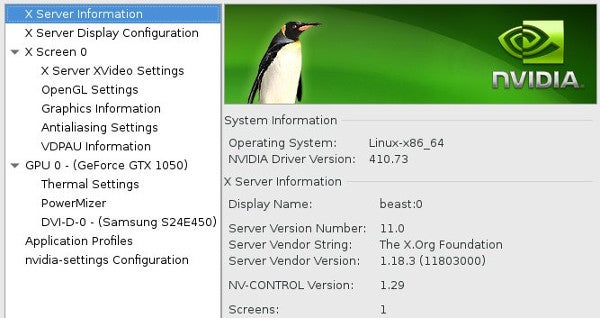

However, if you install the Nvidia drivers as a kmod package, updating your kernel also updates your Nvidia driver. On Fedora and related:

```bash
$ sudo dnf install kmod-nvidia
```

On Debian and related:

```bash
$ sudo apt update
$ sudo apt install nvidia-kernel-common nvidia-kernel-dkms nvidia-glx nvidia-xconfig nvidia-settings nvidia-vdpau-driver vdpau-va-driver
```

This is only an example, but if you're installing Nvidia drivers in real life, you must also blacklist the Nouveau driver. See your distribution's documentation for the best steps.

#### Download and install a driver

Not everything is included in the kernel, and not everything *else* is available as a kernel module. In some cases, you have to download a special driver written and bundled by the hardware vendor, and other times, you have the driver but not the frontend to configure driver options.

Two common examples are HP printers and [Wacom](https://linuxwacom.github.io/) illustration tablets. If you get an HP printer, you probably have generic drivers that can communicate with your printer. You might even be able to print. But the generic driver may not be able to provide specialized options specific to your model, such as double-sided printing, collation, paper tray choices, and so on. [HPLIP](https://developers.hp.com/hp-linux-imaging-and-printing) (the HP Linux Imaging and Printing system) provides options to manage jobs, adjust printing options, select paper trays where applicable, and so on.

HPLIP is usually bundled in package managers; just search for "hplip."


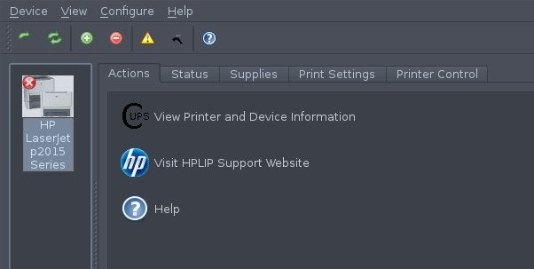

Similarly, drivers for Wacom tablets, the leading illustration tablet for digital artists, are usually included in your kernel, but options to fine-tune settings, such as pressure sensitivity and button functionality, are only accessible through the graphical control panel included by default with GNOME but installable as the extra package **kde-config-tablet** on KDE.

There are likely some edge cases that don't have drivers in the kernel but offer kmod versions of driver modules as an RPM or DEB file that you can download and install through your package manager.

#### Patching and compiling your own kernel

Even in the futuristic utopia that is the 21st century, there are vendors that don't understand open source enough to provide installable drivers. Sometimes, such companies provide source code for a driver but expect you to download the code, patch a kernel, compile, and install manually.

This kind of distribution model has the same disadvantages as installing packaged drivers outside of the kmod system: an update to your kernel breaks the driver because it must be re-integrated into your kernel manually each time the kernel is swapped out for a new one.

This has become rare, happily, because the Linux kernel team has done an excellent job of pleading loudly for companies to communicate with them, and because companies are finally accepting that open source isn't going away any time soon. But there are still novelty or hyper-specialized devices out there that provide only kernel patches.

Officially, there are distribution-specific preferences for how you should compile a kernel to keep your package manager involved in upgrading such a vital part of your system. There are too many package managers to cover each; as an example, here is what happens behind the scenes when you use tools like **rpmdev** on Fedora or **build-essential** and **devscripts** on Debian.

First, as usual, find out which kernel version you're running:

```bash
$ uname -r
```

In most cases, it's safe to upgrade your kernel if you haven't already. After all, it's possible that your problem will be solved in the latest release. If you tried that and it didn't work, then you should download the source code of the kernel you are running. Most distributions provide a special command for that, but to do it manually, you can find the source code on [kernel.org](https://www.kernel.org/).

You also must download whatever patch you need for your kernel. Sometimes, these patches are specific to the kernel release, so choose carefully.

It's traditional, or at least it was back when people regularly compiled their own kernels, to place the source code and patches in **/usr/src/linux**.

Unarchive the kernel source and the patch files as needed:

```bash
$ cd /usr/src/linux
$ bzip2 --decompress linux-5.2.4.tar.bz2
$ cd  linux-5.2.4
$ bzip2 -d ../patch*bz2
```

The patch file may have instructions on how to do the patch, but often they're designed to be executed from the top level of your tree:

```bash
$ patch -p1 < patch*example.patch
```

Once the kernel code is patched, you can use your old configuration to prepare the patched kernel config:

```bash
$ make oldconfig
```

The **make oldconfig** command serves two purposes: it inherits your current kernel's configuration, and it allows you to configure new options introduced by the patch.

You may need to run the **make menuconfig** command, which launches an ncurses-based, menu-driven list of possible options for your new kernel. The menu can be overwhelming, but since it starts with your old config as a foundation, you can look through the menu and disable modules for hardware that you know you do not have and do not anticipate needing. Alternately, if you know that you have some piece of hardware and see it is not included in your current configuration, you may choose to build it, either as a module or directly into the kernel. In theory, this isn't necessary because presumably, your current kernel was treating you well but for the missing patch, and probably the patch you applied has activated all the necessary options required by whatever device prompted you to patch your kernel in the first place.

Next, compile the kernel and its modules:

```bash
$ make bzImage
$ make modules
```

This leaves you with a file named **vmlinuz**, which is a compressed version of your bootable kernel. Save your old version and place the new one in your **/boot** directory:

```bash
$ sudo mv /boot/vmlinuz /boot/vmlinuz.nopatch
$ sudo cat arch/x86_64/boot/bzImage > /boot/vmlinuz
$ sudo mv /boot/System.map /boot/System.map.stock
$ sudo cp System.map /boot/System.map
```

So far, you've patched and built a kernel and its modules, you've installed the kernel, but you haven't installed any modules. That's the final build step:

```bash
$ sudo make modules_install
```

The new kernel is in place, and its modules are installed.

The final step is to update your bootloader so that the part of your computer that loads before the kernel knows where to find Linux. The GRUB bootloader makes this process relatively simple:

```bash
$ sudo grub2-mkconfig
```

#### Real-world compiling

Of course, nobody runs those manual commands now. Instead, refer to your distribution for instructions on modifying a kernel using the developer toolset that your distribution's maintainers use. This toolset will probably create a new installable package with all the patches incorporated, alert the package manager of the upgrade, and update your bootloader for you.

#### Kernels

Operating systems and kernels are mysterious things, but it doesn't take much to understand what components they're built upon. The next time you get a piece of tech that appears to not work on Linux, take a deep breath, investigate driver availability, and go with the path of least resistance. Linux is easier than ever—and that includes the kernel.

### 上文翻译

​	在计算机领域，**内核是处理与硬件通信和一般系统协调的底层软件。**除了计算机主板上内置的一些初始固件外，当你启动计算机时，内核向上提供一种抽象，让应用层软件知道计算机有硬盘、屏幕、键盘和网卡。内核的工作还包括确保每个组件都有相同的运行时间（或多或少），以便图形、音频、文件系统和网络都能顺利运行，它们可以是同时运行的。

​	不过，对硬件支持的追求是持续性的，因为发布的硬件越多，内核就必须在代码中采用越多的东西，才能使硬件按预期运行。虽然很难获得准确的数字，但 Linux 内核在硬件兼容性方面肯定是名列前茅的。Linux 操作着无数的电脑和手机、业余爱好者和工业用途的嵌入式系统芯片（SoC）板、RAID 卡等等。

在 20 世纪（甚至 21 世纪初），Linux 用户在购买新硬件时，需要下载最新的内核源代码、编译并安装，以便获得设备支持。但最近，你很难找到一个自己编译内核的 Linux 用户，除非是为了好玩或通过高度专业化的定制硬件获利。现在，一般不需要自己编译 Linux 内核了。

以下是编译内核的原因，以及如何在需要时编译内核的快速教程。

#### 更新内核的现代方法

​	无论你是买了一台全新的笔记本电脑，配备了炫目的新显卡或 WiFi 芯片组，还是刚把一台新打印机带回家，你的操作系统（称为 GNU+Linux 或简称 Linux，也是内核的名称）都需要一个驱动程序来打开与新组件（显卡、WiFi 芯片、打印机或其他）的通信通道。有时，当你插入一个新设备时，你的电脑*似乎*承认了它，这可能具有欺骗性。但千万别被骗了。有时这就是你所需要的，但有时你的操作系统只是使用通用协议来探测已连接的设备。

​	例如，你的电脑可能能够识别你的新网络打印机，但有时这只是因为打印机中的网卡被编程为识别自己的网络，以便获得 DHCP 地址。这并不一定意味着你的电脑知道向打印机发送什么指令才能打印出一页文本。事实上，你可能会说，计算机甚至并不真正 "知道 "该设备是一台打印机；它可能只是显示网络上有一台设备在一个特定的地址上，而该设备用一系列字符*p-r-i-n-t-e-r*来标识自己。人类的语言习惯对计算机来说毫无意义，它需要的是一个驱动程序。

​	内核开发人员、硬件制造商、技术支持人员和业余爱好者都知道，新硬件在不断推出。他们中的许多人都会直接向内核开发团队提交驱动程序，以便将其纳入 Linux。例如，Nvidia 显卡驱动程序通常被写入[Nouveau](https://nouveau.freedesktop.org/wiki/)内核模块，而且，由于 Nvidia 显卡很常见，这些代码通常会被包含在任何发布的通用内核中（如下载[Fedora](http://fedoraproject.org/) 或[Ubuntu](http://ubuntu.com/)时获得的内核）。在 Nvidia 不常用的地方，例如嵌入式系统中，Nouveau 模块通常被排除在外。许多其他设备也有类似的模块：打印机有 [Foomatic](https://wiki.linuxfoundation.org/openprinting/database/foomatic) 和 [CUPS](https://www.cups.org/) 模块，无线网卡有 [b43, ath9k, wl](https://wireless.wiki.kernel.org/en/users/drivers) 模块，等等。

​	发行版倾向于在其 Linux 内核构建中尽可能多地包含这些模块，因为它们希望你能够连接设备并立即开始使用，而无需安装驱动程序。这在大多数情况下都会发生，尤其是现在许多设备供应商都在为他们销售的硬件提供 Linux 驱动程序开发资金，并将这些驱动程序直接提交给内核团队进行发布。

​	但有时，你运行的是六个月前安装的内核，而一周前刚上市的新设备令人兴奋。在这种情况下，你的内核可能没有该设备的驱动程序。好在很多时候，最近版本的内核中可能就有该设备的驱动程序，这意味着你只需更新正在运行的内核即可。

​	一般来说，这可以通过软件包管理器完成。例如，在 RHEL、CentOS 和 Fedora 上：

```
sudo dnf update kernel
```

​	对于Debian和 Ubuntu 上，首先需要查看的是系统内核的版本：

```
$ uname -r
6.5.0-41-generic
```

​	下一步就是查找更新的源：

```
$ sudo apt update
$ sudo apt search linux-image
```

​	我们看看结果如何

```
linux-image-5.15.0-76-lowlatency/jammy-updates,jammy-security 5.15.0-76.83 amd64
linux-image-6.8.0-1008-azure/jammy-updates,jammy-security 6.8.0-1008.8~22.04.1 amd64
linux-image-6.8.0-1008-azure-fde/jammy-updates,jammy-security 6.8.0-1008.8~22.04.1 amd64
linux-image-6.8.0-1008-nvidia/jammy-updates,jammy-security 6.8.0-1008.8~22.04.1 amd64
linux-image-azure-edge/jammy-updates,jammy-security 6.8.0-1008.8~22.04.1 amd64
linux-image-azure-fde-edge/jammy-updates,jammy-security 6.8.0-1008.8~22.04.1 amd64
linux-image-nvidia-6.8/jammy-updates,jammy-security 6.8.0-1008.8~22.04.1 amd64
linux-image-nvidia-hwe-22.04-wip/jammy-updates,jammy-security 6.8.0-1008.8~22.04.1 amd64
linux-image-uc-6.8.0-1008-nvidia/jammy-updates,jammy-security 6.8.0-1008.8~22.04.1 amd64
linux-image-unsigned-5.15.0-76-lowlatency/jammy-updates,jammy-security 5.15.0-76.83 amd64
linux-image-unsigned-6.8.0-1008-azure/jammy-updates,jammy-security 6.8.0-1008.8~22.04.1 amd64
  Linux kernel image for version 6.8.0 on 64 bit x86 SMP
linux-image-unsigned-6.8.0-1008-nvidia/jammy-updates,jammy-security 6.8.0-1008.8~22.04.1 amd64
  Linux kernel image for version 6.8.0 on 64 bit x86 SMP
```

​	我们可以找最新的6.8的内核

```
sudo apt install linux-image-6.8.0
```

​	下载完成，下一步就是简单的重启就行。

#### 安装内核模块

​	有时，发行版并不希望用户经常使用某个设备（或者至少不希望设备驱动程序出现在 Linux 内核中）。Linux 采用模块化方式处理驱动程序，因此发行版可以提供单独的驱动程序包，即使驱动程序没有编译到内核中，内核也可以加载这些驱动程序包。这很有用，不过当内核中不包含驱动程序，但在启动过程中需要使用，或者内核从模块化驱动程序下更新时，情况就会变得复杂。第一个问题由 initrd（初始 RAM 磁盘）解决，不在本文讨论范围之内，第二个问题由名为 kmod 的系统解决。

​	下面，我们一个 Nvidia 驱动程序作为例子：

​	kmod 系统能确保内核更新时，同时安装的所有模块化驱动程序也得到更新。如果你手动安装驱动程序，就会错过 kmod 提供的自动化功能，因此只要有 kmod 软件包，你就应该选择安装。例如，虽然 Nvidia 驱动程序作为 Nouveau 驱动程序内置于内核中，但 Nvidia 官方驱动程序仅由 Nvidia 发布。你可以通过访问网站、下载 .run 文件并运行其提供的 shell 脚本来手动安装 Nvidia 品牌的驱动程序，但在安装新内核后，你必须重复同样的过程，因为没有任何信息会告诉你的软件包管理器你手动安装了内核驱动程序。由于显卡由 Nvidia 驱动，手动更新 Nvidia 驱动程序通常意味着你必须在终端上执行更新，因为没有正常运行的显卡驱动程序就没有显卡。


​	当然，我们如果下载的是Nvidia的模块驱动，我们可以直接以挂载module的方式，在更新系统的时候把驱动更新了。

​	Fedora系列的：

```
$ sudo dnf install kmod-nvidia
```

​	在Debian系列的

```
sudo apt update
$ sudo apt install nvidia-kernel-common nvidia-kernel-dkms nvidia-glx nvidia-xconfig nvidia-settings nvidia-vdpau-driver vdpau-va-driver
```

​	当然这仅仅只是一个例子，但是如果你正在下载英伟达显卡驱动，你必须将Nouveau的驱动拉入黑名单。更加具体的需要查看你的发行版的文档，以获取最佳的安装步骤。

#### 下载，并且安装一个驱动

​	并非所有东西都包含在内核中，也并非所有其他东西都可以作为内核模块使用。在某些情况下，你必须下载由硬件供应商编写和捆绑的特殊驱动程序，而在其他情况下，你有驱动程序却没有配置驱动程序选项的前端。

​	惠普打印机和 Wacom 绘图板就是两个常见的例子。如果你买的是惠普打印机，那么你可能拥有可以与打印机通信的通用驱动程序。你甚至可以打印。但通用驱动程序可能无法提供针对你的型号的专门选项，如双面打印、拼版、纸盘选择等。HPLIP（HP Linux 成像和打印系统）提供了管理作业、调整打印选项、选择适用纸盘等选项。

​	HPLIP 通常捆绑在软件包管理器中；只需搜索 "hplip "即可。

​	

​	同样，Wacom 平板电脑（数字艺术家的主要插画平板电脑）的驱动程序通常包含在内核中，但微调设置的选项（如压力灵敏度和按钮功能）只能通过 GNOME 默认包含的图形控制面板访问，但在 KDE 中可作为额外软件包 kde-config-tablet 安装。

​	可能还有一些相对罕见的情况——内核中没有驱动程序，但以 RPM 或 DEB 文件的形式提供 kmod 版本的驱动模块，你可以通过软件包管理器下载并安装。

#### 编译`(Compiling)`或给kernel打补丁`(Patching)`

​	即使在未来乌托邦的 21 世纪，也有一些厂商对开放源代码的理解不够深刻，无法提供可安装的驱动程序。有时，这些公司会提供驱动程序的源代码，但希望你下载代码、修补内核、编译并手动安装。

​	这种发布模式与在 kmod 系统外安装打包驱动程序有同样的缺点：内核更新会破坏驱动程序，因为每次更换新内核时，都必须手动将其重新集成到内核中。

​	令人欣慰的是，这种情况已经很少见了，因为 Linux 内核团队已经做得很好，他们大声恳求公司与他们沟通，而且公司也终于接受了开源不会很快消失的事实。但仍有一些新奇或超专业的设备只提供内核补丁。

​	官方对如何编译内核有特定的发行版偏好，以便让软件包管理器参与升级系统中如此重要的部分。软件包管理器种类繁多，无法一一列举；举例来说，以下是 Fedora 上的 rpmdev 或 Debian 上的 build-essential 和 devscripts 等工具的幕后工作。

​	一般的步骤如下：

```
uname -r
```

​	在大多数情况下，如果您还没有升级内核，那么升级内核是安全的。毕竟，你的问题有可能在最新版本中得到解决。如果你尝试了，但没有成功，那么你应该下载你正在运行的内核的源代码。大多数发行版都为此提供了专门的命令，但要手动下载，你可以在 kernel.org 上找到源代码。

​	您还必须下载内核所需的补丁。有时，这些补丁与内核版本有关，因此要谨慎选择。

​	将源代码和补丁文件放在 /usr/src/linux 中是一种传统做法，至少在人们经常编译自己的内核时是这样。

​	根据需要解压缩内核源代码和补丁文件：

```
$ cd /usr/src/linux
$ bzip2 --decompress linux-5.2.4.tar.bz2
$ cd  linux-5.2.4
$ bzip2 -d ../patch*bz2
```

​	这里的补丁文件可能会有若干指引步骤来指导你如何来给内核。打补丁，但是通常的他们会被设计。在你的代码层次数上的顶层开始执行。

```
$ patch -p1 < patch*example.patch
```

​	一旦你的内核代码被打上了补丁，你可以尝试用你电脑的旧的配置文件来准备对内核配置进行补丁。

```
$ make oldconfig
```

​	**make oldconfig**指令完成两个重要的目的，它继承了你当前内核的配置，以及它允许你去配置新的选项，这些新的选项则是通过补丁而被引入的。

​	你也有可能需要运行**make menuconfig** ，他们是受这样的一些包进行支持的 ：ncurses-based, menu-driven等。菜单可能会让人应接不暇，但由于它是以你的旧配置为基础启动的，你可以查看菜单，禁用那些你知道自己没有、预计也不需要的硬件模块。另外，如果你知道自己拥有某些硬件，但发现当前配置中不包含这些硬件，你可以选择将其作为模块或直接内置到内核中。从理论上讲，这并不是必须的，因为如果没有丢失的补丁，你当前的内核应该是不错的，而且你应用的补丁可能已经激活了所有必要的选项，不管是什么设备促使你首先为内核打上补丁。

​	接下来，编译内核及其模块：

```
$ make bzImage
$ make modules
```

​	采取如此的行动将会给你生成一个这样的文件，它是可以被启动内核的文件的压缩版本。我们保留旧的内核压缩版本，然后把新的内核压缩文件放到`/boot`目录下

```
$ sudo mv /boot/vmlinuz /boot/vmlinuz.nopatch
$ sudo cat arch/x86_64/boot/bzImage > /boot/vmlinuz
$ sudo mv /boot/System.map /boot/System.map.stock
$ sudo cp System.map /boot/System.map
```

​	目前为止你已经给内核打上补丁，并且将之完成构建以及相关的模块，你已经成功的安装了内核，但是你并没有安装模块，所以我们需要做最后的步骤。

```
$ sudo make modules_install
```

​	在新的内核已经就位以及它的模块也被安装完成，最后一步就是更新我们的bootloader，这样的话我们的电脑将会加载这些新的内核。这一步就是告知GRUB启动器内核的位置。

```
$ sudo grub2-mkconfig
```

#### 实际编译

​	当然，现在没人会执行这些手动命令。取而代之的是，你可以参考发行版的说明，使用发行版维护者使用的开发者工具集修改内核。该工具集可能会创建一个包含所有补丁的新安装包，提醒软件包管理器进行升级，并为你更新引导加载器。

#### 内核

​	操作系统和内核是很神秘的东西，但要了解它们是基于什么组件构建的并不难。下一次，当你得到一项似乎无法在 Linux 上运行的技术时，深吸一口气，调查驱动程序的可用性，然后选择阻力最小的途径。Linux 比以往任何时候都要简单，包括内核。

### Questions

> I need to add the boot parameter `foo=bar` to my kernel. How can I do this once for testing, and permanently if testing was a success?

#### To temporarily add a boot parameter to a kernel

1. Start your system and wait for the GRUB menu to show (if you don't see a GRUB menu, press and hold the left Shift key right after starting the system).
2. Now highlight the kernel you want to use, and press the e key. You should be able to see and edit the commands associated with the highlighted kernel.
3. Go down to the line starting with `linux` and add your parameter `foo=bar` to its end.
4. Now press Ctrl + x to boot.

#### To make this change permanent

1. From a terminal (or after pressing Alt + F2) run:

   ```
    gksudo gedit /etc/default/grub
   ```

   (or use `sudo nano` if `gksudo` or `gedit` are not available) and enter your password.

2. Find the line starting with `GRUB_CMDLINE_LINUX_DEFAULT` and append `foo=bar` to its end. For example:

   ```
    GRUB_CMDLINE_LINUX_DEFAULT="quiet splash foo=bar"
   ```

   Save the file and close the editor.

3. Finally, start a terminal and run:

   ```
    sudo update-grub
   ```

   to update GRUB's configuration file (you probably need to enter your password).

On the next reboot, the kernel should be started with the boot parameter. To permanently remove it, simply remove the parameter from `GRUB_CMDLINE_LINUX_DEFAULT` and run `sudo update-grub` again.

To verify your changes, you can see exactly what parameters your kernel booted with by executing `cat /proc/cmdline`.

## Bugs Type

#### 程序设计层面上：

> 1. 逻辑或实现错误
>    1. 包含一些堆栈溢出的错误，他们可能是死循环导致的
>    2. 数字运算溢出（精度丢失，运算上，下溢出）
>    3. 运算符误使用
> 2. 资源泄露
>    1. 包含了非法的指针解引用等
>    2. UAF（释放后再使用）
>    3. OOB（越界）
> 3. 一些硬件错误
> 4. 竞争（锁的不正确使用，导致死锁，或者是高频率中断导致信息丢失）
> 5. 性能缺失
>    1. 对齐不当
>    2. 错误的使用API
>    3. 数据竞争
>    4. 不恰当的IO

#### 如果是从内存层面上谈：

​	由于与内存相关的缺陷在程序语言（如 C 语言和非托管语言）中非常常见，因此我们现在将从内存损坏的角度来看bugs

- 不正确的内存访问：
  使用未初始化的变量；又称 UMR 缺陷
  越界内存访问（读/写下溢/溢出错误）
  使用后释放/使用后返回（超出范围）错误
  双重免费
- 内存泄漏
- 数据竞赛
- 碎片（内部执行）问题：
  内部的
  外部的

​	所有的这些内存访问行为（除了内存碎片以外）都被认为是UB。

​	还有一种是从CVE/CWE安全相关的角度进行评估的：

​	有一个公开披露的安全漏洞（vulns）和问题的开放式数据库；安全研究人员、学者和业界使用它来跟踪与安全相关的缺陷/错误，帮助人们研究和讨论它们，建立缓解措施（修复、补丁），从而以一致的方式应对它们。每个安全漏洞（有时是一大堆漏洞，形成一个类别）都有一个编号，称为 "常见漏洞和暴露"（Common Vulnerabilities and Exposures，CVE）或 "常见弱点和枚举"（Common Weaknesses and Enumeration，CWE）编号。

​	下面给出一些：

- **National Institute of Standards and Technology** (**NIST**) with the **National Vulnerability** **Database** (**NVD**) ：(https://nvd.nist.gov/vuln/full-listing). (https://nvd.nist.gov/vuln/categories/cwe-layout).
- **CVE Details** site(https://www.cvedetails.com/); 还有它的FAQ: https://www.cve.org/ResourcesSupport/FAQs.

#### BTW

​	这里简单介绍一下最为经典的一个Bug：Buffer Copy without Checking Size of Input ('Classic Buffer Overflow')，也就是不加以验证源大小的盲目拷贝。

##### Sources： [CWE - CWE-120: Buffer Copy without Checking Size of Input ('Classic Buffer Overflow') (4.14) (mitre.org)](https://cwe.mitre.org/data/definitions/120.html)

[](javascript:toggleblocksOC('120_Description');) Description

The product copies an input buffer to an output buffer without verifying that the size of the input buffer is less than the size of the output buffer, leading to a buffer overflow.

[](javascript:toggleblocksOC('120_Extended_Description');) Extended Description

A buffer overflow condition exists when a product attempts to put more data in a buffer than it can hold, or when it attempts to put data in a memory area outside of the boundaries of a buffer. The simplest type of error, and the most common cause of buffer overflows, is the "classic" case in which the product copies the buffer without restricting how much is copied. Other variants exist, but the existence of a classic overflow strongly suggests that the programmer is not considering even the most basic of security protections.

[](javascript:toggleblocksOC('120_Alternate_Terms');) Alternate Terms

|                          |                                                              |
| :----------------------- | ------------------------------------------------------------ |
| Classic Buffer Overflow: | This term was frequently used by vulnerability researchers during approximately 1995 to 2005 to differentiate buffer copies without length checks (which had been known about for decades) from other emerging weaknesses that still involved invalid accesses of buffers, as vulnerability researchers began to develop advanced exploitation techniques |

[](javascript:toggleblocksOC('120_Common_Consequences');) Common Consequences


| Scope                                  | Impact                                                       | Likelihood |
| :------------------------------------- | :----------------------------------------------------------- | :--------- |
| Integrity Confidentiality Availability | **Technical Impact:** *Modify Memory; Execute Unauthorized Code or Commands*Buffer overflows often can be used to execute arbitrary code, which is usually outside the scope of the product's implicit security policy. This can often be used to subvert any other security service. |            |
| Availability                           | **Technical Impact:** *Modify Memory; DoS: Crash, Exit, or Restart; DoS: Resource Consumption (CPU)*Buffer overflows generally lead to crashes. Other attacks leading to lack of availability are possible, including putting the product into an infinite loop. |            |

Demonstrative Examples

Example 1

​	The following code asks the user to enter their last name and then attempts to store the value entered in the last_name array.

```
char last_name[20];
printf ("Enter your last name: ");
scanf ("%s", last_name);
```

​	The problem with the code above is that it does not restrict or limit the size of the name entered by the user. If the user enters "Very_very_long_last_name" which is 24 characters long, then a buffer overflow will occur since the array can only hold 20 characters total.

Example 2

​	The following code attempts to create a local copy of a buffer to perform some manipulations to the data.

```
void manipulate_string(char * string){

	char buf[24];
	strcpy(buf, string);
	...

}
```

​	However, the programmer does not ensure that the size of the data pointed to by string will fit in the local buffer and copies the data with the potentially dangerous strcpy() function. This may result in a buffer overflow condition if an attacker can influence the contents of the string parameter.

Example 3

The code below calls the gets() function to read in data from the command line.


```
char buf[24];
printf("Please enter your name and press <Enter>\n");
gets(buf);
...
```

​	However, gets() is inherently unsafe, because it copies all input from STDIN to the buffer without checking size. This allows the user to provide a string that is larger than the buffer size, resulting in an overflow condition.

Example 4

​	In the following example, a server accepts connections from a client and processes the client request. After accepting a client connection, the program will obtain client information using the gethostbyaddr method, copy the hostname of the client that connected to a local variable and output the hostname of the client to a log file.

```
...

struct hostent *clienthp;
char hostname[MAX_LEN];

// create server socket, bind to server address and listen on socket
...

// accept client connections and process requests
int count = 0;
for (count = 0; count < MAX_CONNECTIONS; count++) {

int clientlen = sizeof(struct sockaddr_in);
int clientsocket = accept(serversocket, (struct sockaddr *)&clientaddr, &clientlen);

if (clientsocket >= 0) {

clienthp = gethostbyaddr((char*) &clientaddr.sin_addr.s_addr, sizeof(clientaddr.sin_addr.s_addr), AF_INET);
strcpy(hostname, clienthp->h_name);
logOutput("Accepted client connection from host ", hostname);

// process client request
...
close(clientsocket);

}

}
close(serversocket);

...
```

​	However, the hostname of the client that connected may be longer than the allocated size for the local hostname variable. This will result in a buffer overflow when copying the client hostname to the local variable using the strcpy method.

##### 翻译

- 描述：将输入缓冲区复制到输出缓冲区，但未验证输入缓冲区的大小是否小于输出缓冲区的大小，从而导致缓冲区溢出。

- 详细的阐述：当代码试图在缓冲区中放入超过其容量的数据，或试图在缓冲区边界之外的内存区域中放入数据时，就会出现缓冲区溢出情况。最简单的错误类型，也是最常见的缓冲区溢出原因，是代码复制缓冲区而不限制复制量的 "典型 "情况。还存在其他变种，但典型溢出的存在强烈表明程序员甚至没有考虑最基本的安全保护措施。

- 大约在 1995 年至 2005 年期间，随着漏洞研究人员开始开发先进的利用技术，漏洞研究人员经常使用这个术语来区分不进行长度检查的缓冲区拷贝（几十年前就已存在）和其他仍涉及缓冲区无效访问的新出现的弱点。

- 一些常见的后果：显然他是危险的，波及到程序的完整性 保密性 可用性三者：缓冲区溢出通常可用于执行任意代码，这通常超出了产品隐式安全策略的范围。这通常可用于颠覆任何其他安全服务。同时缓冲区溢出通常还会导致程序崩溃。其他的攻击将会导致程序有一定程度的不可用，包括将代码引入一个无限的循环。

- 一些例子：

  - 例子1

    下面的这个代码要求用户输入他的名，以及试图存储它到一个字符数组里。

    ```C
    char last_name[20];
    printf ("Enter your last name: ");
    scanf ("%s", last_name);
    ```

    看出这个代码的问题了吗？这个代码的问题就在于它并没有限制名称输入的大小，如果一个用户输入了非常非常非常长的名称，也就是大于20个字符的名称，那么一个缓冲区溢出将会发生。

  - 例子2

    下面这段代码尝试从本地拷入一个字符串进入函数内部进行一定的操作变换。

    ```
    void manipulate_string(char * string){
    	char buf[24];
    	strcpy(buf, string);
    	...
    }
    ```

    这段代码也是存在问题的，程序员可能并没有办法保证数据的指针指向的字符串的大小，是可以被程序员自己准备的缓冲区的大小相符合的，换而言之，这里就有可能存在缓冲区溢出的风险。我们操作的指针指向的字符串的大小很有可能大于24个字节。所以如果想要让程序崩溃，只需要传递一个远大于24个字符的字符串，这个时候下一个函数调用将会使程序发生缓冲区溢出，从而使攻击者可以执行缓冲区溢出部分所指向的代码。

  - 例子3

    下面这段代码试图使用gets函数来从命令行获取数据：

    ```
    {
    	char buf[24];
    	printf("Please enter your name and press <Enter>\n");
    	gets(buf);
    	...
    }
    ```

    然而熟悉c语言程序设计的同志们都知道这个函数天生就是不安全的，因为它将拷贝所有从标准输入输入进来的数据，进入到目标缓冲区而不去检查它的大小。这将允许用户去提供一个字符串这个字符串的大小将远大于缓冲区大小，从而导致缓冲区溢出进行一定的代码攻击。

  - 例子4

    在下面这个例子中，一个服务尝试去连接一个客户端，然后去完成客户端的请求，这个程序将使用gethostnamebyaddr()获取客户端的信息。然后将获取到的信息拷贝到缓冲区中

    ```
    ...
    struct hostent *clienthp;
    char hostname[MAX_LEN];
    
    // create server socket, bind to server address and listen on socket
    ...
    
    // accept client connections and process requests
    int count = 0;
    for (count = 0; count < MAX_CONNECTIONS; count++) {
    
    	int clientlen = sizeof(struct sockaddr_in);
    	int clientsocket = accept(serversocket, (struct sockaddr *)&clientaddr, &clientlen);
    
    	if (clientsocket >= 0) {
    		clienthp = gethostbyaddr((char*) &clientaddr.sin_addr.s_addr, 		sizeof(clientaddr.sin_addr.s_addr), AF_INET);
    		strcpy(hostname, clienthp->h_name);
    		logOutput("Accepted client connection from host ", hostname);
    
    		// process client request
    		...
    		close(clientsocket);
    	}
    }
    close(serversocket);
    
    ...
    ```

    然而连接到服务器的客户端的名称可能会比我们在本地变量所分配的名称的变量大小要长。如果真是如此，这将会导致一个缓冲区溢出当我们试图把获取到的客户端的名称拷贝到本地变量中。

#### 内核角度

​	从内核角度来看也是十分方便的

- 导致系统锁定或挂起的缺陷
- 导致系统崩溃和/或恐慌的缺陷
- 逻辑或执行缺陷
- 资源泄漏缺陷
- 性能问题

### 内核调试

​	当内核出现错误或漏洞时，无论多么微不足道，整个系统都会被认为处于糟糕的、不可恢复的状态。系统就会被认为处于无法恢复的糟糕状态，内核就会给你挂panic。在这种致命的情况下，系统会产生一个简短的诊断，然后直接 停止（也可以配置为超时后重启）。调试这些情况 调试本来就很困难，因为至少从表面上看，似乎没有诊断信息可 即使有诊断信息，系统也没有任何反应，基本上就是死机了。那么，如何获取诊断信息进行分析呢？你很快就会发现，即使有多种技术、工具和 内核调试的技术、工具和方法，但并不是所有的技术、工具和方法都适用于所有情况。你所使用的工具或技术往往取决于你所处的特定场景。那么，这些场景是什么呢？概括地说，它们包括以下几种：

- 项目开发阶段： 您正在开发 
  代码，并且正在进行积极的开发。这包括使用自定义 调试和生产内核。
- 单元或单个开发人员测试和 QA（集成/系统/验收） 
  测试阶段： 您已经开发了一个模块或组件，需要对其进行测试。这需要使用自定义调试内核和生产内核。
- 死后分析： 内核崩溃了；您需要尝试找出 根本原因并加以修复。这需要同时使用自定义调试内核和 生产内核。
- 现场或生产： 系统出现错误和性能问题。您需要使用适当的工具来了解根本原因。这 这需要使用定制的生产内核（以及调试内核--某些工具需要符号）。

​	内核调试有多种方法。使用哪一种（或几种）取决于具体情况。以下是上述场景和内核调试的一些方法。

#### 开发阶段

您目前正处于项目的开发阶段吗？如果是，以下方法和技术可以帮助您：

基于代码的调试技术可以立即提供帮助（尽管它们在以后也会有用）。这些技术包括

- 使用 printk() 和其他工具进行代码级检测
- 动态调试 printk
- 生成内核模式堆栈转储并对其进行解释
- 在代码中使用断言
- 在代码库中设置并利用调试钩子--有两种典型的方法：
  - 通过 debugfs 伪文件系统
  - 通过用于调试目的的特殊 ioctl(2) 钩子函数

​	在内核（或模块）C 代码中单步运行，设置断点、观察点、检查数据内容等：通过著名的内核 GDB (KGDB) 框架。

#### 单元测试和/或质量保证阶段

​	在单元测试和/或质量保证阶段（包括单元测试和集成/系统/验收测试），你作为项目中的一名开发人员，通常会针对自己开发的代码运行单元测试。除此之外，您的团队和/或专门的质量保证团队可能会针对项目（临时）版本运行一个完整的（也许是自动化的）测试套件，发现并向开发团队报告错误。在这些阶段，应使用以下工具和技术尝试捕捉可能的错误：

- 动态分析： 您可以运行在实时系统上运行的工具，这些工具会在代码执行时对代码路径进行检查。这些工具包括
  - 内存检查器：检测内存问题或内存损坏（通常是错误的根本原因）至关重要。
  - 未定义行为（UB）检查程序： 未定义行为包括算术 
  - 下溢/溢出（包括著名的整数溢出（IoF）缺陷）、无效位移、错位访问等。
  - 锁定调试工具和仪器。

- 静态分析： 涉及使用对项目源代码进行处理的工具（类似于编译器）。这些工具可以帮助用户深入了解被忽视的、可能存在漏洞的代码，以及存在安全风险的代码。

- 代码覆盖率分析： 这并不是真正意义上的调试技术，而是为了确保在测试过程中每一行代码都得到实际应用。这一点至关重要--只有这样，我们才能对产品有高度的信心。在此，您通常会使用代码覆盖率工具（如 gcov）来检查哪些代码行在给定的测试运行中被实际执行。在给定的测试运行过程中实际执行了哪些代码行。(这些技术通常更适用于 这些技术通常更适用于单个开发人员的单元测试，而不适用于系统级测试，尽管它们也可以应用于系统级测试）。当然也可用于系统级测试）。

监控和跟踪工具： 这些工具可用于开发和 测试/质量保证阶段，甚至可能在生产（现场）中使用：

- 内核跟踪基础架构 - 这是一个很大的领域，包括以下内容：
  - Ftrace 和 trace-cmd
  - 事件跟踪
  - Linux 跟踪工具包：下一代（LTTng）、Trace Compass 和 KernelShark GUI
  - **Perf**
  - **Enhanced Berkeley Packet Filter** (**eBPF**)
  - **SystemTap**
  - 用户态的工具 (**strace** and **ltrace** utilities)
  - **Kernel probes** (**Kprobes**) – both static and dynamic
  - Watchdogs
  - Custom kernel panic handler
  - Detection of soft and hard lockups
  - Detection of hung tasks
  - Magic SysRq handlers

- 事后分析： 对于大多数开发人员来说，常见的情况之一是崩溃后的情况：（捕获并）分析内核诊断（称为内核 OOPS）：
  - Oops（内核日志文件）分析
  - 使用 kdump 收集内核转储图像（大致相当于进程崩溃时产生的内核转储），并使用功能强大的崩溃应用程序对其进行解释

#### 在生产现场运行时（为完整起见）：

- 任何（或所有）监控和跟踪工具（在上一要点中提及 点中提到的）。
- 代码中的调试钩子（通过 debugfs、ioctl）
- 常规和动态调试 printks
- 日志记录（通过 systemd 日志和基于应用程序的日志记录）
- 自定义恐慌处理程序

使用哪种内核调试技术不仅取决于软件生命周期的各个阶段，有些内核调试技术还需要大量的硬件和/或软件资源：

- 硬件限制： 有些内核调试技术需要大量的硬件资源，而这些资源您可能负担得起，也可能负担不起！例如，使用 kdump 技术需要大量内存、网络带宽和/或磁盘空间。一些受到严格限制的嵌入式 Linux 系统根本无法承受，而一般的服务器系统却可以轻松做到（众所周知的用户空间 Valgrind 工具套件也是如此；Address Sanitizer (ASAN) 使用的资源较少......）。
- 软件限制： 就像硬件一样，有些系统对内核配置中可以启用的功能有自我设计的限制，这可能会排除一些调试技术。kdump 和跟踪基础架构就是很好的例子。
  关键一点：动态分析工具只能捕捉它们实际看到并运行的代码中的错误。这让我们明白，拥有覆盖所有代码的测试用例是极其重要的，正如前面提到的（第 1 章，调试软件的一般介绍），100% 的代码覆盖率是我们的目标！请注意，虽然我已经对工具和技术进行了明确的分类，但在某些情况下，你可以（也许应该）在不同的场景中使用某种技术，而不是上面所展示的那样。请保持灵活性，根据手头的情况使用适当的工具。

### 按不同情况分类

下面的表格试图囊括所有内核调试方法、工具和技术，并按照不同的使用场景进行分类。
请注意以下几点：

- 目前，只需查看适用于不同场景和用例的可用工具/技术/工艺/API，不必担心如何使用它们。当然，这才是本书及其后续章节的核心内容。本书的目的是涵盖这里提到的大部分内容。
- 如前所述，特定工具或技术的使用场景是典型的，而不是绝对的。你可能会遇到不同的使用情况。我建议你根据实际情况调整和使用适合的技术

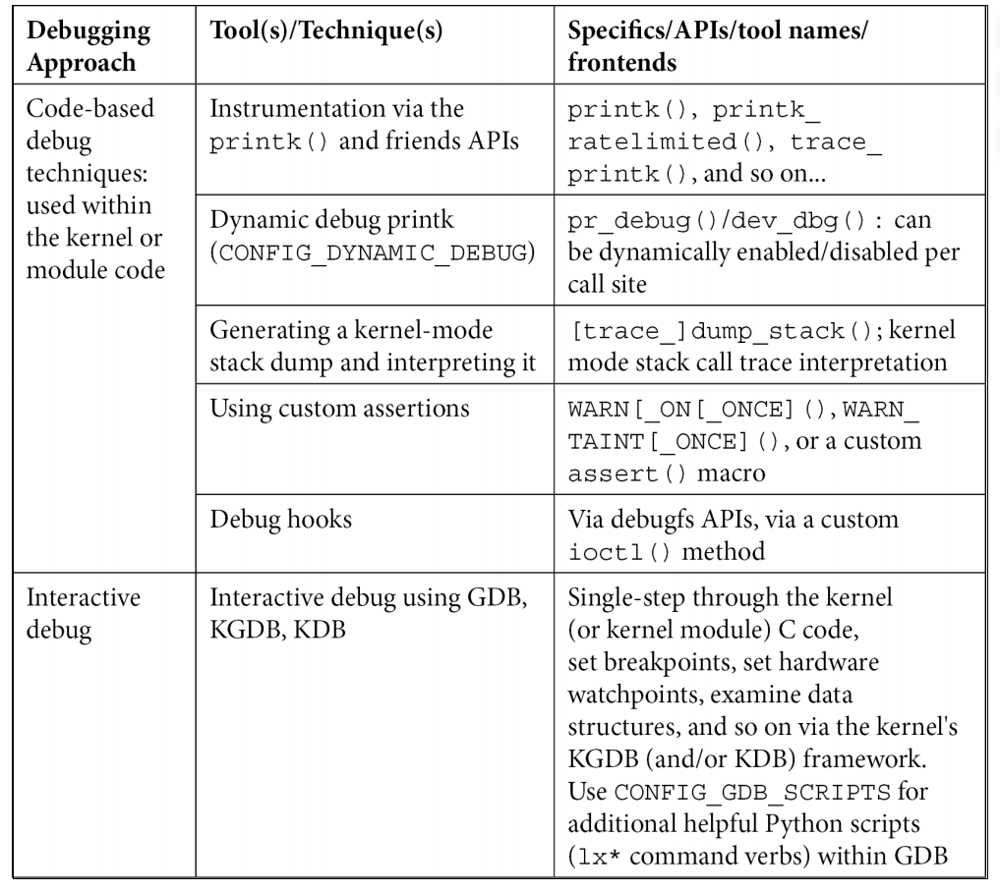

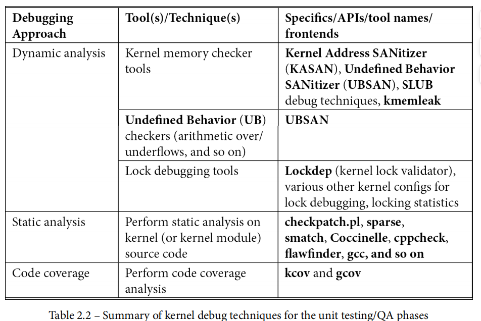

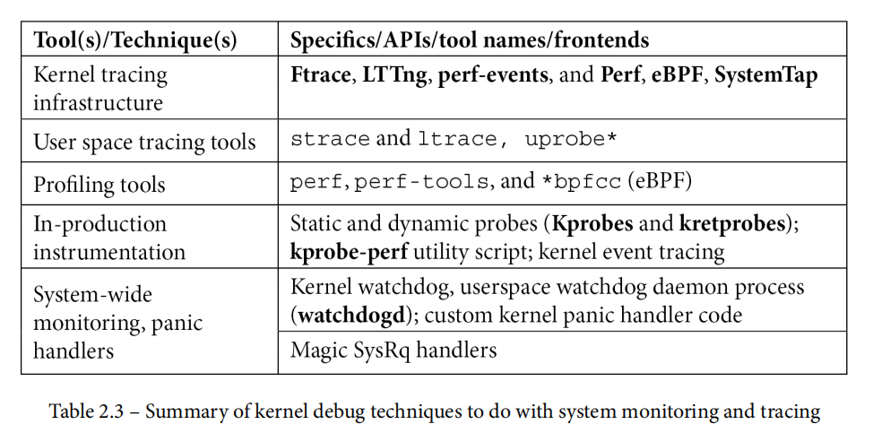

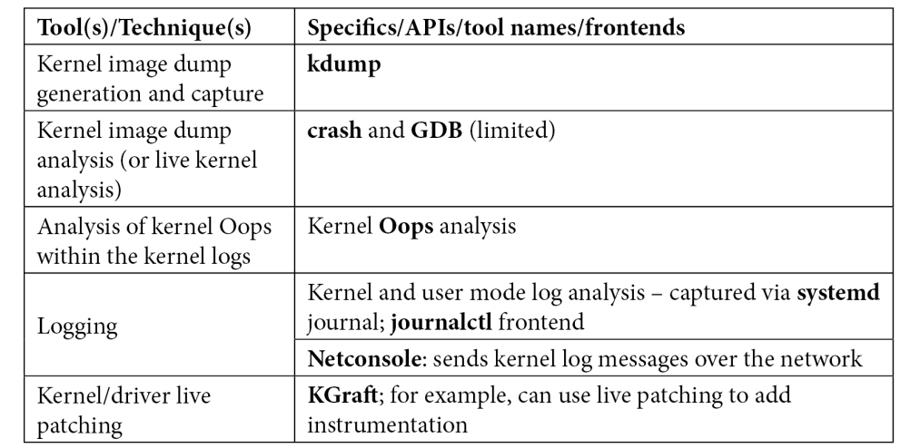

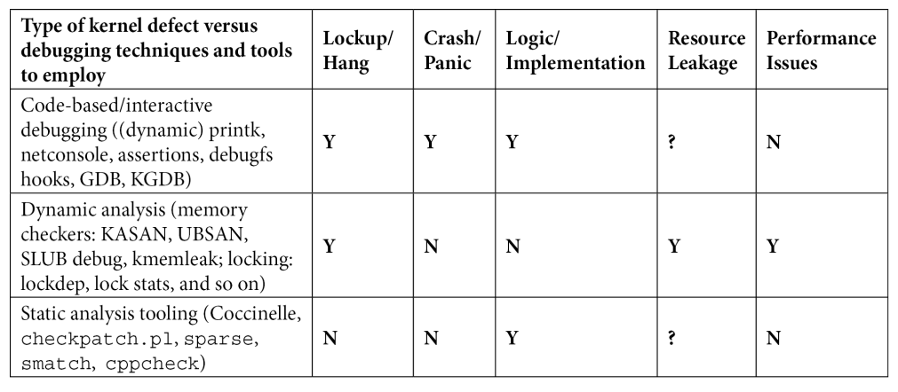

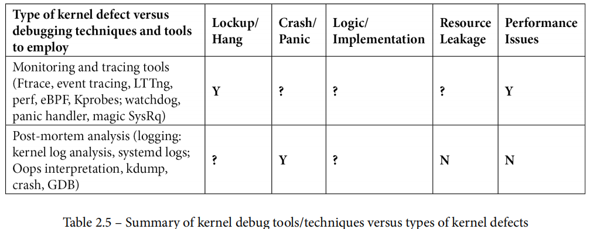

# Undefined Behavior in 2017

------

*This post is jointly authored by Pascal Cuoq and John Regehr.*

Recently we’ve heard a few people imply that problems stemming from undefined behaviors (UB) in C and C++ are largely solved due to ubiquitous availability of dynamic checking tools such as ASan, UBSan, MSan, and TSan. We are here to state the obvious — that, despite the many excellent advances in tooling over the last few years, UB-related problems are far from solved — and to look at the current situation in detail.

Valgrind and most of the sanitizers are intended for debugging: emitting friendly diagnostics regarding undefined behaviors that are executed during testing. Tools like this are exceptionally useful and they have helped us progress from a world where almost every nontrivial C and C++ program executed a continuous stream of UB to a world where quite a few important programs seem to be largely UB-free in their most common configurations and use cases.

The problem with dynamic debugging tools is that they don’t do anything to help us to cope with the worst UBs: the ones that we didn’t know how to trigger during testing, but that someone else has figured out how to trigger in deployed software — while exploiting it. The problem reduces to doing good testing, which is hard. Tools like afl-fuzz are great but they barely begin to scratch the surface of large programs that process highly structured inputs.

One way to sidestep problems in testing is to use static UB-detection tools. These are steadily improving, but sound and precise static analysis is not necessarily any easier than achieving good test coverage. Of course the two techniques are attacking the same problem — identifying feasible paths in software — from opposite sides. This problem has always been extremely hard and probably always will be. We’ve written a lot elsewhere about finding UBs via static analysis; in this piece our focus is on dynamic tools.

The other way to work around problems in testing is to use UB mitigation tools: these turn UB into defined behavior in production C and C++, effectively gaining some of the benefits of a safe programming language. The challenge is in engineering mitigation tools that:

- don’t break our code in any corner cases,
- have very low overhead,
- don’t add effective attack surfaces, for example by requiring programs to be linked against a non-hardened runtime library,
- raise the bar for determined attackers (in contrast, debugging tools can afford to use heuristics that aren’t resistant to adversaries),
- compose with each other (in contrast, some debugging tools such as ASan and TSan are not compatible, necessitating two runs of the test suite for any project that wants to use both).

Before looking at some individual kinds of UB, let’s review the our goals here. These apply to every C and C++ compiler.

**Goal 1: Every UB (yes, all ~200 of them, we’ll give the list towards the end of this post) must either be documented as having some defined behavior, be diagnosed with a fatal compiler error, or else — as a last resort — have a sanitizer that detects that UB at runtime.** This should not be controversial, it’s sort of a minimal requirement for developing C and C++ in the modern world where network packets and compiler optimizations are effectively hostile.

**Goal 2: Every UB must either be documented as having some defined behavior, be diagnosed with a fatal compiler error, or else have an optional mitigation mechanism that meets the requirements above.** This is more difficult; it necessitates, for example, production-grade memory safety. We like to think that this can be achieved in many execution environments. OS kernels and other maximally performance-critical code will need to resort to more difficult technologies such as formal methods.

The rest of this piece will look at the current situation for various classes of undefined behaviors. We’ll start with the big ones.

## Spatial Memory Safety Violations

**Background:** Accessing out-of-bounds storage and even creating pointers to that storage are UB in C and C++. The [1988 Morris Worm](https://blog.regehr.org/extra_files/IWorm-paper.pdf) gave us an early hint of what the next N years would be like. So far we know that N >= 29, and probably N will end up being about 75.

**Debugging:** Valgrind and ASan are both excellent debugging tools. For many use cases ASan is the better choice because it has much less overhead. Both tools retain the representation of addresses as 32- or 64-bit values, and reserve forbidden red zones around valid blocks. This is a robust and compatible approach: it interoperates seamlessly with non-instrumented binary libraries and also supports existing code that relies on pointers being convertible to integers.

Valgrind, working from executable code, cannot insert red zones between stack variables because stack layout is implicitly hard-coded in the offsets of instructions that access the stack, and it would be an impossibly ambitious project to remap stack addresses on the fly. As a result, Valgrind has only limited support for detecting errors in manipulating storage on the stack. ASan works during compilation and inserts red zones around stack variables. Stack variables are small and numerous, so address space and locality considerations prevent the use of very large red zones. With default settings, the addresses of two adjacent local int variables x and y end up separated by 16 bytes. In other words, the verifications done by ASan and Valgrind are only for one memory layout, and the memory layout for which the verifications are done is different from the memory layout of the uninstrumented execution.

A minor weakness of ASan and Valgrind is that they can miss undefined behaviors that get optimized away before the instrumentation has a chance to run, [as in this example](https://godbolt.org/g/1c6xK6).

**Mitigation:** We’ve long had partial mitigation mechanisms for memory unsafety, including ASLR, stack canaries, hardened allocators, and NX. More recently, [production-grade CFI](https://clang.llvm.org/docs/ControlFlowIntegrity.html) (control flow integrity) has become available. Another interesting recent development is [pointer authentication in ARMv8.3](https://www.qualcomm.com/documents/whitepaper-pointer-authentication-armv83). [This paper](https://people.eecs.berkeley.edu/~dawnsong/papers/Oakland13-SoK-CR.pdf) has a good overview of memory safety mitigations.

A serious drawback of ASan as a mitigation tool is illustrated here:

```
$ cat asan-defeat.c
#include <stdio.h>
#include <stdlib.h>
#include <string.h>

char a[128];
char b[128];

int main(int argc, char *argv[]) {
  strcpy(a + atoi(argv[1]), "owned.");
  printf("%s\n", b);
  return 0;
}
$ clang-4.0 -O asan-defeat.c
$ ./a.out 128
owned.
$ clang-4.0 -O -fsanitize=address -fno-common asan-defeat.c
$ ./a.out 160
owned.
$ 
```

In other words, ASan simply forces an attacker to compute a different offset in order to corrupt a target memory region. (Thanks to Yury Gribov for pointing out that we should be using the -fno-common flag to ASan.)

To mitigate this kind of undefined behavior, real bounds checking must be performed, as opposed to only verifying that each memory access lands in some valid region. Memory safety is the gold standard here. Although there is much academic work on memory safety, some showing apparently reasonable overheads and good compatibility with existing software, it has not yet seen widespread adoption. [Checked C](https://www.microsoft.com/en-us/research/project/checked-c/) is a very cool project to keep an eye on in this space.

**Summary:** Debugging tools for this class of error are very good. Good mitigations are available but this class of bug can only be reliably stopped by full memory/type safety.

## Temporal Memory Safety Violations

**Background:** A “temporal memory safety violation” is any use of a memory location after its lifetime has ended. This includes addresses of automatic variables outliving these variables; use-after-free, where a dangling pointer is accessed for reading or writing; and, double free, which can be just as harmful in practice, since free() modifies metadata that is usually adjacent to the block being freed. If the block has already been freed, these writes can fall on memory used for any other purpose and, in principle, can have as much consequence as any other invalid write.

**Debugging:** ASan is designed to detect use-after-free bugs, which often lead to hard-to-reproduce, erratic behavior. It does so by placing freed memory blocks in a quarantine, preventing their immediate reuse. For some programs and inputs, this can increase memory consumption and decrease locality. The user can configure the size of the quarantine in order to trade false positives for resource usage.

ASan can also detect addresses of automatic variables surviving the scope of these variables. The idea is to turn automatic variables into heap-allocated blocks, that the compiler automatically allocates when execution enters the block, and frees (while retaining them in a quarantine) when execution leaves the block. This option is turned off by default, because it makes programs even more memory-hungry.

The temporal memory safety violation in the program below causes it to behave differently at the default optimization level and at -O2. ASan can detect a problem in the program below with no optimization, but only if the option detect_stack_use_after_return is set, and only if the program was not compiled with optimization.

```
$ cat temporal.c
#include <stdio.h>

int *G;

int f(void) {
  int l = 1;
  int res = *G;
  G = &l;
  return res;
}

int main(void) {
  int x = 2;
  G = &x;
  f();
  printf("%d\n", f());
}
$ clang -Wall -fsanitize=address temporal.c
$ ./a.out 
1
$ ASAN_OPTIONS=detect_stack_use_after_return=1 ./a.out 
=================================================================
==5425==ERROR: AddressSanitizer: stack-use-after-return ...
READ of size 4 at 0x0001035b6060 thread T0
^C
$ clang -Wall -fsanitize=address -O2 temporal.c
$ ./a.out 
32767
$ ASAN_OPTIONS=detect_stack_use_after_return=1 ./a.out 
32767
$ clang -v
Apple LLVM version 8.0.0 (clang-800.0.42.1)
...
```

In some other examples, the sanitizer’s failure to detect UB that has been “optimized out” can be argued to be harmless, since the optimized-out UB has no consequence. This is not the case here! The program is meaningless in any case, but the unoptimized program behaves deterministically and works as if the variable x had been declared static, whereas the optimized program, in which ASan does not detect any foul play, does not behave deterministically and reveals an internal state that is not supposed to be seen:

```
$ clang -Wall -O2 temporal.c
$ ./a.out 
1620344886
$ ./a.out 
1734516790
$ ./a.out 
1777709110
```

**Mitigation:** As discussed above, ASan is not intended for hardening, but various hardened allocators are available; they use the same quarantining strategy to render use-after-free bugs unexploitable.

**Summary:** Use ASan (together with “ASAN_OPTIONS=detect_stack_use_after_return=1” for the test cases that are small enough to allow it). Vary optimization levels in case some compilations catch errors that others don’t.

## Integer Overflow

**Background:** Integers cannot underflow, but they can overflow in both directions. Signed integer overflow is UB; this includes INT_MIN / -1, INT_MIN % -1, negating INT_MIN, shift with negative exponent, left-shifting a one past the sign bit, and (sometimes) left-shifting a one into the sign bit. Division by zero and shift by >= bitwidth are UB in both the signed and unsigned flavors. [Read more here](http://www.cs.utah.edu/~regehr/papers/tosem15.pdf).

**Debugging:** LLVM’s UBSan is very good for debugging integer-related undefined behaviors. Because UBSan works near the source level, it is highly reliable. There are some quirks relating to compile-time math; for example, [this program traps as C++11 but not as C11](https://godbolt.org/g/BFHKg9); we believe this follows the standards but haven’t looked into it closely. GCC has its own version of UBSan but it [isn’t 100% trustworthy](https://godbolt.org/g/2spSWN); here it looks like constants are being folded before the instrumentation pass gets to run.

**Mitigation:** UBSan in trapping mode (on hitting UB, process aborts w/o printing a diagnostic) can be used for mitigation. It is usually reasonably efficient and it doesn’t add attack surface. [Parts of Android use UBSan to mitigate integer overflows](https://android-developers.googleblog.com/2016/05/hardening-media-stack.html) (including unsigned overflows, which of course are not undefined). Although integer overflows are generic logic errors, in C and C++ they are particularly harmful because they often lead to memory safety violations. In a memory-safe language they tend to do much less damage.

**Summary:** Integer undefined behaviors are not very difficult to catch; UBSan is the only debugging tool you’re likely to ever need. An issue with mitigating integer UBs is the overhead. For example, they cause SPEC CPU 2006 to run about 30% slower. There is plenty of room for improvement, both in eliminating overflow checks that cannot fire and in making the remaining checks less obstructive to the loop optimizers. Someone with resources should push on this.

## Strict Aliasing Violations

**Background:** The “strict aliasing rules” in the C and C++ standards allow the compiler to assume that if two pointers refer to different types, they cannot point to the same storage. This enables nice optimizations but risks breaking programs that take a flexible view of types (roughly 100% of large C and C++ programs take a flexible view of types somewhere). For a thorough overview see [Sections 1-3 of this paper](http://trust-in-soft.com/wp-content/uploads/2017/01/vmcai.pdf).

**Debugging:** The state of the art in debugging tools for strict aliasing violations is weak. Compilers warn about some easy cases, but these warnings are extremely fragile. [libcrunch](https://github.com/stephenrkell/libcrunch) warns that a pointer is being converted to a type “pointer to thing” when the pointed object is not, in fact, a “thing.” This allows polymorphism though void pointers, but catches misuses of pointer conversions that are also strict aliasing violations. With respect to the C standard and C compilers’ interpretation of what it allows them to optimize in their type-based alias analyses, however, libcrunch is neither sound (it does not detect some violations that happen during the instrumented execution) nor complete (it warns about pointer conversions that smell bad but do not violate the standard).

**Mitigation:** This is easy: pass the compiler a flag (-fno-strict-aliasing) that disables optimizations based on strict aliasing. The result is a C/C++ compiler that has an old-school memory model where more or less arbitrary casts between pointer types can be performed, with the resulting code behaving as expected. Of the big three compilers, it is only LLVM and GCC that are affected, MSVC doesn’t implement this class of optimization in the first place.

**Summary:** Correctness-sensitive code bases need significant auditing: it is always suspicious and dangerous to cast a pointer to any type other than a char *. Alternatively, just turn off strict-aliasing-based optimizations using a flag and make sure that nobody ever builds the code without using this flag.

## Alignment Violations

**Background:** RISC-style processors have tended to disallow memory accesses where the address is not a multiple of the size of the object being accessed. On the other hand, C and C++ programs that use unaligned pointers are undefined regardless of the target architecture. Historically we have been complacent about this, first because x86/x64 support unaligned accesses and second because compilers have so far not done much to exploit this UB.

Even so, here is an [excellent blog post](https://pzemtsov.github.io/2016/11/06/bug-story-alignment-on-x86.html) explaining how the compiler can break code that does unaligned accesses when targeting x64. The code in the post violates strict aliasing in addition to violating the alignment rules, but the crash (we verified it under GCC 7.1.0 on OS X) occurs even when the `-fno-strict-aliasing` flag is passed to the compiler.

**Debugging:** UBSan can detect misaligned memory accesses.

**Mitigation:** None known.

**Summary:** Use UBSan.

## Loops that Neither Perform I/O nor Terminate

**Background:** A loop in C or C++ code that neither performs I/O nor terminates is undefined and can be terminated arbitrarily by the compiler. See [this post](https://blog.regehr.org/archives/140) and [this note](http://www.open-std.org/jtc1/sc22/wg14/www/docs/n1528.htm).

**Debugging:** No tools exist.

**Mitigation:** None, besides avoiding heavily-optimizing compilers.

**Summary:** This UB is probably not a problem in practice (even if it is moderately displeasing to some of us).

## Data Races

**Background:** A data race occurs when a piece of memory is accessed by more than one thread, at least one of the accesses is a store, and the accesses are not synchronized using a mechanism such as a lock. Data races are UB in modern flavors of C and C++ (they do not have a semantics in older versions since those standards do not address multithreaded code).

**Debugging:** [TSan](https://clang.llvm.org/docs/ThreadSanitizer.html) is an excellent dynamic data race detector. Other similar tools exist, such as the Helgrind plugin for Valgrind, but we have not used these lately. The use of dynamic race detectors is complicated by the fact that races can be very difficult to trigger, and worse this difficulty depends on variables such as the number of cores, the thread scheduling algorithm, whatever else is going on on the test machine, and on the moon’s phase.

**Mitigation:** Don’t create threads.

**Summary:** This particular UB is probably a good idea: it clearly communicates the idea that developers should not count on racy code doing anything in particular, but should rather use atomics (that cannot race by definition) if they don’t enjoy locking.

## Unsequenced Modifications

**Background:** In C, “sequence points” constrain how early or late a side-effecting expression such as x++ can take effect. C++ has a different but more-or-less-equivalent formulation of these rules. In either language, unsequenced modifications of the same value, or an unsequenced modification and use of the same value, results in UB.

**Debugging:** Some compilers emit warnings for obvious violations of the sequencing rules:

```
$ cat unsequenced2.c
int a;

int foo(void) {
  return a++ - a++;
}
$ clang -c unsequenced2.c
unsequenced2.c:4:11: warning: multiple unsequenced modifications to 'a' [-Wunsequenced]
  return a++ - a++;
          ^     ~~
1 warning generated.
$ gcc-7 -c unsequenced2.c -Wall
unsequenced2.c: In function 'foo':
unsequenced2.c:4:11: warning: operation on 'a' may be undefined [-Wsequence-point]
   return a++ - a++;
          ~^~
```

However, a bit of indirection defeats these warnings:

```
$ cat unsequenced.c
#include <stdio.h>

int main(void) {
  int z = 0, *p = &z;
  *p += z++;
  printf("%d\n", z);
  return 0;
}
$ gcc-4.8 -Wall unsequenced.c ; ./a.out
0
$ gcc-7 -Wall unsequenced.c ; ./a.out
1
$ clang -Wall unsequenced.c ; ./a.out
1
```

**Mitigation:** None known, though it would be almost trivial to define the order in which side effects take place. The Java Language Definition provides an example of how to do this. We have a hard time believing that this kind of constraint would meaningfully handicap any modern optimizing compiler. If the standards committees can’t find it within their hearts to make this happen, the compiler implementors should do it anyway. Ideally, all major compilers would make the same choice.

**Summary:** With a bit of practice, it is not too difficult to spot the potential for unsequenced accesses during code reviews. We should be wary of any overly-complex expression that has many side effects. This leaves us without a good story for legacy code, but hey it has worked until now, so perhaps there’s no problem. But really, this should be fixed in the compilers.

A non-UB relative of unsequenced is “indeterminately sequenced” where operations may happen in an order chosen by the compiler. An example is the order of the first two function calls while evaluating f(a(), b()). This order should be specified too. Left-to-right would work. Again, there will be no performance loss in non-insane circumstances.

## TIS Interpreter

We now change gears and take a look at the approach taken by [TIS Interpreter](http://trust-in-soft.com/tis-interpreter/), a debugging tool that looks for undefined behavior in C programs as it executes them line by line. TIS Interpreter runs programs much more slowly than the LLVM-based sanitizers, and even much more slowly than Valgrind. However, TIS Interpreter can usefully be compared to these sanitizers: it works from the source code, leaves the problem of coverage to test suites and fuzzing tools, and identifies problems along the execution paths that it has been provided inputs for.

A fundamental difference between TIS Interpreter and any single sanitizer is that TIS Interpreter’s goal is, along the execution paths it explores, to be exhaustive: to find all the problems that ASan, MSan, and UBSan are designed to find some of (give or take a couple of minor exceptions that we would be delighted to discuss at great length if provoked). For example, TIS Interpreter identifies unsequenced changes to overlapping memory zones within an expression, such as (*p)++ + (*q)++ when the pointers p and q alias. The problem of the unspecified order of function calls in a same expression, that TIS Interpreter orders without warning when a different order could produce a different result, is a known limitation that will eventually be fixed.

TIS Interpreter’s approach to detecting memory safety errors differs sharply from ASan’s and Valgrind’s in that it doesn’t find errors for a specific heap layout, but rather treats as an error any construct that could lead the execution to behave differently depending on memory layout choices. In other words, TIS Interpreter has a symbolic view of addresses, as opposed to the concrete view taken by Valgrind and ASan. This design choice eliminates the “only the instrumented version of the program is safe, and the instrumented version behaves differently from the deployed version” problem. The occasional C program is written to behave differently depending on the memory layout (for instance if addresses are fed to hash functions or used to provide a total ordering between allocated values). TIS Analyzer warns that these programs are doing this (which is always good to know); sometimes, tweaks make it possible to analyze them in TIS Interpreter anyway, but the resulting guarantees will be weaker.

It is sometimes useful, for debugging purposes, to see the first UB that occurs in an execution. Consider a loop in which MSan warns that uninitialized memory is being used, and in which ASan warns about an out-of-bounds read. Is the out-of-bounds read caused by the incorporation of uninitialized memory in the computation of the index, or is the use of uninitialized memory caused by the index being computed wrongly? One cannot use both ASan and MSan at the same time, so this is a mystery that developers need to solve for themselves. The value of looking for all undefined behaviors at the same time is in this case the confidence that the first undefined behavior seen is not a symptom of a previous undefined behavior. Another advantage is [finding undefined behavior that one was not looking for](https://trust-in-soft.com/an-old-quirky-libksba-bug/).

Detection of strict aliasing violations in TIS Interpreter is being worked on, following as much as possible the C standard and the interpretation of C compiler designers (which can be observed in each compiler’s translation of well-chosen examples).

## But What About the Rest of the Undefined Behaviors?

Let’s take a quick look at the contents of [Appendix J.2: a non-normative, non-exhaustive list of undefined behaviors in C](http://www.open-std.org/jtc1/sc22/wg14/www/docs/n1548.pdf#page=571). Keep in mind that no equivalent list has ever been created for C++, as far as we know.

First, we’ll list the UBs that we’ve discussed explicitly in this post:

- The execution of a program contains a data race (5.1.2.4).
- An object is referred to outside of its lifetime (6.2.4).
- The value of a pointer to an object whose lifetime has ended is used (6.2.4).
- The value of an object with automatic storage duration is used while it is indeterminate (6.2.4, 6.7.9, 6.8).
- Conversion to or from an integer type produces a value outside the range that can be represented (6.3.1.4).
- An lvalue does not designate an object when evaluated (6.3.2.1).
- Conversion between two pointer types produces a result that is incorrectly aligned (6.3.2.3).
- A side effect on a scalar object is unsequenced relative to either a different side effect on the same scalar object or a value computation using the value of the same scalar object (6.5).
- An exceptional condition occurs during the evaluation of an expression (6.5).
- An object has its stored value accessed other than by an lvalue of an allowable type (6.5).
- The operand of the unary * operator has an invalid value (6.5.3.2).
- The value of the second operand of the / or % operator is zero (6.5.5).
- Addition or subtraction of a pointer into, or just beyond, an array object and an integer type produces a result that does not point into, or just beyond, the same array object (6.5.6).
- Addition or subtraction of a pointer into, or just beyond, an array object and an integer type produces a result that points just beyond the array object and is used as the operand of a unary * operator that is evaluated (6.5.6).
- Pointers that do not point into, or just beyond, the same array object are subtracted (6.5.6).
- An array subscript is out of range, even if an object is apparently accessible with the given subscript (as in the lvalue expression a[1][7] given the declaration int a[4][5]) (6.5.6).
- The result of subtracting two pointers is not representable in an object of type ptrdiff_t (6.5.6).
- An expression is shifted by a negative number or by an amount greater than or equal to the width of the promoted expression (6.5.7).
- An expression having signed promoted type is left-shifted and either the value of the expression is negative or the result of shifting would be not be representable in the promoted type (6.5.7).
- Pointers that do not point to the same aggregate or union (nor just beyond the same array object) are compared using relational operators (6.5.8).
- An object is assigned to an inexactly overlapping object or to an exactly overlapping object with incompatible type (6.5.16.1).

And second, those that we have not addressed:

- A “shall” or “shall not” requirement that appears outside of a constraint is violated (clause 4).
- A nonempty source file does not end in a new-line character which is not immediately preceded by a backslash character or ends in a partial preprocessing token or comment (5.1.1.2).
- Token concatenation produces a character sequence matching the syntax of a universal character name (5.1.1.2).
- A program in a hosted environment does not define a function named main using one of the specified forms (5.1.2.2.1).
- A character not in the basic source character set is encountered in a source file, except in an identifier, a character constant, a string literal, a header name, a comment, or a preprocessing token that is never converted to a token (5.2.1).
- An identifier, comment, string literal, character constant, or header name contains an invalid multibyte character or does not begin and end in the initial shift state (5.2.1.2).
- The same identifier has both internal and external linkage in the same translation unit (6.2.2).
- A trap representation is read by an lvalue expression that does not have character type (6.2.6.1).
- A trap representation is produced by a side effect that modifies any part of the object using an lvalue expression that does not have character type (6.2.6.1).
- The operands to certain operators are such that they could produce a negative zero result, but the implementation does not support negative zeros (6.2.6.2).
- Two declarations of the same object or function specify types that are not compatible (6.2.7).
- A program requires the formation of a composite type from a variable length array type whose size is specified by an expression that is not evaluated (6.2.7).
- Demotion of one real floating type to another produces a value outside the range that can be represented (6.3.1.5).
- A non-array lvalue with an incomplete type is used in a context that requires the value of the designated object (6.3.2.1).
- An lvalue designating an object of automatic storage duration that could have been declared with the register storage class is used in a context that requires the value of the designated object, but the object is uninitialized. (6.3.2.1).
- An lvalue having array type is converted to a pointer to the initial element of the array, and the array object has register storage class (6.3.2.1).
- An attempt is made to use the value of a void expression, or an implicit or explicit conversion (except to void) is applied to a void expression (6.3.2.2).
- Conversion of a pointer to an integer type produces a value outside the range that can be represented (6.3.2.3).
- A pointer is used to call a function whose type is not compatible with the referenced type (6.3.2.3).
- An unmatched ‘ or ” character is encountered on a logical source line during tokenization (6.4).
- A reserved keyword token is used in translation phase 7 or 8 for some purpose other than as a keyword (6.4.1).
- A universal character name in an identifier does not designate a character whose encoding falls into one of the specified ranges (6.4.2.1).
- The initial character of an identifier is a universal character name designating a digit (6.4.2.1).
- Two identifiers differ only in nonsignificant characters (6.4.2.1).
- The identifier __func__ is explicitly declared (6.4.2.2).
- The program attempts to modify a string literal (6.4.5).
- The characters ‘, \, “, //, or /* occur in the sequence between the < and > delimiters, or the characters ‘, \, //, or /* occur in the sequence between the ” delimiters, in a header name preprocessing token (6.4.7).
- For a call to a function without a function prototype in scope, the number of ∗ arguments does not equal the number of parameters (6.5.2.2).
- For call to a function without a function prototype in scope where the function is defined with a function prototype, either the prototype ends with an ellipsis or the types of the arguments after promotion are not compatible with the types of the parameters (6.5.2.2).
- For a call to a function without a function prototype in scope where the function is not defined with a function prototype, the types of the arguments after promotion are not compatible with those of the parameters after promotion (with certain exceptions) (6.5.2.2).
- A function is defined with a type that is not compatible with the type (of the expression) pointed to by the expression that denotes the called function (6.5.2.2).
- A member of an atomic structure or union is accessed (6.5.2.3).
- A pointer is converted to other than an integer or pointer type (6.5.4).
- An expression that is required to be an integer constant expression does not have an integer type; has operands that are not integer constants, enumeration constants, character constants, sizeof expressions whose results are integer constants, or immediately-cast floating constants; or contains casts (outside operands to sizeof operators) other than conversions of arithmetic types to integer types (6.6).
- A constant expression in an initializer is not, or does not evaluate to, one of the following: an arithmetic constant expression, a null pointer constant, an address constant, or an address constant for a complete object type plus or minus an integer constant expression (6.6).
- An arithmetic constant expression does not have arithmetic type; has operands that are not integer constants, floating constants, enumeration constants, character constants, or sizeof expressions; or contains casts (outside operands to size operators) other than conversions of arithmetic types to arithmetic types (6.6).
- The value of an object is accessed by an array-subscript [], member-access . or −>, address &, or indirection * operator or a pointer cast in creating an address constant (6.6).
- An identifier for an object is declared with no linkage and the type of the object is incomplete after its declarator, or after its init-declarator if it has an initializer (6.7).
- A function is declared at block scope with an explicit storage-class specifier other than extern (6.7.1).
- A structure or union is defined as containing no named members, no anonymous structures, and no anonymous unions (6.7.2.1).
- An attempt is made to access, or generate a pointer to just past, a flexible array member of a structure when the referenced object provides no elements for that array (6.7.2.1).
- When the complete type is needed, an incomplete structure or union type is not completed in the same scope by another declaration of the tag that defines the content (6.7.2.3).
- An attempt is made to modify an object defined with a const-qualified type through use of an lvalue with non-const-qualified type (6.7.3).
- An attempt is made to refer to an object defined with a volatile-qualified type through use of an lvalue with non-volatile-qualified type (6.7.3).
- The specification of a function type includes any type qualifiers (6.7.3).
- Two qualified types that are required to be compatible do not have the identically qualified version of a compatible type (6.7.3).
- An object which has been modified is accessed through a restrict-qualified pointer to a const-qualified type, or through a restrict-qualified pointer and another pointer that are not both based on the same object (6.7.3.1).
- A restrict-qualified pointer is assigned a value based on another restricted pointer whose associated block neither began execution before the block associated with this pointer, nor ended before the assignment (6.7.3.1).
- A function with external linkage is declared with an inline function specifier, but is not also defined in the same translation unit (6.7.4).
- A function declared with a _Noreturn function specifier returns to its caller (6.7.4).
- The definition of an object has an alignment specifier and another declaration of that object has a different alignment specifier (6.7.5).
- Declarations of an object in different translation units have different alignment specifiers (6.7.5).
- Two pointer types that are required to be compatible are not identically qualified, or are not pointers to compatible types (6.7.6.1).
- The size expression in an array declaration is not a constant expression and evaluates at program execution time to a nonpositive value (6.7.6.2).
- In a context requiring two array types to be compatible, they do not have compatible element types, or their size specifiers evaluate to unequal values (6.7.6.2).
- A declaration of an array parameter includes the keyword static within the [ and ] and the corresponding argument does not provide access to the first element of an array with at least the specified number of elements (6.7.6.3).
- A storage-class specifier or type qualifier modifies the keyword void as a function parameter type list (6.7.6.3).
- In a context requiring two function types to be compatible, they do not have compatible return types, or their parameters disagree in use of the ellipsis terminator or the number and type of parameters (after default argument promotion, when there is no parameter type list or when one type is specified by a function definition with an identifier list) (6.7.6.3).
- The value of an unnamed member of a structure or union is used (6.7.9).
- The initializer for a scalar is neither a single expression nor a single expression enclosed in braces (6.7.9).
- The initializer for a structure or union object that has automatic storage duration is neither an initializer list nor a single expression that has compatible structure or union type (6.7.9).
- The initializer for an aggregate or union, other than an array initialized by a string literal, is not a brace-enclosed list of initializers for its elements or members (6.7.9).
- An identifier with external linkage is used, but in the program there does not exist exactly one external definition for the identifier, or the identifier is not used and there exist multiple external definitions for the identifier (6.9).
- A function definition includes an identifier list, but the types of the parameters are not declared in a following declaration list (6.9.1).
- An adjusted parameter type in a function definition is not a complete object type (6.9.1).
- A function that accepts a variable number of arguments is defined without a parameter type list that ends with the ellipsis notation (6.9.1).
- The } that terminates a function is reached, and the value of the function call is used by the caller (6.9.1).
- An identifier for an object with internal linkage and an incomplete type is declared with a tentative definition (6.9.2).
- The token defined is generated during the expansion of a #if or #elif preprocessing directive, or the use of the defined unary operator does not match one of the two specified forms prior to macro replacement (6.10.1).
- The #include preprocessing directive that results after expansion does not match one of the two header name forms (6.10.2).
- The character sequence in an #include preprocessing directive does not start with a letter (6.10.2).
- There are sequences of preprocessing tokens within the list of macro arguments that would otherwise act as preprocessing directives (6.10.3).
- The result of the preprocessing operator # is not a valid character string literal (6.10.3.2).
- The result of the preprocessing operator ## is not a valid preprocessing token (6.10.3.3).
- The #line preprocessing directive that results after expansion does not match one of the two well-defined forms, or its digit sequence specifies zero or a number greater than 2147483647 (6.10.4).
- A non-STDC #pragma preprocessing directive that is documented as causing translation failure or some other form of undefined behavior is encountered (6.10.6).
- A #pragma STDC preprocessing directive does not match one of the well-defined forms (6.10.6).
- The name of a predefined macro, or the identifier defined, is the subject of a #define or #undef preprocessing directive (6.10.8).
- An attempt is made to copy an object to an overlapping object by use of a library function, other than as explicitly allowed (e.g., memmove) (clause 7).
- A file with the same name as one of the standard headers, not provided as part of the implementation, is placed in any of the standard places that are searched for included source files (7.1.2).
- A header is included within an external declaration or definition (7.1.2).
- A function, object, type, or macro that is specified as being declared or defined by some standard header is used before any header that declares or defines it is included (7.1.2).
- A standard header is included while a macro is defined with the same name as a keyword (7.1.2).
- The program attempts to declare a library function itself, rather than via a standard header, but the declaration does not have external linkage (7.1.2).
- The program declares or defines a reserved identifier, other than as allowed by 7.1.4 (7.1.3).
- The program removes the definition of a macro whose name begins with an underscore and either an uppercase letter or another underscore (7.1.3).
- An argument to a library function has an invalid value or a type not expected by a function with variable number of arguments (7.1.4).
- The pointer passed to a library function array parameter does not have a value such that all address computations and object accesses are valid (7.1.4).
- The macro definition of assert is suppressed in order to access an actual function (7.2).
- The argument to the assert macro does not have a scalar type (7.2).
- The CX_LIMITED_RANGE, FENV_ACCESS, or FP_CONTRACT pragma is used in any context other than outside all external declarations or preceding all explicit declarations and statements inside a compound statement (7.3.4, 7.6.1, 7.12.2).
- The value of an argument to a character handling function is neither equal to the value of EOF nor representable as an unsigned char (7.4).
- A macro definition of errno is suppressed in order to access an actual object, or the program defines an identifier with the name errno (7.5).
- Part of the program tests floating-point status flags, sets floating-point control modes, or runs under non-default mode settings, but was translated with the state for the FENV_ACCESS pragma “off” (7.6.1).
- The exception-mask argument for one of the functions that provide access to the floating-point status flags has a nonzero value not obtained by bitwise OR of the floating-point exception macros (7.6.2).
- The fesetexceptflag function is used to set floating-point status flags that were not specified in the call to the fegetexceptflag function that provided the value of the corresponding fexcept_t object (7.6.2.4).
- The argument to fesetenv or feupdateenv is neither an object set by a call to fegetenv or feholdexcept, nor is it an environment macro (7.6.4.3, 7.6.4.4).
- The value of the result of an integer arithmetic or conversion function cannot be represented (7.8.2.1, 7.8.2.2, 7.8.2.3, 7.8.2.4, 7.22.6.1, 7.22.6.2, 7.22.1).
- The program modifies the string pointed to by the value returned by the setlocale function (7.11.1.1).
- The program modifies the structure pointed to by the value returned by the localeconv function (7.11.2.1).
- A macro definition of math_errhandling is suppressed or the program defines an identifier with the name math_errhandling (7.12).
- An argument to a floating-point classification or comparison macro is not of real floating type (7.12.3, 7.12.14).
- A macro definition of setjmp is suppressed in order to access an actual function, or the program defines an external identifier with the name setjmp (7.13).
- An invocation of the setjmp macro occurs other than in an allowed context (7.13.2.1).
- The longjmp function is invoked to restore a nonexistent environment (7.13.2.1).
- After a longjmp, there is an attempt to access the value of an object of automatic storage duration that does not have volatile-qualified type, local to the function containing the invocation of the corresponding setjmp macro, that was changed between the setjmp invocation and longjmp call (7.13.2.1).
- The program specifies an invalid pointer to a signal handler function (7.14.1.1).
- A signal handler returns when the signal corresponded to a computational exception (7.14.1.1).
- A signal occurs as the result of calling the abort or raise function, and the signal handler calls the raise function (7.14.1.1).
- A signal occurs other than as the result of calling the abort or raise function, and the signal handler refers to an object with static or thread storage duration that is not a lock-free atomic object other than by assigning a value to an object declared as volatile sig_atomic_t, or calls any function in the standard library other than the abort function, the _Exit function, the quick_exit function, or the signal function (for the same signal number) (7.14.1.1).
- The value of errno is referred to after a signal occurred other than as the result of calling the abort or raise function and the corresponding signal handler obtained a SIG_ERR return from a call to the signal function (7.14.1.1).
- A signal is generated by an asynchronous signal handler (7.14.1.1).
- A function with a variable number of arguments attempts to access its varying arguments other than through a properly declared and initialized va_list object, or before the va_start macro is invoked (7.16, 7.16.1.1, 7.16.1.4).
- The macro va_arg is invoked using the parameter ap that was passed to a function that invoked the macro va_arg with the same parameter (7.16).
- A macro definition of va_start, va_arg, va_copy, or va_end is suppressed in order to access an actual function, or the program defines an external identifier with the name va_copy or va_end (7.16.1).
- The va_start or va_copy macro is invoked without a corresponding invocation of the va_end macro in the same function, or vice versa (7.16.1, 7.16.1.2, 7.16.1.3, 7.16.1.4).
- The type parameter to the va_arg macro is not such that a pointer to an object of that type can be obtained simply by postfixing a * (7.16.1.1).
- The va_arg macro is invoked when there is no actual next argument, or with a specified type that is not compatible with the promoted type of the actual next argument, with certain exceptions (7.16.1.1).
- The va_copy or va_start macro is called to initialize a va_list that was previously initialized by either macro without an intervening invocation of the va_end macro for the same va_list (7.16.1.2, 7.16.1.4).
- The parameter parmN of a va_start macro is declared with the register storage class, with a function or array type, or with a type that is not compatible with the type that results after application of the default argument promotions (7.16.1.4).
- The member designator parameter of an offsetof macro is an invalid right operand of the . operator for the type parameter, or designates a bit-field (7.19).
- The argument in an instance of one of the integer-constant macros is not a decimal, octal, or hexadecimal constant, or it has a value that exceeds the limits for the corresponding type (7.20.4).
- A byte input/output function is applied to a wide-oriented stream, or a wide character input/output function is applied to a byte-oriented stream (7.21.2).
- Use is made of any portion of a file beyond the most recent wide character written to a wide-oriented stream (7.21.2).
- The value of a pointer to a FILE object is used after the associated file is closed (7.21.3).
- The stream for the fflush function points to an input stream or to an update stream in which the most recent operation was input (7.21.5.2).
- The string pointed to by the mode argument in a call to the fopen function does not exactly match one of the specified character sequences (7.21.5.3).
- An output operation on an update stream is followed by an input operation without an intervening call to the fflush function or a file positioning function, or an input operation on an update stream is followed by an output operation with an intervening call to a file positioning function (7.21.5.3).
- An attempt is made to use the contents of the array that was supplied in a call to the setvbuf function (7.21.5.6).
- There are insufficient arguments for the format in a call to one of the formatted input/output functions, or an argument does not have an appropriate type (7.21.6.1, 7.21.6.2, 7.28.2.1, 7.28.2.2).
- The format in a call to one of the formatted input/output functions or to the strftime or wcsftime function is not a valid multibyte character sequence that begins and ends in its initial shift state (7.21.6.1, 7.21.6.2, 7.26.3.5, 7.28.2.1, 7.28.2.2, 7.28.5.1).
- In a call to one of the formatted output functions, a precision appears with a conversion specifier other than those described (7.21.6.1, 7.28.2.1).
- A conversion specification for a formatted output function uses an asterisk to denote an argument-supplied field width or precision, but the corresponding argument is not provided (7.21.6.1, 7.28.2.1).
- A conversion specification for a formatted output function uses a # or 0 flag with a conversion specifier other than those described (7.21.6.1, 7.28.2.1).
- A conversion specification for one of the formatted input/output functions uses a length modifier with a conversion specifier other than those described (7.21.6.1, 7.21.6.2, 7.28.2.1, 7.28.2.2).
- An s conversion specifier is encountered by one of the formatted output functions, and the argument is missing the null terminator (unless a precision is specified that does not require null termination) (7.21.6.1, 7.28.2.1).
- An n conversion specification for one of the formatted input/output functions includes any flags, an assignment-suppressing character, a field width, or a precision (7.21.6.1, 7.21.6.2, 7.28.2.1, 7.28.2.2).
- A % conversion specifier is encountered by one of the formatted input/output functions, but the complete conversion specification is not exactly %% (7.21.6.1, 7.21.6.2, 7.28.2.1, 7.28.2.2).
- An inv alid conversion specification is found in the format for one of the formatted input/output functions, or the strftime or wcsftime function (7.21.6.1, 7.21.6.2, 7.26.3.5, 7.28.2.1, 7.28.2.2, 7.28.5.1).
- The number of characters transmitted by a formatted output function is greater than INT_MAX (7.21.6.1, 7.21.6.3, 7.21.6.8, 7.21.6.10).
- The result of a conversion by one of the formatted input functions cannot be represented in the corresponding object, or the receiving object does not have an appropriate type (7.21.6.2, 7.28.2.2).
- A c, s, or [ conversion specifier is encountered by one of the formatted input functions, and the array pointed to by the corresponding argument is not large enough to accept the input sequence (and a null terminator if the conversion specifier is s or [) (7.21.6.2, 7.28.2.2).
- A c, s, or [ conversion specifier with an l qualifier is encountered by one of the formatted input functions, but the input is not a valid multibyte character sequence that begins in the initial shift state (7.21.6.2, 7.28.2.2).
- The input item for a %p conversion by one of the formatted input functions is not a value converted earlier during the same program execution (7.21.6.2, 7.28.2.2).
- The vfprintf, vfscanf, vprintf, vscanf, vsnprintf, vsprintf, vsscanf, vfwprintf, vfwscanf, vswprintf, vswscanf, vwprintf, or vwscanf function is called with an improperly initialized va_list argument, or the argument is used (other than in an invocation of va_end) after the function returns (7.21.6.8, 7.21.6.9, 7.21.6.10, 7.21.6.11, 7.21.6.12, 7.21.6.13, 7.21.6.14, 7.28.2.5, 7.28.2.6, 7.28.2.7, 7.28.2.8, 7.28.2.9, 7.28.2.10).
- The contents of the array supplied in a call to the fgets or fgetws function are used after a read error occurred (7.21.7.2, 7.28.3.2).
- The file position indicator for a binary stream is used after a call to the ungetc function where its value was zero before the call (7.21.7.10).
- The file position indicator for a stream is used after an error occurred during a call to the fread or fwrite function (7.21.8.1, 7.21.8.2).
- A partial element read by a call to the fread function is used (7.21.8.1).
- The fseek function is called for a text stream with a nonzero offset and either the offset was not returned by a previous successful call to the ftell function on a stream associated with the same file or whence is not SEEK_SET (7.21.9.2).
- The fsetpos function is called to set a position that was not returned by a previous successful call to the fgetpos function on a stream associated with the same file (7.21.9.3).
- A non-null pointer returned by a call to the calloc, malloc, or realloc function with a zero requested size is used to access an object (7.22.3).
- The value of a pointer that refers to space deallocated by a call to the free or realloc function is used (7.22.3).
- The alignment requested of the aligned_alloc function is not valid or not supported by the implementation, or the size requested is not an integral multiple of the alignment (7.22.3.1).
- The pointer argument to the free or realloc function does not match a pointer earlier returned by a memory management function, or the space has been deallocated by a call to free or realloc (7.22.3.3, 7.22.3.5).
- The value of the object allocated by the malloc function is used (7.22.3.4).
- The value of any bytes in a new object allocated by the realloc function beyond the size of the old object are used (7.22.3.5).
- The program calls the exit or quick_exit function more than once, or calls both functions (7.22.4.4, 7.22.4.7).
- During the call to a function registered with the atexit or at_quick_exit function, a call is made to the longjmp function that would terminate the call to the registered function (7.22.4.4, 7.22.4.7).
- The string set up by the getenv or strerror function is modified by the program (7.22.4.6, 7.23.6.2).
- A command is executed through the system function in a way that is documented as causing termination or some other form of undefined behavior (7.22.4.8).
- A searching or sorting utility function is called with an invalid pointer argument, even if the number of elements is zero (7.22.5).
- The comparison function called by a searching or sorting utility function alters the contents of the array being searched or sorted, or returns ordering values inconsistently (7.22.5).
- The array being searched by the bsearch function does not have its elements in proper order (7.22.5.1).
- The current conversion state is used by a multibyte/wide character conversion function after changing the LC_CTYPE category (7.22.7).
- A string or wide string utility function is instructed to access an array beyond the end of an object (7.23.1, 7.28.4).
- A string or wide string utility function is called with an invalid pointer argument, even if the length is zero (7.23.1, 7.28.4).
- The contents of the destination array are used after a call to the strxfrm, strftime, wcsxfrm, or wcsftime function in which the specified length was too small to hold the entire null-terminated result (7.23.4.5, 7.26.3.5, 7.28.4.4.4, 7.28.5.1).
- The first argument in the very first call to the strtok or wcstok is a null pointer (7.23.5.8, 7.28.4.5.7).
- The type of an argument to a type-generic macro is not compatible with the type of the corresponding parameter of the selected function (7.24).
- A complex argument is supplied for a generic parameter of a type-generic macro that has no corresponding complex function (7.24).
- At least one field of the broken-down time passed to asctime contains a value outside its normal range, or the calculated year exceeds four digits or is less than the year 1000 (7.26.3.1).
- The argument corresponding to an s specifier without an l qualifier in a call to the fwprintf function does not point to a valid multibyte character sequence that begins in the initial shift state (7.28.2.11).
- In a call to the wcstok function, the object pointed to by ptr does not have the value stored by the previous call for the same wide string (7.28.4.5.7).
- An mbstate_t object is used inappropriately (7.28.6).
- The value of an argument of type wint_t to a wide character classification or case mapping function is neither equal to the value of WEOF nor representable as a wchar_t (7.29.1).
- The iswctype function is called using a different LC_CTYPE category from the one in effect for the call to the wctype function that returned the description (7.29.2.2.1).
- The towctrans function is called using a different LC_CTYPE category from the one in effect for the call to the wctrans function that returned the description (7.29.3.2.1).

Most of these items are already detected, could be detected easily, or would be detected as a side effect of solving UBs that we discussed in detail. In other words, a few basic technologies, such as shadow memory and run-time type information, provide the infrastructure needed to detect a large fraction of the hard-to-detect UBs. Alas it is difficult to make shadow memory and run-time type information fast.

## Summary

What is the modern C or C++ developer to do?

- Be comfortable with the “easy” UB tools — the ones that can usually be enabled just by adjusting a makefile, such as compiler warnings and ASan and UBSan. Use these early and often, and (crucially) act upon their findings.
- Be familiar with the “hard” UB tools — those such as TIS Interpreter that typically require more effort to run — and use them when appropriate.
- Invest in broad-based testing (track code coverage, use fuzzers, etc.) in order to get maximum benefit out of dynamic UB detection tools.
- Perform UB-aware code reviews: build a culture where we collectively diagnose potentially dangerous patches and get them fixed before they land.
- Be knowledgeable about what’s actually in the C and C++ standards since these are what compiler writers are going by. Avoid repeating tired maxims like “C is a portable assembly language” and “trust the programmer.”

Unfortunately, C and C++ are mostly taught the old way, as if programming in them isn’t like walking in a minefield. Nor have the books about C and C++ caught up with the current reality. These things must change.

Good luck, everyone.

*We’d like to thank various people, especially @CopperheadOS on Twitter, for discussing these issues with us.*

July 4, 2017

regehr

[Compilers](https://blog.regehr.org/archives/category/compilers), [Computer Science](https://blog.regehr.org/archives/category/cs), [Software Correctness](https://blog.regehr.org/archives/category/software-correctness)

------

### 40 responses to “Undefined Behavior in 2017”

1. **[Noah](https://github.com/duneroadrunner/SaferCPlusPlus)** says:

   [July 5, 2017 at 1:13 am](https://blog.regehr.org/archives/1520#comment-19381)

   Since you talk about the sanitizers and tools like Checked-C, I’ll note there’s also SaferCPlusPlus[1], which is essentially a memory-safe (and data race safe) subset of C++. The idea is that there are a finite number of C++ elements that contribute to memory unsafety, and since the advent of C++11, it is now practical to simply avoid/prohibit those elements, and substitute them with fast, safe, compatible replacements.

   While valgrind, the sanitizers, and the various static analyzers can reduce the number of bugs dramatically, none of them fully solve the memory safety problem. You’re still playing whack-a-mole, albeit with bigger mallets.

   A more complete solution is to migrate to a memory safe language, and the memory safe language embedded within C++ itself is the one that’s easiest to migrate to. There’s even a tool[2] in early development (but already functional), to do much of the conversion (from C to SaferCPlusPlus), automatically.

   [1] https://github.com/duneroadrunner/SaferCPlusPlus#safercplusplus-versus-clangllvm-sanitizers
   [2] https://github.com/duneroadrunner/SaferCPlusPlus-AutoTranslation

2. **octoploid** says:

   [July 5, 2017 at 1:26 am](https://blog.regehr.org/archives/1520#comment-19382)

   The rules for Unsequenced Modifications will change in C++17: http://wg21.link/p0145

   If I understand them correctly then e.g. foo(++i, ++i, ++i); is now well defined (indeterminately sequenced).

3. **jpfr** says:

   [July 5, 2017 at 2:30 am](https://blog.regehr.org/archives/1520#comment-19384)

   How do the TIS interpreter and kcc (https://github.com/kframework/c-semantics) compare when it comes to finding UB?

4. **buhrmi** says:

   [July 5, 2017 at 2:59 am](https://blog.regehr.org/archives/1520#comment-19385)

   Undefined Behavior is where all the fun is 

5. **Toby** says:

   [July 5, 2017 at 5:11 am](https://blog.regehr.org/archives/1520#comment-19386)

   Fantastic post. I’ll be putting it on the reading list for my software testing and security course.

   “The user can configure the size of the quarantine in order to trade false positives for resource usage.”

   False positives or negatives?

6. **John Doe** says:

   [July 5, 2017 at 5:22 am](https://blog.regehr.org/archives/1520#comment-19387)

   You say that “C is a portable assembly language” is a tired maxim that should not be repeated, but provide no arguments for that position.

7. **[Robert Ramey](http://www.rrsd.com/)** says:

   [July 5, 2017 at 8:35 am](https://blog.regehr.org/archives/1520#comment-19388)

   I’m disappointed that you haven’t mentioned the Boost Safe Numerics Library. This library addresses all issues related to undefined behavior with regard to integers while imposing minimal runtime costs. Altering one’s application to use this library will entail minimal effort and guarantee that the application will never produce any arithmetically incorrect results. This library has been reviewed and accepted into the collection Boost Libraries and is currently being modified to address issues raised during the Boost review process. More information can be found a the Boost Library Incubator website [http://www.blincubator.com](http://www.blincubator.com/).

8. **David Inman** says:

   [July 5, 2017 at 10:44 am](https://blog.regehr.org/archives/1520#comment-19389)

   I appreciate the effort that you have been putting into how to handle UB.

   The hazards of the software industry are difficult to comprehend and communicate. Efforts to make the situation better are what we need more of.

9. **[regehr](http://www.cs.utah.edu/~regehr/)** says:

   [July 5, 2017 at 11:58 am](https://blog.regehr.org/archives/1520#comment-19390)

   Noah, thanks for the SafeCPlusPlus links. I don’t know too much about it but in general I love this kind of approach.

   octoploid, this is great to hear! Changes like this do not need to be difficult ones and the standard is the right place to make them happen.

10. **[regehr](http://www.cs.utah.edu/~regehr/)** says:

    [July 5, 2017 at 12:14 pm](https://blog.regehr.org/archives/1520#comment-19391)

    jpfr, I haven’t used kcc at all recently, but the last time I used it, it was roughly comparable to TIS Interpreter.

    Toby, I think the right thing way to say it is: a free list quarantine can never cause false positives, and that the false negative rate approaches zero as the size of the quarantine approaches infinity.

    Hi Robert, in this article we’re mainly interested in solutions that apply to legacy code. I read your article in “Overload” and based on it, my understanding is that a fair amount of work will be required to port programs to use your library.

11. **James iry** says:

    [July 5, 2017 at 12:31 pm](https://blog.regehr.org/archives/1520#comment-19392)

    John Doe: crank up the optimization on your favorite modern C compiler. Watch it eliminate a null check because an earlier read from the same pointer would have been undefined, therefor the compiler is free to assume it wasn’t null. Now ask yourself what assembler in the entire history of assemblers would behave that way.
    https://lwn.net/Articles/342330/

12. **bcs** says:

    [July 5, 2017 at 1:45 pm](https://blog.regehr.org/archives/1520#comment-19393)

    A few of these seem like things that *should* be amiable to stronger checks:

    – Does anyone have a checked-pointers implementation? (Have the compiler replace all pointers with a pointer/metadata-ID pair where the meta data has the span of addresses that can be assessed in a defined way and can be used to detect use-after-free/use-beyond-lifetime. It would be rater slow but it should be reasonably precise.)

    – Are there tools that can statically identify code that is *free* of unsequenced modifications? (Most unsequenced strings of operations have at most one modification so they can be trivially ignored, many of the rest will make modifications that are easy to prove are independent. A conservative checker could be rather valuable in a code review/audit.)

    – With the *san checks we do have, are there any tools (static, fuzzer, etc or some combination) that can identify code where the san-trap points are unreachable? (IIRC there has been some work on optimizing out *san checks on that sort of basis but, for reasons I’ve never understood, compilers seem to be allergic to adding a -Oi-dont-care-how-long-it-takes mode and don’t implement anything particularly computationally expensive, e.g. O(hours/TU), which the above would likely take.)

13. **[Robert Ramey](http://www.rrsd.com/)** says:

    [July 5, 2017 at 2:47 pm](https://blog.regehr.org/archives/1520#comment-19394)

    James iry

    Usage of safe numbers legacy code, C code, etc will require almost no if any modification of that code. The only change required would be to substitute safe for int, safe for long etc. safe integer is a drop in replacement (almost) for built-in integers of all kinds.

    It does require a C++14 compiler. But legacy C code will also compile on this platform since C++ is backward compatible to C.

    In fact if you have a small microcontroller for which there is only a limited capability C compiler available. You can still benefit from it. You run your tests on your desktop with safe integer and the build for the target platform with whatever the target’s int is.

    This is the exact use case which led me to this. I needed to make very complex program work on a pic16 architecture. I had to make tests so I could debug on the desktop. In the course of this work – I made the first version of the safe integer library.

14. **Mister Ed** says:

    [July 6, 2017 at 7:01 am](https://blog.regehr.org/archives/1520#comment-19395)

    With respect to UBSan and GCC folding integer arithmetic at compile, effectively bypassing UBSan: I don’t think it’s a significant problem since GCC can detect this statically instead. If you use the argumenhts:

    -Wall -Werror

    Then the program will fail to compile.

15. **kme** says:

    [July 6, 2017 at 7:46 am](https://blog.regehr.org/archives/1520#comment-19396)

    Note that “Conversion to or from an integer type produces a value outside the range that can be represented (6.3.1.4)” is actually specifically about floating-point conversion to or from an integer type.
    Integer to integer conversions that produce a value outside the range that can be represented produce an implementation-defined result or result in an implementation-defined signal being raised.

16. **[Robert Ramey](http://www.rrsd.com/)** says:

    [July 6, 2017 at 8:19 am](https://blog.regehr.org/archives/1520#comment-19397)

    “Integer to integer conversions that produce a value outside the range that can be represented produce an implementation-defined result or result in an implementation-defined signal being raised”

    Hmmm – I’m not sure what you’re referring to here. In C/C++ assignment of a long to an int may produce a truncated value without any sort of exception or other error condition.

17. **[regehr](http://www.cs.utah.edu/~regehr/)** says:

    [July 6, 2017 at 9:54 am](https://blog.regehr.org/archives/1520#comment-19398)

    Mr Ed, I understand your point, however:

    – every time I’ve tried to come up with a math overflow that isn’t caught by GCC at compile time or at runtime, I’ve been successful

    – if someone makes a tool for catching integer overflows, it should reliably catch integer overflows, this is just friendly tool design

18. **Spud** says:

    [July 6, 2017 at 11:57 am](https://blog.regehr.org/archives/1520#comment-19399)

    I have been quite impressed with the Swift language (memory safety, defined integer overflow) and wish more vendors would standardize it.

    But I have also wondered if c++11 provides enough support to emulate it, e.g. reference counted and snapshotted / copy on write (e.g. when iterating over it) data structures like vector that would be completely safe (but would require api changes and might not be a drop in for existing code). The saferc++ project looks promising but I’m not sure what “almost completely safe” means on their readme.

19. **kme** says:

    [July 6, 2017 at 9:30 pm](https://blog.regehr.org/archives/1520#comment-19400)

    Robert Ramey: Yes, that’s an example of “an implementation-defined result” (presuming your implementation actually does define that to be the result). Other implementations are allowed to say that the assignment of an out-of-range long value to an int causes a signal to be raised.

    It’s not UB, though.

20. **[Robert Ramey](http://www.rrsd.com/)** says:

    [July 6, 2017 at 10:38 pm](https://blog.regehr.org/archives/1520#comment-19401)

    kme – Right. I overlooked the floating point aspect of the assertion

21. **Manuel Klimek** says:

    [July 6, 2017 at 11:26 pm](https://blog.regehr.org/archives/1520#comment-19402)

    In my experience I also have 100s of higher level interfaces in the program that have some forms of undefined behavior by forbidding some inputs. Defining only the ones on the language level away will not help too much I fear.

22. **[Noah](https://github.com/duneroadrunner/SaferCPlusPlus)** says:

    [July 7, 2017 at 9:45 am](https://blog.regehr.org/archives/1520#comment-19403)

    Spud: Regarding SaferCPlusPlus, “almost completely safe” essentially means memory-safe when used with other memory-safe elements of C/C++. Unlike other languages, SaferCPlusPlus has the dual roles of (ultimately) being a memory-safe dialect/subset of C++, but also as a library that can mix and interact with unsafe C++ elements to allow for incremental transition of existing legacy code.

    So for example, the SaferCPlusPlus element mse::mstd::vector is meant to be a drop-in replacement for std::vector. But that means that, like std::vector, mse::mstd::vector supports construction from a range specified by a start pointer and an end pointer. Because we’re talking about C++, those pointers could potentially point to anywhere in memory, including invalid memory. So using (unsafe native) pointers, it is possible to perform an unsafe construction of mse::mstd::vector.

    But if you stick to the memory-safe subset of C++, which excludes native pointers, then you don’t have that problem.

    You ask if C++11 is powerful enough to emulate Swift. I’m sure it is (give or take some syntax). But it is also powerful enough to “emulate” C++11 itself (mostly), but in a memory-safe way. SaferCPlusPlus is essentially that emulation. And not only does it have better performance[1] than an emulation of Swift would have, it has better performance than Swift itself. As far as I know, only Rust has comparable performance among memory-safe languages.

    [1] https://github.com/duneroadrunner/SaferCPlusPlus-BenchmarksGame

23. **Rhialto** says:

    [July 7, 2017 at 1:22 pm](https://blog.regehr.org/archives/1520#comment-19404)

    About unaligned access, you write “Historically we have been complacent about this”. I don’t think that is true. On the PDP-11 where C started, unaligned accesses trap. So it does on the 680×0 and SPARC cpus, both used among others in Sun workstations, which made Unix popular because they were relatively cheap. Only since crappy pc hardware came in vogue, instead of real computers, this problem really exists on a large scale.

24. **[regehr](http://www.cs.utah.edu/~regehr/)** says:

    [July 7, 2017 at 3:24 pm](https://blog.regehr.org/archives/1520#comment-19405)

    Hi Rhialto, point taken, but your “only since” spans a period of about 35 years 

25. **Pat LaVarre** says:

    [July 8, 2017 at 9:06 pm](https://blog.regehr.org/archives/1520#comment-19406)

    How about working from the bottom-up? Given an executable binary B and source code C, can we prove that B lacks UndefinedBehavior while also proving B equals C, thus exonerating C transitively? (KLThompson pretty much asks this question inside 1984 “Reflections on Trusting Trust”.)

26. **Yury Gribov** says:

    [July 11, 2017 at 2:49 am](https://blog.regehr.org/archives/1520#comment-19408)

    John, Asan’s example is a bit unfair. Sanitization of common symbols is a well known issue and is covered in the second item of Asan FAQ (at https://github.com/google/sanitizers/wiki/AddressSanitizer). It can be easily worked around by -fno-common (and AFAIK that’s what most users do).

27. **[regehr](http://www.cs.utah.edu/~regehr/)** says:

    [July 11, 2017 at 7:25 am](https://blog.regehr.org/archives/1520#comment-19409)

    Hello Yury:

    $ clang -O asan-defeat.c -fsanitize=address -fno-common
    $ ./a.out 160
    owned.

28. **Yury Gribov** says:

    [July 11, 2017 at 7:52 am](https://blog.regehr.org/archives/1520#comment-19410)

    Yes, no arguing on this one – overflows which jump over redzones will not be detected. I was just surprised by “ASan did not add any padding between a and b” claim.

29. **[regehr](http://www.cs.utah.edu/~regehr/)** says:

    [July 11, 2017 at 9:12 am](https://blog.regehr.org/archives/1520#comment-19411)

    Yuri, I have updated the example to use the -fno-common flag, thanks for pointing this out.

30. **Yury Gribov** says:

    [July 11, 2017 at 3:16 pm](https://blog.regehr.org/archives/1520#comment-19412)

    May make sense to mention that dynamic checker for 7.22.5 (qsort ordering axioms) and 7.22.5.1 (bsearch input ordering) is available in https://github.com/yugr/sortcheck . Extending it to C++ would be interesting but I didn’t see too much interest among community.

    Some basic checking of 7.14.1.1 (signal handler reentrancy) has been done in https://github.com/yugr/sigcheck .

31. **John Payson** says:

    [July 12, 2017 at 11:36 am](https://blog.regehr.org/archives/1520#comment-19413)

    Many issues with UB could be resolved by having the Standard examine and answer the following for each of them:

    1. Should a piece of code have a recognized meaning for all platforms that support it?
    2. Should all platforms be required to honor such a meaning?
    3. Should platforms that cannot (or are not configured to) recognize and honor such a meaning be required to indicate that in some defined fashion?

    Presently, the Standard classifies as “UB” just about all constructs for which platforms are not required to specify a meaning, but for which some platforms might. Consequently, almost all programs which need any features that aren’t universally supported must go outside the jurisdiction of the Standard.

    If the Standard were to evaluate the above questions separately in cases involving UB, it could very practically expand the semantics available to programmers targeting common platforms and fields without imposing a significant burden on implementations targeting obscure ones. Further, while it would be difficult to define a set of programs that all conforming implementations would be required to process, it should be possible to define a set of programs (which I’d call “Selectively Conforming”) which all conforming implementations would be required to treat in defined fashion, even if such treatment could simply be to say “I can’t run this”.

    A major advantage of taking such an approach is that it would eliminate UB as a “quality of implementation” issue. At present, if a program nests function calls five billion deep, the Standard intentionally allows anything to happen. The Standard also allows anything to happen, however, if function calls are nested two deep. Quality implementations should of course support deeper nesting, but the Standard regards such matters purely as a QoI issue. If a program includes directives that demand solid behavioral guarantees, implementations that reliably trap stack overflow could accept such programs (if that would meet the program’s stated demands). Further, if the program includes directives sufficient to statically-validate stack usage, it could be accepted by implementations that can verify it and rejected by those that can’t. A low-quality-but-conforming implementation might reject all programs other than its One Program, but could never jump the rails when given any Selectively Conforming program.

32. **[regehr](http://www.cs.utah.edu/~regehr/)** says:

    [July 12, 2017 at 1:49 pm](https://blog.regehr.org/archives/1520#comment-19414)

    John, yes, it would be nice if WG14 would do this sort of thing, but I fear it would require a bigger cultural change than we’re likely to see.

33. **John Payson** says:

    [July 13, 2017 at 9:19 am](https://blog.regehr.org/archives/1520#comment-19415)

    The C89 Standard appears to have been written with the presumption that if some implementations defined a behavior for an action and some didn’t, having the action invoke Undefined Behavior would preserve the status quo. The rationale for promoting small unsigned types to “int”, for example, observed that modern systems handled code like “uint1 = usmall1*usmall2;” in arithmetically-correct fashion even for results in the range INT_MAX+1u to UINT_MAX. I see no plausible reason they would have written down such an observation if they didn’t expect modern implementations to keep working that way.

    Some of the changes from C89 to C99 appear to have been driven by a similar presumptions. C89, for example, mandated that two’s-complement machines make -1 << 1 evaluate to -2 (which was good, since that's the only sensible answer) but mandated less sensible behaviors for ones'-complement and sign-magnitude machines. C99 reclassified such expressions as invoking UB, without (so far as I can tell) offering any justification. Allowing platforms where the existing behaviors were useless to do something better (e.g. treating signed left-shift as multiplication by 2**n) would seem a non-controversial improvement needing no justification. Inviting compilers to behave in wacky fashion, however, would seem another matter.

    If the WG14 is unwilling to recognize that most quality general-purpose implementations should define behaviors even in cases that might pose difficulty when targeting obscure targets or fields, then everyone else should recognize that the WG is desribing a specialized language which is not suitable for most of the purposes served by older dialects of C, and perhaps form a different body to standardize a language suitable for those other purposes.

34. **[regehr](http://www.cs.utah.edu/~regehr/)** says:

    [July 13, 2017 at 1:36 pm](https://blog.regehr.org/archives/1520#comment-19416)

    John, I agree with your position, and I suspect something like what you describe is what it would take. This is one path forward for C. The other path, which I think is more likely, is that we muddle forward without a substantially changed standard and make do with sanitizers to catch undefined behaviors. This second option is sort of fine for C code that is under active development or maintenance but it leaves us without a good story for legacy C that we’d like to keep running but don’t really want to touch. This code keeps getting broken when we upgrade the compiler.

35. **John Payson** says:

    [July 14, 2017 at 11:44 am](https://blog.regehr.org/archives/1520#comment-19417)

    There is no reason that programmers in 2017 should be limited by the constraints of weird architectures to a greater extent than programmers in 1990. The Standard makes no effort to mandate that all implementations be suitable for all purposes, and programmers should not be expected to write code that will run on unsuitable implementations. That fact that some compiler writers assume “clever” and “stupid” are antonyms, and seem to take pride in writing implementations whose “clever”/stupid default modes are unsuitable for most purposes does not change that. Rather than bending over backward to accommodate unsuitable implementations, programmers should simply state their requirements and require that users employ a suitable compiler/mode.

    If a programmer needs a function which will compute (x*y)<z in cases where the multiply does not overflow, and in case of overflow will either yield 0 or 1 in arbitrary fashion with no side effect (except possibly setting an implementation-defined error flag, if one exists), or else raise a signal or terminate the program in implementation-defined fashion (if an implementation defines such actions), I would suggest that the most natural way of accomplishing that would be "(x*y)<z". Any decent implementation for a two's-complement silent-wraparound hardware should be able to honor such a guarantee without difficulty. and a really good one could safely perform optimizations on that code that wouldn't be possible if it were rewritten as (int)((unsigned)x*y)<z. The way to improve efficiency is not to have programmers bend over backward to accommodate "clever" (stupid) compilers, but instead have them target good ones.

    I think Annex-L "Analyzability" was on the right track, except that it is so vague about what can and cannot happen as to be almost useless, and spends a lot of verbiage suggesting an impractical signalling mechanism. An error flag with loose semantics, and separate ways of testing whether it has definitely been set, or definitely has not been set, would be far more practical. Such a flag could often offer much better efficiency than anything that could be done in user code (among other things, an overflow flag could be defined such it did not have to report overflows that would not affect program output, thus allowing a compiler on a 64-bit CPU with 32-bit "int" to compute a=b+c+d+e; by performing a 64-bit addition and checking at the end whether the result was in range, rather than having to check for overflow at each step).

    Incidentally, except when using -fno-strict-aliasing, gcc interprets the "common initial sequence" rule in a fashion contrary to the Standard, and has some aliasing bugs which are clearly not justifiable under any reading of the Standard. For example, given "long *p,*q; long long *r; … if (*p) { *r = 1; *q =* (long long*)q;} return *p;" behavior should be defined if p, q, and r identify the same storage and its effective type is initially "long". The storage will never be read with anything that doesn't match its Effective Type, but gcc will assume the assignment to *q won't do anything, and that *p cannot change between the first and second reads.

36. **Anton Ertl** says:

    [July 16, 2017 at 10:21 am](https://blog.regehr.org/archives/1520#comment-19418)

    On AMD64 and (since the 486) IA-32 you can turn on alignment checking by setting the AC flag. The only problem is to get the compilers and libraries to not generate unaligned accesses when the source code contains none (I tried, twice, and gave up both times).

    Undefining endless loops without I/O is interesting, because terminating programs are not strictly conforming C programs; this means that a large part of the remaining programs are not strictly conforming, either; in particular, it does not help to have an endless loop after performing the actual task to completion.

    Seeing the insanities that compiler maintainers justify with undefined behaviour, I cannot agree that undefining data races is a good idea. Admittedly, this is an area where this kind of insane thinking is also rampant among hardware engineers, but still, the effect of a data race is limited even on the most perverse hardware, and specifying these limits is a much better idea than undefining it. In a world where compiler writers are benign about undefined behaviour, we could be lax by not defining non-portable things, but we no longer live in such a world.

    Concerning what C or C++ developers should do: If you want to stick with these languages in the face of adverserial compilers, my recommendation is to use flags that define the behaviour, i.e., -fwrap -fno-strict-aliasing etc. And stick with your current, proven compiler version (where you know these flags) rather than downgrading to newer, worse versions of this compiler.

    Concerning the “C is a portable assembly language”, the rationale of the C standard says that the committee did not want “to preclude the use of C as a ‘high-level assembler’”. And it says:

    “Some of the facets of the spirit of C can be summarized in phrases like:

    \* Trust the programmer.”

    So you denounce the spirit of C (as described by the C standard committee) as “tired maxims”. Hmm.

37. **bcs** says:

    [July 17, 2017 at 8:09 am](https://blog.regehr.org/archives/1520#comment-19419)

    I’m starting to think that standard should have some directions (more what you’d call “guidelines” than actual rules) on what UB practically will do (or more practically, what it will *not* do):

    – Code that would be “side effect free” other than the resulting value should remain so, preferably with the same constraints on the resulting value as a moved-from value.
    – Invocation of UB in code with side effect should not result in “new” side effect.
    – Data races should not result in side effect to locations other than those involved in the data race.
    – The compiler *is* free to assume potential UB are unreachable and exploit the assumed precondition.
    –

38. **John Payson** says:

    [July 17, 2017 at 5:43 pm](https://blog.regehr.org/archives/1520#comment-19420)

    One problem with data races is that the Standard does not recognize any concept of “wobbly” values. Given something like: “p=q; … x=p; … y=p;”, there is no defined way in which x and y could receive different values if nothing changes “p” after the initial assignment. On the other hand, if a compiler can’t see any reason why “p” or “q” could change, it could reasonably optimize the code as “… x=q; … y=q;”, eliminating variable “p” altogether.

    It is much easier to say that unexpected changes to “q” will cause UB, than to specify the range of consequences that may occur. On the other hand, if code would work equally well with any combination of old and new values being stored into x and y, such an optimization might be useful *even q might change unexpectedly*; adding synchronization barriers would make the code less efficient than it could otherwise be.

    A helpful approach would be to add a directive which, given an lvalue that might hold any of several possible values, would force the implementation to behave as though it held one of them, chosen arbitrarily. Such a directive would allow programmers to keep programs “on the rails” while still allowing implementations far more freedom than if programmers had to avoid UB and couldn’t use such directives.

39. **bcs** says:

    [July 18, 2017 at 8:41 am](https://blog.regehr.org/archives/1520#comment-19421)

    My thoughts re: data races is that a program should act as-if it was executed and each data access returned some (un-restricted, possibly inconsistent) value. It shouldn’t end up doing something totally unrelated. (That is other than strangeness allowed by the “UB -> assumed-can’t-happen” rule.)

    Note that I still view any program with UB as a program with a bug that must be fixed. It is never acceptable for user code to depend on UB. My concern is that bugs are inevitable and the tool chains should strive to make debugging tractable and to limit issues (e.g. security exploits) in the face of bugs.

40. **[Grigore Rosu](http://fsl.cs.illinois.edu/grosu)** says:

    [August 6, 2017 at 8:28 pm](https://blog.regehr.org/archives/1520#comment-19425)

    Great post! Thanks, John and Pascal. Such articles should be written more often. Above, jpfr asked about kcc and John answered that tis and kcc are comparable. They indeed used to be comparable, when kcc was an academic project. In the meanwhile kcc became part of the commercial tool RV-Match (https://runtimeverification.com/match/), and a lot of effort has been put into its model to faithfully capture the ISO C11 standard.

    We have recently compared tis and kcc, and in terms of detecting undefined behavior, kcc appears to detect significantly more than tis. See https://runtimeverification.com/blog/?p=307 for details, or contact us at RV.

​	我们常使用C标准库的printf函数来输出日志信息，这是可以理解的。然而，却没有办法在内核中使用这个函数理由是简单的，因为内核并不使用c标准库，无论是静态链接还是动态链接的。

​	在内核开发中，我们更多使用的是printk函数，特别是在开发内核动态加载的module模块的时候（module自身是由多个源文件组成的，最终产生的.ko文件）。可以去这里查看实现

```
 kernel/printk/printk.c:printk()
```

### printk的日志属性

​	printk就具有一定的日志属性。一个启用了日志属性的printk是这样的：

```
printk(KERN_INFO "Hello, kernel!");
```

​	KERN_INFO指示了我们的日志等级，他最终会投射到我们的日志输出，我们一般会使用dmesg和journctl等进行查看。

​	这里提供八个等级：

```
#define KERN_SOH	"\001"		/* ASCII Start Of Header */
#define KERN_SOH_ASCII	'\001'

#define KERN_EMERG	KERN_SOH "0"	/* system is unusable */
#define KERN_ALERT	KERN_SOH "1"	/* action must be taken immediately */
#define KERN_CRIT	KERN_SOH "2"	/* critical conditions */
#define KERN_ERR	KERN_SOH "3"	/* error conditions */
#define KERN_WARNING	KERN_SOH "4"	/* warning conditions */
#define KERN_NOTICE	KERN_SOH "5"	/* normal but significant condition */
#define KERN_INFO	KERN_SOH "6"	/* informational */
#define KERN_DEBUG	KERN_SOH "7"	/* debug-level messages */

#define KERN_DEFAULT	""		/* the default kernel loglevel */
```

#### 简化的函数

​	有的时候写等级太麻烦，我们也有简化的API：`pr_<foo>`系列函数，

```
pr_info("Hello, kernel debug world\n");
```

​	这个是一个使用的例子。

```
• pr_emerg(): printk() at log level KERN_EMERG
• pr_alert(: printk() at log level KERN_ALERT
• pr_crit: printk() at log level KERN_CRIT
• pr_err(): printk() at log level KERN_ERR
• pr_warn(): printk() at log level KERN_WARNING
• pr_notice(): printk() at log level KERN_NOTICE
• pr_info(): printk() at log level KERN_INFO
• pr_debug() or pr_devel(): printk() at log level KERN_DEBUG
```


```
// 这个宏定义放在最上层，让编译的时候采取我们的格式定义
#define pr_fmt(fmt) "%s:%s():%d: " fmt, KBUILD_MODNAME, __func__, __LINE__
#include <linux/module.h>
#include <linux/init.h>
#include <linux/kernel.h>
MODULE_AUTHOR("Charliechen");
MODULE_LICENSE("GPL");
#define PRT_STD_MSG "Hello, debug_world @ log-level" 
#define LEVEL_STR(LEVEL) #LEVEL

static int __init Charliechen_init(void){
    pr_emerg(PRT_STD_MSG "KERN_EMERG" "[%d]\n", LOGLEVEL_EMERG);
    pr_alert(PRT_STD_MSG "KERN_ALERT" "[%d]\n", LOGLEVEL_ALERT);
    pr_crit(PRT_STD_MSG "KERN_CRIT" "[%d]\n", LOGLEVEL_CRIT);
    pr_err(PRT_STD_MSG "KERN_ERR" "[%d]\n", LOGLEVEL_ERR);
    pr_warn(PRT_STD_MSG "KERN_WARNING" "[%d]\n", LOGLEVEL_WARNING);
    pr_notice(PRT_STD_MSG "KERN_NOTICE" "[%d]\n", LOGLEVEL_NOTICE);
    pr_info(PRT_STD_MSG "KERN_INFO" "[%d]\n", LOGLEVEL_INFO);
    pr_debug(PRT_STD_MSG "KERN_DEBUG" "[%d]\n", LOGLEVEL_DEBUG);
    pr_devel("Welp, this is special cause it debug via pr_devel [%d]\n", LOGLEVEL_DEBUG);
    return 0;
}

static void __exit Charliechen_exit(void){
    pr_info("Goodbye! debug world!\n");
}

module_init(Charliechen_init);
module_exit(Charliechen_exit);
```

​	对比一下上图，你会发现我们的printk函数采纳了我们自定义的format。

​	值得注意的是：任何在紧急以上的日志等级都会立即显示在所有的控制台上。

### 输出一般向何去？

| printk函数组向。。。 | 何时               | 其他                                                         |
| -------------------- | ------------------ | ------------------------------------------------------------ |
| 向RAM缓冲区          | 总是               | 在`static char __log_buf[__LOG_BUF_LEN]`定义，其中他是一个环状的缓冲区，可以在编译内核的时候进行一定的配置。一般的是128KB |
| 现代日志文件         | 对于大多数系统默认 | systemd框架，journalctl的前端，而且持久化记忆                |
| 传统日志文件         | 对于大多数系统默认 | syslogd, klogd，dmesg前端，而且持久化记忆                    |
| 控制台设备           | 在日志等级小于4下  | 在/proc/sys/kernel/printk下控制                              |

​	对于最后一个，我们可以按照自己的意愿修改/proc/sys/kernel/printk里的内容：

```
$ cat /proc/sys/kernel/printk
1	4	1	4
```

​	第一个数字是 1，代表日志级别，低于该级别的信息将显示在控制台中（以及记录到内核日志缓冲区和日志文件中）。在这种情况下，我们可以得出结论，所有日志级别小于 1  的 printks 都会出现在控制台上。当然，在 root 权限下，你可以随意更改

### 一些tips

以下是一些常用的 printk 格式规范，在编写可移植代码时应牢记 
在编写可移植代码时要注意的几个常见打印格式指定符：

- 对于 size_t 和 ssize_t 类型定义（分别表示有符号和无符号的 整数），分别使用 %zu 和 %zd 格式指定符。
- 打印内核空间中的地址（指针）时：非常重要：为了安全起见，使用 %pK（它将只输出散列值，有助于防止信息泄漏这一严重的安全隐患 防止信息泄露，这是一个严重的安全问题）。对实际指针使用 %px，以查看实际地址（不要在生产环境中这样做！）。使用 %pa 打印物理地址（必须通过引用传递）。
- 要以十六进制字符串的形式打印原始缓冲区，请使用 %*ph（其中 * 由字符数代替；对于少于 65 个字符的缓冲区，请使用该例程；对于字符数较多的缓冲区，请使用 print_hex_dump_bytes() 例程）。还可以使用其他方法（参见后面的内核文档链接）。
- 要打印 IPv4 地址，请使用 %pI4；要打印 IPv6 地址，请使用 %pI6（还有一些变体）。
  关于 printk 格式说明的详尽列表，以及在什么情况下应使用什么格式（并附有示例！），是内核官方文档的一部分：https://www.kernel.org/doc/Documentation/printk-formats.txt。我建议您浏览一下！

```
=========================================
How to get printk format specifiers right
=========================================

:Author: Randy Dunlap <rdunlap@infradead.org>
:Author: Andrew Murray <amurray@mpc-data.co.uk>

Integer types
=============

::

	If variable is of Type,		use printk format specifier:
	------------------------------------------------------------
		int			%d or %x
		unsigned int		%u or %x
		long			%ld or %lx
		unsigned long		%lu or %lx
		long long		%lld or %llx
		unsigned long long	%llu or %llx
		size_t			%zu or %zx
		ssize_t			%zd or %zx
		s32			%d or %x
		u32			%u or %x
		s64			%lld or %llx
		u64			%llu or %llx

If <type> is dependent on a config option for its size (e.g., ``sector_t``,
``blkcnt_t``) or is architecture-dependent for its size (e.g., ``tcflag_t``),
use a format specifier of its largest possible type and explicitly cast to it.

Example::

	printk("test: sector number/total blocks: %llu/%llu\n",
		(unsigned long long)sector, (unsigned long long)blockcount);

Reminder: ``sizeof()`` result is of type ``size_t``.

The kernel's printf does not support ``%n``. For obvious reasons, floating
point formats (``%e, %f, %g, %a``) are also not recognized. Use of any
unsupported specifier or length qualifier results in a WARN and early
return from vsnprintf.

Raw pointer value SHOULD be printed with %p. The kernel supports
the following extended format specifiers for pointer types:

Pointer Types
=============

Pointers printed without a specifier extension (i.e unadorned %p) are
hashed to give a unique identifier without leaking kernel addresses to user
space. On 64 bit machines the first 32 bits are zeroed. If you _really_
want the address see %px below.

::

	%p	abcdef12 or 00000000abcdef12

Symbols/Function Pointers
=========================

::

	%pF	versatile_init+0x0/0x110
	%pf	versatile_init
	%pS	versatile_init+0x0/0x110
	%pSR	versatile_init+0x9/0x110
		(with __builtin_extract_return_addr() translation)
	%ps	versatile_init
	%pB	prev_fn_of_versatile_init+0x88/0x88

The ``F`` and ``f`` specifiers are for printing function pointers,
for example, f->func, &gettimeofday. They have the same result as
``S`` and ``s`` specifiers. But they do an extra conversion on
ia64, ppc64 and parisc64 architectures where the function pointers
are actually function descriptors.

The ``S`` and ``s`` specifiers can be used for printing symbols
from direct addresses, for example, __builtin_return_address(0),
(void *)regs->ip. They result in the symbol name with (``S``) or
without (``s``) offsets. If KALLSYMS are disabled then the symbol
address is printed instead.

The ``B`` specifier results in the symbol name with offsets and should be
used when printing stack backtraces. The specifier takes into
consideration the effect of compiler optimisations which may occur
when tail-call``s are used and marked with the noreturn GCC attribute.

Examples::

	printk("Going to call: %pF\n", gettimeofday);
	printk("Going to call: %pF\n", p->func);
	printk("%s: called from %pS\n", __func__, (void *)_RET_IP_);
	printk("%s: called from %pS\n", __func__,
				(void *)__builtin_return_address(0));
	printk("Faulted at %pS\n", (void *)regs->ip);
	printk(" %s%pB\n", (reliable ? "" : "? "), (void *)*stack);

Kernel Pointers
===============

::

	%pK	01234567 or 0123456789abcdef

For printing kernel pointers which should be hidden from unprivileged
users. The behaviour of ``%pK`` depends on the ``kptr_restrict sysctl`` - see
Documentation/sysctl/kernel.txt for more details.

Unmodified Addresses
====================

::

	%px	01234567 or 0123456789abcdef

For printing pointers when you _really_ want to print the address. Please
consider whether or not you are leaking sensitive information about the
Kernel layout in memory before printing pointers with %px. %px is
functionally equivalent to %lx. %px is preferred to %lx because it is more
uniquely grep'able. If, in the future, we need to modify the way the Kernel
handles printing pointers it will be nice to be able to find the call
sites.

Struct Resources
================

::

	%pr	[mem 0x60000000-0x6fffffff flags 0x2200] or
		[mem 0x0000000060000000-0x000000006fffffff flags 0x2200]
	%pR	[mem 0x60000000-0x6fffffff pref] or
		[mem 0x0000000060000000-0x000000006fffffff pref]

For printing struct resources. The ``R`` and ``r`` specifiers result in a
printed resource with (``R``) or without (``r``) a decoded flags member.
Passed by reference.

Physical addresses types ``phys_addr_t``
========================================

::

	%pa[p]	0x01234567 or 0x0123456789abcdef

For printing a ``phys_addr_t`` type (and its derivatives, such as
``resource_size_t``) which can vary based on build options, regardless of
the width of the CPU data path. Passed by reference.

DMA addresses types ``dma_addr_t``
==================================

::

	%pad	0x01234567 or 0x0123456789abcdef

For printing a ``dma_addr_t`` type which can vary based on build options,
regardless of the width of the CPU data path. Passed by reference.

Raw buffer as an escaped string
===============================

::

	%*pE[achnops]

For printing raw buffer as an escaped string. For the following buffer::

		1b 62 20 5c 43 07 22 90 0d 5d

few examples show how the conversion would be done (the result string
without surrounding quotes)::

		%*pE		"\eb \C\a"\220\r]"
		%*pEhp		"\x1bb \C\x07"\x90\x0d]"
		%*pEa		"\e\142\040\\\103\a\042\220\r\135"

The conversion rules are applied according to an optional combination
of flags (see :c:func:`string_escape_mem` kernel documentation for the
details):

	- ``a`` - ESCAPE_ANY
	- ``c`` - ESCAPE_SPECIAL
	- ``h`` - ESCAPE_HEX
	- ``n`` - ESCAPE_NULL
	- ``o`` - ESCAPE_OCTAL
	- ``p`` - ESCAPE_NP
	- ``s`` - ESCAPE_SPACE

By default ESCAPE_ANY_NP is used.

ESCAPE_ANY_NP is the sane choice for many cases, in particularly for
printing SSIDs.

If field width is omitted the 1 byte only will be escaped.

Raw buffer as a hex string
==========================

::

	%*ph	00 01 02  ...  3f
	%*phC	00:01:02: ... :3f
	%*phD	00-01-02- ... -3f
	%*phN	000102 ... 3f

For printing a small buffers (up to 64 bytes long) as a hex string with
certain separator. For the larger buffers consider to use
:c:func:`print_hex_dump`.

MAC/FDDI addresses
==================

::

	%pM	00:01:02:03:04:05
	%pMR	05:04:03:02:01:00
	%pMF	00-01-02-03-04-05
	%pm	000102030405
	%pmR	050403020100

For printing 6-byte MAC/FDDI addresses in hex notation. The ``M`` and ``m``
specifiers result in a printed address with (``M``) or without (``m``) byte
separators. The default byte separator is the colon (``:``).

Where FDDI addresses are concerned the ``F`` specifier can be used after
the ``M`` specifier to use dash (``-``) separators instead of the default
separator.

For Bluetooth addresses the ``R`` specifier shall be used after the ``M``
specifier to use reversed byte order suitable for visual interpretation
of Bluetooth addresses which are in the little endian order.

Passed by reference.

IPv4 addresses
==============

::

	%pI4	1.2.3.4
	%pi4	001.002.003.004
	%p[Ii]4[hnbl]

For printing IPv4 dot-separated decimal addresses. The ``I4`` and ``i4``
specifiers result in a printed address with (``i4``) or without (``I4``)
leading zeros.

The additional ``h``, ``n``, ``b``, and ``l`` specifiers are used to specify
host, network, big or little endian order addresses respectively. Where
no specifier is provided the default network/big endian order is used.

Passed by reference.

IPv6 addresses
==============

::

	%pI6	0001:0002:0003:0004:0005:0006:0007:0008
	%pi6	00010002000300040005000600070008
	%pI6c	1:2:3:4:5:6:7:8

For printing IPv6 network-order 16-bit hex addresses. The ``I6`` and ``i6``
specifiers result in a printed address with (``I6``) or without (``i6``)
colon-separators. Leading zeros are always used.

The additional ``c`` specifier can be used with the ``I`` specifier to
print a compressed IPv6 address as described by
http://tools.ietf.org/html/rfc5952

Passed by reference.

IPv4/IPv6 addresses (generic, with port, flowinfo, scope)
=========================================================

::

	%pIS	1.2.3.4		or 0001:0002:0003:0004:0005:0006:0007:0008
	%piS	001.002.003.004	or 00010002000300040005000600070008
	%pISc	1.2.3.4		or 1:2:3:4:5:6:7:8
	%pISpc	1.2.3.4:12345	or [1:2:3:4:5:6:7:8]:12345
	%p[Ii]S[pfschnbl]

For printing an IP address without the need to distinguish whether it``s
of type AF_INET or AF_INET6, a pointer to a valid ``struct sockaddr``,
specified through ``IS`` or ``iS``, can be passed to this format specifier.

The additional ``p``, ``f``, and ``s`` specifiers are used to specify port
(IPv4, IPv6), flowinfo (IPv6) and scope (IPv6). Ports have a ``:`` prefix,
flowinfo a ``/`` and scope a ``%``, each followed by the actual value.

In case of an IPv6 address the compressed IPv6 address as described by
http://tools.ietf.org/html/rfc5952 is being used if the additional
specifier ``c`` is given. The IPv6 address is surrounded by ``[``, ``]`` in
case of additional specifiers ``p``, ``f`` or ``s`` as suggested by
https://tools.ietf.org/html/draft-ietf-6man-text-addr-representation-07

In case of IPv4 addresses, the additional ``h``, ``n``, ``b``, and ``l``
specifiers can be used as well and are ignored in case of an IPv6
address.

Passed by reference.

Further examples::

	%pISfc		1.2.3.4		or [1:2:3:4:5:6:7:8]/123456789
	%pISsc		1.2.3.4		or [1:2:3:4:5:6:7:8]%1234567890
	%pISpfc		1.2.3.4:12345	or [1:2:3:4:5:6:7:8]:12345/123456789

UUID/GUID addresses
===================

::

	%pUb	00010203-0405-0607-0809-0a0b0c0d0e0f
	%pUB	00010203-0405-0607-0809-0A0B0C0D0E0F
	%pUl	03020100-0504-0706-0809-0a0b0c0e0e0f
	%pUL	03020100-0504-0706-0809-0A0B0C0E0E0F

For printing 16-byte UUID/GUIDs addresses. The additional 'l', 'L',
'b' and 'B' specifiers are used to specify a little endian order in
lower ('l') or upper case ('L') hex characters - and big endian order
in lower ('b') or upper case ('B') hex characters.

Where no additional specifiers are used the default big endian
order with lower case hex characters will be printed.

Passed by reference.

dentry names
============

::

	%pd{,2,3,4}
	%pD{,2,3,4}

For printing dentry name; if we race with :c:func:`d_move`, the name might be
a mix of old and new ones, but it won't oops.  ``%pd`` dentry is a safer
equivalent of ``%s`` ``dentry->d_name.name`` we used to use, ``%pd<n>`` prints
``n`` last components.  ``%pD`` does the same thing for struct file.

Passed by reference.

block_device names
==================

::

	%pg	sda, sda1 or loop0p1

For printing name of block_device pointers.

struct va_format
================

::

	%pV

For printing struct va_format structures. These contain a format string
and va_list as follows::

	struct va_format {
		const char *fmt;
		va_list *va;
	};

Implements a "recursive vsnprintf".

Do not use this feature without some mechanism to verify the
correctness of the format string and va_list arguments.

Passed by reference.

kobjects
========

::

	%pO

	Base specifier for kobject based structs. Must be followed with
	character for specific type of kobject as listed below:

	Device tree nodes:

	%pOF[fnpPcCF]

	For printing device tree nodes. The optional arguments are:
	    f device node full_name
	    n device node name
	    p device node phandle
	    P device node path spec (name + @unit)
	    F device node flags
	    c major compatible string
	    C full compatible string
	Without any arguments prints full_name (same as %pOFf)
	The separator when using multiple arguments is ':'

	Examples:

	%pOF	/foo/bar@0			- Node full name
	%pOFf	/foo/bar@0			- Same as above
	%pOFfp	/foo/bar@0:10			- Node full name + phandle
	%pOFfcF	/foo/bar@0:foo,device:--P-	- Node full name +
	                                          major compatible string +
						  node flags
							D - dynamic
							d - detached
							P - Populated
							B - Populated bus

	Passed by reference.


struct clk
==========

::

	%pC	pll1
	%pCn	pll1
	%pCr	1560000000

For printing struct clk structures. ``%pC`` and ``%pCn`` print the name
(Common Clock Framework) or address (legacy clock framework) of the
structure; ``%pCr`` prints the current clock rate.

Passed by reference.

bitmap and its derivatives such as cpumask and nodemask
=======================================================

::

	%*pb	0779
	%*pbl	0,3-6,8-10

For printing bitmap and its derivatives such as cpumask and nodemask,
``%*pb`` output the bitmap with field width as the number of bits and ``%*pbl``
output the bitmap as range list with field width as the number of bits.

Passed by reference.

Flags bitfields such as page flags, gfp_flags
=============================================

::

	%pGp	referenced|uptodate|lru|active|private
	%pGg	GFP_USER|GFP_DMA32|GFP_NOWARN
	%pGv	read|exec|mayread|maywrite|mayexec|denywrite

For printing flags bitfields as a collection of symbolic constants that
would construct the value. The type of flags is given by the third
character. Currently supported are [p]age flags, [v]ma_flags (both
expect ``unsigned long *``) and [g]fp_flags (expects ``gfp_t *``). The flag
names and print order depends on the particular	type.

Note that this format should not be used directly in :c:func:`TP_printk()` part
of a tracepoint. Instead, use the ``show_*_flags()`` functions from
<trace/events/mmflags.h>.

Passed by reference.

Network device features
=======================

::

	%pNF	0x000000000000c000

For printing netdev_features_t.

Passed by reference.

If you add other ``%p`` extensions, please extend lib/test_printf.c with
one or more test cases, if at all feasible.


Thank you for your cooperation and attention.
```

### 向内核日志写入调试信息

​	再看看这两行代码：

```
    pr_debug(PRT_STD_MSG "KERN_DEBUG" "[%d]\n", LOGLEVEL_DEBUG);
    pr_devel("Welp, this is special cause it debug via pr_devel [%d]\n", LOGLEVEL_DEBUG);
```

​	你可以留意到：嘿！为什么我的debug没有输出信息呢？答案是我们没有预定义一个debug符号，凡是没有预定义之，日志系统会选择保持它高雅的沉默（大嘘）

​	对于模块的开发者，需要避免使用pr_devel，对于生产环境而言他总不可见！

​	我们下面就来解决解决这两行的输出问题，为此，我们只需要预定义好符号

```
obj-m:= charlie.o
pwd:= $(shell pwd)
ker-ver:= $(shell uname -r)
KDIR:= /lib/modules/$(ker-ver)/build
# 这里增加的是调试符号的信息
ccflags-y	+= -DDEBUG -g -ggdb -gdwarf-4 -Og \
				-Wall -fno-omit-frame-pointer -fvar-tracking-assignments

all:
	make -C $(KDIR) M=$(pwd) modules

clean:
	rm -rf *.o .* .cmd *.ko *.mod.c .tmp_versions *.order *.symvers *.mod
```

```
[Charliechen@ArchLinux module]$ sudo insmod charlie.ko && lsmod | grep charlie 
[sudo] password for Charliechen: 
charlie                16384  0
[Charliechen@ArchLinux module]$ sudo dmesg | tail -8
[ 4697.043680] charlie:Charliechen_init():12: Hello, debug_world @ log-levelKERN_ALERT[1]
[ 4697.043682] charlie:Charliechen_init():13: Hello, debug_world @ log-levelKERN_CRIT[2]
[ 4697.043684] charlie:Charliechen_init():14: Hello, debug_world @ log-levelKERN_ERR[3]
[ 4697.043685] charlie:Charliechen_init():15: Hello, debug_world @ log-levelKERN_WARNING[4]
[ 4697.043687] charlie:Charliechen_init():16: Hello, debug_world @ log-levelKERN_NOTICE[5]
[ 4697.043688] charlie:Charliechen_init():17: Hello, debug_world @ log-levelKERN_INFO[6]
[ 4697.043690] charlie:Charliechen_init():18: Hello, debug_world @ log-levelKERN_DEBUG[7]
[ 4697.043692] charlie:Charliechen_init():19: Welp, this is special cause it debug via pr_devel [7]
[Charliechen@ArchLinux module]$ 
```

​	这一次看到了！

> **为调试或生产构建内核模块**
> 内核模块的编译方式在很大程度上受 DEBUG_CFLAGS 变量值的影响。该变量主要在内核的顶级 Makefile 中设置。在这里，它的值取决于内核配置 CONFIG_DEBUG_INFO。当它处于开启状态时（意味着调试内核），各种调试标志就会进入 DEBUG_CFLAGS，因此你的内核模块就会使用它们来编译。实际上，我在这里想强调的是，内核模块的 Makefile 中是否包含 -DDEBUG 字符串（就像我们在这里所做的）并不会对内核模块的编译方式产生太大影响。实际上，当你通过调试内核启动并编译内核模块时，它们会自动打开符号信息和各种内核调试选项。举个例子，当我在调试内核上创建这个内核模块时，printk_loglevels.ko 文件的大小是 221 KB，而在生产内核上创建时，文件大小降到了 8 KB 以下！(缺乏调试符号和信息、KASAN 仪器等因素造成了这一重大差异）。
>
> > 快速提示：使用 make V=1 来实际查看传递给编译器的所有选项会很有启发！
>
> 此外，非常有用的一点是，你可以利用 readelf(1) 来确定嵌入二进制可执行和链接格式 (ELF) 文件中的 DWARF 格式调试信息。这对于准确找出二进制可执行文件或内核模块是用哪个编译器标志构建的特别有用。你可以这样做
> `readelf --debug-dump <module_dbg.ko> | grep producer`
> 请注意，这种方法通常只在启用调试信息时有效；此外，在使用不同的目标架构（例如 ARM）时、 您需要运行该工具链的版本：${CROSS_COMPILE}readelf。
> 请参阅 "更多阅读 "部分，查看有关 GNU 调试器 (GDB) 的一系列文章的链接，这些文章详细描述了这一点（以及更多内容）。系列文章的第二部分）。

​	在处理项目或产品时，您可能需要生成一些调试 printk。只要定义了 DEBUG 符号，pr_debug() 宏就能完成工作。但请想一想：要查询调试打印，你需要反复运行 dmesg。下面是一些在这种情况下可以做的事情的提示：

1. 使用 sudo dmesg -C 清除内核日志缓冲区（在 RAM 中）。或者，sudo dmesg -c 会先打印内容，然后清除环形缓冲区。这样，过期信息就不会堵塞系统，运行 dmesg 时也只会看到最新的信息。

2. 使用 journalctl -f 对内核日志进行*监视（类似于在文件上使用 tail -f 的方式）。试试看！

3. **将控制台日志级别设置为 8，这样就能确保所有打印任务（日志级别 0 至 7）都显示在控制台设备上：

```
sudo sh -c "echo\"8 4 1 7\" > /proc/sys/kernel/printk "
```

​	调试内核时，我经常在启动脚本中这样做。例如，在我的 Raspberry Pi 上，我的启动脚本包含以下一行：[ $(id -u) -eq 0 ] && echo "8 4 1 7" > /proc/sys/kernel/printk 这样，当以 root 身份运行时，这一行就会生效，所有 printk 实例都会直接显示在 minicom(1)（或其他）控制台上，就像 printf 输出一样。

### **限制打印速度**

​	让我们假设一个合理的场景：你正在为某个芯片组或外围设备编写设备驱动程序... 通常情况下，特别是在开发过程中，有时为了在生产中调试，您当然会在驱动程序代码中穿插现在已经很熟悉的 dev_dbg()（或类似）宏。这种方法效果很好，直到包含调试打印的代码路径（非常）频繁地运行。会发生什么情况呢？很简单：

- 内核环形（循环）缓冲区并不大（通常在 64 KB 到 256KB 之间，可在内核构建时配置）。一旦满了，它就会缠绕在一起。这可能会导致宝贵的调试打印丢失。

- 在大量代码路径（例如中断处理程序例程和定时器内）中进行调试（或其他）打印，会大大降低运行速度（尤其是在通过串行线路进行打印的嵌入式系统上），甚至会导致*livelock*情况（一种由于处理器忙于日志记录工作（控制台输出、帧缓冲区滚动、日志文件追加等）而导致系统反应迟钝的情况）。

- 同样的调试（或其他）打印信息重复出现无数次（例如，循环中的警告或调试信息）对任何人都没有帮助。

- 此外，要知道不仅仅是 printk（和类似的）API 会导致日志记录问题和故障；在大容量代码路径上使用 kprobes 或任何类型的事件跟踪也会导致同样的问题（我们将在下一章介绍 kprobes，在后一章介绍跟踪）：

```
/dev/kmsg buffer overrun, some messages lost.
```

### 动态调试

​	有的时候，我们正在生产环境，是不允许重新卸下服务部署调试模式的，所以现在我们尝试进行动态的调试。

#### 方法一：内插调试变量

先说说module_param：主要区别就是用户可否在系统启动或模块装载时为参数指定相应值，在驱动程序里，参数的用法如同全局变量。

如果我们不使用module_param：如只定一个全局变量:

```
#define MY_MAJOR 0x09
static int global_val_test = MY_MAJOR;
```

那么编译模块后,insmod加载模块时不能传参数进去,如:

```
# insmod first_hello.ko global_val_test=5
insmod: ERROR: could not insert module first_hello.ko: Invalid parameters
```

同时,insmod模块后,对应module目录下的对应模块下不会生成parameter子目录,更不会生成参数文件.

使用module_param后,参考如下:

```
#define MY_MAJOR 0x09
static int global_val_test = MY_MAJOR;
module_param(global_val_test, int, 0644);
```

再编译模块后,再insmod加载模块时就可以传参数进去了,如:

```
[root@bogon hello_world]# insmod first_hello.ko global_val_test=5
[root@bogon hello_world]# tail /var/log/messages
May 26 14:20:08 localhost kernel: [63460.994397] global_val_test = 5
May 26 14:20:08 localhost kernel: [63460.994409] hello world enter
May 26 14:20:08 localhost kernel: global_val_test = 5
May 26 14:20:08 localhost kernel: hello world enter
```

同时,在模块目录下会生成parameter目录及参数文件,如下:

[root@bogon hello_world]# cat /sys/module/first_hello/
coresize     holders/     initsize     initstate    notes/       parameters/  refcnt       rhelversion  sections/    srcversion   taint        uevent       version
[root@bogon hello_world]# ls -alt /sys/module/first_hello/parameters/
total 0
-rw-r--r-- 1 root root 16384 May 26 14:54 global_val_test

2. module_param定义:
   函数原型:

```
/**

module_param - typesafe helper for a module/cmdline parameter

@name: the variable to alter, and exposed parameter name.

@type: the type of the parameter

@perm: visibility in sysfs.
*

@name becomes the module parameter, or (prefixed by KBUILD_MODNAME and a

".") the kernel commandline parameter.  Note that - is changed to _, so

the user can use "foo-bar=1" even for variable "foo_bar".
*

@perm is 0 if the the variable is not to appear in sysfs, or 0444

for world-readable, 0644 for root-writable, etc.  Note that if it

is writable, you may need to use kernel_param_lock() around

accesses (esp. charp, which can be kfreed when it changes).
*

The @type is simply pasted to refer to a param_ops_##type and a

param_check_##type: for convenience many standard types are provided but

you can create your own by defining those variables.
*

Standard types are:

byte, short, ushort, int, uint, long, ulong

charp: a character pointer

bool: a bool, values 0/1, y/n, Y/N.

invbool: the above, only sense-reversed (N = true).
*/
#define module_param(name, type, perm)				\
module_param_named(name, name, type, perm)
/**

module_param_named - typesafe helper for a renamed module/cmdline parameter

@name: a valid C identifier which is the parameter name.

@value: the actual lvalue to alter.

@type: the type of the parameter

@perm: visibility in sysfs.
*

Usually it's a good idea to have variable names and user-exposed names the

same, but that's harder if the variable must be non-static or is inside a

structure.  This allows exposure under a different name.
*/
#define module_param_named(name, value, type, perm)			   \
param_check_##type(name, &(value));				   \
module_param_cb(name, &param_ops_##type, &value, perm);		   \
__MODULE_PARM_TYPE(name, #type)
```

- name既是用户看到的参数名，又是模块内接受参数的变量； 
- type指定参数类型.

- perm指定了在sysfs中相应文件的访问权限。访问权限与linux文件爱你访问权限相同的方式管理，如0644，或使用stat.h中的宏如S_IRUGO表示。

- 0表示完全关闭在sysfs中相对应的项。


​	这种一般方法确实可行，但缺点也很明显，尤其是与内核的动态调试工具相比：

- 性能--你将需要某种条件语句（if、开关等）来检查是否每次都应发出调试打印。如果使用多级冗余，则需要进行更多检查。

- 使用内核的动态调试框架（将在下文中介绍），你将获得几个优势：

​	调试信息的格式化和有用信息的前缀是功能集的一部分，学习曲线很平缓。

​	性能保持较高水平，在调试关闭（通常是生产中的默认设置）时几乎没有开销。这是通过内核采用的复杂动态代码修补技术实现的（ftrace 也是如此）。

​	它始终是主线内核的一部分（从很早以前的 2.6.30 内核开始），而不需要自制的解决方案，这些解决方案可能得到维护，也可能无法使用或运行。

​	因此，在本节的剩余部分，我们将重点学习如何使用和利用内核强大的**动态调试**框架，它从 2.6.30 内核开始就可用了。请继续阅读！

​	启用内核配置选项 CONFIG_DYNAMIC_DEBUG（动态调试）后，**可以**动态打开或关闭编译在内核映像和内核模块中的调试打印。具体做法是让内核始终编译所有 pr_debug() 和 dev_dbg() 调用。现在，真正强大的是，你不仅可以启用或禁用这些调试打印，还可以在不同层次的范围内启用或禁用：在给定源文件、内核模块、函数甚至行号的范围内。如果担心这个问题（也许是在严格受限的嵌入式 Linux 上），你可以设置内核配置 CONFIG_DYNAMIC_DEBUG_CORE。这将启用对动态 printks 的核心支持，但它只对编译时定义了 DYNAMIC_DEBUG_MODULE 符号的内核模块有效。因此，我们的模块 Makefile 总是定义了它。您可以将其注释掉.... 这是模块 Makefile 中的相关行：

```
ccflags-y += -DDYNAMIC_DEBUG_MODULE
```

​	这样，所有动态调试的框架下的API都可以发挥作用了！

### **指定打印调试信息的内容和方式**

​	与许多设施一样，对内核动态调试框架的控制--决定启用哪些调试信息以及在信息前添加哪些无关信息--是通过**控制文件**决定的。控制文件在哪里？这要看情况。如果在内核配置中启用了 debugfs 伪文件系统（通常是这样，CONFIG_DEBUG_FS=y），并且内核配置了 CONFIG_DEBUG_FS_ALLOW_ALL=y 和 CONFIG_DEBUG_FS_DISALLOW_MOUNT=n（通常是调试内核的情况），那么控制文件就在这里：

```
/sys/kernel/debug/dynamic_debug/control
```

但在许多生产环境中，出于安全考虑，debugfs 文件系统是存在的（功能性的），但通过 CONFIG_DEBUG_FS_DISALLOW_MOUNT=y 是不可见的（无法挂载）。

在这种情况下，debugfs API 可以正常工作，但文件系统没有被挂载（实际上，它是隐形的）。另外，也可以通过将内核配置 CONFIG_DEBUG_FS_ALLOW_NONE 设为 "y "来完全禁用 debugfs。在上述任何一种情况下，都应在伪 proc 文件系统（procfs）下使用一个相同但备用的动态调试控制文件：

```
/proc/dynamic_debug/control
```

​	与其他伪文件系统一样，debugfs 或 procfs 下的 *control* 文件也是一个伪文件；它只存在于 RAM 中。它由内核代码填充和操作。读取它的内容可以获得内核中所有调试 printk（和/或 print_hex_dump_*()）调用点的完整列表。因此，它的输出通常很大（在这里，我们使用的是自定义调试内核，因此可以使用 debugfs 位置作为控制文件）。

### **在启动和模块初始化时激活调试打印**

必须认识到，内核初始化（启动）代码路径或内核模块初始化代码中的任何调试打印都不会自动启用*。

要启用它们，请执行以下操作：

- 对于核心内核代码和任何内置内核模块，即在启动过程中激活调试打印，通过内核命令行参数 dyndbg="QUERY "或 module.dyndbg="QUERY"，其中 QUERY 是动态调试语法（如前所述）。例如，dyndng="module myfoo* +pmft "将激活名为 myfoo* 的内核模块内的所有调试打印，显示方式由标志说明符 pmft 设置。

- 要在内核模块初始化时激活调试打印，即调用 modprobe myfoo 时（可能是由 systemd 调用），有几种方法，通过传递模块参数（举例说明）：

通过 /etc/modprobe.d/*.conf（将其放入 /etc/modprobe.d/myfoo.conf 文件）： options myfoo dyndbg=+pmft

通过内核命令行： myfoo.dyndbg="file myfoobar.c +pmf; func goforit +mpt"

通过 modprobe 本身的参数：modprobe myfoo dyndbg===pmft（这里的 = 而不是 + 会覆盖之前的任何设置！）有趣的是：dyndbg 是一个始终可用的内核模块参数，尽管你看不到它（甚至在 /sys/module/<modname>/parameters）。你可以通过grepping动态调试控制文件或/proc/cmdline看到它（顺便提一下，关于向内核模块传递参数和自动加载内核模块的细节，我在早先的*Linux内核编程*一书中已有详述）。

关于动态调试的官方内核文档确实非常完整，请务必查看：https://www.kernel.org/doc/html/latest/admin-guide/dynamic-debug-howto.html#dynamic-debug。

```
Dynamic debug¶
Introduction
Dynamic debug allows you to dynamically enable/disable kernel debug-print code to obtain additional kernel information.

If /proc/dynamic_debug/control exists, your kernel has dynamic debug. You’ll need root access (sudo su) to use this.

Dynamic debug provides:

a Catalog of all prdbgs in your kernel. cat /proc/dynamic_debug/control to see them.

a Simple query/command language to alter prdbgs by selecting on any combination of 0 or 1 of:

source filename

function name

line number (including ranges of line numbers)

module name

format string

class name (as known/declared by each module)

Viewing Dynamic Debug Behaviour
You can view the currently configured behaviour in the prdbg catalog:

:#> head -n7 /proc/dynamic_debug/control
# filename:lineno [module]function flags format
init/main.c:1179 [main]initcall_blacklist =_ "blacklisting initcall %s\012
init/main.c:1218 [main]initcall_blacklisted =_ "initcall %s blacklisted\012"
init/main.c:1424 [main]run_init_process =_ "  with arguments:\012"
init/main.c:1426 [main]run_init_process =_ "    %s\012"
init/main.c:1427 [main]run_init_process =_ "  with environment:\012"
init/main.c:1429 [main]run_init_process =_ "    %s\012"
The 3rd space-delimited column shows the current flags, preceded by a = for easy use with grep/cut. =p shows enabled callsites.

Controlling dynamic debug Behaviour
The behaviour of prdbg sites are controlled by writing query/commands to the control file. Example:

# grease the interface
:#> alias ddcmd='echo $* > /proc/dynamic_debug/control'

:#> ddcmd '-p; module main func run* +p'
:#> grep =p /proc/dynamic_debug/control
init/main.c:1424 [main]run_init_process =p "  with arguments:\012"
init/main.c:1426 [main]run_init_process =p "    %s\012"
init/main.c:1427 [main]run_init_process =p "  with environment:\012"
init/main.c:1429 [main]run_init_process =p "    %s\012"
Error messages go to console/syslog:

:#> ddcmd mode foo +p
dyndbg: unknown keyword "mode"
dyndbg: query parse failed
bash: echo: write error: Invalid argument
If debugfs is also enabled and mounted, dynamic_debug/control is also under the mount-dir, typically /sys/kernel/debug/.

Command Language Reference
At the basic lexical level, a command is a sequence of words separated by spaces or tabs. So these are all equivalent:

:#> ddcmd file svcsock.c line 1603 +p
:#> ddcmd "file svcsock.c line 1603 +p"
:#> ddcmd '  file   svcsock.c     line  1603 +p  '
Command submissions are bounded by a write() system call. Multiple commands can be written together, separated by ; or \n:

:#> ddcmd "func pnpacpi_get_resources +p; func pnp_assign_mem +p"
:#> ddcmd <<"EOC"
func pnpacpi_get_resources +p
func pnp_assign_mem +p
EOC
:#> cat query-batch-file > /proc/dynamic_debug/control
You can also use wildcards in each query term. The match rule supports * (matches zero or more characters) and ? (matches exactly one character). For example, you can match all usb drivers:

:#> ddcmd file "drivers/usb/*" +p     # "" to suppress shell expansion
Syntactically, a command is pairs of keyword values, followed by a flags change or setting:

command ::= match-spec* flags-spec
The match-spec’s select prdbgs from the catalog, upon which to apply the flags-spec, all constraints are ANDed together. An absent keyword is the same as keyword “*”.

A match specification is a keyword, which selects the attribute of the callsite to be compared, and a value to compare against. Possible keywords are::

match-spec ::= 'func' string |
               'file' string |
               'module' string |
               'format' string |
               'class' string |
               'line' line-range

line-range ::= lineno |
               '-'lineno |
               lineno'-' |
               lineno'-'lineno

lineno ::= unsigned-int
Note
line-range cannot contain space, e.g. “1-30” is valid range but “1 - 30” is not.

The meanings of each keyword are:

func
The given string is compared against the function name of each callsite. Example:

func svc_tcp_accept
func *recv*             # in rfcomm, bluetooth, ping, tcp
file
The given string is compared against either the src-root relative pathname, or the basename of the source file of each callsite. Examples:

file svcsock.c
file kernel/freezer.c   # ie column 1 of control file
file drivers/usb/*      # all callsites under it
file inode.c:start_*    # parse :tail as a func (above)
file inode.c:1-100      # parse :tail as a line-range (above)
module
The given string is compared against the module name of each callsite. The module name is the string as seen in lsmod, i.e. without the directory or the .ko suffix and with - changed to _. Examples:

module sunrpc
module nfsd
module drm*     # both drm, drm_kms_helper
format
The given string is searched for in the dynamic debug format string. Note that the string does not need to match the entire format, only some part. Whitespace and other special characters can be escaped using C octal character escape \ooo notation, e.g. the space character is \040. Alternatively, the string can be enclosed in double quote characters (") or single quote characters ('). Examples:

format svcrdma:         // many of the NFS/RDMA server pr_debugs
format readahead        // some pr_debugs in the readahead cache
format nfsd:\040SETATTR // one way to match a format with whitespace
format "nfsd: SETATTR"  // a neater way to match a format with whitespace
format 'nfsd: SETATTR'  // yet another way to match a format with whitespace
class
The given class_name is validated against each module, which may have declared a list of known class_names. If the class_name is found for a module, callsite & class matching and adjustment proceeds. Examples:

class DRM_UT_KMS        # a DRM.debug category
class JUNK              # silent non-match
// class TLD_*          # NOTICE: no wildcard in class names
line
The given line number or range of line numbers is compared against the line number of each pr_debug() callsite. A single line number matches the callsite line number exactly. A range of line numbers matches any callsite between the first and last line number inclusive. An empty first number means the first line in the file, an empty last line number means the last line number in the file. Examples:

line 1603           // exactly line 1603
line 1600-1605      // the six lines from line 1600 to line 1605
line -1605          // the 1605 lines from line 1 to line 1605
line 1600-          // all lines from line 1600 to the end of the file
The flags specification comprises a change operation followed by one or more flag characters. The change operation is one of the characters:

-    remove the given flags
+    add the given flags
=    set the flags to the given flags
The flags are:

p    enables the pr_debug() callsite.
_    enables no flags.

Decorator flags add to the message-prefix, in order:
t    Include thread ID, or <intr>
m    Include module name
f    Include the function name
s    Include the source file name
l    Include line number
For print_hex_dump_debug() and print_hex_dump_bytes(), only the p flag has meaning, other flags are ignored.

Note the regexp ^[-+=][fslmpt_]+$ matches a flags specification. To clear all flags at once, use =_ or -fslmpt.

Debug messages during Boot Process
To activate debug messages for core code and built-in modules during the boot process, even before userspace and debugfs exists, use dyndbg="QUERY" or module.dyndbg="QUERY". QUERY follows the syntax described above, but must not exceed 1023 characters. Your bootloader may impose lower limits.

These dyndbg params are processed just after the ddebug tables are processed, as part of the early_initcall. Thus you can enable debug messages in all code run after this early_initcall via this boot parameter.

On an x86 system for example ACPI enablement is a subsys_initcall and:

dyndbg="file ec.c +p"
will show early Embedded Controller transactions during ACPI setup if your machine (typically a laptop) has an Embedded Controller. PCI (or other devices) initialization also is a hot candidate for using this boot parameter for debugging purposes.

If foo module is not built-in, foo.dyndbg will still be processed at boot time, without effect, but will be reprocessed when module is loaded later. Bare dyndbg= is only processed at boot.

Debug Messages at Module Initialization Time
When modprobe foo is called, modprobe scans /proc/cmdline for foo.params, strips foo., and passes them to the kernel along with params given in modprobe args or /etc/modprobe.d/*.conf files, in the following order:

parameters given via /etc/modprobe.d/*.conf:

options foo dyndbg=+pt
options foo dyndbg # defaults to +p
foo.dyndbg as given in boot args, foo. is stripped and passed:

foo.dyndbg=" func bar +p; func buz +mp"
args to modprobe:

modprobe foo dyndbg==pmf # override previous settings
These dyndbg queries are applied in order, with last having final say. This allows boot args to override or modify those from /etc/modprobe.d (sensible, since 1 is system wide, 2 is kernel or boot specific), and modprobe args to override both.

In the foo.dyndbg="QUERY" form, the query must exclude module foo. foo is extracted from the param-name, and applied to each query in QUERY, and only 1 match-spec of each type is allowed.

The dyndbg option is a “fake” module parameter, which means:

modules do not need to define it explicitly

every module gets it tacitly, whether they use pr_debug or not

it doesn’t appear in /sys/module/$module/parameters/ To see it, grep the control file, or inspect /proc/cmdline.

For CONFIG_DYNAMIC_DEBUG kernels, any settings given at boot-time (or enabled by -DDEBUG flag during compilation) can be disabled later via the debugfs interface if the debug messages are no longer needed:

echo "module module_name -p" > /proc/dynamic_debug/control
Examples
// enable the message at line 1603 of file svcsock.c
:#> ddcmd 'file svcsock.c line 1603 +p'

// enable all the messages in file svcsock.c
:#> ddcmd 'file svcsock.c +p'

// enable all the messages in the NFS server module
:#> ddcmd 'module nfsd +p'

// enable all 12 messages in the function svc_process()
:#> ddcmd 'func svc_process +p'

// disable all 12 messages in the function svc_process()
:#> ddcmd 'func svc_process -p'

// enable messages for NFS calls READ, READLINK, READDIR and READDIR+.
:#> ddcmd 'format "nfsd: READ" +p'

// enable messages in files of which the paths include string "usb"
:#> ddcmd 'file *usb* +p'

// enable all messages
:#> ddcmd '+p'

// add module, function to all enabled messages
:#> ddcmd '+mf'

// boot-args example, with newlines and comments for readability
Kernel command line: ...
  // see what's going on in dyndbg=value processing
  dynamic_debug.verbose=3
  // enable pr_debugs in the btrfs module (can be builtin or loadable)
  btrfs.dyndbg="+p"
  // enable pr_debugs in all files under init/
  // and the function parse_one, #cmt is stripped
  dyndbg="file init/* +p #cmt ; func parse_one +p"
  // enable pr_debugs in 2 functions in a module loaded later
  pc87360.dyndbg="func pc87360_init_device +p; func pc87360_find +p"
Kernel Configuration
Dynamic Debug is enabled via kernel config items:

CONFIG_DYNAMIC_DEBUG=y        # build catalog, enables CORE
CONFIG_DYNAMIC_DEBUG_CORE=y   # enable mechanics only, skip catalog
If you do not want to enable dynamic debug globally (i.e. in some embedded system), you may set CONFIG_DYNAMIC_DEBUG_CORE as basic support of dynamic debug and add ccflags := -DDYNAMIC_DEBUG_MODULE into the Makefile of any modules which you’d like to dynamically debug later.

Kernel prdbg API
The following functions are cataloged and controllable when dynamic debug is enabled:

pr_debug()
dev_dbg()
print_hex_dump_debug()
print_hex_dump_bytes()
Otherwise, they are off by default; ccflags += -DDEBUG or #define DEBUG in a source file will enable them appropriately.

If CONFIG_DYNAMIC_DEBUG is not set, print_hex_dump_debug() is just a shortcut for print_hex_dump(KERN_DEBUG).

For print_hex_dump_debug()/print_hex_dump_bytes(), format string is its prefix_str argument, if it is constant string; or hexdump in case prefix_str is built dynamically.
```

### **控制台启动前的打印--早期的 printk**

printk 的输出当然可以发送到控制台设备上（我们在*了解 printk 输出的去向*部分已经介绍过这一点（见*表 3.1*））。默认情况下，在大多数系统中，所有日志级别为 3 级及以下（<4 级）的 printk 消息都会被自动路由到控制台设备（实际上，所有日志级别为 emerg/alert/crit/err 的内核 printk 都会被路由到控制台设备）。

#### 控制台设备到底是什么？

​	在进一步了解之前，有必要先了解一下控制台设备到底是什么... 传统上，控制台设备是一个纯粹的内核功能，是超级用户在非图形环境中登录的初始终端窗口（/dev/console）。有趣的是，在 Linux 上，我们可以定义多个控制台--**电传类型终端**（**tty**）窗口（如 /dev/console）、文本模式 VGA、帧缓冲器，甚至是通过 USB 提供服务的串行端口（这在开发过程中的嵌入式系统中很常见）。

​	例如，当我们通过 USB 转 RS232 TTL UART（USB 转串口）电缆将 Raspberry Pi 连接到 x86_64 笔记本电脑时（请参阅本章的 "进一步阅读 "部分，了解关于这个非常有用的配件以及如何在 Raspberry Pi 上设置它的博客文章！），然后使用 minicom(1)（或 screen(1)）获取串口控制台，这就是显示为 tty 设备的设备 - 它就是串口：

```
rpi # tty
/dev/ttyS0
```

现在，问题出在哪里？让我们一探究竟！

**早期启动 - 问题和解决方案**

通过 printk，你可以向控制台（和内核日志）发送消息。是的，但请想一想：在启动过程的早期，当内核正在初始化时，控制台设备还没有准备好，没有初始化，因此无法使用。很明显，在启动初期发出的任何 printk，其输出都无法在 * 屏幕 * - 控制台上看到（尽管它可能记录在内核日志缓冲区中，但我们还没有 shell 来查找它

通常情况下（尤其是在嵌入式主板调试过程中），硬件怪异或故障会导致启动挂起、无休止地探测不存在或有故障的设备，甚至崩溃！令人沮丧的是，在没有控制台（printk）输出的情况下，这些问题很难调试（至少可以这么说！），而控制台（printk）输出如果可见，就能检测内核的启动过程，并非常清楚地显示问题发生在哪里（回顾一下内核命令行参数 debug 和 initcall_debug，在这种情况下非常有用--如果需要的话，可以回顾一下*内核启动时参数部分*）。 正如我们所知，必要是发明之母：内核社区为这个问题提出了一个可能的解决方案--所谓的**早期 printk**。有了它，内核 printk 仍然可以发送到控制台设备。怎么做到的？嗯，这是一个相当复杂的问题，而且与特定的设备有关，但广泛而典型的想法是，执行最基本的控制台初始化（该控制台设备称为 early_console），然后在循环中通过串行线路一个字符一个字符地**比特撞击**出要显示的字符串（典型的比特率范围在 9,600 至 115,200 bps 之间）。要使用该设施，需要做三件事：

- 配置和构建内核以支持早期 printk（设置 CONFIG_EARLY_PRINTK=y），仅此一次。

- 使用适当的内核命令行参数 - earlyprintk=`<value>.` 启动目标内核。

- 发出早期 printk 的应用程序接口称为 early_printk()；语法与 printf()相同。

让我们简单了解一下上述各点，首先是为早期 printk 配置内核。在 x86 系统上，你必须使用 CONFIG_EARLY_PRINTK=y 配置内核（位于 "内核黑客"|"x86 调试"|"早期 printk "菜单下）。也可以选择通过 USB 调试端口启用早期 printk。为内核调试选项进行内核配置（通过常用的 make menuconfig）的 UI（菜单系统）文件是 arch/x86/Kconfig.debug 文件。我们将在此展示其中的一个片段，即早期 printk 菜单选项所在的部分：


​	阅读此处显示的帮助屏幕确实很有帮助！正如上面所说，默认情况下不推荐使用该选项，因为输出格式不佳，可能会干扰正常日志记录。通常只有在调试早期启动问题时才会使用。(如果有兴趣，你可以在我早期的《Linux 内核**编程*》一书中找到关于内核*Kconfig*语法和用法的详细信息）。

​	另一方面，在 ARM（AArch32）系统上，内核配置选项位于 "内核黑客"|"内核底层调试功能"（阅读帮助！）下，配置选项名为 CONFIG_DEBUG_LL。正如内核明确坚持的那样，让我们阅读帮助屏幕：


​	请注意其中的内容！此外，它后面的子菜单允许你配置底层调试端口（默认设置为 EmbeddedICE DCC 通道；如果你有可用的串行 UART，可以将其更改为串行 UART）。接下来，通过传递适当的内核命令行参数启用它--earlyprintk=`<value>`。官方内核文档显示了所有可能的传递方式（此处：https://www.kernel.org/doc/html/latest/admin-guide/kernel-parameters.html）

​	可以附加一个可选的 keep 参数，这意味着即使在 VGA 子系统（或真正的控制台）开始运行后，通过早期 printk 设施发送的 printk 信息也不会被禁用。一旦传递了 earlyprintk= 参数，内核就会开始使用它（基本上是将 printk 重定向到串行、VGA 或任何你通过该参数指定的控制台上）。要进行打印，只需调用 early_printk() API 即可。下面是内核代码库中的一个示例：

```
// kernel/events/core.c

 if (!irq_work_queue(&perf_duration_work)) {

 	early_printk("perf: interrupt took too long (%lld > %lld), lowering ""kernel.perf_event_max_sample_rate 	to %d\n",__report_avg,__report_allowed,sysctl_perf_event_sample_rate);
}
```

​	上面介绍的主要是与操作系统无关的内容。举例来说，（仅）在 x86 系统上，你可以利用 USB 调试端口（如果你的系统有的话），方法如下。传递内核命令行参数 earlyprintk=dbgp。请注意，这需要（x86）主机系统上的 USB 调试端口和 NetChip USB2 调试端口密钥/电缆（连接到客户端或目标系统）。

### KProbe

​	内核探测器（Kprobe、kprobe 或简称为探测器）是一种挂钩或捕获（几乎）内核或内核模块内任何函数（包括中断处理程序）的方法。

​	您可以将 kprobes 视为动态分析/检测工具集，甚至可以在生产系统上使用，以收集（并随后分析）调试和/或性能相关的遥测数据。

​	要使用它，必须在内核中启用 kprobes；内核配置 CONFIG_KPROBES
​	必须设置为 y（您通常会在“常规架构相关选项”菜单下找到它）。选择它也会自动选择 CONFIG_KALLSYMS=y
​	使用 kprobes，您可以设置三种（全部可选）类型的陷阱或挂钩。为了说明，假设您想要陷入内核函数 do_sys_open()（当用户空间进程或线程发出 open(2) 系统调用时调用的内核函数；有关更多详细信息，请参阅系统调用及其在内核中的位置部分）。

现在，通过内核 kprobes 基础结构，您可以设置以下内容：

- 预处理程序例程：在调用 do_sys_open() 之前调用。
- 后处理程序例程：在调用 do_sys_open() 之后调用。
- 故障处理程序例程：如果在执行预处理程序或后处理程序期间生成处理器故障（异常）（或者如果 kprobes 是单步执行指令），则调用该例程；通常，可能会发生页面错误并触发故障处理程序。

​	它们是可选的 - 您可以自行设置一个或多个。此外，您可以注册（随后取消注册）两种类型的 kprobe：

- 常规 kprobe：通过 [un]register_kprobe[s]() 内核 API
- 返回探测器或 kretprobe：通过 [un]register_kretprobe[s]() 内核 API，提供对探测函数返回值的访问

​	我们首先使用常规 kprobe，稍后再讨论 kretprobe... 要捕获到内核或模块函数，请发出内核 API：

```
#include <linux/kprobes.h>
int register_kprobe(struct kprobe *p);
```

​	该参数是指向 struct kprobe 的指针，包含详细信息；我们需要关注的关键成员如下：

- const char *symbol_name：要陷入的内核或模块函数的名称（在内部，框架使用 kallsyms_lookup() API（或其变体）将符号名称解析为内核虚拟地址 (KVA)，并将其存储在名为 addr 的成员中）。对于可以陷入和不能陷入的函数有一些限制（我们将在 Kprobes - 限制和缺点部分中介绍这一点）。 
- kprobe_pre_handler_t pre_handler：预处理程序例程函数指针，在执行 addr 之前调用。 
- kprobe_post_handler_t post_handler：后处理程序例程函数指针，在执行 addr 之后调用。 
- kprobe_fault_handler_tault_handler：指向故障处理例程的函数指针，如果执行 addr 导致任何类型的故障，则调用该函数。

​	您必须返回值 0 以通知内核它必须实际处理故障（典型情况），如果您处理了故障，则返回 1（不常见）。 无需深入研究细节，有趣的是，您甚至可以在函数内设置探测器到指定的偏移量！这是通过将 kprobe 结构的偏移量成员设置为所需值来实现的（但请注意：应谨慎使用偏移量，尤其是在复杂指令集计算 (CISC) 机器上）。

​	无需深入细节，有趣的是，您甚至可以在函数内设置探测器以指定偏移量！这可以通过将 kprobe 结构的偏移量成员设置为所需值来实现（但请注意：应谨慎使用偏移量，尤其是在复杂指令集计算 (CISC) 机器上）。

#### 使用静态 kprobes – 传统探测方法

```
#define pr_fmt(fmt) "%s:%s(): " fmt, KBUILD_MODNAME, __func__

#include <linux/module.h>
#include <linux/kernel.h>
#include <linux/init.h>
#include <linux/slab.h>
#include <linux/interrupt.h>
#include <linux/spinlock.h>
#include <linux/kprobes.h>
#include <linux/ptrace.h>
#include <linux/uaccess.h>
#include <linux/version.h>
#include "../../../convenient.h"

MODULE_AUTHOR("Charlie");
MODULE_LICENSE("GPL");
MODULE_VERSION("0.1");

static spinlock_t lock;
static struct kprobe kpb;
static u64 tm_start, tm_end;

/*
 * This probe runs just prior to the function "do_sys_open()" is invoked.
 */
static int handler_pre(struct kprobe *p, struct pt_regs *regs)
{
	PRINT_CTX();	// uses pr_debug()

	spin_lock(&lock);
	tm_start = ktime_get_real_ns();
	spin_unlock(&lock);

	return 0;
}

/*
 * This probe runs immediately after the function "do_sys_open()" completes.
 */
static void handler_post(struct kprobe *p, struct pt_regs *regs, unsigned long flags)
{
	spin_lock(&lock);
	tm_end = ktime_get_real_ns();
	PRINT_CTX();	// uses pr_debug()
	SHOW_DELTA(tm_end, tm_start);
	spin_unlock(&lock);
	pr_debug("\n"); // silly- just to see the output clearly via dmesg/journalctl
}

#if LINUX_VERSION_CODE < KERNEL_VERSION(5, 14, 0)
/*
 * fault_handler: this is called if an exception is generated for any
 * instruction within the pre- or post-handler, or when Kprobes
 * single-steps the probed instruction.
 */
static int handler_fault(struct kprobe *p, struct pt_regs *regs, int trapnr)
{
	pr_info("fault_handler: p->addr = 0x%p, trap #%dn", p->addr, trapnr);
	/* Return 0 because we don't handle the fault. */
	return 0;
}
NOKPROBE_SYMBOL(handler_fault);
#endif

static int __init kprobe_lkm_init(void)
{
	/* Register the kprobe handler */
	kpb.pre_handler = handler_pre;
	kpb.post_handler = handler_post;
	// 5.14: commit ec6aba3; 'kprobes: Remove kprobe::fault_handler'
#if LINUX_VERSION_CODE < KERNEL_VERSION(5, 14, 0)
	kpb.fault_handler = handler_fault;
#endif
#if 1
	kpb.symbol_name = "do_sys_open";
#else
	kpb.symbol_name = "kmem_cache_alloc";
#endif
	if (register_kprobe(&kpb)) {
		pr_alert("register_kprobe on do_sys_open() failed!\n");
		return -EINVAL;
	}
	pr_info("registering kernel probe @ 'do_sys_open()'\n");
	spin_lock_init(&lock);

	return 0;		/* success */
}

static void __exit kprobe_lkm_exit(void)
{
	unregister_kprobe(&kpb);
	pr_info("bye, unregistering kernel probe @ 'do_sys_open()'\n");
}

module_init(kprobe_lkm_init);
module_exit(kprobe_lkm_exit);

```

#### 静态 kprobe – **通过模块参数指定要探测的函数**


```
#define pr_fmt(fmt) "%s:%s(): " fmt, KBUILD_MODNAME, __func__

#include <linux/module.h>
#include <linux/kernel.h>
#include <linux/init.h>
#include <linux/slab.h>
#include <linux/interrupt.h>
#include <linux/spinlock.h>
#include <linux/kprobes.h>
#include <linux/ptrace.h>
#include <linux/uaccess.h>
#include <linux/version.h>
#include "../../../convenient.h"

MODULE_AUTHOR("Charlie");
MODULE_DESCRIPTION("LKD book:ch4/2_kprobes/2_kprobe: simple Kprobes demo module with modparam");
MODULE_LICENSE("Dual MIT/GPL");
MODULE_VERSION("0.1");

#undef SKIP_IF_NOT_VI
//#define SKIP_IF_NOT_VI

static spinlock_t lock;
static struct kprobe kpb;
static u64 tm_start, tm_end;

#define MAX_FUNCNAME_LEN  64
static char kprobe_func[MAX_FUNCNAME_LEN];
module_param_string(kprobe_func, kprobe_func, sizeof(kprobe_func), 0);
MODULE_PARM_DESC(kprobe_func, "function name to attach a kprobe to");

static int verbose;
module_param(verbose, int, 0644);
MODULE_PARM_DESC(verbose, "Set to 1 to get verbose printk's (defaults to 0).");

/*
 * This probe runs just prior to the function "kprobe_func()" is invoked.
 * Here, we're assuming you've setup a kprobe into the do_sys_open():
 *  long do_sys_open(int dfd, const char __user *filename, int flags, umode_t mode)
 */
static int handler_pre(struct kprobe *p, struct pt_regs *regs)
{
#ifdef SKIP_IF_NOT_VI
	/* For the purpose of this demo, we only log information when the process
	 * context is 'vi'
	 */
	if (strncmp(current->comm, "vi", 2))
		return 0;
#endif

	PRINT_CTX();
	spin_lock(&lock);
	tm_start = ktime_get_real_ns();
	spin_unlock(&lock);

	return 0;
}

/*
 * This probe runs immediately after the function "kprobe_func()" completes.
 */
static void handler_post(struct kprobe *p, struct pt_regs *regs, unsigned long flags)
{
#ifdef SKIP_IF_NOT_VI
    if (strncmp(current->comm, "vi", 2))
        return;
#endif

	spin_lock(&lock);
	tm_end = ktime_get_real_ns();

	if (verbose)
		PRINT_CTX();

	SHOW_DELTA(tm_end, tm_start);
	spin_unlock(&lock);
}

#if LINUX_VERSION_CODE < KERNEL_VERSION(5, 14, 0)
/*
 * fault_handler: this is called if an exception is generated for any
 * instruction within the pre- or post-handler, or when Kprobes
 * single-steps the probed instruction.
 */
static int handler_fault(struct kprobe *p, struct pt_regs *regs, int trapnr)
{
	pr_info("fault_handler: p->addr = 0x%p, trap #%dn", p->addr, trapnr);
	/* Return 0 because we don't handle the fault. */
	return 0;
}
NOKPROBE_SYMBOL(handler_fault);
#endif

static int __init kprobe_lkm_init(void)
{
	/* Verify that the function to kprobe has been passed as a parameter to
	 * this module
	 */
	if (kprobe_func[0] == '\0') {
		pr_warn("expect a valid kprobe_func=<func_name> module parameter");
		return -EINVAL;
	}
	/********* Possible SECURITY concern:
     * We just assume the pointer passed is valid and okay, and not in the
	 * kprobes 'blacklist'.
	 * Minimally, ensure that the passed function is NOT marked with any of:
	 * __kprobes or nokprobe_inline annotation nor marked via the NOKPROBE_SYMBOL
	 * macro
	 */
	/* Register the kprobe handler */
	kpb.pre_handler = handler_pre;
	kpb.post_handler = handler_post;
#if LINUX_VERSION_CODE < KERNEL_VERSION(5, 14, 0)
	kpb.fault_handler = handler_fault;
#endif
	kpb.symbol_name = kprobe_func;
	if (register_kprobe(&kpb)) {
		pr_alert("register_kprobe failed!\n\
Check: is function '%s' invalid, static, inline; or blacklisted: attribute-marked '__kprobes'\n\
or nokprobe_inline, or is marked with the NOKPROBE_SYMBOL macro?\n", kprobe_func);
		return -EINVAL;
	}
	pr_info("registering kernel probe @ '%s'\n", kprobe_func);
#ifdef SKIP_IF_NOT_VI
	pr_info("NOTE: Skipping if not vi ...\n");
#endif
	spin_lock_init(&lock);

	return 0;		/* success */
}

static void __exit kprobe_lkm_exit(void)
{
	unregister_kprobe(&kpb);
	pr_info("bye, unregistering kernel probe @ '%s'\n", kprobe_func);
}

module_init(kprobe_lkm_init);
module_exit(kprobe_lkm_exit);
```

#### 了解应用程序二进制接口 (ABI) 的基础知识 

​	为了访问函数的参数，您必须首先至少了解编译器如何安排要传递的参数的基础知识。在汇编语言级别（假设编程语言是 C），您会意识到，编译器实际上是生成所需汇编语言的，而汇编语言实际上实现了函数调用、参数传递、局部变量实例化和返回！ 但是编译器是如何做到这一点的呢？编译器作者需要了解机器的工作原理……显然，所有这些都是特定于架构的；微处理器文档（称为 ABI 文档）提供了有关函数调用约定、返回值放置、堆栈和寄存器使用等的精确规范。简而言之，ABI 在机器层面传达了有关以下内容的底层细节： 

- CPU 寄存器使用情况 
- 函数过程调用和返回约定 
- 内存中精确的堆栈框架布局 
- 有关数据表示、链接、目标文件格式等的详细信息 

​	例如，x86-32 处理器在发出 CALL 机器指令之前始终使用堆栈将参数存储到函数中。另一方面，ARM-32 处理器同时使用 CPU GPR 和堆栈（详细信息如下）。 在这里，我们只关注 ABI 的一个主要方面 - 几个关键架构上的函数调用约定（和相关的寄存器使用）：

| Arch     | 参数如何传递                                    | 其他                                                         |
| -------- | ----------------------------------------------- | ------------------------------------------------------------ |
| IA-32    | 参数通过栈传递 ，通过指针偏移来获取寄存器的值。 | 栈桢分布为：参数，返回地址，SFP，本地地址                    |
| Aarch-32 | r0-r3，其他的通过栈传递                         | r4-r9：本地变量<br>r7: syscall<br>r11:fp<br>r13:sp<br/>r14:返回地址<br>r15:PC |
| x86-64   | RDI, RSI, RDX RCX R8 R9，其他的通过栈传递       | RAX:累加器<br/>RBP：基值寄存器<br/>RSP：栈指针<br/>返回值    |
| AArch64  | X0 - X7，其他的通过栈传递                       | X8:返回值<br/>X9-15：本地变量<br/>X29:FP<br/>X30:LR<br/>X31:SP |

补充几点：
• 几乎所有现代处理器都有一个向下增长的堆栈 - 堆栈从较高的虚拟地址增长到较低的虚拟地址。如果感兴趣（我建议您感兴趣！），请在这些要点之后提到的博客文章中查找更多详细信息。事情并不总是简单的：在编译器优化的情况下，表 4.1 中显示的详细信息可能不成立
• 此处提到的 ABI 详细信息适用于 C 编译器（gcc/clang）的典型工作方式，因此对于 C 语言，使用整数或指针参数（而不是浮点参数或返回）。此外，我们不会在这里详细介绍（被调用者/调用者保存的寄存器、所谓的红区优化、异常情况等）。

现在我们至少对处理器 ABI 以及编译器（gcc/clang）如何在 Linux 上使用它有了基本的了解，让我们将新发现的知识付诸实践。在下一节中，我们将学习如何做一些非常有用的事情——通过基于 kprobe 的 open 系统调用陷阱确定正在打开的文件的路径名。更一般地，我们将学习如何检索被捕获（探测）函数的参数！


# 附录

​	Linux kprobes调试技术是内核开发者们专门为了便于跟踪内核函数执行状态所设计的一种轻量级内核调试技术。利用kprobes技术，内核开发人员可以在内核的绝大多数指定函数中动态的插入探测点来收集所需的调试状态信息而基本不影响内核原有的执行流程。kprobes技术目前提供了3种探测手段：kprobe、jprobe和kretprobe，其中jprobe和kretprobe是基于kprobe实现的，他们分别应用于不同的探测场景中。本文首先简单描述这3种探测技术的原理与区别，然后主要围绕其中的kprobe技术进行分析并给出一个简单的实例介绍如何利用kprobe进行内核函数探测，最后分析kprobe的实现过程（jprobe和kretprobe会在后续的博文中进行分析）。


## 一、kprobes技术背景

​	开发人员在内核或者模块的调试过程中，往往会需要要知道其中的一些函数有无被调用、何时被调用、执行是否正确以及函数的入参和返回值是什么等等。比较简单的做法是在内核代码对应的函数中添加日志打印信息，但这种方式往往需要重新编译内核或模块，重新启动设备之类的，操作较为复杂甚至可能会破坏原有的代码执行过程。

​	而利用kprobes技术，用户可以定义自己的回调函数，然后在内核或者模块中几乎所有的函数中（有些函数是不可探测的，例如kprobes自身的相关实现函数，后文会有详细说明）动态的插入探测点，当内核执行流程执行到指定的探测函数时，会调用该回调函数，用户即可收集所需的信息了，同时内核最后还会回到原本的正常执行流程。如果用户已经收集足够的信息，不再需要继续探测，则同样可以动态的移除探测点。因此kprobes技术具有对内核执行流程影响小和操作方便的优点。

​	kprobes技术包括的3种探测手段分别时kprobe、jprobe和kretprobe。首先kprobe是最基本的探测方式，是实现后两种的基础，它可以在任意的位置放置探测点（就连函数内部的某条指令处也可以），它提供了探测点的调用前、调用后和内存访问出错3种回调方式，分别是pre_handler、post_handler和fault_handler，其中pre_handler函数将在被探测指令被执行前回调，post_handler会在被探测指令执行完毕后回调（注意不是被探测函数），fault_handler会在内存访问出错时被调用；jprobe基于kprobe实现，它用于获取被探测函数的入参值；最后kretprobe从名字种就可以看出其用途了，它同样基于kprobe实现，用于获取被探测函数的返回值。

​	kprobes的技术原理并不仅仅包含存软件的实现方案，它也需要硬件架构提供支持。其中涉及硬件架构相关的是CPU的异常处理和单步调试技术，前者用于让程序的执行流程陷入到用户注册的回调函数中去，而后者则用于单步执行被探测点指令，因此并不是所有的架构均支持，目前kprobes技术已经支持多种架构，包括i386、x86_64、ppc64、ia64、sparc64、arm、ppc和mips（有些架构实现可能并不完全，具体可参考内核的Documentation/kprobes.txt）。

kprobes的特点与使用限制：

1、kprobes允许在同一个被被探测位置注册多个kprobe，但是目前jprobe却不可以；同时也不允许以其他的jprobe回掉函数和kprobe的post_handler回调函数作为被探测点。

2、一般情况下，可以探测内核中的任何函数，包括中断处理函数。不过在kernel/kprobes.c和arch/*/kernel/kprobes.c程序中用于实现kprobes自身的函数是不允许被探测的，另外还有do_page_fault和notifier_call_chain；

3、如果以一个内联函数为探测点，则kprobes可能无法保证对该函数的所有实例都注册探测点。由于gcc可能会自动将某些函数优化为内联函数，因此可能无法达到用户预期的探测效果；

4、一个探测点的回调函数可能会修改被探测函数运行的上下文，例如通过修改内核的数据结构或者保存与struct pt_regs结构体中的触发探测之前寄存器信息。因此kprobes可以被用来安装bug修复代码或者注入故障测试代码；

5、kprobes会避免在处理探测点函数时再次调用另一个探测点的回调函数，例如在printk()函数上注册了探测点，则在它的回调函数中可能再次调用printk函数，此时将不再触发printk探测点的回调，仅仅时增加了kprobe结构体中nmissed字段的数值；

6、在kprobes的注册和注销过程中不会使用mutex锁和动态的申请内存；

7、kprobes回调函数的运行期间是关闭内核抢占的，同时也可能在关闭中断的情况下执行，具体要视CPU架构而定。因此不论在何种情况下，在回调函数中不要调用会放弃CPU的函数（如信号量、mutex锁等）；

8、kretprobe通过替换返回地址为预定义的trampoline的地址来实现，因此栈回溯和gcc内嵌函数__builtin_return_address()调用将返回trampoline的地址而不是真正的被探测函数的返回地址；

9、如果一个函数的调用此处和返回次数不相等，则在类似这样的函数上注册kretprobe将可能不会达到预期的效果，例如do_exit()函数会存在问题，而do_execve()函数和do_fork()函数不会；

10、如果当在进入和退出一个函数时，CPU运行在非当前任务所有的栈上，那么往该函数上注册kretprobe可能会导致不可预料的后果，因此，kprobes不支持在X86_64的结构下为__switch_to()函数注册kretprobe，将直接返回-EINVAL。


## 二、kprobe原理

下面来介绍一下kprobe是如何工作的。具体流程见下图：


图1 kprobe的工作流程

1、当用户注册一个探测点后，kprobe首先备份被探测点的对应指令，然后将原始指令的入口点替换为断点指令，该指令是CPU架构相关的，如i386和x86_64是int3，arm是设置一个未定义指令（目前的x86_64架构支持一种跳转优化方案Jump Optimization，内核需开启CONFIG_OPTPROBES选项，该种方案使用跳转指令来代替断点指令）；

2、当CPU流程执行到探测点的断点指令时，就触发了一个trap，在trap处理流程中会保存当前CPU的寄存器信息并调用对应的trap处理函数，该处理函数会设置kprobe的调用状态并调用用户注册的pre_handler回调函数，kprobe会向该函数传递注册的struct kprobe结构地址以及保存的CPU寄存器信息；

3、随后kprobe单步执行前面所拷贝的被探测指令，具体执行方式各个架构不尽相同，arm会在异常处理流程中使用模拟函数执行，而x86_64架构则会设置单步调试flag并回到异常触发前的流程中执行；

4、在单步执行完成后，kprobe执行用户注册的post_handler回调函数；

5、最后，执行流程回到被探测指令之后的正常流程继续执行。


## 三、kprobe使用实例

在分析kprobe的实现之前先来看一下如何利用kprobe对函数进行探测，以便于让我们对kprobre所完成功能有一个比较清晰的认识。目前，使用kprobe可以通过两种方式，第一种是开发人员自行编写内核模块，向内核注册探测点，探测函数可根据需要自行定制，使用灵活方便；第二种方式是使用kprobes on ftrace，这种方式是kprobe和ftrace结合使用，即可以通过kprobe来优化ftrace来跟踪函数的调用。下面来分别介绍：

### 1、编写kprobe探测模块

内核提供了一个struct kprobe结构体以及一系列的内核API函数接口，用户可以通过这些接口自行实现探测回调函数并实现struct kprobe结构，然后将它注册到内核的kprobes子系统中来达到探测的目的。同时在内核的samples/kprobes目录下有一个例程kprobe_example.c描述了kprobe模块最简单的编写方式，开发者可以以此为模板编写自己的探测模块。

#### 1.1、kprobe结构体与API介绍

struct kprobe结构体定义如下：

```cpp
struct kprobe {
	struct hlist_node hlist;
 
	/* list of kprobes for multi-handler support */
	struct list_head list;
 
	/*count the number of times this probe was temporarily disarmed */
	unsigned long nmissed;
 
	/* location of the probe point */
	kprobe_opcode_t *addr;
 
	/* Allow user to indicate symbol name of the probe point */
	const char *symbol_name;
 
	/* Offset into the symbol */
	unsigned int offset;
 
	/* Called before addr is executed. */
	kprobe_pre_handler_t pre_handler;
 
	/* Called after addr is executed, unless... */
	kprobe_post_handler_t post_handler;
 
	/*
	 * ... called if executing addr causes a fault (eg. page fault).
	 * Return 1 if it handled fault, otherwise kernel will see it.
	 */
	kprobe_fault_handler_t fault_handler;
 
	/*
	 * ... called if breakpoint trap occurs in probe handler.
	 * Return 1 if it handled break, otherwise kernel will see it.
	 */
	kprobe_break_handler_t break_handler;
 
	/* Saved opcode (which has been replaced with breakpoint) */
	kprobe_opcode_t opcode;
 
	/* copy of the original instruction */
	struct arch_specific_insn ainsn;
 
	/*
	 * Indicates various status flags.
	 * Protected by kprobe_mutex after this kprobe is registered.
	 */
	u32 flags;
};
```

其中各个字段的含义如下：

- struct hlist_node hlist：被用于kprobe全局hash，索引值为被探测点的地址；
- struct list_head list：用于链接同一被探测点的不同探测kprobe；
- kprobe_opcode_t *addr：被探测点的地址；
- const char *symbol_name：被探测函数的名字；
- unsigned int offset：被探测点在函数内部的偏移，用于探测函数内部的指令，如果该值为0表示函数的入口；
- kprobe_pre_handler_t pre_handler：在被探测点指令执行之前调用的回调函数；
- kprobe_post_handler_t post_handler：在被探测指令执行之后调用的回调函数；
- kprobe_fault_handler_t fault_handler：在执行pre_handler、post_handler或单步执行被探测指令时出现内存异常则会调用该回调函数；
- kprobe_break_handler_t break_handler：在执行某一kprobe过程中触发了断点指令后会调用该函数，用于实现jprobe；
- kprobe_opcode_t opcode：保存的被探测点原始指令；
- struct arch_specific_insn ainsn：被复制的被探测点的原始指令，用于单步执行，架构强相关（可能包含指令模拟函数）；
- u32 flags：状态标记。

涉及的API函数接口如下：

```cpp
int register_kprobe(struct kprobe *kp)      //向内核注册kprobe探测点
void unregister_kprobe(struct kprobe *kp)   //卸载kprobe探测点
int register_kprobes(struct kprobe **kps, int num)     //注册探测函数向量，包含多个探测点
void unregister_kprobes(struct kprobe **kps, int num)  //卸载探测函数向量，包含多个探测点
int disable_kprobe(struct kprobe *kp)       //临时暂停指定探测点的探测
int enable_kprobe(struct kprobe *kp)        //恢复指定探测点的探测
```


#### 1.2、用例kprobe_example.c分析与演示


该用例函数非常简单，它实现了内核函数do_fork的探测，该函数会在fork系统调用或者内核kernel_thread函数创建进程时被调用，触发也十分的频繁。下面来分析一下用例代码：


```cpp
/* For each probe you need to allocate a kprobe structure */
static struct kprobe kp = {
	.symbol_name	= "do_fork",
};
 
static int __init kprobe_init(void)
{
	int ret;
	kp.pre_handler = handler_pre;
	kp.post_handler = handler_post;
	kp.fault_handler = handler_fault;
 
	ret = register_kprobe(&kp);
	if (ret < 0) {
		printk(KERN_INFO "register_kprobe failed, returned %d\n", ret);
		return ret;
	}
	printk(KERN_INFO "Planted kprobe at %p\n", kp.addr);
	return 0;
}
 
static void __exit kprobe_exit(void)
{
	unregister_kprobe(&kp);
	printk(KERN_INFO "kprobe at %p unregistered\n", kp.addr);
}
 
module_init(kprobe_init)
module_exit(kprobe_exit)
MODULE_LICENSE("GPL");
```

程序中定义了一个struct kprobe结构实例kp并初始化其中的symbol_name字段为“do_fork”，表明它将要探测do_fork函数。在模块的初始化函数中，注册了
pre_handler、post_handler和fault_handler这3个回调函数分别为handler_pre、handler_post和handler_fault，最后调用register_kprobe注册。在模块的卸载函数中调用unregister_kprobe函数卸载kp探测点。


```cpp
static int handler_pre(struct kprobe *p, struct pt_regs *regs)
{
#ifdef CONFIG_X86
	printk(KERN_INFO "pre_handler: p->addr = 0x%p, ip = %lx,"
			" flags = 0x%lx\n",
		p->addr, regs->ip, regs->flags);
#endif
#ifdef CONFIG_PPC
	printk(KERN_INFO "pre_handler: p->addr = 0x%p, nip = 0x%lx,"
			" msr = 0x%lx\n",
		p->addr, regs->nip, regs->msr);
#endif
#ifdef CONFIG_MIPS
	printk(KERN_INFO "pre_handler: p->addr = 0x%p, epc = 0x%lx,"
			" status = 0x%lx\n",
		p->addr, regs->cp0_epc, regs->cp0_status);
#endif
#ifdef CONFIG_TILEGX
	printk(KERN_INFO "pre_handler: p->addr = 0x%p, pc = 0x%lx,"
			" ex1 = 0x%lx\n",
		p->addr, regs->pc, regs->ex1);
#endif
 
	/* A dump_stack() here will give a stack backtrace */
	return 0;
}
```

handler_pre回调函数的第一个入参是注册的struct kprobe探测实例，第二个参数是保存的触发断点前的寄存器状态，它在do_fork函数被调用之前被调用，该函数仅仅是打印了被探测点的地址，保存的个别寄存器参数。由于受CPU架构影响，这里对不同的架构进行了宏区分（虽然没有实现arm架构的，但是支持的，可以自行添加）；

```cpp
/* kprobe post_handler: called after the probed instruction is executed */
static void handler_post(struct kprobe *p, struct pt_regs *regs,
				unsigned long flags)
{
#ifdef CONFIG_X86
	printk(KERN_INFO "post_handler: p->addr = 0x%p, flags = 0x%lx\n",
		p->addr, regs->flags);
#endif
#ifdef CONFIG_PPC
	printk(KERN_INFO "post_handler: p->addr = 0x%p, msr = 0x%lx\n",
		p->addr, regs->msr);
#endif
#ifdef CONFIG_MIPS
	printk(KERN_INFO "post_handler: p->addr = 0x%p, status = 0x%lx\n",
		p->addr, regs->cp0_status);
#endif
#ifdef CONFIG_TILEGX
	printk(KERN_INFO "post_handler: p->addr = 0x%p, ex1 = 0x%lx\n",
		p->addr, regs->ex1);
#endif
}
```

handler_post回调函数的前两个入参同handler_pre，第三个参数目前尚未使用，全部为0；该函数在do_fork函数调用之后被调用，这里打印的内容同handler_pre类似。

```cpp
/*
 * fault_handler: this is called if an exception is generated for any
 * instruction within the pre- or post-handler, or when Kprobes
 * single-steps the probed instruction.
 */
static int handler_fault(struct kprobe *p, struct pt_regs *regs, int trapnr)
{
	printk(KERN_INFO "fault_handler: p->addr = 0x%p, trap #%dn",
		p->addr, trapnr);
	/* Return 0 because we don't handle the fault. */
	return 0;
}
```

​	handler_fault回调函数会在执行handler_pre、handler_post或单步执行do_fork时出现错误时调用，这里第三个参数时具体发生错误的trap number，与架构相关，例如i386的page fault为14。

​	下面将它编译成模块在我的x86（CentOS 3.10）环境下进行演示，首先确保架构和内核已经支持kprobes，开启以下选项（一般都是默认开启的）：

```
Symbol: **KPROBES** [=y]               
Type  : boolean                 
Prompt: Kprobes                 
 Location:                   
(3) -> General setup               
 Defined at arch/Kconfig:37           
 Depends on: MODULES [=y] && HAVE_KPROBES [=y] 
 Selects: KALLSYMS [=y]             
 
Symbol: **HAVE_KPROBES** [=y]            
Type  : boolean                 
 Defined at arch/Kconfig:174          
 Selected by: X86 [=y]   
```

然后使用以下Makefile单独编译kprobe_example.ko模块：

```cpp
obj-m := kprobe_example.o
 
CROSS_COMPILE=''
KDIR := /lib/modules/$(shell uname -r)/build
all:
        make -C $(KDIR) M=$(PWD) modules 
clean:
        rm -f *.ko *.o *.mod.o *.mod.c .*.cmd *.symvers  modul*
```

加载到内核中后，随便在终端上敲一个命令，可以看到dmesg中打印如下信息：

```
<6>pre_handler: p->addr = 0xc0439cc0, ip = c0439cc1, flags = 0x246
<6>post_handler: p->addr = 0xc0439cc0, flags = 0x246
<6>pre_handler: p->addr = 0xc0439cc0, ip = c0439cc1, flags = 0x246
<6>post_handler: p->addr = 0xc0439cc0, flags = 0x246
<6>pre_handler: p->addr = 0xc0439cc0, ip = c0439cc1, flags = 0x246
<6>post_handler: p->addr = 0xc0439cc0, flags = 0x246
```

​	可以看到被探测点的地址为0xc0439cc0，用以下命令确定这个地址就是do_fork的入口地址。

```
[root@apple kprobes]# cat /proc/kallsyms | grep do_fork
c0439cc0 T do_fork
```

### 2、使用kprobe on ftrace来跟踪函数和调用栈

​	这种方式用户通过/sys/kernel/debug/tracing/目录下的trace等属性文件来探测用户指定的函数，用户可添加kprobe支持的任意函数并设置探测格式与过滤条件，无需再编写内核模块，使用更为简便，但需要内核的debugfs和ftrace功能的支持。

​	首先，在使用前需要保证开启以下内核选项：

```
Symbol: **FTRACE** [=y]                                               
Type  : boolean                                                 
Prompt: Tracers                                                 
 Location:                                                   
(5) -> Kernel hacking                                              
 Defined at kernel/trace/Kconfig:132                                      
 Depends on: TRACING_SUPPORT [=y] 

Symbol: **KPROBE_EVENT** [=y]                                            
Type  : boolean                                                 
Prompt: Enable kprobes-based dynamic events                                   
 Location:                                                   
  -> Kernel hacking                                              
(1)  -> Tracers (FTRACE [=y])                                         
 Defined at kernel/trace/Kconfig:405                                      
 Depends on: TRACING_SUPPORT [=y] && FTRACE [=y] && KPROBES [=y] && HAVE_REGS_AND_STACK_ACCESS_API [=y]    
 Selects: TRACING [=y] && PROBE_EVENTS [=y]  

Symbol: **HAVE_KPROBES_ON_FTRACE** [=y]                                       
Type  : boolean                                                 
 Defined at arch/Kconfig:183                                          
 Selected by: X86 [=y]                                             
 
Symbol: **KPROBES_ON_FTRACE** [=y]                                         
Type  : boolean                                                 
 Defined at arch/Kconfig:79                                          
 Depends on: KPROBES [=y] && HAVE_KPROBES_ON_FTRACE [=y] && DYNAMIC_FTRACE_WITH_REGS [=y]
```

然后需要将debugfs文件系统挂在到/sys/kernel/debug/目录下：

```
# mount -t debugfs nodev /sys/kernel/debug/
```

此时/sys/kernel/debug/tracing目录下就出现了若干个文件和目录用于用户设置要跟踪的函数以及过滤条件等等，这里我主要关注以下几个文件：

1、配置属性文件：`kprobe_events`
2、查询属性文件：`trace和trace_pipe`
3、使能属性文件：`events/kprobes/<GRP>/<EVENT>/enabled`
4、过滤属性文件：`events/kprobes/<GRP>/<EVENT>/filter`
5、格式查询属性文件：`events/kprobes/<GRP>/<EVENT>/format`
6、事件统计属性文件：`kprobe_profile`

​	其中配置属性文件用于用户配置要探测的函数以及探测的方式与参数，在配置完成后，会在events/kprobes/目录下生成对应的目录；其中会生成enabled、format、filter和id这4个文件，其中的enable属性文件用于控制探测的开启或关闭，filter用于设置过滤条件，format可以查看当前的输出格式，最后id可以查看当前probe event的ID号。然后若被探测函数被执行流程触发调用，用户可以通过trace属性文件进行查看。最后通过kprobe_profile属性文件可以查看探测命中次数和丢失次数（probe hits and probe miss-hits）。

​	下面来看看各个属性文件的常用操作方式（其中具体格式和参数方面的细节可以查看内核的Documentation/trace/kprobetrace.txt文件，描述非常详细）：

1、kprobe_events

该属性文件支持3中格式的输入：

-  p[:[GRP/]EVENT] [MOD:]SYM[+offs]|MEMADDR [FETCHARGS]：设置一个probe探测点
-  r[:[GRP/]EVENT] [MOD:]SYM[+0] [FETCHARGS] ：设置一个return probe探测点
-  -:[GRP/]EVENT ：删除一个探测点

各个字段的含义如下： 

```
GRP : Group name. If omitted, use "kprobes" for it. ——指定后会在events/kprobes目录下生成对应名字的目录，一般不设
EVENT : Event name. If omitted, the event name is generated based on SYM+offs or MEMADDR.   ——指定后会在events/kprobes/<GRP>目录下生成对应名字的目录
MOD : Module name which has given SYM.模块名，一般不设
SYM[+offs] : Symbol+offset where the probe is inserted.指定被探测函数和偏移
MEMADDR : Address where the probe is inserted.指定被探测的内存绝对地址

FETCHARGS : Arguments. Each probe can have up to 128 args.             ——指定要获取的参数信息
%REG : Fetch register REG                                            ——获取指定寄存器值
@ADDR : Fetch memory at ADDR (ADDR should be in kernel)——获取指定内存地址的值
@SYM[+|-offs] : Fetch memory at SYM +|- offs (SYM should be a data symbol)   ——获取全局变量的值
$stackN : Fetch Nth entry of stack (N >= 0) 获取指定栈空间值，即sp寄存器+N后的位置值
$stack : Fetch stack address. 获取sp寄存器值
$retval : Fetch return value.(*) 获取返回值，仅用于return probe
 +|-offs(FETCHARG) : Fetch memory at FETCHARG +|- offs address.(**)          ——以下可以由于获取指定地址的结构体参数内容，可以设定具体的参数名和偏移地址
 NAME=FETCHARG : Set NAME as the argument name of FETCHARG.
 FETCHARG:TYPE : Set TYPE as the type of FETCHARG. Currently, basic types   ——设置参数的类型，可以支持字符串和比特类型(u8/u16/u32/u64/s8/s16/s32/s64), "string" and bitfield are supported.
```

2、`events/kprobes/<GRP>/<EVENT>/enabled`

```
开启探测：echo 1 > events/kprobes/<GRP>/<EVENT>/enabled
暂停探测：echo 0 > events/kprobes/<GRP>/<EVENT>/enabled
```

3、`events/kprobes/<GRP>/<EVENT>/filter`

该属性文件用于设置过滤条件，可以减少trace中输出的信息，它支持的格式和c语言的表达式类似，支持 ==，!=，>，<，>=，<=判断，并且支持与&&，或||，还有()。

下面还是以do_fork()函数为例来举例看一下具体如何使用（实验环境：树莓派1b）：

1、设置配置属性

首先添加配置探测点：

```
root@apple:~# echo 'p:myprobe do_fork clone_flags=%r0 stack_start=%r1 stack_size=%r2 parent_tidptr=%r3 child_tidptr=+0($stack)' > /sys/kernel/debug/tracing/kprobe_events
*oot@apple:~# echo 'r:myretprobe do_fork $retval' >> /sys/kernel/debug/tracing/kprobe_events
```

这里注册probe和retprobe，其中probe中设定了获取do_fork()函数的入参值（注意这里的参数信息根据不同CPU架构的函数参数传递规则强相关，根据ARM遵守的ATPCS规则，函数入参1~4通过r0~r3寄存器传递，多余的参数通过栈传递），由于入参为5个，所以前4个通过寄存器获取，最后一个通过栈获取。

现可通过format文件查看探测的输出格式：

```
root@apple:/sys/kernel/debug/tracing# cat events/kprobes/myprobe/format 
name: myprobe
ID: 1211
format:
    field:unsigned short common_type;    offset:0;    size:2; signed:0;
    field:unsigned char common_flags;    offset:2;    size:1; signed:0;
    field:unsigned char common_preempt_count;    offset:3;    size:1; signed:0;
    field:int common_pid;  offset:4;    size:4; signed:1;

​    field:unsigned long __probe_ip; offset:8;    size:4; signed:0;
​    field:u32 clone_flags;  offset:12;    size:4; signed:0;
​    field:u32 stack_start;  offset:16;    size:4; signed:0;
​    field:u32 stack_size;  offset:20;    size:4; signed:0;
​    field:u32 parent_tidptr;     offset:24;    size:4; signed:0;
​    field:u32 child_tidptr; offset:28;    size:4; signed:0;

print fmt: "(%lx) clone_flags=0x%x stack_start=0x%x stack_size=0x%x parent_tidptr=0x%x child_tidptr=0x%x", REC->__probe_ip, REC->clone_flags, REC->stack_start, REC->stack_size, REC->parent_tidptr, REC->child_tidptr

root@apple:/sys/kernel/debug/tracing# cat events/kprobes/myretprobe/format   
name: myretprobe
ID: 1212
format:
    field:unsigned short common_type;    offset:0;    size:2; signed:0;
    field:unsigned char common_flags;    offset:2;    size:1; signed:0;
    field:unsigned char common_preempt_count;    offset:3;    size:1; signed:0;
    field:int common_pid;  offset:4;    size:4; signed:1;

​    field:unsigned long probe_func;    offset:8;    size:4; signed:0;
​    field:unsigned long probe_ret_ip;   offset:12;    size:4; signed:0;
​    field:u32 arg1; offset:16;    size:4; signed:0;

print fmt: "(%lx <- %lx) arg1=0x%x", REC->probe_func, REC->probe_ret_ip, REC->arg1
```

2、开启探测并触发函数调用

往对应的enable函数中写入1用以开启探测功能：

```
root@apple:/sys/kernel/debug/tracing# echo 1 > events/kprobes/myprobe/enable 
root@apple:/sys/kernel/debug/tracing# echo 1 >events/kprobes/myretprobe/enable 
```

然后在终端上敲几条命令和建立一个ssh链接触发进程创建do_fork函数调用，并通过trace属性文件获取函数调用时的探测情况

```
root@apple:/sys/kernel/debug/tracing# cat trace

\# tracer: nop
......
      bash-513  [000] d... 15726.746135: myprobe: (do_fork+0x0/0x380) clone_flags=0x1200011 stack_start=0x0 stack_size=0x0 parent_tidptr=0x0 child_tidptr=0xb6f43278
      bash-513  [000] d... 15726.746691: myretprobe: (SyS_clone+0x2c/0x34 <- do_fork) arg1=0x226
      bash-513  [000] d... 15727.296153: myprobe: (do_fork+0x0/0x380) clone_flags=0x1200011 stack_start=0x0 stack_size=0x0 parent_tidptr=0x0 child_tidptr=0xb6f43278
      bash-513  [000] d... 15727.296713: myretprobe: (SyS_clone+0x2c/0x34 <- do_fork) arg1=0x227
      bash-513  [000] d... 15728.356149: myprobe: (do_fork+0x0/0x380) clone_flags=0x1200011 stack_start=0x0 stack_size=0x0 parent_tidptr=0x0 child_tidptr=0xb6f43278
      bash-513  [000] d... 15728.356705: myretprobe: (SyS_clone+0x2c/0x34 <- do_fork) arg1=0x228
      bash-513  [000] d... 15731.596195: myprobe: (do_fork+0x0/0x380) clone_flags=0x1200011 stack_start=0x0 stack_size=0x0 parent_tidptr=0x0 child_tidptr=0xb6f43278
      bash-513  [000] d... 15731.596756: myretprobe: (SyS_clone+0x2c/0x34 <- do_fork) arg1=0x229
      sshd-520  [000] d... 17755.999223: myprobe: (do_fork+0x0/0x380) clone_flags=0x1200011 stack_start=0x0 stack_size=0x0 parent_tidptr=0x0 child_tidptr=0xb6fac068
      sshd-520  [000] d... 17755.999943: myretprobe: (SyS_clone+0x2c/0x34 <- do_fork) arg1=0x22d
```

​	从输出中可以看到do_fork函数由bash（PID=513) 和sshd（PID=520）进程调用，同时执行的CPU为0，调用do_fork函数是入参值分别是stack_start=0x0 stack_size=0x0 parent_tidptr=0x0 child_tidptr=0xbxxxxxxx，同时输出函数返回上层SyS_clone系统调用的nr值。

​	如果输出太多了，想要清除就向trace中写0即可

```
root@apple:/sys/kernel/debug/tracing# echo 0 > trace  
```

3、使用filter进行过滤

例如想要把前面列出的PID为513调用信息的给过滤掉，则向filter中写入如下的命令即可：

```
root@apple:/sys/kernel/debug/tracing# echo common_pid!=513 > events/kprobes/myprobe/filter 

root@apple:/sys/kernel/debug/tracing# cat trace
\# tracer: nop
......
      bash-513  [000] d... 24456.536804: myretprobe: (SyS_clone+0x2c/0x34 <- do_fork) arg1=0x245
    kthreadd-2   [000] d... 24598.655935: myprobe: (do_fork+0x0/0x380) clone_flags=0x800711 stack_start=0xc003d69c stack_size=0xc58982a0 parent_tidptr=0x0 child_tidptr=0x0
    kthreadd-2   [000] d... 24598.656133: myretprobe: (kernel_thread+0x38/0x40 <- do_fork) arg1=0x246
      bash-513  [000] d... 24667.676717: myretprobe: (SyS_clone+0x2c/0x34 <- do_fork) arg1=0x247
```

如此就不会在打印PID为513的进程调用信息了，这里的参数可以参考前面的format中输出的，例如想指定输出特定clone_flags值，则可以输入clone_flags=xxx即可。

最后补充一点，若此时需要查看函数调用的栈信息（stacktrace），可以使用如下命令激活stacktrace输出：

```
root@apple:/sys/kernel/debug/tracing# echo stacktrace > trace_options
root@apple:/sys/kernel/debug/tracing# cat trace                 
......
      bash-508  [000] d...  449.276093: myprobe: (do_fork+0x0/0x380) clone_flags=0x1200011 stack_start=0x0 stack_size=0x0 parent_tidptr=0x0 child_tidptr=0xb6f86278
      bash-508  [000] d...  449.276126: <stack trace>
 => do_fork
```


## 四、kprobe实现源码分析

在了解了kprobe的基本原理和使用后，现在从源码的角度来详细分析它是如何实现的。主要包括kprobes的初始化、注册kprobe和触发kprobe（包括arm结构和x86_64架构的回调函数和single-step单步执行）。

### 1、kprobes初始化

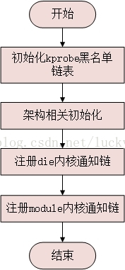

图 2 kprobes初始化流程 

kprobes作为一个模块，其初始化函数为init_kprobes，代码路径kernel/kprobes.c

```cpp
static int __init init_kprobes(void)
{
	int i, err = 0;
 
	/* FIXME allocate the probe table, currently defined statically */
	/* initialize all list heads */
	for (i = 0; i < KPROBE_TABLE_SIZE; i++) {
		INIT_HLIST_HEAD(&kprobe_table[i]);
		INIT_HLIST_HEAD(&kretprobe_inst_table[i]);
		raw_spin_lock_init(&(kretprobe_table_locks[i].lock));
	}
 
	err = populate_kprobe_blacklist(__start_kprobe_blacklist,
					__stop_kprobe_blacklist);
	if (err) {
		pr_err("kprobes: failed to populate blacklist: %d\n", err);
		pr_err("Please take care of using kprobes.\n");
	}
 
	if (kretprobe_blacklist_size) {
		/* lookup the function address from its name */
		for (i = 0; kretprobe_blacklist[i].name != NULL; i++) {
			kprobe_lookup_name(kretprobe_blacklist[i].name,
					   kretprobe_blacklist[i].addr);
			if (!kretprobe_blacklist[i].addr)
				printk("kretprobe: lookup failed: %s\n",
				       kretprobe_blacklist[i].name);
		}
	}
 
#if defined(CONFIG_OPTPROBES)
#if defined(__ARCH_WANT_KPROBES_INSN_SLOT)
	/* Init kprobe_optinsn_slots */
	kprobe_optinsn_slots.insn_size = MAX_OPTINSN_SIZE;
#endif
	/* By default, kprobes can be optimized */
	kprobes_allow_optimization = true;
#endif
 
	/* By default, kprobes are armed */
	kprobes_all_disarmed = false;
 
	err = arch_init_kprobes();
	if (!err)
		err = register_die_notifier(&kprobe_exceptions_nb);
	if (!err)
		err = register_module_notifier(&kprobe_module_nb);
 
	kprobes_initialized = (err == 0);
 
	if (!err)
		init_test_probes();
	return err;
}
```

首先初始化hash表的各个链表头，用来保存后面调用kprobe_register函数注册的struct kprobes实例（会使用探测地址作为索引），同时初始化kretprobe用到的自旋锁。
接下来调用populate_kprobe_blacklist函数将kprobe实现相关的代码函数保存到kprobe_blacklist这个链表中去，用于后面注册探测点时判断使用，注意这里的__start_kprobe_blacklist和__stop_kprobe_blacklist定义在arch/arm/kernel/vmlinux.lds.h中的.init.rodata段中，其中保存了_kprobe_blacklist段信息：

```cpp
#define KPROBE_BLACKLIST()	. = ALIGN(8);				      \
				VMLINUX_SYMBOL(__start_kprobe_blacklist) = .; \
				*(_kprobe_blacklist)			      \
				VMLINUX_SYMBOL(__stop_kprobe_blacklist) = .;
 
#define INIT_DATA							\
	*(.init.data)							\
......
	*(.init.rodata)							\
......
	KPROBE_BLACKLIST()						\
......
```

而_kprobe_blacklist段中保存了实现kprobes的关键代码路径，这些代码是不可以被kprobe自己所探测的，在源码定义相关函数时使用NOKPROBE_SYMBOL宏将函数放到这个段中：

```cpp
#define __NOKPROBE_SYMBOL(fname)			\
static unsigned long __used				\
	__attribute__((section("_kprobe_blacklist")))	\
	_kbl_addr_##fname = (unsigned long)fname;
#define NOKPROBE_SYMBOL(fname)	__NOKPROBE_SYMBOL(fname)
```

例如其中的get_kprobe函数：

```cpp
struct kprobe *get_kprobe(void *addr)
{
......
}
NOKPROBE_SYMBOL(get_kprobe);
```

回到init_kprobes函数中继续分析，接下来的片段是kretprobe相关的代码，用来核对kretprobe_blacklist中定义的函数是否存在，这里kretprobe_blacklist_size变量默认为0；接下来初始化3个全局变量，kprobes_all_disarmed用于表示是否启用kprobe机制，这里默认设置为启用；随后调用arch_init_kprobes进行架构相关的初始化，x86架构的实现为空，arm架构的实现如下：


```cpp
int __init arch_init_kprobes()
{
	arm_probes_decode_init();
#ifdef CONFIG_THUMB2_KERNEL
	register_undef_hook(&kprobes_thumb16_break_hook);
	register_undef_hook(&kprobes_thumb32_break_hook);
#else
	register_undef_hook(&kprobes_arm_break_hook);
#endif
	return 0;
}
```

由于没有启用THUMB2模式，这里arm_probes_decode_init主要是获取PC和当前执行地址偏移值（ARM的流水线机制一般为8）以及设置相关寄存器值获取方式等代码；而register_undef_hook函数向全局undef_hook链表注册了一个未定义指令异常处理的钩子，相关的结构体如下：

```cpp
static struct undef_hook kprobes_arm_break_hook = {
	.instr_mask	= 0x0fffffff,
	.instr_val	= KPROBE_ARM_BREAKPOINT_INSTRUCTION,
	.cpsr_mask	= MODE_MASK,
	.cpsr_val	= SVC_MODE,
	.fn		= kprobe_trap_handler,
};
```

这样在触发未定义指令KPROBE_ARM_BREAKPOINT_INSTRUCTION（机器码0x07f001f8）时将会调用到这里的kprobe_trap_handler函数。


再次回到init_kprobes函数，接下来分别注册die和module的内核通知链kprobe_exceptions_nb和kprobe_module_nb：

```cpp
static struct notifier_block kprobe_exceptions_nb = {
	.notifier_call = kprobe_exceptions_notify,
	.priority = 0x7fffffff /* we need to be notified first */
};
static struct notifier_block kprobe_module_nb = {
	.notifier_call = kprobes_module_callback,
	.priority = 0
};
```

其中kprobe_exceptions_nb的优先级很高，如此在执行回调函数和单步执行被探测指令期间若发生了内存异常，将优先调用kprobe_exceptions_notify函数处理（架构相关，x86会调用kprobe的fault回调函数，而arm则为空）；注册module notify回调kprobes_module_callback函数的作用是若当某个内核模块发生卸载操作时有必要检测并移除注册到该模块函数的探测点。

最后init_kprobes函数置位kprobes_initialized标识，初始化完成。


### 2、注册一个kprobe实例

kprobe探测模块调用register_kprobe向kprobe子系统注册一个kprobe探测点实例，代码路径kernel/kprobes.c

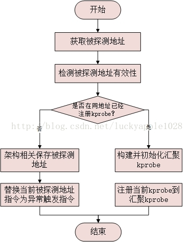

图 3 kprobe注册流程


```cpp
int register_kprobe(struct kprobe *p)
{
	int ret;
	struct kprobe *old_p;
	struct module *probed_mod;
	kprobe_opcode_t *addr;
 
	/* Adjust probe address from symbol */
	addr = kprobe_addr(p);
	if (IS_ERR(addr))
		return PTR_ERR(addr);
	p->addr = addr;
 
	ret = check_kprobe_rereg(p);
	if (ret)
		return ret;
 
	/* User can pass only KPROBE_FLAG_DISABLED to register_kprobe */
	p->flags &= KPROBE_FLAG_DISABLED;
	p->nmissed = 0;
	INIT_LIST_HEAD(&p->list);
 
	ret = check_kprobe_address_safe(p, &probed_mod);
	if (ret)
		return ret;
 
	mutex_lock(&kprobe_mutex);
 
	old_p = get_kprobe(p->addr);
	if (old_p) {
		/* Since this may unoptimize old_p, locking text_mutex. */
		ret = register_aggr_kprobe(old_p, p);
		goto out;
	}
 
	mutex_lock(&text_mutex);	/* Avoiding text modification */
	ret = prepare_kprobe(p);
	mutex_unlock(&text_mutex);
	if (ret)
		goto out;
 
	INIT_HLIST_NODE(&p->hlist);
	hlist_add_head_rcu(&p->hlist,
		       &kprobe_table[hash_ptr(p->addr, KPROBE_HASH_BITS)]);
 
	if (!kprobes_all_disarmed && !kprobe_disabled(p))
		arm_kprobe(p);
 
	/* Try to optimize kprobe */
	try_to_optimize_kprobe(p);
 
out:
	mutex_unlock(&kprobe_mutex);
 
	if (probed_mod)
		module_put(probed_mod);
 
	return ret;
}
EXPORT_SYMBOL_GPL(register_kprobe);
```

函数首先调用kprobe_addr函数初始化被探测点的地址p->addr。因为一般的探测模块并不会指定想要探测的addr地址，同kprobe_example例程一样通过传入函数名来指定要探测的函数，kprobe_addr函数的作用就是将函数名转换为最终的被探测地址：


```cpp
#define kprobe_lookup_name(name, addr) \
	addr = ((kprobe_opcode_t *)(kallsyms_lookup_name(name)))
	
static kprobe_opcode_t *kprobe_addr(struct kprobe *p)
{
	kprobe_opcode_t *addr = p->addr;
 
	if ((p->symbol_name && p->addr) ||
	    (!p->symbol_name && !p->addr))
		goto invalid;
 
	if (p->symbol_name) {
		kprobe_lookup_name(p->symbol_name, addr);
		if (!addr)
			return ERR_PTR(-ENOENT);
	}
 
	addr = (kprobe_opcode_t *)(((char *)addr) + p->offset);
	if (addr)
		return addr;
 
invalid:
	return ERR_PTR(-EINVAL);
}
```


kprobe_addr首先对入参进行检查，不允许函数名和地址同时设置或同时为空的情况；如果用户指定被探测函数名则调用kallsyms_lookup_name函数根据函数名查找其运行的虚拟地址；最后加上指定的探测偏移值作为最终的被探测地址。当然在绝大多数的情况下，offset值被用户设置为0，即用户探测指定函数的入口，但是也不排除用户想要探测某一函数内部的某一条指令。

回到register_kprobe函数中，下面调用check_kprobe_rereg函数防止同一个kprobe实例被重复注册，其中check_kprobe_rereg->__get_valid_kprobe调用流程将根据addr地址值搜索全局hash表并查看是否有同样的kprobe实例已经在表中了。

随后register_kprobe函数继续初始化kprobe的flags、nmissed字段和list链表（flag只允许用户传递KPROBE_FLAG_DISABLED，表示注册的kprobe默认是不启用的），然后调用check_kprobe_address_safe函数检测被探测地址是否可探测：


```cpp
static int check_kprobe_address_safe(struct kprobe *p,
				     struct module **probed_mod)
{
	int ret;
 
	ret = arch_check_ftrace_location(p);
	if (ret)
		return ret;
	jump_label_lock();
	preempt_disable();
 
	/* Ensure it is not in reserved area nor out of text */
	if (!kernel_text_address((unsigned long) p->addr) ||
	    within_kprobe_blacklist((unsigned long) p->addr) ||
	    jump_label_text_reserved(p->addr, p->addr)) {
		ret = -EINVAL;
		goto out;
	}
 
	/* Check if are we probing a module */
	*probed_mod = __module_text_address((unsigned long) p->addr);
	if (*probed_mod) {
		/*
		 * We must hold a refcount of the probed module while updating
		 * its code to prohibit unexpected unloading.
		 */
		if (unlikely(!try_module_get(*probed_mod))) {
			ret = -ENOENT;
			goto out;
		}
 
		/*
		 * If the module freed .init.text, we couldn't insert
		 * kprobes in there.
		 */
		if (within_module_init((unsigned long)p->addr, *probed_mod) &&
		    (*probed_mod)->state != MODULE_STATE_COMING) {
			module_put(*probed_mod);
			*probed_mod = NULL;
			ret = -ENOENT;
		}
	}
out:
	preempt_enable();
	jump_label_unlock();
 
	return ret;
}
```

首先调用arch_check_ftrace_location确认是否探测地址已经被ftrace跟踪，若是且在开启了CONFIG_KPROBES_ON_FTRACE内核选项的情况下在该kprobe实例的flags上置位KPROBE_FLAG_FTRACE符号，表示本kprobe已使用ftrace。
然后上锁并竟用内核抢占，开始进入地址有效性检测流程，首先判断以下3个条件，必须全部满足：1、被探测地址在内核的地址段中；2、地址不在kprobe的黑名单之中；3、不在jump lable保留的地址空间中（内核jump lable特性使用？）。其中第一点比较好理解，函数实现如下：


```cpp
int kernel_text_address(unsigned long addr)
{
	if (core_kernel_text(addr))
		return 1;
	if (is_module_text_address(addr))
		return 1;
	return is_ftrace_trampoline(addr);
}
```


被探测的函数当然要在内核的text（_stext ~ _etext）段中，由于非内核启动时刻，不包括init text段；然后模块的text段和init text段也都可以，最后如果在ftrace动态分配的trampoline地址空间中也是满足的。

其中第二点中的blacklist黑名单指的是实现kprobes的关键代码路径，只有不在该黑名单中的函数才可以被探测：

```cpp
bool __weak arch_within_kprobe_blacklist(unsigned long addr)
{
	/* The __kprobes marked functions and entry code must not be probed */
	return addr >= (unsigned long)__kprobes_text_start &&
	       addr < (unsigned long)__kprobes_text_end;
}
 
static bool within_kprobe_blacklist(unsigned long addr)
{
	struct kprobe_blacklist_entry *ent;
 
	if (arch_within_kprobe_blacklist(addr))
		return true;
	/*
	 * If there exists a kprobe_blacklist, verify and
	 * fail any probe registration in the prohibited area
	 */
	list_for_each_entry(ent, &kprobe_blacklist, list) {
		if (addr >= ent->start_addr && addr < ent->end_addr)
			return true;
	}
 
	return false;
}
```

主要包含两个方面，一是架构相关的kprobe关键代码路径，他们被保存在__kprobes_text_start~__kprobes_text_end段中，二是kprobe_blacklist链表，该链表前面在kprobe初始化过程中已经看到了。

首先__kprobes_text_start和__kprobes_text_end被定义在include/asm-generic/Vmlinux.lds.h中，使用宏__kprobes标记的函数被归入该.kprobes.text段：

```cpp
#define KPROBES_TEXT							\
		ALIGN_FUNCTION();					\
		VMLINUX_SYMBOL(__kprobes_text_start) = .;		\
		*(.kprobes.text)					\
		VMLINUX_SYMBOL(__kprobes_text_end) = .;
#ifdef CONFIG_KPROBES
# define __kprobes	__attribute__((__section__(".kprobes.text")))
```

简单的总结一下： 即使用宏NOKPROBE_SYMBOL和宏__kprobes标记的内核函数不可以被探测kprobe。


回到check_kprobe_address_safe函数中，若满足了以上三点，接下来判断被探测地址是否属于某一个内核模块的init_text段或core_text段：


```cpp
struct module *__module_text_address(unsigned long addr)
{
	struct module *mod = __module_address(addr);
	if (mod) {
		/* Make sure it's within the text section. */
		if (!within(addr, mod->module_init, mod->init_text_size)
		    && !within(addr, mod->module_core, mod->core_text_size))
			mod = NULL;
	}
	return mod;
}
```

判断若属于某一个模块的话则增加这个模块的引用计数以防止模块被意外动态卸载，同时不允许在已经完成加载模块的init_text段中的函数注册kprobe（因为在模块加载完成后init_text段的内存已经被free掉了）。最后若模块获取成功，它将通过probed_mod参数返回给register_kprobe用于错误处理流程。


以上判断都通过之后重新打开内核抢占并解锁，回到register_kprobe函数继续注册流程。接下来尝试从全局hash表中查找是否之前已经为同一个被探测地址注册了kprobe探测点，若已注册则调用register_aggr_kprobe函数继续注册流程，该流程稍后再分析。现假设是初次注册，则调用prepare_kprobe函数，该函数会根据被探测地址是否已经被ftrace了而进入不同的流程，这里假设没有启用ftrace，则直接调用arch_prepare_kprobe函数进入架构相关的注册流程，先看一下x86架构的实现：


```cpp
int arch_prepare_kprobe(struct kprobe *p)
{
	if (alternatives_text_reserved(p->addr, p->addr))
		return -EINVAL;
 
	if (!can_probe((unsigned long)p->addr))
		return -EILSEQ;
	/* insn: must be on special executable page on x86. */
	p->ainsn.insn = get_insn_slot();
	if (!p->ainsn.insn)
		return -ENOMEM;
 
	return arch_copy_kprobe(p);
}
```

首先对于smp系统，被探测地址不能被用于smp-alternatives，非smp无此要求；然后判断该被探测地址的指令有效并调用get_insn_slot函数申请用于拷贝原始指令的指令slot内存空间，最后调用arch_copy_kprobe函数执行指令复制动作。


```cpp
static int arch_copy_kprobe(struct kprobe *p)
{
	int ret;
 
	/* Copy an instruction with recovering if other optprobe modifies it.*/
	ret = __copy_instruction(p->ainsn.insn, p->addr);
	if (!ret)
		return -EINVAL;
 
	/*
	 * __copy_instruction can modify the displacement of the instruction,
	 * but it doesn't affect boostable check.
	 */
	if (can_boost(p->ainsn.insn))
		p->ainsn.boostable = 0;
	else
		p->ainsn.boostable = -1;
 
	/* Check whether the instruction modifies Interrupt Flag or not */
	p->ainsn.if_modifier = is_IF_modifier(p->ainsn.insn);
 
	/* Also, displacement change doesn't affect the first byte */
	p->opcode = p->ainsn.insn[0];
 
	return 0;
}
```

函数首先调用__copy_instruction将kprobe->addr被探测地址的指令拷贝到kprobe->ainsn.insn保存起来（可能会对指令做适当的修改），然后初始化kprobe->ainsn结构体，最后将指令的第一个字节保存到kprobe->opcode字段中（x86架构的kprobe_opcode_t是u8类型的）。
再来看一下arm架构的实现方式（已去除CONFIG_THUMB2_KERNEL相关部分的代码）：


```cpp
int __kprobes arch_prepare_kprobe(struct kprobe *p)
{
	kprobe_opcode_t insn;
	kprobe_opcode_t tmp_insn[MAX_INSN_SIZE];
	unsigned long addr = (unsigned long)p->addr;
	bool thumb;
	kprobe_decode_insn_t *decode_insn;
	const union decode_action *actions;
	int is;
	const struct decode_checker **checkers;
 
	if (in_exception_text(addr))
		return -EINVAL;
 
#ifdef CONFIG_THUMB2_KERNEL
	......
#else /* !CONFIG_THUMB2_KERNEL */
	thumb = false;
	if (addr & 0x3)
		return -EINVAL;
	insn = __mem_to_opcode_arm(*p->addr);
	decode_insn = arm_probes_decode_insn;
	actions = kprobes_arm_actions;
	checkers = kprobes_arm_checkers;
#endif
 
	p->opcode = insn;
	p->ainsn.insn = tmp_insn;
 
	switch ((*decode_insn)(insn, &p->ainsn, true, actions, checkers)) {
	case INSN_REJECTED:	/* not supported */
		return -EINVAL;
 
	case INSN_GOOD:		/* instruction uses slot */
		p->ainsn.insn = get_insn_slot();
		if (!p->ainsn.insn)
			return -ENOMEM;
		for (is = 0; is < MAX_INSN_SIZE; ++is)
			p->ainsn.insn[is] = tmp_insn[is];
		flush_insns(p->ainsn.insn,
				sizeof(p->ainsn.insn[0]) * MAX_INSN_SIZE);
		p->ainsn.insn_fn = (probes_insn_fn_t *)
					((uintptr_t)p->ainsn.insn | thumb);
		break;
 
	case INSN_GOOD_NO_SLOT:	/* instruction doesn't need insn slot */
		p->ainsn.insn = NULL;
		break;
	}
 
	/*
	 * Never instrument insn like 'str r0, [sp, +/-r1]'. Also, insn likes
	 * 'str r0, [sp, #-68]' should also be prohibited.
	 * See __und_svc.
	 */
	if ((p->ainsn.stack_space < 0) ||
			(p->ainsn.stack_space > MAX_STACK_SIZE))
		return -EINVAL;
 
	return 0;
}
```

首先检测被探测地址不能在异常代码段中并且地址必须是4字节对齐的，随后取出被探测点的指令保存在kprobe->opcode中，并调用arm_probes_decode_insn函数来判断被探测的指令是什么类型的：

```cpp
/* Return:
 *   INSN_REJECTED     If instruction is one not allowed to kprobe,
 *   INSN_GOOD         If instruction is supported and uses instruction slot,
 *   INSN_GOOD_NO_SLOT If instruction is supported but doesn't use its slot.
 *
 * For instructions we don't want to kprobe (INSN_REJECTED return result):
 *   These are generally ones that modify the processor state making
 *   them "hard" to simulate such as switches processor modes or
 *   make accesses in alternate modes.  Any of these could be simulated
 *   if the work was put into it, but low return considering they
 *   should also be very rare.
 */
enum probes_insn __kprobes
arm_probes_decode_insn(probes_opcode_t insn, struct arch_probes_insn *asi,
		       bool emulate, const union decode_action *actions,
		       const struct decode_checker *checkers[])
{
	asi->insn_singlestep = arm_singlestep;
	asi->insn_check_cc = probes_condition_checks[insn>>28];
	return probes_decode_insn(insn, asi, probes_decode_arm_table, false,
				  emulate, actions, checkers);
}
```

该arm_probes_decode_insn调用流程会对kprobe->ainsn结构进行初始化（该结构架构相关），其中函数指针insn_singlestep初始化为arm_singlestep，它用于kprobe触发后的单步执行，而函数insn_check_cc初始化为probes_condition_checks[insn>>28]，它是一个函数指针数组，以指令的高4位为索引，用于kprobe触发后进行条件异常检测。


```cpp
probes_check_cc * const probes_condition_checks[16] = {
	&__check_eq, &__check_ne, &__check_cs, &__check_cc,
	&__check_mi, &__check_pl, &__check_vs, &__check_vc,
	&__check_hi, &__check_ls, &__check_ge, &__check_lt,
	&__check_gt, &__check_le, &__check_al, &__check_al
};
```

现以do_fork函数为例，来看一下这里的insn_check_cc函数指针初始化为那个函数了：

反汇编vmlinux后找到do_fork，对应的入口地址为0xc0022798，汇编指令为mov，机器码为e1a0c00d，计算后值为0xe=15，因此选中的条件异常检测处理函数为__check_al；

```cpp
c0022798 <do_fork>:
do_fork():
c0022798:       e1a0c00d        mov     ip, sp
```


如果用户探测的并不是函数的入口地址，而是函数内部的某一条指令，则可能会选中其他的检测函数，例如movne指令选中的就是__check_ne，moveq指令选中的就是__check_eq等等。

回到arm_probes_decode_insn函数中，然后调用probes_decode_insn函数判断指令的类型并初始化单步执行函数指针insn_handler，最后返回INSN_REJECTED、INSN_GOOD和INSN_GOOD_NO_SLOT这三种类型（如果是INSN_GOOD还会拷贝指令填充ainsn.insn字段）。该函数的注释中对其描述的已经比较详细了，对于诸如某些会修改处理器工作状态的指令会返回INSN_REJECTED表示不支持，另外INSN_GOOD是需要slot的指令，INSN_GOOD_NO_SLOT是不需要slot的指令。

回到arch_prepare_kprobe函数中，会对返回的指令类型做不同的处理，若是INSN_GOOD类型则同x86类似，调用get_insn_slot申请内存空间并将前面存放在tmp_insn中的指令拷贝到kprobe->ainsn.insn中，然后flush icache。

如此被探测点指令就被拷贝保存起来了。架构相关的初始化完成以后，接下来register_kprobe函数初始化kprobe的hlist字段并将它添加到全局的hash表中。然后判断如果kprobes_all_disarmed为false并且kprobe没有被disable（在kprobe的初始化函数中该kprobes_all_disarmed值默认为false），则调用arm_kprobe函数，它会把触发trap的指令写到被探测点处替换原始指令。


```cpp
static void arm_kprobe(struct kprobe *kp)
{
	if (unlikely(kprobe_ftrace(kp))) {
		arm_kprobe_ftrace(kp);
		return;
	}
	/*
	 * Here, since __arm_kprobe() doesn't use stop_machine(),
	 * this doesn't cause deadlock on text_mutex. So, we don't
	 * need get_online_cpus().
	 */
	mutex_lock(&text_mutex);
	__arm_kprobe(kp);
	mutex_unlock(&text_mutex);
}
```

这里假设不适用ftrace和optimize kprobe特性，将直接调用架构相关的函数arch_arm_kprobe，其中x86的实现如下：

```cpp
void arch_arm_kprobe(struct kprobe *p)
{
	text_poke(p->addr, ((unsigned char []){BREAKPOINT_INSTRUCTION}), 1);
}
```

直接调用text_poke函数将addr地址处的指令替换为BREAKPOINT_INSTRUCTION指令（机器码是0xCC），当正常执行流程执行到这条指令后就会触发int3中断，进而进入探测回调流程。再看一下arm的实现流程：

```cpp
void __kprobes arch_arm_kprobe(struct kprobe *p)
{
	unsigned int brkp;
	void *addr;
 
	if (IS_ENABLED(CONFIG_THUMB2_KERNEL)) {
		......
	} else {
		kprobe_opcode_t insn = p->opcode;
 
		addr = p->addr;
		brkp = KPROBE_ARM_BREAKPOINT_INSTRUCTION;
 
		if (insn >= 0xe0000000)
			brkp |= 0xe0000000;  /* Unconditional instruction */
		else
			brkp |= insn & 0xf0000000;  /* Copy condition from insn */
	}
 
	patch_text(addr, brkp);
} 
```

arm架构的实现中替换的指令为KPROBE_ARM_BREAKPOINT_INSTRUCTION（机器码是0x07f001f8），然后还会根据被替换指令做一定的调整，最后调用patch_text函数执行替换动作。继续以kprobe_example例程中的do_fork函数为例，从前文中反汇编可知，地址0xc0022798处的“mov   ip, sp”指令被替换KPROBE_ARM_BREAKPOINT_INSTRUCTION指令，可从pre_handler回调函数中打印的地址得到印证：

**<6>[  57.386132] [do_fork] pre_handler: p->addr = 0xc0022798, pc = 0xc0022798, cpsr = 0x80000013
<6>[  57.386167] [do_fork] post_handler: p->addr = 0xc0022798, cpsr = 0x80000013**

前文中看到KPROBE_ARM_BREAKPOINT_INSTRUCTION指令在init_kprobes函数的执行流程中已经为它注册了一个异常处理函数kprobe_trap_handler，因此当正常执行流程执行到KPROBE_ARM_BREAKPOINT_INSTRUCTION指令后将触发异常，进而调用kprobe_trap_handler开始回调流程。

至此kprobe的注册流程分析完毕，再回头分析对一个已经被注册过kprobe的探测点注册新的kprobe的执行流程，即register_aggr_kprobe函数：

```cpp
/*
 * This is the second or subsequent kprobe at the address - handle
 * the intricacies
 */
static int register_aggr_kprobe(struct kprobe *orig_p, struct kprobe *p)
{
	int ret = 0;
	struct kprobe *ap = orig_p;
 
	/* For preparing optimization, jump_label_text_reserved() is called */
	jump_label_lock();
	/*
	 * Get online CPUs to avoid text_mutex deadlock.with stop machine,
	 * which is invoked by unoptimize_kprobe() in add_new_kprobe()
	 */
	get_online_cpus();
	mutex_lock(&text_mutex);
 
	if (!kprobe_aggrprobe(orig_p)) {
		/* If orig_p is not an aggr_kprobe, create new aggr_kprobe. */
		ap = alloc_aggr_kprobe(orig_p);
		if (!ap) {
			ret = -ENOMEM;
			goto out;
		}
		init_aggr_kprobe(ap, orig_p);
	} else if (kprobe_unused(ap))
		/* This probe is going to die. Rescue it */
		reuse_unused_kprobe(ap);
 
	if (kprobe_gone(ap)) {
		/*
		 * Attempting to insert new probe at the same location that
		 * had a probe in the module vaddr area which already
		 * freed. So, the instruction slot has already been
		 * released. We need a new slot for the new probe.
		 */
		ret = arch_prepare_kprobe(ap);
		if (ret)
			/*
			 * Even if fail to allocate new slot, don't need to
			 * free aggr_probe. It will be used next time, or
			 * freed by unregister_kprobe.
			 */
			goto out;
 
		/* Prepare optimized instructions if possible. */
		prepare_optimized_kprobe(ap);
 
		/*
		 * Clear gone flag to prevent allocating new slot again, and
		 * set disabled flag because it is not armed yet.
		 */
		ap->flags = (ap->flags & ~KPROBE_FLAG_GONE)
			    | KPROBE_FLAG_DISABLED;
	}
 
	/* Copy ap's insn slot to p */
	copy_kprobe(ap, p);
	ret = add_new_kprobe(ap, p);
 
out:
	mutex_unlock(&text_mutex);
	put_online_cpus();
	jump_label_unlock();
 
	if (ret == 0 && kprobe_disabled(ap) && !kprobe_disabled(p)) {
		ap->flags &= ~KPROBE_FLAG_DISABLED;
		if (!kprobes_all_disarmed)
			/* Arm the breakpoint again. */
			arm_kprobe(ap);
	}
	return ret;
}
```

在前文中看到，该函数会在对同一个被探测地址注册多个kprobe实例时会被调用到，该函数会引入一个kprobe aggregator的概念，即由一个统一的kprobe实例接管所有注册到该地址的kprobe。这个函数的注释非常详细，并不难理解，来简单分析一下：
函数的第一个入参orig_p是在全局hash表中找到的已经注册的kprobe实例，第二个入参是本次需要注册的kprobe实例。首先在完成了必要的上锁操作后就调用kprobe_aggrprobe函数检查orig_p是否是一个aggregator。

```cpp
/* Return true if the kprobe is an aggregator */
static inline int kprobe_aggrprobe(struct kprobe *p)
{
	return p->pre_handler == aggr_pre_handler;
}
```

它通过kprobe的pre_handler回调判断，如果是aggregator则它的pre_handler回调函数会被替换成aggr_pre_handler函数。一般对于第二次注册kprobe的情况显然是不会满足条件的，会调用alloc_aggr_kprobe函数创建一个，对于没有开启CONFIG_OPTPROBES选项的情况，alloc_aggr_kprobe仅仅是分配了一块内存空间，然后调用init_aggr_kprobe函数初始化这个aggr kprobe。

```cpp
/*
 * Fill in the required fields of the "manager kprobe". Replace the
 * earlier kprobe in the hlist with the manager kprobe
 */
static void init_aggr_kprobe(struct kprobe *ap, struct kprobe *p)
{
	/* Copy p's insn slot to ap */
	copy_kprobe(p, ap);
	flush_insn_slot(ap);
	ap->addr = p->addr;
	ap->flags = p->flags & ~KPROBE_FLAG_OPTIMIZED;
	ap->pre_handler = aggr_pre_handler;
	ap->fault_handler = aggr_fault_handler;
	/* We don't care the kprobe which has gone. */
	if (p->post_handler && !kprobe_gone(p))
		ap->post_handler = aggr_post_handler;
	if (p->break_handler && !kprobe_gone(p))
		ap->break_handler = aggr_break_handler;
 
	INIT_LIST_HEAD(&ap->list);
	INIT_HLIST_NODE(&ap->hlist);
 
	list_add_rcu(&p->list, &ap->list);
	hlist_replace_rcu(&p->hlist, &ap->hlist);
}
```

可以看到，这个aggr kprobe中的各个字段基本就是从orig_p中拷贝过来的，包括opcode和ainsn这两个备份指令的字段以及addr和flags字段，但是其中的4个回调函数会被初始化为aggr kprobe所特有的addr_xxx_handler，这几个函数后面会具体分析。接下来函数会初始化aggr kprobe的两个链表头，然后将自己添加到链表中去，并替换掉orig_p。

回到register_aggr_kprobe函数中，如果本次是第二次以上向同一地址注册kprobe实例，则此时的orig_p已经是aggr kprobe了，则会调用kprobe_unused函数判断该kprobe是否为被使用，若是则调用reuse_unused_kprobe函数重新启用，但是对于没有开启CONFIG_OPTPROBES选项的情况，逻辑上是不存在这种情况的，因此reuse_unused_kprobe函数的实现仅仅是一段打印后就立即触发BUG_ON。

```cpp
/* There should be no unused kprobes can be reused without optimization */
static void reuse_unused_kprobe(struct kprobe *ap)
{
	printk(KERN_ERR "Error: There should be no unused kprobe here.\n");
	BUG_ON(kprobe_unused(ap));
}
```

继续往下分析，下面来讨论aggr kprobe被kill掉的情况，显然只有在第三次及以上注册同一地址可能会出现这样的情况。针对这一种情况，这里同初次注册kprobe的调用流程类似，首先调用arch_prepare_kprobe做架构相关初始化，保存被探测地址的机器指令，然后调用prepare_optimized_kprobe启用optimized_kprobe，最后清除KPROBE_FLAG_GONE的标记。

接下来调用再次copy_kprobe将aggr kprobe中保存的指令opcode和ainsn字段拷贝到本次要注册的kprobe的对应字段中，然后调用add_new_kprobe函数将新注册的kprobe链入到aggr kprobe的list链表中：


```cpp
/*
* Add the new probe to ap->list. Fail if this is the
* second jprobe at the address - two jprobes can't coexist
*/
static int add_new_kprobe(struct kprobe *ap, struct kprobe *p)
{
	BUG_ON(kprobe_gone(ap) || kprobe_gone(p));
 
	if (p->break_handler || p->post_handler)
		unoptimize_kprobe(ap, true);	/* Fall back to normal kprobe */
 
	if (p->break_handler) {
		if (ap->break_handler)
			return -EEXIST;
		list_add_tail_rcu(&p->list, &ap->list);
		ap->break_handler = aggr_break_handler;
	} else
		list_add_rcu(&p->list, &ap->list);
	if (p->post_handler && !ap->post_handler)
		ap->post_handler = aggr_post_handler;
 
	return 0;
}
```

注意最主要的就是add list，只是如果新注册的kprobe设定了break_handler回调函数，会将其插入链表的末尾并为aggr kprobe设定break handler回调函数aggr_break_handler；与此同时若新注册的kprobe设定了post_handler，也同样为aggr kprobe设定post handler回调函数aggr_post_handler。

回到register_aggr_kprobe函数，在out标号处继续执行，下面会进入if条件判断，启用aggr kprobe，然后调用前文中分析过的arm_kprobe函数替换被探测地址的机器指令为BREAKPOINT_INSTRUCTION指令。

至此整个kprobe注册流程分析结束，下面来分析以上注册的探测回调函数是如何被执行的以及被探测指令是如何被单步执行的。

### 3、触发kprobe探测和回调

前文中，从register_kprobe函数注册kprobe的流程已经看到，用户指定的被探测函数入口地址处的指令已经被替换成架构相关的BREAKPOINT_INSTRUCTION指令，若是正常的代码流程执行到该指令，将会触发异常，进入架构相关的异常处理函数，kprobe注册的回调函数及被探测函数的单步执行流程均在该流程中执行。由于不同架构实现存在差别，下面分别来分析，首先先分析arm架构的执行流程：

#### 3.1、arm架构实现

前文中已经分析了内核已经为KPROBE_ARM_BREAKPOINT_INSTRUCTION指令注册了异常处理回调函数kprobe_trap_handler，因此在执行这条指令时会触发以下调用流程：__und_svc->__und_svc_fault->__und_fault->do_undefinstr()->call_undef_hook()：

```cpp
static int __kprobes kprobe_trap_handler(struct pt_regs *regs, unsigned int instr)
{
	unsigned long flags;
	local_irq_save(flags);
	kprobe_handler(regs);
	local_irq_restore(flags);
	return 0;
}
```

call_undef_hook()调用未定义指令的回调函数，对于KPROBE_ARM_BREAKPOINT_INSTRUCTION指令即调用到kprobe_trap_handler函数，其中入参struct pt_regs *regs保存的时执行异常指令时的寄存器信息，同时该函数在处理kprobe的流程时会禁用掉本地CPU的中断。

kprobe_handler函数的实现比较长，分段来看：


```cpp
/*
 * Called with IRQs disabled. IRQs must remain disabled from that point
 * all the way until processing this kprobe is complete.  The current
 * kprobes implementation cannot process more than one nested level of
 * kprobe, and that level is reserved for user kprobe handlers, so we can't
 * risk encountering a new kprobe in an interrupt handler.
 */
void __kprobes kprobe_handler(struct pt_regs *regs)
{
	struct kprobe *p, *cur;
	struct kprobe_ctlblk *kcb;
 
	kcb = get_kprobe_ctlblk();
	cur = kprobe_running();
 
#ifdef CONFIG_THUMB2_KERNEL
	......
#else /* ! CONFIG_THUMB2_KERNEL */
	p = get_kprobe((kprobe_opcode_t *)regs->ARM_pc);
#endif
```

注释中说明了当前arm架构的kprobe实现不支持在中断中多层kprobe重入，因此为了防止在处理一个kprobe期间由于中断可能会导致多次触发kprobe的情况，所以需要禁用中断。函数首先调用get_kprobe_ctlblk函数获取本cpu的per_cpu结构体变量kprobe_ctlblk，该结构体是架构相关的，arm的定义如下：

```cpp
/* per-cpu kprobe control block */
struct kprobe_ctlblk {
	unsigned int kprobe_status;
	struct prev_kprobe prev_kprobe;
	struct pt_regs jprobe_saved_regs;
	char jprobes_stack[MAX_STACK_SIZE];
};
```

其中保存了kprobe的一些状态信息以及jpboe用到的字段，目前需要关注的是其中的kprobe_status和prev_kprobe字段，其中kprobe_status代表了当前kprobe的处理状态，一共包括以下几种：

```cpp
#define KPROBE_HIT_ACTIVE	0x00000001      //开始处理kprobe
#define KPROBE_HIT_SS		0x00000002      //kprobe单步执行阶段
#define KPROBE_REENTER		0x00000004      //重复触发kprobe
#define KPROBE_HIT_SSDONE	0x00000008      //kprobe单步执行阶段结束
```


而prev_kprobe则是用于在kprobe重入情况下保存当前正在处理的kprobe实例和状态的。内核为每个cpu都定义了一个该类型全局变量。然后调用kprobe_running函数获取当前cpu上正在处理的kprobe：

```cpp
/* kprobe_running() will just return the current_kprobe on this CPU */
static inline struct kprobe *kprobe_running(void)
{
	return (__this_cpu_read(current_kprobe));
}
```

这里的current_kprobe也是一个per_cpu变量，其中保存了当前cpu正在处理的kprobe实例，若没有正在处理的则为NULL。下面调用get_kprobe函数获取本次要处理的kprobe，入参是regs->ARM_pc，即触发异常指令所在的地址，也就是被探测点的地址，利用它就可以在全局hash表中找到注册的kprobe实例了。接下来根据cur和p的存在情况进行多分支处理：

1、p和cur的kprobe实例同时存在


```cpp
			/* Kprobe is pending, so we're recursing. */
			switch (kcb->kprobe_status) {
			case KPROBE_HIT_ACTIVE:
			case KPROBE_HIT_SSDONE:
				/* A pre- or post-handler probe got us here. */
				kprobes_inc_nmissed_count(p);
				save_previous_kprobe(kcb);
				set_current_kprobe(p);
				kcb->kprobe_status = KPROBE_REENTER;
				singlestep(p, regs, kcb);
				restore_previous_kprobe(kcb);
				break;
			default:
				/* impossible cases */
				BUG();
			}
```

这种情况属于kprobe重入的情况，即在运行kprobe回调函数或单步执行被探测指令时又一次触发了kprobe。对于重入，目前流程只能处理在前一kprobe执行回调函数时引发的kprobe重入，对于在单步执行阶段引发的重入就直接报BUG。具体的处理流程为：首先调用kprobes_inc_nmissed_count递增当前要处理kprobe的nmissed值（如果是aggr kprobe则会遍历链表将注册到同地址的所有kprobe的nmissed值都加1）；然后调用save_previous_kprobe函数将当前时刻已经在处理的kprobe（cur）及状态保存到kcb->prev_kprobe字段中去；

```cpp
static void __kprobes save_previous_kprobe(struct kprobe_ctlblk *kcb)
{
	kcb->prev_kprobe.kp = kprobe_running();
	kcb->prev_kprobe.status = kcb->kprobe_status;
}
```

然后调用set_current_kprobe函数将本次需要处理的kprobe（p）设置到current_kprobe的per_cpu变量中去，并且更新kprobe_status状态为KPROBE_REENTER，表示存在重入情况；接下来调用singlestep函数启动单步执行，这个函数稍后再看；最后调用restore_previous_kprobe函数恢复前面所保存的kprobe。

```cpp
static void __kprobes save_previous_kprobe(struct kprobe_ctlblk *kcb)
{
	kcb->prev_kprobe.kp = kprobe_running();
	kcb->prev_kprobe.status = kcb->kprobe_status;
}
```


注意，以上重入的处理流程仅仅是单步执行了被探测的函数，并不会调用kprobe的pre_handle回调函数（递增nmissed字段的原因就在此），因此用户并不会感知到kprobe被实际触发了。

2、p存在但cur不存在


```cpp
		} else if (p->ainsn.insn_check_cc(regs->ARM_cpsr)) {
			/* Probe hit and conditional execution check ok. */
			set_current_kprobe(p);
			kcb->kprobe_status = KPROBE_HIT_ACTIVE;
 
			/*
			 * If we have no pre-handler or it returned 0, we
			 * continue with normal processing.  If we have a
			 * pre-handler and it returned non-zero, it prepped
			 * for calling the break_handler below on re-entry,
			 * so get out doing nothing more here.
			 */
			if (!p->pre_handler || !p->pre_handler(p, regs)) {
				kcb->kprobe_status = KPROBE_HIT_SS;
				singlestep(p, regs, kcb);
				if (p->post_handler) {
					kcb->kprobe_status = KPROBE_HIT_SSDONE;
					p->post_handler(p, regs, 0);
				}
				reset_current_kprobe();
			}
		} else {
			/*
			 * Probe hit but conditional execution check failed,
			 * so just skip the instruction and continue as if
			 * nothing had happened.
			 */
			singlestep_skip(p, regs);
		}
```

这种情况就是最为一般的情况，即当前kprobe是首次触发，前面并没有其他的kprobe流程正在处理。这里会首先调用p->ainsn.insn_check_cc注册函数来进行条件异常检测，这个函数在前文注册kprobe的流程中已经看到根据不同的被探测指令被注册成不同的函数了，入参是触发异常时的cpsr程序状态寄存器值。

对于前文中看到的do_fork函数入口汇编指令mov设置的__check_al检测函数来说，它将永远返回true，而movne指令的__check_ne检测函数则会对cpsr进行判断：


```cpp
static unsigned long __kprobes __check_ne(unsigned long cpsr)
{
	return (~cpsr) & PSR_Z_BIT;
}
```


（1）如果条件异常检测通过，那也同样调用set_current_kprobe函数设置当前正在处理的kprobe并更新kprobe状态标识为KPROBE_HIT_ACTIVE，表明开始处理该kprobe。接下来就到关键的回调和单步执行流程了，首先判断kprobe的pre_handler函数是否被注册，在注册的情况下调用它。对于单kprobe注册的情况很简单了，直接调用注册函数即可（这样前面kprobe_example中handler_pre函数就在此调用），但是对于前文中分析的多kprobe注册的情况（aggr kprobe），则会调用到aggr_pre_handler函数：


```cpp
/*
 * Aggregate handlers for multiple kprobes support - these handlers
 * take care of invoking the individual kprobe handlers on p->list
 */
static int aggr_pre_handler(struct kprobe *p, struct pt_regs *regs)
{
	struct kprobe *kp;
 
	list_for_each_entry_rcu(kp, &p->list, list) {
		if (kp->pre_handler && likely(!kprobe_disabled(kp))) {
			set_kprobe_instance(kp);
			if (kp->pre_handler(kp, regs))
				return 1;
		}
		reset_kprobe_instance();
	}
	return 0;
}
NOKPROBE_SYMBOL(aggr_pre_handler);
```

该函数的功能很直观，即遍历aggr_kprobe->list链表中的各个同注册地址的kprobe实例，然后调用它们自己的pre_handler回调函数，这里的aggr_kprobe仅仅起到了一个管理分配的作用。其中set_kprobe_instance和reset_kprobe_instance函数的作用是设置和恢复kprobe_instance这个per_cpu变量，这个变量在aggr_fault_handler和aggr_break_handler回调函数中会用到，应为发生异常时，需要定位到当前正在处理哪一个kprobe。

```cpp
/* We have preemption disabled.. so it is safe to use __ versions */
static inline void set_kprobe_instance(struct kprobe *kp)
{
	__this_cpu_write(kprobe_instance, kp);
}
 
static inline void reset_kprobe_instance(void)
{
	__this_cpu_write(kprobe_instance, NULL);
}
```

回到kprobe_handler函数继续往下分析，如果pre_handler执行成功或者不存在pre_handler回调函数则将kprobe当前处理状态设置为KPROBE_HIT_SS，表示开始进入单步执行阶段。随后 调用singlestep函数单步执行”原始被探测指令“，完毕后继续判断post_handler回调函数是否存在，若存在则设置当前状态为KPROBE_HIT_SSDONE，表示单步执行阶段执行结束，然后 调用post_handler回调函数（前文kprobe_example总的handler_post就在此调用）。post_handler同pre_handler一样，对与aggr kprobe会调用aggr_post_handler函数，由于实现类似，这里就不再赘述了。在执行完所有的回调后，最后调用reset_current_kprobe函数恢复current_kprobe变量。


这里可能会存在这样的疑问，为什么kcb->kprobe_status = KPROBE_HIT_SSDONE;这条状态赋值语句会放在条件判断内部，而不是在单步执行完以后？其实对于当前的上下文逻辑来看效果是一样的，因为若没有注册post_handler，就会立即执行reset_current_kprobe函数解除kprobe的绑定，因此不会对逻辑产生影响。

（2）如果条件异常检测不通过则调用singlestep_skip函数跳过当前的指令，继续执行后面的指令，就像什么都没有发生过一样


```cpp
static void __kprobes
singlestep_skip(struct kprobe *p, struct pt_regs *regs)
{
#ifdef CONFIG_THUMB2_KERNEL
	......
#else
	regs->ARM_pc += 4;
#endif
}
```

该函数仅仅修改了regs结构中的PC值，在kprobe处理结束后将从被探测指令之后的指令继续执行。 这里就有一个疑问，如果不执行被探测点的原始指令，直接执行之后的指令难道不会出问题吗？

3、p不存在但cur存在

```cpp
	} else if (cur) {
		/* We probably hit a jprobe.  Call its break handler. */
		if (cur->break_handler && cur->break_handler(cur, regs)) {
			kcb->kprobe_status = KPROBE_HIT_SS;
			singlestep(cur, regs, kcb);
			if (cur->post_handler) {
				kcb->kprobe_status = KPROBE_HIT_SSDONE;
				cur->post_handler(cur, regs, 0);
			}
		}
		reset_current_kprobe();
```

这种情况一般用于jprobe实现，函数调用cur kprobe的break_handler回调函数且在break_handler返回非0的情况下启动单步执行和执行post_handler回调，最后一样调用reset_current_kprobe函数解除cur kprobe绑定。该流程先不做详细推演分析，后面分析jprobe实现时再细细分析。


4、p和cur都不存在

```cpp
	} else {
		/*
		 * The probe was removed and a race is in progress.
		 * There is nothing we can do about it.  Let's restart
		 * the instruction.  By the time we can restart, the
		 * real instruction will be there.
		 */
	}
```

这种情况表示当前kprobe已经被注销了，但是可能在注销的过程中（注销的过程并不是原子操作）可能被其他执行流程抢占进而触发该kprobe，对于这种情况什么都不需要做，直接返回即可。

至此arm架构的kprobe触发及处理整体流程就分析完了。下面分析x86_64架构的实现，总体大同小异，其中的相同之处就不再分析了。

#### 3.2、x86_64架构实现


```cpp
/* May run on IST stack. */
dotraplinkage void notrace do_int3(struct pt_regs *regs, long error_code)
{
	......
 
#ifdef CONFIG_KPROBES
	if (kprobe_int3_handler(regs))
		goto exit;
#endif
	......
}
NOKPROBE_SYMBOL(do_int3);
```

x86_64架构下，执行到前文中替换的BREAKPOINT_INSTRUCTION指令后将触发INT3中断，进而调用到do_int3函数。do_init3函数做的事情比较多，但是和kprobe相关的仅代码中列出的这1处，下面来看kprobe_int3_handler函数，这个函数同arm结构的kprobe_handler函数很像，依然分段来分析：


```cpp
/*
 * Interrupts are disabled on entry as trap3 is an interrupt gate and they
 * remain disabled throughout this function.
 */
int kprobe_int3_handler(struct pt_regs *regs)
{
	kprobe_opcode_t *addr;
	struct kprobe *p;
	struct kprobe_ctlblk *kcb;
 
	if (user_mode(regs))
		return 0;
 
	addr = (kprobe_opcode_t *)(regs->ip - sizeof(kprobe_opcode_t));
	/*
	 * We don't want to be preempted for the entire
	 * duration of kprobe processing. We conditionally
	 * re-enable preemption at the end of this function,
	 * and also in reenter_kprobe() and setup_singlestep().
	 */
	preempt_disable();
 
	kcb = get_kprobe_ctlblk();
	p = get_kprobe(addr);
```


本地中断在处理kprobe期间依然被禁止，同时调用user_mode函数确保本处理函数处理的int3中断是在内核态执行流程期间被触发的（因为kprobe不会从用户态触发），这里之所以要做这么一个判断是因为同arm定义特殊未处理指令回调函数不同，这里的do_int3要通用的多，并不是单独为kprobe所设计的。然后获取被探测指令的地址保存到addr中（对于int3中断，其被Intel定义为trap，那么异常发生时EIP寄存器内指向的为异常指令的后一条指令），同时会禁用内核抢占，注释中说明在reenter_kprobe和单步执行时会有选择的重新开启内核抢占。接下来下面同arm一样获取当前cpu的kprobe_ctlblk控制结构体和本次要处理的kprobe实例p，然后根据不同的情况进行不同分支的处理。在继续分析前先来看一下x86_64架构kprobe_ctlblk结构体的定义


```cpp
/* per-cpu kprobe control block */
struct kprobe_ctlblk {
	unsigned long kprobe_status;
	unsigned long kprobe_old_flags;
	unsigned long kprobe_saved_flags;
	unsigned long *jprobe_saved_sp;
	struct pt_regs jprobe_saved_regs;
	kprobe_opcode_t jprobes_stack[MAX_STACK_SIZE];
	struct prev_kprobe prev_kprobe;
};
```

该定义比arm结构的多一些字段，其中kprobe_status字段不变，kprobe_old_flags和kprobe_saved_flags字段用于保存寄存器pt_regs的flag标识。


下面回到函数中根据不同的情况分别分析：

1、p存在且curent_kprobe存在

对于kprobe重入的情况，调用reenter_kprobe函数单独处理：


```cpp
		if (kprobe_running()) {
			if (reenter_kprobe(p, regs, kcb))
				return 1;
```

这个流程同arm实现的很像，只不过对于KPROBE_HIT_SS阶段不会报BUG，也同KPROBE_HIT_SSDONE和KPROBE_HIT_ACTIVE一样，递增nmissed值并调用setup_singlestep函数进入单步处理流程（该函数最后一个入参此时设置为1，针对reenter的情况会将kprobe_status状态设置为KPROBE_REENTER并调用save_previous_kprobe执行保存当前kprobe的操作）。对于KPROBE_REENTER阶段还是直接报BUG。注意最后函数会返回1，do_int3也会直接返回，表示该中断已被kprobe截取并处理，无需再处理其他分支。


2、p存在但curent_kprobe不存在


```cpp
		} else {
			set_current_kprobe(p, regs, kcb);
			kcb->kprobe_status = KPROBE_HIT_ACTIVE;
 
			/*
			 * If we have no pre-handler or it returned 0, we
			 * continue with normal processing.  If we have a
			 * pre-handler and it returned non-zero, it prepped
			 * for calling the break_handler below on re-entry
			 * for jprobe processing, so get out doing nothing
			 * more here.
			 */
			if (!p->pre_handler || !p->pre_handler(p, regs))
				setup_singlestep(p, regs, kcb, 0);
			return 1;
		}
```


这是一般最通用的kprobe执行流程，首先调用set_current_kprobe绑定p为当前正在处理的kprobe：

```cpp
static nokprobe_inline void
set_current_kprobe(struct kprobe *p, struct pt_regs *regs,
		   struct kprobe_ctlblk *kcb)
{
	__this_cpu_write(current_kprobe, p);
	kcb->kprobe_saved_flags = kcb->kprobe_old_flags
		= (regs->flags & (X86_EFLAGS_TF | X86_EFLAGS_IF));
	if (p->ainsn.if_modifier)
		kcb->kprobe_saved_flags &= ~X86_EFLAGS_IF;
}
```

这里在设置current_kprobe全局变量的同时，还会同时设置kprobe_saved_flags和kprobe_old_flags的flag值，它们用于具体的架构指令相关处理。接下来处理pre_handler回调函数，有注册的话就调用执行，然后调用setup_singlestep启动单步执行。在调试完成后直接返回1，注意这里并没有向arm实现那样直接调用post_handler回调函数并解除kprobe绑定，因为x86_64架构的post_handler采用另一种方式调用，后文会讲到。

3、p不存在且被探测地址的指令也不是BREAKPOINT_INSTRUCTION

```cpp
	} else if (*addr != BREAKPOINT_INSTRUCTION) {
		/*
		 * The breakpoint instruction was removed right
		 * after we hit it.  Another cpu has removed
		 * either a probepoint or a debugger breakpoint
		 * at this address.  In either case, no further
		 * handling of this interrupt is appropriate.
		 * Back up over the (now missing) int3 and run
		 * the original instruction.
		 */
		regs->ip = (unsigned long)addr;
		preempt_enable_no_resched();
		return 1;
```


这种情况表示kprobe可能已经被其他CPU注销了，则让他执行原始指令即可，因此这里设置regs->ip值为addr并重新开启内核抢占返回1。

4、p不存在但curent_kprobe存在


```cpp
	} else if (kprobe_running()) {
		p = __this_cpu_read(current_kprobe);
		if (p->break_handler && p->break_handler(p, regs)) {
			if (!skip_singlestep(p, regs, kcb))
				setup_singlestep(p, regs, kcb, 0);
			return 1;
		}
```


这种情况一般用于实现jprobe，因此会调用curent_kprobe的break_handler回调函数，然后在break_handler返回非0的情况下执行单步执行，最后返回1。具体在jprobe实现中再详细分析。

以上x86_64架构的kprobe触发及回调整体流程分析完毕，可以看到基本的触发条件和处理流程和arm架构的实现还是差不多的，和架构相关的一些细节有所不同。同时也并没有看到post_handle的回调流程和kprobe的解绑定流程，由于实现同arm不同，以上遗留的两点会在后文分析。接下来分析被探测指令的单步执行过程。


### 4、单步执行

单步执行其实就是执行被探测点的原始指令，涉及的主要函数即前文中分析kprobe触发及处理流程时遗留的singlestep函数（arm）和setup_singlestep函数（x86），它们的实现原理完全不同，其中会涉及许多cpu架构相关的知识，因此会比较晦涩。下面从原理角度逐一分析，并不涉及太多架构相关的细节：

#### 4.1、arm架构实现

arm架构单步执行的原理并不非常复杂（但是实现非常复杂），它本质上所做的就是执行被探测点的被替换前的“原始指令”，但是当前的上下文已经是kprobe的执行上下文了，不再是原始指令所处的上下文，所以单步执行流程无法直接执行原始指令，而是会调用其他函数来模拟实现原始指令以达到相同的效果，因此涉及的函数很多，基本每条不同的汇编指令都有不同的模拟函数。


```cpp
static inline void __kprobes
singlestep(struct kprobe *p, struct pt_regs *regs, struct kprobe_ctlblk *kcb)
{
	p->ainsn.insn_singlestep(p->opcode, &p->ainsn, regs);
}
```

singlestep函数直接调用保存在arch_probes_insn结构中的insn_singlestep函数指针（该指针在注册kprobe时由arm_probes_decode_insn函数负责初始化），即arm_singlestep函数。入参为保存的被探测点指令、arch_probes_insn结构地址及寄存器参数。

```cpp
static void __kprobes arm_singlestep(probes_opcode_t insn,
		struct arch_probes_insn *asi, struct pt_regs *regs)
{
	regs->ARM_pc += 4;
	asi->insn_handler(insn, asi, regs);
}
```

首先让寄存器参数中的PC加4，表示kprobe处理完成后将跳过触发kprobe时的KPROBE_ARM_BREAKPOINT_INSTRUCTION指令继续执行。然后调用insn_handler函数指针中设置的注册函数，该函数指针由probes_decode_insn函数根据不同的原始指令被设置为不同的处理函数，它们被定义在kprobes_arm_actions数组中：

```cpp
const union decode_action kprobes_arm_actions[NUM_PROBES_ARM_ACTIONS] = {
	[PROBES_PRELOAD_IMM] = {.handler = probes_simulate_nop},
	[PROBES_PRELOAD_REG] = {.handler = probes_simulate_nop},
	[PROBES_BRANCH_IMM] = {.handler = simulate_blx1},
	[PROBES_MRS] = {.handler = simulate_mrs},
	[PROBES_BRANCH_REG] = {.handler = simulate_blx2bx},
	[PROBES_CLZ] = {.handler = emulate_rd12rm0_noflags_nopc},
	[PROBES_SATURATING_ARITHMETIC] = {
		.handler = emulate_rd12rn16rm0_rwflags_nopc},
	[PROBES_MUL1] = {.handler = emulate_rdlo12rdhi16rn0rm8_rwflags_nopc},
	[PROBES_MUL2] = {.handler = emulate_rd16rn12rm0rs8_rwflags_nopc},
	[PROBES_SWP] = {.handler = emulate_rd12rn16rm0_rwflags_nopc},
	[PROBES_LDRSTRD] = {.handler = emulate_ldrdstrd},
	......
}
```

这里的函数众多就不一一分析了，现仍然以do_fork函数的入口指令“mov   ip, sp”为例，调用的函数为simulate_mov_ipsp：

```cpp
void __kprobes simulate_mov_ipsp(probes_opcode_t insn,
		struct arch_probes_insn *asi, struct pt_regs *regs)
{
	regs->uregs[12] = regs->uregs[13];
}
```

这里的uregs[12]即ARM_ip，uregs[13]即ARM_sp，可见simulate_mov_ipsp函数仅仅是模拟实现“mov   ip, sp”指令而已，对触发kprobe前的寄存器状态进行处理。当然这只是其中一个简单的例子，对于其他一些复杂的多周期指令其模拟函数会实现的比较复杂，甚至有一些无法模拟的指令在注册时probes_decode_insn函数就会返回INSN_REJECTED了。

以上arm架构下实现同原始指令同样效果的单步执行就分析完了，在kprobe流程执行完成后，恢复到regs中保存的上下文后就会从ARM_pc处继续取指执行了。这里虽然只分析了mov指令的单步执行，但其他的指令的处理流程类似，若想要了解个中细节可以通过ftrace工具进行跟踪。

#### 4.2、x86_64架构实现

x86_64架构的单步执行函数与arm架构的原理不同，其主要原理是：当程序执行到某条想要单独执行CPU指令时，在执行之前产生一次CPU异常，此时把异常返回时的CPU的EFLAGS寄存器的TF(调试位)位置为1，把IF(中断屏蔽位)标志位置为0，然后把EIP指向单步执行的指令。当单步指令执行完成后，CPU会自动产生一次调试异常（由于TF被置位）。此时，Kprobes会利用debug异常，执行post_handler()。下面来简单看一下：


```cpp
static void setup_singlestep(struct kprobe *p, struct pt_regs *regs,
			     struct kprobe_ctlblk *kcb, int reenter)
{
	if (setup_detour_execution(p, regs, reenter))
		return;
 
	......
	
	if (reenter) {
		save_previous_kprobe(kcb);
		set_current_kprobe(p, regs, kcb);
		kcb->kprobe_status = KPROBE_REENTER;
	} else
		kcb->kprobe_status = KPROBE_HIT_SS;
	/* Prepare real single stepping */
	clear_btf();
	regs->flags |= X86_EFLAGS_TF;
	regs->flags &= ~X86_EFLAGS_IF;
	/* single step inline if the instruction is an int3 */
	if (p->opcode == BREAKPOINT_INSTRUCTION)
		regs->ip = (unsigned long)p->addr;
	else
		regs->ip = (unsigned long)p->ainsn.insn;
}
```

首先在前文中已经介绍了，函数的最后一个入参reenter表示是否重入，对于重入的情况那就调用save_previous_kprobe函数保存当前正在运行的kprobe，然后绑定p和current_kprobe并设置kprobe_status为KPROBE_REENTER；对于非重入的情况则设置kprobe_status为KPROBE_HIT_SS。

接下来考试准备单步执行，首先设置regs->flags中的TF位并清空IF位，同时把int3异常返回的指令寄存器地址改为前面保存的被探测指令，当int3异常返回时这些设置就会生效，即立即执行保存的原始指令（注意这里是在触发int3之前原来的上下文中执行，因此直接执行原始指令即可，无需特别的模拟操作）。该函数返回后do_int3函数立即返回，由于cpu的标识寄存器被设置，在单步执行完被探测指令后立即触发debug异常，进入debug异常处理函数do_debug。

```cpp
dotraplinkage void do_debug(struct pt_regs *regs, long error_code)
{
	......
	
#ifdef CONFIG_KPROBES
	if (kprobe_debug_handler(regs))
		goto exit;
#endif
 
	......
 
exit:
	ist_exit(regs, prev_state);
}
```

首先调用resume_execution函数将debug异常返回的下一条指令设置为被探测之后的指令，这样异常返回后程序的流程就会按正常的流程继续执行；然后恢复kprobe执行前保存的flags标识；接下来如果kprobe不是重入的并且设置了post_handler回调函数，就设置kprobe_status状态为KPROBE_HIT_SSDONE并调用post_handler函数；如果是重入的kprobe则调用restore_previous_kprobe函数恢复之前保存的kprobe。最后调用reset_current_kprobe函数解除本kprobe和current_kprobe的绑定，如果本kprobe由单步执行触发，则说明do_debug异常处理还有其他流程带处理，返回0，否则返回1。

以上x86_64的单步执行和post_handler回调分析完毕，简单总结一下和arm架构的实现区别：arm结构的单步执行被探测指令是在异常处理上下文中进行的，因此需要使用单独的函数来模拟实现原始命令所操作的流程，而x86_64架构则利用了cpu提供的单步调试技术，使得原始指令在正常的原上下文中执行，而两个回调函数则分别在int3和debug两次异常处理流程中执行。

至此，kprobe的一般处理流程就分析完了，最后分析一下剩下的最后一个回调函数fault_handler。


### 5、出错回调

出错会调函数fault_handler会在执行pre_handler、single_step和post_handler期间触发内存异常时被调用，对应的调用函数为kprobe_fault_handler，它同样时架构相关的，分别来看一下：

5.1、arm调用流程

do_page_fault->notify_page_fault

```cpp
static inline int notify_page_fault(struct pt_regs *regs, unsigned int fsr)
{
	int ret = 0;
 
	if (!user_mode(regs)) {
		/* kprobe_running() needs smp_processor_id() */
		preempt_disable();
		if (kprobe_running() && kprobe_fault_handler(regs, fsr))
			ret = 1;
		preempt_enable();
	}
 
	return ret;
}
```

可见在触发缺页异常之后，若当前正在处理kprobe流程期间，会调用kprobe_fault_handler进行处理。

```cpp
int __kprobes kprobe_fault_handler(struct pt_regs *regs, unsigned int fsr)
{
	struct kprobe *cur = kprobe_running();
	struct kprobe_ctlblk *kcb = get_kprobe_ctlblk();
 
	switch (kcb->kprobe_status) {
	case KPROBE_HIT_SS:
	case KPROBE_REENTER:
		/*
		 * We are here because the instruction being single
		 * stepped caused a page fault. We reset the current
		 * kprobe and the PC to point back to the probe address
		 * and allow the page fault handler to continue as a
		 * normal page fault.
		 */
		regs->ARM_pc = (long)cur->addr;
		if (kcb->kprobe_status == KPROBE_REENTER) {
			restore_previous_kprobe(kcb);
		} else {
			reset_current_kprobe();
		}
		break;
 
	case KPROBE_HIT_ACTIVE:
	case KPROBE_HIT_SSDONE:
		/*
		 * We increment the nmissed count for accounting,
		 * we can also use npre/npostfault count for accounting
		 * these specific fault cases.
		 */
		kprobes_inc_nmissed_count(cur);
 
		/*
		 * We come here because instructions in the pre/post
		 * handler caused the page_fault, this could happen
		 * if handler tries to access user space by
		 * copy_from_user(), get_user() etc. Let the
		 * user-specified handler try to fix it.
		 */
		if (cur->fault_handler && cur->fault_handler(cur, regs, fsr))
			return 1;
		break;
 
	default:
		break;
	}
 
	return 0;
}
```

kprobe_fault_handler函数会找到当前正在处理的kprobe，然后根据处理状态的不同本别处理。首先若是单步执行或是重入的情况，则说明单步执行是发生了内存错误，则复位当前正在处理的kprobe，同时设置PC指针为异常触发指令地址，就好像它是一个普通的缺页异常，由内核后续的处理流程处理；若是执行pre_handler和post_handler回调函数期间出错，则递增kprobe的nmiss字段值，然后调用fault_handler回调函数执行用户指定的操作，如果fault_handler函数返回0则会由内核继续处理page fault，否则表示fault_handler函数已经执行了修复操作，do_page_fault会直接返回。

5.2、x86_64调用流程

1、do_page_fault->__do_page_fault->kprobes_fault

```cpp
static nokprobe_inline int kprobes_fault(struct pt_regs *regs)
{
	int ret = 0;
 
	/* kprobe_running() needs smp_processor_id() */
	if (kprobes_built_in() && !user_mode(regs)) {
		preempt_disable();
		if (kprobe_running() && kprobe_fault_handler(regs, 14))
			ret = 1;
		preempt_enable();
	}
 
	return ret;
}
```

这个缺页异常的调用流程同arm实现的几乎完全一样，就不赘述了。

2、do_general_protection->notify_die->kprobe_exceptions_notify

```cpp
int kprobe_exceptions_notify(struct notifier_block *self, unsigned long val,
			     void *data)
{
	struct die_args *args = data;
	int ret = NOTIFY_DONE;
 
	if (args->regs && user_mode(args->regs))
		return ret;
 
	if (val == DIE_GPF) {
		/*
		 * To be potentially processing a kprobe fault and to
		 * trust the result from kprobe_running(), we have
		 * be non-preemptible.
		 */
		if (!preemptible() && kprobe_running() &&
		    kprobe_fault_handler(args->regs, args->trapnr))
			ret = NOTIFY_STOP;
	}
	return ret;
}
```

前文中init_kprobes初始化时会注册die内核通知链kprobe_exceptions_nb，它的回调函数为kprobe_exceptions_notify，在内核触发DIE_GPF类型的notify_die时，该函数会调用kprobe_fault_handler进行处理。下面来简单看一下x86_64架构的kprobe_fault_handler函数实现：

```cpp
int kprobe_fault_handler(struct pt_regs *regs, int trapnr)
{
	struct kprobe *cur = kprobe_running();
	struct kprobe_ctlblk *kcb = get_kprobe_ctlblk();
 
	if (unlikely(regs->ip == (unsigned long)cur->ainsn.insn)) {
		/* This must happen on single-stepping */
		WARN_ON(kcb->kprobe_status != KPROBE_HIT_SS &&
			kcb->kprobe_status != KPROBE_REENTER);
		/*
		 * We are here because the instruction being single
		 * stepped caused a page fault. We reset the current
		 * kprobe and the ip points back to the probe address
		 * and allow the page fault handler to continue as a
		 * normal page fault.
		 */
		regs->ip = (unsigned long)cur->addr;
		regs->flags |= kcb->kprobe_old_flags;
		if (kcb->kprobe_status == KPROBE_REENTER)
			restore_previous_kprobe(kcb);
		else
			reset_current_kprobe();
		preempt_enable_no_resched();
	} else if (kcb->kprobe_status == KPROBE_HIT_ACTIVE ||
		   kcb->kprobe_status == KPROBE_HIT_SSDONE) {
		/*
		 * We increment the nmissed count for accounting,
		 * we can also use npre/npostfault count for accounting
		 * these specific fault cases.
		 */
		kprobes_inc_nmissed_count(cur);
 
		/*
		 * We come here because instructions in the pre/post
		 * handler caused the page_fault, this could happen
		 * if handler tries to access user space by
		 * copy_from_user(), get_user() etc. Let the
		 * user-specified handler try to fix it first.
		 */
		if (cur->fault_handler && cur->fault_handler(cur, regs, trapnr))
			return 1;
 
		/*
		 * In case the user-specified fault handler returned
		 * zero, try to fix up.
		 */
		if (fixup_exception(regs))
			return 1;
 
		/*
		 * fixup routine could not handle it,
		 * Let do_page_fault() fix it.
		 */
	}
 
	return 0;
}
```

流程基本同arm实现的完全一致，唯一不同之处在于如果fault_handler函数返回0，即没有修复内存异常，则会直接调用fixup_exception函数尝试修复。

以上fault_handler回调函数分析完毕。


## 五、总结

kprobes内核探测技术作为一种内核代码的跟踪及调试手段，开发人员可以动态的跟踪内核函数的执行，相较与传统的添加内核日志等调试手段，它具有操作简单，使用灵活，对原始代码破坏小等多方面优势。本文首先介绍了kprobes的技术背景，然后介绍了其中kprobe技术使用方法并且通过源代码详细分析了arm架构和x86_64架构的原理和实现方式。下一篇博文将介绍基于kprobe实现的jprobe内核跟踪技术。

## 内存调试

​	内存到底有什么问题？本章开头的介绍性段落告诉你一个恼人的事实，即尽管用C编程就像拥有一种超能力（至少对于你典型的OS/驱动程序/嵌入式领域来说），但这是一把双刃剑：我们人类无意中会产生缺陷和错误。尤其是内存错误，实在太常见了。事实上，在第2章“内核调试方法”的“错误类型——内存视图”一节中，我们提到了内存视图是错误类型分类的不同方法之一。为了便于回忆，并在这里强调其重要性，我重新列出了常见的内存损坏错误类型的简短列表：

•不正确的内存访问：

使用未初始化的变量，也称为非初始化内存读取（UMR）

错误越界（OOB）内存访问（读/写下溢/上溢错误）

免费使用（UAF）和返回后使用（UAR）（也称为范围外）

错误双重释放错误

•内存泄漏

•数据竞争

•（内部）碎片

​	这些（除最后一个之外）是进程甚至操作系统可能遇到的众所周知的未定义行为（UB）问题之一。在本章中，您将了解这些问题，重点是内核/驱动程序代码，更重要的是，如何使用各种工具和方法来捕捉它们。更确切地说，在本章中，我们将重点介绍前两个：不正确的内存访问——包括各种常见的内存错误：UMR、OOB、UAF/UAR和double free。在下一章中，我们将重点介绍通过SLUB调试框架捕获板状内存中的内存缺陷以及检测内存泄漏。我们将在第8章“锁调试”中介绍数据争用及其复杂性（因为它们最常见的原因是不正确地使用锁），下一章“学习使用slabinfo和相关实用程序”部分将提到（内部）碎片或浪费。

#### 使用KASAN和UBSAN查找内存错误

​	内核地址清理器（KASAN）是Linux内核地址清理工具（ASAN）的一个端口。事实证明，ASAN项目在检测与记忆相关的缺陷方面非常有用，因此在内核中具有相似的能力是显而易见的。ASAN是少数可以检测缓冲区超限缺陷的工具之一，该缺陷是著名的Heartbleed漏洞的根源！请参阅进一步阅读部分，了解一个非常有趣的XKCD漫画链接，该链接完美地说明了Heartbleed的核心缺陷。了解KASAN——基本知识KASAN的几个要点将帮助您了解更多：•KASAN是一个动态的运行时分析工具；它在代码运行时工作。这应该让你意识到，除非代码实际运行（执行），否则KASAN不会捕获任何错误。这强调了编写真正好的测试用例（包括正面和负面）的重要性，以及使用模糊测试工具来捕获很少运行的代码路径的重要性！在后面的章节中会有更多关于这一点的内容，但这是一个关键点，我也在这里强调KASAN背后的技术称为编译时仪器（CTI）（又名静态仪器）。在这里，我们不打算深入了解它是如何工作的；请参阅进一步阅读部分了解更多信息。简而言之，当使用GCC或Clang-fsanitize=kernel addressoption开关构建内核时，编译器会插入汇编级指令来验证每次内存访问。此外，每个字节的内存都使用1字节的影子内存来跟踪8字节的实际内存开销相对较低（约为2倍至4倍）。这很低，特别是与Valgrind等动态仪器方法相比，后者的开销很容易达到20到50倍。好吧，就KASAN的开销而言，真正受伤的是RAM（比CPU多）开销。这完全取决于你来自哪里。对于企业级服务器系统，使用几兆字节的RAM作为KASAN的开销是可以容忍的。对于资源受限的嵌入式系统来说，情况可能并非如此（典型的Android智能手机、电视、可穿戴设备、低端路由器和类似产品就是很好的例子）。出于这个关键原因，现代Linux内核支持三种类型或模式的KASAN实现：

- 通用KASAN（除非另有说明，否则我们在这里指的是和使用的KASAN）：高开销和仅调试。
- 基于软件标签的KASAN：实际工作负载的中到低开销。目前仅支持ARM64
- 基于硬件标签的KASAN：低开销和生产能力。目前，仅支持ARM64。

​	第一个是默认值，也是在主动调试（或bug查找）时使用的值。它在三者中具有最大的相对开销，但在bug捕获方面非常有效！基于软件标签的方法具有显著较低的开销；它适用于测试实际工作负载。第三个基于硬件标签的版本开销最低，甚至适合生产使用！用户模式应用程序的内存检查事实上，ASAN工具最初是由谷歌工程师作为用户空间应用程序的GCC（以及很快的Clang）补丁实现的。该套件包括ASAN、泄漏消毒器（LSAN）、内存消毒器（MSAN）、线程消毒器（TSAN）和未定义行为消毒器（UBSAN）。它们——尤其是ASAN——非常强大，是用户空间应用程序内存检查的必备工具！我之前的书《使用Linux进行系统编程实践》详细介绍了使用ASAN（和Valgrind）。在接下来的讨论中，我假设采用了通用KASAN模式，主要是为了（内存）调试。实际上，正如您将在下一节中看到的，这有点没有意义，因为其他基于标记的模式目前仅在ARM64上受支持。使用KASAN的要求首先，由于KASAN（以及UBSAN）是基于编译器的技术，您应该使用哪种编译器？GCC和Clang都支持。您需要相对较新版本的编译器才能利用KASAN——在撰写本文时，您需要以下内容：•GCC版本：8.3.0或更高版本•Clang版本：任何。为了检测全局变量上的OOB访问，需要Clang版本11或更高版本。


一节中介绍Clang的使用。接下来，在硬件方面，KASAN传统上需要64位处理器。为什么？回想一下，它使用了一个影子内存区域，其大小是内核虚拟地址空间的八分之一。在x86_64上，内核VAS区域为128 TB（用户模式虚拟地址空间（VAS）区域也是如此）。其中八分之一是重要的——它是16TB。那么，KASAN实际上在哪些平台上工作呢？直接引用官方内核文档：目前，通用KASAN支持x86_64、arm、arm64、xtensa、s390和riscv架构，基于标签的KASAN模式仅支持arm64。你注意到了吗？甚至支持ARM——ARM 32位处理器！这是最近的事情，从5.11内核开始。不仅如此，至少在撰写本文时，基于较低开销标签的KASAN类型仅支持ARM64。你有没有停下来想知道，为什么是ARM64？显然，这是由于Android的惊人普及。许多（如果不是大多数）Android设备都是通过片上系统（SoC）内的ARM64内核供电的。在当今的信息经济中，检测Android上的内存缺陷（包括用户空间和内核中的内存缺陷）至关重要。因此，基于标签的KASAN模式在这个关键平台上工作！在表5.2中，我以粗体突出显示了Generic KASAN，因为它是我们在这里要使用的。

正如我们在配套指南《Linux内核编程》第4章“编写你的第一个内核模块——LKM第1部分”的“库和系统调用API”小节中看到的，用户空间应用程序和包含设备驱动程序的内核之间的基本接口是系统调用API。现在，在上一章中，您学习了为Linux编写字符设备驱动程序的基础知识。在此过程中，您还学习了如何通过让用户模式应用程序打开设备文件并发出读取（2）和写入（2）系统调用，在用户和内核地址空间之间传输数据。这导致驱动程序的读/写方法被VFS调用，您的驱动程序通过copy_{from|to}_user（）API执行数据传输。所以，这里的问题是：如果我们已经了解了这一点，那么在这方面还有什么值得学习的呢？啊，相当多！现实情况是，在auser模式应用程序和内核之间还有其他几种接口技术。当然，它们都非常依赖于使用系统调用；毕竟，没有其他（同步、编程）方式可以从用户空间进入内核！然而，技术不同。本章的目的是向您展示各种可用的通信接口，当然，根据项目的不同，其中一个可能比其他接口更适合使用。让我们来看看本章中用于用户和内核地址空间之间接口的各种技术：通过传统的procfs接口通过sysfs通过debugfs通过netlink socket通过ioctl（2）系统调用在本章中，我们将通过提供驱动程序代码示例详细讨论这些接口技术。此外，我们还将简要探讨它们对调试目的的帮助。那么，让我们从使用procfs接口开始。通过proc文件系统（procfs）进行接口在本节中，我们将介绍proc文件系是什么，以及如何将其用作用户和内核地址空间之间的接口。proc文件系统是一个功能强大且易于编程的接口，通常用于状态报告和调试核心内核系统。请注意，从2.6版Linux开始，对于上游贡献，驱动程序作者不得使用此接口（严格来说，这仅意味着forkernel内部使用）。

​	您可以将内核配置选项Instrumentation类型设置为config_KASAN_OUTLINE（默认值）或config_KALAN_INLINE。这是典型的权衡：默认的轮廓类型将导致较小的内核映像，而内联类型将导致较大的映像，但速度更快（1.1倍到2倍）。此外，（特别是对于您的调试内核），启用内核配置config_STACKTRACE是值得的，这样当检测到错误时，您还可以在报告中获得受影响板对象的分配和释放的堆栈跟踪。同样，打开CONFIG_PAGE_OWNER（位于菜单内核黑客|内存调试|跟踪页面所有者中）将为您提供受影响物理页面的分配和释放的堆栈跟踪。默认情况下，它处于关闭状态；您必须使用参数page_owner=on启动。此外，在为KASAN配置x86_64时，您会发现一个关于vmalloc内存损坏检测的额外内核配置。该选项显示如下：[*]在vmalloc空间中使用真实影子内存进行反向映射。这有助于检测与vmalloc相关的内存损坏问题（以运行时更高的内存使用率为代价）。理论和KASAN内核配置到此为止。请配置并（重新）构建（调试）内核，我们很乐意尝试一下！使用KASANI进行Bug搜索将假设到目前为止，您已经配置、构建并引导到使用KASAN启用的（调试）内核中（如前一节详细描述的那样）。在我的设置中——一个x86_64 Ubuntu 20.04 LTS客户机——这已经完成了。为了测试KASAN是否有效，我们需要执行有内存错误的代码（我几乎可以听到你们中的一些老前辈说“是吗？这应该不太难”）。我们总是可以编写自己的测试用例，但为什么要重新发明轮子呢？这是一个很好的机会来查看内核测试基础设施的一部分！以下部分将向您展示我们将如何利用内核的KUnit单元测试框架来运行KASAN测试用例。使用内核的KUnit测试基础架构运行KASAN测试用例当社区已经为我们完成了工作时，为什么还要费心编写我们自己的测试用例来测试KASAN呢？啊，开源的美丽。Linux内核现在已经发展得足够成熟，可以内置多种测试基础设施，包括功能齐全的测试套件；现在，测试内核的各个方面就是正确配置内核并运行测试！

​	两个主要的框架是KUnit框架和kselftest框架。仅供参考，官方内核文档当然有所有的细节。首先，您可以查看以下内容：内核测试指南：https://www.kernel.org/doc/html/latest/dev-tools/testing-overview.html#kernel-testing-guide -它提供了内核中可用测试框架和工具（包括动态分析）的粗略概述。同样，仅供参考，还有其他几个相关且有用的框架：内核故障注入、通知错误注入、Linux内核转储测试模块（LKDTM）等。您可以在此处的内核配置下找到它们：内核黑客|内核测试和覆盖率。同样，我们不打算深入研究KUnit在这里是如何工作的；目前，我们的想法是只使用KUnit来测试KASAN作为一个实际例子。有关使用这些测试框架的详细信息，它可能会被证明是有用的请参阅“进一步阅读”部分中的链接。作为一件务实的事情，为了开始熟悉它，让我们利用内核的KUnit（Linux内核的单元测试）框架来执行KASAN测试用例！这真的很容易做到。首先，确保您的调试内核配置为使用KUnit:CONFIG_KUnit=y（或CONFIG_KUnit=m）。我们打算运行KASAN测试用例，因此，我们也必须配置KASAN测试模块：CONFIG_KASAN_KUNIT_test=m

​	请注意前面屏幕截图中的以下内容：•在前两行中，KUnit显示了测试标题（作为#Subtest:KASAN），它将运行测试用例1..38。•KASAN成功地检测到了内存缺陷、写溢出，并生成了一份报告。报告以BUG:KASAN:[…]开头，详细内容如下以下几行揭示了根本原因：KASAN显示违规函数的格式为func（）+0xoff_from_func/0xsize_of_func，其中，在名为func的函数中，错误发生在从函数开始偏移0xoff_fom_func字节处，内核估计函数长度为0xsize_of_funk字节。因此，在这里，kmalloc_oob_right（）函数中的代码在内核模块test_kasan（显示在最右侧的方括号内）中，从函数开头偏移0x159字节（后面是对函数长度的有根据的猜测，即0x260字节），试图在指定地址非法写入。缺陷，即bug，是对slab内存缓冲区的OOB写入，如slab越界标记所示：bug:KASAN:kmalloc_ob_right+0x159/0x260[test_KASAN]任务kunit_try_catch/1206在地址ffff8880316a45fb写入大小为1的slab越界。•以下行显示了发生这种情况的进程上下文（我们将在下一章中介绍受污染标志的含义）：CPU:2 PID:1206 Comm:kunit_try _catch tainted:G O 5.10.60-dbg01#6•下一行显示了硬件细节（您可以看到它）虚拟机VirtualBox）大部分输出是调用堆栈（标记为“调用跟踪：”）。通过自下而上阅读（忽略任何前缀为？的行），你可以真正看到控制是如何实现的，这是一段有缺陷的代码任务1206分配的行：以下输出显示了内存分配代码路径的调用轨迹。这可能非常有用，可以显示内存缓冲区最初是由谁分配的，在哪里分配的。

#### 使用我们定制的有缺陷的内核模块进行的剩余测试

​	您是否注意到，尽管已经运行了所有KASAN KUnit测试用例，但似乎还有一些通用的内存缺陷（正如我们在第4章“通过仪器调试-使用Kprobes”以及本章“内存有什么问题？”一节中发现的那样）是KUnit的测试用例没有涵盖的未初始化内存读取（UMR）错误•返回后使用（UAR）错误？简单的内存泄漏错误（我们将在本章稍后更详细地讨论内存泄漏）因此，我编写了一个内核模块来练习这些测试用例（当然是在运行支持Generic KASAN的调试内核时），以及一些更有趣的测试用例。要针对KASAN进行测试，请记住通过自定义调试内核启动，该内核（显然）具有CONFIG_KASAN=y。

使用KASAN和UBSAN查找内存错误201由于空间限制，我不会在这里显示我们测试模块的整个代码（请参阅本书的GitHub仓库并阅读其中的注释——您可以在ch5/kmembugs_test文件夹下找到它）。为了了解它的味道，让我们来看看其中一个测试用例以及它是如何被调用的。这是UAR测试用例的代码：

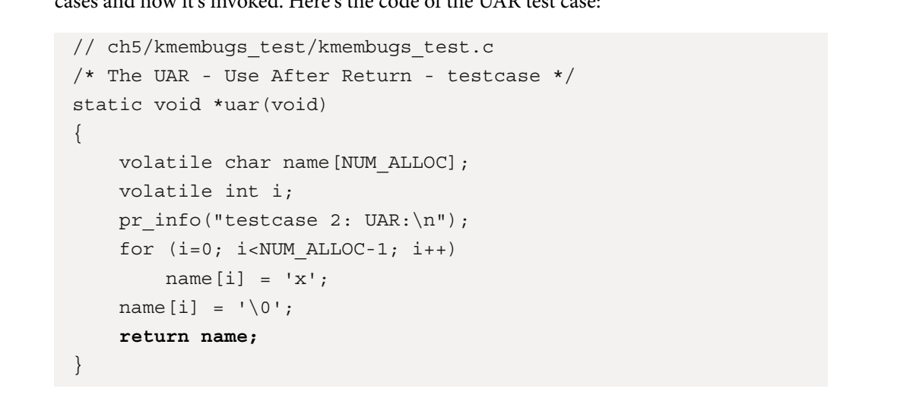

​	该模块设计为通过名为load_testmod的bash脚本加载，测试用例以交互方式运行（通过bash名为run_tests的包装器脚本）。run_tests脚本（您必须以root身份运行）显示可用测试的菜单，并要求您通过键入其分配的编号来选择任何一个。在接下来的部分中，您可以在图5.8中看到菜单的屏幕截图，以及您可以尝试的所有测试用例。然后，脚本将此数字写入我们的debugfs伪文件：/sys/kernel/debug/test_kmembugs/lkd_dbgfs_run_testcase。然后，debugfs写挂钩函数从用户空间接收此数据，对其进行验证，并调用相应的测试用例例程（通过一个相当长的if-else梯形图）。此设计允许您以交互方式进行测试，并根据需要多次执行任何测试用例。以下是一段代码片段，显示了我们的debugfs模块代码如何调用前面的uar（）测试用例：

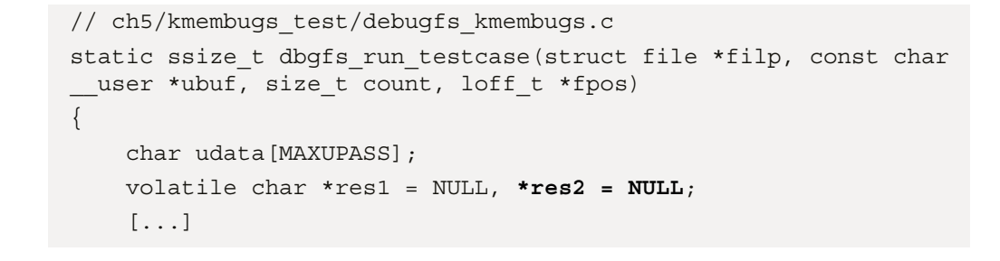

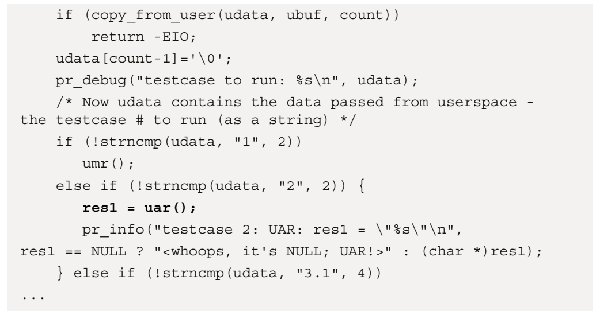

显然，这个测试用例#2是一个缺陷，一个bug。你知道局部变量只在它们的生命周期内有效——当函数执行时。当然，这是因为在执行过程中，局部（或自动）变量被分配到进程上下文的（内核模式）堆栈帧上。因此，一旦超出其包含函数的范围，就必须停止引用局部变量。我们（故意）不这样做！我们试图把它作为回报。问题是，到那时，它已经消失了。。。好吧，在开始运行测试用例之前（尽管现在没有理由不能运行它们），我们陷入了一个有趣的困境：一个已知的bug（比如我们的UAR bug）有时看起来是如何完美工作的。

#### 陈旧的框架——天堂中的麻烦

​	像这样的bug的惊人（或疯狂）之处——UAR缺陷——是代码有时似乎还能正常工作！怎么会？它是这样的：保存本地（自动）变量内容的内存在堆栈上。现在，尽管我们通俗地说堆栈帧在函数输入时分配，在函数返回时销毁（所谓的函数序言和结语），但现实并不那么戏剧化。

​	使用KASAN和UBSAN查找内存错误203现实情况是，内存通常以页面级粒度分配。这包括堆栈页面的内存。因此，一旦为堆栈分配了一页内存，通常就有足够的内存容纳几帧（当然，这取决于具体情况）。然后，当堆栈需要更多内存时，它就会增长（通过向下分配更多页面，因为它是堆栈）。通过让堆栈指针（SP）寄存器跟踪此内存位置，系统知道堆栈的顶部在哪里。此外，您会意识到所谓的“堆栈顶部”通常是最低的合法地址。因此，当分配帧和/或调用函数时，SP寄存器值会减小。当函数返回时，堆栈会通过添加到SP寄存器而缩小（记住，这是一个向下增长的堆栈！）。下图是（32位）Linux系统上典型内核模式堆栈的表示：

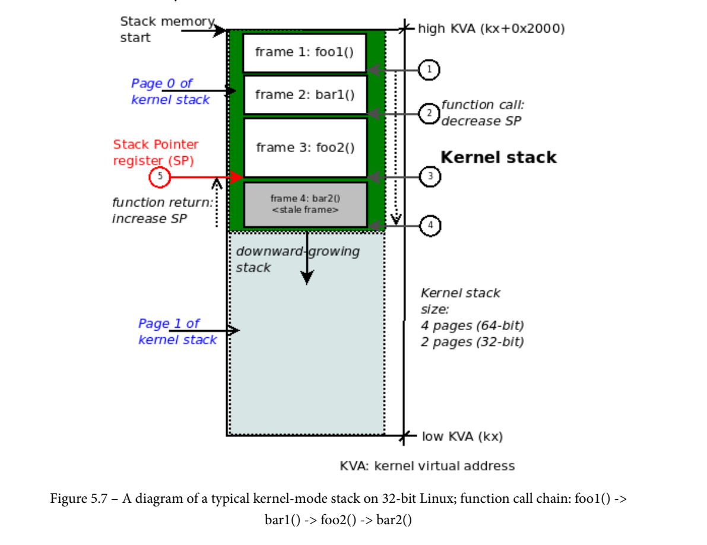

​	使用UBSAN内核检查器查找未定义行为C等语言的一个严重问题是，编译器为正确的情况生成代码，但当源代码做了一些意外或完全错误的事情时，编译器通常不知道该做什么——它只是轻率地忽略了这些情况。这实际上有助于以（可能的安全）错误为代价生成高度优化的代码！这方面的例子很常见：数组溢出/欠流、算术缺陷（如除以零或溢出/欠流入有符号整数）等等。更糟糕的是，有时有缺陷的代码似乎还能工作（正如我们在stale frames中访问过时的堆栈内存时所见——天堂的麻烦部分）。同样，糟糕的代码可能在优化的情况下工作，也可能不工作。因此，这样的情况无法预测，被称为未定义行为（UB）。内核的Undefined Behavior Sanitizer（UBSAN）捕获了几种类型的运行时UB。与KASAN一样，它使用编译时检测（CTI）来实现这一点。在完全启用UBSAN的情况下，内核代码使用–fsanitize=undefinedoption开关进行编译。UBSAN捕获的UB包括以下内容：

•算术相关UB：算术上溢/下溢/除零/等等……

位移位时的OOB访问

•内存相关UB：数组NULL指针解引用未对齐内存访问对象大小不匹配

其中一些缺陷实际上与Generic KASAN捕获的缺陷重叠。UBSAN检测代码肯定更大、更慢（是原来的2到3倍）。尽管如此，捕捉UB缺陷仍然非常有用，尤其是在开发和单元测试期间。事实上，如果你能负担得起更大的内核文本大小和处理器开销（除了微型嵌入式系统之外，你可能可以负担得起），那么在生产系统上启用UBSAN是可行的。

#### 通过SLUB调试的slab内存损坏

内存损坏可能是由于各种错误或缺陷造成的：未初始化内存读取（UMR）、释放后使用（UAF）、返回后使用（UART）、双重释放、内存泄漏或试图处理（读/写/执行）非法内存区域的非法越界（OOB）访问。不幸的是，它们是bug的一个非常常见的根本原因。能够调试它们是一项关键技能。已经检查了一些捕获它们的方法（上一章中关于设置和使用KASAN和UBSAN的详细介绍），现在让我们利用内核内置的SLUB调试功能来捕获这些错误！如您所知，内存是通过内核的引擎——页面（或Buddy System）分配器动态分配和释放的。为了减轻它可能面临的严重浪费（内部碎片）问题，slab分配器（或slab缓存）被分层，服务于两个主要任务——高效地提供页面片段（在内核中，从几个字节到几千字节的小块内存的分配请求往往很常见），并作为常用数据结构的缓存。当前的Linux内核通常有三种互斥的板层实现——原始的slab、更新的高级SLUB实现和很少使用的SLOB实现。关键是要认识到，以下讨论仅涉及板层的SLUB（非排队分配器）实现。这通常是大多数Linux安装中的默认设置（配置选项名为config_SLUB。它位于此处的菜单配置UI中：General setup | Choose SLAB分配器）。Tip了解内核内存管理系统、页面、slab分配器以及实际分配（和释放）内核内存的各种API是这些材料的先决条件。

​	通过SLUB debug检测slab内存损坏235配置内核进行SLUB调试内核提供了大量支持，以帮助调试slab（实际上是SLUB）内存损坏问题。在内核配置UI中，您会发现以下内容：

•常规设置|启用SLUB调试支持（config_SLUB_DEBUG）：启用此选项可为您提供大量内置的SLUB调试支撑，通过/sys/blat查看所有slab缓存的能力，以及运行时缓存验证支持。当Generic KASAN打开时，此配置会自动打开（自动选择）。

•默认情况下，内存调试|SLUB调试打开（稍后将解释config_SLUB_DEBUG_on）。让我们在我的x86_64 Ubuntu客户机上查找SLUB的内核配置，该客户机运行我们的自定义调试内核：

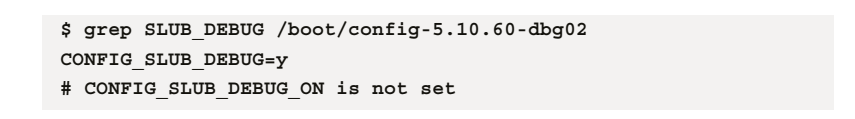

​	此配置意味着SLUB调试可用，但默认情况下已禁用（因为config_SLUB_debug_on处于关闭状态）。虽然始终启用它可能有助于捕获内存损坏，但它可能会对性能产生相当大的（和不利的）影响。为了缓解这种情况，您可以（实际上应该）配置调试内核，默认情况下关闭CONFIG_SLUB_debug_ON（如下图所示），并在需要时使用内核命令行参数SLUB_debug来微调SLUB调试。这里的官方内核文档详细介绍了slub_debug的使用方法：https://www.kernel.org/doc/html/latest/vm/slub.html.我们将通过一些示例对其进行总结，以演示如何使用这一强大的功能。

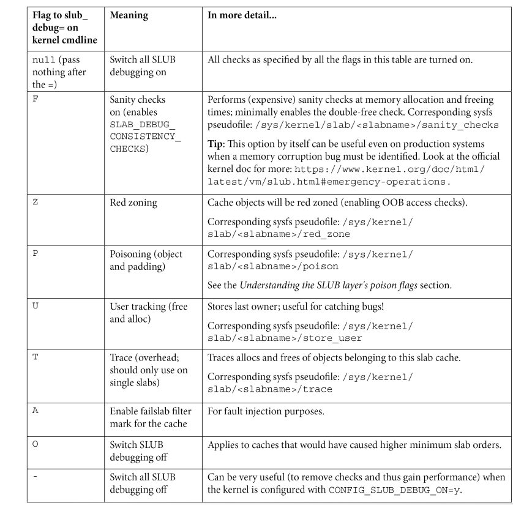

在开始生成Oops任务之前，让我们更好地了解procmap实用程序的作用以及NULL陷阱页面是什么。首先，让我们使用该实用程序。procmap工具能够可视化内核虚拟地址空间（VAS）的完整内存映射以及任何给定进程的用户VAS，这是procmap实用程序的设计目的。（完全披露：我是原作者。）GitHub页面上的描述(https://github.com/kaiwan/procmap)综上所述：procmap被设计成一个控制台/CLI实用程序，用于可视化Linux进程的完整内存映射，实际上是可视化内核和用户模式虚拟地址空间（VAS）的内存映射。它以垂直平铺的格式输出给定进程的完整内存映射的简单可视化，按虚拟地址降序排列（见下面的屏幕截图）。该脚本具有显示内核和用户空间映射以及计算和显示将出现的稀疏内存区域的智能。此外，为了可读性，每个片段或映射都（非常近似地）按相对大小和颜色编码进行缩放。在64位系统上，它还显示了所谓的非规范稀疏区域或“洞”（在x86_64上通常接近高达16384 PB）。该实用程序包括仅查看内核空间或用户空间的选项、详细和调试模式、以方便的CSV格式将其输出导出到指定文件的能力，以及其他选项。它也有一个内核组件（一个模块），目前适用于（自动检测）x86_64、AArch32和AArch64 CPU。不过，请注意，它在任何真正意义上都不完整；开发正在进行中。有几个注意事项。我们非常感谢您的反馈和贡献！从这里下载/克隆它：https://github.com/kaiwan/procmap.What这就是NULL陷阱页面吗？在所有基于Linux的系统上（事实上，几乎在所有现代基于虚拟内存的操作系统上），内核将进程可用的虚拟内存区域分为两部分——用户和内核VAS（我们称之为VM分割——在《Linux内核编程，Packt》一书的第7章“内存管理内部-要点”中有非常详细的讨论）。

​	在x86_64上，每个进程的完整VAS大小当然是2^64字节。现在，这是一个惊人的数字。它是16 EB（EB代表EB——1 EB=1024 PB=100万TB=10亿GB！）。VAS太大了。因此，默认情况下，x86_64上的内核被设计为如下分割：锚定在VAS顶部的大小为128 TB的内核VAS（从VAS最顶部的内核虚拟地址（KVA）0xFFFFFFFFFffffffff到KVA 0xffff8000000000）锚定到VAS底部的大小为128TB的用户VAS（从VAS最底部的用户虚拟地址（UVA）0x00007ffffffffFFffff到UVA 0x0）想想这个64位VAS如此之大，在这种情况下，我们最终只使用了一小部分可用地址空间。16EB等于16384PB。其中，在x86_64上，我们使用128 TB+128 TB=256 TB（即256/1024=0.25 PB）。这意味着约0.0015%的可用VAS正在使用中。现在，这里有一点值得注意：在用户VAS的低端，第一个虚拟页面——从字节0到字节4095——被称为NULL陷阱页面。让我们在我们的shell进程（恰好有PID 1076）上快速运行procmap实用程序（我们假设您现在已经安装了它），看到它显示NULL陷阱页面：

```
$ </path/to/>procmap
 --pid=1076
[...]
```

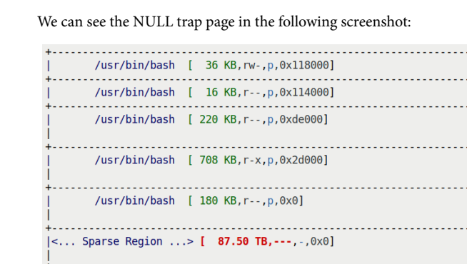

​	您可以在前面的屏幕截图底部找到NULL陷阱页面（bash进程的一些映射在更高的位置可见）。NULL陷阱页面的工作原理是将所有权限-rwx设置为---，这样任何进程（或线程）都无法读取、写入或执行其中的任何内容！这就是为什么当一个进程试图读取或写入地址0x0处的NULL字节时，它不起作用。简而言之，实际发生的情况是：

- 一个进程尝试访问（读取/写入/执行）或解引用NULL字节。
- 事实上，访问此页面中的任何字节都会导致相同的事件序列，因为---模式适用于页面中的所有字节，这就是为什么它被称为NULL陷阱页面！它捕获对其中任何字节的访问。
- 页面中所有字节的权限为零：不读、不写、不执行。现在（除非缓存），所有虚拟地址最终都会到达MMU。MMU进行检查，然后执行运行时地址转换，将虚拟地址转换为物理地址。
- 在这里，MMU检测到页面中的所有字节都没有权限，因此引发了故障（通常在x86上，是一般保护故障）操作系统预装了故障（和陷阱/异常）处理程序。控制权被传递给适当的故障处理功能。
- 此函数（故障处理程序）在导致故障的进程的进程上下文中运行。它通过一个相当复杂的算法找出问题所在。
- 在这里，故障处理程序将得出结论，在用户模式下执行的进程试图进行有缺陷的访问。因此，它会向它发送一个致命信号（SIGSEGV）。这最终会导致进程死亡，并在控制台上显示分段错误[（核心转储）]消息。当然，该过程可以安装一个信号处理程序来处理这个信号。但最终，在清理之后，它必须终止。

现在您已经了解了NULL陷阱页面的确切内容及其工作原理，让我们做一些我们不应该做的事情：尝试在内核模式下读/写NULL地址，从而导致内核错误！一个简单的Oops v1–解引用NULL点在这个有缺陷的内核模块的第一个简单版本中，我们只需读取或写入NULL地址。正如您在上一节中所了解到的，对NULL陷阱页面中的任何字节进行任何访问（读取、写入或执行）都会导致MMU跳起来并触发故障。在内核模式下也是如此。

#### 可能是重新启动的有用（愚蠢）解决方法。

​	您是否注意到，一旦出现错误，内核模块就无法卸载（通过rmmod），因为引用计数为非零？lsmod验证了这一点：

```
$ lsmod |grep oops
oops_tryv1 16384 1
```

​	这通常是因为Oops发生在进程上下文（在我们的例子中是insmod）退出之前，因此模块引用计数减少到0。前一个输出最右侧的1表示当前模块引用计数为1，阻止卸载此模块。现在，如果您无法卸载该模块，则无法再次加载（在编辑源文件后重试）。正确的方法是重新启动盒子并重新开始。对于这个恼人的问题，一个非常愚蠢的解决方法是简单地清理（make clean），重命名源文件，编辑Makefile以使用新名称，然后构建它。现在它将以新名称加载！非常愚蠢，但当你处于开发阶段并急于尝试时，它是有效的。做更多的Oops——正如本章开头提到的，在我们的版本2错误模块中，我们将做一些稍微（希望）更现实的事情来触发内核Oops。此模块有三种不同的方法来触发Oops：

- 一种是在NULL陷阱页面中写入随机生成的KVA。
- 第二，允许用户传递一个（随机）无效的KVA并尝试在其中写入内容（您可以利用procmap实用程序来查找无效的KVA）
- 第三，我们启动一个简单的工作队列函数。这将使内核工作线程在调度时运行其代码。在工作队列函数中，我们将通过尝试向结构指针为NULL的结构成员写入内容来触发Oops（由于这种情况可能非常现实，我们将在本章中将其作为一个用例）。

​	让我们从使用上面提到的第一种方法来触发Oops！

##### 案例1——糟糕的是，写入NULL陷阱页面中的随机位置。

​	与第一个v1模块非常相似，我不会深入探讨这个问题。只要说我们使用内核接口（get_random_bytes（）API）生成一个随机数并将其缩小到0到4095之间的数字（通过使用模运算符）就足够了。这里可以看到模块init函数中的相关代码：

```
// ch7/oops_tryv2/oops_tryv2.c
[...]
static int __init try_oops_init(void)
{
 unsigned int page0_randptr = 0x0;
 [...]
} else { // no module param passed, write to random kva in NULL
trap
 pr_info("Generating Oops by attempting to write to a 
random invalid kernel address in NULL trap page\n"); 
 get_random_bytes(&page0_randptr, sizeof(unsigned 
int));
 bad_kva = (page0_randptr %= PAGE_SIZE);
 }
 pr_info("bad_kva = 0x%lx; now writing to it...\n", bad_
kva);
 *(unsigned long *)bad_kva = 0xdead;
[...]
```

​	这里看到的最后一行是我们试图写入这个坏KVA的地方。当然，这会触发Oops。要尝试这个方法，只需在不传递任何参数的情况下对模块进行insmod。这将使代码指向此用例（我将留给您自己尝试并查看内核日志）。

​	案例2——通过写入内核VASF中无效的未映射位置来产生Oops。对于第二个用例，我们有一个名为mp_randaddr的模块参数。要运行此情况，您需要以通常的方式将其传递给模块，将其设置为无效的内核地址（或KVA）：

```
// ch7/oops_tryv2/oops_tryv2.c
[...]
static unsigned long mp_randaddr;
module_param(mp_randaddr, ulong, 0644);
MODULE_PARM_DESC(mp_randaddr, "Random non-zero kernel virtual 
address; deliberately invalid, to cause an Oops!");
```

​	随机非零内核虚拟地址；故意无效，导致糟糕！”）；现在，当模块的init函数检测到此参数中传递了非零值时，它会调用以下代码：

```
} else if (mp_randaddr) {
 pr_info("Generating Oops by attempting to write to the 
invalid kernel address passed\n");
 bad_kva = mp_randaddr;
 } else {
 [... << code of the first case above >> ...]
 }
 pr_info("bad_kva = 0x%lx; now writing to it...\n", bad_
kva);
 *(unsigned long *)bad_kva = 0xdead;
```

​	这种方法与第一种情况几乎完全相同；有趣的是：我怎么知道要传递哪个内核地址（或KVA）？我如何知道它是内核VAS中无效（或未映射）的位置？啊，这就是procmap实用程序发挥作用的地方！只需运行procmap（传递任何PID并指定--only内核选项开关，因为我们现在对用户VAS不感兴趣）。例如，在我的x86_64客户VM上，我是这样调用它的（您需要更新PATH环境变量以包含安装procmap的目录）：

```
$ procmap --pid=1 --only-kernel
...
```

​	好的，请仔细查看前面的屏幕截图。标记为<。。。K稀疏区域…>是内核VAS中的空洞。这里没有地图。这很常见。这样的内存通常被称为地址空间中的稀疏区域或孔洞。关键在于：稀疏区域是未映射的区域，因此，如果你试图以任何方式访问这些位置中的任何一个——读取、写入或执行——这是一个错误！所以，让我们在稀疏区域内选择一个KVA。我将在模块区域（内核模块所在的位置）和内核vmalloc区域（vmalloc（）从中分配内存的位置）之间选择一个，即0xffffffffc0000000和0xffffda377ffffff之间的任何地址。因此，我将KVA 0xffffffffc000dead作为无效内核地址的值并使用它运行。对，确保您已经构建了oops_tryv2模块，然后按照刚才讨论的参数加载它：

```
$ modinfo -p ./oops_tryv2.ko 
mp_randaddr:Random non-zero kernel virtual address; 
deliberately invalid, to cause an Oops! (ulong)
bug_in_workq:Trigger an Oops-generating bug in our workqueue 
function (bool)
$
```

​	我们使用modinfo实用程序来证明我们的模块接受两个参数（请暂时忽略第二个参数——这是我们的下一个主题）。让我们（终于！）开始吧

```
$ sudo insmod ./oops_tryv2.ko mp_randaddr=0xffffffffc000dead
Killed
$
```

​	哎呀！解释内核错误诊断啊哈！我们的模块（故意）试图写入无效的内核地址0xffffffffc000dead（通过模块参数传递），结果却陷入了错误的结局。我们得到了我们想要的东西——一个Oops击中了我们。以下（部分）屏幕截图显示了其中的一大部分：

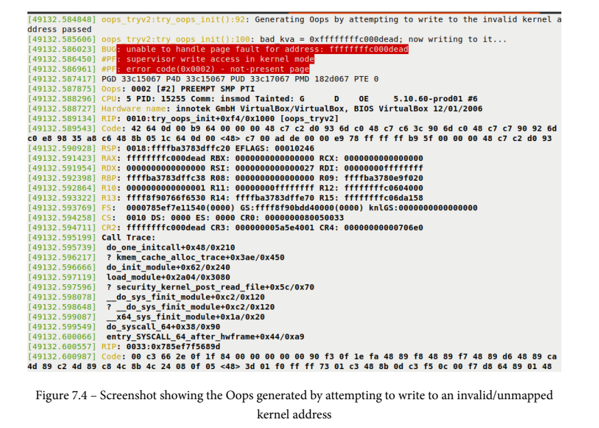

​	我希望关键点是明确的：当然，我们会遇到一个bug——Oops。我们在内核VAS的稀疏区域内写入了一个无效的未映射内核地址，procmap实际上帮助我们看到了。为什么试图访问无效地址会导致问题？答案与我们讨论的NULL陷阱页面非常相似。基本情况如下：1。正在处理（读取、写入或执行）的虚拟地址将发送到MMU。

生成一个简单的内核错误和Oops 3032。MMU知道当前进程上下文的分页表在哪里（对于x86，分页表基的物理地址在CR3寄存器中），现在继续将此虚拟地址（KVA）转换为物理地址（在这里，我们将忽略可能已经保存物理地址的硬件优化，如CPU缓存和转换后备缓冲区（TLB），从而缩短了漫长的转换并提供了加速）。通常，它会找到一个映射并执行转换，将物理地址放置在总线上。CPU接管并完成工作。然而，在这种情况下，传递的内核地址是无效的（故意如此）——它实际上是内核VAS漏洞的一部分！因此，地址转换失败。作为硬件，MMU尽其所能：它通过引发（页面）错误来通知操作系统出了问题。操作系统的页面错误处理程序接管（在导致错误的进程的上下文中运行——当然，这里是insmod）。它认为在内核模式下尝试了无效写入，因此触发了Oops！那么，详细理解和解释这个混乱的Oops事情呢？这正是我们在下一节要做的，魔鬼在细节中——解码Oops。坚持住——我们会到的！

##### 案例3——当结构指针为NULL时写入结构成员，这会导致问题。

这个使用（或测试）案例有点复杂，也有助于使其更加逼真。最终结果与前两种情况相同——我们让内核触发Oops。这一次，我们希望有缺陷的代码路径不要在insmod进程上下文中运行。为了实现这一点，我们初始化一个（内核默认）工作队列并对其进行调度，执行其代码。内核默认工作队列的执行是在内核工作线程的上下文中完成的。我们安排工作函数有一个bug——写入一个无效的内存位置，一个没有分配任何内存的指针（指向一个结构）。这当然会触发Oops。以下是相关的代码片段（和往常一样，我敦促您浏览完整的代码并亲自尝试这些东西）

```
// ch7/oops_tryv2/oops_tryv2.c
[...]
static bool bug_in_workq;
module_param(bug_in_workq, bool, 0644);
MODULE_PARM_DESC(bug_in_workq, "Trigger an Oops-generating bug 
in our workqueue function");
```


​	我们在工作队列上调用schedule_work（），让内核实际运行我们的工作函数的代码：

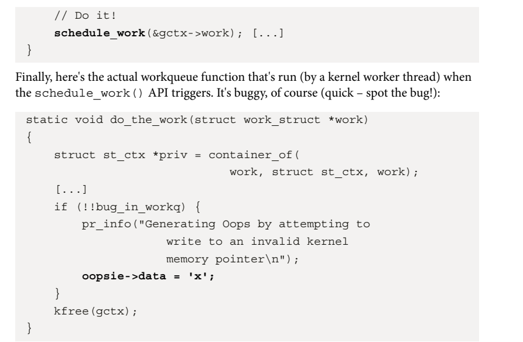

好吧，回想起来很明显：指向我们名为oopsie的结构的指针没有内存（它的值是NULL，因为它是我们模块中的全局静态变量）。然而，我们试图通过它写入结构的一个成员。这会触发Oops。以下是我调用它的方式：

```
sudo insmod/oops_tryv2.ko bug_in_workq=yes
```

你注意到了吗？这一次，Killed消息不会出现。这是因为insmod进程没有被杀死。相反，使用我们的工作队列函数的内核工作线程将遭受该错误的后果。


顺便说一句，如果需要，你可以在我早期的Linux内核编程第2部分书（电子书可免费下载）的第5章“使用内核计时器、线程和工作队列”中阅读设置和使用内核工作队列、计时器和内核线程的详细信息。当然，这里我们总是假设您确实可以访问内核日志（通过dmesg、journalctl、闪存芯片上的安全位置等）。如果你一开始不知道Oops消息在哪里怎么办？那么，内核社区已经记录了您可以在这里做些什么：Oops消息位于哪里？(https://www.kernel.org/doc/html/latest/admin-guide/bug-hunting.html#where-is-the-oops-message-is-located）。此外，我们稍后将介绍其中提到的一些技术。Netconsole在“ARM Linux系统上的Oops和使用Netconsole”一节中介绍，kdump/crash在第12章“更多内核调试方法”中简要介绍。好了，你现在知道如何以多种方式触发内核错误，哎呀！下面快速了解一下内核Oops是什么和不是什么。

一个内核的Oops及其含义307A内核的Oots及其含义这里有一些关于内核Oops的快速认识。首先，Oops与segfault不同——分割错误。。。作为副作用，它可能会导致segfault发生，因此进程上下文可能会收到致命的SIGSEGV信号。当然，这让糟糕的过程陷入了交火之中。接下来，Oops与全面的内核恐慌不是一回事。恐慌意味着系统处于不可用状态。这可能会导致这种情况，尤其是在生产系统上（我们在第10章“内核恐慌、锁定和挂起”中介绍了内核恐慌）。不过请注意，内核提供了几个sysctl可调参数（当然可以由root编辑），用于了解什么情况会导致内核恐慌。我们可以查看它们——在我的x86_64 Ubuntu 20.04客户机上运行我们的自定义生产内核，它们是：

```
$cd/proc/sys/kernel/$ls panic_on*panic_on_io_nmi panic_on-oops panic_o_nurc_stall panic_on/unrecovered_nmi panic _on_warn
```

​	正如你所看到的，如果你把它们分类，默认情况下它们的所有值都是零，这意味着不会触发内核恐慌。它还向我们表明，例如，将panic_on_oops设置为1将导致内核在任何oops上死机，无论它看起来多么微不足道。重要的是要明白，在许多安装中，这可能是正确的做法。当一个系统出现Oops时，我们通常希望出现一个亮红灯——一个信号停止，一种理解系统处于（或曾经处于）不健康状态的方式！这确实取决于项目或产品的性质：一个深度嵌入式系统可能无法承受因内核恐慌而停机的后果。在那里，看门狗通常会检测到系统处于不健康状态并重新启动。我们将在第10章“内核恐慌、锁定和挂起”中介绍使用看门狗等。即使Oops不是内核恐慌，但根据情况和错误的严重程度，内核可能会变得无响应、不稳定或两者兼而有之。或者，它可能会继续工作，就像没有发生任何令人担忧的事情一样！无论如何，Oops最终都是一个内核级的bug；它必须被检测、解释和修复！好的，让我们来看看有趣的部分：学习如何详细解释Oops内核输出。走吧！

#### 魔鬼在于细节——解码Oops我们将使用第三种场景（或使用/测试用例）

​	在案例3一节中介绍——当结构指针为NULL时，通过向结构成员写入Oops。快速回顾一下，这就是我们触发这个特定内核Oops的方法（案例3）：cd ch7/Oops_tryv2makesudo insmod/oops_tryv2.ko bug_in_workq=yes如前所述，它会触发oops。现在我们到了有趣的部分——逐行解读Oops。在开始之前，重要的是要意识到下面的详细讨论必然是特定于arch的，这里和现在都与x86_64平台有关（当然，Oops输出的部分内容非常特定于archs）。在后面的部分中，我们还将展示典型的Oops如何出现在ARM平台上。Oops的逐行解释我们得到的Oops最初也是真正关键的部分如图7.5所示。现在，为了帮助逐行参考，这是同一屏幕截图的注释图（为了清楚起见，放大了一点）：

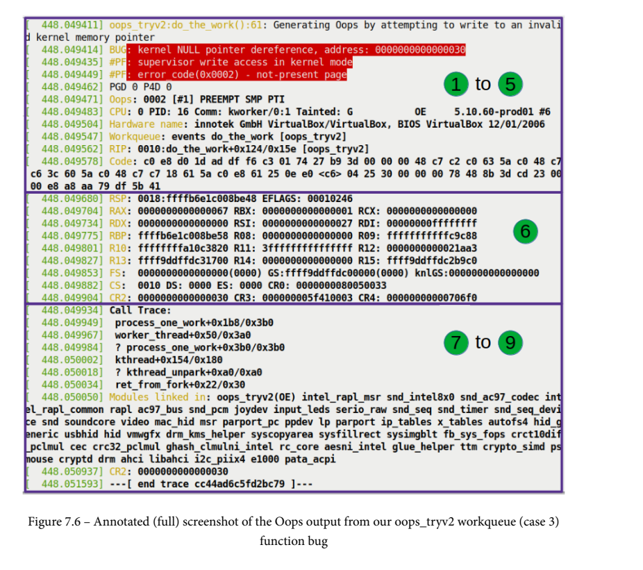


在Oops中解释调用堆栈字符串call Trace:下方的行稍微向右缩进表示调用或堆栈跟踪。当然，这是导致Oops的进程上下文的内核模式堆栈（尽管它也可能是中断的堆栈——稍后将详细介绍……）。此调用跟踪对开发团队和您调试Oops非常有价值。为什么？它从字面上向你展示了这个bug的历史——我们是如何到达目的地的。那么，你怎么解释呢？以下是几个关键点：•首先，Call Trace下方的每一行（略微向右缩进）表示调用路径中的一个函数，由调用帧抽象出来。•每一帧都有与我们之前看到的相同的符号，funcname+x/y，其中x是从函数开始的距离（以字节为单位）（开始偏移量），y是函数的大小（长度）（以字节计）当然，自下而上阅读调用跟踪（图7.14中的垂直箭头指向上方以显示此内容）。回想一下，几乎所有现代处理器都遵循堆栈向下语义增长忽略任何以问号符号（？）开头的行。这意味着调用帧很可能是无效的，可能是早期堆栈内存使用的陈旧遗留物。内核的堆栈展开算法（有几个——它们甚至是可配置的！）足够聪明，几乎可以保证做到这一点，所以相信它。把我们学到的东西放在一起，这就是导致我们的Oops的调用序列：ret_from_fork（）-->kthread（）->worker_tread（）->process_one_work()

​	当然，要正确理解这一点，至少需要基本了解Oops发生时我们的代码在做什么。我们确实知道Oops实际上是在函数do_the_work（）中触发的。请参阅我们在“查找发生Oops的代码”一节中的注释。此函数是我们的自定义工作队列例程。现在它是如何被调用的？啊，间接地，当我们的模块调用schedule_work（）API时，将指针传递到我们的工作结构（如果需要，请回头看代码ch7/oops_tryv2/oops_tryv2.c）。此工作函数由内核的默认事件工作队列提供服务。服务——实际上意味着消耗或执行我们的工作函数——是通过启动（或使用现有的）内核工作线程（属于内核的默认事件工作队列）来完成的。您在上面的调用序列中看到的kthread（）例程是一个执行此任务的内部内核接口，它启动了一个内核线程。它调用内核工作队列函数worker_thread（），其任务是处理工作队列上的所有工作项。这反过来是通过调用循环中的每个工作项来完成的，在循环中调用函数process_one_work（），其唯一的工作是处理它给出的一个工作项——我们的！所以我们到了——内核堆栈确实揭示了我们是如何到达worker例程do_the_work（）的。呼——这可能是一项艰苦的工作！但是，话说回来，你是工作中的法医侦探。没有人说这很容易！提示–查看所有CPU内核的内核模式堆栈内核有一个可调的/proc/sys/Kernel/ops_All_CPU_backtrace，其默认值为0，处于关闭状态。打开它（以root身份写入1），系统上所有CPU核的调用堆栈将显示为oops诊断的一部分。这在深度调试场景中非常有用。（在内部，其他CPU内核上的调用跟踪是通过不可屏蔽中断（NMI）回溯工具完成的。）调用跟踪后的行（以字符串Modules linked in:开头的行）显示了Oops时内核中加载的所有模块。为什么？模块通常是第三方代码（用于设备驱动程序、自定义网络防火墙规则、自定义文件系统等），因此当内核遇到错误时，它们非常可疑！因此，所有模块的列表。事实上，我们自己的错误模块oops_trv2自豪地站在这个列表的第一位，因为它是最后一个加载的模块。此外，受污染的标志OE表示它是一个树外无符号模块。最后，Oops诊断中的最后一行是内核开发人员所说的执行摘要——CR2寄存器的值！现在你应该意识到原因：是错误的（虚拟）地址，对该地址的访问导致了Oops。

提示位置的工具和技术-强制暂停以读取Oops诊断在发生Oops时打印详细的Oops分析是很好的，但如果它从控制台窗口滚动出来呢？或者，后面还有其他的次要Oopses，导致主要Oopses的内容滚动离开？对于这种情况，传递pause_on_oops=n内核参数。在打印第一个内核Oops后，它将使所有CPU暂停n秒。最后，我们非常详细地解释了我们的Oops，从字面上看，一行一行，在旅途中学习了很多（嘿，重要的是旅程，而不是目的地）。我们还想顺便提一下，有几个框架可以帮助捕获内核Oops并将其报告给供应商（或分销商）。其中包括kerneloops（8）程序（手册页：https://linux.die.net/man/8/kerneloops). 

​	许多现代发行版使用kdump功能在发生Oops或死机时收集整个内核内存映像，以供以后分析（通常通过崩溃应用程序）。练习通过在自定义调试内核上传递模块参数bug_in_workq=yes来运行此相同的Oopsing测试用例（ch7/try_oopsv2），看看会发生什么。在我的版本中，启用KASAN后，内核会出现Oops，但不会在KASAN发现错误之前！太好了——现在，继续下一节很重要，我们将介绍如何使用各种工具和技术来发现有问题的代码行！帮助确定Oops位置的工具和技术在分析内核Oops时，我们当然可以使用我们能得到的所有帮助，对吧？！有几个工具和辅助脚本可以利用。其中，作为（交叉）工具链的一部分，有objdump、GNU DeBugger（GDB）和addr2line程序。除此之外，一些内核辅助脚本（位于内核源代码树中）也可以证明非常有用。

​	在本节中，我们将开始学习如何利用这些工具来帮助解释Oops。提示–使用调试符号获取未拆分的vmlinux内核映像许多（如果不是大多数）帮助调试内核问题的工具和技术确实取决于您是否拥有一个带有调试符号的未拆分的未压缩vmlinux内核镜像。现在，如果你已经构建了调试和生产内核，正如我们从本书一开始就建议的那样，你当然会有调试vmlinux内核映像文件（它满足了这一要求）。如果不是呢？好吧，几乎所有的企业（和桌面）Linux发行版都提供了一个软件包——为集成到发行版中的常用内核版本提供单独的软件包——这将提供它（以及更多）。通常，该包被命名为linux-devel*或linux headers*。它本质上只是一个压缩的存档，其中包含内核头文件、带有调试符号的未拆分vmlinux，以及其中可能包含的更多好东西。下载该包，安装它，然后亲自查看。例如，关于Red Hat RHEL 8的kernel-*RPM的说明可以在这里找到：https://access.redhat.com/documentation/en-us/red_hat_enterprise_linux/8/html/managing_monitoring_and_updating_the_kernel/the-linux-kernel-rpm_managing-monitoring-and-updating-the-kernel#the-linux-kernel-rpm-package-overview_the-linux-kernel-rpm

​	此外，作为另一个例子，这里有一个链接，可以下载以下Linux发行版的内核开发Linux包的RPM包——AlmaLinux、ALT Linux、CentOS、Fedora、Mageia、OpenMandriva、openSUSE、PCLinuxOS和Rocky Linux：https://pkgs.org/download/kernel-devel.

​	接下来，重要的是要意识到，在非原生arch（例如ARM、ARM64、PowerPC等）上调试Oops时，您需要运行我们下面检查和使用的跨工具链版本的工具。作为一个具体的例子，如果你正在调试ARM-32上发生的Oops，该Oops是使用ARM-linux gnuabihfᦙ工具链前缀编译的（这将是环境变量CROSS_COMPILE的值），那么你需要运行的不是objdump，而是${CROSS_COMPILE}objdump也就是说，arm linux gnuabihf objdump。工具链中的其他工具（如GDB、readelf、addr2line等）也是如此。

#### 跟踪内核流

跟踪是在代码执行时收集相关细节的能力。通常，收集的数据将包括沿所遵循的代码路径进行的函数调用的函数名（可能还有参数和返回值）、发出调用的上下文、调用的时间（时间戳）、函数调用的持续时间等。跟踪允许您研究和理解系统或其中组件的详细流程。它类似于飞机上的黑匣子——它只是收集数据，允许您稍后解释和分析它。（您也可以将跟踪视为与日志记录大致类似。）分析与跟踪的不同之处在于，它通常通过在周期性时间点采样（各种有趣的事件/计数器）来工作。它不会捕捉到一切；它（通常）捕获的数据刚好足以帮助进行运行时性能分析。通常可以生成代码执行的概要文件，即报告，允许您捕获异常值。因此，分析本质上是统计性的，而追踪则不是。它几乎捕捉到了一切。跟踪可以，当然也经常是一种非常值得理解和使用的调试技术；另一方面，性能分析用于性能监控和分析。这本书是关于内核调试的；因此，在本章中，我们将重点介绍一些跟踪技术（在众多可用技术中）及其前端，这些技术可以证明是有用的。（说实话，有时会有重叠——一些工具既可以作为跟踪器，也可以作为分析器，具体取决于它们的调用方式。）

#### 使用trace_printk（）进行调试

​	使用trace_print（）API将字符串发送到ftrace缓冲区。语法与printf（）相同。这里有一个例子:trace_printk（“myprj:at%s:%s（）:%d\n”，__FILE__，__func__，__LINE__）；因此，它通常被用作调试辅助工具，一种仪器技术。但是，为什么不简单地使用printk（）（或pr_foo（）包装器或dev_foo（（）宏）呢？trace_printk（）更快，只写入RAM，从不写入控制台设备。因此，它对于调试快速代码路径（例如中断代码）非常有用，其中printk（）可能太慢（记得我们在第8章“锁调试”的介绍中简要讨论了Heisenbugs）。此外，printk（）缓冲区有时可能太小；ftrace缓冲区更大且可调。建议您仅将trace_printk（）用于调试目的。现在，如果trace_printk（）只写入ftrace缓冲区，如何查找内容？简单-只需从跟踪或trace_pipe文件中读取（不通过dmesg或journalctl）。trace_printk（）输出在所有跟踪器插件中都是有效的，并且可以从任何上下文（进程或中断，甚至NMI）工作（如printk（））。（顺便说一句，它在function_graph跟踪报告中显示为注释。）此外，内核文档中提到了优化，例如使用traceput（）。这只会发出一个文字字符串（通常就足够了），以及使用trace_printk（）进行的其他优化:https://www.kernel.org/doc/html/latest/driver-api/basics.html#c.trace_printk.trace_printk通过将notrace_printk写入trace_options文件（默认情况下是启用的），可以禁止（）写入跟踪缓冲区。或者，可以通过将0/1写入options/trace_printk来切换它。Ftrace–通过常见问题解答的其他剩余要点让我们以一种有用且熟悉的常见问题解答格式总结内核Ftrace的内容:•是否有一种有记录的快速入门Ftrace的方法？ftrace子系统包括一个很好的快速总结，通过一个跟踪迷你HOWTO使用ftrace；您可以通过执行以下操作来阅读它:

```
sudo cat/sys/kernel/tracing/README
```

​	我在系统上找不到一些ftrace选项或跟踪文件。请记住，跟踪伪文件和目录是内核不可或缺的一部分，因此您所看到的内容会有所不同，具体取决于以下因素:CPU架构（通常x86_64是最丰富和最新的架构）内核版本（这里，它基于x86_64arch和5.10.60内核）•我如何在生成跟踪数据时从内核获取跟踪数据，即以流式方式获取？您可以通过读取trace_pipe伪文件来流式传输ftrace数据；您可以使用tail-f或自定义脚本简单地从中读取，甚至可以通过awk和grep等标准实用程序简单地过滤来自tracepipe的传入跟踪数据来“实时”过滤它在使用ftrace的跟踪会话中，我可以打开/关闭跟踪吗？在内核（或模块）中以编程方式切换ftrace很容易。只需调用这些API（请注意，它们仅是GPL导出的）:trace_on（）:打开trace_off（）:关闭跟踪这相当于将1或0写入trace_on文件，您可以使用该文件通过脚本（以root身份运行）切换跟踪。请注意，通过将0写入/proc/sys/kernel/ftrace_enabled sysctl，可以关闭整个ftrace系统。这显然不是一件轻而易举的事。内核文档(https://www.kernel.org/doc/html/latest/trace/ftrace.html#ftrace-enabled）提供了有关此方面的更多详细信息。•当内核出现问题或恐慌时，ftrace能提供帮助吗？怎么用？强大的kdump/kexec基础架构允许我们在发生崩溃（Oops或panic）时捕获整个内核内存空间的快照。随后，崩溃工具允许您对内核转储映像进行事后分析（我们将在本书的最后一章简要介绍这项技术）。然而，尽管这对调试内核崩溃非常有帮助，但它实际上并没有提供内核崩溃前发生的任何细节。这就是ftrace再次非常有用的地方——我们可以设置ftrace在已知的崩溃点之前执行跟踪。但一旦系统崩溃，它很可能处于不可用状态（完全冻结/挂起）；因此，您甚至可能无法将跟踪数据保存到文件中。

​	这就是ftrace_dump_on_oops功能发挥作用的地方。通过向proc伪文件/proc/sys/kernel/ftrace_dump_on_oops写入1来启用它（默认情况下始终为0）。这将使内核将ftrace缓冲区的当前内容写入控制台设备和内核日志！因此，Kdump将捕获它以及内核转储映像，您现在不仅可以获得崩溃时的整个内核状态，还可以获得导致崩溃的事件，如ftrace输出所示。这有助于调试崩溃的根本原因。该工具在启动时也可以通过内核命令行参数调用（您可以在启动时通过引导加载程序传递该参数）。以下是内核文档中关于内核参数的屏幕截图(https://www.kernel.org/doc/html/latest/admin-guide/kernel-parameters.html)其目的非常明确:图9.18——显示ftrace_dump_on_oops一个内核参数的部分截图。这很有趣。使用ftrace_dump_on_oops=orig_cpu通常非常有用。只有相关的ftrace缓冲区（触发Oops的CPU缓冲区）会被转储到内核日志（和控制台）。提示–与FtraceFtrace相关的内核参数可以编程为在启动后尽早开始收集跟踪数据，方法是传递ftrace=[tracer]内核参数（其中[tracer]-要使用的跟踪插件的名称），以帮助您调试早期启动问题。同样，还有其他几个与ftrace相关的内核参数可用。要查看它们，请导航到内核命令行参数的官方内核文档(https://www.kernel.org/doc/html/latest/admin-guide/kernel-parameters.html)并搜索[FTRACE]字符串。

​	跟踪器是用来做什么的？最好不要禁用硬件中断；但有时，这是必要的。例如，自旋锁的关键部分——从获取到释放的代码——已禁用中断（以确保其正常运行）。不过，长时间禁用中断（比如超过100微秒）肯定会导致系统延迟和滞后。irqsoff跟踪器可以测量硬件中断关闭的最长时间；更好的是，它还可以让你看到这到底发生在哪里。关于irqsoff跟踪器的使用细节已经在我之前的（免费）电子书《Linux内核编程——第2部分》中介绍过，该书位于第4章“处理硬件中断”中，在“使用Ftrace来处理系统延迟”一节中。请务必查看。ftrace的官方内核文档(https://www.kernel.org/doc/html/latest/trace/ftrace.html#irqsoff)确实涵盖了通过这些延迟测量相关跟踪器测量延迟的含义和细节。请务必查看。以下是与延迟测量相关的ftrace跟踪器:irqsoff:测量并报告硬件中断（IRQ）关闭（禁用）的最大持续时间。precedoff:测量并报告关闭内核抢占的最长持续时间。precedirqsoff:测量和报告关闭硬件IRQ和/或内核抢占的最大持续时间。实际上，这是前面两个跟踪器的最大值，实际上是内核无法调度任何事情的总时间！唤醒:测量并报告计划延迟——从任务被唤醒到实际运行的时间。它仅针对最高优先级的非实时任务进行测量。wakeup_rt:与前一个相同，只是它测量并报告系统上当前最高优先级实时任务的计划延迟。这是实时的一个重要指标。如上所述（在下一节中），前面列出的前三个跟踪器通常用于检查驱动程序是否将硬件中断或内核抢占保留了太长时间。

​	关闭/内核抢占关闭-多长时间太长？一般来说，任何在几十毫秒范围内的事情——实际上，任何超过10毫秒的事情——都被认为太长，无法关闭硬件中断和/或内核抢占。这里有一个快速的专业提示——监控你的项目的irqzsoff，并用上述延迟测量跟踪器抢占最坏的时间。•我可以在同一个内核上同时执行多个ftrace记录/报告会话吗？Ftrace有一个实例模型。它允许一次完成多个跟踪！只需在/sys/kernel/tracing/instances/目录下创建一个目录（使用mkdir）并继续使用它，就像使用普通的ftrace一样。每个实例都有自己的一组缓冲区、跟踪器、过滤器等，允许在需要时同时进行多个跟踪。有关更多信息，Steven Rosedt的本演示文稿涵盖了使用ftrace实例:使用ftrace进行跟踪——Linux开发的关键工具，2021年6月:https://linuxfoundation.org/wp-content/uploads/ftrace-mentorship-2021.pdf.Ftrace用例在这里，我们将提到已经（或可以）利用ftrace的许多方法中的一些，重点是调试。使用ftrace检查内核堆栈利用率和可能的溢出正如您所知，每个（用户模式）活动线程都有两个堆栈——用户模式堆栈和内核模式堆栈。用户模式堆栈是动态的，而且很大。（它可以增长到的最大大小是资源限制RLIMIT_stack，在vanilla Linux上通常为8 MB。当然，内核线程只有一个内核模式堆栈。）然而，内核模式堆栈的大小是固定的，而且很小——在32位系统上通常只有8 KB，在64位系统上只有16 KB。当然，溢出内核模式堆栈是一个与内存相关的错误，通常会导致系统突然锁定甚至死机。这是一件危险的事情。提示启用CONFIG_VMAP_STACK（本质上，使用内核vmalloc区域作为内核堆栈）可能很有用。它使内核能够设置一个保护页面，优雅地捕获任何溢出并通过Oops报告；违规的进程上下文也被杀死。此外，启用CONFIG_THREAD_INFO_IN_TASK有助于缓解堆栈溢出错误可能导致的问题。有关这些内核配置的更多信息，请参阅进一步阅读部分。

### Kernel恐慌、锁定和挂断

​	当你在控制台上收到可怕的内核恐慌信息时，那些绝对的、无情的像素，用上帝冷酷的眼光告诉你系统实际上已经死了:内核恐慌-不同步:[…]为什么，哦，为什么？-你的哀叹是徒劳的。除非，除非。。。你不要惊慌（双关语），阅读本章，弄清楚发生了什么（通过编写自己的自定义恐慌处理程序来帮助解决这个问题），继续你的生活，伙计！除了理解和处理内核恐慌之外，我们还深入研究了内核锁定、挂起任务、停滞的原因，以及如何配置内核来检测它们。在本章中，我们将介绍以下主要主题:•恐慌！–当内核死机时会发生什么•编写自定义内核死机处理程序例程•检测内核中的锁定和CPU停滞•使用内核的挂起任务和工作队列停滞检测器

### 使用内核GDB（KGDB）

如果我们可以在内核或模块的代码上设置断点（甚至是硬件断点/观察点），单步执行、查看变量和检查内存，就像我们使用真正著名的调试器GNU debugger（GDB）对应用程序空间进程所做的那样，会怎么样？好吧，这正是Kernel GDB（KGDB）所允许的——它是Linux内核（和模块）的源代码级调试工具！在本章中，我们将介绍以下主要主题:•从概念上理解KGDB的工作原理•为KGDB设置ARM目标系统和内核•用KGDB调试内核•用克格勃调试内核模块•[K]GDB——一些提示和技巧