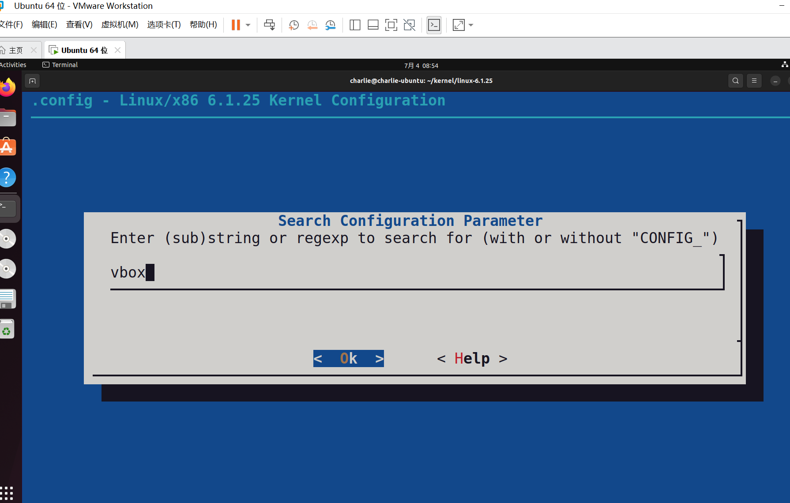
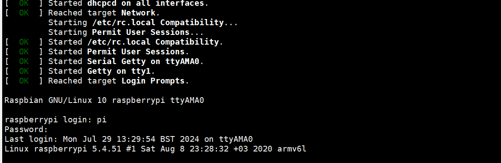
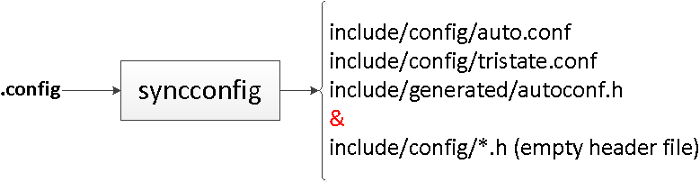

# `Linux Kernel Programming`

## 在我们开始之前...

​	我们需要配置环境！这是一切的开始，但是在那之前，我们需要明确一下我们在这个系列将会做的事情！

- 在你的系统上建立一个可运行的 Linux 内核工作区（作为虚拟机或本地系统）
- 从源代码开始构建 Linux 内核（适用于 x86_64 和基于 ARM 的系统）
- 了解现代 Linux 内核模块（LKM）框架，并利用它编写内核 
  模块
- 编写内核模块（和一些用户空间程序），执行各种任务（例如遍历所有存活的进程/线程，显示用户和内核地址空间的详细信息，动态管理内核内存（以各种方式分配和释放内存），以及启动内核内存不足杀手，同时通过 代码示例）。
- 了解并发（并行）硬件和软件系统工作中固有的复杂性 和软件系统（如 Linux）工作时固有的复杂性，并了解何时以及如何通过各种强大的技术同步内核代码 通过各种强大的锁定和无锁定技术来同步你的内核代码。

#### 目标

1. 配置好Ubuntu虚拟机

#### **选择 Linux 发行版和内核**

​	我们实践的关键是要安装一个最新的、支持良好的 Linux 发行版，以及一个最新的长期 Linux 内核。在软件方面，**长期稳定**（**LTS**）版本可以帮助你免受持续维护和升级的影响，并保证你的环境安全；负责维护 LTS 版本的组织或人员会对产品进行维护，并应用关键和必要的安全和漏洞修复，通常会持续很长时间。有关 LTS Linux 内核的情况将在下文中提及。

简而言之，在这次实践中，我们将选择以下内容：

- Linux 发行版（或发行版） Ubuntu 22.04 LTS（Jammy Jellyfish）；免费安全和维护更新保证至 2027 年 4 月。EOL 为 2032 年 4 月。

- Linux 内核 最新的**LTS** Linux 内核版本（截至本文撰写之时）为**6.1.y**；**生命周期结束日期**（**EOL**）为 2026 年 12 月（内核版本命名法在第 2 章*"从源代码构建 6.x Linux 内核--第 1 部分*"中有详细解释）。

- 虚拟机管理程序： VMware

​	我们的理由很简单：所有这些都是**开源软件**（**OSS**），截至本文撰写之时，其截止日期都足够长，可以确保它们在很长一段时间内都能继续得到支持并保持活力。关于Linux内核版本、术语的确切含义以及实际构建自定义内核的问题，将在接下来的两章中深入介绍；别紧张，我们会讲到的。当然，在本机系统上运行Linux有一定的性能优势。当然，在原生系统上运行 Linux 有一定的性能优势，但在这次实践中，我们不会假设你有一个专用的备用原生 Linux 系统，所以我们会选择在虚拟机上运行 Linux；这样做也更安全，有助于避免令人不快的数据丢失或其他意外情况。事实上，当在内核级别工作时，系统突然崩溃（以及由此产生的数据丢失风险）实际上是司空见惯的事情。对于虚拟机管理程序，我建议使用 Oracle VirtualBox 7.x（或最新的稳定版本）或其他虚拟化软件，如 VMware Workstation。

​	自己选择好自己上心的虚拟机运行程序之后，我们可以继续了。

#### 下面，是软件安装时间

​	当使用典型的 Linux 桌面发行版（例如任何最新的 Ubuntu、Debian、CentOS 或 Fedora Linux 系统）时，默认安装的软件包可能包含系统程序员所需的最小集：本机工具链，其中包括 GCC 编译器以及标头和 make 实用程序/软件包。 什么是工具链和本机工具链？ 要开发软件，我们（显然）需要一个编译器（它将我们的源代码编译为汇编代码和机器代码，以便可以在机器上执行）。 我们通常使用古老的 GCC 编译器（尽管 *Clang* 变得非常流行！）。 但等等，这只是表面层次的观点；不仅仅是编译器——深入研究，还需要许多其他工具。它们包括 make 实用程序、GCC 编译器、标准 (GNU) C 库 (glibc)、binutils 包（链接器和汇编器）、bison 和 flex 解析器/词法分析器、GDB 调试器和 GNU autotools 套件。所有这些工具共同构成了我们所说的 **工具链**，这是开发所必需的。此外，在典型的 Linux 发行版上默认安装的工具链称为*本机工具链*（它从该系统上为同一系统类型的源代码构建软件）。另一方面，我们也有在主机系统上构建软件但旨在在另一个（外部）CPU 架构上运行的工具链（例如在 x86_64 上为 ARM32 构建）；这些被称为 *跨工具链*（我们将在本书后面介绍它们）。

​	是的，我们还需要安装一些重要的开发包，这里给出一种参考：

> 写内核需要的

```
sudo apt install -y bison build-essential flex libncurses5-dev libelf-dev libssl-dev tar util-linux xz-utils
```

> 干其他事情我们需要的：

```
sudo apt install -y \
 bc bpfcc-tools bsdextrautils \
 clang cppcheck cscope curl exuberant-ctags \
 fakeroot flawfinder \
 gnome-system-monitor gnuplot hwloc indent \
 libnuma-dev linux-headers-$(uname -r) linux-tools-$(uname -r) \
 man-db net-tools numactl openjdk-22-jdk openssh-server \
 perf-tools-unstable psmisc python3-distutils \
 rt-tests smem sparse stress sysfsutils \
 tldr-py trace-cmd tree tuna virt-what
```

#### 安装 QEMU 和交叉工具链 

​	在 ARM 机器上尝试的一种方法是实际在基于 ARM[64] 的物理 SBC 上进行；例如，Raspberry Pi 是一个非常受欢迎的选择。在这种情况下，典型的开发工作流程是首先在 x86_64 主机系统上构建 ARM 代码。但要做到这一点，我们需要安装一个交叉工具链 - 一组工具，允许您在一个主机 CPU 上构建软件，以便它在不同的（外部）目标 CPU 上执行。x86_64 主机为 ARM 目标构建程序是一种非常常见的情况，实际上也是我们这里的用例。安装交叉编译器的详细信息稍后会介绍。 通常，尝试的另一种方法是模拟 ARM/Linux 系统 - 这减轻了对硬件的需求！为此，我们建议使用出色的 QEMU（快速模拟器） 项目！

```
sudo apt install qemu-system-arm
```

​	如果您打算编写一个在特定主机系统上编译但必须在另一个（外部）目标系统上执行的 C（或 C++）程序，那么您需要使用所谓的交叉编译器或交叉工具链对其进行编译。例如，在我们的用例中，我们希望在 x86_64 主机上工作（开发代码）。主机甚至可以是 x86_64 客户系统（这很好），但代码必须在 AArch32（ARM32）目标上运行。 我们现在不会进一步深入探讨安装特定交叉工具链的细节，因为我们实际上需要它 - 并在后面的章节中深入解释它。另一件有趣的事情是：您可以使用预构建的（Docker）容器作为多个目标的交叉编译环境；它有助于确保项目中的所有团队都使用相同的交叉编译环境。

​	这里先不介绍，用的时候再说！


## 正文

​	在开始之前，我们需要明白的是：任何一个现代的Linux系统都有三个部分：

1. **一个bootloader**
2. **OS内核**
3. **根文件系统**

当然，还有两个可选的（但是我自己玩玩的时候发现总是少不了的！）

1. Linux设备树：[Linux dts 设备树详解(一) 基础知识 - 小麦大叔 - 博客园 (cnblogs.com)](https://www.cnblogs.com/unclemac/p/12783391.html)
2. initramfs和initrd文件

#### 内核构建的准备工作（**Preliminaries for the kernel build**）

​	我们必须先理解对一些事情

​	首先，Linux 内核及其姊妹项目是完全去中心化的——它是一个虚拟的在线开源社区！我们最接近 Linux 的“办公室”是：Linux 内核（以及几十个相关项目）的管理权掌握在 Linux 基金会 (https://linuxfoundation.org/) 的手中；此外，它还管理 Linux 内核组织，这是一个向公众免费分发 Linux 内核的私人基金会 (https://www.kernel.org/nonprofit.html)。

​	本节将讨论的一些关键点包括：

1. 内核版本或版本号命名法
2. 典型的内核开发工作流程
3. 存储库中不同类型的内核源代码树的存在

#### 理解内核版本或版本号命名法

​	咋看自己的内核版本呢？

```
uname -r
```

```
charlie@charlie-ubuntu:~/Desktop$ uname -r
6.5.0-41-generic
```

​	格式是：`w.x[.y][-z]`

​	w是主版本号，这里我们的主版本是6

​	x是次版本号，显然这里是5

​	我们还有补丁版本！这里是0

​	对于下一个是根据发行版相异的，在这里Ubuntu自己家的补丁版本是41-generic

#### 典型的内核开发工作流程

​	一个常见的误解，尤其是在 Linux 内核刚诞生的时期，**是它以一种临时的方式开发出来的。这完全不是事实！内核开发过程已经发展成为一个运转良好的系统，拥有一个详尽记录的过程，以及对内核贡献者应该知道什么才能很好地使用它的期望。**
​	为了让我们了解一个典型的开发周期，我们假设我们已经将最新的主流 Linux Git 内核树克隆到我们的系统上。
​	如前所述，在撰写本文时，6.1 内核是一个长期稳定 (LTS) 版本，预计 EOL 日期距离现在最远（2026 年 12 月），因此我们将在后面的材料中使用它。那么，它是如何产生的呢？显然，它是从早期的候选版本 (rc) 内核和之前的稳定内核版本演变而来的，在这种情况下，将是 v6.1-rc'n' 内核和之前的稳定 v6.0 内核。让我们通过两种方式查看这种演变：通过命令行和通过内核的 GitHub 页面以图形方式查看

### 构建内核

​	为方便快捷，以下是从源代码构建 Linux 内核所需的主要关键步骤。由于每个步骤的解释都非常详细，您可以参考此摘要以了解整体情况。步骤如下：

1. 通过以下任一选项获取 Linux 内核源代码树：将特定内核源代码树下载为压缩文件克隆（内核）Git 树
2. 将内核源代码树提取到主目录中的某个位置（如果您通过克隆 Git 树获取内核，请跳过此步骤）。
3. 配置：获取内核配置的起点（方法各不相同）。然后对其进行编辑，选择新内核所需的内核支持选项。建议使用make menuconfig。
4. 使用 make [-j'n'] all 构建内核映像、可加载模块和任何需的设备树 Blob（DTB）。这将构建压缩的内核映像 (`arch/<arch>/boot/[b|z|u]{Ii}mage`)、未压缩的内核映像 – vmlinux、System.map 文件、内核模块对象以及任何已配置的 DTB 文件。
5. 使用 `sudo make [INSTALL_MOD_PATH=<prefix-dir>]modules_install` 安装刚刚构建的内核模块（在 x86 上）。此步骤默认将内核模块安装在 /lib/modules/$(uname -r)/ 下（可利用INSTALL_MOD_PATH 环境变量来更改此设置）。
6. 引导加载程序 (x86)：设置 GRUB 引导加载程序和initramfs（之前称为 initrd），映像：`sudo make[INSTALL_PATH=</new/boot/dir>] install`这将在 /boot 下创建并安装 initramfs 或 initrd 映像（可利用INSTALL_PATH 环境变量来更改此设置）。它更新引导加载程序配置文件以启动新内核（第一个条目）。
7. 自定义 GRUB 引导加载程序菜单（可选）。本章是此内核构建主题的两章中的第一章，将介绍步骤 1 至3，并附带大量必需的背景材料。下一章将介绍其余步骤，即步骤 4 至7。因此，让我们从步骤 1 开始。

#### 下载源码

​	我们根据上面的陈述，找到[Index of /pub/linux/kernel/v6.x/](https://mirrors.edge.kernel.org/pub/linux/kernel/v6.x/)

​	下载自己需要的内核

```
wget https://mirrors.edge.kernel.org/pub/linux/kernel/v6.x/linux-6.1.25.tar.xz
```

​	完事了之后记得解压。然后创建一个变量指向之。

```
export path/to/your/linux-source
```


#### 导览我们的内核源码

```
du -h .
```

​	我们可以看到内核源码的大小1.5G！内核的构建是依靠MakeFile来进行的，我们常谈到的这个Makefile说的总是是最顶层的那个Makefile。

```
head Makefile
charlie@charlie-ubuntu:~/kernel/linux-6.1.25$ head Makefile 
# SPDX-License-Identifier: GPL-2.0
VERSION = 6
PATCHLEVEL = 1
SUBLEVEL = 25
EXTRAVERSION =
NAME = Hurr durr I'ma ninja sloth
# TIPS:上面的这个NAME是一个笑话，虽然我几乎总是Get不到
# *DOCUMENTATION*
# To see a list of typical targets execute "make help"
# More info can be located in ./README
```

​	还有其他一些文件

| 文件/目录     | 说明                                                         |
| ------------- | ------------------------------------------------------------ |
| README        | 这里将会给出一些doc在哪里：显然在/Documentation下，可以查看README来获取开发者们自己写的Doc |
| COPYING       | 此文件详细说明了发布内核源代码的许可条款。绝大多数内核源文件都是根据众所周知的 GNU GPL v2（写为 GPL-2.0）许可证发布的。 现代趋势是使用易于 grep 的行业一致 SPDX 许可证标识符。 |
| MAINTAINERS   | FAQ！也就是说我有若干模块的疑问可以找谁                      |
| Makefile      | 我们的KBuild构建系统将会最终生成它！到时候我们实际上就是一发入魂make |
| kernel        | 核心的子系统！他包括了我们操作系统核心的几个概念的构建！比如进程管理，调度，中断，锁等内容！ |
| mm            | 内存管理的部分                                               |
| fs            | 文件系统                                                     |
| block         | 这里是抽象出来的块层：比如说页缓存，通用的块IO，IO调度等，就是在这里是实现的 |
| net           | Linux的网络栈就是在这里实现的                                |
| ipc           | 进程间通信                                                   |
| sound         | 声卡                                                         |
| virt          | 虚拟化部分的代码，这里，KVM就是在这里实现的                  |
| Documentation | 文档                                                         |
| LICENSES      | 协议                                                         |
| arch          | 在这里，Linux完成了架构层次的抽象，是它可以跑在多个平台的重要关键 |
| cert          | 这里生成支持的签命模块                                       |
| crypto        | 在这儿涉及到哦加密的算法                                     |
| drivers       | 驱动                                                         |
| includes      | 包含的是架构特定的代码的includes                             |
| init          | 主要说的是初始化内核部分的代码！在这里是我们的Main函数       |
| io_uring      | 全新的IO框架                                                 |
| lib           | 在这儿实现了我们常用的lib的函数，比如说压缩，位图，数学计算，字符串，常见的算法等 |
| rust          | R U S T                                                      |
| samples       | 一些实例                                                     |
| scripts       | 这里是辅助内核构建和调试的一些脚本                           |
| security      | LSM（Linux安全模块）和MAC框架                                |
| tools         | 各种用户模式工具的源代码都存放在这里，大部分是与内核“紧密耦合”的应用程序或脚本，因此需要在特定的内核代码库内。Perf（一种现代 CPU 分析工具）、eBPF 工具和一些跟踪工具就是很好的例子。 |
| usr           | 生成initramfs的地方，他将会在内核初始化的时候执行用户层的一些事情 |

#### 一些重点

**README**：此文件还提到了有关构建和运行内核的最低可接受软件版本的信息，请参阅文档：Documentation/process/changes.rst。有趣的是，内核提供了一个 Awk 脚本 (scripts/ver_linux)，该脚本打印其运行的系统上当前软件的版本，帮助您检查已安装的版本是否可接受。

**内核许可**：不必纠结于法律细节（不用说，我不是律师），以下是该事情的实用本质。由于内核是在 GNU GPL-2.0 许可证下发布的（**GNU GPL 是 GNU 通用**公共许可证），因此任何直接使用内核代码库的项目都会自动属于此许可证。这是 GPL-2.0 的“衍生作品”属性。从法律上讲，这些项目或产品现在必须根据相同的许可条款发布其内核软件。从实际情况来看，实际情况要模糊得多；许多在 Linux 内核上运行的商业产品确实包含专有的用户和/或内核空间代码。它们通常通过重构内核（最常见的是设备驱动程序）以可加载内核模块 (LKM) 格式工作来实现这一点。可以在 *双重许可* 模式下发布内核模块 (LKM)。LKM 是 *第 4 章 *编写您的第一个内核模块 - 第 1 部分* 和 *第 5 章 *编写您的第一个内核模块 - 第 2 部分* 的主题，我们在那里介绍了一些有关内核模块许可的信息。有些人更喜欢专有许可证，设法在未根据 GPL-2.0 条款许可的内核模块中发布他们的内核代码；从技术上讲，这也许是可能的，但至少被认为是非常反社会的，甚至可能越界为非法。感兴趣的人可以在本章的 *进一步**阅读* 文档中找到有关许可的更多链接。

**维护者**：只需查看内核源代码树根目录中的此文件！有趣的东西……为了说明它有多有用，让我们运行一个辅助 Perl 脚本：scripts/get_maintainer.pl。请注意，从学术上讲，它只能在 Git 树上运行。在这里，我们要求脚本通过 -f 开关指定文件或目录来显示内核 CPU 任务调度代码库的维护者：

**Linux arch (CPU) 端口**：从 6.1 开始，Linux 操作系统已移植到所有这些处理器。大多数都有 MMU，您可以在 arch/ 文件夹下看到特定于 arch 的代码，每个目录代表一个特定的 CPU 体系结构：事实上，在交叉编译时，ARCH 环境变量设置为其中一个文件夹的名称，以便为该体系结构编译内核。例如，在为 AArch64 构建目标“foo”时，我们通常会执行类似 make ARCH=arm64 CROSS_COMPILE=<...> foo 的操作

**io_uring**：毫不夸张地说，io_uring 和 *eBPF* 被认为是现代 Linux 系统提供的两个新的“神奇功能”（这里的 io_uring 文件夹是该功能的内核支持）！数据库/网络人员对 io_uring 着迷的原因很简单：性能。该框架在现实世界的高 I/O 情况下显著提高了磁盘和网络工作负载的性能。其共享（在用户和内核空间之间）环形缓冲区架构、零拷贝模式以及与典型的旧 AIO 框架相比使用更少的系统调用的能力（包括轮询模式操作）使其成为令人羡慕的功能。因此，为了让您的用户空间应用程序走上真正快速的 I/O 路径，请查看 io_uring。本章的 *进一步阅读* 部分包含有用的链接。

内核中的 **Rust**：是的，确实，关于 Rust 编程语言的基本支持已进入 Linux 内核（首先是 6.0）这一事实，人们大肆宣传。为什么？Rust 确实比我们古老的 C 语言具有众所周知的优势：**内存安全**。事实上，即使在今天，用 C/C++ 编写的代码（无论是操作系统/驱动程序还是用户空间应用程序）最大的编程相关安全问题之一，其根源都是内存安全问题（例如众所周知的 **BoF**（**缓冲区溢出**）缺陷）。当开发人员在其 C/C++ 代码中生成内存损坏缺陷（错误！）时，就会发生这些问题。这会导致软件中的漏洞，聪明的黑客总是在寻找和利用这些漏洞！话虽如此，至少到目前为止，Rust 在内核中的应用非常少——没有核心代码使用它。内核中当前的 Rust 支持是为了将来支持用 Rust 编写模块。（当然，这里有一些示例 Rust 代码：samples/rust/。）内核中 Rust 的使用肯定会随着时间的推移而增加……

### 配置内核

​	最为关键的一步！要构建内核，无论如何您都必须执行内核配置步骤。即使您觉得不需要对现有或默认配置进行任何更改，也必须至少将此步骤作为构建过程的一部分运行一次。否则，此处自动生成的某些标头将会丢失，并在以后引起问题。至少，应该执行 make old[def]config 步骤。这将设置内核配置为现有系统的配置，并仅针对任何新选项回答用户请求的配置选项。

#### 关于Kconfig和Kbuild的最快理解

​	Linux 内核用于配置内核的基础架构称为 Kconfig 系统，而构建它则需要 Kbuild 基础架构。无需深入研究细节，Kconfig + Kbuild 系统通过将工作分离为逻辑流，将复杂的内核配置和构建过程联系在一起： 

- Kconfig – 配置内核的基础架构；它由两个逻辑部分组成： 
  - Kconfig 语言：用于指定各种 Kconfig[.\*] 文件中的语法，这些文件实际上指定了选择内核配置选项的“菜单”。 
  - Kconfig 解析器：智能解析 Kconfig[.*] 文件、找出依赖项和自动选择并生成菜单系统的工具。其中包括常用的 make menuconfig，它在内部调用 mconf 工具（代码位于 scripts/kconfig 下）。 

- Kbuild – 将源代码构建为内核二进制组件的支持基础架构。它主要使用递归 make 样式构建，源自 内核顶层 Makefile，然后依次递归解析嵌入在源代码子目录中的 数百个 Makefile 的内容

| 构建                | 简单说明                                                     |
| ------------------- | ------------------------------------------------------------ |
| Kconfig: CONFIG_FOO | 每一个可以配置的选项FOO使用CONFIG_FOO表达，一般而言有三个选项：<br>- y = yes :在构建中包含进入特性<br>- m=module: 以一个单独的kobject模块进入内核<br>n = no:不包含 |
| Kconfig: Kconfig.*  | 这是定义 CONFIG_FOO 符号的地方。 Kconfig 语法指定其类型（布尔、三态、 [alpha]numeric 等）和依赖树。 此外，对于基于菜单的配置 UI（通过 make [menu\|g\|x]config实现的 |
| Kbuild              | Kbuild 系统使用递归 make Makefile 方法。内核源代码树根目录中的 Makefile 称为顶级 Makefile，通常每个子文件夹中都有一个 Makefile 来在那里构建源代码。 6.1 内核源代码总共有 2,700 多个 Makefile！ |
| .config             | 最终，内核配置归结为这个文件；.config 是最终的内核配置文件。它以简单的 ASCII 文本文件的形式生成并存储在内核源代码树根文件夹中。请妥善保管，因为它是您产品的关键部分。请注意，配置文件名可以通过环境变量KCONFIG_CONFIG 覆盖 |

​	现在我们已经了解了一些细节，下面是它们如何结合在一起并工作的简化版本：
​	首先，用户（您）使用 Kconfig 提供的某种菜单系统配置内核。
​	通过此菜单系统 UI 选择的内核配置指令被写入几个自动生成的标头和最终的 .config 文件中，使用CONFIG_FOO={y|m} 语法，或者，CONFIG_FOO 被简单地注释掉（暗示“根本不构建 FOO”）。接下来，Kbuild 每个组件的 Makefile（通过内核顶层 Makefile 调用）通常指定一个指令 FOO，如下所示：

```
obj-$(CONFIG_FOO) += FOO.o
```

​	FOO 组件可以是任何东西 - 核心内核功能、设备驱动程序、文件系统、调试指令等等。回想一下，CONFIG_FOO 的值可能是 y、m 或不存在；因此，构建要么将组件 FOO 构建到内核中（当其值为 y 时），要么将其构建为模块（当其值为 m时）！如果注释掉，它根本就不会被构建，很简单。实际上，在构建时，上述 Makefile 指令会针对给定的内核组件 FOO 展开为以下三个之一：

```
obj-y += FOO.o # 将功能 FOO 构建到内核映像中
obj-m += FOO.o # 将功能 FOO 构建为离散内核 m
<如果 CONFIG_FOO 为空> # 不构建功能 FOO
```

​	不用说，先尝尝味道：

```
$ cat Kconfig
…
obj-y += init/
obj-y += usr/
obj-y += arch/$(SRCARCH)/
obj-y += $(ARCH_CORE)
obj-y += kernel/
[ … ]
obj-$(CONFIG_BLOCK) += block/
obj-$(CONFIG_IO_URING) += io_uring/
obj-$(CONFIG_RUST) += rust/
obj-y += $(ARCH_LIB)
[ … ]
obj-y += virt/
obj-y += $(ARCH_DRIVERS)
```


有趣！我们可以清楚地看到顶级 Makefile 将如何进入其他目录，其中大多数被设置为 obj-y；实际上，将其构建进去（在少数情况下，它会被参数化，根据用户选择选项的方式变为 obj-y 或 obj-m）。很好。现在让我们继续；关键是要获得一个有效的.config 文件。我们该怎么做？我们以迭代方式进行。我们从“默认”配置（下一节的主题）开始，然后小心翼翼地逐步完成自定义配置。

#### 先聊怎么获取默认的配置

​	那么，您如何决定最初的内核配置呢？存在几种技术；一些常见的技术如下：

1. 不指定任何内容；Kconfig 将引入默认内核配置（因为所有内核配置都有默认值）
2. 使用现有发行版的内核配置
3. 根据当前加载到内存中的内核模块构建自定义配置

​	第一种方法的优点是简单。内核将处理细节，为您提供默认配置。缺点是默认配置可能非常大（在为基于 x86_64 的桌面或服务器类型系统构建 Linux 时就是这种情况）；默认情况下会打开大量选项，以防万一您需要它，这会使构建时间非常长，内核映像大小非常大。当然，通常情况下，您需要手动将内核配置为所需的设置。
​	这带来了一个问题，默认内核配置存储在哪里？如果未指定任何配置，Kconfig 系统将使用优先级列表回退方案来检索默认配置。优先级列表及其顺序（第一个优先级最高）如下：

- .config
- /lib/modules/$(uname -r)/.config
- /etc/kernel-config
- /boot/config-$(uname -r)
- ARCH_DEFCONFIG（如果已定义）
- arch/${ARCH}/defconfig

​	从列表中，您可以看到 Kconfig 系统首先检查内核源代码树根目录中是否存在 .config 文件；如果找到，它会从那里获取所有配置值。如果不存在，它接下来会查看路径 /lib/modules/$(uname -r)/.config。如果找到，则将使用该文件中找到的值作为默认值。如果没有找到，它会检查前面优先级列表中的下一个，依此类推……

#### 获得内核配置的良好起点

​	这给我们带来了一个非常重要的点：虽然玩内核配置作为学习练习是可以的，但对于生产系统来说，至关重要的是，您必须将自定义配置建立在经过验证的（已知、经过测试且有效的）内核配置上。

​	在这里，为了帮助您理解选择内核配置有效起点的细微差别，我们将看到三种获取典型内核配置起点的方法：

1. 首先，一种简单（但不是最优）的方法，您只需模拟现有发行版的内核配置。

2. 接下来，一种更优化的方法，您可以根据现有系统的内存内核模块来配置内核。这是 localmodconfig 方法。

3. 最后，介绍一下典型嵌入式 Linux 项目应遵循的方法。


​	让我们更详细地研究一下这些方法。在配置您在前两个步骤中下载和提取的内核方面，现在不要做任何事情；阅读以下部分，然后在开始使用 localmodconfig 方法部分，我们将让您真正开始。

#### 使用分发配置作为起点的内核配置

​	使用此方法的典型目标系统是 x86_64 桌面或服务器Linux 系统。让我们将内核配置为所有默认值：

```
make mrproper # 清空所有的config
```

​	下一步就是生成默认的配置！

```
make defconfig
```

```
charlie@charlie-ubuntu:~/kernel/linux-6.1.25$ make defconfig
  HOSTCC  scripts/basic/fixdep
  HOSTCC  scripts/kconfig/conf.o
  HOSTCC  scripts/kconfig/confdata.o
  HOSTCC  scripts/kconfig/expr.o
  LEX     scripts/kconfig/lexer.lex.c
  YACC    scripts/kconfig/parser.tab.[ch]
  HOSTCC  scripts/kconfig/lexer.lex.o
  HOSTCC  scripts/kconfig/menu.o
  HOSTCC  scripts/kconfig/parser.tab.o
  HOSTCC  scripts/kconfig/preprocess.o
  HOSTCC  scripts/kconfig/symbol.o
  HOSTCC  scripts/kconfig/util.o
  HOSTLD  scripts/kconfig/conf
*** Default configuration is based on 'x86_64_defconfig'
#
# configuration written to .config
#
```

​	他会生成默认的.config文件！

```
charlie@charlie-ubuntu:~/kernel/linux-6.1.25$  ls -l .config
-rw-rw-r-- 1 charlie charlie 136414  7月  4 08:13 .config
```

#### 通过 localmodconfig 方法调整内核配置 

​	使用此方法的典型目标系统是（通常为 x86_64）桌面或服务器 Linux 系统。 第二种方法比前一种方法更优化 - 当目标是从基于现有运行系统的内核配置开始时，这种方法很适合使用，因此（通常）与桌面或服务器 Linux 系统上的典型默认配置相比相对紧凑。 在这里，我们通过简单地将 lsmod 的输出重定向到临时文件，然后将该文件提供给构建，为 Kconfig 系统提供当前在系统上运行的内核模块的快照。这可以通过以下方式实现：

```
lsmod > /tmp/lsmod.now
cd ${LKP_KSRC}
make LSMOD=/tmp/lsmod.now localmodconfig
```

​	lsmod是列出当前系统中所有可以使用的模块文件

#### 使用make help查看

```
Cleaning targets:
  clean		  - Remove most generated files but keep the config and
                    enough build support to build external modules
  mrproper	  - Remove all generated files + config + various backup files
  distclean	  - mrproper + remove editor backup and patch files

Configuration targets:
  config	  - Update current config utilising a line-oriented program
  nconfig         - Update current config utilising a ncurses menu based program
  menuconfig	  - Update current config utilising a menu based program
  xconfig	  - Update current config utilising a Qt based front-end
  gconfig	  - Update current config utilising a GTK+ based front-end
  oldconfig	  - Update current config utilising a provided .config as base
  localmodconfig  - Update current config disabling modules not loaded
                    except those preserved by LMC_KEEP environment variable
  localyesconfig  - Update current config converting local mods to core
                    except those preserved by LMC_KEEP environment variable
  defconfig	  - New config with default from ARCH supplied defconfig
  savedefconfig   - Save current config as ./defconfig (minimal config)
  allnoconfig	  - New config where all options are answered with no
  allyesconfig	  - New config where all options are accepted with yes
  allmodconfig	  - New config selecting modules when possible
  alldefconfig    - New config with all symbols set to default
  randconfig	  - New config with random answer to all options
  yes2modconfig	  - Change answers from yes to mod if possible
  mod2yesconfig	  - Change answers from mod to yes if possible
  mod2noconfig	  - Change answers from mod to no if possible
  listnewconfig   - List new options
  helpnewconfig   - List new options and help text
  olddefconfig	  - Same as oldconfig but sets new symbols to their
                    default value without prompting
  tinyconfig	  - Configure the tiniest possible kernel
  testconfig	  - Run Kconfig unit tests (requires python3 and pytest)

Other generic targets:
  all		  - Build all targets marked with [*]
* vmlinux	  - Build the bare kernel
* modules	  - Build all modules
  modules_install - Install all modules to INSTALL_MOD_PATH (default: /)
  dir/            - Build all files in dir and below
  dir/file.[ois]  - Build specified target only
  dir/file.ll     - Build the LLVM assembly file
                    (requires compiler support for LLVM assembly generation)
  dir/file.lst    - Build specified mixed source/assembly target only
                    (requires a recent binutils and recent build (System.map))
  dir/file.ko     - Build module including final link
  modules_prepare - Set up for building external modules
  tags/TAGS	  - Generate tags file for editors
  cscope	  - Generate cscope index
  gtags           - Generate GNU GLOBAL index
  kernelrelease	  - Output the release version string (use with make -s)
  kernelversion	  - Output the version stored in Makefile (use with make -s)
  image_name	  - Output the image name (use with make -s)
  headers_install - Install sanitised kernel headers to INSTALL_HDR_PATH
                    (default: ./usr)

Static analysers:
  checkstack      - Generate a list of stack hogs
  versioncheck    - Sanity check on version.h usage
  includecheck    - Check for duplicate included header files
  export_report   - List the usages of all exported symbols
  headerdep       - Detect inclusion cycles in headers
  coccicheck      - Check with Coccinelle
  clang-analyzer  - Check with clang static analyzer
  clang-tidy      - Check with clang-tidy

Tools:
  nsdeps          - Generate missing symbol namespace dependencies

Kernel selftest:
  kselftest         - Build and run kernel selftest
                      Build, install, and boot kernel before
                      running kselftest on it
                      Run as root for full coverage
  kselftest-all     - Build kernel selftest
  kselftest-install - Build and install kernel selftest
  kselftest-clean   - Remove all generated kselftest files
  kselftest-merge   - Merge all the config dependencies of
		      kselftest to existing .config.

Rust targets:
  rustavailable   - Checks whether the Rust toolchain is
		    available and, if not, explains why.
  rustfmt	  - Reformat all the Rust code in the kernel
  rustfmtcheck	  - Checks if all the Rust code in the kernel
		    is formatted, printing a diff otherwise.
  rustdoc	  - Generate Rust documentation
		    (requires kernel .config)
  rusttest        - Runs the Rust tests
                    (requires kernel .config; downloads external repos)
  rust-analyzer	  - Generate rust-project.json rust-analyzer support file
		    (requires kernel .config)
  dir/file.[os]   - Build specified target only
  dir/file.rsi    - Build macro expanded source, similar to C preprocessing.
                    Run with RUSTFMT=n to skip reformatting if needed.
                    The output is not intended to be compilable.
  dir/file.ll     - Build the LLVM assembly file

Userspace tools targets:
  use "make tools/help"
  or  "cd tools; make help"

Kernel packaging:
  rpm-pkg             - Build both source and binary RPM kernel packages
  binrpm-pkg          - Build only the binary kernel RPM package
  deb-pkg             - Build both source and binary deb kernel packages
  bindeb-pkg          - Build only the binary kernel deb package
  snap-pkg            - Build only the binary kernel snap package
                        (will connect to external hosts)
  dir-pkg             - Build the kernel as a plain directory structure
  tar-pkg             - Build the kernel as an uncompressed tarball
  targz-pkg           - Build the kernel as a gzip compressed tarball
  tarbz2-pkg          - Build the kernel as a bzip2 compressed tarball
  tarxz-pkg           - Build the kernel as a xz compressed tarball
  tarzst-pkg          - Build the kernel as a zstd compressed tarball
  perf-tar-src-pkg    - Build perf-6.1.25.tar source tarball
  perf-targz-src-pkg  - Build perf-6.1.25.tar.gz source tarball
  perf-tarbz2-src-pkg - Build perf-6.1.25.tar.bz2 source tarball
  perf-tarxz-src-pkg  - Build perf-6.1.25.tar.xz source tarball
  perf-tarzst-src-pkg - Build perf-6.1.25.tar.zst source tarball

Documentation targets:
 Linux kernel internal documentation in different formats from ReST:
  htmldocs        - HTML
  latexdocs       - LaTeX
  pdfdocs         - PDF
  epubdocs        - EPUB
  xmldocs         - XML
  linkcheckdocs   - check for broken external links
                    (will connect to external hosts)
  refcheckdocs    - check for references to non-existing files under
                    Documentation
  cleandocs       - clean all generated files

  make SPHINXDIRS="s1 s2" [target] Generate only docs of folder s1, s2
  valid values for SPHINXDIRS are: PCI RCU accounting admin-guide arc arm arm64 block bpf cdrom core-api cpu-freq crypto dev-tools devicetree doc-guide driver-api fault-injection fb filesystems firmware-guide fpga gpu hid hwmon i2c ia64 iio infiniband input isdn kbuild kernel-hacking leds livepatch locking loongarch m68k maintainer mhi mips misc-devices mm netlabel networking nios2 openrisc parisc pcmcia peci power powerpc process riscv rust s390 scheduler scsi security sh sound sparc spi staging target timers tools trace translations usb userspace-api virt w1 watchdog x86 xtensa

  make SPHINX_CONF={conf-file} [target] use *additional* sphinx-build
  configuration. This is e.g. useful to build with nit-picking config.

  make DOCS_THEME={sphinx-theme} selects a different Sphinx theme.

  make DOCS_CSS={a .css file} adds a DOCS_CSS override file for html/epub output.

  Default location for the generated documents is Documentation/output

Architecture specific targets (x86):
* bzImage		- Compressed kernel image (arch/x86/boot/bzImage)
  install		- Install kernel using (your) ~/bin/installkernel or
			  (distribution) /sbin/installkernel or install to 
			  $(INSTALL_PATH) and run lilo

  fdimage		- Create 1.4MB boot floppy image (arch/x86/boot/fdimage)
  fdimage144		- Create 1.4MB boot floppy image (arch/x86/boot/fdimage)
  fdimage288		- Create 2.8MB boot floppy image (arch/x86/boot/fdimage)
  hdimage		- Create a BIOS/EFI hard disk image (arch/x86/boot/hdimage)
  isoimage		- Create a boot CD-ROM image (arch/x86/boot/image.iso)
			  bzdisk/fdimage*/hdimage/isoimage also accept:
			  FDARGS="..."  arguments for the booted kernel
			  FDINITRD=file initrd for the booted kernel

  kvm_guest.config	- Enable Kconfig items for running this kernel as a KVM guest
  xen.config		- Enable Kconfig items for running this kernel as a Xen guest
  x86_debug.config	- Enable tip tree debugging options for testing

  i386_defconfig              - Build for i386
  x86_64_defconfig            - Build for x86_64

  make V=0|1 [targets] 0 => quiet build (default), 1 => verbose build
  make V=2   [targets] 2 => give reason for rebuild of target
  make O=dir [targets] Locate all output files in "dir", including .config
  make C=1   [targets] Check re-compiled c source with $CHECK
                       (sparse by default)
  make C=2   [targets] Force check of all c source with $CHECK
  make RECORDMCOUNT_WARN=1 [targets] Warn about ignored mcount sections
  make W=n   [targets] Enable extra build checks, n=1,2,3 where
		1: warnings which may be relevant and do not occur too often
		2: warnings which occur quite often but may still be relevant
		3: more obscure warnings, can most likely be ignored
		e: warnings are being treated as errors
		Multiple levels can be combined with W=12 or W=123

Execute "make" or "make all" to build all targets marked with [*] 
For further info see the ./README file
```

#### 使用menuconfig进行配置

​	好的，太好了，我们现在有一个通过 localmodconfig Makefile 目标为我们生成的初始内核配置文件 (.config)，如上一节中详细所示，这是一个很好的起点。通常，我们现在进一步微调我们的内核配置。一种实现此目的的方法（实际上是推荐的方法）是通过 menuconfig Makefile 目标。此目标让 Kbuild 系统生成一个非常复杂的基于 C 的程序可执行文件 (scripts/kconfig/mconf)，它向最终用户呈现一个简洁的基于菜单的 UI。这是图 2.8 中的步骤 2。在下面的输出块中，当（在我们的内核源代码树的根目录中）我们第一次调用该命令时，Kbuild 系统会构建 mconf 可执行文件并调用它：

```
make menuconfig
  UPD     scripts/kconfig/mconf-cfg
  HOSTCC  scripts/kconfig/mconf.o
  HOSTCC  scripts/kconfig/lxdialog/checklist.o
  HOSTCC  scripts/kconfig/lxdialog/inputbox.o
  HOSTCC  scripts/kconfig/lxdialog/menubox.o
  HOSTCC  scripts/kconfig/lxdialog/textbox.o
  HOSTCC  scripts/kconfig/lxdialog/util.o
  HOSTCC  scripts/kconfig/lxdialog/yesno.o
  HOSTLD  scripts/kconfig/mconf

```


​	接下来，Kconfig+Kbuild 开源框架通过其 UI 为用户提供线索。

​	您经常会看到菜单前面带有符号（如 [*]、<>、-*-、() 等）；这些符号及其含义如下： 

- [.]：内核功能，布尔选项。它要么是 On，要么是 Off；显示的‘.’将被替换为 * 或空格： 
  - [*]：On，功能已编译并内置到内核映像中 (y) 
  - [ ]：Off，根本没有构建 (n) 

- <.>：可能处于三种状态之一的功能。这称为三态；。显示的将替换为 \*、M 或空格)：
  -  <\*>：开启，功能已在内核映像中编译和构建 (y) 
  -  \<M>：模块，功能已编译并构建为内核模块 (LKM) (m)
  -  < >：关闭，根本不构建 (n) 

- {.}：此配置选项存在依赖项；因此，需要将其构建或编译为模块 (m) 或内核映像 (y)。 
- -*-：依赖项要求将此项目编译为 (y)。 
- (...)：提示：需要字母数字输入。选中此选项时按 Enter 键，将出现提示框。 
- <菜单名称> --->：随后出现子菜单。在此项目上按 Enter 键可导航至子菜单

注意：最好不要尝试手动编辑 .config 文件。您可能不知道有几个相互依赖关系；请始终使用 Kbuild 菜单系统（我们建议使用 make menuconfig）来编辑它。话虽如此，还有一种非交互式方式可以通过脚本进行编辑。我们稍后会了解这一点。不过，使用 make menuconfig UI 确实是最好的方式

#### 在 menuconfig UI 中搜索 

​	如果在运行 make menuconfig 时，您正在寻找 特定的内核配置选项，但很难找到它，该怎么办？没问题：menuconfig UI 系统具有搜索配置参数 功能。就像著名的 vi 编辑器一样，按 /（正斜杠）键弹出搜索对话框，然后输入 您的搜索词，前面可以带或不带 CONFIG_，然后选择 < Ok > 按钮继续。 以下几张屏幕截图显示了搜索对话框和结果对话框。 例如，我们搜索了术语 vbox：



#### 查找配置中的差异

在要写入 .config 内核配置文件时，Kconfig系统会检查它是否已经存在，如果存在，它会使用名称 .config.old 进行备份。了解这一点后，我们始终可以区分两者，以查看我们刚刚进行的更改。但是，使用典型的 diff 实用程序执行此操作会使差异很难解释。内核提供了一种更好的方法，即专门用于执行此操作的基于控制台的脚本。内核源代码树中的scripts/diffconfig 脚本对此很有用。将 --help 参数传递给它以查看使用屏幕。让我们尝试一下

```
charlie@charlie-ubuntu:~/kernel/linux-6.1.25$ scripts/diffconfig .config .config.old
 IKCONFIG y -> m
```

#### 使用内核的配置脚本查看/编辑 内核配置 

​	有时，需要直接编辑或查询内核配置， 检查或修改给定的内核配置。我们已经学会了通过make menuconfig UI 来实现这一点。在这里，我们了解到也许有一种更简单、更重要的是非交互式且可编写脚本的方法来实现相同的目的 - 通过内核源中的 Bash 脚本：scripts/config。 在没有任何参数的情况下运行它将导致显示一个有用的帮助屏幕；请查看它。一个示例将有助于了解它的用法。 查找当前内核配置的能力非常有用，所以让我们确保这些内核配置已打开。仅针对此示例，让我们首先明确禁用相关内核配置，然后启用它们：

```
charlie@charlie-ubuntu:~/kernel/linux-6.1.25$ scripts/config --disable IKCONFIG --disable IKCONFIG_PROC
charlie@charlie-ubuntu:~/kernel/linux-6.1.25$ grep IKCONFIG .config
# CONFIG_IKCONFIG is not set
# CONFIG_IKCONFIG_PROC is not set
charlie@charlie-ubuntu:~/kernel/linux-6.1.25$ scripts/config --enable IKCONFIG --enable IKCONFIG_PROC
charlie@charlie-ubuntu:~/kernel/linux-6.1.25$ grep IKCONFIG .config
CONFIG_IKCONFIG=y
CONFIG_IKCONFIG_PROC=y
```

#### 其他提示 – 内核配置

关于内核配置，下面是一些其他提示：

使用 VirtualBox 为虚拟机构建 x86 内核时（就像我们在这里一样），配置内核时，您可能会发现设置CONFIG_ISO9660_FS=y 很有用；它随后允许 VirtualBox 让客户机安装客户机附加虚拟 CD 并安装（非常有用！）客户机附加。通常，这些内容可以提高虚拟机的性能，并允许更好的图形、USB 功能、剪贴板和文件共享等。

​	在构建自定义内核时，我们有时想要编写/构建 eBPF程序（此处未介绍的高级主题）或类似的东西。为了这样做，需要一些内核标头。您可以通过设置内核配置 CONFIG_IKHEADERS=y（或设置为 m；从 5.2 开始）来明确确保这一点。这会导致 /sys/kernel/kheaders.tar.xz 文件可用，该文件可以在其他地方提取以提供标头。

- 此外，谈到 eBPF，现代内核能够生成一些调试信息，称为 BPF 类型格式 (BTF)元数据。可以通过选择内核配置CONFIG_DEBUG_INFO_BTF=y 来启用此功能。这还需要安装 pahole 工具。有关 BTF 元数据的更多信息，请参阅此处的官方内核文档：https://www.kernel.org/doc/html/next/bpf/btf.html。
- 现在，当此选项打开时，另一个内核配置 –CONFIG_MODULE_ALLOW_BTF_MISMATCH – 在构建内核模块时变得相关。这是我们在以下两章中深入讨论的主题。如果启用了 CONFIG_DEBUG_INFO_BTF，最好将后一个配置设置为 Yes，否则，如果 BTF 元数据在加载时不匹配，则可能不允许加载模块。

​	接下来，内核构建至少在理论上不会产生任何错误甚至警告。为确保这一点，要将警告视为错误，请设置 CONFIG_WERROR=y。
在现在熟悉的 make menuconfig UI 中，它位于常规设置 | 将警告编译为错误，默认情况下通常处于关闭状态。
这里有一个有趣的脚本：scripts/get_feat.pl；它的帮助屏幕显示了如何利用它来列出机器或给定架构的内核功能支持矩阵。例如，要查看 AArch64 的内核功能支持矩阵，请执行以下操作：

```
scripts/get_feat.pl --arch arm64 ls
```

​	接下来，Linux 内核驱动程序数据库 (LKDDb) 项目站点提供了一个非官方的“数据库”，其中包含所有可用的内核配置以及它们所支持的内核版本：https://cateee.net/lkddb/web-lkddb/。
​	内核启动配置：在启动时，您始终可以通过强大的内核命令行参数覆盖某些内核功能。它们在此处有详尽的文档：
https://www.kernel.org/doc/html/latest/admin-guide/kernelparameters.html。虽然这非常有用，但有时我们需要传递更多参数作为键值对，本质上是 key=value 的形式，以扩展内核命令行。这可以通过填充一个名为启动配置的小型内核配置文件来完成。此启动配置功能取决于内核配置的 BOOT_CONFIG 是否为y。它位于常规设置菜单下，通常默认启用。它可以通过两种方式使用：将启动配置附加到 initrd 或initramfs 映像（我们将在下一章中介绍 initrd）或将启动配置嵌入到内核本身。对于后者，您需要创建启动配置文件，在内核配置中传递指令CONFIG_BOOT_CONFIG_EMBED_FILE="x/y/z"，然后重建内核。请注意，内核命令行参数将优先于启动配置参数。在启动时，如果启用并使用，启动配置参数可通过 /proc/bootconfig 查看。
​	有关启动配置的详细信息位于官方内核文档中：https://elixir.bootlin.com/linux/v6.1.25/source/Documentation/admin-guide/bootconfig.rst。您肯定会遇到许多其他有用的内核配置设置和脚本，包括用于强化内核的设置和脚本；请密切关注。

好了！您现在已经完成了 Linux 内核构建的前三个步骤——相当不错。当然，我们将在下一章中完成内核构建过程的其余四个步骤。我们将以最后一节结束本章，介绍如何学习另一项有用的技能——如何自定义内核 UI 菜单。

### 编译内核

​	我们将继续构建内核，介绍构建内核的其余四个步骤。首先，当然，我们将构建内核（步骤 4）。然后，您将学习如何正确安装作为构建的一部分生成的内核模块（步骤 5）。接下来，我们将运行一个简单的命令来设置 GRUB（Grand Unified Bootloader）引导加载程序并生成 initramfs（或 initrd）映像（步骤 6）。我们还讨论了使用 initramfs 映像的动机及其生成方式。然后介绍一些有关配置 GRUB 引导加载程序（用于 x86）的详细信息（步骤 7）。 在本章结束时，我们将使用新的内核映像启动系统并验证它是否按预期构建。然后，我们将学习如何为外部架构（对于 AArch 32/64，所讨论的主板是著名的 Raspberry Pi）交叉编译 Linux 内核。 简而言之，本章将涵盖以下领域： 

- 步骤 4 – 构建内核映像和模块 
- 步骤 5 – 安装内核模块 
- 步骤 6 – 生成 initramfs 映像和引导加载程序设置，了解 initramfs 框架 
- 步骤 7 – 自定义 GRUB 引导加载程序 验证新内核的配置

#### 步骤 4 – 构建内核映像和模块 

​	很简单，当我们完成了.config文件的配置之后，直接干make all就行：

```
Other generic targets:
  all		  - Build all targets marked with [*]
* vmlinux	  - Build the bare kernel
* modules	  - Build all modules
  modules_install - Install all modules to INSTALL_MOD_PATH (default: /)
  dir/            - Build all files in dir and below
  dir/file.[ois]  - Build specified target only
  dir/file.ll     - Build the LLVM assembly file
                    (requires compiler support for LLVM assembly generation)
  dir/file.lst    - Build specified mixed source/assembly target only
                    (requires a recent binutils and recent build (System.map))
  dir/file.ko     - Build module including final link
  modules_prepare - Set up for building external modules
  tags/TAGS	  - Generate tags file for editors
  cscope	  - Generate cscope index
  gtags           - Generate GNU GLOBAL index
  kernelrelease	  - Output the release version string (use with make -s)
  kernelversion	  - Output the version stored in Makefile (use with make -s)
  image_name	  - Output the image name (use with make -s)
  headers_install - Install sanitised kernel headers to INSTALL_HDR_PATH
                    (default: ./usr)
```

​	好的，那么需要注意的是：执行 make all 将使我们构建前面的三个目标（以 * 符号为前缀的目标）；它们是什么意思？
让我们看看：

- vmlinux 与未压缩的内核映像文件的名称匹配。模块目标意味着所有标记为 m（代表模块）的内核配置选项都将在内核源树中构建为内核模块（.ko 文件）（有关内核模块究竟是什么以及如何编写内核模块的详细信息是以下两章的主题）。
- bzImage 是特定于体系结构的内核映像文件。在 x86[_64] 系统上，这是压缩内核映像的名称 - 引导加载程序实际上会将其加载到 RAM 中，在内存中解压缩并启动；实际上，它是（压缩的）内核映像文件。

​	因此，常见问题解答：如果 bzImage 是我们用于引导和初始化系统的实际内核映像文件，那么 vmlinux 是做什么用的？请注意，vmlinux 是未压缩的内核映像文件。它可能很大（甚至非常大，因为存在调试版本期间生成的内核符号）。虽然我们从不通过 vmlinux 启动，但它仍然很重要 - 事实上是无价的。请保留它以用于内核调试目的

​	现在，有了 kbuild 系统（内核使用），只需运行 make 就等于 make all。 现代 Linux 内核代码库非常庞大。目前估计，最近的内核有大约 2500 万到 3000 万行源代码（SLOC）！因此，构建内核确实是一项非常耗费内存和 CPU 的工作。事实上，有些人将内核构建用作压力测试！（您还应该意识到，在特定的构建运行期间，并非所有代码行都会被编译）。现代 make 实用程序功能强大且具有多进程能力。我们可以要求它生成多个进程来并行处理构建的不同（不相关）部分，从而提高吞吐量并缩短构建时间。相关选项是 -jn，其中 n 是生成和并行运行的任务数量的上限。用于确定这一点的启发式方法（经验法则）如下：

```
n = $(procs) * factor
```

```
charlie@charlie-ubuntu:~/kernel/linux-6.1.25$ nproc
2
# 所以make -j4
```

题外话：一般来说，如果构建失败，要检查什么？

1. 检查再检查，确保你做的所有事情都是正确的；责怪自己，而不是内核（社区/代码）！
2. 是否安装了所有必需的和最新的软件包？例如，
3. 如果内核配置有 CONFIG_DEBUG_INFO_BTF=y，则需要安装 pahole 1.16 或更高版本。
4. 内核配置正常吗？
5. 是硬件问题吗？内部编译器错误：分段错误等错误通常表明这一点；是否分配了足够的 RAM 和交换空间？
6. 尝试在另一个 VM 上构建，或者最好在本机 Linux 系统上构建。
7. 从头开始（或重新启动）；在内核源代码树的根目录中，执行 makemrproper（小心：它将清除所有内容，甚至删除任何 .config 文件），并小心执行所有步骤。
8. 嘿，当其他一切都失败时，Google错误消息！

​	构建应该可以顺利运行，不会出现任何错误或警告。有时，编译器会发出警告，但我们会毫不犹豫地忽略它们。如果您在此步骤中遇到编译器错误并因此导致构建失败，该怎么办？我们该如何礼貌地表达？哦，好吧，我们不能——这很可能是您的错，而不是内核社区的错。正如刚才提到的，请检查并重新检查每个步骤，如果其他方法都失败，请使用 make mrproper 命令从头开始重做！很多时候，构建内核失败意味着内核配置错误（随机选择的配置可能会发生冲突）、工具链版本过时或修补不正确等。（仅供参考，我们在内核构建的其他技巧部分介绍了更多非常具体的技巧）

```
  BUILD   arch/x86/boot/bzImage
Kernel: arch/x86/boot/bzImage is ready  (#1)
```

kbuild 系统生成了三个关键文件（其中有很多）。在内核源代码树的根目录中，我们现在将拥有以下文件：

- 未压缩的内核映像文件 vmlinux（用于调试目的）
- 符号地址映射文件 System.map
- 压缩的可启动内核映像文件 bzImage（参见以下输出）

让我们来看看！我们通过将 -h 选项传递给 ls，使输出（特别是文件大小）更易于阅读：

```
charlie@charlie-ubuntu:~/kernel/linux-6.1.25$  ls -lh vmlinux System.map
-rw-rw-r-- 1 charlie charlie 4.8M  7月  4 10:16 System.map
-rwxrwxr-x 1 charlie charlie 699M  7月  4 10:16 vmlinux
```

 可以简单的通过以下指令来查看自己编译的内核的版本以及生成的映像名称。

```
harlie@charlie-ubuntu:~/kernel/linux-6.1.25$ make kernelrelease kernelversion image_name 
6.1.25
6.1.25
arch/x86/boot/bzImage
```

#### 步骤 5 – 安装内核模块 

​	在上一步中，所有标记为 m 的内核配置选项（实际上，所有内核模块、*.ko 文件）现在都已在源代码树中构建。正如您将了解到的，这还不够：现在必须将它们安装到系统上的已知位置。本节介绍这些细节。 在内核源代码中定位内核模块 正如您刚刚了解到的，上一步 - 构建内核映像和模块 - 导致生成压缩和未压缩的内核映像，以及所有内核模块（由我们的内核配置指定）。内核模块被标识为始终具有 .ko（代表内核对象）后缀的文件。这些模块非常有用；它们以模块化的方式为我们提供内核功能（我们可以决定将它们插入或拔出内核内存；以下两章将详细介绍该主题）。 现在，知道上一步也生成了所有内核模块文件，让我们在内核源代码树中找到它们。为此，我们使用 find 命令在内核源文件夹中找到它们：

```
find ./ -name "*.ko"
./fs/binfmt_misc.ko
./fs/autofs/autofs4.ko
./fs/nls/nls_iso8859-1.ko
./fs/isofs/isofs.ko
./arch/x86/kernel/msr.ko
./arch/x86/crypto/sha256-ssse3.ko
...
```

​	但仅仅构建内核模块是不够的；为什么？它们需要安装到根文件系统中众所周知的位置，以便在启动时，系统可以真正找到它们并将其加载到内核内存中。这就是为什么我们需要以下步骤，即模块安装（请参阅下面的获取内核模块安装部分）。它们安装的“根文件系统中众所周知的位置”是 /lib/modules/\$(uname -r)/，其中 $(uname -r) 当然会生成内核版本号。

​	需要注意的几点： 

- 请注意，我们使用 sudo 以 root（超级用户）身份执行模块安装过程。这是必需的，因为默认安装位置（在 /lib/modules/ 下）仅 root 可写。modules_install 目标导致将内核模块复制到 /lib/modules/ 下的正确安装位置（前面的输出块中显示的工作为 INSTALL /lib/modules/6.1.25-lkp-kernel/<...>）。 
- 接下来，模块可能被“签名”。在配置了内核模块加密签名的系统上（CONFIG_MODULE_SIG：一个有用的安全功能，就像这里的情况一样），SIGN 步骤让内核“签名”模块。 

​	简而言之，当配置选项 CONFIG_MODULE_SIG_FORCE 处于打开状态（默认情况下处于关闭状态）时，只有正确签名的模块才允许在运行时加载到内核内存中。 接下来，在复制所有模块（并可能签名）后，kbuild 系统将运行一个名为 depmod 的实用程序。它的工作本质上是解决内核模块之间的依赖关系并将它们（如果存在）编码到某些元文件中。

现在让我们看看模块安装步骤的结果：

```
charlie@charlie-ubuntu:~/kernel/linux-6.1.25$ ls /lib/modules
5.15.0-25-generic  6.1.25  6.5.0-41-generic
charlie@charlie-ubuntu:~/kernel/linux-6.1.25$ cd /lib/modules/6.1.25/
charlie@charlie-ubuntu:/lib/modules/6.1.25$ ls
build              modules.builtin            modules.dep      modules.softdep
kernel             modules.builtin.alias.bin  modules.dep.bin  modules.symbols
modules.alias      modules.builtin.bin        modules.devname  modules.symbols.bin
modules.alias.bin  modules.builtin.modinfo    modules.order    source
charlie@charlie-ubuntu:/lib/modules/6.1.25$ cd kernel/
charlie@charlie-ubuntu:/lib/modules/6.1.25/kernel$ ls
arch  crypto  drivers  fs  kernel  lib  net  sound
```

在前面的输出中，我们可以看到，对于系统上安装的每个（Linux）内核，/lib/modules/ 下都会有一个文件夹，其名称是内核版本，正如预期的那样。让我们看看感兴趣的文件夹——我们的新内核（6.1.25-lkp-kernel）。在那里，在 kernel/ 子目录下——在各种目录中——存放着刚刚安装的内核模块：

#### 步骤 6 – 生成 initramfs 映像和引导加载程序设置，了解 initramfs 框架 

​	首先，请注意，本讨论主要针对 x86[_64] 架构，这也许是最常用的架构。尽管如此，这里学到的概念可以直接应用于其他架构（如 ARM），尽管确切的命令可能会有所不同。通常，与 x86 不同，至少对于基于 ARM 的 Linux，没有直接命令来生成 initramfs 映像；它必须手动完成。嵌入式构建器项目（如 Yocto 和 Buildroot）确实提供了自动化此操作的方法。对于典型的 x86 桌面或服务器内核构建过程，此步骤在内部分为两个不同的部分： 生成 initramfs（以前称为 initrd）映像 为新内核映像设置 GRUB 之所以将其封装在一个步骤中，是因为在 x86 架构上， 便利脚本执行这两项任务，使其看起来像一个步骤。

​	现在，让我们继续生成 initramfs（初始 RAM 文件系统的缩写）映像文件以及更新引导加载程序。顺便说一句，现在也可能是检查虚拟机（或进行备份）的好时机，这样，在最坏的情况下，即使根文件系统已损坏（不应该如此），您也有办法恢复到良好状态并继续工作。在 x86[_64] Ubuntu 上执行此操作只需一个简单的步骤即可轻松完成：

```
charlie@charlie-ubuntu:~/kernel/linux-6.1.25$ sudo make install
  INSTALL /boot
run-parts: executing /etc/kernel/postinst.d/dkms 6.1.25 /boot/vmlinuz-6.1.25
 * dkms: running auto installation service for kernel 6.1.25                      [ OK ] 
run-parts: executing /etc/kernel/postinst.d/initramfs-tools 6.1.25 /boot/vmlinuz-6.1.25
update-initramfs: Generating /boot/initrd.img-6.1.25
run-parts: executing /etc/kernel/postinst.d/unattended-upgrades 6.1.25 /boot/vmlinuz-6.1.25
run-parts: executing /etc/kernel/postinst.d/update-notifier 6.1.25 /boot/vmlinuz-6.1.25
run-parts: executing /etc/kernel/postinst.d/xx-update-initrd-links 6.1.25 /boot/vmlinuz-6.1.25
I: /boot/initrd.img.old is now a symlink to initrd.img-6.5.0-41-generic
I: /boot/initrd.img is now a symlink to initrd.img-6.1.25
run-parts: executing /etc/kernel/postinst.d/zz-shim 6.1.25 /boot/vmlinuz-6.1.25
run-parts: executing /etc/kernel/postinst.d/zz-update-grub 6.1.25 /boot/vmlinuz-6.1.25
Sourcing file `/etc/default/grub'
Sourcing file `/etc/default/grub.d/init-select.cfg'
Generating grub configuration file ...
Found linux image: /boot/vmlinuz-6.5.0-41-generic
Found initrd image: /boot/initrd.img-6.5.0-41-generic
Found linux image: /boot/vmlinuz-6.1.25
Found initrd image: /boot/initrd.img-6.1.25
Found linux image: /boot/vmlinuz-5.15.0-25-generic
Found initrd image: /boot/initrd.img-5.15.0-25-generic
Found memtest86+ image: /boot/memtest86+.elf
Found memtest86+ image: /boot/memtest86+.bin

```

​	我们再次在 make install 命令前加上了 sudo。很明显，这是因为我们需要 root 权限才能写入相关文件和文件夹；它们被写入 /boot 目录（可以设置为根文件系统的一部分或单独的分区）。
​	如果我们不想将输出工件（initamfs 映像和引导加载程序文件）保存在 /boot 中，该怎么办？您始终可以通过 INSTALL_PATH 环境变量覆盖目标目录；在为嵌入式系统构建 Linux 时通常就是这种情况。内核文档在此处提到了这一点：https://docs.kernel.org/kbuild/kbuild.html#install-path。
​	就这样，我们完成了：一个全新的 6.1 内核，以及所有请求的内核模块和 initramfs 映像都已生成并安装，并且 GRUB 已更新以反映新内核和 initramfs 映像的存在。
​	剩下的就是重新启动系统，在启动时选择新的内核映像（从引导加载程序菜单屏幕），启动，登录，然后验证一切正常。
在此步骤中，我们生成了 initramfs 映像。问题是，当我们这样做时，kbuild 系统在后台执行了什么？请继续阅读以找出答案。

#### 在后台生成 initramfs 映像

​	当您在 x86 上运行 sudo make install 命令时，在后台，内核 Makefile 调用此脚本：scripts/install.sh。这是一个包装器脚本，它循环遍历所有可能存在或不存在的特定于架构的安装脚本，如果存在，则运行它们（使用适当的参数）。更准确地说，如果存在，这些是可能执行的特定于 arch 的脚本的位置（按此顺序）：

```
${HOME}/bin/${INSTALLKERNEL}/sbin/${INSTALLKERNEL}
${srctree}/arch/${SRCARCH}/install.sh
${srctree}/arch/${SRCARCH}/boot/install.sh
```

​	再次，重点关注这里的 x86[_64]，arch/x86/boot/install.sh 脚本在内部，作为其工作的一部分，将以下文件复制到 /boot 文件夹中，
名称格式通常为 

```
<filename>-$(uname -r)-kernel:
/boot/config-6.1.25-lkp-kernel
/boot/System.map-6.1.25-lkp-kernel
/boot/initrd.img-6.1.25-lkp-kernel
/boot/vmlinuz-6.1.25-lkp-kernel
```

​	initramfs 映像也已构建。在 x86 Ubuntu Linux 上，名为update-initramfs 的 shell 脚本执行此任务（它本身是另一个名为 mkinitramfs 的脚本的便捷包装器，后者执行实际工作）。但映像究竟是如何构建的？简单地说，initramfs映像只不过是一个使用所谓的 newc格式构建的 cpio 文件。cpio 实用程序（copy-in、copy-out）是一个古老的实用程序，用于创建存档 - 一个简单的文件集合；tar 是 cpio 内部众所周知的用户。从给定目录（我们称之为my_initramfs）的内容构建 initramfs 映像的一种简单方法是执行以下操作：

```
find my_initramfs/ | sudo cpio -o --format=newc -R root:root | gzip -	
```

请注意，映像通常使用 gzip 进行压缩。
	一旦构建完成，initramfs 映像也会复制到 /boot 目录中，如前面的输出片段中所示为 /boot/initrd.img-6.1.25-lkp-kernel 文件。
	如果复制到 /boot 的文件已经存在，则将其备份为 `<filename>-$(uname -r).old`。名为 `vmlinuz-<kernel-ver>-kernel` 的文件是 arch/x86/boot/bzImage 文件的副本。换句话说，它是压缩的内核映像 - 引导加载程序将配置为加载到 RAM、解压缩并跳转到其入口点的映像文件，从而将控制权移交给内核！
	为什么它们有名称 vmlinux（回想一下，这是存储在内核源代码树根目录中的未压缩内核映像文件）和 vmlinuz？这是 Linux 操作系统乐于遵循的旧 Unix 惯例：在许多 Unix 版本中，内核称为 vmunix，因此 Linux 将其称为 vmlinux，压缩后的内核称为 vmlinuz；vmlinuz 中的 z 表示它默认使用 gzip 压缩。顺便说一句，使用 gzip 压缩现代内核已经过时了；现代 x86 上的默认设置是使用更高级（更快）的 ZSTD 压缩，尽管文件命名约定仍然存在。此外，位于 /boot/grub/grub.cfg 的 GRUB 配置文件已更新，以反映现在可以启动新内核的事实。再次强调，所有这些都是特定于体系结构的。前面的讨论涉及在 Ubuntu Linux x86_64 系统上构建内核。虽然概念上相似，但内核映像文件名、其位置，尤其是引导加载程序的细节在不同的架构甚至不同的发行版上有所不同。

​	如果您愿意，可以跳到第 7 步 - 自定义 GRUB 部分。如果您很好奇（我希望如此），请继续阅读。在下一节中，我们将更详细地描述 initramfs（以前称为 initrd）框架的工作原理和原因。

#### 了解 initramfs 框架

还有一点谜团！这个 initramfs（初始 RAM 文件系统）或 initr 到底是什么

​	首先，使用此功能是一种选择 - 内核配置指令称为 CONFIG_BLK_DEV_INITRD。它设置为 y，因此默认情况下处于启用状态。

​	简而言之，对于事先不知道某些事情的系统，例如启动磁盘主机适配器或控制器类型（SCSI、RAID 等）、根文件系统的确切文件系统格式（是 ext2、ext4、btrfs、f2fs 还是其他？），或者对于那些始终将这些功能构建为内核模块的系统，我们需要 initramfs 功能。确切原因稍后就会清楚。此外，如前所述，initrd 现在被认为是一个较旧的术语。 如今，我们更经常使用 initramfs 一词来代替它。 但旧 initrd 和新 initramfs 之间究竟有什么区别？关键区别在于它们的生成方式。要使用当前目录内容构建（较旧的）initrd 映像，我们可以执行以下操作： 

```
find . | sudo cpio -R root:root | gzip -9 > initrd.img
```

 而要使用当前目录内容构建（较新的）initramfs 映像， 我们可以这样做（使用 newc 格式）： 

```
find . | sudo cpio -o --format=newc -R root:root | gzip -9 > initramf 
```

​	为什么使用 initramfs 框架？ **initramfs 框架本质上是早期内核启动和用户模式之间的一种中间人。它允许我们在实际（真实）根文件系统挂载之前、内核完成系统初始化之前运行用户空间应用程序（或脚本）**。这在许多情况下都很有用，其中一些在以下列表中详细介绍。这里的关键点是 initramfs 允许我们运行内核在启动时通常无法运行的用户模式应用程序。 实际上，除了各种用途之外，这个框架还允许我们做一些 有趣的事情，包括： 设置控制台字体。 自定义键盘布局设置。 在控制台设备上打印自定义欢迎消息。 接受密码（加密磁盘必需）。 根据需要加载内核模块。 如果出现故障，生成“救援”shell。 还有更多！ 想象一下，您正在构建和维护一个新的 Linux 发行版。现在，在安装时，发行版的最终用户 可能会决定使用 f2fs（快速闪存文件系统）文件系统来格式化他们的 SSD 磁盘。问题是，您无法提前确切知道最终用户将做出什么选择——它可能是任意数量的文件系统之一。因此，您决定预先构建并提供各种各样的内核模块，以满足几乎所有的可能性。好的，当安装完成并且用户的系统启动时，在这种情况下，内核将需要 f2fs.ko 内核模块来成功挂载 (f2fs) 根文件系统并继续执行。

#### 了解 x86 上启动过程的基础知识

​	在以下列表中，我们简要概述了 x86[_64] 台式机（或笔记本电脑）、工作站或服务器上的典型启动过程：

​	首先，系统启动大致有两种方式。首先，传统方式（特定于 x86）是通过 BIOS（基本输入输出系统的缩写 - 本质上是 x86 上的固件）。在执行基本系统初始化和诊断（POST - 开机自检）后，它将第一个可启动磁盘的第一个扇区加载到 RAM 中并跳转到其入口点。这形成了通常称为第一阶段引导加载程序的东西，它非常小（通常只有 1 个扇区，512 字节）；它的主要工作是将第二阶段（更大的）引导加载程序代码（也存在于可启动磁盘上）加载到内存中并跳转到它。
​	现代、更强大的启动方式是通过**较新的 UEFI（统一可扩展固件接口）标准**：在许多现代系统上，UEFI 框架被用作一种更优越、更安全的系统启动方式。那么传统 BIOS 和较新的 UEFI 之间有什么区别呢？

  ​	简而言之：UEFI 是一个现代框架，不限于 x86（BIOS 仅适用于 x86）；例如，基于 ARM 的系统利用 UEFI 作为其著名的安全启动功能的一部分。

​	UEFI 更安全；它只允许“签名”的操作系统（它称之为“应用程序”）通过它启动（这有时会导致双启动问题）。UEFI 需要一个单独的特殊分区，称为 ESP（EFI 系统分区）；它包含一个包含初始化代码和数据的 .efi 文件，而 BIOS 则将其写入固件中（通常在 EEPROM 芯片中）。因此，更新 UEFI 非常简单。

​	UEFI 启动时间比传统 BIOS 更快。UEFI 允许您运行现代 32 位或 64 位代码，因此可以使用美观的 GUI 作为界面；BIOS 仅适用于 16 位代码。
  驱动器大小：BIOS 仅支持最大 2.2 TB 的磁盘，而 UEFI 可以支持最大 9 ZB（泽字节）大小的磁盘！

​	无论 UEFI/BIOS 如何，一旦内核映像加载到 RAM 中，第二阶段引导加载程序代码就会接管控制。它的主要工作是将实际（第三阶段）引导加载程序从文件系统加载到内存中并跳转到其入口点。在 x86 上，GRUB 通常是使用的引导加载程序（较旧的是 LILO（Linux 加载程序））。

​	GRUB 将通过压缩的内核映像文件 (`/boot/vmlinuz-<kernel-ver>`) 以及压缩的 initramfs 映像文件 (`/boot/initrd.img-<kernel-ver>`) 作为参数（通过其配置文件，我们将在后面的部分中看到）。引导加载程序将（简单地）执行以下操作：
执行低级硬件初始化。将这些映像加载到 RAM 中，在一定程度上解压缩内核映像。然后它将跳转到内核入口点。

​	Linux 内核现在完全控制了机器，将初始化硬件和软件环境。它通常不会对引导加载程序先前执行的工作做出任何假设。好吧，它确实依赖于 BIOS 或 UEFI 来设置诸如 PCI 寻址和中断线分配之类的东西，通过 ACPI 表（或者，在 ARM/PPC 上，通过设备树）。

​	完成大部分硬件和软件初始化后，如果它注意到 initramfs 功能已打开（CONFIG_BLK_DEV_INITRD=y），它将在 RAM 中定位（并根据需要解压缩）initramfs（initrd）映像（参见图 3.2）。然后，它将在 RAM 本身中将其作为临时根文件系统挂载在 RAM 磁盘内。

​	现在，我们在内存中设置了一个基本、最小和临时的根文件系统。因此，基于 initramfs 的启动脚本现在运行，执行将所需内核模块加载到 RAM 中的任务（实际上，加载根文件系统驱动程序，包括我们场景中的 f2fs.ko 内核模块；再次参见图 3.2）。

​	当 initramfs 运行时，它首先调用 /sbin/init（这可能是二进制可执行文件或脚本）；除了其他日常工作外，它还执行一项关键任务：pivot-root，**卸载临时的initramfs根文件系统，释放其内存，并挂载真正的根文件系统。**现在这是可能的，因为提供该文件系统支持的内核模块确实可用（在RAM中）。

​	一旦成功挂载（实际磁盘或基于闪存的）根文件系统，系统初始化就可以继续。内核继续，最终调用第一个用户空间进程（PID 1），通常是/sbin/init（使用较旧的SysV init框架时），或者，现在更有可能通过更强大的systemd init框架。

​	init框架现在继续初始化系统，按配置启动系统服务。

> 需要注意以下几点：
> 在现代 Linux 系统上，传统的（读作：旧/遗留）SysV（读作 System Five）init 框架已基本被现代优化框架 systemd（系统守护进程）所取代。因此，在许多（如果不是大多数）现代 Linux 系统（包括嵌入式系统）上，传统的 /sbin/init 已被 systemd 取代（或者只是指向其可执行文件的符号链接）。systemd 框架被认为是更优越的，能够微调启动过程并优化启动时间，以及许多其他功能。在“进一步阅读”部分了解有关 systemd 的更多信息。
> 本书未详细介绍 initramfs 根文件系统本身的生成；官方内核文档确实涵盖了其中的一些内容 - 使用初始 RAM 磁盘（initrd）：https://docs.kernel.org/admin-guide/initrd.html。

#### 有关 initramfs 框架的更多信息

​	initramfs 框架的另一个帮助是启动磁盘已加密的计算机。	

​	您是否在带有未加密磁盘的笔记本电脑上工作？这不是一个好主意；如果您的设备丢失或被盗，黑客只需使用基于 Linux 的 USB 笔式驱动器启动它，即可轻松访问您的数据，然后通常可以访问其所有磁盘分区。您的登录凭据在这里没有帮助。现代发行版可以肯定且轻松地加密磁盘分区；这现在是安装的常规部分。除了基于卷的加密(由 LUKS、dm-crypt、eCryptfs 等提供），还有几种工具可以单独加密和解密文件。
​	假设一个具有加密文件系统的系统，在启动过程的早期，内核将必须向用户询问密码，如果正确，则继续解密和安装磁盘等。但是请考虑一下：在没有 C 运行时环境（包含库、加载程序（ld-linux...）、所需内核模块（可能用于加密支持）等的根文件系统）的情况下，我们如何运行请求密码的 C 程序可执行文件？请记住，内核本身尚未完成初始化；用户空间应用程序如何运行？同样，initramfs 框架通过在主内存中设置一个相当完整（虽然是临时的）的用户空间运行时环境来解决此问题，该环境具有所需的根文件系统，其中包含库、加载程序、内核模块、一些脚本等窥视 initramfs 映像
​	因此，我们刚刚说过，initramfs 映像是一个临时的但相当完整的映像，包含系统库、加载程序、最低限度所需的内核模块、一些脚本等等。我们可以验证这一点吗？

​	是的，我们确实可以！让我们窥视一下 initramfs 映像文件。Ubuntu 上的 lsinitramfs 脚本正是用于此目的（在 Fedora 上，等效脚本称为 lsinitrd）：

```
charlie@charlie-ubuntu:~$ ls -lh /boot/initrd.img-6.1.25
-rw-r--r-- 1 root root 23M  7月  4 10:41 /boot/initrd.img-6.1.25
```

```
charlie@charlie-ubuntu:~$ lsinitramfs /boot/initrd.img-6.1.25
.
kernel
kernel/x86
kernel/x86/microcode
kernel/x86/microcode/AuthenticAMD.bin
kernel
kernel/x86
kernel/x86/microcode
kernel/x86/microcode/.enuineIntel.align.0123456789abc
kernel/x86/microcode/GenuineIntel.bin
...
```

# 一些附录文章

# 如何在Linux上构建Raspberry Pi虚拟环境

​	下面我们来讲讲如何使用QEMU来仿照树莓派环境。这里首先先分成两大类。第一类是跑比较老的，安全性较低的老树莓派，主要指代的是22年4月份发布之前的版本，这个版本当中，树莓派镜像自己内部就配置了一份默认的账户密码。对于之后的版本则不配备这种默认的账号密码。因此，我们需要区分出两种装载模式。

​	为了省力，我们使用人家已经配置好了的

> github仓库：[qemu-rpi-kernel](https:*//github.com/dhruvvyas90/qemu-rpi-kernel.git*)

## 前置环境需求

```
yay -S qemu-system-arm
```


## Older Version

​	考虑旧的树莓派镜像，安装的方式如下

1. 克隆仓库[qemu-rpi-kernel](https:*//github.com/dhruvvyas90/qemu-rpi-kernel.git*)到一个位置，取出里头的：

   ```
   kernel-qemu-5.4.51-buster
   versatile-pb-buster-5.4.51.dtb
   ```

   这两个文件到一个自己创建的目录文件夹下。我的是oldone

2. 下载旧树莓派镜像

   ```
   https://downloads.raspberrypi.org/raspios_lite_armhf/images/raspios_lite_armhf-2020-05-28/2020-05-27-raspios-buster-lite-armhf.zip
   ```

   wget还是扔浏览器自己点击，看自己兴趣。下载结束解压到上面创建的oldone文件夹下

3. 写一个简单的脚本

   ```
   qemu-system-arm \
     -M versatilepb \
     -cpu arm1176 \
     -m 256 \
     -drive "file=2020-05-27-raspios-buster-lite-armhf.img,
      if=none,index=0,media=disk,format=raw,id=disk0" 
     -device "virtio-blk-pci,drive=disk0,disable-modern=on,disable-legacy=off" \
     -net "user,hostfwd=tcp::5022-:22" \
     -dtb versatile-pb-buster-5.4.51.dtb \
     -kernel kernel-qemu-5.4.51-buster \
     -nographic \ # 提示，这个跟下面的console=ttyAMA0搭配使用，想要图形化输出请自行删掉提到的两行
     -append 'root=/dev/vda2 panic=1 console=ttyAMA0' \
     -no-reboot
   ```

   我先说说这些参数都是什么意思。

   > -M versatilepb:QEMU支持的板子里有这个，这个是我们树莓派的体系平台，选这个运行我们的树莓派仿真环境
   >
   > -cpu arm1176: CPU型号选择arm1176
   >
   > -m 256 内存大小是256MB，我看有Issue说最大就这个，不能再大了，有bug会，笔者这里尚未考证，不予评价
   >
   > 下面这一个长一些：实际上就是指定我们的镜像文件和索引格式：
   >
   > > `file=2020-05-27-raspios-buster-lite-armhf.img`：指定要使用的镜像文件。
   > >
   > > `if=none`：指定该驱动器不自动分配到任何接口。
   > >
   > > `index=0`：设置驱动器的索引为0。
   > >
   > > `media=disk`：指定媒体类型为磁盘。
   > >
   > > `format=raw`：指定镜像文件的格式为raw（原始格式）。
   > >
   > > `id=disk0`：为该驱动器指定一个唯一的ID（disk0）。
   >
   > 下面的这个是指定输入输出：
   >
   > > `virtio-blk-pci`：指定设备模型为VirtIO块设备（通过PCI总线连接的VirtIO块设备）。VirtIO设备通常用于提高虚拟化性能。
   > >
   > > `drive=disk0`：将这个设备与之前定义的ID为`disk0`的驱动器关联起来。
   > >
   > > `disable-modern=on`：禁用现代（modern）VirtIO设备特性。这些特性通常提供更高的性能，但可能与某些旧的系统不兼容。
   > >
   > > `disable-legacy=off`：启用传统（legacy）VirtIO设备特性。这些特性通常用于兼容旧的系统。
   >
   > -net配置网络：`user`：使用用户模式网络栈。这是QEMU的一种网络配置方式，适合不需要复杂网络配置的场景。`hostfwd=tcp::5022-:22`：设置端口转发规则，将主机的TCP端口5022转发到虚拟机的TCP端口22。
   >
   > -dtb：指定设备树，这里用配好的
   >
   > -kernel是使用到的内核：kernel-qemu-5.4.51-buster
   >
   > -no-reboot：虚拟机关机或崩溃时，阻止它自动重启（关了我们怎么看日志呢hhh）
   >
   > -nographic:不启用图形化，这个看心情指定，注意的是这个跟console=ttyAMA0一起用
   >
   > 下面的--append说的是追加内核启动参数：
   >
   > > `root=/dev/vda2`：指定根文件系统所在的设备。这里假设根文件系统位于虚拟磁盘的第二个分区。
   > >
   > > `panic=1`：在内核遇到致命错误时，指定在1秒后自动重启。
   > >
   > > `console=ttyAMA0`：指定内核控制台输出到`ttyAMA0`，通常用于ARM架构的串口控制台。

​	下面就可以启动了，我想要提到的是，由于这玩意内存就给256M，可以说启动相当的缓慢，因此，有点耐心，好几次笔者以为是配置挂了反复检查，直到吃饭回来才发现跑通的本来

​	总结一下，如果看官希望采用的是非图形化的输出，需要写入的脚本是：

```
qemu-system-arm \
  -M versatilepb \
  -cpu arm1176 \
  -m 256 \
  -drive "file=2020-05-27-raspios-buster-lite-armhf.img,
   if=none,index=0,media=disk,format=raw,id=disk0" 
  -device "virtio-blk-pci,drive=disk0,disable-modern=on,disable-legacy=off" \
  -net "user,hostfwd=tcp::5022-:22" \
  -dtb versatile-pb-buster-5.4.51.dtb \
  -kernel kernel-qemu-5.4.51-buster \
  -nographic \
  -append 'root=/dev/vda2 panic=1 console=ttyAMA0' \
  -no-reboot
```

​	下面只需要

```
chmod 777 <脚本名称>.sh
./<脚本名称>.sh
```

​	很快就会刷屏

> 笔者建议使用非图形化的方式启动，日志更加丰富，而且可以实时看看进度。图形化的方式则会缺斤少两，导致一些长时间的加载被误认为是kernel挂了（我自己）



​	这是结束时候的画面，默认的，旧版本下的账号密码是：登录用户名为pi，该账户默认密码是raspberry，之后想要改passwd更改就好。

​	如果想要以图形化的方式启动：

```
qemu-system-arm \
  -M versatilepb \
  -cpu arm1176 \
  -m 256 \
  -drive "file=2020-05-27-raspios-buster-lite-armhf.img,
   if=none,index=0,media=disk,format=raw,id=disk0" 
  -device "virtio-blk-pci,drive=disk0,disable-modern=on,disable-legacy=off" \
  -net "user,hostfwd=tcp::5022-:22" \
  -dtb versatile-pb-buster-5.4.51.dtb \
  -kernel kernel-qemu-5.4.51-buster \
  -append 'root=/dev/vda2 panic=1' \
  -no-reboot
```


## 新版本启动

​	我们这一次玩一个新的，这一次我们尝试跑最新版本的树莓派镜像，有了旧版本的经验，事情垂手可得，但是这次我们要注意的是，我们必须先用非图形化的方式跑一次（可以不用吗，可以，但是我懒得改文件）

​	这是因为我们需要被引导设置账号密码，新版本的树莓派OS不再提供默认的账号密码了！剩下的都一样！这里不再赘述

# 附录文章

##  Kbuild and Kconfig

The Linux kernel config/build system, also known as Kconfig/kbuild, has been around for a long time, ever since the Linux kernel code migrated to Git. As supporting infrastructure, however, it is seldom in the spotlight; even kernel developers who use it in their daily work never really think about it.

To explore how the Linux kernel is compiled, this article will dive into the Kconfig/kbuild internal process, explain how the .config file and the vmlinux/bzImage files are produced, and introduce a smart trick for dependency tracking.

## Kconfig

The first step in building a kernel is always configuration. Kconfig helps make the Linux kernel highly modular and customizable. Kconfig offers the user many config targets:

| config         | Update current config utilizing a line-oriented program      |
| -------------- | ------------------------------------------------------------ |
| nconfig        | Update current config utilizing a ncurses menu-based program |
| menuconfig     | Update current config utilizing a menu-based program         |
| xconfig        | Update current config utilizing a Qt-based frontend          |
| gconfig        | Update current config utilizing a GTK+ based frontend        |
| oldconfig      | Update current config utilizing a provided .config as base   |
| localmodconfig | Update current config disabling modules not loaded           |
| localyesconfig | Update current config converting local mods to core          |
| defconfig      | New config with default from Arch-supplied defconfig         |
| savedefconfig  | Save current config as ./defconfig (minimal config)          |
| allnoconfig    | New config where all options are answered with 'no'          |
| allyesconfig   | New config where all options are accepted with 'yes'         |
| allmodconfig   | New config selecting modules when possible                   |
| alldefconfig   | New config with all symbols set to default                   |
| randconfig     | New config with a random answer to all options               |
| listnewconfig  | List new options                                             |
| olddefconfig   | Same as oldconfig but sets new symbols to their default value without prompting |
| kvmconfig      | Enable additional options for KVM guest kernel support       |
| xenconfig      | Enable additional options for xen dom0 and guest kernel support |
| tinyconfig     | Configure the tiniest possible kernel                        |

I think **menuconfig** is the most popular of these targets. The targets are processed by different host programs, which are provided by the kernel and built during kernel building. Some targets have a GUI (for the user's convenience) while most don't. Kconfig-related tools and source code reside mainly under **scripts/kconfig/** in the kernel source. As we can see from **scripts/kconfig/Makefile**, there are several host programs, including **conf**, **mconf**, and **nconf**. Except for **conf**, each of them is responsible for one of the GUI-based config targets, so, **conf** deals with most of them.

Logically, Kconfig's infrastructure has two parts: one implements a [new language](https://github.com/torvalds/linux/blob/master/Documentation/kbuild/kconfig-language.txt) to define the configuration items (see the Kconfig files under the kernel source), and the other parses the Kconfig language and deals with configuration actions.

Most of the config targets have roughly the same internal process (shown below):


[SKIP TO CONTENT](https://opensource.com/article/18/10/kbuild-and-kconfig#)

The Linux Terminal

- [Top 7 terminal emulators for Linux](https://opensource.com/life/17/10/top-terminal-emulators?intcmp=7016000000127cYAAQ)
- [10 command-line tools for data analysis in Linux](https://opensource.com/article/17/2/command-line-tools-data-analysis-linux?intcmp=7016000000127cYAAQ)
- [Download Now: SSH cheat sheet](https://opensource.com/downloads/advanced-ssh-cheat-sheet?intcmp=7016000000127cYAAQ)
- [Advanced Linux commands cheat sheet](https://developers.redhat.com/cheat-sheets/advanced-linux-commands/?intcmp=7016000000127cYAAQ)
- [Linux command line tutorials](https://opensource.com/tags/command-line?intcmp=7016000000127cYAAQ)

Note that all configuration items have a default value.

The first step reads the Kconfig file under source root to construct an initial configuration database; then it updates the initial database by reading an existing configuration file according to this priority:

> .config
>
> /lib/modules/$(shell,uname -r)/.config
>
> /etc/kernel-config
>
> /boot/config-$(shell,uname -r)
>
> ARCH_DEFCONFIG
>
> arch/$(ARCH)/defconfig

If you are doing GUI-based configuration via **menuconfig** or command-line-based configuration via **oldconfig**, the database is updated according to your customization. Finally, the configuration database is dumped into the .config file.

But the .config file is not the final fodder for kernel building; this is why the **syncconfig** target exists. **syncconfig** used to be a config target called **silentoldconfig**, but it doesn't do what the old name says, so it was renamed. Also, because it is for internal use (not for users), it was dropped from the list.

Here is an illustration of what **syncconfig** does:





**syncconfig** takes .config as input and outputs many other files, which fall into three categories:

- auto.conf & tristate.conf

   

  are used for makefile text processing. For example, you may see statements like this in a component's makefile: 

  ```text
  obj-$(CONFIG_GENERIC_CALIBRATE_DELAY) += calibrate.o
  ```

- **autoconf.h** is used in C-language source files.

- Empty header files under **include/config/** are used for configuration-dependency tracking during kbuild, which is explained below.

After configuration, we will know which files and code pieces are not compiled.

## kbuild

Component-wise building, called *recursive make*, is a common way for GNU `make` to manage a large project. Kbuild is a good example of recursive make. By dividing source files into different modules/components, each component is managed by its own makefile. When you start building, a top makefile invokes each component's makefile in the proper order, builds the components, and collects them into the final executive.

Kbuild refers to different kinds of makefiles:

- **Makefile** is the top makefile located in source root.
- **.config** is the kernel configuration file.
- **arch/$(ARCH)/Makefile** is the arch makefile, which is the supplement to the top makefile.
- **scripts/Makefile.\*** describes common rules for all kbuild makefiles.
- Finally, there are about 500 **kbuild makefiles**.

The top makefile includes the arch makefile, reads the .config file, descends into subdirectories, invokes **make** on each component's makefile with the help of routines defined in **scripts/Makefile.\***, builds up each intermediate object, and links all the intermediate objects into vmlinux. Kernel document [Documentation/kbuild/makefiles.txt](https://github.com/torvalds/linux/blob/master/Documentation/kbuild/makefiles.txt) describes all aspects of these makefiles.

As an example, let's look at how vmlinux is produced on x86-64:


All the **.o** files that go into vmlinux first go into their own **built-in.a**, which is indicated via variables **KBUILD_VMLINUX_INIT**, **KBUILD_VMLINUX_MAIN**, **KBUILD_VMLINUX_LIBS**, then are collected into the vmlinux file.

Take a look at how recursive make is implemented in the Linux kernel, with the help of simplified makefile code:

```text
# In top Makefile
vmlinux: scripts/link-vmlinux.sh $(vmlinux-deps)
		+$(call if_changed,link-vmlinux)

# Variable assignments
vmlinux-deps := $(KBUILD_LDS) $(KBUILD_VMLINUX_INIT) $(KBUILD_VMLINUX_MAIN) $(KBUILD_VMLINUX_LIBS)

export KBUILD_VMLINUX_INIT := $(head-y) $(init-y)
export KBUILD_VMLINUX_MAIN := $(core-y) $(libs-y2) $(drivers-y) $(net-y) $(virt-y)
export KBUILD_VMLINUX_LIBS := $(libs-y1)
export KBUILD_LDS          := arch/$(SRCARCH)/kernel/vmlinux.lds

init-y          := init/
drivers-y       := drivers/ sound/ firmware/
net-y           := net/
libs-y          := lib/
core-y          := usr/
virt-y          := virt/

# Transform to corresponding built-in.a
init-y          := $(patsubst %/, %/built-in.a, $(init-y))
core-y          := $(patsubst %/, %/built-in.a, $(core-y))
drivers-y       := $(patsubst %/, %/built-in.a, $(drivers-y))
net-y           := $(patsubst %/, %/built-in.a, $(net-y))
libs-y1         := $(patsubst %/, %/lib.a, $(libs-y))
libs-y2         := $(patsubst %/, %/built-in.a, $(filter-out %.a, $(libs-y)))
virt-y          := $(patsubst %/, %/built-in.a, $(virt-y))

# Setup the dependency. vmlinux-deps are all intermediate objects, vmlinux-dirs
# are phony targets, so every time comes to this rule, the recipe of vmlinux-dirs
# will be executed. Refer "4.6 Phony Targets" of `info make`
$(sort $(vmlinux-deps)): $(vmlinux-dirs) ;

# Variable vmlinux-dirs is the directory part of each built-in.a
vmlinux-dirs    := $(patsubst %/,%,$(filter %/, $(init-y) $(init-m) \
                     $(core-y) $(core-m) $(drivers-y) $(drivers-m) \
                     $(net-y) $(net-m) $(libs-y) $(libs-m) $(virt-y)))

# The entry of recursive make
$(vmlinux-dirs):
		$(Q)$(MAKE) $(build)=$@ need-builtin=1
```

The recursive make recipe is expanded, for example:

```text
make -f scripts/Makefile.build obj=init need-builtin=1
```

This means **make** will go into **scripts/Makefile.build** to continue the work of building each **built-in.a**. With the help of **scripts/link-vmlinux.sh**, the vmlinux file is finally under source root.

### Understanding vmlinux vs. bzImage

Many Linux kernel developers may not be clear about the relationship between vmlinux and bzImage. For example, here is their relationship in x86-64:


The source root vmlinux is stripped, compressed, put into **piggy.S**, then linked with other peer objects into **arch/x86/boot/compressed/vmlinux**. Meanwhile, a file called setup.bin is produced under **arch/x86/boot**. There may be an optional third file that has relocation info, depending on the configuration of **CONFIG_X86_NEED_RELOCS**.

A host program called **build**, provided by the kernel, builds these two (or three) parts into the final bzImage file.

### Dependency tracking

Kbuild tracks three kinds of dependencies:

1. All prerequisite files (both ***.c** and ***.h**)
2. **CONFIG_** options used in all prerequisite files
3. Command-line dependencies used to compile the target

The first one is easy to understand, but what about the second and third? Kernel developers often see code pieces like this:

```text
#ifdef CONFIG_SMP
__boot_cpu_id = cpu;
#endif
```

When **CONFIG_SMP** changes, this piece of code should be recompiled. The command line for compiling a source file also matters, because different command lines may result in different object files.

When a **.c** file uses a header file via a **#include** directive, you need write a rule like this:

```text
main.o: defs.h
	recipe...
```

When managing a large project, you need a lot of these kinds of rules; writing them all would be tedious and boring. Fortunately, most modern C compilers can write these rules for you by looking at the **#include** lines in the source file. For the GNU Compiler Collection (GCC), it is just a matter of adding a command-line parameter: **-MD depfile**

```text
# In scripts/Makefile.lib
c_flags        = -Wp,-MD,$(depfile) $(NOSTDINC_FLAGS) $(LINUXINCLUDE)     \
                 -include $(srctree)/include/linux/compiler_types.h       \
                 $(__c_flags) $(modkern_cflags)                           \
                 $(basename_flags) $(modname_flags)
```

This would generate a **.d** file with content like:

```text
init_task.o: init/init_task.c include/linux/kconfig.h \
 include/generated/autoconf.h include/linux/init_task.h \
 include/linux/rcupdate.h include/linux/types.h \
 ...
```

Then the host program **[fixdep](https://github.com/torvalds/linux/blob/master/scripts/basic/fixdep.c)** takes care of the other two dependencies by taking the **depfile** and command line as input, then outputting a **.<target>.cmd** file in makefile syntax, which records the command line and all the prerequisites (including the configuration) for a target. It looks like this:

```text
# The command line used to compile the target
cmd_init/init_task.o := gcc -Wp,-MD,init/.init_task.o.d  -nostdinc ...
...
# The dependency files
deps_init/init_task.o := \
$(wildcard include/config/posix/timers.h) \
$(wildcard include/config/arch/task/struct/on/stack.h) \
$(wildcard include/config/thread/info/in/task.h) \
...
  include/uapi/linux/types.h \
  arch/x86/include/uapi/asm/types.h \
  include/uapi/asm-generic/types.h \
  ...
```

A **.<target>.cmd** file will be included during recursive make, providing all the dependency info and helping to decide whether to rebuild a target or not.

The secret behind this is that **fixdep** will parse the **depfile** (**.d** file), then parse all the dependency files inside, search the text for all the **CONFIG_** strings, convert them to the corresponding empty header file, and add them to the target's prerequisites. Every time the configuration changes, the corresponding empty header file will be updated, too, so kbuild can detect that change and rebuild the target that depends on it. Because the command line is also recorded, it is easy to compare the last and current compiling parameters.

## Looking ahead

Kconfig/kbuild remained the same for a long time until the new maintainer, Masahiro Yamada, joined in early 2017, and now kbuild is under active development again. Don't be surprised if you soon see something different from what's in this article. 