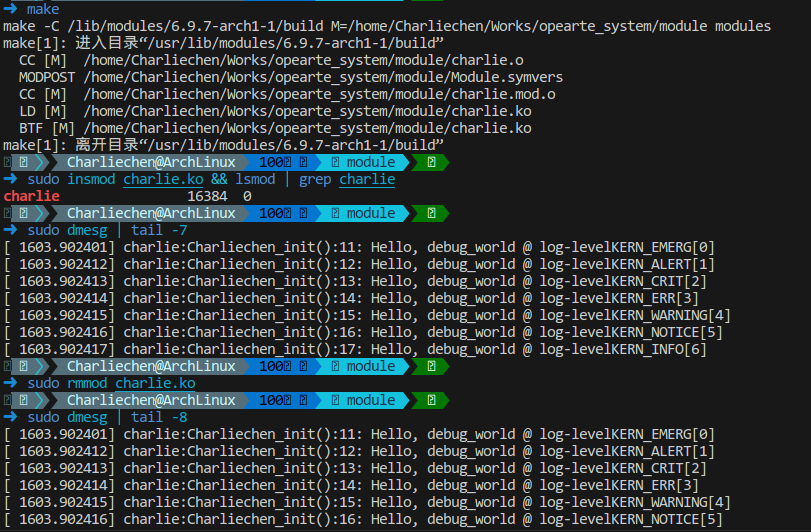

# Linux学习之路

## 编写我们的模块

### 在展开之前，先说说...

#### 用户空间和内核空间

​	现代微处理器支持至少两个特权级别的代码执行。作为一个现实世界的例子，Intel/AMD x86[-64] 系列支持四个特权级别（他们称之为环级别），AArch32（ARM-32）微处理器系列支持多达七种模式（ARM 称之为执行模式；六种是特权模式，一种是非特权模式），AArch64（ARM-64/ARMv8）微处理器系列支持四个异常级别（EL0 到 EL3，其中 EL0 最低，EL3 最高）。这里的关键点是，为了平台的安全性和稳定性，在这些处理器上运行的所有现代操作系统都将使用（至少）两个特权级别（或模式）执行，从而将虚拟地址空间 (VAS) 分成两个明确区分的（虚拟）地址空间

​	用户空间：用于在非特权用户模式下运行的应用程序。所有应用程序（进程和线程）都将在此空间中以该特权执行。因此，现在，您可能正在使用浏览器、编辑器、PDF 阅读器、终端、电子邮件客户端等。它们都是应用程序（最终是进程和线程）；

​	内核空间：用于在特权模式（内核模式）下运行的内核（及其所有组件）。这是操作系统及其内部内容的域（如驱动程序、网络、I/O 等，包括内核模块）。它们都以操作系统特权运行；实际上，它们可以做任何它们喜欢的事情！请注意，此特权级别是硬件功能，与是否以 root 身份运行不同（这是纯软件工件）；在许多情况下， 以内核权限运行可以被视为以 root 身份有效运行。 下图显示了此基本架构：


#### 库和系统调用API

​	用户空间应用程序通常依赖应用程序编程接口 (API) 来执行其工作。库本质上是 API 的集合或存档，允许您使用标准化、编写良好且经过充分测试的接口（并利用常见的好处：不必重新发明轮子、可移植性、标准化等）。

​	Linux 系统有几个库：企业级系统上甚至有数百个库也并不罕见。其中，所有用户模式 Linux 应用程序（可执行文件）都“自动链接”到一个重要的、始终使用的库中：glibc - GNU 标准 C 库，您将会了解到。但是，库仅在用户模式下可用；内核不使用这些用户模式库

​	库 API 的示例包括众所周知的 printf(3)、scanf(3)、strcmp(3)、malloc(3) 和 free(3)。

​	现在，一个关键点：如果用户和内核是独立的地址空间并且具有不同的权限级别，那么用户进程（正如我们刚刚了解到的，仅限于用户空间）

​	如何访问内核？简短的回答是： 通过系统调用。

​	系统调用是一种特殊的 API，因为它是用户空间进程（或线程）访问内核的唯一合法（同步）方式。换句话说，系统调用是进入内核空间的唯一合法入口点。 它们（系统调用）具有从非特权用户模式切换到特权内核模式的内置能力，系统调用的示例包括 fork(2)、execve(2)、open(2)、read(2)、write(2)、socket(2)、 accept(2)、chmod(2) 等等

​	可以自己查看（）

> APIs: [Section 3: library functions - Linux man pages (die.net)](https://linux.die.net/man/3/)
>
> System Call: [Section 2: system calls - Linux man pages (die.net)](https://linux.die.net/man/2/)

​	这里要强调的一点是，用户应用程序（进程和线程）和内核只能通过系统调用进行通信 


#### 内核空间组件

​	当然，本书完全关注内核空间。当今的 Linux 内核是一个相当庞大和复杂的庞然大物。在内部，它由几个主要子系统和几个组件组成。对内核子系统和组件进行广泛列举可得出以下列表：

- 核心内核：此代码处理任何现代操作系统的典型核心工作，包括（用户和内核）进程和线程创建/销毁、CPU 调度、同步原语、信号、计时器、中断处理、命名空间、cgroup、模块支持、加密等。
- 内存管理 (MM)：处理所有与内存相关的工作，包括内核和进程虚拟地址空间 (VAS) 的设置和维护。
- VFS（用于文件系统支持）：虚拟文件系统交换机 (VFS) 是 Linux 内核中实现的实际文件系统的抽象层（例如，ext[2|4]、vfat、ntfs、msdos、iso9660、f2fS、u fS 等等）。
- 块 I/O：实现实际文件 I/O 的代码路径，从文件系统一直到块设备驱动程序以及其间的所有内容都包含在这里。
- 网络协议栈：Linux 以其精确、符合 RFC 要求、高质量地实现模型所有层上的知名（和不太知名）网络协议而闻名，其中 TCP/IP 可能是最著名的。
- 进程间通信 (IPC) 支持：IPC 机制的实现在这里完成；Linux 支持消息队列、共享内存、信号量（旧的 SysV 和新的 POSIX）和其他 IPC 机制。
- 声音支持：实现音频的所有代码都在这里，从固件到驱动程序和编解码器。
- 虚拟化支持：Linux 已在大型和小型云提供商中变得非常受欢迎，一个重要原因是其高质量、低占用空间的虚拟化引擎，基于内核的虚拟机 (KVM)。

所有这些构成了主要的内核子系统；此外，我们还有这些：

- 特定于架构（即特定于 CPU）的代码
- 内核初始化
- 安全框架
- 许多类型的设备驱动程序

​	Linux的架构设计走的是宏内核：


​	您应该知道的另一个事实是，这些地址空间当然是虚拟地址空间，而不是物理地址空间。内核将在页面粒度级别将虚拟页面映射到物理页面框架，利用硬件块（例如内存管理单元 (MMU) 和处理器）以及转换后备缓冲区 (TLB) 缓存来提高效率。它通过使用主内核分页表将内核虚拟页面映射到物理框架 (RAM) 来实现这一点，并且对于每个处于活动状态的用户空间进程，它通过每个进程的单独分页表将进程（用户）的虚拟页面映射到物理页面框架。

#### 步入主角：LKM（Linux Kernel Modules）

​	内核模块是一种提供内核级功能的方法，无需在内核源代码树和静态内核映像中工作。 想象一下您必须向 Linux 内核添加支持功能的场景——可能是新的设备驱动程序，以便使用某个硬件外围芯片、新文件系统或新的 I/O 调度程序。实现此目的的一种方法是显而易见的：使用新代码更新内核源代码树，然后对其进行配置、构建、测试和部署。 虽然这看起来很简单，但工作量很大——我们编写的代码的每一个更改，无论多么小，都需要我们重建内核映像，然后重新启动系统以进行测试。一定有一种更干净、更简单的方法；事实上，确实有——LKM 框架！ 

#### LKM 框架 

​	LKM 框架是一种编译内核代码的方法，通常在内核源代码树之外，通常称为“树外”代码，在有限的意义上使其独立于内核，然后将生成的“模块对象”插入或插入内核内存、内核 VAS，让它运行并执行其工作，然后从内核内存中删除（或拔出）。（请注意，LKM 框架也可用于生成树内内核模块，就像我们在构建内核时所做的那样。这里，我们重点介绍树外模块）。 内核模块的源代码通常由一个或多个 C 源文件、头文件和一个 Makefile 组成，并（当然是通过 make）构建到内核模块中。内核模块本身只是一个二进制对象文件，而不是二进制可执行文件。

​	在 Linux 2.4 及更早版本中，内核模块的文件名带有 .o 后缀；在现代 2.6 Linux 及更高版本中，它改为使用 .ko （内核对象）后缀。构建后，您可以在运行时将此 .ko 文件（内核 模块）插入到实时内核中，从而有效地使其成为内核的一部分。


​	我想你已经留意到了：内核模块是内核代码，是要在内核态运行的。（换而言之没写好是真的会挂的）

​	这样，您（内核（或驱动程序）开发人员）就不必每次都重新配置、重建和重新启动系统。您所要做的就是编辑内核模块的代码、重建它、从内存中删除旧副本（如果存在），然后插入新版本。这可以节省时间并提高生产力

​	内核模块具有优势的另一个原因是它们适合动态产品配置。例如，内核模块可以设计为以不同的价格点提供不同的功能；为嵌入式产品生成最终映像的脚本可以根据客户愿意支付的价格安装一组给定的内核模块。

​	通过允许我们将实时代码插入（然后从）内核内存中删除，我们可以实现内核功能。这种随意插入和拔出内核功能的能力让我们意识到，Linux 内核并不是纯粹的整体式，它也是模块化的。

#### 干！写我们的第一个模块

​	P话不多说，干！

​	在我们确保我们的linux-header下好之后，我们就可以开始行动了：

```
charlie@charlie-ubuntu:~/kernel/module/ch4$ ls
charlie.c  Makefile
```

> charlie.c

```C 
#include <linux/module.h>
#include <linux/init.h>

MODULE_AUTHOR("Charlie");
MODULE_DESCRIPTION("Our first module");
MODULE_LICENSE("GPL");
MODULE_VERSION("0.1");

static int __init Charliechen_init(void)
{
	pr_info("Sup!\n");
	return 0;
}

static void __exit Charliechen_exit(void)
{
	pr_info("Goodbye!\n");
}


module_init(Charliechen_init);
module_exit(Charliechen_exit);
```

​	方便起见，写一个Makefile。

```
obj-m := charlie.o
kver := $(shell uname -r)
kdir := /lib/modules/$(kver)/build/
work_dir := $(shell pwd)

all:
	make -C $(kdir) M=$(work_dir)

clean:
	make -C $(kdir) M=$(work_dir) clean
```

>`make -C` 的作用是改变目录后再执行 `make` 命令。具体来说，`make -C <directory>` 命令会进入指定的 `<directory>` 目录，然后在那个目录中运行 `make`。这对于在不同目录中的不同 Makefile 之间进行编译时非常有用。

```
charlie@charlie-ubuntu:~/kernel/module/ch4$ make
make -C /lib/modules/6.5.0-41-generic/build/ M=/home/charlie/kernel/module/ch4
make[1]: Entering directory '/usr/src/linux-headers-6.5.0-41-generic'
warning: the compiler differs from the one used to build the kernel
  The kernel was built by: x86_64-linux-gnu-gcc-12 (Ubuntu 12.3.0-1ubuntu1~22.04) 12.3.0
  You are using:           gcc-12 (Ubuntu 12.3.0-1ubuntu1~22.04) 12.3.0
  CC [M]  /home/charlie/kernel/module/ch4/charlie.o
  MODPOST /home/charlie/kernel/module/ch4/Module.symvers
  CC [M]  /home/charlie/kernel/module/ch4/charlie.mod.o
  LD [M]  /home/charlie/kernel/module/ch4/charlie.ko
  BTF [M] /home/charlie/kernel/module/ch4/charlie.ko
Skipping BTF generation for /home/charlie/kernel/module/ch4/charlie.ko due to unavailability of vmlinux
make[1]: Leaving directory '/usr/src/linux-headers-6.5.0-41-generic'
```

​	下面我们就可以开始尝试了：

```
insmod: 将模块插入内核
lsmod: 枚举模块
rmmod: 移除内核
```


#### 一步步看：

##### 模块的宏

我们有几个模块宏，形式为 MODULE_FOO();（俗称“模块内容”）。大多数都非常直观：

- MODULE_AUTHOR()：指定内核模块的作者
- MODULE_DESCRIPTION()：简要描述此 LKM 的功能或目的
- MODULE_LICENSE()：指定发布此内核模块的许可证
- MODULE_VERSION()：指定内核模块的（本地）版本字符串

在没有源代码的情况下，如何将此信息传达给最终用户（或客户）？modinfo 实用程序正是这样做的！这些宏及其信息可能看起来微不足道，但它们在项目和产品中很重要。例如，供应商依靠此信息通过对所有已安装的内核模块的 modinfo 输出使用 grep 来建立代码所运行的（开源）许可证。 （这些是基本的模块宏；接下来我们将介绍更多宏。）

##### 入口点和出口点

​	永远不要忘记，内核模块毕竟是使用内核特权运行的内核代码。它不是应用程序，因此其入口点不是我们熟悉的 main() 函数（我们非常熟悉和喜欢）。当然，这引出了一个问题：内核模块的入口点和出口点是什么？请注意，在我们简单的内核模块的底部，有以下几行：

```
module_init(helloworld_lkm_init);
module_exit(helloworld_lkm_exit);
```

`module_{init|exit}()` 代码是分别指定入口点和出口点的宏。每个宏的参数都是函数指针。使用现代 C 编译器，我们只需指定函数的名称即可。因此，在我们的代码中，以下内容适用：

Charliechen_init() 函数是入口点。 Charliechen_exit() 函数是退出点。

您几乎可以将这些入口点和出口点视为内核模块的构造函数/析构函数对。从技术上讲，情况当然并非如此，因为这不是面向对象的 C++ 代码，而是纯 C。尽管如此，但也许这是一个有用的类比。

##### 返回值

请注意，init 和 exit 函数的签名如下：

```
static int __init <modulename>_init(void);
static void __exit <modulename>_exit(void);_
```

​	作为良好的编码实践，我们使用函数的命名格式为 `<modulename>_{init|exit}()`，其中 `<modulename>` 替换为内核模块的名称。您将意识到，这种命名约定仅仅是——从技术上讲，它只是一种不必要的约定，但它是直观的，因此很有帮助（请记住，我们人类必须编写代码供人类阅读和理解，而不是机器）。显然，这两个例程都没有接收任何参数。
用静态限定符标记这两个函数意味着它们是这个内核模块的私有函数。这就是我们想要的。

​	现在让我们继续讨论内核模块的 init 函数返回值所遵循的重要约定。

##### 0/-E 返回约定

​	内核模块的 init 函数返回一个整数，即 int 类型的值；这是一个关键方面。Linux 内核已经发展出一种风格或约定，如果你愿意的话，关于从它返回值（意味着从内核空间，模块驻留和运行的地方，到用户空间进程）。
​	要返回一个值，LKM 框架遵循俗称的 0/-E 约定：

> 成功时，返回整数值 0。
> 失败时，返回您希望将用户空间全局未初始化整数 errno 设置为的值的负数

​	指针怎么办？答案是用Linux预定义好的ERR_PTR，这里的地址是指向非法地址的。


##### \_\_init and __exit

​	一个令人烦恼的遗留问题：我们在前面的函数签名中看到的 __init 和 __exit 宏到底是什么？它们只是指定内存优化链接器属性。__init 宏为代码定义了一个 init.text 部分。同样，任何使用 __initdata 属性声明的数据都会进入 init.data 部分。这里的重点是 init 函数中的代码和数据在初始化期间只使用一次。一旦调用它，它就不会再被调用；因此，一旦调用，这些 init 部分中的所有代码和数据都会被释放（通过 free_initmem()）。__exit 宏的处理方式类似，当然，这只对内核模块有意义。一旦调用清理函数，所有内存都会被释放。如果代码是静态内核映像的一部分（或者如果模块支持被禁用），则此宏将不起作用。

### 了解内核日志记录和 printk

​	关于通过 printk 内核 API 记录内核消息，还有很多内容需要介绍。本节将深入探讨一些细节。对于像您这样的新手内核/驱动程序开发人员来说，清楚地了解这些主题非常重要。
​	我们在前面的“快速了解内核 printk()”部分中看到了使用内核 printk API 功能的要点（如果您愿意，可以再看一遍）。在这里，我们将进一步探讨 printk() API 的使用。让我们开始吧！

#### 使用内核内存环形缓冲区

​	内核日志缓冲区只是内核虚拟地址空间内的内存缓冲区，printk 输出保存（记录）在其中。更技术性地说，它是全局 __log_buf[] 变量

```
// kernel/printk/printk.c
#define __LOG_BUF_LEN (1 << CONFIG_LOG_BUF_SHIFT)
#define LOG_BUF_LEN_MAX (u32)(1 << 31)
 static char __log_buf[__LOG_BUF_LEN] __aligned(LOG_ALIGN);
static char *log_buf = __log_buf;
static u32 log_buf_len = __LOG_BUF_LEN;
```

​	无论内核日志缓冲区的大小如何，处理 printk API 时都会出现两个问题： 其消息被记录在易失性存储器 (RAM) 中；如果系统以任何方式崩溃或断电，我们将丢失宝贵的内核日志（通常会严重限制甚至消除我们调试内核问题的能力）。 默认情况下，日志缓冲区不是很大，通常只有 256 KB（和/或系统上每个 CPU 可能为 4 到 8 KB）；因此，很明显，大量的打印将压垮环形缓冲区，使其回绕，从而丢失信息。

#### 内核日志记录与systemd的journalctl

​	正如用户空间应用程序使用日志一样，内核也使用日志；该功能称为内核日志记录，除了资源最受限的系统外，所有系统都需要该功能。解决前面提到的将内核日志记录到小型易失性内存缓冲区的问题的一个明显方法是将每个内核 printk 写入（实际上是附加）二级存储中的文件。这正是大多数现代 Linux 发行版的设置方式。内核日志文件的位置因发行版而异：传统上，基于 Red Hat 的发行版写入 /var/log/messages 文件，而基于 Debian 的发行版写入 /var/log/syslog。

​	传统上，内核 printk 会挂接到用户空间系统记录器守护程序 (syslogd) 以执行文件日志记录，从而自动获得更复杂的功能的好处，例如日志轮换、压缩和归档。然而，在过去几年中，系统日志记录已完全被实用且功能强大的新系统初始化框架 systemd 所取代（它取代了旧的 SysV init 框架，或经常作为其补充）。事实上，systemd 现在甚至在嵌入式 Linux 设备上也经常使用。在 systemd 框架内，日志记录由名为 systemd-journal 的守护进程执行，journalctl 实用程序是它的用户界面。

### printk的日志属性

​	printk就具有一定的日志属性。一个启用了日志属性的printk是这样的：

```
printk(KERN_INFO "Hello, kernel!");
```

​	KERN_INFO指示了我们的日志等级，他最终会投射到我们的日志输出，我们一般会使用dmesg和journctl等进行查看。

​	这里提供八个等级：

```
#define KERN_SOH	"\001"		/* ASCII Start Of Header */
#define KERN_SOH_ASCII	'\001'

#define KERN_EMERG	KERN_SOH "0"	/* system is unusable */
#define KERN_ALERT	KERN_SOH "1"	/* action must be taken immediately */
#define KERN_CRIT	KERN_SOH "2"	/* critical conditions */
#define KERN_ERR	KERN_SOH "3"	/* error conditions */
#define KERN_WARNING	KERN_SOH "4"	/* warning conditions */
#define KERN_NOTICE	KERN_SOH "5"	/* normal but significant condition */
#define KERN_INFO	KERN_SOH "6"	/* informational */
#define KERN_DEBUG	KERN_SOH "7"	/* debug-level messages */

#define KERN_DEFAULT	""		/* the default kernel loglevel */
```

#### 简化的函数

​	有的时候写等级太麻烦，我们也有简化的API：`pr_<foo>`系列函数，

```
pr_info("Hello, kernel debug world\n");
```

​	这个是一个使用的例子。

```
pr_emerg(): printk() at log level KERN_EMERG
pr_alert(: printk() at log level KERN_ALERT
pr_crit: printk() at log level KERN_CRIT
pr_err(): printk() at log level KERN_ERR
pr_warn(): printk() at log level KERN_WARNING
pr_notice(): printk() at log level KERN_NOTICE
pr_info(): printk() at log level KERN_INFO
pr_debug() or pr_devel(): printk() at log level KERN_DEBUG
```



```
// 这个宏定义放在最上层，让编译的时候采取我们的格式定义
#define pr_fmt(fmt) "%s:%s():%d: " fmt, KBUILD_MODNAME, __func__, __LINE__
#include <linux/module.h>
#include <linux/init.h>
#include <linux/kernel.h>
MODULE_AUTHOR("Charliechen");
MODULE_LICENSE("GPL");
#define PRT_STD_MSG "Hello, debug_world @ log-level" 
#define LEVEL_STR(LEVEL) #LEVEL

static int __init Charliechen_init(void){
    pr_emerg(PRT_STD_MSG "KERN_EMERG" "[%d]\n", LOGLEVEL_EMERG);
    pr_alert(PRT_STD_MSG "KERN_ALERT" "[%d]\n", LOGLEVEL_ALERT);
    pr_crit(PRT_STD_MSG "KERN_CRIT" "[%d]\n", LOGLEVEL_CRIT);
    pr_err(PRT_STD_MSG "KERN_ERR" "[%d]\n", LOGLEVEL_ERR);
    pr_warn(PRT_STD_MSG "KERN_WARNING" "[%d]\n", LOGLEVEL_WARNING);
    pr_notice(PRT_STD_MSG "KERN_NOTICE" "[%d]\n", LOGLEVEL_NOTICE);
    pr_info(PRT_STD_MSG "KERN_INFO" "[%d]\n", LOGLEVEL_INFO);
    pr_debug(PRT_STD_MSG "KERN_DEBUG" "[%d]\n", LOGLEVEL_DEBUG);
    pr_devel("Welp, this is special cause it debug via pr_devel [%d]\n", LOGLEVEL_DEBUG);
    return 0;
}

static void __exit Charliechen_exit(void){
    pr_info("Goodbye! debug world!\n");
}

module_init(Charliechen_init);
module_exit(Charliechen_exit);
```

​	对比一下上图，你会发现我们的printk函数采纳了我们自定义的format。

​	值得注意的是：任何在紧急以上的日志等级都会立即显示在所有的控制台上。

### 输出一般向何去？

| printk函数组向。。。 | 何时               | 其他                                                         |
| -------------------- | ------------------ | ------------------------------------------------------------ |
| 向RAM缓冲区          | 总是               | 在`static char __log_buf[__LOG_BUF_LEN]`定义，其中他是一个环状的缓冲区，可以在编译内核的时候进行一定的配置。一般的是128KB |
| 现代日志文件         | 对于大多数系统默认 | systemd框架，journalctl的前端，而且持久化记忆                |
| 传统日志文件         | 对于大多数系统默认 | syslogd, klogd，dmesg前端，而且持久化记忆                    |
| 控制台设备           | 在日志等级小于4下  | 在/proc/sys/kernel/printk下控制                              |

​	对于最后一个，我们可以按照自己的意愿修改/proc/sys/kernel/printk里的内容：

```
$ cat /proc/sys/kernel/printk
1	4	1	4
```

​	第一个数字是 1，代表日志级别，低于该级别的信息将显示在控制台中（以及记录到内核日志缓冲区和日志文件中）。在这种情况下，我们可以得出结论，所有日志级别小于 1  的 printks 都会出现在控制台上。当然，在 root 权限下，你可以随意更改

### 一些tips

以下是一些常用的 printk 格式规范，在编写可移植代码时应牢记 
在编写可移植代码时要注意的几个常见打印格式指定符：

- 对于 size_t 和 ssize_t 类型定义（分别表示有符号和无符号的 整数），分别使用 %zu 和 %zd 格式指定符。
- 打印内核空间中的地址（指针）时：非常重要：为了安全起见，使用 %pK（它将只输出散列值，有助于防止信息泄漏这一严重的安全隐患 防止信息泄露，这是一个严重的安全问题）。对实际指针使用 %px，以查看实际地址（不要在生产环境中这样做！）。使用 %pa 打印物理地址（必须通过引用传递）。
- 要以十六进制字符串的形式打印原始缓冲区，请使用 %*ph（其中 * 由字符数代替；对于少于 65 个字符的缓冲区，请使用该例程；对于字符数较多的缓冲区，请使用 print_hex_dump_bytes() 例程）。还可以使用其他方法（参见后面的内核文档链接）。
- 要打印 IPv4 地址，请使用 %pI4；要打印 IPv6 地址，请使用 %pI6（还有一些变体）。
  关于 printk 格式说明的详尽列表，以及在什么情况下应使用什么格式（并附有示例！），是内核官方文档的一部分：https://www.kernel.org/doc/Documentation/printk-formats.txt。我建议您浏览一下！

```
=========================================
How to get printk format specifiers right
=========================================

:Author: Randy Dunlap <rdunlap@infradead.org>
:Author: Andrew Murray <amurray@mpc-data.co.uk>

Integer types
=============

::

	If variable is of Type,		use printk format specifier:
	------------------------------------------------------------
		int			%d or %x
		unsigned int		%u or %x
		long			%ld or %lx
		unsigned long		%lu or %lx
		long long		%lld or %llx
		unsigned long long	%llu or %llx
		size_t			%zu or %zx
		ssize_t			%zd or %zx
		s32			%d or %x
		u32			%u or %x
		s64			%lld or %llx
		u64			%llu or %llx

If <type> is dependent on a config option for its size (e.g., ``sector_t``,
``blkcnt_t``) or is architecture-dependent for its size (e.g., ``tcflag_t``),
use a format specifier of its largest possible type and explicitly cast to it.

Example::

	printk("test: sector number/total blocks: %llu/%llu\n",
		(unsigned long long)sector, (unsigned long long)blockcount);

Reminder: ``sizeof()`` result is of type ``size_t``.

The kernel's printf does not support ``%n``. For obvious reasons, floating
point formats (``%e, %f, %g, %a``) are also not recognized. Use of any
unsupported specifier or length qualifier results in a WARN and early
return from vsnprintf.

Raw pointer value SHOULD be printed with %p. The kernel supports
the following extended format specifiers for pointer types:

Pointer Types
=============

Pointers printed without a specifier extension (i.e unadorned %p) are
hashed to give a unique identifier without leaking kernel addresses to user
space. On 64 bit machines the first 32 bits are zeroed. If you _really_
want the address see %px below.

::

	%p	abcdef12 or 00000000abcdef12

Symbols/Function Pointers
=========================

::

	%pF	versatile_init+0x0/0x110
	%pf	versatile_init
	%pS	versatile_init+0x0/0x110
	%pSR	versatile_init+0x9/0x110
		(with __builtin_extract_return_addr() translation)
	%ps	versatile_init
	%pB	prev_fn_of_versatile_init+0x88/0x88

The ``F`` and ``f`` specifiers are for printing function pointers,
for example, f->func, &gettimeofday. They have the same result as
``S`` and ``s`` specifiers. But they do an extra conversion on
ia64, ppc64 and parisc64 architectures where the function pointers
are actually function descriptors.

The ``S`` and ``s`` specifiers can be used for printing symbols
from direct addresses, for example, __builtin_return_address(0),
(void *)regs->ip. They result in the symbol name with (``S``) or
without (``s``) offsets. If KALLSYMS are disabled then the symbol
address is printed instead.

The ``B`` specifier results in the symbol name with offsets and should be
used when printing stack backtraces. The specifier takes into
consideration the effect of compiler optimisations which may occur
when tail-call``s are used and marked with the noreturn GCC attribute.

Examples::

	printk("Going to call: %pF\n", gettimeofday);
	printk("Going to call: %pF\n", p->func);
	printk("%s: called from %pS\n", __func__, (void *)_RET_IP_);
	printk("%s: called from %pS\n", __func__,
				(void *)__builtin_return_address(0));
	printk("Faulted at %pS\n", (void *)regs->ip);
	printk(" %s%pB\n", (reliable ? "" : "? "), (void *)*stack);

Kernel Pointers
===============

::

	%pK	01234567 or 0123456789abcdef

For printing kernel pointers which should be hidden from unprivileged
users. The behaviour of ``%pK`` depends on the ``kptr_restrict sysctl`` - see
Documentation/sysctl/kernel.txt for more details.

Unmodified Addresses
====================

::

	%px	01234567 or 0123456789abcdef

For printing pointers when you _really_ want to print the address. Please
consider whether or not you are leaking sensitive information about the
Kernel layout in memory before printing pointers with %px. %px is
functionally equivalent to %lx. %px is preferred to %lx because it is more
uniquely grep'able. If, in the future, we need to modify the way the Kernel
handles printing pointers it will be nice to be able to find the call
sites.

Struct Resources
================

::

	%pr	[mem 0x60000000-0x6fffffff flags 0x2200] or
		[mem 0x0000000060000000-0x000000006fffffff flags 0x2200]
	%pR	[mem 0x60000000-0x6fffffff pref] or
		[mem 0x0000000060000000-0x000000006fffffff pref]

For printing struct resources. The ``R`` and ``r`` specifiers result in a
printed resource with (``R``) or without (``r``) a decoded flags member.
Passed by reference.

Physical addresses types ``phys_addr_t``
========================================

::

	%pa[p]	0x01234567 or 0x0123456789abcdef

For printing a ``phys_addr_t`` type (and its derivatives, such as
``resource_size_t``) which can vary based on build options, regardless of
the width of the CPU data path. Passed by reference.

DMA addresses types ``dma_addr_t``
==================================

::

	%pad	0x01234567 or 0x0123456789abcdef

For printing a ``dma_addr_t`` type which can vary based on build options,
regardless of the width of the CPU data path. Passed by reference.

Raw buffer as an escaped string
===============================

::

	%*pE[achnops]

For printing raw buffer as an escaped string. For the following buffer::

		1b 62 20 5c 43 07 22 90 0d 5d

few examples show how the conversion would be done (the result string
without surrounding quotes)::

		%*pE		"\eb \C\a"\220\r]"
		%*pEhp		"\x1bb \C\x07"\x90\x0d]"
		%*pEa		"\e\142\040\\\103\a\042\220\r\135"

The conversion rules are applied according to an optional combination
of flags (see :c:func:`string_escape_mem` kernel documentation for the
details):

	- ``a`` - ESCAPE_ANY
	- ``c`` - ESCAPE_SPECIAL
	- ``h`` - ESCAPE_HEX
	- ``n`` - ESCAPE_NULL
	- ``o`` - ESCAPE_OCTAL
	- ``p`` - ESCAPE_NP
	- ``s`` - ESCAPE_SPACE

By default ESCAPE_ANY_NP is used.

ESCAPE_ANY_NP is the sane choice for many cases, in particularly for
printing SSIDs.

If field width is omitted the 1 byte only will be escaped.

Raw buffer as a hex string
==========================

::

	%*ph	00 01 02  ...  3f
	%*phC	00:01:02: ... :3f
	%*phD	00-01-02- ... -3f
	%*phN	000102 ... 3f

For printing a small buffers (up to 64 bytes long) as a hex string with
certain separator. For the larger buffers consider to use
:c:func:`print_hex_dump`.

MAC/FDDI addresses
==================

::

	%pM	00:01:02:03:04:05
	%pMR	05:04:03:02:01:00
	%pMF	00-01-02-03-04-05
	%pm	000102030405
	%pmR	050403020100

For printing 6-byte MAC/FDDI addresses in hex notation. The ``M`` and ``m``
specifiers result in a printed address with (``M``) or without (``m``) byte
separators. The default byte separator is the colon (``:``).

Where FDDI addresses are concerned the ``F`` specifier can be used after
the ``M`` specifier to use dash (``-``) separators instead of the default
separator.

For Bluetooth addresses the ``R`` specifier shall be used after the ``M``
specifier to use reversed byte order suitable for visual interpretation
of Bluetooth addresses which are in the little endian order.

Passed by reference.

IPv4 addresses
==============

::

	%pI4	1.2.3.4
	%pi4	001.002.003.004
	%p[Ii]4[hnbl]

For printing IPv4 dot-separated decimal addresses. The ``I4`` and ``i4``
specifiers result in a printed address with (``i4``) or without (``I4``)
leading zeros.

The additional ``h``, ``n``, ``b``, and ``l`` specifiers are used to specify
host, network, big or little endian order addresses respectively. Where
no specifier is provided the default network/big endian order is used.

Passed by reference.

IPv6 addresses
==============

::

	%pI6	0001:0002:0003:0004:0005:0006:0007:0008
	%pi6	00010002000300040005000600070008
	%pI6c	1:2:3:4:5:6:7:8

For printing IPv6 network-order 16-bit hex addresses. The ``I6`` and ``i6``
specifiers result in a printed address with (``I6``) or without (``i6``)
colon-separators. Leading zeros are always used.

The additional ``c`` specifier can be used with the ``I`` specifier to
print a compressed IPv6 address as described by
http://tools.ietf.org/html/rfc5952

Passed by reference.

IPv4/IPv6 addresses (generic, with port, flowinfo, scope)
=========================================================

::

	%pIS	1.2.3.4		or 0001:0002:0003:0004:0005:0006:0007:0008
	%piS	001.002.003.004	or 00010002000300040005000600070008
	%pISc	1.2.3.4		or 1:2:3:4:5:6:7:8
	%pISpc	1.2.3.4:12345	or [1:2:3:4:5:6:7:8]:12345
	%p[Ii]S[pfschnbl]

For printing an IP address without the need to distinguish whether it``s
of type AF_INET or AF_INET6, a pointer to a valid ``struct sockaddr``,
specified through ``IS`` or ``iS``, can be passed to this format specifier.

The additional ``p``, ``f``, and ``s`` specifiers are used to specify port
(IPv4, IPv6), flowinfo (IPv6) and scope (IPv6). Ports have a ``:`` prefix,
flowinfo a ``/`` and scope a ``%``, each followed by the actual value.

In case of an IPv6 address the compressed IPv6 address as described by
http://tools.ietf.org/html/rfc5952 is being used if the additional
specifier ``c`` is given. The IPv6 address is surrounded by ``[``, ``]`` in
case of additional specifiers ``p``, ``f`` or ``s`` as suggested by
https://tools.ietf.org/html/draft-ietf-6man-text-addr-representation-07

In case of IPv4 addresses, the additional ``h``, ``n``, ``b``, and ``l``
specifiers can be used as well and are ignored in case of an IPv6
address.

Passed by reference.

Further examples::

	%pISfc		1.2.3.4		or [1:2:3:4:5:6:7:8]/123456789
	%pISsc		1.2.3.4		or [1:2:3:4:5:6:7:8]%1234567890
	%pISpfc		1.2.3.4:12345	or [1:2:3:4:5:6:7:8]:12345/123456789

UUID/GUID addresses
===================

::

	%pUb	00010203-0405-0607-0809-0a0b0c0d0e0f
	%pUB	00010203-0405-0607-0809-0A0B0C0D0E0F
	%pUl	03020100-0504-0706-0809-0a0b0c0e0e0f
	%pUL	03020100-0504-0706-0809-0A0B0C0E0E0F

For printing 16-byte UUID/GUIDs addresses. The additional 'l', 'L',
'b' and 'B' specifiers are used to specify a little endian order in
lower ('l') or upper case ('L') hex characters - and big endian order
in lower ('b') or upper case ('B') hex characters.

Where no additional specifiers are used the default big endian
order with lower case hex characters will be printed.

Passed by reference.

dentry names
============

::

	%pd{,2,3,4}
	%pD{,2,3,4}

For printing dentry name; if we race with :c:func:`d_move`, the name might be
a mix of old and new ones, but it won't oops.  ``%pd`` dentry is a safer
equivalent of ``%s`` ``dentry->d_name.name`` we used to use, ``%pd<n>`` prints
``n`` last components.  ``%pD`` does the same thing for struct file.

Passed by reference.

block_device names
==================

::

	%pg	sda, sda1 or loop0p1

For printing name of block_device pointers.

struct va_format
================

::

	%pV

For printing struct va_format structures. These contain a format string
and va_list as follows::

	struct va_format {
		const char *fmt;
		va_list *va;
	};

Implements a "recursive vsnprintf".

Do not use this feature without some mechanism to verify the
correctness of the format string and va_list arguments.

Passed by reference.

kobjects
========

::

	%pO

	Base specifier for kobject based structs. Must be followed with
	character for specific type of kobject as listed below:

	Device tree nodes:

	%pOF[fnpPcCF]

	For printing device tree nodes. The optional arguments are:
	    f device node full_name
	    n device node name
	    p device node phandle
	    P device node path spec (name + @unit)
	    F device node flags
	    c major compatible string
	    C full compatible string
	Without any arguments prints full_name (same as %pOFf)
	The separator when using multiple arguments is ':'

	Examples:

	%pOF	/foo/bar@0			- Node full name
	%pOFf	/foo/bar@0			- Same as above
	%pOFfp	/foo/bar@0:10			- Node full name + phandle
	%pOFfcF	/foo/bar@0:foo,device:--P-	- Node full name +
	                                          major compatible string +
						  node flags
							D - dynamic
							d - detached
							P - Populated
							B - Populated bus

	Passed by reference.


struct clk
==========

::

	%pC	pll1
	%pCn	pll1
	%pCr	1560000000

For printing struct clk structures. ``%pC`` and ``%pCn`` print the name
(Common Clock Framework) or address (legacy clock framework) of the
structure; ``%pCr`` prints the current clock rate.

Passed by reference.

bitmap and its derivatives such as cpumask and nodemask
=======================================================

::

	%*pb	0779
	%*pbl	0,3-6,8-10

For printing bitmap and its derivatives such as cpumask and nodemask,
``%*pb`` output the bitmap with field width as the number of bits and ``%*pbl``
output the bitmap as range list with field width as the number of bits.

Passed by reference.

Flags bitfields such as page flags, gfp_flags
=============================================

::

	%pGp	referenced|uptodate|lru|active|private
	%pGg	GFP_USER|GFP_DMA32|GFP_NOWARN
	%pGv	read|exec|mayread|maywrite|mayexec|denywrite

For printing flags bitfields as a collection of symbolic constants that
would construct the value. The type of flags is given by the third
character. Currently supported are [p]age flags, [v]ma_flags (both
expect ``unsigned long *``) and [g]fp_flags (expects ``gfp_t *``). The flag
names and print order depends on the particular	type.

Note that this format should not be used directly in :c:func:`TP_printk()` part
of a tracepoint. Instead, use the ``show_*_flags()`` functions from
<trace/events/mmflags.h>.

Passed by reference.

Network device features
=======================

::

	%pNF	0x000000000000c000

For printing netdev_features_t.

Passed by reference.

If you add other ``%p`` extensions, please extend lib/test_printf.c with
one or more test cases, if at all feasible.


Thank you for your cooperation and attention.
```

### 向内核日志写入调试信息

​	再看看这两行代码：

```
    pr_debug(PRT_STD_MSG "KERN_DEBUG" "[%d]\n", LOGLEVEL_DEBUG);
    pr_devel("Welp, this is special cause it debug via pr_devel [%d]\n", LOGLEVEL_DEBUG);
```

​	你可以留意到：嘿！为什么我的debug没有输出信息呢？答案是我们没有预定义一个debug符号，凡是没有预定义之，日志系统会选择保持它高雅的沉默（大嘘）

​	对于模块的开发者，需要避免使用pr_devel，对于生产环境而言他总不可见！

​	我们下面就来解决解决这两行的输出问题，为此，我们只需要预定义好符号

```
obj-m:= charlie.o
pwd:= $(shell pwd)
ker-ver:= $(shell uname -r)
KDIR:= /lib/modules/$(ker-ver)/build
# 这里增加的是调试符号的信息
ccflags-y	+= -DDEBUG -g -ggdb -gdwarf-4 -Og \
				-Wall -fno-omit-frame-pointer -fvar-tracking-assignments

all:
	make -C $(KDIR) M=$(pwd) modules

clean:
	rm -rf *.o .* .cmd *.ko *.mod.c .tmp_versions *.order *.symvers *.mod
```

```
[Charliechen@ArchLinux module]$ sudo insmod charlie.ko && lsmod | grep charlie 
[sudo] password for Charliechen: 
charlie                16384  0
[Charliechen@ArchLinux module]$ sudo dmesg | tail -8
[ 4697.043680] charlie:Charliechen_init():12: Hello, debug_world @ log-levelKERN_ALERT[1]
[ 4697.043682] charlie:Charliechen_init():13: Hello, debug_world @ log-levelKERN_CRIT[2]
[ 4697.043684] charlie:Charliechen_init():14: Hello, debug_world @ log-levelKERN_ERR[3]
[ 4697.043685] charlie:Charliechen_init():15: Hello, debug_world @ log-levelKERN_WARNING[4]
[ 4697.043687] charlie:Charliechen_init():16: Hello, debug_world @ log-levelKERN_NOTICE[5]
[ 4697.043688] charlie:Charliechen_init():17: Hello, debug_world @ log-levelKERN_INFO[6]
[ 4697.043690] charlie:Charliechen_init():18: Hello, debug_world @ log-levelKERN_DEBUG[7]
[ 4697.043692] charlie:Charliechen_init():19: Welp, this is special cause it debug via pr_devel [7]
[Charliechen@ArchLinux module]$ 
```

​	这一次看到了！

> **为调试或生产构建内核模块**
> 内核模块的编译方式在很大程度上受 DEBUG_CFLAGS 变量值的影响。该变量主要在内核的顶级 Makefile 中设置。在这里，它的值取决于内核配置 CONFIG_DEBUG_INFO。当它处于开启状态时（意味着调试内核），各种调试标志就会进入 DEBUG_CFLAGS，因此你的内核模块就会使用它们来编译。实际上，我在这里想强调的是，内核模块的 Makefile 中是否包含 -DDEBUG 字符串（就像我们在这里所做的）并不会对内核模块的编译方式产生太大影响。实际上，当你通过调试内核启动并编译内核模块时，它们会自动打开符号信息和各种内核调试选项。举个例子，当我在调试内核上创建这个内核模块时，printk_loglevels.ko 文件的大小是 221 KB，而在生产内核上创建时，文件大小降到了 8 KB 以下！(缺乏调试符号和信息、KASAN 仪器等因素造成了这一重大差异）。
>
> > 快速提示：使用 make V=1 来实际查看传递给编译器的所有选项会很有启发！
>
> 此外，非常有用的一点是，你可以利用 readelf(1) 来确定嵌入二进制可执行和链接格式 (ELF) 文件中的 DWARF 格式调试信息。这对于准确找出二进制可执行文件或内核模块是用哪个编译器标志构建的特别有用。你可以这样做
> `readelf --debug-dump <module_dbg.ko> | grep producer`
> 请注意，这种方法通常只在启用调试信息时有效；此外，在使用不同的目标架构（例如 ARM）时、 您需要运行该工具链的版本：${CROSS_COMPILE}readelf。
> 请参阅 "更多阅读 "部分，查看有关 GNU 调试器 (GDB) 的一系列文章的链接，这些文章详细描述了这一点（以及更多内容）。系列文章的第二部分）。

​	在处理项目或产品时，您可能需要生成一些调试 printk。只要定义了 DEBUG 符号，pr_debug() 宏就能完成工作。但请想一想：要查询调试打印，你需要反复运行 dmesg。下面是一些在这种情况下可以做的事情的提示：

1. 使用 sudo dmesg -C 清除内核日志缓冲区（在 RAM 中）。或者，sudo dmesg -c 会先打印内容，然后清除环形缓冲区。这样，过期信息就不会堵塞系统，运行 dmesg 时也只会看到最新的信息。

2. 使用 journalctl -f 对内核日志进行*监视（类似于在文件上使用 tail -f 的方式）。试试看！

3. **将控制台日志级别设置为 8，这样就能确保所有打印任务（日志级别 0 至 7）都显示在控制台设备上：

```
sudo sh -c "echo\"8 4 1 7\" > /proc/sys/kernel/printk "
```

​	调试内核时，我经常在启动脚本中这样做。例如，在我的 Raspberry Pi 上，我的启动脚本包含以下一行：[ $(id -u) -eq 0 ] && echo "8 4 1 7" > /proc/sys/kernel/printk 这样，当以 root 身份运行时，这一行就会生效，所有 printk 实例都会直接显示在 minicom(1)（或其他）控制台上，就像 printf 输出一样。

### **限制打印速度**

​	让我们假设一个合理的场景：你正在为某个芯片组或外围设备编写设备驱动程序... 通常情况下，特别是在开发过程中，有时为了在生产中调试，您当然会在驱动程序代码中穿插现在已经很熟悉的 dev_dbg()（或类似）宏。这种方法效果很好，直到包含调试打印的代码路径（非常）频繁地运行。会发生什么情况呢？很简单：

- 内核环形（循环）缓冲区并不大（通常在 64 KB 到 256KB 之间，可在内核构建时配置）。一旦满了，它就会缠绕在一起。这可能会导致宝贵的调试打印丢失。

- 在大量代码路径（例如中断处理程序例程和定时器内）中进行调试（或其他）打印，会大大降低运行速度（尤其是在通过串行线路进行打印的嵌入式系统上），甚至会导致*livelock*情况（一种由于处理器忙于日志记录工作（控制台输出、帧缓冲区滚动、日志文件追加等）而导致系统反应迟钝的情况）。

- 同样的调试（或其他）打印信息重复出现无数次（例如，循环中的警告或调试信息）对任何人都没有帮助。

- 此外，要知道不仅仅是 printk（和类似的）API 会导致日志记录问题和故障；在大容量代码路径上使用 kprobes 或任何类型的事件跟踪也会导致同样的问题（我们将在下一章介绍 kprobes，在后一章介绍跟踪）：

```
/dev/kmsg buffer overrun, some messages lost.
```

### 动态调试

​	有的时候，我们正在生产环境，是不允许重新卸下服务部署调试模式的，所以现在我们尝试进行动态的调试。

#### 方法一：内插调试变量

先说说module_param：主要区别就是用户可否在系统启动或模块装载时为参数指定相应值，在驱动程序里，参数的用法如同全局变量。

如果我们不使用module_param：如只定一个全局变量:

```
#define MY_MAJOR 0x09
static int global_val_test = MY_MAJOR;
```

那么编译模块后,insmod加载模块时不能传参数进去,如:

```
# insmod first_hello.ko global_val_test=5
insmod: ERROR: could not insert module first_hello.ko: Invalid parameters
```

同时,insmod模块后,对应module目录下的对应模块下不会生成parameter子目录,更不会生成参数文件.

使用module_param后,参考如下:

```
#define MY_MAJOR 0x09
static int global_val_test = MY_MAJOR;
module_param(global_val_test, int, 0644);
```

再编译模块后,再insmod加载模块时就可以传参数进去了,如:

```
[root@bogon hello_world]# insmod first_hello.ko global_val_test=5
[root@bogon hello_world]# tail /var/log/messages
May 26 14:20:08 localhost kernel: [63460.994397] global_val_test = 5
May 26 14:20:08 localhost kernel: [63460.994409] hello world enter
May 26 14:20:08 localhost kernel: global_val_test = 5
May 26 14:20:08 localhost kernel: hello world enter
```

同时,在模块目录下会生成parameter目录及参数文件,如下:

[root@bogon hello_world]# cat /sys/module/first_hello/
coresize     holders/     initsize     initstate    notes/       parameters/  refcnt       rhelversion  sections/    srcversion   taint        uevent       version
[root@bogon hello_world]# ls -alt /sys/module/first_hello/parameters/
total 0
-rw-r--r-- 1 root root 16384 May 26 14:54 global_val_test

2. module_param定义:
   函数原型:

```
/**

module_param - typesafe helper for a module/cmdline parameter

@name: the variable to alter, and exposed parameter name.

@type: the type of the parameter

@perm: visibility in sysfs.
*

@name becomes the module parameter, or (prefixed by KBUILD_MODNAME and a

".") the kernel commandline parameter.  Note that - is changed to _, so

the user can use "foo-bar=1" even for variable "foo_bar".
*

@perm is 0 if the the variable is not to appear in sysfs, or 0444

for world-readable, 0644 for root-writable, etc.  Note that if it

is writable, you may need to use kernel_param_lock() around

accesses (esp. charp, which can be kfreed when it changes).
*

The @type is simply pasted to refer to a param_ops_##type and a

param_check_##type: for convenience many standard types are provided but

you can create your own by defining those variables.
*

Standard types are:

byte, short, ushort, int, uint, long, ulong

charp: a character pointer

bool: a bool, values 0/1, y/n, Y/N.

invbool: the above, only sense-reversed (N = true).
*/
#define module_param(name, type, perm)				\
module_param_named(name, name, type, perm)
/**

module_param_named - typesafe helper for a renamed module/cmdline parameter

@name: a valid C identifier which is the parameter name.

@value: the actual lvalue to alter.

@type: the type of the parameter

@perm: visibility in sysfs.
*

Usually it's a good idea to have variable names and user-exposed names the

same, but that's harder if the variable must be non-static or is inside a

structure.  This allows exposure under a different name.
*/
#define module_param_named(name, value, type, perm)			   \
param_check_##type(name, &(value));				   \
module_param_cb(name, &param_ops_##type, &value, perm);		   \
__MODULE_PARM_TYPE(name, #type)
```

- name既是用户看到的参数名，又是模块内接受参数的变量； 
- type指定参数类型.

- perm指定了在sysfs中相应文件的访问权限。访问权限与linux文件爱你访问权限相同的方式管理，如0644，或使用stat.h中的宏如S_IRUGO表示。

- 0表示完全关闭在sysfs中相对应的项。


​	这种一般方法确实可行，但缺点也很明显，尤其是与内核的动态调试工具相比：

- 性能--你将需要某种条件语句（if、开关等）来检查是否每次都应发出调试打印。如果使用多级冗余，则需要进行更多检查。

- 使用内核的动态调试框架（将在下文中介绍），你将获得几个优势：

​	调试信息的格式化和有用信息的前缀是功能集的一部分，学习曲线很平缓。

​	性能保持较高水平，在调试关闭（通常是生产中的默认设置）时几乎没有开销。这是通过内核采用的复杂动态代码修补技术实现的（ftrace 也是如此）。

​	它始终是主线内核的一部分（从很早以前的 2.6.30 内核开始），而不需要自制的解决方案，这些解决方案可能得到维护，也可能无法使用或运行。

​	因此，在本节的剩余部分，我们将重点学习如何使用和利用内核强大的**动态调试**框架，它从 2.6.30 内核开始就可用了。请继续阅读！

​	启用内核配置选项 CONFIG_DYNAMIC_DEBUG（动态调试）后，**可以**动态打开或关闭编译在内核映像和内核模块中的调试打印。具体做法是让内核始终编译所有 pr_debug() 和 dev_dbg() 调用。现在，真正强大的是，你不仅可以启用或禁用这些调试打印，还可以在不同层次的范围内启用或禁用：在给定源文件、内核模块、函数甚至行号的范围内。如果担心这个问题（也许是在严格受限的嵌入式 Linux 上），你可以设置内核配置 CONFIG_DYNAMIC_DEBUG_CORE。这将启用对动态 printks 的核心支持，但它只对编译时定义了 DYNAMIC_DEBUG_MODULE 符号的内核模块有效。因此，我们的模块 Makefile 总是定义了它。您可以将其注释掉.... 这是模块 Makefile 中的相关行：

```
ccflags-y += -DDYNAMIC_DEBUG_MODULE
```

​	这样，所有动态调试的框架下的API都可以发挥作用了！

### **指定打印调试信息的内容和方式**

​	与许多设施一样，对内核动态调试框架的控制--决定启用哪些调试信息以及在信息前添加哪些无关信息--是通过**控制文件**决定的。控制文件在哪里？这要看情况。如果在内核配置中启用了 debugfs 伪文件系统（通常是这样，CONFIG_DEBUG_FS=y），并且内核配置了 CONFIG_DEBUG_FS_ALLOW_ALL=y 和 CONFIG_DEBUG_FS_DISALLOW_MOUNT=n（通常是调试内核的情况），那么控制文件就在这里：

```
/sys/kernel/debug/dynamic_debug/control
```

但在许多生产环境中，出于安全考虑，debugfs 文件系统是存在的（功能性的），但通过 CONFIG_DEBUG_FS_DISALLOW_MOUNT=y 是不可见的（无法挂载）。

在这种情况下，debugfs API 可以正常工作，但文件系统没有被挂载（实际上，它是隐形的）。另外，也可以通过将内核配置 CONFIG_DEBUG_FS_ALLOW_NONE 设为 "y "来完全禁用 debugfs。在上述任何一种情况下，都应在伪 proc 文件系统（procfs）下使用一个相同但备用的动态调试控制文件：

```
/proc/dynamic_debug/control
```

​	与其他伪文件系统一样，debugfs 或 procfs 下的 *control* 文件也是一个伪文件；它只存在于 RAM 中。它由内核代码填充和操作。读取它的内容可以获得内核中所有调试 printk（和/或 print_hex_dump_*()）调用点的完整列表。因此，它的输出通常很大（在这里，我们使用的是自定义调试内核，因此可以使用 debugfs 位置作为控制文件）。

### **在启动和模块初始化时激活调试打印**

必须认识到，内核初始化（启动）代码路径或内核模块初始化代码中的任何调试打印都不会自动启用*。

要启用它们，请执行以下操作：

- 对于核心内核代码和任何内置内核模块，即在启动过程中激活调试打印，通过内核命令行参数 dyndbg="QUERY "或 module.dyndbg="QUERY"，其中 QUERY 是动态调试语法（如前所述）。例如，dyndng="module myfoo* +pmft "将激活名为 myfoo* 的内核模块内的所有调试打印，显示方式由标志说明符 pmft 设置。

- 要在内核模块初始化时激活调试打印，即调用 modprobe myfoo 时（可能是由 systemd 调用），有几种方法，通过传递模块参数（举例说明）：

通过 /etc/modprobe.d/*.conf（将其放入 /etc/modprobe.d/myfoo.conf 文件）： options myfoo dyndbg=+pmft

通过内核命令行： myfoo.dyndbg="file myfoobar.c +pmf; func goforit +mpt"

通过 modprobe 本身的参数：modprobe myfoo dyndbg===pmft（这里的 = 而不是 + 会覆盖之前的任何设置！）有趣的是：dyndbg 是一个始终可用的内核模块参数，尽管你看不到它（甚至在 /sys/module/\<modname>/parameters）。你可以通过grepping动态调试控制文件或/proc/cmdline看到它（顺便提一下，关于向内核模块传递参数和自动加载内核模块的细节，我在早先的*Linux内核编程*一书中已有详述）。

关于动态调试的官方内核文档确实非常完整，请务必查看：https://www.kernel.org/doc/html/latest/admin-guide/dynamic-debug-howto.html#dynamic-debug。

```
Dynamic debug¶
Introduction
Dynamic debug allows you to dynamically enable/disable kernel debug-print code to obtain additional kernel information.

If /proc/dynamic_debug/control exists, your kernel has dynamic debug. You’ll need root access (sudo su) to use this.

Dynamic debug provides:

a Catalog of all prdbgs in your kernel. cat /proc/dynamic_debug/control to see them.

a Simple query/command language to alter prdbgs by selecting on any combination of 0 or 1 of:

source filename

function name

line number (including ranges of line numbers)

module name

format string

class name (as known/declared by each module)

Viewing Dynamic Debug Behaviour
You can view the currently configured behaviour in the prdbg catalog:

:#> head -n7 /proc/dynamic_debug/control
# filename:lineno [module]function flags format
init/main.c:1179 [main]initcall_blacklist =_ "blacklisting initcall %s\012
init/main.c:1218 [main]initcall_blacklisted =_ "initcall %s blacklisted\012"
init/main.c:1424 [main]run_init_process =_ "  with arguments:\012"
init/main.c:1426 [main]run_init_process =_ "    %s\012"
init/main.c:1427 [main]run_init_process =_ "  with environment:\012"
init/main.c:1429 [main]run_init_process =_ "    %s\012"
The 3rd space-delimited column shows the current flags, preceded by a = for easy use with grep/cut. =p shows enabled callsites.

Controlling dynamic debug Behaviour
The behaviour of prdbg sites are controlled by writing query/commands to the control file. Example:

# grease the interface
:#> alias ddcmd='echo $* > /proc/dynamic_debug/control'

:#> ddcmd '-p; module main func run* +p'
:#> grep =p /proc/dynamic_debug/control
init/main.c:1424 [main]run_init_process =p "  with arguments:\012"
init/main.c:1426 [main]run_init_process =p "    %s\012"
init/main.c:1427 [main]run_init_process =p "  with environment:\012"
init/main.c:1429 [main]run_init_process =p "    %s\012"
Error messages go to console/syslog:

:#> ddcmd mode foo +p
dyndbg: unknown keyword "mode"
dyndbg: query parse failed
bash: echo: write error: Invalid argument
If debugfs is also enabled and mounted, dynamic_debug/control is also under the mount-dir, typically /sys/kernel/debug/.

Command Language Reference
At the basic lexical level, a command is a sequence of words separated by spaces or tabs. So these are all equivalent:

:#> ddcmd file svcsock.c line 1603 +p
:#> ddcmd "file svcsock.c line 1603 +p"
:#> ddcmd '  file   svcsock.c     line  1603 +p  '
Command submissions are bounded by a write() system call. Multiple commands can be written together, separated by ; or \n:

:#> ddcmd "func pnpacpi_get_resources +p; func pnp_assign_mem +p"
:#> ddcmd <<"EOC"
func pnpacpi_get_resources +p
func pnp_assign_mem +p
EOC
:#> cat query-batch-file > /proc/dynamic_debug/control
You can also use wildcards in each query term. The match rule supports * (matches zero or more characters) and ? (matches exactly one character). For example, you can match all usb drivers:

:#> ddcmd file "drivers/usb/*" +p     # "" to suppress shell expansion
Syntactically, a command is pairs of keyword values, followed by a flags change or setting:

command ::= match-spec* flags-spec
The match-spec’s select prdbgs from the catalog, upon which to apply the flags-spec, all constraints are ANDed together. An absent keyword is the same as keyword “*”.

A match specification is a keyword, which selects the attribute of the callsite to be compared, and a value to compare against. Possible keywords are::

match-spec ::= 'func' string |
               'file' string |
               'module' string |
               'format' string |
               'class' string |
               'line' line-range

line-range ::= lineno |
               '-'lineno |
               lineno'-' |
               lineno'-'lineno

lineno ::= unsigned-int
Note
line-range cannot contain space, e.g. “1-30” is valid range but “1 - 30” is not.

The meanings of each keyword are:

func
The given string is compared against the function name of each callsite. Example:

func svc_tcp_accept
func *recv*             # in rfcomm, bluetooth, ping, tcp
file
The given string is compared against either the src-root relative pathname, or the basename of the source file of each callsite. Examples:

file svcsock.c
file kernel/freezer.c   # ie column 1 of control file
file drivers/usb/*      # all callsites under it
file inode.c:start_*    # parse :tail as a func (above)
file inode.c:1-100      # parse :tail as a line-range (above)
module
The given string is compared against the module name of each callsite. The module name is the string as seen in lsmod, i.e. without the directory or the .ko suffix and with - changed to _. Examples:

module sunrpc
module nfsd
module drm*     # both drm, drm_kms_helper
format
The given string is searched for in the dynamic debug format string. Note that the string does not need to match the entire format, only some part. Whitespace and other special characters can be escaped using C octal character escape \ooo notation, e.g. the space character is \040. Alternatively, the string can be enclosed in double quote characters (") or single quote characters ('). Examples:

format svcrdma:         // many of the NFS/RDMA server pr_debugs
format readahead        // some pr_debugs in the readahead cache
format nfsd:\040SETATTR // one way to match a format with whitespace
format "nfsd: SETATTR"  // a neater way to match a format with whitespace
format 'nfsd: SETATTR'  // yet another way to match a format with whitespace
class
The given class_name is validated against each module, which may have declared a list of known class_names. If the class_name is found for a module, callsite & class matching and adjustment proceeds. Examples:

class DRM_UT_KMS        # a DRM.debug category
class JUNK              # silent non-match
// class TLD_*          # NOTICE: no wildcard in class names
line
The given line number or range of line numbers is compared against the line number of each pr_debug() callsite. A single line number matches the callsite line number exactly. A range of line numbers matches any callsite between the first and last line number inclusive. An empty first number means the first line in the file, an empty last line number means the last line number in the file. Examples:

line 1603           // exactly line 1603
line 1600-1605      // the six lines from line 1600 to line 1605
line -1605          // the 1605 lines from line 1 to line 1605
line 1600-          // all lines from line 1600 to the end of the file
The flags specification comprises a change operation followed by one or more flag characters. The change operation is one of the characters:

-    remove the given flags
+    add the given flags
=    set the flags to the given flags
The flags are:

p    enables the pr_debug() callsite.
_    enables no flags.

Decorator flags add to the message-prefix, in order:
t    Include thread ID, or <intr>
m    Include module name
f    Include the function name
s    Include the source file name
l    Include line number
For print_hex_dump_debug() and print_hex_dump_bytes(), only the p flag has meaning, other flags are ignored.

Note the regexp ^[-+=][fslmpt_]+$ matches a flags specification. To clear all flags at once, use =_ or -fslmpt.

Debug messages during Boot Process
To activate debug messages for core code and built-in modules during the boot process, even before userspace and debugfs exists, use dyndbg="QUERY" or module.dyndbg="QUERY". QUERY follows the syntax described above, but must not exceed 1023 characters. Your bootloader may impose lower limits.

These dyndbg params are processed just after the ddebug tables are processed, as part of the early_initcall. Thus you can enable debug messages in all code run after this early_initcall via this boot parameter.

On an x86 system for example ACPI enablement is a subsys_initcall and:

dyndbg="file ec.c +p"
will show early Embedded Controller transactions during ACPI setup if your machine (typically a laptop) has an Embedded Controller. PCI (or other devices) initialization also is a hot candidate for using this boot parameter for debugging purposes.

If foo module is not built-in, foo.dyndbg will still be processed at boot time, without effect, but will be reprocessed when module is loaded later. Bare dyndbg= is only processed at boot.

Debug Messages at Module Initialization Time
When modprobe foo is called, modprobe scans /proc/cmdline for foo.params, strips foo., and passes them to the kernel along with params given in modprobe args or /etc/modprobe.d/*.conf files, in the following order:

parameters given via /etc/modprobe.d/*.conf:

options foo dyndbg=+pt
options foo dyndbg # defaults to +p
foo.dyndbg as given in boot args, foo. is stripped and passed:

foo.dyndbg=" func bar +p; func buz +mp"
args to modprobe:

modprobe foo dyndbg==pmf # override previous settings
These dyndbg queries are applied in order, with last having final say. This allows boot args to override or modify those from /etc/modprobe.d (sensible, since 1 is system wide, 2 is kernel or boot specific), and modprobe args to override both.

In the foo.dyndbg="QUERY" form, the query must exclude module foo. foo is extracted from the param-name, and applied to each query in QUERY, and only 1 match-spec of each type is allowed.

The dyndbg option is a “fake” module parameter, which means:

modules do not need to define it explicitly

every module gets it tacitly, whether they use pr_debug or not

it doesn’t appear in /sys/module/$module/parameters/ To see it, grep the control file, or inspect /proc/cmdline.

For CONFIG_DYNAMIC_DEBUG kernels, any settings given at boot-time (or enabled by -DDEBUG flag during compilation) can be disabled later via the debugfs interface if the debug messages are no longer needed:

echo "module module_name -p" > /proc/dynamic_debug/control
Examples
// enable the message at line 1603 of file svcsock.c
:#> ddcmd 'file svcsock.c line 1603 +p'

// enable all the messages in file svcsock.c
:#> ddcmd 'file svcsock.c +p'

// enable all the messages in the NFS server module
:#> ddcmd 'module nfsd +p'

// enable all 12 messages in the function svc_process()
:#> ddcmd 'func svc_process +p'

// disable all 12 messages in the function svc_process()
:#> ddcmd 'func svc_process -p'

// enable messages for NFS calls READ, READLINK, READDIR and READDIR+.
:#> ddcmd 'format "nfsd: READ" +p'

// enable messages in files of which the paths include string "usb"
:#> ddcmd 'file *usb* +p'

// enable all messages
:#> ddcmd '+p'

// add module, function to all enabled messages
:#> ddcmd '+mf'

// boot-args example, with newlines and comments for readability
Kernel command line: ...
  // see what's going on in dyndbg=value processing
  dynamic_debug.verbose=3
  // enable pr_debugs in the btrfs module (can be builtin or loadable)
  btrfs.dyndbg="+p"
  // enable pr_debugs in all files under init/
  // and the function parse_one, #cmt is stripped
  dyndbg="file init/* +p #cmt ; func parse_one +p"
  // enable pr_debugs in 2 functions in a module loaded later
  pc87360.dyndbg="func pc87360_init_device +p; func pc87360_find +p"
Kernel Configuration
Dynamic Debug is enabled via kernel config items:

CONFIG_DYNAMIC_DEBUG=y        # build catalog, enables CORE
CONFIG_DYNAMIC_DEBUG_CORE=y   # enable mechanics only, skip catalog
If you do not want to enable dynamic debug globally (i.e. in some embedded system), you may set CONFIG_DYNAMIC_DEBUG_CORE as basic support of dynamic debug and add ccflags := -DDYNAMIC_DEBUG_MODULE into the Makefile of any modules which you’d like to dynamically debug later.

Kernel prdbg API
The following functions are cataloged and controllable when dynamic debug is enabled:

pr_debug()
dev_dbg()
print_hex_dump_debug()
print_hex_dump_bytes()
Otherwise, they are off by default; ccflags += -DDEBUG or #define DEBUG in a source file will enable them appropriately.

If CONFIG_DYNAMIC_DEBUG is not set, print_hex_dump_debug() is just a shortcut for print_hex_dump(KERN_DEBUG).

For print_hex_dump_debug()/print_hex_dump_bytes(), format string is its prefix_str argument, if it is constant string; or hexdump in case prefix_str is built dynamically.
```

### **控制台启动前的打印--早期的 printk**

printk 的输出当然可以发送到控制台设备上（我们在*了解 printk 输出的去向*部分已经介绍过这一点（见*表 3.1*））。默认情况下，在大多数系统中，所有日志级别为 3 级及以下（<4 级）的 printk 消息都会被自动路由到控制台设备（实际上，所有日志级别为 emerg/alert/crit/err 的内核 printk 都会被路由到控制台设备）。

#### 控制台设备到底是什么？

​	在进一步了解之前，有必要先了解一下控制台设备到底是什么... 传统上，控制台设备是一个纯粹的内核功能，是超级用户在非图形环境中登录的初始终端窗口（/dev/console）。有趣的是，在 Linux 上，我们可以定义多个控制台--**电传类型终端**（**tty**）窗口（如 /dev/console）、文本模式 VGA、帧缓冲器，甚至是通过 USB 提供服务的串行端口（这在开发过程中的嵌入式系统中很常见）。

​	例如，当我们通过 USB 转 RS232 TTL UART（USB 转串口）电缆将 Raspberry Pi 连接到 x86_64 笔记本电脑时（请参阅本章的 "进一步阅读 "部分，了解关于这个非常有用的配件以及如何在 Raspberry Pi 上设置它的博客文章！），然后使用 minicom(1)（或 screen(1)）获取串口控制台，这就是显示为 tty 设备的设备 - 它就是串口：

```
rpi # tty
/dev/ttyS0
```

现在，问题出在哪里？让我们一探究竟！

**早期启动 - 问题和解决方案**

通过 printk，你可以向控制台（和内核日志）发送消息。是的，但请想一想：在启动过程的早期，当内核正在初始化时，控制台设备还没有准备好，没有初始化，因此无法使用。很明显，在启动初期发出的任何 printk，其输出都无法在 * 屏幕 * - 控制台上看到（尽管它可能记录在内核日志缓冲区中，但我们还没有 shell 来查找它

通常情况下（尤其是在嵌入式主板调试过程中），硬件怪异或故障会导致启动挂起、无休止地探测不存在或有故障的设备，甚至崩溃！令人沮丧的是，在没有控制台（printk）输出的情况下，这些问题很难调试（至少可以这么说！），而控制台（printk）输出如果可见，就能检测内核的启动过程，并非常清楚地显示问题发生在哪里（回顾一下内核命令行参数 debug 和 initcall_debug，在这种情况下非常有用--如果需要的话，可以回顾一下*内核启动时参数部分*）。 正如我们所知，必要是发明之母：内核社区为这个问题提出了一个可能的解决方案--所谓的**早期 printk**。有了它，内核 printk 仍然可以发送到控制台设备。怎么做到的？嗯，这是一个相当复杂的问题，而且与特定的设备有关，但广泛而典型的想法是，执行最基本的控制台初始化（该控制台设备称为 early_console），然后在循环中通过串行线路一个字符一个字符地**比特撞击**出要显示的字符串（典型的比特率范围在 9,600 至 115,200 bps 之间）。要使用该设施，需要做三件事：

- 配置和构建内核以支持早期 printk（设置 CONFIG_EARLY_PRINTK=y），仅此一次。

- 使用适当的内核命令行参数 - earlyprintk=`<value>.` 启动目标内核。

- 发出早期 printk 的应用程序接口称为 early_printk()；语法与 printf()相同。

让我们简单了解一下上述各点，首先是为早期 printk 配置内核。在 x86 系统上，你必须使用 CONFIG_EARLY_PRINTK=y 配置内核（位于 "内核黑客"|"x86 调试"|"早期 printk "菜单下）。也可以选择通过 USB 调试端口启用早期 printk。为内核调试选项进行内核配置（通过常用的 make menuconfig）的 UI（菜单系统）文件是 arch/x86/Kconfig.debug 文件。我们将在此展示其中的一个片段，即早期 printk 菜单选项所在的部分：


​	阅读此处显示的帮助屏幕确实很有帮助！正如上面所说，默认情况下不推荐使用该选项，因为输出格式不佳，可能会干扰正常日志记录。通常只有在调试早期启动问题时才会使用。(如果有兴趣，你可以在我早期的《Linux 内核**编程*》一书中找到关于内核*Kconfig*语法和用法的详细信息）。

​	另一方面，在 ARM（AArch32）系统上，内核配置选项位于 "内核黑客"|"内核底层调试功能"（阅读帮助！）下，配置选项名为 CONFIG_DEBUG_LL。正如内核明确坚持的那样，让我们阅读帮助屏幕：


​	请注意其中的内容！此外，它后面的子菜单允许你配置底层调试端口（默认设置为 EmbeddedICE DCC 通道；如果你有可用的串行 UART，可以将其更改为串行 UART）。接下来，通过传递适当的内核命令行参数启用它--earlyprintk=`<value>`。官方内核文档显示了所有可能的传递方式（此处：https://www.kernel.org/doc/html/latest/admin-guide/kernel-parameters.html）

​	可以附加一个可选的 keep 参数，这意味着即使在 VGA 子系统（或真正的控制台）开始运行后，通过早期 printk 设施发送的 printk 信息也不会被禁用。一旦传递了 earlyprintk= 参数，内核就会开始使用它（基本上是将 printk 重定向到串行、VGA 或任何你通过该参数指定的控制台上）。要进行打印，只需调用 early_printk() API 即可。下面是内核代码库中的一个示例：

```
// kernel/events/core.c

 if (!irq_work_queue(&perf_duration_work)) {

 	early_printk("perf: interrupt took too long (%lld > %lld), lowering ""kernel.perf_event_max_sample_rate 	to %d\n",__report_avg,__report_allowed,sysctl_perf_event_sample_rate);
}
```

​	上面介绍的主要是与操作系统无关的内容。举例来说，（仅）在 x86 系统上，你可以利用 USB 调试端口（如果你的系统有的话），方法如下。传递内核命令行参数 earlyprintk=dbgp。请注意，这需要（x86）主机系统上的 USB 调试端口和 NetChip USB2 调试端口密钥/电缆（连接到客户端或目标系统）。

#### 适用于内核模块的“更好” Makefile 模板 

​	上一章介绍了用于从源代码生成内核模块、安装和清理内核模块的 Makefile。但是，正如我们在那里简要提到的，我现在将介绍我认为更优越的、所谓的“更好”的 Makefile，并解释它为什么更好。 最终，我们都必须编写更好、更安全的代码——无论是用户空间还是内核空间。好消息是，有几种工具可以帮助提高代码的稳健性和安全性，其中包括静态和动态分析器（因为在线章节“内核工作区设置”中已经提到了几种，我不会在这里重复它们）。 

​	我为内核模块设计了一个简单但有用的 Makefile“模板”，其中包括几个帮助您运行这些工具的目标。这些目标允许您非常轻松地执行有价值的检查和分析；否则您可能会忘记、忽略或永远推迟这些事情！

​	这些目标包括： 

“通常”的目标 - 构建（全部）、安装和清理目标（考虑到“调试”设置，如果调试关闭，则剥离模块）。 内核编码风格生成和检查（通过缩进和内核的 checkpatch.pl 脚本）。

 内核静态分析目标（稀疏、gcc 和 flawfinder），其中提到了 Coccinelle。 几个虚拟内核动态分析目标指出您应该如何花时间配置和构建“调试”内核并使用它来捕获错误（通过 KASAN 和 LOCKDEP / CONFIG_PROVE_LOCKING；稍后将详细介绍） 

一个简单的 tarxz-pkg 目标，将源文件打包并压缩到父目录中。这使您可以将压缩的 tar-xz 文件传输到任何其他 Linux 系统，然后在那里提取和构建 LKM。 您可以在 ch5/lkm_template 目录中找到代码（以及 README 文件）。为了帮助您了解其用途和功能并开始使用，下图仅显示了执行 `make <tab><tab>` 并运行 `make help` 时代码生成的输出和输出屏幕截图：


如图 5.1 所示，我们输入 make，然后立即按两次 Tab 键，这样它就会显示所有可用的目标（您可能需要安装 Bash 完成包才能使此类功能正常工作；它通常安装在大多数发行版上）。请仔细研究并使用它！例如，运行 make sa（参见图 5.1 中的 sa 目标以及其他目标）将导致它在您的代码上运行所有静态分析 (sa) 目标。请注意以 FYI: KDIR=… 开头的行（突出显示）显示了 Makefile 对各种变量和“设置”的当前理解。我们在这里重现了它：

#### 配置一个调试内核

​	在调试内核上运行代码可以帮助您发现难以发现的错误和问题。我强烈建议这样做，通常是在开发和测试期间！ 实际上，您应该有两个内核来运行和测试您的工作：精心配置的优化常规生产内核，以及一个调试内核，故意配置为启用许多内核调试选项（可能未优化，但目的是用它来捕获错误）。 在这里，我至少希望您配置自定义 6.1 内核，以便打开以下内核调试配置选项（即设置为 y；您会在 make menuconfig UI 中找到它们，并且您会在 Kernel Hacking 子菜单下找到它们中的大多数；以下列表与 Linux 6.1.25 有关）： 

- CONFIG_DEBUG_KERNEL 和 CONFIG_DEBUG_INFO 
- CONFIG_DEBUG_MISC 
- 通用内核调试工具： 
  - CONFIG_MAGIC_SYSRQ（神奇的 SysRq 热键功能） 
  - CONFIG_DEBUG_FS（debugfs 伪文件系统） 
  - CONFIG_KGDB（内核 GDB；可选，推荐） 
  - CONFIG_UBSAN（未定义行为健全性检查器） 
  - CONFIG_KCSAN（动态数据竞争检测器） 

- 内存调试： 
  - CONFIG_SLUB_DEBUG 
  - CONFIG_DEBUG_MEMORY_INIT
  - CONFIG_KASAN：强大的内核地址清理器 (KASAN) 内存检查器 

- CONFIG_DEBUG_SHIRQ 
- CONFIG_SCHED_STACK_END_CHECK 
- CONFIG_DEBUG_PREEMPT 
- 锁定调试： 
  - CONFIG_PROVE_LOCKING：非常强大的 lockdep 功能，可以捕获 锁定错误！这也会打开其他几个锁定调试配置， 在第 13 章“内核同步 - 第 2 部分”中进行了解释。 
  - CONFIG_LOCK_STAT
  - CONFIG_DEBUG_ATOMIC_SLEEP

- CONFIG_BUG_ON_DATA_CORRUPTION 
- CONFIG_STACKTRACE 
- CONFIG_DEBUG_BUGVERBOSE 
- CONFIG_FTRACE (ftrace：在其子菜单中，至少打开几个 “跟踪器”，包括“内核函数 [图形] 跟踪器”） 
- 架构特定（在 x86 上显示在“x86 调试”下）： 
  - CONFIG_EARLY_PRINTK（架构特定） 
  - CONFIG_DEBUG_BOOT_PARAMS 
  - CONFIG_UNWINDER_FRAME_POINTER（选择 FRAME_POINTER 和 CONFIG_STA/CK_VALIDATION）

#### 设置系统以进行交叉编译

交叉编译内核模块的先决条件非常明确：我们需要将目标系统的内核源代码树作为主机系统工作区的一部分安装，主机系统通常是 x86_64 桌面（例如，使用 Raspberry Pi 作为目标；请参阅此处的官方 Raspberry Pi 文档：https://www.raspberrypi.org/documentation/linux/kernel/building.md）。

​	我们现在需要一个交叉工具链（主机到目标）。通常，主机系统是 x86_64，而这里，由于目标是 ARM-64，我们需要一个 x86_64 到 ARM64 的交叉工具链。再次，正如第 3 章“从源代码构建 6.x Linux 内核 - 第 2 部分”中明确提到的那样，在 Raspberry Pi 的内核构建部分中，您必须将 Raspberry Pi 特定的 x86_64-to-ARM 工具链作为主机系统工作区的一部分进行安装

​	好的，从现在开始，我将假设您已满足我们在第 3 章“从源代码构建 6.x Linux 内核 - 第 2 部分”中介绍的内容中的这些先决条件，即为 Raspberry Pi 构建内核部分：您已安装 Raspberry Pi 6.1.34 内核源代码树和 x86_64-to-ARM64 交叉工具链。因此，我还假设工具链前缀为 aarch64-linux-gnu；我们可以通过尝试调用 gcc 交叉编译器来快速检查工具链是否已安装并将其二进制文件添加到路径中：

```
$ aarch64-linux-gnu-gcc -v
```

#### 尝试 1 – 设置 ARCH 和 CROSS_COMPILE 环境变量 

​	交叉编译内核模块非常简单（或者我们认为如此！）。

​	首先，确保 正确设置“特殊”ARCH 和 CROSS_COMPILE 环境变量。请按照以下步骤操作： 

1. 让我们为 Raspberry Pi 目标重新构建我们刚刚讨论的 lkm_template 内核模块；这也具有使用所谓 “更好”的 Makefile 的优势。以下是构建方法： 为了在不破坏原始代码的情况下执行此操作，请首先创建一个名为 cross 的新文件夹，其中包含代码副本。 （顺便说一句，代码库已经设置好了，这里：ch5/cross。） 

   ```
   cd <book-dir>/ch5; mkdir cross ; 
   cd cross 
   cp ../lkm_template/lkm_template.c ../lkm_template/Makefile 
   ```

   这里，`<book-dir> `是本书 GitHub 源代码树的根目录。 

2. 现在，运行以下命令（我们假设交叉编译器工具位于 此路径中）： make ARCH=arm64 CROSS_COMPILE=aarch64-linux-gnu- （顺便说一下，本书代码库有一个小的包装器脚本，ch5/cross/buildit， 它会执行几个有效性检查并为您运行此命令。）但它不能立即起作用（或者它可能起作用；请参阅以下材料）。我们得到编译失败，如下所示： 

   ```
   $ make ARCH=arm64 CROSS_COMPILE=aarch64-linux-gnu- --- 正在构建：KDIR=~/arm64_prj/kernel/linux ARCH=arm64 CROSS_COMPILE aarch64-linux-gnu-gcc (Ubuntu 11.3.0-1ubuntu1~22.04.1) 11.3.0 
   make -C ~/arm64_prj/kernel/linux M=/home/c2kp/Linux-Kernel-Programmin make[1]: *** /home/c2kp/arm64_prj/kernel/linux: 没有这样的文件或目录 make: *** [Makefile:93: all] 错误 2 $ 
   ```

   （请注意，这一次，ARCH 和 CROSS_COMPILE 环境变量是如何正确定义的。）

   ​	为什么会失败？ 上述交叉编译尝试失败的原因在于，它**试图使用（针对）当前主机系统的内核源代码树进行构建，而不是目标的内核源代码树。**因此，我们需要修改 Makefile 以将其指向正确的内核源代码树，即目标的内核源代码树。这很容易做到。在下面的代码中，我们看到了（更正的）Makefile 代码的典型编写方式：

​	仔细查看（新的和“更好的”，如上一节所述）Makefile，您将了解其工作原理：

- 最重要的是，我们根据 ARCH 环境变量的值有条件地将 KDIR 变量设置为指向正确的内核源代码树（当然，我使用了 ARM-32 和 PowerPC 的内核源代码树的示例路径名作为示例；请将路径名替换为内核源代码树的实际路径）。
- 像往常一样，我们将 obj-m 设置为对象文件名。
- 您可以设置变量 ccflags-y（CFLAGS_EXTRA 被视为已弃用）以添加 DEBUG 符号（以便在我们的 LKM 中定义 DEBUG 符号，并且 pr_debug()/dev_dbg() 宏可以工作）。默认情况下，“调试”构建处于关闭状态。
- @echo '<...>' 行相当于 shell 的 echo 命令；它只是在构建时发出一些有用的信息（@ 前缀隐藏了 echo 语句本身，不显示）。
- 最后，我们有“通常的” Makefile 目标：all、install 和 clean。请注意，在调用 make 时，我们确保通过 -C 开关将目录更改为 KDIR 的值！
- 虽然前面的代码中没有显示，但这个“更好的” Makefile - 有重复的风险 - 有几个额外的有用目标。你一定要花时间探索和使用它们（如上一节所述；要开始，只需输入 make help，研究输出，然后尝试一下）。

完成此操作后，让我们重试使用此版本的模块交叉编译，看看它进展如何。

#### 尝试 2 – 将 Makefile 指向目标的正确内核源代码树

​	因此，现在，有了上一节中描述的增强和修复的 Makefile， 它应该可以工作了。在我们的新目录中，我们将尝试这个 - cross - 按照以下步骤操作： 1. 使用适合交叉编译的 make 命令尝试构建（第二次）：

```
$ make ARCH=arm CROSS_COMPILE=arm-linux-gnueabihf-
[ ... ]
 CC [M] /home/c2kp/Linux-Kernel-Programming_2E/ch5/cross/lkm_te
 MODPOST /home/c2kp/Linux-Kernel-Programming_2E/ch5/cross/Module
ERROR: modpost: "_printk" [/home/c2kp/Linux-Kernel-Programming_2E
make[2]: *** [scripts/Makefile.modpost:126: /home/c2kp/Linux-Kern
[ ... ]
```

​	哎呀。这次我们遇到了 modpost 错误。在此模块构建阶段，MODPOST，构建系统必须能够访问和检查所有导出的内核符号。这些信息存储在文件 Module.symvers 中（位于内核源代码树的根目录中）。它通常在模块构建后立即生成（在内核构建过程中）。当此文件不存在时，我们可能会遇到此 modpost 失败（就像我们刚才所做的那样）。因此，为了一次性修复此问题，我只需清理我的（Raspberry Pi）内核源代码树（使用 make mrproper），然后重建它；Module.symvers 文件现在确实出现了，并且构建通过了：

​	当然，现实情况是，构建可能会因多种原因而失败，而不仅仅是这里看到的原因……在另一个例子中，它失败了，因为我们编译内核模块的目标内核源代码树仍处于“原始”状态。它的根目录中甚至可能没有 .config 文件（以及其他必需的标头），而它（至少）需要对其进行配置。要解决此问题，您必须以通常的方式配置和交叉编译内核，然后重试模块构建

#### 尝试 3 – 交叉编译我们的内核模块 

​	现在我们已经使用正确配置的 Raspberry Pi 内核源代码树生成了交叉编译的内核模块（在主机系统上，存在 Module.symvers 文件；请参阅尝试 2 – 将 Makefile 指向目标部分的正确内核源代码树），它应该可以在主板上运行（嘿，我们是乐观主义者）。 当然，实践出真知。因此，我们启动我们的 Raspberry Pi，将我们的交叉编译的内核模块目标文件 scp 到它，然后按如下方式（在 Raspberry Pi 上的 ssh 会话中）试用它（以下输出直接来自设备）：

​	显然，insmod 失败了！了解原因很重要。这是因为我们尝试加载模块的内核版本与模块编译的内核版本不匹配。登录到 Raspberry Pi 时，让我们打印出当前运行的 Raspberry Pi 内核版本，并使用 modinfo 实用程序打印出有关内核模块本身的详细信息：

从前面的输出可以清楚地看出，在 ARM64 Raspberry Pi 板上，我们运行的是 6.1.21-v8+ 内核。事实上，这是我在设备的 microSD 卡上安装默认 Raspberry Pi 操作系统时继承的内核（这是这里引入的故意场景，起初不使用我们之前为 Raspberry Pi 构建的 6.1 内核）。另一方面，内核模块显示它是针对 6.1.34-v8+ Linux 内核编译的（modinfo(8) 中的 vermagic 字符串显示了这一点）。显然，存在不匹配。那又怎么样？继续阅读，下一节将揭示这一点。

```
rpi $ modinfo ./lkm_template.ko 
filename: /home/pi/lkp2e/ch5/cross/./lkm_template.ko
version: 0.2
license: Dual MIT/GPL
description: a simple LKM template; do refer to the (better) Makef
author: Kaiwan N Billimoria
srcversion: 606276CA0788B10170FC6D5
depends: 
name: lkm_template
vermagic: 6.1.34-v8+ SMP preempt mod_unload modversions aarch64
rpi $
```

#### 检查 Linux 内核 ABI 兼容性问题 

​	Linux 内核有一条规则，是内核应用程序二进制接口 (ABI) 的一部分：只有当内核模块是针对它构建的时，它才会将内核模块插入内核内存中 - 精确的内核版本、构建标志，甚至内核配置选项都很重要！ 针对构建的内核是您在 Makefile 中指定其源位置的内核（我们之前通过 KDIR 变量指定了此位置）。 换句话说，内核模块与针对其构建的内核以外的内核不二进制兼容。例如，如果我们在 x86_64 Ubuntu 22.04 LTS 机器上构建内核模块，那么它只能在运行此精确环境（硬件、库和内核）的系统上运行！它无法在 Fedora 38 或 RHEL 8.x、Raspberry Pi 等上运行（加载），甚至无法在运行不同内核的 x86_64 Ubuntu 22.04 机器上运行。 现在，重要的是——再想想这个——这并不意味着内核模块完全不兼容且不可移植。不，它们在不同的架构之间是源兼容的（至少它们可以或应该这样编写）。因此，假设您有源代码，您始终可以在给定系统上重建内核模块，然后它将在该系统上运行。只是二进制映像（.ko 文件）与它所针对的内核以外的内核不兼容。（在某些版本的内核上，内核日志会说明这一点。）所以，现在很清楚了；这里，二进制模块和它所构建的内核以及我们试图运行（加载）它的内核之间存在不匹配，因此无法插入内核模块。 虽然我们在这里不使用这种方法，但有一种方法可以确保成功构建和部署第三方树外内核模块（如果它们的源代码可用），通过一个名为 DKMS（动态内核模块支持）的框架。以下是直接引用自它的内容： 动态内核模块支持 (DKMS) 是一个程序/框架，它能够生成 Linux 内核模块，其源代码通常位于内核源代码树之外。这个概念是让 DKMS 模块在安装新内核时自动重建。 请注意：关键短语是“...让 DKMS 模块在安装新内核时自动重建”，这证明了这一点：内核模块需要精确地针对它们将部署在其上的内核进行构建。作为 DKMS 使用的一个示例，Oracle VirtualBox 虚拟机管理程序（在 Linux 主机上运行时）使用 DKMS 自动构建并保持其内核模块的更新。 顺便说一句，如果您手边没有 Raspberry Pi 来尝试这些实验怎么办？不用担心，您可以使用其他基于 ARM 的主板甚至虚拟化！（仅供参考，第 1 章中提到的 SEALS 项目允许通过 QEMU 对 ARM-32、ARM-64 和 x86_64 PC 进行非常简单的虚拟化。）

#### 尝试 4 – 交叉编译我们的内核模块

​	现在，我们已经了解了二进制兼容性问题，有几种可能的解决方案：

- 我们必须使用产品所需的自定义内核配置、（交叉）构建和启动设备，并根据该内核源代码树构建所有内核模块。

- 使用 DKMS 方法。

- 或者，我们可以重建内核模块以匹配 Raspberry Pi 设备恰好正在运行的当前内核。


​	现在，在典型的嵌入式 Linux 项目中，您几乎肯定会有一个针对目标设备的自定义配置内核，您必须使用它。产品的所有内核模块都将/必须针对它构建。因此，我们遵循第一种方法 - 我们必须使用我们自定义配置和构建的（6.1.34）内核启动设备，并且由于我们的内核模块是针对它构建的，因此它现在肯定可以工作。

​	我们在第 3 章“从源代码构建 6.x Linux 内核 - 第 2 部分”的“Raspberry Pi 内核构建”部分中介绍了 Raspberry Pi 的内核构建。如果需要，请参阅那里的详细信息。
​	好的，我必须假设您已经按照步骤（在第 3 章“从源代码构建 6.x Linux 内核 - 第 2 部分”的“Raspberry Pi 内核构建”部分中介绍）进行操作，并且现在已经为 Raspberry Pi 配置和构建了 6.x 内核。关于如何将我们的自定义内核映像、DTB 和模块文件复制到设备的 microSD 卡等的具体细节未涵盖；我建议您参考这里的官方 Raspberry Pi 文档：
https://www.raspberrypi.org/documentation/linux/kernel/building.md。
​	尽管如此，我们将指出一种在设备上切换内核的便捷方法（这里，我假设该设备是运行 64 位内核的 Raspberry Pi 4B）：

1. 将您定制的 Image 内核二进制文件作为 kernel8.img 复制到设备的 microSD 卡的 /boot 分区中。（为了安全起见，首先确保将原始（默认）Raspberry Pi 内核映像保存为 kernel8.img.orig）。
2. 将刚刚交叉编译的内核模块（上一节中为 ARM64 构建的 lkm_template.ko）从主机系统复制（scp）到 microSD 卡上（复制到 /home/pi 即可）。
3. [可选] 在 Raspberry Pi 板上，您可以按如下方式指定要启动的内核；在我们的例子中这不是必需的：引导加载程序将自动选择文件 kernel8.img 作为默认启动的内核。如果您想要指定不同的内核来启动，请在设备的 microSD 卡上编辑 /boot/config.txt 文件，通过 kernel=xxx 行将内核映像设置为启动。
4. 保存并重新启动后，我们登录设备并重试我们的内核模块。

#### 总结 cross-build/load 模块出了什么问题以及如何修复

| 尝试 | 问题                                                         | 解决方案                                                     |
| ---- | ------------------------------------------------------------ | ------------------------------------------------------------ |
| 1    | 模块构建失败，因为我们尝试根据当前主机 (x86_64) 系统的内核源代码树（或指定的无效路径）而不是目标的内核源代码树来构建目标内核模块。 | 修改模块 Makefile，将 KDIR 变量指向正确的内核源代码树，即目标系统的内核源代码树：KDIR ?=~/rpi_work/kernel_rpi/linux |
| 2    | 模块构建在MODPOST 阶段失败（由于目标内核源树中缺少 Module.symvers 文件）。 | 意味着目标内核树尚未配置和/或构建；因此请这样做……然后会出现此文件，并且它会（交叉）构建模块 |
| 3    | 交叉编译模块无法加载到设备（Raspberry Pi）上，内核引用“无效模块格式”错误。 | 这是由于内核 ABI 规则：如果内核模块是针对它构建的，内核将只将内核模块插入内核内存。因此模块在系统之间没有二进制兼容性，但可以编写为源可移植的。 |
| 4    | 交叉编译模块无法加载到设备（Raspberry Pi）上，内核引用“无效模块格式”错误。 | 修复：我们使用自定义 6.1 内核启动设备，并针对同一内核交叉编译我们的模块（通过 KDIR Makefile 变量引用它），将二进制模块复制到目标的根文件系统上，然后对其进行 insmod。 |

内核模块许可

​	众所周知，Linux 内核代码库本身是根据 GNU GPL v2（又名 GPL-2.0；GPL 代表通用公共许可证）许可的，就大多数人而言，这种许可将一直有效。如前所述，在第 4 章“编写您的第一个内核模块 - 第 1 部分”中，为您的内核代码颁发许可是必需的，也是很重要的。让我们将关于许可的简短讨论分为两部分：

第一部分，适用于内联内核代码（或主线内核）；

第二部分，适用于编写第三方树外内核模块（我们很多人都这样做）。

#### 内联内核代码的许可

我们从第一个部分开始，即内联内核代码。这里关于许可的一个关键点是：如果您打算直接使用 Linux 内核代码和/或将您的代码贡献到主线内核上游（我们将在下一节中对此进行更多介绍），则必须按照与 Linux 内核相同的许可证发布代码：GNU GPL-2.0。详细信息有据可查；

请参阅此处的官方说明：https://docs.kernel.org/process/license￾rules.html#linux-kernel-licensing-rules。对于许可新手来说，大量的开源许可证及其注意事项无疑会令人困惑。请查看此网站以帮助消除迷雾：https://choosealicense.com/。此外，Bootlin 在其嵌入式 Linux 系统开发培训指南的“开源许可和合规性”部分中对开源许可的介绍也非常出色（https://bootlin.com/doc/training/embedded-linux/embedded-linux-slides.pdf）。

​	为了保持一致，最近的内核有一个规则：每个源文件的第一行必须是 SPDX（软件包数据交换）许可证标识符（有关详细信息，请参阅 https://spdx.org/），这是一种简写和简洁的格式，用于表达代码发布的许可证。（当然，脚本需要第一行来指定解释器。）因此，内核中大多数 C 源文件的第一行都是关于 SPDX 许可证的注释：
// SPDX-License-Identifier: GPL-2.0

#### 树外内核模块的许可

对于树外内核模块，情况仍然有点“不稳定”，我们可以这么说。

​	无论如何，为了吸引内核社区并让他们提供帮助（这是一个巨大的优势），您应该或应该根据 GNU GPL-2.0 许可证发布代码（尽管双重许可当然是可能的和可接受的）。内核模块发布的许可证以两种方式指定：

1. 通过 SPDX-License-Identifier 标记作为第一个源代码行（中的注释）。这严格适用于源代码树中的模块，并不总是适用于树外模块。
2. 2. 通过 MODULE_LICENSE() 宏。请注意官方内核文档明确指出的内容（https://docs.kernel.org/process/license￾rules.html#id1）：“可加载内核模块还需要一个 MODULE_LICENSE() 标记。此标记既不能替代正确的源代码许可证信息（SPDX-License-Identifier），也不能以任何方式与表达或确定模块源代码所依据的确切许可证相关。”此标签的唯一目的是提供足够的信息，说明模块是免费软件还是内核模块加载器和用户空间工具的专有软件。

以下注释摘自 include/linux/module.h 内核头文件，清楚地显示了哪些许可证“idents”是可接受的（请注意双重许可）。显然，内核社区强烈建议在 GPL-2.0（GPL v2）和/或其他类似许可证（如 BSD/MIT/MPL）下发布内核模块。如果您打算将代码贡献给内核主线上游，那么不用说，GPL-2.0 本身就是发布许可证：

```
// include/linux/module.h
[...]
/*
 * The following license idents are currently accepted as indicating 
 * software modules
 *
 * "GPL" [GNU Public License v2 or later]
 * "GPL v2" [GNU Public License v2]
 * "GPL and additional rights" [GNU Public License v2 rights and more
 * "Dual BSD/GPL" [GNU Public License v2
 * or BSD license choice]
 * "Dual MIT/GPL" [GNU Public License v2
 * or MIT license choice]
 * "Dual MPL/GPL" [GNU Public License v2
 * or Mozilla license choice]
 *
 * The following other idents are available
 *
 * "Proprietary" [Non free products]
 [ ... ]
```

​	MODULE_LICENSE() 的使用在很大程度上是一种历史性的、失败的尝试，试图在 MODULE_LICENSE 字符串中传达更多信息。它现在的主要目的是能够检查和标记专有模块，从而限制它们使用 GPL 下导出的符号（我们将讨论这一点）。它还帮助社区、最终用户和模块供应商快速审查代码库是否是开源的。仅供参考，内核源代码树有一个 LICENSES/ 目录，您可以在该目录下找到有关相关许可证的详细信息；快速 ls 此文件夹会显示其中的子文件夹：

#### 为内核模块模拟“类似库”的功能

​	用户模式和内核模式编程之间的主要区别之一是后者完全没有熟悉的“库”概念。库本质上是 API 的集合或存档，方便开发人员实现这些重要目标：不重新发明轮子、软件重用、模块化、可移植性等。但在 Linux 内核中，库（传统意义上的库）根本不存在。话虽如此，内核源代码树中的 lib/ 文件夹包含类似库的例程，其中一些例程内置于内核映像中，因此内核/模块开发人员可以在运行时使用。

好消息是，从广义上讲，有两种技术可以在内核空间中为内核模块实现“类似库”的功能：

- 第一种技术是明确将多个源文件（包括所谓的“库”代码）“链接”到内核模块对象。
- 第二种技术称为模块堆叠。

​	请继续阅读，我们将更详细地讨论这些技术。也许有点剧透，但知道这一点很有用，即前面的第一种方法通常优于第二种。不过，这确实取决于项目。请阅读以下部分中的详细信息；我们会在过程中列出一些优缺点。

#### 通过链接多个源文件执行库仿真

​	到目前为止，我们已经处理了非常简单的内核模块，这些模块只有一个C 源文件。那么（非常典型的）现实世界情况呢？单个内核模块有多个 C 源文件？所有源文件都必须编译，然后链接在一起作为单个 .ko 二进制对象。

例如，假设我们正在构建一个名为 projx 的内核模块项目。它由三个 C 源文件组成：prj1.c、prj2.c 和 prj3.c。我们希望最终的内核模块名为 projx.ko。 Makefile 是指定这些关系的地方，如下所示：

```
obj-m := projx.o
projx-objs := prj1.o prj2.o prj3.o
```

​	在前面的代码中，请注意 projx 标签在 obj-m 指令之后的使用方式，以及在下一行中作为 -objs 指令的前缀的方式。当然，您可以使用任何标签代替 projx。我们前面的示例 Makefile 将让内核构建系统首先将三个单独的 C 源文件编译为单独的对象 (.o) 文件，然后将它们全部链接在一起以形成最终的二进制内核模块对象文件 projx.ko，正如我们所希望的那样。事实上，我们正是利用这种机制在我们书的源代码树中构建了一个小型的例程“库”（此“内核库”的源文件位于本书源代码树的根目录中：klib.h 和 klib.c）。当然，这个想法是其他内核模块可以通过链接到这里来使用这些函数！例如，在即将到来的第 8 章“模块作者的内核内存分配 - 第 1 部分”中，我们让 ch8/lowlevel_mem/lowlevel_mem.c
内核模块代码调用驻留在我们的库代码中的函数，其相对路径为：../../klib.c。通过将以下内容放入 lowlevel_mem 内核模块的 Makefile（前缀以粗体突出显示）来实现“链接到”我们所谓的库代码：

```
FNAME_C := lowlevel_mem
[ … ]
PWD := $(shell pwd)
obj-m += ${FNAME_C}_lkm.o
lowlevel_mem_lkm-objs := ${FNAME_C}.o ../../klib.o
```

​	上面的最后一行指定要构建的源文件（到目标文件中）；它们是 lowlevel_mem.c 内核模块的代码和 ../../klib.c 库代码。然后，构建系统将两者链接到单个二进制内核模块 lowlevel_mem_lkm.ko，从而实现我们的目标。 
​	接下来，让我们了解一些基本的东西——内核模块中函数和变量的范围。

#### 了解内核模块中的函数和变量作用域

​	在深入研究之前，快速重新查看一些基础知识是个好主意。使用 C 编程时，您将了解以下内容：

- 在函数内本地声明的变量显然是该函数的本地变量，并且仅在该函数内具有作用域（函数返回时局部变量“消失”，因此它们被称为“自动”。一个常见的错误是
  尝试引用其作用域之外的局部或自动变量；这通常称为作用域后使用 (UAS) 或返回后使用 (UAR) 缺陷）。
- 以静态限定符为前缀的变量和函数仅在当前“单元”内具有作用域；实际上，它们在其中声明的文件中。这很好，因为它有助于减少命名空间污染。在函数内声明的静态数据变量在函数调用之间保留其值。

​	在 2.6 Linux（即 <= 2.4.x，现在已经过时了）之前，内核模块静态和全局变量以及所有函数在整个内核中都是自动可见的。回想起来，这显然不是一个好主意。

​	该决定从 2.5（以及 2.6 以后的现代 Linux）开始被推翻：所有内核模块变量（静态和全局数据）和函数默认作用域仅限于该内核模块，因此在其外部不可见。因此，

​	如果两个内核模块 lkmA 和 lkmB 有一个名为 maya 的全局（或静态）变量，则它对它们每个都是唯一的；没有冲突。要更改范围，LKM 框架提供了 EXPORT_SYMBOL() 宏。使用它，您可以将数据项或函数声明为作用域中的全局变量 - 实际上，

对任何其他内核模块都可见。
让我们举一个简单的例子。我们有一个名为 prj_core 的内核模块，它包含一个全局变量和一个函数：

```
static int my_glob = 5;
static long my_foo(int key)
{ [...]
}
```

​	虽然变量 my_glob 和函数 my_foo() 都可以在此内核模块内部使用，但它们在内核模块外部都无法看到。这是故意的。为了使它们在此内核模块外部可见，我们可以导出它们：

```
int my_glob = 5;
EXPORT_SYMBOL(my_glob);
long my_foo(int key)
{ [...]
}
EXPORT_SYMBOL(my_foo);
```

​	现在，它们都在此内核模块之外具有作用域（请注意，在前面的代码块中，static 关键字已被故意删除）。其他内核模块现在可以“看到”并使用它们。确切地说，这个想法主要体现在两个方面：

​	首先，内核通过 EXPORT_SYMBOL*() 宏导出经过深思熟虑的全局变量和函数子集，这些子集构成了内核功能以及其他子系统的一部分。现在，这些全局变量和函数是可见的，因此可以从内核模块中使用！我们很快就会看到一些示例用法。

​	这个想法还产生了一个非常重要的推论：树外内核模块只能访问内核中已明确导出的函数和变量。

​	其次，内核模块作者（通常是设备驱动程序）使用这个概念来导出某些数据和/或功能，以便其他内核模块（在更高的抽象级别）可以利用此设计并使用这些数据和/或功能 - 这个概念称为模块堆叠，我们将很快通过示例深入探讨它。例如，对于第一个用例，设备驱动程序作者可能想要处理（陷入）来自外围设备的硬件中断。一种常见的方法是通过 request_threaded_irq() API：

```
// kernel/irq/manage.c
int request_threaded_irq(unsigned int irq, irq_handler_t handler,
irq handler t thread fn nsigned long irqflags
const char *devname, void *dev_id)
{
 struct irqaction *action;
[...]
 return retval;
}
EXPORT_SYMBOL(request_threaded_irq);
```

​	正是因为 request_threaded_irq() 函数是导出的，所以它才能在设备驱动程序中被调用，而设备驱动程序通常被写成内核模块（我们经常这样做，但不是树上的模块）。同样，模块开发人员通常需要一些“便利”例程 — 例如字符串处理例程。Linux 内核在 lib/string.c 中提供了几个常见字符串处理函数的实现（您希望它们存在）：str[n]casecmp()、str[n|l|s]cpy()、str[n|l]cat()、str[n]cmp()、`strchr[nul]()`、str[n|r]chr()、str[n]len() 等等。当然，这些都是通过 EXPORT_SYMBOL() 宏导出的，以便模块作者能够看到它们，从而可以使用它们。

​	另一方面，让我们看一下内核深处的核心 CFS（完全公平调度程序）CPU 调度代码的（微小）部分。在这里，pick_next_task_fair() 函数是当我们需要找到另一个任务进行上下文切换时由调度代码调用的函数：

​	由于前面的函数没有用任何 EXPORT_SYMBOL() 宏标记，因此它永远不能被内核模块调用。它仍然是私有的核心内核；这当然是一个经过深思熟虑的设计决定。 您还可以使用相同的宏将数据结构标记为导出。

​	另外，应该很明显，只有全局范围的数据（而不是局部变量）才能标记为导出。（仅供参考，如果您想了解 EXPORT_SYMBOL() 宏的工作原理，请参阅本章的“进一步阅读”部分。） 

​	回想一下我们关于内核模块许可的简短讨论。Linux 内核有一个有趣的主张：还有一个名为 EXPORT_SYMBOL_GPL() 的宏。它就像它的表亲 EXPORT_SYMBOL() 宏一样，只是导出的函数或数据项只对在其 MODULE_LICENSE() 宏中包含单词 GPL 的内核模块可见！

​	要查看所有导出的符号，请导航到内核源代码树的根目录并发出 make export_report 命令。但请注意，这仅适用于已配置和构建的内核树。现在让我们看看实现类似库的内核功能的另一种关键方法：模块堆叠。 

#### 理解模块堆叠 

​	这里的第二个重要思想 - 模块堆叠 - 是我们现在将深入研究的内容。 模块堆叠是一个概念，它在某种程度上为内核模块作者提供了“类似库”的功能。在这里，我们通常以这样的方式构建我们的项目或产品设计，即我们有一个或多个“核心”内核模块，其工作是充当某种库。它将包括将导出到项目中其他内核模块（以及任何其他想要使用它们的人；上一节讨论了这一点）的数据结构和功能（函数/API）。 为了更好地理解这个概念，让我们看几个真实的例子。 首先，在我的主机系统（Ubuntu 22.04.3 LTS 原生 Linux 系统）上，我在 Oracle VirtualBox 7.0 虚拟机管理程序应用程序上运行了一个来宾 VM。好的， 在主机系统上执行快速 lsmod 并过滤字符串 vbox 会显示以下内容：

​	回想一下我们之前的讨论，在看到的四列中，第三列是使用计数。它在第一行中为 0，但在第三行中值为 3。不仅如此，vboxdrv 内核模块在其右侧（使用计数列之后）列出了两个内核模块。如果在第三列之后出现任何内核模块，则它们表示模块依赖关系；这样理解：右侧显示的内核模块依赖于左侧的内核模块。因此，在前面的示例中，vboxnetadp 和 vboxnetflt 内核模块依赖于 vboxdrv 内核模块。以何种方式依赖它？当然，它们调用函数（API）和/或使用驻留在 vboxdrv 核心内核模块中的数据结构！一般来说，第三列右侧显示的内核模块意味着它们正在调用一个或多个函数和/或使用左侧内核模块的数据结构（导致使用计数增加；这个使用计数是引用计数器的一个很好的例子（这里，它实际上是一个 32 位原子变量），我们将在上一章深入研究）。实际上，vboxdrv 内核模块类似于“库”（在有限的意义上，除了提供模块化功能外，没有与用户模式库相关的任何通常的用户空间内涵）。您可以看到，在这个快照中，它的使用计数是 3，依赖于它的内核模块堆叠在它之上——字面意思！（您可以在 lsmod 输出的前两行中看到它们。）另外，请注意 vboxnetflt 内核模块的使用计数为正（1），但其右侧没有显示内核模块；这仍然意味着此刻有某个东西正在使用它，通常是进程或线程。

#### 模拟“类库”功能 - 总结和结论

那么，让我们简要总结一下我们在内核模块空间中模拟类库功能时学到的要点。我们探索了两种技术：

- 我们使用的第一种方法是将多个源文件链接在一起形成一个内核模块。
- 这与模块堆叠技术相反，在模块堆叠技术中，我们实际上构建了多个内核模块并将它们“堆叠”在一起。

​	第一种技术不仅效果很好，而且还有以下优点：

- 我们不必明确标记（通过 EXPORT_SYMBOL()）我们使用的每个函数和/或数据项为导出。

这些函数和数据仅适用于它们实际链接到的内核模块（而不是任何其他模块）。这是一件好事！所有这些都是以稍微调整 Makefile 为代价的——非常值得。

“链接”（第一种）方法的一个缺点：当链接多个文件时，内核模块的大小可能会变得非常大。

至此，您学习了内核编程的一项强大功能 - 能够将多个源文件链接在一起以形成一个内核模块，和/或利用模块堆叠设计，这两者都允许您开发更复杂的内核项目。（在进入下一个主题领域之前，请先完成示例代码和建议的作业。）

现在，可以将参数传递给内核模块吗？以下部分将向您展示如何传递参数！

#### 将参数传递给内核模块

一种常见的调试技术是检测您的代码；也就是说，在适当的位置插入打印，以便您可以跟踪代码所采用的路径。

#### 声明和使用模块参数

​	模块参数在模块插入（insmod/modprobe）时作为名称-值对传递给内核模块。

例如，假设我们有一个名为 mp_debug_level 的模块参数；然后，我们可以在 insmod 时传递它的值，如下所示：

```
sudo insmod ./modparams1.ko mp_debug_level=2
```

​	这里，mp 前缀代表模块参数。当然，不需要这样命名；这样命名很繁琐，但始终遵循这样的约定有助于使大型代码库的阅读更加直观。

​	这将非常强大。现在，最终用户可以决定他们希望以什么样的详细程度发出调试级别消息。我们可以轻松地将默认值设置为 0，这样模块默认不会发出任何调试消息。

​	您可能想知道它是如何工作的：内核模块没有 main() 函数，因此没有常规的 (argc、argv) 参数列表，那么您究竟如何传递参数呢？这只是一个链接器技巧……只需执行以下操作：**将您想要的模块参数声明为全局（静态）变量，然后通过使用 module_param() 宏向构建系统指定将其视为模块参数。**

​	通过我们的第一个模块参数的演示内核模块，很容易看到这一点（与往常一样，可以在本书的 GitHub 存储库中找到完整的源代码和 Makefile）：

```
// ch5/modparams/modparams1/modparams1.c
[ ... ]
/* 模块参数 */
static int mp_debug_level;
module_param(mp_debug_level, int, 0660);
MODULE_PARM_DESC(mp_debug_level,
"调试级别 [0-2]; 0 => 无调试消息，2 => 高详细程度");
static char *mp_strparam = "我的字符串参数";
module_param(mp_strparam, charp, 0660);
MODULE_PARM_DESC(mp_strparam, "演示字符串参数");
```

```
题外话：在上面的 static int mp_debug_level; 语句中，将其更改为 static int mp_debug_level =0; 并没有什么坏处，因此明确将变量初始化为 0，对吗？嗯，没有：内核的 scripts/checkpatch.pl 脚本输出显示，内核社区认为这不是一种好的编码风格；如果
您这样做，则会触发此“错误”：错误：不要将静态初始化为 0
#28：文件：modparams1.c:28：
+static int mp_debug_level = 0;
```

在前面的代码块中，我们已通过 module_param() 宏将两个变量声明为模块参数。module_param() 宏本身有三个参数：

- 第一个参数：我们希望在代码中将其视为模块参数的变量。应使用 static 限定符声明。
- 第二个参数：其数据类型。
- 第三个参数：权限（实际上，它通过 sysfs 可见；稍后将对此进行解释）。

​	接下来，MODULE_PARM_DESC() 宏允许我们“描述”参数代表的内容。想想看：这就是您如何告知内核模块（或驱动程序）的最终用户哪些参数实际上可用。查找是通过 modinfo(8) 实用程序执行的。此外，您可以使用 -p 选项开关专门打印模块参数信息，如下所示：

```
$ cd <booksrc>/ch5/modparams/modparams1 ; make
[ … ]
$ modinfo -p ./modparams1.ko
```

parm: mp_debug_level:Debug level [0-2]; 0 => 无调试消息
parm: mp_strparam:A demo string 参数 (charp)
modinfo 输出显示可用的模块参数（如果有）。在这里，我们可以看到我们的 modparams1.ko 内核模块有两个参数：它们的名称、描述和数据类型（最后一个组件，在括号内；顺便说一下，charp 是“字符指针”，一个字符串）然后显示出来。好的，现在让我们快速运行一下我们的演示内核模块：

```
$ sudo dmesg -C
$ sudo insmod ./modparams1.ko
$ sudo dmesg
[630238.316261] modparams1:modparams1_init(): 已插入
[630238.316685] modparams1:modparams1_init(): 模块参数传递
```

在这里，我们从 dmesg 输出中看到，由于我们没有明确传递任何内核模块参数，模块变量显然保留了它们的默认（原始）值。让我们重做一遍，这次将显式值传递给模块参数：

```
sudo rmmod modparams1
sudo insmod ./modparams1.ko mp_debug_level=2 mp_strparam=\"Hello modp
sudo dmesg
[...]
[630359.270765] modparams1:modparams1_exit(): removed
[630373.572641] modparams1:modparams1_init(): inserted
[630373.573096] modparams1:modparams1_init(): module parameters passe
```

​	它按预期工作。是不是很有趣：（参数）变量现在已经在内核内存中被修改，并且使用了我们从用户空间传递的新值！

#### 内核不允许浮点数

​	几年前，一个年轻且相对缺乏经验的小伙子（我）在开发温度传感器设备驱动程序时，有过一次有趣的经历（尽管当时并不那么有趣）。他试图将以毫摄氏度为单位的温度值表示为精确到小数点后三位的“常规”摄氏度温度值，他做了类似以下的事情：

```
int 温度；
double 温度_fp；
[... 处理…]
temperature_fp = 温度 / 1000.0；
printk(KERN_INFO "温度为 %.3f 摄氏度\n",temperature_fp);
```

​	从那以后一切都走下坡路了！值得尊敬的 LDD（Linux 设备驱动程序，由 Corbet、Rubini 和 Kroah￾Hartman 编写）一书指出了我的错误 - 内核空间不允许浮点 (FP) 算法！这是一个有意识的设计决定；保存处理器 (FP) 状态、打开 FP 单元、对其进行操作，然后关闭并恢复 FP 状态，这些在内核中执行的操作根本不值得。建议内核（或驱动程序）开发人员不要在内核空间中尝试执行 FP 工作。那么，您会问，如何进行（如我的示例）温度转换？很简单：将整数毫摄氏度值传递到用户空间并在那里执行 FP 工作！在很多情况下，在内核中执行某些类型的工作是完全错误的；用户空间是进行此类工作的正确场所（与每条规则一样，也有一些例外）。这包括执行浮点运算、文件 I/O（是的，不要尝试通过系统调用之类的代码路径在内核中执行文件读写）和运行应用程序，尽管内核确实提供了（相当令人惊讶但有时非常有用的）通过 UMH（用户模式帮助程序）API（如 call_usermodehelper() 等）执行这些操作的能力（谨慎使用！）等等。

#### 在内核中强制执行 FP

​	虽然我们说过内核空间不允许使用 FP，但确实存在一种强制内核执行浮点运算的方法：将浮点代码放在 kernel_fpu_begin() 和 kernel_fpu_end() 宏之间。在内核代码库中，有几处地方恰恰使用了这种技术（通常是一些涵盖加密/AES、CRC 等的代码路径）。
建议很明确：典型的模块（或驱动程序）开发人员应该只在内核中执行整数运算。然而，为了测试整个场景（永远记住，经验方法——实际尝试——是唯一现实的前进方式！），我们编写了一个简单的内核模块，尝试执行一些 FP 工作。代码的关键部分显示在这里：

```
// ch5/fp_in_kernel/fp_in_kernel.c
static double num = 22.0, den = 7.0, mypi;
static int __init fp_in_lkm_init(void)
{
[...]
kernel_fpu_begin();
mypi = num/den;
kernel_fpu_end();
#if 1
pr_info("%s: PI = %.4f = %.4f\n", OURMODNAME, mypi, num/den);
#endif
return 0; /* 成功 */
```

它实际上有效，直到我们尝试通过 printk() 显示 FP 值！


# 附录

## MakeFile

```
https://github.com/PacktPublishing/Linux-Kernel-Programming_2E.git/
```

​	这个Makefile在 ch5 / lkm_template下。

```
# ***************************************************************# This program is part of the source code released for the book
#  "Linux Kernel Programming" 2E
#  (c) Author: Kaiwan N Billimoria
#  Publisher:  Packt
#  GitHub repository:
#  https://github.com/PacktPublishing/Linux-Kernel-Programming_2E
#
# From: Ch 5 : Writing Your First Kernel Module LKMs, Part 2
# ***************************************************************
# Brief Description:
# A 'better' Makefile template for Linux LKMs (Loadable Kernel Modules); besides
# the 'usual' targets (the build, install and clean), we incorporate targets to
# do useful (and indeed required) stuff like:
#  - adhering to kernel coding style (indent+checkpatch)
#  - several static analysis targets (via sparse, gcc, flawfinder, cppcheck)
#  - two _dummy_ dynamic analysis targets (KASAN, LOCKDEP); just to remind you!
#  - a packaging (.tar.xz) target and
#  - a help target.
#
# To get started, just type:
#  make help
#
# For details, please refer the book, Ch 5, section
# 'A "better" Makefile template for your kernel modules'.
#
# AUTHOR : Kaiwan N Billimoria
# DESCRIPTION : A simple kernel module 'better' Makefile template
# LICENSE : Dual MIT/GPL
# VERSION : 0.2

#------------------------------------------------------------------
# IMPORTANT : Set FNAME_C to the kernel module name source filename (without .c).
# This enables you to use this Makefile as a template; just update this variable!
# As well, the MYDEBUG variable (see it below) can be set to 'y' or 'n' (no being
# the default)
FNAME_C := lkm_template
ifeq ($(FNAME_C),)
  $(error ERROR: you Must set the FNAME_C variable in the Makefile)
endif
#------------------------------------------------------------------

#--- To support cross-compiling for kernel modules
# For architecture (cpu) 'arch', invoke make as:
#  make ARCH=<arch> CROSS_COMPILE=<cross-compiler-prefix>
# F.e. to cross-compile for the AArch64:
#  make ARCH=arm64 CROSS_COMPILE=aarch64-linux-gnu-
#
# Alternately:
#  export ARCH=<arch>
#  export CROSS_COMPILE=<cross-compiler-prefix>
#  make
#
# The KDIR var is set to a sample path below; you're expected to update it on
# your box to the appropriate path to the kernel source tree for that arch.
ifeq ($(ARCH),arm)
  # *UPDATE* 'KDIR' below to point to the ARM Linux kernel source tree on your box
  KDIR ?= ~/arm_prj/kernel/linux
else ifeq ($(ARCH),arm64)
  # *UPDATE* 'KDIR' below to point to the ARM64 (AArch64) Linux kernel source
  # tree on your box
  KDIR ?= ~/arm64_prj/kernel/linux
else ifeq ($(ARCH),powerpc)
  # *UPDATE* 'KDIR' below to point to the PPC64 Linux kernel source tree on your box
  KDIR ?= ~/ppc_prj/kernel/linux-5.4
else
  # 'KDIR' is the Linux 'kernel headers' package on your host system; this is
  # usually an x86_64, but could be anything, really (f.e. building directly
  # on a Raspberry Pi implies that it's the host)
  KDIR ?= /lib/modules/$(shell uname -r)/build
endif
#---

# Compiler
CC     := $(CROSS_COMPILE)gcc-12
#CC    := clang
STRIP := ${CROSS_COMPILE}strip

PWD            := $(shell pwd)
obj-m          += ${FNAME_C}.o

#--- Debug or production mode?
# Set the MYDEBUG variable accordingly to y/n resp. We keep it off (n) by default.
# (Actually, debug info is always going to be generated when you build the
# module on a debug kernel, where CONFIG_DEBUG_INFO is defined, making this
# setting of the ccflags-y (or the older EXTRA_CFLAGS) variable mostly redundant
# (besides the still useful -DDEBUG).
# This simply helps us influence the build on a production kernel, forcing
# generation of debug symbols, if so required. Also, realize that the DEBUG
# macro is turned on by many CONFIG_*DEBUG* options; hence, we use a different
# macro var name, MYDEBUG).
MYDEBUG := n
DBG_STRIP := y
ifeq (${MYDEBUG}, y)
# https://www.kernel.org/doc/html/latest/kbuild/makefiles.html#compilation-flags
# EXTRA_CFLAGS deprecated; use ccflags-y
  ccflags-y   += -DDEBUG -g -ggdb -gdwarf-4 -Wall -fno-omit-frame-pointer -fvar-tracking-assignments
  DBG_STRIP := n
else
  ccflags-y   += -UDEBUG
endif
# We always keep the dynamic debug facility enabled; this allows us to turn
# dynamically turn on/off debug printk's later... To disable it simply comment
# out the following line
ccflags-y   += -DDYNAMIC_DEBUG_MODULE
KMODDIR ?= /lib/modules/$(shell uname -r)

# Gain access to kernel configs
include $(KDIR)/.config

# Strip the module? Note:
# a) Only strip debug symbols else it won't load correctly
# b) WARNING! Don't strip modules when using CONFIG_MODULE_SIG* crytographic security
ifdef CONFIG_MODULE_SIG
  DBG_STRIP := n
endif
ifdef CONFIG_MODULE_SIG_ALL
  DBG_STRIP := n
endif
ifdef CONFIG_MODULE_SIG_FORCE
  DBG_STRIP := n
endif


all:
	@echo
	@echo '--- Building : KDIR=${KDIR} ARCH=${ARCH} CROSS_COMPILE=${CROSS_COMPILE} ccflags-y="${ccflags-y}" MYDEBUG=${MYDEBUG} DBG_STRIP=${DBG_STRIP} ---'
	@${CC} --version|head -n1
	@echo
	make -C $(KDIR) M=$(PWD) modules
	if [ "${DBG_STRIP}" = "y" ]; then \
	   ${STRIP} --strip-debug ${FNAME_C}.ko ; \
	fi
install:
	@echo
	@echo "--- installing ---"
	@echo " [First, invoking the 'make' ]"
	make
	@echo
	@echo " [Now for the 'sudo make install' ]"
	sudo make -C $(KDIR) M=$(PWD) modules_install
	sudo depmod
	@echo " [If !debug and !(module signing), stripping debug info from ${KMODDIR}/extra/${FNAME_C}.ko]"
	if [ "${DBG_STRIP}" = "y" ]; then \
           sudo ${STRIP} --strip-debug ${KMODDIR}/extra/${FNAME_C}.ko ; \
	fi
nsdeps:
	@echo "--- nsdeps (namespace dependencies resolution; for possibly importing ns's) ---"
	make -C $(KDIR) M=$(PWD) nsdeps
clean:
	@echo
	@echo "--- cleaning ---"
	@echo
	make -C $(KDIR) M=$(PWD) clean
# from 'indent'; comment out if you want the backup kept
	rm -f *~

# Any usermode programs to build? Insert the build target(s) below


#--------------- More (useful) targets! -------------------------------
INDENT := indent

# code-style : "wrapper" target over the following kernel code style targets
code-style:
	make indent
	make checkpatch

# indent- "beautifies" C code - to conform to the the Linux kernel
# coding style guidelines.
# Note! original source file(s) is overwritten, so we back it up.
indent:
ifeq (,$(shell which indent))
	$(error ERROR: install indent first)
endif
	@echo
	@echo "--- applying kernel code style indentation with indent ---"
	@echo
	mkdir bkp 2> /dev/null; cp -f *.[chsS] bkp/
	${INDENT} -linux --line-length95 *.[chsS]
	  # add source files as required

# Detailed check on the source code styling / etc
checkpatch:
	make clean
	@echo
	@echo "--- kernel code style check with checkpatch.pl ---"
	@echo
	$(KDIR)/scripts/checkpatch.pl --no-tree -f --max-line-length=95 *.[ch]
	  # add source files as required

#--- Static Analysis
# sa : "wrapper" target over the following kernel static analyzer targets
sa:
	make sa_sparse
	make sa_gcc
	make sa_flawfinder
	make sa_cppcheck

# static analysis with sparse
sa_sparse:
ifeq (,$(shell which sparse))
	$(error ERROR: install sparse first)
endif
	make clean
	@echo
	@echo "--- static analysis with sparse ---"
	@echo
# If you feel it's too much, use C=1 instead
# NOTE: deliberately IGNORING warnings from kernel headers!
	make -Wsparse-all C=2 CHECK="/usr/bin/sparse --os=linux --arch=$(ARCH)" -C $(KDIR) M=$(PWD) modules 2>&1 |egrep -v "^\./include/.*\.h|^\./arch/.*\.h"

# static analysis with gcc
sa_gcc:
	make clean
	@echo
	@echo "--- static analysis with gcc ---"
	@echo
	make W=1 -C $(KDIR) M=$(PWD) modules

# static analysis with flawfinder
sa_flawfinder:
ifeq (,$(shell which flawfinder))
	$(error ERROR: install flawfinder first)
endif
	make clean
	@echo
	@echo "--- static analysis with flawfinder ---"
	@echo
	flawfinder *.[ch]

# static analysis with cppcheck
sa_cppcheck:
ifeq (,$(shell which cppcheck))
	$(error ERROR: install cppcheck first)
endif
	make clean
	@echo
	@echo "--- static analysis with cppcheck ---"
	@echo
	cppcheck -v --force --enable=all -i .tmp_versions/ -i *.mod.c -i bkp/ --suppress=missingIncludeSystem .

# Packaging: just generates a tar.xz of the source as of now
tarxz-pkg:
	rm -f ../${FNAME_C}.tar.xz 2>/dev/null
	make clean
	@echo
	@echo "--- packaging ---"
	@echo
	tar caf ../${FNAME_C}.tar.xz *
	ls -l ../${FNAME_C}.tar.xz
	@echo '=== package created: ../$(FNAME_C).tar.xz ==='
	@echo '        TIP: When extracting, to extract into a directory with the same name as the tar file, do this:'
	@echo '              tar -xvf ${FNAME_C}.tar.xz --one-top-level'

help:
	@echo '=== Makefile Help : additional targets available ==='
	@echo
	@echo 'TIP: Type make <tab><tab> to show all valid targets'
	@echo 'FYI: KDIR=${KDIR} ARCH=${ARCH} CROSS_COMPILE=${CROSS_COMPILE} ccflags-y="${ccflags-y}" MYDEBUG=${MYDEBUG} DBG_STRIP=${DBG_STRIP}'

	@echo
	@echo '--- 'usual' kernel LKM targets ---'
	@echo 'typing "make" or "all" target : builds the kernel module object (the .ko)'
	@echo 'install     : installs the kernel module(s) to INSTALL_MOD_PATH (default here: /lib/modules/$(shell uname -r)/).'
	@echo '            : Takes care of performing debug-only symbols stripping iff MYDEBUG=n and not using module signature'
	@echo 'nsdeps      : namespace dependencies resolution; for possibly importing namespaces'
	@echo 'clean       : cleanup - remove all kernel objects, temp files/dirs, etc'

	@echo
	@echo '--- kernel code style targets ---'
	@echo 'code-style : "wrapper" target over the following kernel code style targets'
	@echo ' indent     : run the $(INDENT) utility on source file(s) to indent them as per the kernel code style'
	@echo ' checkpatch : run the kernel code style checker tool on source file(s)'

	@echo
	@echo '--- kernel static analyzer targets ---'
	@echo 'sa         : "wrapper" target over the following kernel static analyzer targets'
	@echo ' sa_sparse     : run the static analysis sparse tool on the source file(s)'
	@echo ' sa_gcc        : run gcc with option -W1 ("Generally useful warnings") on the source file(s)'
	@echo ' sa_flawfinder : run the static analysis flawfinder tool on the source file(s)'
	@echo ' sa_cppcheck   : run the static analysis cppcheck tool on the source file(s)'
	@echo 'TIP: use Coccinelle as well: https://www.kernel.org/doc/html/v6.1/dev-tools/coccinelle.html'

	@echo
	@echo '--- kernel dynamic analysis targets ---'
	@echo 'da_kasan   : DUMMY target: this is to remind you to run your code with the dynamic analysis KASAN tool enabled; requires configuring the kernel with CONFIG_KASAN On, rebuild and boot it'
	@echo 'da_lockdep : DUMMY target: this is to remind you to run your code with the dynamic analysis LOCKDEP tool (for deep locking issues analysis) enabled; requires configuring the kernel with CONFIG_PROVE_LOCKING On, rebuild and boot it'
	@echo 'TIP: Best to build a debug kernel with several kernel debug config options turned On, boot via it and run all your test cases'

	@echo
	@echo '--- misc targets ---'
	@echo 'tarxz-pkg  : tar and compress the LKM source files as a tar.xz into the dir above; allows one to transfer and build the module on another system'
	@echo '        TIP: When extracting, to extract into a directory with the same name as the tar file, do this:'
	@echo '              tar -xvf ${FNAME_C}.tar.xz --one-top-level'
	@echo 'help       : this help target'
```

