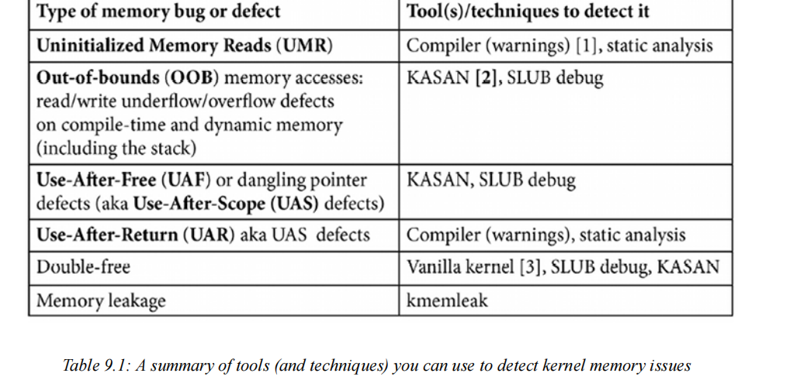
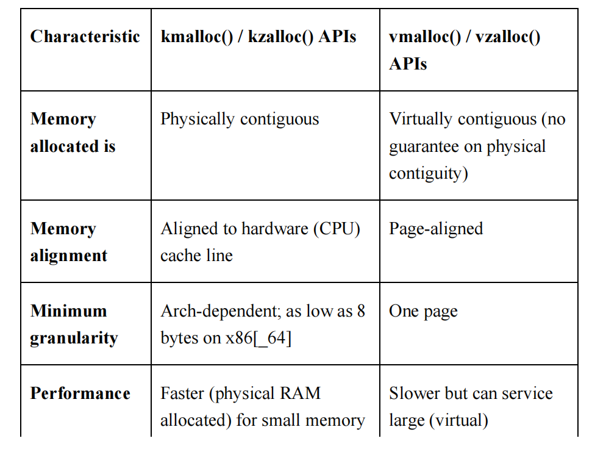
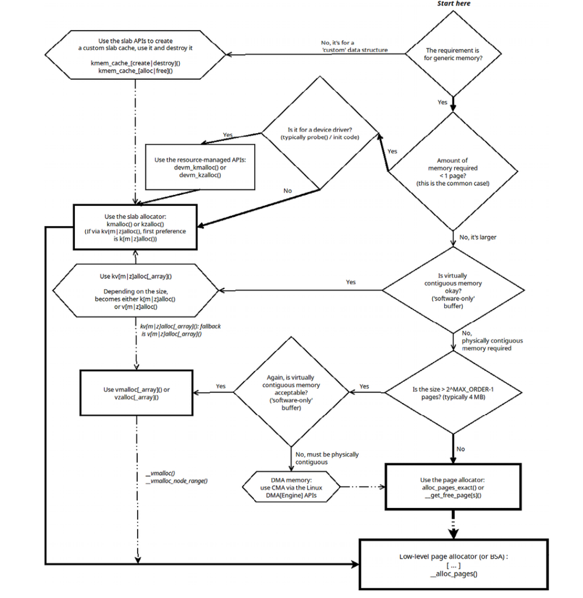
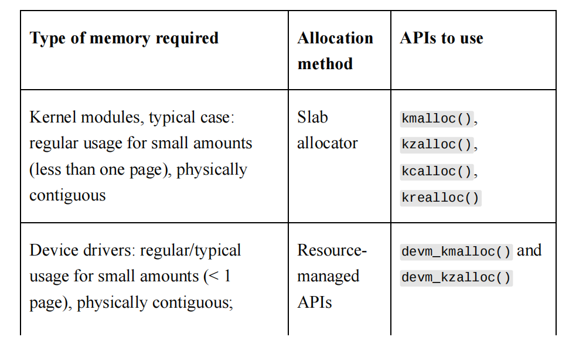
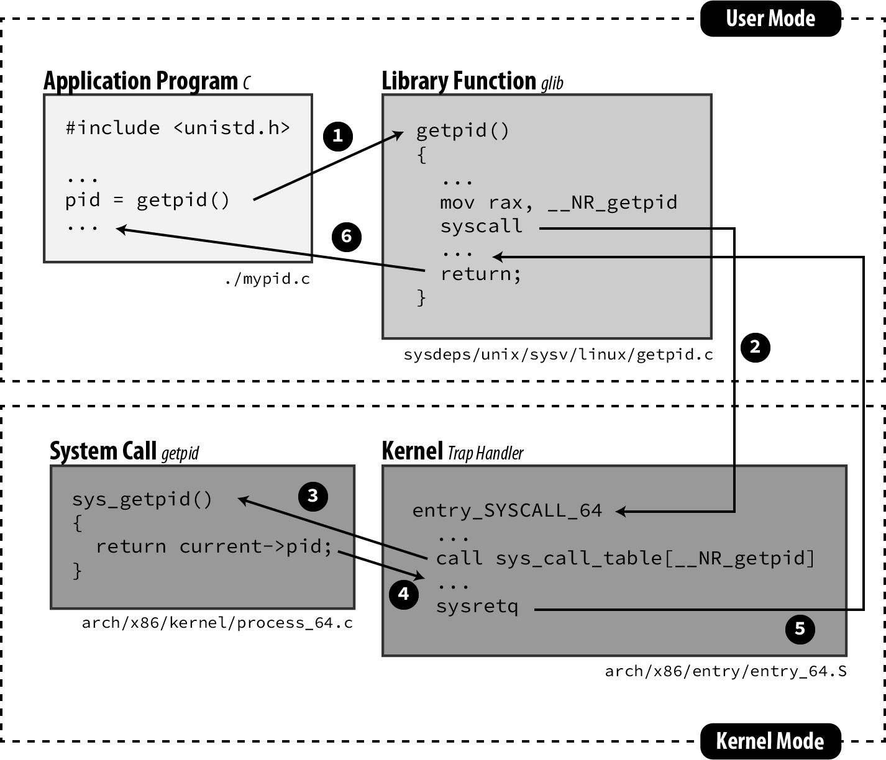

- ## Linux kernel programming

  ### 内核编程基础：线程和进程

  #### 理解进程和中断上下文 

  ​	在第 4 章“编写您的第一个内核模块 - 第 1 部分”中，我们介绍了一个简短的部分，题为“理解内核架构 - 第 1 部分”（如果您还没有阅读，我建议您在继续阅读之前先阅读一下）。我们现在将扩展此讨论。 首先，现代处理器以不同的特权级别执行代码。

  ​	例如，基于 x86 的处理器提供四个特权级别（或环），**其中 Ring 0 是最高特权，Ring 3 是最低特权。同样，ARM-32（AArch32）有七种执行模式，其中六种是特权模式。 ARM64（AArch64）使用异常级别的概念（EL0 到 EL3，其中 EL0 是最低特权，EL3 是最高特权）。**但实际上，关键点是：所有现代操作系统都只使用两个可用的 CPU 特权级别 - 一个特权级别和一个代码执行的非特权级别；我们分别将它们称为内核模式和用户模式。 了解大多数现代操作系统在设计上都是单片的也很重要。单片这个词的字面意思是一块大石头。我们稍后会讨论这如何应用于我们最喜欢的操作系统！ 现在，只需理解单片的含义：当进程或线程发出系统调用时，它会切换到（特权）内核模式，执行内核代码，并可能处理内核数据。是的，没有内核或内核线程代表它执行代码；发出系统调用的进程（或线程）切换到内核模式并自行执行内核代码。因此， 我们说内核代码在用户空间进程或线程的上下文中执行——我们将此执行上下文称为进程上下文。想想看， 内核的很大一部分正是以这种方式执行的，包括设备驱动程序的大部分代码。 （仅供参考，即使是处理器异常（如页面错误或系统调用）的处理以及 CPU 调度，也是在进程上下文中执行的）。

  ​	好吧，您可能会问，现在我明白了这一点，除了进程上下文之外，内核代码还能如何执行？还有另一种方式：当硬件中断（来自外围设备 - 键盘、网卡、磁盘等）触发时，CPU 的控制单元会保存当前上下文并立即重新引导 CPU 运行中断处理程序（中断服务例程 (ISR)）的代码。现在，此代码也在内核（特权）模式下运行 - 实际上，这是切换到内核模式的另一种异步方式（除非您已经在那里）！许多设备驱动程序的中断代码路径都是这样执行的；我们现在说以这种方式执行的内核/驱动程序代码是在中断上下文中执行的。 （再次提醒，仅供参考，一些现代驱动程序使用线程中断模型，其中大多数中断处理发生在内核线程上下文中，实际上是在进程上下文中）。

  ​	因此，任何和所有内核（或模块/驱动程序）代码都由以下两种上下文之一输入和执行：进程上下文：由于进程或线程发出系统调用或发生处理器异常（例如页面错误），内核代码被执行，并且内核数据被处理，因此进入内核空间；它通常是同步的。中断上下文：由于外围芯片断言硬件中断，内核（和/或驱动程序）代码被执行，并且内核数据被处理，因此进入内核空间；它是异步的。

  ​	图 6.1 显示了概念视图：用户模式进程和线程在非特权用户上下文中执行；用户模式线程可以通过发出系统调用切换到特权内核模式。该图还向我们展示了 Linux 中也存在纯内核线程；它们与用户模式线程非常相似，关键区别在于它们仅在内核空间中执行；它们甚至无法“看到”用户 VAS。通过系统调用（或处理器异常）同步切换到内核模式，任务现在在进程上下文中运行内核代码。（内核线程也在进程上下文中运行内核代码）。 然而，硬件中断是另一回事——它们抢占任何东西，包括内核代码，导致执行异步切换到内核特权（如果尚未处于其中）。它们执行的代码（通常是内核或设备驱动程序的中断处理程序）在所谓的中断上下文中运行。 图 6.1 显示了更多细节——中断上下文的上半部分和下半部分、内核线程和工作队列；

  

  #### 了解进程虚拟地址空间 (VAS) 的基础知识 

  ​	虚拟内存的一个基本“规则”是：所有可能可寻址的内存都在一个盒子里；也就是说，它是沙盒化的。我们将这个“盒子”视为进程映像或进程 VAS。从盒子“外面”看是不可能的。

  ​	用户 VAS 被划分为称为段的同质内存区域，或者更技术性地说，称为映射（因为它们是通过 mmap() 系统调用在内部构建的）。图 6.2 显示了每个 Linux（用户空间）进程将具有的最小映射（段）：

  

  ​	让我们快速分析一下这些段或映射（从下往上）：

  文本段：这是存储机器代码的地方；它是处理器核心的指令指针（或等效）寄存器指向的地方，而进程的线程执行代码时 - 静态/固定大小（模式：r-x）。
  （请注意，文本段不是从虚拟地址 0x0 开始的；它比该地址高出一段距离。事实上，第一个虚拟页面 - 封装 NULL 地址（0x0）的页面 - 称为“空陷阱”页面。稍后将详细介绍空陷阱。）

  数据段：紧挨着文本映射。这是存储全局和静态数据变量的地方（模式：rw-）。实际上，有三个不同的数据段：

  初始化数据段：预初始化的全局/静态变量存储在此处 - 静态/固定大小。

  未初始化的数据段：未初始化的全局/静态变量存储在此处（它们在运行时自动初始化为 0；此区域有时称为 bss）– 静态/固定大小。

  堆段：用于内存分配和释放的标准 C 库 API（熟悉的 malloc() 例程系列）从此处获取内存。这也不完全正确。在现代 glibc 上，只有 malloc() 调用低于 MMAP_THRESHOLD 字节（默认为 128 KB）的内存才会从堆中获取内存。任何请求的更大大小都作为进程 VAS 中的单独映射分配（通过强大的 mmap() 系统调用），称为匿名（或 anon）映射。堆是一个动态段（它可以增大/缩小大小）。我们通俗地说，堆“向更高的虚拟地址增长”。堆上最后一个合法可引用的位置称为程序中断（可通过调用 sbrk(0) 检索）。

  共享库（文本、数据）：进程动态链接到的所有共享库都映射（在运行时，通过加载器调用 mmap()）到进程 VAS 中 - 位于堆顶部和 main() 线程堆栈之间的某个位置（模式：r-x/rw-）。堆和堆栈之间的这个一般区域还保存任何其他线程的堆栈内存（除了 main() 的堆栈内存）、匿名内存和共享内存区域。

  堆栈：使用后进先出 (LIFO) 语义的内存区域；堆栈用于实现高级语言的函数调用机制，实际上保存线程的执行上下文。堆栈（框架）包括参数传递、局部变量实例化（和销毁）和返回值传播的工作。它是一个动态段。在所有现代处理器（包括 x86 和 ARM 系列）上，堆栈都会向较低的虚拟地址“向下增长”（称为完全下降堆栈）。每次调用函数时，都会根据需要分配和初始化堆栈框架（或调用框架）；堆栈框架的精确布局非常依赖于 CPU（您必须参考相应的 CPU 应用程序二进制接口 (ABI) 文档 - 请参阅进一步阅读部分以获取参考资料）。处理器核心的堆栈指针 (SP) 寄存器（或等效寄存器）始终指向当前框架，即堆栈的顶部；随着堆栈向较低的（虚拟）地址增长，堆栈的顶部实际上是最低的（虚拟）地址！这不直观，但确实如此（模式：rw-）。 （仅供参考，当然还有更多内容；当调用函数时，堆栈框架实际上并没有被分配和初始化，那样会太慢。同样，当函数返回时，它们也不会被释放；随着你的进步，你会学到更多。）当然，你会明白进程必须包含至少一个执行线程（线程是进程内的执行路径）；

  一个保证的线程当然是 main() 函数。在图 6.2 中，作为示例，我们展示了三个执行线程——main、thrd2 和 thrd3。此外，正如预期的那样，每个线程都共享进程 VAS 中的所有内容，除了堆栈；正如你所知，每个线程都有自己的私有堆栈。main 的堆栈显示在进程（用户）VAS 的最顶部； thrd2 和 thrd3 线程的堆栈，可以分配在库映射之间的任何位置，并且主堆栈通过此区域中的两个（蓝色）方块表示。

  #### 组织进程、线程及其堆栈 - 用户和内核空间

  ​	传统的 UNIX 进程模型 - **一切都是进程；如果不是进程，那就是文件** - 有很多优点。经过五十多年的发展，它仍然是操作系统所遵循的模型，这一事实充分证明了这一点。当然，如今，线程被视为原子执行上下文；线程是进程内的执行路径。

  ​	线程共享所有进程资源，包括用户 VAS、打开的文件、信号配置、IPC 对象、凭据、分页表等，但堆栈除外。每个线程都有自己的私有堆栈区域（这完全说得通；如果不是，线程如何真正并行运行，因为堆栈保存着执行上下文）。

  ​	我们关注线程而不是进程的另一个原因在第 10 章“CPU 调度程序 - 第 1 部分”中得到了更清晰的说明。现在，我们只能这样说：线程，而不是进程，是内核可调度实体（又名 KSE）——它是被调度到 CPU 核心上运行的实体。这是 Linux 操作系统架构的一个关键方面的结果。在 Linux 上，每个线程（包括内核线程）都映射到称为任务结构的内核元数据结构。任务结构（也称为进程描述符）本质上是一个大型内核数据结构，内核将其用作每个线程的属性结构。对于每个活动线程，内核都会维护一个相应的任务结构（参见图 6.3，不用担心，我们将在接下来的章节中详细介绍任务结构）。下一个要掌握的关键点是，我们要求每个线程每个 CPU 支持的特权级别都有一个堆栈。在 Linux 等现代操作系统上，我们支持两种 CPU 特权级别 - 非特权用户模式（或用户空间）和特权内核模式（或内核空间）。因此，在 Linux 上，每个活动用户空间线程都有两个堆栈：

  - 用户空间堆栈：当线程执行用户模式代码路径时，此堆栈正在运行。

  - 内核空间堆栈：当线程切换到内核模式（通过系统调用或处理器异常）并执行内核代码路径（在进程上下文中）时，此堆栈正在运行。


  ​	当然，每条好规则都有一个例外：内核线程（简称 kthreads）是纯粹存在于内核中的线程，因此只能“查看”内核（虚拟）地址空间；它们无法“看到”用户空间。因此，这些 kthreads 只会执行内核空间代码路径，每个 kthread 只有一个堆栈 - 内核空间堆栈。

  ​	此外，这可能会让您想知道在处理硬件中断处理程序时使用什么堆栈；尽管依赖于架构，但内核通常为每个核心维护一个 IRQ 堆栈，仅用于此目的。

  ​	下面是一个简单示例，可帮助您明确这一关键点：当您执行经典的 K&R C“Hello, world”进程时，内核会创建该进程；这会让内核设置并初始化几个对象 - 其中包括进程任务结构、其进程 VAS（包括用户模式堆栈）以及一个独特的内核模式堆栈。一旦运行，进程当然会首先在用户模式下执行 printf() API，从而利用用户空间堆栈（main()）。printf() 在设置完成后，发出 write() 系统调用！这会让我们的进程切换到内核模式，并实际将 Hello, world\n 字符串（通过内核中的 tty 层代码路径）写入 stdout 设备。由于它现在执行内核代码（在内核模式下），因此它会利用其内核空间堆栈。图 6.3 将地址空间分为两个部分 - 用户空间和内核空间。

  ​	在图表的上部 - 用户空间 - 您可以看到多个进程及其用户 VAS 的概念视图。在下部 - 内核空间（所有用户模式进程共享的大型单片空间） - 您可以看到对应于每个用户模式线程的内核元数据结构 struct task_struct（我们将在稍后详细介绍）和该线程的内核模式堆栈。
  此外，我们（在最底部）看到三个内核线程（标记为 kthrd1、kthrd2 和 kthrdn）；正如预期的那样，它们也有一个代表其内部（属性）的 task_struct 元数据结构和一个内核模式堆栈：

  

  #### 运行一个小脚本来查看，活跃的进程和线程的数量

  ```
****************************************************************
# * Brief Description:
# * Counts the total number of processes, user and kernel threads currently
# * alive on the system.
# * For details, please refer the book, Ch 6.
# ****************************************************************
set -euo pipefail
echo "System release info:"
which lsb_release >/dev/null && lsb_release -a || true
[[ -f /etc/issue ]] && cat /etc/issue
[[ -f /etc/os-release ]] && cat /etc/os-release

total_prcs=$(ps -A|wc -l)
printf "\nTotal # of processes alive               = %9d\n" ${total_prcs}

# ps -LA shows all threads
total_thrds=$(ps -LA|wc -l)
printf "Total # of threads alive                 = %9d\n" ${total_thrds}

# ps aux shows all kernel threads names (col 11) in square brackets; count 'em
total_kthrds=$(ps aux|awk '{print $11}'|grep "^\["|wc -l)

printf "Total # of kernel threads alive          = %9d\n" ${total_kthrds}
printf "Thus, total # of user mode threads alive = %9d\n" $((${total_thrds}-${total_kthrds}))

exit 0
  ```

  ```
System release info:
No LSB modules are available.
Distributor ID:	Ubuntu
Description:	Ubuntu 22.04.4 LTS
Release:	22.04
Codename:	jammy
Ubuntu 22.04.4 LTS \n \l

PRETTY_NAME="Ubuntu 22.04.4 LTS"
NAME="Ubuntu"
VERSION_ID="22.04"
VERSION="22.04.4 LTS (Jammy Jellyfish)"
VERSION_CODENAME=jammy
ID=ubuntu
ID_LIKE=debian
HOME_URL="https://www.ubuntu.com/"
SUPPORT_URL="https://help.ubuntu.com/"
BUG_REPORT_URL="https://bugs.launchpad.net/ubuntu/"
PRIVACY_POLICY_URL="https://www.ubuntu.com/legal/terms-and-policies/privacy-policy"
UBUNTU_CODENAME=jammy

Total # of processes alive               =       321
Total # of threads alive                 =      1038
Total # of kernel threads alive          =       174
Thus, total # of user mode threads alive =       864
  ```

  #### 用户空间组织

  ​	参考我们在上一节中运行的 countem.sh Bash 脚本，我们现在将其分解并讨论一些关键点，目前将我们自己限制在进程 VAS 的用户空间部分。请仔细阅读并理解这一点（我们在以下讨论中引用的数字是关于我们运行小脚本以查看活动进程和线程数部分中 countem.sh 脚本的示例运行）。为了更好地理解，我将图表的用户空间部分放在这里：

  

  ​	在这里（图 6.4），您可以看到三个单独的用户模式进程。每个进程至少有一个执行线（main() 线程）。在这里，我们展示了三个进程，P1、P2 和 Pn，它们分别有一个、三个和两个线程，包括 main()。在我们前面的示例运行（运行小脚本以查看活动进程和线程数部分中显示的脚本）countem.sh 脚本中，Pn 的 n=234。
  请注意，这些图表纯粹是概念性的。例如，实际上，PID 为 2 的进程通常是名为 kthreadd 的单线程内核线程。
  每个进程由多个段（技术上称为映射）组成。广义上讲，用户模式段（或映射）如下：

  - 文本：代码；r-x
  - 数据段：rw-；由三个不同的映射组成 - 已初始化的数据段、未初始化的数据段（或 bss）和“向上增长”的堆
  - 库映射：对于每个共享库的文本和数据，进程动态链接到：
  - 向下增长的堆栈。

  ​	关于这些堆栈，我们从前面的示例运行中看到，系统上当前有 398 个用户模式线程处于活动状态。这意味着也有 398 个用户空间堆栈，因为每个活动用户模式线程都会有一个用户模式堆栈。关于这些用户空间线程堆栈，我们可以得出以下结论：main() 线程始终有一个用户空间堆栈，它将位于用户 VAS 的最顶部（高端）附近。如果进程是单线程的（只有一个 main() 线程），那么它将只有一个用户模式堆栈；图 6.4 中的 P1 进程显示了这种情况。另外，很重要的一点是：在 Linux 上，任何 foo() 系统调用通常都会成为内核中的 sys_foo() 函数。此外，通常但并非总是，这个 sys_foo() 函数是一个调用“真实”代码 do_[*]_foo() 的包装器。进一步的细节：在内核代码中，您可能会看到 SYSCALL_DEFINEn(foo, ...) 类型的宏；该宏将成为 sys_foo() 例程。附加的数字 n 在 [0,6] 范围内；它是通过系统调用从用户空间传递给内核的参数数量。如果进程是多线程的，则每个线程（包括 main()）都有一个用户模式线程堆栈；图 6.4 中的进程 P2 和 Pn 说明了这种情况。堆栈是在调用 fork(2)（针对 main()）或 pthread_create()（针对进程内剩余线程）时分配的，这会导致此代码路径在内核（在 kernel/fork.c 中）的进程上下文中执行：sys_fork() -->kernel_clone()
  ​	另外，仅供参考，Linux 上的 Pthreads 创建库 API pthread_create() 调用（非常特定于 Linux 的）clone() 系统调用（内核中的代码在此处：kernel/fork.c:sys_clone()）。此系统调用最终调用 kernel_clone()；传递的参数（特别是标志值）会告知内核如何创建自定义进程（换句话说，就是线程）！

  ​	用户空间堆栈当然是动态的；它们可以增大（也可以缩小）到堆栈大小资源限制 RLIMIT_STACK（通常为 8 MB - 您可以使用 prlimit 实用程序来查找）。

  #### 内核空间组织

  ​	我们继续讨论 countem.sh Bash 脚本（我们在运行一个小脚本来查看活动进程和线程的数量部分中运行过该脚本），现在我们将对其进行分解并讨论一些关键点，将我们自己限制在 VAS 的内核空间部分。请注意仔细阅读并理解这一点（同时阅读我们在前面运行的 countem.sh 脚本的示例中输出的数字）。为了更好地理解，我将图表的内核空间部分放在这里（图 6.5）

  

  ​	同样，从我们前面的示例运行中，您可以看到系统上当前有 398 个用户模式线程和 116 个内核线程处于活动状态。这总共产生了 514 个内核空间堆栈。怎么会这样？如前所述，每个用户模式线程都有两个堆栈 - 一个用户模式堆栈和一个内核模式堆栈。因此，我们将为每个用户模式线程提供 398 个内核模式堆栈，并为（纯）内核线程提供 116 个内核模式堆栈（回想一下，内核线程只有一个内核模式堆栈 - 它们根本无法“看到”用户空间），总共有 (398+116=) 514 个内核空间堆栈。让我们列出内核模式堆栈的一些特征：每个活动的用户模式线程（包括 main()）都会有一个内核模式堆栈。内核模式堆栈的大小是固定的（静态的），而且非常小。实际上，它们的大小在 32 位操作系统上为 2 页，在 64 位操作系统上为 4 页（页面大小通常为 4 KB）。

  ​	不要简单地假设页面大小始终为 4 KB - 在用户空间中，使用 getpagesize() 系统调用查询其值；在内核空间中，PAGE_SIZE 宏产生相同的值。

  它们是在线程创建时分配的（通常归结为内核代码：kernel_clone() --> copy_process() -->
  dup_task_struct()）。

  再次，让我们明确这一点：每个用户模式线程都有两个堆栈 - 一个用户模式堆栈和一个内核模式堆栈。此规则的例外是内核线程；它们只有一个内核模式堆栈（因为它们没有用户映射，因此没有用户空间段）。在图 6.5 的下半部分，我们展示了三个内核线程 - kthrd1、kthrd2 和 kthrdn（在我们前面的示例运行中，kthrdn 的 n=116）。此外，每个内核线程都有一个任务结构和一个在创建时分配给它的内核模式堆栈。内核模式堆栈在大多数方面都与其用户模式堆栈相似 - 每次调用内核空间内的函数时，都会设置一个堆栈框架（框架布局特定于架构并构成 CPU ABI 文档的一部分；有关这些详细信息，请参阅进一步阅读部分）。CPU 有一个寄存器来跟踪堆栈的当前位置（通常称为堆栈指针 (SP)），堆栈向较低的虚拟地址“增长”。但是，与动态用户模式堆栈不同，内核模式堆栈的大小是固定的并且很小。对于内核/驱动程序开发人员来说，内核模式堆栈大小非常小（两页或四页），这有一个重要含义 - 执行堆栈密集型工作（例如使用大型局部变量或递归）时要非常小心，不要溢出内核堆栈。

  ​	存在一个内核可配置（CONFIG_FRAME_WARN）来警告您编译时内核堆栈使用率过高；

  #### 总结内核中的线程、任务结构和堆栈

  ​	好的，很好，现在让我们总结一下从前面的讨论和 countem.sh 脚本示例运行中获得的知识和发现（在运行小脚本以查看活动进程和线程的数量部分）：

  - 任务结构：

    - 每个活动线程（用户或内核）在内核中都有一个相应的任务结构（struct task_struct）；这就是内核跟踪和管理它的方式。此外，所有线程的属性都存储在这里（您将在“了解和访问内核任务结构”部分中了解更多相关信息）
    - 由于系统上总共有 514 个线程（用户和内核）处于活动状态，这意味着内核内存中总共有 514 个任务（元数据）结构（在代码中，它是 struct task_struct），其中我们可以说以下内容：
    - 其中 398 个任务结构代表用户线程。
    - 其余（514 - 398 =）116 个任务结构代表内核线程。

  - 堆栈：

    - 每个用户空间线程都有两个堆栈：
      - 用户模式堆栈（线程执行用户模式代码路径时使用）
      - 内核模式堆栈（线程执行内核模式代码路径时使用）
      - 此外，当硬件中断处理程序执行其代码路径时，还存在一个单独的每核 IRQ 堆栈供使用
    - 异常情况：内核线程只有一个堆栈，即内核模式堆栈
    - 因此，对于我们的 ch6/countem.sh 脚本的示例运行，我们有：
      - 398 个用户空间堆栈（在用户空间中）。
      - 以上，加上 398 个内核空间堆栈（在内核内存中）。
      - 以上，加上 116 个内核空间堆栈（用于 116 个活动内核线程）。
      - 总计为 398 + 398 + 116 = 912 个堆栈！ （在 64 位 Linux 上，每个内核模式堆栈有 4 页，假设页面大小为 4 KB，则堆栈内存占用了 4\\*4096\*912=14.25 MB 的 RAM）。

    

    

  ​	正如前面简要提到的，许多架构（包括 x86 和 ARM64）支持单独的每个 CPU 堆栈用于中断处理（称为 IRQ 堆栈）。当发生外部硬件中断时，CPU 的控制单元立即将控制权重新引导到最终的中断处理代码（可能在设备驱动程序内）。单独的每个 CPU 中断堆栈用于保存中断代码路径的堆栈帧；这有助于避免对被中断的进程/线程的现有（小）内核模式堆栈施加太大压力。IRQ 堆栈大小将与该体系结构的内核模式堆栈大小相同。（此外，像 x86_64 这样的体系结构支持更多类型的堆栈，但我们不会进一步深入研究）。
  好的，现在您已经了解了用户和内核空间在进程/线程及其堆栈方面的总体组织，让我们继续了解如何实际查看内核和用户空间堆栈的内容。除了对学习有用之外，这些知识还可以极大地帮助您进行调试。

  #### 查看用户和内核堆栈

  ​	堆栈通常是调试会话的关键。堆栈保存了线程的当前执行上下文 - 它现在在哪个函数中执行代码，以及关键的是，它是如何到达这里的 - 这使我们能够推断历史记录（它在做什么以及发生了什么）。能够查看和解释线程的调用堆栈（又称调用链/调用跟踪/回溯）至关重要，这使我们能够了解我们究竟是如何到达这里的。所有这些宝贵的信息都驻留在堆栈中。但是，每个线程都有两个堆栈——用户空间和内核空间堆栈。我们如何查看它们的内容？在这里，我们将展示两种查看给定进程或线程的内核和用户模式堆栈的广泛方法，首先是通过传统方法，然后是较新的现代方法（通过 eBPF）。请继续阅读。查看堆栈的传统方法让我们首先学习使用我们称之为传统方法的方法查看给定进程或线程的内核和用户模式堆栈。让我们从内核模式堆栈开始。查看给定线程或进程的内核空间堆栈好消息；这很容易。 Linux 内核通过通常的机制使给定线程的内核堆栈可见，以将内核内部信息暴露给用户空间——强大而多功能的 proc 文件系统接口。只需读取伪文件 /proc/PID/stack 的内容即可。

  ```
charlie@charlie-ubuntu:~/Linux-Kernel-Programming_2E/ch6$ sudo cat /proc/1953/stack
[<0>] do_wait+0x173/0x320
[<0>] kernel_wait4+0xbd/0x170
[<0>] __do_sys_wait4+0xad/0xc0
[<0>] __x64_sys_wait4+0x1c/0x30
[<0>] x64_sys_call+0x1e93/0x20b0
[<0>] do_syscall_64+0x55/0x90
[<0>] entry_SYSCALL_64_after_hwframe+0x73/0xdd
  ```

  ​	在前面的输出中，每一行代表堆栈上的一个调用框架（或堆栈框架）。为了帮助解读内核堆栈回溯，有必要了解以下几点：

  显示的名称是被调用函数的名称 - 例如，
  这里看到的第二个函数名为 do_syscall_64()（因为我们总是从下往上读取堆栈跟踪）。函数调用图的顺序是从下往上；因此输出应以自下而上的方式读取。因此，这里意味着
  （忽略最底部的第一个）调用图如下：
  do_syscall_64() --> __x64_sys_wait4() --> __do_sys_wait4() -->kernel_wait4() --> do_wait()。
  输出的每一行代表一个调用框架 - 实际上是调用链中的一个函数。如果调用框架以一个或多个 ? 为前缀，则表示调用框架是调用链中的一个函数。符号，这意味着内核无法可靠地解释此堆栈帧。忽略它，这是内核在说它很可能是一个无效的堆栈帧（遗留的一个小点）；内核回溯代码通常是正确的！（请注意，通常，堆栈内存的相同部分会被不断重用；这可能会留下与当前堆栈无关的先前调用堆栈的点。）

  ​	如前所述，在 Linux 上，任何 foo() 系统调用通常都会成为内核中的 sys_foo() 函数。此外，通常（但并非总是），sys_foo() 是一个调用“真实”代码 do_[*]_foo() 的包装器。

  现在，再看看前面的输出。应该很清楚：我们的 Bash进程目前正在内核中执行 do_wait() 函数；调用图清楚地向我们展示了它通过系统调用，即 wait4() 系统调用到达那里！这是完全正确的； shell 的工作方式是分叉一个子进程，然后通过 wait4(2) 系统调用等待其消亡。
  接下来，`<func>`+x/y 语法有什么用处—

  第一个数字（x，始终为十六进制）是从当前执行所在的函数开头的字节偏移量。
  第二个数字（y，同样为十六进制）是内核认为的这个函数的长度；它通常是正确的。

  因此，在这里，do_wait+0x184/0x340 意味着 do_wait() 函数正在从函数开头偏移 0x184（十进制 388）字节的位置执行其机器代码，并且函数的长度为 0x340（十进制 832）字节！ 

  查看给定线程或进程的用户空间堆栈

  具有讽刺意味的是，在典型的 Linux 发行版上查看进程或线程的用户空间堆栈似乎更难（与查看内核模式堆栈相反，正如我们在上一节中看到的）。有一个实用程序可以做到这一点：
  gstack。实际上，它只是对脚本的简单包装，该脚本以批处理模式调用古老的 GDB 调试器，让 GDB 调用其回溯命令。

  #### eBPF – 查看两个堆栈的现代方法

  ​	现在 – 更令人兴奋！ – 让我们学习使用强大的现代方法的基础知识，利用（截至撰写本文时）称为扩展伯克利数据包过滤器 (eBPF) 的最新技术。我们确实在在线章节“内核工作区设置”中的“其他有用项目”部分中提到了 eBPF 项目。较旧的 BPF 已经存在很长时间了，并已用于网络数据包跟踪； eBPF 是一项相对较新的创新，仅在 4.x Linux 内核上可用（当然，这意味着您需要在 4.x 或更新的 Linux 系统上使用此方法）。

  ​	直接使用底层内核级 BPF 字节码技术（极其）困难；因此，好消息是该技术有几个易于使用的前端（工具和脚本）。在前端中，BPF 编译器集合 (BCC) 和 bpftrace 被认为非常有用。（可以在 https://github.com/iovisor/bcc/blob/master/images/bcc_tracing_tools_2019.png 找到显示当前 BCC 性能分析工具的图表；可以在 http://www.brendangregg.com/ebpf.html#frontends 找到 eBPF 前端的列表。）

  ​	在这里，我们将使用名为 stackcount 的 BCC 工具进行快速演示（至少在 Ubuntu 上，这些 eBPF 工具以字符串 -bpfcc 为后缀，因此这个工具名为 stackcount-bpfcc）。另一个优点是，使用此工具可以同时查看内核和用户模式堆栈；无需单独的工具。

  您可以通过阅读此处的安装说明来为您的主机 Linux 发行版安装 BCC 工具：
  https://github.com/iovisor/bcc/blob/master/INSTALL.md。在运行我们自定义的 6.1 内核时，如何在我们的客户 Linux VM 上安装它们？您可以（不过，在早期的内核版本中，这可能会出现问题，需要运行发行版内核，例如 Ubuntu 或 Fedora 提供的内核）。

  #### 理解和访问内核任务结构

  ​	正如您现在所了解的，每个用户和内核空间线程在 Linux 内核中都由包含其所有属性的元数据结构（任务结构）内部表示。任务结构在内核代码中表示如下：include/linux/sched.h:struct
  task_struct。

  ​	不幸的是，它经常被称为“进程描述符”，造成无尽的混乱！值得庆幸的是，短语任务结构要好得多；它代表一个可运行的任务——实际上是一个线程。

  因此，我们得到了：在 Linux 设计中，每个进程都由一个或多个线程组成，每个线程都映射到称为任务结构 (struct task_struct) 的内核元数据结构。

  ​	任务结构是线程的“根”元数据结构 - 它封装了操作系统为该线程所需的所有信息。这包括有关其内存（段/映射设置、分页表、使用信息等）、CPU 调度详细信息、当前打开的所有文件、其凭据、功能位掩码、计时器、锁、异步 I/O (AIO) 上下文、硬件上下文信息、信号配置、IPC 对象、资源限制、（可选）审计、安全和分析信息以及更多此类详细信息的概念表示。
  

  #### 确定上下文

  正如您现在所知，内核代码在以下两种上下文之一中运行：

  - 进程（或任务）上下文
  - 中断（原子）上下文

  ​	它们是互斥的 - 内核代码在任何给定时间点（我们很快会解释术语“原子”）在进程（有时是原子的）或中断上下文（始终是原子的）中运行。

  ​	为什么能够确定内核或驱动程序代码运行的上下文很重要？内核中的一条黄金法则是，您不能在任何类型的原子上下文中休眠（或阻塞）；这样做会导致内核错误。它会锁定系统，通常会导致内核崩溃。

  ​	为什么？好吧，首先要意识到休眠意味着上下文切换 - 在前一个任务进入休眠状态时切换 CPU 以运行另一个任务。因此，休眠意味着调用调度程序代码和随后的上下文切换（我们在第 10 章“CPU 调度程序 - 第 1 部分”和第 11 章“CPU 调度程序 - 第 2 部分”中详细介绍了这一点）。这确实是任何阻塞 API 的工作方式。但是，当在原子上下文中运行时 - 例如硬件中断（以及软件中断、softirq），或者当持有自旋锁时 - 必须在不阻塞、不休眠、不放弃 CPU 的情况下完成工作。这就是为什么使用“原子”这个词的原因；它意味着不间断地运行到完成。现在我们知道了这个规则 - 不要在原子上下文中休眠 - 问题出现了：我如何知道我的代码路径是否在原子上下文中运行？以下是您可以轻松确定内核/驱动程序代码当前正在执行的上下文的方法：#include <linux/preempt.h> if (in_task()) foo(); /* 在进程上下文中运行；通常可以安全休眠或 else bar(); /* 在原子上下文中运行；不安全休眠或阻塞 in_task() 宏返回布尔值；如果您的代码在进程（或任务）上下文中运行，则返回 True，通常可以安全地进入休眠状态；如果返回 False，则表示您处于某种原子上下文中（可能是中断上下文），因此永远无法安全地进入休眠状态。

  ​	您可能遇到过 in_interrupt() 宏的用法 - 如果它返回 True，则您的代码处于中断上下文中；如果返回 False，则不在中断上下文中。但是，对于现代代码，建议不要依赖此宏（因为禁用 Bottom Half (BH) 可能会干扰其工作）。因此，我们建议改用 in_task()。

  ​	不过请稍等！这可能会有点棘手：虽然 in_task() 返回 True 确实意味着您的代码处于进程上下文中，但这一事实本身并不能保证它当前是否是原子的，或者是否可以安全地进入休眠状态。例如，您可能在进程上下文中运行内核或驱动程序代码，但持有自旋锁（内核中使用的一种非常常见的锁）；在这里，锁定和解锁之间的代码 - 所谓的关键部分 - 必须以原子方式运行！这意味着尽管您的代码可能处于进程（或任务）上下文中，但如果它尝试发出任何可能阻塞（休眠）的 API，它仍会导致内核级错误！不用担心，锁定在本书的最后两章中详细介绍。）另外，请注意：（根据定义）当前宏的使用仅在进程上下文中运行时才被视为有效。

  ​	现在，您已经了解了有关任务结构的有用背景信息，如何通过当前宏访问它，以及找出内核或驱动程序代码当前正在运行的上下文。所以现在，让我们编写一些内核模块代码来检查一些内核任务结构！通过“current”使用任务结构在这里，我们将编写一个简单的内核模块来显示任务结构的几个成员。

  ​	此外，我希望您考虑一下：究竟是谁在运行此（或任何）内核模块（或内核）的初始化和清理代码路径？从我们了解到的情况来看，不是内核；如前所述，没有总体的“内核”进程……那么，谁在运行它？在 Linux 操作系统等单片内核中，答案应该很清楚：当用户空间进程（或线程）发出系统调用时，它会切换到内核模式并在进程上下文中运行内核（或模块）代码。所以，是的，它将是一个进程（或线程）。

### 内核内存管理内幕

#### 理解虚拟机分割

​	在本章中，我们将广泛地介绍 Linux 内核如何通过两种方式管理内存：

- 基于虚拟内存的方法，其中内存被虚拟化（通常情况）

- 内核如何组织物理内存（RAM 页面）的视图


​	首先，让我们从虚拟内存视图开始，然后在本章后面讨论物理内存组织。

​	正如我们在第 6 章“内核内部基本知识 - 进程和线程”中在“理解进程虚拟地址空间 (VAS) 的基础知识”部分中看到的那样，进程 VAS 的一个关键属性是它完全独立，是一个沙箱。你不能跳出框框看。在那一章的图 6.2 中，我们看到进程 VAS 的范围从虚拟地址 0x0 到我们简单称为“高地址”的范围。这个“高”地址的实际值是什么？它是 VAS 的最高范围，因此取决于用于寻址的位数；因此：

- 在运行于 32 位处理器（或为 32 位编译）的 Linux 操作系统上，最高虚拟地址将为 2 ^ 32 = 4 GB。
- 在运行于（并为其编译）64 位处理器的 Linux 操作系统上，最高虚拟地址将为 2 ^ 64 = 16 EB。（EB 是 Exabyte 的缩写，即1,152,921,504,606,846,976 字节或 1,024 PB。显然，这是一个巨大的数量；16 EB 是 16 x 1018 的数字。）

​	为简单起见，为了让数字易于管理，我们现在将重点放在 32 位地址空间上（我们当然也会介绍 64 位寻址）。因此，根据我们的讨论，在 32 位系统上，进程 VAS 的范围为 0 到 4 GB - 此区域由空白空间（未使用区域，称为稀疏区域或空洞）和有效内存区域组成，通常称为段（或更准确地说，映射）- 文本、数据、库和堆栈（所有这些内容已在第 6 章“内核内部基本知识 - 进程和线程”中详细介绍）。在我们理解虚拟内存的过程中，采用众所周知的 Hello, world K&R C 程序并（在很大程度上）了解其在 Linux 系统上的内部工作原理很有用；这就是下一节要介绍的内容！

#### 从hello.c 发生了什么入手

```
#include <stdio.h>
int main()
{
	printf("Hello, World");
}
```

​	进程正在调用 printf() 函数。您编写了 printf() 的代码吗？
​	“不，当然没有，”您说，“它在标准 C 库中，通常是 Linux 上的 glibc (GNU libc)。是的，您是对的；但是等等，除非 printf() 的代码和数据（以及类似的所有其他库 API）实际上位于进程 VAS 中，否则我们如何访问它？（回想一下，您不能跳出框框！）为此，printf() 的代码（和数据）（实际上是整个 glibc 库）必须映射到进程框中——进程 VAS。它确实在进程 VAS 中映射，在库段中或映射中（如我们在第 6 章“内核内部要点 - 进程和线程”图 6.2 中看到的那样）。这种映射是如何发生的？

​	实际情况是，在应用程序启动时，作为 C 运行时环境设置的一部分，有一个小型的可执行和可链接格式 (ELF) 二进制文件（嵌入到您的 a.out 二进制可执行文件中），称为加载器 (ld.so 或 ld-linux.so)。它在执行初期就被赋予控制权。它检测所有必需的共享库，并通过打开它们并发出 mmap() 系统调用，将所有共享库（库文本（代码）、数据和任何其他必需的段）映射到进程 VAS 中。所以，现在，一旦库的代码和数据被映射到进程 VAS 中，进程就可以访问它，因此 - 等待它 - printf() API 可以成功调用！（我们在这里跳过了内存映射和链接的详细细节。）进一步验证这一点，ldd 脚本（以下输出来自 x86_64 系统）显示情况确实如此：

```
 ldd test
	linux-vdso.so.1 (0x000075523d94d000)
	libc.so.6 => /usr/lib/libc.so.6 (0x000075523d71c000)
	/lib64/ld-linux-x86-64.so.2 => /usr/lib64/ld-linux-x86-64.so.2 (0x000075523d94f000)

```

需要注意的几点：
	每个 Linux 进程（自动且默认）至少链接到两个对象：glibc 共享库和程序加载器（编译/链接期间不需要显式链接器切换）。加载程序的名称因架构而异。在这里，在我们的 x86_64 系统上，它是 ld-linux-x86-64.so.2。在前面的 ldd 输出中，右侧括号内的地址是映射位置的（用户空间）虚拟地址。例如，在前面的输出中，glibc 被映射到我们的进程 VAS 中的用户虚拟地址（UVA），等于 0x00007feb7b85b000。请注意，它依赖于运行时（当启用地址空间布局随机化 (ASLR) 语义时，它也会在每次运行时发生变化（ASLR 通常默认启用；详细信息见下文））。

出于安全原因（以及在 x86 以外的架构上），最好使用objdump 实用程序来查找此类详细信息。尝试对 Hello, world 二进制可执行文件执行 strace，您将看到大量 mmap() 系统调用，它们映射到 glibc（和其他）段中！

现在让我们更深入地研究我们简单的 Hello, world 应用程序。

#### 超越 printf() API

正如您所知道的，printf() API 执行其漂亮的格式化并调用write() 系统调用，它当然会将“Hello, world”字符串写入 stdout –这里，默认情况下，stdout 将是（伪）终端窗口或控制台设备。我们还知道，由于 write() 是一个系统调用，这意味着运行此代码的当前进程（或线程）——进程上下文——现在必须切换到内核模式并运行 write() 的内核代码（单片内核架构）！确实如此。但是请稍等一下：write() 的内核代码位于内核 VAS 中（请参阅第 6 章“内核内部要点 - 进程和线程”，图 6.1）。这里的要点是关键的：如果内核 VAS 不在盒子里，那么我们究竟该如何调用它？好吧，可以通过将用户和内核 VAS 放入两个单独的 4 GB 空间来实现，
但这种方法会导致非常慢的上下文切换（以及昂贵的转换后备缓冲区 (TLB) 刷新），所以根本无法做到这一点。

它的设计方式是这样的：用户和内核 VAS 都“生活”在同一个“盒子”中 - 可用的 VAS。具体怎么做？通过按照某个用户：内核 :: U：K 比率在用户和内核之间划分可用地址空间。这称为 VM拆分（比率 U:K 通常以兆字节、千兆字节、太字节甚至
拍字节表示）。在许多 ARM-32 (AArch32) 和 x86-32 系统上，默认 VM 拆分通常为 3:1
GB。下图（图 7.1）代表具有 3:1 VM 拆分（单位为 GB）的 32 位 Linux 进程；也就是说，共 4 GB 的进程 VAS 被拆分为 3GB 的用户空间和 1 GB 的内核空间。换句话说，拆分可以描述为U:K :: 3:1。


#### 虚拟寻址和地址转换

​	在深入研究这些细节之前，清楚地理解几个关键点非常重要。考虑一个 C 程序中的一小段典型代码片段：

```
int i = 5;
printf("i 的地址是 0x%x\n", &i);
```

​	在功能丰富的现代操作系统（如 Linux、Unix、Windows 或 Mac）上运行此程序时，

​	您看到的 printf() 发出的地址（几乎）始终是虚拟地址，而不是物理地址。此外，我们区分两种虚拟地址：

​	如果您在用户空间进程中运行此代码，您将看到的变量 i 的地址是用户虚拟地址，简称 UVA。如果您在内核或内核模块中运行此代码（当然，您将使用 printk()（或类似）API 代替 printf()），您将看到的变量 i 的地址是内核虚拟地址 (KVA)。

​	接下来，正如人们通常认为的那样，虚拟地址不是绝对值（从 0 开始的偏移量）；它是为 MMU（现代微处理器硅片内的内存管理单元）设计和解释的位掩码：

​	在 32 位 Linux 操作系统上，32 个可用位被分为所谓的页面全局目录 (PGD) 值、页表 (PT) 值和偏移量。这些成为物理内存的索引，MMU 通过这些索引可以访问当前进程上下文的内核页表，执行地址转换。我们不打算在这里介绍 MMU 级地址转换的深层细节。它也非常特定于架构。

​	正如可以预料的那样，在 64 位系统上，即使使用 48 位寻址，虚拟地址位掩码中也会有更多字段。好吧，如果这个 48 位寻址是 x86_64 处理器上的典型情况，那么 64 位虚拟地址中的位是如何布局的？未使用的 16 个 MSB 位会发生什么？下图回答了这个问题；它表示 x86_64 Linux 系统上 64 位虚拟地址（位掩码）的分解：


​	本质上，对于 48 位寻址，我们使用位 0 到 47（LSB 48 位）并忽略MSB（最高有效位）16 位，将其视为符号扩展。不过，未使用的 MSB 16 位的值（如下所示）会随所引用的地址空间而变化：

- 在内核 VAS 中，MSB 16 位始终设置为 1。
- 在用户 VAS 中，MSB 16 位始终设置为 0。

​	这是有用的信息！了解这一点后，只需查看（完整的 64 位）虚拟地址，您就可以立即判断它是 KVA 还是 UVA；因此，在 x86_64

Linux 系统上：

- KVA 的格式始终为 0xffff XXXX XXXX XXXX
- UVA 的格式始终为 0x0000 XXXX XXXX XXXX

需要注意的是：上述格式仅适用于将虚拟地址定义为 KVA 或 UVA 的处理器（实际上是 MMU）；x86 和 ARM 系列处理器（32 位和 64 位）都属于此类。这里，MSB（位 63）充当分页表的选择器；如果设置，则将内核分页表（位于 swapper_pg_dir）用作正在引用的内核虚拟地址；如果清除，则将进程分页表（进程分页表基址的物理地址位于 x86[_64] 上的 CR3 寄存器中，ARM[64] 上的 TTBR0（转换表基址寄存器 0）寄存器中）用作正在引用的用户虚拟地址（而 TTBR1 保存内核主 PGD – swapper_pg_dir 的基址）。

另一点：N 级分页是什么意思？重新看一下图 7.2；在到达偏移量之前，有四个“间接”级别——页面全局目录 (PGD)、页面上层目录 (PUD)、页面中间目录 (PMD) 和页表条目 (PTE)。这是分页模式的一个属性——间接级别的数量；这里是 4，因此，我们称之为 4 级分页（稍后，图 7.6 将向您展示各种 N 级分页值）。

#### 从虚拟地址到物理地址——非常简短的概述

​	现在可以看到（我在这里重申），现实情况是虚拟地址不是绝对地址（从零开始的绝对偏移量，您可能错误地想象了）而是位掩码。事实上，内存管理是一个复杂的领域，其中的工作是共享的；让我们重申真正关键的要点：

​	每个活动进程都有一组分页表，将虚拟页面映射到物理页面（称为页框）；每当访问虚拟地址（用户或内核）时，分页表就会发挥作用。内核也有自己的分页表。操作系统创建和操作每个进程以及内核的分页表；工具链（编译器/链接器）生成虚拟地址。处理器 MMU 执行运行时地址转换，将给定的（用户或内核）虚拟地址转换为物理（RAM）地址。因此，再次，不深入细节，这里简要介绍通常称为硬件分页（此处为 x86）的总体过程（图 7.3 给出了总体流程的高级概述）：

1. 进程（或其中的线程）查找虚拟地址（UVA 或 KVA）——即，它对虚拟地址执行读/写/执行操作。（这是完全正常的、预期的行为；例如，读取或写入变量，或执行机器指令）。
2. 为了让 CPU 在内存中的该位置执行工作，我们现在必须以某种方式将此虚拟地址转换为其对应的物理对应地址。不过，请稍等：由于硬件优化，此步骤可以绕过或更快地完成（步骤 3.1、3.2）；如果不能，则必须通过MMU“手动”转换（速度较慢；步骤 4）。

3. 在进入 MMU 之前，一些硬件优化可以帮助我们加快速度，缩短“通常”较慢的路径：
  4. 首先，正在处理的代码或数据可能已经驻留在CPU 缓存中（L1/L2/L3/…）；首先检查这一点。如果确实如此，我们就有一个缓存命中：代码/数据项在 CPU 缓存本身内进行处理，然后完成工作。如果没有，则说明 CPU 缓存未命中（从技术上讲，是 LLC（最后一级缓存）未命中（成本高昂））；因此，我们进入下一步。（我们将在第 13 章“内核同步 - 第 2 部分”中介绍更多有关 CPU 缓存和缓存一致性问题的内容；暂时忽略它。）
  5. 虚拟地址是否已转换？查找 CPU 的转换后备缓冲区 (TLB)。如果转换存在，则说明 TLB 命中；如果是，则说明 TLB 中缓存了物理地址：跳至步骤 5；如果没有，则说明 TLB 未命中（成本高昂）。（另外：不一定按此处显示的顺序完成；某些微架构使用物理缓存模型，其中 CPU 缓存位于 MMU 和 RAM 访问之间，实际上颠倒了上述两个步骤的顺序）。
6. 将虚拟地址发送到 MMU；它现在“遍历”进程的分页表（它通过保存其物理地址的系统寄存器知道进程（或内核）的基页表在物理 RAM 中的位置），并最终得到相应的页框和物理地址（图 7.4 描述了此步骤）。
7. 物理地址（从前面的步骤之一获得）现在被搭载到 CPU 地址线上，然后开始工作。
   请确保您仔细阅读并理解这一点。除步骤 4 之外，所有显示的步骤均由图 7.3 描述；步骤 4 - 通过 MMU 进行转换的步骤 - 由图 7.4 描述。请研究它们。


​	对于 MMU 地址转换图（图 7.4），请注意，这里我们使用了一个非常特定于架构的 x86_64 示例，该示例具有 4 级分页、4 KB 页面大小和 48 位寻址。传递虚拟地址时，MMU 能够将其视为位掩码；它查找基本物理地址 - 它位于 x86 上的控制寄存器 3 (CR3) 中（在 ARM 系列中，它是用户进程的 TTBR0 寄存器和内核分页表的 TTBR1） - 然后继续进行转换。（想想这个：当然，CR3 中的基址是物理地址，否则此步骤将变得无限递归！）简而言之，这就是 MMU 执行运行时地址转换所做的事情：它查找基本 CR3 地址，将虚拟地址的 PGD 部分中的 9 位值添加到它，然后查找该数量。这是指向下一个表的指针，它重复上一步，但这次使用的是来自 9 位 PUD 字段的值。这继续（通过 PMD）直到页表，在那里它引用实际的页表条目 (PTE)。它包含（除其他微架构特定位外）指向物理页框的指针；将 12 位偏移量添加到页框的基址可得出物理地址。

实际情况更加微妙；这里有几个关键点值得一提。

首先，至少在理论上，当虚拟地址传递给 MMU 时，它会“遍历”分页表，最终结果应该是物理地址；实际上，MMU 地址转换尝试可能会失败！一种情况很明显：提供的虚拟地址不正确（未映射的地址）：实际上，我们有一个错误，一个缺陷，导致 MMU 引发故障（操作系统故障处理程序将适当地处理它）。另一种情况是请求分页——虚拟地址合法但物理内存尚未分配（尚未分配）的情况，导致转换失败（导致 MMU 引发“良好”故障，系统分配页面框架）。我们在第 9 章“模块作者的内核内存分配 - 第 2 部分”的“请求分页和 OOM”部分中详细介绍了这一点；如果您愿意，可以浏览图 9.9，其中显示了还可能发生的情况……当然，我们将在那里介绍详细信息。其次，内核作为老板，实际上可以绕过使用 MMU 并在软件中自己执行地址转换。实际上，这很少做，因为当然会更慢。一个地方是执行 IO（读取或写入）时，通过 /proc/PID/maps 伪文件利用 mmap() 进入进程 VAS。通过\采用这种方法，可以写入标记为只读的内存！（offlinemark 在这篇博客文章中详细介绍了这一点：Linux 内部：/proc/self/mem 如何写入不可写内存，2021 年 5 月：https://offlinemark.com/2021/05/12/an-obscure-quirk-of-proc/；请务必查看。）

​	我们不会在本书中深入探讨有关硬件分页（以及各种硬件加速技术，例如转换后备缓冲区 (TLB)）的更多细节。这些主题已在本章的“进一步阅读”部分中提到的其他各种优秀书籍和参考网站中得到很好的介绍。

#### 64 位 Linux 系统上的 VM 拆分

​	首先，值得注意的是，在 64 位系统上，并非所有 64 位都用于寻址。具有（典型）4 KB
页面大小的 x86_64 的标准 Linux 操作系统配置使用 LSB（最低有效位）48 位进行寻址。为什么不使用完整的64 位？这实在是太多了！现有的任何计算机都无法接近完整的 2^64 = 18,446,744,073,709,551,616 字节的一半，这相当于 16 EB（16EB，即 16,384 PB）的 RAM！

​	您可能会想，“为什么我们要将这种虚拟寻址等同于 RAM？”。请继续阅读 - 在弄清楚这一点之前，需要涵盖更多材料。在检查内核 VAS 部分，您将完全理解这一点。如上所述，64 位系统上可用的 VAS 是令人难以置信的巨大。当 Linus 正在开发第一个 64 位 Linux 端口（DEC Alpha，第一个商用 64 位处理器）时，他可能必须决定如何在这个巨大的 VAS 中布局进程和内核段。即使在今天的 x86_64Linux 操作系统上，做出的决定或多或少仍然保留（概念上）。这个巨大的 64 位 VAS 分为用户模式的 VAS 和内核的单独 VAS，如下所示。这里，我们假设 48 位寻址，页面大小为 4 KB：

- 128 TB 的进程 VAS 的所谓“规范下半部分”：用户 VAS –虚拟地址范围从 0x0 到 0x0000 7fff ffff ffff
- 128 TB 的进程 VAS 的所谓“规范上半部分”：内核 VAS虚拟地址范围从 0xffff 8000 0000 0000 到 0xffff ffff ffff ffff

“规范”一词实际上意味着按照法律或按照惯例。这个 64 位 VM 在 x86_64 Linux 上拆分平台如下图可见：


​	在上图中，您可以清楚地看到用户 VAS“锚定”在底部 128 TB，内核 VAS“锚定”在总共 16 EB VAS 的顶部 128 TB。那么中间未使用的区域（这里从 0x0000 8000 0000 0000 到 0xffff 7fff ffff ffff）呢？这只是一个空洞或稀疏区域；它也被称为非规范地址区域。有趣的是，正如图表告诉我们的那样，使用典型的 48 位寻址方案，大多数 VAS（99.998%）都未使用！这就是我们称 VAS 非常稀疏的原因。上图当然不是按比例绘制的！此外，请始终记住，这都是虚拟内存空间，而不是物理空间。
​	为了完善我们对 VM 分割的讨论，下图显示了一些针对不同 CPU 架构的常见用户：内核 VM 分割比率（同样，我们假设 MMU 页面大小为 4 KB，但最后一行除外，它使用 64 KB 大小的页面）：


#### 关于 x86_64 Linux 寻址的说明

以 x86_64 为例，2^47 为 128 TB；那么为什么地址位数是48（图 7.6 中 x86_64 的地址位数）而不是 47？当然，这是因为我们完全需要2*128 TB = 256 TB 的可用地址空间，128 TB 用于用户空间，另外 128 TB用于内核空间（2^48 = 256 TB）。

实际上，用于寻址的地址位数（图 7.6 中的第四列）决定了总使用虚拟内存的总体大小：用户 + 内核 –每个 VAS 通常获得总数的一半（例外往往是 32 位 x86 和 ARM-32，其中 VM 分割可以故意不相等）。我们用粗体（红色）突出显示第三行，因为它被认为是常见情况：在 x86_64（或 AMD64）架构上运行 Linux，使用用户：内核 :: 128 TB：128 TBVM 拆分。第四列 #Addr Bits 向我们展示了在 64 位处理器上，没有现实世界的处理器真正使用所有 64 位进行寻址。

在 x86_64 下，有两个 VM 拆分，如图 7.6（第 3 行和第 4 行）所示：

- 第一个（图 7.6 中的第 3 行），128 TB：128 TB（4 级分页）是目前 Linux x86_64 系统（嵌入式系统、笔记本电脑、PC、工作站和服务器）上默认使用的 VM 拆分。它将物理地址空间限制为 64 TB（RAM）。
- 第二个（图 7.6 中的第 4 行），64 PB：64 PB，至少在撰写本文时，仍然是纯理论的；它支持 4.14 Linux 中所谓的 5 级分页。分配的 VAS（使用 57 位寻址，我们获得了令人难以置信的 128 PB VAS 和 4 PB 物理地址空间！）非常庞大，以至于据我们所知，在撰写本文时，还没有实际的计算机使用它。

#### 关于 AArch64 Linux 寻址的说明

​	请注意，在 Linux 上运行的 AArch64（ARM-64）架构的两行仅具有代表性。从事该产品的 BSP 供应商或平台团队可以使用不同的分割（图 7.6 后面的注释在此处提到了确切含义）。
此外，表格中的最后一行提到了下一代 (AArch64) ARMv8.2 处理器提供 LPA 扩展的事实。启用后，页面大小为 64 KB，地址空间可以扩展到每个用户和内核地址空间中的 52 位（因此总共 53 位），每个提供 (2^53) 4 PB 的 VAS 空间（以及 4 PB 的物理内存上限）。从 Linux 5.4 开始支持此功能。

> 有关 AArch64 52 位寻址的更多详细信息，可在此处获取：
> 官方内核文档：AArch64 Linux 上的内存布局：https://www.kernel.org/doc/html/v6.1/arm64/memory.html
> 了解 Arm64 内核中的 52 位虚拟地址支持，B Sharma，2020 年 12 月：https://opensource.com/article/20/12/52-bit-arm64-kernel


​	好的，继续；内核 VAS（又名内核段）中实际驻留着什么？所有内核代码、内核数据结构（包括任务结构、列表、

​	内核模式堆栈、分页表等）、设备驱动程序、内核模块等都在这里（如第 6 章“内核内部基本知识 – 进程和线程”中图 6.3 的下半部分所示；我们将在即将到来的“理解内核段”部分详细介绍这一点）。重要的是要意识到，作为 Linux 上的性能优化，内核内存始终是不可交换的；也就是说，内核内存永远不能被分页到交换分区。用户空间内存页面始终是分页的候选，除非被锁定（请参阅 mlock\[all](2)系统调用）。
有了这些背景知识，您现在就可以很好地理解 Linux 操作系统上的完整进程 VAS
布局。继续阅读！

#### 理解进程 VAS – 完整视图

​	再次参考图 7.1；它显示了单个 32 位进程的实际和完整进程 VAS 布局。当然，现实情况是系统上所有活跃的进程都有自己独特的用户模式 VAS，但共享相同的内核 VAS。下图试图从概念上传达这一点；它显示了典型 IA-32（或可能是 AArch32）系统的情况，具有 3:1（GB）的 VM 分割。在这里，每个进程的用户空间都是独一无二的，所有进程共享相同的内核 VAS：


​	请注意上图中虚拟地址空间如何反映 3:1 (GB) VM 分割。用户 VAS 从 0 扩展到 0xbfff ffff（0xc000 0000 是 3 GB 标记；这就是 PAGE_OFFSET 宏在此处设置的值），而内核 VAS 从 0xc0000000（3 GB）扩展到 0xffff ffff（4 GB）。

​	在本章后面，我们将介绍一个名为 procmap 的有用实用程序的用法。它将帮助您详细地可视化内核和用户的 VAS，类似于我们前面的图表所显示的方式。

需要注意的几点：

- 对于图 7.7 中显示的示例，PAGE_OFFSET 内核宏的值为 0xc000 0000。
- 我们在此处显示的数字和数字并不是绝对的，也不是所有架构的约束力；它们往往非常特定于架构，许多高度供应商定制的 Linux 系统可能会更改它们（如图 7.6 所示）。
- 图 7.7 详细介绍了 32 位 Linux 操作系统上的 VM 布局。在 64 位 Linux 上，概念保持不变，只是数字（显著）发生了变化。如前面几节中详细显示的那样，x86_64（具有 48 位寻址和 4K 页）Linux 系统上的 VM 拆分为用户：内核 :: 128 TB：128 TB。

​	现在，您已经了解了进程虚拟内存布局的基本原理，您会发现它对解密和在难以调试的情况下取得进展大有帮助。像往常一样，还有更多内容；接下来的部分介绍了用户空间和内核空间虚拟内存映射（内核 VAS），以及物理内存映射的一些介绍。继续，继续！

#### 检查进程 VAS

​	我们已经介绍了每个进程的 VAS 的布局（段或映射）（请参阅第 6 章“内核内部要点 - 进程和线程”中的“了解进程虚拟地址空间 (VAS) 的基础知识”部分）。
我们了解到，进程 VAS 由各种映射或段组成；其中包括文本（代码）、数据段、库映射和至少一个堆栈。在这里，我们将大大扩展该讨论。
能够深入内核并查看各种运行时值对于像您这样的开发人员（以及应用程序用户、QA、系统管理员、DevOps 人员等）来说是一项重要技能。Linux 内核为我们提供了一个出色的界面来执行此操作——您猜对了，就是 proc 文件系统 (procfs)。

这个伪文件系统始终存在于 Linux 上（至少应该如此），并且默认安装在 /proc 下。 procfs 系统有两个主要任务：

- 提供一组统一的（伪或虚拟）文件和目录，使您能够深入了解内核和硬件内部细节。
- 提供一组统一的 root 可写文件，允许 sysad（或 root 用户）修改关键内核参数。这些文件位于 /proc/sys/ 下，称为sysctl – 它们是 Linux 内核的调整旋钮。

熟悉 proc 文件系统确实是必须的。我建议您查看它并阅读proc(5) 上的优秀手册页（通过在终端中输入 man 5 proc）。例如，只需执行 cat /proc/PID/status（其中 PID 当然是给定进程或线程的唯一进程标识符）即可从进程或线程的任务结构中获得大量有用的详细信息！

从概念上讲，与 procfs 类似的是 sysfs 文件系统，它安装在/sys 下（在其下是 debugfs，通常安装在 /sys/kernel/debug）。sysfs 是 >= 2.6 Linux 的新设备和驱动程序模型的表示；它公开了系统上所有设备（及其驱动程序）的树，以及几个内核调整旋钮。所有这些都是伪文件系统；
也就是说，它们安装在 RAM 中（因此它们的内容是易失性的）。

#### 详细检查用户 VAS

让我们从检查任何给定进程的用户 VAS 开始。通过 procfs 提供了用户 VAS 的非常详细的映射，特别是通过 /proc/PID/maps伪文件。让我们学习如何使用此接口来查看进程的用户空间
（虚拟）内存映射。我们将看到两种方法：

- 直接通过 procfs 接口的 /proc/PID/maps 伪文件
- 使用一些有用的前端（使输出更易于理解）

让我们从第一个开始。

#### 使用 procfs 直接查看进程内存映射

​	查找任何任意进程的内部进程详细信息确实需要 root 访问权限，而查找您拥有的进程的详细信息（包括调用者进程本身）则不需要。因此，作为一个简单的示例，我们将使用 self 关键字代替 PID 来查找调用进程的 VAS。以下屏幕截图显示了这一点（在 x86_64 Ubuntu 22.04 LTS 客户机上）：

```
56848f1c1000-56848f1c3000 r--p 00000000 00:19 16119                      /usr/bin/cat
56848f1c3000-56848f1c7000 r-xp 00002000 00:19 16119                      /usr/bin/cat
56848f1c7000-56848f1c9000 r--p 00006000 00:19 16119                      /usr/bin/cat
56848f1c9000-56848f1ca000 r--p 00007000 00:19 16119                      /usr/bin/cat
56848f1ca000-56848f1cb000 rw-p 00008000 00:19 16119                      /usr/bin/cat
5684a4d90000-5684a4db1000 rw-p 00000000 00:00 0                          [heap]
76e3ebc00000-76e3ec1f0000 r--p 00000000 00:19 54248                      /usr/lib/locale/locale-archive
76e3ec24a000-76e3ec28f000 rw-p 00000000 00:00 0 
76e3ec28f000-76e3ec2b3000 r--p 00000000 00:19 4061                       /usr/lib/libc.so.6
76e3ec2b3000-76e3ec41f000 r-xp 00024000 00:19 4061                       /usr/lib/libc.so.6
76e3ec41f000-76e3ec46d000 r--p 00190000 00:19 4061                       /usr/lib/libc.so.6
76e3ec46d000-76e3ec471000 r--p 001dd000 00:19 4061                       /usr/lib/libc.so.6
76e3ec471000-76e3ec473000 rw-p 001e1000 00:19 4061                       /usr/lib/libc.so.6
76e3ec473000-76e3ec47d000 rw-p 00000000 00:00 0 
76e3ec4b7000-76e3ec4bb000 r--p 00000000 00:00 0                          [vvar]
76e3ec4bb000-76e3ec4bd000 r-xp 00000000 00:00 0                          [vdso]
76e3ec4bd000-76e3ec4be000 r--p 00000000 00:19 4052                       /usr/lib/ld-linux-x86-64.so.2
76e3ec4be000-76e3ec4e5000 r-xp 00001000 00:19 4052                       /usr/lib/ld-linux-x86-64.so.2
76e3ec4e5000-76e3ec4ef000 r--p 00028000 00:19 4052                       /usr/lib/ld-linux-x86-64.so.2
76e3ec4ef000-76e3ec4f1000 r--p 00032000 00:19 4052                       /usr/lib/ld-linux-x86-64.so.2
76e3ec4f1000-76e3ec4f3000 rw-p 00034000 00:19 4052                       /usr/lib/ld-linux-x86-64.so.2
7ffca0560000-7ffca0581000 rw-p 00000000 00:00 0                          [stack]
ffffffffff600000-ffffffffff601000 --xp 00000000 00:00 0                  [vsyscall]
```

​	在上面的屏幕截图中，您实际上可以看到 cat 进程的用户 VAS 的布局 - 该进程的用户 VAS 的真实内存映射！另外，请注意，前面的 procfs 输出按 UVA 升序排序。

> 熟悉使用强大的 mmap(2) 系统调用将极大地帮助理解进一步的讨论。请（至少）浏览其手册页。

#### 解释 /proc/PID/maps 输出

​	要解释图 7.8 的输出，请一次阅读一行。每一行代表所讨论进程的用户模式 VAS 的一个段或映射（在前面的例子中，它是 cat 进程的段或映射）。每一行由以下字段组成；

​	在这里，整行代表一个段，或者更准确地说，代表进程（用户）VAS 内的映射。

​	uva 是用户虚拟地址。每个映射的 start_uva 和 end_uva 显示为前两个字段（或列），并由连字符分隔。因此，映射（段）的长度很容易计算（end_uva￾start_uva 字节）。因此，在上一行中，start_uva 是 0x558822d66000，end_uva 是 0x558822d6a000，长度可以计算为 16 KB；但是这个段在进程中到底代表什么？请继续阅读...第三个字段 r-xp 是两条信息的组合：前三个字母代表段的模式（权限）（通常为 rwx 表示法）。下一个字母表示映射是私有映射 (p) 还是共享映射(s)。在内部，这是由 mmap() 系统调用的第四个参数flags 设置的；实际上，是 mmap() 系统调用在内部负责创建进程内的每个段或映射！因此，对于前面显示的示例段，第三个字段是值 r-xp，我们现在可以说它是一个文本（代码）段并且是一个私有映射（如预期的那样）。第四个字段 start-off（这里是值 0x2000）是从文件开头的起始偏移量，该文件的内容已映射到进程 VAS 中（对于看到的大小，为 16 KB）。显然，这个值只对文件映射有效。

​	您可以通过查看倒数第二个（第六个）字段 - 文件 inode 号来判断当前段是否是文件映射。对于非文件映射的映射（称为匿名映射），它始终为 0（例如，表示堆或堆栈段的映射）。在我们前面的示例行中，它是一个文件映射（/usr/bin/cat 的映射），并且从该文件开头的偏移量为 0x2000 字节（映射的长度，正如我们在上一段中计算的那样，为 16 KB）。
第五个字段（08:01）的形式为 mj:mn，其中 mj 是主编号，mn 是映像所在的（块）设备文件的次编号。与第四个字段一样，它仅对文件映射有效，否则它仅显示为 00:00；在我们前面的示例行中，由于它是一个文件映射，因此主编号和次编号（表示文件所在的存储介质的块设备的编号）分别为 8 和 1。

​	第六个字段 (7340181) 表示映像文件的 inode 编号 - 该文件的内容被映射到进程 VAS 中。inode 是 VFS（虚拟文件系统）的关键数据结构；它保存文件对象的所有元数据，除了其名称（位于目录（或点）文件中）之外的所有内容。同样，此值仅对文件映射有效，否则仅显示为 0。事实上，这是一种快速判断映射是文件映射还是匿名映射的方法！在我们前面的示例映射中，显然它是一个文件映射（/usr/bin/cat 的映射），inode 编号为 7340181。事实上，我们可以确认这一点：

```
$ ls -i /usr/bin/cat
7340181 /usr/bin/cat
```

第七个也是最后一个字段表示其内容被映射到用户 VAS 中的文件的路径名。在这里，当我们查看 cat 进程的内存映射时，路径名（文件映射段的路径名）恰好是 /usr/bin/cat。如果
映射代表一个文件，则文件的 inode 号（第六个字段）显示为正数；如果不是——意味着它是一个纯内存或匿名映射，没有后备存储——inode 号显示为 0，最后一个字段将为空。（当然，其他文件也可以显示：共享库、共享内存段等的文件。）

​	现在应该很明显了，但我们还是要指出这一点，因为它是一个关键点：所有前面看到的地址都是虚拟的，而不是物理的。此外，它们只属于用户空间，因此它们被称为 UVA，并且始终通过该进程的唯一分页表元数据进行访问（和转换）。此外，前面的屏幕截图是在 64 位 (x86_64) Linux 客户机上拍摄的。因此，在这里，我们看到 64 位虚拟地址。

​	虚拟地址在这里显示的方式不是完整的 64 位数字 - 例如，558822d66000 而不是 0000558822d66000。我希望您注意到这一点，因为它是 UVA，MSB 16 位为零！（当然，数字都是十六进制的。）

​	没错，虽然这涵盖了如何解释特定的段或映射（并且 [heap] 和 [stack] 行是不言自明的），但似乎有一些奇怪的（再次浏览图 7.8） - vvar、vdso 和 vsyscall 映射。让我们看看它们是什么意思。

vsyscall 页面

您是否注意到图 7.8 的输出中有些不寻常的东西？最后一行——所谓的 vsyscall 条目——映射了一个内核页面（现在，你知道我们如何判断：它的起始和结束虚拟地址的 MSB 16 位已设置）。在这里，我们只是提到这是一个（旧的）优化用于执行系统调用。它的工作原理是减轻切换到内核模式的一小部分系统调用的需要，而这些系统调用实际上并不需要。

​	目前，在 x86 上，这些系统调用包括 gettimeofday()、time() 和 getcpu() 系统调用。事实上，上面的 vvar 和 vdso（又名虚拟动态共享对象）映射是同一主题的（略）现代变体。如果您有兴趣了解更多信息，请查看本章的“进一步阅读”部分。

​	顺便说一句：名为 /proc/PID/map_files/ 的目录是另一个视图；它仅显示进程或线程内的文件映射。在这里，每个文件支持的内存映射（或段）都显示为其对应文件的符号链接。

​	因此，您现在已经学会了如何通过直接读取和解释具有指定 PID 的进程的 /proc/PID/maps（伪）文件的输出来检查和解释任何给定进程的“原始”用户空间内存映射。还有其他方便的前端可以这样做；我们现在将检查一些。

#### 查看进程内存映射的前端

​	除了通过 /proc/PID/maps 的原始或直接格式（我们在上一节中看到了如何解释）之外，还有一些包装器实用程序可以帮助我们更轻松地解释用户模式 VAS。其中包括附加的（原始）/proc/PID/smaps 伪文件、pmap 和 smem 实用程序以及我自己的实用程序（命名为 procmap）。

​	内核通过 proc 下的 /proc/PID/smaps 伪文件提供有关每个段或映射的详细信息。请尝试运行命令 cat /proc/self/smaps 亲自查看。您会注意到，对于每个段（映射），都提供了大量详细信息。proc(5) 的手册页有助于解释看到的许多字段。对于 pmap 和 smem 实用程序，我建议您参阅它们的手册页以了解详细信息。

#### 了解 VMA 基础知识

​	在 /proc/PID/maps 的输出中，输出的每一行都是从内核元数据结构（称为虚拟内存区域或 VMA）推断出来的。实际上，这非常简单：内核使用 VMA 数据结构在代码中抽象我们一直称为段或映射的内容。因此，对于用户 VAS 中的每个映射，都有一个由操作系统维护的 VMA 对象。请注意，只有用户空间映射才受内核元数据结构（称为 VMA）的管理；内核 VAS 本身没有 VMA。

​	那么，给定进程将有多少个 VMA？好吧，它等于其用户 VAS 中的映射（段）数量。在我运行的 helloworld 进程示例中，它报告了 15 个段或映射，这意味着内核内存中有 15 个 VMA 元数据对象 - 代表 15 个用户空间段或映射。

​	从编程的角度来说，内核通过以 current->mm->mmap 为根的任务结构维护 VMA“链”（出于效率原因，技术上是红黑树数据结构）。为什么指针称为 mmap？这是经过深思熟虑的：每次执行 mmap() 系统调用（即内存映射操作）时，内核都会在调用进程的 VAS 中生成一个映射（或“段”），从而生成一个代表它的 VMA 元数据对象。

​	VMA 元数据结构类似于一个涵盖映射的保护伞，包括内核执行各种内存管理所需的所有信息：处理页面错误（非常常见）、在 I/O 进入（或离开）内核页面缓存期间缓存文件内容，等等。

​	页面错误处理是一项非常重要的操作系统活动，其算法占用了内核 VMA 对象的很大一部分使用；不过，在本书中，我们不会深入探讨这些细节，因为这些细节对内核模块/驱动程序作者来说基本上是透明的。

​	现在应该更清楚 cat /proc/PID/maps 的底层工作原理：当用户空间执行 cat /proc/self/maps 时，cat 进程（最终）会发出 read() 系统调用；这会导致它切换到内核模式，并在内核中以内核权限运行 read() 系统调用代码。在这里，内核虚拟文件系统 (VFS) 开关将控制重定向到适当的 procfs 回调处理程序（从 5.6.0 开始，在最近的内核中，该函数在 proc_ops 结构中注册）。此代码遍历（循环）每个 VMA 元数据结构（对于正在运行的进程上下文：换句话说，对于当前进程，当然是我们的 cat 进程），将每个 VMA 对象的相关详细信息发送回用户空间。然后，cat 进程忠实地将通过 read 接收到的数据转储到 stdout，因此我们看到了它：进程的所有段或映射 - 实际上是用户模式 VAS 的内存映射！

​	太好了，我们现在结束本节；我们已经介绍了检查进程用户 VAS 的详细信息。这些知识不仅有助于理解用户模式 VAS 的精确布局，还有助于调试用户空间问题！现在，是时候了，让我们继续了解内存管理的另一个关键方面 - 内核 VAS 的详细布局！

#### 检查内核 VAS

​	正如我们在上一章中讨论过的，如图 7.7 所示，了解所有进程都有自己独特的用户 VAS 但共享内核空间 - 我们称之为内核段或内核 VAS 至关重要。让我们从检查内核 VAS 的一些常见（与架构无关）区域开始本节。

​	内核 VAS 的内存布局非常依赖于架构（CPU）。尽管如此，所有架构都有一些共同点。以下基本图表表示用户 VAS 和内核 VAS（水平平铺格式），如在具有 3:1（GB）VM sp 的典型x86_32（或 IA-32）上所见


​	让我们看一下进程 VAS 的每个区域（从左到右，如图 7.12 所示）： 用户模式 VAS：这是用户 VAS。

​	我们在上一章以及本章前面的部分中已经详细介绍了它；在这个特定的例子中，它占用 3 GB 的 VAS（其 UVA 范围从 0x0 到 0xbfff ffff）。 内核 VAS（或内核段）：在这个特定的例子中，我们有 1 GB 的内核 VAS（其 KVA 范围从 0xc000 0000 到 0xffff ffff）；现在让我们检查它的各个部分。 “lowmem”区域：这是操作系统将平台（系统）RAM 直接映射到内核 VAS 的区域。 （图 7.12 试图清楚地传达这一点。我们将在直接映射 RAM 和地址转换部分更详细地介绍这个关键主题。如果您觉得有帮助，可以先阅读该部分，然后返回此处）。现在先跳过一点，让我们了解内核 VAS 中平台 RAM 映射的基位置由名为 PAGE_OFFSET 的内核宏指定。这个宏的精确值非常依赖于架构；我们将把这个讨论留到后面的部分。现在，我们要求您相信在具有 3:1（GB）VM 分割的 x86_32 上，PAGE_OFFSET 的值为 0xc000 0000。显然，内核所谓的低内存区域的大小等于系统上的 RAM 量。 （至少内核看到的 RAM 数量是这样的；例如，启用 kdump 功能可以让操作系统很早就保留一些指定数量的 RAM。）组成该区域的虚拟地址称为内核逻辑地址，因为它们与物理对应地址有固定的偏移量。核心内核和设备驱动程序可以通过各种 API 从该区域分配（物理上连续的！）内存（它们包括页面分配器 API 和流行的 slab API - k{m|z}alloc()。请耐心等待，我们将在接下来的两章中详细介绍这些 API）。内核静态文本（代码）、数据和 BSS（未初始化数据）内存区域也位于此 lowmem 区域内。没错，在 lowmem 区域之后，还存在其他区域；虽然图 7.12 中没有明确显示（目前），但有几个关键区域： 内核 vmalloc 区域：这是内核 VAS 中完全虚拟的区域。核心内核和/或设备驱动程序代码可以使用 vmalloc()（及其相关函数）API 从该区域分配几乎连续的内存。同样，我们将在第 8 章“模块作者的内核内存分配 - 第 1 部分”和第 9 章“模块作者的内核内存分配 - 第 2 部分”中详细介绍这一点。 这也是所谓的 ioremap 空间。 

​	内核模块空间：内核 VAS 中留出一个区域用于存放 LKM 的静态文本和数据。执行 insmod（或 modprobe）时，生成的 [f]init_module() 系统调用的底层内核代码将从该区域分配内存（通常通过 vmalloc() API）并在那里加载内核模块的（静态）代码和数据。 上图（图 7.12）故意保持简单，甚至有点模糊，因为确切的内核虚拟内存布局非常依赖于架构。我们暂时不打算绘制详细的图表。相反，为了让这个讨论不那么迂腐，更实用、更有用，我们将在即将到来的一节中介绍一个内核模块，该模块查询并打印有关内核 VAS 布局的相关信息。只有这样，一旦我们获得了特定架构的内核 VAS 各个区域的实际值，我们才会提供一个详细的图表来描述这一点。从理论上讲（如图 7.10 所示），属于内核低内存区域的地址称为内核逻辑地址（它们与物理对应地址有固定的偏移量），而内核 VAS 其余部分的地址称为 KVA。虽然这里做出了这种区分，但请注意，出于所有实际目的，这是一个相当迂腐的区分：我们并没有真正区分彼此，并且通常只是将内核 VAS 内的所有地址称为 KVA。

​	 在我们开始编写查询内核 VAS 的模块之前，还有其他几条信息需要介绍。让我们从一个特殊之处开始，这主要是由 32 位架构的限制引起的：

​	32 位系统上内核 VAS 的所谓高内存区域。 32 位系统上的高内存 记住我们之前简要讨论过的内核低内存区域，一个有趣的观察随之而来。在 32 位系统上，例如，VM 分割为 3:1（GB）（如图 7.12 所示），具有（例如）512 MB RAM 的系统会将此 RAM 直接映射到内核，从 PAGE_OFFSET（3 GB 或 KVA 0xc000 0000）开始，为 512 MB。这很清楚。但想想看：如果系统有更多的 RAM，比如 2 GB，会发生什么？现在，很明显，我们不能将整个 RAM 直接映射到内核低端区域。它根本放不下（因为在这个例子中，整个可用内核 VAS 只有 1 GB，而 RAM 是 2 GB）！因此，在 32 位 Linux 操作系统上，一定量的内存（在 IA-32 上通常为 896 MB）允许直接映射，因此落入 lowmem 区域。剩余的 RAM 被间接映射到另一个内存“区域”，称为 ZONE_HIGHMEM（我们将其视为高内存区域或区域，而不是 lowmem；有关内存区域的更多信息将在后面的区域部分中介绍）。更正确的是，由于内核现在发现不可能一次直接映射所有物理内存，因此它设置了一个（虚拟）区域，它可以在该区域设置和使用该 RAM 的临时虚拟映射（通常通过调用 kmap() 和 kunmap() API）。这就是所谓的高内存区域。不要对“高内存”这个短语感到困惑。它不一定位于内核 VAS 的“高”位置，也不是用来描述 PC 上 640 KB 以上内存的“高内存”术语。相反，high_memory 全局变量仅在 32 位上有效，表示内核低内存区域的上限。有关此内容的更多信息，请参阅后面的“描述内核 VAS 布局的宏和变量”一节。

​	然而，如今（尤其是 32 位系统使用越来越少），这些问题在 64 位 Linux 上完全消失了。想想看：例如，在运行 64 位 Linux 的 x86_64 上，内核 VAS 大小高达 128 TB（即 131,072 GB！）。据我所知，现有的任何单个系统（或节点）都没有这么多的 RAM。截至撰写本文时，NASA 的 Pleiades 超级计算机指定每个节点的最大 RAM 为 128 GB（参考：https://www.nas.nasa.gov/hecc/resources/pleiades.html）。

​	接下来，当使用稀疏内存模型时（通常的情况；即将到来的物理内存模型简介部分将介绍这一点），物理地址中支持的最大位由宏 MAX_PHYSMEM_BITS 给出。在 x86_64 上，它通常为值 46，这意味着机器上支持的最大 RAM 量为 246 字节 - 即 64 TB。因此，所有平台 RAM 确实可以（轻松）直接映射到 128 TB 内核 VAS，并且对 ZONE_HIGHMEM（或等效的愚蠢解决方法）的需求就消失了。事实上，弃用 32 位系统上的这个高内存区域是大多数内核人员最终想要做的事情，但截至目前，它仍然存在，允许具有超过 1 GB RAM 的旧系统（通常是 ARM-32）继续在 Linux 上运行（有关更多信息，请参阅本文：高内存的终结？，LWN，2020 年 2 月：https://lwn.net/Articles/813201/）。同样，官方内核文档提供了有关这个神秘的“高内存”区域（与 32 位相关）的详细信息；如果感兴趣，请看一下：https://www.kernel.org/doc/Documentation/vm/highmem.txt。

​	好的，现在让我们解决我们一直想做的事情——编写一个内核模块（LKM）来深入研究有关内核 VAS 的一些细节。

#### 编写内核模块以显示有关内核 VAS 的信息

​	正如我们所了解的，内核 VAS 由各种区域组成。有些区域是所有体系结构所共有的（与架构无关）：它们包括 lowmem 区域（其中包含未压缩的内核映像 - 其代码和数据等），然后是内核模块区域、vmalloc/ioremap 区域等等。

​	这些区域在内核 VAS 中的确切位置以及可能存在哪些区域，与架构（CPU）密切相关。为了帮助理解和确定任何给定系统，让我们开发一个内核模块，以与架构相关的方式查询和打印有关内核 VAS 的各种详细信息（事实上，如果被要求，它还会打印一些有用的用户空间内存详细信息）。

​	现在，为了查询和打印此信息，您必须首先熟悉一些关键的内核宏和全局变量；我们将在下一节中介绍。

#### 描述内核 VAS 布局的宏和变量

​	要编写显示相关内核 VAS 信息的内核模块，我们需要知道如何准确询问内核有关这些详细信息。

​	在本节中，我们将简要介绍内核中表示内核 VAS 内存的几个关键宏和变量（在大多数架构上，按 KVA 降序排列）：

​	向量表是一种常见的操作系统数据结构 - 它是一个函数指针数组（也称为切换或跳转表）。它是特定于架构的：ARM-32 使用它来初始化其向量，以便在发生处理器异常或模式更改（例如中断、系统调用、页面错误、MMU 中止等）时，处理器知道要运行什么代码。宏  VECTORS_BASE如下表所示：

| 宏or变量     | 说明                                                   |
| ------------ | ------------------------------------------------------ |
| VECTORS_BASE | 一般用在arm32平台上。他描述了KVA的向量表的那一页的地址 |

​	修复映射区域是一系列编译时特殊或保留的虚拟地址；它们在启动时用于将必须有可用内存的所需内核元素修复到内核 VAS 中。典型示例包括初始内核页表的设置、早期 ioremap 和 vmalloc 区域等。同样，它是一个依赖于架构的区域，因此在不同的 CPU 上的使用方式不同：

| 宏or变量      | 说明                    |
| ------------- | ----------------------- |
| FIXADDR_START | KVA修复映射区域起始区域 |

​	内核模块在加载时会分配内存（用于其静态文本和数据），内存位于内核 VAS 中的特定范围内。内核模块区域的精确位置因架构而异。事实上，在 AArch32 系统上，它位于用户 VAS 的正上方，而在 64 位系统上，它通常位于内核 VAS 的较高位置：

| 内核模块      | 内存分配        |
| ------------- | --------------- |
| MODULES_VADDR | KVA模块起始位置 |
| MODULES_END   | KVA模块结束位置 |

​	KASAN：现代内核（x86_64 为 4.0 及以上版本，AArch64 为 4.4 及 AArch32 为 5.11）采用强大的机制来检测和报告内存问题（错误）。它基于用户空间地址 SANitizer (ASAN) 代码库，因此称为内核地址 SANitizer (KASAN)。它的强大之处在于，通过一种称为编译时检测 (CTI) 的技术，能够检测内存缺陷（错误），例如越界 (OOB) 访问（包括缓冲区溢出/下溢）、释放后使用 (UAF) 和双重释放访问。然而，在 5.11 之前，它只能在 64 位 Linux 上运行，并且需要相当大的影子内存区域（其大小是内核 VAS 的八分之一，如果启用，我们会显示其范围；不过，在 5.11 中，Linus Walleij 为 ARM-32 引入了 KASAN 的优化版本）。

​	它是一个内核配置功能（CONFIG_KASAN），通常仅用于调试（寻找错误！）目的（在调试期间保持启用状态至关重要，并且

| KASAN影子内存区域  | 可选 |
| ------------------ | ---- |
| KASAN_SHADOW_START | 起始 |
| KASAN_SHADOW_END   | 终末 |

​	vmemmap 区域是内核 VAS 中的一个区域，在以下情况下使用：

- 第一，物理内存模型是 sparsemem（通常是现代系统的默认模型）；
- 第二，将页框号 (PFN) 映射到其对应虚拟页面（通过 struct page 表示）所采用的方法是vmemmap：

| Vmemmap region | [可选]（仅当 CONFIG_ SPARSEMEM_VMEMMAP 已定义时）           |
| -------------- | ----------------------------------------------------------- |
| VMEMMAP_START  | vmemmap 区域的起始 KVA                                      |
| VMEMMAP_SIZE   | 内核 vmemmap 区域的大小；不过这个宏似乎只为 AArch64 定义... |

vmalloc 区域是内核区域，从中分配 vmalloc()(及其相关 API) 的内存；我们将在接下来的两章中详细介绍各种内存分配 API：

| vmalloc区域   | 通过 vmalloc() 及其相关 API 分配的内存                     |
| ------------- | ---------------------------------------------------------- |
| VMALLOC_START | vmalloc 区域的起始 KVA                                     |
| VMALLOC_END   | vmalloc 区域的结束 KVA；大小为 VMALLOC_END - VMALLOC_START |

lowmem 区域 - 直接映射 RAM（即，以 1:1 :: 物理页框：内核逻辑/虚拟页为基础映射到内核 VAS 的 RAM）。它是 Linux 内核映射和管理（通常）所有 RAM 的区域。

此外，它通常在内核中设置为 ZONE_NORMAL（稍后我们将介绍区域）：

| Lowmem region | 直接映射内存区域                                             |
| ------------- | ------------------------------------------------------------ |
| PAGE_OFF_SET  | lowmem 区域的起始 KVA；在某些架构上也表示内核 VAS/段的起始，并且（通常）是 32 位上的 VM 分割值。 |
| high_memory   | lowmem 区域的结束 KVA，直接映射内存的上限。实际上，此值减去 PAGE_OFFSET 就是系统上的（平台）RAM 数量（但请注意，这不一定适用于所有架构）；不要与 ZONE_HIGHMEM 混淆。 |

​	highmem 区域或区域是可选区域。它可能存在于某些 32 位系统上（通常，其中存在的 RAM 量大于内核 VAS 本身的大小）。在这种情况下，它通常设置为 ZONE_HIGHMEM（我们稍后会介绍区域。此外，您可以参考前面标题为 32 位系统上的高内存的部分中有关此高内存区域的更多信息）：

| 高内存区域（仅在 32 位上可能存在） | [可选] HIGHMEM 可能存在于某些 32 位系统上                    |
| ---------------------------------- | ------------------------------------------------------------ |
| PKMAP_BASE                         | 高内存区域的起始 KVA，运行到 LAST_PKMAP 页；表示所谓的高内存页面的内核映射（仅适用于 32 位） |

（未压缩的）内核映像本身 - 其代码、初始化和数据区域 - 始终存在，但它们是私有符号，因此内核模块无法使用。因此，我们甚至不会尝试在即将推出的内核模块的代码中打印它们：

| 内核                            | 未压缩的内核映像区域（未导出符号，因此内核模块不可用） |
| ------------------------------- | ------------------------------------------------------ |
| \_text，\_etext                 | 内核文本（代码）区域的起始和结束 KVA（分别）           |
| \_\_init_begin，<br/>__init_end | 内核初始化部分的起始和结束 KVA（分别）区域             |
| \_sdata，_edata                 | 内核静态数据区域的起始和结束 KVA（分别）               |
| \__bss_start                    | 内核 BSS 的起始和结束 KVA（分别）                      |
| __bss_stop                      | （未初始化数据）区域                                   |

​	用户 VAS：当然，最后一项是进程用户 VAS。它位于内核 VAS 之下（按降序虚拟地址排序），大小为 TASK_SIZE 字节。本章前面已详细讨论过（在检查进程 VAS 部分）：

| 用户 VAS                            | 用户虚拟地址空间 (VAS)                                       |
| ----------------------------------- | ------------------------------------------------------------ |
| 大小为 TASK_SIZE 字节的用户模式 VAS | (之前已通过 procfs 和/或我们的 procmap 实用程序脚本详细检查过）；内核宏 TASK_SIZE 表示用户 VAS 的大小（以字节为单位）。 |

​	好了，就是这样；我们已经看到了几个内核宏和变量，它们实际上描述了内核 VAS。继续查看内核模块的代码，您很快就会看到它的 init 方法调用了两个函数（很重要）： 

- show_kernelvas_info()，它打印相关的内核 VAS 详细信息 
- show_userspace_info()，它打印相关的用户 VAS 详细信息（它的执行是可选的，通过内核参数决定，默认情况下处于关闭状态）

我们将首先描述内核 VAS 函数并查看其输出。此外，Makefile 的设置方式是链接到内核“库”代码 klib.c 的目标文件，并生成一个名为 show_kernel_vas.ko 的内核模块对象。

#### 通过 procmap 的内核 VAS

​	好的，这很有趣：图 7.14 中详细显示的内存映射布局视图正是我们前面提到的 procmap 实用程序提供的；我们在 procmap 进程 VAS 可视化实用程序部分介绍了此实用程序的用法。正如承诺的那样，现在让我们看看运行 procmap 时内核 VAS 的屏幕截图（前面的部分显示了进程用户 VAS 的屏幕截图）。


​	为了与当前的讨论保持同步，我们现在将展示 procmap 的屏幕截图，它在同一个 AArch32 Raspberry Pi Zero W 系统上提供内核 VAS 的“可视化”视图（我们可以指定 --only-kernel 开关以仅显示内核 VAS；但我们在这里不这样做）。由于我们必须在某些进程上运行 procmap，我们任意选择 systemd PID 1；我们还使用 --verbose 选项开关。
​	它失败了，因为构建 procmap 内核模块失败了；但为什么呢？我在项目的 README.md 文件中提到了这种可能性（https://github.com/kaiwan/procmap/blob/master/README.md#procmap）：

​	[…] 要在目标系统上构建内核模块，您将需要它在这里，这是因为此内核的内核头文件包不可用，因此模块构建失败（如果您在板上安装了自定义内核，也会发生这种情况）。虽然您可以将整个 Raspberry Pi 内核源代码树复制到设备上并设置 /lib/module/`<kver>`/build 符号链接，但这并不是正确的做法。那么，什么是呢？当然是从主机交叉编译 Raspberry Pi 的 procmap 内核模块！我们在这里介绍了为 Raspberry Pi 交叉编译内核本身的详细信息：第 3 章，从源代码构建 6.x Linux 内核 - 第 2 部分，在 Raspberry Pi 的内核构建部分；讨论也适用于交叉编译内核模块。

> 我想强调这一点：在运行（自定义）内核时，Raspberry Pi 上的 procmap 内核模块构建只会由于缺少 Raspberry Pi 提供的内核头文件包而失败。如果您乐于使用库存（默认）Raspberry Pi OS 内核（以前称为 Raspbian OS），内核头文件包肯定是可安装的（或已经安装），并且一切都会正常工作（该包名为 raspberrypi-kernel-headers）。类似地，在典型的 x86_64 Linux
> 发行版上，procmap.ko 内核模块会在运行时干净地构建和插入。请详细阅读 procmap 项目的 README.md 文件，尤其是标有“重要提示：在 x86_64 以外的系统上运行 procmap”的部分，以了解如何交叉编译procmap 内核模块的详细信息。

​	在主机系统上成功交叉编译 procmap 内核模块后，将 procmap.ko 内核模块（可能通过 scp）复制到设备并将其放置在 <…>/procmap/procmap_kernel 目录下；现在您就可以开始了！

​	这里，作为示例，是 Raspberry Pi 设备上复制的（或构建的)内核模块：

```
cd <...>/procmap/
$ ls -l procmap_kernel/procmap.ko
-rw-r--r-- 1 pi pi 9100 Jan 22 17:32 procmap_kernel/procmap.ko
```

您还可以在其上运行 modinfo 实用程序来验证它是否为 ARM 构建。在这里，我在主板上运行了 Raspberry Pi 操作系统。有了这个，让我们重试我们的 procmap 运行以显示内核 VAS 详细信息：


#### 空陷阱页

​	您是否注意到，在前面的图表（图 7.11 和图 7.14）中，在最左边（图 7.11，虽然非常小！），在用户空间的最开始处有一个页面，名为空陷阱页？它是什么？这很简单：虚拟页面 0 没有权限（在硬件 MMU/PTE 级别）。因此，任何访问此页面的操作，无论是 r、w 还是 x（读/写/执行），都会导致 MMU 引发所谓的处理器故障或异常。这将使处理器跳转到 OS 处理程序例程（故障处理程序）。它运行，杀死试图访问没有权限的内存区域的罪魁祸首进程！

​	这确实非常有趣：前面提到的 OS 处理程序在进程上下文中运行，猜猜 current 是什么：为什么，它是启动这个错误的 NULL 指针查找的进程（或线程）！ （还请注意，不仅仅是 NULL 或 0x0 地址会生成此错误；从 0 到 4095 的任何地址都会生成此错误。）在错误处理程序代码中，SIGSEGV 信号被传递给错误进程（当前进程），导致其死亡（通过段错误）。简而言之，这就是操作系统捕获经典 NULL 指针取消引用错误的方式。
查看内核文档中的内存布局

​	回到内核 VAS；显然，对于 64 位 VAS，内核 VAS 比 32 位大得多。正如我们之前所看到的，它在 x86_64 上通常为 128 TB。再次研究前面显示的 VM 拆分表（常见 VM 拆分部分中的图 7.6）；在那里，标有“VM Split ...”的列当然是不同架构的 VM 拆分。您可以看到，在 64 位 Intel/AMD 和 AArch64 (ARM64) 上，这些数字比 32 位版本大得多。

#### 随机化内存布局 – KASLR

​	在信息安全圈中，众所周知，利用 proc 文件系统 (procfs) 和各种强大的“黑客”工具（听说过 Kali Linux 吗？），恶意用户提前知道进程 VAS 内各种函数和/或全局变量的精确位置（虚拟地址），可以设计攻击来利用并最终破坏给定系统。（为什么，即使知道给定内核中一个众所周知的函数或全局变量的精确位置也可能导致攻击媒介！）因此，为了确保安全，使攻击者几乎不可能（或至少很难）依赖“已知”虚拟地址，用户空间以及内核空间支持地址空间布局随机化 (ASLR) 和内核 ASLR (KASLR) 技术（通常发音为 Ass-ler/Kass-ler）。

​	这里的关键字是随机化：启用此功能后，它会以绝对数字的形式更改进程（和内核）内存布局部分的位置，因为它会将部分内存从给定的基地址偏移一个随机（页面对齐）的数量。我们到底在谈论哪些“内存部分”？关于用户空间映射（我们稍后会讨论 KASLR）、共享库的起始地址（它们的加载地址）、基于 mmap() 的分配（您会意识到，任何 malloc() 函数（/calloc()/realloc()）分配任何高于 MMAP_THRESHOLD（通常为 128 KB）的内存都会变成基于 mmap 的分配，而不是堆外的内存）、堆栈启动、堆和 vDSO 页面；所有这些都可以在进程运行（启动）时随机化。因此，攻击者不能依赖 glibc 函数（例如 system()）在任何给定进程中被映射到特定的固定 UVA（就像以前一样！）；不仅如此，每次进程运行时，位置都会发生变化！在 ASLR 之前，以及在 ASLR 不受支持或关闭的系统上，可以提前确定给定架构和软件版本的符号位置（procfs 加上 objdump、readelf、nm 等实用程序使这变得非常容易）。

​	关键是要意识到 [K]ASLR 只是一种统计保护。事实上，通常情况下，没有太多位可用于随机化，因此熵不是很好。这意味着即使在 64 位系统上，页面大小的偏移量也不会太多，从而可能导致实现被削弱（经验丰富的破解者会很高兴）。现在让我们简要介绍一下有关用户模式和内核模式 ASLR（后者称为 KASLR）的更多细节；以下各节分别介绍这些领域。

#### 使用 ASLR 进行用户内存随机化

​	用户模式 ASLR 通常就是术语 ASLR 的意思。启用它意味着此保护在每个进程的用户空间映射上都可用。实际上，启用 ASLR 意味着用户模式进程的绝对内存映射在每次运行时都会有所不同，并且同一程序的每个进程实例在绝对用户空间内存映射方面都会有所不同。

​	Linux 已经支持 ASLR 很长时间了（自 2005 年 2.6.12 以来）。内核在 procfs 中有一个可调的伪文件来查询和设置（以 root 身份）ASLR 状态；
它在这里：/proc/sys/kernel/randomize_va_space。
它可以有三个可能的值；下表显示了三个值及其含义：

| 可调值 | /proc/sys/kernel/randomize_va_space 中此值的解释             |
| ------ | ------------------------------------------------------------ |
| 0      | （用户模式）ASLR 已关闭，或者可以通过在启动时传递内核参数 norandmaps 来关闭。 |
| 1      | （用户模式）ASLR 已打开：基于 mmap() 的分配、堆栈和 vDSO 页面是随机的。这也意味着共享库加载位置和共享内存段是随机的。 |
| 2      | （用户模式）ASLR 已打开：所有前面的（值 1）加上堆位置都是随机的（自 2.6.25 起）；默认情况下，这是操作系统值。 |

​	如前文 vsyscall 页面所述，vDSO 页面是一种系统调用优化，允许以较少的开销调用一些频繁发出的系统调用（gettimeofday() 就是一个典型调用）。如果感兴趣，您可以在此处的 vDSO(7) 手册页上查找更多详细信息：https://man7.org/linux/manpages/man7/vdso.7.html。

​	可以通过将 norandmaps 参数传递给内核（通过引导加载程序）在启动时关闭用户模式 ASLR；为什么要这样做？在调试时这样做有时很有用...在生产中将其打开！

#### 使用 KASLR 进行内核内存布局随机化

​	类似于（用户）ASLR - 以及最近从 3.14 内核开始 - 甚至内核 VAS 也可以通过启用 KASLR 进行随机化（在一定程度上）。在这里，一些内核部分（lowmem、vmalloc 和 vmemmap 区域）的基址以及内核 VAS 内的模块代码将通过与 RAM 基址对齐的页面随机偏移量进行随机化。这对该会话一直有效 - 也就是说，直到电源循环或重新启动。

​	内核KASLR 的配置名为 CONFIG_RANDOMIZE_MEMORY。KASLR 似乎在 x86[_64] 和 AArch64 平台上受支持，但在 AArch32 上不受支持。

​	存在几个内核配置变量，使平台开发人员能够启用或禁用这些随机化选项。作为特定于 x86 的示例，以下内容直接引用自 Documentation/x86/x86_64/mm.txt
(https://elixir.bootlin.com/linux/v6.1.25/source/Documentation/x86/x86_64/mm.rst#L148)：

​	配置完成后，KASLR 将默认保持开启状态；可以通过传递内核命令行参数（通过引导加载程序）来控制其在启动时的状态：通过传递 nokaslr 参数明确将其关闭通过传递 kaslr 参数明确将其打开从 5.13 内核开始，有一项新的安全功能可用：CONFIG_RANDOMIZE_KSTACK_OFFSET_DEFAULT。打开它会使内核模式堆栈偏移量在每次发出系统调用时随机化！（请查看编写得非常好的提交 #39218ff4c625dbf2，此处：

https://github.com/torvalds/linux/commit/39218ff4c625dbf2e68224024fe0acaa60bcd51a）。提示：您可以从 https://github.com/torvalds/linux 的搜索框中搜索给定的（缩写）提交编号。那么，你的 Linux 系统上 [K]ASLR 的当前设置是什么？我们可以更改它吗？当然可以（前提是我们有 root 访问权限）；下一节将向你展示如何通过 Bash 脚本进行更改

#### 了解物理内存组织

现在我们已经详细研究了用户和内核 VAS 的虚拟内存视图，让我们转到 Linux 操作系统上的物理内存组织主题。

#### 物理 RAM 组织

​	Linux 内核在启动时将物理 RAM 组织和划分为由节点、区域和页框（页框是 RAM 的物理页面）组成的树状层次结构（参见图 7.22 和图 7.23）。请注意，在早期启动时还会通过物理内存模型进行进一步的组织，这是一个相关的讨论；我们将在物理内存模型简介部分对此进行一些说明。

​	节点分为区域，区域由页框组成。它本质上是一个树状层次结构，简单而概念性地描述为三级树状层次结构，如下所示：

- 节点 ← 1 级
- 区域 ← 2 级
- 页面框架 ← 3 级

​	节点是一种元数据结构，它抽象了物理 RAM 库；该 RAM 本身与一个或多个处理器 (CPU) 内核相关联。在硬件级别，微处理器连接到 RAM 控制器芯片；任何内存控制器芯片，以及任何 RAM，都可以通过互连从任何 CPU 内核访问。

​	现在，显然，能够访问物理上最接近线程正在分配或使用内存的内核的 RAM 将提高性能。支持所谓 NUMA 模型（其含义稍后解释）的硬件和操作系统利用了这个想法。

#### 节点和 NUMA

​	本质上，节点是用于表示和抽象系统主板上的物理 RAM 模块及其相关控制器芯片组的数据结构。是的，我们在这里谈论的是通过软件元数据抽象的实际硬件。（请注意，在这种情况下使用的术语“节点”可能与用于表示网络上的单个硬件计算机时不同）。它始终与系统主板上的物理插槽（或处理器核心集合）相关联。存在两种类型的层次结构：
非统一内存访问 (NUMA) 系统：发生内核分配请求的特定 CPU 核心很重要（内存处理不统一），从而提高性能

​	统一内存访问 (UMA) 系统：发生内核分配请求的特定 CPU 核心无关紧要（内存处理统一）

​	真正的 NUMA 系统是那些硬件始终是多核的系统 - 意味着两个或更多个 CPU 核心，因此它也始终是对称多处理器 (SMP) - 并且必须有两个或更多个物理 RAM 组，每个 RAM 组都与一个 CPU（或多个 CPU）相关联。换句话说，NUMA 系统将始终具有两个或更多节点，而 UMA 系统将只有一个节点（仅供参考，抽象节点的数据结构称为 pg_data_t，在此处定义：include/linux/mmzone.h:pg_data_t 作为 typedef 结构）。

​	您可能想知道为什么会有这么复杂？好吧，这 – 还有什么 – 都与性能有关！NUMA 系统（它们通常是相当昂贵的服务器级机器和超级计算机）及其运行的操作系统（通常是 Linux/Unix/Windows Server）的设计方式是，当特定 CPU 核心上的进程（或线程）想要执行内核内存分配时，软件会保证它通过从最靠近核心的节点获取所需的内存（RAM）来高性能地完成此操作（因此得名 NUMA！）。 UMA 系统（典型的嵌入式系统、智能手机、笔记本电脑和台式机）没有这种好处，而且这些好处也不重要。如今，企业、数据中心级服务器和超级计算机系统可以拥有数百个处理器和 TB 甚至几 PB 的 RAM、一个节点，并且会有 2 个或更多节点。这些几乎总是被设计为 NUMA 系统。然而，根据 Linux 的设计方式——这是一个关键点——即使是普通的 UMA 系统也被内核视为 NUMA 系统（伪 NUMA）。这是为了不惜一切代价避免更改代码库，从而分叉 Linux（正如您所知，完全相同的 Linux 内核代码库用于为任何类型的 Linux 系统提供支持，从微型嵌入式系统到超级计算机）。它们（UMA 系统）将只有一个节点，因此这是一种快速检查系统是 NUMA 还是 UMA 的方法：如果有两个或更多节点并且它有多个 CPU 核心，则它是一个真正的 NUMA 系统；只有一个节点和/或只有一个 CPU 核心，它是一个“假 NUMA”或伪 NUMA 盒。您如何检查节点数？numactl 实用程序是一种方法（尝试执行 numactl --hardware）。还有其他方法可以检查（通过 procfs 本身）；稍等一下，我们会到达那里...（仅供参考，检查操作系统看到的 CPU 核心数量很容易；您可以使用 nproc、lscpu 和/或 cat /proc/cpuinfo）。因此，一种更简单的可视化方法：在 NUMA 盒上，一个或多个 CPU 核心与物理 RAM 的存储体（硬件模块）相关联；这称为节点，MUMA 系统将总是有两个或更多节点。因此，NUMA 系统也总是 SMP 系统，但 SMP 盒可能是 NUMA 或 UMA 系统。NUMA 服务器处理器的示例为了使这个讨论更实际一些，让我们简要地形象化一个实际服务器系统的微架构——运行 AMD Epyc/Ryzen/Threadripper（和较旧的 Bulldozer）CPU。它包含以下硬件（见图 7.22）：主板上的两个物理插槽（P#0 和 P#1）内总共有 32 个 CPU 内核（操作系统所见）。每个插槽由一组 8x2 CPU 内核组成（8x2，因为实际上有 8 个物理内核，每个内核都是超线程的；操作系统当然将每个超线程内核视为可用内核，因此每个插槽总共有 16 个 CPU 内核）。总共 32 GB 的 RAM 被分成四个物理组，每个组 8 GB。

​	显然，这里的系统是多核 (SMP) 的，并且有两个或更多 RAM 组，因此符合真正的 NUMA 系统的标准。因此，Linux NUMA 感知内存管理代码在启动时检测到此拓扑后，将设置四个 NUMA 节点来表示它。我们不会在这里深入研究处理器的各种（L1/L2/L3/等）缓存；

请参阅下图后面的提示框，以了解所有这些内容。此外，这样的系统被称为缓存一致性 NUMA (ccNUMA)，因为它们在硬件的帮助下保持缓存一致性；您将在第 13 章“内核同步 - 第 2 部分”的“了解 CPU 缓存基础知识、缓存效果和错误共享”部分中了解有关缓存和缓存一致性的更多信息。以下概念图显示了运行 Linux 操作系统的某些 AMD 服务器系统上形成的四个树状层次结构（每个节点一个）的近似值。图 7.22 概念性地显示了与不同 CPU 核心耦合的系统上每个物理 RAM 组的节点/区域/页框：


#### 节点内的区域

​	区域可以被认为是 Linux 消除和处理硬件怪癖的方式；这些怪癖往往在 x86 上激增，当然 Linux 就是在 x86 上“成长”的。它们还处理了一些软件难题（在现在大部分是传统的 32 位 x86 架构上查找 ZONE_HIGHMEM；我们在前面的 32 位系统上的高端内存部分讨论了这个概念）。

​	区域构成层次结构的第二层；它们始终属于某个节点（0、1、2、…）并由页框（RAM 的物理页面）组成。更技术性地说，节点内的每个区域都分配了一系列页框号 (PFN)：


（题外话：有关 Linux 如何跟踪 PFN 的更多信息，请参阅物理内存模型简介部分。）
图 7.23 描绘了一个概念上的通用 Linux 系统，它有 N 个节点（编号从 0
到 N-1），每个节点由例如三个区域组成，每个区域由 RAM 的物理页面（页框）组成。每个节点的区域数量（和名称）由内核在启动时动态确定。您可以通过深入研究 procfs 来检查 Linux 系统上的这个物理内存层次结构。在下面的代码中，我们查看了具有 16 GB RAM 的本机 Linux x86_64 系统：

```
$ cat /proc/buddyinfo
节点 0，区域 DMA 3 2 4 3 3 1 0 0 1 1 3
节点 0，区域 DMA32 31306 10918 1373 942 505 196 48 16 4 0 0
节点 0，区域 Normal 49135 7455 1917 535 237 89 19 3 0 0 0
```

​	最左边的一列显示整个系统中只有一个节点：节点 0。这告诉我们我们实际上是在 UMA 系统上，当然，Linux 操作系统会将其视为（伪/假）NUMA 系统。可以看出，这个单节点（节点 0）被分成三个区域，分别标记为 DMA、DMA32 和 Normal；当然，每个区域都由页框组成。现在，请忽略右侧的数字；我们将在下一章中了解它们的含义。另一种观察 Linux 如何在 UMA 系统上“伪造”NUMA 节点的方法是从内核日志中可见。我们在具有 16 GB RAM 的同一本机 x86_64 系统上运行以下命令。为了便于阅读，我用省略号替换了显示时间戳和主机名的前几列：

```
$ journalctl -b -k --no-pager | grep -A7 "NUMA"
<...>: 未找到 NUMA 配置
<...>: 在 [mem 0x0000000000000000-0x00000004427fffff] 处伪造节点
<...>: NODE_DATA(0) 已分配 [mem 0x4427d5000-0x4427fffff]
<...>: 区域范围:
<...>: DMA [mem 0x000000000001000-0x000000000ffffff]
<...>: DMA32 [mem 0x0000000001000000-0x00000000ffffffff]
<...>: 正常 [mem 0x0000000100000000-0x00000004427fffff]
<...>: 设备为空
$
```

​	我们可以清楚地看到，由于检测到系统不是 NUMA（因此是 UMA），因此内核伪造了一个 NUMA 节点。节点的范围是系统上的 RAM 总量（此处为 0x0-0x00000004427fffff，实际上是 16 GB）。我们还可以看到，在这个特定的系统上，内核实例化了三个区域 - DMA、DMA32 和 Normal - 来组织 RAM 的可用物理页框。这很好，并且与我们之前看到的 /proc/buddyinfo 输出相关。表示 Linux 上区域的数据结构在此处定义：include/linux/mmzone.h:struct zone。我们将在本书后面有机会访问它。现在，为了更好地理解 Linux 内核如何组织 RAM，让我们从最开始的地方开始——启动时。
直接映射 RAM 和地址转换

​	在启动时，Linux 内核将所有（可用）系统 RAM（又名平台 RAM）直接“映射”到内核 VAS（我们在检查内核 VAS 部分了解了这一点；如果您愿意，请再次参见图 7.12 和图 7.14）。因此，我们有以下内容：

- 物理页框 0 映射到内核虚拟页 0。
- 物理页框 1 映射到内核虚拟页 1。
- 物理页框 2 映射到内核虚拟页 2，依此类推。

​	因此，我们将其称为 1:1 或直接映射、身份映射 RAM 或线性地址。一个关键点是，所有这些内核虚拟页面都与其物理对应页面有固定的偏移量（并且，如前所述，这些内核地址被迂回地称为内核逻辑地址）。固定偏移量是 PAGE_OFFSET 值（这里我们假设它的值是 0xc000 0000）。

​	因此，请考虑这一点。在具有 3:1（GB）VM 分割的 32 位系统上，物理地址 0x0 等于内核逻辑地址 0xc000 0000（PAGE_OFFSET）。如前所述，（迂腐的）术语内核逻辑地址适用于与其物理对应地址有固定偏移量的内核地址。因此，直接映射 RAM 映射到内核逻辑地址。直接映射内存的这一区域通常称为内核 VAS 内的低内存（或简称为 lowmem）区域。

​	我们之前已经展示了一个几乎相同的图表，图 7.12。在下图中，为了强调刚才提到的要点，我们对其进行了轻微的修改，以实际显示 RAM 的前三个（物理）页框如何映射到前三个内核虚拟页（在内核 VAS 的 lowmem 区域中）：


​	接下来，还有另一个需要注意的关键点：通过将所有物理 RAM 映射到自身，不要误以为内核正在为自己保留 RAM。事实并非如此；它只是映射所有可用 RAM，从而将其分配给任何需要它的人——核心内核代码、内核线程、设备驱动程序或用户空间应用程序。这是操作系统工作的一部分；毕竟，它是系统资源管理器。当然，毫无疑问，在启动时，一定比例的 RAM 将被静态内核代码、数据、内核页表等占用（分配）。此外，使用内核的 kdump 和/或连续内存分配器 (CMA) 功能可能需要在启动时为它们保留更大的指定 RAM 量。但通常情况下，您应该意识到内核本身直接使用的 RAM 量非常小。例如，在我的具有 1 GB RAM 的客户 VM 上，内核代码、数据和BSS 通常总共占用约 25 MB 的 RAM。所有内核内存大约为 100 MB，而用户空间内存使用量约为 550 MB！几乎总是用户空间占用内存。

> 提示：尝试使用带有 --system -p 选项开关的 smem 实用程序来查看内存使用率摘要（也可以使用 --realmem= 开关传递系统上的实际 RAM 量）。

回到正题：我们知道内核页表是在启动过程的早期设置的。

​	因此，在应用程序启动时，内核已映射所有 RAM 并可用，准备好分配！因此，我们明白，虽然内核直接将页面框架映射到其 VAS 中，但用户模式进程就没那么幸运了——它们只能通过操作系统在每个进程上设置的分页表（在进程创建时 - fork() - 时间）间接映射页面框架。同样有趣的是，通过强大的 mmap() 系统调用进行内存映射可以提供将文件或匿名页面“直接映射”到用户 VAS 的错觉（在后台，它都是页表操作）。需要注意的另外几点：

为了提高性能，分配的内核内存页面永远不能交换，即使它们没有被使用。有时，您可能会认为，用户空间内存页面通过操作系统在每个进程上设置的分页表映射到（物理）页面框架（假设页面是常驻的）是相当明显的。是的，但是内核内存页面呢？请明确这一点：所有内核页面也通过内核“主”分页表（名为
swapper_pg_dir）映射到页面框架。内核内存也是虚拟化的，就像用户空间内存一样。
在这方面，对于您，感兴趣的读者，请查看我在 Stack Overflow 上发起的问答：内核虚拟地址究竟是如何转换为物理 RAM 的？
http://stackoverflow.com/questions/36639607/how-exactly-do-kernel-virtual-addresses-gettranslated-to-physical-ram。

Linux 内核中已经嵌入了几种内存优化技术（嗯，许多是配置选项）；其中包括透明大页面（THP）和对云/虚拟化工作负载至关重要的内核同页合并（KSM，又名内存重复数据删除）。我建议您参阅本章的进一步阅读部分以获取更多信息。

现在我们已经介绍了物理内存层次结构的前两个级别（节点和区域），让我们深入研究第三个也是最后一个级别的组织：页面框架！

#### 物理内存模型简介

​	无论如何，物理内存都是宝贵的资源。此外，现代系统上的内存组织可以是复杂的层次结构，内存空间之间散布的大洞（或稀疏区域）非常常见（前面的部分对此进行了掩盖）。不仅如此，服务器类型系统上的每个 NUMA 节点都需要自己的一组内存管理元数据。硬件也变得更加苛刻 - 热插拔（和移除）内存组（和 CPU）的能力，在某些类型的持久存储设备中设置页面级映射的愿望，等等......因此，Linux 内核社区设计了抽象来更好地模拟和管理物理内存。这些抽象采用内存模型的形式；事实上，到目前为止，已经提出并实施了三种这样的模型：flatmem、discontigmem 和 sparsemem。但实际上，sparsemem 模型是得到广泛部署的模型，尤其是在具有大量 RAM 的现代 64 位系统中；discontigmem 模型已被弃用，而 flatmem 模型仍然坚持使用（为具有少量 RAM 的 32 位系统提供服务）。

​	在所有模型中，一个基本概念是能够跟踪系统上每个物理 RAM 页。跟踪这一点的元数据结构是 struct page（https://elixir.bootlin.com/linux/v6.1.25/source/include/li
nux/mm_types.h#L73）；它通常被称为页面描述符。（使用页面结构跟踪每个 RAM 页？是的，这就是为什么它被保留下来的原因mall，只有 64 个字节；尽管如此，它确实会占用内存，尤其是在 RAM 量很大的情况下。）它包含有关其跟踪的页面的元数据 - 它正在用于什么（或者它当前是空闲的），以及各种标志值，包括映射。
回到内存模型。Linux 要求每个架构使用一个模型来管理其内存 - flatmem 或 sparsemem。早期启动中的 arch-specific 代码设置了这一点（例如，sparse_init() 设置了 sparsemem 模型）。每个内存模型都具有以下几个特征：

- 由于物理 RAM 往往是连续的页面框架，可能被孔洞打破，因此模型通常在单元内实现一个或多个 struct page 数组；sparsemem 将单元称为部分。
- 每个物理 RAM 帧都由页框号 (PFN) 表示，实际上是指向 struct page 对象数组的索引。PFN 和 struct page 之间始终存在 1:1 映射。这种映射需要辅助函数在两者之间进行转换：辅助函数 page_to_pfn() 和 pfn_to_page() 将为每个模型进行最低限度的定义。

让我们更深入地研究一下 sparsemem 内存模型。

#### 简要了解 sparsemem[-vmemmap] 内存模型

sparsemem 模型实际上是多功能的，也是实践中最常用的模型。它可以抽象和支持所需的现代功能，如内存组的热插拔、持久设备内存映射、内存的延迟初始化等。
该模型可以通过两种方式实现强制性辅助 API（page_to_pfn() 和 pfn_to_page()）：通过“经典稀疏”或“稀疏 vmemmap”方法。

​	当使用后者（常见方法）时，vmemmap 指针指向 struct page 对象数组的基数（更准确地说，它被设置为 (struct page*)VMEMMAP_START。为了更直观地了解，我建议您查看图表（并阅读文章）：https://lwn.net/Articles/839737/。现在您将更好地理解 vmemmap 区域 - 描述的源自此指针的元数据 - 在前面的描述内核 VAS 布局的宏和变量部分中提到。由于 sparsemem-vmemmap 模型是当今 64 位 Linux 的首选模型，您经常会发现内核配置 CONFIG_SPARSEMEM_VMEMMAP=y, CONFIG_SPARSEMEM_VMEMMAP_ENABLE=y 在这样的系统上设置（现代 x86_64 总是使用sparsemem 模型和 AArch64 平台似乎也遵循此模型。仅供参考，AArch64 的通用 Android 通用内核映像 (GKI) 内核默认也启用了这些配置选项，表明它也使用此模型）。

​	需要为 sparsemem 模型定义两个宏：

- SECTION_SIZE_BITS：物理地址位数，用于覆盖（物理连续）部分中的最大内存量；每个内存部分的大小将为 2 的此幂。
- MAX_PHYSMEM_BITS：物理地址中的最大位数；实际上，支持的最大 RAM 量。此值与 AArch64 上可配置的 CONFIG_ARM64_PA_BITS 内核相同。

这些宏通常在 `arch/<arch>/include/asm/sparsemem.h`标头中定义。

## Kernel Memory Allocation  

​	在本节中，我们将非常简要地总结您目前已经学到的内容。这旨在让您快速查找和回忆这些要点！

使用 slab 分配器（或 slab 缓存）API 分配和释放内核内存的优点如下：

- （非常）快（因为它使用预缓存的内存对象）。
- 保证分配物理上连续的内存块。
- 当创建缓存时指定 SLAB_HWCACHE_ALIGN 标志时，可以保证硬件（CPU）缓存行对齐的内存。这是 kmalloc()、kzalloc() 等的情况。
- 您可以为（频繁分配/释放的）对象创建自己的自定义 slab 缓存。 使用 slab 分配器（或 slab 缓存）API 的缺点如下： 一次可以分配的内存量有限；通常，通过 slab 接口直接分配的内存仅为 8 KB，或者在大多数当前平台上通过页面分配器间接分配的内存高达 4 MB（确切的上限取决于架构和系统页面大小；这些值适用于 x86[_64] 和 ARM 平台，页面大小为 4,096 字节，MAX_ORDER 值为 11）。
- 错误使用 k{m|z}alloc() API：请求过多的内存，或请求的内存大小刚好超过阈值（在第 8 章“模块作者的内核内存分配 - 第 1 部分”的 kmalloc API 的大小限制部分中详细讨论），肯定会导致内部碎片（浪费）。它实际上仅针对常见情况进行了优化 - 分配大小小于一页。

现在，让我们继续讨论内核/驱动程序开发人员需要理解的另一个关键方面——仅提及：当内存分配/释放出现问题时，尤其是在 slab 层中，如何有效地进行调试。

调试内核内存问题——简要提及

不幸的是，内存损坏是导致错误的常见根本原因，能够调试它们是一项关键技能。好吧，不幸的是（并表示歉意），由于两个主要原因，我们没有在本书中介绍内核内存调试：

1. 这不是一本关于内核调试的书。
2. 我最近（截至 5.10 LTS 内核）的 Linux 内核调试 (LKD) 一书中深入介绍了内核调试的主题，其中包括两章非常详细的关于调试内核内存问题的介绍。

尽管如此，在这本书中，我认为我有责任至少提到调试内核内存问题时通常使用的各种工具和方法。您最好熟悉这里提到的强大的动态（运行时）分析框架/工具：

Sanitizer 工具集：

- KASAN（内核地址清理器）：适用于 x86_64和 AArch64，4.x 内核及以上版本
- KMSAN（内核内存清理器）：内核等效于用户空间 MSAN（内存清理器）工具，可 以捕获致命的 UMR（未初始化内存读取）错误（最近，6.1 及以上版本）
- UBSAN（未定义行为清理器）：捕获多种类型的 算术和内存相关 UB，包括 UMR 错误（4.5 及以上版本）
- SLUB 调试技术： 依赖于 CONFIG_SLUB_DEBUG=y 并在启动时将各种标志传递给内核以启用不同类型的 SLUB 内存调试
- （这些标志包括 F：健全性检查、Z：红色分区,P:投毒 , U:用户跟踪，等等……仅供参考，我们在第 8 章“模块作者的内核内存分配 - 第 1 部分”的“使用 alloc_traces 和自定义脚本的更多详细信息”部分中使用了 SLUB 调试及其标志。了解如何使用功能强大的 slabinfo 实用程序。 kmemleak（用于捕获内存泄漏，尽管 KASAN 似乎更胜一筹）。 eBPF 工具 memleak[-bpfcc] 可用于跟踪尚未释放的内核级分配。它功能强大 - 它甚至显示分配的内存量以及导致分配的调用跟踪！（尝试一下：sudo memleak-bpfcc -s 5）。嗯，到目前为止它还不是完全稳定的，你的里程可能会有所不同（YMMV）...
- KFENCE：一种捕获内存错误的统计方法；必须运行 长时间，但开销足够低，甚至可以在 生产环境中运行！（事实上，如果编译的架构支持，并且启用了 SLAB 或 SLUB，则通常默认启用）。 kmemcheck（但请注意，kmemcheck 在 Linux4.15 中被删除）。

还有更多（逐字引用 LKD 书中的内容）： 您可以使用以下方法间接捕获内核内存错误：

- 静态分析工具：checkpatch.pl、sparse、smatch、Coccinelle、cppcheck、flawfinder 和 GCC
- 跟踪技术K[ret]probes 工具
- 事后分析工具（日志、Oops 分析、kdump/crash 和[K]GDB）

好的。我将在下表中总结此信息，并详细说明您可以使用的工具。



#### 学习使用 vmalloc 系列 API

​	您可以从内核的 vmalloc 区域分配虚拟内存（当然是在内核空间中）——您可以将其视为内核中可分配虚拟内存页面的全局“池”——使用 vmalloc() API：

```
#include <linux/vmalloc.h>
void *vmalloc(unsigned long size);
```

- 关于 vmalloc 需要注意的一些要点： vmalloc() API 为调用者分配连续的虚拟内存。
- 无法保证分配的区域在物理上是连续的；它可能连续也可能不连续（分配越大，它在物理上连续的可能性越小）。
- 分配的虚拟页面的内容在理论上是随机的；在实践中，它似乎依赖于架构（至少 x86_64 似乎将内存区域清零）；当然（可能会有轻微的性能损失），建议您使用 vzalloc() 包装器 API（其签名与 vmalloc() 的签名相同）来确保内存归零。
- vmalloc()（及其相关函数）API 只能从安全休眠（或非原子）进程上下文中调用（因为它可能会导致调用者休眠；因此，在进程上下文中调用它但同时持有自旋锁会违反此规则；不要这样做）。
- 成功时，v{m|z}alloc() 的返回值为内核虚拟地址（或 KVA）（在内核的 vmalloc 区域内），失败时为 NULL；虽然不太可能失败，但作为一名优秀的开发人员，检查失败情况是您的工作。

​	刚刚分配的 vmalloc 内存区域的起始位置保证位于页面边界上（换句话说，分配始终是页面对齐的）。这告诉我们一些事情：v{m|z}alloc() API 旨在用于较大的内存分配，当分配的区域可能在物理上不连续时是可以接受的。

​	实际分配的内存（来自页面分配器）可能比请求的内存大（同样，它在内部分配了足够的页面来覆盖请求的大小）。 你会觉得这个 API 看起来与熟悉的用户空间 malloc() 非常相似。乍一看确实如此，只是当然，它是一个内核空间分配（同样，与 kmalloc() 系列一样，请记住，用户和内核分配 API 之间没有直接关联）。

​	既然如此，vmalloc() 对我们模块或驱动程序作者有什么帮助？当您需要一个比 slab API（即 k{m|z}alloc() 及其同类函数）所能提供的更大的、几乎连续的缓冲区时（回想一下，在 ARM 和 x86[_64] 上，单个分配通常为 4 MB），那么您应该使用 vmalloc()！

​	仅供参考，内核使用 vmalloc() 的原因有很多。其中一些原因如下：在将内核模块加载到内核时（在 kernel/module/main.c:load_module() 深处），为其（静态）内存分配空间。

​	如果定义了 CONFIG_VMAP_STACK（目前通常如此），则 vmalloc() 用于在线程诞生时分配内核模式堆栈（在 kernel/fork.c:alloc_thread_stack_node() 中）。

​	在内部，在为名为 ioremap()（及其同类函数）的操作提供服务时。 	在 Linux 套接字过滤器 (bpf) 代码路径中，等等。 	为了方便起见，内核提供了 vzalloc() 包装器 API（类似于kzalloc()）来分配和清零内存区域 - 毫无疑问，这是一种很好的编码实践，但可能会稍微损害时间关键的代码路径：

```
void *vzalloc(unsigned long size);
```

一旦您使用完分配的虚拟缓冲区，您当然必须释放它：

```
void vfree(const void *addr);
```

​	正如预期的那样，vfree() 的参数是 v{m|z}alloc() 的返回地址（甚至是这些调用的底层 __vmalloc() API）。将 NULL 传递给 vfree() 会导致它无害地返回。

关于用户模式内存分配和请求分页的简要说明

我们不会深入研究 vmalloc() 或用户空间 malloc() API 的内部工作原理，但我们仍将介绍一些关键点，像您这样的有能力的内核/驱动程序开发人员必须了解这些要点。

在用户空间应用程序中（在进程或线程内），假设我们这样做：

p = malloc(10000);

假设它成功了。人们普遍认为，现在，地址 p 以后有 10,000 字节的物理 RAM 可用。

猜猜怎么着：在 Linux 等现代操作系统上，这不一定是真的（至少不是立即的）！我们不会责怪您这样想；这只是现代操作系统的工作方式。

​	清楚地了解内存分配对于流行的用户空间 malloc() API 和朋友的实际工作方式非常有启发性——这一切都是通过请求分页进行的！意思是，这些 API 的成功返回对物理内存分配没有任何意义。当用户空间 malloc() 返回成功时，到目前为止真正发生的一切就是保留了一个虚拟内存区域；尚未实际分配任何物理内存！物理页面框架的实际分配仅在访问虚拟页面时（对于任何操作：读取、写入或执行）以页面为基础进行。但这在内部是如何发生的？答案：它只是通常的内存管理代码将虚拟地址转换为其对应的物理对应部分的一部分，即副作用（否则机器将如何工作？）。我们在第 7 章“内存管理内部原理 - 要点”的“从虚拟地址到物理地址”部分简要介绍了这个主题。因此，快速总结一下：每当内核（在进程或中断上下文中运行）或用户空间进程或线程访问虚拟地址时，该虚拟地址都会通过 CPU 发送到内存管理单元 (MMU) 并由其解释，内存管理单元是 CPU 核心上硅片的一部分。检查硬件优化：代码/数据是否已经在 CPU 内部 L1/L2/... 缓存中；如果是，则对其进行处理，任务就完成了。如果没有，我们是否有转换后备缓冲区 (TLB) 命中？如果是，则内存转换（虚拟到物理地址）已经可用；如果没有（我们有一个 TLB 未命中 - 代价高昂！），MMU 现在将遍历进程的分页表（位于内核内存中），有效地转换虚拟地址并从而获取物理地址。然后，它将转换缓存在 TLB 中，并将物理地址放在地址总线上，CPU 继续运行。

​	但是，请考虑一下：如果 MMU 无法将给定的虚拟地址转换为物理地址，该怎么办？这种情况可能由于多种原因而发生；其中一些原因如下：虚拟地址（尚未）具有到物理地址的映射。虚拟地址完全不正确（一个错误）。第一种情况实际上是我们的 malloc() 示例中将发生的情况 - 当线程以任何方式（读取/写入/执行）在新分配的虚拟页面中“接触”任何内存时，虚拟地址将发送到 MMU。现在，想想，MMU 无法将其转换为物理地址，因为自然没有映射，没有物理页面框架（尚未），只有虚拟页面。此时，MMU 基本上放弃了，因为它无法处理这种情况（毕竟它是硅，可怜的家伙）。相反，它将控制权移交给操作系统，调用其页面错误处理程序代码 - 在当前进程上下文中运行的异常或错误处理程序例程 - 换句话说，在当前上下文中。页面错误处理程序解决了这种情况；在我们的例子中，使用 malloc()，一旦它确定这确实是合法访问，它就会向页面分配器（或 BSA）请求单个物理页面框架（在顺序 0）并将其映射到虚拟页面（更新进程的分页表）。因此，我们现在可以看到虚拟页面实际上是在需要时才物理分配的，仅在访问时才分配，而不是在访问之前。这种物理内存分配方法称为按需分页（或惰性分配，所有现代操作系统基本上都做同样的事情）！此外，作为推论：如果用户空间进程或线程在内存区域上执行 malloc() 然后执行 memset()，则物理框架将在写入每个虚拟页面时分配！这也适用于 calloc() 之类的 API；因此，在实时系统中，我们更希望开发人员使用此类 API 在到达时间关键型代码路径之前预先在所需的内存帧中发生故障。

​	同样重要的是要意识到，这种按需分页（或惰性分配）操作系统技术不适用于通过页面（伙伴系统）、slab 分配器甚至 vmalloc 内存区域执行的内核内存分配。

​	因此，当通过内核 API 分配内核内存时，要明白实际的物理页面帧是立即分配的。（在 Linux 上，一切都非常快，因为回想一下，到那时系统启动后，伙伴系统分配器每个节点和每个区域的空闲列表已经将所有系统物理 RAM 映射到内核的 lowmem 区域，因此可以随意使用它。）vmalloc()（及其朋友）最终也使用页面分配器来满足内存分配请求；只是虚拟页面来自内核 VAS 内指定的“vmalloc 区域”。

​	您可以继续参考图 9.9，它很好地映射了所有这些；现在，请忽略 OOM 杀手的部分。我们当然会在后面的部分中介绍它。

​	回想一下我们在早期程序 ch8/lowlevel_mem 中所做的工作；在那里，我们使用 show_phy_pages() 库例程显示给定内存范围的虚拟地址、物理地址和页帧号 (PFN)，从而验证低级页面分配器例程确实分配了物理上连续的内存块。现在，您可能会想，为什么不在这个 ch9/vmalloc_demo 内核模块中调用这个相同的函数？如果分配的（虚拟）页面的 PFN 不连续，我们再次证明，它确实只是虚拟连续的。听起来很想尝试，但行不通！为什么？原因很简单，正如前面所述（第 8 章，模块作者的内核内存分配 - 第 1 部分），我们不应该尝试将除直接映射（身份映射/低内存区域）地址以外的任何地址从虚拟转换为物理地址 - 页面或 slab 分配器提供的地址。它只是不适用于 vmalloc 区域内的地址。

但是（正如我们所了解的），仍然需要了解的是，在底层，虽然 vmalloc 分配的内存不一定是物理连续的，但它确实是立即物理分配的（并且不像用户空间内存分配那样是按需分页的）。 下面是关于 vmalloc() 的更多要点和一些相关信息；

vmalloc() 的朋友

下面是一些与 vmalloc() 相关的 API，即 vmalloc() 的“朋友”，采用 FAQ 风格。这是 vmalloc（或模块区域）内存吗？要确定给定的 KVA（内核虚拟地址）是否由 vmalloc() 系列之一分配，可以使用快速辅助函数：

```
mm/vmalloc.c:bool is_vmalloc_addr(const void *x)
```

当然，参数是需要检查的地址；如果是通过vmalloc()（或朋友）分配的，则返回 True，否则返回 False。在内部，它会检查传递的地址是否在内核的 vmalloc 区域内。（此例程已合并到 5.6 内核中。）相关说明中，内核提供了另一个辅助例程：

```
mm/vmalloc.c:int is_vmalloc_or_module_addr(const void *x)
```

显然，如果传递的参数（内核虚拟地址）在内核模块区域或内核 vmalloc 区域内，则返回 True。如果两者都不是，则返回 False。




#### 内核中的内存分配 –何时使用哪些 API

​	我们目前所学内容的简要总结：内核用于内存分配（和释放）的底层引擎称为页面（或伙伴系统）分配器。最终，每个内存分配（和后续释放）都会经过这一层。但它也存在一些问题，最主要的是内部碎片或浪费（由于其最小粒度是一页或多页）。因此，我们在其上方分层了 slab 分配器（或 slab 缓存），提供对象缓存和页面片段缓存的功能（帮助缓解页面分配器的浪费问题）。此外，不要忘记您可以创建自己的自定义 slab 缓存。 此外，内核有一个 vmalloc 区域和 API，用于从其中分配大型虚拟内存带。 记住这些信息，让我们继续。要了解何时使用哪个 API，我们首先来看一下内核内存分配 API 集。

#### 可视化内核内存分配 API 集

以下概念图向我们展示了 Linux 内核的内存分配层以及其中的主要 API；请注意以下几点： 这里我们仅展示内核向模块/驱动程序作者公开的典型/常用 API（例外是最终在底层执行所有分配工作的 API：最底部的 __alloc_pages() API！参见图 9.4）。为简洁起见，我们没有展示相应的内存释放 API。以下是展示几个（向模块/驱动程序作者公开的）内核内存分配 API 的图表：


#### 选择适合内核内存分配的 API

面对如此众多的内存分配 API，我们如何选择何时使用哪个？虽然我们已经在本章以及上一章中讨论过这种情况，但我们将再次总结它，因为它非常重要。广义上讲，有两种看待它的方式——要使用的 API 取决于以下因素：

- 所需内存量
- 所需内存类型

我们将在本节中说明这两种情况。首先，要根据要分配的内存的类型、数量和连续性来决定使用哪个 API，请浏览以下流程图（从标签“从这里开始”的右上角开始）



当然，这并非微不足道；不仅如此，我还想提醒您回想一下我们在上一章中讨论过的详细讨论，

包括要使用的 GFP 标志（以及不要在原子上下文中休眠的规则）； 实际上，以下是关键点：

- 在任何原子（“不能休眠”）上下文中，包括中断上下文，请确保仅使用 GFP_ATOMIC 标志。
- 否则，在进程上下文中，您可以决定是否使用GFP_ATOMIC 或 GFP_KERNEL 标志；当可以安全休眠时，请使用 GFP_KERNEL。
- 然后，如第 8 章“模块作者的内核内存分配 - 第 1 部分”中所述，在“使用 slab 分配器时的注意事项”部分中：
- 使用 k{m|z}alloc() API 和朋友时，请务必使用 ksize() 检查
- 实际分配的内存大小。更好的方法是，通过 /sys/kernel/slab/<slab-name>/slab_size伪文件检查分配的实际大小（正如我们在提取有关 slab 缓存的有用信息部分中了解到的那样）。

接下来，要根据要分配的内存类型决定使用哪个 API， 请浏览下表：




#### 关于 DMA 和 CMA 的说明

​	关于 DMA 的话题，虽然它的研究和使用超出了本书的范围，但我还是想提一下，Linux 有一套专门为 DMA 构建的 API，称为 DMA 引擎。执行 DMA 操作的驱动程序作者非常希望使用这些 API，而不是直接使用 slab 或页面分配器 API（如果这样做，确实会出现细微的硬件问题）。

​	此外，几年前，三星工程师成功地将一个补丁合并到主线内核中，称为连续内存分配器 (CMA)。

​	本质上，它允许分配大型、物理上连续的内存块（大小超过典型的 4 MB 限制！）。这是某些内存密集型设备上 DMA 所必需的（想在大屏幕平板电脑或电视上播放超高清质量的电影？）。很酷的是，CMA 代码透明地内置在 DMA 引擎和 DMA API 中。因此，像往常一样，执行 DMA 操作的驱动程序作者应该坚持使用 Linux DMA 引擎层。

​	另外，请注意，我们的讨论主要是针对典型的内核模块或设备驱动程序作者。在操作系统本身中，对单个页面的需求往往非常高（由于操作系统通过页面错误处理程序服务需求分页，用于处理所谓的轻微或“良好”错误）。因此，在底层，内存管理子系统往往会非常频繁地发出 __get_free_page[s](typora://app/typemark/window.html) API。此外，为了满足页面缓存（和其他内部缓存）的内存需求，页面分配器起着重要作用。

​	好的，做得好；通过这一点，您（几乎！）完成了我们关于各种内核内存分配层和 API 的两章介绍，重点是模块/驱动程序作者！让我们用剩下的几个重要领域来结束这个大话题——Linux 内核的内存回收程序和（颇具争议的）OOM 杀手；请继续阅读！

#### 内存回收——内核的一项关键内务处理任务

​	正如您所知道的，为了获得最佳性能，内核会尝试将内存页面的工作集保持在内存金字塔（或层次结构）中尽可能高的位置。

​	系统上所谓的内存金字塔（或内存层次结构）由（按顺序从最小但速度最快到最大但速度最慢）组成：CPU 寄存器、CPU 缓存（LI、L2、L3、...）、RAM 和交换（原始磁盘/闪存/SSD 分区）。在下面的讨论中，我们忽略了 CPU 寄存器，因为它们的大小很小。

​	在现代处理器中，当代码执行和数据被处理时，处理器使用其硬件缓存（L1、L2 等）将当前工作页面集保存在其多级 CPU 指令和数据缓存中。

​	但当然，CPU 缓存内存非常有限，因此很快就会耗尽，导致内存溢出到下一个层次——RAM。在现代系统上，甚至许多嵌入式系统，都有相当多的 RAM；但有时还是会用完。当发生这种情况时（简单来说），操作系统会将无法再容纳在 RAM 中的内存页面溢出到原始磁盘分区——交换中。因此，系统继续运行良好，尽管一旦（经常）使用交换，性能成本就会显著降低（当然，我们指的是用户空间页面可能被交换；如您所知，内核页面根本无法交换。同样，通常是用户空间占用了资源）。区域水印和 kswapd

​	Linux 内核为了确保 RAM 中始终有给定的最小可用内存页，不断执行后台页面回收工作 - 实际上，您可以将其视为例行管理。内核中的谁执行这项工作？ （嘿，我们所说的“回收”内存到底是什么意思？释放内存页，实际上是使其可供系统使用。）

​	kswapd 内核线程不断监视系统的内存使用情况，并在检测到内存不足时调用页面回收机制。

​	此页面回收工作是按节点：区域完成的。内核使用所谓的水印级别 - 最小、低和高 - 每个节点：区域以智能方式确定何时回收内存页。您可以随时查找 /proc/zoneinfo 以查看当前水印级别；请注意，水印级别的单位是页面

​	那么，如果内存压力确实增加了怎么办？内核的页面回收算法（即所谓的 PFA 或简称为“回收”）松散地（并且通常）编码以下步骤：

- 如果低（区域水印）页面数 < 空闲页面数 < 高页面数（换句话说，如果空闲页面数介于高和低区域水印之间），内核将开始驱逐一些缓存并执行“温和”交换；这应该会释放足够的页面，使“空闲页面数”超过“高”，一切正常。 如果这不起作用，并且最小（区域水印）页面数 < 空闲页面数 < 低页面数（换句话说，如果空闲页面数介于低和最小区域水印之间），内核将继续驱逐缓存（在更大程度上）并执行积极交换；这应该会有所帮助...
- 如果没有，并且空闲页面数量继续下降，空闲页面数量 < 最小（区域水印）页面数量（换句话说，如果空闲页面数量低于最小区域水印），内核现在会“报警”；它现在会努力通过执行以下操作来积极回收内存页面：
- 它会继续积极地驱逐（删除）缓存。
- 它继续执行积极的交换。
- 它拒绝该区域上的任何新内存请求。

​	最近，一些与页面回收相关的新功能已经合并；我们现在将简要介绍它们。新的多代 LRU（MGLRU）列表功能。Linux 内核传统上通过典型的最近最少使用 (LRU) 算法来确定要回收（实际上驱逐）哪些页面；最近未访问的页面不太可能在不久的将来被需要，反之亦然。因此，传统上（但简化了），内核维护了一对 LRU 列表：活动和非活动 LRU 列表。这似乎是合理的，但经验表明，它并不总是能很好地工作，并且实际上可能会导致系统变慢！（例如，在许多情况下，顺序读取大文件是一种常见操作，因此刚刚读取的页面会进入活动列表。但如果您的应用程序不再需要这些页面；现在它非常不理想）。此外，在运行时使用反向映射（rmap）方法扫描匿名页面（那些没有文件支持的页面）（有关详细信息，请参阅此链接：http://lastweek.io/notes/rmap/）的方式被认为是昂贵的。新的多代 LRU（又名 MGLRU）功能最近才在 6.1 内核中合并，它具有以下基本特征：

​	现在，在活动页面和非活动页面之间存在大量 LRU 列表，以便在选择要回收的页面时提供更精细的粒度；每个列表称为一个代。

​	它们按页面年龄组织，从最年轻的代（第 0 代，当然包含最近使用的页面，即活动页面）到最老的代（第 N-1 代，包含 LRU 页面）。在回收时，老一代页面是明显的驱逐候选对象。

​	第 N 代（以及列表）的数量在内核代码中设置；基于 Android 的系统通常将该数字设置为 4，而高端云/企业服务器可能会使用更高的值。在默认代码库中，我们有（在include/linux/mmzone.h中）：/* MAX_NR_GENS 设置为 4，以便多代 LRU 可以在通过页表进行访问时确定活动/非活动 LRU 的类别数。[…] */#define MIN_NR_GENS 2U#define MAX_NR_GENS 4U 它不使用昂贵的 rmap 方法来查找匿名页面；相反，它会扫描进程 PTE 本身，查找最近设置或清除的位标志（并且，作为优化，仅针对自上次扫描以来运行过的线程）。因此，它肯定更快。它使用更少的 CPU（“显示 kswapd 的 CPU 使用率降低了 51％”）。它使用更多的内存（“每个 memcg 和每个节点约 500 字节，每个进程内存开销约 50 字节”）。多代 LRU 本身是一个内核可配置功能 (CONFIG_LRU_GEN)；截至撰写本文时，它仍被视为可选功能，并未与内存管理子系统紧密结合（使用一对活动/非活动列表的传统代码仍然存在，但在激活 MGLRU 时未使用）。在我的 Ubuntu 22.04 LTS 发行版内核上，默认情况下未配置它。即使配置了，它也可能默认关闭，可以通过 debugfs 下的可调参数 (/sys/kernel/debug/lru_gen) 打开。（最近，运行基于 6.6 的发行版内核的 Fedora 39 和运行基于 6.5 的发行版内核的 Ubuntu 23.04 启用了 MGLRU。）配置后，各种 sysctl（或可调参数）出现在 /sys/kernel/mm/lru_gen 下，并在 debugfs 中出现几个。

#### DAMON（数据访问监控功能）的简要介绍

​	DAMON（数据访问监控器）的目的是捕获和分析用户空间进程的内存访问模式，帮助开发人员深入了解它们，从而能够对其进行优化。此功能已合并到 5.15 内核中。

​	DAMON 的内核组件本质上将目标进程划分为大小相等的区域，并监控这些区域的数据访问。它很聪明：如果某个区域看起来是热点，它会进一步划分。对每个区域的访问次数以直方图的形式提供。实际上，我们有一个生产者￾消费者架构：DAMON 内核组件是生产者（给定用户空间进程的数据访问模式）。

​	消费者可以是用户模式应用程序或内核本身；通过分析工作负载的数据访问模式，他们甚至可以请求更改内存区域（以优化访问！），通过调用众所周知的 madvise() 系统调用来实现。（为此，DAMON 设置了一种指定“方案”的方法；详细信息可以在官方内核文档中找到：https://www.kernel.org/doc/html/v6.1/admin￾guide/mm/damon/usage.html#schemes-n。）为了处理 64 位 Linux 上非常大的 VAS，DAMON 首先仅监控对文本、堆和堆栈段（或映射）的数据访问。现在，为了使其适合生产使用（这是目的），监控每个映射中的每个页面将非常昂贵。因此（有点像 KCSAN（内核并发 SANitizer）），它使用基于采样或统计的方法，在每个映射中选择一个随机页面并记录对它的访问，希望它们代表该区域的典型数据访问模式。它使用智能“放大”热点并进一步将其细分为更多区域，从而获得更好的采样。

要使用 DAMON，需要提供几个接口：

- 通过名为 damo 的 DAMON 用户模式工具（https://github.com/awslabs/damo）。
- 通过 sysfs（在 /sys/kernel/mm/damon/admin/ 下）；这些记录在此处：https://www.kernel.org/doc/html/v6.1/admin-guide/mm/damon/usage.html#sysfs-interface。
- 通过 debugfs 接口；然而，这最初是使用的，现在已被视为弃用。改用 sysfs。
- 通过内核 API（适用于内核开发人员；
- https://www.kernel.org/doc/html/v6.1/mm/damon/api.html）。

#### 保持活力 – OOM 杀手

​	现在我们已经介绍了有关内核内存管理的背景细节，特别是回收空闲内存，您已经可以很好地理解什么是内存不足 (OOM) 杀手内核组件，如何使用它，甚至如何故意调用它并在一定程度上控制它。

​	让我们重新回顾一个关键点，即内存（RAM 和交换）不足。

​	让我们扮演魔鬼代言人：如果 RAM 不足，所有这些内存回收工作（我们在上一节中刚刚介绍过）根本无济于事，并且内存压力不断增加，直到整个内存金字塔耗尽，内核分配甚至几页都会失败（或无限重试，坦率地说，这同样没用，甚至更糟）？换句话说，如果所有 CPU 缓存、RAM 和交换都（几乎完全）满了，该怎么办！？好吧，大多数系统在这个时候就死掉了（实际上，它们并没有真正死掉；它们只是变得非常慢，以至于在我们人类看来，它们永远挂起了）。 	此外，要意识到在许多嵌入式系统上，没有交换分区（或文件），因此增加了内存完全耗尽的可能性！

​	然而，Linux 内核作为 Linux，在这些情况下往往会变得激进；它现在调用一个恰当地命名为 OOM 杀手的组件。

​	OOM 杀手的工作是识别并立即杀死占用内存的进程及其后代，方法是向它们发送致命的 SIGKILL 信号；因此，它最终可能会杀死一大堆进程。

​	直接引用内核文档：“OOM 杀手选择一个任务来牺牲，以保证整个系统的健康。选定的任务被杀死，是希望它退出后有足够的内存被释放以继续正常操作。” 您可能已经想到，它已经引起了不少争议。早期版本的 OOM 杀手（非常正确）受到了批评（有时，它会杀死错误的家伙！）。

​	就 OOM 杀手这样说道：“……‘相当’有争议是轻描淡写。大多数时候，人们看到 OOM 杀手，但不知道如何处理，尤其是在没有交换的嵌入式系统上。”

​	不过，还是有希望的；内核的最新版本使用了更高级的 OOM 杀手受害者 ID 启发式方法，效果确实更好。

​	您可以在这篇 LWN 文章（2015 年 12 月）中找到有关改进的 OOM 杀手工作（启动策略和 OOM 收割线程）的更多信息：实现更可预测和更可靠的内存不足处理，Jon Corbet：https://lwn.net/Articles/668126/。

#### 故意调用 OOM 杀手

​	我们不想纠结于理论和内部实现，而是宁愿活得更久一点，测试我们的朋友 OOM 杀手，激怒内核，让它释放她！当然，要做到这一点，我们必须对系统施加巨大的内存压力。如果我们成功了，内核将非常乐意加入战斗，释放它的武器 - OOM 杀手，一旦被调用，它将识别并杀死某个进程（或多个进程）。

​	很明显，我强烈建议您在安全、独立的系统上尝试类似的东西，最好是测试 Linux VM（上面没有重要数据）。

​	通过 Magic SysRq 调用 OOM 杀手

​	内核提供了一个有趣的功能，称为 Magic SysRq：本质上，某些键盘组合键（或加速器）会导致回调某些内核代码。例如（假设已启用），在 x86[_64] 系统上按下 Alt-SysRq-b 组合键会导致冷重启！注意 - 不要随便输入任何内容；请阅读此处的相关文档： https://www.kernel.org/doc/html/latest/admin-guide/sysrq.html

​	让我们尝试一些有趣的东西；要查看 Magic SysRq 状态，我们在 x86_64 Ubuntu 22.04 Linux VM 上运行以下命令：$ cat /proc/sys/kernel/sysrq176这揭示了 Magic SysRq 位掩码的当前状态；如果为正数，则表明该功能已部分启用（本节开头提到的内核文档提供了详细信息）。为了能够通过 SysRq 功能调用 OOM 杀手，我们需要先完全启用它。为此，请运行以下命令：sudo sh -c "echo 1 > /proc/sys/kernel/sysrq"现在我们可以使用 Magic SysRq 调用 OOM 杀手！小心！通过 Magic SysRq 或其他方式调用 OOM 杀手将导致某些进程（通常是重量级进程）无条件死亡！如何实现？以 root 身份运行以下命令：

```
echo f > /proc/sysrq-trigger
```

​	查看内核日志，看看是否发生了有趣的事情！

​	在即将到来的按需分页和 OOM 部分中，将详细介绍 OOM 杀手来袭时内核日志的详细解释；目前，我们只是在考虑如何调用它

#### 了解 OOM 分数

​	为了在关键时刻（当调用 OOM 杀手时）加快发现占用内存最多的进程，内核会为每个进程分配并维护一个 OOM 分数（您始终可以在 /proc/<pid>/oom_score 伪文件中查找该值）。 此外，OOM 分数有一个范围；从 0 到 1000：

- OOM 分数为 0 表示该进程未使用任何可用内存。
- OOM 分数为 1000 表示该进程正在使用 100% 的可用内存。

​	显然，OOM 分数最高的进程“获胜”。它的奖励是 - 它被选为被 OOM 杀手杀死的受害者（谈论冷幽默）。

​	不过，不要这么快：内核有启发式方法来保护重要任务。内置的启发式方法意味着 OOM 杀手不会选择任何 root 拥有的进程、任何内核线程或任何打开硬件设备的任务作为其受害者。如果我们想确保某个进程永远不会被 OOM 杀手杀死怎么办？这样做是完全有可能的，尽管它确实需要 root 访问权限。内核提供了一个可调的 /proc/<pid>/oom_score_adj，一个 OOM“调整”值（默认值为 0）。净 OOM 分数是 oom_score 值和调整值的总和：net_oom_score = oom_score + oom_score_adj

​	因此，将进程的 oom_score_adj 值设置为 1000 几乎可以保证它将被杀死，而将其设置为 -1000 则会产生完全相反的效果——它永远不会被选为受害者。 查询（甚至设置）进程的 OOM 分数及其

OOM 调整值的快速方法是通过 choom(1) 实用程序。例如，要查询 systemd 进程的 OOM 分数和 OOM 调整值，只需执行 choom -p 1。我们做了一件显而易见的事情 - 编写了一个脚本，一个对 choom 的简单包装 - 查询系统中当前活动的所有进程的 OOM 分数（可以在此处找到：ch9/query_process_oom.sh；请在您的机器上尝试一下）。快速提示：可以使用此命令行快速查看系统中 OOM 分数最高的（10）个进程（第三列是净 OOM 分数）：

```
./query_process_oom.sh | sort -k3n | tail
```

关于 OOM 杀手和 cgroups 的总结

​	那么，现在我们已经介绍了 OOM 杀手，您觉得怎么样？我认为，一个合理的回应是：首先不要让触发 OOM 杀手的情况发生！当然，说起来容易做起来难，但应该小心谨慎；这样想很重要（不要因噎废食，对吧？）。正如 Andries Brouwer 的一句玩笑话（2004 年 9 月：https://lwn.net/Articles/104185/）所说，OOM 杀手算法可能类似于在飞机燃料不足时将乘客赶出飞机。不过，一些生产环境在单个服务器系统设置方面有所不同；没有一条规则是最好的。在某些设置中，调用 OOM 杀手并杀死行为不端的应用程序比让无辜的小应用程序因无法获得内存而失败要好。这是很常见的情况：没有灵丹妙药。测试并找到适合您特定设置的最佳方法。 Cgroups 和内存带宽 - 注释

我们经常提到的是控制组 (cgroups)；不用担心，第 11 章“CPU 调度程序 - 第 2 部分”的“cgroups 简介”部分详细介绍了这一关键、强大且隐含的内核基础架构（这不仅仅是一个简介）。 Cgroups（现在在其 v2 实现中）允许根据需要应用资源约束，无论资源是 CPU、内存 (RAM)、IO、允许的最大 PID（进程/线程）数量，等等，通过所谓的资源控制器。内存资源控制器显然用于对 cgroup 中的一组进程施加约束，以限制它们的综合内存使用量。为了理解它，并利用它，我建议您做两件事：

1. 阅读第 11 章“CPU 调度程序 - 第 2 部分”中 cgroups 的内容，标题为“cgroups 简介”的部分。

2. 同时，参考官方内核文档，特别是内存控制器；可在此处获取： https://docs.kernel.org/admin-guide/cgroup￾v2.html#memory-interface-files。您将看到所有可能的 内存控制器接口文件以及它们的确切含义。 此外，标题为“使用指南”的简短部分（https://docs.kernel.org/admin-guide/cgroup￾v2.html#usage-guidelines）也很有用。 接下来，由于我们稍后对 cgroups (v2) 的介绍有点偏向于限制 CPU 带宽的主题，我们将在这里快速提到一些有关内存控制器的要点：限制 cgroup 中进程的内存使用量与限制 CPU 使用量并不完全相同。想想这个：CPU 时间在真正意义上确实是无限的；内存不是。因此，我们可以设置不同类型的内存使用限制（通过 cgroup 的

3. s memory.min|low|high|max 伪文件；有关详细信息，请参阅刚刚提到的内核文档链接）。 4.19 内核引入了一个 cgroup 感知 OOM 终止组件的微型实现；这允许 – 引用 – “能够将 cgroup 作为单个单元终止，从而保证工作负载的完整性。”接口是 memory.oom.group 伪文件；当设置并且 cgroup 中的进程触发 OOM 终止程序时，它会终止该 cgroup 中的所有进程（或根本不终止）。 内部：内核包含一个 slab 内存控制器 (kmemcg)，它基本上复制了每个现有内存 cgroup (memcg) 的 slab 内存内部。这导致这些 memcgs 中的 slab 内存严重利用不足（因为它们不共享 slab 内存；每个都有自己的 slab），进而导致严重问题 – 实际上是严重的 slab 内存浪费。这导致从 5.9 Linux 开始创建了新的 slab 内存控制器（由 Roman Gushchin 等人创建）。

   slab 内存节省范围从 35% 到 50%（在桌面和服务器级系统上）。

   控制 cgroups 内存带宽分配的一种可能更简单的方法是通过 systemd 提供的接口进行控制。与内核内存 cgroup (memcg) 接口类似，它为给定 systemd 单元内的进程提供 MemoryMin、MemoryLow、MemoryHigh 和 MemoryMax 接口（全部设置为一个数量，以字节/KB/MB/GB/TB 为单位表示）。或者，您可以将内存指定为它们占总 RAM 的百分比。甚至交换内存使用量也可以通过 MemorySwapMax 和 MemoryZSwapMax 接口进行限制。

   MemoryHigh 接口通常是建议指定的接口；引用其使用文档（来自此处的手册页： https://man7.org/linux/manpages/man5/systemd.resource-control.5.html “指定此单元中执行进程的内存使用限制。

4. 如果不可避免，内存使用可能会超过限制，但在这种情况下，进程会严重减慢，内存会被大量占用。这是控制单元内存使用的主要机制。 MemoryMax 接口允许指定单元进程内存使用的不可协商的上限（或绝对）限制；如果内存使用量超过此阈值，则会调用 OOM 杀手。 设置基于 systemd 的 memcg 设置有几个注意事项；请务必仔细阅读文档。 至此，我们结束了本节，实际上也结束了本章

# Further Reading

# initramfs

#### 介绍

​	有没有想过 initrd 文件中有什么？本文将告诉您如何查看 initrd 甚至对其进行修改。

#### 关于 initrd 的几句话返回目录

​	Linux 在启动过程中使用 initrd 或初始 ram-disk。如您所知，Linux 内核非常模块化。虽然内核主文件只包含最需要的内容，但内核的其余部分（包括驱动程序）都位于单独的文件中 - 内核模块。

​	创建一个适合所有硬件配置的单一内核二进制映像是不可能的。相反，内核支持 initrd。initrd 是一个虚拟文件系统，其中包含启动系统所需的驱动程序（内核模块）。例如，SCSI 控制器驱动程序通常位于 initrd 内。内核需要 SCSI 控制器驱动程序来启动操作系统，但它不包含它，也不能从硬盘读取它（您需要硬盘驱动程序，对吗？）。这时 initrd 就变得非常方便了。

​	将实际内核从磁盘读入 RAM 的 BIOS 例程对 initrd 执行相同的工作。当 Linux 内核启动时，在尝试挂载真正的根文件系统之前，它会将 initrd 加载到内存中并使其成为临时根文件系统。

​	看看这有多方便。initrd 本身不需要任何驱动程序，因为 BIOS 会处理将其加载到内存中的所有工作。另一方面，它包含 Linux 启动所需的所有驱动程序。而且您可以轻松地重建它而无需更改内核。

​	将 initrd 加载到 RAM 后，内核运行位于 initrd 根目录中的名为 init 的脚本。该脚本包含将加载所有必需内核模块的命令。并且只有在那之后，Linux 才会尝试挂载真正的根文件系统。

#### 关于历史的几句话返回目录

在过去几年中，initrd 文件的内容及其格式发生了显著变化。大约四年前，通常的做法是创建一个固定大小的真实 RAM 磁盘，用 ext2 文件系统对其进行格式化，然后向其中写入一些数据。

要查看它，您必须使用 gzip 打开它，然后使用回送设备 (mount -o loop) 进行挂载。

今天情况完全不同了。配置 initrd 大小的内核配置选项已经消失。这不太方便，因为您的系统被限制为特定的 initrd 大小。相反，内核会自行适应 initrd，无论其大小如何。

#### 回到真正的内容返回目录

与内核一样，initrd 也被压缩以节省磁盘空间。与内核不同，它可以轻松解压。我们将用来解压它的工具是 gzip，没有什么特别的。与我们经常使用的旧版 gzip 一样。

现在，在我们开始之前，最好创建一个工作目录。毕竟，initrd 的内部结构非常复杂，我们不想将 initrd 的内容与您的内容（比如说，主目录）混在一起。因此，执行 mkdir 和 cd 来创建干净的环境。我们将此目录称为 A。为了让事情更干净，将 initrd 文件放入您新创建的目录中，并在其中添加一个目录。这是目录 B。在该目录中，我们将拥有 initrd 的内容。最终，您应该有一个与此类似的布局。


​	让我们开始解压。进入目录 A，将要打开的 initrd 复制到该目录中。然后，将其重命名为 .gz 扩展名。问题是 initrd 是 gzip 压缩档案。由于 gzip 拒绝解压没有 .gz 扩展名的文件，因此我们必须重命名该文件。

​	接下来我们必须解压该文件。gzip -d <文件名> 会为我们完成这项工作。下一步是打开 cpio 档案。是的，现代 initrd 是一个 cpio 档案。我们可以使用 cpio -i < <文件名> 来做到这一点，但在这之前，我们必须进入目录 B，并用双点指定文件名，表示文件位于父目录 - A 目录中。

​	在此示例中，您可以看到我打开了 Ubuntu 8.04 安装中的默认初始 ram-disk 映像。我们可以看到 initrd 打开后进入一个漂亮的目录树，该目录树类似于您的根目录结构。initrd 结构的核心是 init 脚本，它在系统启动时完成加载正确模块的大部分工作。

​	init 脚本的内容因发行版而异。主要区别在于方法。在某些发行版中，开发人员倾向于将尽可能多的初始化工作排除在 initrd 之外。在其他发行版中，开发人员并不那么关心保持 initrd 的小巧和快速。一般来说，这两种方法都有一席之地。第一种方法基于 initrd 是一个有限的环境，与 Linux 完全加载时相反。因此，当 Linux 完全加载时，您可以用更少的努力完成更复杂的事情。另一方面，第二种方法在 initrd 中看到了一个比“大”Linux 运行速度更快的环境，因此它使用 initrd 的快速性来执行一些初始化。

​	Ubuntu 的 initrd 映像基于第一种方法。它使用一个名为 busybox 的 shell 程序 - 该 shell 环境最初是为嵌入式系统设计的，以其小的内存占用和良好的性能而闻名。另一方面，OpenSuSE 10.2 中的 initrd 使用 bash shell - 与您经常使用的 shell 相同。这是第二种方法的一个明显示例。

​	另一个值得关注的有趣输入是，Ubuntu 8.04 中的 init 脚本长约 200 行，而 OpenSuSE 10.2 中的 init 脚本长约 1000 行。

#### 更改它返回目录

​	打开它后，您可以看到其中的内容，甚至可以进行一些修改。正如我已经解释的那样，初始 ram-disk 的结构因发行版而异。但是，所有发行版都有一些共同点。例如，无论发行版和特定的 initrd 格式如何，lib/modules/ 目录始终包含 initrd 在启动时加载的内核模块。您可以将一个模块与另一个模块交换，甚至没有人会注意到。

​	模块数量、名称等通过 init 脚本以发行版相关形式进行控制。因此，无论您使用的是哪种 Linux 发行版，init 脚本都是了解 initrd 工作原理的关键。理解 init 脚本，您将完全控制您的 initrd、其内容及其功能。

将其打包返回目录 假设您已经完成了 initrd 内容的摆弄，并且想要将其打包回去。您可以这样做。

​	首先，您必须打包 cpio 存档。记住我们创建的 B 目录。这是它派上用场的地方。我们希望尽可能保持 initrd 的内容干净。A-B 分离允许我们在将其打包回去时将原始 initrd 映像保持在不妨碍的地方。

​	我们就是这样做的。首先，我们应该进入 B 目录。从那里，运行以下命令：

```
find | cpio -H newc -o > ../new_initrd_file
```

这将在目录 A 中创建一个名为 new_initrd_file 的新 initrd 文件。

接下来进入目录 A 并使用 gzip 打包 cpio 存档。以下是应该执行该工作的命令。

```
gzip -9 new_initrd_file
```

这将把 new_initrd_file 中的 initrd 打包到 new_initrd_file.gz 存档中。最后将文件重命名为您想要的任何名称。请记住，删除 .gz 扩展名是一种常见做法，但不是必需的。

#### 使用新的 initrd 启动返回目录

更改 initrd 始终是一件有风险的事情。在处理这类事情时，错误很常见，保持安全很重要。添加新的 GRUB 配置并不是什么大问题，但在尝试启动五分钟前制作的 initrd 时，请务必这样做。您将节省大量重新安装发行版和使用不同救援系统来重新启动系统的时间。

# ubuntu-wiki's initramfs

initramfs is the solution introduced for the 2.6 Linux kernel series. The idea is that there's a lot of initialisation magic done in the kernel that could be just as easily done in userspace.

At a first glance, it is only slightly different than a traditional initrd. Initramfs' are loaded quite a bit sooner than initrd's are.

The key parts of initramfs are:

- CPIO archive, so no filesystems at all are needed in kernel. The archive is simply unpacked into a ram disk.
- This unpacking happens before do_basic_setup is called. This means that firmware files are available before in-kernel drivers load.
- The userspace init is called instead of prepare_namespace. All finding of the root device, and md setup happens in userspace.
- An initramfs can be built into the kernel directly by adding it to the ELF archive under the section name .init.ramfs
- initramfs' can be stacked. Providing an initramfs to the kernel using the traditional initrd mechanisms causes it to be unpacked along side the initramfs' that are built into the kernel.
- All magic naming of the root device goes away. Integrating udev into the initramfs means that the exact same view of the /dev tree can be used throughout the boot sequence. This should solve the majority of the SATA failures that are seen where an install can succeed, but the initrd cannot boot.

##### Detailed Description

Initramfs is used as the first root filesystem that your machine has access to. It is used for mounting the real rootfs which has all your data. The initramfs carries the modules needed for mounting your rootfs. But you could always compile your kernel to have these modules. Then would you need the initramfs? The answer to this is “depends on your system”. Some system configurations need a user space utility to provoke the kernel to configure the devices appropriately. Eg: cryptdevices : they need to have a password from the user. This password requesting utility being a user space utility, could pose a chicken and egg problem i.e your rootfs contains the user space utilities, but the rootfs cannot come up till the user space utilities are available. In such cases, the initramfs plays a mediator in between giving a temporary rootfs which has bears the user space utilities needed for mounting the real rootfs.

Where do these userspace utilities come from?

These userspace utilities needed for mounting the real rootfs originally come from your rootfs. When you create a initramfs using the “update-initramfs” or “mkinitramfs” commands, these commands copy these utilities from the place where they are kept to a temporary dir. Eg: The binary cryptsetup comes from the package cryptsetup. This binary is kept at /sbin/. So when you install this package here is what happens:

- adds a file in your /usr/share/initramfs/hooks/ - eg: cryptroot. These files are executed when you type update-initramfs. If you look at this script “cryptroot” then you will notice that this hook copies cryptsetup from /sbin/cryptsetup to the initramfs/sbin/cryptsetup
- and it also automatically calls update-initramfs

So every package that can potentially configure your root device, has a “hook” script which is executed when you execute update-initramfs or mkinitramfs so as to include the necessary user space utilities in your initramfs - rootfs. "update-initramfs" is generally called when you install such a package that is potentially capable of configuring your root device. For eg: if you install the package "cryptsetup", no matter if your root device is encrypted or not, the installation of the package would call update-initramfs which will execute the "hook" script installed (when the package was installed).

All these files are collected in a temporary directory and then they are cpio archived and then gziped. So if you want to inflate your initramfs kept in /boot then you fire the following commands :

```
cd `mktemp -d` && gzip -dc /boot/initrd.img-`uname -r` | cpio -ivd
```


When you want to create an initramfs from a temporary directory you run the following commands: say dir name is initrd-test


```
cd initrd-test
find . | cpio -o -H newc > ../initrd-test.img
cd ..
gzip initrd-test.img
cp initrd-test.img.gz initrd-test.img
```


To get the builtin initramfs out of the kernel:

```
objcopy -j .init.ramfs -O binary /boot/vmlinux-2.6.10-2-powerpc  /dev/stdout | gunzip -cd | cpio -i
```


Note that the archive has leading /'s which are honoured.

When your root device depends on a module (i.e not compiled in the kernel), such a module *must* be in the initramfs for your root device to be discovered at boot time. Modules are generally installed at /lib/modules/<kernel-version>/ when you install a kernel package. However when you manually make compile a kernel, its essential to call make modules_install (which installs the compiled modules in /lib/modules/<kernel-version>) and follow this by "depmod" (which will generate a modules.dep and map file in /lib/modules/<kernel-version>). After this step you are required to manually update your initramfs (or create a new one if this is a new kernel) by calling "update-initramfs" or "mkinitramfs". If you forget these steps, then your root device will not be discovered at boot time. Note that this same scheme of commands applies to the case when you compile any single module separately (instead of installing the ubuntu kernel package).

Now here is how the initramfs executes. The first process to get control is the init process. The init process procedurally invokes other scripts kept in the initrd. These scripts are kept in the scripts dir in your initramfs. The scripts dir is further divided into the following dirs:

- init-top
- init-premount
- boot-top (your crypt scripts execute here - to ask the user password for eg)
- boot-premount
- boot
- boot-bottom
- init-bottom

Here boot is replaced by local or remote depending on whether your rootfs is local or remote. This is the script that actually mounts your rootfs on initramfs/root/. If everything goes right then the boot-bottom, init-bottom scripts are executed sequentially. init then gets the control back and does the following things:

- moves the /sys from initramfs to /initramfs/root/sys (in your real rootfs)
- moves /proc from initramfs to /initramfs/root/proc
- calls run-init to run the real init in your real rootfs kept in /root. run-init does something like chroot to the real rootfs and then executes the init kept in /sbin/ or /bin or whatever user requested as a boot parameter.

(Your devfs should be moved by one of the bottom scripts already) If something went wrong while mounting your rootfs, then a recovery action is tried out and if that fails too then a console is presented to the user for manual intervention.

"Various packages decide where their scripts should go". But, all scripts that are necessary for mounting your rootfs need to be essentially kept in {init-top, init-premount, boot-top, boot-premount}

Generally packages have multiple scripts which need to be executed at initramfs time. Generally these multiple scripts have a sequence of execution that needs to be followed. For eg: say that a Package P has two scripts S1 and S2 to be executed at boot time for system configuration. S1 needs to be executed after S2 (say) and before root can be mounted - if say S1 and S2 help in configuring the root device. So then S1 could be kept in init-top if it does not depend on anything else and S2 could be kept in init-premount if it does not depend on anything else other than S1.

Other than this general rule of thumb, there is no other restriction on where you could keep your script.

This implies that various scripts from different package in the same dir say “init-premount” *may* be unrelated to each other in execution sequence. So they could be executed really parallelly. This is what we plan to exploit in the event based initramfs. Note that the scripts in the same directory could be related to each other as well. In this case their sequence is decided by a file called as “order” kept in that dir. There could be scripts in different directories which are unrelated in terms of sequence of execution and they could be executed in parallel too. We need to identify these scripts.

Currently however the scripts are executed one after the other, but this might change when [Foundations/Specs/EventBasedInitramfs](https://wiki.ubuntu.com/Foundations/Specs/EventBasedInitramfs) gets implemented.

[CategoryBoot](https://wiki.ubuntu.com/CategoryBoot)

#### 翻译  

​	initramfs 是针对 2.6 Linux 内核系列引入的解决方案。其理念是，内核中完成了很多初始化魔法，而这些魔法在用户空间中也同样容易完成。乍一看，它与传统的 initrd 仅有细微差别。与 initrd 相比，initramfs 的加载速度要快得多。

initramfs 的关键部分是：

​	CPIO 存档，因此内核中根本不需要文件系统。存档只是被解压到 RAM 磁盘中。

- 此解压发生在调用 do_basic_setup 之前。这意味着固件文件在内核驱动程序加载之前可用。
- 调用用户空间 init 而不是 prepare_namespace。所有根设备的查找和 md 设置都在用户空间中发生。
- 可以通过将 initramfs 添加到 ELF 存档中的节名 .init.ramfs 下，将其直接构建到内核中。
- initramfs 可以堆叠。使用传统的 initrd 机制向内核提供 initramfs 会导致它与内核内置的 initramfs 一起解压。
- 根设备的所有神奇命名都消失了。将 udev 集成到 initramfs 中意味着可以在整个启动序列中使用完全相同的 /dev 树视图。这应该可以解决安装可以成功但 initrd 无法启动的大多数 SATA 故障。

##### 详细描述

Initramfs 用作您的机器可以访问的第一个根文件系统。它用于安装包含所有数据的真实 rootfs。initramfs 带有安装 rootfs 所需的模块。但您始终可以编译内核以包含这些模块。那么您需要 initramfs 吗？答案是“取决于您的系统”。某些系统配置需要用户空间实用程序来激发内核适当地配置设备。例如：cryptdevices：它们需要用户输入密码。这个密码请求实用程序是用户空间实用程序，可能会造成先有鸡还是先有蛋的问题，即您的 rootfs 包含用户空间实用程序，但 rootfs 只有在用户空间实用程序可用时才能启动。在这种情况下，initramfs 充当中间人，提供临时 rootfs，该临时 rootfs 包含安装真实 rootfs 所需的用户空间实用程序。

这些用户空间实用程序来自哪里？

​	安装真实 rootfs 所需的这些用户空间实用程序最初来自您的 rootfs。当您使用“update-initramfs”或“mkinitramfs”命令创建 initramfs 时，这些命令会将这些实用程序从保存它们的位置复制到临时目录。例如：二进制文件 cryptsetup 来自 cryptsetup 包。此二进制文件保存在 /sbin/ 中。因此，当您安装此软件包时，会发生以下情况：

​	在您的 /usr/share/initramfs/hooks/ 中添加一个文件 - 例如：cryptroot。当您输入 update-initramfs 时，将执行这些文件。如果您查看此脚本“cryptroot”，那么您会注意到此钩子将 cryptsetup 从 /sbin/cryptsetup 复制到 initramfs/sbin/cryptsetup 并且它还会自动调用 update-initramfs

​	因此，每个可能配置根设备的软件包都有一个“钩子”脚本，当您执行 update-initramfs 或 mkinitramfs 时，该脚本将执行，以便在您的 initramfs - rootfs 中包含必要的用户空间实用程序。当您安装可能能够配置根设备的软件包时，通常会调用“update-initramfs”。例如：如果您安装了软件包“cryptsetup”，无论您的根设备是否加密，软件包的安装都会调用 update-initramfs，它将执行安装的“hook”脚本（安装软件包时）。

​	所有这些文件都收集在一个临时目录中，然后将它们 cpio 存档，然后进行 gzip 压缩。因此，如果您想扩充保存在 /boot 中的 initramfs，请执行以下命令：

```
cd `mktemp -d` && gzip -dc /boot/initrd.img-`uname -r` | cpio -ivd
```

​	当您想从临时目录创建 initramfs 时，请运行以下命令：假设目录名称为 initrd-test

```
cd initrd-test
find . | cpio -o -H newc > ../initrd-test.img
cd ..
gzip initrd-test.img
cp initrd-test.img.gz initrd-test.img
```

要从内核中获取内置 initramfs：

```
objcopy -j .init.ramfs -O binary /boot/vmlinux-2.6.10-2-powerpc /dev/stdout | gunzip -cd | cpio -i
```

​	请注意，存档具有前导 /，这是值得注意的。

​	当您的根设备依赖于模块（即未在内核中编译）时，此类模块必须位于 initramfs 中，以便在启动时发现您的根设备。当您安装内核包时，模块通常安装在 /lib/modules/<kernel-version>/ 中。但是，当您手动编译内核时，必须调用 make modules_install（它将在 /lib/modules/<kernel-version> 中安装已编译的模块），然后执行“depmod”（它将在 /lib/modules/<kernel-version> 中生成 modules.dep 和 map 文件）。完成此步骤后，您需要手动更新 initramfs（如果是新内核，则创建一个新的），方法是调用“update-initramfs”或“mkinitramfs”。如果您忘记了这些步骤，则在启动时将无法发现您的根设备。请注意，当您单独编译任何单个模块（而不是安装 ubuntu 内核包）时，同样的命令方案也适用。

​	现在，下面是 initramfs 的执行方式。获得控制权的第一个进程是 init 进程。init 进程会按程序调用 initrd 中保存的其他脚本。这些脚本保存在 initramfs 中的脚本目录中。脚本目录进一步分为以下目录：

```
init-top
init-premount
boot-top（您的 crypt 脚本在此执行 - 例如询问用户密码）
boot-premount
boot
boot-bottom
init-bottom
```

​	此处，boot 被替换为本地或远程，具体取决于您的 rootfs 是本地的还是远程的。这是实际在 initramfs/root/ 上安装 rootfs 的脚本。如果一切顺利，则 boot-bottom、init-bottom 脚本将按顺序执行。然后，init 将重新获得控制权并执行以下操作：

​	将 /sys 从 initramfs 移动到 /initramfs/root/sys（在您的真实 rootfs 中）将 /proc 从 initramfs 移动到 /initramfs/root/proc调用 run-init 在保存在 /root 中的真实 rootfs 中运行真实 init。run-init 执行类似 chroot 到真实 rootfs 的操作，然后执行保存在 /sbin/ 或 /bin 或用户请求作为启动参数的任何内容中的 init。（您的 devfs 应该已经由底部脚本之一移动）如果在安装 rootfs 时出现问题，则尝试恢复操作，如果该操作也失败，则向用户显示控制台以进行手动干预。

​	“各种软件包决定其脚本应该去哪里”。但是，挂载 rootfs 所需的所有脚本基本上都需要保存在 {init-top、init-premount、boot-top、boot-premount} 中

​	通常，软件包有多个需要在 initramfs 时执行的脚本。通常，这些多个脚本具有需要遵循的执行顺序。例如：假设软件包 P 有两个脚本 S1 和 S2，它们要在启动时执行以进行系统配置。S1 需要在 S2（例如）之后执行，并且在挂载 root 之前执行 - 如果 S1 和 S2 有助于配置根设备。因此，如果 S1 不依赖于任何其他内容，则可以将其保存在 init-top 中，如果 S2 不依赖于除 S1 之外的任何其他内容，则可以将其保存在 init-premount 中。

​	除了这个一般经验法则之外，对于您可以在哪里保存脚本没有其他限制。

​	这意味着来自同一目录中不同软件包的各种脚本（例如“init-premount”）在执行顺序上可能彼此无关。因此它们可以真正并行执行。这就是我们计划在基于事件的 initramfs 中利用的。请注意，同一目录中的脚本也可能彼此相关。在这种情况下，它们的顺序由保存在该目录中的名为“order”的文件决定。不同目录中的脚本可能在执行顺序方面不相关，它们也可以并行执行。我们需要识别这些脚本。

​	目前，脚本是相继执行的，但当 Foundations/Specs/EventBasedInitramfs 实现时，这种情况可能会改变。

# distri: 20x faster initramfs (initrd) from scratch (2020)

In case you are not yet familiar with why an initramfs (or initrd, or initial ramdisk) is typically used when starting Linux, let me quote the [wikipedia definition](https://en.wikipedia.org/wiki/Initial_ramdisk):

“[…] initrd is a scheme for loading a temporary root file system into memory, which may be used as part of the Linux startup process […] to make preparations before the real root file system can be mounted.”

Many Linux distributions do not compile all file system drivers into the kernel, but instead load them on-demand from an initramfs, which saves memory.

Another common scenario, in which an initramfs is required, is full-disk encryption: the disk must be unlocked from userspace, but since userspace is encrypted, an initramfs is used.

## Motivation

Thus far, building a [distri](https://distr1.org/) disk image was quite slow:

This is on an AMD Ryzen 3900X 12-core processor (2019):

```
distri % time make cryptimage serial=1
80.29s user 13.56s system 186% cpu 50.419 total # 19s image, 31s initrd
```

Of these 50 seconds, [`dracut`](https://en.wikipedia.org/wiki/Dracut_(software))’s initramfs generation accounts for 31 seconds (62%)!

Initramfs generation time drops to 8.7 seconds once `dracut` no longer needs to use the single-threaded [`gzip(1)`](https://manpages.debian.org/gzip.1) , but the multi-threaded replacement [`pigz(1)`](https://manpages.debian.org/pigz.1) :

This brings the total time to build a distri disk image down to:

```
distri % time make cryptimage serial=1
76.85s user 13.23s system 327% cpu 27.509 total # 19s image, 8.7s initrd
```

Clearly, when you use `dracut` on any modern computer, you should make pigz available. `dracut` should fail to compile unless one explicitly opts into the known-slower gzip. For more thoughts on optional dependencies, see [“Optional dependencies don’t work”](https://michael.stapelberg.ch/posts/2019-05-23-optional-dependencies/).

But why does it take 8.7 seconds still? Can we go faster?

The answer is **Yes**! I recently built a distri-specific initramfs I’m calling `minitrd`. I wrote both big parts from scratch:

1. the initramfs generator program ([`distri initrd`](https://github.com/distr1/distri/blob/master/cmd/distri/initrd.go))
2. a custom Go userland ([`cmd/minitrd`](https://github.com/distr1/distri/blob/master/cmd/minitrd/minitrd.go)), running as `/init` in the initramfs.

`minitrd` generates the initramfs image in ≈400ms, bringing the total time down to:

```
distri % time make cryptimage serial=1
50.09s user 8.80s system 314% cpu 18.739 total # 18s image, 400ms initrd
```

(The remaining time is spent in preparing the file system, then installing and configuring the distri system, i.e. preparing a disk image you can [run on real hardware](https://distr1.org/#run-distri-on-real-hardware).)

How can `minitrd` be 20 times faster than `dracut`?

`dracut` is mainly written in shell, with a C helper program. It drives the generation process by spawning lots of external dependencies (e.g. `ldd` or the `dracut-install` helper program). I assume that the combination of using an interpreted language (shell) that spawns lots of processes and precludes a concurrent architecture is to blame for the poor performance.

`minitrd` is written in Go, with speed as a goal. It leverages concurrency and uses no external dependencies; everything happens within a single process (but with enough threads to saturate modern hardware).

Measuring early boot time using qemu, I measured the `dracut`-generated initramfs taking 588ms to display the full disk encryption passphrase prompt, whereas `minitrd` took only 195ms.

The rest of this article dives deeper into how `minitrd` works.

## What does an initramfs do?

Ultimately, the job of an initramfs is to make the root file system available and continue booting the system from there. Depending on the system setup, this involves the following 5 steps:

### 1. Load kernel modules to access the block devices with the root file system

Depending on the system, the block devices with the root file system might already be present when the initramfs runs, or some kernel modules might need to be loaded first. On my Dell XPS 9360 laptop, the NVMe system disk is already present when the initramfs starts, whereas in qemu, we need to load the `virtio_pci` module, followed by the `virtio_scsi` module.

How will our userland program know which kernel modules to load? Linux kernel modules declare patterns for their supported hardware as an alias, e.g.:

```
initrd# grep virtio_pci lib/modules/5.4.6/modules.alias
alias pci:v00001AF4d*sv*sd*bc*sc*i* virtio_pci
```

Devices in `sysfs` have a `modalias` file whose content can be matched against these declarations to identify the module to load:

```
initrd# cat /sys/devices/pci0000:00/*/modalias
pci:v00001AF4d00001005sv00001AF4sd00000004bc00scFFi00
pci:v00001AF4d00001004sv00001AF4sd00000008bc01sc00i00
[…]
```

Hence, for the initial round of module loading, it is sufficient to locate all `modalias` files within `sysfs` and load the responsible modules.

Loading a kernel module can result in new devices appearing. When that happens, the kernel sends a [uevent](https://stackoverflow.com/questions/22803469/uevent-sent-from-kernel-to-user-space-udev), which the uevent consumer in userspace receives via a netlink socket. Typically, this consumer is [`udev(7)`](https://manpages.debian.org/udev.7) , but in our case, it’s `minitrd`.

For each uevent messages that comes with a `MODALIAS` variable, `minitrd` will load the relevant kernel module(s).

When loading a kernel module, its dependencies need to be loaded first. Dependency information is stored in the `modules.dep` file in a `Makefile`-like syntax:

```
initrd# grep virtio_pci lib/modules/5.4.6/modules.dep
kernel/drivers/virtio/virtio_pci.ko: kernel/drivers/virtio/virtio_ring.ko kernel/drivers/virtio/virtio.ko
```

To load a module, we can open its file and then call the Linux-specific [`finit_module(2)`](https://manpages.debian.org/finit_module.2) system call. Some modules are expected to return an error code, e.g. `ENODEV` or `ENOENT` when some hardware device is not actually present.

Side note: next to the textual versions, there are also binary versions of the `modules.alias` and `modules.dep` files. Presumably, those can be queried more quickly, but for simplicitly, I have not (yet?) implemented support in `minitrd`.

### 2. Console settings: font, keyboard layout

Setting a legible font is necessary for hi-dpi displays. On my Dell XPS 9360 (3200 x 1800 QHD+ display), the following works well:

```
initrd# setfont latarcyrheb-sun32
```

Setting the user’s keyboard layout is necessary for entering the LUKS full-disk encryption passphrase in their preferred keyboard layout. I use the [NEO layout](https://www.neo-layout.org/):

```
initrd# loadkeys neo
```

### 3. Block device identification

In the Linux kernel, block device enumeration order is not necessarily the same on each boot. Even if it was deterministic, device order could still be changed when users modify their computer’s device topology (e.g. connect a new disk to a formerly unused port).

Hence, it is good style to refer to disks and their partitions with stable identifiers. This also applies to boot loader configuration, and so most distributions will set a kernel parameter such as `root=UUID=1fa04de7-30a9-4183-93e9-1b0061567121`.

Identifying the block device or partition with the specified `UUID` is the initramfs’s job.

Depending on what the device contains, the UUID comes from a different place. For example, `ext4` file systems have a UUID field in their file system superblock, whereas LUKS volumes have a UUID in their LUKS header.

Canonically, probing a device to extract the UUID is done by `libblkid` from the `util-linux` package, but the logic can easily be [re-implemented in other languages](https://github.com/distr1/distri/blob/master/cmd/minitrd/blkid.go) and changes rarely. `minitrd` comes with its own implementation to avoid [cgo](https://golang.org/cmd/cgo/) or running the [`blkid(8)`](https://manpages.debian.org/blkid.8) program.

### 4. LUKS full-disk encryption unlocking (only on encrypted systems)

Unlocking a [LUKS](https://en.wikipedia.org/wiki/Linux_Unified_Key_Setup)-encrypted volume is done in userspace. The kernel handles the crypto, but reading the metadata, obtaining the passphrase (or e.g. key material from a file) and setting up the device mapper table entries are done in user space.

```
initrd# modprobe algif_skcipher
initrd# cryptsetup luksOpen /dev/sda4 cryptroot1
```

After the user entered their passphrase, the root file system can be mounted:

```
initrd# mount /dev/dm-0 /mnt
```

### 5. Continuing the boot process (switch_root)

Now that everything is set up, we need to pass execution to the init program on the root file system with a careful sequence of [`chdir(2)`](https://manpages.debian.org/chdir.2) , [`mount(2)`](https://manpages.debian.org/mount.2) , [`chroot(2)`](https://manpages.debian.org/chroot.2) , [`chdir(2)`](https://manpages.debian.org/chdir.2) and [`execve(2)`](https://manpages.debian.org/execve.2) system calls that is explained in [this busybox switch_root comment](https://github.com/mirror/busybox/blob/9ec836c033fc6e55e80f3309b3e05acdf09bb297/util-linux/switch_root.c#L297).

```
initrd# mount -t devtmpfs dev /mnt/dev
initrd# exec switch_root -c /dev/console /mnt /init
```

To conserve RAM, the files in the temporary file system to which the initramfs archive is extracted are typically deleted.

## How is an initramfs generated?

An initramfs “image” (more accurately: archive) is a compressed [cpio](https://en.wikipedia.org/wiki/Cpio) archive. Typically, gzip compression is used, but the kernel supports a bunch of different algorithms and distributions such as [Ubuntu are switching to lz4](https://www.phoronix.com/scan.php?page=news_item&px=LZ4-Initramfs-Ubuntu-Go-Ahead).

Generators typically prepare a temporary directory and feed it to the [`cpio(1)`](https://manpages.debian.org/cpio.1) program. In `minitrd`, we read the files into memory and generate the cpio archive using the [go-cpio](https://github.com/cavaliercoder/go-cpio) package. We use the [pgzip](https://github.com/klauspost/pgzip) package for parallel gzip compression.

The following files need to go into the cpio archive:

### minitrd Go userland

The `minitrd` binary is copied into the cpio archive as `/init` and will be run by the kernel after extracting the archive.

Like the rest of distri, `minitrd` is built statically without cgo, which means it can be copied as-is into the cpio archive.

### Linux kernel modules

Aside from the `modules.alias` and `modules.dep` metadata files, the kernel modules themselves reside in e.g. `/lib/modules/5.4.6/kernel` and need to be copied into the cpio archive.

Copying all modules results in a ≈80 MiB archive, so it is common to only copy modules that are relevant to the initramfs’s features. This reduces archive size to ≈24 MiB.

The filtering relies on hard-coded patterns and module names. For example, disk encryption related modules are all kernel modules underneath `kernel/crypto`, plus `kernel/drivers/md/dm-crypt.ko`.

When generating a host-only initramfs (works on precisely the computer that generated it), some initramfs generators look at the currently loaded modules and just copy those.

### Console Fonts and Keymaps

The `kbd` package’s [`setfont(8)`](https://manpages.debian.org/setfont.8) and [`loadkeys(1)`](https://manpages.debian.org/loadkeys.1) programs load console fonts and keymaps from `/usr/share/consolefonts` and `/usr/share/keymaps`, respectively.

Hence, these directories need to be copied into the cpio archive. Depending on whether the initramfs should be generic (work on many computers) or host-only (works on precisely the computer/settings that generated it), the entire directories are copied, or only the required font/keymap.

### cryptsetup, setfont, loadkeys

These programs are (currently) required because `minitrd` does not implement their functionality.

As they are dynamically linked, not only the programs themselves need to be copied, but also the ELF dynamic linking loader (path stored in the `.interp` ELF section) and any ELF library dependencies.

For example, `cryptsetup` in distri declares the ELF interpreter `/ro/glibc-amd64-2.27-3/out/lib/ld-linux-x86-64.so.2` and declares dependencies on shared libraries `libcryptsetup.so.12`, `libblkid.so.1` and others. Luckily, in distri, packages contain a `lib` subdirectory containing symbolic links to the resolved shared library paths (hermetic packaging), so it is sufficient to mirror the lib directory into the cpio archive, recursing into shared library dependencies of shared libraries.

`cryptsetup` also requires the GCC runtime library `libgcc_s.so.1` to be present at runtime, and will abort with an error message about not being able to call [`pthread_cancel(3)`](https://manpages.debian.org/pthread_cancel.3) if it is unavailable.

### time zone data

To print log messages in the correct time zone, we copy `/etc/localtime` from the host into the cpio archive.

## minitrd outside of distri?

I currently have no desire to make `minitrd` available outside of [distri](https://distr1.org/). While the technical challenges (such as extending the generator to not rely on distri’s hermetic packages) are surmountable, I don’t want to support people’s initramfs remotely.

Also, I think that people’s efforts should in general be spent on rallying behind `dracut` and making it work faster, thereby benefiting all Linux distributions that use dracut (increasingly more). With `minitrd`, I have demonstrated that significant speed-ups are achievable.

## Conclusion

It was interesting to dive into how an initramfs really works. I had been working with the concept for many years, from small tasks such as “debug why the encrypted root file system is not unlocked” to more complicated tasks such as “set up a root file system on DRBD for a high-availability setup”. But even with that sort of experience, I didn’t know all the details, until I was forced to implement every little thing.

As I suspected going into this exercise, `dracut` is much slower than it needs to be. Re-implementing its generation stage in a modern language instead of shell helps a lot.

Of course, my `minitrd` does a bit less than `dracut`, but not drastically so. The overall architecture is the same.

I hope my effort helps with two things:

1. As a teaching implementation: instead of wading through the various components that make up a modern initramfs (udev, systemd, various shell scripts, …), people can learn about how an initramfs works in a single place.
2. I hope the significant time difference motivates people to improve `dracut`.

## Appendix: qemu development environment

Before writing any Go code, I did some manual prototyping. Learning how other people prototype is often immensely useful to me, so I’m sharing my notes here.

First, I copied all kernel modules and a statically built busybox binary:

```
% mkdir -p lib/modules/5.4.6
% cp -Lr /ro/lib/modules/5.4.6/* lib/modules/5.4.6/
% cp ~/busybox-1.22.0-amd64/busybox sh
```

To generate an initramfs from the current directory, I used:

```
% find . | cpio -o -H newc | pigz > /tmp/initrd
```

In distri’s `Makefile`, I append these flags to the `QEMU` invocation:

```
-kernel /tmp/kernel \
-initrd /tmp/initrd \
-append "root=/dev/mapper/cryptroot1 rdinit=/sh ro console=ttyS0,115200 rd.luks=1 rd.luks.uuid=63051f8a-54b9-4996-b94f-3cf105af2900 rd.luks.name=63051f8a-54b9-4996-b94f-3cf105af2900=cryptroot1 rd.vconsole.keymap=neo rd.vconsole.font=latarcyrheb-sun32 init=/init systemd.setenv=PATH=/bin rw vga=836"
```

The `vga=` mode parameter is required for loading font `latarcyrheb-sun32`.

Once in the `busybox` shell, I manually prepared the required mount points and kernel modules:

```
ln -s sh mount
ln -s sh lsmod
mkdir /proc /sys /run /mnt
mount -t proc proc /proc
mount -t sysfs sys /sys
mount -t devtmpfs dev /dev
modprobe virtio_pci
modprobe virtio_scsi
```

As a next step, I copied `cryptsetup` and dependencies into the initramfs directory:

```
% for f in /ro/cryptsetup-amd64-2.0.4-6/lib/*; do full=$(readlink -f $f); rel=$(echo $full | sed 's,^/,,g'); mkdir -p $(dirname $rel); install $full $rel; done
% ln -s ld-2.27.so ro/glibc-amd64-2.27-3/out/lib/ld-linux-x86-64.so.2
% cp /ro/glibc-amd64-2.27-3/out/lib/ld-2.27.so ro/glibc-amd64-2.27-3/out/lib/ld-2.27.so
% cp -r /ro/cryptsetup-amd64-2.0.4-6/lib ro/cryptsetup-amd64-2.0.4-6/
% mkdir -p ro/gcc-libs-amd64-8.2.0-3/out/lib64/
% cp /ro/gcc-libs-amd64-8.2.0-3/out/lib64/libgcc_s.so.1 ro/gcc-libs-amd64-8.2.0-3/out/lib64/libgcc_s.so.1
% ln -s /ro/gcc-libs-amd64-8.2.0-3/out/lib64/libgcc_s.so.1 ro/cryptsetup-amd64-2.0.4-6/lib
% cp -r /ro/lvm2-amd64-2.03.00-6/lib ro/lvm2-amd64-2.03.00-6/
```

In `busybox`, I used the following commands to unlock the root file system:

```
modprobe algif_skcipher
./cryptsetup luksOpen /dev/sda4 cryptroot1
mount /dev/dm-0 /mnt
```

## 翻译

​	如果您还不了解为什么在启动 Linux 时通常使用 initramfs（或 initrd，即初始 ramdisk），让我引用维基百科的定义：

“[…] initrd 是一种将临时根文件系统加载到内存中的方案，可用作 Linux 启动过程的一部分 […] 在安装真正的根文件系统之前做好准备。”

​	许多 Linux 发行版不会将所有文件系统驱动程序编译到内核中，而是从 initramfs 按需加载它们，从而节省内存。

​	另一个需要 initramfs 的常见场景是全盘加密：必须从用户空间解锁磁盘，但由于用户空间已加密，因此使用 initramfs。

### 动机

到目前为止，构建 distri 磁盘映像非常慢：这是在 AMD Ryzen 3900X 12 核处理器（2019）上：

> distri % 时间 make cryptimage serial=1 80.29s 用户 13.56s 系统 186% cpu 50.419 总计 # 19s 图像，31s initrd 在这 50 秒中，dracut 的 initramfs 生成占了 31 秒（62%）！

​	一旦 dracut 不再需要使用单线程 gzip(1) ，而是使用多线程替代 pigz(1) ，则 initramfs 生成时间将降至 8.7 秒：

​	这将构建 distri 磁盘映像的总时间缩短至：

```
distri % time make cryptimage serial=1
76.85s user 13.23s system 327% cpu 27.509 total # 19s image, 8.7s initrd
```

​	显然，当您在任何现代计算机上使用 dracut 时，您都应该使 pigz 可用。除非明确选择已知较慢的 gzip，否则 dracut 应该无法编译。有关可选依赖项的更多想法，请参阅“可选依赖项不起作用”。

​	但为什么仍然需要 8.7 秒？我们可以更快吗？

​	答案是肯定的！我最近构建了一个特定于 distri 的 initramfs，我称之为 minitrd。我从头开始编写了这两个主要部分：

- initramfs 生成器程序 (distri initrd)
- 自定义 Go 用户空间 (cmd/minitrd)，在 initramfs 中以 /init 身份运行。

minitrd 在 ≈400ms 内生成 initramfs 映像，总时间缩短至：

distri % time make cryptimage serial=1 50.09s user 8.80s system 314% cpu 18.739 total # 18s image, 400ms initrd （剩余时间用于准备文件系统，然后安装和配置 distri 系统，即准备可以在真实硬件上运行的磁盘映像。）

minitrd 怎么会比 dracut 快 20 倍？

​	dracut 主要用 shell 编写，带有一个 C 辅助程序。它通过生成大量外部依赖项（例如 ldd 或 dracut-install 辅助程序）来驱动生成过程。我认为，使用解释型语言 (shell) 会产生大量进程，并阻碍并发架构，这是导致性能不佳的原因。

​	minitrd 用 Go 编写，目标是提高速度。它利用并发性，不使用外部依赖项；所有操作都发生在一个进程中（但线程足以满足现代硬件的需求）。

​	使用 qemu 测量早期启动时间，我测量了 dracut 生成的 initramfs 需要 588 毫秒才能显示完整的磁盘加密密码提示，而 minitrd 仅需 195 毫秒。

​	本文的其余部分将深入探讨 minitrd 的工作原理。

### initramfs 有什么作用？

​	归根结底，initramfs 的工作是使根文件系统可用并从那里继续启动系统。根据系统设置，这涉及以下 5 个步骤：

1. 加载内核模块以访问具有根文件系统的块设备 根据系统的不同，具有根文件系统的块设备可能在 initramfs 运行时已经存在，或者可能需要先加载某些内核模块。在我的 Dell XPS 9360 笔记本电脑上，当 initramfs 启动时，NVMe 系统磁盘已经存在，而在 qemu 中，我们需要加载 virtio_pci 模块，然后加载 virtio_scsi 模块。

​	我们的用户空间程序如何知道要加载哪些内核模块？ Linux 内核模块将其支持的硬件的模式声明为别名，例如：

```
initrd# grep virtio_pci lib/modules/5.4.6/modules.alias
alias pci:v00001AF4d*sv*sd*bc*sc*i* virtio_pci
sysfs 中的设备有一个 modalias 文件，其内容可以与这些声明匹配以识别要加载的模块：

initrd# cat /sys/devices/pci0000:00/*/modalias
pci:v00001AF4d00001005sv00001AF4sd00000004bc00scFFi00
pci:v00001AF4d00001004sv00001AF4sd00000008bc01sc00i00
[…]
```

​	因此，对于模块加载的初始阶段，只需在 sysfs 中找到所有 modalias 文件并加载负责的模块即可。

​	加载内核模块可能会导致出现新设备。发生这种情况时，内核会发送一个 uevent，用户空间中的 uevent 消费者会通过 netlink 套接字接收该 uevent。通常，这个消费者是 udev(7) ，但在我们的例子中，它是 minitrd。

​	对于每个带有 MODALIAS 变量的 uevent 消息，minitrd 将加载相关的内核模块。

​	加载内核模块时，需要先加载其依赖项。依赖项信息存储在类似 Makefile 的系统中 modules.dep 文件中

```
ntax:

initrd# grep virtio_pci lib/modules/5.4.6/modules.dep
kernel/drivers/virtio/virtio_pci.ko: kernel/drivers/virtio/virtio_ring.ko kernel/drivers/virtio/virtio.ko
```

要加载模块，我们可以打开其文件，然后调用特定于 Linux 的 finit_module(2) 系统调用。某些模块预计会返回错误代码，例如当某些硬件设备实际上不存在时，返回 ENODEV 或 ENOENT。

附注：除了文本版本外，还有 modules.alias 和 modules.dep 文件的二进制版本。据推测，这些可以更快地查询，但为了简单起见，我还没有（还没有？）在 minitrd 中实现支持。

1. 控制台设置：字体、键盘布局 设置清晰的字体对于高 dpi 显示器是必要的。在我的 Dell XPS 9360（3200 x 1800 QHD+ 显示屏）上，以下操作效果很好：

```
initrd# setfont latarcyrheb-sun32
```

设置用户的键盘布局对于以他们喜欢的键盘布局输入 LUKS 全盘加密密码是必要的。我使用 NEO 布局：

```
initrd# loadkeys neo
```

1. 块设备标识 在 Linux 内核中，块设备枚举顺序在每次启动时不一定相同。即使它是确定性的，当用户修改其计算机的设备拓扑（例如将新磁盘连接到以前未使用的端口）时，设备顺序仍可能发生变化。

​	因此，使用稳定的标识符引用磁盘及其分区是一种很好的方式。这也适用于引导加载程序配置，因此大多数发行版都会设置内核参数，例如 root=UUID=1fa04de7-30a9-4183-93e9-1b0061567121。

​	使用指定的 UUID 识别块设备或分区是 initramfs 的工作。

​	根据设备包含的内容，UUID 来自不同的地方。 例如，ext4 文件系统在其文件系统超级块中有一个 UUID 字段，而 LUKS 卷在其 LUKS 标头中有一个 UUID。

​	按照惯例，探测设备以提取 UUID 是由 util-linux 包中的 libblkid 完成的，但该逻辑可以轻松地用其他语言重新实现，并且很少发生变化。 minitrd 带有自己的实现，以避免使用 cgo 或运行 blkid(8) 程序。

1. LUKS 全盘加密解锁（仅在加密系统上） 解锁 LUKS 加密卷是在用户空间中完成的。内核处理加密，但读取元数据、获取密码（或例如来自文件的密钥材料）和设置设备映射器表条目是在用户空间中完成的。

```
initrd# modprobe algif_skcipher
initrd# cryptsetup luksOpen /dev/sda4 cryptroot1
```

用户输入密码后，可以挂载根文件系统：

```
initrd# mount /dev/dm-0 /mnt
```

1. 继续启动过程（switch_root） 现在一切都已设置好，我们需要将执行传递给根文件系统上的 init 程序，并仔细执行 chdir(2) 、 mount(2) 、 chroot(2) 、 chdir(2) 和 execve(2) 系统调用序列，此序列在 busybox switch_root 注释中进行了解释。

```
initrd# mount -t devtmpfs dev /mnt/dev
initrd# exec switch_root -c /dev/console /mnt /init
```

​	为了节省 RAM，通常会删除提取 initramfs 存档的临时文件系统中的文件。

#### 如何生成 initramfs？

initramfs“映像”（更准确地说：存档）是压缩的 cpio 存档。通常使用 gzip 压缩，但内核支持许多不同的算法，并且 Ubuntu 等发行版正在切换到 lz4。

生成器通常会准备一个临时目录并将其提供给 cpio(1) 程序。在 minitrd 中，我们将文件读入内存并使用 go-cpio 包生成 cpio 存档。我们使用 pgzip 包进行并行 gzip 压缩。

以下文件需要进入 cpio 存档：

minitrd Go 用户空间 minitrd 二进制文件作为 /init 复制到 cpio 存档中，并在提取存档后由内核运行。

与 distri 的其余部分一样，minitrd 是静态构建的，没有 cgo，这意味着它可以按原样复制到 cpio 存档中。

#### Linux 内核模块

​	除了 modules.alias 和 modules.dep 元数据文件之外，内核模块本身位于例如 /lib/modules/5.4.6/kernel 中，需要复制到 cpio 存档中。

​	复制所有模块会产生约 80 MiB 的存档，因此通常只复制与 initramfs 功能相关的模块。这会将存档大小减少到约 24 MiB。

​	过滤依赖于硬编码模式和模块名称。例如，磁盘加密相关模块是 kernel/crypto 下的所有内核模块，加上 kernel/drivers/md/dm-crypt.ko。

在生成仅主机的 initramfs（在生成它的计算机上精确工作）时，一些 initramfs 生成器会查看当前加载的模块并直接复制这些模块。

#### 控制台字体和键盘映射

kbd 包的 setfont(8) 和 loadkeys(1) 程序分别从 /usr/share/consolefonts 和 /usr/share/keymaps 加载控制台字体和键盘映射。

因此，需要将这些目录复制到 cpio 存档中。取决于 initramfs 是否显示

可以是通用的（适用于多台计算机）或仅主机的（适用于生成它的计算机/设置），复制整个目录或仅复制所需的字体/键映射。

cryptsetup、setfont、loadkeys 这些程序（当前）是必需的，因为 minitrd 未实现其功能。

由于它们是动态链接的，因此不仅需要复制程序本身，还需要复制 ELF 动态链接加载器（存储在 .interp ELF 部分中的路径）和任何 ELF 库依赖项。

例如，distri 中的 cryptsetup 声明了 ELF 解释器 /ro/glibc-amd64-2.27-3/out/lib/ld-linux-x86-64.so.2，并声明了对共享库 libcryptsetup.so.12、libblkid.so.1 和其他库的依赖。幸运的是，在 distri 中，软件包包含一个 lib 子目录，其中包含指向已解析的共享库路径（密封包装）的符号链接，因此只需将 lib 目录镜像到 cpio 存档中，递归到共享库的共享库依赖项即可。

cryptsetup 还要求 GCC 运行时库 libgcc_s.so.1 在运行时存在，如果不可用，它将中止并显示一条错误消息，提示无法调用 pthread_cancel(3)。

#### 时区数据

为了在正确的时区打印日志消息，我们将 /etc/localtime 从主机复制到 cpio 存档中。

minitrd 在 distri 之外？ 我目前不想让 minitrd 在 distri 之外可用。虽然技术挑战（例如扩展生成器以不依赖 distri 的密封包）是可以克服的，但我不想远程支持人们的 initramfs。

此外，我认为人们的努力应该普遍用于支持 dracut 并使其运行得更快，从而使所有使用 dracut 的 Linux 发行版受益（越来越多）。使用 minitrd，我已经证明可以实现显著的加速。

结论 深入了解 initramfs 的实际工作原理很有趣。我已经研究这个概念很多年了，从“调试加密根文件系统未解锁的原因”等小任务到“在 DRBD 上设置根文件系统以实现高可用性设置”等更复杂的任务。但即使有这样的经验，我也不知道所有的细节，直到我被迫实现每一件小事。

正如我怀疑的那样，dracut 比它需要的慢得多。用现代语言而不是 shell 重新实现它的生成阶段会有很大帮助。

当然，我的 minitrd 比 dracut 少一点，但不是那么明显。整体架构是相同的。

我希望我的努力能帮助实现两个目标：

作为教学实现：人们可以在一个地方了解 initramfs 的工作原理，而不必费力地了解构成现代 initramfs 的各种组件（udev、systemd、各种 shell 脚本等）。

我希望显著的时间差异能激励人们改进 dracut。

附录：qemu 开发环境 在编写任何 Go 代码之前，我做了一些手动原型设计。了解其他人如何制作原型对我来说通常非常有用，所以我在这里分享我的笔记。

首先，我复制了所有内核模块和一个静态构建的 busybox 二进制文件：

```
% mkdir -p lib/modules/5.4.6
% cp -Lr /ro/lib/modules/5.4.6/* lib/modules/5.4.6/
% cp ~/busybox-1.22.0-amd64/busybox sh
```

要从当前目录生成 initramfs，我使用了：

% find . | cpio -o -H newc | pigz > /tmp/initrd 在 distri 的 Makefile 中，我将这些标志附加到 QEMU 调用：

```
-kernel /tmp/kernel \
-initrd /tmp/initrd \
-append "root=/dev/mapper/cryptroot1 rdinit=/sh ro console=ttyS0,115200 rd.luks=1 rd.luks.uuid=63051f8a-54b9-4996-b94f-3cf105af2900 rd.luks.name=63051f8a-54b9-4996-b94f-3cf105af2900=cryptroot1 rd.vconsole.keymap=neo rd.vconsole.font=latarcyrheb-sun32 init=/init systemd.setenv=PATH=/bin rw vga=836"
```

​	加载字体 latarcyrheb-sun32 需要 vga= 模式参数。

​	进入 busybox shell 后，我手动准备了所需的挂载点和内核模块：

```
ln -s sh mount
ln -s sh lsmod
mkdir /proc /sys /run /mnt
mount -t proc proc /proc
mount -t sysfs sys /sys
mount -t devtmpfs dev /dev
modprobe virtio_pci
modprobe virtio_scsi
```

下一步，我将 cryptsetup 和依赖项复制到 initramfs 目录中：

```
% for f in /ro/cryptsetup-amd64-2.0.4-6/lib/*; do full=$(readlink -f $f); rel=$(echo $full | sed 's,^/,,g'); mkdir -p $(dirname $rel); install $full $rel;完成
% ln -s ld-2.27.so ro/glibc-amd64-2.27-3/out/lib/ld-linux-x86-64.so.2
% cp /ro/glibc-amd64-2.27-3/out/lib/ld-2.27.so ro/glibc-amd64-2.27-3/out/lib/ld-2.27.so
% cp -r /ro/cryptsetup-amd64-2.0.4-6/lib ro/cryptsetup-amd64-2.0.4-6/
% mkdir -p ro/gcc-libs-amd64-8.2.0-3/out/lib64/
% cp /ro/gcc-libs-amd64-8.2.0-3/out/lib64/libgcc_s.so.1 ro/gcc-libs-amd64-8.2.0-3/out/lib64/libgcc_s.so.1
% ln -s /ro/gcc-libs-amd64-8.2.0-3/out/lib64/libgcc_s.so.1 ro/cryptsetup-amd64-2.0.4-6/lib
% cp -r /ro/lvm2-amd64-2.03.00-6/lib ro/lvm2-amd64-2.03.00-6/
```

在 busybox 中，我使用了以下命令ds 解锁根文件系统：

```
modprobe algif_skcipher
./cryptsetup luksOpen /dev/sda4 cryptroot1
mount /dev/dm-0 /mnt
```

# What are the **init\* and** exit* macros ?


The '**init\*' and '**exit*' macros are widely used in the kernel. These macros are defined in include/linux/init.h :

```
#define __init          __attribute__ ((__section__ (".init.text")))
#define __initdata      __attribute__ ((__section__ (".init.data")))
#define __exitdata      __attribute__ ((__section__(".exit.data")))
#define __exit_call     __attribute_used__ __attribute__ ((__section__ (".exitcall.exit")))
 
#ifdef MODULE
#define __exit          __attribute__ ((__section__(".exit.text")))
#else
#define __exit          __attribute_used__ __attribute__ ((__section__(".exit.text")))
#endif
```

## __init* macros


It tells the compiler to put the variable or the function in a special section, which is declared in vmlinux.lds. **init puts the function in the ".init.text" section and** initdata puts the data in the ".init.data" section.

For example, the following declaration means that the variable md_setup_ents will be put in the the init data section.

```
static int md_setup_ents __initdata;
```

But why must you use these macros ?

Let's take an example, with the following function, defined in mm/slab.c :

```
void __init kmem_cache_init(void)
```

This function initializes the slab system : it's only used once, at the boot of the kernel. So the code of this function should be freed from the memory after the first call. It's the goal of free_initmem().

- The function free_initmem() will free the entire text and data init sections and so the code of your function, if it has been declared as '**init'. All kernel text (code) and data that are marked with '**init' or '__initdata' are freed and cannot be used later on.

## __exit* macro


The **exit macro tells the compiler to put the function in the ".exit.text" section. The** exit_data macro tells the compiler to put the function in the ".exit.data" section.

exit.* sections make sense only for the modules : exit functions will never be called if compiled statically. That's why there is a ifdef : exit.* sections will be discarded only if modules support is disabled.

## Prototype of a module


A module must use the **init and** exit macros. Here is a prototype of a module :

```
#include <linux/module.h>
#include <linux/kernel.h>

#define MODULE_AUTHOR "tyler@agat.net"
#define MODULE_DESC "Description of the module"

int __init init_function(void)
{
        /* Do something */
        if (err)
                return -ERR;
        return 0;
}

void __exit exit_function()
{
        /* Do something */
}

module_init(init_function);
module_exit(exit_function);

MODULE_LICENSE("GPL");
MODULE_AUTHOR(MODULE_AUTHOR);
MODULE_DESCRIPTION(MODULE_DESC);
```

# Systemd Essentials: Working with Services, Units, and the Journal

### [Introduction](https://www.digitalocean.com/community/tutorials/systemd-essentials-working-with-services-units-and-the-journal#introduction)

In recent years, Linux distributions have increasingly transitioned from other init systems to `systemd`. The `systemd` suite of tools provides a fast and flexible init model for managing an entire machine from boot onwards.

In this guide, we’ll give you a quick run through of the most important commands you’ll want to know for managing a `systemd` enabled server. These should work on any server that implements `systemd` (any OS version at or above Ubuntu 15.04, Debian 8, CentOS 7, Fedora 15). Let’s get started.

## [Basic Unit Management](https://www.digitalocean.com/community/tutorials/systemd-essentials-working-with-services-units-and-the-journal#basic-unit-management)

The basic object that `systemd` manages and acts upon is a “unit”. Units can be of many types, but the most common type is a “service” (indicated by a unit file ending in `.service`). To manage services on a `systemd` enabled server, our main tool is the `systemctl` command.

All of the normal init system commands have equivalent actions with the `systemctl` command. We will use the `nginx.service` unit to demonstrate (you’ll have to install Nginx with your package manager to get this service file).

For instance, we can start the service by typing:

```bash
sudo systemctl start nginx.service
```

Copy

We can stop it again by typing:

```bash
sudo systemctl stop nginx.service
```

Copy

To restart the service, we can type:

```bash
sudo systemctl restart nginx.service
```

Copy

To attempt to reload the service without interrupting normal functionality, we can type:

```bash
sudo systemctl reload nginx.service
```

Copy

## [Enabling or Disabling Units](https://www.digitalocean.com/community/tutorials/systemd-essentials-working-with-services-units-and-the-journal#enabling-or-disabling-units)

By default, most `systemd` unit files are not started automatically at boot. To configure this functionality, you need to “enable” to unit. This hooks it up to a certain boot “target”, causing it to be triggered when that target is started.

To enable a service to start automatically at boot, type:

```bash
sudo systemctl enable nginx.service
```

Copy

If you wish to disable the service again, type:

```bash
sudo systemctl disable nginx.service
```

Copy

## [Getting an Overview of the System State](https://www.digitalocean.com/community/tutorials/systemd-essentials-working-with-services-units-and-the-journal#getting-an-overview-of-the-system-state)

There is a great deal of information that we can pull from a `systemd` server to get an overview of the system state.

For instance, to get all of the unit files that `systemd` has listed as “active”, type (you can actually leave off the `list-units` as this is the default `systemctl` behavior):

```bash
systemctl list-units
```

Copy

To list all of the units that `systemd` has loaded or attempted to load into memory, including those that are not currently active, add the `--all` switch:

```bash
systemctl list-units --all
```

Copy

To list all of the units installed on the system, including those that `systemd` has not tried to load into memory, type:

```bash
systemctl list-unit-files
```

Copy

## [Viewing Basic Log Information](https://www.digitalocean.com/community/tutorials/systemd-essentials-working-with-services-units-and-the-journal#viewing-basic-log-information)

A `systemd` component called `journald` collects and manages journal entries from all parts of the system. This is basically log information from applications and the kernel.

To see all log entries, starting at the oldest entry, type:

```bash
journalctl
```

Copy

By default, this will show you entries from the current and previous boots if `journald` is configured to save previous boot records. Some distributions enable this by default, while others do not (to enable this, either edit the `/etc/systemd/journald.conf` file and set the `Storage=` option to “persistent”, or create the persistent directory by typing `sudo mkdir -p /var/log/journal`).

If you only wish to see the journal entries from the current boot, add the `-b` flag:

```bash
journalctl -b
```

Copy

To see only kernel messages, such as those that are typically represented by `dmesg`, you can use the `-k` flag:

```bash
journalctl -k
```

Copy

Again, you can limit this only to the current boot by appending the `-b` flag:

```bash
journalctl -k -b
```

Copy

## [Querying Unit States and Logs](https://www.digitalocean.com/community/tutorials/systemd-essentials-working-with-services-units-and-the-journal#querying-unit-states-and-logs)

While the above commands gave you access to the general system state, you can also get information about the state of individual units.

To see an overview of the current state of a unit, you can use the `status` option with the `systemctl` command. This will show you whether the unit is active, information about the process, and the latest journal entries:

```bash
systemctl status nginx.service
```

Copy

To see all of the journal entries for the unit in question, give the `-u` option with the unit name to the `journalctl` command:

```bash
journalctl -u nginx.service
```

Copy

As always, you can limit the entries to the current boot by adding the `-b` flag:

```bash
journalctl -b -u nginx.service
```

Copy

## [Inspecting Units and Unit Files](https://www.digitalocean.com/community/tutorials/systemd-essentials-working-with-services-units-and-the-journal#inspecting-units-and-unit-files)

By now, you know how to modify a unit’s state by starting or stopping it, and you know how to view state and journal information to get an idea of what is happening with the process. However, we haven’t seen yet how to inspect other aspects of units and unit files.

A unit file contains the parameters that `systemd` uses to manage and run a unit. To see the full contents of a unit file, type:

```bash
systemctl cat nginx.service
```

To see the dependency tree of a unit (which units `systemd` will attempt to activate when starting the unit), type:

```bash
systemctl list-dependencies nginx.service
```

This will show the dependent units, with `target` units recursively expanded. To expand all dependent units recursively, pass the `--all` flag:

```bash
systemctl list-dependencies --all nginx.service
```

Finally, to see the low-level details of the unit’s settings on the system, you can use the `show` option:

```bash
systemctl show nginx.service
```

This will give you the value of each parameter being managed by `systemd`.

## [Modifying Unit Files](https://www.digitalocean.com/community/tutorials/systemd-essentials-working-with-services-units-and-the-journal#modifying-unit-files)

If you need to make a modification to a unit file, `systemd` allows you to make changes from the `systemctl` command itself so that you don’t have to go to the actual disk location.

To add a unit file snippet, which can be used to append or override settings in the default unit file, simply call the `edit` option on the unit:

```bash
sudo systemctl edit nginx.service
```

If you prefer to modify the entire content of the unit file instead of creating a snippet, pass the `--full`

```bash
sudo systemctl edit --full nginx.service
```

After modifying a unit file, you should reload the `systemd` process itself to pick up your changes:

```bash
sudo systemctl daemon-reload
```

## [Using Targets (Runlevels)](https://www.digitalocean.com/community/tutorials/systemd-essentials-working-with-services-units-and-the-journal#using-targets-runlevels)

Another function of an init system is to transition the server itself between different states. Traditional init systems typically refer to these as “runlevels”, allowing the system to only be in one runlevel at any one time.

In `systemd`, “targets” are used instead. Targets are basically synchronization points that the server can used to bring the server into a specific state. Service and other unit files can be tied to a target and multiple targets can be active at the same time.

To see all of the targets available on your system, type:

```bash
systemctl list-unit-files --type=target
```

To view the default target that `systemd` tries to reach at boot (which in turn starts all of the unit files that make up the dependency tree of that target), type:

```bash
systemctl get-default
```

You can change the default target that will be used at boot by using the `set-default` option:

```bash
sudo systemctl set-default multi-user.target
```

To see what units are tied to a target, you can type:

```bash
systemctl list-dependencies multi-user.target
```

You can modify the system state to transition between targets with the `isolate` option. This will stop any units that are not tied to the specified target. Be sure that the target you are isolating does not stop any essential services:

```bash
sudo systemctl isolate multi-user.target
```

## [Stopping or Rebooting the Server](https://www.digitalocean.com/community/tutorials/systemd-essentials-working-with-services-units-and-the-journal#stopping-or-rebooting-the-server)

For some of the major states that a system can transition to, shortcuts are available. For instance, to power off your server, you can type:

```bash
sudo systemctl poweroff
```

If you wish to reboot the system instead, that can be accomplished by typing:

```bash
sudo systemctl reboot
```

You can boot into rescue mode by typing:

```bash
sudo systemctl rescue
```

Note that most operating systems include traditional aliases to these operations so that you can simply type `sudo poweroff` or `sudo reboot` without the `systemctl`. However, this is not guaranteed to be set up on all systems.

# Understanding Systemd Units and Unit Files


### [Introduction](https://www.digitalocean.com/community/tutorials/understanding-systemd-units-and-unit-files#introduction)

Increasingly, Linux distributions are adopting the `systemd` init system. This powerful suite of software can manage many aspects of your server, from services to mounted devices and system states.

In `systemd`, a `unit` refers to any resource that the system knows how to operate on and manage. This is the primary object that the `systemd` tools know how to deal with. These resources are defined using configuration files called unit files.

In this guide, we will introduce you to the different units that `systemd` can handle. We will also be covering some of the many directives that can be used in unit files in order to shape the way these resources are handled on your system.

## [What do Systemd Units Give You?](https://www.digitalocean.com/community/tutorials/understanding-systemd-units-and-unit-files#what-do-systemd-units-give-you)

Units are the objects that `systemd` knows how to manage. These are basically a standardized representation of system resources that can be managed by the suite of daemons and manipulated by the provided utilities.

Units can be said to be similar to services or jobs in other init systems. However, a unit has a much broader definition, as these can be used to abstract services, network resources, devices, filesystem mounts, and isolated resource pools.

Ideas that in other init systems may be handled with one unified service definition can be broken out into component units according to their focus. This organizes by function and allows you to easily enable, disable, or extend functionality without modifying the core behavior of a unit.

Some features that units are able implement easily are:

- **socket-based activation**: Sockets associated with a service are best broken out of the daemon itself in order to be handled separately. This provides a number of advantages, such as delaying the start of a service until the associated socket is first accessed. This also allows the system to create all sockets early in the boot process, making it possible to boot the associated services in parallel.
- **bus-based activation**: Units can also be activated on the bus interface provided by `D-Bus`. A unit can be started when an associated bus is published.
- **path-based activation**: A unit can be started based on activity on or the availability of certain filesystem paths. This utilizes `inotify`.
- **device-based activation**: Units can also be started at the first availability of associated hardware by leveraging `udev` events.
- **implicit dependency mapping**: Most of the dependency tree for units can be built by `systemd` itself. You can still add dependency and ordering information, but most of the heavy lifting is taken care of for you.
- **instances and templates**: Template unit files can be used to create multiple instances of the same general unit. This allows for slight variations or sibling units that all provide the same general function.
- **easy security hardening**: Units can implement some fairly good security features by adding simple directives. For example, you can specify no or read-only access to part of the filesystem, limit kernel capabilities, and assign private `/tmp` and network access.
- **drop-ins and snippets**: Units can easily be extended by providing snippets that will override parts of the system’s unit file. This makes it easy to switch between vanilla and customized unit implementations.

There are many other advantages that `systemd` units have over other init systems’ work items, but this should give you an idea of the power that can be leveraged using native configuration directives.

## [Where are Systemd Unit Files Found?](https://www.digitalocean.com/community/tutorials/understanding-systemd-units-and-unit-files#where-are-systemd-unit-files-found)

The files that define how `systemd` will handle a unit can be found in many different locations, each of which have different priorities and implications.

The system’s copy of unit files are generally kept in the `/lib/systemd/system` directory. When software installs unit files on the system, this is the location where they are placed by default.

Unit files stored here are able to be started and stopped on-demand during a session. This will be the generic, vanilla unit file, often written by the upstream project’s maintainers that should work on any system that deploys `systemd` in its standard implementation. You should not edit files in this directory. Instead you should override the file, if necessary, using another unit file location which will supersede the file in this location.

If you wish to modify the way that a unit functions, the best location to do so is within the `/etc/systemd/system` directory. Unit files found in this directory location take precedence over any of the other locations on the filesystem. If you need to modify the system’s copy of a unit file, putting a replacement in this directory is the safest and most flexible way to do this.

If you wish to override only specific directives from the system’s unit file, you can actually provide unit file snippets within a subdirectory. These will append or modify the directives of the system’s copy, allowing you to specify only the options you want to change.

The correct way to do this is to create a directory named after the unit file with `.d` appended on the end. So for a unit called `example.service`, a subdirectory called `example.service.d` could be created. Within this directory a file ending with `.conf` can be used to override or extend the attributes of the system’s unit file.

There is also a location for run-time unit definitions at `/run/systemd/system`. Unit files found in this directory have a priority landing between those in `/etc/systemd/system` and `/lib/systemd/system`. Files in this location are given less weight than the former location, but more weight than the latter.

The `systemd` process itself uses this location for dynamically created unit files created at runtime. This directory can be used to change the system’s unit behavior for the duration of the session. All changes made in this directory will be lost when the server is rebooted.

## [Types of Units](https://www.digitalocean.com/community/tutorials/understanding-systemd-units-and-unit-files#types-of-units)

`Systemd` categories units according to the type of resource they describe. The easiest way to determine the type of a unit is with its type suffix, which is appended to the end of the resource name. The following list describes the types of units available to `systemd`:

- **`.service`**: A service unit describes how to manage a service or application on the server. This will include how to start or stop the service, under which circumstances it should be automatically started, and the dependency and ordering information for related software.
- **`.socket`**: A socket unit file describes a network or IPC socket, or a FIFO buffer that `systemd` uses for socket-based activation. These always have an associated `.service` file that will be started when activity is seen on the socket that this unit defines.
- **`.device`**: A unit that describes a device that has been designated as needing `systemd` management by `udev` or the `sysfs` filesystem. Not all devices will have `.device` files. Some scenarios where `.device` units may be necessary are for ordering, mounting, and accessing the devices.
- **`.mount`**: This unit defines a mountpoint on the system to be managed by `systemd`. These are named after the mount path, with slashes changed to dashes. Entries within `/etc/fstab` can have units created automatically.
- **`.automount`**: An `.automount` unit configures a mountpoint that will be automatically mounted. These must be named after the mount point they refer to and must have a matching `.mount` unit to define the specifics of the mount.
- **`.swap`**: This unit describes swap space on the system. The name of these units must reflect the device or file path of the space.
- **`.target`**: A target unit is used to provide synchronization points for other units when booting up or changing states. They also can be used to bring the system to a new state. Other units specify their relation to targets to become tied to the target’s operations.
- **`.path`**: This unit defines a path that can be used for path-based activation. By default, a `.service` unit of the same base name will be started when the path reaches the specified state. This uses `inotify` to monitor the path for changes.
- **`.timer`**: A `.timer` unit defines a timer that will be managed by `systemd`, similar to a `cron` job for delayed or scheduled activation. A matching unit will be started when the timer is reached.
- **`.snapshot`**: A `.snapshot` unit is created automatically by the `systemctl snapshot` command. It allows you to reconstruct the current state of the system after making changes. Snapshots do not survive across sessions and are used to roll back temporary states.
- **`.slice`**: A `.slice` unit is associated with Linux Control Group nodes, allowing resources to be restricted or assigned to any processes associated with the slice. The name reflects its hierarchical position within the `cgroup` tree. Units are placed in certain slices by default depending on their type.
- **`.scope`**: Scope units are created automatically by `systemd` from information received from its bus interfaces. These are used to manage sets of system processes that are created externally.

As you can see, there are many different units that `systemd` knows how to manage. Many of the unit types work together to add functionality. For instance, some units are used to trigger other units and provide activation functionality.

We will mainly be focusing on `.service` units due to their utility and the consistency in which administrators need to managed these units.

## [Anatomy of a Unit File](https://www.digitalocean.com/community/tutorials/understanding-systemd-units-and-unit-files#anatomy-of-a-unit-file)

The internal structure of unit files are organized with sections. Sections are denoted by a pair of square brackets “`[`” and “`]`” with the section name enclosed within. Each section extends until the beginning of the subsequent section or until the end of the file.

### [General Characteristics of Unit Files](https://www.digitalocean.com/community/tutorials/understanding-systemd-units-and-unit-files#general-characteristics-of-unit-files)

Section names are well-defined and case-sensitive. So, the section `[Unit]` will **not** be interpreted correctly if it is spelled like `[UNIT]`. If you need to add non-standard sections to be parsed by applications other than `systemd`, you can add a `X-` prefix to the section name.

Within these sections, unit behavior and metadata is defined through the use of simple directives using a key-value format with assignment indicated by an equal sign, like this:

```
[Section]
Directive1=value
Directive2=value

. . .
```

In the event of an override file (such as those contained in a `unit.type.d` directory), directives can be reset by assigning them to an empty string. For example, the system’s copy of a unit file may contain a directive set to a value like this:

```
Directive1=default_value
```

The `default_value` can be eliminated in an override file by referencing `Directive1` without a value, like this:

```
Directive1=
```

In general, `systemd` allows for easy and flexible configuration. For example, multiple boolean expressions are accepted (`1`, `yes`, `on`, and `true` for affirmative and `0`, `no` `off`, and `false` for the opposite answer). Times can be intelligently parsed, with seconds assumed for unit-less values and combining multiple formats accomplished internally.

### [[Unit\] Section Directives](https://www.digitalocean.com/community/tutorials/understanding-systemd-units-and-unit-files#unit-section-directives)

The first section found in most unit files is the `[Unit]` section. This is generally used for defining metadata for the unit and configuring the relationship of the unit to other units.

Although section order does not matter to `systemd` when parsing the file, this section is often placed at the top because it provides an overview of the unit. Some common directives that you will find in the `[Unit]` section are:

- **`Description=`**: This directive can be used to describe the name and basic functionality of the unit. It is returned by various `systemd` tools, so it is good to set this to something short, specific, and informative.
- **`Documentation=`**: This directive provides a location for a list of URIs for documentation. These can be either internally available `man` pages or web accessible URLs. The `systemctl status` command will expose this information, allowing for easy discoverability.
- **`Requires=`**: This directive lists any units upon which this unit essentially depends. If the current unit is activated, the units listed here must successfully activate as well, else this unit will fail. These units are started in parallel with the current unit by default.
- **`Wants=`**: This directive is similar to `Requires=`, but less strict. `Systemd` will attempt to start any units listed here when this unit is activated. If these units are not found or fail to start, the current unit will continue to function. This is the recommended way to configure most dependency relationships. Again, this implies a parallel activation unless modified by other directives.
- **`BindsTo=`**: This directive is similar to `Requires=`, but also causes the current unit to stop when the associated unit terminates.
- **`Before=`**: The units listed in this directive will not be started until the current unit is marked as started if they are activated at the same time. This does not imply a dependency relationship and must be used in conjunction with one of the above directives if this is desired.
- **`After=`**: The units listed in this directive will be started before starting the current unit. This does not imply a dependency relationship and one must be established through the above directives if this is required.
- **`Conflicts=`**: This can be used to list units that cannot be run at the same time as the current unit. Starting a unit with this relationship will cause the other units to be stopped.
- **`Condition...=`**: There are a number of directives that start with `Condition` which allow the administrator to test certain conditions prior to starting the unit. This can be used to provide a generic unit file that will only be run when on appropriate systems. If the condition is not met, the unit is gracefully skipped.
- **`Assert...=`**: Similar to the directives that start with `Condition`, these directives check for different aspects of the running environment to decide whether the unit should activate. However, unlike the `Condition` directives, a negative result causes a failure with this directive.

Using these directives and a handful of others, general information about the unit and its relationship to other units and the operating system can be established.

### [[Install\] Section Directives](https://www.digitalocean.com/community/tutorials/understanding-systemd-units-and-unit-files#install-section-directives)

On the opposite side of unit file, the last section is often the `[Install]` section. This section is optional and is used to define the behavior or a unit if it is enabled or disabled. Enabling a unit marks it to be automatically started at boot. In essence, this is accomplished by latching the unit in question onto another unit that is somewhere in the line of units to be started at boot.

Because of this, only units that can be enabled will have this section. The directives within dictate what should happen when the unit is enabled:

- **`WantedBy=`**: The `WantedBy=` directive is the most common way to specify how a unit should be enabled. This directive allows you to specify a dependency relationship in a similar way to the `Wants=` directive does in the `[Unit]` section. The difference is that this directive is included in the ancillary unit allowing the primary unit listed to remain relatively clean. When a unit with this directive is enabled, a directory will be created within `/etc/systemd/system` named after the specified unit with `.wants` appended to the end. Within this, a symbolic link to the current unit will be created, creating the dependency. For instance, if the current unit has `WantedBy=multi-user.target`, a directory called `multi-user.target.wants` will be created within `/etc/systemd/system` (if not already available) and a symbolic link to the current unit will be placed within. Disabling this unit removes the link and removes the dependency relationship.
- **`RequiredBy=`**: This directive is very similar to the `WantedBy=` directive, but instead specifies a required dependency that will cause the activation to fail if not met. When enabled, a unit with this directive will create a directory ending with `.requires`.
- **`Alias=`**: This directive allows the unit to be enabled under another name as well. Among other uses, this allows multiple providers of a function to be available, so that related units can look for any provider of the common aliased name.
- **`Also=`**: This directive allows units to be enabled or disabled as a set. Supporting units that should always be available when this unit is active can be listed here. They will be managed as a group for installation tasks.
- **`DefaultInstance=`**: For template units (covered later) which can produce unit instances with unpredictable names, this can be used as a fallback value for the name if an appropriate name is not provided.

### [Unit-Specific Section Directives](https://www.digitalocean.com/community/tutorials/understanding-systemd-units-and-unit-files#unit-specific-section-directives)

Sandwiched between the previous two sections, you will likely find unit type-specific sections. Most unit types offer directives that only apply to their specific type. These are available within sections named after their type. We will cover those briefly here.

The `device`, `target`, `snapshot`, and `scope` unit types have no unit-specific directives, and thus have no associated sections for their type.

#### The [Service] Section

The `[Service]` section is used to provide configuration that is only applicable for services.

One of the basic things that should be specified within the `[Service]` section is the `Type=` of the service. This categorizes services by their process and daemonizing behavior. This is important because it tells `systemd` how to correctly manage the servie and find out its state.

The `Type=` directive can be one of the following:

- **simple**: The main process of the service is specified in the start line. This is the default if the `Type=` and `Busname=` directives are not set, but the `ExecStart=` is set. Any communication should be handled outside of the unit through a second unit of the appropriate type (like through a `.socket` unit if this unit must communicate using sockets).
- **forking**: This service type is used when the service forks a child process, exiting the parent process almost immediately. This tells `systemd` that the process is still running even though the parent exited.
- **oneshot**: This type indicates that the process will be short-lived and that `systemd` should wait for the process to exit before continuing on with other units. This is the default `Type=` and `ExecStart=` are not set. It is used for one-off tasks.
- **dbus**: This indicates that unit will take a name on the D-Bus bus. When this happens, `systemd` will continue to process the next unit.
- **notify**: This indicates that the service will issue a notification when it has finished starting up. The `systemd` process will wait for this to happen before proceeding to other units.
- **idle**: This indicates that the service will not be run until all jobs are dispatched.

Some additional directives may be needed when using certain service types. For instance:

- **`RemainAfterExit=`**: This directive is commonly used with the `oneshot` type. It indicates that the service should be considered active even after the process exits.
- **`PIDFile=`**: If the service type is marked as “forking”, this directive is used to set the path of the file that should contain the process ID number of the main child that should be monitored.
- **`BusName=`**: This directive should be set to the D-Bus bus name that the service will attempt to acquire when using the “dbus” service type.
- **`NotifyAccess=`**: This specifies access to the socket that should be used to listen for notifications when the “notify” service type is selected This can be “none”, “main”, or "all. The default, “none”, ignores all status messages. The “main” option will listen to messages from the main process and the “all” option will cause all members of the service’s control group to be processed.

So far, we have discussed some pre-requisite information, but we haven’t actually defined how to manage our services. The directives to do this are:

- **`ExecStart=`**: This specifies the full path and the arguments of the command to be executed to start the process. This may only be specified once (except for “oneshot” services). If the path to the command is preceded by a dash “-” character, non-zero exit statuses will be accepted without marking the unit activation as failed.
- **`ExecStartPre=`**: This can be used to provide additional commands that should be executed before the main process is started. This can be used multiple times. Again, commands must specify a full path and they can be preceded by “-” to indicate that the failure of the command will be tolerated.
- **`ExecStartPost=`**: This has the same exact qualities as `ExecStartPre=` except that it specifies commands that will be run *after* the main process is started.
- **`ExecReload=`**: This optional directive indicates the command necessary to reload the configuration of the service if available.
- **`ExecStop=`**: This indicates the command needed to stop the service. If this is not given, the process will be killed immediately when the service is stopped.
- **`ExecStopPost=`**: This can be used to specify commands to execute following the stop command.
- **`RestartSec=`**: If automatically restarting the service is enabled, this specifies the amount of time to wait before attempting to restart the service.
- **`Restart=`**: This indicates the circumstances under which `systemd` will attempt to automatically restart the service. This can be set to values like “always”, “on-success”, “on-failure”, “on-abnormal”, “on-abort”, or “on-watchdog”. These will trigger a restart according to the way that the service was stopped.
- **`TimeoutSec=`**: This configures the amount of time that `systemd` will wait when stopping or stopping the service before marking it as failed or forcefully killing it. You can set separate timeouts with `TimeoutStartSec=` and `TimeoutStopSec=` as well.

#### The [Socket] Section

Socket units are very common in `systemd` configurations because many services implement socket-based activation to provide better parallelization and flexibility. Each socket unit must have a matching service unit that will be activated when the socket receives activity.

By breaking socket control outside of the service itself, sockets can be initialized early and the associated services can often be started in parallel. By default, the socket name will attempt to start the service of the same name upon receiving a connection. When the service is initialized, the socket will be passed to it, allowing it to begin processing any buffered requests.

To specify the actual socket, these directives are common:

- **`ListenStream=`**: This defines an address for a stream socket which supports sequential, reliable communication. Services that use TCP should use this socket type.
- **`ListenDatagram=`**: This defines an address for a datagram socket which supports fast, unreliable communication packets. Services that use UDP should set this socket type.
- **`ListenSequentialPacket=`**: This defines an address for sequential, reliable communication with max length datagrams that preserves message boundaries. This is found most often for Unix sockets.
- **`ListenFIFO`**: Along with the other listening types, you can also specify a FIFO buffer instead of a socket.

There are more types of listening directives, but the ones above are the most common.

Other characteristics of the sockets can be controlled through additional directives:

- **`Accept=`**: This determines whether an additional instance of the service will be started for each connection. If set to false (the default), one instance will handle all connections.
- **`SocketUser=`**: With a Unix socket, specifies the owner of the socket. This will be the root user if left unset.
- **`SocketGroup=`**: With a Unix socket, specifies the group owner of the socket. This will be the root group if neither this or the above are set. If only the `SocketUser=` is set, `systemd` will try to find a matching group.
- **`SocketMode=`**: For Unix sockets or FIFO buffers, this sets the permissions on the created entity.
- **`Service=`**: If the service name does not match the `.socket` name, the service can be specified with this directive.

#### The [Mount] Section

Mount units allow for mount point management from within `systemd`. Mount points are named after the directory that they control, with a translation algorithm applied.

For example, the leading slash is removed, all other slashes are translated into dashes “-”, and all dashes and unprintable characters are replaced with C-style escape codes. The result of this translation is used as the mount unit name. Mount units will have an implicit dependency on other mounts above it in the hierarchy.

Mount units are often translated directly from `/etc/fstab` files during the boot process. For the unit definitions automatically created and those that you wish to define in a unit file, the following directives are useful:

- **`What=`**: The absolute path to the resource that needs to be mounted.
- **`Where=`**: The absolute path of the mount point where the resource should be mounted. This should be the same as the unit file name, except using conventional filesystem notation.
- **`Type=`**: The filesystem type of the mount.
- **`Options=`**: Any mount options that need to be applied. This is a comma-separated list.
- **`SloppyOptions=`**: A boolean that determines whether the mount will fail if there is an unrecognized mount option.
- **`DirectoryMode=`**: If parent directories need to be created for the mount point, this determines the permission mode of these directories.
- **`TimeoutSec=`**: Configures the amount of time the system will wait until the mount operation is marked as failed.

#### The [Automount] Section

This unit allows an associated `.mount` unit to be automatically mounted at boot. As with the `.mount` unit, these units must be named after the translated mount point’s path.

The `[Automount]` section is pretty simple, with only the following two options allowed:

- **`Where=`**: The absolute path of the automount point on the filesystem. This will match the filename except that it uses conventional path notation instead of the translation.
- **`DirectoryMode=`**: If the automount point or any parent directories need to be created, this will determine the permissions settings of those path components.

#### The [Swap] Section

Swap units are used to configure swap space on the system. The units must be named after the swap file or the swap device, using the same filesystem translation that was discussed above.

Like the mount options, the swap units can be automatically created from `/etc/fstab` entries, or can be configured through a dedicated unit file.

The `[Swap]` section of a unit file can contain the following directives for configuration:

- **`What=`**: The absolute path to the location of the swap space, whether this is a file or a device.
- **`Priority=`**: This takes an integer that indicates the priority of the swap being configured.
- **`Options=`**: Any options that are typically set in the `/etc/fstab` file can be set with this directive instead. A comma-separated list is used.
- **`TimeoutSec=`**: The amount of time that `systemd` waits for the swap to be activated before marking the operation as a failure.

#### The [Path] Section

A path unit defines a filesystem path that `systmed` can monitor for changes. Another unit must exist that will be be activated when certain activity is detected at the path location. Path activity is determined thorugh `inotify` events.

The `[Path]` section of a unit file can contain the following directives:

- **`PathExists=`**: This directive is used to check whether the path in question exists. If it does, the associated unit is activated.
- **`PathExistsGlob=`**: This is the same as the above, but supports file glob expressions for determining path existence.
- **`PathChanged=`**: This watches the path location for changes. The associated unit is activated if a change is detected when the watched file is closed.
- **`PathModified=`**: This watches for changes like the above directive, but it activates on file writes as well as when the file is closed.
- **`DirectoryNotEmpty=`**: This directive allows `systemd` to activate the associated unit when the directory is no longer empty.
- **`Unit=`**: This specifies the unit to activate when the path conditions specified above are met. If this is omitted, `systemd` will look for a `.service` file that shares the same base unit name as this unit.
- **`MakeDirectory=`**: This determines if `systemd` will create the directory structure of the path in question prior to watching.
- **`DirectoryMode=`**: If the above is enabled, this will set the permission mode of any path components that must be created.

#### The [Timer] Section

Timer units are used to schedule tasks to operate at a specific time or after a certain delay. This unit type replaces or supplements some of the functionality of the `cron` and `at` daemons. An associated unit must be provided which will be activated when the timer is reached.

The `[Timer]` section of a unit file can contain some of the following directives:

- **`OnActiveSec=`**: This directive allows the associated unit to be activated relative to the `.timer` unit’s activation.
- **`OnBootSec=`**: This directive is used to specify the amount of time after the system is booted when the associated unit should be activated.
- **`OnStartupSec=`**: This directive is similar to the above timer, but in relation to when the `systemd` process itself was started.
- **`OnUnitActiveSec=`**: This sets a timer according to when the associated unit was last activated.
- **`OnUnitInactiveSec=`**: This sets the timer in relation to when the associated unit was last marked as inactive.
- **`OnCalendar=`**: This allows you to activate the associated unit by specifying an absolute instead of relative to an event.
- **`AccuracySec=`**: This unit is used to set the level of accuracy with which the timer should be adhered to. By default, the associated unit will be activated within one minute of the timer being reached. The value of this directive will determine the upper bounds on the window in which `systemd` schedules the activation to occur.
- **`Unit=`**: This directive is used to specify the unit that should be activated when the timer elapses. If unset, `systemd` will look for a `.service` unit with a name that matches this unit.
- **`Persistent=`**: If this is set, `systemd` will trigger the associated unit when the timer becomes active if it would have been triggered during the period in which the timer was inactive.
- **`WakeSystem=`**: Setting this directive allows you to wake a system from suspend if the timer is reached when in that state.

#### The [Slice] Section

The `[Slice]` section of a unit file actually does not have any `.slice` unit specific configuration. Instead, it can contain some resource management directives that are actually available to a number of the units listed above.

Some common directives in the `[Slice]` section, which may also be used in other units can be found in the `systemd.resource-control` man page. These are valid in the following unit-specific sections:

- `[Slice]`
- `[Scope]`
- `[Service]`
- `[Socket]`
- `[Mount]`
- `[Swap]`

## [Creating Instance Units from Template Unit Files](https://www.digitalocean.com/community/tutorials/understanding-systemd-units-and-unit-files#creating-instance-units-from-template-unit-files)

We mentioned earlier in this guide the idea of template unit files being used to create multiple instances of units. In this section, we can go over this concept in more detail.

Template unit files are, in most ways, no different than regular unit files. However, these provide flexibility in configuring units by allowing certain parts of the file to utilize dynamic information that will be available at runtime.

### [Template and Instance Unit Names](https://www.digitalocean.com/community/tutorials/understanding-systemd-units-and-unit-files#template-and-instance-unit-names)

Template unit files can be identified because they contain an `@` symbol after the base unit name and before the unit type suffix. A template unit file name may look like this:

```
example@.service
```

When an instance is created from a template, an instance identifier is placed between the `@` symbol and the period signifying the start of the unit type. For example, the above template unit file could be used to create an instance unit that looks like this:

```
example@instance1.service
```

An instance file is usually created as a symbolic link to the template file, with the link name including the instance identifier. In this way, multiple links with unique identifiers can point back to a single template file. When managing an instance unit, `systemd` will look for a file with the exact instance name you specify on the command line to use. If it cannot find one, it will look for an associated template file.

### [Template Specifiers](https://www.digitalocean.com/community/tutorials/understanding-systemd-units-and-unit-files#template-specifiers)

The power of template unit files is mainly seen through its ability to dynamically substitute appropriate information within the unit definition according to the operating environment. This is done by setting the directives in the template file as normal, but replacing certain values or parts of values with variable specifiers.

The following are some of the more common specifiers will be replaced when an instance unit is interpreted with the relevant information:

- **`%n`**: Anywhere where this appears in a template file, the full resulting unit name will be inserted.
- **`%N`**: This is the same as the above, but any escaping, such as those present in file path patterns, will be reversed.
- **`%p`**: This references the unit name prefix. This is the portion of the unit name that comes before the `@` symbol.
- **`%P`**: This is the same as above, but with any escaping reversed.
- **`%i`**: This references the instance name, which is the identifier following the `@` in the instance unit. This is one of the most commonly used specifiers because it will be guaranteed to be dynamic. The use of this identifier encourages the use of configuration significant identifiers. For example, the port that the service will be run at can be used as the instance identifier and the template can use this specifier to set up the port specification.
- **`%I`**: This specifier is the same as the above, but with any escaping reversed.
- **`%f`**: This will be replaced with the unescaped instance name or the prefix name, prepended with a `/`.
- **`%c`**: This will indicate the control group of the unit, with the standard parent hierarchy of `/sys/fs/cgroup/ssytemd/` removed.
- **`%u`**: The name of the user configured to run the unit.
- **`%U`**: The same as above, but as a numeric `UID` instead of name.
- **`%H`**: The host name of the system that is running the unit.
- **`%%`**: This is used to insert a literal percentage sign.

By using the above identifiers in a template file, `systemd` will fill in the correct values when interpreting the template to create an instance unit.

## [Conclusion](https://www.digitalocean.com/community/tutorials/understanding-systemd-units-and-unit-files#conclusion)

When working with `systemd`, understanding units and unit files can make administration easier. Unlike many other init systems, you do not have to know a scripting language to interpret the init files used to boot services or the system. The unit files use a fairly straightforward declarative syntax that allows you to see at a glance the purpose and effects of a unit upon activation.

Breaking functionality such as activation logic into separate units not only allows the internal `systemd` processes to optimize parallel initialization, it also keeps the configuration rather simple and allows you to modify and restart some units without tearing down and rebuilding their associated connections. Leveraging these abilities can give you more flexibility and power during administration.

## 翻译

#### 了解 Systemd 单元和单元文件

​	越来越多的 Linux 发行版采用 systemd init 系统。这套功能强大的软件可以管理服务器的许多方面，从服务到已安装的设备和系统状态。

​	在 systemd 中，单元是指系统知道如何操作和管理的任何资源。这是 systemd 工具知道如何处理的主要对象。这些资源使用称为单元文件的配置文件进行定义。

​	在本指南中，我们将向您介绍 systemd 可以处理的不同单元。我们还将介绍可以在单元文件中使用的许多指令中的一部分，以塑造系统上处理这些资源的方式。

#### Systemd 单元为您提供了什么？

​	单元是 systemd 知道如何管理的对象。这些基本上是系统资源的标准化表示，可以由守护进程套件管理并由提供的实用程序进行操作。

​	可以说单元类似于其他 init 系统中的服务或作业。但是，单元的定义要广泛得多，因为它们可用于抽象服务、网络资源、设备、文件系统挂载和隔离资源池。

​	在其他 init 系统中，可以使用一个统一的服务定义来处理的想法可以根据其重点分解为组件单元。这按功能组织，并允许您轻松启用、禁用或扩展功能，而无需修改单元的核心行为。

单元能够轻松实现的一些功能包括：

- 基于套接字的激活：与服务关联的套接字最好从守护进程本身中分离出来，以便单独处理。这提供了许多优点，例如延迟服务的启动，直到首次访问关联的套接字。这还允许系统在启动过程的早期创建所有套接字，从而可以并行启动关联的服务。
- 基于总线的激活：也可以在 D-Bus 提供的总线接口上激活单元。可以在发布关联总线时启动单元。
- 基于路径的激活：可以根据某些文件系统路径上的活动或可用性启动单元。这利用了 inotify。
- 基于设备的激活：单元也可以通过利用 udev 事件在相关硬件首次可用时启动。
- 隐式依赖关系映射：单元的大多数依赖关系树可以由 systemd 本身构建。您仍然可以添加依赖关系和排序信息，但大部分繁重的工作都由 systemd 为您处理。
- 实例和模板：模板单元文件可用于创建同一通用单元的多个实例。这允许略有变化或兄弟单元都提供相同的通用功能。
- 轻松增强安全性：单元可以通过添加简单的指令来实现一些相当不错的安全功能。例如，您可以指定对文件系统部分无访问权限或只读访问权限，限制内核功能，并分配私有 /tmp 和网络访问权限。
- 插件和代码片段：通过提供将覆盖系统单元文件部分的代码片段，可以轻松扩展单元。这使得在原始单元实现和自定义单元实现之间切换变得容易。

systemd 单元相对于其他 init 系统的工作项还有许多其他优势，但这应该可以让您了解使用本机配置指令可以利用的强大功能。

#### Systemd 单元文件在哪里？

定义 systemd 如何处理单元的文件可以在许多不同的位置找到，每个位置都有不同的优先级和含义。

系统的单元文件副本通常保存在 /lib/systemd/system 目录中。当软件在系统上安装单元文件时，这是它们默认放置的位置。

存储在此处的单元文件可以在会话期间按需启动和停止。这将是通用的原始单元文件，通常由上游项目的维护者编写，应该可以在任何以标准实现部署 systemd 的系统上运行。您不应编辑此目录中的文件。相反，您应该在必要时使用另一个单元文件位置覆盖该文件，该位置将取代此位置中的文件。

如果您希望修改单元的运行方式，最佳位置是 /etc/systemd/system 目录。此目录位置中的单元文件优先于文件系统上的任何其他位置。如果您需要修改系统的单元文件副本，则在此目录中放置替换文件是最安全、最灵活的方法。

如果您希望仅覆盖系统单元文件中的特定指令，您实际上可以在子目录中提供单元文件片段。这些将附加或修改系统副本的指令，允许您仅指定要更改的选项。

正确的方法是创建一个直接以单元文件命名，并在末尾附加 .d。因此，对于名为 example.service 的单元，可以创建一个名为 example.service.d 的子目录。在此目录中，可以使用以 .conf 结尾的文件来覆盖或扩展系统单元文件的属性。

在 /run/systemd/system 还有一个运行时单元定义的位置。在此目录中找到的单元文件的优先级介于 /etc/systemd/system 和 /lib/systemd/system 之间的文件。此位置的文件的权重低于前一个位置，但高于后者。

systemd 进程本身将此位置用于在运行时创建的动态创建的单元文件。此目录可用于在会话期间更改系统的单元行为。重新启动服务器时，在此目录中所做的所有更改都将丢失。

#### 单元类型

Systemd 根据单元描述的资源类型对单元进行分类。确定单元类型的最简单方法是使用其类型后缀，该后缀附加在资源名称的末尾。以下列表描述了 systemd 可用的单元类型：

- .service：服务单元描述如何管理服务器上的服务或应用程序。这将包括如何启动或停止服务、在什么情况下应自动启动服务以及相关软件的依赖性和排序信息。
- .socket：套接字单元文件描述 systemd 用于基于套接字的激活的网络或 IPC 套接字或 FIFO 缓冲区。这些始终具有关联的 .service 文件，当在该单元定义的套接字上看到活动时，该文件将启动。
- .device：描述已被 udev 或 sysfs 文件系统指定为需要 systemd 管理的设备的单元。并非所有设备都有 .device 文件。在某些情况下可能需要 .device 单元用于排序、安装和访问设备。
- .mount：此单元定义 systemd 管理的系统上的安装点。它们以安装路径命名，将斜杠更改为破折号。 /etc/fstab 中的条目可以自动创建单元。
- .automount：.automount 单元配置将自动挂载的挂载点。这些必须以它们引用的挂载点命名，并且必须具有匹配的 .mount 单元来定义挂载的细节。
- .swap：此单元描述系统上的交换空间。这些单元的名称必须反映空间的设备或文件路径。
- .target：目标单元用于在启动或更改状态时为其他单元提供同步点。它们还可用于将系统带到新状态。其他单元指定它们与目标的关系，以便与目标的操作绑定。
- .path：此单元定义可用于基于路径的激活的路径。默认情况下，当路径达到指定状态时，将启动具有相同基本名称的 .service 单元。这使用 inotify 来监视路径的变化。
- .timer：.timer 单元定义将由 systemd 管理的计时器，类似于用于延迟或计划激活的 cron 作业。计时器到达时，将启动匹配单元。
- .snapshot：.snapshot 单元由 systemctl snapshot 命令自动创建。它允许您在进行更改后重建系统的当前状态。快照不会跨会话保留，用于回滚临时状态。
- .slice：.slice 单元与 Linux 控制组节点相关联，允许限制资源或将资源分配给与该切片相关联的任何进程。名称反映了其在 cgroup 树中的层次结构位置。单元默认根据其类型放置在某些切片中。
- .scope：范围单元由 systemd 根据从其总线接口收到的信息自动创建。它们用于管理外部创建的系统进程集。
- 如您所见，systemd 知道如何管理许多不同的单元。许多单元类型协同工作以添加功能。例如，一些单元用于触发其他单元并提供激活功能。

我们将主要关注 .service 单元，因为它们的实用性以及管理员管理这些单元所需的一致性。

#### 单元文件的结构

单元文件的内部结构由节组成。节由一对方括号“[”和“]”表示，节名称括在节中。每个节都延伸到后续节的开始或文件末尾。

#### 单元文件的一般特征

节名称定义明确且区分大小写。因此，如果节 [Unit] 的拼写为 [UNIT]，则无法正确解释。如果您需要添加非标准节以供 systemd 以外的应用程序解析，则可以在节名称中添加 X- 前缀。

在这些节中，单元行为和元数据是通过使用简单的指令使用键值格式，赋值用等号表示，如下所示：

[Section] Directive1=value Directive2=value

... 如果存在覆盖文件（例如 unit.type.d 目录中的文件），可以通过将指令分配给空字符串来重置指令。例如，系统的单元文件副本可能包含设置为值的指令，如下所示：

- Directive1=default_value 可以通过引用不带值的 Directive1 来消除覆盖文件中的 default_value，如下所示：
- Directive1= 通常，systemd 允许轻松灵活地进行配置。例如，可以接受多个布尔表达式（1、yes、on 和 true 表示肯定，0、no off 和 false 表示相反的答案）。可以智能地解析时间，将秒假定为无单位值，并在内部完成多种格式的组合。
- [Unit] 部分指令 大多数单元文件中的第一个部分是 [Unit] 部分。这通常用于定义单元的元数据并配置单元与其他单元的关系。
- 虽然在解析文件时部分顺序对 systemd 来说并不重要，但此部分通常放在顶部，因为它提供了单元的概述。您将在 [Unit] 部分找到一些常用指令：
- Description=：此指令可用于描述单元的名称和基本功能。它由各种 systemd 工具返回，因此最好将其设置为简短、具体且信息丰富的内容。
- Documentation=：此指令为文档的 URI 列表提供了一个位置。这些可以是内部可用的手册页或 Web 可访问的 URL。systemctl status 命令将公开此信息，以便于发现。
- Requires=：此指令列出了此单元基本依赖的所有单元。如果当前单元被激活，此处列出的单元也必须成功激活，否则此单元将失败。默认情况下，这些单元与当前单元并行启动。
- Wants=：此指令与 Requires= 类似，但不那么严格。当此单元被激活时，Systemd 将尝试启动此处列出的所有单元。如果未找到这些单元或无法启动这些单元，当前单元将继续运行。这是配置大多数依赖关系的推荐方式。同样，除非其他指令修改，否则这意味着并行激活。
- BindsTo=：此指令类似于 Requires=，但也会导致当前单元在相关单元终止时停止。 Before=：如果此指令中列出的单元同时被激活，则在当前单元被标记为已启动之前，它们将不会启动。这并不意味着依赖关系，如果需要，必须与上述指令之一结合使用。
- After=：此指令中列出的单元将在启动当前单元之前启动。这并不意味着依赖关系，如果需要，必须通过上述指令建立依赖关系。
- Conflicts=：这可用于列出不能与当前单元同时运行的单元。启动具有此关系的单元将导致其他单元停止。 Condition...=：有许多以 Condition 开头的指令，允许管理员在启动单元之前测试某些条件。这可用于提供仅在适当的系统上运行的通用单元文件。如果不满足条件，则单元将被正常跳过。
- Assert...=：与以 Condition 开头的指令类似，这些指令检查运行环境的不同方面以决定是否应激活单元。但是，与 Condition 指令不同，负面结果会导致此指令失败。 使用这些指令和少数其他指令，可以建立有关单元及其与其他单元和操作系统的关系的一般信息。
- [Install] 部分指令 在单元文件的另一端，最后一部分通常是 [Install] 部分。此部分是可选的，用于定义行为或单元是否已启用或已禁用。启用单元会将其标记为在启动时自动启动。本质上，这是通过将相关单元锁定到在启动时要启动的单元行中的另一个单元上来实现的。
- 因此，只有可以启用的单元才会有此部分。其中的指令规定了启用单元时应该发生什么：
- WantedBy=：WantedBy= 指令是指定应如何启用单元的最常用方法。此指令允许您以类似于 [Unit] 部分中的 Wants= 指令的方式指定依赖关系。不同之处在于，此指令包含在辅助单元中，从而使列出的主要单元保持相对干净。当启用具有此指令的单元时，将在 /etc/systemd/system 中创建目录，该目录以指定单元命名，并在末尾附加 .wants。在此目录中，将创建指向当前单元的符号链接，从而创建依赖关系。例如，如果当前单元具有 WantedBy=multi-user.target，则将在 /etc/systemd/system 中创建一个名为 multi-user.target.wants 的目录（如果尚不可用），并将在其中放置指向当前单元的符号链接。禁用此单元将删除链接并删除依赖关系。
- RequiredBy=：此指令与 WantedBy= 指令非常相似，但指定了必需的依赖关系，如果不满足该依赖关系，则会导致激活失败。启用后，具有此指令的单元将创建一个以 .requires 结尾的目录。
- Alias=：此指令还允许以其他名称启用单元。除其他用途外，这允许一个功能的多个提供程序可用，以便相关单元可以查找任何具有通用别名的提供程序。
- Also=：此指令允许将单元作为一个集合启用或禁用。可在此处列出当此单元处于活动状态时应始终可用的支持单元。它们将作为安装任务的组进行管理。
- DefaultInstance=：对于可以生成具有不可预测名称的单元实例的模板单元（稍后介绍），如果未提供适当的名称，则可将其用作名称的后备值。 单元特定部分指令 夹在前两个部分之间，您可能会发现单元类型特定的部分。大多数单元类型都提供仅适用于其特定类型的指令。这些指令在以其类型命名的部分中可用。我们将在这里简要介绍这些指令。

设备、目标、快照和范围单元类型没有单元特定指令，因此没有与其类型相关的部分。

#### [Service] 部分

[Service] 部分用于提供仅适用于服务的配置。

[Service] 部分中应指定的基本内容之一是服务的 Type=。这将根据服务的进程和守护进程行为对其进行分类。这很重要，因为它会告诉 systemd 如何正确管理服务并找出其状态。

Type= 指令可以是以下之一：

- simple：服务的主进程在起始行中指定。如果未设置 Type= 和 Busname= 指令，但设置了 ExecStart=，则这是默认设置。任何通信都应通过适当类型的第二个单元在单元外部处理（例如，如果此单元必须使用套接字进行通信，则通过 .socket 单元处理）。
- forking：当服务分叉子进程时使用此服务类型，几乎立即退出父进程。这会告诉 systemd，即使父进程已退出，该进程仍在运行。
- oneshot：此类型表示进程将短暂存在，systemd 应等待进程退出后再继续处理其他单元。这是未设置 Type= 和 ExecStart= 时的默认设置。它用于一次性任务。
- dbus：这表示该单元将在 D-Bus 总线上取一个名称。发生这种情况时，systemd 将继续处理下一个单元。
- notify：这表示服务将在启动完成后发出通知。systemd 进程将等待此操作发生，然后再继续处理其他单元。
- idle：这表示服务将在所有作业分派完毕后才运行。

使用某些服务类型时可能需要一些其他指令。例如：

- RemainAfterExit=：此指令通常与 oneshot 类型一起使用。它表示即使进程退出后，服务也应被视为活动状态。
- PIDFile=：如果服务类型标记为“forking”，则此指令用于设置应包含应监视的主要子进程的进程 ID 号的文件的路径。
- BusName=：此指令应设置为服务在使用“dbus”服务类型时将尝试获取的 D-Bus 总线名称。
- NotifyAccess=：这指定了在选择“通知”服务类型时应该用来监听通知的套接字的访问权限。这可以是“无”、“主要”或“全部”。默认值“无”忽略所有状态消息。“主要”选项将监听来自主进程的消息，“全部”选项将导致处理服务控制组的所有成员。 到目前为止，我们已经讨论了一些先决条件信息，但我们还没有真正定义如何管理我们的服务。执行此操作的指令是：
- ExecStart=：这指定了要执行以启动进程的命令的完整路径和参数。这只能指定一次（“一次性”服务除外）。如果命令路径前面有破折号“-”字符，则将接受非零退出状态，而不会将单元激活标记为失败。
- ExecStartPre=：这可用于提供在启动主进程之前应执行的附加命令。这可以多次使用。同样，命令必须指定完整路径，并且它们前面可以加上“-”以表示可以容忍命令失败。
- ExecStartPost=：它具有与 ExecStartPre= 完全相同的特性，只是它指定在启动主进程后将运行的命令。
- ExecReload=：此可选指令指示重新加载服务配置所需的命令（如果可用）。
- ExecStop=：这表示停止服务所需的命令。如果没有给出，服务停止时将立即终止进程。
- ExecStopPost=：这可用于指定在停止命令之后执行的命令。
- RestartSec=：如果启用了自动重启服务，则这指定在尝试重启服务之前要等待的时间。
- Restart=：这表示 systemd 将尝试自动重启服务的情况。可以将其设置为“always”、“on-success”、“on-failure”、“on-abnormal”、“on-abort”或“on-watchdog”等值。这些将根据服务停止的方式触发重新启动。
- TimeoutSec=：这配置了 systemd 在停止或停止服务时等待的时间，然后将其标记为失败或强制终止。您也可以使用 
- TimeoutStartSec= 和 TimeoutStopSec= 设置单独的超时。

#### [Socket] 部分

套接字单元在 systemd 配置中非常常见，因为许多服务都实现了基于套接字的激活，以提供更好的并行化和灵活性。每个套接字单元都必须有一个匹配的服务单元，该单元将在套接字收到活动时被激活。

通过打破服务本身之外的套接字控制，可以尽早初始化套接字，并且通常可以并行启动相关服务。默认情况下，套接字名称将在收到连接时尝试启动同名的服务。初始化服务时，套接字将传递给它，允许它开始处理任何缓冲请求。

要指定实际套接字，这些指令很常见：

- ListenStream=：这定义了支持顺序、可靠通信的流套接字的地址。使用 TCP 的服务应使用此套接字类型。
- ListenDatagram=：这定义了支持快速、不可靠通信数据包的数据报套接字的地址。使用 UDP 的服务应设置此套接字类型。
- ListenSequentialPacket=：这定义了顺序、可靠通信的地址，最大长度的数据报保留了消息边界。这最常用于 Unix 套接字。
- ListenFIFO：除了其他侦听类型外，您还可以指定 FIFO 缓冲区而不是套接字。
- 侦听指令类型更多，但上面的类型是最常见的。

可以通过其他指令控制套接字的其他特性：

- Accept=：这确定是否将为每个连接启动服务的附加实例。如果设置为 false（默认值），则一个实例将处理所有连接。
- SocketUser=：使用 Unix 套接字时，指定套接字的所有者。如果未设置，则为 root 用户。
- SocketGroup=：使用 Unix 套接字时，指定套接字的组所有者。如果未设置此项或上述内容，则为 root 组。如果仅设置了 SocketUser=，systemd 将尝试查找匹配的组。
- SocketMode=：对于 Unix 套接字或 FIFO 缓冲区，这将设置所创建实体的权限。
- Service=：如果服务名称与 .socket 名称不匹配，则可以使用此指令指定服务。

[Mount] 部分 挂载单元允许从 systemd 内部管理挂载点。挂载点以它们控制的目录命名，并应用转换算法。

例如，删除前导斜杠，将所有其他斜杠转换为破折号“-”，并将所有破折号和不可打印字符替换为 C 样式转义码。此转换的结果用作挂载单元名称。挂载单元将隐式地依赖于层次结构中位于其上方的其他挂载。

挂载单元通常在启动过程中直接从 /etc/fstab 文件转换。对于自动创建的单元定义以及您希望在单元文件中定义的单元定义，以下指令很有用：

- What=：需要挂载的资源的绝对路径。
- Where=：应挂载资源的挂载点的绝对路径。这应该与单元文件名相同，但使用常规文件系统表示法除外。
- Type=：挂载的文件系统类型。
- Options=：需要应用的任何挂载选项。这是一个逗号分隔的列表。
- SloppyOptions=：一个布尔值，用于确定如果存在无法识别的挂载选项，挂载是否会失败。
- DirectoryMode=：如果需要为挂载点创建的，这将决定这些目录的权限模式。
- TimeoutSec=：配置挂载操作被标记为失败之前系统等待的时间。

[Automount] 部分 此单元允许在启动时自动挂载关联的 .mount 单元。与 .mount 单元一样，这些单元必须以转换后的挂载点路径命名。

[Automount] 部分非常简单，只允许以下两个选项：

Where=：文件系统上自动挂载点的绝对路径。这将与文件名匹配，只是它使用常规路径表示法而不是转换。 DirectoryMode=：如果需要创建自动挂载点或任何父目录，这将决定这些路径组件的权限设置。

[Swap] 部分 交换单元用于配置系统上的交换空间。这些单元必须以交换文件或交换设备命名，使用上面讨论的相同文件系统转换。

与挂载选项一样，交换单元可以从 /etc/fstab 条目自动创建，也可以通过专用单元文件进行配置。

单元文件的 [Swap] 部分可以包含以下配置指令：

- What=：交换空间位置的绝对路径，无论是文件还是设备。
- Priority=：这需要一个整数，表示正在配置的交换的优先级。
- Options=：可以使用此指令设置通常在 /etc/fstab 文件中设置的任何选项。使用逗号分隔的列表。
- TimeoutSec=：在将操作标记为失败之前，systemd 等待交换激活的时间。

[Path] 部分 路径单元定义 systmed 可以监视更改的文件系统路径。必须存在另一个单元，当在路径位置检测到某些活动时，该单元将被激活。路径活动通过 inotify 事件确定。

单元文件的 [Path] 部分可以包含以下指令：

- PathExists=：此指令用于检查相关路径是否存在。如果存在，则激活相关单元。
- PathExistsGlob=：这与上面的相同，但支持文件 glob 表达式来确定路径是否存在。
- PathChanged=：这会监视路径位置的变化。如果在关闭监视的文件时检测到变化，则激活相关单元。
- PathModified=：这会像上面的指令一样监视变化，但它会在文件写入以及文件关闭时激活。
- DirectoryNotEmpty=：此指令允许 systemd 在目录不再为空时激活相关单元。
- Unit=：这指定在满足上述路径条件时要激活的单元。如果省略，systemd 将查找与此单元共享相同基本单元名称的 .service 文件。
- MakeDirectory=：这确定 systemd 是否会在监视之前创建相关路径的目录结构。
- DirectoryMode=：如果启用了上述选项，这将设置必须创建的任何路径组件的权限模式。

[Timer] 部分 计时器单元用于安排任务在特定时间或一定延迟后运行。此单元类型替代或补充了 cron 和守护进程的一些功能。必须提供一个关联单元，该单元将在到达计时器时激活。

单元文件的 [Timer] 部分可以包含以下一些指令：

- OnActiveSec=：此指令允许关联单元相对于 .timer 单元的激活进行激活。
- OnBootSec=：此指令用于指定系统启动后应激活关联单元的时间量。
- OnStartupSec=：此指令类似于上述计时器，但与 systemd 进程本身的启动时间有关。
- OnUnitActiveSec=：根据关联单元上次激活的时间设置计时器。
- OnUnitInactiveSec=：这将设置与关联单元上次被标记为非活动状态相关的计时器。
- OnCalendar=：这允许您通过指定绝对事件而不是相对事件来激活关联单元。
- AccuracySec=：此单元用于设置应遵守计时器的精度级别。默认情况下，关联单元将在计时器到达后一分钟内激活。此指令的值将确定 systemd 安排激活发生的窗口的上限。
- Unit=：此指令用于指定计时器经过时应激活的单元。如果未设置，systemd 将查找名称与此单元匹配的 .service 单元。
- Persistent=：如果设置了此选项，则 systemd 将在计时器变为活动状态时触发关联单元（如果该单元在计时器处于非活动状态期间被触发）。
- WakeSystem=：设置此指令允许您在计时器到达时将系统从挂起状态唤醒该状态。

[Slice] 部分 单元文件的 [Slice] 部分实际上没有任何 .slice 单元特定配置。相反，它可以包含一些资源管理指令，这些指令实际上可用于上面列出的许多单元。

[Slice] 部分中的一些常用指令也可以在其他单元中使用，它们可以在 systemd.resource-control 手册页中找到。这些指令在以下特定于单元的部分中有效：

- [Slice]
- [Scope]
- [Service]
- [Socket]
- [Mount]
- [Swap]

#### 从模板单元文件创建实例单元

我们在本指南前面提到了使用模板单元文件创建多个单元实例的想法。在本节中，我们可以更详细地介绍这个概念。

模板单元文件在大多数方面与常规单元文件没有什么不同。但是，它们通过允许文件的某些部分利用运行时可用的动态信息，为配置单元提供了灵活性。

模板和实例单元名称 模板单元文件可以识别，因为它们在基本单元名称之后和单元类型后缀之前包含一个 @ 符号。模板单元文件名可能如下所示：

example@.service 当从模板创建实例时，实例标识符位于 @ 符号和表示单元类型开始的句点之间。例如，上面的模板单元文件可用于创建如下所示的实例单元：

example@instance1.service 实例文件通常创建为指向模板文件的符号链接，链接名称包括实例标识符。这样，具有唯一标识符的多个链接可以指向单个模板文件。在管理实例单元时，systemd 将查找具有您在命令行上指定的确切实例名称的文件。如果找不到，它将查找关联的模板文件。

模板说明符 模板单元文件的强大功能主要体现在其能够根据操作环境动态替换单元定义中的适当信息。这是通过正常设置模板文件中的指令来完成的，但用变量说明符替换某些值或部分值。

以下是使用相关信息解释实例单元时将替换的一些更常见的说明符：

%n：在模板文件中出现此说明符的任何地方，都将插入完整的结果单元名称。 %N：这与上面的说明符相同，但任何转义（例如文件路径模式中的转义）都将被反转。 %p：这引用单元名称前缀。这是单元名称中位于 @ 符号之前的部分。 %P：这与上面的说明符相同，但任何转义都被反转。 %i：这引用实例名称，即实例单元中 @ 后面的标识符。这是最常用的说明符之一，因为它将保证是动态的。使用此标识符鼓励使用配置重要标识符。例如，服务将在其上运行的端口可用作实例标识符，并且模板可以使用此说明符来设置端口规范。 %I：此说明符与上面的说明符相同，但任何转义均被反转。 %f：这将被替换为未转义的实例名称或前缀名称，前面加上 /。 %c：这将指示单元的控制组，其中删除了 /sys/fs/cgroup/ssytemd/ 的标准父层次结构。 %u：配置为运行单元的用户的名称。 %U：与上面相同，但作为数字 UID 而不是名称。 %H：运行单元的系统的主机名。 %%：这用于插入文字百分号。 通过在模板文件中使用上述标识符，systemd 将在解释模板以创建实例单元时填写正确的值。

#### 结论

在使用 systemd 时，了解单元和单元文件可以使管理更加容易。与许多其他 init 系统不同，您不必了解脚本语言即可解释用于启动服务或系统的 init 文件。单元文件使用相当简单的声明性语法，让您一眼就能看到单元在激活时的用途和效果。

将激活逻辑等功能分解为单独的单元不仅允许内部 systemd 进程优化并行初始化，还可以使配置保持相当简单，并允许您修改和重新启动某些单元，而无需拆除和重建其相关连接。利用这些功能可以让您在管理过程中拥有更大的灵活性和能力。

# printk() indexing

When kernel developers want to communicate something about the state of a running kernel, they tend to use `printk()`; that results in a log entry that is intended — with varying success — to be human-readable. As it happens, though, the consumers of that information are often not human; the kernel's log output is also read by automated monitoring systems that are looking for problems. The result is an impedance mismatch that often ends with the monitoring system missing important messages. The [`printk()` format indexing patch set](https://lwn.net/ml/linux-kernel/cover.1621338324.git.chris@chrisdown.name/) is the latest of many attempts to improve this situation.

Monitoring systems are installed by administrators who want to know when there is a problem with the systems they manage. So, for example, if the CPU bursts into flames, and the administrator doesn't happen to be in the room to witness the event, they would at least like to receive an alert telling them to call their hardware vendor and the fire department, probably in that order. To produce this alert, the monitoring system will be watching the kernel log for the "CPU on fire" message printed by [the relevant code](https://elixir.bootlin.com/linux/v5.12.6/source/arch/x86/kernel/cpu/mce/p5.c#L23) in the kernel. If all goes well, the message will escape before the CPU melts and the replacement system can be ordered in a timely manner.

Then, one day, along comes a well-meaning contributor of trivial patches who decides that the message would be more aesthetically pleasing if it read "CPU in flames" instead. The resulting patch will be duly merged by the maintainer after a rigorous review process and shipped in a stable kernel update; the administrator, upon seeing the improved message, will be overcome by the beauty of the kernel's expression.

But that will only happen *if* the administrator sees this message. Unfortunately, the monitoring system is still looking for the old "CPU on fire" message; it is not only unmoved by the new phrasing, but it also misses the message entirely. So no alarm is sent, and the administrator continues the background project of testing the latency of a favorite social-networking site until the sprinklers go off and make a huge mess. By then it is too late in the day to order a replacement system and the service goes down.

System administrators hate it when that happens.

The problem is that, while messages emitted by way of `printk()` (and all the functions layered on top of it) are consumed by user-space tools, those messages have never really been considered to be a part of the kernel's ABI, so kernel developers feel free to change (or delete) them at any time. That creates trouble for anybody who has created a massive collection of regular expressions meant to detect the messages of interest; it also thwarts any effort at translating messages into other languages.

There have been many attempts to address this problem over the years. The 2011 Kernel Summit featured [a combative session](https://lwn.net/Articles/464276/) around a proposal to add a 128-bit binary tag to every kernel message. That idea, like all others before and after, failed to get anywhere near the mainline. The kernel community has, quite simply, never felt the need to impose any structure on the logging information it puts out via `printk()`; the additional effort that would be required does not seem to be worth the cost.

The latest proposal, posted by Chris Down, does not attempt to impose any such structure. Instead, it simply collects every `printk()` format string built into the kernel and makes them all available via a file in debugfs. Specifically, `printk()` becomes a wrapper macro that declares a new structure to hold the format information:

```
struct pi_entry {
	const char *fmt;
	const char *func;
	const char *file;
	unsigned int line;
	const char *level;
	const char *pre_fmt;
	const char *post_fmt;
};
```

This structure holds the format string passed to `printk()`, along with the log level, information on where in the source this call is to be found, and "pre" and "post" data that is added by various wrappers (such as the `dev_printk()` functions). This structure is placed into a special section (`.printk_index`) of the built kernel. The wrapper also calls the original `printk()` — now called `_printk()` — to output the message, of course.

When the kernel is built, all of those `pi_entry` structures are placed together in the `.printk_index` section. After mounting debugfs, the administrator can look at `printk/index/vmlinux`, which contains the entire set of formats; there are also files under `printk/index` for each loadable module. Paging through these files, which will contain thousands of format strings, is likely to be almost as interesting as the administrator's social-media feed, but that is not really the intended use. Instead, monitoring systems can use this information to make sure that all of their tests still match messages that the kernel will actually emit. If the "CPU on fire" test no longer finds a match, then either the CPU has been rendered fireproof or the message has been changed. Should the latter prove to be the case, the test can be updated accordingly.

There are a couple of interesting questions that have not, as of this writing, been raised in the minimal review that this patch set has seen. The first would be: why does this information need to be built into the kernel? It could be placed into a separate file that would not require memory on a running system. The answer, perhaps, is that this mechanism makes it easy to keep the correct set of format strings with the kernel as it is deployed across systems.

The other is that debugfs is explicitly not meant for production systems, but this feature looks like it is meant to be used with production kernels. Should this mechanism be accepted into the mainline, it may have to find a home in a more stable setting, such as `/sys`.

Whether it will be accepted remains to be seen, though. Since this mechanism does not require any additional effort from kernel developers, and since it imposes no cost when it is turned off, it might encounter less resistance than the previous efforts to ease automated parsing of kernel log messages. If so, monitoring systems will not be shielded from changing kernel log messages, but they will at least know when their tests need updating.

当内核开发人员想要传达有关正在运行的内核状态的信息时，他们倾向于使用 `printk()`；这样会生成一个日志条目，该条目旨在（成功率各不相同）为人类可读。但实际上，这些信息的消费者往往不是人类；内核的日志输出也被寻找问题的自动监控系统读取。结果就是阻抗不匹配，这通常会导致监控系统丢失重要消息。[`printk()` 格式索引补丁集](https://lwn.net/ml/linux-kernel/cover.1621338324.git.chris@chrisdown.name/) 是改善这种情况的众多尝试中的最新尝试。

监控系统由管理员安装，他们想知道他们管理的系统何时出现问题。因此，例如，如果 CPU 突然起火，而管理员恰好不在房间里目睹这一事件，他们至少希望收到一条警报，告诉他们致电硬件供应商和消防部门，可能按这个顺序。为了生成此警报，监控系统将监视内核日志中由内核中的[相关代码](https://elixir.bootlin.com/linux/v5.12.6/source/arch/x86/kernel/cpu/mce/p5.c#L23)打印的“CPU 着火”消息。如果一切顺利，该消息将在 CPU 熔化之前逃逸，并且可以及时订购替换系统。

然后，有一天，一位善意的琐碎补丁贡献者决定，如果该消息改为“CPU 着火”，会更美观。经过严格的审查过程后，维护人员将适时合并生成的补丁，并将其包含在稳定的内核更新中；管理员在看到改进的消息后，会被内核表达的美感所折服。

但这只有在管理员看到此消息时才会发生。不幸的是，监控系统仍在寻找旧的“CPU 着火”消息；它不仅对新的措辞无动于衷，而且完全错过了信息。因此没有发出警报，管理员继续在后台测试最喜欢的社交网站的延迟，直到洒水器熄灭并造成巨大的混乱。到那时，订购替换系统已经太晚了，服务也停止了。

系统管理员讨厌这种情况发生。

问题是，虽然通过 `printk()`（以及其上的所有函数）发出的消息被用户空间工具使用，但这些消息从未真正被视为内核 ABI 的一部分，因此内核开发人员可以随时更改（或删除）它们。这给任何创建了大量正则表达式来检测感兴趣的消息的人带来了麻烦；它还阻碍了将消息翻译成其他语言的任何努力。

多年来，人们曾多次尝试解决这个问题。 2011 年内核峰会围绕一项提议展开了一场激烈的讨论，该提议建议在每个内核消息中添加一个 128 位二进制标记。与之前和之后的所有其他想法一样，这个想法未能进入主流。内核社区从未觉得有必要对通过 `printk()` 发出的日志信息施加任何结构；所需的额外努力似乎不值得付出这样的代价。

Chris Down 发布的最新提案并未试图施加任何此类结构。相反，它只是收集内核中内置的每个 `printk()` 格式字符串，并通过 debugfs 中的文件将它们全部提供。具体来说，`printk()` 成为一个包装器宏，它声明了一个新结构来保存格式信息：

```
struct pi_entry {
	const char *fmt;
	const char *func;
	const char *file;
	unsigned int line;
	const char *level;
	const char *pre_fmt;
	const char *post_fmt;
};
```

此结构保存传递给 `printk()` 的格式字符串，以及日志级别、有关此调用在源中的位置的信息以及由各种包装器（例如 `dev_printk()` 函数）添加的“前”和“后”数据。此结构放置在构建内核的一个特殊部分（`.printk_index`）中。包装器还调用原始的 `printk()`（现在称为 `_printk()`）来输出消息，当然。

构建内核时，所有这些 `pi_entry` 结构都放在 `.printk_index` 部分中。安装 debugfs 后，管理员可以查看 `printk/index/vmlinux`，其中包含整个格式集；每个可加载模块的 `printk/index` 下也有文件。翻阅这些文件（将包含数千个格式字符串）可能与管理员的社交媒体提要一样有趣，但这并不是真正的预期用途。相反，监控系统可以使用这些信息来确保所有测试仍然与内核实际发出的消息相匹配。如果“CPU 着火”测试不再找到匹配项，则表明 CPU 已变得防火，或者消息已更改。如果后者被证明是这种情况，则可以相应地更新测试。

截至撰写本文时，有几个有趣的问题尚未在对该补丁集进行的最低限度审查中提出。第一个问题是：为什么需要将这些信息内置到内核中？它可以放在一个单独的文件中，该文件在正在运行的系统上不需要内存。答案可能是，这种机制使得在跨系统部署内核时，可以轻松地保持正确的格式字符串集。

另一个原因是，debugfs 明确不适用于生产系统，但此功能看起来适用于生产内核。如果这种机制被接受进入主线，它可能必须在更稳定的环境中找到一个家，例如 `/sys`。

不过，它是否会被接受还有待观察。由于这种机制不需要内核开发人员付出任何额外的努力，而且关闭时也不会产生任何成本，因此它遇到的阻力可能比以前简化内核日志消息自动解析的努力要小。如果是这样，监控系统将无法避免更改内核日志消息，但它们至少会知道何时需要更新测试。

# MakeFile

## A Simple Makefile Tutorial

Makefiles are a simple way to organize code compilation. This tutorial does not even scratch the surface of what is possible using *make*, but is intended as a starters guide so that you can quickly and easily create your own makefiles for small to medium-sized projects.

### A Simple Example

Let's start off with the following three files, hellomake.c, hellofunc.c, and hellomake.h, which would represent a typical main program, some functional code in a separate file, and an include file, respectively.

| hellomake.c                                                  | hellofunc.c                                                  | hellomake.h                                                |
| ------------------------------------------------------------ | ------------------------------------------------------------ | ---------------------------------------------------------- |
| `#include <hellomake.h> int main() {  // call a function in another file  myPrintHelloMake();   return(0); } ` | `#include <stdio.h> #include <hellomake.h> void myPrintHelloMake(void) {   printf("Hello makefiles!\n");   return; } ` | `/* example include file */ void myPrintHelloMake(void); ` |

Normally, you would compile this collection of code by executing the following command:

```
gcc -o hellomake hellomake.c hellofunc.c -I.
```

This compiles the two .c files and names the executable hellomake. The `-I.` is included so that gcc will look in the current directory (.) for the include file hellomake.h. Without a makefile, the typical approach to the test/modify/debug cycle is to use the up arrow in a terminal to go back to your last compile command so you don't have to type it each time, especially once you've added a few more .c files to the mix.

Unfortunately, this approach to compilation has two downfalls. First, if you lose the compile command or switch computers you have to retype it from scratch, which is inefficient at best. Second, if you are only making changes to one .c file, recompiling all of them every time is also time-consuming and inefficient. So, it's time to see what we can do with a makefile.

The simplest makefile you could create would look something like:

[Makefile 1](https://www.cs.colby.edu/maxwell/courses/tutorials/maketutor/makefile.1)

```
hellomake: hellomake.c hellofunc.c
     gcc -o hellomake hellomake.c hellofunc.c -I.
```

If you put this rule into a file called `Makefile` or `makefile` and then type `make` on the command line it will execute the compile command as you have written it in the makefile. Note that `make` with no arguments executes the first rule in the file. Furthermore, by putting the list of files on which the command depends on the first line after the `:`, make knows that the rule `hellomake` needs to be executed if any of those files change. Immediately, you have solved problem #1 and can avoid using the up arrow repeatedly, looking for your last compile command. However, the system is still not being efficient in terms of compiling only the latest changes.

One very important thing to note is that there is a tab before the gcc command in the makefile. There must be a tab at the beginning of any command, and `make` will not be happy if it's not there.

In order to be a bit more efficient, let's try the following:

[Makefile 2](https://www.cs.colby.edu/maxwell/courses/tutorials/maketutor/makefile.2)

```
CC=gcc
CFLAGS=-I.

hellomake: hellomake.o hellofunc.o
     $(CC) -o hellomake hellomake.o hellofunc.o
```

So now we've defined some constants `CC` and `CFLAGS`. It turns out these are special constants that communicate to `make` how we want to compile the files hellomake.c and hellofunc.c. In particular, the macro `CC` is the C compiler to use, and `CFLAGS` is the list of flags to pass to the compilation command. By putting the object files--hellomake.o and hellofunc.o--in the dependency list and in the rule, `make` knows it must first compile the .c versions individually, and then build the executable hellomake.

Using this form of makefile is sufficient for most small scale projects. However, there is one thing missing: dependency on the include files. If you were to make a change to hellomake.h, for example, `make` would not recompile the .c files, even though they needed to be. In order to fix this, we need to tell `make` that all .c files depend on certain .h files. We can do this by writing a simple rule and adding it to the makefile.

[Makefile 3](https://www.cs.colby.edu/maxwell/courses/tutorials/maketutor/makefile.3)

```
CC=gcc
CFLAGS=-I.
DEPS = hellomake.h

%.o: %.c $(DEPS)
	$(CC) -c -o $@ $< $(CFLAGS)

hellomake: hellomake.o hellofunc.o 
	$(CC) -o hellomake hellomake.o hellofunc.o 
```

This addition first creates the macro DEPS, which is the set of .h files on which the .c files depend. Then we define a rule that applies to all files ending in the .o suffix. The rule says that the .o file depends upon the .c version of the file and the .h files included in the DEPS macro. The rule then says that to generate the .o file, `make` needs to compile the .c file using the compiler defined in the CC macro. The -c flag says to generate the object file, the `-o $@` says to put the output of the compilation in the file named on the left side of the `:`, the `$<` is the first item in the dependencies list, and the CFLAGS macro is defined as above.

As a final simplification, let's use the special macros `$@` and `$^`, which are the left and right sides of the `:`, respectively, to make the overall compilation rule more general. In the example below, all of the include files should be listed as part of the macro DEPS, and all of the object files should be listed as part of the macro OBJ.

[Makefile 4](https://www.cs.colby.edu/maxwell/courses/tutorials/maketutor/makefile.4)

```
CC=gcc
CFLAGS=-I.
DEPS = hellomake.h
OBJ = hellomake.o hellofunc.o 

%.o: %.c $(DEPS)
	$(CC) -c -o $@ $< $(CFLAGS)

hellomake: $(OBJ)
	$(CC) -o $@ $^ $(CFLAGS)
```

So what if we want to start putting our .h files in an include directory, our source code in a src directory, and some local libraries in a lib directory? Also, can we somehow hide those annoying .o files that hang around all over the place? The answer, of course, is yes. The following makefile defines paths to the include and lib directories, and places the object files in an obj subdirectory within the src directory. It also has a macro defined for any libraries you want to include, such as the math library `-lm`. This makefile should be located in the src directory. Note that it also includes a rule for cleaning up your source and object directories if you type `make clean`. The .PHONY rule keeps `make` from doing something with a file named clean.

[Makefile 5](https://www.cs.colby.edu/maxwell/courses/tutorials/maketutor/makefile.5)

```
IDIR =../include
CC=gcc
CFLAGS=-I$(IDIR)

ODIR=obj
LDIR =../lib

LIBS=-lm

_DEPS = hellomake.h
DEPS = $(patsubst %,$(IDIR)/%,$(_DEPS))

_OBJ = hellomake.o hellofunc.o 
OBJ = $(patsubst %,$(ODIR)/%,$(_OBJ))


$(ODIR)/%.o: %.c $(DEPS)
	$(CC) -c -o $@ $< $(CFLAGS)

hellomake: $(OBJ)
	$(CC) -o $@ $^ $(CFLAGS) $(LIBS)

.PHONY: clean

clean:
	rm -f $(ODIR)/*.o *~ core $(INCDIR)/*~ 
```

So now you have a perfectly good makefile that you can modify to manage small and medium-sized software projects. You can add multiple rules to a makefile; you can even create rules that call other rules. For more information on makefiles and the `make` function, check out the [GNU Make Manual](http://www.gnu.org/software/make/manual/make.html), which will tell you more than you ever wanted to know (really).

# Practical Makefiles, by example

| Author:      | John Tsiombikas                                              |
| :----------- | ------------------------------------------------------------ |
| Contact:     | [nuclear@mutantstargoat.com](mailto:nuclear@mutantstargoat.com) |
| Date:        | 9 Feb 2015                                                   |
| Last update: | 2 June 2022                                                  |

Contents

- [1  Rationale](http://nuclear.mutantstargoat.com/articles/make/#rationale)
- [2  Building C/C++ programs](http://nuclear.mutantstargoat.com/articles/make/#building-c-c-programs)
- [3  Enter make](http://nuclear.mutantstargoat.com/articles/make/#enter-make)
- [4  Simpler makefile](http://nuclear.mutantstargoat.com/articles/make/#simpler-makefile)
- [5  A makefile for 99% of your programs](http://nuclear.mutantstargoat.com/articles/make/#a-makefile-for-99-of-your-programs)
- 6  Further improvements
  - [6.1  Multiple source directories](http://nuclear.mutantstargoat.com/articles/make/#multiple-source-directories)
  - [6.2  Handling cross-platform differences](http://nuclear.mutantstargoat.com/articles/make/#handling-cross-platform-differences)
  - [6.3  Wildcard rules](http://nuclear.mutantstargoat.com/articles/make/#wildcard-rules)
  - [6.4  Automatic #include dependency tracking](http://nuclear.mutantstargoat.com/articles/make/#automatic-include-dependency-tracking)
  - [6.5  Improved automatic dependency tracking](http://nuclear.mutantstargoat.com/articles/make/#improved-automatic-dependency-tracking)
  - [6.6  Building sub-projects](http://nuclear.mutantstargoat.com/articles/make/#building-sub-projects)
- 7  Going the extra mile for release
  - [7.1  Writing install/uninstall rules](http://nuclear.mutantstargoat.com/articles/make/#writing-install-uninstall-rules)
  - [7.2  Installing libraries](http://nuclear.mutantstargoat.com/articles/make/#installing-libraries)
  - [7.3  Build options](http://nuclear.mutantstargoat.com/articles/make/#build-options)

# 1  Rationale

The purpose of this document is to explain how to write practical makefiles for your everyday hacks and projects. I want to illustrate, how easy it is to use make for building your programs, and doing so, dispel the notion that resorting to big clunky graphical IDEs, or makefile generators such as autotools or cmake, is the way to focus on your code faster.

The purpose of this document is certainly *not*, to teach you how to write user-friendly, all-encompassing, release-quality build systems. You can certainly arrive to that by extending a simple makefile, and I'll give you a few pointers about that sort of thing in the end, but I will not focus on complexity and completeness, but rather on simplicity and practicality.

Finally, it's worth spelling out up front that when I say "make", I'm really referring to the GNU implementation of make, which is packed with useful features, not necessarily found in other make programs out there. It might be interesting to write a follow-up article, providing similar examples for other make implementations out there, such as BSD make, Watcom make, Borland make, or Microsoft's nmake. But I'll leave that for another time.

# 2  Building C/C++ programs

First let's consider an example C program, and how to build it without make.

In order to escape the trap of an oversimplified toy program, let's assume we're making a small computer game. Our game is made up of the following source and header files:

| `main.c`                    | entry point and system event loop                        |
| --------------------------- | -------------------------------------------------------- |
| `game.h` & `game.c`         | event handlers and game update/redraw loop               |
| `player.h` & `player.c`     | player state and input                                   |
| `level.h` & `level.c`       | game world state                                         |
| `enemy.h` & `enemy.c`       | enemy state and AI                                       |
| `renderer.h` & `renderer.c` | graphics algorithms / game drawing                       |
| `vecmath.h` & `vecmath.c`   | vector & matrix math needed for simulation and rendering |
| `image.h` & `image.c`       | image loading for textures                               |
| `mesh.h` & `mesh.c`         | 3D mesh data structures & loading                        |

Also, our game depends on a number of 3rd party libraries:

| OpenGL | Low level graphics library                          |
| ------ | --------------------------------------------------- |
| GLUT   | Cross-platform OpenGL window setup & event handling |
| libpng | PNG image file format reader/decoder                |
| zlib   | Needed by libpng for lz77 decompression             |

To build this program we would first have to run the compiler on each source file, generating a corresponding object code file:

```
cc -c main.c
cc -c game.c
cc -c level.c
...
```

Then, we would have to feed all the object files to the linker (possibly still using the C compiler front-end for convenience), instructing it to link all the libraries we need as well:

```
cc -o mygame *.o -lGL -lglut -lpng -lz -lm
```

Obviously, such tediousness could be automated with a shell script. However, that would be a grossly sub-optimal solution, as it would recompile all source files from scratch, every time we try to build with it.

# 3  Enter make

Make is a much more elegant solution to our building problems. We create a file named `Makefile`, which contains a set of rules describing build products, their dependencies, and which commands are needed to build them. Then when we ask make to build our program binary, it recursively traverses the dependency graph to figure out which parts need to be re-created, based on the last-modified timestamps of the target file, and its dependency files.

Warning: do not run away terrified by the first makefile example. It's only meant to illustrate how make works, so it's needlessly verbose. If you're easily scared, skip to section: ["A makefile for 99% of your programs"](http://nuclear.mutantstargoat.com/articles/make/#practical-makefile).

Back to our game example, the binary `mygame`, obviously depends on `main.o` (among other object files). `main.o` in turn, is created by compiling `main.c`. So, let's define two make rules for creating these two files:

```
mygame: main.o player.o enemy.o renderer.o vecmath.o image.o mesh.o
    cc -o mygame main.o player.o enemy.o renderer.o vecmath.o image.o mesh.o -lGL -lglut -lpng -lz -lm

main.o: main.c
    cc -c main.c

player.o: player.c
    cc -c player.c

# ... and so on, and so forth ...
```

Essentially for each rule, the part before the colon is the filename we want to build when this rule is executed, the part after the colon is the list of dependencies, i.e. what is needed to create this rule's target. And finally, in subsequent lines, we just type the commands needed to make this happen.

Note that each line in the commands part of a rule needs to begin with a leading tab. Spaces will not work, it really has to be a tab character, so pay extra attention to your text editor settings, about how it treats any tabs you enter.

So, if we modify `main.c`, and then type `make` (which means: build the first rule in the makefile), make will try to build the file named `mygame`. In order to build it, make will have to use the declared dependency files, so it will execute each rule corresponding to those files in turn, starting from `main.o`.

To build `main.o`, make sees that it needs `main.c`, which having been modified more recently than `main.o`, is deemed out of date and must be re-created by executing the command specified in this rule.

Similarly, returning to the initial rule, since now `main.o` is newer than the old `mygame` binary, the binary will be rebuilt by running the linking command, after visiting each object file rule in turn and determining that none of them needs rebuilding, since we didn't touch any of their dependencies.

# 4  Simpler makefile

Obviously, having to type rules for each of our source files is tedious, and thankfully unnecessary. Make actually knows how to create object code from C source files, so we can skip the object file rules, and also provides some handy variables for referring to the target or dependency files in rule commands without having to re-type everything. So here is a slightly simpler makefile for the same task:

```
myprog: main.o game.o level.o player.o enemy.o renderer.o vecmath.o image.o mesh.o
    cc -o $@ $^ -lGL -lglut -lpng -lz -lm
```

`@` is a built-in make variable containing the target of each rule (myprog in this case), and `^` is another built-in variable containing all the dependencies of each rule (so the list of object files in this case). Similarly, although not useful for this particular rule, there is also the `<` variable, which contains only the first element of the dependencies (so `main.o` if we used it in the rule above).

We substitute the value of any variable (built-in or not) by prepending a dollar sign to its name. However, one peculiarity of the make syntax, as opposed to say the bourne shell syntax, is that only the first character following the dollar sign is considered to be the variable name. If we want to use longer names, we have to parenthesize the name before applying the dollar sign to extract its value. So for instance if we had defined a variable: `obj = main.o game.o level.o ... (etc) ...`, then to substitute its contents we have to use parentheses: `$(obj)`. If we instead tried to use `$obj` then make would try to expand a variable named "o", and then append the string "bj" to the result.


# 5  A makefile for 99% of your programs

There's one last thing bugging me in the last example. I hate having to type manually the list of object files needed to build the program. Thankfully it turns out we don't need to do that either. See the following example:

```
src = $(wildcard *.c)
obj = $(src:.c=.o)

LDFLAGS = -lGL -lglut -lpng -lz -lm

myprog: $(obj)
    $(CC) -o $@ $^ $(LDFLAGS)

.PHONY: clean
clean:
    rm -f $(obj) myprog
```

The first line of this example collects all source files in the current directory in the `src` variable. Then, the second line transforms the contents of the `src` variable, changing all file suffixes from `.c` to `.o`, thus constructing the object file list we need.

I also used a new variable called `LDFLAGS` for the list of libraries required during linking (`LDFLAGS` is conventionally used for this usage, while similarly `CFLAGS` and `CXXFLAGS` can be used to pass flags to the C and C++ compilers respectively).

Finally, I added a new rule for cleaning up every target, in order to rebuild the whole program from scratch. The `clean` rule is marked as *phony*, because its target is not an actual file that will be generated, but just an arbitrary name that we wish to use for executing this rule. In order to run any rule other than the first one, the user needs to pass the target name as a command-line argument to make. So, for instance, to clean everything in this example, just type `make clean`.

# 6  Further improvements

The makefile listed above is sufficient for most small programs you'll ever write. In this section, I'll go over a few improvements for larger projects.

## 6.1  Multiple source directories

Let's say you have some source files under `src/`, other source files under, `src/engine`, and some more source files under `src/audio`. Also, to make it more interesting, let's assume that your code is a mix of C and C++ in any of these directories. Here's a very simple modification which handles this situation:

```
csrc = $(wildcard src/*.c) \
       $(wildcard src/engine/*.c) \
       $(wildcard src/audio/*.c)
ccsrc = $(wildcard src/*.cc) \
        $(wildcard src/engine/*.cc) \
        $(wildcard src/audio/*.cc)
obj = $(csrc:.c=.o) $(ccsrc:.cc=.o)

LDFLAGS = -lGL -lglut -lpng -lz -lm

mygame: $(obj)
    $(CXX) -o $@ $^ $(LDFLAGS)
```

The rest is exactly the same as previously. Note that I used the `CXX` built-in variable, which defaults to `c++` instead of `cc`, to invoke the linker in the correct way for C++ programs, automatically linking `libstdc++` with it. Also, backslashes at the end of lines serve to merge multiple lines together by escaping the newline character.

## 6.2  Handling cross-platform differences

So far, in all the examples, I've linked OpenGL and GLUT by passing the `-lGL -lglut` flags to the linker. That's how reasonable UNIX systems do it, but what if we want to build our project on vaguely UNIX-like abominations like MacOSX, where you have to use the following command-line arguments: `-framework OpenGL -framework GLUT` (since OpenGL and GLUT they are "*frameworks*" and not *just* libraries ... *sigh*) ? Simple; use `uname -s` to figure out if we're building on MacOSX, and modify the `LDFLAGS` variable accordingly:

```
LDFLAGS = $(libgl) -lpng -lz -lm

ifeq ($(shell uname -s), Darwin)
    libgl = -framework OpenGL -framework GLUT
else
    libgl = -lGL -lglut
endif
```

The order of defining `libgl` and defining `LDFLAGS` doesn't matter, as long as they're both before the first rule which uses either of them, since `LDFLAGS` won't be evaluated (and thus require substitution of the `libgl` variable) until it's used in a rule.

A slightly more elegant, but not exactly equivalent way of doing the above would be the following instead:

```
LDFLAGS = $(libgl_$(shell uname -s)) -lpng -lz -lm

libgl_Linux = -lGL -lglut
libgl_Darwin = -framework OpenGL -framework GLUT
```

I said not exactly equivalent, because in this way we would have to enumerate all possible UNIX systems we'd like to support instead of just handling them in the `else` part of the conditional statement.

## 6.3  Wildcard rules

As I mentioned above, make knows how to compile C and C++ source files to create object code, and you don't have to explicitly write rules of the form:

```
main.o: main.c
    $(CC) $(CFLAGS) -o $@ -c $<
```

But let's say you want to compile code for a new language, which make knows nothing about. There is a mechanism to write generic rules, so that you won't have to laboriously type specific rules for each file you wish to compile.

If you wish to inform make, on the generic form of rules for building object files out of source files in a fictitious *foo* language, which are commonly in files with a `.foo` suffix, and compiled by running `fooc -c`, you can write the following wildcard rule:

```
%.o: %.foo
    fooc $(FOOFLAGS) -o $@ -c $<
```

Then, whenever make needs to build `xyzzy.o`, and there is a file named `xyzzy.foo`, it will use that rule to compile it.

## 6.4  Automatic #include dependency tracking

> Update: it turns out there's a better way to do this, make sure to also read the next section for an improved version. Thanks to Dan Raymond for pointing it out. I'm keeping this section in the document for posterity, and because I don't want to reformulate the explanations of how this works and why it's necessary, which are still valid.

The built-in rule for compiling C source files, is similar to:

```
%.o: %.c
    $(CC) $(CFLAGS) -o $@ -c $<
```

Which means, that if we change `foo.c`, `foo.o` will be out of date and will be rebuilt automatically. There are, however, usually many more dependencies that need to be considered to determine if `foo.o` needs rebuilding, which fall through the cracks in this simple but generic scheme.

Specifically, if `foo.c` also includes `foo.h` and `bar.h`, then if we fail to rebuild `foo.o` when either of these header files change, will result in a potentially incorrect program, and depending on the nature of the modifications, possibly memory corruption, and hopefully segmentation faults at runtime.

For simple hacks with a couple of source and header files, we can afford to just clean and rebuild any time we change header files significantly, for larger programs however, we'd really like to have our build system track dependencies due to header file inclusion too.

Make can't possibly know what constitutes a dependency, and include a syntactic analyzer to detect it for each and every language, which is why this doesn't happen automatically. However with the help of our compiler's pre-processor, we can create the necessary rules to do it.

We'll write a wildcard rule to generate makefile fragments with an explicit rule for each source file in our project, which also includes header files in the dependency list. Then we'll instruct make to include these makefile fragments in our makefile as if we wrote them by hand. Any missing makefile fragments will be automatically generated with our wildcard rule during this inclusion. Finally we'll add a rule to clean all these dependency files (the makefile fragments).

```
src = $(wildcard *.c)
obj = $(src:.c=.o)
dep = $(obj:.o=.d)  # one dependency file for each source

LDFLAGS = -lGL -lglut -lpng -lz -lm

mygame: $(obj)
    $(CC) -o $@ $^ $(LDFLAGS)

-include $(dep)   # include all dep files in the makefile

# rule to generate a dep file by using the C preprocessor
# (see man cpp for details on the -MM and -MT options)
%.d: %.c
    @$(CPP) $(CFLAGS) $< -MM -MT $(@:.d=.o) >$@

.PHONY: clean
clean:
    rm -f $(obj) mygame

.PHONY: cleandep
cleandep:
    rm -f $(dep)
```

The added lines are marked with comments in the example above. To see exactly what the C preprocessor outputs when instructed to write dependency information, try running the following in a file with a single include statement:

```
cpp foo.c -MM -MT foo.o
```

That's right, it just outputs a single makefile rule! Which is exactly what we need for make to track all the dependencies correctly.

## 6.5  Improved automatic dependency tracking

The dependency generation mechanism described in the previous section, is slightly more complicated than necessary, and requires a separate (although automatic) pass through the source files to generate the dependency files, which consumes significant time on older machines or huge projects.

There's a way to instruct the compiler (GCC and clang supports this, more compilers might do so too), to generate the necessary makefile fragment (`.d` file) at the same time as it compiles each source file. This is done by passing the `-MMD` option to the compiler.

The absence of the `.d` files during the first make will not be detrimental, because at that point we're doing a full build anyway, and subsequent make invocations will have the necessary makefile fragments included to aid in deciding which source files need to be rebuilt because a header file has changed.

This approach, apart from reducing initial build times, also simplifies our makefile from the previous section slightly, since there's no need for a custom `%.d: %.c` rule for generating the dependency files:

```
src = $(wildcard *.c)
obj = $(src:.c=.o)
dep = $(obj:.o=.d)  # one dependency file for each source

CFLAGS = -MMD     # option to generate a .d file during compilation
LDFLAGS = -lGL -lglut -lpng -lz -lm

mygame: $(obj)
    $(CC) -o $@ $^ $(LDFLAGS)

-include $(dep)   # include all dep files in the makefile

.PHONY: clean
clean:
    rm -f $(obj) mygame

.PHONY: cleandep
cleandep:
    rm -f $(dep)
```

The only changes from the previous example, is the removal of the wildcard rule, and the addition of `-MMD` in `CFLAGS`.

## 6.6  Building sub-projects

Consider the following case: our game has source files in `src/`, but we also need to use an external library called `libfoo`, which is not a system-wide installed library, but one we want to carry with our source tree under `libs/foo`. How would we integrate that in our build system?

Very simply, instruct make to first build `libfoo`, by running `make` after changing to the `libs/foo` directory, and then link it as usual:

```
src = $(wildcard src/*.c)
obj = $(src:.c=.o)

LDFLAGS = -Llibs/foo -lfoo -lGL -lglut -lpng -lz -lm

# list the libfoo rule as a dependency
mygame: $(obj) libfoo
    $(CC) -o $@ $^ $(LDFLAGS)

.PHONY: clean
    rm -f $(obj) mygame

# this is the new rule for recursively building libfoo
.PHONY: libfoo
libfoo:
    $(MAKE) -C libs/foo
```

By adding the phony `libfoo` rule as a dependency to our binary linking rule, we essentially force make to always change into `libs/foo` and run make before linking our binary. If there is no need to actually rebuild `libfoo` because it has no changes, that makefile will do nothing and return immediately, so there's no harm in trying every time.

Arbitrarily complex programs can be built by using a similar approach, to build various modules as separate libraries. So this little snippet really scales our simple build system to easily handle huge projects as well.

# 7  Going the extra mile for release

I promised in the beginning that I'd give a few pointers on how to move from a practical makefile, to a release-quality build system. First of all, what do I mean by that. Surely in the last section we've seen many improvements that can be used to handle pretty much anything a project might need. We are missing however, some things that end-users expect; mainly "install" and "uninstall" rules, and build options.

## 7.1  Writing install/uninstall rules

Writing installation rules for standalone programs is very easy. Simply make your install rule depend on the binary, and copy it to the appropriate place. The appropriate place on UNIX systems is usually `/usr/local/bin`, but it may vary from system to system, and based on administrator preferences, so it's customary to use a `PREFIX` variable for the prefix to the path of the `bin` directory:

```
PREFIX = /usr/local

.PHONY: install
install: mygame
    mkdir -p $(DESTDIR)$(PREFIX)/bin
    cp $< $(DESTDIR)$(PREFIX)/bin/mygame

.PHONY: uninstall
uninstall:
    rm -f $(DESTDIR)$(PREFIX)/bin/mygame
```

Special care should be taken when writing install and uninstall rules, because these are necessarily executed with root privileges by the user, when installing system-wide. Avoid wildcards in `rm` commands like the plague.

Note that I also concatenated another variable in front of the `PREFIX`, called `DESTDIR`. This variable is most of the time undefined (and thus the empty string), and has no effect whatsoever; its use is to allow for staging installations to temporary directories before manually moving them to their actual place, and it's commonly required by software packaging and distribution systems.

So for instance running this with: `make DESTDIR=/tmp/stage install` will result in our program being installed under `/tmp/stage/usr/local/bin`, where it can be inspected and then moved safely by the packaging software to the correct place. This becomes much more important when dealing with installing libraries, which generally contain a lot more of files going many different places in the filesystem.

## 7.2  Installing libraries

Correctly building and installing shared libraries on various systems, is a big topic and definitely requires its own article. I may write that article at some point if there is any demand for it, but for now, let's stick to static libraries.

Static libraries are basically archives of a bunch of object files, conventionally using the `.a` suffix. The archive itself goes under `$(PREFIX)/lib`, while any public API header files it provides need to end up in `$(PREFIX)/include`. Here's a short makefile fragment, illustrating how to build and install libraries:

```
alib = libfoo.a

$(alib): $(obj)
    $(AR) rcs $@ $^

.PHONY: install
install: $(alib)
    mkdir -p $(DESTDIR)$(PREFIX)/lib
    mkdir -p $(DESTDIR)$(PREFIX)/include
    cp $(alib) $(DESTDIR)$(PREFIX)/lib/$(alib)
    cp foo.h $(DESTDIR)$(PREFIX)/include/

.PHONY: uninstall
uninstall:
    rm -f $(DESTDIR)$(PREFIX)/lib/$(alib)
    rm -f $(DESTDIR)$(PREFIX)/include/foo.h
```

## 7.3  Build options

Build options can clearly be specified by setting make variables on the command-line as I've shown previously in the `DESTDIR` example. Users, however really expect a *configure* script with common command-line options, which then generates the makefile.

One way to achieve that is to move the whole makefile, minus the optional parts, to a file called `Makefile.in`, and write a `configure` shell script similar to this:

```
#!/bin/sh

prefix=/usr/local
debugsym=true

for arg in "$@"; do
    case "$arg" in
    --prefix=*)
        prefix=`echo $arg | sed 's/--prefix=//'`
        ;;

    --enable-debug)
        debugsym=true;;
    --disable-debug)
        debugsym=false;;

    --help)
        echo 'usage: ./configure [options]'
        echo 'options:'
        echo '  --prefix=<path>: installation prefix'
        echo '  --enable-debug: include debug symbols'
        echo '  --disable-debug: do not include debug symbols'
        echo 'all invalid options are silently ignored'
        exit 0
        ;;
    esac
done

echo 'generating makefile ...'
echo "PREFIX = $prefix" >Makefile
if $debugsym; then
    echo 'dbg = -g' >>Makefile
fi
cat Makefile.in >>Makefile
echo 'configuration complete, type make to build.'
```

Then `Makefile.in` can contain things like `CFLAGS = $(dbg)`, and also use the `PREFIX` variable as usual. The user can then use the conventional build & install commands, and our makefile will be able to act accordingly:

```
./configure --prefix=/usr/local --disable-debug
make
sudo make install
```

# Getting Started

## Why do Makefiles exist?

Makefiles are used to help decide which parts of a large program need to be recompiled. In the vast majority of cases, C or C++ files are compiled. Other languages typically have their own tools that serve a similar purpose as Make. Make can also be used beyond compilation too, when you need a series of instructions to run depending on what files have changed. This tutorial will focus on the C/C++ compilation use case.

Here's an example dependency graph that you might build with Make. If any file's dependencies changes, then the file will get recompiled:


## What alternatives are there to Make?

Popular C/C++ alternative build systems are [SCons](https://scons.org/), [CMake](https://cmake.org/), [Bazel](https://bazel.build/), and [Ninja](https://ninja-build.org/). Some code editors like [Microsoft Visual Studio](https://visualstudio.microsoft.com/) have their own built in build tools. For Java, there's [Ant](https://ant.apache.org/), [Maven](https://maven.apache.org/what-is-maven.html), and [Gradle](https://gradle.org/). Other languages like Go, Rust, and TypeScript have their own build tools.

Interpreted languages like Python, Ruby, and raw Javascript don't require an analogue to Makefiles. The goal of Makefiles is to compile whatever files need to be compiled, based on what files have changed. But when files in interpreted languages change, nothing needs to get recompiled. When the program runs, the most recent version of the file is used.

## The versions and types of Make

There are a variety of implementations of Make, but most of this guide will work on whatever version you're using. However, it's specifically written for GNU Make, which is the standard implementation on Linux and MacOS. All the examples work for Make versions 3 and 4, which are nearly equivalent other than some esoteric differences.

## Running the Examples

To run these examples, you'll need a terminal and "make" installed. For each example, put the contents in a file called `Makefile`, and in that directory run the command `make`. Let's start with the simplest of Makefiles:

```
hello:
	echo "Hello, World"
```

> Note: Makefiles **must** be indented using TABs and not spaces or `make` will fail.

Here is the output of running the above example:

```
$ make
echo "Hello, World"
Hello, World
```

That's it! If you're a bit confused, here's a video that goes through these steps, along with describing the basic structure of Makefiles.


## Makefile Syntax

A Makefile consists of a set of *rules*. A rule generally looks like this:

```
targets: prerequisites
	command
	command
	command
```

- The *targets* are file names, separated by spaces. Typically, there is only one per rule.
- The *commands* are a series of steps typically used to make the target(s). These *need to start with a tab character*, not spaces.
- The *prerequisites* are also file names, separated by spaces. These files need to exist before the commands for the target are run. These are also called *dependencies*

## The essence of Make

Let's start with a hello world example:

```
hello:
	echo "Hello, World"
	echo "This line will print if the file hello does not exist."
```

There's already a lot to take in here. Let's break it down:

- We have one *target* called `hello`
- This target has two *commands*
- This target has no *prerequisites*

We'll then run `make hello`. As long as the `hello` file does not exist, the commands will run. If `hello` does exist, no commands will run.

It's important to realize that I'm talking about `hello` as both a *target* and a *file*. That's because the two are directly tied together. Typically, when a target is run (aka when the commands of a target are run), the commands will create a file with the same name as the target. In this case, the `hello` *target* does not create the `hello` *file*.

Let's create a more typical Makefile - one that compiles a single C file. But before we do, make a file called `blah.c` that has the following contents:

```
// blah.c
int main() { return 0; }
```

Then create the Makefile (called `Makefile`, as always):

```
blah:
	cc blah.c -o blah
```

This time, try simply running `make`. Since there's no target supplied as an argument to the `make` command, the first target is run. In this case, there's only one target (`blah`). The first time you run this, `blah` will be created. The second time, you'll see `make: 'blah' is up to date`. That's because the `blah` file already exists. But there's a problem: if we modify `blah.c` and then run `make`, nothing gets recompiled.

We solve this by adding a prerequisite:

```
blah: blah.c
	cc blah.c -o blah
```

When we run `make` again, the following set of steps happens:

- The first target is selected, because the first target is the default target
- This has a prerequisite of `blah.c`
- Make decides if it should run the `blah` target. It will only run if `blah` doesn't exist, or `blah.c` is *newer than* `blah`

This last step is critical, and is the **essence of make**. What it's attempting to do is decide if the prerequisites of `blah` have changed since `blah` was last compiled. That is, if `blah.c` is modified, running `make` should recompile the file. And conversely, if `blah.c` has not changed, then it should not be recompiled.

To make this happen, it uses the filesystem timestamps as a proxy to determine if something has changed. This is a reasonable heuristic, because file timestamps typically will only change if the files are modified. But it's important to realize that this isn't always the case. You could, for example, modify a file, and then change the modified timestamp of that file to something old. If you did, Make would incorrectly guess that the file hadn't changed and thus could be ignored.

Whew, what a mouthful. **Make sure that you understand this. It's the crux of Makefiles, and might take you a few minutes to properly understand**. Play around with the above examples or watch the video above if things are still confusing.

## More quick examples

The following Makefile ultimately runs all three targets. When you run `make` in the terminal, it will build a program called `blah` in a series of steps:

- Make selects the target `blah`, because the first target is the default target
- `blah` requires `blah.o`, so make searches for the `blah.o` target
- `blah.o` requires `blah.c`, so make searches for the `blah.c` target
- `blah.c` has no dependencies, so the `echo` command is run
- The `cc -c` command is then run, because all of the `blah.o` dependencies are finished
- The top `cc` command is run, because all the `blah` dependencies are finished
- That's it: `blah` is a compiled c program

```
blah: blah.o
	cc blah.o -o blah # Runs third

blah.o: blah.c
	cc -c blah.c -o blah.o # Runs second

# Typically blah.c would already exist, but I want to limit any additional required files
blah.c:
	echo "int main() { return 0; }" > blah.c # Runs first
```

If you delete `blah.c`, all three targets will be rerun. If you edit it (and thus change the timestamp to newer than `blah.o`), the first two targets will run. If you run `touch blah.o` (and thus change the timestamp to newer than `blah`), then only the first target will run. If you change nothing, none of the targets will run. Try it out!

This next example doesn't do anything new, but is nontheless a good additional example. It will always run both targets, because `some_file` depends on `other_file`, which is never created.

```
some_file: other_file
	echo "This will always run, and runs second"
	touch some_file

other_file:
	echo "This will always run, and runs first"
```

## Make clean

`clean` is often used as a target that removes the output of other targets, but it is not a special word in Make. You can run `make` and `make clean` on this to create and delete `some_file`.

Note that `clean` is doing two new things here:

- It's a target that is not first (the default), and not a prerequisite. That means it'll never run unless you explicitly call `make clean`
- It's not intended to be a filename. If you happen to have a file named `clean`, this target won't run, which is not what we want. See `.PHONY` later in this tutorial on how to fix this

```
some_file: 
	touch some_file

clean:
	rm -f some_file
```

## Variables

Variables can only be strings. You'll typically want to use `:=`, but `=` also works. See [Variables Pt 2](https://makefiletutorial.com/#variables-pt-2).

Here's an example of using variables:

```
files := file1 file2
some_file: $(files)
	echo "Look at this variable: " $(files)
	touch some_file

file1:
	touch file1
file2:
	touch file2

clean:
	rm -f file1 file2 some_file
```

Single or double quotes have no meaning to Make. They are simply characters that are assigned to the variable. Quotes *are* useful to shell/bash, though, and you need them in commands like `printf`. In this example, the two commands behave the same:

```
a := one two# a is set to the string "one two"
b := 'one two' # Not recommended. b is set to the string "'one two'"
all:
	printf '$a'
	printf $b
```

Reference variables using either `${}` or `$()`

```
x := dude

all:
	echo $(x)
	echo ${x}

	# Bad practice, but works
	echo $x 
```

# Targets

## The all target

Making multiple targets and you want all of them to run? Make an `all` target. Since this is the first rule listed, it will run by default if `make` is called without specifying a target.

```
all: one two three

one:
	touch one
two:
	touch two
three:
	touch three

clean:
	rm -f one two three
```

## Multiple targets

When there are multiple targets for a rule, the commands will be run for each target. `$@` is an [automatic variable](https://makefiletutorial.com/#automatic-variables) that contains the target name.

```
all: f1.o f2.o

f1.o f2.o:
	echo $@
# Equivalent to:
# f1.o:
#	 echo f1.o
# f2.o:
#	 echo f2.o
```

# Automatic Variables and Wildcards

## * Wildcard

Both `*` and `%` are called wildcards in Make, but they mean entirely different things. `*` searches your filesystem for matching filenames. I suggest that you always wrap it in the `wildcard` function, because otherwise you may fall into a common pitfall described below.

```
# Print out file information about every .c file
print: $(wildcard *.c)
	ls -la  $?
```

`*` may be used in the target, prerequisites, or in the `wildcard` function.

Danger: `*` may not be directly used in a variable definitions

Danger: When `*` matches no files, it is left as it is (unless run in the `wildcard` function)

```
thing_wrong := *.o # Don't do this! '*' will not get expanded
thing_right := $(wildcard *.o)

all: one two three four

# Fails, because $(thing_wrong) is the string "*.o"
one: $(thing_wrong)

# Stays as *.o if there are no files that match this pattern :(
two: *.o 

# Works as you would expect! In this case, it does nothing.
three: $(thing_right)

# Same as rule three
four: $(wildcard *.o)
```

## % Wildcard

`%` is really useful, but is somewhat confusing because of the variety of situations it can be used in.

- When used in "matching" mode, it matches one or more characters in a string. This match is called the stem.
- When used in "replacing" mode, it takes the stem that was matched and replaces that in a string.
- `%` is most often used in rule definitions and in some specific functions.

See these sections on examples of it being used:

- [Static Pattern Rules](https://makefiletutorial.com/#static-pattern-rules)
- [Pattern Rules](https://makefiletutorial.com/#pattern-rules)
- [String Substitution](https://makefiletutorial.com/#string-substitution)
- [The vpath Directive](https://makefiletutorial.com/#the-vpath-directive)

## Automatic Variables

There are many [automatic variables](https://www.gnu.org/software/make/manual/html_node/Automatic-Variables.html), but often only a few show up:

```
hey: one two
	# Outputs "hey", since this is the target name
	echo $@

	# Outputs all prerequisites newer than the target
	echo $?

	# Outputs all prerequisites
	echo $^

	# Outputs the first prerequisite
	echo $<

	touch hey

one:
	touch one

two:
	touch two

clean:
	rm -f hey one two
```

# Fancy Rules

## Implicit Rules

Make loves c compilation. And every time it expresses its love, things get confusing. Perhaps the most confusing part of Make is the magic/automatic rules that are made. Make calls these "implicit" rules. I don't personally agree with this design decision, and I don't recommend using them, but they're often used and are thus useful to know. Here's a list of implicit rules:

- Compiling a C program: `n.o` is made automatically from `n.c` with a command of the form `$(CC) -c $(CPPFLAGS) $(CFLAGS) $^ -o $@`
- Compiling a C++ program: `n.o` is made automatically from `n.cc` or `n.cpp` with a command of the form `$(CXX) -c $(CPPFLAGS) $(CXXFLAGS) $^ -o $@`
- Linking a single object file: `n` is made automatically from `n.o` by running the command `$(CC) $(LDFLAGS) $^ $(LOADLIBES) $(LDLIBS) -o $@`

The important variables used by implicit rules are:

- `CC`: Program for compiling C programs; default `cc`
- `CXX`: Program for compiling C++ programs; default `g++`
- `CFLAGS`: Extra flags to give to the C compiler
- `CXXFLAGS`: Extra flags to give to the C++ compiler
- `CPPFLAGS`: Extra flags to give to the C preprocessor
- `LDFLAGS`: Extra flags to give to compilers when they are supposed to invoke the linker

Let's see how we can now build a C program without ever explicitly telling Make how to do the compilation:

```
CC = gcc # Flag for implicit rules
CFLAGS = -g # Flag for implicit rules. Turn on debug info

# Implicit rule #1: blah is built via the C linker implicit rule
# Implicit rule #2: blah.o is built via the C compilation implicit rule, because blah.c exists
blah: blah.o

blah.c:
	echo "int main() { return 0; }" > blah.c

clean:
	rm -f blah*
```

## Static Pattern Rules

Static pattern rules are another way to write less in a Makefile. Here's their syntax:

```
targets...: target-pattern: prereq-patterns ...
   commands
```

The essence is that the given `target` is matched by the `target-pattern` (via a `%` wildcard). Whatever was matched is called the *stem*. The stem is then substituted into the `prereq-pattern`, to generate the target's prereqs.

A typical use case is to compile `.c` files into `.o` files. Here's the *manual way*:

```
objects = foo.o bar.o all.o
all: $(objects)
	$(CC) $^ -o all

foo.o: foo.c
	$(CC) -c foo.c -o foo.o

bar.o: bar.c
	$(CC) -c bar.c -o bar.o

all.o: all.c
	$(CC) -c all.c -o all.o

all.c:
	echo "int main() { return 0; }" > all.c

# Note: all.c does not use this rule because Make prioritizes more specific matches when there is more than one match.
%.c:
	touch $@

clean:
	rm -f *.c *.o all
```

Here's the more *efficient way*, using a static pattern rule:

```
objects = foo.o bar.o all.o
all: $(objects)
	$(CC) $^ -o all

# Syntax - targets ...: target-pattern: prereq-patterns ...
# In the case of the first target, foo.o, the target-pattern matches foo.o and sets the "stem" to be "foo".
# It then replaces the '%' in prereq-patterns with that stem
$(objects): %.o: %.c
	$(CC) -c $^ -o $@

all.c:
	echo "int main() { return 0; }" > all.c

# Note: all.c does not use this rule because Make prioritizes more specific matches when there is more than one match.
%.c:
	touch $@

clean:
	rm -f *.c *.o all
```

## Static Pattern Rules and Filter

While I introduce the [filter function](https://makefiletutorial.com/#the-filter-function) later on, it's common to use in static pattern rules, so I'll mention that here. The `filter` function can be used in Static pattern rules to match the correct files. In this example, I made up the `.raw` and `.result` extensions.

```
obj_files = foo.result bar.o lose.o
src_files = foo.raw bar.c lose.c

all: $(obj_files)
# Note: PHONY is important here. Without it, implicit rules will try to build the executable "all", since the prereqs are ".o" files.
.PHONY: all 

# Ex 1: .o files depend on .c files. Though we don't actually make the .o file.
$(filter %.o,$(obj_files)): %.o: %.c
	echo "target: $@ prereq: $<"

# Ex 2: .result files depend on .raw files. Though we don't actually make the .result file.
$(filter %.result,$(obj_files)): %.result: %.raw
	echo "target: $@ prereq: $<" 

%.c %.raw:
	touch $@

clean:
	rm -f $(src_files)
```

## Pattern Rules

Pattern rules are often used but quite confusing. You can look at them as two ways:

- A way to define your own implicit rules
- A simpler form of static pattern rules

Let's start with an example first:

```
# Define a pattern rule that compiles every .c file into a .o file
%.o : %.c
		$(CC) -c $(CFLAGS) $(CPPFLAGS) $< -o $@
```

Pattern rules contain a '%' in the target. This '%' matches any nonempty string, and the other characters match themselves. ‘%’ in a prerequisite of a pattern rule stands for the same stem that was matched by the ‘%’ in the target.

Here's another example:

```
# Define a pattern rule that has no pattern in the prerequisites.
# This just creates empty .c files when needed.
%.c:
   touch $@
```

## Double-Colon Rules

Double-Colon Rules are rarely used, but allow multiple rules to be defined for the same target. If these were single colons, a warning would be printed and only the second set of commands would run.

```
all: blah

blah::
	echo "hello"

blah::
	echo "hello again"
```

# Commands and execution

## Command Echoing/Silencing

Add an `@` before a command to stop it from being printed You can also run make with `-s` to add an `@` before each line

```
all: 
	@echo "This make line will not be printed"
	echo "But this will"
```

## Command Execution

Each command is run in a new shell (or at least the effect is as such)

```
all: 
	cd ..
	# The cd above does not affect this line, because each command is effectively run in a new shell
	echo `pwd`

	# This cd command affects the next because they are on the same line
	cd ..;echo `pwd`

	# Same as above
	cd ..; \
	echo `pwd`
```

## Default Shell

The default shell is `/bin/sh`. You can change this by changing the variable SHELL:

```
SHELL=/bin/bash

cool:
	echo "Hello from bash"
```

## Double dollar sign

If you want a string to have a dollar sign, you can use `$$`. This is how to use a shell variable in `bash` or `sh`.

Note the differences between Makefile variables and Shell variables in this next example.

```
make_var = I am a make variable
all:
	# Same as running "sh_var='I am a shell variable'; echo $sh_var" in the shell
	sh_var='I am a shell variable'; echo $$sh_var

	# Same as running "echo I am a make variable" in the shell
	echo $(make_var)
```

## Error handling with `-k`, `-i`, and `-`

Add `-k` when running make to continue running even in the face of errors. Helpful if you want to see all the errors of Make at once. Add a `-` before a command to suppress the error Add `-i` to make to have this happen for every command.

```
one:
	# This error will be printed but ignored, and make will continue to run
	-false
	touch one
```

## Interrupting or killing make

Note only: If you `ctrl+c` make, it will delete the newer targets it just made.

## Recursive use of make

To recursively call a makefile, use the special `$(MAKE)` instead of `make` because it will pass the make flags for you and won't itself be affected by them.

```
new_contents = "hello:\n\ttouch inside_file"
all:
	mkdir -p subdir
	printf $(new_contents) | sed -e 's/^ //' > subdir/makefile
	cd subdir && $(MAKE)

clean:
	rm -rf subdir
```

## Export, environments, and recursive make

When Make starts, it automatically creates Make variables out of all the environment variables that are set when it's executed.

```
# Run this with "export shell_env_var='I am an environment variable'; make"
all:
	# Print out the Shell variable
	echo $$shell_env_var

	# Print out the Make variable
	echo $(shell_env_var)
```

The `export` directive takes a variable and sets it the environment for all shell commands in all the recipes:

```
shell_env_var=Shell env var, created inside of Make
export shell_env_var
all:
	echo $(shell_env_var)
	echo $$shell_env_var
```

As such, when you run the `make` command inside of make, you can use the `export` directive to make it accessible to sub-make commands. In this example, `cooly` is exported such that the makefile in subdir can use it.

```
new_contents = "hello:\n\techo \$$(cooly)"

all:
	mkdir -p subdir
	printf $(new_contents) | sed -e 's/^ //' > subdir/makefile
	@echo "---MAKEFILE CONTENTS---"
	@cd subdir && cat makefile
	@echo "---END MAKEFILE CONTENTS---"
	cd subdir && $(MAKE)

# Note that variables and exports. They are set/affected globally.
cooly = "The subdirectory can see me!"
export cooly
# This would nullify the line above: unexport cooly

clean:
	rm -rf subdir
```

You need to export variables to have them run in the shell as well.

```
one=this will only work locally
export two=we can run subcommands with this

all: 
	@echo $(one)
	@echo $$one
	@echo $(two)
	@echo $$two
```

`.EXPORT_ALL_VARIABLES` exports all variables for you.

```
.EXPORT_ALL_VARIABLES:
new_contents = "hello:\n\techo \$$(cooly)"

cooly = "The subdirectory can see me!"
# This would nullify the line above: unexport cooly

all:
	mkdir -p subdir
	printf $(new_contents) | sed -e 's/^ //' > subdir/makefile
	@echo "---MAKEFILE CONTENTS---"
	@cd subdir && cat makefile
	@echo "---END MAKEFILE CONTENTS---"
	cd subdir && $(MAKE)

clean:
	rm -rf subdir
```

## Arguments to make

There's a nice [list of options](http://www.gnu.org/software/make/manual/make.html#Options-Summary) that can be run from make. Check out `--dry-run`, `--touch`, `--old-file`.

You can have multiple targets to make, i.e. `make clean run test` runs the `clean` goal, then `run`, and then `test`.

# Variables Pt. 2

## Flavors and modification

There are two flavors of variables:

- recursive (use `=`) - only looks for the variables when the command is *used*, not when it's *defined*.
- simply expanded (use `:=`) - like normal imperative programming -- only those defined so far get expanded

```
# Recursive variable. This will print "later" below
one = one ${later_variable}
# Simply expanded variable. This will not print "later" below
two := two ${later_variable}

later_variable = later

all: 
	echo $(one)
	echo $(two)
```

Simply expanded (using `:=`) allows you to append to a variable. Recursive definitions will give an infinite loop error.

```
one = hello
# one gets defined as a simply expanded variable (:=) and thus can handle appending
one := ${one} there

all: 
	echo $(one)
```

`?=` only sets variables if they have not yet been set

```
one = hello
one ?= will not be set
two ?= will be set

all: 
	echo $(one)
	echo $(two)
```

Spaces at the end of a line are not stripped, but those at the start are. To make a variable with a single space, use `$(nullstring)`

```
with_spaces = hello   # with_spaces has many spaces after "hello"
after = $(with_spaces)there

nullstring =
space = $(nullstring) # Make a variable with a single space.

all: 
	echo "$(after)"
	echo start"$(space)"end
```

An undefined variable is actually an empty string!

```
all: 
	# Undefined variables are just empty strings!
	echo $(nowhere)
```

Use `+=` to append

```
foo := start
foo += more

all: 
	echo $(foo)
```

[String Substitution](https://makefiletutorial.com/#string-substitution) is also a really common and useful way to modify variables. Also check out [Text Functions](https://www.gnu.org/software/make/manual/html_node/Text-Functions.html#Text-Functions) and [Filename Functions](https://www.gnu.org/software/make/manual/html_node/File-Name-Functions.html#File-Name-Functions).

## Command line arguments and override

You can override variables that come from the command line by using `override`. Here we ran make with `make option_one=hi`

```
# Overrides command line arguments
override option_one = did_override
# Does not override command line arguments
option_two = not_override
all: 
	echo $(option_one)
	echo $(option_two)
```

## List of commands and define

The [define directive](https://www.gnu.org/software/make/manual/html_node/Multi_002dLine.html) is not a function, though it may look that way. I've seen it used so infrequently that I won't go into details, but it's mainly used for defining [canned recipes](https://www.gnu.org/software/make/manual/html_node/Canned-Recipes.html#Canned-Recipes) and also pairs well with the [eval function](https://www.gnu.org/software/make/manual/html_node/Eval-Function.html#Eval-Function).

`define`/`endef` simply creates a variable that is set to a list of commands. Note here that it's a bit different than having a semi-colon between commands, because each is run in a separate shell, as expected.

```
one = export blah="I was set!"; echo $$blah

define two
export blah="I was set!"
echo $$blah
endef

all: 
	@echo "This prints 'I was set'"
	@$(one)
	@echo "This does not print 'I was set' because each command runs in a separate shell"
	@$(two)
```

## Target-specific variables

Variables can be set for specific targets

```
all: one = cool

all: 
	echo one is defined: $(one)

other:
	echo one is nothing: $(one)
```

## Pattern-specific variables

You can set variables for specific target *patterns*

```
%.c: one = cool

blah.c: 
	echo one is defined: $(one)

other:
	echo one is nothing: $(one)
```

# Conditional part of Makefiles

## Conditional if/else

```
foo = ok

all:
ifeq ($(foo), ok)
	echo "foo equals ok"
else
	echo "nope"
endif
```

## Check if a variable is empty

```
nullstring =
foo = $(nullstring) # end of line; there is a space here

all:
ifeq ($(strip $(foo)),)
	echo "foo is empty after being stripped"
endif
ifeq ($(nullstring),)
	echo "nullstring doesn't even have spaces"
endif
```

## Check if a variable is defined

ifdef does not expand variable references; it just sees if something is defined at all

```
bar =
foo = $(bar)

all:
ifdef foo
	echo "foo is defined"
endif
ifndef bar
	echo "but bar is not"
endif
```

## $(MAKEFLAGS)

This example shows you how to test make flags with `findstring` and `MAKEFLAGS`. Run this example with `make -i` to see it print out the echo statement.

```
all:
# Search for the "-i" flag. MAKEFLAGS is just a list of single characters, one per flag. So look for "i" in this case.
ifneq (,$(findstring i, $(MAKEFLAGS)))
	echo "i was passed to MAKEFLAGS"
endif
```

# Functions

## First Functions

*Functions* are mainly just for text processing. Call functions with `$(fn, arguments)` or `${fn, arguments}`. Make has a decent amount of [builtin functions](https://www.gnu.org/software/make/manual/html_node/Functions.html).

```
bar := ${subst not,"totally", "I am not superman"}
all: 
	@echo $(bar)
```

If you want to replace spaces or commas, use variables

```
comma := ,
empty:=
space := $(empty) $(empty)
foo := a b c
bar := $(subst $(space),$(comma),$(foo))

all: 
	@echo $(bar)
```

Do NOT include spaces in the arguments after the first. That will be seen as part of the string.

```
comma := ,
empty:=
space := $(empty) $(empty)
foo := a b c
bar := $(subst $(space), $(comma) , $(foo)) # Watch out!

all: 
	# Output is ", a , b , c". Notice the spaces introduced
	@echo $(bar)
```

## String Substitution

`$(patsubst pattern,replacement,text)` does the following:

"Finds whitespace-separated words in text that match pattern and replaces them with replacement. Here pattern may contain a ‘%’ which acts as a wildcard, matching any number of any characters within a word. If replacement also contains a ‘%’, the ‘%’ is replaced by the text that matched the ‘%’ in pattern. Only the first ‘%’ in the pattern and replacement is treated this way; any subsequent ‘%’ is unchanged." ([GNU docs](https://www.gnu.org/software/make/manual/html_node/Text-Functions.html#Text-Functions))

The substitution reference `$(text:pattern=replacement)` is a shorthand for this.

There's another shorthand that replaces only suffixes: `$(text:suffix=replacement)`. No `%` wildcard is used here.

Note: don't add extra spaces for this shorthand. It will be seen as a search or replacement term.

```
foo := a.o b.o l.a c.o
one := $(patsubst %.o,%.c,$(foo))
# This is a shorthand for the above
two := $(foo:%.o=%.c)
# This is the suffix-only shorthand, and is also equivalent to the above.
three := $(foo:.o=.c)

all:
	echo $(one)
	echo $(two)
	echo $(three)
```

## The foreach function

The foreach function looks like this: `$(foreach var,list,text)`. It converts one list of words (separated by spaces) to another. `var` is set to each word in list, and `text` is expanded for each word. This appends an exclamation after each word:

```
foo := who are you
# For each "word" in foo, output that same word with an exclamation after
bar := $(foreach wrd,$(foo),$(wrd)!)

all:
	# Output is "who! are! you!"
	@echo $(bar)
```

## The if function

`if` checks if the first argument is nonempty. If so, runs the second argument, otherwise runs the third.

```
foo := $(if this-is-not-empty,then!,else!)
empty :=
bar := $(if $(empty),then!,else!)

all:
	@echo $(foo)
	@echo $(bar)
```

## The call function

Make supports creating basic functions. You "define" the function just by creating a variable, but use the parameters `$(0)`, `$(1)`, etc. You then call the function with the special [`call`](https://www.gnu.org/software/make/manual/html_node/Call-Function.html#Call-Function) builtin function. The syntax is `$(call variable,param,param)`. `$(0)` is the variable, while `$(1)`, `$(2)`, etc. are the params.

```
sweet_new_fn = Variable Name: $(0) First: $(1) Second: $(2) Empty Variable: $(3)

all:
	# Outputs "Variable Name: sweet_new_fn First: go Second: tigers Empty Variable:"
	@echo $(call sweet_new_fn, go, tigers)
```

## The shell function

shell - This calls the shell, but it replaces newlines with spaces!

```
all: 
	@echo $(shell ls -la) # Very ugly because the newlines are gone!
```

## The filter function

The `filter` function is used to select certain elements from a list that match a specific pattern. For example, this will select all elements in `obj_files` that end with `.o`.

```
obj_files = foo.result bar.o lose.o
filtered_files = $(filter %.o,$(obj_files))

all:
	@echo $(filtered_files)
```

Filter can also be used in more complex ways:

1. **Filtering multiple patterns**: You can filter multiple patterns at once. For example, `$(filter %.c %.h, $(files))` will select all `.c` and `.h` files from the files list.
2. **Negation**: If you want to select all elements that do not match a pattern, you can use `filter-out`. For example, `$(filter-out %.h, $(files))` will select all files that are not `.h` files.
3. **Nested filter**: You can nest filter functions to apply multiple filters. For example, `$(filter %.o, $(filter-out test%, $(objects)))` will select all object files that end with `.o` but don't start with `test`.

# Other Features

## Include Makefiles

The include directive tells make to read one or more other makefiles. It's a line in the makefile that looks like this:

```
include filenames...
```

This is particularly useful when you use compiler flags like `-M` that create Makefiles based on the source. For example, if some c files includes a header, that header will be added to a Makefile that's written by gcc. I talk about this more in the [Makefile Cookbook](https://makefiletutorial.com/#makefile-cookbook)

## The vpath Directive

Use vpath to specify where some set of prerequisites exist. The format is `vpath <pattern> <directories, space/colon separated>` `<pattern>` can have a `%`, which matches any zero or more characters. You can also do this globallyish with the variable VPATH

```
vpath %.h ../headers ../other-directory

# Note: vpath allows blah.h to be found even though blah.h is never in the current directory
some_binary: ../headers blah.h
	touch some_binary

../headers:
	mkdir ../headers

# We call the target blah.h instead of ../headers/blah.h, because that's the prereq that some_binary is looking for
# Typically, blah.h would already exist and you wouldn't need this.
blah.h:
	touch ../headers/blah.h

clean:
	rm -rf ../headers
	rm -f some_binary
```

## Multiline

The backslash ("") character gives us the ability to use multiple lines when the commands are too long

```
some_file: 
	echo This line is too long, so \
		it is broken up into multiple lines
```

## .phony

Adding `.PHONY` to a target will prevent Make from confusing the phony target with a file name. In this example, if the file `clean` is created, make clean will still be run. Technically, I should have used it in every example with `all` or `clean`, but I wanted to keep the examples clean. Additionally, "phony" targets typically have names that are rarely file names, and in practice many people skip this.

```
some_file:
	touch some_file
	touch clean

.PHONY: clean
clean:
	rm -f some_file
	rm -f clean
```

## .delete_on_error

The make tool will stop running a rule (and will propogate back to prerequisites) if a command returns a nonzero exit status. `DELETE_ON_ERROR` will delete the target of a rule if the rule fails in this manner. This will happen for all targets, not just the one it is before like PHONY. It's a good idea to always use this, even though make does not for historical reasons.

```
.DELETE_ON_ERROR:
all: one two

one:
	touch one
	false

two:
	touch two
	false
```

# Makefile Cookbook

Let's go through a really juicy Make example that works well for medium sized projects.

The neat thing about this makefile is it automatically determines dependencies for you. All you have to do is put your C/C++ files in the `src/` folder.

```
# Thanks to Job Vranish (https://spin.atomicobject.com/2016/08/26/makefile-c-projects/)
TARGET_EXEC := final_program

BUILD_DIR := ./build
SRC_DIRS := ./src

# Find all the C and C++ files we want to compile
# Note the single quotes around the * expressions. The shell will incorrectly expand these otherwise, but we want to send the * directly to the find command.
SRCS := $(shell find $(SRC_DIRS) -name '*.cpp' -or -name '*.c' -or -name '*.s')

# Prepends BUILD_DIR and appends .o to every src file
# As an example, ./your_dir/hello.cpp turns into ./build/./your_dir/hello.cpp.o
OBJS := $(SRCS:%=$(BUILD_DIR)/%.o)

# String substitution (suffix version without %).
# As an example, ./build/hello.cpp.o turns into ./build/hello.cpp.d
DEPS := $(OBJS:.o=.d)

# Every folder in ./src will need to be passed to GCC so that it can find header files
INC_DIRS := $(shell find $(SRC_DIRS) -type d)
# Add a prefix to INC_DIRS. So moduleA would become -ImoduleA. GCC understands this -I flag
INC_FLAGS := $(addprefix -I,$(INC_DIRS))

# The -MMD and -MP flags together generate Makefiles for us!
# These files will have .d instead of .o as the output.
CPPFLAGS := $(INC_FLAGS) -MMD -MP

# The final build step.
$(BUILD_DIR)/$(TARGET_EXEC): $(OBJS)
	$(CXX) $(OBJS) -o $@ $(LDFLAGS)

# Build step for C source
$(BUILD_DIR)/%.c.o: %.c
	mkdir -p $(dir $@)
	$(CC) $(CPPFLAGS) $(CFLAGS) -c $< -o $@

# Build step for C++ source
$(BUILD_DIR)/%.cpp.o: %.cpp
	mkdir -p $(dir $@)
	$(CXX) $(CPPFLAGS) $(CXXFLAGS) -c $< -o $@


.PHONY: clean
clean:
	rm -r $(BUILD_DIR)

# Include the .d makefiles. The - at the front suppresses the errors of missing
# Makefiles. Initially, all the .d files will be missing, and we don't want those
# errors to show up.
-include $(DEPS)
```

# A Standalone Linux Kernel Module

If you’ve ever compiled a module for the Linux Kernel you’ve probably seen (or assumed there’s) quite a lot of voodoo going on between the stages of running `make` and `insmod`.

As a quick reminder of the black magic involved in the process, take a look at the following simplest of kernel modules, and it’s appropriate makefile:


A super simple module


It takes a while to decipher what’s going on

The makefile is in itself pretty obscure, but the `make` command is where the real fun happens:


This is just the tip of the iceberg

Right of the start we see no “standard” compilation calls, involving directories mostly untouched by the everyday user. Runing `make V=1` reveals a mountain of calls, some of them to non-compilation-related binaries and scripts. What’s going on?

The `.ko` compilation process may seem scary and complicated, but upon simple inspection, it’s not so hard to figure out exactly what’s going on.

In this post we’ll walk through the journey of compiling a kernel module, **without using any kernel headers** or complicated makefiles. Our goal would be to write a short, simple, and easy to understand `.c` file, that when compiled with `gcc` and a few minimal flags, outputs a valid `.ko` that can be `insmod`ed.

This can be achieved using several different approaches:

- Reading the documentation.
- Inspecting the standard compilation process.
- Looking through the kernel sources, attempting to understand what the `init_module` syscall does (the one responsible for loading a `.ko`).

But our method of choice will be a fourth one — **The Blackbox Way**: Tinkering with the loader, looking at valid modules, writing invalid ones, and attempting to do whatever seems to work until we finally succeed.

IMHO, blackboxing is the most useful and effective skill to have when researching unknown or uncharted systems, as oftentimes none of the former approaches is applicable, or is probably more time-consuming and exhausting. Also, it’s the most rewarding process, as you get quick and fun payoffs along the way, with little effort.

But first, we must understand what a kernel module **actually** is.

### What $(make)s a Kernel Module?

The `.ko` suffix means “*kernel object*”, hinting at what a module really is — just an **ELF object file**. In fact, before kernel version `2.6`, kernel modules used the `.o` suffix, just like standard object files.

So what distinguishes between conventional `.o` files and `.ko` ones? Let’s try to load an “empty” object file into our kernel:


Loading an “empty” object file into the kernel fails

Luckily for us, the kernel is pretty descriptive when it comes to errors regarding modules. `dmesg` reveals that our empty object file is missing a section called `.modinfo`. Let’s add it to our module!

The simplest way to do that is by creating any variable, and telling `gcc` to store it in a section of our choice using `__attribute__((section(<name>)))`. See the [*gcc documentation*](https://gcc.gnu.org/onlinedocs/gcc-10.1.0/gcc/Common-Variable-Attributes.html) for more info on attributes.


`highlight` is like `cat` but with syntax highlighting!

The error changed! Looks like we’re missing some name field in our modinfo section. To learn how to properly set that field, let’s look at a “real” kernel module, from `/lib/modules/$(uname -r)/`, dumping the contents of that section using `objdump -s -j .modinfo`:


In the muggle world, use the handy `modinfo` command

Looks like it’s just made up of `key=value` strings, separated by `null` bytes. So let’s add the `name` field and see what happens:


I solemnly swear that I am up to no good

It worked! The kernel successfully identified our module’s name as `standalone`!

This next error seems a bit obscure. With no useful tips from the kernel, it’s time to look again at a “real” kernel module. Upon examination of its sections, using either `readelf -S` or `objdump -h`, we find another candidate with a rather suspicious name, that probably has something to do with the loading process: `[.rela].gnu.linkonce.this_module`.

(The `.rela` part is just the relocation data for the values of that section)

On my Ubuntu 18.04, this section is of size `0x380` bytes, and has 2 relocatable symbols: `init_module` at offset `0x178`, and `cleanup_module` at offset `0x330`. Dumping the contents of the section (`objdump -s`) shows that it’s mostly zeroed out, except for the module name, at offset `0x18`.

This section is actually the C `struct module` from the Linux Kernel sources, `include/linux/module.h`, embedded as a section inside the ELF. It’s usually named `__this_module`, and during the loading process, the kernel loader initializes the other relevant fields in the struct.

But we’re not using any kernel header files. Luckily, we have all the information we need. Let’s add some `init` and `exit` functions, and the relevant section:


almost there!


Lumos Maxima!

(We’re using `__attribute__((packed))` to force the compiler to not add any extra padding between the struct’s fields, so as to force our known offsets.)

Rather bafflingly, even though `insmod` failed, there’s no error log in `dmesg`. We can verify that the module isn’t in fact loaded using `lsmod | grep standalone`. So what’s going on?

Usually the kernel alerts us on any missing parameters, but apparantely on some kernel configurations, sometimes no message is printed for some missing fields. Let’s look back at a real kernel module. The only major difference between our module and a real one is the fields in the `.modinfo` section.

This is the part where we can start to copy the remaining fields one by one until we succeed or get a different error message. However, luckily for us, an enchanted oracle whispered in our ear at night that we should start by copying the `.vermagic` field first!

`vermagic` is short for “Version Magic”, a string used by the loader to sanity check that a module was indeed compiled for that kernel release. We can extract its content from a module compiled for the kernel, or alternatively, let the kernel spit it out for us!


Makefiles and Charms are my two favorite classes in Hogwarts


Thank’s for the tip!

Changing the vermagic value one last time yields:


It worked!

…And we’re done! We successfully loaded a module into the kernel, compiled **without using any kernel header files!**

To see the final `standalone.c` file in it’s entirety, visit https://github.com/0xEitan/standalone-ko.

### The Demystification Of Complex Systems

Many people get overwhelmed when faced with a complex and often uninviting system. Be it some collosal project they’re getting acquainted with, an unknown embedded device they want to program, or the Linux Kernel in general — it’s always intimidating diving into the deep waters.

Even though we didn’t use pure blackboxing in this post, I find methods such as the one shown, to be extremely effective in such scenarios. It may not produce successful results like in the present case, but it can certainly always reveal important insights, and help to overcome the first obstacles when facing unknown code bases.

Nothing is too complex to understand, it just takes the right tool to do it.

## [LINUX KERNEL DEVELOPMENT – KERNEL MODULE PARAMETERS](https://devarea.com/linux-kernel-development-kernel-module-parameters/)

In the [previous post](https://devarea.com/linux-kernel-development-and-writing-a-simple-kernel-module/#.WqDhlWaB3mI) , I covered the basics of kernel development with a simple example of loadable kernel module that has only init and exit functions. In this post we will add a parameters to the module. Using the parameters, you can access the module global variables while loading the module and on runtime while the module is already loaded.

### Loading a module with parameters

When you load a module using insmod command you can supply the parameters as key=value pairs for example:

```
# insmod ./mymod.ko irq=20 name=mydev debug=1 address=0x1000,0x2000,0x3000
```

The parameter can be a number, a string or an array (of numbers or strings)

To declare a simple parameter in a module, declare a global variable and use **module_param** macro for example:

```
#include <linux/module.h>
#include <linux/moduleparam.h>
#include <linux/init.h>
#include <linux/kernel.h> 

static int irq=10;
module_param(irq,int,0660);

static int debug=0;
module_param(debug,int,0660);

static char *devname = "simpdev";
module_param(devname,charp,0660);


static int simple_init(void)
{
	printk(KERN_WARNING "hello... irq=%d name=%s debug=%d\n",irq,devname,debug);
	return 0;
}

static void simple_cleanup(void)
{
	printk(KERN_WARNING "bye... irq=%d name=%s debug=%d\n",irq,devname,debug);
}

module_init(simple_init);
module_exit(simple_cleanup);
```

Now you can compile and load the module with irq, debug and devname parameters:

```
# insmod ./simple.ko irq=44 devname=simpdev debug=0
```

The global variable will be initialized before the init function called use dmesg to see the output:

```
# dmesg 
...
[  144.526050] hello... irq=44 name=simpdev debug=0
```

### module_param macro

The macro prototype is

```
 module_param(name, type, perm)
```

name – name of an already defined variable

type – parameter type(int,long,charp,…)

perm – permissions for /sys/module/<module_name>/parameters/<param> (or 0 for no such module parameter value file)

### Reading and Changing the parameter value

The file in /sys/module/<module_name>/parameters is used to read/write the parameter value while the module is loaded. For example if we loaded a module with debug=0 and we want to turn on debugging messages without reloading the module we can use the file:

```
# echo "1">/sys/module/simple/parameters/debug
```

You can see the debug variable changed while you unload the module

```
# rmmod simple
# dmesg 
...
[  362.125050] bye... irq=44 name=simpdev debug=0
```

### Validating the parameter value

Using the file in /sys , if we have permission, we can set any value we want. If for example the irq can only be in the range 1 – 32 , there is no way to validate it because the user access the variable directly. To solve this problem we can implement an interface for setting an getting parameter values – kernel_param_ops

```
struct kernel_param_ops {
	/* How the ops should behave */
	unsigned int flags;
	/* Returns 0, or -errno.  arg is in kp->arg. */
	int (*set)(const char *val, const struct kernel_param *kp);
	/* Returns length written or -errno.  Buffer is 4k (ie. be short!) */
	int (*get)(char *buffer, const struct kernel_param *kp);
	/* Optional function to free kp->arg when module unloaded. */
	void (*free)(void *arg);
};
```

To implement the interface we need to define a variable , implement the set/get methods and register it using module_param_cb:

```
static int my_set(const char *val, const struct kernel_param *kp)
{
	int n = 0, ret;

	ret = kstrtoint(val, 10, &n);
	if (ret != 0 || n < 1 || n > 32)
		return -EINVAL;

	return param_set_int(val, kp);
}

static const struct kernel_param_ops param_ops = {
	.set	= my_set,
	.get	= param_get_int,
};

static int num;
module_param_cb(simpcb, &param_ops, &num, 0664);
```

The actual parameter value is saved in num , the set function get the user input as a string and convert it to int , then we check if the value is correct (1 – 32) and set it using the param_set_int function provided by the kernel. To return the parameter value we use the provided param_get_int function

If we try to load the module with wrong value or if we try to set a wrong value using the /sys file beget an error:

```
$ sudo insmod ./simp.ko irq=9 devname=mydev debug=0 simpcb=200
insmod: ERROR: could not insert module ./simp.ko: Invalid parameters
# echo "70">/sys/module/simp/parameters/simpcb 
bash: echo: write error: Invalid argument
```

We can also define a custom function for get but in this example its not necessary. It will be useful if you want the parameter value provided using a string but saved as a number

For example if we want a parameter for interrupt mode to be one from level, edge, polling but we want to save it as a number (1 – level, 2-edge, 3-polling) we will define the set function to convert from string to int and the get function to convert from int to string

For Example:

```
enum irq_type {
	IRQ_TYPE_LEVEL,
	IRQ_TYPE_EDGE,
	IRQ_TYPE_POLLING
};

static int irq_type = IRQ_TYPE_LEVEL; // default

static int irqtype_op_write_handler(const char *val, const struct kernel_param *kp)
{
	char valcp[16];
	char *s;

	strncpy(valcp, val, 16);
	valcp[15] = '\0';

	s = strstrip(valcp);

	if (strcmp(s, "level") == 0)
		irq_type = IRQ_TYPE_LEVEL;
	else if (strcmp(s, "edge") == 0)
		irq_type = IRQ_TYPE_EDGE;
	else if (strcmp(s, "polling") == 0)
		irq_type = IRQ_TYPE_POLLING;
	else
		return -EINVAL;

	return 0;
}

static int irqtype_op_read_handler(char *buffer, const struct kernel_param *kp)
{
	switch (irq_type) {
	case IRQ_TYPE_LEVEL:
		strcpy(buffer, "Level");
		break;

	case IRQ_TYPE_EDGE:
		strcpy(buffer, "Edge");
		break;

	case IRQ_TYPE_POLLING:
		strcpy(buffer, "Polling");
		break;

	default:
		strcpy(buffer, "error");
		break;
	}

	return strlen(buffer);
}

static const struct kernel_param_ops irqtype_op_ops = {
	.set = irqtype_op_write_handler,
	.get = irqtype_op_read_handler
};

module_param_cb(irqtype, &irqtype_op_ops, NULL, 0660);
```

To load the kernel module or change the parameter value, use a string:

```
# sudo insmod ./simp.ko irq=9 devname=mydev debug=0 simpcb=20 irqtype=edge
# cat /sys/module/simp/parameters/irqtype 
Edge
```

 

### Declare a module parameter array

You can declare a parameter as array of numbers or string using module_param_array. For example:

```
static int addr[SIZE];
static int count;
module_param_array(addr, int, &count,  0660);
```

While loading the module, use comma separated list to provide the values:

```
# insmod ./simp.ko addr=0x1000,0x2000,0x3000
```

count is an output parameter and updated with the number of element that provided by the user (in this example 3)

### **Some notes about module parameters:**

- If you load a module using modprobe, you can set the parameters in /etc/modprobe.conf (or other file – depends on your distribution)
- If you compile the module with the kernel (static), you can provide the parameters using the kernel command line on boot time
- There are more functions – look at the source code ([moduleparam.h](https://elixir.bootlin.com/linux/latest/source/include/linux/moduleparam.h))


# LINUX SYSTEM CALLS UNDER THE HOOD

Operating systems run different programs at the same time. As these programs are often written by different developers, the operating system guarantees the correct use of resources. One program cannot use all the memory or read data written by another program.

Whenever your program wants to execute a privileged action like printing a text on screen, it requests that the kernel perform the action on its behalf. How does it work? This post will show the underlying code executed when you call a Linux system call.

What You Will Learn

- What is the difference between a library call and a system call.
- Why system calls are less performant than function calls.
- What are the steps when executing a system call.
- What is the difference between an API and an ABI.
- How to execute a system call in assembly language.
- How programming languages expose system calls.

The article presents code from different OSS projects: [Linux](https://github.com/torvalds/linux) is published under [GPLv2](https://www.gnu.org/licenses/old-licenses/gpl-2.0.en.html), [glibc](https://sourceware.org/git/gitweb.cgi?p=glibc.git) is published under [LGPL](https://www.gnu.org/licenses/lgpl-3.0.html), [Go](https://github.com/golang/go) is published under [BSD-style license](https://github.com/golang/go/blob/master/LICENSE), and [Java](https://github.com/openjdk/jdk) is published under [GPLv2](https://github.com/openjdk/jdk/blob/master/LICENSE).

## OVERVIEW

All programs running on Linux use system calls. System calls are the interface between your application and the Linux kernel. If you need a service provided by the Kernel, you need a system call. You use them every time you read a file on disk (`open`, `read`, `close`), allocate a new block of memory (`sbrk`, `mmap`), communicate with another process (`kill`, `listen`), start a new process (`fork`, `wait`), or simply when your program stops (`exit`).

The command `man 2 syscalls` lists all system calls:

```
$ apt install manpages-dev$ man 2 syscalls...System call                Kernel        Notes───────────────────────────────────────────────────────────────────────
_llseek(2)                 1.2_newselect(2)              2.0_sysctl(2)                 2.0accept(2)                  2.0           See notes on socketcall(2)accept4(2)                 2.6.28access(2)                  1.0acct(2)                    1.0add_key(2)                 2.6.10adjtimex(2)                1.0alarm(2)                   1.0alloc_hugepages(2)         2.5.36        Removed in 2.5.44arc_gettls(2)              3.9           ARC onlyarc_settls(2)              3.9           ARC onlyarc_usr_cmpxchg(2)         4.9           ARC onlyarch_prctl(2)              2.6           x86_64, x86 since 4.12atomic_barrier(2)          2.6.34        m68k onlyatomic_cmpxchg_32(2)       2.6.34        m68k only...
```

This command returns 467 different system calls on my Ubuntu 20.04 server. Not all of them are actively in use. Some system calls are deprecated and only kept to preserve compatibility with old binaries.

System calls are unavoidable, but in practice, we rarely interact directly with them.

Library Function vs System Call

A library function is simply one of the functions that constitute the standard C library.

Many library functions don’t use system calls (e.g., string-manipulation functions like `strcmp()`). On the other hand, some library functions are layered on top of system calls. For example, the `fopen()` library function uses the `open` system call to actually open a file. Often, library functions are designed to provide a more user-friendly interface than the underlying system call. For example, the `printf()` library function provides output formatting and data buffering, whereas the `write` system call just outputs a block of bytes. Sometimes, library functions and system calls have the same name. For example, `man 2 exit` prints the manual for the `exit` system call and `man 3 exit` prints the manual for the `exit()` library function.

System calls are implemented by your kernel and are an integral part of Linux. On the contrary, different implementations of the standard C library exist. The most commonly installed is the GNU C library ([glibc](http://www.gnu.org/software/libc/)), and is the one we will cover in this article.


For example, in C, the PID of your program is accessible using the function `getpid()`:

getpid.c

```
#include <stdio.h>#include <sys/types.h>#include <unistd.h>
int main(void){    pid_t pid;    pid = getpid();    printf("PID=%d\n", pid);    return 0;}
```

- 1

  The `getpid()` library function is defined in `unistd.h` and returns the PID of the current process using the `getpid` system call.

Retrieving the PID of the current process is one of the most basic system calls. It simply returns the value stored in memory inside a data structure maintained by the kernel. It takes no arguments. It always succeeds. But calling `getpid()` is not like calling any other function.

Here is a minimal benchmark illustrating this difference:

benchmark.c

```
#include <stdio.h>#include <sys/types.h>#include <unistd.h>#include <time.h>
pid_t getdummyid() {  return 1;}
int main(void){    pid_t pid;
  clock_t start_time;    double elapsed_time;
    start_time = clock();    for (int i=0; i<10000000; i++) {        pid = getdummyid();    }    elapsed_time = (double)(clock() - start_time) / CLOCKS_PER_SEC;    printf("Done getdummyid in %f seconds\n", elapsed_time);
    start_time = clock();    for (int i=0; i<10000000; i++) {        pid = getpid();    }  elapsed_time = (double)(clock() - start_time) / CLOCKS_PER_SEC;    printf("Done getpid     in %f seconds\n", elapsed_time);


  return 0;}
```

- 1

  We defined a basic function returning an integer literal. Retrieving the PID of a process doesn’t interact with a hardware device. Simply returning this integer is relatively close to reading this value from a data structure kept in memory.

- 2

  We call the two functions 1,000,000 times and measure how long it takes.

Here are the results on my laptop using Ubuntu 20.04 in a virtual server:

Terminal window

```
$ sudo gcc -o benchmark benchmark.c

$ sudo ./benchmark

Done getdummyid in 0.022424 seconds

Done getpid     in 4.141334 seconds
```

Calling a system call is, on this example, 200 times slower than calling a simple function. Indeed, a system call is not a simple function call. When you call the function `getpid()`, you use a wrapper implemented by glibc hiding the actual logic to execute a system call. Under the hood, this wrapper function does a lot of work:

- **Step 1**: The library function copies its arguments into registers. It also copies a number identifying the system call into a specific register. The library function then forces the processor to switch from user mode to kernel mode.

- Step 2

  : The kernel executes the system call:

  - The kernel saves the state of the CPU (the register values).
  - The kernel checks the validity of the system call number.
  - The kernel invokes the right system call routine based on this number. This routine checks the validity of arguments and executes the logic of the system call.
  - The kernel restores the state of the CPU and places the return value and the possible error in specific registers.

- **Step 3**: The library function checks for an error and set the global variable `errno`. The library returns to the caller.

That’s a lot of work, for sure, and provides the beginning of an explanation for why system calls are more expensive.

## STEP BY STEP

It’s time to show the code behind system calls. We will use glibc (v2.33) and Linux kernel (v5.13) to illustrate the lines of code running between the user and kernel modes. We will continue with the `getpid` example.

### USER MODE (GLIBC)

#### THE OBJECTIVE

For this first step, the objective is to execute the system call `getpid` from the viewpoint of a user process. Concretely, we will have to specify values in specific CPU registers before calling a specific CPU instruction, and as different CPU architectures have different registers and different instructions set, the logic will be, of course, different 🙂 (based on your computer architecture).

For example, here is the assembly code to execute the `getpid` system call for the `amd64` architecture:

```
mov rax, 39

syscall
```

Here is the same code for the `arm64` architecture:

```
mov  r8, 172

svc
```

These two instructions are enough to request the kernel to returns the PID of the current process.

API vs ABI

Linux system calls are accessible using an *application binary interface* (ABI). An ABI defines how a routine is accessed in machine code (hardware-dependent) whereas an API defines a similar access in source code (hardware-independent).

If Linux system calls were implemented using a standard C API, every program would have to call them like C functions. An ABI removes this restriction by asking the compiler or interpreter of your favorite language to generate the machine code (i.e., initializing the registers). ABI is for hardware what API is for software.

The [System V Application Binary Interface](https://wiki.osdev.org/System_V_ABI) is the reference specification used by major Unix-like operating systems such as Linux. If we want to understand the previous code sample, we need to have a look in particular at the [System V Application Binary Interface for AMD64](https://refspecs.linuxfoundation.org/elf/x86_64-abi-0.99.pdf). This document is 100-page long, but only the section about the calling conventions are interesting:

- User-level applications use as integer registers for passing the sequence `%rdi`, `%rsi`, `%rdx`, `%rcx`, `%r8` and `%r9`. The kernel interface uses `%rdi`, `%rsi`, `%rdx`, `%r10`, `%r8` and `%r9`.
- A system-call is done via the `syscall` instruction. This clobbers `%rcx` and `%r11` as well as the `%rax` return value, but other registers are preserved.
- The number of the syscall has to be passed in register `%rax`.
- System-calls are limited to six arguments, no argument is passed directly on the stack.
- Returning from the `syscall`, register `%rax` contains the result of the system-call. A value in the range between -4095 and -1 indicates an error, it is `-errno`.
- Only values of class INTEGER or class MEMORY are passed to the kernel.

In our example, we don’t have arguments to pass, but we still need to specify which system call we want to execute. Under the hood, a Linux system call is just a number. For `amd64`, the number 39 represents the `getpid` system call and must be specified in the register `rax` before calling the CPU instruction `syscall`.

#### THE CODE

Glibc implements the `getpid()` library function and many other similar functions to make accessible system calls in a friendly manner to C programs. Calling the `getpid` system call is not so different from calling any other system call. The number of arguments varies, and some calls do not return errors, but the logic is similar. Basically, glibc must put values in registers and call an instruction to delegate to the kernel. Therefore, to avoid code duplication, glibc adopts a declarative approach to implement these library functions.

For example, if you look inside the code source, you will only find the declaration of the function `getpid()`:

include/unistd.h

```
extern __pid_t __getpid (void);
```

You will not find the implementation directly, at least not in an obvious manner.

System calls are defined in various `syscalls.list` files reflecting the differences between machine architectures. These files are then merged in a precise order. The format looks like this:

```
# File name Caller  Syscall name    Args    Strong name Weak names

...

execve  - execve  i:spp __execve  execve

flock   - flock   i:ii  __flock    flock

getpid  - getpid  Ei:   __getpid  getpid

...
```

These files contain the metadata required to generate thin assembly wrappers around the corresponding system calls. For example, `getpid` arguments are defined as `Ei:`, which means:

- `E` → `errno` is not set by the call (i.e., the system call never fails).
- `i` → returns a scalar value (i.e., a integer representing the `pid_t`)
- `:` → separates the return context from the arguments. As there are no letters after it, it means the system call takes no argument.

These files are then read by the script `make-syscalls.sh`, launched by the `Makefile` when [building glibc](https://stackoverflow.com/a/68153847). This script outputs one rule for every system call:

sysd-syscalls

```
#### CALL=getpid NUMBER=39 ARGS=i: SOURCE=-

ifeq (,$(filter getpid,$(unix-syscalls)))

unix-syscalls += getpid

$(foreach p,$(sysd-rules-targets), \

$(foreach o,$(object-suffixes),$(objpfx)$(patsubst %,$p,getpid)$o)): \

                $(..)sysdeps/unix/make-syscalls.sh

        $(make-target-directory)

        (echo '#define SYSCALL_NAME getpid'; \

         echo '#define SYSCALL_NARGS 0'; \

         echo '#define SYSCALL_ULONG_ARG_1 0'; \

         echo '#define SYSCALL_ULONG_ARG_2 0'; \

         echo '#define SYSCALL_SYMBOL __getpid'; \

         echo '#define SYSCALL_NOERRNO 1'; \

         echo '#define SYSCALL_ERRVAL 0'; \

         echo '#include <syscall-template.S>'; \

         echo 'weak_alias (__getpid, getpid)'; \

         echo 'hidden_weak (getpid)'; \

        ) | $(compile-syscall) \

    $(foreach p,$(patsubst %getpid,%,$(basename $(@F))),$($(p)CPPFLAGS))

endif
```

Here is an example of command when all of the pieces are put together:

```
(echo '#define SYSCALL_NAME getpid'; \

 echo '#define SYSCALL_NARGS 0'; \

 echo '#define SYSCALL_ULONG_ARG_1 0'; \

 echo '#define SYSCALL_ULONG_ARG_2 0'; \

 echo '#define SYSCALL_SYMBOL __getpid'; \

 echo '#define SYSCALL_NOERRNO 1'; \

 echo '#define SYSCALL_ERRVAL 0'; \

 echo '#include <syscall-template.S>'; \

 echo 'weak_alias (__getpid, getpid)'; \

 echo 'hidden_weak (getpid)'; \

) | /usr/bin/gcc -c  -I../include \

 -I$HOME/glibc/build/x86_64-linux-gnu/getpid \

 -I$HOME/glibc/build/x86_64-linux-gnu \

 -I../sysdeps/unix/sysv/linux/x86_64/64 \

 -I../sysdeps/unix/sysv/linux/x86_64 \

 -I../sysdeps/unix/sysv/linux/x86 \

 -I../sysdeps/x86/nptl \

 -I../sysdeps/unix/sysv/linux/wordsize-64 \

 -I../sysdeps/x86_64/nptl \

 -I../sysdeps/unix/sysv/linux/include \

 -I../sysdeps/unix/sysv/linux \

 -I../sysdeps/nptl \

 -I../sysdeps/pthread \

 -I../sysdeps/gnu \

 -I../sysdeps/unix/inet \

 -I../sysdeps/unix/sysv \

 -I../sysdeps/unix/x86_64 \

 -I../sysdeps/unix \

 -I../sysdeps/posix \

 -I../sysdeps/x86_64/64 \

 -I../sysdeps/x86_64/fpu/multiarch \

 -I../sysdeps/x86_64/fpu \

 -I../sysdeps/x86/fpu/include \

 -I../sysdeps/x86/fpu \

 -I../sysdeps/x86_64/multiarch \

 -I../sysdeps/x86_64  -I../sysdeps/x86 \

 -I../sysdeps/ieee754/float128 \

 -I../sysdeps/ieee754/ldbl-96/include \

 -I../sysdeps/ieee754/ldbl-96 \

 -I../sysdeps/ieee754/dbl-64/wordsize-64 \

 -I../sysdeps/ieee754/dbl-64 \

 -I../sysdeps/ieee754/flt-32 \

 -I../sysdeps/wordsize-64 \

 -I../sysdeps/ieee754 \

 -I../sysdeps/generic \

 -I.. -I../libio -I. \

 -D_LIBC_REENTRANT -include $HOME/glibc/build/libc-modules.h \

 -DMODULE_NAME=libc -include ../include/libc-symbols.h \

 -DPIC -DSHARED \

 -DTOP_NAMESPACE=glibc \

 -DASSEMBLER  \

 -g -Werror=undef -Wa,--noexecstack \

 -o $HOME/glibc/build/poxis/getpid.os -x assembler-with-cpp - \

 -MD -MP -MF $HOME/glibc/build/posix/getpid.os.dt -MT \

 $HOME/glibc/build/posix/getpid.os
```

The command compiles a C snippet from `stdin` using many directories containing header files, in particular, files named `sysdep.h`. These files declare macros representing the real assembly code for all supported architectures. For example:

sysdeps/unix/sysv/linux/x86_64/sysdep.h

```
/* The Linux/x86-64 kernel expects the system call parameters in   registers according to the following table:
    syscall number  rax    arg 1    rdi    arg 2    rsi    arg 3    rdx    arg 4    r10    arg 5    r8    arg 6    r9*/
#undef INTERNAL_SYSCALL#define INTERNAL_SYSCALL(name, nr, args...)              \  internal_syscall##nr (SYS_ify (name), args)
#undef internal_syscall0#define internal_syscall0(number, dummy...)              \({                                                       \    unsigned long int resultvar;                         \    asm volatile (                                       \    "syscall\n\t"                                        \    : "=a" (resultvar)                                   \    : "0" (number)                                       \    : "memory", REGISTERS_CLOBBERED_BY_SYSCALL);         \    (long int) resultvar;                                \})
#undef internal_syscall1#define internal_syscall1(number, arg1)                  \({                                                       \    unsigned long int resultvar;                         \    TYPEFY (arg1, __arg1) = ARGIFY (arg1);               \    register TYPEFY (arg1, _a1) asm ("rdi") = __arg1;    \    asm volatile (                                       \    "syscall\n\t"                                        \    : "=a" (resultvar)                                   \    : "0" (number), "r" (_a1)                            \    : "memory", REGISTERS_CLOBBERED_BY_SYSCALL);         \    (long int) resultvar;                                \})
...
```

The result of the previous rule command is an object file. Let’s inspect its content:

Terminal window

```
$ objdump -ldr posix/getpid.o
posix/getpid.o:     file format elf64-x86-64

Disassembly of section .text:
0000000000000000 <__getpid>:__getpid():/glibc/posix/../sysdeps/unix/syscall-template.S:91   0:  f3 0f 1e fa            endbr64   4:  b8 27 00 00 00         mov    $0x27,%eax   9:  0f 05                  syscall/glibc/posix/../sysdeps/unix/syscall-template.S:93   b:  c3                     retq
```

To sum up, when we are calling the `getpid()` library function, the alias `__getpid()` is really called. This function is implemented in assembly language and executes the same instructions we presented before.

In practice, not all system calls can be generated like this. A prior version of the `getpid()` library function used a cache to limit system calls since the PID of a process never changes. This cache was removed by [this commit](https://repo.or.cz/glibc.git/commit/c579f48edba88380635ab98cb612030e3ed8691e), but if we move back in Git history, we can have a look at [a different technique](https://sourceware.org/glibc/wiki/SyscallWrappers) used by glibc to implement library functions.

/sysdeps/unix/sysv/linux/getpid.c

```
#include <unistd.h>#include <tls.h>#include <sysdep.h>

static inline __attribute__((always_inline)) pid_t really_getpid (pid_t oldval);
static inline __attribute__((always_inline)) pid_treally_getpid (pid_t oldval){  if (__glibc_likely (oldval == 0))    {      pid_t selftid = THREAD_GETMEM (THREAD_SELF, tid);      if (__glibc_likely (selftid != 0))        return selftid;    }
  INTERNAL_SYSCALL_DECL (err);  pid_t result = INTERNAL_SYSCALL (getpid, err, 0);
  /* We do not set the PID field in the TID here since we might be     called from a signal handler while the thread executes fork.  */  if (oldval == 0)    THREAD_SETMEM (THREAD_SELF, tid, result);  return result;}
pid_t__getpid (void){  pid_t result = THREAD_GETMEM (THREAD_SELF, pid);  if (__glibc_unlikely (result <= 0))    result = really_getpid (result);  return result;}
libc_hidden_def (__getpid)weak_alias (__getpid, getpid)libc_hidden_def (getpid)
```

- 1

  The function `__getpid()` is implemented as a C function.

- 2

  The code checks for the `pid` in the thread-local memory area to determine if the function has already been called.

- 3

  If the cache is empty, the code delegates to `really_getpid()` that checks the cache again before calling the macro `INTERNAL_SYSCALL` we have just covered before.

Of course, When a file like `getpid.c` is present, the script `make-syscalls.sh` does not override it:

sysd-syscalls

```
#### CALL=getpid NUMBER=39 ARGS=Ei: SOURCE=sysdeps/unix/sysv/linux/getpid.c
```

- 1

  No rule is generated.

The code will simply be compiled with the rest of the glibc source code, reusing the same macros as the current implementation, which means the code always ends up with the `syscall` instruction to give control to the kernel.

### KERNEL MODE (LINUX)

#### THE OBJECTIVE

The user process has just requested a service from the kernel. It filled the registers and called a special instruction to jump to a different location. Enter the kernel.

For this second step, the objective is for the kernel to register a procedure at this location. This procedure reads the system call number and looks at the table of system calls to find the address of the kernel function to call. Then after this function returns, it does a few checks and then returns to the user process.

#### THE CODE

First, we will look at the implementation of the `getpid()` system call.

##### IMPLEMENTING A SYSTEM CALL

The main entry point for the `getpid` system call is called `sys_getpid()`, but you would not find the function declaration as such. System call functions are defined using the `SYSCALL_DEFINEn()` macro rather than explicitly, where `n` indicates the number of arguments. This macro takes the system call name followed by the `(type, name)` pairs for the parameters as arguments. The motivation is to make metadata available for other tools like tracing.

Here is the definition of the `getpid` system call :

kernel/sys.c

```
/**

 * sys_getpid - return the thread group id of the current process

 *

 * Note, despite the name, this returns the tgid not the pid.  The tgid and

 * the pid are identical unless CLONE_THREAD was specified on clone() in

 * which case the tgid is the same in all threads of the same group.

 *

 * This is SMP safe as current->tgid does not change.

 */

SYSCALL_DEFINE0(getpid)

{

  return task_tgid_vnr(current);

}
```

- 1

  The code uses the `current` pointer representing the current task, which is issuing the syscall. The PID is then extracted from this struct. We will not cover it further.

This entry point also needs a corresponding function prototype in the reference file `include/linux/syscalls.h`. This prototype is marked as `asmlinkage` to match the way that system calls are invoked:

include/linx/syscalls.h

```
/* kernel/sys.c */

asmlinkage long sys_getpid(void);
```

Finally, the system call must be registered in the system call table, so that the kernel can found it from its number.

Most architectures share a generic system call table:

include/uapi/asm-generic/unistd.h

```
/* kernel/sys.c */

#define __NR_getpid 172

__SYSCALL(__NR_getpid, sys_getpid)
```

But some architectures (e.g. x86) have their own architecture-specific system call tables. For `amd64`, the system call table looks like:

arch/x86/entry/syscalls/syscall_64.tbl

```
#

# 64-bit system call numbers and entry vectors

#

# The format is:

# <number> <abi> <name> <entry point>

...

39  common  getpid      sys_getpid

...
```

- 1

  We find again the number 39 representing the `getpid` system call on `amd64`.

That’s pretty much all the steps required when [adding a new system call in Linux](https://www.kernel.org/doc/html/v4.12/process/adding-syscalls.html).

Now, we must look at the glue between the `syscall` CPU instruction and the system call function we have just presented.

##### INITIALIZING THE SYSTEM CALL ENTRY

On `amd64`, the instruction `syscall` put the address present in the register `IA32_LSTAR` into the register `RIP`, the instruction pointer. After this step, the handler at that location will be executed in a CPU privileged mode. It means that the kernel needs to put the system call entry address into the `IA32_LSTAR` register during its initialization.

```
int 0x80 vs syscall
```

Many online code examples use the `int 0x80` instruction instead of `syscall`. This instruction was the only option on `i386` architecture (`x86`) and is still available on `amd64` architecture (`x86-64`) since this latter is a superset of the former for backward-compatibility reasons (i.e., code compiled to `x86` is portable to `x86-64`).

For example, the `getpid` system call can be executed in two different ways on `amd64`:

```
; getpid (x86)mov eax, 20int 0x80
; getpid (x86-64)mov rax, 39syscall
```

Similar instructions exist for other architectures too. The motivation is always to transition from user to kernel mode in a secure way—an application cannot just jump to arbitrary kernel code.

For an implementation viewpoint:

- `int 0x80` relies on software interrupts. The idea is to use the same method to enter the kernel as hardware interrupts do (ex: when pressing a key on your keyboard).
- `syscall` (and `sysenter`) relies on specific CPU instructions designed for the specific use case of system calls and thus comes with optimizations.

`syscall` is more performant because it does less operations (`syscall` does not generate a software interrupt) and based on [some benchmarks](https://x86.lol/generic/2019/07/04/kernel-entry.html), using `syscall` is a magnitude faster (~5 times faster), which is fast compared to `int 0x80` but still slow compared to calling a local function.

The kernel starts when the function `start_kernel` defined in `init/main.c` is called. This function installs various interrupt handlers using the function `trap_init`, which called `cpu_init`, which called `syscall_init`. Let’s look at the implementation of this last function (for `amd64`):

arch/x86/kernel/cpu/common.c

```
void syscall_init(void)

{

  wrmsr(MSR_STAR, 0, (__USER32_CS << 16) | __KERNEL_CS);

  wrmsrl(MSR_LSTAR, (unsigned long)entry_SYSCALL_64);

  ...

}
```

- 1

  `MSR_*` are [Model-specific Register](https://en.wikipedia.org/wiki/Model-specific_register) and can only be written by the privileged CPU instruction `wrmsr`. This first line is low-level code to ensure that we return to user code with the related privilege.

- 2

  `entry_SYSCALL_64` is the system call entry. We store the address of this function.

Now that the system call entry is ready, we are ready too to see what happens when the `syscall` instruction is called, but first, we still have to introduce the system call table.

##### INITIALIZING THE SYSTEM CALLS TABLE

Any system call will trigger the execution of the system call entry we have just configured. This function determines which system call routine to execute by looking into the system call table for the system call number.

This table is represented by the `sys_call_table` array in the Linux kernel:

arch/x86/entry/syscall_64.c

```
asmlinkage const sys_call_ptr_t sys_call_table[__NR_syscall_max+1] = {

  [0 ... __NR_syscall_max] = &__x64_sys_ni_syscall,

  #include <asm/syscalls_64.h>

};
```

- 1

  All elements point initially to the `sys_ni_syscall` function, which is a fallback function simply returning `-ENOSYS` (`Function not implemented`).

- 2

  The header file `asm/syscalls_64.h` is generated dynamically from the list of system calls on your system and overrides the default handler for all defined system calls.

This `asm/syscalls_64.h` file is generated by the script `arch/x86/entry/syscalls/syscalltbl.sh` and the result looks like:

asm/syscalls_64.h

```
__SYSCALL_COMMON(0, sys_read, sys_read)

__SYSCALL_COMMON(1, sys_write, sys_write)

...

__SYSCALL_COMMON(39, sys_getpid, sys_getpid)

...
```

If we evaluate the macros, our system call table initialization looks like this:

```
asmlinkage const sys_call_ptr_t sys_call_table[__NR_syscall_max+1] = {

  [0 ... __NR_syscall_max] = &__x64_sys_ni_syscall,

  [0] = sys_read,

  [1] = sys_write,

  ...

  [39] = sys_getpid,

  ...

};
```

At this point, we have already configured the system call entry, and the system call table is ready for this handler to determine the system call to execute. Let’s do it.

##### ENTERING A SYSTEM CALL

As we have seen, the system call entry is defined by the `entry_SYSCALL_64` function defined like this:

arch/x86/entry/entry_64.S

```
.code64.section .entry.text, "ax"
/* * 64-bit SYSCALL instruction entry. Up to 6 arguments in registers. * * This is the only entry point used for 64-bit system calls.  The * hardware interface is reasonably well designed and the register to * argument mapping Linux uses fits well with the registers that are * available when SYSCALL is used. * * Registers on entry: * rax  system call number * rcx  return address * r11  saved rflags * rdi  arg0 * rsi  arg1 * rdx  arg2 * r10  arg3 * r8   arg4 * r9   arg5 * * Only called from user space. */SYM_CODE_START(entry_SYSCALL_64)  ...
  /* IRQs are off. */  movq  %rax, %rdi  movq  %rsp, %rsi  call  do_syscall_64
  movq  RCX(%rsp), %rcx  movq  RIP(%rsp), %r11
  cmpq  %rcx, %r11  jne  swapgs_restore_regs_and_return_to_usermode
  ...SYM_CODE_END(entry_SYSCALL_64)
```

The line that interests us is the system call execution:

```
call    do_syscall_64
```

Where the function `do_syscall_64` is defined like this:

arch/x86/entry/common.c

```
__visible noinstr void do_syscall_64(unsigned long nr, struct pt_regs *regs){  nr = syscall_enter_from_user_mode(regs, nr);
  if (likely(nr < NR_syscalls)) {    nr = array_index_nospec(nr, NR_syscalls);    regs->ax = sys_call_table[nr](regs);  }  syscall_exit_to_user_mode(regs);}
```

- 1

  Check the system call number is valid. The value of `NR_syscalls` is determined at compile time.

- 2

  Clamp the index within `[0..NR_syscalls]`.

- 3

  Execute the function present in the system call table with the specified number.

After a system call handler returns, the system call entry restores registers, flags and pushes the return address of the user process before exiting with the `sysretq` instruction. Then, the user program continues where it left off. Our long journey in Linux system calls is finished.



Try It Out!

The code was tested on Ubuntu 20.04. You can recreate the same environment using a local virtual machine if you are running on a different operating system. I use [Vagrant](https://www.vagrantup.com/) on my machine:

Terminal window

```
$ mkdir sandbox/

$ cd sandbox

$ cat > Vagrantfile << EOF

cat Vagrantfile

# -*- mode: ruby -*-

Vagrant.configure("2") do |config|

  config.vm.box = "bento/ubuntu-20.04"

end

EOF

$ vagrant up

$ vagrant ssh

vagrant@vagrant:~$ lsb_release -a

Distributor ID:  Ubuntu

Description:  Ubuntu 20.04.1 LTS

Release:  20.04

Codename:  focal
```

When using a virtual machine, calling a system call is no different from what we have presented. As the processors are virtual, the hypervisor is responsible for converting machine code generated to the host architecture. [Several techniques exist](https://stackoverflow.com/questions/14415050/how-are-system-calls-handled-in-a-virtual-machine/25485159) to handle this. A naive approach is for the hypervisor to trap system calls and delegate to the guest OS using different system calls specific to this OS and its architecture.

What follows is a basic program written in Assembly for `amd64` architecture and executing the system calls `getpid` and `exit`. (The second is required if you don’t want your program to crash abruptly at the end.)

getpid.asm

```
section .data      ; Section containing initialised data
section .bss       ; Section containing uninitialised data
section .text      ; Section containig code
global _start      ; Linker needs this to find the entry point
_start:  ; getpid  mov rax, 0x27  syscall
  ; exit  mov rax, 60  xor edi, edi  syscall
```

What we have is still a text file with assembly language instructions. It is not a format that a computer can run. Assembly language is text (source code) that must be converted into bytes (machine code). Therefore, we need to run a few commands first:

- `nasm`: The assembler “assembles” the instructions to machine code bytes to create an object file.
- `ld`: The linker turns this object file into an executable file that the operating system can run. (As we have only one object file, the linker does almost nothing but is a mandatory step.)


Let’s create the executable:

```
$ nasm -f elf64 -g -F dwarf getpid.asm

$ ld -o getpid getpid.o

$ ./getpid
```

The program outputs nothing. We haven’t write code for that. We can solve this problem using a debugger to inspect registers but first, let’s dump some information about our object file:

```
$ objdump -d getpid
getpid:     file format elf64-x86-64
Disassembly of section .text:
0000000000401000 <_start>:  401000:  b8 27 00 00 00         mov    $0x27,%eax  401005:  0f 05                  syscall  401007:  b8 3c 00 00 00         mov    $0x3c,%eax  40100c:  31 ff                  xor    %edi,%edi  40100e:  0f 05                  syscall
```

The result of the `getpid` system call will be available starting with the address `401007` in the register `rax`.

```
$ sudo gdb getpid

Reading symbols from getpid...
```

Let’s output some information about our file:

```
Symbols from "/home/vagrant/getpid".

Local exec file:

  `/home/vagrant/getpid', file type elf64-x86-64.

  Entry point: 0x401000

  0x0000000000401000 - 0x0000000000401010 is .text
```

- 1

  We retrieve the initial address `0x401000` as reported previously by the command `objdump`.

Let’s add a breakpoint to stop after the system call execution:

```
(gdb) info filesBreakpoint 1 at 0x401007: file getpid.asm, line 15.(gdb) runStarting program: /home/vagrant/getpid
Breakpoint 1, _start () at getpid.asm:1515    mov eax,60
```

Print the value of the register `rax`:

```
rax            0xfdb               4066
```

In a second terminal:

```
root        4064  0.1  2.2  36168 22884 pts/0    S+   \_ gdb getpid

root        4066  0.0  0.0    156    16 pts/0    t        \_ /home/vagrant/getpid
```

The output confirms that the PID of our program is `4066`. We successfully executed our first system call using assembly code!

## CASE STUDIES

### GO

We will use the Go programming language and explain using code how the language makes system calls accessible to Go developers. We will still use the `getpid` system call for the example.

The function `Getpid` is implemented by the package `os`:

src/os/exec.go

```
package os
import (  "syscall")
func Getpid() int { return syscall.Getpid() }
```

The code simply delegates to the package `syscall`. This package contains files implementing system calls for every supported architecture. For example, the file `zsyscall_linux_amd64` provides the implementation of system calls for the `amd64` architecture. Other files such as `zsyscall_linux_arm64` exist in the same package. Go build constraints are used to determine which file is finally included when building the binary:

src/syscall/zsycall_linux_amd64.go

```
//go:build linux && amd64

// +build linux,amd64
```

Here is the definition of `Getpid` for `amd64` architecture:

src/syscall/zsycall_linux_amd64.go

```
// THIS FILE IS GENERATED BY THE COMMAND AT THE TOP; DO NOT EDIT
func Getpid() (pid int) {  r0, _ := rawSyscallNoError(SYS_GETPID, 0, 0, 0)  pid = int(r0)  return}
```

As visible from the code, this file was generated from the template file `syscall_linux_amd64.go`. Here is a snippet from this file:

src/syscall/syscall_linux.go

```
...

//sysnb  Getpid() (pid int)

...
```

This prototype definition of the `getpid` system call specifies the number of arguments, if errors can be returned, and also if the current goroutine must be suspended during the execution of the system call (`sys` vs `sysnb` = suspend vs continue). The utility program [`mksyscall.pl`](https://github.com/golang/go/blob/go1.16.6/src/syscall/mksyscall.pl) present in the same package reads this template file to generate the implementations of system call wrappers like `Getpid()`.

What remains to cover is the code behind this line included in the generated code:

```
r0, _ := rawSyscallNoError(SYS_GETPID, 0, 0, 0)
```

This function `rawSyscallNoError` is defined like this:

src/syscall/syscall_linux.go

```
package syscall
func rawSyscallNoError(trap, a1, a2, a3 uintptr) (r1, r2 uintptr)
```

In Go, a function declaration may omit the body. Such a declaration provides the signature for a function implemented outside Go, such as an assembly routine.

The code belongs in the [`sys/unix` package](https://godoc.org/golang.org/x/sys/unix). This package regroups the assembly code to execute system calls. Porting Go to a new architecture/OS combination or supporting a new syscall implies changes in this package like updating the hand-written assembly files at `asm_${GOOS}_${GOARCH}.s`, which are parsed by the Go tooling to build the final code.

Here is the native implementation for Linux of the function `rawSyscallNoError`:

src/cmd/vendor/golang.org/x/sys/unix/asm_linux_amd64.s

```
TEXT ·RawSyscallNoError(SB),NOSPLIT,$0-48

  MOVQ  a1+8(FP), DI

  MOVQ  a2+16(FP), SI

  MOVQ  a3+24(FP), DX

  MOVQ  $0, R10

  MOVQ  $0, R8

  MOVQ  $0, R9

  MOVQ  trap+0(FP), AX  // syscall entry

  SYSCALL

  MOVQ  AX, r1+32(FP)

  MOVQ  DX, r2+40(FP)

  RET
```

The logic should look familiar if you remember the calling conventions in the System V ABI specification.

Concerning the `getpid` system call, the const `SYS_GETPID` is defined like this:

src/cmd/vendor/golang.org/x/sys/unix/zsysnum_linux_amd64.go

```
SYS_GETPID                 = 39
```

And now, the native implementation of the `getpid` system call:

src/runtime/sys_linux_amd64.s

```
#define SYS_getpid    39
TEXT ·getpid(SB),NOSPLIT,$0-8  MOVL  $SYS_getpid, AX  SYSCALL  MOVQ  AX, ret+0(FP)  RET
```

For comparison, here is the same code for the `arm64` architecture:

src/runtime/sys_linux_arm64.s

```
#define SYS_getpid      172
TEXT ·getpid(SB),NOSPLIT|NOFRAME,$0-8  MOVD  $SYS_getpid, R8  SVC  MOVD  R0, ret+0(FP)  RET
```

That’s all. You have reviewed the standard Go code to execute a system call on Linux.

### JAVA

Since Java 9, the process API can be used to get the current process ID.

```
long pid = ProcessHandle.current().pid();
```

- 1

  We grab a handle to the current process and then query the PID.

This method is implemented in the type [`ProcessHandlerImpl`](https://github.com/openjdk/jdk/blob/jdk-16+36/src/java.base/share/classes/java/lang/ProcessHandleImpl.java) like this:

java/lang/ProcessHandleImpl.java

```
package java.lang;
/** * ProcessHandleImpl is the implementation of ProcessHandle. * * @see Process * @since 9 */@jdk.internal.ValueBasedfinal class ProcessHandleImpl implements ProcessHandle {
    static {        long pid = getCurrentPid0();    }
    /**     * The pid of this ProcessHandle.     */    private final long pid;
    /**     * Returns the native process ID.     * A {@code long} is used to be able to fit the system specific binary values     * for the process.     *     * @return the native process ID     */    @Override    public long pid() {        return pid;    }
    /**     * Return the pid of the current process.     *     * @return the pid of the  current process     */    private static native long getCurrentPid0();}
```

The code delegates to the `native` function `getCurrentPid0` implemented in C in [`ProcessHandleImpl_unix.c`](https://github.com/openjdk/jdk/blob/jdk-16+36/src/java.base/unix/native/libjava/ProcessHandleImpl_unix.c):

src/java.base/unix/native/libjava/ProcessHandleImpl_unix.c

```
#include "jni.h"#include "jni_util.h"#include "java_lang_ProcessHandleImpl.h"#include "java_lang_ProcessHandleImpl_Info.h"
#include "ProcessHandleImpl_unix.h"
#include <unistd.h>
/* * Class:     java_lang_ProcessHandleImpl * Method:    getCurrentPid0 * Signature: ()J */JNIEXPORT jlong JNICALLJava_java_lang_ProcessHandleImpl_getCurrentPid0(JNIEnv *env, jclass clazz) {    pid_t pid = getpid();    return (jlong) pid;}
```

- 1

  The [function `getpid()`](https://linux.die.net/man/3/getpid) is defined by glibc.

As Java native methods are implemented in C, the code can reuse existing function libraries supported by glibc that we have already covered. We are back to square one. It’s time to close this blog post.

## `MOV RAX, 60`

As we have seen through this article, a system call is definitively not a simple function call. A lot of code is executed to delegate the responsibility to the kernel to ensure we are privileged to run it.

System calls are essential for developers. They define the capabilities of your system. For example, the [`epoll` system call](https://man7.org/linux/man-pages/man7/epoll.7.html) helped [Nginx](https://www.nginx.com/) to solve the [C10k problem](https://en.wikipedia.org/wiki/C10k_problem) by offering a event-driven I/O model, the [`inotify_*` system calls](https://man7.org/linux/man-pages/man2/inotify_init.2.html) allows [`react-scripts`](https://github.com/facebook/create-react-app/blob/v4.0.0/docusaurus/docs/troubleshooting.md#npm-start-fail-due-to-watch-error) to automatically rerun your tests when you are making a code change, the [`sendfile` system call](https://man7.org/linux/man-pages/man2/sendfile.2.html) supports the [Zero-Copy](https://en.wikipedia.org/wiki/Zero-copy) optimization used by [Kafka](https://kafka.apache.org/08/documentation.html), which is one of the main reasons explaining its performance, the [`ptrace` system call](https://man7.org/linux/man-pages/man2/ptrace.2.html) is [used by debugguers](https://unix.stackexchange.com/questions/6933/how-does-a-debugger-work-in-linux/375257) like gdb to inspect your program using breakpoints, and so on. The question is, therefore, what are you going to build using these system calls? 😉

To Remember

- **System calls are doors to the kernel**. They act like a security guard that must check your identity before executing your action. This could not be as fast as staying in the same room and executing the action yourself.
- **System calls are dependent on your architecture**. The ABI defines which registers and which instructions must be used on your architecture.
- **System calls are accessible in the standard library of your programming language**. But as modern languages are often implemented in their own language, they cannot interact directly with registers and must implement workarounds like rewriting the logic in Assembly and relying on the compiler to merge it with the rest of the compiled code.
- **System calls are often implemented in a generic way**. Glibc lists most system calls in metadata files and uses a build tool to generate the source files. Similar toolings exist in Go and inside the Linux kernel.


# Linux Kernel Finally Gets Its Lockdown

In news that has been a long time in coming, chief Linux maintainer Linus Torvalds has finally approved a new security feature, the Linux Security Module (LSM, nicknamed “lockdown”) to be part of the 5.4 branch of the Linux kernel. Although the feature will be turned off by default — out of fear it might break existing systems — it does promise to bring additional security to one of the most widely-used and hardened kernels on the market.

Oct 4th, 2019 10:49am by [Jack Wallen](https://thenewstack.io/author/jack-wallen/)

In news that has been a long time in coming, chief Linux maintainer Linus Torvalds has finally approved a new security feature, the Linux Security Module (LSM, nicknamed “lockdown”) to be part of the 5.4 branch of the Linux kernel. Although the feature will be turned off by default — out of fear it might break existing systems — it does promise to bring additional security to one of the most widely-used and hardened kernels on the market.

## **How Does It Work?**

The lockdown feature’s aim is to restrict various pieces of kernel functionality. What exactly does it restrict? First off, it will restrict access to kernel features that may allow arbitrary code execution by way of code supplied by any application or service outside of the kernel (aka “userland”). The new feature will also block processes from reading/writing to **/dev/mem** and **/dev/kmem** memory, as well as block access to opening **/dev/port** (as a means to prevent raw ioport access). Other features include:

- Enforcing kernel module signatures.
- Prevents even the root account from modifying the kernel code.
- **Kexec** reboot (in case secure boot being enabled does not keep the secure boot mode in new kernel).
- Lockdown of hardware that could potentially generate direct memory addressing (DMA).
- Lockdown of **KDADDIO**, **KDDELIO**, **KDENABIO** and **KDDISABIO** console ioctls.
- And much more

There are two modes available to the lockdown module: Integrity and Confidentiality. When in Integrity mode, kernel features which would allow userland code to modify the running kernel are disabled. When in Confidentiality mode, userland code to extract confidential information from the kernel will be disabled.

### **Why Did Lockdown Take So Long?**

Work on kernel lockdown began around 2010 and was originally engineered by Google Security Engineer **Mathew Garrett**. Garrett’s idea was to create a new security mechanism that would prevent users with elevated privileges (such as those with **sudo** access or even the root account) from modifying the Linux kernel code.

Torvalds was originally against the idea, as he felt it was nothing more than a means of getting Linux to boot on what would be Windows-only hardware. A rather [explicit exchange between Torvalds and Garrett ensued](https://arstechnica.com/information-technology/2013/02/linus-torvalds-i-will-not-change-linux-to-deep-throat-microsoft/), regarding Microsoft signing keys. In a response to the back and forth, [Greg Kroah-Hartman](http://www.kroah.com/log/), maintainer of the Linux kernel’s stable branch and the Linux driver project, added his two cents with, “I’m not saying that they are not nice things to have, personally, I want some of these things for my own machines just to make things more secure, but again, these are ‘I want to have’, not ‘Someone else is saying Linux MUST have.'”

Eventually, a number of Linux distributions developed their own lockdown patches. For example, Ubuntu has shipped with a similar patch that ensures UEFI Secure Boot cannot be subverted. However, in 2018 an agreement was reached and development on the lockdown feature began in earnest. And with the lockdown patch in place, Torvalds noted it, “gets us much closer to not requiring external patches.”

### **Neutering the Root Account**

The idea of effectively rendering the root account less capable of working with a system (on a kernel level), might be considered (to some) a disservice to Linux (and Linux administrators). However, in the realm of business, absolute security is a necessity — especially on machines that house sensitive business/customer data. When the root account is under a form of strict lockdown, malicious code would be significantly more challenging to run rampant on a system. This could lead to fewer data breaches. And because the kernel developers are making the lockdown feature “optional,” it is possible for enterprise admins to enable the feature on production machines that store such sensitive data. Conversely, on standard desktop machines (or developer machines) the feature can remain disabled.

TRENDING STORIES

1. [Researchers Re-Create the Antikythera Mechanism, the World's Oldest Computer](https://thenewstack.io/researchers-re-create-the-antikythera-mechanism-the-worlds-oldest-computer/)
2. [How to Deploy Kubernetes with Kubeadm and containerd](https://thenewstack.io/how-to-deploy-kubernetes-with-kubeadm-and-containerd/)
3. [Redis Pub/Sub vs. Apache Kafka](https://thenewstack.io/redis-pub-sub-vs-apache-kafka/)
4. [The Next Evolution of Virtualization Infrastructure](https://thenewstack.io/the-next-evolution-of-virtualization-infrastructure/)
5. [5 Reasons You Don't Always Need a JavaScript Framework](https://thenewstack.io/5-reasons-you-dont-always-need-a-javascript-framework/)

Any administrator that has ever experienced a breach on a system will consider enabling lockdown as soon as it reaches the mainline kernel. Although the Linux kernel is one of the most secure on the market, by way of the root account a user *could* wreak havoc on a system. That root account is the primary means in which any Linux system is compromised. Once a bad actor claimed access to that account, there’s no limit to what they could do. That’s where the lockdown mode comes into play. When enabled, the root account would be prevented from making any change to kernel code, thereby neutering many attempts at hacking a system.

The lockdown mode should go a long way to adding a boost to kernel security, one that many business will welcome.