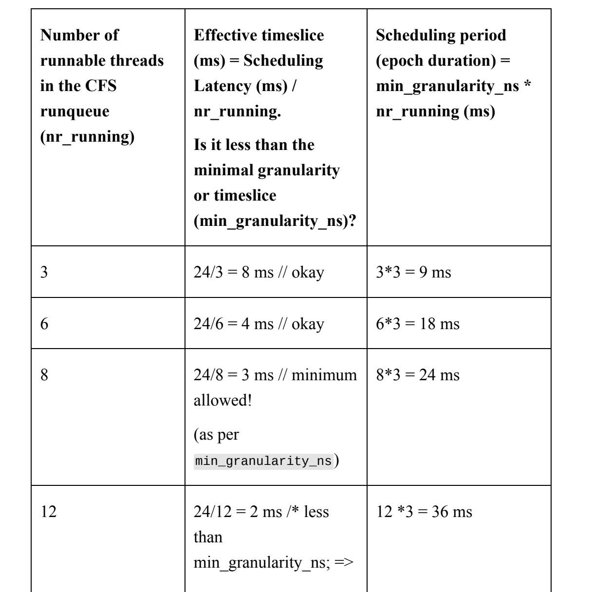
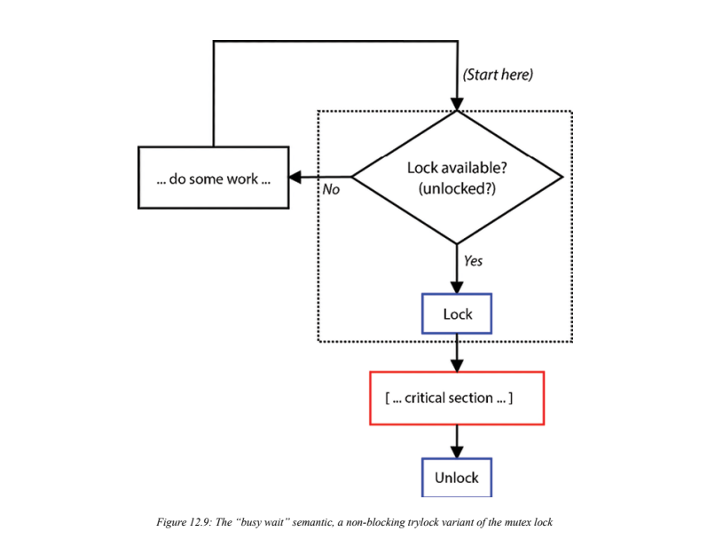
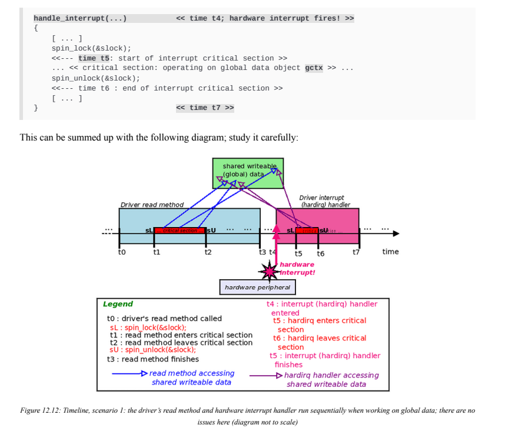
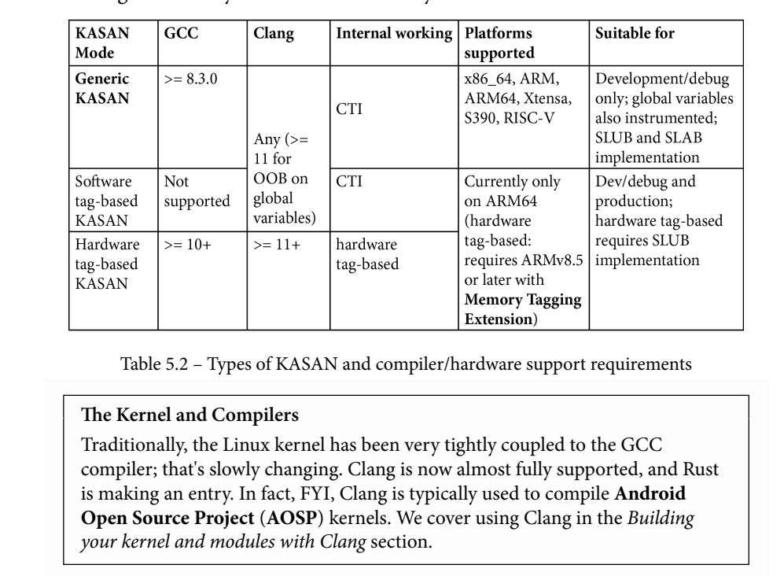
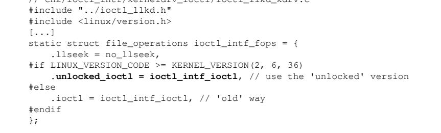
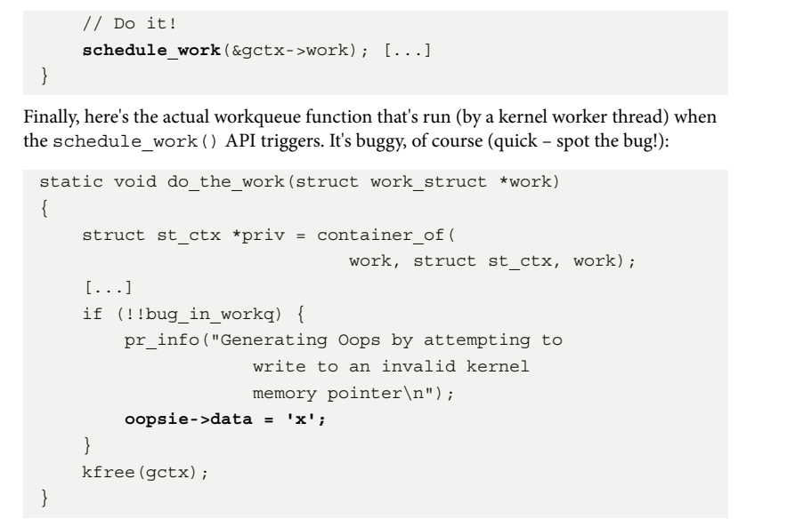
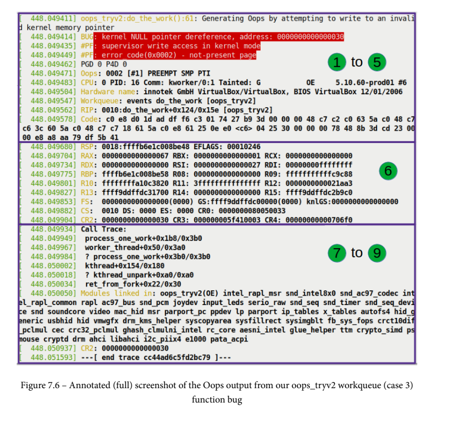
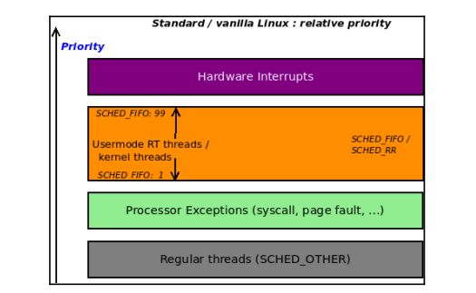
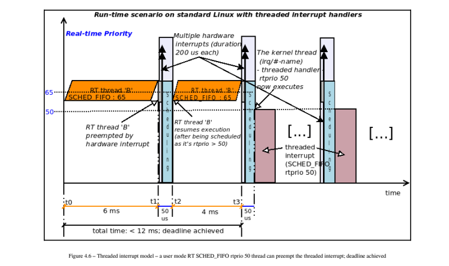

### CPU调度程序–第1部分

让我们快速浏览一下我们需要的基本背景信息了解Linux上的CPU调度。

请注意，在本书中，我们不打算涵盖材料Linux上有能力的（用户空间）系统程序员应该已经很清楚了: 这包括以下基础知识

进程（或线程）状态，关于真实状态的基本信息时间是，POSIX调度策略等等

#### Linux上的KSE是什么？

​	正如您在第6章“内核内部要素-进程和线程”中的“组织进程、线程及其堆栈-用户和内核空间”一节中所了解到的那样，系统上的每个（用户模式）活动线程都被赋予了一个任务结构（struct task_struct）以及一个用户模式和一个内核模式堆栈。正如我们所了解到的，内核线程确实有一个任务结构，但只有一个内核模式堆栈。

​	当然，每个操作系统都需要执行任务调度。现代操作系统——Linux/Unix/Windows/Mac——具有进程和读取的概念。现在，要问的关键问题是：当执行任务调度时，它作用于什么“对象”？换句话说，什么是内核可调度实体，KSE？在Linux上，KSE是一个线程，而不是一个进程（当然，每个进程至少包含一个线程）。因此，线程是执行调度的粒度级别。一个例子和一个图表（图10.1）将有助于解释这一点：如果我们有一个假设的情况，我们只有一个CPU核和三个用户空间进程（P1、P2和P3），分别由一个、两个和五个线程组成，再加上几个内核线程（比如三个），那么我们总共有（1+2+5+3），等于11个线程。


​	好吧，我要求你忽略房间里的大象。图10.1的顶部显示了cgroups内核框架的抽象、高度概念化的视图，该框架现在已深度嵌入内核的每个结构中。在这里，我要求你想象一下——根本不用担心“为什么/如何/谁/何时/…”的问题——如果你愿意的话，这个cgroups层在现代Linux中非常普遍，它肯定会对CPU调度产生影响。现在，只要意识到它的存在；细节–并尝试一下！–将在下一章中介绍。关于图10.1，除内核线程外，每个线程都有一个用户和内核堆栈以及一个任务结构（内核线程只有内核堆栈和任务结构；所有这些在第6章“内核内部要素——进程和线程”的“组织进程、线程及其堆栈——用户和内核空间”一节中都有详细解释）。

​	现在，如果这11个线程都处于可运行状态，也就是说，它们已经准备好运行，那么它们都会争夺单个处理器核心。（尽管它们不太可能同时运行，但为了讨论起见，让我们考虑一下）。关键是要明白，我们现在有11个线程在争夺CPU资源，而不是三个进程和三个内核线程。一个更现实的情况是，在11个活动线程中，可能有4个是可运行的，即它们在运行队列中并且想要运行，而其余7个线程处于各种其他状态（睡眠（在阻塞调用中）或停止（冻结））；剩下的七个人甚至都不是日程安排的候选人。

​	既然我们了解了KSE是一个线程，我们将（几乎）总是在调度的上下文中引用该线程。现在让我们继续讨论所谓的Linux进程状态机。Linux进程状态机在Linux操作系统上，每个进程或线程都运行在各种定义状态中，通过对这些定义状态进行编码，我们可以形成Linux操作系统中进程的状态机（orthread）（阅读本文时请参考图10.2）。由于我们现在了解到Linux操作系统上的KSE是一个线程而不是一个进程，因此我们将忽略使用“进程”一词的约定，而不是在描述在状态机的各种状态下循环的实体时使用“线程”一词。（如果比较舒服的话，你可以在下面的文本中用“process”代替“thread”。）Linux线程可以循环通过的状态如下（ps实用程序通过这里显示的字母对状态进行编码）：R：准备运行或正在运行（或“可运行”）睡眠：s：可中断睡眠D：不间断睡眠T：已停止（或暂停/冻结）Z：僵尸（或不存在）X：Dead当通过fork（）或clone（）系统调用或pthread_create（）API新建线程时，一旦OS确定线程已经完全诞生，它通过将线程进入可运行（R）状态。处于R状态的线程实际上正在CPU核心上运行，或者处于准备运行状态。我们需要理解的是，在这两种情况下，线程都在操作系统中的数据结构上排队，称为运行队列。Linux在系统上为每个CPUcore维护一个运行队列（实际上，现实情况更加微妙；我们很快就会达到这一点）。运行队列中的线程是给定CPU核上运行的有效候选线程；除非在操作系统运行队列中排队，否则任何线程都不可能运行。Linux没有明确区分就绪运行和实际运行状态；它只是将处于任一状态的线程标记为R。当然，正如我们在第6章“内核内部要素——进程和线程”中所了解到的，它是任务结构（unsignenight__state；）中的一个成员，被设置为适当的值来标记处于特定状态的线程。下图表示任何进程或读取的Linux状态机：


​	上图通过（红色）箭头显示了状态之间的转换。为了清楚起见，一些转换（例如，一个线程可以在休眠或停止时被终止）在上图中没有明确显示。（仅供参考，一个死亡但未被其父进程等待的进程最终会处于半死半活的状态，称为僵尸或失效进程；这本应是一个混乱的状态。防止僵尸永远留在系统上的规则是，每个fork（）都需要相应的wait*（）系统调用。（像往常一样，Linux有一个巧妙的技巧：杀死azombie的父级，僵尸也会“收获”（死亡）。）我们知道，每个活着的线程（用户和内核）都有自己的任务结构。因此，在代码级别，任务结构成员named__state（之前称为state）在所谓的“状态机”中保存任务的“状态”——线程。当它可运行时，它将被设置为值TASK_RUNNING（总体上由“R”表示，内部由图10.2中的Rrand Rcpu状态表示）。等待队列是一种数据结构，其中处于睡眠状态的任务被排队——也就是说，它们正在等待一个事件（实际上，它们在阻塞调用中到达这里）。Linux有两种休眠线程的可能性；线程可以处于：可中断睡眠：\_\_state=TASK_Interruptible：它“睡眠”，等待某个事件；然而，任何传递给进程/线程的信号都会唤醒它并运行信号处理程序（如图10.2中的字母“S”所示）不间断睡眠：\_\_state=TASK_Uninterruptible：它“睡眠”，等待某个事件；传递到进程/线程的任何/所有信号都不会对其产生影响（如图10.2中的字母“D”所示）。当它正在等待的事件发生时，操作系统将向其发出唤醒呼叫，使其再次可运行（从等待队列中退出并在运行队列中退出）。请注意，线程不会立即运行；它将变得可运行（图10.2中的Rr），并成为调度器的候选对象；很快，它将有机会在CPU（Rcpu）上实际运行。一个常见的误解是认为操作系统维护一个运行队列和一个等待队列。Linux内核为每个CPU维护一个运行队列。等待队列通常由设备驱动程序（以及内核）创建和使用；因此，它们可以有任意数量。

有了这些基础知识，让我们开始吧！

#### POSIX调度策略

​	认为调度策略一词大致相当于调度算法。重要的是要意识到Linux内核并没有一个实现CPU调度的策略；事实上，POSIX标准规定了兼容POSIX的操作系统必须遵守的至少三个调度策略（实际上是算法）。Linux超越了这三个，并通过称为调度类的强大设计实现了这三种以及更多（本章稍后的理解模块化调度类部分将介绍）。现在，让我们在下表中简要总结一下POSIX调度策略及其影响；不过，在此之前，关键是要理解，在任何给定时间点，每个活动线程（用户和内核空间）都与这些调度策略中的一个相关联（可以在运行时更改）。

| 计划策略                   | 关键点                                                       | 优先级标尺                                                   |
| -------------------------- | ------------------------------------------------------------ | ------------------------------------------------------------ |
| SCHED_OTHER或SCHED_NORMALA | 始终为默认值；具有此策略的线程是非实时的；它们在内部被实现为一个完全公平调度（CFS）类,此调度策略背后的动机是公平性（即“对所有可运行的线程公平，避免浪费任何CPU时间”）和整体吞吐量优先级） | 此策略的线程的实时优先级为0）。非实时优先级称为nicevalue；它的范围从-20到+19（数字越低，意味着越优秀.基础（初始）值为0 |
| SCHED_RR                   | 此调度策略的动机是提供一个非常激进的（软）实时策略。属于此sched类的线程具有有限时间片（通常默认为100毫秒）。SCHED_RR线程将产生处理器IFF（当且仅当）：<br> 它在I/O上阻塞（进入休眠状态）。<br>它停止或死亡。<br>更高优先级的实时线程变得可运行（这将抢先一步）。<br>它的时间片到期了。 | （软）实时：1到99（更高的数字意味着更高的优先级）            |
| SCHED_FIFO                 | 此调度策略背后的动机是提供一种（软）实时策略，该策略（与SCHED_RR相比，非常）激进。SCHED_FIFO线程将产生处理器IFF：它阻塞I/O（进入休眠状态）。它停止或死亡。一个优先级更高的实时线程变得可运行（这将抢占这个线程）。实际上，它有无限长的时间片 | （与SCHED_RR相同）                                           |
| SCHED_batch                | 此调度策略背后的动机是“适用于低优先级的非交互式批处理作业，优先权较少”。 | NICE的值范围（-20到+19）                                     |
| SCHED_IDLE                 | 特殊情况：通常，PID0内核线程（传统上称为swapper；实际上，它是每CPU空闲线程）使用此策略。它始终保证是系统上优先级最低的线程，并且仅在没有其他线程需要CPU时运行。 | 是所有优先级中最低的                                         |

重要的是要注意，当我们在前一个表中说实时时，我们指的是软（或充其量是硬）实时，而不是硬实时，就像在实时操作系统（RTOS）中一样。Linux是一个通用操作系统（GPOS），而不是RTOS。话虽如此，您可以通过应用外部补丁程序（称为RTL，由Linux基金会支持）将vanilla Linux转换为真正的硬实时RTOS；在下一章的“将主线Linux转换为RTOS”一节中，您将学习如何精确地做到这一点。仔细研究桌子；请注意，SCHED_FIFO线程实际上具有无限的时间片，因此可以在CPU内核上运行任意时间；当上述条件之一满足时，它会被抢占（从CPU上移除）。此外，

​	SCHED_FIFO和SCHED_RR之间的其他关键区别包括：

​	虽然SCHED_FIFO线程实际上具有无限的时间片，但SCHED_RR线程具有有限的时间片（可通过/proc/sys/kernel/sched_rr_timeslice_ms-sysctl；默认情况下为100ms）

​	具有相同优先级的SCHED_RR线程以轮询方式进行调度（从而允许其他SCHED_RR线程共享处理器）。对于SCHED_FIFO线程，情况并非如此——被抢占的线程将返回下一个要运行的任务（从而拒绝与处理器具有相同优先级的其他线程）。因此，在使用CSCHED_FIFO时，您应该避免将线程保持在相同的优先级（我们将在下一章的“在内核中设置策略和优先级——在内核线程上”一节中对此进行更多介绍）。在这一点上，重要的是要理解，在Linux等操作系统上，硬件（和软件）中断总是优于甚至会抢占（内核或用户空间）SCHED_FIFO线程！

​	对于我们在这里的讨论，我们暂时忽略中断。现在，让我们更详细地了解每个线程的优先级值。

#### 线程优先级

​	线程的优先级缩放很简单（以下是从低到高的优先级；参见图10.3）：非实时线程（SCHED_OTHER）的实时优先级为0；这确保了它们甚至无法与实时线程竞争；他们甚至不在同一个竞技场上！那么，在优先级方面，如何区分所有非实时线程呢？

​	很简单——他们使用一个名为nicevalue的（旧UNIX风格）优先级值，范围从-20到+19，-20是最高优先级，0是基数或默认值，+19是最低优先级。

​	启用后，传统的“好价值”概念并没有真正被使用（在“nice”下，cgroups被利用了）。更多信息请参阅进一步阅读部分。）实时线程（具有SCHED_FIFO或SCHED_RR策略）的区域时间优先级范围为1到99，1表示最小优先级，99表示最高优先级。这样想吧：在一个只有一个CPU的不可抢占的内核上，在不可破解的无限循环中旋转的SCHED_FIFO优先级99线程将有效地挂起机器！


​	调度策略是通过任务结构中的一个成员（调度类）（松散地）指定的。此外，线程策略和优先级（静态nice值和实时优先级）是任务结构的成员（如图10.1所示）。请注意，线程所属的调度类是独占的；一个线程在给定的时间点只能属于一个调度类（不用担心，我们稍后将在即将到来的CPU调度内部学习第2部分中详细介绍调度类）。此外，您应该意识到，在现代Linux内核上，还有其他调度类（stop-scched和deadline）在优先级上优于我们看到的FIFO/RR类（再次详细介绍如下）。

#### 可视化流程

​	多核系统导致进程——实际上是线程（包括用户空间和内核空间）——在不同的处理器上并发执行。这对于获得更高的吞吐量和性能非常有用，但当它们处理共享的可写数据时，也会出现同步问题（我们将在本书的最后两章深入探讨内核同步这一真正重要的主题）。因此，例如，在具有六个处理器内核的硬件平台上，我们可以期望进程（线程）在它们上并行执行；这不是什么新鲜事。然而，有没有一种方法可以真正看到哪些进程或线程在哪个CPU核上执行，也就是说，有一种方法来可视化一个进程或线程？事实证明，确实有几种方法可以做到这一点。在接下来的部分中，我们将介绍几种有趣的方法：使用gnome系统监视器GUI程序、perf以及其他可能性。

#### 使用gnome系统监视器GUI来可视化流程

​	gnome项目提供了一个极好的GUI来查看和监视系统活动，适用于笔记本电脑、台式机和服务器级系统（事实上，适用于任何强大到足以运行gnome GUI环境的系统）：gnome系统监视应用程序。为了快速测试使用它来查看几个CPU内核之间的工作流程，让我们首先同时运行几个进程。对于我们这里的简单测试用例，我们需要一个在CPU上连续执行的进程，即CPU绑定的进程。一个很好的候选者是名为yes的简单实用程序，它只是将字符y连续打印到stdout（试试看！）。那么，假设我们运行它三次，在后台。为了使这个实验有意义，我们想将每个进程仿射（绑定）到系统上的特定CPU核心。Thenproc命令显示内核数量；它们的编号从0开始。在我的x86_64 Fedora 38 VM:

```
$nproc6
```

​	我有六个CPU内核（编号为0-5）。我们利用有用的任务集实用程序（它属于util-linux包，我们在第1章中指定了该包）。使用-c选项运行任务集允许ust指定命令要在哪个CPU核上运行；因此，如果我们

```
taskset-c 2 yes>/dev/null
```

​	它只在CPU核心#2上运行yes（我们将stdout重定向到null设备，这样我们就不必连续看到y）！因此，让我们快速构建一个测试用例：我们将运行三次yes实用程序（当然是在后台），每个流程实例都在不同的CPUcore上运行——例如，如下：

```
taskset-c 1 yes > /dev/null&taskset-c 2 yes>/dev/null & taskset-c3 yes>/dev/null &
```

（当然，您必须有一个至少有四个内核的系统来完成上述任务（因为内核编号从0开始）。）当它们还活着并正在运行时（就像检查一样），运行gnome系统监视器应用程序（我们假设您正在使用

#### 使用perf可视化flow

​	Linux及其庞大的开发人员和质量保证（QA）工具库，在perf中有一个非常强大的工具。简而言之，perf工具集是在Linux机器上执行CPU性能分析的方法之一。（除了一些提示外，我们在本书中没有详细介绍perf。）与古老的top（和较新的htop）实用程序一样，为了获得CPU消耗情况的“千英尺视图”（比top更详细），perf实用程序集非常出色。不过，请注意，对于一个应用程序来说，与它运行的内核完美结合是非常不寻常的。重要的是（至少在Ubuntu上），要获得性能，您需要安装`linux-tools-$（uname-r）`包。此外，与性能相关的分发包将不适用于我们构建的自定义6.1内核；因此，在使用perf时，我建议您使用标准（ordistro）内核之一启动来宾VM，安装`linux tools-$（uname-r）`包，然后尝试使用perf。（当然，您也可以从tools/perf/文件夹下的内核源代码树中手动构建perf。）

安装并运行perf后，您可以尝试以下与perf-top相关的命令（有关详细信息，请参阅手册页或教程）：

```
sudo perf-topsudo perf-top--sort comm，dsosudo perf-top-r 90--sort pid，comm，dso，symbol
```

​	上述perf-top变体不仅帮助我们鸟瞰CPU的消耗情况，还帮助我们查看它们正在执行的代码路径，甚至允许我们放大每个任务以查看更多详细信息（传统工具通常不允许我们这样做）。顺便说一句，comm意味着命令/进程的名称，dso是dynamicshared对象的缩写。perf（1）的手册页提供了详细信息；使用manperf-<foo>符号（例如man-perf-top）来获取perftop的帮助。但回到我们的主要观点：使用perf的一种方法是清楚地了解哪些任务在哪个CPU核上运行；这是通过perf中的ched-map子命令完成的。不过，首先，您必须使用perf记录事件，这既可以在系统范围内完成，也可以在特定进程中完成。要记录事件，请运行以下命令：sudo perf sched record[command]在record关键字后面没有参数，它记录系统范围内的事件；传递参数使其仅记录该命令进程及其子进程的事件。使用SIGINT信号（^C）终止录制会话。这将生成一个名为perf.databy-default的二进制数据文件；我们很快就会看到如何直观地解释它。

#### 学习CPU调度内部——第2部分

​	本节深入探讨了内核CPU调度内部，重点是现代设计的核心方面，模块化调度类。了解模块化调度类关键内核开发人员Ingo Molnar（和其他人一起）重新设计了内核调度程序的内部结构，引入了一种称为调度类的新方法（这可以追溯到2007年10月2.6.23内核的发布）。顺便说一句，调度器类中的class一词并不常见；许多Linux内核特性本质上，而且很自然地，都是以面向对象的方式设计的。当然，C语言不允许我们直接在代码中表达这一点（因此，大多数结构同时具有数据和函数指针成员，模拟一个类）。然而，设计通常是面向对象的（正如你在《LinuxKernel Programming–Part 2》一书中对驱动程序模型所清楚看到的那样）。有关这方面的更多详细信息，请参阅本章的进一步阅读部分。

​	核心调度代码中引入了一个抽象层，即函数kernel/sched/core.c:schedule（）。schedule（）中的这一层通常称为调度类，在设计上是模块化的。请注意，这里的“模块化”一词意味着调度器类可以从树内内核代码中添加或删除；它与可加载内核模块（LKM）框架无关。基本思想是：Linux内核（截至6.1，实际上是最新的6.7内核）包含五个调度类，每个调度类都与一个优先级相关联。当调用核心调度程序代码theschedule（）函数（它本身是__schedule（）的一个薄包装器）时，它会按照预定义的优先级顺序迭代每个类，询问每个类是否有一个准备运行的线程（具体如何，我们很快就会看到）。在有五个排课的情况下，可以保证其中一个会给出肯定的答案，并选择一个候选线程来运行下一个；一旦发生这种情况，核心调度代码上下文就会切换到该幸运线程（跳过任何剩余的调度类），工作就完成了。以下流程图封装了此设计：


​	您很警惕，在图10.9的最顶部发现了标记为S的连接器；这意味着什么？这是为了回答一个关键问题：“谁调用，什么时候调用核心调度程序函数schedule（）？”（这将在下一节“学习CPU调度内部-第3部分；放松-我们会到那里！”中详细回答！）从6.1 Linux内核（以及撰写本文时的最新6.7内核事实）开始，内核中有五个调度程序类，按优先级顺序列出，最高优先级显示在第一位：调度策略调度程序


​	因此，我们有五个模块式调度类——停止任务、截止日期、（软）实时（RT）、公平（CFS）和空闲——按优先级从高到低排列。抽象这些调度器类的数据结构structsched_class在一个单链表上串在一起，核心调度代码迭代该链表。（稍后我们将讨论sched_class结构是什么；暂时忽略它。）每个线程都与其唯一的任务结构（structtask_struct）相关联；在任务结构中（正如我们在第6章中看到的，您可以在此处查找：https://elixir.bootlin.com/linux/v6.1.25/source/include/linux/sched.h#L737)，以下情况适用：成员struct sched_class*持有指向线程所属模块化调度类的指针；它是独占的——在任何给定点，一个线程只能属于一个调度类（它将是表10.2第三列中提到的调度类之一）。默认情况下，它将指向CFS（fair_sched_class）。

​	策略成员指定线程所遵循的调度策略（它将是表10.2第一列中提到的策略之一）。它也是排他性的——一个线程在任何给定的时间点只能遵守一个调度策略（但可以更改）。线程优先级值；包含它们的成员是prio、staticprio、normal_prio和rtpriority。调度策略和优先级都是动态的，可以通过编程方式（或通过实用程序；您很快就会看到这一点）查询和设置。仅供参考，属于stop-scched类的线程很少；这是因为这是一个极端的优先级。当stopᦆsched线程获得处理器时，内核会关闭系统上所有其他内核上的执行（以及任何与锁定相关的、中断和其他一切）。因此，stop-scched类线程在所有中断和内核抢占都被掩盖的核心上执行，完全没有被抢占的机会。谁需要这种优先级和不可抢占性？一个例子是Ftrace内核跟踪子系统；另一个是实时内核补丁。此外，下一个优先级调度类——Deadline——适用于必须满足相关截止日期的实时任务（以经典的RTOS方式）。由于停止调度和截止日期线程倾向于分散，我们关注RT线程，并且主要是公平（CFS）线程；“公平类”线程通常是处于活动状态并正在运行的线程。

​	现在，这是一个关键点：内核为每个处理器核心和每个调度类维护一个运行队列！所以，如果我们有一个有六个CPU核的系统，那么我们将有6个核*5个调度类=30个运行队列！（有一个例外：在单处理器（UP）系统上，top sched类不存在。）运行队列是按类实现的；例如，以下是CFS的运行队列：struct CFS_rq(https://elixir.bootlin.com/linux/v6.1.25/source/kernel/sched/sched.h#L550); 同样，对于RT类，它是structrt_rq，以此类推。下图试图呈现此信息：


​	请注意，在上图中，我显示运行队列的方式使它们看起来可能是数组。这根本不是目的；这是一个概念图。实际使用的运行队列数据结构取决于调度类（毕竟类代码实现了运行队列）。它可以是一个链表数组（与实时类一样），atree（实际上是一个红黑（rb）树）和fair类，等等。

#### 一个有助于理解调度类的概念性例子

​	为了更好地理解调度程序类模型，我们将设计一个例子：假设在对称多处理器（SMP）或多核系统上，我们有100个线程（在用户和内核空间中）是活动的。其中，我们有几个竞争CPU；也就是说，它们处于readyᦙto run（Rr）状态，这意味着它们是可运行的，因此在runqueue数据结构上排队（见图10.2，状态机）。假设可运行线程分为以下各种调度类：一站式调度（SS）类线程、S1Two Deadline（DL）类线程，D1和D2两个实时（RT）类线程和RT1和RT2三个完全公平调度（CFS）（或公平）类线程以及F1、F2和F3一个空闲类线程I1。现在让我们想象一下，首先，线程F2在处理器核心上，愉快地执行代码。在某个时候，内核希望上下文切换到该CPU上的其他任务。（是什么触发了这一点？你很快就会看到。）在调度代码路径上，内核代码最终会进入核心调度代码kernel/sched/core.c：void schedule（void）内核例程（代码级细节稍后再说）。现在重要的是要理解的是，由schedule（）调用的pick_next_task（）例程会迭代调度器类的链表，询问每个类是否有候选程序要运行（再次参见图10.9）。它的代码路径（当然是概念上的）看起来像这样：1。核心调度程序代码（\_\_schedule（））：“嘿，SS（stop-scched类），你有要运行的线程吗？”2。SS类代码：遍历其运行队列并找到可运行线程（S1）；它这样回答：“是的，我知道；这是S1线程。”。核心调度程序代码（__scheduled（））：“好的，太好了；让我们将上下文切换到S1。”然后任务就完成了（至少在这个调度轮或纪元）。但是让我们稍微改变一下场景：如果该处理器的SSrunqueue上没有可运行的线程S1（或者它已经进入睡眠状态，或者停止运行，或者它正在运行另一个CPU的运行队列）？然后，SS会说“不”，然后会问下一个最重要的排课，截止日期（DL）。如果它有潜在的候选线程想要运行（在我们的例子中为D1和D2），它的类代码将运行其算法来识别D1或D2中的哪一个应该运行，将该线程任务结构指针返回给\__s\chedules（），内核调度器将忠实地向其进行上下文切换。此过程对实时（RT）和公平（CFS）调度类继续进行。（一张图片胜过千言万语，对吧？见图10.11。）很可能（在典型的中等负载的Linux系统上），没有SS、DL或RT候选线程想要在CPU查询上运行，而且通常至少会有一个公平（CFS）线程想要运行。因此，竞争通常发生在公平（CFS）可运行线程之间；公平类实现（CFS）选择的线程将是上下文切换到的线程。如果真的没有要运行的线程（没有SS/DL/RT/CFS类线程要运行），则意味着系统当前处于空闲状态（懒惰的家伙）。现在，Idle类被询问是否要运行；它总是说是的！这是有道理的；毕竟，当没有其他人需要/想要在处理器上运行时，CPU空闲线程的任务就是在处理器上执行。因此，在这种情况下，内核会将上下文切换到空闲线程，通常标记为swapper/n，其中n是它正在执行的CPUnnumber（从0开始；是的，我知道你可能在想什么：为什么它被称为“swapper”？…这只是旧的Unixhistory回来困扰我们了——没有别的）。此外，请注意，swapper/n（CPU空闲）内核线程不会出现在ps列表中，即使它总是存在（回想一下我们在第6章“内核内部要素——进程和线程


核心调度程序代码（在pick_next_task（）中）究竟是如何询问调度类是否有任何要运行的线程的？我们已经看到了这一点，但我觉得为了清楚起见，值得重复以下代码片段（主要从\__schedule（）和线程迁移代码路径调用）：


​	注意实际中的面向对象：出于所有实际目的，`class->pick_next_task(rq)`代码调用了调度类的一个方法`class->pick_next-task()`！返回值方便而有意地指向所选任务的任务结构，代码现在可以上下文切换到该结构。还可以看出，`pick_next_task()`返回NULL意味着当前类没有任何可调度的候选对象；因此，我们转到下一个类并询问它。循环将始终终止，因为如果没有其他情况，空闲类将始终返回一个非空的候选调度，即该核心的空闲线程。

#### 简介完全公平调度（CFS）类的工作原理

​	自2.6.23版本（早在2007年）以来，CFS一直是常规线程的实际内核CPUscheduling代码；默认情况下，Linux上的大多数线程都属于由CFS驱动的SCHED_OTHER策略。CFS算法背后的驱动因素是提供公平性和整体吞吐量。简而言之，它的实现是这样的：内核跟踪每个可运行的CFS（SCHED_OTHER/SCHED_NORMAL）线程的实际CPU运行时（以纳秒粒度）；运行时间最小的线程是最值得运行的线程，并将在下一个调度周期或纪元（“纪元”一词表示“某人或某事历史上某个时期的开始”）获得处理器。相反，持续敲击处理器的线程将积累大量的运行时间，因此将受到惩罚（这真的很因果报应）！我们将此讨论分为两部分：第一部分简要介绍了vruntime及其内部rb树运行队列的CFS概念，第二部分介绍了CFS动态时间片的工作原理。当然，让我们从第一部分开始。

#### 关于CFS vruntime值及其运行队列的说明

​	在不深入研究CFS实现内部太多细节的情况下，任务结构中嵌入了另一个数据结构struct sched_entity，其中包含一个名为vruntime（或虚拟运行时）的无符号64位值(https://elixir.bootlin.com/linux/v6.1.25/source/include/linux/sched.h#L556). 简单来说，这是一个单调计数器，用于跟踪线程在处理器上累积（运行）的时间量（以纳秒为单位）。在实践中，在实现中，需要进行大量的代码级调整、检查和平衡。例如，内核通常会将vruntime值重置为0，从而触发另一个调度周期。此外，在/proc/sys/kernel/sched_*下有各种各样的不可选项（或sysctls），有助于更好地微调CPU调度器行为（其中一些在这里有记录：https://www.kernel.org/doc/html/latest/admin￾guide/sysctl/kernel.html）。CFS如何选择下一个要运行的任务封装在kernel/sched/fair.c:pick_next_task_fair（）函数中。理论上，CFS的工作方式本身就很简单：将所有可运行的任务（针对该CPU）排队到CFS运行队列上，这是一个rb树（一种自平衡的二元搜索树），这样在处理器上花费时间最少的任务就是树上最左的叶子节点，右边的后续（叶子）节点表示下一个要运行的任务，然后是下一个。实际上，从左到右扫描树可以给出未来任务执行的时间线。这是如何保证的？通过使用上述vruntime值作为将任务排队到rb树上的键！

​	为什么它被称为vruntime，而不仅仅是运行时？这是因为vruntime成员的值不仅仅是线程在处理器上花费的时间；它更微妙：在计算这个非常重要的数字时，它考虑了线程的优先级——即nice值（毕竟，线程在CFS-rb树运行队列中的“位置”是基于这个vruntime量的）。因此，我们采取了以下措施：nicevalue越低（优先级越高），vruntime值越低，因此它更多地排在左边；nice值越高（优先级越低），runtime值就越大，因此它被更多地向右排队。（这种任务调度方法被广泛称为加权公平排队调度程序。）当核心调度程序需要调度时，它会问CFS“你有任何要运行的线程吗？”，CFS类代码（我们已经讨论过函数pick_next_task_fair（））会运行，只需选择树上最左侧的叶子节点，并返回指向嵌入其中的任务结构inter的指针。想想看——根据定义，它是具有最低vruntime值的任务，因此实际上是运行最少的任务！（遍历树是一种O（logn）时间复杂度的算法，但由于一些代码优化和对最左侧叶子节点的巧妙缓存，该实现有效地具有非常理想的O（1）时间复杂性。）当然，实际的代码比这里介绍的要复杂得多；它需要进行多次制衡。我们不会在这里深入探讨所有血腥的细节。我们建议有兴趣了解更多关于CFS的人参阅关于此主题的内核文档

#### 关于CFS调度周期和时间的说明

​	你注意到了吗？与传统的操作系统调度器不同，CFS的时间片是动态的！CPU上的任务（所谓的IO绑定任务）会自动累积较少的vruntime，从而向CFS-rb树的左侧迁移。对于CPU受限的任务，情况正好相反；它们（通过具有更大的vruntime值）向右移动，减少了快速获得CPU的机会。

​	在调度器上下文中，调度周期（有时被混淆为“调度延迟”）是指一个完整的调度周期（或纪元）运行的时间；在此时间段内，操作系统保证每个线程都有机会在CPU上运行。那是什么？默认值位于sysctl/sys/kernel/debug/sched/latency_ns中（Ubuntu 22.04上的典型默认值为24毫秒，Fedora38/39上的默认值为18毫秒）。此外，在运行时，它可以改变——它本身是动态的（稍后将详细介绍）——计算如下：调度周期长度=min_granularity_ns*nr_running；这里，nr_running是当前可运行的任务数（这是基于每个运行队列）。在最近的内核中，这些调度程序可调项可以在indebugfs中找到；让我们在x86_64 Ubuntu 22.04 LTS上查找一些值。


​	好的，以下是一些相关可调参数的含义：

- latency_ns：这是当前计算的“周期”值（innanoseconds（ns））；因此，这里的默认调度周期为24000000ns，即24ms，也就是说，每个线程都保证每24ms至少有一次机会运行！
- min_granularity_ns：这是CFS-rb树上节点之间所需的最小“距离”；实际上，这是每个CFS线程运行时允许的最小时间（默认值：3ms）。

在继续之前，有几点需要注意：

> 默认值可以而且确实因系统（内核）而异！在我的x86_64Fedora 38虚拟机上，周期和最小粒度（最小时间片）分别为18毫秒和2.25毫秒。检查你的系统上有什么。
>
> 上述调度程序可调参数是在functionsched_init_debug（）中创建的（在系统初始化过程中调用：https://elixir.bootlin.com/linux/v6.1.25/source/kernel/sched/debug.c#L299).想想看——当前可运行任务的数量（nr_running）直接影响周期（因此也影响时间片）。

因此，给出以下事实：调度周期长度=min_granularity_ns*nr_running（如我们所见）min_granuality_ns实际上是CFS（动态）时间策略值给定默认的min_granularity_ns值为3ms，周期（latency_ns）为24ms（就像我的Ubuntu 22.04（和23.10）盒子上的情况一样），为了了解这是如何工作的，我们提供了一组示例值的有效时间级别和调度周期的计算，如下表所示




​	基于可运行线程数量的有效CFS任务时间片计算有效时间片，并在第二列中显示；只要它的值在min_granularityns值（3ms）内，一切都很好。然而，可以看出，当可运行线程的数量变得非常大时，情况显然变得无法维持（表10.3的最后一行）；现在，调度器没有放弃，而是巧妙地、动态地调整调度周期，重新计算它！（好吧，这是一种说法；狡猾的内核是：“我答应过你每24毫秒至少有一次机会在CPU上吗？不，不，你错了；我的意思是每36毫秒有一次……”。）从技术上讲，所做的检查是这样的（伪代码）：effective_timeslice（ms）=latency_ns调度周期。）有关CFS和这些与调度程序相关的可调参数的更多信息，请查看进一步阅读部分。现在让我们继续讨论（简短的）主题，即查找由内核维护的任务调度统计信息（如果配置了）。

基于可运行线程数量的有效CFS任务时间片计算有效时间片，并在第二列中显示；只要它的值在min_granularityns值（3ms）内，一切都很好。然而，可以看出，当可运行线程的数量变得非常大时，情况显然变得无法维持（表10.3的最后一行）；现在，调度器没有放弃，而是巧妙地、动态地调整调度周期，重新计算它！（好吧，这是一种说法；狡猾的内核是：“我答应过你每24毫秒至少有一次机会在CPU上吗？不，不，你错了；我的意思是每36毫秒有一次……”。）从技术上讲，所做的检查是这样的（伪代码）：effective_timeslice（ms）=latency_ns调度周期。）有关CFS和这些与调度程序相关的可调参数的更多信息，请查看进一步阅读部分。现在让我们继续讨论（简短的）主题，即查找由内核维护的任务调度统计信息（如果配置了）。

​	调度统计数据您能在系统和流程粒度上看到调度的状态吗？事实上，当配置时（需要CONFIG_SCHEDSTATS=y），内核会在proc:/proc/schedstat下提供这些伪文件：系统范围的调度统计信息。这些已经存在了很长时间；它们显示每个CPU的调度统计数据（以及SMP上的域-CPU/微架构层次结构信息）。该信息包括调度程序（和thetry_to_wake_up（）函数）被调用的次数（在该CPU核心上），核心上任务运行/等待的所有时间的累积总和，以及该核心上的时隙数。

​	最好参考官方的内核文档：https://elixir.bootlin.com/linux/v6.1.25/source/Documentation/scheduler/sched-stats.rst./proc/PID/schedstat

​	/proc/PID/sched：进程/线程级粒度：/proc/PDI/schedstat内容由三个空格分隔的数字组成，所有这些数字都与进程ID为PID的线程有关：在CPU上花费的时间（纳秒）在运行队列上等待的时间（毫微秒）在这个CPU上运行的时间片数/proc/PII/sched内容非常详细；它包括任务sched_entity结构的许多字段（显示为se.foo；这包括任务vruntime（以纳秒为单位）se.vruntime！），上下文切换统计、调度策略和优先级，以及一些NUMA统计。

​	查询给定线程的调度策略和优先级在本节中，您将学习如何通过命令行查询系统上任何给定线程的进度策略和优先级。（但是，通过编程方式查询和设置相同的内容呢？我们将讨论推迟到第11章“CPU调度器-第2部分”的查询和设置athread的调度策略和优先级部分。）我们了解到，在Linux上，线程是KSE；它是被调度并在处理器上运行的。此外，Linux有多种调度策略（或算法）可供选择。调度策略和优先级都是基于每个线程分配的，默认策略始终为SCHED_OTHER，默认实时优先级为0（换句话说，它是非实时线程；见表10.1）。在给定的Linux系统上，我们总是可以看到所有进程都是活动的（通过simpleps-a），或者，使用GNU ps，甚至可以看到每个线程都是活的（一种方法是使用ps-LA）。然而，这并没有揭示一个关键事实：这些任务在什么调度策略和优先级下运行。我们如何对此提出质疑？事实证明，这很简单：在shell上，chrt实用程序非常适合查询和设置给定进程的调度策略和/或优先级。发出带有-p选项开关的chrt并提供PID作为参数，使其显示调度策略以及所讨论任务的实时优先级；例如，让我们查询init进程（orsystemd）PID 1:

```
pid 1's current scheduling policy: SCHED_OTHER 
pid 1's current scheduling priority: 0 
```

​	需要注意的几件事：在我们的脚本中，通过使用GNU ps，调用ps-LA命令，我们能够捕获系统上所有活动的线程；显示它们的PID和TID。正如您在第6章“内核内部要素-进程和线程”中所了解到的，PID是内核TGID的用户空间等效值，TID是内核PID的用户空间等价值。因此，我们可以得出以下结论：如果PID和TID匹配，则该行中看到的线程（第三列有其名称）是进程的main（）线程。如果PID和TID匹配，并且PID只显示一次，则这是一个单线程进程。如果PID以不同的TID（第二列）重复（最左侧的列），则该进程是多线程的，而这些TID是该进程的子线程（更准确地说，工作线程）。我们的脚本通过在右侧缩进TID编号来显示这一点（在图10.12的截断屏幕截图中，您看不到它，因为稍后会发生这种情况）。

​	请注意，典型Linux机器（桌面、服务器甚至嵌入式）上的绝大多数线程往往是非实时的（属于策略SCHED_OTHER）。一些（软）实时线程（SCHED_FIFO/SCHED_RR）也可能出现。Deadline（DL）和Stop Sched（SS）线程确实很少见（当然，这样的事情往往是特定于项目的）。请注意前面输出中显示的关于实时线程的以下观察结果：我们的脚本通过在（第六）列中显示一个星号（标记为*RT）来突出显示任何实时线程（第四列为SCHED_FIFO或SCHED_RR的线程）。

​	此外，任何实时优先级为99（最大可能值）的软实时线程在同一列中都会有三个星号（这些往往是专门的内核线程）。当与调度策略进行布尔OR运算时，SCHED_RESET_ON_FORK标志具有禁止任何子项（viafork（））继承特权调度策略（安全措施）的效果。倒数第二列是线程的“nice”值（回想一下，范围是-20到+19，-20是最佳优先级，19是最差优先级，默认值为0）。请注意，nice值仅对具有调度策略SCHED_OTHER的线程（以及批处理和空闲线程）有效。最右边的列显示了CPU关联掩码（十六进制），也是每个线程的属性！这意味着您可以设置线程可能调度的CPU核心（我们将在下一章详细介绍这一方面）。例如，二进制中的掩码值0x3f为0011 1111，这意味着该线程可以在设置为1的任何内核上运行，因此在这里，可以在任何内核上（因为系统上总共有六个内核）运行。快速测试：CPU关联掩码值0x8意味着什么？更改线程的调度策略和/或优先级可以使用chrt执行；但是，您应该意识到，这是一个需要root权限的敏感操作（或者，现在，推荐的机制是通过能力模型，CAP_SYS_NICE是所需的能力位）。我们将让您检查脚本的代码（ch10/query_task_sched.sh）。此外，请注意，性能和shellscripting并没有真正结合在一起（所以不要对

表演在这里）。想想看，ashell脚本中发出的每个外部命令（我们这里有几个，比如awk、grep和cut）都涉及fork-exec等待语义和上下文切换。此外，这些都在循环中执行。

> tuna（8）程序是一个强大的基于GUI（或控制台模式）的系统监控、调整和配置文件管理工具，可用于查询和设置各种属性；这包括进程/线程级调度策略/优先级和CPU亲和性掩码，以及IRQ亲和性。这是一个设计良好的GUI；一定要看看！（安装tuna：https://tuna.readthedocs.io/en/stable/installation.html).此外，schedtool实用程序与chrt有些相似，可用于查询和设置给定线程上的任何或所有任务调度参数；schedtool（8）的手册页介绍了它的用法。

​	您可能会想，具有SCHED_FIFO策略和99的区域时间优先级的（少数）线程是否总是占用系统的处理器？不，不是真的；现实情况是，这些线程通常大部分时间都处于休眠状态。当内核确实要求他们执行一些工作时，它会唤醒他们。现在，正是由于他们的实时策略和非常高的优先级，可以很好地保证他们或多或少会立即获得一个CPU内核，并按照需要执行（一旦工作完成，就会重新进入睡眠状态）。关键在于，当他们需要处理器时，他们会得到它（有点类似于RTOS，但没有RTOS提供的铁证如山的保证、低调度延迟和确定性）。

#### 学习CPU调度内部机制——第3部分

​	让我们从探索抢占主题开始。抢占式内核请想象一下这种假设情况：您正在一个只有一个CPU内核的系统上运行。一个模拟时钟应用程序与aC程序a.out一起在GUI上运行，a.out的一行代码是（呻吟）while（1）；。那么，你怎么看：当1个进程无限期占用CPU时，CPU会占用CPU，从而导致GUI时钟应用程序停止运行（它的第二手盖会完全移动吗）？稍加思考（和实验）就会发现，尽管有淘气的CPU占用者应用程序，GUI clockapp确实一直在运行！这就是拥有操作系统级调度器的全部意义：它可以而且确实会抢占（踢出！）占用CPU的用户空间进程。（我们之前简要讨论了CFS算法；CFS会导致占用大量CPU的进程累积一个巨大的vruntime值，从而在其rbᦙ树运行队列上向右移动更多，从而惩罚处理器本身！）所有现代操作系统都支持这种类型的抢占——它被称为用户模式抢占。但现在考虑一下：如果你编写一个在单核系统上执行相同while（1）无限循环的内核模块呢？这就带来了一个问题：系统现在只会挂起。为什么？因为默认情况下，大多数操作系统内核都是不可抢占的；也就是说，他们不能先发制人！

​	除了这个微不足道的例子，现实世界中肯定存在这样的情况，即如果内核不可抢占，它可能会对（实时）线程调度产生负面影响。想想看：如果你的高优先级线程在运行队列中（因此是可运行的）并且需要紧急运行，但内核在内核（或内核模块/驱动程序）代码的不可抢占部分中处理了一些长循环，该怎么办？或者，硬件中断发生但无法提供服务，因为中断再次被掩盖在长时间运行的不可抢占的代码段中……锁定在这里起着重要作用（你将在最后两章中更详细地学习）；事实上，多年来，内核有一个臭名昭著的、非常粗粒度（和递归）的锁，绰号为大内核锁（BKL）；当被持有时，它会使内核在很长一段时间内保持不可抢占状态（中断被屏蔽），从而对性能和延迟响应造成严重破坏。它（终于！）在2.6.39内核中被完全删除了。因此，问题出现了：在需要时，内核可以抢占自己吗？好吧，你猜怎么着：多年来，Linux提供了一个构建时配置选项，使内核可抢占；它被称为CONFIG_PREEMPT。（实际上，这只是朝着降低延迟和改善内核和调度响应的长期目标的进化。这项工作的大部分来自早期和一些正在进行的努力：低延迟（LowLat）补丁、（旧的）RTLinux工作，特别是RTL（实时Linux）项目（Linux作为真正的RTOS运行！我们将在下一章介绍RTL的设置）。）一旦启用了CONFIG_PREEMPT内核配置选项，并且构建并启动了内核，我们就会在可抢占的内核上运行——在大多数情况下，操作系统都有能力抢占自己！

#### 动态可抢占内核特性

​	从5.12内核开始，引入了一种新的动态可抢占核特性（CONFIG_PREEMPT_dynamic）。具有此功能可以让您绕过内核参数（当然是通过引导加载程序）在引导时调整内核的抢占行为（或模式）；它的名字叫repempt=。它可以设置的值如下（参见表10.4）：抢占=无：内核抢占行为与CONFIG_preempt_none相同。抢占=自愿：内核抢占的行为接近CONFIG_preempt_voluntary。

​	preempt=full[默认]：内核抢占行为与CONFIG_preempt相同。一个典型的预期用例是允许发行版发布一个内核二进制映像——使用CONFIG_PREEMPT构建，内置（几乎）完整的内核抢占——但能够允许最终用户在启动时修改内核抢占模式，从而允许用户选择是将其作为典型的服务器类系统（抢占=无）、桌面（抢占=自愿）还是启用完全抢占来运行。这样，发行版（或产品）就不必为不同的用例提供和维护不同的内核映像。内核配置名为config_PREEMPT_DYNAMIC；将其设置为y可启用该功能。（要在make menuconfig UI中执行此操作，请转到General Setup |启动时定义的抢占行为。这是一个布尔值；打开它，重新构建并重新启动，传递抢占=<value>参数。）仅供参考，uname-a以及/proc/version将显示此功能

​	好的，完成这项工作后，我们将回到内部方面的更多细节。让我们非常简要地总结一下我们在前几节中学到的一些关键点。您了解到核心内核调度代码被编排在void schedule（void）函数中，该函数是worker函数__schedule（）的一个薄包装器，它按优先级顺序迭代模块化调度器类，最终得到一个被（底层调度类的一个代码）选中的线程进行上下文切换。所有这些都很好；现在有几个关键问题是：谁确切地称之为“任务调度”核心代码路径，它到底什么时候运行？（正是图10.9最上面标有“S”的连接器所暗示的！）以下部分试图回答这些问题；加油，加油！谁运行调度程序代码？许多人不幸地持有一个关于调度工作原理的微妙但关键的误解：我们想象存在一种称为“调度器”的内核线程（或某种这样的实体），它定期运行和调度任务。这显然是错误的；在Linux等单片操作系统中，调度是由进程上下文本身执行的，即在内核模式下在CPU上运行的规则线程！事实上，调度代码总是由当前正在执行内核代码的进程上下文运行的——换句话说，由当前运行的（我们在第6章“内核内部要素——进程和线程”中，在“使用当前访问任务结构”一节中介绍了当前到底是什么）。这也可能是提醒您我们将称之为Linux内核黄金法则之一的合适时机：调度器绝不能在任何类型的原子上下文（包括中断上下文）中运行。

#### schedule（）什么时候运行？

​	操作系统调度器的工作是仲裁对处理器（CPU）资源的访问，在想要使用它的竞争实体（线程）之间共享它。但是，如果系统很忙，许多线程不断竞争、获取然后放弃处理器怎么办？更准确地说，我们真正要做的是：为了确保任务之间公平共享CPU资源，你必须确保图片中的警察，即调度器本身，在处理器上定期运行。听起来不错，但你究竟如何确保这一点？这里有一个（看似）合乎逻辑的方法：在启动时将操作系统挂接到定时器芯片的中断中，作为定时器中断触发时在中断处理程序例程中完成的“内务处理”的一部分，调用调度器！现在，（有点简单）与我们之前学到的相反，timeprinterrupt每秒“触发”CONFIG_HZ次。因此，如果我们在这里调用schedule（），它有机会每秒运行CONFIG_HZ一次（在x86_64 Ubuntu上通常设置为值250，在x86_ 64 Fedora上设置为值1000）！不过，请稍等，我们在第8章“模块作者的内核内存分配——第1部分”的“永不休眠中断或原子上下文”部分学到了一条黄金法则：你不能在任何类型的原子（包括中断）上下文中调用调度程序（就像刚才一样提到）。因此，按照这个规则，我们根本不能在计时器中断中调用schedulercode路径（这样做会立即导致akernel错误）。那么操作系统是做什么的呢？我们将深入探讨，但首先，我们需要介绍一个名为thread_info的结构的一些基础知识。

​	最低限度地理解thread_infostructure为了清楚地理解以下几点，您需要了解与名为thread_info的每个线程依赖于arch的数据结构有关的基本知识。这个结构很小，包含一些关键的“热点”成员（这些成员最初位于任务结构中）。这种thread_infostructure的原因是常见的——性能；查找thread_info内容比查找大型任务结构的内容快得多，因为它要小得多，通常设计为适合单个CPU缓存行。（好吧，至少在x86_64和AArch64上都是这样：它的大小只有24字节。此外，在AArch32中计算电流时也利用了这种结构。）thread_info结构有丰富多彩的放置历史。在早期的Linux中，它是一个完全独立的实体；从2.6 Linux开始，对于32位平台（至少x86-32和AArch32），它位于每个线程的内核模式堆栈中。在较新的Linux版本（从4.0或4.4开始）和某些版本中，当CONFIG_THREAD_INFO_IN_TASK=y时，它已成为任务结构本身的成员（主要是由于安全问题）。您可以看到x86[\_64]的thread_info的定义: https://elixir.bootlin.com/linux/v6.1.25/source/arch/x86/include/asm/thread_info.h#L56对于AArch64https://elixir.bootlin.com/linux/v6.1.25/source/arch/arm64/include/asm/thread_info.h#L24.For我们的直接目的，只是thread_info的一个成员是有意义的&一个位掩码：无符号长标志。正如你所猜到的，它是各种标志值的一个掩码（都是TIF\_\<FOO>样式，其中TIF是“thread_info flag”的缩写）。您将在代码库中找到此处定义的所有TIF_*标志宏：https://elixir.bootlin.com/linux/v6.1.25/source/arch/x86/include/asm/thread_info.h#L76.在现有的众多标志中，我们讨论任务调度的关键标志是TIF_NED_RESCHED。正如稍后将解释的那样，如果设置，则意味着内核“需要尽快重新安排”；

​	调度代码路径（schedule（））的“何时”及其调用的所有内容分为两部分：一是TIF_NED_RESCHED位何时设置？第二，什么时候检查TIF_NED_RESCHED位？让我们看看：何时设置了“需要重新筛选”（TIF_NED_resched）位？

​	thread_info.flags:TIF_NEED_RESCHED位（这不是Ccode；它只是在概念上显示“需要重新筛选”位），当设置时，实际上类似于一个红旗，通知内核必须尽快执行（重新）调度（实际上，当前必须立即被抢占！）。此标志可以在以下情况下设置：（定时器）中断内务处理：在每个定时器中断时（技术上，在定时器softirq代码路径中），执行与调度器相关的“内务处理”；

​	在这里所做的工作中，一个关键问题是：当前是否需要被抢占？如果是，则设置TIF_NED_RESCHED位。（注意：只有位的set；此处不调用schedule（），因为这是不允许的。）任务唤醒：当任务被唤醒时，它会被放入适当的运行队列中；现在，如果确定必须抢占当前，请设置thread_info.flags:TIF_NEED_RESCHED位。何时检查“需要重新筛选”（TIF_NED_RESCHED）位？调度机会-进程上下文识别：对thread_info标志进行当前检查：TIF_NEED_RESCHED位设置在某些设计良好的进程上下文“机会点”；如果该位已设置，则调用调度代码路径；否则，照常继续。你注意到了吗？在（定时器）中断管理和任务唤醒的情况下，即使我们在中断上下文中运行，也不会出现任何问题。这是因为我们不在此时调用schedule（）；我们只需设置TIF_NED_RESCHED标志，通知内核我们需要重新调度SAP，并且必须在下一个可用的“机会点”进行重新调度！我们将在以下几节中详细介绍这一讨论。

#### 定时器中断内务管理–设置TIF_NED_RESCHED

​	在定时器中断（在kernel/sched/core.c的代码中：scheduler_tick（），其中中断在本地内核上被禁用）中，内核执行保持调度平稳运行所需的元工作（内务管理）；这涉及到根据需要不断更新每个CPU的运行队列、任务负载平衡工作等。请注意，这里从未调用实际的schedules（）函数。在最好的情况下，调度类挂钩函数（用于被中断的当前进程上下文）sched_class:task_tick（），如果为空，则会被调用（参见图10.13）。例如，对于属于fair（CFS）类的任何线程，vruntime成员（虚拟运行时）的更新以及任务在处理器上花费的（优先级偏向的）时间都是在名为task_tick_fair（）的钩子函数中完成的。从技术上讲，前一段中描述的所有这些工作，即scheduler_tick（）的代码，都在定时器中断softirq代码路径TIMER_softirq.Now（除了其他与调度相关的内务处理）内运行，而在这个timeprinterrup（softirq）上下文中，我们必须决定：当前是否需要被抢占？通过检查以下条件并在其中任何一个条件为真时抢占电流来做出这一关键决定：电流是否超过了其时间范围？此外，它是否超过了邻国的足够大的门槛？这正是thetabable（或sysctl）/sys/kernel/debug/sched/min_granularity_nshold的阈值；这是有效的CFS时间片。默认值各不相同（在x86_64 Ubuntu 22.04上为3毫秒，在Fedora 38/39上为2.25毫秒。作为快速提醒，我们在关于CFS调度周期和时间片部分的a说明中介绍了有关CFS有效时间片的信息。

新生成并运行或最近唤醒的任务（在此CFSrunqueue上）是否比当前任务具有更高的优先级？CFS-rb树是否有一个vruntime低于current的任务（换句话说，current不再是该树上最左侧的叶子节点）？（仔细想想，第一点和第三点非常相似；如果超过了时间量，vruntime值很可能会增加到不再是therunqueue中最左侧的叶子节点的程度。）假设刚才描述的内核代码路径决定了一个新任务更值得CPU处理；然后呢？它调用schedule（）吗？不如上所述，我们不能在中断上下文中调用schedule（）。内核现在只是通过设置一个“全局”标志来“标记”我们需要在“下一个调度机会点”尽快重新调度的事实，即thread_info->flags的TIF_NED_RESCHED位。（我们将单词global放在引号内的原因是，它并不是一个真正的全内核全局；它实际上只是当前实例的thread_ininfo->flagsbitmask中的一个位，名为TIF_need_RESCHED。为什么？这样访问该位比通过全局更快！）此外，要记住的是，如果需要调度一个新生成或最近唤醒的任务，它会被放置在一个合适的runqueue，但它还没有运行；它将在不久的将来下一个调度机会到来时运行。


​	图10.13以概念方式显示了定时器软件上下文中的TIF_NED_RESCHED位。当定时器中断（或IRQ）触发时，快速而小的所谓上半部分或hardirq手柄比例会运行，非常快速地执行其工作；完成后，内核调用计时器下半部分或softirq处理程序（图10.13的左侧部分）。如前所述，这里的一部分工作是定时家务任务。我们从概念上展示了CFS-rb树，节点x表示最左侧的叶子节点，c表示当前节点（图10.13的中间部分）。因此，在这个图中，current不再是最左侧的叶子节点（这意味着它的vruntime值高于x）。定时器（与调度程序相关）内务代码路径中的代码检测到这种情况，并设置TIF_NEED_RESCHED位（ti是thread_info的缩写，在现代Linux中，它位于任务结构中，如图10.13的右侧所示）。另一个进行类似检查的地方是任务被唤醒时。当发生这种情况时，它会从其所在的等待队列中退出并排队

​	在CPU运行队列中。现在，如果发现最近唤醒的任务（在该核心上：runqueue）必须抢占当前任务（由于其具有更高的优先级、更少的vruntime或其他原因），则设置TIF_NEED_RESCHED位。（我们将在即将到来的CPU调度程序入口点（摘要部分）中更详细地讨论这种情况。）同样值得强调的是，在典型（可能）的情况下，当运行定时器软irq代码路径时，通常不需要抢占当前，因此不需要设置thread_info.flags:TIF_NED_RESCHED位；它将保持清晰。如果设置了，调度程序很快就会激活，但具体是什么时候？请继续阅读…进程上下文部分——检查TIF_NEED_RESCHEDO硬币的一面，即调度内务工作中刚刚描述的定时器中断（softirq）部分，它可能会将thread_info:TIF_NED_RESCHED位设置为向内核发出“信号”，表示应尽快调用调度代码，随着系统的运行而不断执行。硬币的另一面是检查或识别此位是否已设置，如果是，则调用schedule（）；后一部分——调用schedule（）——请注意：仅在进程上下文中执行，并且仅在散布在整个内核代码路径中的某些特定“机会点”执行。以下是thread_info->标记的典型所谓机会点。检查TIF_NED_RESCHED（通常通过need_sched（）辅助函数）：从系统调用代码路径返回时。从中断代码路径返回时。一般来说，内核中从不可抢占模式到可抢占模式的任何切换都是一个机会点（当调用preced_enable（）时）。一个典型的例子是当自旋锁被解锁时。所以，想想看：每次在用户空间中运行的任何线程发出系统调用时，该线程都会（上下文）切换到内核模式，然后在内核中以内核权限运行代码（这是单片内核设计）。当然，系统调用的长度是有限的；完成后，它们将遵循一个众所周知的返回路径，以便切换回用户模式并在那里继续执行。在内核的这个返回路径上，引入了一个调度机会点：检查是否设置了TIF_NED_RESCHED位（在thread_info结构的标志成员中）。如果是，则通过让进程上下文调用schedule（）来激活调度器。可以调用schedule（）的其他地方是：任何显式（或隐式）调用schedule\*（）（例如，当发出阻塞调用时）任何对cond_resched\*（）函数的调用都可能导致schedule*被调用。显然，在进程上下文中显式或隐式调用schedule（）将触发其运行。此外，内核提供了一些“条件调度”API（如cond_resched（）），允许驱动程序检查：我是否消耗了太多的CPU？如果是这样，屈服……他们导致schedule（）在需要时被调用（实际上，只有当当前->ti->flags.TIF_NEED_RESCHED位被设置时）。

​	请注意，内核可以准备切换回用户模式不仅仅是为了调度；它还包括它必须处理的其他几件事（实际上，这是处理其他事情的机会点，比如处理挂起的信号、uprobes、内核实时补丁等等）。如果设置了上述任何位，EXIT_TO_USER_MODE_WORK宏将返回True；然后，内核设置退出到用户模式并调用schedule（）


#### 上下文切换

​	为了完成本章，让我们快速浏览一下（CPU调度器）上下文切换。上下文切换（在CPU/任务调度器的上下文中）的工作非常明显：在简单地切换到下一个任务之前，操作系统必须保存前一个任务的状态，即当前正在执行的任务（换句话说，当前的状态）。任务结构包含另一个嵌入其中的结构，用于存储/检索线程的硬件上下文；它是成员结构thread_struct-thread（在x86上，它总是任务结构的最后一个成员）。在Linux中，内联函数kernel/sched/core.c：context_switch（）执行上下文切换工作；当然，您现在会意识到它的代码是由current运行的，这被认为是“前一个”任务。它执行从上一个任务（从当前任务）切换到下一个任务的工作，即本次调度回合或抢占战的获胜者。这种上下文切换基本上分为两个非常具体的阶段：

​	内存（MM）开关：将特定于拱形的CPU寄存器拓扑点切换到next的内存描述符结构（struct MM_struct）。在x86[_64]上，这个寄存器称为CR3（控制寄存器3）；在RAM（AArch32）上，它被称为TTBR0（转换表基寄存器0）寄存器。为什么？因为它来自mm_struct，内核可以在其中“看到”进程的整个内存图片，重要的是，包括指向其分页表基的指针；正确设置此指针将使MMU在下次执行地址转换时引用下一个的分页表！实际CPU切换：通过保存prev的堆栈和CPU寄存器状态，并将next的堆栈和CPU寄存器状态恢复到处理器旁边，从prev切换到next；这是在switchto（）宏中完成的。这将使下一个简历处理精确到它停止的地方。。。上下文切换的更详细的实现我们不会在这里介绍；请查看“进一步阅读”部分以获取更多资源。最后，有一点非常有趣：内核提供了一种将一组处理器与干扰隔离开来的方法——实际上，与调度程序类和SMP负载平衡的影响隔离开来！这是通过指定akernel参数来实现的，isolcpus=[flag list，]\<cpu list>。标志列表默认为域；当指定时，默认情况下，指定cpu列表中的所有cpu内核都与“通用SMP平衡和调度算法”隔离。（这往往对某些类型的实时应用程序有用。）不过，请稍等：isolcpus=kernel参数现在被认为已弃用

## CPU调度程序-第2部分

#### 理解、查询和设置CPU关联掩码

​	任务结构——线程（或任务）的根数据结构，包含几十个线程属性——有几个与调度直接相关的属性：优先级（nice和实时（RT）优先级值）、调度类结构指针、线程所在的运行队列（如果有的话）等等。（仅供参考，我们在第6章“内核内部要素——进程和线程”中介绍了任务结构的一般细节）。其中有一个重要的成员，CPU亲和位掩码（实际结构成员是cpumask_t*cpus_ptr.FYI，在5.3内核之前，它是一个名为cpus_allowed的成员；这在这次提交中发生了变化：https://github.com/torvalds/linux/commit/3bd3706251ee8ab67e69d9340ac2abdca217e733). 这个位掩码就是：允许线程（由该任务结构表示）在其上运行的CPU内核的位掩码。简单的可视化会有所帮助；在配备8个CPU的系统上核心，这就是典型的CPU亲和位掩码（概念上）的样子：


​	亲和位在上面的例子中，每个单元格代表一个CPU核；最上面一行表示CPU核心编号，下面一行的单元格显示了它的示例值：最下面一行单元格可以设置为0或1，表示线程是否可以在相应的CPU核心上运行。因此，在这里，CPUbitmask值为0x3f（将二进制数0011 1111转换为十六进制），这意味着该线程可以在CPU内核0到5上调度，但不能在内核6和7上调度。默认情况下，所有CPU关联掩码位都已设置；因此，默认情况下，线程可以在任何核心上运行；这是有道理的。例如，在一个有8个CPU核的盒子上，每个线程的默认CPU亲和性位掩码将是二进制1111 1111 1111（0xff十六进制）。由于这个CPU亲和位掩码成员保存在任务结构中，这告诉我们CPU亲和位面具是每个线程的数量；这也很重要——毕竟Linux上的KSE是一个线程。在运行时，调度器决定了线程实际运行的核心。事实上，仔细想想，这是隐含的：根据设计，每个CPU核都有一个与之关联的运行队列。每个可运行的线程都将位于一个CPU运行队列上；因此，它符合torun条件，默认情况下，在其runqueue所代表的CPU上运行。当然，调度器有一个负载均衡器组件，可以根据需要将线程迁移到其他CPU内核（实际上是运行队列）（称为migration/n的内核线程在需要时协助执行此任务，其中n是内核编号）。

​	内核确实将API暴露给用户空间（当然是系统调用sched_{s,g}etaffinity（2） 以及它们的pthread包装器库API），这允许应用程序根据需要将一个线程（或多个线程）仿射或关联到特定的CPU内核（根据相同的逻辑，我们也可以在内核中为任何给定的内核线程执行此操作）。例如，将CPU关联掩码设置为1000 0001二进制，在十六进制中等于0x81，意味着线程只能在CPU核7和0上执行（记住，核计数从0开始）。一个关键点：虽然你可以操纵给定线程的CPU亲和性掩码，但建议避免这样做；内核调度程序子系统详细了解CPU拓扑（或域），可以最好地平衡系统负载。话虽如此，显式设置线程的CPU关联掩码可能是有益的，原因如下：通过确保线程始终在同一CPU核上运行，可以大大减少频繁的缓存失效（从而减少不愉快的缓存“反弹”）。（第13章，内核同步-第2部分，更详细地介绍了CPU缓存）。可以有效地消除内核之间的线程迁移成本。实现CPU预留——一种通过保证所有其他线程都明确不允许在该核心上执行来将核心独占给一个线程的策略。前两种方法在某些极端情况下很有用；第三种是CPU预留，这是一种在一些时间关键的实时系统中使用的技术，在这些系统中这样做的成本是合理的（仅供参考，这是通过isolcpus=内核参数实现的；现在，它被认为是不推荐的，你应该使用cpusets cgroup控制器）。现在您已经了解了它背后的理论，让我们实际编写一个用户空间C程序来查询和/或设置任何给定读数的CPU关联掩码。查询和设置线程的CPU亲和性掩码作为演示，我们提供了一个小型用户空间C程序来查询和设置用户空间进程（实际上是线程）的CPU亲和度掩码。查询cpu关联掩码是通过sched_getaffinity（）系统调用实现的，设置它是通过其对应的sched_setaffinity）系统调用完成的。

​	名为cpu_set_t的专用数据类型用于表示cpu亲和性位掩码（第三个参数）。它非常复杂：它的大小是根据系统上看到的CPU内核数量动态分配的。此CPU掩码（类型为CPU_set_t）必须首先初始化为零；CPU_ZERO（）宏实现了这一点（存在几个类似的辅助宏；参见CPU_SET（3）上的手册页）。前两个系统调用中的第二个参数是CPU集的大小（我们简单地使用sizeof操作员获取它）。第一个参数是要查询或设置其CPU关联掩码的进程或线程的进程ID（PID）

​	在此模式下，它查询自身的CPU亲和性掩码（用户pc_cpuaffinity调用过程的含义）。我们打印出位掩码的位：正如您在前面的屏幕截图（图11.1）中清楚地看到的那样，它是二进制1111 1111 1111 1111（相当于0xfff），这意味着，默认情况下，该进程有资格在系统上可用的12个CPU核中的任何一个上运行！该应用程序通过有用的popen（）库API运行thenproc实用程序，在内部检测可用的CPU内核数量。不过，请注意nproc返回的值是调用进程可用的CPU核数；它可能少于（在线和离线）CPUcores的实际数量，尽管它通常是相同的。可用内核的数量可以通过几种方式更改，正确的方式是通过cgroup cpuset资源控制器（我们将在本章稍后介绍


​	我们的disp_cpuask（）函数绘制位掩码（我们将其留给您检查）。如果向该程序传递了其他参数——进程（或线程）的PID作为第一个参数，CPU位掩码（十六进制）作为第二个参数——那么我们会尝试将该进程（或进程）的CPU关联掩码设置为传递的值。当然，更改CPU亲和位掩码需要您拥有该进程或拥有root权限（更准确地说，是拥有CAP_SYS_NICE功能）。

​	下面是一个快速演示：在图11.2中，nproc向我们显示了CPUcores的数量（12）；然后，我们运行应用程序查询并设置（bash）shell进程的CPU关联掩码。在具有12核的笔记本电脑上，假设亲和性maskof-bash一开始就是0xfff（二进制1111 1111 1111 1111），正如预期的那样；在这里，我们将其更改为0xdae（二进制1101 1010 1110），并再次查询以验证更改：


​	我们的演示应用程序查询并将bash的CPU关联掩码设置为0xdaeOkay，这很有趣。首先，该应用程序正确地检测到可用的CPU内核数量为12。然后，它查询bash进程的（默认）CPU亲和性掩码（当我们将其PID作为第一个参数传递时）；正如预期的那样，它显示为0xfff。然后，由于我们还传递了第二个参数——现在将位掩码设置为（0xdae）——它这样做，将bash的CPU关联掩码设置为0xdae。现在，由于我们所在的终端窗口是同一个bashprocess，再次运行nproc会显示值为8，而不是12！这是不正确的：bash进程现在只有八个CPU核可用。（这是因为我们没有将CPU关联掩码还原为其原始值onexit。）以

​	在前面的代码片段中，您可以看到我们首先适当地设置了cpu_set_tbitmask（通过循环每个位；如您所知，表达式（位掩码>>i）&1测试第i位是否为1），然后使用sched_setaffinity（）系统调用在给定的pid上设置新的cpu亲和性掩码。

​	值得注意的是，虽然任何人都可以随时查询任何任务的CPU关联掩码，但除非您拥有该任务、拥有根访问权限或具有CAP_SYS_NICE功能，否则无法设置它。使用任务集执行CPU亲和性。正如（在前一章中）我们如何使用方便的用户空间实用程序chrt来获取（或设置）进程（或线程）的调度策略和/或优先级一样，您可以使用用户空间任务集实用程序来获取和/或设置给定进程（或进程）的CPU亲和性掩码。下面是几个快速的例子；请注意，这些示例是在具有6个CPU核的x86_64Linux VM上运行的：使用任务集查询systemd的CPU关联掩码（PID 1）：

```
$ taskset-p 1
pid 1的当前关联掩码：3f
```

想想看：0x3f在二进制中是0011 1111，表示为所讨论的进程/线程（此处为systemd）启用了（所有）6个CPUcore。现在，作为一个例子，让我们在任务集的支持下运行编译器，使用它来确保GCC及其后代（汇编程序和链接进程）仅在前两个CPU核上运行；任务集的第一个参数是CPU亲和性位掩码（03是二进制0011）

​	请查看任务集（1）的手册页，了解完整的使用细节。（仅供参考，如前一章所述，schedtool（8）实用程序也可用于获取/设置给定线程/进程的CPU关联位掩码。）在内核线程上设置CPU关联掩码作为一个非常有趣的例子，如果我们想演示一种称为每CPU变量的同步技术（正如我们将在第13章“内核同步-第2部分”中的“每CPU-内核模块示例”一节中学习和做的那样），我们需要创建两个内核线程（kthreads），并保证它们中的每一个都在单独的CPU内核上运行。因此，我们当然必须明确地将每个内核线程的CPU亲和性掩码设置为不同且不重叠（为了简单起见，让我们将第一个k线程的亲和性掩码设为0，将第二个k线程掩码设为1，以确保它们分别仅在CPU核0和1上执行）。但有个问题。。。下一节将对此进行解释。黑客攻击非导出符号的可用性。问题是，现在从模块内设置CPU亲和力不幸不是一件干净的工作——说实话，这是一次相当大的黑客攻击；我们在这里展示，但绝对不建议用于生产目的。原因是内核中我们需要设置CPUaffinity位掩码的API存在，但没有导出。正如我们从前面关于编写模块的章节中了解到的那样，树外内核模块（如我们的）只能使用导出的函数（和数据）。我们该怎么办？

模块开发人员多年来使用的“常用”方法（也是我在本书第一版中使用的！）是使用方便的例程kallsyms_lookup_name（）在内核中查找任何给定的符号并获得其（内核虚拟）地址。有了这个，任何优秀的C程序员都可以将地址视为函数指针并随意调用它，从而有效地克服了只能从树外模块调用导出函数的限制！（一个巧妙的破解！不过，经验丰富的内核人员几乎肯定会对此感到愤怒。）没错，但从内核版本5.7开始，社区决定是时候停止这种（愚蠢的）滥用了，干脆不公开kallsyms_lookup_name（）（和类似的kallsym_son.each_symbol（））函数！（简式commitID是0bd476e6c671，看看。）那么，现在怎么办？好吧，我们总是可以通过/proc/kallsyms伪文件查找任何内核符号，只要我们有root访问权限（这就是安全性）。此外，在启用了内核地址空间布局随机化（KASLR）的情况下（通常在现代内核中），该值在每次启动时都会发生变化，因此无法进行硬编码（对安全性也有好处）。因此，我们编写了一个小的包装器脚本来实现这一点（它在这里：ch13/3_lockfree/percpu/run；是的，代码来自第13章，内核同步–第2部分），并将地址（通过/proc/kallsyms查找的sched_setaffinity（）例程）作为参数（ch13/3.lockfree/pecpu/percpu_var.c）传递给模块，然后将其视为函数指针，设法调用它。

#### 查询和设置线程的调度策略和优先级

​	在第10章“CPU调度器-第1部分”的“线程优先级”部分，您学习了如何通过chrt实用程序查询任何给定线程的调度策略和优先级（我们还演示了一个简单的Bash脚本）。在那里，我们提到了这样一个事实，即chrt在内部调用sched_getatt（）系统调用来查询这些属性。非常类似地，设置调度策略和优先级可以通过使用chrt实用程序来执行（例如，在脚本中可以很容易地执行），也可以在（用户空间）C应用程序中通过sched_setattr（）系统调用以编程方式执行。此外，内核还公开了其他API：sched_{g,s}etscheduler（）及其pthread库包装器API pthread_{g,s}etschedparam（）（由于这些都是用户空间API，我们让您浏览它们的手册页以获取详细信息，并亲自尝试）。

#### 在内核中设置策略和优先级

​	在内核线程上。如您所知，内核肯定既不是进程也不是线程。话虽如此，Linux内核肯定是多线程的，并且确实包含线程，即所谓的内核线程（或kthreads）。与用户空间中的对应线程一样，可以根据需要创建内核线程（从核心内核、设备驱动程序或内核模块中创建；内核为此公开了API）。它们是可调度实体（KSE！），当然，它们中的每一个都有atask结构和内核模式堆栈；因此，与常规线程一样，它们竞争CPU资源，并且可以根据需要以编程方式查询或设置它们的调度策略和优先级。

​	到目前为止：在用户空间中，查询和设置线程调度属性的现代首选系统调用分别是sched_getatt（）和sched_setattr（）。在早期，它曾经是sched\_{g|s}et_scheduler（）对系统调用。现在，sched_{g|s}etattr（）系统调用会收到一个指向结构sched_attr的指针，该结构包含所有可能需要的详细信息；查看手册页(https://man7.org/linux/man￾pages/man2/sched_setattr.2.html）。因此，按照现代的方式，人们会假设我们将使用这些系统调用的内核实现在内核中执行类似的工作。别那么快；内核社区认为，旧的（er）设计——允许用户（应用程序）和模块开发人员使用SCHED_FIFO等策略愉快地调用这些API，并使用他们认为正确的任何（实时）优先级——从根本上被打破了。为什么？因为我们很容易遇到这样的情况：两个或多个具有相同优先级的SCHED_FIFO线程，和/或使用“随机”优先级值，而没有仔细考虑它们。这些可能会导致CPU调度混乱，从而导致资源管理混乱。

因此，5.9内核所做的工作如下（请允许我直接引用提交的内容，因为这确实是传达消息的最佳方式）；这是承诺的一部分，https://github.com/torvalds/linux/commit/7318d4cc14c8c8a5dde2b0b72ea50fd2545f0b7a:…

> 因此，暴露优先级字段是没有意义的；thkernel从根本上无法设置一个合理的值，这是它没有的系统知识。从模块中删除sched_setschedule（）/sched_setatter（），并将其替换为：-scched_set_fifo（p）；创建FIFO任务（在优先级50处）-scched_set_FIFO_low（p）；创建一个高于NORMAL的任务，最终在优先级1处成为FIFO任务。-sched_set_normal（p，nice）；（重新）将任务设置为正常。这可以阻止随机选择的、不相关的、无论如何都没有真正意义的优先级的激增。系统管理员/集成商，无论谁了解实际的系统设计和需求（用户空间），都可以在需要时设置适当的优先级。。。

​	啊；因此，现在，亲爱的模块作者们，在内核中设置（sched_）fifo任务（线程）时，我们将使用这些API——sched_set_fifo（）、sched_set_fifo_low（）和sched_set_normal（）。正如上述承诺所述，我们信任管理员和/或用户空间开发人员对用户应用程序进行编程，并根据需要为其提供正确和有意义的实时优先级值；内核（或模块）不应该知道或质疑这些决定，它只是执行这些决定（再次，这是提供机制的一个例子，而不是实际的策略设计指南）。前两个API是内核中sched_setscheduler_nocheck（）函数的包装器，将线程的调度策略设置为sched_FIFO，将线程（实时）优先级分别设置为MAX_RT_PRIO/2（即50）和1。sched_set_normal（）：是sched_setatr_nocheck（）的包装器足够的特权；不管怎样，它都会通过。（请参阅此处的评论：https://elixir.bootlin.com/linux/v6.1.25/source/kernel/sched/core.c#L7742.)此外，这三个API是GNU公共许可证（GPL）导出的，这意味着它们只能由在GNUGPL下许可的模块使用。

#### 一个真实世界的例子——线程中断处理程序

​	内核使用内核线程的一个例子是当内核（非常常见）使用线程中断时（工作队列是另一个例子）示例）。在这里，内核必须使用SCHED_FIFO（软）实时调度策略和50（中间值）的实时优先级值创建一个专用的内核线程，以正确处理所谓的线程中断。让我们看看相关的代码路径，kthread_create（）宏作为线程函数）将作为其代码路径的一部分，适当地设置调度策略和优先级

#### cgroups简介

​	在模糊的过去，内核社区正努力解决一个更棘手的问题：尽管调度算法及其实现——早期的2.6.0 O（1）调度器和稍后的（2.6.23）完全公平调度器（CFS）——承诺了完全公平的调度，但从任何有意义的意义上讲，它都不是“完全公平”的！想一想：假设你和其他九个人一起登录到Linux服务器。在其他条件相同的情况下，处理器时间很可能（或多或少）在你们十个人之间公平分配；属于当然，你会明白，在处理器上运行并吃掉内存的并不是人，而是代表他们这样做的进程和线程。至少就目前而言，让我们假设它（大部分）是公平共享的。但是，如果你，登录的十个用户之一，编写了一个用户空间程序，在循环中不加选择地生成几个新线程，每个线程在每次循环迭代中执行大量CPU密集型工作（也许作为额外的好处，还分配了大量内存），该怎么办！？CPU带宽定位（即使通过CFS）在任何真正意义上都不再公平；您的帐户将有效地占用CPU（可能还有其他系统资源，如内存和I/O）！需要一种通用的解决方案，精确有效地管理CPU（和其他资源）带宽，在达到指定限制时限制（检查，不允许）消耗更多的资源。许多拟议的补丁被讨论并丢弃；最终，来自谷歌、IBM和其他公司的工程师不得不使用一个补丁集，将现代的控制组（cgroups）解决方案放入Linux内核（反向反转2.6.242007年10月）。最初的想法和实现是由谷歌的Paul Menage和Rohit Seth于2006年提出的。）。简而言之，cgroups是一个内核功能，它允许系统管理员（或任何拥有rootaccess的人）能够优雅地对系统上的各种资源或控制器（在cgroup词典中称为）执行带宽分配和细粒度资源管理。请注意：使用cgroups，不仅是处理器（CPU带宽），还有内存和块I/O带宽（以及更多），可以根据项目或产品的需要进行仔细的分区、分配和监控。因此，在这个例子中，我们以Linux系统上的十个用户开始本主题，如果所有进程都放在同一个cgroup和cgroups的CPU控制器被启用，那么，面对CPUContents，它真的会为每个进程带来公平的CPU份额！或者，正如他们所说，你可以做更复杂的事情：你可以把系统分成几个cgroup——一个用于构建项目（比如Yocto构建），一个用于web浏览器，一个适用于虚拟机，等等——然后根据需要对每个cgroup进行微调并分配资源（CPU、内存和I/O）！事实上，这是几乎所有现代发行版都会自动完成的，这是强大的systemd框架的功劳（更多内容如下）；这也是嵌入式Linux通常所做的，包括Android。所以，嘿，你现在感兴趣了！如何启用此cgroups功能？很简单——这是一个内核功能，你可以用通常的方式以相当精细的粒度启用（或禁用）：通过配置内核。相关菜单（通过方便的make menuconfig用户界面）是General setup | Control Group support。试试这个：grep CGROUP的内核配置文件；然后，如果需要，调整内核配置，重新构建，使用新内核重新启动，并进行测试。（我们在第2章“从源代码构建6.x Linux内核-第1部分”中详细介绍了内核配置，在第3章“从源码构建6.x Linux内核-第2部分”中介绍了内核构建和安装）。

> 好消息：默认情况下，cgroups在运行systemd init框架的任何（最近）Linux系统上都是启用的。正如刚才提到的，您可以通过抓取内核配置文件来查询启用的cgroup控制器，并根据需要修改该配置；在桌面和服务器级系统上，通常不需要这样做。

从2.6.24开始，cgroups和所有其他内核特性一样，不断发展。最近，已经达到了一个阶段，充分改进的cgroup功能与旧功能不兼容，导致新的cgroup设计和发布，一个名为cgroups v2（或简称cgroups2——Tejun Heo是维护者）；这在4.5内核系列中被声明为生产就绪（旧的内核现在被称为cgroupsv1-oras，即遗留的cgroups实现）。请注意，在撰写本文时，两者可以而且确实存在，但存在一些局限性；许多应用程序和框架仍然使用较旧的cgroups v1，并且尚未迁移到v2。然而，这种情况正在发生变化；很快，如果还没有的话，cgroups2将成为实际使用的版本，所以计划使用它。在本篇报道中，我们将几乎只关注使用现代版本cgroups v2。最好的文档是官方的内核文档，可以在这里找到（适用于内核6.1）：https://www.kernel.org/doc/html/v6.1/admin￾guide/cgroup-v2.html。（仅供参考，最新内核版本的文档也始终可用，如下所示：https://docs.kernel.org/admin-guide/cgroup-v2.html.A为什么使用cgroups v2而不是tocgroups v1的详细原理可以在内核文档中找到

#### C组 控制器

​	cgroup控制器是底层内核组件，负责在cgroup层次结构（cgroup及其后代）内和通过cgroup层次分布给定的资源（如CPU周期、内存和I/O带宽等）。您可以将其视为敏捷cgroup层次结构的某种“资源限制器”。cgroups（7）的手册页详细描述了接口和各种可用的（资源）控制器（或子系统，因为它们有时会被提及）。通常可用的cgroups v2控制器如下（表11.1显示了cgroups v2的内容；许多控制器的原始cgroups v1实现可以追溯到2.6.24）

​	我们建议感兴趣的读者参阅上述官方内核文档和手册页以获取详细信息；例如，PIDS控制器在防止分叉炸弹方面非常有用，它允许您限制可以从该cgroup或其后代分叉的进程数量。（分叉炸弹是一种愚蠢但致命的DoS攻击，其中Fork（）系统调用通常在无限循环中发出！）接下来，非常重要的是，如何使内核cgroup对用户空间可见（公开）或与用户空间交互？啊，在Linux上通常的方式是：控制组通过专门构建的合成或伪文件系统公开！它是cgroup文件系统，通常挂载在/sys/fs/cgroup。好吧，使用cgroups v2，文件系统类型现在被称为cgroup2（您可以简单地执行mount|grep-cgroup来查看此内容）。里面有很多有趣的东西可以探索；这是我们取得进步时所做的事情。。。

​	让我们从这个开始：我如何找到为我的系统（实际上是内核）启用了哪些控制器？很简单：

```
$cat/sys/fs/cgroup/cgroup.controllers 
cpuset cpu io memory hugetlb pids rdma misc很明显，
```

​	它显示了一个用空格分隔的可用控制器列表（我在x86_64 Fedora 38 VM上运行了这个。此外，请注意，使用/proc/cgroups查看控制器仅与cgroups v1兼容；不要依赖它来查看cgroupsv2。）。您在这里看到的确切控制器取决于内核的配置方式。在cgroups v2中，所有控制器都挂载在一个层次结构（或树）中。这与cgroups v1不同，后者可以在多个层次结构或组下挂载多个控制器。现代init框架systemd是v1和v2 cgroups的用户。事实上，是systemd在启动过程中自动挂载cgroups v2文件系统（位于/sys/fs/cgroup/）。探索cgroups v2层次结构在cgroups（v2）伪文件系统挂载点下查看——默认情况下总是/sys/fs/cgroup——会让你惊奇地盯着里面的所有伪文件（和文件夹）（继续，看看图11.3）；本节将探索它的许多更有趣、更有用的角落和缝隙！让我们首先确认cgroups v2层次结构的挂载位置：

```
mount | grep cgroup2
cgroup2
```

​	显然，正如预期的那样，在/sys/fs/cgroup。（对括号中的各种挂载选项感兴趣吗？它们记录在这里：https://www.kernel.org/doc/html/v6.1/admin-guide/cgroup-v2.html#挂载）。如果你运行的是一个较旧的发行版（比如Ubuntu18.04左右，就像我们在本书第一版中所做的那样），你可能在cgroup2中找不到任何控制器。在混合cgroups、v1和v2的情况下就是这种情况。要专门使用较新版本（正如我们所期望的），并因此使所有配置的控制器可见，你必须首先在引导时传递以下内核命令行参数来禁用cgroups v1：cgroup_no_v1=all（回想一下，所有可用的内核参数都可以方便地看到）https://www.kernel.org/doc/html/latest/admin-guide/kernel-parameters.html.然后重新启动并重新检查。对于较新的发行版（如Ubuntu 22.04或Fedora 38），您不需要这样做。现在，让我们开始探索它！在本次会议中，我正在开发一个x86_64 Fedora 38虚拟机，在那里我构建并启动了一个自定义的6.1.25内核。让我们来看看整个场景：

​	图11.3：cgroups v2层次结构的根在根cgroup位置–/sys/fs/cgroup下，您可以看到几个文件和文件夹（不用说，这些都是易失性伪文件对象；它们通过sysfs安装在RAM中）。首先：看到的“常规”文件（如cgroup.controllers、cpu.pressure等）是cgroup2接口文件。这些进一步细分为核心和控制器接口；所有的group.*文件都是核心接口文件，cpu.*文件是cpu控制器的接口文件，内存.*文件用于内存控制器，等等。看到的文件夹代表——终于！——控制组或cgroups！在众多人中，你会发现并非所有人都受到约束。你可能会想知道是谁创造了它们；简短的答案（至少对于默认情况下的答案）是systemd；稍后将对此进行更多介绍。

#### 启用或禁用控制器

​	让我们查看一个关键的核心接口文件cgroup.controllers。上一节简要提到了这一点。其内容是c组可用控制器的列表；对于根cgroup，它是内核所具有的控制器

#### systemd和cgroups 

​	cgroups的手动管理可能是一项艰巨的任务；大多数工作站发行版、企业和数据中心服务器，甚至嵌入式Linux默认运行的powerful systemd init框架都起到了拯救作用。正如我们已经开始注意到的，systemd的一个有趣的方面是，它在启动时创建和管理cgroup的角色，从而自动利用它们的功能为用户和他们的应用程序带来好处。（当然，你对它是如何做到这一点了解得越多，你就越能调整工具包以适应你的项目。）此外，要意识到有几个工具可以帮助你在系统上可视化定义的cgroups（和切片/范围）；它们包括ps，还有一些来自systemd项目本身的systemdcgls、systemctl和systemdcgtop。（我们很快也会看到我们自己的cgroups可视化脚本！）切片和范围如图11.6所示，systemd具有自动构造cgroups的智能，可以将进程逻辑地分组在一起。为此，它定义并使用工件——切片和范围。切片用于表示属于特定用户的所有进程，或者，它可以表示资源通过该单元管理的“一堆”应用程序（进程）。（在图11.6中，对于UID值为1000的用户帐户，很明显，我的sliceis名为user-1000.slice）。范围代表切片的进一步逻辑拼接或分割（相当无张力扭曲，不是吗？）；

​	一个很好的例子是，在终端窗口中运行的所有进程通常按systemd分组到一个会话-<number>.scope cgroup中（该术语前缀为单词“session”，因为会话表示在终端窗口内生成和管理的进程）！同样，在图11.6中，您可以清楚地看到，由名为session-9.scope的作用域表示的终端窗口是通过sshd设置的，具有Bash shell（其PID为1283555，电传打字机（tty）设备为pts/4），被表示或组织为用户切片的适用对象，并在其中处于“会话”类型作用域中。此外，systemd组织层次结构，将（启动时）范围和服务单元分配给适当的切片（内部获取其自己的cgroups）。如上所述，登录到系统的每个用户也将被视为树中通用user.slice节点下的“切片”，他们运行的应用程序当然会显示在该cgroup下（同样，您可以在图11.6中看到我的用户切片；它显示为user-1000.slice，在这个层次结构下是“范围”单元）。引用systemddocs：“（切片）名称由破折号分隔的一系列名称组成，这些名称描述了从另一个切片到切片的路径。根切片名为-.slice。示例：foo-bar.slice是一个位于info.slice内的切片，而info.slices又位于根切片-.slice中……”（您可以在图11.7中看到根切片-.slice作为第一个切片）。如果您想更改默认值，即systemd设置cgroups的方式，该怎么办？大致有三种方法：第一，手动编辑服务单位文件；其次，使用systemctl set propertysub命令执行编辑；第三，在systemd目录结构中使用所谓的插入文件。举个简单的例子：

```
$ cat /usr/lib/systemd/system/user@.service
[ … ]
[Unit]Description=User Manager for UID %iDocumentation=man:user@.service(5)After=user-runtime-dir@%i.service dbus.service systemd-oomd.serviRequires=user-runtime-dir@%i.serviceIgnoreOnIsolate=yes
[Service]
User=%iPAMName=systemd-userType=notify-reloadExecStart=/usr/lib/systemd/systemd --userSlice=user-%i.sliceKillMode=mixedDelegate=pids memory cpuTasksMax=infinity[ … ]
```

可视化cgroups（以及切片和作用域）

​	我们已经了解了如何使用systemd cgls扫描cgroup层次结构。另一种查看它的方法（在systemd的支持下）是通过systemctlapp和systemd单元类型。systemd定义了几种单元类型：服务、挂载、交换、套接字、目标、设备、自动挂载、计时器、路径、切片和作用域。其中，只有最后两个与我们相关，所以让我们通过systemctl命令来查看它们：


#### 快速了解内核命名空间

​	一个快速但有用的偏差：有趣的是，容器的整个过程——一种强大的、行业标准的、事实上的管理应用程序部署的方法——基本上基于Linux内核中的两项关键技术：cgroups和命名空间。你认为容器本质上是轻量级的虚拟机（在某种程度上）；目前使用的大多数容器技术（Docker、LXC、Kubernetes等）本质上是这两种内置Linux内核技术的结合：cgroups和命名空间。内核命名空间是整个容器思想实现的一个至关重要的概念和结构（内核中的结构是structnsproxy）。使用名称空间，内核可以以一种方式对其资源进行分区，即一个名称空间中的一组进程看到某些值，而另一个名称环境中的一套进程看到某些其他值。这是为什么必修的？以两个容器为例；为了实现干净的隔离，每个进程都必须看到PID为1、2的进程，以此类推。同样，每个进程可能都必须有自己的域名和主机名、自己的一组内容对该容器唯一的挂载（例如/proc）、每个进程唯一的网络接口等等。内核可以维护许多命名空间；默认情况下，它们都是可选的，因此内核始终为每个命名空间维护一个\<FOO>全局命名空间的概念（其中FOO是命名空间的名称，如mount、PID等）


表11.2：内核命名空间相关说明：如您所知，clone（）系统调用用于在Linux上创建线程（pthread_create（）调用它）。在它的许多标志中——用于通知内核如何创建自定义进程，或者换句话说，线程——有标记为CLONE_NEW*的标志（例如，CLONE_NEWPID、CLONE_NNEWNS、CLONE_NAMET等）。这些是让内核在新名称空间中创建进程的方法。其他与命名空间相关的系统调用包括setns（）、unshare（）和octl_ns（）；请查看他们的手册页了解更多信息。（同样，本章的进一步阅读部分有更多关于内核命名空间和容器技术的链接。）好的，回到我们的cgroups讨论！使用systemd cgtop另一种既可以可视化cgroups层次结构，又可以在运行时同时观察哪些cgroups及其内部的切片/服务正在使用最大份额的资源的方法是通过非常有用的systemd cgtops工具（实际上，相当于systemd cgroups古老的顶级实用程序）！默认情况下，在systemd-cgtop的输出中，cgroups按CPUload排序。

我们的cgroups v2 explorer脚本使用现有的cgroup可视化工具，一个问题是：我们无法立即看到cgroup是已填充还是为空；此外，即使它被填充，我们也无法立即看到它内的哪些控制器被启用（或禁用）。了解这些是理解系统上的cgroup树的关键。我们的Bash脚本试图通过显示以下内容（以及更多内容）来纠正这种情况：

- 给定一个起始cgroup作为参数，它递归迭代所有嵌套的cgroup；如果没有指定，它只会从组树的根（/sys/fs/cgroup）开始，从而扫描整个树。

- 对于它解析的每个cgroup，它首先检查：

  如果它没有被填充（如果它里面没有活动进程），跳到下一个cgroup，否则显示一些关于它的内容，比如：子控制器（实际上，该cgroup的cgroup.subtree_controlseudoff文件的内容！请参阅我们关于子控制器的简报…）cgroup类型（域/域线程化/线程化/…）冻结状态（0/1，否/是）属于此cgroup的进程：

  默认情况下，它显示进程数量（括号内），然后显示PID列表；如果将-p选项传递给此脚本，它将显示其中的进程（通过ps）属于此cgroup的线程：默认情况下，它显示线程数（在括号内），然后显示PID列表；如果-t如果将选项传递给此脚本，它将显示其中的线程（viaps）与cgroup中的几个控制器相关的数据；截至目前（它仍在发展中！）：CPUMemory

​	此外，我们的脚本还接受一些选项开关：-d：控制扫描树的深度-v：以详细模式显示-p/-t：显示属于每个cgroup的进程和/或线程（如前所述）cgroupv2_oxpore脚本的帮助屏幕一下子显示了所有这些：


#### 尝试1.1–在没有资源约束、SCHED_FIFO策略和rtprio 83Right的systemd下执行素数生成器。

​	让我们简单地让systemd执行脚本。我们执行setup脚本，将服务单元文件作为参数传递，该脚本使systemd执行了run_pimegen程序（有关详细信息，请参阅源代码；下面的输出来自我的x86_64 Fedora 38客户机，运行我们自定义的6.1.25内核）：


​	好的！systemctl status<service.unit>命令显示其状态和生成的任何输出（图11.12；有用的是，systemd会自动将所有stdout、stderr和内核printk输出保存到日志中）。在这个特殊的运行中，它设法在3秒内生成了2到99991的素数，没有资源（CPU）限制，并以高优先级的SCHED_FIFO运行。（当然，你会意识到生成的素数数量可能因硬件系统而异。快速提示：要查看完整输出，只需运行journalctl-b。）顺便说一句，我们的脚本在运行一次后故意禁用了该服务；您可以通过在setup_service脚本中将变量KEEP_PROGRAM_ENABLED_ON_BOOT更改为值1来更改此设置。

我们突出显示了在服务单元文件svc1_primes_normal.service中明确指定的几个CPU设置。当然，其他设置为默认值（顺便说一句，名为LimitCPU*的设置用于指定服务单元内进程的（旧式）资源限制）。因此，请记住，这次运行——完全没有CPU限制，采用SCHED_FIFO策略，RT优先级为83（在大约3秒内）——在我的系统上产生了大约99991个素数。

#### 尝试1.2–在systemd下执行素数生成器，并对CPU资源、SCHED_OTHER和rtprio0进行约束。

​	现在，我们在同一个系统上运行相同的素数生成程序，但这一次，通过systemd指定了一些明确的CPU约束。现在使用的服务单元文件是：ch11/cgroups/cpu_constraine/systemd_svcunit/svc2_primes_lowcpu.service。几乎所有内容都与第一个（我们刚刚在上一节中看到的）相同，除了以下几点：#---应用CPU约束---CPUQuota=10%AllowedCPU=1我们还删除了CPUSchedulingPolicy=fifo和CPUschedulingPriority=83行，从而将进程保持为默认值：调度策略为SCHED_OTHER，实时优先级为0，当然，我们限制它只使用10%的CPU带宽和1个内核！让我们运行它，然后检查状态：


​	Aha！这一次，该程序在仅10%的CPUbandwidth（配额）的约束下，只允许在1个核心、SCHED_OTHER和rtprio0上运行，在允许运行的3秒内（内部）只产生数字31541的素数，而第一种“正常”情况下则有超过99000个素数，这表明第一种情况比第二种情况产生的素数多出近70%，证明了systemd cgroups控制的有效性。所以，我们到了。为了演示如何在acgroup上设置内存限制，我们提供了另一个示例服务单元：svc3_pimes_lowram.service。其中，c组内存限制是通过MemoryHigh和MemoryMaxsystemd设置指定的（请查看systemd.resourcecontrol手册页，特别是名为内存帐户和控制的部分以获取详细信息）。我们的服务故意让压力程序分配大量内存，从而突破了指定的限制，导致内存不足

内存（OOM）杀手（或systemd-OOM进程，如果已配置），用于杀死cgroup任务。（我们在第9章“模块作者的内核内存分配——第2部分”的“保持活力——OOM杀手”一节中详细介绍了OOM杀手）。运行时要小心；我们强烈建议在测试VM上这样做。

#### 手动方式–cgroups v2 

​	CPU控制器让我们尝试，不，让我们做一些有趣的事情（做或不做。没有尝试-Yoda。）。现在，我们将在系统的cgroups v2hierarchy下手动创建一个新的cgroup。然后，我们将为它设置一个CPU控制器，并为cgroup中的进程实际可以使用的CPU带宽设置一个指定的上限！然后，我们将在其中运行素数生成器程序，看看它是如何受到我们设置的约束的影响的。在这里，我们概述了您通常会采取的步骤（所有这些步骤都要求您以root权限运行）：

1. 确保你的内核支持cgroups v2；我们希望您在启用了cgroupsv2支持的4.5或更高版本的内核上运行。如何检查我是否正在运行cgroups v2？简单：运行mount | grep cgroup；输出必须包含子字符串类型cgroup2.2。
2. 在层次结构中创建一个cgroup（通常在/sys/fs/cgroup/中）。这是通过简单地创建一个目录来实现的cgroup v2层次结构下所需的cgroup名称；例如，要创建一个名为testgroup的子组，请执行以下操作：mkdir/sys/fs/cgroup/testgroup
3. 将cpu控制器添加到新的cgroup；这是通过这样做（以root身份）来实现的：echo“+cpu”>/sys/fs/cgroup/test_group/cgroup.subtre_contr回想一下，如果没有控制器，就不会对cgroup（及其后代）施加资源约束；如果你愿意，请重新阅读启用或设备控制器部分，特别是我们在那里提到的自顶向下约束段落）。
4. 有趣的是：为属于此cgroup的进程设置最大允许的CPU带宽。这是通过将两个整数写入\<cgroups-v2-mont-point>/<我们的\cgroup>/cpu.max（伪）文件来实现的。为清楚起见，请按照内核文档解释此文件(https://docs.kernel.org/admin-guide/cgroup-html#cpu接口文件），在这里再现：cpu.maxA存在于非根cgroups上的读写双值文件最大带宽限制。它的格式如下：$MAX$PERIOD，表示该组在eac中最多可以消耗$MAX

​	实际上，cgroup中的所有进程都可以在\$period微秒的时间段内共同运行$MAX；因此，例如，在MAX=300000和PERIOD=1000000的情况下，我们有效地允许子控制组内的所有进程在1秒内运行0.3秒！换句话说，用30%的CPU带宽或利用率。正如内核文档所说，默认情况下，MAX与PERIOD相同，因此默认情况下意味着100%的CPU利用率。在新的cgroup中插入一个（或多个）进程；这是通过将它们的PID写入\<cgroups-v2-mont-point>/<我们的\cgroup>/cgroup.procs伪文件来实现的。就是这样；新cgroup下的进程现在将在施加的CPU带宽约束下执行其工作（如果有的话）；完成后，他们将像往常一样死去。。。您可以使用简单的rmdir\<cgroups-v2-mount-point>/<our cgroup>删除（或删除）cgroup。

#### 将Linux作为RTOS运行

​	介绍Mainline或vanilla Linux（您下载的内核fromhttps://kernel.org，甚至是典型的Linux Git内核树）确定不是RTOS；它是一个通用操作系统（GPOS；以及Windows、macOS和Unix）。在实时操作系统中，当硬实时（RT）特性发挥作用时，软件不仅必须获得正确的结果，而且还有与此相关的截止日期；它必须保证每次都能在截止日期前完成。人们可以通过这种方式根据操作系统的RT特性对其进行非常广泛的分类（见图11.16）；最左端是非RT操作系统，最右端是RTOS：图11.16：在RT规模上对操作系统进行分类主流或“香草”Linux操作系统虽然不是RTOS，但在工作性能方面做得非常出色，甚至不费吹灰之力。很容易符合软实时操作系统的条件：在“尽最大努力”的基础上，大多数时间都能在截止日期前完成（有时人们说它符合“五个9”的限定条件，因为它在99.999%的时间里都能在最后期限前完成！）。然而，真正的硬实时领域（例如，许多类型的军事行动、运输、机器人、电信、工厂车间自动化、证券交易所、医疗电子等）需要硬实时保证，因此需要RTOS。因此，对于这些领域来说，普通的Linux（GPOS）根本无法解决问题。在这种情况下，一个关键点是确定性：关于实时性的一个经常被忽视的点是，软件对（外部）事件的响应时间并不总是很快（比如说，在几微秒内响应）。它可能要慢得多（比如，在几十毫秒的范围内）；就其本身而言，这在RTOS中并不是真正重要的。重要的是，该系统是可靠和可预测的，以一致的方式工作，并始终保证在截止日期前完成；这种系统被认为具有确定性响应，这是实时系统的一个关键特征。例如，响应日程安排请求所需的时间应该是一致的、可预测的，而不是到处都是。与所需时间（或基线）的偏差通常被称为抖动；RTOS的工作原理是保持抖动很小，甚至可以忽略不计。在GPOS中，这通常是不可能的，甚至不是一开始的设计目标！因此，在这种非RT系统中，抖动可能会有很大的变化，在一点上很低，在下一点上非常高。总体而言，即使在极端的工作负载压力下，也能以最小的抖动保持稳定、均匀、可预测的响应，这被称为确定性，是RTOS的标志。提供这样一个确定性响应，其算法必须尽可能设计为与O（1）（大Oh 1）算法时间复杂度相对应。RT系统的另一个目标是减少延迟和延迟。实际上，这一说法并不十分准确：目标是将最大或最坏情况下的延迟降低到可接受的水平；（具有讽刺意味的）现实是，最小和平均延迟可能——而且通常——比非RT系统更差。Thomas Gleixner与社区支持一起，长期致力于将常规（或普通）非RT Linux内核转换为ahard RTOS的目标。他和他的合作者在很久以前就取得了成功：自从2.6.18内核（2006年9月发布）以来，已经出现了将Linux内核转换为RTOS的树外补丁！这些补丁可以在这里找到，适用于许多版本的内核：https://mirrors.edge.kernel.org/pub/linux/kernel/projects/rt/.这个项目的旧名称是“抢占式实时”，或者简称为PREEMPT_RT。后来（从2015年10月开始，内核版本4.1及以后），Linux基金会（LF）接管了这个项目的管理——这是一个非常积极的步骤并将其更名为实时Linux（RTL）协作项目(https://wiki.linuxfoundation.org/realtime/rtl/start)或者简单地说，RTL（不要将此项目与Xenomai或RTAI等协同内核方法混淆，也不要将旧的、现已失效的RTLinux尝试混淆）。当然，一个常见问题是“为什么这些补丁不能在主线本身将Linux转换为实时操作系统？”事实证明：

​	RTL的大部分工作确实已经合并到主线内核中；这包括调度子系统、互斥和自旋锁、lockdep、线程中断、PI（优先级继承）、跟踪等重要领域。事实上，RTL的一个持续的主要目标是将自己合并到主线中；在撰写本文时，它（非常）接近！传统上，Linus Torvalds认为Linux主要是作为GPOS设计和架构的，不应该具有只有RTOS真正需要的高度侵入性功能；因此，尽管补丁确实会被合并，但这是一个缓慢的深思熟虑的过程。我们在本章的进一步阅读部分包括了几篇有趣的文章和对RTL（以及一般的硬实时）的参考；你看。接下来你要做的事情确实很有趣：我们简要介绍了如何用（目前仍然）树外RTL补丁修补主线6.1 LTS内核，配置它，构建它，并引导它；因此，您将最终运行RTOS——实时Linux或RTL！我们将在x86_64Linux VM（或本机系统）上执行此操作。

## 内核并发

#### 临界区、独占执行和原子性

​	想象一下，你正在为多核系统编写软件（好吧，现在，你通常会在多核系统上工作，即使是在大多数嵌入式项目上）。正如我们在引言中提到的，并行运行多个代码路径不仅是安全的，而且是可取的（为什么要花这些钱呢，对吧？）。另一方面，在以任何方式访问共享可写数据（也称为sharedstate）的并发（并行和同时）代码路径中，您需要保证在任何给定时间点，一次只能有一个线程处理该数据！这是关键。为什么？想想看：如果你允许多个并发代码路径在共享的可写数据上并行工作，你就是在自找麻烦：数据损坏（“数据竞争”）可能会因此发生。在介绍了一些关键点之后，下一节将通过几个伪代码示例清楚地说明数据竞赛概念（如果你愿意，也可以看看图12.6）。什么是关键部分？以下几点非常重要；请仔细阅读。关键部分是必须满足以下两个条件的代码路径：

条件一：代码路径可能是并发的，也就是说，它有可能并行运行。

条件二：它处理（读取和/或写入）共享可写数据（也称为共享状态）。

​	因此，根据定义，关键部分需要防止并行性。换句话说，关键部分是一段必须以独占方式运行的代码，有时甚至是原子性的。通过排他性，我们暗示在任何给定的时间点，只有一个线程正在运行关键部分的代码；也就是说，它可以单独运行（序列化，而不是并行化）。这是数据安全原因所必需的。原子一词意味着不可分割的东西；在这种情况下，它意味着能够不间断地运行到完成。如果两个或多个线程可以同时执行一个关键部分的代码，这是一个bug或缺陷；这通常被称为竞争条件或数据竞争。识别和保护关键部分免受同时执行（数据竞争）的影响是正确软件的隐含要求，你——设计师/架构师/开发人员——必须确保这一点。学习如何保护关键部分（相对）容易；正确识别每个关键部分是你必须掌握的技能。

​	现在让我们重新审视原子性的关键概念：原子操作是不可分割的。在任何现代处理器上，两个操作通常被认为总是原子性的；也就是说，它们将不间断地运行到完成：执行单个机器语言指令。读取或写入处理器字长（通常为32或64位）内的对齐原始数据类型；因此，在64位系统上读取或写入32位或64位整数保证是原子性的。读取该变量的线程永远不会看到介于两者之间、撕裂或肮脏的结果；他们要么会看到旧的价值，要么会看到新的价值。另一方面，在64位项目上运行的32位处理器不能保证是原子性的，可能会导致读取（或写入）被撕裂或弄脏。

​	给智者一句话：在这里小心翼翼是值得的！研究表明，在现代硬件处理器上使用现代高度优化的编译器，即使是这个“真理”——在处理器的字长内加载/存储（意味着读取/写入）对齐的原始数据类型——也可能不成立！编译器现在可以采用加载/存储撕裂技术等；在这篇优秀的文章中阅读更多：谁害怕一个糟糕的大型优化编译器？LWN，2019年7月：https://lwn.net/Articles/793253/（更多信息请参阅本章的进一步阅读部分）。因此，如果你有一些处理共享（全局或静态）可写数据的代码行，在没有显式同步机制的情况下，它们不能保证以独占方式运行。

​	请注意，有时需要以原子方式和独占方式运行关键部分的代码，但并非总是如此；让我们进一步深入探讨这方面。**当关键部分的代码在安全睡眠状态下运行时，可能会阻塞进程上下文（例如通过用户应用程序对驱动程序进行的典型文件操作（打开、读取、写入、ioctl、mmap等），或者内核线程或工作队列的执行病理），关键部分不是真正原子的可能是可以接受的，但它确实需要是独占的。然而，当它的代码在非阻塞原子上下文中运行时（例如在ahardware中断中：hardirq、tasklet或softirq）**，它必须以原子方式和独占方式运行（我们将在Mutex或spinlock？when部分更详细地介绍这些点）。一个概念性的例子将有助于澄清事情。假设三个线程（来自用户空间应用程序）发出open（）和read（）系统调用，从而在多核系统上或多或少同时处理您的驱动程序（作为内核模块或在内核中实现）。（回想一下，Linux是一个单片内核；当处理器线程发出系统调用时，它会切换到内核模式，并在进程上下文中运行适当的内核/驱动程序代码路径。）在没有任何干预的情况下，它们很可能最终会并行运行关键部分的代码，从而并行处理共享的可写数据（数据竞争！），并且很可能会导致错误洗吧！现在，让我们来看一个概念图，看看关键部分代码路径中的非独占执行是如何错误的（我们甚至不会在这里讨论原子性）：


​	图12.1：一个概念图，显示了关键部分代码路径是如何被同时在其内运行多个线程所违反的

​	如上图所示，在您的设备驱动程序中，在其（比如）读取方法中，您让它运行一些代码来执行其工作（从硬件读取一些数据）。让我们更深入地看看这个图表，看看在不同时间点进行的数据访问：

从时间t0到t1：没有或只有局部变量数据被访问。这是并发安全的，不需要保护，可以并行运行（因为每个线程都有自己的私有堆栈）。

从时间t1到t2：访问全局/静态共享可写数据。这不是自动并发安全的；这是一个关键部分（如图12.1所示，它肯定满足了这两个条件）。因此，必须保护它免受并发访问。它必须独占运行（单独运行，一次只能运行一个线程，并且是序列化的），也许是原子性的。

从时间t2到t3：不访问或仅访问局部变量数据。这是并发安全的，不需要保护，可以并行运行（因为每个线程都有自己的私有堆栈）

​	。在本书中，根据到目前为止所涵盖的材料和您自己的知识，我们假设您现在已经意识到同步关键部分的必要性，该书详细介绍了这些要点（特别是第15章，使用Pthreads的多线程第二部分——同步）。因此，知道这一点后，我们现在可以重申关键部分的概念，同时也提到情况何时出现。关键部分是必须按如下方式运行的代码：（始终）独占：单独（序列化）（在原子上下文中时）原子：不可分割地完成，不中断在下一节中，我们将介绍一个经典场景——全局整数的增量。

#### 一个经典的例子——全局i++

​	想想这个经典的例子：一个全局整数i在并发代码路径中递增，其中多个执行线程可以同时执行。对计算机硬件和软件的天真理解会让你相信这种操作显然是原子性的。然而，现实是，现代硬件和软件（编译器和操作系统）比你想象的要复杂得多，因此导致了各种（对应用程序开发人员来说）不可见的性能驱动优化。我们不会在这里深入探讨太多细节，但现实是现代处理器非常复杂：在它们为提高性能而采用的许多技术中，有一些是超标量和超流水线执行，以便并行执行多个独立指令和各种指令的几个部分（分别），执行即时指令和/或内存重新排序，在复杂的CPU上分层缓存中缓存内存，加载/存储撕裂等！我们将在第13章“内核同步-第2部分”的“了解CPU缓存基础知识、缓存效应和错误共享”和“介绍内存屏障”部分深入探讨其中的一些细节。在“进一步阅读”部分可以找到几篇值得深入研究这些引人入胜的主题的论文（和书籍）。所有这些使得情况比乍一看要复杂得多。

```
static int i = 5;
[...]
foo()
{
	[...]
	i++;
}
```

​	那么，这个增量安全吗？简短的回答是不，你必须保护它。为什么？这是一个关键部分——我们正在一个可能并发的代码路径中访问（读/写）共享的可写数据！更长的答案是，它真的取决于：a.函数foo（）的代码是否保证独占运行。b.这里的增量操作是否真的是原子性的（不可分割的）；如果是，那么在并行性存在的情况下，i++不会构成危险；如果不是，它会！因此，假设围绕i++的代码路径的执行是非独占的——也就是说，其他线程可以并行执行此代码路径foo（）——为了使其正常工作，我们要求i++操作是真原子的。作为一个简单的高级语言操作，乍一看它可能“看起来”是原子性的，但真的吗？我们怎么知道是不是这样？有两件事决定了这一点：处理器的指令集架构（ISA），它决定了（在与处理器低级相关的几件事中）此操作运行时在运行时执行的机器指令编译器，它当然会将高级语言源转换为汇编（然后汇编生成最终在处理器上执行的机器代码）如果ISA具有使用单个机器指令执行整数增量的能力，并且编译器有智能和机会使用它，那么它就是真正的原子性的——它是安全的，不需要显式保护，通常是锁定。否则，它不安全，需要上锁！那么，在您的计算机上，使用当前的编译器，如何知道？

​	试试这个：将浏览器导航到这个很棒的编译器资源管理器网站：https://godbolt.org/.SelectC作为编程语言，然后在左侧窗格中声明全局i整数并在函数内递增它。在右侧窗格中使用适当的编译器和编译器选项进行编译。您将看到为C高级i++生成的实际机器代码；声明。如果它确实是一条单机器指令，那么它将是安全和原子的；如果没有，则需要锁定。通常，在基于CISC的机器上，如x86[_64]，2级及以上的编译器优化级别确实会使代码原子化，但RISC机器（如基于ARM的机器）的情况并不总是如此。总的来说，你会发现你无法真正分辨；实际上，你不能想当然地认为i++操作是不安全的，也就是说，默认情况下是非原子的，并对其进行保护！这可以在下面的屏幕截图中看到：


图12.2：即使使用最新的稳定gcc版本但没有优化，x86_64 gcc也会为i++生成多个机器指令。前面的屏幕截图清楚地显示了这一点：左侧和右侧窗格中的浅黄色背景区域是我们著名的i++的C源代码；语句和编译器分别生成的相应程序集（基于x86_64 ISA和特定编译器的优化级别）。（仅供参考，在图12.2中，我通过从右侧窗格的设置齿轮中取消选择Intel asm语法，将汇编语法从Intel更改为更通用的AT&T）。通常，如果不进行优化，i++会变成三条机器指令。这正是我们所期望的：它对应于i（内存到寄存器）、内存和存储（寄存器到内存）的获取或加载！现在（至少在这种情况下，没有优化）这不是原子性的；因此，在一条机器指令执行后，控制单元完全有可能干扰并将指令流切换到不同的点。这甚至可能导致另一个进程或线程被上下文切换（除非您对其使用了锁定）！好消息是，在编译器选项中使用快速-O2。。。窗口，i++变成了一个机器指令&真正的原子！（但并不总是如此。）然而，我们无法提前预测这些事情；有一天，你的代码可能会在相当低端的ARM（RISC）系统上执行，这增加了i++需要多机指令的可能性。你现在可能想知道——要解决这个问题，对i++使用amutex（甚至是自旋锁）锁似乎不是最佳选择；你说得对。我们将在第13章“内核同步——第2部分”的“使用atomic_t和refcount_t接口”一节中介绍一种专门用于整数运算的优化锁定技术。

​	现代语言提供原生原子运算符；对于C/C++来说，它是相当新的（从2011年开始）；ISO C++11和ISO C11标准提供现成的和内置的原子变量。只需在谷歌上搜索一下，它们就会很快显示给你。现代glibc也利用了它们。例如，如果您在用户空间中处理过信号，您将知道使用volatile sigatomict数据类型，用于在信号处理程序中安全地原子访问和/或更新整数。在内核中呢？在下一章中，您将了解Linux内核对此关键问题的解决方案。请尽早意识到：Linux内核当然是一个并发环境；多个执行线程在多个CPU核上并行运行。不仅如此，即使在单处理器（UP/单CPU）系统上，硬件中断、陷阱、故障、异常和软件信号的存在也会导致数据完整性问题（数据竞争）。不用说，在代码路径中的关键部分防止并发性说起来容易做起来难；使用锁定等技术以及其他同步原语和技术来识别和保护关键部分是绝对必要的，这就是为什么这是本章和下一章的核心主题。

#### 概念——锁

​	我们需要同步，因为在没有任何干预的情况下，线程可以并发执行正在处理共享可写数据（共享状态）的关键部分。为了克服这些关键部分的并发性，我们需要摆脱并行性；我们需要对关键部分的代码流进行序列化。为了强制代码路径序列化，一种常见的技术是使用锁。本质上，锁的工作原理是保证在任何给定的时间点，只有一个执行线程可以“获取”或拥有锁；一旦接受，只有这条线才能向前发展——我们称之为“赢家”。这些概念很快就会扩展。因此，使用锁来保护代码中的关键部分将为您提供我们想要的东西——以独占方式运行关键部分的代码（也可能以原子方式运行；更多内容将在后面介绍）。请查看此图（图12.3）：


图12.3：一个概念图，显示了在给定独占性的情况下，如何通过使用锁来尊重关键部分代码路径图12.3显示了一种解决上述情况的方法（图12.1）：使用锁来保护关键部分！从概念上讲，锁（和解锁）是如何工作的？锁的基本前提是，每当有争用时——也就是说，当多个竞争线程（比如n个线程）试图获取锁（通过概念性的lock操作）时——只有一个线程会成功。此线程被视为锁的“赢家”、“所有者”。它将锁API视为一个非阻塞调用，因此继续愉快地运行——而且是独占的！——在执行关键部分的代码时（关键部分实际上是锁定和解锁操作之间的代码！）。n-1个“失败者”线程会发生什么？他们（也许）将锁定API看作一个阻塞调用；实际上，他们在等待。等什么？当然，解锁操作（必须）由车主执行当关键部分的工作完成时，锁定（“获胜者”线程）！一旦解锁，剩余的n-1线程现在竞争下一个“获胜者”插槽；当然，他们中只有一个人会赢并继续前进。在此期间，n-2失败者现在将等待（新的）获胜者解锁。重复此过程，直到所有n个线程（最终和顺序）都获得锁。现在，锁定当然有效，但是——这应该是相当直观的——它会导致（相当陡峭的！）开销，因为它会破坏并行性并序列化执行流！为了帮助你想象这种情况，想象一个漏斗，窄杆是关键部分，一次只能安装一根螺纹。所有其他线程都被阻塞，等待解锁；锁定会造成瓶颈。下图旨在显示这种类比：


图12.4：锁会产生瓶颈，类似于物理漏斗。

​	另一个经常提到的锁定物理类比是一条高速公路，它有几条车道合并成一条非常繁忙且交通堵塞的车道，也许是一个设计不佳的收费站。同样，并行性——汽车（线程）与不同车道（CPU）上的其他汽车并行行驶——已经丧失，需要串行化行为；汽车被迫一辆接一辆排队。因此，作为软件架构师，我们必须尝试用最小的锁定来设计我们的产品/项目。虽然在大多数实际项目中完全消除全局变量实际上是不可能的，但需要优化和最小化它们的使用。稍后，我们将对此进行更多介绍，包括一些非常有趣的无锁编程技术。另一个真正关键的点是：新手程序员可能会天真地认为，对共享的可写数据对象执行读取是完全安全的，因此不需要明确的保护；（处理器总线大小范围内的对齐原始数据类型除外）这是不正确的。这种情况可能会导致所谓的脏读或撕裂读，即即使在另一个写入线程同时写入时，也可能正在读取过时和/或不一致的数据。寓意很明确：你需要保护对共享可写数据的所有访问，即读写，实际上，在所有关键部分，可能是并发代码路径。正如我们刚刚学到的，由于我们正在讨论原子性的话题，在典型的现代微处理器上，唯一能保证原子性的是一条机器语言指令，或者（正如我们学到的，可能）在处理器总线宽度内对分析原始数据类型的读/写。那么，我们如何标记几行C代码，使其真正具有原子性呢？在用户空间中，这甚至是不可能的（我们可以接近，但不能保证原子性）。你如何在用户空间应用程序中“接近”原子性？您始终可以构造一个用户线程来使用SCHED_FIFO任务调度策略和99的实时（RT）优先级。这样，当它想要运行时，除了硬件中断/异常之外，几乎没有什么可以抢占它。（旧的音频子系统实现严重依赖于这种语义。）在内核空间中，我们可以编写真正原子的代码。如何，确切地说？简短的回答是，我们使用自旋锁来做到这一点！我们稍后将更详细地了解自旋锁。

#### 关键部分——关键点总结

​	让我们总结一些关于关键部分的关键点。仔细阅读这些内容非常重要，把它们放在手边，并确保在实践中使用它们：关键部分是一个可能并发的代码路径，一个可以并行执行的路径，它处理（读取和/或写入）共享的可写数据（也称为共享状态）。因为它适用于共享的可写数据，所以关键部分：需要防止并行性和并发性（也就是说，它必须单独运行/序列化/以互斥的方式运行）。当在原子非阻塞上下文（包括任何类型的中断上下文）中运行时，您必须保证它以原子方式运行：不可分割地完成，不中断。一旦受到保护，您就可以安全地访问共享状态，直到您“解锁”。代码库中的每个关键部分都必须被识别和保护：识别关键部分至关重要！仔细检查你的代码，确保你不会错过它们。（任何全局或静态变量都是一个典型的危险信号；但不仅如此，可能并发代码路径中的任何类型的共享状态——硬件寄存器、邮箱等——都可能是一个关键部分。）保护它们可以通过各种技术来实现；一种非常常见的技术是锁定（我们稍后将详细介绍）。还有原子运算符s和无锁编程技术，我们将在下一章中介绍。

一个常见的错误是只保护写入共享可写数据的关键部分；您还必须保护读取共享可写数据的关键部分。否则，你可能会面临被撕毁或弄脏的风险！为了明确这一关键点，请将一个无符号的64位数据项在32位系统上读写可视化；在这种情况下，操作不能是原子操作（每次读/写都需要两个加载/存储操作）。因此，如果一个线程在读取数据项的值时，另一个线程同时对其进行写入，该怎么办！？写入线程会对访问采取某种“锁”，但因为你认为读取是安全的，所以读线程不会采取这种锁；由于意外的时间巧合，您最终可能会执行部分/撕裂/脏读。在接下来的部分和下一章中，我们将学习如何通过使用各种锁定技术来克服这些问题。

另一个致命的错误是没有使用相同的（正确的）锁来保护给定的数据项。例如，如果你使用锁A来保护全局数据结构X，那么无论何时访问锁A，你都必须始终使用它；使用锁B没有帮助。这可能比一开始看起来更困难，因为大型项目（如Linux内核）可能有数以万计的锁！未能保护关键部分会导致数据竞争，在这种情况下，结果——读取/写入共享数据的实际价值——是“不稳定的”，这意味着它会根据运行时的情况和时间而变化。这是一个缺陷，一个bug（一个一旦进入“现场”就很难看到、重现、确定其根本原因并修复的bug。我们将在下一章内核中的锁定调试部分介绍

一些非常强大的东西来帮助你解决这个问题；一定要阅读它！）。例外情况：在以下情况下，您是安全的（隐式的，没有显式的保护）：当您处理局部变量时。它们被分配在线程的私有堆栈上（或者，在中断上下文中，在本地IRQ堆栈上），因此根据定义是安全的。当您在无法在其他上下文中运行的代码中处理共享可写数据时；也就是说，它天生就是序列化的。在我们的上下文中，内核模块的init和cleanup方法是合格的（它们仅在insmod（或modprobe）和rmmod上串行运行一次）。当你处理真正恒定且只读的共享数据时（不过，不要让C的const关键字欺骗你！）。锁定本身就很复杂；您必须仔细思考、设计和实现锁定模式，同时避免死锁。我们将在锁定-常见错误和指南部分更详细地介绍这一点。

#### 数据竞争——一个更正式的定义

​	内存（一致性）模型提供了一种在存在多个并发加载/存储操作的情况下对内存一致性重要概念的更正式的方法；它对系统内存行为进行“建模”，预测通过加载可能产生的值（从m读取当代码在该系统上执行时，执行内存操作。Linux内核就是这样一个模型；它被称为Linux内核内存模型（LKMM）。这里并不需要深入研究它的细节，但确实可以阅读一些有趣的内容；在此处查看官方内核文档中的explanation.txt文档：https://elixir.bootlin.com/linux/v6.1.25/source/tools/memory-model/Documentation/explanation.txt。


图12.5：“什么是数据竞赛？”幻灯片。来源：Marco Elver

​	如您所见，图12.5右侧是两个线程并发运行（在不同的CPUcore上）的示例，它们在同一个内存对象（同一位置，共享可写数据）上工作。左侧的红十字表示数据竞争，绿色的勾号表示数据竞争正常（中间的第3行和第5行是“可能”；当被解释为“严格”时，它们会竞争）。这可能会让你想：“为什么不总是使用标记访问，从不进行数据竞争？”请不要这样做。标记的访问意味着由内核代码在内部使用和/或当你知道存在潜在的数据竞争但不太关心它时使用（一个典型的例子是网络驱动程序统计代码，它在没有显式锁定原语的情况下递增计数器；这里的数据竞争被认为不太重要）。不过，这里的关键点，尤其是对于模块/驱动程序作者来说，是这样的：使用标记的访问实际上可以防止像KCSAN这样的工具捕获数据竞争。在大多数情况下继续使用纯C访问非常重要。此外，请注意——尽管标记的访问保证了原子加载和存储，但它们并不能保证内存排序；这必须通过记忆屏障来实现（下一章将对此进行一些说明）。现在，我们将转向另一个关键领域——在使用Linux操作系统时识别并发性和关键部分。Linux内核中的并发问题识别内核代码中的关键部分至关重要；如果你甚至看不见它，你怎么能保护它呢？以下是一些指导方针，可以帮助您作为一名初露头角的内核/驱动程序开发人员认识到可能出现的并发问题，从而认识到关键部分：对称多处理器（SMP）系统（CONFIG_SMP=y）的存在可抢占内核（CONFIG_PREEMPTION=y）阻止I/O硬件中断（在SMP和/或UP系统上）这些都是需要理解的关键点，我们将在本节中逐一讨论。多核SMP系统和数据道第一点非常明显；请看图12.6所示的伪代码：


图12.6：伪代码——（虚构的）驾驶员阅读方法中的关键部分（时间t2到t3）；由于没有锁定，它可能存在漏洞。这与我们在图12.1和图12.3中显示的情况类似。如图所示，从时间t2到时间t3，函数可以并行运行，并且它正在处理一些全局共享的可写数据，因此这是一个关键部分。现在，想象一个有四个CPU核的系统（SMP/多核系统）；两个用户空间进程P1（在CPU 0上运行）和P2（在CPU 2上运行）可以同时打开设备文件并同时发出read（）系统调用。现在，这两个进程将同时执行驱动程序的读取“方法”，从而同时处理共享的可写数据！众所周知，t2和t3之间的代码是关键部分，由于我们违反了基本的排他性规则——关键部分在任何时候都只能由一个线程执行——我们很可能最终会损坏数据、应用程序，甚至更糟。换句话说，这种方法可能会导致数据竞赛；根据微妙的时间巧合，我们可能会也可能不会产生错误（bug）。正是这种不确定性——微妙的时间巧合——使得发现和修复这样的错误变得极其困难（它可以逃避你的测试工作）。不幸的是，这句格言太正确了：测试可以检测到错误的存在，而不是它们的缺失。此外，如果你的测试未能捕捉到数据竞争（和错误），让它们在现场自由发挥，你的处境会更糟。您可能会说，由于您的产品是在一个CPU核（UP）上运行的小型嵌入式系统，因此关于控制并发性（通常是通过锁定）的讨论不适用于您。我们不同意：几乎所有的现代产品，如果还没有的话，都将转向多核（也许在下一代阶段）。更重要的是，正如我们即将探讨的那样，即使是UP系统也存在并发问题。

#### 可抢占内核、阻塞I/O和数据通道

​	想象一下，你正在一个配置为可抢占的Linux内核上运行内核模块或驱动程序（即CONFIG_PREEMPT已打开；我们在第10章“CPU调度器-第1部分”中介绍了这个主题）。再次参考图12.6，考虑一个进程P1正在进程上下文中运行驱动程序的读取全局数组。现在，当它处于关键部分（在时间t2和t3之间）时，如果内核抢占进程P1并将上下文切换到另一个进程P2，该进程正在等待执行此代码路径，该怎么办？很危险；这可能会导致数据竞争。这甚至可能发生在单CPU（UP）系统上！（请注意，尽管我们在这里使用了“进程”一词，但它可以与“线程”互换。）另一种情况有些相似（也可能发生在单核（UP）或多核系统上）：进程P1正在运行驱动程序方法的关键部分（在时间t2和t3之间；再次见图12.6）。这一次，如果在关键区域内，它遇到阻塞呼叫怎么办？阻塞调用是一种函数，它使调用进程上下文进入睡眠状态，等待事件发生；当该事件发生时，内核（或底层驱动程序）将“唤醒”任务，并从中断的位置继续执行。这也称为I/O阻塞，非常常见；许多API（包括几个用户空间库和系统调用，以及几个内核API）本质上都是阻塞的）。在这种情况下，进程P1有效地关闭了CPU并进入睡眠状态，这意味着schedule（）的代码运行并将其排队到等待队列中。在此期间，在P1切换回之前，如果另一个进程P2被安排运行怎么办？如果该进程也在运行此特定的代码路径怎么办？想想看——首先，P2现在处理的数据可能处于中间状态，没有完全更新。此外，当P1回来时，共享数据可能已经“在它下面”发生了变化，导致各种错误；再一次，一场数据竞赛，一个bug！

#### 硬件中断和数据跟踪

​	最后，设想一下这种情况：进程P1正在无意中运行驱动程序的读取方法代码；因此，它进入临界区（在时间t2和t3之间；再次见图12.6）。它取得了一些进展，但不幸的是，在同一个CPU核上触发了一个中断！（您可以在Linux内核编程–第2部分配套卷中详细了解硬件中断及其处理）。在Linux操作系统上，硬件中断具有最高优先级；默认情况下，它们抢占所有代码（包括内核代码）。因此，进程（或线程）P1将击败暂时搁置最少的进程，失去处理器，因为中断处理代码路径肯定会抢占并运行它。好吧，你可能会想，那又怎样？事实上，这完全是司空见惯的事情！在现代系统中，硬件中断非常频繁地触发，有效地（字面上）中断了各种任务上下文（在shell上快速执行vmstat 3；中标记的系统下的列显示了过去1秒内系统上触发的硬件中断次数！）。这里，要问的关键问题是：中断处理代码（hardirq、ISR或“上半部分”，或所谓的tasklet或softirq“下半部分”），sh与刚刚中断的流程上下文共享和处理相同的可写数据？如果这是真的，那么休斯顿，我们有一个问题——数据竞赛！如果没有，那么您的中断代码就不是中断代码路径的关键部分，这很好。事实上，大多数设备驱动程序都会处理中断；因此，驱动程序作者（您的！）有责任确保进程上下文和中断上下文代码路径之间没有共享全局或静态数据（实际上是非关键部分）。如果是（有时确实会发生），您必须以某种方式保护这些数据免受数据竞争和可能的损坏（这通常是通过使用自旋锁来实现的；不用担心，我们会解决的）。

这些场景可能会让你觉得，防止这些并发问题是一项艰巨的任务；面对现有的关键部分，以及刚才讨论的各种可能的货币问题：多核（或SMP）、内核抢占、阻塞I/O和硬件中断，你到底如何实现数据安全？好消息是，这真的很容易；保护关键部分的实际（锁定）API并不难学习使用。我们再次强调，识别并保护关键部分是关键。闲话少说，现在让我们开始深入了解主要的同步技术，该技术将用于保护我们的关键部分——锁定。

#### 锁定准则和死锁

​	锁定，就其本质而言，是一种复杂的野兽；它往往会引发复杂的连锁场景。对它的理解不够深入可能会导致性能问题和错误——死锁、循环依赖、中断不安全锁定等等。以下锁定指南是确保使用锁定时正确编写代码的关键：锁定粒度锁定和解锁之间的“距离”——实际上是关键部分的长度——不应太粗（关键部分太长）；它应该“足够好”。以下几点对此进行了扩展。你在这里需要小心。当你在处理大型项目时，锁太少是一个问题，锁太多也是一个问题！锁太少会导致性能问题（因为相同的锁被重复使用，因此往往会引起高度竞争）。拥有大量锁实际上对性能有好处，但对复杂性控制不利。这也让你，开发人员，了解另一个关键点：在代码库中有很多锁的情况下，你应该非常清楚哪个锁保护哪个共享数据对象。如果你使用锁a来保护mystructX，这是完全没有意义的，但在远处的代码路径中（可能是中断处理程序），你忘记了这一点，在处理同一结构时使用其他锁锁锁锁B来保护！现在，这些事情听起来可能很明显，但是（正如经验丰富的开发人员所知），在足够的压力和复杂性下，即使是显而易见的事情也并不总是如此！试着平衡一下。在大型项目中，使用一个锁来保护一个全局（共享）数据结构是典型的。现在，很好地命名锁变量本身就可能成为一个大问题！这就是为什么我们经常将保护数据结构的锁作为成员放入其中。原子性的长关键部分会导致高延迟并成为性能瓶颈，特别是在时间关键的实时系统中。有几个工具（处于各种稳定状态）可以帮助您了解这些部分发生在哪里（以及持续多久）。eBPF稳定版中的一个工具名为criticalstat[-bpfcc]。它可以检测和报告长关键部分（它还可以帮助显示内核堆栈痕迹，从而显示其来源）在长时间内禁用抢占和/或IRQ的情况下，持续时间较长。criticalstat实用程序的手册页可以在这里找到：https://manpages.ubuntu.com/manpages/focal/man8/criticalstat-bpfcc.8.html;这是它的“示例”页面：https://github.com/iovisor/bcc/blob/master/tools/criticalstat_example.txt.（Ftrace也有跟踪器，可以捕捉长时间的抢占/IRQ关闭时间。）

只有锁的“所有者”，即当前的持有者，才能释放（解锁）它；试图释放你没有放弃的锁或在持有时重新获取它被认为是错误（后者可以通过使用递归锁定来绕过；不过请参阅下一点）。尽可能避免递归锁定；内核社区普遍对此表示反对。

锁的排序至关重要，可以大大缓解死锁。您必须确保锁始终以相同的顺序取用；所有参与该项目的开发人员都应该记录并遵循这些“锁排序规则”（注释锁也很有用；下一章关于lockdep的部分将对此进行更多介绍）。不正确的锁顺序通常会导致死锁。另一方面，释放锁的顺序并不重要（当然，你必须在某个时候释放所有持有的锁，以免造成饥饿）。注意防止饥饿；验证锁一旦被取下，是否确实“足够快”地释放。简单是关键：尽量避免复杂性或过度设计，特别是在涉及锁的复杂场景中。关于锁定的话题，出现了死锁的（危险的）问题。僵局是指无法取得任何进展；换句话说，应用程序进程/线程和/或内核组件似乎无限期挂起。

虽然我们不打算在这里深入探讨死锁的血腥细节，但我会很快提到一些可能发生的更常见的死锁场景：简单情况、单锁、进程上下文：尝试两次获取同一锁被认为是一种缺陷，会导致自死锁。想想看；在持有锁的同时，您尝试重新获取它。现在，由于锁已锁定，您必须等待它解锁。但你拿着锁等待（只有你能解锁），因此无法解锁；结果就是（自我）死锁！递归锁定可以解决这个问题，但它通常被禁用，使用它是不可取的。简单的情况，多个（两个或多个）锁，进程上下文——让我们用一个例子来研究一下：在CPU 0上，线程A获取锁A，然后想要获取锁B。同时，在CPU 1上，线程B获取锁B，然后想要获得锁A。因此，每个线程都会永远等待另一个。。。其结果是一个典型的循环死锁案例，通常称为AB-BA死锁。这一点的说明如下（时间线垂直向下）：CPU 0:线程A CPU


这可以无限期延长；例如AB-BC-CA循环依赖（A-B-C锁链）导致死锁。复杂情况、单锁、进程和中断上下文——让我们通过一个例子再次研究这个问题（这个例子实际上是针对自旋锁的；我们很快就会了解细节）：进程P1，运行驱动程序（模块）的读取方法，在CPU核上获取锁A0

​	一毫秒后，驱动程序的硬件中断发生在同一个内核上，因此驱动程序的中断处理程序立即抢占P1。现在，如果中断上下文试图获取这个相同的锁，锁A，该怎么办？由于锁A当前被锁定（由进程上下文P1），中断上下文被迫等待解锁；但是P1正在持有锁并等待取回CPU，只要中断正在运行，就不会发生这种情况。。。因此，它无法执行解锁，中断上下文也会永远等待……结果又是（自）死锁！当然，这种情况的规定解决方案是在获取锁时禁用（屏蔽）本地核心上的所有硬件中断；则流程上下文不能被中断，它将运行关键部分以完成。换句话说，它现在是真正的原子。当它执行解锁时，此操作将重新启用本地核心上的所有中断，一切正常！因此，在中断（或更一般地说，原子）上下文中获取的锁必须始终在禁用中断的情况下使用。（我们到底是如何做到这一点的？对于自旋锁，我们当然会在介绍自旋锁时更详细地研究这些方面。）更复杂的情况、多个锁以及进程和中断（hardirq和softirq）上下文。（我们在这里不再进一步讨论；您将在即将到来的锁定和中断部分找到详细信息。）在更简单的情况下，始终遵循锁顺序指南就足够了：始终以有良好记录的顺序获取锁（我们将在使用互斥锁部分的内核代码中提供一个例子）。然而，正如您可能开始意识到的那样，事情可能会变得非常复杂，复杂的死锁场景甚至会让有经验的开发人员陷入困境。幸运的是，lockdep（Linux内核的运行时锁依赖验证工具）可以捕获（几乎）每一个死锁情况！（别担心，我们会到达那里的，我们将在下一章中介绍lockdepin的细节；只需一步一步地进行）。当我们介绍自旋锁时（在使用自旋锁部分），我们会遇到前面提到的进程和/或中断上下文场景；其中明确了要使用的具体自旋锁API（以避免死锁等）。现实情况是，即使是活锁情况也可能和死锁一样致命！Livelock本质上是一种概念上类似于死锁的情况；只是参与任务的状态正在运行，而不是等待。例如，中断“风暴”（数百甚至数千个硬件中断及其相关的软中断以突发形式发生，需要非常快速地处理，给系统带来压力）可能会导致活锁；现代网络驱动程序通过关闭中断（在中断负载下）并采用名为NewAPI（NAPI）的轮询技术，在适当的时候重新打开中断来减轻这种影响。（好吧，这比这更复杂，但我们就说到这里吧。）对于那些没有生活在农村的人来说ock，你会知道Linux内核有两种主要类型的锁：互斥锁和自旋锁。实际上，还有其他几种类型，包括其他同步（和“无锁”编程）技术，所有这些都将在本章和下一章中介绍。内核文档提到了内核中实现的三种锁类别：睡眠锁、CPU本地锁和旋转锁。休眠锁包括（RT）互斥锁、信号量和变体。旋转锁包括旋转锁、读写器旋转锁和变体。“本地锁”通常用于RT使用，尽管非RT使用包括将其用于锁调试。

​	现在，让我们深入探讨互斥锁和自旋锁的真正含义

#### 在什么情况下应该使用哪种锁,互斥还是自旋锁？

​	当学习使用互斥锁和旋转锁的确切语义非常简单（内核API集合中的适当抽象使典型的驱动程序开发人员或模块作者更容易）。这种情况下的关键问题是一个概念问题：这两种锁类型之间的真正区别是什么？更重要的是，在什么情况下应该使用哪把锁？您将在本节中了解这些问题的答案。以我们之前的驱动程序读取方法的伪代码（图12.6）为例，假设三个线程——tA、tB和tC——通过此代码并行运行（在SMP系统上）。我们将通过在关键部分开始之前（时间t2）获取锁，并在关键部分代码路径结束后（时间t3）释放锁（解锁），来解决这种并发问题，同时避免任何数据竞争。让我们通过图表再次查看伪代码（图12.7），这次是锁定以确保其正确：


图12.7：伪代码：（虚构的）驱动程序读取方法中的关键部分；在这里，它正确地完成了锁定当三个线程试图同时获取锁时，锁API语义保证它们中的任何一个都会获得锁。假设tB（线程B）获得锁：它现在是“赢家”或“所有者”线程。这意味着线程tA和tC是“失败者”；他们做什么？他们等待解锁！当“胜利者”（tB）完成关键部分并解锁锁时，之前的失败者之间的战斗就会重新开始；其中一人将成为下一个赢家，这个过程会重复。（请务必理解，图12.7中的“API”只是伪代码，而不是实际的（非）锁API；我们将在本节后面的两个主要部分中介绍这些内容。）两种锁类型（互斥锁和自旋锁）之间的关键区别在于失败者如何等待解锁事件。使用互斥锁，失败线程将进入睡眠状态；也就是说，他们通过睡觉来等待

​	效果是，当他们试图锁定互斥体并且互斥体已经锁定时，他们会将其视为阻塞调用；它们被调度或上下文关闭了CPU——它们现在处于“睡眠”状态）。获胜者执行解锁的那一刻，内核会唤醒失败者线程（所有线程），它们会运行，再次争夺锁。（事实上，互斥体和信号量有时被称为睡眠锁。）然而，有了自旋锁，就没有睡眠的问题了；失败者线程通过在锁上“旋转”来等待，直到它被解锁。从概念上讲，这看起来如下：

while（locked）；

​	请注意，这只是概念性的。想想看——这实际上是民意调查。然而，作为一名优秀的程序员，你会明白轮询通常被认为是一个坏主意。那么，为什么自旋锁会这样工作呢？好吧，事实并非如此；它仅以这种方式呈现用于概念目的。正如您很快就会理解的那样，自旋锁只有在多核（SMP）系统上才真正有意义。在这样的系统中，当winnerthread离开并运行关键部分代码时，失败者会通过在其他CPU内核上旋转来等待！实际上，在实现层面上，用于实现现代自旋锁的代码是高度优化的（并且是特定于arch的），并且不会通过一段时间的琐碎“旋转”（锁定）来工作；语义类型（例如，ARM的许多自旋锁实现使用等待事件（WFE）机器语言指令，该指令使CPU在低功耗状态下最佳地等待。请参阅进一步阅读部分，了解内核中互斥体和自旋锁的内部实现的几个资源）。确定使用哪个锁——在理论上，自旋锁是如何实现的，在这里我们真的不关心；自旋锁的开销比互斥锁低。这是怎么回事？这很简单，真的：为了使互斥锁工作，失败者线程必须进入睡眠状态（然后在解锁时被唤醒）。为此，在内部调用schedule（）函数，这意味着失败者将互斥锁API视为阻塞调用！对调度程序的调用最终将导致线程从CPU上上下文关闭。相反，当所有者线程最终解锁锁时，必须唤醒失败者线程；同样，其中一个，即下一个“赢家”，将被上下文切换回处理器。因此，互斥锁/解锁操作的最小“成本”是在给定机器上执行两次上下文切换所需的时间。（见下一节中指定为[1]的信息框。）通过重新查看图12.7，我们可以确定在关键部分（“锁定”代码路径）花费的时间；也就是说，t_locked=t3-t2。假设t_ctxsw表示上下文切换的时间。正如我们所了解到的，mutexlock/unlock操作的最小成本是两个上下文开关（第一个是“进入睡眠”，第二个是“唤醒”）：`t_locked<2*t_ctxsw`。现在，假设以下表达式为真：`t_locked<2*t_ctxsw`的话，如果在关键部分花费的时间少于两次上下文切换所花费的时间怎么办？在这种情况下，使用互斥锁是错误的，因为这会带来太多的开销；执行元工作所花费的时间比实际工作要多，这种现象被称为“鞭打”。正是这个精确的用例——存在非常短的关键部分——在Linux等现代操作系统上经常出现这种情况，这让我们优先使用自旋锁而不是互斥锁。因此，总之，当你有短的、非阻塞的关键部分时，选择自旋锁，当关键部分较长并且（可能）阻塞时，选择互斥体。为什么强调“封锁”？以下部分——实际内容——清楚地说明了这一点

#### 互斥锁——剩下的几个要点

​	在本节中，我们将介绍一些关于互斥锁的额外要点。互斥锁API变体首先，让我们来看看互斥锁API的几个变体；除了可中断变体（在Mutex锁-通过[un]可中断睡眠？一节中描述）外，我们还有trylock、killable和io变体。互斥trylock变量如果你想实现忙等待语义怎么办；也就是说，测试（互斥）锁的可用性，如果可用（意味着它当前已解锁），则获取它并继续关键部分代码路径。但是，如果它不可用（意味着它当前处于锁定状态），不要等待锁定；相反，执行一些其他工作并重试。实际上，这是一个非阻塞互斥锁变体，因此被称为trylock；以下流程图大致描述了它的工作原理：



图12.9：“忙碌等待”语义，互斥锁的非阻塞trylock变体图12.9中的虚线框表示内部实现——检查锁是否解锁，然后锁定它——是原子性的。这个互斥锁的trylock变体的API如下：

```
int__sched-mutex_trylock(structmutex*lock);
```

​	这个API的返回值表示运行时发生的情况：返回值1表示锁已成功获取。返回值0表示锁当前已争用（锁定）。尽管这可能很诱人，但不要试图使用mutex_trylock（）API来判断amutex锁是处于锁定状态还是未锁定状态；这本质上是“活泼的”。接下来，请注意，在竞争激烈的锁路径中使用trylock变体可能会大大降低您获得锁的机会。trylock变体传统上用于死锁预防代码，这些代码可能需要退出某个锁顺序序列，并通过另一个序列（顺序）重试。此外，关于trylock变体，尽管文献中使用了try and acquire mutexotical的措辞，但它在原子或中断上下文中不起作用——它只在进程上下文中起作用（与任何类型的互斥锁一样）。像往常一样，锁必须通过所有者上下文调用mutex_unlock（）来释放。

#### 信号量和mutex 

Linux内核确实提供了一个信号量对象，以及您可以对（二进制）信号量执行的常见操作：通过down[_interuptible]（）（和变体）API获取信号量锁通过up（）API解锁信号量通常，信号量是一个较旧的实现，因此建议您使用互斥锁代替它。不过，一个值得探讨的常见问题是：互斥锁和信号量之间有什么区别？它们在概念上看似相似，但实际上却截然不同；一个答案可以总结为以下几点（当然，这些主要是Linux内核编写的）：信号量是互斥体的一种更通用的形式；互斥锁可以只获取一次（随后释放或解锁），而信号量可以多次获取（随后释放）。互斥体用于保护关键部分免受同时访问，而信号量应作为一种机制，向另一个等待的任务发出信号，表明已经达到某个里程碑（通常，生产者任务通过信号量对象发布信号，消费者任务正等待接收该信号，以便继续进行进一步的工作）。互斥体具有锁的所有权概念，只有所有者上下文可以执行解锁；二进制信号量没有所有权。优先级反转和RT-mutexA使用任何类型的锁定时需要注意的一点是，您应该仔细设计和编写代码，以防止可能出现的死锁情况（同样，有关捕获此情况的更多信息，请参阅锁验证器lockdep-捕获锁定问题早期部分的下一章）。除了死锁之外，使用互斥体时还会出现另一种风险情况：优先级反转（同样，我们不会在本书中深入探讨细节）。只需说，无限优先级反转的情况可能是致命的；最终结果是产品的高（est）优先级线程在CPU之外停留的时间过长。正如我在之前的书《Linux的动手系统编程》中详细介绍的那样，正是这个优先级反转问题在1997年7月袭击了美国宇航局的火星探路者机器人，该机器人位于火星表面！每当项目的高优先级线程在互斥体上等待太久，超过截止日期时，使用硬件监视器就会重新启动系统；这个麻烦的是，这种情况经常发生！由于启用了调试遥测（耶！），从地球上诊断并修复了潜在问题（通过使用优先级继承（PI）互斥体属性来防止持有互斥体的低优先级线程在释放互斥体之前被抢占）。然后将固件上传到火星上的机器人（！），一切正常！有关这方面的有趣资源，请参阅本章的进一步阅读部分，这是每个软件开发人员都应该知道的！用户空间Pthreads互斥实现当然具有可用的优先级继承（PI）语义。但是在Linux内核中呢？为此，Ingo Molnar提供了基于PI的RT-mutex（一种real-timemutex；实际上，一种扩展为具有PI功能的互斥对象。仅供参考，futex（2）API是一种复杂的系统调用，提供快速的用户空间互斥对象）。当CONFIG_RT_MUTEXES配置选项启用时，它变得可用。与“常规”互斥语义非常相似，提供了RT互斥API来初始化、（取消）锁定和销毁RT互斥对象。（此代码已从Ingo Molnar的-rt树合并到主线内核中。）就实际使用而言，rt互斥体用于在内部实现PI futex（你知道在Linux上，futex（2）系统调用本身在内部实现了用户空间Pthreads互斥体吗？）。除此之外，内核锁定自检代码和I2C子系统直接使用RT互斥体。因此，对于典型的模块（或驱动程序）作者来说，这些API不会经常使用。内核提供了一些关于RT互斥体内部设计的文档athttps://docs.kernel.org/locking/rt-mutex-design.html（包括优先级反转、优先级继承等）。内部设计关于内核结构深处互斥锁内部实现的现实：Linux试图尽可能实现快速路径方法。快速路径是最优化的高性能代码路径，通常是没有锁和无锁的路径。目的是让代码尽可能地遵循这条快速路径。只有当它真的不可能时，内核才会退回到（可能的）“中间路径”，然后是“慢路径”方法；它仍然有效，但很慢（呃）。这种快速路径是在没有锁争用的情况下采取的（即锁从一开始就处于解锁状态）。所以，锁很快就锁上了。然而，如果互斥体已经被锁定，那么内核通常会使用“中间路径”乐观旋转实现，使其更像是混合（互斥体/自旋锁）锁类型。即使这不可能，也会遵循“慢路径”——尝试获取锁的进程上下文很可能会进入睡眠状态。如果您对互斥体的内部实现感兴趣，可以在此处的官方内核文档中找到更多详细信息：https://docs.kernel.org/locking/mutex-design.html.TheLDV（Linux驱动程序验证）项目：back在线章节，内核工作区设置，在LDV–Linux驱动程序验证–项目一节中，我们提到这个项目有关于Linux模块（主要是驱动程序）以及核心内核的各种编程方面的有用“规则”。关于我们当前的主题，这里有一条规则：锁定互斥体两次或在没有事先锁定的情况下解锁(http://linuxtesting.org/ldv/online?action=show_rule&rule_id=0032). 它提到了你不能用互斥锁做的事情（我们已经在正确使用互斥锁一节中介绍了这一点）。这里有趣的是，您可以在内核驱动程序中看到一个错误的实际示例——互斥锁双重获取重试，导致（自）死锁（以及后续修复）。我们将要提到的另一种类型的互斥体是所谓的w/w–wait/wund（或简称WW互斥体）–one（其中wond与“destroyed”押韵）。该术语起源于RDBMS文献，是处理死锁的一种方式（文档甚至使用了“死锁证明”一词）。在Linux内核中使用w/w时，主要是在图形子系统中使用，在某种程度上是在DMA中使用。这里，获取mutexlock的任务接收唯一的预订或票证标识符。现在，获取WW互斥体的任务的“年龄”被考虑在内。在检测到死锁的情况下，将优先处理“最旧”的任务，即保留时间最长的任务。怎么用？这是通过让“年轻”任务退出，让他们（强迫）释放他们持有的WW锁来实现的；因此，年轻的任务是“受伤的”（可怜的家伙）。WW互斥体在内核中的使用率相当低，特别是与常规互斥体相比。有关更多信息，请参阅进一步阅读部分。现在您已经了解了如何使用互斥锁，让我们继续看内核中另一个非常常见的锁——自旋锁！

#### 使用自旋锁

在“确定使用哪种锁”的实践部分中，您学习了何时使用自旋锁而不是互斥锁，反之亦然。为了方便起见，我们复制了之前在这里提供的关键语句：关键部分是在原子（例如中断）上下文中运行，还是在无法休眠的进程上下文中运行？使用旋转锁。关键部分是否在进程上下文中运行，关键部分是否可能休眠或阻塞I/O？使用互斥锁。在本节中，我们将考虑您现在已决定使用自旋锁。

#### Spinlock–简单用法

对于所有Spinlock API，您必须包含相关的头文件，即#include<linux/Spinlock.h>。与互斥锁类似，在使用之前，您必须声明自旋锁并将其初始化为解锁状态。Thespinlock是一个通过名为spinlock_t的typedef数据类型声明的“对象”（在内部，它是include/linux/spinlock_types.h中定义的结构）。它可以通过spin_lock_init（）宏动态初始化：

​	或者，这可以通过DEFINE_SPINLOCK（锁）静态执行（声明和初始化）；宏。与互斥体一样，在其旨在保护的（全局/静态）数据结构中声明自旋锁（防止并发访问）通常是一个非常好的主意。正如我们前面提到的，这个想法经常在Linux内核中使用；例如，表示内核中打开文件的数据结构称为struct file

```
struct file{
[…]
	struct path f_path;
	struct inode*f_inode;/*缓存值*/
	const struct file_operations*f_op;/**保护f_ep_links，	f_flags。*不能取自IRQ上下文。*/
	spinlock_t f_lock;
	[…]
	结构互斥锁
	f_pos_lock; 
	loff_t f_pos;
[……]
}
```

​	请检查：对于文件结构，名为f_lock的自旋锁变量是保护（正如注释所说）f_ep_link的自旋锁nks和f_flags是文件数据结构的成员；此外，它有一个互斥锁来保护另一个成员，即文件的当前寻道位置f_pos。您实际上是如何使用spinlock执行锁定和解锁操作的？

#### 锁定和中断

​	到目前为止，我们已经学习了如何使用互斥锁，以及对于自旋锁，如何使用基本的spin_[un]lock（）API。还有一些关于自旋锁的其他API变体，我们将在这里研究更常见的变体。在本节中，有更高级的介绍，如果你至少了解在Linux上编写（char）设备驱动程序和硬件中断处理的基础知识（通常在设备驱动程序上下文中），这肯定会有所帮助。本书《Linux内核编程-第2部分》第1章“编写简单的misc CharacterDevice驱动程序”和第4章“处理硬件中断”（LKP-2电子书可免费下载）深入探讨了这些主题。此外，作为快速指南/复习，我们提供了一个题为“Linux上的中断处理”的小节，这是本节后面的要点摘要。（如果你不熟悉Linux上的中断处理概念，我们建议你先看看LKP-第2部分书和/或本节，然后从这里继续。）为了准确理解为什么你可能需要其他API来处理自旋锁，让我们来看一个场景：作为驱动程序作者，你发现你正在使用的设备断言了硬件中断；因此，您为它编写了中断处理程序。现在，在为驱动程序实现读取方法时，您发现其中有一个非阻塞关键部分。这很容易处理：正如您所了解的，您应该使用自旋锁来保护它。太好了！但是，想想看，如果在读取方法的关键部分，设备的硬件中断触发怎么办？如您所知，硬件中断会抢占任何东西；因此，控制权将转到中断处理程序代码，抢占驱动程序的读取方法。这里的关键问题是：这是一个问题吗？这个答案取决于驱动程序的中断处理程序和read方法正在做什么，以及它们是如何实现的。让我们想象一下几个场景：驱动程序的中断处理程序（理想情况下）只使用局部变量，所以即使读取方法位于关键部分，也没关系；中断处理将非常快速地完成（通常在10到100微秒的范围内进行广泛的峰值处理），控制权将交还给被中断的任何东西（同样，还有更多的事情要做；任何现有的下半部分机制，如softirq ortasklet，可能也需要在驱动程序的读取方法交还给处理器之前执行）。所以，假设在这种情况下真的没有种族。驱动程序的中断处理程序正在处理（全局）共享可写数据，但没有在驱动程序的读取方法正在使用的共享数据项上。因此，同样，与read方法的代码没有冲突和竞争。（当然，您还应该意识到，当您的中断处理程序处理共享状态时，它确实有一个必须保护的关键部分（通常通过另一个自旋锁）。）

驱动程序的中断处理程序正在处理与驱动程序的读取方法所处理的共享可写数据相同（或部分相同）的数据。在这种情况下，我们可以看到数据竞争的可能性肯定存在，所以我们需要锁定！（回想一下我们在数据竞赛中对数据竞赛的定义——一个更正式的定义部分。）当然，让我们关注第三种情况，即有可能发生数据竞赛的情况。显然，我们必须使用aspinlock来保护中断处理代码中的关键部分（回想一下，当我们处于任何类型的原子或中断上下文中时，不允许使用互斥体）。此外，除非我们在驱动器的读取方法和中断处理程序代码路径中使用相同的自旋锁，否则它们根本不会受到保护！正如本文所述，使用锁时要格外小心；花时间仔细思考你的设计和代码。让我们试着让这个讨论更有实践性（使用伪代码）：假设我们有一个名为gctx的（全局）共享数据结构；我们在驱动程序中的read方法和中断处理程序（上半部分和/或tasklet）中对其进行操作。关于我们的读取方法，由于此代码路径可以并发运行并且包含共享状态，因此它是一个关键部分，因此需要保护。现在，由于我们在processcontext中运行，在这里使用互斥体似乎是可以的。不认为…为了有效，我们显然需要在驱动程序的读取方法和中断处理程序中使用相同的锁来保护相同的共享状态。现在，中断处理程序的关键部分也需要保护，正如我们所了解到的，我们在这里真的没有太多选择：我们必须使用自旋锁。因此，我们发现驱动程序的读取方法和驱动程序的中断处理程序必须使用相同的自旋锁！（在这里，我们称spinlock变量为slock；将其读取为“s lock”）。以下伪代码显示了这种情况的一些时间戳（t1、t2、…）


场景1——驱动读方法和中断串行运行

场景2——（更有趣的是）它们以交错的方式运行（存在数据竞争的可能性）

场景3——它们交错运行，一些中断被屏蔽（有些没有；存在数据争用的可能性）

我们从第一个场景开始。

#### 场景1——驱动程序方法和硬件中断处理程序按顺序串行运行。

以下伪代码用于设备驱动程序的中断处理程序。



#### 场景2——驱动程序方法和硬件中断处理程序交错运行。

​	无论你的代码是在UP（单处理器，只有一个CPU核）还是SMP（多核）系统上运行，都很重要。让我们首先考虑UP系统上的这种情况。

##### 单核（UP）系统上的场景2

硬件中断当然是异步的（它们可以随时到达）。如果你的外围芯片（你的驱动程序是专门为“驱动”而构建的）在读取方法运行的同一CPU核上，在不太合适的时间（对我们来说）发生中断，比如在读取方法的关键部分运行时，即在t1和t2之间（见图12.12），该怎么办？那么，自旋锁（在t1时拍摄）不应该简单地完成它的工作并保护我们的数据吗？不，请仔细考虑：此时，中断处理程序将抢占读取方法的关键部分，并很快进入其关键部分；这样做，它显然会试图获得相同的自旋锁（&slock）。但是等待一段时间——它无法获取（锁定）它，因为它当前已被锁定（由运行read方法的进程上下文锁定）！因此，它“旋转”，实际上是在等待解锁。但它怎么可能被解锁呢？驱动程序的读取进程上下文必须解锁它（因为它拥有它），但不能，因为它被硬件中断抢占了！因此，它无法解锁，因此中断侧自旋锁永远“旋转”；所以，我们陷入了（自我）僵局。那么，解决方案是什么？我们稍后会讲到，所以请继续阅读…

##### 多核（SMP）系统上的场景2

​	有趣的是，自旋锁在SMP（或多核）系统上更直观，完全有意义。因此，在这里，让我们考虑一个与前一个略有不同的场景——在多核上运行。假设therad方法在CPU核1上运行；中断可以在另一个CPU核心（例如核心2）上传递。鉴于read方法位于其关键部分，这意味着自旋锁被锁定（当然）；因此，试图获取相同自旋锁的中断代码路径将在CPU核2上的锁上“旋转”。一旦核心1上的read方法完成其关键部分，它将解锁自旋锁，从而解锁中断处理程序，中断处理程序现在可以“获取”自旋锁并继续前进；太棒了但是UP呢？那么，它将如何运作？毕竟，一个人不能在一个CPU核心上的一个（比如进程）上下文中运行逻辑，同时在另一个（例如中断）上下文中“旋转”。如果在多核（SMP）机器上，驱动程序的读取方法和硬件中断处理程序恰好在同一个核心上执行，该怎么办？别担心，确实有解决办法！用spin_[un]lock_irq（）APIvariantAh解决UP和SMP上的问题，所以最后，这里是这个难题的解决方案：当与中断“比赛”时，无论是处理器还是SMP系统，只需使用spinlock API的\_irq变体：spin_lock_irq（）API在内部屏蔽其运行的处理器内核（即本地内核）上的硬件中断（不可屏蔽的中断除外，如（NonMaskable Interrupt（NMI））。因此，通过在我们的驱动程序读取方法中使用此API，在关键部分的长度期间，将有效地禁用本地内核上的中断，从而使任何可能的“竞赛”都无法通过硬件中断实现。（如果interrupt确实在另一个CPU核上启动，那么自旋锁技术将如之前所讨论的那样简单地工作！）spin_lock_irq（）实现非常嵌套（与大多数自旋锁功能一样），但速度很快；接下来，它最终调用local_irq_disable（）和preempt_sable（）宏，从而在运行它的本地处理器内核上禁用中断和内核抢占。换句话说，使用这个spinlock API变体，禁用硬件中断也会产生禁用内核抢占的（理想的）副作用！spin_lock_irq（）API与相应的spin_unlock_irq（）API配对。因此，针对此场景的正确使用方法（与我们之前看到的天真方法相反，这种方法实际上可能会导致自死锁）如下


#### 场景3——一些中断被屏蔽，驱动程序方法和硬件中断处理程序交错运行。

​	在我们挺直腰板休息一天之前，让我们考虑另一种场景。在这种情况下，在一个更复杂的产品（或项目）上，在处理代码库的几个开发人员中，很可能有人故意将硬件中断（位）掩码设置为某个值，从而锁定一些硬件中断，同时允许其他中断（disable_irq（）/enable_irk（）API允许您选择性地禁用/启用单个irq行）。为了我们的示例，假设这发生在时间t0的某个时间点。现在，正如我们之前所述，另一个开发人员（你！）出现了，为了保护驱动程序阅读中的关键部分

方法使用spin_lock_irq（）API（正如我们刚才在使用spin_[un]lock_irq）API变体解决UP和SMP问题部分中所了解的）。听起来不错，是吗？是的，但这个API有能力关闭（屏蔽）本地CPU内核上的所有硬件中断（以及内核抢占，我们现在将忽略它）。它通过在较低级别操纵（非常特定于拱门的）硬件CPU状态寄存器来实现。仅供参考，在x86[_64]上，spin_lock_irq（）API保存EFLAGS（32位）/RFLAGS（64位）寄存器内容（更正确地说，它保存LSB 16位，即称为“FLAGS”的内容）。在AArch32上保存EFLAGS寄存器内容，在AArch64上保存DAIF（调试、异步（serror）、中断和FIQ异常）寄存器内容。当然，Thespin_unlock_irqrestore（）API会恢复它。那么，你问呢？考虑这个场景展开：时间t0：中断掩码设置为某个值，例如0x8e（10001110b），启用一些中断并禁用一些中断（例如，通过仔细使用disable_irq（）API）。此设置对项目很重要（这里，为了简单起见，我们假设它是一个8位掩码寄存器）：[…时间流逝…]。时间t1：在进入驱动程序读取方法的关键部分之前，调用spin_lock_irq（&slock）；。正如我们现在所理解的，这个API将在内部保存一些CPU状态寄存器，并具有将中断屏蔽寄存器中的所有位清除为0的内部效果，从而有效地屏蔽所有中断。时间t2：现在，硬件中断无法在这个CPU核上处理，所以我们继续完成关键部分。那很好。完成关键部分后，我们调用spin_unlock_irq（&slock）；。此API将具有恢复某些（特定于架构的）CPU状态寄存器的内部效果，这也将具有将中断屏蔽寄存器中的所有位设置为1的内部副作用，从而重新启用所有中断。然而，中断掩码寄存器现在被错误地“恢复”为0xff（1111111b）值，而不是原始开发人员想要、要求和假设的0x8e值！这可能会（也可能会）破坏项目中的某些东西。听起来很难。不过，解决方案非常简单：在保存CPU状态时，不要做任何假设；只需保存并重新存储现有的CPU状态，从而保存中断掩码状态。这样，如果中断掩码最初的值为0x8e（10001110b），则这就是被保存的内容，稍后将被恢复；太好了！这个保存和恢复pu-state（带自旋锁）可以通过以下自旋锁API对实现：

```
#include＜linux/spinlock.h＞
unsigned long spin_lock_irqsave（spinlock_t*lock，unsigned long flags）;
void spin_unlock_irqrestore（spinlock_t*lock，unsigned long flags）;
```

这两个锁定和解锁函数的第一个参数是指向要使用的spinlock变量的指针。第二个参数flags必须是无符号长数据类型的局部变量。这将用于保存和恢复拱门规格ic CPU寄存器（以及中断掩码状态）。所以，最后，对于这种情况，正确的（伪）代码是这样的：


#### 中断处理、下半部分和锁定

​	在开始关于锁定和下半部分的要点之前，快速概述（实际上是总结）Linux上中断处理的一些关键点会有所帮助。

##### Linux上的中断处理——关键点

​	摘要中断处理程序必须是非阻塞的，并快速完成工作。多快？经验法则是，在100微秒内。但是，如果在处理程序中有相当多的工作要执行呢？这可能需要更长的时间……这可能会引入延迟。一种解决方案（大多数现代操作系统都会采用）是将中断处理“拆分”为两半——顶部和底部。“上半部分”（或hardirq）处理程序是在硬件中断触发时几乎立即调用的处理程序；你，作为驱动程序的作者，要在这里做最基本的工作，尽可能简短。如果需要执行更多的工作，您（早些时候）注册并调用“下半部分”，这是一个“稍后”运行的延迟函数。实际上，下半部分是作为“任务集”实现的，而这些任务集又是基于内核的低级软技术构建的。tasklet或softirq几乎在上半部分完成后立即运行。但这种“拆分”方法的好处在哪里？啊，这里有一件关键的事情，与锁定有关的重要副作用：上半部分（hardirq）总是在当前CPU上禁用（屏蔽）所有中断的情况下运行，并且它在所有CPU上处理的IRQ都是禁用（屏蔽的）的；下半部分处理程序在启用所有中断的情况下运行。重要的是要意识到，即使是下半部分机制——softirq和tasklet——也在中断（而非进程）上下文中运行。因此，与上半部分或hardirq处理程序一样，你不能做任何可能阻塞它们的事情。hardirq处理程序永远不会与自身并行运行（因此，它是不可重入的）。任务小程序（基于引擎盖下的softirq机制构建）也永远不会与自身并行运行；此属性允许使用tasklet更容易的。不过，softirq可以与自身并行运行（在其他内核上）。接下来，使用线程处理程序进行中断处理现在在许多类型的驱动程序中都很流行（特别是对于速度稍慢的设备，与许多块、网络、图形设备不同，这些设备没有极高的性能要求，事实上这是注册中断处理程序时的默认设置）。在这种情况下，由于中断处理程序实体实际上只是一个内核线程（在SCHED_FIFO调度策略和实时优先级50下），因此允许在其中发出阻塞调用。此外，这也消除了“上下半部分”的二分法。下半部和锁定现在，在理解了这些要点后，让我们继续锁定。如果你的驱动程序的softirq或tasklet有一个关键部分与你的上半部分（hardirq）中断处理程序“竞争”（通过在与上半部分执行的核心不同的核心上执行），该怎么办？简单：在两者之间使用常规的旋转锁来保护关键部分。接下来，如果你的驱动程序的softirq或tasklet有一个关键部分与你的流程上下文代码路径“竞争”怎么办？在这种情况下，可能需要在驱动程序的方法中使用spin_lock_bh（）例程，因为它首先禁用本地处理器上的下半部分，然后获取自旋锁，从而保护关键部分（类似于spin_lock_irq[save]（）通过禁用本地核上的硬件中断来保护进程上下文中的关键部分）：void spin_lock_bh（spinlock_t*lock）；相应的解锁API是spin_unlock_bh（）。当然，在对性能高度敏感的代码路径中，开销确实很重要（实现网络堆栈的内核代码就是一个很好的例子）。因此，与更复杂的变体相比，使用最简单的自旋锁形式将有助于提高性能。话虽如此，但肯定会有一些场合要求使用更强形式的屏蔽API。例如，关于6.1.25 LTSLinux内核代码库，这里是我们所看到的不同形式的自旋锁API的使用实例数量的近似值：

- spin_lock（）：超过10200个使用实例
- spin_lock_irq（）：3800个使用实例
- spin_lock_irqsave（）：15500个以上使用实例
- spin_lock_bh（）：4400多个使用实例（相比之下，这本书第一版的5.4.0 LTS内核分别为9400个、3600多个、15000多个和3700多个使用示例）。

​	在这种情况下；我们只想指出，在Linux内核中，使用更强大形式的spinlockAPI非常普遍。最后，对自旋锁的内部实现做一个非常简短的说明：就引擎盖内部而言，实现往往是非常特定的代码，通常由原子机器语言指令组成在微处理器上执行非常快。例如，在流行的x86[\_64]架构上，自旋锁最终归结为一个原子测试，并在自旋锁结构的一个成员上设置机器指令（通常通过cmpxchg机器语言指令实现）。正如我们之前提到的，在许多ARM机器上，实现的核心通常是wfe（等待事件，以及SetEvent（SEV））机器指令。（您可以在“进一步阅读”部分找到有关其内部实现的资源。）无论如何，作为内核或驱动程序的作者，您应该只在使用自旋锁时使用公开的API（和宏）。

#### 使用spinlocks–快速总结

​	让我们快速总结spinlocks，API-wise：

- 最简单、最低的开销：在保护流程上下文中的关键部分时，使用非irq spinlock原语spin_lock（）/spin_unlock（）（要么没有硬件中断要处理，要么有中断，但我们根本不与它们竞争；实际上，当中断不起作用或无关紧要时，使用它）。此外，此表单可用于保护上半部分和下半部分处理器之间的关键部分。
- 中等开销：当硬件中断正在发挥作用并且很重要时（在这里，进程和中断上下文可以“竞争”；也就是说，它们共享全局可写数据），使用irq禁用（以及内核抢占禁用）版本spin_lock_irq（）/spin_unlock_irq。此外，在保护进程上下文和下半部分之间的关键部分时，可以使用spin_[un]lock_bh（）API对（它在内部禁用/启用本地内核上的下半部分）。
- 最坚固的形式，（相对）较高的开销：这是使用自旋锁最安全的方法。它的操作与中等开销的一个相同，只是它通过pin_lock_irqsave（）/spin_unlock_irqrestore（）API对CPU状态执行保存和恢复，以确保实际上不会无意中覆盖以前的中断掩码设置，这在前一种情况下可能会发生。

​	正如我们之前看到的，在UP上不可能出现自旋锁——在等待锁的时候，它在运行的处理器上“旋转”——（你怎么能在一个可用的CPU上旋转，而另一个线程同时在同一个CPU上运行？）。事实上，在UP系统上，自旋锁API成为禁止操作（除非启用了自旋锁调试配置）；这里自旋锁API的唯一真正效果是，它们禁用（屏蔽）处理器上的硬件中断和内核抢占！然而，在SMP（多核）系统上，旋转逻辑实际上开始发挥作用，因此锁定语义按预期工作。等等——这些细节不应该让你感到压力，初露头角的内核/驱动程序开发人员；事实上，关键在于你应该简单地使用所描述的自旋锁API，你永远不必担心UP和SMP、内核抢占等等；内部完成和未完成的细节都被实现所隐藏。添加了一项新功能实时Linux（RTL，以前称为PREEMPT_RT）项目的5.8内核，这里值得一提：“本地锁”。虽然本地锁的主要用例是用于（硬）实时内核，但它们也有助于非实时内核，主要用于通过静态分析进行锁调试，以及通过lockdep进行运行时调试（我们介绍lockdep下一章）。以下是LWN关于此主题的文章：https://lwn.net/Articles/828477/

​	当一个线程保持irq关闭/抢占关闭自旋锁时，根据定义，它不能被抢占。这对Linux实时内核（RTL）来说是一个棘手的问题；显然，无论发生什么，它都需要能够保证在较高优先级的实时线程变得可运行时，较低优先级的线程被抢占。与传统的自旋锁相比，这种设计被击败了；因此，当启用RTL时，自旋锁实际上被重新实现为“睡眠自旋锁”！这是通过用rt互斥锁替换自旋锁来实现的，实际上使关键部分可以休眠，从而可以抢占。只是需要注意的事情。至此，我们完成了关于自旋锁的部分，自旋锁是Linux内核中几乎所有子系统（包括驱动程序）都使用的一种极其常见的密钥锁。

#### 锁定-常见错误和指南

​	总结一下，如果你愿意，可以快速参考或总结一下锁定时常见的错误，以及（重复一下）锁定指南。（请注意，这里提到的一些技术，如无锁编程，将在下一章中介绍）。

##### 常见错误

​	不识别关键部分：

- “简单”的增量/减量（i++或i-类型）：正如我们在A经典案例中了解到的那样，全局i++部分，这些也可能是关键部分。在下一章中，我们将展示使用它们的优化和原子方法。
- “嘿，我只是在读取共享数据”：如果满足一个条件的两个条件，这仍然是一个关键部分；不保护它可能会导致读取不干净或撕裂，数据不一致或损坏。
- 死锁：不可能取得进展的情况；仔细设计您的锁定模式，并遵循易于理解的锁定规则或指导方针，以避免死锁。它基本上归结为这些关键点：记录并始终遵循锁排序规则。不要试图重新获得你已经持有的锁。仅释放您当前持有的锁。
- 防止饥饿。

##### 锁定指南

​	关于锁定指南的总体总结如下：

- 首先，尽量避免锁定：现在，这不仅仅意味着：“不使用全局变量。”相反，你必须制定一个总体架构，在这个架构中，尽可能没有写入线程（共享可写数据）可以与对该数据的任何其他读/写访问同时运行。接下来，如果您正在使用共享可写数据，例如在全局结构中，请尝试保留所有或尽可能多的（整数）成员，如refcount_t或atomic_t（稍后介绍）。考虑记忆障碍（必要时）。使用免锁技术！
- 如果必须使用锁定，请按以下顺序进行：尝试使用无锁技术：根据CPU变量RCU如果不能，请使用正常锁定：Mutex：在进程上下文中，当关键部分较长时，和/或需要或可能发生关键部分中的阻塞I/O（睡眠）Spinlock：在任何原子上下文中工作时（如中断处理），当关键段较短时；关键区域必须无阻塞（不允许睡眠）。或者，即使在关键部分没有阻塞的进程上下文中也可以使用它。如果互斥体或自旋锁都可以使用，那么最好使用自旋锁（它不仅可以让你获得更好的性能，还可以在必须遵循的关键部分内强制执行更严格的规则）.refcount_t用于整数操作（atomic_t原子运算符是此操作的旧接口）。在操作位时使用内核的RMW位运算符（将在下一章中介绍）。读写器（自旋）锁（支持RCU）。
- 始终记住锁的顺序：始终以相同的顺序取锁；记录订单并严格遵守；这有助于防止死锁（释放锁的顺序并不重要）。锁定数据，而不是代码：在可能的情况下，转向细粒度（r）锁定。这一点还有（更多）原因；在更深层次上，这意味着通过仔细查看你正在保护的数据结构（甚至是其中的成员）来设计你的锁定模式，确切地指定如何保护它免受并发访问——实际上，使用以数据为中心的方法，而不是以代码为中心的方式，在这种方式下，你或多或少地随机在代码中撒一些互斥锁或自旋锁，直到看起来“有效”。Daniel Vetter在2022年7月的《锁定工程原理》一文中深入探讨了这些想法和更多想法：https://blog.ffwll.ch/2022/07/locking-engineering.html）。
- 性能受到关键部分长度（锁和解锁之间的代码路径）的影响；保持简短！（回想一下我们之前提到的criticalstat eBPF实用程序；您可以使用它来检查和报告遇到的长原子关键部分。）
- 防止饥饿。记住缓存效果和内存屏障（错误共享和缓存行反弹；
- 将在下一章中介绍）。使用调试内核运行所有测试用例；关于锁定，调试内核必须启用“lockdep”；
- 此外，启用锁定统计还可以帮助查明热点（在下一章中介绍）。
- 保持锁定模式尽可能简单。

## 字符设备驱动

#### 了解设备基本知识。

​	有必要快速了解一些背景知识。设备驱动程序是操作系统和外围硬件设备之间的接口。它可以内联编写，即在内核映像文件中编译，或者更常见的是，作为内核模块在内核源代码树外部编写（我们在配套指南《Linux内核编程》第4章“编写第一个内核模块”LKM第1部分和第5章“编写第一个内核模块》LKM第2部分中详细介绍了LKM框架）。无论如何，驱动程序代码肯定会在内核空间中以操作系统权限运行（用户空间设备驱动程序确实存在，但可能会出现性能问题；虽然在许多情况下很有用，但我们在这里不会介绍它们。请看进一步阅读部分）。为了让用户空间应用程序访问内核中的底层设备驱动程序，需要一些I/O机制。Unix（以及Linux）的设计是让进程打开一种特殊类型的文件——设备文件或设备节点。这些文件通常位于/dev目录中，在现代系统中是动态的和自动填充的。设备节点充当设备驱动程序的入口点。为了让内核区分设备文件，它在索引节点数据结构中使用了两个属性：文件类型——字符（char）或块主要和次要数字

​	你会看到命名空间——设备类型和{major#，minor#}对——形成层次结构。设备（以及它们的驱动程序）在内核中组织成树状层次结构（内核中的驱动程序核心代码负责此项工作）。层次结构首先根据设备类型（块或字符）进行划分。其中，每种类型都有n个主要数字，每个主要数字都通过m个次要数字进一步分类；图1.1显示了这个层次结构。现在，块设备和字符设备之间的关键区别在于，块设备具有（内核级）挂载能力，从而成为用户可访问的文件系统的一部分。字符设备无法安装；因此，存储设备往往是基于块的。这样想（有点简单但有用）：如果（硬件）设备不是存储设备，也不是网络设备，那么它就是字符设备。大量设备属于“字符”类，包括典型的I2C/SPI（内部集成电路/串行外围接口）传感器芯片（温度、压力、湿度等）、触摸屏、实时时钟（RTC）、媒体（视频、相机、音频）、键盘、鼠标等。USB在内核中形成了一个类，用于基础设施支持。USB设备可以是块设备（笔驱动器、USB磁盘）、字符设备（鼠标、键盘、相机）或网络设备（USB加密狗）。从2.6 Linux开始，{major:minior}对是inode中的一个无符号32位量，一个位掩码（它是dev_ti_rdev成员）。在这32位中，MSB 12位表示主要数字，其余LSB 20位表示次要数字。快速计算表明，因此每个大数最多可以有212=4096个大数和220个小数，即100万个小数。所以，请看图1.1；在区块层次结构中，可能有4096个主要区块，每个区块最多有100万个次要区块。同样，在字符层次结构中，可能有4096个主要字符，每个字符最多可以有100万个次要字符：图1.1-设备命名空间或层次结构


​	你可能想知道：这个major:minor数字对到底是什么意思？将主要数字视为表示设备的类别（是SCSI磁盘、键盘、工作室终端（tty）还是伪终端（pty）设备、环回设备（是的，这些是伪硬件设备）、操纵杆、磁带设备、帧缓冲区、传感器芯片、atouchscreen等？）。确实有各种各样的设备；为了了解到底有多少，我们敦促您查看这里的内核文档：https://www.kernel.org/doc/Documentation/admin-guide/devices.txt（它实际上是Linux操作系统所有可用设备的官方注册表。它的正式名称是LANANA——Linux名称和数字分配机构！只有这些人才能正式为设备分配设备节点——类型和主要编号：次要编号）。次要数字的含义（解释）完全由驱动作者决定；内核不会干扰。通常，驱动程序将设备的次要数字解释为表示设备的物理或逻辑实例，或表示某种功能。（例如，小型计算机系统接口（SCSI）驱动程序（类型块，major#8）使用小数字表示最多16个磁盘的逻辑磁盘分区。另一方面，字符major#119由VMware的虚拟网络控制驱动程序使用。在这里，未成年人被解释为第一个虚拟网络、第二个虚拟网络，以此类推。）同样，所有驱动程序本身都会为其未成年人赋予意义。但每一条好规则都有例外。这里，规则的例外是misc类（类型字符，主#10），即内核不解释次要数字。它使用次要数字作为二级专业。这将在下一节中介绍。一个常见的问题是命名空间耗尽。几年前的一项决定“收集”了各种各样的字符设备——很多鼠标（不，不是动物界品种）、传感器、触摸屏等——归入一个名为“杂项”或“杂项”的类别，该类别被分配了字符主要编号10。misc类中有很多设备及其相应的驱动程序。实际上，他们共享同一个主要号码，并依靠一个唯一的次要号码来识别自己。我们将使用这个类并利用内核的“misc”框架编写一些驱动程序。

​	许多设备已经通过LANANA（Linux分配名称和数字机构）分配到misc字符的设备类中。图1.2显示了部分屏幕截图https://www.kernel.org/doc/Documentation/admin-guide/devices.txt展示的前几个misc设备、分配的次要编号和简要说明。请参阅完整列表的参考链接：


​	在图1.2中，最左侧的列有10个char，指定它在设备层次结构的字符类型下被分配了major#10（图1.1）。右侧的列格式为minor#=/dev/<foo><description>；很明显，这是分配的小编号，后面（在=符号之后）是设备节点和单行描述。

#### 关于Linux设备模型的快速说明

​	在不详细介绍的情况下，快速概述现代统一的Linux设备模型（LDM）非常重要。从2.6内核开始，现代Linux有一个奇妙的特性，LDM，它通过一个广泛而大胆的举措实现了与系统及其上的设备有关的许多目标。在其众多功能中，它创建了一个复杂的层次树，统一了系统组件、所有外围设备及其驱动程序。这棵树通过sysfs伪文件系统（类似于procfs如何将内核和进程/线程内部细节暴露给用户空间）暴露到用户空间，通常在/sys下挂载。在/sys中，您会发现几个目录——您可以将它们视为LDM中的“视口”。在我们的x86_64 Ubuntu虚拟机上，我们显示了挂载在/sys:

```
$mount | grep-w sysfs sysfs On/sys type sysfs（rw、nosuid、nodev、noexec、relatime）
```

下的sysfs文件系统。此外，看看里面：$

```
ls-F /sys/ 
block/ bus/ class/ dev/ devices/ firmware/ fs/ hypervisor/ kernel/ module/ power/
```

​	将这些目录视为LDM的视口——查看系统上设备的不同方式。当然，随着事情的发展，更多的人倾向于进入而不是离开（懒惰的方面！）。几个不明显的目录现在已经进入了这里。尽管（与procfs一样）sysfs被正式记录为应用程序二进制接口（ABI）接口，但这随时可能被更改/弃用；现实情况是，随着时间的推移，这个系统将继续存在，当然也会不断发展。简单地说，LDM可以被认为具有并连接了这些主要组件：系统上的总线。他们身上的设备。驱动设备的设备驱动程序（也称为客户端驱动程序）。

LDM的一个基本原则是，每个设备都必须驻留在总线上。这可能看起来很明显：USB设备将位于USB总线上，PCI设备位于PCI总线上，I2C设备位于I2C总线上，以此类推。因此，在/sys/bus层次结构下，您将能够通过它们所在的总线“看到”所有设备：


图1.3-现代Linux（在x86_64上）上的不同总线或总线

​	驱动程序基础设施内核的驱动程序核心提供总线驱动程序（通常是内核映像本身的一部分，或者根据需要在启动时自动加载），这当然使总线发挥作用。他们的工作是什么？至关重要的是，他们组织和识别上面的设备。如果新设备出现（可能是您插入了笔式驱动器），USB总线驱动程序将识别该行为并将其绑定到其（USB大容量存储）设备驱动程序！一旦成功绑定（使用许多术语来描述：绑定、枚举、发现），内核驱动程序框架就会调用驱动程序的已注册probe（）方法（函数）。这个问题方法现在可以设置设备、分配资源、IRQ、内存设置、根据需要注册它等等。关于LDM，另一个需要理解的关键方面是，现代LDM基址驱动器通常应该执行以下操作：将自己注册到（专门的）内核框架。将自己注册至总线。它注册到的内核框架取决于您使用的设备类型；例如，驻留在I2C总线上的RTC芯片的驱动程序将其自身注册到内核的RTC框架（通过RTC_register_device（）API）和I2C总线（内部通过I2C_register_driver（）API）。另一方面，PCI总线上网络适配器（NIC）的驱动程序通常会将其自身注册到内核的网络基础设施（通过register_netdev（）API）和PCI总线（通过PCI_register_driver（）API）。在专门的内核框架中注册可以使您作为驱动程序作者的工作变得更加容易——内核通常会提供辅助例程（甚至数据结构）来处理I/O细节，等等。例如，以前面提到的RTC芯片驱动程序为例。

​	你不需要知道如何通过I2C总线与芯片通信的细节，按照I2C协议的要求在串行时钟（SCL）/串行数据（SDA）线上输出数据。内核I2C总线框架为您提供了便利的例程（例如通常使用的I2C_smbus_*（）API），使您可以轻松地通过总线与相关芯片通信！如果你想知道如何获取有关这些驱动程序API的更多信息，这里有个好消息：官方内核文档提供了很多。请在此处查找Linux驱动程序实现者的API指南：https://www.kernel.org/doc/html/latest/driver-api/index.html.（在接下来的两章中，我们确实展示了驱动程序probe（）方法的一些示例；在那之前，请耐心等待。）相反，当设备与总线分离或内核模块卸载（或系统关闭）时，分离会导致驱动程序的remove（或disconnect（））方法被调用。在这两者之间，通过其驱动程序（总线和客户端）执行设备的工作！请注意，我们在这里忽略了很多内部细节，因为它们超出了本书的范围。重点是让你对LDM有一个概念上的理解。更多详细信息，请参阅进一步阅读部分的文章和链接。

在这里，我们希望保持我们的驱动覆盖范围非常简单和最小化，更多地关注基础知识。因此，我们选择编写一个可能使用最简单的内核框架（misc或杂项内核框架）的驱动程序。在这种情况下，驱动程序甚至不需要向任何总线（驱动程序）显式注册。事实上，它更像这样：我们的驱动程序直接在硬件上工作，不需要任何特定的总线基础设施支持。

​	然而，我们确实需要内核的misc框架支持，因此我们向其注册。接下来，理解这一点也很关键：我们的驱动程序是一个逻辑驱动程序，因为它没有驱动实际的物理设备或芯片。这通常是这种情况（当然，你可以说这里使用的硬件是RAM）。因此，如果我们要编写属于这个misc类的Linux字符设备驱动程序，我们首先需要向它注册。接下来，我们需要一个唯一的（未使用的）minornumber。同样，有一种方法可以让内核动态地为我们分配一个空闲的次要数字。下一节将介绍这些方面以及更多方面。

#### 了解进程、驱动程序和内核之间的联系

在这里，我们将深入研究Linux上成功注册字符设备驱动程序的内核内部。实际上，您将了解底层原始字符驱动程序框架的工作原理。file_operations结构或fops（发音为eff-oppops）对驱动程序作者至关重要；fops结构的大多数成员都是函数指针&把它们看作是虚方法。它们表示可以在（设备）文件上发出的所有可能的文件相关系统调用。因此，它具有打开、读取、写入、轮询、mmap、释放和其他几个成员（其中大多数是函数指针）。

​	驱动程序作者（或底层内核框架）的一项关键工作是填充这些函数指针，从而将它们链接到驱动程序中的实际代码。当然，你不需要实现每一个功能；有关详细信息，请参阅“处理不支持的方法”一节。现在，让我们假设您已经编写了驱动程序来为一些f_op方法设置函数。一旦您的驱动程序通过内核框架注册，当任何用户空间进程（或线程）打开注册到此驱动程序的设备文件时，内核虚拟文件系统交换机（VFS）层将接管。无需深入细节，只需说VFS为设备文件分配并初始化该进程的开放文件数据结构（结构文件）即可。现在，回想一下结构设备初始化中的最后一行；它是这样的：

```
.fops=&llkd_misc_fops，/*连接到此驱动程序的“功能”*/
```

​	这行代码有一个关键作用：它将进程的文件操作指针（位于进程的打开文件结构中）与设备驱动程序的文件操作结构联系起来。此设备文件的功能（驱动程序将执行的操作）现已设置完毕！

编写一个简单的杂项字符设备驱动程序第1章[24]让我们充实一下。现在（在您的驱动程序初始化后），一个用户模式进程通过对驱动程序发出open（2）系统调用来打开驱动程序的设备文件。假设一切顺利（也应该如此），该进程现在通过内核深处的file_operationsstructure指针连接到驱动程序。这里有一个关键点：在open（2）系统调用成功返回，并且进程在该（设备）文件上发出任何与文件相关的系统调用foo（）之后，内核VFS层将以面向对象的方式（我们在本书中已经指出了这一点！）盲目地、信任地调用已注册的fops->foo（）方法！用户空间进程打开的文件，通常是/dev中的设备文件，在内部由struct文件元数据结构表示（向此传递的一个指针，struct file\*filp，传递给驱动程序）。因此，就伪代码而言，当用户空间发出与文件相关的系统调用foo（）时，这就是内核VFSlayer有效地执行的操作：

```
/*伪代码：内核VFS层（不是驱动程序）*/
if（filp->f_op->foo）
	filp->f_op->foo（）;/*调用与“foo（）”对应的“已注册”驱动程序方法*/
```

​	因此，如果打开设备文件的用户空间进程调用其上的read（2）系统调用，内核VFS将调用filp->f_op->read（…），实际上将控制重定向到设备驱动程序。作为设备驱动程序的作者，你的工作是提供read（2）的功能！所有其他与文件相关的系统调用也是如此。从本质上讲，这就是Unixand Linux如何实现众所周知的——如果不是一个过程，那就是一个文件设计原则。

#### 处理不受支持的方法

​	您不必填充f_ops结构的每个成员，只需要填充驱动程序支持的那些成员。如果是这样的话，你已经填充了一些方法，但省略了轮询方法，并且用户空间进程在你的设备上调用了poll（2）（也许你已经记录了它不应该这样做的事实，但如果它这样做了呢？），那么会发生什么？在这种情况下，内核VFS检测到foo指针（在本例中为poll）为NULL，返回一个适当的负整数（实际上，遵循相同的0/-E协议）。glibc代码将此值乘以-1，并将调用进程的errno变量设置为该值，表示系统调用失败。

​	需要注意两点：

VFS返回的负errno值通常不是很直观。（例如，如果您将f_op的read（）函数指针设置为NULL，则VFS会导致EINVAL值被发回。这使得用户空间进程认为读取（2）失败是因为“无效参数”错误，而事实根本不是这样！）

​	lseek（2）系统调用让驱动程序查找文件中的指定位置——当然，这里我们指的是设备中的位置。内核故意将f_op函数指针命名为llseek（注意两个'l'）。这只是为了提醒您lseek的返回值可以是64位（长-长）的量。现在，对于大多数硬件设备，lseek值没有意义，因此大多数驱动程序不需要实现它（与文件系统不同）。现在，问题是：即使你不支持lseek（你已经将f_op的llseek成员设置为NULL），它仍然会返回一个随机正值，从而导致用户模式应用程序正确地得出成功的结论。因此，如果你没有实现lseek，你需要执行以下操作：

1。将llseek显式设置为特殊的no_lilseek值，这将导致返回失败值（-ESPIPE；非法查找）。

在这种情况下，您还需要在驱动程序的open（）方法中调用nonsekable_open（）函数，指定文件不可查找（这在open（）法中通常是这样调用的：return nonsekale_open（struct inode*inode，struct file*filp）；。LWN的文章在这里介绍了细节和更多内容：https://lwn.net/Articles/97154/.你可以在这里看到这给许多司机带来的变化：https://lwn.net/Articles/97180/).如果您不支持函数，则返回的适当值是-ENOSYS，这将使用户模式进程看到错误function未实现（当它调用perror（3）或strerror（3）库API时）。这是明确无误的；用户空间的开发者现在将明白您的驱动程序不支持此功能。因此，实现驱动程序的一种方法是设置指向所有文件操作方法的指针，并为驱动程序中所有与文件相关的系统调用（f_op方法）编写一个例程。对于你支持的theos，编写代码；对于那些你没有实现的，只返回值-ENOSYS。虽然这有点费力，但它将为用户空间带来明确的返回值。

#### 将数据从内核复制到用户空间，反之亦然

​	设备驱动程序的主要工作是使用户空间应用程序能够透明地线程和写入数据到外围硬件设备（通常是某种芯片；但它可能根本不是硬件），将设备视为一个普通文件。因此，要从设备读取数据，应用程序打开与该设备对应的设备文件，从而获得文件描述符，然后使用该fd简单地发出read（2）系统调用（图1.7中的步骤1）！内核VFS拦截读取，并且，正如我们所看到的，控制流指向底层设备驱动程序的读取方法（当然，这是一个C函数）。驱动程序代码现在与硬件设备“对话”，实际执行I/O和读取操作。（硬件读取（或写入）的具体执行方式在很大程度上取决于硬件的类型——是内存映射设备、端口、网络芯片等吗？我们在此不再深入探讨；下一章会。）驱动程序从设备读取数据后，现在将这些数据放入kernelbuffer，kbuf（下图中的步骤2。当然，我们假设驱动程序通过[k|v]malloc（）或其他合适的内核API为其分配了内存）。我们现在在内核空间缓冲区中有硬件设备数据。我们应该如何将其传输到用户空间进程的内存缓冲区？我们将利用内核API，使其易于实现；接下来将对此进行介绍。

#### 利用内核API执行数据传输

​	现在，如前所述，让我们假设您的驱动程序已经读取了硬件数据，并且它现在存在于内核内存缓冲区中。我们如何将其转移到用户空间？一种可行的方法是简单地尝试通过memcpy（）执行此操作，但不行，这不起作用（为什么？第一，它不安全；第二，它非常依赖于拱；它在某些架构上有效，而在其他架构上无效）。因此，一个关键点是：内核提供了几个内联函数，用于将数据从内核传输到用户空间，反之亦然。它们分别是copy_to_user（）和copy_from_user（），确实非常常用。

​	使用它们很简单。两者都有三个参数：to指针（目标缓冲区）、from指针（源缓冲区）和n，要复制的字节数（就像memcpy操作一样）：


​	返回值是未复制的字节数；换句话说，返回值0表示成功，非零返回值表示未复制给定数量的字节。如果出现非零返回，您应该（按照通常的0/-E返回约定）通过返回-EIO或-EFAULT（从而将用户空间中的errno设置为正对应项）返回一个指示I/O故障的错误。以下（伪）代码说明了设备驱动程序如何使用copy_to_user（）函数将一些数据从内核复制到用户空间


当然，在这里，我们假设您有一个有效的分配的内核内存缓冲区、kbuf和avalid设备指针（struct device*dev）。图1.7说明了前面的（伪）代码试图实现的目标：


​	相同的语义适用于使用copy_from_user（）内联函数。它通常用于驱动程序写入方法的上下文中，将用户空间进程上下文写入的数据拉入内核空间缓冲区。我们将留给你来想象这一点。同样重要的是要意识到，这两个例程（copy_[from|to]_user（））在运行过程中都可能导致进程上下文（page）出错，从而进入休眠状态；换句话说，调用调度器。因此，它们只能在可以安全睡眠的进程上下文中使用，而不能在任何类型的原子或中断上下文中使用（我们在第4章“处理硬件中断”的“不要阻塞——发现可能阻塞的代码路径”一节中详细解释了light_sleep（）助手——一种调试辅助工具）。

## Kernel Debug Programming

​	内存到底有什么问题？本章开头的介绍性段落告诉你一个恼人的事实，即尽管用C编程就像拥有一种超能力（至少对于你典型的OS/驱动程序/嵌入式领域来说），但这是一把双刃剑：我们人类无意中会产生缺陷和错误。尤其是内存错误，实在太常见了。事实上，在第2章“内核调试方法”的“错误类型——内存视图”一节中，我们提到了内存视图是错误类型分类的不同方法之一。为了便于回忆，并在这里强调其重要性，我重新列出了常见的内存损坏错误类型的简短列表：

•不正确的内存访问：

使用未初始化的变量，也称为非初始化内存读取（UMR）

错误越界（OOB）内存访问（读/写下溢/上溢错误）

免费使用（UAF）和返回后使用（UAR）（也称为范围外）

错误双重释放错误

•内存泄漏

•数据竞争

•（内部）碎片

​	这些（除最后一个之外）是进程甚至操作系统可能遇到的众所周知的未定义行为（UB）问题之一。在本章中，您将了解这些问题，重点是内核/驱动程序代码，更重要的是，如何使用各种工具和方法来捕捉它们。更确切地说，在本章中，我们将重点介绍前两个：不正确的内存访问——包括各种常见的内存错误：UMR、OOB、UAF/UAR和double free。在下一章中，我们将重点介绍通过SLUB调试框架捕获板状内存中的内存缺陷以及检测内存泄漏。我们将在第8章“锁调试”中介绍数据争用及其复杂性（因为它们最常见的原因是不正确地使用锁），下一章“学习使用slabinfo和相关实用程序”部分将提到（内部）碎片或浪费。

#### 使用KASAN和UBSAN查找内存错误

​	内核地址清理器（KASAN）是Linux内核地址清理工具（ASAN）的一个端口。事实证明，ASAN项目在检测与记忆相关的缺陷方面非常有用，因此在内核中具有相似的能力是显而易见的。ASAN是少数可以检测缓冲区超限缺陷的工具之一，该缺陷是著名的Heartbleed漏洞的根源！请参阅进一步阅读部分，了解一个非常有趣的XKCD漫画链接，该链接完美地说明了Heartbleed的核心缺陷。了解KASAN——基本知识KASAN的几个要点将帮助您了解更多：•KASAN是一个动态的运行时分析工具；它在代码运行时工作。这应该让你意识到，除非代码实际运行（执行），否则KASAN不会捕获任何错误。这强调了编写真正好的测试用例（包括正面和负面）的重要性，以及使用模糊测试工具来捕获很少运行的代码路径的重要性！在后面的章节中会有更多关于这一点的内容，但这是一个关键点，我也在这里强调KASAN背后的技术称为编译时仪器（CTI）（又名静态仪器）。在这里，我们不打算深入了解它是如何工作的；请参阅进一步阅读部分了解更多信息。简而言之，当使用GCC或Clang-fsanitize=kernel addressoption开关构建内核时，编译器会插入汇编级指令来验证每次内存访问。此外，每个字节的内存都使用1字节的影子内存来跟踪8字节的实际内存开销相对较低（约为2倍至4倍）。这很低，特别是与Valgrind等动态仪器方法相比，后者的开销很容易达到20到50倍。好吧，就KASAN的开销而言，真正受伤的是RAM（比CPU多）开销。这完全取决于你来自哪里。对于企业级服务器系统，使用几兆字节的RAM作为KASAN的开销是可以容忍的。对于资源受限的嵌入式系统来说，情况可能并非如此（典型的Android智能手机、电视、可穿戴设备、低端路由器和类似产品就是很好的例子）。出于这个关键原因，现代Linux内核支持三种类型或模式的KASAN实现：

- 通用KASAN（除非另有说明，否则我们在这里指的是和使用的KASAN）：高开销和仅调试。
- 基于软件标签的KASAN：实际工作负载的中到低开销。目前仅支持ARM64
- 基于硬件标签的KASAN：低开销和生产能力。目前，仅支持ARM64。

​	第一个是默认值，也是在主动调试（或bug查找）时使用的值。它在三者中具有最大的相对开销，但在bug捕获方面非常有效！基于软件标签的方法具有显著较低的开销；它适用于测试实际工作负载。第三个基于硬件标签的版本开销最低，甚至适合生产使用！用户模式应用程序的内存检查事实上，ASAN工具最初是由谷歌工程师作为用户空间应用程序的GCC（以及很快的Clang）补丁实现的。该套件包括ASAN、泄漏消毒器（LSAN）、内存消毒器（MSAN）、线程消毒器（TSAN）和未定义行为消毒器（UBSAN）。它们——尤其是ASAN——非常强大，是用户空间应用程序内存检查的必备工具！我之前的书《使用Linux进行系统编程实践》详细介绍了使用ASAN（和Valgrind）。在接下来的讨论中，我假设采用了通用KASAN模式，主要是为了（内存）调试。实际上，正如您将在下一节中看到的，这有点没有意义，因为其他基于标记的模式目前仅在ARM64上受支持。使用KASAN的要求首先，由于KASAN（以及UBSAN）是基于编译器的技术，您应该使用哪种编译器？GCC和Clang都支持。您需要相对较新版本的编译器才能利用KASAN——在撰写本文时，您需要以下内容：•GCC版本：8.3.0或更高版本•Clang版本：任何。为了检测全局变量上的OOB访问，需要Clang版本11或更高版本。



一节中介绍Clang的使用。接下来，在硬件方面，KASAN传统上需要64位处理器。为什么？回想一下，它使用了一个影子内存区域，其大小是内核虚拟地址空间的八分之一。在x86_64上，内核VAS区域为128 TB（用户模式虚拟地址空间（VAS）区域也是如此）。其中八分之一是重要的——它是16TB。那么，KASAN实际上在哪些平台上工作呢？直接引用官方内核文档：目前，通用KASAN支持x86_64、arm、arm64、xtensa、s390和riscv架构，基于标签的KASAN模式仅支持arm64。你注意到了吗？甚至支持ARM——ARM 32位处理器！这是最近的事情，从5.11内核开始。不仅如此，至少在撰写本文时，基于较低开销标签的KASAN类型仅支持ARM64。你有没有停下来想知道，为什么是ARM64？显然，这是由于Android的惊人普及。许多（如果不是大多数）Android设备都是通过片上系统（SoC）内的ARM64内核供电的。在当今的信息经济中，检测Android上的内存缺陷（包括用户空间和内核中的内存缺陷）至关重要。因此，基于标签的KASAN模式在这个关键平台上工作！在表5.2中，我以粗体突出显示了Generic KASAN，因为它是我们在这里要使用的。

正如我们在配套指南《Linux内核编程》第4章“编写你的第一个内核模块——LKM第1部分”的“库和系统调用API”小节中看到的，用户空间应用程序和包含设备驱动程序的内核之间的基本接口是系统调用API。现在，在上一章中，您学习了为Linux编写字符设备驱动程序的基础知识。在此过程中，您还学习了如何通过让用户模式应用程序打开设备文件并发出读取（2）和写入（2）系统调用，在用户和内核地址空间之间传输数据。这导致驱动程序的读/写方法被VFS调用，您的驱动程序通过copy_{from|to}_user（）API执行数据传输。所以，这里的问题是：如果我们已经了解了这一点，那么在这方面还有什么值得学习的呢？啊，相当多！现实情况是，在auser模式应用程序和内核之间还有其他几种接口技术。当然，它们都非常依赖于使用系统调用；毕竟，没有其他（同步、编程）方式可以从用户空间进入内核！然而，技术不同。本章的目的是向您展示各种可用的通信接口，当然，根据项目的不同，其中一个可能比其他接口更适合使用。让我们来看看本章中用于用户和内核地址空间之间接口的各种技术：通过传统的procfs接口通过sysfs通过debugfs通过netlink socket通过ioctl（2）系统调用在本章中，我们将通过提供驱动程序代码示例详细讨论这些接口技术。此外，我们还将简要探讨它们对调试目的的帮助。那么，让我们从使用procfs接口开始。通过proc文件系统（procfs）进行接口在本节中，我们将介绍proc文件系是什么，以及如何将其用作用户和内核地址空间之间的接口。proc文件系统是一个功能强大且易于编程的接口，通常用于状态报告和调试核心内核系统。请注意，从2.6版Linux开始，对于上游贡献，驱动程序作者不得使用此接口（严格来说，这仅意味着forkernel内部使用）。

​	您可以将内核配置选项Instrumentation类型设置为config_KASAN_OUTLINE（默认值）或config_KALAN_INLINE。这是典型的权衡：默认的轮廓类型将导致较小的内核映像，而内联类型将导致较大的映像，但速度更快（1.1倍到2倍）。此外，（特别是对于您的调试内核），启用内核配置config_STACKTRACE是值得的，这样当检测到错误时，您还可以在报告中获得受影响板对象的分配和释放的堆栈跟踪。同样，打开CONFIG_PAGE_OWNER（位于菜单内核黑客|内存调试|跟踪页面所有者中）将为您提供受影响物理页面的分配和释放的堆栈跟踪。默认情况下，它处于关闭状态；您必须使用参数page_owner=on启动。此外，在为KASAN配置x86_64时，您会发现一个关于vmalloc内存损坏检测的额外内核配置。该选项显示如下：[*]在vmalloc空间中使用真实影子内存进行反向映射。这有助于检测与vmalloc相关的内存损坏问题（以运行时更高的内存使用率为代价）。理论和KASAN内核配置到此为止。请配置并（重新）构建（调试）内核，我们很乐意尝试一下！使用KASANI进行Bug搜索将假设到目前为止，您已经配置、构建并引导到使用KASAN启用的（调试）内核中（如前一节详细描述的那样）。在我的设置中——一个x86_64 Ubuntu 20.04 LTS客户机——这已经完成了。为了测试KASAN是否有效，我们需要执行有内存错误的代码（我几乎可以听到你们中的一些老前辈说“是吗？这应该不太难”）。我们总是可以编写自己的测试用例，但为什么要重新发明轮子呢？这是一个很好的机会来查看内核测试基础设施的一部分！以下部分将向您展示我们将如何利用内核的KUnit单元测试框架来运行KASAN测试用例。使用内核的KUnit测试基础架构运行KASAN测试用例当社区已经为我们完成了工作时，为什么还要费心编写我们自己的测试用例来测试KASAN呢？啊，开源的美丽。Linux内核现在已经发展得足够成熟，可以内置多种测试基础设施，包括功能齐全的测试套件；现在，测试内核的各个方面就是正确配置内核并运行测试！

​	两个主要的框架是KUnit框架和kselftest框架。仅供参考，官方内核文档当然有所有的细节。首先，您可以查看以下内容：内核测试指南：https://www.kernel.org/doc/html/latest/dev-tools/testing-overview.html#kernel-testing-guide -它提供了内核中可用测试框架和工具（包括动态分析）的粗略概述。同样，仅供参考，还有其他几个相关且有用的框架：内核故障注入、通知错误注入、Linux内核转储测试模块（LKDTM）等。您可以在此处的内核配置下找到它们：内核黑客|内核测试和覆盖率。同样，我们不打算深入研究KUnit在这里是如何工作的；目前，我们的想法是只使用KUnit来测试KASAN作为一个实际例子。有关使用这些测试框架的详细信息，它可能会被证明是有用的请参阅“进一步阅读”部分中的链接。作为一件务实的事情，为了开始熟悉它，让我们利用内核的KUnit（Linux内核的单元测试）框架来执行KASAN测试用例！这真的很容易做到。首先，确保您的调试内核配置为使用KUnit:CONFIG_KUnit=y（或CONFIG_KUnit=m）。我们打算运行KASAN测试用例，因此，我们也必须配置KASAN测试模块：CONFIG_KASAN_KUNIT_test=m

​	请注意前面屏幕截图中的以下内容：•在前两行中，KUnit显示了测试标题（作为#Subtest:KASAN），它将运行测试用例1..38。•KASAN成功地检测到了内存缺陷、写溢出，并生成了一份报告。报告以BUG:KASAN:[…]开头，详细内容如下以下几行揭示了根本原因：KASAN显示违规函数的格式为func（）+0xoff_from_func/0xsize_of_func，其中，在名为func的函数中，错误发生在从函数开始偏移0xoff_fom_func字节处，内核估计函数长度为0xsize_of_funk字节。因此，在这里，kmalloc_oob_right（）函数中的代码在内核模块test_kasan（显示在最右侧的方括号内）中，从函数开头偏移0x159字节（后面是对函数长度的有根据的猜测，即0x260字节），试图在指定地址非法写入。缺陷，即bug，是对slab内存缓冲区的OOB写入，如slab越界标记所示：bug:KASAN:kmalloc_ob_right+0x159/0x260[test_KASAN]任务kunit_try_catch/1206在地址ffff8880316a45fb写入大小为1的slab越界。•以下行显示了发生这种情况的进程上下文（我们将在下一章中介绍受污染标志的含义）：CPU:2 PID:1206 Comm:kunit_try _catch tainted:G O 5.10.60-dbg01#6•下一行显示了硬件细节（您可以看到它）虚拟机VirtualBox）大部分输出是调用堆栈（标记为“调用跟踪：”）。通过自下而上阅读（忽略任何前缀为？的行），你可以真正看到控制是如何实现的，这是一段有缺陷的代码任务1206分配的行：以下输出显示了内存分配代码路径的调用轨迹。这可能非常有用，可以显示内存缓冲区最初是由谁分配的，在哪里分配的。

#### 使用我们定制的有缺陷的内核模块进行的剩余测试

​	您是否注意到，尽管已经运行了所有KASAN KUnit测试用例，但似乎还有一些通用的内存缺陷（正如我们在第4章“通过仪器调试-使用Kprobes”以及本章“内存有什么问题？”一节中发现的那样）是KUnit的测试用例没有涵盖的未初始化内存读取（UMR）错误•返回后使用（UAR）错误？简单的内存泄漏错误（我们将在本章稍后更详细地讨论内存泄漏）因此，我编写了一个内核模块来练习这些测试用例（当然是在运行支持Generic KASAN的调试内核时），以及一些更有趣的测试用例。要针对KASAN进行测试，请记住通过自定义调试内核启动，该内核（显然）具有CONFIG_KASAN=y。

使用KASAN和UBSAN查找内存错误201由于空间限制，我不会在这里显示我们测试模块的整个代码（请参阅本书的GitHub仓库并阅读其中的注释——您可以在ch5/kmembugs_test文件夹下找到它）。为了了解它的味道，让我们来看看其中一个测试用例以及它是如何被调用的。这是UAR测试用例的代码：


​	该模块设计为通过名为load_testmod的bash脚本加载，测试用例以交互方式运行（通过bash名为run_tests的包装器脚本）。run_tests脚本（您必须以root身份运行）显示可用测试的菜单，并要求您通过键入其分配的编号来选择任何一个。在接下来的部分中，您可以在图5.8中看到菜单的屏幕截图，以及您可以尝试的所有测试用例。然后，脚本将此数字写入我们的debugfs伪文件：/sys/kernel/debug/test_kmembugs/lkd_dbgfs_run_testcase。然后，debugfs写挂钩函数从用户空间接收此数据，对其进行验证，并调用相应的测试用例例程（通过一个相当长的if-else梯形图）。此设计允许您以交互方式进行测试，并根据需要多次执行任何测试用例。以下是一段代码片段，显示了我们的debugfs模块代码如何调用前面的uar（）测试用例：


显然，这个测试用例#2是一个缺陷，一个bug。你知道局部变量只在它们的生命周期内有效——当函数执行时。当然，这是因为在执行过程中，局部（或自动）变量被分配到进程上下文的（内核模式）堆栈帧上。因此，一旦超出其包含函数的范围，就必须停止引用局部变量。我们（故意）不这样做！我们试图把它作为回报。问题是，到那时，它已经消失了。。。好吧，在开始运行测试用例之前（尽管现在没有理由不能运行它们），我们陷入了一个有趣的困境：一个已知的bug（比如我们的UAR bug）有时看起来是如何完美工作的。

#### 陈旧的框架——天堂中的麻烦

​	像这样的bug的惊人（或疯狂）之处——UAR缺陷——是代码有时似乎还能正常工作！怎么会？它是这样的：保存本地（自动）变量内容的内存在堆栈上。现在，尽管我们通俗地说堆栈帧在函数输入时分配，在函数返回时销毁（所谓的函数序言和结语），但现实并不那么戏剧化。

​	使用KASAN和UBSAN查找内存错误203现实情况是，内存通常以页面级粒度分配。这包括堆栈页面的内存。因此，一旦为堆栈分配了一页内存，通常就有足够的内存容纳几帧（当然，这取决于具体情况）。然后，当堆栈需要更多内存时，它就会增长（通过向下分配更多页面，因为它是堆栈）。通过让堆栈指针（SP）寄存器跟踪此内存位置，系统知道堆栈的顶部在哪里。此外，您会意识到所谓的“堆栈顶部”通常是最低的合法地址。因此，当分配帧和/或调用函数时，SP寄存器值会减小。当函数返回时，堆栈会通过添加到SP寄存器而缩小（记住，这是一个向下增长的堆栈！）。下图是（32位）Linux系统上典型内核模式堆栈的表示：


​	使用UBSAN内核检查器查找未定义行为C等语言的一个严重问题是，编译器为正确的情况生成代码，但当源代码做了一些意外或完全错误的事情时，编译器通常不知道该做什么——它只是轻率地忽略了这些情况。这实际上有助于以（可能的安全）错误为代价生成高度优化的代码！这方面的例子很常见：数组溢出/欠流、算术缺陷（如除以零或溢出/欠流入有符号整数）等等。更糟糕的是，有时有缺陷的代码似乎还能工作（正如我们在stale frames中访问过时的堆栈内存时所见——天堂的麻烦部分）。同样，糟糕的代码可能在优化的情况下工作，也可能不工作。因此，这样的情况无法预测，被称为未定义行为（UB）。内核的Undefined Behavior Sanitizer（UBSAN）捕获了几种类型的运行时UB。与KASAN一样，它使用编译时检测（CTI）来实现这一点。在完全启用UBSAN的情况下，内核代码使用–fsanitize=undefinedoption开关进行编译。UBSAN捕获的UB包括以下内容：

•算术相关UB：算术上溢/下溢/除零/等等……

位移位时的OOB访问

•内存相关UB：数组NULL指针解引用未对齐内存访问对象大小不匹配

其中一些缺陷实际上与Generic KASAN捕获的缺陷重叠。UBSAN检测代码肯定更大、更慢（是原来的2到3倍）。尽管如此，捕捉UB缺陷仍然非常有用，尤其是在开发和单元测试期间。事实上，如果你能负担得起更大的内核文本大小和处理器开销（除了微型嵌入式系统之外，你可能可以负担得起），那么在生产系统上启用UBSAN是可行的。

#### “每个sysfs文件一个值”规则

​	到目前为止，您已经了解了如何创建和使用sysfs用于用户空间内核接口目的，但有一个关键点我们一直忽略了。有一个关于使用sysfs文件的“规则”，它规定您只能读取或写入一个值！将此视为每个文件一个值的规则。因此，就像我们使用“压力”值的例子一样，我们只返回压力的当前值，仅此而已。因此，与其他接口技术不同，sysfs不太适合您可能希望向用户空间返回任意冗长的信息包（例如，驱动程序上下文结构的内容）的情况；换句话说，它不适合纯粹的“调试”目的。关于sysfs使用的内核文档和“规则”可以在这里找到：https://www.kernel.org/doc/html/latest/admin-guide/sysfs-rules.html#rules-on-how-to-access-information-in-sysfs.。此外，这里还有关于sysfs API的文档：https://www.kernel.org/doc/html/latest/filesystems/api-summary.html#the￾用于导出内核对象的文件系统。内核通常提供几种不同的方法来创建sysfsobject；例如，使用sysfs_create_files（）API，可以一次性创建多个sysfs文件：int__must_checksysfs_ccreate_files（structkobject*kobj，const struct attribute\*const\*attr）；。在这里，您需要向koobject提供apointer和指向属性结构列表的指针。

​	我们对sysfs作为接口技术的讨论；总之，sysfs被认为是驱动程序作者在用户空间中显示和/或设置特定驱动程序值的正确方式。由于“每个sysfs文件一个值”的约定，sysfs确实不适合调试信息分发。这巧妙地把我们带到了下一个主题——debugfs！通过调试文件系统（debugfs）接口想象一下，作为一名驱动程序开发人员，您在Linux上面临的困境：您想实现一种简单而优雅的方式，从驱动程序向用户空间提供调试“钩子”。例如，用户只需在（伪）文件上执行cat（1），就会调用驱动程序的“调试回调”函数。然后，它将继续将一些状态信息（可能是“驱动程序上下文”结构）转储到用户模式进程，该进程将忠实地将其转储到stdout。好的，没问题：在2.6版本发布之前的几天里，我们可以（正如您在通过proc文件系统接口（procfs）一节中所了解的那样）愉快地使用procfs层将我们的驱动程序与用户空间连接起来。然后，从2.6 Linux开始，内核社区否决了这种方法。我们被告知要严格停止使用procfs，而是使用sysfs层作为主题，将我们的驱动程序与用户空间连接起来。然而，正如我们在通过sys文件系统接口（sysfs）一节中看到的那样，它有一个严格的每个文件一个值的规则。这实际上非常适合从驱动程序报告单个值或向驱动程序发送单个值（通常是环境传感器值和类似值），但很快就会排除用户空间中除最微不足道的调试接口之外的所有接口。我们可以使用ioctl方法（我们将看到）来设置调试接口，但这要困难得多。那么，你能做什么呢？幸运的是，从Linux 2.6.12开始，有一个优雅的解决方案，称为debugfs。“调试文件系统”非常易于使用，并且非常明确地表明了驱动程序作者（事实上，任何人）都可以将其用于他们选择的任何目的！每个文件规则没有一个值——别忘了，没有规则。当然，就像我们处理过的其他基于文件系统的方法一样——procfs、sysfs和现在的debugfs——内核社区明确声称所有这些接口都是ABI，因此，它们的稳定性和寿命是无法保证的。尽管采取了正式的立场，但现实情况是，这些接口在现实世界中已经成为事实上的接口；在一个晴朗的日子里，不加序言地把它们摘下来，对任何人都没有好处。

#### 查找debugfs API文档

​	内核在这里提供了关于使用debugfs API的简洁而出色的文档（Jonathan Corbet，LWN）：https://www.kernel.org/doc/Documentation/filesystems/debugfs.txt（当然，您也可以直接在内核代码库中查找它）。我强烈建议您参考本文档以学习如何使用debugfs API，因为它易于阅读和理解；这样，您就可以避免在这里不必要地重复相同的信息。除了上述文档外，现代内核文档系统（基于“Sphinx”的系统）还提供了非常详细的debugfs API页面：https://www.kernel.org/doc/html/latest/filesystems/api-summary.html?highlight=debugfs#the-debugfs-filesystem.。请注意，所有debugfs API仅以GPL格式导出到内核模块（因此该模块必须以“GPL”许可证发布（这可以是双重许可，但必须有一个是“GPL”））。

通过netlink套接字进行接口在这里，您将学习如何使用熟悉且无处不在的网络抽象——套接字来连接内核和用户空间！熟悉网络应用程序编程的程序员对其优势深信不疑。熟悉C/C++网络编程和套接字API会有所帮助。请参阅“进一步阅读”部分，了解有关此主题的一些好教程。使用套接字的优势在其他方面，套接字技术为我们提供了几个优势（优于其他典型的用户模式IPC机制，如管道、SysV IPC/POSIX IPC机制（消息队列、共享内存、信号量等）），如下：双向同时数据传输（全双工）。在互联网上无损，至少在某些传输层协议上，如TCP，当然在本地主机上也是如此。高速数据传输，特别是在本地主机上！流控制语义始终有效。异步通信；消息可以排队，所以发送者不必等待接收者。特别是关于我们的主题，在其他用户<->内核通信路径（如procfs、sysfs、debugfs和ioctl）中，用户空间应用程序必须启动向内核空间的传输；使用netlink套接字，内核可以启动传输。此外，对于我们迄今为止看到的所有其他机制（procfs、sysfs和debugfs），散布在文件系统中的各种接口文件可能会导致内核命名空间污染；对于netlink套接字（顺便说一句，还有withitocl），情况并非如此，因为没有文件。这些优势可能会有所帮助，具体取决于您正在开发的产品类型。现在，让我们了解一下什么是netlink套接字。

#### 了解什么是netlink套接字

​	那么，什么是netlink套接字呢？我们将保持简单——netlink套接字是一个“特殊”的套接字家族，自2.2版本以来仅存在于Linux操作系统上。使用它，您可以在用户模式进程（或线程）和内核中的组件之间设置进程间通信（IPC）；在我们的例子中，是一个内核模块，通常是一个驱动程序。它在许多方面类似于UNIX域数据报套接字；它仅用于在本地主机上进行通信，而不是跨系统通信。UNIX域套接字使用路径名作为其命名空间（一个特殊的“套接字”文件），而netlink套接字使用PID。奇怪的是，这是一个端口ID，而不是进程ID，尽管实际上，进程ID经常被用作名称空间。现代内核核心（除了驱动程序）在许多情况下使用netlinksockets——例如，iproute2网络实用程序使用它来配置无需重新布线的驱动程序。另一个有趣的例子是，udev功能使用netlink套接字来实现内核udev实现和用户空间守护进程（udevd或systemd-udevd，用于设备发现、设备节点配置等）之间的通信。在这里，我们将使用netlink套接字设计和实现一个简单的用户<->内核消息传递演示。为此，我们必须编写两个程序（至少）——一个是发出基于套接字的系统调用的用户空间应用程序，另一个是内核空间组件（这里是一个内核模块）。我们将让用户空间进程向内核模块发送一条“消息”；内核模块应该接收它并将其打印（到内核日志缓冲区中）。然后，内核模块将回复用户空间进程，该进程正在阻塞此事件。所以，闲话少说，让我们深入学习使用netlink套接字编写一些代码；我们将开始使用用户空间应用程序。继续读！

#### 编写用户空间netlink套接字应用程序

​	按照以下步骤运行用户空间应用程序：1。我们必须做的第一件事就是给自己弄个插座。传统上，套接字被定义为通信的端点；因此，一对插座形成连接。我们将使用socket（2）系统调用来实现这一点。它的签名是int套接字（int域、int类型、int协议）；。

​	在不深入细节的情况下，我们这样做：我们将域指定为特殊PF_NETLINK家族的一部分，从而请求一个NETLINK套接字。使用原始套接字将类型设置为SOCK_RAW（有效地跳过传输层）。协议是要使用的协议。由于我们使用的是原始套接字，因此协议由我们或内核实现；让内核netlink代码这样做是正确的方法。这里，我们使用一个未使用的协议号；即31.2。下一步是通过通常的bind（2）系统调用语义绑定套接字。首先，我们必须为此目的初始化一个netlink源socketadr结构（其中我们将系列指定为netlink，将PID值指定为调用进程的PID（仅适用于单播））。以下代码用于这里提到的前两个步骤（为了清楚起见，我们在这里不会显示错误检查代码）：

```
 // kernel netlink protocol # (registered by our kernel module)
#define NLSPACE 1024
[...]
 /* 1. Get ourselves an endpoint - a netlink socket! */
sd = socket(PF_NETLINK, SOCK_RAW, NETLINK_MY_UNIT_PROTO);
printf("%s:PID %d: netlink socket created\n", argv[0], getpid());
/* 2. Setup the netlink source addr structure and bind it */
memset(&src_nl, 0, sizeof(src_nl));
src_nl.nl_family = AF_NETLINK;
/* Note carefully: nl_pid is NOT necessarily the PID of the sender
process; it's actually 'port id' and can be any unique number */
src_nl.nl_pid = getpid();
src_nl.nl_groups = 0x0; // no multicast
bind(sd, (struct sockaddr *)&src_nl, sizeof(src_nl))
```

3。接下来，我们必须初始化一个netlink“目的地址”结构。在这里，我们将PID成员设置为0，这是一个特殊的值，表示目标是内核：

```
/* 3. Setup the netlink destination addr structure */
memset(&dest_nl, 0, sizeof(dest_nl));
dest_nl.nl_family = AF_NETLINK;
dest_nl.nl_groups = 0x0; // no multicast
dest_nl.nl_pid = 0; // destined for the kernel
```

4。接下来，我们必须分配并初始化一个netlink“header”数据结构。除此之外，它还指定了源PID，重要的是，还指定了我们将交付给内核组件的数据“有效载荷”。在这里，我们使用NLMSG_DATA（）等helpermacros来指定换行符标头结构中的正确数据位置：

```
/* 4. Allocate and setup the netlink header (including the payload)
*/
nlhdr = (struct nlmsghdr *)malloc(NLMSG_SPACE(NLSPACE));
memset(nlhdr, 0, NLMSG_SPACE(NLSPACE));
nlhdr->nlmsg_len = NLMSG_SPACE(NLSPACE);
nlhdr->nlmsg_pid = getpid();
/* Setup the payload to transmit */
strncpy(NLMSG_DATA(nlhdr), thedata, strlen(thedata)+1);
```

5.接下来，必须初始化iovec结构以引用netlink标头，必须初始化msghdr数据结构以指向目标地址和iovec:

```
/* 5. Setup the iovec and ... */
memset(&iov, 0, sizeof(struct iovec));
iov.iov_base = (void *)nlhdr;
iov.iov_len = nlhdr->nlmsg_len;
[...]
/* ... now setup the message header structure */
memset(&msg, 0, sizeof(struct msghdr));
msg.msg_name = (void *)&dest_nl; // dest addr
msg.msg_namelen = sizeof(dest_nl); // size of dest addr
msg.msg_iov = &iov;
msg.msg_iovlen = 1; // # elements in msg_iov
```

​	最后，消息通过sendmsg（2）系统调用发送（传输）（该调用将套接字描述符和上述msghdr结构作为参数）：

```
/* 6. Actually (finally!) send the message via sendmsg(2) */
nsent = sendmsg(sd, &msg, 0);
```

7。内核组件——我们稍后将讨论的内核模块——现在应该通过其netlink套接字接收消息并显示消息内容；我们安排它然后礼貌地回复。为了获取回复，我们的用户spaceapp现在必须在套接字

```
/* 7. Block on incoming msg from the kernel-space netlink component
*/
printf("%s: now blocking on kernel netlink msg via recvmsg()
...\n", argv[0]);
nrecv = recvmsg(sd, &msg, 0);
```

我们必须使用recvmsg（2）系统调用来实现这一点。当它被解锁时，它表示消息已被接收。为什么对数据结构进行如此多的抽象和包装？好吧，事情通常是这样发展的——创建msghdr结构是为了让endmsg（2）API可以使用更少的参数。但这意味着参数必须有所变化；它们深入到msghdr内部，msghdr指向目标地址，iovec的基成员指向包含有效载荷的netlink标头结构！呼。作为一项实验，如果我们过早地构建和运行用户模式的netlink应用程序，而没有内核端代码，会怎么样？当然，它会失败的。。。但具体是怎么回事？好吧，使用实证方法。通过古老的strace（1）实用程序进行尝试，我们可以看到socket（2）系统调用返回失败，原因是Protocol不受支持：

​	这是正确的；内核中还没有这样的协议#31（31=0x1f，我们正在使用的协议号）！我们还没有做到这一点。所以，这就是事物的用户空间方面。现在，让我们完成这个谜题，让它真正发挥作用！我们将通过了解内核组件（模块/驱动程序）的编写方式来实现这一点。

#### 将内核空间netlink套接字代码编写为内核模块

​	内核为netlink提供了基础架构，包括API和数据结构；所有必需的内容都已导出，因此您可以作为模块作者使用。我们使用其中的几个；这里概述了对内核netlink组件（内核模块）进行编程的步骤：1。就像用户空间应用程序一样，我们必须做的第一件事就是给自己找一个线路插座。内核API为netlink_kernel_create（），其签名如下

```
struct sock * netlink_kernel_create(struct net *, int , struct
netlink_kernel_cfg *);
```

第一个参数是通用网络结构；我们在这里传递内核的现有有效initnet结构。第二个参数是要使用的协议号（单位）；我们将指定与用户spaceapp相同的数字（31）。第三个参数是指向（可选）网络链路配置结构的指针；在这里，我们只将输入成员设置为我们的函数，使theret无效。当用户空间进程（或线程）向内核netlink组件提供任何输入（即传输某些内容）时，会回调此函数。因此，在内核模块的init例程中，我们有

```
#define OURMODNAME "netlink_simple_intf"
#define
// kernel netlink protocol # that we're registering
static struct sock *nlsock;
[...]
static struct netlink_kernel_cfg nl_kernel_cfg = {
 .input = netlink_recv_and_reply,
};
[...]
nlsock = netlink_kernel_create(&init_net, NETLINK_MY_UNIT_PROTO,
 &nl_kernel_cfg);
```

2。正如我们之前提到的，当用户空间进程（或线程）向我们的内核（netlink）模块或驱动程序提供任何输入（即传输某些内容）时，回调函数会被调用。重要的是要理解它在进程上下文中运行，而不是在任何类型的中断上下文中运行；我们使用我们的便利.h:PRINT_CTX（）宏来验证这一点（我们将在第4章“处理硬件中断”的“完全弄清楚上下文”一节中介绍这一点）。在这里，我们只需显示收到的消息，然后通过向用户空间对等进程发送示例消息进行回复。从我们的用户空间对等进程传输的数据有效载荷可以从套接字缓冲区结构中检索，该结构作为参数传递给我们的回调函数，也可以从其中的netlink头结构中检索。您可以在这里看到数据和发送方PID是如何检索的

```
static void netlink_recv_and_reply(struct sk_buff *skb)
{
 struct nlmsghdr *nlh;
 struct sk_buff *skb_tx;
 char *reply = "Reply from kernel netlink";
 int pid, msgsz, stat;
 /* Find that this code runs in process context, the process
 * (or thread) being the one that issued the sendmsg(2) */
 PRINT_CTX();
 nlh = (struct nlmsghdr *)skb->data;
 pid = nlh->nlmsg_pid; /*pid of sending process */
 pr_info("%s: received from PID %d:\n"
 "\"%s\"\n", OURMODNAME, pid, (char *)NLMSG_DATA(nlh));
```

套接字缓冲区数据结构——结构sk_buff——被认为是Linux内核网络协议栈中的关键数据结构。它保存了所有与网络数据包有关的元数据，包括它的动态指针。它必须快速分配和释放（特别是当网络代码在中断上下文中运行时）；这确实是可能的，因为它位于内核的slab（SLUB）缓存上（有关内核slaballocator的详细信息，请参阅配套指南《Linux内核编程》第7章“内存管理内部-要点”、第8章“模块作者的内核内存分配-第1部分”和第9章“模块作家的内核内存配置-第2部分”）。现在，我们需要了解，我们可以通过首先解引用传递给回调例程的套接字缓冲区（skb）结构的数据成员来从网络数据包中检索有效载荷！接下来，这个数据成员实际上是指向我们的用户spacepeer设置的netlink消息头结构的指针。然后，我们取消引用它以获得实际的有效载荷。

​	3。我们现在想“回复”我们的用户空间对等进程；这样做需要采取一些行动。首先，我们必须使用thelmsg_new（）API分配一个新的netlink消息，它实际上是alloc_skb（）上的瘦包装，通过nlmsg_put（）API将一个tlink消息添加到刚刚分配的套接字缓冲区中，然后使用适当的emacro（nlmsg_data（））将数据（有效负载）复制到netlink头中：

```
 msgsz = strlen(reply);
 skb_tx = nlmsg_new(msgsz, 0);
 [...]
 // Setup the payload
 nlh = nlmsg_put(skb_tx, 0, 0, NLMSG_DONE, msgsz, 0);
 NETLINK_CB(skb_tx).dst_group = 0; /* unicast only (cb is the
 * skb's control buffer), dest group 0 => unicast */
 strncpy(nlmsg_data(nlh), reply, msgsz);
```

4.我们通过nlmsg_unicast（）API向我们的用户空间对等进程发送回复（甚至可以多播netlink消息）：/

```
/发送它
stat=nlmsg_unicast（nlsock，skb_tx，pid）；
```

5.这只剩下清理（当内核模块被移除时调用）；当netlink_kernel_release（）API清理netlink套接字并关闭它时，它实际上是netlink_kernel_create（）的反转：

```
static void __exit netlink_simple_intf_exit（void）{
	netlink_kernel_releases(nlsock);
    pr_info(“%s:removed\n”，OURMODNAME);
}
```

现在我们已经将用户空间应用程序和内核模块都编写为通过一个tlink套接字进行接口，让我们实际尝试一下！

#### 通过ioctl系统调用进行接口连接ioctl是一个系统调用

​	为什么叫ioctl这个有趣的名字？它是输入输出控制的缩写。虽然读写系统调用（以及其他）用于有效地在设备（或文件）之间传输数据；记住UNIX范式，如果它不是进程，它就是文件！），但ioctl系统调用用于向设备发出命令（通过其驱动程序）。例如，更改控制台设备的终端特性、在格式化时将轨道写入磁盘、向步进电机发送控制命令、控制相机或音频设备等，都是向设备发送命令的实例。让我们考虑一个虚构的例子。我们有一个设备，正在为它开发一个（字符）设备驱动程序。该设备有各种寄存器，通常是设备上的8位、16位或32位硬件存储器，其中一些是控制寄存器。通过适当地对它们执行I/O（读取和写入），我们可以控制设备（好吧，这才是重点，不是吗；下一章将介绍有关使用硬件内存（包括设备寄存器）的细节的实际主题）。那么，作为驱动程序的作者，您将如何与希望在此设备上执行各种控制操作的用户空间程序进行通信或交互？我们经常构建用户空间C（或C++）程序，通常通过在设备文件上执行open（2）来打开设备，随后发出读写系统调用。但是，正如我们刚才提到的，在传输数据时，读取（2）和写入（2）系统调用API是合适的，而在这里，我们打算执行控制操作。因此，我们需要另一个系统调用来实现这一点……那么我们是否需要创建并编码一个或多个新的系统调用？不，它比这简单得多：我们通过ioctl系统调用进行多路复用，利用它在我们的设备上执行任何所需的控制操作！怎么用？啊，回想一下前一章中最重要的file_operations（fops）数据结构；现在，我们将初始化另一个成员，即.ioctl成员到我们的ioctl方法函数中，从而允许我们的设备驱动程序挂接到这个系统调用：

```
static struct file_operations ioct_intf_fops = {
 .llseek = no_llseek,
 .ioctl = ioct_intf_ioctl,
 [...]
};
```

​	实际上，我们必须弄清楚是应该使用ioctl还是file_operations结构的unlocked_ictl成员，这取决于该模块是否在Linux内核版本2.6.36或更高版本上运行；下文将对此进行更多介绍。

​	事实上，向内核添加新的系统调用不是一件容易的事情！内核chaps不允许任意添加系统调用——毕竟这是一个安全敏感的接口。更多信息请点击此处：https://www.kernel.org/doc/html/latest/kernel-hacking/hacking.html#ioctls-ioctls-not-writing-a-new-system-call.关于使用ioctl进行接口的更多信息如下。在用户和内核空间中使用ioctl ioctl（2）系统调用的签名如下

```
#include <sys/ioctl.h>
int ioctl(int fd, unsigned long request, ...);
```

​	参数列表是一个变量参数。实际上，我们通常会传递两到三个参数：第一个参数是显而易见的——（在我们的例子中）打开的设备文件的文件描述符。第二个参数，称为request，是一个有趣的参数：它是要传递给驱动程序的命令。实际上，它是一种编码，封装了一个所谓的ioctl幻数：一个数字和一个类型（读/写）。（可选）第三个参数，通常称为arg，也是一个无符号长量；我们使用它以通常的方式将一些数据传递给底层驱动程序，或者通常通过传递其（虚拟）地址并让内核写入其中，利用C所谓的值结果或输入输出参数样式，将数据返回给用户空间。现在，正确使用ioctl并不像使用许多其他API那样简单。想一想：你很容易就会遇到这样一种情况，即几个用户空间应用程序正在向其底层设备驱动程序发出octl（2）系统调用（发出各种命令）。一个问题变得显而易见：内核VFS层将如何将ioctl请求定向到正确的驱动程序？ioctl通常在具有唯一（主要、次要）编号的char设备文件上执行；因此，另一个驱动程序如何接收您的ioctl命令（除非您有意或恶意地以这种方式设置设备文件）？

​	然而，存在一种协议来实现ioctl的安全和正确使用；每个应用程序和驱动程序都定义了一个幻数，该幻数将被编码到其所有ioctl请求中。首先，驱动程序将验证它收到的每个ioctl请求是否包含其幻数；只有到那时，它才会继续处理它；否则，它将直接丢弃它。当然，这为ABI带来了必要的条件——我们需要为每个“注册”的驱动程序分配唯一的幻数（它可能是一个范围）。由于这创建了一个ABI，内核文档将是相同的；你可以在这里找到谁在使用哪个神奇数字（或代码）的详细信息：https://www.kernel.org/doc/Documentation/ioctl/ioctl-number.txt. 对底层驱动程序的ioctl请求基本上可以是四种情况之一：向设备“写入”的命令、从设备“读取”（或查询）的命令、同时进行读/写传输的命令，或者两者都不进行。此信息（再次）通过定义某些位来编码到请求中，以传达其含义：为了使这项工作更容易，我们有四个辅助宏，允许我们构造ioctl命令：_IO（type，nr）：对没有参数的ioctl命令进行编码_IOR（type，nr，datatype）：对用于从内核/driver_IOW读取数据的ioctl指令进行编码（type，nr，datatype tl.h>头文件，在内核中包括/uapi/asm generic/ioctl.h。典型的（也是非常明显的）最佳实践是创建一个通用头文件，定义应用程序/驱动程序的ioctl命令，并在用户模式应用程序和设备驱动程序中包括该文件。在这里，作为演示，我们将设计和实现一个用户空间应用程序和一个内核空间设备驱动程序，以驱动一个通过ioctl（2）系统调用进行通信的虚构设备。因此，我们必须定义一些通过ioctl接口发出的命令。我们将在公共头文件中执行此操作


我们的三个命令（以粗体突出显示）都前缀为UDT LLKD_，表示它们都是我们虚构的LLKD项目的IOCTL命令；接下来，它们的后缀为IOC{Q|S}，IOCimpling表示这是一个ioctl命令，Q表示这是查询操作，S表示这是aset操作。现在，让我们学习如何从用户空间和内核空间（驱动程序）在代码级别进行设置。用户空间-使用ioctl系统调用ioctl（2）系统调用的用户空间签名如下

```
#include <sys/ioctl.h>
int ioctl(int fd, unsigned long request, ...);
```

在这里，我们可以看到它需要一个变量参数列表；ioctl的参数如下：第一个参数：要对其执行ioctl操作的文件或设备的文件描述符（在我们的例子中就是这样）（我们通过对设备文件执行open来获得fd）。第二个参数：向底层设备驱动程序（或文件系统或fd表示的任何东西）发出的请求或命令。可选的第三个（或更多）参数：通常，第三个参数是一个整数（或指向整数或数据结构的指针）；我们使用这种方法，在发出一组命令时，向驱动程序传递一些额外的信息，或者通过易于理解的按引用传递C范式从驱动程序检索一些信息，在这种范式中，我们传递指针并让驱动器“戳”它，从而将参数视为返回值。

​	实际上，ioctl通常用作通用系统调用。使用ioctl在硬件和软件上执行命令操作的规模几乎惊人！请参阅内核文档（documentation/ioctl/<…>）以查看许多实际的实际示例。

内核空间——使用ioctl系统调用在上一节中，我们看到内核驱动程序必须初始化其file_operations结构以包含ioctl方法。不过，还有更多：Linux内核不断发展；在早期的内核版本中，开发人员使用了一种非常粗粒度的锁，尽管它有效，但严重损害了它的性能（我们将在第6章“内核同步-第1部分”和第7章“内核同期-第2部分”中详细讨论锁定）。它太糟糕了，所以被戏称为大内核锁（BKL）！好消息是，在内核版本2.6.36中，开发人员摆脱了这个臭名昭著的锁。不过，这样做也有一些副作用：其中之一是，使用名为unlocked_ictl的新方法，发送到内核内ioctl方法的参数数量从四个变为三个，从而在我们的file_operations数据结构中。因此，对于我们的演示驱动程序，在初始化驱动程序的file_operations结构时，我们将使用以下内容初始化ioctl方法：



显然，正如fops驱动程序中定义的那样，ioctl被认为是一个私有驱动程序接口（驱动程序私有）。此外，在驱动程序代码中的函数定义中，必须考虑到关于较新“解锁”版本的这一事实；我们的驱动程序是这样做的


这里的关键代码是驱动程序的ioctl方法。想想看：一旦完成了基本的有效性检查，驱动程序真正要做的就是对用户空间应用程序发出的所有可能的有效ioctl命令执行切换。让我们来看一下以下代码（为了可读性，我们将跳过\#if LINUX_VERSION_code>=…宏指令，只显示现代ioctl函数签名，以及一些有效性检查；

```
static long ioctl_intf_ioctl(struct file *filp, unsigned int cmd, unsigned
long arg)
{
 int retval = 0;
 pr_debug("In ioctl method, cmd=%d\n", _IOC_NR(cmd));
 /* Verify stuff: is the ioctl's for us? etc.. */
 [...]
 switch (cmd) {
 case IOCTL_LLKD_IOCRESET:
 pr_debug("In ioctl cmd option: IOCTL_LLKD_IOCRESET\n");
 /* ... Insert the code here to write to a control register to reset
 the device ... */
 break;
 case IOCTL_LLKD_IOCQPOWER: /* Get: arg is pointer to result */
 pr_debug("In ioctl cmd option: IOCTL_LLKD_IOCQPOWER\n"
 "arg=0x%x (drv) power=%d\n", (unsigned int)arg, power);
 if (!capable(CAP_SYS_ADMIN))
 return -EPERM;
 /* ... Insert the code here to read a status register to query the
 * power state of the device ... * here, imagine we've done that
 * and placed it into a variable 'power'
 */
 retval = __put_user(power, (int __user *)arg);
 break;
 case IOCTL_LLKD_IOCSPOWER: /* Set: arg is the value to set */
 if (!capable(CAP_SYS_ADMIN))
 return -EPERM;
 power = arg;
 /* ... Insert the code here to write a control register to set the
 * power state of the device ... */
 pr_debug("In ioctl cmd option: IOCTL_LLKD_IOCSPOWER\n"
 "power=%d now.\n", power);
 break;
 default:
 return -ENOTTY;
 }
[...]
```

​	_IOC_NR宏用于从cmd参数中提取命令号。在这里，我们可以看到驱动程序对通过用户spaceprocess发出的ioctl的三种有效情况做出了“反应”：在收到UDT LLKD_IOCRESET命令时，它会执行设备重置。在收到ArgumentLLKD_IOCQPOWER命令后，它会进行查询（Q表示查询）并返回当前电源状态（通过使用值-结果C编程方法将其值戳入第三个参数arg）。在接收ACKLLKD_IOCSPOWER命令时，它将电源状态设置为（S代表set）（第三个参数arg中传递的值）。当然，由于我们使用的是一个纯粹虚构的设备，我们的驱动程序实际上并没有执行任何注册（或其他硬件）工作。这个驱动程序只是一个你可以使用的模板。如果黑客试图在（相当笨拙的）黑客攻击中发出我们的驾驶员未知的命令怎么办？好吧，最初的有效性检查会发现它；即使它们没有，我们也会在ioctl方法中遇到故障情况，导致驱动程序向用户空间返回-ENOTTY。这将通过glibc“粘合”代码将用户空间进程（或线程）的errno值设置为ENOTTY，通知它无法为ioctl方法提供服务。我们的用户空间perror（3）API将显示设备错误消息的Inappropriate ioctl。事实上，如果驱动程序没有ioctl方法（也就是说，如果file_operations结构中的octl成员设置为NULL），并且用户空间应用程序对其发出ioctl方法，就会发生这种情况；为了方便起见，一旦加载了驱动程序（通过insmod），您就可以使用h2/userspace_ioctl/cr8devnode.sh便利脚本来生成设备文件。设置完成后，运行用户空间应用程序；您会发现，连续运行它会反复切换我们虚构设备的“电源状态”。ioctl作为调试接口。正如我们在本章开头提到的，使用ioctl接口进行调试怎么样？它可以用于此目的。您始终可以在switch case块中插入“debug”命令；它可用于向用户空间应用程序提供有关驱动程序状态、关键变量值（健康监测）等的有用信息。

​	不仅如此，除非明确记录给最终用户或客户，否则通过ioctl接口使用的精确命令是未知的；因此，您需要记录界面，同时为其他团队或客户提供足够的细节，以充分利用它们。这就引出了一个有趣的问题：您可能会选择故意不记录某个ioctl命令；现在，它是一个“隐藏”的命令，例如，现场工程师可以使用它来检查设备。（我将此作为一项任务留给您。）ioctl的内核文档包括以下文件：https://www.kernel.org/doc/Documentation/ioctl/botching-up-ioctls.txt.虽然偏向于内核图形堆栈开发人员，但它描述了典型的设计错误、权衡等。

## Working with Hardware I/O

#### 从内核访问硬件I/O内存

​	作为设备驱动程序作者，您可能会面临一个有趣的问题：您需要能够访问和处理外围芯片的I/O内存、硬件寄存器和/或硬件内存。事实上，这通常是驱动程序在“金属”级别对硬件进行编程的方式：通过其寄存器和/或外围存储器向其发出命令。但是，在Linux上直接访问硬件I/O内存会遇到一个问题。在第一节中，我们将研究这个问题并提供解决方案。了解直接访问的问题当然，芯片上的这个硬件内存，即所谓的I/O内存，不是RAM。Linux内核拒绝模块或驱动程序作者直接访问这些硬件I/O位置。我们已经知道原因：在现代基于VM的操作系统上，所有内存访问都必须通过内存管理单元（MMU）和分页表。让我们快速总结一下第7章“内存管理内部-要点”中配套指南《Linux内核编程》中的关键方面：默认情况下，内存是虚拟的，这意味着所有地址都是虚拟的而不是物理的（这包括内核段或VAS中的地址）。这样想吧：一旦进程（或内核）访问了一个虚拟地址进行读取、写入或执行，系统就必须从相应的物理地址获取内存内容。这涉及在运行时将虚拟地址转换为物理地址；硬件优化（CPU缓存、翻译后备缓冲区（TLB）等）可以加快这一速度。

​	执行的过程如下：

1. 首先，检查CPU缓存（L1-D/L1-I、L2等），查看此虚拟地址引用的内存是否已在CPUcache芯片上。
2. 如果内存已经在板上，则缓存命中，工作就完成了。如果没有（这是最后一级缓存-LLC丢失-代价高昂！），虚拟地址将被馈送到微处理器MMU.
3. MMU现在在处理器TLB中查找相应的物理地址。如果它在那里，我们有一个TLB命中，工作就完成了；如果没有，我们有TLB未命中（这很昂贵！）。
4. MMU现在遍历进行访问的用户空间进程的分页表；或者，如果内核进行了访问，它会遍历内核分页表，将虚拟地址转换为相应的物理地址。此时，物理地址被放置在总线上，工作就完成了。请参阅TI的OMAP35x技术参考手册，网址为https://www.ti.com/lit/ug/spruf98y/spruf98y.pdf?ts=1594376085647

​	此外，我们还提到，实际的地址翻译过程当然非常依赖于拱。在某些系统中，顺序如下图所示；在其他情况下（通常在ARM上），首先执行MMU（包括TLB查找），然后检查CPU缓存。所以，想想看：即使是正常的RAM位置也不会被现代操作系统上运行的软件直接访问；这是因为它的内存是虚拟化的。在这种情况下，分页表（每个进程以及内核本身）使操作系统能够将虚拟地址转换为物理地址。（我们在我们的配套书籍《Linux内核编程》第7章“内存管理内部——基础”中的“虚拟寻址和地址转换”一节中详细介绍了这些领域；如果需要，请回头看看以刷新这些关键点。）现在，如果我们有一个包含I/O内存的硬件外围设备或芯片，如果我们考虑到这个内存不是RAM的事实，这个问题似乎更加复杂。那么，这个内存不是由分页表映射的吗？是吗？在下一节中，我们将探讨这个问题的两种常见解决方案，请继续阅读！解决方案——通过I/O内存或I/O端口进行映射为了解决这个问题，我们必须明白，现代处理器提供了两种访问和使用硬件I/O（外围芯片）内存的方式：通过为这些外围设备保留处理器地址空间的一些区域；即通过使用内存映射I/O（MMIO）作为I/O的映射类型。

​	通过提供不同的汇编（和相应的机器）CPUi指令来直接访问I/O存储器。将这种映射类型用于I/O称为端口映射I/O（PMIO或简称PIO）。我们将在理解和使用内存映射I/O和理解和使用端口映射I/O部分分别考虑这两种技术。不过，在我们这样做之前，我们需要学习如何礼貌地请求内核允许使用这些I/Oresource！询问内核的权限请考虑一下：即使您知道使用哪个API以某种方式映射或工作I/O内存，首先，您也需要向操作系统请求权限。毕竟，操作系统是系统的整体资源管理器，在使用其资源之前，您必须很好地询问它。当然，还有更多的事情要做——当你问它的时候，你真正要做的是让它设置一些内部数据结构，让内核了解哪个驱动程序或子系统正在使用哪个I/O内存区域或端口。在执行任何外围I/O之前，你需要请求内核的许可，假设你得到了许可，你就可以执行I/O。之后，你需要将I/O区域释放回内核。此过程涉及以下步骤：

1. I/O之前：请求访问内存或端口区域。
2. 收到内核内核内核的绿灯后，执行实际的I/O：您可以使用MMIO或PMIO来执行此操作（详细信息见下表）。
3. I/O后：将内存或端口区域释放回操作系统。

那么，如何执行这些请求、I/O和发布操作呢？有一些API可以做到这一点，您应该使用的API取决于您是使用MMIO还是PMIO。下表总结了在执行I/O之前应该使用的API，然后在完成此工作后释放区域（执行I/O的实际API将在稍后介绍）


执行I/O操作后，释放该区域。release_mem_regic（）release_region（）上表所示的函数在linux/iport.h头文件中定义为宏；它们的签名如下：

```
request_mem_region(start, n, name); [...] ; release_mem_region(start, n);
request_region(start, n, name); [...] ; release_region(start, n);
```

​	所有这些宏本质上都是\_\_request_region（）和\__release_reregion（）内部API的包装器。这些宏的参数如下：start是I/O内存区域或端口的开头；对于MMIO，它是一个物理（或总线）地址，而对于PMIO，它则是一个端口号。n是所请求的区域的长度。name是您想将映射的区域或端口范围与之关联的任何名称。它通常是执行I/O操作的驱动程序的名称（您可以在proc文件系统中看到它；我们将在介绍如何使用MMIO和PMIO时对此进行更详细的介绍）。request\_[mem\_]region（）API/宏的返回值是一个指向构造资源的指针（同样，在获取设备资源一节中对此有更多介绍）。如果返回NULL，则意味着资源未能被保留；驱动程序通常返回-EBUSY，表示资源现在正忙或不可用（可能是因为另一个组件/驱动程序已经请求并正在使用它）。在接下来的部分中，我们将提供一些使用这些API/宏的实际示例。现在，让我们学习如何实际映射和使用I/O内存。我们将从几乎所有现代处理器都支持的通用方法开始；即MMIO。理解和使用内存映射的I/O在MMIO方法中，CPU理解其地址空间的某个区域（或几个）是为I/O外围存储器保留的。您实际上可以通过参考给定处理器（或SoC）数据表的物理内存映射来查找区域。

正如我们所看到的，这是一个寄存器块（或存储体），一组用于类似目的的32位寄存器（此处为GPIO）。在上图中，我们当前目的的关键列是第一列，即地址列：这是物理或总线地址，也是ARM处理器物理地址空间中看到GPIO寄存器的位置。它从0x7e20 0000开始（因为这是前面屏幕截图中的第一个地址），长度有限（这里，它被记录为每个32位的41个寄存器，所以我们将该区域的长度取为41\*4字节）。使用ioremap\*（）APIsNow，正如我们在理解直接访问问题一节中看到的，试图直接在这些物理或总线地址上执行I/O根本行不通。我们应该这样做的方式是告诉Linux将这些总线地址映射到内核的VAS中，这样我们就可以通过内核虚拟地址（KVA）访问它！我们该怎么做？内核为此目的提供API；驱动程序作者使用的一个非常常见的方法是theoremap（）API。它的签名如下：

```
#include <asm/io.h>
void __iomem *ioremap(phys_addr_t offset, size_t size)
```

​	asm/io.h头文件根据需要成为特定于arch的头文件。请注意ioremap（）的第一个参数是一个物理（或总线）地址（它的数据类型是phys_addr_t）。这是Linux中极少数情况之一，作为驱动程序作者，您必须提供物理地址，而不是虚拟地址（另一种典型情况是在执行直接内存访问（DMA）操作时）。第二个参数很明显；这是我们必须映射的内存I/O区域的大小或长度。当被调用时，ioremap（）例程将把I/Ochips或外围存储器从偏移量开始映射到内核的VAS中，长度为字节！这是必要的——使用内核权限运行时，您的驱动程序现在可以通过返回指针访问此I/Omemory区域，从而在内存区域上执行I/O。想想看！就像mmap（）系统调用允许您将KVA空间的一个区域映射到用户空间进程一样，[devm_]ioremap\*（）（和friends）API允许您将外围I/O内存区域映射到KVA空间。ioremap（）API返回一个void\*类型的KVA（因为它是一个地址位置）。那么，这里看起来奇怪的__iomem指令是什么（void \_\_iomem*）？它只是一个编译器属性，在构建时会被删除；它只是提醒我们人类（以及执行健全性检查或查看静态分析代码），这是一个I/O地址，而不是您的常规RAM地址！

​	因此，对于前面的示例，在Raspberry Pi设备上，您可以通过执行以下操作将GPIO寄存器库映射到KVA（这不是实际代码，而是向您展示如何调用ioremap（）API的示例）：

```
#define GPIO_REG_BASE 0x7e200000
#define GPIO_REG_LEN 164 // 41 * 4
static void __iomem *iobase;
[...]
if (!request_mem_region(GPIO_REG_BASE, GPIO_REG_LEN, "mydriver")) {
 dev_warn(dev, "couldn't get region for MMIO, aborting\n");
 return -EBUSY; // or -EINVAL, as appropriate
}
iobase = ioremap(GPIO_REG_BASE, GPIO_REG_LEN);
if (!iobase) // handle any error
 [... perform the required IO ... ]
iounmap(iobase);
release_mem_region(GPIO_REG_BASE, GPIO_REG_LEN);
```

​	iobase变量现在保存ioremap（）的返回值；这是一个KVA，一个内核虚拟地址。现在您可以使用它，只要它不是NULL（您需要验证这一点！）。因此，在这个例子中，ioremap（）的返回值是内核VAS中Raspberry Pi的GPIO寄存器（外围I/O存储器）现在映射并可用的位置。一旦完成，您将使用iounmap（）API取消映射（如前面的代码片段所示）；iounmap（）API的参数是显而易见的-I/O映射的开始（ioremap（）返回的值）：void iounmap（volatile void __iomem*io_addr）；因此，当我们将（GPIO寄存器）I/O内存映射到内核VAS中时，我们会得到一个KVA，以便我们可以使用它。有趣的是，ioremap（）API的返回值通常是内核VAS的vmalloc区域内的地址（有关详细信息，请参阅配套指南Linux内核编程-第7章，内存管理内部组件-要素）。这是因为ioremap通常分配并使用从内核的vmalloc区域映射所需的虚拟内存（但情况并非总是如此；ioremap_scache（）等变量可以使用vmalloc之外的区域）。这里，假设返回值——我们的iobase地址——是0xbbed 8000（参见图3.2：这里有一个2:2 GB的VMsplit，你可以看到iobase返回地址确实是内核vmalloc区域内的KVA）。以下是一个概念图，显示了这一点：


新品种——devm\_\*管理的API现在你已经了解了如何使用request_mem_regic（）和just-seeniomemap\*（）API，你猜怎么着？现实情况是，这两个API现在都被认为是不可预防的；作为一名现代驱动程序作者，您应该使用更好的资源管理dvm_\*API。（出于几个原因，我们介绍了较旧的驱动程序，包括许多较旧的驱动器仍然非常使用它们，为了理解使用oremap（）资源管理API的基础知识，以及为了完整性。）首先，让我们在lib/devres.c:

```
/**
 * devm_ioremap - Managed ioremap()
 * @dev: Generic device to remap IO address for
 * @offset: Resource address to map
 * @size: Size of map
 *
 * Managed ioremap(). Map is automatically unmapped on driver detach.
 */
void __iomem *devm_ioremap(struct device *dev, resource_size_t offset,
 resource_size_t size)
```

正如我们了解到的关于非常常见的kmalloc/kzalloc API（请参阅公司指南Linux内核编程，第8章，模块作者的内核内存分配-第1部分），devm_kmalloc（）和devm_kzallocs（）API简化了我们的生活，因为它们保证会释放在设备拆卸或驱动程序删除时分配的内存。以类似的方式，使用devm_ioremap（）意味着您不需要显式调用iounmap（）API，因为内核的devres框架将处理itupon驱动程序分离！同样，由于这本书主要不是专注于编写设备驱动程序，我们将提到bit，而不是深入探讨使用probe（）和remove（）/disconnect（）钩子的现代Linux设备模型（LDM）的细节。关于这一主题的其他文献可以在本章末尾的进一步阅读部分找到。请注意，任何devm_*（）API的第一个参数都是指向结构设备的指针（我们在第1章“编写简单错误字符设备驱动程序”中介绍了如何获得该指针，当时我们介绍了如何编写简单错误驱动程序）。

​	获取设备资源devm_ioremap（）API的第二个参数（参见前面一节中的签名）是resource_size_t offset。形式参数名称偏移量有点误导——它实际上是用于重新映射到内核VAS的外围I/O内存区域的物理或总线地址（事实上，resource_size_t数据类型只不过是phys_addr_t的typedef，一个物理地址）。本节和下一节的内容对Linux设备驱动程序作者来说很重要，因为它介绍了一些关键思想（设备树（DT）、平台和开发人员API等），并包含了一些常用的策略。但是如何获得devm_ioremap（）API的第一个参数——总线物理地址？确实是FAQ！当然，这是特定于设备的。话虽如此，起始总线或物理地址只是驱动程序作者可以（有时必须）指定的几个I/O资源之一。Linux内核为此提供了一个强大的框架——I/O资源管理框架，因为它允许您获取/设置硬件资源。有几种可用的资源；它包括设备MMIOranges、I/O端口范围、中断请求（IRQ）线、寄存器偏移、DMA和总线值。现在，为了使所有这些工作正常进行，必须在每个设备的基础上指定I/O资源。有两种主要的方法可以做到这一点：

​	传统方法：将它们（I/O资源）硬编码到内核源代码树中，通常称为板特定文件。（例如，对于流行的ARM CPU，这些通常位于arch/ARM/mach->foo/…，其中foo是机器（mach）或平台/板名称。再举一个例子，在Linux 3.10.6中，这些板特定文件中定义的平台设备数量为1670；迁移到现代DT方法后，5.4.0内核源代码树的这个数字减少到885。）

​	现代方法：通过将它们（I/O资源）放置在操作系统启动时可以发现的位置；这通常是针对嵌入式系统，如ARM-32、AArch64和PPC，通过一种称为DT（类似于VHDL）的硬件专用语言描述机载或平台的硬件拓扑（其上的所有硬件，如SoC、CPU、外围设备、磁盘、闪存芯片、传感器芯片等）来实现的。设备树源代码（DTS）文件位于内核源代码树下（对于ARM，在arch/ARM/boot/DTS/中），并在内核构建时（通过DT编译器；即dtc）编译为称为设备树Blob（DTB）的二进制格式。DTB通常在引导时由引导加载程序传递给内核。在启动初期，内核读取、扁平化并解释DTB，根据需要创建平台（和其他）设备，然后将它们绑定到相应的驱动程序。x86[\_64]系统不存在DT。最接近的等价物可能是ACPI表。此外，请注意，DT不是Linux特有的技术；它被设计为与操作系统无关，通用组织被称为开放固件（OF）。正如我们之前提到的，使用这种现代模型，内核和/或设备驱动程序必须从DTB获取资源信息（在dea-include/linux/iport.h中填充：结构资源）。

​	怎么用？平台驱动程序通常通过platform_get_*（）API来实现这一点。我们希望通过内核源代码中的Video For Linux（V4L）媒体控制器驱动程序的一个例子来阐明这一点。此驱动程序适用于三星Exynos 4 SoC上的SP5电视混音器（用于某些Galaxy S2型号）。甚至在V4L驱动程序特定文档部分下也有一些内核文档：https://www.kernel.org/doc/html/v5.4/media/v4l-drivers/fimc.html#the-samsung-s5p-exynos4-fimc-driver.

​	以下代码可以在drivers/gpu/drm/exinos/exinos_mixer.c中找到。这里，驱动程序利用platform_get_resource（）API来获得I/Omemory资源的值；即该外围芯片的I/O内存的起始物理地址

```
struct resource *res;
 [...]
 res = platform_get_resource(mixer_ctx-pdev, IORESOURCE_MEM, 0);
 if (res == NULL) {
 dev_err(dev, "get memory resource failed.\n");
 return -ENXIO;
 }
 mixer_ctx->mixer_regs = devm_ioremap(dev, res-start,
 resource_size(res));
 if (mixer_ctx->mixer_regs == NULL) {
 dev_err(dev, "register mapping failed.\n");
 return -ENXIO;
 }
 [...]
```

在前面的代码段中，驱动程序发出platform_get_resource（）API来为IORESOURCE_MEM类型资源（MMOmemory！）刻蚀指向资源结构的指针。然后，它发布devm_ioremap（）API，将该MMIO区域映射到kernelVAS中（如前一节中详细说明的那样）。使用devm版本的alleviatest，当完成此操作（或由于错误）时，需要手动取消映射I/O内存，从而减少泄漏的机会！与devm_ioremap_resource（）API融为一体作为驱动程序的作者，您应该了解并使用这个有用的例程：devm_oremap_resource（）管理的API执行（有效性）检查请求的I/O内存区域的工作，从内核请求（内部通过devm_request_mem_region（）API），并重新映射（内部通过devm_ioremap（））！这使它成为像您这样的驱动程序作者的有用包装器，它的使用非常普遍（在5.4.0内核代码库中，它被使用了1400多次）。其签名如下：void __iomem\*devm_ioremap_resource（结构设备\*dev，结构资源*res）；下面是drivers/char/hw_random/bcm2835 rng.c中的一个用法示例：

```
static int bcm2835_rng_probe(struct platform_device *pdev)
{
 [...]
 struct resource *r;
 [...]
 r = platform_get_resource(pdev, IORESOURCE_MEM, 0);
 /* map peripheral */
 priv->base = devm_ioremap_resource(dev, r);
 if (IS_ERR(priv->base))
 return PTR_ERR(priv->base);
 [...]
```


同样，与现代LDM的典型情况一样，此代码作为驱动程序探测路由的一部分执行。此外（同样，这是非常常见的），首先使用platform_get_resource（）API，以便获取物理（或总线）地址的值并将其放置在源结构中，该源结构的地址作为第二个参数传递给devm_ioremap_resource（）。现在，使用MMIO检查、请求I/O内存并将其重新映射到内核VAS，准备供驱动程序使用！您可能遇到过devm_request_and_ioremap（）API，它通常用于类似的目的；早在2013年，它就被devm_ioremap_resource（）API所取代。最后，ioremap（）有几个变体。[devm\_]ioremap_nocache（）和ioremap_cache（）API就是这样的例子，它们会影响CPU的缓存模式。驱动程序作者最好仔细阅读这些例程所在的内核源代码中的（特定于arch的）注释；例如，在x86上的arch/x86/mm/ioremap.c:ioremap_nocache（）。现在，在介绍了如何获取资源信息和使用现代devm\_\*（）托管API的这一重要部分后，让我们学习如何解释/proc关于MMIO的输出。

#### 通过/proc/iomem查找新的映射

​	一旦你执行了映射（通过刚刚覆盖的[devm_]ioremap*（）API之一），它实际上可以通过只读伪文件看到；即/proc/iomem。实际情况是，当您成功调用request_mem_region（）时，/proc/iomem下会生成一个新条目。查看它需要root访问权限（更准确地说，您可以将其视为非root，但只会将所有地址视为0；这是出于安全目的）。那么，让我们在我们值得信赖的x86_64 Ubuntu客户机上看看这个。在以下输出中，由于空间不足，为了清楚起见，我们将显示部分截断的内容

```
$ sudo cat /proc/iomem
[sudo] password for llkd:
00000000-00000fff : Reserved
00001000-0009fbff : System RAM
0009fc00-0009ffff : Reserved
000a0000-000bffff : PCI Bus 0000:00
000c0000-000c7fff : Video ROM
000e2000-000ef3ff : Adapter ROM
000f0000-000fffff : Reserved
000f0000-000fffff : System ROM
00100000-3ffeffff : System RAM
18800000-194031d0 : Kernel code
194031d1-19e6a1ff : Kernel data
1a0e2000-1a33dfff : Kernel bss
3fff0000-3fffffff : ACPI Tables
40000000-fdffffff : PCI Bus 0000:00
[...]
fee00000-fee00fff : Local APIC
fee00000-fee00fff : Reserved
fffc0000-ffffffff : Reserved
$
```

​	要实现的真正重要的是左侧列不是虚拟的，它们是物理（或总线）地址。您可以看到系统（或平台）RAM的映射位置。此外，在其中，您可以看到内核代码、数据和bss部分的确切位置（就物理地址而言）。事实上，我的procmap实用程序(https://github.com/kaiwan/procmap)精确地使用这些信息（将物理地址转换为虚拟地址）。为了进行对比，让我们在Raspberry Pi 3设备上运行相同的命令（B+型号搭载了Broadcom BCM2837 SoC和四核ARM Cortex A53）。同样，由于空间限制，为了清楚起见，我们将显示输出的部分截断部分：

```
pi@raspberrypi:~ $ sudo cat /proc/iomem
00000000-3b3fffff : System RAM
00008000-00bfffff : Kernel code
00d00000-00e74147 : Kernel data
3f006000-3f006fff : dwc_otg
3f007000-3f007eff : dma@7e007000
[...]
3f200000-3f2000b3 : gpio@7e200000
3f201000-3f2011ff : serial@7e201000
3f201000-3f2011ff : serial@7e201000
3f202000-3f2020ff : mmc@7e202000
[...]
pi@raspberrypi:~ $
```

​	请注意GPIO寄存器组如何显示为gpio@7e200000，如图3.1所示，这是物理地址。您可能想知道为什么ARM上的格式与x86_64的格式不同。左栏现在是什么意思？在这里，内核允许BSP/平台团队决定如何构建和设置（通过/proc/iomem）用于显示的I/O内存区域，这是有道理的！他们最了解硬件平台。我们之前提到过，但事实是BCM2835SoC（Raspberry Pi使用的）有多个MMU。一个这样的MMU是粗粒度VC/ARM MMU，它将ARM总线地址转换为ARM物理地址，之后常规ARM MMU将物理地址转换为虚拟地址。因此，在这里，ARM总线地址的开始和结束值显示在左列中，ARM物理地址显示为@符号的后缀(gpio@xxx). 因此，对于正在映射的前一个GPIO寄存器，ARM总线地址为3f20000-3f2000b3，ARM物理地址为0x7e200000。让我们通过提及更多关于/proc/iomemppseudo文件的要点来结束本节：

- /proc/iumem显示内核和/或各种设备驱动程序当前正在映射的物理（和/或总线）地址。然而，确切的显示格式非常依赖于架构和设备。
- 每当运行request_mem_region（）API时，都会为/proc/iomem生成一个条目。
- 当相应的release_mem_region（）API运行时，该条目将被删除。
- 您可以在kernel/resource.c:ioresources_init（）中找到相关的内核代码。

​	那么，现在您已经将I/O内存区域成功映射到内核VAS，您将如何实际读取/写入此I/O内存？MMIO的API是什么？下一节将深入探讨这个主题。

#### MMIO–使用MMIO方法执行实际I/O

​	外围I/O内存被映射到内核VAS，因此在您（驱动程序作者）看来，它就像RAM一样，是普通的旧内存。我们在这里需要小心：有需要注意的事项和注意事项。您不应该将该区域视为普通的旧RAM，并通过通常的Croutines直接访问它！

​	在接下来的部分中，我们将向您展示如何对通过MMIO方法重新映射的任何外围I/O区域执行I/O（读取和写入）。我们将从执行小（1到8字节）I/O的常见情况开始，然后继续进行重复I/O，然后再研究如何对MMIO区域进行memset和memcpy。在MMIO内存区域执行1到8字节的读写操作。那么，您如何通过MMIO方法访问和执行外围I/O（读写）呢？内核提供了API，允许您读取和写入芯片内存。通过使用这些API（或宏/内联函数），您可以以四种可能的位宽执行I/O，如读取和写入；也就是说，8位、16位、32位，在64位系统上，64位：

MMIO读取：ioread8（）、ioread16（）、ioread32（）和ioread64（）

MMIO写入：iowrite8（），iowrite16（），iowrite32（），和iowrite64（）I/O

读取例程的签名如下：

```
#include <linux/io.h>
u8 ioread8(const volatile void __iomem *addr);
u16 ioread16(const volatile void __iomem *addr);
u32 ioread32(const volatile void __iomem *addr);
#ifdef CONFIG_64BIT
u64 ioread64(const volatile void __iomem *addr);
#endif
```

​	API的单个参数是必须从中读取的I/O内存位置的地址。通常，它是从我们看到的*ioremap*（）API之一获得的返回值，加上偏移量（偏移量可能是0）。向基（__iomem）地址添加偏移量是一件非常常见的事情，因为硬件设计人员精心布局寄存器，使其可以作为数组（或寄存器库）由软件轻松按顺序访问！驱动程序作者利用了这一点。当然，这没有捷径，因为你不能假设任何事情——你必须仔细研究你正在编写驱动程序的特定I/O外围设备的数据表；细节决定成败！u8返回类型是一个指定无符号8位数据类型的typedef（相反，sprefix表示有符号数据类型）。其他数据类型也是如此（有s8、u8、s16、u16、s32、u32、s64和u64，都非常有用且明确）。

​	I/O写入例程的签名如下

```
#include <linux/io.h>
void iowrite8(u8 value, volatile void __iomem *addr);
void iowrite16(u16 value, volatile void __iomem *addr);
void iowrite32(u32 value, volatile void __iomem *addr);
#ifdef CONFIG_64BIT
void u64 iowrite64(u64 value, const volatile void __iomem *addr);
#endif
```

​	API的第一个参数是要写入的值（具有适当的位宽），而第二个参数指定要写入的位置；即MMIOaddress（同样，这是通过*ioremap*（）API之一获得的）。请注意，没有返回值。这是因为这些I/O例程确实在硬件上工作，所以它们不会失败：它们总是成功的！当然，现在您的驱动程序可能仍然无法工作，但这可能是由于多种原因造成的（资源不可用、映射错误、使用错误的偏移、定时或同步问题等）。然而，I/O例程仍然可以工作。驱动程序作者用来从根本上测试驱动器/硬件健全性的一个常见测试是，他们将值n写入寄存器并将其读回；你应该得到相同的值（n）。（当然，只有在寄存器/硬件不会立即更改或使用它的情况下，才会出现这种情况。）

在MMIO内存区域上执行重复I/O 

ioread[8|16|32|64]（）和iowrite\[8|16| 32|64]()API只能处理1到8字节的小数据量。但是，如果我们想读或写几十个或几百个字节呢？您始终可以在循环中对这些API进行编码。然而，内核正是预见到了这一点，提供了更高效的辅助例程，这些例程在内部使用了一个紧密的汇编循环。这些是所谓的MMIO API的重复版本：为了阅读，我们有ioread[8|16|32|64]\_rep（）API集。对于写作，我们有iowrite[8|16|32|64]_rep（）API集。让我们看看其中一个的签名；即8位重复读取。其余的读取完全类似：

```
#include <linux/io.h>
void ioread8_rep(const volatile void __iomem *addr, void *buffer, unsigned
int count);
```

​	这将从源地址addr（MMIO位置）读取计数字节到缓冲区指定的（内核空间）目标缓冲区。同样，以下是重复8位写入的签名：

```
void iowrite8_rep(volatile void __iomem *addr, const void *buffer, unsigned
int count);
```

​	这将把源（内核空间）缓冲区（buffer）中的计数字节写入目标地址addr（MMIO位置）。除了这些API，内核确实有一些助手，它们是这种API的变体；例如，对于字节序，它提供ioread32be（），其中be是大端序。在MMIO内存区域上设置和复制内核还为使用MMIO时的memset（）和memcpy（）操作提供了辅助例程。请注意，您必须使用以下帮助程序：

```
#include linux/io.h
void memset_io(volatile void __iomem *addr, int value, size_t size);
```

​	这将把I/O内存从起始地址addr（MMIO位置）设置为大小字节的值参数指定的值。为了复制内存，根据内存传输的方向，有两个辅助例程可用

```
void memcpy_fromio(void *buffer, const volatile void __iomem *addr, size_t
size);
void memcpy_toio(volatile void __iomem *addr, const void *buffer, size_t
size);
```

​	第一个将内存从MMIO位置地址复制到（内核空间）目标缓冲区（缓冲区），大小为字节；第二例程将内存从（内核空间）源缓冲区（buffer）复制到目标MMIO位置addr，以获得大小字节。同样，对于所有这些助手，请注意没有返回值；他们总是成功的。此外，对于前面的所有例程，请确保包含linux/io.h标头。最初，asm/io.h标头通常包含在内。然而，现在，linux/io.h标头是它上面的一个抽象层，内部包含asm/io.h文件。

需要注意的是，内核有较旧的用于执行MMIO的辅助例程；这些是读取[b|w|l|q]（）和写入[b|v|l|q]（）API助手。在这里，后缀为读/写的字母指定了位宽；其实很简单：

- b：字节宽（8位）
- w：字宽（16位）
- l：长宽（32位）
- q：四字宽（64位）；仅在64位计算机上可用请注意

对于现代内核，不应使用这些例程，而应使用前面提到的ioread/iowrite[8|16|32|64]（）API助手。我们在这里提到它们的唯一原因是，仍然有几个驱动程序在使用这些旧的辅助程序。语法和语义与较新的助手程序完全相似，因此如果需要，我将留给您查找它们。让我们总结一下（不要过多关注我们到目前为止所涵盖的所有细节）驾驶员在执行MMIO时遵循的典型顺序来结束本节：

- 通过Request_mem_region（）从内核请求内存区域（在/proc/iomem中生成一个条目）。
- 将外围I/O内存重新映射到内核VASvia[devm_]ioremap[_resource|[no]cache（）；现代驱动程序通常使用托管devm_ioremap（）（或devm_iorimap_resource（）API）来实现
- 通过一个或多个现代辅助程序例程执行实际的I/O操作：ioread[8|16|32|64]（）iowrite[8|16|32|64]（）memset_io（）/mecpy_fromio（）/memcpy_toio（）（较旧的辅助程序例程：read[b|w|l|q]（）和write[b|w|l|q]（））
- 完成后，取消映射MMIO区域；即iounmap（）。这仅在需要时进行（使用托管devm_ioremap*（）API时，这是不必要的）。
- 通过Release_mem_region（）将MMIO区域释放回内核（清除/proc/iomem中的条目）。

由于MMIO是与外围芯片通信的强大手段，您可以想象所有驱动程序（包括所谓的总线驱动程序）都是使用它（和/或端口I/O）设计和编写的，但事实并非如此。这是由于性能问题。毕竟，在外围设备上执行MMIO（或PMIO）需要处理器的持续交互和关注。在许多类型的设备上（想想在智能手机或平板电脑上流式传输高清媒体内容！），只是太慢了。那么，与外围设备通信的高性能方式是什么？答案是DMA，不幸的是，这超出了本书的范围（请参阅进一步阅读部分，了解有关DMA的有用驱动程序书籍和资源的建议）。那么，MMIO在哪里使用？实际上，它用于许多低速外围设备，包括状态和控制操作。虽然MMIO是在外围设备上执行I/O的最常见方式，但端口I/O是另一种方式。那么，让我们学习如何使用它。

#### 了解和使用我们在解决方案中前面提到的端口映射I/O——通过I/O内存或I/O端口部分进行映射

​	除了MMIO之外，还有另一种在外围设备内存上执行I/O的方法，称为PMIO，或者通常简称为PIO。它的工作方式与MMIO截然不同。在这里，CPU具有不同的汇编（和相应的机器）指令，使其能够直接读取和写入I/O内存位置。不仅如此，这个I/O内存范围是一个完全独立的地址空间，与RAM不同。这些内存位置称为端口。不要将这里使用的术语端口与网络技术中使用的术语混淆；把这个端口看作是一个硬件寄存器，因为它非常接近意义。（虽然它通常是8位的，但外围芯片寄存器实际上可以有三种位宽：8、16或32位。）现实情况是，大多数现代处理器，即使它们确实支持具有单独I/O端口地址空间的PMIO，也往往主要使用MMIO方法进行外围I/O映射。除了MMIO之外，支持PMIO并经常使用它的主流处理器系列是x86。在这些处理器上，正如其物理内存映射中所记录的那样，是为此目的保留的一系列地址位置。这被称为端口地址范围，通常在x86上，范围从物理地址0x0到0xffff；即长度为64千字节。该地区包含哪些注册信息？通常，在x86上，有用于各种I/O外围设备的寄存器（通常是数据/状态/控制）。一些常见的包括i8042键盘/鼠标控制器芯片、DMA控制器（DMAC）、定时器、RTC等。我们将在通过/proc/iports查找端口一节中更详细地介绍这些。

​	PMIO——与我们在MMIO中看到的所有喧闹相比，执行实际的I/O端口I/O非常简单。这是因为处理器提供机器指令来直接执行工作。当然，就像MMIO一样，你应该礼貌地请求内核允许访问PIOregion（我们在请求内核的权限一节中介绍了这一点）。用于执行此操作的API是request_region（）和release_regio（）（它们的参数与它们的MMIO对应API相同）。那么，如何在I/O端口上访问和执行I/O（读写）呢？同样，内核在底层的汇编/机器指令上提供了API包装器，以完成读取和写入。使用它们，您可以以三种可能的位宽执行I/O读写操作；也就是说，8位、16位和32位：

- PMIO读取：in（）、inw（）和in（）
- PMIO写入：out（）、out（）和outl（）

非常直观地说，b表示字节宽（8位），w表示字宽（16位），l表示长宽（32位）。端口I/O读取例程的签名如下

```
#include <linux/io.h>
u8 inb(unsigned long addr);
u16 inw(unsigned long addr);
u32 inl(unsigned long addr);
```

单个参数是将从中读取的端口I/Omemory位置的端口地址。我们在获取设备资源部分介绍了这一点（对于像您这样的驱动程序开发人员来说，这是一个非常关键的部分！）。端口也是一种资源，这意味着它可以通过通常的方式获得：在现代嵌入式系统上，这是通过解析设备树（或ACPI表）来实现的；旧的方法是在特定于板卡的源文件中硬编码这些值。实际上，对于许多常见的外围设备，端口号或端口地址范围是众所周知的，这意味着它可以硬编码到驱动程序中（这通常发生在驱动程序的头文件中）。同样，最好不要简单地假设任何事情，确保您参考了相关外围设备的数据表。现在，让我们回到API。返回值是一个无符号整数（位宽根据所使用的辅助例程而变化）。它是发出读取时该端口（寄存器）上的当前值。

​	端口I/O写入例程的签名如下：

```
#include <linux/io.h>
void outb(u8 value, unsigned long addr);
void outw(u16 value, unsigned long addr);
void outl(u32 value, unsigned long addr);
```

第一个参数是写入硬件（端口）的值，而第二个参数是要写入的端口I/O内存的端口地址。同样，与MMIO一样，不存在失败的问题，因为这些辅助I/O例程总是成功的。至少在x86上，对I/O端口的写入保证在执行下一条指令之前完成。一个PIO的例子——i8042为了让事情更清楚，让我们来看看8042键盘和鼠标控制器的设备驱动程序中的一些代码片段，虽然现在被认为很旧，但在x86系统上仍然很常见。您可以在此处找到8042控制器的基本原理图：


​	有趣的位（至少对我们来说）在驱动程序的头文件中：/

```
/*
 * Register numbers.
 */
#define I8042_COMMAND_REG 0x64
#define I8042_STATUS_REG 0x64
#define I8042_DATA_REG 0x60
```

​	在前面的代码片段中，我们可以看到此驱动程序使用的I/O端口或硬件寄存器。为什么状态寄存器和数据寄存器解析为相同的I/O端口（0x64）地址？方向很重要：读取它时，I/O端口0x64的行为就像状态寄存器，而写入它时，它的行为就像命令寄存器！此外，数据表将显示这些是8位寄存器；因此，在这里，实际的I/O是通过in（）和out（）助手执行的。

### Kernel Debug Programming

​	在开始生成Oops任务之前，让我们更好地了解procmap实用程序的作用以及NULL陷阱页面是什么。首先，让我们使用该实用程序。procmap工具能够可视化内核虚拟地址空间（VAS）的完整内存映射以及任何给定进程的用户VAS，这是procmap实用程序的设计目的。（完全披露：我是原作者。）GitHub页面上的描述(https://github.com/kaiwan/procmap)综上所述：procmap被设计成一个控制台/CLI实用程序，用于可视化Linux进程的完整内存映射，实际上是可视化内核和用户模式虚拟地址空间（VAS）的内存映射。它以垂直平铺的格式输出给定进程的完整内存映射的简单可视化，按虚拟地址降序排列（见下面的屏幕截图）。该脚本具有显示内核和用户空间映射以及计算和显示将出现的稀疏内存区域的智能。此外，为了可读性，每个片段或映射都（非常近似地）按相对大小和颜色编码进行缩放。在64位系统上，它还显示了所谓的非规范稀疏区域或“洞”（在x86_64上通常接近高达16384 PB）。该实用程序包括仅查看内核空间或用户空间的选项、详细和调试模式、以方便的CSV格式将其输出导出到指定文件的能力，以及其他选项。它也有一个内核组件（一个模块），目前适用于（自动检测）x86_64、AArch32和AArch64 CPU。不过，请注意，它在任何真正意义上都不完整；开发正在进行中。有几个注意事项。我们非常感谢您的反馈和贡献！从这里下载/克隆它：https://github.com/kaiwan/procmap.What这就是NULL陷阱页面吗？在所有基于Linux的系统上（事实上，几乎在所有现代基于虚拟内存的操作系统上），内核将进程可用的虚拟内存区域分为两部分——用户和内核VAS（我们称之为VM分割——在《Linux内核编程，Packt》一书的第7章“内存管理内部-要点”中有非常详细的讨论）。

​	在x86_64上，每个进程的完整VAS大小当然是2^64字节。现在，这是一个惊人的数字。它是16 EB（EB代表EB——1 EB=1024 PB=100万TB=10亿GB！）。VAS太大了。因此，默认情况下，x86_64上的内核被设计为如下分割：锚定在VAS顶部的大小为128 TB的内核VAS（从VAS最顶部的内核虚拟地址（KVA）0xFFFFFFFFFffffffff到KVA 0xffff8000000000）锚定到VAS底部的大小为128TB的用户VAS（从VAS最底部的用户虚拟地址（UVA）0x00007ffffffffFFffff到UVA 0x0）想想这个64位VAS如此之大，在这种情况下，我们最终只使用了一小部分可用地址空间。16EB等于16384PB。其中，在x86_64上，我们使用128 TB+128 TB=256 TB（即256/1024=0.25 PB）。这意味着约0.0015%的可用VAS正在使用中。现在，这里有一点值得注意：在用户VAS的低端，第一个虚拟页面——从字节0到字节4095——被称为NULL陷阱页面。让我们在我们的shell进程（恰好有PID 1076）上快速运行procmap实用程序（我们假设您现在已经安装了它），看到它显示NULL陷阱页面：

```
$ </path/to/>procmap
 --pid=1076
[...]
```


​	您可以在前面的屏幕截图底部找到NULL陷阱页面（bash进程的一些映射在更高的位置可见）。NULL陷阱页面的工作原理是将所有权限-rwx设置为---，这样任何进程（或线程）都无法读取、写入或执行其中的任何内容！这就是为什么当一个进程试图读取或写入地址0x0处的NULL字节时，它不起作用。简而言之，实际发生的情况是：

- 一个进程尝试访问（读取/写入/执行）或解引用NULL字节。
- 事实上，访问此页面中的任何字节都会导致相同的事件序列，因为---模式适用于页面中的所有字节，这就是为什么它被称为NULL陷阱页面！它捕获对其中任何字节的访问。
- 页面中所有字节的权限为零：不读、不写、不执行。现在（除非缓存），所有虚拟地址最终都会到达MMU。MMU进行检查，然后执行运行时地址转换，将虚拟地址转换为物理地址。
- 在这里，MMU检测到页面中的所有字节都没有权限，因此引发了故障（通常在x86上，是一般保护故障）操作系统预装了故障（和陷阱/异常）处理程序。控制权被传递给适当的故障处理功能。
- 此函数（故障处理程序）在导致故障的进程的进程上下文中运行。它通过一个相当复杂的算法找出问题所在。
- 在这里，故障处理程序将得出结论，在用户模式下执行的进程试图进行有缺陷的访问。因此，它会向它发送一个致命信号（SIGSEGV）。这最终会导致进程死亡，并在控制台上显示分段错误[（核心转储）]消息。当然，该过程可以安装一个信号处理程序来处理这个信号。但最终，在清理之后，它必须终止。

现在您已经了解了NULL陷阱页面的确切内容及其工作原理，让我们做一些我们不应该做的事情：尝试在内核模式下读/写NULL地址，从而导致内核错误！一个简单的Oops v1–解引用NULL点在这个有缺陷的内核模块的第一个简单版本中，我们只需读取或写入NULL地址。正如您在上一节中所了解到的，对NULL陷阱页面中的任何字节进行任何访问（读取、写入或执行）都会导致MMU跳起来并触发故障。在内核模式下也是如此。

#### 可能是重新启动的有用（愚蠢）解决方法。

​	您是否注意到，一旦出现错误，内核模块就无法卸载（通过rmmod），因为引用计数为非零？lsmod验证了这一点：

```
$ lsmod |grep oops
oops_tryv1 16384 1
```

​	这通常是因为Oops发生在进程上下文（在我们的例子中是insmod）退出之前，因此模块引用计数减少到0。前一个输出最右侧的1表示当前模块引用计数为1，阻止卸载此模块。现在，如果您无法卸载该模块，则无法再次加载（在编辑源文件后重试）。正确的方法是重新启动盒子并重新开始。对于这个恼人的问题，一个非常愚蠢的解决方法是简单地清理（make clean），重命名源文件，编辑Makefile以使用新名称，然后构建它。现在它将以新名称加载！非常愚蠢，但当你处于开发阶段并急于尝试时，它是有效的。做更多的Oops——正如本章开头提到的，在我们的版本2错误模块中，我们将做一些稍微（希望）更现实的事情来触发内核Oops。此模块有三种不同的方法来触发Oops：

- 一种是在NULL陷阱页面中写入随机生成的KVA。
- 第二，允许用户传递一个（随机）无效的KVA并尝试在其中写入内容（您可以利用procmap实用程序来查找无效的KVA）
- 第三，我们启动一个简单的工作队列函数。这将使内核工作线程在调度时运行其代码。在工作队列函数中，我们将通过尝试向结构指针为NULL的结构成员写入内容来触发Oops（由于这种情况可能非常现实，我们将在本章中将其作为一个用例）。

​	让我们从使用上面提到的第一种方法来触发Oops！

##### 案例1——糟糕的是，写入NULL陷阱页面中的随机位置。

​	与第一个v1模块非常相似，我不会深入探讨这个问题。只要说我们使用内核接口（get_random_bytes（）API）生成一个随机数并将其缩小到0到4095之间的数字（通过使用模运算符）就足够了。这里可以看到模块init函数中的相关代码：

```
// ch7/oops_tryv2/oops_tryv2.c
[...]
static int __init try_oops_init(void)
{
 unsigned int page0_randptr = 0x0;
 [...]
} else { // no module param passed, write to random kva in NULL
trap
 pr_info("Generating Oops by attempting to write to a 
random invalid kernel address in NULL trap page\n"); 
 get_random_bytes(&page0_randptr, sizeof(unsigned 
int));
 bad_kva = (page0_randptr %= PAGE_SIZE);
 }
 pr_info("bad_kva = 0x%lx; now writing to it...\n", bad_
kva);
 *(unsigned long *)bad_kva = 0xdead;
[...]
```

​	这里看到的最后一行是我们试图写入这个坏KVA的地方。当然，这会触发Oops。要尝试这个方法，只需在不传递任何参数的情况下对模块进行insmod。这将使代码指向此用例（我将留给您自己尝试并查看内核日志）。

​	案例2——通过写入内核VASF中无效的未映射位置来产生Oops。对于第二个用例，我们有一个名为mp_randaddr的模块参数。要运行此情况，您需要以通常的方式将其传递给模块，将其设置为无效的内核地址（或KVA）：

```
// ch7/oops_tryv2/oops_tryv2.c
[...]
static unsigned long mp_randaddr;
module_param(mp_randaddr, ulong, 0644);
MODULE_PARM_DESC(mp_randaddr, "Random non-zero kernel virtual 
address; deliberately invalid, to cause an Oops!");
```

​	随机非零内核虚拟地址；故意无效，导致糟糕！”）；现在，当模块的init函数检测到此参数中传递了非零值时，它会调用以下代码：

```
} else if (mp_randaddr) {
 pr_info("Generating Oops by attempting to write to the 
invalid kernel address passed\n");
 bad_kva = mp_randaddr;
 } else {
 [... << code of the first case above >> ...]
 }
 pr_info("bad_kva = 0x%lx; now writing to it...\n", bad_
kva);
 *(unsigned long *)bad_kva = 0xdead;
```

​	这种方法与第一种情况几乎完全相同；有趣的是：我怎么知道要传递哪个内核地址（或KVA）？我如何知道它是内核VAS中无效（或未映射）的位置？啊，这就是procmap实用程序发挥作用的地方！只需运行procmap（传递任何PID并指定--only内核选项开关，因为我们现在对用户VAS不感兴趣）。例如，在我的x86_64客户VM上，我是这样调用它的（您需要更新PATH环境变量以包含安装procmap的目录）：

```
$ procmap --pid=1 --only-kernel
...
```

​	好的，请仔细查看前面的屏幕截图。标记为<。。。K稀疏区域…>是内核VAS中的空洞。这里没有地图。这很常见。这样的内存通常被称为地址空间中的稀疏区域或孔洞。关键在于：稀疏区域是未映射的区域，因此，如果你试图以任何方式访问这些位置中的任何一个——读取、写入或执行——这是一个错误！所以，让我们在稀疏区域内选择一个KVA。我将在模块区域（内核模块所在的位置）和内核vmalloc区域（vmalloc（）从中分配内存的位置）之间选择一个，即0xffffffffc0000000和0xffffda377ffffff之间的任何地址。因此，我将KVA 0xffffffffc000dead作为无效内核地址的值并使用它运行。对，确保您已经构建了oops_tryv2模块，然后按照刚才讨论的参数加载它：

```
$ modinfo -p ./oops_tryv2.ko 
mp_randaddr:Random non-zero kernel virtual address; 
deliberately invalid, to cause an Oops! (ulong)
bug_in_workq:Trigger an Oops-generating bug in our workqueue 
function (bool)
$
```

​	我们使用modinfo实用程序来证明我们的模块接受两个参数（请暂时忽略第二个参数——这是我们的下一个主题）。让我们（终于！）开始吧

```
$ sudo insmod ./oops_tryv2.ko mp_randaddr=0xffffffffc000dead
Killed
$
```

​	哎呀！解释内核错误诊断啊哈！我们的模块（故意）试图写入无效的内核地址0xffffffffc000dead（通过模块参数传递），结果却陷入了错误的结局。我们得到了我们想要的东西——一个Oops击中了我们。以下（部分）屏幕截图显示了其中的一大部分：


​	我希望关键点是明确的：当然，我们会遇到一个bug——Oops。我们在内核VAS的稀疏区域内写入了一个无效的未映射内核地址，procmap实际上帮助我们看到了。为什么试图访问无效地址会导致问题？答案与我们讨论的NULL陷阱页面非常相似。基本情况如下：1。正在处理（读取、写入或执行）的虚拟地址将发送到MMU。

生成一个简单的内核错误和Oops 3032。MMU知道当前进程上下文的分页表在哪里（对于x86，分页表基的物理地址在CR3寄存器中），现在继续将此虚拟地址（KVA）转换为物理地址（在这里，我们将忽略可能已经保存物理地址的硬件优化，如CPU缓存和转换后备缓冲区（TLB），从而缩短了漫长的转换并提供了加速）。通常，它会找到一个映射并执行转换，将物理地址放置在总线上。CPU接管并完成工作。然而，在这种情况下，传递的内核地址是无效的（故意如此）——它实际上是内核VAS漏洞的一部分！因此，地址转换失败。作为硬件，MMU尽其所能：它通过引发（页面）错误来通知操作系统出了问题。操作系统的页面错误处理程序接管（在导致错误的进程的上下文中运行——当然，这里是insmod）。它认为在内核模式下尝试了无效写入，因此触发了Oops！那么，详细理解和解释这个混乱的Oops事情呢？这正是我们在下一节要做的，魔鬼在细节中——解码Oops。坚持住——我们会到的！

##### 案例3——当结构指针为NULL时写入结构成员，这会导致问题。

这个使用（或测试）案例有点复杂，也有助于使其更加逼真。最终结果与前两种情况相同——我们让内核触发Oops。这一次，我们希望有缺陷的代码路径不要在insmod进程上下文中运行。为了实现这一点，我们初始化一个（内核默认）工作队列并对其进行调度，执行其代码。内核默认工作队列的执行是在内核工作线程的上下文中完成的。我们安排工作函数有一个bug——写入一个无效的内存位置，一个没有分配任何内存的指针（指向一个结构）。这当然会触发Oops。以下是相关的代码片段（和往常一样，我敦促您浏览完整的代码并亲自尝试这些东西）

```
// ch7/oops_tryv2/oops_tryv2.c
[...]
static bool bug_in_workq;
module_param(bug_in_workq, bool, 0644);
MODULE_PARM_DESC(bug_in_workq, "Trigger an Oops-generating bug 
in our workqueue function");
```


​	我们在工作队列上调用schedule_work（），让内核实际运行我们的工作函数的代码：



好吧，回想起来很明显：指向我们名为oopsie的结构的指针没有内存（它的值是NULL，因为它是我们模块中的全局静态变量）。然而，我们试图通过它写入结构的一个成员。这会触发Oops。以下是我调用它的方式：

```
sudo insmod/oops_tryv2.ko bug_in_workq=yes
```

你注意到了吗？这一次，Killed消息不会出现。这是因为insmod进程没有被杀死。相反，使用我们的工作队列函数的内核工作线程将遭受该错误的后果。


顺便说一句，如果需要，你可以在我早期的Linux内核编程第2部分书（电子书可免费下载）的第5章“使用内核计时器、线程和工作队列”中阅读设置和使用内核工作队列、计时器和内核线程的详细信息。当然，这里我们总是假设您确实可以访问内核日志（通过dmesg、journalctl、闪存芯片上的安全位置等）。如果你一开始不知道Oops消息在哪里怎么办？那么，内核社区已经记录了您可以在这里做些什么：Oops消息位于哪里？(https://www.kernel.org/doc/html/latest/admin-guide/bug-hunting.html#where-is-the-oops-message-is-located）。此外，我们稍后将介绍其中提到的一些技术。Netconsole在“ARM Linux系统上的Oops和使用Netconsole”一节中介绍，kdump/crash在第12章“更多内核调试方法”中简要介绍。好了，你现在知道如何以多种方式触发内核错误，哎呀！下面快速了解一下内核Oops是什么和不是什么。

一个内核的Oops及其含义307A内核的Oots及其含义这里有一些关于内核Oops的快速认识。首先，Oops与segfault不同——分割错误。。。作为副作用，它可能会导致segfault发生，因此进程上下文可能会收到致命的SIGSEGV信号。当然，这让糟糕的过程陷入了交火之中。接下来，Oops与全面的内核恐慌不是一回事。恐慌意味着系统处于不可用状态。这可能会导致这种情况，尤其是在生产系统上（我们在第10章“内核恐慌、锁定和挂起”中介绍了内核恐慌）。不过请注意，内核提供了几个sysctl可调参数（当然可以由root编辑），用于了解什么情况会导致内核恐慌。我们可以查看它们——在我的x86_64 Ubuntu 20.04客户机上运行我们的自定义生产内核，它们是：

```
$cd/proc/sys/kernel/$ls panic_on*panic_on_io_nmi panic_on-oops panic_o_nurc_stall panic_on/unrecovered_nmi panic _on_warn
```

​	正如你所看到的，如果你把它们分类，默认情况下它们的所有值都是零，这意味着不会触发内核恐慌。它还向我们表明，例如，将panic_on_oops设置为1将导致内核在任何oops上死机，无论它看起来多么微不足道。重要的是要明白，在许多安装中，这可能是正确的做法。当一个系统出现Oops时，我们通常希望出现一个亮红灯——一个信号停止，一种理解系统处于（或曾经处于）不健康状态的方式！这确实取决于项目或产品的性质：一个深度嵌入式系统可能无法承受因内核恐慌而停机的后果。在那里，看门狗通常会检测到系统处于不健康状态并重新启动。我们将在第10章“内核恐慌、锁定和挂起”中介绍使用看门狗等。即使Oops不是内核恐慌，但根据情况和错误的严重程度，内核可能会变得无响应、不稳定或两者兼而有之。或者，它可能会继续工作，就像没有发生任何令人担忧的事情一样！无论如何，Oops最终都是一个内核级的bug；它必须被检测、解释和修复！好的，让我们来看看有趣的部分：学习如何详细解释Oops内核输出。走吧！

#### 魔鬼在于细节——解码Oops我们将使用第三种场景（或使用/测试用例）

​	在案例3一节中介绍——当结构指针为NULL时，通过向结构成员写入Oops。快速回顾一下，这就是我们触发这个特定内核Oops的方法（案例3）：cd ch7/Oops_tryv2makesudo insmod/oops_tryv2.ko bug_in_workq=yes如前所述，它会触发oops。现在我们到了有趣的部分——逐行解读Oops。在开始之前，重要的是要意识到下面的详细讨论必然是特定于arch的，这里和现在都与x86_64平台有关（当然，Oops输出的部分内容非常特定于archs）。在后面的部分中，我们还将展示典型的Oops如何出现在ARM平台上。Oops的逐行解释我们得到的Oops最初也是真正关键的部分如图7.5所示。现在，为了帮助逐行参考，这是同一屏幕截图的注释图（为了清楚起见，放大了一点）：




在Oops中解释调用堆栈字符串call Trace:下方的行稍微向右缩进表示调用或堆栈跟踪。当然，这是导致Oops的进程上下文的内核模式堆栈（尽管它也可能是中断的堆栈——稍后将详细介绍……）。此调用跟踪对开发团队和您调试Oops非常有价值。为什么？它从字面上向你展示了这个bug的历史——我们是如何到达目的地的。那么，你怎么解释呢？以下是几个关键点：•首先，Call Trace下方的每一行（略微向右缩进）表示调用路径中的一个函数，由调用帧抽象出来。•每一帧都有与我们之前看到的相同的符号，funcname+x/y，其中x是从函数开始的距离（以字节为单位）（开始偏移量），y是函数的大小（长度）（以字节计）当然，自下而上阅读调用跟踪（图7.14中的垂直箭头指向上方以显示此内容）。回想一下，几乎所有现代处理器都遵循堆栈向下语义增长忽略任何以问号符号（？）开头的行。这意味着调用帧很可能是无效的，可能是早期堆栈内存使用的陈旧遗留物。内核的堆栈展开算法（有几个——它们甚至是可配置的！）足够聪明，几乎可以保证做到这一点，所以相信它。把我们学到的东西放在一起，这就是导致我们的Oops的调用序列：ret_from_fork（）-->kthread（）->worker_tread（）->process_one_work()

​	当然，要正确理解这一点，至少需要基本了解Oops发生时我们的代码在做什么。我们确实知道Oops实际上是在函数do_the_work（）中触发的。请参阅我们在“查找发生Oops的代码”一节中的注释。此函数是我们的自定义工作队列例程。现在它是如何被调用的？啊，间接地，当我们的模块调用schedule_work（）API时，将指针传递到我们的工作结构（如果需要，请回头看代码ch7/oops_tryv2/oops_tryv2.c）。此工作函数由内核的默认事件工作队列提供服务。服务——实际上意味着消耗或执行我们的工作函数——是通过启动（或使用现有的）内核工作线程（属于内核的默认事件工作队列）来完成的。您在上面的调用序列中看到的kthread（）例程是一个执行此任务的内部内核接口，它启动了一个内核线程。它调用内核工作队列函数worker_thread（），其任务是处理工作队列上的所有工作项。这反过来是通过调用循环中的每个工作项来完成的，在循环中调用函数process_one_work（），其唯一的工作是处理它给出的一个工作项——我们的！所以我们到了——内核堆栈确实揭示了我们是如何到达worker例程do_the_work（）的。呼——这可能是一项艰苦的工作！但是，话说回来，你是工作中的法医侦探。没有人说这很容易！提示–查看所有CPU内核的内核模式堆栈内核有一个可调的/proc/sys/Kernel/ops_All_CPU_backtrace，其默认值为0，处于关闭状态。打开它（以root身份写入1），系统上所有CPU核的调用堆栈将显示为oops诊断的一部分。这在深度调试场景中非常有用。（在内部，其他CPU内核上的调用跟踪是通过不可屏蔽中断（NMI）回溯工具完成的。）调用跟踪后的行（以字符串Modules linked in:开头的行）显示了Oops时内核中加载的所有模块。为什么？模块通常是第三方代码（用于设备驱动程序、自定义网络防火墙规则、自定义文件系统等），因此当内核遇到错误时，它们非常可疑！因此，所有模块的列表。事实上，我们自己的错误模块oops_trv2自豪地站在这个列表的第一位，因为它是最后一个加载的模块。此外，受污染的标志OE表示它是一个树外无符号模块。最后，Oops诊断中的最后一行是内核开发人员所说的执行摘要——CR2寄存器的值！现在你应该意识到原因：是错误的（虚拟）地址，对该地址的访问导致了Oops。

提示位置的工具和技术-强制暂停以读取Oops诊断在发生Oops时打印详细的Oops分析是很好的，但如果它从控制台窗口滚动出来呢？或者，后面还有其他的次要Oopses，导致主要Oopses的内容滚动离开？对于这种情况，传递pause_on_oops=n内核参数。在打印第一个内核Oops后，它将使所有CPU暂停n秒。最后，我们非常详细地解释了我们的Oops，从字面上看，一行一行，在旅途中学习了很多（嘿，重要的是旅程，而不是目的地）。我们还想顺便提一下，有几个框架可以帮助捕获内核Oops并将其报告给供应商（或分销商）。其中包括kerneloops（8）程序（手册页：https://linux.die.net/man/8/kerneloops). 

​	许多现代发行版使用kdump功能在发生Oops或死机时收集整个内核内存映像，以供以后分析（通常通过崩溃应用程序）。练习通过在自定义调试内核上传递模块参数bug_in_workq=yes来运行此相同的Oopsing测试用例（ch7/try_oopsv2），看看会发生什么。在我的版本中，启用KASAN后，内核会出现Oops，但不会在KASAN发现错误之前！太好了——现在，继续下一节很重要，我们将介绍如何使用各种工具和技术来发现有问题的代码行！帮助确定Oops位置的工具和技术在分析内核Oops时，我们当然可以使用我们能得到的所有帮助，对吧？！有几个工具和辅助脚本可以利用。其中，作为（交叉）工具链的一部分，有objdump、GNU DeBugger（GDB）和addr2line程序。除此之外，一些内核辅助脚本（位于内核源代码树中）也可以证明非常有用。

​	在本节中，我们将开始学习如何利用这些工具来帮助解释Oops。提示–使用调试符号获取未拆分的vmlinux内核映像许多（如果不是大多数）帮助调试内核问题的工具和技术确实取决于您是否拥有一个带有调试符号的未拆分的未压缩vmlinux内核镜像。现在，如果你已经构建了调试和生产内核，正如我们从本书一开始就建议的那样，你当然会有调试vmlinux内核映像文件（它满足了这一要求）。如果不是呢？好吧，几乎所有的企业（和桌面）Linux发行版都提供了一个软件包——为集成到发行版中的常用内核版本提供单独的软件包——这将提供它（以及更多）。通常，该包被命名为linux-devel*或linux headers*。它本质上只是一个压缩的存档，其中包含内核头文件、带有调试符号的未拆分vmlinux，以及其中可能包含的更多好东西。下载该包，安装它，然后亲自查看。例如，关于Red Hat RHEL 8的kernel-*RPM的说明可以在这里找到：https://access.redhat.com/documentation/en-us/red_hat_enterprise_linux/8/html/managing_monitoring_and_updating_the_kernel/the-linux-kernel-rpm_managing-monitoring-and-updating-the-kernel#the-linux-kernel-rpm-package-overview_the-linux-kernel-rpm

​	此外，作为另一个例子，这里有一个链接，可以下载以下Linux发行版的内核开发Linux包的RPM包——AlmaLinux、ALT Linux、CentOS、Fedora、Mageia、OpenMandriva、openSUSE、PCLinuxOS和Rocky Linux：https://pkgs.org/download/kernel-devel.

​	接下来，重要的是要意识到，在非原生arch（例如ARM、ARM64、PowerPC等）上调试Oops时，您需要运行我们下面检查和使用的跨工具链版本的工具。作为一个具体的例子，如果你正在调试ARM-32上发生的Oops，该Oops是使用ARM-linux gnuabihfᦙ工具链前缀编译的（这将是环境变量CROSS_COMPILE的值），那么你需要运行的不是objdump，而是${CROSS_COMPILE}objdump也就是说，arm linux gnuabihf objdump。工具链中的其他工具（如GDB、readelf、addr2line等）也是如此。好的，让我们开始使用这些工具！

### 处理硬件中断

​	在本章中，我们将重点介绍编写设备驱动程序的一个真正关键的方面：什么是硬件中断，更重要的是，作为驱动程序作者，你到底是如何处理它们的。事实上，很大一部分外围设备（您有兴趣为其编写设备驱动程序）通过断言一个中断来指示他们需要通过操作系统或驱动程序立即采取行动。实际上，这是一个最终提醒处理器控制单元的电信号（通常，此警报必须将控制重定向到受影响外围设备的中断处理程序例程，因为它需要立即关注）。要处理这类中断，您需要了解它们如何工作的一些基本原理；也就是说，操作系统如何处理它们，最重要的是，作为adriver的作者，你应该如何使用它们。Linux作为一个基于VM的富操作系统，在处理中断时需要并使用一些抽象，这增加了额外的复杂性。因此，您将首先学习如何处理硬件中断的（非常）基本工作流程。然后，我们将看看像你这样的驱动程序作者主要感兴趣的主题：如何准确分配IRQ并编写处理程序例程本身的代码——有一些非常具体的注意事项！然后，我们将介绍新线程中断模型背后的动机和使用方法，启用/禁用特定的IRQ，查看有关IRQ行viaproc的信息，以及上半部分和下半部分的用途以及如何使用它们。我们将通过回答一些关于中断处理的常见问题来结束本章。在本章中，我们将介绍以下主题：硬件中断以及内核如何处理它们分配硬件IRQ实现中断处理程序路由使用线程中断模型启用和禁用IRQ处理硬件中断第4章[151]查看所有分配的中断（IRQ）行理解和使用上下半程还有几个常见问题解答让我们开始吧！技术要求本章假设您已经阅读了前言部分，以充分利用本书，并适当准备了一个运行Ubuntu 18.04 LTS（或更高版本）的客户机，并安装了所有必需的软件包。如果没有，我强烈建议你先这样做。为了充分利用这本书，我强烈建议你首先设置workspace环境，包括为代码克隆这本书的GitHub存储库，并以动手的方式进行操作。

### 硬件中断以及内核如何处理中断

​	许多（如果不是大多数）外围控制器使用硬件中断来通知操作系统或设备驱动程序需要一些（通常是紧急的）操作。典型的例子包括网络适配器（NIC）、块设备（磁盘）、USB设备、AV设备、人机界面设备（HID），如键盘、鼠标、触摸屏和视频屏幕、时钟/时序、DMA控制器等。硬件中断背后的主要思想是效率。中断不是持续轮询芯片（在电池支持的设备上，这可能会导致电池迅速耗尽！），而是一种让低级软件仅在需要时运行的方法。这里有一个快速的硬件级概述（不涉及太多细节）：现代系统主板将有一种中断控制器芯片，通常称为[IO][a]PIC，是IO-[高级]可编程中断控制器的缩写，为了简单起见，我们只使用通用术语PIC）有一行到CPU的中断引脚。能够断言中断的板载外围设备将有一条IRQ线连接到PIC。

​	IRQ是中断请求的常用缩写词；它表示分配给外围设备的中断行。假设所讨论的外围设备是一个网络适配器（NIC），并且接收到一个网络数据包。（高度简化的）流程如下：1。外围设备（NIC）现在需要发出（断言）硬件中断；因此，它在PIC上声明其线路（根据需要为低或高逻辑；所有这些都是硬件内部的）。PIC在看到外围线路已被断言后，将断言的线路值保存在寄存器中。然后，PIC断言CPU的中断引脚。处理器上的控制单元在每条机器指令运行后检查每个CPU是否存在硬件中断。因此，如果发生硬件中断，它肯定会几乎立即知道。然后，CPU将引发硬件中断（当然，中断可以被屏蔽；我们将在稍后的启用和禁用IRQ部分对此进行更详细的讨论）。操作系统上的低级（BSP/平台）代码将与此挂钩并做出反应（这通常是汇编级别的代码）；例如，在ARM-32上，硬件中断的低级C入口点是arch/ARM/kernel/irq.C：asm_do_irq（）。从这里开始，操作系统执行代码路径，最终调用此中断所服务的驱动程序的registered中断处理程序例程。（同样，我们不打算在本章中关注硬件层，甚至硬件中断的特定平台级细节。我想重点谈谈作为驱动程序作者与你相关的内容——如何处理它们！）。硬件中断实际上是Linux操作系统上的首要任务：它抢占了当前正在运行的任何东西——无论是用户还是内核空间代码路径——以便运行。话虽如此，稍后我们将看到，在现代Linux内核上，可以采用线程中断模型来改变事物；请耐心一点，我们会到的！现在，让我们离题。我们提到了一个典型的外围设备示例，即网络控制器（或NIC），并基本上说它通过硬件中断为数据包传输和接收（Tx/Rx）提供服务。这曾经是真的，但现代高速NIC（通常为10Gbps或更高）的情况并不总是如此。为什么？答案很有趣：中断会真正中断处理器的极端速度会导致系统陷入一种称为活锁的有问题的情况；它无法应对极高的中断需求！与死锁（第6章，内核同步-第1部分）一样，系统实际上往往会冻结或挂起。那么，关于livelock，我们该怎么办？大多数高端现代NIC支持轮询操作模式；像Linux这样的现代操作系统有一个名为NAPI的网络接收路径基础结构（请注意，这与婴儿无关——它是New API的缩写），允许驱动程序根据需求在中断和轮询模式之间切换，并更有效地处理网络数据包（在接收路径上）。现在我们已经介绍了硬件中断，让我们学习一下作为驱动程序作者，如何使用它们。本章剩下的大部分章节将讨论这个问题。让我们从学习如何分配或注册IRQ行开始。分配硬件IRQOften，编写设备驱动程序的一个关键部分实际上是捕获和处理您正在编写驱动程序的芯片发出的硬件中断。你怎么做到的？问题在于，硬件中断从中断控制器芯片到CPU的路由方式差异很大；它具有很强的平台特异性。好消息是Linux内核提供了一个抽象层来抽象掉所有硬件级别的差异；它被称为通用中断（或IRQ）处理层。本质上，它在幕后执行所需的工作，并公开完全通用的API和数据结构。因此，至少在理论上，你的代码可以在任何平台上运行。当然，我们主要作为驱动程序作者将使用这个通用的IRQ层；我们使用的所有API和辅助例程都属于这一类。

​	回想一下，至少在最初，处理中断的是核心内核（正如我们在上一节中所学到的）。然后，它引用一个链表数组（Linux上非常常见的数据结构；在这里，数组的索引是IRQ号）来计算要调用的驱动级函数。

​	但是，如何将驱动程序的中断处理程序函数添加到此列表中，以便内核在设备发生中断时可以调用它？啊，这就是关键：你在内核中注册它。现代Linux提供了至少四种方法（API），您可以通过这些方法在中断行中注册兴趣，如下所示：

```
request_irq()
devm_request_irq()
request_threaded_irq()
devm_request_threaded_irq() (recommended!)
```

​	在此过程中，我们将查看一些驱动程序的代码，并学习如何处理线程中断。有很多东西要学和做；让我们继续吧！使用request_irq（）分配中断处理程序正如我们在I/O内存和I/O端口中看到的那样，irq行被认为是内核负责的资源。request_irq（）内核API可以被认为是驱动程序作者注册他们对irq的兴趣并将此资源分配给他们自己的传统方法，从而允许内核在中断异步到达时调用他们的处理程序。

你可能会觉得，这个讨论似乎与用户空间信号处理非常相似。在那里，我们调用sigaction（2）系统调用来注册对信号的兴趣。当信号（异步）到达时，内核调用已注册的信号处理程序（用户模式）例程！这里有一些关键的区别。首先，用户空间信号句柄不是中断；第二，用户空间信号处理程序运行纯innon特权用户模式；相比之下，驱动程序的内核空间中断句柄（异步）以内核权限在中断的上下文中运行！此外，一些信号实际上是处理器异常引发的软件副作用；广义上讲，当发生非法事件时，处理器将引发故障、陷阱或中止，并且必须“陷阱”（切换）到内核空间来处理它。试图访问无效页面（或没有足够权限）的进程或线程会导致MMU引发故障或中止；这导致操作系统故障处理根据进程上下文（即当前）对SIGSEGV信号进行编码！然而，引发某种异常并不总是意味着存在问题——系统调用只不过是操作系统的陷阱；即程序异常（通过x86/ARM上的syscall/SWI）。内核源代码中的以下注释（在下面的代码段中部分重现）告诉我们更多关于request[\_thread]_irq（）API的功能：

​	处理硬件中断第4章[156]始终包含linux/encrupt.h头文件。让我们逐一检查request_irq（）的每个参数：int irq：这是您试图注册或捕获/挂入的irq行。这意味着，当这个特定的中断触发时，您的中断handlerfunction（第二个参数handler_func）将被调用。关于irq的问题是：我如何知道irq号码是什么？我们在（reallykey）获取设备资源部分的第3章“使用硬件I/O内存”中解决了这个通用问题。快速重申，IRQ行是aresource，这意味着它是以通常的方式获得的——在现代嵌入式系统上，它是通过解析设备树（DT）获得的；旧的方法是在特定于板的源文件中硬编码值（放松，您将看到一个通过IRQ分配中的DT查询IRQ行的示例——现代方式——受管中断设施部分）。在PC类型的系统上，您可能不得不询问设备所在的总线（对于冷设备）。在这里，PCI总线（和朋友）非常常见。内核甚至提供了PCI helperroroutines，您可以使用它来查询资源，从而找到分配的irq line.irq_handler_t（\*handler_func）（int，void\*）：此参数是中断处理程序函数的apointer（在C中，只需提供函数的名称就足够了）。当然，这是硬件中断触发时将异步调用的代码。它的工作是为中断提供服务（稍后将详细介绍）。内核如何知道它在哪里？回想一下结构irqaction，它是由request_irq（）例程填充的结构。它的一个成员是handler，并设置为第二个参数。设计的长标志：这是request_irq（）的第三个参数，是标志掩码。当它设置为零时，它实现了默认行为（我们将在设置中断标志部分讨论一些关键的中断标志）。const char*name：这是拥有中断的代码/驱动程序的名称。通常，这被设置为设备驱动程序的名称（这样，/proc/enterrupts可以显示在中断中使用的驱动程序名称；它位于最右侧的列；详细信息请参见查看所有已分配的中断（IRQ）行部分。）

​	处理硬件中断第4章[157]void\*dev：这是request_irq（）的第五个也是最后一个参数，允许您将任何想要的数据项（通常称为cookie）传递给中断处理例程，这是一种常见的软件技术。在第二个参数中，您可以看到中断处理程序例程是void\*类型的。这就是传递此参数的地方。大多数现实世界的驱动程序都有某种上下文或私有数据结构，在那里它们存储了所有必需的信息。此外，这种上下文结构通常嵌入到驱动程序的设备（通常由子系统ordriver框架专门化）结构中。事实上，内核通常会帮助你做到这一点；例如，网络驱动程序使用alloc.etherdev（）将数据嵌入到结构net_device中，平台驱动程序将数据嵌入结构platform_device的platform_device.device.platform_data成员中，I2C客户端驱动程序使用I2C_set_clientdata（）助手将其私有/上下文数据“设置”到I2C_client结构中，等等。请注意，当您使用共享中断时（我们稍后会对此进行解释），您必须将此参数初始化为非NULL值（否则，free_irq（）如何知道要释放哪个处理程序？）。如果你没有文本结构或任何特定的东西可以传递，在这里传递THIS_MODULE宏就可以了（假设你使用可加载的内核模块框架编写驱动程序；它是指向内核模块元数据结构的指针；即struct模块）。根据通常的0/-E内核约定，request_irq（）的返回值是一个整数（请参阅配套指南Linux内核编程-第4章，编写你的第一个内核模块-LKM第1部分，0/-E返回约定一节），成功时为0，失败时为负errno值。

由于\_\_must_check编译器属性明确指定，您当然需要检查故障情况（无论如何，这都是很好的编程实践）。Linux驱动程序验证（LDV）项目：在配套指南《Linux内核编程》第1章“内核工作区设置”的LDV-Linux驱动程序校验-项目一节中，我们提到该项目在Linux模块（主要是驱动程序）的各个编程方面以及核心内核方面都有有用的“规则”。关于我们当前的话题，这里有一条规则，一条否定的规则，暗示你不能这样做：“在探测IRQ时不要拖延”(http://linuxtesting.org/ldv/online?action=show_rulerule_id=0037). 这个讨论确实适用于x86[_64]系统。在某些情况下，您可能需要实际探测正确的IRQ行号。为此，内核通过probe_irq\_{on|off}（）API提供了一个“自动探测”功能（probe_irq_on（）返回一个可以使用的bitmaskof潜在irq行）。问题是，probe_irq_on（）和probe_irq_off（）API之间需要延迟；不考虑这种延迟可能会导致问题。前面提到的LDV页面对此进行了详细介绍，所以一定要看看。用于执行播放的实际API通常是udelay（）。不用担心，我们将在第5章“在内核中延迟给定时间”一节中详细介绍它（以及其他几个）。在驱动程序代码中，您应该在哪里调用request_irq（）API（或其等价物）？对于几乎所有遵循现代Linux设备模型（LDM）的现代驱动程序，即用于设备和驱动程序的现代内核框架，probe（）方法（这实际上是一个函数）是正确的选择。释放IRQ行相反，当驱动程序被卸载或设备被分离时，remove（或disconnect（））方法是正确的地方，你应该在那里调用converse例程–free_IRQ（）–将IRQ行释放回内核：

```
void *free_irq(unsigned int, void *);
```

free_irq（）的第一个参数是释放回内核的irq行。第二个参数与传递给中断处理程序的值相同（通过request_irq（）的last参数），因此您通常必须用devicestructure指针（嵌入驱动程序的上下文或私有数据结构）或THIS_MODULE宏填充它。

​	返回值是设备名称参数，成功时作为request_irq（）例程的第四个参数传递（是的，它是一个字符串），失败时为NULL。作为驱动程序的作者，您必须注意以下几点：当共享irq行时，在调用free_irq（）之前禁用板上的中断。仅从进程上下文中调用它。此外，free_irk（）只有在该irq行的任何和所有执行中断完成时才会返回。在我们查看一些代码之前，我们需要简要介绍另外两个领域：中断标志和级别/边缘触发中断的概念。在分配中断（IRQ线路）时设置中断标志{devm_}request{_threaded}_irq（）API（我们稍后将介绍request_irq（）的变量），您可以指定某些中断标志，这些标志将影响中断行的配置和/或行为。负责此操作的参数是设计好的长标志（正如我们在用request_irq（）分配中断处理程序一节中提到的那样）。重要的是要意识到这是一个比特掩码；您可以按位或多个标志来获得它们的组合效果。标志值大致分为几类：与IRQ行共享、中断线程和挂起/恢复行为相关的标志。它们都在IRQF_foo格式的thelinux/encrupt.h标头中。以下是一些最常见的：IRQF_SHARED：这允许您在多个设备之间共享IRQ线路（PCI总线上的设备需要）。IRQF_ONESHOT:在hardirq处理程序完成执行后，IRQ未启用。此标志通常由线程中断（在“使用线程中断模型”一节中介绍）使用，以确保IRQ在线程处理程序完成之前保持禁用状态。

_\_IRQF_TIMER标志是一种特殊情况。它用于将中断标记为定时器中断。如配套指南《Linux内核编程》第10章“CPU调度器-第1部分”和第11章“CPU调度程序-第2部分”所示，当我们研究CPU调度时，定时器中断以周期性间隔触发，并负责实现内核的定时器/超时机制、与调度程序相关的内务管理等。定时器中断标志由以下宏指定：

```
#define IRQF_timer（__IRQF_timer|IRQF_NO_SUSPEND|IRQFNOT_THREAD）
```

除了指定它被标记为定时器中断（__IRQF_timer）外，IRQF_NO_SUSPEND标志还指定即使在系统进入挂起状态。此外，IRQF_NO_THREAD标志指定此中断不能使用线程模型（我们将在使用线程中断模型一节中介绍这一点）。我们还可以使用其他几个中断标志，包括IRQF_PROBE_SHARED、IRQF_PERCPU、IRQF_NOBALANCING、IRQF_IRQPOLL、IRQF_FORCE_RESUME、IRQF_EARLY_RESUME和IRQF_COND_SUSPEND。我们在这里不会明确地介绍它们（请查看linux/encrupt.h头文件中简要描述它们的注释头）。现在，让我们简要了解一下什么是级别和边缘触发的中断。

### 理解电平和边缘触发的中断

注意当外围设备断言中断时，中断控制器会被触发以锁存此事件。它用于触发CPUfall中硬件中断的电气特性分为两大类：级别触发：当级别发生变化（从非活动到活动或断言）时触发中断；在取消断言之前，该行将保持断言状态。即使在处理程序返回后也会发生这种情况；如果该行仍然有效，您将再次收到中断。边缘触发：当级别从非活动状态变为活动状态时，中断只触发一次。外，中断可能在上升或下降（时钟）沿被高或低触发。内核允许通过额外的标志进行配置和指定，如IRQF_TRIGGER_NONE、IRQF_TRICGER_RISING、IRQF-TRIGGER_FALLING、IRQF_TRIGGER_HIGH、IRQF.TRIGGER_LOW等。外围芯片的这些低级电气特性通常在BSP级代码或DT中指定的代码中预先配置。级别触发的中断迫使您了解中断源，以便您可以正确地取消（或确认）它（在共享IRQ的情况下，在检查它是否适合您之后）。通常，这是维修时必须做的第一件事；否则，它将继续触发。例如，如果中断是在某个设备寄存器达到值0xff时触发的，那么驱动程序必须在断言之前将寄存器设置为0x0！这很容易看到，但很难正确处理。另一方面，边缘触发中断很容易使用，因为不需要知道中断源，但它们也很容易被错过！一般来说，固件设计人员使用边缘触发中断（尽管这不是一个规则）。同样，这些特征实际上处于硬件/固件边界。您应该研究为您编写驱动程序的外围设备提供的数据表和任何相关文档（如OEM的应用程序说明）。您现在可能已经意识到，编写设备驱动程序（好吧！）需要两个不同的知识领域。首先，你需要深入了解硬件/固件及其工作原理——它的操作理论（TOO）、控制/数据平面、寄存器组、I/O内存等。其次，你需要对操作系统（Linux）及其内核/驱动程序框架、Linux的工作原理、内存管理、调度、中断模型等有深入（足够）的了解。此外，你需要了解现代LDM和内核驱动程序框架，以及如何调试和分析它们。你在这些方面做得越好，你就越能写出驱动程序！我们将学习如何在查看所有分配（IRQ）行部分中找出使用了哪种触发。查看进一步阅读部分，了解更多关于IRQedge/level触发的链接。现在，让我们继续看一些有趣的东西。为了帮助您吸收到目前为止学到的知识，我们将查看Linux网络驱动程序中的一些小代码片段！

### 中断上下文指南——做什么和不做什么

​	中断处理程序例程是典型的C代码，但有一些注意事项。关于硬件中断处理程序的设计和实现，有几个关键点如下：处理程序在中断上下文中运行，所以不要阻塞：首先，这段代码总是在中断上下文下运行；即原子上下文。在可接受的内核上，抢占是禁用的，因此对于它能做什么和不能做什么有一些限制。特别是，它不能直接或间接调用调度器（schedule（））！实际上，您不能执行以下操作：在内核和用户空间之间传输数据，因为这可能会导致页面错误，这在原子上下文中是不允许的。在内存分配中使用GFP_KERNEL标志。您必须使用GFP_ATOMIC标志，以便分配是非阻塞的——它要么立即成功，要么立即失败。调用任何正在阻塞的API（即，调用sschedule（））。换句话说，它必须是纯粹的非阻塞代码路径。

​	中断屏蔽：默认情况下，当您的中断处理程序运行时，您的处理程序正在执行的本地CPU核心上的所有中断都会被屏蔽（禁用），并且您正在处理的特定中断会在所有核心上被屏蔽。因此，你的代码本质上是可重入安全的。保持快速！：你正在编写的代码会真正中断其他进程——在你粗鲁地中断之前系统正在运行的其他“业务”；因此，您必须尽可能快地执行所需的操作，并返回，允许中断的代码路径继续。重要的系统软件指标包括最坏情况中断长度和最坏情况下中断的禁用时间（我们将在本章末尾的测量指标和延迟部分对此进行更多介绍）。这些要点非常重要，值得更详细地介绍，因此我们将在以下小节中更全面地介绍它们。

​	不要阻塞——发现可能阻塞的代码路径这实际上归结为这样一个事实，即当你处于中断或原子上下文中时，不要做任何会调用schedule（）的事情。现在，让我们来看看如果我们的中断处理程序的伪代码看起来像这样会发生什么：

```
my_interrupt()
{
 struct mys *sp;
 ack_intr();
 x = read_regX();
 sp = kzalloc(SIZE_HWBUF, GFP_KERNEL);
 if (!sp)
 return -ENOMEM;
 sp = fetch_data_from_hw();
 copy_to_user(ubuf, sp, count);
 kfree(sp);
}
```

​	你发现了这里潜在的大错误（尽管可能仍然很微妙）吗？（在继续之前，请花点时间发现它们。）首先，使用GFP_KERNEL标志调用kzalloc（）可能会导致其内核代码调用schedule（）！如果是这样，这将导致“糟糕”，这是一个内核错误。在典型的生产环境中，这会导致内核死机（因为sysctlnamed panic_on_oops在生产环境中通常设置为1；执行sysctlkernel.parin_oops将显示当前设置）。接下来，copy_to_user（）调用可能会导致页面错误，因此需要一个上下文开关，当然，这将调用schedule（）；这在原子或中断环境中是不可能的，这也是一个严重的错误！因此，更一般地说，让你的中断处理程序调用一个函数a（），a（）的调用链如下：

```
 a() -- b() -- c() -- [...] -- g() -- schedule() -- [...]
```

​	在这里，你可以看到调用a（）最终会导致schedule（）被调用，正如刚才指出的，这将导致“Oops”，这是一个内核错误。所以，这里的问题是，作为驱动程序开发人员，你如何知道当你调用a（）时，会导致schedule（）被调用？关于这一点，你需要理解和利用几点：（正如配套指南《Linux内核编程》第8章“模块作者的内核内存分配”第1部分所述）一种提前发现内核代码是否会进入原子或中断上下文的方法是直接查看内核。当你配置内核时（同样，如配套指南《Linux内核编程》中所示，请回忆一下《Linux内核程序设计》第2章“从源代码构建5.x LinuxKernel”第1部分中的makemenuconfig），你可以打开一个内核配置选项，帮助你准确地发现这种情况。请查看“内核黑客/锁定调试”菜单。在那里，您将找到一个名为Sleepinside原子部分检查的布尔可调变量。打开它！配置选项名为config_DEBUG_ATOMIC_SLEEP；您也可以为它创建内核的配置文件。如公司指南《Linux内核编程》第5章“编写第一个内核模块”第2部分“配置调试内核”部分所示，我们指定应打开此选项！接下来（这有点迂腐，但会对你有所帮助！），养成查找有关函数的内核文档的习惯（更好的是，简要查找它的代码）。这是一个阻塞调用的事实通常会在注释头中记录或指定。内核有一个名为might_sleep（）的辅助宏；对于这些情况，它是一个有用的调试辅助工具！以下截图（来自kernelsource，include/linux/kernel.h）清楚地解释了这一点：


### 中断掩码——默认值和控制

​	中断控制器芯片（PIC/GIC）将有一个掩码寄存器。操作系统可以根据需要对其进行编程以屏蔽或阻止硬件中断（当然，一些中断可能是不可屏蔽的；不可屏蔽中断（NMI）是我们在本章讨论的一个典型案例）。不过，重要的是要意识到，尽可能多地保持中断启用（未屏蔽）是衡量操作系统质量的关键指标！为什么？如果中断被阻止，外围设备将无法响应，从而导致系统性能滞后或受损（仅仅按下和释放键盘键就会导致两次硬件中断）。您必须尽可能长时间地启用中断。使用自旋锁锁定将导致中断和抢占被禁用！关键部分要简短（我们将在本书的最后两章深入探讨锁定）。接下来，当涉及到Linux操作系统上的默认行为时，当发生硬件中断并且该中断未被屏蔽（始终是默认的）时，假设它是IRQn（其中n是IRQ数字），内核确保在其中断（hardirq）处理程序执行时，处理程序执行的本地CPU核上的所有中断都被禁用，并且IRQn在所有CPU上都被禁用。因此，您的处理程序代码本质上是可重入安全的。这很好，因为这意味着你永远不必担心以下问题：屏蔽会中断你自己。何时在该CPU上原子性地运行，完成且不中断。正如我们稍后将看到的，下半部分仍然可以被上半部分中断，从而终止锁定。当IRQn在CPU核1上执行时，除核1外，其他中断在所有CPU核上都保持启用（未屏蔽）状态。因此，在多核系统硬件上，中断可以在不同的CPU核上并行运行。就全球数据而言，只要他们不踩到对方的脚趾，这很好！如果他们这样做，你将不得不使用锁定，我们将在本书的最后两章中详细介绍这一点。

此外，在Linux上，所有中断都是对等的，因此它们之间没有优先级；换句话说，它们都以相同的优先级运行。只要没有屏蔽，任何硬件中断都可以在任何时间点中断系统；中断甚至可以中断中断！然而，他们通常不会做后者。这是因为，正如我们刚刚了解到的，当中断IRQn在CPU内核上运行时，该内核上的所有中断都被禁用（屏蔽），IRQn被全局禁用（跨所有内核），直到它完成；例外情况是NMI。

### 保持快速

​	中断是指：它会中断机器的正常工作；这有点令人沮丧，必须容忍。必须保存上下文，必须执行处理程序（以及下半部分，我们将在理解和使用上半部分和下半部分部分中介绍），然后必须将上下文恢复到被中断的状态。所以，你明白了：这是一条关键的代码路径，所以不要拖拖拉拉——要快速、无阻塞！这也提出了一个问题，速度有多快？当然，答案取决于平台，但一个启发式方法是：尽可能快地处理中断，在微秒内。如果它持续超过100微秒，那么确实需要采取替代策略。我们将在本章稍后介绍发生这种情况时您可以做些什么。关于我们简单的my_interrupt（）伪代码片段（如“不要阻塞——发现可能阻塞的代码路径”一节所示），首先，问问自己，我是否真的必须在关键的非阻塞需求中分配内存来执行快速代码路径，如中断处理程序？你能设计模块/驱动程序来提前分配内存（只使用指针）吗？同样，现实情况是，有时必须做很多工作才能正确地为中断提供服务（网络/块驱动程序就是很好的例子）。我们将很快介绍一些可以用来处理这个问题的典型策略。

​	现在，让我们快速学习它的机械部分。硬件中断处理程序例程（通常称为hardirq例程）的签名如下：

```
static irqreturn_t interrupt_handler(int irq, void *data);
```

​	当驱动程序注册感兴趣的硬件IRQ（通过request_IRQ（）或friends API）被触发时，中断处理程序例程由内核的通用IRQ层调用。它接收两个参数：第一个参数是IRQ行（整数）。触发此操作会导致调用此处理程序。第二个参数是通过最后一个参数传递给request_irq（）的值。正如我们之前提到的，嵌入驱动程序上下文或私有数据的通常是驱动程序的专用设备结构。因此，它的数据类型是泛型void*，允许request_irq（）传递任何类型，在处理程序例程中适当地进行类型转换并使用它。处理程序是常规的C代码，但有我们在前一节中提到的所有注意事项！请务必遵循这些指导方针。虽然细节是特定于硬件的，但通常情况下，中断处理程序的首要职责是清除板上的中断，实际上是确认并告知PIC。这通常是通过将一些特定位写入板或控制器上的指定硬件寄存器来实现的；阅读您的特定芯片、芯片组或硬件设备的数据表以了解这一点。在这里，in_irq（）宏将返回true，通知您的代码当前处于hardirq上下文中。处理程序完成的其余工作显然是特定于设备的。例如，输入驱动程序希望扫描刚刚从某个寄存器或外围存储器位置按下或释放的按键代码（或触摸屏坐标或鼠标按键/移动或其他任何东西），并可能将其保存在某个存储缓冲区中。或者，它可能会立即将其向上传递到堆栈之上的通用输入层。我们在这里不会试图深入探讨这些细节。同样，驱动程序框架是您需要了解的驱动程序类型；这超出了本书的范围。那么从hardirq处理程序返回的值呢？irqreturn_t返回值是一个枚举，如下所示：

```
// include/linux/irqreturn.h
/**
 * enum irqreturn
 * @IRQ_NONE interrupt was not from this device or was not handled
 * @IRQ_HANDLED interrupt was handled by this device
 * @IRQ_WAKE_THREAD handler requests to wake the handler thread
 */
enum irqreturn {
 IRQ_NONE = (0 0),
 IRQ_HANDLED = (1 0),
 IRQ_WAKE_THREAD = (1 1),
};
```

​	前面的评论标题清楚地指出了它的含义。本质上，通用IRQframework坚持认为，如果驱动程序处理了中断，则返回IRQ_HANDLED值。如果中断不是你的，或者你无法处理它，你应该返回IRQ_NONE值。（这也有助于内核检测虚假中断。如果您无法确定这是否是您的中断，只需返回IRQ_HANDLED。）我们稍后将了解IRQ_WAKE_THREAD的使用方法。现在，让我们看看更多的代码！在下一节中，我们将查看两个驱动程序的硬件中断处理程序代码（我们在本章和上一章的前面遇到了这些代码）。代码视图2–i8042驱动程序的中断处理程序在上一章第3章“使用硬件I/O内存”的A PIO示例中的i8042部分，我们学习了i8042设备驱动程序如何使用一些非常简单的辅助例程在i8042芯片（通常是x86系统上的键盘/鼠标控制器）的I/O端口上执行I/O（读/写）。以下代码片段显示了其硬件中断处理程序例程的一些代码；您可以清楚地看到它正在读取状态和数据寄存器：

```
/*
 * i8042_interrupt() is the most important function in this driver -
 * it handles the interrupts from the i8042, and sends incoming bytes
 * to the upper layers.
 */
static irqreturn_t i8042_interrupt(int irq, void *dev_id)
{
 unsigned char str, data;
 [...]
 str = i8042_read_status();
 [...]
 data = i8042_read_data();
 [...]
 if (likely(serio && !filtered))
 serio_interrupt(serio, data, dfl);
 out:
 return IRQ_RETVAL(ret);
}
```

### IRQ分配——现代方式——管理中断设施

​	许多现代驱动程序都将内核的开发人员或管理API框架用于各种目的。现代Linux内核中的托管API使您无需担心释放已分配的资源（我们已经介绍了其中的一些，包括devm_k{m,z}alloc（）和devm_ioremap{_resource}（））。当然，您必须适当地使用它们，通常是在驱动程序的探测方法（或初始化代码）中。在编写驱动程序时，建议您使用这种较新的API样式。在这里，我们将展示如何使用devm_request_irq（）API来分配（注册）硬件中断。其签名如下：

```
#include <linux/interrupt.h>
int __must_check
devm_request_irq(struct device *dev, unsigned int irq, irq_handler_t
handler,
 unsigned long irqflags, const char *devname, void
*dev_id);
```

​	第一个参数是指向设备结构的指针（正如我们在第1章“编写简单的杂项字符设备驱动程序”中看到的，必须通过注册到适当的内核框架来获得）。剩下的五个参数是相同的torequest_irq（）；我们在此不再赘述。关键在于，一旦注册，您就无需调用free_irq（）；内核将根据需要自动调用它（驱动程序删除或设备分离）。这极大地帮助我们开发人员避免了常见和不知名的泄漏类型的错误。为了帮助阐明它的用途，让我们快速看一个例子。以下是V4L电视调谐器驱动程序的一段代码：

```
// drivers/gpu/drm/exynos/exynos_mixer.c
[...]
 res = platform_get_resource(mixer_ctx->pdev, IORESOURCE_IRQ, 0);
 if (res == NULL) {
 dev_err(dev, "get interrupt resource failed.\n");
 return -ENXIO;
 }
 ret = devm_request_irq(dev, res->start, mixer_irq_handler,
 0, "drm_mixer", mixer_ctx);
 if (ret) {
 dev_err(dev, "request interrupt failed.\n");
 return ret;
 }
 mixer_ctx-irq = res->start;
[...]
```

​	正如我们在第3章“使用硬件I/O内存”中关于获取MMIO的物理地址所看到的，在获取设备资源部分，这里，相同的驱动程序使用platform_get_resource（）API来提取IRQ编号（使用IORESOURCE_IRQ将资源类型指定为IRQ行）。一旦有了它，它就会发出devm_request_irq（）API来分配或注册中断！因此，在该驱动程序中搜索free_irq（）不会得到任何结果。接下来，我们将学习什么是线程中断，如何使用线程中断，更重要的是，它的原因。

​	实时Linux（RTL）项目的工作已经稳定地移植到主流Linux内核中。RTL带来的一个关键变化是将线程中断功能合并到主线内核中。这发生在内核版本2.6.30（2009年6月）中。这项技术做了一件乍一看很奇怪的事情：它将硬件中断处理程序“转换”为内核线程。正如您将在下一章中了解到的那样，内核线程与用户模式线程非常相似——它在进程上下文中独立运行，并具有自己的任务结构（以及自己的PID、TGID等），这意味着它可以被调度；也就是说，当处于不可运行状态时，它会与其他竞争者线程竞争在CPU内核上运行。关键区别在于，用户模式线程总是有两个地址空间——它所属的进程VAS（用户空间）和内核VAS，当它发出系统调用时，它会切换到内核VAS。另一方面，内核线程纯粹在内核空间中运行，没有用户空间视图；它只看到它始终在其中执行的内核VAS（从技术上讲，其当前的mm值始终为NULL！）。那么，如何决定是否应该使用线程中断呢？在这一点变得完全清楚之前，我们需要涵盖更多的主题（对于那些不耐烦的人来说，简短的答案是：当（作为快速启发式）中断工作需要超过100微秒时，使用线程中断处理程序；跳到Hardirqs、tasklets、threadedcandlers（何时使用什么）部分，并快速查看那里的表）。现在，让我们通过查看可用的API（包括常规API和托管API）来学习如何使用线程中断模型。然后，我们将学习如何使用managedversion以及如何在驱动程序中使用它。之后，我们将看看它的内部实现，并深入探讨它的原因。使用线程中断模型——API为了理解线程中断模型的内部工作原理，让我们来看看相关的API。我们已经介绍过使用request_irq（）API。让我们来看看它的实现：

```
// include/linux/interrupt.h
static inline int __must_check
request_irq(unsigned int irq, irq_handler_t handler, unsigned long flags,
const char *name, void *dev)
{
 return request_threaded_irq(irq, handler, NULL, flags, name, dev);
}
```

​	这个API只是request_threadsed_inq（）API的精简包装！其签名如下：

```
int __must_check
request_threaded_irq(unsigned int irq, irq_handler_t handler,
 irq_handler_t thread_fn,
 unsigned long flags, const char *name, void *dev);
```

除了第三个参数外，其他参数与request_irq（）相同。以下是需要注意的几个关键点：irq_handle_t处理程序：第二个参数是指向常用中断处理程序函数的指针。我们现在将其称为主处理程序。如果它为null并且thread_fn（第三个参数）为非null，则会自动安装（内核的）默认主处理程序（如果你想知道这个默认主处理函数，我们将在内部实现threadininterrupt部分中更详细地介绍它）；API的行为取决于您是否将此参数传递为null：如果它不是null，则中断的实际服务由此函数执行。它在指定内核线程的上下文（进程）中运行——这是一个线程中断！如果它为null，这是调用request_irq（）时的默认值，则只运行主处理程序，不创建内核线程。

​	如果指定了主处理程序（第二个参数），它将在所谓的hardirq或硬中断上下文中运行（与request_irq（）的情况一样）。如果主处理程序不为空，那么您需要编写它的代码，并（至少）在其中执行以下操作：验证中断是否适合您；如果不是，则返回IRQ_NONE。如果适合您，则可以清除和/或禁用板/设备上的中断。返回IRQ_WAKE_THREAD；这将导致内核唤醒代表线程中断处理程序的kernelthread。内核线程的名称将采用irq/irq#-name格式。这个内核线程现在将在内部调用thread_fn（）函数，在那里你执行实际的中断处理工作。另一方面，如果主处理程序为空，那么当中断触发时，只有你的线程处理程序——由第三个参数指定的函数——将由操作系统自动作为内核线程运行。与request_irq（）一样，request_threaded_irq的返回值是一个整数，遵循通常的0/-E内核约定：成功时为0，失败时为负的errno值。你应该检查一下。使用托管线程中断模型——推荐的方法再次，使用托管API分配线程中断将是现代驱动程序的推荐方法。内核为这个目的提供devm_request_threadd_irq（）API

```
#include linux/interrupt.h
int __must_check
 devm_request_threaded_irq(struct device *dev, unsigned int irq,
 irq_handler_t handler, irq_handler_t thread_fn,
 unsigned long irqflags, const char *devname,
 void *dev_id);
```

​	除了第一个参数（指向设备结构的指针）外，所有参数都与request_threaded_irq（）的参数相同。这样做的主要优点是，您不需要担心释放IRQ行。内核将在设备分离或删除时自动释放它，正如我们在devm_request_irq（）中学到的那样。与request_threaded_irq（）一样，devm_request_threadd_irq（）的返回值是一个整数，遵循通常的0/-E内核约定：成功时为0，失败时为负errno值；你应该检查一下。别忘了！使用托管的devm_request_threaded_irq（）API是分配线程中断的现代推荐方法。然而，请注意，这并不总是正确的方法；有关更多信息，请参阅使用线程处理程序时的约束部分。线程中断处理程序函数的签名与hardirqinterrupt处理程序的签名相同：

```
static irqreturn_t threaded_handler(int irq, void *data);
```

这些参数也具有相同的含义。线程中断通常使用IRQF_ONESHOT中断标志；内核注释include/linux/encrupt.h对其进行了最好的描述：*IRQF_ONESHOT-在hardirq句柄完成后，中断不会重新启用。*由线程中断使用，线程中断需要在线程处理程序运行之前保持*irq行禁用。事实上，当驱动程序包含线程处理程序并且主处理程序是内核默认值时，内核坚持使用IRQF_ONESHOT标志。当输入电平触发的中断时，不使用IRQF_ONESHOT标志将是致命的。为了安全起见，即使在边缘触发时，当irqflagsbitmask参数中不存在此标志时，内核也会抛出错误。如果你很好奇，atkernel/irq/manage.c:__setup_irq（）代码会检查这一点（链接：https://elixir.bootlin.com/linux/v5.4/source/kernel/irq/manage.c#L1486).存在一个名为threadirqs的内核参数，您可以将其传递给内核命令行（通过引导加载程序）。此强制线程化所有中断处理程序，但显式标记为IRQF_NO_THREAD的处理程序除外。要了解有关此内核参数的更多信息，请访问https://www.kernel.org/doc/html/latest/admin-guide/kernel-parameters.html.

### 在内部实现线程中断

正如我们之前提到的，如果主处理程序为null，线程函数为非null，内核将使用默认的主处理程序。该函数名为irq_default_primary_handler（），它所做的就是返回irq_WAKE_THREAD值，从而唤醒（并使其可调度）内核线程。此外，运行thread_fn例程的实际内核线程是在request_threadd_irq（）API的代码中创建的。调用图（从Linux内核的5.4.0版本开始）如下：kernel/irq/manage.c:request_threadd_irq（）--\_\_setup_irq（）--setup_irq_thread（）--kernel/kthread.c:kthread_create（）调用kthread_create（（）API如下。在这里，您可以清楚地看到新内核线程名称的格式将采用irq/irq#-name格式：t=kthread_create（irq_thread，new，“irq/%d-%s”，irq，new->name）；在这里（我们没有显示代码），新的内核线程被编程为设置为SCHED_FIFO调度策略和MAX_USER_RT_PRIO/2实时调度优先级，该优先级通常为50（SCHED_FIFO范围为1到99，MAX_USER_LT_PRIO为100）。我们将在“为什么使用线程中断”中介绍为什么这很重要？部分。如果您不确定线程调度策略及其优先级，请参阅配套指南Linux内核编程-第10章，CPUScheduler-第1部分，POSIX调度策略部分。内核管理这个代表整个线程中断处理程序的内核线程。正如我们已经看到的，它通过[devm_]request_threaded_inrq（）API在IRQ分配上创建它；然后，内核线程只是休眠。每当分配的IRQ被触发时，它都会被内核按需唤醒；当调用freeirq（）时，内核将销毁它。现在不要担心细节；我们将在下一章介绍内核线程和其他有趣的主题。到目前为止，尽管您已经学会了如何使用线程中断模型，但还没有清楚地解释为什么（以及何时）应该使用它。下一节将对此进行详细介绍。

### 为什么要使用线程中断？

​	一个通常被问到的关键问题是，当存在规则的hardirq类型中断时，我为什么要使用线程中断？完整的答案有点复杂；以下是主要原因：真正做到实时。它消除/减少了软硬件瓶颈。由于线程处理程序实际上在进程上下文中运行代码，因此它不被认为是像ahardirq处理程序那样重要的代码路径；因此，中断处理可能需要更长的时间。当hardirq执行IRQn时，系统中所有内核上的IRQ线路都被禁用。如果执行到完成需要一段时间（当然，您应该将其设计为不需要），那么系统的响应可能会显著下降；另一方面，当线程处理程序执行时，默认情况下会启用硬件IRQ行。这对性能和响应性都有好处。（请注意，在许多情况下，驱动程序不希望出现这种行为；也就是说，它希望在处理IRQ时禁用IRQ。为此，请指定IRQF_ONSEHOT标志。）简而言之，作为一条快速经验法则，当中断处理持续超过100微秒时，使用线程中断模型（见Hardirqs、小任务、线程处理程序——何时使用）。在接下来的小节中，我们将详细介绍这些要点。线程中断——真正做到实时这是一个关键点，需要一些解释。标准Linux操作系统的优先级从最高优先级到最低优先级，如下所示（我们将在每个项目符号后加上它运行的上下文；它将是进程或中断。如果你不清楚这一点，了解这一点非常重要；请参阅公司指南《Linux内核编程》-第6章，内核内部基础知识-进程和线程，了解进程和中断上下文部分，以获取更多信息）：硬件中断：这些抢占任何东西。hardirq处理程序在CPU上以原子方式运行（直到完成，不中断）；上下文：中断。实时线程（SCHED_FIFO或SCHED_RR调度策略），包括内核和用户空间，具有正实时优先级（rtprio）；上下文：进程：具有相同实时优先级（当前rtprio）的内核线程在相同实时优先级的用户空间线程上获得了轻微的优先级提升。处理器异常：这包括系统调用（它们实际上是同步异常；例如，x86上的系统调用、ARM上的SWI）、页面错误、保护错误等；上下文：过程。用户模式线程：默认情况下，它们使用SCHED_OTHER调度策略，rtprio为0；上下文：过程。下图显示了Linux上的相对优先级（此图有点简单；稍后通过图4.10和图4.11可以看到更精细的图）



假设您正在开发一个实时多线程应用程序。在进程中活跃的数十个线程中，有三个（为简单起见，我们称之为线程A、B和C）被认为是关键的“实时”线程。因此，您可以让应用程序分别向线程a、B和C授予SCHED_FIFO的调度策略和30、45和60的实时优先级（如果您对这些点不清楚，请参阅公司指南《Linux内核编程》第10章“CPU调度器”第1部分和第11章“CPU调度程序”第2部分，了解CPU调度）。由于这是一个实时应用程序，这些线程完成工作所需的最长时间被缩短了。换句话说，存在一个截止日期；对于我们的示例场景，假设读取B完成其工作的最坏截止时间为12毫秒。现在，就相对优先级而言，这将如何运作？为简单起见，假设系统有一个CPU内核。现在，另一个线程X（使用schedulingpolicy SCHED_OTHER运行，实时优先级为0，这是默认的schedulingpolicy/priority值）当前正在CPU上执行代码。但是，如果您的任何实时线程正在等待的“事件”发生，它将抢占当前正在执行的线程并运行。这是人们所期望的；回想一下，实时调度的基本规则非常简单：最高优先级的可运行线程必须是正在运行的线程。可以；那很好。现在，我们需要考虑硬件中断。正如我们所见，硬件中断具有最高优先级。这意味着它将抢占任何东西，包括你的（所谓的）实时线程（见上图）！

\假设中断处理需要200微秒；在Linux等丰富的操作系统上，这并不算太糟糕。然而，在这种情况下，五个硬件中断将消耗1毫秒；如果设备变得繁忙（例如，许多传入数据包）并连续发出20个硬件中断怎么办？这肯定会被赋予优先级，并将消耗（至少）4毫秒！当中断处理运行时，您的实时线程肯定会被抢占，并且将无法获得所需的CPU，直到为时已晚！（12毫秒）的最后期限将早已到期，系统将失败（如果你的应用程序是真正的实时应用程序，这可能是灾难性的）。下图从概念上表示了这种情况（为了简洁明了，我们只显示了一个用户空间SCHED_FIFO实时线程；即线程Bat-rtprio 45）：


实时线程B被描绘为从时间t0开始运行（在x轴上；y轴表示实时优先级；线程B的rtprio为45）；它有12毫秒（一个艰难的截止日期）来完成它的工作。但是，假设在6毫秒过去后（在时间t1），硬件中断。在图4.5中，我们没有显示执行的低级中断设置代码。现在，在时间t1触发一个中断会导致中断处理程序被调用；即hardirq（如上图中的黑色垂直双箭头所示）。显然，硬件中断抢占了线程B。现在，假设执行需要200微秒；这并不多，但如果大量中断（比如20个中断，占用4毫秒）到来怎么办！如上图所示：中断以快速速率持续到时间t2；只有在它们全部完成之后，上下文才会恢复。因此，调度代码运行，（假设）上下文切换回线程B，给它处理器（在现代英特尔CPU上，我们采用50微秒的保守上下文切换时间：https://blog.tsunanet.net/2010/11/how-long-does-it-take-to-make-text.html）。然而，不久之后，在时间t3，硬件中断再次触发，再次抢占B。这可能会无限期地持续下去；RT线程最终将运行（当中断风暴完成时），但可能会也可能不会达到其截止日期！这是主要问题。前一段中描述的问题不会通过简单地提高用户模式线程的实时优先级来解决；无论其优先级如何，hardirq硬件中断仍将始终抢占它们。通过将线程中断从RTL项目反向移植到主流Linux，我们可以解决这个问题。怎么用？想想看：使用线程中断模型，大部分中断处理工作现在由实时优先级为50的SCHED_FIFO内核线程执行。因此，只需将用户空间应用程序设计为在必要时具有实时优先级高于50的SCHED_FIFO RT线程。这将确保它们优先于硬件中断处理程序运行！这里的关键思想是，在SCHED_FIFO策略和实时优先级50下的用户模式线程实际上可以抢占（线程化）硬件中断！确实是一件大事。因此，对于我们的示例场景，现在假设我们使用线程中断。接下来，调整用户空间多线程应用程序的设计：为我们的三个实时线程分配SCHED_FIFO和60、65和70的实时优先级。下图从概念上描述了这种情况（为了清楚起见，我们只显示了一个用户空间SCHED_FIFO线程，线程B，这次是65的rtprio）：



在上图中，RT线程B现在处于SCHED_FIFO调度策略，rtprio为65。它最多需要12毫秒才能完成（达到截止日期）。再次假设它执行了6ms（t0到t1）；在时间t1，硬件中断触发。在这里，低级设置代码和（内核默认值或驱动程序的）hardirq处理程序将立即执行，抢占处理器上的任何内容。然而，hardirq或主处理程序的执行时间非常短（最多几微秒）。正如我们已经讨论过的，这是现在正在执行的主处理程序；它将在返回IRQ_WAKE_THREAD值之前完成所需的最少工作，这将使内核唤醒代表线程处理程序的内核线程。然而，这是关键，线程中断（优先级为50的SCHED_FIFO）现在正在与其他可运行线程竞争CPU资源。由于线程B是一个rtprio为65的SCHED_FIFO实时线程，它将向CPU发送线程处理程序，然后运行！总结一下，在上图中，发生了以下情况：时间t0到t1：用户模式RT线程（SCHED_FIFO，rtprio 65）正在执行其代码（持续6毫秒）。在时间t1，细灰色条表示hardirq低级设置/BSP代码。细的黑色双箭头垂直线表示主hardirq处理程序（上述两个处理程序只需几微秒即可完成）。蓝色条是调度代码。紫色条（在t3+50us处）表示在rtprio 50上运行的线程中断处理程序。所有这一切的结果是线程B在其截止日期内很好地完成了工作（例如，在这里，它在10多毫秒内就完成了截止日期）。除非时间限制非常关键，否则使用线程中断模型来处理设备的中断对于大多数设备和驱动程序来说都非常有效。在撰写本文时，倾向于保持传统上半部分/下半部分方法（在理解和使用上半部分和下半部分部分中详细介绍）的设备通常是高性能网络、块和（一些）多媒体设备。

### 使用线程处理程序时的约束

关于线程处理程序的最后一件事：内核不会盲目地允许您对任何IRQ使用athreaded处理程序；它尊重一些约束。在注册线程处理程序时（通过[devm_]request_threaded_irq（）API），它会执行几次有效性检查，其中之一我们已经提到过：IRQF_ONESHOT必须存在于线程处理程序中。这也取决于实际的IRQ线；例如，我曾经尝试在x86上使用IRQ 1的线程句柄（它通常是i8042键盘/鼠标控制器芯片的中断线）。失败，内核显示以下内容：genirq:Flags不匹配irq 1。00002080（驱动程序名称）与00000080（i8042）因此，从前面的输出中可以看出，i8042只接受IRQ标志的0x80位掩码，而我传递了0x2080的值；稍加检查就会发现0x2000标志确实是IRQF_ONESHOT标志；显然，这会导致不匹配，而且不合理。不仅如此，请注意是谁标记了错误——这是内核的通用IRQlayer（genirq）在幕后检查的事情。（请注意，这种错误检查并不局限于线程中断。）此外，某些关键设备会发现使用线程处理程序实际上会减慢它们的速度；这对于现代NIC、块设备和一些多媒体设备来说是非常典型的。他们通常使用hardirq上半部和tasklet/softirq下半部机制（这将在理解和使用上半部和下半部部分中解释）。使用hardirq或线程处理程序在我们结束本节之前，还有一个更有趣的问题需要考虑：内核提供了一个IRQ分配API，根据某些情况，它将把中断处理程序设置为传统的hardirq处理程序或线程处理程序。这个API被称为request_any_contact_irq（）；请注意，它只被移植为GPL。其签名如下

```
int __must_check
request_any_context_irq(unsigned int irq, irq_handler_t handler,
 unsigned long flags, const char *name, void *dev_id);
```

参数与request_irq（）的参数相同。当被调用时，此例程将决定中断处理程序函数（处理程序参数）是在解剖hardirq上下文中运行，还是在具有睡眠功能的进程上下文中运行。你怎么知道哪个上下文句柄（）会运行？返回值根据handler（）将运行的上下文让你知道：如果它将在hardirq上下文中运行，它将返回IRQC_IS_hardirq的值。如果它将运行在进程/线程上下文中，它返回IRQC_ID_NESTED的值。失败时将返回负错误号（您需要检查此项）。然而，这到底意味着什么？从本质上讲，有些控制器位于慢速总线上（I2C就是一个很好的例子）；它们产生了使用所谓的“嵌套”中断的处理程序，这实际上意味着处理程序本质上不是原子的。它可能涉及休眠功能（I2C功能就是一个很好的例子），因此需要被抢占。使用request_any_context_inrq（）API可以确保如果是这种情况，底层的通用irq代码会检测到它，并为您提供适当的处理接口。GPIO驱动的矩阵键盘驱动程序是另一个使用此API的示例（drivers/input/backet/matrix_keypad.c）。有了这个覆盖范围，您现在可以了解什么是线程中断，以及为什么它们非常有用。现在，让我们来看一个简短的主题：作为驱动程序作者，您如何选择性地启用/禁用IRQ行。

### 理解和使用上下中断

很多人都强调中断处理程序必须快速完成其工作（如Keep it fast部分和其他地方所解释的）。话虽如此，实际问题确实出现了。让我们考虑一下这个场景：您已经分配了IRQn，并编写了中断处理程序函数，以便在中断到达时处理它。您可能还记得，我们在这里谈论的函数，通常称为hardirq或ISR（中断服务例程）或主处理程序，是请求的第二个参数_{threaded}_irq（）API，devm_request_irq（）API的第三个参数，以及devm_request_threadd_irq（）API的第四个参数。正如我们之前提到的，有一个快速的启发式方法：如果你的hardirq路由的处理持续超过100微秒，那么你需要使用替代策略。假设你的处理程序在这段时间内完成得很好；在这种情况下，根本就没有噪音！但如果确实需要更多时间呢？也许外围设备的低级规范要求您在中断到达时执行许多操作（比如有10个项目需要完成）。你正确地编写了代码，但它几乎总是超过时间限制（根据经验，100微秒）！那么，你是做什么的？一方面，有一些内核人员要求你快点完成；另一方面，外围设备的低级别规范要求您遵循几个关键步骤来正确处理中断！（说到进退两难！）正如我们之前暗示的那样，在这种情况下有两种主要的策略：使用线程中断来处理大部分工作；考虑了现代方法。使用“下半部分”例程来处理大部分工作；传统的方法。我们在“使用线程中断模型”一节中详细介绍了线程中断的概念理解、实际使用和原因。在上下半部分模型中，这是一种方法：所谓的上半部分是在触发硬件中断时最初调用的函数。因此，这对你来说很熟悉——它只不过是你通过*request_*irq（）API之一注册的hardirq、ISR或主处理程序例程（为了清楚起见：通过以下API之一：request_irq() / devm_request_irq() / request_threaded_irq() /devm_request_threaded_irq().)我们还注册了一个所谓的下半部分例程来执行大部分中断处理工作。换句话说，中断处理分为上半部分和下半部分。然而，这并不是一种令人愉快的描述方式（因为英语单词“half”会让你直观地认为这些例程的大小大致相同）；现实情况更像这样：上半部分执行所需的最低限度的工作（通常，确认中断，也许在上半部分的持续时间内在板上关闭它，然后执行任何（最低限度的）硬件特定的工作，包括从设备接收/向设备发送所需的一些数据）。下半部分例程执行大部分中断处理工作。那么，下半部分是什么？它只是一个在内核中适当注册的C函数。您应该使用的实际注册API取决于您打算使用的下半部分的类型。有三种类型：旧的下半部分机制，现在已被弃用；它缩写为BH（你几乎可以忽略它）。现代推荐的（如果你首先使用这种上下半部分技术）机制是：小任务。底层内核机制：softirq。您将看到，小任务实际上是建立在内核softirq之上的。事情是这样的：正如我们之前提到的，上半部分——我们一直在使用的hardirq处理程序——只做了最基本的工作；然后，它“安排”其下半部分并退出（返回）。这里的schedule一词并不意味着它调用schedule（），因为这太荒谬了（毕竟我们处于中断上下文中！）；这只是用来描述事实的词。内核将保证一旦上半部分完成，下半部分将尽快运行；特别是，没有用户或内核线程会永远抢占它。

​	等一下：即使我们把处理程序分成两半，让它们共同执行工作，那么我们如何节省时间呢？毕竟，这是最初的意图。现在不需要调用两个函数而不是一个函数来完成，不会需要更长的时间吗？啊，这给我们带来了一个真正的关键点：上半部分（hardirq）总是在当前CPU上禁用（屏蔽）所有中断的情况下运行，它在所有CPU上处理的IRQ都禁用（屏蔽了），但下半部分处理程序在启用所有中断的情况下运行。请注意，下半部分仍然在原子或中断上下文中运行！因此，适用于hardirq（上半部分）处理程序的警告也适用于下半部分处理程序：您不能（向或从用户内核空间）传输数据。您只能使用GFP_ATOMIC标志分配内存（如果确实必须）。你永远不能直接或间接地调用schedule（）。这种下半部分处理是所谓的内核延迟功能能力的一个子集；内核有几个这样的延迟功能机制：工作队列（基于内核线程）；上下文：进程下半部分/任务集（基于softirqs）；上下文：中断软件；上下文：中断内核定时器；上下文：interruption我们将在第5章“使用内核计时器、线程和工作队列”中介绍内核计时器和工作队列。所有这些机制都允许内核（或驱动程序）指定在安全的情况下必须稍后完成某些工作（它被推迟）。此时，您应该能够理解我们已经讨论过的线程中断机制有点类似于延迟功能机制。这被认为是现代的使用方法；同样，尽管它的性能对于大多数外围设备来说是可以接受的，但一些设备类别（通常是网络/块/多媒体）可能仍然需要传统的上下半部分机制来提供足够高的性能。此外，我们再次强调：上半部分和下半部分始终在原子（中断）上下文中运行，而线程处理程序实际上在进程上下文中运行；你可以将此视为优势或劣势。事实上，尽管线程处理程序在技术上位于进程上下文中，但最好在其中执行快速的非阻塞操作。

使用内核计时器、线程和工作队列如果设备驱动程序的低级规范要求在执行func_a（）和func_b（）之间应该有50毫秒的延迟怎么办？此外，根据您的情况，当您在进程或中断上下文中运行时，延迟应该有效。如果在驱动程序的另一部分中，您需要异步和定期（比如每秒）执行某种监控功能，该怎么办？或者，您是否需要在后台但在内核内有一个（或多个）线程进行静默的打字工作？这些是各种软件中非常常见的要求，包括我们宇宙的一角——Linux内核模块（和驱动程序）开发！

​	在本章中，您将学习如何在内核空间中运行时设置、理解和使用延迟，以及如何使用内核计时器、内核线程和工作队列。在本章中，您将学习如何以最佳方式执行这些任务。简而言之，我们将涵盖以下主题:在内核中延迟给定时间设置和使用内核计时器创建和使用内核线程使用内核工作让我们开始吧！

#### 在内核中的给定时间

​	通常，您的内核或驱动程序代码需要等待给定的时间才能继续执行下一条指令。这可以通过一组延迟API在Linux内核空间内实现。从一开始，要理解的一个关键点是，你可以通过两种方式来强制延迟:通过非阻塞或原子API的延迟，这些API永远不会导致睡眠进程发生（换句话说，它永远不会排出去）通过阻塞API的延迟导致当前进程上下文睡眠（换句话说，通过排出去）（正如我们在配套指南《Linux内核编程》中详细介绍的那样，我们的CPU调度章节第10章“CPU调度器-第1部分”和第11章“CPU调度程序-第2部分”），将进程上下文内部置于睡眠状态意味着内核的核心schedule（）函数在某个时候被调用，最终导致上下文切换发生。这就引出了一个非常重要的问题（我们之前已经提到过！）:在任何类型的原子或中断上下文中运行时，您都不能调用schedule（）。

​	使用内核计时器、线程和工作队列第5章[238]通常，就像我们在这里插入延迟的情况一样，你必须弄清楚你打算插入延迟的代码在什么上下文中运行。我们在公司指南《Linux内核编程》第6章“内核内部要素——进程和线程”的“确定上下文”一节中介绍了这一点；如果你不清楚，请回头看。（我们在第4章“处理硬件中断”中对此进行了更详细的介绍。）接下来，仔细想想:如果你确实处于原子（或中断）环境中，真的需要延迟吗？原子或中断上下文的全部意义在于，它内的执行被限制在尽可能短的持续时间内；强烈建议您以这种方式进行设计。这意味着您不会在原子代码中插入延迟，除非您无法避免这样做。使用第一种类型:这些是永远不会发生睡眠的非阻塞或原子API。当您的代码处于原子（或中断）上下文中，并且确实需要短时间的非阻塞延迟时，您应该使用此选项；但那有多短？根据经验，将这些API用于1毫秒或更短的非阻塞原子延迟。即使你需要在原子上下文中延迟超过一毫秒的时间，比如在中断处理程序的代码中（但为什么在中断中延迟！？），也可以使用这些\*delay（）API（\*字符表示通配符；在这里，正如你将看到的，它表示delay（，delay）和mdelay（）例程）。使用第二种类型:这些是导致当前进程上下文休眠的阻塞API。当你的代码处于进程（或任务）上下文中时，你应该使用它，因为延迟本质上是阻塞的，持续时间更长；实际上，对于超过一毫秒的延迟。这些内核API遵循\*sleep（）的形式。（同样，在不深入细节的情况下，想想这个:如果你处于进程上下文中，但在自旋锁的关键部分，这是一个原子上下文——如果你必须包含延迟，那么你必须使用\*delay（）API！我们将在本书的最后两章中介绍spinlocks和更多内容。）现在，让我们看看这些内核API，看看它们是如何使用的。我们将首先看*delay（）原子API。

#### 了解如何使用\*delay（）原子API。

​	不用再费吹灰之力，让我们看看一个表，它快速总结了可用的（对usmodule作者来说）非阻塞或原子\*delay的内核API；它们用于任何类型的原子或中断上下文，在这些上下文中您不能阻止或休眠（或调用schedule（））:API Commendelay（ns）；延迟ns纳秒。udelay（us）；延迟微秒.mdelay（ms）；延迟毫秒。表5.1–\*delay（）非阻塞API关于这些API、它们的内部实现及其用法，有几点需要注意:使用这些宏/API时，始终包含<linux/delay.h>标头。您需要根据必须延迟的时间调用适当的例程；例如，如果你需要执行30毫秒的原子无阻塞延迟，你应该调用mdelay（30）而不是udelay（30*1000）。内核代码提到了这一点:linux/delay.h–“对大于几毫秒的间隔使用udelay（）可能会导致高循环概率（highbogomips）机器溢出…”。这些API的内部实现，就像Linux上的许多API一样，是微妙的:在<Linux/delay.h>标头中，这些函数（或宏，视情况而定）有一个更高级的抽象实现；在特定于arch的头文件（<asm-\<arch>/delay.h>或<asm-general/delay.h>；其中arch当然意味着sCPU）中通常有一个特定于arc的低级实现，它将在调用时自动覆盖高级版本（链接将确保这一点）。

​	在当前的实现中，这些API最终归结为wrappersover udelay（）；这个函数本身归结为一个紧凑的组装循环，执行所谓的“忙碌循环”！（对于x86，可以在arch/x86/lib/delay.c:__const_udelay（）中找到代码）。在引导过程的早期，内核会校准几个值:所谓的bogomips（伪MIPS）和每jiffy循环（lpj）值。本质上，内核会计算出在特定系统上，一个循环必须经过多少次才能经过1个定时器滴答声或一瞬间。这个值被称为系统的bogomips值，可以在内核日志中看到。例如，在我的Core-i7笔记本电脑上，它如下:校准延迟循环（跳过），使用时间频率计算值。。5199.98 BogoMIPS（lpj=10399968）对于超过MAX_UDELAY_MS（设置为5毫秒）的延迟，内核将在循环中内部调用UDELAY（）函数。请记住，当您在任何类型的原子上下文中需要延迟时，都必须使用\*delay（）API，例如中断处理程序（上半部分或下半部分），因为它们保证不会发生睡眠，因此不会调用schedule（）。提醒一下（我们在第4章“处理硬件中断”中提到了这一点）:might_sleep（）用作调试辅助工具；内核（和驱动程序）在代码库中代码在进程上下文中运行的地方内部使用might_sleep（）宏；也就是说，它可以在哪里睡觉。

​	现在，如果在原子上下文中调用了ifmight_sleep（），那就大错特错了——然后会发出anoisy printk堆栈跟踪，从而帮助您及早发现并解决这些问题。您也可以在流程上下文中使用这些*delay（）API。在这些讨论中，您经常会遇到jiffies内核变量；本质上，将jiffies视为一个全局无符号64位值，在每次定时器中断（或定时器滴答声；它具有内部防溢出保护）时递增。因此，持续递增的变量被用作衡量正常运行时间的一种方法，也是实现简单超时和延迟的一种手段。现在，让我们看看第二种可用的延迟API——阻塞类型。

​	了解如何使用\*sleep（）阻塞API让我们看看另一个表，该表快速总结了可用的（对我们模块作者来说）阻塞\*sleep*（）内核API；这些只适用于睡眠安全的过程环境；也就是说，调用schedule（）不是问题。换句话说，延迟是由进程上下文实现的，该进程上下文实际上在延迟持续时间内处于睡眠状态，然后在完成后被唤醒:


有几点需要注意:

- 使用这些宏/API时，请确保包含<linux/delay.h>标头。
- 所有这些\*sleep（）API都是以这样的方式在内部实现的，即它们会导致当前进程上下文休眠（即通过内部调用schedule（））；因此，当然，它们只能在“可以安全睡眠”的过程上下文中被调用。同样，仅仅因为你的代码在进程上下文中并不一定意味着你可以安全地睡觉；例如，自旋锁的关键部分是原子的；因此，您不能在那里调用上述*sleep（）API！
- 我们提到，当您想要短暂睡眠时，usleep_range（）是首选/推荐使用的API，但为什么？在之后这一点将变得更加清晰——延迟和睡眠到底需要多长时间？部分。如您所知，Linux上的睡眠有两种类型:可中断和不可中断。后者意味着没有信号任务可以“干扰”睡眠。所以，当你调用sleep（ms）；它通过内部调用以下命令将当前进程上下文休眠ms

```
__set_current_state(TASK_UNINTERRUPTIBLE);
return schedule_timeout(timeout);
```

​	schedule_timeout（）例程的工作原理是设置一个内核计时器（我们的下一个主题！），该计时器将在所需的时间到期，然后通过调用schedule（）立即使进程进入睡眠状态！（对于好奇的人，请看一下它的代码:kernel/time/tiimer.c:schedule_timeout（）。）msleep_ interruptible（）的实现非常相似，除了它调用__set_current_state（TASK_interruptible）；。作为一种设计启发式，遵循UNIX范式的提供机制，而不是策略；这样，在用户空间应用程序中止工作（可能是用户按^C）的情况下，调用sleep_interruptible（）可能是一个好主意，内核或驱动程序会顺从地释放任务:它的进程上下文被唤醒，它运行适当的信号处理程序，生命继续。在内核空间不受用户生成信号干扰的情况下，使用msleep（）变量。同样，根据经验，使用以下API，具体取决于延迟的持续时间:对于超过10毫秒的延迟:msleep（）或msleep_interruptible（）对于超过1秒的延迟:ssleep；并变为msleep（秒*1000）；。实现用户空间睡眠（3）API的（近似）等价物的一种简单方法可以在我们方便的.h头中看到；在本质上，它使用了API的schedule_timeout（）:

```
#ifdef __KERNEL__
void delay_sec(long);
/*------------ delay_sec --------------------------------------------------
 * Delays execution for @val seconds.
 * If @val is -1, we sleep forever!
 * MUST be called from process context.
 * (We deliberately do not inline this function; this way, we can see it's
 * entry within a kernel stack call trace).
 */
void delay_sec(long val)
{
 asm (""); // force the compiler to not inline it!
 if (in_task()) {
 set_current_state(TASK_INTERRUPTIBLE);
 if (-1 == val)
 schedule_timeout(MAX_SCHEDULE_TIMEOUT);
 else
 schedule_timeout(val * HZ);
 }
}
#endif /* #ifdef __KERNEL__ */
```

​	既然你已经学会了如何延迟（是的，请微笑），让我们继续学习一个有用的技能:给内核代码打时间戳。这允许您快速计算执行特定代码所需的时间。在内核代码中获取时间戳非常重要的是，当内核开放时，能够获取准确的时间戳。例如，dmesg（1）实用程序以微秒格式显示系统启动后的时间；Ftrace跟踪通常显示函数执行所需的时间。在用户模式下，我们经常使用gettimeofday（2）系统调用来获取atimestamp。在内核中，存在多个接口；通常，为了获得准确的时间戳，会使用ktimeget*（）系列例程。为了我们的目的，以下例程很有用:

```
u64 ktime_get_real_ns（void）;
```

​	该例程通过ktime_get_real（）API内部查询墙壁（时钟）时间，然后将结果转换为纳秒数量。我们不想在这里讨论内部细节。此外，此API的几种变体也可用；例如，ktime_get_real_fast_ns（）、ktime_get_real_ts64（）等。前者既安全又安全。

​	既然你知道如何获取时间戳，你就可以计算出一些代码执行所需的时间，并达到很高的精度，分辨率不低于纳秒！您可以使用以下伪代码来实现这一点

```
#include <linux/ktime.h>
t1 = ktime_get_real_ns();
foo();
bar();
t2 = ktime_get_real_ns();
time_taken_ns = (t2 -> t1);
```

​	在这里，计算（虚构的）foo（）和bar（）函数执行所需的时间，结果（以纳秒为单位）在time_taken_ns变量中可用。<linux/ktime.h>内核头本身包括<linux/timekeep.h>头，这是定义ktime_get_\*（）例程家族的地方。我们方便的.h头文件中提供了一个宏来帮助您计算两个时间戳之间的时间:SHOW_DELTA（稍后，较早）；。确保将后面的时间戳作为第一个参数传递，将第一个时间戳作为第二个参数传递。下一节中的代码示例将帮助我们采用这种方法。让我们试试看——延迟和睡眠到底需要多长时间？到目前为止，您已经知道如何使用\*delay（）和\*sleep（）API来构造延迟和睡眠（分别为非阻塞和阻塞）。不过，等等——我们还没有在内核模块中真正尝试过。不仅如此，延迟和睡眠是否如我们所相信的那样准确？让我们像往常一样，以经验为基础（这很重要！），不要做出任何假设。让我们亲自尝试一下！我们将在本小节中看到的演示内核模块按顺序执行两种延迟:首先，它使用*delay（）例程（您在了解如何使用\*delay（）原子API一节中了解到的）来实现10ns、10us和10ms的原子阻塞延迟。接下来，它使用\*sleep（）例程来实现10us、10ms和1秒的阻塞延迟。

​	您可以通过几种方式缓解这些问题:在标准Linux上，在用户模式下，请执行以下操作:首先，最好使用高分辨率计时器（HRT）接口以获得高精度。这也是从RTL项目合并到主流Linux中的代码（早在2006年）。它支持分辨率小于一次抖动的计时器（如你所知，它与计时器“滴答”（内核CONFIG_HZ值）紧密耦合）；例如，当HZ值为100时，抖动为1000/100=10ms；HZ为250，一瞬间为4ms，以此类推。一旦你做到了这一点，为什么不采用Linux的软RT调度功能呢？在这里，您可以为您的用户模式线程指定SCHED_FIFO或SCHED_RR的调度策略和高优先级（范围为1到99；我们在公司指南《Linux内核编程》第10章《CPUScheduler》第1部分中介绍了这些细节）。大多数现代Linux系统都将支持HRT。然而，你是如何利用它的？这很简单:建议您在用户空间中编写timercode，并使用标准的POSIX计时器API（如timer_create（2）和timer_settime（2）系统调用）。由于本书关注的是内核开发，我们在这里不会深入研究这些用户空间API。事实上，这个主题在我早期的书《Linux下的动手系统编程》第13章“定时器”中，在较新的POSIX（间隔）定时器机制一节中有一些详细的介绍。内核开发人员已经费心清楚地记录了在内核中使用这些延迟和睡眠API时的一些优秀建议。在官方内核文档中浏览此文档非常重要:https://www.kernel.org/doc/Documentation/timers/timers-howto.rst. 将Linux操作系统构建为RTOS；这将大大减少调度“抖动”（我们在配套指南《Linux内核编程》第11章“CPU调度器”第2部分“将主线Linux转换为RTOS”一节中详细介绍了这个主题）。

#### “sed”驱动程序——用于演示内核计时器、kthreads和工作队列

​	为了使本章更有趣、更实用，我们将开始开发一个被称为简单加密解密（简称sed）驱动程序的非单细胞类字符“驱动程序”（不要与众所周知的sed（1）实用程序混淆）。不，你不会因为猜测它提供了某种非常简单的文本加密/解密支持而获得大奖。

​	这里的重点是，我们应该想象一下，在这个驱动程序的规范中，有一个条款要求工作（实际上是加密/解密功能）在给定的时间间隔内完成——实际上是在给定的截止日期内。为了检查这一点，我们将设计我们的驱动程序，使其具有一个内核计时器，该计时器将在给定的时间间隔内过期；驱动程序将检查功能是否确实在此时间限制内完成！我们将开发一系列sed驱动程序及其用户空间对应程序（应用程序）:

- 第一个驱动程序——sed1驱动程序和用户模式应用程序（ch5/sed1）——将执行我们刚才描述的功能:演示用户模式应用程序将使用ioctl系统调用与驱动程序进行交互，并启动加密/解密消息功能。驱动程序将关注一个内核计时器，我们将设置该计时器在给定的截止日期前到期。如果它确实到期，我们认为操作失败了；如果没有，则取消计时器，操作成功。
- 第二个版本sed2（ch5/sed2）将执行与sed1相同的操作，除了这里的实际加密/解密消息功能将在单独创建的内核线程的文本中执行！这改变了项目的设计。
- 第三个版本sed3（ch5/sed3）将再次执行与sed1和sed2相同的操作，只是这次实际的加密/解密消息功能将由内核工作队列完成！

​	现在您已经学习了如何执行延迟（原子和阻塞）和捕获时间戳，让我们学习如何设置和使用内核计时器。

#### 设置和使用内核计时器

​	计时器为软件提供了一种在经过指定时间时异步通知的方法。用户和内核空间中的各种软件都需要计时器；这通常包括网络协议实现、块层代码、设备驱动程序和各种内核子系统。此计时器提供了一种同步通知的方式，从而允许驱动程序与正在运行的计时器并行执行工作。一个重要的问题是，我如何知道计时器何时到期？在用户空间应用程序中，内核通常会向相关进程发送信号（信号通常是SIGALRM）。

​	在内核空间中，它有点微妙。正如您从我们对硬件中断的上半部分和下半部分的讨论中所知道的那样（见第4章，处理硬件中断，理解和使用上下半部分），在定时器中断的上半部（或ISR）完成后，内核将确保它运行定时器中断的下半部或timersoftirq（如我们在第4章处理硬件中断部分可用软件及其用途的表中所示）。这是一个非常高优先级的软件，名为TIMER_SOFTIRQ。这个软件会消耗过期的计时器！实际上——理解这一点非常重要——定时器的“回调”函数——定时器到期时运行的函数——是由定时器softirq运行的，因此在原子（中断）上下文中运行。因此，它能做什么和不能做什么是有限的（同样，这在第4章“处理硬件中断”中有详细解释）。在下一节中，您将学习如何设置和使用内核计时器。使用内核计时器为了使用内核计时器，您必须遵循几个步骤。简而言之，这是要做的事情（我们稍后会更详细地讨论这个问题）:

1. 使用timer_setup（）宏初始化计时器元数据结构（结构timer_list）。这里初始化的关键项如下:到期时间（jiffies应该达到的值，以便计时器到期）计时器到期时调用的函数——实际上是计时器“回调”函数
2. 编写定时器回调例程的代码。
3. 在适当的时候，通过调用add_timer（或mod_timer（））函数来“武装”计时器，即启动计时器。
4. 当计时器超时（到期）时，操作系统将自动调用计时器的回调函数（您在步骤2中设置的函数）；记住，它将在计时器软件或原子或中断上下文中运行。
5. 计时器不是循环的，默认情况下是一次性的。要使计时器再次运行，您必须调用mod_timer（）API；这就是如何设置一个间隔定时器&一个以给定的固定时间间隔超时的定时器。如果你不执行这一步，你的计时器将是一个单次计时器——它将倒计时并恰好结束一次。
6. 完成后，使用del_timer[_sync]（）删除计时器；这也可以用来取消超时。它返回一个值，表示等待定时器是否已被停用；也就是说，它为活动计时器返回1，为取消非活动计时器返回0。

​	timer_list数据结构与我们在这里的工作相关；其中，相关成员（模块/驱动程序作者）显示为:

```
// include/linux/timer.h
struct timer_list {[ ... ]
 	unsigned long expires;
 	void (*function)(struct timer_list *);
 	u32 flags;
	[ ...] 
};
```

使用timer_setup（）宏对其进行初始化:timer_set（计时器、回调、标志）；timer_setup（）的参数如下:

@timer:指向timer_list数据结构的指针（这应该首先分配内存；此外，在形式参数名称前加上@是一种常见的约定）

@callback:指向回调函数的指针。这是定时器到期时操作系统调用的函数（在softirq上下文中）。它的签名是void（\*function）（struct timer_list*）。回调函数中收到的参数是指向timer_list数据结构的指针。那么，我们如何在定时器回调中传递和访问一些任意数据呢？我们很快就会回答这个问题@flags:这些是计时器标志。我们通常将其传递为0（表示没有特殊行为）。您可以指定的标志是TIMER_DEFERRABLE、TIMER_PINNED和TIMER_IRQSAFE。让我们看看内核源代码中的这两个:

```
// include/linux/timer.h
/**
 * @TIMER_DEFERRABLE: A deferrable timer will work normally when
the
 * system is busy, but will not cause a CPU to come out of idle
just
 * to service it; instead, the timer will be serviced when the CPU
 * eventually wakes up with a subsequent non-deferrable timer.
 [ ... ]
  * @TIMER_PINNED: A pinned timer will not be affected by any timer
 * placement heuristics (like, NOHZ) and will always expire on the
CPU
 * on which the timer was enqueued.
  * @TIMER_PINNED: A pinned timer will not be affected by any timer
 * placement heuristics (like, NOHZ) and will always expire on the
CPU
 * on which the timer was enqueued.
```

#### 使用内核工作队列

​	工作队列是创建和管理内核工作线程的抽象层。它们有助于解决一个关键问题:直接使用内核线程，特别是当涉及多个线程时，不仅困难，而且很容易导致危险的错误，如争用（从而可能导致死锁），以及糟糕的线程管理，从而导致效率损失。工作队列是Linux内核中使用的下半部分机制（以及小任务和软任务）。Linux内核中的现代工作队列实现——称为并发管理工作队列（cmwq）——实际上是一个非常复杂的框架，具有各种策略，可以根据特定要求动态有效地配置内核线程。

​	在本书中，我们更喜欢关注内核全局工作队列的使用，而不是其内部设计和实现。如果你想了解更多关于内核的信息，我建议你阅读这里的“官方”内核文档:https://www.kernel.org/doc/Documentation/core-api/workqueue.rst.进一步阅读部分还包含一些有用的资源。工作队列的关键特征如下:工作队列任务（回调）总是在可抢占的进程上下文中执行。一旦你意识到它们是由在可抢占的进程上下文中运行的内核（工作线程）线程执行的，这一点就很明显了。默认情况下，所有中断都处于启用状态，并且不采取任何锁。上述几点意味着您可以在工作队列函数中执行漫长的阻塞I/O边界工作（这与hardirq、tasklet或softirq等解剖上下文完全相反！）。正如您了解了内核线程一样，在用户空间之间传输数据（通过典型的copy_[to|from]_user（）和类似的例程）是不可能的；这是因为你的工作队列处理程序（函数）在它自己的进程上下文（内核线程的上下文）中执行。众所周知，内核线程有nouser映射。内核工作队列框架维护工作池。这些实际上是根据需要以不同方式组织的几个内核工作线程。内核处理管理它们的所有复杂性，以及加密货币问题。下面的屏幕截图显示了几个工作队列内核工作线程（这是在我的x86_64 Ubuntu 20.04客户机上拍摄的）:


使用内核计时器、线程和工作队列第5章[282]正如我们在创建和使用内核线程一节中提到的，一种理解kthread名称并了解kthreads的许多实际用途（以及如何调整它们以减少抖动）的方法是阅读相关的内核文档；也就是说，减少由于每cpu k线程引起的操作系统抖动(https://www.kernel.org/doc/Documentation/kernel-per￾CPU kthreads.txt）。关于如何使用工作队列（和其他下半部分机制），请参阅第4章“处理硬件中断”、Hardirq、小任务和线程处理程序——何时使用什么部分，特别是那里的表。重要的是要理解内核有一个随时可用的默认工作队列；它被称为内核全局工作队列或系统工作队列。为了避免给系统带来压力，强烈建议您使用它。我们将使用内核的全局工作队列，查询我们的工作任务，并让它消耗我们的工作。您甚至可以使用和创建其他类型的工作队列！内核提供了精化cmwq框架以及一组API，以帮助您创建特定类型的工作队列。我们将在下一节中更详细地介绍这一点。最基本的工作队列内部我们在这里没有深入探讨工作队列的内部；事实上，我们只是触及了表面（正如我们之前提到的，我们在这里的目的只是专注于使用内核全局工作队列）。我们始终建议您使用默认的内核全局（系统）工作队列来完成异步后台工作。如果认为这还不够，请不要担心——某些接口是公开的，可以让您创建工作队列。（请记住，这样做会增加系统的压力！）要分配新的工作队列实例，可以使用alloc_workqueue（）API；这是用于创建（分配）工作队列（通过现代cmwq框架）的主要API:

```
include/linux/workqueue.h
struct workqueue_struct *alloc_workqueue(const char *fmt, unsigned int
flags, int max_active, ...);
```

使用内核计时器、线程和工作队列第5章[283]请注意，它是通过EXPORT_SYMBOL_GPL（）导出的，这意味着它只适用于使用GPL许可证的tomodules和驱动程序。fmt（以及后面的参数max_active）指定了如何命名池中的工作队列线程。flagspameter指定了特殊行为值或其他特征的位掩码，例如:当工作队列在内存压力下需要转发进度保证时，使用WQ_MEM_RECLAIM标志。当工作项由具有更高优先级的kthreads工作池提供服务时，使用WQ_HIGHPRI标志。使用WQ_SYSFS标志，通过SYSFS让用户空间可以看到一些工作队列详细信息（实际上，请查看/sys/devices/virtual/workqueue/）。同样，还有其他几面旗帜。查看官方kernel文档以了解更多详细信息(https://www.kernel.org/doc/Documentation/core-api/workqueue.rst; 它提供了一些关于减少内核内工作队列执行导致的“抖动”的有趣报道）。max_active参数用于指定每个CPU可以分配给工作项的最大内核线程数。广义上讲，有两种类型的工作队列:单线程（ST）工作队列或有序工作队列:在这里，在整个系统的任何给定时间点，只有一个线程可以处于活动状态。它们可以用alloc_ordered_workqueue（）创建（它实际上只是alloc_workqueuee（）的一个包装器，指定了max_active设置为1的有序标志）。多线程（MT）工作队列:这是默认选项。确切的标志指定了行为；max_active指定工作项每个CPU可能拥有的最大workerkernel线程数。所有工作队列都可以通过alloc_workqueue（）API创建。创建它们的代码如下:

```
//kernel/workqueue.cint __init workqueue_init_early（void）{[…]system_wq=alloc_workqueue（“事件”，0,0）；system_highpri_wq=alloc_workqueue（“事件highpri”，wq_highpri，0）；system _long_wq=allow_workqueue，
WQ_UNBOUND_MAX_ACTIVE);
 system_freezable_wq = alloc_workqueue("events_freezable", WQ_FREEZABLE,
0);
 system_power_efficient_wq = alloc_workqueue("events_power_efficient",
WQ_POWER_EFFICIENT, 0);
 system_freezable_power_efficient_wq =
alloc_workqueue("events_freezable_power_efficient",
 WQ_FREEZABLE | WQ_POWER_EFFICIENT, 0);
[ ... ]
```

​	这发生在引导过程的早期（字面意思是在早期的init内核代码路径中）。第一个以粗体突出显示；这是正在创建的内核全局工作队列或系统工作队列。它的工作池被命名为events。（属于此池的内核线程的名称遵循此命名约定，其名称中包含单词events；再次参见图5.10。属于其他工作池的kthreads也是如此。）底层框架已经发展了很多；早期的遗留workqueue框架（2010年之前），用于使用create_workqueue（）和friends API；然而，这些现在被认为是不推荐的。有趣的是，现代并发管理工作队列（cmwq）框架（大约从2010年开始）与旧框架向后兼容。下表总结了旧的工作队列API到现代cmwq API的映射:旧的（旧的和不推荐使用的）工作队列API现代的（cmwq）工作队列


下图（以一种简单的概念方式）总结了内核工作队列子系统:


​	视图内核的工作队列框架动态维护这些（内核线程的）工作池；一些是通用的，如事件工作队列（对应于内核全局工作队列），而另一些是为特定目的创建和维护的（根据其内核线程的名称，如blockI/O、kworker\*blockd、内存控制、kworkr*mm_percpu_wq，设备特定的线程，如tpm、tpm_dev_wq、CPU频率调节器驱动程序、devfreq_wq等）。

### 内核同步-第1部分

#### 关键部分、独占执行和原子性

想象一下，你正在为多核系统编写软件（好吧，现在，你通常会在多核系统上工作，即使是在大多数嵌入式项目上）。正如我们在引言中提到的，并行运行多个代码路径不仅安全，而且是可取的（为什么要花这些钱呢，对吧？）。另一方面，在以任何方式访问共享可写数据（也称为共享状态）的并发（并行和同时）代码路径中，您需要保证在任何给定时间点，一次只能有一个线程处理该数据！这真的很关键；为什么？想想看:如果你允许多个并发代码路径在共享可写数据上并行工作，你实际上是在自找麻烦:结果可能会导致数据损坏（“竞争”）。什么是关键部分？可以并行执行并处理（读取和/或写入）共享可写数据（共享状态）的代码路径称为关键部分。它们需要防止并行。识别和保护关键部分免受同时执行是您（设计师/架构师/开发人员）必须处理的正确软件的一项重要要求。关键部分是一段必须以独占方式运行的代码；也就是说，单独（序列化）或原子；也就是说，不可分割地完成，不间断地完成。通过排他性，我们暗示在任何给定的时间点，一个线程正在运行关键部分的代码；出于数据安全原因，这显然是必需的。这一概念也提出了原子性的重要概念:单个原子操作是不可分割的。在任何现代处理器上，两个操作都被认为是原子操作；也就是说，它们不能被中断，并且会运行到完成:

- 执行单个机器语言指令。
- 读取或写入处理器字大小（通常为32或64位）内的对齐原始数据类型；例如，在64位系统上读取或写入64位整数保证是原子性的。读取该变量的线程永远不会看到介于两者之间、撕裂或肮脏的结果；他们要么会看到旧的价值，要么会看到新的价值。

​	因此，如果你有一些处理共享（全局或静态）可写数据的代码行，在没有任何显式同步机制的情况下，它不能保证独占运行。请注意，有时需要以原子方式运行关键部分的代码，也可以以独占方式运行，但并非总是如此。当关键部分的代码在安全睡眠进程上下文中运行时（例如通过用户应用程序在驱动程序上进行的典型文件操作（打开、读取、写入、ioctl、mmap等），或者内核线程或工作队列的执行路径），很可能不接受关键部分是真正原子的。然而，当它的代码在非阻塞原子上下文（如hardirq、tasklet或softirq）中运行时，它必须以原子方式和独占方式运行（我们将在互斥或自旋锁？何时使用一节中更详细地介绍这些要点）。一个概念性的例子将有助于澄清事情。假设三个线程（来自用户spaceapp）试图在多核系统上或多或少同时打开并读取您的驱动程序。如果没有任何干预，他们很可能最终会并行运行关键部分的代码，从而并行处理共享的可写数据，因此很可能会损坏它！现在，让我们来看一个概念图，看看关键部分代码路径中的非独占执行是如何错误的（我们甚至不会在这里谈论原子性）


​	如上图所示，在您的设备驱动程序中，在其（比如）读取方法中，您让它运行一些代码以执行其任务（从硬件读取一些数据）。让我们从不同时间点进行的数据访问的角度更深入地看看这个图:从时间t0到t1:没有或只有局部变量数据被访问。这是并发安全的，不需要保护，可以并行运行（因为每个线程都有自己的私有堆栈）。从时间t1到t2:访问全局/静态共享可写数据。这不是并发安全的；这是一个关键部分，因此必须防止并发访问。它应该只包含独占运行的代码（单独运行，一次只运行一个线程，序列化），也许是原子运行的代码。从时间t2到t3:不访问或仅访问局部变量数据。这是并发安全的，不需要保护，可以并行运行（因为每个线程都有自己的私有堆栈）。在本书中，我们假设您已经意识到同步关键部分的必要性；我们不会再讨论这个特别的话题了。有兴趣的人可以参考我早期的书《Linux系统编程实践》（Packt，2018年10月），该书详细介绍了这些要点（特别是第15章，使用Pthreads的多线程第二部分——同步）。因此，知道这一点后，我们现在可以重申关键部分的概念，同时也可以在出现这种情况时提及（如项目符号中的方括号和斜体所示）。关键部分是必须按如下方式运行的代码:（始终）独占:单独（序列化）（在原子上下文中时）原子:不可分割地完成，不中断。

#### 概念-锁

我们需要同步，因为在没有任何干预的情况下，线程可以同时执行正在处理共享可写数据（共享状态）的关键部分。为了克服并发性，我们需要摆脱并行性，并且需要对关键部分内的代码进行序列化，关键部分是处理共享数据（用于读取和/或写入）的地方。为了强制代码路径序列化，一种常见的技术是使用锁。本质上，锁的工作原理是保证在任何给定的时间点，只有一个执行线程可以“获取”或拥有锁。因此，使用锁来保护代码中的关键部分将为您提供我们想要的东西——以独占方式运行关键部分的代码（也许在经济上；稍后会有更多介绍）:图6.3——一个概念图，显示了在给定独占性的情况下，如何使用锁来遵守关键部分代码路径。上图显示了一种解决上述情况的方法:使用alock来保护关键部分！从概念上讲，锁（和解锁）是如何工作的？

锁的基本前提是，每当有争用时，即当多个竞争线程（比如n个线程）试图获取锁（lock操作）时，只有一个线程会成功。这被称为锁的“赢家”或“所有者”。它将锁API视为一个非阻塞调用，从而在执行关键部分的代码时继续以独占方式愉快地运行（关键部分实际上是锁和解锁操作之间的代码！）。n-1个“失败者”线程会发生什么？他们（也许）将锁定API看作一个阻塞调用；实际上，他们一直在等待。等等什么？当然，解锁操作是由锁的所有者（“赢家”线程）执行的！一旦解锁，剩余的n-1个线程将争夺下一个“获胜者”插槽；当然，他们中只有一个人会“赢”并继续前进；在此期间，n-2名失败者现在将等待（新的）获胜者解锁；重复此过程，直到所有n个线程（最终和顺序地）获取锁。现在，锁定当然有效，但是——这应该是相当直观的——它会导致（prettsteep！）开销，因为它会破坏并行性并序列化执行流！为了帮助你想象这种情况，想象一个漏斗，窄杆是关键部分，一次只能安装一根螺纹。所有其他线程都被阻塞了；锁定会产生瓶颈:


​	另一个经常被提及的物理模拟是一条有几条车道的高速公路合并成一条非常繁忙且交通堵塞的车道（可能是一个设计不佳的收费站）。同样，并行性——汽车（线程）与不同车道（CPU）上的其他汽车并行行驶——也会丢失，需要串行化行为——汽车被迫排在另一辆后面。因此，作为软件架构师，我们必须尝试设计我们的产品/项目，以便将锁定要求降至最低。虽然在大多数实际项目中完全消除全局变量实际上是不可能的，但需要优化和最小化它们的使用。稍后，我们将对此进行更多介绍，包括一些非常有趣的无锁编程技术。另一个真正关键的点是，新手程序员可能会天真地认为，在共享的可写数据对象上执行读取是完全安全的，因此不需要明确的保护（处理器总线大小范围内的对齐基元数据类型除外）；这是不真实的。这种情况可能会导致所谓的脏ortorn读取，在这种情况下，可能会在另一个写入线程同时写入时读取过时的数据，而您正在读取完全相同的数据项（不正确，没有锁定）。正如我们刚刚学到的，由于我们讨论的是原子性的话题，在典型的现代微处理器上，唯一能保证原子性的是单机器语言指令或对处理器总线宽度内对齐的原始数据类型的读/写。那么，我们如何标记几行“C”代码，使其真正具有原子性呢？在用户空间中，这甚至是不可能的（我们可以接近，但不能保证原子性）。你如何在用户空间应用程序中“接近”原子性？您始终可以构造一个用户线程来使用SCHED_FIFO策略和99的实时优先级。这样，当它想要运行时，除了硬件中断/异常之外，几乎没有什么可以抢占它。（旧的音频子系统实现严重依赖于此。）在内核空间中，我们可以编写真正原子化的代码。如何，确切地说？简短的回答是，我们可以使用自旋锁！我们稍后将更详细地了解自旋锁。

#### 关键点总结

让我们总结一些关于关键部分的关键点。仔细阅读这些内容非常重要，把它们放在手边，并确保在实践中使用它们:

- 关键部分是一个可以并行执行的代码路径，它处理（读取和/或写入）共享的可写数据（也称为“共享状态”）。
- 因为它适用于共享的可写数据，所以关键部分需要以下保护:并行性（即它必须单独运行/序列化/以互斥的方式运行）在原子（中断）非阻塞上下文中运行时——原子性:不可分割地完成，不中断。一旦受到保护，您就可以安全地访问共享状态，直到您“解锁”。
- 代码库中的每个关键部分都必须被识别和保护:识别关键部分至关重要！仔细检查你的代码，确保你不会错过它们。保护它们可以通过各种技术来实现；一种非常常见的技术是锁定（还有无锁编程，我们将在下一章中介绍）。一个常见的错误是只保护写入全局可写数据的关键部分；您还必须保护读取全局可写数据的关键部分；否则，你就有被撕裂或弄脏的危险！为了帮助明确这一关键点，请将在32位系统上读写的无符号64位数据项可视化；在这种情况下，操作不能是原子操作（需要两个加载/存储操作）。因此，如果在一个线程中读取数据项的值时，另一个线程正在同时写入它，该怎么办！？writer线程采用某种“锁”，但由于你认为阅读是安全的，所以reader线程不会采用该锁；由于一个不幸的时间巧合，你最终可能会做出不完整/撕裂/肮脏的阅读！在接下来的章节和下一章中，我们将学习如何使用各种技术来克服这些问题。另一个致命的错误是没有使用相同的锁来保护一个数据项。

- 未能保护关键部分会导致数据竞争，在这种情况下，结果（被擦除/写入的数据的实际值）是“活跃的”，这意味着它会根据运行时环境和时间而变化。这被称为bug。（一个一旦进入“现场”就极难看到、重现、确定其根本原因并修复的错误。我们将在下一章内核部分的Lockdebugging中介绍一些非常强大的东西来帮助您解决这个问题；一定要阅读它！）
- 异常:在以下情况下，您是安全的（隐式的，没有显式的保护）:当您处理局部变量时。它们被分配在线程的私有堆栈上（或者在中断上下文中，在localIRQ堆栈上），因此根据定义是安全的。当你在不可能在另一个上下文中运行的代码中处理共享的可写数据时；也就是说，它天生就是序列化的。在我们的上下文中，LKM的init和cleanup方法是合格的（它们仅在insmod和rmmod上连续运行一次）。当你处理真正恒定且仅可读的共享数据时（不过，不要让C的const关键字欺骗你！）。
- 锁定本身就很复杂；您必须仔细思考、设计和实现这一点，以避免死锁。我们将在锁定指南和死锁部分更详细地介绍这一点。

#### Linux内核中的并发问题

识别内核代码中的关键部分至关重要；如果你甚至看不见它，你怎么能保护它呢？以下是一些指导方针，可以帮助你，作为一个初露头角的内核/驱动程序开发人员，认识到并发问题可能出现的地方——以及相应的章节:对称多处理器（SMP）系统（CONFIG_SMP）的存在可抢占内核的存在阻止I/O硬件中断（在SMP或UP系统上）


这与我们在图6.1和6.3中显示的情况类似；只是在这里，我们用伪代码来展示并发性。显然，从时间t2到时间t3，驱动器正在处理一些全局共享的可写数据，因此这是一个关键部分。现在，想象一个有四个CPU核的系统（SMP系统）；两个用户空间进程P1（在CPU 0上运行）和P2（在CPU 2上运行）可以同时打开设备文件并同时发出read（2）系统调用。现在，两个进程将同时执行驱动程序读取“方法”，从而同时处理共享的可写数据！这（t2和t3之间的代码）是一个关键部分，由于我们违反了基本的排他性规则——关键部分在任何时间点都只能由一个线程执行——我们很可能最终会破坏数据、应用程序，甚至更糟。

​	换句话说，这现在是一场数据竞赛；根据微妙的时间巧合，我们市长可能不会产生错误（bug）。正是这种不确定性——微妙的时间巧合——使得发现和修复这样的错误变得极其困难（它可以逃脱你的测试工作）。不幸的是，这句格言是真的:测试可以检测到错误的存在，而不是它们的缺失。此外，如果你的测试未能捕捉到竞争（和错误），让它们在现场自由发挥，你的处境会更糟。您可能会觉得，由于您的产品是在一个CPUcore（UP）上运行的小型嵌入式系统，因此关于控制并发性（通常是通过锁定）的讨论对您不适用。我们不敢苟同:几乎所有的现代产品，如果还没有的话，都将转向多核（也许在下一代阶段）。更重要的是，正如我们将探讨的那样，即使是UP系统也存在并发问题。可抢占内核、阻塞I/O和数据通道想象一下，你正在一个配置为可抢占的Linux内核上运行内核模块或驱动程序（即CONFIG_PREEMPT已打开；我们在公司指南《Linux内核编程》第10章“CPU调度器-第1部分”中介绍了这个主题）。考虑一个进程P1正在进程上下文中运行驱动程序的读取方法代码，处理全局数组。现在，当它处于关键部分（在时间t2和t3之间）时，如果内核抢占进程P1并将上下文切换到另一个进程P2，该进程正在等待执行此代码路径，该怎么办？这很危险，而且是一场数据竞赛。这甚至可能发生在UP系统上！另一种情况有点相似（也可能发生在单核（UP）或多核系统上）:进程P1正在运行驱动程序方法的关键部分（在时间t2和t3之间；再次参见图6.5）。这一次，如果在关键部分，它遇到阻塞呼叫怎么办？阻塞调用是一种函数，它使调用进程上下文进入睡眠状态，等待事件发生；当该事件发生时，内核将“唤醒”任务，并从中断的位置恢复执行。这也称为I/O阻塞，非常常见；许多API（包括几个用户空间库和系统调用，以及一些内核API，本质上都是阻塞的）。在这种情况下，进程P1有效地关闭了CPU并进入睡眠状态，这意味着schedule（）的代码运行并将其排队到等待队列中。

​	在此期间，在P1被切换回之前，如果另一个进程P2被调度为torun怎么办？如果该进程也在运行此特定的代码路径怎么办？想想看——当P1回来时，共享数据可能已经“在它下面”发生了变化，导致各种错误；再一次，一场数据竞赛，一个bug！硬件中断和数据通道最后，设想一下这样的场景:进程P1再次无辜地运行驱动程序的读取方法代码；它进入临界区（在时间t2和t3之间；再次见图6.5）。它取得了一些进展，但随后，唉，硬件中断触发了（在同一CPU上）！在Linux操作系统上，硬件（外围设备）中断具有最高优先级；默认情况下，它们抢占任何代码（包括内核代码）。因此，进程（或线程）P1将至少暂时搁置，从而失去处理器；中断处理代码将抢占它并运行。好吧，你可能会想，那又怎样？事实上，这是一个完全常见的事件！在现代系统中，硬件中断非常频繁地触发，有效地（和真正地）中断了各种任务上下文（在shell上快速执行vmstat 3；中标记的系统下的列显示了过去1秒内在系统上触发的硬件中断数量！）。要问的关键问题是:中断处理代码（无论是hardirq上半部分还是所谓的tasklet或softirq下半部分，以发生者为准）是否共享并处理它刚刚中断的进程上下文的同一共享可写数据？如果这是真的，那么，休斯顿，我们有一个问题——数据竞赛！如果没有，那么您的中断代码就不是中断代码路径的关键部分，这很好。大多数设备驱动程序确实处理中断的事实；因此，驱动程序作者（您的！）有责任确保进程上下文和中断代码路径之间没有共享全局或静态数据（实际上没有关键部分）。如果是（确实发生了），您必须以某种方式保护这些数据免受数据竞争和可能的破坏。这些场景可能会让你觉得，防止这些并发问题是一项艰巨的任务；面对存在的关键部分以及各种可能的并发问题，您究竟如何实现数据安全？有趣的是，实际的API并不难学习使用；我们再次强调，识别关键部分是关键所在。

​	同样，关于锁（概念上）如何工作的基础知识、锁定指南（非常重要；我们将很快对其进行回顾）以及死锁的类型和如何防止死锁，都在我早期的书《Linux系统编程实践》（Packt，2018年10月）中有所论述。本书在第15章“使用P线程的多线程第二部分——同步”中详细介绍了这些要点。闲话少说，让我们深入了解一下将用于保护我们关键部分的主要同步技术——锁定。锁定准则和死锁锁定本质上是一种复杂的野兽；它往往会引发复杂的联锁场景。对它的理解不够深入可能会导致性能问题和错误——死锁、循环依赖、中断不安全锁定等等。以下锁定指南是确保使用锁定时正确编写代码的关键:锁定粒度:锁定和解锁之间的“距离”（实际上是关键部分的长度）不应太粗（关键部分太长），而应“足够细”；这是什么意思？以下几点解释了这一点:你在这里需要小心。当你在处理大型项目时，锁太少是一个问题，锁太多也是一个问题！锁太少会导致性能问题（因为相同的锁被重复使用，因此往往会引起高度竞争）。拥有大量锁实际上对性能有好处，但对复杂性控制不利。这也导致了另一个需要理解的关键点:在代码库中有很多锁的情况下，你应该非常清楚哪个锁保护哪个共享数据对象。如果你使用lockA来保护mystructX，这完全没有意义，但在远处的代码路径中（可能是中断处理程序），你忘记了这一点，在处理同一结构时尝试使用其他锁lockB来保护！现在，这些事情听起来可能很明显，但是（作为经验丰富的开发人员），在足够的压力下，即使是显而易见的事情也不总是显而易见的！试着平衡一下。在大型项目中，使用一个锁来保护一个全局（共享）数据结构是典型的。（很好地命名锁变量本身就可能成为一个大问题！这就是为什么我们将保护数据结构的锁作为成员放置在其中的原因。）

​	锁顺序至关重要；锁在整个过程中必须以相同的顺序使用，并且应该记录它们的顺序，并由参与项目的所有开发人员遵循（注释锁也很有用；下一章关于锁的部分将对此进行更多介绍）。不正确的锁顺序通常会导致死锁。尽可能避免递归锁定。注意防止饥饿；验证锁一旦被取下，是否“足够快”地解锁。简单是关键:尽量避免复杂性或过度设计，尤其是在涉及锁的复杂场景中。关于锁的话题，死锁（危险）问题出现了。僵局是指无法取得任何进展；换句话说，应用程序和/或内核组件似乎无限期挂起。虽然我们不打算在这里深入探讨死锁的血腥细节，但我会很快提到一些可能发生的更常见的死锁场景:简单情况、单锁、进程上下文:我们试图两次获取相同的锁；这会导致自死锁。简单的情况，多个（两个或多个）锁，进程上下文——例如:在CPU 0上，线程A获取锁A，然后需要锁B。同时，在CPU 1上，线程B获取锁B，然后想要锁A。结果是死锁，通常称为AB-BA死锁。它可以扩展；例如AB-BC-CA循环依赖性（A-B-C锁链）导致死锁。复杂情况、单锁以及进程和中断上下文:锁A接受中断上下文。如果发生中断（在另一个核心上）并且处理器试图获取锁A怎么办？僵局就是结果！因此，在中断上下文中获取的锁必须始终在禁用的中断中使用。（如何实现？我们将在介绍自旋锁时更详细地了解这一点。）更复杂的情况、多个锁以及进程和中断（hardirq和softirq）上下文

​	在更简单的情况下，始终遵循锁排序准则就足够了:始终以有据可查的顺序获取和释放锁（我们将在使用互斥锁部分的内核代码中提供一个例子）。然而，这可能会变得非常复杂；复杂的死锁场景甚至会让有经验的开发人员陷入困境。幸运的是，lockdep（Linux内核的运行时锁依赖验证器）可以捕获每一个死锁情况！（别担心，我们会到的:我们将在下一章详细介绍lockdep）。当我们介绍自旋锁（使用自旋锁部分）时，我们会遇到与前面提到的类似的进程和/或中断上下文场景；自旋锁的类型在那里很清楚。关于死锁，Steve Rosedt在2011年的Linux Plumber会议上对lockdep进行了非常详细的介绍；相关幻灯片内容丰富，探讨了简单和复杂的死锁场景，以及lockdep如何检测它们(https://blog.linuxplumbersconf.org/2011/ocw/sessions/153). 此外，现实情况是，不仅死锁，甚至活锁情况也可能同样致命！Livelock本质上是一种类似于死锁的情况；只是参与任务的状态是正在运行而不是等待。例如，中断“风暴”可能会导致活锁；现代网络驱动程序通过关闭中断（中断负载不足）并采用称为新API的轮询技术来减轻这种影响；切换中断（NAPI）（在适当的时候重新打开中断；好吧，它比这更复杂，但我们在这里就讲到这里）。对于那些生活在岩石下的人来说，你会知道Linux内核有两种主要类型的锁:互斥锁和自旋锁。实际上，有几种类型，包括其他同步（和“无锁”编程）技术，所有这些都将在本章和下一章的课程中介绍。互斥还是自旋锁？何时使用学习使用互斥锁和旋转锁的确切语义非常简单（在内核API集合中具有适当的抽象，使典型的开发人员或模块作者更容易）。在这种情况下，关键的问题是一个概念性的问题:这两个锁之间的真正区别是什么？更重要的是，在什么情况下应该使用哪把锁？您将在本节中了解这些问题的答案。

​	以我们之前的驱动程序读取方法的伪代码（图6.5）为基础示例，假设三个线程——tA、tB和tC——通过此代码并行运行（在SMP系统上）。我们将通过在关键部分开始之前（时间t2）获取锁，并在关键部分代码路径结束后（时间t3）释放锁（解锁），来解决这个并发问题，同时避免任何数据竞争。让我们再次看看伪代码，这次是锁定以确保其正确:


​	当三个线程试图同时获取锁时，系统保证只有一个线程会获得锁。假设tB（线程B）获得锁:它现在是“赢家”或“所有者”线程。这意味着线程tA和tC是“失败者”；他们做什么？他们等待解锁！当“胜利者”（tB）完成关键部分并解锁锁时，之前的失败者之间的战斗就会重新开始；其中一个将是下一个赢家，这个过程会重复。

​	两种锁类型（互斥锁和自旋锁）之间的关键区别在于失败者如何等待解锁。使用互斥锁，失败线程将进入睡眠状态；也就是说，他们通过睡觉来等待。获胜者执行解锁的那一刻，内核唤醒失败者（所有人），他们再次运行，争夺锁。（事实上，互斥体和信号量有时被称为睡眠锁。）然而，有了自旋锁，就没有睡眠的问题了；失败者通过旋转锁来等待，直到它被解锁。从概念上讲，这看起来如下:

```
while(locked);
```

请注意，这只是概念性的。想想看——这实际上是民意调查。然而，作为一名优秀的程序员，你会明白，轮询通常被认为是一个糟糕的想法。那么，为什么自旋锁会这样工作呢？好吧，事实并非如此；它只是为了概念目的而以这种方式呈现的。正如您很快就会理解的那样，spinlocks只有在多核（SMP）系统上才真正有意义。在这样的系统中，当winnerthread离开并运行关键部分代码时，失败者会通过在其他CPU内核上旋转来等待！实际上，在实现层面上，用于实现现代自旋锁的代码是高度优化的（并且是特定于拱形的），不能通过琐碎的“旋转”来工作（例如，许多**ARM的自旋锁实现使用等待事件（WFE）机器语言指令**，该指令使CPU在低功耗状态下最佳地等待；有关pinlocks内部实现的几个资源，请参阅进一步阅读部分）。确定使用哪个锁——在理论上，自旋锁是如何实现的，在这里我们真的不关心；我们感兴趣的是，自旋锁的开销比互斥锁低。这是怎么回事？这很简单，真的:为了使互斥锁工作，失败者线程必须进入睡眠状态。为此，在内部调用schedule（）函数，这意味着失败者将互斥锁API视为一个锁定调用！对调度器的调用最终将导致处理器关闭上下文。相反，当所有者线程解锁锁时，必须唤醒失败者线程；同样，它将被上下文切换回处理器。因此，互斥锁/解锁操作的最小“成本”是在给定机器上执行两次上下文切换所需的时间。（请参阅下一节的信息框。）通过再次查看前面的屏幕截图，我们可以确定一些事情，包括关键部分（“锁定”代码路径）所花费的时间；即t_locked=t3-t2。

​	假设t_ctxsw表示上下文切换的时间。正如我们所了解到的，互斥锁/解锁操作的最小成本是2\*t_ctxsw。现在，假设以下表达式为真:t_locked<2*t_ctxsw换句话说，如果在关键部分花费的时间小于两次上下文切换所需的时间怎么办？在这种情况下，使用互斥锁是错误的，因为这会带来太多的开销；执行元工作所花费的时间比实际工作要多，这种现象被称为“鞭打”。正是这种精确的用例——存在非常短的关键部分——在Linux等现代操作系统上经常出现这种情况。因此，总之，对于短的非阻塞关键部分，使用自旋锁（远远）优于使用互斥锁。确定使用哪种锁——在实践中，在t_locked<2\*t_ctxsw“规则”下操作在理论上可能很好，但等等:你真的希望精确测量上下文切换时间和存在一个（关键部分）的每种情况下的关键部分所花费的时间吗？不，当然不是——这是相当不切实际和迂腐的。实际上，可以这样想:互斥锁的工作原理是让失败线程在解锁时休眠；旋转锁不会（失败者“旋转”）。让我们回顾一下Linux内核的黄金法则:内核在任何原子上下文中都不能休眠（调用schedule（））。因此，我们永远不能在中断上下文中使用互斥锁，也不能在任何睡眠不安全的上下文中使用；然而，使用自旋锁是可行的。（记住，阻塞API是通过调用schedule（）使调用上下文进入休眠状态的API。）让我们总结一下:关键部分是在原子（中断）上下文中运行，还是在进程上下文中无法休眠？使用旋转锁。关键部分是否在流程上下文中运行，关键部分是否需要睡眠？使用互斥锁。当然，使用自旋锁被认为比使用互斥体的开销更低；因此，只要关键部分没有阻塞（睡眠），您甚至可以在进程上下文中使用自旋锁（例如我们虚构的驱动程序的读取方法）。

#### 锁定和中断

​	到目前为止，我们已经学习了如何使用互斥锁，以及对于自旋锁，如何使用basicspin_[un]lock（）API。还有一些关于自旋锁的其他API变体，我们将在这里研究更常见的变体。为了准确理解为什么您可能需要其他API来处理自旋锁，让我们来看一个场景:作为驱动程序作者，您发现您正在处理的设备断言了硬件中断；因此，您为它编写了中断处理程序。现在，在为驱动程序实现read方法时，您发现其中有一个非阻塞的关键部分。这很容易处理:正如您所学到的，您应该使用自旋锁来保护它。太好了！但是，如果在读取方法的关键部分，设备的硬件中断怎么办？如您所知，硬件中断会抢占任何东西；因此，控制权将转到抢占驱动程序读取方法的中断处理程序代码。

​	这里的关键问题是:这是一个问题吗？这个答案取决于你的中断处理程序和读取方法在做什么，以及它们是如何实现的。让我们想象一下几个场景:中断处理程序（理想情况下）只使用局部变量，所以即使therad方法位于关键部分，也没关系；中断处理将很快完成，控制权将交还给任何被中断的人（同样，还有更多的事情要做；如你所知，任何现有的下半部分，如tasklet或softirq，也可能需要执行）。换句话说，在这种情况下，真的没有种族。中断处理程序正在处理（全局）共享的可写数据，但不处理读取方法正在使用的数据项。因此，再次强调，与读取的代码没有冲突，也没有竞争。当然，您应该意识到，中断代码确实有一个关键部分，必须对其进行保护（可能使用另一个自旋锁）。中断处理程序正在处理与读取方法使用的全局共享可写数据相同的数据。在这种情况下，我们可以看到arace的潜力肯定存在，所以我们需要锁定！让我们专注于第三种情况。显然，我们应该使用自旋锁来保护中断处理代码中的关键部分（回想一下，当我们处于任何类型的中断上下文中时，都不允许使用互斥体）。此外，除非我们在therad方法和中断处理程序的代码路径中使用相同的自旋锁，否则它们根本不会受到保护！（在使用锁时要小心；花点时间仔细思考你的设计和代码。）让我们试着让这变得更有实践性（现在使用伪代码）:假设我们有一个名为gCtx的全局（共享）数据结构；我们在驱动程序中的read方法和中断处理程序（hardirq处理程序）中对其进行操作。由于它是共享的，因此它是一个充满争议的部分，因此需要保护；由于我们在原子（中断）上下文中运行，因此不能使用互斥体，因此必须使用自旋锁（在这里，自旋锁变量称为slock）。以下伪代码显示了这种情况下的一些时间戳（t1、t2、…）:

```
// Driver read method ; WRONG !
driver_read(...) << time t0 >>
{
 [ ... ]
 spin_lock(&slock);
 <<--- time t1 : start of critical section >>
... << operating on global data object gCtx >> ...
 spin_unlock(&slock);
 <<--- time t2 : end of critical section >>
 [ ... ]
} << time t3 >>
The following pseudocode is for the device driver's interrupt handler:
handle_interrupt(...) << time t4; hardware interrupt fires!
>>
{
 [ ... ]
 spin_lock(&slock);
 <<--- time t5: start of critical section >>
 ... << operating on global data object gCtx >> ...
 spin_unlock(&slock);
 <<--- time t6 : end of critical section >>
 [ ... ]
} << time t7 >>
```

​	幸运的是，一切进展顺利——“幸运的是”，因为硬件中断是在therad函数的关键部分完成后触发的。当然，我们不能指望运气是我们产品的唯一安全标志！硬件中断是异步的；如果它在一个不太合适的时间（对我们来说）触发怎么办？比如，当read方法的关键部分在时间t1和t2之间运行时？那么，自旋锁难道不会完成它的工作并保护我们的数据吗？此时，中断处理程序的代码将尝试获取相同的自旋锁（&slock）。等一下，它无法“获取”它，因为它当前已锁定！在这种情况下，它会“旋转”，实际上是在等待解锁。但它怎么能解锁呢？它不能，这就是:（自我）僵局。有趣的是，自旋锁在SMP（多核）系统上更直观，也更有意义。让我们假设read方法在CPU核1上运行；中断可以在另一个CPU核心（例如核心2）上传递。中断代码路径将在CPUcore 2上的锁上“旋转”，而core 1上的读取方法完成关键部分，然后解锁旋转锁，从而解锁中断处理程序。但是UP（单处理器，只有一个CPU核）呢？那么，它将如何运作？啊，这就是这个难题的解决方案:当与中断“比赛”时，无论是单处理器还是SMP，只需使用spinlock API的_irq变体:

```
#include <linux/spinlock.h>
void spin_lock_irq(spinlock_t *lock);
```

spin_lock_irq（）API在内部禁用正在运行的处理器内核上的中断；即本地核心。因此，通过在我们的读取方法中使用这个API，将在本地内核上禁用中断，从而使任何可能的“竞赛”都无法通过中断实现。（如果中断确实在另一个CPU核上触发，那么自旋锁技术将像之前讨论的那样正常工作！）spin_lock_irq（）实现非常嵌套（与大多数自旋锁功能一样），但速度很快；最后，它结束了对local_irq_disable（）和preced_disable）宏的调用，在运行它的本地处理器核心上禁用中断和内核抢占。（禁用硬件中断也会产生禁用内核抢占的（理想的）副作用。）spin_lock_irq（）与相应的spin_unlock_irqneneneba API配对。因此，对于这种情况（与我们之前看到的相反），自旋锁的正确用法如下:

```
// Driver read method ; CORRECT !
driver_read(...) << time t0 >>
{
[ ... ]
 spin_lock_irq(&slock);
 <<--- time t1 : start of critical section >>
[now all interrupts + preemption on local CPU core are masked (disabled)]
... << operating on global data object gCtx >> ...
 spin_unlock_irq(&slock);
 <<--- time t2 : end of critical section >>
 [ ... ]
} << time t3 >>
```

​	在给自己一个沉重的打击并休息一天之前，让我们考虑另一种情况。这一次，在一个更复杂的产品（或项目）上，很有可能，在从事代码库工作的几位开发人员中，有人故意将中断掩码设置为某个值，从而阻止一些中断，同时允许其他中断。为了我们的例子，让我们假设这发生在更早的时间点t0。现在，正如我们之前所描述的，另一个开发人员（你！）出现了，为了保护驱动程序读取方法中的关键部分，使用spin_lock_irq（）API。听起来不错，是吗？是的，但这个API有能力关闭（屏蔽）本地CPU内核上的所有硬件中断（以及内核抢占，我们现在将忽略它）。它通过在较低级别操纵（非常特定于拱门的）硬件中断掩码寄存器来实现这一点。假设将与中断对应的位设置为1会启用该中断，而将该位（设置为0）会禁用或屏蔽它。因此，我们可能会出现以下情况:时间t0:中断掩码设置为某个值，例如0x8e（10001110b），启用一些中断并禁用一些中断。这对项目很重要（为了简单起见，我们假设有一个8位掩码寄存器）[…时间流逝…]。时间t1:就在进入驱动程序读取方法的关键部分callspin_lock_irq（&slock）；之前；。此API将具有清除注册为0的中断掩码中的所有位的内部效果，从而禁用所有中断（正如我们所希望的）。时间t2:现在，硬件中断无法在此CPU内核上激发，因此我们继续并完成关键部分。完成后，我们调用spin_unlock_irq（&slock）；。这个API的内部效果是将中断屏蔽寄存器中的所有位设置为1，重新启用所有中断。然而，中断掩码寄存器现在被错误地“恢复”为0xff（1111111b）的值，而不是原始开发人员想要、要求和假设的值0x8e！这可能会（也可能会）破坏项目中的某些东西。解决方案非常简单:不要做任何假设，只需保存并恢复中断掩码。这可以通过以下API对实现

```
#include <linux/spinlock.h>>
 unsigned long spin_lock_irqsave(spinlock_t *lock, unsigned long flags);
 void spin_unlock_irqrestore(spinlock_t *lock, unsigned long flags);
```

锁定和解锁功能的第一个参数是要使用的spinlock变量。第二个参数flags必须是无符号long类型的局部变量。这将用于保存和恢复中断掩码:spinlock_t-slock；spin_lock_init（&slock）；[…]driver_read（…）｛[…]spin_lock_irqsave（&slock，flags）；<<…critical section…>>spin_unlock_irqrestore（&sock，flags；为了便于阅读，我们将其展示为API。此外，虽然此宏的返回值不是void，但它是一个内部细节（此处更新了flags参数变量）。如果一个小任务或softirq（一种下半部分中断机制）有一个关键部分与您的进程上下文代码路径“竞争”，该怎么办？在这种情况下，使用thespin_lock_bh（）例程可能是必需的，因为它可以禁用本地处理器上的下半部分，然后获取自旋锁，从而保护关键部分（类似于spin_lock_irq[save]（）通过禁用本地内核上的硬件中断来保护进程上下文中的关键部分）:

```
void spin_lock_bh(spinlock_t *lock);
```

​	当然，在对性能高度敏感的代码路径中，开销确实很重要（网络堆栈就是一个很好的例子）。因此，使用最简单的自旋锁形式将有助于更复杂的变体。话虽如此，但肯定会有一些场合要求使用更强形式的spinlock API。例如，在5.4.0 Linux内核上，这是我们看到的不同形式的自旋锁API的使用实例数量的近似值:spin_lock（）:超过9400个使用实例；spin_lock_irq（）:3600多个使用实例；spin_lock_irqsave（）:超过15000个使用实例；以及spin_lock_bh（）:超过3700个使用实例。（我们没有从中得出任何重大推论；我们只是想指出，在Linux内核中使用自旋锁API的强性能是相当普遍的）。最后，让我们简要介绍一下自旋锁的内部实现:就底层内部而言，实现往往是非常特殊的代码，通常由在微处理器上执行速度非常快的原子机器语言指令组成。例如，在流行的x86[_64]架构上，自旋锁最终归结为原子测试，并在自旋锁结构的成员上设置机器指令（通常通过cmpxchg机器语言指令实现）。在ARM机器上，正如我们之前提到的，实现的核心通常是wfe（等待事件，以及SetEvent（SEV））机器指令。（您将在进一步阅读部分找到有关其内部实现的资源）。无论如何，作为内核或驱动程序的作者，在使用自旋锁时，您应该只使用公开的API（和宏）。使用自旋锁——快速总结让我们快速总结自旋锁:最简单、最低的开销:在保护进程上下文中的关键部分时使用非irq自旋锁原语spin_lock（）/spin_unlock（）（要么没有中断需要处理，要么有中断，但我们根本不与它们竞争；实际上，当中断不起作用或无关紧要时使用它）。中等开销:使用irq禁用（以及内核抢占禁用）版本，spin_lock_irq（）/spin_unlock_irk（），当中断正在发挥作用并且很重要时（进程和中断上下文可以“竞争”；也就是说，它们共享全局数据）。

​	最强（相对），开销高:这是使用自旋锁最安全的方法。它与中等开销相同，除了它通过spin_lock_irqsave（）/spin_unlock_irqrestore（）对中断掩码执行保存和还原，以确保之前的中断掩码设置不会被无意中覆盖，这可能会在之前的情况下发生。正如我们之前看到的，自旋锁——在等待锁的时候在它运行的处理器上“旋转”——在UP上是不可能的（你怎么能在一个可用的CPU上旋转，而另一个线程在同一个CPU上同时运行？）。事实上，在UP系统上，自旋锁API的唯一真正效果是它可以禁用处理器上的硬件中断和内核抢占！然而，在SMP（多核）系统上，锁定逻辑实际上发挥了作用，因此锁定语义按预期工作。但请稍等——这不应该让你感到压力，作为刚刚起步的内核/驱动程序开发人员；事实上，关键在于你应该简单地使用所描述的自旋锁API，你永远不必担心UP和SMP；所做和未做的细节都被内部实现所隐藏。虽然这本书基于5.4 LTS内核，但实时Linux（RTL，以前称为PREEMPT_RT）项目在5.8内核中添加了一个新功能，值得在这里快速提及:“本地锁”。虽然本地锁的主要用例是用于（硬）实时内核，但它们也有助于非实时内核，主要是通过静态分析进行锁调试，以及通过lockdep进行运行时调试（我们将在下一章介绍lockdep）。以下是LWN关于这个主题的文章:https://lwn.net/Articles/828477/.With在此，我们完成了关于自旋锁的部分，自旋锁是Linux内核中几乎所有子系统（包括驱动程序）都使用的一种极其常见的密钥锁。

### 内核同步-第2部分

#### 使用atomic_t和refcount_t接口

​	在我们简单的演示misc字符设备驱动程序（miscdrv_rdwr/miscdrv.rdwr.c）的开放方法（和其他地方）中，我们定义并操纵了两个静态全局整数ga和gb:

```
static int ga, gb = 1;
[...]
ga++; gb--;
```

​	到目前为止，您应该很清楚，如果保持原样，我们对这些整数进行操作的地方是一个潜在的错误:它是共享的可写数据（处于共享状态），因此是关键部分，因此需要防止并发访问。你明白了；所以，我们逐步改进了这一点。在上一章中，为了理解这个问题，在我们的12/1_miscdrv_rdwr_mutexlock/1_miscdrv_rdwr_motexlock.c程序中，我们首先使用了互斥锁来保护关键部分。后来，您了解到，使用自旋锁保护像这样的非阻塞关键部分在性能方面（远远）优于使用amutex；因此，在我们的下一个驱动程序ch12/2_miscdrv_rdwr_spinlock/2_miscdrv-rdwr_spinlock.c中，我们使用了

```
spinlock instead:
spin_lock(&lock1);
ga++; gb--;
```

这很好，但我们还可以做得更好！对全局整数进行操作在内核中非常常见（想想引用或资源计数器递增和递减等），以至于内核提供了一类称为refcount和原子整数运算符或接口的运算符；这些是非常专门设计的，只对整数进行原子（安全和不可分割）操作。较新的refcount_t与较旧的atomic_ttinterface在本主题领域的开头，有一点很重要:从4.11内核开始，有一组更新更好的接口，称为refcount_tAPI，用于内核空间对象的引用计数器。它极大地改善了内核的安全状态（通过大大改进的整数溢出（IoF）和自由使用（UAF）保护以及内存排序保证，这是旧的atomic_t API所缺乏的）。refcount_tinterfaces与Linux上使用的其他几种安全技术一样，起源于PaX团队所做的工作https://pax.grsecurity.net/（它被称为PAX_REFCOUNT）。

​	话虽如此，但现实情况是（截至撰写本文时）旧的atomic_t接口仍在内核内核和驱动程序中大量使用（它们正在缓慢转换，旧的atomic_t接口被移动到新的refcount_tmodel和API集）。因此，在本主题中，我们涵盖了这两个方面，指出了不同之处，并指出了在适用的情况下，refcount_t API将取代atomic_t API。将refcount_t接口视为（较旧的）atomic_t接口的变体，后者专门用于引用计数。atomic_t运算符和refcount_t运算符之间的一个关键区别是，前者适用于有符号整数，而后者本质上是设计用于非无符号整数；更具体地说，这很重要，它只在严格指定的范围内工作:1到UINT_MAX-1（或当！CONFIG_REFCOUNT_FULL时为[1..INT_MAX]）。内核有一个名为config_REFCOUNT_FULL的配置选项；如果设置了，它将执行（更慢、更彻底的）“完整”引用计数验证。这有利于安全性，但可能会导致性能略有下降（典型的默认设置是关闭此配置；我们的x86_64 Ubuntu客户机就是这种情况）。尝试将refcount_t变量设置为0或负数，或设置为[U]INT_MAX或更高，是不可能的；这有助于防止整数下溢/上溢问题，从而在许多情况下避免释放类后的使用错误！（好吧，这并非不可能；它会导致通过WARN（）宏发出（嘈杂的）警告。）想想看，refcount_t变量只用于内核对象引用计数，其他什么都不用。因此，这确实是所需的行为；引用计数器必须从正值开始（当对象新实例化时通常为1），每当代码获得或获取引用时，引用计数器都会递增（或相加），而每当代码在对象上放置或留下引用时，它都会递减（或相减）。您需要小心操作参考计数器（匹配您的买入和卖出），始终将其值保持在合法范围内。非常不直观的是，至少对于依赖于arch的一般refcount_t实现，refcount_tAPI是在atomic_t API集合上内部实现的。例如，refcount_set（）API——它原子性地将refcount的值设置为传递的参数——在内核中是这样实现的:

```
// include/linux/refcount.h
/**
 * refcount_set - set a refcount's value
 * @r: the refcount
 * @n: value to which the refcount will be set
 */
static inline void refcount_set(refcount_t *r, unsigned int n)
{
 atomic_set(&r->refs, n);
}
```

​	它是atomic.set（）的一个薄包装器（我们将很快介绍）。这里显而易见的常见问题是:为什么要使用refcount API？有几个原因:计数器在REFCOUNT_SATRATED值处饱和（默认设置为UINT_MAX），一旦达到该值就不会移动。这一点至关重要:它避免了敲击计数器，这可能会导致奇怪和虚假的UAF错误；这甚至被认为是一个关键的安全修复(https://kernsec.org/wiki/index.php/Kernel_Protections/refcount_t).一些较新的refcount API确实提供了内存排序保证；特别是refcount_t API（与较旧的atomic_t表亲相比）及其提供的内存排序保证在https://www.kernel.org/doc/html/latest/core-api/refcount-vs-atomic.html#refcount-t-api-compared to atomic-t（如果你对低级细节感兴趣，请使用alook）。此外，请注意，依赖于arch的refcount实现（当它们存在时；例如，x86确实有，而ARM没有）可能与前面提到的通用实现不同。记忆顺序究竟是什么，它对我们有什么影响？事实上，这是一个复杂的话题，不幸的是，这方面的内在细节超出了本书的范围。了解基础知识是值得的:我建议你阅读Linux内核内存模型（LKMM），其中包括处理器内存排序等内容。我们建议您参考这里的良好文档:Linux内核内存模型说明(https://github.com/torvalds/linux/blob/master/tools/memory￾模型/文档/解释.txt）。更简单的atomic_t和refcount_t接口关于atomic-t接口，我们应该提到的是，以下所有atomic_tconstruct仅适用于32位整数；当然，随着64位整数的普及，64位原子整数运算符也可用。通常，它们在语义上与32位对应物相同，区别在于名称（atomic_foo（）变为atomic64_foo（（）））。因此，64位原子簇的主要数据类型称为atomic64_t（又名atomic_long_t）。另一方面，refcount_t接口同时支持32位和64位整数。


使用RMW原子运算符还有一组更高级的原子运算符，称为RMW API。它的许多用途（我们将在下一节中显示一个列表）是对位执行原子RMW操作，换句话说，以原子方式（安全、不可分割）执行位操作。作为一名在设备或外围寄存器上操作的设备驱动程序作者，这是您需要使用的东西。本节中的材料假设您至少对访问外围设备（芯片）内存和寄存器有基本的了解；我们在第3章“使用硬件I/O内存”中对此进行了详细介绍。在继续之前，请确保你理解它。通常，您需要在寄存器上执行位操作（位AND&和位OR|是最常见的运算符）；这样做是为了修改它的值，设置和/或清除其中的一些位。问题是，仅仅执行一些C操作来查询或设置设备寄存器是不够的。不，先生:别忘了并发问题！继续阅读完整的故事。RMW原子操作——在设备寄存器上操作让我们先快速复习一些基本知识:一个字节由8位组成，从0位（最低有效位（LSB））到7位（最高有效位（MSB）编号。（这实际上在include/linux/BITS.h中被正式定义为BITS_PER_BYTE宏，以及其他一些有趣的定义。）寄存器基本上是外围设备内的一小块内存；通常，其大小，即寄存器位宽，是8、16或32位之一。设备寄存器提供控制、状态和其他信息，并且通常是可编程的。事实上，这在很大程度上就是作为驱动程序作者所要做的——对设备注册进行适当的编程，使设备执行某些操作，并对其进行查询。

​	为了充实这一讨论，让我们考虑一个假设的设备，它有两个寄存器:一个状态寄存器和一个控制寄存器，每个寄存器的宽度为8位。（在现实世界中，每个设备或芯片都有一个数据表，提供芯片和寄存器级硬件的详细规格；这对驱动程序作者来说是一份必不可少的文件）。硬件人员通常以这样的方式设计设备，即几个寄存器在更大的内存中顺序地润滑在一起；这被称为注册银行。通过拥有第一个寄存器的基址和后续每个寄存器的偏移量，可以很容易地处理任何给定的寄存器（在这里，我们不会深入研究寄存器是如何在Linux等操作系统上“映射”到虚拟地址空间的）。例如，（纯假设的）寄存器可以在头文件中这样描述:

```
#define REG_BASE 0x5a00
#define STATUS_REG (REG_BASE+0x0)
#define CTRL_REG (REG_BASE+0x1)
```

现在，假设为了打开我们的虚构设备，数据表通知我们可以通过将控制寄存器的位7（MSB）设置为1来打开。正如每一位驾驶者作家所迅速认识到的那样，修改登记簿有一个神圣的顺序:1。将寄存器的当前值读入临时变量。将变量修改为所需的值。将变量写回寄存器。这通常被称为RMW序列；所以，很好，我们编写这样的（伪）代码:

```
turn_on_dev()
{
 u8 tmp;
 tmp = ioread8(CTRL_REG); /* read: current register value into tmp */
 tmp |= 0x80; /* modify: set bit 7 (MSB) */
 iowrite8(tmp, CTRL_REG); /* write: new tmp value into register */
}
```

（仅供参考，Linux MMIO上使用的实际例程-内存映射I/O-areioread[8|16|32]（）和iowrite[8|16|12]（）。）这里有一个关键点:这还不够好；原因是并发性、数据竞争！想想看:寄存器（CPU和设备寄存器）实际上是一个全局共享的可写内存位置；因此，访问它构成了一个关键部分，您必须注意保护它免受并发访问！怎么做很容易；我们可以使用自旋锁（至少目前是这样）。修改前面的伪代码以在关键部分（RMW序列）中插入spin_[un]lock（）API是很容易的。

然而，在处理整数等少量数据时，有一种更好的方法来实现数据安全；我们已经介绍过了:原子运算符！然而，Linux更进一步，为以下两种操作提供了一组原子API:

```
// Documentation/atomic_t.txt
[ ... ]
Non-RMW ops:
 atomic_read(), atomic_set()
 atomic_read_acquire(), atomic_set_release()
RMW atomic operations:
Arithmetic:
 atomic_{add,sub,inc,dec}()
 atomic_{add,sub,inc,dec}_return{,_relaxed,_acquire,_release}()
 atomic_fetch_{add,sub,inc,dec}{,_relaxed,_acquire,_release}()
Bitwise:
 atomic_{and,or,xor,andnot}()
 atomic_fetch_{and,or,xor,andnot}{,_relaxed,_acquire,_release}()
Swap:
 atomic_xchg{,_relaxed,_acquire,_release}()
 atomic_cmpxchg{,_relaxed,_acquire,_release}()
 atomic_try_cmpxchg{,_relaxed,_acquire,_release}()
Reference count (but please see refcount_t):
 atomic_add_unless(), atomic_inc_not_zero()
 atomic_sub_and_test(), atomic_dec_and_test()
 Misc:
 atomic_inc_and_test(), atomic_add_negative()
 atomic_dec_unless_positive(), atomic_inc_unless_negative()
[ ... ]
```

好；现在您已经了解了这些RMW（和非RMW）运算符，让我们开始实践吧——接下来我们将了解如何将RMW运算符用于位操作。在这里，我们将重点介绍如何使用RMW位运算符；我们将让您来探索其他内容（请参阅提到的内核文档）。那么，让我们再次思考如何更有效地编写我们的伪代码示例。我们可以使用set_bit（）API将任何寄存器或内存项中的任何给定位设置为（1）:void set_bit，unsigned int nr，volatile unsigned long*p；这在原子层面上——安全且不可分割地——将p的第n位设置为1。（现实情况是，设备寄存器（可能还有设备内存）被映射到内核虚拟地址空间，因此看起来就像RAM位置一样可见，比如这里的地址p。这被称为MMIO，是驱动程序作者映射和使用设备内存的常见方式。）因此，使用RMW原子运算符，我们可以通过一行代码安全地实现我们之前（错误地）尝试过的操作——打开我们的（虚构的）设备:set_bit（7，CTRL_REG）；下表总结了常见的RMW逐位原子API:


#### 有一句话要提醒

​	读者和写者之间确实存在问题。一个典型的问题是，不幸的是，作家在屏蔽几个读者时可能会饿死。想想看:假设目前有三个读取器线程具有读取器-写入器锁。现在，一位作家正沿着锁走来。它必须等到所有三个读卡器都执行解锁。但是，如果在内部出现更多的读者（这是完全可能的）呢？这对作家来说是一场灾难，他现在不得不等待更长的时间——实际上是挨饿。（可能需要仔细检测或分析所涉及的代码路径，以确定是否属实。）不仅如此，当不同CPU核上的多个读取器线程并行读取相同的共享状态时（同时保持读取器-写入器锁定），缓存效应（称为缓存乒乓）也会经常发生；事实上，我们在缓存效果和虚假共享部分讨论了这一点）。关于自旋锁的内核文档(https://www.kernel.org/doc/Documentation/locking/spinlocks.txt)说的几乎是一样的。这里有一句名言:“注意！读写器锁比简单的自旋锁需要更多的原子内存操作。除非读写器关键部分很长，否则最好只使用自旋锁。”事实上，内核社区正在努力尽可能地删除读写器自旋锁，将其转移到更高级的无锁技术（如RCU-读取复制更新，一种高级无锁技术)。因此，无端使用读写器的刺是不可取的。

​	关于自旋锁使用的简洁明了的内核文档（由Linus Torvalds本人编写）非常值得一读，可以在这里找到:https://www.kernel.org/doc/Documentation/locking/spinlocks.txt.The读写器semaphore我们之前提到了信号量对象（第6章，内核同步-第1部分，信号量和互斥量部分），并将其与互斥量进行了对比。在那里，您明白最好简单地使用互斥体。在这里，我们指出，在内核中，正如存在读写器自旋锁一样，也存在读写信号量。用例和语义与读写器的pinlock相似。相关的宏/API是（在<linux/rwsem.h>中）{down,up}_{read,write}_{trylock，killable}（）。结构mm_struct结构（本身位于任务结构内）中的一个常见示例是，其中一个成员是读写器信号量:结构rw_semaphore mmap_sem；。最后，我们将只提到内核中其他几个相关的同步机制。一种在用户空间应用程序开发中常用的同步机制（我们特别考虑Linux用户空间中的Pthreads框架）是条件变量（CV）。简而言之，它提供了两个或多个线程根据数据项的值或某些特定状态相互同步的能力。Linux内核中的等效机制称为完成机制。请在kernel文档中找到有关其使用的详细信息，网址为https://www.kernel.org/doc/html/latest/scheduler/completion.html#completions-等待完成屏障api。序列锁主要用于写入情况（与读取器writespinlock/信号量锁相反，后者适用于大多数读取情况），其中writesfar超过了受保护变量的读取。正如你所想象的，这种情况并不常见；使用序列锁的一个很好的例子是更新jiffies_64全局。对于好奇的人来说，jiffies_64全局更新代码的开头是:kernel/time/tick sched.c:tick_do_update_iffies64（）。此函数计算是否需要更新jiffies，如果需要，则调用do_timer（++ticks）；一直以来，write_seq[un]锁（&jiffies_lock）；API为写关键部分提供保护。

#### 缓存效应和错误共享

​	现代处理器利用其中的多级并行缓存，以便在处理内存时提供非常显著的加速（webriefly在配套指南Linux内核编程-第8章，模块作者的内核内存分配-第1部分，在分配板内存部分中提到了这一点）。我们意识到，现代CPU并不能直接读写RAM；不，当软件指示从某个地址开始读取RAM的一个字节时，CPU实际上会从起始地址读取几个字节——一整行字节（通常为64个字节）到所有CPU缓存中（比如L1、L2和L3:级别1、2和3）。这样，在缓存中首次检查时（首先在L1中，然后在L2中，然后是L3中，然后很可能会出现缓存命中），访问顺序存储器的接下来的几个元素会导致一个tremendouspuedup。它（快得多）的原因很简单:访问CPU缓存通常需要一到几（个位数）纳秒，而访问RAM可能需要50到100纳秒（当然，这取决于所讨论的硬件系统和您愿意支付的金额！）。软件开发人员通过以下方式利用这种现象:将数据结构的重要成员放在一起（希望放在一个缓存行内）并放在结构的顶部添加一个结构成员，这样我们就不会从缓存行上掉下来（同样，这些点在配套指南《Linux内核编程》第8章“模块作者的内核内存分配”第1部分“数据结构”中的“一些设计技巧”一节中也有介绍）。然而，这涉及风险，事情确实会出错。例如，考虑两个这样声明的变量:u16 ax=1，bx=2；（u16表示无符号16位整数值）。现在，由于它们被声明为彼此相邻，它们在运行时很可能会占用相同的CPU缓存行。为了理解问题所在，让我们举一个例子:考虑一个具有两个CPU核的多核系统，每个核都有两个CPU缓存L1和L2，以及一个通用或统一的L3缓存。现在，一个线程T1正在以无变量ax工作，另一个线程T2正在并发（在另一个CPU核上）以无变量bx工作。所以，想想看:当在CPU 0上运行的线程T1从主内存（RAM）访问ax时，它的CPU缓存将填充ax和bx的当前值（因为它们位于同一缓存行中！）。同样，当运行在CPU 1上的线程T2从RAM访问bx时，其CPU缓存也将填充这两个变量的当前值。图7.4从概念上描述了这种情况:


​	到目前为止，每个变量都在一个不同的变量上；但是，如果T1执行一个操作，比如ax++，而T2同时执行bx++呢？那又怎样？（顺便问一下，你可能会想:为什么它们不使用锁？有趣的是，这与本次讨论无关；当每个线程访问不同的变量时，没有数据竞争。问题在于它们位于同一CPU缓存行中。）问题是:缓存一致性。处理器和/或操作系统与处理器（这都是非常依赖于拱的东西）必须保持缓存和RAM的同步或一致。因此，在T1修改ax的时刻，CPU 0的特定缓存行将必须无效，也就是说，CPU缓存行的CPU 0缓存到RAM刷新将发生，以将RAM更新为新值，然后立即，RAM到CPU 1缓存的更新也必须发生，以保持一切一致！但是缓存行也包含bx，正如我们所说，bx也在CPU 1by T2上进行了修改。因此，大约在同一时间，CPU 1缓存行将用新的bx值刷新到RAM中，随后更新到CPU 0的缓存中（同时，统一的L3缓存也将被读取/更新）。正如你所想象的，这些变量的任何更新都会导致缓存和RAM上的大量流量；它们会反弹。事实上，这通常被称为缓存乒乓球！这种影响非常有害，大大减缓了处理速度。这种现象被称为虚假分享。

​	识别虚假共享是难点；我们必须寻找存在于sharedcacheline上的变量，这些变量由不同的上下文（线程或其他任何东西）同时更新。有趣的是，内存管理层中一个关键数据结构的早期实现，包括/linux/mmzone.h:structure-zone，也遇到了同样的错误共享问题:两个自旋锁被声明为彼此相邻！这个问题早就被解决了（我们在公司指南《Linux内核编程》第7章“内存管理内部-基础”中的物理RAM组织/区域部分简要讨论了内存区域）。如何修复这种虚假共享？简单:只需确保变量之间的间距足够大，以确保它们不共享同一缓存行（为此，通常在变量之间插入虚拟填充字节）。请同时参阅“进一步阅读”部分中的参考文献以进行分享。使用per-CPU变量进行无锁编程正如您所了解的，在对共享可写数据进行操作时，必须以某种方式保护关键部分。锁定可能是实现这种保护的最常见技术。不过，情况并不乐观，因为表现可能会受到影响。要理解其中的原因，可以考虑一些与锁的类比:一个是漏斗，漏斗的杆刚好足够宽，一次只能让一根线流过，不能再多了。另一种是繁忙高速公路上的单一收费站或繁忙十字路口的红绿灯。这些类比有助于我们可视化并理解为什么锁定会导致瓶颈，在某些极端情况下会使性能下降到爬行。更糟糕的是，这些不利影响可能会在拥有几百个内核的高端多核系统上成倍增加；实际上，锁定并不能很好地扩展。另一个问题是锁争用；获取特定锁的频率是多少？增加系统内锁的数量有利于降低两个或多个进程（或线程）之间对特定锁的竞争。这被称为锁熟练度。然而，这在很大程度上是不可扩展的:一段时间后，在一个系统上拥有数千个锁（事实上是Linux内核的情况）并不是好消息——出现微妙死锁情况的可能性大大增加。

​	因此，存在许多挑战——性能问题、死锁、优先级反转风险、卷积（由于锁排序，快速代码路径可能需要等待第一个较慢的代码路径，而较快的代码路径也需要锁）等等。以可扩展的方式进一步发展内核，要求在内核中使用无锁算法及其实现。这些导致了几种创新技术，其中包括每CPU（PCP）数据、无锁数据结构（通过设计）和RCU。不过，在这本书中，我们选择只详细介绍每个CPU的无锁编程技术。关于RCU（及其设计的相关无锁数据结构）的细节超出了本书的范围。请参阅本章的进一步阅读部分，了解有关RCU、其含义及其在Linux内核中的使用的几个有用资源。每CPU变量顾名思义，每CPU变量的工作原理是保留分配给系统上每个（活动）CPU的变量（有问题的数据项）的副本。实际上，我们通过避免读取之间的数据共享，摆脱了并发的问题区域，即关键部分。使用每CPU数据技术，由于每个CPU都引用其自己的数据副本，因此在该处理器上运行的线程可以操纵它而不必担心竞争。（这大致类似于局部变量；由于局部变量位于每个线程的私有堆栈上，它们不在线程之间共享，因此没有关键部分，也不需要锁定。）在这里，也消除了锁定的需要——使其成为一种无锁技术！所以，想想看:如果你在一个有四个活动CPU核的系统上运行，那么该系统上的每CPUvariable本质上是一个由四个元素组成的数组:元素0表示第一个CPU上的数据值，元素1表示第二个CPU核上的数据值，以此类推。理解这一点后，您会意识到每个CPU变量也大致类似于用户空间Pthreads线程本地存储（TLS）实现，其中每个线程自动获得标记有__Thread关键字的（TLS）变量的副本。在这里，对于每CPU变量，应该很明显:只对小数据项使用每CPU变量。这是因为数据项是用每个CPU核一个实例来再现（复制）的（在具有几百个核的高端系统上，开销为doclimb）。我们提到了内核代码库中每CPU使用率的一些示例（在内核中的每6553 CPU使用率部分）。