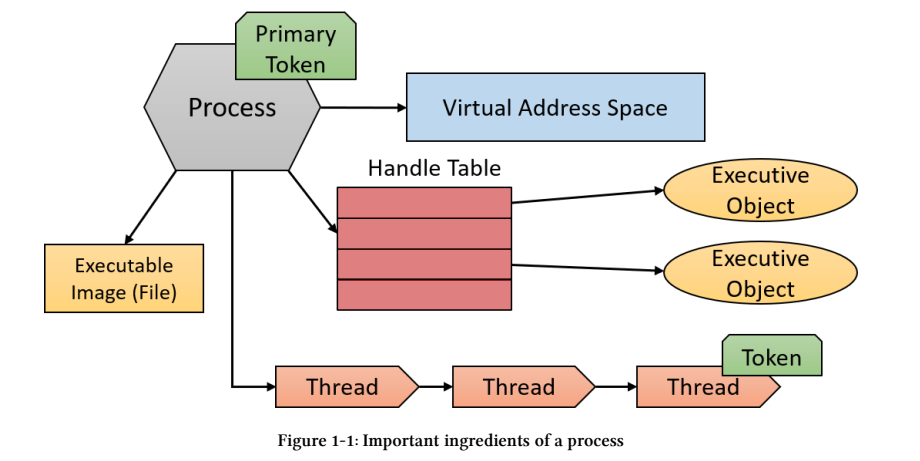
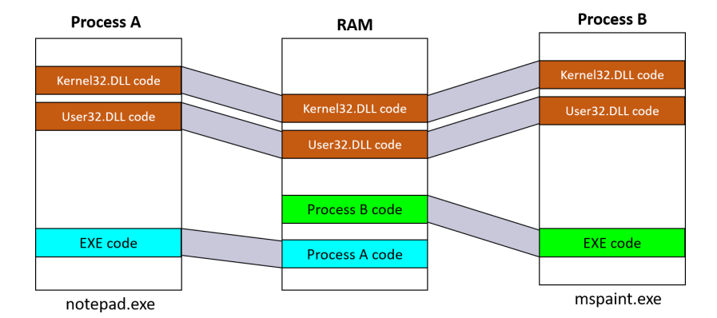
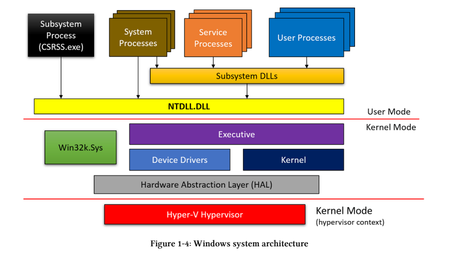
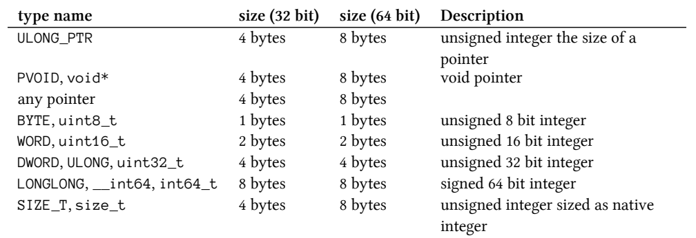
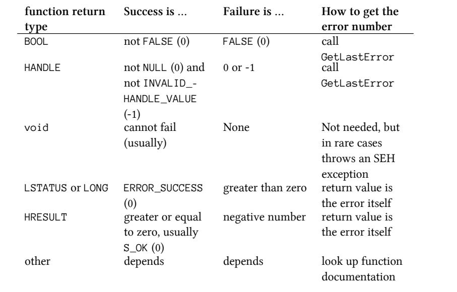

# Windows 10系统学习

## I. 基础

Windows NT操作系统系列有着悠久的历史，从1993年推出的3.1版本开始。今天的Windows 10是最初的NT 3.1的最新继任者。当前Windows系统的基本概念与1993年基本相同。这显示了初始操作系统设计的强度。也就是说，Windows自诞生以来就有了显著的发展，在现有功能的基础上增加了许多新功能和增强功能。这本书是关于系统编程的，通常被视为操作系统核心服务的低级编程，没有它，就无法完成任何重要的工作。系统编程使用低级API来使用和操纵Windows中的核心对象和机制，如进程、线程和内存。在本章中，我们将从核心概念和API开始，了解Windows系统编程的基础。在本章中：

- Windows体系结构概述
- Windows应用程序开发
- 使用字符串
- 32位与64位开发
- 编码惯例
- 处理API错误

Windows版本Windows体系结构概览我们将首先简要介绍Windows中的一些核心概念和组件。这些将在接下来的相关章节中详细阐述。

### 进程

进程是一个包含和管理对象，表示一个正在运行的程序实例。经常使用的“进程运行”一词是不准确的。进程不运行-进程管理。线程是执行代码并在技术上运行的线程。从高层次的角度来看，进程拥有以下内容：

- 可执行程序，其中包含用于在进程中执行代码的初始代码和数据。
- 私有虚拟地址空间，用于为进程内的代码需要的任何目的分配内存。
- 访问令牌（有时称为主令牌），它是一个存储进程默认安全上下文的对象，由进程内执行代码的线程使用（除非线程通过使用模拟来使用不同的令牌）。
- Executive（内核）对象的私有句柄表，如事件、信号量和文件。
- 一个或多个执行线程。使用一个线程（执行进程的主入口点）创建一个正常的用户模式进程。没有线程的用户模式进程大多是无用的，在正常情况下会被内核破坏。

进程的这些要素如图1-1所示。



​	进程的重要组成部分进程由其进程ID唯一标识，只要内核进程对象存在，进程ID就保持唯一。一旦被销毁，相同的ID可以重新用于新进程。重要的是要意识到可执行文件本身不是进程的唯一标识符。例如，**可能同时运行五个notepad.exe实例。每个进程都有自己的地址空间、自己的线程、自己的句柄表、自己的唯一进程ID等。所有这五个进程都使用相同的图像文件（notepad.exe）作为其初始代码和数据。**

​	图1-2显示了任务管理器的详细信息选项卡的屏幕截图，显示了五个Notepad.exe实例，每个实例都有自己的属性。


### 动态链接库

动态链接库（DLL）是可执行文件，可以包含代码、数据和资源（至少其中之一）。DLL在处理初始化时（称为静态链接）或稍后明确请求时（动态链接）动态加载到进程中。我们将在第15章中更详细地介绍DLL。DLL不包含可执行文件等标准主函数，因此无法直接运行。DLL允许在使用同一DLL的多个进程之间共享物理内存中的代码，这是存储在System32目录中的所有标准Windows DLL的情况。其中一些被称为子系统DLL的DLL实现了文档化的Windows API，这是本书的重点。图1-3显示了使用映射到相同物理（和虚拟）地址的共享DLL的两个进程。



​	虚拟内存每个进程都有自己的虚拟、私有、线性地址空间。此地址空间开始为空（或接近空，因为可执行映像和NtDll.Dll通常是首先映射的）。一旦开始执行主（第一个）线程，内存可能会被分配，加载更多的DLL等。这个地址空间是私有的，这意味着其他进程无法直接访问它。地址空间范围从零开始（尽管技术上无法分配前64KB的地址），一直到最大值，这取决于进程“位”（32或64位）、操作系统“位”和链接器标志，如下所示：

- 对于32位Windows系统上的**32位进程，默认情况下进程地址空间大小为2GB。**
- 对于使用增加用户地址空间设置的32位Windows系统上的32位进程，**该进程地址空间大小可以高达3 GB（取决于精确设置）。要获得扩展的地址空间范围，创建进程的可执行文件必须在其标头中标记有LARGEADDRESSAWARE链接器标志。**如果不是，它仍将限制在2GB
- 对于64位进程（自然是在64位Windows系统上），地址空间大小为8 TB（Windows 8及更早版本）或128 TB（Windows 8.1及更高版本）。
- 对于64位Windows系统上的32位进程，如果可执行映像与LARGEADDRESSAWARE标志链接，则地址空间大小为4 GB。否则，大小仍为2GB。

> LARGEADDRESSAWARE标志的要求源于这样一个事实，即2GB地址范围只需要31位，而最高有效位（MSB）则可供应用程序使用。指定此标志表示程序没有将位31用于任何事情，因此将该位设置为1（对于大于2GB的地址会发生这种情况）不是问题。

​	内存本身称为虚拟内存，这意味着地址范围与其在物理内存（RAM）中的确切位置之间存在间接关系。进程中的缓冲区可以映射到物理内存，也可以临时驻留在文件（如页面文件）中。虚拟一词是指从执行的角度来看，不需要知道即将访问的内存是否在RAM中；**如果内存确实映射到RAM，CPU将直接访问数据**。如果没有，CPU将引发页面错误异常，这将导致内存管理器的页面错误处理程序从相应的文件中提取数据，将其复制到RAM，在映射缓冲区的页面表条目中进行所需的更改，并指示CPU重试。

### 线程

执行代码的实际实体是线程。线程包含在进程中，使用进程公开的资源来完成工作（如虚拟内存和内核对象句柄）。线程拥有的最重要的属性如下：

- 当前访问模式，用户或内核。
- 执行上下文，包括处理器寄存器。
- 一个堆栈，用于局部变量分配和调用管理
- 线程本地存储（TLS）阵列，它提供了一种以统一访问语义存储线程私有数据的方法
- 基本优先级和当前（动态）优先级
- 处理器相关性，指示允许线程在哪些处理器上运行。

线程最常见的状态是：

1. 正在运行-当前在（逻辑）处理器上执行代码。
2. 准备就绪-等待执行，因为所有相关处理器都处于总线状态或不可用状态。
3. 等待-在继续之前等待某个事件发生。



- 用户进程：这些是基于映像文件的正常进程，在系统上执行，例如Notepad.exe、cmd.exe、explorer.exe等实例。
- 子系统DLL： 子系统DLL是实现子系统的API的动态链接库（DLL）。子系统是内核所公开的功能的特定视图。从技术上讲，从Windows 8.1开始，只有一个子系统——Windows子系统。子系统dll包括众所周知的文件，user32.dll、gdi32.dll、advapi32.dll、combase.dll等基础。其中包括Windows的大多数官方文档API。本书重点介绍如何使用这些DLL提供的API
- NTDLL.DLL这是一个应用到了全系统的DLL，实现Windows本机API。这是仍处于用户模式的最底层代码。它最重要的作用是为系统调用转换到tokernel模式。NTDLL还实现了堆管理器、映像加载器和用户模式线程池的某些部分。尽管nativeAPI大部分是未记录的，但我们将在本书中使用其中一些，因为标准记录的Windows API无法实现某些目标。
- 服务进程：服务进程是正常的Windows进程，与ServiceControl管理器（SCM，在services.exe中实现）通信，并允许在其生命周期内进行一些控制。SCM可以启动、停止、暂停、恢复和向服务发送其他消息。第19章更详细地介绍了服务
- Executive执行程序是NtOskrnl.exe（“内核”）的上层。它承载了内核模式下的大部分代码。它主要包括各种“管理器”：对象管理器、内存管理器、I/O管理器、即插即用管理器、电源管理器、配置管理器等。它远远大于较低的内核层
- Kernel：内核层实现了内核模式操作系统代码中最基本和时间敏感的部分。这包括线程调度、中断和异常调度，以及互斥和信号量等各种内核原语的实现。为了提高效率，一些内核代码是用CPU特定的机器语言编写的，而忘记了直接访问CPU特定的细节设备驱动程序设备驱动程序是可加载的内核模块。它们的代码在内核模式下执行，因此具有内核的全部功能。经典的设备驱动程序在硬件设备和操作系统的其他部分之间起到了粘合作用。其他类型的驱动程序提供过滤功能。
- Win32k.sys 本质上，这是一个内核模块（驱动程序），处理Windows的用户界面部分和经典图形设备接口（GDI）API。这意味着所有窗口操作都由此组件处理。系统的其余部分几乎不了解UI。
- 硬件抽象层（HAL）：HAL是最靠近CPU的硬件上的抽象层。它允许设备驱动程序使用不需要详细和特定知识的API，如中断控制器或DMA控制器。当然，这一层对于为处理硬件设备而编写的设备驱动程序非常有用
- 系统进程：系统进程是一个总称，用于描述通常“就在那里”的进程，在这些进程通常不直接通信的地方执行任务。尽管如此，它们仍然很重要，事实上，有些对系统的福祉至关重要。终止其中一些是致命的，会导致系统崩溃。一些系统进程是本机进程，这意味着它们仅使用本机API（由NTDLL实现的API）。示例系统进程包括Smss.exe、Lsass.exe、Winlogon.exe、Services.exe等
- 子系统进程：运行映像Csrss.exe的Windows子系统进程可以被视为内核的助手，用于管理在Windows系统下运行的进程。这是一个关键过程，这意味着如果被杀死，系统将崩溃。每个会话通常有一个Csrss.exe实例，因此在标准系统中会存在两个实例——一个用于会话0，一个用于登录的用户会话（通常为1）。尽管ghCsrss.exe是Windows子系统的“管理器”（目前仅存一个），但它的重要性不仅仅是这个角色
- Hyper-V管理程序：Hyper-V管理程序存在于Windows 10和服务器2016（及更高版本）系统上，只要它们支持基于虚拟化的安全性（VBS）。VBS提供了一个额外的安全层，其中实际的机器实际上是由Hyper-V控制的虚拟机。VBS超出了本书的范围。有关更多信息，请查看Windows Internals一书。

### Windows应用程序开发

​	Windows提供应用程序编程接口（API），供开发人员访问Windows的系统功能。经典的API被称为Windows API，由一长串C函数组成，提供从处理进程、线程和其他低级对象的基本服务到用户界面、图形、网络以及介于两者之间的所有功能。这本书主要集中在使用这个API来编程Windows。

​	从Windows 8开始，Windows支持两种稍微不同的应用程序类型：在Windows 8之前是唯一应用程序类型的经典桌面应用程序和可以上传到Windows应用商店的通用Windows应用程序。从内部角度来看，这两种类型的应用程序是相同的。这两种类型都使用线程、虚拟内存、DLL、句柄等。存储应用程序主要使用Windows RuntimeAPI（本节稍后介绍），但也可以使用经典Windows API的子集。相反，桌面应用程序使用经典的Windows API，但也可以利用一组Windows运行时API。本书主要介绍桌面应用程序，因为整个Windows API都可供其使用，因为此API包含对系统编程有用的大部分功能。

​	Windows提供的其他API样式，尤其是从Windows Vista开始的样式，都基于组件对象模型（COM）技术，这是1993年发布的一种面向组件的程序设计模式，如今Windows中的许多组件和服务都在使用。示例包括DirectX、Windows映像组件（WIC）、DirectShow、Media Foundation、后台智能传输服务（BITS）、Windows Management Instrumentation（WMI）等。COM中最基本的概念是接口——一个由单个容器下的一组函数组成的契约。我们将在第18章中看到COM的基础。自然，多年来，这两种基本的API风格的各种包装器已经被开发出来，有些是微软开发的，有些是其他人开发的。以下是微软开发的一些常见工具：

微软基础类（MFC）-用于（主要）Windows公开的用户界面（UI）功能的C++包装器-使用窗口、控件、菜单、GDI、对话框等。

活动模板库（ATL）-一个基于C++模板的库，面向构建COM服务器和客户端。我们将在第18章中使用ATL来简化编写COM相关代码Windows模板库*（WTL）-ATL的扩展，为Windows用户界面功能提供基于模板的抓取器。它在软件功能方面与MFC相当，但更轻，不附带（大型）DLL（如MFC）。我们将在本书中使用WTL来简化与UI相关的代码，因为UI不是本书的重点。

NET-一个框架和一个运行时（公共语言运行时-CLR），提供大量服务，如中间语言（IL）的实时（JIT）编译第1章：本机代码和垃圾收集的基础13。NET可以通过利用提供许多功能的新语言（C#是最著名的）来使用，其中许多功能抽象了Windows功能并提高了生产率。这个。NET框架使用标准的Windows API来实现其高级功能。

​	NET的内部工作原理和功能Windows运行时（WinRT）-这是在Windows 8和更高版本中添加的最新API层。其主要目标是开发基于通用Windows平台（UWP）的应用程序。这些应用程序可以打包并上传到Windows应用商店，任何人都可以下载。Windows运行时是围绕COM的增强版本构建的，因此它也包含作为其主要（但不仅仅是）构建块的接口。虽然这个平台是原生的（而不是基于.NET），但它可以被C++、C#（和其他.NET语言）甚至JavaScript使用——微软提供了语言投影来简化访问Windows运行时API。WindowsRuntime API的一个子集可用于（经典）桌面应用程序。我们将在第19章中查看Windows运行时的基本功能。大多数标准的Windows API函数定义都可以在Windows.header文件中找到。在某些情况下，需要额外的头文件以及额外的导入库。文本将指出任何此类标题和/或库。

### 初入Windows编程

​	不说话，上程序

> 查看我们的系统信息

```
#include <Windows.h>
#include <stdio.h>

int main()
{
	SYSTEM_INFO info;
	GetNativeSystemInfo(&info);
	printf("Number of Logical Processors: %d\n", info.dwNumberOfProcessors);
	printf("Page size: %d Bytes\n", info.dwPageSize);
	printf("Processor Mask: 0x%p\n", (PVOID)info.dwActiveProcessorMask);
	printf("Minimum process address: 0x%p\n", info.lpMinimumApplicationAddress);
	printf("Maximum process address: 0x%p\n", info.lpMaximumApplicationAddress);
}
```

​	这里一些概念可能有所陌生

>dwPageSize：页面保护和承诺的页面大小和粒度。 这是 VirtualAlloc 函数使用的页大小。
>
>lpMinimumApplicationAddress：指向应用程序和动态链接库可访问的最低内存地址的指针， (DLL) 。
>
>lpMaximumApplicationAddress：指向应用程序和 DLL 可访问的最高内存地址的指针。
>
>dwActiveProcessorMask：一个掩码，表示在系统中配置的处理器集。 位 0 是处理器 0;位 31 是处理器 31。
>
>dwNumberOfProcessors：当前组中的逻辑处理器数。 若要检索当前处理器组，请使用
>

在笔者的机器上：

> 编译成x64平台

```
Number of Logical Processors: 16
Page size: 4096 Bytes
Processor Mask: 0x000000000000FFFF
Minimum process address: 0x0000000000010000
Maximum process address: 0x00007FFFFFFEFFFF
```

> 编译成x86平台

```
Number of Logical Processors: 16
Page size: 4096 Bytes
Processor Mask: 0x0000FFFF
Minimum process address: 0x00010000
Maximum process address: 0xFFFEFFFF
```

​	差异源于64位进程使用内部为8字节的指针，而32位进程使用4字节的指针。**SYSTEM_INFO结构中的地址空间地址信息被类型化为指针，因此它们的大小因进程“位”而异。**我们将在本章稍后的“32位与64位开发”一节中更详细地讨论32位和64位开发。不要担心这个小应用程序提供的信息的含义（尽管其中一些是不言自明的）。我们将在后面的章节中查看这些术语。在上面的代码：GetNativeSystemInfo中，在函数名之前使用双冒号是为了强调该函数是Windows API的一部分，而不是当前C++类的某个成员函数。在这个例子中，很明显没有C++类，但无论如何，这本书都会使用这个约定（它也稍微加快了编译器函数的查找速度）。本章稍后将在“编码约定”一节中介绍更多的编码约定。

### 使用strings

在经典C中，字符串不是真正的类型，而只是指向以azero结尾的字符的指针。在许多情况下，Windows API都以这种方式使用字符串，但不是所有情况。问题是在处理字符串时，会出现编码错误。在本节中，我们将了解字符串的一般情况以及它们在Windows API中的使用方式。在经典的C中，只有一种类型代表一个字符——char。char表示的字符大小最多为8位，其中前7位值使用ASCII编码。今天的系统必须支持多种语言的多个字符集，而这些字符集无法容纳8位。因此，在Unicode这一总括术语下创建了新的编码，该术语在网上正式可用http://www.unicode.org.TheUnicode联盟定义了其他几种字符编码。以下是常见的：

- UTF-8-用于网页的流行编码。这种编码对ASCII集中的拉丁字符使用一个字节，对其他语言（如中文、希伯来语、阿拉伯语等）每个字符使用更多字节。这种编码很受欢迎，因为如果文本主要是英语，它的大小会很紧凑。一般来说，UTF-8为每个字符使用1到4个字节
- UTF-16-在大多数情况下每个字符使用两个字节，并且只包含两个字节即可包含所有语言。一些更深奥的中文和日文字符可能需要四个字节，但这种情况很少见
- UTF-32-每个字符使用四个字节。最容易使用，但可能最浪费。UTF代表Unicode转换格式。

​	当大小很重要时，UTF-8可能是最好的，但从编程的角度来看，这是一个问题，因为不能使用随机访问。例如，要获取UTF-8字符串中的第100个字符，代码需要从字符串的开头开始扫描并按顺序工作，因为无法知道第100个字母可能在哪里。另一方面，UTF-16在编程上使用起来要方便得多（如果我们不考虑其他情况），因为访问第100个符号意味着向字符串的起始地址添加200个字节。UTF-32太浪费了，很少被使用。幸运的是，Windows在其内核中使用UTF-16，其中每个字符恰好是2个字节。Windows API紧随其后，也使用UTF-16编码，这很好，因为当API调用最终进入内核时，字符串不需要转换。但是，Windows API有一点复杂。

​	部分是从16位Windows和消费者Windows（Windows 95/98）迁移的。这些系统使用ASCII作为它们的主要工作方式，这意味着Windows API使用ASCII字符串而不是UTF-16。当引入双字节编码时，出现了另一个复杂情况，其中每个字符都是一个或两个字节，失去了随机访问的优势。这一切的最终结果是，由于兼容性原因，Windows API包含UTF-16和ASCII函数。由于目前不存在上述系统，最好只保留每个字符串一个字节，只使用UTF-16函数。使用ASCII函数将导致字符串转换为UTF-16，然后与UTF-16函数一起使用。UTF-16在与互操作时也是有益的。NET框架，因为。NET的字符串类型仅存储UTF-16字符。这意味着将UTF-16字符串传递给。NET不需要任何转换或复制。这里有一个函数CreateMutex的示例，如果在网上搜索，它将导致两个函数之一：CreateMutexA和CreateMutexW。离线文档给出了这个原型：

```
HANDLE CreateMutex(
	_In_opt_ LPSECURITY_ATTRIBUTES 			
	lpMutexAttributes,
	_In_ BOOL bInitialOwner,
	_In_opt_ LPCTSTR lpName);
```

​	In_opt_和其他类似的注释称为语法注释语言（SAL），**用于将元数据信息传递给函数和结构定义。这可能对人类和静态分析工具都有用。**C++编译器目前忽略这些注释，但Visual Studio Enterprise版本中的静态分析器在实际运行程序之前使用它来检测潜在的错误。

​	现在让我们专注于最后一个参数，它是一个类型为LPCTSTR的字符串指针。让我们把它分解一下：

​	L=Long P=Pointer C=Constant STR=String. 

​	唯一的谜团是中间的T。LPCTSTR实际上是一个具有以下定义之一的typedef

```
typedef LPCSTR LPCTSTR; // const char* (UNICODE not defined)
typedef LPCWSTR LPCTSTR; // const wchar_t* (UNICODE defined)
```

术语“长指针”在今天毫无意义。在特定进程中，所有指针的大小都是相同的（32位进程中为4个字节，64位进程中的为8个字节）。“长”和“短”（或“近”）这两个术语是16位Windows的遗留物，这些术语实际上具有不同的含义。此外，LPCTSTR和类似类型还有另一个等价物，没有L-PCTSTR、PCWSTR等。这些在源代码中通常是首选的。UNICODE编译常量的定义使LPCTSTR扩展为UTF-16字符串，而缺少它则扩展为ASCII字符串。这也意味着CreateMutex不能作为函数，因为C语言不允许函数重载，其中单个函数名称可能有多个原型。CreateMutex是一个宏，扩展到CreateMutexW（UNICODE定义）或CreateMutexA（UNICODE未定义）。Visual Studio默认在所有新项目中定义UNICODE常量，这是一件好事。我们总是希望使用UTF-16函数来防止从ANSI到UTF-16的转换（当然，对于包含非ASCII字符的字符串，这种转换必然是有损的）。CreateMutexW中的W代表宽，CreateMutexA中的A代表ANSI或ASCII。如果代码需要使用恒定的UTF-16字符串，请在字符串前加上L，以指示编译器将字符串转换为UTF-16。这里有两个版本的字符串，一个ASCII和另一个UTF-16:

```
const char name1[] = "Hello"; // 6 bytes (including NULL terminator)
const wchar_t name2[] = L"Hello"; // 12 bytes (including UTF-16 NULL terminat\
or)
```

​	从这一点开始，除非另有明确说明，否则我们将使用术语“Unicode”来指代UTF-16。使用宏引出了一个问题，即我们如何在不显式选择ASCII与Unicode的情况下编译使用常量字符串的代码？答案在于另一个宏TEXT。以下是CreateMutex的示例

```
HANDLE hMutex = ::CreateMutex(nullptr, FALSE, TEXT("MyMutex"));
```

​	TEXT宏扩展为带或不带“L”前缀的常量字符串，具体取决于是否定义了UNICODE宏。

```
#define __TEXT(quote) L##quote      // r_winnt
#define TEXT(quote) __TEXT(quote)
```

​	由于ASCII函数在调用宽函数之前将值转换为Unicode，因此成本更高，我们不应该使用ASCII函数。这意味着我们可以简单地使用“L”前缀，而不使用TEXT宏。我们将在整本书中采用这一惯例。<tchar.h>中定义了一个名为_T的TEXT宏的较短版本。它们是等价的。使用这些宏仍然是一种相当普遍的做法，这本身并不坏。然而，我倾向于不使用它。与LPCTSTR类似，基于Unicode编译常数，还有其他类型定义允许使用ASCII或Unicode。表1-1显示了其中一些类型。

| 常见类型       | ASCII              | UNICODE                  |
| -------------- | ------------------ | ------------------------ |
| TCHAR          | char, CHAR         | wchar_t, WCHAR           |
| LPTSTR         | char\*, CHAR*,PSTR | wchar_t\*, WCHAR*, PWSTR |
| LPCTSTR,PCTSTR | const char*,PCSTR  | const wchar_t* ,PCWSTR   |

### C/C++运行时中的字符串

​	C/C++运行时有两组用于操纵字符串的函数。经典的（ASCII）字符以“str”开头，如strlen、strcpy、strcat等，但也有Unicode版本第1章：基础23从“wcs”开始，如wcslen、wcscpy、wcscat等。与Windows API相同，有一组宏可以扩展到ASCII或Unicode版本，具体取决于另一个编译常量\_Unicode（请注意nderscore）。这些函数的前缀是“\_tcs”。因此，我们有名为\_tcslen、\_tcscpy、\_tcscat等的函数，它们都使用TCHAR类型。Visual Studio默认定义了\_UNICODE常量，因此如果使用“\_tcs”函数，我们将获得UNICODE函数。如果只定义一个“UNICODE”警员，那将是非常奇怪的，所以要避免这种情况。字符串输出参数将字符串作为输入传递给函数（如CreateMutex案例中所做的那样）是非常常见的。另一个常见的需求是以字符串的形式接收结果。Windows API使用了几种方法来返回字符串结果。第一种（也是更常见的）情况是，客户端代码分配一个缓冲区来容纳结果字符串，并向API提供缓冲区的大小（字符串可以容纳的最大大小），API将字符串写入缓冲区，直到指定的大小。如果缓冲区太小，一些API还会返回实际写入的字符数和/或所需的字符数。考虑如下定义的GetSystemDirectory函数：

```
UINT GetSystemDirectory(
_Out_ LPTSTR lpBuffer,
_In_ UINT uSize);
```

​	该函数接受字符串缓冲区及其大小，并返回回写的字符数。请注意，所有大小都是字符，而不是字节，这很方便。如果失败，该函数将返回零。以下是一个示例用法（现在省略了错误处理）：

```
WCHAR path[MAX_PATH];
::GetSystemDirectory(path, MAX_PATH);
printf("System directory: %ws\n", path);
```

​	不要让指针类型迷惑你——GetSystemDirectory的声明并不意味着你只提供了一个指针。相反，您必须分配一个缓冲区并传递一个指向该缓冲区的指针。

​	MAX_PATH在Windows标头中定义为260，这是Windows中的标准最大路径（此限制可以从Windows 10开始扩展，我们将在第11章中看到）。请注意，printf使用%ws作为字符串格式来表示它是Unicode字符串，因为默认情况下定义了Unicode，因此所有字符串都是Unicode。第二种常见情况是，客户端代码仅提供字符串指针（通过其地址），API本身分配内存，并将结果指针放在提供的变量中。这意味着客户端代码的任务是在不再需要结果字符串时释放内存。诀窍是使用正确的函数来释放内存。API的文档说明了要使用的函数。这里有一个这样定义的FormatMessage函数（其Unicode变体）的使用示例：

```C 
DWORD FormatMessageW(
_In_ DWORD dwFlags,
_In_opt_ LPCVOID lpSource,
_In_ DWORD dwMessageId,
_In_ DWORD dwLanguageId,
_When_((dwFlags & FORMAT_MESSAGE_ALLOCATE_BUFFER) != 0, _At_((LPWSTR*)lpBuf\
fer, _Outptr_result_z_))
_When_((dwFlags & FORMAT_MESSAGE_ALLOCATE_BUFFER) == 0, _Out_writes_z_(nSiz\
e))
LPWSTR lpBuffer,
_In_ DWORD nSize,
_In_opt_ va_list *Arguments);
```

​	看起来很可怕，对吧？我特意为这个函数添加了完整的SAL注释，因为lpBuffer参数很棘手。FormatMessage返回一个错误号的字符串表示（我们将在本章稍后的“API错误”一节中更详细地讨论错误）。该函数是灵活的，因为它可以自己分配字符串，也可以让客户端提供一个缓冲区来保存结果字符串。

​	实际行为取决于第一个dwFlags参数：如果它包含FORMAT_MESSAGE_allocate_buffer标志，则该函数将分配正确大小的缓冲区。如果标志不存在，则由调用者为返回的字符串提供存储空间。所有这些都使函数有点棘手，至少因为如果选择了前一个选项，指针类型应该是LPWSTR*，即指向函数要填充的指针的指针。这需要一个令人讨厌的强制转换才能让编译器满意。这是一个简单的主函数，它接受命令线性参数中的错误号，并显示其字符串表示形式（如果有的话）。它使用的选项是让功能配置。原因是无法知道字符串的长度，所以最好让函数分配正确大小

> PS: 原程序是存在问题的，输出不了中文，这里对原书的代码稍作了修改

```
#include <Windows.h>
#include <stdio.h>
#include <locale.h>

int main(int argc, const char* argv[]) {
	if (argc < 2) {
		printf("Usage: ShowError <number>\n");
		return 0;
	}
	setlocale(LC_CTYPE, "");
	int message = atoi(argv[1]);
	LPWSTR text;
	DWORD chars = FormatMessage(
		FORMAT_MESSAGE_ALLOCATE_BUFFER | // function allocates
		FORMAT_MESSAGE_FROM_SYSTEM |
		FORMAT_MESSAGE_IGNORE_INSERTS,
		NULL, message, 0,
		(LPWSTR)&text, // ugly cast
		0, NULL);
	if (chars > 0) {
		printf("Message %d: %ls\n", message, text);
		LocalFree(text);
	}
	else {
		wprintf("No such error exists\n");
	}
	return 0;
}

```

​	如果调用成功，请注意对LocalFree函数的调用以释放字符串。FormatMessage的文档指出，这是用于释放缓冲区的函数。以下是一个运行示例

```
Message 100: 无法创建另一个系统信号灯。
```

### 安全字符串函数

​	从安全性和可靠性的角度来看，一些经典的C/C++运行时字符串函数（以及Windows API中的一些类似函数）不被视为“安全”。例如，strcpy函数有问题，因为它将源字符串复制到目标指针，直到达到NULL终止符。这可能会使目标缓冲区溢出，并在良好的情况下导致acrash（例如，缓冲区可能位于堆栈上，并损坏存储在那里的返回地址），并被用作缓冲区溢出攻击，其中堆栈上存储了另一个返回地址，跳到准备好的外壳代码。为了减轻这些潜在的漏洞，微软在C/C++运行时库中添加了一组“安全”的字符串函数，其中使用了一个额外的参数来指定目标缓冲区的最大大小，因此它永远不会溢出。这些函数有一个“_s”后缀，如strcpy_s、wcscat_s等。以下是使用这些函数的一些示例：

```C
void wmain(int argc, const wchar_t* argv[]) {
	// assume arc >= 2 for this demo
	WCHAR buffer[32];
	wcscpy_s(buffer, argv[1]); // C++ version aware of static buffers
	WCHAR* buffer2 = (WCHAR*)malloc(32 * sizeof(WCHAR));
	//wcscpy_s(buffer2, argv[1]); // does not compile
	wcscpy_s(buffer2, 32, argv[1]); // size in characters (not bytes)
	free(buffer2);
}    
```

​	最大大小始终以字符而不是字节指定。还要注意，如果目标缓冲区是静态定位的，这些函数能够自动计算最大大小，这很方便。Windows API中还添加了另一组安全字符串函数，至少是为了减少对C/C++运行时的依赖。这些函数在<strsafe.h>头文件中声明（和实现）。它们是根据Windows API惯例构建的，其中函数实际上是扩展为后缀为“A”或“W”的函数的宏。以下是一些简单的用法示例（使用与上述相同的声明）：

```
StringCchCopy(buffer, _countof(buffer), argv[1]);
StringCchCat(buffer, _countof(buffer), L"cat");
StringCchCopy(buffer2, 32, argv[1]);
StringCchCat(buffer2, 32, L"cat");
```

​	“Cch”代表字符数。请注意，这些函数没有知道如何处理静态分配缓冲区的C++变体。解决方案是使用\_countof宏，该宏返回数组中的元素数。它的定义类似于给定数组a的sizeof（a）/sizing（a[0]）。你应该使用哪一组函数？这主要是品味的问题。重要的是要避免经典的、不安全的功能。如果你尝试使用它们，你会得到这样的编译器错误：错误C4996：“wcscpy”：此函数或变量可能不安全。请考虑改用\wcscpy_s。要禁用弃用，请使用\_CRT_SECURE_NO_WARNINGS。有关详细信息，请参阅联机帮助。

​	显然，可以通过在包含C/C++头文件之前定义_CRT_SECURE_NO_WARNINGS来禁用此错误，但这不是一个好主意。此宏的存在是为了帮助维护与旧源代码的兼容性，在与最新编译器编译时可能不应该触及旧源代码。

### 32位与64位开发

​	从Windows Vista开始，Windows有官方的32位和64位版本（也有非商业的64位版本的Windows XP）。从Windows Server 2008R2开始，所有服务器版本都是64位的。Microsoft删除了32位服务器版本，因为服务器通常需要大量RAM和较大的进程地址空间，这使得32位系统对服务器的工作非常有限。从API的角度来看，32位和64位的编程模型是相同的。只需在Visual Studio中选择所需的配置并点击“构建”，您就应该能够编译到32位或64位。但是，如果代码应该为32位和64位目标成功构建，则必须小心编码以正确使用类型。在64位中，指针的大小为8个字节，而在32位中，它们只有4个字节。如果指针的大小被设定为某个值，则此更改可能会导致错误。例如，考虑以下强制转换操作：

```
void* p = ...;
int value = (int)p;
// do something with value
```

这段代码有缺陷，因为在64位中，指针值被截断为4个字节以适应int（在64位编译中，int仍然是4个字节）。如果确实需要这样的转换，则应使用替代类型-INT_PTR:

```
void* p = ...;
INT_PTR value = (INT_PTR)p;
// do something with value
```

INT_PTR表达的是“int指针的大小”。出于这个确切的原因，Windows标头定义了几种类似的类型。其他类型保持其大小，而不管编译的“bitness”如何。表1-2显示了常见类型及其尺寸的一些示例。



​	32位和64位之间的差异超出了类型大小。64位进程的地址空间为128 TB（Windows 8.1及更高版本），而32位进程的仅为2 GB。在x64系统（Intel/AMD）上，由于有一个名为WOW64（Windows 64上的Windows）的转换层，32位进程可以很好地执行。我们将在第12章深入探讨这一层。这有几个含义，本章也对此进行了讨论。除非另有明确说明，否则本书中的所有示例应用程序都应在x86和x64上成功构建和运行。在开发过程中，最好同时为x86和x64构建，并解决可能出现的任何问题。

```
printf("Processor Mask: 0x%p\n", (PVOID)si.dwActiveProcessorMask);
```

```c
#ifdef _WIN64
printf("Processor Mask: 0x%016llX\n", si.dwActiveProcessorMask);
#else
printf("Processor Mask: 0x%08X\n", si.dwActiveProcessorMask);
#endif
```

这将比使用%p格式字符串更清晰，后者在32位进程中自动预期4个字节，在64位进程中预期8个字节。这迫使强制转换为PVOID，因为dwActiveProcessorMask的类型为DWORD_PTR，当与%p一起使用时会生成警告。这里更好的选择是指定%zu或%zX，用于格式化size_tvalue，相当于DWORD_PTT。编码约定有任何编码约定都有利于一致性和清晰度，但实际约定当然会有所不同。

- Windows API函数使用双冒号前缀。示例：::CreateFile.
- 类型名称使用Pascal大小写（首字母大写，每个单词也以大写字母开头。示例：Book、SolidBrush。以大写字母“C”开头的UI相关类除外；这是为了与WTL保持一致。
- C++类中的私有成员变量以下划线开头并使用驼峰大小写（第一个字母很小，后续单词以大写字母开始）。示例：\_size、\_isRunning。例外情况是WTL类，其中私有成员变量namesstart为m_。这是为了与ATL/WTL风格保持一致变量名不使用旧的匈牙利符号。然而，偶尔可能会有一些例外，例如句柄的h前缀和指针的p前缀函数名称遵循Windows API惯例，使用Pascal大小写。
- 当需要向量等常见数据类型时，除非有充分的理由使用其他数据类型，否则将使用C++标准库我们将使用微软的Windows实现库（WIL），该库以Nuget包的形式发布。此库包含有助于更轻松地使用Windows API的类型。下一章将简要介绍WIL。
- 一些示例有一个用户界面。这本书使用Windows模板库（WTL）来简化与UI相关的代码。您当然可以为UI使用其他一些库，如MFC、Qt、直接Windows API，甚至.NET库

C++用法

​	我们不会使用任何“复杂”的C++功能，但主要是提高生产力、帮助避免错误的功能。以下是我们将使用的主要C++特性：

- nullptr关键字，表示真正的NULL指针。
- 在声明和初始化变量时允许类型推断的auto关键字。这有助于减少混乱，节省一些打字时间，并专注于代码的重要部分新建和删除运算符。
- 作用域枚举（枚举类）。•带有成员变量和函数的类模板，它们有意义。
- 构造函数和析构函数，特别是用于构建RAII（资源获取初始化）类型。RAII将在下一章中更详细地讨论。处理API错误Windows API函数可能由于各种原因而失败。不幸的是，函数指示成功或失败的方式在所有函数中并不一致。



​	最常见的情况是返回BOOL类型。BOOL类型与C++BOOL类型不同；BOOL实际上是一个32位有符号整数。非零返回值表示访问失败，而返回零（FALSE）表示函数失败。重要的是不要显式地针对TRUE（1）值进行测试，因为成功有时会返回一个与真不同的值。如果函数失败，则可以通过调用GetLastError来获得实际的错误代码，GetLastError负责存储当前线程上发生的API函数的最后一个错误。

​	换句话说，每个线程都有自己的最后一个错误值，这在像Windows这样的多线程环境中是有意义的——多个线程可以同时调用API函数。下面是一个处理此类错误的示例：

```
BOOL success = ::CallSomeAPIThatReturnsBOOL();
if(!success) {
// error - handle it (just print it in this example)
printf("Error: %d\n", ::GetLastError());
}
```

表1-3中的第二项用于返回void的函数。实际上，这样的功能很少，而且大多数都不会失败。不幸的是，在极端情况下（“极端”通常意味着非常低的内存资源），很少有这样的函数会因结构化异常处理（SEH）异常而失败。我们将讨论SEH第20章。你可能不需要太担心这些函数，因为如果其中一个函数失败了，这意味着整个过程，甚至可能系统都遇到了大麻烦。接下来，有一些函数返回LSTATUS或LONG，这两个函数都是带符号的32位整数。使用这些方案的最常见的API是我们将在第17章中遇到的注册表函数。如果成功，这些函数将返回ERROR_SUCCESS（0）。否则，返回值就是错误本身（不需要调用GetLastError）。表1-3列表中的下一个是HRESULT类型，它也是一个有符号的32位整数。这种返回类型在组件对象模型（COM）函数中很常见（COM在第18章中讨论）。零或正值表示成功，而负值表示错误，由返回值标识。在大多数情况下，检查成功或失败是使用Succeeed或FAILED宏完成的，恭敬地返回true或false。在极少数情况下，代码需要查看实际值。Windows标头包含一个宏，用于将Win32错误（GetLastError）转换为适当的HRESULT:HRESULT_FROM_Win32，如果COM方法需要根据返回API的BOOL失败来返回错误，则此宏非常有用。以下是一个处理基于HRESULT的错误的示例：

```
IGlobalInterfaceTable* pGit;
HRESULT hr = ::CoCreateInstance(CLSID_StdGlobalInterfaceTable, nullptr, CLSCTX_\
ALL,
IID_IGlobalInterfaceTable, (void**)&pGit);
if(FAILED(hr)) {
printf("Error: %08X\n", hr);
}
else {
// do work
pGit->Release(); // release interface pointer
}
```

提供缓冲区，如果函数失败，则为零。对于这些类型的函数，没有硬性规定——文档是最好的指南。幸运的是，他们没有那么多。

### 定义自定义错误代码

​	GetLastError公开的错误代码机制也可供应用程序使用，以类似的方式设置错误代码。这是通过在当前线程上调用SetLastError with error来设置的。函数可以使用许多预定义的错误代码之一，也可以定义自己的错误代码。为了防止与系统定义的代码发生任何冲突，应用程序应在定义的错误代码中设置第29位。以下是一个使用此技术的函数示例：

```
#define MY_ERROR_1 ((1 << 29) | 1)
#define MY_ERROR_2 ((1 << 29) | 2)
BOOL SomeApi1(int32_t, int32_t*);
BOOL SomeApi2(int32_t, int32_t*);
bool DoWork(int32_t value, int32_t* result) {
int32_t result1;
BOOL ok = ::SomeApi1(value, &result1);
if (!ok) {
::SetLastError(MY_ERROR_1);
return false;
}
int32_t result2;
ok = ::SomeApi2(value, &result2);
if (!ok) {
::SetLastError(MY_ERROR_2);
return false;
}
*result = result1 + result2;
return true;
}
```

