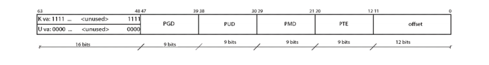
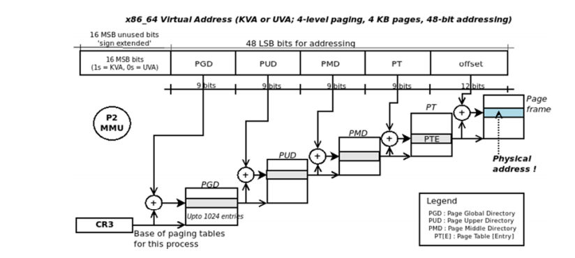
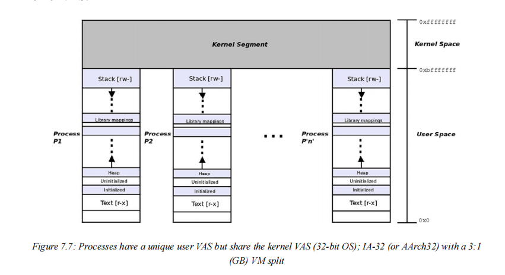

# 7.10 

## Linux kernel programming

### 内核内存管理内幕

#### 理解虚拟机分割

​	在本章中，我们将广泛地介绍 Linux 内核如何通过两种方式管理内存：

- 基于虚拟内存的方法，其中内存被虚拟化（通常情况）

- 内核如何组织物理内存（RAM 页面）的视图


​	首先，让我们从虚拟内存视图开始，然后在本章后面讨论物理内存组织。

​	正如我们在第 6 章“内核内部基本知识 - 进程和线程”中在“理解进程虚拟地址空间 (VAS) 的基础知识”部分中看到的那样，进程 VAS 的一个关键属性是它完全独立，是一个沙箱。你不能跳出框框看。在那一章的图 6.2 中，我们看到进程 VAS 的范围从虚拟地址 0x0 到我们简单称为“高地址”的范围。这个“高”地址的实际值是什么？它是 VAS 的最高范围，因此取决于用于寻址的位数；因此：

- 在运行于 32 位处理器（或为 32 位编译）的 Linux 操作系统上，最高虚拟地址将为 2 ^ 32 = 4 GB。
- 在运行于（并为其编译）64 位处理器的 Linux 操作系统上，最高虚拟地址将为 2 ^ 64 = 16 EB。（EB 是 Exabyte 的缩写，即1,152,921,504,606,846,976 字节或 1,024 PB。显然，这是一个巨大的数量；16 EB 是 16 x 1018 的数字。）

​	为简单起见，为了让数字易于管理，我们现在将重点放在 32 位地址空间上（我们当然也会介绍 64 位寻址）。因此，根据我们的讨论，在 32 位系统上，进程 VAS 的范围为 0 到 4 GB - 此区域由空白空间（未使用区域，称为稀疏区域或空洞）和有效内存区域组成，通常称为段（或更准确地说，映射）- 文本、数据、库和堆栈（所有这些内容已在第 6 章“内核内部基本知识 - 进程和线程”中详细介绍）。在我们理解虚拟内存的过程中，采用众所周知的 Hello, world K&R C 程序并（在很大程度上）了解其在 Linux 系统上的内部工作原理很有用；这就是下一节要介绍的内容！

#### 从hello.c 发生了什么入手

```
#include <stdio.h>
int main()
{
	printf("Hello, World");
}
```

​	进程正在调用 printf() 函数。您编写了 printf() 的代码吗？
​	“不，当然没有，”您说，“它在标准 C 库中，通常是 Linux 上的 glibc (GNU libc)。是的，您是对的；但是等等，除非 printf() 的代码和数据（以及类似的所有其他库 API）实际上位于进程 VAS 中，否则我们如何访问它？（回想一下，您不能跳出框框！）为此，printf() 的代码（和数据）（实际上是整个 glibc 库）必须映射到进程框中——进程 VAS。它确实在进程 VAS 中映射，在库段中或映射中（如我们在第 6 章“内核内部要点 - 进程和线程”图 6.2 中看到的那样）。这种映射是如何发生的？

​	实际情况是，在应用程序启动时，作为 C 运行时环境设置的一部分，有一个小型的可执行和可链接格式 (ELF) 二进制文件（嵌入到您的 a.out 二进制可执行文件中），称为加载器 (ld.so 或 ld-linux.so)。它在执行初期就被赋予控制权。它检测所有必需的共享库，并通过打开它们并发出 mmap() 系统调用，将所有共享库（库文本（代码）、数据和任何其他必需的段）映射到进程 VAS 中。所以，现在，一旦库的代码和数据被映射到进程 VAS 中，进程就可以访问它，因此 - 等待它 - printf() API 可以成功调用！（我们在这里跳过了内存映射和链接的详细细节。）进一步验证这一点，ldd 脚本（以下输出来自 x86_64 系统）显示情况确实如此：

```
 ldd test
	linux-vdso.so.1 (0x000075523d94d000)
	libc.so.6 => /usr/lib/libc.so.6 (0x000075523d71c000)
	/lib64/ld-linux-x86-64.so.2 => /usr/lib64/ld-linux-x86-64.so.2 (0x000075523d94f000)

```

需要注意的几点：
	每个 Linux 进程（自动且默认）至少链接到两个对象：glibc 共享库和程序加载器（编译/链接期间不需要显式链接器切换）。加载程序的名称因架构而异。在这里，在我们的 x86_64 系统上，它是 ld-linux-x86-64.so.2。在前面的 ldd 输出中，右侧括号内的地址是映射位置的（用户空间）虚拟地址。例如，在前面的输出中，glibc 被映射到我们的进程 VAS 中的用户虚拟地址（UVA），等于 0x00007feb7b85b000。请注意，它依赖于运行时（当启用地址空间布局随机化 (ASLR) 语义时，它也会在每次运行时发生变化（ASLR 通常默认启用；详细信息见下文））。

出于安全原因（以及在 x86 以外的架构上），最好使用objdump 实用程序来查找此类详细信息。尝试对 Hello, world 二进制可执行文件执行 strace，您将看到大量 mmap() 系统调用，它们映射到 glibc（和其他）段中！

现在让我们更深入地研究我们简单的 Hello, world 应用程序。

#### 超越 printf() API

正如您所知道的，printf() API 执行其漂亮的格式化并调用write() 系统调用，它当然会将“Hello, world”字符串写入 stdout –这里，默认情况下，stdout 将是（伪）终端窗口或控制台设备。我们还知道，由于 write() 是一个系统调用，这意味着运行此代码的当前进程（或线程）——进程上下文——现在必须切换到内核模式并运行 write() 的内核代码（单片内核架构）！确实如此。但是请稍等一下：write() 的内核代码位于内核 VAS 中（请参阅第 6 章“内核内部要点 - 进程和线程”，图 6.1）。这里的要点是关键的：如果内核 VAS 不在盒子里，那么我们究竟该如何调用它？好吧，可以通过将用户和内核 VAS 放入两个单独的 4 GB 空间来实现，
但这种方法会导致非常慢的上下文切换（以及昂贵的转换后备缓冲区 (TLB) 刷新），所以根本无法做到这一点。

它的设计方式是这样的：用户和内核 VAS 都“生活”在同一个“盒子”中 - 可用的 VAS。具体怎么做？通过按照某个用户：内核 :: U：K 比率在用户和内核之间划分可用地址空间。这称为 VM拆分（比率 U:K 通常以兆字节、千兆字节、太字节甚至
拍字节表示）。在许多 ARM-32 (AArch32) 和 x86-32 系统上，默认 VM 拆分通常为 3:1
GB。下图（图 7.1）代表具有 3:1 VM 拆分（单位为 GB）的 32 位 Linux 进程；也就是说，共 4 GB 的进程 VAS 被拆分为 3GB 的用户空间和 1 GB 的内核空间。换句话说，拆分可以描述为U:K :: 3:1。


#### 虚拟寻址和地址转换

​	在深入研究这些细节之前，清楚地理解几个关键点非常重要。考虑一个 C 程序中的一小段典型代码片段：

```
int i = 5;
printf("i 的地址是 0x%x\n", &i);
```

​	在功能丰富的现代操作系统（如 Linux、Unix、Windows 或 Mac）上运行此程序时，

​	您看到的 printf() 发出的地址（几乎）始终是虚拟地址，而不是物理地址。此外，我们区分两种虚拟地址：

​	如果您在用户空间进程中运行此代码，您将看到的变量 i 的地址是用户虚拟地址，简称 UVA。如果您在内核或内核模块中运行此代码（当然，您将使用 printk()（或类似）API 代替 printf()），您将看到的变量 i 的地址是内核虚拟地址 (KVA)。

​	接下来，正如人们通常认为的那样，虚拟地址不是绝对值（从 0 开始的偏移量）；它是为 MMU（现代微处理器硅片内的内存管理单元）设计和解释的位掩码：

​	在 32 位 Linux 操作系统上，32 个可用位被分为所谓的页面全局目录 (PGD) 值、页表 (PT) 值和偏移量。这些成为物理内存的索引，MMU 通过这些索引可以访问当前进程上下文的内核页表，执行地址转换。我们不打算在这里介绍 MMU 级地址转换的深层细节。它也非常特定于架构。

​	正如可以预料的那样，在 64 位系统上，即使使用 48 位寻址，虚拟地址位掩码中也会有更多字段。好吧，如果这个 48 位寻址是 x86_64 处理器上的典型情况，那么 64 位虚拟地址中的位是如何布局的？未使用的 16 个 MSB 位会发生什么？下图回答了这个问题；它表示 x86_64 Linux 系统上 64 位虚拟地址（位掩码）的分解：



​	本质上，对于 48 位寻址，我们使用位 0 到 47（LSB 48 位）并忽略MSB（最高有效位）16 位，将其视为符号扩展。不过，未使用的 MSB 16 位的值（如下所示）会随所引用的地址空间而变化：

- 在内核 VAS 中，MSB 16 位始终设置为 1。
- 在用户 VAS 中，MSB 16 位始终设置为 0。

​	这是有用的信息！了解这一点后，只需查看（完整的 64 位）虚拟地址，您就可以立即判断它是 KVA 还是 UVA；因此，在 x86_64

Linux 系统上：

- KVA 的格式始终为 0xffff XXXX XXXX XXXX
- UVA 的格式始终为 0x0000 XXXX XXXX XXXX

需要注意的是：上述格式仅适用于将虚拟地址定义为 KVA 或 UVA 的处理器（实际上是 MMU）；x86 和 ARM 系列处理器（32 位和 64 位）都属于此类。这里，MSB（位 63）充当分页表的选择器；如果设置，则将内核分页表（位于 swapper_pg_dir）用作正在引用的内核虚拟地址；如果清除，则将进程分页表（进程分页表基址的物理地址位于 x86[_64] 上的 CR3 寄存器中，ARM[64] 上的 TTBR0（转换表基址寄存器 0）寄存器中）用作正在引用的用户虚拟地址（而 TTBR1 保存内核主 PGD – swapper_pg_dir 的基址）。

另一点：N 级分页是什么意思？重新看一下图 7.2；在到达偏移量之前，有四个“间接”级别——页面全局目录 (PGD)、页面上层目录 (PUD)、页面中间目录 (PMD) 和页表条目 (PTE)。这是分页模式的一个属性——间接级别的数量；这里是 4，因此，我们称之为 4 级分页（稍后，图 7.6 将向您展示各种 N 级分页值）。

#### 从虚拟地址到物理地址——非常简短的概述

​	现在可以看到（我在这里重申），现实情况是虚拟地址不是绝对地址（从零开始的绝对偏移量，您可能错误地想象了）而是位掩码。事实上，内存管理是一个复杂的领域，其中的工作是共享的；让我们重申真正关键的要点：

​	每个活动进程都有一组分页表，将虚拟页面映射到物理页面（称为页框）；每当访问虚拟地址（用户或内核）时，分页表就会发挥作用。内核也有自己的分页表。操作系统创建和操作每个进程以及内核的分页表；工具链（编译器/链接器）生成虚拟地址。处理器 MMU 执行运行时地址转换，将给定的（用户或内核）虚拟地址转换为物理（RAM）地址。因此，再次，不深入细节，这里简要介绍通常称为硬件分页（此处为 x86）的总体过程（图 7.3 给出了总体流程的高级概述）：

1. 进程（或其中的线程）查找虚拟地址（UVA 或 KVA）——即，它对虚拟地址执行读/写/执行操作。（这是完全正常的、预期的行为；例如，读取或写入变量，或执行机器指令）。
2. 为了让 CPU 在内存中的该位置执行工作，我们现在必须以某种方式将此虚拟地址转换为其对应的物理对应地址。不过，请稍等：由于硬件优化，此步骤可以绕过或更快地完成（步骤 3.1、3.2）；如果不能，则必须通过MMU“手动”转换（速度较慢；步骤 4）。

3. 在进入 MMU 之前，一些硬件优化可以帮助我们加快速度，缩短“通常”较慢的路径：
  4. 首先，正在处理的代码或数据可能已经驻留在CPU 缓存中（L1/L2/L3/…）；首先检查这一点。如果确实如此，我们就有一个缓存命中：代码/数据项在 CPU 缓存本身内进行处理，然后完成工作。如果没有，则说明 CPU 缓存未命中（从技术上讲，是 LLC（最后一级缓存）未命中（成本高昂））；因此，我们进入下一步。（我们将在第 13 章“内核同步 - 第 2 部分”中介绍更多有关 CPU 缓存和缓存一致性问题的内容；暂时忽略它。）
  5. 虚拟地址是否已转换？查找 CPU 的转换后备缓冲区 (TLB)。如果转换存在，则说明 TLB 命中；如果是，则说明 TLB 中缓存了物理地址：跳至步骤 5；如果没有，则说明 TLB 未命中（成本高昂）。（另外：不一定按此处显示的顺序完成；某些微架构使用物理缓存模型，其中 CPU 缓存位于 MMU 和 RAM 访问之间，实际上颠倒了上述两个步骤的顺序）。
6. 将虚拟地址发送到 MMU；它现在“遍历”进程的分页表（它通过保存其物理地址的系统寄存器知道进程（或内核）的基页表在物理 RAM 中的位置），并最终得到相应的页框和物理地址（图 7.4 描述了此步骤）。
7. 物理地址（从前面的步骤之一获得）现在被搭载到 CPU 地址线上，然后开始工作。
   请确保您仔细阅读并理解这一点。除步骤 4 之外，所有显示的步骤均由图 7.3 描述；步骤 4 - 通过 MMU 进行转换的步骤 - 由图 7.4 描述。请研究它们。




​	对于 MMU 地址转换图（图 7.4），请注意，这里我们使用了一个非常特定于架构的 x86_64 示例，该示例具有 4 级分页、4 KB 页面大小和 48 位寻址。传递虚拟地址时，MMU 能够将其视为位掩码；它查找基本物理地址 - 它位于 x86 上的控制寄存器 3 (CR3) 中（在 ARM 系列中，它是用户进程的 TTBR0 寄存器和内核分页表的 TTBR1） - 然后继续进行转换。（想想这个：当然，CR3 中的基址是物理地址，否则此步骤将变得无限递归！）简而言之，这就是 MMU 执行运行时地址转换所做的事情：它查找基本 CR3 地址，将虚拟地址的 PGD 部分中的 9 位值添加到它，然后查找该数量。这是指向下一个表的指针，它重复上一步，但这次使用的是来自 9 位 PUD 字段的值。这继续（通过 PMD）直到页表，在那里它引用实际的页表条目 (PTE)。它包含（除其他微架构特定位外）指向物理页框的指针；将 12 位偏移量添加到页框的基址可得出物理地址。

实际情况更加微妙；这里有几个关键点值得一提。

首先，至少在理论上，当虚拟地址传递给 MMU 时，它会“遍历”分页表，最终结果应该是物理地址；实际上，MMU 地址转换尝试可能会失败！一种情况很明显：提供的虚拟地址不正确（未映射的地址）：实际上，我们有一个错误，一个缺陷，导致 MMU 引发故障（操作系统故障处理程序将适当地处理它）。另一种情况是请求分页——虚拟地址合法但物理内存尚未分配（尚未分配）的情况，导致转换失败（导致 MMU 引发“良好”故障，系统分配页面框架）。我们在第 9 章“模块作者的内核内存分配 - 第 2 部分”的“请求分页和 OOM”部分中详细介绍了这一点；如果您愿意，可以浏览图 9.9，其中显示了还可能发生的情况……当然，我们将在那里介绍详细信息。其次，内核作为老板，实际上可以绕过使用 MMU 并在软件中自己执行地址转换。实际上，这很少做，因为当然会更慢。一个地方是执行 IO（读取或写入）时，通过 /proc/PID/maps 伪文件利用 mmap() 进入进程 VAS。通过\采用这种方法，可以写入标记为只读的内存！（offlinemark 在这篇博客文章中详细介绍了这一点：Linux 内部：/proc/self/mem 如何写入不可写内存，2021 年 5 月：https://offlinemark.com/2021/05/12/an-obscure-quirk-of-proc/；请务必查看。）

​	我们不会在本书中深入探讨有关硬件分页（以及各种硬件加速技术，例如转换后备缓冲区 (TLB)）的更多细节。这些主题已在本章的“进一步阅读”部分中提到的其他各种优秀书籍和参考网站中得到很好的介绍。

#### 64 位 Linux 系统上的 VM 拆分

​	首先，值得注意的是，在 64 位系统上，并非所有 64 位都用于寻址。具有（典型）4 KB
页面大小的 x86_64 的标准 Linux 操作系统配置使用 LSB（最低有效位）48 位进行寻址。为什么不使用完整的64 位？这实在是太多了！现有的任何计算机都无法接近完整的 2^64 = 18,446,744,073,709,551,616 字节的一半，这相当于 16 EB（16EB，即 16,384 PB）的 RAM！

​	您可能会想，“为什么我们要将这种虚拟寻址等同于 RAM？”。请继续阅读 - 在弄清楚这一点之前，需要涵盖更多材料。在检查内核 VAS 部分，您将完全理解这一点。如上所述，64 位系统上可用的 VAS 是令人难以置信的巨大。当 Linus 正在开发第一个 64 位 Linux 端口（DEC Alpha，第一个商用 64 位处理器）时，他可能必须决定如何在这个巨大的 VAS 中布局进程和内核段。即使在今天的 x86_64Linux 操作系统上，做出的决定或多或少仍然保留（概念上）。这个巨大的 64 位 VAS 分为用户模式的 VAS 和内核的单独 VAS，如下所示。这里，我们假设 48 位寻址，页面大小为 4 KB：

- 128 TB 的进程 VAS 的所谓“规范下半部分”：用户 VAS –虚拟地址范围从 0x0 到 0x0000 7fff ffff ffff
- 128 TB 的进程 VAS 的所谓“规范上半部分”：内核 VAS虚拟地址范围从 0xffff 8000 0000 0000 到 0xffff ffff ffff ffff

“规范”一词实际上意味着按照法律或按照惯例。这个 64 位 VM 在 x86_64 Linux 上拆分平台如下图可见：


​	在上图中，您可以清楚地看到用户 VAS“锚定”在底部 128 TB，内核 VAS“锚定”在总共 16 EB VAS 的顶部 128 TB。那么中间未使用的区域（这里从 0x0000 8000 0000 0000 到 0xffff 7fff ffff ffff）呢？这只是一个空洞或稀疏区域；它也被称为非规范地址区域。有趣的是，正如图表告诉我们的那样，使用典型的 48 位寻址方案，大多数 VAS（99.998%）都未使用！这就是我们称 VAS 非常稀疏的原因。上图当然不是按比例绘制的！此外，请始终记住，这都是虚拟内存空间，而不是物理空间。
​	为了完善我们对 VM 分割的讨论，下图显示了一些针对不同 CPU 架构的常见用户：内核 VM 分割比率（同样，我们假设 MMU 页面大小为 4 KB，但最后一行除外，它使用 64 KB 大小的页面）：


#### 关于 x86_64 Linux 寻址的说明

以 x86_64 为例，2^47 为 128 TB；那么为什么地址位数是48（图 7.6 中 x86_64 的地址位数）而不是 47？当然，这是因为我们完全需要2*128 TB = 256 TB 的可用地址空间，128 TB 用于用户空间，另外 128 TB用于内核空间（2^48 = 256 TB）。

实际上，用于寻址的地址位数（图 7.6 中的第四列）决定了总使用虚拟内存的总体大小：用户 + 内核 –每个 VAS 通常获得总数的一半（例外往往是 32 位 x86 和 ARM-32，其中 VM 分割可以故意不相等）。我们用粗体（红色）突出显示第三行，因为它被认为是常见情况：在 x86_64（或 AMD64）架构上运行 Linux，使用用户：内核 :: 128 TB：128 TBVM 拆分。第四列 #Addr Bits 向我们展示了在 64 位处理器上，没有现实世界的处理器真正使用所有 64 位进行寻址。

在 x86_64 下，有两个 VM 拆分，如图 7.6（第 3 行和第 4 行）所示：

- 第一个（图 7.6 中的第 3 行），128 TB：128 TB（4 级分页）是目前 Linux x86_64 系统（嵌入式系统、笔记本电脑、PC、工作站和服务器）上默认使用的 VM 拆分。它将物理地址空间限制为 64 TB（RAM）。
- 第二个（图 7.6 中的第 4 行），64 PB：64 PB，至少在撰写本文时，仍然是纯理论的；它支持 4.14 Linux 中所谓的 5 级分页。分配的 VAS（使用 57 位寻址，我们获得了令人难以置信的 128 PB VAS 和 4 PB 物理地址空间！）非常庞大，以至于据我们所知，在撰写本文时，还没有实际的计算机使用它。

#### 关于 AArch64 Linux 寻址的说明

​	请注意，在 Linux 上运行的 AArch64（ARM-64）架构的两行仅具有代表性。从事该产品的 BSP 供应商或平台团队可以使用不同的分割（图 7.6 后面的注释在此处提到了确切含义）。
此外，表格中的最后一行提到了下一代 (AArch64) ARMv8.2 处理器提供 LPA 扩展的事实。启用后，页面大小为 64 KB，地址空间可以扩展到每个用户和内核地址空间中的 52 位（因此总共 53 位），每个提供 (2^53) 4 PB 的 VAS 空间（以及 4 PB 的物理内存上限）。从 Linux 5.4 开始支持此功能。

> 有关 AArch64 52 位寻址的更多详细信息，可在此处获取：
> 官方内核文档：AArch64 Linux 上的内存布局：https://www.kernel.org/doc/html/v6.1/arm64/memory.html
> 了解 Arm64 内核中的 52 位虚拟地址支持，B Sharma，2020 年 12 月：https://opensource.com/article/20/12/52-bit-arm64-kernel


​	好的，继续；内核 VAS（又名内核段）中实际驻留着什么？所有内核代码、内核数据结构（包括任务结构、列表、

​	内核模式堆栈、分页表等）、设备驱动程序、内核模块等都在这里（如第 6 章“内核内部基本知识 – 进程和线程”中图 6.3 的下半部分所示；我们将在即将到来的“理解内核段”部分详细介绍这一点）。重要的是要意识到，作为 Linux 上的性能优化，内核内存始终是不可交换的；也就是说，内核内存永远不能被分页到交换分区。用户空间内存页面始终是分页的候选，除非被锁定（请参阅 mlock\[all](2)系统调用）。
有了这些背景知识，您现在就可以很好地理解 Linux 操作系统上的完整进程 VAS
布局。继续阅读！

#### 理解进程 VAS – 完整视图

​	再次参考图 7.1；它显示了单个 32 位进程的实际和完整进程 VAS 布局。当然，现实情况是系统上所有活跃的进程都有自己独特的用户模式 VAS，但共享相同的内核 VAS。下图试图从概念上传达这一点；它显示了典型 IA-32（或可能是 AArch32）系统的情况，具有 3:1（GB）的 VM 分割。在这里，每个进程的用户空间都是独一无二的，所有进程共享相同的内核 VAS：



​	请注意上图中虚拟地址空间如何反映 3:1 (GB) VM 分割。用户 VAS 从 0 扩展到 0xbfff ffff（0xc000 0000 是 3 GB 标记；这就是 PAGE_OFFSET 宏在此处设置的值），而内核 VAS 从 0xc0000000（3 GB）扩展到 0xffff ffff（4 GB）。

​	在本章后面，我们将介绍一个名为 procmap 的有用实用程序的用法。它将帮助您详细地可视化内核和用户的 VAS，类似于我们前面的图表所显示的方式。

需要注意的几点：

- 对于图 7.7 中显示的示例，PAGE_OFFSET 内核宏的值为 0xc000 0000。
- 我们在此处显示的数字和数字并不是绝对的，也不是所有架构的约束力；它们往往非常特定于架构，许多高度供应商定制的 Linux 系统可能会更改它们（如图 7.6 所示）。
- 图 7.7 详细介绍了 32 位 Linux 操作系统上的 VM 布局。在 64 位 Linux 上，概念保持不变，只是数字（显著）发生了变化。如前面几节中详细显示的那样，x86_64（具有 48 位寻址和 4K 页）Linux 系统上的 VM 拆分为用户：内核 :: 128 TB：128 TB。

​	现在，您已经了解了进程虚拟内存布局的基本原理，您会发现它对解密和在难以调试的情况下取得进展大有帮助。像往常一样，还有更多内容；接下来的部分介绍了用户空间和内核空间虚拟内存映射（内核 VAS），以及物理内存映射的一些介绍。继续，继续！

#### 检查进程 VAS

​	我们已经介绍了每个进程的 VAS 的布局（段或映射）（请参阅第 6 章“内核内部要点 - 进程和线程”中的“了解进程虚拟地址空间 (VAS) 的基础知识”部分）。
我们了解到，进程 VAS 由各种映射或段组成；其中包括文本（代码）、数据段、库映射和至少一个堆栈。在这里，我们将大大扩展该讨论。
能够深入内核并查看各种运行时值对于像您这样的开发人员（以及应用程序用户、QA、系统管理员、DevOps 人员等）来说是一项重要技能。Linux 内核为我们提供了一个出色的界面来执行此操作——您猜对了，就是 proc 文件系统 (procfs)。

这个伪文件系统始终存在于 Linux 上（至少应该如此），并且默认安装在 /proc 下。 procfs 系统有两个主要任务：

- 提供一组统一的（伪或虚拟）文件和目录，使您能够深入了解内核和硬件内部细节。
- 提供一组统一的 root 可写文件，允许 sysad（或 root 用户）修改关键内核参数。这些文件位于 /proc/sys/ 下，称为sysctl – 它们是 Linux 内核的调整旋钮。

熟悉 proc 文件系统确实是必须的。我建议您查看它并阅读proc(5) 上的优秀手册页（通过在终端中输入 man 5 proc）。例如，只需执行 cat /proc/PID/status（其中 PID 当然是给定进程或线程的唯一进程标识符）即可从进程或线程的任务结构中获得大量有用的详细信息！

从概念上讲，与 procfs 类似的是 sysfs 文件系统，它安装在/sys 下（在其下是 debugfs，通常安装在 /sys/kernel/debug）。sysfs 是 >= 2.6 Linux 的新设备和驱动程序模型的表示；它公开了系统上所有设备（及其驱动程序）的树，以及几个内核调整旋钮。所有这些都是伪文件系统；
也就是说，它们安装在 RAM 中（因此它们的内容是易失性的）。

#### 详细检查用户 VAS

让我们从检查任何给定进程的用户 VAS 开始。通过 procfs 提供了用户 VAS 的非常详细的映射，特别是通过 /proc/PID/maps伪文件。让我们学习如何使用此接口来查看进程的用户空间
（虚拟）内存映射。我们将看到两种方法：

- 直接通过 procfs 接口的 /proc/PID/maps 伪文件
- 使用一些有用的前端（使输出更易于理解）

让我们从第一个开始。

#### 使用 procfs 直接查看进程内存映射

​	查找任何任意进程的内部进程详细信息确实需要 root 访问权限，而查找您拥有的进程的详细信息（包括调用者进程本身）则不需要。因此，作为一个简单的示例，我们将使用 self 关键字代替 PID 来查找调用进程的 VAS。以下屏幕截图显示了这一点（在 x86_64 Ubuntu 22.04 LTS 客户机上）：

```
56848f1c1000-56848f1c3000 r--p 00000000 00:19 16119                      /usr/bin/cat
56848f1c3000-56848f1c7000 r-xp 00002000 00:19 16119                      /usr/bin/cat
56848f1c7000-56848f1c9000 r--p 00006000 00:19 16119                      /usr/bin/cat
56848f1c9000-56848f1ca000 r--p 00007000 00:19 16119                      /usr/bin/cat
56848f1ca000-56848f1cb000 rw-p 00008000 00:19 16119                      /usr/bin/cat
5684a4d90000-5684a4db1000 rw-p 00000000 00:00 0                          [heap]
76e3ebc00000-76e3ec1f0000 r--p 00000000 00:19 54248                      /usr/lib/locale/locale-archive
76e3ec24a000-76e3ec28f000 rw-p 00000000 00:00 0 
76e3ec28f000-76e3ec2b3000 r--p 00000000 00:19 4061                       /usr/lib/libc.so.6
76e3ec2b3000-76e3ec41f000 r-xp 00024000 00:19 4061                       /usr/lib/libc.so.6
76e3ec41f000-76e3ec46d000 r--p 00190000 00:19 4061                       /usr/lib/libc.so.6
76e3ec46d000-76e3ec471000 r--p 001dd000 00:19 4061                       /usr/lib/libc.so.6
76e3ec471000-76e3ec473000 rw-p 001e1000 00:19 4061                       /usr/lib/libc.so.6
76e3ec473000-76e3ec47d000 rw-p 00000000 00:00 0 
76e3ec4b7000-76e3ec4bb000 r--p 00000000 00:00 0                          [vvar]
76e3ec4bb000-76e3ec4bd000 r-xp 00000000 00:00 0                          [vdso]
76e3ec4bd000-76e3ec4be000 r--p 00000000 00:19 4052                       /usr/lib/ld-linux-x86-64.so.2
76e3ec4be000-76e3ec4e5000 r-xp 00001000 00:19 4052                       /usr/lib/ld-linux-x86-64.so.2
76e3ec4e5000-76e3ec4ef000 r--p 00028000 00:19 4052                       /usr/lib/ld-linux-x86-64.so.2
76e3ec4ef000-76e3ec4f1000 r--p 00032000 00:19 4052                       /usr/lib/ld-linux-x86-64.so.2
76e3ec4f1000-76e3ec4f3000 rw-p 00034000 00:19 4052                       /usr/lib/ld-linux-x86-64.so.2
7ffca0560000-7ffca0581000 rw-p 00000000 00:00 0                          [stack]
ffffffffff600000-ffffffffff601000 --xp 00000000 00:00 0                  [vsyscall]
```

​	在上面的屏幕截图中，您实际上可以看到 cat 进程的用户 VAS 的布局 - 该进程的用户 VAS 的真实内存映射！另外，请注意，前面的 procfs 输出按 UVA 升序排序。

> 熟悉使用强大的 mmap(2) 系统调用将极大地帮助理解进一步的讨论。请（至少）浏览其手册页。

#### 解释 /proc/PID/maps 输出

​	要解释图 7.8 的输出，请一次阅读一行。每一行代表所讨论进程的用户模式 VAS 的一个段或映射（在前面的例子中，它是 cat 进程的段或映射）。每一行由以下字段组成；

​	在这里，整行代表一个段，或者更准确地说，代表进程（用户）VAS 内的映射。

​	uva 是用户虚拟地址。每个映射的 start_uva 和 end_uva 显示为前两个字段（或列），并由连字符分隔。因此，映射（段）的长度很容易计算（end_uva￾start_uva 字节）。因此，在上一行中，start_uva 是 0x558822d66000，end_uva 是 0x558822d6a000，长度可以计算为 16 KB；但是这个段在进程中到底代表什么？请继续阅读...第三个字段 r-xp 是两条信息的组合：前三个字母代表段的模式（权限）（通常为 rwx 表示法）。下一个字母表示映射是私有映射 (p) 还是共享映射(s)。在内部，这是由 mmap() 系统调用的第四个参数flags 设置的；实际上，是 mmap() 系统调用在内部负责创建进程内的每个段或映射！因此，对于前面显示的示例段，第三个字段是值 r-xp，我们现在可以说它是一个文本（代码）段并且是一个私有映射（如预期的那样）。第四个字段 start-off（这里是值 0x2000）是从文件开头的起始偏移量，该文件的内容已映射到进程 VAS 中（对于看到的大小，为 16 KB）。显然，这个值只对文件映射有效。

​	您可以通过查看倒数第二个（第六个）字段 - 文件 inode 号来判断当前段是否是文件映射。对于非文件映射的映射（称为匿名映射），它始终为 0（例如，表示堆或堆栈段的映射）。在我们前面的示例行中，它是一个文件映射（/usr/bin/cat 的映射），并且从该文件开头的偏移量为 0x2000 字节（映射的长度，正如我们在上一段中计算的那样，为 16 KB）。
第五个字段（08:01）的形式为 mj:mn，其中 mj 是主编号，mn 是映像所在的（块）设备文件的次编号。与第四个字段一样，它仅对文件映射有效，否则它仅显示为 00:00；在我们前面的示例行中，由于它是一个文件映射，因此主编号和次编号（表示文件所在的存储介质的块设备的编号）分别为 8 和 1。

​	第六个字段 (7340181) 表示映像文件的 inode 编号 - 该文件的内容被映射到进程 VAS 中。inode 是 VFS（虚拟文件系统）的关键数据结构；它保存文件对象的所有元数据，除了其名称（位于目录（或点）文件中）之外的所有内容。同样，此值仅对文件映射有效，否则仅显示为 0。事实上，这是一种快速判断映射是文件映射还是匿名映射的方法！在我们前面的示例映射中，显然它是一个文件映射（/usr/bin/cat 的映射），inode 编号为 7340181。事实上，我们可以确认这一点：

```
$ ls -i /usr/bin/cat
7340181 /usr/bin/cat
```

第七个也是最后一个字段表示其内容被映射到用户 VAS 中的文件的路径名。在这里，当我们查看 cat 进程的内存映射时，路径名（文件映射段的路径名）恰好是 /usr/bin/cat。如果
映射代表一个文件，则文件的 inode 号（第六个字段）显示为正数；如果不是——意味着它是一个纯内存或匿名映射，没有后备存储——inode 号显示为 0，最后一个字段将为空。（当然，其他文件也可以显示：共享库、共享内存段等的文件。）

​	现在应该很明显了，但我们还是要指出这一点，因为它是一个关键点：所有前面看到的地址都是虚拟的，而不是物理的。此外，它们只属于用户空间，因此它们被称为 UVA，并且始终通过该进程的唯一分页表元数据进行访问（和转换）。此外，前面的屏幕截图是在 64 位 (x86_64) Linux 客户机上拍摄的。因此，在这里，我们看到 64 位虚拟地址。

​	虚拟地址在这里显示的方式不是完整的 64 位数字 - 例如，558822d66000 而不是 0000558822d66000。我希望您注意到这一点，因为它是 UVA，MSB 16 位为零！（当然，数字都是十六进制的。）

​	没错，虽然这涵盖了如何解释特定的段或映射（并且 [heap] 和 [stack] 行是不言自明的），但似乎有一些奇怪的（再次浏览图 7.8） - vvar、vdso 和 vsyscall 映射。让我们看看它们是什么意思。

vsyscall 页面

您是否注意到图 7.8 的输出中有些不寻常的东西？最后一行——所谓的 vsyscall 条目——映射了一个内核页面（现在，你知道我们如何判断：它的起始和结束虚拟地址的 MSB 16 位已设置）。在这里，我们只是提到这是一个（旧的）优化用于执行系统调用。它的工作原理是减轻切换到内核模式的一小部分系统调用的需要，而这些系统调用实际上并不需要。

​	目前，在 x86 上，这些系统调用包括 gettimeofday()、time() 和 getcpu() 系统调用。事实上，上面的 vvar 和 vdso（又名虚拟动态共享对象）映射是同一主题的（略）现代变体。如果您有兴趣了解更多信息，请查看本章的“进一步阅读”部分。

​	顺便说一句：名为 /proc/PID/map_files/ 的目录是另一个视图；它仅显示进程或线程内的文件映射。在这里，每个文件支持的内存映射（或段）都显示为其对应文件的符号链接。

​	因此，您现在已经学会了如何通过直接读取和解释具有指定 PID 的进程的 /proc/PID/maps（伪）文件的输出来检查和解释任何给定进程的“原始”用户空间内存映射。还有其他方便的前端可以这样做；我们现在将检查一些。

#### 查看进程内存映射的前端

​	除了通过 /proc/PID/maps 的原始或直接格式（我们在上一节中看到了如何解释）之外，还有一些包装器实用程序可以帮助我们更轻松地解释用户模式 VAS。其中包括附加的（原始）/proc/PID/smaps 伪文件、pmap 和 smem 实用程序以及我自己的实用程序（命名为 procmap）。

​	内核通过 proc 下的 /proc/PID/smaps 伪文件提供有关每个段或映射的详细信息。请尝试运行命令 cat /proc/self/smaps 亲自查看。您会注意到，对于每个段（映射），都提供了大量详细信息。proc(5) 的手册页有助于解释看到的许多字段。对于 pmap 和 smem 实用程序，我建议您参阅它们的手册页以了解详细信息。

#### 了解 VMA 基础知识

​	在 /proc/PID/maps 的输出中，输出的每一行都是从内核元数据结构（称为虚拟内存区域或 VMA）推断出来的。实际上，这非常简单：内核使用 VMA 数据结构在代码中抽象我们一直称为段或映射的内容。因此，对于用户 VAS 中的每个映射，都有一个由操作系统维护的 VMA 对象。请注意，只有用户空间映射才受内核元数据结构（称为 VMA）的管理；内核 VAS 本身没有 VMA。

​	那么，给定进程将有多少个 VMA？好吧，它等于其用户 VAS 中的映射（段）数量。在我运行的 helloworld 进程示例中，它报告了 15 个段或映射，这意味着内核内存中有 15 个 VMA 元数据对象 - 代表 15 个用户空间段或映射。

​	从编程的角度来说，内核通过以 current->mm->mmap 为根的任务结构维护 VMA“链”（出于效率原因，技术上是红黑树数据结构）。为什么指针称为 mmap？这是经过深思熟虑的：每次执行 mmap() 系统调用（即内存映射操作）时，内核都会在调用进程的 VAS 中生成一个映射（或“段”），从而生成一个代表它的 VMA 元数据对象。

​	VMA 元数据结构类似于一个涵盖映射的保护伞，包括内核执行各种内存管理所需的所有信息：处理页面错误（非常常见）、在 I/O 进入（或离开）内核页面缓存期间缓存文件内容，等等。

​	页面错误处理是一项非常重要的操作系统活动，其算法占用了内核 VMA 对象的很大一部分使用；不过，在本书中，我们不会深入探讨这些细节，因为这些细节对内核模块/驱动程序作者来说基本上是透明的。

​	现在应该更清楚 cat /proc/PID/maps 的底层工作原理：当用户空间执行 cat /proc/self/maps 时，cat 进程（最终）会发出 read() 系统调用；这会导致它切换到内核模式，并在内核中以内核权限运行 read() 系统调用代码。在这里，内核虚拟文件系统 (VFS) 开关将控制重定向到适当的 procfs 回调处理程序（从 5.6.0 开始，在最近的内核中，该函数在 proc_ops 结构中注册）。此代码遍历（循环）每个 VMA 元数据结构（对于正在运行的进程上下文：换句话说，对于当前进程，当然是我们的 cat 进程），将每个 VMA 对象的相关详细信息发送回用户空间。然后，cat 进程忠实地将通过 read 接收到的数据转储到 stdout，因此我们看到了它：进程的所有段或映射 - 实际上是用户模式 VAS 的内存映射！

​	太好了，我们现在结束本节；我们已经介绍了检查进程用户 VAS 的详细信息。这些知识不仅有助于理解用户模式 VAS 的精确布局，还有助于调试用户空间问题！现在，是时候了，让我们继续了解内存管理的另一个关键方面 - 内核 VAS 的详细布局！

#### 检查内核 VAS

​	正如我们在上一章中讨论过的，如图 7.7 所示，了解所有进程都有自己独特的用户 VAS 但共享内核空间 - 我们称之为内核段或内核 VAS 至关重要。让我们从检查内核 VAS 的一些常见（与架构无关）区域开始本节。

​	内核 VAS 的内存布局非常依赖于架构（CPU）。尽管如此，所有架构都有一些共同点。以下基本图表表示用户 VAS 和内核 VAS（水平平铺格式），如在具有 3:1（GB）VM sp 的典型x86_32（或 IA-32）上所见


​	让我们看一下进程 VAS 的每个区域（从左到右，如图 7.12 所示）： 用户模式 VAS：这是用户 VAS。

​	我们在上一章以及本章前面的部分中已经详细介绍了它；在这个特定的例子中，它占用 3 GB 的 VAS（其 UVA 范围从 0x0 到 0xbfff ffff）。 内核 VAS（或内核段）：在这个特定的例子中，我们有 1 GB 的内核 VAS（其 KVA 范围从 0xc000 0000 到 0xffff ffff）；现在让我们检查它的各个部分。 “lowmem”区域：这是操作系统将平台（系统）RAM 直接映射到内核 VAS 的区域。 （图 7.12 试图清楚地传达这一点。我们将在直接映射 RAM 和地址转换部分更详细地介绍这个关键主题。如果您觉得有帮助，可以先阅读该部分，然后返回此处）。现在先跳过一点，让我们了解内核 VAS 中平台 RAM 映射的基位置由名为 PAGE_OFFSET 的内核宏指定。这个宏的精确值非常依赖于架构；我们将把这个讨论留到后面的部分。现在，我们要求您相信在具有 3:1（GB）VM 分割的 x86_32 上，PAGE_OFFSET 的值为 0xc000 0000。显然，内核所谓的低内存区域的大小等于系统上的 RAM 量。 （至少内核看到的 RAM 数量是这样的；例如，启用 kdump 功能可以让操作系统很早就保留一些指定数量的 RAM。）组成该区域的虚拟地址称为内核逻辑地址，因为它们与物理对应地址有固定的偏移量。核心内核和设备驱动程序可以通过各种 API 从该区域分配（物理上连续的！）内存（它们包括页面分配器 API 和流行的 slab API - k{m|z}alloc()。请耐心等待，我们将在接下来的两章中详细介绍这些 API）。内核静态文本（代码）、数据和 BSS（未初始化数据）内存区域也位于此 lowmem 区域内。没错，在 lowmem 区域之后，还存在其他区域；虽然图 7.12 中没有明确显示（目前），但有几个关键区域： 内核 vmalloc 区域：这是内核 VAS 中完全虚拟的区域。核心内核和/或设备驱动程序代码可以使用 vmalloc()（及其相关函数）API 从该区域分配几乎连续的内存。同样，我们将在第 8 章“模块作者的内核内存分配 - 第 1 部分”和第 9 章“模块作者的内核内存分配 - 第 2 部分”中详细介绍这一点。 这也是所谓的 ioremap 空间。 

​	内核模块空间：内核 VAS 中留出一个区域用于存放 LKM 的静态文本和数据。执行 insmod（或 modprobe）时，生成的 [f]init_module() 系统调用的底层内核代码将从该区域分配内存（通常通过 vmalloc() API）并在那里加载内核模块的（静态）代码和数据。 上图（图 7.12）故意保持简单，甚至有点模糊，因为确切的内核虚拟内存布局非常依赖于架构。我们暂时不打算绘制详细的图表。相反，为了让这个讨论不那么迂腐，更实用、更有用，我们将在即将到来的一节中介绍一个内核模块，该模块查询并打印有关内核 VAS 布局的相关信息。只有这样，一旦我们获得了特定架构的内核 VAS 各个区域的实际值，我们才会提供一个详细的图表来描述这一点。从理论上讲（如图 7.10 所示），属于内核低内存区域的地址称为内核逻辑地址（它们与物理对应地址有固定的偏移量），而内核 VAS 其余部分的地址称为 KVA。虽然这里做出了这种区分，但请注意，出于所有实际目的，这是一个相当迂腐的区分：我们并没有真正区分彼此，并且通常只是将内核 VAS 内的所有地址称为 KVA。

​	 在我们开始编写查询内核 VAS 的模块之前，还有其他几条信息需要介绍。让我们从一个特殊之处开始，这主要是由 32 位架构的限制引起的：

​	32 位系统上内核 VAS 的所谓高内存区域。 32 位系统上的高内存 记住我们之前简要讨论过的内核低内存区域，一个有趣的观察随之而来。在 32 位系统上，例如，VM 分割为 3:1（GB）（如图 7.12 所示），具有（例如）512 MB RAM 的系统会将此 RAM 直接映射到内核，从 PAGE_OFFSET（3 GB 或 KVA 0xc000 0000）开始，为 512 MB。这很清楚。但想想看：如果系统有更多的 RAM，比如 2 GB，会发生什么？现在，很明显，我们不能将整个 RAM 直接映射到内核低端区域。它根本放不下（因为在这个例子中，整个可用内核 VAS 只有 1 GB，而 RAM 是 2 GB）！因此，在 32 位 Linux 操作系统上，一定量的内存（在 IA-32 上通常为 896 MB）允许直接映射，因此落入 lowmem 区域。剩余的 RAM 被间接映射到另一个内存“区域”，称为 ZONE_HIGHMEM（我们将其视为高内存区域或区域，而不是 lowmem；有关内存区域的更多信息将在后面的区域部分中介绍）。更正确的是，由于内核现在发现不可能一次直接映射所有物理内存，因此它设置了一个（虚拟）区域，它可以在该区域设置和使用该 RAM 的临时虚拟映射（通常通过调用 kmap() 和 kunmap() API）。这就是所谓的高内存区域。不要对“高内存”这个短语感到困惑。它不一定位于内核 VAS 的“高”位置，也不是用来描述 PC 上 640 KB 以上内存的“高内存”术语。相反，high_memory 全局变量仅在 32 位上有效，表示内核低内存区域的上限。有关此内容的更多信息，请参阅后面的“描述内核 VAS 布局的宏和变量”一节。

​	然而，如今（尤其是 32 位系统使用越来越少），这些问题在 64 位 Linux 上完全消失了。想想看：例如，在运行 64 位 Linux 的 x86_64 上，内核 VAS 大小高达 128 TB（即 131,072 GB！）。据我所知，现有的任何单个系统（或节点）都没有这么多的 RAM。截至撰写本文时，NASA 的 Pleiades 超级计算机指定每个节点的最大 RAM 为 128 GB（参考：https://www.nas.nasa.gov/hecc/resources/pleiades.html）。

​	接下来，当使用稀疏内存模型时（通常的情况；即将到来的物理内存模型简介部分将介绍这一点），物理地址中支持的最大位由宏 MAX_PHYSMEM_BITS 给出。在 x86_64 上，它通常为值 46，这意味着机器上支持的最大 RAM 量为 246 字节 - 即 64 TB。因此，所有平台 RAM 确实可以（轻松）直接映射到 128 TB 内核 VAS，并且对 ZONE_HIGHMEM（或等效的愚蠢解决方法）的需求就消失了。事实上，弃用 32 位系统上的这个高内存区域是大多数内核人员最终想要做的事情，但截至目前，它仍然存在，允许具有超过 1 GB RAM 的旧系统（通常是 ARM-32）继续在 Linux 上运行（有关更多信息，请参阅本文：高内存的终结？，LWN，2020 年 2 月：https://lwn.net/Articles/813201/）。同样，官方内核文档提供了有关这个神秘的“高内存”区域（与 32 位相关）的详细信息；如果感兴趣，请看一下：https://www.kernel.org/doc/Documentation/vm/highmem.txt。

​	好的，现在让我们解决我们一直想做的事情——编写一个内核模块（LKM）来深入研究有关内核 VAS 的一些细节。

#### 编写内核模块以显示有关内核 VAS 的信息

​	正如我们所了解的，内核 VAS 由各种区域组成。有些区域是所有体系结构所共有的（与架构无关）：它们包括 lowmem 区域（其中包含未压缩的内核映像 - 其代码和数据等），然后是内核模块区域、vmalloc/ioremap 区域等等。

​	这些区域在内核 VAS 中的确切位置以及可能存在哪些区域，与架构（CPU）密切相关。为了帮助理解和确定任何给定系统，让我们开发一个内核模块，以与架构相关的方式查询和打印有关内核 VAS 的各种详细信息（事实上，如果被要求，它还会打印一些有用的用户空间内存详细信息）。

​	现在，为了查询和打印此信息，您必须首先熟悉一些关键的内核宏和全局变量；我们将在下一节中介绍。

#### 描述内核 VAS 布局的宏和变量

​	要编写显示相关内核 VAS 信息的内核模块，我们需要知道如何准确询问内核有关这些详细信息。

​	在本节中，我们将简要介绍内核中表示内核 VAS 内存的几个关键宏和变量（在大多数架构上，按 KVA 降序排列）：

​	向量表是一种常见的操作系统数据结构 - 它是一个函数指针数组（也称为切换或跳转表）。它是特定于架构的：ARM-32 使用它来初始化其向量，以便在发生处理器异常或模式更改（例如中断、系统调用、页面错误、MMU 中止等）时，处理器知道要运行什么代码。宏  VECTORS_BASE如下表所示：

| 宏or变量     | 说明                                                   |
| ------------ | ------------------------------------------------------ |
| VECTORS_BASE | 一般用在arm32平台上。他描述了KVA的向量表的那一页的地址 |

​	修复映射区域是一系列编译时特殊或保留的虚拟地址；它们在启动时用于将必须有可用内存的所需内核元素修复到内核 VAS 中。典型示例包括初始内核页表的设置、早期 ioremap 和 vmalloc 区域等。同样，它是一个依赖于架构的区域，因此在不同的 CPU 上的使用方式不同：

| 宏or变量      | 说明                    |
| ------------- | ----------------------- |
| FIXADDR_START | KVA修复映射区域起始区域 |

​	内核模块在加载时会分配内存（用于其静态文本和数据），内存位于内核 VAS 中的特定范围内。内核模块区域的精确位置因架构而异。事实上，在 AArch32 系统上，它位于用户 VAS 的正上方，而在 64 位系统上，它通常位于内核 VAS 的较高位置：

| 内核模块      | 内存分配        |
| ------------- | --------------- |
| MODULES_VADDR | KVA模块起始位置 |
| MODULES_END   | KVA模块结束位置 |

​	KASAN：现代内核（x86_64 为 4.0 及以上版本，AArch64 为 4.4 及 AArch32 为 5.11）采用强大的机制来检测和报告内存问题（错误）。它基于用户空间地址 SANitizer (ASAN) 代码库，因此称为内核地址 SANitizer (KASAN)。它的强大之处在于，通过一种称为编译时检测 (CTI) 的技术，能够检测内存缺陷（错误），例如越界 (OOB) 访问（包括缓冲区溢出/下溢）、释放后使用 (UAF) 和双重释放访问。然而，在 5.11 之前，它只能在 64 位 Linux 上运行，并且需要相当大的影子内存区域（其大小是内核 VAS 的八分之一，如果启用，我们会显示其范围；不过，在 5.11 中，Linus Walleij 为 ARM-32 引入了 KASAN 的优化版本）。

​	它是一个内核配置功能（CONFIG_KASAN），通常仅用于调试（寻找错误！）目的（在调试期间保持启用状态至关重要，并且

| KASAN影子内存区域  | 可选 |
| ------------------ | ---- |
| KASAN_SHADOW_START | 起始 |
| KASAN_SHADOW_END   | 终末 |

​	vmemmap 区域是内核 VAS 中的一个区域，在以下情况下使用：

- 第一，物理内存模型是 sparsemem（通常是现代系统的默认模型）；
- 第二，将页框号 (PFN) 映射到其对应虚拟页面（通过 struct page 表示）所采用的方法是vmemmap：

| Vmemmap region | [可选]（仅当 CONFIG_ SPARSEMEM_VMEMMAP 已定义时）           |
| -------------- | ----------------------------------------------------------- |
| VMEMMAP_START  | vmemmap 区域的起始 KVA                                      |
| VMEMMAP_SIZE   | 内核 vmemmap 区域的大小；不过这个宏似乎只为 AArch64 定义... |

vmalloc 区域是内核区域，从中分配 vmalloc()(及其相关 API) 的内存；我们将在接下来的两章中详细介绍各种内存分配 API：

| vmalloc区域   | 通过 vmalloc() 及其相关 API 分配的内存                     |
| ------------- | ---------------------------------------------------------- |
| VMALLOC_START | vmalloc 区域的起始 KVA                                     |
| VMALLOC_END   | vmalloc 区域的结束 KVA；大小为 VMALLOC_END - VMALLOC_START |

lowmem 区域 - 直接映射 RAM（即，以 1:1 :: 物理页框：内核逻辑/虚拟页为基础映射到内核 VAS 的 RAM）。它是 Linux 内核映射和管理（通常）所有 RAM 的区域。

此外，它通常在内核中设置为 ZONE_NORMAL（稍后我们将介绍区域）：

| Lowmem region | 直接映射内存区域                                             |
| ------------- | ------------------------------------------------------------ |
| PAGE_OFF_SET  | lowmem 区域的起始 KVA；在某些架构上也表示内核 VAS/段的起始，并且（通常）是 32 位上的 VM 分割值。 |
| high_memory   | lowmem 区域的结束 KVA，直接映射内存的上限。实际上，此值减去 PAGE_OFFSET 就是系统上的（平台）RAM 数量（但请注意，这不一定适用于所有架构）；不要与 ZONE_HIGHMEM 混淆。 |

​	highmem 区域或区域是可选区域。它可能存在于某些 32 位系统上（通常，其中存在的 RAM 量大于内核 VAS 本身的大小）。在这种情况下，它通常设置为 ZONE_HIGHMEM（我们稍后会介绍区域。此外，您可以参考前面标题为 32 位系统上的高内存的部分中有关此高内存区域的更多信息）：

| 高内存区域（仅在 32 位上可能存在） | [可选] HIGHMEM 可能存在于某些 32 位系统上                    |
| ---------------------------------- | ------------------------------------------------------------ |
| PKMAP_BASE                         | 高内存区域的起始 KVA，运行到 LAST_PKMAP 页；表示所谓的高内存页面的内核映射（仅适用于 32 位） |

（未压缩的）内核映像本身 - 其代码、初始化和数据区域 - 始终存在，但它们是私有符号，因此内核模块无法使用。因此，我们甚至不会尝试在即将推出的内核模块的代码中打印它们：

| 内核                            | 未压缩的内核映像区域（未导出符号，因此内核模块不可用） |
| ------------------------------- | ------------------------------------------------------ |
| \_text，\_etext                 | 内核文本（代码）区域的起始和结束 KVA（分别）           |
| \_\_init_begin，<br/>__init_end | 内核初始化部分的起始和结束 KVA（分别）区域             |
| \_sdata，_edata                 | 内核静态数据区域的起始和结束 KVA（分别）               |
| \__bss_start                    | 内核 BSS 的起始和结束 KVA（分别）                      |
| __bss_stop                      | （未初始化数据）区域                                   |

​	用户 VAS：当然，最后一项是进程用户 VAS。它位于内核 VAS 之下（按降序虚拟地址排序），大小为 TASK_SIZE 字节。本章前面已详细讨论过（在检查进程 VAS 部分）：

| 用户 VAS                            | 用户虚拟地址空间 (VAS)                                       |
| ----------------------------------- | ------------------------------------------------------------ |
| 大小为 TASK_SIZE 字节的用户模式 VAS | (之前已通过 procfs 和/或我们的 procmap 实用程序脚本详细检查过）；内核宏 TASK_SIZE 表示用户 VAS 的大小（以字节为单位）。 |

​	好了，就是这样；我们已经看到了几个内核宏和变量，它们实际上描述了内核 VAS。继续查看内核模块的代码，您很快就会看到它的 init 方法调用了两个函数（很重要）： 

- show_kernelvas_info()，它打印相关的内核 VAS 详细信息 
- show_userspace_info()，它打印相关的用户 VAS 详细信息（它的执行是可选的，通过内核参数决定，默认情况下处于关闭状态）

我们将首先描述内核 VAS 函数并查看其输出。此外，Makefile 的设置方式是链接到内核“库”代码 klib.c 的目标文件，并生成一个名为 show_kernel_vas.ko 的内核模块对象。

#### 通过 procmap 的内核 VAS

​	好的，这很有趣：图 7.14 中详细显示的内存映射布局视图正是我们前面提到的 procmap 实用程序提供的；我们在 procmap 进程 VAS 可视化实用程序部分介绍了此实用程序的用法。正如承诺的那样，现在让我们看看运行 procmap 时内核 VAS 的屏幕截图（前面的部分显示了进程用户 VAS 的屏幕截图）。


​	为了与当前的讨论保持同步，我们现在将展示 procmap 的屏幕截图，它在同一个 AArch32 Raspberry Pi Zero W 系统上提供内核 VAS 的“可视化”视图（我们可以指定 --only-kernel 开关以仅显示内核 VAS；但我们在这里不这样做）。由于我们必须在某些进程上运行 procmap，我们任意选择 systemd PID 1；我们还使用 --verbose 选项开关。
​	它失败了，因为构建 procmap 内核模块失败了；但为什么呢？我在项目的 README.md 文件中提到了这种可能性（https://github.com/kaiwan/procmap/blob/master/README.md#procmap）：

​	[…] 要在目标系统上构建内核模块，您将需要它在这里，这是因为此内核的内核头文件包不可用，因此模块构建失败（如果您在板上安装了自定义内核，也会发生这种情况）。虽然您可以将整个 Raspberry Pi 内核源代码树复制到设备上并设置 /lib/module/`<kver>`/build 符号链接，但这并不是正确的做法。那么，什么是呢？当然是从主机交叉编译 Raspberry Pi 的 procmap 内核模块！我们在这里介绍了为 Raspberry Pi 交叉编译内核本身的详细信息：第 3 章，从源代码构建 6.x Linux 内核 - 第 2 部分，在 Raspberry Pi 的内核构建部分；讨论也适用于交叉编译内核模块。

> 我想强调这一点：在运行（自定义）内核时，Raspberry Pi 上的 procmap 内核模块构建只会由于缺少 Raspberry Pi 提供的内核头文件包而失败。如果您乐于使用库存（默认）Raspberry Pi OS 内核（以前称为 Raspbian OS），内核头文件包肯定是可安装的（或已经安装），并且一切都会正常工作（该包名为 raspberrypi-kernel-headers）。类似地，在典型的 x86_64 Linux
> 发行版上，procmap.ko 内核模块会在运行时干净地构建和插入。请详细阅读 procmap 项目的 README.md 文件，尤其是标有“重要提示：在 x86_64 以外的系统上运行 procmap”的部分，以了解如何交叉编译procmap 内核模块的详细信息。

​	在主机系统上成功交叉编译 procmap 内核模块后，将 procmap.ko 内核模块（可能通过 scp）复制到设备并将其放置在 <…>/procmap/procmap_kernel 目录下；现在您就可以开始了！

​	这里，作为示例，是 Raspberry Pi 设备上复制的（或构建的)内核模块：

```
cd <...>/procmap/
$ ls -l procmap_kernel/procmap.ko
-rw-r--r-- 1 pi pi 9100 Jan 22 17:32 procmap_kernel/procmap.ko
```

您还可以在其上运行 modinfo 实用程序来验证它是否为 ARM 构建。在这里，我在主板上运行了 Raspberry Pi 操作系统。有了这个，让我们重试我们的 procmap 运行以显示内核 VAS 详细信息：


#### 空陷阱页

​	您是否注意到，在前面的图表（图 7.11 和图 7.14）中，在最左边（图 7.11，虽然非常小！），在用户空间的最开始处有一个页面，名为空陷阱页？它是什么？这很简单：虚拟页面 0 没有权限（在硬件 MMU/PTE 级别）。因此，任何访问此页面的操作，无论是 r、w 还是 x（读/写/执行），都会导致 MMU 引发所谓的处理器故障或异常。这将使处理器跳转到 OS 处理程序例程（故障处理程序）。它运行，杀死试图访问没有权限的内存区域的罪魁祸首进程！

​	这确实非常有趣：前面提到的 OS 处理程序在进程上下文中运行，猜猜 current 是什么：为什么，它是启动这个错误的 NULL 指针查找的进程（或线程）！ （还请注意，不仅仅是 NULL 或 0x0 地址会生成此错误；从 0 到 4095 的任何地址都会生成此错误。）在错误处理程序代码中，SIGSEGV 信号被传递给错误进程（当前进程），导致其死亡（通过段错误）。简而言之，这就是操作系统捕获经典 NULL 指针取消引用错误的方式。
查看内核文档中的内存布局

​	回到内核 VAS；显然，对于 64 位 VAS，内核 VAS 比 32 位大得多。正如我们之前所看到的，它在 x86_64 上通常为 128 TB。再次研究前面显示的 VM 拆分表（常见 VM 拆分部分中的图 7.6）；在那里，标有“VM Split ...”的列当然是不同架构的 VM 拆分。您可以看到，在 64 位 Intel/AMD 和 AArch64 (ARM64) 上，这些数字比 32 位版本大得多。

#### 随机化内存布局 – KASLR

​	在信息安全圈中，众所周知，利用 proc 文件系统 (procfs) 和各种强大的“黑客”工具（听说过 Kali Linux 吗？），恶意用户提前知道进程 VAS 内各种函数和/或全局变量的精确位置（虚拟地址），可以设计攻击来利用并最终破坏给定系统。（为什么，即使知道给定内核中一个众所周知的函数或全局变量的精确位置也可能导致攻击媒介！）因此，为了确保安全，使攻击者几乎不可能（或至少很难）依赖“已知”虚拟地址，用户空间以及内核空间支持地址空间布局随机化 (ASLR) 和内核 ASLR (KASLR) 技术（通常发音为 Ass-ler/Kass-ler）。

​	这里的关键字是随机化：启用此功能后，它会以绝对数字的形式更改进程（和内核）内存布局部分的位置，因为它会将部分内存从给定的基地址偏移一个随机（页面对齐）的数量。我们到底在谈论哪些“内存部分”？关于用户空间映射（我们稍后会讨论 KASLR）、共享库的起始地址（它们的加载地址）、基于 mmap() 的分配（您会意识到，任何 malloc() 函数（/calloc()/realloc()）分配任何高于 MMAP_THRESHOLD（通常为 128 KB）的内存都会变成基于 mmap 的分配，而不是堆外的内存）、堆栈启动、堆和 vDSO 页面；所有这些都可以在进程运行（启动）时随机化。因此，攻击者不能依赖 glibc 函数（例如 system()）在任何给定进程中被映射到特定的固定 UVA（就像以前一样！）；不仅如此，每次进程运行时，位置都会发生变化！在 ASLR 之前，以及在 ASLR 不受支持或关闭的系统上，可以提前确定给定架构和软件版本的符号位置（procfs 加上 objdump、readelf、nm 等实用程序使这变得非常容易）。

​	关键是要意识到 [K]ASLR 只是一种统计保护。事实上，通常情况下，没有太多位可用于随机化，因此熵不是很好。这意味着即使在 64 位系统上，页面大小的偏移量也不会太多，从而可能导致实现被削弱（经验丰富的破解者会很高兴）。现在让我们简要介绍一下有关用户模式和内核模式 ASLR（后者称为 KASLR）的更多细节；以下各节分别介绍这些领域。

#### 使用 ASLR 进行用户内存随机化

​	用户模式 ASLR 通常就是术语 ASLR 的意思。启用它意味着此保护在每个进程的用户空间映射上都可用。实际上，启用 ASLR 意味着用户模式进程的绝对内存映射在每次运行时都会有所不同，并且同一程序的每个进程实例在绝对用户空间内存映射方面都会有所不同。

​	Linux 已经支持 ASLR 很长时间了（自 2005 年 2.6.12 以来）。内核在 procfs 中有一个可调的伪文件来查询和设置（以 root 身份）ASLR 状态；
它在这里：/proc/sys/kernel/randomize_va_space。
它可以有三个可能的值；下表显示了三个值及其含义：

| 可调值 | /proc/sys/kernel/randomize_va_space 中此值的解释             |
| ------ | ------------------------------------------------------------ |
| 0      | （用户模式）ASLR 已关闭，或者可以通过在启动时传递内核参数 norandmaps 来关闭。 |
| 1      | （用户模式）ASLR 已打开：基于 mmap() 的分配、堆栈和 vDSO 页面是随机的。这也意味着共享库加载位置和共享内存段是随机的。 |
| 2      | （用户模式）ASLR 已打开：所有前面的（值 1）加上堆位置都是随机的（自 2.6.25 起）；默认情况下，这是操作系统值。 |

​	如前文 vsyscall 页面所述，vDSO 页面是一种系统调用优化，允许以较少的开销调用一些频繁发出的系统调用（gettimeofday() 就是一个典型调用）。如果感兴趣，您可以在此处的 vDSO(7) 手册页上查找更多详细信息：https://man7.org/linux/manpages/man7/vdso.7.html。

​	可以通过将 norandmaps 参数传递给内核（通过引导加载程序）在启动时关闭用户模式 ASLR；为什么要这样做？在调试时这样做有时很有用...在生产中将其打开！

#### 使用 KASLR 进行内核内存布局随机化

​	类似于（用户）ASLR - 以及最近从 3.14 内核开始 - 甚至内核 VAS 也可以通过启用 KASLR 进行随机化（在一定程度上）。在这里，一些内核部分（lowmem、vmalloc 和 vmemmap 区域）的基址以及内核 VAS 内的模块代码将通过与 RAM 基址对齐的页面随机偏移量进行随机化。这对该会话一直有效 - 也就是说，直到电源循环或重新启动。

​	内核KASLR 的配置名为 CONFIG_RANDOMIZE_MEMORY。KASLR 似乎在 x86[_64] 和 AArch64 平台上受支持，但在 AArch32 上不受支持。

​	存在几个内核配置变量，使平台开发人员能够启用或禁用这些随机化选项。作为特定于 x86 的示例，以下内容直接引用自 Documentation/x86/x86_64/mm.txt
(https://elixir.bootlin.com/linux/v6.1.25/source/Documentation/x86/x86_64/mm.rst#L148)：

​	配置完成后，KASLR 将默认保持开启状态；可以通过传递内核命令行参数（通过引导加载程序）来控制其在启动时的状态：通过传递 nokaslr 参数明确将其关闭通过传递 kaslr 参数明确将其打开从 5.13 内核开始，有一项新的安全功能可用：CONFIG_RANDOMIZE_KSTACK_OFFSET_DEFAULT。打开它会使内核模式堆栈偏移量在每次发出系统调用时随机化！（请查看编写得非常好的提交 #39218ff4c625dbf2，此处：

https://github.com/torvalds/linux/commit/39218ff4c625dbf2e68224024fe0acaa60bcd51a）。提示：您可以从 https://github.com/torvalds/linux 的搜索框中搜索给定的（缩写）提交编号。那么，你的 Linux 系统上 [K]ASLR 的当前设置是什么？我们可以更改它吗？当然可以（前提是我们有 root 访问权限）；下一节将向你展示如何通过 Bash 脚本进行更改

#### 了解物理内存组织

现在我们已经详细研究了用户和内核 VAS 的虚拟内存视图，让我们转到 Linux 操作系统上的物理内存组织主题。

#### 物理 RAM 组织

​	Linux 内核在启动时将物理 RAM 组织和划分为由节点、区域和页框（页框是 RAM 的物理页面）组成的树状层次结构（参见图 7.22 和图 7.23）。请注意，在早期启动时还会通过物理内存模型进行进一步的组织，这是一个相关的讨论；我们将在物理内存模型简介部分对此进行一些说明。

​	节点分为区域，区域由页框组成。它本质上是一个树状层次结构，简单而概念性地描述为三级树状层次结构，如下所示：

- 节点 ← 1 级
- 区域 ← 2 级
- 页面框架 ← 3 级

​	节点是一种元数据结构，它抽象了物理 RAM 库；该 RAM 本身与一个或多个处理器 (CPU) 内核相关联。在硬件级别，微处理器连接到 RAM 控制器芯片；任何内存控制器芯片，以及任何 RAM，都可以通过互连从任何 CPU 内核访问。

​	现在，显然，能够访问物理上最接近线程正在分配或使用内存的内核的 RAM 将提高性能。支持所谓 NUMA 模型（其含义稍后解释）的硬件和操作系统利用了这个想法。

#### 节点和 NUMA

​	本质上，节点是用于表示和抽象系统主板上的物理 RAM 模块及其相关控制器芯片组的数据结构。是的，我们在这里谈论的是通过软件元数据抽象的实际硬件。（请注意，在这种情况下使用的术语“节点”可能与用于表示网络上的单个硬件计算机时不同）。它始终与系统主板上的物理插槽（或处理器核心集合）相关联。存在两种类型的层次结构：
非统一内存访问 (NUMA) 系统：发生内核分配请求的特定 CPU 核心很重要（内存处理不统一），从而提高性能

​	统一内存访问 (UMA) 系统：发生内核分配请求的特定 CPU 核心无关紧要（内存处理统一）

​	真正的 NUMA 系统是那些硬件始终是多核的系统 - 意味着两个或更多个 CPU 核心，因此它也始终是对称多处理器 (SMP) - 并且必须有两个或更多个物理 RAM 组，每个 RAM 组都与一个 CPU（或多个 CPU）相关联。换句话说，NUMA 系统将始终具有两个或更多节点，而 UMA 系统将只有一个节点（仅供参考，抽象节点的数据结构称为 pg_data_t，在此处定义：include/linux/mmzone.h:pg_data_t 作为 typedef 结构）。

​	您可能想知道为什么会有这么复杂？好吧，这 – 还有什么 – 都与性能有关！NUMA 系统（它们通常是相当昂贵的服务器级机器和超级计算机）及其运行的操作系统（通常是 Linux/Unix/Windows Server）的设计方式是，当特定 CPU 核心上的进程（或线程）想要执行内核内存分配时，软件会保证它通过从最靠近核心的节点获取所需的内存（RAM）来高性能地完成此操作（因此得名 NUMA！）。 UMA 系统（典型的嵌入式系统、智能手机、笔记本电脑和台式机）没有这种好处，而且这些好处也不重要。如今，企业、数据中心级服务器和超级计算机系统可以拥有数百个处理器和 TB 甚至几 PB 的 RAM、一个节点，并且会有 2 个或更多节点。这些几乎总是被设计为 NUMA 系统。然而，根据 Linux 的设计方式——这是一个关键点——即使是普通的 UMA 系统也被内核视为 NUMA 系统（伪 NUMA）。这是为了不惜一切代价避免更改代码库，从而分叉 Linux（正如您所知，完全相同的 Linux 内核代码库用于为任何类型的 Linux 系统提供支持，从微型嵌入式系统到超级计算机）。它们（UMA 系统）将只有一个节点，因此这是一种快速检查系统是 NUMA 还是 UMA 的方法：如果有两个或更多节点并且它有多个 CPU 核心，则它是一个真正的 NUMA 系统；只有一个节点和/或只有一个 CPU 核心，它是一个“假 NUMA”或伪 NUMA 盒。您如何检查节点数？numactl 实用程序是一种方法（尝试执行 numactl --hardware）。还有其他方法可以检查（通过 procfs 本身）；稍等一下，我们会到达那里...（仅供参考，检查操作系统看到的 CPU 核心数量很容易；您可以使用 nproc、lscpu 和/或 cat /proc/cpuinfo）。因此，一种更简单的可视化方法：在 NUMA 盒上，一个或多个 CPU 核心与物理 RAM 的存储体（硬件模块）相关联；这称为节点，MUMA 系统将总是有两个或更多节点。因此，NUMA 系统也总是 SMP 系统，但 SMP 盒可能是 NUMA 或 UMA 系统。NUMA 服务器处理器的示例为了使这个讨论更实际一些，让我们简要地形象化一个实际服务器系统的微架构——运行 AMD Epyc/Ryzen/Threadripper（和较旧的 Bulldozer）CPU。它包含以下硬件（见图 7.22）：主板上的两个物理插槽（P#0 和 P#1）内总共有 32 个 CPU 内核（操作系统所见）。每个插槽由一组 8x2 CPU 内核组成（8x2，因为实际上有 8 个物理内核，每个内核都是超线程的；操作系统当然将每个超线程内核视为可用内核，因此每个插槽总共有 16 个 CPU 内核）。总共 32 GB 的 RAM 被分成四个物理组，每个组 8 GB。

​	显然，这里的系统是多核 (SMP) 的，并且有两个或更多 RAM 组，因此符合真正的 NUMA 系统的标准。因此，Linux NUMA 感知内存管理代码在启动时检测到此拓扑后，将设置四个 NUMA 节点来表示它。我们不会在这里深入研究处理器的各种（L1/L2/L3/等）缓存；

请参阅下图后面的提示框，以了解所有这些内容。此外，这样的系统被称为缓存一致性 NUMA (ccNUMA)，因为它们在硬件的帮助下保持缓存一致性；您将在第 13 章“内核同步 - 第 2 部分”的“了解 CPU 缓存基础知识、缓存效果和错误共享”部分中了解有关缓存和缓存一致性的更多信息。以下概念图显示了运行 Linux 操作系统的某些 AMD 服务器系统上形成的四个树状层次结构（每个节点一个）的近似值。图 7.22 概念性地显示了与不同 CPU 核心耦合的系统上每个物理 RAM 组的节点/区域/页框：


#### 节点内的区域

​	区域可以被认为是 Linux 消除和处理硬件怪癖的方式；这些怪癖往往在 x86 上激增，当然 Linux 就是在 x86 上“成长”的。它们还处理了一些软件难题（在现在大部分是传统的 32 位 x86 架构上查找 ZONE_HIGHMEM；我们在前面的 32 位系统上的高端内存部分讨论了这个概念）。

​	区域构成层次结构的第二层；它们始终属于某个节点（0、1、2、…）并由页框（RAM 的物理页面）组成。更技术性地说，节点内的每个区域都分配了一系列页框号 (PFN)：


（题外话：有关 Linux 如何跟踪 PFN 的更多信息，请参阅物理内存模型简介部分。）
图 7.23 描绘了一个概念上的通用 Linux 系统，它有 N 个节点（编号从 0
到 N-1），每个节点由例如三个区域组成，每个区域由 RAM 的物理页面（页框）组成。每个节点的区域数量（和名称）由内核在启动时动态确定。您可以通过深入研究 procfs 来检查 Linux 系统上的这个物理内存层次结构。在下面的代码中，我们查看了具有 16 GB RAM 的本机 Linux x86_64 系统：

```
$ cat /proc/buddyinfo
节点 0，区域 DMA 3 2 4 3 3 1 0 0 1 1 3
节点 0，区域 DMA32 31306 10918 1373 942 505 196 48 16 4 0 0
节点 0，区域 Normal 49135 7455 1917 535 237 89 19 3 0 0 0
```

​	最左边的一列显示整个系统中只有一个节点：节点 0。这告诉我们我们实际上是在 UMA 系统上，当然，Linux 操作系统会将其视为（伪/假）NUMA 系统。可以看出，这个单节点（节点 0）被分成三个区域，分别标记为 DMA、DMA32 和 Normal；当然，每个区域都由页框组成。现在，请忽略右侧的数字；我们将在下一章中了解它们的含义。另一种观察 Linux 如何在 UMA 系统上“伪造”NUMA 节点的方法是从内核日志中可见。我们在具有 16 GB RAM 的同一本机 x86_64 系统上运行以下命令。为了便于阅读，我用省略号替换了显示时间戳和主机名的前几列：

```
$ journalctl -b -k --no-pager | grep -A7 "NUMA"
<...>: 未找到 NUMA 配置
<...>: 在 [mem 0x0000000000000000-0x00000004427fffff] 处伪造节点
<...>: NODE_DATA(0) 已分配 [mem 0x4427d5000-0x4427fffff]
<...>: 区域范围:
<...>: DMA [mem 0x000000000001000-0x000000000ffffff]
<...>: DMA32 [mem 0x0000000001000000-0x00000000ffffffff]
<...>: 正常 [mem 0x0000000100000000-0x00000004427fffff]
<...>: 设备为空
$
```

​	我们可以清楚地看到，由于检测到系统不是 NUMA（因此是 UMA），因此内核伪造了一个 NUMA 节点。节点的范围是系统上的 RAM 总量（此处为 0x0-0x00000004427fffff，实际上是 16 GB）。我们还可以看到，在这个特定的系统上，内核实例化了三个区域 - DMA、DMA32 和 Normal - 来组织 RAM 的可用物理页框。这很好，并且与我们之前看到的 /proc/buddyinfo 输出相关。表示 Linux 上区域的数据结构在此处定义：include/linux/mmzone.h:struct zone。我们将在本书后面有机会访问它。现在，为了更好地理解 Linux 内核如何组织 RAM，让我们从最开始的地方开始——启动时。
直接映射 RAM 和地址转换

​	在启动时，Linux 内核将所有（可用）系统 RAM（又名平台 RAM）直接“映射”到内核 VAS（我们在检查内核 VAS 部分了解了这一点；如果您愿意，请再次参见图 7.12 和图 7.14）。因此，我们有以下内容：

- 物理页框 0 映射到内核虚拟页 0。
- 物理页框 1 映射到内核虚拟页 1。
- 物理页框 2 映射到内核虚拟页 2，依此类推。

​	因此，我们将其称为 1:1 或直接映射、身份映射 RAM 或线性地址。一个关键点是，所有这些内核虚拟页面都与其物理对应页面有固定的偏移量（并且，如前所述，这些内核地址被迂回地称为内核逻辑地址）。固定偏移量是 PAGE_OFFSET 值（这里我们假设它的值是 0xc000 0000）。

​	因此，请考虑这一点。在具有 3:1（GB）VM 分割的 32 位系统上，物理地址 0x0 等于内核逻辑地址 0xc000 0000（PAGE_OFFSET）。如前所述，（迂腐的）术语内核逻辑地址适用于与其物理对应地址有固定偏移量的内核地址。因此，直接映射 RAM 映射到内核逻辑地址。直接映射内存的这一区域通常称为内核 VAS 内的低内存（或简称为 lowmem）区域。

​	我们之前已经展示了一个几乎相同的图表，图 7.12。在下图中，为了强调刚才提到的要点，我们对其进行了轻微的修改，以实际显示 RAM 的前三个（物理）页框如何映射到前三个内核虚拟页（在内核 VAS 的 lowmem 区域中）：


​	接下来，还有另一个需要注意的关键点：通过将所有物理 RAM 映射到自身，不要误以为内核正在为自己保留 RAM。事实并非如此；它只是映射所有可用 RAM，从而将其分配给任何需要它的人——核心内核代码、内核线程、设备驱动程序或用户空间应用程序。这是操作系统工作的一部分；毕竟，它是系统资源管理器。当然，毫无疑问，在启动时，一定比例的 RAM 将被静态内核代码、数据、内核页表等占用（分配）。此外，使用内核的 kdump 和/或连续内存分配器 (CMA) 功能可能需要在启动时为它们保留更大的指定 RAM 量。但通常情况下，您应该意识到内核本身直接使用的 RAM 量非常小。例如，在我的具有 1 GB RAM 的客户 VM 上，内核代码、数据和BSS 通常总共占用约 25 MB 的 RAM。所有内核内存大约为 100 MB，而用户空间内存使用量约为 550 MB！几乎总是用户空间占用内存。

> 提示：尝试使用带有 --system -p 选项开关的 smem 实用程序来查看内存使用率摘要（也可以使用 --realmem= 开关传递系统上的实际 RAM 量）。

回到正题：我们知道内核页表是在启动过程的早期设置的。

​	因此，在应用程序启动时，内核已映射所有 RAM 并可用，准备好分配！因此，我们明白，虽然内核直接将页面框架映射到其 VAS 中，但用户模式进程就没那么幸运了——它们只能通过操作系统在每个进程上设置的分页表（在进程创建时 - fork() - 时间）间接映射页面框架。同样有趣的是，通过强大的 mmap() 系统调用进行内存映射可以提供将文件或匿名页面“直接映射”到用户 VAS 的错觉（在后台，它都是页表操作）。需要注意的另外几点：

为了提高性能，分配的内核内存页面永远不能交换，即使它们没有被使用。有时，您可能会认为，用户空间内存页面通过操作系统在每个进程上设置的分页表映射到（物理）页面框架（假设页面是常驻的）是相当明显的。是的，但是内核内存页面呢？请明确这一点：所有内核页面也通过内核“主”分页表（名为
swapper_pg_dir）映射到页面框架。内核内存也是虚拟化的，就像用户空间内存一样。
在这方面，对于您，感兴趣的读者，请查看我在 Stack Overflow 上发起的问答：内核虚拟地址究竟是如何转换为物理 RAM 的？
http://stackoverflow.com/questions/36639607/how-exactly-do-kernel-virtual-addresses-gettranslated-to-physical-ram。

Linux 内核中已经嵌入了几种内存优化技术（嗯，许多是配置选项）；其中包括透明大页面（THP）和对云/虚拟化工作负载至关重要的内核同页合并（KSM，又名内存重复数据删除）。我建议您参阅本章的进一步阅读部分以获取更多信息。

现在我们已经介绍了物理内存层次结构的前两个级别（节点和区域），让我们深入研究第三个也是最后一个级别的组织：页面框架！

#### 物理内存模型简介

​	无论如何，物理内存都是宝贵的资源。此外，现代系统上的内存组织可以是复杂的层次结构，内存空间之间散布的大洞（或稀疏区域）非常常见（前面的部分对此进行了掩盖）。不仅如此，服务器类型系统上的每个 NUMA 节点都需要自己的一组内存管理元数据。硬件也变得更加苛刻 - 热插拔（和移除）内存组（和 CPU）的能力，在某些类型的持久存储设备中设置页面级映射的愿望，等等......因此，Linux 内核社区设计了抽象来更好地模拟和管理物理内存。这些抽象采用内存模型的形式；事实上，到目前为止，已经提出并实施了三种这样的模型：flatmem、discontigmem 和 sparsemem。但实际上，sparsemem 模型是得到广泛部署的模型，尤其是在具有大量 RAM 的现代 64 位系统中；discontigmem 模型已被弃用，而 flatmem 模型仍然坚持使用（为具有少量 RAM 的 32 位系统提供服务）。

​	在所有模型中，一个基本概念是能够跟踪系统上每个物理 RAM 页。跟踪这一点的元数据结构是 struct page（https://elixir.bootlin.com/linux/v6.1.25/source/include/li
nux/mm_types.h#L73）；它通常被称为页面描述符。（使用页面结构跟踪每个 RAM 页？是的，这就是为什么它被保留下来的原因mall，只有 64 个字节；尽管如此，它确实会占用内存，尤其是在 RAM 量很大的情况下。）它包含有关其跟踪的页面的元数据 - 它正在用于什么（或者它当前是空闲的），以及各种标志值，包括映射。
回到内存模型。Linux 要求每个架构使用一个模型来管理其内存 - flatmem 或 sparsemem。早期启动中的 arch-specific 代码设置了这一点（例如，sparse_init() 设置了 sparsemem 模型）。每个内存模型都具有以下几个特征：

- 由于物理 RAM 往往是连续的页面框架，可能被孔洞打破，因此模型通常在单元内实现一个或多个 struct page 数组；sparsemem 将单元称为部分。
- 每个物理 RAM 帧都由页框号 (PFN) 表示，实际上是指向 struct page 对象数组的索引。PFN 和 struct page 之间始终存在 1:1 映射。这种映射需要辅助函数在两者之间进行转换：辅助函数 page_to_pfn() 和 pfn_to_page() 将为每个模型进行最低限度的定义。

让我们更深入地研究一下 sparsemem 内存模型。

#### 简要了解 sparsemem[-vmemmap] 内存模型

sparsemem 模型实际上是多功能的，也是实践中最常用的模型。它可以抽象和支持所需的现代功能，如内存组的热插拔、持久设备内存映射、内存的延迟初始化等。
该模型可以通过两种方式实现强制性辅助 API（page_to_pfn() 和 pfn_to_page()）：通过“经典稀疏”或“稀疏 vmemmap”方法。

​	当使用后者（常见方法）时，vmemmap 指针指向 struct page 对象数组的基数（更准确地说，它被设置为 (struct page*)VMEMMAP_START。为了更直观地了解，我建议您查看图表（并阅读文章）：https://lwn.net/Articles/839737/。现在您将更好地理解 vmemmap 区域 - 描述的源自此指针的元数据 - 在前面的描述内核 VAS 布局的宏和变量部分中提到。由于 sparsemem-vmemmap 模型是当今 64 位 Linux 的首选模型，您经常会发现内核配置 CONFIG_SPARSEMEM_VMEMMAP=y, CONFIG_SPARSEMEM_VMEMMAP_ENABLE=y 在这样的系统上设置（现代 x86_64 总是使用sparsemem 模型和 AArch64 平台似乎也遵循此模型。仅供参考，AArch64 的通用 Android 通用内核映像 (GKI) 内核默认也启用了这些配置选项，表明它也使用此模型）。

​	需要为 sparsemem 模型定义两个宏：

- SECTION_SIZE_BITS：物理地址位数，用于覆盖（物理连续）部分中的最大内存量；每个内存部分的大小将为 2 的此幂。
- MAX_PHYSMEM_BITS：物理地址中的最大位数；实际上，支持的最大 RAM 量。此值与 AArch64 上可配置的 CONFIG_ARM64_PA_BITS 内核相同。

这些宏通常在 `arch/<arch>/include/asm/sparsemem.h`标头中定义。
