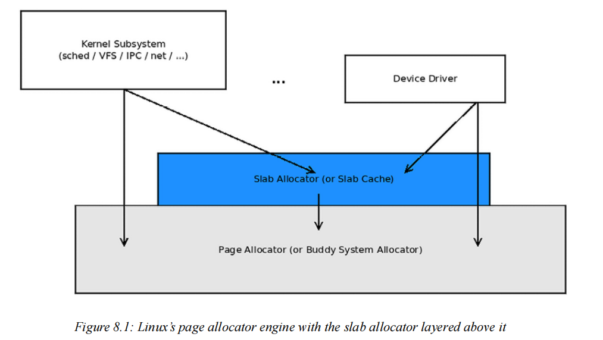
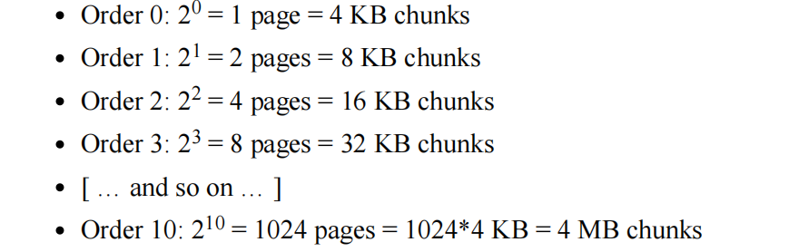
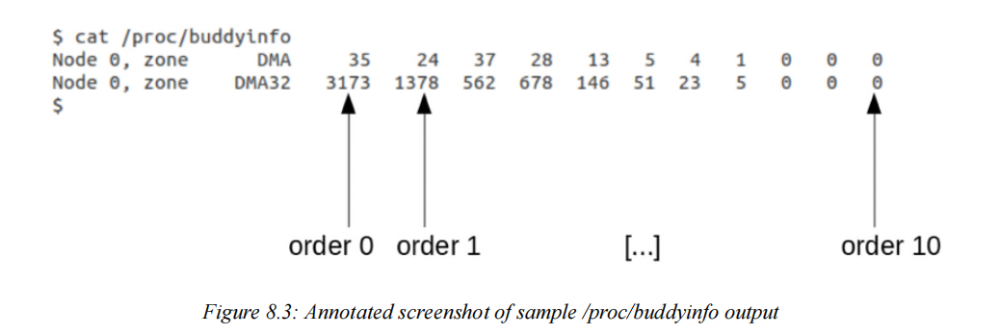
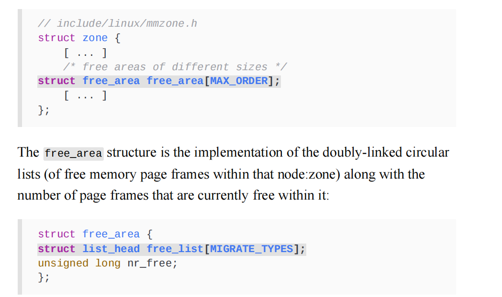

# 7.11

## Linux Kernel Programming

### 内核内存分配 - I

#### 介绍内核内存分配器

​	动态分配并随后释放内核内存（包括物理内存和虚拟内存）是本文的关键主题。Linux 内核与任何其他操作系统一样，需要可靠的算法和实现来执行这项真正关键的任务。Linux 操作系统中的主要（解除）分配器引擎称为 PA 或 BSA。在内部，它使用所谓的伙伴系统算法来有效地组织和分配系统 RAM 的空闲块。您将在本章的理解和使用内核页面分配器（或 BSA）部分中找到有关该算法的更多信息。

在本章和整本书中，当我们使用（解除）分配符号时，请将其读作两个词：分配和释放。

​	当然，由于不完善，页面分配器并不是获取和随后释放系统内存的唯一或最佳方法。Linux 内核中还有其他技术可以做到这一点。在这些列表中，排在前列的是内核的 slab 分配器或 slab 缓存系统（我们在这里使用 slab 一词作为此类分配器的通用名称，因为它源于此名称；但在实践中，Linux 内核使用的现代 slab 分配器的内部实现称为 SLUB（非排队 slab 分配器）；稍后会详细介绍）。

​	可以这样想：slab 分配器解决了一些问题，并通过页面分配器优化了性能。到底是什么问题？耐心点，你很快就会看到……不过，现在重要的是要理解，实际（取消）分配物理内存的唯一方法是通过页面分配器。实际上，页面分配器是 Linux 操作系统上内存（取消）分配的主要“引擎”！

​	为了避免混淆和重复，从现在开始我们将这个主要分配引擎称为页面分配器。您将了解到，它也被称为 BSA（源自驱动它的算法的名称）。因此，slab 分配器位于页面分配器之上（或上方）。各种核心内核子系统以及内核中的非核心代码（例如模块和设备驱动程序）可以直接通过页面分配器或间接通过 slab 分配器分配（和释放）内存。下图说明了这一点：

首先需要明确的是：

Linux 内核及其所有核心组件和子系统（不包括内存管理子系统本身以及少数非常特定于架构的用户）最终使用页面分配器（或 BSA）进行内存（解除）分配。这包括非核心内容，例如内核模块和设备驱动程序。

slab 和页面分配器完全位于内核（虚拟）地址空间中，不能从用户空间直接访问。页面分配器从中获取内存的页面框架 (RAM) 位于内核的低内存区域内，或内核段的直接映射 RAM 区域内（我们在上一章详细介绍了内核段）

slab 分配器最终是页面分配器的用户，因此从那里获取内存（这再次意味着内存最终来自内核低内存区域）

​	使用熟悉的 malloc 系列 API 进行的用户空间动态内存分配不会直接映射到前面的层（即，在用户空间中调用 malloc() 不会直接导致对页面或 slab 分配器的调用）。它是间接实现的。具体怎么做的？您将学到如何做到，耐心点！ （这一关键内容在第 9 章“模块作者的内核内存分配 - 第 2 部分”的两个部分中，涉及请求分页；在学习该章时请注意！）另外，需要明确的是，Linux 内核内存是不可交换的。它永远不能交换到磁盘；这是在早期 Linux 时代决定的，以保持高性能。默认情况下，用户空间内存页面始终是可交换的，但系统程序员可以通过 mlock()/mlockall() 系统调用来更改这一点。现在，系好安全带！有了这些非常基本的理解，让我们开始学习 Linux 内核内存分配器如何工作（基础知识），更重要的是，如何与它们很好地配合。理解和使用内核

#### 页面分配器（或 BSA）

在本节中，您将了解 Linux 内核的主要（解除）分配器引擎，即页面分配器（或 BSA）的两个方面：

- 首先，我们将介绍此软件（称为“伙伴系统”）背后的算法基础知识。
- 其次，我们将介绍它向内核或驱动程序开发人员公开的 API 的实际和实际用法。

​	了解页面分配器背后的算法基础知识非常重要。然后，您将能够理解它的优缺点，从而了解何时以及在何种情况下使用哪些 API。让我们从其内部工作原理开始。再次提醒，请记住，本书关于内部内存管理细节的范围是有限的。我们将对其进行深入介绍，这对于典型的模块/驱动程序作者来说已经足够了，仅此而已。

#### 页面分配器的基本工作原理

我们将把这个讨论分成几个相关部分。让我们从内核的页面分配器如何通过其空闲列表数据结构跟踪空闲的物理页面框架开始。

##### 了解页面分配器空闲列表的组织

​	页面分配器（伙伴系统）算法的关键是其主要的内部元数据结构。它被称为伙伴系统空闲列表，由指向（非常常见的！）双向链接循环列表的指针数组组成。这个指针数组的索引称为列表的顺序 - 它是 2 的幂。数组长度从 0 到 MAX_ORDER-1。MAX_ORDER 的值与架构有关；在 x86 和 ARM 平台上，它是 11，而在 Itanium 等大型系统上，它是 17。因此，在 x86 和 ARM 上，顺序（索引）范围从 20 到 210；即从 1 到 1,024。这是什么意思？请继续阅读...
每个双向链接循环列表指向空闲且物理上连续的

大小为 2order 页的页框。因此，假设页面大小为 4 KB，我们最终得到 11 个列表（0-10），其大小特征如下：

​	在图 8.2 中，每个内存“块”都用一个方框表示（为了简单起见，我们在图中的所有块都使用相同的大小）。当然，在内部，这些并不是实际的内存页面；相反，这些方框表示指向物理内存帧的元数据结构（struct page）。（回想一下，我们在第 7 章“内存管理内部原理 - 基本原理”的“物理内存模型简介”部分中提到了 struct page 的重要性）。

​	在图 8.2 的右侧，我们显示了可能被排队到左侧列表中的每个单独的物理连续空闲内存块的大小。

​	内核通过 proc 文件系统（通过 /proc/buddyinfo 伪文件）为我们提供了一个方便的（汇总的）页面分配器当前状态视图；下面是来自具有 1 GB RAM 的 Ubuntu VM 的示例

#### 页面分配器的工作原理

​	实际的（解除）分配策略可以通过一个简单的例子来解释。假设一个设备驱动程序请求 128 KB 的内存。为了满足这个请求，页面分配器 (BSA) 算法将执行以下操作（简化和概念性）：

- 该算法以页面表示要分配的数量（此处为 128 KB）。因此，这里（假设页面大小为 4 KB），它是 128K/4K = 32
  页。
- 接下来，它确定必须将 2 提升多少次方才能得到 32。即 log232（或 ln 2），即 5（因为 2 的 5 次方是 32）。因此，顺序 5 列表将具有恰好满足此要求大小的空闲内存块。
- 现在它检查顺序 5 上的适当（最近）节点：区域页面分配器空闲列表的列表。如果内存块可用（其大小为128 KB），则将其从顺序 5 的列表中出队，更新列表，并将其分配给请求者。 工作完成！ 返回调用者。为什么我们说适当的（最近的）节点：区域页面分配器空闲列表？ 这是否意味着它们不止一个？ 是的，确实如此！ 我们再说一遍：现实情况是，系统上将有多个 PA 空闲列表数据结构，每个节点：区域一个。 （另请参阅即将到来的页面分配器内部 - 更多详细信息部分中的更多详细信息。）
- 如果顺序 5 列表中甚至没有一个内存块可用（即，如果它为空），则检查下一个顺序的列表；即顺序 6 链接列表（如果它不为空，它将有 256 KB 内存块入队，每个块的大小是我们所需大小的两倍）。
- 如果顺序 6 列表非空，则从中取出（出队）一块内存（大小为 256 KB，是所需大小的两倍），并执行以下操作：
  - 更新（顺序 6）列表以反映现在已删除一个块的事实。
  - 将块切成两半，从而获得两个 128 KB 的半块或伙伴！（请参阅以下信息框。）
  - 将一半（大小为 128 KB）迁移（入队）到顺序 5 列表。
  - 将另一半（大小为 128 KB）分配给请求者。
  - 完成！返回给调用者。
- 如果 6 阶列表也为空，则对 7 阶列表重复上述过程，依此类推（递归），直到成功。
- 如果所有剩余的高阶列表都为空（null），则请求将失败（这种情况不太可能发生）。
  我们可以将内存块切成两半，因为列表上的每个块都保证是物理连续的内存。一旦切开，我们就有两半；每半都称为伙伴块，因此该算法得名。从学术上讲，它被称为二进制伙伴系统，因为我们使用 2 的幂大小的内存块。更准确地说，伙伴块被定义为大小相同且物理上相邻的块。
- 您将理解前面的描述是概念性的。实际的代码实现肯定更复杂和优化。

#### 处理几个场景

现在我们掌握了算法的基础知识，让我们考虑几个场景：

首先，一个简单直接的案例，然后是几个更复杂的案例。

##### 最简单的情况

假设内核空间设备驱动程序（或某些核心代码）请求 128KB 并从其中一个 freelist数据结构的顺序 5 列表中接收内存块。在稍后的某个时间点，它将（应该/必须）通过使用页面分配器释放 API 之一来释放内存块。

​	现在，这个“释放”API 的算法通过其顺序（以及大小）计算刚刚释放的块属于顺序 5 列表；因此，它将其排入队列。（您很快就会看到，分配和释放 API 的参数都是列表的顺序。）

##### 更复杂的情况

现在，假设与之前的简单情况不同，当设备驱动程序请求 128 KB 时，顺序 5 列表为空；因此，根据页面分配器算法，我们转到下一个顺序 6 的列表并检查它。假设它不为空；该算法现在将大小为 256 KB 的顺序 6 块出队，并将其拆分（或切成）一半。因此，我们现在有两个物理上相邻且大小相等的半块 - 伙伴块。现在，一个伙伴块（大小为 128 KB）交给请求者，其余伙伴块（同样大小为 128 KB）被加入到顺序 5 列表中。伙伴系统真正有趣的特性是当请求者（驱动程序）在稍后的某个时间点释放内存块时会发生什么。正如预期的那样，算法（通过其顺序）计算出刚刚释放的块属于顺序 5 列表。但在盲目地将其加入到那里之前，它会寻找它的伙伴块，在这种情况下，它（可能）找到了它！它现在合并两个伙伴块

合并成一个更大的块（大小为 256 KB）并将合并后的块放置（入队）在顺序 6 列表中。这太棒了——它甚至有助于整理内存碎片！

##### 失败案例

​	现在让我们通过不使用方便的 2 的四舍五入幂大小作为分配要求来让它变得有趣。这次假设设备驱动程序请求一个大小为 132 KB 的内存块。伙伴系统分配器会做什么？当然，它不能分配比请求的更少的内存，所以它会分配更多——你猜对了（见图 8.2）——下一个适当大小（等于或大于请求）的可用内存块在空闲列表的顺序 7 上，大小为 256 KB。但消费者（驱动程序）只会看到并使用分配给它的 256 KB 块的前 132 KB。剩余的（124 KB）被浪费了（想想看，这接近 50% 的浪费！）。

​	这称为内部碎片（或浪费），是二进制伙伴系统的关键缺陷！不过，您将了解到，确实存在缓解措施：已贡献一个补丁来处理类似情况（通过 alloc_pages_exact() / free_pages_exact() API）。我们将很快介绍使用页面分配器的 API。

#### 页面分配器内部 - 更多细节

在本书中，我们不打算深入研究页面分配器内部的代码级细节。话虽如此，事情是这样的：就数据结构而言，区域结构包含一个 free_area 结构数组，即所谓的页面分配器“空闲列表”。这是有道理的；正如您所了解的，
系统上可以有（并且通常有）多个页面分配器空闲列表，
每个节点：区域一个；让我们在代码级别查找它们：

#### 学习如何使用页面分配器 API

​	Linux 内核提供了一组 API（暴露给核心和模块），用于通过页面分配器分配和释放内存 (RAM)。这些通常被称为低级（释放）分配器例程。下表总结了页面分配 API；您会注意到，在所有具有两个参数的 API 或宏中，第一个参数称为 GFP 标志或位掩码（名为 gfp_mask）；我们将很快详细解释它，请暂时忽略它。第二个参数是 order – 空闲列表的顺序，即要分配的内存量是 2order 页框。在以下讨论中，我们经常使用术语“内核逻辑地址”。如第 7 章“内存管理内部原理 - 要点”中的“检查内核段”部分所述，“逻辑”和“虚拟”地址之间的区别非常繁琐。内核逻辑地址用于表示内核低内存区域内的地址；所有其他内核地址称为内核虚拟地址 (KVA)。出于所有实际目的，您可以将它们视为相同。

所有前面的 API 都是通过 EXPORT_SYMBOL() 宏导出的，因此可供内核模块和设备驱动程序开发人员使用；不用担心，您很快就会看到一个演示如何使用它们的内核模块。如前所述，Linux 内核认为维护一个（小型）元数据结构来跟踪 RAM 的每个页面框架是值得的。它被称为页面结构。这里的要点是要小心：与通常的返回指向新分配的内存块开头的指针（虚拟地址）的语义不同，请注意前面提到的 alloc_page() 和 alloc_pages() API（表 8.1）都返回指向新分配的内存页面结构的开头的指针，而不是内存块本身（其他 API 也是如此）。您必须通过在返回的页面结构地址上调用 page_address() API 来获取指向新分配内存开头的实际指针。

#### 处理 GFP 标志

您会注意到，所有先前的分配器 API（或宏）的第一个参数都是 gfp_t gfp_mask。这是什么意思？本质上，这些是GFP - 获取可用页面 - 标志；它们会影响内核在分配内存时的行为；我们很快就会详细介绍。这些是内核内部内存管理代码层使用的标志（其中有多个）。出于所有实际目的，对于典型的内核模块（或设备驱动程序）开发人员来说，只有两个 GFP 标志至关重（如前所述，其余的供内部使用）。它们如下：

- GFP_KERNEL
- GFP_ATOMIC

​	在通过页面分配器 API 执行内存分配时，决定使用其中哪一个非常重要；要始终记住的关键规则如下：
如果代码在进程上下文中运行并且可以安全休眠，请使用GFP_KERNEL 标志。如果休眠不安全（通常在任何类型的原子或中断上下文中），则必须使用 GFP_ATOMIC 标志。

​	遵循上述规则至关重要。如果做错了，可能会导致整个机器冻结、内核崩溃和/或随机发生不良事件。

​	那么，安全/不安全休眠语句到底是什么意思呢？对于这个问题和更多问题，我们将参考本章后面的 GFP 标志 - 深入挖掘部分。但它很重要，所以我绝对建议你读一读。

Linux 驱动程序验证 (LDV) 项目：回到在线章节“内核工作区设置”，在“LDV – Linux 驱动程序验证 – 项目”部分，我们提到该项目在 Linux 模块（主要是驱动程序）以及核心内核的各种编程方面具有有用的“规则”。关于我们当前的主题，这是其中一条规则，一条负面规则，暗示你不能这样做：“在持有自旋锁时使用阻塞内存分配”(http://linuxtesting.org/ldv/online?action=show_rule&rule_id=0043)。持有自旋锁时，不允许执行任何可能阻塞的操作；这包括使用 GFP_ATOMIC 以外的任何方式的内核空间内存分配。因此，非常重要的一点是，在任何类型的原子或非阻塞上下文中执行内存分配时，例如持有自旋锁时，必须使用 GFP_ATOMIC 标志（您将了解到互斥锁的情况并非如此；您可以在持有互斥锁时执行阻塞活动）。违反此规则会导致不稳定，甚至增加（隐式）死锁的可能性。LDV 页面提到了一个违反此规则的设备驱动程序以及随后的修复（https://git.kernel.org/pub/scm/linux/kernel/git/torvalds/linux.git/commit/?id=5b0691508aa99d309101a49b4b084dc16b3d7019）。看一下：补丁清楚地显示（在 kzalloc() API 的上下文中，我们很快就会介绍）GFP_KERNEL 标志被 GFP_ATOMIC 标志取代。

另一个常用的 GFP 标志是 __GFP_ZERO。它的使用意味着内核需要清零内存页。它通常与 GFP_KERNEL 或 GFP_ATOMIC 标志进行按位或运算，以返回初始化为零的内存（一般来说，这是一种很好的编程习惯！）。

​	内核开发人员不遗余力地详细记录了 GFP 标志。查找 include/linux/gfp_types.h。其中有一个很长的详细注释；它的标题是 DOC：有用的 GFP 标志组合（在 6.1.25 上，此处：https://elixir.bootlin.com/linux/v6.1.25/source/include/linux/gfp_types.h#L263）。

​	现在，为了让我们快速开始，只需了解使用 Linux 内核的内存分配 API 和 GFP_KERNEL 标志确实是内核内部分配的常见情况。

#### 使用页面分配器释放页面翻转

​	当然，分配内存的另外一方面就是释放内存。我们都理解基本规则：释放你（动态）分配的内存，以防止泄漏。内核中的内存泄漏绝对不是你想促成的事情。

#### 分配（取消）内核内存时需要遵循的几条准则

​	正如所有经验丰富的 C/C++ 应用程序开发人员所知，分配和随后释放内存是错误的丰富来源！这主要是因为就内存而言，C 是一种非托管语言；因此，您很容易遇到各种内存错误。这些包括众所周知的内存泄漏、读/写的缓冲区溢出/下溢、双重释放和释放后使用 (UAF) 错误。不幸的是，内核空间也没有什么不同；只是后果（更）严重！要格外小心！请务必确保以下几点：

- 优先使用将刚分配的内存初始化为零的例程。
- 执行分配时，请考虑并使用适当的 GFP 标志；有关这方面的更多信息，请参阅 GFP 标志 - 深入挖掘部分，
- 但简要地讲，请注意以下几点：
- 在可以安全休眠的进程上下文中，使用 GFP_KERNEL。
- 在原子上下文中，例如处理（硬件）中断或保持自旋锁时，使用 GFP_ATOMIC。
- 使用页面分配器时（就像我们现在所做的那样），尽可能地将分配大小保持为 2 的四舍五入幂页面（同样，这背后的原理以及缓解这种情况的方法 - 当您不需要那么多内存时，典型情况 - 将在本章的后续部分中详细介绍）。
- 您只能尝试释放先前分配的内存；
- 不用说（但我们会说！），不要错过释放它，不要使用错误的指针，也不要双重释放它。
  不要尝试访问已经释放的内存（这会导致 UAF错误）。确保原始内存块的指针不会被重用、操纵（ptr ++ 或类似的东西）和损坏，这样您可以在完成后正确释放它。
- 检查（并重新检查！）传递给 API 的参数。是否需要指向先前分配的块的指针，还是指向其底层页面结构的指针？

发现很难和/或担心生产中的问题？别忘了，您可以通过内核（以及第三方）的静态和动态分析工具获得帮助！

确保学习如何使用内核中强大的静态分析工具（Coccinelle、sparse 和其他工具，例如 cppcheck 或 smatch）。对于动态分析，请学习如何安装和使用 KASAN（内核地址清理器）。《Linux 内核调试》一书涵盖了这一点以及更多内容...

#### GFP 标志 - 深入挖掘

​	关于我们对低级页面分配器 API 的讨论，每个函数的第一个参数都是所谓的 GFP 掩码。在讨论 API 及其用法时，我们提到了一个关键规则。

​	如果您的内核/驱动程序代码在进程上下文中运行并且可以安全休眠，请使用 GFP_KERNEL 标志。如果当前休眠不安全（通常，在任何类型的原子中，包括中断、上下文或持有自旋锁时），则必须使用 GFP_ATOMIC 标志。

我们将在以下部分中详细说明这一点。

##### 永远不要在中断或原子上下文中休眠

​	“安全休眠”这句话到底是什么意思？要回答这个问题，请考虑阻塞调用（API）：阻塞调用是指调用进程（或线程）进入休眠状态，因为它正在等待某事（事件）发生，而它正在等待的事件尚未发生。因此，它等待 - 它“睡眠”。当在未来某个时间点，它所等待的事件发生或到达时，它会被内核（或设备驱动程序）唤醒并继续前进。

​	用户空间阻塞 API 的一个示例包括 sleep() C 库 API。假设您这样做：sleep(5);。在这里，等待的事件是经过一定时间（函数的参数，以秒为单位）。因此，调用此函数的进程上下文进入睡眠状态，并在事件发生后被唤醒 - 经过 5 秒的时间！

​	另一个示例是 read() 系统调用及其变体，其中等待的事件（通常）是存储或网络数据变得可用。对于 wait4() 系统调用，等待的事件是子进程的死亡或停止/继续，等等。

​	因此，任何可能阻塞的函数最终都可能花一些时间处于睡眠状态；请注意，在休眠时，它肯定不在 CPU 运行队列中，而是在等待队列中；实际上，在休眠时，它甚至不是被调度的候选！在内核模式（当然，这是我们在处理内核模块时所处的模式）下调用此可能阻塞的功能仅在进程上下文中且在此上下文中可以安全休眠时才允许（持有某些锁，如自旋锁，会使休眠不安全，而持有互斥锁则意味着可以休眠或阻塞）。

​	在休眠不安全的上下文中调用任何类型的阻塞调用都是错误，例如在中断或原子上下文中。将此视为一条黄金法则。违反此规则，即在原子上下文中休眠 - 是错误的，是有缺陷的，并且绝不能发生。

​	您可能想知道，我如何才能提前知道我的代码是在原子（或中断）上下文中运行还是在进程上下文中运行？在某种程度上，内核可以帮助我们：配置内核时（回想一下第 2 章“从源代码构建 6.x Linux 内核 - 第 1 部分”中的 make menuconfig），在内核黑客/锁定调试菜单下，有一个名为“在原子部分检查内休眠”的布尔可调参数。将其打开！（配置选项名为 CONFIG_DEBUG_ATOMIC_SLEEP；您始终可以在内核配置文件中查找它。同样，在第 5 章“编写您的第一个内核模块 - 第 2 部分”下的配置“调试”内核部分中，您一定要打开它）。此外，我们将介绍一些宏（如 in_task()），它们允许您确定您是否在进程上下文中执行代码。考虑这种情况的另一种方法是考虑这一点：您究竟如何让进程或线程进入休眠状态？简短的回答是，通过让它调用调度代码——schedule() 函数。因此，根据我们刚刚学到的内容（作为推论），schedule() 只能在可以安全休眠的上下文中调用；进程上下文通常是安全的，中断上下文永远不安全（第 10 章和第 11 章的内容都涉及大量有关 CPU 调度的细节）。

​	记住这一点真的很重要！（我们在第 4 章“编写您的第一个内核模块 - 第 1 部分”的进程和中断上下文部分简要介绍了什么是进程和中断上下文。此外，正如那里所述，您始终可以使用 in_task() 宏来确定代码当前是在进程上下文中运行还是在中断上下文中运行）。同样，您可以使用 in_atomic() 宏；如果代码是原子上下文——它通常必须在没有中断的情况下运行完成——它返回 True；否则，返回 False。请注意：您可以处于进程上下文中，但同时又是原子的——例如，当持有某些类型的锁时（自旋锁；当然，我们将在最后两章关于同步的内容中介绍这一点）；相反的情况则不会发生（即，在中断上下文中，代码始终是原子的）。

##### 关于其他内部使用的 GFP 标志的简要说明

​	除了我们作为模块/驱动程序作者关注的 GFP 标志（GFP_KERNEL 和 GFP_ATOMIC 标志）之外，内核还有其他几个相当奇特的
[\_\_]GFP_* 标志，它们在内部使用；其中几个是明确用于回收内存。这些包括（但不限于）`__GFP_IO、__GFP_FS、__GFP_DIRECT_RECLAIM、__GFP_KSWAPD_RECLAIM、__GFP_RECLAIM` 和 `__GFP_NORETRY`。在内部，内核使用这些 GFP 标志来精确指定执行内存分配时预期的内部行为类型。为了帮助说明这一点，请考虑以下（典型）示例。

​	如果内存不足，内核可以释放一些内存，方法是先将其写入持久存储（通常是交换分区或文件），标记其在交换中的位置，然后释放它。现在，假设文件系统组件发出内存请求；由于 RAM 供应不足，内核试图通过要求写出一些“较旧”的内存页面（可能使用最不常用 (LFU) 算法）来释放一些内存。但是，请考虑一下：如果相同的文件系统代码路径涉及写出这些内存页面，并且这些代码路径此时需要内存分配，该怎么办？这可能会导致扭曲的递归行为，甚至导致死锁！因此，在这种情况下，内核在执行内存分配时不使用名为 __GFP_IO 的 GFP 标志，该标志指定在执行分配时是否可以启动物理 I/O（或不启动）。类似地，有一个名为 __GFP_FS 的标志指定内核是否能够调用低级文件系统代码路径。GFP_NOWAIT 标志指定语义，告诉内核不要等待直接内存回收，不要启动物理 I/O，也不要使用任何低级文件系统回调。当内核处于代码路径必须保持原子性（它不能以任何方式休眠或阻塞）且分配必须立即成功或失败（最好是前者）的情况下时，GFP_ATOMIC 标志就是关键。当然，这是原子代码路径的情况，例如任何类型的中断上下文或持有自旋锁时（但请注意，即使这样也不适用于处理不可屏蔽中断 (NMI)）。查看代码级别提到的标志：
`#define GFP_ATOMIC (__GFP_HIGH|__GFP_ATOMIC|__GFP_KSWAPD_RECLAI`
`#define GFP_KERNEL (__GFP_RECLAIM | __GFP_IO | __GFP_FS)`

​	因此，使用 GFP_KERNEL 标志，我们现在可以看到 alloc API 可以主动回收内存，并启动物理和/或文件系统 I/O，从而增加获得请求内存的机会。

如前所述，gfp_types.h 标头对每个标志的含义都有详细的注释；请查找。
关于 Linux 驱动程序验证 (LDV) 项目的简要说明：回到在线章节“内核工作区设置”，
我们提到该项目在 Linux 模块（主要是驱动程序）以及核心的各种编程方面都有有用的“规则”内核。就我们当前的主题而言，这里有一条规则，一条负面规则，暗示您不能这样做：在持有 USB 设备锁的情况下，在内存分配期间不禁用 IO（http://linuxtesting.org/ldv/online?action=show_rule&rule_id=0077）。

一些快速背景：当您指定 GFP_KERNEL 标志时，它隐含地意味着（除其他事项外）内核可以启动 I/O（输入/输出；读/写）操作来回收内存。问题是，有时这可能会有问题，不应该这样做；为了解决这个问题，您应该在分配内核内存时使用 GFP_NOIO 标志作为 GFP 位掩码的一部分。这正是此 LDV“规则”所指的情况：

在遇到的特定情况下，在
`usb_lock_device()` 和 `usb_unlock_device()` API 之间，不应使用GFP_KERNEL 标志，而应使用GFP_NOIO 标志。（您可以在此代码中看到此标志的几个实例：drivers/usb/core/message.c。）LDV 页面提到，已修复几个 USB 相关的驱动程序源文件以遵守此规则。

#### 页面分配器 - 优缺点

让我们通过快速总结其优缺点来结束关于页面分配器/BSA 的这一部分。
页面分配器/BSA - 优点：

- 速度快；使用内核的身份映射 RAM（在启动时获取和映射）；页面位于低内存区域，因此是预先映射的；无需设置页表。
- 保证内存块在物理上连续且与 CPU
- 缓存行对齐。
- 实际上，通过合并“伙伴”块（伙伴块是大小相同且物理上连续的块）有助于对 RAM 进行碎片整理。

页面分配器/BSA - 缺点：

- 主要问题：内部碎片或浪费可能（太）高。
- 分配请求的粒度是页面；因此（假设页面大小为 4K），请求 128 字节会得到 4,096 字节（在许多情况下，通过使用高级 alloc_pages_exact()/free_pages_exact() API 对可以缓解这种情况（但在本例中不行！）。
- 单个 API 调用可以分配的上限是；实际上，假设 MAX_ORDER=11 且页面大小为 4K，则上限为 4MB。

​	好了，现在您已经掌握了有关页面分配器的大量详细信息（它是，毕竟，RAM（解除）分配的内部“引擎”），它的API，以及如何使用它们，让我们继续讨论一个非常重要的主题——slab分配器背后的动机，它的API，以及如何使用它们。

#### 理解和使用内核slab分配器

如本章第一节“介绍内核内存分配器”中所示，slab分配器或slab缓存位于页面分配器（或BSA；参见图8.1）之上。slab分配器通过两个主要思想或目的来证明其存在的合理性：

- 对象缓存：在这里，它用作公共“对象”的缓存；这些是Linux内核中经常分配的数据结构。
  这个想法——我们当然会扩展——让slab缓存按需分配（并随后释放）这些对象，从而提高性能。
- 通过提供小型、大小合适的缓存（通常是页面的片段，大小不一）来减轻页面分配器的高浪费（内部碎片）。

现在让我们更详细地研究这些想法。

#### 对象缓存的想法

​	好的，我们从这些设计理念中的第一个开始——通用对象缓存的概念。很久以前，SunOS 开发人员 Jeff Bonwick 注意到某些内核对象（通常是数据结构）在操作系统内频繁分配和释放。因此，他想到了将它们预先分配到某种缓存中。这演变成我们所说的 slab 缓存。

​	因此，在 Linux 操作系统上，内核（作为启动时初始化的一部分）也会将相当多的对象预先分配到几个 slab 缓存中。原因：性能！当核心内核代码（或设备驱动程序）需要内存来分配其中一个对象时，它会直接请求 slab 分配器。如果缓存了，则分配几乎是立即的（反之亦然，在释放时也是如此）。您可能想知道，这一切真的有必要吗？确实如此！

​	网络和块 I/O 子系统的关键代码路径就是高性能要求的一个很好的例子。正是出于这个原因，内核会在 slab 缓存中自动缓存（预分配）几个网络和块 I/O 数据结构（网络堆栈的套接字缓冲区、sk_buff、块层的 biovec，当然还有核心 task_struct 数据结构或对象，这些都是很好的例子）。同样，文件系统元数据结构（例如 inode 和 dentry 结构等）、内存描述符（struct mm_struct）和其他几个也在 slab 缓存上预分配。我们能看到这些缓存对象吗？是的，再往下一点，我们就会做到这一点（通过 /proc/slabinfo）。

​	slab（或者现在更准确地说是 SLUB）分配器具有更优越性能的另一个原因很简单，当传统的基于堆的分配器经常分配和释放内存时，它们最终会在内存中创建“空洞”（碎片）。因为 slab 对象被分配一次（在启动时）到缓存中，然后在那里释放（因此并不是真正“释放”），所以性能仍然很高。当然，现代内核具有智能，当内存压力（对宝贵的 RAM 的需求）过高时，可以优雅地开始释放 slab 缓存。

同样，理论和实践之间通常存在差距；有时，当 RAM 运行非常低时，内核会以相当严厉的方式做出响应，拿出它的重炮——内存不足 (OOM) 杀手！（不用担心，我们将在第 9 章“模块作者的内核内存分配 - 第 2 部分”的“活着 - OOM 杀手”部分中深入讨论它）。让我们耐心等待，直到那时再讨论。

slab 缓存的当前状态 - 对象缓存、缓存中的对象数量、正在使用的数量、每个对象的大小等等 - 可以通过多种方式查找：通过 proc 和 sysfs 文件系统的原始视图，或通过各种前端实用程序（例如 smem、vmstat、slabtop（以及 eBPF slabratetop）和（内核提供的应用程序）slabinfo）查看更人性化的视图

#### kmalloc API 的大小限制

​	页面和 slab 分配器的主要优势之一是，它们在分配时提供的内存块不仅虚拟连续（显然），而且还保证是物理连续的内存。现在，这是一件大事，肯定会有助于提高性能。

​	但是（总是有一个但是，不是吗！），正是由于这种保证，在执行分配时不可能提供任何给定的大（内存）大小。换句话说，通过一次调用我们亲爱的 k{m|z}alloc() API，您可以从 slab 分配器获得的内存量必须有一个限制。限制是什么？（这确实是一个非常常见的问题）。

首先，您应该了解，从技术上讲，这个限制由两个因素决定：

- 一是系统页面大小（由 PAGE_SIZE 宏确定）。

- 二是“顺序”的数量（由 MAX_ORDER 宏确定）；

​	即页面分配器（或 BSA）空闲列表数据结构中的列表数量（参见图 8.2）。在标准 4 KB 页面大小和（典型）MAX_ORDER 值为 11 的情况下，单个 kmalloc() 或 kzalloc() API 调用可以分配的最大内存量为 4 MB。x86_64 和 ARM（32 位和 64 位）架构都是如此。