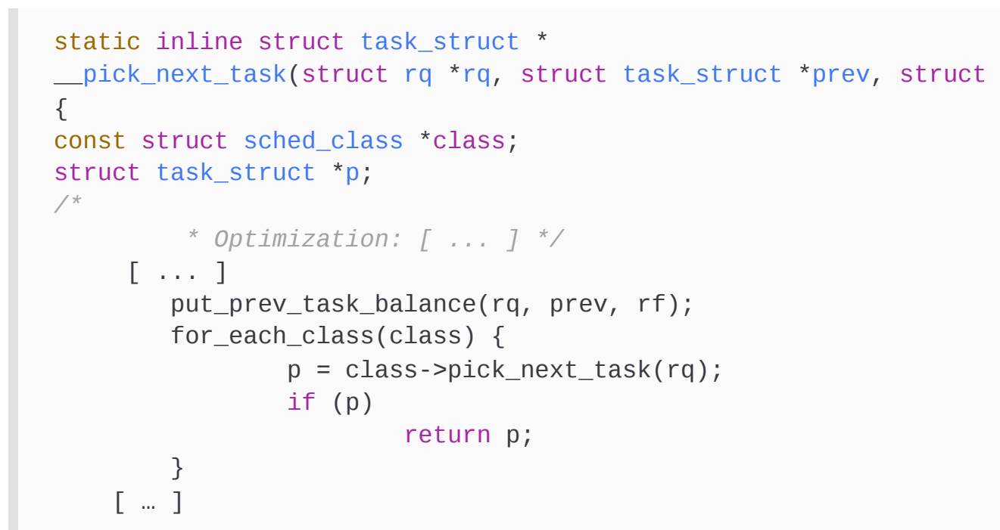
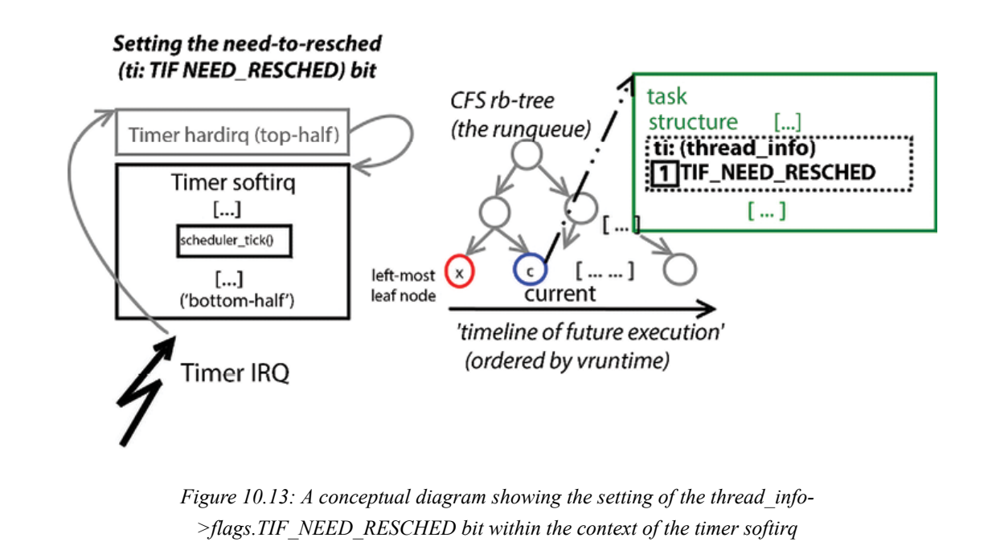
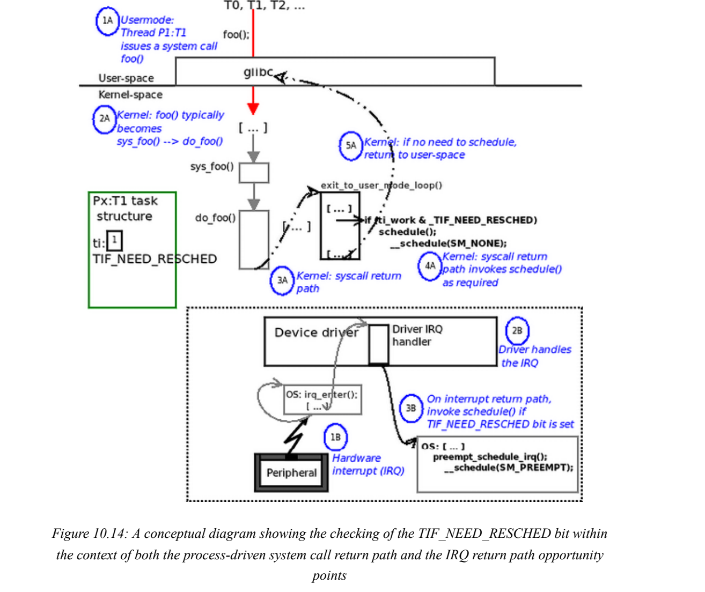

# 7.16

## Linux Kernel Programming

### CPU调度程序–第1部分

让我们快速浏览一下我们需要的基本背景信息了解Linux上的CPU调度。

请注意，在本书中，我们不打算涵盖材料Linux上有能力的（用户空间）系统程序员应该已经很清楚了: 这包括以下基础知识

进程（或线程）状态，关于真实状态的基本信息时间是，POSIX调度策略等等

#### Linux上的KSE是什么？

​	正如您在第6章“内核内部要素-进程和线程”中的“组织进程、线程及其堆栈-用户和内核空间”一节中所了解到的那样，系统上的每个（用户模式）活动线程都被赋予了一个任务结构（struct task_struct）以及一个用户模式和一个内核模式堆栈。正如我们所了解到的，内核线程确实有一个任务结构，但只有一个内核模式堆栈。

​	当然，每个操作系统都需要执行任务调度。现代操作系统——Linux/Unix/Windows/Mac——具有进程和读取的概念。现在，要问的关键问题是：当执行任务调度时，它作用于什么“对象”？换句话说，什么是内核可调度实体，KSE？在Linux上，KSE是一个线程，而不是一个进程（当然，每个进程至少包含一个线程）。因此，线程是执行调度的粒度级别。一个例子和一个图表（图10.1）将有助于解释这一点：如果我们有一个假设的情况，我们只有一个CPU核和三个用户空间进程（P1、P2和P3），分别由一个、两个和五个线程组成，再加上几个内核线程（比如三个），那么我们总共有（1+2+5+3），等于11个线程。


​	好吧，我要求你忽略房间里的大象。图10.1的顶部显示了cgroups内核框架的抽象、高度概念化的视图，该框架现在已深度嵌入内核的每个结构中。在这里，我要求你想象一下——根本不用担心“为什么/如何/谁/何时/…”的问题——如果你愿意的话，这个cgroups层在现代Linux中非常普遍，它肯定会对CPU调度产生影响。现在，只要意识到它的存在；细节–并尝试一下！–将在下一章中介绍。关于图10.1，除内核线程外，每个线程都有一个用户和内核堆栈以及一个任务结构（内核线程只有内核堆栈和任务结构；所有这些在第6章“内核内部要素——进程和线程”的“组织进程、线程及其堆栈——用户和内核空间”一节中都有详细解释）。

​	现在，如果这11个线程都处于可运行状态，也就是说，它们已经准备好运行，那么它们都会争夺单个处理器核心。（尽管它们不太可能同时运行，但为了讨论起见，让我们考虑一下）。关键是要明白，我们现在有11个线程在争夺CPU资源，而不是三个进程和三个内核线程。一个更现实的情况是，在11个活动线程中，可能有4个是可运行的，即它们在运行队列中并且想要运行，而其余7个线程处于各种其他状态（睡眠（在阻塞调用中）或停止（冻结））；剩下的七个人甚至都不是日程安排的候选人。

​	既然我们了解了KSE是一个线程，我们将（几乎）总是在调度的上下文中引用该线程。现在让我们继续讨论所谓的Linux进程状态机。Linux进程状态机在Linux操作系统上，每个进程或线程都运行在各种定义状态中，通过对这些定义状态进行编码，我们可以形成Linux操作系统中进程的状态机（orthread）（阅读本文时请参考图10.2）。由于我们现在了解到Linux操作系统上的KSE是一个线程而不是一个进程，因此我们将忽略使用“进程”一词的约定，而不是在描述在状态机的各种状态下循环的实体时使用“线程”一词。（如果比较舒服的话，你可以在下面的文本中用“process”代替“thread”。）Linux线程可以循环通过的状态如下（ps实用程序通过这里显示的字母对状态进行编码）：R：准备运行或正在运行（或“可运行”）睡眠：s：可中断睡眠D：不间断睡眠T：已停止（或暂停/冻结）Z：僵尸（或不存在）X：Dead当通过fork（）或clone（）系统调用或pthread_create（）API新建线程时，一旦OS确定线程已经完全诞生，它通过将线程进入可运行（R）状态。处于R状态的线程实际上正在CPU核心上运行，或者处于准备运行状态。我们需要理解的是，在这两种情况下，线程都在操作系统中的数据结构上排队，称为运行队列。Linux在系统上为每个CPUcore维护一个运行队列（实际上，现实情况更加微妙；我们很快就会达到这一点）。运行队列中的线程是给定CPU核上运行的有效候选线程；除非在操作系统运行队列中排队，否则任何线程都不可能运行。Linux没有明确区分就绪运行和实际运行状态；它只是将处于任一状态的线程标记为R。当然，正如我们在第6章“内核内部要素——进程和线程”中所了解到的，它是任务结构（unsignenight__state；）中的一个成员，被设置为适当的值来标记处于特定状态的线程。下图表示任何进程或读取的Linux状态机：


​	上图通过（红色）箭头显示了状态之间的转换。为了清楚起见，一些转换（例如，一个线程可以在休眠或停止时被终止）在上图中没有明确显示。（仅供参考，一个死亡但未被其父进程等待的进程最终会处于半死半活的状态，称为僵尸或失效进程；这本应是一个混乱的状态。防止僵尸永远留在系统上的规则是，每个fork（）都需要相应的wait*（）系统调用。（像往常一样，Linux有一个巧妙的技巧：杀死azombie的父级，僵尸也会“收获”（死亡）。）我们知道，每个活着的线程（用户和内核）都有自己的任务结构。因此，在代码级别，任务结构成员named__state（之前称为state）在所谓的“状态机”中保存任务的“状态”——线程。当它可运行时，它将被设置为值TASK_RUNNING（总体上由“R”表示，内部由图10.2中的Rrand Rcpu状态表示）。等待队列是一种数据结构，其中处于睡眠状态的任务被排队——也就是说，它们正在等待一个事件（实际上，它们在阻塞调用中到达这里）。Linux有两种休眠线程的可能性；线程可以处于：可中断睡眠：\_\_state=TASK_Interruptible：它“睡眠”，等待某个事件；然而，任何传递给进程/线程的信号都会唤醒它并运行信号处理程序（如图10.2中的字母“S”所示）不间断睡眠：\_\_state=TASK_Uninterruptible：它“睡眠”，等待某个事件；传递到进程/线程的任何/所有信号都不会对其产生影响（如图10.2中的字母“D”所示）。当它正在等待的事件发生时，操作系统将向其发出唤醒呼叫，使其再次可运行（从等待队列中退出并在运行队列中退出）。请注意，线程不会立即运行；它将变得可运行（图10.2中的Rr），并成为调度器的候选对象；很快，它将有机会在CPU（Rcpu）上实际运行。一个常见的误解是认为操作系统维护一个运行队列和一个等待队列。Linux内核为每个CPU维护一个运行队列。等待队列通常由设备驱动程序（以及内核）创建和使用；因此，它们可以有任意数量。

有了这些基础知识，让我们开始吧！

#### POSIX调度策略

​	认为调度策略一词大致相当于调度算法。重要的是要意识到Linux内核并没有一个实现CPU调度的策略；事实上，POSIX标准规定了兼容POSIX的操作系统必须遵守的至少三个调度策略（实际上是算法）。Linux超越了这三个，并通过称为调度类的强大设计实现了这三种以及更多（本章稍后的理解模块化调度类部分将介绍）。现在，让我们在下表中简要总结一下POSIX调度策略及其影响；不过，在此之前，关键是要理解，在任何给定时间点，每个活动线程（用户和内核空间）都与这些调度策略中的一个相关联（可以在运行时更改）。

| 计划策略                   | 关键点                                                       | 优先级标尺                                                   |
| -------------------------- | ------------------------------------------------------------ | ------------------------------------------------------------ |
| SCHED_OTHER或SCHED_NORMALA | 始终为默认值；具有此策略的线程是非实时的；它们在内部被实现为一个完全公平调度（CFS）类,此调度策略背后的动机是公平性（即“对所有可运行的线程公平，避免浪费任何CPU时间”）和整体吞吐量优先级） | 此策略的线程的实时优先级为0）。非实时优先级称为nicevalue；它的范围从-20到+19（数字越低，意味着越优秀.基础（初始）值为0 |
| SCHED_RR                   | 此调度策略的动机是提供一个非常激进的（软）实时策略。属于此sched类的线程具有有限时间片（通常默认为100毫秒）。SCHED_RR线程将产生处理器IFF（当且仅当）：<br> 它在I/O上阻塞（进入休眠状态）。<br>它停止或死亡。<br>更高优先级的实时线程变得可运行（这将抢先一步）。<br>它的时间片到期了。 | （软）实时：1到99（更高的数字意味着更高的优先级）            |
| SCHED_FIFO                 | 此调度策略背后的动机是提供一种（软）实时策略，该策略（与SCHED_RR相比，非常）激进。SCHED_FIFO线程将产生处理器IFF：它阻塞I/O（进入休眠状态）。它停止或死亡。一个优先级更高的实时线程变得可运行（这将抢占这个线程）。实际上，它有无限长的时间片 | （与SCHED_RR相同）                                           |
| SCHED_batch                | 此调度策略背后的动机是“适用于低优先级的非交互式批处理作业，优先权较少”。 | NICE的值范围（-20到+19）                                     |
| SCHED_IDLE                 | 特殊情况：通常，PID0内核线程（传统上称为swapper；实际上，它是每CPU空闲线程）使用此策略。它始终保证是系统上优先级最低的线程，并且仅在没有其他线程需要CPU时运行。 | 是所有优先级中最低的                                         |

重要的是要注意，当我们在前一个表中说实时时，我们指的是软（或充其量是硬）实时，而不是硬实时，就像在实时操作系统（RTOS）中一样。Linux是一个通用操作系统（GPOS），而不是RTOS。话虽如此，您可以通过应用外部补丁程序（称为RTL，由Linux基金会支持）将vanilla Linux转换为真正的硬实时RTOS；在下一章的“将主线Linux转换为RTOS”一节中，您将学习如何精确地做到这一点。仔细研究桌子；请注意，SCHED_FIFO线程实际上具有无限的时间片，因此可以在CPU内核上运行任意时间；当上述条件之一满足时，它会被抢占（从CPU上移除）。此外，

​	SCHED_FIFO和SCHED_RR之间的其他关键区别包括：

​	虽然SCHED_FIFO线程实际上具有无限的时间片，但SCHED_RR线程具有有限的时间片（可通过/proc/sys/kernel/sched_rr_timeslice_ms-sysctl；默认情况下为100ms）

​	具有相同优先级的SCHED_RR线程以轮询方式进行调度（从而允许其他SCHED_RR线程共享处理器）。对于SCHED_FIFO线程，情况并非如此——被抢占的线程将返回下一个要运行的任务（从而拒绝与处理器具有相同优先级的其他线程）。因此，在使用CSCHED_FIFO时，您应该避免将线程保持在相同的优先级（我们将在下一章的“在内核中设置策略和优先级——在内核线程上”一节中对此进行更多介绍）。在这一点上，重要的是要理解，在Linux等操作系统上，硬件（和软件）中断总是优于甚至会抢占（内核或用户空间）SCHED_FIFO线程！

​	对于我们在这里的讨论，我们暂时忽略中断。现在，让我们更详细地了解每个线程的优先级值。

#### 线程优先级

​	线程的优先级缩放很简单（以下是从低到高的优先级；参见图10.3）：非实时线程（SCHED_OTHER）的实时优先级为0；这确保了它们甚至无法与实时线程竞争；他们甚至不在同一个竞技场上！那么，在优先级方面，如何区分所有非实时线程呢？

​	很简单——他们使用一个名为nicevalue的（旧UNIX风格）优先级值，范围从-20到+19，-20是最高优先级，0是基数或默认值，+19是最低优先级。

​	启用后，传统的“好价值”概念并没有真正被使用（在“nice”下，cgroups被利用了）。更多信息请参阅进一步阅读部分。）实时线程（具有SCHED_FIFO或SCHED_RR策略）的区域时间优先级范围为1到99，1表示最小优先级，99表示最高优先级。这样想吧：在一个只有一个CPU的不可抢占的内核上，在不可破解的无限循环中旋转的SCHED_FIFO优先级99线程将有效地挂起机器！


​	调度策略是通过任务结构中的一个成员（调度类）（松散地）指定的。此外，线程策略和优先级（静态nice值和实时优先级）是任务结构的成员（如图10.1所示）。请注意，线程所属的调度类是独占的；一个线程在给定的时间点只能属于一个调度类（不用担心，我们稍后将在即将到来的CPU调度内部学习第2部分中详细介绍调度类）。此外，您应该意识到，在现代Linux内核上，还有其他调度类（stop-scched和deadline）在优先级上优于我们看到的FIFO/RR类（再次详细介绍如下）。

#### 可视化流程

​	多核系统导致进程——实际上是线程（包括用户空间和内核空间）——在不同的处理器上并发执行。这对于获得更高的吞吐量和性能非常有用，但当它们处理共享的可写数据时，也会出现同步问题（我们将在本书的最后两章深入探讨内核同步这一真正重要的主题）。因此，例如，在具有六个处理器内核的硬件平台上，我们可以期望进程（线程）在它们上并行执行；这不是什么新鲜事。然而，有没有一种方法可以真正看到哪些进程或线程在哪个CPU核上执行，也就是说，有一种方法来可视化一个进程或线程？事实证明，确实有几种方法可以做到这一点。在接下来的部分中，我们将介绍几种有趣的方法：使用gnome系统监视器GUI程序、perf以及其他可能性。

#### 使用gnome系统监视器GUI来可视化流程

​	gnome项目提供了一个极好的GUI来查看和监视系统活动，适用于笔记本电脑、台式机和服务器级系统（事实上，适用于任何强大到足以运行gnome GUI环境的系统）：gnome系统监视应用程序。为了快速测试使用它来查看几个CPU内核之间的工作流程，让我们首先同时运行几个进程。对于我们这里的简单测试用例，我们需要一个在CPU上连续执行的进程，即CPU绑定的进程。一个很好的候选者是名为yes的简单实用程序，它只是将字符y连续打印到stdout（试试看！）。那么，假设我们运行它三次，在后台。为了使这个实验有意义，我们想将每个进程仿射（绑定）到系统上的特定CPU核心。Thenproc命令显示内核数量；它们的编号从0开始。在我的x86_64 Fedora 38 VM:

```
$nproc6
```

​	我有六个CPU内核（编号为0-5）。我们利用有用的任务集实用程序（它属于util-linux包，我们在第1章中指定了该包）。使用-c选项运行任务集允许ust指定命令要在哪个CPU核上运行；因此，如果我们

```
taskset-c 2 yes>/dev/null
```

​	它只在CPU核心#2上运行yes（我们将stdout重定向到null设备，这样我们就不必连续看到y）！因此，让我们快速构建一个测试用例：我们将运行三次yes实用程序（当然是在后台），每个流程实例都在不同的CPUcore上运行——例如，如下：

```
taskset-c 1 yes > /dev/null&taskset-c 2 yes>/dev/null & taskset-c3 yes>/dev/null &
```

（当然，您必须有一个至少有四个内核的系统来完成上述任务（因为内核编号从0开始）。）当它们还活着并正在运行时（就像检查一样），运行gnome系统监视器应用程序（我们假设您正在使用

#### 使用perf可视化flow

​	Linux及其庞大的开发人员和质量保证（QA）工具库，在perf中有一个非常强大的工具。简而言之，perf工具集是在Linux机器上执行CPU性能分析的方法之一。（除了一些提示外，我们在本书中没有详细介绍perf。）与古老的top（和较新的htop）实用程序一样，为了获得CPU消耗情况的“千英尺视图”（比top更详细），perf实用程序集非常出色。不过，请注意，对于一个应用程序来说，与它运行的内核完美结合是非常不寻常的。重要的是（至少在Ubuntu上），要获得性能，您需要安装`linux-tools-$（uname-r）`包。此外，与性能相关的分发包将不适用于我们构建的自定义6.1内核；因此，在使用perf时，我建议您使用标准（ordistro）内核之一启动来宾VM，安装`linux tools-$（uname-r）`包，然后尝试使用perf。（当然，您也可以从tools/perf/文件夹下的内核源代码树中手动构建perf。）

安装并运行perf后，您可以尝试以下与perf-top相关的命令（有关详细信息，请参阅手册页或教程）：

```
sudo perf-topsudo perf-top--sort comm，dsosudo perf-top-r 90--sort pid，comm，dso，symbol
```

​	上述perf-top变体不仅帮助我们鸟瞰CPU的消耗情况，还帮助我们查看它们正在执行的代码路径，甚至允许我们放大每个任务以查看更多详细信息（传统工具通常不允许我们这样做）。顺便说一句，comm意味着命令/进程的名称，dso是dynamicshared对象的缩写。perf（1）的手册页提供了详细信息；使用manperf-<foo>符号（例如man-perf-top）来获取perftop的帮助。但回到我们的主要观点：使用perf的一种方法是清楚地了解哪些任务在哪个CPU核上运行；这是通过perf中的ched-map子命令完成的。不过，首先，您必须使用perf记录事件，这既可以在系统范围内完成，也可以在特定进程中完成。要记录事件，请运行以下命令：sudo perf sched record[command]在record关键字后面没有参数，它记录系统范围内的事件；传递参数使其仅记录该命令进程及其子进程的事件。使用SIGINT信号（^C）终止录制会话。这将生成一个名为perf.databy-default的二进制数据文件；我们很快就会看到如何直观地解释它。

#### 学习CPU调度内部——第2部分

​	本节深入探讨了内核CPU调度内部，重点是现代设计的核心方面，模块化调度类。了解模块化调度类关键内核开发人员Ingo Molnar（和其他人一起）重新设计了内核调度程序的内部结构，引入了一种称为调度类的新方法（这可以追溯到2007年10月2.6.23内核的发布）。顺便说一句，调度器类中的class一词并不常见；许多Linux内核特性本质上，而且很自然地，都是以面向对象的方式设计的。当然，C语言不允许我们直接在代码中表达这一点（因此，大多数结构同时具有数据和函数指针成员，模拟一个类）。然而，设计通常是面向对象的（正如你在《LinuxKernel Programming–Part 2》一书中对驱动程序模型所清楚看到的那样）。有关这方面的更多详细信息，请参阅本章的进一步阅读部分。

​	核心调度代码中引入了一个抽象层，即函数kernel/sched/core.c:schedule（）。schedule（）中的这一层通常称为调度类，在设计上是模块化的。请注意，这里的“模块化”一词意味着调度器类可以从树内内核代码中添加或删除；它与可加载内核模块（LKM）框架无关。基本思想是：Linux内核（截至6.1，实际上是最新的6.7内核）包含五个调度类，每个调度类都与一个优先级相关联。当调用核心调度程序代码theschedule（）函数（它本身是__schedule（）的一个薄包装器）时，它会按照预定义的优先级顺序迭代每个类，询问每个类是否有一个准备运行的线程（具体如何，我们很快就会看到）。在有五个排课的情况下，可以保证其中一个会给出肯定的答案，并选择一个候选线程来运行下一个；一旦发生这种情况，核心调度代码上下文就会切换到该幸运线程（跳过任何剩余的调度类），工作就完成了。以下流程图封装了此设计：


​	您很警惕，在图10.9的最顶部发现了标记为S的连接器；这意味着什么？这是为了回答一个关键问题：“谁调用，什么时候调用核心调度程序函数schedule（）？”（这将在下一节“学习CPU调度内部-第3部分；放松-我们会到那里！”中详细回答！）从6.1 Linux内核（以及撰写本文时的最新6.7内核事实）开始，内核中有五个调度程序类，按优先级顺序列出，最高优先级显示在第一位：调度策略调度程序


​	因此，我们有五个模块式调度类——停止任务、截止日期、（软）实时（RT）、公平（CFS）和空闲——按优先级从高到低排列。抽象这些调度器类的数据结构structsched_class在一个单链表上串在一起，核心调度代码迭代该链表。（稍后我们将讨论sched_class结构是什么；暂时忽略它。）每个线程都与其唯一的任务结构（structtask_struct）相关联；在任务结构中（正如我们在第6章中看到的，您可以在此处查找：https://elixir.bootlin.com/linux/v6.1.25/source/include/linux/sched.h#L737)，以下情况适用：成员struct sched_class*持有指向线程所属模块化调度类的指针；它是独占的——在任何给定点，一个线程只能属于一个调度类（它将是表10.2第三列中提到的调度类之一）。默认情况下，它将指向CFS（fair_sched_class）。

​	策略成员指定线程所遵循的调度策略（它将是表10.2第一列中提到的策略之一）。它也是排他性的——一个线程在任何给定的时间点只能遵守一个调度策略（但可以更改）。线程优先级值；包含它们的成员是prio、staticprio、normal_prio和rtpriority。调度策略和优先级都是动态的，可以通过编程方式（或通过实用程序；您很快就会看到这一点）查询和设置。仅供参考，属于stop-scched类的线程很少；这是因为这是一个极端的优先级。当stopᦆsched线程获得处理器时，内核会关闭系统上所有其他内核上的执行（以及任何与锁定相关的、中断和其他一切）。因此，stop-scched类线程在所有中断和内核抢占都被掩盖的核心上执行，完全没有被抢占的机会。谁需要这种优先级和不可抢占性？一个例子是Ftrace内核跟踪子系统；另一个是实时内核补丁。此外，下一个优先级调度类——Deadline——适用于必须满足相关截止日期的实时任务（以经典的RTOS方式）。由于停止调度和截止日期线程倾向于分散，我们关注RT线程，并且主要是公平（CFS）线程；“公平类”线程通常是处于活动状态并正在运行的线程。

​	现在，这是一个关键点：内核为每个处理器核心和每个调度类维护一个运行队列！所以，如果我们有一个有六个CPU核的系统，那么我们将有6个核*5个调度类=30个运行队列！（有一个例外：在单处理器（UP）系统上，top sched类不存在。）运行队列是按类实现的；例如，以下是CFS的运行队列：struct CFS_rq(https://elixir.bootlin.com/linux/v6.1.25/source/kernel/sched/sched.h#L550); 同样，对于RT类，它是structrt_rq，以此类推。下图试图呈现此信息：


​	请注意，在上图中，我显示运行队列的方式使它们看起来可能是数组。这根本不是目的；这是一个概念图。实际使用的运行队列数据结构取决于调度类（毕竟类代码实现了运行队列）。它可以是一个链表数组（与实时类一样），atree（实际上是一个红黑（rb）树）和fair类，等等。

#### 一个有助于理解调度类的概念性例子

​	为了更好地理解调度程序类模型，我们将设计一个例子：假设在对称多处理器（SMP）或多核系统上，我们有100个线程（在用户和内核空间中）是活动的。其中，我们有几个竞争CPU；也就是说，它们处于readyᦙto run（Rr）状态，这意味着它们是可运行的，因此在runqueue数据结构上排队（见图10.2，状态机）。假设可运行线程分为以下各种调度类：一站式调度（SS）类线程、S1Two Deadline（DL）类线程，D1和D2两个实时（RT）类线程和RT1和RT2三个完全公平调度（CFS）（或公平）类线程以及F1、F2和F3一个空闲类线程I1。现在让我们想象一下，首先，线程F2在处理器核心上，愉快地执行代码。在某个时候，内核希望上下文切换到该CPU上的其他任务。（是什么触发了这一点？你很快就会看到。）在调度代码路径上，内核代码最终会进入核心调度代码kernel/sched/core.c：void schedule（void）内核例程（代码级细节稍后再说）。现在重要的是要理解的是，由schedule（）调用的pick_next_task（）例程会迭代调度器类的链表，询问每个类是否有候选程序要运行（再次参见图10.9）。它的代码路径（当然是概念上的）看起来像这样：1。核心调度程序代码（\_\_schedule（））：“嘿，SS（stop-scched类），你有要运行的线程吗？”2。SS类代码：遍历其运行队列并找到可运行线程（S1）；它这样回答：“是的，我知道；这是S1线程。”。核心调度程序代码（__scheduled（））：“好的，太好了；让我们将上下文切换到S1。”然后任务就完成了（至少在这个调度轮或纪元）。但是让我们稍微改变一下场景：如果该处理器的SSrunqueue上没有可运行的线程S1（或者它已经进入睡眠状态，或者停止运行，或者它正在运行另一个CPU的运行队列）？然后，SS会说“不”，然后会问下一个最重要的排课，截止日期（DL）。如果它有潜在的候选线程想要运行（在我们的例子中为D1和D2），它的类代码将运行其算法来识别D1或D2中的哪一个应该运行，将该线程任务结构指针返回给\__s\chedules（），内核调度器将忠实地向其进行上下文切换。此过程对实时（RT）和公平（CFS）调度类继续进行。（一张图片胜过千言万语，对吧？见图10.11。）很可能（在典型的中等负载的Linux系统上），没有SS、DL或RT候选线程想要在CPU查询上运行，而且通常至少会有一个公平（CFS）线程想要运行。因此，竞争通常发生在公平（CFS）可运行线程之间；公平类实现（CFS）选择的线程将是上下文切换到的线程。如果真的没有要运行的线程（没有SS/DL/RT/CFS类线程要运行），则意味着系统当前处于空闲状态（懒惰的家伙）。现在，Idle类被询问是否要运行；它总是说是的！这是有道理的；毕竟，当没有其他人需要/想要在处理器上运行时，CPU空闲线程的任务就是在处理器上执行。因此，在这种情况下，内核会将上下文切换到空闲线程，通常标记为swapper/n，其中n是它正在执行的CPUnnumber（从0开始；是的，我知道你可能在想什么：为什么它被称为“swapper”？…这只是旧的Unixhistory回来困扰我们了——没有别的）。此外，请注意，swapper/n（CPU空闲）内核线程不会出现在ps列表中，即使它总是存在（回想一下我们在第6章“内核内部要素——进程和线程


核心调度程序代码（在pick_next_task（）中）究竟是如何询问调度类是否有任何要运行的线程的？我们已经看到了这一点，但我觉得为了清楚起见，值得重复以下代码片段（主要从\__schedule（）和线程迁移代码路径调用）：



​	注意实际中的面向对象：出于所有实际目的，`class->pick_next_task(rq)`代码调用了调度类的一个方法`class->pick_next-task()`！返回值方便而有意地指向所选任务的任务结构，代码现在可以上下文切换到该结构。还可以看出，`pick_next_task()`返回NULL意味着当前类没有任何可调度的候选对象；因此，我们转到下一个类并询问它。循环将始终终止，因为如果没有其他情况，空闲类将始终返回一个非空的候选调度，即该核心的空闲线程。

#### 简介完全公平调度（CFS）类的工作原理

​	自2.6.23版本（早在2007年）以来，CFS一直是常规线程的实际内核CPUscheduling代码；默认情况下，Linux上的大多数线程都属于由CFS驱动的SCHED_OTHER策略。CFS算法背后的驱动因素是提供公平性和整体吞吐量。简而言之，它的实现是这样的：内核跟踪每个可运行的CFS（SCHED_OTHER/SCHED_NORMAL）线程的实际CPU运行时（以纳秒粒度）；运行时间最小的线程是最值得运行的线程，并将在下一个调度周期或纪元（“纪元”一词表示“某人或某事历史上某个时期的开始”）获得处理器。相反，持续敲击处理器的线程将积累大量的运行时间，因此将受到惩罚（这真的很因果报应）！我们将此讨论分为两部分：第一部分简要介绍了vruntime及其内部rb树运行队列的CFS概念，第二部分介绍了CFS动态时间片的工作原理。当然，让我们从第一部分开始。

#### 关于CFS vruntime值及其运行队列的说明

​	在不深入研究CFS实现内部太多细节的情况下，任务结构中嵌入了另一个数据结构struct sched_entity，其中包含一个名为vruntime（或虚拟运行时）的无符号64位值(https://elixir.bootlin.com/linux/v6.1.25/source/include/linux/sched.h#L556). 简单来说，这是一个单调计数器，用于跟踪线程在处理器上累积（运行）的时间量（以纳秒为单位）。在实践中，在实现中，需要进行大量的代码级调整、检查和平衡。例如，内核通常会将vruntime值重置为0，从而触发另一个调度周期。此外，在/proc/sys/kernel/sched_*下有各种各样的不可选项（或sysctls），有助于更好地微调CPU调度器行为（其中一些在这里有记录：https://www.kernel.org/doc/html/latest/admin￾guide/sysctl/kernel.html）。CFS如何选择下一个要运行的任务封装在kernel/sched/fair.c:pick_next_task_fair（）函数中。理论上，CFS的工作方式本身就很简单：将所有可运行的任务（针对该CPU）排队到CFS运行队列上，这是一个rb树（一种自平衡的二元搜索树），这样在处理器上花费时间最少的任务就是树上最左的叶子节点，右边的后续（叶子）节点表示下一个要运行的任务，然后是下一个。实际上，从左到右扫描树可以给出未来任务执行的时间线。这是如何保证的？通过使用上述vruntime值作为将任务排队到rb树上的键！

​	为什么它被称为vruntime，而不仅仅是运行时？这是因为vruntime成员的值不仅仅是线程在处理器上花费的时间；它更微妙：在计算这个非常重要的数字时，它考虑了线程的优先级——即nice值（毕竟，线程在CFS-rb树运行队列中的“位置”是基于这个vruntime量的）。因此，我们采取了以下措施：nicevalue越低（优先级越高），vruntime值越低，因此它更多地排在左边；nice值越高（优先级越低），runtime值就越大，因此它被更多地向右排队。（这种任务调度方法被广泛称为加权公平排队调度程序。）当核心调度程序需要调度时，它会问CFS“你有任何要运行的线程吗？”，CFS类代码（我们已经讨论过函数pick_next_task_fair（））会运行，只需选择树上最左侧的叶子节点，并返回指向嵌入其中的任务结构inter的指针。想想看——根据定义，它是具有最低vruntime值的任务，因此实际上是运行最少的任务！（遍历树是一种O（logn）时间复杂度的算法，但由于一些代码优化和对最左侧叶子节点的巧妙缓存，该实现有效地具有非常理想的O（1）时间复杂性。）当然，实际的代码比这里介绍的要复杂得多；它需要进行多次制衡。我们不会在这里深入探讨所有血腥的细节。我们建议有兴趣了解更多关于CFS的人参阅关于此主题的内核文档

#### 关于CFS调度周期和时间的说明

​	你注意到了吗？与传统的操作系统调度器不同，CFS的时间片是动态的！CPU上的任务（所谓的IO绑定任务）会自动累积较少的vruntime，从而向CFS-rb树的左侧迁移。对于CPU受限的任务，情况正好相反；它们（通过具有更大的vruntime值）向右移动，减少了快速获得CPU的机会。

​	在调度器上下文中，调度周期（有时被混淆为“调度延迟”）是指一个完整的调度周期（或纪元）运行的时间；在此时间段内，操作系统保证每个线程都有机会在CPU上运行。那是什么？默认值位于sysctl/sys/kernel/debug/sched/latency_ns中（Ubuntu 22.04上的典型默认值为24毫秒，Fedora38/39上的默认值为18毫秒）。此外，在运行时，它可以改变——它本身是动态的（稍后将详细介绍）——计算如下：调度周期长度=min_granularity_ns*nr_running；这里，nr_running是当前可运行的任务数（这是基于每个运行队列）。在最近的内核中，这些调度程序可调项可以在indebugfs中找到；让我们在x86_64 Ubuntu 22.04 LTS上查找一些值。


​	好的，以下是一些相关可调参数的含义：

- latency_ns：这是当前计算的“周期”值（innanoseconds（ns））；因此，这里的默认调度周期为24000000ns，即24ms，也就是说，每个线程都保证每24ms至少有一次机会运行！
- min_granularity_ns：这是CFS-rb树上节点之间所需的最小“距离”；实际上，这是每个CFS线程运行时允许的最小时间（默认值：3ms）。

在继续之前，有几点需要注意：

> 默认值可以而且确实因系统（内核）而异！在我的x86_64Fedora 38虚拟机上，周期和最小粒度（最小时间片）分别为18毫秒和2.25毫秒。检查你的系统上有什么。
>
> 上述调度程序可调参数是在functionsched_init_debug（）中创建的（在系统初始化过程中调用：https://elixir.bootlin.com/linux/v6.1.25/source/kernel/sched/debug.c#L299).想想看——当前可运行任务的数量（nr_running）直接影响周期（因此也影响时间片）。

因此，给出以下事实：调度周期长度=min_granularity_ns*nr_running（如我们所见）min_granuality_ns实际上是CFS（动态）时间策略值给定默认的min_granularity_ns值为3ms，周期（latency_ns）为24ms（就像我的Ubuntu 22.04（和23.10）盒子上的情况一样），为了了解这是如何工作的，我们提供了一组示例值的有效时间级别和调度周期的计算，如下表所示


​	基于可运行线程数量的有效CFS任务时间片计算有效时间片，并在第二列中显示；只要它的值在min_granularityns值（3ms）内，一切都很好。然而，可以看出，当可运行线程的数量变得非常大时，情况显然变得无法维持（表10.3的最后一行）；现在，调度器没有放弃，而是巧妙地、动态地调整调度周期，重新计算它！（好吧，这是一种说法；狡猾的内核是：“我答应过你每24毫秒至少有一次机会在CPU上吗？不，不，你错了；我的意思是每36毫秒有一次……”。）从技术上讲，所做的检查是这样的（伪代码）：effective_timeslice（ms）=latency_ns调度周期。）有关CFS和这些与调度程序相关的可调参数的更多信息，请查看进一步阅读部分。现在让我们继续讨论（简短的）主题，即查找由内核维护的任务调度统计信息（如果配置了）。

基于可运行线程数量的有效CFS任务时间片计算有效时间片，并在第二列中显示；只要它的值在min_granularityns值（3ms）内，一切都很好。然而，可以看出，当可运行线程的数量变得非常大时，情况显然变得无法维持（表10.3的最后一行）；现在，调度器没有放弃，而是巧妙地、动态地调整调度周期，重新计算它！（好吧，这是一种说法；狡猾的内核是：“我答应过你每24毫秒至少有一次机会在CPU上吗？不，不，你错了；我的意思是每36毫秒有一次……”。）从技术上讲，所做的检查是这样的（伪代码）：effective_timeslice（ms）=latency_ns调度周期。）有关CFS和这些与调度程序相关的可调参数的更多信息，请查看进一步阅读部分。现在让我们继续讨论（简短的）主题，即查找由内核维护的任务调度统计信息（如果配置了）。

​	调度统计数据您能在系统和流程粒度上看到调度的状态吗？事实上，当配置时（需要CONFIG_SCHEDSTATS=y），内核会在proc:/proc/schedstat下提供这些伪文件：系统范围的调度统计信息。这些已经存在了很长时间；它们显示每个CPU的调度统计数据（以及SMP上的域-CPU/微架构层次结构信息）。该信息包括调度程序（和thetry_to_wake_up（）函数）被调用的次数（在该CPU核心上），核心上任务运行/等待的所有时间的累积总和，以及该核心上的时隙数。

​	最好参考官方的内核文档：https://elixir.bootlin.com/linux/v6.1.25/source/Documentation/scheduler/sched-stats.rst./proc/PID/schedstat

​	/proc/PID/sched：进程/线程级粒度：/proc/PDI/schedstat内容由三个空格分隔的数字组成，所有这些数字都与进程ID为PID的线程有关：在CPU上花费的时间（纳秒）在运行队列上等待的时间（毫微秒）在这个CPU上运行的时间片数/proc/PII/sched内容非常详细；它包括任务sched_entity结构的许多字段（显示为se.foo；这包括任务vruntime（以纳秒为单位）se.vruntime！），上下文切换统计、调度策略和优先级，以及一些NUMA统计。

​	查询给定线程的调度策略和优先级在本节中，您将学习如何通过命令行查询系统上任何给定线程的进度策略和优先级。（但是，通过编程方式查询和设置相同的内容呢？我们将讨论推迟到第11章“CPU调度器-第2部分”的查询和设置athread的调度策略和优先级部分。）我们了解到，在Linux上，线程是KSE；它是被调度并在处理器上运行的。此外，Linux有多种调度策略（或算法）可供选择。调度策略和优先级都是基于每个线程分配的，默认策略始终为SCHED_OTHER，默认实时优先级为0（换句话说，它是非实时线程；见表10.1）。在给定的Linux系统上，我们总是可以看到所有进程都是活动的（通过simpleps-a），或者，使用GNU ps，甚至可以看到每个线程都是活的（一种方法是使用ps-LA）。然而，这并没有揭示一个关键事实：这些任务在什么调度策略和优先级下运行。我们如何对此提出质疑？事实证明，这很简单：在shell上，chrt实用程序非常适合查询和设置给定进程的调度策略和/或优先级。发出带有-p选项开关的chrt并提供PID作为参数，使其显示调度策略以及所讨论任务的实时优先级；例如，让我们查询init进程（orsystemd）PID 1:

```
pid 1's current scheduling policy: SCHED_OTHER 
pid 1's current scheduling priority: 0 
```

​	需要注意的几件事：在我们的脚本中，通过使用GNU ps，调用ps-LA命令，我们能够捕获系统上所有活动的线程；显示它们的PID和TID。正如您在第6章“内核内部要素-进程和线程”中所了解到的，PID是内核TGID的用户空间等效值，TID是内核PID的用户空间等价值。因此，我们可以得出以下结论：如果PID和TID匹配，则该行中看到的线程（第三列有其名称）是进程的main（）线程。如果PID和TID匹配，并且PID只显示一次，则这是一个单线程进程。如果PID以不同的TID（第二列）重复（最左侧的列），则该进程是多线程的，而这些TID是该进程的子线程（更准确地说，工作线程）。我们的脚本通过在右侧缩进TID编号来显示这一点（在图10.12的截断屏幕截图中，您看不到它，因为稍后会发生这种情况）。

​	请注意，典型Linux机器（桌面、服务器甚至嵌入式）上的绝大多数线程往往是非实时的（属于策略SCHED_OTHER）。一些（软）实时线程（SCHED_FIFO/SCHED_RR）也可能出现。Deadline（DL）和Stop Sched（SS）线程确实很少见（当然，这样的事情往往是特定于项目的）。请注意前面输出中显示的关于实时线程的以下观察结果：我们的脚本通过在（第六）列中显示一个星号（标记为*RT）来突出显示任何实时线程（第四列为SCHED_FIFO或SCHED_RR的线程）。

​	此外，任何实时优先级为99（最大可能值）的软实时线程在同一列中都会有三个星号（这些往往是专门的内核线程）。当与调度策略进行布尔OR运算时，SCHED_RESET_ON_FORK标志具有禁止任何子项（viafork（））继承特权调度策略（安全措施）的效果。倒数第二列是线程的“nice”值（回想一下，范围是-20到+19，-20是最佳优先级，19是最差优先级，默认值为0）。请注意，nice值仅对具有调度策略SCHED_OTHER的线程（以及批处理和空闲线程）有效。最右边的列显示了CPU关联掩码（十六进制），也是每个线程的属性！这意味着您可以设置线程可能调度的CPU核心（我们将在下一章详细介绍这一方面）。例如，二进制中的掩码值0x3f为0011 1111，这意味着该线程可以在设置为1的任何内核上运行，因此在这里，可以在任何内核上（因为系统上总共有六个内核）运行。快速测试：CPU关联掩码值0x8意味着什么？更改线程的调度策略和/或优先级可以使用chrt执行；但是，您应该意识到，这是一个需要root权限的敏感操作（或者，现在，推荐的机制是通过能力模型，CAP_SYS_NICE是所需的能力位）。我们将让您检查脚本的代码（ch10/query_task_sched.sh）。此外，请注意，性能和shellscripting并没有真正结合在一起（所以不要对

表演在这里）。想想看，ashell脚本中发出的每个外部命令（我们这里有几个，比如awk、grep和cut）都涉及fork-exec等待语义和上下文切换。此外，这些都在循环中执行。

> tuna（8）程序是一个强大的基于GUI（或控制台模式）的系统监控、调整和配置文件管理工具，可用于查询和设置各种属性；这包括进程/线程级调度策略/优先级和CPU亲和性掩码，以及IRQ亲和性。这是一个设计良好的GUI；一定要看看！（安装tuna：https://tuna.readthedocs.io/en/stable/installation.html).此外，schedtool实用程序与chrt有些相似，可用于查询和设置给定线程上的任何或所有任务调度参数；schedtool（8）的手册页介绍了它的用法。

​	您可能会想，具有SCHED_FIFO策略和99的区域时间优先级的（少数）线程是否总是占用系统的处理器？不，不是真的；现实情况是，这些线程通常大部分时间都处于休眠状态。当内核确实要求他们执行一些工作时，它会唤醒他们。现在，正是由于他们的实时策略和非常高的优先级，可以很好地保证他们或多或少会立即获得一个CPU内核，并按照需要执行（一旦工作完成，就会重新进入睡眠状态）。关键在于，当他们需要处理器时，他们会得到它（有点类似于RTOS，但没有RTOS提供的铁证如山的保证、低调度延迟和确定性）。

#### 学习CPU调度内部机制——第3部分

​	让我们从探索抢占主题开始。抢占式内核请想象一下这种假设情况：您正在一个只有一个CPU内核的系统上运行。一个模拟时钟应用程序与aC程序a.out一起在GUI上运行，a.out的一行代码是（呻吟）while（1）；。那么，你怎么看：当1个进程无限期占用CPU时，CPU会占用CPU，从而导致GUI时钟应用程序停止运行（它的第二手盖会完全移动吗）？稍加思考（和实验）就会发现，尽管有淘气的CPU占用者应用程序，GUI clockapp确实一直在运行！这就是拥有操作系统级调度器的全部意义：它可以而且确实会抢占（踢出！）占用CPU的用户空间进程。（我们之前简要讨论了CFS算法；CFS会导致占用大量CPU的进程累积一个巨大的vruntime值，从而在其rbᦙ树运行队列上向右移动更多，从而惩罚处理器本身！）所有现代操作系统都支持这种类型的抢占——它被称为用户模式抢占。但现在考虑一下：如果你编写一个在单核系统上执行相同while（1）无限循环的内核模块呢？这就带来了一个问题：系统现在只会挂起。为什么？因为默认情况下，大多数操作系统内核都是不可抢占的；也就是说，他们不能先发制人！

​	除了这个微不足道的例子，现实世界中肯定存在这样的情况，即如果内核不可抢占，它可能会对（实时）线程调度产生负面影响。想想看：如果你的高优先级线程在运行队列中（因此是可运行的）并且需要紧急运行，但内核在内核（或内核模块/驱动程序）代码的不可抢占部分中处理了一些长循环，该怎么办？或者，硬件中断发生但无法提供服务，因为中断再次被掩盖在长时间运行的不可抢占的代码段中……锁定在这里起着重要作用（你将在最后两章中更详细地学习）；事实上，多年来，内核有一个臭名昭著的、非常粗粒度（和递归）的锁，绰号为大内核锁（BKL）；当被持有时，它会使内核在很长一段时间内保持不可抢占状态（中断被屏蔽），从而对性能和延迟响应造成严重破坏。它（终于！）在2.6.39内核中被完全删除了。因此，问题出现了：在需要时，内核可以抢占自己吗？好吧，你猜怎么着：多年来，Linux提供了一个构建时配置选项，使内核可抢占；它被称为CONFIG_PREEMPT。（实际上，这只是朝着降低延迟和改善内核和调度响应的长期目标的进化。这项工作的大部分来自早期和一些正在进行的努力：低延迟（LowLat）补丁、（旧的）RTLinux工作，特别是RTL（实时Linux）项目（Linux作为真正的RTOS运行！我们将在下一章介绍RTL的设置）。）一旦启用了CONFIG_PREEMPT内核配置选项，并且构建并启动了内核，我们就会在可抢占的内核上运行——在大多数情况下，操作系统都有能力抢占自己！

#### 动态可抢占内核特性

​	从5.12内核开始，引入了一种新的动态可抢占核特性（CONFIG_PREEMPT_dynamic）。具有此功能可以让您绕过内核参数（当然是通过引导加载程序）在引导时调整内核的抢占行为（或模式）；它的名字叫repempt=。它可以设置的值如下（参见表10.4）：抢占=无：内核抢占行为与CONFIG_preempt_none相同。抢占=自愿：内核抢占的行为接近CONFIG_preempt_voluntary。

​	preempt=full[默认]：内核抢占行为与CONFIG_preempt相同。一个典型的预期用例是允许发行版发布一个内核二进制映像——使用CONFIG_PREEMPT构建，内置（几乎）完整的内核抢占——但能够允许最终用户在启动时修改内核抢占模式，从而允许用户选择是将其作为典型的服务器类系统（抢占=无）、桌面（抢占=自愿）还是启用完全抢占来运行。这样，发行版（或产品）就不必为不同的用例提供和维护不同的内核映像。内核配置名为config_PREEMPT_DYNAMIC；将其设置为y可启用该功能。（要在make menuconfig UI中执行此操作，请转到General Setup |启动时定义的抢占行为。这是一个布尔值；打开它，重新构建并重新启动，传递抢占=<value>参数。）仅供参考，uname-a以及/proc/version将显示此功能

​	好的，完成这项工作后，我们将回到内部方面的更多细节。让我们非常简要地总结一下我们在前几节中学到的一些关键点。您了解到核心内核调度代码被编排在void schedule（void）函数中，该函数是worker函数__schedule（）的一个薄包装器，它按优先级顺序迭代模块化调度器类，最终得到一个被（底层调度类的一个代码）选中的线程进行上下文切换。所有这些都很好；现在有几个关键问题是：谁确切地称之为“任务调度”核心代码路径，它到底什么时候运行？（正是图10.9最上面标有“S”的连接器所暗示的！）以下部分试图回答这些问题；加油，加油！谁运行调度程序代码？许多人不幸地持有一个关于调度工作原理的微妙但关键的误解：我们想象存在一种称为“调度器”的内核线程（或某种这样的实体），它定期运行和调度任务。这显然是错误的；在Linux等单片操作系统中，调度是由进程上下文本身执行的，即在内核模式下在CPU上运行的规则线程！事实上，调度代码总是由当前正在执行内核代码的进程上下文运行的——换句话说，由当前运行的（我们在第6章“内核内部要素——进程和线程”中，在“使用当前访问任务结构”一节中介绍了当前到底是什么）。这也可能是提醒您我们将称之为Linux内核黄金法则之一的合适时机：调度器绝不能在任何类型的原子上下文（包括中断上下文）中运行。

#### schedule（）什么时候运行？

​	操作系统调度器的工作是仲裁对处理器（CPU）资源的访问，在想要使用它的竞争实体（线程）之间共享它。但是，如果系统很忙，许多线程不断竞争、获取然后放弃处理器怎么办？更准确地说，我们真正要做的是：为了确保任务之间公平共享CPU资源，你必须确保图片中的警察，即调度器本身，在处理器上定期运行。听起来不错，但你究竟如何确保这一点？这里有一个（看似）合乎逻辑的方法：在启动时将操作系统挂接到定时器芯片的中断中，作为定时器中断触发时在中断处理程序例程中完成的“内务处理”的一部分，调用调度器！现在，（有点简单）与我们之前学到的相反，timeprinterrupt每秒“触发”CONFIG_HZ次。因此，如果我们在这里调用schedule（），它有机会每秒运行CONFIG_HZ一次（在x86_64 Ubuntu上通常设置为值250，在x86_ 64 Fedora上设置为值1000）！不过，请稍等，我们在第8章“模块作者的内核内存分配——第1部分”的“永不休眠中断或原子上下文”部分学到了一条黄金法则：你不能在任何类型的原子（包括中断）上下文中调用调度程序（就像刚才一样提到）。因此，按照这个规则，我们根本不能在计时器中断中调用schedulercode路径（这样做会立即导致akernel错误）。那么操作系统是做什么的呢？我们将深入探讨，但首先，我们需要介绍一个名为thread_info的结构的一些基础知识。

​	最低限度地理解thread_infostructure为了清楚地理解以下几点，您需要了解与名为thread_info的每个线程依赖于arch的数据结构有关的基本知识。这个结构很小，包含一些关键的“热点”成员（这些成员最初位于任务结构中）。这种thread_infostructure的原因是常见的——性能；查找thread_info内容比查找大型任务结构的内容快得多，因为它要小得多，通常设计为适合单个CPU缓存行。（好吧，至少在x86_64和AArch64上都是这样：它的大小只有24字节。此外，在AArch32中计算电流时也利用了这种结构。）thread_info结构有丰富多彩的放置历史。在早期的Linux中，它是一个完全独立的实体；从2.6 Linux开始，对于32位平台（至少x86-32和AArch32），它位于每个线程的内核模式堆栈中。在较新的Linux版本（从4.0或4.4开始）和某些版本中，当CONFIG_THREAD_INFO_IN_TASK=y时，它已成为任务结构本身的成员（主要是由于安全问题）。您可以看到x86[\_64]的thread_info的定义: https://elixir.bootlin.com/linux/v6.1.25/source/arch/x86/include/asm/thread_info.h#L56对于AArch64https://elixir.bootlin.com/linux/v6.1.25/source/arch/arm64/include/asm/thread_info.h#L24.For我们的直接目的，只是thread_info的一个成员是有意义的&一个位掩码：无符号长标志。正如你所猜到的，它是各种标志值的一个掩码（都是TIF\_\<FOO>样式，其中TIF是“thread_info flag”的缩写）。您将在代码库中找到此处定义的所有TIF_*标志宏：https://elixir.bootlin.com/linux/v6.1.25/source/arch/x86/include/asm/thread_info.h#L76.在现有的众多标志中，我们讨论任务调度的关键标志是TIF_NED_RESCHED。正如稍后将解释的那样，如果设置，则意味着内核“需要尽快重新安排”；

​	调度代码路径（schedule（））的“何时”及其调用的所有内容分为两部分：一是TIF_NED_RESCHED位何时设置？第二，什么时候检查TIF_NED_RESCHED位？让我们看看：何时设置了“需要重新筛选”（TIF_NED_resched）位？

​	thread_info.flags:TIF_NEED_RESCHED位（这不是Ccode；它只是在概念上显示“需要重新筛选”位），当设置时，实际上类似于一个红旗，通知内核必须尽快执行（重新）调度（实际上，当前必须立即被抢占！）。此标志可以在以下情况下设置：（定时器）中断内务处理：在每个定时器中断时（技术上，在定时器softirq代码路径中），执行与调度器相关的“内务处理”；

​	在这里所做的工作中，一个关键问题是：当前是否需要被抢占？如果是，则设置TIF_NED_RESCHED位。（注意：只有位的set；此处不调用schedule（），因为这是不允许的。）任务唤醒：当任务被唤醒时，它会被放入适当的运行队列中；现在，如果确定必须抢占当前，请设置thread_info.flags:TIF_NEED_RESCHED位。何时检查“需要重新筛选”（TIF_NED_RESCHED）位？调度机会-进程上下文识别：对thread_info标志进行当前检查：TIF_NEED_RESCHED位设置在某些设计良好的进程上下文“机会点”；如果该位已设置，则调用调度代码路径；否则，照常继续。你注意到了吗？在（定时器）中断管理和任务唤醒的情况下，即使我们在中断上下文中运行，也不会出现任何问题。这是因为我们不在此时调用schedule（）；我们只需设置TIF_NED_RESCHED标志，通知内核我们需要重新调度SAP，并且必须在下一个可用的“机会点”进行重新调度！我们将在以下几节中详细介绍这一讨论。

#### 定时器中断内务管理–设置TIF_NED_RESCHED

​	在定时器中断（在kernel/sched/core.c的代码中：scheduler_tick（），其中中断在本地内核上被禁用）中，内核执行保持调度平稳运行所需的元工作（内务管理）；这涉及到根据需要不断更新每个CPU的运行队列、任务负载平衡工作等。请注意，这里从未调用实际的schedules（）函数。在最好的情况下，调度类挂钩函数（用于被中断的当前进程上下文）sched_class:task_tick（），如果为空，则会被调用（参见图10.13）。例如，对于属于fair（CFS）类的任何线程，vruntime成员（虚拟运行时）的更新以及任务在处理器上花费的（优先级偏向的）时间都是在名为task_tick_fair（）的钩子函数中完成的。从技术上讲，前一段中描述的所有这些工作，即scheduler_tick（）的代码，都在定时器中断softirq代码路径TIMER_softirq.Now（除了其他与调度相关的内务处理）内运行，而在这个timeprinterrup（softirq）上下文中，我们必须决定：当前是否需要被抢占？通过检查以下条件并在其中任何一个条件为真时抢占电流来做出这一关键决定：电流是否超过了其时间范围？此外，它是否超过了邻国的足够大的门槛？这正是thetabable（或sysctl）/sys/kernel/debug/sched/min_granularity_nshold的阈值；这是有效的CFS时间片。默认值各不相同（在x86_64 Ubuntu 22.04上为3毫秒，在Fedora 38/39上为2.25毫秒。作为快速提醒，我们在关于CFS调度周期和时间片部分的a说明中介绍了有关CFS有效时间片的信息。

新生成并运行或最近唤醒的任务（在此CFSrunqueue上）是否比当前任务具有更高的优先级？CFS-rb树是否有一个vruntime低于current的任务（换句话说，current不再是该树上最左侧的叶子节点）？（仔细想想，第一点和第三点非常相似；如果超过了时间量，vruntime值很可能会增加到不再是therunqueue中最左侧的叶子节点的程度。）假设刚才描述的内核代码路径决定了一个新任务更值得CPU处理；然后呢？它调用schedule（）吗？不如上所述，我们不能在中断上下文中调用schedule（）。内核现在只是通过设置一个“全局”标志来“标记”我们需要在“下一个调度机会点”尽快重新调度的事实，即thread_info->flags的TIF_NED_RESCHED位。（我们将单词global放在引号内的原因是，它并不是一个真正的全内核全局；它实际上只是当前实例的thread_ininfo->flagsbitmask中的一个位，名为TIF_need_RESCHED。为什么？这样访问该位比通过全局更快！）此外，要记住的是，如果需要调度一个新生成或最近唤醒的任务，它会被放置在一个合适的runqueue，但它还没有运行；它将在不久的将来下一个调度机会到来时运行。



​	图10.13以概念方式显示了定时器软件上下文中的TIF_NED_RESCHED位。当定时器中断（或IRQ）触发时，快速而小的所谓上半部分或hardirq手柄比例会运行，非常快速地执行其工作；完成后，内核调用计时器下半部分或softirq处理程序（图10.13的左侧部分）。如前所述，这里的一部分工作是定时家务任务。我们从概念上展示了CFS-rb树，节点x表示最左侧的叶子节点，c表示当前节点（图10.13的中间部分）。因此，在这个图中，current不再是最左侧的叶子节点（这意味着它的vruntime值高于x）。定时器（与调度程序相关）内务代码路径中的代码检测到这种情况，并设置TIF_NEED_RESCHED位（ti是thread_info的缩写，在现代Linux中，它位于任务结构中，如图10.13的右侧所示）。另一个进行类似检查的地方是任务被唤醒时。当发生这种情况时，它会从其所在的等待队列中退出并排队

​	在CPU运行队列中。现在，如果发现最近唤醒的任务（在该核心上：runqueue）必须抢占当前任务（由于其具有更高的优先级、更少的vruntime或其他原因），则设置TIF_NEED_RESCHED位。（我们将在即将到来的CPU调度程序入口点（摘要部分）中更详细地讨论这种情况。）同样值得强调的是，在典型（可能）的情况下，当运行定时器软irq代码路径时，通常不需要抢占当前，因此不需要设置thread_info.flags:TIF_NED_RESCHED位；它将保持清晰。如果设置了，调度程序很快就会激活，但具体是什么时候？请继续阅读…进程上下文部分——检查TIF_NEED_RESCHEDO硬币的一面，即调度内务工作中刚刚描述的定时器中断（softirq）部分，它可能会将thread_info:TIF_NED_RESCHED位设置为向内核发出“信号”，表示应尽快调用调度代码，随着系统的运行而不断执行。硬币的另一面是检查或识别此位是否已设置，如果是，则调用schedule（）；后一部分——调用schedule（）——请注意：仅在进程上下文中执行，并且仅在散布在整个内核代码路径中的某些特定“机会点”执行。以下是thread_info->标记的典型所谓机会点。检查TIF_NED_RESCHED（通常通过need_sched（）辅助函数）：从系统调用代码路径返回时。从中断代码路径返回时。一般来说，内核中从不可抢占模式到可抢占模式的任何切换都是一个机会点（当调用preced_enable（）时）。一个典型的例子是当自旋锁被解锁时。所以，想想看：每次在用户空间中运行的任何线程发出系统调用时，该线程都会（上下文）切换到内核模式，然后在内核中以内核权限运行代码（这是单片内核设计）。当然，系统调用的长度是有限的；完成后，它们将遵循一个众所周知的返回路径，以便切换回用户模式并在那里继续执行。在内核的这个返回路径上，引入了一个调度机会点：检查是否设置了TIF_NED_RESCHED位（在thread_info结构的标志成员中）。如果是，则通过让进程上下文调用schedule（）来激活调度器。可以调用schedule（）的其他地方是：任何显式（或隐式）调用schedule\*（）（例如，当发出阻塞调用时）任何对cond_resched\*（）函数的调用都可能导致schedule*被调用。显然，在进程上下文中显式或隐式调用schedule（）将触发其运行。此外，内核提供了一些“条件调度”API（如cond_resched（）），允许驱动程序检查：我是否消耗了太多的CPU？如果是这样，屈服……他们导致schedule（）在需要时被调用（实际上，只有当当前->ti->flags.TIF_NEED_RESCHED位被设置时）。

​	请注意，内核可以准备切换回用户模式不仅仅是为了调度；它还包括它必须处理的其他几件事（实际上，这是处理其他事情的机会点，比如处理挂起的信号、uprobes、内核实时补丁等等）。如果设置了上述任何位，EXIT_TO_USER_MODE_WORK宏将返回True；然后，内核设置退出到用户模式并调用schedule（）



#### 上下文切换

​	为了完成本章，让我们快速浏览一下（CPU调度器）上下文切换。上下文切换（在CPU/任务调度器的上下文中）的工作非常明显：在简单地切换到下一个任务之前，操作系统必须保存前一个任务的状态，即当前正在执行的任务（换句话说，当前的状态）。任务结构包含另一个嵌入其中的结构，用于存储/检索线程的硬件上下文；它是成员结构thread_struct-thread（在x86上，它总是任务结构的最后一个成员）。在Linux中，内联函数kernel/sched/core.c：context_switch（）执行上下文切换工作；当然，您现在会意识到它的代码是由current运行的，这被认为是“前一个”任务。它执行从上一个任务（从当前任务）切换到下一个任务的工作，即本次调度回合或抢占战的获胜者。这种上下文切换基本上分为两个非常具体的阶段：

​	内存（MM）开关：将特定于拱形的CPU寄存器拓扑点切换到next的内存描述符结构（struct MM_struct）。在x86[_64]上，这个寄存器称为CR3（控制寄存器3）；在RAM（AArch32）上，它被称为TTBR0（转换表基寄存器0）寄存器。为什么？因为它来自mm_struct，内核可以在其中“看到”进程的整个内存图片，重要的是，包括指向其分页表基的指针；正确设置此指针将使MMU在下次执行地址转换时引用下一个的分页表！实际CPU切换：通过保存prev的堆栈和CPU寄存器状态，并将next的堆栈和CPU寄存器状态恢复到处理器旁边，从prev切换到next；这是在switchto（）宏中完成的。这将使下一个简历处理精确到它停止的地方。。。上下文切换的更详细的实现我们不会在这里介绍；请查看“进一步阅读”部分以获取更多资源。最后，有一点非常有趣：内核提供了一种将一组处理器与干扰隔离开来的方法——实际上，与调度程序类和SMP负载平衡的影响隔离开来！这是通过指定akernel参数来实现的，isolcpus=[flag list，]\<cpu list>。标志列表默认为域；当指定时，默认情况下，指定cpu列表中的所有cpu内核都与“通用SMP平衡和调度算法”隔离。（这往往对某些类型的实时应用程序有用。）不过，请稍等：isolcpus=kernel参数现在被认为已弃用；取而代之的是，建议你利用更多

