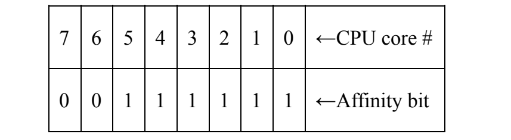
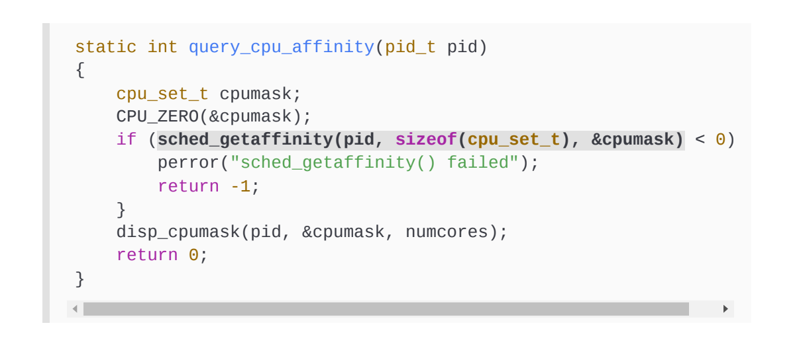
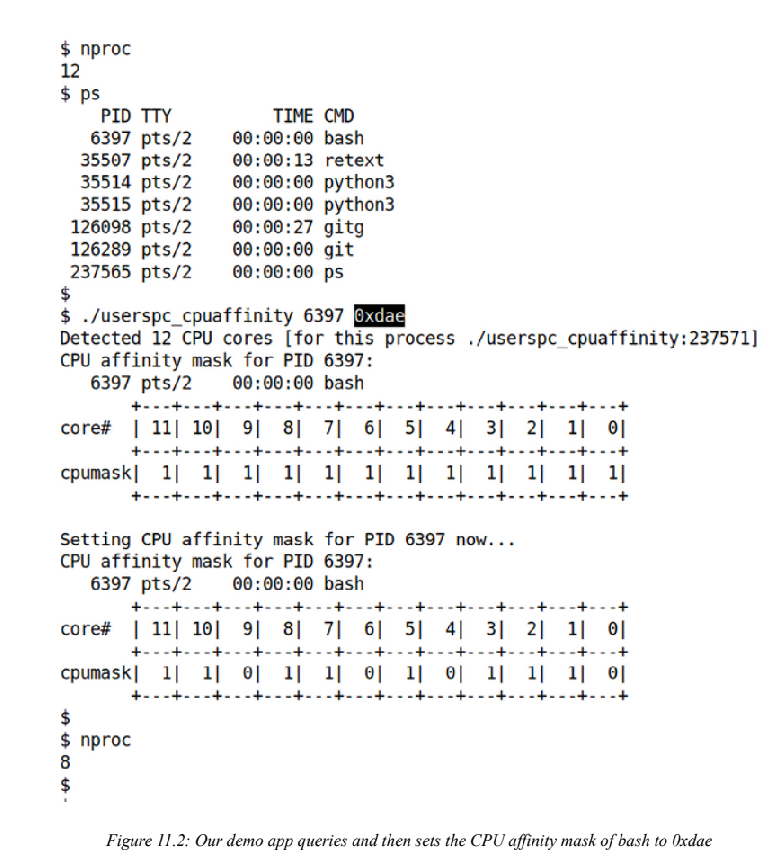
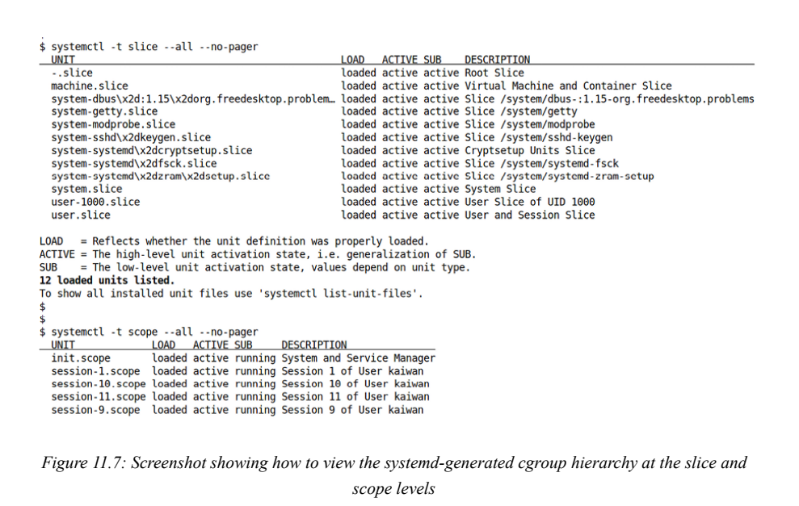
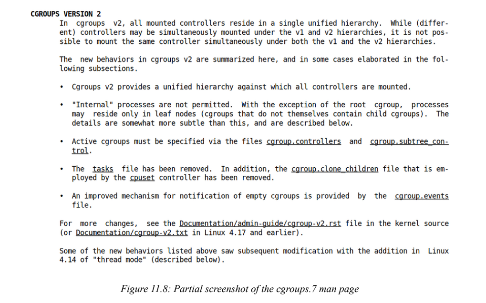
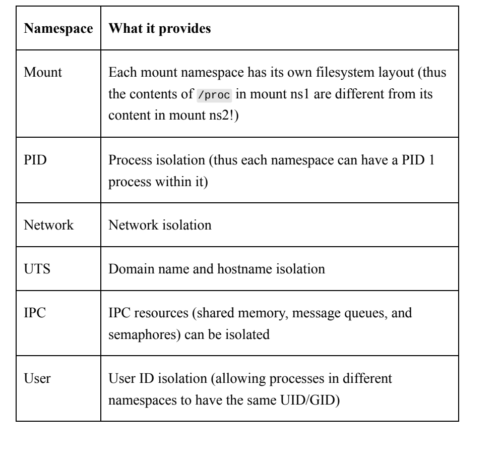
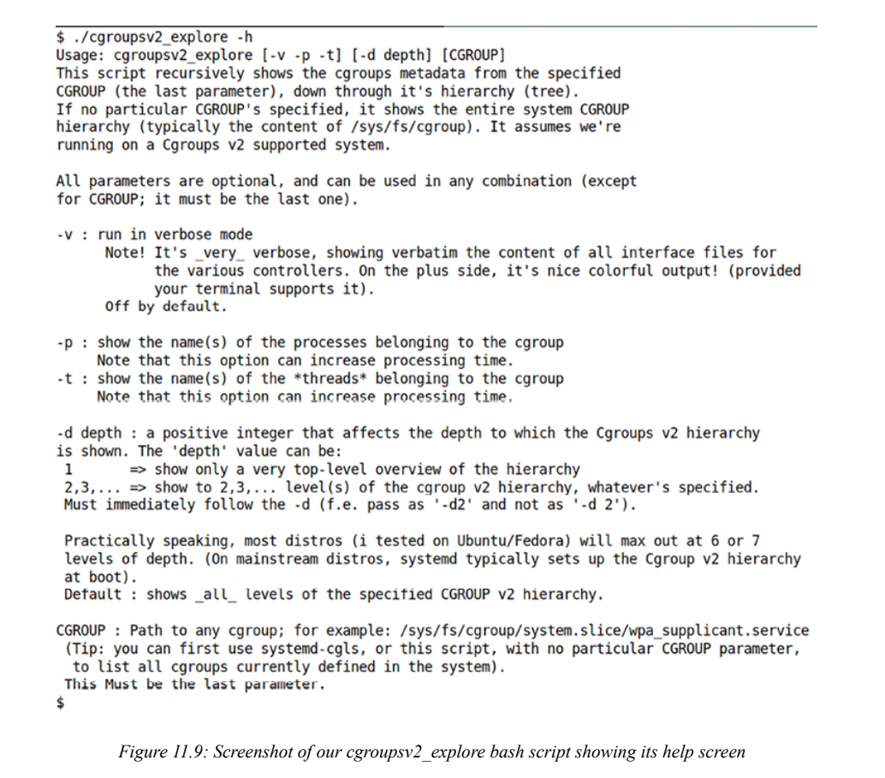
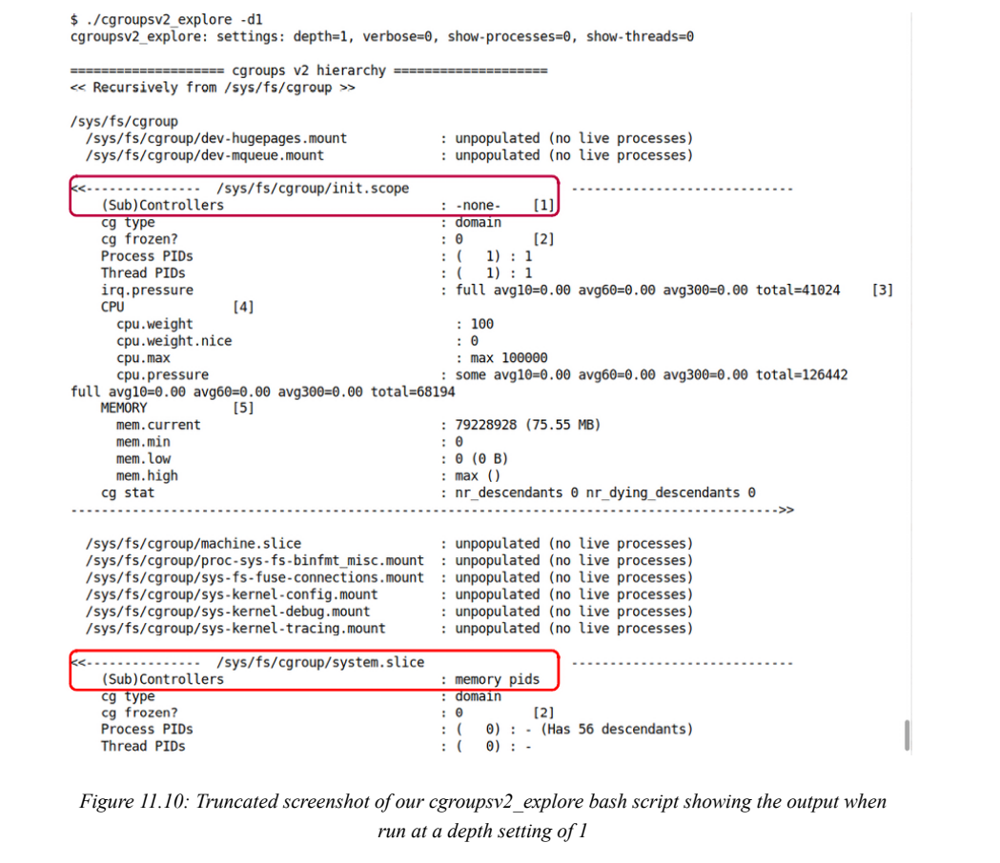
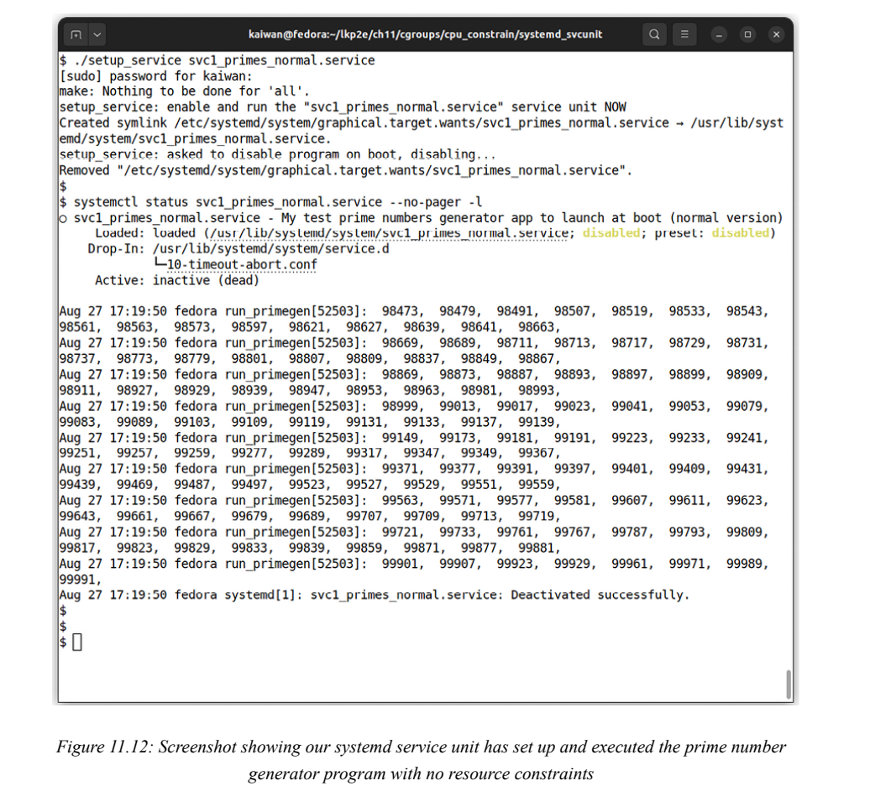
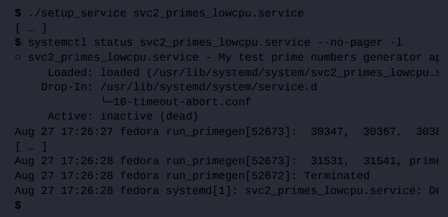

# 7.17

## Linux Kernel Development

#### 理解、查询和设置CPU关联掩码

​	任务结构——线程（或任务）的根数据结构，包含几十个线程属性——有几个与调度直接相关的属性：优先级（nice和实时（RT）优先级值）、调度类结构指针、线程所在的运行队列（如果有的话）等等。（仅供参考，我们在第6章“内核内部要素——进程和线程”中介绍了任务结构的一般细节）。其中有一个重要的成员，CPU亲和位掩码（实际结构成员是cpumask_t*cpus_ptr.FYI，在5.3内核之前，它是一个名为cpus_allowed的成员；这在这次提交中发生了变化：https://github.com/torvalds/linux/commit/3bd3706251ee8ab67e69d9340ac2abdca217e733). 这个位掩码就是：允许线程（由该任务结构表示）在其上运行的CPU内核的位掩码。简单的可视化会有所帮助；在配备8个CPU的系统上核心，这就是典型的CPU亲和位掩码（概念上）的样子：



​	亲和位在上面的例子中，每个单元格代表一个CPU核；最上面一行表示CPU核心编号，下面一行的单元格显示了它的示例值：最下面一行单元格可以设置为0或1，表示线程是否可以在相应的CPU核心上运行。因此，在这里，CPUbitmask值为0x3f（将二进制数0011 1111转换为十六进制），这意味着该线程可以在CPU内核0到5上调度，但不能在内核6和7上调度。默认情况下，所有CPU关联掩码位都已设置；因此，默认情况下，线程可以在任何核心上运行；这是有道理的。例如，在一个有8个CPU核的盒子上，每个线程的默认CPU亲和性位掩码将是二进制1111 1111 1111（0xff十六进制）。由于这个CPU亲和位掩码成员保存在任务结构中，这告诉我们CPU亲和位面具是每个线程的数量；这也很重要——毕竟Linux上的KSE是一个线程。在运行时，调度器决定了线程实际运行的核心。事实上，仔细想想，这是隐含的：根据设计，每个CPU核都有一个与之关联的运行队列。每个可运行的线程都将位于一个CPU运行队列上；因此，它符合torun条件，默认情况下，在其runqueue所代表的CPU上运行。当然，调度器有一个负载均衡器组件，可以根据需要将线程迁移到其他CPU内核（实际上是运行队列）（称为migration/n的内核线程在需要时协助执行此任务，其中n是内核编号）。

​	内核确实将API暴露给用户空间（当然是系统调用sched_{s,g}etaffinity（2） 以及它们的pthread包装器库API），这允许应用程序根据需要将一个线程（或多个线程）仿射或关联到特定的CPU内核（根据相同的逻辑，我们也可以在内核中为任何给定的内核线程执行此操作）。例如，将CPU关联掩码设置为1000 0001二进制，在十六进制中等于0x81，意味着线程只能在CPU核7和0上执行（记住，核计数从0开始）。一个关键点：虽然你可以操纵给定线程的CPU亲和性掩码，但建议避免这样做；内核调度程序子系统详细了解CPU拓扑（或域），可以最好地平衡系统负载。话虽如此，显式设置线程的CPU关联掩码可能是有益的，原因如下：通过确保线程始终在同一CPU核上运行，可以大大减少频繁的缓存失效（从而减少不愉快的缓存“反弹”）。（第13章，内核同步-第2部分，更详细地介绍了CPU缓存）。可以有效地消除内核之间的线程迁移成本。实现CPU预留——一种通过保证所有其他线程都明确不允许在该核心上执行来将核心独占给一个线程的策略。前两种方法在某些极端情况下很有用；第三种是CPU预留，这是一种在一些时间关键的实时系统中使用的技术，在这些系统中这样做的成本是合理的（仅供参考，这是通过isolcpus=内核参数实现的；现在，它被认为是不推荐的，你应该使用cpusets cgroup控制器）。现在您已经了解了它背后的理论，让我们实际编写一个用户空间C程序来查询和/或设置任何给定读数的CPU关联掩码。查询和设置线程的CPU亲和性掩码作为演示，我们提供了一个小型用户空间C程序来查询和设置用户空间进程（实际上是线程）的CPU亲和度掩码。查询cpu关联掩码是通过sched_getaffinity（）系统调用实现的，设置它是通过其对应的sched_setaffinity）系统调用完成的。

​	名为cpu_set_t的专用数据类型用于表示cpu亲和性位掩码（第三个参数）。它非常复杂：它的大小是根据系统上看到的CPU内核数量动态分配的。此CPU掩码（类型为CPU_set_t）必须首先初始化为零；CPU_ZERO（）宏实现了这一点（存在几个类似的辅助宏；参见CPU_SET（3）上的手册页）。前两个系统调用中的第二个参数是CPU集的大小（我们简单地使用sizeof操作员获取它）。第一个参数是要查询或设置其CPU关联掩码的进程或线程的进程ID（PID）

​	在此模式下，它查询自身的CPU亲和性掩码（用户pc_cpuaffinity调用过程的含义）。我们打印出位掩码的位：正如您在前面的屏幕截图（图11.1）中清楚地看到的那样，它是二进制1111 1111 1111 1111（相当于0xfff），这意味着，默认情况下，该进程有资格在系统上可用的12个CPU核中的任何一个上运行！该应用程序通过有用的popen（）库API运行thenproc实用程序，在内部检测可用的CPU内核数量。不过，请注意nproc返回的值是调用进程可用的CPU核数；它可能少于（在线和离线）CPUcores的实际数量，尽管它通常是相同的。可用内核的数量可以通过几种方式更改，正确的方式是通过cgroup cpuset资源控制器（我们将在本章稍后介绍



​	我们的disp_cpuask（）函数绘制位掩码（我们将其留给您检查）。如果向该程序传递了其他参数——进程（或线程）的PID作为第一个参数，CPU位掩码（十六进制）作为第二个参数——那么我们会尝试将该进程（或进程）的CPU关联掩码设置为传递的值。当然，更改CPU亲和位掩码需要您拥有该进程或拥有root权限（更准确地说，是拥有CAP_SYS_NICE功能）。

​	下面是一个快速演示：在图11.2中，nproc向我们显示了CPUcores的数量（12）；然后，我们运行应用程序查询并设置（bash）shell进程的CPU关联掩码。在具有12核的笔记本电脑上，假设亲和性maskof-bash一开始就是0xfff（二进制1111 1111 1111 1111），正如预期的那样；在这里，我们将其更改为0xdae（二进制1101 1010 1110），并再次查询以验证更改：



​	我们的演示应用程序查询并将bash的CPU关联掩码设置为0xdaeOkay，这很有趣。首先，该应用程序正确地检测到可用的CPU内核数量为12。然后，它查询bash进程的（默认）CPU亲和性掩码（当我们将其PID作为第一个参数传递时）；正如预期的那样，它显示为0xfff。然后，由于我们还传递了第二个参数——现在将位掩码设置为（0xdae）——它这样做，将bash的CPU关联掩码设置为0xdae。现在，由于我们所在的终端窗口是同一个bashprocess，再次运行nproc会显示值为8，而不是12！这是不正确的：bash进程现在只有八个CPU核可用。（这是因为我们没有将CPU关联掩码还原为其原始值onexit。）以

​	在前面的代码片段中，您可以看到我们首先适当地设置了cpu_set_tbitmask（通过循环每个位；如您所知，表达式（位掩码>>i）&1测试第i位是否为1），然后使用sched_setaffinity（）系统调用在给定的pid上设置新的cpu亲和性掩码。

​	值得注意的是，虽然任何人都可以随时查询任何任务的CPU关联掩码，但除非您拥有该任务、拥有根访问权限或具有CAP_SYS_NICE功能，否则无法设置它。使用任务集执行CPU亲和性。正如（在前一章中）我们如何使用方便的用户空间实用程序chrt来获取（或设置）进程（或线程）的调度策略和/或优先级一样，您可以使用用户空间任务集实用程序来获取和/或设置给定进程（或进程）的CPU亲和性掩码。下面是几个快速的例子；请注意，这些示例是在具有6个CPU核的x86_64Linux VM上运行的：使用任务集查询systemd的CPU关联掩码（PID 1）：

```
$ taskset-p 1
pid 1的当前关联掩码：3f
```

想想看：0x3f在二进制中是0011 1111，表示为所讨论的进程/线程（此处为systemd）启用了（所有）6个CPUcore。现在，作为一个例子，让我们在任务集的支持下运行编译器，使用它来确保GCC及其后代（汇编程序和链接进程）仅在前两个CPU核上运行；任务集的第一个参数是CPU亲和性位掩码（03是二进制0011）

​	请查看任务集（1）的手册页，了解完整的使用细节。（仅供参考，如前一章所述，schedtool（8）实用程序也可用于获取/设置给定线程/进程的CPU关联位掩码。）在内核线程上设置CPU关联掩码作为一个非常有趣的例子，如果我们想演示一种称为每CPU变量的同步技术（正如我们将在第13章“内核同步-第2部分”中的“每CPU-内核模块示例”一节中学习和做的那样），我们需要创建两个内核线程（kthreads），并保证它们中的每一个都在单独的CPU内核上运行。因此，我们当然必须明确地将每个内核线程的CPU亲和性掩码设置为不同且不重叠（为了简单起见，让我们将第一个k线程的亲和性掩码设为0，将第二个k线程掩码设为1，以确保它们分别仅在CPU核0和1上执行）。但有个问题。。。下一节将对此进行解释。黑客攻击非导出符号的可用性。问题是，现在从模块内设置CPU亲和力不幸不是一件干净的工作——说实话，这是一次相当大的黑客攻击；我们在这里展示，但绝对不建议用于生产目的。原因是内核中我们需要设置CPUaffinity位掩码的API存在，但没有导出。正如我们从前面关于编写模块的章节中了解到的那样，树外内核模块（如我们的）只能使用导出的函数（和数据）。我们该怎么办？

模块开发人员多年来使用的“常用”方法（也是我在本书第一版中使用的！）是使用方便的例程kallsyms_lookup_name（）在内核中查找任何给定的符号并获得其（内核虚拟）地址。有了这个，任何优秀的C程序员都可以将地址视为函数指针并随意调用它，从而有效地克服了只能从树外模块调用导出函数的限制！（一个巧妙的破解！不过，经验丰富的内核人员几乎肯定会对此感到愤怒。）没错，但从内核版本5.7开始，社区决定是时候停止这种（愚蠢的）滥用了，干脆不公开kallsyms_lookup_name（）（和类似的kallsym_son.each_symbol（））函数！（简式commitID是0bd476e6c671，看看。）那么，现在怎么办？好吧，我们总是可以通过/proc/kallsyms伪文件查找任何内核符号，只要我们有root访问权限（这就是安全性）。此外，在启用了内核地址空间布局随机化（KASLR）的情况下（通常在现代内核中），该值在每次启动时都会发生变化，因此无法进行硬编码（对安全性也有好处）。因此，我们编写了一个小的包装器脚本来实现这一点（它在这里：ch13/3_lockfree/percpu/run；是的，代码来自第13章，内核同步–第2部分），并将地址（通过/proc/kallsyms查找的sched_setaffinity（）例程）作为参数（ch13/3.lockfree/pecpu/percpu_var.c）传递给模块，然后将其视为函数指针，设法调用它。

#### 查询和设置线程的调度策略和优先级

​	在第10章“CPU调度器-第1部分”的“线程优先级”部分，您学习了如何通过chrt实用程序查询任何给定线程的调度策略和优先级（我们还演示了一个简单的Bash脚本）。在那里，我们提到了这样一个事实，即chrt在内部调用sched_getatt（）系统调用来查询这些属性。非常类似地，设置调度策略和优先级可以通过使用chrt实用程序来执行（例如，在脚本中可以很容易地执行），也可以在（用户空间）C应用程序中通过sched_setattr（）系统调用以编程方式执行。此外，内核还公开了其他API：sched_{g,s}etscheduler（）及其pthread库包装器API pthread_{g,s}etschedparam（）（由于这些都是用户空间API，我们让您浏览它们的手册页以获取详细信息，并亲自尝试）。

#### 在内核中设置策略和优先级

​	在内核线程上。如您所知，内核肯定既不是进程也不是线程。话虽如此，Linux内核肯定是多线程的，并且确实包含线程，即所谓的内核线程（或kthreads）。与用户空间中的对应线程一样，可以根据需要创建内核线程（从核心内核、设备驱动程序或内核模块中创建；内核为此公开了API）。它们是可调度实体（KSE！），当然，它们中的每一个都有atask结构和内核模式堆栈；因此，与常规线程一样，它们竞争CPU资源，并且可以根据需要以编程方式查询或设置它们的调度策略和优先级。

​	到目前为止：在用户空间中，查询和设置线程调度属性的现代首选系统调用分别是sched_getatt（）和sched_setattr（）。在早期，它曾经是sched\_{g|s}et_scheduler（）对系统调用。现在，sched_{g|s}etattr（）系统调用会收到一个指向结构sched_attr的指针，该结构包含所有可能需要的详细信息；查看手册页(https://man7.org/linux/man￾pages/man2/sched_setattr.2.html）。因此，按照现代的方式，人们会假设我们将使用这些系统调用的内核实现在内核中执行类似的工作。别那么快；内核社区认为，旧的（er）设计——允许用户（应用程序）和模块开发人员使用SCHED_FIFO等策略愉快地调用这些API，并使用他们认为正确的任何（实时）优先级——从根本上被打破了。为什么？因为我们很容易遇到这样的情况：两个或多个具有相同优先级的SCHED_FIFO线程，和/或使用“随机”优先级值，而没有仔细考虑它们。这些可能会导致CPU调度混乱，从而导致资源管理混乱。

因此，5.9内核所做的工作如下（请允许我直接引用提交的内容，因为这确实是传达消息的最佳方式）；这是承诺的一部分，https://github.com/torvalds/linux/commit/7318d4cc14c8c8a5dde2b0b72ea50fd2545f0b7a:…

> 因此，暴露优先级字段是没有意义的；thkernel从根本上无法设置一个合理的值，这是它没有的系统知识。从模块中删除sched_setschedule（）/sched_setatter（），并将其替换为：-scched_set_fifo（p）；创建FIFO任务（在优先级50处）-scched_set_FIFO_low（p）；创建一个高于NORMAL的任务，最终在优先级1处成为FIFO任务。-sched_set_normal（p，nice）；（重新）将任务设置为正常。这可以阻止随机选择的、不相关的、无论如何都没有真正意义的优先级的激增。系统管理员/集成商，无论谁了解实际的系统设计和需求（用户空间），都可以在需要时设置适当的优先级。。。

​	啊；因此，现在，亲爱的模块作者们，在内核中设置（sched_）fifo任务（线程）时，我们将使用这些API——sched_set_fifo（）、sched_set_fifo_low（）和sched_set_normal（）。正如上述承诺所述，我们信任管理员和/或用户空间开发人员对用户应用程序进行编程，并根据需要为其提供正确和有意义的实时优先级值；内核（或模块）不应该知道或质疑这些决定，它只是执行这些决定（再次，这是提供机制的一个例子，而不是实际的策略设计指南）。前两个API是内核中sched_setscheduler_nocheck（）函数的包装器，将线程的调度策略设置为sched_FIFO，将线程（实时）优先级分别设置为MAX_RT_PRIO/2（即50）和1。sched_set_normal（）：是sched_setatr_nocheck（）的包装器足够的特权；不管怎样，它都会通过。（请参阅此处的评论：https://elixir.bootlin.com/linux/v6.1.25/source/kernel/sched/core.c#L7742.)此外，这三个API是GNU公共许可证（GPL）导出的，这意味着它们只能由在GNUGPL下许可的模块使用。

#### 一个真实世界的例子——线程中断处理程序

​	内核使用内核线程的一个例子是当内核（非常常见）使用线程中断时（工作队列是另一个例子）示例）。在这里，内核必须使用SCHED_FIFO（软）实时调度策略和50（中间值）的实时优先级值创建一个专用的内核线程，以正确处理所谓的线程中断。让我们看看相关的代码路径，kthread_create（）宏作为线程函数）将作为其代码路径的一部分，适当地设置调度策略和优先级

#### cgroups简介

​	在模糊的过去，内核社区正努力解决一个更棘手的问题：尽管调度算法及其实现——早期的2.6.0 O（1）调度器和稍后的（2.6.23）完全公平调度器（CFS）——承诺了完全公平的调度，但从任何有意义的意义上讲，它都不是“完全公平”的！想一想：假设你和其他九个人一起登录到Linux服务器。在其他条件相同的情况下，处理器时间很可能（或多或少）在你们十个人之间公平分配；属于当然，你会明白，在处理器上运行并吃掉内存的并不是人，而是代表他们这样做的进程和线程。至少就目前而言，让我们假设它（大部分）是公平共享的。但是，如果你，登录的十个用户之一，编写了一个用户空间程序，在循环中不加选择地生成几个新线程，每个线程在每次循环迭代中执行大量CPU密集型工作（也许作为额外的好处，还分配了大量内存），该怎么办！？CPU带宽定位（即使通过CFS）在任何真正意义上都不再公平；您的帐户将有效地占用CPU（可能还有其他系统资源，如内存和I/O）！需要一种通用的解决方案，精确有效地管理CPU（和其他资源）带宽，在达到指定限制时限制（检查，不允许）消耗更多的资源。许多拟议的补丁被讨论并丢弃；最终，来自谷歌、IBM和其他公司的工程师不得不使用一个补丁集，将现代的控制组（cgroups）解决方案放入Linux内核（反向反转2.6.242007年10月）。最初的想法和实现是由谷歌的Paul Menage和Rohit Seth于2006年提出的。）。简而言之，cgroups是一个内核功能，它允许系统管理员（或任何拥有rootaccess的人）能够优雅地对系统上的各种资源或控制器（在cgroup词典中称为）执行带宽分配和细粒度资源管理。请注意：使用cgroups，不仅是处理器（CPU带宽），还有内存和块I/O带宽（以及更多），可以根据项目或产品的需要进行仔细的分区、分配和监控。因此，在这个例子中，我们以Linux系统上的十个用户开始本主题，如果所有进程都放在同一个cgroup和cgroups的CPU控制器被启用，那么，面对CPUContents，它真的会为每个进程带来公平的CPU份额！或者，正如他们所说，你可以做更复杂的事情：你可以把系统分成几个cgroup——一个用于构建项目（比如Yocto构建），一个用于web浏览器，一个适用于虚拟机，等等——然后根据需要对每个cgroup进行微调并分配资源（CPU、内存和I/O）！事实上，这是几乎所有现代发行版都会自动完成的，这是强大的systemd框架的功劳（更多内容如下）；这也是嵌入式Linux通常所做的，包括Android。所以，嘿，你现在感兴趣了！如何启用此cgroups功能？很简单——这是一个内核功能，你可以用通常的方式以相当精细的粒度启用（或禁用）：通过配置内核。相关菜单（通过方便的make menuconfig用户界面）是General setup | Control Group support。试试这个：grep CGROUP的内核配置文件；然后，如果需要，调整内核配置，重新构建，使用新内核重新启动，并进行测试。（我们在第2章“从源代码构建6.x Linux内核-第1部分”中详细介绍了内核配置，在第3章“从源码构建6.x Linux内核-第2部分”中介绍了内核构建和安装）。

> 好消息：默认情况下，cgroups在运行systemd init框架的任何（最近）Linux系统上都是启用的。正如刚才提到的，您可以通过抓取内核配置文件来查询启用的cgroup控制器，并根据需要修改该配置；在桌面和服务器级系统上，通常不需要这样做。

从2.6.24开始，cgroups和所有其他内核特性一样，不断发展。最近，已经达到了一个阶段，充分改进的cgroup功能与旧功能不兼容，导致新的cgroup设计和发布，一个名为cgroups v2（或简称cgroups2——Tejun Heo是维护者）；这在4.5内核系列中被声明为生产就绪（旧的内核现在被称为cgroupsv1-oras，即遗留的cgroups实现）。请注意，在撰写本文时，两者可以而且确实存在，但存在一些局限性；许多应用程序和框架仍然使用较旧的cgroups v1，并且尚未迁移到v2。然而，这种情况正在发生变化；很快，如果还没有的话，cgroups2将成为实际使用的版本，所以计划使用它。在本篇报道中，我们将几乎只关注使用现代版本cgroups v2。最好的文档是官方的内核文档，可以在这里找到（适用于内核6.1）：https://www.kernel.org/doc/html/v6.1/admin￾guide/cgroup-v2.html。（仅供参考，最新内核版本的文档也始终可用，如下所示：https://docs.kernel.org/admin-guide/cgroup-v2.html.A为什么使用cgroups v2而不是tocgroups v1的详细原理可以在内核文档中找到

#### C组 控制器

​	cgroup控制器是底层内核组件，负责在cgroup层次结构（cgroup及其后代）内和通过cgroup层次分布给定的资源（如CPU周期、内存和I/O带宽等）。您可以将其视为敏捷cgroup层次结构的某种“资源限制器”。cgroups（7）的手册页详细描述了接口和各种可用的（资源）控制器（或子系统，因为它们有时会被提及）。通常可用的cgroups v2控制器如下（表11.1显示了cgroups v2的内容；许多控制器的原始cgroups v1实现可以追溯到2.6.24）

​	我们建议感兴趣的读者参阅上述官方内核文档和手册页以获取详细信息；例如，PIDS控制器在防止分叉炸弹方面非常有用，它允许您限制可以从该cgroup或其后代分叉的进程数量。（分叉炸弹是一种愚蠢但致命的DoS攻击，其中Fork（）系统调用通常在无限循环中发出！）接下来，非常重要的是，如何使内核cgroup对用户空间可见（公开）或与用户空间交互？啊，在Linux上通常的方式是：控制组通过专门构建的合成或伪文件系统公开！它是cgroup文件系统，通常挂载在/sys/fs/cgroup。好吧，使用cgroups v2，文件系统类型现在被称为cgroup2（您可以简单地执行mount|grep-cgroup来查看此内容）。里面有很多有趣的东西可以探索；这是我们取得进步时所做的事情。。。

​	让我们从这个开始：我如何找到为我的系统（实际上是内核）启用了哪些控制器？很简单：

```
$cat/sys/fs/cgroup/cgroup.controllers 
cpuset cpu io memory hugetlb pids rdma misc很明显，
```

​	它显示了一个用空格分隔的可用控制器列表（我在x86_64 Fedora 38 VM上运行了这个。此外，请注意，使用/proc/cgroups查看控制器仅与cgroups v1兼容；不要依赖它来查看cgroupsv2。）。您在这里看到的确切控制器取决于内核的配置方式。在cgroups v2中，所有控制器都挂载在一个层次结构（或树）中。这与cgroups v1不同，后者可以在多个层次结构或组下挂载多个控制器。现代init框架systemd是v1和v2 cgroups的用户。事实上，是systemd在启动过程中自动挂载cgroups v2文件系统（位于/sys/fs/cgroup/）。探索cgroups v2层次结构在cgroups（v2）伪文件系统挂载点下查看——默认情况下总是/sys/fs/cgroup——会让你惊奇地盯着里面的所有伪文件（和文件夹）（继续，看看图11.3）；本节将探索它的许多更有趣、更有用的角落和缝隙！让我们首先确认cgroups v2层次结构的挂载位置：

```
mount | grep cgroup2
cgroup2
```

​	显然，正如预期的那样，在/sys/fs/cgroup。（对括号中的各种挂载选项感兴趣吗？它们记录在这里：https://www.kernel.org/doc/html/v6.1/admin-guide/cgroup-v2.html#挂载）。如果你运行的是一个较旧的发行版（比如Ubuntu18.04左右，就像我们在本书第一版中所做的那样），你可能在cgroup2中找不到任何控制器。在混合cgroups、v1和v2的情况下就是这种情况。要专门使用较新版本（正如我们所期望的），并因此使所有配置的控制器可见，你必须首先在引导时传递以下内核命令行参数来禁用cgroups v1：cgroup_no_v1=all（回想一下，所有可用的内核参数都可以方便地看到）https://www.kernel.org/doc/html/latest/admin-guide/kernel-parameters.html.然后重新启动并重新检查。对于较新的发行版（如Ubuntu 22.04或Fedora 38），您不需要这样做。现在，让我们开始探索它！在本次会议中，我正在开发一个x86_64 Fedora 38虚拟机，在那里我构建并启动了一个自定义的6.1.25内核。让我们来看看整个场景：

​	图11.3：cgroups v2层次结构的根在根cgroup位置–/sys/fs/cgroup下，您可以看到几个文件和文件夹（不用说，这些都是易失性伪文件对象；它们通过sysfs安装在RAM中）。首先：看到的“常规”文件（如cgroup.controllers、cpu.pressure等）是cgroup2接口文件。这些进一步细分为核心和控制器接口；所有的group.*文件都是核心接口文件，cpu.*文件是cpu控制器的接口文件，内存.*文件用于内存控制器，等等。看到的文件夹代表——终于！——控制组或cgroups！在众多人中，你会发现并非所有人都受到约束。你可能会想知道是谁创造了它们；简短的答案（至少对于默认情况下的答案）是systemd；稍后将对此进行更多介绍。

#### 启用或禁用控制器

​	让我们查看一个关键的核心接口文件cgroup.controllers。上一节简要提到了这一点。其内容是c组可用控制器的列表；对于根cgroup，它是内核所具有的控制器

#### systemd和cgroups 

​	cgroups的手动管理可能是一项艰巨的任务；大多数工作站发行版、企业和数据中心服务器，甚至嵌入式Linux默认运行的powerful systemd init框架都起到了拯救作用。正如我们已经开始注意到的，systemd的一个有趣的方面是，它在启动时创建和管理cgroup的角色，从而自动利用它们的功能为用户和他们的应用程序带来好处。（当然，你对它是如何做到这一点了解得越多，你就越能调整工具包以适应你的项目。）此外，要意识到有几个工具可以帮助你在系统上可视化定义的cgroups（和切片/范围）；它们包括ps，还有一些来自systemd项目本身的systemdcgls、systemctl和systemdcgtop。（我们很快也会看到我们自己的cgroups可视化脚本！）切片和范围如图11.6所示，systemd具有自动构造cgroups的智能，可以将进程逻辑地分组在一起。为此，它定义并使用工件——切片和范围。切片用于表示属于特定用户的所有进程，或者，它可以表示资源通过该单元管理的“一堆”应用程序（进程）。（在图11.6中，对于UID值为1000的用户帐户，很明显，我的sliceis名为user-1000.slice）。范围代表切片的进一步逻辑拼接或分割（相当无张力扭曲，不是吗？）；

​	一个很好的例子是，在终端窗口中运行的所有进程通常按systemd分组到一个会话-<number>.scope cgroup中（该术语前缀为单词“session”，因为会话表示在终端窗口内生成和管理的进程）！同样，在图11.6中，您可以清楚地看到，由名为session-9.scope的作用域表示的终端窗口是通过sshd设置的，具有Bash shell（其PID为1283555，电传打字机（tty）设备为pts/4），被表示或组织为用户切片的适用对象，并在其中处于“会话”类型作用域中。此外，systemd组织层次结构，将（启动时）范围和服务单元分配给适当的切片（内部获取其自己的cgroups）。如上所述，登录到系统的每个用户也将被视为树中通用user.slice节点下的“切片”，他们运行的应用程序当然会显示在该cgroup下（同样，您可以在图11.6中看到我的用户切片；它显示为user-1000.slice，在这个层次结构下是“范围”单元）。引用systemddocs：“（切片）名称由破折号分隔的一系列名称组成，这些名称描述了从另一个切片到切片的路径。根切片名为-.slice。示例：foo-bar.slice是一个位于info.slice内的切片，而info.slices又位于根切片-.slice中……”（您可以在图11.7中看到根切片-.slice作为第一个切片）。如果您想更改默认值，即systemd设置cgroups的方式，该怎么办？大致有三种方法：第一，手动编辑服务单位文件；其次，使用systemctl set propertysub命令执行编辑；第三，在systemd目录结构中使用所谓的插入文件。举个简单的例子：

```
$ cat /usr/lib/systemd/system/user@.service
[ … ]
[Unit]Description=User Manager for UID %iDocumentation=man:user@.service(5)After=user-runtime-dir@%i.service dbus.service systemd-oomd.serviRequires=user-runtime-dir@%i.serviceIgnoreOnIsolate=yes
[Service]
User=%iPAMName=systemd-userType=notify-reloadExecStart=/usr/lib/systemd/systemd --userSlice=user-%i.sliceKillMode=mixedDelegate=pids memory cpuTasksMax=infinity[ … ]
```

可视化cgroups（以及切片和作用域）

​	我们已经了解了如何使用systemd cgls扫描cgroup层次结构。另一种查看它的方法（在systemd的支持下）是通过systemctlapp和systemd单元类型。systemd定义了几种单元类型：服务、挂载、交换、套接字、目标、设备、自动挂载、计时器、路径、切片和作用域。其中，只有最后两个与我们相关，所以让我们通过systemctl命令来查看它们：





#### 快速了解内核命名空间

​	一个快速但有用的偏差：有趣的是，容器的整个过程——一种强大的、行业标准的、事实上的管理应用程序部署的方法——基本上基于Linux内核中的两项关键技术：cgroups和命名空间。你认为容器本质上是轻量级的虚拟机（在某种程度上）；目前使用的大多数容器技术（Docker、LXC、Kubernetes等）本质上是这两种内置Linux内核技术的结合：cgroups和命名空间。内核命名空间是整个容器思想实现的一个至关重要的概念和结构（内核中的结构是structnsproxy）。使用名称空间，内核可以以一种方式对其资源进行分区，即一个名称空间中的一组进程看到某些值，而另一个名称环境中的一套进程看到某些其他值。这是为什么必修的？以两个容器为例；为了实现干净的隔离，每个进程都必须看到PID为1、2的进程，以此类推。同样，每个进程可能都必须有自己的域名和主机名、自己的一组内容对该容器唯一的挂载（例如/proc）、每个进程唯一的网络接口等等。内核可以维护许多命名空间；默认情况下，它们都是可选的，因此内核始终为每个命名空间维护一个\<FOO>全局命名空间的概念（其中FOO是命名空间的名称，如mount、PID等）



表11.2：内核命名空间相关说明：如您所知，clone（）系统调用用于在Linux上创建线程（pthread_create（）调用它）。在它的许多标志中——用于通知内核如何创建自定义进程，或者换句话说，线程——有标记为CLONE_NEW*的标志（例如，CLONE_NEWPID、CLONE_NNEWNS、CLONE_NAMET等）。这些是让内核在新名称空间中创建进程的方法。其他与命名空间相关的系统调用包括setns（）、unshare（）和octl_ns（）；请查看他们的手册页了解更多信息。（同样，本章的进一步阅读部分有更多关于内核命名空间和容器技术的链接。）好的，回到我们的cgroups讨论！使用systemd cgtop另一种既可以可视化cgroups层次结构，又可以在运行时同时观察哪些cgroups及其内部的切片/服务正在使用最大份额的资源的方法是通过非常有用的systemd cgtops工具（实际上，相当于systemd cgroups古老的顶级实用程序）！默认情况下，在systemd-cgtop的输出中，cgroups按CPUload排序。

我们的cgroups v2 explorer脚本使用现有的cgroup可视化工具，一个问题是：我们无法立即看到cgroup是已填充还是为空；此外，即使它被填充，我们也无法立即看到它内的哪些控制器被启用（或禁用）。了解这些是理解系统上的cgroup树的关键。我们的Bash脚本试图通过显示以下内容（以及更多内容）来纠正这种情况：

- 给定一个起始cgroup作为参数，它递归迭代所有嵌套的cgroup；如果没有指定，它只会从组树的根（/sys/fs/cgroup）开始，从而扫描整个树。

- 对于它解析的每个cgroup，它首先检查：

  如果它没有被填充（如果它里面没有活动进程），跳到下一个cgroup，否则显示一些关于它的内容，比如：子控制器（实际上，该cgroup的cgroup.subtree_controlseudoff文件的内容！请参阅我们关于子控制器的简报…）cgroup类型（域/域线程化/线程化/…）冻结状态（0/1，否/是）属于此cgroup的进程：

  默认情况下，它显示进程数量（括号内），然后显示PID列表；如果将-p选项传递给此脚本，它将显示其中的进程（通过ps）属于此cgroup的线程：默认情况下，它显示线程数（在括号内），然后显示PID列表；如果-t如果将选项传递给此脚本，它将显示其中的线程（viaps）与cgroup中的几个控制器相关的数据；截至目前（它仍在发展中！）：CPUMemory

​	此外，我们的脚本还接受一些选项开关：-d：控制扫描树的深度-v：以详细模式显示-p/-t：显示属于每个cgroup的进程和/或线程（如前所述）cgroupv2_oxpore脚本的帮助屏幕一下子显示了所有这些：





#### 尝试1.1–在没有资源约束、SCHED_FIFO策略和rtprio 83Right的systemd下执行素数生成器。

​	让我们简单地让systemd执行脚本。我们执行setup脚本，将服务单元文件作为参数传递，该脚本使systemd执行了run_pimegen程序（有关详细信息，请参阅源代码；下面的输出来自我的x86_64 Fedora 38客户机，运行我们自定义的6.1.25内核）：



​	好的！systemctl status<service.unit>命令显示其状态和生成的任何输出（图11.12；有用的是，systemd会自动将所有stdout、stderr和内核printk输出保存到日志中）。在这个特殊的运行中，它设法在3秒内生成了2到99991的素数，没有资源（CPU）限制，并以高优先级的SCHED_FIFO运行。（当然，你会意识到生成的素数数量可能因硬件系统而异。快速提示：要查看完整输出，只需运行journalctl-b。）顺便说一句，我们的脚本在运行一次后故意禁用了该服务；您可以通过在setup_service脚本中将变量KEEP_PROGRAM_ENABLED_ON_BOOT更改为值1来更改此设置。

我们突出显示了在服务单元文件svc1_primes_normal.service中明确指定的几个CPU设置。当然，其他设置为默认值（顺便说一句，名为LimitCPU*的设置用于指定服务单元内进程的（旧式）资源限制）。因此，请记住，这次运行——完全没有CPU限制，采用SCHED_FIFO策略，RT优先级为83（在大约3秒内）——在我的系统上产生了大约99991个素数。

#### 尝试1.2–在systemd下执行素数生成器，并对CPU资源、SCHED_OTHER和rtprio0进行约束。

​	现在，我们在同一个系统上运行相同的素数生成程序，但这一次，通过systemd指定了一些明确的CPU约束。现在使用的服务单元文件是：ch11/cgroups/cpu_constraine/systemd_svcunit/svc2_primes_lowcpu.service。几乎所有内容都与第一个（我们刚刚在上一节中看到的）相同，除了以下几点：#---应用CPU约束---CPUQuota=10%AllowedCPU=1我们还删除了CPUSchedulingPolicy=fifo和CPUschedulingPriority=83行，从而将进程保持为默认值：调度策略为SCHED_OTHER，实时优先级为0，当然，我们限制它只使用10%的CPU带宽和1个内核！让我们运行它，然后检查状态：



​	Aha！这一次，该程序在仅10%的CPUbandwidth（配额）的约束下，只允许在1个核心、SCHED_OTHER和rtprio0上运行，在允许运行的3秒内（内部）只产生数字31541的素数，而第一种“正常”情况下则有超过99000个素数，这表明第一种情况比第二种情况产生的素数多出近70%，证明了systemd cgroups控制的有效性。所以，我们到了。为了演示如何在acgroup上设置内存限制，我们提供了另一个示例服务单元：svc3_pimes_lowram.service。其中，c组内存限制是通过MemoryHigh和MemoryMaxsystemd设置指定的（请查看systemd.resourcecontrol手册页，特别是名为内存帐户和控制的部分以获取详细信息）。我们的服务故意让压力程序分配大量内存，从而突破了指定的限制，导致内存不足

内存（OOM）杀手（或systemd-OOM进程，如果已配置），用于杀死cgroup任务。（我们在第9章“模块作者的内核内存分配——第2部分”的“保持活力——OOM杀手”一节中详细介绍了OOM杀手）。运行时要小心；我们强烈建议在测试VM上这样做。

#### 手动方式–cgroups v2 

​	CPU控制器让我们尝试，不，让我们做一些有趣的事情（做或不做。没有尝试-Yoda。）。现在，我们将在系统的cgroups v2hierarchy下手动创建一个新的cgroup。然后，我们将为它设置一个CPU控制器，并为cgroup中的进程实际可以使用的CPU带宽设置一个指定的上限！然后，我们将在其中运行素数生成器程序，看看它是如何受到我们设置的约束的影响的。在这里，我们概述了您通常会采取的步骤（所有这些步骤都要求您以root权限运行）：

1. 确保你的内核支持cgroups v2；我们希望您在启用了cgroupsv2支持的4.5或更高版本的内核上运行。如何检查我是否正在运行cgroups v2？简单：运行mount | grep cgroup；输出必须包含子字符串类型cgroup2.2。
2. 在层次结构中创建一个cgroup（通常在/sys/fs/cgroup/中）。这是通过简单地创建一个目录来实现的cgroup v2层次结构下所需的cgroup名称；例如，要创建一个名为testgroup的子组，请执行以下操作：mkdir/sys/fs/cgroup/testgroup
3. 将cpu控制器添加到新的cgroup；这是通过这样做（以root身份）来实现的：echo“+cpu”>/sys/fs/cgroup/test_group/cgroup.subtre_contr回想一下，如果没有控制器，就不会对cgroup（及其后代）施加资源约束；如果你愿意，请重新阅读启用或设备控制器部分，特别是我们在那里提到的自顶向下约束段落）。
4. 有趣的是：为属于此cgroup的进程设置最大允许的CPU带宽。这是通过将两个整数写入\<cgroups-v2-mont-point>/<我们的\cgroup>/cpu.max（伪）文件来实现的。为清楚起见，请按照内核文档解释此文件(https://docs.kernel.org/admin-guide/cgroup-html#cpu接口文件），在这里再现：cpu.maxA存在于非根cgroups上的读写双值文件最大带宽限制。它的格式如下：$MAX$PERIOD，表示该组在eac中最多可以消耗$MAX

​	实际上，cgroup中的所有进程都可以在\$period微秒的时间段内共同运行$MAX；因此，例如，在MAX=300000和PERIOD=1000000的情况下，我们有效地允许子控制组内的所有进程在1秒内运行0.3秒！换句话说，用30%的CPU带宽或利用率。正如内核文档所说，默认情况下，MAX与PERIOD相同，因此默认情况下意味着100%的CPU利用率。在新的cgroup中插入一个（或多个）进程；这是通过将它们的PID写入\<cgroups-v2-mont-point>/<我们的\cgroup>/cgroup.procs伪文件来实现的。就是这样；新cgroup下的进程现在将在施加的CPU带宽约束下执行其工作（如果有的话）；完成后，他们将像往常一样死去。。。您可以使用简单的rmdir\<cgroups-v2-mount-point>/<our cgroup>删除（或删除）cgroup。

#### 将Linux作为RTOS运行

​	介绍Mainline或vanilla Linux（您下载的内核fromhttps://kernel.org，甚至是典型的Linux Git内核树）确定不是RTOS；它是一个通用操作系统（GPOS；以及Windows、macOS和Unix）。在实时操作系统中，当硬实时（RT）特性发挥作用时，软件不仅必须获得正确的结果，而且还有与此相关的截止日期；它必须保证每次都能在截止日期前完成。人们可以通过这种方式根据操作系统的RT特性对其进行非常广泛的分类（见图11.16）；最左端是非RT操作系统，最右端是RTOS：图11.16：在RT规模上对操作系统进行分类主流或“香草”Linux操作系统虽然不是RTOS，但在工作性能方面做得非常出色，甚至不费吹灰之力。很容易符合软实时操作系统的条件：在“尽最大努力”的基础上，大多数时间都能在截止日期前完成（有时人们说它符合“五个9”的限定条件，因为它在99.999%的时间里都能在最后期限前完成！）。然而，真正的硬实时领域（例如，许多类型的军事行动、运输、机器人、电信、工厂车间自动化、证券交易所、医疗电子等）需要硬实时保证，因此需要RTOS。因此，对于这些领域来说，普通的Linux（GPOS）根本无法解决问题。在这种情况下，一个关键点是确定性：关于实时性的一个经常被忽视的点是，软件对（外部）事件的响应时间并不总是很快（比如说，在几微秒内响应）。它可能要慢得多（比如，在几十毫秒的范围内）；就其本身而言，这在RTOS中并不是真正重要的。重要的是，该系统是可靠和可预测的，以一致的方式工作，并始终保证在截止日期前完成；这种系统被认为具有确定性响应，这是实时系统的一个关键特征。例如，响应日程安排请求所需的时间应该是一致的、可预测的，而不是到处都是。与所需时间（或基线）的偏差通常被称为抖动；RTOS的工作原理是保持抖动很小，甚至可以忽略不计。在GPOS中，这通常是不可能的，甚至不是一开始的设计目标！因此，在这种非RT系统中，抖动可能会有很大的变化，在一点上很低，在下一点上非常高。总体而言，即使在极端的工作负载压力下，也能以最小的抖动保持稳定、均匀、可预测的响应，这被称为确定性，是RTOS的标志。提供这样一个确定性响应，其算法必须尽可能设计为与O（1）（大Oh 1）算法时间复杂度相对应。RT系统的另一个目标是减少延迟和延迟。实际上，这一说法并不十分准确：目标是将最大或最坏情况下的延迟降低到可接受的水平；（具有讽刺意味的）现实是，最小和平均延迟可能——而且通常——比非RT系统更差。Thomas Gleixner与社区支持一起，长期致力于将常规（或普通）非RT Linux内核转换为ahard RTOS的目标。他和他的合作者在很久以前就取得了成功：自从2.6.18内核（2006年9月发布）以来，已经出现了将Linux内核转换为RTOS的树外补丁！这些补丁可以在这里找到，适用于许多版本的内核：https://mirrors.edge.kernel.org/pub/linux/kernel/projects/rt/.这个项目的旧名称是“抢占式实时”，或者简称为PREEMPT_RT。后来（从2015年10月开始，内核版本4.1及以后），Linux基金会（LF）接管了这个项目的管理——这是一个非常积极的步骤并将其更名为实时Linux（RTL）协作项目(https://wiki.linuxfoundation.org/realtime/rtl/start)或者简单地说，RTL（不要将此项目与Xenomai或RTAI等协同内核方法混淆，也不要将旧的、现已失效的RTLinux尝试混淆）。当然，一个常见问题是“为什么这些补丁不能在主线本身将Linux转换为实时操作系统？”事实证明：

​	RTL的大部分工作确实已经合并到主线内核中；这包括调度子系统、互斥和自旋锁、lockdep、线程中断、PI（优先级继承）、跟踪等重要领域。事实上，RTL的一个持续的主要目标是将自己合并到主线中；在撰写本文时，它（非常）接近！传统上，Linus Torvalds认为Linux主要是作为GPOS设计和架构的，不应该具有只有RTOS真正需要的高度侵入性功能；因此，尽管补丁确实会被合并，但这是一个缓慢的深思熟虑的过程。我们在本章的进一步阅读部分包括了几篇有趣的文章和对RTL（以及一般的硬实时）的参考；你看。接下来你要做的事情确实很有趣：我们简要介绍了如何用（目前仍然）树外RTL补丁修补主线6.1 LTS内核，配置它，构建它，并引导它；因此，您将最终运行RTOS——实时Linux或RTL！我们将在x86_64Linux VM（或本机系统）上执行此操作。