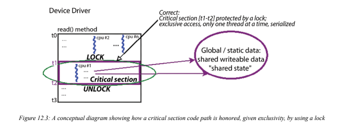

# 7.18

## Kernel Programming

### 内核并发

#### 临界区、独占执行和原子性

​	想象一下，你正在为多核系统编写软件（好吧，现在，你通常会在多核系统上工作，即使是在大多数嵌入式项目上）。正如我们在引言中提到的，并行运行多个代码路径不仅是安全的，而且是可取的（为什么要花这些钱呢，对吧？）。另一方面，在以任何方式访问共享可写数据（也称为sharedstate）的并发（并行和同时）代码路径中，您需要保证在任何给定时间点，一次只能有一个线程处理该数据！这是关键。为什么？想想看：如果你允许多个并发代码路径在共享的可写数据上并行工作，你就是在自找麻烦：数据损坏（“数据竞争”）可能会因此发生。在介绍了一些关键点之后，下一节将通过几个伪代码示例清楚地说明数据竞赛概念（如果你愿意，也可以看看图12.6）。什么是关键部分？以下几点非常重要；请仔细阅读。关键部分是必须满足以下两个条件的代码路径：

条件一：代码路径可能是并发的，也就是说，它有可能并行运行。

条件二：它处理（读取和/或写入）共享可写数据（也称为共享状态）。

​	因此，根据定义，关键部分需要防止并行性。换句话说，关键部分是一段必须以独占方式运行的代码，有时甚至是原子性的。通过排他性，我们暗示在任何给定的时间点，只有一个线程正在运行关键部分的代码；也就是说，它可以单独运行（序列化，而不是并行化）。这是数据安全原因所必需的。原子一词意味着不可分割的东西；在这种情况下，它意味着能够不间断地运行到完成。如果两个或多个线程可以同时执行一个关键部分的代码，这是一个bug或缺陷；这通常被称为竞争条件或数据竞争。识别和保护关键部分免受同时执行（数据竞争）的影响是正确软件的隐含要求，你——设计师/架构师/开发人员——必须确保这一点。学习如何保护关键部分（相对）容易；正确识别每个关键部分是你必须掌握的技能。

​	现在让我们重新审视原子性的关键概念：原子操作是不可分割的。在任何现代处理器上，两个操作通常被认为总是原子性的；也就是说，它们将不间断地运行到完成：执行单个机器语言指令。读取或写入处理器字长（通常为32或64位）内的对齐原始数据类型；因此，在64位系统上读取或写入32位或64位整数保证是原子性的。读取该变量的线程永远不会看到介于两者之间、撕裂或肮脏的结果；他们要么会看到旧的价值，要么会看到新的价值。另一方面，在64位项目上运行的32位处理器不能保证是原子性的，可能会导致读取（或写入）被撕裂或弄脏。

​	给智者一句话：在这里小心翼翼是值得的！研究表明，在现代硬件处理器上使用现代高度优化的编译器，即使是这个“真理”——在处理器的字长内加载/存储（意味着读取/写入）对齐的原始数据类型——也可能不成立！编译器现在可以采用加载/存储撕裂技术等；在这篇优秀的文章中阅读更多：谁害怕一个糟糕的大型优化编译器？LWN，2019年7月：https://lwn.net/Articles/793253/（更多信息请参阅本章的进一步阅读部分）。因此，如果你有一些处理共享（全局或静态）可写数据的代码行，在没有显式同步机制的情况下，它们不能保证以独占方式运行。

​	请注意，有时需要以原子方式和独占方式运行关键部分的代码，但并非总是如此；让我们进一步深入探讨这方面。**当关键部分的代码在安全睡眠状态下运行时，可能会阻塞进程上下文（例如通过用户应用程序对驱动程序进行的典型文件操作（打开、读取、写入、ioctl、mmap等），或者内核线程或工作队列的执行病理），关键部分不是真正原子的可能是可以接受的，但它确实需要是独占的。然而，当它的代码在非阻塞原子上下文中运行时（例如在ahardware中断中：hardirq、tasklet或softirq）**，它必须以原子方式和独占方式运行（我们将在Mutex或spinlock？when部分更详细地介绍这些点）。一个概念性的例子将有助于澄清事情。假设三个线程（来自用户空间应用程序）发出open（）和read（）系统调用，从而在多核系统上或多或少同时处理您的驱动程序（作为内核模块或在内核中实现）。（回想一下，Linux是一个单片内核；当处理器线程发出系统调用时，它会切换到内核模式，并在进程上下文中运行适当的内核/驱动程序代码路径。）在没有任何干预的情况下，它们很可能最终会并行运行关键部分的代码，从而并行处理共享的可写数据（数据竞争！），并且很可能会导致错误洗吧！现在，让我们来看一个概念图，看看关键部分代码路径中的非独占执行是如何错误的（我们甚至不会在这里讨论原子性）：


​	图12.1：一个概念图，显示了关键部分代码路径是如何被同时在其内运行多个线程所违反的

​	如上图所示，在您的设备驱动程序中，在其（比如）读取方法中，您让它运行一些代码来执行其工作（从硬件读取一些数据）。让我们更深入地看看这个图表，看看在不同时间点进行的数据访问：

从时间t0到t1：没有或只有局部变量数据被访问。这是并发安全的，不需要保护，可以并行运行（因为每个线程都有自己的私有堆栈）。

从时间t1到t2：访问全局/静态共享可写数据。这不是自动并发安全的；这是一个关键部分（如图12.1所示，它肯定满足了这两个条件）。因此，必须保护它免受并发访问。它必须独占运行（单独运行，一次只能运行一个线程，并且是序列化的），也许是原子性的。

从时间t2到t3：不访问或仅访问局部变量数据。这是并发安全的，不需要保护，可以并行运行（因为每个线程都有自己的私有堆栈）

​	。在本书中，根据到目前为止所涵盖的材料和您自己的知识，我们假设您现在已经意识到同步关键部分的必要性，该书详细介绍了这些要点（特别是第15章，使用Pthreads的多线程第二部分——同步）。因此，知道这一点后，我们现在可以重申关键部分的概念，同时也提到情况何时出现。关键部分是必须按如下方式运行的代码：（始终）独占：单独（序列化）（在原子上下文中时）原子：不可分割地完成，不中断在下一节中，我们将介绍一个经典场景——全局整数的增量。

#### 一个经典的例子——全局i++

​	想想这个经典的例子：一个全局整数i在并发代码路径中递增，其中多个执行线程可以同时执行。对计算机硬件和软件的天真理解会让你相信这种操作显然是原子性的。然而，现实是，现代硬件和软件（编译器和操作系统）比你想象的要复杂得多，因此导致了各种（对应用程序开发人员来说）不可见的性能驱动优化。我们不会在这里深入探讨太多细节，但现实是现代处理器非常复杂：在它们为提高性能而采用的许多技术中，有一些是超标量和超流水线执行，以便并行执行多个独立指令和各种指令的几个部分（分别），执行即时指令和/或内存重新排序，在复杂的CPU上分层缓存中缓存内存，加载/存储撕裂等！我们将在第13章“内核同步-第2部分”的“了解CPU缓存基础知识、缓存效应和错误共享”和“介绍内存屏障”部分深入探讨其中的一些细节。在“进一步阅读”部分可以找到几篇值得深入研究这些引人入胜的主题的论文（和书籍）。所有这些使得情况比乍一看要复杂得多。

```
static int i = 5;
[...]
foo()
{
	[...]
	i++;
}
```

​	那么，这个增量安全吗？简短的回答是不，你必须保护它。为什么？这是一个关键部分——我们正在一个可能并发的代码路径中访问（读/写）共享的可写数据！更长的答案是，它真的取决于：a.函数foo（）的代码是否保证独占运行。b.这里的增量操作是否真的是原子性的（不可分割的）；如果是，那么在并行性存在的情况下，i++不会构成危险；如果不是，它会！因此，假设围绕i++的代码路径的执行是非独占的——也就是说，其他线程可以并行执行此代码路径foo（）——为了使其正常工作，我们要求i++操作是真原子的。作为一个简单的高级语言操作，乍一看它可能“看起来”是原子性的，但真的吗？我们怎么知道是不是这样？有两件事决定了这一点：处理器的指令集架构（ISA），它决定了（在与处理器低级相关的几件事中）此操作运行时在运行时执行的机器指令编译器，它当然会将高级语言源转换为汇编（然后汇编生成最终在处理器上执行的机器代码）如果ISA具有使用单个机器指令执行整数增量的能力，并且编译器有智能和机会使用它，那么它就是真正的原子性的——它是安全的，不需要显式保护，通常是锁定。否则，它不安全，需要上锁！那么，在您的计算机上，使用当前的编译器，如何知道？

​	试试这个：将浏览器导航到这个很棒的编译器资源管理器网站：https://godbolt.org/.SelectC作为编程语言，然后在左侧窗格中声明全局i整数并在函数内递增它。在右侧窗格中使用适当的编译器和编译器选项进行编译。您将看到为C高级i++生成的实际机器代码；声明。如果它确实是一条单机器指令，那么它将是安全和原子的；如果没有，则需要锁定。通常，在基于CISC的机器上，如x86[_64]，2级及以上的编译器优化级别确实会使代码原子化，但RISC机器（如基于ARM的机器）的情况并不总是如此。总的来说，你会发现你无法真正分辨；实际上，你不能想当然地认为i++操作是不安全的，也就是说，默认情况下是非原子的，并对其进行保护！这可以在下面的屏幕截图中看到：


图12.2：即使使用最新的稳定gcc版本但没有优化，x86_64 gcc也会为i++生成多个机器指令。前面的屏幕截图清楚地显示了这一点：左侧和右侧窗格中的浅黄色背景区域是我们著名的i++的C源代码；语句和编译器分别生成的相应程序集（基于x86_64 ISA和特定编译器的优化级别）。（仅供参考，在图12.2中，我通过从右侧窗格的设置齿轮中取消选择Intel asm语法，将汇编语法从Intel更改为更通用的AT&T）。通常，如果不进行优化，i++会变成三条机器指令。这正是我们所期望的：它对应于i（内存到寄存器）、内存和存储（寄存器到内存）的获取或加载！现在（至少在这种情况下，没有优化）这不是原子性的；因此，在一条机器指令执行后，控制单元完全有可能干扰并将指令流切换到不同的点。这甚至可能导致另一个进程或线程被上下文切换（除非您对其使用了锁定）！好消息是，在编译器选项中使用快速-O2。。。窗口，i++变成了一个机器指令&真正的原子！（但并不总是如此。）然而，我们无法提前预测这些事情；有一天，你的代码可能会在相当低端的ARM（RISC）系统上执行，这增加了i++需要多机指令的可能性。你现在可能想知道——要解决这个问题，对i++使用amutex（甚至是自旋锁）锁似乎不是最佳选择；你说得对。我们将在第13章“内核同步——第2部分”的“使用atomic_t和refcount_t接口”一节中介绍一种专门用于整数运算的优化锁定技术。

​	现代语言提供原生原子运算符；对于C/C++来说，它是相当新的（从2011年开始）；ISO C++11和ISO C11标准提供现成的和内置的原子变量。只需在谷歌上搜索一下，它们就会很快显示给你。现代glibc也利用了它们。例如，如果您在用户空间中处理过信号，您将知道使用volatile sigatomict数据类型，用于在信号处理程序中安全地原子访问和/或更新整数。在内核中呢？在下一章中，您将了解Linux内核对此关键问题的解决方案。请尽早意识到：Linux内核当然是一个并发环境；多个执行线程在多个CPU核上并行运行。不仅如此，即使在单处理器（UP/单CPU）系统上，硬件中断、陷阱、故障、异常和软件信号的存在也会导致数据完整性问题（数据竞争）。不用说，在代码路径中的关键部分防止并发性说起来容易做起来难；使用锁定等技术以及其他同步原语和技术来识别和保护关键部分是绝对必要的，这就是为什么这是本章和下一章的核心主题。

#### 概念——锁

​	我们需要同步，因为在没有任何干预的情况下，线程可以并发执行正在处理共享可写数据（共享状态）的关键部分。为了克服这些关键部分的并发性，我们需要摆脱并行性；我们需要对关键部分的代码流进行序列化。为了强制代码路径序列化，一种常见的技术是使用锁。本质上，锁的工作原理是保证在任何给定的时间点，只有一个执行线程可以“获取”或拥有锁；一旦接受，只有这条线才能向前发展——我们称之为“赢家”。这些概念很快就会扩展。因此，使用锁来保护代码中的关键部分将为您提供我们想要的东西——以独占方式运行关键部分的代码（也可能以原子方式运行；更多内容将在后面介绍）。请查看此图（图12.3）：



图12.3：一个概念图，显示了在给定独占性的情况下，如何通过使用锁来尊重关键部分代码路径图12.3显示了一种解决上述情况的方法（图12.1）：使用锁来保护关键部分！从概念上讲，锁（和解锁）是如何工作的？锁的基本前提是，每当有争用时——也就是说，当多个竞争线程（比如n个线程）试图获取锁（通过概念性的lock操作）时——只有一个线程会成功。此线程被视为锁的“赢家”、“所有者”。它将锁API视为一个非阻塞调用，因此继续愉快地运行——而且是独占的！——在执行关键部分的代码时（关键部分实际上是锁定和解锁操作之间的代码！）。n-1个“失败者”线程会发生什么？他们（也许）将锁定API看作一个阻塞调用；实际上，他们在等待。等什么？当然，解锁操作（必须）由车主执行当关键部分的工作完成时，锁定（“获胜者”线程）！一旦解锁，剩余的n-1线程现在竞争下一个“获胜者”插槽；当然，他们中只有一个人会赢并继续前进。在此期间，n-2失败者现在将等待（新的）获胜者解锁。重复此过程，直到所有n个线程（最终和顺序）都获得锁。现在，锁定当然有效，但是——这应该是相当直观的——它会导致（相当陡峭的！）开销，因为它会破坏并行性并序列化执行流！为了帮助你想象这种情况，想象一个漏斗，窄杆是关键部分，一次只能安装一根螺纹。所有其他线程都被阻塞，等待解锁；锁定会造成瓶颈。下图旨在显示这种类比：


图12.4：锁会产生瓶颈，类似于物理漏斗。

​	另一个经常提到的锁定物理类比是一条高速公路，它有几条车道合并成一条非常繁忙且交通堵塞的车道，也许是一个设计不佳的收费站。同样，并行性——汽车（线程）与不同车道（CPU）上的其他汽车并行行驶——已经丧失，需要串行化行为；汽车被迫一辆接一辆排队。因此，作为软件架构师，我们必须尝试用最小的锁定来设计我们的产品/项目。虽然在大多数实际项目中完全消除全局变量实际上是不可能的，但需要优化和最小化它们的使用。稍后，我们将对此进行更多介绍，包括一些非常有趣的无锁编程技术。另一个真正关键的点是：新手程序员可能会天真地认为，对共享的可写数据对象执行读取是完全安全的，因此不需要明确的保护；（处理器总线大小范围内的对齐原始数据类型除外）这是不正确的。这种情况可能会导致所谓的脏读或撕裂读，即即使在另一个写入线程同时写入时，也可能正在读取过时和/或不一致的数据。寓意很明确：你需要保护对共享可写数据的所有访问，即读写，实际上，在所有关键部分，可能是并发代码路径。正如我们刚刚学到的，由于我们正在讨论原子性的话题，在典型的现代微处理器上，唯一能保证原子性的是一条机器语言指令，或者（正如我们学到的，可能）在处理器总线宽度内对分析原始数据类型的读/写。那么，我们如何标记几行C代码，使其真正具有原子性呢？在用户空间中，这甚至是不可能的（我们可以接近，但不能保证原子性）。你如何在用户空间应用程序中“接近”原子性？您始终可以构造一个用户线程来使用SCHED_FIFO任务调度策略和99的实时（RT）优先级。这样，当它想要运行时，除了硬件中断/异常之外，几乎没有什么可以抢占它。（旧的音频子系统实现严重依赖于这种语义。）在内核空间中，我们可以编写真正原子的代码。如何，确切地说？简短的回答是，我们使用自旋锁来做到这一点！我们稍后将更详细地了解自旋锁。

#### 关键部分——关键点总结

​	让我们总结一些关于关键部分的关键点。仔细阅读这些内容非常重要，把它们放在手边，并确保在实践中使用它们：关键部分是一个可能并发的代码路径，一个可以并行执行的路径，它处理（读取和/或写入）共享的可写数据（也称为共享状态）。因为它适用于共享的可写数据，所以关键部分：需要防止并行性和并发性（也就是说，它必须单独运行/序列化/以互斥的方式运行）。当在原子非阻塞上下文（包括任何类型的中断上下文）中运行时，您必须保证它以原子方式运行：不可分割地完成，不中断。一旦受到保护，您就可以安全地访问共享状态，直到您“解锁”。代码库中的每个关键部分都必须被识别和保护：识别关键部分至关重要！仔细检查你的代码，确保你不会错过它们。（任何全局或静态变量都是一个典型的危险信号；但不仅如此，可能并发代码路径中的任何类型的共享状态——硬件寄存器、邮箱等——都可能是一个关键部分。）保护它们可以通过各种技术来实现；一种非常常见的技术是锁定（我们稍后将详细介绍）。还有原子运算符s和无锁编程技术，我们将在下一章中介绍。

一个常见的错误是只保护写入共享可写数据的关键部分；您还必须保护读取共享可写数据的关键部分。否则，你可能会面临被撕毁或弄脏的风险！为了明确这一关键点，请将一个无符号的64位数据项在32位系统上读写可视化；在这种情况下，操作不能是原子操作（每次读/写都需要两个加载/存储操作）。因此，如果一个线程在读取数据项的值时，另一个线程同时对其进行写入，该怎么办！？写入线程会对访问采取某种“锁”，但因为你认为读取是安全的，所以读线程不会采取这种锁；由于意外的时间巧合，您最终可能会执行部分/撕裂/脏读。在接下来的部分和下一章中，我们将学习如何通过使用各种锁定技术来克服这些问题。

另一个致命的错误是没有使用相同的（正确的）锁来保护给定的数据项。例如，如果你使用锁A来保护全局数据结构X，那么无论何时访问锁A，你都必须始终使用它；使用锁B没有帮助。这可能比一开始看起来更困难，因为大型项目（如Linux内核）可能有数以万计的锁！未能保护关键部分会导致数据竞争，在这种情况下，结果——读取/写入共享数据的实际价值——是“不稳定的”，这意味着它会根据运行时的情况和时间而变化。这是一个缺陷，一个bug（一个一旦进入“现场”就很难看到、重现、确定其根本原因并修复的bug。我们将在下一章内核中的锁定调试部分介绍

一些非常强大的东西来帮助你解决这个问题；一定要阅读它！）。例外情况：在以下情况下，您是安全的（隐式的，没有显式的保护）：当您处理局部变量时。它们被分配在线程的私有堆栈上（或者，在中断上下文中，在本地IRQ堆栈上），因此根据定义是安全的。当您在无法在其他上下文中运行的代码中处理共享可写数据时；也就是说，它天生就是序列化的。在我们的上下文中，内核模块的init和cleanup方法是合格的（它们仅在insmod（或modprobe）和rmmod上串行运行一次）。当你处理真正恒定且只读的共享数据时（不过，不要让C的const关键字欺骗你！）。锁定本身就很复杂；您必须仔细思考、设计和实现锁定模式，同时避免死锁。我们将在锁定-常见错误和指南部分更详细地介绍这一点。

#### 数据竞争——一个更正式的定义

​	内存（一致性）模型提供了一种在存在多个并发加载/存储操作的情况下对内存一致性重要概念的更正式的方法；它对系统内存行为进行“建模”，预测通过加载可能产生的值（从m读取当代码在该系统上执行时，执行内存操作。Linux内核就是这样一个模型；它被称为Linux内核内存模型（LKMM）。这里并不需要深入研究它的细节，但确实可以阅读一些有趣的内容；在此处查看官方内核文档中的explanation.txt文档：https://elixir.bootlin.com/linux/v6.1.25/source/tools/memory-model/Documentation/explanation.txt。


图12.5：“什么是数据竞赛？”幻灯片。来源：Marco Elver

​	如您所见，图12.5右侧是两个线程并发运行（在不同的CPUcore上）的示例，它们在同一个内存对象（同一位置，共享可写数据）上工作。左侧的红十字表示数据竞争，绿色的勾号表示数据竞争正常（中间的第3行和第5行是“可能”；当被解释为“严格”时，它们会竞争）。这可能会让你想：“为什么不总是使用标记访问，从不进行数据竞争？”请不要这样做。标记的访问意味着由内核代码在内部使用和/或当你知道存在潜在的数据竞争但不太关心它时使用（一个典型的例子是网络驱动程序统计代码，它在没有显式锁定原语的情况下递增计数器；这里的数据竞争被认为不太重要）。不过，这里的关键点，尤其是对于模块/驱动程序作者来说，是这样的：使用标记的访问实际上可以防止像KCSAN这样的工具捕获数据竞争。在大多数情况下继续使用纯C访问非常重要。此外，请注意——尽管标记的访问保证了原子加载和存储，但它们并不能保证内存排序；这必须通过记忆屏障来实现（下一章将对此进行一些说明）。现在，我们将转向另一个关键领域——在使用Linux操作系统时识别并发性和关键部分。Linux内核中的并发问题识别内核代码中的关键部分至关重要；如果你甚至看不见它，你怎么能保护它呢？以下是一些指导方针，可以帮助您作为一名初露头角的内核/驱动程序开发人员认识到可能出现的并发问题，从而认识到关键部分：对称多处理器（SMP）系统（CONFIG_SMP=y）的存在可抢占内核（CONFIG_PREEMPTION=y）阻止I/O硬件中断（在SMP和/或UP系统上）这些都是需要理解的关键点，我们将在本节中逐一讨论。多核SMP系统和数据道第一点非常明显；请看图12.6所示的伪代码：


图12.6：伪代码——（虚构的）驾驶员阅读方法中的关键部分（时间t2到t3）；由于没有锁定，它可能存在漏洞。这与我们在图12.1和图12.3中显示的情况类似。如图所示，从时间t2到时间t3，函数可以并行运行，并且它正在处理一些全局共享的可写数据，因此这是一个关键部分。现在，想象一个有四个CPU核的系统（SMP/多核系统）；两个用户空间进程P1（在CPU 0上运行）和P2（在CPU 2上运行）可以同时打开设备文件并同时发出read（）系统调用。现在，这两个进程将同时执行驱动程序的读取“方法”，从而同时处理共享的可写数据！众所周知，t2和t3之间的代码是关键部分，由于我们违反了基本的排他性规则——关键部分在任何时候都只能由一个线程执行——我们很可能最终会损坏数据、应用程序，甚至更糟。换句话说，这种方法可能会导致数据竞赛；根据微妙的时间巧合，我们可能会也可能不会产生错误（bug）。正是这种不确定性——微妙的时间巧合——使得发现和修复这样的错误变得极其困难（它可以逃避你的测试工作）。不幸的是，这句格言太正确了：测试可以检测到错误的存在，而不是它们的缺失。此外，如果你的测试未能捕捉到数据竞争（和错误），让它们在现场自由发挥，你的处境会更糟。您可能会说，由于您的产品是在一个CPU核（UP）上运行的小型嵌入式系统，因此关于控制并发性（通常是通过锁定）的讨论不适用于您。我们不同意：几乎所有的现代产品，如果还没有的话，都将转向多核（也许在下一代阶段）。更重要的是，正如我们即将探讨的那样，即使是UP系统也存在并发问题。

#### 可抢占内核、阻塞I/O和数据通道

​	想象一下，你正在一个配置为可抢占的Linux内核上运行内核模块或驱动程序（即CONFIG_PREEMPT已打开；我们在第10章“CPU调度器-第1部分”中介绍了这个主题）。再次参考图12.6，考虑一个进程P1正在进程上下文中运行驱动程序的读取全局数组。现在，当它处于关键部分（在时间t2和t3之间）时，如果内核抢占进程P1并将上下文切换到另一个进程P2，该进程正在等待执行此代码路径，该怎么办？很危险；这可能会导致数据竞争。这甚至可能发生在单CPU（UP）系统上！（请注意，尽管我们在这里使用了“进程”一词，但它可以与“线程”互换。）另一种情况有些相似（也可能发生在单核（UP）或多核系统上）：进程P1正在运行驱动程序方法的关键部分（在时间t2和t3之间；再次见图12.6）。这一次，如果在关键区域内，它遇到阻塞呼叫怎么办？阻塞调用是一种函数，它使调用进程上下文进入睡眠状态，等待事件发生；当该事件发生时，内核（或底层驱动程序）将“唤醒”任务，并从中断的位置继续执行。这也称为I/O阻塞，非常常见；许多API（包括几个用户空间库和系统调用，以及几个内核API）本质上都是阻塞的）。在这种情况下，进程P1有效地关闭了CPU并进入睡眠状态，这意味着schedule（）的代码运行并将其排队到等待队列中。在此期间，在P1切换回之前，如果另一个进程P2被安排运行怎么办？如果该进程也在运行此特定的代码路径怎么办？想想看——首先，P2现在处理的数据可能处于中间状态，没有完全更新。此外，当P1回来时，共享数据可能已经“在它下面”发生了变化，导致各种错误；再一次，一场数据竞赛，一个bug！

#### 硬件中断和数据跟踪

​	最后，设想一下这种情况：进程P1正在无意中运行驱动程序的读取方法代码；因此，它进入临界区（在时间t2和t3之间；再次见图12.6）。它取得了一些进展，但不幸的是，在同一个CPU核上触发了一个中断！（您可以在Linux内核编程–第2部分配套卷中详细了解硬件中断及其处理）。在Linux操作系统上，硬件中断具有最高优先级；默认情况下，它们抢占所有代码（包括内核代码）。因此，进程（或线程）P1将击败暂时搁置最少的进程，失去处理器，因为中断处理代码路径肯定会抢占并运行它。好吧，你可能会想，那又怎样？事实上，这完全是司空见惯的事情！在现代系统中，硬件中断非常频繁地触发，有效地（字面上）中断了各种任务上下文（在shell上快速执行vmstat 3；中标记的系统下的列显示了过去1秒内系统上触发的硬件中断次数！）。这里，要问的关键问题是：中断处理代码（hardirq、ISR或“上半部分”，或所谓的tasklet或softirq“下半部分”），sh与刚刚中断的流程上下文共享和处理相同的可写数据？如果这是真的，那么休斯顿，我们有一个问题——数据竞赛！如果没有，那么您的中断代码就不是中断代码路径的关键部分，这很好。事实上，大多数设备驱动程序都会处理中断；因此，驱动程序作者（您的！）有责任确保进程上下文和中断上下文代码路径之间没有共享全局或静态数据（实际上是非关键部分）。如果是（有时确实会发生），您必须以某种方式保护这些数据免受数据竞争和可能的损坏（这通常是通过使用自旋锁来实现的；不用担心，我们会解决的）。

这些场景可能会让你觉得，防止这些并发问题是一项艰巨的任务；面对现有的关键部分，以及刚才讨论的各种可能的货币问题：多核（或SMP）、内核抢占、阻塞I/O和硬件中断，你到底如何实现数据安全？好消息是，这真的很容易；保护关键部分的实际（锁定）API并不难学习使用。我们再次强调，识别并保护关键部分是关键。闲话少说，现在让我们开始深入了解主要的同步技术，该技术将用于保护我们的关键部分——锁定。

#### 锁定准则和死锁

​	锁定，就其本质而言，是一种复杂的野兽；它往往会引发复杂的连锁场景。对它的理解不够深入可能会导致性能问题和错误——死锁、循环依赖、中断不安全锁定等等。以下锁定指南是确保使用锁定时正确编写代码的关键：锁定粒度锁定和解锁之间的“距离”——实际上是关键部分的长度——不应太粗（关键部分太长）；它应该“足够好”。以下几点对此进行了扩展。你在这里需要小心。当你在处理大型项目时，锁太少是一个问题，锁太多也是一个问题！锁太少会导致性能问题（因为相同的锁被重复使用，因此往往会引起高度竞争）。拥有大量锁实际上对性能有好处，但对复杂性控制不利。这也让你，开发人员，了解另一个关键点：在代码库中有很多锁的情况下，你应该非常清楚哪个锁保护哪个共享数据对象。如果你使用锁a来保护mystructX，这是完全没有意义的，但在远处的代码路径中（可能是中断处理程序），你忘记了这一点，在处理同一结构时使用其他锁锁锁锁B来保护！现在，这些事情听起来可能很明显，但是（正如经验丰富的开发人员所知），在足够的压力和复杂性下，即使是显而易见的事情也并不总是如此！试着平衡一下。在大型项目中，使用一个锁来保护一个全局（共享）数据结构是典型的。现在，很好地命名锁变量本身就可能成为一个大问题！这就是为什么我们经常将保护数据结构的锁作为成员放入其中。原子性的长关键部分会导致高延迟并成为性能瓶颈，特别是在时间关键的实时系统中。有几个工具（处于各种稳定状态）可以帮助您了解这些部分发生在哪里（以及持续多久）。eBPF稳定版中的一个工具名为criticalstat[-bpfcc]。它可以检测和报告长关键部分（它还可以帮助显示内核堆栈痕迹，从而显示其来源）在长时间内禁用抢占和/或IRQ的情况下，持续时间较长。criticalstat实用程序的手册页可以在这里找到：https://manpages.ubuntu.com/manpages/focal/man8/criticalstat-bpfcc.8.html;这是它的“示例”页面：https://github.com/iovisor/bcc/blob/master/tools/criticalstat_example.txt.（Ftrace也有跟踪器，可以捕捉长时间的抢占/IRQ关闭时间。）

只有锁的“所有者”，即当前的持有者，才能释放（解锁）它；试图释放你没有放弃的锁或在持有时重新获取它被认为是错误（后者可以通过使用递归锁定来绕过；不过请参阅下一点）。尽可能避免递归锁定；内核社区普遍对此表示反对。

锁的排序至关重要，可以大大缓解死锁。您必须确保锁始终以相同的顺序取用；所有参与该项目的开发人员都应该记录并遵循这些“锁排序规则”（注释锁也很有用；下一章关于lockdep的部分将对此进行更多介绍）。不正确的锁顺序通常会导致死锁。另一方面，释放锁的顺序并不重要（当然，你必须在某个时候释放所有持有的锁，以免造成饥饿）。注意防止饥饿；验证锁一旦被取下，是否确实“足够快”地释放。简单是关键：尽量避免复杂性或过度设计，特别是在涉及锁的复杂场景中。关于锁定的话题，出现了死锁的（危险的）问题。僵局是指无法取得任何进展；换句话说，应用程序进程/线程和/或内核组件似乎无限期挂起。

虽然我们不打算在这里深入探讨死锁的血腥细节，但我会很快提到一些可能发生的更常见的死锁场景：简单情况、单锁、进程上下文：尝试两次获取同一锁被认为是一种缺陷，会导致自死锁。想想看；在持有锁的同时，您尝试重新获取它。现在，由于锁已锁定，您必须等待它解锁。但你拿着锁等待（只有你能解锁），因此无法解锁；结果就是（自我）死锁！递归锁定可以解决这个问题，但它通常被禁用，使用它是不可取的。简单的情况，多个（两个或多个）锁，进程上下文——让我们用一个例子来研究一下：在CPU 0上，线程A获取锁A，然后想要获取锁B。同时，在CPU 1上，线程B获取锁B，然后想要获得锁A。因此，每个线程都会永远等待另一个。。。其结果是一个典型的循环死锁案例，通常称为AB-BA死锁。这一点的说明如下（时间线垂直向下）：CPU 0:线程A CPU


这可以无限期延长；例如AB-BC-CA循环依赖（A-B-C锁链）导致死锁。复杂情况、单锁、进程和中断上下文——让我们通过一个例子再次研究这个问题（这个例子实际上是针对自旋锁的；我们很快就会了解细节）：进程P1，运行驱动程序（模块）的读取方法，在CPU核上获取锁A0

​	一毫秒后，驱动程序的硬件中断发生在同一个内核上，因此驱动程序的中断处理程序立即抢占P1。现在，如果中断上下文试图获取这个相同的锁，锁A，该怎么办？由于锁A当前被锁定（由进程上下文P1），中断上下文被迫等待解锁；但是P1正在持有锁并等待取回CPU，只要中断正在运行，就不会发生这种情况。。。因此，它无法执行解锁，中断上下文也会永远等待……结果又是（自）死锁！当然，这种情况的规定解决方案是在获取锁时禁用（屏蔽）本地核心上的所有硬件中断；则流程上下文不能被中断，它将运行关键部分以完成。换句话说，它现在是真正的原子。当它执行解锁时，此操作将重新启用本地核心上的所有中断，一切正常！因此，在中断（或更一般地说，原子）上下文中获取的锁必须始终在禁用中断的情况下使用。（我们到底是如何做到这一点的？对于自旋锁，我们当然会在介绍自旋锁时更详细地研究这些方面。）更复杂的情况、多个锁以及进程和中断（hardirq和softirq）上下文。（我们在这里不再进一步讨论；您将在即将到来的锁定和中断部分找到详细信息。）在更简单的情况下，始终遵循锁顺序指南就足够了：始终以有良好记录的顺序获取锁（我们将在使用互斥锁部分的内核代码中提供一个例子）。然而，正如您可能开始意识到的那样，事情可能会变得非常复杂，复杂的死锁场景甚至会让有经验的开发人员陷入困境。幸运的是，lockdep（Linux内核的运行时锁依赖验证工具）可以捕获（几乎）每一个死锁情况！（别担心，我们会到达那里的，我们将在下一章中介绍lockdepin的细节；只需一步一步地进行）。当我们介绍自旋锁时（在使用自旋锁部分），我们会遇到前面提到的进程和/或中断上下文场景；其中明确了要使用的具体自旋锁API（以避免死锁等）。现实情况是，即使是活锁情况也可能和死锁一样致命！Livelock本质上是一种概念上类似于死锁的情况；只是参与任务的状态正在运行，而不是等待。例如，中断“风暴”（数百甚至数千个硬件中断及其相关的软中断以突发形式发生，需要非常快速地处理，给系统带来压力）可能会导致活锁；现代网络驱动程序通过关闭中断（在中断负载下）并采用名为NewAPI（NAPI）的轮询技术，在适当的时候重新打开中断来减轻这种影响。（好吧，这比这更复杂，但我们就说到这里吧。）对于那些没有生活在农村的人来说ock，你会知道Linux内核有两种主要类型的锁：互斥锁和自旋锁。实际上，还有其他几种类型，包括其他同步（和“无锁”编程）技术，所有这些都将在本章和下一章中介绍。内核文档提到了内核中实现的三种锁类别：睡眠锁、CPU本地锁和旋转锁。休眠锁包括（RT）互斥锁、信号量和变体。旋转锁包括旋转锁、读写器旋转锁和变体。“本地锁”通常用于RT使用，尽管非RT使用包括将其用于锁调试。

​	现在，让我们深入探讨互斥锁和自旋锁的真正含义

#### 在什么情况下应该使用哪种锁,互斥还是自旋锁？

​	当学习使用互斥锁和旋转锁的确切语义非常简单（内核API集合中的适当抽象使典型的驱动程序开发人员或模块作者更容易）。这种情况下的关键问题是一个概念问题：这两种锁类型之间的真正区别是什么？更重要的是，在什么情况下应该使用哪把锁？您将在本节中了解这些问题的答案。以我们之前的驱动程序读取方法的伪代码（图12.6）为例，假设三个线程——tA、tB和tC——通过此代码并行运行（在SMP系统上）。我们将通过在关键部分开始之前（时间t2）获取锁，并在关键部分代码路径结束后（时间t3）释放锁（解锁），来解决这种并发问题，同时避免任何数据竞争。让我们通过图表再次查看伪代码（图12.7），这次是锁定以确保其正确：


图12.7：伪代码：（虚构的）驱动程序读取方法中的关键部分；在这里，它正确地完成了锁定当三个线程试图同时获取锁时，锁API语义保证它们中的任何一个都会获得锁。假设tB（线程B）获得锁：它现在是“赢家”或“所有者”线程。这意味着线程tA和tC是“失败者”；他们做什么？他们等待解锁！当“胜利者”（tB）完成关键部分并解锁锁时，之前的失败者之间的战斗就会重新开始；其中一人将成为下一个赢家，这个过程会重复。（请务必理解，图12.7中的“API”只是伪代码，而不是实际的（非）锁API；我们将在本节后面的两个主要部分中介绍这些内容。）两种锁类型（互斥锁和自旋锁）之间的关键区别在于失败者如何等待解锁事件。使用互斥锁，失败线程将进入睡眠状态；也就是说，他们通过睡觉来等待

​	效果是，当他们试图锁定互斥体并且互斥体已经锁定时，他们会将其视为阻塞调用；它们被调度或上下文关闭了CPU——它们现在处于“睡眠”状态）。获胜者执行解锁的那一刻，内核会唤醒失败者线程（所有线程），它们会运行，再次争夺锁。（事实上，互斥体和信号量有时被称为睡眠锁。）然而，有了自旋锁，就没有睡眠的问题了；失败者线程通过在锁上“旋转”来等待，直到它被解锁。从概念上讲，这看起来如下：

while（locked）；

​	请注意，这只是概念性的。想想看——这实际上是民意调查。然而，作为一名优秀的程序员，你会明白轮询通常被认为是一个坏主意。那么，为什么自旋锁会这样工作呢？好吧，事实并非如此；它仅以这种方式呈现用于概念目的。正如您很快就会理解的那样，自旋锁只有在多核（SMP）系统上才真正有意义。在这样的系统中，当winnerthread离开并运行关键部分代码时，失败者会通过在其他CPU内核上旋转来等待！实际上，在实现层面上，用于实现现代自旋锁的代码是高度优化的（并且是特定于arch的），并且不会通过一段时间的琐碎“旋转”（锁定）来工作；语义类型（例如，ARM的许多自旋锁实现使用等待事件（WFE）机器语言指令，该指令使CPU在低功耗状态下最佳地等待。请参阅进一步阅读部分，了解内核中互斥体和自旋锁的内部实现的几个资源）。确定使用哪个锁——在理论上，自旋锁是如何实现的，在这里我们真的不关心；自旋锁的开销比互斥锁低。这是怎么回事？这很简单，真的：为了使互斥锁工作，失败者线程必须进入睡眠状态（然后在解锁时被唤醒）。为此，在内部调用schedule（）函数，这意味着失败者将互斥锁API视为阻塞调用！对调度程序的调用最终将导致线程从CPU上上下文关闭。相反，当所有者线程最终解锁锁时，必须唤醒失败者线程；同样，其中一个，即下一个“赢家”，将被上下文切换回处理器。因此，互斥锁/解锁操作的最小“成本”是在给定机器上执行两次上下文切换所需的时间。（见下一节中指定为[1]的信息框。）通过重新查看图12.7，我们可以确定在关键部分（“锁定”代码路径）花费的时间；也就是说，t_locked=t3-t2。假设t_ctxsw表示上下文切换的时间。正如我们所了解到的，mutexlock/unlock操作的最小成本是两个上下文开关（第一个是“进入睡眠”，第二个是“唤醒”）：`t_locked<2*t_ctxsw`。现在，假设以下表达式为真：`t_locked<2*t_ctxsw`的话，如果在关键部分花费的时间少于两次上下文切换所花费的时间怎么办？在这种情况下，使用互斥锁是错误的，因为这会带来太多的开销；执行元工作所花费的时间比实际工作要多，这种现象被称为“鞭打”。正是这个精确的用例——存在非常短的关键部分——在Linux等现代操作系统上经常出现这种情况，这让我们优先使用自旋锁而不是互斥锁。因此，总之，当你有短的、非阻塞的关键部分时，选择自旋锁，当关键部分较长并且（可能）阻塞时，选择互斥体。为什么强调“封锁”？以下部分——实际内容——清楚地说明了这一点

#### 互斥锁——剩下的几个要点

​	在本节中，我们将介绍一些关于互斥锁的额外要点。互斥锁API变体首先，让我们来看看互斥锁API的几个变体；除了可中断变体（在Mutex锁-通过[un]可中断睡眠？一节中描述）外，我们还有trylock、killable和io变体。互斥trylock变量如果你想实现忙等待语义怎么办；也就是说，测试（互斥）锁的可用性，如果可用（意味着它当前已解锁），则获取它并继续关键部分代码路径。但是，如果它不可用（意味着它当前处于锁定状态），不要等待锁定；相反，执行一些其他工作并重试。实际上，这是一个非阻塞互斥锁变体，因此被称为trylock；以下流程图大致描述了它的工作原理：


图12.9：“忙碌等待”语义，互斥锁的非阻塞trylock变体图12.9中的虚线框表示内部实现——检查锁是否解锁，然后锁定它——是原子性的。这个互斥锁的trylock变体的API如下：

```
int__sched-mutex_trylock(structmutex*lock);
```

​	这个API的返回值表示运行时发生的情况：返回值1表示锁已成功获取。返回值0表示锁当前已争用（锁定）。尽管这可能很诱人，但不要试图使用mutex_trylock（）API来判断amutex锁是处于锁定状态还是未锁定状态；这本质上是“活泼的”。接下来，请注意，在竞争激烈的锁路径中使用trylock变体可能会大大降低您获得锁的机会。trylock变体传统上用于死锁预防代码，这些代码可能需要退出某个锁顺序序列，并通过另一个序列（顺序）重试。此外，关于trylock变体，尽管文献中使用了try and acquire mutexotical的措辞，但它在原子或中断上下文中不起作用——它只在进程上下文中起作用（与任何类型的互斥锁一样）。像往常一样，锁必须通过所有者上下文调用mutex_unlock（）来释放。

#### 信号量和mutex 

Linux内核确实提供了一个信号量对象，以及您可以对（二进制）信号量执行的常见操作：通过down[_interuptible]（）（和变体）API获取信号量锁通过up（）API解锁信号量通常，信号量是一个较旧的实现，因此建议您使用互斥锁代替它。不过，一个值得探讨的常见问题是：互斥锁和信号量之间有什么区别？它们在概念上看似相似，但实际上却截然不同；一个答案可以总结为以下几点（当然，这些主要是Linux内核编写的）：信号量是互斥体的一种更通用的形式；互斥锁可以只获取一次（随后释放或解锁），而信号量可以多次获取（随后释放）。互斥体用于保护关键部分免受同时访问，而信号量应作为一种机制，向另一个等待的任务发出信号，表明已经达到某个里程碑（通常，生产者任务通过信号量对象发布信号，消费者任务正等待接收该信号，以便继续进行进一步的工作）。互斥体具有锁的所有权概念，只有所有者上下文可以执行解锁；二进制信号量没有所有权。优先级反转和RT-mutexA使用任何类型的锁定时需要注意的一点是，您应该仔细设计和编写代码，以防止可能出现的死锁情况（同样，有关捕获此情况的更多信息，请参阅锁验证器lockdep-捕获锁定问题早期部分的下一章）。除了死锁之外，使用互斥体时还会出现另一种风险情况：优先级反转（同样，我们不会在本书中深入探讨细节）。只需说，无限优先级反转的情况可能是致命的；最终结果是产品的高（est）优先级线程在CPU之外停留的时间过长。正如我在之前的书《Linux的动手系统编程》中详细介绍的那样，正是这个优先级反转问题在1997年7月袭击了美国宇航局的火星探路者机器人，该机器人位于火星表面！每当项目的高优先级线程在互斥体上等待太久，超过截止日期时，使用硬件监视器就会重新启动系统；这个麻烦的是，这种情况经常发生！由于启用了调试遥测（耶！），从地球上诊断并修复了潜在问题（通过使用优先级继承（PI）互斥体属性来防止持有互斥体的低优先级线程在释放互斥体之前被抢占）。然后将固件上传到火星上的机器人（！），一切正常！有关这方面的有趣资源，请参阅本章的进一步阅读部分，这是每个软件开发人员都应该知道的！用户空间Pthreads互斥实现当然具有可用的优先级继承（PI）语义。但是在Linux内核中呢？为此，Ingo Molnar提供了基于PI的RT-mutex（一种real-timemutex；实际上，一种扩展为具有PI功能的互斥对象。仅供参考，futex（2）API是一种复杂的系统调用，提供快速的用户空间互斥对象）。当CONFIG_RT_MUTEXES配置选项启用时，它变得可用。与“常规”互斥语义非常相似，提供了RT互斥API来初始化、（取消）锁定和销毁RT互斥对象。（此代码已从Ingo Molnar的-rt树合并到主线内核中。）就实际使用而言，rt互斥体用于在内部实现PI futex（你知道在Linux上，futex（2）系统调用本身在内部实现了用户空间Pthreads互斥体吗？）。除此之外，内核锁定自检代码和I2C子系统直接使用RT互斥体。因此，对于典型的模块（或驱动程序）作者来说，这些API不会经常使用。内核提供了一些关于RT互斥体内部设计的文档athttps://docs.kernel.org/locking/rt-mutex-design.html（包括优先级反转、优先级继承等）。内部设计关于内核结构深处互斥锁内部实现的现实：Linux试图尽可能实现快速路径方法。快速路径是最优化的高性能代码路径，通常是没有锁和无锁的路径。目的是让代码尽可能地遵循这条快速路径。只有当它真的不可能时，内核才会退回到（可能的）“中间路径”，然后是“慢路径”方法；它仍然有效，但很慢（呃）。这种快速路径是在没有锁争用的情况下采取的（即锁从一开始就处于解锁状态）。所以，锁很快就锁上了。然而，如果互斥体已经被锁定，那么内核通常会使用“中间路径”乐观旋转实现，使其更像是混合（互斥体/自旋锁）锁类型。即使这不可能，也会遵循“慢路径”——尝试获取锁的进程上下文很可能会进入睡眠状态。如果您对互斥体的内部实现感兴趣，可以在此处的官方内核文档中找到更多详细信息：https://docs.kernel.org/locking/mutex-design.html.TheLDV（Linux驱动程序验证）项目：back在线章节，内核工作区设置，在LDV–Linux驱动程序验证–项目一节中，我们提到这个项目有关于Linux模块（主要是驱动程序）以及核心内核的各种编程方面的有用“规则”。关于我们当前的主题，这里有一条规则：锁定互斥体两次或在没有事先锁定的情况下解锁(http://linuxtesting.org/ldv/online?action=show_rule&rule_id=0032). 它提到了你不能用互斥锁做的事情（我们已经在正确使用互斥锁一节中介绍了这一点）。这里有趣的是，您可以在内核驱动程序中看到一个错误的实际示例——互斥锁双重获取重试，导致（自）死锁（以及后续修复）。我们将要提到的另一种类型的互斥体是所谓的w/w–wait/wund（或简称WW互斥体）–one（其中wond与“destroyed”押韵）。该术语起源于RDBMS文献，是处理死锁的一种方式（文档甚至使用了“死锁证明”一词）。在Linux内核中使用w/w时，主要是在图形子系统中使用，在某种程度上是在DMA中使用。这里，获取mutexlock的任务接收唯一的预订或票证标识符。现在，获取WW互斥体的任务的“年龄”被考虑在内。在检测到死锁的情况下，将优先处理“最旧”的任务，即保留时间最长的任务。怎么用？这是通过让“年轻”任务退出，让他们（强迫）释放他们持有的WW锁来实现的；因此，年轻的任务是“受伤的”（可怜的家伙）。WW互斥体在内核中的使用率相当低，特别是与常规互斥体相比。有关更多信息，请参阅进一步阅读部分。现在您已经了解了如何使用互斥锁，让我们继续看内核中另一个非常常见的锁——自旋锁！

#### 使用自旋锁

在“确定使用哪种锁”的实践部分中，您学习了何时使用自旋锁而不是互斥锁，反之亦然。为了方便起见，我们复制了之前在这里提供的关键语句：关键部分是在原子（例如中断）上下文中运行，还是在无法休眠的进程上下文中运行？使用旋转锁。关键部分是否在进程上下文中运行，关键部分是否可能休眠或阻塞I/O？使用互斥锁。在本节中，我们将考虑您现在已决定使用自旋锁。

#### Spinlock–简单用法

对于所有Spinlock API，您必须包含相关的头文件，即#include<linux/Spinlock.h>。与互斥锁类似，在使用之前，您必须声明自旋锁并将其初始化为解锁状态。Thespinlock是一个通过名为spinlock_t的typedef数据类型声明的“对象”（在内部，它是include/linux/spinlock_types.h中定义的结构）。它可以通过spin_lock_init（）宏动态初始化：

​	或者，这可以通过DEFINE_SPINLOCK（锁）静态执行（声明和初始化）；宏。与互斥体一样，在其旨在保护的（全局/静态）数据结构中声明自旋锁（防止并发访问）通常是一个非常好的主意。正如我们前面提到的，这个想法经常在Linux内核中使用；例如，表示内核中打开文件的数据结构称为struct file

```
struct file{
[…]
	struct path f_path;
	struct inode*f_inode;/*缓存值*/
	const struct file_operations*f_op;/**保护f_ep_links，	f_flags。*不能取自IRQ上下文。*/
	spinlock_t f_lock;
	[…]
	结构互斥锁
	f_pos_lock; 
	loff_t f_pos;
[……]
}
```

​	请检查：对于文件结构，名为f_lock的自旋锁变量是保护（正如注释所说）f_ep_link的自旋锁nks和f_flags是文件数据结构的成员；此外，它有一个互斥锁来保护另一个成员，即文件的当前寻道位置f_pos。您实际上是如何使用spinlock执行锁定和解锁操作的？

#### 锁定和中断

​	到目前为止，我们已经学习了如何使用互斥锁，以及对于自旋锁，如何使用基本的spin_[un]lock（）API。还有一些关于自旋锁的其他API变体，我们将在这里研究更常见的变体。在本节中，有更高级的介绍，如果你至少了解在Linux上编写（char）设备驱动程序和硬件中断处理的基础知识（通常在设备驱动程序上下文中），这肯定会有所帮助。本书《Linux内核编程-第2部分》第1章“编写简单的misc CharacterDevice驱动程序”和第4章“处理硬件中断”（LKP-2电子书可免费下载）深入探讨了这些主题。此外，作为快速指南/复习，我们提供了一个题为“Linux上的中断处理”的小节，这是本节后面的要点摘要。（如果你不熟悉Linux上的中断处理概念，我们建议你先看看LKP-第2部分书和/或本节，然后从这里继续。）为了准确理解为什么你可能需要其他API来处理自旋锁，让我们来看一个场景：作为驱动程序作者，你发现你正在使用的设备断言了硬件中断；因此，您为它编写了中断处理程序。现在，在为驱动程序实现读取方法时，您发现其中有一个非阻塞关键部分。这很容易处理：正如您所了解的，您应该使用自旋锁来保护它。太好了！但是，想想看，如果在读取方法的关键部分，设备的硬件中断触发怎么办？如您所知，硬件中断会抢占任何东西；因此，控制权将转到中断处理程序代码，抢占驱动程序的读取方法。这里的关键问题是：这是一个问题吗？这个答案取决于驱动程序的中断处理程序和read方法正在做什么，以及它们是如何实现的。让我们想象一下几个场景：驱动程序的中断处理程序（理想情况下）只使用局部变量，所以即使读取方法位于关键部分，也没关系；中断处理将非常快速地完成（通常在10到100微秒的范围内进行广泛的峰值处理），控制权将交还给被中断的任何东西（同样，还有更多的事情要做；任何现有的下半部分机制，如softirq ortasklet，可能也需要在驱动程序的读取方法交还给处理器之前执行）。所以，假设在这种情况下真的没有种族。驱动程序的中断处理程序正在处理（全局）共享可写数据，但没有在驱动程序的读取方法正在使用的共享数据项上。因此，同样，与read方法的代码没有冲突和竞争。（当然，您还应该意识到，当您的中断处理程序处理共享状态时，它确实有一个必须保护的关键部分（通常通过另一个自旋锁）。）

驱动程序的中断处理程序正在处理与驱动程序的读取方法所处理的共享可写数据相同（或部分相同）的数据。在这种情况下，我们可以看到数据竞争的可能性肯定存在，所以我们需要锁定！（回想一下我们在数据竞赛中对数据竞赛的定义——一个更正式的定义部分。）当然，让我们关注第三种情况，即有可能发生数据竞赛的情况。显然，我们必须使用aspinlock来保护中断处理代码中的关键部分（回想一下，当我们处于任何类型的原子或中断上下文中时，不允许使用互斥体）。此外，除非我们在驱动器的读取方法和中断处理程序代码路径中使用相同的自旋锁，否则它们根本不会受到保护！正如本文所述，使用锁时要格外小心；花时间仔细思考你的设计和代码。让我们试着让这个讨论更有实践性（使用伪代码）：假设我们有一个名为gctx的（全局）共享数据结构；我们在驱动程序中的read方法和中断处理程序（上半部分和/或tasklet）中对其进行操作。关于我们的读取方法，由于此代码路径可以并发运行并且包含共享状态，因此它是一个关键部分，因此需要保护。现在，由于我们在processcontext中运行，在这里使用互斥体似乎是可以的。不认为…为了有效，我们显然需要在驱动程序的读取方法和中断处理程序中使用相同的锁来保护相同的共享状态。现在，中断处理程序的关键部分也需要保护，正如我们所了解到的，我们在这里真的没有太多选择：我们必须使用自旋锁。因此，我们发现驱动程序的读取方法和驱动程序的中断处理程序必须使用相同的自旋锁！（在这里，我们称spinlock变量为slock；将其读取为“s lock”）。以下伪代码显示了这种情况的一些时间戳（t1、t2、…）


场景1——驱动读方法和中断串行运行

场景2——（更有趣的是）它们以交错的方式运行（存在数据竞争的可能性）

场景3——它们交错运行，一些中断被屏蔽（有些没有；存在数据争用的可能性）

我们从第一个场景开始。

#### 场景1——驱动程序方法和硬件中断处理程序按顺序串行运行。

以下伪代码用于设备驱动程序的中断处理程序。


#### 场景2——驱动程序方法和硬件中断处理程序交错运行。

​	无论你的代码是在UP（单处理器，只有一个CPU核）还是SMP（多核）系统上运行，都很重要。让我们首先考虑UP系统上的这种情况。

##### 单核（UP）系统上的场景2

硬件中断当然是异步的（它们可以随时到达）。如果你的外围芯片（你的驱动程序是专门为“驱动”而构建的）在读取方法运行的同一CPU核上，在不太合适的时间（对我们来说）发生中断，比如在读取方法的关键部分运行时，即在t1和t2之间（见图12.12），该怎么办？那么，自旋锁（在t1时拍摄）不应该简单地完成它的工作并保护我们的数据吗？不，请仔细考虑：此时，中断处理程序将抢占读取方法的关键部分，并很快进入其关键部分；这样做，它显然会试图获得相同的自旋锁（&slock）。但是等待一段时间——它无法获取（锁定）它，因为它当前已被锁定（由运行read方法的进程上下文锁定）！因此，它“旋转”，实际上是在等待解锁。但它怎么可能被解锁呢？驱动程序的读取进程上下文必须解锁它（因为它拥有它），但不能，因为它被硬件中断抢占了！因此，它无法解锁，因此中断侧自旋锁永远“旋转”；所以，我们陷入了（自我）僵局。那么，解决方案是什么？我们稍后会讲到，所以请继续阅读…

##### 多核（SMP）系统上的场景2

​	有趣的是，自旋锁在SMP（或多核）系统上更直观，完全有意义。因此，在这里，让我们考虑一个与前一个略有不同的场景——在多核上运行。假设therad方法在CPU核1上运行；中断可以在另一个CPU核心（例如核心2）上传递。鉴于read方法位于其关键部分，这意味着自旋锁被锁定（当然）；因此，试图获取相同自旋锁的中断代码路径将在CPU核2上的锁上“旋转”。一旦核心1上的read方法完成其关键部分，它将解锁自旋锁，从而解锁中断处理程序，中断处理程序现在可以“获取”自旋锁并继续前进；太棒了但是UP呢？那么，它将如何运作？毕竟，一个人不能在一个CPU核心上的一个（比如进程）上下文中运行逻辑，同时在另一个（例如中断）上下文中“旋转”。如果在多核（SMP）机器上，驱动程序的读取方法和硬件中断处理程序恰好在同一个核心上执行，该怎么办？别担心，确实有解决办法！用spin_[un]lock_irq（）APIvariantAh解决UP和SMP上的问题，所以最后，这里是这个难题的解决方案：当与中断“比赛”时，无论是处理器还是SMP系统，只需使用spinlock API的\_irq变体：spin_lock_irq（）API在内部屏蔽其运行的处理器内核（即本地内核）上的硬件中断（不可屏蔽的中断除外，如（NonMaskable Interrupt（NMI））。因此，通过在我们的驱动程序读取方法中使用此API，在关键部分的长度期间，将有效地禁用本地内核上的中断，从而使任何可能的“竞赛”都无法通过硬件中断实现。（如果interrupt确实在另一个CPU核上启动，那么自旋锁技术将如之前所讨论的那样简单地工作！）spin_lock_irq（）实现非常嵌套（与大多数自旋锁功能一样），但速度很快；接下来，它最终调用local_irq_disable（）和preempt_sable（）宏，从而在运行它的本地处理器内核上禁用中断和内核抢占。换句话说，使用这个spinlock API变体，禁用硬件中断也会产生禁用内核抢占的（理想的）副作用！spin_lock_irq（）API与相应的spin_unlock_irq（）API配对。因此，针对此场景的正确使用方法（与我们之前看到的天真方法相反，这种方法实际上可能会导致自死锁）如下


#### 场景3——一些中断被屏蔽，驱动程序方法和硬件中断处理程序交错运行。

​	在我们挺直腰板休息一天之前，让我们考虑另一种场景。在这种情况下，在一个更复杂的产品（或项目）上，在处理代码库的几个开发人员中，很可能有人故意将硬件中断（位）掩码设置为某个值，从而锁定一些硬件中断，同时允许其他中断（disable_irq（）/enable_irk（）API允许您选择性地禁用/启用单个irq行）。为了我们的示例，假设这发生在时间t0的某个时间点。现在，正如我们之前所述，另一个开发人员（你！）出现了，为了保护驱动程序阅读中的关键部分

方法使用spin_lock_irq（）API（正如我们刚才在使用spin_[un]lock_irq）API变体解决UP和SMP问题部分中所了解的）。听起来不错，是吗？是的，但这个API有能力关闭（屏蔽）本地CPU内核上的所有硬件中断（以及内核抢占，我们现在将忽略它）。它通过在较低级别操纵（非常特定于拱门的）硬件CPU状态寄存器来实现。仅供参考，在x86[_64]上，spin_lock_irq（）API保存EFLAGS（32位）/RFLAGS（64位）寄存器内容（更正确地说，它保存LSB 16位，即称为“FLAGS”的内容）。在AArch32上保存EFLAGS寄存器内容，在AArch64上保存DAIF（调试、异步（serror）、中断和FIQ异常）寄存器内容。当然，Thespin_unlock_irqrestore（）API会恢复它。那么，你问呢？考虑这个场景展开：时间t0：中断掩码设置为某个值，例如0x8e（10001110b），启用一些中断并禁用一些中断（例如，通过仔细使用disable_irq（）API）。此设置对项目很重要（这里，为了简单起见，我们假设它是一个8位掩码寄存器）：[…时间流逝…]。时间t1：在进入驱动程序读取方法的关键部分之前，调用spin_lock_irq（&slock）；。正如我们现在所理解的，这个API将在内部保存一些CPU状态寄存器，并具有将中断屏蔽寄存器中的所有位清除为0的内部效果，从而有效地屏蔽所有中断。时间t2：现在，硬件中断无法在这个CPU核上处理，所以我们继续完成关键部分。那很好。完成关键部分后，我们调用spin_unlock_irq（&slock）；。此API将具有恢复某些（特定于架构的）CPU状态寄存器的内部效果，这也将具有将中断屏蔽寄存器中的所有位设置为1的内部副作用，从而重新启用所有中断。然而，中断掩码寄存器现在被错误地“恢复”为0xff（1111111b）值，而不是原始开发人员想要、要求和假设的0x8e值！这可能会（也可能会）破坏项目中的某些东西。听起来很难。不过，解决方案非常简单：在保存CPU状态时，不要做任何假设；只需保存并重新存储现有的CPU状态，从而保存中断掩码状态。这样，如果中断掩码最初的值为0x8e（10001110b），则这就是被保存的内容，稍后将被恢复；太好了！这个保存和恢复pu-state（带自旋锁）可以通过以下自旋锁API对实现：

```
#include＜linux/spinlock.h＞
unsigned long spin_lock_irqsave（spinlock_t*lock，unsigned long flags）;
void spin_unlock_irqrestore（spinlock_t*lock，unsigned long flags）;
```

这两个锁定和解锁函数的第一个参数是指向要使用的spinlock变量的指针。第二个参数flags必须是无符号长数据类型的局部变量。这将用于保存和恢复拱门规格ic CPU寄存器（以及中断掩码状态）。所以，最后，对于这种情况，正确的（伪）代码是这样的：


#### 中断处理、下半部分和锁定

​	在开始关于锁定和下半部分的要点之前，快速概述（实际上是总结）Linux上中断处理的一些关键点会有所帮助。

##### Linux上的中断处理——关键点

​	摘要中断处理程序必须是非阻塞的，并快速完成工作。多快？经验法则是，在100微秒内。但是，如果在处理程序中有相当多的工作要执行呢？这可能需要更长的时间……这可能会引入延迟。一种解决方案（大多数现代操作系统都会采用）是将中断处理“拆分”为两半——顶部和底部。“上半部分”（或hardirq）处理程序是在硬件中断触发时几乎立即调用的处理程序；你，作为驱动程序的作者，要在这里做最基本的工作，尽可能简短。如果需要执行更多的工作，您（早些时候）注册并调用“下半部分”，这是一个“稍后”运行的延迟函数。实际上，下半部分是作为“任务集”实现的，而这些任务集又是基于内核的低级软技术构建的。tasklet或softirq几乎在上半部分完成后立即运行。但这种“拆分”方法的好处在哪里？啊，这里有一件关键的事情，与锁定有关的重要副作用：上半部分（hardirq）总是在当前CPU上禁用（屏蔽）所有中断的情况下运行，并且它在所有CPU上处理的IRQ都是禁用（屏蔽的）的；下半部分处理程序在启用所有中断的情况下运行。重要的是要意识到，即使是下半部分机制——softirq和tasklet——也在中断（而非进程）上下文中运行。因此，与上半部分或hardirq处理程序一样，你不能做任何可能阻塞它们的事情。hardirq处理程序永远不会与自身并行运行（因此，它是不可重入的）。任务小程序（基于引擎盖下的softirq机制构建）也永远不会与自身并行运行；此属性允许使用tasklet更容易的。不过，softirq可以与自身并行运行（在其他内核上）。接下来，使用线程处理程序进行中断处理现在在许多类型的驱动程序中都很流行（特别是对于速度稍慢的设备，与许多块、网络、图形设备不同，这些设备没有极高的性能要求，事实上这是注册中断处理程序时的默认设置）。在这种情况下，由于中断处理程序实体实际上只是一个内核线程（在SCHED_FIFO调度策略和实时优先级50下），因此允许在其中发出阻塞调用。此外，这也消除了“上下半部分”的二分法。下半部和锁定现在，在理解了这些要点后，让我们继续锁定。如果你的驱动程序的softirq或tasklet有一个关键部分与你的上半部分（hardirq）中断处理程序“竞争”（通过在与上半部分执行的核心不同的核心上执行），该怎么办？简单：在两者之间使用常规的旋转锁来保护关键部分。接下来，如果你的驱动程序的softirq或tasklet有一个关键部分与你的流程上下文代码路径“竞争”怎么办？在这种情况下，可能需要在驱动程序的方法中使用spin_lock_bh（）例程，因为它首先禁用本地处理器上的下半部分，然后获取自旋锁，从而保护关键部分（类似于spin_lock_irq[save]（）通过禁用本地核上的硬件中断来保护进程上下文中的关键部分）：void spin_lock_bh（spinlock_t*lock）；相应的解锁API是spin_unlock_bh（）。当然，在对性能高度敏感的代码路径中，开销确实很重要（实现网络堆栈的内核代码就是一个很好的例子）。因此，与更复杂的变体相比，使用最简单的自旋锁形式将有助于提高性能。话虽如此，但肯定会有一些场合要求使用更强形式的屏蔽API。例如，关于6.1.25 LTSLinux内核代码库，这里是我们所看到的不同形式的自旋锁API的使用实例数量的近似值：

- spin_lock（）：超过10200个使用实例
- spin_lock_irq（）：3800个使用实例
- spin_lock_irqsave（）：15500个以上使用实例
- spin_lock_bh（）：4400多个使用实例（相比之下，这本书第一版的5.4.0 LTS内核分别为9400个、3600多个、15000多个和3700多个使用示例）。

​	在这种情况下；我们只想指出，在Linux内核中，使用更强大形式的spinlockAPI非常普遍。最后，对自旋锁的内部实现做一个非常简短的说明：就引擎盖内部而言，实现往往是非常特定的代码，通常由原子机器语言指令组成在微处理器上执行非常快。例如，在流行的x86[\_64]架构上，自旋锁最终归结为一个原子测试，并在自旋锁结构的一个成员上设置机器指令（通常通过cmpxchg机器语言指令实现）。正如我们之前提到的，在许多ARM机器上，实现的核心通常是wfe（等待事件，以及SetEvent（SEV））机器指令。（您可以在“进一步阅读”部分找到有关其内部实现的资源。）无论如何，作为内核或驱动程序的作者，您应该只在使用自旋锁时使用公开的API（和宏）。

#### 使用spinlocks–快速总结

​	让我们快速总结spinlocks，API-wise：

- 最简单、最低的开销：在保护流程上下文中的关键部分时，使用非irq spinlock原语spin_lock（）/spin_unlock（）（要么没有硬件中断要处理，要么有中断，但我们根本不与它们竞争；实际上，当中断不起作用或无关紧要时，使用它）。此外，此表单可用于保护上半部分和下半部分处理器之间的关键部分。
- 中等开销：当硬件中断正在发挥作用并且很重要时（在这里，进程和中断上下文可以“竞争”；也就是说，它们共享全局可写数据），使用irq禁用（以及内核抢占禁用）版本spin_lock_irq（）/spin_unlock_irq。此外，在保护进程上下文和下半部分之间的关键部分时，可以使用spin_[un]lock_bh（）API对（它在内部禁用/启用本地内核上的下半部分）。
- 最坚固的形式，（相对）较高的开销：这是使用自旋锁最安全的方法。它的操作与中等开销的一个相同，只是它通过pin_lock_irqsave（）/spin_unlock_irqrestore（）API对CPU状态执行保存和恢复，以确保实际上不会无意中覆盖以前的中断掩码设置，这在前一种情况下可能会发生。

​	正如我们之前看到的，在UP上不可能出现自旋锁——在等待锁的时候，它在运行的处理器上“旋转”——（你怎么能在一个可用的CPU上旋转，而另一个线程同时在同一个CPU上运行？）。事实上，在UP系统上，自旋锁API成为禁止操作（除非启用了自旋锁调试配置）；这里自旋锁API的唯一真正效果是，它们禁用（屏蔽）处理器上的硬件中断和内核抢占！然而，在SMP（多核）系统上，旋转逻辑实际上开始发挥作用，因此锁定语义按预期工作。等等——这些细节不应该让你感到压力，初露头角的内核/驱动程序开发人员；事实上，关键在于你应该简单地使用所描述的自旋锁API，你永远不必担心UP和SMP、内核抢占等等；内部完成和未完成的细节都被实现所隐藏。添加了一项新功能实时Linux（RTL，以前称为PREEMPT_RT）项目的5.8内核，这里值得一提：“本地锁”。虽然本地锁的主要用例是用于（硬）实时内核，但它们也有助于非实时内核，主要用于通过静态分析进行锁调试，以及通过lockdep进行运行时调试（我们介绍lockdep下一章）。以下是LWN关于此主题的文章：https://lwn.net/Articles/828477/

​	当一个线程保持irq关闭/抢占关闭自旋锁时，根据定义，它不能被抢占。这对Linux实时内核（RTL）来说是一个棘手的问题；显然，无论发生什么，它都需要能够保证在较高优先级的实时线程变得可运行时，较低优先级的线程被抢占。与传统的自旋锁相比，这种设计被击败了；因此，当启用RTL时，自旋锁实际上被重新实现为“睡眠自旋锁”！这是通过用rt互斥锁替换自旋锁来实现的，实际上使关键部分可以休眠，从而可以抢占。只是需要注意的事情。至此，我们完成了关于自旋锁的部分，自旋锁是Linux内核中几乎所有子系统（包括驱动程序）都使用的一种极其常见的密钥锁。

#### 锁定-常见错误和指南

​	总结一下，如果你愿意，可以快速参考或总结一下锁定时常见的错误，以及（重复一下）锁定指南。（请注意，这里提到的一些技术，如无锁编程，将在下一章中介绍）。

##### 常见错误

​	不识别关键部分：

- “简单”的增量/减量（i++或i-类型）：正如我们在A经典案例中了解到的那样，全局i++部分，这些也可能是关键部分。在下一章中，我们将展示使用它们的优化和原子方法。
- “嘿，我只是在读取共享数据”：如果满足一个条件的两个条件，这仍然是一个关键部分；不保护它可能会导致读取不干净或撕裂，数据不一致或损坏。
- 死锁：不可能取得进展的情况；仔细设计您的锁定模式，并遵循易于理解的锁定规则或指导方针，以避免死锁。它基本上归结为这些关键点：记录并始终遵循锁排序规则。不要试图重新获得你已经持有的锁。仅释放您当前持有的锁。
- 防止饥饿。

##### 锁定指南

​	关于锁定指南的总体总结如下：

- 首先，尽量避免锁定：现在，这不仅仅意味着：“不使用全局变量。”相反，你必须制定一个总体架构，在这个架构中，尽可能没有写入线程（共享可写数据）可以与对该数据的任何其他读/写访问同时运行。接下来，如果您正在使用共享可写数据，例如在全局结构中，请尝试保留所有或尽可能多的（整数）成员，如refcount_t或atomic_t（稍后介绍）。考虑记忆障碍（必要时）。使用免锁技术！
- 如果必须使用锁定，请按以下顺序进行：尝试使用无锁技术：根据CPU变量RCU如果不能，请使用正常锁定：Mutex：在进程上下文中，当关键部分较长时，和/或需要或可能发生关键部分中的阻塞I/O（睡眠）Spinlock：在任何原子上下文中工作时（如中断处理），当关键段较短时；关键区域必须无阻塞（不允许睡眠）。或者，即使在关键部分没有阻塞的进程上下文中也可以使用它。如果互斥体或自旋锁都可以使用，那么最好使用自旋锁（它不仅可以让你获得更好的性能，还可以在必须遵循的关键部分内强制执行更严格的规则）.refcount_t用于整数操作（atomic_t原子运算符是此操作的旧接口）。在操作位时使用内核的RMW位运算符（将在下一章中介绍）。读写器（自旋）锁（支持RCU）。
- 始终记住锁的顺序：始终以相同的顺序取锁；记录订单并严格遵守；这有助于防止死锁（释放锁的顺序并不重要）。锁定数据，而不是代码：在可能的情况下，转向细粒度（r）锁定。这一点还有（更多）原因；在更深层次上，这意味着通过仔细查看你正在保护的数据结构（甚至是其中的成员）来设计你的锁定模式，确切地指定如何保护它免受并发访问——实际上，使用以数据为中心的方法，而不是以代码为中心的方式，在这种方式下，你或多或少地随机在代码中撒一些互斥锁或自旋锁，直到看起来“有效”。Daniel Vetter在2022年7月的《锁定工程原理》一文中深入探讨了这些想法和更多想法：https://blog.ffwll.ch/2022/07/locking-engineering.html）。
- 性能受到关键部分长度（锁和解锁之间的代码路径）的影响；保持简短！（回想一下我们之前提到的criticalstat eBPF实用程序；您可以使用它来检查和报告遇到的长原子关键部分。）
- 防止饥饿。记住缓存效果和内存屏障（错误共享和缓存行反弹；
- 将在下一章中介绍）。使用调试内核运行所有测试用例；关于锁定，调试内核必须启用“lockdep”；
- 此外，启用锁定统计还可以帮助查明热点（在下一章中介绍）。
- 保持锁定模式尽可能简单。

