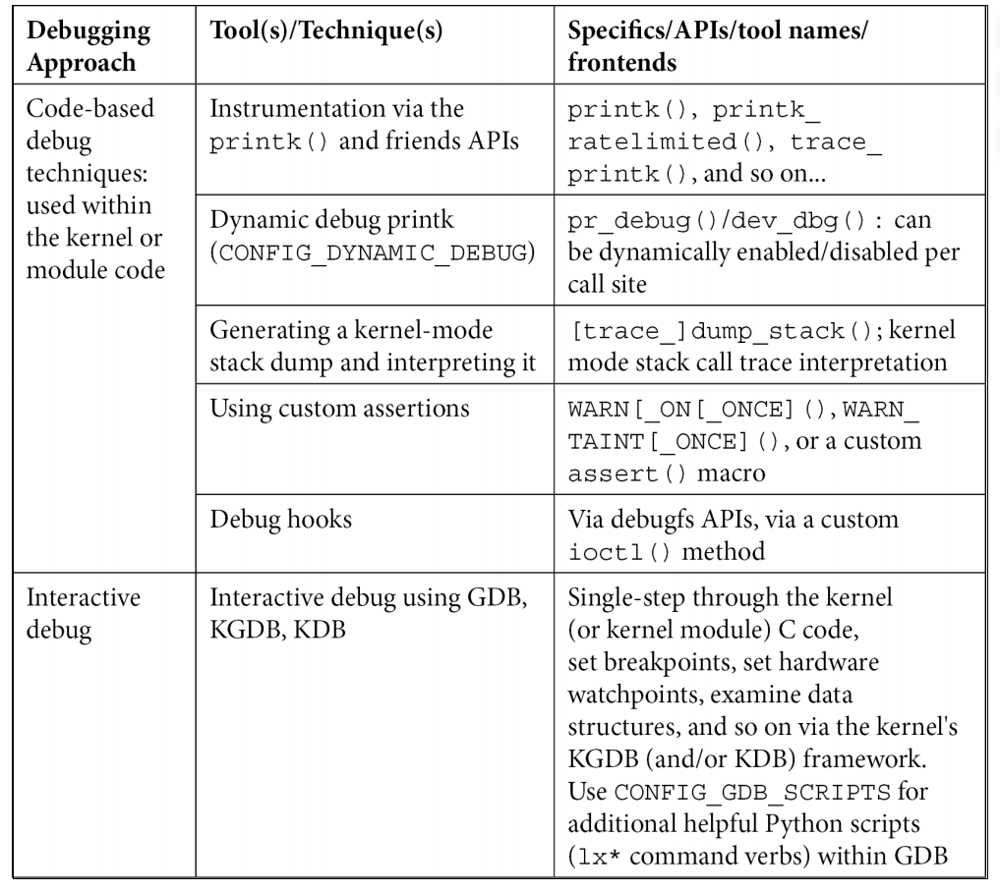
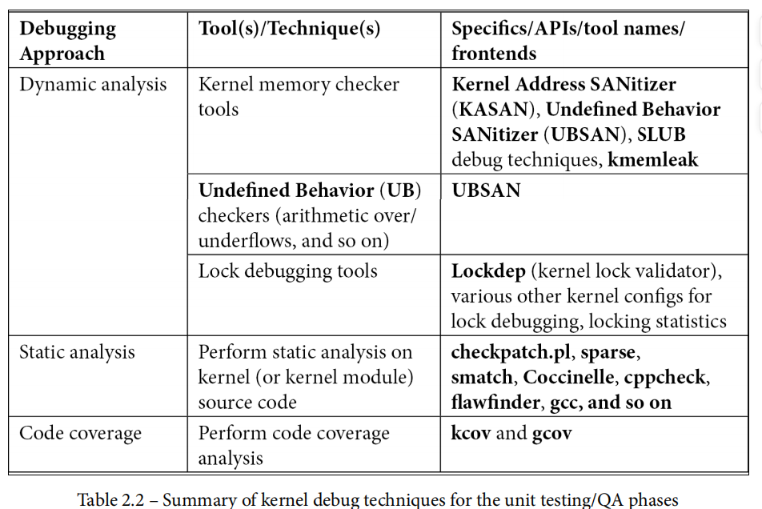
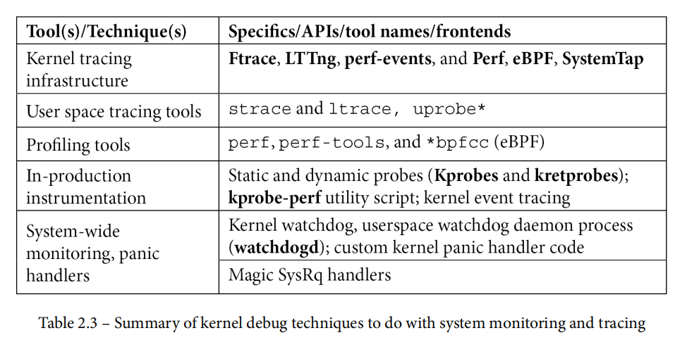
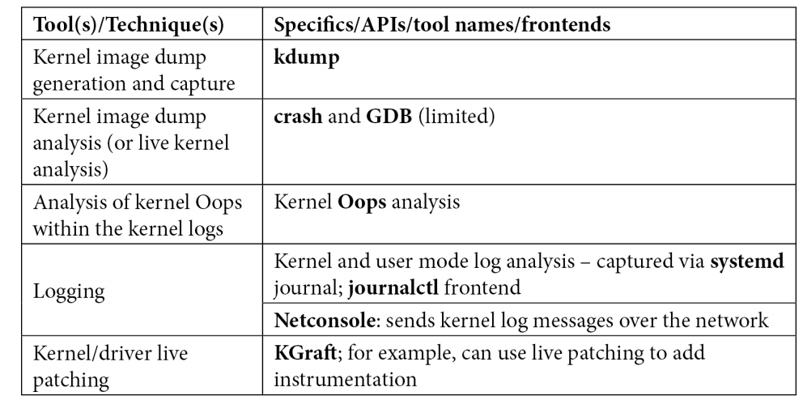
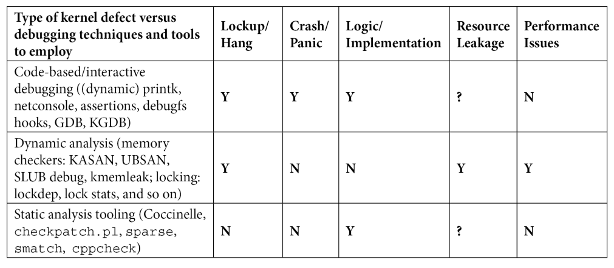
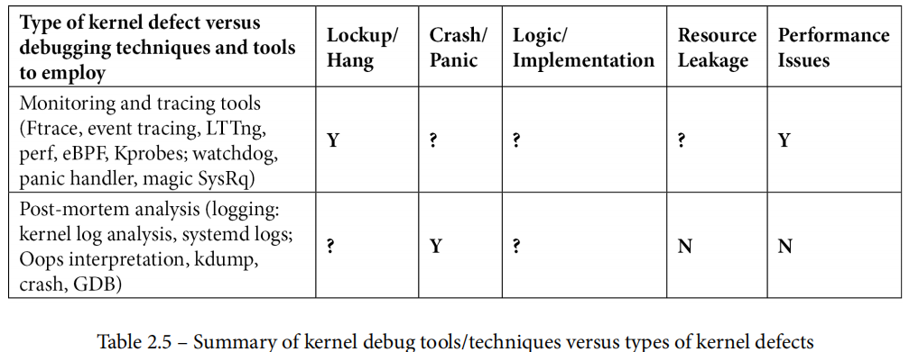

# 7.2

## Linux Kernel Debuging

### Bugs Type

#### 程序设计层面上：

> 1. 逻辑或实现错误
>    1. 包含一些堆栈溢出的错误，他们可能是死循环导致的
>    2. 数字运算溢出（精度丢失，运算上，下溢出）
>    3. 运算符误使用
> 2. 资源泄露
>    1. 包含了非法的指针解引用等
>    2. UAF（释放后再使用）
>    3. OOB（越界）
> 3. 一些硬件错误
> 4. 竞争（锁的不正确使用，导致死锁，或者是高频率中断导致信息丢失）
> 5. 性能缺失
>    1. 对齐不当
>    2. 错误的使用API
>    3. 数据竞争
>    4. 不恰当的IO

#### 如果是从内存层面上谈：

​	由于与内存相关的缺陷在程序语言（如 C 语言和非托管语言）中非常常见，因此我们现在将从内存损坏的角度来看bugs

- 不正确的内存访问：
  使用未初始化的变量；又称 UMR 缺陷
  越界内存访问（读/写下溢/溢出错误）
  使用后释放/使用后返回（超出范围）错误
  双重免费
- 内存泄漏
- 数据竞赛
- 碎片（内部执行）问题：
  内部的
  外部的

​	所有的这些内存访问行为（除了内存碎片以外）都被认为是UB。

​	还有一种是从CVE/CWE安全相关的角度进行评估的：

​	有一个公开披露的安全漏洞（vulns）和问题的开放式数据库；安全研究人员、学者和业界使用它来跟踪与安全相关的缺陷/错误，帮助人们研究和讨论它们，建立缓解措施（修复、补丁），从而以一致的方式应对它们。每个安全漏洞（有时是一大堆漏洞，形成一个类别）都有一个编号，称为 "常见漏洞和暴露"（Common Vulnerabilities and Exposures，CVE）或 "常见弱点和枚举"（Common Weaknesses and Enumeration，CWE）编号。

​	下面给出一些：

- **National Institute of Standards and Technology** (**NIST**) with the **National Vulnerability** **Database** (**NVD**) ：(https://nvd.nist.gov/vuln/full-listing). (https://nvd.nist.gov/vuln/categories/cwe-layout).
- **CVE Details** site(https://www.cvedetails.com/); 还有它的FAQ: https://www.cve.org/ResourcesSupport/FAQs.

#### BTW

​	这里简单介绍一下最为经典的一个Bug：Buffer Copy without Checking Size of Input ('Classic Buffer Overflow')，也就是不加以验证源大小的盲目拷贝。

##### Sources： [CWE - CWE-120: Buffer Copy without Checking Size of Input ('Classic Buffer Overflow') (4.14) (mitre.org)](https://cwe.mitre.org/data/definitions/120.html)

[](javascript:toggleblocksOC('120_Description');) Description

The product copies an input buffer to an output buffer without verifying that the size of the input buffer is less than the size of the output buffer, leading to a buffer overflow.

[](javascript:toggleblocksOC('120_Extended_Description');) Extended Description

A buffer overflow condition exists when a product attempts to put more data in a buffer than it can hold, or when it attempts to put data in a memory area outside of the boundaries of a buffer. The simplest type of error, and the most common cause of buffer overflows, is the "classic" case in which the product copies the buffer without restricting how much is copied. Other variants exist, but the existence of a classic overflow strongly suggests that the programmer is not considering even the most basic of security protections.

[](javascript:toggleblocksOC('120_Alternate_Terms');) Alternate Terms

|                          |                                                              |
| :----------------------- | ------------------------------------------------------------ |
| Classic Buffer Overflow: | This term was frequently used by vulnerability researchers during approximately 1995 to 2005 to differentiate buffer copies without length checks (which had been known about for decades) from other emerging weaknesses that still involved invalid accesses of buffers, as vulnerability researchers began to develop advanced exploitation techniques |

[](javascript:toggleblocksOC('120_Common_Consequences');) Common Consequences


| Scope                                  | Impact                                                       | Likelihood |
| :------------------------------------- | :----------------------------------------------------------- | :--------- |
| Integrity Confidentiality Availability | **Technical Impact:** *Modify Memory; Execute Unauthorized Code or Commands*Buffer overflows often can be used to execute arbitrary code, which is usually outside the scope of the product's implicit security policy. This can often be used to subvert any other security service. |            |
| Availability                           | **Technical Impact:** *Modify Memory; DoS: Crash, Exit, or Restart; DoS: Resource Consumption (CPU)*Buffer overflows generally lead to crashes. Other attacks leading to lack of availability are possible, including putting the product into an infinite loop. |            |

Demonstrative Examples

Example 1

​	The following code asks the user to enter their last name and then attempts to store the value entered in the last_name array.

```
char last_name[20];
printf ("Enter your last name: ");
scanf ("%s", last_name);
```

​	The problem with the code above is that it does not restrict or limit the size of the name entered by the user. If the user enters "Very_very_long_last_name" which is 24 characters long, then a buffer overflow will occur since the array can only hold 20 characters total.

Example 2

​	The following code attempts to create a local copy of a buffer to perform some manipulations to the data.

```
void manipulate_string(char * string){

	char buf[24];
	strcpy(buf, string);
	...

}
```

​	However, the programmer does not ensure that the size of the data pointed to by string will fit in the local buffer and copies the data with the potentially dangerous strcpy() function. This may result in a buffer overflow condition if an attacker can influence the contents of the string parameter.

Example 3

The code below calls the gets() function to read in data from the command line.


```
char buf[24];
printf("Please enter your name and press <Enter>\n");
gets(buf);
...
```

​	However, gets() is inherently unsafe, because it copies all input from STDIN to the buffer without checking size. This allows the user to provide a string that is larger than the buffer size, resulting in an overflow condition.

Example 4

​	In the following example, a server accepts connections from a client and processes the client request. After accepting a client connection, the program will obtain client information using the gethostbyaddr method, copy the hostname of the client that connected to a local variable and output the hostname of the client to a log file.

```
...

struct hostent *clienthp;
char hostname[MAX_LEN];

// create server socket, bind to server address and listen on socket
...

// accept client connections and process requests
int count = 0;
for (count = 0; count < MAX_CONNECTIONS; count++) {

int clientlen = sizeof(struct sockaddr_in);
int clientsocket = accept(serversocket, (struct sockaddr *)&clientaddr, &clientlen);

if (clientsocket >= 0) {

clienthp = gethostbyaddr((char*) &clientaddr.sin_addr.s_addr, sizeof(clientaddr.sin_addr.s_addr), AF_INET);
strcpy(hostname, clienthp->h_name);
logOutput("Accepted client connection from host ", hostname);

// process client request
...
close(clientsocket);

}

}
close(serversocket);

...
```

​	However, the hostname of the client that connected may be longer than the allocated size for the local hostname variable. This will result in a buffer overflow when copying the client hostname to the local variable using the strcpy method.

##### 翻译

- 描述：将输入缓冲区复制到输出缓冲区，但未验证输入缓冲区的大小是否小于输出缓冲区的大小，从而导致缓冲区溢出。

- 详细的阐述：当代码试图在缓冲区中放入超过其容量的数据，或试图在缓冲区边界之外的内存区域中放入数据时，就会出现缓冲区溢出情况。最简单的错误类型，也是最常见的缓冲区溢出原因，是代码复制缓冲区而不限制复制量的 "典型 "情况。还存在其他变种，但典型溢出的存在强烈表明程序员甚至没有考虑最基本的安全保护措施。

- 大约在 1995 年至 2005 年期间，随着漏洞研究人员开始开发先进的利用技术，漏洞研究人员经常使用这个术语来区分不进行长度检查的缓冲区拷贝（几十年前就已存在）和其他仍涉及缓冲区无效访问的新出现的弱点。

- 一些常见的后果：显然他是危险的，波及到程序的完整性 保密性 可用性三者：缓冲区溢出通常可用于执行任意代码，这通常超出了产品隐式安全策略的范围。这通常可用于颠覆任何其他安全服务。同时缓冲区溢出通常还会导致程序崩溃。其他的攻击将会导致程序有一定程度的不可用，包括将代码引入一个无限的循环。

- 一些例子：

  - 例子1

    下面的这个代码要求用户输入他的名，以及试图存储它到一个字符数组里。

    ```C
    char last_name[20];
    printf ("Enter your last name: ");
    scanf ("%s", last_name);
    ```

    看出这个代码的问题了吗？这个代码的问题就在于它并没有限制名称输入的大小，如果一个用户输入了非常非常非常长的名称，也就是大于20个字符的名称，那么一个缓冲区溢出将会发生。

  - 例子2

    下面这段代码尝试从本地拷入一个字符串进入函数内部进行一定的操作变换。

    ```
    void manipulate_string(char * string){
    	char buf[24];
    	strcpy(buf, string);
    	...
    }
    ```

    这段代码也是存在问题的，程序员可能并没有办法保证数据的指针指向的字符串的大小，是可以被程序员自己准备的缓冲区的大小相符合的，换而言之，这里就有可能存在缓冲区溢出的风险。我们操作的指针指向的字符串的大小很有可能大于24个字节。所以如果想要让程序崩溃，只需要传递一个远大于24个字符的字符串，这个时候下一个函数调用将会使程序发生缓冲区溢出，从而使攻击者可以执行缓冲区溢出部分所指向的代码。

  - 例子3

    下面这段代码试图使用gets函数来从命令行获取数据：

    ```
    {
    	char buf[24];
    	printf("Please enter your name and press <Enter>\n");
    	gets(buf);
    	...
    }
    ```

    然而熟悉c语言程序设计的同志们都知道这个函数天生就是不安全的，因为它将拷贝所有从标准输入输入进来的数据，进入到目标缓冲区而不去检查它的大小。这将允许用户去提供一个字符串这个字符串的大小将远大于缓冲区大小，从而导致缓冲区溢出进行一定的代码攻击。

  - 例子4

    在下面这个例子中，一个服务尝试去连接一个客户端，然后去完成客户端的请求，这个程序将使用gethostnamebyaddr()获取客户端的信息。然后将获取到的信息拷贝到缓冲区中

    ```
    ...
    struct hostent *clienthp;
    char hostname[MAX_LEN];
    
    // create server socket, bind to server address and listen on socket
    ...
    
    // accept client connections and process requests
    int count = 0;
    for (count = 0; count < MAX_CONNECTIONS; count++) {
    
    	int clientlen = sizeof(struct sockaddr_in);
    	int clientsocket = accept(serversocket, (struct sockaddr *)&clientaddr, &clientlen);
    
    	if (clientsocket >= 0) {
    		clienthp = gethostbyaddr((char*) &clientaddr.sin_addr.s_addr, 		sizeof(clientaddr.sin_addr.s_addr), AF_INET);
    		strcpy(hostname, clienthp->h_name);
    		logOutput("Accepted client connection from host ", hostname);
    
    		// process client request
    		...
    		close(clientsocket);
    	}
    }
    close(serversocket);
    
    ...
    ```

    然而连接到服务器的客户端的名称可能会比我们在本地变量所分配的名称的变量大小要长。如果真是如此，这将会导致一个缓冲区溢出当我们试图把获取到的客户端的名称拷贝到本地变量中。

#### 内核角度

​	从内核角度来看也是十分方便的

- 导致系统锁定或挂起的缺陷
- 导致系统崩溃和/或恐慌的缺陷
- 逻辑或执行缺陷
- 资源泄漏缺陷
- 性能问题

### 内核调试

​	当内核出现错误或漏洞时，无论多么微不足道，整个系统都会被认为处于糟糕的、不可恢复的状态。系统就会被认为处于无法恢复的糟糕状态，内核就会给你挂panic。在这种致命的情况下，系统会产生一个简短的诊断，然后直接 停止（也可以配置为超时后重启）。调试这些情况 调试本来就很困难，因为至少从表面上看，似乎没有诊断信息可 即使有诊断信息，系统也没有任何反应，基本上就是死机了。那么，如何获取诊断信息进行分析呢？你很快就会发现，即使有多种技术、工具和 内核调试的技术、工具和方法，但并不是所有的技术、工具和方法都适用于所有情况。你所使用的工具或技术往往取决于你所处的特定场景。那么，这些场景是什么呢？概括地说，它们包括以下几种：

- 项目开发阶段： 您正在开发 
  代码，并且正在进行积极的开发。这包括使用自定义 调试和生产内核。
- 单元或单个开发人员测试和 QA（集成/系统/验收） 
  测试阶段： 您已经开发了一个模块或组件，需要对其进行测试。这需要使用自定义调试内核和生产内核。
- 死后分析： 内核崩溃了；您需要尝试找出 根本原因并加以修复。这需要同时使用自定义调试内核和 生产内核。
- 现场或生产： 系统出现错误和性能问题。您需要使用适当的工具来了解根本原因。这 这需要使用定制的生产内核（以及调试内核--某些工具需要符号）。

​	内核调试有多种方法。使用哪一种（或几种）取决于具体情况。以下是上述场景和内核调试的一些方法。

#### 开发阶段

您目前正处于项目的开发阶段吗？如果是，以下方法和技术可以帮助您：

基于代码的调试技术可以立即提供帮助（尽管它们在以后也会有用）。这些技术包括

- 使用 printk() 和其他工具进行代码级检测
- 动态调试 printk
- 生成内核模式堆栈转储并对其进行解释
- 在代码中使用断言
- 在代码库中设置并利用调试钩子--有两种典型的方法：
  - 通过 debugfs 伪文件系统
  - 通过用于调试目的的特殊 ioctl(2) 钩子函数

​	在内核（或模块）C 代码中单步运行，设置断点、观察点、检查数据内容等：通过著名的内核 GDB (KGDB) 框架。

#### 单元测试和/或质量保证阶段

​	在单元测试和/或质量保证阶段（包括单元测试和集成/系统/验收测试），你作为项目中的一名开发人员，通常会针对自己开发的代码运行单元测试。除此之外，您的团队和/或专门的质量保证团队可能会针对项目（临时）版本运行一个完整的（也许是自动化的）测试套件，发现并向开发团队报告错误。在这些阶段，应使用以下工具和技术尝试捕捉可能的错误：

- 动态分析： 您可以运行在实时系统上运行的工具，这些工具会在代码执行时对代码路径进行检查。这些工具包括
  - 内存检查器：检测内存问题或内存损坏（通常是错误的根本原因）至关重要。
  - 未定义行为（UB）检查程序： 未定义行为包括算术 
  - 下溢/溢出（包括著名的整数溢出（IoF）缺陷）、无效位移、错位访问等。
  - 锁定调试工具和仪器。

- 静态分析： 涉及使用对项目源代码进行处理的工具（类似于编译器）。这些工具可以帮助用户深入了解被忽视的、可能存在漏洞的代码，以及存在安全风险的代码。

- 代码覆盖率分析： 这并不是真正意义上的调试技术，而是为了确保在测试过程中每一行代码都得到实际应用。这一点至关重要--只有这样，我们才能对产品有高度的信心。在此，您通常会使用代码覆盖率工具（如 gcov）来检查哪些代码行在给定的测试运行中被实际执行。在给定的测试运行过程中实际执行了哪些代码行。(这些技术通常更适用于 这些技术通常更适用于单个开发人员的单元测试，而不适用于系统级测试，尽管它们也可以应用于系统级测试）。当然也可用于系统级测试）。

监控和跟踪工具： 这些工具可用于开发和 测试/质量保证阶段，甚至可能在生产（现场）中使用：

- 内核跟踪基础架构 - 这是一个很大的领域，包括以下内容：
  - Ftrace 和 trace-cmd
  - 事件跟踪
  - Linux 跟踪工具包：下一代（LTTng）、Trace Compass 和 KernelShark GUI
  - **Perf**
  - **Enhanced Berkeley Packet Filter** (**eBPF**)
  - **SystemTap**
  - 用户态的工具 (**strace** and **ltrace** utilities)
  - **Kernel probes** (**Kprobes**) – both static and dynamic
  - Watchdogs
  - Custom kernel panic handler
  - Detection of soft and hard lockups
  - Detection of hung tasks
  - Magic SysRq handlers

- 事后分析： 对于大多数开发人员来说，常见的情况之一是崩溃后的情况：（捕获并）分析内核诊断（称为内核 OOPS）：
  - Oops（内核日志文件）分析
  - 使用 kdump 收集内核转储图像（大致相当于进程崩溃时产生的内核转储），并使用功能强大的崩溃应用程序对其进行解释

#### 在生产现场运行时（为完整起见）：

- 任何（或所有）监控和跟踪工具（在上一要点中提及 点中提到的）。
- 代码中的调试钩子（通过 debugfs、ioctl）
- 常规和动态调试 printks
- 日志记录（通过 systemd 日志和基于应用程序的日志记录）
- 自定义恐慌处理程序

使用哪种内核调试技术不仅取决于软件生命周期的各个阶段，有些内核调试技术还需要大量的硬件和/或软件资源：

- 硬件限制： 有些内核调试技术需要大量的硬件资源，而这些资源您可能负担得起，也可能负担不起！例如，使用 kdump 技术需要大量内存、网络带宽和/或磁盘空间。一些受到严格限制的嵌入式 Linux 系统根本无法承受，而一般的服务器系统却可以轻松做到（众所周知的用户空间 Valgrind 工具套件也是如此；Address Sanitizer (ASAN) 使用的资源较少......）。
- 软件限制： 就像硬件一样，有些系统对内核配置中可以启用的功能有自我设计的限制，这可能会排除一些调试技术。kdump 和跟踪基础架构就是很好的例子。
  关键一点：动态分析工具只能捕捉它们实际看到并运行的代码中的错误。这让我们明白，拥有覆盖所有代码的测试用例是极其重要的，正如前面提到的（第 1 章，调试软件的一般介绍），100% 的代码覆盖率是我们的目标！请注意，虽然我已经对工具和技术进行了明确的分类，但在某些情况下，你可以（也许应该）在不同的场景中使用某种技术，而不是上面所展示的那样。请保持灵活性，根据手头的情况使用适当的工具。

### 按不同情况分类

下面的表格试图囊括所有内核调试方法、工具和技术，并按照不同的使用场景进行分类。
请注意以下几点：

- 目前，只需查看适用于不同场景和用例的可用工具/技术/工艺/API，不必担心如何使用它们。当然，这才是本书及其后续章节的核心内容。本书的目的是涵盖这里提到的大部分内容。
- 如前所述，特定工具或技术的使用场景是典型的，而不是绝对的。你可能会遇到不同的使用情况。我建议你根据实际情况调整和使用适合的技术













# Undefined Behavior in 2017

------

*This post is jointly authored by Pascal Cuoq and John Regehr.*

Recently we’ve heard a few people imply that problems stemming from undefined behaviors (UB) in C and C++ are largely solved due to ubiquitous availability of dynamic checking tools such as ASan, UBSan, MSan, and TSan. We are here to state the obvious — that, despite the many excellent advances in tooling over the last few years, UB-related problems are far from solved — and to look at the current situation in detail.

Valgrind and most of the sanitizers are intended for debugging: emitting friendly diagnostics regarding undefined behaviors that are executed during testing. Tools like this are exceptionally useful and they have helped us progress from a world where almost every nontrivial C and C++ program executed a continuous stream of UB to a world where quite a few important programs seem to be largely UB-free in their most common configurations and use cases.

The problem with dynamic debugging tools is that they don’t do anything to help us to cope with the worst UBs: the ones that we didn’t know how to trigger during testing, but that someone else has figured out how to trigger in deployed software — while exploiting it. The problem reduces to doing good testing, which is hard. Tools like afl-fuzz are great but they barely begin to scratch the surface of large programs that process highly structured inputs.

One way to sidestep problems in testing is to use static UB-detection tools. These are steadily improving, but sound and precise static analysis is not necessarily any easier than achieving good test coverage. Of course the two techniques are attacking the same problem — identifying feasible paths in software — from opposite sides. This problem has always been extremely hard and probably always will be. We’ve written a lot elsewhere about finding UBs via static analysis; in this piece our focus is on dynamic tools.

The other way to work around problems in testing is to use UB mitigation tools: these turn UB into defined behavior in production C and C++, effectively gaining some of the benefits of a safe programming language. The challenge is in engineering mitigation tools that:

- don’t break our code in any corner cases,
- have very low overhead,
- don’t add effective attack surfaces, for example by requiring programs to be linked against a non-hardened runtime library,
- raise the bar for determined attackers (in contrast, debugging tools can afford to use heuristics that aren’t resistant to adversaries),
- compose with each other (in contrast, some debugging tools such as ASan and TSan are not compatible, necessitating two runs of the test suite for any project that wants to use both).

Before looking at some individual kinds of UB, let’s review the our goals here. These apply to every C and C++ compiler.

**Goal 1: Every UB (yes, all ~200 of them, we’ll give the list towards the end of this post) must either be documented as having some defined behavior, be diagnosed with a fatal compiler error, or else — as a last resort — have a sanitizer that detects that UB at runtime.** This should not be controversial, it’s sort of a minimal requirement for developing C and C++ in the modern world where network packets and compiler optimizations are effectively hostile.

**Goal 2: Every UB must either be documented as having some defined behavior, be diagnosed with a fatal compiler error, or else have an optional mitigation mechanism that meets the requirements above.** This is more difficult; it necessitates, for example, production-grade memory safety. We like to think that this can be achieved in many execution environments. OS kernels and other maximally performance-critical code will need to resort to more difficult technologies such as formal methods.

The rest of this piece will look at the current situation for various classes of undefined behaviors. We’ll start with the big ones.

## Spatial Memory Safety Violations

**Background:** Accessing out-of-bounds storage and even creating pointers to that storage are UB in C and C++. The [1988 Morris Worm](https://blog.regehr.org/extra_files/IWorm-paper.pdf) gave us an early hint of what the next N years would be like. So far we know that N >= 29, and probably N will end up being about 75.

**Debugging:** Valgrind and ASan are both excellent debugging tools. For many use cases ASan is the better choice because it has much less overhead. Both tools retain the representation of addresses as 32- or 64-bit values, and reserve forbidden red zones around valid blocks. This is a robust and compatible approach: it interoperates seamlessly with non-instrumented binary libraries and also supports existing code that relies on pointers being convertible to integers.

Valgrind, working from executable code, cannot insert red zones between stack variables because stack layout is implicitly hard-coded in the offsets of instructions that access the stack, and it would be an impossibly ambitious project to remap stack addresses on the fly. As a result, Valgrind has only limited support for detecting errors in manipulating storage on the stack. ASan works during compilation and inserts red zones around stack variables. Stack variables are small and numerous, so address space and locality considerations prevent the use of very large red zones. With default settings, the addresses of two adjacent local int variables x and y end up separated by 16 bytes. In other words, the verifications done by ASan and Valgrind are only for one memory layout, and the memory layout for which the verifications are done is different from the memory layout of the uninstrumented execution.

A minor weakness of ASan and Valgrind is that they can miss undefined behaviors that get optimized away before the instrumentation has a chance to run, [as in this example](https://godbolt.org/g/1c6xK6).

**Mitigation:** We’ve long had partial mitigation mechanisms for memory unsafety, including ASLR, stack canaries, hardened allocators, and NX. More recently, [production-grade CFI](https://clang.llvm.org/docs/ControlFlowIntegrity.html) (control flow integrity) has become available. Another interesting recent development is [pointer authentication in ARMv8.3](https://www.qualcomm.com/documents/whitepaper-pointer-authentication-armv83). [This paper](https://people.eecs.berkeley.edu/~dawnsong/papers/Oakland13-SoK-CR.pdf) has a good overview of memory safety mitigations.

A serious drawback of ASan as a mitigation tool is illustrated here:

```
$ cat asan-defeat.c
#include <stdio.h>
#include <stdlib.h>
#include <string.h>

char a[128];
char b[128];

int main(int argc, char *argv[]) {
  strcpy(a + atoi(argv[1]), "owned.");
  printf("%s\n", b);
  return 0;
}
$ clang-4.0 -O asan-defeat.c
$ ./a.out 128
owned.
$ clang-4.0 -O -fsanitize=address -fno-common asan-defeat.c
$ ./a.out 160
owned.
$ 
```

In other words, ASan simply forces an attacker to compute a different offset in order to corrupt a target memory region. (Thanks to Yury Gribov for pointing out that we should be using the -fno-common flag to ASan.)

To mitigate this kind of undefined behavior, real bounds checking must be performed, as opposed to only verifying that each memory access lands in some valid region. Memory safety is the gold standard here. Although there is much academic work on memory safety, some showing apparently reasonable overheads and good compatibility with existing software, it has not yet seen widespread adoption. [Checked C](https://www.microsoft.com/en-us/research/project/checked-c/) is a very cool project to keep an eye on in this space.

**Summary:** Debugging tools for this class of error are very good. Good mitigations are available but this class of bug can only be reliably stopped by full memory/type safety.

## Temporal Memory Safety Violations

**Background:** A “temporal memory safety violation” is any use of a memory location after its lifetime has ended. This includes addresses of automatic variables outliving these variables; use-after-free, where a dangling pointer is accessed for reading or writing; and, double free, which can be just as harmful in practice, since free() modifies metadata that is usually adjacent to the block being freed. If the block has already been freed, these writes can fall on memory used for any other purpose and, in principle, can have as much consequence as any other invalid write.

**Debugging:** ASan is designed to detect use-after-free bugs, which often lead to hard-to-reproduce, erratic behavior. It does so by placing freed memory blocks in a quarantine, preventing their immediate reuse. For some programs and inputs, this can increase memory consumption and decrease locality. The user can configure the size of the quarantine in order to trade false positives for resource usage.

ASan can also detect addresses of automatic variables surviving the scope of these variables. The idea is to turn automatic variables into heap-allocated blocks, that the compiler automatically allocates when execution enters the block, and frees (while retaining them in a quarantine) when execution leaves the block. This option is turned off by default, because it makes programs even more memory-hungry.

The temporal memory safety violation in the program below causes it to behave differently at the default optimization level and at -O2. ASan can detect a problem in the program below with no optimization, but only if the option detect_stack_use_after_return is set, and only if the program was not compiled with optimization.

```
$ cat temporal.c
#include <stdio.h>

int *G;

int f(void) {
  int l = 1;
  int res = *G;
  G = &l;
  return res;
}

int main(void) {
  int x = 2;
  G = &x;
  f();
  printf("%d\n", f());
}
$ clang -Wall -fsanitize=address temporal.c
$ ./a.out 
1
$ ASAN_OPTIONS=detect_stack_use_after_return=1 ./a.out 
=================================================================
==5425==ERROR: AddressSanitizer: stack-use-after-return ...
READ of size 4 at 0x0001035b6060 thread T0
^C
$ clang -Wall -fsanitize=address -O2 temporal.c
$ ./a.out 
32767
$ ASAN_OPTIONS=detect_stack_use_after_return=1 ./a.out 
32767
$ clang -v
Apple LLVM version 8.0.0 (clang-800.0.42.1)
...
```

In some other examples, the sanitizer’s failure to detect UB that has been “optimized out” can be argued to be harmless, since the optimized-out UB has no consequence. This is not the case here! The program is meaningless in any case, but the unoptimized program behaves deterministically and works as if the variable x had been declared static, whereas the optimized program, in which ASan does not detect any foul play, does not behave deterministically and reveals an internal state that is not supposed to be seen:

```
$ clang -Wall -O2 temporal.c
$ ./a.out 
1620344886
$ ./a.out 
1734516790
$ ./a.out 
1777709110
```

**Mitigation:** As discussed above, ASan is not intended for hardening, but various hardened allocators are available; they use the same quarantining strategy to render use-after-free bugs unexploitable.

**Summary:** Use ASan (together with “ASAN_OPTIONS=detect_stack_use_after_return=1” for the test cases that are small enough to allow it). Vary optimization levels in case some compilations catch errors that others don’t.

## Integer Overflow

**Background:** Integers cannot underflow, but they can overflow in both directions. Signed integer overflow is UB; this includes INT_MIN / -1, INT_MIN % -1, negating INT_MIN, shift with negative exponent, left-shifting a one past the sign bit, and (sometimes) left-shifting a one into the sign bit. Division by zero and shift by >= bitwidth are UB in both the signed and unsigned flavors. [Read more here](http://www.cs.utah.edu/~regehr/papers/tosem15.pdf).

**Debugging:** LLVM’s UBSan is very good for debugging integer-related undefined behaviors. Because UBSan works near the source level, it is highly reliable. There are some quirks relating to compile-time math; for example, [this program traps as C++11 but not as C11](https://godbolt.org/g/BFHKg9); we believe this follows the standards but haven’t looked into it closely. GCC has its own version of UBSan but it [isn’t 100% trustworthy](https://godbolt.org/g/2spSWN); here it looks like constants are being folded before the instrumentation pass gets to run.

**Mitigation:** UBSan in trapping mode (on hitting UB, process aborts w/o printing a diagnostic) can be used for mitigation. It is usually reasonably efficient and it doesn’t add attack surface. [Parts of Android use UBSan to mitigate integer overflows](https://android-developers.googleblog.com/2016/05/hardening-media-stack.html) (including unsigned overflows, which of course are not undefined). Although integer overflows are generic logic errors, in C and C++ they are particularly harmful because they often lead to memory safety violations. In a memory-safe language they tend to do much less damage.

**Summary:** Integer undefined behaviors are not very difficult to catch; UBSan is the only debugging tool you’re likely to ever need. An issue with mitigating integer UBs is the overhead. For example, they cause SPEC CPU 2006 to run about 30% slower. There is plenty of room for improvement, both in eliminating overflow checks that cannot fire and in making the remaining checks less obstructive to the loop optimizers. Someone with resources should push on this.

## Strict Aliasing Violations

**Background:** The “strict aliasing rules” in the C and C++ standards allow the compiler to assume that if two pointers refer to different types, they cannot point to the same storage. This enables nice optimizations but risks breaking programs that take a flexible view of types (roughly 100% of large C and C++ programs take a flexible view of types somewhere). For a thorough overview see [Sections 1-3 of this paper](http://trust-in-soft.com/wp-content/uploads/2017/01/vmcai.pdf).

**Debugging:** The state of the art in debugging tools for strict aliasing violations is weak. Compilers warn about some easy cases, but these warnings are extremely fragile. [libcrunch](https://github.com/stephenrkell/libcrunch) warns that a pointer is being converted to a type “pointer to thing” when the pointed object is not, in fact, a “thing.” This allows polymorphism though void pointers, but catches misuses of pointer conversions that are also strict aliasing violations. With respect to the C standard and C compilers’ interpretation of what it allows them to optimize in their type-based alias analyses, however, libcrunch is neither sound (it does not detect some violations that happen during the instrumented execution) nor complete (it warns about pointer conversions that smell bad but do not violate the standard).

**Mitigation:** This is easy: pass the compiler a flag (-fno-strict-aliasing) that disables optimizations based on strict aliasing. The result is a C/C++ compiler that has an old-school memory model where more or less arbitrary casts between pointer types can be performed, with the resulting code behaving as expected. Of the big three compilers, it is only LLVM and GCC that are affected, MSVC doesn’t implement this class of optimization in the first place.

**Summary:** Correctness-sensitive code bases need significant auditing: it is always suspicious and dangerous to cast a pointer to any type other than a char *. Alternatively, just turn off strict-aliasing-based optimizations using a flag and make sure that nobody ever builds the code without using this flag.

## Alignment Violations

**Background:** RISC-style processors have tended to disallow memory accesses where the address is not a multiple of the size of the object being accessed. On the other hand, C and C++ programs that use unaligned pointers are undefined regardless of the target architecture. Historically we have been complacent about this, first because x86/x64 support unaligned accesses and second because compilers have so far not done much to exploit this UB.

Even so, here is an [excellent blog post](https://pzemtsov.github.io/2016/11/06/bug-story-alignment-on-x86.html) explaining how the compiler can break code that does unaligned accesses when targeting x64. The code in the post violates strict aliasing in addition to violating the alignment rules, but the crash (we verified it under GCC 7.1.0 on OS X) occurs even when the `-fno-strict-aliasing` flag is passed to the compiler.

**Debugging:** UBSan can detect misaligned memory accesses.

**Mitigation:** None known.

**Summary:** Use UBSan.

## Loops that Neither Perform I/O nor Terminate

**Background:** A loop in C or C++ code that neither performs I/O nor terminates is undefined and can be terminated arbitrarily by the compiler. See [this post](https://blog.regehr.org/archives/140) and [this note](http://www.open-std.org/jtc1/sc22/wg14/www/docs/n1528.htm).

**Debugging:** No tools exist.

**Mitigation:** None, besides avoiding heavily-optimizing compilers.

**Summary:** This UB is probably not a problem in practice (even if it is moderately displeasing to some of us).

## Data Races

**Background:** A data race occurs when a piece of memory is accessed by more than one thread, at least one of the accesses is a store, and the accesses are not synchronized using a mechanism such as a lock. Data races are UB in modern flavors of C and C++ (they do not have a semantics in older versions since those standards do not address multithreaded code).

**Debugging:** [TSan](https://clang.llvm.org/docs/ThreadSanitizer.html) is an excellent dynamic data race detector. Other similar tools exist, such as the Helgrind plugin for Valgrind, but we have not used these lately. The use of dynamic race detectors is complicated by the fact that races can be very difficult to trigger, and worse this difficulty depends on variables such as the number of cores, the thread scheduling algorithm, whatever else is going on on the test machine, and on the moon’s phase.

**Mitigation:** Don’t create threads.

**Summary:** This particular UB is probably a good idea: it clearly communicates the idea that developers should not count on racy code doing anything in particular, but should rather use atomics (that cannot race by definition) if they don’t enjoy locking.

## Unsequenced Modifications

**Background:** In C, “sequence points” constrain how early or late a side-effecting expression such as x++ can take effect. C++ has a different but more-or-less-equivalent formulation of these rules. In either language, unsequenced modifications of the same value, or an unsequenced modification and use of the same value, results in UB.

**Debugging:** Some compilers emit warnings for obvious violations of the sequencing rules:

```
$ cat unsequenced2.c
int a;

int foo(void) {
  return a++ - a++;
}
$ clang -c unsequenced2.c
unsequenced2.c:4:11: warning: multiple unsequenced modifications to 'a' [-Wunsequenced]
  return a++ - a++;
          ^     ~~
1 warning generated.
$ gcc-7 -c unsequenced2.c -Wall
unsequenced2.c: In function 'foo':
unsequenced2.c:4:11: warning: operation on 'a' may be undefined [-Wsequence-point]
   return a++ - a++;
          ~^~
```

However, a bit of indirection defeats these warnings:

```
$ cat unsequenced.c
#include <stdio.h>

int main(void) {
  int z = 0, *p = &z;
  *p += z++;
  printf("%d\n", z);
  return 0;
}
$ gcc-4.8 -Wall unsequenced.c ; ./a.out
0
$ gcc-7 -Wall unsequenced.c ; ./a.out
1
$ clang -Wall unsequenced.c ; ./a.out
1
```

**Mitigation:** None known, though it would be almost trivial to define the order in which side effects take place. The Java Language Definition provides an example of how to do this. We have a hard time believing that this kind of constraint would meaningfully handicap any modern optimizing compiler. If the standards committees can’t find it within their hearts to make this happen, the compiler implementors should do it anyway. Ideally, all major compilers would make the same choice.

**Summary:** With a bit of practice, it is not too difficult to spot the potential for unsequenced accesses during code reviews. We should be wary of any overly-complex expression that has many side effects. This leaves us without a good story for legacy code, but hey it has worked until now, so perhaps there’s no problem. But really, this should be fixed in the compilers.

A non-UB relative of unsequenced is “indeterminately sequenced” where operations may happen in an order chosen by the compiler. An example is the order of the first two function calls while evaluating f(a(), b()). This order should be specified too. Left-to-right would work. Again, there will be no performance loss in non-insane circumstances.

## TIS Interpreter

We now change gears and take a look at the approach taken by [TIS Interpreter](http://trust-in-soft.com/tis-interpreter/), a debugging tool that looks for undefined behavior in C programs as it executes them line by line. TIS Interpreter runs programs much more slowly than the LLVM-based sanitizers, and even much more slowly than Valgrind. However, TIS Interpreter can usefully be compared to these sanitizers: it works from the source code, leaves the problem of coverage to test suites and fuzzing tools, and identifies problems along the execution paths that it has been provided inputs for.

A fundamental difference between TIS Interpreter and any single sanitizer is that TIS Interpreter’s goal is, along the execution paths it explores, to be exhaustive: to find all the problems that ASan, MSan, and UBSan are designed to find some of (give or take a couple of minor exceptions that we would be delighted to discuss at great length if provoked). For example, TIS Interpreter identifies unsequenced changes to overlapping memory zones within an expression, such as (*p)++ + (*q)++ when the pointers p and q alias. The problem of the unspecified order of function calls in a same expression, that TIS Interpreter orders without warning when a different order could produce a different result, is a known limitation that will eventually be fixed.

TIS Interpreter’s approach to detecting memory safety errors differs sharply from ASan’s and Valgrind’s in that it doesn’t find errors for a specific heap layout, but rather treats as an error any construct that could lead the execution to behave differently depending on memory layout choices. In other words, TIS Interpreter has a symbolic view of addresses, as opposed to the concrete view taken by Valgrind and ASan. This design choice eliminates the “only the instrumented version of the program is safe, and the instrumented version behaves differently from the deployed version” problem. The occasional C program is written to behave differently depending on the memory layout (for instance if addresses are fed to hash functions or used to provide a total ordering between allocated values). TIS Analyzer warns that these programs are doing this (which is always good to know); sometimes, tweaks make it possible to analyze them in TIS Interpreter anyway, but the resulting guarantees will be weaker.

It is sometimes useful, for debugging purposes, to see the first UB that occurs in an execution. Consider a loop in which MSan warns that uninitialized memory is being used, and in which ASan warns about an out-of-bounds read. Is the out-of-bounds read caused by the incorporation of uninitialized memory in the computation of the index, or is the use of uninitialized memory caused by the index being computed wrongly? One cannot use both ASan and MSan at the same time, so this is a mystery that developers need to solve for themselves. The value of looking for all undefined behaviors at the same time is in this case the confidence that the first undefined behavior seen is not a symptom of a previous undefined behavior. Another advantage is [finding undefined behavior that one was not looking for](https://trust-in-soft.com/an-old-quirky-libksba-bug/).

Detection of strict aliasing violations in TIS Interpreter is being worked on, following as much as possible the C standard and the interpretation of C compiler designers (which can be observed in each compiler’s translation of well-chosen examples).

## But What About the Rest of the Undefined Behaviors?

Let’s take a quick look at the contents of [Appendix J.2: a non-normative, non-exhaustive list of undefined behaviors in C](http://www.open-std.org/jtc1/sc22/wg14/www/docs/n1548.pdf#page=571). Keep in mind that no equivalent list has ever been created for C++, as far as we know.

First, we’ll list the UBs that we’ve discussed explicitly in this post:

- The execution of a program contains a data race (5.1.2.4).
- An object is referred to outside of its lifetime (6.2.4).
- The value of a pointer to an object whose lifetime has ended is used (6.2.4).
- The value of an object with automatic storage duration is used while it is indeterminate (6.2.4, 6.7.9, 6.8).
- Conversion to or from an integer type produces a value outside the range that can be represented (6.3.1.4).
- An lvalue does not designate an object when evaluated (6.3.2.1).
- Conversion between two pointer types produces a result that is incorrectly aligned (6.3.2.3).
- A side effect on a scalar object is unsequenced relative to either a different side effect on the same scalar object or a value computation using the value of the same scalar object (6.5).
- An exceptional condition occurs during the evaluation of an expression (6.5).
- An object has its stored value accessed other than by an lvalue of an allowable type (6.5).
- The operand of the unary * operator has an invalid value (6.5.3.2).
- The value of the second operand of the / or % operator is zero (6.5.5).
- Addition or subtraction of a pointer into, or just beyond, an array object and an integer type produces a result that does not point into, or just beyond, the same array object (6.5.6).
- Addition or subtraction of a pointer into, or just beyond, an array object and an integer type produces a result that points just beyond the array object and is used as the operand of a unary * operator that is evaluated (6.5.6).
- Pointers that do not point into, or just beyond, the same array object are subtracted (6.5.6).
- An array subscript is out of range, even if an object is apparently accessible with the given subscript (as in the lvalue expression a[1][7] given the declaration int a[4][5]) (6.5.6).
- The result of subtracting two pointers is not representable in an object of type ptrdiff_t (6.5.6).
- An expression is shifted by a negative number or by an amount greater than or equal to the width of the promoted expression (6.5.7).
- An expression having signed promoted type is left-shifted and either the value of the expression is negative or the result of shifting would be not be representable in the promoted type (6.5.7).
- Pointers that do not point to the same aggregate or union (nor just beyond the same array object) are compared using relational operators (6.5.8).
- An object is assigned to an inexactly overlapping object or to an exactly overlapping object with incompatible type (6.5.16.1).

And second, those that we have not addressed:

- A “shall” or “shall not” requirement that appears outside of a constraint is violated (clause 4).
- A nonempty source file does not end in a new-line character which is not immediately preceded by a backslash character or ends in a partial preprocessing token or comment (5.1.1.2).
- Token concatenation produces a character sequence matching the syntax of a universal character name (5.1.1.2).
- A program in a hosted environment does not define a function named main using one of the specified forms (5.1.2.2.1).
- A character not in the basic source character set is encountered in a source file, except in an identifier, a character constant, a string literal, a header name, a comment, or a preprocessing token that is never converted to a token (5.2.1).
- An identifier, comment, string literal, character constant, or header name contains an invalid multibyte character or does not begin and end in the initial shift state (5.2.1.2).
- The same identifier has both internal and external linkage in the same translation unit (6.2.2).
- A trap representation is read by an lvalue expression that does not have character type (6.2.6.1).
- A trap representation is produced by a side effect that modifies any part of the object using an lvalue expression that does not have character type (6.2.6.1).
- The operands to certain operators are such that they could produce a negative zero result, but the implementation does not support negative zeros (6.2.6.2).
- Two declarations of the same object or function specify types that are not compatible (6.2.7).
- A program requires the formation of a composite type from a variable length array type whose size is specified by an expression that is not evaluated (6.2.7).
- Demotion of one real floating type to another produces a value outside the range that can be represented (6.3.1.5).
- A non-array lvalue with an incomplete type is used in a context that requires the value of the designated object (6.3.2.1).
- An lvalue designating an object of automatic storage duration that could have been declared with the register storage class is used in a context that requires the value of the designated object, but the object is uninitialized. (6.3.2.1).
- An lvalue having array type is converted to a pointer to the initial element of the array, and the array object has register storage class (6.3.2.1).
- An attempt is made to use the value of a void expression, or an implicit or explicit conversion (except to void) is applied to a void expression (6.3.2.2).
- Conversion of a pointer to an integer type produces a value outside the range that can be represented (6.3.2.3).
- A pointer is used to call a function whose type is not compatible with the referenced type (6.3.2.3).
- An unmatched ‘ or ” character is encountered on a logical source line during tokenization (6.4).
- A reserved keyword token is used in translation phase 7 or 8 for some purpose other than as a keyword (6.4.1).
- A universal character name in an identifier does not designate a character whose encoding falls into one of the specified ranges (6.4.2.1).
- The initial character of an identifier is a universal character name designating a digit (6.4.2.1).
- Two identifiers differ only in nonsignificant characters (6.4.2.1).
- The identifier __func__ is explicitly declared (6.4.2.2).
- The program attempts to modify a string literal (6.4.5).
- The characters ‘, \, “, //, or /* occur in the sequence between the < and > delimiters, or the characters ‘, \, //, or /* occur in the sequence between the ” delimiters, in a header name preprocessing token (6.4.7).
- For a call to a function without a function prototype in scope, the number of ∗ arguments does not equal the number of parameters (6.5.2.2).
- For call to a function without a function prototype in scope where the function is defined with a function prototype, either the prototype ends with an ellipsis or the types of the arguments after promotion are not compatible with the types of the parameters (6.5.2.2).
- For a call to a function without a function prototype in scope where the function is not defined with a function prototype, the types of the arguments after promotion are not compatible with those of the parameters after promotion (with certain exceptions) (6.5.2.2).
- A function is defined with a type that is not compatible with the type (of the expression) pointed to by the expression that denotes the called function (6.5.2.2).
- A member of an atomic structure or union is accessed (6.5.2.3).
- A pointer is converted to other than an integer or pointer type (6.5.4).
- An expression that is required to be an integer constant expression does not have an integer type; has operands that are not integer constants, enumeration constants, character constants, sizeof expressions whose results are integer constants, or immediately-cast floating constants; or contains casts (outside operands to sizeof operators) other than conversions of arithmetic types to integer types (6.6).
- A constant expression in an initializer is not, or does not evaluate to, one of the following: an arithmetic constant expression, a null pointer constant, an address constant, or an address constant for a complete object type plus or minus an integer constant expression (6.6).
- An arithmetic constant expression does not have arithmetic type; has operands that are not integer constants, floating constants, enumeration constants, character constants, or sizeof expressions; or contains casts (outside operands to size operators) other than conversions of arithmetic types to arithmetic types (6.6).
- The value of an object is accessed by an array-subscript [], member-access . or −>, address &, or indirection * operator or a pointer cast in creating an address constant (6.6).
- An identifier for an object is declared with no linkage and the type of the object is incomplete after its declarator, or after its init-declarator if it has an initializer (6.7).
- A function is declared at block scope with an explicit storage-class specifier other than extern (6.7.1).
- A structure or union is defined as containing no named members, no anonymous structures, and no anonymous unions (6.7.2.1).
- An attempt is made to access, or generate a pointer to just past, a flexible array member of a structure when the referenced object provides no elements for that array (6.7.2.1).
- When the complete type is needed, an incomplete structure or union type is not completed in the same scope by another declaration of the tag that defines the content (6.7.2.3).
- An attempt is made to modify an object defined with a const-qualified type through use of an lvalue with non-const-qualified type (6.7.3).
- An attempt is made to refer to an object defined with a volatile-qualified type through use of an lvalue with non-volatile-qualified type (6.7.3).
- The specification of a function type includes any type qualifiers (6.7.3).
- Two qualified types that are required to be compatible do not have the identically qualified version of a compatible type (6.7.3).
- An object which has been modified is accessed through a restrict-qualified pointer to a const-qualified type, or through a restrict-qualified pointer and another pointer that are not both based on the same object (6.7.3.1).
- A restrict-qualified pointer is assigned a value based on another restricted pointer whose associated block neither began execution before the block associated with this pointer, nor ended before the assignment (6.7.3.1).
- A function with external linkage is declared with an inline function specifier, but is not also defined in the same translation unit (6.7.4).
- A function declared with a _Noreturn function specifier returns to its caller (6.7.4).
- The definition of an object has an alignment specifier and another declaration of that object has a different alignment specifier (6.7.5).
- Declarations of an object in different translation units have different alignment specifiers (6.7.5).
- Two pointer types that are required to be compatible are not identically qualified, or are not pointers to compatible types (6.7.6.1).
- The size expression in an array declaration is not a constant expression and evaluates at program execution time to a nonpositive value (6.7.6.2).
- In a context requiring two array types to be compatible, they do not have compatible element types, or their size specifiers evaluate to unequal values (6.7.6.2).
- A declaration of an array parameter includes the keyword static within the [ and ] and the corresponding argument does not provide access to the first element of an array with at least the specified number of elements (6.7.6.3).
- A storage-class specifier or type qualifier modifies the keyword void as a function parameter type list (6.7.6.3).
- In a context requiring two function types to be compatible, they do not have compatible return types, or their parameters disagree in use of the ellipsis terminator or the number and type of parameters (after default argument promotion, when there is no parameter type list or when one type is specified by a function definition with an identifier list) (6.7.6.3).
- The value of an unnamed member of a structure or union is used (6.7.9).
- The initializer for a scalar is neither a single expression nor a single expression enclosed in braces (6.7.9).
- The initializer for a structure or union object that has automatic storage duration is neither an initializer list nor a single expression that has compatible structure or union type (6.7.9).
- The initializer for an aggregate or union, other than an array initialized by a string literal, is not a brace-enclosed list of initializers for its elements or members (6.7.9).
- An identifier with external linkage is used, but in the program there does not exist exactly one external definition for the identifier, or the identifier is not used and there exist multiple external definitions for the identifier (6.9).
- A function definition includes an identifier list, but the types of the parameters are not declared in a following declaration list (6.9.1).
- An adjusted parameter type in a function definition is not a complete object type (6.9.1).
- A function that accepts a variable number of arguments is defined without a parameter type list that ends with the ellipsis notation (6.9.1).
- The } that terminates a function is reached, and the value of the function call is used by the caller (6.9.1).
- An identifier for an object with internal linkage and an incomplete type is declared with a tentative definition (6.9.2).
- The token defined is generated during the expansion of a #if or #elif preprocessing directive, or the use of the defined unary operator does not match one of the two specified forms prior to macro replacement (6.10.1).
- The #include preprocessing directive that results after expansion does not match one of the two header name forms (6.10.2).
- The character sequence in an #include preprocessing directive does not start with a letter (6.10.2).
- There are sequences of preprocessing tokens within the list of macro arguments that would otherwise act as preprocessing directives (6.10.3).
- The result of the preprocessing operator # is not a valid character string literal (6.10.3.2).
- The result of the preprocessing operator ## is not a valid preprocessing token (6.10.3.3).
- The #line preprocessing directive that results after expansion does not match one of the two well-defined forms, or its digit sequence specifies zero or a number greater than 2147483647 (6.10.4).
- A non-STDC #pragma preprocessing directive that is documented as causing translation failure or some other form of undefined behavior is encountered (6.10.6).
- A #pragma STDC preprocessing directive does not match one of the well-defined forms (6.10.6).
- The name of a predefined macro, or the identifier defined, is the subject of a #define or #undef preprocessing directive (6.10.8).
- An attempt is made to copy an object to an overlapping object by use of a library function, other than as explicitly allowed (e.g., memmove) (clause 7).
- A file with the same name as one of the standard headers, not provided as part of the implementation, is placed in any of the standard places that are searched for included source files (7.1.2).
- A header is included within an external declaration or definition (7.1.2).
- A function, object, type, or macro that is specified as being declared or defined by some standard header is used before any header that declares or defines it is included (7.1.2).
- A standard header is included while a macro is defined with the same name as a keyword (7.1.2).
- The program attempts to declare a library function itself, rather than via a standard header, but the declaration does not have external linkage (7.1.2).
- The program declares or defines a reserved identifier, other than as allowed by 7.1.4 (7.1.3).
- The program removes the definition of a macro whose name begins with an underscore and either an uppercase letter or another underscore (7.1.3).
- An argument to a library function has an invalid value or a type not expected by a function with variable number of arguments (7.1.4).
- The pointer passed to a library function array parameter does not have a value such that all address computations and object accesses are valid (7.1.4).
- The macro definition of assert is suppressed in order to access an actual function (7.2).
- The argument to the assert macro does not have a scalar type (7.2).
- The CX_LIMITED_RANGE, FENV_ACCESS, or FP_CONTRACT pragma is used in any context other than outside all external declarations or preceding all explicit declarations and statements inside a compound statement (7.3.4, 7.6.1, 7.12.2).
- The value of an argument to a character handling function is neither equal to the value of EOF nor representable as an unsigned char (7.4).
- A macro definition of errno is suppressed in order to access an actual object, or the program defines an identifier with the name errno (7.5).
- Part of the program tests floating-point status flags, sets floating-point control modes, or runs under non-default mode settings, but was translated with the state for the FENV_ACCESS pragma “off” (7.6.1).
- The exception-mask argument for one of the functions that provide access to the floating-point status flags has a nonzero value not obtained by bitwise OR of the floating-point exception macros (7.6.2).
- The fesetexceptflag function is used to set floating-point status flags that were not specified in the call to the fegetexceptflag function that provided the value of the corresponding fexcept_t object (7.6.2.4).
- The argument to fesetenv or feupdateenv is neither an object set by a call to fegetenv or feholdexcept, nor is it an environment macro (7.6.4.3, 7.6.4.4).
- The value of the result of an integer arithmetic or conversion function cannot be represented (7.8.2.1, 7.8.2.2, 7.8.2.3, 7.8.2.4, 7.22.6.1, 7.22.6.2, 7.22.1).
- The program modifies the string pointed to by the value returned by the setlocale function (7.11.1.1).
- The program modifies the structure pointed to by the value returned by the localeconv function (7.11.2.1).
- A macro definition of math_errhandling is suppressed or the program defines an identifier with the name math_errhandling (7.12).
- An argument to a floating-point classification or comparison macro is not of real floating type (7.12.3, 7.12.14).
- A macro definition of setjmp is suppressed in order to access an actual function, or the program defines an external identifier with the name setjmp (7.13).
- An invocation of the setjmp macro occurs other than in an allowed context (7.13.2.1).
- The longjmp function is invoked to restore a nonexistent environment (7.13.2.1).
- After a longjmp, there is an attempt to access the value of an object of automatic storage duration that does not have volatile-qualified type, local to the function containing the invocation of the corresponding setjmp macro, that was changed between the setjmp invocation and longjmp call (7.13.2.1).
- The program specifies an invalid pointer to a signal handler function (7.14.1.1).
- A signal handler returns when the signal corresponded to a computational exception (7.14.1.1).
- A signal occurs as the result of calling the abort or raise function, and the signal handler calls the raise function (7.14.1.1).
- A signal occurs other than as the result of calling the abort or raise function, and the signal handler refers to an object with static or thread storage duration that is not a lock-free atomic object other than by assigning a value to an object declared as volatile sig_atomic_t, or calls any function in the standard library other than the abort function, the _Exit function, the quick_exit function, or the signal function (for the same signal number) (7.14.1.1).
- The value of errno is referred to after a signal occurred other than as the result of calling the abort or raise function and the corresponding signal handler obtained a SIG_ERR return from a call to the signal function (7.14.1.1).
- A signal is generated by an asynchronous signal handler (7.14.1.1).
- A function with a variable number of arguments attempts to access its varying arguments other than through a properly declared and initialized va_list object, or before the va_start macro is invoked (7.16, 7.16.1.1, 7.16.1.4).
- The macro va_arg is invoked using the parameter ap that was passed to a function that invoked the macro va_arg with the same parameter (7.16).
- A macro definition of va_start, va_arg, va_copy, or va_end is suppressed in order to access an actual function, or the program defines an external identifier with the name va_copy or va_end (7.16.1).
- The va_start or va_copy macro is invoked without a corresponding invocation of the va_end macro in the same function, or vice versa (7.16.1, 7.16.1.2, 7.16.1.3, 7.16.1.4).
- The type parameter to the va_arg macro is not such that a pointer to an object of that type can be obtained simply by postfixing a * (7.16.1.1).
- The va_arg macro is invoked when there is no actual next argument, or with a specified type that is not compatible with the promoted type of the actual next argument, with certain exceptions (7.16.1.1).
- The va_copy or va_start macro is called to initialize a va_list that was previously initialized by either macro without an intervening invocation of the va_end macro for the same va_list (7.16.1.2, 7.16.1.4).
- The parameter parmN of a va_start macro is declared with the register storage class, with a function or array type, or with a type that is not compatible with the type that results after application of the default argument promotions (7.16.1.4).
- The member designator parameter of an offsetof macro is an invalid right operand of the . operator for the type parameter, or designates a bit-field (7.19).
- The argument in an instance of one of the integer-constant macros is not a decimal, octal, or hexadecimal constant, or it has a value that exceeds the limits for the corresponding type (7.20.4).
- A byte input/output function is applied to a wide-oriented stream, or a wide character input/output function is applied to a byte-oriented stream (7.21.2).
- Use is made of any portion of a file beyond the most recent wide character written to a wide-oriented stream (7.21.2).
- The value of a pointer to a FILE object is used after the associated file is closed (7.21.3).
- The stream for the fflush function points to an input stream or to an update stream in which the most recent operation was input (7.21.5.2).
- The string pointed to by the mode argument in a call to the fopen function does not exactly match one of the specified character sequences (7.21.5.3).
- An output operation on an update stream is followed by an input operation without an intervening call to the fflush function or a file positioning function, or an input operation on an update stream is followed by an output operation with an intervening call to a file positioning function (7.21.5.3).
- An attempt is made to use the contents of the array that was supplied in a call to the setvbuf function (7.21.5.6).
- There are insufficient arguments for the format in a call to one of the formatted input/output functions, or an argument does not have an appropriate type (7.21.6.1, 7.21.6.2, 7.28.2.1, 7.28.2.2).
- The format in a call to one of the formatted input/output functions or to the strftime or wcsftime function is not a valid multibyte character sequence that begins and ends in its initial shift state (7.21.6.1, 7.21.6.2, 7.26.3.5, 7.28.2.1, 7.28.2.2, 7.28.5.1).
- In a call to one of the formatted output functions, a precision appears with a conversion specifier other than those described (7.21.6.1, 7.28.2.1).
- A conversion specification for a formatted output function uses an asterisk to denote an argument-supplied field width or precision, but the corresponding argument is not provided (7.21.6.1, 7.28.2.1).
- A conversion specification for a formatted output function uses a # or 0 flag with a conversion specifier other than those described (7.21.6.1, 7.28.2.1).
- A conversion specification for one of the formatted input/output functions uses a length modifier with a conversion specifier other than those described (7.21.6.1, 7.21.6.2, 7.28.2.1, 7.28.2.2).
- An s conversion specifier is encountered by one of the formatted output functions, and the argument is missing the null terminator (unless a precision is specified that does not require null termination) (7.21.6.1, 7.28.2.1).
- An n conversion specification for one of the formatted input/output functions includes any flags, an assignment-suppressing character, a field width, or a precision (7.21.6.1, 7.21.6.2, 7.28.2.1, 7.28.2.2).
- A % conversion specifier is encountered by one of the formatted input/output functions, but the complete conversion specification is not exactly %% (7.21.6.1, 7.21.6.2, 7.28.2.1, 7.28.2.2).
- An inv alid conversion specification is found in the format for one of the formatted input/output functions, or the strftime or wcsftime function (7.21.6.1, 7.21.6.2, 7.26.3.5, 7.28.2.1, 7.28.2.2, 7.28.5.1).
- The number of characters transmitted by a formatted output function is greater than INT_MAX (7.21.6.1, 7.21.6.3, 7.21.6.8, 7.21.6.10).
- The result of a conversion by one of the formatted input functions cannot be represented in the corresponding object, or the receiving object does not have an appropriate type (7.21.6.2, 7.28.2.2).
- A c, s, or [ conversion specifier is encountered by one of the formatted input functions, and the array pointed to by the corresponding argument is not large enough to accept the input sequence (and a null terminator if the conversion specifier is s or [) (7.21.6.2, 7.28.2.2).
- A c, s, or [ conversion specifier with an l qualifier is encountered by one of the formatted input functions, but the input is not a valid multibyte character sequence that begins in the initial shift state (7.21.6.2, 7.28.2.2).
- The input item for a %p conversion by one of the formatted input functions is not a value converted earlier during the same program execution (7.21.6.2, 7.28.2.2).
- The vfprintf, vfscanf, vprintf, vscanf, vsnprintf, vsprintf, vsscanf, vfwprintf, vfwscanf, vswprintf, vswscanf, vwprintf, or vwscanf function is called with an improperly initialized va_list argument, or the argument is used (other than in an invocation of va_end) after the function returns (7.21.6.8, 7.21.6.9, 7.21.6.10, 7.21.6.11, 7.21.6.12, 7.21.6.13, 7.21.6.14, 7.28.2.5, 7.28.2.6, 7.28.2.7, 7.28.2.8, 7.28.2.9, 7.28.2.10).
- The contents of the array supplied in a call to the fgets or fgetws function are used after a read error occurred (7.21.7.2, 7.28.3.2).
- The file position indicator for a binary stream is used after a call to the ungetc function where its value was zero before the call (7.21.7.10).
- The file position indicator for a stream is used after an error occurred during a call to the fread or fwrite function (7.21.8.1, 7.21.8.2).
- A partial element read by a call to the fread function is used (7.21.8.1).
- The fseek function is called for a text stream with a nonzero offset and either the offset was not returned by a previous successful call to the ftell function on a stream associated with the same file or whence is not SEEK_SET (7.21.9.2).
- The fsetpos function is called to set a position that was not returned by a previous successful call to the fgetpos function on a stream associated with the same file (7.21.9.3).
- A non-null pointer returned by a call to the calloc, malloc, or realloc function with a zero requested size is used to access an object (7.22.3).
- The value of a pointer that refers to space deallocated by a call to the free or realloc function is used (7.22.3).
- The alignment requested of the aligned_alloc function is not valid or not supported by the implementation, or the size requested is not an integral multiple of the alignment (7.22.3.1).
- The pointer argument to the free or realloc function does not match a pointer earlier returned by a memory management function, or the space has been deallocated by a call to free or realloc (7.22.3.3, 7.22.3.5).
- The value of the object allocated by the malloc function is used (7.22.3.4).
- The value of any bytes in a new object allocated by the realloc function beyond the size of the old object are used (7.22.3.5).
- The program calls the exit or quick_exit function more than once, or calls both functions (7.22.4.4, 7.22.4.7).
- During the call to a function registered with the atexit or at_quick_exit function, a call is made to the longjmp function that would terminate the call to the registered function (7.22.4.4, 7.22.4.7).
- The string set up by the getenv or strerror function is modified by the program (7.22.4.6, 7.23.6.2).
- A command is executed through the system function in a way that is documented as causing termination or some other form of undefined behavior (7.22.4.8).
- A searching or sorting utility function is called with an invalid pointer argument, even if the number of elements is zero (7.22.5).
- The comparison function called by a searching or sorting utility function alters the contents of the array being searched or sorted, or returns ordering values inconsistently (7.22.5).
- The array being searched by the bsearch function does not have its elements in proper order (7.22.5.1).
- The current conversion state is used by a multibyte/wide character conversion function after changing the LC_CTYPE category (7.22.7).
- A string or wide string utility function is instructed to access an array beyond the end of an object (7.23.1, 7.28.4).
- A string or wide string utility function is called with an invalid pointer argument, even if the length is zero (7.23.1, 7.28.4).
- The contents of the destination array are used after a call to the strxfrm, strftime, wcsxfrm, or wcsftime function in which the specified length was too small to hold the entire null-terminated result (7.23.4.5, 7.26.3.5, 7.28.4.4.4, 7.28.5.1).
- The first argument in the very first call to the strtok or wcstok is a null pointer (7.23.5.8, 7.28.4.5.7).
- The type of an argument to a type-generic macro is not compatible with the type of the corresponding parameter of the selected function (7.24).
- A complex argument is supplied for a generic parameter of a type-generic macro that has no corresponding complex function (7.24).
- At least one field of the broken-down time passed to asctime contains a value outside its normal range, or the calculated year exceeds four digits or is less than the year 1000 (7.26.3.1).
- The argument corresponding to an s specifier without an l qualifier in a call to the fwprintf function does not point to a valid multibyte character sequence that begins in the initial shift state (7.28.2.11).
- In a call to the wcstok function, the object pointed to by ptr does not have the value stored by the previous call for the same wide string (7.28.4.5.7).
- An mbstate_t object is used inappropriately (7.28.6).
- The value of an argument of type wint_t to a wide character classification or case mapping function is neither equal to the value of WEOF nor representable as a wchar_t (7.29.1).
- The iswctype function is called using a different LC_CTYPE category from the one in effect for the call to the wctype function that returned the description (7.29.2.2.1).
- The towctrans function is called using a different LC_CTYPE category from the one in effect for the call to the wctrans function that returned the description (7.29.3.2.1).

Most of these items are already detected, could be detected easily, or would be detected as a side effect of solving UBs that we discussed in detail. In other words, a few basic technologies, such as shadow memory and run-time type information, provide the infrastructure needed to detect a large fraction of the hard-to-detect UBs. Alas it is difficult to make shadow memory and run-time type information fast.

## Summary

What is the modern C or C++ developer to do?

- Be comfortable with the “easy” UB tools — the ones that can usually be enabled just by adjusting a makefile, such as compiler warnings and ASan and UBSan. Use these early and often, and (crucially) act upon their findings.
- Be familiar with the “hard” UB tools — those such as TIS Interpreter that typically require more effort to run — and use them when appropriate.
- Invest in broad-based testing (track code coverage, use fuzzers, etc.) in order to get maximum benefit out of dynamic UB detection tools.
- Perform UB-aware code reviews: build a culture where we collectively diagnose potentially dangerous patches and get them fixed before they land.
- Be knowledgeable about what’s actually in the C and C++ standards since these are what compiler writers are going by. Avoid repeating tired maxims like “C is a portable assembly language” and “trust the programmer.”

Unfortunately, C and C++ are mostly taught the old way, as if programming in them isn’t like walking in a minefield. Nor have the books about C and C++ caught up with the current reality. These things must change.

Good luck, everyone.

*We’d like to thank various people, especially @CopperheadOS on Twitter, for discussing these issues with us.*

July 4, 2017

regehr

[Compilers](https://blog.regehr.org/archives/category/compilers), [Computer Science](https://blog.regehr.org/archives/category/cs), [Software Correctness](https://blog.regehr.org/archives/category/software-correctness)

------

### 40 responses to “Undefined Behavior in 2017”

1. **[Noah](https://github.com/duneroadrunner/SaferCPlusPlus)** says:

   [July 5, 2017 at 1:13 am](https://blog.regehr.org/archives/1520#comment-19381)

   Since you talk about the sanitizers and tools like Checked-C, I’ll note there’s also SaferCPlusPlus[1], which is essentially a memory-safe (and data race safe) subset of C++. The idea is that there are a finite number of C++ elements that contribute to memory unsafety, and since the advent of C++11, it is now practical to simply avoid/prohibit those elements, and substitute them with fast, safe, compatible replacements.

   While valgrind, the sanitizers, and the various static analyzers can reduce the number of bugs dramatically, none of them fully solve the memory safety problem. You’re still playing whack-a-mole, albeit with bigger mallets.

   A more complete solution is to migrate to a memory safe language, and the memory safe language embedded within C++ itself is the one that’s easiest to migrate to. There’s even a tool[2] in early development (but already functional), to do much of the conversion (from C to SaferCPlusPlus), automatically.

   [1] https://github.com/duneroadrunner/SaferCPlusPlus#safercplusplus-versus-clangllvm-sanitizers
   [2] https://github.com/duneroadrunner/SaferCPlusPlus-AutoTranslation

2. **octoploid** says:

   [July 5, 2017 at 1:26 am](https://blog.regehr.org/archives/1520#comment-19382)

   The rules for Unsequenced Modifications will change in C++17: http://wg21.link/p0145

   If I understand them correctly then e.g. foo(++i, ++i, ++i); is now well defined (indeterminately sequenced).

3. **jpfr** says:

   [July 5, 2017 at 2:30 am](https://blog.regehr.org/archives/1520#comment-19384)

   How do the TIS interpreter and kcc (https://github.com/kframework/c-semantics) compare when it comes to finding UB?

4. **buhrmi** says:

   [July 5, 2017 at 2:59 am](https://blog.regehr.org/archives/1520#comment-19385)

   Undefined Behavior is where all the fun is 

5. **Toby** says:

   [July 5, 2017 at 5:11 am](https://blog.regehr.org/archives/1520#comment-19386)

   Fantastic post. I’ll be putting it on the reading list for my software testing and security course.

   “The user can configure the size of the quarantine in order to trade false positives for resource usage.”

   False positives or negatives?

6. **John Doe** says:

   [July 5, 2017 at 5:22 am](https://blog.regehr.org/archives/1520#comment-19387)

   You say that “C is a portable assembly language” is a tired maxim that should not be repeated, but provide no arguments for that position.

7. **[Robert Ramey](http://www.rrsd.com/)** says:

   [July 5, 2017 at 8:35 am](https://blog.regehr.org/archives/1520#comment-19388)

   I’m disappointed that you haven’t mentioned the Boost Safe Numerics Library. This library addresses all issues related to undefined behavior with regard to integers while imposing minimal runtime costs. Altering one’s application to use this library will entail minimal effort and guarantee that the application will never produce any arithmetically incorrect results. This library has been reviewed and accepted into the collection Boost Libraries and is currently being modified to address issues raised during the Boost review process. More information can be found a the Boost Library Incubator website [http://www.blincubator.com](http://www.blincubator.com/).

8. **David Inman** says:

   [July 5, 2017 at 10:44 am](https://blog.regehr.org/archives/1520#comment-19389)

   I appreciate the effort that you have been putting into how to handle UB.

   The hazards of the software industry are difficult to comprehend and communicate. Efforts to make the situation better are what we need more of.

9. **[regehr](http://www.cs.utah.edu/~regehr/)** says:

   [July 5, 2017 at 11:58 am](https://blog.regehr.org/archives/1520#comment-19390)

   Noah, thanks for the SafeCPlusPlus links. I don’t know too much about it but in general I love this kind of approach.

   octoploid, this is great to hear! Changes like this do not need to be difficult ones and the standard is the right place to make them happen.

10. **[regehr](http://www.cs.utah.edu/~regehr/)** says:

    [July 5, 2017 at 12:14 pm](https://blog.regehr.org/archives/1520#comment-19391)

    jpfr, I haven’t used kcc at all recently, but the last time I used it, it was roughly comparable to TIS Interpreter.

    Toby, I think the right thing way to say it is: a free list quarantine can never cause false positives, and that the false negative rate approaches zero as the size of the quarantine approaches infinity.

    Hi Robert, in this article we’re mainly interested in solutions that apply to legacy code. I read your article in “Overload” and based on it, my understanding is that a fair amount of work will be required to port programs to use your library.

11. **James iry** says:

    [July 5, 2017 at 12:31 pm](https://blog.regehr.org/archives/1520#comment-19392)

    John Doe: crank up the optimization on your favorite modern C compiler. Watch it eliminate a null check because an earlier read from the same pointer would have been undefined, therefor the compiler is free to assume it wasn’t null. Now ask yourself what assembler in the entire history of assemblers would behave that way.
    https://lwn.net/Articles/342330/

12. **bcs** says:

    [July 5, 2017 at 1:45 pm](https://blog.regehr.org/archives/1520#comment-19393)

    A few of these seem like things that *should* be amiable to stronger checks:

    – Does anyone have a checked-pointers implementation? (Have the compiler replace all pointers with a pointer/metadata-ID pair where the meta data has the span of addresses that can be assessed in a defined way and can be used to detect use-after-free/use-beyond-lifetime. It would be rater slow but it should be reasonably precise.)

    – Are there tools that can statically identify code that is *free* of unsequenced modifications? (Most unsequenced strings of operations have at most one modification so they can be trivially ignored, many of the rest will make modifications that are easy to prove are independent. A conservative checker could be rather valuable in a code review/audit.)

    – With the *san checks we do have, are there any tools (static, fuzzer, etc or some combination) that can identify code where the san-trap points are unreachable? (IIRC there has been some work on optimizing out *san checks on that sort of basis but, for reasons I’ve never understood, compilers seem to be allergic to adding a -Oi-dont-care-how-long-it-takes mode and don’t implement anything particularly computationally expensive, e.g. O(hours/TU), which the above would likely take.)

13. **[Robert Ramey](http://www.rrsd.com/)** says:

    [July 5, 2017 at 2:47 pm](https://blog.regehr.org/archives/1520#comment-19394)

    James iry

    Usage of safe numbers legacy code, C code, etc will require almost no if any modification of that code. The only change required would be to substitute safe for int, safe for long etc. safe integer is a drop in replacement (almost) for built-in integers of all kinds.

    It does require a C++14 compiler. But legacy C code will also compile on this platform since C++ is backward compatible to C.

    In fact if you have a small microcontroller for which there is only a limited capability C compiler available. You can still benefit from it. You run your tests on your desktop with safe integer and the build for the target platform with whatever the target’s int is.

    This is the exact use case which led me to this. I needed to make very complex program work on a pic16 architecture. I had to make tests so I could debug on the desktop. In the course of this work – I made the first version of the safe integer library.

14. **Mister Ed** says:

    [July 6, 2017 at 7:01 am](https://blog.regehr.org/archives/1520#comment-19395)

    With respect to UBSan and GCC folding integer arithmetic at compile, effectively bypassing UBSan: I don’t think it’s a significant problem since GCC can detect this statically instead. If you use the argumenhts:

    -Wall -Werror

    Then the program will fail to compile.

15. **kme** says:

    [July 6, 2017 at 7:46 am](https://blog.regehr.org/archives/1520#comment-19396)

    Note that “Conversion to or from an integer type produces a value outside the range that can be represented (6.3.1.4)” is actually specifically about floating-point conversion to or from an integer type.
    Integer to integer conversions that produce a value outside the range that can be represented produce an implementation-defined result or result in an implementation-defined signal being raised.

16. **[Robert Ramey](http://www.rrsd.com/)** says:

    [July 6, 2017 at 8:19 am](https://blog.regehr.org/archives/1520#comment-19397)

    “Integer to integer conversions that produce a value outside the range that can be represented produce an implementation-defined result or result in an implementation-defined signal being raised”

    Hmmm – I’m not sure what you’re referring to here. In C/C++ assignment of a long to an int may produce a truncated value without any sort of exception or other error condition.

17. **[regehr](http://www.cs.utah.edu/~regehr/)** says:

    [July 6, 2017 at 9:54 am](https://blog.regehr.org/archives/1520#comment-19398)

    Mr Ed, I understand your point, however:

    – every time I’ve tried to come up with a math overflow that isn’t caught by GCC at compile time or at runtime, I’ve been successful

    – if someone makes a tool for catching integer overflows, it should reliably catch integer overflows, this is just friendly tool design

18. **Spud** says:

    [July 6, 2017 at 11:57 am](https://blog.regehr.org/archives/1520#comment-19399)

    I have been quite impressed with the Swift language (memory safety, defined integer overflow) and wish more vendors would standardize it.

    But I have also wondered if c++11 provides enough support to emulate it, e.g. reference counted and snapshotted / copy on write (e.g. when iterating over it) data structures like vector that would be completely safe (but would require api changes and might not be a drop in for existing code). The saferc++ project looks promising but I’m not sure what “almost completely safe” means on their readme.

19. **kme** says:

    [July 6, 2017 at 9:30 pm](https://blog.regehr.org/archives/1520#comment-19400)

    Robert Ramey: Yes, that’s an example of “an implementation-defined result” (presuming your implementation actually does define that to be the result). Other implementations are allowed to say that the assignment of an out-of-range long value to an int causes a signal to be raised.

    It’s not UB, though.

20. **[Robert Ramey](http://www.rrsd.com/)** says:

    [July 6, 2017 at 10:38 pm](https://blog.regehr.org/archives/1520#comment-19401)

    kme – Right. I overlooked the floating point aspect of the assertion

21. **Manuel Klimek** says:

    [July 6, 2017 at 11:26 pm](https://blog.regehr.org/archives/1520#comment-19402)

    In my experience I also have 100s of higher level interfaces in the program that have some forms of undefined behavior by forbidding some inputs. Defining only the ones on the language level away will not help too much I fear.

22. **[Noah](https://github.com/duneroadrunner/SaferCPlusPlus)** says:

    [July 7, 2017 at 9:45 am](https://blog.regehr.org/archives/1520#comment-19403)

    Spud: Regarding SaferCPlusPlus, “almost completely safe” essentially means memory-safe when used with other memory-safe elements of C/C++. Unlike other languages, SaferCPlusPlus has the dual roles of (ultimately) being a memory-safe dialect/subset of C++, but also as a library that can mix and interact with unsafe C++ elements to allow for incremental transition of existing legacy code.

    So for example, the SaferCPlusPlus element mse::mstd::vector is meant to be a drop-in replacement for std::vector. But that means that, like std::vector, mse::mstd::vector supports construction from a range specified by a start pointer and an end pointer. Because we’re talking about C++, those pointers could potentially point to anywhere in memory, including invalid memory. So using (unsafe native) pointers, it is possible to perform an unsafe construction of mse::mstd::vector.

    But if you stick to the memory-safe subset of C++, which excludes native pointers, then you don’t have that problem.

    You ask if C++11 is powerful enough to emulate Swift. I’m sure it is (give or take some syntax). But it is also powerful enough to “emulate” C++11 itself (mostly), but in a memory-safe way. SaferCPlusPlus is essentially that emulation. And not only does it have better performance[1] than an emulation of Swift would have, it has better performance than Swift itself. As far as I know, only Rust has comparable performance among memory-safe languages.

    [1] https://github.com/duneroadrunner/SaferCPlusPlus-BenchmarksGame

23. **Rhialto** says:

    [July 7, 2017 at 1:22 pm](https://blog.regehr.org/archives/1520#comment-19404)

    About unaligned access, you write “Historically we have been complacent about this”. I don’t think that is true. On the PDP-11 where C started, unaligned accesses trap. So it does on the 680×0 and SPARC cpus, both used among others in Sun workstations, which made Unix popular because they were relatively cheap. Only since crappy pc hardware came in vogue, instead of real computers, this problem really exists on a large scale.

24. **[regehr](http://www.cs.utah.edu/~regehr/)** says:

    [July 7, 2017 at 3:24 pm](https://blog.regehr.org/archives/1520#comment-19405)

    Hi Rhialto, point taken, but your “only since” spans a period of about 35 years 

25. **Pat LaVarre** says:

    [July 8, 2017 at 9:06 pm](https://blog.regehr.org/archives/1520#comment-19406)

    How about working from the bottom-up? Given an executable binary B and source code C, can we prove that B lacks UndefinedBehavior while also proving B equals C, thus exonerating C transitively? (KLThompson pretty much asks this question inside 1984 “Reflections on Trusting Trust”.)

26. **Yury Gribov** says:

    [July 11, 2017 at 2:49 am](https://blog.regehr.org/archives/1520#comment-19408)

    John, Asan’s example is a bit unfair. Sanitization of common symbols is a well known issue and is covered in the second item of Asan FAQ (at https://github.com/google/sanitizers/wiki/AddressSanitizer). It can be easily worked around by -fno-common (and AFAIK that’s what most users do).

27. **[regehr](http://www.cs.utah.edu/~regehr/)** says:

    [July 11, 2017 at 7:25 am](https://blog.regehr.org/archives/1520#comment-19409)

    Hello Yury:

    $ clang -O asan-defeat.c -fsanitize=address -fno-common
    $ ./a.out 160
    owned.

28. **Yury Gribov** says:

    [July 11, 2017 at 7:52 am](https://blog.regehr.org/archives/1520#comment-19410)

    Yes, no arguing on this one – overflows which jump over redzones will not be detected. I was just surprised by “ASan did not add any padding between a and b” claim.

29. **[regehr](http://www.cs.utah.edu/~regehr/)** says:

    [July 11, 2017 at 9:12 am](https://blog.regehr.org/archives/1520#comment-19411)

    Yuri, I have updated the example to use the -fno-common flag, thanks for pointing this out.

30. **Yury Gribov** says:

    [July 11, 2017 at 3:16 pm](https://blog.regehr.org/archives/1520#comment-19412)

    May make sense to mention that dynamic checker for 7.22.5 (qsort ordering axioms) and 7.22.5.1 (bsearch input ordering) is available in https://github.com/yugr/sortcheck . Extending it to C++ would be interesting but I didn’t see too much interest among community.

    Some basic checking of 7.14.1.1 (signal handler reentrancy) has been done in https://github.com/yugr/sigcheck .

31. **John Payson** says:

    [July 12, 2017 at 11:36 am](https://blog.regehr.org/archives/1520#comment-19413)

    Many issues with UB could be resolved by having the Standard examine and answer the following for each of them:

    1. Should a piece of code have a recognized meaning for all platforms that support it?
    2. Should all platforms be required to honor such a meaning?
    3. Should platforms that cannot (or are not configured to) recognize and honor such a meaning be required to indicate that in some defined fashion?

    Presently, the Standard classifies as “UB” just about all constructs for which platforms are not required to specify a meaning, but for which some platforms might. Consequently, almost all programs which need any features that aren’t universally supported must go outside the jurisdiction of the Standard.

    If the Standard were to evaluate the above questions separately in cases involving UB, it could very practically expand the semantics available to programmers targeting common platforms and fields without imposing a significant burden on implementations targeting obscure ones. Further, while it would be difficult to define a set of programs that all conforming implementations would be required to process, it should be possible to define a set of programs (which I’d call “Selectively Conforming”) which all conforming implementations would be required to treat in defined fashion, even if such treatment could simply be to say “I can’t run this”.

    A major advantage of taking such an approach is that it would eliminate UB as a “quality of implementation” issue. At present, if a program nests function calls five billion deep, the Standard intentionally allows anything to happen. The Standard also allows anything to happen, however, if function calls are nested two deep. Quality implementations should of course support deeper nesting, but the Standard regards such matters purely as a QoI issue. If a program includes directives that demand solid behavioral guarantees, implementations that reliably trap stack overflow could accept such programs (if that would meet the program’s stated demands). Further, if the program includes directives sufficient to statically-validate stack usage, it could be accepted by implementations that can verify it and rejected by those that can’t. A low-quality-but-conforming implementation might reject all programs other than its One Program, but could never jump the rails when given any Selectively Conforming program.

32. **[regehr](http://www.cs.utah.edu/~regehr/)** says:

    [July 12, 2017 at 1:49 pm](https://blog.regehr.org/archives/1520#comment-19414)

    John, yes, it would be nice if WG14 would do this sort of thing, but I fear it would require a bigger cultural change than we’re likely to see.

33. **John Payson** says:

    [July 13, 2017 at 9:19 am](https://blog.regehr.org/archives/1520#comment-19415)

    The C89 Standard appears to have been written with the presumption that if some implementations defined a behavior for an action and some didn’t, having the action invoke Undefined Behavior would preserve the status quo. The rationale for promoting small unsigned types to “int”, for example, observed that modern systems handled code like “uint1 = usmall1*usmall2;” in arithmetically-correct fashion even for results in the range INT_MAX+1u to UINT_MAX. I see no plausible reason they would have written down such an observation if they didn’t expect modern implementations to keep working that way.

    Some of the changes from C89 to C99 appear to have been driven by a similar presumptions. C89, for example, mandated that two’s-complement machines make -1 << 1 evaluate to -2 (which was good, since that's the only sensible answer) but mandated less sensible behaviors for ones'-complement and sign-magnitude machines. C99 reclassified such expressions as invoking UB, without (so far as I can tell) offering any justification. Allowing platforms where the existing behaviors were useless to do something better (e.g. treating signed left-shift as multiplication by 2**n) would seem a non-controversial improvement needing no justification. Inviting compilers to behave in wacky fashion, however, would seem another matter.

    If the WG14 is unwilling to recognize that most quality general-purpose implementations should define behaviors even in cases that might pose difficulty when targeting obscure targets or fields, then everyone else should recognize that the WG is desribing a specialized language which is not suitable for most of the purposes served by older dialects of C, and perhaps form a different body to standardize a language suitable for those other purposes.

34. **[regehr](http://www.cs.utah.edu/~regehr/)** says:

    [July 13, 2017 at 1:36 pm](https://blog.regehr.org/archives/1520#comment-19416)

    John, I agree with your position, and I suspect something like what you describe is what it would take. This is one path forward for C. The other path, which I think is more likely, is that we muddle forward without a substantially changed standard and make do with sanitizers to catch undefined behaviors. This second option is sort of fine for C code that is under active development or maintenance but it leaves us without a good story for legacy C that we’d like to keep running but don’t really want to touch. This code keeps getting broken when we upgrade the compiler.

35. **John Payson** says:

    [July 14, 2017 at 11:44 am](https://blog.regehr.org/archives/1520#comment-19417)

    There is no reason that programmers in 2017 should be limited by the constraints of weird architectures to a greater extent than programmers in 1990. The Standard makes no effort to mandate that all implementations be suitable for all purposes, and programmers should not be expected to write code that will run on unsuitable implementations. That fact that some compiler writers assume “clever” and “stupid” are antonyms, and seem to take pride in writing implementations whose “clever”/stupid default modes are unsuitable for most purposes does not change that. Rather than bending over backward to accommodate unsuitable implementations, programmers should simply state their requirements and require that users employ a suitable compiler/mode.

    If a programmer needs a function which will compute (x*y)<z in cases where the multiply does not overflow, and in case of overflow will either yield 0 or 1 in arbitrary fashion with no side effect (except possibly setting an implementation-defined error flag, if one exists), or else raise a signal or terminate the program in implementation-defined fashion (if an implementation defines such actions), I would suggest that the most natural way of accomplishing that would be "(x*y)<z". Any decent implementation for a two's-complement silent-wraparound hardware should be able to honor such a guarantee without difficulty. and a really good one could safely perform optimizations on that code that wouldn't be possible if it were rewritten as (int)((unsigned)x*y)<z. The way to improve efficiency is not to have programmers bend over backward to accommodate "clever" (stupid) compilers, but instead have them target good ones.

    I think Annex-L "Analyzability" was on the right track, except that it is so vague about what can and cannot happen as to be almost useless, and spends a lot of verbiage suggesting an impractical signalling mechanism. An error flag with loose semantics, and separate ways of testing whether it has definitely been set, or definitely has not been set, would be far more practical. Such a flag could often offer much better efficiency than anything that could be done in user code (among other things, an overflow flag could be defined such it did not have to report overflows that would not affect program output, thus allowing a compiler on a 64-bit CPU with 32-bit "int" to compute a=b+c+d+e; by performing a 64-bit addition and checking at the end whether the result was in range, rather than having to check for overflow at each step).

    Incidentally, except when using -fno-strict-aliasing, gcc interprets the "common initial sequence" rule in a fashion contrary to the Standard, and has some aliasing bugs which are clearly not justifiable under any reading of the Standard. For example, given "long *p,*q; long long *r; … if (*p) { *r = 1; *q =* (long long*)q;} return *p;" behavior should be defined if p, q, and r identify the same storage and its effective type is initially "long". The storage will never be read with anything that doesn't match its Effective Type, but gcc will assume the assignment to *q won't do anything, and that *p cannot change between the first and second reads.

36. **Anton Ertl** says:

    [July 16, 2017 at 10:21 am](https://blog.regehr.org/archives/1520#comment-19418)

    On AMD64 and (since the 486) IA-32 you can turn on alignment checking by setting the AC flag. The only problem is to get the compilers and libraries to not generate unaligned accesses when the source code contains none (I tried, twice, and gave up both times).

    Undefining endless loops without I/O is interesting, because terminating programs are not strictly conforming C programs; this means that a large part of the remaining programs are not strictly conforming, either; in particular, it does not help to have an endless loop after performing the actual task to completion.

    Seeing the insanities that compiler maintainers justify with undefined behaviour, I cannot agree that undefining data races is a good idea. Admittedly, this is an area where this kind of insane thinking is also rampant among hardware engineers, but still, the effect of a data race is limited even on the most perverse hardware, and specifying these limits is a much better idea than undefining it. In a world where compiler writers are benign about undefined behaviour, we could be lax by not defining non-portable things, but we no longer live in such a world.

    Concerning what C or C++ developers should do: If you want to stick with these languages in the face of adverserial compilers, my recommendation is to use flags that define the behaviour, i.e., -fwrap -fno-strict-aliasing etc. And stick with your current, proven compiler version (where you know these flags) rather than downgrading to newer, worse versions of this compiler.

    Concerning the “C is a portable assembly language”, the rationale of the C standard says that the committee did not want “to preclude the use of C as a ‘high-level assembler’”. And it says:

    “Some of the facets of the spirit of C can be summarized in phrases like:

    \* Trust the programmer.”

    So you denounce the spirit of C (as described by the C standard committee) as “tired maxims”. Hmm.

37. **bcs** says:

    [July 17, 2017 at 8:09 am](https://blog.regehr.org/archives/1520#comment-19419)

    I’m starting to think that standard should have some directions (more what you’d call “guidelines” than actual rules) on what UB practically will do (or more practically, what it will *not* do):

    – Code that would be “side effect free” other than the resulting value should remain so, preferably with the same constraints on the resulting value as a moved-from value.
    – Invocation of UB in code with side effect should not result in “new” side effect.
    – Data races should not result in side effect to locations other than those involved in the data race.
    – The compiler *is* free to assume potential UB are unreachable and exploit the assumed precondition.
    –

38. **John Payson** says:

    [July 17, 2017 at 5:43 pm](https://blog.regehr.org/archives/1520#comment-19420)

    One problem with data races is that the Standard does not recognize any concept of “wobbly” values. Given something like: “p=q; … x=p; … y=p;”, there is no defined way in which x and y could receive different values if nothing changes “p” after the initial assignment. On the other hand, if a compiler can’t see any reason why “p” or “q” could change, it could reasonably optimize the code as “… x=q; … y=q;”, eliminating variable “p” altogether.

    It is much easier to say that unexpected changes to “q” will cause UB, than to specify the range of consequences that may occur. On the other hand, if code would work equally well with any combination of old and new values being stored into x and y, such an optimization might be useful *even q might change unexpectedly*; adding synchronization barriers would make the code less efficient than it could otherwise be.

    A helpful approach would be to add a directive which, given an lvalue that might hold any of several possible values, would force the implementation to behave as though it held one of them, chosen arbitrarily. Such a directive would allow programmers to keep programs “on the rails” while still allowing implementations far more freedom than if programmers had to avoid UB and couldn’t use such directives.

39. **bcs** says:

    [July 18, 2017 at 8:41 am](https://blog.regehr.org/archives/1520#comment-19421)

    My thoughts re: data races is that a program should act as-if it was executed and each data access returned some (un-restricted, possibly inconsistent) value. It shouldn’t end up doing something totally unrelated. (That is other than strangeness allowed by the “UB -> assumed-can’t-happen” rule.)

    Note that I still view any program with UB as a program with a bug that must be fixed. It is never acceptable for user code to depend on UB. My concern is that bugs are inevitable and the tool chains should strive to make debugging tractable and to limit issues (e.g. security exploits) in the face of bugs.

40. **[Grigore Rosu](http://fsl.cs.illinois.edu/grosu)** says:

    [August 6, 2017 at 8:28 pm](https://blog.regehr.org/archives/1520#comment-19425)

    Great post! Thanks, John and Pascal. Such articles should be written more often. Above, jpfr asked about kcc and John answered that tis and kcc are comparable. They indeed used to be comparable, when kcc was an academic project. In the meanwhile kcc became part of the commercial tool RV-Match (https://runtimeverification.com/match/), and a lot of effort has been put into its model to faithfully capture the ISO C11 standard.

    We have recently compared tis and kcc, and in terms of detecting undefined behavior, kcc appears to detect significantly more than tis. See https://runtimeverification.com/blog/?p=307 for details, or contact us at RV.

## 计算机体系架构

​	计算机也存在分类，我们根据计算机不同的种类可以会对设计这个计算机的架构，有一定的偏差。常见的几种计算机类别有个人移动设备（pmd）、台式机、服务器、集群仓库及计算机、以及嵌入式等。下面依次进行简单的介绍。

### 分类

#### PMD

个人移动设备指的是一类带有多媒体用户界面的无线设备，比如说手机平板电脑等。响应性能和。可预测性能是多媒体应用程序的关键特性。由此在这类设备上实时。性能需求是指应用程序的一个程序段，有一个确定的最大执行时间，在该执行时间内，该程序必须处理完成相应的任务。某些应用程序还有更加具体的需求，比如说超出某一最大时间时会限制一项特定任务的平均时间和实地数目。如果仅仅是偶尔违反一个事件的时间约束条件就可以采用有时被称为软实时的方法。许多pmd应用程序中含有其他一些关键的特性，比如说。

#### 桌面计算

​	桌面计算桌面计算市场都有优化性价比的趋势系统的性能和价格对这个市场中的客户是最重要的，因此对计算机架构师也是最重要的。

#### 服务器

​	服务器的角色在20世纪80年代转向桌面计算机以来，逐渐变为提供更大规模更加可靠的文件和计算服务。这些服务器已经代替了传统的大型机成为大规模企业计算的中枢。服务器的第2个关键特性是可扩展性，因为服务器系统经常需要扩展以满足日益增长的服务需求，或者是对功能的增长需求最后一个特征。服务器系统应当被设计有很强大的吞吐能力，也就是说每分钟服务器处理相关业务的数目是相当重要的，尽管对单个请求的响应速度仍然很重要，但是整体布局的响应速度才是大部分服务器的关键度量。

#### 集群仓库级计算机

​	软件即服务应用也就是包括搜索社交网络视频分享多人游戏在线销售。等服务业务的发展已经推动了一类称为集群的计算机。的发展集群是指一组桌面计算机或服务器通过局域网连接在一起运转，方式类似于一个更大的计算机，每个节点都有自己的操作系统。节点之间使用网络协议进行通信，最大规模的集群被称为仓库及计算机，他们的设计方式就像是数万个服务器像一个服务器一样密集。

#### 嵌入式计算机

​	嵌入式计算机在日用电器中随处可见微波炉洗衣机大多数的打印机网络交换机和所有汽车中基本上。都有简单的嵌入式微处理器。可以将 ppt中的处理器看作嵌入式计算机。嵌入式计算机的处理能力和成本差别非常大，他们既包括只需要几毛钱的8位和16位处理器也可以有执行每秒一条指令，价格低于几十块钱的32位微处理器还有用于网络交换机的高端处理器，他们可能高达几百，人民币每秒可以执行数10亿条指令。尽管嵌入式计算市场的计算能力相差非常大，但是价格仍然是此类计算机设计的关键因素性能要求固然存在，但是通常是以最低价格满足性能需求 ，而不是以最高的价格来获得更高的性能。

### 并行度与并行体系的分类

应用程序中主要存在下列的并行：

1. 数据级并行：他们的出现一般是因为可以操作很多数据项
2. 任务级并行：他们的出现是因为创建了一些能够单独处理但大量采用并行方式执行的工作任务。

计算机硬件又以如下4种主要方式来开发这两种类型的应用并行

1. 指令级并行在编译器的帮助下利用流水线之类的思想，适度开发数据集并行，利用推理执行之类的思想以中等水平开发数据并行
2. 向量体系架构和图形处理器将单条指令并行应用于一个数据集，以开发数据集并行
3. 线程级并行：在一种紧偶和硬件模型中开发数据集并行或任务级并行，这种模型允许在并行线程之间请求
4. 请求级并行：在程序员或操作系统指定的大量去偶和任务之间开发并行。

也有人依照多处理器最受约束组件中的指令流及数据流的，并行将计算机分为以下四类

- 单指令流单数据流（SISD）：这个类别是单处理器程序员把它看作标准的顺序计算机，但可以利用指令级并行。
- 单指令集多数据流（SIMD）：同一指令由多个使用不同数据流的处理器并行。这个计算机开发数据及并行对多个数据项进行并行执行相同操作，每个处理器都有自己的数据存储器。但只有一个指令存储器和控制处理器用来提取和分派指令
- 多指令流单数据流（MISD）：目前市面上还没有
- 多指令流多数据流每个处理器都有提取自己的指令，对自己的数据进行操作，它针对的是任务级并行一般来说，多数据流多指令流会比单指令流多数据流更加灵活，所以适应性也更强，但是它仍然比单指令流多数据流计算机体系更贵一些。例如多指令流多数据流计算还能够开发数据级并行，当然开销要比单指引流多数据流处理器要高一些。这种开销是指粒度大小要足够大，从而高效地进行开发并行度。

### 计算机体系结构的定义

#### ISA

​	指令集体系结构可以用来指代程序员实际正在使用的实际指令集。它的作用相当于区分软件和硬件的界限。

##### ISA分类

​	今天我们几乎所有的指令集体系结构都被划分到通用寄存器体系结构中，在这种体系结构中操作数或者是寄存器或者是存储器地址。8086有16个通用寄存器和16个通常存入浮点数据的寄存器，MIPS则有32个通用寄存器和32个浮点寄存器。这一类别中有两个主流版本，一种是寄存器-存储器指令集体系结构，比如8086可以在许多指令中访问存储器，另一种是载入存储指令及体系架构，比如ARM和MIPS。他们只能用来载入或存储指令来访问寄存器。所有最新的指令体系架构都采用载入存储版本 。

​	以MIPS架构为例子，让我们看看：

| 名称     | 编号    | 用途                     | 在调用之间是否保留 |
| -------- | ------- | ------------------------ | ------------------ |
| $zero    | 0       | 常量值为0                | 不可用             |
| $at      | 1       | 汇编程序保存的临时寄存器 | 否                 |
| $v0-\$v1 | 2 - 3   | 函数和表达式计算结果的值 | 否                 |
| $a0-\$a3 | 4 - 7   | 实参                     | 否                 |
| $t0-\$t7 | 8 - 15  | 临时变量                 | 否                 |
| $s0-\$s7 | 16 - 23 | 已保存的临时变量         | 是                 |
| $t8-\$t9 | 24 - 25 | 临时变量                 | 否                 |
| $k0-\$k1 | 26 - 27 | 为操作系统内核保留       | 否                 |
| $gp      | 28      | 全局指针                 | 是                 |
| $sp      | 29      | 栈指针                   | 是                 |
| $fp      | 30      | 帧指针                   | 是                 |
| $ra      | 31      | 返回地址                 | 是                 |

（除了32个通用寄存器之外，它还有32个浮点寄存器，可以保存一个32位单精度数或一个64位双精度数）

存储器寻址：几乎所有桌面计算机和服务器计算机都使用字节寻址来访问计算机的存储器操作数。而有一些体系架构要求操作对象必须是对齐的！一个大小为s的对象其字节地址是A。如果a能够被s整除，则说明这个对象的访问是对其的8086体系结构并不需要对齐，但如果操作数是对其的访问速度通常会更快一些。

寻址模式：除了指定计算器和常量操作数之外，寻址模式还指定了一个存储器对象的地址。MIPS寻址模式为寄存器寻址，立即寻址和位移量寻址。立即数寻址用于常数寻址，在位移量寻址模式，将一个固定偏移量加到寄存器，得出存储器地址8086，支持上述三种模式，再加上三位移量的三种变化形式，即无寄存器（绝对数）两个寄存器（一个进行基址寻址）以及两个寄存器（其中一个寄存器的内容乘以操作数的字节大小，用比例索引和位移量进行）和变址寻址，它与上述三种寻址方式类似，只要减去位移量字段，再加上存储器寄存器间接寻址，基址寻址和变址寻址。Arm拥有三种mips寻址模式，再加上相对（pc计程序计数器的寻址方式）、两个寄存器之和。还有一种也是两个寄存器之和，但其中一个寄存器的内容要乘以操作数的字节大小。它还有自动递增寻址和自动递减寻址，计算得到的地址将会被用于构造该地址的一个寄存器中，从而代替其中的内容。

操作数的类型和大小：和大多数指令架构体系类似8086，arm和mips支持的操作数大小为8位16位。32位。64位以及ieee754浮点数包括：32位单精度和64位双精度，同时还支持80位浮点数积扩展双精度

操作指令：常见的操作类别。为数据传输指令，算术逻辑，指令控制指令和浮点指令。mips是一种简单的易于实现流水化的指令及体系结构，它是2011年采用 risc体系结构的代表。

控制流指令：几乎所有的指令架构体系包括上述三种在内都支持条件转移，无条件转移过程调用和返回。这三种形式都使用相对于程序计数器的寻址方式，其中的分支地址由一个地址字段指定。该地址将会被加到程序计数器，这三种ISA之间有微小的区别。mips条件分支检验存寄存器中的内容，而8086和rm分支测试条件位。这些位是在执行算术逻辑运算时顺带置位的。arm和mips调用过程调用将返回地址放到一个寄存器中，而8086调用将返回地址在存储器的一个栈中 。

ISA编码：有两种基本的编码选择固定长度和可变长度，所有的arm和nips指令的长度都是32位，从而简化了指令译码。8086编码为可变长度。变化范围为1~18个字节与固定长度的指令相比，可变长度的指令可以占用较少的空间。所以8086编译的程序通常要小于MIPS编译的相同程序。注意到的是，上面提到的编码选择将会影响将指令转化为二进制编码的方式。

#### 真正的计算机体系结构设计:满足目标和功能需求的组成和硬件

​	计算机的实现包括两个方面组成和硬件组成这一词包含了计算机设计的高级内容，比如存储器系统存储器互联设计内部处理器或cpu。有时也使用微体系结构来替代组成这一个词，由于单个处理器上采用多个处理器，所以人们开始使用核心这个词来称呼处理器人们一般不说多处理器微处理器，而使用波和硬件是指一个计算机的具体实现，包括计算机的详尽逻辑设计和封装技术，在本书中体系结构涵盖了计算机设计的所有三个方面：指令集体系结构组成或微体系结构硬件，计算机架构师设计的计算机必须满足功能需求并达到价格,功耗性能和可用指标。

下面的表是：功能需求 - 应当具备或支持的典型特性表

| 应用领域         | 计算机的目标                                                 |
| ---------------- | ------------------------------------------------------------ |
| 个人移动设备     | 一系列任务的实时性能包括图形视频和音频的交互性能，能效一系列任务的实时性能包括图形视频和音频的交互性能，能效 |
| 通用桌面计算机   | 一系列任务的实时性能包括图形视频和音频的交互性能，能效       |
| 服务器           | 支持数据库和事务处理可靠性和可用性的增强，支持可伸缩性       |
| 集群仓库及计算机 | 许多独立任务的吞吐量性能存储器的纠错功能，能耗均衡           |
| 嵌入式计算       | 通常需要对图形或设备提供特殊的支持，可能需要功耗限制和电源控制。实时约束 |

| 软件兼容级别               | 决定计算机的现有软件数目                                     |
| -------------------------- | ------------------------------------------------------------ |
| 在编程语言级别             | 对设计人员来说最为灵活，需要新的编译器                       |
| 目标代码或二进制代码兼容性 | 指令集体系不完全确定几乎没有灵活性，但不需要在软件或端口程序中投入使用 |

| 操作系统需求   | 支持选定操作系统所需要的特性               |
| -------------- | ------------------------------------------ |
| 地址空间的大小 | 非常重要的特性，可能会限制应用             |
| 存储器管理     | 为现在操作系统所必需，可能进行分页或分段   |
| 保护           | 不同的操作系统和应用需求分页或分段，虚拟机 |

| 标准     | 市场可能要求特定的标准                                  |
| -------- | ------------------------------------------------------- |
| 浮点     | 格式和算法ieee754标准，用于图形处理或信号处理的特殊算法 |
| io接口   | 对于io设备，串行ata，串行连接SCSI，PCI express          |
| 操作系统 | Unix windows Linux cisco ios                            |
| 网络     | 支持不同的网络：以太网                                  |
| 编程语言 | 语言影响指令集                                          |


#### 阿姆达尔定律

​	阿姆达尔定律是一个计算机科学界的经验法则，因IBM公司计算机架构师吉恩·阿姆达尔而得名。吉恩·阿姆达尔在1967年发表的论文中提出了这个重要定律。

​	阿姆达尔定律主要用于发现仅仅系统的部分得到改进，整体系统可以得到的最大期望改进。它经常用于并行计算领域，用来预测适用多个处理器时理论上的最大加速比。在我们的性能调优领域，我们利用此定律有助于我们解决或者缓解性能瓶颈问题。

​	阿姆达尔定律的模型阐释了我们现实生产中串行资源争用时候的现象。如下图模型，一个系统中，不可避免有一些资源必须串行访问，这限制了我们的加速比，即使我们增加了并发数（横轴），但取得效果并不理想，难以获得线性扩展能力(图中直线)。


​	以下介绍中、系统、算法、程序可以认为都是优化的对象，我不加以区分，它们都有串行的部分和可以并行的部分。

​	在并行计算中，使用多个处理器的程序的加速比受限制于程序串行部分的执行时间。例如，如果一个程序使用一个CPU核执行需要20小时，其中部分代码只能串行，需要执行1个小时，其他19小时的代码执行可以并行，那么，不考虑有多少CPU可用来并行执行程序，最小执行时间不会小于1小时（串行工作的部分），因此加速比被限制为最多20倍（20/1）。

​	加速比越高，证明优化效果越明显。

​	阿姆达尔定律可以用如下公式表示：
$$
S(n) = \frac{T(1)}{T(n)} = \frac{1}{B + \frac{1}{n}(1 - B)}
$$
​	其中：`S(n)`是理论加速比，B是串行工作部分所占比例，取值0～1，而n是并行线程数、并行处理节点个数

> 加速比=没有改进前的算法耗时/改进后的算法耗时

​	如果我们假定算法没有改进之前，执行总时间是1（假定为1个单元）。那么改进后的算法，其时间应该是串行工作部分的耗时（B）加上并行部分的耗时,由于并行部分可以在多个cpu核上执行，所以并行部分实际的执行时间是(1-B)/n

​	根据这个公式，如果并行线程数（我们可以理解为CPU处理器数量）趋于无穷，那么加速比与系统的串行工作部分的比例成反比，如果系统中有50%的代码串行执行，那么系统的最大加速比为2。也就是说，为了提高系统的速度，仅增加CPU处理器的数量不一定能起到有效的作用，需要提高系统内可并行化的模块比重，在此基础上合理增加并行处理器数量，才能以最小的投入得到最大的加速比。

