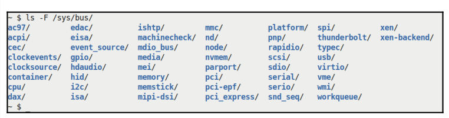

# 7.21

## Linux Kernel Programming

### 字符设备驱动

#### 了解设备基本知识。

​	有必要快速了解一些背景知识。设备驱动程序是操作系统和外围硬件设备之间的接口。它可以内联编写，即在内核映像文件中编译，或者更常见的是，作为内核模块在内核源代码树外部编写（我们在配套指南《Linux内核编程》第4章“编写第一个内核模块”LKM第1部分和第5章“编写第一个内核模块》LKM第2部分中详细介绍了LKM框架）。无论如何，驱动程序代码肯定会在内核空间中以操作系统权限运行（用户空间设备驱动程序确实存在，但可能会出现性能问题；虽然在许多情况下很有用，但我们在这里不会介绍它们。请看进一步阅读部分）。为了让用户空间应用程序访问内核中的底层设备驱动程序，需要一些I/O机制。Unix（以及Linux）的设计是让进程打开一种特殊类型的文件——设备文件或设备节点。这些文件通常位于/dev目录中，在现代系统中是动态的和自动填充的。设备节点充当设备驱动程序的入口点。为了让内核区分设备文件，它在索引节点数据结构中使用了两个属性：文件类型——字符（char）或块主要和次要数字

​	你会看到命名空间——设备类型和{major#，minor#}对——形成层次结构。设备（以及它们的驱动程序）在内核中组织成树状层次结构（内核中的驱动程序核心代码负责此项工作）。层次结构首先根据设备类型（块或字符）进行划分。其中，每种类型都有n个主要数字，每个主要数字都通过m个次要数字进一步分类；图1.1显示了这个层次结构。现在，块设备和字符设备之间的关键区别在于，块设备具有（内核级）挂载能力，从而成为用户可访问的文件系统的一部分。字符设备无法安装；因此，存储设备往往是基于块的。这样想（有点简单但有用）：如果（硬件）设备不是存储设备，也不是网络设备，那么它就是字符设备。大量设备属于“字符”类，包括典型的I2C/SPI（内部集成电路/串行外围接口）传感器芯片（温度、压力、湿度等）、触摸屏、实时时钟（RTC）、媒体（视频、相机、音频）、键盘、鼠标等。USB在内核中形成了一个类，用于基础设施支持。USB设备可以是块设备（笔驱动器、USB磁盘）、字符设备（鼠标、键盘、相机）或网络设备（USB加密狗）。从2.6 Linux开始，{major:minior}对是inode中的一个无符号32位量，一个位掩码（它是dev_ti_rdev成员）。在这32位中，MSB 12位表示主要数字，其余LSB 20位表示次要数字。快速计算表明，因此每个大数最多可以有212=4096个大数和220个小数，即100万个小数。所以，请看图1.1；在区块层次结构中，可能有4096个主要区块，每个区块最多有100万个次要区块。同样，在字符层次结构中，可能有4096个主要字符，每个字符最多可以有100万个次要字符：图1.1-设备命名空间或层次结构


​	你可能想知道：这个major:minor数字对到底是什么意思？将主要数字视为表示设备的类别（是SCSI磁盘、键盘、工作室终端（tty）还是伪终端（pty）设备、环回设备（是的，这些是伪硬件设备）、操纵杆、磁带设备、帧缓冲区、传感器芯片、atouchscreen等？）。确实有各种各样的设备；为了了解到底有多少，我们敦促您查看这里的内核文档：https://www.kernel.org/doc/Documentation/admin-guide/devices.txt（它实际上是Linux操作系统所有可用设备的官方注册表。它的正式名称是LANANA——Linux名称和数字分配机构！只有这些人才能正式为设备分配设备节点——类型和主要编号：次要编号）。次要数字的含义（解释）完全由驱动作者决定；内核不会干扰。通常，驱动程序将设备的次要数字解释为表示设备的物理或逻辑实例，或表示某种功能。（例如，小型计算机系统接口（SCSI）驱动程序（类型块，major#8）使用小数字表示最多16个磁盘的逻辑磁盘分区。另一方面，字符major#119由VMware的虚拟网络控制驱动程序使用。在这里，未成年人被解释为第一个虚拟网络、第二个虚拟网络，以此类推。）同样，所有驱动程序本身都会为其未成年人赋予意义。但每一条好规则都有例外。这里，规则的例外是misc类（类型字符，主#10），即内核不解释次要数字。它使用次要数字作为二级专业。这将在下一节中介绍。一个常见的问题是命名空间耗尽。几年前的一项决定“收集”了各种各样的字符设备——很多鼠标（不，不是动物界品种）、传感器、触摸屏等——归入一个名为“杂项”或“杂项”的类别，该类别被分配了字符主要编号10。misc类中有很多设备及其相应的驱动程序。实际上，他们共享同一个主要号码，并依靠一个唯一的次要号码来识别自己。我们将使用这个类并利用内核的“misc”框架编写一些驱动程序。

​	许多设备已经通过LANANA（Linux分配名称和数字机构）分配到misc字符的设备类中。图1.2显示了部分屏幕截图https://www.kernel.org/doc/Documentation/admin-guide/devices.txt展示的前几个misc设备、分配的次要编号和简要说明。请参阅完整列表的参考链接：


​	在图1.2中，最左侧的列有10个char，指定它在设备层次结构的字符类型下被分配了major#10（图1.1）。右侧的列格式为minor#=/dev/<foo><description>；很明显，这是分配的小编号，后面（在=符号之后）是设备节点和单行描述。

#### 关于Linux设备模型的快速说明

​	在不详细介绍的情况下，快速概述现代统一的Linux设备模型（LDM）非常重要。从2.6内核开始，现代Linux有一个奇妙的特性，LDM，它通过一个广泛而大胆的举措实现了与系统及其上的设备有关的许多目标。在其众多功能中，它创建了一个复杂的层次树，统一了系统组件、所有外围设备及其驱动程序。这棵树通过sysfs伪文件系统（类似于procfs如何将内核和进程/线程内部细节暴露给用户空间）暴露到用户空间，通常在/sys下挂载。在/sys中，您会发现几个目录——您可以将它们视为LDM中的“视口”。在我们的x86_64 Ubuntu虚拟机上，我们显示了挂载在/sys:

```
$mount | grep-w sysfs sysfs On/sys type sysfs（rw、nosuid、nodev、noexec、relatime）
```

下的sysfs文件系统。此外，看看里面：$

```
ls-F /sys/ 
block/ bus/ class/ dev/ devices/ firmware/ fs/ hypervisor/ kernel/ module/ power/
```

​	将这些目录视为LDM的视口——查看系统上设备的不同方式。当然，随着事情的发展，更多的人倾向于进入而不是离开（懒惰的方面！）。几个不明显的目录现在已经进入了这里。尽管（与procfs一样）sysfs被正式记录为应用程序二进制接口（ABI）接口，但这随时可能被更改/弃用；现实情况是，随着时间的推移，这个系统将继续存在，当然也会不断发展。简单地说，LDM可以被认为具有并连接了这些主要组件：系统上的总线。他们身上的设备。驱动设备的设备驱动程序（也称为客户端驱动程序）。

LDM的一个基本原则是，每个设备都必须驻留在总线上。这可能看起来很明显：USB设备将位于USB总线上，PCI设备位于PCI总线上，I2C设备位于I2C总线上，以此类推。因此，在/sys/bus层次结构下，您将能够通过它们所在的总线“看到”所有设备：



图1.3-现代Linux（在x86_64上）上的不同总线或总线

​	驱动程序基础设施内核的驱动程序核心提供总线驱动程序（通常是内核映像本身的一部分，或者根据需要在启动时自动加载），这当然使总线发挥作用。他们的工作是什么？至关重要的是，他们组织和识别上面的设备。如果新设备出现（可能是您插入了笔式驱动器），USB总线驱动程序将识别该行为并将其绑定到其（USB大容量存储）设备驱动程序！一旦成功绑定（使用许多术语来描述：绑定、枚举、发现），内核驱动程序框架就会调用驱动程序的已注册probe（）方法（函数）。这个问题方法现在可以设置设备、分配资源、IRQ、内存设置、根据需要注册它等等。关于LDM，另一个需要理解的关键方面是，现代LDM基址驱动器通常应该执行以下操作：将自己注册到（专门的）内核框架。将自己注册至总线。它注册到的内核框架取决于您使用的设备类型；例如，驻留在I2C总线上的RTC芯片的驱动程序将其自身注册到内核的RTC框架（通过RTC_register_device（）API）和I2C总线（内部通过I2C_register_driver（）API）。另一方面，PCI总线上网络适配器（NIC）的驱动程序通常会将其自身注册到内核的网络基础设施（通过register_netdev（）API）和PCI总线（通过PCI_register_driver（）API）。在专门的内核框架中注册可以使您作为驱动程序作者的工作变得更加容易——内核通常会提供辅助例程（甚至数据结构）来处理I/O细节，等等。例如，以前面提到的RTC芯片驱动程序为例。

​	你不需要知道如何通过I2C总线与芯片通信的细节，按照I2C协议的要求在串行时钟（SCL）/串行数据（SDA）线上输出数据。内核I2C总线框架为您提供了便利的例程（例如通常使用的I2C_smbus_*（）API），使您可以轻松地通过总线与相关芯片通信！如果你想知道如何获取有关这些驱动程序API的更多信息，这里有个好消息：官方内核文档提供了很多。请在此处查找Linux驱动程序实现者的API指南：https://www.kernel.org/doc/html/latest/driver-api/index.html.（在接下来的两章中，我们确实展示了驱动程序probe（）方法的一些示例；在那之前，请耐心等待。）相反，当设备与总线分离或内核模块卸载（或系统关闭）时，分离会导致驱动程序的remove（或disconnect（））方法被调用。在这两者之间，通过其驱动程序（总线和客户端）执行设备的工作！请注意，我们在这里忽略了很多内部细节，因为它们超出了本书的范围。重点是让你对LDM有一个概念上的理解。更多详细信息，请参阅进一步阅读部分的文章和链接。

在这里，我们希望保持我们的驱动覆盖范围非常简单和最小化，更多地关注基础知识。因此，我们选择编写一个可能使用最简单的内核框架（misc或杂项内核框架）的驱动程序。在这种情况下，驱动程序甚至不需要向任何总线（驱动程序）显式注册。事实上，它更像这样：我们的驱动程序直接在硬件上工作，不需要任何特定的总线基础设施支持。

​	然而，我们确实需要内核的misc框架支持，因此我们向其注册。接下来，理解这一点也很关键：我们的驱动程序是一个逻辑驱动程序，因为它没有驱动实际的物理设备或芯片。这通常是这种情况（当然，你可以说这里使用的硬件是RAM）。因此，如果我们要编写属于这个misc类的Linux字符设备驱动程序，我们首先需要向它注册。接下来，我们需要一个唯一的（未使用的）minornumber。同样，有一种方法可以让内核动态地为我们分配一个空闲的次要数字。下一节将介绍这些方面以及更多方面。

#### 了解进程、驱动程序和内核之间的联系

在这里，我们将深入研究Linux上成功注册字符设备驱动程序的内核内部。实际上，您将了解底层原始字符驱动程序框架的工作原理。file_operations结构或fops（发音为eff-oppops）对驱动程序作者至关重要；fops结构的大多数成员都是函数指针&把它们看作是虚方法。它们表示可以在（设备）文件上发出的所有可能的文件相关系统调用。因此，它具有打开、读取、写入、轮询、mmap、释放和其他几个成员（其中大多数是函数指针）。

​	驱动程序作者（或底层内核框架）的一项关键工作是填充这些函数指针，从而将它们链接到驱动程序中的实际代码。当然，你不需要实现每一个功能；有关详细信息，请参阅“处理不支持的方法”一节。现在，让我们假设您已经编写了驱动程序来为一些f_op方法设置函数。一旦您的驱动程序通过内核框架注册，当任何用户空间进程（或线程）打开注册到此驱动程序的设备文件时，内核虚拟文件系统交换机（VFS）层将接管。无需深入细节，只需说VFS为设备文件分配并初始化该进程的开放文件数据结构（结构文件）即可。现在，回想一下结构设备初始化中的最后一行；它是这样的：

```
.fops=&llkd_misc_fops，/*连接到此驱动程序的“功能”*/
```

​	这行代码有一个关键作用：它将进程的文件操作指针（位于进程的打开文件结构中）与设备驱动程序的文件操作结构联系起来。此设备文件的功能（驱动程序将执行的操作）现已设置完毕！

编写一个简单的杂项字符设备驱动程序第1章[24]让我们充实一下。现在（在您的驱动程序初始化后），一个用户模式进程通过对驱动程序发出open（2）系统调用来打开驱动程序的设备文件。假设一切顺利（也应该如此），该进程现在通过内核深处的file_operationsstructure指针连接到驱动程序。这里有一个关键点：在open（2）系统调用成功返回，并且进程在该（设备）文件上发出任何与文件相关的系统调用foo（）之后，内核VFS层将以面向对象的方式（我们在本书中已经指出了这一点！）盲目地、信任地调用已注册的fops->foo（）方法！用户空间进程打开的文件，通常是/dev中的设备文件，在内部由struct文件元数据结构表示（向此传递的一个指针，struct file\*filp，传递给驱动程序）。因此，就伪代码而言，当用户空间发出与文件相关的系统调用foo（）时，这就是内核VFSlayer有效地执行的操作：

```
/*伪代码：内核VFS层（不是驱动程序）*/
if（filp->f_op->foo）
	filp->f_op->foo（）;/*调用与“foo（）”对应的“已注册”驱动程序方法*/
```

​	因此，如果打开设备文件的用户空间进程调用其上的read（2）系统调用，内核VFS将调用filp->f_op->read（…），实际上将控制重定向到设备驱动程序。作为设备驱动程序的作者，你的工作是提供read（2）的功能！所有其他与文件相关的系统调用也是如此。从本质上讲，这就是Unixand Linux如何实现众所周知的——如果不是一个过程，那就是一个文件设计原则。

#### 处理不受支持的方法

​	您不必填充f_ops结构的每个成员，只需要填充驱动程序支持的那些成员。如果是这样的话，你已经填充了一些方法，但省略了轮询方法，并且用户空间进程在你的设备上调用了poll（2）（也许你已经记录了它不应该这样做的事实，但如果它这样做了呢？），那么会发生什么？在这种情况下，内核VFS检测到foo指针（在本例中为poll）为NULL，返回一个适当的负整数（实际上，遵循相同的0/-E协议）。glibc代码将此值乘以-1，并将调用进程的errno变量设置为该值，表示系统调用失败。

​	需要注意两点：

VFS返回的负errno值通常不是很直观。（例如，如果您将f_op的read（）函数指针设置为NULL，则VFS会导致EINVAL值被发回。这使得用户空间进程认为读取（2）失败是因为“无效参数”错误，而事实根本不是这样！）

​	lseek（2）系统调用让驱动程序查找文件中的指定位置——当然，这里我们指的是设备中的位置。内核故意将f_op函数指针命名为llseek（注意两个'l'）。这只是为了提醒您lseek的返回值可以是64位（长-长）的量。现在，对于大多数硬件设备，lseek值没有意义，因此大多数驱动程序不需要实现它（与文件系统不同）。现在，问题是：即使你不支持lseek（你已经将f_op的llseek成员设置为NULL），它仍然会返回一个随机正值，从而导致用户模式应用程序正确地得出成功的结论。因此，如果你没有实现lseek，你需要执行以下操作：

1。将llseek显式设置为特殊的no_lilseek值，这将导致返回失败值（-ESPIPE；非法查找）。

在这种情况下，您还需要在驱动程序的open（）方法中调用nonsekable_open（）函数，指定文件不可查找（这在open（）法中通常是这样调用的：return nonsekale_open（struct inode*inode，struct file*filp）；。LWN的文章在这里介绍了细节和更多内容：https://lwn.net/Articles/97154/.你可以在这里看到这给许多司机带来的变化：https://lwn.net/Articles/97180/).如果您不支持函数，则返回的适当值是-ENOSYS，这将使用户模式进程看到错误function未实现（当它调用perror（3）或strerror（3）库API时）。这是明确无误的；用户空间的开发者现在将明白您的驱动程序不支持此功能。因此，实现驱动程序的一种方法是设置指向所有文件操作方法的指针，并为驱动程序中所有与文件相关的系统调用（f_op方法）编写一个例程。对于你支持的theos，编写代码；对于那些你没有实现的，只返回值-ENOSYS。虽然这有点费力，但它将为用户空间带来明确的返回值。

#### 将数据从内核复制到用户空间，反之亦然

​	设备驱动程序的主要工作是使用户空间应用程序能够透明地线程和写入数据到外围硬件设备（通常是某种芯片；但它可能根本不是硬件），将设备视为一个普通文件。因此，要从设备读取数据，应用程序打开与该设备对应的设备文件，从而获得文件描述符，然后使用该fd简单地发出read（2）系统调用（图1.7中的步骤1）！内核VFS拦截读取，并且，正如我们所看到的，控制流指向底层设备驱动程序的读取方法（当然，这是一个C函数）。驱动程序代码现在与硬件设备“对话”，实际执行I/O和读取操作。（硬件读取（或写入）的具体执行方式在很大程度上取决于硬件的类型——是内存映射设备、端口、网络芯片等吗？我们在此不再深入探讨；下一章会。）驱动程序从设备读取数据后，现在将这些数据放入kernelbuffer，kbuf（下图中的步骤2。当然，我们假设驱动程序通过[k|v]malloc（）或其他合适的内核API为其分配了内存）。我们现在在内核空间缓冲区中有硬件设备数据。我们应该如何将其传输到用户空间进程的内存缓冲区？我们将利用内核API，使其易于实现；接下来将对此进行介绍。

#### 利用内核API执行数据传输

​	现在，如前所述，让我们假设您的驱动程序已经读取了硬件数据，并且它现在存在于内核内存缓冲区中。我们如何将其转移到用户空间？一种可行的方法是简单地尝试通过memcpy（）执行此操作，但不行，这不起作用（为什么？第一，它不安全；第二，它非常依赖于拱；它在某些架构上有效，而在其他架构上无效）。因此，一个关键点是：内核提供了几个内联函数，用于将数据从内核传输到用户空间，反之亦然。它们分别是copy_to_user（）和copy_from_user（），确实非常常用。

​	使用它们很简单。两者都有三个参数：to指针（目标缓冲区）、from指针（源缓冲区）和n，要复制的字节数（就像memcpy操作一样）：


​	返回值是未复制的字节数；换句话说，返回值0表示成功，非零返回值表示未复制给定数量的字节。如果出现非零返回，您应该（按照通常的0/-E返回约定）通过返回-EIO或-EFAULT（从而将用户空间中的errno设置为正对应项）返回一个指示I/O故障的错误。以下（伪）代码说明了设备驱动程序如何使用copy_to_user（）函数将一些数据从内核复制到用户空间


当然，在这里，我们假设您有一个有效的分配的内核内存缓冲区、kbuf和avalid设备指针（struct device*dev）。图1.7说明了前面的（伪）代码试图实现的目标：


​	相同的语义适用于使用copy_from_user（）内联函数。它通常用于驱动程序写入方法的上下文中，将用户空间进程上下文写入的数据拉入内核空间缓冲区。我们将留给你来想象这一点。同样重要的是要意识到，这两个例程（copy_[from|to]_user（））在运行过程中都可能导致进程上下文（page）出错，从而进入休眠状态；换句话说，调用调度器。因此，它们只能在可以安全睡眠的进程上下文中使用，而不能在任何类型的原子或中断上下文中使用（我们在第4章“处理硬件中断”的“不要阻塞——发现可能阻塞的代码路径”一节中详细解释了light_sleep（）助手——一种调试辅助工具）。

## Kernel Debug Programming

​	内存到底有什么问题？本章开头的介绍性段落告诉你一个恼人的事实，即尽管用C编程就像拥有一种超能力（至少对于你典型的OS/驱动程序/嵌入式领域来说），但这是一把双刃剑：我们人类无意中会产生缺陷和错误。尤其是内存错误，实在太常见了。事实上，在第2章“内核调试方法”的“错误类型——内存视图”一节中，我们提到了内存视图是错误类型分类的不同方法之一。为了便于回忆，并在这里强调其重要性，我重新列出了常见的内存损坏错误类型的简短列表：

•不正确的内存访问：

使用未初始化的变量，也称为非初始化内存读取（UMR）

错误越界（OOB）内存访问（读/写下溢/上溢错误）

免费使用（UAF）和返回后使用（UAR）（也称为范围外）

错误双重释放错误

•内存泄漏

•数据竞争

•（内部）碎片

​	这些（除最后一个之外）是进程甚至操作系统可能遇到的众所周知的未定义行为（UB）问题之一。在本章中，您将了解这些问题，重点是内核/驱动程序代码，更重要的是，如何使用各种工具和方法来捕捉它们。更确切地说，在本章中，我们将重点介绍前两个：不正确的内存访问——包括各种常见的内存错误：UMR、OOB、UAF/UAR和double free。在下一章中，我们将重点介绍通过SLUB调试框架捕获板状内存中的内存缺陷以及检测内存泄漏。我们将在第8章“锁调试”中介绍数据争用及其复杂性（因为它们最常见的原因是不正确地使用锁），下一章“学习使用slabinfo和相关实用程序”部分将提到（内部）碎片或浪费。

#### 使用KASAN和UBSAN查找内存错误

​	内核地址清理器（KASAN）是Linux内核地址清理工具（ASAN）的一个端口。事实证明，ASAN项目在检测与记忆相关的缺陷方面非常有用，因此在内核中具有相似的能力是显而易见的。ASAN是少数可以检测缓冲区超限缺陷的工具之一，该缺陷是著名的Heartbleed漏洞的根源！请参阅进一步阅读部分，了解一个非常有趣的XKCD漫画链接，该链接完美地说明了Heartbleed的核心缺陷。了解KASAN——基本知识KASAN的几个要点将帮助您了解更多：•KASAN是一个动态的运行时分析工具；它在代码运行时工作。这应该让你意识到，除非代码实际运行（执行），否则KASAN不会捕获任何错误。这强调了编写真正好的测试用例（包括正面和负面）的重要性，以及使用模糊测试工具来捕获很少运行的代码路径的重要性！在后面的章节中会有更多关于这一点的内容，但这是一个关键点，我也在这里强调KASAN背后的技术称为编译时仪器（CTI）（又名静态仪器）。在这里，我们不打算深入了解它是如何工作的；请参阅进一步阅读部分了解更多信息。简而言之，当使用GCC或Clang-fsanitize=kernel addressoption开关构建内核时，编译器会插入汇编级指令来验证每次内存访问。此外，每个字节的内存都使用1字节的影子内存来跟踪8字节的实际内存开销相对较低（约为2倍至4倍）。这很低，特别是与Valgrind等动态仪器方法相比，后者的开销很容易达到20到50倍。好吧，就KASAN的开销而言，真正受伤的是RAM（比CPU多）开销。这完全取决于你来自哪里。对于企业级服务器系统，使用几兆字节的RAM作为KASAN的开销是可以容忍的。对于资源受限的嵌入式系统来说，情况可能并非如此（典型的Android智能手机、电视、可穿戴设备、低端路由器和类似产品就是很好的例子）。出于这个关键原因，现代Linux内核支持三种类型或模式的KASAN实现：

- 通用KASAN（除非另有说明，否则我们在这里指的是和使用的KASAN）：高开销和仅调试。
- 基于软件标签的KASAN：实际工作负载的中到低开销。目前仅支持ARM64
- 基于硬件标签的KASAN：低开销和生产能力。目前，仅支持ARM64。

​	第一个是默认值，也是在主动调试（或bug查找）时使用的值。它在三者中具有最大的相对开销，但在bug捕获方面非常有效！基于软件标签的方法具有显著较低的开销；它适用于测试实际工作负载。第三个基于硬件标签的版本开销最低，甚至适合生产使用！用户模式应用程序的内存检查事实上，ASAN工具最初是由谷歌工程师作为用户空间应用程序的GCC（以及很快的Clang）补丁实现的。该套件包括ASAN、泄漏消毒器（LSAN）、内存消毒器（MSAN）、线程消毒器（TSAN）和未定义行为消毒器（UBSAN）。它们——尤其是ASAN——非常强大，是用户空间应用程序内存检查的必备工具！我之前的书《使用Linux进行系统编程实践》详细介绍了使用ASAN（和Valgrind）。在接下来的讨论中，我假设采用了通用KASAN模式，主要是为了（内存）调试。实际上，正如您将在下一节中看到的，这有点没有意义，因为其他基于标记的模式目前仅在ARM64上受支持。使用KASAN的要求首先，由于KASAN（以及UBSAN）是基于编译器的技术，您应该使用哪种编译器？GCC和Clang都支持。您需要相对较新版本的编译器才能利用KASAN——在撰写本文时，您需要以下内容：•GCC版本：8.3.0或更高版本•Clang版本：任何。为了检测全局变量上的OOB访问，需要Clang版本11或更高版本。


一节中介绍Clang的使用。接下来，在硬件方面，KASAN传统上需要64位处理器。为什么？回想一下，它使用了一个影子内存区域，其大小是内核虚拟地址空间的八分之一。在x86_64上，内核VAS区域为128 TB（用户模式虚拟地址空间（VAS）区域也是如此）。其中八分之一是重要的——它是16TB。那么，KASAN实际上在哪些平台上工作呢？直接引用官方内核文档：目前，通用KASAN支持x86_64、arm、arm64、xtensa、s390和riscv架构，基于标签的KASAN模式仅支持arm64。你注意到了吗？甚至支持ARM——ARM 32位处理器！这是最近的事情，从5.11内核开始。不仅如此，至少在撰写本文时，基于较低开销标签的KASAN类型仅支持ARM64。你有没有停下来想知道，为什么是ARM64？显然，这是由于Android的惊人普及。许多（如果不是大多数）Android设备都是通过片上系统（SoC）内的ARM64内核供电的。在当今的信息经济中，检测Android上的内存缺陷（包括用户空间和内核中的内存缺陷）至关重要。因此，基于标签的KASAN模式在这个关键平台上工作！在表5.2中，我以粗体突出显示了Generic KASAN，因为它是我们在这里要使用的。

正如我们在配套指南《Linux内核编程》第4章“编写你的第一个内核模块——LKM第1部分”的“库和系统调用API”小节中看到的，用户空间应用程序和包含设备驱动程序的内核之间的基本接口是系统调用API。现在，在上一章中，您学习了为Linux编写字符设备驱动程序的基础知识。在此过程中，您还学习了如何通过让用户模式应用程序打开设备文件并发出读取（2）和写入（2）系统调用，在用户和内核地址空间之间传输数据。这导致驱动程序的读/写方法被VFS调用，您的驱动程序通过copy_{from|to}_user（）API执行数据传输。所以，这里的问题是：如果我们已经了解了这一点，那么在这方面还有什么值得学习的呢？啊，相当多！现实情况是，在auser模式应用程序和内核之间还有其他几种接口技术。当然，它们都非常依赖于使用系统调用；毕竟，没有其他（同步、编程）方式可以从用户空间进入内核！然而，技术不同。本章的目的是向您展示各种可用的通信接口，当然，根据项目的不同，其中一个可能比其他接口更适合使用。让我们来看看本章中用于用户和内核地址空间之间接口的各种技术：通过传统的procfs接口通过sysfs通过debugfs通过netlink socket通过ioctl（2）系统调用在本章中，我们将通过提供驱动程序代码示例详细讨论这些接口技术。此外，我们还将简要探讨它们对调试目的的帮助。那么，让我们从使用procfs接口开始。通过proc文件系统（procfs）进行接口在本节中，我们将介绍proc文件系是什么，以及如何将其用作用户和内核地址空间之间的接口。proc文件系统是一个功能强大且易于编程的接口，通常用于状态报告和调试核心内核系统。请注意，从2.6版Linux开始，对于上游贡献，驱动程序作者不得使用此接口（严格来说，这仅意味着forkernel内部使用）。

​	您可以将内核配置选项Instrumentation类型设置为config_KASAN_OUTLINE（默认值）或config_KALAN_INLINE。这是典型的权衡：默认的轮廓类型将导致较小的内核映像，而内联类型将导致较大的映像，但速度更快（1.1倍到2倍）。此外，（特别是对于您的调试内核），启用内核配置config_STACKTRACE是值得的，这样当检测到错误时，您还可以在报告中获得受影响板对象的分配和释放的堆栈跟踪。同样，打开CONFIG_PAGE_OWNER（位于菜单内核黑客|内存调试|跟踪页面所有者中）将为您提供受影响物理页面的分配和释放的堆栈跟踪。默认情况下，它处于关闭状态；您必须使用参数page_owner=on启动。此外，在为KASAN配置x86_64时，您会发现一个关于vmalloc内存损坏检测的额外内核配置。该选项显示如下：[*]在vmalloc空间中使用真实影子内存进行反向映射。这有助于检测与vmalloc相关的内存损坏问题（以运行时更高的内存使用率为代价）。理论和KASAN内核配置到此为止。请配置并（重新）构建（调试）内核，我们很乐意尝试一下！使用KASANI进行Bug搜索将假设到目前为止，您已经配置、构建并引导到使用KASAN启用的（调试）内核中（如前一节详细描述的那样）。在我的设置中——一个x86_64 Ubuntu 20.04 LTS客户机——这已经完成了。为了测试KASAN是否有效，我们需要执行有内存错误的代码（我几乎可以听到你们中的一些老前辈说“是吗？这应该不太难”）。我们总是可以编写自己的测试用例，但为什么要重新发明轮子呢？这是一个很好的机会来查看内核测试基础设施的一部分！以下部分将向您展示我们将如何利用内核的KUnit单元测试框架来运行KASAN测试用例。使用内核的KUnit测试基础架构运行KASAN测试用例当社区已经为我们完成了工作时，为什么还要费心编写我们自己的测试用例来测试KASAN呢？啊，开源的美丽。Linux内核现在已经发展得足够成熟，可以内置多种测试基础设施，包括功能齐全的测试套件；现在，测试内核的各个方面就是正确配置内核并运行测试！

​	两个主要的框架是KUnit框架和kselftest框架。仅供参考，官方内核文档当然有所有的细节。首先，您可以查看以下内容：内核测试指南：https://www.kernel.org/doc/html/latest/dev-tools/testing-overview.html#kernel-testing-guide -它提供了内核中可用测试框架和工具（包括动态分析）的粗略概述。同样，仅供参考，还有其他几个相关且有用的框架：内核故障注入、通知错误注入、Linux内核转储测试模块（LKDTM）等。您可以在此处的内核配置下找到它们：内核黑客|内核测试和覆盖率。同样，我们不打算深入研究KUnit在这里是如何工作的；目前，我们的想法是只使用KUnit来测试KASAN作为一个实际例子。有关使用这些测试框架的详细信息，它可能会被证明是有用的请参阅“进一步阅读”部分中的链接。作为一件务实的事情，为了开始熟悉它，让我们利用内核的KUnit（Linux内核的单元测试）框架来执行KASAN测试用例！这真的很容易做到。首先，确保您的调试内核配置为使用KUnit:CONFIG_KUnit=y（或CONFIG_KUnit=m）。我们打算运行KASAN测试用例，因此，我们也必须配置KASAN测试模块：CONFIG_KASAN_KUNIT_test=m

​	请注意前面屏幕截图中的以下内容：•在前两行中，KUnit显示了测试标题（作为#Subtest:KASAN），它将运行测试用例1..38。•KASAN成功地检测到了内存缺陷、写溢出，并生成了一份报告。报告以BUG:KASAN:[…]开头，详细内容如下以下几行揭示了根本原因：KASAN显示违规函数的格式为func（）+0xoff_from_func/0xsize_of_func，其中，在名为func的函数中，错误发生在从函数开始偏移0xoff_fom_func字节处，内核估计函数长度为0xsize_of_funk字节。因此，在这里，kmalloc_oob_right（）函数中的代码在内核模块test_kasan（显示在最右侧的方括号内）中，从函数开头偏移0x159字节（后面是对函数长度的有根据的猜测，即0x260字节），试图在指定地址非法写入。缺陷，即bug，是对slab内存缓冲区的OOB写入，如slab越界标记所示：bug:KASAN:kmalloc_ob_right+0x159/0x260[test_KASAN]任务kunit_try_catch/1206在地址ffff8880316a45fb写入大小为1的slab越界。•以下行显示了发生这种情况的进程上下文（我们将在下一章中介绍受污染标志的含义）：CPU:2 PID:1206 Comm:kunit_try _catch tainted:G O 5.10.60-dbg01#6•下一行显示了硬件细节（您可以看到它）虚拟机VirtualBox）大部分输出是调用堆栈（标记为“调用跟踪：”）。通过自下而上阅读（忽略任何前缀为？的行），你可以真正看到控制是如何实现的，这是一段有缺陷的代码任务1206分配的行：以下输出显示了内存分配代码路径的调用轨迹。这可能非常有用，可以显示内存缓冲区最初是由谁分配的，在哪里分配的。

#### 使用我们定制的有缺陷的内核模块进行的剩余测试

​	您是否注意到，尽管已经运行了所有KASAN KUnit测试用例，但似乎还有一些通用的内存缺陷（正如我们在第4章“通过仪器调试-使用Kprobes”以及本章“内存有什么问题？”一节中发现的那样）是KUnit的测试用例没有涵盖的未初始化内存读取（UMR）错误•返回后使用（UAR）错误？简单的内存泄漏错误（我们将在本章稍后更详细地讨论内存泄漏）因此，我编写了一个内核模块来练习这些测试用例（当然是在运行支持Generic KASAN的调试内核时），以及一些更有趣的测试用例。要针对KASAN进行测试，请记住通过自定义调试内核启动，该内核（显然）具有CONFIG_KASAN=y。

使用KASAN和UBSAN查找内存错误201由于空间限制，我不会在这里显示我们测试模块的整个代码（请参阅本书的GitHub仓库并阅读其中的注释——您可以在ch5/kmembugs_test文件夹下找到它）。为了了解它的味道，让我们来看看其中一个测试用例以及它是如何被调用的。这是UAR测试用例的代码：


​	该模块设计为通过名为load_testmod的bash脚本加载，测试用例以交互方式运行（通过bash名为run_tests的包装器脚本）。run_tests脚本（您必须以root身份运行）显示可用测试的菜单，并要求您通过键入其分配的编号来选择任何一个。在接下来的部分中，您可以在图5.8中看到菜单的屏幕截图，以及您可以尝试的所有测试用例。然后，脚本将此数字写入我们的debugfs伪文件：/sys/kernel/debug/test_kmembugs/lkd_dbgfs_run_testcase。然后，debugfs写挂钩函数从用户空间接收此数据，对其进行验证，并调用相应的测试用例例程（通过一个相当长的if-else梯形图）。此设计允许您以交互方式进行测试，并根据需要多次执行任何测试用例。以下是一段代码片段，显示了我们的debugfs模块代码如何调用前面的uar（）测试用例：


显然，这个测试用例#2是一个缺陷，一个bug。你知道局部变量只在它们的生命周期内有效——当函数执行时。当然，这是因为在执行过程中，局部（或自动）变量被分配到进程上下文的（内核模式）堆栈帧上。因此，一旦超出其包含函数的范围，就必须停止引用局部变量。我们（故意）不这样做！我们试图把它作为回报。问题是，到那时，它已经消失了。。。好吧，在开始运行测试用例之前（尽管现在没有理由不能运行它们），我们陷入了一个有趣的困境：一个已知的bug（比如我们的UAR bug）有时看起来是如何完美工作的。

#### 陈旧的框架——天堂中的麻烦

​	像这样的bug的惊人（或疯狂）之处——UAR缺陷——是代码有时似乎还能正常工作！怎么会？它是这样的：保存本地（自动）变量内容的内存在堆栈上。现在，尽管我们通俗地说堆栈帧在函数输入时分配，在函数返回时销毁（所谓的函数序言和结语），但现实并不那么戏剧化。

​	使用KASAN和UBSAN查找内存错误203现实情况是，内存通常以页面级粒度分配。这包括堆栈页面的内存。因此，一旦为堆栈分配了一页内存，通常就有足够的内存容纳几帧（当然，这取决于具体情况）。然后，当堆栈需要更多内存时，它就会增长（通过向下分配更多页面，因为它是堆栈）。通过让堆栈指针（SP）寄存器跟踪此内存位置，系统知道堆栈的顶部在哪里。此外，您会意识到所谓的“堆栈顶部”通常是最低的合法地址。因此，当分配帧和/或调用函数时，SP寄存器值会减小。当函数返回时，堆栈会通过添加到SP寄存器而缩小（记住，这是一个向下增长的堆栈！）。下图是（32位）Linux系统上典型内核模式堆栈的表示：


​	使用UBSAN内核检查器查找未定义行为C等语言的一个严重问题是，编译器为正确的情况生成代码，但当源代码做了一些意外或完全错误的事情时，编译器通常不知道该做什么——它只是轻率地忽略了这些情况。这实际上有助于以（可能的安全）错误为代价生成高度优化的代码！这方面的例子很常见：数组溢出/欠流、算术缺陷（如除以零或溢出/欠流入有符号整数）等等。更糟糕的是，有时有缺陷的代码似乎还能工作（正如我们在stale frames中访问过时的堆栈内存时所见——天堂的麻烦部分）。同样，糟糕的代码可能在优化的情况下工作，也可能不工作。因此，这样的情况无法预测，被称为未定义行为（UB）。内核的Undefined Behavior Sanitizer（UBSAN）捕获了几种类型的运行时UB。与KASAN一样，它使用编译时检测（CTI）来实现这一点。在完全启用UBSAN的情况下，内核代码使用–fsanitize=undefinedoption开关进行编译。UBSAN捕获的UB包括以下内容：

•算术相关UB：算术上溢/下溢/除零/等等……

位移位时的OOB访问

•内存相关UB：数组NULL指针解引用未对齐内存访问对象大小不匹配

其中一些缺陷实际上与Generic KASAN捕获的缺陷重叠。UBSAN检测代码肯定更大、更慢（是原来的2到3倍）。尽管如此，捕捉UB缺陷仍然非常有用，尤其是在开发和单元测试期间。事实上，如果你能负担得起更大的内核文本大小和处理器开销（除了微型嵌入式系统之外，你可能可以负担得起），那么在生产系统上启用UBSAN是可行的。
