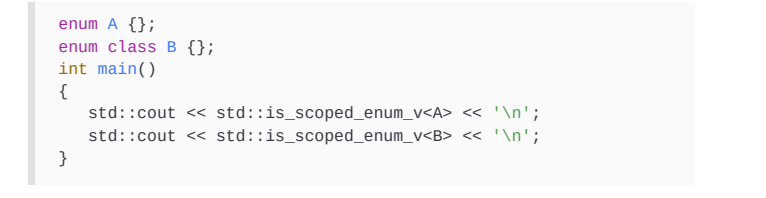

# 7.22

# GotW #94 Solution: AAA Style (Almost Always Auto)

 [Herb Sutter](https://herbsutter.com/author/herbsutter/) [C++](https://herbsutter.com/category/c/) 2013-08-12 18 Minutes

*Toward correct-by-default, efficient-by-default, and pitfall-free-by-default variable declarations, using “AAA style”… where “triple-A” is both a mnemonic and an evaluation of its value.
*

# Problem

## JG Questions

1. What does this code do? What would be a good name for some_function?

```
template<class Container, class Value>
void some_function( Container& c, const Value& v ) {
    if( find(begin(c), end(c), v) == end(c) )
        c.emplace_back(v); 
    assert( !c.empty() );
}
```

2. What does “write code against interfaces, not implementations” mean, and why is it generally beneficial?

## Guru Questions

3. What are some popular concerns about using auto to declare variables? Are they valid? Discuss.
4. When declaring a new local variable x, what advantages are there to declaring it using auto and one of the two following syntaxes:

(a) auto x = init; when you don’t need to commit to a specific type? (Note: The expression init might include calling a helper that performs partial type adjustment, such as as_signed, while still not committing to a specific type.)

(b) auto x = type{ init }; when you do want to commit to a specific type by naming a type?

List as many as you can. (Hint: Look back to GotW #93.)

5. Explain how using the style suggested in #4 is consistent with, or actively leverages, the following other C++ features:

(a) Heap allocation syntax.

(b) Literal suffixes, including user-defined literal operators.

(c) Named lambda syntax.

(d) Function declarations.

(e) Template alias declarations.

6. Are there any cases where it is not possible to use the style in #4 to declare all local variables?

# Solution

## 1. What does this code do? What would be a good name for some_function?

```
template<class Container, class Value>
void append_unique( Container& c, const Value& v ) {
    if( find(begin(c), end(c), v) == end(c) )
        c.emplace_back(v); 
    assert( !c.empty() );
}
```

Let’s call this function append_unique. First, it checks to see whether the value v is already in the container. If not, it appends it at the end. Finally, it asserts that c is not empty, since by now it must contain one copy of the value v.

You probably thought this question was fairly easy.

Maybe *too* easy.

If so, good. That’s the point of the example. Hold the thought, and we’ll come back to this in Question 3.

## 2. What does “write code against interfaces, not implementations” mean, and why is it generally beneficial?

It means we should care principally about “what,” not “how.” This separation of concerns applies at all levels in high-quality modern software—hiding *code*, hiding *data*, and hiding *type*. Each increases encapsulation and reduces coupling, which are essential for large-scale and robust software.

Please indulge a little repetition in the following paragraphs. It’s there to make a point about similarity.

**Hiding code.** With the invention of separately compiled functions and structured programming, we gained “encapsulation to *hide code.*” The caller knows the signature only—the function’s internal code is not his concern and not accessible programmatically, even if the function is inline and the body happens to be visible in source code. We try hard not to inadvertently leak implementation details, such as internal data structure types. The point is that the caller does not, and should not, commit to knowledge of the current internal code; if he did, it would create interdependencies and make separately compiled libraries impossible.

**Hiding data (and code).** With object oriented styles (OO), we gained two new manifestations of this separation. First, we got “more encapsulation to *hide both code and data.*” The caller knows the class name, bases, and member function signatures only—the class’s internal data and internal code are hidden and not accessible programmatically, even though the private class members are lexically visible in the class definition and inline function bodies may also be visible. (In turn, dynamic libraries and the potential future-C++ modules work aim to accomplish the same thing at a still larger scale.) Again we try hard not to inadvertently leak implementation details, and again the point is that the caller does not, and should not, commit to knowledge of the current internal data or code, which would make the class difficult to ever change or to ship on its own as a library.

**Hiding type (run-time polymorphism).** Second, OO also gave us “separation of interfaces to *hide type.*” A base class or interface can delegate work to a concrete derived implementation via virtual functions. Now the interface the caller sees and the implementation are actually different types, and the caller knows the base type only—he doesn’t know or care about the concrete type, including even its size. The point, once again, is that the caller does not, and should not, commit to a single concrete type, which would make the caller’s code less general and less able to be reused with new types.

**Hiding type (compile-time polymorphism).** With templates, we gained a new compile-time form of this separation—and it’s still “separation of interfaces to *hide type*.” The caller knows an ad-hoc “duck typed” set of operations he wants to perform using a type, and any type that supports those operations will do just fine. The contemplated future C++ concepts feature will allow making this stricter and less ad-hoc, but still avoids committing to a concrete type at all. The whole point is still is that the caller does not, and should not, commit to a single concrete type, which would make the caller’s code less generic and less able to be reused with new types.

## 3. What are some popular concerns about using auto to declare variables? Are they valid? Discuss.

In many languages, not just C++, there are several reasons people commonly give for why they are reluctant to use auto to declare variables (or the equivalent in another language, such as var or let). We could summarize them as: *laziness*, *commitment*, and *readability*. Let’s take them in order.

### Laziness and commitment

First, laziness: One common concern is that “writing auto to declare a variable is primarily about saving typing.” However, this is just a misunderstanding of auto. As we saw in GotW #92 and #93 and will see again below, the main reasons to declare variables using auto are for correctness, performance, maintainability, and robustness—and, yes, convenience, but that’s in last place on the list.

> **Guideline:** Remember that preferring **auto** variables is motivated primarily by correctness, performance, maintainability, and robustness—and only lastly about typing convenience.

Second, commitment: “But in some cases I do want to commit to a specific type, not automatically deduce it, so I can’t use auto.” It’s true that sometimes you do want to commit to a specific type, but you can still use auto. As demonstrated in GotW #92 and #93, not only can you still write declarations of the form auto x = type{ init }; (instead of type x{init};) to commit to a specific type, but there are good reasons for doing so, such as that saying auto means you can’t possibly forget to initialize the variable.

> **Guideline:** Consider declaring local variables **auto x = type{ expr };** when you do want to explicitly commit to a type. It is self-documenting to show that the code is explicitly requesting a conversion, it guarantees the variable will be initialized, and it won’t allow an accidental implicit narrowing conversion. Only when you do want explicit narrowing, use **( )** instead of **{ }**.

### (Un)readability?

The third and most common argument concerns readability: “My code gets unreadable quickly when I don’t know what exact type my variable is without hunting around to see what that function or expression returns, so I can’t just use auto all the time.” There is truth to this, including losing the ability to search for occurrences of specific types when using the non-typed syntax *auto x = expr;* in 4(a) below, so this appears at first to be a strong argument. And it’s true that any feature can be overused. However, I think this argument is actually weaker than it first seems for four reasons, two minor and two major.

The two minor counterarguments are:

- The “can’t use auto” part isn’t actually true, because as we just saw above you can be explicit about your type and still use auto, with good benefit.
- The argument doesn’t apply when you’re using an IDE, because you can always tell the exact type, for example by hovering over the variable. Granted, this mitigation goes away when you leave the IDE, such as if you print the code.

But we should focus on the two major counterarguments:

- It reflects a bias to code against implementations, not interfaces. Overcommitting to explicit types makes code less generic and more interdependent, and therefore more brittle and limited. It runs counter to the excellent reasons to “write code against interfaces, not implementations” we saw in Question 2.
- **We (meaning \*you\*) already ignore actual types all the time…
  **

“… Wait, what? I do not ignore types all the time,” someone might say. Actually, not only do you do it, but you’re so comfortable and cavalier about it that you may not even realize you’re doing it. Let’s go back to that code in Question 1:

```
template<class Container, class Value>
void append_unique( Container& c, const Value& v ) {
    if( find(begin(c), end(c), v) == end(c) )
        c.emplace_back(v); 
    assert( !c.empty() );
}
```

*Quick quiz:* How many specific types are mentioned in that function? Name as many as you can.

Take a moment to consider that before reading on…

… We can see pretty quickly that the answer is a nice round number: Zero. Zilch. (Pedantic mode: Yes, there’s void, but I’m going to declare that void doesn’t count because it’s to denote “no type,” it’s not a meaningful type.)

Not a single specific type appears anywhere in this code, and the lack of exact types makes it much more powerful and doesn’t significantly harm its readability. Like most people, you probably thought Question 1 felt “easy” when we did it in isolation. Granted, this is generic code, and not all your code will be templates—but the point is that the code isn’t unreadable even though it doesn’t mention specific types, and in fact auto gives you the ability to write generic code even when *not* writing a template.

So starting with the cases illustrated in this short example, let’s consider some places where we routinely ignore exact types. First, function template parameters:

- What exact type is Container? We have no idea, and that’s great… anything we can call begin, end, emplace_back and empty on and otherwise use as needed by this code will do just fine. In fact, we’re glad we don’t know anything about the exact type, because it means we’re following the Open/Closed Principle and staying open for extension— this append_unique will work fine with a type that won’t be written until years from now. Interestingly, the concepts feature currently being proposed for ISO C++ to express template parameter constraints doesn’t change how this works at all, it only makes it more convenient to express and check the requirements. Note how much more powerful this is compared to OO style frameworks: In OO frameworks where containers have to inherit from a base class or interface, that’s already inducing coupling and limiting the ability to just plug in and use arbitrary suitable types. It is important that we can know nothing at all about the type here besides its necessary interface, not even restricting it by as much as limiting it to types in a particular inheritance hierarchy. We should strongly resist compromising this wonderful and powerful “strictly typed but loosely coupled” genericity.
- What exact type is Value? Again, we don’t know, and we don’t want to know… anything we can pass to find and emplace_back is just dandy. At this point some of you may be thinking: “Oh yes we know what type it is, it’s the container’s value type!” No, it doesn’t have to be that, it just has to be convertible, and that’s important. For example, we want vector<string> vec; append_unique(vec, “xyzzy”); to work, and “xyzzy” is a const char[6], not a string.

Second, function return values:

- What type does find return? Some iterator type, the same as begin(c) coughed up, but we don’t know specifically what type it is just from reading this code, and it doesn’t matter. We can look up the signature if we’re feeling really curious, but nobody bothers doing that because anything that’s comparable to end(c) will do.
- What type does empty return? We don’t even think twice about it. Something testable like a bool… we don’t care much what exactly as long as we can “not” it.

Third, many function parameters:

- What specific type does emplace_back take? Don’t know; might be the same as v, might not. Really don’t care. Can we pass v to it? Yes? Groovy.

And that’s just in this example. We routinely and desirably ignore types in many other places, such as:

- Fourth, any temporary object: We never get to name the object, much less name its type, and we may know what the type is but we don’t care about actually spelling out either name in our code.
- Fifth, any use of a base class: We don’t know the dynamic concrete type we’re actually using, and that’s a benefit, not a bug.
- Sixth, any call to a virtual function: Ditto; plus on top of that if the virtual function return type itself could also be covariant for another layer of “we don’t know the dynamic concrete type” since in the presence of covariance we don’t know what type we’re actually getting back.
- Seventh, any use of function<>, bind, or other type erasure: Just think about how little we actually know, and how happy it makes us. For example, given a function<int(string)>, not only don’t we know what specific function or object it’s bound to, we don’t even know that thing’s signature—it might not actually even take a string or return an int, because conversions are allowed in both directions, so it only has to take something a string can be converted to, and return something that can be converted to an int. All we know is that it’s something that we can invoke with a string and that gives us back something we can use as an int. Ignorance is bliss.
- Eighth, Any use of a C++14 generic lambda function: A generic lambda just means the function call operator is a template, after all, and like any function template it gets stamped out individually for whatever actual argument types you pass each time you use it.

There are probably more.

Although lack of commitment may be a bad thing in other areas of life, not committing to a specific type is often desirable by default in reusable code.

## 4. When declaring a new local variable x, what advantages are there to declaring it using auto and one of the two following syntaxes:

Let’s consider the base case first, which has by far the strongest arguments in its favor and is gaining quite a bit of traction in the C++ community.

### (a) auto x = init; when you don’t need to commit to a specific type?

GotW #93 offered many concrete examples to support habitually declaring local variables using auto x = expr; when you don’t need to explicitly commit to a type. The advantages include:

- It guarantees the variable will be initialized. Uninitialized variables are impossible because once you start by saying auto the = is required and cannot be forgotten.
- It is efficient by default and guarantees that no implicit conversions (including narrowing conversions), temporary objects, or wrapper indirections will occur. In particular, prefer using auto instead of function<> to name lambdas unless you need the type erasure and indirection.
- It guarantees that you will use the correct exact type now.
- It guarantees that you will continue to use the correct exact type under maintenance as the code changes, and the variable’s type automatically tracks other functions’ and expressions’ types unless you explicitly said otherwise.
- It is the simplest way to portably spell the implementation-specific type of arithmetic operations on built-in types, which vary by platform, and ensure that you cannot accidentally get lossy narrowing conversions when storing the result.
- It is the only good option for hard-to-spell and impossible-to-spell types such as lambdas, binders, detail:: helpers, and template helpers (including expression templates when they should stay unevaluated for performance), short of resorting to repetitive decltype expressions or more-expensive indirections like function<>.
- It is more symmetric and consistent with other parts of modern C++ (see Question 5).
- And yes, it is just generally simpler and less typing.

See GotW #93 for concrete examples of these cases, where using auto helps eliminate correctness bugs, performance bugs, and silently nonportable code.

As noted in the questions, the expression init might include calling a helper that performs partial type adjustment, such as as_signed, while still not committing to a specific type. As shown in GotW #93, prefer to use auto x = as_signed(integer_expr); or auto x = as_unsigned(integer_expr); to store the result of an integer computation that should be signed or unsigned—these should be viewed as “casts that preserve width,” so we are not casting to a specific type but rather casting an attribute of the type while correctly preserving the other basic characteristics of the type, notably by not forcing it to commit to a particular size.

Using auto together with as_signed or as_unsigned makes code more portable: the variable will both be large enough (thanks to auto) and preserve the required signedness on all platforms. Note that signed/unsigned conversions within integer_expr may still occur and so you may need additional finer-grained as_signed/as_unsigned casts within the expression for full portability.

### (b) auto x = type{ init }; when you do want to commit to a specific type by naming a type?

This is the explicitly typed form, and it still has advantages but they are not as clearly strong as implicitly typed form. The jury is still out on whether to recommend this one wholesale, as we’re still trying it out, but it does offer some advantages and I suggest you try it out for a while and see if it works well for you.

So here’s the recommendation to consider trying out for yourself: Consider declaring local variables auto x = type{ expr }; when you do want to explicitly commit to a type. (Only when you do want to allow explicit narrowing, use ( ) instead of { }.) The advantages of this typed auto declaration style include:

- It guarantees the variable will be initialized; you can’t forget.
- It is self-documenting to show that the code is explicitly requesting a conversion.
- It won’t allow an accidental implicit narrowing conversion.
- It is more symmetric and consistent, both with the basic auto x = init; form and with other parts of C++…

… which brings us to Question 5.

## 5. Explain how using the style suggested in #4 is consistent with, or actively leverages, the following other C++ features:

Let’s start off this question with some side-by-side examples that give us a taste of the symmetry we gain when we habitually declare variables using modern auto style. Starting with two examples where we don’t need to commit to a type and then two where we do, we see that the right-hand style is not only more robust and maintainable for the reasons already given, but also arguably cleaner and more regular with the type consistently on the right when it is mentioned:

```
// Classic C++ declaration order     // Modern C++ style

const char* s = "Hello";             auto s = "Hello";
widget w = get_widget();             auto w = get_widget();

employee e{ empid };                 auto e = employee{ empid };
widget w{ 12, 34 };                  auto w = widget{ 12, 34 };
```

Now consider the (dare we say elegant) symmetry with each of the following.

### (a) Heap allocation syntax.

When allocating heap variables, did you notice that the type name is already on the right naturally anyway? And since it’s there, we don’t want to have to repeat it. (I’ll show the raw “new” form for completeness, but prefer make_unique and make_shared in that order for allocation in modern code, resorting to raw new only well-encapsulated inside the implementation of low-level data structures.)

```
// Classic C++ declaration order     // Modern C++ style

widget* w = new widget{};            /* auto w = new widget{}; */
unique_ptr<widget> w                 auto w = make_unique<widget>();
  = make_unique<widget>();
```

### (b) Literal suffixes, including user-defined literal operators.

Using auto declaration style doesn’t merely work naturally with built-in literal suffixes like ul for unsigned long, plus user-defined literals including standard ones now in draft C++14, but it actively encourages using them:

```
// Classic C++ declaration order     // Modern C++ style

int x = 42;                          auto x = 42;
float x = 42.;                       auto x = 42.f;
unsigned long x = 42;                auto x = 42ul;
std::string x = "42";                auto x = "42"s;   // C++14
chrono::nanoseconds x{ 42 };         auto x = 42ns;    // C++14
```

Based on the examples so far, which do you think is more regular? But wait, there’s more…

### (c) Named lambda syntax. (d) Function declarations.

Lambdas have unutterable types, and auto is the best way to capture them exactly and efficiently. But because their declarations are now so similar, let’s consider lambdas and (other) functions together, and in the last two lines of this example also use C++14 return type deduction:

```
// Classic C++ declaration order     // Modern C++ style

int f( double );                     auto f (double) -> int;
…                                    auto f (double) { /*...*/ };
…                                    auto f = [=](double) { /*...*/ };
```

### (e) Template alias declarations.

Modern C++ frees us from the tyranny of un-template-able typedef:

```
// Classic C++ workaround            // Modern C++ style

typedef set<string> dict;            using dict = set<string>;

template<class T> struct myvec {     template<class T>
  typedef vector<T,myalloc> type;    using myvec = vector<T,myalloc>;
};
```

### An observation

Have you noticed that the C++ world is moving to a left-to-right declaration style everywhere, of the form

**category** name = **type** and/or initializer ;

where “category” can be auto or using?

Take a moment to re-skim the two columns of examples above. Even ignoring correctness and performance advantages, do you find the right-hand column to be most consistent, and most readable?

## 6. Are there any cases where it is not possible to use the style in #4 to declare all local variables?

There is one case I know of where this style cannot be followed, and it applies to the type-specific auto x = type{ init }; form. In that form, type has to be moveable (even though the move operation will be routinely elided by compilers), so these won’t work:

```
auto lock = lock_guard<mutex>{ m };  // error, not moveable
auto ai   = atomic<int>{};           // error, not moveable
```

(Aside: For at least some of these cases, an argument could be made that this is actually more of a defect in the type itself, in particular that perhaps atomic<int> should be moveable.)

Having said that, there are three other cases I know of that you might encounter that may at first look like they don’t work with this auto style, but actually do. Let’s consider those for completeness.

First, the basic form auto x = init; will exactly capture an initializer_list or a proxy type, such as an expression template. This is a feature, not a bug, because you have a convenient way to spell both “capture the list or proxy” and “resolve the computation” depending which you mean, and the default syntax goes to the more efficient one: If you want to efficiently capture the list or proxy, use the basic form which gives you performance by default, and if you mean to force the proxy to resolve the computation, specify the explicit type to ask for the conversion you want. For example:

```
auto i1 = { 1 };                       // initializer_list<int>
auto i2 = 1;                           // int

auto a = matrix{...}, b = matrix{...}; // some type that does lazy eval
auto ab = a * b;                       // to capture the lazy-eval proxy
auto c = matrix{ a * b };              // to force computation
```

Second, here is a rare case that you may discover now that we have auto: Due to the mechanics of the C++ grammar, you can’t legally write a multi-word type like long long or class widget in the place where type goes in the auto x = type{ init }; form. However, note that this affects only those two cases:

- The multi-word built-in types like long long, where you’re better off anyway writing a known-width type alias or using a literal.
- Elaborated type specifiers like class widget, where the “class” part is already redundant. The “class widget” syntax is allowed as a compatibility holdover from C which liked seeing struct widget everywhere unless you typedef‘d the struct part away.

So just avoid the multi-word form and use the better alternative instead:

```
auto x = long long{ 42 };            // error
auto x = int64_t{ 42 };              // ok, better 
auto x = 42LL;                       // ok, better 

auto y = class X{1,2,3};             // error
auto y = X{1,2,3};                   // ok
```

## Summary

We already ignore explicit and exact types much of the time, including with temporary objects, virtual functions, templates, and more. This is a feature, not a bug, because it makes our code less tightly coupled, and more generic, flexible, reusable, and future-proof.

Declaring variables using auto, whether or not we want to commit to a type, offers advantages for correctness, performance, maintainability, and robustness, as well as typing convenience. Furthermore, it is an example of how the C++ world is moving to a left-to-right declaration style everywhere, of the form

**category** name = **type** and/or initializer ;

where “category” can be auto or using, and we can get not only correctness and performance but also consistency benefits by using the style to consistently declare local variables (including using literals and user-defined literals), function declarations, named lambdas, aliases, template aliases, and more.

## Acknowledgments

Thanks in particular to Scott Meyers and Andrei Alexandrescu for their time and insights in reviewing and discussing drafts of this material. Both helped generate candidate names for this idiom; it was Alexandrescu who suggested the name “AAA (almost always auto)” which I merged with the best names I’d thought of to that point (“auto style” or “auto (+type) style”) to get “AAA Style (almost always auto).” Thanks also to the following for their feedback to improve this article: Adrian, avjewe, mttpd, ned, zadecn, noniussenior, Marcel Wid, J Guy Davidson, Mark Garcia, Jonathan Wakely, “x y.”

# Modern C++

## 创建类型别名和别名模板

在C++中，可以创建可以代替类型名使用的同义词。这是通过创建typedef声明来实现的。这在某些情况下很有用，例如为类型创建更短或更有意义的名称，或为函数指针创建名称。但是，typedef声明不能与模板一起使用来创建模板类型别名。例如，std:：vector<T>不是一个类型（std:：vector<int>是一个类型），而是当类型占位符T被替换为实际类型时可以创建的所有类型的一种族。在C++11中，类型别名是另一个已声明类型的名称，analias-template是另一种已声明模板的名称。这两种别名都引入了新的用法语法。

#### 如何操作…

​	使用identifier=type id的形式创建类型别名，如下例所示：


typedef声明为一个类型d引入了同义词（换句话说，别名）。它不会引入其他类型（如类、结构、联合或枚举声明）。使用typedef声明引入的类型名称遵循与标识符名称相同的隐藏规则。它们也可以重新声明，但只能引用相同的类型（因此，您可以使用有效的多个typedef声明，在翻译单元中引入相同的类型名称同义词，只要它是同一类型的同义词）。以下是typedef声明的典型示例：


​	类型别名声明等效于typedef声明。它可以出现在块作用域、类作用域或命名空间作用域中。根据C++11标准（第9.2.4段，文档版本N4917）：typedef名称也可以通过别名声明引入。using关键字后面的标识符成为typedef名称，标识符后面的可选属性ᦆ说明符seq属于该typedef名称。它的语义与typedef说明符引入的语义相同。特别是，它没有定义新类型，也不应出现在type-id中。但是，在为数组类型和函数指针类型创建别名时，别名声明更具可读性，也更清楚地说明了别名的实际类型。在How to do it…部分的示例中，很容易理解array_t是10个整数类型数组的名称，而fn是一个函数类型的名称，它接受byte和double两个参数并返回void。这也与声明std:：function对象的语法一致（例如，std:：function<void（byte，double）>f）。重要的是要注意以下几点：Alias模板不能部分或显式地专门化。在推导模板参数时，别名模板永远不会通过模板参数推导得出。专门化别名模板时生成的类型不允许直接或间接使用其自己的类型。新语法的驱动目的是定义别名模板。这些模板在专门化时，相当于将别名模板的模板参数替换为type-id中的模板参数的结果。另请参阅用类模板参数推导实现代码，以学习如何在不显式指定模板参数的情况下使用类模板

​	Brace初始化是C++11中初始化数据的统一方法。因此，它也被称为统一初始化。这可以说是开发人员应该理解和使用的C++11最重要的特性之一。它消除了初始化基本类型、聚合和非聚合类型以及数组和标准容器之间的先前区别。准备就绪要继续此配方，您需要熟悉方向化，它从一组显式的构造函数参数初始化对象，以及复制初始化，它从另一个对象初始化对象。以下是两种初始化类型的简单示例：

```
std::string s1("test"); // 直接初始化
std::string s2 = "test"; // 拷贝初始化
```

记住这些，让我们探索如何执行统一初始化。如何操作…要统一初始化对象，无论其类型如何，请使用大括号￾初始化形式{}，该形式可用于直接初始化和复制初始化。当与大括号初始化一起使用时，这些被称为直接列表和复制列表初始化：


当提供参数时，非聚合类可以用括号（函数形式）初始化，而当执行默认初始化（调用默认构造函数）时，只能不使用任何括号初始化。在下一个例子中，foo是How to do it…部分中定义的结构：

```
foo f1;
foo f2(42, 1.2);
foo f3(42);
foo f4();
```

​	Aggregate和POD类型可以使用大括号初始化进行初始化。在下面的例子中，bar是How to doit中定义的结构。。。

```
bar b = {42, 1.2};
int a[] = {1, 2, 3, 4, 5};
```

​	普通旧数据（POD）类型是一种简单的类型（具有编译器提供或明确默认的特殊成员，并占用连续的内存区域）和标准布局的类型（不包含与C语言不兼容的语言功能（如虚函数）的类，所有成员都有相同的访问控制）。POD类型的概念在C++20中已被弃用，取而代之的是琐碎和标准的布局类型。

​	除了初始化数据的不同方法外，还有一些局限性。例如，初始化标准容器的唯一方法（除了复制构造）是首先声明一个对象，然后向其中插入元素；std:：vector是一个例外，因为可以在使用聚合初始化之前对数组中的值进行初始化。然而，另一方面，动态分配的聚合不能直接初始化。How to do it…一节中的所有示例都使用直接初始化，但使用大括号初始化也可以进行复制初始化。这两种形式，直接初始化和复制初始化，在大多数情况下可能是等效的，但复制初始化的许可度较低，因为它在隐式转换序列中不考虑显式构造函数，隐式转换顺序必须直接从初始化器生成一个对象，而直接初始化则要求从初始化器到构造函数的参数进行隐式转换。动态分配的数组只能使用方向初始化进行初始化。在前面的示例中显示的类中，foo是一个同时具有默认构造函数和带参数构造函数的类。要使用defair构造函数执行默认初始化，我们需要使用emptybrace，即{}。要使用带参数的构造函数，我们需要在大括号｛｝中为所有参数提供值。与非聚合类型不同，在非聚合类型中，默认初始化意味着调用默认构造函数，而对于聚合类型，默认初始化则意味着使用零进行初始化。之前也可以初始化标准容器，如向量和映射，因为所有标准容器在C++11中都有一个额外的构造函数，它接受类型std:：initializer_list<T>的参数。这基本上是一个轻量级的代理

​	T const类型的元素数组。然后，这些构造函数根据初始化器列表中的值初始化内部数据。使用std:：initializer_list进行初始化的方式如下：编译器解析初始化列表中元素的类型（所有元素必须具有相同的类型）。编译器使用初始化器列表中的元素创建一个数组。编译器创建一个std:：initializer_list<T>对象来包装之前创建的数组。std:：initializer_list<T>对象作为参数传递给构造函数。初始化器列表总是优先于使用大括号初始化的其他构造函数。如果一个类存在这样的构造函数，那么在执行大括号初始化时就会调用：

```
class foo{ 
	int a_; 
	int b_;
public: 
	foo() :a_(0), b_(0) {} 
	foo(int a, int b = 0) :a_(a), b_(b) {} 
foo(std::initializer_list<int> l) {}
};

foo f{ 1, 2 }; // calls constructor with initializer_list<int>
```

​	调用构造函数优先级规则适用于任何函数，而不仅仅是构造函数。在以下示例中，存在同一函数的两个重载。使用初始化器列表调用函数会解析对anstd:：initializer_list重载的调用：

```
void func(int const a, int const b, int const c){ 
	std::cout << a << b << c << '\n';}
void func(std::initializer_list<int> const list){ 
	for (auto const & e : list) 
		std::cout << e << '\n';
}
func({ 1,2,3 }); // calls second overload
```

然而，这有可能导致错误。让我们以thestd:：vector类型为例。在向量的构造函数中，有一个构造函数只有一个参数，表示要分配的元素的初始数量，另一个构造函数有一个std:：initializer_list作为参数。若目的是创建一个预先分配大小的向量，使用大括号初始化将不起作用，因为构造函数tests:：initializer_list将是调用的最佳重载：

```
std:：vector<int>v{5};
```

前面的代码并没有创建一个有五个元素的向量，而是创建了一个有一个元素值为5的向量。为了能够实际创建具有五个元素的avector，必须使用括号形式的初始化：

```
std:：vector<int>v（5）;
```

另一件需要注意的事情是，大括号初始化不允许缩小转换范围。根据C++标准（参见


​	以下示例显示了直接列表初始化和复制列表初始化的几个示例。在C++11中，所有这些表达式的推导类型都是`std::initializer_list<int>`：

```
auto a = {42}; // std::initializer_list<int>
auto b {42}; // std::initializer_list<int>
auto c = {4, 2}; // std::initializer_list<int>
auto d {4, 2}; // std::initializer_list<int>
```

​	C++17改变了列表初始化的规则，区分了直接列表初始化和复制列表初始化。类型推断的新规则如下：对于复制列表初始化，如果列表中的所有元素都具有相同的类型或格式错误，则自动推断将推断`std::initializer_list<T>`。对于直接列表初始化，如果列表只有一个元素，自动推断将推断出一个T，如果有多个元素，则推断出格式错误。根据这些新规则，前面的示例将更改如下（注释中提到了推断的类型）：

```
auto a = {42}; // std::initializer_list<int>
auto b {42}; // int
auto c = {4, 2}; // std::initializer_list<int>
auto d {4, 2}; // error, too many
```

在这种情况下，a和c被推断为std:：initializer_list<int>，b被推断为int，d使用直接初始化，在大括号初始化列表中有多个值，会触发编译器错误。

#### 了解各种形式的非静态成员初始化

学习如何最好地执行类成员的初始化。了解各种形式非静态成员的初始化构造函数是非静态类成员初始化的地方。许多开发人员更喜欢构造函数体中的赋值。除了实际需要的几个例外情况外，非静态成员的初始化应该在构造函数的初始化器列表中完成，或者从C++11开始，在类中声明时使用默认成员初始化。在C++11之前，类的常量和非常量非静态数据成员必须在构造函数中初始化。类中的声明初始化仅适用于静态常量。正如我们将在这里看到的，这个限制在C++11中被删除了，它允许在类声明中初始化非静态。这种初始化称为默认成员初始化，将在以下部分进行解释。本食谱将探索非静态成员初始化的方法。为每个成员使用适当的初始化方法不仅可以提高代码效率，还可以使代码更有条理、更易读。如何操作…要初始化类的非静态成员，您应该：

​	对静态和非静态常量使用默认成员初始化（见以下代码中的[1]和[2]）。使用默认成员初始化为具有多个构造函数的类成员提供默认值，这些构造函数将为这些成员使用一个通用的初始化器（见以下代码中的[3]和[4]）。使用构造函数初始化器列表初始化没有默认值但依赖于构造函数参数的成员（请参阅以下代码中的[5]和[6]）。当其他选项不可能时，在构造函数中使用赋值（示例包括用指针this初始化数据成员，检查构造函数参数值，以及在用这些值初始化成员或对两个非静态数据成员的自引用之前抛出异常）。以下示例显示了这些初始化形式：


​	然而，许多开发人员不在构造函数体中使用初始化器列表和首选赋值，甚至不混合赋值和初始化器列表。这可能有几个原因——对于有很多成员的大型类，构造函数赋值可能比长初始化器列表更容易阅读，可能会分成许多行，也可能是因为这些开发人员熟悉其他没有初始化器列表的编程语言。值得注意的是，非静态数据成员的初始化顺序是它们在类定义中声明的顺序，而不是它们在构造函数初始化器列表中的初始化顺序。相反，非静态数据成员被销毁的顺序是反向构造顺序。在构造函数中使用赋值是低效的，因为这可能会创建稍后被丢弃的临时对象。如果未在初始化器列表中初始化，则非静态成员将通过其默认构造函数进行初始化

​	然后，在构造函数体中为值赋值时，将调用赋值运算符。如果默认构造函数分配资源（如内存或文件），并且必须在赋值运算符中取消分配和重新分配，这可能会导致工作效率低下。这在以下代码片段中得到了示例：


前面的代码生成了以下输出，显示了如何首先默认初始化数据成员f，然后为其分配一个新值：


若要跟踪创建和销毁了哪个对象，可以稍微更改上面的foo类，并为每个特殊成员函数打印this pointer的值。你可以将此作为后续练习。将初始化从构造函数体中的赋值更改为初始化器列表，会将对默认构造函数和赋值运算符的调用替换为对复制构造函数

```
bar（foo const&value）：f（value）
```

​	的调用。添加前一行代码会产生以下输出：


出于这些原因，至少对于内置类型以外的类型（如bool、char、int、float、double或指针），您应该更喜欢构造函数初始化器列表。然而，为了与你的初始化风格保持一致，你应该尽可能地选择构造函数初始化器列表。有几种情况下无法使用初始化器列表；这些包括以下情况（但该列表可以扩展到其他情况）：

​	如果一个成员必须用指向包含它的对象的指针或引用进行初始化，在初始化列表中使用this指针可能会触发某些编译器的警告，要求在构造对象之前使用它。如果您有两个数据成员，它们必须包含对彼此的引用。如果您想在用参数的值初始化非静态数据成员之前测试输入参数并抛出异常。从C++11开始，非静态数据成员可以在类中声明时进行初始化。这被称为默认成员初始化，因为它应该用默认值表示初始化。默认成员初始化用于未基于构造函数参数初始化的常量和成员（换句话说，其值不依赖于对象构造方式的成员）：


在前面的例子中，DefaultHeight和DefaultWidth都是常量；因此，这些值不依赖于对象的构造方式，因此在声明时会进行初始化。textFlow对象是一个非常量、非静态数据成员，其值也不取决于对象的初始化方式（可以通过其他成员更改功能）；因此，在声明时，它也会使用默认成员初始化进行初始化。相反，文本也是一个非恒定的非静态数据成员，但它的初始值取决于对象的构造方式。因此，它在构造函数的初始化器列表中使用作为参数传递给构造函数的值进行初始化。如果数据成员同时使用默认成员初始化和构造函数初始化器列表进行初始化，则后者优先，默认值将被丢弃。为了说明这一点，让我们再次考虑前面提到的foo类和下面使用它的bar类：


### 控制和查询对象对齐

​	C++11提供了指定和查询类型对齐要求的标准化方法（以前只能通过编译器特定的方法）。为了提高不同处理器的性能，并允许使用仅处理特定对齐数据的指令，控制对齐非常重要。例如，英特尔数据流单指令多数据扩展指令集（SSE）和英特尔SSE2是一组处理器指令，当对多个数据对象应用相同的操作时，可以大大提高性能，需要16字节的数据对齐。相反，对于将大多数整数处理器命令扩展到256位的Intel Advanced Vector Extensions（或Intel AVX），强烈建议使用32字节的实现。此配方探索了用于控制对齐要求的alignas说明符和用于检索类型的对齐要求的对齐运算符。准备就绪您应该熟悉什么是数据对齐以及编译器执行默认数据对齐的方式。

	处理器不是一次访问一个字节，而是以两次幂的较大块（2、4、8、16、32等）访问内存。因此，编译器必须对齐内存中的数据，以便处理器可以轻松访问。如果这些数据未对齐，编译器必须做额外的工作来访问数据；它必须读取多个数据块，移位和丢弃不必要的字节，并组合其余的字节。C++编译器根据数据类型的大小对齐变量。该标准仅规定了char、有符号char、无符号char、char8_t（在C++20中引入）和std:：byte（在C++17中引入)的大小，这些大小必须为1。它还要求短裤的尺码必须至少为16位，long的大小必须至少为32位，long long的大小至少为64位。它还要求1==sizeof（char）<=sizeof（short）<=sizes（int）<=size（long）<=Sizes（long long)。因此，大多数类型的大小是特定于编译器的，可能取决于平台。通常，bool和char为1个字节，short为2个字节，int、long和float为4个字节，double和longlong为8个字节，以此类推。当涉及到结构或联合时，对齐必须与最大成员的大小相匹配，以避免性能问题。为了举例说明这一点，让我们考虑以下数据结构


foo1和foo2的大小不同，但对齐方式相同，即1，因为所有数据成员都是char类型，大小为1byte。在结构foo3中，第二个成员是一个整数，其大小为4。因此，此结构的成员对齐是在4的倍数的地址上完成的。为了实现这一点，编译器引入了添加字节。结构foo3实际上被转换为以下内容：


类似地，以下结构的大小为32字节，对齐方式为8；这是因为最大的成员是一个8号的替身。然而，这种结构需要在几个地方进行填充，以确保所有成员都可以在8的倍数的地址处访问：


​	在C++11中，使用alignas说明符指定对象或类型的对齐方式。这可以采用表达式（计算结果为0的整数常量表达式或对齐的有效值）、类型id或参数包。alignas说明符可以应用于不表示位字段的变量或类数据成员的声明，也可以应用于类、联合或枚举的声明。应用alignas规范的类型或对象的对齐要求等于声明中使用的所有alignas规范中最大的、大于零的表达式。使用alignas说明符时有几个限制：唯一有效的对齐是2的幂（1、2、4、8、16、32等）。任何其他值都是非法的，程序被认为是格式错误的；这不一定会产生错误，因为编译器可能会选择忽略规范。始终忽略0的对齐。如果声明中的最大对齐小于没有任何对齐说明符的自然对齐，则程序也被认为是格式错误的。在以下示例中，alignas说明符已应用于类声明。没有alignas说明符的自然对齐将是1，但有了alignas（4），它变为4：


​	换句话说，编译器将前面的类转换为以下内容

	alignas说明符既可以应用于类声明，也可以应用于成员数据声明。在这种情况下，最严格（即最大）的值获胜。在以下示例中，成员a的自然大小为1，需要对齐为2；构件b的自然尺寸为4，需要8的对齐，因此最严格的对齐将是8。整个类的对齐要求是4，比最严格的对齐要求弱（即更小)，因此，尽管编译器会产生警告


​	alignas说明符也可以应用于变量。在下面的例子中，变量a是一个整数，需要以8的倍数放置在内存中。下一个变量，即4个long的数组，需要以256的倍数放置在内存中。因此，编译器将在两个变量之间引入多达244个字节的填充（取决于变量a在内存中的位置，在8的地址倍数处）：

看看地址，我们可以看到a的地址确实是8的倍数，b的地址是256的倍数（十六进制100）。要查询类型的对齐方式，我们使用alignof运算符。与sizeof不同，此运算符只能应用于类型，不能应用于变量或类数据成员。它可以应用于的类型是完整类型、数组类型或引用类型。对于数组，返回的值是元素类型的对齐；对于引用，返回的值是引用类型的对齐。这里有几个例子：

| 表达式          | 说明                                    |
| --------------- | --------------------------------------- |
| alignof(char)   | char的自然对齐是1                       |
| alignof(int)    | int的自然对齐是4                        |
| alignof(int*)   | 指针大小                                |
| alignof(int[4]) | 对齐的是元素的大小，故这里是sizeof(int) |
| alignof(foo&)   | foo的大小对齐                           |

这意味着优化CPU的读写操作，避免缓存行产生不必要的无效。这在某些以性能为关键的应用程序类别中非常重要，例如游戏或交易应用程序。相反，alignof运算符会重试指定类型的最小对齐要求。

#### 使用作用域枚举枚举

​	枚举是C++中的一种基本类型，它定义了一个值的集合，总是一个完整的底层类型。它们的命名值是恒定的，被称为枚举器。使用关键字enum声明的枚举称为无作用域枚举，而使用枚举类或枚举结构声明的枚举则称为作用域枚举。后者是在C++11中引入的，旨在解决几个没有范围枚举的问题，本食谱对此进行了解释。如何操作…使用枚举时，您应该：更喜欢使用作用域枚举而不是非作用域枚举使用枚举类或枚举结构声明作用域枚举：

```
enum class Status{Unknown, Created, Connected};
Status s = Status::Created;
```

枚举类和枚举结构声明是等效的，在本食谱和本书的其余部分，我们将使用枚举类。因为作用域枚举是受限制的名称空间，所以C++20标准允许我们将它们与using指令相关联。您可以执行以下操作：使用ausing指令在本地作用域中引入作用域枚举标识符，如下所示：


对于那些需要整数作为参数的老API。在C++23中，您可以使用std:：to_undering（）实用函数

未作用域枚举有几个问题会给开发人员带来问题：它们将枚举器导出到周围的作用域（因此，它们被称为未作用域的枚举），这有以下两个缺点：如果同一命名空间中的两个枚举具有相同名称的枚举器，则可能会导致名称冲突。无法使用具有完全限定名称的枚举：


在C++11之前，他们无法指定底层类型，而底层类型必须是整型。此类型不得大于int，除非枚举值不能容纳有符号或无符号整数。因此，无法提前申报枚举。

​	原因是枚举的大小未知。这是因为在定义枚举器的值之前，底层类型是未知的，以便编译器可以选择适当的整数类型。这在C++11中已得到修复。枚举值隐式转换为int。这意味着您可能有意或无意地将具有特定含义的枚举和整数（甚至可能与枚举的含义无关）混合在一起，编译器将无法警告您：


​	作用域枚举基本上是强类型枚举，其行为与非作用域枚举不同：它们不会将枚举器导出到周围的作用域。前面显示的两个枚举将更改为以下内容，不再产生名称冲突，并且可以完全限定枚举器的名称：


好的，您可以指定基础类型。对于未作用域枚举的底层类型，同样的规则也适用于作用域枚举，除了用户可以显式指定底层类型。这也解决了正向声明的问题，因为在定义可用之前可以知道底层类型：


原因是枚举的大小未知。这是因为在定义枚举器的值之前，底层类型是未知的，以便编译器可以选择适当的整数类型。这在C++11中已得到修复。枚举值隐式转换为int。这意味着您可能有意或无意地将具有特定含义的枚举和整数（甚至可能与枚举的含义无关）混合在一起，编译器将无法警告您：枚举代码｛OK，Failure｝；void include_foffset（整数像素）{/*…*/}include_fOffset（失败）；作用域枚举基本上是强类型枚举，其行为与非作用域枚举不同：它们不会将枚举器导出到周围的作用域。前面显示的两个枚举将更改为以下内容，不再产生名称冲突，并且可以完全限定枚举器的名称：枚举类Status｛Unknown，Created，Connected｝；枚举类代码｛正常、失败、未知｝；//OKCodes代码=代码：：未知；//好的，您可以指定基础类型。对于未作用域枚举的底层类型，同样的规则也适用于作用域枚举，除了用户可以显式指定底层类型。这也解决了正向声明的问题，因为在定义可用之前可以知道底层类型：


​	但是，作用域枚举有一个缺点：它们是受限的命名空间。它们不会导出外部作用域中的标识符，这有时会很不方便，例如，如果您正在编写一个开关，并且需要为每个case标签重复枚举名称，如下例所示：

```
std::string_view to_string(Status const s)
{
 switch (s)
 {
 case Status::Unknown: return "Unknown";
 case Status::Created: return "Created";
 case Status::Connected: return "Connected";
 }
}
```

​	在C++20中，这可以通过一个名为作用域枚举的using指令来简化。前面的代码可以简化如下：

```
std::string_view to_string(Status const s)
{
 switch (s)
 {
 using enum Status;
 case Unknown: return "Unknown";
 case Created: return "Created";
 case Connected: return "Connected";
 }
}
```

此using指令的效果是所有枚举标识符都引入了本地作用域，从而可以用非限定形式引用它们。也可以使用具有限定标识符名称的using指令将特定的枚举标识符仅带到本地作用域中，例如使用Status：：Connected。该标准的C++23版本添加了几个用于处理作用域枚举的实用函数。第一个是td:：to_undering（），在<utility>标头中可用。它的作用是将枚举转换为其基础类型。它的目的是使用不使用scopedenumerations的API（无论是否为遗留API）。让我们来看一个例子。考虑以下函数old_api（），它将一个整数参数（它将其解释为控制用户权限的标志）带入系统：


​	C++23中引入的另一个实用程序是一个名为is_scoped_enum<T>的类型特征，可以在<type_traits>标头中找到。这包含一个名为value的数字常量，如果模板类型参数T是作用域枚举类型，则等于true，否则等于false。还有一个辅助变量模板is_scoped_enum_v<T>。此类型特征的目的是根据枚举的类型，确定是否应对枚举以应用不同的行为。这里有一个简单的例子：



第一行将打印0，因为A是一个未作用域的枚举，而第二行将打印1，因为B是一个作用域枚举。另请参阅第9章“创建编译时常量表达式”

#### 了解如何使用编译时常量使用override和final for virtual方法

与其他类似的编程语言不同，C++没有声明接口的特定语法（这些接口基本上只是具有纯虚方法的类），并且在虚方法的声明方式方面也存在一些不足。在C++中，虚方法是通过虚关键字引入的。然而，关键字virtual对于在派生类中声明覆盖是可选的，这可能会在处理大型类或层次结构时导致混淆。您可能需要在整个层次结构中导航到基础，以确定函数是否是虚拟的。相反，有时，确保虚函数或派生类不能再被重写或进一步派生是有用的。在这个食谱中，我们将看到如何使用C++11特殊标识符override和final来声明虚拟函数或类。准备好你应该熟悉C++中的继承和多态性，以及抽象类、纯说明符、虚方法和超中间值方法等概念。如何做到这一点…为了确保在基类和派生类中正确声明虚方法，并确保提高可读性，请执行以下操作：在派生类中声明虚函数时，使用virtual关键字，这些派生类应该覆盖基类中的虚函数。

​	与其他类似的编程语言不同，C++没有声明接口的特定语法（这些接口基本上只是具有纯虚方法的类），并且在虚方法的声明方式方面也存在一些不足。在C++中，虚方法是通过虚关键字引入的。然而，关键字virtual对于在派生类中声明覆盖是可选的，这可能会在处理大型类或层次结构时导致混淆。您可能需要在整个层次结构中导航到基础，以确定函数是否是虚拟的。相反，有时，确保虚函数或派生类不能再被重写或进一步派生是有用的。在这个食谱中，我们将看到如何使用C++11特殊标识符override和final来声明虚拟函数或类。准备好你应该熟悉C++中的继承和多态性，以及抽象类、纯说明符、虚方法和超中间值方法等概念。如何做到这一点…为了确保在基类和派生类中正确声明虚方法，并确保提高可读性，请执行以下操作：在派生类中声明虚函数时，使用virtual关键字，这些派生类应该覆盖基类中的虚函数。始终在虚拟函数的声明或定义的声明器部分之后使用重写特殊标识符：

```
class Base
{
 virtual void foo() = 0;
 virtual void bar() {}
 virtual void foobar() = 0;
};
void Base::foobar() {}
class Derived1 : public Base
{
 virtual void foo() override = 0;
 virtual void bar() override {}
 virtual void foobar() override {}
};
class Derived2 : public Derived1
{
 virtual void foo() override {}
};
```

声明器是函数类型中不包括返回类型的部分。为了确保函数不能被进一步重写或类不能再被派生，请使用最终的特殊标识符，如下所示：在虚拟函数声明或定义的声明器部分之后，以防止派生类中的进一步重写：

```
class Derived2 : public Derived1
{
 virtual void foo() final {}
};
```

​	在类声明中的类名之后，防止类的进一步派生：

```
class Derived4 final : public Derived1
{
 virtual void foo() override {}
};
```

​	重载的工作方式非常简单；在虚函数声明或定义中，它确保函数实际上重写了基类函数；否则，编译器将触发错误。应当注意，覆盖和最终特殊标识符都是仅在成员函数声明或定义中具有意义的特殊标识符。它们不是保留关键字，仍然可以在程序的其他地方用作用户定义的标识符。使用重写特殊标识符有助于编译器检测虚拟方法不重写另一个方法的情况，如下例所示

```
class Base
{
public:
 virtual void foo() {}
 virtual void bar() {}
};
class Derived1 : public Base
{
public:
 void foo() override {}
 // for readability use the virtual keyword
  virtual void bar(char const c) override {}
 // error, no Base::bar(char const)
};
```

如果没有重写说明符，Derived1类的虚拟bar（char const）方法就不会是重写方法，而是来自Base的bar（）的重载。另一个特殊标识符final用于成员函数声明或定义中，以指示该函数是虚的，不能在派生类中重写。如果派生类试图重写虚函数，编译器会触发错误：


​	由于override和final在定义的上下文中使用时都有这种特殊含义，并且实际上不是保留关键字，因此您仍然可以在C++代码的任何其他地方使用它们。这确保了在C++11之前编写的现有代码不会因为标识符使用这些名称而中断：

```
class foo
{
 int final = 0;
 void override() {}
};
```

​	尽管前面给出的建议建议在重写的虚拟方法的声明中同时使用virtual和override，但virtual关键字是可选的，可以省略以缩短声明。重写说明符的存在应足以向其指示该方法是虚拟的。这是一个个人参考的问题，不影响语义。另请参阅第10章，带有奇怪重复模板模式的静态多态性，了解CRTP模式如何帮助在编译时实现多态性使用基于范围的循环在范围上迭代

许多编程语言支持称为foreach的for循环变体，即在acolection的元素上重复一组语句。C++在C++11之前没有对此的核心语言支持。最接近的特性是标准库中名为std:：for_each的通用算法，该算法将一个函数应用于范围内的所有元素。C++11为每个循环提供了语言支持，这些循环实际上被称为基于范围的for循环。新的C++17标准对原始语言特性进行了多项改进。


这段代码中begin_xpr和end_exper的位置取决于数组的类型：对于类C数组：__range和__range+\_\_bound（其中\_\_bound是数组中的元素数）。对于具有begin和end成员的类类型（无论其类型和可访问性如何）：\_\_range.begin（）和\_\_range.end（）。对于其他人来说，它是开始（_\_range）和结束（__ranges），这是通过依赖参数的查找来确定的。值得注意的是，如果一个类包含任何被称为begin或end的成员（函数、数据成员或枚举器），无论其类型和可访问性，它们将被选择用于begin_expr和end_expr。因此，这样的类类型不能用于基于范围的for循环。在C++17中，编译器生成的代码略有不同：

```
{
 init-statement
 auto && __range = range_expression;
 auto __begin = begin_expr;
 auto __end = end_expr;
 for (; __begin != __end; ++__begin) {
 range_declaration = *__begin;
 loop_statement
 }
}
```

​	初始化语句可以是空语句、表达式语句、简单声明，或者从C++23开始是别名声明。以下代码片段中显示了一个示例：

```
for (auto rates = getRates(); int rate : rates)
{
 std::cout << rate << '\n';
}
```

在C++23之前，这有助于避免在范围表达式中使用临时变量时出现未定义的行为。范围表达式返回的临时值的生存期将延长到循环结束。但是，如果临时对象在范围表达式结束时被销毁，则范围表达式内的临时对象的安全期不会延长。我们将借助以下代码片段对此进行解释：

```
struct item
{
 std::vector<int> getRates()
 {
 return std::vector<int> {1, 1, 2, 3, 5, 8, 13};
 }
};
item make_item()
{
 return item{};
}
// undefined behavior, until C++23
for (int rate : make_item().getRates())
{
 std::cout << rate << '\n';
} 
```

由于make_item（）按值返回，因此我们有一个临时的值域内表达式。这引入了未定义的行为，可以通过初始化语句避免，如下所示

```
for (auto item = make_item(); int rate : item.getRates())
{
 std::cout << rate << '\n';
}
```

​	这个问题在C++23中不再出现，因为这个版本的标准还延长了范围内所有临时变量的生存期，直到循环结束。另请参阅为自定义类型启用基于范围的for循环

了解如何使用户定义的类型能够与基于范围的for loops一起使用第12章，使用范围库迭代集合，了解C++20范围库的基本原理循环，使代码在许多情况下更具可读性。然而，基于范围的for循环不能开箱即用，任何类型都表示一个范围，但需要存在begin（）和end（）函数（对于非65534数组类型），无论是作为成员还是自由函数。在这个食谱中，我们将学习如何在基于范围的for循环中使用自定义类型。准备就绪如果您需要了解基于范围的for循环是如何工作的，以及编译器为这样的循环生成什么代码，建议您在继续使用此配方之前阅读使用基于范围的for循环迭代一个范围配方。为了展示我们如何为表示序列的自定义类型启用基于范围的for循环，我们将使用以下简单数组的实现

```
template <typename T, size_t const Size>
class dummy_array
{
 T data[Size] = {};
public:
 T const & GetAt(size_t const index) const
 {
 if (index < Size) return data[index];
 throw std::out_of_range("index out of range");
 }
 void SetAt(size_t const index, T const & value)
 {
 if (index < Size) data[index] = value;
 else throw std::out_of_range("index out of range");
 }
 size_t GetSize() const { return Size; }
};
```

​	此配方的目的是允许编写以下代码

```
arr.SetAt(0, 1);
arr.SetAt(1, 2);
arr.SetAt(2, 3);
for(auto&& e : arr)
{
 std::cout << e << '\n';
}
```

以下部分详细描述了实现这一切所需的步骤。如何操作…要在基于范围的for循环中使用自定义类型，您需要执行以下操作：为该类型创建可变和常量迭代器，必须实现以下运算符：operator++（前缀和后缀版本）用于递增迭代器运算符*，用于解引用迭代器并访问迭代器运算符指向的实际元素！=用于将迭代器与另一个迭代器进行不平等比较。为该类型提供免费的begin（）和end（）函数。鉴于前面的简单范围示例，我们需要提供以下内容：迭代器类的以下最小实现：

```
template <typename T, typename C, size_t const Size>
class dummy_array_iterator_type
{
public:
 dummy_array_iterator_type(C& collection,
 size_t const index) :
 index(index), collection(collection)
 { }
 bool operator!= (dummy_array_iterator_type const & other)
 {
 return index != other.index;
 }
 T const & operator* () const
 {
 return collection.GetAt(index);
 }
 dummy_array_iterator_type& operator++()
 {
 ++index;
 return *this;
 }
 dummy_array_iterator_type operator++(int)
 {
 auto temp = *this;
 ++*this;
 return temp;
 }
private:
 size_t index;
 C& collection;
};
```

```
template <typename T, size_t const Size>
using dummy_array_iterator =
 dummy_array_iterator_type<
 T, dummy_array<T, Size>, Size>;
template <typename T, size_t const Size>
using dummy_array_const_iterator =
 dummy_array_iterator_type<
 T, dummy_array<T, Size> const, Size>;
```

```
template <typename T, size_t const Size>
inline dummy_array_iterator<T, Size> begin(
 dummy_array<T, Size>& collection)
{
 return dummy_array_iterator<T, Size>(collection, 0);
}
template <typename T, size_t const Size>
inline dummy_array_iterator<T, Size> end(
 dummy_array<T, Size>& collection)
{
 return dummy_array_iterator<T, Size>(
 collection, collection.GetSize());
}
template <typename T, size_t const Size>
inline dummy_array_const_iterator<T, Size> begin(
 dummy_array<T, Size> const & collection)
{
 return dummy_array_const_iterator<T, Size>(
 collection, 0);
}
template <typename T, size_t const Size>
inline dummy_array_const_iterator<T, Size> end(
 dummy_array<T, Size> const & collection)
{
 return dummy_array_const_iterator<T, Size>(
 collection, collection.GetSize());
}
```

​	有了这个实现，基于范围的for循环shownearlier就会按预期编译和执行。当执行依赖于参数的查找时，编译器将识别我们编写的两个begin（）和end（）函数（它们引用了dummy_array），因此，它生成的代码变得有效。在前面的示例中，我们定义了一个迭代器类模板和两个别名模板，分别称为dummy_array_iterator和summy_array_const_iterator。begin（）和end（）函数都有两个重载，用于这两种类型的迭代器。这是必要的，这样我们考虑的容器就可以用于具有常量和非常量实例的基于范围的for循环：

```
template <typename T, const size_t Size>
void print_dummy_array(dummy_array<T, Size> const & arr)
{
 for (auto && e : arr)
 {
 std::cout << e << '\n';
 }
}
```

我们为这个配方考虑的简单range类启用基于范围的for循环的一种可能的替代方法是提供成员begin（）和end（）函数。一般来说，只有当你拥有并可以修改源代码时，这才有意义。相反，此配方中显示的解决方案在所有情况下都有效，应优先于其他替代方案。

#### 使用显式构造函数和转换运算符来避免隐式转换

​	在C++11之前，具有单个参数的构造函数被视为转换构造函数（因为它接受另一种类型的值并从中创建类的新实例）。在C++11中，每个没有显式说明符的构造函数都被视为转换构造函数。这很重要，因为这样的构造函数定义了从其参数的类型到类类型的隐式转换。类还可以对将类的类型转换为其他指定类型的转换运算符进行建模。所有这些在某些情况下都是有用的，但在其他情况下可能会产生问题。在这个食谱中，我们将学习如何使用显式构造函数和转换运算符。准备好对于这个配方，你需要熟悉转换构造函数和转换运算符。在本教程中，您将学习如何编写显式构造函数和转换运算符，以避免与类型之间的隐式转换。使用显式构造函数和转换运算符（称为用户定义的转换函数）使编译器能够产生
