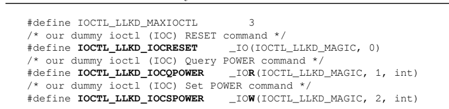

# 7.23

## Modern C++

### 显示转换

​	要声明显式构造函数和显式转换运算符（无论它们是函数还是函数模板），请在声明中使用exprifit说明符。以下示例显示了显式构造函数和显式转换运算符

```
struct handle_t
{
 explicit handle_t(int const h) : handle(h) {}
 explicit operator bool() const { return handle != 0; };
private:
 int handle;
};
```

​	为了理解为什么显式构造函数是必要的以及它们是如何工作的，我们将首先看看转换构造函数。以下类foo有三个构造函数：一个默认构造函数（没有参数）、一个接受int的构造函数和一个接受两个参数（int和adouble）的构造函数。他们除了打印信息什么都不做。从C++11开始，这些都被认为是转换构造函数。该类还具有一个转换运算符，用于将foo类型的值转换为bool

```
struct foo
{
foo()
 { std::cout << "foo" << '\n'; }
 foo(int const a)
 { std::cout << "foo(a)" << '\n'; }
 foo(int const a, double const b)
 { std::cout << "foo(a, b)" << '\n'; }
 operator bool() const { return true; }
};
```

基于此，可以定义以下对象（注意注释表示控制台的输出）：

```
foo f1; // foo()
foo f2 {}; // foo()
foo f3(1); // foo(a)
foo f4 = 1; // foo(a)
foo f5 { 1 }; // foo(a)
foo f6 = { 1 }; // foo(a)
foo f7(1, 2.0); // foo(a, b)
foo f8 { 1, 2.0 }; // foo(a, b)
foo f9 = { 1, 2.0 }; // foo(a, b)
```

变量f1和f2调用默认构造函数。f3、f4、f5和f6调用接受int的构造函数。请注意，这些对象的所有定义都是等效的，即使它们看起来不同（f3是使用函数形式初始化的，f4和f6是复制初始化的，f5是使用大括号初始化列表直接初始化的）。同样，f7、f8和f9使用两个参数调用构造函数。在这种情况下，f5和f6将打印foo（l），而f8和f9将生成编译器错误（尽管编译器可以选择忽略一些警告，例如GCC的-Wno缩窄），因为初始化器列表中的所有元素都应该是整数。

​	值得注意的是，如果foo定义了一个接受astd:：initializer_list的构造函数，那么使用{}的所有初始化都将解析为该构造函数：

```
foo(std::initializer_list<int> l)
{ std::cout << "foo(l)" << '\n'; }
```

​	这些可能看起来都是正确的，但隐式转换构造函数允许隐式转换可能不是我们想要的情况

​	首先，让我们来看一些正确的例子：

```
void bar(foo const f)
{
}
bar({}); // foo()
bar(1); // foo(a)
bar({ 1, 2.0 }); // foo(a, b)
```

从foo类到bool的转换运算符也使我们能够在需要布尔值的地方使用foo对象。这里有一个例子：

```
bool flag = f1; // OK, expect bool conversion
if(f2) { /* do something */ } // OK, expect bool conversion
std::cout << f3 + f4 << '\n'; // wrong, expect foo addition
if(f5 == f6) { /* do more */ } // wrong, expect comparing foos
```

​	期待比较foos前两个是预期foo用作布尔值的示例。然而，最后两个，一个带有加法，一个用于相等性测试，可能是不正确的，因为我们很可能希望添加foo对象并测试fooobjects的相等性，而不是它们隐式转换为的布尔值。

​	也许一个更现实的例子是考虑字符串缓冲区的实现，以了解可能出现问题的地方。这将是一个包含内部字符缓冲区的类。此类提供了几个转换构造函数：一个默认构造函数、一个接受表示缓冲区大小的size_t参数以进行预分配的构造函数，以及一个接受指向char的指针的构造函数，char应用于分配和初始化内部缓冲区。简单地说，我们用于此示例的字符串缓冲区的实现如下：

```
class string_buffer
{
public:
 string_buffer() {}
 string_buffer(size_t const size) { data.resize(size); }
 string_buffer(char const * const ptr) : data(ptr) {}
 size_t size() const { return data.size(); }
 operator bool() const { return !data.empty(); }
 operator char const * () const { return data.c_str(); }
private:
 std::string data;
};
```

​	根据这个定义，我们可以构造以下对象：

```
std::shared_ptr<char> str;
string_buffer b1; // calls string_buffer()
string_buffer b2(20); // calls string_buffer(size_t cons
string_buffer b3(str.get());
```

b1是使用默认构造函数创建的，因此具有一个缓冲区；b2是使用带有单个参数的构造函数初始化的，其中参数的值表示内部缓冲区字符的大小；b3用一个现有的缓冲区初始化，该缓冲区用于定义内部缓冲区的大小并将其值复制到内部缓冲区中。但是，相同的定义也支持以下对象定义：

```
{DefaultHeight, Large, MaxSize};
string_buffer b4 = 'a';
string_buffer b5 = MaxSize;
```

这种情况下，b4用char初始化。由于存在到size_t的隐式转换，因此将调用具有单个参数的构造函数。这里的意图不一定很明确；也许它应该是“a”而不是“a”，在这种情况下，第三个构造函数会被调用。然而，b5很可能是一个错误，因为MaxSize是一个表示ItemSizes的枚举数，与字符串缓冲区大小无关。编译器不会以任何方式标记这些错误情况。将未作用域的枚举隐式转换为int是一个很好的论据，表明更倾向于使用作用域枚举（用枚举类声明），而作用域枚举没有这种隐式转换。如果ItemSizes是一个scoped enum，则不会出现这里描述的情况。在构造函数的声明中使用显式说明符时，该构造函数将成为显式构造函数，不再允许对类类型的对象进行隐式构造。为了说明这一点，我们将稍微更改string_buffer类，将所有构造函数声明为显式：

```
class string_buff{public:e plicit string buffer(){
 explicit string_buffer() {}
 explicit string_buffer(size_t const size) { data.resize(size)
 explicit string_buffer(char const * const ptr) :data(ptr) {}
 size_t size() const { return data.size(); }
 explicit operator bool() const { return !data.empty(); }
 explicit operator char const * () const { return data.c_str()
private:
 std::string data;
}
```

​	这里的变化很小，但前面例子中b4和b5的定义不再适用，而且是不正确的。这是因为在重载解析期间，从char或int到size_t的隐式转换不再可用，以确定应该调用什么构造函数。结果b4和b5都出现了编译器错误。请注意，b1、b2和b3仍然是有效的定义，即使构造函数是显式的。在这种情况下，解决问题的唯一方法是提供从char或int到string_buffer的显式强制转换

```
string_buffer b4 = string_buffer('a');
string_buffer b5 = static_cast<string_buffer>(MaxSize);
string_buffer b6 = string_buffer{ "a" };
```

​	使用显式构造函数，编译器能够立即标记错误情况，开发人员可以相应地做出反应，要么用正确的值修复初始化，要么提供显式强制转换。只有在使用复制初始化完成初始化时才会出现这种情况，而在使用函数初始化或通用初始化时则不会出现这种情况。

​	对于显式构造函数，以下定义仍然是可能的（但是错误的）

```
string_buffer b7{ 'a' };
string_buffer b8('a');
```

​	与构造函数类似，转换运算符可以声明为显式的（如前所述）。在这种情况下，从对象类型到转换运算符指定的类型的隐式转换不再可能，需要显式转换。考虑到b1和b2，它们是我们之前定义的thesting_buffer对象，使用显式运算符bool转换不再可能：

```
std::cout << b4 + b5 << '\n'; // error
if(b4 == b5) {} // error
Instead, they require explicit conversion to bool:
std::cout << static_cast<bool>(b4) + static_cast<bool>(b5);
if(static_cast<bool>(b4) == static_cast<bool>(b5)) {}
```

​	添加两个bool值没有多大意义。前面的示例仅用于显示如何需要显式强制转换才能使语句编译。当没有显式静态强制转换时，编译器发出的错误应该有助于你找出表达式本身是错误的，而其他东西可能是有意的。另请参见

### 使用未命名的命名空间而不是静态全局变量

​	程序越大，当程序链接到多个翻译单元时，发生名称冲突的可能性就越大。在源文件中声明的函数或变量，旨在位于翻译单元的本地，可能会与另一个翻译单元中声明的其他类似函数或变量冲突。这是因为所有未声明为静态的符号都有外部链接，它们的名称在整个程序中必须是唯一的。这个问题的典型C解决方案是将这些符号声明为静态，将它们的链接从外部更改为内部，从而使它们成为翻译单元的局部。另一种方法是在名称前加上它们所属的模块或库的名称。在这个食谱中，我们将研究C++解决这个问题的方法。准备好在这个食谱中，我们将讨论全局函数和统计函数等概念，以及变量、名称空间和转换单元。我们希望您对这些概念有一个基本的了解。除此之外，它还要求你理解内部联系和外部联系之间的区别；这是这个食谱的关键。

​	当你需要将全局符号声明为静态以避免链接问题时，你应该更喜欢使用未命名的命名空间：

1. 在源文件中声明一个没有名称的命名空间。
2. 将全局函数或变量的定义放在未命名的命名空间中，而不使其静态。

以下示例显示了两个不同翻译单元中名为print（）的函数；它们中的每一个都在一个未命名的命名空间中定义：

```
// file1.cpp
namespace
{
 void print(std::string const & message)
 {
 std::cout << "[file1] " << message << '\n';
 }
}
void file1_run()
{
 print("run");
}
// file2.cpp
namespace
{
 void print(std::string const & message)
 {
 std::cout << "[file2] " << message << '\n';
 }
}
void file2_run()
{
 print("run");
}
```

​	它是如何工作的。。。当一个函数在翻译单元中声明时，它具有外部链接。这意味着来自两个不同翻译单元的两个同名函数将产生链接错误，因为不可能有两个同名符号。在C中，有时在C++中，解决这个问题的方法是将函数或变量声明为静态，并将其链接从外部更改为内部。在这种情况下，其名称不再导出到翻译单元之外，从而避免了链接问题。C++中正确的解决方案是使用未命名的命名空间。当你定义一个如前所示的名称空间时，编译器会转换为以下内容：

```
// file1.cpp
namespace _unique_name_ {}
using namespace _unique_name_;
namespace _unique_name_
{
 void print(std::string message)
 {
 std::cout << "[file1] " << message << '\n';
 }
}
void file1_run()
{
 print("run");
}
```

​	首先，它声明了一个具有唯一名称的命名空间（名称是什么以及如何生成该名称是编译器实现的细节，不应该成为问题）。此时，名称空间为空，此行的目的是基本建立名称空间。第二，使用该指令将uniquename_命名空间中的所有内容都带到当前命名空间中。第三，具有编译器生成的名称空间的定义与原始源代码中的定义相同（当它没有名称时）。通过在未命名的命名空间中定义翻译单元的local print（）函数，它们只具有局部可见性，但它们的外部链接不再产生链接错误，因为它们现在具有外部唯一的名称。未命名的命名空间也适用于涉及模板的更模糊的情况。在C++11之前，模板非类型参数不能是具有内部链接的名称，因此无法使用静态变量。相反，未命名名称空间中的符号具有外部链接，可以用作模板参数。尽管C++11取消了对模板非类型参数的链接限制，但在最新版本的VC++编译器中仍然存在。以下示例显示了此问题：

```
template <int const& Size>
class test {};
static int Size1 = 10;
namespace
{
 int Size2 = 10;
}
test<Size1> t1;
test<Size2> t2;
```

​	在此代码段中，t1变量的声明会产生编译器错误，因为非类型参数表达式Size1具有内部链接。相反，t2变量的声明是正确的，因为Size2具有外部联系。（请注意，使用Clang和GCC编译此代码段不会产生错误。）

### 用内联命名空间进行符号版本控制

​	C++11标准引入了一种称为内联命名空间的新型命名空间，它基本上是一种机制，使嵌套命名空间的声明看起来和行为都像是周围命名空间的一部分。内联命名空间是使用命名空间声明中的内联关键字声明的（未命名的命名空间也可以内联）。这是库版本控制的一个有用功能，在本教程中，我们将学习如何使用内联名称空间对符号进行版本控制。从这个食谱中，您将学习如何使用内联命名空间和条件编译对源代码进行版本控制。准备好在这个食谱中，我们将讨论名称空间和嵌套名称空间、模板和模板专业化，以及使用预处理器宏的条件编译。要继续使用此食谱，需要熟悉这些概念。

​	要提供库的多个版本并让用户决定使用哪个版本，请执行以下操作：在命名空间中定义库的内容。在内部内联命名空间中定义库的每个版本或其部分。使用预处理器宏和#if指令启用特定版本的库。以下示例显示了客户端可以使用的具有两个版本的库

```
namespace modernlib
{
 #ifndef LIB_VERSION_2
 inline namespace version_1
 {
 template<typename T>
 int test(T value) { return 1; }
 }
 #endif
 #ifdef LIB_VERSION_2
 inline namespace version_2
 {
 template<typename T>
 int test(T value) { return 2; }
 }
 #endif
}
```

​	内联命名空间的成员被视为周围命名空间的成员。这样的成员可以部分专门化、显式实例化或显式专门化。这是一个传递属性，这意味着如果一个命名空间a包含一个内联命名空间B，而内联命名空间B又包含内联命名空间C，那么C的成员将同时显示为B和a的成员，而B的成员将显示为a的成员。为了更好地理解内联命名空间为什么有用，让我们考虑开发一个随着时间的推移从第一个版本发展到第二个版本（以及更进一步）的库的情况。这个库在名为modernlib的名称空间下定义了它的所有类型和函数。在第一个版本中，这个库可能看起来像这样：

```
namespace modernlib
{
 template<typename T>
 int test(T value) { return 1; }
}
```

​	库的客户端可以进行以下调用并返回值1

```
auto x = modernlib::test(42);
```

​	然而，客户端可能会决定将模板函数test（）专门化如下：

```
struct foo { int a; };
namespace modernlib
{
 template<>
 int test(foo value) { return value.a; }
}
auto y = modernlib::test(foo{ 42 });
```

​	在这种情况下，y的值不再是1，而是42，因为用户专用函数被调用了。到目前为止，一切都正常工作，但作为库开发人员，您决定创建库的第二个版本，但仍然发布第一个和第二个版，并让用户控制宏的使用内容。在第二个版本中，您提供了一个新的test（）函数实现，它不再返回1，而是返回2。为了能够提供第一个和第二个实现，您将它们放入名为version_1和version_2的嵌套名称空间中，并使用预处理器宏有条件地编译库

```
namespace modernlib
{
 namespace version_1
 {
 template<typename T>
 int test(T value) { return 1; }
 }
 #ifndef LIB_VERSION_2
 using namespace version_1;
 #endif
 namespace version_2
 {
 template<typename T>
 int test(T value) { return 2; }
 }
 #ifdef LIB_VERSION_2
 using namespace version_2;
 #endif
}
```

​	突然之间，客户端代码中断，无论它是使用库的第一个版本还是第二个版本。这是因为测试函数现在位于嵌套命名空间中，foo的专门化是在modernlib命名空间中完成的，而实际上应该在modernlib:：version_1或modernlib：：version_2中完成。这是因为模板的专门化需要在声明模板的同一命名空间中完成。在这种情况下，客户端需要更改代码，如下所示

```
#define LIB_VERSION_2
#include "modernlib.h"
struct foo { int a; };
namespace modernlib
{
 namespace version_2
 {
 template<>
 int test(foo value) { return value.a; }
 }
}
```

​	这是一个问题，因为库泄漏了实现细节，客户端需要知道这些细节才能进行模板专门化。这些内部细节以本食谱“如何操作…”部分所示的方式隐藏在内联命名空间中。有了modernlib库的定义，modernlib命名空间中具有test（）函数专门化的客户端代码就不再被破坏，因为当模板专门化完成时，version_1:：test（）或version_2:：tests（）（取决于客户端实际使用的版本）的行为就像它是封闭的modernlib名称空间的一部分的细节

​	实现现在对客户端隐藏，客户端只能看到周围的名称空间modernlib。但是，您应该记住，名称空间std是为标准保留的，永远不应该内联。此外，如果名称空间在其第一个定义中没有内联，则不应内联定义。另请参阅使用未命名名称空间而不是静态全局变量，探索任何名称空间并了解它们如何帮助第4章“有条件编译源代码”，了解执行条件编译的各种选项

### 使用结构化绑定处理多返回值

​	从函数返回多个值是非常常见的，但C++中没有一种一流的解决方案可以直接实现这一点。开发人员必须在通过函数的引用参数返回多个值、定义包含多个值的结构或返回std:：pair或std:：tuple之间做出选择。前两个使用命名变量，这赋予了它们明确指示返回值含义的优点，但缺点是必须明确定义它们。std:：pair的成员被称为first和second，而std:：tuple的未命名成员只能通过函数调用检索，但可以使用std:：tie（）复制到命名变量中。这些解决方案都不理想。


结构化绑定（有时称为分解声明）是一种语言特性，其工作原理与std:：tie（）类似，只是我们不必为每个需要用std:：tie（）明确解包的值定义命名变量。使用结构化绑定，我们使用自动说明符在单个定义中定义所有名称变量，以便编译器可以推断出每个变量的正确类型。为了举例说明这一点，让我们考虑将项目插入std:：map的情况。insert方法返回一个std:：pair，其中包含插入元素或阻止插入的元素的迭代器，以及一个Boolean，指示插入是否成功。以下代码非常明确，使用second或first->second会使代码更难阅读，因为你需要不断弄清楚它们代表什么：

```
std::map<int, std::string> m;
auto result = m.insert({ 1, "one" });
std::cout << "inserted = " << result.second << '\n'
 << "value = " << result.first->second << '\n';
```

使用std:：tie可以使前面的代码更具可读性，它将元组解包为单个对象（并与std:：pair一起使用，因为std:：tuple具有从std:：pai转换的赋值）

```
std::map<int, std::string> m;
std::map<int, std::string>::iterator it;
bool inserted;
std::tie(it, inserted) = m.insert({ 1, "one" });
std::cout << "inserted = " << inserted << '\n'
 << "value = " << it->second << '\n';
std::tie(it, inserted) = m.insert({ 1, "two" });
std::cout << "inserted = " << inserted << '\n'
 << "value = " << it->second << '\n';
```

​	代码不一定更简单，因为它需要预先定义要解包的对象。同样，元组中的元素越多，需要定义的对象就越多，但使用命名对象会使代码更容易阅读。C++17结构化绑定将元组元素解包为namedojects提升到语言特性的级别；不需要使用std:：tie（），对象在声明时初始化：

```
std::map<int, std::string> m;
{
 auto [it, inserted] = m.insert({ 1, "one" });
 std::cout << "inserted = " << inserted << '\n'
 << "value = " << it->second << '\n';
}
{
 auto [it, inserted] = m.insert({ 1, "two" });
 std::cout << "inserted = " << inserted << '\n'
 << "value = " << it->second << '\n';
}
```

在前面的例子中使用多个块是必要的，因为变量不能在同一个块中重新声明，结构化绑定意味着使用自动说明符进行声明。因此，如果需要进行多个调用，如上例所示，并使用结构化绑定，则必须使用不同的变量名或多个块。一

​	另一种方法是避免结构化绑定，使用std:：tie（），因为它可以用相同的变量多次调用，所以你只需要声明一次。在C++17中，还可以分别以if（init；condition）和switch（init；条件）的形式在if和switch语句中声明变量。这可以与结构化绑定相结合，以生成更简单的代码。让我们来看一个例子：

```
if(auto [it, inserted] = m.insert({ 1, "two" }); inserted)
{ std::cout << it->second << '\n'; }
```

​	在前面的代码片段中，我们试图在映射中插入一个新值。调用的结果被解包为两个变量，它被插入，并在初始化部分的if语句的范围内定义。然后，根据插入的变量的值计算if语句的条件。还有更多。。。尽管我们专注于将名称绑定到元组的元素，但结构化绑定可以在更广泛的范围内使用，因为它们还支持绑定到数组元素或类的数据成员。如果你想绑定到数组的元素，你必须为数组的每个元素提供一个名称；否则，该声明的格式不正确。以下是绑定到数组元素的示例：

```
int arr[] = { 1,2 };
auto [a, b] = arr;
auto& [x, y] = arr;
arr[0] += 10;
arr[1] += 10;
std::cout << arr[0] << ' ' << arr[1] << '\n'; // 11 12
std::cout << a << ' ' << b << '\n'; // 1 2
std::cout << x << ' ' << y << '\n'; // 11 12
```

​	在这个例子中，arr是一个有两个元素的数组。我们首先将a和b绑定到它的元素，然后将x和y引用绑定到其元素。对数组元素所做的更改无法通过变量a和b看到，但可以通过x和y引用看到，如将这些值打印到控制台的注释中所示。这是因为当我们进行第一次绑定时，会创建数组的副本，并将a和b绑定到副本的元素。正如我们已经提到的，还可以绑定到aclass的数据成员。以下限制适用：绑定仅适用于类的非静态成员。类不能有匿名联合成员。标识符的数量必须与类的非统计成员的数量匹配。标识符的绑定按照数据成员声明的顺序进行，其中可以包括位字段。这里显示了一个示例：

```
struct foo
{
 int id;
 std::string name;
};
foo f{ 42, "john" };
auto [i, n] = f;
auto& [ri, rn] = f;
f.id = 43;
std::cout << f.id << ' ' << f.name << '\n'; // 43 john
std::cout << i <<'''' << n <<''\''; // 42 john
std::cout << ri <<'''' << rn <<''\''; // 43 john
```

​	同样，foo对象的变化对变量i和n不可见，但对ri和rn可见。这是因为结构binding中的每个标识符都成为引用类数据成员的左值的名称（就像数组一样，它引用数组的一个元素）。但是，标识符的引用类型是相应的数据成员（或arrayelement）。新的C++20标准对结构绑定引入了一系列改进，包括以下内容：在结构绑定的声明中包含静态或线程本地存储类说明符的可能性。使用[[maybe_unuse]]属性声明结构化绑定。一些编译器，如Clang和GCC，已经支持此功能。在lambdas中捕获结构绑定标识符的可能性。标识符，包括绑定到位字段的标识符，可以通过值捕获。相反，除了绑定到bitfieldscan的标识符外，所有标识符都可以通过引用捕获。这些更改使我们能够编写以下内容：

```
foo f{ 42,"john" };
auto [i, n] = f;
auto l1 = [i] {std::cout << i; };
auto l2 = [=] {std::cout << i; };
auto l3 = [&i] {std::cout << i; };
auto l4 = [&] {std::cout << i; };
```

​	这些示例展示了在C++20中用lambdas捕获结构化绑定的各种方法。有时，我们需要绑定不使用的变量。在C++26中，可以通过使用下划线（_）而不是aname来忽略变量。尽管在撰写本文时没有任何编译器支持，但此功能已包含在C++26

```
foo f{ 42,"john" };
auto [_, n] = f;
```

​	这里，\_是绑定到foo对象id成员的变量的占位符。它用于表示此值未被使用，并在此上下文中将被忽略。\_占位符的使用不仅限于结构化绑定。它可以用作非静态类成员、结构化绑定和ambda捕获的标识符。您可以使用下划线在同一范围内重新定义现有的声明，从而可以忽略多个变量。但是，如果在重新声明后使用名为_的变量，则认为程序格式不正确。另请参阅尽可能使用auto，了解C++中自动类型推导的工作原理第3章，使用带有标准算法的lambdas，学习如何将Lambda与标准库通用算法一起使用第4章，向编译器提供带有属性的元数据，学习如何使用标准

### 用类模板参数推导实现代码模板

C++中无处不在，但必须一直指定模板参数可能会很烦人。在某些情况下，编译器实际上可以从上下文中推断出模板参数。C++17中提供的此功能称为类模板参数推断，使编译器能够从初始化器的类型推断出缺少的模板参数。在这个食谱中，我们将学习如何利用这个功能。如何做到…在C++17中，你可以跳过指定模板参数，让编译器在以下情况下推断它们：

​	当你声明一个变量或一个变量模板并初始化它时：

```
std::pair p{ 42, "demo" }; // deduces std::pair<int, cha
std::vector v{ 1, 2 }; // deduces std::vector<int>
std::less l; // deduces std::less<void>
```

​	当你使用新表达式创建对象时

```
template <class T>
struct foo
{
 foo(T v) :data(v) {}
private:
 T data;
};
auto f = new foo(42);
```

当你执行类似函数的强制转换表达式时：

```
std::mutex mx;
// deduces std::lock_guard<std::mutex>
auto lock = std::lock_guard(mx);
std::vector<int> v;
// deduces std::back_insert_iterator<std::vector<int>>
std::fill_n(std::back_insert_iterator(v), 5, 42);
```


在这里显示的foo类模板的情况下，我们可以编写以下make_foo（）函数模板来启用相同的行为：

```
template <typename T>
constexpr foo<T> make_foo(T&& value)
{
 return foo{ value };
}
auto f = make_foo(42);
```

​	在C++17中，在“它是如何工作的…”中列出的情况下，这不再是必需的。。。部分。让我们以以下声明为例：std:：pair p{42，“demo”}；在这种情况下，std:：pair不是类型，但它充当atype的占位符，激活类模板参数推导。当编译器在使用初始化或函数样式转换声明变量时遇到它时，它会构建一组推导指南。这些推导指南是假设类类型的虚构构造函数。作为用户，您可以使用用户定义的扣除规则来补充此集。此集合用于执行模板参数推导和过载解析。在std:：pair的情况下，编译器将构建一组推导指南，其中包括以下虚构的函数模板（但不仅限于这些）

```
template <class T1, class T2>
std::pair<T1, T2> F();
template <class T1, class T2>
std::pair<T1, T2> F(T1 const& x, T2 const& y);
template <class T1, class T2, class U1, class U2>
std::pair<T1, T2> F(U1&& x, U2&& y);
```

​	这些编译器生成的推导指南是从类模板的构造函数创建的，如果没有，则为假设的默认构造函数创建推导指南。此外，在所有情况下，都会为假设的复制构造函数创建一个推导指南。用户定义的推导指南是具有跟踪返回类型且没有auto关键字的函数签名（因为它们表示没有返回值的假设构造函数）。它们必须在它们所应用的类模板的名称空间中进行定义。为了理解这是如何工作的，让我们考虑同一个例子：：pair object:std:：pair p{42，“demo”}；编译器推断的类型是std:：pair<int，char const\*>。如果我们想指示编译器推断std:：string而不是char const*，那么我们需要几个用户定义的推断规则，如下所示：

```
namespace std {
 template <class T>
 pair(T&&, char const*)->pair<T, std::string>;
 template <class T>
 pair(char const*, T&&)->pair<std::string, T>;
 pair(char const*, char const*)->pair<std::string, std::strin
}
```

​	这些将使我们能够执行以下声明，其中字符串“demo”的类型始终被推断为std:：string:

```
std::pair p1{ 42, "demo" }; // std::pair<int, std::string>
std::pair p2{ "demo", 42 }; // std::pair<std::string, int>
std::pair p3{ "42", "demo" };
```

正如你从这个例子中看到的，演绎指南不一定是函数模板。重要的是要注意，如果模板参数列表存在，则无论指定的参数数量多少，类模板参数推导都不会发生。示例如下

```
std::pair<> p1 { 42, "demo" };
std::pair<int> p2 { 42, "demo" };
```

​	因为这两个声明都指定了一个模板参数列表，所以它们是无效的，并会产生编译器错误。在某些已知的情况下，类模板参数推导不起作用：聚合模板，您可以在其中编写用户定义的推导指南来规避问题。

```
template<class T>
struct Point3D { T x; T y; T z; }; 
Point3D p{1, 2, 2}; // error, requires Point3D<int>
```

​	类型别名，如下例所示（对于GCC，当使用-std=c++20编译时，这实际上是有效的）：

```
template <typename T>
using my_vector = std::vector<T>;
std::vector v{1,2,3}; // OK
my_vector mv{1,2,3}; // error
```

​	继承了构造函数，因为当继承构造函数时，无论是隐式的还是用户定义的演绎指南都不会被继承

```
template <typename T> 
struct box
{
 box(T&& t) : content(std::forward<T>(t)) {}
 virtual void unwrap()
 { std::cout << "unwrapping " << content << '\n'; }
 T content;
};
template <typename T>
struct magic_box : public box<T>
{
 using box<T>::box;
 virtual void unwrap() override
 { std::cout << "unwrapping " << box<T>::content << '\n';
};
int main()
{
 box b(42); // OK
 b.unwrap();
 magic_box m(21); // error, requires magic_box<int>
 m.unwrap();
}
```

### 使用下标运算符访问一个选项中的元素

​	访问数组的元素不仅是C++的基本功能，也是任何支持数组的编程语言的基本功能。许多编程语言的语法也是相同的。在C++中，用于此目的的下标运算符[]可以重载，以提供对类中数据的访问。通常，对容器建模的类就是这种情况。在这个食谱中，我们将看到如何利用这个运算符以及C++23带来了什么变化。如何操作…要提供对容器中元素的随机访问，请按如下方式重载下标运算符：对于一维容器，您可以用一个参数重载下标运算符，而不管标准的版本如何：

```
template <typename T>
struct some_buffer
{
 some_buffer(size_t const size):data(size)
 {}
 size_t size() const { return data.size(); }
 T const& operator[](size_t const index) const
  {
 if(index >= data.size())
 std::runtime_error("invalid index");
 return data[index];
 }
 T & operator[](size_t const index)
 {
 if (index >= data.size())
 std::runtime_error("invalid index");
 return data[index];
 }
private:
 std::vector<T> data;
};
```

​	对于多维容器，在C++23中，您可以用多个参数重载订阅运算符

```
template <typename T, size_t ROWS, size_t COLS>
struct matrix
{
 T& operator[](size_t const row, size_t const col)
 {
 if(row >= ROWS || col >= COLS)
 throw std::runtime_error("invalid index");
 return data[row * COLS + col];
 }
 T const & operator[](size_t const row, 
 {
 if (row >= ROWS || col >= COLS)
 throw std::runtime_error("invalid index");
 return data[row * COLS + col];
 }
private:
 std::array<T, ROWS* COLS> data;
};
```

​	它是如何工作的…下标运算符用于访问数组中的元素。然而，在通常对容器（或一般的集合）建模的类中，可以将其作为成员函数重载以访问其元素。为此，std:：vector、std:：set和std:：map等标准容器为下标运算符提供了重载。因此，您可以编写如下代码：

```
std::vector<int> v {1, 2, 3};
v[2] = v[1] + v[0];
```

​	在上一节中，我们看到了如何重载下标运算符。通常有两个重载，一个是常量，另一个是可变的。const限定重载返回对常量对象的引用，而可变重载返回引用。下标运算符的主要问题是，在C++23之前，它只能有一个参数。因此，它不能用于提供对多维容器元素的访问。因此，开发人员通常会为此使用调用运算符。下面的代码片段中显示了一个示例：

```
template <typename T, size_t ROWS, size_t COLS>
struct matrix
{
 T& operator()(size_t const row, size_t const col)
 {
 if(row >= ROWS || col >= COLS)
 throw std::runtime_error("invalid index");
 return data[row * COLS + col];
 }
 T const & operator()(size_t const row, size_t const col) const
 {
 if (row >= ROWS || col >= COLS)
 throw std::runtime_error("invalid index");
 return data[row * COLS + col];
 }
private:
 std::array<T, ROWS* COLS> data;
};
matrix<int, 2, 3> m;
m(0, 0) = 1;
```

​	为了帮助实现这一点，并允许更一致的方法，C++11允许使用语法为[{expr1，expr2，…}]的下标运算符。下面显示了一个利用此语法的矩阵类的修改实现

```
template <typename T, size_t ROWS, size_t COLS>
struct matrix
{
 T& operator[](std::initializer_list<size_t> index)
 {
 size_t row = *index.begin();
 size_t col = *(index.begin() + 1);
 if (row >= ROWS || col >= COLS)
 throw std::runtime_error("invalid index");
 return data[row * COLS + col];
 }
 T const & operator[](std::initializer_list<size_t> index) co
 {
 size_t row = *index.begin();
 size_t col = *(index.begin() + 1);
 if (row >= ROWS || col >= COLS)
 throw std::runtime_error("invalid index");
 return data[row * COLS + col];
 }
private:
 std::array<T, ROWS* COLS> data;
};
matrix<int, 2, 3> m;
m[{0, 0}] = 1;
```

​	然而，这种语法相当繁琐，在实践中可能很少使用。因此，C++23标准允许使用多个参数重载下标运算符。这里显示了一个修改后的矩阵类：

```
template <typename T, size_t ROWS, size_t COLS>
struct matrix
{
 T& operator[](size_t const row, size_t const col)
 {
 if(row >= ROWS || col >= COLS)
 throw std::runtime_error("invalid index");
 return data[row * COLS + col];
 }
 T const & operator[](size_t const row, size_t const col) con
 {
 if (row >= ROWS || col >= COLS)
 throw std::runtime_error("invalid index");
 return data[row * COLS + col];
 }
private:
 std::array<T, ROWS* COLS> data;
};
matrix<int, 2, 3> m;
m[0, 0] = 1;
```

​	这使得调用语法与访问一维容器保持一致。std:：mdspan使用它来提供元素访问。这是一个新的C++23类，它将非拥有视图表示为连续序列（如数组），但它将序列重新解释为多维数组。前面显示的矩阵类实际上可以用数组上的mdspanview替换，如以下代码片段所示：

```
int data[2*3] = {};
auto m = std::mdspan<int, std::extents<2, 3>> (data);
m[0, 0] = 1;
```

## Kernel Programming

#### “每个sysfs文件一个值”规则

​	到目前为止，您已经了解了如何创建和使用sysfs用于用户空间内核接口目的，但有一个关键点我们一直忽略了。有一个关于使用sysfs文件的“规则”，它规定您只能读取或写入一个值！将此视为每个文件一个值的规则。因此，就像我们使用“压力”值的例子一样，我们只返回压力的当前值，仅此而已。因此，与其他接口技术不同，sysfs不太适合您可能希望向用户空间返回任意冗长的信息包（例如，驱动程序上下文结构的内容）的情况；换句话说，它不适合纯粹的“调试”目的。关于sysfs使用的内核文档和“规则”可以在这里找到：https://www.kernel.org/doc/html/latest/admin-guide/sysfs-rules.html#rules-on-how-to-access-information-in-sysfs.。此外，这里还有关于sysfs API的文档：https://www.kernel.org/doc/html/latest/filesystems/api-summary.html#the￾用于导出内核对象的文件系统。内核通常提供几种不同的方法来创建sysfsobject；例如，使用sysfs_create_files（）API，可以一次性创建多个sysfs文件：int__must_checksysfs_ccreate_files（structkobject*kobj，const struct attribute\*const\*attr）；。在这里，您需要向koobject提供apointer和指向属性结构列表的指针。

​	我们对sysfs作为接口技术的讨论；总之，sysfs被认为是驱动程序作者在用户空间中显示和/或设置特定驱动程序值的正确方式。由于“每个sysfs文件一个值”的约定，sysfs确实不适合调试信息分发。这巧妙地把我们带到了下一个主题——debugfs！通过调试文件系统（debugfs）接口想象一下，作为一名驱动程序开发人员，您在Linux上面临的困境：您想实现一种简单而优雅的方式，从驱动程序向用户空间提供调试“钩子”。例如，用户只需在（伪）文件上执行cat（1），就会调用驱动程序的“调试回调”函数。然后，它将继续将一些状态信息（可能是“驱动程序上下文”结构）转储到用户模式进程，该进程将忠实地将其转储到stdout。好的，没问题：在2.6版本发布之前的几天里，我们可以（正如您在通过proc文件系统接口（procfs）一节中所了解的那样）愉快地使用procfs层将我们的驱动程序与用户空间连接起来。然后，从2.6 Linux开始，内核社区否决了这种方法。我们被告知要严格停止使用procfs，而是使用sysfs层作为主题，将我们的驱动程序与用户空间连接起来。然而，正如我们在通过sys文件系统接口（sysfs）一节中看到的那样，它有一个严格的每个文件一个值的规则。这实际上非常适合从驱动程序报告单个值或向驱动程序发送单个值（通常是环境传感器值和类似值），但很快就会排除用户空间中除最微不足道的调试接口之外的所有接口。我们可以使用ioctl方法（我们将看到）来设置调试接口，但这要困难得多。那么，你能做什么呢？幸运的是，从Linux 2.6.12开始，有一个优雅的解决方案，称为debugfs。“调试文件系统”非常易于使用，并且非常明确地表明了驱动程序作者（事实上，任何人）都可以将其用于他们选择的任何目的！每个文件规则没有一个值——别忘了，没有规则。当然，就像我们处理过的其他基于文件系统的方法一样——procfs、sysfs和现在的debugfs——内核社区明确声称所有这些接口都是ABI，因此，它们的稳定性和寿命是无法保证的。尽管采取了正式的立场，但现实情况是，这些接口在现实世界中已经成为事实上的接口；在一个晴朗的日子里，不加序言地把它们摘下来，对任何人都没有好处。

#### 查找debugfs API文档

​	内核在这里提供了关于使用debugfs API的简洁而出色的文档（Jonathan Corbet，LWN）：https://www.kernel.org/doc/Documentation/filesystems/debugfs.txt（当然，您也可以直接在内核代码库中查找它）。我强烈建议您参考本文档以学习如何使用debugfs API，因为它易于阅读和理解；这样，您就可以避免在这里不必要地重复相同的信息。除了上述文档外，现代内核文档系统（基于“Sphinx”的系统）还提供了非常详细的debugfs API页面：https://www.kernel.org/doc/html/latest/filesystems/api-summary.html?highlight=debugfs#the-debugfs-filesystem.。请注意，所有debugfs API仅以GPL格式导出到内核模块（因此该模块必须以“GPL”许可证发布（这可以是双重许可，但必须有一个是“GPL”））。

通过netlink套接字进行接口在这里，您将学习如何使用熟悉且无处不在的网络抽象——套接字来连接内核和用户空间！熟悉网络应用程序编程的程序员对其优势深信不疑。熟悉C/C++网络编程和套接字API会有所帮助。请参阅“进一步阅读”部分，了解有关此主题的一些好教程。使用套接字的优势在其他方面，套接字技术为我们提供了几个优势（优于其他典型的用户模式IPC机制，如管道、SysV IPC/POSIX IPC机制（消息队列、共享内存、信号量等）），如下：双向同时数据传输（全双工）。在互联网上无损，至少在某些传输层协议上，如TCP，当然在本地主机上也是如此。高速数据传输，特别是在本地主机上！流控制语义始终有效。异步通信；消息可以排队，所以发送者不必等待接收者。特别是关于我们的主题，在其他用户<->内核通信路径（如procfs、sysfs、debugfs和ioctl）中，用户空间应用程序必须启动向内核空间的传输；使用netlink套接字，内核可以启动传输。此外，对于我们迄今为止看到的所有其他机制（procfs、sysfs和debugfs），散布在文件系统中的各种接口文件可能会导致内核命名空间污染；对于netlink套接字（顺便说一句，还有withitocl），情况并非如此，因为没有文件。这些优势可能会有所帮助，具体取决于您正在开发的产品类型。现在，让我们了解一下什么是netlink套接字。

#### 了解什么是netlink套接字

​	那么，什么是netlink套接字呢？我们将保持简单——netlink套接字是一个“特殊”的套接字家族，自2.2版本以来仅存在于Linux操作系统上。使用它，您可以在用户模式进程（或线程）和内核中的组件之间设置进程间通信（IPC）；在我们的例子中，是一个内核模块，通常是一个驱动程序。它在许多方面类似于UNIX域数据报套接字；它仅用于在本地主机上进行通信，而不是跨系统通信。UNIX域套接字使用路径名作为其命名空间（一个特殊的“套接字”文件），而netlink套接字使用PID。奇怪的是，这是一个端口ID，而不是进程ID，尽管实际上，进程ID经常被用作名称空间。现代内核核心（除了驱动程序）在许多情况下使用netlinksockets——例如，iproute2网络实用程序使用它来配置无需重新布线的驱动程序。另一个有趣的例子是，udev功能使用netlink套接字来实现内核udev实现和用户空间守护进程（udevd或systemd-udevd，用于设备发现、设备节点配置等）之间的通信。在这里，我们将使用netlink套接字设计和实现一个简单的用户<->内核消息传递演示。为此，我们必须编写两个程序（至少）——一个是发出基于套接字的系统调用的用户空间应用程序，另一个是内核空间组件（这里是一个内核模块）。我们将让用户空间进程向内核模块发送一条“消息”；内核模块应该接收它并将其打印（到内核日志缓冲区中）。然后，内核模块将回复用户空间进程，该进程正在阻塞此事件。所以，闲话少说，让我们深入学习使用netlink套接字编写一些代码；我们将开始使用用户空间应用程序。继续读！

#### 编写用户空间netlink套接字应用程序

​	按照以下步骤运行用户空间应用程序：1。我们必须做的第一件事就是给自己弄个插座。传统上，套接字被定义为通信的端点；因此，一对插座形成连接。我们将使用socket（2）系统调用来实现这一点。它的签名是int套接字（int域、int类型、int协议）；。

​	在不深入细节的情况下，我们这样做：我们将域指定为特殊PF_NETLINK家族的一部分，从而请求一个NETLINK套接字。使用原始套接字将类型设置为SOCK_RAW（有效地跳过传输层）。协议是要使用的协议。由于我们使用的是原始套接字，因此协议由我们或内核实现；让内核netlink代码这样做是正确的方法。这里，我们使用一个未使用的协议号；即31.2。下一步是通过通常的bind（2）系统调用语义绑定套接字。首先，我们必须为此目的初始化一个netlink源socketadr结构（其中我们将系列指定为netlink，将PID值指定为调用进程的PID（仅适用于单播））。以下代码用于这里提到的前两个步骤（为了清楚起见，我们在这里不会显示错误检查代码）：

```
 // kernel netlink protocol # (registered by our kernel module)
#define NLSPACE 1024
[...]
 /* 1. Get ourselves an endpoint - a netlink socket! */
sd = socket(PF_NETLINK, SOCK_RAW, NETLINK_MY_UNIT_PROTO);
printf("%s:PID %d: netlink socket created\n", argv[0], getpid());
/* 2. Setup the netlink source addr structure and bind it */
memset(&src_nl, 0, sizeof(src_nl));
src_nl.nl_family = AF_NETLINK;
/* Note carefully: nl_pid is NOT necessarily the PID of the sender
process; it's actually 'port id' and can be any unique number */
src_nl.nl_pid = getpid();
src_nl.nl_groups = 0x0; // no multicast
bind(sd, (struct sockaddr *)&src_nl, sizeof(src_nl))
```

3。接下来，我们必须初始化一个netlink“目的地址”结构。在这里，我们将PID成员设置为0，这是一个特殊的值，表示目标是内核：

```
/* 3. Setup the netlink destination addr structure */
memset(&dest_nl, 0, sizeof(dest_nl));
dest_nl.nl_family = AF_NETLINK;
dest_nl.nl_groups = 0x0; // no multicast
dest_nl.nl_pid = 0; // destined for the kernel
```

4。接下来，我们必须分配并初始化一个netlink“header”数据结构。除此之外，它还指定了源PID，重要的是，还指定了我们将交付给内核组件的数据“有效载荷”。在这里，我们使用NLMSG_DATA（）等helpermacros来指定换行符标头结构中的正确数据位置：

```
/* 4. Allocate and setup the netlink header (including the payload)
*/
nlhdr = (struct nlmsghdr *)malloc(NLMSG_SPACE(NLSPACE));
memset(nlhdr, 0, NLMSG_SPACE(NLSPACE));
nlhdr->nlmsg_len = NLMSG_SPACE(NLSPACE);
nlhdr->nlmsg_pid = getpid();
/* Setup the payload to transmit */
strncpy(NLMSG_DATA(nlhdr), thedata, strlen(thedata)+1);
```

5.接下来，必须初始化iovec结构以引用netlink标头，必须初始化msghdr数据结构以指向目标地址和iovec:

```
/* 5. Setup the iovec and ... */
memset(&iov, 0, sizeof(struct iovec));
iov.iov_base = (void *)nlhdr;
iov.iov_len = nlhdr->nlmsg_len;
[...]
/* ... now setup the message header structure */
memset(&msg, 0, sizeof(struct msghdr));
msg.msg_name = (void *)&dest_nl; // dest addr
msg.msg_namelen = sizeof(dest_nl); // size of dest addr
msg.msg_iov = &iov;
msg.msg_iovlen = 1; // # elements in msg_iov
```

​	最后，消息通过sendmsg（2）系统调用发送（传输）（该调用将套接字描述符和上述msghdr结构作为参数）：

```
/* 6. Actually (finally!) send the message via sendmsg(2) */
nsent = sendmsg(sd, &msg, 0);
```

7。内核组件——我们稍后将讨论的内核模块——现在应该通过其netlink套接字接收消息并显示消息内容；我们安排它然后礼貌地回复。为了获取回复，我们的用户spaceapp现在必须在套接字

```
/* 7. Block on incoming msg from the kernel-space netlink component
*/
printf("%s: now blocking on kernel netlink msg via recvmsg()
...\n", argv[0]);
nrecv = recvmsg(sd, &msg, 0);
```

我们必须使用recvmsg（2）系统调用来实现这一点。当它被解锁时，它表示消息已被接收。为什么对数据结构进行如此多的抽象和包装？好吧，事情通常是这样发展的——创建msghdr结构是为了让endmsg（2）API可以使用更少的参数。但这意味着参数必须有所变化；它们深入到msghdr内部，msghdr指向目标地址，iovec的基成员指向包含有效载荷的netlink标头结构！呼。作为一项实验，如果我们过早地构建和运行用户模式的netlink应用程序，而没有内核端代码，会怎么样？当然，它会失败的。。。但具体是怎么回事？好吧，使用实证方法。通过古老的strace（1）实用程序进行尝试，我们可以看到socket（2）系统调用返回失败，原因是Protocol不受支持：

​	这是正确的；内核中还没有这样的协议#31（31=0x1f，我们正在使用的协议号）！我们还没有做到这一点。所以，这就是事物的用户空间方面。现在，让我们完成这个谜题，让它真正发挥作用！我们将通过了解内核组件（模块/驱动程序）的编写方式来实现这一点。

#### 将内核空间netlink套接字代码编写为内核模块

​	内核为netlink提供了基础架构，包括API和数据结构；所有必需的内容都已导出，因此您可以作为模块作者使用。我们使用其中的几个；这里概述了对内核netlink组件（内核模块）进行编程的步骤：1。就像用户空间应用程序一样，我们必须做的第一件事就是给自己找一个线路插座。内核API为netlink_kernel_create（），其签名如下

```
struct sock * netlink_kernel_create(struct net *, int , struct
netlink_kernel_cfg *);
```

第一个参数是通用网络结构；我们在这里传递内核的现有有效initnet结构。第二个参数是要使用的协议号（单位）；我们将指定与用户spaceapp相同的数字（31）。第三个参数是指向（可选）网络链路配置结构的指针；在这里，我们只将输入成员设置为我们的函数，使theret无效。当用户空间进程（或线程）向内核netlink组件提供任何输入（即传输某些内容）时，会回调此函数。因此，在内核模块的init例程中，我们有

```
#define OURMODNAME "netlink_simple_intf"
#define
// kernel netlink protocol # that we're registering
static struct sock *nlsock;
[...]
static struct netlink_kernel_cfg nl_kernel_cfg = {
 .input = netlink_recv_and_reply,
};
[...]
nlsock = netlink_kernel_create(&init_net, NETLINK_MY_UNIT_PROTO,
 &nl_kernel_cfg);
```

2。正如我们之前提到的，当用户空间进程（或线程）向我们的内核（netlink）模块或驱动程序提供任何输入（即传输某些内容）时，回调函数会被调用。重要的是要理解它在进程上下文中运行，而不是在任何类型的中断上下文中运行；我们使用我们的便利.h:PRINT_CTX（）宏来验证这一点（我们将在第4章“处理硬件中断”的“完全弄清楚上下文”一节中介绍这一点）。在这里，我们只需显示收到的消息，然后通过向用户空间对等进程发送示例消息进行回复。从我们的用户空间对等进程传输的数据有效载荷可以从套接字缓冲区结构中检索，该结构作为参数传递给我们的回调函数，也可以从其中的netlink头结构中检索。您可以在这里看到数据和发送方PID是如何检索的

```
static void netlink_recv_and_reply(struct sk_buff *skb)
{
 struct nlmsghdr *nlh;
 struct sk_buff *skb_tx;
 char *reply = "Reply from kernel netlink";
 int pid, msgsz, stat;
 /* Find that this code runs in process context, the process
 * (or thread) being the one that issued the sendmsg(2) */
 PRINT_CTX();
 nlh = (struct nlmsghdr *)skb->data;
 pid = nlh->nlmsg_pid; /*pid of sending process */
 pr_info("%s: received from PID %d:\n"
 "\"%s\"\n", OURMODNAME, pid, (char *)NLMSG_DATA(nlh));
```

套接字缓冲区数据结构——结构sk_buff——被认为是Linux内核网络协议栈中的关键数据结构。它保存了所有与网络数据包有关的元数据，包括它的动态指针。它必须快速分配和释放（特别是当网络代码在中断上下文中运行时）；这确实是可能的，因为它位于内核的slab（SLUB）缓存上（有关内核slaballocator的详细信息，请参阅配套指南《Linux内核编程》第7章“内存管理内部-要点”、第8章“模块作者的内核内存分配-第1部分”和第9章“模块作家的内核内存配置-第2部分”）。现在，我们需要了解，我们可以通过首先解引用传递给回调例程的套接字缓冲区（skb）结构的数据成员来从网络数据包中检索有效载荷！接下来，这个数据成员实际上是指向我们的用户spacepeer设置的netlink消息头结构的指针。然后，我们取消引用它以获得实际的有效载荷。

​	3。我们现在想“回复”我们的用户空间对等进程；这样做需要采取一些行动。首先，我们必须使用thelmsg_new（）API分配一个新的netlink消息，它实际上是alloc_skb（）上的瘦包装，通过nlmsg_put（）API将一个tlink消息添加到刚刚分配的套接字缓冲区中，然后使用适当的emacro（nlmsg_data（））将数据（有效负载）复制到netlink头中：

```
 msgsz = strlen(reply);
 skb_tx = nlmsg_new(msgsz, 0);
 [...]
 // Setup the payload
 nlh = nlmsg_put(skb_tx, 0, 0, NLMSG_DONE, msgsz, 0);
 NETLINK_CB(skb_tx).dst_group = 0; /* unicast only (cb is the
 * skb's control buffer), dest group 0 => unicast */
 strncpy(nlmsg_data(nlh), reply, msgsz);
```

4.我们通过nlmsg_unicast（）API向我们的用户空间对等进程发送回复（甚至可以多播netlink消息）：/

```
/发送它
stat=nlmsg_unicast（nlsock，skb_tx，pid）；
```

5.这只剩下清理（当内核模块被移除时调用）；当netlink_kernel_release（）API清理netlink套接字并关闭它时，它实际上是netlink_kernel_create（）的反转：

```
static void __exit netlink_simple_intf_exit（void）{
	netlink_kernel_releases(nlsock);
    pr_info(“%s:removed\n”，OURMODNAME);
}
```

现在我们已经将用户空间应用程序和内核模块都编写为通过一个tlink套接字进行接口，让我们实际尝试一下！

#### 通过ioctl系统调用进行接口连接ioctl是一个系统调用

​	为什么叫ioctl这个有趣的名字？它是输入输出控制的缩写。虽然读写系统调用（以及其他）用于有效地在设备（或文件）之间传输数据；记住UNIX范式，如果它不是进程，它就是文件！），但ioctl系统调用用于向设备发出命令（通过其驱动程序）。例如，更改控制台设备的终端特性、在格式化时将轨道写入磁盘、向步进电机发送控制命令、控制相机或音频设备等，都是向设备发送命令的实例。让我们考虑一个虚构的例子。我们有一个设备，正在为它开发一个（字符）设备驱动程序。该设备有各种寄存器，通常是设备上的8位、16位或32位硬件存储器，其中一些是控制寄存器。通过适当地对它们执行I/O（读取和写入），我们可以控制设备（好吧，这才是重点，不是吗；下一章将介绍有关使用硬件内存（包括设备寄存器）的细节的实际主题）。那么，作为驱动程序的作者，您将如何与希望在此设备上执行各种控制操作的用户空间程序进行通信或交互？我们经常构建用户空间C（或C++）程序，通常通过在设备文件上执行open（2）来打开设备，随后发出读写系统调用。但是，正如我们刚才提到的，在传输数据时，读取（2）和写入（2）系统调用API是合适的，而在这里，我们打算执行控制操作。因此，我们需要另一个系统调用来实现这一点……那么我们是否需要创建并编码一个或多个新的系统调用？不，它比这简单得多：我们通过ioctl系统调用进行多路复用，利用它在我们的设备上执行任何所需的控制操作！怎么用？啊，回想一下前一章中最重要的file_operations（fops）数据结构；现在，我们将初始化另一个成员，即.ioctl成员到我们的ioctl方法函数中，从而允许我们的设备驱动程序挂接到这个系统调用：

```
static struct file_operations ioct_intf_fops = {
 .llseek = no_llseek,
 .ioctl = ioct_intf_ioctl,
 [...]
};
```

​	实际上，我们必须弄清楚是应该使用ioctl还是file_operations结构的unlocked_ictl成员，这取决于该模块是否在Linux内核版本2.6.36或更高版本上运行；下文将对此进行更多介绍。

​	事实上，向内核添加新的系统调用不是一件容易的事情！内核chaps不允许任意添加系统调用——毕竟这是一个安全敏感的接口。更多信息请点击此处：https://www.kernel.org/doc/html/latest/kernel-hacking/hacking.html#ioctls-ioctls-not-writing-a-new-system-call.关于使用ioctl进行接口的更多信息如下。在用户和内核空间中使用ioctl ioctl（2）系统调用的签名如下

```
#include <sys/ioctl.h>
int ioctl(int fd, unsigned long request, ...);
```

​	参数列表是一个变量参数。实际上，我们通常会传递两到三个参数：第一个参数是显而易见的——（在我们的例子中）打开的设备文件的文件描述符。第二个参数，称为request，是一个有趣的参数：它是要传递给驱动程序的命令。实际上，它是一种编码，封装了一个所谓的ioctl幻数：一个数字和一个类型（读/写）。（可选）第三个参数，通常称为arg，也是一个无符号长量；我们使用它以通常的方式将一些数据传递给底层驱动程序，或者通常通过传递其（虚拟）地址并让内核写入其中，利用C所谓的值结果或输入输出参数样式，将数据返回给用户空间。现在，正确使用ioctl并不像使用许多其他API那样简单。想一想：你很容易就会遇到这样一种情况，即几个用户空间应用程序正在向其底层设备驱动程序发出octl（2）系统调用（发出各种命令）。一个问题变得显而易见：内核VFS层将如何将ioctl请求定向到正确的驱动程序？ioctl通常在具有唯一（主要、次要）编号的char设备文件上执行；因此，另一个驱动程序如何接收您的ioctl命令（除非您有意或恶意地以这种方式设置设备文件）？

​	然而，存在一种协议来实现ioctl的安全和正确使用；每个应用程序和驱动程序都定义了一个幻数，该幻数将被编码到其所有ioctl请求中。首先，驱动程序将验证它收到的每个ioctl请求是否包含其幻数；只有到那时，它才会继续处理它；否则，它将直接丢弃它。当然，这为ABI带来了必要的条件——我们需要为每个“注册”的驱动程序分配唯一的幻数（它可能是一个范围）。由于这创建了一个ABI，内核文档将是相同的；你可以在这里找到谁在使用哪个神奇数字（或代码）的详细信息：https://www.kernel.org/doc/Documentation/ioctl/ioctl-number.txt. 对底层驱动程序的ioctl请求基本上可以是四种情况之一：向设备“写入”的命令、从设备“读取”（或查询）的命令、同时进行读/写传输的命令，或者两者都不进行。此信息（再次）通过定义某些位来编码到请求中，以传达其含义：为了使这项工作更容易，我们有四个辅助宏，允许我们构造ioctl命令：_IO（type，nr）：对没有参数的ioctl命令进行编码_IOR（type，nr，datatype）：对用于从内核/driver_IOW读取数据的ioctl指令进行编码（type，nr，datatype tl.h>头文件，在内核中包括/uapi/asm generic/ioctl.h。典型的（也是非常明显的）最佳实践是创建一个通用头文件，定义应用程序/驱动程序的ioctl命令，并在用户模式应用程序和设备驱动程序中包括该文件。在这里，作为演示，我们将设计和实现一个用户空间应用程序和一个内核空间设备驱动程序，以驱动一个通过ioctl（2）系统调用进行通信的虚构设备。因此，我们必须定义一些通过ioctl接口发出的命令。我们将在公共头文件中执行此操作



我们的三个命令（以粗体突出显示）都前缀为UDT LLKD_，表示它们都是我们虚构的LLKD项目的IOCTL命令；接下来，它们的后缀为IOC{Q|S}，IOCimpling表示这是一个ioctl命令，Q表示这是查询操作，S表示这是aset操作。现在，让我们学习如何从用户空间和内核空间（驱动程序）在代码级别进行设置。用户空间-使用ioctl系统调用ioctl（2）系统调用的用户空间签名如下

```
#include <sys/ioctl.h>
int ioctl(int fd, unsigned long request, ...);
```

在这里，我们可以看到它需要一个变量参数列表；ioctl的参数如下：第一个参数：要对其执行ioctl操作的文件或设备的文件描述符（在我们的例子中就是这样）（我们通过对设备文件执行open来获得fd）。第二个参数：向底层设备驱动程序（或文件系统或fd表示的任何东西）发出的请求或命令。可选的第三个（或更多）参数：通常，第三个参数是一个整数（或指向整数或数据结构的指针）；我们使用这种方法，在发出一组命令时，向驱动程序传递一些额外的信息，或者通过易于理解的按引用传递C范式从驱动程序检索一些信息，在这种范式中，我们传递指针并让驱动器“戳”它，从而将参数视为返回值。

​	实际上，ioctl通常用作通用系统调用。使用ioctl在硬件和软件上执行命令操作的规模几乎惊人！请参阅内核文档（documentation/ioctl/<…>）以查看许多实际的实际示例。

内核空间——使用ioctl系统调用在上一节中，我们看到内核驱动程序必须初始化其file_operations结构以包含ioctl方法。不过，还有更多：Linux内核不断发展；在早期的内核版本中，开发人员使用了一种非常粗粒度的锁，尽管它有效，但严重损害了它的性能（我们将在第6章“内核同步-第1部分”和第7章“内核同期-第2部分”中详细讨论锁定）。它太糟糕了，所以被戏称为大内核锁（BKL）！好消息是，在内核版本2.6.36中，开发人员摆脱了这个臭名昭著的锁。不过，这样做也有一些副作用：其中之一是，使用名为unlocked_ictl的新方法，发送到内核内ioctl方法的参数数量从四个变为三个，从而在我们的file_operations数据结构中。因此，对于我们的演示驱动程序，在初始化驱动程序的file_operations结构时，我们将使用以下内容初始化ioctl方法：


显然，正如fops驱动程序中定义的那样，ioctl被认为是一个私有驱动程序接口（驱动程序私有）。此外，在驱动程序代码中的函数定义中，必须考虑到关于较新“解锁”版本的这一事实；我们的驱动程序是这样做的


这里的关键代码是驱动程序的ioctl方法。想想看：一旦完成了基本的有效性检查，驱动程序真正要做的就是对用户空间应用程序发出的所有可能的有效ioctl命令执行切换。让我们来看一下以下代码（为了可读性，我们将跳过\#if LINUX_VERSION_code>=…宏指令，只显示现代ioctl函数签名，以及一些有效性检查；

```
static long ioctl_intf_ioctl(struct file *filp, unsigned int cmd, unsigned
long arg)
{
 int retval = 0;
 pr_debug("In ioctl method, cmd=%d\n", _IOC_NR(cmd));
 /* Verify stuff: is the ioctl's for us? etc.. */
 [...]
 switch (cmd) {
 case IOCTL_LLKD_IOCRESET:
 pr_debug("In ioctl cmd option: IOCTL_LLKD_IOCRESET\n");
 /* ... Insert the code here to write to a control register to reset
 the device ... */
 break;
 case IOCTL_LLKD_IOCQPOWER: /* Get: arg is pointer to result */
 pr_debug("In ioctl cmd option: IOCTL_LLKD_IOCQPOWER\n"
 "arg=0x%x (drv) power=%d\n", (unsigned int)arg, power);
 if (!capable(CAP_SYS_ADMIN))
 return -EPERM;
 /* ... Insert the code here to read a status register to query the
 * power state of the device ... * here, imagine we've done that
 * and placed it into a variable 'power'
 */
 retval = __put_user(power, (int __user *)arg);
 break;
 case IOCTL_LLKD_IOCSPOWER: /* Set: arg is the value to set */
 if (!capable(CAP_SYS_ADMIN))
 return -EPERM;
 power = arg;
 /* ... Insert the code here to write a control register to set the
 * power state of the device ... */
 pr_debug("In ioctl cmd option: IOCTL_LLKD_IOCSPOWER\n"
 "power=%d now.\n", power);
 break;
 default:
 return -ENOTTY;
 }
[...]
```

​	_IOC_NR宏用于从cmd参数中提取命令号。在这里，我们可以看到驱动程序对通过用户spaceprocess发出的ioctl的三种有效情况做出了“反应”：在收到UDT LLKD_IOCRESET命令时，它会执行设备重置。在收到ArgumentLLKD_IOCQPOWER命令后，它会进行查询（Q表示查询）并返回当前电源状态（通过使用值-结果C编程方法将其值戳入第三个参数arg）。在接收ACKLLKD_IOCSPOWER命令时，它将电源状态设置为（S代表set）（第三个参数arg中传递的值）。当然，由于我们使用的是一个纯粹虚构的设备，我们的驱动程序实际上并没有执行任何注册（或其他硬件）工作。这个驱动程序只是一个你可以使用的模板。如果黑客试图在（相当笨拙的）黑客攻击中发出我们的驾驶员未知的命令怎么办？好吧，最初的有效性检查会发现它；即使它们没有，我们也会在ioctl方法中遇到故障情况，导致驱动程序向用户空间返回-ENOTTY。这将通过glibc“粘合”代码将用户空间进程（或线程）的errno值设置为ENOTTY，通知它无法为ioctl方法提供服务。我们的用户空间perror（3）API将显示设备错误消息的Inappropriate ioctl。事实上，如果驱动程序没有ioctl方法（也就是说，如果file_operations结构中的octl成员设置为NULL），并且用户空间应用程序对其发出ioctl方法，就会发生这种情况；为了方便起见，一旦加载了驱动程序（通过insmod），您就可以使用h2/userspace_ioctl/cr8devnode.sh便利脚本来生成设备文件。设置完成后，运行用户空间应用程序；您会发现，连续运行它会反复切换我们虚构设备的“电源状态”。ioctl作为调试接口。正如我们在本章开头提到的，使用ioctl接口进行调试怎么样？它可以用于此目的。您始终可以在switch case块中插入“debug”命令；它可用于向用户空间应用程序提供有关驱动程序状态、关键变量值（健康监测）等的有用信息。

​	不仅如此，除非明确记录给最终用户或客户，否则通过ioctl接口使用的精确命令是未知的；因此，您需要记录界面，同时为其他团队或客户提供足够的细节，以充分利用它们。这就引出了一个有趣的问题：您可能会选择故意不记录某个ioctl命令；现在，它是一个“隐藏”的命令，例如，现场工程师可以使用它来检查设备。（我将此作为一项任务留给您。）ioctl的内核文档包括以下文件：https://www.kernel.org/doc/Documentation/ioctl/botching-up-ioctls.txt.虽然偏向于内核图形堆栈开发人员，但它描述了典型的设计错误、权衡等。

## Kernel Debug Programming

### Kernel Memory

#### 通过SLUB调试的slab内存损坏

内存损坏可能是由于各种错误或缺陷造成的：未初始化内存读取（UMR）、释放后使用（UAF）、返回后使用（UART）、双重释放、内存泄漏或试图处理（读/写/执行）非法内存区域的非法越界（OOB）访问。不幸的是，它们是bug的一个非常常见的根本原因。能够调试它们是一项关键技能。已经检查了一些捕获它们的方法（上一章中关于设置和使用KASAN和UBSAN的详细介绍），现在让我们利用内核内置的SLUB调试功能来捕获这些错误！如您所知，内存是通过内核的引擎——页面（或Buddy System）分配器动态分配和释放的。为了减轻它可能面临的严重浪费（内部碎片）问题，slab分配器（或slab缓存）被分层，服务于两个主要任务——高效地提供页面片段（在内核中，从几个字节到几千字节的小块内存的分配请求往往很常见），并作为常用数据结构的缓存。当前的Linux内核通常有三种互斥的板层实现——原始的slab、更新的高级SLUB实现和很少使用的SLOB实现。关键是要认识到，以下讨论仅涉及板层的SLUB（非排队分配器）实现。这通常是大多数Linux安装中的默认设置（配置选项名为config_SLUB。它位于此处的菜单配置UI中：General setup | Choose SLAB分配器）。Tip了解内核内存管理系统、页面、slab分配器以及实际分配（和释放）内核内存的各种API是这些材料的先决条件。

​	通过SLUB debug检测slab内存损坏235配置内核进行SLUB调试内核提供了大量支持，以帮助调试slab（实际上是SLUB）内存损坏问题。在内核配置UI中，您会发现以下内容：

•常规设置|启用SLUB调试支持（config_SLUB_DEBUG）：启用此选项可为您提供大量内置的SLUB调试支撑，通过/sys/blat查看所有slab缓存的能力，以及运行时缓存验证支持。当Generic KASAN打开时，此配置会自动打开（自动选择）。

•默认情况下，内存调试|SLUB调试打开（稍后将解释config_SLUB_DEBUG_on）。让我们在我的x86_64 Ubuntu客户机上查找SLUB的内核配置，该客户机运行我们的自定义调试内核：


​	此配置意味着SLUB调试可用，但默认情况下已禁用（因为config_SLUB_debug_on处于关闭状态）。虽然始终启用它可能有助于捕获内存损坏，但它可能会对性能产生相当大的（和不利的）影响。为了缓解这种情况，您可以（实际上应该）配置调试内核，默认情况下关闭CONFIG_SLUB_debug_ON（如下图所示），并在需要时使用内核命令行参数SLUB_debug来微调SLUB调试。这里的官方内核文档详细介绍了slub_debug的使用方法：https://www.kernel.org/doc/html/latest/vm/slub.html.我们将通过一些示例对其进行总结，以演示如何使用这一强大的功能。

