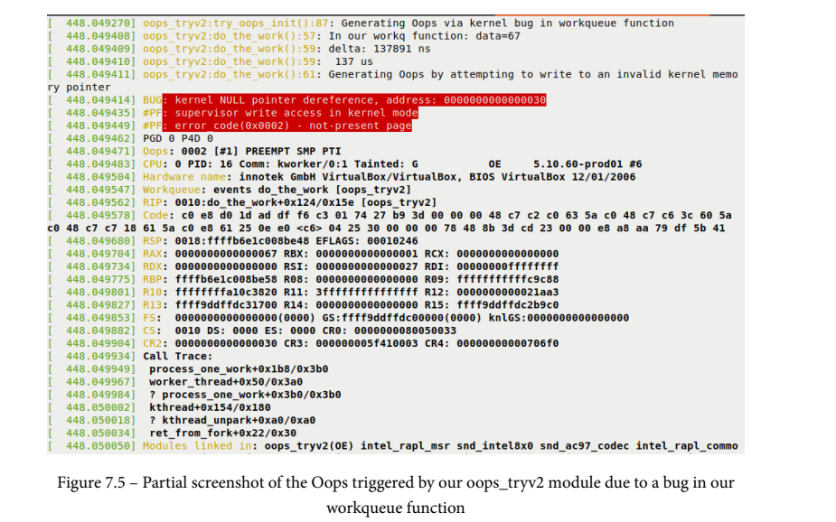

# 7.24

## Linux Kernel Programming

### Working with Hardware I/O

#### 从内核访问硬件I/O内存

​	作为设备驱动程序作者，您可能会面临一个有趣的问题：您需要能够访问和处理外围芯片的I/O内存、硬件寄存器和/或硬件内存。事实上，这通常是驱动程序在“金属”级别对硬件进行编程的方式：通过其寄存器和/或外围存储器向其发出命令。但是，在Linux上直接访问硬件I/O内存会遇到一个问题。在第一节中，我们将研究这个问题并提供解决方案。了解直接访问的问题当然，芯片上的这个硬件内存，即所谓的I/O内存，不是RAM。Linux内核拒绝模块或驱动程序作者直接访问这些硬件I/O位置。我们已经知道原因：在现代基于VM的操作系统上，所有内存访问都必须通过内存管理单元（MMU）和分页表。让我们快速总结一下第7章“内存管理内部-要点”中配套指南《Linux内核编程》中的关键方面：默认情况下，内存是虚拟的，这意味着所有地址都是虚拟的而不是物理的（这包括内核段或VAS中的地址）。这样想吧：一旦进程（或内核）访问了一个虚拟地址进行读取、写入或执行，系统就必须从相应的物理地址获取内存内容。这涉及在运行时将虚拟地址转换为物理地址；硬件优化（CPU缓存、翻译后备缓冲区（TLB）等）可以加快这一速度。

​	执行的过程如下：

1. 首先，检查CPU缓存（L1-D/L1-I、L2等），查看此虚拟地址引用的内存是否已在CPUcache芯片上。
2. 如果内存已经在板上，则缓存命中，工作就完成了。如果没有（这是最后一级缓存-LLC丢失-代价高昂！），虚拟地址将被馈送到微处理器MMU.
3. MMU现在在处理器TLB中查找相应的物理地址。如果它在那里，我们有一个TLB命中，工作就完成了；如果没有，我们有TLB未命中（这很昂贵！）。
4. MMU现在遍历进行访问的用户空间进程的分页表；或者，如果内核进行了访问，它会遍历内核分页表，将虚拟地址转换为相应的物理地址。此时，物理地址被放置在总线上，工作就完成了。请参阅TI的OMAP35x技术参考手册，网址为https://www.ti.com/lit/ug/spruf98y/spruf98y.pdf?ts=1594376085647

​	此外，我们还提到，实际的地址翻译过程当然非常依赖于拱。在某些系统中，顺序如下图所示；在其他情况下（通常在ARM上），首先执行MMU（包括TLB查找），然后检查CPU缓存。所以，想想看：即使是正常的RAM位置也不会被现代操作系统上运行的软件直接访问；这是因为它的内存是虚拟化的。在这种情况下，分页表（每个进程以及内核本身）使操作系统能够将虚拟地址转换为物理地址。（我们在我们的配套书籍《Linux内核编程》第7章“内存管理内部——基础”中的“虚拟寻址和地址转换”一节中详细介绍了这些领域；如果需要，请回头看看以刷新这些关键点。）现在，如果我们有一个包含I/O内存的硬件外围设备或芯片，如果我们考虑到这个内存不是RAM的事实，这个问题似乎更加复杂。那么，这个内存不是由分页表映射的吗？是吗？在下一节中，我们将探讨这个问题的两种常见解决方案，请继续阅读！解决方案——通过I/O内存或I/O端口进行映射为了解决这个问题，我们必须明白，现代处理器提供了两种访问和使用硬件I/O（外围芯片）内存的方式：通过为这些外围设备保留处理器地址空间的一些区域；即通过使用内存映射I/O（MMIO）作为I/O的映射类型。

​	通过提供不同的汇编（和相应的机器）CPUi指令来直接访问I/O存储器。将这种映射类型用于I/O称为端口映射I/O（PMIO或简称PIO）。我们将在理解和使用内存映射I/O和理解和使用端口映射I/O部分分别考虑这两种技术。不过，在我们这样做之前，我们需要学习如何礼貌地请求内核允许使用这些I/Oresource！询问内核的权限请考虑一下：即使您知道使用哪个API以某种方式映射或工作I/O内存，首先，您也需要向操作系统请求权限。毕竟，操作系统是系统的整体资源管理器，在使用其资源之前，您必须很好地询问它。当然，还有更多的事情要做——当你问它的时候，你真正要做的是让它设置一些内部数据结构，让内核了解哪个驱动程序或子系统正在使用哪个I/O内存区域或端口。在执行任何外围I/O之前，你需要请求内核的许可，假设你得到了许可，你就可以执行I/O。之后，你需要将I/O区域释放回内核。此过程涉及以下步骤：

1. I/O之前：请求访问内存或端口区域。
2. 收到内核内核内核的绿灯后，执行实际的I/O：您可以使用MMIO或PMIO来执行此操作（详细信息见下表）。
3. I/O后：将内存或端口区域释放回操作系统。

那么，如何执行这些请求、I/O和发布操作呢？有一些API可以做到这一点，您应该使用的API取决于您是使用MMIO还是PMIO。下表总结了在执行I/O之前应该使用的API，然后在完成此工作后释放区域（执行I/O的实际API将在稍后介绍）


执行I/O操作后，释放该区域。release_mem_regic（）release_region（）上表所示的函数在linux/iport.h头文件中定义为宏；它们的签名如下：

```
request_mem_region(start, n, name); [...] ; release_mem_region(start, n);
request_region(start, n, name); [...] ; release_region(start, n);
```

​	所有这些宏本质上都是\_\_request_region（）和\__release_reregion（）内部API的包装器。这些宏的参数如下：start是I/O内存区域或端口的开头；对于MMIO，它是一个物理（或总线）地址，而对于PMIO，它则是一个端口号。n是所请求的区域的长度。name是您想将映射的区域或端口范围与之关联的任何名称。它通常是执行I/O操作的驱动程序的名称（您可以在proc文件系统中看到它；我们将在介绍如何使用MMIO和PMIO时对此进行更详细的介绍）。request\_[mem\_]region（）API/宏的返回值是一个指向构造资源的指针（同样，在获取设备资源一节中对此有更多介绍）。如果返回NULL，则意味着资源未能被保留；驱动程序通常返回-EBUSY，表示资源现在正忙或不可用（可能是因为另一个组件/驱动程序已经请求并正在使用它）。在接下来的部分中，我们将提供一些使用这些API/宏的实际示例。现在，让我们学习如何实际映射和使用I/O内存。我们将从几乎所有现代处理器都支持的通用方法开始；即MMIO。理解和使用内存映射的I/O在MMIO方法中，CPU理解其地址空间的某个区域（或几个）是为I/O外围存储器保留的。您实际上可以通过参考给定处理器（或SoC）数据表的物理内存映射来查找区域。

正如我们所看到的，这是一个寄存器块（或存储体），一组用于类似目的的32位寄存器（此处为GPIO）。在上图中，我们当前目的的关键列是第一列，即地址列：这是物理或总线地址，也是ARM处理器物理地址空间中看到GPIO寄存器的位置。它从0x7e20 0000开始（因为这是前面屏幕截图中的第一个地址），长度有限（这里，它被记录为每个32位的41个寄存器，所以我们将该区域的长度取为41\*4字节）。使用ioremap\*（）APIsNow，正如我们在理解直接访问问题一节中看到的，试图直接在这些物理或总线地址上执行I/O根本行不通。我们应该这样做的方式是告诉Linux将这些总线地址映射到内核的VAS中，这样我们就可以通过内核虚拟地址（KVA）访问它！我们该怎么做？内核为此目的提供API；驱动程序作者使用的一个非常常见的方法是theoremap（）API。它的签名如下：

```
#include <asm/io.h>
void __iomem *ioremap(phys_addr_t offset, size_t size)
```

​	asm/io.h头文件根据需要成为特定于arch的头文件。请注意ioremap（）的第一个参数是一个物理（或总线）地址（它的数据类型是phys_addr_t）。这是Linux中极少数情况之一，作为驱动程序作者，您必须提供物理地址，而不是虚拟地址（另一种典型情况是在执行直接内存访问（DMA）操作时）。第二个参数很明显；这是我们必须映射的内存I/O区域的大小或长度。当被调用时，ioremap（）例程将把I/Ochips或外围存储器从偏移量开始映射到内核的VAS中，长度为字节！这是必要的——使用内核权限运行时，您的驱动程序现在可以通过返回指针访问此I/Omemory区域，从而在内存区域上执行I/O。想想看！就像mmap（）系统调用允许您将KVA空间的一个区域映射到用户空间进程一样，[devm_]ioremap\*（）（和friends）API允许您将外围I/O内存区域映射到KVA空间。ioremap（）API返回一个void\*类型的KVA（因为它是一个地址位置）。那么，这里看起来奇怪的__iomem指令是什么（void \_\_iomem*）？它只是一个编译器属性，在构建时会被删除；它只是提醒我们人类（以及执行健全性检查或查看静态分析代码），这是一个I/O地址，而不是您的常规RAM地址！

​	因此，对于前面的示例，在Raspberry Pi设备上，您可以通过执行以下操作将GPIO寄存器库映射到KVA（这不是实际代码，而是向您展示如何调用ioremap（）API的示例）：

```
#define GPIO_REG_BASE 0x7e200000
#define GPIO_REG_LEN 164 // 41 * 4
static void __iomem *iobase;
[...]
if (!request_mem_region(GPIO_REG_BASE, GPIO_REG_LEN, "mydriver")) {
 dev_warn(dev, "couldn't get region for MMIO, aborting\n");
 return -EBUSY; // or -EINVAL, as appropriate
}
iobase = ioremap(GPIO_REG_BASE, GPIO_REG_LEN);
if (!iobase) // handle any error
 [... perform the required IO ... ]
iounmap(iobase);
release_mem_region(GPIO_REG_BASE, GPIO_REG_LEN);
```

​	iobase变量现在保存ioremap（）的返回值；这是一个KVA，一个内核虚拟地址。现在您可以使用它，只要它不是NULL（您需要验证这一点！）。因此，在这个例子中，ioremap（）的返回值是内核VAS中Raspberry Pi的GPIO寄存器（外围I/O存储器）现在映射并可用的位置。一旦完成，您将使用iounmap（）API取消映射（如前面的代码片段所示）；iounmap（）API的参数是显而易见的-I/O映射的开始（ioremap（）返回的值）：void iounmap（volatile void __iomem*io_addr）；因此，当我们将（GPIO寄存器）I/O内存映射到内核VAS中时，我们会得到一个KVA，以便我们可以使用它。有趣的是，ioremap（）API的返回值通常是内核VAS的vmalloc区域内的地址（有关详细信息，请参阅配套指南Linux内核编程-第7章，内存管理内部组件-要素）。这是因为ioremap通常分配并使用从内核的vmalloc区域映射所需的虚拟内存（但情况并非总是如此；ioremap_scache（）等变量可以使用vmalloc之外的区域）。这里，假设返回值——我们的iobase地址——是0xbbed 8000（参见图3.2：这里有一个2:2 GB的VMsplit，你可以看到iobase返回地址确实是内核vmalloc区域内的KVA）。以下是一个概念图，显示了这一点：


新品种——devm\_\*管理的API现在你已经了解了如何使用request_mem_regic（）和just-seeniomemap\*（）API，你猜怎么着？现实情况是，这两个API现在都被认为是不可预防的；作为一名现代驱动程序作者，您应该使用更好的资源管理dvm_\*API。（出于几个原因，我们介绍了较旧的驱动程序，包括许多较旧的驱动器仍然非常使用它们，为了理解使用oremap（）资源管理API的基础知识，以及为了完整性。）首先，让我们在lib/devres.c:

```
/**
 * devm_ioremap - Managed ioremap()
 * @dev: Generic device to remap IO address for
 * @offset: Resource address to map
 * @size: Size of map
 *
 * Managed ioremap(). Map is automatically unmapped on driver detach.
 */
void __iomem *devm_ioremap(struct device *dev, resource_size_t offset,
 resource_size_t size)
```

正如我们了解到的关于非常常见的kmalloc/kzalloc API（请参阅公司指南Linux内核编程，第8章，模块作者的内核内存分配-第1部分），devm_kmalloc（）和devm_kzallocs（）API简化了我们的生活，因为它们保证会释放在设备拆卸或驱动程序删除时分配的内存。以类似的方式，使用devm_ioremap（）意味着您不需要显式调用iounmap（）API，因为内核的devres框架将处理itupon驱动程序分离！同样，由于这本书主要不是专注于编写设备驱动程序，我们将提到bit，而不是深入探讨使用probe（）和remove（）/disconnect（）钩子的现代Linux设备模型（LDM）的细节。关于这一主题的其他文献可以在本章末尾的进一步阅读部分找到。请注意，任何devm_*（）API的第一个参数都是指向结构设备的指针（我们在第1章“编写简单错误字符设备驱动程序”中介绍了如何获得该指针，当时我们介绍了如何编写简单错误驱动程序）。

​	获取设备资源devm_ioremap（）API的第二个参数（参见前面一节中的签名）是resource_size_t offset。形式参数名称偏移量有点误导——它实际上是用于重新映射到内核VAS的外围I/O内存区域的物理或总线地址（事实上，resource_size_t数据类型只不过是phys_addr_t的typedef，一个物理地址）。本节和下一节的内容对Linux设备驱动程序作者来说很重要，因为它介绍了一些关键思想（设备树（DT）、平台和开发人员API等），并包含了一些常用的策略。但是如何获得devm_ioremap（）API的第一个参数——总线物理地址？确实是FAQ！当然，这是特定于设备的。话虽如此，起始总线或物理地址只是驱动程序作者可以（有时必须）指定的几个I/O资源之一。Linux内核为此提供了一个强大的框架——I/O资源管理框架，因为它允许您获取/设置硬件资源。有几种可用的资源；它包括设备MMIOranges、I/O端口范围、中断请求（IRQ）线、寄存器偏移、DMA和总线值。现在，为了使所有这些工作正常进行，必须在每个设备的基础上指定I/O资源。有两种主要的方法可以做到这一点：

​	传统方法：将它们（I/O资源）硬编码到内核源代码树中，通常称为板特定文件。（例如，对于流行的ARM CPU，这些通常位于arch/ARM/mach->foo/…，其中foo是机器（mach）或平台/板名称。再举一个例子，在Linux 3.10.6中，这些板特定文件中定义的平台设备数量为1670；迁移到现代DT方法后，5.4.0内核源代码树的这个数字减少到885。）

​	现代方法：通过将它们（I/O资源）放置在操作系统启动时可以发现的位置；这通常是针对嵌入式系统，如ARM-32、AArch64和PPC，通过一种称为DT（类似于VHDL）的硬件专用语言描述机载或平台的硬件拓扑（其上的所有硬件，如SoC、CPU、外围设备、磁盘、闪存芯片、传感器芯片等）来实现的。设备树源代码（DTS）文件位于内核源代码树下（对于ARM，在arch/ARM/boot/DTS/中），并在内核构建时（通过DT编译器；即dtc）编译为称为设备树Blob（DTB）的二进制格式。DTB通常在引导时由引导加载程序传递给内核。在启动初期，内核读取、扁平化并解释DTB，根据需要创建平台（和其他）设备，然后将它们绑定到相应的驱动程序。x86[\_64]系统不存在DT。最接近的等价物可能是ACPI表。此外，请注意，DT不是Linux特有的技术；它被设计为与操作系统无关，通用组织被称为开放固件（OF）。正如我们之前提到的，使用这种现代模型，内核和/或设备驱动程序必须从DTB获取资源信息（在dea-include/linux/iport.h中填充：结构资源）。

​	怎么用？平台驱动程序通常通过platform_get_*（）API来实现这一点。我们希望通过内核源代码中的Video For Linux（V4L）媒体控制器驱动程序的一个例子来阐明这一点。此驱动程序适用于三星Exynos 4 SoC上的SP5电视混音器（用于某些Galaxy S2型号）。甚至在V4L驱动程序特定文档部分下也有一些内核文档：https://www.kernel.org/doc/html/v5.4/media/v4l-drivers/fimc.html#the-samsung-s5p-exynos4-fimc-driver.

​	以下代码可以在drivers/gpu/drm/exinos/exinos_mixer.c中找到。这里，驱动程序利用platform_get_resource（）API来获得I/Omemory资源的值；即该外围芯片的I/O内存的起始物理地址

```
struct resource *res;
 [...]
 res = platform_get_resource(mixer_ctx-pdev, IORESOURCE_MEM, 0);
 if (res == NULL) {
 dev_err(dev, "get memory resource failed.\n");
 return -ENXIO;
 }
 mixer_ctx->mixer_regs = devm_ioremap(dev, res-start,
 resource_size(res));
 if (mixer_ctx->mixer_regs == NULL) {
 dev_err(dev, "register mapping failed.\n");
 return -ENXIO;
 }
 [...]
```

在前面的代码段中，驱动程序发出platform_get_resource（）API来为IORESOURCE_MEM类型资源（MMOmemory！）刻蚀指向资源结构的指针。然后，它发布devm_ioremap（）API，将该MMIO区域映射到kernelVAS中（如前一节中详细说明的那样）。使用devm版本的alleviatest，当完成此操作（或由于错误）时，需要手动取消映射I/O内存，从而减少泄漏的机会！与devm_ioremap_resource（）API融为一体作为驱动程序的作者，您应该了解并使用这个有用的例程：devm_oremap_resource（）管理的API执行（有效性）检查请求的I/O内存区域的工作，从内核请求（内部通过devm_request_mem_region（）API），并重新映射（内部通过devm_ioremap（））！这使它成为像您这样的驱动程序作者的有用包装器，它的使用非常普遍（在5.4.0内核代码库中，它被使用了1400多次）。其签名如下：void __iomem\*devm_ioremap_resource（结构设备\*dev，结构资源*res）；下面是drivers/char/hw_random/bcm2835 rng.c中的一个用法示例：

```
static int bcm2835_rng_probe(struct platform_device *pdev)
{
 [...]
 struct resource *r;
 [...]
 r = platform_get_resource(pdev, IORESOURCE_MEM, 0);
 /* map peripheral */
 priv->base = devm_ioremap_resource(dev, r);
 if (IS_ERR(priv->base))
 return PTR_ERR(priv->base);
 [...]
```


同样，与现代LDM的典型情况一样，此代码作为驱动程序探测路由的一部分执行。此外（同样，这是非常常见的），首先使用platform_get_resource（）API，以便获取物理（或总线）地址的值并将其放置在源结构中，该源结构的地址作为第二个参数传递给devm_ioremap_resource（）。现在，使用MMIO检查、请求I/O内存并将其重新映射到内核VAS，准备供驱动程序使用！您可能遇到过devm_request_and_ioremap（）API，它通常用于类似的目的；早在2013年，它就被devm_ioremap_resource（）API所取代。最后，ioremap（）有几个变体。[devm\_]ioremap_nocache（）和ioremap_cache（）API就是这样的例子，它们会影响CPU的缓存模式。驱动程序作者最好仔细阅读这些例程所在的内核源代码中的（特定于arch的）注释；例如，在x86上的arch/x86/mm/ioremap.c:ioremap_nocache（）。现在，在介绍了如何获取资源信息和使用现代devm\_\*（）托管API的这一重要部分后，让我们学习如何解释/proc关于MMIO的输出。

#### 通过/proc/iomem查找新的映射

​	一旦你执行了映射（通过刚刚覆盖的[devm_]ioremap*（）API之一），它实际上可以通过只读伪文件看到；即/proc/iomem。实际情况是，当您成功调用request_mem_region（）时，/proc/iomem下会生成一个新条目。查看它需要root访问权限（更准确地说，您可以将其视为非root，但只会将所有地址视为0；这是出于安全目的）。那么，让我们在我们值得信赖的x86_64 Ubuntu客户机上看看这个。在以下输出中，由于空间不足，为了清楚起见，我们将显示部分截断的内容

```
$ sudo cat /proc/iomem
[sudo] password for llkd:
00000000-00000fff : Reserved
00001000-0009fbff : System RAM
0009fc00-0009ffff : Reserved
000a0000-000bffff : PCI Bus 0000:00
000c0000-000c7fff : Video ROM
000e2000-000ef3ff : Adapter ROM
000f0000-000fffff : Reserved
000f0000-000fffff : System ROM
00100000-3ffeffff : System RAM
18800000-194031d0 : Kernel code
194031d1-19e6a1ff : Kernel data
1a0e2000-1a33dfff : Kernel bss
3fff0000-3fffffff : ACPI Tables
40000000-fdffffff : PCI Bus 0000:00
[...]
fee00000-fee00fff : Local APIC
fee00000-fee00fff : Reserved
fffc0000-ffffffff : Reserved
$
```

​	要实现的真正重要的是左侧列不是虚拟的，它们是物理（或总线）地址。您可以看到系统（或平台）RAM的映射位置。此外，在其中，您可以看到内核代码、数据和bss部分的确切位置（就物理地址而言）。事实上，我的procmap实用程序(https://github.com/kaiwan/procmap)精确地使用这些信息（将物理地址转换为虚拟地址）。为了进行对比，让我们在Raspberry Pi 3设备上运行相同的命令（B+型号搭载了Broadcom BCM2837 SoC和四核ARM Cortex A53）。同样，由于空间限制，为了清楚起见，我们将显示输出的部分截断部分：

```
pi@raspberrypi:~ $ sudo cat /proc/iomem
00000000-3b3fffff : System RAM
00008000-00bfffff : Kernel code
00d00000-00e74147 : Kernel data
3f006000-3f006fff : dwc_otg
3f007000-3f007eff : dma@7e007000
[...]
3f200000-3f2000b3 : gpio@7e200000
3f201000-3f2011ff : serial@7e201000
3f201000-3f2011ff : serial@7e201000
3f202000-3f2020ff : mmc@7e202000
[...]
pi@raspberrypi:~ $
```

​	请注意GPIO寄存器组如何显示为gpio@7e200000，如图3.1所示，这是物理地址。您可能想知道为什么ARM上的格式与x86_64的格式不同。左栏现在是什么意思？在这里，内核允许BSP/平台团队决定如何构建和设置（通过/proc/iomem）用于显示的I/O内存区域，这是有道理的！他们最了解硬件平台。我们之前提到过，但事实是BCM2835SoC（Raspberry Pi使用的）有多个MMU。一个这样的MMU是粗粒度VC/ARM MMU，它将ARM总线地址转换为ARM物理地址，之后常规ARM MMU将物理地址转换为虚拟地址。因此，在这里，ARM总线地址的开始和结束值显示在左列中，ARM物理地址显示为@符号的后缀(gpio@xxx). 因此，对于正在映射的前一个GPIO寄存器，ARM总线地址为3f20000-3f2000b3，ARM物理地址为0x7e200000。让我们通过提及更多关于/proc/iomemppseudo文件的要点来结束本节：

- /proc/iumem显示内核和/或各种设备驱动程序当前正在映射的物理（和/或总线）地址。然而，确切的显示格式非常依赖于架构和设备。
- 每当运行request_mem_region（）API时，都会为/proc/iomem生成一个条目。
- 当相应的release_mem_region（）API运行时，该条目将被删除。
- 您可以在kernel/resource.c:ioresources_init（）中找到相关的内核代码。

​	那么，现在您已经将I/O内存区域成功映射到内核VAS，您将如何实际读取/写入此I/O内存？MMIO的API是什么？下一节将深入探讨这个主题。

#### MMIO–使用MMIO方法执行实际I/O

​	外围I/O内存被映射到内核VAS，因此在您（驱动程序作者）看来，它就像RAM一样，是普通的旧内存。我们在这里需要小心：有需要注意的事项和注意事项。您不应该将该区域视为普通的旧RAM，并通过通常的Croutines直接访问它！

​	在接下来的部分中，我们将向您展示如何对通过MMIO方法重新映射的任何外围I/O区域执行I/O（读取和写入）。我们将从执行小（1到8字节）I/O的常见情况开始，然后继续进行重复I/O，然后再研究如何对MMIO区域进行memset和memcpy。在MMIO内存区域执行1到8字节的读写操作。那么，您如何通过MMIO方法访问和执行外围I/O（读写）呢？内核提供了API，允许您读取和写入芯片内存。通过使用这些API（或宏/内联函数），您可以以四种可能的位宽执行I/O，如读取和写入；也就是说，8位、16位、32位，在64位系统上，64位：

MMIO读取：ioread8（）、ioread16（）、ioread32（）和ioread64（）

MMIO写入：iowrite8（），iowrite16（），iowrite32（），和iowrite64（）I/O

读取例程的签名如下：

```
#include <linux/io.h>
u8 ioread8(const volatile void __iomem *addr);
u16 ioread16(const volatile void __iomem *addr);
u32 ioread32(const volatile void __iomem *addr);
#ifdef CONFIG_64BIT
u64 ioread64(const volatile void __iomem *addr);
#endif
```

​	API的单个参数是必须从中读取的I/O内存位置的地址。通常，它是从我们看到的*ioremap*（）API之一获得的返回值，加上偏移量（偏移量可能是0）。向基（__iomem）地址添加偏移量是一件非常常见的事情，因为硬件设计人员精心布局寄存器，使其可以作为数组（或寄存器库）由软件轻松按顺序访问！驱动程序作者利用了这一点。当然，这没有捷径，因为你不能假设任何事情——你必须仔细研究你正在编写驱动程序的特定I/O外围设备的数据表；细节决定成败！u8返回类型是一个指定无符号8位数据类型的typedef（相反，sprefix表示有符号数据类型）。其他数据类型也是如此（有s8、u8、s16、u16、s32、u32、s64和u64，都非常有用且明确）。

​	I/O写入例程的签名如下

```
#include <linux/io.h>
void iowrite8(u8 value, volatile void __iomem *addr);
void iowrite16(u16 value, volatile void __iomem *addr);
void iowrite32(u32 value, volatile void __iomem *addr);
#ifdef CONFIG_64BIT
void u64 iowrite64(u64 value, const volatile void __iomem *addr);
#endif
```

​	API的第一个参数是要写入的值（具有适当的位宽），而第二个参数指定要写入的位置；即MMIOaddress（同样，这是通过*ioremap*（）API之一获得的）。请注意，没有返回值。这是因为这些I/O例程确实在硬件上工作，所以它们不会失败：它们总是成功的！当然，现在您的驱动程序可能仍然无法工作，但这可能是由于多种原因造成的（资源不可用、映射错误、使用错误的偏移、定时或同步问题等）。然而，I/O例程仍然可以工作。驱动程序作者用来从根本上测试驱动器/硬件健全性的一个常见测试是，他们将值n写入寄存器并将其读回；你应该得到相同的值（n）。（当然，只有在寄存器/硬件不会立即更改或使用它的情况下，才会出现这种情况。）

在MMIO内存区域上执行重复I/O 

ioread[8|16|32|64]（）和iowrite\[8|16| 32|64]()API只能处理1到8字节的小数据量。但是，如果我们想读或写几十个或几百个字节呢？您始终可以在循环中对这些API进行编码。然而，内核正是预见到了这一点，提供了更高效的辅助例程，这些例程在内部使用了一个紧密的汇编循环。这些是所谓的MMIO API的重复版本：为了阅读，我们有ioread[8|16|32|64]\_rep（）API集。对于写作，我们有iowrite[8|16|32|64]_rep（）API集。让我们看看其中一个的签名；即8位重复读取。其余的读取完全类似：

```
#include <linux/io.h>
void ioread8_rep(const volatile void __iomem *addr, void *buffer, unsigned
int count);
```

​	这将从源地址addr（MMIO位置）读取计数字节到缓冲区指定的（内核空间）目标缓冲区。同样，以下是重复8位写入的签名：

```
void iowrite8_rep(volatile void __iomem *addr, const void *buffer, unsigned
int count);
```

​	这将把源（内核空间）缓冲区（buffer）中的计数字节写入目标地址addr（MMIO位置）。除了这些API，内核确实有一些助手，它们是这种API的变体；例如，对于字节序，它提供ioread32be（），其中be是大端序。在MMIO内存区域上设置和复制内核还为使用MMIO时的memset（）和memcpy（）操作提供了辅助例程。请注意，您必须使用以下帮助程序：

```
#include linux/io.h
void memset_io(volatile void __iomem *addr, int value, size_t size);
```

​	这将把I/O内存从起始地址addr（MMIO位置）设置为大小字节的值参数指定的值。为了复制内存，根据内存传输的方向，有两个辅助例程可用

```
void memcpy_fromio(void *buffer, const volatile void __iomem *addr, size_t
size);
void memcpy_toio(volatile void __iomem *addr, const void *buffer, size_t
size);
```

​	第一个将内存从MMIO位置地址复制到（内核空间）目标缓冲区（缓冲区），大小为字节；第二例程将内存从（内核空间）源缓冲区（buffer）复制到目标MMIO位置addr，以获得大小字节。同样，对于所有这些助手，请注意没有返回值；他们总是成功的。此外，对于前面的所有例程，请确保包含linux/io.h标头。最初，asm/io.h标头通常包含在内。然而，现在，linux/io.h标头是它上面的一个抽象层，内部包含asm/io.h文件。

需要注意的是，内核有较旧的用于执行MMIO的辅助例程；这些是读取[b|w|l|q]（）和写入[b|v|l|q]（）API助手。在这里，后缀为读/写的字母指定了位宽；其实很简单：

- b：字节宽（8位）
- w：字宽（16位）
- l：长宽（32位）
- q：四字宽（64位）；仅在64位计算机上可用请注意

对于现代内核，不应使用这些例程，而应使用前面提到的ioread/iowrite[8|16|32|64]（）API助手。我们在这里提到它们的唯一原因是，仍然有几个驱动程序在使用这些旧的辅助程序。语法和语义与较新的助手程序完全相似，因此如果需要，我将留给您查找它们。让我们总结一下（不要过多关注我们到目前为止所涵盖的所有细节）驾驶员在执行MMIO时遵循的典型顺序来结束本节：

- 通过Request_mem_region（）从内核请求内存区域（在/proc/iomem中生成一个条目）。
- 将外围I/O内存重新映射到内核VASvia[devm_]ioremap[_resource|[no]cache（）；现代驱动程序通常使用托管devm_ioremap（）（或devm_iorimap_resource（）API）来实现
- 通过一个或多个现代辅助程序例程执行实际的I/O操作：ioread[8|16|32|64]（）iowrite[8|16|32|64]（）memset_io（）/mecpy_fromio（）/memcpy_toio（）（较旧的辅助程序例程：read[b|w|l|q]（）和write[b|w|l|q]（））
- 完成后，取消映射MMIO区域；即iounmap（）。这仅在需要时进行（使用托管devm_ioremap*（）API时，这是不必要的）。
- 通过Release_mem_region（）将MMIO区域释放回内核（清除/proc/iomem中的条目）。

由于MMIO是与外围芯片通信的强大手段，您可以想象所有驱动程序（包括所谓的总线驱动程序）都是使用它（和/或端口I/O）设计和编写的，但事实并非如此。这是由于性能问题。毕竟，在外围设备上执行MMIO（或PMIO）需要处理器的持续交互和关注。在许多类型的设备上（想想在智能手机或平板电脑上流式传输高清媒体内容！），只是太慢了。那么，与外围设备通信的高性能方式是什么？答案是DMA，不幸的是，这超出了本书的范围（请参阅进一步阅读部分，了解有关DMA的有用驱动程序书籍和资源的建议）。那么，MMIO在哪里使用？实际上，它用于许多低速外围设备，包括状态和控制操作。虽然MMIO是在外围设备上执行I/O的最常见方式，但端口I/O是另一种方式。那么，让我们学习如何使用它。

#### 了解和使用我们在解决方案中前面提到的端口映射I/O——通过I/O内存或I/O端口部分进行映射

​	除了MMIO之外，还有另一种在外围设备内存上执行I/O的方法，称为PMIO，或者通常简称为PIO。它的工作方式与MMIO截然不同。在这里，CPU具有不同的汇编（和相应的机器）指令，使其能够直接读取和写入I/O内存位置。不仅如此，这个I/O内存范围是一个完全独立的地址空间，与RAM不同。这些内存位置称为端口。不要将这里使用的术语端口与网络技术中使用的术语混淆；把这个端口看作是一个硬件寄存器，因为它非常接近意义。（虽然它通常是8位的，但外围芯片寄存器实际上可以有三种位宽：8、16或32位。）现实情况是，大多数现代处理器，即使它们确实支持具有单独I/O端口地址空间的PMIO，也往往主要使用MMIO方法进行外围I/O映射。除了MMIO之外，支持PMIO并经常使用它的主流处理器系列是x86。在这些处理器上，正如其物理内存映射中所记录的那样，是为此目的保留的一系列地址位置。这被称为端口地址范围，通常在x86上，范围从物理地址0x0到0xffff；即长度为64千字节。该地区包含哪些注册信息？通常，在x86上，有用于各种I/O外围设备的寄存器（通常是数据/状态/控制）。一些常见的包括i8042键盘/鼠标控制器芯片、DMA控制器（DMAC）、定时器、RTC等。我们将在通过/proc/iports查找端口一节中更详细地介绍这些。

​	PMIO——与我们在MMIO中看到的所有喧闹相比，执行实际的I/O端口I/O非常简单。这是因为处理器提供机器指令来直接执行工作。当然，就像MMIO一样，你应该礼貌地请求内核允许访问PIOregion（我们在请求内核的权限一节中介绍了这一点）。用于执行此操作的API是request_region（）和release_regio（）（它们的参数与它们的MMIO对应API相同）。那么，如何在I/O端口上访问和执行I/O（读写）呢？同样，内核在底层的汇编/机器指令上提供了API包装器，以完成读取和写入。使用它们，您可以以三种可能的位宽执行I/O读写操作；也就是说，8位、16位和32位：

- PMIO读取：in（）、inw（）和in（）
- PMIO写入：out（）、out（）和outl（）

非常直观地说，b表示字节宽（8位），w表示字宽（16位），l表示长宽（32位）。端口I/O读取例程的签名如下

```
#include <linux/io.h>
u8 inb(unsigned long addr);
u16 inw(unsigned long addr);
u32 inl(unsigned long addr);
```

单个参数是将从中读取的端口I/Omemory位置的端口地址。我们在获取设备资源部分介绍了这一点（对于像您这样的驱动程序开发人员来说，这是一个非常关键的部分！）。端口也是一种资源，这意味着它可以通过通常的方式获得：在现代嵌入式系统上，这是通过解析设备树（或ACPI表）来实现的；旧的方法是在特定于板卡的源文件中硬编码这些值。实际上，对于许多常见的外围设备，端口号或端口地址范围是众所周知的，这意味着它可以硬编码到驱动程序中（这通常发生在驱动程序的头文件中）。同样，最好不要简单地假设任何事情，确保您参考了相关外围设备的数据表。现在，让我们回到API。返回值是一个无符号整数（位宽根据所使用的辅助例程而变化）。它是发出读取时该端口（寄存器）上的当前值。

​	端口I/O写入例程的签名如下：

```
#include <linux/io.h>
void outb(u8 value, unsigned long addr);
void outw(u16 value, unsigned long addr);
void outl(u32 value, unsigned long addr);
```

第一个参数是写入硬件（端口）的值，而第二个参数是要写入的端口I/O内存的端口地址。同样，与MMIO一样，不存在失败的问题，因为这些辅助I/O例程总是成功的。至少在x86上，对I/O端口的写入保证在执行下一条指令之前完成。一个PIO的例子——i8042为了让事情更清楚，让我们来看看8042键盘和鼠标控制器的设备驱动程序中的一些代码片段，虽然现在被认为很旧，但在x86系统上仍然很常见。您可以在此处找到8042控制器的基本原理图：


​	有趣的位（至少对我们来说）在驱动程序的头文件中：/

```
/*
 * Register numbers.
 */
#define I8042_COMMAND_REG 0x64
#define I8042_STATUS_REG 0x64
#define I8042_DATA_REG 0x60
```

​	在前面的代码片段中，我们可以看到此驱动程序使用的I/O端口或硬件寄存器。为什么状态寄存器和数据寄存器解析为相同的I/O端口（0x64）地址？方向很重要：读取它时，I/O端口0x64的行为就像状态寄存器，而写入它时，它的行为就像命令寄存器！此外，数据表将显示这些是8位寄存器；因此，在这里，实际的I/O是通过in（）和out（）助手执行的。

### Kernel Debug Programming

​	在开始生成Oops任务之前，让我们更好地了解procmap实用程序的作用以及NULL陷阱页面是什么。首先，让我们使用该实用程序。procmap工具能够可视化内核虚拟地址空间（VAS）的完整内存映射以及任何给定进程的用户VAS，这是procmap实用程序的设计目的。（完全披露：我是原作者。）GitHub页面上的描述(https://github.com/kaiwan/procmap)综上所述：procmap被设计成一个控制台/CLI实用程序，用于可视化Linux进程的完整内存映射，实际上是可视化内核和用户模式虚拟地址空间（VAS）的内存映射。它以垂直平铺的格式输出给定进程的完整内存映射的简单可视化，按虚拟地址降序排列（见下面的屏幕截图）。该脚本具有显示内核和用户空间映射以及计算和显示将出现的稀疏内存区域的智能。此外，为了可读性，每个片段或映射都（非常近似地）按相对大小和颜色编码进行缩放。在64位系统上，它还显示了所谓的非规范稀疏区域或“洞”（在x86_64上通常接近高达16384 PB）。该实用程序包括仅查看内核空间或用户空间的选项、详细和调试模式、以方便的CSV格式将其输出导出到指定文件的能力，以及其他选项。它也有一个内核组件（一个模块），目前适用于（自动检测）x86_64、AArch32和AArch64 CPU。不过，请注意，它在任何真正意义上都不完整；开发正在进行中。有几个注意事项。我们非常感谢您的反馈和贡献！从这里下载/克隆它：https://github.com/kaiwan/procmap.What这就是NULL陷阱页面吗？在所有基于Linux的系统上（事实上，几乎在所有现代基于虚拟内存的操作系统上），内核将进程可用的虚拟内存区域分为两部分——用户和内核VAS（我们称之为VM分割——在《Linux内核编程，Packt》一书的第7章“内存管理内部-要点”中有非常详细的讨论）。

​	在x86_64上，每个进程的完整VAS大小当然是2^64字节。现在，这是一个惊人的数字。它是16 EB（EB代表EB——1 EB=1024 PB=100万TB=10亿GB！）。VAS太大了。因此，默认情况下，x86_64上的内核被设计为如下分割：锚定在VAS顶部的大小为128 TB的内核VAS（从VAS最顶部的内核虚拟地址（KVA）0xFFFFFFFFFffffffff到KVA 0xffff8000000000）锚定到VAS底部的大小为128TB的用户VAS（从VAS最底部的用户虚拟地址（UVA）0x00007ffffffffFFffff到UVA 0x0）想想这个64位VAS如此之大，在这种情况下，我们最终只使用了一小部分可用地址空间。16EB等于16384PB。其中，在x86_64上，我们使用128 TB+128 TB=256 TB（即256/1024=0.25 PB）。这意味着约0.0015%的可用VAS正在使用中。现在，这里有一点值得注意：在用户VAS的低端，第一个虚拟页面——从字节0到字节4095——被称为NULL陷阱页面。让我们在我们的shell进程（恰好有PID 1076）上快速运行procmap实用程序（我们假设您现在已经安装了它），看到它显示NULL陷阱页面：

```
$ </path/to/>procmap
 --pid=1076
[...]
```


​	您可以在前面的屏幕截图底部找到NULL陷阱页面（bash进程的一些映射在更高的位置可见）。NULL陷阱页面的工作原理是将所有权限-rwx设置为---，这样任何进程（或线程）都无法读取、写入或执行其中的任何内容！这就是为什么当一个进程试图读取或写入地址0x0处的NULL字节时，它不起作用。简而言之，实际发生的情况是：

- 一个进程尝试访问（读取/写入/执行）或解引用NULL字节。
- 事实上，访问此页面中的任何字节都会导致相同的事件序列，因为---模式适用于页面中的所有字节，这就是为什么它被称为NULL陷阱页面！它捕获对其中任何字节的访问。
- 页面中所有字节的权限为零：不读、不写、不执行。现在（除非缓存），所有虚拟地址最终都会到达MMU。MMU进行检查，然后执行运行时地址转换，将虚拟地址转换为物理地址。
- 在这里，MMU检测到页面中的所有字节都没有权限，因此引发了故障（通常在x86上，是一般保护故障）操作系统预装了故障（和陷阱/异常）处理程序。控制权被传递给适当的故障处理功能。
- 此函数（故障处理程序）在导致故障的进程的进程上下文中运行。它通过一个相当复杂的算法找出问题所在。
- 在这里，故障处理程序将得出结论，在用户模式下执行的进程试图进行有缺陷的访问。因此，它会向它发送一个致命信号（SIGSEGV）。这最终会导致进程死亡，并在控制台上显示分段错误[（核心转储）]消息。当然，该过程可以安装一个信号处理程序来处理这个信号。但最终，在清理之后，它必须终止。

现在您已经了解了NULL陷阱页面的确切内容及其工作原理，让我们做一些我们不应该做的事情：尝试在内核模式下读/写NULL地址，从而导致内核错误！一个简单的Oops v1–解引用NULL点在这个有缺陷的内核模块的第一个简单版本中，我们只需读取或写入NULL地址。正如您在上一节中所了解到的，对NULL陷阱页面中的任何字节进行任何访问（读取、写入或执行）都会导致MMU跳起来并触发故障。在内核模式下也是如此。

#### 可能是重新启动的有用（愚蠢）解决方法。

​	您是否注意到，一旦出现错误，内核模块就无法卸载（通过rmmod），因为引用计数为非零？lsmod验证了这一点：

```
$ lsmod |grep oops
oops_tryv1 16384 1
```

​	这通常是因为Oops发生在进程上下文（在我们的例子中是insmod）退出之前，因此模块引用计数减少到0。前一个输出最右侧的1表示当前模块引用计数为1，阻止卸载此模块。现在，如果您无法卸载该模块，则无法再次加载（在编辑源文件后重试）。正确的方法是重新启动盒子并重新开始。对于这个恼人的问题，一个非常愚蠢的解决方法是简单地清理（make clean），重命名源文件，编辑Makefile以使用新名称，然后构建它。现在它将以新名称加载！非常愚蠢，但当你处于开发阶段并急于尝试时，它是有效的。做更多的Oops——正如本章开头提到的，在我们的版本2错误模块中，我们将做一些稍微（希望）更现实的事情来触发内核Oops。此模块有三种不同的方法来触发Oops：

- 一种是在NULL陷阱页面中写入随机生成的KVA。
- 第二，允许用户传递一个（随机）无效的KVA并尝试在其中写入内容（您可以利用procmap实用程序来查找无效的KVA）
- 第三，我们启动一个简单的工作队列函数。这将使内核工作线程在调度时运行其代码。在工作队列函数中，我们将通过尝试向结构指针为NULL的结构成员写入内容来触发Oops（由于这种情况可能非常现实，我们将在本章中将其作为一个用例）。

​	让我们从使用上面提到的第一种方法来触发Oops！

##### 案例1——糟糕的是，写入NULL陷阱页面中的随机位置。

​	与第一个v1模块非常相似，我不会深入探讨这个问题。只要说我们使用内核接口（get_random_bytes（）API）生成一个随机数并将其缩小到0到4095之间的数字（通过使用模运算符）就足够了。这里可以看到模块init函数中的相关代码：

```
// ch7/oops_tryv2/oops_tryv2.c
[...]
static int __init try_oops_init(void)
{
 unsigned int page0_randptr = 0x0;
 [...]
} else { // no module param passed, write to random kva in NULL
trap
 pr_info("Generating Oops by attempting to write to a 
random invalid kernel address in NULL trap page\n"); 
 get_random_bytes(&page0_randptr, sizeof(unsigned 
int));
 bad_kva = (page0_randptr %= PAGE_SIZE);
 }
 pr_info("bad_kva = 0x%lx; now writing to it...\n", bad_
kva);
 *(unsigned long *)bad_kva = 0xdead;
[...]
```

​	这里看到的最后一行是我们试图写入这个坏KVA的地方。当然，这会触发Oops。要尝试这个方法，只需在不传递任何参数的情况下对模块进行insmod。这将使代码指向此用例（我将留给您自己尝试并查看内核日志）。

​	案例2——通过写入内核VASF中无效的未映射位置来产生Oops。对于第二个用例，我们有一个名为mp_randaddr的模块参数。要运行此情况，您需要以通常的方式将其传递给模块，将其设置为无效的内核地址（或KVA）：

```
// ch7/oops_tryv2/oops_tryv2.c
[...]
static unsigned long mp_randaddr;
module_param(mp_randaddr, ulong, 0644);
MODULE_PARM_DESC(mp_randaddr, "Random non-zero kernel virtual 
address; deliberately invalid, to cause an Oops!");
```

​	随机非零内核虚拟地址；故意无效，导致糟糕！”）；现在，当模块的init函数检测到此参数中传递了非零值时，它会调用以下代码：

```
} else if (mp_randaddr) {
 pr_info("Generating Oops by attempting to write to the 
invalid kernel address passed\n");
 bad_kva = mp_randaddr;
 } else {
 [... << code of the first case above >> ...]
 }
 pr_info("bad_kva = 0x%lx; now writing to it...\n", bad_
kva);
 *(unsigned long *)bad_kva = 0xdead;
```

​	这种方法与第一种情况几乎完全相同；有趣的是：我怎么知道要传递哪个内核地址（或KVA）？我如何知道它是内核VAS中无效（或未映射）的位置？啊，这就是procmap实用程序发挥作用的地方！只需运行procmap（传递任何PID并指定--only内核选项开关，因为我们现在对用户VAS不感兴趣）。例如，在我的x86_64客户VM上，我是这样调用它的（您需要更新PATH环境变量以包含安装procmap的目录）：

```
$ procmap --pid=1 --only-kernel
...
```

​	好的，请仔细查看前面的屏幕截图。标记为<。。。K稀疏区域…>是内核VAS中的空洞。这里没有地图。这很常见。这样的内存通常被称为地址空间中的稀疏区域或孔洞。关键在于：稀疏区域是未映射的区域，因此，如果你试图以任何方式访问这些位置中的任何一个——读取、写入或执行——这是一个错误！所以，让我们在稀疏区域内选择一个KVA。我将在模块区域（内核模块所在的位置）和内核vmalloc区域（vmalloc（）从中分配内存的位置）之间选择一个，即0xffffffffc0000000和0xffffda377ffffff之间的任何地址。因此，我将KVA 0xffffffffc000dead作为无效内核地址的值并使用它运行。对，确保您已经构建了oops_tryv2模块，然后按照刚才讨论的参数加载它：

```
$ modinfo -p ./oops_tryv2.ko 
mp_randaddr:Random non-zero kernel virtual address; 
deliberately invalid, to cause an Oops! (ulong)
bug_in_workq:Trigger an Oops-generating bug in our workqueue 
function (bool)
$
```

​	我们使用modinfo实用程序来证明我们的模块接受两个参数（请暂时忽略第二个参数——这是我们的下一个主题）。让我们（终于！）开始吧

```
$ sudo insmod ./oops_tryv2.ko mp_randaddr=0xffffffffc000dead
Killed
$
```

​	哎呀！解释内核错误诊断啊哈！我们的模块（故意）试图写入无效的内核地址0xffffffffc000dead（通过模块参数传递），结果却陷入了错误的结局。我们得到了我们想要的东西——一个Oops击中了我们。以下（部分）屏幕截图显示了其中的一大部分：


​	我希望关键点是明确的：当然，我们会遇到一个bug——Oops。我们在内核VAS的稀疏区域内写入了一个无效的未映射内核地址，procmap实际上帮助我们看到了。为什么试图访问无效地址会导致问题？答案与我们讨论的NULL陷阱页面非常相似。基本情况如下：1。正在处理（读取、写入或执行）的虚拟地址将发送到MMU。

生成一个简单的内核错误和Oops 3032。MMU知道当前进程上下文的分页表在哪里（对于x86，分页表基的物理地址在CR3寄存器中），现在继续将此虚拟地址（KVA）转换为物理地址（在这里，我们将忽略可能已经保存物理地址的硬件优化，如CPU缓存和转换后备缓冲区（TLB），从而缩短了漫长的转换并提供了加速）。通常，它会找到一个映射并执行转换，将物理地址放置在总线上。CPU接管并完成工作。然而，在这种情况下，传递的内核地址是无效的（故意如此）——它实际上是内核VAS漏洞的一部分！因此，地址转换失败。作为硬件，MMU尽其所能：它通过引发（页面）错误来通知操作系统出了问题。操作系统的页面错误处理程序接管（在导致错误的进程的上下文中运行——当然，这里是insmod）。它认为在内核模式下尝试了无效写入，因此触发了Oops！那么，详细理解和解释这个混乱的Oops事情呢？这正是我们在下一节要做的，魔鬼在细节中——解码Oops。坚持住——我们会到的！

##### 案例3——当结构指针为NULL时写入结构成员，这会导致问题。

这个使用（或测试）案例有点复杂，也有助于使其更加逼真。最终结果与前两种情况相同——我们让内核触发Oops。这一次，我们希望有缺陷的代码路径不要在insmod进程上下文中运行。为了实现这一点，我们初始化一个（内核默认）工作队列并对其进行调度，执行其代码。内核默认工作队列的执行是在内核工作线程的上下文中完成的。我们安排工作函数有一个bug——写入一个无效的内存位置，一个没有分配任何内存的指针（指向一个结构）。这当然会触发Oops。以下是相关的代码片段（和往常一样，我敦促您浏览完整的代码并亲自尝试这些东西）

```
// ch7/oops_tryv2/oops_tryv2.c
[...]
static bool bug_in_workq;
module_param(bug_in_workq, bool, 0644);
MODULE_PARM_DESC(bug_in_workq, "Trigger an Oops-generating bug 
in our workqueue function");
```


​	我们在工作队列上调用schedule_work（），让内核实际运行我们的工作函数的代码：


好吧，回想起来很明显：指向我们名为oopsie的结构的指针没有内存（它的值是NULL，因为它是我们模块中的全局静态变量）。然而，我们试图通过它写入结构的一个成员。这会触发Oops。以下是我调用它的方式：

```
sudo insmod/oops_tryv2.ko bug_in_workq=yes
```

你注意到了吗？这一次，Killed消息不会出现。这是因为insmod进程没有被杀死。相反，使用我们的工作队列函数的内核工作线程将遭受该错误的后果。



顺便说一句，如果需要，你可以在我早期的Linux内核编程第2部分书（电子书可免费下载）的第5章“使用内核计时器、线程和工作队列”中阅读设置和使用内核工作队列、计时器和内核线程的详细信息。当然，这里我们总是假设您确实可以访问内核日志（通过dmesg、journalctl、闪存芯片上的安全位置等）。如果你一开始不知道Oops消息在哪里怎么办？那么，内核社区已经记录了您可以在这里做些什么：Oops消息位于哪里？(https://www.kernel.org/doc/html/latest/admin-guide/bug-hunting.html#where-is-the-oops-message-is-located）。此外，我们稍后将介绍其中提到的一些技术。Netconsole在“ARM Linux系统上的Oops和使用Netconsole”一节中介绍，kdump/crash在第12章“更多内核调试方法”中简要介绍。好了，你现在知道如何以多种方式触发内核错误，哎呀！下面快速了解一下内核Oops是什么和不是什么。

一个内核的Oops及其含义307A内核的Oots及其含义这里有一些关于内核Oops的快速认识。首先，Oops与segfault不同——分割错误。。。作为副作用，它可能会导致segfault发生，因此进程上下文可能会收到致命的SIGSEGV信号。当然，这让糟糕的过程陷入了交火之中。接下来，Oops与全面的内核恐慌不是一回事。恐慌意味着系统处于不可用状态。这可能会导致这种情况，尤其是在生产系统上（我们在第10章“内核恐慌、锁定和挂起”中介绍了内核恐慌）。不过请注意，内核提供了几个sysctl可调参数（当然可以由root编辑），用于了解什么情况会导致内核恐慌。我们可以查看它们——在我的x86_64 Ubuntu 20.04客户机上运行我们的自定义生产内核，它们是：

```
$cd/proc/sys/kernel/$ls panic_on*panic_on_io_nmi panic_on-oops panic_o_nurc_stall panic_on/unrecovered_nmi panic _on_warn
```

​	正如你所看到的，如果你把它们分类，默认情况下它们的所有值都是零，这意味着不会触发内核恐慌。它还向我们表明，例如，将panic_on_oops设置为1将导致内核在任何oops上死机，无论它看起来多么微不足道。重要的是要明白，在许多安装中，这可能是正确的做法。当一个系统出现Oops时，我们通常希望出现一个亮红灯——一个信号停止，一种理解系统处于（或曾经处于）不健康状态的方式！这确实取决于项目或产品的性质：一个深度嵌入式系统可能无法承受因内核恐慌而停机的后果。在那里，看门狗通常会检测到系统处于不健康状态并重新启动。我们将在第10章“内核恐慌、锁定和挂起”中介绍使用看门狗等。即使Oops不是内核恐慌，但根据情况和错误的严重程度，内核可能会变得无响应、不稳定或两者兼而有之。或者，它可能会继续工作，就像没有发生任何令人担忧的事情一样！无论如何，Oops最终都是一个内核级的bug；它必须被检测、解释和修复！好的，让我们来看看有趣的部分：学习如何详细解释Oops内核输出。走吧！

#### 魔鬼在于细节——解码Oops我们将使用第三种场景（或使用/测试用例）

​	在案例3一节中介绍——当结构指针为NULL时，通过向结构成员写入Oops。快速回顾一下，这就是我们触发这个特定内核Oops的方法（案例3）：cd ch7/Oops_tryv2makesudo insmod/oops_tryv2.ko bug_in_workq=yes如前所述，它会触发oops。现在我们到了有趣的部分——逐行解读Oops。在开始之前，重要的是要意识到下面的详细讨论必然是特定于arch的，这里和现在都与x86_64平台有关（当然，Oops输出的部分内容非常特定于archs）。在后面的部分中，我们还将展示典型的Oops如何出现在ARM平台上。Oops的逐行解释我们得到的Oops最初也是真正关键的部分如图7.5所示。现在，为了帮助逐行参考，这是同一屏幕截图的注释图（为了清楚起见，放大了一点）：


在Oops中解释调用堆栈字符串call Trace:下方的行稍微向右缩进表示调用或堆栈跟踪。当然，这是导致Oops的进程上下文的内核模式堆栈（尽管它也可能是中断的堆栈——稍后将详细介绍……）。此调用跟踪对开发团队和您调试Oops非常有价值。为什么？它从字面上向你展示了这个bug的历史——我们是如何到达目的地的。那么，你怎么解释呢？以下是几个关键点：•首先，Call Trace下方的每一行（略微向右缩进）表示调用路径中的一个函数，由调用帧抽象出来。•每一帧都有与我们之前看到的相同的符号，funcname+x/y，其中x是从函数开始的距离（以字节为单位）（开始偏移量），y是函数的大小（长度）（以字节计）当然，自下而上阅读调用跟踪（图7.14中的垂直箭头指向上方以显示此内容）。回想一下，几乎所有现代处理器都遵循堆栈向下语义增长忽略任何以问号符号（？）开头的行。这意味着调用帧很可能是无效的，可能是早期堆栈内存使用的陈旧遗留物。内核的堆栈展开算法（有几个——它们甚至是可配置的！）足够聪明，几乎可以保证做到这一点，所以相信它。把我们学到的东西放在一起，这就是导致我们的Oops的调用序列：ret_from_fork（）-->kthread（）->worker_tread（）->process_one_work()

​	当然，要正确理解这一点，至少需要基本了解Oops发生时我们的代码在做什么。我们确实知道Oops实际上是在函数do_the_work（）中触发的。请参阅我们在“查找发生Oops的代码”一节中的注释。此函数是我们的自定义工作队列例程。现在它是如何被调用的？啊，间接地，当我们的模块调用schedule_work（）API时，将指针传递到我们的工作结构（如果需要，请回头看代码ch7/oops_tryv2/oops_tryv2.c）。此工作函数由内核的默认事件工作队列提供服务。服务——实际上意味着消耗或执行我们的工作函数——是通过启动（或使用现有的）内核工作线程（属于内核的默认事件工作队列）来完成的。您在上面的调用序列中看到的kthread（）例程是一个执行此任务的内部内核接口，它启动了一个内核线程。它调用内核工作队列函数worker_thread（），其任务是处理工作队列上的所有工作项。这反过来是通过调用循环中的每个工作项来完成的，在循环中调用函数process_one_work（），其唯一的工作是处理它给出的一个工作项——我们的！所以我们到了——内核堆栈确实揭示了我们是如何到达worker例程do_the_work（）的。呼——这可能是一项艰苦的工作！但是，话说回来，你是工作中的法医侦探。没有人说这很容易！提示–查看所有CPU内核的内核模式堆栈内核有一个可调的/proc/sys/Kernel/ops_All_CPU_backtrace，其默认值为0，处于关闭状态。打开它（以root身份写入1），系统上所有CPU核的调用堆栈将显示为oops诊断的一部分。这在深度调试场景中非常有用。（在内部，其他CPU内核上的调用跟踪是通过不可屏蔽中断（NMI）回溯工具完成的。）调用跟踪后的行（以字符串Modules linked in:开头的行）显示了Oops时内核中加载的所有模块。为什么？模块通常是第三方代码（用于设备驱动程序、自定义网络防火墙规则、自定义文件系统等），因此当内核遇到错误时，它们非常可疑！因此，所有模块的列表。事实上，我们自己的错误模块oops_trv2自豪地站在这个列表的第一位，因为它是最后一个加载的模块。此外，受污染的标志OE表示它是一个树外无符号模块。最后，Oops诊断中的最后一行是内核开发人员所说的执行摘要——CR2寄存器的值！现在你应该意识到原因：是错误的（虚拟）地址，对该地址的访问导致了Oops。

提示位置的工具和技术-强制暂停以读取Oops诊断在发生Oops时打印详细的Oops分析是很好的，但如果它从控制台窗口滚动出来呢？或者，后面还有其他的次要Oopses，导致主要Oopses的内容滚动离开？对于这种情况，传递pause_on_oops=n内核参数。在打印第一个内核Oops后，它将使所有CPU暂停n秒。最后，我们非常详细地解释了我们的Oops，从字面上看，一行一行，在旅途中学习了很多（嘿，重要的是旅程，而不是目的地）。我们还想顺便提一下，有几个框架可以帮助捕获内核Oops并将其报告给供应商（或分销商）。其中包括kerneloops（8）程序（手册页：https://linux.die.net/man/8/kerneloops). 

​	许多现代发行版使用kdump功能在发生Oops或死机时收集整个内核内存映像，以供以后分析（通常通过崩溃应用程序）。练习通过在自定义调试内核上传递模块参数bug_in_workq=yes来运行此相同的Oopsing测试用例（ch7/try_oopsv2），看看会发生什么。在我的版本中，启用KASAN后，内核会出现Oops，但不会在KASAN发现错误之前！太好了——现在，继续下一节很重要，我们将介绍如何使用各种工具和技术来发现有问题的代码行！帮助确定Oops位置的工具和技术在分析内核Oops时，我们当然可以使用我们能得到的所有帮助，对吧？！有几个工具和辅助脚本可以利用。其中，作为（交叉）工具链的一部分，有objdump、GNU DeBugger（GDB）和addr2line程序。除此之外，一些内核辅助脚本（位于内核源代码树中）也可以证明非常有用。

​	在本节中，我们将开始学习如何利用这些工具来帮助解释Oops。提示–使用调试符号获取未拆分的vmlinux内核映像许多（如果不是大多数）帮助调试内核问题的工具和技术确实取决于您是否拥有一个带有调试符号的未拆分的未压缩vmlinux内核镜像。现在，如果你已经构建了调试和生产内核，正如我们从本书一开始就建议的那样，你当然会有调试vmlinux内核映像文件（它满足了这一要求）。如果不是呢？好吧，几乎所有的企业（和桌面）Linux发行版都提供了一个软件包——为集成到发行版中的常用内核版本提供单独的软件包——这将提供它（以及更多）。通常，该包被命名为linux-devel*或linux headers*。它本质上只是一个压缩的存档，其中包含内核头文件、带有调试符号的未拆分vmlinux，以及其中可能包含的更多好东西。下载该包，安装它，然后亲自查看。例如，关于Red Hat RHEL 8的kernel-*RPM的说明可以在这里找到：https://access.redhat.com/documentation/en-us/red_hat_enterprise_linux/8/html/managing_monitoring_and_updating_the_kernel/the-linux-kernel-rpm_managing-monitoring-and-updating-the-kernel#the-linux-kernel-rpm-package-overview_the-linux-kernel-rpm

​	此外，作为另一个例子，这里有一个链接，可以下载以下Linux发行版的内核开发Linux包的RPM包——AlmaLinux、ALT Linux、CentOS、Fedora、Mageia、OpenMandriva、openSUSE、PCLinuxOS和Rocky Linux：https://pkgs.org/download/kernel-devel.

​	接下来，重要的是要意识到，在非原生arch（例如ARM、ARM64、PowerPC等）上调试Oops时，您需要运行我们下面检查和使用的跨工具链版本的工具。作为一个具体的例子，如果你正在调试ARM-32上发生的Oops，该Oops是使用ARM-linux gnuabihfᦙ工具链前缀编译的（这将是环境变量CROSS_COMPILE的值），那么你需要运行的不是objdump，而是${CROSS_COMPILE}objdump也就是说，arm linux gnuabihf objdump。工具链中的其他工具（如GDB、readelf、addr2line等）也是如此。好的，让我们开始使用这些工具！

### Modern C++

根据需要表示的值的类型，使用可用的数字类型之一：

要表示整数值（当范围并不重要时），请使用int类型。这是默认的基本（有符号）整数类型，通常大小为32位，但不能保证。您可以将其用于诸如人的年龄、日期中的日、月和年、电影或书籍的评级、收藏中的项目数量以及无数其他值：

```
int age=42;
int attendance=96321;
```

​	当您需要对可能值的范围或内存表示施加限制时，请使用有符号性（有符号/无符号）和大小（短/长/长-长）修饰符。例如，您可能希望使用无符号整数来表示不能为负值的值。应避免混合使用有符号整数和无符号整数。另一方面，您可能希望优化用于存储某些值的内存，例如表示日期的值，在这种情况下，您可以使用一个保证至少为16位的短整数。如果你需要表示大的值，比如文件的大小，

```
unsigned int length = 32;
short year = 2023; // same as short int
unsigned long long filesize = 3'758'096'384;
```

要表示std:：array索引（不能为负）、集合中的元素数量（如标准容器）或sizeof运算符的结果，请使用std:：size_t。这是一个无符号

​	至少16位的整数类型。标准容器定义了一个名为size_type的成员类型别名，用于容器的大小和索引，这种类型通常是的同义词

```
std::size_t items = arr.size();
```

要存储指针算术运算的结果，或呈现类C数组索引（可以是负数），请使用std:：ptrdiff_t。C++标准容器定义了一个名为difference_type的成员类型别名来存储迭代器之间的差异，这通常被定义为std:：ptridiff_t的同义词。当您需要存储需要保证范围的值时，请使用std：int8_t、std：int16_t、std:：int32_t或std:：int64_t类型之一。虽然这些是可选的，但它们是为所有现代架构定义的。当您需要存储非负值或对保证范围内的值执行位操作时，请使用testd:：uint8_t、std:：uint16_t、std:：guint32_t或std:：uint64_ttypes之一。当你需要存储一个需要保证范围的值，同时又想优化以实现最快的访问时，请使用以下类型之一：testd:：int_fast8_t、std:：int_fast 16_t、std:：int_flast32_t、orstd:：int_fast64_t（或其无符号对应类型）。这些保证在所有目标架构上都可用。当你需要存储一个需要保证范围的值，同时又想优化内存使用时，可以使用std:：int_least8_t、std:：int_last16_t、std:：int_least32_t中的一个，或者

td:：int_least64_t（或其无符号对应项）。这些也保证在所有目标架构上可用。要表示实数，请使用double类型。这是默认浮点类型，大小为64位。该名称表示双精度类型，而不是使用浮点类型实现的单精度类型（使用32位）。还提供了一种称为long double的扩展精度类型。标准没有指定其实际精度，但要求它至少与double类型相同。在某些编译器上，这可能是四倍精度（使用128位），尽管有些编译器（如VC++）将其视为双倍

```
double price = 4.99;
float temperature = 36.5;
long double pi = 3.1415926535897932384626433832795028841971
```

带修饰符的整数类型等价即使顺序未定义，通常的做法是从有符号修饰符开始，然后是大小修饰符，最后是int类型。因此，前一个表中左列类型的规范形式是无符号长整型。无论整型的有符号性或大小如何，都可能发生称为上溢或下溢的过程。当试图存储大于数据类型最大值的值时，就会发生溢出。在相反的情况下，当试图存储小于数据类型最小值的值时，就会发生欠流。让我们考虑短类型的情况。这是一种有符号整数类型，可以存储-32768到32767范围内的值。如果我们想存储32768，会发生什么？由于这大于最大值，因此会发生飞越。十进制32767是二进制的01111111 11111111，下一个值是10000000000000000，在16位表示法中，十进制为-32768。

C++中整型的一个重要问题是缺乏对其大小的规范。唯一定义良好的大小是char类型（及其有符号和无符号修饰符），它必须是1。对于其余的，适用以下关系：

```
1 == sizeof(char) <= sizeof(short) <= sizeof(int) <= sizeof(long)
```

在实践中，在大多数平台上，short是16位的，int和long都是32位的，long long是64位的。但是，有些平台的long和long都为64位，或者int是16位。为了克服这种异构性，C++11标准引入了一系列固定宽度的整数。这些整数在\<cstdint>头文件中定义，并分为两类：一类可选的类型，可能在某些平台上不可用。这些类型有确切的位数，如它们的名称所示：int 8_t和uint8_t是8比特16_t，uint16_t是16比特32_t，而uint32_t是32比特，int64_t和uint64_t是64位的。还有intptr_t和uintptr_t，它们的大小足够大，可以存储指向void类型类别的指针，这是强制性的，因此在所有平台上都可用。这些又分为两类：一类是为快速访问而优化的；这些被称为int_fastX_t和uint_fastX_t，其中X是8、16、32或64，表示比特数。这些类型提供了在特定架构上访问最快的集成类型，该架构的宽度至少为X；这些被称为int_leastX_t和uint_leastX_t，其中X是8、16、32或64，表示比特数。这些类型提供了在特定架构上表示的最小的集成类型，但其宽度至少为X。在实践中，大多数编译器将8位类型（int8_t、uint8_t，int_least8_t）视为与有符号char和无符号char相同的类型。这意味着在不同的系统上，使用它们的程序的行为可能与使用其他固定宽度整数类型的程序不同。这里有一个例子来证明这一点

```
std::int8_t x = 42;
std::cout << x << '\n'; // [1] prints *
std::int16_t y = 42;
std::cout << y << '\n'; // [2] prints 42
```

#### 数值类型的限制和其他属性

有时，有必要知道和使用可以用数值类型表示的最小值和最大值，如char、int或uble。许多开发人员为此使用标准的C宏，如CHAR_MIN/CHAR_MAX、INT_MIN/INT_MAX和DBL_MIN/DBL_MAX。C++提供了一个名为numeric_limits的类模板，对每种数字类型都进行了专门化，使您能够查询类型的最小值和最大值。然而，numeric_limits不仅限于该功能，还为类型属性查询提供了额外的常量，例如类型是否有符号、表示其值需要多少位、是否可以表示浮点类型的无穷大等等。在C++11之前，numeric_limits\<T>的使用是有限的，因为它不能用于需要常量的地方（例如数组的大小和开关情况）。因此，开发人员更喜欢在整个代码中使用C宏。在C++11中，情况已不再如此，因为numeric_limits\<T>的所有静态成员现在都是constexpr，这意味着它们可以在任何需要常量表达式的地方使用。准备就绪numeric_limits\<T>类模板位于\<limits>标头中的命名空间std中。怎么做。。。

使用std:：numeric_limits<T>查询数字类型的各种属性T：使用min（）和max（）静态方法获取类型的最小和最大有限数。以下是如何使用这些值的示例

```
// example 1
template<typename T, typename Iter>
T minimum(Iter const start, Iter const end) // finds the
 // minimum valu
// in a range
{
 T minval = std::numeric_limits<T>::max();
 for (auto i = start; i < end; ++i)
 {
 if (*i < minval)
 minval = *i;
 }
 return minval;
}
// example 2
int range[std::numeric_limits<char>::max() + 1] = { 0 };
// example 3
switch(get_value())
{
 case std::numeric_limits<int>::min():
 // do something
 break;
}
```

使用其他静态方法和静态常量来检索数值类型的其他属性。在以下示例中，bitsvariable是一个std:：bitset对象，它包含一系列位，这些位是表示变量n（一个整数）表示的数值所必需的：

```
auto n = 42;
std::bitset<std::numeric_limits<decltype(n)>::digits>
 bits { static_cast<unsigned long long>(n) };
```

在C++11中，std:：numeric_limits<T>的使用没有限制；因此，最好在现代C++代码中使用它而不是C宏。它是如何工作的。。。std:：numeric_limits<T>类模板使开发人员能够查询数值类型的属性。实际值可以通过特殊化获得，标准库为所有内置的数值类型（char、short、int、long、float、double等）提供了特殊化。此外，第三方可以为其他类型提供额外的实现。一个例子可能是一个数字库，它实现了bigint类型和decimal类型，并为这些类型提供了numeric_limits的特殊化（例如numeric_limit<bigint>和numeric_lilimits<decimal>）。<limits>标头中提供了以下数字类型的专门化。请注意，在C++11中，char16_t和char32_t的专门化是新的；其他人以前也有。除了前面列出的专业化之外，该库还包括这些数字类型的每个cv合格版本的专业化，它们与非合格专业化是相同的。例如，考虑int类型；有四种实际的特殊化（它们是相同的）：numeric_limits\<int>、numeric_limit\<const int>、numberic_limit\<volatile int>和numeric_lilimits\<const volatile int>。你可以找到整个专业列表athttps://en.cppreference.com/w/cpp/types/numeric_limits.As前面提到过，在C++11中，std:：numeric_limits的所有静态成员都是constexpr，这意味着它们可以在需要常量表达式的所有地方使用。与C++宏相比，这些宏有几个主要优点：它们更容易记住，因为你只需要知道类型的名称，无论如何你都应该知道，而不是无数个宏的名称。它们支持C中不可用的类型，如char16_t和char32_t。它们是模板的唯一可能解决方案，在这些模板中，你不知道类型。min和max只是它提供的各种类型属性中的两个；因此，它的实际使用超出了所示的数字限制。作为旁注，出于这个原因，该类可能应该被称为numeric_properties，而不是numeric_limits。以下函数template，print_type_properties（），打印该类型的最小和最大有限值，以及其他信息：

```
template <typename T>
void print_type_properties()
{
 std::cout
 << "min="
 << std::numeric_limits<T>::min() << '\n'
 << "max=" << std::numeric_limits<T>::max() << '\n'
 << "bits="
 << std::numeric_limits<T>::digits << '\n'
 << "decdigits="
 << std::numeric_limits<T>::digits10 << '\n'
 << "integral="
 << std::numeric_limits<T>::is_integer << '\n'
 << "signed="
 << std::numeric_limits<T>::is_signed << '\n'
 << "exact="
 << std::numeric_limits<T>::is_exact << '\n'
 << "infinity="
 << std::numeric_limits<T>::has_infinity << '\n';
}
```

digits表示整型的位数（不包括符号位，如果存在的话）和填充位（如果有的话），浮点型的尾数位数。digits 10是atype可以不变地表示的十进制位数。为了更好地理解这一点，让我们考虑一下unsigned short的情况。这是一个16位整数类型。它可以表示0到65536之间的数字。它最多可以表示五位十进制数字，从10000到65536，但它不能表示所有五位十进制数，因为从65537到99999的数字需要更多的比特。因此，它可以在不需要更多比特的情况下表示的最大数字有四个十进制数字（从1000到9999的数字）。这是数字10表示的值。对于整数类型，它与常数数字有直接关系；对于整数类型T，digits10的值是std:：numeric_limits<T>：digits*std:：log10（2）。值得一提的是，作为算术类型别名的标准库类型（如std:：size_t）也可以通过：：numeric_limits进行检查。另一方面，其他作为公证算法类型的标准类型，如std:：complex<T>或std:：nullptr_T，没有std:：numeric_limits专门化。

​	数字和字符串类型之间的转换数字和字符串之间的转换是一种普遍存在的操作。在C++11之前，很少支持将数字转换为字符串并返回，因此开发人员不得不主要求助于类型不安全的函数，他们通常编写自己的实用函数，以避免一遍又一遍地编写相同的代码。在C++11中，标准库提供了在数字和字符串之间进行转换的函数。在本食谱中，您将学习如何在数字和字符串之间进行转换，以及如何使用现代C++标准函数进行转换。准备就绪本食谱中提到的所有实用函数都可以在<string>标头中找到。如何操作…当您需要在数字和字符串之间进行转换时，请使用以下标准转换函数：要从整数或浮点类型转换为字符串类型，请使用std:：to_string（）或std:：to_wstring（），如以下代码片段所示：

```
auto si = std::to_string(42); // si="42"
auto sl = std::to_string(42L); // sl="42"
auto su = std::to_string(42u); // su="42"
auto sd = std::to_wstring(42.0); // sd=L"42.000000"
auto sld = std::to_wstring(42.0L); // sld=L"42.000000"
```

要从字符串类型转换为整数类型，请使用std:：stoi（）、std:：stol（）、std:：stoll（）、std：：stoul（）或std:：stoull（），

```
auto i1 = std::stoi("42"); // i1 = 42
auto i2 = std::stoi("101010"L, nullptr, 2); // i2 = 42
auto i3 = std::stoi("052", nullptr, 8); // i3 = 42
auto i4 = std::stoi("0x2A"L, nullptr, 16); // i4 = 42
```

要从字符串类型转换为浮点类型，请使用std:：stof（）、std:：stod（）或std:：stold（），如以下代码片段所示：/

```
// d1 = 123.45000000000000
auto d1 = std::stod("123.45");
// d2 = 123.45000000000000
auto d2 = std::stod("1.2345e+2");
// d3 = 123.44999980926514
auto d3 = std::stod("0xF.6E6666p3");
```

​	要将整型或浮点型转换为字符串类型，可以使用std:：To_string（）函数（转换为std:：string）或std:：To_wstring（）函数。这些函数在<string>标头中可用，并对有符号和无符号整数以及实数类型进行重载。它们产生的结果与使用每种类型的适当格式说明符调用std:：sprintf（）和std:：swprintf（）时产生的结果相同。以下代码片段列出了这两个函数的int重载：

```
std::string to_string(int value);
std::wstring to_wstring(int value);
```

​	除了int之外，这两个函数还具有long、long long、unsigned int、unsignded long、unsunsigned long long long、float、double和long double的重载。当涉及到相反的转换时，有一整套函数的名称格式为ston（字符串到数字），其中n代表i（整数）、l（long）、ll（long long long）、ul（unsigned long）或ull（unsignized long long）。以下列表显示了stoi函数及其两个重载——一个接受std:：string，一个接受anstd:：wstring作为第一个参数。此外，还有类似的函数stol、stoll、stoul、stoull、stof、stod和stold:int stoi（const std:：string&str，std:：size_t*pos=0，int baseint stoi无符号长等等）。在以下所有示例中，结果均为整数42，但最后一个示例除外，其结果为-42:

```
auto i1 = std::stoi("42"); // i1 = 42
auto i2 = std::stoi(" 42"); // i2 = 42
auto i3 = std::stoi(" 42fortytwo"); // i3 = 42
auto i4 = std::stoi("+42"); // i4 = 42
auto i5 = std::stoi("-42"); // i5 = -42
```

有效整数可能由以下部分组成：一个符号，加（+）或减（-）（可选）前缀0表示八进制基数（可选）后缀0x或0x表示十六进制基数（可选。同样，只有当指定的基数为16或0时，才应用可选前缀0x或0x（十六进制）。将字符串转换为整数的函数有三个参数：输入字符串。一个指针，当不为空时，将接收处理的字符数。这可以包括任何被丢弃的前导空格、符号和基前缀，因此不应与整数值的位数混淆。表示基数的数字；默认情况下，这是10。输入字符串中的有效数字取决于基数。对于基数2，唯一有效的数字是0和1；对于基数5，它们是01234。对于基数11，有效数字为0-9，字符为A和A。这会一直持续到基数36，它具有有效字符0-9、A-Z和A-Z。以下是将不同基数的数字转换为十进制整数的字符串的其他示例。同样，在所有情况下，结果都是42或-42：

```
auto i6 = std::stoi("052", nullptr, 8); // i6 = 42
auto i7 = std::stoi("052", nullptr, 0); // i7 = 42
auto i8 = std::stoi("0x2A", nullptr, 16); // i8 = 42
auto i9 = std::stoi("0x2A", nullptr, 0); // i9 = 42
auto i10 = std::stoi("101010", nullptr, 2); // i10 = 42
auto i11 = std::stoi("22", nullptr, 20); // i11 = 42
auto i12 = std::stoi("-22", nullptr, 20); // i12 = -42
auto pos = size_t{ 0 };
auto i13 = std::stoi("42", &pos); // i13 = 42, pos = 2
auto i14 = std::stoi("-42", &pos); // i14 = -42, pos = 3
auto i15 = std::stoi(" +42dec", &pos);// i15 = 42, pos = 5
```

需要注意的一点是，如果转换失败，这些转换函数会抛出异常。如果无法执行转换，则有两个异常可能发生!：std::invalid_argument，std::dout_of_range：

​	将字符串转换为浮点类型的另一组函数非常相似，除了它们没有用于数字基的参数。一个有效的浮点值在输入字符串中可以有不同的表示形式：十进制浮点表达式（可选符号，带可选点的十进制数字序列，可选e或e，后跟带可选符号的指数）二进制浮点表达式（可选项符号，0x或0x前缀，带可选点的十六进制数字序列，可选项p或p，后跟带可选项符号的指数。以下是将字符串转换为double的各种示例：

```
auto d1 = std::stod("123.45"); // d1 = 123.45000000000
auto d2 = std::stod("+123.45"); // d2 = 123.45000000000
auto d3 = std::stod("-123.45"); // d3 = -123.45000000000
auto d4 = std::stod(" 123.45"); // d4 = 123.45000000000
auto d5 = std::stod(" -123.45abc"); // d5 = -123.45000000000
auto d6 = std::stod("1.2345e+2"); // d6 = 123.45000000000
auto d7 = std::stod("0xF.6E6666p3"); // d7 = 123.44999980926
auto d8 = std::stod("INF"); // d8 = inf
auto d9 = std::stod("-infinity"); // d9 = -inf
auto d10 = std::stod("NAN"); // d10 = nan
auto d11 = std::stod("-nanabc"); // d11 = -nan
```

浮点数基数为2的科学记数法，如前面的形式0xF.6E6666p3所示，不是本食谱的主题。但是，为了清楚地理解，提供了一个简短的描述，但建议您查看其他参考文献以了解详细信息（例如ashttps://en.cppreference.com/w/cpp/language/floating_literal). 以2为基数的科学记数法中的浮点常量由几个部分组成：十六进制前缀0x。整数部分；在这个例子中，它是F，在十进制中是15。一个小数部分，在这个例子里是6E6666，在二进制中是01101110011001100110。要将其转换为十进制，我们需要将2的反幂相加：1/4+1/8+1/32+1/64+1/128+。。。。后缀，表示2的幂；在这个例子中，p3表示3次方的2。十进制等价物的值是通过将有效值（由整数和小数部分组成）与指数次方的基数相乘来确定的。对于给定的以2为底的十六进制浮点文字，有效值为15.4312499…（请注意，第七个数字后的数字未显示），基数为2，指数为3。因此，结果为15.4212499…*8，即123.44999990926514。