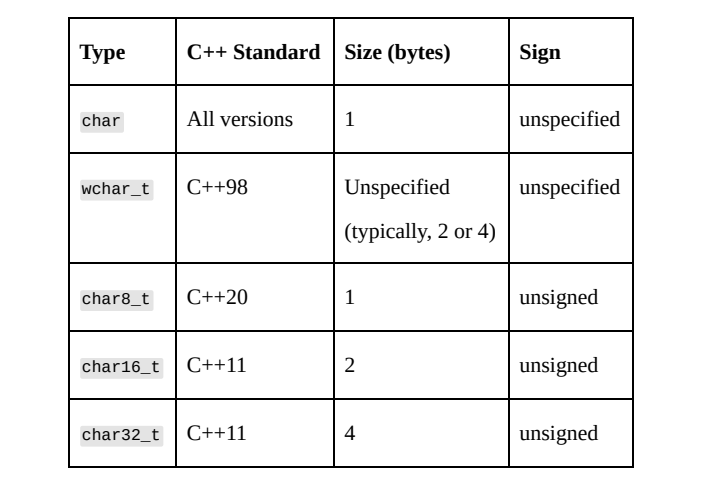
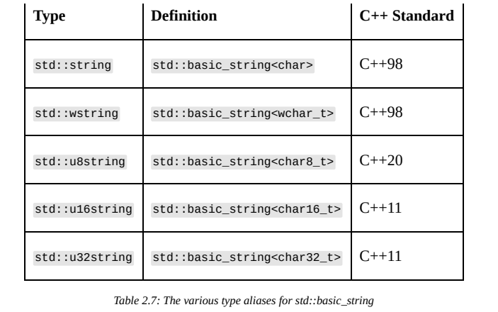
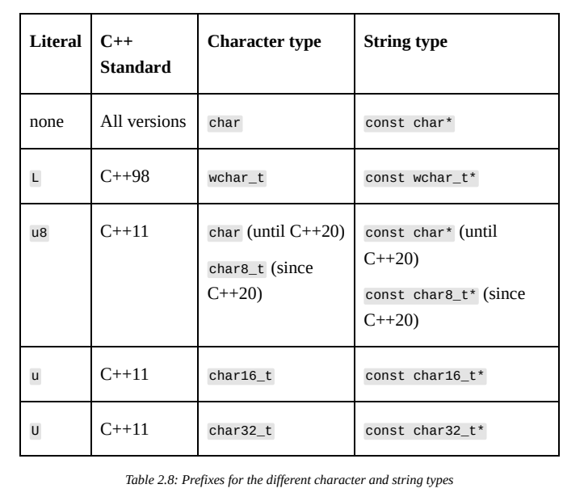
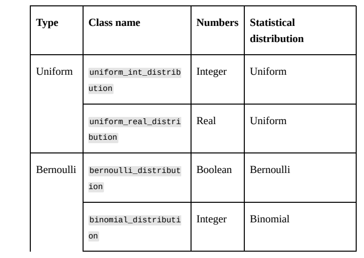
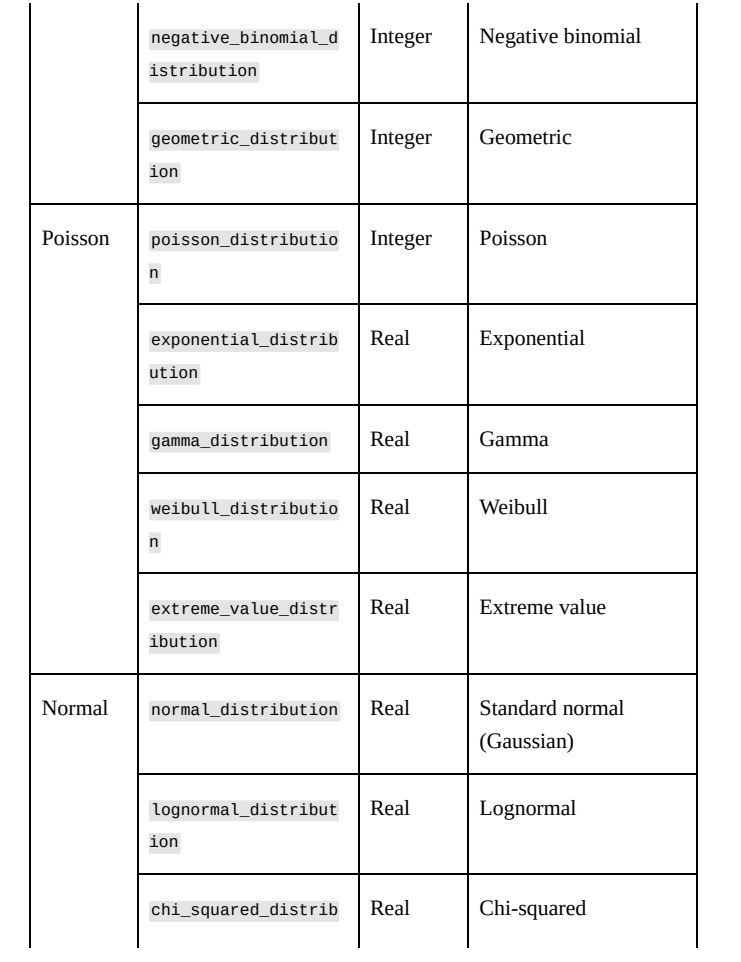
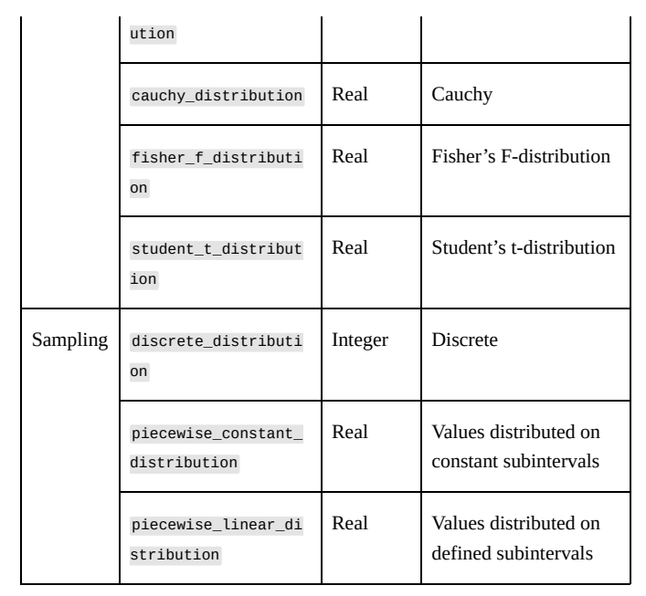
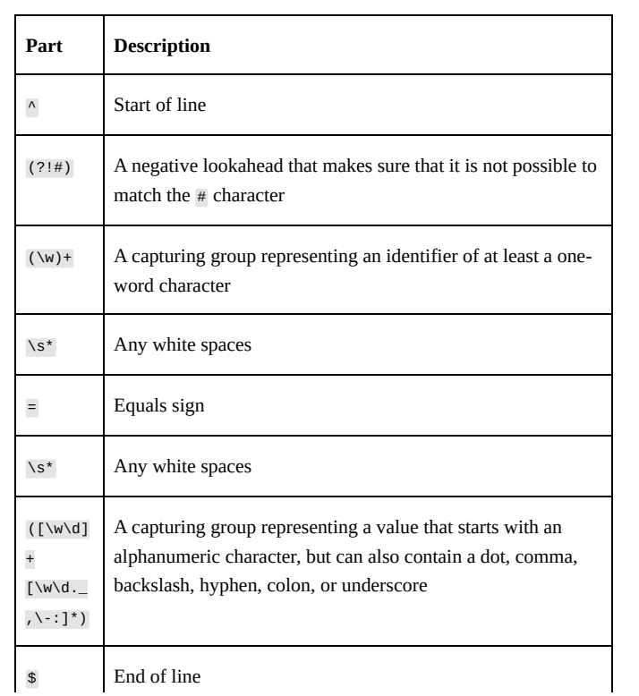
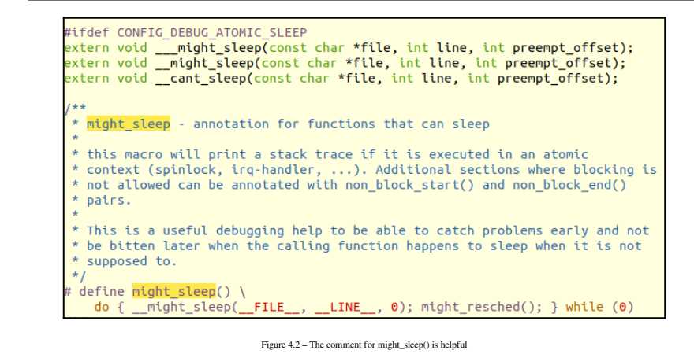
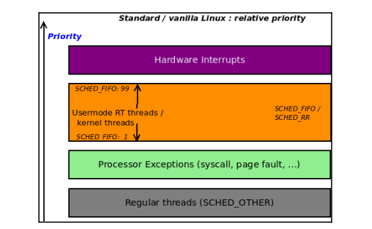
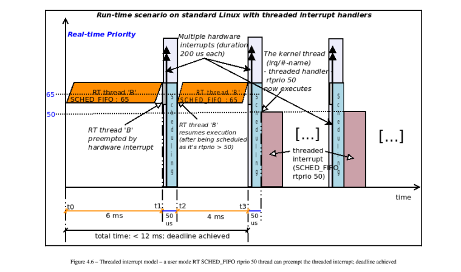

# 7.25

## Modern C++

### 了解各种字符和字符串类型。

​	在前面的配方中，我们研究了各种整数和浮点类型。另一类类型，字符类型，往往是误解和混淆的根源。从C++20开始，C++语言中有五种字符数据类型:char、wchar_t、char8_t、char 16_t和char 32_t。

​	在这个食谱中，我们将看看这些类型的不同之处以及它们的使用方式。如何操作…使用以下可用字符类型:char类型存储ASCII字符、拉丁字符集（在ISO-8859标准中定义），甚至UTF-8编码字符的单个字节:

```
char c='c'；const char*s=“C++”；std::cout<<c<s<'\n'；
```

​	使用Windows API存储和操作UTF-16LE编码字符的wchar_t类型:

```c++
wchar_t c = L'Ʃ';
const wchar_t* s = L"δῆμος";
std::wcout << c << s << '\n';
// The char8_t type to store individual bytes of UTF-8 encoded code points:
char8_t c = u8'A';
const char8_t* s = u8"Æthelflæd";
// The char16_t type to store UTF-16 encoded characters:
char16_t c = u'Æ';
const char16_t* s = u"Æthelflæd";
// The char32_t type to store UTF-32 encoded characters:
char32_t c = U' ';
const char32_t* s = U" ";
```

c++语言早期用于存储字符的内置数据类型是char类型。这是一种8位数据类型，与有符号char和无符号char都不同。它不是这两种数据类型中的任何一种的typedef。您可以使用std::is_same类型trait进行测试:

```
std::cout << std::is_same_v<char, signed char> << '\n'; // pr
std::cout << std::is_same_v<char, unsigned char> << '\n'; // pr
```

​	这两行都将打印0。这意味着您可以对所有这三种数据类型进行函数重载，如以下代码片段所示:

```
void f(char) {}
void f(signed char) {}
void f(unsigned char) {}
```

​		标准没有指定char是有符号类型还是无符号类型。因此，它的符号性取决于编译器或目标平台。char是x86和x64系统上的有符号类型，ARM上的无符号类型。char数据类型可用于存储ASCII字符集和其他8位拉丁字符集（如Latin-1、Latin-2、Latin/Cyrillic、Latin-Nordic等）中的字符。它也可用于存储多字节字符集的单个字节，最广泛使用的是Unicode集的UTF-8编码。为了处理固定宽度的多字节字符集，C++98引入了wchar_t类型。这也是一种独特的数据类型（不是某些整型的typedef）。它的大小没有指定，因此也各不相同:在Windows上为2个字节，在Unix系统上通常为4个字节。这意味着在编写可移植代码时不应使用wchar_t。wchar_t类型主要用于Windows，用于存储Unicode字符集的UTF-16LE编码的16位字符。这是Windows操作系统的本机字符集。在新版本的标准中，引入了三种新的字符数据类型。在C++11中，添加了char32_t和char16_t来表示32位和16位宽的字符。它们旨在表示UTF-32和UTF-16编码的Unicode字符。虽然它们各不相同类型，它们的大小、符号和对齐分别与uint_least32t和uint_least 16t相等。在C++20中，添加了char8_tdata类型。这是为了存储UTF-8代码单元（8位）。char8_t类型是一种独特的8位类型，其大小、有符号性和对齐方式与unsigned char相同。



​	char和char8-t类型的字符串称为窄字符串，wchar_t、char16_t和char32_t类型的字符串也称为宽字符串。C++标准提供了一个用于存储和操作字符序列的容器。



basic _string的各种类型别名与其他标准容器一样，std::basics _string提供了许多成员函数来构造、访问元素、迭代、搜索或使用包含的字符序列执行各种操作。需要单独提及数据是如何存储在abasic_string中的。在C++11中，它保证是连续的，就像数组一样。另一方面，它如何处理字符串终止可能有点令人困惑。让我们举个例子来解释一下:std::string s=“demo”；存储在basic_string对象中的元素是字符“d”、“e”、“m”和“o”。如果你迭代对象（例如for（auto c:s）），就会得到这样的结果。size（）成员将返回4。然而，两者c_str（）和data（）成员函数将返回一个空终止符。这意味着可以保证s[s.size（）]为0。字符和字符串通常在源代码中以文字形式提供。不同的字符类型有不同的前缀，如下表所示:



```
auto c1 = 'a'; // char
auto c2 = L'b'; // wchar_t
auto c3 = u8'c'; // char until C++20, char8_t in C++20
auto c4 = u'd'; // char16_t
auto c5 = U'e'; // char32_t
auto sa1 = "a"; // const char*
auto sa2 = L"a"; // const wchar_t*
auto sa3 = u8"a"; // const char* until C++20
 // const char8_t* in C++20
auto sa4 = u"a"; // const char16_t*
auto sa5 = U"a"; // const char32_t*
```

在第一部分中，由于使用了单引号，因此根据文字前缀（推导出的类型在注释的右侧），对变量c1到c5推断出字符类型。在第二部分中，由于使用了双引号，因此再次根据文字前缀为变量sa1到sa5推断字符串类型。“a”的推断类型不是std::string，而是const char*。如果你想使用任何basic_string typedef，比如std::string，你必须显式定义类型（不要使用auto），或者使用标准的用户定义的文本后缀，可以在std::string_literals命名空间中找到。这在下一个代码片段中显示:

```
using namespace std::string_literals;
auto s1 = "a"s; // std::string
auto s2 = L"a"s; // std::wstring
auto s3 = u8"a"s; // std::u8string
auto s4 = u"a"s; // std::u16string
auto s5 = U"a"s; // std::u32string
```

| 类型            | 说明                                                         |
| --------------- | ------------------------------------------------------------ |
| char*           | 指向可变字符的可变指针。指针和被指向的字符都可以修改。       |
| const char*     | 指向常量字符的可变指针。指针可以修改，但不能修改它指向的位置的内容 |
| char*const      | 指向可变字符的常量指针。指针不能修改，但它指向的位置的内容可以是 |
| constchar*const | 指向常量字符的常量指针。指针或它指向的位置的内容都不能修改。 |
| char[]          | 字符数组                                                     |

您一定注意到，在上一个表中，前缀u8具有不同标准的不同行为:自C++11引入以来，直到C++20，它定义了一个charliteral。从C++20开始，当它被引入char8_t时，它定义了一个char8-t文字。C++20的这个变化是一个突破性的变化。它比引入另一个可能具有以下潜力的文字前缀更受欢迎使事情更加复杂。字符或字符串文字可能包含代码点值，而不是实际字符。这些必须用\u（用于4个十六进制数字代码点）或\u（用于8个十六进制代码点）转义。这里有一个例子:

```
std::u16string hb = u"Harald Bluetooth \u16BC\u16d2"; // 
std::u32string eh = U"Egyptian hieroglyphs \U00013000 \U000131B
```

​	在C++23中，可以使用Unicode代替代码点值。这是一种使用\N{xxx}转义序列的方法，其中xxx是Unicode分配的名称。因此，上述代码段也可以在C+23中写为:

```
std::u16string hb = u"Harald Bluetooth \N{Runic Letter Long-Bra
std::u32string eh = U"Egyptian hieroglyphs \N{EGYPTIAN HIEROGLY
```

在前面的示例中，包含埃及象形文字的字符串包含代码点13000，该代码点有5个十六进制数字。但是，由于\U转义序列需要8hexadecimal数字，我们必须包含三个前导零（\U00013000）。在C++23中不再需要这一点，但它需要语法\U{N…}（小写U），其中N…是任意数量的十六进制数字，因此，在C++23中也可以按如下方式编写此字符串:

```
std::u32string eh = U"Egyptian hieroglyphs \u{13000} \u{131B2}"
```

​	将字符和字符串打印到控制台可以通过多种方式完成:使用std::cout和std::wcout全局对象使用printf函数族使用C++23中的std::print函数族使用第三方文本处理库，例如广泛使用的fmtlibrary（它是C++20和C++23中包含的std::format和std::printstandard实用程序的源代码）std::cour和std::wout全局对象可用于打印char/constchar*/std::string值，并分别打印wchar_t/constwchar_t*/std:::wstring将值发送到标准输出控制台。打印ASCII字符不会造成问题，但处理其他字符集和编码（如UTF-8）则更成问题，因为没有标准支持，不同的平台需要不同的解决方案。您可以在下一个食谱“将Unicode字符打印到输出控制台”中了解有关此主题的更多信息。另请参阅了解各种数字类型，了解可用的整数和浮点类型使用std::format和std::print格式化和打印文本，

### 了解如何使用现代实用程序格式化和打印文字将Unicode字符打印到输出控制台

在前面的食谱中，了解各种字符和字符串类型，我们研究了存储字符和字符串的各种数据类型。这种类型的多样性是必要的，因为随着时间的推移，已经开发了大量的字符集。使用最广泛的字符集是ASCII和Unicode。尽管自语言创建以来，所有编译器和目标平台都支持前者，但对后者的支持在Windows和Unix/Linux系统中以不同的速度和形式发展。在这个食谱中，我们将看看如何将不同编码的文本打印到标准输出控制台。如何操作…要将文本写入标准输出控制台，可以使用以下方法:对于编写ASCII字符，请使用std::cout:

```
std::cout << "C++\n";
```

​	在Linux上编写UTF-8编码的Unicode字符时，也可以使用std::cout:

```
std::cout << "Erling Håland\n";
std::cout << "Thomas Müller\n";
std::cout << "Στέφανος Τσιτσιπάς\n";
std::string monkeys = " ";
std::cout << monkeys << '\n';
```

对于使用char8_t数据类型存储的UTF-8字符串，您仍然可以使用std::cout，但必须将底层类型重新解释为数组

```
std::cout << reinterpret_cast<const char*>(u8"Στέφανος Τσιτ");
```

在Windows系统上编写UTF-8编码的Unicode字符时，分别使用char8_t字符和C++20中的std::u8字符串字符串。在早期版本中，您可以使用char和std::string。在写入标准输出之前，请确保调用Windows API SetConsoleOutputCP（CP_UTF8）:

```
SetConsoleOutputCP(CP_UTF8);
std::cout << reinterpret_cast<const char*>(u8"Erling Håland
std::cout << reinterpret_cast<const char*>(u8"Thomas Müller
std::cout << reinterpret_cast<const char*>(u8"Στέφανος Τσιτ
std::cout << reinterpret_cast<const char*>(u8" \n");
```

```
auto mode = _setmode(_fileno(stdout), _O_U16TEXT);
std::wcout << L"Erling Håland\n";
std::wcout << L"Thomas Müller\n";
std::wcout << L"Στέφανος Τσιτσιπάς\n";
_setmode(_fileno(stdout), mode);
```

​	半个世纪以来，ASCII编码一直是最常见的字符编码格式。它包含128个字符，包括英语的小写和大写字母、10位十进制数字和符号。该组的前32个字符是不可打印的，称为控制字符。C++语言完全支持ASCII字符集。您可以使用std::cout将ASCII字符打印到标准输出。由于ASCII编码只包括英语字母表中的字母，因此已经进行了各种尝试来支持其他语言和字母表。一种方法是代码页的概念。ASCII编码只需要7位来编码128个字符。因此，额外的128个字符可用于使用8位数据类型进行编码。这意味着索引128-255中的字符可以映射到其他语言或

​	在Windows中，可以通过调用SetConsoleOutputCP（）API为与正在运行的进程关联的控制台激活一个代码页。以下代码片段中显示了一个示例，其中我们打印了从1250到1258的所有代码页（列表中的代码页）映射到224代码点的字符

```
char c = 224;
for (int codepage = 1250; codepage <= 1258; codepage++)
{
 SetConsoleOutputCP(codepage);
 std::cout << c << ' ';
}
```

​	您可以在这里看到，打印的字符是表2.9中预期的字符。

​	虽然代码页提供了一种在不同脚本之间切换的简单方法，但它不是一种可以支持包含数百或数千个字符或象形图的语言或书写系统的解决方案，如中文或埃及象形文字。为此，开发了另一个标准，称为Unicode。这个编码标准旨在呈现世界上大多数的书写文字，包括现在和过去的文字，以及其他符号，如表情符号，这些符号已经成为

​	最近发短信非常流行。目前，Unicodestandard定义了近150000个字符。Unicode字符可以存储在多种编码中，最流行的是UTF-8和UTF-16。还有UTF-32和GB18030；后者不是Unicode规范的一部分，但它在中国使用并完全实现了Unicode。UTF-8是一种可变长度字符编码标准，与ASCII兼容。UTF-8使用1、2、3或4个字节对所有可表示的码点进行编码。码点使用得越多，用于其编码的字节就越少。ASCII编码的128个码点由一个字节表示。因此，UTF-8与ASCII完全“向后”兼容。所有其他Unicode码位都使用多个字节进行编码:128-2047范围内的码位使用2个字节，2048-65535范围内的代码点使用3个字节，65536-1114111范围内的编码点使用4个字节。编码中的第一个字节称为前导字节，它提供了关于编码码点所用字节数的信息。因此，UTF-8是一种非常高效的编码系统，是万维网的首选，几乎所有网页都使用这种编码。UTF-16也是一种可变长度字符编码，可以对所有Unicode码位进行编码。为此，它使用一个或两个16位代码单元，这使得它与ASCII不兼容。UTF-16是Windows操作系统以及Java和Javascript编程语言使用的编码。UTF-32是一种不太常见的编码系统。这是一种固定长度编码，每个码点使用32位。由于所有Unicode码点最多需要21位，因此前11位始终为0。这使它

​	空间效率低，这是其主要缺点。它的主要优点是，与UTF-8和UTF-16等可变长度编码的线性时间相比，在序列中找到第N个码点需要恒定的时间。编译器通常对源文件采用UTF-8编码。这是GCC、Clang和MSVC的情况。Linux发行版原生支持UTF-8。这意味着，由于终端支持UTF-8，因此将字符串文本写入输出控制台（如“∑τοφανοςΤσιτσιπάς”）将产生预期的结果；另一方面，写诸如L“∑τ∈φανοςΤσιτσιπάς”这样的宽字符串并不能开箱即用。要获得预期的结果，您需要设置一个区域设置对象。默认的C语言环境不知道如何从宽字符转换为UTF-8。为了实现这一点，您需要使用能够做到这一点的区域设置。您有两个选择:初始化一个区域设置对象以匹配环境的配置，该对象通常应该是支持UTF-8的区域设置:

```
std::locale utf8("");
std::wcout.imbue(utf8);
std::wcout << L"Στέφανος Τσιτσιπάς\n";
```

使用特定的区域设置初始化区域设置对象，例如英语（美国）

```
std::locale utf8("en_US.UTF-8");
std::wcout.imbue(utf8);
std::wcout << L"Στέφανος Τσιτσιπάς\n";
```

​	在Windows系统上，情况就不同了。Windows命令提示符（cmd.exe）不支持UTF-8。尽管Windows 10增加了对一项名为“使用Unicode UTF-8进行全球语言支持”的测试版功能的支持，但这在区域设置中隐藏得很深，目前有报道称这会阻止一些应用程序正常工作。要将UTF-8内容写入命令提示符，您必须首先通过调用SetConsoleOutputCP（）并将CP_UTF8作为参数（或其数值65001）传递来设置正确的代码页:

```
std::cout << reinterpret_cast<const char*>(u8"Erling Håland\n")
std::cout << reinterpret_cast<const char*>(u8"Thomas Müller\n")
std::cout << reinterpret_cast<const char*>(u8"Στέφανος Τσιτσιπά
std::u8string monkeys = u8" \n";
std::cout << reinterpret_cast<const char*>(monkeys.c_str());
```

将文件（在本例中为标准输出控制台）的翻译模式设置为UTF-16。为此，您必须传递_O_U16TEXT参数。该函数返回之前的翻译模式，您可以在写入所需内容后使用该模式恢复翻译模式。传递_O_TEXT设置文本模式（在该模式下，CR-LF组合在输入时转换为单个LF，LF字符转换为CR-LF输出）

```
auto mode = _setmode(_fileno(stdout), _O_U16TEXT);
std::wcout << L"Erling Håland\n";
std::wcout << L"Thomas Müller\n";
std::wcout << L"Στέφανος Τσιτσιπάς\n";
_setmode(_fileno(stdout), mode);
```

然而，为了实现这一点，命令提示符应用程序使用True Type字体（如Lucinda Console或Consolas）而不是仅支持ASCII的光栅字体也很重要。从Windows 10开始，一个新的终端应用程序可用于Windows。这被称为Windows终端，它内置了对UTF-8的支持。这意味着以下代码无需首先调用SetConsoleOutputCP（）即可打印出预期的结果:

```
std::cout << reinterpret_cast<const char*>(u8"Erling Håland\n")
```

​	与其他编程语言不同，对Unicode的支持并不是C++的强项。此配方提供了在控制台应用程序中使用Unicode的基础知识。然而，在实践中，事情可能会变得更加复杂，需要额外的支持。

### 生成伪随机数。

​	从游戏到密码学，从采样到预测，生成随机数对于各种应用程序都是必要的。然而，术语随机数实际上并不正确，因为通过数学公式生成的数字是确定性的，不会产生真正的随机数，而是看起来随机的数字，被称为伪随机数。真正的随机性只能通过基于物理过程的硬件设备来实现，即使是这一点也可能受到挑战，因为我们可能认为甚至宇宙实际上是确定性的。现代C++支持通过包含数字生成器和分布的伪随机数库生成伪随机数。理论上，它也可以产生真正的随机数，但实际上，这些随机数可能只是伪随机数。

​	我们将讨论生成伪随机数的标准支持。理解随机数和伪随机数之间的区别是关键。真正的随机数是指

​	无法比随机机会更好地预测，并且是在基于硬件的随机数生成器的帮助下生成的。伪随机数是在算法的帮助下生成的数字，这些算法生成的序列具有与真随机数近似的属性。此外，熟悉各种统计分布是一个加分项。不过，你必须知道什么是均匀分布，因为库中的所有引擎都会产生均匀分布的数字。在不涉及任何细节的情况下，我们只会提到均匀分布是一种概率分布，它与同样可能发生的事件有关（在一定范围内）。如何操作…要在应用程序中生成伪随机数，您应该执行以下步骤:

1. 包含头文件\<random>

```
#include <random>
```

2. 使用std::random_device生成器为伪随机引擎播种

```
std::random_device rd{};
```

3. 使用一个可用的引擎来生成数字，并用随机种子对其进行初始化:

```
auto mtgen = std::mt19937{ rd() };
```

4. 使用一个可用的分布将引擎的输出转换为所需的统计分布之一

```
auto ud = std::uniform_int_distribution<>{ 1, 6 };
```

5.生成伪随机数:

```
for(auto i = 0; i < 20; ++i)
 auto number = ud(mtgen);
```

伪随机数库包含两种类型的组件:引擎，它是随机数的生成器；这些可以产生均匀分布的伪随机数，也可以产生实际的随机数（如果有的话）。将引擎输出转换为统计分布的分布。所有引擎（random_device除外）都以统一的分布生成整数，并且所有引擎都实现了以下方法:min（）:这是一个静态方法，返回生成器可以生成的最小值。max（）:它是一个返回生成器可以生成的最大值的静态方法。

​	应根据应用程序的特定要求选择伪随机数生成器。线性同余发动机速度适中，但对其内部状态的存储要求很小。带进位的减法引擎非常快，包括在没有配备高级算术指令集的处理器的机器上。然而，它需要更大的存储空间来存储其内部状态，并且生成的数字序列具有较少的理想特征。Mersenne Twister是这些引擎中最低的，具有最大的存储持续时间，但产生最长的非重复伪数序列。所有这些引擎和引擎适配器都会产生伪随机数。然而，该库提供了另一个名为random_device的引擎，该引擎旨在产生非确定性数字，但这不是一个实际的约束，因为随机熵的物理来源可能不可用。因此，random_device的实现实际上可以基于apseudo随机引擎。random_device类不能像其他引擎那样播种，并且有一个名为entropy（）的附加方法，该方法返回随机设备熵，对于确定性生成器，该熵为0，对于非确定性生成器，则为非零。

​	然而，这并不是一种可靠的方法来确定设备实际上是确定性的还是非确定性的。例如，GNUlibstdc++和LLVM libc++都实现了非确定性设备，但熵返回0。另一方面，VC++和boost.random分别返回32和10作为熵。所有这些生成器都产生均匀分布的整数。然而，这只是大多数应用中需要随机数的许多可能的统计分布之一。为了能够在其他发行版中产生数字（整数或实数），该库提供了几个称为发行版的类。这些根据引擎实现的统计分布转换引擎的输出。以下分布可用:







​	如前所述，库提供的每个引擎都有优缺点。如果初始化得当，梅森扭曲器虽然速度最慢，内部状态最大，但可以产生最长的非重复数字序列。在以下示例中，我们将使用std::mt19937，一个32位梅森Twister，具有19937位内部状态。还有一个64位Mersenne Twister，

```
auto mtgen = std::mt19937 {};
for (auto i = 0; i < 10; ++i)
 std::cout << mtgen() << '\n';
```

​	在这个例子中，对于Mersenne Twister，mtgen是std::mt19937。为了生成数字，您只需要使用调用运算符来推进内部状态并返回下一个伪随机数。然而，这段代码有缺陷，因为引擎没有播种。因此，它总是产生相同的数字序列，这在大多数情况下可能不是你想要的。初始化引擎有不同的方法。一种常见于C随机库的方法是使用当前时间。在现代C++中，它应该看起来像这样:

```
auto seed = std::chrono::high_resolution_clock::now()
 .time_since_epoch()
 .count();
auto mtgen = std::mt19937{ static_cast<unsigned int>(seed) };
```

​	在这个例子中，seed是一个数字，表示从块的纪元到当前时刻的滴答数。然后，这个数字用于给发动机播种。这种方法的问题在于，种子的值实际上是确定的，在某些类别的应用程序中，它可能容易受到攻击。一种更可靠的方法是用实际随机数给生成器播种。std::random_device类是一个应该返回真随机数的引擎，尽管实现实际上可能基于apseudo随机生成器:

```
std::random_device rd;
auto mtgen = std::mt19937 {rd()};
```

​	所有发动机产生的数字遵循均匀分布。为了将结果转换为另一种统计分布，我们必须使用distribution类。为了展示生成的数字是如何根据所选分布进行分布的，我们将使用以下函数。此函数生成指定数量的伪随机数，并计算它们在映射中的重复次数。然后，使用映射中的值来生成类似abar的图，显示每个数字出现的频率:

```
void generate_and_print(std::function<int(void)> gen,
 int const iterations = 10000)
{
 // map to store the numbers and their repetition
 auto data = std::map<int, int>{};
 // generate random numbers
 for (auto n = 0; n < iterations; ++n)
 ++data[gen()];
 // find the element with the most repetitions
 auto max = std::max_element(
 std::begin(data), std::end(data),
 [](auto kvp1, auto kvp2) {
 return kvp1.second < kvp2.second; });
 // print the bars
 for (auto i = max->second / 200; i > 0; --i)
 {
 for (auto kvp : data)
 {
 std::cout
 << std::fixed << std::setprecision(1) << std::setw(3)
 << (kvp.second / 200 >= i ? (char)219 : ' ');
  }
 std::cout << '\n';
 }
 // print the numbers
 for (auto kvp : data)
 {
 std::cout
 << std::fixed << std::setprecision(1) << std::setw(3)
 << kvp.first;
}
```

以下代码使用std::mt19937引擎生成随机数，随机数在[1,6]范围内均匀分布；这基本上就是你掷骰子时得到的结果:

```
std::random_device rd{};
auto mtgen = std::mt19937{ rd() };
auto ud = std::uniform_int_distribution<>{ 1, 6 };
generate_and_print([&mtgen, &ud]() {return ud(mtgen); });
```

在下一个也是最后一个例子中，我们将分布改为均值为5、标准差为2的正态分布。这种分布产生实数；因此，为了使用previousgenerate_and_print（）函数，数字必须四舍五入为整数:

```
std::random_device rd{};
auto mtgen = std::mt19937{ rd() };
auto nd = std::normal_distribution<>{ 5, 2 };
generate_and_print(
 [&mtgen, &nd]() {
 return static_cast<int>(std::round(nd(mtgen))); });
```

### 正确初始化随机数生成器

​	在前面的配方中，我们研究了伪随机数库及其组件，以及如何使用它来生成不同统计分布的数字。该配方中忽略的一个重要因素是伪随机数生成器的正确初始化。通过仔细分析（这超出了本食谱或本书的目的），可以证明Mersenne Twister引擎倾向于重复产生一些值并省略其他值，从而产生的数字不是均匀分布的，而是二项式或泊松分布的。在本食谱中，您将学习如何初始化生成器，以生成具有真正均匀分布的伪随机数。准备好你应该阅读前面的配方，生成伪随机数，以了解伪随机数库提供的内容。如何操作…要正确初始化伪随机数生成器以生成均匀分布的伪随机数序列，请执行以下步骤:

1. 使用std::random_device生成随机数，用于附加值

```
std::random_device rd;
```

2. 为引擎的所有内部位生成随机数据:

   ```
   std::array<int, std::mt19937::state_size> seed_data {};
   std::generate(std::begin(seed_data), std::end(seed_data),
    std::ref(rd));
   ```

3. 从之前生成的伪随机数据创建std::seed_seq对象:

```
std::seed_seq seq(std::begin(seed_data), std::end(seed_data
```

4. 创建一个引擎对象，并初始化表示引擎内部状态的所有位；例如，mt19937具有19937位内部状态:

```
auto eng = std::mt19937{ seq };
```

5. 根据应用程序的要求使用适当的分布:

```
auto dist = std::uniform_real_distribution<>{ 0, 1 };
```

在前面的配方中显示的所有示例中，我们使用std::mt19937引擎生成伪随机数。尽管Mersenne Twisteris比其他引擎慢，但它可以产生具有最佳光谱特性的最长非重复数字序列。然而，按照前面的配方所示的方式初始化引擎不会产生这种效果。问题是mt19937的内部状态有62432位整数，在前面配方的示例中，我们只初始化了其中一个。使用伪随机数库时，请记住以下经验法则（如信息框所示）。

​	为了产生最佳结果，引擎在生成数字之前必须正确初始化其整个内部状态。伪随机数库为此特定目的提供了一个类，称为std::seed_seq。这是一个生成器，可以播种任何数量的32位整数，并产生在32位空间中均匀分布的所需数量的整数。在How to do it…部分的前面代码中，我们定义了一个名为seed_data的数组，其中包含多个32位整数，这些整数等于mt19937生成器的内部状态，即624个整数。然后，我们用std::random_device生成的随机数初始化数组。这个数组后来被用来给std::seed_seq种子，反过来又被用来给themt19937生成器种子。另请参阅生成伪随机数，以熟悉标准数字库生成伪随机值的能力

### 创建用户自定义的文字文字

文字是内置类型（数字、布尔值、字符、字符串和指针）的常量，在程序中无法更改。该语言定义了一系列前缀和后缀来指定文字（以及前缀/后缀实际上是文字的一部分）。C++11允许我们通过定义称为文字运算符的函数来创建用户定义的文字，这些函数引入了指定文字的后缀。这些仅适用于数字字符和字符串类型。这为在未来的版本中定义标准文字提供了可能性，并允许开发人员创建自己的文字。在这个食谱中，我们将学习如何创建自己的烹饪文字。准备好用户定义的文字可以有两种形式:生的和熟的。原始字面值不由编译器处理，而熟字面值是由编译器处理的值（示例包括处理字符串中的转义序列或识别数值，如literal0xBAD中的整数2898）。原始字面值仅适用于整型和浮点型，而熟字面值也适用于字符和字符串字面值。如何操作…要创建煮熟的用户定义文字，您应该遵循以下步骤:

1. 在单独的命名空间中定义文本，以避免名称冲突。
2. 始终在用户定义的后缀前加下划线（_）。
3. 为自定义的定义以下形式之一的文字运算符（使用char8_t的形式仅在C++20之后可用）。请注意，在以下列表中，T不是类型模板参数，而只是运算符返回类型的占位符:

```
T operator "" _suffix(unsigned long long int);
T operator "" _suffix(long double);
T operator "" _suffix(char);
T operator "" _suffix(wchar_t);
T operator "" _suffix(char8_t); // since C++20
T operator "" _suffix(char16_t);
T operator "" _suffix(char32_t);
T operator "" _suffix(char const *, std::size_t);
T operator "" _suffix(wchar_t const *, std::size_t);
T operator "" _suffix(char8_t const *, std::size_t); // C++
T operator "" _suffix(char16_t const *, std::size_t);
T operator "" _suffix(char32_t const *, std::size_t);
```

以下示例为指定千字节创建了一个用户定义的文字:

```
namespace compunits
{
 constexpr size_t operator "" _KB(unsigned long long const
 {
 return static_cast<size_t>(size * 1024);
 }
}
auto size{ 4_KB }; // size_t size = 4096;
using byte = unsigned char;
auto buffer = std::array<byte, 1_KB>{};
```

​	当编译器遇到带有用户定义后缀\_X的用户定义文字时（它总是为第三方后缀提供前导下划线，没有前导下划线的假设保留给标准库），它会进行非限定名称查找，以识别具有名称运算符“\_X”的函数。如果找到一个，则根据类型调用它文字和文字运算符的类型。否则，编译器将产生错误。在How to do it…一节所示的示例中，文字运算符称为运算符“_KB”，其参数类型为unsigned long long-longnt。这是文字运算符处理整型的唯一可能的整型。同样，对于浮点用户定义的文字，参数类型必须是long double，因为对于数值类型，文字运算符必须能够处理尽可能大的值。此字面运算符返回一个constexpr值，以便在需要编译时值的地方使用，例如指定数组的大小，如上例所示。当编译器识别用户定义的文字并必须调用适当的用户定义文字运算符时，它将根据以下规则从重载集中选择重载:对于整数文字:它按以下顺序调用:取无符号长整型的运算符、取主字符\*的原始文字运算符或文字运算符模板。对于浮点字面量:它按以下顺序调用:运算符at取一个长double，原始字面量运算符取一个constchar*，或字面量运算符模板。对于字符文字:它根据字符类型（char、wchar_t、char16_t和char32_t）调用适当的运算符。对于字符串文字:它根据字符串类型调用适当的运算符，该运算符接受指向字符串和大小的指针。在下面的例子中，我们定义了一个单位和数量系统。我们希望使用公斤、件、升和其他类型的单位进行操作。

这在可以处理订单的系统中可能很有用，您需要为每件商品指定数量和单位。在units命名空间中定义了以下内容:可能的单位类型（千克、米、升和件）的作用域枚举:

```
enum class unit { kilogram, liter, meter, piece, };
```

一个类模板，用于指定特定单位的数量（如3.5公斤或42件）:

```
template <unit U>
class quantity
{
 const double amount;
public:
 constexpr explicit quantity(double const a) : amount(a)
 {}
 explicit operator double() const { return amount; }
};
```

运算符+和运算符-用于数量类模板，以便能够添加和减去数量:

```
template <unit U>
constexpr quantity<U> operator+(quantity<U> const &q1,
 quantity<U> const &q2)
{
 return quantity<U>(static_cast<double>(q1) +
 static_cast<double>(q2));
}
template <unit U>
constexpr quantity<U> operator-(quantity<U> const &q1,
 quantity<U> const &q2)
 {
 return quantity<U>(static_cast<double>(q1) –
 static_cast<double>(q2));
}
```

​	用于创建数量文字的文字运算符，在名为unit_literals的内部命名空间中定义。这样做的目的是避免可能与其他名称空间中的文字发生名称冲突。如果确实发生了这种冲突，开发人员可以在需要定义文本的范围内使用适当的命名空间来选择他们应该使用的命名空间

​	通过仔细查看，您可以注意到早期定义的文字运算符是不同的:\_kg是为整数和浮点文字定义的；这使得sus能够创建整数和浮点值，如1_kg和1.0_kg。\_l和\_m仅为浮点文字定义；这意味着我们只能为这些带浮点的单位定义数量文字，如4.5_l和10.0_m。_pcs仅为整数文字定义；也就是说我们只能定义整数个的数量，如42_pcs。

​	从整数1正确创建。同样，q2是一个4.5公斤的量；这是一个真正的价值。由于存在重载运算符“”\_kg（longdouble），因此可以从double浮点值4.5创建文本。另一方面，q6是1升的量。由于没有重载运算符“_l”（unsigned long long long），因此无法创建文字。它需要一个无符号long long的重载，但这种重载并不存在。同样，q7是一个2.0个片段的数量，但片段文字只能从整数值创建，因此，这会产生其他编译器错误。

```
std::basic_string_view
literals:
using namespace std::string_literals;
auto s1{ "text"s }; // std::string
auto s2{ L"text"s }; // std::wstring
auto s3{ u"text"s }; // std::u16string
auto s4{ U"text"s }; // std::u32string
using namespace std::string_view_literals;
auto s5{ "text"sv }; // std::string_view
```

​	运算符“h”、运算符“min”、运算符（s）、运算符（ms）、运算符“us”和运算符（ns），用于创建anstd::chrono::duration值:

```
using namespace std::chrono_literals;
// std::chrono::duration<long long>
auto timer {2h + 42min + 15s};
```

​	运算符“y”用于创建std::chrono::year文本，运算符“d”用于创建表示月份日的std::chrono::day文本，两者都添加到C++20中:

```
using namespace std::chrono_literals;
auto year { 2020y }; // std::chrono::year
auto day { 15d }; // std::chrono::day
```

operator""if, operator""i, and operator""il 创建`std::complex<float>, std::complex<double>, and std::complex<long double> value`

```
using namespace std::complex_literals;
auto c{ 12.0 + 4.5i }; // std::complex<double>
```

​	标准用户定义的字面值在多个命名空间中可用。例如，字符串的“s”和“sv”字面值在命名空间td::literals::string_literals中定义。但是，文本和string_literals都是内联命名空间。因此，您可以使用namespacestad::literals、使用命名空间std::string_literals或使用

### 使用原始字符串字面值来避免转义符。

字符串可能包含特殊字符，如不可打印字符（换行符、水平和垂直制表符等）、字符串和字符分隔符（双引号和单引号）或任意八进制。十六进制或Unicode值。这些特殊字符以一个以反斜杠开头的转义序列引入，后跟字符（示例包括'和“）、其指定的字母（示例包括n表示新行，t表示水平制表符）或其值（示例包括八进制050、十六进制XF7或Unicode U16F0）。因此，反斜杠字符本身必须用另一个反斜杠字符转义。这会导致更复杂的文字字符串，很难阅读。为了避免转义字符，C++11引入了不处理转义序列的原始字符串文字。在本食谱中，您将学习如何使用各种形式的原始字符串文字。准备好在这个食谱中，以及在本书的其余部分，我将使用s后缀来定义基本字符串。这在本章前面的“创建煮熟的用户定义文字配方”中已经介绍过。如何操作…为了避免转义字符，请使用以下形式之一定义字符串文字:R“（文字）”作为默认形式:

```
auto filename {R"(C:\Users\Marius\Documents\)"s};
auto pattern {R"((\w+)=(\d+)$)"s};
auto sqlselect {
 R"(SELECT *
 FROM Books
 WHERE Publisher='Packtpub'
 ORDER BY PubDate DESC)"s};
```

R“分隔符（文字）分隔符”，其中分隔符是除括号、反斜杠和空格之外的任何字符序列，文字是任何有限制的字符序列不能包含结束序列）分隔符“。这是一个使用！！作为分隔符的示例:

```
auto text{ R"!!(This text contains both "( and )".)!!"s };
std::cout << text << '\n';
```

当使用字符串文字时，转义不会被处理，字符串的实际内容写在分隔符之间（换句话说，你看到的就是你得到的）。以下示例显示了显示为相同原始文字字符串的内容；但是，第二个示例仍然包含转义字符。由于这些字符在字符串文字的情况下不被处理，它们将按原样打印在输出中:

```
auto filename1 {R"(C:\Users\Marius\Documents\)"s};
auto filename2 {R"(C:\\Users\\Marius\\Documents\\)"s};
// prints C:\Users\Marius\Documents\
std::cout << filename1 << '\n';
// prints C:\\Users\\Marius\\Documents\\
std::cout << filename2 << '\n';
```

原始字符串文字可以加上L、u8、u和u中的一个前缀，分别表示awide、UTF-8、UTF-16或UTF-32字符串文字

```
auto t1{ LR"(text)" }; // const wchar_t*
auto t2{ u8R"(text)" }; // const char* until C++20
 // const char8_t* in C++20
auto t3{ uR"(text)" }; // const char16_t*
auto t4{ UR"(text)" }; // const char32_t*
auto t5{ LR"(text)"s }; // std::wstring
auto t6{ u8R"(text)"s }; // std::string until C++20
 // std::u8string in C++20
auto t7{ uR"(text)"s }; // std::u16string
auto t8{ UR"(text)"s }; // std::u32string
```

使用正则表达式验证约束格式正则表达式是一种用于在文本中执行模式匹配和替换的语言。C++11通过\<regex>头文件中的一组类、算法和迭代器为标准库中的正则表达式提供支持。在本教程中，我们将学习如何使用正则表达式来验证字符串是否与模式匹配（示例包括验证电子邮件或IP地址格式）。准备通过这个食谱，我们将在必要时解释我们使用的正则表达式的细节。但是，为了将C++标准库用于正则表达式，您至少应该对正则表达式有一些基本的了解。对正则表达式语法和标准的描述超出了本书的目的；如果你不熟悉正则表达式，建议你在继续学习之前阅读更多关于它们的内容，以及其他专注于正则表达式的食谱。学习、构建和调试正则表达式的良好在线资源可以在以下网址找到https://regexr.com https://regex101.com 要执行此操作…为了验证字符串是否与正则表达式匹配，请执行以下步骤:

1. 包含\<regex>和\<string>标头以及字符串标准用户定义文字的std::string_literals命名空间（在C++14中添加）

   ```
   #include <regex>
   #include <string>
   using namespace std::string_literals;
   ```

2. 使用原始字符串文字指定正则表达式，以避免使用反斜杠（可能经常出现）。以下正则表达式验证大多数电子邮件格式:

   ```
   auto pattern {R"(^[A-Z0-9._%+-]+@[A-Z0-9.-]+\.[A-Z]{2,}$)"s
   ```

3. 创建一个std::regex/std::wregex对象（取决于所使用的字符集）来封装正则表达式:

   ```
   auto rx = std::regex{pattern};
   ```

4. 若要忽略大小写或指定其他解析选项，请使用重载构造函数，该构造函数具有正则表达式标志的额外参数:

   ```
   auto rx = std::regex{pattern, std::regex_constants::icase};
   ```

5. 使用std::regex_match（）将正则表达式与一个字符串匹配:

   ```
   auto valid = std::regex_match("marius@domain.com"s, rx);
   ```

​	考虑到验证电子邮件地址格式的问题，尽管这看起来像是一个微不足道的问题，但在实践中，很难找到一个简单的正则表达式来覆盖有效电子邮件格式的所有可能情况。在这个食谱中，我们不会试图找到最终的正则表达式，而是应用一个在大多数情况下都足够好的正则表达式。我们将为此目的使用的正则表达式是

```
^[A-Z0-9._%+-]+@[A-Z0-9.-]+\.[A-Z]{2,}$
```

下表解释了正则表达式的结构:

| 构成           | 说明                                                         |
| -------------- | ------------------------------------------------------------ |
| ^              | 字符串的开头                                                 |
| [A-Z0-9._%+-]+ | 至少一个大写字母、A-Z、数字0-9或.、%、+中的一个字符，或-，表示邮件地址的本地部分 |
| @              | 字符@                                                        |
| [A-Z0-9.-]+    | 至少一个大写字母A-Z、数字0-9或其中一个符号的字符。或-，表示域部分的主机名 |
| \\.            | 分隔域主机名和标签                                           |
| [A-Z]{2,}      | 域的DNS标签, 可以有2到63个字符                               |
| $              | 字符串末尾                                                   |

请记住，在实践中，域名由主机名和一个以点分隔的DNS标签列表组成。示例包括elocalhost、gmail.com和yahoo.co.uk。我们使用的这个正则表达式与没有DNS标签的域不匹配，例如localhost（anemail地址，如root@localhost是有效的电子邮件地址）。域名也可以是括号中指定的IP地址，例如[192.168.100.11]（如john.doe@[192.168.100.011]）。包含此类域的电子邮件地址将与之前定义的正则表达式不匹配。尽管这些相当罕见的格式不会匹配，但正则表达式可以覆盖大多数电子邮件格式。本章中示例的正则表达式仅用于教学目的，不打算在生产代码中使用。如前所述，此示例并未涵盖所有可能的电子邮件格式。我们首先包含了必要的标头，即正则表达式的\<regex>和字符串的\<string>。is_valid_email（）函数，如下面的代码所示（它基本上包含来自接收一个表示电子邮件地址的字符串，并返回一个布尔值，指示电子邮件的格式是否有效。我们首先构造一个std::regex对象来封装用原始字符串文字表示的正则表达式。使用原始字符串文字是有帮助的，因为它避免了转义反斜杠，反斜杠也用于正则表达式中的转义字符。然后，函数调用sstd::regex_match（），传递输入文本和正则表达式:

```
bool is_valid_email_format(std::string const & email)
{
 auto pattern {R"(^[A-Z0-9._%+-]+@[A-Z0-9.-]+\.[A-Z]{2,}$)"s};
 auto rx = std::regex{ pattern };
 return std::regex_match(email, rx);
}
```

std::regex_match（）方法尝试将正则表达式与整个字符串进行匹配。如果成功，则返回true；否则，它将返回false

```
auto ltest = [](std::string const & email)
{
 std::cout << std::setw(30) << std::left
 << email << " : "
 << (is_valid_email_format(email) ?
 "valid format" : "invalid format")
 << '\n';
};
ltest("JOHN.DOE@DOMAIN.COM"s); // valid format
ltest("JOHNDOE@DOMAIL.CO.UK"s); // valid format
ltest("JOHNDOE@DOMAIL.INFO"s); // valid format
ltest("J.O.H.N_D.O.E@DOMAIN.INFO"s); // valid format
ltest("ROOT@LOCALHOST"s); // invalid format
ltest("john.doe@domain.com"s); // invalid format
```

​	在这个简单的测试中，唯一不符合正则表达式的电子邮件是ROOT@LOCALHOST以及john.doe@domain.com.第一个包含一个没有点前缀DNS标签的域名，这种情况在正则表达式中没有涵盖。第二个只包含小写字母，在正则表达式中，本地部分和域名的有效字符集都是大写字母A到Z。我们可以指定匹配可以忽略这种情况，而不是用额外的有效字符（如[A-Za-z0-9._%+-]）使正则表达式复杂。这可以通过在std::basic_regex类的构造函数中添加一个额外的参数来实现。用于此目的的可用常量在regex_constants命名空间中定义。对is_valid_email_format（）的以下细微更改将使其忽略大小写，并允许同时包含小写和大写字母的电子邮件地址与正则表达式正确匹配:

```
bool is_valid_email_format(std::string const & email)
{
 auto rx = std::regex{
 R"(^[A-Z0-9._%+-]+@[A-Z0-9.-]+\.[A-Z]{2,}$)"s,
 std::regex_constants::icase};
 return std::regex_match(email, rx);
}
```

这个is_valid_email_format（）函数非常简单，如果正则表达式作为参数提供，以及要匹配的文本，它可以用于匹配任何内容。然而，如果能够用一个函数处理多字节字符串（std::string）和宽字符串（std::wstring），那就太好了。这可以通过创建一个函数模板，其中字符类型作为模板参数提供

```
template <typename CharT>
using tstring = std::basic_string<CharT, std::char_traits<CharT
 std::allocator<CharT>>;
template <typename CharT>
bool is_valid_format(tstring<CharT> const & pattern,
 tstring<CharT> const & text)
{
 auto rx = std::basic_regex<CharT>{ pattern, std::regex_consta
 return std::regex_match(text, rx);
}
```

在此处显示的所有示例中，只有一个不匹配isROOT@LOCALHOST正如预期的那样。std::regex_match（）方法实际上有几个重载，其中一些重载有一个参数，该参数是对std::match_resultsobject的引用，用于存储匹配结果。如果没有匹配，则std::match_results为空，其大小为0。否则，如果有amatch，std::match_results对象不为空，其大小为1，加上匹配的子表达式的数量。以下版本的函数使用上述重载并返回std::smatch对象中匹配的子表达式。请注意，当定义了三个标题组时，正则表达式会发生变化——一个用于本地部分，一个用于域的主机名部分，还有一个用于DNS标签。如果匹配成功，std::smatch对象将包含四个子匹配对象:第一个（索引0）匹配整个字符串，第二个（索引1）匹配第一个捕获组（本地部分），第三个（索引2）匹配第二个捕获组，第四个（索引3）匹配第三个也是最后一个捕获组。结果以自然方式返回，其中第一项实际上表示成功或失败:

```
td::tuple<bool, std::string, std::string, std::string>
is_valid_email_format_with_result(std::string const & email)
{
 auto rx = std::regex{
 R"(^([A-Z0-9._%+-]+)@([A-Z0-9.-]+)\.([A-Z]{2,})$)"s,
 std::regex_constants::icase };
 auto result = std::smatch{};
 auto success = std::regex_match(email, result, rx);
 return std::make_tuple(
 success,
 success ? result[1].str() : ""s,
 success ? result[2].str() : ""s,
 success ? result[3].str() : ""s);
}
```

```
auto ltest3 = [](std::string const & email)
{
 auto [valid, localpart, hostname, dnslabel] =
 is_valid_email_format_with_result(email);
 std::cout << std::setw(30) << std::left
 << email << " : "
 << std::setw(10) << (valid ? "valid" : "invalid")
 << "local=" << localpart
 << ";domain=" << hostname
 << ";dns=" << dnslabel
 << '\n';
};
ltest3("JOHN.DOE@DOMAIN.COM"s);
ltest3("JOHNDOE@DOMAIL.CO.UK"s);
ltest3("JOHNDOE@DOMAIL.INFO"s);
ltest3("J.O.H.N_D.O.E@DOMAIN.INFO"s);
ltest3("ROOT@LOCALHOST"s);
ltest3("john.doe@domain.com"s);
```

可以解析前面显示的输入文件的简单正则表达式可能如下:

```
^(?!#)(\w+)\s*=\s*([\w\d]+[\w\d._,\-:]*)$
```



### 使用std::string_view而不是常量字符串引用

​	在处理字符串时，始终会创建临时对象，即使您可能没有真正意识到它。很多时候，这些临时对象是不相关的，只用于将数据从一个地方复制到另一个地方（例如，从函数复制到它的调用者）。这代表了性能问题，因为它们需要内存分配和数据复制，这应该避免。为此，C++17标准提供了一个名为std::basic_string_view的新字符串类模板，它表示对字符串（即字符序列）的非拥有常量引用。在这个食谱中，你将学习何时以及如何使用这个课程。

​	您应该使用std::string_view将参数传递给函数（或从函数返回值），而不是std::string const&，除非您的代码需要调用其他接受std::string参数的函数（在这种情况下，需要进行转换）:

```
std::string_view get_filename(std::string_view str)
{
 auto const pos1 {str.find_last_of('')};
 auto const pos2 {str.find_last_of('.')};
 return str.substr(pos1 + 1, pos2 - pos1 - 1);
}
char const file1[] {R"(c:\test\example1.doc)"};
auto name1 = get_filename(file1);
std::string file2 {R"(c:\test\example2)"};
auto name2 = get_filename(file2);
auto name3 = get_filename(std::string_view{file1, 16});
```

​	在我们了解新字符串类型的工作原理之前，让我们考虑以下函数示例，该函数应该提取不带扩展名的文件名。这基本上就是你在C++17之前编写上一节函数的方式:

```
std::string get_filename(std::string const & str)
{
auto const pos1 {str.find_last_of('\\')};
 auto const pos2 {str.find_last_of('.')};
 return str.substr(pos1 + 1, pos2 - pos1 - 1);
}
auto name1 = get_filename(R"(c:\test\example1.doc)"); // exampl
auto name2 = get_filename(R"(c:\test\example2)"); // exampl
if(get_filename(R"(c:\test\_sample_.tmp)").front() == '_') {}
```

请注意，在这个例子中，文件分隔符是\（反斜杠），就像在Windows中一样。对于基于Linux的系统，必须将其更改为/（斜线）。get_filename（）函数相对简单。它需要对std::string的常量引用，并标识由lastfile分隔符和最后一个点限定的子字符串，它基本上表示一个没有扩展名（也没有文件夹名）的文件名。然而，这段代码的问题在于，根据编译器的优化，它会创建一个、两个或可能更多的临时代码。函数参数是一个常量std::string引用，但函数是用字符串文字调用的，这意味着std::string需要从文字构造而来。这些临时工需要分配和复制数据，这既费时又耗资源。在最后一个例子中，我们只想检查文件名的第一个字符是否是下划线，但为此目的，我们至少创建了两个临时字符串对象。std::basic_string_view类模板旨在解决这个问题。这个类模板与std::basic_string非常相似，两者具有几乎相同的接口。这是因为std::basic_string_view是用来代替常量的引用std::basic_string，无需进一步更改代码。就像std::basic_string一样，所有类型的标准字符都有特殊化:

```
typedef basic_string_view<char> string_view;
typedef basic_string_view<wchar_t> wstring_view;
typedef basic_string_view<char16_t> u16string_view;
typedef basic_string_view<char32_t> u32string_view;
```

类模板定义了对连续字符序列的引用。顾名思义，它代表一个视图，不能用于修改字符的引用序列。std::basic_string_view对象的大小相对较小，因为它只需要一个指向序列中第一个字符的指针和长度。它不仅可以由std::basic_string对象构造，还可以由指针和长度构造，或者由以null结尾的字符序列构造（在这种情况下，需要对字符串进行初始遍历才能找到长度）。因此，std::basic_string_view类模板也可以用作多种类型字符串的通用接口（只要只需要读取数据）。另一方面，从std::basic_string_view转换为std::basical_string是不可能的。您必须从astd::basic_string_view显式构造一个std::basic_string对象，如下例所示:

```
std::string_view sv{ "demo" };
std::string s{ sv };
```

将std::basic_string_view传递给函数并返回td::basic_string_view仍然会创建这种类型的临时对象，但这些对象在堆栈上的大小很小（对于64位平台，指针和大小可以是16字节）；因此，与分配堆空间和复制数据相比，它们应该产生更少的性能成本。请注意，所有主要编译器都提供了td::basic_string的实现，其中包括一个小的字符串优化。虽然实现细节不同，但它们通常依赖于一个静态分配的多个字符的缓冲区（VC++和GCC 5或更新版本为16个字符），该缓冲区不涉及堆操作，堆操作仅在字符串大小超过该字符数时才需要。除了与instd::basic_string相同的方法外，std::basic_string_view还有两个额外的方法:remove_prefix（）:通过用Ncharacters递增开始和用N个字符递减长度来缩小视图srove_suffix（）。函数的实现首先查找第一个非空格的元素，然后查找最后一个非空格元素。然后，它从末尾删除最后一个非空格字符之后的所有内容，并从开始，一切直到第一个非空格字符。该函数返回两端修剪的新视图

```
std::string_view trim_view(std::string_view str)
{
 auto const pos1{ str.find_first_not_of(" ") };
 auto const pos2{ str.find_last_not_of(" ") };
 str.remove_suffix(str.length() - pos2 - 1);
 str.remove_prefix(pos1);
 return str;
}
auto sv1{ trim_view("sample") };
auto sv2{ trim_view(" sample") };
auto sv3{ trim_view("sample ") };
auto sv4{ trim_view(" sample ") };
std::string s1{ sv1 };
std::string s2{ sv2 };
std::string s3{ sv3 };
std::string s4{ sv4 };
```

## Kernel Programming

### 处理硬件中断

​	在本章中，我们将重点介绍编写设备驱动程序的一个真正关键的方面：什么是硬件中断，更重要的是，作为驱动程序作者，你到底是如何处理它们的。事实上，很大一部分外围设备（您有兴趣为其编写设备驱动程序）通过断言一个中断来指示他们需要通过操作系统或驱动程序立即采取行动。实际上，这是一个最终提醒处理器控制单元的电信号（通常，此警报必须将控制重定向到受影响外围设备的中断处理程序例程，因为它需要立即关注）。要处理这类中断，您需要了解它们如何工作的一些基本原理；也就是说，操作系统如何处理它们，最重要的是，作为adriver的作者，你应该如何使用它们。Linux作为一个基于VM的富操作系统，在处理中断时需要并使用一些抽象，这增加了额外的复杂性。因此，您将首先学习如何处理硬件中断的（非常）基本工作流程。然后，我们将看看像你这样的驱动程序作者主要感兴趣的主题：如何准确分配IRQ并编写处理程序例程本身的代码——有一些非常具体的注意事项！然后，我们将介绍新线程中断模型背后的动机和使用方法，启用/禁用特定的IRQ，查看有关IRQ行viaproc的信息，以及上半部分和下半部分的用途以及如何使用它们。我们将通过回答一些关于中断处理的常见问题来结束本章。在本章中，我们将介绍以下主题：硬件中断以及内核如何处理它们分配硬件IRQ实现中断处理程序路由使用线程中断模型启用和禁用IRQ处理硬件中断第4章[151]查看所有分配的中断（IRQ）行理解和使用上下半程还有几个常见问题解答让我们开始吧！技术要求本章假设您已经阅读了前言部分，以充分利用本书，并适当准备了一个运行Ubuntu 18.04 LTS（或更高版本）的客户机，并安装了所有必需的软件包。如果没有，我强烈建议你先这样做。为了充分利用这本书，我强烈建议你首先设置workspace环境，包括为代码克隆这本书的GitHub存储库，并以动手的方式进行操作。

### 硬件中断以及内核如何处理中断

​	许多（如果不是大多数）外围控制器使用硬件中断来通知操作系统或设备驱动程序需要一些（通常是紧急的）操作。典型的例子包括网络适配器（NIC）、块设备（磁盘）、USB设备、AV设备、人机界面设备（HID），如键盘、鼠标、触摸屏和视频屏幕、时钟/时序、DMA控制器等。硬件中断背后的主要思想是效率。中断不是持续轮询芯片（在电池支持的设备上，这可能会导致电池迅速耗尽！），而是一种让低级软件仅在需要时运行的方法。这里有一个快速的硬件级概述（不涉及太多细节）：现代系统主板将有一种中断控制器芯片，通常称为[IO][a]PIC，是IO-[高级]可编程中断控制器的缩写，为了简单起见，我们只使用通用术语PIC）有一行到CPU的中断引脚。能够断言中断的板载外围设备将有一条IRQ线连接到PIC。

​	IRQ是中断请求的常用缩写词；它表示分配给外围设备的中断行。假设所讨论的外围设备是一个网络适配器（NIC），并且接收到一个网络数据包。（高度简化的）流程如下：1。外围设备（NIC）现在需要发出（断言）硬件中断；因此，它在PIC上声明其线路（根据需要为低或高逻辑；所有这些都是硬件内部的）。PIC在看到外围线路已被断言后，将断言的线路值保存在寄存器中。然后，PIC断言CPU的中断引脚。处理器上的控制单元在每条机器指令运行后检查每个CPU是否存在硬件中断。因此，如果发生硬件中断，它肯定会几乎立即知道。然后，CPU将引发硬件中断（当然，中断可以被屏蔽；我们将在稍后的启用和禁用IRQ部分对此进行更详细的讨论）。操作系统上的低级（BSP/平台）代码将与此挂钩并做出反应（这通常是汇编级别的代码）；例如，在ARM-32上，硬件中断的低级C入口点是arch/ARM/kernel/irq.C：asm_do_irq（）。从这里开始，操作系统执行代码路径，最终调用此中断所服务的驱动程序的registered中断处理程序例程。（同样，我们不打算在本章中关注硬件层，甚至硬件中断的特定平台级细节。我想重点谈谈作为驱动程序作者与你相关的内容——如何处理它们！）。硬件中断实际上是Linux操作系统上的首要任务：它抢占了当前正在运行的任何东西——无论是用户还是内核空间代码路径——以便运行。话虽如此，稍后我们将看到，在现代Linux内核上，可以采用线程中断模型来改变事物；请耐心一点，我们会到的！现在，让我们离题。我们提到了一个典型的外围设备示例，即网络控制器（或NIC），并基本上说它通过硬件中断为数据包传输和接收（Tx/Rx）提供服务。这曾经是真的，但现代高速NIC（通常为10Gbps或更高）的情况并不总是如此。为什么？答案很有趣：中断会真正中断处理器的极端速度会导致系统陷入一种称为活锁的有问题的情况；它无法应对极高的中断需求！与死锁（第6章，内核同步-第1部分）一样，系统实际上往往会冻结或挂起。那么，关于livelock，我们该怎么办？大多数高端现代NIC支持轮询操作模式；像Linux这样的现代操作系统有一个名为NAPI的网络接收路径基础结构（请注意，这与婴儿无关——它是New API的缩写），允许驱动程序根据需求在中断和轮询模式之间切换，并更有效地处理网络数据包（在接收路径上）。现在我们已经介绍了硬件中断，让我们学习一下作为驱动程序作者，如何使用它们。本章剩下的大部分章节将讨论这个问题。让我们从学习如何分配或注册IRQ行开始。分配硬件IRQOften，编写设备驱动程序的一个关键部分实际上是捕获和处理您正在编写驱动程序的芯片发出的硬件中断。你怎么做到的？问题在于，硬件中断从中断控制器芯片到CPU的路由方式差异很大；它具有很强的平台特异性。好消息是Linux内核提供了一个抽象层来抽象掉所有硬件级别的差异；它被称为通用中断（或IRQ）处理层。本质上，它在幕后执行所需的工作，并公开完全通用的API和数据结构。因此，至少在理论上，你的代码可以在任何平台上运行。当然，我们主要作为驱动程序作者将使用这个通用的IRQ层；我们使用的所有API和辅助例程都属于这一类。

​	回想一下，至少在最初，处理中断的是核心内核（正如我们在上一节中所学到的）。然后，它引用一个链表数组（Linux上非常常见的数据结构；在这里，数组的索引是IRQ号）来计算要调用的驱动级函数。

​	但是，如何将驱动程序的中断处理程序函数添加到此列表中，以便内核在设备发生中断时可以调用它？啊，这就是关键：你在内核中注册它。现代Linux提供了至少四种方法（API），您可以通过这些方法在中断行中注册兴趣，如下所示：

```
request_irq()
devm_request_irq()
request_threaded_irq()
devm_request_threaded_irq() (recommended!)
```

​	在此过程中，我们将查看一些驱动程序的代码，并学习如何处理线程中断。有很多东西要学和做；让我们继续吧！使用request_irq（）分配中断处理程序正如我们在I/O内存和I/O端口中看到的那样，irq行被认为是内核负责的资源。request_irq（）内核API可以被认为是驱动程序作者注册他们对irq的兴趣并将此资源分配给他们自己的传统方法，从而允许内核在中断异步到达时调用他们的处理程序。

你可能会觉得，这个讨论似乎与用户空间信号处理非常相似。在那里，我们调用sigaction（2）系统调用来注册对信号的兴趣。当信号（异步）到达时，内核调用已注册的信号处理程序（用户模式）例程！这里有一些关键的区别。首先，用户空间信号句柄不是中断；第二，用户空间信号处理程序运行纯innon特权用户模式；相比之下，驱动程序的内核空间中断句柄（异步）以内核权限在中断的上下文中运行！此外，一些信号实际上是处理器异常引发的软件副作用；广义上讲，当发生非法事件时，处理器将引发故障、陷阱或中止，并且必须“陷阱”（切换）到内核空间来处理它。试图访问无效页面（或没有足够权限）的进程或线程会导致MMU引发故障或中止；这导致操作系统故障处理根据进程上下文（即当前）对SIGSEGV信号进行编码！然而，引发某种异常并不总是意味着存在问题——系统调用只不过是操作系统的陷阱；即程序异常（通过x86/ARM上的syscall/SWI）。内核源代码中的以下注释（在下面的代码段中部分重现）告诉我们更多关于request[\_thread]_irq（）API的功能：

​	处理硬件中断第4章[156]始终包含linux/encrupt.h头文件。让我们逐一检查request_irq（）的每个参数：int irq：这是您试图注册或捕获/挂入的irq行。这意味着，当这个特定的中断触发时，您的中断handlerfunction（第二个参数handler_func）将被调用。关于irq的问题是：我如何知道irq号码是什么？我们在（reallykey）获取设备资源部分的第3章“使用硬件I/O内存”中解决了这个通用问题。快速重申，IRQ行是aresource，这意味着它是以通常的方式获得的——在现代嵌入式系统上，它是通过解析设备树（DT）获得的；旧的方法是在特定于板的源文件中硬编码值（放松，您将看到一个通过IRQ分配中的DT查询IRQ行的示例——现代方式——受管中断设施部分）。在PC类型的系统上，您可能不得不询问设备所在的总线（对于冷设备）。在这里，PCI总线（和朋友）非常常见。内核甚至提供了PCI helperroroutines，您可以使用它来查询资源，从而找到分配的irq line.irq_handler_t（\*handler_func）（int，void\*）：此参数是中断处理程序函数的apointer（在C中，只需提供函数的名称就足够了）。当然，这是硬件中断触发时将异步调用的代码。它的工作是为中断提供服务（稍后将详细介绍）。内核如何知道它在哪里？回想一下结构irqaction，它是由request_irq（）例程填充的结构。它的一个成员是handler，并设置为第二个参数。设计的长标志：这是request_irq（）的第三个参数，是标志掩码。当它设置为零时，它实现了默认行为（我们将在设置中断标志部分讨论一些关键的中断标志）。const char*name：这是拥有中断的代码/驱动程序的名称。通常，这被设置为设备驱动程序的名称（这样，/proc/enterrupts可以显示在中断中使用的驱动程序名称；它位于最右侧的列；详细信息请参见查看所有已分配的中断（IRQ）行部分。）

​	处理硬件中断第4章[157]void\*dev：这是request_irq（）的第五个也是最后一个参数，允许您将任何想要的数据项（通常称为cookie）传递给中断处理例程，这是一种常见的软件技术。在第二个参数中，您可以看到中断处理程序例程是void\*类型的。这就是传递此参数的地方。大多数现实世界的驱动程序都有某种上下文或私有数据结构，在那里它们存储了所有必需的信息。此外，这种上下文结构通常嵌入到驱动程序的设备（通常由子系统ordriver框架专门化）结构中。事实上，内核通常会帮助你做到这一点；例如，网络驱动程序使用alloc.etherdev（）将数据嵌入到结构net_device中，平台驱动程序将数据嵌入结构platform_device的platform_device.device.platform_data成员中，I2C客户端驱动程序使用I2C_set_clientdata（）助手将其私有/上下文数据“设置”到I2C_client结构中，等等。请注意，当您使用共享中断时（我们稍后会对此进行解释），您必须将此参数初始化为非NULL值（否则，free_irq（）如何知道要释放哪个处理程序？）。如果你没有文本结构或任何特定的东西可以传递，在这里传递THIS_MODULE宏就可以了（假设你使用可加载的内核模块框架编写驱动程序；它是指向内核模块元数据结构的指针；即struct模块）。根据通常的0/-E内核约定，request_irq（）的返回值是一个整数（请参阅配套指南Linux内核编程-第4章，编写你的第一个内核模块-LKM第1部分，0/-E返回约定一节），成功时为0，失败时为负errno值。

由于\_\_must_check编译器属性明确指定，您当然需要检查故障情况（无论如何，这都是很好的编程实践）。Linux驱动程序验证（LDV）项目：在配套指南《Linux内核编程》第1章“内核工作区设置”的LDV-Linux驱动程序校验-项目一节中，我们提到该项目在Linux模块（主要是驱动程序）的各个编程方面以及核心内核方面都有有用的“规则”。关于我们当前的话题，这里有一条规则，一条否定的规则，暗示你不能这样做：“在探测IRQ时不要拖延”(http://linuxtesting.org/ldv/online?action=show_rulerule_id=0037). 这个讨论确实适用于x86[_64]系统。在某些情况下，您可能需要实际探测正确的IRQ行号。为此，内核通过probe_irq\_{on|off}（）API提供了一个“自动探测”功能（probe_irq_on（）返回一个可以使用的bitmaskof潜在irq行）。问题是，probe_irq_on（）和probe_irq_off（）API之间需要延迟；不考虑这种延迟可能会导致问题。前面提到的LDV页面对此进行了详细介绍，所以一定要看看。用于执行播放的实际API通常是udelay（）。不用担心，我们将在第5章“在内核中延迟给定时间”一节中详细介绍它（以及其他几个）。在驱动程序代码中，您应该在哪里调用request_irq（）API（或其等价物）？对于几乎所有遵循现代Linux设备模型（LDM）的现代驱动程序，即用于设备和驱动程序的现代内核框架，probe（）方法（这实际上是一个函数）是正确的选择。释放IRQ行相反，当驱动程序被卸载或设备被分离时，remove（或disconnect（））方法是正确的地方，你应该在那里调用converse例程–free_IRQ（）–将IRQ行释放回内核：

```
void *free_irq(unsigned int, void *);
```

free_irq（）的第一个参数是释放回内核的irq行。第二个参数与传递给中断处理程序的值相同（通过request_irq（）的last参数），因此您通常必须用devicestructure指针（嵌入驱动程序的上下文或私有数据结构）或THIS_MODULE宏填充它。

​	返回值是设备名称参数，成功时作为request_irq（）例程的第四个参数传递（是的，它是一个字符串），失败时为NULL。作为驱动程序的作者，您必须注意以下几点：当共享irq行时，在调用free_irq（）之前禁用板上的中断。仅从进程上下文中调用它。此外，free_irk（）只有在该irq行的任何和所有执行中断完成时才会返回。在我们查看一些代码之前，我们需要简要介绍另外两个领域：中断标志和级别/边缘触发中断的概念。在分配中断（IRQ线路）时设置中断标志{devm_}request{_threaded}_irq（）API（我们稍后将介绍request_irq（）的变量），您可以指定某些中断标志，这些标志将影响中断行的配置和/或行为。负责此操作的参数是设计好的长标志（正如我们在用request_irq（）分配中断处理程序一节中提到的那样）。重要的是要意识到这是一个比特掩码；您可以按位或多个标志来获得它们的组合效果。标志值大致分为几类：与IRQ行共享、中断线程和挂起/恢复行为相关的标志。它们都在IRQF_foo格式的thelinux/encrupt.h标头中。以下是一些最常见的：IRQF_SHARED：这允许您在多个设备之间共享IRQ线路（PCI总线上的设备需要）。IRQF_ONESHOT:在hardirq处理程序完成执行后，IRQ未启用。此标志通常由线程中断（在“使用线程中断模型”一节中介绍）使用，以确保IRQ在线程处理程序完成之前保持禁用状态。

_\_IRQF_TIMER标志是一种特殊情况。它用于将中断标记为定时器中断。如配套指南《Linux内核编程》第10章“CPU调度器-第1部分”和第11章“CPU调度程序-第2部分”所示，当我们研究CPU调度时，定时器中断以周期性间隔触发，并负责实现内核的定时器/超时机制、与调度程序相关的内务管理等。定时器中断标志由以下宏指定：

```
#define IRQF_timer（__IRQF_timer|IRQF_NO_SUSPEND|IRQFNOT_THREAD）
```

除了指定它被标记为定时器中断（__IRQF_timer）外，IRQF_NO_SUSPEND标志还指定即使在系统进入挂起状态。此外，IRQF_NO_THREAD标志指定此中断不能使用线程模型（我们将在使用线程中断模型一节中介绍这一点）。我们还可以使用其他几个中断标志，包括IRQF_PROBE_SHARED、IRQF_PERCPU、IRQF_NOBALANCING、IRQF_IRQPOLL、IRQF_FORCE_RESUME、IRQF_EARLY_RESUME和IRQF_COND_SUSPEND。我们在这里不会明确地介绍它们（请查看linux/encrupt.h头文件中简要描述它们的注释头）。现在，让我们简要了解一下什么是级别和边缘触发的中断。

### 理解电平和边缘触发的中断

注意当外围设备断言中断时，中断控制器会被触发以锁存此事件。它用于触发CPUfall中硬件中断的电气特性分为两大类：级别触发：当级别发生变化（从非活动到活动或断言）时触发中断；在取消断言之前，该行将保持断言状态。即使在处理程序返回后也会发生这种情况；如果该行仍然有效，您将再次收到中断。边缘触发：当级别从非活动状态变为活动状态时，中断只触发一次。外，中断可能在上升或下降（时钟）沿被高或低触发。内核允许通过额外的标志进行配置和指定，如IRQF_TRIGGER_NONE、IRQF_TRICGER_RISING、IRQF-TRIGGER_FALLING、IRQF_TRIGGER_HIGH、IRQF.TRIGGER_LOW等。外围芯片的这些低级电气特性通常在BSP级代码或DT中指定的代码中预先配置。级别触发的中断迫使您了解中断源，以便您可以正确地取消（或确认）它（在共享IRQ的情况下，在检查它是否适合您之后）。通常，这是维修时必须做的第一件事；否则，它将继续触发。例如，如果中断是在某个设备寄存器达到值0xff时触发的，那么驱动程序必须在断言之前将寄存器设置为0x0！这很容易看到，但很难正确处理。另一方面，边缘触发中断很容易使用，因为不需要知道中断源，但它们也很容易被错过！一般来说，固件设计人员使用边缘触发中断（尽管这不是一个规则）。同样，这些特征实际上处于硬件/固件边界。您应该研究为您编写驱动程序的外围设备提供的数据表和任何相关文档（如OEM的应用程序说明）。您现在可能已经意识到，编写设备驱动程序（好吧！）需要两个不同的知识领域。首先，你需要深入了解硬件/固件及其工作原理——它的操作理论（TOO）、控制/数据平面、寄存器组、I/O内存等。其次，你需要对操作系统（Linux）及其内核/驱动程序框架、Linux的工作原理、内存管理、调度、中断模型等有深入（足够）的了解。此外，你需要了解现代LDM和内核驱动程序框架，以及如何调试和分析它们。你在这些方面做得越好，你就越能写出驱动程序！我们将学习如何在查看所有分配（IRQ）行部分中找出使用了哪种触发。查看进一步阅读部分，了解更多关于IRQedge/level触发的链接。现在，让我们继续看一些有趣的东西。为了帮助您吸收到目前为止学到的知识，我们将查看Linux网络驱动程序中的一些小代码片段！

### 中断上下文指南——做什么和不做什么

​	中断处理程序例程是典型的C代码，但有一些注意事项。关于硬件中断处理程序的设计和实现，有几个关键点如下：处理程序在中断上下文中运行，所以不要阻塞：首先，这段代码总是在中断上下文下运行；即原子上下文。在可接受的内核上，抢占是禁用的，因此对于它能做什么和不能做什么有一些限制。特别是，它不能直接或间接调用调度器（schedule（））！实际上，您不能执行以下操作：在内核和用户空间之间传输数据，因为这可能会导致页面错误，这在原子上下文中是不允许的。在内存分配中使用GFP_KERNEL标志。您必须使用GFP_ATOMIC标志，以便分配是非阻塞的——它要么立即成功，要么立即失败。调用任何正在阻塞的API（即，调用sschedule（））。换句话说，它必须是纯粹的非阻塞代码路径。

​	中断屏蔽：默认情况下，当您的中断处理程序运行时，您的处理程序正在执行的本地CPU核心上的所有中断都会被屏蔽（禁用），并且您正在处理的特定中断会在所有核心上被屏蔽。因此，你的代码本质上是可重入安全的。保持快速！：你正在编写的代码会真正中断其他进程——在你粗鲁地中断之前系统正在运行的其他“业务”；因此，您必须尽可能快地执行所需的操作，并返回，允许中断的代码路径继续。重要的系统软件指标包括最坏情况中断长度和最坏情况下中断的禁用时间（我们将在本章末尾的测量指标和延迟部分对此进行更多介绍）。这些要点非常重要，值得更详细地介绍，因此我们将在以下小节中更全面地介绍它们。

​	不要阻塞——发现可能阻塞的代码路径这实际上归结为这样一个事实，即当你处于中断或原子上下文中时，不要做任何会调用schedule（）的事情。现在，让我们来看看如果我们的中断处理程序的伪代码看起来像这样会发生什么：

```
my_interrupt()
{
 struct mys *sp;
 ack_intr();
 x = read_regX();
 sp = kzalloc(SIZE_HWBUF, GFP_KERNEL);
 if (!sp)
 return -ENOMEM;
 sp = fetch_data_from_hw();
 copy_to_user(ubuf, sp, count);
 kfree(sp);
}
```

​	你发现了这里潜在的大错误（尽管可能仍然很微妙）吗？（在继续之前，请花点时间发现它们。）首先，使用GFP_KERNEL标志调用kzalloc（）可能会导致其内核代码调用schedule（）！如果是这样，这将导致“糟糕”，这是一个内核错误。在典型的生产环境中，这会导致内核死机（因为sysctlnamed panic_on_oops在生产环境中通常设置为1；执行sysctlkernel.parin_oops将显示当前设置）。接下来，copy_to_user（）调用可能会导致页面错误，因此需要一个上下文开关，当然，这将调用schedule（）；这在原子或中断环境中是不可能的，这也是一个严重的错误！因此，更一般地说，让你的中断处理程序调用一个函数a（），a（）的调用链如下：

```
 a() -- b() -- c() -- [...] -- g() -- schedule() -- [...]
```

​	在这里，你可以看到调用a（）最终会导致schedule（）被调用，正如刚才指出的，这将导致“Oops”，这是一个内核错误。所以，这里的问题是，作为驱动程序开发人员，你如何知道当你调用a（）时，会导致schedule（）被调用？关于这一点，你需要理解和利用几点：（正如配套指南《Linux内核编程》第8章“模块作者的内核内存分配”第1部分所述）一种提前发现内核代码是否会进入原子或中断上下文的方法是直接查看内核。当你配置内核时（同样，如配套指南《Linux内核编程》中所示，请回忆一下《Linux内核程序设计》第2章“从源代码构建5.x LinuxKernel”第1部分中的makemenuconfig），你可以打开一个内核配置选项，帮助你准确地发现这种情况。请查看“内核黑客/锁定调试”菜单。在那里，您将找到一个名为Sleepinside原子部分检查的布尔可调变量。打开它！配置选项名为config_DEBUG_ATOMIC_SLEEP；您也可以为它创建内核的配置文件。如公司指南《Linux内核编程》第5章“编写第一个内核模块”第2部分“配置调试内核”部分所示，我们指定应打开此选项！接下来（这有点迂腐，但会对你有所帮助！），养成查找有关函数的内核文档的习惯（更好的是，简要查找它的代码）。这是一个阻塞调用的事实通常会在注释头中记录或指定。内核有一个名为might_sleep（）的辅助宏；对于这些情况，它是一个有用的调试辅助工具！以下截图（来自kernelsource，include/linux/kernel.h）清楚地解释了这一点：



### 中断掩码——默认值和控制

​	中断控制器芯片（PIC/GIC）将有一个掩码寄存器。操作系统可以根据需要对其进行编程以屏蔽或阻止硬件中断（当然，一些中断可能是不可屏蔽的；不可屏蔽中断（NMI）是我们在本章讨论的一个典型案例）。不过，重要的是要意识到，尽可能多地保持中断启用（未屏蔽）是衡量操作系统质量的关键指标！为什么？如果中断被阻止，外围设备将无法响应，从而导致系统性能滞后或受损（仅仅按下和释放键盘键就会导致两次硬件中断）。您必须尽可能长时间地启用中断。使用自旋锁锁定将导致中断和抢占被禁用！关键部分要简短（我们将在本书的最后两章深入探讨锁定）。接下来，当涉及到Linux操作系统上的默认行为时，当发生硬件中断并且该中断未被屏蔽（始终是默认的）时，假设它是IRQn（其中n是IRQ数字），内核确保在其中断（hardirq）处理程序执行时，处理程序执行的本地CPU核上的所有中断都被禁用，并且IRQn在所有CPU上都被禁用。因此，您的处理程序代码本质上是可重入安全的。这很好，因为这意味着你永远不必担心以下问题：屏蔽会中断你自己。何时在该CPU上原子性地运行，完成且不中断。正如我们稍后将看到的，下半部分仍然可以被上半部分中断，从而终止锁定。当IRQn在CPU核1上执行时，除核1外，其他中断在所有CPU核上都保持启用（未屏蔽）状态。因此，在多核系统硬件上，中断可以在不同的CPU核上并行运行。就全球数据而言，只要他们不踩到对方的脚趾，这很好！如果他们这样做，你将不得不使用锁定，我们将在本书的最后两章中详细介绍这一点。

此外，在Linux上，所有中断都是对等的，因此它们之间没有优先级；换句话说，它们都以相同的优先级运行。只要没有屏蔽，任何硬件中断都可以在任何时间点中断系统；中断甚至可以中断中断！然而，他们通常不会做后者。这是因为，正如我们刚刚了解到的，当中断IRQn在CPU内核上运行时，该内核上的所有中断都被禁用（屏蔽），IRQn被全局禁用（跨所有内核），直到它完成；例外情况是NMI。

### 保持快速

​	中断是指：它会中断机器的正常工作；这有点令人沮丧，必须容忍。必须保存上下文，必须执行处理程序（以及下半部分，我们将在理解和使用上半部分和下半部分部分中介绍），然后必须将上下文恢复到被中断的状态。所以，你明白了：这是一条关键的代码路径，所以不要拖拖拉拉——要快速、无阻塞！这也提出了一个问题，速度有多快？当然，答案取决于平台，但一个启发式方法是：尽可能快地处理中断，在微秒内。如果它持续超过100微秒，那么确实需要采取替代策略。我们将在本章稍后介绍发生这种情况时您可以做些什么。关于我们简单的my_interrupt（）伪代码片段（如“不要阻塞——发现可能阻塞的代码路径”一节所示），首先，问问自己，我是否真的必须在关键的非阻塞需求中分配内存来执行快速代码路径，如中断处理程序？你能设计模块/驱动程序来提前分配内存（只使用指针）吗？同样，现实情况是，有时必须做很多工作才能正确地为中断提供服务（网络/块驱动程序就是很好的例子）。我们将很快介绍一些可以用来处理这个问题的典型策略。

​	现在，让我们快速学习它的机械部分。硬件中断处理程序例程（通常称为hardirq例程）的签名如下：

```
static irqreturn_t interrupt_handler(int irq, void *data);
```

​	当驱动程序注册感兴趣的硬件IRQ（通过request_IRQ（）或friends API）被触发时，中断处理程序例程由内核的通用IRQ层调用。它接收两个参数：第一个参数是IRQ行（整数）。触发此操作会导致调用此处理程序。第二个参数是通过最后一个参数传递给request_irq（）的值。正如我们之前提到的，嵌入驱动程序上下文或私有数据的通常是驱动程序的专用设备结构。因此，它的数据类型是泛型void*，允许request_irq（）传递任何类型，在处理程序例程中适当地进行类型转换并使用它。处理程序是常规的C代码，但有我们在前一节中提到的所有注意事项！请务必遵循这些指导方针。虽然细节是特定于硬件的，但通常情况下，中断处理程序的首要职责是清除板上的中断，实际上是确认并告知PIC。这通常是通过将一些特定位写入板或控制器上的指定硬件寄存器来实现的；阅读您的特定芯片、芯片组或硬件设备的数据表以了解这一点。在这里，in_irq（）宏将返回true，通知您的代码当前处于hardirq上下文中。处理程序完成的其余工作显然是特定于设备的。例如，输入驱动程序希望扫描刚刚从某个寄存器或外围存储器位置按下或释放的按键代码（或触摸屏坐标或鼠标按键/移动或其他任何东西），并可能将其保存在某个存储缓冲区中。或者，它可能会立即将其向上传递到堆栈之上的通用输入层。我们在这里不会试图深入探讨这些细节。同样，驱动程序框架是您需要了解的驱动程序类型；这超出了本书的范围。那么从hardirq处理程序返回的值呢？irqreturn_t返回值是一个枚举，如下所示：

```
// include/linux/irqreturn.h
/**
 * enum irqreturn
 * @IRQ_NONE interrupt was not from this device or was not handled
 * @IRQ_HANDLED interrupt was handled by this device
 * @IRQ_WAKE_THREAD handler requests to wake the handler thread
 */
enum irqreturn {
 IRQ_NONE = (0 0),
 IRQ_HANDLED = (1 0),
 IRQ_WAKE_THREAD = (1 1),
};
```

​	前面的评论标题清楚地指出了它的含义。本质上，通用IRQframework坚持认为，如果驱动程序处理了中断，则返回IRQ_HANDLED值。如果中断不是你的，或者你无法处理它，你应该返回IRQ_NONE值。（这也有助于内核检测虚假中断。如果您无法确定这是否是您的中断，只需返回IRQ_HANDLED。）我们稍后将了解IRQ_WAKE_THREAD的使用方法。现在，让我们看看更多的代码！在下一节中，我们将查看两个驱动程序的硬件中断处理程序代码（我们在本章和上一章的前面遇到了这些代码）。代码视图2–i8042驱动程序的中断处理程序在上一章第3章“使用硬件I/O内存”的A PIO示例中的i8042部分，我们学习了i8042设备驱动程序如何使用一些非常简单的辅助例程在i8042芯片（通常是x86系统上的键盘/鼠标控制器）的I/O端口上执行I/O（读/写）。以下代码片段显示了其硬件中断处理程序例程的一些代码；您可以清楚地看到它正在读取状态和数据寄存器：

```
/*
 * i8042_interrupt() is the most important function in this driver -
 * it handles the interrupts from the i8042, and sends incoming bytes
 * to the upper layers.
 */
static irqreturn_t i8042_interrupt(int irq, void *dev_id)
{
 unsigned char str, data;
 [...]
 str = i8042_read_status();
 [...]
 data = i8042_read_data();
 [...]
 if (likely(serio && !filtered))
 serio_interrupt(serio, data, dfl);
 out:
 return IRQ_RETVAL(ret);
}
```

### IRQ分配——现代方式——管理中断设施

​	许多现代驱动程序都将内核的开发人员或管理API框架用于各种目的。现代Linux内核中的托管API使您无需担心释放已分配的资源（我们已经介绍了其中的一些，包括devm_k{m,z}alloc（）和devm_ioremap{_resource}（））。当然，您必须适当地使用它们，通常是在驱动程序的探测方法（或初始化代码）中。在编写驱动程序时，建议您使用这种较新的API样式。在这里，我们将展示如何使用devm_request_irq（）API来分配（注册）硬件中断。其签名如下：

```
#include <linux/interrupt.h>
int __must_check
devm_request_irq(struct device *dev, unsigned int irq, irq_handler_t
handler,
 unsigned long irqflags, const char *devname, void
*dev_id);
```

​	第一个参数是指向设备结构的指针（正如我们在第1章“编写简单的杂项字符设备驱动程序”中看到的，必须通过注册到适当的内核框架来获得）。剩下的五个参数是相同的torequest_irq（）；我们在此不再赘述。关键在于，一旦注册，您就无需调用free_irq（）；内核将根据需要自动调用它（驱动程序删除或设备分离）。这极大地帮助我们开发人员避免了常见和不知名的泄漏类型的错误。为了帮助阐明它的用途，让我们快速看一个例子。以下是V4L电视调谐器驱动程序的一段代码：

```
// drivers/gpu/drm/exynos/exynos_mixer.c
[...]
 res = platform_get_resource(mixer_ctx->pdev, IORESOURCE_IRQ, 0);
 if (res == NULL) {
 dev_err(dev, "get interrupt resource failed.\n");
 return -ENXIO;
 }
 ret = devm_request_irq(dev, res->start, mixer_irq_handler,
 0, "drm_mixer", mixer_ctx);
 if (ret) {
 dev_err(dev, "request interrupt failed.\n");
 return ret;
 }
 mixer_ctx-irq = res->start;
[...]
```

​	正如我们在第3章“使用硬件I/O内存”中关于获取MMIO的物理地址所看到的，在获取设备资源部分，这里，相同的驱动程序使用platform_get_resource（）API来提取IRQ编号（使用IORESOURCE_IRQ将资源类型指定为IRQ行）。一旦有了它，它就会发出devm_request_irq（）API来分配或注册中断！因此，在该驱动程序中搜索free_irq（）不会得到任何结果。接下来，我们将学习什么是线程中断，如何使用线程中断，更重要的是，它的原因。

​	实时Linux（RTL）项目的工作已经稳定地移植到主流Linux内核中。RTL带来的一个关键变化是将线程中断功能合并到主线内核中。这发生在内核版本2.6.30（2009年6月）中。这项技术做了一件乍一看很奇怪的事情：它将硬件中断处理程序“转换”为内核线程。正如您将在下一章中了解到的那样，内核线程与用户模式线程非常相似——它在进程上下文中独立运行，并具有自己的任务结构（以及自己的PID、TGID等），这意味着它可以被调度；也就是说，当处于不可运行状态时，它会与其他竞争者线程竞争在CPU内核上运行。关键区别在于，用户模式线程总是有两个地址空间——它所属的进程VAS（用户空间）和内核VAS，当它发出系统调用时，它会切换到内核VAS。另一方面，内核线程纯粹在内核空间中运行，没有用户空间视图；它只看到它始终在其中执行的内核VAS（从技术上讲，其当前的mm值始终为NULL！）。那么，如何决定是否应该使用线程中断呢？在这一点变得完全清楚之前，我们需要涵盖更多的主题（对于那些不耐烦的人来说，简短的答案是：当（作为快速启发式）中断工作需要超过100微秒时，使用线程中断处理程序；跳到Hardirqs、tasklets、threadedcandlers（何时使用什么）部分，并快速查看那里的表）。现在，让我们通过查看可用的API（包括常规API和托管API）来学习如何使用线程中断模型。然后，我们将学习如何使用managedversion以及如何在驱动程序中使用它。之后，我们将看看它的内部实现，并深入探讨它的原因。使用线程中断模型——API为了理解线程中断模型的内部工作原理，让我们来看看相关的API。我们已经介绍过使用request_irq（）API。让我们来看看它的实现：

```
// include/linux/interrupt.h
static inline int __must_check
request_irq(unsigned int irq, irq_handler_t handler, unsigned long flags,
const char *name, void *dev)
{
 return request_threaded_irq(irq, handler, NULL, flags, name, dev);
}
```

​	这个API只是request_threadsed_inq（）API的精简包装！其签名如下：

```
int __must_check
request_threaded_irq(unsigned int irq, irq_handler_t handler,
 irq_handler_t thread_fn,
 unsigned long flags, const char *name, void *dev);
```

除了第三个参数外，其他参数与request_irq（）相同。以下是需要注意的几个关键点：irq_handle_t处理程序：第二个参数是指向常用中断处理程序函数的指针。我们现在将其称为主处理程序。如果它为null并且thread_fn（第三个参数）为非null，则会自动安装（内核的）默认主处理程序（如果你想知道这个默认主处理函数，我们将在内部实现threadininterrupt部分中更详细地介绍它）；API的行为取决于您是否将此参数传递为null：如果它不是null，则中断的实际服务由此函数执行。它在指定内核线程的上下文（进程）中运行——这是一个线程中断！如果它为null，这是调用request_irq（）时的默认值，则只运行主处理程序，不创建内核线程。

​	如果指定了主处理程序（第二个参数），它将在所谓的hardirq或硬中断上下文中运行（与request_irq（）的情况一样）。如果主处理程序不为空，那么您需要编写它的代码，并（至少）在其中执行以下操作：验证中断是否适合您；如果不是，则返回IRQ_NONE。如果适合您，则可以清除和/或禁用板/设备上的中断。返回IRQ_WAKE_THREAD；这将导致内核唤醒代表线程中断处理程序的kernelthread。内核线程的名称将采用irq/irq#-name格式。这个内核线程现在将在内部调用thread_fn（）函数，在那里你执行实际的中断处理工作。另一方面，如果主处理程序为空，那么当中断触发时，只有你的线程处理程序——由第三个参数指定的函数——将由操作系统自动作为内核线程运行。与request_irq（）一样，request_threaded_irq的返回值是一个整数，遵循通常的0/-E内核约定：成功时为0，失败时为负的errno值。你应该检查一下。使用托管线程中断模型——推荐的方法再次，使用托管API分配线程中断将是现代驱动程序的推荐方法。内核为这个目的提供devm_request_threadd_irq（）API

```
#include linux/interrupt.h
int __must_check
 devm_request_threaded_irq(struct device *dev, unsigned int irq,
 irq_handler_t handler, irq_handler_t thread_fn,
 unsigned long irqflags, const char *devname,
 void *dev_id);
```

​	除了第一个参数（指向设备结构的指针）外，所有参数都与request_threaded_irq（）的参数相同。这样做的主要优点是，您不需要担心释放IRQ行。内核将在设备分离或删除时自动释放它，正如我们在devm_request_irq（）中学到的那样。与request_threaded_irq（）一样，devm_request_threadd_irq（）的返回值是一个整数，遵循通常的0/-E内核约定：成功时为0，失败时为负errno值；你应该检查一下。别忘了！使用托管的devm_request_threaded_irq（）API是分配线程中断的现代推荐方法。然而，请注意，这并不总是正确的方法；有关更多信息，请参阅使用线程处理程序时的约束部分。线程中断处理程序函数的签名与hardirqinterrupt处理程序的签名相同：

```
static irqreturn_t threaded_handler(int irq, void *data);
```

这些参数也具有相同的含义。线程中断通常使用IRQF_ONESHOT中断标志；内核注释include/linux/encrupt.h对其进行了最好的描述：*IRQF_ONESHOT-在hardirq句柄完成后，中断不会重新启用。*由线程中断使用，线程中断需要在线程处理程序运行之前保持*irq行禁用。事实上，当驱动程序包含线程处理程序并且主处理程序是内核默认值时，内核坚持使用IRQF_ONESHOT标志。当输入电平触发的中断时，不使用IRQF_ONESHOT标志将是致命的。为了安全起见，即使在边缘触发时，当irqflagsbitmask参数中不存在此标志时，内核也会抛出错误。如果你很好奇，atkernel/irq/manage.c:__setup_irq（）代码会检查这一点（链接：https://elixir.bootlin.com/linux/v5.4/source/kernel/irq/manage.c#L1486).存在一个名为threadirqs的内核参数，您可以将其传递给内核命令行（通过引导加载程序）。此强制线程化所有中断处理程序，但显式标记为IRQF_NO_THREAD的处理程序除外。要了解有关此内核参数的更多信息，请访问https://www.kernel.org/doc/html/latest/admin-guide/kernel-parameters.html.

### 在内部实现线程中断

正如我们之前提到的，如果主处理程序为null，线程函数为非null，内核将使用默认的主处理程序。该函数名为irq_default_primary_handler（），它所做的就是返回irq_WAKE_THREAD值，从而唤醒（并使其可调度）内核线程。此外，运行thread_fn例程的实际内核线程是在request_threadd_irq（）API的代码中创建的。调用图（从Linux内核的5.4.0版本开始）如下：kernel/irq/manage.c:request_threadd_irq（）--\_\_setup_irq（）--setup_irq_thread（）--kernel/kthread.c:kthread_create（）调用kthread_create（（）API如下。在这里，您可以清楚地看到新内核线程名称的格式将采用irq/irq#-name格式：t=kthread_create（irq_thread，new，“irq/%d-%s”，irq，new->name）；在这里（我们没有显示代码），新的内核线程被编程为设置为SCHED_FIFO调度策略和MAX_USER_RT_PRIO/2实时调度优先级，该优先级通常为50（SCHED_FIFO范围为1到99，MAX_USER_LT_PRIO为100）。我们将在“为什么使用线程中断”中介绍为什么这很重要？部分。如果您不确定线程调度策略及其优先级，请参阅配套指南Linux内核编程-第10章，CPUScheduler-第1部分，POSIX调度策略部分。内核管理这个代表整个线程中断处理程序的内核线程。正如我们已经看到的，它通过[devm_]request_threaded_inrq（）API在IRQ分配上创建它；然后，内核线程只是休眠。每当分配的IRQ被触发时，它都会被内核按需唤醒；当调用freeirq（）时，内核将销毁它。现在不要担心细节；我们将在下一章介绍内核线程和其他有趣的主题。到目前为止，尽管您已经学会了如何使用线程中断模型，但还没有清楚地解释为什么（以及何时）应该使用它。下一节将对此进行详细介绍。

### 为什么要使用线程中断？

​	一个通常被问到的关键问题是，当存在规则的hardirq类型中断时，我为什么要使用线程中断？完整的答案有点复杂；以下是主要原因：真正做到实时。它消除/减少了软硬件瓶颈。由于线程处理程序实际上在进程上下文中运行代码，因此它不被认为是像ahardirq处理程序那样重要的代码路径；因此，中断处理可能需要更长的时间。当hardirq执行IRQn时，系统中所有内核上的IRQ线路都被禁用。如果执行到完成需要一段时间（当然，您应该将其设计为不需要），那么系统的响应可能会显著下降；另一方面，当线程处理程序执行时，默认情况下会启用硬件IRQ行。这对性能和响应性都有好处。（请注意，在许多情况下，驱动程序不希望出现这种行为；也就是说，它希望在处理IRQ时禁用IRQ。为此，请指定IRQF_ONSEHOT标志。）简而言之，作为一条快速经验法则，当中断处理持续超过100微秒时，使用线程中断模型（见Hardirqs、小任务、线程处理程序——何时使用）。在接下来的小节中，我们将详细介绍这些要点。线程中断——真正做到实时这是一个关键点，需要一些解释。标准Linux操作系统的优先级从最高优先级到最低优先级，如下所示（我们将在每个项目符号后加上它运行的上下文；它将是进程或中断。如果你不清楚这一点，了解这一点非常重要；请参阅公司指南《Linux内核编程》-第6章，内核内部基础知识-进程和线程，了解进程和中断上下文部分，以获取更多信息）：硬件中断：这些抢占任何东西。hardirq处理程序在CPU上以原子方式运行（直到完成，不中断）；上下文：中断。实时线程（SCHED_FIFO或SCHED_RR调度策略），包括内核和用户空间，具有正实时优先级（rtprio）；上下文：进程：具有相同实时优先级（当前rtprio）的内核线程在相同实时优先级的用户空间线程上获得了轻微的优先级提升。处理器异常：这包括系统调用（它们实际上是同步异常；例如，x86上的系统调用、ARM上的SWI）、页面错误、保护错误等；上下文：过程。用户模式线程：默认情况下，它们使用SCHED_OTHER调度策略，rtprio为0；上下文：过程。下图显示了Linux上的相对优先级（此图有点简单；稍后通过图4.10和图4.11可以看到更精细的图）



假设您正在开发一个实时多线程应用程序。在进程中活跃的数十个线程中，有三个（为简单起见，我们称之为线程A、B和C）被认为是关键的“实时”线程。因此，您可以让应用程序分别向线程a、B和C授予SCHED_FIFO的调度策略和30、45和60的实时优先级（如果您对这些点不清楚，请参阅公司指南《Linux内核编程》第10章“CPU调度器”第1部分和第11章“CPU调度程序”第2部分，了解CPU调度）。由于这是一个实时应用程序，这些线程完成工作所需的最长时间被缩短了。换句话说，存在一个截止日期；对于我们的示例场景，假设读取B完成其工作的最坏截止时间为12毫秒。现在，就相对优先级而言，这将如何运作？为简单起见，假设系统有一个CPU内核。现在，另一个线程X（使用schedulingpolicy SCHED_OTHER运行，实时优先级为0，这是默认的schedulingpolicy/priority值）当前正在CPU上执行代码。但是，如果您的任何实时线程正在等待的“事件”发生，它将抢占当前正在执行的线程并运行。这是人们所期望的；回想一下，实时调度的基本规则非常简单：最高优先级的可运行线程必须是正在运行的线程。可以；那很好。现在，我们需要考虑硬件中断。正如我们所见，硬件中断具有最高优先级。这意味着它将抢占任何东西，包括你的（所谓的）实时线程（见上图）！

\假设中断处理需要200微秒；在Linux等丰富的操作系统上，这并不算太糟糕。然而，在这种情况下，五个硬件中断将消耗1毫秒；如果设备变得繁忙（例如，许多传入数据包）并连续发出20个硬件中断怎么办？这肯定会被赋予优先级，并将消耗（至少）4毫秒！当中断处理运行时，您的实时线程肯定会被抢占，并且将无法获得所需的CPU，直到为时已晚！（12毫秒）的最后期限将早已到期，系统将失败（如果你的应用程序是真正的实时应用程序，这可能是灾难性的）。下图从概念上表示了这种情况（为了简洁明了，我们只显示了一个用户空间SCHED_FIFO实时线程；即线程Bat-rtprio 45）：


实时线程B被描绘为从时间t0开始运行（在x轴上；y轴表示实时优先级；线程B的rtprio为45）；它有12毫秒（一个艰难的截止日期）来完成它的工作。但是，假设在6毫秒过去后（在时间t1），硬件中断。在图4.5中，我们没有显示执行的低级中断设置代码。现在，在时间t1触发一个中断会导致中断处理程序被调用；即hardirq（如上图中的黑色垂直双箭头所示）。显然，硬件中断抢占了线程B。现在，假设执行需要200微秒；这并不多，但如果大量中断（比如20个中断，占用4毫秒）到来怎么办！如上图所示：中断以快速速率持续到时间t2；只有在它们全部完成之后，上下文才会恢复。因此，调度代码运行，（假设）上下文切换回线程B，给它处理器（在现代英特尔CPU上，我们采用50微秒的保守上下文切换时间：https://blog.tsunanet.net/2010/11/how-long-does-it-take-to-make-text.html）。然而，不久之后，在时间t3，硬件中断再次触发，再次抢占B。这可能会无限期地持续下去；RT线程最终将运行（当中断风暴完成时），但可能会也可能不会达到其截止日期！这是主要问题。前一段中描述的问题不会通过简单地提高用户模式线程的实时优先级来解决；无论其优先级如何，hardirq硬件中断仍将始终抢占它们。通过将线程中断从RTL项目反向移植到主流Linux，我们可以解决这个问题。怎么用？想想看：使用线程中断模型，大部分中断处理工作现在由实时优先级为50的SCHED_FIFO内核线程执行。因此，只需将用户空间应用程序设计为在必要时具有实时优先级高于50的SCHED_FIFO RT线程。这将确保它们优先于硬件中断处理程序运行！这里的关键思想是，在SCHED_FIFO策略和实时优先级50下的用户模式线程实际上可以抢占（线程化）硬件中断！确实是一件大事。因此，对于我们的示例场景，现在假设我们使用线程中断。接下来，调整用户空间多线程应用程序的设计：为我们的三个实时线程分配SCHED_FIFO和60、65和70的实时优先级。下图从概念上描述了这种情况（为了清楚起见，我们只显示了一个用户空间SCHED_FIFO线程，线程B，这次是65的rtprio）：



在上图中，RT线程B现在处于SCHED_FIFO调度策略，rtprio为65。它最多需要12毫秒才能完成（达到截止日期）。再次假设它执行了6ms（t0到t1）；在时间t1，硬件中断触发。在这里，低级设置代码和（内核默认值或驱动程序的）hardirq处理程序将立即执行，抢占处理器上的任何内容。然而，hardirq或主处理程序的执行时间非常短（最多几微秒）。正如我们已经讨论过的，这是现在正在执行的主处理程序；它将在返回IRQ_WAKE_THREAD值之前完成所需的最少工作，这将使内核唤醒代表线程处理程序的内核线程。然而，这是关键，线程中断（优先级为50的SCHED_FIFO）现在正在与其他可运行线程竞争CPU资源。由于线程B是一个rtprio为65的SCHED_FIFO实时线程，它将向CPU发送线程处理程序，然后运行！总结一下，在上图中，发生了以下情况：时间t0到t1：用户模式RT线程（SCHED_FIFO，rtprio 65）正在执行其代码（持续6毫秒）。在时间t1，细灰色条表示hardirq低级设置/BSP代码。细的黑色双箭头垂直线表示主hardirq处理程序（上述两个处理程序只需几微秒即可完成）。蓝色条是调度代码。紫色条（在t3+50us处）表示在rtprio 50上运行的线程中断处理程序。所有这一切的结果是线程B在其截止日期内很好地完成了工作（例如，在这里，它在10多毫秒内就完成了截止日期）。除非时间限制非常关键，否则使用线程中断模型来处理设备的中断对于大多数设备和驱动程序来说都非常有效。在撰写本文时，倾向于保持传统上半部分/下半部分方法（在理解和使用上半部分和下半部分部分中详细介绍）的设备通常是高性能网络、块和（一些）多媒体设备。

### 使用线程处理程序时的约束

关于线程处理程序的最后一件事：内核不会盲目地允许您对任何IRQ使用athreaded处理程序；它尊重一些约束。在注册线程处理程序时（通过[devm_]request_threaded_irq（）API），它会执行几次有效性检查，其中之一我们已经提到过：IRQF_ONESHOT必须存在于线程处理程序中。这也取决于实际的IRQ线；例如，我曾经尝试在x86上使用IRQ 1的线程句柄（它通常是i8042键盘/鼠标控制器芯片的中断线）。失败，内核显示以下内容：genirq:Flags不匹配irq 1。00002080（驱动程序名称）与00000080（i8042）因此，从前面的输出中可以看出，i8042只接受IRQ标志的0x80位掩码，而我传递了0x2080的值；稍加检查就会发现0x2000标志确实是IRQF_ONESHOT标志；显然，这会导致不匹配，而且不合理。不仅如此，请注意是谁标记了错误——这是内核的通用IRQlayer（genirq）在幕后检查的事情。（请注意，这种错误检查并不局限于线程中断。）此外，某些关键设备会发现使用线程处理程序实际上会减慢它们的速度；这对于现代NIC、块设备和一些多媒体设备来说是非常典型的。他们通常使用hardirq上半部和tasklet/softirq下半部机制（这将在理解和使用上半部和下半部部分中解释）。使用hardirq或线程处理程序在我们结束本节之前，还有一个更有趣的问题需要考虑：内核提供了一个IRQ分配API，根据某些情况，它将把中断处理程序设置为传统的hardirq处理程序或线程处理程序。这个API被称为request_any_contact_irq（）；请注意，它只被移植为GPL。其签名如下

```
int __must_check
request_any_context_irq(unsigned int irq, irq_handler_t handler,
 unsigned long flags, const char *name, void *dev_id);
```

参数与request_irq（）的参数相同。当被调用时，此例程将决定中断处理程序函数（处理程序参数）是在解剖hardirq上下文中运行，还是在具有睡眠功能的进程上下文中运行。你怎么知道哪个上下文句柄（）会运行？返回值根据handler（）将运行的上下文让你知道：如果它将在hardirq上下文中运行，它将返回IRQC_IS_hardirq的值。如果它将运行在进程/线程上下文中，它返回IRQC_ID_NESTED的值。失败时将返回负错误号（您需要检查此项）。然而，这到底意味着什么？从本质上讲，有些控制器位于慢速总线上（I2C就是一个很好的例子）；它们产生了使用所谓的“嵌套”中断的处理程序，这实际上意味着处理程序本质上不是原子的。它可能涉及休眠功能（I2C功能就是一个很好的例子），因此需要被抢占。使用request_any_context_inrq（）API可以确保如果是这种情况，底层的通用irq代码会检测到它，并为您提供适当的处理接口。GPIO驱动的矩阵键盘驱动程序是另一个使用此API的示例（drivers/input/backet/matrix_keypad.c）。有了这个覆盖范围，您现在可以了解什么是线程中断，以及为什么它们非常有用。现在，让我们来看一个简短的主题：作为驱动程序作者，您如何选择性地启用/禁用IRQ行。

### 理解和使用上下中断

很多人都强调中断处理程序必须快速完成其工作（如Keep it fast部分和其他地方所解释的）。话虽如此，实际问题确实出现了。让我们考虑一下这个场景：您已经分配了IRQn，并编写了中断处理程序函数，以便在中断到达时处理它。您可能还记得，我们在这里谈论的函数，通常称为hardirq或ISR（中断服务例程）或主处理程序，是请求的第二个参数_{threaded}_irq（）API，devm_request_irq（）API的第三个参数，以及devm_request_threadd_irq（）API的第四个参数。正如我们之前提到的，有一个快速的启发式方法：如果你的hardirq路由的处理持续超过100微秒，那么你需要使用替代策略。假设你的处理程序在这段时间内完成得很好；在这种情况下，根本就没有噪音！但如果确实需要更多时间呢？也许外围设备的低级规范要求您在中断到达时执行许多操作（比如有10个项目需要完成）。你正确地编写了代码，但它几乎总是超过时间限制（根据经验，100微秒）！那么，你是做什么的？一方面，有一些内核人员要求你快点完成；另一方面，外围设备的低级别规范要求您遵循几个关键步骤来正确处理中断！（说到进退两难！）正如我们之前暗示的那样，在这种情况下有两种主要的策略：使用线程中断来处理大部分工作；考虑了现代方法。使用“下半部分”例程来处理大部分工作；传统的方法。我们在“使用线程中断模型”一节中详细介绍了线程中断的概念理解、实际使用和原因。在上下半部分模型中，这是一种方法：所谓的上半部分是在触发硬件中断时最初调用的函数。因此，这对你来说很熟悉——它只不过是你通过*request_*irq（）API之一注册的hardirq、ISR或主处理程序例程（为了清楚起见：通过以下API之一：request_irq() / devm_request_irq() / request_threaded_irq() /devm_request_threaded_irq().)我们还注册了一个所谓的下半部分例程来执行大部分中断处理工作。换句话说，中断处理分为上半部分和下半部分。然而，这并不是一种令人愉快的描述方式（因为英语单词“half”会让你直观地认为这些例程的大小大致相同）；现实情况更像这样：上半部分执行所需的最低限度的工作（通常，确认中断，也许在上半部分的持续时间内在板上关闭它，然后执行任何（最低限度的）硬件特定的工作，包括从设备接收/向设备发送所需的一些数据）。下半部分例程执行大部分中断处理工作。那么，下半部分是什么？它只是一个在内核中适当注册的C函数。您应该使用的实际注册API取决于您打算使用的下半部分的类型。有三种类型：旧的下半部分机制，现在已被弃用；它缩写为BH（你几乎可以忽略它）。现代推荐的（如果你首先使用这种上下半部分技术）机制是：小任务。底层内核机制：softirq。您将看到，小任务实际上是建立在内核softirq之上的。事情是这样的：正如我们之前提到的，上半部分——我们一直在使用的hardirq处理程序——只做了最基本的工作；然后，它“安排”其下半部分并退出（返回）。这里的schedule一词并不意味着它调用schedule（），因为这太荒谬了（毕竟我们处于中断上下文中！）；这只是用来描述事实的词。内核将保证一旦上半部分完成，下半部分将尽快运行；特别是，没有用户或内核线程会永远抢占它。

​	等一下：即使我们把处理程序分成两半，让它们共同执行工作，那么我们如何节省时间呢？毕竟，这是最初的意图。现在不需要调用两个函数而不是一个函数来完成，不会需要更长的时间吗？啊，这给我们带来了一个真正的关键点：上半部分（hardirq）总是在当前CPU上禁用（屏蔽）所有中断的情况下运行，它在所有CPU上处理的IRQ都禁用（屏蔽了），但下半部分处理程序在启用所有中断的情况下运行。请注意，下半部分仍然在原子或中断上下文中运行！因此，适用于hardirq（上半部分）处理程序的警告也适用于下半部分处理程序：您不能（向或从用户内核空间）传输数据。您只能使用GFP_ATOMIC标志分配内存（如果确实必须）。你永远不能直接或间接地调用schedule（）。这种下半部分处理是所谓的内核延迟功能能力的一个子集；内核有几个这样的延迟功能机制：工作队列（基于内核线程）；上下文：进程下半部分/任务集（基于softirqs）；上下文：中断软件；上下文：中断内核定时器；上下文：interruption我们将在第5章“使用内核计时器、线程和工作队列”中介绍内核计时器和工作队列。所有这些机制都允许内核（或驱动程序）指定在安全的情况下必须稍后完成某些工作（它被推迟）。此时，您应该能够理解我们已经讨论过的线程中断机制有点类似于延迟功能机制。这被认为是现代的使用方法；同样，尽管它的性能对于大多数外围设备来说是可以接受的，但一些设备类别（通常是网络/块/多媒体）可能仍然需要传统的上下半部分机制来提供足够高的性能。此外，我们再次强调：上半部分和下半部分始终在原子（中断）上下文中运行，而线程处理程序实际上在进程上下文中运行；你可以将此视为优势或劣势。事实上，尽管线程处理程序在技术上位于进程上下文中，但最好在其中执行快速的非阻塞操作。

### Kernel Debug Programming

想象一下：在不同的CPU内核上运行的两个线程T1和T2同时处理共享（全局）可写数据项。如果这些内存访问中的一个（或两个）是写入（存储），那么恭喜你，你刚刚目睹了一个狡猾的难以发现和捕捉的错误或缺陷：数据竞争。这可以在用户空间和内核空间中发生。在后者中，也出现了与进程（线程）和中断上下文竞争的可能性。数据竞赛当然是一个bug。更糟糕的是，这通常是一个线索或症状，表明通常存在更高层次的问题或缺陷（就像众所周知的冰山一角）。解开有缺陷的代码，找到数据竞争，修复它（以及找到任何更高级别的根缺陷）是必要的！正如将详细介绍的那样，当代码路径中的关键部分不受保护时，就会发生数据争用。那么，你如何保护关键部分呢？锁定是一种常见的方法（Linux内核提供了几种锁定原语：互斥锁、自旋锁以及基于整数的原子和重计数锁定）。锁定确实会导致性能问题——瓶颈。因此，内核还提供了无锁机制来帮助克服这一点。这些包括每CPU数据的使用、设计的无锁数据结构和强大的读拷贝更新（RCU）机制。调试Linux内核确实是一个复杂的野兽。由于有数千个共享的可写数据项，数据竞争的可能性非常大。正确使用锁定（或无锁定机制）将确保正确性。但是，当然，作为人类程序员，错误确实会发生（有时会出现一些令人担忧的频率）。公平地说，并发性对我们人类来说是一个非常复杂的话题。很难完全理解其所有可能的副作用。Marco Elver（目前是Kernel Concurrency Sanitizer（KCSAN）的维护者）在Linux内核中的数据竞争检测中向我们展示了：https://linuxplumbersconf.org/event/7/contributions/647/attachments/549/972/LPC2020-KCSAN.pdfLinux内核的几个提交与修复或避免数据争用有何关系。在最近（此处为5.15.0）基于Git的内核源代码树的根中，执行以下操作：

```
git log-format=oneline v5.3..v5.15 |grep -iE '(Fix|avoid) .*[ 
-]race[ -]'|wc -l
197
```

不仅如此，可靠地再现甚至意识到bug的根本原因是并发问题——数据竞争——可能很难做到。它们往往是微妙的时间巧合。此外，这类缺陷通常被称为海森堡缺陷：它们在被观察到时会微妙地改变甚至消失！（当然，这个名字的灵感来自量子力学中著名的海森堡不确定性原理，经典的情况是，观察者越能预测电子的位置，就越难计算出它的动量，反之亦然。同样，要意识到，从长远来看，对于您正在开发的产品或项目来说，检测和修复内核数据争用是不够的；甚至用户空间数据竞争也必须被检测和修复！有工具可以做到这一点：helgrind、螺纹消毒剂（TSAN），甚至lockdep。虽然我们在这里没有涵盖它们（我们确实会向您推荐lockdep的覆盖范围），但我敦促您熟悉它们的使用！

Locking和锁调试

由于这本书明确针对Linux内核调试的主题，我们甚至没有试图涵盖锁定的基础知识、为什么需要锁定以及提供锁定的各种内核技术（包括互斥锁、自旋锁、基于原子和重计数的整数锁定、每CPU变量、RCU等无锁技术）。事实上，这些内容中的大部分，几乎大部分，都在我之前的书中有所涉及（见下文）。此外，这本早期的书还详细介绍了许多关于调试内核级锁定问题的材料，通常是死锁（不同类型），以及捕获它们的工具（包括最强大的工具之一lockdep！）。如果你是这些主题的新手，我建议你参考《Linux内核编程-第2部分》一书（它可以作为电子书免费下载），以了解我们在这里的目的，特别是这些部分：•第6章，内核同步-第1部分，详细介绍了锁的基础知识：什么是关键部分，锁的概念和术语，内核空间中的并发问题，如何实际使用互斥锁和自旋锁API，等等（包括在进程和中断上下文中使用锁）。此外，我将在下一节“锁定”中总结要点——快速总结要点第7章，内核同步——第2部分，内核中的锁调试部分本章还介绍了更高级的锁定，包括无锁技术。

关键点的快速总结如上所述，请参阅《Linux内核编程——第2部分》一书，了解Linux内核中锁定的基础知识（如果需要的话）——更重要的是，了解内核级调试技术以及预防和检测致命死锁等危险锁定错误的指南。尽管如此，我也想总结一下关于锁定的一些关键点。关键部分是一个可以并行执行的代码路径，它处理（读取和/或写入）共享的可写数据（也称为共享状态）因为它适用于共享的可写数据，所以关键部分需要受到以下保护：并行性（即它必须以互斥的方式单独运行、序列化）当在原子（例如中断）非阻塞上下文中运行时，它必须以原子方式运行：不可分割地运行，直到完成，没有中断。为此，需要首先识别代码路径中的每个关键部分，然后保护其免受并发访问；怎样？以下要点涵盖了这一点。代码库中的每个关键部分都必须被识别和保护：识别关键部分至关重要！仔细检查你的代码，确保你不会错过它们。保护它们可以通过各种技术来实现。一种非常常见的技术是锁定（还有一种更有效的技术，无锁编程）。一个常见的错误是只保护写入全局可写数据的关键部分。您还需要保护读取全局可写数据的关键部分；否则，你可能会面临被撕毁或弄脏的风险！锁定——关键点的快速总结365另一个致命的错误是不使用相同的锁来保护给定的数据项。或者，使用不正确的锁变量，实际上是错误的锁。未能保护关键部分会导致数据竞争，在这种情况下，结果（读取/写入的数据的实际值）是不稳定的，这意味着它会根据运行时环境和时间而变化。这是一个bug——一旦进入“现场”，就很难看到、重现、确定其根本原因并修复。此外，数据竞赛还有更多内容；请参阅以下部分，数据竞赛到底是什么例外情况：在以下情况下，您是安全的（隐式的，没有显式的保护）：当您处理局部变量时。它们被分配在进程/线程上下文的私有（内核）堆栈上（或者在中断上下文中，在本地IRQ堆栈上），因此根据定义是安全的。当你在不可能在另一个上下文中运行的代码中处理共享的可写数据时；也就是说，它天生就是序列化的。在我们的上下文中，LKM的init和cleanup方法是合格的（它们仅在insmod（或modprobe）和rmmod上连续运行一次）。当你处理真正恒定且只读的共享数据时（不过，不要让C的const关键字欺骗你！）。这里记录了使用普通C语言访问可以很好的地方：在普通C语言使用部分标记共享内存访问：https://git.kernel.org/pub/scm/linux/kernel/git/torvalds/linux.git/tree/tools/memory-model/Documentation/access-marking.txt. Locking本质上是复杂的。您必须非常仔细地考虑、设计和实现代码，以避免死锁。同样，请参阅《Linux内核编程——第2部分》一书第6章“内核同步——第1部分”中的“锁定指南和死锁”一节，以了解详细信息。此外，请务必查看本章“进一步阅读”部分中有关锁定的一些有用链接。理解数据竞争——深入探究随着你对这个复杂主题的深入研究，你会发现还有很多东西需要学习！

### KCSAN的工作是什么？

KCSAN会找出数据竞争（如果你还没有，请先阅读本节：什么是数据竞争？）并报告它们。简而言之，KCSAN将所有对齐的写入（直到处理器字大小）视为原子（无论它们是普通访问还是标记访问）。实际上，KCSAN的工作原理是检查与这些写入竞争的未标记（或纯）读取（即，对发生未标记读取的同一地址的任何写入）！KCSAN本质上是一个机器人，它（在syzbot实例的帮助下）不断扫描内核的主要分支，在访问的内存位置上设置观察点，梳理出会导致数据竞争的模式，并将其报告给内核日志。鉴于它扫描了几乎所有的内核内存位置，它使用了一种统计方法（详见下文，以及启用KCSAN部分，特别是名为CONFIG_KCSAN_SKIP_WATCH的可调项），希望它能捕捉到许多（如果不是大多数）数据争用。（根据经验，KCSAN默认情况下只会每2000次检查一次内存访问；否则，系统将无法使用。）默认配置调优确实非常有效（有关一些详细信息，请参阅刚才提到的部分），因此KCSAN也是如此。此扫描自2019年10月以来一直在进行！您可以在此处查看生成的结果：https://syzkaller.appspot.com/upstream?manager=ci2-upstream-kscan-gce。Syzbot到底是什么？syzbot（syzkaller robot的缩写）本质上是一种模糊技术，它不断模糊Linux内核的主要分支，找出错误并将其报告给仪表板（web界面）。它们也被复制到syzkaller bug邮件列表中。详情请点击此处：https://github.com/google/syzkaller/blob/master/docs/syzbot.md.（我们在第12章“什么是模糊测试？”一节中介绍了更多关于模糊测试的内容，还有一些内核调试方法）。并发错误从定义上讲很难观察到，因为它们依赖于微妙的时间巧合。为了让KCSAN检测到它们，它必须在代码路径中引入故意的（小）延迟，并设置各种观察点（通过编译器检测和所谓的软观察点）。它是这样的：KCSAN在给定的内存地址上设置一个（软）观察点。然后，当对该地址进行内存访问时，它们会被故意暂停一段可调的短时间。此延迟是任务延迟的内核配置KCSAN_UDELAY_TASK的值，默认为80微秒（而默认情况下中断延迟仅为20微秒）。使用KCSAN 369捕获并发错误现在，如果两个线程（或中断上下文，或每个线程一个）访问同一个内存位置，则两个读/写观察点都会被触发，我们就会发生竞争！然后，KCSAN会进行检查，如果数据竞争的条件得到满足（请参阅“什么是数据竞争？”一节），它会将其报告为缺陷。如果该地址的内容发生变化，它将报告旧数据值和新数据值。它还显示了赛车线程或中断上下文的堆栈跟踪（以帮助您了解它们是如何到达这里的）。如果内存访问被标记，则不会设置监视点。以下关于普通和标记通道的解释故意保持简短；您可以在此处了解更多关于内部工作原理的信息：https://www.kernel.org/doc/html/latest/dev-tools/kcsan.html#implementation-细节。文章寻找与KCSAN的比赛条件，乔纳森·科贝特，LWN，2019年10月14日：https://lwn.net/Articles/802128/，在解释KCSAN的工作原理方面做得很好——一定要查一下！如上所述，KCSAN的工作原理是检查与同一地址的任何写入（标记或明文）竞争的未标记（明文）读取。标记访问是指标记为合法的非法访问。根据严格的LKMM定义，这是不对的：在那里，任何与对同一地址的任何读取同时进行的无标记写入都构成竞争。如果这是必需的（提示：通常不是；这是使用KCSAN的一种非常严格的方式），那么在内核配置中设置以下内容

```
CONFIG_KCSAN_ASSUME_PLAIN_WRITES_ATOMIC=n
CONFIG_KCSAN_REPORT_VALUE_CHANGE_ONLY=n
CONFIG_KCSAN_INTERRUPT_WATCHER=y
```

​	确实会产生大量开销；影响性能开销的最重要的可调参数是CONFIG_KCSAN_SKIP_WATCH。它指定了在设置另一个监视点之前要跳过的每个CPU内存操作的数量；默认值为4000。该值越小，KCSAN在捕捉数据竞争方面就越精确和积极。这将以更大的系统开销为代价（总有一个权衡，对吧？）。还要意识到，正是因为KCSAN使用统计方法工作（即它实际上只偶尔检查一次内存访问），它确实会错过许多数据竞争。这就是为什么您应该在启用KCSAN的情况下长时间运行测试用例，从而增加被发现的竞争机会。为KCSAN配置内核要启用KCSAN，只需设置内核配置config_KCSAN=y。不过，此配置具有非平凡的依赖关系，需要满足这些依赖关系。