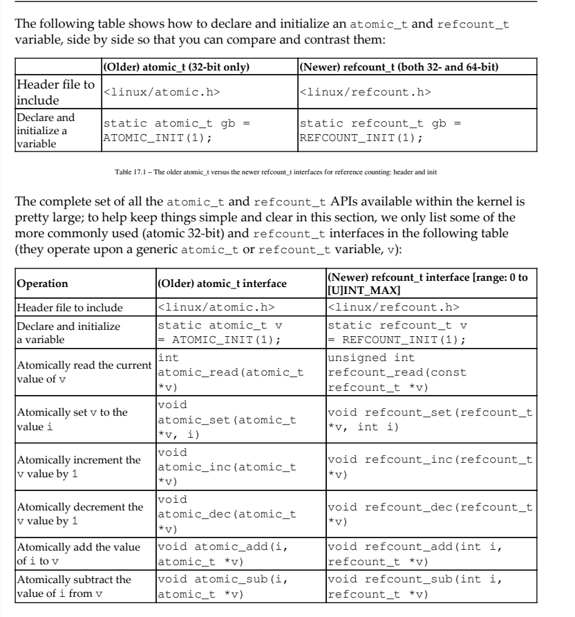
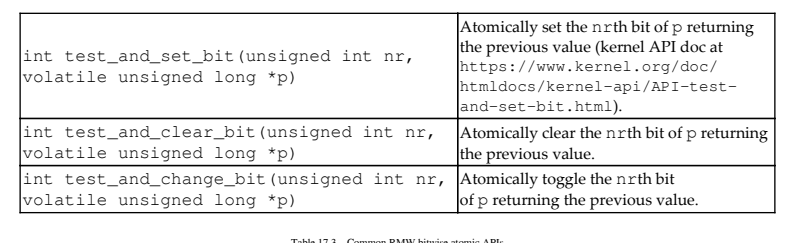

# 7.26

## Modern C++

### 使用std::format和std::print格式化和打印文本

C++语言有两种格式化文本的方法:printf系列函数和I/O流库。printf函数从C继承而来，提供格式化文本和参数的分离。流库提供安全性和可扩展性，通常建议使用printf函数，但通常速度较慢。C++20标准为输出格式化提出了一种新的格式化库替代方案，其形式类似于printf，但安全且可扩展，旨在补充现有的流库。在这个食谱中，我们将学习如何使用新功能，而不是printf函数或流库。准备就绪新的格式化库位于<format>标题中。为了使以下示例正常工作，您必须包含此标头。如何操作…std::format（）函数根据提供的格式字符串对其参数进行格式化。您可以按如下方式使用它:在每个参数的格式字符串中提供空的替换字段，由{}表示:

```
auto text = std::format("{} is {}", "John", 42);
```

在替换字段中的参数列表中指定每个参数的从0开始的索引，例如｛0｝、｛1｝等。参数的顺序并不重要，但索引必须有效:

```
auto text = std::format("{0} is {1}", "John", 42);
```

使用冒号（:）后的替换字段中提供的格式说明符控制输出文本。对于基本类型和字符串类型，这是一种标准格式规范。对于chrono类型，这是一个chrono格式规范

```
auto text = std::format("{0} hex is {0:08X}", 42);
auto now = std::chrono::system_clock::now();
auto date = std::format("Today is {:%Y-%m-%d}", now);
std::cout << date << '\n';
```

​	您还可以使用带有std::format_to（）或std::format.to_n（）的迭代器以输出格式写入参数，如下所示:

- 写入缓冲区，如std::string或std::vector<char>，使用std::format_n（）并使用std::back_inserter（）帮助函数:

  ```
  std::vector<char> buf;
  std::format_to(std::back_inserter(buf), "{} is {}", "John", 42);
  ```

- 使用std::formatted_size（）检索存储参数格式化表示所需的字符数:

  ```
  auto size = std::formatted_size("{} is {}", "John", 42);
  std::vector<char> buf(size);
  std::format_to(buf.data(), "{} is {}", "John", 42);
  ```

​	要限制写入输出缓冲区的字符数，可以使用std::format_To_n（），它类似于std::format_type（），但最多写n个字符:

```
char buf[100];
auto result = std::format_to_n(buf, sizeof(buf), "{} is {}"
```

​	在C++23中，您可以使用新\<print>标头中的以下函数将格式化文本直接写入文件流，例如标准输出控制台:

- std::print，根据格式字符串编写参数:

  ```
  std::print("The answer is {}", 42);
  ```

- std::println，根据字符串后跟新行字符（'\n'）的格式编写参数:

```
std::FILE* stream = std::fopen("demo.txt", "w");
if (stream)
{
 std::println(stream, "The answer is {}", 42);
 std::fclose(stream);
}
```

​	std::format（）函数有多个重载。您可以将格式字符串指定为字符串视图或宽字符串视图，函数返回std::string或std::wstring。您还可以将std::locale指定为第一个参数，用于特定于区域的设置格式化。函数重载都是可变函数模板，这意味着您可以在格式后指定任意数量的参数。格式字符串由普通字符、替换字段和景观序列组成。转义序列为{{和}}，并在输出中替换为{and}。括号｛｝中提供了一个替换字段。它可以选择包含一个非负数，表示要格式化的参数的从0开始的索引，以及一个冒号（:），后跟一个格式说明符。如果格式说明符无效，则抛出std::format_error类型的异常。以类似的方式，std::format_to（）有多个重载，就像std::format（）一样。这两者之间的区别在于std::format_to（）总是将输出缓冲区的迭代器作为第一个参数，并在输出范围结束后返回迭代器（而不是字符串asstd::format（））。另一方面，std::format_to_n（）比std::format.to（）多了一个参数。它的第二个参数是一个数字，表示要写入缓冲区的最大字符数。下面的列表显示了这三个函数模板中每一个最简单重载的签名

```
template<class... Args>
std::string format(std::string_view fmt, const Args&... args);
template<class OutputIt, class... Args>
OutputIt format_to(OutputIt out,
 std::string_view fmt, const Args&... args);
template<class OutputIt, class... Args>
std::format_to_n_result<OutputIt>
format_to_n(OutputIt out, std::iter_difference_t<OutputIt> n,
 std::string_view fmt, const Args&... args);
```

提供格式字符串时，可以提供参数标识符（其基于0的索引）或省略它们。但是，两者都使用是违法的。如果替换字段中省略了索引，则参数将按提供的顺序处理，替换字段的数量不得超过提供的参数数量。如果提供了索引，则索引必须有效才能使格式字符串有效。当使用格式规范时，那么:对于基本类型和字符串类型，它被认为是标准格式规范。对于chrono类型，它被认为是chrono格式规范。对于用户定义的类型，它是由所需类型的std::formatter类的用户定义专门化定义的。

​	这些语法部分在这里进行了简要描述。ill-and-align是一个可选的填充字符，后面是一个对齐选项:<:强制字段与可用空间左对齐。>:强制字段与可用空间对齐。^:迫使场地以可用空间为中心。为此，它将在左侧插入n/2个字符，在右侧插入n/2个字符:

```
auto t1 = std::format("{:5}", 42); // " 42"
auto t2 = std::format("{:5}", 'x'); // "x "
auto t3 = std::format("{:*<5}", 'x'); // "x****"
auto t4 = std::format("{:*>5}", 'x'); // "****x"
auto t5 = std::format("{:*^5}", 'x'); // "**x**"
auto t6 = std::format("{:5}", true); // "true "
```

\	#和0仅在使用数字（整数或浮点数）时有效。符号可以是以下之一:+:指定符号必须用于负数和正数-:指定符号只能用于负数（这是隐式行为）空格:指定符号可以用于负数，前导空格必须用于非负数

```
auto t7 = std::format("{0:},{0:+},{0:-},{0: }", 42);
// "42,+42,42, 42"
auto t8 = std::format("{0:},{0:+},{0:-},{0: }", -42);
// "-42,-42,-42,-42"
```

​	符号导致使用替代形式。这可能是以下之一:对于整型，当指定二进制、八进制或十六进制表示时，备用形式会在输出中添加前缀0b、0或0x。对于浮点类型，替代形式会导致小数点字符始终出现在格式化值中，即使后面没有数字。此外，当使用g或g时，尾随的零不会从输出中删除。

​	数字0指定应将前导零输出到fieldwidth，除非浮点类型的值为无穷大或NaN。当与align选项一起出现时，说明符0将被忽略:

```
auto t9 = std::format("{:+05d}", 42); // "+0042"
auto t10 = std::format("{:#05x}", 42); // "0x02a"
auto t11 = std::format("{:<05}", -42); // "-42 "
```

宽度指定最小字段宽度，可以是正十进制数或嵌套替换字段。精度字段表示浮点类型的精度，或者对于字符串类型，表示将从字符串中使用多少个字符。它用点（.）指定，后跟非负十进制数或嵌套替换字段。特定于区域设置的格式用大写字母L指定，并导致使用特定于区域的表单。此选项仅适用于算术类型。可选类型决定了数据在输出中的呈现方式。可用的字符串表示类型如下表所示:


​	填充和对齐、宽度和精度字段与前面描述的标准格式规范中的含义相同。当表示类型为浮点类型时，精度仅对std::chrono::duration类型有效。在其他情况下使用它会引发anstd::format_error异常。chrono规范可以为空，在这种情况下，参数的格式就像通过将其流式传输到std::stringstream并复制结果字符串一样。或者，它可以由一系列转换说明符和普通字符组成。下表列出了其中一些格式说明符:


|                         转换 说明符                          |                             解释                             |
| :----------------------------------------------------------: | :----------------------------------------------------------: |
|                             `%%`                             |                     写字面的 `%` 字符。                      |
|                             `%n`                             |                          写换行符。                          |
|                             `%t`                             |                        写水平制表符。                        |
|                              年                              |                                                              |
|                          `%C` `%EC`                          | 写年除以 100 向下取整的结果。若结果为单个十进制位，则前附 0。修饰的命令 `%EC` 写本地环境的替用世纪表示。 |
|                       `%y` `%Oy` `%Ey`                       | 写年的末二位十进制数。若结果为单个数位，则前附 0。修饰的命令 `%Oy` 写本地环境的替用表示。修饰的命令 `%Ey` 写距 `%EC` 的偏移（仅年）的本地环境替用表示。 |
|                          `%Y` `%EY`                          | 按十进制数写年。若结果少于四位，则左填充 0 到四位。修饰的命令 `%EY` 写本地环境的替用完整年表示。 |
|                              月                              |                                                              |
|                          `%b` `%h`                           |                    写本地环境的缩写月名。                    |
|                             `%B`                             |                    写本地环境的完整月名。                    |
|                          `%m` `%Om`                          | 按十进制数写月份（一月为 `01`）。若结果为单个数位，则前附 0。修饰的命令 `%Om` 写本地环境的替用表示。 |
|                              日                              |                                                              |
|                          `%d` `%Od`                          | 按十进制数写月之日。若结果为单个十进制位，则前附 0。修饰的命令 `%Od` 写本地环境的替用表示。 |
|                          `%e` `%Oe`                          | 按十进制数写月之日。若结果为单个十进制位，则前附空格。修饰的命令 `%Oe` 写本地环境的替用表示。 |
|                           星期之日                           |                                                              |
|                             `%a`                             |                   写本地环境的缩写星期名。                   |
|                             `%A`                             |                   写本地环境的完整星期名。                   |
|                          `%u` `%Ou`                          | 按十进制数写 ISO 星期之日（1-7），其中星期一为 `1`。修饰的命令 `%Ou` 写本地环境的替用表示。 |
|                          `%w` `%Ow`                          | 写星期之日为十进制数（0-6），其中星期日为 `0`。修饰的命令 `%Ow` 写本地环境的替用表示。 |
|                    ISO 8601 基于星期的年                     |                                                              |
| ISO 8601 星期始于星期一而年的第一星期必须满足下列要求:包含 1 月 4 日包含该年的首个星期四 |                                                              |
|                             `%g`                             | 写 ISO 8601 基于星期的年的后二位十进制数。若结果为单个数位，则前附 0。 |
|                             `%G`                             | 按十进制数写 ISO 8601 基于星期的年。若结果少于四位，则左填充 0 到四位。 |
|                          `%V` `%OV`                          | 按十进制数年的 ISO 8601 星期。若结果为单个数位，则前附 0。修饰的命令 `%OV` 写本地环境的替用表示。 |
|                         年之星期/日                          |                                                              |
|                             `%j`                             | 按十进制数写年的日（1 月 1 日为 `001`）。若结果少于三位，则左填充 0 到三位。 |
|                          `%U` `%OU`                          | 按十进制数写年的星期数。该年的首个星期日为 01 星期的首日。同年中之前的日在 00 星期中。若结果为单个数位，则前附 0。修饰的命令 `%OU` 写本地环境的替用表示。 |
|                          `%W` `%OW`                          | 按十进制数写年的星期数。该年的首个星期一为 01 星期的首日。同年中之前的日在 00 星期中。若结果为单个数位，则前附 0。修饰的命令 `%OW` 写本地环境的替用表示。 |
|                             日期                             |                                                              |
|                             `%D`                             |                  等价于 `**"%m/%d/%y"**`。                   |
|                             `%F`                             |                  等价于 `**"%Y-%m-%d"**`。                   |
|                          `%x` `%Ex`                          | 写本地环境的日期表示。修饰的命令 `%Ex` 产生本地环境的替用日期表示。 |
|                           当天时刻                           |                                                              |
|                          `%H` `%OH`                          | 按十进制数字写时（24 小时时钟）。若结果为单个数位，则前附 0。修饰的命令 `%OH` 写本地环境的替用表示。 |
|                          `%I` `%OI`                          | 按十进制数字写时（12 小时时钟）。若结果为单个数位，则前附 0。修饰的命令 `%OI` 写本地环境的替用表示。 |
|                          `%M` `%OM`                          | 按十进制数字写分。若结果为单个数位，则前附 0。修饰的命令 `%OM` 写本地环境的替用表示。 |
|                          `%S` `%OS`                          | 按十进制数字写秒。若结果为单个数位，则前附 0。若输入的精度不能以秒精确表示，则格式为 fixed 格式且精度匹配输入精度的十进制浮点数（或若不能在 18 位小数内转换到浮点数十进制秒，则为到微秒精度）。用作小数点的字符按照本地环境本地化。修饰的命令 `%OS` 写本地环境的替用表示。 |
|                             `%p`                             |      写与 12 小时时钟相关的 AM/PM 设计的本地环境版本。       |
|                             `%R`                             |                    等价于 `**"%H:%M"**`。                    |
|                             `%T`                             |                  等价于 `**"%H:%M:%S"**`。                   |
|                             `%r`                             |                写本地环境的 12 小时时钟时间。                |
|                          `%X` `%EX`                          | 写本地环境的时间表示。修饰的命令 `%EX` 写本地环境的替用时间表示。 |
|                             时区                             |                                                              |
|                       `%z` `%Ez` `%Oz`                       | 以 ISO 8601 格式写自 UTC 的偏移。例如 `-0430` 表示 UTC 后 4 小时 30 分。若偏移为 0，则使用 `+0000`。修饰的命令 `%Ez` 与 `%Oz` 在时与分间插入 `:`（例如 `-04:30`）。 |
|                             `%Z`                             |                         写时区缩写。                         |
|                             杂项                             |                                                              |
|                          `%c` `%Ec`                          | 写本地环境的日期与时间表示。修饰的命令 `%Ec` 写本地环境的替用日期与时间表示。 |

下列说明符得到辨识，但会导致抛出 std::format_error :

| 转换 说明符 |                             解释                             |
| :---------: | :----------------------------------------------------------: |
|  时长计数   |                                                              |
|    `%Q`     | 写时长的计次数，即经由 [`count()`](https://zh.cppreference.com/w/cpp/chrono/duration/count) 获得的值。 |
|    `%q`     | 写 [`operator<<()`](https://zh.cppreference.com/w/cpp/chrono/duration/operator_ltlt) 中指定的时长单位后缀。 |

​	可以查看chrono库的完整格式说明符列表athttps://en.cppreference.com/w/cpp/chrono/system_clock/formatter. Because将格式化文本写入控制台或文件流需要两个操作（将文本格式化为字符串或字符向量，然后将该缓冲区写入输出流），C++23标准引入了一些新函数来简化这一过程。新的std::print和std::println函数非常相似。唯一的区别是std::println在格式化文本后附加了一个字符（新行）。这两个函数各有两个重载:

​	一个将std::FILE*作为第一个参数，表示输出文件streamOne没有这样的参数，并隐式使用C输出streamstdout的方法。因此，以下两个对std::println的调用是等效的

```
std::println("The answer is {}", 42);
std::println(stdout, "The answer is {}", 42);
```

​	此外，以下两个对std::print和std::println的调用在标准输出流上具有相同的结果:

```
std::println("The answer is {}", 42);
std::print("The answer is {}\n", 42);
```

#### 了解如何在数字和串之间进行转换

​	C++20格式化库是使用printf类函数或I/O流库的现代替代品，它实际上是对这些函数的补充。尽管该标准为基本类型（如整型和浮点型、bool、字符型、字符串和计时型）提供了默认格式，但用户可以为用户定义的类型创建自定义专门化。在这个食谱中，我们将学习如何做到这一点。准备好你应该阅读之前的配方，格式化和打印文本，包括::format和std::print，以熟悉格式化库。在我们将在这里展示的示例中，我们将使用以下类:

```
struct employee
{
 int id;
 std::string firstName;
 std::string lastName;
};
```

在下一节中，我们将介绍使用std::format（）为用户定义的类型实现可启用文本格式的必要步骤。如何操作…要使用新的格式化库为用户定义的类型启用格式化，您必须执行以下操作:

1. 在std命名空间中定义std::formatter<T，CharT>类的偏特化
2. 实现parse（）方法来解析与当前参数对应的格式字符串部分。如果该类继承自另一个格式化程序，则可以省略此方法。
3. 实现format（）方法来格式化参数，并通过format_context编写输出。

```
template <>
struct std::formatter<employee>
{
 constexpr auto parse(format_parse_context& ctx)
 {
 return ctx.begin();
 }
 auto format(employee const & e, format_context& ctx) const 
 {
 return std::format_to(ctx.out(),
 "[{}] {} {}",
 e.id, e.firstName, e.lastName);
 }
};
```

parse（），它接受std::basic_format_parse_context<CharT>类型的单个参数，并解析解析上下文提供的T类型的格式规范。解析的结果应该存储在类的成员字段中。如果解析成功，此函数应返回类型std::basic_format_parse_context<CharT>::迭代器的值，表示格式规范的结束。如果解析失败，函数应抛出std::format_error类型的异常，以提供有关error.format（）的详细信息，该方法有两个参数，第一个是T类型的格式化对象，第二个是std::basic_format_context<OutputIt，CharT>类型的格式化上下文对象。此函数应根据所需的说明符（可能是隐式的，也可能是解析格式规范的结果）将输出写入ctx.out（）。函数必须返回一个类型std::basic_format_context<OutputIt，CharT>:迭代器的值，表示输出的结束。在上一节所示的实现中，parse（）函数除了返回一个表示格式规范开头的迭代器外，什么也不做。格式化总是通过在方括号内打印员工标识符，后跟名字和姓氏来完成的，例如[42]John Doe。尝试使用格式说明符会导致编译时错误:

```
employee e{ 42, "John", "Doe" };
auto s1 = std::format("{}", e); // [42] John Doe
auto s2 = std::format("{:L}", e); // error
```

​	如果你想让你的用户定义类型支持格式说明符，那么你必须正确实现parse（）方法。为了展示这是如何实现的，我们将支持员工类的几个说明符，


```
template <> struct std::formatter<employee> {
  constexpr auto parse(std::format_parse_context &ctx) {
    auto iter = begin(ctx);
    while (iter != ctx.end() && *iter != '}') {
      switch (*iter) {
      case 'L':
        lexicographic_order = true;
        break;
      case 'u':
        uppercase = true;
        break;
      case 'l':
        lowercase = true;
        break;
      }
      ++iter;
    }
    return iter;
  }
  auto format(employee const &e, std::format_context &ctx) con {
    if (lexicographic_order)
      return std::format_to(ctx.out(), "[{}] {}, {}", e.id,
                            text_format(e.lastName), text_format(e.firstName));
    return std::format_to(ctx.out(), "[{}] {} {}", e.id,
                          text_format(e.firstName), text_format(e.lastName));
  }

private:
  bool lexicographic_order = false;
  bool uppercase = false;
  bool lowercase = false;

  constexpr std::string text_format(std::string text) const {
    if (lowercase)
 		std::transform(text.begin(), text.end(), text.begin(),
 else if(uppercase)
 	std::transform(text.begin(), text.end(), text.begin(),
 return text;
  }
};
```

### 探索现代函数

我们将从学习一个特性开始本章，该特性使我们更容易提供特殊的类成员函数或防止任何函数（成员或非成员）被调用。默认和删除函数在C++中，类有特殊的成员（构造函数、析构函数和赋值运算符），这些成员可以由编译器默认实现，也可以由开发人员提供。然而，实施什么的规则有点复杂，可能会导致问题。另一方面，开发人员有时希望防止对象以特定方式被复制、移动或构造。这可以通过使用这些特殊成员实现不同的技巧来实现。C++11标准通过允许函数被删除或默认，简化了其中的许多功能，我们将在下一节中看到。入门对于此配方，您需要熟悉以下概念:

- 特殊成员函数（默认构造函数、析构函数、复制构造函数、移动构造函数、复制赋值运算符和移动赋值运算符）
- 可复制概念（类具有复制构造函数和复制赋值运算符，可以创建副本）
- 可移动概念（类具有移动构造函数和移动赋值运算符，可以移动对象）考虑到这一点，让我们学习如何定义默认和删除的特殊函数

```
struct foo
{
 foo() = default;
};
```

要删除函数，请使用=delete而不是函数体。

```
struct foo
{
 foo(foo const &) = delete;
};
void func(int) = delete;
```

​	要实现一个不可复制且隐式不可移动的类，请将复制构造函数和复制赋值运算符声明为deleted

```
class foo_not_copyable
{
public:
 foo_not_copyable() = default;
 foo_not_copyable(foo_not_copyable const &) = delete;
 foo_not_copyable& operator=(foo_not_copyable const&) = de
};
```

​	要实现一个不可复制但可移动的类，请将复制操作声明为delete，并显式实现move操作（并提供所需的任何其他构造函数）:

```
class data_wrapper
{
 Data* data;
public:
 data_wrapper(Data* d = nullptr) : data(d) {}
 ~data_wrapper() { delete data; }
 data_wrapper(data_wrapper const&) = delete;
 data_wrapper& operator=(data_wrapper const &) = delete;
 data_wrapper(data_wrapper&& other) 
 :data(std::move(other.data))
 {
 other.data = nullptr;
 }
 data_wrapper& operator=(data_wrapper&& other)
 {
 if (data != other.data))
 {
 delete data;
 data = std::move(other.data);
 other.data = nullptr;
 }
 return *this;
 }
};
```

​	一个类有几个特殊的成员，默认情况下，编译器可以实现这些成员。这些是默认构造函数、复制构造函数、移动构造函数、复制赋值、移动赋值和析构函数（有关移动语义的讨论，请参阅第9章“鲁棒性和性能”中的“实现移动语义准则”）。如果你不实现它们，那么编译器会这样做，以便在需要时可以创建、移动、复制和销毁类的实例。但是，如果您显式提供了一个或多个这些特殊方法，则编译器将不会根据以下规则生成其他方法：如果存在用户定义的构造函数，则默认情况下不会生成默认构造函数。如果存在用户定义的虚拟析构函数，则不会生成默认析构函数。如果存在用户定义的移动构造函数或移动赋值运算符，则默认情况下不会生成复制构造函数和复制赋值运算符。

​	如果存在用户定义的复制构造函数、移动构造函数、复制赋值运算符、移动赋值运算符或析构函数，则默认情况下不会生成移动构造函数和移动赋值运算符。如果存在用户定义的复制构造函数或析构函数，则默认情况下会生成复制赋值运算符。如果存在用户定义的复制赋值运算符或析构函数，则默认情况下会生成复制构造函数。请注意，前面列表中的最后两个规则是已弃用的规则，您的编译器可能不再支持它们。有时，开发人员需要提供这些特殊成员的空实现或隐藏它们，以防止以特定方式构造类的实例。一个典型的例子是一个不应该被复制的类。经典的模式是提供默认构造函数并隐藏复制构造函数和复制赋值运算符。虽然这可以工作，但显式定义的默认构造器。确保了该类不再被视为琐碎的，因此也不再是Plain Old Data（POD）类型。现代的替代方法是使用adeleted函数，如前一节所示。当编译器在函数定义中遇到=default时，它将提供默认实现。前面提到的特殊成员职能规则仍然适用。当且仅当函数内联时，才能在类体外部声明=default:

```
class foo
{
public:
 foo() = default;
 inline foo& operator=(foo const &);
};
inline foo& foo::operator=(foo const &) = default;
```

默认实现有几个好处，包括以下几点：

- 可以比显式实现更高效。
- 非默认实现，即使它们是空的，也被认为是非平凡的，这会影响类型的语义，使其变得非平凡（因此，非POD）。
- 帮助用户不编写显式的默认实现。例如，如果存在用户定义的移动构造函数，则编译器默认不提供复制构造函数和复制赋值运算符。但是，您仍然可以显式默认并要求编译器提供它们，这样您就不必手动操作。

​	当编译器在函数定义中遇到=delete时，它将阻止调用该函数。但是，在重载解析过程中仍会考虑该函数，只有当删除的函数是最佳匹配时，编译器才会生成错误。例如，通过为run（）函数提供之前定义的重载，只能调用长整数。带有任何其他类型参数的调用（包括int，其自动类型升级为long存在）将确定已删除的重载被视为最佳匹配，因此编译器将生成错误：

```
run(42); // error, matches a deleted overload
run(42L); // OK, long integer arguments are allowed
```

​	经验法则（也称为五法则）是，如果你显式定义了任何复制构造函数、移动构造函数、复制赋值运算符、移动赋值运算符、命令结构器，那么你必须显式定义或默认所有它们。用户定义的析构函数、复制构造函数和复制赋值运算符是必要的，因为对象是在各种情况下（如将参数传递给函数）从副本构造的。如果它们不是用户定义的，则由编译器提供，但它们的默认实现可能是错误的。如果类管理资源，那么默认实现会进行浅层复制，这意味着它复制的是资源句柄的值（如指向对象的指针），而不是资源本身。在这种情况下，用户定义的实现必须进行一次深度复制，复制资源，而不是资源的句柄。在这种情况中，移动构造函数和移动赋值运算符的存在是可取的，因为它们代表了性能的提高。缺少这两个不是错误，而是错过了优化机会。一方面反对五常，另一方面又补充五常的是所谓的零常。该规则规定，除非一个类进行交易Lambdas有很多用途，在这个食谱中，我们将学习如何将它们与标准算法一起使用。准备好在这个食谱中，我们将讨论标准算法，这些算法接受一个参数，即应用于它迭代的元素的函数或谓词。你需要知道什么是一元和二元函数，什么是谓词和比较函数。您还需要熟悉函数对象，因为lambda表达式是函数对象的语法糖。如何做到这一点…你应该更喜欢使用lambda表达式将回调传递给标准算法，而不是函数或函数对象：如果你只需要在一个地方使用lambda，请在调用的地方定义匿名lambda表达式

```
auto numbers =
 std::vector<int>{ 0, 2, -3, 5, -1, 6, 8, -4, 9 };
auto positives = std::count_if(
 std::begin(numbers), std::end(numbers),
 [](int const n) {return n > 0; });
```

​	如果需要在多个位置调用lambda，请定义一个命名的lambda，即分配给变量的lambda（通常使用类型的自动说明符）：

```
auto ispositive = [](int const n) {return n > 0; };
auto positives = std::count_if(
 std::begin(numbers), std::end(numbers), ispositive);
```

```
#include <chrono>
#include <iostream>
#include <print>
#include <memory>
#include <random>
#include <vector>
auto isPositive(const int& val){return val > 0;};

std::vector<int> gain_rand_vec(const int& size){
  std::random_device rd;
  auto mtgen = std::mt19937{ rd() };
  auto normal = std::normal_distribution<>{-10, 10};
  std::vector<int> nums;
  for(auto i = 0; i < size; i++)
    nums.emplace_back(normal(mtgen));
  return nums;
}

void displayArray(const std::vector<int>& arrays){
  for(const auto& each : arrays)
    std::print("{} ", each);
  std::println("");
}

int main() {
  auto random_arr = gain_rand_vec(20);
    auto cnt = std::count_if(
              random_arr.begin(),
             random_arr.end(), 
             isPositive);
  displayArray(random_arr);
  std::print("The poistive number is {}", cnt);
}
```

​	如果你需要的lambda表达式只与它们的参数类型不同（自C++14起可用），请使用泛型lambda表达式

```
auto positives = std::count_if(
 std::begin(numbers), std::end(numbers),
 [](auto const n) {return n > 0; });
```

第二个项目符号中显示的非泛型lambda表达式接受一个常数整数，如果它大于0，则返回true，否则返回false。编译器使用调用运算符定义了一个未命名的函数对象，该对象具有lambda表达式的签名：

```
struct __lambda_name__
{
 bool operator()(int const n) const { return n > 0; }
};
```

​	编译器定义未命名函数对象的方式取决于我们定义lambda表达式的方式，该表达式可以捕获变量、使用可变说明符或异常规范，或者具有尾随返回类型。前面显示的__lambda_name__函数对象实际上是编译器生成内容的简化，因为它还定义了一个错误的复制和移动构造函数、一个默认析构函数和一个删除赋值运算符。必须很好地理解lambda表达式实际上是一个类。为了调用它，编译器需要实例化类的一个对象。lambda表达式中的实例化对象称为lambda闭包。在下面的示例中，我们想计算数组中大于或等于5且小于或等于10的元素的数量。在这种情况下，这个ambda表达式看起来像这样：

```
auto numbers = std::vector<int>{ 0, 2, -3, 5, -1, 6, 8, -4, 9 }
auto minimum { 5 };
auto maximum { 10 };
auto inrange = std::count_if(
 std::begin(numbers), std::end(numbers),
 [minimum, maximum](int const n) {
 return minimum <= n && n <= maximum;});
```

​	此lambda通过复制（即值）捕获两个变量，最小值和最大值。编译器创建的未命名函数对象与我们之前定义的非常相似。使用前面提到的默认和删除的特殊成员，该类看起来像这样

```
class __lambda_name_2__
{
 int minimum_;
 int maximum_;
public:
 explicit __lambda_name_2__(int const minimum, int const maxim
 minimum_( minimum), maximum_( maximum)
 {}
 __lambda_name_2__(const __lambda_name_2__&) = default;
 __lambda_name_2__(__lambda_name_2__&&) = default;
 __lambda_name_2__& operator=(const __lambda_name_2__&)
 = delete;
 ~__lambda_name_2__() = default;
 bool operator() (int const n) const
 {
 return minimum_ <= n && n <= maximum_;
 }
};
```

lambda表达式可以通过复制（或值）或引用来捕获变量，两者的不同组合是可能的。但是，不可能多次捕获变量，只能在捕获列表的开头使用&或=。lambda表达式可以访问以下类型的变量：从封闭作用域捕获的变量、lambda参数、在其主体内本地声明的变量、在类中声明lambda并且lambda捕获指针时的类数据成员，以及任何具有静态存储持续时间的变量，如全局变量。lambda只能从封闭函数作用域中捕获变量。它无法捕获具有静态存储持续时间的变量（即在命名空间作用域中声明的变量或具有静态或外部说明符的变量）。下表显示了lambda捕获语义的各种组合：

| Lambda表达式    | 说明                                                         |
| --------------- | ------------------------------------------------------------ |
| `[](){} `       | 不捕获任何内容。                                             |
| `[&](){}`       | 通过引用捕获所有内容。                                       |
| `[=](){}`       | 通过复制捕获所有内容。隐式捕获指针在C++20中已被弃用。        |
| `[&x](){}`      | 仅通过引用捕获x。                                            |
| `[x](){}`       | 仅通过复制捕获x。                                            |
| `[&x...](){}`   | 通过引用捕获包扩展名x。                                      |
| `[x...](){}`    | 通过复制捕获包扩展名x                                        |
| `[&, x](){}`    | 通过引用捕获所有内容，但通过复制捕获的x除外                  |
| `[=, &x](){}`   | 通过复制捕获所有内容，但通过引用捕获的x除外                  |
| `[&,this](){}`  | 通过引用捕获除this指针之外的所有内容，this指针由copy捕获（this始终由copy捕获）。 |
| `[x, x](){}`    | 错误；x被捕获了两次。                                        |
| `[&, &x](){}`   | 错误；所有内容都是通过引用捕获的，我们不能再次指定通过引用捕获x。 |
| `[=, =x](){}`   | 错误；一切都是通过拷贝捕获的，我们不能再次指定通过拷贝捕获x  |
| `[&this](){}`   | 错误；指针总是被副本捕获。                                   |
| `[&, =](){}`    | 错误；无法通过复制和引用捕获所有内容。                       |
| `[x=expr](){}`  | x是从表达式expr初始化的lambda闭包的数据成员。                |
| `[&x=expr](){}` | x是从表达式expr初始化的lambda闭包的引用数据成员。            |

```
[capture-list](params) mutable constexpr exception attr -> ret
{ body }
```

​	此语法中显示的所有部分实际上都是可选的，但capturelist和body除外，capturelist可以为空，body也可以为空。如果不需要参数，实际上可以省略参数列表。这个

​	不需要指定返回类型，因为编译器可以从返回表达式的类型推断出它。可变说明符（它告诉编译器lambda实际上可以修改通过复制捕获的变量，这与通过值捕获不同，因为只有在lambda中才能观察到更改）、constexpr说明符（它告诉编译器生成constexpr调用运算符）以及异常说明符和属性都是可选的。最简单的lambda表达式是[]{}，尽管它通常写成[]（）{}。上表中的后两个示例是泛化lambda捕获的形式。这些是在C++14中引入的，允许我们捕获具有仅移动语义的变量，但它们也可以用于在lambda中定义新的任意对象。以下示例显示了如何使用广义lambda捕获通过move捕获变量：

```
auto ptr = std::make_unique<int>(42);
auto l = [lptr = std::move(ptr)](){return ++*lptr;};
```

在类方法中编写并需要捕获类数据成员的Lambda可以通过多种方式实现：使用[x=expr]的形式捕获单个数据成员：

```
struct foo
{
 int id;
 std::string name;
 auto run()
 {
  return [i=id, n=name] { std::cout << i << ' ' << n << '
 }
};
```

用[=]形式捕获整个对象（请注意，C++20中不推荐通过[=]隐式捕获指针this）：

```
struct foo
{
 int id;
 std::string name;
 auto run()
 {
 return [=] { std::cout << id << ' ' << name << '\n'; };
 }
};
```

通过捕获此指针来捕获整个对象。如果需要调用类的其他方法，这是必要的。当指针被值捕获时，这可以被捕获为[This]，或者当对象本身被值捕获的时候，这可以捕获为[*This]。如果对象在捕获发生后但在调用lambda之前超出作用域，这可能会产生很大的不同：

```
struct foo
{
 int id;
 std::string name;
 auto run()
 {
 return[this]{ std::cout << id << ' ' << name << '\n'; }
 }
};
auto l = foo{ 42, "john" }.run();
```

​	在后一种情况下，正确的捕获应该是[*this]，以便对象按值复制。在这种情况下，调用lambda将打印42john，即使临时值已超出范围。C++20标准对捕获点进行了几处更改：当您使用[=]时，它不支持隐式捕获点。这将导致编译器发出弃用警告。当您想用[=，this]捕获所有内容时，它引入了按值显式捕获此指针。您仍然只能通过[this]捕获来捕获指针this。在某些情况下，lambda表达式仅在参数方面有所不同。在这种情况下，lambdas可以像模板一样以通用的方式编写，但使用类型参数的自动说明符（涉及notemplate语法）。正如即将到来的“另见”一节所述，这将在下一个食谱中解决。在C++23之前，可以在可选异常说明符和可选尾随返回类型之间的lambda表达式上指定属性。这些属性将应用于类型，而不是函数调用运算符。然而，像[[nodiscard]]或[[noreturn]]这样的属性只对函数有意义，对类型没有意义。因此，从C++23开始，此限制已更改，因此可以指定属性：在lambda导入器及其可选捕获之后，或在模板参数列表及其可选的requires子句之后。lambda声明的这些部分中的任何一个中声明的属性都适用于函数调用运算符，而不是类型。让我们检查以下示例：

```
auto linc = [](int a) [[deprecated]] { return a+1; };
linc(42);
```

[[弃用]]属性适用于lambda的类型，并在编译代码段时生成nowarning。在C++23中，我们可以编写以下代码：

```
auto linc = [][[nodiscard,deprecated]](int a) { return a+1; };
linc(42);
```

​	通过此更改，[[nodiscard]]和[[deputged]]都可以归因于lambda类型的函数调用运算符。这会导致发出两个警告：一个是使用了弃用的函数，另一个是忽略了返回类型。另请参阅使用泛型和模板lambda，了解如何使用auto forlambda参数以及如何在C++20中定义模板lambda。编写递归lambda，了解我们可以用来使lambda调用本身递归的技术。第4章，向编译器提供带有属性的元数据，了解可用的标准属性以及如何使用它们

## Linux Kernel Programming

​	使用内核计时器、线程和工作队列如果设备驱动程序的低级规范要求在执行func_a（）和func_b（）之间应该有50毫秒的延迟怎么办？此外，根据您的情况，当您在进程或中断上下文中运行时，延迟应该有效。如果在驱动程序的另一部分中，您需要异步和定期（比如每秒）执行某种监控功能，该怎么办？或者，您是否需要在后台但在内核内有一个（或多个）线程进行静默的打字工作？这些是各种软件中非常常见的要求，包括我们宇宙的一角——Linux内核模块（和驱动程序）开发！

​	在本章中，您将学习如何在内核空间中运行时设置、理解和使用延迟，以及如何使用内核计时器、内核线程和工作队列。在本章中，您将学习如何以最佳方式执行这些任务。简而言之，我们将涵盖以下主题:在内核中延迟给定时间设置和使用内核计时器创建和使用内核线程使用内核工作让我们开始吧！

#### 在内核中的给定时间

​	通常，您的内核或驱动程序代码需要等待给定的时间才能继续执行下一条指令。这可以通过一组延迟API在Linux内核空间内实现。从一开始，要理解的一个关键点是，你可以通过两种方式来强制延迟:通过非阻塞或原子API的延迟，这些API永远不会导致睡眠进程发生（换句话说，它永远不会排出去）通过阻塞API的延迟导致当前进程上下文睡眠（换句话说，通过排出去）（正如我们在配套指南《Linux内核编程》中详细介绍的那样，我们的CPU调度章节第10章“CPU调度器-第1部分”和第11章“CPU调度程序-第2部分”），将进程上下文内部置于睡眠状态意味着内核的核心schedule（）函数在某个时候被调用，最终导致上下文切换发生。这就引出了一个非常重要的问题（我们之前已经提到过！）:在任何类型的原子或中断上下文中运行时，您都不能调用schedule（）。

​	使用内核计时器、线程和工作队列第5章[238]通常，就像我们在这里插入延迟的情况一样，你必须弄清楚你打算插入延迟的代码在什么上下文中运行。我们在公司指南《Linux内核编程》第6章“内核内部要素——进程和线程”的“确定上下文”一节中介绍了这一点；如果你不清楚，请回头看。（我们在第4章“处理硬件中断”中对此进行了更详细的介绍。）接下来，仔细想想:如果你确实处于原子（或中断）环境中，真的需要延迟吗？原子或中断上下文的全部意义在于，它内的执行被限制在尽可能短的持续时间内；强烈建议您以这种方式进行设计。这意味着您不会在原子代码中插入延迟，除非您无法避免这样做。使用第一种类型:这些是永远不会发生睡眠的非阻塞或原子API。当您的代码处于原子（或中断）上下文中，并且确实需要短时间的非阻塞延迟时，您应该使用此选项；但那有多短？根据经验，将这些API用于1毫秒或更短的非阻塞原子延迟。即使你需要在原子上下文中延迟超过一毫秒的时间，比如在中断处理程序的代码中（但为什么在中断中延迟！？），也可以使用这些\*delay（）API（\*字符表示通配符；在这里，正如你将看到的，它表示delay（，delay）和mdelay（）例程）。使用第二种类型:这些是导致当前进程上下文休眠的阻塞API。当你的代码处于进程（或任务）上下文中时，你应该使用它，因为延迟本质上是阻塞的，持续时间更长；实际上，对于超过一毫秒的延迟。这些内核API遵循\*sleep（）的形式。（同样，在不深入细节的情况下，想想这个:如果你处于进程上下文中，但在自旋锁的关键部分，这是一个原子上下文——如果你必须包含延迟，那么你必须使用\*delay（）API！我们将在本书的最后两章中介绍spinlocks和更多内容。）现在，让我们看看这些内核API，看看它们是如何使用的。我们将首先看*delay（）原子API。

#### 了解如何使用\*delay（）原子API。

​	不用再费吹灰之力，让我们看看一个表，它快速总结了可用的（对usmodule作者来说）非阻塞或原子\*delay的内核API；它们用于任何类型的原子或中断上下文，在这些上下文中您不能阻止或休眠（或调用schedule（））:API Commendelay（ns）；延迟ns纳秒。udelay（us）；延迟微秒.mdelay（ms）；延迟毫秒。表5.1–\*delay（）非阻塞API关于这些API、它们的内部实现及其用法，有几点需要注意:使用这些宏/API时，始终包含<linux/delay.h>标头。您需要根据必须延迟的时间调用适当的例程；例如，如果你需要执行30毫秒的原子无阻塞延迟，你应该调用mdelay（30）而不是udelay（30*1000）。内核代码提到了这一点:linux/delay.h–“对大于几毫秒的间隔使用udelay（）可能会导致高循环概率（highbogomips）机器溢出…”。这些API的内部实现，就像Linux上的许多API一样，是微妙的:在<Linux/delay.h>标头中，这些函数（或宏，视情况而定）有一个更高级的抽象实现；在特定于arch的头文件（<asm-\<arch>/delay.h>或<asm-general/delay.h>；其中arch当然意味着sCPU）中通常有一个特定于arc的低级实现，它将在调用时自动覆盖高级版本（链接将确保这一点）。

​	在当前的实现中，这些API最终归结为wrappersover udelay（）；这个函数本身归结为一个紧凑的组装循环，执行所谓的“忙碌循环”！（对于x86，可以在arch/x86/lib/delay.c:__const_udelay（）中找到代码）。在引导过程的早期，内核会校准几个值:所谓的bogomips（伪MIPS）和每jiffy循环（lpj）值。本质上，内核会计算出在特定系统上，一个循环必须经过多少次才能经过1个定时器滴答声或一瞬间。这个值被称为系统的bogomips值，可以在内核日志中看到。例如，在我的Core-i7笔记本电脑上，它如下:校准延迟循环（跳过），使用时间频率计算值。。5199.98 BogoMIPS（lpj=10399968）对于超过MAX_UDELAY_MS（设置为5毫秒）的延迟，内核将在循环中内部调用UDELAY（）函数。请记住，当您在任何类型的原子上下文中需要延迟时，都必须使用\*delay（）API，例如中断处理程序（上半部分或下半部分），因为它们保证不会发生睡眠，因此不会调用schedule（）。提醒一下（我们在第4章“处理硬件中断”中提到了这一点）:might_sleep（）用作调试辅助工具；内核（和驱动程序）在代码库中代码在进程上下文中运行的地方内部使用might_sleep（）宏；也就是说，它可以在哪里睡觉。

​	现在，如果在原子上下文中调用了ifmight_sleep（），那就大错特错了——然后会发出anoisy printk堆栈跟踪，从而帮助您及早发现并解决这些问题。您也可以在流程上下文中使用这些*delay（）API。在这些讨论中，您经常会遇到jiffies内核变量；本质上，将jiffies视为一个全局无符号64位值，在每次定时器中断（或定时器滴答声；它具有内部防溢出保护）时递增。因此，持续递增的变量被用作衡量正常运行时间的一种方法，也是实现简单超时和延迟的一种手段。现在，让我们看看第二种可用的延迟API——阻塞类型。

​	了解如何使用\*sleep（）阻塞API让我们看看另一个表，该表快速总结了可用的（对我们模块作者来说）阻塞\*sleep*（）内核API；这些只适用于睡眠安全的过程环境；也就是说，调用schedule（）不是问题。换句话说，延迟是由进程上下文实现的，该进程上下文实际上在延迟持续时间内处于睡眠状态，然后在完成后被唤醒:


有几点需要注意:

- 使用这些宏/API时，请确保包含<linux/delay.h>标头。
- 所有这些\*sleep（）API都是以这样的方式在内部实现的，即它们会导致当前进程上下文休眠（即通过内部调用schedule（））；因此，当然，它们只能在“可以安全睡眠”的过程上下文中被调用。同样，仅仅因为你的代码在进程上下文中并不一定意味着你可以安全地睡觉；例如，自旋锁的关键部分是原子的；因此，您不能在那里调用上述*sleep（）API！
- 我们提到，当您想要短暂睡眠时，usleep_range（）是首选/推荐使用的API，但为什么？在之后这一点将变得更加清晰——延迟和睡眠到底需要多长时间？部分。如您所知，Linux上的睡眠有两种类型:可中断和不可中断。后者意味着没有信号任务可以“干扰”睡眠。所以，当你调用sleep（ms）；它通过内部调用以下命令将当前进程上下文休眠ms

```
__set_current_state(TASK_UNINTERRUPTIBLE);
return schedule_timeout(timeout);
```

​	schedule_timeout（）例程的工作原理是设置一个内核计时器（我们的下一个主题！），该计时器将在所需的时间到期，然后通过调用schedule（）立即使进程进入睡眠状态！（对于好奇的人，请看一下它的代码:kernel/time/tiimer.c:schedule_timeout（）。）msleep_ interruptible（）的实现非常相似，除了它调用__set_current_state（TASK_interruptible）；。作为一种设计启发式，遵循UNIX范式的提供机制，而不是策略；这样，在用户空间应用程序中止工作（可能是用户按^C）的情况下，调用sleep_interruptible（）可能是一个好主意，内核或驱动程序会顺从地释放任务:它的进程上下文被唤醒，它运行适当的信号处理程序，生命继续。在内核空间不受用户生成信号干扰的情况下，使用msleep（）变量。同样，根据经验，使用以下API，具体取决于延迟的持续时间:对于超过10毫秒的延迟:msleep（）或msleep_interruptible（）对于超过1秒的延迟:ssleep；并变为msleep（秒*1000）；。实现用户空间睡眠（3）API的（近似）等价物的一种简单方法可以在我们方便的.h头中看到；在本质上，它使用了API的schedule_timeout（）:

```
#ifdef __KERNEL__
void delay_sec(long);
/*------------ delay_sec --------------------------------------------------
 * Delays execution for @val seconds.
 * If @val is -1, we sleep forever!
 * MUST be called from process context.
 * (We deliberately do not inline this function; this way, we can see it's
 * entry within a kernel stack call trace).
 */
void delay_sec(long val)
{
 asm (""); // force the compiler to not inline it!
 if (in_task()) {
 set_current_state(TASK_INTERRUPTIBLE);
 if (-1 == val)
 schedule_timeout(MAX_SCHEDULE_TIMEOUT);
 else
 schedule_timeout(val * HZ);
 }
}
#endif /* #ifdef __KERNEL__ */
```

​	既然你已经学会了如何延迟（是的，请微笑），让我们继续学习一个有用的技能:给内核代码打时间戳。这允许您快速计算执行特定代码所需的时间。在内核代码中获取时间戳非常重要的是，当内核开放时，能够获取准确的时间戳。例如，dmesg（1）实用程序以微秒格式显示系统启动后的时间；Ftrace跟踪通常显示函数执行所需的时间。在用户模式下，我们经常使用gettimeofday（2）系统调用来获取atimestamp。在内核中，存在多个接口；通常，为了获得准确的时间戳，会使用ktimeget*（）系列例程。为了我们的目的，以下例程很有用:

```
u64 ktime_get_real_ns（void）;
```

​	该例程通过ktime_get_real（）API内部查询墙壁（时钟）时间，然后将结果转换为纳秒数量。我们不想在这里讨论内部细节。此外，此API的几种变体也可用；例如，ktime_get_real_fast_ns（）、ktime_get_real_ts64（）等。前者既安全又安全。

​	既然你知道如何获取时间戳，你就可以计算出一些代码执行所需的时间，并达到很高的精度，分辨率不低于纳秒！您可以使用以下伪代码来实现这一点

```
#include <linux/ktime.h>
t1 = ktime_get_real_ns();
foo();
bar();
t2 = ktime_get_real_ns();
time_taken_ns = (t2 -> t1);
```

​	在这里，计算（虚构的）foo（）和bar（）函数执行所需的时间，结果（以纳秒为单位）在time_taken_ns变量中可用。<linux/ktime.h>内核头本身包括<linux/timekeep.h>头，这是定义ktime_get_\*（）例程家族的地方。我们方便的.h头文件中提供了一个宏来帮助您计算两个时间戳之间的时间:SHOW_DELTA（稍后，较早）；。确保将后面的时间戳作为第一个参数传递，将第一个时间戳作为第二个参数传递。下一节中的代码示例将帮助我们采用这种方法。让我们试试看——延迟和睡眠到底需要多长时间？到目前为止，您已经知道如何使用\*delay（）和\*sleep（）API来构造延迟和睡眠（分别为非阻塞和阻塞）。不过，等等——我们还没有在内核模块中真正尝试过。不仅如此，延迟和睡眠是否如我们所相信的那样准确？让我们像往常一样，以经验为基础（这很重要！），不要做出任何假设。让我们亲自尝试一下！我们将在本小节中看到的演示内核模块按顺序执行两种延迟:首先，它使用*delay（）例程（您在了解如何使用\*delay（）原子API一节中了解到的）来实现10ns、10us和10ms的原子阻塞延迟。接下来，它使用\*sleep（）例程来实现10us、10ms和1秒的阻塞延迟。

​	您可以通过几种方式缓解这些问题:在标准Linux上，在用户模式下，请执行以下操作:首先，最好使用高分辨率计时器（HRT）接口以获得高精度。这也是从RTL项目合并到主流Linux中的代码（早在2006年）。它支持分辨率小于一次抖动的计时器（如你所知，它与计时器“滴答”（内核CONFIG_HZ值）紧密耦合）；例如，当HZ值为100时，抖动为1000/100=10ms；HZ为250，一瞬间为4ms，以此类推。一旦你做到了这一点，为什么不采用Linux的软RT调度功能呢？在这里，您可以为您的用户模式线程指定SCHED_FIFO或SCHED_RR的调度策略和高优先级（范围为1到99；我们在公司指南《Linux内核编程》第10章《CPUScheduler》第1部分中介绍了这些细节）。大多数现代Linux系统都将支持HRT。然而，你是如何利用它的？这很简单:建议您在用户空间中编写timercode，并使用标准的POSIX计时器API（如timer_create（2）和timer_settime（2）系统调用）。由于本书关注的是内核开发，我们在这里不会深入研究这些用户空间API。事实上，这个主题在我早期的书《Linux下的动手系统编程》第13章“定时器”中，在较新的POSIX（间隔）定时器机制一节中有一些详细的介绍。内核开发人员已经费心清楚地记录了在内核中使用这些延迟和睡眠API时的一些优秀建议。在官方内核文档中浏览此文档非常重要:https://www.kernel.org/doc/Documentation/timers/timers-howto.rst. 将Linux操作系统构建为RTOS；这将大大减少调度“抖动”（我们在配套指南《Linux内核编程》第11章“CPU调度器”第2部分“将主线Linux转换为RTOS”一节中详细介绍了这个主题）。

#### “sed”驱动程序——用于演示内核计时器、kthreads和工作队列

​	为了使本章更有趣、更实用，我们将开始开发一个被称为简单加密解密（简称sed）驱动程序的非单细胞类字符“驱动程序”（不要与众所周知的sed（1）实用程序混淆）。不，你不会因为猜测它提供了某种非常简单的文本加密/解密支持而获得大奖。

​	这里的重点是，我们应该想象一下，在这个驱动程序的规范中，有一个条款要求工作（实际上是加密/解密功能）在给定的时间间隔内完成——实际上是在给定的截止日期内。为了检查这一点，我们将设计我们的驱动程序，使其具有一个内核计时器，该计时器将在给定的时间间隔内过期；驱动程序将检查功能是否确实在此时间限制内完成！我们将开发一系列sed驱动程序及其用户空间对应程序（应用程序）:

- 第一个驱动程序——sed1驱动程序和用户模式应用程序（ch5/sed1）——将执行我们刚才描述的功能:演示用户模式应用程序将使用ioctl系统调用与驱动程序进行交互，并启动加密/解密消息功能。驱动程序将关注一个内核计时器，我们将设置该计时器在给定的截止日期前到期。如果它确实到期，我们认为操作失败了；如果没有，则取消计时器，操作成功。
- 第二个版本sed2（ch5/sed2）将执行与sed1相同的操作，除了这里的实际加密/解密消息功能将在单独创建的内核线程的文本中执行！这改变了项目的设计。
- 第三个版本sed3（ch5/sed3）将再次执行与sed1和sed2相同的操作，只是这次实际的加密/解密消息功能将由内核工作队列完成！

​	现在您已经学习了如何执行延迟（原子和阻塞）和捕获时间戳，让我们学习如何设置和使用内核计时器。

#### 设置和使用内核计时器

​	计时器为软件提供了一种在经过指定时间时异步通知的方法。用户和内核空间中的各种软件都需要计时器；这通常包括网络协议实现、块层代码、设备驱动程序和各种内核子系统。此计时器提供了一种同步通知的方式，从而允许驱动程序与正在运行的计时器并行执行工作。一个重要的问题是，我如何知道计时器何时到期？在用户空间应用程序中，内核通常会向相关进程发送信号（信号通常是SIGALRM）。

​	在内核空间中，它有点微妙。正如您从我们对硬件中断的上半部分和下半部分的讨论中所知道的那样（见第4章，处理硬件中断，理解和使用上下半部分），在定时器中断的上半部（或ISR）完成后，内核将确保它运行定时器中断的下半部或timersoftirq（如我们在第4章处理硬件中断部分可用软件及其用途的表中所示）。这是一个非常高优先级的软件，名为TIMER_SOFTIRQ。这个软件会消耗过期的计时器！实际上——理解这一点非常重要——定时器的“回调”函数——定时器到期时运行的函数——是由定时器softirq运行的，因此在原子（中断）上下文中运行。因此，它能做什么和不能做什么是有限的（同样，这在第4章“处理硬件中断”中有详细解释）。在下一节中，您将学习如何设置和使用内核计时器。使用内核计时器为了使用内核计时器，您必须遵循几个步骤。简而言之，这是要做的事情（我们稍后会更详细地讨论这个问题）:

1. 使用timer_setup（）宏初始化计时器元数据结构（结构timer_list）。这里初始化的关键项如下:到期时间（jiffies应该达到的值，以便计时器到期）计时器到期时调用的函数——实际上是计时器“回调”函数
2. 编写定时器回调例程的代码。
3. 在适当的时候，通过调用add_timer（或mod_timer（））函数来“武装”计时器，即启动计时器。
4. 当计时器超时（到期）时，操作系统将自动调用计时器的回调函数（您在步骤2中设置的函数）；记住，它将在计时器软件或原子或中断上下文中运行。
5. 计时器不是循环的，默认情况下是一次性的。要使计时器再次运行，您必须调用mod_timer（）API；这就是如何设置一个间隔定时器&一个以给定的固定时间间隔超时的定时器。如果你不执行这一步，你的计时器将是一个单次计时器——它将倒计时并恰好结束一次。
6. 完成后，使用del_timer[_sync]（）删除计时器；这也可以用来取消超时。它返回一个值，表示等待定时器是否已被停用；也就是说，它为活动计时器返回1，为取消非活动计时器返回0。

​	timer_list数据结构与我们在这里的工作相关；其中，相关成员（模块/驱动程序作者）显示为:

```
// include/linux/timer.h
struct timer_list {[ ... ]
 	unsigned long expires;
 	void (*function)(struct timer_list *);
 	u32 flags;
	[ ...] 
};
```

使用timer_setup（）宏对其进行初始化:timer_set（计时器、回调、标志）；timer_setup（）的参数如下:

@timer:指向timer_list数据结构的指针（这应该首先分配内存；此外，在形式参数名称前加上@是一种常见的约定）

@callback:指向回调函数的指针。这是定时器到期时操作系统调用的函数（在softirq上下文中）。它的签名是void（\*function）（struct timer_list*）。回调函数中收到的参数是指向timer_list数据结构的指针。那么，我们如何在定时器回调中传递和访问一些任意数据呢？我们很快就会回答这个问题@flags:这些是计时器标志。我们通常将其传递为0（表示没有特殊行为）。您可以指定的标志是TIMER_DEFERRABLE、TIMER_PINNED和TIMER_IRQSAFE。让我们看看内核源代码中的这两个:

```
// include/linux/timer.h
/**
 * @TIMER_DEFERRABLE: A deferrable timer will work normally when
the
 * system is busy, but will not cause a CPU to come out of idle
just
 * to service it; instead, the timer will be serviced when the CPU
 * eventually wakes up with a subsequent non-deferrable timer.
 [ ... ]
  * @TIMER_PINNED: A pinned timer will not be affected by any timer
 * placement heuristics (like, NOHZ) and will always expire on the
CPU
 * on which the timer was enqueued.
  * @TIMER_PINNED: A pinned timer will not be affected by any timer
 * placement heuristics (like, NOHZ) and will always expire on the
CPU
 * on which the timer was enqueued.
```

#### 使用内核工作队列

​	工作队列是创建和管理内核工作线程的抽象层。它们有助于解决一个关键问题:直接使用内核线程，特别是当涉及多个线程时，不仅困难，而且很容易导致危险的错误，如争用（从而可能导致死锁），以及糟糕的线程管理，从而导致效率损失。工作队列是Linux内核中使用的下半部分机制（以及小任务和软任务）。Linux内核中的现代工作队列实现——称为并发管理工作队列（cmwq）——实际上是一个非常复杂的框架，具有各种策略，可以根据特定要求动态有效地配置内核线程。

​	在本书中，我们更喜欢关注内核全局工作队列的使用，而不是其内部设计和实现。如果你想了解更多关于内核的信息，我建议你阅读这里的“官方”内核文档:https://www.kernel.org/doc/Documentation/core-api/workqueue.rst.进一步阅读部分还包含一些有用的资源。工作队列的关键特征如下:工作队列任务（回调）总是在可抢占的进程上下文中执行。一旦你意识到它们是由在可抢占的进程上下文中运行的内核（工作线程）线程执行的，这一点就很明显了。默认情况下，所有中断都处于启用状态，并且不采取任何锁。上述几点意味着您可以在工作队列函数中执行漫长的阻塞I/O边界工作（这与hardirq、tasklet或softirq等解剖上下文完全相反！）。正如您了解了内核线程一样，在用户空间之间传输数据（通过典型的copy_[to|from]_user（）和类似的例程）是不可能的；这是因为你的工作队列处理程序（函数）在它自己的进程上下文（内核线程的上下文）中执行。众所周知，内核线程有nouser映射。内核工作队列框架维护工作池。这些实际上是根据需要以不同方式组织的几个内核工作线程。内核处理管理它们的所有复杂性，以及加密货币问题。下面的屏幕截图显示了几个工作队列内核工作线程（这是在我的x86_64 Ubuntu 20.04客户机上拍摄的）:


使用内核计时器、线程和工作队列第5章[282]正如我们在创建和使用内核线程一节中提到的，一种理解kthread名称并了解kthreads的许多实际用途（以及如何调整它们以减少抖动）的方法是阅读相关的内核文档；也就是说，减少由于每cpu k线程引起的操作系统抖动(https://www.kernel.org/doc/Documentation/kernel-per￾CPU kthreads.txt）。关于如何使用工作队列（和其他下半部分机制），请参阅第4章“处理硬件中断”、Hardirq、小任务和线程处理程序——何时使用什么部分，特别是那里的表。重要的是要理解内核有一个随时可用的默认工作队列；它被称为内核全局工作队列或系统工作队列。为了避免给系统带来压力，强烈建议您使用它。我们将使用内核的全局工作队列，查询我们的工作任务，并让它消耗我们的工作。您甚至可以使用和创建其他类型的工作队列！内核提供了精化cmwq框架以及一组API，以帮助您创建特定类型的工作队列。我们将在下一节中更详细地介绍这一点。最基本的工作队列内部我们在这里没有深入探讨工作队列的内部；事实上，我们只是触及了表面（正如我们之前提到的，我们在这里的目的只是专注于使用内核全局工作队列）。我们始终建议您使用默认的内核全局（系统）工作队列来完成异步后台工作。如果认为这还不够，请不要担心——某些接口是公开的，可以让您创建工作队列。（请记住，这样做会增加系统的压力！）要分配新的工作队列实例，可以使用alloc_workqueue（）API；这是用于创建（分配）工作队列（通过现代cmwq框架）的主要API:

```
include/linux/workqueue.h
struct workqueue_struct *alloc_workqueue(const char *fmt, unsigned int
flags, int max_active, ...);
```

使用内核计时器、线程和工作队列第5章[283]请注意，它是通过EXPORT_SYMBOL_GPL（）导出的，这意味着它只适用于使用GPL许可证的tomodules和驱动程序。fmt（以及后面的参数max_active）指定了如何命名池中的工作队列线程。flagspameter指定了特殊行为值或其他特征的位掩码，例如:当工作队列在内存压力下需要转发进度保证时，使用WQ_MEM_RECLAIM标志。当工作项由具有更高优先级的kthreads工作池提供服务时，使用WQ_HIGHPRI标志。使用WQ_SYSFS标志，通过SYSFS让用户空间可以看到一些工作队列详细信息（实际上，请查看/sys/devices/virtual/workqueue/）。同样，还有其他几面旗帜。查看官方kernel文档以了解更多详细信息(https://www.kernel.org/doc/Documentation/core-api/workqueue.rst; 它提供了一些关于减少内核内工作队列执行导致的“抖动”的有趣报道）。max_active参数用于指定每个CPU可以分配给工作项的最大内核线程数。广义上讲，有两种类型的工作队列:单线程（ST）工作队列或有序工作队列:在这里，在整个系统的任何给定时间点，只有一个线程可以处于活动状态。它们可以用alloc_ordered_workqueue（）创建（它实际上只是alloc_workqueuee（）的一个包装器，指定了max_active设置为1的有序标志）。多线程（MT）工作队列:这是默认选项。确切的标志指定了行为；max_active指定工作项每个CPU可能拥有的最大workerkernel线程数。所有工作队列都可以通过alloc_workqueue（）API创建。创建它们的代码如下:

```
//kernel/workqueue.cint __init workqueue_init_early（void）{[…]system_wq=alloc_workqueue（“事件”，0,0）；system_highpri_wq=alloc_workqueue（“事件highpri”，wq_highpri，0）；system _long_wq=allow_workqueue，
WQ_UNBOUND_MAX_ACTIVE);
 system_freezable_wq = alloc_workqueue("events_freezable", WQ_FREEZABLE,
0);
 system_power_efficient_wq = alloc_workqueue("events_power_efficient",
WQ_POWER_EFFICIENT, 0);
 system_freezable_power_efficient_wq =
alloc_workqueue("events_freezable_power_efficient",
 WQ_FREEZABLE | WQ_POWER_EFFICIENT, 0);
[ ... ]
```

​	这发生在引导过程的早期（字面意思是在早期的init内核代码路径中）。第一个以粗体突出显示；这是正在创建的内核全局工作队列或系统工作队列。它的工作池被命名为events。（属于此池的内核线程的名称遵循此命名约定，其名称中包含单词events；再次参见图5.10。属于其他工作池的kthreads也是如此。）底层框架已经发展了很多；早期的遗留workqueue框架（2010年之前），用于使用create_workqueue（）和friends API；然而，这些现在被认为是不推荐的。有趣的是，现代并发管理工作队列（cmwq）框架（大约从2010年开始）与旧框架向后兼容。下表总结了旧的工作队列API到现代cmwq API的映射:旧的（旧的和不推荐使用的）工作队列API现代的（cmwq）工作队列


下图（以一种简单的概念方式）总结了内核工作队列子系统:


​	视图内核的工作队列框架动态维护这些（内核线程的）工作池；一些是通用的，如事件工作队列（对应于内核全局工作队列），而另一些是为特定目的创建和维护的（根据其内核线程的名称，如blockI/O、kworker\*blockd、内存控制、kworkr*mm_percpu_wq，设备特定的线程，如tpm、tpm_dev_wq、CPU频率调节器驱动程序、devfreq_wq等）。

### 内核同步-第1部分

#### 关键部分、独占执行和原子性

想象一下，你正在为多核系统编写软件（好吧，现在，你通常会在多核系统上工作，即使是在大多数嵌入式项目上）。正如我们在引言中提到的，并行运行多个代码路径不仅安全，而且是可取的（为什么要花这些钱呢，对吧？）。另一方面，在以任何方式访问共享可写数据（也称为共享状态）的并发（并行和同时）代码路径中，您需要保证在任何给定时间点，一次只能有一个线程处理该数据！这真的很关键；为什么？想想看:如果你允许多个并发代码路径在共享可写数据上并行工作，你实际上是在自找麻烦:结果可能会导致数据损坏（“竞争”）。什么是关键部分？可以并行执行并处理（读取和/或写入）共享可写数据（共享状态）的代码路径称为关键部分。它们需要防止并行。识别和保护关键部分免受同时执行是您（设计师/架构师/开发人员）必须处理的正确软件的一项重要要求。关键部分是一段必须以独占方式运行的代码；也就是说，单独（序列化）或原子；也就是说，不可分割地完成，不间断地完成。通过排他性，我们暗示在任何给定的时间点，一个线程正在运行关键部分的代码；出于数据安全原因，这显然是必需的。这一概念也提出了原子性的重要概念:单个原子操作是不可分割的。在任何现代处理器上，两个操作都被认为是原子操作；也就是说，它们不能被中断，并且会运行到完成:

- 执行单个机器语言指令。
- 读取或写入处理器字大小（通常为32或64位）内的对齐原始数据类型；例如，在64位系统上读取或写入64位整数保证是原子性的。读取该变量的线程永远不会看到介于两者之间、撕裂或肮脏的结果；他们要么会看到旧的价值，要么会看到新的价值。

​	因此，如果你有一些处理共享（全局或静态）可写数据的代码行，在没有任何显式同步机制的情况下，它不能保证独占运行。请注意，有时需要以原子方式运行关键部分的代码，也可以以独占方式运行，但并非总是如此。当关键部分的代码在安全睡眠进程上下文中运行时（例如通过用户应用程序在驱动程序上进行的典型文件操作（打开、读取、写入、ioctl、mmap等），或者内核线程或工作队列的执行路径），很可能不接受关键部分是真正原子的。然而，当它的代码在非阻塞原子上下文（如hardirq、tasklet或softirq）中运行时，它必须以原子方式和独占方式运行（我们将在互斥或自旋锁？何时使用一节中更详细地介绍这些要点）。一个概念性的例子将有助于澄清事情。假设三个线程（来自用户spaceapp）试图在多核系统上或多或少同时打开并读取您的驱动程序。如果没有任何干预，他们很可能最终会并行运行关键部分的代码，从而并行处理共享的可写数据，因此很可能会损坏它！现在，让我们来看一个概念图，看看关键部分代码路径中的非独占执行是如何错误的（我们甚至不会在这里谈论原子性）


​	如上图所示，在您的设备驱动程序中，在其（比如）读取方法中，您让它运行一些代码以执行其任务（从硬件读取一些数据）。让我们从不同时间点进行的数据访问的角度更深入地看看这个图:从时间t0到t1:没有或只有局部变量数据被访问。这是并发安全的，不需要保护，可以并行运行（因为每个线程都有自己的私有堆栈）。从时间t1到t2:访问全局/静态共享可写数据。这不是并发安全的；这是一个关键部分，因此必须防止并发访问。它应该只包含独占运行的代码（单独运行，一次只运行一个线程，序列化），也许是原子运行的代码。从时间t2到t3:不访问或仅访问局部变量数据。这是并发安全的，不需要保护，可以并行运行（因为每个线程都有自己的私有堆栈）。在本书中，我们假设您已经意识到同步关键部分的必要性；我们不会再讨论这个特别的话题了。有兴趣的人可以参考我早期的书《Linux系统编程实践》（Packt，2018年10月），该书详细介绍了这些要点（特别是第15章，使用Pthreads的多线程第二部分——同步）。因此，知道这一点后，我们现在可以重申关键部分的概念，同时也可以在出现这种情况时提及（如项目符号中的方括号和斜体所示）。关键部分是必须按如下方式运行的代码:（始终）独占:单独（序列化）（在原子上下文中时）原子:不可分割地完成，不中断。

#### 概念-锁

我们需要同步，因为在没有任何干预的情况下，线程可以同时执行正在处理共享可写数据（共享状态）的关键部分。为了克服并发性，我们需要摆脱并行性，并且需要对关键部分内的代码进行序列化，关键部分是处理共享数据（用于读取和/或写入）的地方。为了强制代码路径序列化，一种常见的技术是使用锁。本质上，锁的工作原理是保证在任何给定的时间点，只有一个执行线程可以“获取”或拥有锁。因此，使用锁来保护代码中的关键部分将为您提供我们想要的东西——以独占方式运行关键部分的代码（也许在经济上；稍后会有更多介绍）:图6.3——一个概念图，显示了在给定独占性的情况下，如何使用锁来遵守关键部分代码路径。上图显示了一种解决上述情况的方法:使用alock来保护关键部分！从概念上讲，锁（和解锁）是如何工作的？

锁的基本前提是，每当有争用时，即当多个竞争线程（比如n个线程）试图获取锁（lock操作）时，只有一个线程会成功。这被称为锁的“赢家”或“所有者”。它将锁API视为一个非阻塞调用，从而在执行关键部分的代码时继续以独占方式愉快地运行（关键部分实际上是锁和解锁操作之间的代码！）。n-1个“失败者”线程会发生什么？他们（也许）将锁定API看作一个阻塞调用；实际上，他们一直在等待。等等什么？当然，解锁操作是由锁的所有者（“赢家”线程）执行的！一旦解锁，剩余的n-1个线程将争夺下一个“获胜者”插槽；当然，他们中只有一个人会“赢”并继续前进；在此期间，n-2名失败者现在将等待（新的）获胜者解锁；重复此过程，直到所有n个线程（最终和顺序地）获取锁。现在，锁定当然有效，但是——这应该是相当直观的——它会导致（prettsteep！）开销，因为它会破坏并行性并序列化执行流！为了帮助你想象这种情况，想象一个漏斗，窄杆是关键部分，一次只能安装一根螺纹。所有其他线程都被阻塞了；锁定会产生瓶颈:


​	另一个经常被提及的物理模拟是一条有几条车道的高速公路合并成一条非常繁忙且交通堵塞的车道（可能是一个设计不佳的收费站）。同样，并行性——汽车（线程）与不同车道（CPU）上的其他汽车并行行驶——也会丢失，需要串行化行为——汽车被迫排在另一辆后面。因此，作为软件架构师，我们必须尝试设计我们的产品/项目，以便将锁定要求降至最低。虽然在大多数实际项目中完全消除全局变量实际上是不可能的，但需要优化和最小化它们的使用。稍后，我们将对此进行更多介绍，包括一些非常有趣的无锁编程技术。另一个真正关键的点是，新手程序员可能会天真地认为，在共享的可写数据对象上执行读取是完全安全的，因此不需要明确的保护（处理器总线大小范围内的对齐基元数据类型除外）；这是不真实的。这种情况可能会导致所谓的脏ortorn读取，在这种情况下，可能会在另一个写入线程同时写入时读取过时的数据，而您正在读取完全相同的数据项（不正确，没有锁定）。正如我们刚刚学到的，由于我们讨论的是原子性的话题，在典型的现代微处理器上，唯一能保证原子性的是单机器语言指令或对处理器总线宽度内对齐的原始数据类型的读/写。那么，我们如何标记几行“C”代码，使其真正具有原子性呢？在用户空间中，这甚至是不可能的（我们可以接近，但不能保证原子性）。你如何在用户空间应用程序中“接近”原子性？您始终可以构造一个用户线程来使用SCHED_FIFO策略和99的实时优先级。这样，当它想要运行时，除了硬件中断/异常之外，几乎没有什么可以抢占它。（旧的音频子系统实现严重依赖于此。）在内核空间中，我们可以编写真正原子化的代码。如何，确切地说？简短的回答是，我们可以使用自旋锁！我们稍后将更详细地了解自旋锁。

#### 关键点总结

让我们总结一些关于关键部分的关键点。仔细阅读这些内容非常重要，把它们放在手边，并确保在实践中使用它们:

- 关键部分是一个可以并行执行的代码路径，它处理（读取和/或写入）共享的可写数据（也称为“共享状态”）。
- 因为它适用于共享的可写数据，所以关键部分需要以下保护:并行性（即它必须单独运行/序列化/以互斥的方式运行）在原子（中断）非阻塞上下文中运行时——原子性:不可分割地完成，不中断。一旦受到保护，您就可以安全地访问共享状态，直到您“解锁”。
- 代码库中的每个关键部分都必须被识别和保护:识别关键部分至关重要！仔细检查你的代码，确保你不会错过它们。保护它们可以通过各种技术来实现；一种非常常见的技术是锁定（还有无锁编程，我们将在下一章中介绍）。一个常见的错误是只保护写入全局可写数据的关键部分；您还必须保护读取全局可写数据的关键部分；否则，你就有被撕裂或弄脏的危险！为了帮助明确这一关键点，请将在32位系统上读写的无符号64位数据项可视化；在这种情况下，操作不能是原子操作（需要两个加载/存储操作）。因此，如果在一个线程中读取数据项的值时，另一个线程正在同时写入它，该怎么办！？writer线程采用某种“锁”，但由于你认为阅读是安全的，所以reader线程不会采用该锁；由于一个不幸的时间巧合，你最终可能会做出不完整/撕裂/肮脏的阅读！在接下来的章节和下一章中，我们将学习如何使用各种技术来克服这些问题。另一个致命的错误是没有使用相同的锁来保护一个数据项。

- 未能保护关键部分会导致数据竞争，在这种情况下，结果（被擦除/写入的数据的实际值）是“活跃的”，这意味着它会根据运行时环境和时间而变化。这被称为bug。（一个一旦进入“现场”就极难看到、重现、确定其根本原因并修复的错误。我们将在下一章内核部分的Lockdebugging中介绍一些非常强大的东西来帮助您解决这个问题；一定要阅读它！）
- 异常:在以下情况下，您是安全的（隐式的，没有显式的保护）:当您处理局部变量时。它们被分配在线程的私有堆栈上（或者在中断上下文中，在localIRQ堆栈上），因此根据定义是安全的。当你在不可能在另一个上下文中运行的代码中处理共享的可写数据时；也就是说，它天生就是序列化的。在我们的上下文中，LKM的init和cleanup方法是合格的（它们仅在insmod和rmmod上连续运行一次）。当你处理真正恒定且仅可读的共享数据时（不过，不要让C的const关键字欺骗你！）。
- 锁定本身就很复杂；您必须仔细思考、设计和实现这一点，以避免死锁。我们将在锁定指南和死锁部分更详细地介绍这一点。

#### Linux内核中的并发问题

识别内核代码中的关键部分至关重要；如果你甚至看不见它，你怎么能保护它呢？以下是一些指导方针，可以帮助你，作为一个初露头角的内核/驱动程序开发人员，认识到并发问题可能出现的地方——以及相应的章节:对称多处理器（SMP）系统（CONFIG_SMP）的存在可抢占内核的存在阻止I/O硬件中断（在SMP或UP系统上）


这与我们在图6.1和6.3中显示的情况类似；只是在这里，我们用伪代码来展示并发性。显然，从时间t2到时间t3，驱动器正在处理一些全局共享的可写数据，因此这是一个关键部分。现在，想象一个有四个CPU核的系统（SMP系统）；两个用户空间进程P1（在CPU 0上运行）和P2（在CPU 2上运行）可以同时打开设备文件并同时发出read（2）系统调用。现在，两个进程将同时执行驱动程序读取“方法”，从而同时处理共享的可写数据！这（t2和t3之间的代码）是一个关键部分，由于我们违反了基本的排他性规则——关键部分在任何时间点都只能由一个线程执行——我们很可能最终会破坏数据、应用程序，甚至更糟。

​	换句话说，这现在是一场数据竞赛；根据微妙的时间巧合，我们市长可能不会产生错误（bug）。正是这种不确定性——微妙的时间巧合——使得发现和修复这样的错误变得极其困难（它可以逃脱你的测试工作）。不幸的是，这句格言是真的:测试可以检测到错误的存在，而不是它们的缺失。此外，如果你的测试未能捕捉到竞争（和错误），让它们在现场自由发挥，你的处境会更糟。您可能会觉得，由于您的产品是在一个CPUcore（UP）上运行的小型嵌入式系统，因此关于控制并发性（通常是通过锁定）的讨论对您不适用。我们不敢苟同:几乎所有的现代产品，如果还没有的话，都将转向多核（也许在下一代阶段）。更重要的是，正如我们将探讨的那样，即使是UP系统也存在并发问题。可抢占内核、阻塞I/O和数据通道想象一下，你正在一个配置为可抢占的Linux内核上运行内核模块或驱动程序（即CONFIG_PREEMPT已打开；我们在公司指南《Linux内核编程》第10章“CPU调度器-第1部分”中介绍了这个主题）。考虑一个进程P1正在进程上下文中运行驱动程序的读取方法代码，处理全局数组。现在，当它处于关键部分（在时间t2和t3之间）时，如果内核抢占进程P1并将上下文切换到另一个进程P2，该进程正在等待执行此代码路径，该怎么办？这很危险，而且是一场数据竞赛。这甚至可能发生在UP系统上！另一种情况有点相似（也可能发生在单核（UP）或多核系统上）:进程P1正在运行驱动程序方法的关键部分（在时间t2和t3之间；再次参见图6.5）。这一次，如果在关键部分，它遇到阻塞呼叫怎么办？阻塞调用是一种函数，它使调用进程上下文进入睡眠状态，等待事件发生；当该事件发生时，内核将“唤醒”任务，并从中断的位置恢复执行。这也称为I/O阻塞，非常常见；许多API（包括几个用户空间库和系统调用，以及一些内核API，本质上都是阻塞的）。在这种情况下，进程P1有效地关闭了CPU并进入睡眠状态，这意味着schedule（）的代码运行并将其排队到等待队列中。

​	在此期间，在P1被切换回之前，如果另一个进程P2被调度为torun怎么办？如果该进程也在运行此特定的代码路径怎么办？想想看——当P1回来时，共享数据可能已经“在它下面”发生了变化，导致各种错误；再一次，一场数据竞赛，一个bug！硬件中断和数据通道最后，设想一下这样的场景:进程P1再次无辜地运行驱动程序的读取方法代码；它进入临界区（在时间t2和t3之间；再次见图6.5）。它取得了一些进展，但随后，唉，硬件中断触发了（在同一CPU上）！在Linux操作系统上，硬件（外围设备）中断具有最高优先级；默认情况下，它们抢占任何代码（包括内核代码）。因此，进程（或线程）P1将至少暂时搁置，从而失去处理器；中断处理代码将抢占它并运行。好吧，你可能会想，那又怎样？事实上，这是一个完全常见的事件！在现代系统中，硬件中断非常频繁地触发，有效地（和真正地）中断了各种任务上下文（在shell上快速执行vmstat 3；中标记的系统下的列显示了过去1秒内在系统上触发的硬件中断数量！）。要问的关键问题是:中断处理代码（无论是hardirq上半部分还是所谓的tasklet或softirq下半部分，以发生者为准）是否共享并处理它刚刚中断的进程上下文的同一共享可写数据？如果这是真的，那么，休斯顿，我们有一个问题——数据竞赛！如果没有，那么您的中断代码就不是中断代码路径的关键部分，这很好。大多数设备驱动程序确实处理中断的事实；因此，驱动程序作者（您的！）有责任确保进程上下文和中断代码路径之间没有共享全局或静态数据（实际上没有关键部分）。如果是（确实发生了），您必须以某种方式保护这些数据免受数据竞争和可能的破坏。这些场景可能会让你觉得，防止这些并发问题是一项艰巨的任务；面对存在的关键部分以及各种可能的并发问题，您究竟如何实现数据安全？有趣的是，实际的API并不难学习使用；我们再次强调，识别关键部分是关键所在。

​	同样，关于锁（概念上）如何工作的基础知识、锁定指南（非常重要；我们将很快对其进行回顾）以及死锁的类型和如何防止死锁，都在我早期的书《Linux系统编程实践》（Packt，2018年10月）中有所论述。本书在第15章“使用P线程的多线程第二部分——同步”中详细介绍了这些要点。闲话少说，让我们深入了解一下将用于保护我们关键部分的主要同步技术——锁定。锁定准则和死锁锁定本质上是一种复杂的野兽；它往往会引发复杂的联锁场景。对它的理解不够深入可能会导致性能问题和错误——死锁、循环依赖、中断不安全锁定等等。以下锁定指南是确保使用锁定时正确编写代码的关键:锁定粒度:锁定和解锁之间的“距离”（实际上是关键部分的长度）不应太粗（关键部分太长），而应“足够细”；这是什么意思？以下几点解释了这一点:你在这里需要小心。当你在处理大型项目时，锁太少是一个问题，锁太多也是一个问题！锁太少会导致性能问题（因为相同的锁被重复使用，因此往往会引起高度竞争）。拥有大量锁实际上对性能有好处，但对复杂性控制不利。这也导致了另一个需要理解的关键点:在代码库中有很多锁的情况下，你应该非常清楚哪个锁保护哪个共享数据对象。如果你使用lockA来保护mystructX，这完全没有意义，但在远处的代码路径中（可能是中断处理程序），你忘记了这一点，在处理同一结构时尝试使用其他锁lockB来保护！现在，这些事情听起来可能很明显，但是（作为经验丰富的开发人员），在足够的压力下，即使是显而易见的事情也不总是显而易见的！试着平衡一下。在大型项目中，使用一个锁来保护一个全局（共享）数据结构是典型的。（很好地命名锁变量本身就可能成为一个大问题！这就是为什么我们将保护数据结构的锁作为成员放置在其中的原因。）

​	锁顺序至关重要；锁在整个过程中必须以相同的顺序使用，并且应该记录它们的顺序，并由参与项目的所有开发人员遵循（注释锁也很有用；下一章关于锁的部分将对此进行更多介绍）。不正确的锁顺序通常会导致死锁。尽可能避免递归锁定。注意防止饥饿；验证锁一旦被取下，是否“足够快”地解锁。简单是关键:尽量避免复杂性或过度设计，尤其是在涉及锁的复杂场景中。关于锁的话题，死锁（危险）问题出现了。僵局是指无法取得任何进展；换句话说，应用程序和/或内核组件似乎无限期挂起。虽然我们不打算在这里深入探讨死锁的血腥细节，但我会很快提到一些可能发生的更常见的死锁场景:简单情况、单锁、进程上下文:我们试图两次获取相同的锁；这会导致自死锁。简单的情况，多个（两个或多个）锁，进程上下文——例如:在CPU 0上，线程A获取锁A，然后需要锁B。同时，在CPU 1上，线程B获取锁B，然后想要锁A。结果是死锁，通常称为AB-BA死锁。它可以扩展；例如AB-BC-CA循环依赖性（A-B-C锁链）导致死锁。复杂情况、单锁以及进程和中断上下文:锁A接受中断上下文。如果发生中断（在另一个核心上）并且处理器试图获取锁A怎么办？僵局就是结果！因此，在中断上下文中获取的锁必须始终在禁用的中断中使用。（如何实现？我们将在介绍自旋锁时更详细地了解这一点。）更复杂的情况、多个锁以及进程和中断（hardirq和softirq）上下文

​	在更简单的情况下，始终遵循锁排序准则就足够了:始终以有据可查的顺序获取和释放锁（我们将在使用互斥锁部分的内核代码中提供一个例子）。然而，这可能会变得非常复杂；复杂的死锁场景甚至会让有经验的开发人员陷入困境。幸运的是，lockdep（Linux内核的运行时锁依赖验证器）可以捕获每一个死锁情况！（别担心，我们会到的:我们将在下一章详细介绍lockdep）。当我们介绍自旋锁（使用自旋锁部分）时，我们会遇到与前面提到的类似的进程和/或中断上下文场景；自旋锁的类型在那里很清楚。关于死锁，Steve Rosedt在2011年的Linux Plumber会议上对lockdep进行了非常详细的介绍；相关幻灯片内容丰富，探讨了简单和复杂的死锁场景，以及lockdep如何检测它们(https://blog.linuxplumbersconf.org/2011/ocw/sessions/153). 此外，现实情况是，不仅死锁，甚至活锁情况也可能同样致命！Livelock本质上是一种类似于死锁的情况；只是参与任务的状态是正在运行而不是等待。例如，中断“风暴”可能会导致活锁；现代网络驱动程序通过关闭中断（中断负载不足）并采用称为新API的轮询技术来减轻这种影响；切换中断（NAPI）（在适当的时候重新打开中断；好吧，它比这更复杂，但我们在这里就讲到这里）。对于那些生活在岩石下的人来说，你会知道Linux内核有两种主要类型的锁:互斥锁和自旋锁。实际上，有几种类型，包括其他同步（和“无锁”编程）技术，所有这些都将在本章和下一章的课程中介绍。互斥还是自旋锁？何时使用学习使用互斥锁和旋转锁的确切语义非常简单（在内核API集合中具有适当的抽象，使典型的开发人员或模块作者更容易）。在这种情况下，关键的问题是一个概念性的问题:这两个锁之间的真正区别是什么？更重要的是，在什么情况下应该使用哪把锁？您将在本节中了解这些问题的答案。

​	以我们之前的驱动程序读取方法的伪代码（图6.5）为基础示例，假设三个线程——tA、tB和tC——通过此代码并行运行（在SMP系统上）。我们将通过在关键部分开始之前（时间t2）获取锁，并在关键部分代码路径结束后（时间t3）释放锁（解锁），来解决这个并发问题，同时避免任何数据竞争。让我们再次看看伪代码，这次是锁定以确保其正确:


​	当三个线程试图同时获取锁时，系统保证只有一个线程会获得锁。假设tB（线程B）获得锁:它现在是“赢家”或“所有者”线程。这意味着线程tA和tC是“失败者”；他们做什么？他们等待解锁！当“胜利者”（tB）完成关键部分并解锁锁时，之前的失败者之间的战斗就会重新开始；其中一个将是下一个赢家，这个过程会重复。

​	两种锁类型（互斥锁和自旋锁）之间的关键区别在于失败者如何等待解锁。使用互斥锁，失败线程将进入睡眠状态；也就是说，他们通过睡觉来等待。获胜者执行解锁的那一刻，内核唤醒失败者（所有人），他们再次运行，争夺锁。（事实上，互斥体和信号量有时被称为睡眠锁。）然而，有了自旋锁，就没有睡眠的问题了；失败者通过旋转锁来等待，直到它被解锁。从概念上讲，这看起来如下:

```
while(locked);
```

请注意，这只是概念性的。想想看——这实际上是民意调查。然而，作为一名优秀的程序员，你会明白，轮询通常被认为是一个糟糕的想法。那么，为什么自旋锁会这样工作呢？好吧，事实并非如此；它只是为了概念目的而以这种方式呈现的。正如您很快就会理解的那样，spinlocks只有在多核（SMP）系统上才真正有意义。在这样的系统中，当winnerthread离开并运行关键部分代码时，失败者会通过在其他CPU内核上旋转来等待！实际上，在实现层面上，用于实现现代自旋锁的代码是高度优化的（并且是特定于拱形的），不能通过琐碎的“旋转”来工作（例如，许多**ARM的自旋锁实现使用等待事件（WFE）机器语言指令**，该指令使CPU在低功耗状态下最佳地等待；有关pinlocks内部实现的几个资源，请参阅进一步阅读部分）。确定使用哪个锁——在理论上，自旋锁是如何实现的，在这里我们真的不关心；我们感兴趣的是，自旋锁的开销比互斥锁低。这是怎么回事？这很简单，真的:为了使互斥锁工作，失败者线程必须进入睡眠状态。为此，在内部调用schedule（）函数，这意味着失败者将互斥锁API视为一个锁定调用！对调度器的调用最终将导致处理器关闭上下文。相反，当所有者线程解锁锁时，必须唤醒失败者线程；同样，它将被上下文切换回处理器。因此，互斥锁/解锁操作的最小“成本”是在给定机器上执行两次上下文切换所需的时间。（请参阅下一节的信息框。）通过再次查看前面的屏幕截图，我们可以确定一些事情，包括关键部分（“锁定”代码路径）所花费的时间；即t_locked=t3-t2。

​	假设t_ctxsw表示上下文切换的时间。正如我们所了解到的，互斥锁/解锁操作的最小成本是2\*t_ctxsw。现在，假设以下表达式为真:t_locked<2*t_ctxsw换句话说，如果在关键部分花费的时间小于两次上下文切换所需的时间怎么办？在这种情况下，使用互斥锁是错误的，因为这会带来太多的开销；执行元工作所花费的时间比实际工作要多，这种现象被称为“鞭打”。正是这种精确的用例——存在非常短的关键部分——在Linux等现代操作系统上经常出现这种情况。因此，总之，对于短的非阻塞关键部分，使用自旋锁（远远）优于使用互斥锁。确定使用哪种锁——在实践中，在t_locked<2\*t_ctxsw“规则”下操作在理论上可能很好，但等等:你真的希望精确测量上下文切换时间和存在一个（关键部分）的每种情况下的关键部分所花费的时间吗？不，当然不是——这是相当不切实际和迂腐的。实际上，可以这样想:互斥锁的工作原理是让失败线程在解锁时休眠；旋转锁不会（失败者“旋转”）。让我们回顾一下Linux内核的黄金法则:内核在任何原子上下文中都不能休眠（调用schedule（））。因此，我们永远不能在中断上下文中使用互斥锁，也不能在任何睡眠不安全的上下文中使用；然而，使用自旋锁是可行的。（记住，阻塞API是通过调用schedule（）使调用上下文进入休眠状态的API。）让我们总结一下:关键部分是在原子（中断）上下文中运行，还是在进程上下文中无法休眠？使用旋转锁。关键部分是否在流程上下文中运行，关键部分是否需要睡眠？使用互斥锁。当然，使用自旋锁被认为比使用互斥体的开销更低；因此，只要关键部分没有阻塞（睡眠），您甚至可以在进程上下文中使用自旋锁（例如我们虚构的驱动程序的读取方法）。

#### 锁定和中断

​	到目前为止，我们已经学习了如何使用互斥锁，以及对于自旋锁，如何使用basicspin_[un]lock（）API。还有一些关于自旋锁的其他API变体，我们将在这里研究更常见的变体。为了准确理解为什么您可能需要其他API来处理自旋锁，让我们来看一个场景:作为驱动程序作者，您发现您正在处理的设备断言了硬件中断；因此，您为它编写了中断处理程序。现在，在为驱动程序实现read方法时，您发现其中有一个非阻塞的关键部分。这很容易处理:正如您所学到的，您应该使用自旋锁来保护它。太好了！但是，如果在读取方法的关键部分，设备的硬件中断怎么办？如您所知，硬件中断会抢占任何东西；因此，控制权将转到抢占驱动程序读取方法的中断处理程序代码。

​	这里的关键问题是:这是一个问题吗？这个答案取决于你的中断处理程序和读取方法在做什么，以及它们是如何实现的。让我们想象一下几个场景:中断处理程序（理想情况下）只使用局部变量，所以即使therad方法位于关键部分，也没关系；中断处理将很快完成，控制权将交还给任何被中断的人（同样，还有更多的事情要做；如你所知，任何现有的下半部分，如tasklet或softirq，也可能需要执行）。换句话说，在这种情况下，真的没有种族。中断处理程序正在处理（全局）共享的可写数据，但不处理读取方法正在使用的数据项。因此，再次强调，与读取的代码没有冲突，也没有竞争。当然，您应该意识到，中断代码确实有一个关键部分，必须对其进行保护（可能使用另一个自旋锁）。中断处理程序正在处理与读取方法使用的全局共享可写数据相同的数据。在这种情况下，我们可以看到arace的潜力肯定存在，所以我们需要锁定！让我们专注于第三种情况。显然，我们应该使用自旋锁来保护中断处理代码中的关键部分（回想一下，当我们处于任何类型的中断上下文中时，都不允许使用互斥体）。此外，除非我们在therad方法和中断处理程序的代码路径中使用相同的自旋锁，否则它们根本不会受到保护！（在使用锁时要小心；花点时间仔细思考你的设计和代码。）让我们试着让这变得更有实践性（现在使用伪代码）:假设我们有一个名为gCtx的全局（共享）数据结构；我们在驱动程序中的read方法和中断处理程序（hardirq处理程序）中对其进行操作。由于它是共享的，因此它是一个充满争议的部分，因此需要保护；由于我们在原子（中断）上下文中运行，因此不能使用互斥体，因此必须使用自旋锁（在这里，自旋锁变量称为slock）。以下伪代码显示了这种情况下的一些时间戳（t1、t2、…）:

```
// Driver read method ; WRONG !
driver_read(...) << time t0 >>
{
 [ ... ]
 spin_lock(&slock);
 <<--- time t1 : start of critical section >>
... << operating on global data object gCtx >> ...
 spin_unlock(&slock);
 <<--- time t2 : end of critical section >>
 [ ... ]
} << time t3 >>
The following pseudocode is for the device driver's interrupt handler:
handle_interrupt(...) << time t4; hardware interrupt fires!
>>
{
 [ ... ]
 spin_lock(&slock);
 <<--- time t5: start of critical section >>
 ... << operating on global data object gCtx >> ...
 spin_unlock(&slock);
 <<--- time t6 : end of critical section >>
 [ ... ]
} << time t7 >>
```

​	幸运的是，一切进展顺利——“幸运的是”，因为硬件中断是在therad函数的关键部分完成后触发的。当然，我们不能指望运气是我们产品的唯一安全标志！硬件中断是异步的；如果它在一个不太合适的时间（对我们来说）触发怎么办？比如，当read方法的关键部分在时间t1和t2之间运行时？那么，自旋锁难道不会完成它的工作并保护我们的数据吗？此时，中断处理程序的代码将尝试获取相同的自旋锁（&slock）。等一下，它无法“获取”它，因为它当前已锁定！在这种情况下，它会“旋转”，实际上是在等待解锁。但它怎么能解锁呢？它不能，这就是:（自我）僵局。有趣的是，自旋锁在SMP（多核）系统上更直观，也更有意义。让我们假设read方法在CPU核1上运行；中断可以在另一个CPU核心（例如核心2）上传递。中断代码路径将在CPUcore 2上的锁上“旋转”，而core 1上的读取方法完成关键部分，然后解锁旋转锁，从而解锁中断处理程序。但是UP（单处理器，只有一个CPU核）呢？那么，它将如何运作？啊，这就是这个难题的解决方案:当与中断“比赛”时，无论是单处理器还是SMP，只需使用spinlock API的_irq变体:

```
#include <linux/spinlock.h>
void spin_lock_irq(spinlock_t *lock);
```

spin_lock_irq（）API在内部禁用正在运行的处理器内核上的中断；即本地核心。因此，通过在我们的读取方法中使用这个API，将在本地内核上禁用中断，从而使任何可能的“竞赛”都无法通过中断实现。（如果中断确实在另一个CPU核上触发，那么自旋锁技术将像之前讨论的那样正常工作！）spin_lock_irq（）实现非常嵌套（与大多数自旋锁功能一样），但速度很快；最后，它结束了对local_irq_disable（）和preced_disable）宏的调用，在运行它的本地处理器核心上禁用中断和内核抢占。（禁用硬件中断也会产生禁用内核抢占的（理想的）副作用。）spin_lock_irq（）与相应的spin_unlock_irqneneneba API配对。因此，对于这种情况（与我们之前看到的相反），自旋锁的正确用法如下:

```
// Driver read method ; CORRECT !
driver_read(...) << time t0 >>
{
[ ... ]
 spin_lock_irq(&slock);
 <<--- time t1 : start of critical section >>
[now all interrupts + preemption on local CPU core are masked (disabled)]
... << operating on global data object gCtx >> ...
 spin_unlock_irq(&slock);
 <<--- time t2 : end of critical section >>
 [ ... ]
} << time t3 >>
```

​	在给自己一个沉重的打击并休息一天之前，让我们考虑另一种情况。这一次，在一个更复杂的产品（或项目）上，很有可能，在从事代码库工作的几位开发人员中，有人故意将中断掩码设置为某个值，从而阻止一些中断，同时允许其他中断。为了我们的例子，让我们假设这发生在更早的时间点t0。现在，正如我们之前所描述的，另一个开发人员（你！）出现了，为了保护驱动程序读取方法中的关键部分，使用spin_lock_irq（）API。听起来不错，是吗？是的，但这个API有能力关闭（屏蔽）本地CPU内核上的所有硬件中断（以及内核抢占，我们现在将忽略它）。它通过在较低级别操纵（非常特定于拱门的）硬件中断掩码寄存器来实现这一点。假设将与中断对应的位设置为1会启用该中断，而将该位（设置为0）会禁用或屏蔽它。因此，我们可能会出现以下情况:时间t0:中断掩码设置为某个值，例如0x8e（10001110b），启用一些中断并禁用一些中断。这对项目很重要（为了简单起见，我们假设有一个8位掩码寄存器）[…时间流逝…]。时间t1:就在进入驱动程序读取方法的关键部分callspin_lock_irq（&slock）；之前；。此API将具有清除注册为0的中断掩码中的所有位的内部效果，从而禁用所有中断（正如我们所希望的）。时间t2:现在，硬件中断无法在此CPU内核上激发，因此我们继续并完成关键部分。完成后，我们调用spin_unlock_irq（&slock）；。这个API的内部效果是将中断屏蔽寄存器中的所有位设置为1，重新启用所有中断。然而，中断掩码寄存器现在被错误地“恢复”为0xff（1111111b）的值，而不是原始开发人员想要、要求和假设的值0x8e！这可能会（也可能会）破坏项目中的某些东西。解决方案非常简单:不要做任何假设，只需保存并恢复中断掩码。这可以通过以下API对实现

```
#include <linux/spinlock.h>>
 unsigned long spin_lock_irqsave(spinlock_t *lock, unsigned long flags);
 void spin_unlock_irqrestore(spinlock_t *lock, unsigned long flags);
```

锁定和解锁功能的第一个参数是要使用的spinlock变量。第二个参数flags必须是无符号long类型的局部变量。这将用于保存和恢复中断掩码:spinlock_t-slock；spin_lock_init（&slock）；[…]driver_read（…）｛[…]spin_lock_irqsave（&slock，flags）；<<…critical section…>>spin_unlock_irqrestore（&sock，flags；为了便于阅读，我们将其展示为API。此外，虽然此宏的返回值不是void，但它是一个内部细节（此处更新了flags参数变量）。如果一个小任务或softirq（一种下半部分中断机制）有一个关键部分与您的进程上下文代码路径“竞争”，该怎么办？在这种情况下，使用thespin_lock_bh（）例程可能是必需的，因为它可以禁用本地处理器上的下半部分，然后获取自旋锁，从而保护关键部分（类似于spin_lock_irq[save]（）通过禁用本地内核上的硬件中断来保护进程上下文中的关键部分）:

```
void spin_lock_bh(spinlock_t *lock);
```

​	当然，在对性能高度敏感的代码路径中，开销确实很重要（网络堆栈就是一个很好的例子）。因此，使用最简单的自旋锁形式将有助于更复杂的变体。话虽如此，但肯定会有一些场合要求使用更强形式的spinlock API。例如，在5.4.0 Linux内核上，这是我们看到的不同形式的自旋锁API的使用实例数量的近似值:spin_lock（）:超过9400个使用实例；spin_lock_irq（）:3600多个使用实例；spin_lock_irqsave（）:超过15000个使用实例；以及spin_lock_bh（）:超过3700个使用实例。（我们没有从中得出任何重大推论；我们只是想指出，在Linux内核中使用自旋锁API的强性能是相当普遍的）。最后，让我们简要介绍一下自旋锁的内部实现:就底层内部而言，实现往往是非常特殊的代码，通常由在微处理器上执行速度非常快的原子机器语言指令组成。例如，在流行的x86[_64]架构上，自旋锁最终归结为原子测试，并在自旋锁结构的成员上设置机器指令（通常通过cmpxchg机器语言指令实现）。在ARM机器上，正如我们之前提到的，实现的核心通常是wfe（等待事件，以及SetEvent（SEV））机器指令。（您将在进一步阅读部分找到有关其内部实现的资源）。无论如何，作为内核或驱动程序的作者，在使用自旋锁时，您应该只使用公开的API（和宏）。使用自旋锁——快速总结让我们快速总结自旋锁:最简单、最低的开销:在保护进程上下文中的关键部分时使用非irq自旋锁原语spin_lock（）/spin_unlock（）（要么没有中断需要处理，要么有中断，但我们根本不与它们竞争；实际上，当中断不起作用或无关紧要时使用它）。中等开销:使用irq禁用（以及内核抢占禁用）版本，spin_lock_irq（）/spin_unlock_irk（），当中断正在发挥作用并且很重要时（进程和中断上下文可以“竞争”；也就是说，它们共享全局数据）。

​	最强（相对），开销高:这是使用自旋锁最安全的方法。它与中等开销相同，除了它通过spin_lock_irqsave（）/spin_unlock_irqrestore（）对中断掩码执行保存和还原，以确保之前的中断掩码设置不会被无意中覆盖，这可能会在之前的情况下发生。正如我们之前看到的，自旋锁——在等待锁的时候在它运行的处理器上“旋转”——在UP上是不可能的（你怎么能在一个可用的CPU上旋转，而另一个线程在同一个CPU上同时运行？）。事实上，在UP系统上，自旋锁API的唯一真正效果是它可以禁用处理器上的硬件中断和内核抢占！然而，在SMP（多核）系统上，锁定逻辑实际上发挥了作用，因此锁定语义按预期工作。但请稍等——这不应该让你感到压力，作为刚刚起步的内核/驱动程序开发人员；事实上，关键在于你应该简单地使用所描述的自旋锁API，你永远不必担心UP和SMP；所做和未做的细节都被内部实现所隐藏。虽然这本书基于5.4 LTS内核，但实时Linux（RTL，以前称为PREEMPT_RT）项目在5.8内核中添加了一个新功能，值得在这里快速提及:“本地锁”。虽然本地锁的主要用例是用于（硬）实时内核，但它们也有助于非实时内核，主要是通过静态分析进行锁调试，以及通过lockdep进行运行时调试（我们将在下一章介绍lockdep）。以下是LWN关于这个主题的文章:https://lwn.net/Articles/828477/.With在此，我们完成了关于自旋锁的部分，自旋锁是Linux内核中几乎所有子系统（包括驱动程序）都使用的一种极其常见的密钥锁。

### 内核同步-第2部分

#### 使用atomic_t和refcount_t接口

​	在我们简单的演示misc字符设备驱动程序（miscdrv_rdwr/miscdrv.rdwr.c）的开放方法（和其他地方）中，我们定义并操纵了两个静态全局整数ga和gb:

```
static int ga, gb = 1;
[...]
ga++; gb--;
```

​	到目前为止，您应该很清楚，如果保持原样，我们对这些整数进行操作的地方是一个潜在的错误:它是共享的可写数据（处于共享状态），因此是关键部分，因此需要防止并发访问。你明白了；所以，我们逐步改进了这一点。在上一章中，为了理解这个问题，在我们的12/1_miscdrv_rdwr_mutexlock/1_miscdrv_rdwr_motexlock.c程序中，我们首先使用了互斥锁来保护关键部分。后来，您了解到，使用自旋锁保护像这样的非阻塞关键部分在性能方面（远远）优于使用amutex；因此，在我们的下一个驱动程序ch12/2_miscdrv_rdwr_spinlock/2_miscdrv-rdwr_spinlock.c中，我们使用了

```
spinlock instead:
spin_lock(&lock1);
ga++; gb--;
```

这很好，但我们还可以做得更好！对全局整数进行操作在内核中非常常见（想想引用或资源计数器递增和递减等），以至于内核提供了一类称为refcount和原子整数运算符或接口的运算符；这些是非常专门设计的，只对整数进行原子（安全和不可分割）操作。较新的refcount_t与较旧的atomic_ttinterface在本主题领域的开头，有一点很重要:从4.11内核开始，有一组更新更好的接口，称为refcount_tAPI，用于内核空间对象的引用计数器。它极大地改善了内核的安全状态（通过大大改进的整数溢出（IoF）和自由使用（UAF）保护以及内存排序保证，这是旧的atomic_t API所缺乏的）。refcount_tinterfaces与Linux上使用的其他几种安全技术一样，起源于PaX团队所做的工作https://pax.grsecurity.net/（它被称为PAX_REFCOUNT）。

​	话虽如此，但现实情况是（截至撰写本文时）旧的atomic_t接口仍在内核内核和驱动程序中大量使用（它们正在缓慢转换，旧的atomic_t接口被移动到新的refcount_tmodel和API集）。因此，在本主题中，我们涵盖了这两个方面，指出了不同之处，并指出了在适用的情况下，refcount_t API将取代atomic_t API。将refcount_t接口视为（较旧的）atomic_t接口的变体，后者专门用于引用计数。atomic_t运算符和refcount_t运算符之间的一个关键区别是，前者适用于有符号整数，而后者本质上是设计用于非无符号整数；更具体地说，这很重要，它只在严格指定的范围内工作:1到UINT_MAX-1（或当！CONFIG_REFCOUNT_FULL时为[1..INT_MAX]）。内核有一个名为config_REFCOUNT_FULL的配置选项；如果设置了，它将执行（更慢、更彻底的）“完整”引用计数验证。这有利于安全性，但可能会导致性能略有下降（典型的默认设置是关闭此配置；我们的x86_64 Ubuntu客户机就是这种情况）。尝试将refcount_t变量设置为0或负数，或设置为[U]INT_MAX或更高，是不可能的；这有助于防止整数下溢/上溢问题，从而在许多情况下避免释放类后的使用错误！（好吧，这并非不可能；它会导致通过WARN（）宏发出（嘈杂的）警告。）想想看，refcount_t变量只用于内核对象引用计数，其他什么都不用。因此，这确实是所需的行为；引用计数器必须从正值开始（当对象新实例化时通常为1），每当代码获得或获取引用时，引用计数器都会递增（或相加），而每当代码在对象上放置或留下引用时，它都会递减（或相减）。您需要小心操作参考计数器（匹配您的买入和卖出），始终将其值保持在合法范围内。非常不直观的是，至少对于依赖于arch的一般refcount_t实现，refcount_tAPI是在atomic_t API集合上内部实现的。例如，refcount_set（）API——它原子性地将refcount的值设置为传递的参数——在内核中是这样实现的:

```
// include/linux/refcount.h
/**
 * refcount_set - set a refcount's value
 * @r: the refcount
 * @n: value to which the refcount will be set
 */
static inline void refcount_set(refcount_t *r, unsigned int n)
{
 atomic_set(&r->refs, n);
}
```

​	它是atomic.set（）的一个薄包装器（我们将很快介绍）。这里显而易见的常见问题是:为什么要使用refcount API？有几个原因:计数器在REFCOUNT_SATRATED值处饱和（默认设置为UINT_MAX），一旦达到该值就不会移动。这一点至关重要:它避免了敲击计数器，这可能会导致奇怪和虚假的UAF错误；这甚至被认为是一个关键的安全修复(https://kernsec.org/wiki/index.php/Kernel_Protections/refcount_t).一些较新的refcount API确实提供了内存排序保证；特别是refcount_t API（与较旧的atomic_t表亲相比）及其提供的内存排序保证在https://www.kernel.org/doc/html/latest/core-api/refcount-vs-atomic.html#refcount-t-api-compared to atomic-t（如果你对低级细节感兴趣，请使用alook）。此外，请注意，依赖于arch的refcount实现（当它们存在时；例如，x86确实有，而ARM没有）可能与前面提到的通用实现不同。记忆顺序究竟是什么，它对我们有什么影响？事实上，这是一个复杂的话题，不幸的是，这方面的内在细节超出了本书的范围。了解基础知识是值得的:我建议你阅读Linux内核内存模型（LKMM），其中包括处理器内存排序等内容。我们建议您参考这里的良好文档:Linux内核内存模型说明(https://github.com/torvalds/linux/blob/master/tools/memory￾模型/文档/解释.txt）。更简单的atomic_t和refcount_t接口关于atomic-t接口，我们应该提到的是，以下所有atomic_tconstruct仅适用于32位整数；当然，随着64位整数的普及，64位原子整数运算符也可用。通常，它们在语义上与32位对应物相同，区别在于名称（atomic_foo（）变为atomic64_foo（（）））。因此，64位原子簇的主要数据类型称为atomic64_t（又名atomic_long_t）。另一方面，refcount_t接口同时支持32位和64位整数。



使用RMW原子运算符还有一组更高级的原子运算符，称为RMW API。它的许多用途（我们将在下一节中显示一个列表）是对位执行原子RMW操作，换句话说，以原子方式（安全、不可分割）执行位操作。作为一名在设备或外围寄存器上操作的设备驱动程序作者，这是您需要使用的东西。本节中的材料假设您至少对访问外围设备（芯片）内存和寄存器有基本的了解；我们在第3章“使用硬件I/O内存”中对此进行了详细介绍。在继续之前，请确保你理解它。通常，您需要在寄存器上执行位操作（位AND&和位OR|是最常见的运算符）；这样做是为了修改它的值，设置和/或清除其中的一些位。问题是，仅仅执行一些C操作来查询或设置设备寄存器是不够的。不，先生:别忘了并发问题！继续阅读完整的故事。RMW原子操作——在设备寄存器上操作让我们先快速复习一些基本知识:一个字节由8位组成，从0位（最低有效位（LSB））到7位（最高有效位（MSB）编号。（这实际上在include/linux/BITS.h中被正式定义为BITS_PER_BYTE宏，以及其他一些有趣的定义。）寄存器基本上是外围设备内的一小块内存；通常，其大小，即寄存器位宽，是8、16或32位之一。设备寄存器提供控制、状态和其他信息，并且通常是可编程的。事实上，这在很大程度上就是作为驱动程序作者所要做的——对设备注册进行适当的编程，使设备执行某些操作，并对其进行查询。

​	为了充实这一讨论，让我们考虑一个假设的设备，它有两个寄存器:一个状态寄存器和一个控制寄存器，每个寄存器的宽度为8位。（在现实世界中，每个设备或芯片都有一个数据表，提供芯片和寄存器级硬件的详细规格；这对驱动程序作者来说是一份必不可少的文件）。硬件人员通常以这样的方式设计设备，即几个寄存器在更大的内存中顺序地润滑在一起；这被称为注册银行。通过拥有第一个寄存器的基址和后续每个寄存器的偏移量，可以很容易地处理任何给定的寄存器（在这里，我们不会深入研究寄存器是如何在Linux等操作系统上“映射”到虚拟地址空间的）。例如，（纯假设的）寄存器可以在头文件中这样描述:

```
#define REG_BASE 0x5a00
#define STATUS_REG (REG_BASE+0x0)
#define CTRL_REG (REG_BASE+0x1)
```

现在，假设为了打开我们的虚构设备，数据表通知我们可以通过将控制寄存器的位7（MSB）设置为1来打开。正如每一位驾驶者作家所迅速认识到的那样，修改登记簿有一个神圣的顺序:1。将寄存器的当前值读入临时变量。将变量修改为所需的值。将变量写回寄存器。这通常被称为RMW序列；所以，很好，我们编写这样的（伪）代码:

```
turn_on_dev()
{
 u8 tmp;
 tmp = ioread8(CTRL_REG); /* read: current register value into tmp */
 tmp |= 0x80; /* modify: set bit 7 (MSB) */
 iowrite8(tmp, CTRL_REG); /* write: new tmp value into register */
}
```

（仅供参考，Linux MMIO上使用的实际例程-内存映射I/O-areioread[8|16|32]（）和iowrite[8|16|12]（）。）这里有一个关键点:这还不够好；原因是并发性、数据竞争！想想看:寄存器（CPU和设备寄存器）实际上是一个全局共享的可写内存位置；因此，访问它构成了一个关键部分，您必须注意保护它免受并发访问！怎么做很容易；我们可以使用自旋锁（至少目前是这样）。修改前面的伪代码以在关键部分（RMW序列）中插入spin_[un]lock（）API是很容易的。

然而，在处理整数等少量数据时，有一种更好的方法来实现数据安全；我们已经介绍过了:原子运算符！然而，Linux更进一步，为以下两种操作提供了一组原子API:

```
// Documentation/atomic_t.txt
[ ... ]
Non-RMW ops:
 atomic_read(), atomic_set()
 atomic_read_acquire(), atomic_set_release()
RMW atomic operations:
Arithmetic:
 atomic_{add,sub,inc,dec}()
 atomic_{add,sub,inc,dec}_return{,_relaxed,_acquire,_release}()
 atomic_fetch_{add,sub,inc,dec}{,_relaxed,_acquire,_release}()
Bitwise:
 atomic_{and,or,xor,andnot}()
 atomic_fetch_{and,or,xor,andnot}{,_relaxed,_acquire,_release}()
Swap:
 atomic_xchg{,_relaxed,_acquire,_release}()
 atomic_cmpxchg{,_relaxed,_acquire,_release}()
 atomic_try_cmpxchg{,_relaxed,_acquire,_release}()
Reference count (but please see refcount_t):
 atomic_add_unless(), atomic_inc_not_zero()
 atomic_sub_and_test(), atomic_dec_and_test()
 Misc:
 atomic_inc_and_test(), atomic_add_negative()
 atomic_dec_unless_positive(), atomic_inc_unless_negative()
[ ... ]
```

好；现在您已经了解了这些RMW（和非RMW）运算符，让我们开始实践吧——接下来我们将了解如何将RMW运算符用于位操作。在这里，我们将重点介绍如何使用RMW位运算符；我们将让您来探索其他内容（请参阅提到的内核文档）。那么，让我们再次思考如何更有效地编写我们的伪代码示例。我们可以使用set_bit（）API将任何寄存器或内存项中的任何给定位设置为（1）:void set_bit，unsigned int nr，volatile unsigned long*p；这在原子层面上——安全且不可分割地——将p的第n位设置为1。（现实情况是，设备寄存器（可能还有设备内存）被映射到内核虚拟地址空间，因此看起来就像RAM位置一样可见，比如这里的地址p。这被称为MMIO，是驱动程序作者映射和使用设备内存的常见方式。）因此，使用RMW原子运算符，我们可以通过一行代码安全地实现我们之前（错误地）尝试过的操作——打开我们的（虚构的）设备:set_bit（7，CTRL_REG）；下表总结了常见的RMW逐位原子API:


#### 有一句话要提醒

​	读者和写者之间确实存在问题。一个典型的问题是，不幸的是，作家在屏蔽几个读者时可能会饿死。想想看:假设目前有三个读取器线程具有读取器-写入器锁。现在，一位作家正沿着锁走来。它必须等到所有三个读卡器都执行解锁。但是，如果在内部出现更多的读者（这是完全可能的）呢？这对作家来说是一场灾难，他现在不得不等待更长的时间——实际上是挨饿。（可能需要仔细检测或分析所涉及的代码路径，以确定是否属实。）不仅如此，当不同CPU核上的多个读取器线程并行读取相同的共享状态时（同时保持读取器-写入器锁定），缓存效应（称为缓存乒乓）也会经常发生；事实上，我们在缓存效果和虚假共享部分讨论了这一点）。关于自旋锁的内核文档(https://www.kernel.org/doc/Documentation/locking/spinlocks.txt)说的几乎是一样的。这里有一句名言:“注意！读写器锁比简单的自旋锁需要更多的原子内存操作。除非读写器关键部分很长，否则最好只使用自旋锁。”事实上，内核社区正在努力尽可能地删除读写器自旋锁，将其转移到更高级的无锁技术（如RCU-读取复制更新，一种高级无锁技术)。因此，无端使用读写器的刺是不可取的。

​	关于自旋锁使用的简洁明了的内核文档（由Linus Torvalds本人编写）非常值得一读，可以在这里找到:https://www.kernel.org/doc/Documentation/locking/spinlocks.txt.The读写器semaphore我们之前提到了信号量对象（第6章，内核同步-第1部分，信号量和互斥量部分），并将其与互斥量进行了对比。在那里，您明白最好简单地使用互斥体。在这里，我们指出，在内核中，正如存在读写器自旋锁一样，也存在读写信号量。用例和语义与读写器的pinlock相似。相关的宏/API是（在<linux/rwsem.h>中）{down,up}_{read,write}_{trylock，killable}（）。结构mm_struct结构（本身位于任务结构内）中的一个常见示例是，其中一个成员是读写器信号量:结构rw_semaphore mmap_sem；。最后，我们将只提到内核中其他几个相关的同步机制。一种在用户空间应用程序开发中常用的同步机制（我们特别考虑Linux用户空间中的Pthreads框架）是条件变量（CV）。简而言之，它提供了两个或多个线程根据数据项的值或某些特定状态相互同步的能力。Linux内核中的等效机制称为完成机制。请在kernel文档中找到有关其使用的详细信息，网址为https://www.kernel.org/doc/html/latest/scheduler/completion.html#completions-等待完成屏障api。序列锁主要用于写入情况（与读取器writespinlock/信号量锁相反，后者适用于大多数读取情况），其中writesfar超过了受保护变量的读取。正如你所想象的，这种情况并不常见；使用序列锁的一个很好的例子是更新jiffies_64全局。对于好奇的人来说，jiffies_64全局更新代码的开头是:kernel/time/tick sched.c:tick_do_update_iffies64（）。此函数计算是否需要更新jiffies，如果需要，则调用do_timer（++ticks）；一直以来，write_seq[un]锁（&jiffies_lock）；API为写关键部分提供保护。

#### 缓存效应和错误共享

​	现代处理器利用其中的多级并行缓存，以便在处理内存时提供非常显著的加速（webriefly在配套指南Linux内核编程-第8章，模块作者的内核内存分配-第1部分，在分配板内存部分中提到了这一点）。我们意识到，现代CPU并不能直接读写RAM；不，当软件指示从某个地址开始读取RAM的一个字节时，CPU实际上会从起始地址读取几个字节——一整行字节（通常为64个字节）到所有CPU缓存中（比如L1、L2和L3:级别1、2和3）。这样，在缓存中首次检查时（首先在L1中，然后在L2中，然后是L3中，然后很可能会出现缓存命中），访问顺序存储器的接下来的几个元素会导致一个tremendouspuedup。它（快得多）的原因很简单:访问CPU缓存通常需要一到几（个位数）纳秒，而访问RAM可能需要50到100纳秒（当然，这取决于所讨论的硬件系统和您愿意支付的金额！）。软件开发人员通过以下方式利用这种现象:将数据结构的重要成员放在一起（希望放在一个缓存行内）并放在结构的顶部添加一个结构成员，这样我们就不会从缓存行上掉下来（同样，这些点在配套指南《Linux内核编程》第8章“模块作者的内核内存分配”第1部分“数据结构”中的“一些设计技巧”一节中也有介绍）。然而，这涉及风险，事情确实会出错。例如，考虑两个这样声明的变量:u16 ax=1，bx=2；（u16表示无符号16位整数值）。现在，由于它们被声明为彼此相邻，它们在运行时很可能会占用相同的CPU缓存行。为了理解问题所在，让我们举一个例子:考虑一个具有两个CPU核的多核系统，每个核都有两个CPU缓存L1和L2，以及一个通用或统一的L3缓存。现在，一个线程T1正在以无变量ax工作，另一个线程T2正在并发（在另一个CPU核上）以无变量bx工作。所以，想想看:当在CPU 0上运行的线程T1从主内存（RAM）访问ax时，它的CPU缓存将填充ax和bx的当前值（因为它们位于同一缓存行中！）。同样，当运行在CPU 1上的线程T2从RAM访问bx时，其CPU缓存也将填充这两个变量的当前值。图7.4从概念上描述了这种情况:


​	到目前为止，每个变量都在一个不同的变量上；但是，如果T1执行一个操作，比如ax++，而T2同时执行bx++呢？那又怎样？（顺便问一下，你可能会想:为什么它们不使用锁？有趣的是，这与本次讨论无关；当每个线程访问不同的变量时，没有数据竞争。问题在于它们位于同一CPU缓存行中。）问题是:缓存一致性。处理器和/或操作系统与处理器（这都是非常依赖于拱的东西）必须保持缓存和RAM的同步或一致。因此，在T1修改ax的时刻，CPU 0的特定缓存行将必须无效，也就是说，CPU缓存行的CPU 0缓存到RAM刷新将发生，以将RAM更新为新值，然后立即，RAM到CPU 1缓存的更新也必须发生，以保持一切一致！但是缓存行也包含bx，正如我们所说，bx也在CPU 1by T2上进行了修改。因此，大约在同一时间，CPU 1缓存行将用新的bx值刷新到RAM中，随后更新到CPU 0的缓存中（同时，统一的L3缓存也将被读取/更新）。正如你所想象的，这些变量的任何更新都会导致缓存和RAM上的大量流量；它们会反弹。事实上，这通常被称为缓存乒乓球！这种影响非常有害，大大减缓了处理速度。这种现象被称为虚假分享。

​	识别虚假共享是难点；我们必须寻找存在于sharedcacheline上的变量，这些变量由不同的上下文（线程或其他任何东西）同时更新。有趣的是，内存管理层中一个关键数据结构的早期实现，包括/linux/mmzone.h:structure-zone，也遇到了同样的错误共享问题:两个自旋锁被声明为彼此相邻！这个问题早就被解决了（我们在公司指南《Linux内核编程》第7章“内存管理内部-基础”中的物理RAM组织/区域部分简要讨论了内存区域）。如何修复这种虚假共享？简单:只需确保变量之间的间距足够大，以确保它们不共享同一缓存行（为此，通常在变量之间插入虚拟填充字节）。请同时参阅“进一步阅读”部分中的参考文献以进行分享。使用per-CPU变量进行无锁编程正如您所了解的，在对共享可写数据进行操作时，必须以某种方式保护关键部分。锁定可能是实现这种保护的最常见技术。不过，情况并不乐观，因为表现可能会受到影响。要理解其中的原因，可以考虑一些与锁的类比:一个是漏斗，漏斗的杆刚好足够宽，一次只能让一根线流过，不能再多了。另一种是繁忙高速公路上的单一收费站或繁忙十字路口的红绿灯。这些类比有助于我们可视化并理解为什么锁定会导致瓶颈，在某些极端情况下会使性能下降到爬行。更糟糕的是，这些不利影响可能会在拥有几百个内核的高端多核系统上成倍增加；实际上，锁定并不能很好地扩展。另一个问题是锁争用；获取特定锁的频率是多少？增加系统内锁的数量有利于降低两个或多个进程（或线程）之间对特定锁的竞争。这被称为锁熟练度。然而，这在很大程度上是不可扩展的:一段时间后，在一个系统上拥有数千个锁（事实上是Linux内核的情况）并不是好消息——出现微妙死锁情况的可能性大大增加。

​	因此，存在许多挑战——性能问题、死锁、优先级反转风险、卷积（由于锁排序，快速代码路径可能需要等待第一个较慢的代码路径，而较快的代码路径也需要锁）等等。以可扩展的方式进一步发展内核，要求在内核中使用无锁算法及其实现。这些导致了几种创新技术，其中包括每CPU（PCP）数据、无锁数据结构（通过设计）和RCU。不过，在这本书中，我们选择只详细介绍每个CPU的无锁编程技术。关于RCU（及其设计的相关无锁数据结构）的细节超出了本书的范围。请参阅本章的进一步阅读部分，了解有关RCU、其含义及其在Linux内核中的使用的几个有用资源。每CPU变量顾名思义，每CPU变量的工作原理是保留分配给系统上每个（活动）CPU的变量（有问题的数据项）的副本。实际上，我们通过避免读取之间的数据共享，摆脱了并发的问题区域，即关键部分。使用每CPU数据技术，由于每个CPU都引用其自己的数据副本，因此在该处理器上运行的线程可以操纵它而不必担心竞争。（这大致类似于局部变量；由于局部变量位于每个线程的私有堆栈上，它们不在线程之间共享，因此没有关键部分，也不需要锁定。）在这里，也消除了锁定的需要——使其成为一种无锁技术！所以，想想看:如果你在一个有四个活动CPU核的系统上运行，那么该系统上的每CPUvariable本质上是一个由四个元素组成的数组:元素0表示第一个CPU上的数据值，元素1表示第二个CPU核上的数据值，以此类推。理解这一点后，您会意识到每个CPU变量也大致类似于用户空间Pthreads线程本地存储（TLS）实现，其中每个线程自动获得标记有__Thread关键字的（TLS）变量的副本。在这里，对于每CPU变量，应该很明显:只对小数据项使用每CPU变量。这是因为数据项是用每个CPU核一个实例来再现（复制）的（在具有几百个核的高端系统上，开销为doclimb）。我们提到了内核代码库中每CPU使用率的一些示例（在内核中的每6553 CPU使用率部分）。

## Kernel Debug Programming

#### 跟踪内核流

跟踪是在代码执行时收集相关细节的能力。通常，收集的数据将包括沿所遵循的代码路径进行的函数调用的函数名（可能还有参数和返回值）、发出调用的上下文、调用的时间（时间戳）、函数调用的持续时间等。跟踪允许您研究和理解系统或其中组件的详细流程。它类似于飞机上的黑匣子——它只是收集数据，允许您稍后解释和分析它。（您也可以将跟踪视为与日志记录大致类似。）分析与跟踪的不同之处在于，它通常通过在周期性时间点采样（各种有趣的事件/计数器）来工作。它不会捕捉到一切；它（通常）捕获的数据刚好足以帮助进行运行时性能分析。通常可以生成代码执行的概要文件，即报告，允许您捕获异常值。因此，分析本质上是统计性的，而追踪则不是。它几乎捕捉到了一切。跟踪可以，当然也经常是一种非常值得理解和使用的调试技术；另一方面，性能分析用于性能监控和分析。这本书是关于内核调试的；因此，在本章中，我们将重点介绍一些跟踪技术（在众多可用技术中）及其前端，这些技术可以证明是有用的。（说实话，有时会有重叠——一些工具既可以作为跟踪器，也可以作为分析器，具体取决于它们的调用方式。）

#### 使用trace_printk（）进行调试

​	使用trace_print（）API将字符串发送到ftrace缓冲区。语法与printf（）相同。这里有一个例子:trace_printk（“myprj:at%s:%s（）:%d\n”，__FILE__，__func__，__LINE__）；因此，它通常被用作调试辅助工具，一种仪器技术。但是，为什么不简单地使用printk（）（或pr_foo（）包装器或dev_foo（（）宏）呢？trace_printk（）更快，只写入RAM，从不写入控制台设备。因此，它对于调试快速代码路径（例如中断代码）非常有用，其中printk（）可能太慢（记得我们在第8章“锁调试”的介绍中简要讨论了Heisenbugs）。此外，printk（）缓冲区有时可能太小；ftrace缓冲区更大且可调。建议您仅将trace_printk（）用于调试目的。现在，如果trace_printk（）只写入ftrace缓冲区，如何查找内容？简单-只需从跟踪或trace_pipe文件中读取（不通过dmesg或journalctl）。trace_printk（）输出在所有跟踪器插件中都是有效的，并且可以从任何上下文（进程或中断，甚至NMI）工作（如printk（））。（顺便说一句，它在function_graph跟踪报告中显示为注释。）此外，内核文档中提到了优化，例如使用traceput（）。这只会发出一个文字字符串（通常就足够了），以及使用trace_printk（）进行的其他优化:https://www.kernel.org/doc/html/latest/driver-api/basics.html#c.trace_printk.trace_printk通过将notrace_printk写入trace_options文件（默认情况下是启用的），可以禁止（）写入跟踪缓冲区。或者，可以通过将0/1写入options/trace_printk来切换它。Ftrace–通过常见问题解答的其他剩余要点让我们以一种有用且熟悉的常见问题解答格式总结内核Ftrace的内容:•是否有一种有记录的快速入门Ftrace的方法？ftrace子系统包括一个很好的快速总结，通过一个跟踪迷你HOWTO使用ftrace；您可以通过执行以下操作来阅读它:

```
sudo cat/sys/kernel/tracing/README
```

​	我在系统上找不到一些ftrace选项或跟踪文件。请记住，跟踪伪文件和目录是内核不可或缺的一部分，因此您所看到的内容会有所不同，具体取决于以下因素:CPU架构（通常x86_64是最丰富和最新的架构）内核版本（这里，它基于x86_64arch和5.10.60内核）•我如何在生成跟踪数据时从内核获取跟踪数据，即以流式方式获取？您可以通过读取trace_pipe伪文件来流式传输ftrace数据；您可以使用tail-f或自定义脚本简单地从中读取，甚至可以通过awk和grep等标准实用程序简单地过滤来自tracepipe的传入跟踪数据来“实时”过滤它在使用ftrace的跟踪会话中，我可以打开/关闭跟踪吗？在内核（或模块）中以编程方式切换ftrace很容易。只需调用这些API（请注意，它们仅是GPL导出的）:trace_on（）:打开trace_off（）:关闭跟踪这相当于将1或0写入trace_on文件，您可以使用该文件通过脚本（以root身份运行）切换跟踪。请注意，通过将0写入/proc/sys/kernel/ftrace_enabled sysctl，可以关闭整个ftrace系统。这显然不是一件轻而易举的事。内核文档(https://www.kernel.org/doc/html/latest/trace/ftrace.html#ftrace-enabled）提供了有关此方面的更多详细信息。•当内核出现问题或恐慌时，ftrace能提供帮助吗？怎么用？强大的kdump/kexec基础架构允许我们在发生崩溃（Oops或panic）时捕获整个内核内存空间的快照。随后，崩溃工具允许您对内核转储映像进行事后分析（我们将在本书的最后一章简要介绍这项技术）。然而，尽管这对调试内核崩溃非常有帮助，但它实际上并没有提供内核崩溃前发生的任何细节。这就是ftrace再次非常有用的地方——我们可以设置ftrace在已知的崩溃点之前执行跟踪。但一旦系统崩溃，它很可能处于不可用状态（完全冻结/挂起）；因此，您甚至可能无法将跟踪数据保存到文件中。

​	这就是ftrace_dump_on_oops功能发挥作用的地方。通过向proc伪文件/proc/sys/kernel/ftrace_dump_on_oops写入1来启用它（默认情况下始终为0）。这将使内核将ftrace缓冲区的当前内容写入控制台设备和内核日志！因此，Kdump将捕获它以及内核转储映像，您现在不仅可以获得崩溃时的整个内核状态，还可以获得导致崩溃的事件，如ftrace输出所示。这有助于调试崩溃的根本原因。该工具在启动时也可以通过内核命令行参数调用（您可以在启动时通过引导加载程序传递该参数）。以下是内核文档中关于内核参数的屏幕截图(https://www.kernel.org/doc/html/latest/admin-guide/kernel-parameters.html)其目的非常明确:图9.18——显示ftrace_dump_on_oops一个内核参数的部分截图。这很有趣。使用ftrace_dump_on_oops=orig_cpu通常非常有用。只有相关的ftrace缓冲区（触发Oops的CPU缓冲区）会被转储到内核日志（和控制台）。提示–与FtraceFtrace相关的内核参数可以编程为在启动后尽早开始收集跟踪数据，方法是传递ftrace=[tracer]内核参数（其中[tracer]-要使用的跟踪插件的名称），以帮助您调试早期启动问题。同样，还有其他几个与ftrace相关的内核参数可用。要查看它们，请导航到内核命令行参数的官方内核文档(https://www.kernel.org/doc/html/latest/admin-guide/kernel-parameters.html)并搜索[FTRACE]字符串。

​	跟踪器是用来做什么的？最好不要禁用硬件中断；但有时，这是必要的。例如，自旋锁的关键部分——从获取到释放的代码——已禁用中断（以确保其正常运行）。不过，长时间禁用中断（比如超过100微秒）肯定会导致系统延迟和滞后。irqsoff跟踪器可以测量硬件中断关闭的最长时间；更好的是，它还可以让你看到这到底发生在哪里。关于irqsoff跟踪器的使用细节已经在我之前的（免费）电子书《Linux内核编程——第2部分》中介绍过，该书位于第4章“处理硬件中断”中，在“使用Ftrace来处理系统延迟”一节中。请务必查看。ftrace的官方内核文档(https://www.kernel.org/doc/html/latest/trace/ftrace.html#irqsoff)确实涵盖了通过这些延迟测量相关跟踪器测量延迟的含义和细节。请务必查看。以下是与延迟测量相关的ftrace跟踪器:irqsoff:测量并报告硬件中断（IRQ）关闭（禁用）的最大持续时间。precedoff:测量并报告关闭内核抢占的最长持续时间。precedirqsoff:测量和报告关闭硬件IRQ和/或内核抢占的最大持续时间。实际上，这是前面两个跟踪器的最大值，实际上是内核无法调度任何事情的总时间！唤醒:测量并报告计划延迟——从任务被唤醒到实际运行的时间。它仅针对最高优先级的非实时任务进行测量。wakeup_rt:与前一个相同，只是它测量并报告系统上当前最高优先级实时任务的计划延迟。这是实时的一个重要指标。如上所述（在下一节中），前面列出的前三个跟踪器通常用于检查驱动程序是否将硬件中断或内核抢占保留了太长时间。

​	关闭/内核抢占关闭-多长时间太长？一般来说，任何在几十毫秒范围内的事情——实际上，任何超过10毫秒的事情——都被认为太长，无法关闭硬件中断和/或内核抢占。这里有一个快速的专业提示——监控你的项目的irqzsoff，并用上述延迟测量跟踪器抢占最坏的时间。•我可以在同一个内核上同时执行多个ftrace记录/报告会话吗？Ftrace有一个实例模型。它允许一次完成多个跟踪！只需在/sys/kernel/tracing/instances/目录下创建一个目录（使用mkdir）并继续使用它，就像使用普通的ftrace一样。每个实例都有自己的一组缓冲区、跟踪器、过滤器等，允许在需要时同时进行多个跟踪。有关更多信息，Steven Rosedt的本演示文稿涵盖了使用ftrace实例:使用ftrace进行跟踪——Linux开发的关键工具，2021年6月:https://linuxfoundation.org/wp-content/uploads/ftrace-mentorship-2021.pdf.Ftrace用例在这里，我们将提到已经（或可以）利用ftrace的许多方法中的一些，重点是调试。使用ftrace检查内核堆栈利用率和可能的溢出正如您所知，每个（用户模式）活动线程都有两个堆栈——用户模式堆栈和内核模式堆栈。用户模式堆栈是动态的，而且很大。（它可以增长到的最大大小是资源限制RLIMIT_stack，在vanilla Linux上通常为8 MB。当然，内核线程只有一个内核模式堆栈。）然而，内核模式堆栈的大小是固定的，而且很小——在32位系统上通常只有8 KB，在64位系统上只有16 KB。当然，溢出内核模式堆栈是一个与内存相关的错误，通常会导致系统突然锁定甚至死机。这是一件危险的事情。提示启用CONFIG_VMAP_STACK（本质上，使用内核vmalloc区域作为内核堆栈）可能很有用。它使内核能够设置一个保护页面，优雅地捕获任何溢出并通过Oops报告；违规的进程上下文也被杀死。此外，启用CONFIG_THREAD_INFO_IN_TASK有助于缓解堆栈溢出错误可能导致的问题。有关这些内核配置的更多信息，请参阅进一步阅读部分。

### Kernel恐慌、锁定和挂断

​	当你在控制台上收到可怕的内核恐慌信息时，那些绝对的、无情的像素，用上帝冷酷的眼光告诉你系统实际上已经死了:内核恐慌-不同步:[…]为什么，哦，为什么？-你的哀叹是徒劳的。除非，除非。。。你不要惊慌（双关语），阅读本章，弄清楚发生了什么（通过编写自己的自定义恐慌处理程序来帮助解决这个问题），继续你的生活，伙计！除了理解和处理内核恐慌之外，我们还深入研究了内核锁定、挂起任务、停滞的原因，以及如何配置内核来检测它们。在本章中，我们将介绍以下主要主题:•恐慌！–当内核死机时会发生什么•编写自定义内核死机处理程序例程•检测内核中的锁定和CPU停滞•使用内核的挂起任务和工作队列停滞检测器

### 使用内核GDB（KGDB）

如果我们可以在内核或模块的代码上设置断点（甚至是硬件断点/观察点），单步执行、查看变量和检查内存，就像我们使用真正著名的调试器GNU debugger（GDB）对应用程序空间进程所做的那样，会怎么样？好吧，这正是Kernel GDB（KGDB）所允许的——它是Linux内核（和模块）的源代码级调试工具！在本章中，我们将介绍以下主要主题:•从概念上理解KGDB的工作原理•为KGDB设置ARM目标系统和内核•用KGDB调试内核•用克格勃调试内核模块•[K]GDB——一些提示和技巧