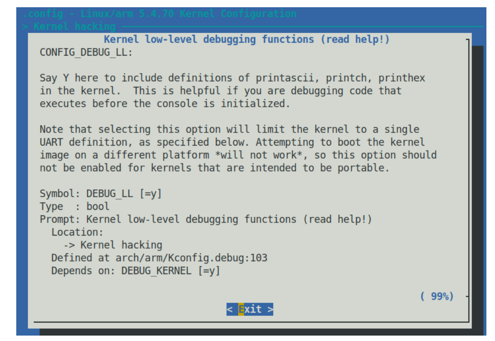

# 7.3

## Linux Kernel Debuging

​	我们常使用C标准库的printf函数来输出日志信息，这是可以理解的。然而，却没有办法在内核中使用这个函数理由是简单的，因为内核并不使用c标准库，无论是静态链接还是动态链接的。

​	在内核开发中，我们更多使用的是printk函数，特别是在开发内核动态加载的module模块的时候（module自身是由多个源文件组成的，最终产生的.ko文件）。可以去这里查看实现

```
 kernel/printk/printk.c:printk()
```

### printk的日志属性

​	printk就具有一定的日志属性。一个启用了日志属性的printk是这样的：

```
printk(KERN_INFO "Hello, kernel!");
```

​	KERN_INFO指示了我们的日志等级，他最终会投射到我们的日志输出，我们一般会使用dmesg和journctl等进行查看。

​	这里提供八个等级：

```
#define KERN_SOH	"\001"		/* ASCII Start Of Header */
#define KERN_SOH_ASCII	'\001'

#define KERN_EMERG	KERN_SOH "0"	/* system is unusable */
#define KERN_ALERT	KERN_SOH "1"	/* action must be taken immediately */
#define KERN_CRIT	KERN_SOH "2"	/* critical conditions */
#define KERN_ERR	KERN_SOH "3"	/* error conditions */
#define KERN_WARNING	KERN_SOH "4"	/* warning conditions */
#define KERN_NOTICE	KERN_SOH "5"	/* normal but significant condition */
#define KERN_INFO	KERN_SOH "6"	/* informational */
#define KERN_DEBUG	KERN_SOH "7"	/* debug-level messages */

#define KERN_DEFAULT	""		/* the default kernel loglevel */
```

#### 简化的函数

​	有的时候写等级太麻烦，我们也有简化的API：`pr_<foo>`系列函数，

```
pr_info("Hello, kernel debug world\n");
```

​	这个是一个使用的例子。

```
• pr_emerg(): printk() at log level KERN_EMERG
• pr_alert(: printk() at log level KERN_ALERT
• pr_crit: printk() at log level KERN_CRIT
• pr_err(): printk() at log level KERN_ERR
• pr_warn(): printk() at log level KERN_WARNING
• pr_notice(): printk() at log level KERN_NOTICE
• pr_info(): printk() at log level KERN_INFO
• pr_debug() or pr_devel(): printk() at log level KERN_DEBUG
```


```
// 这个宏定义放在最上层，让编译的时候采取我们的格式定义
#define pr_fmt(fmt) "%s:%s():%d: " fmt, KBUILD_MODNAME, __func__, __LINE__
#include <linux/module.h>
#include <linux/init.h>
#include <linux/kernel.h>
MODULE_AUTHOR("Charliechen");
MODULE_LICENSE("GPL");
#define PRT_STD_MSG "Hello, debug_world @ log-level" 
#define LEVEL_STR(LEVEL) #LEVEL

static int __init Charliechen_init(void){
    pr_emerg(PRT_STD_MSG "KERN_EMERG" "[%d]\n", LOGLEVEL_EMERG);
    pr_alert(PRT_STD_MSG "KERN_ALERT" "[%d]\n", LOGLEVEL_ALERT);
    pr_crit(PRT_STD_MSG "KERN_CRIT" "[%d]\n", LOGLEVEL_CRIT);
    pr_err(PRT_STD_MSG "KERN_ERR" "[%d]\n", LOGLEVEL_ERR);
    pr_warn(PRT_STD_MSG "KERN_WARNING" "[%d]\n", LOGLEVEL_WARNING);
    pr_notice(PRT_STD_MSG "KERN_NOTICE" "[%d]\n", LOGLEVEL_NOTICE);
    pr_info(PRT_STD_MSG "KERN_INFO" "[%d]\n", LOGLEVEL_INFO);
    pr_debug(PRT_STD_MSG "KERN_DEBUG" "[%d]\n", LOGLEVEL_DEBUG);
    pr_devel("Welp, this is special cause it debug via pr_devel [%d]\n", LOGLEVEL_DEBUG);
    return 0;
}

static void __exit Charliechen_exit(void){
    pr_info("Goodbye! debug world!\n");
}

module_init(Charliechen_init);
module_exit(Charliechen_exit);
```

​	对比一下上图，你会发现我们的printk函数采纳了我们自定义的format。

​	值得注意的是：任何在紧急以上的日志等级都会立即显示在所有的控制台上。

### 输出一般向何去？

| printk函数组向。。。 | 何时               | 其他                                                         |
| -------------------- | ------------------ | ------------------------------------------------------------ |
| 向RAM缓冲区          | 总是               | 在`static char __log_buf[__LOG_BUF_LEN]`定义，其中他是一个环状的缓冲区，可以在编译内核的时候进行一定的配置。一般的是128KB |
| 现代日志文件         | 对于大多数系统默认 | systemd框架，journalctl的前端，而且持久化记忆                |
| 传统日志文件         | 对于大多数系统默认 | syslogd, klogd，dmesg前端，而且持久化记忆                    |
| 控制台设备           | 在日志等级小于4下  | 在/proc/sys/kernel/printk下控制                              |

​	对于最后一个，我们可以按照自己的意愿修改/proc/sys/kernel/printk里的内容：

```
$ cat /proc/sys/kernel/printk
1	4	1	4
```

​	第一个数字是 1，代表日志级别，低于该级别的信息将显示在控制台中（以及记录到内核日志缓冲区和日志文件中）。在这种情况下，我们可以得出结论，所有日志级别小于 1  的 printks 都会出现在控制台上。当然，在 root 权限下，你可以随意更改

### 一些tips

以下是一些常用的 printk 格式规范，在编写可移植代码时应牢记 
在编写可移植代码时要注意的几个常见打印格式指定符：

- 对于 size_t 和 ssize_t 类型定义（分别表示有符号和无符号的 整数），分别使用 %zu 和 %zd 格式指定符。
- 打印内核空间中的地址（指针）时：非常重要：为了安全起见，使用 %pK（它将只输出散列值，有助于防止信息泄漏这一严重的安全隐患 防止信息泄露，这是一个严重的安全问题）。对实际指针使用 %px，以查看实际地址（不要在生产环境中这样做！）。使用 %pa 打印物理地址（必须通过引用传递）。
- 要以十六进制字符串的形式打印原始缓冲区，请使用 %*ph（其中 * 由字符数代替；对于少于 65 个字符的缓冲区，请使用该例程；对于字符数较多的缓冲区，请使用 print_hex_dump_bytes() 例程）。还可以使用其他方法（参见后面的内核文档链接）。
- 要打印 IPv4 地址，请使用 %pI4；要打印 IPv6 地址，请使用 %pI6（还有一些变体）。
  关于 printk 格式说明的详尽列表，以及在什么情况下应使用什么格式（并附有示例！），是内核官方文档的一部分：https://www.kernel.org/doc/Documentation/printk-formats.txt。我建议您浏览一下！

```
=========================================
How to get printk format specifiers right
=========================================

:Author: Randy Dunlap <rdunlap@infradead.org>
:Author: Andrew Murray <amurray@mpc-data.co.uk>

Integer types
=============

::

	If variable is of Type,		use printk format specifier:
	------------------------------------------------------------
		int			%d or %x
		unsigned int		%u or %x
		long			%ld or %lx
		unsigned long		%lu or %lx
		long long		%lld or %llx
		unsigned long long	%llu or %llx
		size_t			%zu or %zx
		ssize_t			%zd or %zx
		s32			%d or %x
		u32			%u or %x
		s64			%lld or %llx
		u64			%llu or %llx

If <type> is dependent on a config option for its size (e.g., ``sector_t``,
``blkcnt_t``) or is architecture-dependent for its size (e.g., ``tcflag_t``),
use a format specifier of its largest possible type and explicitly cast to it.

Example::

	printk("test: sector number/total blocks: %llu/%llu\n",
		(unsigned long long)sector, (unsigned long long)blockcount);

Reminder: ``sizeof()`` result is of type ``size_t``.

The kernel's printf does not support ``%n``. For obvious reasons, floating
point formats (``%e, %f, %g, %a``) are also not recognized. Use of any
unsupported specifier or length qualifier results in a WARN and early
return from vsnprintf.

Raw pointer value SHOULD be printed with %p. The kernel supports
the following extended format specifiers for pointer types:

Pointer Types
=============

Pointers printed without a specifier extension (i.e unadorned %p) are
hashed to give a unique identifier without leaking kernel addresses to user
space. On 64 bit machines the first 32 bits are zeroed. If you _really_
want the address see %px below.

::

	%p	abcdef12 or 00000000abcdef12

Symbols/Function Pointers
=========================

::

	%pF	versatile_init+0x0/0x110
	%pf	versatile_init
	%pS	versatile_init+0x0/0x110
	%pSR	versatile_init+0x9/0x110
		(with __builtin_extract_return_addr() translation)
	%ps	versatile_init
	%pB	prev_fn_of_versatile_init+0x88/0x88

The ``F`` and ``f`` specifiers are for printing function pointers,
for example, f->func, &gettimeofday. They have the same result as
``S`` and ``s`` specifiers. But they do an extra conversion on
ia64, ppc64 and parisc64 architectures where the function pointers
are actually function descriptors.

The ``S`` and ``s`` specifiers can be used for printing symbols
from direct addresses, for example, __builtin_return_address(0),
(void *)regs->ip. They result in the symbol name with (``S``) or
without (``s``) offsets. If KALLSYMS are disabled then the symbol
address is printed instead.

The ``B`` specifier results in the symbol name with offsets and should be
used when printing stack backtraces. The specifier takes into
consideration the effect of compiler optimisations which may occur
when tail-call``s are used and marked with the noreturn GCC attribute.

Examples::

	printk("Going to call: %pF\n", gettimeofday);
	printk("Going to call: %pF\n", p->func);
	printk("%s: called from %pS\n", __func__, (void *)_RET_IP_);
	printk("%s: called from %pS\n", __func__,
				(void *)__builtin_return_address(0));
	printk("Faulted at %pS\n", (void *)regs->ip);
	printk(" %s%pB\n", (reliable ? "" : "? "), (void *)*stack);

Kernel Pointers
===============

::

	%pK	01234567 or 0123456789abcdef

For printing kernel pointers which should be hidden from unprivileged
users. The behaviour of ``%pK`` depends on the ``kptr_restrict sysctl`` - see
Documentation/sysctl/kernel.txt for more details.

Unmodified Addresses
====================

::

	%px	01234567 or 0123456789abcdef

For printing pointers when you _really_ want to print the address. Please
consider whether or not you are leaking sensitive information about the
Kernel layout in memory before printing pointers with %px. %px is
functionally equivalent to %lx. %px is preferred to %lx because it is more
uniquely grep'able. If, in the future, we need to modify the way the Kernel
handles printing pointers it will be nice to be able to find the call
sites.

Struct Resources
================

::

	%pr	[mem 0x60000000-0x6fffffff flags 0x2200] or
		[mem 0x0000000060000000-0x000000006fffffff flags 0x2200]
	%pR	[mem 0x60000000-0x6fffffff pref] or
		[mem 0x0000000060000000-0x000000006fffffff pref]

For printing struct resources. The ``R`` and ``r`` specifiers result in a
printed resource with (``R``) or without (``r``) a decoded flags member.
Passed by reference.

Physical addresses types ``phys_addr_t``
========================================

::

	%pa[p]	0x01234567 or 0x0123456789abcdef

For printing a ``phys_addr_t`` type (and its derivatives, such as
``resource_size_t``) which can vary based on build options, regardless of
the width of the CPU data path. Passed by reference.

DMA addresses types ``dma_addr_t``
==================================

::

	%pad	0x01234567 or 0x0123456789abcdef

For printing a ``dma_addr_t`` type which can vary based on build options,
regardless of the width of the CPU data path. Passed by reference.

Raw buffer as an escaped string
===============================

::

	%*pE[achnops]

For printing raw buffer as an escaped string. For the following buffer::

		1b 62 20 5c 43 07 22 90 0d 5d

few examples show how the conversion would be done (the result string
without surrounding quotes)::

		%*pE		"\eb \C\a"\220\r]"
		%*pEhp		"\x1bb \C\x07"\x90\x0d]"
		%*pEa		"\e\142\040\\\103\a\042\220\r\135"

The conversion rules are applied according to an optional combination
of flags (see :c:func:`string_escape_mem` kernel documentation for the
details):

	- ``a`` - ESCAPE_ANY
	- ``c`` - ESCAPE_SPECIAL
	- ``h`` - ESCAPE_HEX
	- ``n`` - ESCAPE_NULL
	- ``o`` - ESCAPE_OCTAL
	- ``p`` - ESCAPE_NP
	- ``s`` - ESCAPE_SPACE

By default ESCAPE_ANY_NP is used.

ESCAPE_ANY_NP is the sane choice for many cases, in particularly for
printing SSIDs.

If field width is omitted the 1 byte only will be escaped.

Raw buffer as a hex string
==========================

::

	%*ph	00 01 02  ...  3f
	%*phC	00:01:02: ... :3f
	%*phD	00-01-02- ... -3f
	%*phN	000102 ... 3f

For printing a small buffers (up to 64 bytes long) as a hex string with
certain separator. For the larger buffers consider to use
:c:func:`print_hex_dump`.

MAC/FDDI addresses
==================

::

	%pM	00:01:02:03:04:05
	%pMR	05:04:03:02:01:00
	%pMF	00-01-02-03-04-05
	%pm	000102030405
	%pmR	050403020100

For printing 6-byte MAC/FDDI addresses in hex notation. The ``M`` and ``m``
specifiers result in a printed address with (``M``) or without (``m``) byte
separators. The default byte separator is the colon (``:``).

Where FDDI addresses are concerned the ``F`` specifier can be used after
the ``M`` specifier to use dash (``-``) separators instead of the default
separator.

For Bluetooth addresses the ``R`` specifier shall be used after the ``M``
specifier to use reversed byte order suitable for visual interpretation
of Bluetooth addresses which are in the little endian order.

Passed by reference.

IPv4 addresses
==============

::

	%pI4	1.2.3.4
	%pi4	001.002.003.004
	%p[Ii]4[hnbl]

For printing IPv4 dot-separated decimal addresses. The ``I4`` and ``i4``
specifiers result in a printed address with (``i4``) or without (``I4``)
leading zeros.

The additional ``h``, ``n``, ``b``, and ``l`` specifiers are used to specify
host, network, big or little endian order addresses respectively. Where
no specifier is provided the default network/big endian order is used.

Passed by reference.

IPv6 addresses
==============

::

	%pI6	0001:0002:0003:0004:0005:0006:0007:0008
	%pi6	00010002000300040005000600070008
	%pI6c	1:2:3:4:5:6:7:8

For printing IPv6 network-order 16-bit hex addresses. The ``I6`` and ``i6``
specifiers result in a printed address with (``I6``) or without (``i6``)
colon-separators. Leading zeros are always used.

The additional ``c`` specifier can be used with the ``I`` specifier to
print a compressed IPv6 address as described by
http://tools.ietf.org/html/rfc5952

Passed by reference.

IPv4/IPv6 addresses (generic, with port, flowinfo, scope)
=========================================================

::

	%pIS	1.2.3.4		or 0001:0002:0003:0004:0005:0006:0007:0008
	%piS	001.002.003.004	or 00010002000300040005000600070008
	%pISc	1.2.3.4		or 1:2:3:4:5:6:7:8
	%pISpc	1.2.3.4:12345	or [1:2:3:4:5:6:7:8]:12345
	%p[Ii]S[pfschnbl]

For printing an IP address without the need to distinguish whether it``s
of type AF_INET or AF_INET6, a pointer to a valid ``struct sockaddr``,
specified through ``IS`` or ``iS``, can be passed to this format specifier.

The additional ``p``, ``f``, and ``s`` specifiers are used to specify port
(IPv4, IPv6), flowinfo (IPv6) and scope (IPv6). Ports have a ``:`` prefix,
flowinfo a ``/`` and scope a ``%``, each followed by the actual value.

In case of an IPv6 address the compressed IPv6 address as described by
http://tools.ietf.org/html/rfc5952 is being used if the additional
specifier ``c`` is given. The IPv6 address is surrounded by ``[``, ``]`` in
case of additional specifiers ``p``, ``f`` or ``s`` as suggested by
https://tools.ietf.org/html/draft-ietf-6man-text-addr-representation-07

In case of IPv4 addresses, the additional ``h``, ``n``, ``b``, and ``l``
specifiers can be used as well and are ignored in case of an IPv6
address.

Passed by reference.

Further examples::

	%pISfc		1.2.3.4		or [1:2:3:4:5:6:7:8]/123456789
	%pISsc		1.2.3.4		or [1:2:3:4:5:6:7:8]%1234567890
	%pISpfc		1.2.3.4:12345	or [1:2:3:4:5:6:7:8]:12345/123456789

UUID/GUID addresses
===================

::

	%pUb	00010203-0405-0607-0809-0a0b0c0d0e0f
	%pUB	00010203-0405-0607-0809-0A0B0C0D0E0F
	%pUl	03020100-0504-0706-0809-0a0b0c0e0e0f
	%pUL	03020100-0504-0706-0809-0A0B0C0E0E0F

For printing 16-byte UUID/GUIDs addresses. The additional 'l', 'L',
'b' and 'B' specifiers are used to specify a little endian order in
lower ('l') or upper case ('L') hex characters - and big endian order
in lower ('b') or upper case ('B') hex characters.

Where no additional specifiers are used the default big endian
order with lower case hex characters will be printed.

Passed by reference.

dentry names
============

::

	%pd{,2,3,4}
	%pD{,2,3,4}

For printing dentry name; if we race with :c:func:`d_move`, the name might be
a mix of old and new ones, but it won't oops.  ``%pd`` dentry is a safer
equivalent of ``%s`` ``dentry->d_name.name`` we used to use, ``%pd<n>`` prints
``n`` last components.  ``%pD`` does the same thing for struct file.

Passed by reference.

block_device names
==================

::

	%pg	sda, sda1 or loop0p1

For printing name of block_device pointers.

struct va_format
================

::

	%pV

For printing struct va_format structures. These contain a format string
and va_list as follows::

	struct va_format {
		const char *fmt;
		va_list *va;
	};

Implements a "recursive vsnprintf".

Do not use this feature without some mechanism to verify the
correctness of the format string and va_list arguments.

Passed by reference.

kobjects
========

::

	%pO

	Base specifier for kobject based structs. Must be followed with
	character for specific type of kobject as listed below:

	Device tree nodes:

	%pOF[fnpPcCF]

	For printing device tree nodes. The optional arguments are:
	    f device node full_name
	    n device node name
	    p device node phandle
	    P device node path spec (name + @unit)
	    F device node flags
	    c major compatible string
	    C full compatible string
	Without any arguments prints full_name (same as %pOFf)
	The separator when using multiple arguments is ':'

	Examples:

	%pOF	/foo/bar@0			- Node full name
	%pOFf	/foo/bar@0			- Same as above
	%pOFfp	/foo/bar@0:10			- Node full name + phandle
	%pOFfcF	/foo/bar@0:foo,device:--P-	- Node full name +
	                                          major compatible string +
						  node flags
							D - dynamic
							d - detached
							P - Populated
							B - Populated bus

	Passed by reference.


struct clk
==========

::

	%pC	pll1
	%pCn	pll1
	%pCr	1560000000

For printing struct clk structures. ``%pC`` and ``%pCn`` print the name
(Common Clock Framework) or address (legacy clock framework) of the
structure; ``%pCr`` prints the current clock rate.

Passed by reference.

bitmap and its derivatives such as cpumask and nodemask
=======================================================

::

	%*pb	0779
	%*pbl	0,3-6,8-10

For printing bitmap and its derivatives such as cpumask and nodemask,
``%*pb`` output the bitmap with field width as the number of bits and ``%*pbl``
output the bitmap as range list with field width as the number of bits.

Passed by reference.

Flags bitfields such as page flags, gfp_flags
=============================================

::

	%pGp	referenced|uptodate|lru|active|private
	%pGg	GFP_USER|GFP_DMA32|GFP_NOWARN
	%pGv	read|exec|mayread|maywrite|mayexec|denywrite

For printing flags bitfields as a collection of symbolic constants that
would construct the value. The type of flags is given by the third
character. Currently supported are [p]age flags, [v]ma_flags (both
expect ``unsigned long *``) and [g]fp_flags (expects ``gfp_t *``). The flag
names and print order depends on the particular	type.

Note that this format should not be used directly in :c:func:`TP_printk()` part
of a tracepoint. Instead, use the ``show_*_flags()`` functions from
<trace/events/mmflags.h>.

Passed by reference.

Network device features
=======================

::

	%pNF	0x000000000000c000

For printing netdev_features_t.

Passed by reference.

If you add other ``%p`` extensions, please extend lib/test_printf.c with
one or more test cases, if at all feasible.


Thank you for your cooperation and attention.
```

### 向内核日志写入调试信息

​	再看看这两行代码：

```
    pr_debug(PRT_STD_MSG "KERN_DEBUG" "[%d]\n", LOGLEVEL_DEBUG);
    pr_devel("Welp, this is special cause it debug via pr_devel [%d]\n", LOGLEVEL_DEBUG);
```

​	你可以留意到：嘿！为什么我的debug没有输出信息呢？答案是我们没有预定义一个debug符号，凡是没有预定义之，日志系统会选择保持它高雅的沉默（大嘘）

​	对于模块的开发者，需要避免使用pr_devel，对于生产环境而言他总不可见！

​	我们下面就来解决解决这两行的输出问题，为此，我们只需要预定义好符号

```
obj-m:= charlie.o
pwd:= $(shell pwd)
ker-ver:= $(shell uname -r)
KDIR:= /lib/modules/$(ker-ver)/build
# 这里增加的是调试符号的信息
ccflags-y	+= -DDEBUG -g -ggdb -gdwarf-4 -Og \
				-Wall -fno-omit-frame-pointer -fvar-tracking-assignments

all:
	make -C $(KDIR) M=$(pwd) modules

clean:
	rm -rf *.o .* .cmd *.ko *.mod.c .tmp_versions *.order *.symvers *.mod
```

```
[Charliechen@ArchLinux module]$ sudo insmod charlie.ko && lsmod | grep charlie 
[sudo] password for Charliechen: 
charlie                16384  0
[Charliechen@ArchLinux module]$ sudo dmesg | tail -8
[ 4697.043680] charlie:Charliechen_init():12: Hello, debug_world @ log-levelKERN_ALERT[1]
[ 4697.043682] charlie:Charliechen_init():13: Hello, debug_world @ log-levelKERN_CRIT[2]
[ 4697.043684] charlie:Charliechen_init():14: Hello, debug_world @ log-levelKERN_ERR[3]
[ 4697.043685] charlie:Charliechen_init():15: Hello, debug_world @ log-levelKERN_WARNING[4]
[ 4697.043687] charlie:Charliechen_init():16: Hello, debug_world @ log-levelKERN_NOTICE[5]
[ 4697.043688] charlie:Charliechen_init():17: Hello, debug_world @ log-levelKERN_INFO[6]
[ 4697.043690] charlie:Charliechen_init():18: Hello, debug_world @ log-levelKERN_DEBUG[7]
[ 4697.043692] charlie:Charliechen_init():19: Welp, this is special cause it debug via pr_devel [7]
[Charliechen@ArchLinux module]$ 
```

​	这一次看到了！

> **为调试或生产构建内核模块**
> 内核模块的编译方式在很大程度上受 DEBUG_CFLAGS 变量值的影响。该变量主要在内核的顶级 Makefile 中设置。在这里，它的值取决于内核配置 CONFIG_DEBUG_INFO。当它处于开启状态时（意味着调试内核），各种调试标志就会进入 DEBUG_CFLAGS，因此你的内核模块就会使用它们来编译。实际上，我在这里想强调的是，内核模块的 Makefile 中是否包含 -DDEBUG 字符串（就像我们在这里所做的）并不会对内核模块的编译方式产生太大影响。实际上，当你通过调试内核启动并编译内核模块时，它们会自动打开符号信息和各种内核调试选项。举个例子，当我在调试内核上创建这个内核模块时，printk_loglevels.ko 文件的大小是 221 KB，而在生产内核上创建时，文件大小降到了 8 KB 以下！(缺乏调试符号和信息、KASAN 仪器等因素造成了这一重大差异）。
>
> > 快速提示：使用 make V=1 来实际查看传递给编译器的所有选项会很有启发！
>
> 此外，非常有用的一点是，你可以利用 readelf(1) 来确定嵌入二进制可执行和链接格式 (ELF) 文件中的 DWARF 格式调试信息。这对于准确找出二进制可执行文件或内核模块是用哪个编译器标志构建的特别有用。你可以这样做
> `readelf --debug-dump <module_dbg.ko> | grep producer`
> 请注意，这种方法通常只在启用调试信息时有效；此外，在使用不同的目标架构（例如 ARM）时、 您需要运行该工具链的版本：${CROSS_COMPILE}readelf。
> 请参阅 "更多阅读 "部分，查看有关 GNU 调试器 (GDB) 的一系列文章的链接，这些文章详细描述了这一点（以及更多内容）。系列文章的第二部分）。

​	在处理项目或产品时，您可能需要生成一些调试 printk。只要定义了 DEBUG 符号，pr_debug() 宏就能完成工作。但请想一想：要查询调试打印，你需要反复运行 dmesg。下面是一些在这种情况下可以做的事情的提示：

1. 使用 sudo dmesg -C 清除内核日志缓冲区（在 RAM 中）。或者，sudo dmesg -c 会先打印内容，然后清除环形缓冲区。这样，过期信息就不会堵塞系统，运行 dmesg 时也只会看到最新的信息。

2. 使用 journalctl -f 对内核日志进行*监视（类似于在文件上使用 tail -f 的方式）。试试看！

3. **将控制台日志级别设置为 8，这样就能确保所有打印任务（日志级别 0 至 7）都显示在控制台设备上：

```
sudo sh -c "echo\"8 4 1 7\" > /proc/sys/kernel/printk "
```

​	调试内核时，我经常在启动脚本中这样做。例如，在我的 Raspberry Pi 上，我的启动脚本包含以下一行：[ $(id -u) -eq 0 ] && echo "8 4 1 7" > /proc/sys/kernel/printk 这样，当以 root 身份运行时，这一行就会生效，所有 printk 实例都会直接显示在 minicom(1)（或其他）控制台上，就像 printf 输出一样。

### **限制打印速度**

​	让我们假设一个合理的场景：你正在为某个芯片组或外围设备编写设备驱动程序... 通常情况下，特别是在开发过程中，有时为了在生产中调试，您当然会在驱动程序代码中穿插现在已经很熟悉的 dev_dbg()（或类似）宏。这种方法效果很好，直到包含调试打印的代码路径（非常）频繁地运行。会发生什么情况呢？很简单：

- 内核环形（循环）缓冲区并不大（通常在 64 KB 到 256KB 之间，可在内核构建时配置）。一旦满了，它就会缠绕在一起。这可能会导致宝贵的调试打印丢失。

- 在大量代码路径（例如中断处理程序例程和定时器内）中进行调试（或其他）打印，会大大降低运行速度（尤其是在通过串行线路进行打印的嵌入式系统上），甚至会导致*livelock*情况（一种由于处理器忙于日志记录工作（控制台输出、帧缓冲区滚动、日志文件追加等）而导致系统反应迟钝的情况）。

- 同样的调试（或其他）打印信息重复出现无数次（例如，循环中的警告或调试信息）对任何人都没有帮助。

- 此外，要知道不仅仅是 printk（和类似的）API 会导致日志记录问题和故障；在大容量代码路径上使用 kprobes 或任何类型的事件跟踪也会导致同样的问题（我们将在下一章介绍 kprobes，在后一章介绍跟踪）：

```
/dev/kmsg buffer overrun, some messages lost.
```

### 动态调试

​	有的时候，我们正在生产环境，是不允许重新卸下服务部署调试模式的，所以现在我们尝试进行动态的调试。

#### 方法一：内插调试变量

先说说module_param：主要区别就是用户可否在系统启动或模块装载时为参数指定相应值，在驱动程序里，参数的用法如同全局变量。

如果我们不使用module_param：如只定一个全局变量:

```
#define MY_MAJOR 0x09
static int global_val_test = MY_MAJOR;
```

那么编译模块后,insmod加载模块时不能传参数进去,如:

```
# insmod first_hello.ko global_val_test=5
insmod: ERROR: could not insert module first_hello.ko: Invalid parameters
```

同时,insmod模块后,对应module目录下的对应模块下不会生成parameter子目录,更不会生成参数文件.

使用module_param后,参考如下:

```
#define MY_MAJOR 0x09
static int global_val_test = MY_MAJOR;
module_param(global_val_test, int, 0644);
```

再编译模块后,再insmod加载模块时就可以传参数进去了,如:

```
[root@bogon hello_world]# insmod first_hello.ko global_val_test=5
[root@bogon hello_world]# tail /var/log/messages
May 26 14:20:08 localhost kernel: [63460.994397] global_val_test = 5
May 26 14:20:08 localhost kernel: [63460.994409] hello world enter
May 26 14:20:08 localhost kernel: global_val_test = 5
May 26 14:20:08 localhost kernel: hello world enter
```

同时,在模块目录下会生成parameter目录及参数文件,如下:

[root@bogon hello_world]# cat /sys/module/first_hello/
coresize     holders/     initsize     initstate    notes/       parameters/  refcnt       rhelversion  sections/    srcversion   taint        uevent       version
[root@bogon hello_world]# ls -alt /sys/module/first_hello/parameters/
total 0
-rw-r--r-- 1 root root 16384 May 26 14:54 global_val_test

2. module_param定义:
   函数原型:

```
/**

module_param - typesafe helper for a module/cmdline parameter

@name: the variable to alter, and exposed parameter name.

@type: the type of the parameter

@perm: visibility in sysfs.
*

@name becomes the module parameter, or (prefixed by KBUILD_MODNAME and a

".") the kernel commandline parameter.  Note that - is changed to _, so

the user can use "foo-bar=1" even for variable "foo_bar".
*

@perm is 0 if the the variable is not to appear in sysfs, or 0444

for world-readable, 0644 for root-writable, etc.  Note that if it

is writable, you may need to use kernel_param_lock() around

accesses (esp. charp, which can be kfreed when it changes).
*

The @type is simply pasted to refer to a param_ops_##type and a

param_check_##type: for convenience many standard types are provided but

you can create your own by defining those variables.
*

Standard types are:

byte, short, ushort, int, uint, long, ulong

charp: a character pointer

bool: a bool, values 0/1, y/n, Y/N.

invbool: the above, only sense-reversed (N = true).
*/
#define module_param(name, type, perm)				\
module_param_named(name, name, type, perm)
/**

module_param_named - typesafe helper for a renamed module/cmdline parameter

@name: a valid C identifier which is the parameter name.

@value: the actual lvalue to alter.

@type: the type of the parameter

@perm: visibility in sysfs.
*

Usually it's a good idea to have variable names and user-exposed names the

same, but that's harder if the variable must be non-static or is inside a

structure.  This allows exposure under a different name.
*/
#define module_param_named(name, value, type, perm)			   \
param_check_##type(name, &(value));				   \
module_param_cb(name, &param_ops_##type, &value, perm);		   \
__MODULE_PARM_TYPE(name, #type)
```

- name既是用户看到的参数名，又是模块内接受参数的变量； 
- type指定参数类型.

- perm指定了在sysfs中相应文件的访问权限。访问权限与linux文件爱你访问权限相同的方式管理，如0644，或使用stat.h中的宏如S_IRUGO表示。

- 0表示完全关闭在sysfs中相对应的项。


​	这种一般方法确实可行，但缺点也很明显，尤其是与内核的动态调试工具相比：

- 性能--你将需要某种条件语句（if、开关等）来检查是否每次都应发出调试打印。如果使用多级冗余，则需要进行更多检查。

- 使用内核的动态调试框架（将在下文中介绍），你将获得几个优势：

​	调试信息的格式化和有用信息的前缀是功能集的一部分，学习曲线很平缓。

​	性能保持较高水平，在调试关闭（通常是生产中的默认设置）时几乎没有开销。这是通过内核采用的复杂动态代码修补技术实现的（ftrace 也是如此）。

​	它始终是主线内核的一部分（从很早以前的 2.6.30 内核开始），而不需要自制的解决方案，这些解决方案可能得到维护，也可能无法使用或运行。

​	因此，在本节的剩余部分，我们将重点学习如何使用和利用内核强大的**动态调试**框架，它从 2.6.30 内核开始就可用了。请继续阅读！

​	启用内核配置选项 CONFIG_DYNAMIC_DEBUG（动态调试）后，**可以**动态打开或关闭编译在内核映像和内核模块中的调试打印。具体做法是让内核始终编译所有 pr_debug() 和 dev_dbg() 调用。现在，真正强大的是，你不仅可以启用或禁用这些调试打印，还可以在不同层次的范围内启用或禁用：在给定源文件、内核模块、函数甚至行号的范围内。如果担心这个问题（也许是在严格受限的嵌入式 Linux 上），你可以设置内核配置 CONFIG_DYNAMIC_DEBUG_CORE。这将启用对动态 printks 的核心支持，但它只对编译时定义了 DYNAMIC_DEBUG_MODULE 符号的内核模块有效。因此，我们的模块 Makefile 总是定义了它。您可以将其注释掉.... 这是模块 Makefile 中的相关行：

```
ccflags-y += -DDYNAMIC_DEBUG_MODULE
```

​	这样，所有动态调试的框架下的API都可以发挥作用了！

### **指定打印调试信息的内容和方式**

​	与许多设施一样，对内核动态调试框架的控制--决定启用哪些调试信息以及在信息前添加哪些无关信息--是通过**控制文件**决定的。控制文件在哪里？这要看情况。如果在内核配置中启用了 debugfs 伪文件系统（通常是这样，CONFIG_DEBUG_FS=y），并且内核配置了 CONFIG_DEBUG_FS_ALLOW_ALL=y 和 CONFIG_DEBUG_FS_DISALLOW_MOUNT=n（通常是调试内核的情况），那么控制文件就在这里：

```
/sys/kernel/debug/dynamic_debug/control
```

但在许多生产环境中，出于安全考虑，debugfs 文件系统是存在的（功能性的），但通过 CONFIG_DEBUG_FS_DISALLOW_MOUNT=y 是不可见的（无法挂载）。

在这种情况下，debugfs API 可以正常工作，但文件系统没有被挂载（实际上，它是隐形的）。另外，也可以通过将内核配置 CONFIG_DEBUG_FS_ALLOW_NONE 设为 "y "来完全禁用 debugfs。在上述任何一种情况下，都应在伪 proc 文件系统（procfs）下使用一个相同但备用的动态调试控制文件：

```
/proc/dynamic_debug/control
```

​	与其他伪文件系统一样，debugfs 或 procfs 下的 *control* 文件也是一个伪文件；它只存在于 RAM 中。它由内核代码填充和操作。读取它的内容可以获得内核中所有调试 printk（和/或 print_hex_dump_*()）调用点的完整列表。因此，它的输出通常很大（在这里，我们使用的是自定义调试内核，因此可以使用 debugfs 位置作为控制文件）。

### **在启动和模块初始化时激活调试打印**

必须认识到，内核初始化（启动）代码路径或内核模块初始化代码中的任何调试打印都不会自动启用*。

要启用它们，请执行以下操作：

- 对于核心内核代码和任何内置内核模块，即在启动过程中激活调试打印，通过内核命令行参数 dyndbg="QUERY "或 module.dyndbg="QUERY"，其中 QUERY 是动态调试语法（如前所述）。例如，dyndng="module myfoo* +pmft "将激活名为 myfoo* 的内核模块内的所有调试打印，显示方式由标志说明符 pmft 设置。

- 要在内核模块初始化时激活调试打印，即调用 modprobe myfoo 时（可能是由 systemd 调用），有几种方法，通过传递模块参数（举例说明）：

通过 /etc/modprobe.d/*.conf（将其放入 /etc/modprobe.d/myfoo.conf 文件）： options myfoo dyndbg=+pmft

通过内核命令行： myfoo.dyndbg="file myfoobar.c +pmf; func goforit +mpt"

通过 modprobe 本身的参数：modprobe myfoo dyndbg===pmft（这里的 = 而不是 + 会覆盖之前的任何设置！）有趣的是：dyndbg 是一个始终可用的内核模块参数，尽管你看不到它（甚至在 /sys/module/<modname>/parameters）。你可以通过grepping动态调试控制文件或/proc/cmdline看到它（顺便提一下，关于向内核模块传递参数和自动加载内核模块的细节，我在早先的*Linux内核编程*一书中已有详述）。

关于动态调试的官方内核文档确实非常完整，请务必查看：https://www.kernel.org/doc/html/latest/admin-guide/dynamic-debug-howto.html#dynamic-debug。

```
Dynamic debug¶
Introduction
Dynamic debug allows you to dynamically enable/disable kernel debug-print code to obtain additional kernel information.

If /proc/dynamic_debug/control exists, your kernel has dynamic debug. You’ll need root access (sudo su) to use this.

Dynamic debug provides:

a Catalog of all prdbgs in your kernel. cat /proc/dynamic_debug/control to see them.

a Simple query/command language to alter prdbgs by selecting on any combination of 0 or 1 of:

source filename

function name

line number (including ranges of line numbers)

module name

format string

class name (as known/declared by each module)

Viewing Dynamic Debug Behaviour
You can view the currently configured behaviour in the prdbg catalog:

:#> head -n7 /proc/dynamic_debug/control
# filename:lineno [module]function flags format
init/main.c:1179 [main]initcall_blacklist =_ "blacklisting initcall %s\012
init/main.c:1218 [main]initcall_blacklisted =_ "initcall %s blacklisted\012"
init/main.c:1424 [main]run_init_process =_ "  with arguments:\012"
init/main.c:1426 [main]run_init_process =_ "    %s\012"
init/main.c:1427 [main]run_init_process =_ "  with environment:\012"
init/main.c:1429 [main]run_init_process =_ "    %s\012"
The 3rd space-delimited column shows the current flags, preceded by a = for easy use with grep/cut. =p shows enabled callsites.

Controlling dynamic debug Behaviour
The behaviour of prdbg sites are controlled by writing query/commands to the control file. Example:

# grease the interface
:#> alias ddcmd='echo $* > /proc/dynamic_debug/control'

:#> ddcmd '-p; module main func run* +p'
:#> grep =p /proc/dynamic_debug/control
init/main.c:1424 [main]run_init_process =p "  with arguments:\012"
init/main.c:1426 [main]run_init_process =p "    %s\012"
init/main.c:1427 [main]run_init_process =p "  with environment:\012"
init/main.c:1429 [main]run_init_process =p "    %s\012"
Error messages go to console/syslog:

:#> ddcmd mode foo +p
dyndbg: unknown keyword "mode"
dyndbg: query parse failed
bash: echo: write error: Invalid argument
If debugfs is also enabled and mounted, dynamic_debug/control is also under the mount-dir, typically /sys/kernel/debug/.

Command Language Reference
At the basic lexical level, a command is a sequence of words separated by spaces or tabs. So these are all equivalent:

:#> ddcmd file svcsock.c line 1603 +p
:#> ddcmd "file svcsock.c line 1603 +p"
:#> ddcmd '  file   svcsock.c     line  1603 +p  '
Command submissions are bounded by a write() system call. Multiple commands can be written together, separated by ; or \n:

:#> ddcmd "func pnpacpi_get_resources +p; func pnp_assign_mem +p"
:#> ddcmd <<"EOC"
func pnpacpi_get_resources +p
func pnp_assign_mem +p
EOC
:#> cat query-batch-file > /proc/dynamic_debug/control
You can also use wildcards in each query term. The match rule supports * (matches zero or more characters) and ? (matches exactly one character). For example, you can match all usb drivers:

:#> ddcmd file "drivers/usb/*" +p     # "" to suppress shell expansion
Syntactically, a command is pairs of keyword values, followed by a flags change or setting:

command ::= match-spec* flags-spec
The match-spec’s select prdbgs from the catalog, upon which to apply the flags-spec, all constraints are ANDed together. An absent keyword is the same as keyword “*”.

A match specification is a keyword, which selects the attribute of the callsite to be compared, and a value to compare against. Possible keywords are::

match-spec ::= 'func' string |
               'file' string |
               'module' string |
               'format' string |
               'class' string |
               'line' line-range

line-range ::= lineno |
               '-'lineno |
               lineno'-' |
               lineno'-'lineno

lineno ::= unsigned-int
Note
line-range cannot contain space, e.g. “1-30” is valid range but “1 - 30” is not.

The meanings of each keyword are:

func
The given string is compared against the function name of each callsite. Example:

func svc_tcp_accept
func *recv*             # in rfcomm, bluetooth, ping, tcp
file
The given string is compared against either the src-root relative pathname, or the basename of the source file of each callsite. Examples:

file svcsock.c
file kernel/freezer.c   # ie column 1 of control file
file drivers/usb/*      # all callsites under it
file inode.c:start_*    # parse :tail as a func (above)
file inode.c:1-100      # parse :tail as a line-range (above)
module
The given string is compared against the module name of each callsite. The module name is the string as seen in lsmod, i.e. without the directory or the .ko suffix and with - changed to _. Examples:

module sunrpc
module nfsd
module drm*     # both drm, drm_kms_helper
format
The given string is searched for in the dynamic debug format string. Note that the string does not need to match the entire format, only some part. Whitespace and other special characters can be escaped using C octal character escape \ooo notation, e.g. the space character is \040. Alternatively, the string can be enclosed in double quote characters (") or single quote characters ('). Examples:

format svcrdma:         // many of the NFS/RDMA server pr_debugs
format readahead        // some pr_debugs in the readahead cache
format nfsd:\040SETATTR // one way to match a format with whitespace
format "nfsd: SETATTR"  // a neater way to match a format with whitespace
format 'nfsd: SETATTR'  // yet another way to match a format with whitespace
class
The given class_name is validated against each module, which may have declared a list of known class_names. If the class_name is found for a module, callsite & class matching and adjustment proceeds. Examples:

class DRM_UT_KMS        # a DRM.debug category
class JUNK              # silent non-match
// class TLD_*          # NOTICE: no wildcard in class names
line
The given line number or range of line numbers is compared against the line number of each pr_debug() callsite. A single line number matches the callsite line number exactly. A range of line numbers matches any callsite between the first and last line number inclusive. An empty first number means the first line in the file, an empty last line number means the last line number in the file. Examples:

line 1603           // exactly line 1603
line 1600-1605      // the six lines from line 1600 to line 1605
line -1605          // the 1605 lines from line 1 to line 1605
line 1600-          // all lines from line 1600 to the end of the file
The flags specification comprises a change operation followed by one or more flag characters. The change operation is one of the characters:

-    remove the given flags
+    add the given flags
=    set the flags to the given flags
The flags are:

p    enables the pr_debug() callsite.
_    enables no flags.

Decorator flags add to the message-prefix, in order:
t    Include thread ID, or <intr>
m    Include module name
f    Include the function name
s    Include the source file name
l    Include line number
For print_hex_dump_debug() and print_hex_dump_bytes(), only the p flag has meaning, other flags are ignored.

Note the regexp ^[-+=][fslmpt_]+$ matches a flags specification. To clear all flags at once, use =_ or -fslmpt.

Debug messages during Boot Process
To activate debug messages for core code and built-in modules during the boot process, even before userspace and debugfs exists, use dyndbg="QUERY" or module.dyndbg="QUERY". QUERY follows the syntax described above, but must not exceed 1023 characters. Your bootloader may impose lower limits.

These dyndbg params are processed just after the ddebug tables are processed, as part of the early_initcall. Thus you can enable debug messages in all code run after this early_initcall via this boot parameter.

On an x86 system for example ACPI enablement is a subsys_initcall and:

dyndbg="file ec.c +p"
will show early Embedded Controller transactions during ACPI setup if your machine (typically a laptop) has an Embedded Controller. PCI (or other devices) initialization also is a hot candidate for using this boot parameter for debugging purposes.

If foo module is not built-in, foo.dyndbg will still be processed at boot time, without effect, but will be reprocessed when module is loaded later. Bare dyndbg= is only processed at boot.

Debug Messages at Module Initialization Time
When modprobe foo is called, modprobe scans /proc/cmdline for foo.params, strips foo., and passes them to the kernel along with params given in modprobe args or /etc/modprobe.d/*.conf files, in the following order:

parameters given via /etc/modprobe.d/*.conf:

options foo dyndbg=+pt
options foo dyndbg # defaults to +p
foo.dyndbg as given in boot args, foo. is stripped and passed:

foo.dyndbg=" func bar +p; func buz +mp"
args to modprobe:

modprobe foo dyndbg==pmf # override previous settings
These dyndbg queries are applied in order, with last having final say. This allows boot args to override or modify those from /etc/modprobe.d (sensible, since 1 is system wide, 2 is kernel or boot specific), and modprobe args to override both.

In the foo.dyndbg="QUERY" form, the query must exclude module foo. foo is extracted from the param-name, and applied to each query in QUERY, and only 1 match-spec of each type is allowed.

The dyndbg option is a “fake” module parameter, which means:

modules do not need to define it explicitly

every module gets it tacitly, whether they use pr_debug or not

it doesn’t appear in /sys/module/$module/parameters/ To see it, grep the control file, or inspect /proc/cmdline.

For CONFIG_DYNAMIC_DEBUG kernels, any settings given at boot-time (or enabled by -DDEBUG flag during compilation) can be disabled later via the debugfs interface if the debug messages are no longer needed:

echo "module module_name -p" > /proc/dynamic_debug/control
Examples
// enable the message at line 1603 of file svcsock.c
:#> ddcmd 'file svcsock.c line 1603 +p'

// enable all the messages in file svcsock.c
:#> ddcmd 'file svcsock.c +p'

// enable all the messages in the NFS server module
:#> ddcmd 'module nfsd +p'

// enable all 12 messages in the function svc_process()
:#> ddcmd 'func svc_process +p'

// disable all 12 messages in the function svc_process()
:#> ddcmd 'func svc_process -p'

// enable messages for NFS calls READ, READLINK, READDIR and READDIR+.
:#> ddcmd 'format "nfsd: READ" +p'

// enable messages in files of which the paths include string "usb"
:#> ddcmd 'file *usb* +p'

// enable all messages
:#> ddcmd '+p'

// add module, function to all enabled messages
:#> ddcmd '+mf'

// boot-args example, with newlines and comments for readability
Kernel command line: ...
  // see what's going on in dyndbg=value processing
  dynamic_debug.verbose=3
  // enable pr_debugs in the btrfs module (can be builtin or loadable)
  btrfs.dyndbg="+p"
  // enable pr_debugs in all files under init/
  // and the function parse_one, #cmt is stripped
  dyndbg="file init/* +p #cmt ; func parse_one +p"
  // enable pr_debugs in 2 functions in a module loaded later
  pc87360.dyndbg="func pc87360_init_device +p; func pc87360_find +p"
Kernel Configuration
Dynamic Debug is enabled via kernel config items:

CONFIG_DYNAMIC_DEBUG=y        # build catalog, enables CORE
CONFIG_DYNAMIC_DEBUG_CORE=y   # enable mechanics only, skip catalog
If you do not want to enable dynamic debug globally (i.e. in some embedded system), you may set CONFIG_DYNAMIC_DEBUG_CORE as basic support of dynamic debug and add ccflags := -DDYNAMIC_DEBUG_MODULE into the Makefile of any modules which you’d like to dynamically debug later.

Kernel prdbg API
The following functions are cataloged and controllable when dynamic debug is enabled:

pr_debug()
dev_dbg()
print_hex_dump_debug()
print_hex_dump_bytes()
Otherwise, they are off by default; ccflags += -DDEBUG or #define DEBUG in a source file will enable them appropriately.

If CONFIG_DYNAMIC_DEBUG is not set, print_hex_dump_debug() is just a shortcut for print_hex_dump(KERN_DEBUG).

For print_hex_dump_debug()/print_hex_dump_bytes(), format string is its prefix_str argument, if it is constant string; or hexdump in case prefix_str is built dynamically.
```

### **控制台启动前的打印--早期的 printk**

printk 的输出当然可以发送到控制台设备上（我们在*了解 printk 输出的去向*部分已经介绍过这一点（见*表 3.1*））。默认情况下，在大多数系统中，所有日志级别为 3 级及以下（<4 级）的 printk 消息都会被自动路由到控制台设备（实际上，所有日志级别为 emerg/alert/crit/err 的内核 printk 都会被路由到控制台设备）。

#### 控制台设备到底是什么？

​	在进一步了解之前，有必要先了解一下控制台设备到底是什么... 传统上，控制台设备是一个纯粹的内核功能，是超级用户在非图形环境中登录的初始终端窗口（/dev/console）。有趣的是，在 Linux 上，我们可以定义多个控制台--**电传类型终端**（**tty**）窗口（如 /dev/console）、文本模式 VGA、帧缓冲器，甚至是通过 USB 提供服务的串行端口（这在开发过程中的嵌入式系统中很常见）。

​	例如，当我们通过 USB 转 RS232 TTL UART（USB 转串口）电缆将 Raspberry Pi 连接到 x86_64 笔记本电脑时（请参阅本章的 "进一步阅读 "部分，了解关于这个非常有用的配件以及如何在 Raspberry Pi 上设置它的博客文章！），然后使用 minicom(1)（或 screen(1)）获取串口控制台，这就是显示为 tty 设备的设备 - 它就是串口：

```
rpi # tty
/dev/ttyS0
```

现在，问题出在哪里？让我们一探究竟！

**早期启动 - 问题和解决方案**

通过 printk，你可以向控制台（和内核日志）发送消息。是的，但请想一想：在启动过程的早期，当内核正在初始化时，控制台设备还没有准备好，没有初始化，因此无法使用。很明显，在启动初期发出的任何 printk，其输出都无法在 * 屏幕 * - 控制台上看到（尽管它可能记录在内核日志缓冲区中，但我们还没有 shell 来查找它

通常情况下（尤其是在嵌入式主板调试过程中），硬件怪异或故障会导致启动挂起、无休止地探测不存在或有故障的设备，甚至崩溃！令人沮丧的是，在没有控制台（printk）输出的情况下，这些问题很难调试（至少可以这么说！），而控制台（printk）输出如果可见，就能检测内核的启动过程，并非常清楚地显示问题发生在哪里（回顾一下内核命令行参数 debug 和 initcall_debug，在这种情况下非常有用--如果需要的话，可以回顾一下*内核启动时参数部分*）。 正如我们所知，必要是发明之母：内核社区为这个问题提出了一个可能的解决方案--所谓的**早期 printk**。有了它，内核 printk 仍然可以发送到控制台设备。怎么做到的？嗯，这是一个相当复杂的问题，而且与特定的设备有关，但广泛而典型的想法是，执行最基本的控制台初始化（该控制台设备称为 early_console），然后在循环中通过串行线路一个字符一个字符地**比特撞击**出要显示的字符串（典型的比特率范围在 9,600 至 115,200 bps 之间）。要使用该设施，需要做三件事：

- 配置和构建内核以支持早期 printk（设置 CONFIG_EARLY_PRINTK=y），仅此一次。

- 使用适当的内核命令行参数 - earlyprintk=`<value>.` 启动目标内核。

- 发出早期 printk 的应用程序接口称为 early_printk()；语法与 printf()相同。

让我们简单了解一下上述各点，首先是为早期 printk 配置内核。在 x86 系统上，你必须使用 CONFIG_EARLY_PRINTK=y 配置内核（位于 "内核黑客"|"x86 调试"|"早期 printk "菜单下）。也可以选择通过 USB 调试端口启用早期 printk。为内核调试选项进行内核配置（通过常用的 make menuconfig）的 UI（菜单系统）文件是 arch/x86/Kconfig.debug 文件。我们将在此展示其中的一个片段，即早期 printk 菜单选项所在的部分：


​	阅读此处显示的帮助屏幕确实很有帮助！正如上面所说，默认情况下不推荐使用该选项，因为输出格式不佳，可能会干扰正常日志记录。通常只有在调试早期启动问题时才会使用。(如果有兴趣，你可以在我早期的《Linux 内核**编程*》一书中找到关于内核*Kconfig*语法和用法的详细信息）。

​	另一方面，在 ARM（AArch32）系统上，内核配置选项位于 "内核黑客"|"内核底层调试功能"（阅读帮助！）下，配置选项名为 CONFIG_DEBUG_LL。正如内核明确坚持的那样，让我们阅读帮助屏幕：



​	请注意其中的内容！此外，它后面的子菜单允许你配置底层调试端口（默认设置为 EmbeddedICE DCC 通道；如果你有可用的串行 UART，可以将其更改为串行 UART）。接下来，通过传递适当的内核命令行参数启用它--earlyprintk=`<value>`。官方内核文档显示了所有可能的传递方式（此处：https://www.kernel.org/doc/html/latest/admin-guide/kernel-parameters.html）

​	可以附加一个可选的 keep 参数，这意味着即使在 VGA 子系统（或真正的控制台）开始运行后，通过早期 printk 设施发送的 printk 信息也不会被禁用。一旦传递了 earlyprintk= 参数，内核就会开始使用它（基本上是将 printk 重定向到串行、VGA 或任何你通过该参数指定的控制台上）。要进行打印，只需调用 early_printk() API 即可。下面是内核代码库中的一个示例：

```
// kernel/events/core.c

 if (!irq_work_queue(&perf_duration_work)) {

 	early_printk("perf: interrupt took too long (%lld > %lld), lowering ""kernel.perf_event_max_sample_rate 	to %d\n",__report_avg,__report_allowed,sysctl_perf_event_sample_rate);
}
```

​	上面介绍的主要是与操作系统无关的内容。举例来说，（仅）在 x86 系统上，你可以利用 USB 调试端口（如果你的系统有的话），方法如下。传递内核命令行参数 earlyprintk=dbgp。请注意，这需要（x86）主机系统上的 USB 调试端口和 NetChip USB2 调试端口密钥/电缆（连接到客户端或目标系统）。
