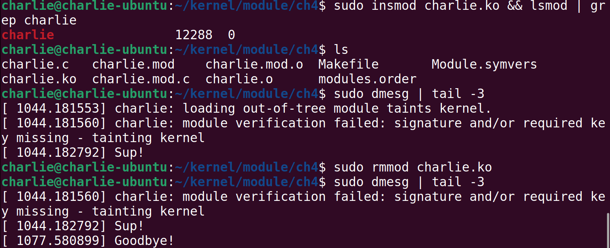

# 7.5 

## Linux kernel programming

### 理解内核架构

#### 用户空间和内核空间

​	现代微处理器支持至少两个特权级别的代码执行。作为一个现实世界的例子，Intel/AMD x86[-64] 系列支持四个特权级别（他们称之为环级别），AArch32（ARM-32）微处理器系列支持多达七种模式（ARM 称之为执行模式；六种是特权模式，一种是非特权模式），AArch64（ARM-64/ARMv8）微处理器系列支持四个异常级别（EL0 到 EL3，其中 EL0 最低，EL3 最高）。这里的关键点是，为了平台的安全性和稳定性，在这些处理器上运行的所有现代操作系统都将使用（至少）两个特权级别（或模式）执行，从而将虚拟地址空间 (VAS) 分成两个明确区分的（虚拟）地址空间

​	用户空间：用于在非特权用户模式下运行的应用程序。所有应用程序（进程和线程）都将在此空间中以该特权执行。因此，现在，您可能正在使用浏览器、编辑器、PDF 阅读器、终端、电子邮件客户端等。它们都是应用程序（最终是进程和线程）；

​	内核空间：用于在特权模式（内核模式）下运行的内核（及其所有组件）。这是操作系统及其内部内容的域（如驱动程序、网络、I/O 等，包括内核模块）。它们都以操作系统特权运行；实际上，它们可以做任何它们喜欢的事情！请注意，此特权级别是硬件功能，与是否以 root 身份运行不同（这是纯软件工件）；在许多情况下， 以内核权限运行可以被视为以 root 身份有效运行。 下图显示了此基本架构：


#### 库和系统调用API

​	用户空间应用程序通常依赖应用程序编程接口 (API) 来执行其工作。库本质上是 API 的集合或存档，允许您使用标准化、编写良好且经过充分测试的接口（并利用常见的好处：不必重新发明轮子、可移植性、标准化等）。

​	Linux 系统有几个库：企业级系统上甚至有数百个库也并不罕见。其中，所有用户模式 Linux 应用程序（可执行文件）都“自动链接”到一个重要的、始终使用的库中：glibc - GNU 标准 C 库，您将会了解到。但是，库仅在用户模式下可用；内核不使用这些用户模式库

​	库 API 的示例包括众所周知的 printf(3)、scanf(3)、strcmp(3)、malloc(3) 和 free(3)。

​	现在，一个关键点：如果用户和内核是独立的地址空间并且具有不同的权限级别，那么用户进程（正如我们刚刚了解到的，仅限于用户空间）

​	如何访问内核？简短的回答是： 通过系统调用。

​	系统调用是一种特殊的 API，因为它是用户空间进程（或线程）访问内核的唯一合法（同步）方式。换句话说，系统调用是进入内核空间的唯一合法入口点。 它们（系统调用）具有从非特权用户模式切换到特权内核模式的内置能力，系统调用的示例包括 fork(2)、execve(2)、open(2)、read(2)、write(2)、socket(2)、 accept(2)、chmod(2) 等等

​	可以自己查看（）

> APIs: [Section 3: library functions - Linux man pages (die.net)](https://linux.die.net/man/3/)
>
> System Call: [Section 2: system calls - Linux man pages (die.net)](https://linux.die.net/man/2/)

​	这里要强调的一点是，用户应用程序（进程和线程）和内核只能通过系统调用进行通信 


#### 内核空间组件

​	当然，本书完全关注内核空间。当今的 Linux 内核是一个相当庞大和复杂的庞然大物。在内部，它由几个主要子系统和几个组件组成。对内核子系统和组件进行广泛列举可得出以下列表：

- 核心内核：此代码处理任何现代操作系统的典型核心工作，包括（用户和内核）进程和线程创建/销毁、CPU 调度、同步原语、信号、计时器、中断处理、命名空间、cgroup、模块支持、加密等。
- 内存管理 (MM)：处理所有与内存相关的工作，包括内核和进程虚拟地址空间 (VAS) 的设置和维护。
- VFS（用于文件系统支持）：虚拟文件系统交换机 (VFS) 是 Linux 内核中实现的实际文件系统的抽象层（例如，ext[2|4]、vfat、ntfs、msdos、iso9660、f2fS、u fS 等等）。
- 块 I/O：实现实际文件 I/O 的代码路径，从文件系统一直到块设备驱动程序以及其间的所有内容都包含在这里。
- 网络协议栈：Linux 以其精确、符合 RFC 要求、高质量地实现模型所有层上的知名（和不太知名）网络协议而闻名，其中 TCP/IP 可能是最著名的。
- 进程间通信 (IPC) 支持：IPC 机制的实现在这里完成；Linux 支持消息队列、共享内存、信号量（旧的 SysV 和新的 POSIX）和其他 IPC 机制。
- 声音支持：实现音频的所有代码都在这里，从固件到驱动程序和编解码器。
- 虚拟化支持：Linux 已在大型和小型云提供商中变得非常受欢迎，一个重要原因是其高质量、低占用空间的虚拟化引擎，基于内核的虚拟机 (KVM)。

所有这些构成了主要的内核子系统；此外，我们还有这些：

- 特定于架构（即特定于 CPU）的代码
- 内核初始化
- 安全框架
- 许多类型的设备驱动程序

​	Linux的架构设计走的是宏内核：


​	您应该知道的另一个事实是，这些地址空间当然是虚拟地址空间，而不是物理地址空间。内核将在页面粒度级别将虚拟页面映射到物理页面框架，利用硬件块（例如内存管理单元 (MMU) 和处理器）以及转换后备缓冲区 (TLB) 缓存来提高效率。它通过使用主内核分页表将内核虚拟页面映射到物理框架 (RAM) 来实现这一点，并且对于每个处于活动状态的用户空间进程，它通过每个进程的单独分页表将进程（用户）的虚拟页面映射到物理页面框架。

#### 步入主角：LKM（Linux Kernel Modules）

​	内核模块是一种提供内核级功能的方法，无需在内核源代码树和静态内核映像中工作。 想象一下您必须向 Linux 内核添加支持功能的场景——可能是新的设备驱动程序，以便使用某个硬件外围芯片、新文件系统或新的 I/O 调度程序。实现此目的的一种方法是显而易见的：使用新代码更新内核源代码树，然后对其进行配置、构建、测试和部署。 虽然这看起来很简单，但工作量很大——我们编写的代码的每一个更改，无论多么小，都需要我们重建内核映像，然后重新启动系统以进行测试。一定有一种更干净、更简单的方法；事实上，确实有——LKM 框架！ 

#### LKM 框架 

​	LKM 框架是一种编译内核代码的方法，通常在内核源代码树之外，通常称为“树外”代码，在有限的意义上使其独立于内核，然后将生成的“模块对象”插入或插入内核内存、内核 VAS，让它运行并执行其工作，然后从内核内存中删除（或拔出）。（请注意，LKM 框架也可用于生成树内内核模块，就像我们在构建内核时所做的那样。这里，我们重点介绍树外模块）。 内核模块的源代码通常由一个或多个 C 源文件、头文件和一个 Makefile 组成，并（当然是通过 make）构建到内核模块中。内核模块本身只是一个二进制对象文件，而不是二进制可执行文件。

​	在 Linux 2.4 及更早版本中，内核模块的文件名带有 .o 后缀；在现代 2.6 Linux 及更高版本中，它改为使用 .ko （内核对象）后缀。构建后，您可以在运行时将此 .ko 文件（内核 模块）插入到实时内核中，从而有效地使其成为内核的一部分。


​	我想你已经留意到了：内核模块是内核代码，是要在内核态运行的。（换而言之没写好是真的会挂的）

​	这样，您（内核（或驱动程序）开发人员）就不必每次都重新配置、重建和重新启动系统。您所要做的就是编辑内核模块的代码、重建它、从内存中删除旧副本（如果存在），然后插入新版本。这可以节省时间并提高生产力

​	内核模块具有优势的另一个原因是它们适合动态产品配置。例如，内核模块可以设计为以不同的价格点提供不同的功能；为嵌入式产品生成最终映像的脚本可以根据客户愿意支付的价格安装一组给定的内核模块。

​	通过允许我们将实时代码插入（然后从）内核内存中删除，我们可以实现内核功能。这种随意插入和拔出内核功能的能力让我们意识到，Linux 内核并不是纯粹的整体式，它也是模块化的。

#### 干！写我们的第一个模块

​	P话不多说，干！

​	在我们确保我们的linux-header下好之后，我们就可以开始行动了：

```
charlie@charlie-ubuntu:~/kernel/module/ch4$ ls
charlie.c  Makefile
```

> charlie.c

```C 
#include <linux/module.h>
#include <linux/init.h>

MODULE_AUTHOR("Charlie");
MODULE_DESCRIPTION("Our first module");
MODULE_LICENSE("GPL");
MODULE_VERSION("0.1");

static int __init Charliechen_init(void)
{
	pr_info("Sup!\n");
	return 0;
}

static void __exit Charliechen_exit(void)
{
	pr_info("Goodbye!\n");
}


module_init(Charliechen_init);
module_exit(Charliechen_exit);
```

​	方便起见，写一个Makefile。

```
obj-m := charlie.o
kver := $(shell uname -r)
kdir := /lib/modules/$(kver)/build/
work_dir := $(shell pwd)

all:
	make -C $(kdir) M=$(work_dir)

clean:
	make -C $(kdir) M=$(work_dir) clean
```

>`make -C` 的作用是改变目录后再执行 `make` 命令。具体来说，`make -C <directory>` 命令会进入指定的 `<directory>` 目录，然后在那个目录中运行 `make`。这对于在不同目录中的不同 Makefile 之间进行编译时非常有用。

```
charlie@charlie-ubuntu:~/kernel/module/ch4$ make
make -C /lib/modules/6.5.0-41-generic/build/ M=/home/charlie/kernel/module/ch4
make[1]: Entering directory '/usr/src/linux-headers-6.5.0-41-generic'
warning: the compiler differs from the one used to build the kernel
  The kernel was built by: x86_64-linux-gnu-gcc-12 (Ubuntu 12.3.0-1ubuntu1~22.04) 12.3.0
  You are using:           gcc-12 (Ubuntu 12.3.0-1ubuntu1~22.04) 12.3.0
  CC [M]  /home/charlie/kernel/module/ch4/charlie.o
  MODPOST /home/charlie/kernel/module/ch4/Module.symvers
  CC [M]  /home/charlie/kernel/module/ch4/charlie.mod.o
  LD [M]  /home/charlie/kernel/module/ch4/charlie.ko
  BTF [M] /home/charlie/kernel/module/ch4/charlie.ko
Skipping BTF generation for /home/charlie/kernel/module/ch4/charlie.ko due to unavailability of vmlinux
make[1]: Leaving directory '/usr/src/linux-headers-6.5.0-41-generic'
```

​	下面我们就可以开始尝试了：

```
insmod: 将模块插入内核
lsmod: 枚举模块
rmmod: 移除内核
```



#### 一步步看：

##### 模块的宏

我们有几个模块宏，形式为 MODULE_FOO();（俗称“模块内容”）。大多数都非常直观：

- MODULE_AUTHOR()：指定内核模块的作者
- MODULE_DESCRIPTION()：简要描述此 LKM 的功能或目的
- MODULE_LICENSE()：指定发布此内核模块的许可证
- MODULE_VERSION()：指定内核模块的（本地）版本字符串

在没有源代码的情况下，如何将此信息传达给最终用户（或客户）？modinfo 实用程序正是这样做的！这些宏及其信息可能看起来微不足道，但它们在项目和产品中很重要。例如，供应商依靠此信息通过对所有已安装的内核模块的 modinfo 输出使用 grep 来建立代码所运行的（开源）许可证。 （这些是基本的模块宏；接下来我们将介绍更多宏。）

##### 入口点和出口点

​	永远不要忘记，内核模块毕竟是使用内核特权运行的内核代码。它不是应用程序，因此其入口点不是我们熟悉的 main() 函数（我们非常熟悉和喜欢）。当然，这引出了一个问题：内核模块的入口点和出口点是什么？请注意，在我们简单的内核模块的底部，有以下几行：

```
module_init(helloworld_lkm_init);
module_exit(helloworld_lkm_exit);
```

`module_{init|exit}()` 代码是分别指定入口点和出口点的宏。每个宏的参数都是函数指针。使用现代 C 编译器，我们只需指定函数的名称即可。因此，在我们的代码中，以下内容适用：

Charliechen_init() 函数是入口点。 Charliechen_exit() 函数是退出点。

您几乎可以将这些入口点和出口点视为内核模块的构造函数/析构函数对。从技术上讲，情况当然并非如此，因为这不是面向对象的 C++ 代码，而是纯 C。尽管如此，但也许这是一个有用的类比。

##### 返回值

请注意，init 和 exit 函数的签名如下：

```
static int __init <modulename>_init(void);
static void __exit <modulename>_exit(void);_
```

​	作为良好的编码实践，我们使用函数的命名格式为 `<modulename>_{init|exit}()`，其中 `<modulename>` 替换为内核模块的名称。您将意识到，这种命名约定仅仅是——从技术上讲，它只是一种不必要的约定，但它是直观的，因此很有帮助（请记住，我们人类必须编写代码供人类阅读和理解，而不是机器）。显然，这两个例程都没有接收任何参数。
用静态限定符标记这两个函数意味着它们是这个内核模块的私有函数。这就是我们想要的。

​	现在让我们继续讨论内核模块的 init 函数返回值所遵循的重要约定。

##### 0/-E 返回约定

​	内核模块的 init 函数返回一个整数，即 int 类型的值；这是一个关键方面。Linux 内核已经发展出一种风格或约定，如果你愿意的话，关于从它返回值（意味着从内核空间，模块驻留和运行的地方，到用户空间进程）。
​	要返回一个值，LKM 框架遵循俗称的 0/-E 约定：

> 成功时，返回整数值 0。
> 失败时，返回您希望将用户空间全局未初始化整数 errno 设置为的值的负数

​	指针怎么办？答案是用Linux预定义好的ERR_PTR，这里的地址是指向非法地址的。


##### \_\_init and __exit

​	一个令人烦恼的遗留问题：我们在前面的函数签名中看到的 __init 和 __exit 宏到底是什么？它们只是指定内存优化链接器属性。__init 宏为代码定义了一个 init.text 部分。同样，任何使用 __initdata 属性声明的数据都会进入 init.data 部分。这里的重点是 init 函数中的代码和数据在初始化期间只使用一次。一旦调用它，它就不会再被调用；因此，一旦调用，这些 init 部分中的所有代码和数据都会被释放（通过 free_initmem()）。__exit 宏的处理方式类似，当然，这只对内核模块有意义。一旦调用清理函数，所有内存都会被释放。如果代码是静态内核映像的一部分（或者如果模块支持被禁用），则此宏将不起作用。

### 了解内核日志记录和 printk

​	关于通过 printk 内核 API 记录内核消息，还有很多内容需要介绍。本节将深入探讨一些细节。对于像您这样的新手内核/驱动程序开发人员来说，清楚地了解这些主题非常重要。
​	我们在前面的“快速了解内核 printk()”部分中看到了使用内核 printk API 功能的要点（如果您愿意，可以再看一遍）。在这里，我们将进一步探讨 printk() API 的使用。让我们开始吧！

#### 使用内核内存环形缓冲区

​	内核日志缓冲区只是内核虚拟地址空间内的内存缓冲区，printk 输出保存（记录）在其中。更技术性地说，它是全局 __log_buf[] 变量

```
// kernel/printk/printk.c
#define __LOG_BUF_LEN (1 << CONFIG_LOG_BUF_SHIFT)
#define LOG_BUF_LEN_MAX (u32)(1 << 31)
 static char __log_buf[__LOG_BUF_LEN] __aligned(LOG_ALIGN);
static char *log_buf = __log_buf;
static u32 log_buf_len = __LOG_BUF_LEN;
```

​	无论内核日志缓冲区的大小如何，处理 printk API 时都会出现两个问题： 其消息被记录在易失性存储器 (RAM) 中；如果系统以任何方式崩溃或断电，我们将丢失宝贵的内核日志（通常会严重限制甚至消除我们调试内核问题的能力）。 默认情况下，日志缓冲区不是很大，通常只有 256 KB（和/或系统上每个 CPU 可能为 4 到 8 KB）；因此，很明显，大量的打印将压垮环形缓冲区，使其回绕，从而丢失信息。

#### 内核日志记录与systemd的journalctl

​	正如用户空间应用程序使用日志一样，内核也使用日志；该功能称为内核日志记录，除了资源最受限的系统外，所有系统都需要该功能。解决前面提到的将内核日志记录到小型易失性内存缓冲区的问题的一个明显方法是将每个内核 printk 写入（实际上是附加）二级存储中的文件。这正是大多数现代 Linux 发行版的设置方式。内核日志文件的位置因发行版而异：传统上，基于 Red Hat 的发行版写入 /var/log/messages 文件，而基于 Debian 的发行版写入 /var/log/syslog。

​	传统上，内核 printk 会挂接到用户空间系统记录器守护程序 (syslogd) 以执行文件日志记录，从而自动获得更复杂的功能的好处，例如日志轮换、压缩和归档。然而，在过去几年中，系统日志记录已完全被实用且功能强大的新系统初始化框架 systemd 所取代（它取代了旧的 SysV init 框架，或经常作为其补充）。事实上，systemd 现在甚至在嵌入式 Linux 设备上也经常使用。在 systemd 框架内，日志记录由名为 systemd-journal 的守护进程执行，journalctl 实用程序是它的用户界面。

### printk的日志属性

​	printk就具有一定的日志属性。一个启用了日志属性的printk是这样的：

```
printk(KERN_INFO "Hello, kernel!");
```

​	KERN_INFO指示了我们的日志等级，他最终会投射到我们的日志输出，我们一般会使用dmesg和journctl等进行查看。

​	这里提供八个等级：

```
#define KERN_SOH	"\001"		/* ASCII Start Of Header */
#define KERN_SOH_ASCII	'\001'

#define KERN_EMERG	KERN_SOH "0"	/* system is unusable */
#define KERN_ALERT	KERN_SOH "1"	/* action must be taken immediately */
#define KERN_CRIT	KERN_SOH "2"	/* critical conditions */
#define KERN_ERR	KERN_SOH "3"	/* error conditions */
#define KERN_WARNING	KERN_SOH "4"	/* warning conditions */
#define KERN_NOTICE	KERN_SOH "5"	/* normal but significant condition */
#define KERN_INFO	KERN_SOH "6"	/* informational */
#define KERN_DEBUG	KERN_SOH "7"	/* debug-level messages */

#define KERN_DEFAULT	""		/* the default kernel loglevel */
```

#### 简化的函数

​	有的时候写等级太麻烦，我们也有简化的API：`pr_<foo>`系列函数，

```
pr_info("Hello, kernel debug world\n");
```

​	这个是一个使用的例子。

```
pr_emerg(): printk() at log level KERN_EMERG
pr_alert(: printk() at log level KERN_ALERT
pr_crit: printk() at log level KERN_CRIT
pr_err(): printk() at log level KERN_ERR
pr_warn(): printk() at log level KERN_WARNING
pr_notice(): printk() at log level KERN_NOTICE
pr_info(): printk() at log level KERN_INFO
pr_debug() or pr_devel(): printk() at log level KERN_DEBUG
```


```
// 这个宏定义放在最上层，让编译的时候采取我们的格式定义
#define pr_fmt(fmt) "%s:%s():%d: " fmt, KBUILD_MODNAME, __func__, __LINE__
#include <linux/module.h>
#include <linux/init.h>
#include <linux/kernel.h>
MODULE_AUTHOR("Charliechen");
MODULE_LICENSE("GPL");
#define PRT_STD_MSG "Hello, debug_world @ log-level" 
#define LEVEL_STR(LEVEL) #LEVEL

static int __init Charliechen_init(void){
    pr_emerg(PRT_STD_MSG "KERN_EMERG" "[%d]\n", LOGLEVEL_EMERG);
    pr_alert(PRT_STD_MSG "KERN_ALERT" "[%d]\n", LOGLEVEL_ALERT);
    pr_crit(PRT_STD_MSG "KERN_CRIT" "[%d]\n", LOGLEVEL_CRIT);
    pr_err(PRT_STD_MSG "KERN_ERR" "[%d]\n", LOGLEVEL_ERR);
    pr_warn(PRT_STD_MSG "KERN_WARNING" "[%d]\n", LOGLEVEL_WARNING);
    pr_notice(PRT_STD_MSG "KERN_NOTICE" "[%d]\n", LOGLEVEL_NOTICE);
    pr_info(PRT_STD_MSG "KERN_INFO" "[%d]\n", LOGLEVEL_INFO);
    pr_debug(PRT_STD_MSG "KERN_DEBUG" "[%d]\n", LOGLEVEL_DEBUG);
    pr_devel("Welp, this is special cause it debug via pr_devel [%d]\n", LOGLEVEL_DEBUG);
    return 0;
}

static void __exit Charliechen_exit(void){
    pr_info("Goodbye! debug world!\n");
}

module_init(Charliechen_init);
module_exit(Charliechen_exit);
```

​	对比一下上图，你会发现我们的printk函数采纳了我们自定义的format。

​	值得注意的是：任何在紧急以上的日志等级都会立即显示在所有的控制台上。

### 输出一般向何去？

| printk函数组向。。。 | 何时               | 其他                                                         |
| -------------------- | ------------------ | ------------------------------------------------------------ |
| 向RAM缓冲区          | 总是               | 在`static char __log_buf[__LOG_BUF_LEN]`定义，其中他是一个环状的缓冲区，可以在编译内核的时候进行一定的配置。一般的是128KB |
| 现代日志文件         | 对于大多数系统默认 | systemd框架，journalctl的前端，而且持久化记忆                |
| 传统日志文件         | 对于大多数系统默认 | syslogd, klogd，dmesg前端，而且持久化记忆                    |
| 控制台设备           | 在日志等级小于4下  | 在/proc/sys/kernel/printk下控制                              |

​	对于最后一个，我们可以按照自己的意愿修改/proc/sys/kernel/printk里的内容：

```
$ cat /proc/sys/kernel/printk
1	4	1	4
```

​	第一个数字是 1，代表日志级别，低于该级别的信息将显示在控制台中（以及记录到内核日志缓冲区和日志文件中）。在这种情况下，我们可以得出结论，所有日志级别小于 1  的 printks 都会出现在控制台上。当然，在 root 权限下，你可以随意更改

### 一些tips

以下是一些常用的 printk 格式规范，在编写可移植代码时应牢记 
在编写可移植代码时要注意的几个常见打印格式指定符：

- 对于 size_t 和 ssize_t 类型定义（分别表示有符号和无符号的 整数），分别使用 %zu 和 %zd 格式指定符。
- 打印内核空间中的地址（指针）时：非常重要：为了安全起见，使用 %pK（它将只输出散列值，有助于防止信息泄漏这一严重的安全隐患 防止信息泄露，这是一个严重的安全问题）。对实际指针使用 %px，以查看实际地址（不要在生产环境中这样做！）。使用 %pa 打印物理地址（必须通过引用传递）。
- 要以十六进制字符串的形式打印原始缓冲区，请使用 %*ph（其中 * 由字符数代替；对于少于 65 个字符的缓冲区，请使用该例程；对于字符数较多的缓冲区，请使用 print_hex_dump_bytes() 例程）。还可以使用其他方法（参见后面的内核文档链接）。
- 要打印 IPv4 地址，请使用 %pI4；要打印 IPv6 地址，请使用 %pI6（还有一些变体）。
  关于 printk 格式说明的详尽列表，以及在什么情况下应使用什么格式（并附有示例！），是内核官方文档的一部分：https://www.kernel.org/doc/Documentation/printk-formats.txt。我建议您浏览一下！

```
=========================================
How to get printk format specifiers right
=========================================

:Author: Randy Dunlap <rdunlap@infradead.org>
:Author: Andrew Murray <amurray@mpc-data.co.uk>

Integer types
=============

::

	If variable is of Type,		use printk format specifier:
	------------------------------------------------------------
		int			%d or %x
		unsigned int		%u or %x
		long			%ld or %lx
		unsigned long		%lu or %lx
		long long		%lld or %llx
		unsigned long long	%llu or %llx
		size_t			%zu or %zx
		ssize_t			%zd or %zx
		s32			%d or %x
		u32			%u or %x
		s64			%lld or %llx
		u64			%llu or %llx

If <type> is dependent on a config option for its size (e.g., ``sector_t``,
``blkcnt_t``) or is architecture-dependent for its size (e.g., ``tcflag_t``),
use a format specifier of its largest possible type and explicitly cast to it.

Example::

	printk("test: sector number/total blocks: %llu/%llu\n",
		(unsigned long long)sector, (unsigned long long)blockcount);

Reminder: ``sizeof()`` result is of type ``size_t``.

The kernel's printf does not support ``%n``. For obvious reasons, floating
point formats (``%e, %f, %g, %a``) are also not recognized. Use of any
unsupported specifier or length qualifier results in a WARN and early
return from vsnprintf.

Raw pointer value SHOULD be printed with %p. The kernel supports
the following extended format specifiers for pointer types:

Pointer Types
=============

Pointers printed without a specifier extension (i.e unadorned %p) are
hashed to give a unique identifier without leaking kernel addresses to user
space. On 64 bit machines the first 32 bits are zeroed. If you _really_
want the address see %px below.

::

	%p	abcdef12 or 00000000abcdef12

Symbols/Function Pointers
=========================

::

	%pF	versatile_init+0x0/0x110
	%pf	versatile_init
	%pS	versatile_init+0x0/0x110
	%pSR	versatile_init+0x9/0x110
		(with __builtin_extract_return_addr() translation)
	%ps	versatile_init
	%pB	prev_fn_of_versatile_init+0x88/0x88

The ``F`` and ``f`` specifiers are for printing function pointers,
for example, f->func, &gettimeofday. They have the same result as
``S`` and ``s`` specifiers. But they do an extra conversion on
ia64, ppc64 and parisc64 architectures where the function pointers
are actually function descriptors.

The ``S`` and ``s`` specifiers can be used for printing symbols
from direct addresses, for example, __builtin_return_address(0),
(void *)regs->ip. They result in the symbol name with (``S``) or
without (``s``) offsets. If KALLSYMS are disabled then the symbol
address is printed instead.

The ``B`` specifier results in the symbol name with offsets and should be
used when printing stack backtraces. The specifier takes into
consideration the effect of compiler optimisations which may occur
when tail-call``s are used and marked with the noreturn GCC attribute.

Examples::

	printk("Going to call: %pF\n", gettimeofday);
	printk("Going to call: %pF\n", p->func);
	printk("%s: called from %pS\n", __func__, (void *)_RET_IP_);
	printk("%s: called from %pS\n", __func__,
				(void *)__builtin_return_address(0));
	printk("Faulted at %pS\n", (void *)regs->ip);
	printk(" %s%pB\n", (reliable ? "" : "? "), (void *)*stack);

Kernel Pointers
===============

::

	%pK	01234567 or 0123456789abcdef

For printing kernel pointers which should be hidden from unprivileged
users. The behaviour of ``%pK`` depends on the ``kptr_restrict sysctl`` - see
Documentation/sysctl/kernel.txt for more details.

Unmodified Addresses
====================

::

	%px	01234567 or 0123456789abcdef

For printing pointers when you _really_ want to print the address. Please
consider whether or not you are leaking sensitive information about the
Kernel layout in memory before printing pointers with %px. %px is
functionally equivalent to %lx. %px is preferred to %lx because it is more
uniquely grep'able. If, in the future, we need to modify the way the Kernel
handles printing pointers it will be nice to be able to find the call
sites.

Struct Resources
================

::

	%pr	[mem 0x60000000-0x6fffffff flags 0x2200] or
		[mem 0x0000000060000000-0x000000006fffffff flags 0x2200]
	%pR	[mem 0x60000000-0x6fffffff pref] or
		[mem 0x0000000060000000-0x000000006fffffff pref]

For printing struct resources. The ``R`` and ``r`` specifiers result in a
printed resource with (``R``) or without (``r``) a decoded flags member.
Passed by reference.

Physical addresses types ``phys_addr_t``
========================================

::

	%pa[p]	0x01234567 or 0x0123456789abcdef

For printing a ``phys_addr_t`` type (and its derivatives, such as
``resource_size_t``) which can vary based on build options, regardless of
the width of the CPU data path. Passed by reference.

DMA addresses types ``dma_addr_t``
==================================

::

	%pad	0x01234567 or 0x0123456789abcdef

For printing a ``dma_addr_t`` type which can vary based on build options,
regardless of the width of the CPU data path. Passed by reference.

Raw buffer as an escaped string
===============================

::

	%*pE[achnops]

For printing raw buffer as an escaped string. For the following buffer::

		1b 62 20 5c 43 07 22 90 0d 5d

few examples show how the conversion would be done (the result string
without surrounding quotes)::

		%*pE		"\eb \C\a"\220\r]"
		%*pEhp		"\x1bb \C\x07"\x90\x0d]"
		%*pEa		"\e\142\040\\\103\a\042\220\r\135"

The conversion rules are applied according to an optional combination
of flags (see :c:func:`string_escape_mem` kernel documentation for the
details):

	- ``a`` - ESCAPE_ANY
	- ``c`` - ESCAPE_SPECIAL
	- ``h`` - ESCAPE_HEX
	- ``n`` - ESCAPE_NULL
	- ``o`` - ESCAPE_OCTAL
	- ``p`` - ESCAPE_NP
	- ``s`` - ESCAPE_SPACE

By default ESCAPE_ANY_NP is used.

ESCAPE_ANY_NP is the sane choice for many cases, in particularly for
printing SSIDs.

If field width is omitted the 1 byte only will be escaped.

Raw buffer as a hex string
==========================

::

	%*ph	00 01 02  ...  3f
	%*phC	00:01:02: ... :3f
	%*phD	00-01-02- ... -3f
	%*phN	000102 ... 3f

For printing a small buffers (up to 64 bytes long) as a hex string with
certain separator. For the larger buffers consider to use
:c:func:`print_hex_dump`.

MAC/FDDI addresses
==================

::

	%pM	00:01:02:03:04:05
	%pMR	05:04:03:02:01:00
	%pMF	00-01-02-03-04-05
	%pm	000102030405
	%pmR	050403020100

For printing 6-byte MAC/FDDI addresses in hex notation. The ``M`` and ``m``
specifiers result in a printed address with (``M``) or without (``m``) byte
separators. The default byte separator is the colon (``:``).

Where FDDI addresses are concerned the ``F`` specifier can be used after
the ``M`` specifier to use dash (``-``) separators instead of the default
separator.

For Bluetooth addresses the ``R`` specifier shall be used after the ``M``
specifier to use reversed byte order suitable for visual interpretation
of Bluetooth addresses which are in the little endian order.

Passed by reference.

IPv4 addresses
==============

::

	%pI4	1.2.3.4
	%pi4	001.002.003.004
	%p[Ii]4[hnbl]

For printing IPv4 dot-separated decimal addresses. The ``I4`` and ``i4``
specifiers result in a printed address with (``i4``) or without (``I4``)
leading zeros.

The additional ``h``, ``n``, ``b``, and ``l`` specifiers are used to specify
host, network, big or little endian order addresses respectively. Where
no specifier is provided the default network/big endian order is used.

Passed by reference.

IPv6 addresses
==============

::

	%pI6	0001:0002:0003:0004:0005:0006:0007:0008
	%pi6	00010002000300040005000600070008
	%pI6c	1:2:3:4:5:6:7:8

For printing IPv6 network-order 16-bit hex addresses. The ``I6`` and ``i6``
specifiers result in a printed address with (``I6``) or without (``i6``)
colon-separators. Leading zeros are always used.

The additional ``c`` specifier can be used with the ``I`` specifier to
print a compressed IPv6 address as described by
http://tools.ietf.org/html/rfc5952

Passed by reference.

IPv4/IPv6 addresses (generic, with port, flowinfo, scope)
=========================================================

::

	%pIS	1.2.3.4		or 0001:0002:0003:0004:0005:0006:0007:0008
	%piS	001.002.003.004	or 00010002000300040005000600070008
	%pISc	1.2.3.4		or 1:2:3:4:5:6:7:8
	%pISpc	1.2.3.4:12345	or [1:2:3:4:5:6:7:8]:12345
	%p[Ii]S[pfschnbl]

For printing an IP address without the need to distinguish whether it``s
of type AF_INET or AF_INET6, a pointer to a valid ``struct sockaddr``,
specified through ``IS`` or ``iS``, can be passed to this format specifier.

The additional ``p``, ``f``, and ``s`` specifiers are used to specify port
(IPv4, IPv6), flowinfo (IPv6) and scope (IPv6). Ports have a ``:`` prefix,
flowinfo a ``/`` and scope a ``%``, each followed by the actual value.

In case of an IPv6 address the compressed IPv6 address as described by
http://tools.ietf.org/html/rfc5952 is being used if the additional
specifier ``c`` is given. The IPv6 address is surrounded by ``[``, ``]`` in
case of additional specifiers ``p``, ``f`` or ``s`` as suggested by
https://tools.ietf.org/html/draft-ietf-6man-text-addr-representation-07

In case of IPv4 addresses, the additional ``h``, ``n``, ``b``, and ``l``
specifiers can be used as well and are ignored in case of an IPv6
address.

Passed by reference.

Further examples::

	%pISfc		1.2.3.4		or [1:2:3:4:5:6:7:8]/123456789
	%pISsc		1.2.3.4		or [1:2:3:4:5:6:7:8]%1234567890
	%pISpfc		1.2.3.4:12345	or [1:2:3:4:5:6:7:8]:12345/123456789

UUID/GUID addresses
===================

::

	%pUb	00010203-0405-0607-0809-0a0b0c0d0e0f
	%pUB	00010203-0405-0607-0809-0A0B0C0D0E0F
	%pUl	03020100-0504-0706-0809-0a0b0c0e0e0f
	%pUL	03020100-0504-0706-0809-0A0B0C0E0E0F

For printing 16-byte UUID/GUIDs addresses. The additional 'l', 'L',
'b' and 'B' specifiers are used to specify a little endian order in
lower ('l') or upper case ('L') hex characters - and big endian order
in lower ('b') or upper case ('B') hex characters.

Where no additional specifiers are used the default big endian
order with lower case hex characters will be printed.

Passed by reference.

dentry names
============

::

	%pd{,2,3,4}
	%pD{,2,3,4}

For printing dentry name; if we race with :c:func:`d_move`, the name might be
a mix of old and new ones, but it won't oops.  ``%pd`` dentry is a safer
equivalent of ``%s`` ``dentry->d_name.name`` we used to use, ``%pd<n>`` prints
``n`` last components.  ``%pD`` does the same thing for struct file.

Passed by reference.

block_device names
==================

::

	%pg	sda, sda1 or loop0p1

For printing name of block_device pointers.

struct va_format
================

::

	%pV

For printing struct va_format structures. These contain a format string
and va_list as follows::

	struct va_format {
		const char *fmt;
		va_list *va;
	};

Implements a "recursive vsnprintf".

Do not use this feature without some mechanism to verify the
correctness of the format string and va_list arguments.

Passed by reference.

kobjects
========

::

	%pO

	Base specifier for kobject based structs. Must be followed with
	character for specific type of kobject as listed below:

	Device tree nodes:

	%pOF[fnpPcCF]

	For printing device tree nodes. The optional arguments are:
	    f device node full_name
	    n device node name
	    p device node phandle
	    P device node path spec (name + @unit)
	    F device node flags
	    c major compatible string
	    C full compatible string
	Without any arguments prints full_name (same as %pOFf)
	The separator when using multiple arguments is ':'

	Examples:

	%pOF	/foo/bar@0			- Node full name
	%pOFf	/foo/bar@0			- Same as above
	%pOFfp	/foo/bar@0:10			- Node full name + phandle
	%pOFfcF	/foo/bar@0:foo,device:--P-	- Node full name +
	                                          major compatible string +
						  node flags
							D - dynamic
							d - detached
							P - Populated
							B - Populated bus

	Passed by reference.


struct clk
==========

::

	%pC	pll1
	%pCn	pll1
	%pCr	1560000000

For printing struct clk structures. ``%pC`` and ``%pCn`` print the name
(Common Clock Framework) or address (legacy clock framework) of the
structure; ``%pCr`` prints the current clock rate.

Passed by reference.

bitmap and its derivatives such as cpumask and nodemask
=======================================================

::

	%*pb	0779
	%*pbl	0,3-6,8-10

For printing bitmap and its derivatives such as cpumask and nodemask,
``%*pb`` output the bitmap with field width as the number of bits and ``%*pbl``
output the bitmap as range list with field width as the number of bits.

Passed by reference.

Flags bitfields such as page flags, gfp_flags
=============================================

::

	%pGp	referenced|uptodate|lru|active|private
	%pGg	GFP_USER|GFP_DMA32|GFP_NOWARN
	%pGv	read|exec|mayread|maywrite|mayexec|denywrite

For printing flags bitfields as a collection of symbolic constants that
would construct the value. The type of flags is given by the third
character. Currently supported are [p]age flags, [v]ma_flags (both
expect ``unsigned long *``) and [g]fp_flags (expects ``gfp_t *``). The flag
names and print order depends on the particular	type.

Note that this format should not be used directly in :c:func:`TP_printk()` part
of a tracepoint. Instead, use the ``show_*_flags()`` functions from
<trace/events/mmflags.h>.

Passed by reference.

Network device features
=======================

::

	%pNF	0x000000000000c000

For printing netdev_features_t.

Passed by reference.

If you add other ``%p`` extensions, please extend lib/test_printf.c with
one or more test cases, if at all feasible.


Thank you for your cooperation and attention.
```

### 向内核日志写入调试信息

​	再看看这两行代码：

```
    pr_debug(PRT_STD_MSG "KERN_DEBUG" "[%d]\n", LOGLEVEL_DEBUG);
    pr_devel("Welp, this is special cause it debug via pr_devel [%d]\n", LOGLEVEL_DEBUG);
```

​	你可以留意到：嘿！为什么我的debug没有输出信息呢？答案是我们没有预定义一个debug符号，凡是没有预定义之，日志系统会选择保持它高雅的沉默（大嘘）

​	对于模块的开发者，需要避免使用pr_devel，对于生产环境而言他总不可见！

​	我们下面就来解决解决这两行的输出问题，为此，我们只需要预定义好符号

```
obj-m:= charlie.o
pwd:= $(shell pwd)
ker-ver:= $(shell uname -r)
KDIR:= /lib/modules/$(ker-ver)/build
# 这里增加的是调试符号的信息
ccflags-y	+= -DDEBUG -g -ggdb -gdwarf-4 -Og \
				-Wall -fno-omit-frame-pointer -fvar-tracking-assignments

all:
	make -C $(KDIR) M=$(pwd) modules

clean:
	rm -rf *.o .* .cmd *.ko *.mod.c .tmp_versions *.order *.symvers *.mod
```

```
[Charliechen@ArchLinux module]$ sudo insmod charlie.ko && lsmod | grep charlie 
[sudo] password for Charliechen: 
charlie                16384  0
[Charliechen@ArchLinux module]$ sudo dmesg | tail -8
[ 4697.043680] charlie:Charliechen_init():12: Hello, debug_world @ log-levelKERN_ALERT[1]
[ 4697.043682] charlie:Charliechen_init():13: Hello, debug_world @ log-levelKERN_CRIT[2]
[ 4697.043684] charlie:Charliechen_init():14: Hello, debug_world @ log-levelKERN_ERR[3]
[ 4697.043685] charlie:Charliechen_init():15: Hello, debug_world @ log-levelKERN_WARNING[4]
[ 4697.043687] charlie:Charliechen_init():16: Hello, debug_world @ log-levelKERN_NOTICE[5]
[ 4697.043688] charlie:Charliechen_init():17: Hello, debug_world @ log-levelKERN_INFO[6]
[ 4697.043690] charlie:Charliechen_init():18: Hello, debug_world @ log-levelKERN_DEBUG[7]
[ 4697.043692] charlie:Charliechen_init():19: Welp, this is special cause it debug via pr_devel [7]
[Charliechen@ArchLinux module]$ 
```

​	这一次看到了！

> **为调试或生产构建内核模块**
> 内核模块的编译方式在很大程度上受 DEBUG_CFLAGS 变量值的影响。该变量主要在内核的顶级 Makefile 中设置。在这里，它的值取决于内核配置 CONFIG_DEBUG_INFO。当它处于开启状态时（意味着调试内核），各种调试标志就会进入 DEBUG_CFLAGS，因此你的内核模块就会使用它们来编译。实际上，我在这里想强调的是，内核模块的 Makefile 中是否包含 -DDEBUG 字符串（就像我们在这里所做的）并不会对内核模块的编译方式产生太大影响。实际上，当你通过调试内核启动并编译内核模块时，它们会自动打开符号信息和各种内核调试选项。举个例子，当我在调试内核上创建这个内核模块时，printk_loglevels.ko 文件的大小是 221 KB，而在生产内核上创建时，文件大小降到了 8 KB 以下！(缺乏调试符号和信息、KASAN 仪器等因素造成了这一重大差异）。
>
> > 快速提示：使用 make V=1 来实际查看传递给编译器的所有选项会很有启发！
>
> 此外，非常有用的一点是，你可以利用 readelf(1) 来确定嵌入二进制可执行和链接格式 (ELF) 文件中的 DWARF 格式调试信息。这对于准确找出二进制可执行文件或内核模块是用哪个编译器标志构建的特别有用。你可以这样做
> `readelf --debug-dump <module_dbg.ko> | grep producer`
> 请注意，这种方法通常只在启用调试信息时有效；此外，在使用不同的目标架构（例如 ARM）时、 您需要运行该工具链的版本：${CROSS_COMPILE}readelf。
> 请参阅 "更多阅读 "部分，查看有关 GNU 调试器 (GDB) 的一系列文章的链接，这些文章详细描述了这一点（以及更多内容）。系列文章的第二部分）。

​	在处理项目或产品时，您可能需要生成一些调试 printk。只要定义了 DEBUG 符号，pr_debug() 宏就能完成工作。但请想一想：要查询调试打印，你需要反复运行 dmesg。下面是一些在这种情况下可以做的事情的提示：

1. 使用 sudo dmesg -C 清除内核日志缓冲区（在 RAM 中）。或者，sudo dmesg -c 会先打印内容，然后清除环形缓冲区。这样，过期信息就不会堵塞系统，运行 dmesg 时也只会看到最新的信息。

2. 使用 journalctl -f 对内核日志进行*监视（类似于在文件上使用 tail -f 的方式）。试试看！

3. **将控制台日志级别设置为 8，这样就能确保所有打印任务（日志级别 0 至 7）都显示在控制台设备上：

```
sudo sh -c "echo\"8 4 1 7\" > /proc/sys/kernel/printk "
```

​	调试内核时，我经常在启动脚本中这样做。例如，在我的 Raspberry Pi 上，我的启动脚本包含以下一行：[ $(id -u) -eq 0 ] && echo "8 4 1 7" > /proc/sys/kernel/printk 这样，当以 root 身份运行时，这一行就会生效，所有 printk 实例都会直接显示在 minicom(1)（或其他）控制台上，就像 printf 输出一样。

### **限制打印速度**

​	让我们假设一个合理的场景：你正在为某个芯片组或外围设备编写设备驱动程序... 通常情况下，特别是在开发过程中，有时为了在生产中调试，您当然会在驱动程序代码中穿插现在已经很熟悉的 dev_dbg()（或类似）宏。这种方法效果很好，直到包含调试打印的代码路径（非常）频繁地运行。会发生什么情况呢？很简单：

- 内核环形（循环）缓冲区并不大（通常在 64 KB 到 256KB 之间，可在内核构建时配置）。一旦满了，它就会缠绕在一起。这可能会导致宝贵的调试打印丢失。

- 在大量代码路径（例如中断处理程序例程和定时器内）中进行调试（或其他）打印，会大大降低运行速度（尤其是在通过串行线路进行打印的嵌入式系统上），甚至会导致*livelock*情况（一种由于处理器忙于日志记录工作（控制台输出、帧缓冲区滚动、日志文件追加等）而导致系统反应迟钝的情况）。

- 同样的调试（或其他）打印信息重复出现无数次（例如，循环中的警告或调试信息）对任何人都没有帮助。

- 此外，要知道不仅仅是 printk（和类似的）API 会导致日志记录问题和故障；在大容量代码路径上使用 kprobes 或任何类型的事件跟踪也会导致同样的问题（我们将在下一章介绍 kprobes，在后一章介绍跟踪）：

```
/dev/kmsg buffer overrun, some messages lost.
```

### 动态调试

​	有的时候，我们正在生产环境，是不允许重新卸下服务部署调试模式的，所以现在我们尝试进行动态的调试。

#### 方法一：内插调试变量

先说说module_param：主要区别就是用户可否在系统启动或模块装载时为参数指定相应值，在驱动程序里，参数的用法如同全局变量。

如果我们不使用module_param：如只定一个全局变量:

```
#define MY_MAJOR 0x09
static int global_val_test = MY_MAJOR;
```

那么编译模块后,insmod加载模块时不能传参数进去,如:

```
# insmod first_hello.ko global_val_test=5
insmod: ERROR: could not insert module first_hello.ko: Invalid parameters
```

同时,insmod模块后,对应module目录下的对应模块下不会生成parameter子目录,更不会生成参数文件.

使用module_param后,参考如下:

```
#define MY_MAJOR 0x09
static int global_val_test = MY_MAJOR;
module_param(global_val_test, int, 0644);
```

再编译模块后,再insmod加载模块时就可以传参数进去了,如:

```
[root@bogon hello_world]# insmod first_hello.ko global_val_test=5
[root@bogon hello_world]# tail /var/log/messages
May 26 14:20:08 localhost kernel: [63460.994397] global_val_test = 5
May 26 14:20:08 localhost kernel: [63460.994409] hello world enter
May 26 14:20:08 localhost kernel: global_val_test = 5
May 26 14:20:08 localhost kernel: hello world enter
```

同时,在模块目录下会生成parameter目录及参数文件,如下:

[root@bogon hello_world]# cat /sys/module/first_hello/
coresize     holders/     initsize     initstate    notes/       parameters/  refcnt       rhelversion  sections/    srcversion   taint        uevent       version
[root@bogon hello_world]# ls -alt /sys/module/first_hello/parameters/
total 0
-rw-r--r-- 1 root root 16384 May 26 14:54 global_val_test

2. module_param定义:
   函数原型:

```
/**

module_param - typesafe helper for a module/cmdline parameter

@name: the variable to alter, and exposed parameter name.

@type: the type of the parameter

@perm: visibility in sysfs.
*

@name becomes the module parameter, or (prefixed by KBUILD_MODNAME and a

".") the kernel commandline parameter.  Note that - is changed to _, so

the user can use "foo-bar=1" even for variable "foo_bar".
*

@perm is 0 if the the variable is not to appear in sysfs, or 0444

for world-readable, 0644 for root-writable, etc.  Note that if it

is writable, you may need to use kernel_param_lock() around

accesses (esp. charp, which can be kfreed when it changes).
*

The @type is simply pasted to refer to a param_ops_##type and a

param_check_##type: for convenience many standard types are provided but

you can create your own by defining those variables.
*

Standard types are:

byte, short, ushort, int, uint, long, ulong

charp: a character pointer

bool: a bool, values 0/1, y/n, Y/N.

invbool: the above, only sense-reversed (N = true).
*/
#define module_param(name, type, perm)				\
module_param_named(name, name, type, perm)
/**

module_param_named - typesafe helper for a renamed module/cmdline parameter

@name: a valid C identifier which is the parameter name.

@value: the actual lvalue to alter.

@type: the type of the parameter

@perm: visibility in sysfs.
*

Usually it's a good idea to have variable names and user-exposed names the

same, but that's harder if the variable must be non-static or is inside a

structure.  This allows exposure under a different name.
*/
#define module_param_named(name, value, type, perm)			   \
param_check_##type(name, &(value));				   \
module_param_cb(name, &param_ops_##type, &value, perm);		   \
__MODULE_PARM_TYPE(name, #type)
```

- name既是用户看到的参数名，又是模块内接受参数的变量； 
- type指定参数类型.

- perm指定了在sysfs中相应文件的访问权限。访问权限与linux文件爱你访问权限相同的方式管理，如0644，或使用stat.h中的宏如S_IRUGO表示。

- 0表示完全关闭在sysfs中相对应的项。


​	这种一般方法确实可行，但缺点也很明显，尤其是与内核的动态调试工具相比：

- 性能--你将需要某种条件语句（if、开关等）来检查是否每次都应发出调试打印。如果使用多级冗余，则需要进行更多检查。

- 使用内核的动态调试框架（将在下文中介绍），你将获得几个优势：

​	调试信息的格式化和有用信息的前缀是功能集的一部分，学习曲线很平缓。

​	性能保持较高水平，在调试关闭（通常是生产中的默认设置）时几乎没有开销。这是通过内核采用的复杂动态代码修补技术实现的（ftrace 也是如此）。

​	它始终是主线内核的一部分（从很早以前的 2.6.30 内核开始），而不需要自制的解决方案，这些解决方案可能得到维护，也可能无法使用或运行。

​	因此，在本节的剩余部分，我们将重点学习如何使用和利用内核强大的**动态调试**框架，它从 2.6.30 内核开始就可用了。请继续阅读！

​	启用内核配置选项 CONFIG_DYNAMIC_DEBUG（动态调试）后，**可以**动态打开或关闭编译在内核映像和内核模块中的调试打印。具体做法是让内核始终编译所有 pr_debug() 和 dev_dbg() 调用。现在，真正强大的是，你不仅可以启用或禁用这些调试打印，还可以在不同层次的范围内启用或禁用：在给定源文件、内核模块、函数甚至行号的范围内。如果担心这个问题（也许是在严格受限的嵌入式 Linux 上），你可以设置内核配置 CONFIG_DYNAMIC_DEBUG_CORE。这将启用对动态 printks 的核心支持，但它只对编译时定义了 DYNAMIC_DEBUG_MODULE 符号的内核模块有效。因此，我们的模块 Makefile 总是定义了它。您可以将其注释掉.... 这是模块 Makefile 中的相关行：

```
ccflags-y += -DDYNAMIC_DEBUG_MODULE
```

​	这样，所有动态调试的框架下的API都可以发挥作用了！

### **指定打印调试信息的内容和方式**

​	与许多设施一样，对内核动态调试框架的控制--决定启用哪些调试信息以及在信息前添加哪些无关信息--是通过**控制文件**决定的。控制文件在哪里？这要看情况。如果在内核配置中启用了 debugfs 伪文件系统（通常是这样，CONFIG_DEBUG_FS=y），并且内核配置了 CONFIG_DEBUG_FS_ALLOW_ALL=y 和 CONFIG_DEBUG_FS_DISALLOW_MOUNT=n（通常是调试内核的情况），那么控制文件就在这里：

```
/sys/kernel/debug/dynamic_debug/control
```

但在许多生产环境中，出于安全考虑，debugfs 文件系统是存在的（功能性的），但通过 CONFIG_DEBUG_FS_DISALLOW_MOUNT=y 是不可见的（无法挂载）。

在这种情况下，debugfs API 可以正常工作，但文件系统没有被挂载（实际上，它是隐形的）。另外，也可以通过将内核配置 CONFIG_DEBUG_FS_ALLOW_NONE 设为 "y "来完全禁用 debugfs。在上述任何一种情况下，都应在伪 proc 文件系统（procfs）下使用一个相同但备用的动态调试控制文件：

```
/proc/dynamic_debug/control
```

​	与其他伪文件系统一样，debugfs 或 procfs 下的 *control* 文件也是一个伪文件；它只存在于 RAM 中。它由内核代码填充和操作。读取它的内容可以获得内核中所有调试 printk（和/或 print_hex_dump_*()）调用点的完整列表。因此，它的输出通常很大（在这里，我们使用的是自定义调试内核，因此可以使用 debugfs 位置作为控制文件）。

### **在启动和模块初始化时激活调试打印**

必须认识到，内核初始化（启动）代码路径或内核模块初始化代码中的任何调试打印都不会自动启用*。

要启用它们，请执行以下操作：

- 对于核心内核代码和任何内置内核模块，即在启动过程中激活调试打印，通过内核命令行参数 dyndbg="QUERY "或 module.dyndbg="QUERY"，其中 QUERY 是动态调试语法（如前所述）。例如，dyndng="module myfoo* +pmft "将激活名为 myfoo* 的内核模块内的所有调试打印，显示方式由标志说明符 pmft 设置。

- 要在内核模块初始化时激活调试打印，即调用 modprobe myfoo 时（可能是由 systemd 调用），有几种方法，通过传递模块参数（举例说明）：

通过 /etc/modprobe.d/*.conf（将其放入 /etc/modprobe.d/myfoo.conf 文件）： options myfoo dyndbg=+pmft

通过内核命令行： myfoo.dyndbg="file myfoobar.c +pmf; func goforit +mpt"

通过 modprobe 本身的参数：modprobe myfoo dyndbg===pmft（这里的 = 而不是 + 会覆盖之前的任何设置！）有趣的是：dyndbg 是一个始终可用的内核模块参数，尽管你看不到它（甚至在 /sys/module/<modname>/parameters）。你可以通过grepping动态调试控制文件或/proc/cmdline看到它（顺便提一下，关于向内核模块传递参数和自动加载内核模块的细节，我在早先的*Linux内核编程*一书中已有详述）。

关于动态调试的官方内核文档确实非常完整，请务必查看：https://www.kernel.org/doc/html/latest/admin-guide/dynamic-debug-howto.html#dynamic-debug。

```
Dynamic debug¶
Introduction
Dynamic debug allows you to dynamically enable/disable kernel debug-print code to obtain additional kernel information.

If /proc/dynamic_debug/control exists, your kernel has dynamic debug. You’ll need root access (sudo su) to use this.

Dynamic debug provides:

a Catalog of all prdbgs in your kernel. cat /proc/dynamic_debug/control to see them.

a Simple query/command language to alter prdbgs by selecting on any combination of 0 or 1 of:

source filename

function name

line number (including ranges of line numbers)

module name

format string

class name (as known/declared by each module)

Viewing Dynamic Debug Behaviour
You can view the currently configured behaviour in the prdbg catalog:

:#> head -n7 /proc/dynamic_debug/control
# filename:lineno [module]function flags format
init/main.c:1179 [main]initcall_blacklist =_ "blacklisting initcall %s\012
init/main.c:1218 [main]initcall_blacklisted =_ "initcall %s blacklisted\012"
init/main.c:1424 [main]run_init_process =_ "  with arguments:\012"
init/main.c:1426 [main]run_init_process =_ "    %s\012"
init/main.c:1427 [main]run_init_process =_ "  with environment:\012"
init/main.c:1429 [main]run_init_process =_ "    %s\012"
The 3rd space-delimited column shows the current flags, preceded by a = for easy use with grep/cut. =p shows enabled callsites.

Controlling dynamic debug Behaviour
The behaviour of prdbg sites are controlled by writing query/commands to the control file. Example:

# grease the interface
:#> alias ddcmd='echo $* > /proc/dynamic_debug/control'

:#> ddcmd '-p; module main func run* +p'
:#> grep =p /proc/dynamic_debug/control
init/main.c:1424 [main]run_init_process =p "  with arguments:\012"
init/main.c:1426 [main]run_init_process =p "    %s\012"
init/main.c:1427 [main]run_init_process =p "  with environment:\012"
init/main.c:1429 [main]run_init_process =p "    %s\012"
Error messages go to console/syslog:

:#> ddcmd mode foo +p
dyndbg: unknown keyword "mode"
dyndbg: query parse failed
bash: echo: write error: Invalid argument
If debugfs is also enabled and mounted, dynamic_debug/control is also under the mount-dir, typically /sys/kernel/debug/.

Command Language Reference
At the basic lexical level, a command is a sequence of words separated by spaces or tabs. So these are all equivalent:

:#> ddcmd file svcsock.c line 1603 +p
:#> ddcmd "file svcsock.c line 1603 +p"
:#> ddcmd '  file   svcsock.c     line  1603 +p  '
Command submissions are bounded by a write() system call. Multiple commands can be written together, separated by ; or \n:

:#> ddcmd "func pnpacpi_get_resources +p; func pnp_assign_mem +p"
:#> ddcmd <<"EOC"
func pnpacpi_get_resources +p
func pnp_assign_mem +p
EOC
:#> cat query-batch-file > /proc/dynamic_debug/control
You can also use wildcards in each query term. The match rule supports * (matches zero or more characters) and ? (matches exactly one character). For example, you can match all usb drivers:

:#> ddcmd file "drivers/usb/*" +p     # "" to suppress shell expansion
Syntactically, a command is pairs of keyword values, followed by a flags change or setting:

command ::= match-spec* flags-spec
The match-spec’s select prdbgs from the catalog, upon which to apply the flags-spec, all constraints are ANDed together. An absent keyword is the same as keyword “*”.

A match specification is a keyword, which selects the attribute of the callsite to be compared, and a value to compare against. Possible keywords are::

match-spec ::= 'func' string |
               'file' string |
               'module' string |
               'format' string |
               'class' string |
               'line' line-range

line-range ::= lineno |
               '-'lineno |
               lineno'-' |
               lineno'-'lineno

lineno ::= unsigned-int
Note
line-range cannot contain space, e.g. “1-30” is valid range but “1 - 30” is not.

The meanings of each keyword are:

func
The given string is compared against the function name of each callsite. Example:

func svc_tcp_accept
func *recv*             # in rfcomm, bluetooth, ping, tcp
file
The given string is compared against either the src-root relative pathname, or the basename of the source file of each callsite. Examples:

file svcsock.c
file kernel/freezer.c   # ie column 1 of control file
file drivers/usb/*      # all callsites under it
file inode.c:start_*    # parse :tail as a func (above)
file inode.c:1-100      # parse :tail as a line-range (above)
module
The given string is compared against the module name of each callsite. The module name is the string as seen in lsmod, i.e. without the directory or the .ko suffix and with - changed to _. Examples:

module sunrpc
module nfsd
module drm*     # both drm, drm_kms_helper
format
The given string is searched for in the dynamic debug format string. Note that the string does not need to match the entire format, only some part. Whitespace and other special characters can be escaped using C octal character escape \ooo notation, e.g. the space character is \040. Alternatively, the string can be enclosed in double quote characters (") or single quote characters ('). Examples:

format svcrdma:         // many of the NFS/RDMA server pr_debugs
format readahead        // some pr_debugs in the readahead cache
format nfsd:\040SETATTR // one way to match a format with whitespace
format "nfsd: SETATTR"  // a neater way to match a format with whitespace
format 'nfsd: SETATTR'  // yet another way to match a format with whitespace
class
The given class_name is validated against each module, which may have declared a list of known class_names. If the class_name is found for a module, callsite & class matching and adjustment proceeds. Examples:

class DRM_UT_KMS        # a DRM.debug category
class JUNK              # silent non-match
// class TLD_*          # NOTICE: no wildcard in class names
line
The given line number or range of line numbers is compared against the line number of each pr_debug() callsite. A single line number matches the callsite line number exactly. A range of line numbers matches any callsite between the first and last line number inclusive. An empty first number means the first line in the file, an empty last line number means the last line number in the file. Examples:

line 1603           // exactly line 1603
line 1600-1605      // the six lines from line 1600 to line 1605
line -1605          // the 1605 lines from line 1 to line 1605
line 1600-          // all lines from line 1600 to the end of the file
The flags specification comprises a change operation followed by one or more flag characters. The change operation is one of the characters:

-    remove the given flags
+    add the given flags
=    set the flags to the given flags
The flags are:

p    enables the pr_debug() callsite.
_    enables no flags.

Decorator flags add to the message-prefix, in order:
t    Include thread ID, or <intr>
m    Include module name
f    Include the function name
s    Include the source file name
l    Include line number
For print_hex_dump_debug() and print_hex_dump_bytes(), only the p flag has meaning, other flags are ignored.

Note the regexp ^[-+=][fslmpt_]+$ matches a flags specification. To clear all flags at once, use =_ or -fslmpt.

Debug messages during Boot Process
To activate debug messages for core code and built-in modules during the boot process, even before userspace and debugfs exists, use dyndbg="QUERY" or module.dyndbg="QUERY". QUERY follows the syntax described above, but must not exceed 1023 characters. Your bootloader may impose lower limits.

These dyndbg params are processed just after the ddebug tables are processed, as part of the early_initcall. Thus you can enable debug messages in all code run after this early_initcall via this boot parameter.

On an x86 system for example ACPI enablement is a subsys_initcall and:

dyndbg="file ec.c +p"
will show early Embedded Controller transactions during ACPI setup if your machine (typically a laptop) has an Embedded Controller. PCI (or other devices) initialization also is a hot candidate for using this boot parameter for debugging purposes.

If foo module is not built-in, foo.dyndbg will still be processed at boot time, without effect, but will be reprocessed when module is loaded later. Bare dyndbg= is only processed at boot.

Debug Messages at Module Initialization Time
When modprobe foo is called, modprobe scans /proc/cmdline for foo.params, strips foo., and passes them to the kernel along with params given in modprobe args or /etc/modprobe.d/*.conf files, in the following order:

parameters given via /etc/modprobe.d/*.conf:

options foo dyndbg=+pt
options foo dyndbg # defaults to +p
foo.dyndbg as given in boot args, foo. is stripped and passed:

foo.dyndbg=" func bar +p; func buz +mp"
args to modprobe:

modprobe foo dyndbg==pmf # override previous settings
These dyndbg queries are applied in order, with last having final say. This allows boot args to override or modify those from /etc/modprobe.d (sensible, since 1 is system wide, 2 is kernel or boot specific), and modprobe args to override both.

In the foo.dyndbg="QUERY" form, the query must exclude module foo. foo is extracted from the param-name, and applied to each query in QUERY, and only 1 match-spec of each type is allowed.

The dyndbg option is a “fake” module parameter, which means:

modules do not need to define it explicitly

every module gets it tacitly, whether they use pr_debug or not

it doesn’t appear in /sys/module/$module/parameters/ To see it, grep the control file, or inspect /proc/cmdline.

For CONFIG_DYNAMIC_DEBUG kernels, any settings given at boot-time (or enabled by -DDEBUG flag during compilation) can be disabled later via the debugfs interface if the debug messages are no longer needed:

echo "module module_name -p" > /proc/dynamic_debug/control
Examples
// enable the message at line 1603 of file svcsock.c
:#> ddcmd 'file svcsock.c line 1603 +p'

// enable all the messages in file svcsock.c
:#> ddcmd 'file svcsock.c +p'

// enable all the messages in the NFS server module
:#> ddcmd 'module nfsd +p'

// enable all 12 messages in the function svc_process()
:#> ddcmd 'func svc_process +p'

// disable all 12 messages in the function svc_process()
:#> ddcmd 'func svc_process -p'

// enable messages for NFS calls READ, READLINK, READDIR and READDIR+.
:#> ddcmd 'format "nfsd: READ" +p'

// enable messages in files of which the paths include string "usb"
:#> ddcmd 'file *usb* +p'

// enable all messages
:#> ddcmd '+p'

// add module, function to all enabled messages
:#> ddcmd '+mf'

// boot-args example, with newlines and comments for readability
Kernel command line: ...
  // see what's going on in dyndbg=value processing
  dynamic_debug.verbose=3
  // enable pr_debugs in the btrfs module (can be builtin or loadable)
  btrfs.dyndbg="+p"
  // enable pr_debugs in all files under init/
  // and the function parse_one, #cmt is stripped
  dyndbg="file init/* +p #cmt ; func parse_one +p"
  // enable pr_debugs in 2 functions in a module loaded later
  pc87360.dyndbg="func pc87360_init_device +p; func pc87360_find +p"
Kernel Configuration
Dynamic Debug is enabled via kernel config items:

CONFIG_DYNAMIC_DEBUG=y        # build catalog, enables CORE
CONFIG_DYNAMIC_DEBUG_CORE=y   # enable mechanics only, skip catalog
If you do not want to enable dynamic debug globally (i.e. in some embedded system), you may set CONFIG_DYNAMIC_DEBUG_CORE as basic support of dynamic debug and add ccflags := -DDYNAMIC_DEBUG_MODULE into the Makefile of any modules which you’d like to dynamically debug later.

Kernel prdbg API
The following functions are cataloged and controllable when dynamic debug is enabled:

pr_debug()
dev_dbg()
print_hex_dump_debug()
print_hex_dump_bytes()
Otherwise, they are off by default; ccflags += -DDEBUG or #define DEBUG in a source file will enable them appropriately.

If CONFIG_DYNAMIC_DEBUG is not set, print_hex_dump_debug() is just a shortcut for print_hex_dump(KERN_DEBUG).

For print_hex_dump_debug()/print_hex_dump_bytes(), format string is its prefix_str argument, if it is constant string; or hexdump in case prefix_str is built dynamically.
```

### **控制台启动前的打印--早期的 printk**

printk 的输出当然可以发送到控制台设备上（我们在*了解 printk 输出的去向*部分已经介绍过这一点（见*表 3.1*））。默认情况下，在大多数系统中，所有日志级别为 3 级及以下（<4 级）的 printk 消息都会被自动路由到控制台设备（实际上，所有日志级别为 emerg/alert/crit/err 的内核 printk 都会被路由到控制台设备）。

#### 控制台设备到底是什么？

​	在进一步了解之前，有必要先了解一下控制台设备到底是什么... 传统上，控制台设备是一个纯粹的内核功能，是超级用户在非图形环境中登录的初始终端窗口（/dev/console）。有趣的是，在 Linux 上，我们可以定义多个控制台--**电传类型终端**（**tty**）窗口（如 /dev/console）、文本模式 VGA、帧缓冲器，甚至是通过 USB 提供服务的串行端口（这在开发过程中的嵌入式系统中很常见）。

​	例如，当我们通过 USB 转 RS232 TTL UART（USB 转串口）电缆将 Raspberry Pi 连接到 x86_64 笔记本电脑时（请参阅本章的 "进一步阅读 "部分，了解关于这个非常有用的配件以及如何在 Raspberry Pi 上设置它的博客文章！），然后使用 minicom(1)（或 screen(1)）获取串口控制台，这就是显示为 tty 设备的设备 - 它就是串口：

```
rpi # tty
/dev/ttyS0
```

现在，问题出在哪里？让我们一探究竟！

**早期启动 - 问题和解决方案**

通过 printk，你可以向控制台（和内核日志）发送消息。是的，但请想一想：在启动过程的早期，当内核正在初始化时，控制台设备还没有准备好，没有初始化，因此无法使用。很明显，在启动初期发出的任何 printk，其输出都无法在 * 屏幕 * - 控制台上看到（尽管它可能记录在内核日志缓冲区中，但我们还没有 shell 来查找它

通常情况下（尤其是在嵌入式主板调试过程中），硬件怪异或故障会导致启动挂起、无休止地探测不存在或有故障的设备，甚至崩溃！令人沮丧的是，在没有控制台（printk）输出的情况下，这些问题很难调试（至少可以这么说！），而控制台（printk）输出如果可见，就能检测内核的启动过程，并非常清楚地显示问题发生在哪里（回顾一下内核命令行参数 debug 和 initcall_debug，在这种情况下非常有用--如果需要的话，可以回顾一下*内核启动时参数部分*）。 正如我们所知，必要是发明之母：内核社区为这个问题提出了一个可能的解决方案--所谓的**早期 printk**。有了它，内核 printk 仍然可以发送到控制台设备。怎么做到的？嗯，这是一个相当复杂的问题，而且与特定的设备有关，但广泛而典型的想法是，执行最基本的控制台初始化（该控制台设备称为 early_console），然后在循环中通过串行线路一个字符一个字符地**比特撞击**出要显示的字符串（典型的比特率范围在 9,600 至 115,200 bps 之间）。要使用该设施，需要做三件事：

- 配置和构建内核以支持早期 printk（设置 CONFIG_EARLY_PRINTK=y），仅此一次。

- 使用适当的内核命令行参数 - earlyprintk=`<value>.` 启动目标内核。

- 发出早期 printk 的应用程序接口称为 early_printk()；语法与 printf()相同。

让我们简单了解一下上述各点，首先是为早期 printk 配置内核。在 x86 系统上，你必须使用 CONFIG_EARLY_PRINTK=y 配置内核（位于 "内核黑客"|"x86 调试"|"早期 printk "菜单下）。也可以选择通过 USB 调试端口启用早期 printk。为内核调试选项进行内核配置（通过常用的 make menuconfig）的 UI（菜单系统）文件是 arch/x86/Kconfig.debug 文件。我们将在此展示其中的一个片段，即早期 printk 菜单选项所在的部分：


​	阅读此处显示的帮助屏幕确实很有帮助！正如上面所说，默认情况下不推荐使用该选项，因为输出格式不佳，可能会干扰正常日志记录。通常只有在调试早期启动问题时才会使用。(如果有兴趣，你可以在我早期的《Linux 内核**编程*》一书中找到关于内核*Kconfig*语法和用法的详细信息）。

​	另一方面，在 ARM（AArch32）系统上，内核配置选项位于 "内核黑客"|"内核底层调试功能"（阅读帮助！）下，配置选项名为 CONFIG_DEBUG_LL。正如内核明确坚持的那样，让我们阅读帮助屏幕：


​	请注意其中的内容！此外，它后面的子菜单允许你配置底层调试端口（默认设置为 EmbeddedICE DCC 通道；如果你有可用的串行 UART，可以将其更改为串行 UART）。接下来，通过传递适当的内核命令行参数启用它--earlyprintk=`<value>`。官方内核文档显示了所有可能的传递方式（此处：https://www.kernel.org/doc/html/latest/admin-guide/kernel-parameters.html）

​	可以附加一个可选的 keep 参数，这意味着即使在 VGA 子系统（或真正的控制台）开始运行后，通过早期 printk 设施发送的 printk 信息也不会被禁用。一旦传递了 earlyprintk= 参数，内核就会开始使用它（基本上是将 printk 重定向到串行、VGA 或任何你通过该参数指定的控制台上）。要进行打印，只需调用 early_printk() API 即可。下面是内核代码库中的一个示例：

```
// kernel/events/core.c

 if (!irq_work_queue(&perf_duration_work)) {

 	early_printk("perf: interrupt took too long (%lld > %lld), lowering ""kernel.perf_event_max_sample_rate 	to %d\n",__report_avg,__report_allowed,sysctl_perf_event_sample_rate);
}
```

​	上面介绍的主要是与操作系统无关的内容。举例来说，（仅）在 x86 系统上，你可以利用 USB 调试端口（如果你的系统有的话），方法如下。传递内核命令行参数 earlyprintk=dbgp。请注意，这需要（x86）主机系统上的 USB 调试端口和 NetChip USB2 调试端口密钥/电缆（连接到客户端或目标系统）。

## Linux kernel debug

### KProbe

​	内核探测器（Kprobe、kprobe 或简称为探测器）是一种挂钩或捕获（几乎）内核或内核模块内任何函数（包括中断处理程序）的方法。

​	您可以将 kprobes 视为动态分析/检测工具集，甚至可以在生产系统上使用，以收集（并随后分析）调试和/或性能相关的遥测数据。

​	要使用它，必须在内核中启用 kprobes；内核配置 CONFIG_KPROBES
​	必须设置为 y（您通常会在“常规架构相关选项”菜单下找到它）。选择它也会自动选择 CONFIG_KALLSYMS=y
​	使用 kprobes，您可以设置三种（全部可选）类型的陷阱或挂钩。为了说明，假设您想要陷入内核函数 do_sys_open()（当用户空间进程或线程发出 open(2) 系统调用时调用的内核函数；有关更多详细信息，请参阅系统调用及其在内核中的位置部分）。

现在，通过内核 kprobes 基础结构，您可以设置以下内容：

- 预处理程序例程：在调用 do_sys_open() 之前调用。
- 后处理程序例程：在调用 do_sys_open() 之后调用。
- 故障处理程序例程：如果在执行预处理程序或后处理程序期间生成处理器故障（异常）（或者如果 kprobes 是单步执行指令），则调用该例程；通常，可能会发生页面错误并触发故障处理程序。

​	它们是可选的 - 您可以自行设置一个或多个。此外，您可以注册（随后取消注册）两种类型的 kprobe：

- 常规 kprobe：通过 [un]register_kprobe[s]() 内核 API
- 返回探测器或 kretprobe：通过 [un]register_kretprobe[s]() 内核 API，提供对探测函数返回值的访问

​	我们首先使用常规 kprobe，稍后再讨论 kretprobe... 要捕获到内核或模块函数，请发出内核 API：

```
#include <linux/kprobes.h>
int register_kprobe(struct kprobe *p);
```

​	该参数是指向 struct kprobe 的指针，包含详细信息；我们需要关注的关键成员如下：

- const char *symbol_name：要陷入的内核或模块函数的名称（在内部，框架使用 kallsyms_lookup() API（或其变体）将符号名称解析为内核虚拟地址 (KVA)，并将其存储在名为 addr 的成员中）。对于可以陷入和不能陷入的函数有一些限制（我们将在 Kprobes - 限制和缺点部分中介绍这一点）。 
- kprobe_pre_handler_t pre_handler：预处理程序例程函数指针，在执行 addr 之前调用。 
- kprobe_post_handler_t post_handler：后处理程序例程函数指针，在执行 addr 之后调用。 
- kprobe_fault_handler_tault_handler：指向故障处理例程的函数指针，如果执行 addr 导致任何类型的故障，则调用该函数。

​	您必须返回值 0 以通知内核它必须实际处理故障（典型情况），如果您处理了故障，则返回 1（不常见）。 无需深入研究细节，有趣的是，您甚至可以在函数内设置探测器到指定的偏移量！这是通过将 kprobe 结构的偏移量成员设置为所需值来实现的（但请注意：应谨慎使用偏移量，尤其是在复杂指令集计算 (CISC) 机器上）。

​	无需深入细节，有趣的是，您甚至可以在函数内设置探测器以指定偏移量！这可以通过将 kprobe 结构的偏移量成员设置为所需值来实现（但请注意：应谨慎使用偏移量，尤其是在复杂指令集计算 (CISC) 机器上）。

#### 使用静态 kprobes – 传统探测方法

```
#define pr_fmt(fmt) "%s:%s(): " fmt, KBUILD_MODNAME, __func__

#include <linux/module.h>
#include <linux/kernel.h>
#include <linux/init.h>
#include <linux/slab.h>
#include <linux/interrupt.h>
#include <linux/spinlock.h>
#include <linux/kprobes.h>
#include <linux/ptrace.h>
#include <linux/uaccess.h>
#include <linux/version.h>
#include "../../../convenient.h"

MODULE_AUTHOR("Charlie");
MODULE_LICENSE("GPL");
MODULE_VERSION("0.1");

static spinlock_t lock;
static struct kprobe kpb;
static u64 tm_start, tm_end;

/*
 * This probe runs just prior to the function "do_sys_open()" is invoked.
 */
static int handler_pre(struct kprobe *p, struct pt_regs *regs)
{
	PRINT_CTX();	// uses pr_debug()

	spin_lock(&lock);
	tm_start = ktime_get_real_ns();
	spin_unlock(&lock);

	return 0;
}

/*
 * This probe runs immediately after the function "do_sys_open()" completes.
 */
static void handler_post(struct kprobe *p, struct pt_regs *regs, unsigned long flags)
{
	spin_lock(&lock);
	tm_end = ktime_get_real_ns();
	PRINT_CTX();	// uses pr_debug()
	SHOW_DELTA(tm_end, tm_start);
	spin_unlock(&lock);
	pr_debug("\n"); // silly- just to see the output clearly via dmesg/journalctl
}

#if LINUX_VERSION_CODE < KERNEL_VERSION(5, 14, 0)
/*
 * fault_handler: this is called if an exception is generated for any
 * instruction within the pre- or post-handler, or when Kprobes
 * single-steps the probed instruction.
 */
static int handler_fault(struct kprobe *p, struct pt_regs *regs, int trapnr)
{
	pr_info("fault_handler: p->addr = 0x%p, trap #%dn", p->addr, trapnr);
	/* Return 0 because we don't handle the fault. */
	return 0;
}
NOKPROBE_SYMBOL(handler_fault);
#endif

static int __init kprobe_lkm_init(void)
{
	/* Register the kprobe handler */
	kpb.pre_handler = handler_pre;
	kpb.post_handler = handler_post;
	// 5.14: commit ec6aba3; 'kprobes: Remove kprobe::fault_handler'
#if LINUX_VERSION_CODE < KERNEL_VERSION(5, 14, 0)
	kpb.fault_handler = handler_fault;
#endif
#if 1
	kpb.symbol_name = "do_sys_open";
#else
	kpb.symbol_name = "kmem_cache_alloc";
#endif
	if (register_kprobe(&kpb)) {
		pr_alert("register_kprobe on do_sys_open() failed!\n");
		return -EINVAL;
	}
	pr_info("registering kernel probe @ 'do_sys_open()'\n");
	spin_lock_init(&lock);

	return 0;		/* success */
}

static void __exit kprobe_lkm_exit(void)
{
	unregister_kprobe(&kpb);
	pr_info("bye, unregistering kernel probe @ 'do_sys_open()'\n");
}

module_init(kprobe_lkm_init);
module_exit(kprobe_lkm_exit);

```

#### 静态 kprobe – **通过模块参数指定要探测的函数**


```
#define pr_fmt(fmt) "%s:%s(): " fmt, KBUILD_MODNAME, __func__

#include <linux/module.h>
#include <linux/kernel.h>
#include <linux/init.h>
#include <linux/slab.h>
#include <linux/interrupt.h>
#include <linux/spinlock.h>
#include <linux/kprobes.h>
#include <linux/ptrace.h>
#include <linux/uaccess.h>
#include <linux/version.h>
#include "../../../convenient.h"

MODULE_AUTHOR("Charlie");
MODULE_DESCRIPTION("LKD book:ch4/2_kprobes/2_kprobe: simple Kprobes demo module with modparam");
MODULE_LICENSE("Dual MIT/GPL");
MODULE_VERSION("0.1");

#undef SKIP_IF_NOT_VI
//#define SKIP_IF_NOT_VI

static spinlock_t lock;
static struct kprobe kpb;
static u64 tm_start, tm_end;

#define MAX_FUNCNAME_LEN  64
static char kprobe_func[MAX_FUNCNAME_LEN];
module_param_string(kprobe_func, kprobe_func, sizeof(kprobe_func), 0);
MODULE_PARM_DESC(kprobe_func, "function name to attach a kprobe to");

static int verbose;
module_param(verbose, int, 0644);
MODULE_PARM_DESC(verbose, "Set to 1 to get verbose printk's (defaults to 0).");

/*
 * This probe runs just prior to the function "kprobe_func()" is invoked.
 * Here, we're assuming you've setup a kprobe into the do_sys_open():
 *  long do_sys_open(int dfd, const char __user *filename, int flags, umode_t mode)
 */
static int handler_pre(struct kprobe *p, struct pt_regs *regs)
{
#ifdef SKIP_IF_NOT_VI
	/* For the purpose of this demo, we only log information when the process
	 * context is 'vi'
	 */
	if (strncmp(current->comm, "vi", 2))
		return 0;
#endif

	PRINT_CTX();
	spin_lock(&lock);
	tm_start = ktime_get_real_ns();
	spin_unlock(&lock);

	return 0;
}

/*
 * This probe runs immediately after the function "kprobe_func()" completes.
 */
static void handler_post(struct kprobe *p, struct pt_regs *regs, unsigned long flags)
{
#ifdef SKIP_IF_NOT_VI
    if (strncmp(current->comm, "vi", 2))
        return;
#endif

	spin_lock(&lock);
	tm_end = ktime_get_real_ns();

	if (verbose)
		PRINT_CTX();

	SHOW_DELTA(tm_end, tm_start);
	spin_unlock(&lock);
}

#if LINUX_VERSION_CODE < KERNEL_VERSION(5, 14, 0)
/*
 * fault_handler: this is called if an exception is generated for any
 * instruction within the pre- or post-handler, or when Kprobes
 * single-steps the probed instruction.
 */
static int handler_fault(struct kprobe *p, struct pt_regs *regs, int trapnr)
{
	pr_info("fault_handler: p->addr = 0x%p, trap #%dn", p->addr, trapnr);
	/* Return 0 because we don't handle the fault. */
	return 0;
}
NOKPROBE_SYMBOL(handler_fault);
#endif

static int __init kprobe_lkm_init(void)
{
	/* Verify that the function to kprobe has been passed as a parameter to
	 * this module
	 */
	if (kprobe_func[0] == '\0') {
		pr_warn("expect a valid kprobe_func=<func_name> module parameter");
		return -EINVAL;
	}
	/********* Possible SECURITY concern:
     * We just assume the pointer passed is valid and okay, and not in the
	 * kprobes 'blacklist'.
	 * Minimally, ensure that the passed function is NOT marked with any of:
	 * __kprobes or nokprobe_inline annotation nor marked via the NOKPROBE_SYMBOL
	 * macro
	 */
	/* Register the kprobe handler */
	kpb.pre_handler = handler_pre;
	kpb.post_handler = handler_post;
#if LINUX_VERSION_CODE < KERNEL_VERSION(5, 14, 0)
	kpb.fault_handler = handler_fault;
#endif
	kpb.symbol_name = kprobe_func;
	if (register_kprobe(&kpb)) {
		pr_alert("register_kprobe failed!\n\
Check: is function '%s' invalid, static, inline; or blacklisted: attribute-marked '__kprobes'\n\
or nokprobe_inline, or is marked with the NOKPROBE_SYMBOL macro?\n", kprobe_func);
		return -EINVAL;
	}
	pr_info("registering kernel probe @ '%s'\n", kprobe_func);
#ifdef SKIP_IF_NOT_VI
	pr_info("NOTE: Skipping if not vi ...\n");
#endif
	spin_lock_init(&lock);

	return 0;		/* success */
}

static void __exit kprobe_lkm_exit(void)
{
	unregister_kprobe(&kpb);
	pr_info("bye, unregistering kernel probe @ '%s'\n", kprobe_func);
}

module_init(kprobe_lkm_init);
module_exit(kprobe_lkm_exit);
```

#### 了解应用程序二进制接口 (ABI) 的基础知识 

​	为了访问函数的参数，您必须首先至少了解编译器如何安排要传递的参数的基础知识。在汇编语言级别（假设编程语言是 C），您会意识到，编译器实际上是生成所需汇编语言的，而汇编语言实际上实现了函数调用、参数传递、局部变量实例化和返回！ 但是编译器是如何做到这一点的呢？编译器作者需要了解机器的工作原理……显然，所有这些都是特定于架构的；微处理器文档（称为 ABI 文档）提供了有关函数调用约定、返回值放置、堆栈和寄存器使用等的精确规范。简而言之，ABI 在机器层面传达了有关以下内容的底层细节： 

- CPU 寄存器使用情况 
- 函数过程调用和返回约定 
- 内存中精确的堆栈框架布局 
- 有关数据表示、链接、目标文件格式等的详细信息 

​	例如，x86-32 处理器在发出 CALL 机器指令之前始终使用堆栈将参数存储到函数中。另一方面，ARM-32 处理器同时使用 CPU GPR 和堆栈（详细信息如下）。 在这里，我们只关注 ABI 的一个主要方面 - 几个关键架构上的函数调用约定（和相关的寄存器使用）：

| Arch     | 参数如何传递                                    | 其他                                                         |
| -------- | ----------------------------------------------- | ------------------------------------------------------------ |
| IA-32    | 参数通过栈传递 ，通过指针偏移来获取寄存器的值。 | 栈桢分布为：参数，返回地址，SFP，本地地址                    |
| Aarch-32 | r0-r3，其他的通过栈传递                         | r4-r9：本地变量<br>r7: syscall<br>r11:fp<br>r13:sp<br/>r14:返回地址<br>r15:PC |
| x86-64   | RDI, RSI, RDX RCX R8 R9，其他的通过栈传递       | RAX:累加器<br/>RBP：基值寄存器<br/>RSP：栈指针<br/>返回值    |
| AArch64  | X0 - X7，其他的通过栈传递                       | X8:返回值<br/>X9-15：本地变量<br/>X29:FP<br/>X30:LR<br/>X31:SP |

补充几点：
• 几乎所有现代处理器都有一个向下增长的堆栈 - 堆栈从较高的虚拟地址增长到较低的虚拟地址。如果感兴趣（我建议您感兴趣！），请在这些要点之后提到的博客文章中查找更多详细信息。事情并不总是简单的：在编译器优化的情况下，表 4.1 中显示的详细信息可能不成立
• 此处提到的 ABI 详细信息适用于 C 编译器（gcc/clang）的典型工作方式，因此对于 C 语言，使用整数或指针参数（而不是浮点参数或返回）。此外，我们不会在这里详细介绍（被调用者/调用者保存的寄存器、所谓的红区优化、异常情况等）。

现在我们至少对处理器 ABI 以及编译器（gcc/clang）如何在 Linux 上使用它有了基本的了解，让我们将新发现的知识付诸实践。在下一节中，我们将学习如何做一些非常有用的事情——通过基于 kprobe 的 open 系统调用陷阱确定正在打开的文件的路径名。更一般地，我们将学习如何检索被捕获（探测）函数的参数！

## 计算机体系架构设计

### 存储器层次结构设计

局域性原理是指，大多数程序都不会均衡地访问所有代码或数据。局域性可以在时间域发生(即时间局域性)，也可以在空间域发生(即空间局域性)。根据这一原理和"在给定实现技术和功率预算的情况下，硬件越小，速度可以越快"的准则，就产生了存储器层次结构，这些层次由不同速度、不同大小的存储器组成

​	由于快速存储器非常昂贵，所以将存储器层次结构分为几个级别-一越接近处理器，容量越小、速度越快、每字节的成本也越高。其目标是提供一种存储器系统，每字节的成本几乎与最便宜的存储器级别相同，速度几乎与最快速的级别相同。在大多数(但并非全部)情况下，低层级存储器中的数据是其上一级存储器中数据的超集。这一性质称为包含性质，层次结构的最低级别必须具备这一性质，如果这一最低级别是缓存，则由主存储器组成，如果是虚拟存储 器，则由磁盘存储器组成。、

#### 存储器层次结构基础：快速回顾

​	如果在缓存中找不到某一个字，就必须从层次结构的一个较低层级(可能是另一个缓存，也可能是主存储器)中去提取这个字，并把它放在缓存中，然后才能继续。出于效率原因，会一次移动多个字，称为块(或行)，这样做还有另外一个原因:由于空间局域性原理，很可能马上就会用到这些字。每个缓存块都包括一个标记，指明它与哪个存储器地址相对应。

​	在设计时需要作出一个非常重要的决策:哪些块(或行)可以放在缓存中。最常见的方案是组相联，其中组是指缓存中的一组块。一个块首先被映射到一个组上，然后可以将这个块放到这个组中的任意位置。要查找一个块，首先将这个块的地址映射到这个组，然后再搜索这个组(通常为并行搜索)，以找到这个块。这个组是根据数据地址选择的:(块地址) MOD (缓存中的组数)如果组中有 个块，则缓存的布局被称为 路组相联。组相联的端点有其自己的名字。直接映射缓存每组中只有一个块(所以块总是放在同一个位置)，全相联缓存只有一个组(所以块可以放在任何地方)。

​	要缓存只读数据是一件很容易的事情，这是因为缓存和存储器中的副本是相同的。缓存写人难一些;比如，缓存和存储器中的副本怎样才能牒持一致呢?共有两种主要策略。一种是直写缓存，它会更新缓存中的项目，并直接写入主存储器，对其由于更新。另一种是国写( write-back )缓存，仅更新缓存中的副本。在马上要替换这个块时，再将它复制回存储器。这两种写人策略都使用了一种写缓冲区，将数据放入这个缓冲区之后，马上就可以进行缓存操作，不需要等待将数据写入存储器的全部延迟时间。

​	为了衡量不同缓存组织方式的优劣，可以采用一个名为缺失率的指标。缺失率是指那些未能找到预期目标的缓存访问所占的比例， Il~未找到目标的访问数目除以总访问数目。为了深刻理解高缺失率的原因，从而更好地设计缓存，一种"蛇"模式将所有这些缺失情景分为以下三个简单的类别。

- 强制 (Compulsory ):对一个数据块的第一次访问，这个块不可能在缓存中，所以必须将这个块调入缓存中。即使拥有无限大的缓存，也会发生强制缺失。
- 容量( Capacity): 如果缓存不能包含程序运行期间所需要的全部块，就会因为有些块被放弃，之后再被调入，从而导致容量缺失(还有强制缺失兑
- 冲突( Conflict ):如果块放置策略不是全相联的，如果多个块映射到一个块的组中，对不同块的访问混杂在一起，一个块可能会被放弃，之后再被调人，从而发生冲突缺失(还有强制缺失和容量缺失。

$$
\frac{缺失数}{指令} = 缺失率 \times \frac{存储器访问}{指令}
$$

有6种基本的优化存储缓存方法：

1. 增大块以降低缺失率。
2. 增大缓存以降低缺失率。
3. 提高相连程度以降低缺失率，
4. 采用多级缓存以降低缺失代价以及。
5. 读取缺失指定高于写入操作的优先级，以降低缺失率
6. 在缓存索引期间避免地址转换。

下面我们谈谈缓存优性能的10种高级优化方法，主要分为以下五大类，首先是：缩短命中时间，二是增加缓存带宽，三：降低缺失代价，四：降低缺失率，五：通过并行降低缺失代价或缺失率。

第一种优化：小而简单的第一级缓存用以缩短命中时间并降低功率。

第二种优化：采用路预测以缩短命中时间。

第三种优化：实现缓存访问的流水化以提高缓存带宽

第四种优化：采用无阻塞缓存以提高缓存带宽。

第五种优化：采用多种缓存以提高缓存带宽。

第六种优化：关键字优先和提前重启动，以降低缺失代价。

第七种优化：合并写缓存区，以降低缺失代价。

第八种优化：采用编译器优化以降低缺失率。

第九种优化：对指令和数据进行硬硬件预取，以降低缺失或缺失代价。

第十种优化：用编译器控制域区，以降低缺失代价或缺失率。

### 存储器技术与优化

#### SRAM技术

​	SRAM 的第一个字母表示静态( static)。DRAM 电路的动态本质要求在读取数据之后将其写回，因此在访问时间和周期时间之间存在差异，并需要进行刷新。 SRAM 不需要刷新，所以存在时间与周期时间非常接近。 SRAM 通常使用 个晶体管保存 位数据，以防止在读取信息时对其造成干扰。在待机模式中， SRAM 只需要很少的功率来维持电荷。

​	在早些时候，大多数桌面系统和服务器系统使用 SRAM 芯片作为其主、辅或第三缓存;今天，所有这三级缓存都被集成在处理器芯片上。目前最大的片上第三级缓存为 12MB ，而这样一种处理器的存储器系统可能拥有 4-16 GB DRAM。大容量第三级片上缓存的访问时间通常是第二级缓存的 2-4 倍，而它仍然要比访问 DRAM 存储器快 3-5 倍。

#### DRAM技术

​	早期 DRAM 的容量增大时，由于封装上需要提供所有必要的地址线，所以封装成本较高。

​	解决方案是对地址线进行复用，从而将地址管脚数砍去一半。然后在列选通 (CAS) 期间发送另一半地址。

​	先在行选通和列选通等名字源于芯片的内部结构，这些存储器的内部是一个按行和列寻址的长方形矩阵。

DRAM 的另一要求来自其第一个字母D表示的特性，即动态 (dynamic)。为了在每个芯片中容纳更多的位， DRAM 仅使用一个晶体管来存储一位数据。信息的读取过程会破坏该信息，所以必须进行恢复。这是 DRAM 周期时间一般要长于访问时间的原因之一;近来， DRAM 已经引入了多个组，从而可以隐藏访问周期中的重写部分，此外，为了防止在没有读写某一个位时丢失信息，必须定期"刷新"该位。幸运的是，只需对一行进行读取就可以同时刷新该行。因此，存储器系统中的每个 DRAM 必须在某一特定时间窗口内(比如 8 ms)问每一行。存储器控制器包括定期刷新 DRAM 的硬件。

#### 提高DRAM芯片内部的存储器性能

​	前面曾经提到，对 DRAM 的访问分为行访问和列访问两部分。 DRAM 必须在 DRAM 内部缓冲一行中的所有位，为列访问做好准备，一行的位数通常等于 DRAM 大小的平方根一一比如，4 MbitDRAM 的每行有 Kbit 随着 DRAM 容量的增大，添加了一些附加结构，也多了几种提高带宽的可能性。

第一， DRAM 添加了定时信号，允许重复访问行缓冲区，从而节省了行访问时间。这种缓冲区的出现非常自然，因为每个数组会为每次访问操作缓冲 1024 - 4094 位信息。最初，在每次传输时都需要发送不同的列地址，从而在每组新的列地址之后都有一定的延迟时间。

​	DRAM 原来有一个与存储器控制器相连的异步接口，所以每次传输都需要一定的开销，以完成与控制器的同步。第二，向 DRAM 接口添加一个时钟信号，使重复传输不需要承担这一开销。这种优化的名字就是同步 DRAM(SDRAM) SDRAM 通常还有一个可编程寄存器，用于保存请求字节数，因此可以在几个周期内为每个请求发送许多字节。通常，将 DRAM 置于突发模式，不需要发送任何新地址就能进行 次或更多次的 16 位传输 这种模式支持关键字优先传输方式，是唯一能够达到表 2-3 所示峰值带宽的方法。

第三，随着存储器系统密度的增加，为了从存储器获得较宽的比特流，而又不必使存储器系统变得过大，人们拓展了 DRAM 的宽度。原来提供一种 位传输模式; 2010 年、 DDR2和DDR3 DRAMS 已经拥有宽达 16 位的总线。

​	第四种提高带宽的 DRAM 重要创新是在 DRAM 时钟信号的上升沿和下降沿都传输数据，从而使峰值数据传输率加倍。这种优化方法被称为双倍数据率 (DDR)为了提供交错( interleaving )的一些优点，并帮助进行电源管理， SDRAM 还引入了分组，将一块 SDRAM 分为 2-8 个可以独立运行的块	在一个 DRAM 中创建多个组可以有效地添加另一个地址段，它现在由组号、行地址和列地址组成。在发送指定一个新组的地址时，这个组必须已经打开，会增加一些延迟。分组与行缓冲区的管理完全由现代存储器控制接口处理，这样，如果后续地址指定了一个开放组的相同行时，只需要发送列地址就能快速完成访问。


# 附录

​	Linux kprobes调试技术是内核开发者们专门为了便于跟踪内核函数执行状态所设计的一种轻量级内核调试技术。利用kprobes技术，内核开发人员可以在内核的绝大多数指定函数中动态的插入探测点来收集所需的调试状态信息而基本不影响内核原有的执行流程。kprobes技术目前提供了3种探测手段：kprobe、jprobe和kretprobe，其中jprobe和kretprobe是基于kprobe实现的，他们分别应用于不同的探测场景中。本文首先简单描述这3种探测技术的原理与区别，然后主要围绕其中的kprobe技术进行分析并给出一个简单的实例介绍如何利用kprobe进行内核函数探测，最后分析kprobe的实现过程（jprobe和kretprobe会在后续的博文中进行分析）。


## 一、kprobes技术背景

​	开发人员在内核或者模块的调试过程中，往往会需要要知道其中的一些函数有无被调用、何时被调用、执行是否正确以及函数的入参和返回值是什么等等。比较简单的做法是在内核代码对应的函数中添加日志打印信息，但这种方式往往需要重新编译内核或模块，重新启动设备之类的，操作较为复杂甚至可能会破坏原有的代码执行过程。

​	而利用kprobes技术，用户可以定义自己的回调函数，然后在内核或者模块中几乎所有的函数中（有些函数是不可探测的，例如kprobes自身的相关实现函数，后文会有详细说明）动态的插入探测点，当内核执行流程执行到指定的探测函数时，会调用该回调函数，用户即可收集所需的信息了，同时内核最后还会回到原本的正常执行流程。如果用户已经收集足够的信息，不再需要继续探测，则同样可以动态的移除探测点。因此kprobes技术具有对内核执行流程影响小和操作方便的优点。

​	kprobes技术包括的3种探测手段分别时kprobe、jprobe和kretprobe。首先kprobe是最基本的探测方式，是实现后两种的基础，它可以在任意的位置放置探测点（就连函数内部的某条指令处也可以），它提供了探测点的调用前、调用后和内存访问出错3种回调方式，分别是pre_handler、post_handler和fault_handler，其中pre_handler函数将在被探测指令被执行前回调，post_handler会在被探测指令执行完毕后回调（注意不是被探测函数），fault_handler会在内存访问出错时被调用；jprobe基于kprobe实现，它用于获取被探测函数的入参值；最后kretprobe从名字种就可以看出其用途了，它同样基于kprobe实现，用于获取被探测函数的返回值。

​	kprobes的技术原理并不仅仅包含存软件的实现方案，它也需要硬件架构提供支持。其中涉及硬件架构相关的是CPU的异常处理和单步调试技术，前者用于让程序的执行流程陷入到用户注册的回调函数中去，而后者则用于单步执行被探测点指令，因此并不是所有的架构均支持，目前kprobes技术已经支持多种架构，包括i386、x86_64、ppc64、ia64、sparc64、arm、ppc和mips（有些架构实现可能并不完全，具体可参考内核的Documentation/kprobes.txt）。

kprobes的特点与使用限制：

1、kprobes允许在同一个被被探测位置注册多个kprobe，但是目前jprobe却不可以；同时也不允许以其他的jprobe回掉函数和kprobe的post_handler回调函数作为被探测点。

2、一般情况下，可以探测内核中的任何函数，包括中断处理函数。不过在kernel/kprobes.c和arch/*/kernel/kprobes.c程序中用于实现kprobes自身的函数是不允许被探测的，另外还有do_page_fault和notifier_call_chain；

3、如果以一个内联函数为探测点，则kprobes可能无法保证对该函数的所有实例都注册探测点。由于gcc可能会自动将某些函数优化为内联函数，因此可能无法达到用户预期的探测效果；

4、一个探测点的回调函数可能会修改被探测函数运行的上下文，例如通过修改内核的数据结构或者保存与struct pt_regs结构体中的触发探测之前寄存器信息。因此kprobes可以被用来安装bug修复代码或者注入故障测试代码；

5、kprobes会避免在处理探测点函数时再次调用另一个探测点的回调函数，例如在printk()函数上注册了探测点，则在它的回调函数中可能再次调用printk函数，此时将不再触发printk探测点的回调，仅仅时增加了kprobe结构体中nmissed字段的数值；

6、在kprobes的注册和注销过程中不会使用mutex锁和动态的申请内存；

7、kprobes回调函数的运行期间是关闭内核抢占的，同时也可能在关闭中断的情况下执行，具体要视CPU架构而定。因此不论在何种情况下，在回调函数中不要调用会放弃CPU的函数（如信号量、mutex锁等）；

8、kretprobe通过替换返回地址为预定义的trampoline的地址来实现，因此栈回溯和gcc内嵌函数__builtin_return_address()调用将返回trampoline的地址而不是真正的被探测函数的返回地址；

9、如果一个函数的调用此处和返回次数不相等，则在类似这样的函数上注册kretprobe将可能不会达到预期的效果，例如do_exit()函数会存在问题，而do_execve()函数和do_fork()函数不会；

10、如果当在进入和退出一个函数时，CPU运行在非当前任务所有的栈上，那么往该函数上注册kretprobe可能会导致不可预料的后果，因此，kprobes不支持在X86_64的结构下为__switch_to()函数注册kretprobe，将直接返回-EINVAL。


## 二、kprobe原理

下面来介绍一下kprobe是如何工作的。具体流程见下图：


图1 kprobe的工作流程

1、当用户注册一个探测点后，kprobe首先备份被探测点的对应指令，然后将原始指令的入口点替换为断点指令，该指令是CPU架构相关的，如i386和x86_64是int3，arm是设置一个未定义指令（目前的x86_64架构支持一种跳转优化方案Jump Optimization，内核需开启CONFIG_OPTPROBES选项，该种方案使用跳转指令来代替断点指令）；

2、当CPU流程执行到探测点的断点指令时，就触发了一个trap，在trap处理流程中会保存当前CPU的寄存器信息并调用对应的trap处理函数，该处理函数会设置kprobe的调用状态并调用用户注册的pre_handler回调函数，kprobe会向该函数传递注册的struct kprobe结构地址以及保存的CPU寄存器信息；

3、随后kprobe单步执行前面所拷贝的被探测指令，具体执行方式各个架构不尽相同，arm会在异常处理流程中使用模拟函数执行，而x86_64架构则会设置单步调试flag并回到异常触发前的流程中执行；

4、在单步执行完成后，kprobe执行用户注册的post_handler回调函数；

5、最后，执行流程回到被探测指令之后的正常流程继续执行。


## 三、kprobe使用实例

在分析kprobe的实现之前先来看一下如何利用kprobe对函数进行探测，以便于让我们对kprobre所完成功能有一个比较清晰的认识。目前，使用kprobe可以通过两种方式，第一种是开发人员自行编写内核模块，向内核注册探测点，探测函数可根据需要自行定制，使用灵活方便；第二种方式是使用kprobes on ftrace，这种方式是kprobe和ftrace结合使用，即可以通过kprobe来优化ftrace来跟踪函数的调用。下面来分别介绍：

### 1、编写kprobe探测模块

内核提供了一个struct kprobe结构体以及一系列的内核API函数接口，用户可以通过这些接口自行实现探测回调函数并实现struct kprobe结构，然后将它注册到内核的kprobes子系统中来达到探测的目的。同时在内核的samples/kprobes目录下有一个例程kprobe_example.c描述了kprobe模块最简单的编写方式，开发者可以以此为模板编写自己的探测模块。

#### 1.1、kprobe结构体与API介绍

struct kprobe结构体定义如下：

```cpp
struct kprobe {
	struct hlist_node hlist;
 
	/* list of kprobes for multi-handler support */
	struct list_head list;
 
	/*count the number of times this probe was temporarily disarmed */
	unsigned long nmissed;
 
	/* location of the probe point */
	kprobe_opcode_t *addr;
 
	/* Allow user to indicate symbol name of the probe point */
	const char *symbol_name;
 
	/* Offset into the symbol */
	unsigned int offset;
 
	/* Called before addr is executed. */
	kprobe_pre_handler_t pre_handler;
 
	/* Called after addr is executed, unless... */
	kprobe_post_handler_t post_handler;
 
	/*
	 * ... called if executing addr causes a fault (eg. page fault).
	 * Return 1 if it handled fault, otherwise kernel will see it.
	 */
	kprobe_fault_handler_t fault_handler;
 
	/*
	 * ... called if breakpoint trap occurs in probe handler.
	 * Return 1 if it handled break, otherwise kernel will see it.
	 */
	kprobe_break_handler_t break_handler;
 
	/* Saved opcode (which has been replaced with breakpoint) */
	kprobe_opcode_t opcode;
 
	/* copy of the original instruction */
	struct arch_specific_insn ainsn;
 
	/*
	 * Indicates various status flags.
	 * Protected by kprobe_mutex after this kprobe is registered.
	 */
	u32 flags;
};
```

其中各个字段的含义如下：

- struct hlist_node hlist：被用于kprobe全局hash，索引值为被探测点的地址；
- struct list_head list：用于链接同一被探测点的不同探测kprobe；
- kprobe_opcode_t *addr：被探测点的地址；
- const char *symbol_name：被探测函数的名字；
- unsigned int offset：被探测点在函数内部的偏移，用于探测函数内部的指令，如果该值为0表示函数的入口；
- kprobe_pre_handler_t pre_handler：在被探测点指令执行之前调用的回调函数；
- kprobe_post_handler_t post_handler：在被探测指令执行之后调用的回调函数；
- kprobe_fault_handler_t fault_handler：在执行pre_handler、post_handler或单步执行被探测指令时出现内存异常则会调用该回调函数；
- kprobe_break_handler_t break_handler：在执行某一kprobe过程中触发了断点指令后会调用该函数，用于实现jprobe；
- kprobe_opcode_t opcode：保存的被探测点原始指令；
- struct arch_specific_insn ainsn：被复制的被探测点的原始指令，用于单步执行，架构强相关（可能包含指令模拟函数）；
- u32 flags：状态标记。

涉及的API函数接口如下：

```cpp
int register_kprobe(struct kprobe *kp)      //向内核注册kprobe探测点
void unregister_kprobe(struct kprobe *kp)   //卸载kprobe探测点
int register_kprobes(struct kprobe **kps, int num)     //注册探测函数向量，包含多个探测点
void unregister_kprobes(struct kprobe **kps, int num)  //卸载探测函数向量，包含多个探测点
int disable_kprobe(struct kprobe *kp)       //临时暂停指定探测点的探测
int enable_kprobe(struct kprobe *kp)        //恢复指定探测点的探测
```


#### 1.2、用例kprobe_example.c分析与演示


该用例函数非常简单，它实现了内核函数do_fork的探测，该函数会在fork系统调用或者内核kernel_thread函数创建进程时被调用，触发也十分的频繁。下面来分析一下用例代码：


```cpp
/* For each probe you need to allocate a kprobe structure */
static struct kprobe kp = {
	.symbol_name	= "do_fork",
};
 
static int __init kprobe_init(void)
{
	int ret;
	kp.pre_handler = handler_pre;
	kp.post_handler = handler_post;
	kp.fault_handler = handler_fault;
 
	ret = register_kprobe(&kp);
	if (ret < 0) {
		printk(KERN_INFO "register_kprobe failed, returned %d\n", ret);
		return ret;
	}
	printk(KERN_INFO "Planted kprobe at %p\n", kp.addr);
	return 0;
}
 
static void __exit kprobe_exit(void)
{
	unregister_kprobe(&kp);
	printk(KERN_INFO "kprobe at %p unregistered\n", kp.addr);
}
 
module_init(kprobe_init)
module_exit(kprobe_exit)
MODULE_LICENSE("GPL");
```

程序中定义了一个struct kprobe结构实例kp并初始化其中的symbol_name字段为“do_fork”，表明它将要探测do_fork函数。在模块的初始化函数中，注册了
pre_handler、post_handler和fault_handler这3个回调函数分别为handler_pre、handler_post和handler_fault，最后调用register_kprobe注册。在模块的卸载函数中调用unregister_kprobe函数卸载kp探测点。


```cpp
static int handler_pre(struct kprobe *p, struct pt_regs *regs)
{
#ifdef CONFIG_X86
	printk(KERN_INFO "pre_handler: p->addr = 0x%p, ip = %lx,"
			" flags = 0x%lx\n",
		p->addr, regs->ip, regs->flags);
#endif
#ifdef CONFIG_PPC
	printk(KERN_INFO "pre_handler: p->addr = 0x%p, nip = 0x%lx,"
			" msr = 0x%lx\n",
		p->addr, regs->nip, regs->msr);
#endif
#ifdef CONFIG_MIPS
	printk(KERN_INFO "pre_handler: p->addr = 0x%p, epc = 0x%lx,"
			" status = 0x%lx\n",
		p->addr, regs->cp0_epc, regs->cp0_status);
#endif
#ifdef CONFIG_TILEGX
	printk(KERN_INFO "pre_handler: p->addr = 0x%p, pc = 0x%lx,"
			" ex1 = 0x%lx\n",
		p->addr, regs->pc, regs->ex1);
#endif
 
	/* A dump_stack() here will give a stack backtrace */
	return 0;
}
```

handler_pre回调函数的第一个入参是注册的struct kprobe探测实例，第二个参数是保存的触发断点前的寄存器状态，它在do_fork函数被调用之前被调用，该函数仅仅是打印了被探测点的地址，保存的个别寄存器参数。由于受CPU架构影响，这里对不同的架构进行了宏区分（虽然没有实现arm架构的，但是支持的，可以自行添加）；

```cpp
/* kprobe post_handler: called after the probed instruction is executed */
static void handler_post(struct kprobe *p, struct pt_regs *regs,
				unsigned long flags)
{
#ifdef CONFIG_X86
	printk(KERN_INFO "post_handler: p->addr = 0x%p, flags = 0x%lx\n",
		p->addr, regs->flags);
#endif
#ifdef CONFIG_PPC
	printk(KERN_INFO "post_handler: p->addr = 0x%p, msr = 0x%lx\n",
		p->addr, regs->msr);
#endif
#ifdef CONFIG_MIPS
	printk(KERN_INFO "post_handler: p->addr = 0x%p, status = 0x%lx\n",
		p->addr, regs->cp0_status);
#endif
#ifdef CONFIG_TILEGX
	printk(KERN_INFO "post_handler: p->addr = 0x%p, ex1 = 0x%lx\n",
		p->addr, regs->ex1);
#endif
}
```

handler_post回调函数的前两个入参同handler_pre，第三个参数目前尚未使用，全部为0；该函数在do_fork函数调用之后被调用，这里打印的内容同handler_pre类似。

```cpp
/*
 * fault_handler: this is called if an exception is generated for any
 * instruction within the pre- or post-handler, or when Kprobes
 * single-steps the probed instruction.
 */
static int handler_fault(struct kprobe *p, struct pt_regs *regs, int trapnr)
{
	printk(KERN_INFO "fault_handler: p->addr = 0x%p, trap #%dn",
		p->addr, trapnr);
	/* Return 0 because we don't handle the fault. */
	return 0;
}
```

​	handler_fault回调函数会在执行handler_pre、handler_post或单步执行do_fork时出现错误时调用，这里第三个参数时具体发生错误的trap number，与架构相关，例如i386的page fault为14。

​	下面将它编译成模块在我的x86（CentOS 3.10）环境下进行演示，首先确保架构和内核已经支持kprobes，开启以下选项（一般都是默认开启的）：

```
Symbol: **KPROBES** [=y]               
Type  : boolean                 
Prompt: Kprobes                 
 Location:                   
(3) -> General setup               
 Defined at arch/Kconfig:37           
 Depends on: MODULES [=y] && HAVE_KPROBES [=y] 
 Selects: KALLSYMS [=y]             
 
Symbol: **HAVE_KPROBES** [=y]            
Type  : boolean                 
 Defined at arch/Kconfig:174          
 Selected by: X86 [=y]   
```

然后使用以下Makefile单独编译kprobe_example.ko模块：

```cpp
obj-m := kprobe_example.o
 
CROSS_COMPILE=''
KDIR := /lib/modules/$(shell uname -r)/build
all:
        make -C $(KDIR) M=$(PWD) modules 
clean:
        rm -f *.ko *.o *.mod.o *.mod.c .*.cmd *.symvers  modul*
```

加载到内核中后，随便在终端上敲一个命令，可以看到dmesg中打印如下信息：

```
<6>pre_handler: p->addr = 0xc0439cc0, ip = c0439cc1, flags = 0x246
<6>post_handler: p->addr = 0xc0439cc0, flags = 0x246
<6>pre_handler: p->addr = 0xc0439cc0, ip = c0439cc1, flags = 0x246
<6>post_handler: p->addr = 0xc0439cc0, flags = 0x246
<6>pre_handler: p->addr = 0xc0439cc0, ip = c0439cc1, flags = 0x246
<6>post_handler: p->addr = 0xc0439cc0, flags = 0x246
```

​	可以看到被探测点的地址为0xc0439cc0，用以下命令确定这个地址就是do_fork的入口地址。

```
[root@apple kprobes]# cat /proc/kallsyms | grep do_fork
c0439cc0 T do_fork
```

### 2、使用kprobe on ftrace来跟踪函数和调用栈

​	这种方式用户通过/sys/kernel/debug/tracing/目录下的trace等属性文件来探测用户指定的函数，用户可添加kprobe支持的任意函数并设置探测格式与过滤条件，无需再编写内核模块，使用更为简便，但需要内核的debugfs和ftrace功能的支持。

​	首先，在使用前需要保证开启以下内核选项：

```
Symbol: **FTRACE** [=y]                                               
Type  : boolean                                                 
Prompt: Tracers                                                 
 Location:                                                   
(5) -> Kernel hacking                                              
 Defined at kernel/trace/Kconfig:132                                      
 Depends on: TRACING_SUPPORT [=y] 

Symbol: **KPROBE_EVENT** [=y]                                            
Type  : boolean                                                 
Prompt: Enable kprobes-based dynamic events                                   
 Location:                                                   
  -> Kernel hacking                                              
(1)  -> Tracers (FTRACE [=y])                                         
 Defined at kernel/trace/Kconfig:405                                      
 Depends on: TRACING_SUPPORT [=y] && FTRACE [=y] && KPROBES [=y] && HAVE_REGS_AND_STACK_ACCESS_API [=y]    
 Selects: TRACING [=y] && PROBE_EVENTS [=y]  

Symbol: **HAVE_KPROBES_ON_FTRACE** [=y]                                       
Type  : boolean                                                 
 Defined at arch/Kconfig:183                                          
 Selected by: X86 [=y]                                             
 
Symbol: **KPROBES_ON_FTRACE** [=y]                                         
Type  : boolean                                                 
 Defined at arch/Kconfig:79                                          
 Depends on: KPROBES [=y] && HAVE_KPROBES_ON_FTRACE [=y] && DYNAMIC_FTRACE_WITH_REGS [=y]
```

然后需要将debugfs文件系统挂在到/sys/kernel/debug/目录下：

```
# mount -t debugfs nodev /sys/kernel/debug/
```

此时/sys/kernel/debug/tracing目录下就出现了若干个文件和目录用于用户设置要跟踪的函数以及过滤条件等等，这里我主要关注以下几个文件：

1、配置属性文件：`kprobe_events`
2、查询属性文件：`trace和trace_pipe`
3、使能属性文件：`events/kprobes/<GRP>/<EVENT>/enabled`
4、过滤属性文件：`events/kprobes/<GRP>/<EVENT>/filter`
5、格式查询属性文件：`events/kprobes/<GRP>/<EVENT>/format`
6、事件统计属性文件：`kprobe_profile`

​	其中配置属性文件用于用户配置要探测的函数以及探测的方式与参数，在配置完成后，会在events/kprobes/目录下生成对应的目录；其中会生成enabled、format、filter和id这4个文件，其中的enable属性文件用于控制探测的开启或关闭，filter用于设置过滤条件，format可以查看当前的输出格式，最后id可以查看当前probe event的ID号。然后若被探测函数被执行流程触发调用，用户可以通过trace属性文件进行查看。最后通过kprobe_profile属性文件可以查看探测命中次数和丢失次数（probe hits and probe miss-hits）。

​	下面来看看各个属性文件的常用操作方式（其中具体格式和参数方面的细节可以查看内核的Documentation/trace/kprobetrace.txt文件，描述非常详细）：

1、kprobe_events

该属性文件支持3中格式的输入：

-  p[:[GRP/]EVENT] [MOD:]SYM[+offs]|MEMADDR [FETCHARGS]：设置一个probe探测点
-  r[:[GRP/]EVENT] [MOD:]SYM[+0] [FETCHARGS] ：设置一个return probe探测点
-  -:[GRP/]EVENT ：删除一个探测点

各个字段的含义如下： 

```
GRP : Group name. If omitted, use "kprobes" for it. ——指定后会在events/kprobes目录下生成对应名字的目录，一般不设
EVENT : Event name. If omitted, the event name is generated based on SYM+offs or MEMADDR.   ——指定后会在events/kprobes/<GRP>目录下生成对应名字的目录
MOD : Module name which has given SYM.模块名，一般不设
SYM[+offs] : Symbol+offset where the probe is inserted.指定被探测函数和偏移
MEMADDR : Address where the probe is inserted.指定被探测的内存绝对地址

FETCHARGS : Arguments. Each probe can have up to 128 args.             ——指定要获取的参数信息
%REG : Fetch register REG                                            ——获取指定寄存器值
@ADDR : Fetch memory at ADDR (ADDR should be in kernel)——获取指定内存地址的值
@SYM[+|-offs] : Fetch memory at SYM +|- offs (SYM should be a data symbol)   ——获取全局变量的值
$stackN : Fetch Nth entry of stack (N >= 0) 获取指定栈空间值，即sp寄存器+N后的位置值
$stack : Fetch stack address. 获取sp寄存器值
$retval : Fetch return value.(*) 获取返回值，仅用于return probe
 +|-offs(FETCHARG) : Fetch memory at FETCHARG +|- offs address.(**)          ——以下可以由于获取指定地址的结构体参数内容，可以设定具体的参数名和偏移地址
 NAME=FETCHARG : Set NAME as the argument name of FETCHARG.
 FETCHARG:TYPE : Set TYPE as the type of FETCHARG. Currently, basic types   ——设置参数的类型，可以支持字符串和比特类型(u8/u16/u32/u64/s8/s16/s32/s64), "string" and bitfield are supported.
```

2、`events/kprobes/<GRP>/<EVENT>/enabled`

```
开启探测：echo 1 > events/kprobes/<GRP>/<EVENT>/enabled
暂停探测：echo 0 > events/kprobes/<GRP>/<EVENT>/enabled
```

3、`events/kprobes/<GRP>/<EVENT>/filter`

该属性文件用于设置过滤条件，可以减少trace中输出的信息，它支持的格式和c语言的表达式类似，支持 ==，!=，>，<，>=，<=判断，并且支持与&&，或||，还有()。

下面还是以do_fork()函数为例来举例看一下具体如何使用（实验环境：树莓派1b）：

1、设置配置属性

首先添加配置探测点：

```
root@apple:~# echo 'p:myprobe do_fork clone_flags=%r0 stack_start=%r1 stack_size=%r2 parent_tidptr=%r3 child_tidptr=+0($stack)' > /sys/kernel/debug/tracing/kprobe_events
*oot@apple:~# echo 'r:myretprobe do_fork $retval' >> /sys/kernel/debug/tracing/kprobe_events
```

这里注册probe和retprobe，其中probe中设定了获取do_fork()函数的入参值（注意这里的参数信息根据不同CPU架构的函数参数传递规则强相关，根据ARM遵守的ATPCS规则，函数入参1~4通过r0~r3寄存器传递，多余的参数通过栈传递），由于入参为5个，所以前4个通过寄存器获取，最后一个通过栈获取。

现可通过format文件查看探测的输出格式：

```
root@apple:/sys/kernel/debug/tracing# cat events/kprobes/myprobe/format 
name: myprobe
ID: 1211
format:
    field:unsigned short common_type;    offset:0;    size:2; signed:0;
    field:unsigned char common_flags;    offset:2;    size:1; signed:0;
    field:unsigned char common_preempt_count;    offset:3;    size:1; signed:0;
    field:int common_pid;  offset:4;    size:4; signed:1;

​    field:unsigned long __probe_ip; offset:8;    size:4; signed:0;
​    field:u32 clone_flags;  offset:12;    size:4; signed:0;
​    field:u32 stack_start;  offset:16;    size:4; signed:0;
​    field:u32 stack_size;  offset:20;    size:4; signed:0;
​    field:u32 parent_tidptr;     offset:24;    size:4; signed:0;
​    field:u32 child_tidptr; offset:28;    size:4; signed:0;

print fmt: "(%lx) clone_flags=0x%x stack_start=0x%x stack_size=0x%x parent_tidptr=0x%x child_tidptr=0x%x", REC->__probe_ip, REC->clone_flags, REC->stack_start, REC->stack_size, REC->parent_tidptr, REC->child_tidptr

root@apple:/sys/kernel/debug/tracing# cat events/kprobes/myretprobe/format   
name: myretprobe
ID: 1212
format:
    field:unsigned short common_type;    offset:0;    size:2; signed:0;
    field:unsigned char common_flags;    offset:2;    size:1; signed:0;
    field:unsigned char common_preempt_count;    offset:3;    size:1; signed:0;
    field:int common_pid;  offset:4;    size:4; signed:1;

​    field:unsigned long probe_func;    offset:8;    size:4; signed:0;
​    field:unsigned long probe_ret_ip;   offset:12;    size:4; signed:0;
​    field:u32 arg1; offset:16;    size:4; signed:0;

print fmt: "(%lx <- %lx) arg1=0x%x", REC->probe_func, REC->probe_ret_ip, REC->arg1
```

2、开启探测并触发函数调用

往对应的enable函数中写入1用以开启探测功能：

```
root@apple:/sys/kernel/debug/tracing# echo 1 > events/kprobes/myprobe/enable 
root@apple:/sys/kernel/debug/tracing# echo 1 >events/kprobes/myretprobe/enable 
```

然后在终端上敲几条命令和建立一个ssh链接触发进程创建do_fork函数调用，并通过trace属性文件获取函数调用时的探测情况

```
root@apple:/sys/kernel/debug/tracing# cat trace

\# tracer: nop
......
      bash-513  [000] d... 15726.746135: myprobe: (do_fork+0x0/0x380) clone_flags=0x1200011 stack_start=0x0 stack_size=0x0 parent_tidptr=0x0 child_tidptr=0xb6f43278
      bash-513  [000] d... 15726.746691: myretprobe: (SyS_clone+0x2c/0x34 <- do_fork) arg1=0x226
      bash-513  [000] d... 15727.296153: myprobe: (do_fork+0x0/0x380) clone_flags=0x1200011 stack_start=0x0 stack_size=0x0 parent_tidptr=0x0 child_tidptr=0xb6f43278
      bash-513  [000] d... 15727.296713: myretprobe: (SyS_clone+0x2c/0x34 <- do_fork) arg1=0x227
      bash-513  [000] d... 15728.356149: myprobe: (do_fork+0x0/0x380) clone_flags=0x1200011 stack_start=0x0 stack_size=0x0 parent_tidptr=0x0 child_tidptr=0xb6f43278
      bash-513  [000] d... 15728.356705: myretprobe: (SyS_clone+0x2c/0x34 <- do_fork) arg1=0x228
      bash-513  [000] d... 15731.596195: myprobe: (do_fork+0x0/0x380) clone_flags=0x1200011 stack_start=0x0 stack_size=0x0 parent_tidptr=0x0 child_tidptr=0xb6f43278
      bash-513  [000] d... 15731.596756: myretprobe: (SyS_clone+0x2c/0x34 <- do_fork) arg1=0x229
      sshd-520  [000] d... 17755.999223: myprobe: (do_fork+0x0/0x380) clone_flags=0x1200011 stack_start=0x0 stack_size=0x0 parent_tidptr=0x0 child_tidptr=0xb6fac068
      sshd-520  [000] d... 17755.999943: myretprobe: (SyS_clone+0x2c/0x34 <- do_fork) arg1=0x22d
```

​	从输出中可以看到do_fork函数由bash（PID=513) 和sshd（PID=520）进程调用，同时执行的CPU为0，调用do_fork函数是入参值分别是stack_start=0x0 stack_size=0x0 parent_tidptr=0x0 child_tidptr=0xbxxxxxxx，同时输出函数返回上层SyS_clone系统调用的nr值。

​	如果输出太多了，想要清除就向trace中写0即可

```
root@apple:/sys/kernel/debug/tracing# echo 0 > trace  
```

3、使用filter进行过滤

例如想要把前面列出的PID为513调用信息的给过滤掉，则向filter中写入如下的命令即可：

```
root@apple:/sys/kernel/debug/tracing# echo common_pid!=513 > events/kprobes/myprobe/filter 

root@apple:/sys/kernel/debug/tracing# cat trace
\# tracer: nop
......
      bash-513  [000] d... 24456.536804: myretprobe: (SyS_clone+0x2c/0x34 <- do_fork) arg1=0x245
    kthreadd-2   [000] d... 24598.655935: myprobe: (do_fork+0x0/0x380) clone_flags=0x800711 stack_start=0xc003d69c stack_size=0xc58982a0 parent_tidptr=0x0 child_tidptr=0x0
    kthreadd-2   [000] d... 24598.656133: myretprobe: (kernel_thread+0x38/0x40 <- do_fork) arg1=0x246
      bash-513  [000] d... 24667.676717: myretprobe: (SyS_clone+0x2c/0x34 <- do_fork) arg1=0x247
```

如此就不会在打印PID为513的进程调用信息了，这里的参数可以参考前面的format中输出的，例如想指定输出特定clone_flags值，则可以输入clone_flags=xxx即可。

最后补充一点，若此时需要查看函数调用的栈信息（stacktrace），可以使用如下命令激活stacktrace输出：

```
root@apple:/sys/kernel/debug/tracing# echo stacktrace > trace_options
root@apple:/sys/kernel/debug/tracing# cat trace                 
......
      bash-508  [000] d...  449.276093: myprobe: (do_fork+0x0/0x380) clone_flags=0x1200011 stack_start=0x0 stack_size=0x0 parent_tidptr=0x0 child_tidptr=0xb6f86278
      bash-508  [000] d...  449.276126: <stack trace>
 => do_fork
```


## 四、kprobe实现源码分析

在了解了kprobe的基本原理和使用后，现在从源码的角度来详细分析它是如何实现的。主要包括kprobes的初始化、注册kprobe和触发kprobe（包括arm结构和x86_64架构的回调函数和single-step单步执行）。

### 1、kprobes初始化


图 2 kprobes初始化流程 

kprobes作为一个模块，其初始化函数为init_kprobes，代码路径kernel/kprobes.c

```cpp
static int __init init_kprobes(void)
{
	int i, err = 0;
 
	/* FIXME allocate the probe table, currently defined statically */
	/* initialize all list heads */
	for (i = 0; i < KPROBE_TABLE_SIZE; i++) {
		INIT_HLIST_HEAD(&kprobe_table[i]);
		INIT_HLIST_HEAD(&kretprobe_inst_table[i]);
		raw_spin_lock_init(&(kretprobe_table_locks[i].lock));
	}
 
	err = populate_kprobe_blacklist(__start_kprobe_blacklist,
					__stop_kprobe_blacklist);
	if (err) {
		pr_err("kprobes: failed to populate blacklist: %d\n", err);
		pr_err("Please take care of using kprobes.\n");
	}
 
	if (kretprobe_blacklist_size) {
		/* lookup the function address from its name */
		for (i = 0; kretprobe_blacklist[i].name != NULL; i++) {
			kprobe_lookup_name(kretprobe_blacklist[i].name,
					   kretprobe_blacklist[i].addr);
			if (!kretprobe_blacklist[i].addr)
				printk("kretprobe: lookup failed: %s\n",
				       kretprobe_blacklist[i].name);
		}
	}
 
#if defined(CONFIG_OPTPROBES)
#if defined(__ARCH_WANT_KPROBES_INSN_SLOT)
	/* Init kprobe_optinsn_slots */
	kprobe_optinsn_slots.insn_size = MAX_OPTINSN_SIZE;
#endif
	/* By default, kprobes can be optimized */
	kprobes_allow_optimization = true;
#endif
 
	/* By default, kprobes are armed */
	kprobes_all_disarmed = false;
 
	err = arch_init_kprobes();
	if (!err)
		err = register_die_notifier(&kprobe_exceptions_nb);
	if (!err)
		err = register_module_notifier(&kprobe_module_nb);
 
	kprobes_initialized = (err == 0);
 
	if (!err)
		init_test_probes();
	return err;
}
```

首先初始化hash表的各个链表头，用来保存后面调用kprobe_register函数注册的struct kprobes实例（会使用探测地址作为索引），同时初始化kretprobe用到的自旋锁。
接下来调用populate_kprobe_blacklist函数将kprobe实现相关的代码函数保存到kprobe_blacklist这个链表中去，用于后面注册探测点时判断使用，注意这里的__start_kprobe_blacklist和__stop_kprobe_blacklist定义在arch/arm/kernel/vmlinux.lds.h中的.init.rodata段中，其中保存了_kprobe_blacklist段信息：

```cpp
#define KPROBE_BLACKLIST()	. = ALIGN(8);				      \
				VMLINUX_SYMBOL(__start_kprobe_blacklist) = .; \
				*(_kprobe_blacklist)			      \
				VMLINUX_SYMBOL(__stop_kprobe_blacklist) = .;
 
#define INIT_DATA							\
	*(.init.data)							\
......
	*(.init.rodata)							\
......
	KPROBE_BLACKLIST()						\
......
```

而_kprobe_blacklist段中保存了实现kprobes的关键代码路径，这些代码是不可以被kprobe自己所探测的，在源码定义相关函数时使用NOKPROBE_SYMBOL宏将函数放到这个段中：

```cpp
#define __NOKPROBE_SYMBOL(fname)			\
static unsigned long __used				\
	__attribute__((section("_kprobe_blacklist")))	\
	_kbl_addr_##fname = (unsigned long)fname;
#define NOKPROBE_SYMBOL(fname)	__NOKPROBE_SYMBOL(fname)
```

例如其中的get_kprobe函数：

```cpp
struct kprobe *get_kprobe(void *addr)
{
......
}
NOKPROBE_SYMBOL(get_kprobe);
```

回到init_kprobes函数中继续分析，接下来的片段是kretprobe相关的代码，用来核对kretprobe_blacklist中定义的函数是否存在，这里kretprobe_blacklist_size变量默认为0；接下来初始化3个全局变量，kprobes_all_disarmed用于表示是否启用kprobe机制，这里默认设置为启用；随后调用arch_init_kprobes进行架构相关的初始化，x86架构的实现为空，arm架构的实现如下：


```cpp
int __init arch_init_kprobes()
{
	arm_probes_decode_init();
#ifdef CONFIG_THUMB2_KERNEL
	register_undef_hook(&kprobes_thumb16_break_hook);
	register_undef_hook(&kprobes_thumb32_break_hook);
#else
	register_undef_hook(&kprobes_arm_break_hook);
#endif
	return 0;
}
```

由于没有启用THUMB2模式，这里arm_probes_decode_init主要是获取PC和当前执行地址偏移值（ARM的流水线机制一般为8）以及设置相关寄存器值获取方式等代码；而register_undef_hook函数向全局undef_hook链表注册了一个未定义指令异常处理的钩子，相关的结构体如下：

```cpp
static struct undef_hook kprobes_arm_break_hook = {
	.instr_mask	= 0x0fffffff,
	.instr_val	= KPROBE_ARM_BREAKPOINT_INSTRUCTION,
	.cpsr_mask	= MODE_MASK,
	.cpsr_val	= SVC_MODE,
	.fn		= kprobe_trap_handler,
};
```

这样在触发未定义指令KPROBE_ARM_BREAKPOINT_INSTRUCTION（机器码0x07f001f8）时将会调用到这里的kprobe_trap_handler函数。


再次回到init_kprobes函数，接下来分别注册die和module的内核通知链kprobe_exceptions_nb和kprobe_module_nb：

```cpp
static struct notifier_block kprobe_exceptions_nb = {
	.notifier_call = kprobe_exceptions_notify,
	.priority = 0x7fffffff /* we need to be notified first */
};
static struct notifier_block kprobe_module_nb = {
	.notifier_call = kprobes_module_callback,
	.priority = 0
};
```

其中kprobe_exceptions_nb的优先级很高，如此在执行回调函数和单步执行被探测指令期间若发生了内存异常，将优先调用kprobe_exceptions_notify函数处理（架构相关，x86会调用kprobe的fault回调函数，而arm则为空）；注册module notify回调kprobes_module_callback函数的作用是若当某个内核模块发生卸载操作时有必要检测并移除注册到该模块函数的探测点。

最后init_kprobes函数置位kprobes_initialized标识，初始化完成。


### 2、注册一个kprobe实例

kprobe探测模块调用register_kprobe向kprobe子系统注册一个kprobe探测点实例，代码路径kernel/kprobes.c


图 3 kprobe注册流程


```cpp
int register_kprobe(struct kprobe *p)
{
	int ret;
	struct kprobe *old_p;
	struct module *probed_mod;
	kprobe_opcode_t *addr;
 
	/* Adjust probe address from symbol */
	addr = kprobe_addr(p);
	if (IS_ERR(addr))
		return PTR_ERR(addr);
	p->addr = addr;
 
	ret = check_kprobe_rereg(p);
	if (ret)
		return ret;
 
	/* User can pass only KPROBE_FLAG_DISABLED to register_kprobe */
	p->flags &= KPROBE_FLAG_DISABLED;
	p->nmissed = 0;
	INIT_LIST_HEAD(&p->list);
 
	ret = check_kprobe_address_safe(p, &probed_mod);
	if (ret)
		return ret;
 
	mutex_lock(&kprobe_mutex);
 
	old_p = get_kprobe(p->addr);
	if (old_p) {
		/* Since this may unoptimize old_p, locking text_mutex. */
		ret = register_aggr_kprobe(old_p, p);
		goto out;
	}
 
	mutex_lock(&text_mutex);	/* Avoiding text modification */
	ret = prepare_kprobe(p);
	mutex_unlock(&text_mutex);
	if (ret)
		goto out;
 
	INIT_HLIST_NODE(&p->hlist);
	hlist_add_head_rcu(&p->hlist,
		       &kprobe_table[hash_ptr(p->addr, KPROBE_HASH_BITS)]);
 
	if (!kprobes_all_disarmed && !kprobe_disabled(p))
		arm_kprobe(p);
 
	/* Try to optimize kprobe */
	try_to_optimize_kprobe(p);
 
out:
	mutex_unlock(&kprobe_mutex);
 
	if (probed_mod)
		module_put(probed_mod);
 
	return ret;
}
EXPORT_SYMBOL_GPL(register_kprobe);
```

函数首先调用kprobe_addr函数初始化被探测点的地址p->addr。因为一般的探测模块并不会指定想要探测的addr地址，同kprobe_example例程一样通过传入函数名来指定要探测的函数，kprobe_addr函数的作用就是将函数名转换为最终的被探测地址：


```cpp
#define kprobe_lookup_name(name, addr) \
	addr = ((kprobe_opcode_t *)(kallsyms_lookup_name(name)))
	
static kprobe_opcode_t *kprobe_addr(struct kprobe *p)
{
	kprobe_opcode_t *addr = p->addr;
 
	if ((p->symbol_name && p->addr) ||
	    (!p->symbol_name && !p->addr))
		goto invalid;
 
	if (p->symbol_name) {
		kprobe_lookup_name(p->symbol_name, addr);
		if (!addr)
			return ERR_PTR(-ENOENT);
	}
 
	addr = (kprobe_opcode_t *)(((char *)addr) + p->offset);
	if (addr)
		return addr;
 
invalid:
	return ERR_PTR(-EINVAL);
}
```


kprobe_addr首先对入参进行检查，不允许函数名和地址同时设置或同时为空的情况；如果用户指定被探测函数名则调用kallsyms_lookup_name函数根据函数名查找其运行的虚拟地址；最后加上指定的探测偏移值作为最终的被探测地址。当然在绝大多数的情况下，offset值被用户设置为0，即用户探测指定函数的入口，但是也不排除用户想要探测某一函数内部的某一条指令。

回到register_kprobe函数中，下面调用check_kprobe_rereg函数防止同一个kprobe实例被重复注册，其中check_kprobe_rereg->__get_valid_kprobe调用流程将根据addr地址值搜索全局hash表并查看是否有同样的kprobe实例已经在表中了。

随后register_kprobe函数继续初始化kprobe的flags、nmissed字段和list链表（flag只允许用户传递KPROBE_FLAG_DISABLED，表示注册的kprobe默认是不启用的），然后调用check_kprobe_address_safe函数检测被探测地址是否可探测：


```cpp
static int check_kprobe_address_safe(struct kprobe *p,
				     struct module **probed_mod)
{
	int ret;
 
	ret = arch_check_ftrace_location(p);
	if (ret)
		return ret;
	jump_label_lock();
	preempt_disable();
 
	/* Ensure it is not in reserved area nor out of text */
	if (!kernel_text_address((unsigned long) p->addr) ||
	    within_kprobe_blacklist((unsigned long) p->addr) ||
	    jump_label_text_reserved(p->addr, p->addr)) {
		ret = -EINVAL;
		goto out;
	}
 
	/* Check if are we probing a module */
	*probed_mod = __module_text_address((unsigned long) p->addr);
	if (*probed_mod) {
		/*
		 * We must hold a refcount of the probed module while updating
		 * its code to prohibit unexpected unloading.
		 */
		if (unlikely(!try_module_get(*probed_mod))) {
			ret = -ENOENT;
			goto out;
		}
 
		/*
		 * If the module freed .init.text, we couldn't insert
		 * kprobes in there.
		 */
		if (within_module_init((unsigned long)p->addr, *probed_mod) &&
		    (*probed_mod)->state != MODULE_STATE_COMING) {
			module_put(*probed_mod);
			*probed_mod = NULL;
			ret = -ENOENT;
		}
	}
out:
	preempt_enable();
	jump_label_unlock();
 
	return ret;
}
```

首先调用arch_check_ftrace_location确认是否探测地址已经被ftrace跟踪，若是且在开启了CONFIG_KPROBES_ON_FTRACE内核选项的情况下在该kprobe实例的flags上置位KPROBE_FLAG_FTRACE符号，表示本kprobe已使用ftrace。
然后上锁并竟用内核抢占，开始进入地址有效性检测流程，首先判断以下3个条件，必须全部满足：1、被探测地址在内核的地址段中；2、地址不在kprobe的黑名单之中；3、不在jump lable保留的地址空间中（内核jump lable特性使用？）。其中第一点比较好理解，函数实现如下：


```cpp
int kernel_text_address(unsigned long addr)
{
	if (core_kernel_text(addr))
		return 1;
	if (is_module_text_address(addr))
		return 1;
	return is_ftrace_trampoline(addr);
}
```


被探测的函数当然要在内核的text（_stext ~ _etext）段中，由于非内核启动时刻，不包括init text段；然后模块的text段和init text段也都可以，最后如果在ftrace动态分配的trampoline地址空间中也是满足的。

其中第二点中的blacklist黑名单指的是实现kprobes的关键代码路径，只有不在该黑名单中的函数才可以被探测：

```cpp
bool __weak arch_within_kprobe_blacklist(unsigned long addr)
{
	/* The __kprobes marked functions and entry code must not be probed */
	return addr >= (unsigned long)__kprobes_text_start &&
	       addr < (unsigned long)__kprobes_text_end;
}
 
static bool within_kprobe_blacklist(unsigned long addr)
{
	struct kprobe_blacklist_entry *ent;
 
	if (arch_within_kprobe_blacklist(addr))
		return true;
	/*
	 * If there exists a kprobe_blacklist, verify and
	 * fail any probe registration in the prohibited area
	 */
	list_for_each_entry(ent, &kprobe_blacklist, list) {
		if (addr >= ent->start_addr && addr < ent->end_addr)
			return true;
	}
 
	return false;
}
```

主要包含两个方面，一是架构相关的kprobe关键代码路径，他们被保存在__kprobes_text_start~__kprobes_text_end段中，二是kprobe_blacklist链表，该链表前面在kprobe初始化过程中已经看到了。

首先__kprobes_text_start和__kprobes_text_end被定义在include/asm-generic/Vmlinux.lds.h中，使用宏__kprobes标记的函数被归入该.kprobes.text段：

```cpp
#define KPROBES_TEXT							\
		ALIGN_FUNCTION();					\
		VMLINUX_SYMBOL(__kprobes_text_start) = .;		\
		*(.kprobes.text)					\
		VMLINUX_SYMBOL(__kprobes_text_end) = .;
#ifdef CONFIG_KPROBES
# define __kprobes	__attribute__((__section__(".kprobes.text")))
```

简单的总结一下： 即使用宏NOKPROBE_SYMBOL和宏__kprobes标记的内核函数不可以被探测kprobe。


回到check_kprobe_address_safe函数中，若满足了以上三点，接下来判断被探测地址是否属于某一个内核模块的init_text段或core_text段：


```cpp
struct module *__module_text_address(unsigned long addr)
{
	struct module *mod = __module_address(addr);
	if (mod) {
		/* Make sure it's within the text section. */
		if (!within(addr, mod->module_init, mod->init_text_size)
		    && !within(addr, mod->module_core, mod->core_text_size))
			mod = NULL;
	}
	return mod;
}
```

判断若属于某一个模块的话则增加这个模块的引用计数以防止模块被意外动态卸载，同时不允许在已经完成加载模块的init_text段中的函数注册kprobe（因为在模块加载完成后init_text段的内存已经被free掉了）。最后若模块获取成功，它将通过probed_mod参数返回给register_kprobe用于错误处理流程。


以上判断都通过之后重新打开内核抢占并解锁，回到register_kprobe函数继续注册流程。接下来尝试从全局hash表中查找是否之前已经为同一个被探测地址注册了kprobe探测点，若已注册则调用register_aggr_kprobe函数继续注册流程，该流程稍后再分析。现假设是初次注册，则调用prepare_kprobe函数，该函数会根据被探测地址是否已经被ftrace了而进入不同的流程，这里假设没有启用ftrace，则直接调用arch_prepare_kprobe函数进入架构相关的注册流程，先看一下x86架构的实现：


```cpp
int arch_prepare_kprobe(struct kprobe *p)
{
	if (alternatives_text_reserved(p->addr, p->addr))
		return -EINVAL;
 
	if (!can_probe((unsigned long)p->addr))
		return -EILSEQ;
	/* insn: must be on special executable page on x86. */
	p->ainsn.insn = get_insn_slot();
	if (!p->ainsn.insn)
		return -ENOMEM;
 
	return arch_copy_kprobe(p);
}
```

首先对于smp系统，被探测地址不能被用于smp-alternatives，非smp无此要求；然后判断该被探测地址的指令有效并调用get_insn_slot函数申请用于拷贝原始指令的指令slot内存空间，最后调用arch_copy_kprobe函数执行指令复制动作。


```cpp
static int arch_copy_kprobe(struct kprobe *p)
{
	int ret;
 
	/* Copy an instruction with recovering if other optprobe modifies it.*/
	ret = __copy_instruction(p->ainsn.insn, p->addr);
	if (!ret)
		return -EINVAL;
 
	/*
	 * __copy_instruction can modify the displacement of the instruction,
	 * but it doesn't affect boostable check.
	 */
	if (can_boost(p->ainsn.insn))
		p->ainsn.boostable = 0;
	else
		p->ainsn.boostable = -1;
 
	/* Check whether the instruction modifies Interrupt Flag or not */
	p->ainsn.if_modifier = is_IF_modifier(p->ainsn.insn);
 
	/* Also, displacement change doesn't affect the first byte */
	p->opcode = p->ainsn.insn[0];
 
	return 0;
}
```

函数首先调用__copy_instruction将kprobe->addr被探测地址的指令拷贝到kprobe->ainsn.insn保存起来（可能会对指令做适当的修改），然后初始化kprobe->ainsn结构体，最后将指令的第一个字节保存到kprobe->opcode字段中（x86架构的kprobe_opcode_t是u8类型的）。
再来看一下arm架构的实现方式（已去除CONFIG_THUMB2_KERNEL相关部分的代码）：


```cpp
int __kprobes arch_prepare_kprobe(struct kprobe *p)
{
	kprobe_opcode_t insn;
	kprobe_opcode_t tmp_insn[MAX_INSN_SIZE];
	unsigned long addr = (unsigned long)p->addr;
	bool thumb;
	kprobe_decode_insn_t *decode_insn;
	const union decode_action *actions;
	int is;
	const struct decode_checker **checkers;
 
	if (in_exception_text(addr))
		return -EINVAL;
 
#ifdef CONFIG_THUMB2_KERNEL
	......
#else /* !CONFIG_THUMB2_KERNEL */
	thumb = false;
	if (addr & 0x3)
		return -EINVAL;
	insn = __mem_to_opcode_arm(*p->addr);
	decode_insn = arm_probes_decode_insn;
	actions = kprobes_arm_actions;
	checkers = kprobes_arm_checkers;
#endif
 
	p->opcode = insn;
	p->ainsn.insn = tmp_insn;
 
	switch ((*decode_insn)(insn, &p->ainsn, true, actions, checkers)) {
	case INSN_REJECTED:	/* not supported */
		return -EINVAL;
 
	case INSN_GOOD:		/* instruction uses slot */
		p->ainsn.insn = get_insn_slot();
		if (!p->ainsn.insn)
			return -ENOMEM;
		for (is = 0; is < MAX_INSN_SIZE; ++is)
			p->ainsn.insn[is] = tmp_insn[is];
		flush_insns(p->ainsn.insn,
				sizeof(p->ainsn.insn[0]) * MAX_INSN_SIZE);
		p->ainsn.insn_fn = (probes_insn_fn_t *)
					((uintptr_t)p->ainsn.insn | thumb);
		break;
 
	case INSN_GOOD_NO_SLOT:	/* instruction doesn't need insn slot */
		p->ainsn.insn = NULL;
		break;
	}
 
	/*
	 * Never instrument insn like 'str r0, [sp, +/-r1]'. Also, insn likes
	 * 'str r0, [sp, #-68]' should also be prohibited.
	 * See __und_svc.
	 */
	if ((p->ainsn.stack_space < 0) ||
			(p->ainsn.stack_space > MAX_STACK_SIZE))
		return -EINVAL;
 
	return 0;
}
```

首先检测被探测地址不能在异常代码段中并且地址必须是4字节对齐的，随后取出被探测点的指令保存在kprobe->opcode中，并调用arm_probes_decode_insn函数来判断被探测的指令是什么类型的：

```cpp
/* Return:
 *   INSN_REJECTED     If instruction is one not allowed to kprobe,
 *   INSN_GOOD         If instruction is supported and uses instruction slot,
 *   INSN_GOOD_NO_SLOT If instruction is supported but doesn't use its slot.
 *
 * For instructions we don't want to kprobe (INSN_REJECTED return result):
 *   These are generally ones that modify the processor state making
 *   them "hard" to simulate such as switches processor modes or
 *   make accesses in alternate modes.  Any of these could be simulated
 *   if the work was put into it, but low return considering they
 *   should also be very rare.
 */
enum probes_insn __kprobes
arm_probes_decode_insn(probes_opcode_t insn, struct arch_probes_insn *asi,
		       bool emulate, const union decode_action *actions,
		       const struct decode_checker *checkers[])
{
	asi->insn_singlestep = arm_singlestep;
	asi->insn_check_cc = probes_condition_checks[insn>>28];
	return probes_decode_insn(insn, asi, probes_decode_arm_table, false,
				  emulate, actions, checkers);
}
```

该arm_probes_decode_insn调用流程会对kprobe->ainsn结构进行初始化（该结构架构相关），其中函数指针insn_singlestep初始化为arm_singlestep，它用于kprobe触发后的单步执行，而函数insn_check_cc初始化为probes_condition_checks[insn>>28]，它是一个函数指针数组，以指令的高4位为索引，用于kprobe触发后进行条件异常检测。


```cpp
probes_check_cc * const probes_condition_checks[16] = {
	&__check_eq, &__check_ne, &__check_cs, &__check_cc,
	&__check_mi, &__check_pl, &__check_vs, &__check_vc,
	&__check_hi, &__check_ls, &__check_ge, &__check_lt,
	&__check_gt, &__check_le, &__check_al, &__check_al
};
```

现以do_fork函数为例，来看一下这里的insn_check_cc函数指针初始化为那个函数了：

反汇编vmlinux后找到do_fork，对应的入口地址为0xc0022798，汇编指令为mov，机器码为e1a0c00d，计算后值为0xe=15，因此选中的条件异常检测处理函数为__check_al；

```cpp
c0022798 <do_fork>:
do_fork():
c0022798:       e1a0c00d        mov     ip, sp
```


如果用户探测的并不是函数的入口地址，而是函数内部的某一条指令，则可能会选中其他的检测函数，例如movne指令选中的就是__check_ne，moveq指令选中的就是__check_eq等等。

回到arm_probes_decode_insn函数中，然后调用probes_decode_insn函数判断指令的类型并初始化单步执行函数指针insn_handler，最后返回INSN_REJECTED、INSN_GOOD和INSN_GOOD_NO_SLOT这三种类型（如果是INSN_GOOD还会拷贝指令填充ainsn.insn字段）。该函数的注释中对其描述的已经比较详细了，对于诸如某些会修改处理器工作状态的指令会返回INSN_REJECTED表示不支持，另外INSN_GOOD是需要slot的指令，INSN_GOOD_NO_SLOT是不需要slot的指令。

回到arch_prepare_kprobe函数中，会对返回的指令类型做不同的处理，若是INSN_GOOD类型则同x86类似，调用get_insn_slot申请内存空间并将前面存放在tmp_insn中的指令拷贝到kprobe->ainsn.insn中，然后flush icache。

如此被探测点指令就被拷贝保存起来了。架构相关的初始化完成以后，接下来register_kprobe函数初始化kprobe的hlist字段并将它添加到全局的hash表中。然后判断如果kprobes_all_disarmed为false并且kprobe没有被disable（在kprobe的初始化函数中该kprobes_all_disarmed值默认为false），则调用arm_kprobe函数，它会把触发trap的指令写到被探测点处替换原始指令。


```cpp
static void arm_kprobe(struct kprobe *kp)
{
	if (unlikely(kprobe_ftrace(kp))) {
		arm_kprobe_ftrace(kp);
		return;
	}
	/*
	 * Here, since __arm_kprobe() doesn't use stop_machine(),
	 * this doesn't cause deadlock on text_mutex. So, we don't
	 * need get_online_cpus().
	 */
	mutex_lock(&text_mutex);
	__arm_kprobe(kp);
	mutex_unlock(&text_mutex);
}
```

这里假设不适用ftrace和optimize kprobe特性，将直接调用架构相关的函数arch_arm_kprobe，其中x86的实现如下：

```cpp
void arch_arm_kprobe(struct kprobe *p)
{
	text_poke(p->addr, ((unsigned char []){BREAKPOINT_INSTRUCTION}), 1);
}
```

直接调用text_poke函数将addr地址处的指令替换为BREAKPOINT_INSTRUCTION指令（机器码是0xCC），当正常执行流程执行到这条指令后就会触发int3中断，进而进入探测回调流程。再看一下arm的实现流程：

```cpp
void __kprobes arch_arm_kprobe(struct kprobe *p)
{
	unsigned int brkp;
	void *addr;
 
	if (IS_ENABLED(CONFIG_THUMB2_KERNEL)) {
		......
	} else {
		kprobe_opcode_t insn = p->opcode;
 
		addr = p->addr;
		brkp = KPROBE_ARM_BREAKPOINT_INSTRUCTION;
 
		if (insn >= 0xe0000000)
			brkp |= 0xe0000000;  /* Unconditional instruction */
		else
			brkp |= insn & 0xf0000000;  /* Copy condition from insn */
	}
 
	patch_text(addr, brkp);
} 
```

arm架构的实现中替换的指令为KPROBE_ARM_BREAKPOINT_INSTRUCTION（机器码是0x07f001f8），然后还会根据被替换指令做一定的调整，最后调用patch_text函数执行替换动作。继续以kprobe_example例程中的do_fork函数为例，从前文中反汇编可知，地址0xc0022798处的“mov   ip, sp”指令被替换KPROBE_ARM_BREAKPOINT_INSTRUCTION指令，可从pre_handler回调函数中打印的地址得到印证：

**<6>[  57.386132] [do_fork] pre_handler: p->addr = 0xc0022798, pc = 0xc0022798, cpsr = 0x80000013
<6>[  57.386167] [do_fork] post_handler: p->addr = 0xc0022798, cpsr = 0x80000013**

前文中看到KPROBE_ARM_BREAKPOINT_INSTRUCTION指令在init_kprobes函数的执行流程中已经为它注册了一个异常处理函数kprobe_trap_handler，因此当正常执行流程执行到KPROBE_ARM_BREAKPOINT_INSTRUCTION指令后将触发异常，进而调用kprobe_trap_handler开始回调流程。

至此kprobe的注册流程分析完毕，再回头分析对一个已经被注册过kprobe的探测点注册新的kprobe的执行流程，即register_aggr_kprobe函数：

```cpp
/*
 * This is the second or subsequent kprobe at the address - handle
 * the intricacies
 */
static int register_aggr_kprobe(struct kprobe *orig_p, struct kprobe *p)
{
	int ret = 0;
	struct kprobe *ap = orig_p;
 
	/* For preparing optimization, jump_label_text_reserved() is called */
	jump_label_lock();
	/*
	 * Get online CPUs to avoid text_mutex deadlock.with stop machine,
	 * which is invoked by unoptimize_kprobe() in add_new_kprobe()
	 */
	get_online_cpus();
	mutex_lock(&text_mutex);
 
	if (!kprobe_aggrprobe(orig_p)) {
		/* If orig_p is not an aggr_kprobe, create new aggr_kprobe. */
		ap = alloc_aggr_kprobe(orig_p);
		if (!ap) {
			ret = -ENOMEM;
			goto out;
		}
		init_aggr_kprobe(ap, orig_p);
	} else if (kprobe_unused(ap))
		/* This probe is going to die. Rescue it */
		reuse_unused_kprobe(ap);
 
	if (kprobe_gone(ap)) {
		/*
		 * Attempting to insert new probe at the same location that
		 * had a probe in the module vaddr area which already
		 * freed. So, the instruction slot has already been
		 * released. We need a new slot for the new probe.
		 */
		ret = arch_prepare_kprobe(ap);
		if (ret)
			/*
			 * Even if fail to allocate new slot, don't need to
			 * free aggr_probe. It will be used next time, or
			 * freed by unregister_kprobe.
			 */
			goto out;
 
		/* Prepare optimized instructions if possible. */
		prepare_optimized_kprobe(ap);
 
		/*
		 * Clear gone flag to prevent allocating new slot again, and
		 * set disabled flag because it is not armed yet.
		 */
		ap->flags = (ap->flags & ~KPROBE_FLAG_GONE)
			    | KPROBE_FLAG_DISABLED;
	}
 
	/* Copy ap's insn slot to p */
	copy_kprobe(ap, p);
	ret = add_new_kprobe(ap, p);
 
out:
	mutex_unlock(&text_mutex);
	put_online_cpus();
	jump_label_unlock();
 
	if (ret == 0 && kprobe_disabled(ap) && !kprobe_disabled(p)) {
		ap->flags &= ~KPROBE_FLAG_DISABLED;
		if (!kprobes_all_disarmed)
			/* Arm the breakpoint again. */
			arm_kprobe(ap);
	}
	return ret;
}
```

在前文中看到，该函数会在对同一个被探测地址注册多个kprobe实例时会被调用到，该函数会引入一个kprobe aggregator的概念，即由一个统一的kprobe实例接管所有注册到该地址的kprobe。这个函数的注释非常详细，并不难理解，来简单分析一下：
函数的第一个入参orig_p是在全局hash表中找到的已经注册的kprobe实例，第二个入参是本次需要注册的kprobe实例。首先在完成了必要的上锁操作后就调用kprobe_aggrprobe函数检查orig_p是否是一个aggregator。

```cpp
/* Return true if the kprobe is an aggregator */
static inline int kprobe_aggrprobe(struct kprobe *p)
{
	return p->pre_handler == aggr_pre_handler;
}
```

它通过kprobe的pre_handler回调判断，如果是aggregator则它的pre_handler回调函数会被替换成aggr_pre_handler函数。一般对于第二次注册kprobe的情况显然是不会满足条件的，会调用alloc_aggr_kprobe函数创建一个，对于没有开启CONFIG_OPTPROBES选项的情况，alloc_aggr_kprobe仅仅是分配了一块内存空间，然后调用init_aggr_kprobe函数初始化这个aggr kprobe。

```cpp
/*
 * Fill in the required fields of the "manager kprobe". Replace the
 * earlier kprobe in the hlist with the manager kprobe
 */
static void init_aggr_kprobe(struct kprobe *ap, struct kprobe *p)
{
	/* Copy p's insn slot to ap */
	copy_kprobe(p, ap);
	flush_insn_slot(ap);
	ap->addr = p->addr;
	ap->flags = p->flags & ~KPROBE_FLAG_OPTIMIZED;
	ap->pre_handler = aggr_pre_handler;
	ap->fault_handler = aggr_fault_handler;
	/* We don't care the kprobe which has gone. */
	if (p->post_handler && !kprobe_gone(p))
		ap->post_handler = aggr_post_handler;
	if (p->break_handler && !kprobe_gone(p))
		ap->break_handler = aggr_break_handler;
 
	INIT_LIST_HEAD(&ap->list);
	INIT_HLIST_NODE(&ap->hlist);
 
	list_add_rcu(&p->list, &ap->list);
	hlist_replace_rcu(&p->hlist, &ap->hlist);
}
```

可以看到，这个aggr kprobe中的各个字段基本就是从orig_p中拷贝过来的，包括opcode和ainsn这两个备份指令的字段以及addr和flags字段，但是其中的4个回调函数会被初始化为aggr kprobe所特有的addr_xxx_handler，这几个函数后面会具体分析。接下来函数会初始化aggr kprobe的两个链表头，然后将自己添加到链表中去，并替换掉orig_p。

回到register_aggr_kprobe函数中，如果本次是第二次以上向同一地址注册kprobe实例，则此时的orig_p已经是aggr kprobe了，则会调用kprobe_unused函数判断该kprobe是否为被使用，若是则调用reuse_unused_kprobe函数重新启用，但是对于没有开启CONFIG_OPTPROBES选项的情况，逻辑上是不存在这种情况的，因此reuse_unused_kprobe函数的实现仅仅是一段打印后就立即触发BUG_ON。

```cpp
/* There should be no unused kprobes can be reused without optimization */
static void reuse_unused_kprobe(struct kprobe *ap)
{
	printk(KERN_ERR "Error: There should be no unused kprobe here.\n");
	BUG_ON(kprobe_unused(ap));
}
```

继续往下分析，下面来讨论aggr kprobe被kill掉的情况，显然只有在第三次及以上注册同一地址可能会出现这样的情况。针对这一种情况，这里同初次注册kprobe的调用流程类似，首先调用arch_prepare_kprobe做架构相关初始化，保存被探测地址的机器指令，然后调用prepare_optimized_kprobe启用optimized_kprobe，最后清除KPROBE_FLAG_GONE的标记。

接下来调用再次copy_kprobe将aggr kprobe中保存的指令opcode和ainsn字段拷贝到本次要注册的kprobe的对应字段中，然后调用add_new_kprobe函数将新注册的kprobe链入到aggr kprobe的list链表中：


```cpp
/*
* Add the new probe to ap->list. Fail if this is the
* second jprobe at the address - two jprobes can't coexist
*/
static int add_new_kprobe(struct kprobe *ap, struct kprobe *p)
{
	BUG_ON(kprobe_gone(ap) || kprobe_gone(p));
 
	if (p->break_handler || p->post_handler)
		unoptimize_kprobe(ap, true);	/* Fall back to normal kprobe */
 
	if (p->break_handler) {
		if (ap->break_handler)
			return -EEXIST;
		list_add_tail_rcu(&p->list, &ap->list);
		ap->break_handler = aggr_break_handler;
	} else
		list_add_rcu(&p->list, &ap->list);
	if (p->post_handler && !ap->post_handler)
		ap->post_handler = aggr_post_handler;
 
	return 0;
}
```

注意最主要的就是add list，只是如果新注册的kprobe设定了break_handler回调函数，会将其插入链表的末尾并为aggr kprobe设定break handler回调函数aggr_break_handler；与此同时若新注册的kprobe设定了post_handler，也同样为aggr kprobe设定post handler回调函数aggr_post_handler。

回到register_aggr_kprobe函数，在out标号处继续执行，下面会进入if条件判断，启用aggr kprobe，然后调用前文中分析过的arm_kprobe函数替换被探测地址的机器指令为BREAKPOINT_INSTRUCTION指令。

至此整个kprobe注册流程分析结束，下面来分析以上注册的探测回调函数是如何被执行的以及被探测指令是如何被单步执行的。

### 3、触发kprobe探测和回调

前文中，从register_kprobe函数注册kprobe的流程已经看到，用户指定的被探测函数入口地址处的指令已经被替换成架构相关的BREAKPOINT_INSTRUCTION指令，若是正常的代码流程执行到该指令，将会触发异常，进入架构相关的异常处理函数，kprobe注册的回调函数及被探测函数的单步执行流程均在该流程中执行。由于不同架构实现存在差别，下面分别来分析，首先先分析arm架构的执行流程：

#### 3.1、arm架构实现

前文中已经分析了内核已经为KPROBE_ARM_BREAKPOINT_INSTRUCTION指令注册了异常处理回调函数kprobe_trap_handler，因此在执行这条指令时会触发以下调用流程：__und_svc->__und_svc_fault->__und_fault->do_undefinstr()->call_undef_hook()：

```cpp
static int __kprobes kprobe_trap_handler(struct pt_regs *regs, unsigned int instr)
{
	unsigned long flags;
	local_irq_save(flags);
	kprobe_handler(regs);
	local_irq_restore(flags);
	return 0;
}
```

call_undef_hook()调用未定义指令的回调函数，对于KPROBE_ARM_BREAKPOINT_INSTRUCTION指令即调用到kprobe_trap_handler函数，其中入参struct pt_regs *regs保存的时执行异常指令时的寄存器信息，同时该函数在处理kprobe的流程时会禁用掉本地CPU的中断。

kprobe_handler函数的实现比较长，分段来看：


```cpp
/*
 * Called with IRQs disabled. IRQs must remain disabled from that point
 * all the way until processing this kprobe is complete.  The current
 * kprobes implementation cannot process more than one nested level of
 * kprobe, and that level is reserved for user kprobe handlers, so we can't
 * risk encountering a new kprobe in an interrupt handler.
 */
void __kprobes kprobe_handler(struct pt_regs *regs)
{
	struct kprobe *p, *cur;
	struct kprobe_ctlblk *kcb;
 
	kcb = get_kprobe_ctlblk();
	cur = kprobe_running();
 
#ifdef CONFIG_THUMB2_KERNEL
	......
#else /* ! CONFIG_THUMB2_KERNEL */
	p = get_kprobe((kprobe_opcode_t *)regs->ARM_pc);
#endif
```

注释中说明了当前arm架构的kprobe实现不支持在中断中多层kprobe重入，因此为了防止在处理一个kprobe期间由于中断可能会导致多次触发kprobe的情况，所以需要禁用中断。函数首先调用get_kprobe_ctlblk函数获取本cpu的per_cpu结构体变量kprobe_ctlblk，该结构体是架构相关的，arm的定义如下：

```cpp
/* per-cpu kprobe control block */
struct kprobe_ctlblk {
	unsigned int kprobe_status;
	struct prev_kprobe prev_kprobe;
	struct pt_regs jprobe_saved_regs;
	char jprobes_stack[MAX_STACK_SIZE];
};
```

其中保存了kprobe的一些状态信息以及jpboe用到的字段，目前需要关注的是其中的kprobe_status和prev_kprobe字段，其中kprobe_status代表了当前kprobe的处理状态，一共包括以下几种：

```cpp
#define KPROBE_HIT_ACTIVE	0x00000001      //开始处理kprobe
#define KPROBE_HIT_SS		0x00000002      //kprobe单步执行阶段
#define KPROBE_REENTER		0x00000004      //重复触发kprobe
#define KPROBE_HIT_SSDONE	0x00000008      //kprobe单步执行阶段结束
```


而prev_kprobe则是用于在kprobe重入情况下保存当前正在处理的kprobe实例和状态的。内核为每个cpu都定义了一个该类型全局变量。然后调用kprobe_running函数获取当前cpu上正在处理的kprobe：

```cpp
/* kprobe_running() will just return the current_kprobe on this CPU */
static inline struct kprobe *kprobe_running(void)
{
	return (__this_cpu_read(current_kprobe));
}
```

这里的current_kprobe也是一个per_cpu变量，其中保存了当前cpu正在处理的kprobe实例，若没有正在处理的则为NULL。下面调用get_kprobe函数获取本次要处理的kprobe，入参是regs->ARM_pc，即触发异常指令所在的地址，也就是被探测点的地址，利用它就可以在全局hash表中找到注册的kprobe实例了。接下来根据cur和p的存在情况进行多分支处理：

1、p和cur的kprobe实例同时存在


```cpp
			/* Kprobe is pending, so we're recursing. */
			switch (kcb->kprobe_status) {
			case KPROBE_HIT_ACTIVE:
			case KPROBE_HIT_SSDONE:
				/* A pre- or post-handler probe got us here. */
				kprobes_inc_nmissed_count(p);
				save_previous_kprobe(kcb);
				set_current_kprobe(p);
				kcb->kprobe_status = KPROBE_REENTER;
				singlestep(p, regs, kcb);
				restore_previous_kprobe(kcb);
				break;
			default:
				/* impossible cases */
				BUG();
			}
```

这种情况属于kprobe重入的情况，即在运行kprobe回调函数或单步执行被探测指令时又一次触发了kprobe。对于重入，目前流程只能处理在前一kprobe执行回调函数时引发的kprobe重入，对于在单步执行阶段引发的重入就直接报BUG。具体的处理流程为：首先调用kprobes_inc_nmissed_count递增当前要处理kprobe的nmissed值（如果是aggr kprobe则会遍历链表将注册到同地址的所有kprobe的nmissed值都加1）；然后调用save_previous_kprobe函数将当前时刻已经在处理的kprobe（cur）及状态保存到kcb->prev_kprobe字段中去；

```cpp
static void __kprobes save_previous_kprobe(struct kprobe_ctlblk *kcb)
{
	kcb->prev_kprobe.kp = kprobe_running();
	kcb->prev_kprobe.status = kcb->kprobe_status;
}
```

然后调用set_current_kprobe函数将本次需要处理的kprobe（p）设置到current_kprobe的per_cpu变量中去，并且更新kprobe_status状态为KPROBE_REENTER，表示存在重入情况；接下来调用singlestep函数启动单步执行，这个函数稍后再看；最后调用restore_previous_kprobe函数恢复前面所保存的kprobe。

```cpp
static void __kprobes save_previous_kprobe(struct kprobe_ctlblk *kcb)
{
	kcb->prev_kprobe.kp = kprobe_running();
	kcb->prev_kprobe.status = kcb->kprobe_status;
}
```


注意，以上重入的处理流程仅仅是单步执行了被探测的函数，并不会调用kprobe的pre_handle回调函数（递增nmissed字段的原因就在此），因此用户并不会感知到kprobe被实际触发了。

2、p存在但cur不存在


```cpp
		} else if (p->ainsn.insn_check_cc(regs->ARM_cpsr)) {
			/* Probe hit and conditional execution check ok. */
			set_current_kprobe(p);
			kcb->kprobe_status = KPROBE_HIT_ACTIVE;
 
			/*
			 * If we have no pre-handler or it returned 0, we
			 * continue with normal processing.  If we have a
			 * pre-handler and it returned non-zero, it prepped
			 * for calling the break_handler below on re-entry,
			 * so get out doing nothing more here.
			 */
			if (!p->pre_handler || !p->pre_handler(p, regs)) {
				kcb->kprobe_status = KPROBE_HIT_SS;
				singlestep(p, regs, kcb);
				if (p->post_handler) {
					kcb->kprobe_status = KPROBE_HIT_SSDONE;
					p->post_handler(p, regs, 0);
				}
				reset_current_kprobe();
			}
		} else {
			/*
			 * Probe hit but conditional execution check failed,
			 * so just skip the instruction and continue as if
			 * nothing had happened.
			 */
			singlestep_skip(p, regs);
		}
```

这种情况就是最为一般的情况，即当前kprobe是首次触发，前面并没有其他的kprobe流程正在处理。这里会首先调用p->ainsn.insn_check_cc注册函数来进行条件异常检测，这个函数在前文注册kprobe的流程中已经看到根据不同的被探测指令被注册成不同的函数了，入参是触发异常时的cpsr程序状态寄存器值。

对于前文中看到的do_fork函数入口汇编指令mov设置的__check_al检测函数来说，它将永远返回true，而movne指令的__check_ne检测函数则会对cpsr进行判断：


```cpp
static unsigned long __kprobes __check_ne(unsigned long cpsr)
{
	return (~cpsr) & PSR_Z_BIT;
}
```


（1）如果条件异常检测通过，那也同样调用set_current_kprobe函数设置当前正在处理的kprobe并更新kprobe状态标识为KPROBE_HIT_ACTIVE，表明开始处理该kprobe。接下来就到关键的回调和单步执行流程了，首先判断kprobe的pre_handler函数是否被注册，在注册的情况下调用它。对于单kprobe注册的情况很简单了，直接调用注册函数即可（这样前面kprobe_example中handler_pre函数就在此调用），但是对于前文中分析的多kprobe注册的情况（aggr kprobe），则会调用到aggr_pre_handler函数：


```cpp
/*
 * Aggregate handlers for multiple kprobes support - these handlers
 * take care of invoking the individual kprobe handlers on p->list
 */
static int aggr_pre_handler(struct kprobe *p, struct pt_regs *regs)
{
	struct kprobe *kp;
 
	list_for_each_entry_rcu(kp, &p->list, list) {
		if (kp->pre_handler && likely(!kprobe_disabled(kp))) {
			set_kprobe_instance(kp);
			if (kp->pre_handler(kp, regs))
				return 1;
		}
		reset_kprobe_instance();
	}
	return 0;
}
NOKPROBE_SYMBOL(aggr_pre_handler);
```

该函数的功能很直观，即遍历aggr_kprobe->list链表中的各个同注册地址的kprobe实例，然后调用它们自己的pre_handler回调函数，这里的aggr_kprobe仅仅起到了一个管理分配的作用。其中set_kprobe_instance和reset_kprobe_instance函数的作用是设置和恢复kprobe_instance这个per_cpu变量，这个变量在aggr_fault_handler和aggr_break_handler回调函数中会用到，应为发生异常时，需要定位到当前正在处理哪一个kprobe。

```cpp
/* We have preemption disabled.. so it is safe to use __ versions */
static inline void set_kprobe_instance(struct kprobe *kp)
{
	__this_cpu_write(kprobe_instance, kp);
}
 
static inline void reset_kprobe_instance(void)
{
	__this_cpu_write(kprobe_instance, NULL);
}
```

回到kprobe_handler函数继续往下分析，如果pre_handler执行成功或者不存在pre_handler回调函数则将kprobe当前处理状态设置为KPROBE_HIT_SS，表示开始进入单步执行阶段。随后 调用singlestep函数单步执行”原始被探测指令“，完毕后继续判断post_handler回调函数是否存在，若存在则设置当前状态为KPROBE_HIT_SSDONE，表示单步执行阶段执行结束，然后 调用post_handler回调函数（前文kprobe_example总的handler_post就在此调用）。post_handler同pre_handler一样，对与aggr kprobe会调用aggr_post_handler函数，由于实现类似，这里就不再赘述了。在执行完所有的回调后，最后调用reset_current_kprobe函数恢复current_kprobe变量。


这里可能会存在这样的疑问，为什么kcb->kprobe_status = KPROBE_HIT_SSDONE;这条状态赋值语句会放在条件判断内部，而不是在单步执行完以后？其实对于当前的上下文逻辑来看效果是一样的，因为若没有注册post_handler，就会立即执行reset_current_kprobe函数解除kprobe的绑定，因此不会对逻辑产生影响。

（2）如果条件异常检测不通过则调用singlestep_skip函数跳过当前的指令，继续执行后面的指令，就像什么都没有发生过一样


```cpp
static void __kprobes
singlestep_skip(struct kprobe *p, struct pt_regs *regs)
{
#ifdef CONFIG_THUMB2_KERNEL
	......
#else
	regs->ARM_pc += 4;
#endif
}
```

该函数仅仅修改了regs结构中的PC值，在kprobe处理结束后将从被探测指令之后的指令继续执行。 这里就有一个疑问，如果不执行被探测点的原始指令，直接执行之后的指令难道不会出问题吗？

3、p不存在但cur存在

```cpp
	} else if (cur) {
		/* We probably hit a jprobe.  Call its break handler. */
		if (cur->break_handler && cur->break_handler(cur, regs)) {
			kcb->kprobe_status = KPROBE_HIT_SS;
			singlestep(cur, regs, kcb);
			if (cur->post_handler) {
				kcb->kprobe_status = KPROBE_HIT_SSDONE;
				cur->post_handler(cur, regs, 0);
			}
		}
		reset_current_kprobe();
```

这种情况一般用于jprobe实现，函数调用cur kprobe的break_handler回调函数且在break_handler返回非0的情况下启动单步执行和执行post_handler回调，最后一样调用reset_current_kprobe函数解除cur kprobe绑定。该流程先不做详细推演分析，后面分析jprobe实现时再细细分析。


4、p和cur都不存在

```cpp
	} else {
		/*
		 * The probe was removed and a race is in progress.
		 * There is nothing we can do about it.  Let's restart
		 * the instruction.  By the time we can restart, the
		 * real instruction will be there.
		 */
	}
```

这种情况表示当前kprobe已经被注销了，但是可能在注销的过程中（注销的过程并不是原子操作）可能被其他执行流程抢占进而触发该kprobe，对于这种情况什么都不需要做，直接返回即可。

至此arm架构的kprobe触发及处理整体流程就分析完了。下面分析x86_64架构的实现，总体大同小异，其中的相同之处就不再分析了。

#### 3.2、x86_64架构实现


```cpp
/* May run on IST stack. */
dotraplinkage void notrace do_int3(struct pt_regs *regs, long error_code)
{
	......
 
#ifdef CONFIG_KPROBES
	if (kprobe_int3_handler(regs))
		goto exit;
#endif
	......
}
NOKPROBE_SYMBOL(do_int3);
```

x86_64架构下，执行到前文中替换的BREAKPOINT_INSTRUCTION指令后将触发INT3中断，进而调用到do_int3函数。do_init3函数做的事情比较多，但是和kprobe相关的仅代码中列出的这1处，下面来看kprobe_int3_handler函数，这个函数同arm结构的kprobe_handler函数很像，依然分段来分析：


```cpp
/*
 * Interrupts are disabled on entry as trap3 is an interrupt gate and they
 * remain disabled throughout this function.
 */
int kprobe_int3_handler(struct pt_regs *regs)
{
	kprobe_opcode_t *addr;
	struct kprobe *p;
	struct kprobe_ctlblk *kcb;
 
	if (user_mode(regs))
		return 0;
 
	addr = (kprobe_opcode_t *)(regs->ip - sizeof(kprobe_opcode_t));
	/*
	 * We don't want to be preempted for the entire
	 * duration of kprobe processing. We conditionally
	 * re-enable preemption at the end of this function,
	 * and also in reenter_kprobe() and setup_singlestep().
	 */
	preempt_disable();
 
	kcb = get_kprobe_ctlblk();
	p = get_kprobe(addr);
```


本地中断在处理kprobe期间依然被禁止，同时调用user_mode函数确保本处理函数处理的int3中断是在内核态执行流程期间被触发的（因为kprobe不会从用户态触发），这里之所以要做这么一个判断是因为同arm定义特殊未处理指令回调函数不同，这里的do_int3要通用的多，并不是单独为kprobe所设计的。然后获取被探测指令的地址保存到addr中（对于int3中断，其被Intel定义为trap，那么异常发生时EIP寄存器内指向的为异常指令的后一条指令），同时会禁用内核抢占，注释中说明在reenter_kprobe和单步执行时会有选择的重新开启内核抢占。接下来下面同arm一样获取当前cpu的kprobe_ctlblk控制结构体和本次要处理的kprobe实例p，然后根据不同的情况进行不同分支的处理。在继续分析前先来看一下x86_64架构kprobe_ctlblk结构体的定义


```cpp
/* per-cpu kprobe control block */
struct kprobe_ctlblk {
	unsigned long kprobe_status;
	unsigned long kprobe_old_flags;
	unsigned long kprobe_saved_flags;
	unsigned long *jprobe_saved_sp;
	struct pt_regs jprobe_saved_regs;
	kprobe_opcode_t jprobes_stack[MAX_STACK_SIZE];
	struct prev_kprobe prev_kprobe;
};
```

该定义比arm结构的多一些字段，其中kprobe_status字段不变，kprobe_old_flags和kprobe_saved_flags字段用于保存寄存器pt_regs的flag标识。


下面回到函数中根据不同的情况分别分析：

1、p存在且curent_kprobe存在

对于kprobe重入的情况，调用reenter_kprobe函数单独处理：


```cpp
		if (kprobe_running()) {
			if (reenter_kprobe(p, regs, kcb))
				return 1;
```

这个流程同arm实现的很像，只不过对于KPROBE_HIT_SS阶段不会报BUG，也同KPROBE_HIT_SSDONE和KPROBE_HIT_ACTIVE一样，递增nmissed值并调用setup_singlestep函数进入单步处理流程（该函数最后一个入参此时设置为1，针对reenter的情况会将kprobe_status状态设置为KPROBE_REENTER并调用save_previous_kprobe执行保存当前kprobe的操作）。对于KPROBE_REENTER阶段还是直接报BUG。注意最后函数会返回1，do_int3也会直接返回，表示该中断已被kprobe截取并处理，无需再处理其他分支。


2、p存在但curent_kprobe不存在


```cpp
		} else {
			set_current_kprobe(p, regs, kcb);
			kcb->kprobe_status = KPROBE_HIT_ACTIVE;
 
			/*
			 * If we have no pre-handler or it returned 0, we
			 * continue with normal processing.  If we have a
			 * pre-handler and it returned non-zero, it prepped
			 * for calling the break_handler below on re-entry
			 * for jprobe processing, so get out doing nothing
			 * more here.
			 */
			if (!p->pre_handler || !p->pre_handler(p, regs))
				setup_singlestep(p, regs, kcb, 0);
			return 1;
		}
```


这是一般最通用的kprobe执行流程，首先调用set_current_kprobe绑定p为当前正在处理的kprobe：

```cpp
static nokprobe_inline void
set_current_kprobe(struct kprobe *p, struct pt_regs *regs,
		   struct kprobe_ctlblk *kcb)
{
	__this_cpu_write(current_kprobe, p);
	kcb->kprobe_saved_flags = kcb->kprobe_old_flags
		= (regs->flags & (X86_EFLAGS_TF | X86_EFLAGS_IF));
	if (p->ainsn.if_modifier)
		kcb->kprobe_saved_flags &= ~X86_EFLAGS_IF;
}
```

这里在设置current_kprobe全局变量的同时，还会同时设置kprobe_saved_flags和kprobe_old_flags的flag值，它们用于具体的架构指令相关处理。接下来处理pre_handler回调函数，有注册的话就调用执行，然后调用setup_singlestep启动单步执行。在调试完成后直接返回1，注意这里并没有向arm实现那样直接调用post_handler回调函数并解除kprobe绑定，因为x86_64架构的post_handler采用另一种方式调用，后文会讲到。

3、p不存在且被探测地址的指令也不是BREAKPOINT_INSTRUCTION

```cpp
	} else if (*addr != BREAKPOINT_INSTRUCTION) {
		/*
		 * The breakpoint instruction was removed right
		 * after we hit it.  Another cpu has removed
		 * either a probepoint or a debugger breakpoint
		 * at this address.  In either case, no further
		 * handling of this interrupt is appropriate.
		 * Back up over the (now missing) int3 and run
		 * the original instruction.
		 */
		regs->ip = (unsigned long)addr;
		preempt_enable_no_resched();
		return 1;
```


这种情况表示kprobe可能已经被其他CPU注销了，则让他执行原始指令即可，因此这里设置regs->ip值为addr并重新开启内核抢占返回1。

4、p不存在但curent_kprobe存在


```cpp
	} else if (kprobe_running()) {
		p = __this_cpu_read(current_kprobe);
		if (p->break_handler && p->break_handler(p, regs)) {
			if (!skip_singlestep(p, regs, kcb))
				setup_singlestep(p, regs, kcb, 0);
			return 1;
		}
```


这种情况一般用于实现jprobe，因此会调用curent_kprobe的break_handler回调函数，然后在break_handler返回非0的情况下执行单步执行，最后返回1。具体在jprobe实现中再详细分析。

以上x86_64架构的kprobe触发及回调整体流程分析完毕，可以看到基本的触发条件和处理流程和arm架构的实现还是差不多的，和架构相关的一些细节有所不同。同时也并没有看到post_handle的回调流程和kprobe的解绑定流程，由于实现同arm不同，以上遗留的两点会在后文分析。接下来分析被探测指令的单步执行过程。


### 4、单步执行

单步执行其实就是执行被探测点的原始指令，涉及的主要函数即前文中分析kprobe触发及处理流程时遗留的singlestep函数（arm）和setup_singlestep函数（x86），它们的实现原理完全不同，其中会涉及许多cpu架构相关的知识，因此会比较晦涩。下面从原理角度逐一分析，并不涉及太多架构相关的细节：

#### 4.1、arm架构实现

arm架构单步执行的原理并不非常复杂（但是实现非常复杂），它本质上所做的就是执行被探测点的被替换前的“原始指令”，但是当前的上下文已经是kprobe的执行上下文了，不再是原始指令所处的上下文，所以单步执行流程无法直接执行原始指令，而是会调用其他函数来模拟实现原始指令以达到相同的效果，因此涉及的函数很多，基本每条不同的汇编指令都有不同的模拟函数。


```cpp
static inline void __kprobes
singlestep(struct kprobe *p, struct pt_regs *regs, struct kprobe_ctlblk *kcb)
{
	p->ainsn.insn_singlestep(p->opcode, &p->ainsn, regs);
}
```

singlestep函数直接调用保存在arch_probes_insn结构中的insn_singlestep函数指针（该指针在注册kprobe时由arm_probes_decode_insn函数负责初始化），即arm_singlestep函数。入参为保存的被探测点指令、arch_probes_insn结构地址及寄存器参数。

```cpp
static void __kprobes arm_singlestep(probes_opcode_t insn,
		struct arch_probes_insn *asi, struct pt_regs *regs)
{
	regs->ARM_pc += 4;
	asi->insn_handler(insn, asi, regs);
}
```

首先让寄存器参数中的PC加4，表示kprobe处理完成后将跳过触发kprobe时的KPROBE_ARM_BREAKPOINT_INSTRUCTION指令继续执行。然后调用insn_handler函数指针中设置的注册函数，该函数指针由probes_decode_insn函数根据不同的原始指令被设置为不同的处理函数，它们被定义在kprobes_arm_actions数组中：

```cpp
const union decode_action kprobes_arm_actions[NUM_PROBES_ARM_ACTIONS] = {
	[PROBES_PRELOAD_IMM] = {.handler = probes_simulate_nop},
	[PROBES_PRELOAD_REG] = {.handler = probes_simulate_nop},
	[PROBES_BRANCH_IMM] = {.handler = simulate_blx1},
	[PROBES_MRS] = {.handler = simulate_mrs},
	[PROBES_BRANCH_REG] = {.handler = simulate_blx2bx},
	[PROBES_CLZ] = {.handler = emulate_rd12rm0_noflags_nopc},
	[PROBES_SATURATING_ARITHMETIC] = {
		.handler = emulate_rd12rn16rm0_rwflags_nopc},
	[PROBES_MUL1] = {.handler = emulate_rdlo12rdhi16rn0rm8_rwflags_nopc},
	[PROBES_MUL2] = {.handler = emulate_rd16rn12rm0rs8_rwflags_nopc},
	[PROBES_SWP] = {.handler = emulate_rd12rn16rm0_rwflags_nopc},
	[PROBES_LDRSTRD] = {.handler = emulate_ldrdstrd},
	......
}
```

这里的函数众多就不一一分析了，现仍然以do_fork函数的入口指令“mov   ip, sp”为例，调用的函数为simulate_mov_ipsp：

```cpp
void __kprobes simulate_mov_ipsp(probes_opcode_t insn,
		struct arch_probes_insn *asi, struct pt_regs *regs)
{
	regs->uregs[12] = regs->uregs[13];
}
```

这里的uregs[12]即ARM_ip，uregs[13]即ARM_sp，可见simulate_mov_ipsp函数仅仅是模拟实现“mov   ip, sp”指令而已，对触发kprobe前的寄存器状态进行处理。当然这只是其中一个简单的例子，对于其他一些复杂的多周期指令其模拟函数会实现的比较复杂，甚至有一些无法模拟的指令在注册时probes_decode_insn函数就会返回INSN_REJECTED了。

以上arm架构下实现同原始指令同样效果的单步执行就分析完了，在kprobe流程执行完成后，恢复到regs中保存的上下文后就会从ARM_pc处继续取指执行了。这里虽然只分析了mov指令的单步执行，但其他的指令的处理流程类似，若想要了解个中细节可以通过ftrace工具进行跟踪。

#### 4.2、x86_64架构实现

x86_64架构的单步执行函数与arm架构的原理不同，其主要原理是：当程序执行到某条想要单独执行CPU指令时，在执行之前产生一次CPU异常，此时把异常返回时的CPU的EFLAGS寄存器的TF(调试位)位置为1，把IF(中断屏蔽位)标志位置为0，然后把EIP指向单步执行的指令。当单步指令执行完成后，CPU会自动产生一次调试异常（由于TF被置位）。此时，Kprobes会利用debug异常，执行post_handler()。下面来简单看一下：


```cpp
static void setup_singlestep(struct kprobe *p, struct pt_regs *regs,
			     struct kprobe_ctlblk *kcb, int reenter)
{
	if (setup_detour_execution(p, regs, reenter))
		return;
 
	......
	
	if (reenter) {
		save_previous_kprobe(kcb);
		set_current_kprobe(p, regs, kcb);
		kcb->kprobe_status = KPROBE_REENTER;
	} else
		kcb->kprobe_status = KPROBE_HIT_SS;
	/* Prepare real single stepping */
	clear_btf();
	regs->flags |= X86_EFLAGS_TF;
	regs->flags &= ~X86_EFLAGS_IF;
	/* single step inline if the instruction is an int3 */
	if (p->opcode == BREAKPOINT_INSTRUCTION)
		regs->ip = (unsigned long)p->addr;
	else
		regs->ip = (unsigned long)p->ainsn.insn;
}
```

首先在前文中已经介绍了，函数的最后一个入参reenter表示是否重入，对于重入的情况那就调用save_previous_kprobe函数保存当前正在运行的kprobe，然后绑定p和current_kprobe并设置kprobe_status为KPROBE_REENTER；对于非重入的情况则设置kprobe_status为KPROBE_HIT_SS。

接下来考试准备单步执行，首先设置regs->flags中的TF位并清空IF位，同时把int3异常返回的指令寄存器地址改为前面保存的被探测指令，当int3异常返回时这些设置就会生效，即立即执行保存的原始指令（注意这里是在触发int3之前原来的上下文中执行，因此直接执行原始指令即可，无需特别的模拟操作）。该函数返回后do_int3函数立即返回，由于cpu的标识寄存器被设置，在单步执行完被探测指令后立即触发debug异常，进入debug异常处理函数do_debug。

```cpp
dotraplinkage void do_debug(struct pt_regs *regs, long error_code)
{
	......
	
#ifdef CONFIG_KPROBES
	if (kprobe_debug_handler(regs))
		goto exit;
#endif
 
	......
 
exit:
	ist_exit(regs, prev_state);
}
```

首先调用resume_execution函数将debug异常返回的下一条指令设置为被探测之后的指令，这样异常返回后程序的流程就会按正常的流程继续执行；然后恢复kprobe执行前保存的flags标识；接下来如果kprobe不是重入的并且设置了post_handler回调函数，就设置kprobe_status状态为KPROBE_HIT_SSDONE并调用post_handler函数；如果是重入的kprobe则调用restore_previous_kprobe函数恢复之前保存的kprobe。最后调用reset_current_kprobe函数解除本kprobe和current_kprobe的绑定，如果本kprobe由单步执行触发，则说明do_debug异常处理还有其他流程带处理，返回0，否则返回1。

以上x86_64的单步执行和post_handler回调分析完毕，简单总结一下和arm架构的实现区别：arm结构的单步执行被探测指令是在异常处理上下文中进行的，因此需要使用单独的函数来模拟实现原始命令所操作的流程，而x86_64架构则利用了cpu提供的单步调试技术，使得原始指令在正常的原上下文中执行，而两个回调函数则分别在int3和debug两次异常处理流程中执行。

至此，kprobe的一般处理流程就分析完了，最后分析一下剩下的最后一个回调函数fault_handler。


### 5、出错回调

出错会调函数fault_handler会在执行pre_handler、single_step和post_handler期间触发内存异常时被调用，对应的调用函数为kprobe_fault_handler，它同样时架构相关的，分别来看一下：

5.1、arm调用流程

do_page_fault->notify_page_fault

```cpp
static inline int notify_page_fault(struct pt_regs *regs, unsigned int fsr)
{
	int ret = 0;
 
	if (!user_mode(regs)) {
		/* kprobe_running() needs smp_processor_id() */
		preempt_disable();
		if (kprobe_running() && kprobe_fault_handler(regs, fsr))
			ret = 1;
		preempt_enable();
	}
 
	return ret;
}
```

可见在触发缺页异常之后，若当前正在处理kprobe流程期间，会调用kprobe_fault_handler进行处理。

```cpp
int __kprobes kprobe_fault_handler(struct pt_regs *regs, unsigned int fsr)
{
	struct kprobe *cur = kprobe_running();
	struct kprobe_ctlblk *kcb = get_kprobe_ctlblk();
 
	switch (kcb->kprobe_status) {
	case KPROBE_HIT_SS:
	case KPROBE_REENTER:
		/*
		 * We are here because the instruction being single
		 * stepped caused a page fault. We reset the current
		 * kprobe and the PC to point back to the probe address
		 * and allow the page fault handler to continue as a
		 * normal page fault.
		 */
		regs->ARM_pc = (long)cur->addr;
		if (kcb->kprobe_status == KPROBE_REENTER) {
			restore_previous_kprobe(kcb);
		} else {
			reset_current_kprobe();
		}
		break;
 
	case KPROBE_HIT_ACTIVE:
	case KPROBE_HIT_SSDONE:
		/*
		 * We increment the nmissed count for accounting,
		 * we can also use npre/npostfault count for accounting
		 * these specific fault cases.
		 */
		kprobes_inc_nmissed_count(cur);
 
		/*
		 * We come here because instructions in the pre/post
		 * handler caused the page_fault, this could happen
		 * if handler tries to access user space by
		 * copy_from_user(), get_user() etc. Let the
		 * user-specified handler try to fix it.
		 */
		if (cur->fault_handler && cur->fault_handler(cur, regs, fsr))
			return 1;
		break;
 
	default:
		break;
	}
 
	return 0;
}
```

kprobe_fault_handler函数会找到当前正在处理的kprobe，然后根据处理状态的不同本别处理。首先若是单步执行或是重入的情况，则说明单步执行是发生了内存错误，则复位当前正在处理的kprobe，同时设置PC指针为异常触发指令地址，就好像它是一个普通的缺页异常，由内核后续的处理流程处理；若是执行pre_handler和post_handler回调函数期间出错，则递增kprobe的nmiss字段值，然后调用fault_handler回调函数执行用户指定的操作，如果fault_handler函数返回0则会由内核继续处理page fault，否则表示fault_handler函数已经执行了修复操作，do_page_fault会直接返回。

5.2、x86_64调用流程

1、do_page_fault->__do_page_fault->kprobes_fault

```cpp
static nokprobe_inline int kprobes_fault(struct pt_regs *regs)
{
	int ret = 0;
 
	/* kprobe_running() needs smp_processor_id() */
	if (kprobes_built_in() && !user_mode(regs)) {
		preempt_disable();
		if (kprobe_running() && kprobe_fault_handler(regs, 14))
			ret = 1;
		preempt_enable();
	}
 
	return ret;
}
```

这个缺页异常的调用流程同arm实现的几乎完全一样，就不赘述了。

2、do_general_protection->notify_die->kprobe_exceptions_notify

```cpp
int kprobe_exceptions_notify(struct notifier_block *self, unsigned long val,
			     void *data)
{
	struct die_args *args = data;
	int ret = NOTIFY_DONE;
 
	if (args->regs && user_mode(args->regs))
		return ret;
 
	if (val == DIE_GPF) {
		/*
		 * To be potentially processing a kprobe fault and to
		 * trust the result from kprobe_running(), we have
		 * be non-preemptible.
		 */
		if (!preemptible() && kprobe_running() &&
		    kprobe_fault_handler(args->regs, args->trapnr))
			ret = NOTIFY_STOP;
	}
	return ret;
}
```

前文中init_kprobes初始化时会注册die内核通知链kprobe_exceptions_nb，它的回调函数为kprobe_exceptions_notify，在内核触发DIE_GPF类型的notify_die时，该函数会调用kprobe_fault_handler进行处理。下面来简单看一下x86_64架构的kprobe_fault_handler函数实现：

```cpp
int kprobe_fault_handler(struct pt_regs *regs, int trapnr)
{
	struct kprobe *cur = kprobe_running();
	struct kprobe_ctlblk *kcb = get_kprobe_ctlblk();
 
	if (unlikely(regs->ip == (unsigned long)cur->ainsn.insn)) {
		/* This must happen on single-stepping */
		WARN_ON(kcb->kprobe_status != KPROBE_HIT_SS &&
			kcb->kprobe_status != KPROBE_REENTER);
		/*
		 * We are here because the instruction being single
		 * stepped caused a page fault. We reset the current
		 * kprobe and the ip points back to the probe address
		 * and allow the page fault handler to continue as a
		 * normal page fault.
		 */
		regs->ip = (unsigned long)cur->addr;
		regs->flags |= kcb->kprobe_old_flags;
		if (kcb->kprobe_status == KPROBE_REENTER)
			restore_previous_kprobe(kcb);
		else
			reset_current_kprobe();
		preempt_enable_no_resched();
	} else if (kcb->kprobe_status == KPROBE_HIT_ACTIVE ||
		   kcb->kprobe_status == KPROBE_HIT_SSDONE) {
		/*
		 * We increment the nmissed count for accounting,
		 * we can also use npre/npostfault count for accounting
		 * these specific fault cases.
		 */
		kprobes_inc_nmissed_count(cur);
 
		/*
		 * We come here because instructions in the pre/post
		 * handler caused the page_fault, this could happen
		 * if handler tries to access user space by
		 * copy_from_user(), get_user() etc. Let the
		 * user-specified handler try to fix it first.
		 */
		if (cur->fault_handler && cur->fault_handler(cur, regs, trapnr))
			return 1;
 
		/*
		 * In case the user-specified fault handler returned
		 * zero, try to fix up.
		 */
		if (fixup_exception(regs))
			return 1;
 
		/*
		 * fixup routine could not handle it,
		 * Let do_page_fault() fix it.
		 */
	}
 
	return 0;
}
```

流程基本同arm实现的完全一致，唯一不同之处在于如果fault_handler函数返回0，即没有修复内存异常，则会直接调用fixup_exception函数尝试修复。

以上fault_handler回调函数分析完毕。


## 五、总结

kprobes内核探测技术作为一种内核代码的跟踪及调试手段，开发人员可以动态的跟踪内核函数的执行，相较与传统的添加内核日志等调试手段，它具有操作简单，使用灵活，对原始代码破坏小等多方面优势。本文首先介绍了kprobes的技术背景，然后介绍了其中kprobe技术使用方法并且通过源代码详细分析了arm架构和x86_64架构的原理和实现方式。下一篇博文将介绍基于kprobe实现的jprobe内核跟踪技术。
