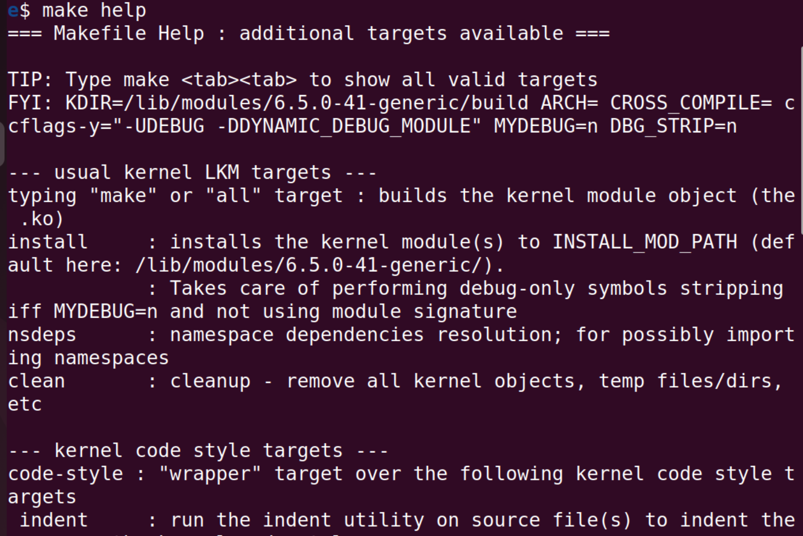

# 7.8 

## Linux kernel programming

### 制作我们的模块 —— 第二部分

#### 适用于内核模块的“更好” Makefile 模板 

​	上一章介绍了用于从源代码生成内核模块、安装和清理内核模块的 Makefile。但是，正如我们在那里简要提到的，我现在将介绍我认为更优越的、所谓的“更好”的 Makefile，并解释它为什么更好。 最终，我们都必须编写更好、更安全的代码——无论是用户空间还是内核空间。好消息是，有几种工具可以帮助提高代码的稳健性和安全性，其中包括静态和动态分析器（因为在线章节“内核工作区设置”中已经提到了几种，我不会在这里重复它们）。 

​	我为内核模块设计了一个简单但有用的 Makefile“模板”，其中包括几个帮助您运行这些工具的目标。这些目标允许您非常轻松地执行有价值的检查和分析；否则您可能会忘记、忽略或永远推迟这些事情！

​	这些目标包括： 

“通常”的目标 - 构建（全部）、安装和清理目标（考虑到“调试”设置，如果调试关闭，则剥离模块）。 内核编码风格生成和检查（通过缩进和内核的 checkpatch.pl 脚本）。

 内核静态分析目标（稀疏、gcc 和 flawfinder），其中提到了 Coccinelle。 几个虚拟内核动态分析目标指出您应该如何花时间配置和构建“调试”内核并使用它来捕获错误（通过 KASAN 和 LOCKDEP / CONFIG_PROVE_LOCKING；稍后将详细介绍） 

一个简单的 tarxz-pkg 目标，将源文件打包并压缩到父目录中。这使您可以将压缩的 tar-xz 文件传输到任何其他 Linux 系统，然后在那里提取和构建 LKM。 您可以在 ch5/lkm_template 目录中找到代码（以及 README 文件）。为了帮助您了解其用途和功能并开始使用，下图仅显示了执行 `make <tab><tab>` 并运行 `make help` 时代码生成的输出和输出屏幕截图：



如图 5.1 所示，我们输入 make，然后立即按两次 Tab 键，这样它就会显示所有可用的目标（您可能需要安装 Bash 完成包才能使此类功能正常工作；它通常安装在大多数发行版上）。请仔细研究并使用它！例如，运行 make sa（参见图 5.1 中的 sa 目标以及其他目标）将导致它在您的代码上运行所有静态分析 (sa) 目标。请注意以 FYI: KDIR=… 开头的行（突出显示）显示了 Makefile 对各种变量和“设置”的当前理解。我们在这里重现了它：

#### 配置一个调试内核

​	在调试内核上运行代码可以帮助您发现难以发现的错误和问题。我强烈建议这样做，通常是在开发和测试期间！ 实际上，您应该有两个内核来运行和测试您的工作：精心配置的优化常规生产内核，以及一个调试内核，故意配置为启用许多内核调试选项（可能未优化，但目的是用它来捕获错误）。 在这里，我至少希望您配置自定义 6.1 内核，以便打开以下内核调试配置选项（即设置为 y；您会在 make menuconfig UI 中找到它们，并且您会在 Kernel Hacking 子菜单下找到它们中的大多数；以下列表与 Linux 6.1.25 有关）： 

- CONFIG_DEBUG_KERNEL 和 CONFIG_DEBUG_INFO 
- CONFIG_DEBUG_MISC 
- 通用内核调试工具： 
  - CONFIG_MAGIC_SYSRQ（神奇的 SysRq 热键功能） 
  - CONFIG_DEBUG_FS（debugfs 伪文件系统） 
  - CONFIG_KGDB（内核 GDB；可选，推荐） 
  - CONFIG_UBSAN（未定义行为健全性检查器） 
  - CONFIG_KCSAN（动态数据竞争检测器） 

- 内存调试： 
  - CONFIG_SLUB_DEBUG 
  - CONFIG_DEBUG_MEMORY_INIT
  - CONFIG_KASAN：强大的内核地址清理器 (KASAN) 内存检查器 

- CONFIG_DEBUG_SHIRQ 
- CONFIG_SCHED_STACK_END_CHECK 
- CONFIG_DEBUG_PREEMPT 
- 锁定调试： 
  - CONFIG_PROVE_LOCKING：非常强大的 lockdep 功能，可以捕获 锁定错误！这也会打开其他几个锁定调试配置， 在第 13 章“内核同步 - 第 2 部分”中进行了解释。 
  - CONFIG_LOCK_STAT
  - CONFIG_DEBUG_ATOMIC_SLEEP

- CONFIG_BUG_ON_DATA_CORRUPTION 
- CONFIG_STACKTRACE 
- CONFIG_DEBUG_BUGVERBOSE 
- CONFIG_FTRACE (ftrace：在其子菜单中，至少打开几个 “跟踪器”，包括“内核函数 [图形] 跟踪器”） 
- 架构特定（在 x86 上显示在“x86 调试”下）： 
  - CONFIG_EARLY_PRINTK（架构特定） 
  - CONFIG_DEBUG_BOOT_PARAMS 
  - CONFIG_UNWINDER_FRAME_POINTER（选择 FRAME_POINTER 和 CONFIG_STA/CK_VALIDATION）

#### 设置系统以进行交叉编译

交叉编译内核模块的先决条件非常明确：我们需要将目标系统的内核源代码树作为主机系统工作区的一部分安装，主机系统通常是 x86_64 桌面（例如，使用 Raspberry Pi 作为目标；请参阅此处的官方 Raspberry Pi 文档：https://www.raspberrypi.org/documentation/linux/kernel/building.md）。

​	我们现在需要一个交叉工具链（主机到目标）。通常，主机系统是 x86_64，而这里，由于目标是 ARM-64，我们需要一个 x86_64 到 ARM64 的交叉工具链。再次，正如第 3 章“从源代码构建 6.x Linux 内核 - 第 2 部分”中明确提到的那样，在 Raspberry Pi 的内核构建部分中，您必须将 Raspberry Pi 特定的 x86_64-to-ARM 工具链作为主机系统工作区的一部分进行安装

​	好的，从现在开始，我将假设您已满足我们在第 3 章“从源代码构建 6.x Linux 内核 - 第 2 部分”中介绍的内容中的这些先决条件，即为 Raspberry Pi 构建内核部分：您已安装 Raspberry Pi 6.1.34 内核源代码树和 x86_64-to-ARM64 交叉工具链。因此，我还假设工具链前缀为 aarch64-linux-gnu；我们可以通过尝试调用 gcc 交叉编译器来快速检查工具链是否已安装并将其二进制文件添加到路径中：

```
$ aarch64-linux-gnu-gcc -v
```

#### 尝试 1 – 设置 ARCH 和 CROSS_COMPILE 环境变量 

​	交叉编译内核模块非常简单（或者我们认为如此！）。

​	首先，确保 正确设置“特殊”ARCH 和 CROSS_COMPILE 环境变量。请按照以下步骤操作： 

1. 让我们为 Raspberry Pi 目标重新构建我们刚刚讨论的 lkm_template 内核模块；这也具有使用所谓 “更好”的 Makefile 的优势。以下是构建方法： 为了在不破坏原始代码的情况下执行此操作，请首先创建一个名为 cross 的新文件夹，其中包含代码副本。 （顺便说一句，代码库已经设置好了，这里：ch5/cross。） 

   ```
   cd <book-dir>/ch5; mkdir cross ; 
   cd cross 
   cp ../lkm_template/lkm_template.c ../lkm_template/Makefile 
   ```

   这里，`<book-dir> `是本书 GitHub 源代码树的根目录。 

2. 现在，运行以下命令（我们假设交叉编译器工具位于 此路径中）： make ARCH=arm64 CROSS_COMPILE=aarch64-linux-gnu- （顺便说一下，本书代码库有一个小的包装器脚本，ch5/cross/buildit， 它会执行几个有效性检查并为您运行此命令。）但它不能立即起作用（或者它可能起作用；请参阅以下材料）。我们得到编译失败，如下所示： 

   ```
   $ make ARCH=arm64 CROSS_COMPILE=aarch64-linux-gnu- --- 正在构建：KDIR=~/arm64_prj/kernel/linux ARCH=arm64 CROSS_COMPILE aarch64-linux-gnu-gcc (Ubuntu 11.3.0-1ubuntu1~22.04.1) 11.3.0 
   make -C ~/arm64_prj/kernel/linux M=/home/c2kp/Linux-Kernel-Programmin make[1]: *** /home/c2kp/arm64_prj/kernel/linux: 没有这样的文件或目录 make: *** [Makefile:93: all] 错误 2 $ 
   ```

   （请注意，这一次，ARCH 和 CROSS_COMPILE 环境变量是如何正确定义的。）

   ​	为什么会失败？ 上述交叉编译尝试失败的原因在于，它**试图使用（针对）当前主机系统的内核源代码树进行构建，而不是目标的内核源代码树。**因此，我们需要修改 Makefile 以将其指向正确的内核源代码树，即目标的内核源代码树。这很容易做到。在下面的代码中，我们看到了（更正的）Makefile 代码的典型编写方式：

​	仔细查看（新的和“更好的”，如上一节所述）Makefile，您将了解其工作原理：

- 最重要的是，我们根据 ARCH 环境变量的值有条件地将 KDIR 变量设置为指向正确的内核源代码树（当然，我使用了 ARM-32 和 PowerPC 的内核源代码树的示例路径名作为示例；请将路径名替换为内核源代码树的实际路径）。
- 像往常一样，我们将 obj-m 设置为对象文件名。
- 您可以设置变量 ccflags-y（CFLAGS_EXTRA 被视为已弃用）以添加 DEBUG 符号（以便在我们的 LKM 中定义 DEBUG 符号，并且 pr_debug()/dev_dbg() 宏可以工作）。默认情况下，“调试”构建处于关闭状态。
- @echo '<...>' 行相当于 shell 的 echo 命令；它只是在构建时发出一些有用的信息（@ 前缀隐藏了 echo 语句本身，不显示）。
- 最后，我们有“通常的” Makefile 目标：all、install 和 clean。请注意，在调用 make 时，我们确保通过 -C 开关将目录更改为 KDIR 的值！
- 虽然前面的代码中没有显示，但这个“更好的” Makefile - 有重复的风险 - 有几个额外的有用目标。你一定要花时间探索和使用它们（如上一节所述；要开始，只需输入 make help，研究输出，然后尝试一下）。

完成此操作后，让我们重试使用此版本的模块交叉编译，看看它进展如何。

#### 尝试 2 – 将 Makefile 指向目标的正确内核源代码树

​	因此，现在，有了上一节中描述的增强和修复的 Makefile， 它应该可以工作了。在我们的新目录中，我们将尝试这个 - cross - 按照以下步骤操作： 1. 使用适合交叉编译的 make 命令尝试构建（第二次）：

```
$ make ARCH=arm CROSS_COMPILE=arm-linux-gnueabihf-
[ ... ]
 CC [M] /home/c2kp/Linux-Kernel-Programming_2E/ch5/cross/lkm_te
 MODPOST /home/c2kp/Linux-Kernel-Programming_2E/ch5/cross/Module
ERROR: modpost: "_printk" [/home/c2kp/Linux-Kernel-Programming_2E
make[2]: *** [scripts/Makefile.modpost:126: /home/c2kp/Linux-Kern
[ ... ]
```

​	哎呀。这次我们遇到了 modpost 错误。在此模块构建阶段，MODPOST，构建系统必须能够访问和检查所有导出的内核符号。这些信息存储在文件 Module.symvers 中（位于内核源代码树的根目录中）。它通常在模块构建后立即生成（在内核构建过程中）。当此文件不存在时，我们可能会遇到此 modpost 失败（就像我们刚才所做的那样）。因此，为了一次性修复此问题，我只需清理我的（Raspberry Pi）内核源代码树（使用 make mrproper），然后重建它；Module.symvers 文件现在确实出现了，并且构建通过了：

​	当然，现实情况是，构建可能会因多种原因而失败，而不仅仅是这里看到的原因……在另一个例子中，它失败了，因为我们编译内核模块的目标内核源代码树仍处于“原始”状态。它的根目录中甚至可能没有 .config 文件（以及其他必需的标头），而它（至少）需要对其进行配置。要解决此问题，您必须以通常的方式配置和交叉编译内核，然后重试模块构建

#### 尝试 3 – 交叉编译我们的内核模块 

​	现在我们已经使用正确配置的 Raspberry Pi 内核源代码树生成了交叉编译的内核模块（在主机系统上，存在 Module.symvers 文件；请参阅尝试 2 – 将 Makefile 指向目标部分的正确内核源代码树），它应该可以在主板上运行（嘿，我们是乐观主义者）。 当然，实践出真知。因此，我们启动我们的 Raspberry Pi，将我们的交叉编译的内核模块目标文件 scp 到它，然后按如下方式（在 Raspberry Pi 上的 ssh 会话中）试用它（以下输出直接来自设备）：

​	显然，insmod 失败了！了解原因很重要。这是因为我们尝试加载模块的内核版本与模块编译的内核版本不匹配。登录到 Raspberry Pi 时，让我们打印出当前运行的 Raspberry Pi 内核版本，并使用 modinfo 实用程序打印出有关内核模块本身的详细信息：

从前面的输出可以清楚地看出，在 ARM64 Raspberry Pi 板上，我们运行的是 6.1.21-v8+ 内核。事实上，这是我在设备的 microSD 卡上安装默认 Raspberry Pi 操作系统时继承的内核（这是这里引入的故意场景，起初不使用我们之前为 Raspberry Pi 构建的 6.1 内核）。另一方面，内核模块显示它是针对 6.1.34-v8+ Linux 内核编译的（modinfo(8) 中的 vermagic 字符串显示了这一点）。显然，存在不匹配。那又怎么样？继续阅读，下一节将揭示这一点。

```
rpi $ modinfo ./lkm_template.ko 
filename: /home/pi/lkp2e/ch5/cross/./lkm_template.ko
version: 0.2
license: Dual MIT/GPL
description: a simple LKM template; do refer to the (better) Makef
author: Kaiwan N Billimoria
srcversion: 606276CA0788B10170FC6D5
depends: 
name: lkm_template
vermagic: 6.1.34-v8+ SMP preempt mod_unload modversions aarch64
rpi $
```

#### 检查 Linux 内核 ABI 兼容性问题 

​	Linux 内核有一条规则，是内核应用程序二进制接口 (ABI) 的一部分：只有当内核模块是针对它构建的时，它才会将内核模块插入内核内存中 - 精确的内核版本、构建标志，甚至内核配置选项都很重要！ 针对构建的内核是您在 Makefile 中指定其源位置的内核（我们之前通过 KDIR 变量指定了此位置）。 换句话说，内核模块与针对其构建的内核以外的内核不二进制兼容。例如，如果我们在 x86_64 Ubuntu 22.04 LTS 机器上构建内核模块，那么它只能在运行此精确环境（硬件、库和内核）的系统上运行！它无法在 Fedora 38 或 RHEL 8.x、Raspberry Pi 等上运行（加载），甚至无法在运行不同内核的 x86_64 Ubuntu 22.04 机器上运行。 现在，重要的是——再想想这个——这并不意味着内核模块完全不兼容且不可移植。不，它们在不同的架构之间是源兼容的（至少它们可以或应该这样编写）。因此，假设您有源代码，您始终可以在给定系统上重建内核模块，然后它将在该系统上运行。只是二进制映像（.ko 文件）与它所针对的内核以外的内核不兼容。（在某些版本的内核上，内核日志会说明这一点。）所以，现在很清楚了；这里，二进制模块和它所构建的内核以及我们试图运行（加载）它的内核之间存在不匹配，因此无法插入内核模块。 虽然我们在这里不使用这种方法，但有一种方法可以确保成功构建和部署第三方树外内核模块（如果它们的源代码可用），通过一个名为 DKMS（动态内核模块支持）的框架。以下是直接引用自它的内容： 动态内核模块支持 (DKMS) 是一个程序/框架，它能够生成 Linux 内核模块，其源代码通常位于内核源代码树之外。这个概念是让 DKMS 模块在安装新内核时自动重建。 请注意：关键短语是“...让 DKMS 模块在安装新内核时自动重建”，这证明了这一点：内核模块需要精确地针对它们将部署在其上的内核进行构建。作为 DKMS 使用的一个示例，Oracle VirtualBox 虚拟机管理程序（在 Linux 主机上运行时）使用 DKMS 自动构建并保持其内核模块的更新。 顺便说一句，如果您手边没有 Raspberry Pi 来尝试这些实验怎么办？不用担心，您可以使用其他基于 ARM 的主板甚至虚拟化！（仅供参考，第 1 章中提到的 SEALS 项目允许通过 QEMU 对 ARM-32、ARM-64 和 x86_64 PC 进行非常简单的虚拟化。）

#### 尝试 4 – 交叉编译我们的内核模块

​	现在，我们已经了解了二进制兼容性问题，有几种可能的解决方案：

- 我们必须使用产品所需的自定义内核配置、（交叉）构建和启动设备，并根据该内核源代码树构建所有内核模块。

- 使用 DKMS 方法。

- 或者，我们可以重建内核模块以匹配 Raspberry Pi 设备恰好正在运行的当前内核。


​	现在，在典型的嵌入式 Linux 项目中，您几乎肯定会有一个针对目标设备的自定义配置内核，您必须使用它。产品的所有内核模块都将/必须针对它构建。因此，我们遵循第一种方法 - 我们必须使用我们自定义配置和构建的（6.1.34）内核启动设备，并且由于我们的内核模块是针对它构建的，因此它现在肯定可以工作。

​	我们在第 3 章“从源代码构建 6.x Linux 内核 - 第 2 部分”的“Raspberry Pi 内核构建”部分中介绍了 Raspberry Pi 的内核构建。如果需要，请参阅那里的详细信息。
​	好的，我必须假设您已经按照步骤（在第 3 章“从源代码构建 6.x Linux 内核 - 第 2 部分”的“Raspberry Pi 内核构建”部分中介绍）进行操作，并且现在已经为 Raspberry Pi 配置和构建了 6.x 内核。关于如何将我们的自定义内核映像、DTB 和模块文件复制到设备的 microSD 卡等的具体细节未涵盖；我建议您参考这里的官方 Raspberry Pi 文档：
https://www.raspberrypi.org/documentation/linux/kernel/building.md。
​	尽管如此，我们将指出一种在设备上切换内核的便捷方法（这里，我假设该设备是运行 64 位内核的 Raspberry Pi 4B）：

1. 将您定制的 Image 内核二进制文件作为 kernel8.img 复制到设备的 microSD 卡的 /boot 分区中。（为了安全起见，首先确保将原始（默认）Raspberry Pi 内核映像保存为 kernel8.img.orig）。
2. 将刚刚交叉编译的内核模块（上一节中为 ARM64 构建的 lkm_template.ko）从主机系统复制（scp）到 microSD 卡上（复制到 /home/pi 即可）。
3. [可选] 在 Raspberry Pi 板上，您可以按如下方式指定要启动的内核；在我们的例子中这不是必需的：引导加载程序将自动选择文件 kernel8.img 作为默认启动的内核。如果您想要指定不同的内核来启动，请在设备的 microSD 卡上编辑 /boot/config.txt 文件，通过 kernel=xxx 行将内核映像设置为启动。
4. 保存并重新启动后，我们登录设备并重试我们的内核模块。

#### 总结 cross-build/load 模块出了什么问题以及如何修复

| 尝试 | 问题                                                         | 解决方案                                                     |
| ---- | ------------------------------------------------------------ | ------------------------------------------------------------ |
| 1    | 模块构建失败，因为我们尝试根据当前主机 (x86_64) 系统的内核源代码树（或指定的无效路径）而不是目标的内核源代码树来构建目标内核模块。 | 修改模块 Makefile，将 KDIR 变量指向正确的内核源代码树，即目标系统的内核源代码树：KDIR ?=~/rpi_work/kernel_rpi/linux |
| 2    | 模块构建在MODPOST 阶段失败（由于目标内核源树中缺少 Module.symvers 文件）。 | 意味着目标内核树尚未配置和/或构建；因此请这样做……然后会出现此文件，并且它会（交叉）构建模块 |
| 3    | 交叉编译模块无法加载到设备（Raspberry Pi）上，内核引用“无效模块格式”错误。 | 这是由于内核 ABI 规则：如果内核模块是针对它构建的，内核将只将内核模块插入内核内存。因此模块在系统之间没有二进制兼容性，但可以编写为源可移植的。 |
| 4    | 交叉编译模块无法加载到设备（Raspberry Pi）上，内核引用“无效模块格式”错误。 | 修复：我们使用自定义 6.1 内核启动设备，并针对同一内核交叉编译我们的模块（通过 KDIR Makefile 变量引用它），将二进制模块复制到目标的根文件系统上，然后对其进行 insmod。 |

内核模块许可

​	众所周知，Linux 内核代码库本身是根据 GNU GPL v2（又名 GPL-2.0；GPL 代表通用公共许可证）许可的，就大多数人而言，这种许可将一直有效。如前所述，在第 4 章“编写您的第一个内核模块 - 第 1 部分”中，为您的内核代码颁发许可是必需的，也是很重要的。让我们将关于许可的简短讨论分为两部分：

第一部分，适用于内联内核代码（或主线内核）；

第二部分，适用于编写第三方树外内核模块（我们很多人都这样做）。

#### 内联内核代码的许可

我们从第一个部分开始，即内联内核代码。这里关于许可的一个关键点是：如果您打算直接使用 Linux 内核代码和/或将您的代码贡献到主线内核上游（我们将在下一节中对此进行更多介绍），则必须按照与 Linux 内核相同的许可证发布代码：GNU GPL-2.0。详细信息有据可查；

请参阅此处的官方说明：https://docs.kernel.org/process/license￾rules.html#linux-kernel-licensing-rules。对于许可新手来说，大量的开源许可证及其注意事项无疑会令人困惑。请查看此网站以帮助消除迷雾：https://choosealicense.com/。此外，Bootlin 在其嵌入式 Linux 系统开发培训指南的“开源许可和合规性”部分中对开源许可的介绍也非常出色（https://bootlin.com/doc/training/embedded-linux/embedded-linux-slides.pdf）。

​	为了保持一致，最近的内核有一个规则：每个源文件的第一行必须是 SPDX（软件包数据交换）许可证标识符（有关详细信息，请参阅 https://spdx.org/），这是一种简写和简洁的格式，用于表达代码发布的许可证。（当然，脚本需要第一行来指定解释器。）因此，内核中大多数 C 源文件的第一行都是关于 SPDX 许可证的注释：
// SPDX-License-Identifier: GPL-2.0

#### 树外内核模块的许可

对于树外内核模块，情况仍然有点“不稳定”，我们可以这么说。

​	无论如何，为了吸引内核社区并让他们提供帮助（这是一个巨大的优势），您应该或应该根据 GNU GPL-2.0 许可证发布代码（尽管双重许可当然是可能的和可接受的）。内核模块发布的许可证以两种方式指定：

1. 通过 SPDX-License-Identifier 标记作为第一个源代码行（中的注释）。这严格适用于源代码树中的模块，并不总是适用于树外模块。
2. 2. 通过 MODULE_LICENSE() 宏。请注意官方内核文档明确指出的内容（https://docs.kernel.org/process/license￾rules.html#id1）：“可加载内核模块还需要一个 MODULE_LICENSE() 标记。此标记既不能替代正确的源代码许可证信息（SPDX-License-Identifier），也不能以任何方式与表达或确定模块源代码所依据的确切许可证相关。”此标签的唯一目的是提供足够的信息，说明模块是免费软件还是内核模块加载器和用户空间工具的专有软件。

以下注释摘自 include/linux/module.h 内核头文件，清楚地显示了哪些许可证“idents”是可接受的（请注意双重许可）。显然，内核社区强烈建议在 GPL-2.0（GPL v2）和/或其他类似许可证（如 BSD/MIT/MPL）下发布内核模块。如果您打算将代码贡献给内核主线上游，那么不用说，GPL-2.0 本身就是发布许可证：

```
// include/linux/module.h
[...]
/*
 * The following license idents are currently accepted as indicating 
 * software modules
 *
 * "GPL" [GNU Public License v2 or later]
 * "GPL v2" [GNU Public License v2]
 * "GPL and additional rights" [GNU Public License v2 rights and more
 * "Dual BSD/GPL" [GNU Public License v2
 * or BSD license choice]
 * "Dual MIT/GPL" [GNU Public License v2
 * or MIT license choice]
 * "Dual MPL/GPL" [GNU Public License v2
 * or Mozilla license choice]
 *
 * The following other idents are available
 *
 * "Proprietary" [Non free products]
 [ ... ]
```

​	MODULE_LICENSE() 的使用在很大程度上是一种历史性的、失败的尝试，试图在 MODULE_LICENSE 字符串中传达更多信息。它现在的主要目的是能够检查和标记专有模块，从而限制它们使用 GPL 下导出的符号（我们将讨论这一点）。它还帮助社区、最终用户和模块供应商快速审查代码库是否是开源的。仅供参考，内核源代码树有一个 LICENSES/ 目录，您可以在该目录下找到有关相关许可证的详细信息；快速 ls 此文件夹会显示其中的子文件夹：

#### 为内核模块模拟“类似库”的功能

​	用户模式和内核模式编程之间的主要区别之一是后者完全没有熟悉的“库”概念。库本质上是 API 的集合或存档，方便开发人员实现这些重要目标：不重新发明轮子、软件重用、模块化、可移植性等。但在 Linux 内核中，库（传统意义上的库）根本不存在。话虽如此，内核源代码树中的 lib/ 文件夹包含类似库的例程，其中一些例程内置于内核映像中，因此内核/模块开发人员可以在运行时使用。

好消息是，从广义上讲，有两种技术可以在内核空间中为内核模块实现“类似库”的功能：

- 第一种技术是明确将多个源文件（包括所谓的“库”代码）“链接”到内核模块对象。
- 第二种技术称为模块堆叠。

​	请继续阅读，我们将更详细地讨论这些技术。也许有点剧透，但知道这一点很有用，即前面的第一种方法通常优于第二种。不过，这确实取决于项目。请阅读以下部分中的详细信息；我们会在过程中列出一些优缺点。

#### 通过链接多个源文件执行库仿真

​	到目前为止，我们已经处理了非常简单的内核模块，这些模块只有一个C 源文件。那么（非常典型的）现实世界情况呢？单个内核模块有多个 C 源文件？所有源文件都必须编译，然后链接在一起作为单个 .ko 二进制对象。

例如，假设我们正在构建一个名为 projx 的内核模块项目。它由三个 C 源文件组成：prj1.c、prj2.c 和 prj3.c。我们希望最终的内核模块名为 projx.ko。 Makefile 是指定这些关系的地方，如下所示：

```
obj-m := projx.o
projx-objs := prj1.o prj2.o prj3.o
```

​	在前面的代码中，请注意 projx 标签在 obj-m 指令之后的使用方式，以及在下一行中作为 -objs 指令的前缀的方式。当然，您可以使用任何标签代替 projx。我们前面的示例 Makefile 将让内核构建系统首先将三个单独的 C 源文件编译为单独的对象 (.o) 文件，然后将它们全部链接在一起以形成最终的二进制内核模块对象文件 projx.ko，正如我们所希望的那样。事实上，我们正是利用这种机制在我们书的源代码树中构建了一个小型的例程“库”（此“内核库”的源文件位于本书源代码树的根目录中：klib.h 和 klib.c）。当然，这个想法是其他内核模块可以通过链接到这里来使用这些函数！例如，在即将到来的第 8 章“模块作者的内核内存分配 - 第 1 部分”中，我们让 ch8/lowlevel_mem/lowlevel_mem.c
内核模块代码调用驻留在我们的库代码中的函数，其相对路径为：../../klib.c。通过将以下内容放入 lowlevel_mem 内核模块的 Makefile（前缀以粗体突出显示）来实现“链接到”我们所谓的库代码：

```
FNAME_C := lowlevel_mem
[ … ]
PWD := $(shell pwd)
obj-m += ${FNAME_C}_lkm.o
lowlevel_mem_lkm-objs := ${FNAME_C}.o ../../klib.o
```

​	上面的最后一行指定要构建的源文件（到目标文件中）；它们是 lowlevel_mem.c 内核模块的代码和 ../../klib.c 库代码。然后，构建系统将两者链接到单个二进制内核模块 lowlevel_mem_lkm.ko，从而实现我们的目标。 
​	接下来，让我们了解一些基本的东西——内核模块中函数和变量的范围。

#### 了解内核模块中的函数和变量作用域

​	在深入研究之前，快速重新查看一些基础知识是个好主意。使用 C 编程时，您将了解以下内容：

- 在函数内本地声明的变量显然是该函数的本地变量，并且仅在该函数内具有作用域（函数返回时局部变量“消失”，因此它们被称为“自动”。一个常见的错误是
  尝试引用其作用域之外的局部或自动变量；这通常称为作用域后使用 (UAS) 或返回后使用 (UAR) 缺陷）。
- 以静态限定符为前缀的变量和函数仅在当前“单元”内具有作用域；实际上，它们在其中声明的文件中。这很好，因为它有助于减少命名空间污染。在函数内声明的静态数据变量在函数调用之间保留其值。

​	在 2.6 Linux（即 <= 2.4.x，现在已经过时了）之前，内核模块静态和全局变量以及所有函数在整个内核中都是自动可见的。回想起来，这显然不是一个好主意。

​	该决定从 2.5（以及 2.6 以后的现代 Linux）开始被推翻：所有内核模块变量（静态和全局数据）和函数默认作用域仅限于该内核模块，因此在其外部不可见。因此，

​	如果两个内核模块 lkmA 和 lkmB 有一个名为 maya 的全局（或静态）变量，则它对它们每个都是唯一的；没有冲突。要更改范围，LKM 框架提供了 EXPORT_SYMBOL() 宏。使用它，您可以将数据项或函数声明为作用域中的全局变量 - 实际上，

对任何其他内核模块都可见。
让我们举一个简单的例子。我们有一个名为 prj_core 的内核模块，它包含一个全局变量和一个函数：

```
static int my_glob = 5;
static long my_foo(int key)
{ [...]
}
```

​	虽然变量 my_glob 和函数 my_foo() 都可以在此内核模块内部使用，但它们在内核模块外部都无法看到。这是故意的。为了使它们在此内核模块外部可见，我们可以导出它们：

```
int my_glob = 5;
EXPORT_SYMBOL(my_glob);
long my_foo(int key)
{ [...]
}
EXPORT_SYMBOL(my_foo);
```

​	现在，它们都在此内核模块之外具有作用域（请注意，在前面的代码块中，static 关键字已被故意删除）。其他内核模块现在可以“看到”并使用它们。确切地说，这个想法主要体现在两个方面：

​	首先，内核通过 EXPORT_SYMBOL*() 宏导出经过深思熟虑的全局变量和函数子集，这些子集构成了内核功能以及其他子系统的一部分。现在，这些全局变量和函数是可见的，因此可以从内核模块中使用！我们很快就会看到一些示例用法。

​	这个想法还产生了一个非常重要的推论：树外内核模块只能访问内核中已明确导出的函数和变量。

​	其次，内核模块作者（通常是设备驱动程序）使用这个概念来导出某些数据和/或功能，以便其他内核模块（在更高的抽象级别）可以利用此设计并使用这些数据和/或功能 - 这个概念称为模块堆叠，我们将很快通过示例深入探讨它。例如，对于第一个用例，设备驱动程序作者可能想要处理（陷入）来自外围设备的硬件中断。一种常见的方法是通过 request_threaded_irq() API：

```
// kernel/irq/manage.c
int request_threaded_irq(unsigned int irq, irq_handler_t handler,
irq handler t thread fn nsigned long irqflags
const char *devname, void *dev_id)
{
 struct irqaction *action;
[...]
 return retval;
}
EXPORT_SYMBOL(request_threaded_irq);
```

​	正是因为 request_threaded_irq() 函数是导出的，所以它才能在设备驱动程序中被调用，而设备驱动程序通常被写成内核模块（我们经常这样做，但不是树上的模块）。同样，模块开发人员通常需要一些“便利”例程 — 例如字符串处理例程。Linux 内核在 lib/string.c 中提供了几个常见字符串处理函数的实现（您希望它们存在）：str[n]casecmp()、str[n|l|s]cpy()、str[n|l]cat()、str[n]cmp()、`strchr[nul]()`、str[n|r]chr()、str[n]len() 等等。当然，这些都是通过 EXPORT_SYMBOL() 宏导出的，以便模块作者能够看到它们，从而可以使用它们。

​	另一方面，让我们看一下内核深处的核心 CFS（完全公平调度程序）CPU 调度代码的（微小）部分。在这里，pick_next_task_fair() 函数是当我们需要找到另一个任务进行上下文切换时由调度代码调用的函数：

​	由于前面的函数没有用任何 EXPORT_SYMBOL() 宏标记，因此它永远不能被内核模块调用。它仍然是私有的核心内核；这当然是一个经过深思熟虑的设计决定。 您还可以使用相同的宏将数据结构标记为导出。

​	另外，应该很明显，只有全局范围的数据（而不是局部变量）才能标记为导出。（仅供参考，如果您想了解 EXPORT_SYMBOL() 宏的工作原理，请参阅本章的“进一步阅读”部分。） 

​	回想一下我们关于内核模块许可的简短讨论。Linux 内核有一个有趣的主张：还有一个名为 EXPORT_SYMBOL_GPL() 的宏。它就像它的表亲 EXPORT_SYMBOL() 宏一样，只是导出的函数或数据项只对在其 MODULE_LICENSE() 宏中包含单词 GPL 的内核模块可见！

​	要查看所有导出的符号，请导航到内核源代码树的根目录并发出 make export_report 命令。但请注意，这仅适用于已配置和构建的内核树。现在让我们看看实现类似库的内核功能的另一种关键方法：模块堆叠。 

#### 理解模块堆叠 

​	这里的第二个重要思想 - 模块堆叠 - 是我们现在将深入研究的内容。 模块堆叠是一个概念，它在某种程度上为内核模块作者提供了“类似库”的功能。在这里，我们通常以这样的方式构建我们的项目或产品设计，即我们有一个或多个“核心”内核模块，其工作是充当某种库。它将包括将导出到项目中其他内核模块（以及任何其他想要使用它们的人；上一节讨论了这一点）的数据结构和功能（函数/API）。 为了更好地理解这个概念，让我们看几个真实的例子。 首先，在我的主机系统（Ubuntu 22.04.3 LTS 原生 Linux 系统）上，我在 Oracle VirtualBox 7.0 虚拟机管理程序应用程序上运行了一个来宾 VM。好的， 在主机系统上执行快速 lsmod 并过滤字符串 vbox 会显示以下内容：

​	回想一下我们之前的讨论，在看到的四列中，第三列是使用计数。它在第一行中为 0，但在第三行中值为 3。不仅如此，vboxdrv 内核模块在其右侧（使用计数列之后）列出了两个内核模块。如果在第三列之后出现任何内核模块，则它们表示模块依赖关系；这样理解：右侧显示的内核模块依赖于左侧的内核模块。因此，在前面的示例中，vboxnetadp 和 vboxnetflt 内核模块依赖于 vboxdrv 内核模块。以何种方式依赖它？当然，它们调用函数（API）和/或使用驻留在 vboxdrv 核心内核模块中的数据结构！一般来说，第三列右侧显示的内核模块意味着它们正在调用一个或多个函数和/或使用左侧内核模块的数据结构（导致使用计数增加；这个使用计数是引用计数器的一个很好的例子（这里，它实际上是一个 32 位原子变量），我们将在上一章深入研究）。实际上，vboxdrv 内核模块类似于“库”（在有限的意义上，除了提供模块化功能外，没有与用户模式库相关的任何通常的用户空间内涵）。您可以看到，在这个快照中，它的使用计数是 3，依赖于它的内核模块堆叠在它之上——字面意思！（您可以在 lsmod 输出的前两行中看到它们。）另外，请注意 vboxnetflt 内核模块的使用计数为正（1），但其右侧没有显示内核模块；这仍然意味着此刻有某个东西正在使用它，通常是进程或线程。

#### 模拟“类库”功能 - 总结和结论

那么，让我们简要总结一下我们在内核模块空间中模拟类库功能时学到的要点。我们探索了两种技术：

- 我们使用的第一种方法是将多个源文件链接在一起形成一个内核模块。
- 这与模块堆叠技术相反，在模块堆叠技术中，我们实际上构建了多个内核模块并将它们“堆叠”在一起。

​	第一种技术不仅效果很好，而且还有以下优点：

- 我们不必明确标记（通过 EXPORT_SYMBOL()）我们使用的每个函数和/或数据项为导出。

这些函数和数据仅适用于它们实际链接到的内核模块（而不是任何其他模块）。这是一件好事！所有这些都是以稍微调整 Makefile 为代价的——非常值得。

“链接”（第一种）方法的一个缺点：当链接多个文件时，内核模块的大小可能会变得非常大。

至此，您学习了内核编程的一项强大功能 - 能够将多个源文件链接在一起以形成一个内核模块，和/或利用模块堆叠设计，这两者都允许您开发更复杂的内核项目。（在进入下一个主题领域之前，请先完成示例代码和建议的作业。）

现在，可以将参数传递给内核模块吗？以下部分将向您展示如何传递参数！

#### 将参数传递给内核模块

一种常见的调试技术是检测您的代码；也就是说，在适当的位置插入打印，以便您可以跟踪代码所采用的路径。

#### 声明和使用模块参数

​	模块参数在模块插入（insmod/modprobe）时作为名称-值对传递给内核模块。

例如，假设我们有一个名为 mp_debug_level 的模块参数；然后，我们可以在 insmod 时传递它的值，如下所示：

```
sudo insmod ./modparams1.ko mp_debug_level=2
```

​	这里，mp 前缀代表模块参数。当然，不需要这样命名；这样命名很繁琐，但始终遵循这样的约定有助于使大型代码库的阅读更加直观。

​	这将非常强大。现在，最终用户可以决定他们希望以什么样的详细程度发出调试级别消息。我们可以轻松地将默认值设置为 0，这样模块默认不会发出任何调试消息。

​	您可能想知道它是如何工作的：内核模块没有 main() 函数，因此没有常规的 (argc、argv) 参数列表，那么您究竟如何传递参数呢？这只是一个链接器技巧……只需执行以下操作：将您想要的模块参数声明为全局（静态）变量，然后通过使用 module_param() 宏向构建系统指定将其视为模块参数。

通过我们的第一个模块参数的演示内核模块，很容易看到这一点（与往常一样，可以在本书的 GitHub 存储库中找到完整的源代码和 Makefile）：

```
// ch5/modparams/modparams1/modparams1.c
[ ... ]
/* 模块参数 */
static int mp_debug_level;
module_param(mp_debug_level, int, 0660);
MODULE_PARM_DESC(mp_debug_level,
"调试级别 [0-2]; 0 => 无调试消息，2 => 高详细程度");
static char *mp_strparam = "我的字符串参数";
module_param(mp_strparam, charp, 0660);
MODULE_PARM_DESC(mp_strparam, "演示字符串参数");
```

```
题外话：在上面的 static int mp_debug_level; 语句中，将其更改为 static int mp_debug_level =0; 并没有什么坏处，因此明确将变量初始化为 0，对吗？嗯，没有：内核的 scripts/checkpatch.pl 脚本输出显示，内核社区认为这不是一种好的编码风格；如果
您这样做，则会触发此“错误”：错误：不要将静态初始化为 0
#28：文件：modparams1.c:28：
+static int mp_debug_level = 0;
```

在前面的代码块中，我们已通过 module_param() 宏将两个变量声明为模块参数。module_param() 宏本身有三个参数：

- 第一个参数：我们希望在代码中将其视为模块参数的变量。应使用 static 限定符声明。
- 第二个参数：其数据类型。
- 第三个参数：权限（实际上，它通过 sysfs 可见；稍后将对此进行解释）。

​	接下来，MODULE_PARM_DESC() 宏允许我们“描述”参数代表的内容。想想看：这就是您如何告知内核模块（或驱动程序）的最终用户哪些参数实际上可用。查找是通过 modinfo(8) 实用程序执行的。此外，您可以使用 -p 选项开关专门打印模块参数信息，如下所示：

```
$ cd <booksrc>/ch5/modparams/modparams1 ; make
[ … ]
$ modinfo -p ./modparams1.ko
```

parm: mp_debug_level:Debug level [0-2]; 0 => 无调试消息
parm: mp_strparam:A demo string 参数 (charp)
modinfo 输出显示可用的模块参数（如果有）。在这里，我们可以看到我们的 modparams1.ko 内核模块有两个参数：它们的名称、描述和数据类型（最后一个组件，在括号内；顺便说一下，charp 是“字符指针”，一个字符串）然后显示出来。好的，现在让我们快速运行一下我们的演示内核模块：

```
$ sudo dmesg -C
$ sudo insmod ./modparams1.ko
$ sudo dmesg
[630238.316261] modparams1:modparams1_init(): 已插入
[630238.316685] modparams1:modparams1_init(): 模块参数传递
```

在这里，我们从 dmesg 输出中看到，由于我们没有明确传递任何内核模块参数，模块变量显然保留了它们的默认（原始）值。让我们重做一遍，这次将显式值传递给模块参数：

```
sudo rmmod modparams1
sudo insmod ./modparams1.ko mp_debug_level=2 mp_strparam=\"Hello modp
sudo dmesg
[...]
[630359.270765] modparams1:modparams1_exit(): removed
[630373.572641] modparams1:modparams1_init(): inserted
[630373.573096] modparams1:modparams1_init(): module parameters passe
```

​	它按预期工作。是不是很有趣：（参数）变量现在已经在内核内存中被修改，并且使用了我们从用户空间传递的新值！

#### 内核不允许浮点数

​	几年前，一个年轻且相对缺乏经验的小伙子（我）在开发温度传感器设备驱动程序时，有过一次有趣的经历（尽管当时并不那么有趣）。他试图将以毫摄氏度为单位的温度值表示为精确到小数点后三位的“常规”摄氏度温度值，他做了类似以下的事情：

```
int 温度；
double 温度_fp；
[... 处理…]
temperature_fp = 温度 / 1000.0；
printk(KERN_INFO "温度为 %.3f 摄氏度\n",temperature_fp);
```

​	从那以后一切都走下坡路了！值得尊敬的 LDD（Linux 设备驱动程序，由 Corbet、Rubini 和 Kroah￾Hartman 编写）一书指出了我的错误 - 内核空间不允许浮点 (FP) 算法！这是一个有意识的设计决定；保存处理器 (FP) 状态、打开 FP 单元、对其进行操作，然后关闭并恢复 FP 状态，这些在内核中执行的操作根本不值得。建议内核（或驱动程序）开发人员不要在内核空间中尝试执行 FP 工作。那么，您会问，如何进行（如我的示例）温度转换？很简单：将整数毫摄氏度值传递到用户空间并在那里执行 FP 工作！在很多情况下，在内核中执行某些类型的工作是完全错误的；用户空间是进行此类工作的正确场所（与每条规则一样，也有一些例外）。这包括执行浮点运算、文件 I/O（是的，不要尝试通过系统调用之类的代码路径在内核中执行文件读写）和运行应用程序，尽管内核确实提供了（相当令人惊讶但有时非常有用的）通过 UMH（用户模式帮助程序）API（如 call_usermodehelper() 等）执行这些操作的能力（谨慎使用！）等等。

#### 在内核中强制执行 FP

​	虽然我们说过内核空间不允许使用 FP，但确实存在一种强制内核执行浮点运算的方法：将浮点代码放在 kernel_fpu_begin() 和 kernel_fpu_end() 宏之间。在内核代码库中，有几处地方恰恰使用了这种技术（通常是一些涵盖加密/AES、CRC 等的代码路径）。
建议很明确：典型的模块（或驱动程序）开发人员应该只在内核中执行整数运算。然而，为了测试整个场景（永远记住，经验方法——实际尝试——是唯一现实的前进方式！），我们编写了一个简单的内核模块，尝试执行一些 FP 工作。代码的关键部分显示在这里：

```
// ch5/fp_in_kernel/fp_in_kernel.c
static double num = 22.0, den = 7.0, mypi;
static int __init fp_in_lkm_init(void)
{
[...]
kernel_fpu_begin();
mypi = num/den;
kernel_fpu_end();
#if 1
pr_info("%s: PI = %.4f = %.4f\n", OURMODNAME, mypi, num/den);
#endif
return 0; /* 成功 */
```

它实际上有效，直到我们尝试通过 printk() 显示 FP 值！


# 附录

## MakeFile

```
https://github.com/PacktPublishing/Linux-Kernel-Programming_2E.git/
```

​	这个Makefile在 ch5 / lkm_template下。

```
# ***************************************************************# This program is part of the source code released for the book
#  "Linux Kernel Programming" 2E
#  (c) Author: Kaiwan N Billimoria
#  Publisher:  Packt
#  GitHub repository:
#  https://github.com/PacktPublishing/Linux-Kernel-Programming_2E
#
# From: Ch 5 : Writing Your First Kernel Module LKMs, Part 2
# ***************************************************************
# Brief Description:
# A 'better' Makefile template for Linux LKMs (Loadable Kernel Modules); besides
# the 'usual' targets (the build, install and clean), we incorporate targets to
# do useful (and indeed required) stuff like:
#  - adhering to kernel coding style (indent+checkpatch)
#  - several static analysis targets (via sparse, gcc, flawfinder, cppcheck)
#  - two _dummy_ dynamic analysis targets (KASAN, LOCKDEP); just to remind you!
#  - a packaging (.tar.xz) target and
#  - a help target.
#
# To get started, just type:
#  make help
#
# For details, please refer the book, Ch 5, section
# 'A "better" Makefile template for your kernel modules'.
#
# AUTHOR : Kaiwan N Billimoria
# DESCRIPTION : A simple kernel module 'better' Makefile template
# LICENSE : Dual MIT/GPL
# VERSION : 0.2

#------------------------------------------------------------------
# IMPORTANT : Set FNAME_C to the kernel module name source filename (without .c).
# This enables you to use this Makefile as a template; just update this variable!
# As well, the MYDEBUG variable (see it below) can be set to 'y' or 'n' (no being
# the default)
FNAME_C := lkm_template
ifeq ($(FNAME_C),)
  $(error ERROR: you Must set the FNAME_C variable in the Makefile)
endif
#------------------------------------------------------------------

#--- To support cross-compiling for kernel modules
# For architecture (cpu) 'arch', invoke make as:
#  make ARCH=<arch> CROSS_COMPILE=<cross-compiler-prefix>
# F.e. to cross-compile for the AArch64:
#  make ARCH=arm64 CROSS_COMPILE=aarch64-linux-gnu-
#
# Alternately:
#  export ARCH=<arch>
#  export CROSS_COMPILE=<cross-compiler-prefix>
#  make
#
# The KDIR var is set to a sample path below; you're expected to update it on
# your box to the appropriate path to the kernel source tree for that arch.
ifeq ($(ARCH),arm)
  # *UPDATE* 'KDIR' below to point to the ARM Linux kernel source tree on your box
  KDIR ?= ~/arm_prj/kernel/linux
else ifeq ($(ARCH),arm64)
  # *UPDATE* 'KDIR' below to point to the ARM64 (AArch64) Linux kernel source
  # tree on your box
  KDIR ?= ~/arm64_prj/kernel/linux
else ifeq ($(ARCH),powerpc)
  # *UPDATE* 'KDIR' below to point to the PPC64 Linux kernel source tree on your box
  KDIR ?= ~/ppc_prj/kernel/linux-5.4
else
  # 'KDIR' is the Linux 'kernel headers' package on your host system; this is
  # usually an x86_64, but could be anything, really (f.e. building directly
  # on a Raspberry Pi implies that it's the host)
  KDIR ?= /lib/modules/$(shell uname -r)/build
endif
#---

# Compiler
CC     := $(CROSS_COMPILE)gcc-12
#CC    := clang
STRIP := ${CROSS_COMPILE}strip

PWD            := $(shell pwd)
obj-m          += ${FNAME_C}.o

#--- Debug or production mode?
# Set the MYDEBUG variable accordingly to y/n resp. We keep it off (n) by default.
# (Actually, debug info is always going to be generated when you build the
# module on a debug kernel, where CONFIG_DEBUG_INFO is defined, making this
# setting of the ccflags-y (or the older EXTRA_CFLAGS) variable mostly redundant
# (besides the still useful -DDEBUG).
# This simply helps us influence the build on a production kernel, forcing
# generation of debug symbols, if so required. Also, realize that the DEBUG
# macro is turned on by many CONFIG_*DEBUG* options; hence, we use a different
# macro var name, MYDEBUG).
MYDEBUG := n
DBG_STRIP := y
ifeq (${MYDEBUG}, y)
# https://www.kernel.org/doc/html/latest/kbuild/makefiles.html#compilation-flags
# EXTRA_CFLAGS deprecated; use ccflags-y
  ccflags-y   += -DDEBUG -g -ggdb -gdwarf-4 -Wall -fno-omit-frame-pointer -fvar-tracking-assignments
  DBG_STRIP := n
else
  ccflags-y   += -UDEBUG
endif
# We always keep the dynamic debug facility enabled; this allows us to turn
# dynamically turn on/off debug printk's later... To disable it simply comment
# out the following line
ccflags-y   += -DDYNAMIC_DEBUG_MODULE
KMODDIR ?= /lib/modules/$(shell uname -r)

# Gain access to kernel configs
include $(KDIR)/.config

# Strip the module? Note:
# a) Only strip debug symbols else it won't load correctly
# b) WARNING! Don't strip modules when using CONFIG_MODULE_SIG* crytographic security
ifdef CONFIG_MODULE_SIG
  DBG_STRIP := n
endif
ifdef CONFIG_MODULE_SIG_ALL
  DBG_STRIP := n
endif
ifdef CONFIG_MODULE_SIG_FORCE
  DBG_STRIP := n
endif


all:
	@echo
	@echo '--- Building : KDIR=${KDIR} ARCH=${ARCH} CROSS_COMPILE=${CROSS_COMPILE} ccflags-y="${ccflags-y}" MYDEBUG=${MYDEBUG} DBG_STRIP=${DBG_STRIP} ---'
	@${CC} --version|head -n1
	@echo
	make -C $(KDIR) M=$(PWD) modules
	if [ "${DBG_STRIP}" = "y" ]; then \
	   ${STRIP} --strip-debug ${FNAME_C}.ko ; \
	fi
install:
	@echo
	@echo "--- installing ---"
	@echo " [First, invoking the 'make' ]"
	make
	@echo
	@echo " [Now for the 'sudo make install' ]"
	sudo make -C $(KDIR) M=$(PWD) modules_install
	sudo depmod
	@echo " [If !debug and !(module signing), stripping debug info from ${KMODDIR}/extra/${FNAME_C}.ko]"
	if [ "${DBG_STRIP}" = "y" ]; then \
           sudo ${STRIP} --strip-debug ${KMODDIR}/extra/${FNAME_C}.ko ; \
	fi
nsdeps:
	@echo "--- nsdeps (namespace dependencies resolution; for possibly importing ns's) ---"
	make -C $(KDIR) M=$(PWD) nsdeps
clean:
	@echo
	@echo "--- cleaning ---"
	@echo
	make -C $(KDIR) M=$(PWD) clean
# from 'indent'; comment out if you want the backup kept
	rm -f *~

# Any usermode programs to build? Insert the build target(s) below


#--------------- More (useful) targets! -------------------------------
INDENT := indent

# code-style : "wrapper" target over the following kernel code style targets
code-style:
	make indent
	make checkpatch

# indent- "beautifies" C code - to conform to the the Linux kernel
# coding style guidelines.
# Note! original source file(s) is overwritten, so we back it up.
indent:
ifeq (,$(shell which indent))
	$(error ERROR: install indent first)
endif
	@echo
	@echo "--- applying kernel code style indentation with indent ---"
	@echo
	mkdir bkp 2> /dev/null; cp -f *.[chsS] bkp/
	${INDENT} -linux --line-length95 *.[chsS]
	  # add source files as required

# Detailed check on the source code styling / etc
checkpatch:
	make clean
	@echo
	@echo "--- kernel code style check with checkpatch.pl ---"
	@echo
	$(KDIR)/scripts/checkpatch.pl --no-tree -f --max-line-length=95 *.[ch]
	  # add source files as required

#--- Static Analysis
# sa : "wrapper" target over the following kernel static analyzer targets
sa:
	make sa_sparse
	make sa_gcc
	make sa_flawfinder
	make sa_cppcheck

# static analysis with sparse
sa_sparse:
ifeq (,$(shell which sparse))
	$(error ERROR: install sparse first)
endif
	make clean
	@echo
	@echo "--- static analysis with sparse ---"
	@echo
# If you feel it's too much, use C=1 instead
# NOTE: deliberately IGNORING warnings from kernel headers!
	make -Wsparse-all C=2 CHECK="/usr/bin/sparse --os=linux --arch=$(ARCH)" -C $(KDIR) M=$(PWD) modules 2>&1 |egrep -v "^\./include/.*\.h|^\./arch/.*\.h"

# static analysis with gcc
sa_gcc:
	make clean
	@echo
	@echo "--- static analysis with gcc ---"
	@echo
	make W=1 -C $(KDIR) M=$(PWD) modules

# static analysis with flawfinder
sa_flawfinder:
ifeq (,$(shell which flawfinder))
	$(error ERROR: install flawfinder first)
endif
	make clean
	@echo
	@echo "--- static analysis with flawfinder ---"
	@echo
	flawfinder *.[ch]

# static analysis with cppcheck
sa_cppcheck:
ifeq (,$(shell which cppcheck))
	$(error ERROR: install cppcheck first)
endif
	make clean
	@echo
	@echo "--- static analysis with cppcheck ---"
	@echo
	cppcheck -v --force --enable=all -i .tmp_versions/ -i *.mod.c -i bkp/ --suppress=missingIncludeSystem .

# Packaging: just generates a tar.xz of the source as of now
tarxz-pkg:
	rm -f ../${FNAME_C}.tar.xz 2>/dev/null
	make clean
	@echo
	@echo "--- packaging ---"
	@echo
	tar caf ../${FNAME_C}.tar.xz *
	ls -l ../${FNAME_C}.tar.xz
	@echo '=== package created: ../$(FNAME_C).tar.xz ==='
	@echo '        TIP: When extracting, to extract into a directory with the same name as the tar file, do this:'
	@echo '              tar -xvf ${FNAME_C}.tar.xz --one-top-level'

help:
	@echo '=== Makefile Help : additional targets available ==='
	@echo
	@echo 'TIP: Type make <tab><tab> to show all valid targets'
	@echo 'FYI: KDIR=${KDIR} ARCH=${ARCH} CROSS_COMPILE=${CROSS_COMPILE} ccflags-y="${ccflags-y}" MYDEBUG=${MYDEBUG} DBG_STRIP=${DBG_STRIP}'

	@echo
	@echo '--- 'usual' kernel LKM targets ---'
	@echo 'typing "make" or "all" target : builds the kernel module object (the .ko)'
	@echo 'install     : installs the kernel module(s) to INSTALL_MOD_PATH (default here: /lib/modules/$(shell uname -r)/).'
	@echo '            : Takes care of performing debug-only symbols stripping iff MYDEBUG=n and not using module signature'
	@echo 'nsdeps      : namespace dependencies resolution; for possibly importing namespaces'
	@echo 'clean       : cleanup - remove all kernel objects, temp files/dirs, etc'

	@echo
	@echo '--- kernel code style targets ---'
	@echo 'code-style : "wrapper" target over the following kernel code style targets'
	@echo ' indent     : run the $(INDENT) utility on source file(s) to indent them as per the kernel code style'
	@echo ' checkpatch : run the kernel code style checker tool on source file(s)'

	@echo
	@echo '--- kernel static analyzer targets ---'
	@echo 'sa         : "wrapper" target over the following kernel static analyzer targets'
	@echo ' sa_sparse     : run the static analysis sparse tool on the source file(s)'
	@echo ' sa_gcc        : run gcc with option -W1 ("Generally useful warnings") on the source file(s)'
	@echo ' sa_flawfinder : run the static analysis flawfinder tool on the source file(s)'
	@echo ' sa_cppcheck   : run the static analysis cppcheck tool on the source file(s)'
	@echo 'TIP: use Coccinelle as well: https://www.kernel.org/doc/html/v6.1/dev-tools/coccinelle.html'

	@echo
	@echo '--- kernel dynamic analysis targets ---'
	@echo 'da_kasan   : DUMMY target: this is to remind you to run your code with the dynamic analysis KASAN tool enabled; requires configuring the kernel with CONFIG_KASAN On, rebuild and boot it'
	@echo 'da_lockdep : DUMMY target: this is to remind you to run your code with the dynamic analysis LOCKDEP tool (for deep locking issues analysis) enabled; requires configuring the kernel with CONFIG_PROVE_LOCKING On, rebuild and boot it'
	@echo 'TIP: Best to build a debug kernel with several kernel debug config options turned On, boot via it and run all your test cases'

	@echo
	@echo '--- misc targets ---'
	@echo 'tarxz-pkg  : tar and compress the LKM source files as a tar.xz into the dir above; allows one to transfer and build the module on another system'
	@echo '        TIP: When extracting, to extract into a directory with the same name as the tar file, do this:'
	@echo '              tar -xvf ${FNAME_C}.tar.xz --one-top-level'
	@echo 'help       : this help target'
```

