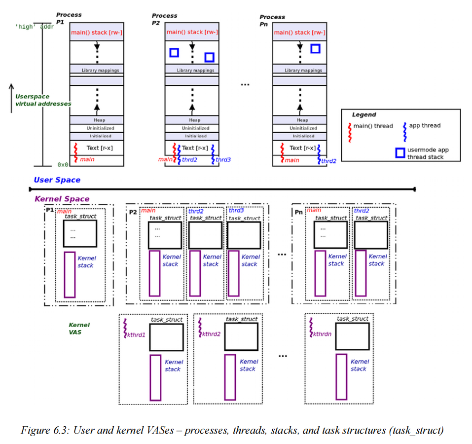
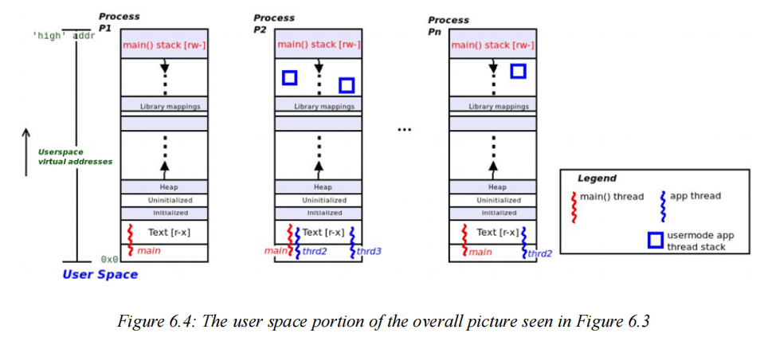
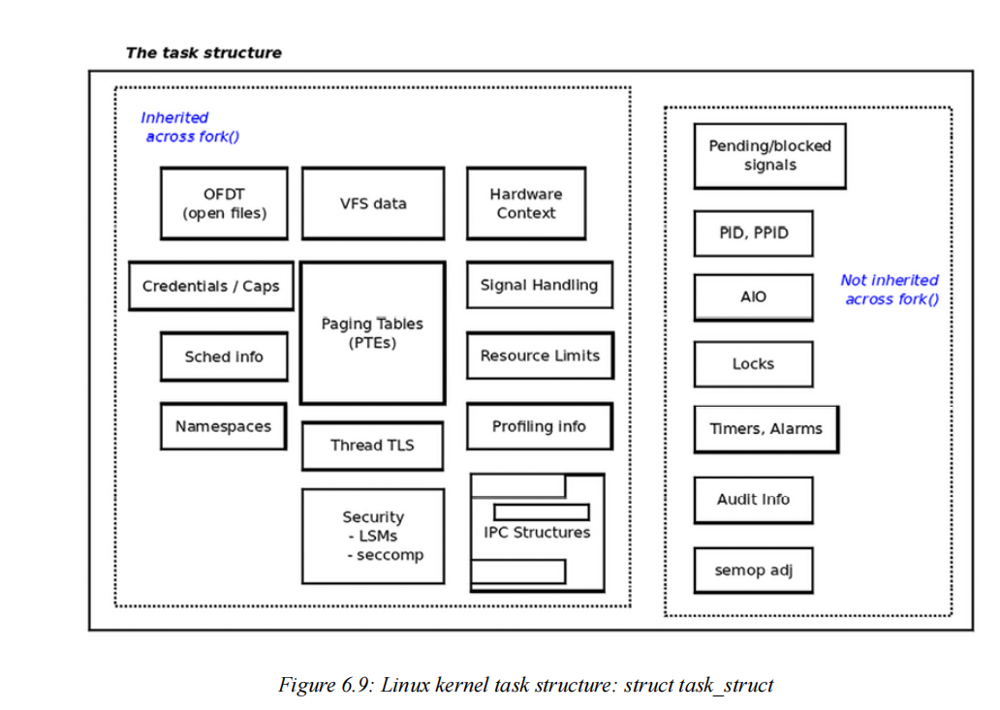
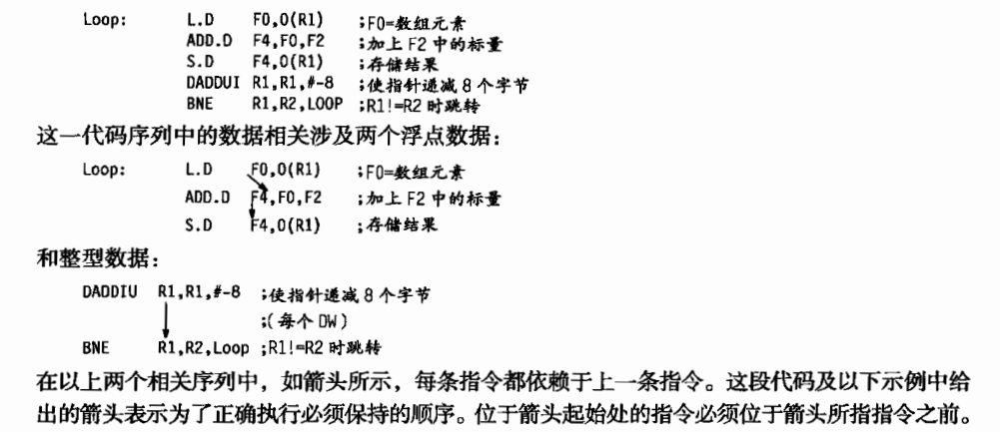

- # 7.9 

  ## Linux kernel programming

  ### 内核编程基础：线程和进程

  #### 理解进程和中断上下文 

  ​	在第 4 章“编写您的第一个内核模块 - 第 1 部分”中，我们介绍了一个简短的部分，题为“理解内核架构 - 第 1 部分”（如果您还没有阅读，我建议您在继续阅读之前先阅读一下）。我们现在将扩展此讨论。 首先，现代处理器以不同的特权级别执行代码。

  ​	例如，基于 x86 的处理器提供四个特权级别（或环），其中 Ring 0 是最高特权，Ring 3 是最低特权。同样，ARM-32（AArch32）有七种执行模式，其中六种是特权模式。 ARM64（AArch64）使用异常级别的概念（EL0 到 EL3，其中 EL0 是最低特权，EL3 是最高特权）。但实际上，关键点是：所有现代操作系统都只使用两个可用的 CPU 特权级别 - 一个特权级别和一个代码执行的非特权级别；我们分别将它们称为内核模式和用户模式。 了解大多数现代操作系统在设计上都是单片的也很重要。单片这个词的字面意思是一块大石头。我们稍后会讨论这如何应用于我们最喜欢的操作系统！ 现在，只需理解单片的含义：当进程或线程发出系统调用时，它会切换到（特权）内核模式，执行内核代码，并可能处理内核数据。是的，没有内核或内核线程代表它执行代码；发出系统调用的进程（或线程）切换到内核模式并自行执行内核代码。因此， 我们说内核代码在用户空间进程或线程的上下文中执行——我们将此执行上下文称为进程上下文。想想看， 内核的很大一部分正是以这种方式执行的，包括设备驱动程序的大部分代码。 （仅供参考，即使是处理器异常（如页面错误或系统调用）的处理以及 CPU 调度，也是在进程上下文中执行的）。

  ​	好吧，您可能会问，现在我明白了这一点，除了进程上下文之外，内核代码还能如何执行？还有另一种方式：当硬件中断（来自外围设备 - 键盘、网卡、磁盘等）触发时，CPU 的控制单元会保存当前上下文并立即重新引导 CPU 运行中断处理程序（中断服务例程 (ISR)）的代码。现在，此代码也在内核（特权）模式下运行 - 实际上，这是切换到内核模式的另一种异步方式（除非您已经在那里）！许多设备驱动程序的中断代码路径都是这样执行的；我们现在说以这种方式执行的内核/驱动程序代码是在中断上下文中执行的。 （再次提醒，仅供参考，一些现代驱动程序使用线程中断模型，其中大多数中断处理发生在内核线程上下文中，实际上是在进程上下文中）。

  ​	因此，任何和所有内核（或模块/驱动程序）代码都由以下两种上下文之一输入和执行：进程上下文：由于进程或线程发出系统调用或发生处理器异常（例如页面错误），内核代码被执行，并且内核数据被处理，因此进入内核空间；它通常是同步的。中断上下文：由于外围芯片断言硬件中断，内核（和/或驱动程序）代码被执行，并且内核数据被处理，因此进入内核空间；它是异步的。

  ​	图 6.1 显示了概念视图：用户模式进程和线程在非特权用户上下文中执行；用户模式线程可以通过发出系统调用切换到特权内核模式。该图还向我们展示了 Linux 中也存在纯内核线程；它们与用户模式线程非常相似，关键区别在于它们仅在内核空间中执行；它们甚至无法“看到”用户 VAS。通过系统调用（或处理器异常）同步切换到内核模式，任务现在在进程上下文中运行内核代码。（内核线程也在进程上下文中运行内核代码）。 然而，硬件中断是另一回事——它们抢占任何东西，包括内核代码，导致执行异步切换到内核特权（如果尚未处于其中）。它们执行的代码（通常是内核或设备驱动程序的中断处理程序）在所谓的中断上下文中运行。 图 6.1 显示了更多细节——中断上下文的上半部分和下半部分、内核线程和工作队列；

  

  #### 了解进程虚拟地址空间 (VAS) 的基础知识 

  ​	虚拟内存的一个基本“规则”是：所有可能可寻址的内存都在一个盒子里；也就是说，它是沙盒化的。我们将这个“盒子”视为进程映像或进程 VAS。从盒子“外面”看是不可能的。

  ​	用户 VAS 被划分为称为段的同质内存区域，或者更技术性地说，称为映射（因为它们是通过 mmap() 系统调用在内部构建的）。图 6.2 显示了每个 Linux（用户空间）进程将具有的最小映射（段）：

  

  ​	让我们快速分析一下这些段或映射（从下往上）：

  文本段：这是存储机器代码的地方；它是处理器核心的指令指针（或等效）寄存器指向的地方，而进程的线程执行代码时 - 静态/固定大小（模式：r-x）。
  （请注意，文本段不是从虚拟地址 0x0 开始的；它比该地址高出一段距离。事实上，第一个虚拟页面 - 封装 NULL 地址（0x0）的页面 - 称为“空陷阱”页面。稍后将详细介绍空陷阱。）

  数据段：紧挨着文本映射。这是存储全局和静态数据变量的地方（模式：rw-）。实际上，有三个不同的数据段：

  初始化数据段：预初始化的全局/静态变量存储在此处 - 静态/固定大小。

  未初始化的数据段：未初始化的全局/静态变量存储在此处（它们在运行时自动初始化为 0；此区域有时称为 bss）– 静态/固定大小。

  堆段：用于内存分配和释放的标准 C 库 API（熟悉的 malloc() 例程系列）从此处获取内存。这也不完全正确。在现代 glibc 上，只有 malloc() 调用低于 MMAP_THRESHOLD 字节（默认为 128 KB）的内存才会从堆中获取内存。任何请求的更大大小都作为进程 VAS 中的单独映射分配（通过强大的 mmap() 系统调用），称为匿名（或 anon）映射。堆是一个动态段（它可以增大/缩小大小）。我们通俗地说，堆“向更高的虚拟地址增长”。堆上最后一个合法可引用的位置称为程序中断（可通过调用 sbrk(0) 检索）。

  共享库（文本、数据）：进程动态链接到的所有共享库都映射（在运行时，通过加载器调用 mmap()）到进程 VAS 中 - 位于堆顶部和 main() 线程堆栈之间的某个位置（模式：r-x/rw-）。堆和堆栈之间的这个一般区域还保存任何其他线程的堆栈内存（除了 main() 的堆栈内存）、匿名内存和共享内存区域。

  堆栈：使用后进先出 (LIFO) 语义的内存区域；堆栈用于实现高级语言的函数调用机制，实际上保存线程的执行上下文。堆栈（框架）包括参数传递、局部变量实例化（和销毁）和返回值传播的工作。它是一个动态段。在所有现代处理器（包括 x86 和 ARM 系列）上，堆栈都会向较低的虚拟地址“向下增长”（称为完全下降堆栈）。每次调用函数时，都会根据需要分配和初始化堆栈框架（或调用框架）；堆栈框架的精确布局非常依赖于 CPU（您必须参考相应的 CPU 应用程序二进制接口 (ABI) 文档 - 请参阅进一步阅读部分以获取参考资料）。处理器核心的堆栈指针 (SP) 寄存器（或等效寄存器）始终指向当前框架，即堆栈的顶部；随着堆栈向较低的（虚拟）地址增长，堆栈的顶部实际上是最低的（虚拟）地址！这不直观，但确实如此（模式：rw-）。 （仅供参考，当然还有更多内容；当调用函数时，堆栈框架实际上并没有被分配和初始化，那样会太慢。同样，当函数返回时，它们也不会被释放；随着你的进步，你会学到更多。）当然，你会明白进程必须包含至少一个执行线程（线程是进程内的执行路径）；

  一个保证的线程当然是 main() 函数。在图 6.2 中，作为示例，我们展示了三个执行线程——main、thrd2 和 thrd3。此外，正如预期的那样，每个线程都共享进程 VAS 中的所有内容，除了堆栈；正如你所知，每个线程都有自己的私有堆栈。main 的堆栈显示在进程（用户）VAS 的最顶部； thrd2 和 thrd3 线程的堆栈，可以分配在库映射之间的任何位置，并且主堆栈通过此区域中的两个（蓝色）方块表示。

  #### 组织进程、线程及其堆栈 - 用户和内核空间

  ​	传统的 UNIX 进程模型 - **一切都是进程；如果不是进程，那就是文件** - 有很多优点。经过五十多年的发展，它仍然是操作系统所遵循的模型，这一事实充分证明了这一点。当然，如今，线程被视为原子执行上下文；线程是进程内的执行路径。

  ​	线程共享所有进程资源，包括用户 VAS、打开的文件、信号配置、IPC 对象、凭据、分页表等，但堆栈除外。每个线程都有自己的私有堆栈区域（这完全说得通；如果不是，线程如何真正并行运行，因为堆栈保存着执行上下文）。

  ​	我们关注线程而不是进程的另一个原因在第 10 章“CPU 调度程序 - 第 1 部分”中得到了更清晰的说明。现在，我们只能这样说：线程，而不是进程，是内核可调度实体（又名 KSE）——它是被调度到 CPU 核心上运行的实体。这是 Linux 操作系统架构的一个关键方面的结果。在 Linux 上，每个线程（包括内核线程）都映射到称为任务结构的内核元数据结构。任务结构（也称为进程描述符）本质上是一个大型内核数据结构，内核将其用作每个线程的属性结构。对于每个活动线程，内核都会维护一个相应的任务结构（参见图 6.3，不用担心，我们将在接下来的章节中详细介绍任务结构）。下一个要掌握的关键点是，我们要求每个线程每个 CPU 支持的特权级别都有一个堆栈。在 Linux 等现代操作系统上，我们支持两种 CPU 特权级别 - 非特权用户模式（或用户空间）和特权内核模式（或内核空间）。因此，在 Linux 上，每个活动用户空间线程都有两个堆栈：

  - 用户空间堆栈：当线程执行用户模式代码路径时，此堆栈正在运行。

  - 内核空间堆栈：当线程切换到内核模式（通过系统调用或处理器异常）并执行内核代码路径（在进程上下文中）时，此堆栈正在运行。


  ​	当然，每条好规则都有一个例外：内核线程（简称 kthreads）是纯粹存在于内核中的线程，因此只能“查看”内核（虚拟）地址空间；它们无法“看到”用户空间。因此，这些 kthreads 只会执行内核空间代码路径，每个 kthread 只有一个堆栈 - 内核空间堆栈。

  ​	此外，这可能会让您想知道在处理硬件中断处理程序时使用什么堆栈；尽管依赖于架构，但内核通常为每个核心维护一个 IRQ 堆栈，仅用于此目的。

  ​	下面是一个简单示例，可帮助您明确这一关键点：当您执行经典的 K&R C“Hello, world”进程时，内核会创建该进程；这会让内核设置并初始化几个对象 - 其中包括进程任务结构、其进程 VAS（包括用户模式堆栈）以及一个独特的内核模式堆栈。一旦运行，进程当然会首先在用户模式下执行 printf() API，从而利用用户空间堆栈（main()）。printf() 在设置完成后，发出 write() 系统调用！这会让我们的进程切换到内核模式，并实际将 Hello, world\n 字符串（通过内核中的 tty 层代码路径）写入 stdout 设备。由于它现在执行内核代码（在内核模式下），因此它会利用其内核空间堆栈。图 6.3 将地址空间分为两个部分 - 用户空间和内核空间。

  ​	在图表的上部 - 用户空间 - 您可以看到多个进程及其用户 VAS 的概念视图。在下部 - 内核空间（所有用户模式进程共享的大型单片空间） - 您可以看到对应于每个用户模式线程的内核元数据结构 struct task_struct（我们将在稍后详细介绍）和该线程的内核模式堆栈。
  此外，我们（在最底部）看到三个内核线程（标记为 kthrd1、kthrd2 和 kthrdn）；正如预期的那样，它们也有一个代表其内部（属性）的 task_struct 元数据结构和一个内核模式堆栈：

  

  #### 运行一个小脚本来查看，活跃的进程和线程的数量

  ```
  ****************************************************************
  # * Brief Description:
  # * Counts the total number of processes, user and kernel threads currently
  # * alive on the system.
  # * For details, please refer the book, Ch 6.
  # ****************************************************************
  set -euo pipefail
  echo "System release info:"
  which lsb_release >/dev/null && lsb_release -a || true
  [[ -f /etc/issue ]] && cat /etc/issue
  [[ -f /etc/os-release ]] && cat /etc/os-release
  
  total_prcs=$(ps -A|wc -l)
  printf "\nTotal # of processes alive               = %9d\n" ${total_prcs}
  
  # ps -LA shows all threads
  total_thrds=$(ps -LA|wc -l)
  printf "Total # of threads alive                 = %9d\n" ${total_thrds}
  
  # ps aux shows all kernel threads names (col 11) in square brackets; count 'em
  total_kthrds=$(ps aux|awk '{print $11}'|grep "^\["|wc -l)
  
  printf "Total # of kernel threads alive          = %9d\n" ${total_kthrds}
  printf "Thus, total # of user mode threads alive = %9d\n" $((${total_thrds}-${total_kthrds}))
  
  exit 0
  ```

  ```
  System release info:
  No LSB modules are available.
  Distributor ID:	Ubuntu
  Description:	Ubuntu 22.04.4 LTS
  Release:	22.04
  Codename:	jammy
  Ubuntu 22.04.4 LTS \n \l
  
  PRETTY_NAME="Ubuntu 22.04.4 LTS"
  NAME="Ubuntu"
  VERSION_ID="22.04"
  VERSION="22.04.4 LTS (Jammy Jellyfish)"
  VERSION_CODENAME=jammy
  ID=ubuntu
  ID_LIKE=debian
  HOME_URL="https://www.ubuntu.com/"
  SUPPORT_URL="https://help.ubuntu.com/"
  BUG_REPORT_URL="https://bugs.launchpad.net/ubuntu/"
  PRIVACY_POLICY_URL="https://www.ubuntu.com/legal/terms-and-policies/privacy-policy"
  UBUNTU_CODENAME=jammy
  
  Total # of processes alive               =       321
  Total # of threads alive                 =      1038
  Total # of kernel threads alive          =       174
  Thus, total # of user mode threads alive =       864
  ```

  #### 用户空间组织

  ​	参考我们在上一节中运行的 countem.sh Bash 脚本，我们现在将其分解并讨论一些关键点，目前将我们自己限制在进程 VAS 的用户空间部分。请仔细阅读并理解这一点（我们在以下讨论中引用的数字是关于我们运行小脚本以查看活动进程和线程数部分中 countem.sh 脚本的示例运行）。为了更好地理解，我将图表的用户空间部分放在这里：

  

  ​	在这里（图 6.4），您可以看到三个单独的用户模式进程。每个进程至少有一个执行线（main() 线程）。在这里，我们展示了三个进程，P1、P2 和 Pn，它们分别有一个、三个和两个线程，包括 main()。在我们前面的示例运行（运行小脚本以查看活动进程和线程数部分中显示的脚本）countem.sh 脚本中，Pn 的 n=234。
  请注意，这些图表纯粹是概念性的。例如，实际上，PID 为 2 的进程通常是名为 kthreadd 的单线程内核线程。
  每个进程由多个段（技术上称为映射）组成。广义上讲，用户模式段（或映射）如下：

  - 文本：代码；r-x
  - 数据段：rw-；由三个不同的映射组成 - 已初始化的数据段、未初始化的数据段（或 bss）和“向上增长”的堆
  - 库映射：对于每个共享库的文本和数据，进程动态链接到：
  - 向下增长的堆栈。

  ​	关于这些堆栈，我们从前面的示例运行中看到，系统上当前有 398 个用户模式线程处于活动状态。这意味着也有 398 个用户空间堆栈，因为每个活动用户模式线程都会有一个用户模式堆栈。关于这些用户空间线程堆栈，我们可以得出以下结论：main() 线程始终有一个用户空间堆栈，它将位于用户 VAS 的最顶部（高端）附近。如果进程是单线程的（只有一个 main() 线程），那么它将只有一个用户模式堆栈；图 6.4 中的 P1 进程显示了这种情况。另外，很重要的一点是：在 Linux 上，任何 foo() 系统调用通常都会成为内核中的 sys_foo() 函数。此外，通常但并非总是，这个 sys_foo() 函数是一个调用“真实”代码 do_[*]_foo() 的包装器。进一步的细节：在内核代码中，您可能会看到 SYSCALL_DEFINEn(foo, ...) 类型的宏；该宏将成为 sys_foo() 例程。附加的数字 n 在 [0,6] 范围内；它是通过系统调用从用户空间传递给内核的参数数量。如果进程是多线程的，则每个线程（包括 main()）都有一个用户模式线程堆栈；图 6.4 中的进程 P2 和 Pn 说明了这种情况。堆栈是在调用 fork(2)（针对 main()）或 pthread_create()（针对进程内剩余线程）时分配的，这会导致此代码路径在内核（在 kernel/fork.c 中）的进程上下文中执行：sys_fork() -->kernel_clone()
  ​	另外，仅供参考，Linux 上的 Pthreads 创建库 API pthread_create() 调用（非常特定于 Linux 的）clone() 系统调用（内核中的代码在此处：kernel/fork.c:sys_clone()）。此系统调用最终调用 kernel_clone()；传递的参数（特别是标志值）会告知内核如何创建自定义进程（换句话说，就是线程）！

  ​	用户空间堆栈当然是动态的；它们可以增大（也可以缩小）到堆栈大小资源限制 RLIMIT_STACK（通常为 8 MB - 您可以使用 prlimit 实用程序来查找）。

  #### 内核空间组织

  ​	我们继续讨论 countem.sh Bash 脚本（我们在运行一个小脚本来查看活动进程和线程的数量部分中运行过该脚本），现在我们将对其进行分解并讨论一些关键点，将我们自己限制在 VAS 的内核空间部分。请注意仔细阅读并理解这一点（同时阅读我们在前面运行的 countem.sh 脚本的示例中输出的数字）。为了更好地理解，我将图表的内核空间部分放在这里（图 6.5）

  

  ​	同样，从我们前面的示例运行中，您可以看到系统上当前有 398 个用户模式线程和 116 个内核线程处于活动状态。这总共产生了 514 个内核空间堆栈。怎么会这样？如前所述，每个用户模式线程都有两个堆栈 - 一个用户模式堆栈和一个内核模式堆栈。因此，我们将为每个用户模式线程提供 398 个内核模式堆栈，并为（纯）内核线程提供 116 个内核模式堆栈（回想一下，内核线程只有一个内核模式堆栈 - 它们根本无法“看到”用户空间），总共有 (398+116=) 514 个内核空间堆栈。让我们列出内核模式堆栈的一些特征：每个活动的用户模式线程（包括 main()）都会有一个内核模式堆栈。内核模式堆栈的大小是固定的（静态的），而且非常小。实际上，它们的大小在 32 位操作系统上为 2 页，在 64 位操作系统上为 4 页（页面大小通常为 4 KB）。

  ​	不要简单地假设页面大小始终为 4 KB - 在用户空间中，使用 getpagesize() 系统调用查询其值；在内核空间中，PAGE_SIZE 宏产生相同的值。

  它们是在线程创建时分配的（通常归结为内核代码：kernel_clone() --> copy_process() -->
  dup_task_struct()）。

  再次，让我们明确这一点：每个用户模式线程都有两个堆栈 - 一个用户模式堆栈和一个内核模式堆栈。此规则的例外是内核线程；它们只有一个内核模式堆栈（因为它们没有用户映射，因此没有用户空间段）。在图 6.5 的下半部分，我们展示了三个内核线程 - kthrd1、kthrd2 和 kthrdn（在我们前面的示例运行中，kthrdn 的 n=116）。此外，每个内核线程都有一个任务结构和一个在创建时分配给它的内核模式堆栈。内核模式堆栈在大多数方面都与其用户模式堆栈相似 - 每次调用内核空间内的函数时，都会设置一个堆栈框架（框架布局特定于架构并构成 CPU ABI 文档的一部分；有关这些详细信息，请参阅进一步阅读部分）。CPU 有一个寄存器来跟踪堆栈的当前位置（通常称为堆栈指针 (SP)），堆栈向较低的虚拟地址“增长”。但是，与动态用户模式堆栈不同，内核模式堆栈的大小是固定的并且很小。对于内核/驱动程序开发人员来说，内核模式堆栈大小非常小（两页或四页），这有一个重要含义 - 执行堆栈密集型工作（例如使用大型局部变量或递归）时要非常小心，不要溢出内核堆栈。

  ​	存在一个内核可配置（CONFIG_FRAME_WARN）来警告您编译时内核堆栈使用率过高；

  #### 总结内核中的线程、任务结构和堆栈

  ​	好的，很好，现在让我们总结一下从前面的讨论和 countem.sh 脚本示例运行中获得的知识和发现（在运行小脚本以查看活动进程和线程的数量部分）：

  - 任务结构：

    - 每个活动线程（用户或内核）在内核中都有一个相应的任务结构（struct task_struct）；这就是内核跟踪和管理它的方式。此外，所有线程的属性都存储在这里（您将在“了解和访问内核任务结构”部分中了解更多相关信息）
    - 由于系统上总共有 514 个线程（用户和内核）处于活动状态，这意味着内核内存中总共有 514 个任务（元数据）结构（在代码中，它是 struct task_struct），其中我们可以说以下内容：
    - 其中 398 个任务结构代表用户线程。
    - 其余（514 - 398 =）116 个任务结构代表内核线程。

  - 堆栈：

    - 每个用户空间线程都有两个堆栈：
      - 用户模式堆栈（线程执行用户模式代码路径时使用）
      - 内核模式堆栈（线程执行内核模式代码路径时使用）
      - 此外，当硬件中断处理程序执行其代码路径时，还存在一个单独的每核 IRQ 堆栈供使用
    - 异常情况：内核线程只有一个堆栈，即内核模式堆栈
    - 因此，对于我们的 ch6/countem.sh 脚本的示例运行，我们有：
      - 398 个用户空间堆栈（在用户空间中）。
      - 以上，加上 398 个内核空间堆栈（在内核内存中）。
      - 以上，加上 116 个内核空间堆栈（用于 116 个活动内核线程）。
      - 总计为 398 + 398 + 116 = 912 个堆栈！ （在 64 位 Linux 上，每个内核模式堆栈有 4 页，假设页面大小为 4 KB，则堆栈内存占用了 4\\*4096\*912=14.25 MB 的 RAM）。

    

    

  ​	正如前面简要提到的，许多架构（包括 x86 和 ARM64）支持单独的每个 CPU 堆栈用于中断处理（称为 IRQ 堆栈）。当发生外部硬件中断时，CPU 的控制单元立即将控制权重新引导到最终的中断处理代码（可能在设备驱动程序内）。单独的每个 CPU 中断堆栈用于保存中断代码路径的堆栈帧；这有助于避免对被中断的进程/线程的现有（小）内核模式堆栈施加太大压力。IRQ 堆栈大小将与该体系结构的内核模式堆栈大小相同。（此外，像 x86_64 这样的体系结构支持更多类型的堆栈，但我们不会进一步深入研究）。
  好的，现在您已经了解了用户和内核空间在进程/线程及其堆栈方面的总体组织，让我们继续了解如何实际查看内核和用户空间堆栈的内容。除了对学习有用之外，这些知识还可以极大地帮助您进行调试。

  #### 查看用户和内核堆栈

  ​	堆栈通常是调试会话的关键。堆栈保存了线程的当前执行上下文 - 它现在在哪个函数中执行代码，以及关键的是，它是如何到达这里的 - 这使我们能够推断历史记录（它在做什么以及发生了什么）。能够查看和解释线程的调用堆栈（又称调用链/调用跟踪/回溯）至关重要，这使我们能够了解我们究竟是如何到达这里的。所有这些宝贵的信息都驻留在堆栈中。但是，每个线程都有两个堆栈——用户空间和内核空间堆栈。我们如何查看它们的内容？在这里，我们将展示两种查看给定进程或线程的内核和用户模式堆栈的广泛方法，首先是通过传统方法，然后是较新的现代方法（通过 eBPF）。请继续阅读。查看堆栈的传统方法让我们首先学习使用我们称之为传统方法的方法查看给定进程或线程的内核和用户模式堆栈。让我们从内核模式堆栈开始。查看给定线程或进程的内核空间堆栈好消息；这很容易。 Linux 内核通过通常的机制使给定线程的内核堆栈可见，以将内核内部信息暴露给用户空间——强大而多功能的 proc 文件系统接口。只需读取伪文件 /proc/PID/stack 的内容即可。

  ```
  charlie@charlie-ubuntu:~/Linux-Kernel-Programming_2E/ch6$ sudo cat /proc/1953/stack
  [<0>] do_wait+0x173/0x320
  [<0>] kernel_wait4+0xbd/0x170
  [<0>] __do_sys_wait4+0xad/0xc0
  [<0>] __x64_sys_wait4+0x1c/0x30
  [<0>] x64_sys_call+0x1e93/0x20b0
  [<0>] do_syscall_64+0x55/0x90
  [<0>] entry_SYSCALL_64_after_hwframe+0x73/0xdd
  ```

  ​	在前面的输出中，每一行代表堆栈上的一个调用框架（或堆栈框架）。为了帮助解读内核堆栈回溯，有必要了解以下几点：

  显示的名称是被调用函数的名称 - 例如，
  这里看到的第二个函数名为 do_syscall_64()（因为我们总是从下往上读取堆栈跟踪）。函数调用图的顺序是从下往上；因此输出应以自下而上的方式读取。因此，这里意味着
  （忽略最底部的第一个）调用图如下：
  do_syscall_64() --> __x64_sys_wait4() --> __do_sys_wait4() -->kernel_wait4() --> do_wait()。
  输出的每一行代表一个调用框架 - 实际上是调用链中的一个函数。如果调用框架以一个或多个 ? 为前缀，则表示调用框架是调用链中的一个函数。符号，这意味着内核无法可靠地解释此堆栈帧。忽略它，这是内核在说它很可能是一个无效的堆栈帧（遗留的一个小点）；内核回溯代码通常是正确的！（请注意，通常，堆栈内存的相同部分会被不断重用；这可能会留下与当前堆栈无关的先前调用堆栈的点。）

  ​	如前所述，在 Linux 上，任何 foo() 系统调用通常都会成为内核中的 sys_foo() 函数。此外，通常（但并非总是），sys_foo() 是一个调用“真实”代码 do_[*]_foo() 的包装器。

  现在，再看看前面的输出。应该很清楚：我们的 Bash进程目前正在内核中执行 do_wait() 函数；调用图清楚地向我们展示了它通过系统调用，即 wait4() 系统调用到达那里！这是完全正确的； shell 的工作方式是分叉一个子进程，然后通过 wait4(2) 系统调用等待其消亡。
  接下来，`<func>`+x/y 语法有什么用处—

  第一个数字（x，始终为十六进制）是从当前执行所在的函数开头的字节偏移量。
  第二个数字（y，同样为十六进制）是内核认为的这个函数的长度；它通常是正确的。

  因此，在这里，do_wait+0x184/0x340 意味着 do_wait() 函数正在从函数开头偏移 0x184（十进制 388）字节的位置执行其机器代码，并且函数的长度为 0x340（十进制 832）字节！ 

  查看给定线程或进程的用户空间堆栈

  具有讽刺意味的是，在典型的 Linux 发行版上查看进程或线程的用户空间堆栈似乎更难（与查看内核模式堆栈相反，正如我们在上一节中看到的）。有一个实用程序可以做到这一点：
  gstack。实际上，它只是对脚本的简单包装，该脚本以批处理模式调用古老的 GDB 调试器，让 GDB 调用其回溯命令。

  #### eBPF – 查看两个堆栈的现代方法

  ​	现在 – 更令人兴奋！ – 让我们学习使用强大的现代方法的基础知识，利用（截至撰写本文时）称为扩展伯克利数据包过滤器 (eBPF) 的最新技术。我们确实在在线章节“内核工作区设置”中的“其他有用项目”部分中提到了 eBPF 项目。较旧的 BPF 已经存在很长时间了，并已用于网络数据包跟踪； eBPF 是一项相对较新的创新，仅在 4.x Linux 内核上可用（当然，这意味着您需要在 4.x 或更新的 Linux 系统上使用此方法）。

  ​	直接使用底层内核级 BPF 字节码技术（极其）困难；因此，好消息是该技术有几个易于使用的前端（工具和脚本）。在前端中，BPF 编译器集合 (BCC) 和 bpftrace 被认为非常有用。（可以在 https://github.com/iovisor/bcc/blob/master/images/bcc_tracing_tools_2019.png 找到显示当前 BCC 性能分析工具的图表；可以在 http://www.brendangregg.com/ebpf.html#frontends 找到 eBPF 前端的列表。）

  ​	在这里，我们将使用名为 stackcount 的 BCC 工具进行快速演示（至少在 Ubuntu 上，这些 eBPF 工具以字符串 -bpfcc 为后缀，因此这个工具名为 stackcount-bpfcc）。另一个优点是，使用此工具可以同时查看内核和用户模式堆栈；无需单独的工具。

  您可以通过阅读此处的安装说明来为您的主机 Linux 发行版安装 BCC 工具：
  https://github.com/iovisor/bcc/blob/master/INSTALL.md。在运行我们自定义的 6.1 内核时，如何在我们的客户 Linux VM 上安装它们？您可以（不过，在早期的内核版本中，这可能会出现问题，需要运行发行版内核，例如 Ubuntu 或 Fedora 提供的内核）。

  #### 理解和访问内核任务结构

  ​	正如您现在所了解的，每个用户和内核空间线程在 Linux 内核中都由包含其所有属性的元数据结构（任务结构）内部表示。任务结构在内核代码中表示如下：include/linux/sched.h:struct
  task_struct。

  ​	不幸的是，它经常被称为“进程描述符”，造成无尽的混乱！值得庆幸的是，短语任务结构要好得多；它代表一个可运行的任务——实际上是一个线程。

  因此，我们得到了：在 Linux 设计中，每个进程都由一个或多个线程组成，每个线程都映射到称为任务结构 (struct task_struct) 的内核元数据结构。

  ​	任务结构是线程的“根”元数据结构 - 它封装了操作系统为该线程所需的所有信息。这包括有关其内存（段/映射设置、分页表、使用信息等）、CPU 调度详细信息、当前打开的所有文件、其凭据、功能位掩码、计时器、锁、异步 I/O (AIO) 上下文、硬件上下文信息、信号配置、IPC 对象、资源限制、（可选）审计、安全和分析信息以及更多此类详细信息的概念表示。
  

  #### 确定上下文

  正如您现在所知，内核代码在以下两种上下文之一中运行：

  - 进程（或任务）上下文
  - 中断（原子）上下文

  ​	它们是互斥的 - 内核代码在任何给定时间点（我们很快会解释术语“原子”）在进程（有时是原子的）或中断上下文（始终是原子的）中运行。

  ​	为什么能够确定内核或驱动程序代码运行的上下文很重要？内核中的一条黄金法则是，您不能在任何类型的原子上下文中休眠（或阻塞）；这样做会导致内核错误。它会锁定系统，通常会导致内核崩溃。

  ​	为什么？好吧，首先要意识到休眠意味着上下文切换 - 在前一个任务进入休眠状态时切换 CPU 以运行另一个任务。因此，休眠意味着调用调度程序代码和随后的上下文切换（我们在第 10 章“CPU 调度程序 - 第 1 部分”和第 11 章“CPU 调度程序 - 第 2 部分”中详细介绍了这一点）。这确实是任何阻塞 API 的工作方式。但是，当在原子上下文中运行时 - 例如硬件中断（以及软件中断、softirq），或者当持有自旋锁时 - 必须在不阻塞、不休眠、不放弃 CPU 的情况下完成工作。这就是为什么使用“原子”这个词的原因；它意味着不间断地运行到完成。现在我们知道了这个规则 - 不要在原子上下文中休眠 - 问题出现了：我如何知道我的代码路径是否在原子上下文中运行？以下是您可以轻松确定内核/驱动程序代码当前正在执行的上下文的方法：#include <linux/preempt.h> if (in_task()) foo(); /* 在进程上下文中运行；通常可以安全休眠或 else bar(); /* 在原子上下文中运行；不安全休眠或阻塞 in_task() 宏返回布尔值；如果您的代码在进程（或任务）上下文中运行，则返回 True，通常可以安全地进入休眠状态；如果返回 False，则表示您处于某种原子上下文中（可能是中断上下文），因此永远无法安全地进入休眠状态。

  ​	您可能遇到过 in_interrupt() 宏的用法 - 如果它返回 True，则您的代码处于中断上下文中；如果返回 False，则不在中断上下文中。但是，对于现代代码，建议不要依赖此宏（因为禁用 Bottom Half (BH) 可能会干扰其工作）。因此，我们建议改用 in_task()。

  ​	不过请稍等！这可能会有点棘手：虽然 in_task() 返回 True 确实意味着您的代码处于进程上下文中，但这一事实本身并不能保证它当前是否是原子的，或者是否可以安全地进入休眠状态。例如，您可能在进程上下文中运行内核或驱动程序代码，但持有自旋锁（内核中使用的一种非常常见的锁）；在这里，锁定和解锁之间的代码 - 所谓的关键部分 - 必须以原子方式运行！这意味着尽管您的代码可能处于进程（或任务）上下文中，但如果它尝试发出任何可能阻塞（休眠）的 API，它仍会导致内核级错误！不用担心，锁定在本书的最后两章中详细介绍。）另外，请注意：（根据定义）当前宏的使用仅在进程上下文中运行时才被视为有效。

  ​	现在，您已经了解了有关任务结构的有用背景信息，如何通过当前宏访问它，以及找出内核或驱动程序代码当前正在运行的上下文。所以现在，让我们编写一些内核模块代码来检查一些内核任务结构！通过“current”使用任务结构在这里，我们将编写一个简单的内核模块来显示任务结构的几个成员。

  ​	此外，我希望您考虑一下：究竟是谁在运行此（或任何）内核模块（或内核）的初始化和清理代码路径？从我们了解到的情况来看，不是内核；如前所述，没有总体的“内核”进程……那么，谁在运行它？在 Linux 操作系统等单片内核中，答案应该很清楚：当用户空间进程（或线程）发出系统调用时，它会切换到内核模式并在进程上下文中运行内核（或模块）代码。所以，是的，它将是一个进程（或线程）。

  ## 计算机架构体系

  ### 指令级并行及其开发

  ​	流水线 Cpu=.理想流水线 CPI+结构化停顿+数据冒险停顿+控制停顿理想流水线 CPI 可以用来度量能够实现的最佳性能。通过缩短上式右侧各项，可以降低总流水线 CPI ，也就是提高 IPC( 每个时钟周期执行的指令数)。利用上面的公式，我们可以说明一项技术能够缩小总 凹的哪一部分，以此来刻画各种技术的特征。

  #### 指令级并行

  ​	引入一个概念基本块基本块指的是一段顺序执行的代码，除入口外没有其他的转入分支除。出口外没有其他的转出分支。典型的maps程序平均动态分支频率通常介于15%~25%之间。也就是说一对分支之间会执行3~6条指令，这些指令可能相互依赖，所以重叠数量可能要少于基本块的平均大小。为了真正的提高性能，我们必须跨越多个几百块开发指令级并级。

  #### 数据相关与冒险

  ​	要确定一个程序中可以存在多少并行以及如何开发并行，判断指令之间的相互依赖性是至关重要的。具体来说，为了开发指令级并行，我们必须判断哪些指令可以并行执行。如果两条指令是并行的，只要流水线有足够资源(因而也就不存在任何结构性冒险)，就可以在一个任意深度的流水线中同时执行它们，不会导致任何停顿。如果两条指令是相关的，它们就不是并行的，尽管它们通常可以部分重叠，但必须按顺序执行。这两种情景的关键在于判断一条指令是否依赖于另一指令。

  ##### 数据相关

  共有 种不同类型的相关:数据相关(也称为真数据相关)、名称相关和控制相关。如果以下任一条件成立，则说指令j数据相关于指令i

  指令 i 生成的结果可能会被指令 j 用到

  指令 j 数据相关于指令 k， 指令 k 数据相关于指令 i

  ​	第二个条件就是说:如果两条指令之间存在第一类型的相关链，那么这两条指令也是相关的。这种相关链可以很长，贯穿整个程序。注意，单条指令内部的相关性(比如 ADDD Rl, Rl, Rl )不认为是相关。

  ​	例如，考虑以下 MIPS 代码序列，它用寄存器 F2 中的一个标量来递增存储器中的一个值向量(从 O(Rl)开始，最后→个元素是8(R2)0。(为简单起见，本章中的所有示例都忽略延迟分支的影响。)

  

  ​	如果两条指令是数据相关的，那它们必须按顺序执行，不能同时执行或不能完全重叠执行。这种相关意味着两条指令之间可能存在由一个或多个数据冒险构成的链。(关于数据冒险的简单描述。

  ​	同时执行这些指令会导致一个具有流水线互锁(而且流水线深度大于指令间距离，以周期为单位)的处理器检测冒险和停顿，从而降低或消除重叠。在依靠编译器调度、没有互锁的处理器中，编译器在调度相关指令时不能使它们完全重叠，这样会使程序无法正常执行。指令序列中存在数据相关，反映出据以生成该指令序列的源代码中存在数据相关。原数据相关的影响一定会保留下来。

  ​	相关是程序的一种属性。某种给定相关是否会导致检测到实际冒险，这一冒险又是否会实际导致停顿，这都属于流水线结构的性质。这一区别对于理解如何开发指令级并行至关重要。

  ​	数据相关传递了三点信息: (1) 冒险的可能性; (2)计算结果必须遵循的顺序（3）切可开发并行度的上限。

  ​	由于数据相关可能会限制我们能够开发的指令级并行数目，所以本章的一个重点就是如何克服这些局限性。可以采用两种不同方法来克服相关性: (1)保护相关性但避免冒险; (2)通过转换代码来消除相关性。对代码进行调度是在不修改相关，性的情况下避免冒险的主要方法，这种调度既可以由编译器完成，也可以由硬件完成数据值既可以通过寄存器也可以通过存储器位置在指令之间传送。当数据传送在寄存器中发生时，由于指令中的寄存器名字是固定的，所以相关性的检测很简单，当然，如果存在分支干扰以及为了保持正确性而迫使编译器或硬件变得保守，那可能会变得复杂一些。当数据在存储器位置之间流动时，由于两个看起来不同的地址可能引用同一位置，所以其相关性更难以检测，比如 100(R4) 和20(R6) 可能是同一个存储器地址。此外，载入指令或存储指令的实际地址可能会在每次执行时发生变化(所以 20( 阳)和 20(R4) 可能是不一样的)，这使相关性的检测进一步复杂化。本章研究采用硬件来检测那些涉及存储器位置的数据相关，但我们将会看到，这些技术也有局限性。用于检测这些相关的编译器技术是揭示循环级别并行的关键所在。

  ##### 名称相关

  第二种相关称为名称相关。当两条指令使用相同的寄存器或存储器位置(称为名称)，但与该名称相关的指令之间并没有数据流动时，就会发生名称相关。在指令 i 和指令 j ( 按照程序顺序，指令 i  位于指令 j 之前)之间存在两种类型的名称相关。

  (1) 当指令 j :对指令 i 读取的寄存器或存储器位置执行写操作时就会在指令 j 和指令 i 之间发生反相关。为了确保 i 能读取到正确取值，必须保持原来的顺序。

  (2)当指令 i 和指令 j 对同一个寄存器或存储器位置执行写操作时，发生输出相关。为了确保最后写人的值与指令 j 相对应，必须保持指令之间的排序。由于没有在指令之间传递值，所以反相关和输出相关都是名称相关，与真数据相关相对。因为名称相关不是真正的相关，因此，如果改变这些指令中使用的名称(寄存器号或存储器位置)，使这些指令不再冲突，那名称相关中涉及的指令就可以同时执行，或者重新排序。

  ​	对于寄存器操作数，这一重命名操作更容易实现，这种操作称作寄存器重命名。寄存器重命名既可以由编译器静态完成，也可以由硬件动态完成。在介绍因分支导致的相关性之前，先让我们来看看相关与流水线数据冒险之间的关系。

  ##### 数据冒险

  ​	只要指令间存在名称相关或数据相关，而且它们非常接近，足以使执行期间的重叠改变对相关操作数的访问顺序，那就会存在冒险。由于存在相关，必须保持程序顺序，也就是由原来的源程序决定的指令执行顺序。软、硬件技术的目的都是尽量开发并行方式，仅在程序顺序会影晌程序输出时才保持程序顺序。检测和避免冒险可以确保不会打乱必要的程序顺序。根据指令中读、写访问的顺序，可以将数据冒险分为三类，根据惯例，一般按照流水线必须保持的程序顺序为这些冒险命名。考虑两条指令，其中根据程序顺序 i 排在 j 的前面。可能出现的数据冒险为:

  - RAW (写后读)—— j 试图在 i 写入一个源位置之前读取它，所以 会错误地获得旧值。这一冒险是最常见的类型，与真数据相关相对应。为了确保 j 会收到来自 i 的值，必须保持程序顺序。
  - WAW: j视图在i写一个操作数之前写该操作数这些写操作最终以错误的顺序执行，最后留在目标位置的是一个由i写入的值，而不是由j写入的值。这种冒险与输出相关相对。应只有允许在多个流水机进行写操作的流水线中，或者在前一指令停顿时允许互以指令继续执行的流水线，才会存在这种冒险。
  - WAR:  j视图在i取一个目标位置之前写入该位置，所以I会错误地获取新值。这一冒险源于反相关在。大多数静态发射流水线中，由于所有毒操作都是较早的进行的，所以并不会发生此类冒险，如果。有一些指令在指令流水线中提前写出结果，而其他指令在流水线的后期读取一个原位置或者在对指令发生重新排序的时候，才会发生此类冒险。
