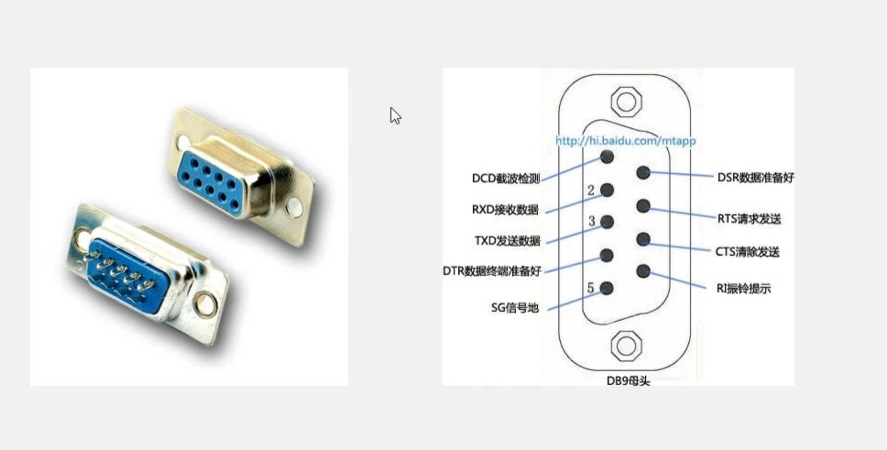
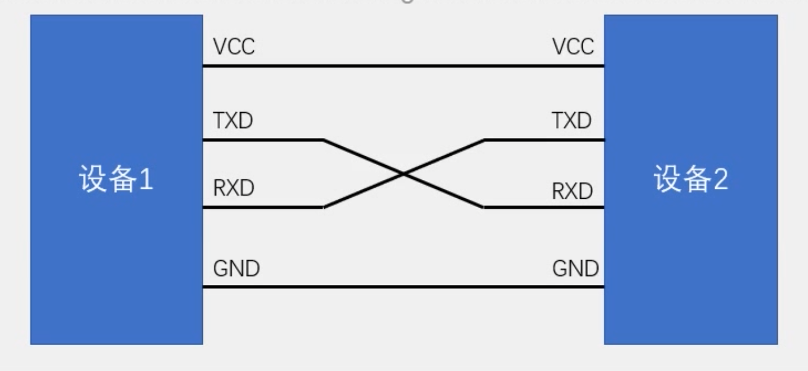
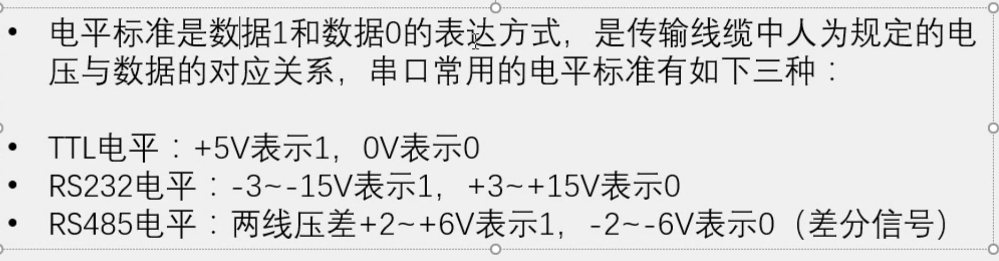
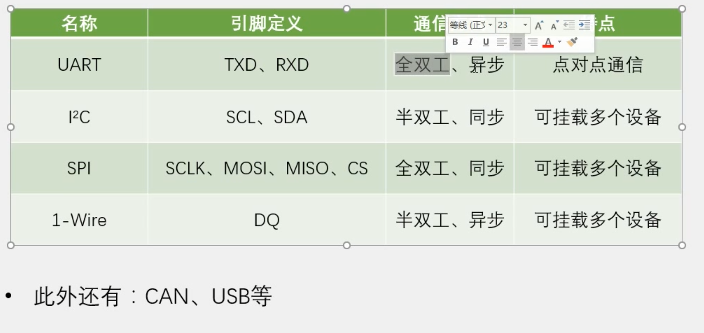
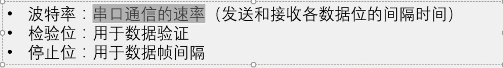
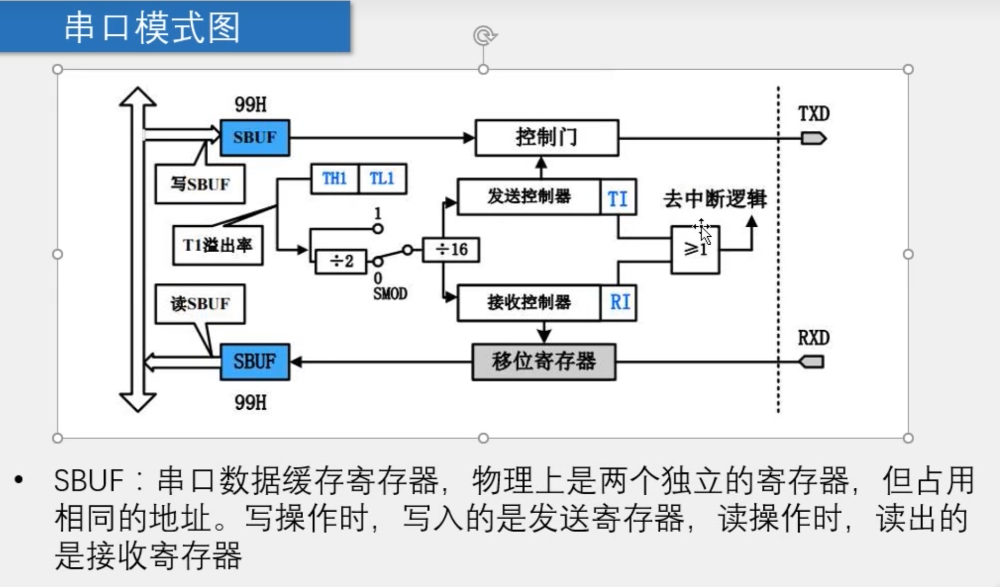
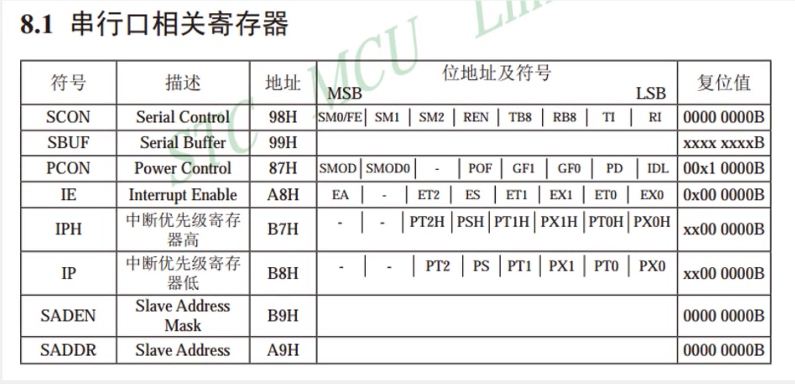

# 串口通信

​		串口是一种应用简单十分广泛的通讯接口，成本低，容易使用，通信信号简单，可以实现两个设备的通信

​		单片机的串口可以让单片机跟跟是个样的模块进行通信，极大的扩展了单片机的应用范围。

​		51单片机自带了UART`(Universal Asynchronous Receiver Transmitter)`，也就是通用一部收发器，可以实现单片机的串口通信。

​		

硬件电路上：

​		简单的双向串口通信有两跟通信线（发送端TXD和接收端RXD）

​		TXD与RXD需要相互连结

​		当电平标准不一致的时候，需要加电平转换芯片

`TXD: Transmit Exchange Data` ,`RXD: Receive Exchange Data`

 

`CTS`什么的是控制流的——

相关术语：

​		全双工： 通信双方可以在同一时间互相传输数据

​		半双工：通信双方可以在同一时间互相传输数据，代价是必须分时复用一根数据线

​		异步：通信双方各自约定频率

​		同步：通信双方依靠一根时钟线来约定通信频率

​		总线：链接各个设备的数据传输线路（类似于马路把各行各户连接起来的感觉）

