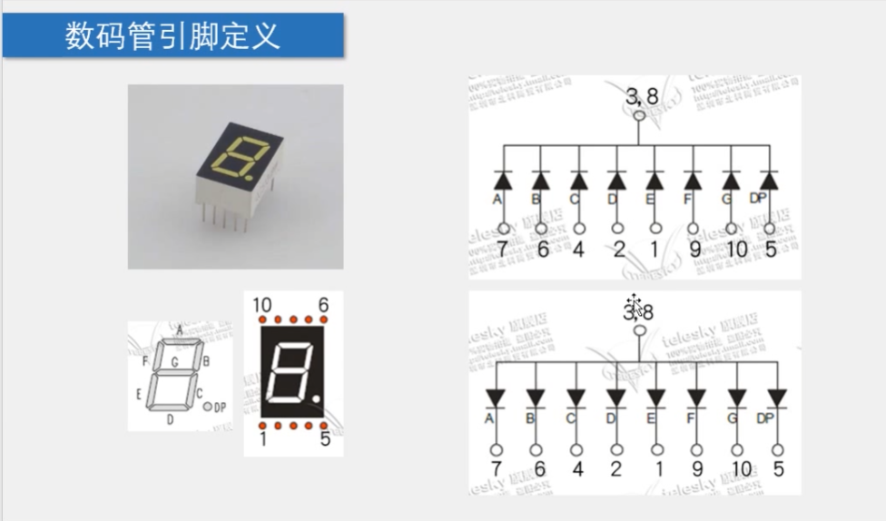
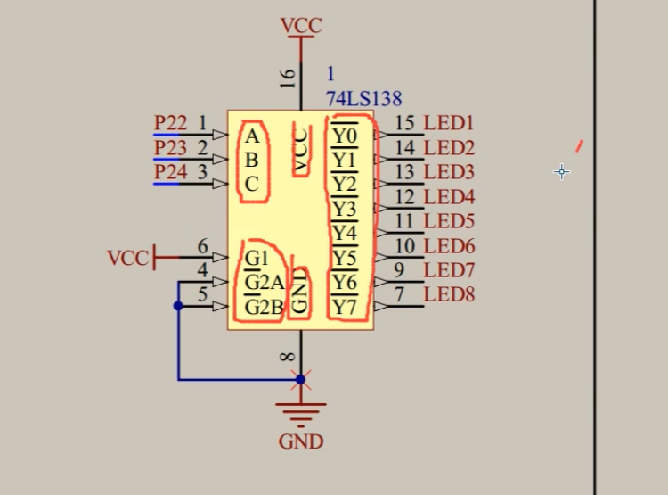
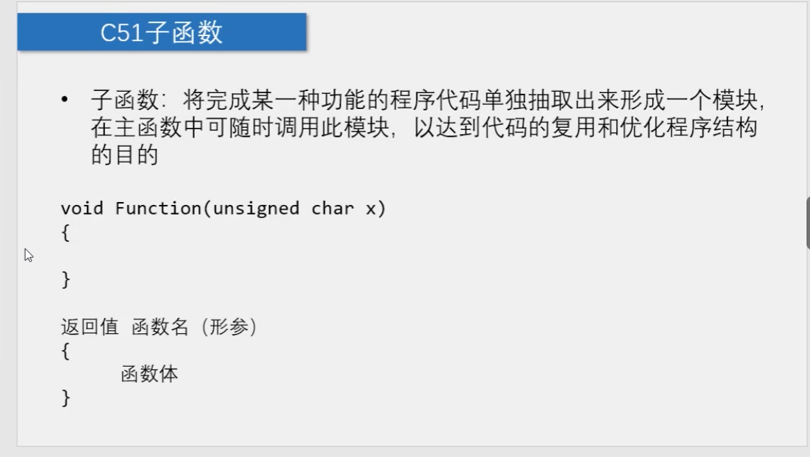
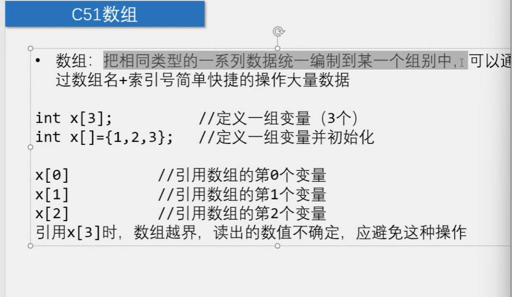

# 单片机开发

​		LED数码管：是一种廉价的，简单的显示器，是由多个发光二极管封装在一起的“8”字型的器件



​		于是，为了使6 亮起来，我们选择给6和5（注意到方格下5和6必须亮，因为6包含了5的型状）通向低电压，故是10111110(共阴性)，反之，若是共阳性，则是反码。



​		ABC是输入端，Y是输出端，其左下角的三个端口是使能端（电平有效：激活办法就是让G1接上高电平，G2接上低电平，所以，如图的数码显示管已经开始工作了）。左上角的三个端口就可以表达八种状态，于是这样就有效的减少了输入端口。

## 重要组件：





下面的代码就可以实现有效的流水灯显示：

```
#include <REGX52.H>
unsigned char showTab[]={0x3F,0x06,0x5B,0x4F,0x66,0x6D,0x7D,0x07,0x7F,0x6F};
void light(unsigned char Locations, Numbers){
switch(Locations)
	{
	case 1:P2_4=1;P2_3=1;P2_2=1;break;
	case 2:P2_4=1;P2_3=1;P2_2=0;break;
	case 3:P2_4=1;P2_3=0;P2_2=1;break;
	case 4:P2_4=1;P2_3=0;P2_2=0;break;
	case 5:P2_4=0;P2_3=1;P2_2=1;break;
	case 6:P2_4=0;P2_3=1;P2_2=0;break;
	case 7:P2_4=0;P2_3=0;P2_2=1;break;
	case 8:P2_4=0;P2_3=0;P2_2=0;break;
 	}
	 P0 = showTab[Numbers];

}
// this function can be generated by stc-isp-v6.91M
void Delay2000ms()		//@11.0592MHz
{
	unsigned char i, j, k;

	
	i = 15;
	j = 2;
	k = 235;
	do
	{
		do
		{
			while (--k);
		} while (--j);
	} while (--i);
}

void main()
{
   int i = 1;
   for(i = 1; i <9;i++){

		light(i,i);
		Delay2000ms();
   }
}
```

