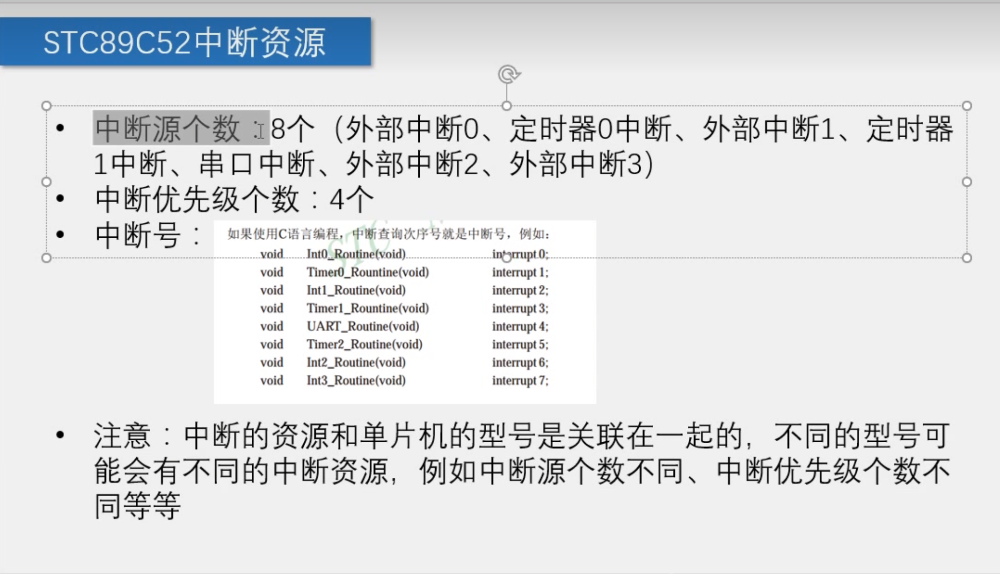

# 51单片机定时器

​		51单片机定时器属于单片机的内部资源，作用是

1. 用于计时系统，可以实现软件计时，或者让程序每隔一定的时间完成一项操作
2. 代替长时间的delay!（实现多线程）

​		这里的`T`就是`Timer`的意思

​		本质上，就是受到一个脉冲就加1，直到`TL0 TH0`都满了（1111 1111 1111 1111），再+1发生中断（overflowFlag == true -> interrupt）

​		SYSclk是系统时钟，即晶振周期。我们谈论的51单片机是`11.0592MHz`，取倒数就是大约`1`$\mu$`s`

## 中断系统

## 扩展：寄存器

​		寄存器的功能是存储[二进制代码](https://baike.baidu.com/item/二进制代码/4879654?fromModule=lemma_inlink)，它是由具有存储功能的[触发器](https://baike.baidu.com/item/触发器/193146?fromModule=lemma_inlink)组合起来构成的。一个触发器可以存储1位二进制代码，故存放n位二进制代码的寄存器，需用n个触发器来构成。 [1] 

按照功能的不同，可将寄存器分为基本寄存器和[移位寄存器](https://baike.baidu.com/item/移位寄存器/1755675?fromModule=lemma_inlink)两大类。基本寄存器只能并行送入数据，也只能并行输出。移位寄存器中的数据可以在移位脉冲作用下依次逐位右移或[左移](https://baike.baidu.com/item/左移/56641765?fromModule=lemma_inlink)，数据既可以[并行输入](https://baike.baidu.com/item/并行输入/20858152?fromModule=lemma_inlink)、并行输出，也可以串行输入、串行输出，还可以并行输入、串行输出，或串行输入、并行输出，十分灵活，用途也很广。 [1]

1.[通用寄存器](https://baike.baidu.com/item/通用寄存器/283978?fromModule=lemma_inlink)组

通用寄存器组包括AX、BX、CX、[DX](https://baike.baidu.com/item/DX/391997?fromModule=lemma_inlink)4个16位寄存器，用以存放16位数据或地址。也可用作8位寄存器。用作8位寄存器时分别记为AH、AL、BH、BL、CH、CL、DH、DL。只能存放8位数据，不能存放地址。它们分别是AX、BX、CX、DX的高八位和低八位。若AX=1234H，则AH=12H，AL=34H。通用寄存器通用性强，对任何指令，它们具有相同的功能。为了缩短[指令代码](https://baike.baidu.com/item/指令代码/56540352?fromModule=lemma_inlink)的长度，在8086中，某些通用寄存器用作专门用途。例如，串指令中必须用CX寄存器作为[计数寄存器](https://baike.baidu.com/item/计数寄存器/2033289?fromModule=lemma_inlink)，存放串的长度，这样在串[操作指令](https://baike.baidu.com/item/操作指令/5778481?fromModule=lemma_inlink)中不必给定CX的寄存器号，缩短了串操作指令代码的长度。下面一一介绍：

AX(AH、AL)：[累加器](https://baike.baidu.com/item/累加器/8590163?fromModule=lemma_inlink)。有些指令约定以AX(或AL)为源或目的寄存器。输入/输出指令必须通过AX或AL实现，例如：[端口地址](https://baike.baidu.com/item/端口地址/2751814?fromModule=lemma_inlink)为43H的内容读入[CPU](https://baike.baidu.com/item/CPU/120556?fromModule=lemma_inlink)的指令为INAL，43H或INAX，43H。目的[操作数](https://baike.baidu.com/item/操作数/7658270?fromModule=lemma_inlink)只能是AL/AX，而不能是其他的寄存器。 [5] 

BX(BH、BL)：[基址寄存器](https://baike.baidu.com/item/基址寄存器/2164353?fromModule=lemma_inlink)。BX可用作[间接寻址](https://baike.baidu.com/item/间接寻址/10335629?fromModule=lemma_inlink)的[地址寄存器](https://baike.baidu.com/item/地址寄存器/3219619?fromModule=lemma_inlink)和[基地址寄存器](https://baike.baidu.com/item/基地址寄存器/12752082?fromModule=lemma_inlink)，BH、BL可用作8位通用[数据寄存器](https://baike.baidu.com/item/数据寄存器/1944231?fromModule=lemma_inlink)。 [5] 

CX(CH、CL)：计数寄存器。CX在循环和串操作中充当[计数器](https://baike.baidu.com/item/计数器/4699680?fromModule=lemma_inlink)，指令执行后CX内容自动修改，因此称为计数寄存器。 [5] 

DX(DH、DL)：数据寄存器。除用作通用寄存器外，在[I/O指令](https://baike.baidu.com/item/I/O指令/9468236?fromModule=lemma_inlink)中可用作端口[地址寄存器](https://baike.baidu.com/item/地址寄存器/3219619?fromModule=lemma_inlink)，乘除指令中用作辅助累加器。 [5] 

2.指针和[变址寄存器](https://baike.baidu.com/item/变址寄存器/7680616?fromModule=lemma_inlink)

BP( Base Pointer [Register](https://baike.baidu.com/item/Register/3414681?fromModule=lemma_inlink))：[基址](https://baike.baidu.com/item/基址/1902361?fromModule=lemma_inlink)指针寄存器。 [5] 

[SP](https://baike.baidu.com/item/SP/59021879?fromModule=lemma_inlink)( Stack Pointer Register)：[堆栈指针寄存器](https://baike.baidu.com/item/堆栈指针寄存器/5550288?fromModule=lemma_inlink)。 [5] 

[SI](https://baike.baidu.com/item/SI/2666498?fromModule=lemma_inlink)( Source Index Register)：源变址寄存器。 [5] 

DI( Destination Index Register)：目的变址寄存器。 [5] 

这组寄存器存放的内容是某一段内地址[偏移量](https://baike.baidu.com/item/偏移量/9180391?fromModule=lemma_inlink)，用来形成操作数地址，主要在[堆栈](https://baike.baidu.com/item/堆栈/1682032?fromModule=lemma_inlink)操作和变址运算中使用。BP和SP寄存器称为指针寄存器，与SS联用，为访问现行[堆栈段](https://baike.baidu.com/item/堆栈段/1374659?fromModule=lemma_inlink)提供方便。通常BP寄存器在间接寻址中使用，操作数在堆栈段中，由SS段寄存器与BP组合形成操作数地址即BP中存放现行堆栈段中一个[数据区](https://baike.baidu.com/item/数据区/16696768?fromModule=lemma_inlink)的“基址”的偏移量，所以称BP寄存器为基址指针。 [5] 

SP寄存器在堆栈操作中使用，PUSH和POP指令是从SP寄存器得到现行堆栈段的段内地址偏移量，所以称SP寄存器为[堆栈指针](https://baike.baidu.com/item/堆栈指针/8770086?fromModule=lemma_inlink)，SP始终指向[栈顶](https://baike.baidu.com/item/栈顶/56511030?fromModule=lemma_inlink)。 [5] 

寄存器SI和DI称为变址寄存器，通常与[DS](https://baike.baidu.com/item/DS/2618510?fromModule=lemma_inlink)一起使用，为访问现行[数据段](https://baike.baidu.com/item/数据段/5136260?fromModule=lemma_inlink)提供段内地址偏移量。在串指令中，其中源操作数的偏移量存放在SⅠ中，目的操作数的偏移量存放在DI中，SI和DI的作用不能互换，否则传送地址相反。在串指令中，SI、DI均为隐含寻址，此时，SI和DS联用，Dl和[ES](https://baike.baidu.com/item/ES/5895130?fromModule=lemma_inlink)联用。 [5] 

3.段寄存器

8086/8088CPU可[直接寻址](https://baike.baidu.com/item/直接寻址/302009?fromModule=lemma_inlink)1MB的[存储器](https://baike.baidu.com/item/存储器/1583185?fromModule=lemma_inlink)空间，直接寻址需要20位[地址码](https://baike.baidu.com/item/地址码/3220454?fromModule=lemma_inlink)，而所有内部寄存器都是16位的，只能直接寻址6KB，因此采用分段技术来解决。将1MB的[存储空间](https://baike.baidu.com/item/存储空间/10657950?fromModule=lemma_inlink)分成若干逻辑段，每段最长64KB，这些逻辑段在整个存储空间中可浮动。 [5] 

8086/8088CPU内部设置了4个16位[段寄存器](https://baike.baidu.com/item/段寄存器/6616912?fromModule=lemma_inlink)，它们分别是[代码段](https://baike.baidu.com/item/代码段/9966451?fromModule=lemma_inlink)寄存器CS、数据段寄存器DS、堆栈段寄存器SS、附加段寄存器ES、由它们给出相应逻辑段的首地址，称为“[段基址](https://baike.baidu.com/item/段基址/7339630?fromModule=lemma_inlink)”。段基址与段内[偏移地址](https://baike.baidu.com/item/偏移地址/3108819?fromModule=lemma_inlink)组合形成20位[物理地址](https://baike.baidu.com/item/物理地址/2901583?fromModule=lemma_inlink)，段内偏移地址可以存放在寄存器中，也可以存放在存储器中。 [5] 

例如：代码段寄存器CS存放当前代码段基地址，IP指令指针寄存器存放了下一条要[执行指令](https://baike.baidu.com/item/执行指令/56529594?fromModule=lemma_inlink)的段内偏移地址，其中CS=2000H，IP=001AH。通过组合，形成20位[存储单元](https://baike.baidu.com/item/存储单元/8727749?fromModule=lemma_inlink)的寻址地址为2001AH。 [5] 

代码段内存放可执行的指令代码，数据段和附加段内存放操作的数据，通常操作数在现行数据段中，而在串指令中，目的操作数指明必须在现行附加段中。堆栈段开辟为程序执行中所要用的堆栈区，采用先进后出的方式访问它。各个段寄存器指明了一个规定的现行段，各段寄存器不可互换使用。程序较小时，代码段、数据段、堆栈段可放在一个段内，即包含在64KB之内，而当程序或数据量较大时，超过了64KB，那么可以定义多个代码段或数据段、堆栈段、附加段。现行段由段寄存器指明[段地址](https://baike.baidu.com/item/段地址/3108635?fromModule=lemma_inlink)，使用中可以修改段寄存器内容，指向其他段。有时为了明确起见，可在指令前加上段超越的前缀，以指定操作数所在段。 [5] 

4.[指令指针寄存器](https://baike.baidu.com/item/指令指针寄存器/14922144?fromModule=lemma_inlink)IP

8086/8088CPU中设置了一个16位[指令指针寄存器](https://baike.baidu.com/item/指令指针寄存器/14922144?fromModule=lemma_inlink)IP，用来存放将要执行的下一条指令在现行代码段中的偏移地址。程序运行中，它由BIU自动修改，使IP始终指向下一条将要执行的指令的地址，因此它是用来[控制指令](https://baike.baidu.com/item/控制指令/5205264?fromModule=lemma_inlink)序列的执行流程的，是一个重要的寄存器。8086程序不能[直接访问](https://baike.baidu.com/item/直接访问/8845360?fromModule=lemma_inlink)IP，但可以通过某些指令修改IP的内容。例如，当遇到[中断指令](https://baike.baidu.com/item/中断指令/3104594?fromModule=lemma_inlink)或调用[子程序](https://baike.baidu.com/item/子程序/3941697?fromModule=lemma_inlink)指令时，8086自动调整IP的内容，将IP中下一条将要执行的指令地址偏移量入栈保护，待中断程序执行完毕或子程序返回时，可将保护的内容从堆栈中弹出到IP，使[主程序](https://baike.baidu.com/item/主程序/532656?fromModule=lemma_inlink)继续运行。在[跳转指令](https://baike.baidu.com/item/跳转指令/56285320?fromModule=lemma_inlink)时，则将新的跳转目标地址送入IP，改变它的内容，实现了程序的转移。 [5] 

5.[标志寄存器](https://baike.baidu.com/item/标志寄存器/5757541?fromModule=lemma_inlink)FR

标志寄存器FR也称[程序状态字寄存器](https://baike.baidu.com/item/程序状态字寄存器/10320153?fromModule=lemma_inlink)。 [5] 

[寄存器(2张)](https://baike.baidu.com/pic/寄存器/187682/1578891261/b6045da99a7e1d991e17a29b?fr=lemma&fromModule=lemma_content-image&ct=cover)FR是16位寄存器，其中有9位[有效位](https://baike.baidu.com/item/有效位/56504167?fromModule=lemma_inlink)用来存放[状态标志](https://baike.baidu.com/item/状态标志/2186277?fromModule=lemma_inlink)和控制标志。状态标志共6位，CF、PF、AF、ZF、SF和OF，用于寄存程序运行的[状态信息](https://baike.baidu.com/item/状态信息/5153859?fromModule=lemma_inlink)，这些标志往往用作后续指令判断的依据。控制标志有3位，IF、DF和TF，用于控制CPU的操作，是人为设置的。 [5]

## 存放代码满足条件

[编辑](javascript:;)[ 播报](javascript:;)

(1)代码要存得进；

(2)代码要记得住；

(3)代码要取得出。 [7] 

寄存器是由具有存储功能的触发器组合起来构成的。一个触发器可以存储1位2进制代码，存放n位2进制代码的寄存器，需用n个触发器来构成。对寄存器中的触发器只要求它具有置1、置0的功能即可，因而无论用何种类型的触发器都可组成寄存器。 [7] 

按照功能的不同，寄存器可分为基本寄存器和[移位寄存器](https://baike.baidu.com/item/移位寄存器/1755675?fromModule=lemma_inlink)两大类。基本寄存器只能并行送入数据，需要时也只能并行输出。移位寄存器中的数据可以在移位脉冲作用下依次逐位右移或[左移](https://baike.baidu.com/item/左移/56641765?fromModule=lemma_inlink)，数据既可以[并行输入](https://baike.baidu.com/item/并行输入/20858152?fromModule=lemma_inlink)、并行输出，也可以串行输入、串行输出，还可以并行输入、串行输出或串行输入、并行输出，十分灵活，用途也很广。 [7] 

## 寄存器组织

[编辑](javascript:;)[ 播报](javascript:;)

[ARM微处理器](https://baike.baidu.com/item/ARM微处理器/9932400?fromModule=lemma_inlink)共有37个[32位](https://baike.baidu.com/item/32位/75230?fromModule=lemma_inlink)寄存器，其中31个为通用寄存器，6个为[状态寄存器](https://baike.baidu.com/item/状态寄存器/2477799?fromModule=lemma_inlink)。但是这些寄存器不能被同时访问，具体哪些寄存器是可编程访问的，取决于[微处理器](https://baike.baidu.com/item/微处理器/104320?fromModule=lemma_inlink)的[工作状态](https://baike.baidu.com/item/工作状态/10982086?fromModule=lemma_inlink)及具体的[运行模式](https://baike.baidu.com/item/运行模式/5189144?fromModule=lemma_inlink)。但在任何时候，通用寄存器R14~R0、[程序计数器](https://baike.baidu.com/item/程序计数器/3219536?fromModule=lemma_inlink)PC、一个或两个状态寄存器都是可访问的。 [8] 

[ARM9处理器](https://baike.baidu.com/item/ARM9处理器/9995400?fromModule=lemma_inlink)共有37个32位长的寄存器，这些寄存器包括：

(1) RO～R12：均为32位通用寄存器，用于[数据操作](https://baike.baidu.com/item/数据操作/9890374?fromModule=lemma_inlink)。但是注意：绝大多数16位[Thumb指令](https://baike.baidu.com/item/Thumb指令/18884089?fromModule=lemma_inlink)只能访问R0～R7，而32位Thumb -2指令可以访问所有寄存器。 [9] 

(2)堆栈指针：堆栈指针的最低两位永远是O，这意味着堆栈总是4[字节对齐](https://baike.baidu.com/item/字节对齐/1634057?fromModule=lemma_inlink)的。 [9] 

(3)[链接寄存器](https://baike.baidu.com/item/链接寄存器/8767852?fromModule=lemma_inlink)：当呼叫一个子程序时，由R14存储[返回地址](https://baike.baidu.com/item/返回地址/12734794?fromModule=lemma_inlink)。 [9] 

(4)[程序计数器](https://baike.baidu.com/item/程序计数器/3219536?fromModule=lemma_inlink)：指向当前的程序地址，如果修改它的值，就能改变程序的执行流。 [9] 

(5)6个状态寄存器（1个CPSR、5个SPSR），用以标识CPU的工作状态及程序的[运行状态](https://baike.baidu.com/item/运行状态/10781694?fromModule=lemma_inlink)，均为32位，目前只使用了其中的一部分。 [9] 

[Cortex-A8](https://baike.baidu.com/item/Cortex-A8/8646628?fromModule=lemma_inlink)处理器有40个32位长的寄存器，多了监控模式下的寄存器，如RO～R12、R15、CPSR通用，R13_ mon、R14_mon、SPSR_mon三个专用寄存器。 [9] 

## 寄存器寻址

[编辑](javascript:;)[ 播报](javascript:;)

[寄存器寻址](https://baike.baidu.com/item/寄存器寻址/4308860?fromModule=lemma_inlink)就是利用寄存器中的数值作为操作数，这种[寻址方式](https://baike.baidu.com/item/寻址方式/3210621?fromModule=lemma_inlink)是各类微处理器经常采用的一种方式，也是一种执行效率较高的寻址方式。 [10] 

寄存器寻址是指操作数存放在CPU内部的寄存器中，指令中给出操作数所在的寄存器名。[寄存器操作数](https://baike.baidu.com/item/寄存器操作数/3062222?fromModule=lemma_inlink)可以是8位寄存器AH、AL、BH、BL、CH、CL、DH、DL，也可以是16位寄存器AX、BX、CX、DX、SP、BP、SI、DI等。因为寄存器寻址不需要通过总线操作访问存储器，所以指令执行速度比较快。 [11] 

寄存器寻址( Register Addressing)是以通用寄存器的内容作为操作数的寻址方式，在该寻址方式下，操作数存放在寄存器中。[寄存器寻址方式](https://baike.baidu.com/item/寄存器寻址方式/6686408?fromModule=lemma_inlink)的寻址对象为：A，B，DPTR，R0~R7。其中，B仅在乘除法指令中为寄存器寻址，在其他指令中为直接寻址。A可以按寄存器寻址又可以直接寻址，直接寻址时写成ACC。 [12]

 