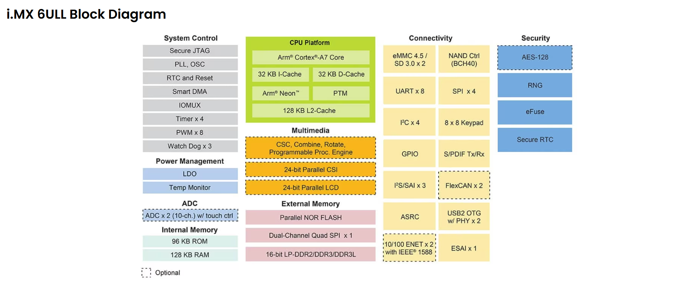
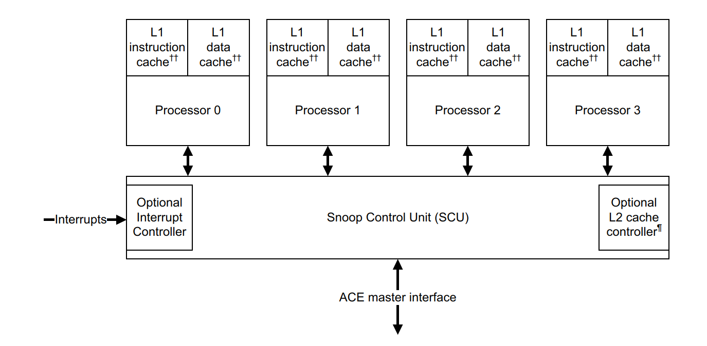

# 从0开始的IMX6ULL学习篇——裸机篇之分析IMX6ULL

​	让我们到NXP的官网上扫一眼。

> [i.MX 6ULL应用处理器_Arm® Cortex®-A7单核，频率为900 MHz | NXP 半导体](https://www.nxp.com.cn/products/i.MX6ULL)

​	我们先看CPU Platform，这个是我们的核心。

​	这里我们的芯片是基于Arm Cortex-A7核心，这是一种高效能的处理器核心，**适用于嵌入式应用。它支持32KB的指令缓存（I-Cache）和数据缓存（D-Cache），以及128KB的二级缓存（L2-Cache）**，这些缓存有助于提高数据处理速度。关于Cortex-A7手册可以自行到ARM架构的官网上找ARMv7a的手册慢慢看，

​	多媒体上，我们的这个芯片架构是支持24位并行CSI（摄像头接口）和LCD接口，以及S/PDIF Tx/Rx（数字音频接口）。至少，看，听，说交互是可行的。这一点在我们的上一篇介绍外设的时候就体现出来了。

​	外设连接上，支持：8个UART接口、4个SPI接口、2个FlexCAN接口、2个10/100以太网接口（ENET）、2个USB 2.0 OTG接口（带有PHY）、1个双通道Quad SPI接口和3个FS/SAI接口。显然这些常见的协议支持可以让我们玩很久很久的外设了（

​	电源管理上：系统包含LDO（低压差稳压器）和温度监控功能，有助于优化电源使用和系统稳定性。

​	安全性笔者不理解，这里就请出Deepseek帮我说：系统集成了多种安全功能，如AES-128加密、安全JTAG、安全RTC和随机数生成器（RNG）。这些功能有助于保护系统免受未经授权的访问和数据泄露。

​	外部存储器上，我们的系统支持非常的多的外部存储器接口，如eMMC 4.5、NAND控制器、并行NOR闪存和16位LP-DDR2/DDR3/DDR3L内存。内部存储器包括96KB ROM和128KB RAM，为系统提供了足够的存储空间。

​	当然，其他部分就是可编程处理引擎、多个定时器、看门狗定时器、PWM输出、GPIO接口、ADC（模数转换器）和ASRC（异步采样率转换器）。这些功能增强了系统的灵活性和可配置性，适用于多种应用场景。

​	可见芯片功能还是非常的NB的。

## 简单的说一下Cortex-A7架构

​	我们的IMX6ULL本身还是使用的是Armv7-A在嵌入式中特化的低功耗（或者说高功耗利用率）的架构。在我们的Cortex-A7技术手册中的第一小节About the Cortex-A7 MPCore processor中，就简单的介绍了一下这个架构的一些涉及理念。

​		可以看到，多个处理器拥有自己的私有的指令缓存和数据缓存。缓存我们知道，就是减少了处理器访问内存拿取数据的次数。这样，我们节约的时间将会有效的减少流水线堵塞时间。

​	这个架构的诞生之初起始是ARM想要设计一个大小核的处理器，大核，也就是A15用于做高性能，A7则是小核，处理那些低功耗就能完成的任务。

​	你马上就会发问了：每一个处理器都是只有私有的数据和指令缓存。假设我一个任务：第一次部署的时候发给了CPU1，CPU2等跑，且需要共享一部分内存的数据，之后我们其中一个CPU向共享数据里写了数据，其他的没有，那么，这不就出现了缓存不一致，我们咋保证程序的运行结果是确定的呢？

​	答案就是下半部分的Snoop Control Unit（SCU，侦听控制单元），它是计算机体系结构中的一个重要组件，主要用于多核处理器系统中，管理多个处理器核心之间的缓存一致性（Cache Coherency）。在多核系统中，每个核心通常都有自己的缓存（Cache），当多个核心访问共享内存时，可能会出现缓存不一致的问题。SCU的作用就是确保所有核心的缓存数据保持一致。

​	熟悉架构的朋友马上就想到了一个经典的协议：MESI协议：Modified, Exclusive, Shared, Invalid，我们这里不去做太详细的说明，知道这个协议保证了“缓存一致性”，这样无论如何都不会在架构层次出现数据不统一的问题。

​	SCU的可以实现这个功能，依赖于侦听（Snooping）：SCU会监听总线上的所有内存访问请求。当某个核心试图修改共享数据时，SCU会通知其他核心，使它们更新或无效化相关的缓存数据。就是这样的原理！

## 讨论ARMv7a-cortex系列的运行模式

​	我们回忆一下，Intel的老式处理器是分为了四个运行模式：分别是特权级0~3。在不同的特权级下，处理器可以执行不同的代码。

​	ARM的就显得非常的丰富多彩了，我们给不同场景分配了非常多的模式。

| Mode             | Encoding | Function                                                     | Security state | Privilege level |
| ---------------- | -------- | ------------------------------------------------------------ | -------------- | --------------- |
| User (USR)       | 10000    | Unprivileged mode in which most applications run             | Both           | PL0             |
| FIQ              | 10001    | Entered on an FIQ interrupt exception                        | Both           | PL1             |
| IRQ              | 10010    | Entered on an IRQ interrupt exception                        | Both           | PL1             |
| Supervisor (SVC) | 10011    | Entered on reset or when a Supervisor Call instruction (SVC) is executed | Both           | PL1             |
| Monitor (MON)    | 10110    | Implemented with Security Extensions. See Chapter 21         | Secure only    | PL1             |
| Abort (ABT)      | 10111    | Entered on a memory access exception                         | Both           | PL1             |
| Hyp (HYP)        | 11010    | Implemented with Virtualization Extensions. See Chapter 22   | Non-secure     | PL2             |
| Under (UND)      | 11011    | Entered when an undefined instruction executed               | Both           | PL1             |
| System (SYS)     | 11111    | Privileged mode, sharing the register view with User mode    | Both           | PL1             |

| 模式           | 编码  | 功能                                      | 安全状态 | 特权级别 |
| -------------- | ----- | ----------------------------------------- | -------- | -------- |
| 用户 (USR)     | 10000 | 大多数应用程序运行的无特权模式            | 两者     | PL0      |
| FIQ            | 10001 | 在FIQ中断异常时进入                       | 两者     | PL1      |
| IRQ            | 10010 | 在IRQ中断异常时进入                       | 两者     | PL1      |
| 超级用户 (SVC) | 10011 | 在复位或执行超级用户调用指令 (SVC) 时进入 | 两者     | PL1      |
| 监视器 (MON)   | 10110 | 使用安全扩展实现。                        | 仅安全   | PL1      |
| 中止 (ABT)     | 10111 | 在内存访问异常时进入                      | 两者     | PL1      |
| Hyp (HYP)      | 11010 | 使用虚拟化扩展实现                        | 非安全   | PL2      |
| 未定义 (UND)   | 11011 | 在执行未定义指令时进入                    | 两者     | PL1      |
| 系统 (SYS)     | 11111 | 特权模式，与用户模式共享寄存器视图        | 两者     | PL1      |

​	除了 User(USR)用户模式以外，其它8 种运行模式都是特权模式。这几个 运行模式可以通过软件进行任意切换，也可以通过中断或者异常来进行切换。大多数的程序都运行在用户模式，用户模式下是不能访问系统所有资源的，**有些资源是受限的，要想访问这些 受限的资源就必须进行模式切换。但是用户模式是不能直接进行切换的**，**用户模式下需要借助异常来完成模式切换，当要切换模式的时候，应用程序可以产生异常，在异常的处理过程中完 成处理器模式切换。  当中断或者异常发生以后，处理器就会进入到相应的异常模式**，每一种模式都有一组寄 存器供异常处理程序使用，这样的目的是为了保证在进入异常模式以后，用户模式下的寄存器 不会被破坏。（这一点，Intel的80386架构是通过压栈和弹栈实现的）

### 寄存器

​	回忆我们学习Intel架构的时候，我们肯定会去学寄存器，经典的x86的寄存器实在是相当可怜的少，只有8个寄存器：EAX,EBX,ECX,EDX,ESI,EDI,EBP和ESP。对比看来，ARM架构简直就是富豪

| 寄存器   | 名称/功能描述                            |
| -------- | ---------------------------------------- |
| R0       | 通用寄存器                               |
| R1       | 通用寄存器                               |
| R2       | 通用寄存器                               |
| R3       | 通用寄存器                               |
| R4       | 通用寄存器                               |
| R5       | 通用寄存器                               |
| R6       | 通用寄存器                               |
| R7       | 通用寄存器                               |
| R8       | 通用寄存器                               |
| R9       | 通用寄存器                               |
| R10      | 通用寄存器                               |
| R11      | 通用寄存器                               |
| R12      | 通用寄存器                               |
| R13 (SP) | 堆栈指针                                 |
| R14 (LR) | 链接寄存器                               |
| R15 (PC) | 程序计数器                               |
| CPSR     | 当前程序状态寄存器                       |
| SPSR     | 备份程序状态寄存器（有些运行模式下没有） |

​	注意到的是：每一个模式下都是一个独立的寄存器的视图。这个视图下，蓝色部分的是这个模式独有的。FIQ 模式下 R8~R14 是独立的物理寄 存器。假如某个程序在 FIQ 模式下访问 R13 寄存器，那它实际访问的是寄存器 R13_fiq，如果 程序处于 SVC 模式下访问 R13 寄存器，那它实际访问的是寄存器 R13_svc。

​	所有的处理器模式都共用一个 CPSR 物理寄存器，因此 CPSR 可以在任何模式下被访问。CPSR 是当前程序状态寄存器，该寄存器包含了条件标志位、中断禁止位、当前处理器模式标志 等一些状态位以及一些控制位。

​	所有的处理器模式都共用一个 CPSR 必然会导致冲突，为此， 除了 User 和Sys 这两个模式以外，其他7 个模式每个都配备了一个专用的物理状态寄存器，叫 做 SPSR(备份程序状态寄存器)，当特定的异常中断发生时，SPSR 寄存器用来保存当前程序状 态寄存器(CPSR)的值，当异常退出以后可以用 SPSR 中保存的值来恢复 CPSR。 因为 User 和 Sys 这两个模式不是异常模式，所以并没有配备 SPSR，因此不能在 User 和 Sys 模式下访问 SPSR，会导致不可预知的结果。由于 SPSR 是 CPSR 的备份，因此 SPSR 和 CPSR 的寄存器结构相同

| 位范围 | 位名称   | 描述                                                         |
| ------ | -------- | ------------------------------------------------------------ |
| 31     | N        | 负标志位（Negative flag）。当结果为负数时置1。               |
| 30     | Z        | 零标志位（Zero flag）。当结果为零时置1。                     |
| 29     | C        | 进位标志位（Carry flag）。当操作产生进位时置1。              |
| 28     | V        | 溢出标志位（Overflow flag）。当操作产生溢出时置1。           |
| 27     | Q        | 饱和标志位（Saturation flag）。当发生饱和时置1。             |
| 26-25  | IT[1:0]  | If-Then 状态位的一部分，用于Thumb指令集的条件执行。（此位通常和T(bit5)位一起表示当前所使用的指令集） |
| 24     | J        | Jazelle 状态位。用于指示处理器是否处于Jazelle状态。          |
| 23-20  | Reserved | 保留位，未使用。                                             |
| 19-16  | GE[3:0]  | 大于或等于标志位（Greater than or Equal flags）。用于SIMD指令集。 |
| 15-10  | IT[7:2]  | If-Then 状态位的剩余部分，用于Thumb指令集的条件执行。        |
| 9      | E        | 端序控制位（Endianness bit）。0表示小端序，1表示大端序。     |
| 8      | A        | 异步中止屏蔽位（Asynchronous abort mask bit）。              |
| 7      | I        | IRQ 中断屏蔽位（IRQ interrupt mask bit）。                   |
| 6      | F        | FIQ 中断屏蔽位（FIQ interrupt mask bit）。                   |
| 5      | T        | 状态位（State bit）。0表示ARM状态，1表示Thumb状态。          |
| 4-0    | M[4:0]   | 模式位（Mode bits）。用于指示当前处理器模式。                |

## 后言

​	对了，这里必须说一下，我们马上进行裸机编程要，所以，就不得不理解一下，IMX6ULL是如何完成对寄存器命名的，不然我们连找寄存器都没地方找。

​	简单的说：`SW_MUX_CTL_PAD_*`负责设置管脚使用什么复用功能，`SW_PAD_CTL_PAD_*`用来设置管脚的属性，比如在输出时什么属性，输入时什么属性。

​	比如说我们的SW_MUX_CTL_PAD_BOOT_MODE0寄存器表达了实际上的外设功能。比如说这里就是一个BOOT0模式的选择。我们注意到还有一个SW_PAD_CTL_PAD_BOOT_MODE0。这个更有意思，他是控制我们的SW_MUX_CTL_PAD_BOOT_MODE0的行为的。所以说，实际上我们每一个逻辑寄存器几乎都被分成两个物理寄存器。一个做事，一个管做事的咋做事。