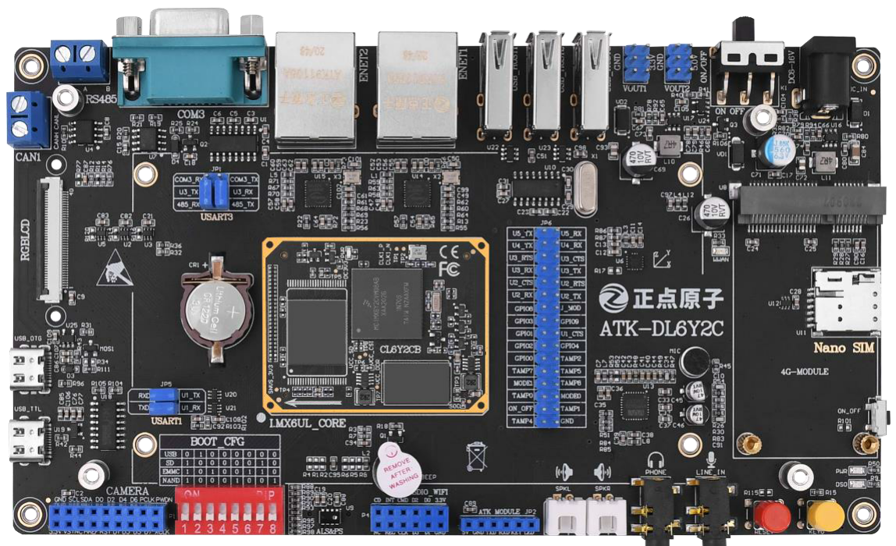

# 从0开始的IMX6ULL学习篇——裸机篇之外设资源分析

​	这个就是现在可以买到之后开发板的模样。我们从最右上角那一处依次逆时针一个个分析。

​	我们跳过显然的电源插孔，拨动开关和3V3与5V的外接板。第一个就是USB HOST接口。**USB Host** 是USB通信协议中的一个重要概念，它指的是控制USB总线数据传输的主端设备。在USB通信中，只能有一个Host，它负责管理整个USB总线上的数据传输。与之相对的是 **USB Device** 或 **USB Slave**，即从设备，它们依赖于Host来进行数据交换。也就是说，我们的板子上可以理解为3个USB插孔，可以直接往里截如USB设备，此时我们的开发板就成为了主机。你介入的东西就成为了Slave，从机。

​	下一个是两个以太网接口。之后我们板子的网络通信总是跑不了这几个以太网接口。我们需要网线让我们的开发板和我们的上位机链接起来进行通信。这个是后面的内容。

​	下一个是RS232接口，这个接口是一个母接口。是一个串口通信当中的一个非常经典的接口。通过一个标准的 DB9 母头和外部的串口连接。通过这个接口，我们可以连接带有串口的电脑或者其他设备，实现串口通信

​	之后的家伙是一个串口RS485 通过 2 个端口和外部 485 设备连接。这里提醒大家，RS485 通信的时候，必须A 接 A，B 接B。否则可能通信不正常 。之后链接串口设备的时候用这个。

​	顺时针下来，就还有CAN接口，搞CAN的朋友可以使用这个接口整活。

​	在下一个是RGB显示屏。笔者就是买了一个4.3寸RGB显示屏的板子。

​	在之后就是我们的USB Slave（OTG）接口和USB-TTL串口。OTG是USB的一个功能。允许设备在没有主机的情况下直接与其他USB设备通信。传统USB连接中，设备分为主机（如电脑）和外设（如鼠标、键盘），主机负责控制通信，外设则响应主机的指令。**USB OTG打破了这一限制，使设备既能充当主机，也能作为外设，具体角色通过协商决定。**

​	典型的就是我们的手机直接连接U盘而不需要使用计算机作为一个转接。现在很多USB设备可以摆脱计算机作为中介，实现智能的移动电子设备跟其他USB设备直接交互。

​	USB转TTL那就是老朋友了。

​	再顺下来就是正点家的Camera接口，笔者没有购买他家的摄像头模块，我们跳过去。背面有一个TF(MicroSD)卡接口。我们之后做开发的时候，时常会将我们的程序烧录到SD卡上。连同BOOT选择的拨码开关完成系统向SD卡启动的引导。

​	在之后是SDIO WIFI 接口 这是开发板上的一个SDIO WIFI(P4)接口，可以通过此接口连接正点原子出品的SDIO WIFI。模块。SDIO WIFI 接口和 TF 卡共用一个 USDHC 接口，因此不能同时和TF 卡使用。 

​	在之后是一个耳机输出接口：该接口可以插 3.5mm 的耳机，当WM8960 放音的时候，就可以通过在该接口插入耳机，欣赏音乐。此接口支持耳机插入检测，如果耳机不插入的话默认通过喇叭播放音乐，如果插入耳机的话就关闭喇叭，通过耳机播放音乐。 旁边就是对称的录音输入接口

​	再最后一侧：Mini PCIE 4G 接口 。这是开发板板载的一个 Mini PCIE 座，但是本质上走的 USB 协议，通过此接口可以连接4G模块，比如高新兴物联的 ME3630。接上 4G 模块以后 I.MX6U-ALPHA 开发板就可以实现 4G 上网功能，对于不方便布网线或者没有WIFI 的场合来说是个不错的选择。 

​	差不多到这里了，笔者的下一篇博客就准备学习我们的芯片原理等。