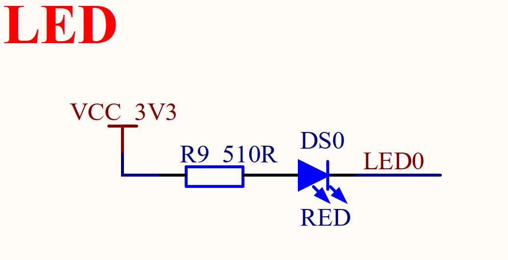
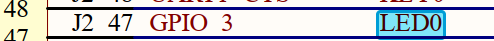
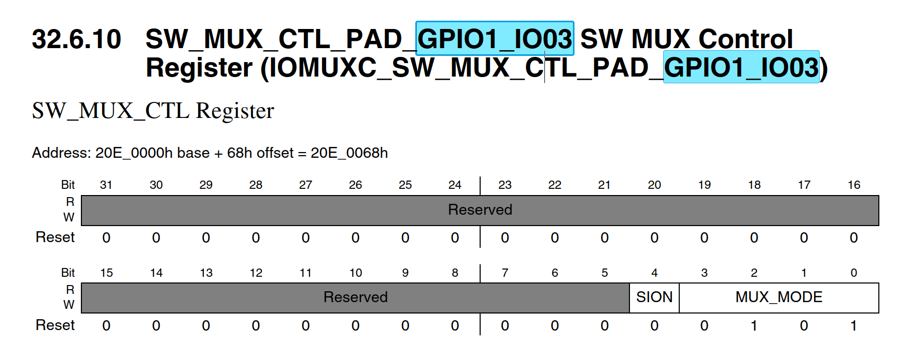
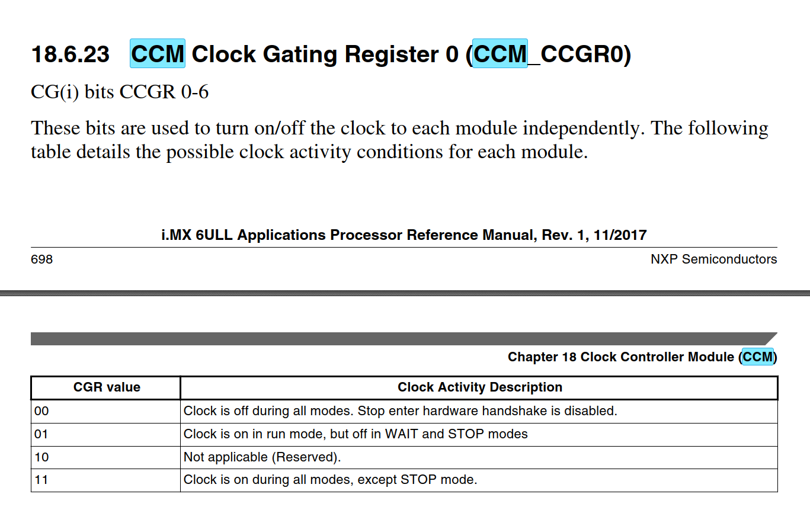
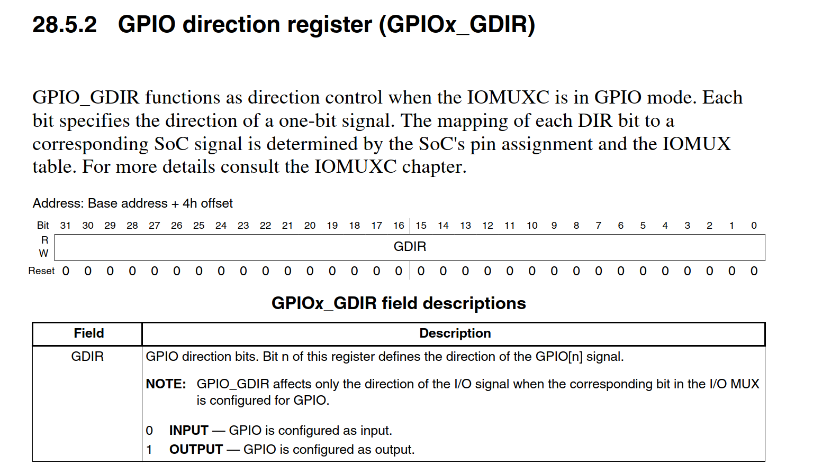
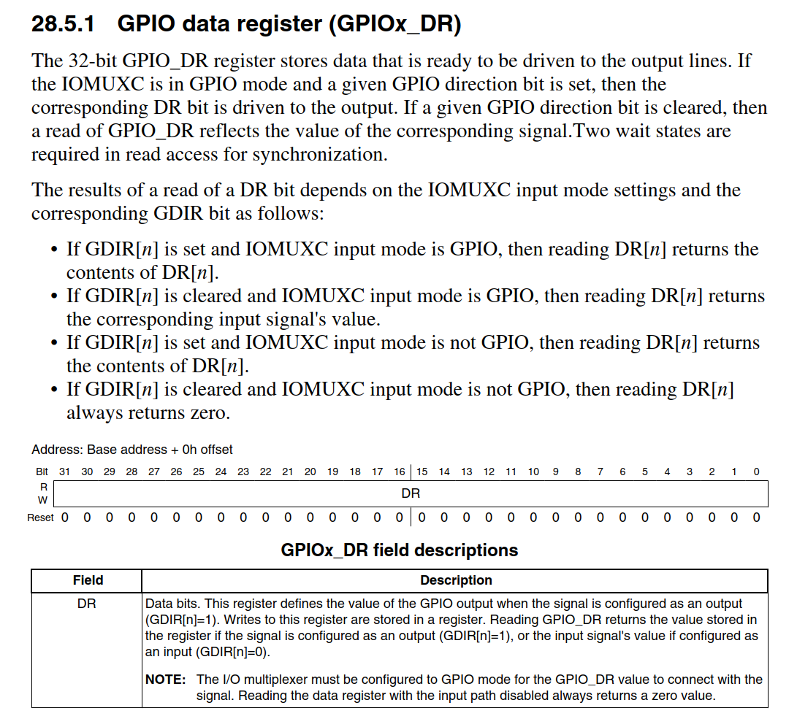
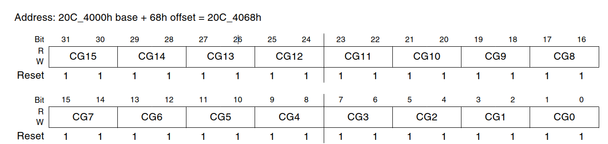
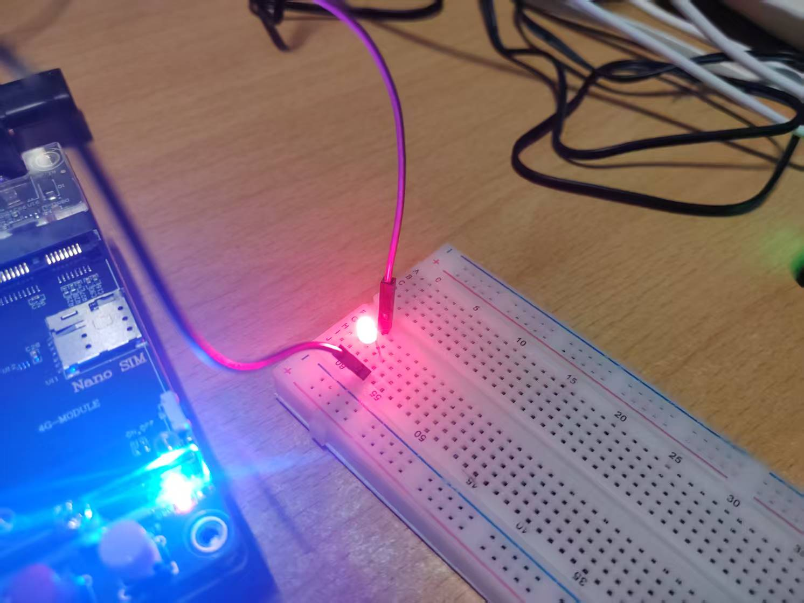

# 从0开始的IMX6ULL学习篇——裸机篇之汇编点灯

## 所以，为什么要汇编点灯

​	首先，我们需要使用汇编初始化一些片上系统外设。因为这个时候，C语言的运行环境甚至还没有被初始化（如果你对这类问题有类似的疑问，可以看看笔者自己写的操作系统教程，在那里，我们也是需要初始化一部分必备的外设后，建立好C语言的运行环境之后才能实现用户对设备的C语言层级操控）

​	其次，我们还需要对DDR进行初始化，当然也是汇编。NXP的IMX6ULL板子不用这样做。我们直接在bin文件头部添加必备的信息（笔者后面会详细的解释）就好了，上电时芯片自动读取信息进行对DDR的初始化

> DDR的全称为Double Data Rate SDRAM（双倍速率的SDRAM），就是我们平时说的**内存颗粒**，也就是**内存芯片**。所以，我们不妨就理解为：对芯片运行程序的内存的初始化

## 看看我们的板子的LED灯图

​	看这个图！在正点原子附赠的开发板原理图上：



​	非常简单，外面只需要操作LED0端口电平的高低，我们就完成了对点灯的操作了。我们搜索开发板原理图。在这里：



​	这里的GPIO3实际上说的对应于板子的芯片上是GPIO1_GPIO3，我们就是对这个寄存器进行操作



​	找到手册的这个地方。

​	我们下一步就是学习：

- 建立基本的初始化环境
- 操作我们的GPIO1_IO3的电平

## 思考初始化GPIO的初始化思路

​	笔者有一个讲述STM32F407ZGT6系列的点灯流水博客，是从启动时到点灯的流程。这里给出第三步的博客：https://blog.csdn.net/charlie114514191/article/details/145840256

- 使能GPIO的时钟
- 设置IO的复用功能为GPIO
- 配置GPIO的电气属性：推拉；速度；拉高拉低等

​	我们看到IMX6ULL应用编程手册的第十八章：时钟控制模块CCM（Clock Control Module），下面是笔者对这个手册的翻译：

> 时钟控制模块 (CCM) 生成并控制设计中各个模块的时钟，并管理低功耗模式。此模块使用可用的时钟源生成时钟根。换而言之，我们想要驱动这个芯片连接上的外设，就必须先开启GPIO的时钟。我们的板子上，有七个寄存器用来控制外面的时钟。
>
> - PLL1 也称为 ARM PLL
> - PLL2 也称为系统 PLL
> - PLL3 也称为 USB1 PLL
> - PLL4 也称为音频 PLL
> - PLL5 也称为视频 PLL
> - PLL6 也称为 ENET PLL
> - PLL7 也称为 USB2 PLL（此 PLL 仅由 USB UTM 接口通过直接连接使用。）



​	看到这里，这里就是外设时钟的使能。其中，为了方便起见，我们打算使用11，将所有的时钟都开启起来。

​	其二，准备设置的这个GPIO：SW_MUX_CTL_PAD_GPIO1_IO03设置为GPIO功能。下面的表格中，我们看到：

```
0101 ALT5 — Select mux mode: ALT5 mux port: GPIO1_IO03 of instance: gpio1
```

​	这个向我们保证了，如果我们的MUX Mode设置为5的时候，我们就将GPIO1_IO03设置为一个GPIO。

​	其三，设置GPIO1_IO03的电气属性。这个事情，笔者上一个博客说了：几乎每一个寄存器都有自己的设置寄存器，其命名的第三个字段名是PAD。也就是说，找IOMUXC_SW_PAD_CTL_PAD_GPIO1_IO03这个寄存器，我们一搜索就搜索到了。

​	我们实际上就是配置压摆率（电平跳变时刻多抖），速度，驱动能力，开漏性质和上下拉等等

​	下一步，好需要配置GPIO的输入输出部分。以及如果是输出，还要决定高低。



​	我们找到第二十八章的GPIO部分，首先，我们需要配置的是GDIR寄存器。我们需要设置一下我们GPIO的方向，自然就是输入还是输入。显然，查看手册，我们需要设置为1.



​	这个就是GPIO的数据寄存器。他指出

> 数据位。当信号配置为输出 (GDIR[n]=1) 时，此寄存器定义 GPIO 输出的值。写入此寄存器的内容存储在寄存器中。如果信号配置为输出 (GDIR[n]=1)，则读取 GPIO_DR 将返回存储在寄存器中的值；如果配置为输入 (GDIR[n]=0)，则读取输入信号的值。

​	这下就看懂了，我们直接去写DR寄存器的第三个比特。就可以控制GPIO的电平的高低。

## 写汇编启动！

​	我们下面做的就是对上面说的事情进行编程。这里，我们就不去复习ARM汇编了，默认看笔者博客的朋友呢，都是会ARM汇编的。

​	不同于正点点亮LED，我是打算驱动的是我自己外接在GPIO1_IO2上的一个LED小灯。检验一下自己的学习成过。

### 查手册，理清楚我们的东西在哪里。

​	翻阅我们的IMX6ULL编程手册，我们上面的分析要求我们——开启时钟，就需要知道时钟寄存器的外设地址，这里笔者偷个懒，全开了。



（NXP手册也干了）

​	注意到的一个编程技巧，我们的外设时钟是连续的，所以事情变得超级简单，我们直接连续的使用循环赋值即可

```
.equ CLK_ADDR,      0x020C4068	; 时钟控制寄存器基地址
.equ ENABLE_ALL,    0xFFFFFFFF  ; 使能所有时钟
```

​	可以看到，我们需要配置从CCGR0 - CCGR6 7个寄存器

```asm
// 我们默认的程序从 _start 入口执行
.global _start

_start:
    // 初始化时钟寄存器 CCGR0 - CCGR6
    ldr r0, =CLK_ADDR        ; 加载时钟寄存器基地址
    ldr r1, =ENABLE_ALL      ; 使能所有时钟
    ldr r2, =7               ; 需要配置 7 个寄存器

init_clock:
    str r1, [r0]             ; 设置时钟寄存器
    add r0, r0, #4           ; 移动到下一个寄存器地址
    subs r2, r2, #1          ; 计数减一
    bne init_clock           ; 如果未完成，继续循环
```

​	这个实在没啥好说的，看下一个：我们看手册，找到我们的GPIO_IO2的地址是0x020E0064

```
.equ GPIO1_IO2_MUX, 0x020E0064  ; GPIO1_IO2 的复用寄存器地址
.equ MUX_MODE,      0x05        ; 复用模式设置
```

> 0101 ALT5 — Select mux mode: ALT5 mux port: GPIO1_IO02 of instance: gpio1选择这个在手册中亦有记载

```asm
init_gpio:
    // 设置 GPIO1_IO2 的复用模式
    ldr r0, =GPIO1_IO2_MUX   ; 加载 GPIO1_IO2 复用寄存器地址
    ldr r1, =MUX_MODE        ; 设置复用模式
    str r1, [r0]             ; 写入寄存器
```

​	在下一步，就是我们配置GPIO1_IO2的电气属性了，为什么配置成这个呢？看下面的注释，我说的很明白了

```asm
.equ GPIO1_IO2_PAD, 0x020E02F0  ; GPIO1_IO2 的PAD控制寄存器地址
.equ PAD_MODE,      0x10B0      ; PAD模式配置值
...
    /*
        配置 GPIO1_IO2 的 PAD 属性：
        低位到高位:
        - bit 0: 速度选择，0 表示低速
        - bit 1-2: 保留，设为 0
        - bit 3-5: 驱动强度 R0/6 (110)
        - bit 6-7: GPIO 速度设为 10
        - bit 8-10: 保留，设为 0
        - bit 11: 关闭开漏
        - bit 12: 保持功能启用
        - bit 13: 保持功能类型 (0)
        - bit 14-15: 电压参考 3.3V (00)
        - bit 16: 关闭迟滞功能
        最终配置值为 0x10B0
    */
    ldr r0, =GPIO1_IO2_PAD   ; 加载 PAD 控制寄存器地址
    ldr r1, =PAD_MODE        ; 加载 PAD 配置值
    str r1, [r0]             ; 写入寄存器
```

​	最后一步，设置GPIO的方向和电平

```asm
.equ GPIO_DR,       0x0209C000  ; GPIO1 数据寄存器地址
.equ GPIO_GDIR,     0x0209C004  ; GPIO1 方向寄存器地址
...
    // 设置 GPIO 方向寄存器，将 GPIO1_IO2 配置为输出
    ldr r0, =GPIO_GDIR       ; 加载 GPIO 方向寄存器地址
    ldr r1, =0x0004          ; 设置 GPIO1_IO2 为输出 (bit2=1)
    str r1, [r0]             ; 写入寄存器

    // 设置 GPIO 数据寄存器，使 GPIO1_IO2 输出高电平
    ldr r0, =GPIO_DR         ; 加载 GPIO 数据寄存器地址
    ldr r1, =1               ; 设置 GPIO1_IO2 输出高
    str r1, [r0]             ; 写入寄存器

stop:
    b stop                   ; 死循环，保持当前状态
```

​	完事。我们按照下面的步骤写一个Makefile。给文件添加头使用正点原子的。

> **不要照抄我的Makefile**，自己搞清楚每一行是干啥的！**把自己电脑整挂了后果自负！**

```makefile
COMPILER_PREFIX = arm-linux-gnueabihf-
OBJ-NAME		= led

${OBJ-NAME}.bin:led.s 
	${COMPILER_PREFIX}gcc -g -c led.s -o ${OBJ-NAME}.o 
	${COMPILER_PREFIX}ld -Ttext 0X87800000 ${OBJ-NAME}.o -o ${OBJ-NAME}.elf 
	${COMPILER_PREFIX}objcopy -O binary -S -g ${OBJ-NAME}.elf ${OBJ-NAME}.bin 
	${COMPILER_PREFIX}objdump -D ${OBJ-NAME}.elf > ${OBJ-NAME}.dis 

.PHONY: clean upload

clean:
	rm -rf *.o *.bin *.elf *.dis

upload:
# 停停停，改成自己所在的sd卡的的位置！！！！！！！！！！！！！！！
	./imxdownload ${OBJ-NAME}.bin /dev/sdb1
```

​	下一步就是

```
make clean
make 
make upload
```

​	三部曲，我们把文件编译成二进制文件之后，烧成NXP的格式上传上去。



​	小灯点亮~。

​	笔者也同样完成了正点的点亮GPIO01_IO3的部分，代码直接给出来

```asm
.equ CLK_ADDR,      0x020C4068
.equ ENABLE_ALL,    0xFFFFFFFF

.equ GPIO1_IO3_MUX, 0x020E0068
.equ MUX_MODE,      0x05

.equ GPIO1_IO3_PAD, 0x020E02F4
.equ PAD_MODE,      0x10B0

.equ GPIO_DR,       0x0209C000
.equ GPIO_GDIR,     0x0209C004

// start from _start as gnu indicate
// our code will start at _global
.global _start

_start:
    // CCGR0
    ldr r0, =CLK_ADDR
    ldr r1, =ENABLE_ALL
    ldr r2, =7

init_clock:
    str r1, [r0]
    add r0, r0, #4
    subs r2, r2, #1
    bne init_clock

init_gpio:
    ldr r0, =GPIO1_IO3_MUX
    ldr r1, =MUX_MODE
    str r1, [r0]

/*
    start set the properties:
    low -> high
    bit 0: should be 0 for slow speed: 0
    bit 1-2: reserved as 0
    bit 3-5: we set 110 for R0/6
    bit 6-7: set the gpio speed as 10
    bit 8-10: reserved for 0
    bit 11: we set the open drain as close
    bit 12: keeper should be set, so 1
    bit 13: and it's keeper: 0
    bit 14-15: we set as 00, led is set as the one 3V3
    bit 16: disable the HYS, we don't need it

    so the bits we should set is simple:
    -> 0001 0000 1011 0000 = 0x10B0
*/

    ldr r0, =GPIO1_IO3_PAD
    ldr r1, =PAD_MODE
    str r1, [r0]

    ldr r0, =GPIO_GDIR
    ldr r1, =0x0008
    str r1, [r0]

    ldr r0, =GPIO_DR
    ldr r1, =0
    str r1, [r0]

stop:
    b stop
```

