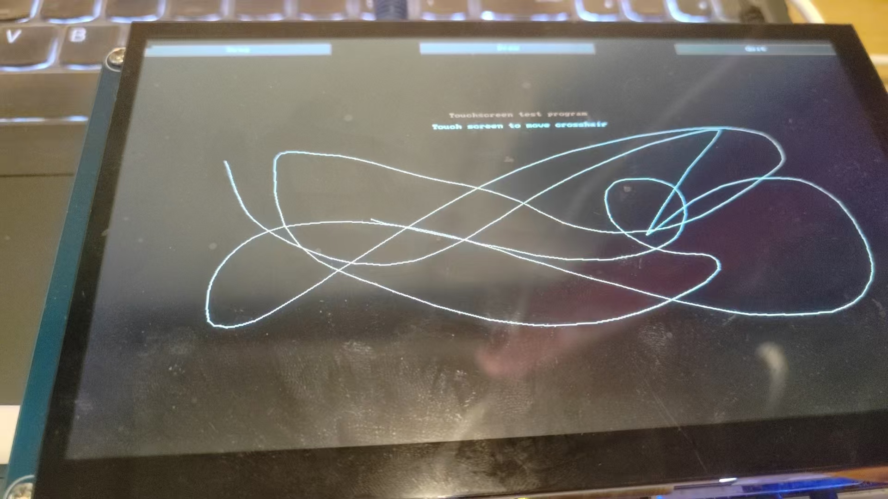

# IMX6ULL 最新方案移植教程中间间系列2——LCD GT911触摸屏移植方案

## 前言

​	这个移植可以说是非常重要的，因为我们的可视化跟本子交互，就是跟我们的LCD屏幕进行交互，不这样做，我们的QT程序（或者是任何其他的GUI程序）就没法写（因为没有意义）。因此，我们必须写好LCD的触摸屏方案而且正常的移植成功。为此，笔者将会给出一个比较理想的方案来实现GT911触摸屏的加载。

​	还是一样，笔者使用的内核是Linux6.12.3

```
~ # uname -a
Linux 10.41.0.2 6.12.3-g37d02f4dcbbe-dirty #28 SMP PREEMPT Wed Apr 23 23:41:50 CST 2025 armv7l GNU/Linux
```

​	还是需要说明的是，移植教程侧重于如何做才能跑起来，如果你对原理更感兴趣，需要等待一定时间笔者博客的产出~。

## 老样子，0帧起手

​	笔者移植的是GT911，大小是1024x600的触摸显示屏。关于这个，**你需要注意的是这个触摸屏不是跟正点原子说的一样的，几乎完全兼容的，首先IIC地址就是不一样的，因此，你需要额外的修改一下IIC地址**，对于4.3寸的经典GT9147的朋友，没必要那样麻烦，直接使用正点教程的配置即可。

​	我们的LCD触摸芯片节点挂载到我们的I2C2上，因为板子上是这样接的

```
&i2c2 {
	clock-frequency = <100000>;
	pinctrl-names = "default";
	pinctrl-0 = <&pinctrl_i2c2>;
	status = "okay";

	// 其他的一些无关信息

	gt9147:gt9147@5d { 
		compatible = "goodix,gt9147", "goodix,gt9xx"; 
		reg = <0x5d>; 
		pinctrl-names = "default"; 
		pinctrl-0 = <&pinctrl_tsc
					 &pinctrl_tsc_reset>; 
		interrupt-parent = <&gpio1>; 
		interrupts = <9 0>; 
		reset-gpios = <&gpio1 5 GPIO_ACTIVE_LOW>;
		interrupt-gpios = <&gpio1 9 GPIO_ACTIVE_LOW>; 
		status = "okay"; 
		vdd-supply = <&reg_vddio>;      // 电源关联
        avdd-supply = <&reg_avdd28>;    // 电源关联
	}; 
};

```

​	我们的GT911使用的是I²C2 控制器，并设置了时钟频率为 100kHz，同时指定了用于该总线的引脚复用配置。GT9147 节点本身通过 reg 属性表明其 I²C 地址为 0x5d（哦对了，正点的可能是0x14，但是笔者这个是咸鱼上找掏的，经过测试是0x5d，需要注意的是你拿不准就先写0x14和0x5d其中一个，到时候我会讲如何试探i2c地址设备），并通过 compatible 字段声明该设备兼容 "goodix,gt9147" 和 "goodix,gt9xx" 这两个驱动标识，从而使内核在启动时能找到合适的驱动程序加载它。该节点还使用了 pinctrl 子系统为其分配了两组引脚配置，分别用于正常通信和复位操作，同时指定其中断源来自 GPIO1 控制器中的第9号引脚，并设定为低电平触发方式。为了确保设备能正常初始化，还设置了两个 GPIO 引脚，一个用于 reset，另一个用于中断信号，并都设定为低电平有效。

​	此外，该节点通过 vdd-supply 和 avdd-supply 分别绑定了主电源和模拟电源，分别连接到系统中定义的电源管理节点 reg_vddio 和 reg_avdd28，这个电源节点是正点配置所没有的，我们需要配置这个才能让内核稳定的驱动我们的设备！以提供稳定的工作电压。整个节点处于启用状态，意味着设备树期望系统在启动时自动识别并初始化这个触摸控制器。整段配置的目标是确保驱动能够正确获取硬件资源并完成初始化，从而实现触摸功能。

​	现在，笔者还需要给出一些关键的节点信息：

```
	pinctrl_tsc: tscgrp {
		fsl,pins = <
			// 下面的这些注释掉
			/* MX6UL_PAD_GPIO1_IO01__GPIO1_IO01		0xb0
			MX6UL_PAD_GPIO1_IO02__GPIO1_IO02		0xb0
			MX6UL_PAD_GPIO1_IO03__GPIO1_IO03		0xb0
			MX6UL_PAD_GPIO1_IO04__GPIO1_IO04		0xb0 
			MX6UL_PAD_SNVS_TAMPER9__GPIO5_IO09 		0x10B0 */
			 /* TSC_RST */ 
			 // 只留下这个：
			MX6UL_PAD_GPIO1_IO09__GPIO1_IO09 		0x79 /* TSC_INT */
		>;
	};
	
	pinctrl_tsc_reset: tsc_reset { 
        fsl,pins = < 
			MX6UL_PAD_GPIO1_IO05__GPIO1_IO05 0x10B0
        	/* MX6ULL_PAD_SNVS_TAMPER9__GPIO5_IO09 	0x10B0 */ 
        >; 
	};
```

​	注意，这里跟正点原子的不太一样，就是在笔者换了一个reset引脚，因为我们这个触摸屏后面回跟音频芯片WM8960打架，不这样设置一定会出引脚冲突。

​	以及修改一下tsc节点的信息：

```
&tsc {
	pinctrl-names = "default";
	pinctrl-0 = <&pinctrl_tsc>;
	/* xnur-gpios = <&gpio1 3 GPIO_ACTIVE_LOW>; */
	measure-delay-time = <0xffff>;
	pre-charge-time = <0xfff>;
	status = "okay";
};
```

​	添加上两个电源的引脚信息：

```
    reg_vddio: regulator-vddio {
        compatible = "regulator-fixed";
        regulator-name = "VDDIO";
        regulator-min-microvolt = <3300000>;
        regulator-max-microvolt = <3300000>;
        regulator-enable-high = <1>;
    };

    reg_avdd28: regulator-avdd28 {
       	compatible = "regulator-fixed";
        regulator-name = "AVDD28";
        regulator-min-microvolt = <2800000>;
        regulator-max-microvolt = <2800000>;
        regulator-enable-high = <1>;
    };	
```

​	到这里就OK了。我们编译一下设备树，上传到板子上，使用i2cdetect嗅探一下i2c总线上是不是挂载了我们的期望的设备。看到5d处的UU，那就是对位了。

```
~ # i2cdetect -y 1
     0  1  2  3  4  5  6  7  8  9  a  b  c  d  e  f
00:          -- -- -- -- -- -- -- -- -- -- -- -- -- 
10: -- -- -- -- -- -- -- -- -- -- -- -- -- -- -- -- 
20: -- -- -- -- -- -- -- -- -- -- -- -- -- -- -- -- 
30: -- -- -- -- -- -- -- -- -- -- -- -- -- -- -- -- 
40: -- -- -- -- -- -- -- -- -- -- -- -- -- -- -- -- 
50: -- -- -- -- -- -- -- -- -- -- -- -- -- UU -- -- 
60: -- -- -- -- -- -- -- -- -- -- -- -- -- -- -- -- 
70: -- -- -- -- -- -- -- --                         
~ # 
```

## 书写驱动

​	这里的驱动笔者直接使用了正点原子的驱动：

```c
#include <linux/module.h>
#include <linux/i2c.h>
#include <linux/regmap.h>
#include <linux/gpio/consumer.h>
#include <linux/of_irq.h>
#include <linux/interrupt.h>
#include <linux/input.h>
#include <linux/input/mt.h>
#include <linux/debugfs.h>
#include <linux/delay.h>
#include <linux/slab.h>
#include <linux/gpio.h>
#include <linux/of_gpio.h>
#include <linux/input/mt.h>
#include <linux/input/touchscreen.h>
#include <linux/i2c.h>
// #include <asm/unaligned.h>

#define GT_CTRL_REG 	        0X8040  /* GT9147控制寄存器         */
#define GT_MODSW_REG 	        0X804D  /* GT9147模式切换寄存器        */
#define GT_9xx_CFGS_REG 	        0X8047  /* GT9147配置起始地址寄存器    */
#define GT_1xx_CFGS_REG 	        0X8050  /* GT1151配置起始地址寄存器    */
#define GT_CHECK_REG 	        0X80FF  /* GT9147校验和寄存器       */
#define GT_PID_REG 		        0X8140  /* GT9147产品ID寄存器       */

#define GT_GSTID_REG 	        0X814E  /* GT9147当前检测到的触摸情况 */
#define GT_TP1_REG 		        0X814F  /* 第一个触摸点数据地址 */
#define GT_TP2_REG 		        0X8157	/* 第二个触摸点数据地址 */
#define GT_TP3_REG 		        0X815F  /* 第三个触摸点数据地址 */
#define GT_TP4_REG 		        0X8167  /* 第四个触摸点数据地址  */
#define GT_TP5_REG 		        0X816F	/* 第五个触摸点数据地址   */
#define MAX_SUPPORT_POINTS      5       /* 最多5点电容触摸 */

struct gt9147_dev {
	int irq_pin,reset_pin;					/* 中断和复位IO		*/
	int irqnum;							    /* 中断号    		*/
	int irqtype;							/* 中断类型         */
	int max_x;							    /* 最大横坐标   	*/
	int max_y; 							    /* 最大纵坐标		*/
	void *private_data;						/* 私有数据 		*/
	struct input_dev *input;				/* input结构体 		*/
	struct i2c_client *client;				/* I2C客户端*/

};
struct gt9147_dev gt9147;

const u8 irq_table[] = {IRQ_TYPE_EDGE_RISING, IRQ_TYPE_EDGE_FALLING, IRQ_TYPE_LEVEL_LOW, IRQ_TYPE_LEVEL_HIGH};  /* 触发方式 */

/*
 * @description     : 复位GT9147
 * @param - client 	: 要操作的i2c
 * @param - multidev: 自定义的multitouch设备
 * @return          : 0，成功;其他负值,失败
 */
static int gt9147_ts_reset(struct i2c_client *client, struct gt9147_dev *dev)
{
	int ret = 0;

    /* 申请复位IO*/
	if (gpio_is_valid(dev->reset_pin)) {  		
		/* 申请复位IO，并且默认输出高电平 */
		ret = devm_gpio_request_one(&client->dev,	
					dev->reset_pin, GPIOF_OUT_INIT_HIGH,
					"gt9147 reset");
		if (ret) {
			return ret;
		}
	}

    /* 申请中断IO*/
	if (gpio_is_valid(dev->irq_pin)) {  		
		/* 申请复位IO，并且默认输出高电平 */
		ret = devm_gpio_request_one(&client->dev,	
					dev->irq_pin, GPIOF_OUT_INIT_HIGH,
					"gt9147 int");
		if (ret) {
			return ret;
		}
	}

    /* 4、初始化GT9147，要严格按照GT9147时序要求 */
    gpio_set_value(dev->reset_pin, 0); /* 复位GT9147 */
    msleep(10);
    gpio_set_value(dev->reset_pin, 1); /* 停止复位GT9147 */
    msleep(10);
    gpio_set_value(dev->irq_pin, 0);    /* 拉低INT引脚 */
    msleep(50);
    gpio_direction_input(dev->irq_pin); /* INT引脚设置为输入 */

	return 0;
}

/*
 * @description	: 从GT9147读取多个寄存器数据
 * @param - dev:  GT9147设备
 * @param - reg:  要读取的寄存器首地址
 * @param - buf:  读取到的数据
 * @param - len:  要读取的数据长度
 * @return 		: 操作结果
 */
static int gt9147_read_regs(struct gt9147_dev *dev, u16 reg, u8 *buf, int len)
{
	int ret;
    u8 regdata[2];
	struct i2c_msg msg[2];
	struct i2c_client *client = (struct i2c_client *)dev->client;
    
    /* GT9147寄存器长度为2个字节 */
    regdata[0] = reg >> 8;
    regdata[1] = reg & 0xFF;

	/* msg[0]为发送要读取的首地址 */
	msg[0].addr = client->addr;			/* ft5x06地址 */
	msg[0].flags = !I2C_M_RD;			/* 标记为发送数据 */
	msg[0].buf = &regdata[0];			/* 读取的首地址 */
	msg[0].len = 2;						/* reg长度*/

	/* msg[1]读取数据 */
	msg[1].addr = client->addr;			/* ft5x06地址 */
	msg[1].flags = I2C_M_RD;			/* 标记为读取数据*/
	msg[1].buf = buf;					/* 读取数据缓冲区 */
	msg[1].len = len;					/* 要读取的数据长度*/

	ret = i2c_transfer(client->adapter, msg, 2);
	if(ret == 2) {
		ret = 0;
	} else {
		ret = -EREMOTEIO;
	}
	return ret;
}

/*
 * @description	: 向GT9147多个寄存器写入数据
 * @param - dev:  GT9147设备
 * @param - reg:  要写入的寄存器首地址
 * @param - val:  要写入的数据缓冲区
 * @param - len:  要写入的数据长度
 * @return 	  :   操作结果
 */
static s32 gt9147_write_regs(struct gt9147_dev *dev, u16 reg, u8 *buf, u8 len)
{
	u8 b[256];
	struct i2c_msg msg;
	struct i2c_client *client = (struct i2c_client *)dev->client;
	
	b[0] = reg >> 8;			/* 寄存器首地址低8位 */
    b[1] = reg & 0XFF;			/* 寄存器首地址高8位 */
	memcpy(&b[2],buf,len);		/* 将要写入的数据拷贝到数组b里面 */

	msg.addr = client->addr;	/* gt9147地址 */
	msg.flags = 0;				/* 标记为写数据 */

	msg.buf = b;				/* 要写入的数据缓冲区 */
	msg.len = len + 2;			/* 要写入的数据长度 */

	return i2c_transfer(client->adapter, &msg, 1);
}

static irqreturn_t gt9147_irq_handler(int irq, void *dev_id)
{
    int touch_num = 0;
    int input_x, input_y;
    int id = 0;
    int ret = 0;
    u8 data;
    u8 touch_data[5];
    struct gt9147_dev *dev = dev_id;

    ret = gt9147_read_regs(dev, GT_GSTID_REG, &data, 1);
    if (data == 0x00)  {     /* 没有触摸数据，直接返回 */
        goto fail;
    } else {                 /* 统计触摸点数据 */
        touch_num = data & 0x0f;
    }

    /* 由于GT9147没有硬件检测每个触摸点按下和抬起，因此每个触摸点的抬起和按
     * 下不好处理，尝试过一些方法，但是效果都不好，因此这里暂时使用单点触摸 
     */
    if(touch_num) {         /* 单点触摸按下 */
        gt9147_read_regs(dev, GT_TP1_REG, touch_data, 5);
        id = touch_data[0] & 0x0F;
        if(id == 0) {
            input_x  = touch_data[1] | (touch_data[2] << 8);
            input_y  = touch_data[3] | (touch_data[4] << 8);

            input_mt_slot(dev->input, id);
		    input_mt_report_slot_state(dev->input, MT_TOOL_FINGER, true);
		    input_report_abs(dev->input, ABS_MT_POSITION_X, input_x);
		    input_report_abs(dev->input, ABS_MT_POSITION_Y, input_y);
        }
    } else if(touch_num == 0){                /* 单点触摸释放 */
        input_mt_slot(dev->input, id);
        input_mt_report_slot_state(dev->input, MT_TOOL_FINGER, false);
    }

	input_mt_report_pointer_emulation(dev->input, true);
    input_sync(dev->input);

    data = 0x00;                /* 向0X814E寄存器写0 */
    gt9147_write_regs(dev, GT_GSTID_REG, &data, 1);

fail:
	return IRQ_HANDLED;
}


/*
 * @description     : GT9147中断初始化
 * @param - client 	: 要操作的i2c
 * @param - multidev: 自定义的multitouch设备
 * @return          : 0，成功;其他负值,失败
 */
static int gt9147_ts_irq(struct i2c_client *client, struct gt9147_dev *dev)
{
	int ret = 0;
	/* 2，申请中断,client->irq就是IO中断， */
	ret = devm_request_threaded_irq(&client->dev, client->irq, NULL,
					gt9147_irq_handler, irq_table[dev->irqtype] | IRQF_ONESHOT,
					client->name, &gt9147);
	if (ret) {
		dev_err(&client->dev, "Unable to request touchscreen IRQ.\n");
		return ret;
	}

	return 0;
}

/*
 * @description     : GT9147读取固件
 * @param - client 	: 要操作的i2c
 * @param - multidev: 自定义的multitouch设备
 * @return          : 0，成功;其他负值,失败
 */
static int gt9147_read_firmware(struct i2c_client *client, struct gt9147_dev *dev)
{
	int ret = 0, version = 0;
	u16 id = 0;
	u8 data[7]={0};
	char id_str[5];
	ret = gt9147_read_regs(dev, GT_PID_REG, data, 6);
	if (ret) {
		dev_err(&client->dev, "Unable to read PID.\n");
		return ret;
	}
	memcpy(id_str, data, 4);
	id_str[4] = 0;
    if (kstrtou16(id_str, 10, &id))
	{
		id = 0x1001;
	}    
	version = get_unaligned_le16(&data[4]);
	dev_info(&client->dev, "ID %d, version: %04x\n", id, version);
	switch (id) {    /* 由于不同的芯片配置寄存器地址不一样需要判断一下  */
    case 1151:
    case 1158:
    case 5663:
    case 5688:    /* 读取固件里面的配置信息  */
        ret = gt9147_read_regs(dev, GT_1xx_CFGS_REG, data, 7);  
		break;
    default:
        ret = gt9147_read_regs(dev, GT_9xx_CFGS_REG, data, 7);
		break;
    }
	if (ret) {
		dev_err(&client->dev, "Unable to read Firmware.\n");
		return ret;
	}
	dev->max_x = (data[2] << 8) + data[1];
	dev->max_y = (data[4] << 8) + data[3];
	dev->irqtype = data[6] & 0x3;
	printk("X_MAX: %d, Y_MAX: %d, TRIGGER: 0x%02x", dev->max_x, dev->max_y, dev->irqtype);

	return 0;
}

static int gt9147_probe(struct i2c_client *client)
{
    u8 data, ret;
    gt9147.client = client;

 	/* 1，获取设备树中的中断和复位引脚 */
	gt9147.irq_pin = of_get_named_gpio(client->dev.of_node, "interrupt-gpios", 0);
	gt9147.reset_pin = of_get_named_gpio(client->dev.of_node, "reset-gpios", 0);

	/* 2，复位GT9147 */
	ret = gt9147_ts_reset(client, &gt9147);
	if(ret < 0) {
		goto fail;
    }

    /* 3，初始化GT9147 */
    data = 0x02;
    gt9147_write_regs(&gt9147, GT_CTRL_REG, &data, 1); /* 软复位 */
    mdelay(100);
    data = 0x0;
    gt9147_write_regs(&gt9147, GT_CTRL_REG, &data, 1); /* 停止软复位 */
    mdelay(100);
	
    
    /* 4,初始化GT9147，读取固件  */
	ret = gt9147_read_firmware(client, &gt9147);
	if(ret != 0) {
		printk("Fail !!! check !!\r\n");
		goto fail;
    }
	
    /* 5，input设备注册 */
	gt9147.input = devm_input_allocate_device(&client->dev);
	if (!gt9147.input) {
		ret = -ENOMEM;
		goto fail;
	}
	gt9147.input->name = client->name;
	gt9147.input->id.bustype = BUS_I2C;
	gt9147.input->dev.parent = &client->dev;

	__set_bit(EV_KEY, gt9147.input->evbit);
	__set_bit(EV_ABS, gt9147.input->evbit);
	__set_bit(BTN_TOUCH, gt9147.input->keybit);

	input_set_abs_params(gt9147.input, ABS_X, 0, gt9147.max_x, 0, 0);
	input_set_abs_params(gt9147.input, ABS_Y, 0, gt9147.max_y, 0, 0);
	input_set_abs_params(gt9147.input, ABS_MT_POSITION_X,0, gt9147.max_x, 0, 0);
	input_set_abs_params(gt9147.input, ABS_MT_POSITION_Y,0, gt9147.max_y, 0, 0);	     
	ret = input_mt_init_slots(gt9147.input, MAX_SUPPORT_POINTS, 0);
	if (ret) {
		goto fail;
	}

	ret = input_register_device(gt9147.input);
	if (ret)
		goto fail;

    /* 6，最后初始化中断 */
	ret = gt9147_ts_irq(client, &gt9147);
	if(ret < 0) {
		goto fail;
	}
    return 0;

fail:
	return ret;
}

/*
 * @description     : i2c驱动的remove函数，移除i2c驱动的时候此函数会执行
 * @param - client 	: i2c设备
 * @return          : 0，成功;其他负值,失败
 */
static void gt9147_remove(struct i2c_client *client)
{
    input_unregister_device(gt9147.input);
}

/*
 *  传统驱动匹配表
 */ 
const struct i2c_device_id gt9147_id_table[] = {
	{ "goodix,gt9147", 0, },
    { /* sentinel */ }
};

/*
 * 设备树匹配表 
 */
const struct of_device_id gt9147_of_match_table[] = {
    {.compatible = "goodix,gt9147" },
    { /* sentinel */ }
};

/* i2c驱动结构体 */	
struct i2c_driver gt9147_i2c_driver = {
    .driver = {
        .name  = "gt9147",
        .owner = THIS_MODULE,
        .of_match_table = gt9147_of_match_table,
    },
    .id_table = gt9147_id_table,
    .probe  = gt9147_probe,
    .remove = gt9147_remove,
};

module_i2c_driver(gt9147_i2c_driver);

MODULE_LICENSE("GPL");
MODULE_AUTHOR("zuozhongkai");
```

​	你需要注意的是，新版本的内核是修改了我们的I2C接口的函数声明的，因此，你需要自己裁剪掉一部分的代码，上面的代码笔者已经做好了适配，可以直接编译使用得到gt9147.ko，直接挂载即可。

## 校正我们的触摸屏

​	在移植Qt程序的时候，笔者就说过讨论我们的移植tslib的事情，这里给出地址参考：

> [IMX6ULL 2025年最新部署方案2 在 Ubuntu24.04 上编译通过Qt5.12.9且部署到 IMX6ULL正点原子开发板上-CSDN博客](https://blog.csdn.net/charlie114514191/article/details/147258403)
>
> [IMX6ULL2025年最新部署方案3在Ubuntu24.04上编译通过Qt6.8.3且部署到IMX6ULL正点原子开发板上|Hello World](https://www.charliechen114514.tech/archives/imx6ull2025nian-zui-xin-bu-shu-fang-an-3)

​	如果你还没做，做完这个事情

​	当然，还有一种办法验证，那就是查看我们的input event 有没有输出以及。

```
~ # cat /proc/bus/input/devices
I: Bus=0019 Vendor=0000 Product=0000 Version=0000
N: Name="20cc000.snvs:snvs-powerkey"
P: Phys=snvs-pwrkey/input0
S: Sysfs=/devices/platform/soc/2000000.bus/20cc000.snvs/20cc000.snvs:snvs-powerkey/input/input0
U: Uniq=
H: Handlers=kbd event0 
B: PROP=0
B: EV=3
B: KEY=100000 0 0 0

I: Bus=0018 Vendor=0416 Product=038f Version=1060
N: Name="Goodix Capacitive TouchScreen"
P: Phys=input/ts
S: Sysfs=/devices/platform/soc/2100000.bus/21a4000.i2c/i2c-1/1-005d/input/input1
U: Uniq=
H: Handlers=kbd event1 
B: PROP=2
B: EV=b
B: KEY=400 0 0 0 0 0 0 20000000 1 f8000000 0
B: ABS=2658000 3

I: Bus=0019 Vendor=0001 Product=0001 Version=0100
N: Name="charlies_key"
P: Phys=gpio-keys/input0
S: Sysfs=/devices/platform/charlies_key/input/input4
U: Uniq=
H: Handlers=kbd event2 
B: PROP=0
B: EV=100003
B: KEY=10000000
```

​	可以看到，我们的触摸屏识别成功了，而且，还被安排到了event1上，我们试一下：

```
~ # hexdump /dev/input/event1
0000000 0c1b 0000 5856 0006 0003 002f 0000 0000
0000010 0c1b 0000 5856 0006 0003 0039 0007 0000
0000020 0c1b 0000 5856 0006 0003 0035 0259 0000
0000030 0c1b 0000 5856 0006 0003 0036 015e 0000
0000040 0c1b 0000 5856 0006 0003 0030 002c 0000
0000050 0c1b 0000 5856 0006 0003 0032 002c 0000
0000060 0c1b 0000 5856 0006 0001 014a 0001 0000
0000070 0c1b 0000 5856 0006 0003 0000 0259 0000
0000080 0c1b 0000 5856 0006 0003 0001 015e 0000
0000090 0c1b 0000 5856 0006 0000 0000 0000 0000
00000a0 0c1b 0000 aa39 0007 0003 0039 ffff ffff
00000b0 0c1b 0000 aa39 0007 0001 014a 0000 0000
00000c0 0c1b 0000 aa39 0007 0000 0000 0000 0000
00000d0 0c1c 0000 f632 0000 0003 0039 0008 0000
00000e0 0c1c 0000 f632 0000 0003 0035 015c 0000
00000f0 0c1c 0000 f632 0000 0003 0036 0131 0000
0000100 0c1c 0000 f632 0000 0003 0030 002d 0000
0000110 0c1c 0000 f632 0000 0003 0032 002d 0000
0000120 0c1c 0000 f632 0000 0001 014a 0001 0000
0000130 0c1c 0000 f632 0000 0003 0000 015c 0000
0000140 0c1c 0000 f632 0000 0003 0001 0131 0000
0000150 0c1c 0000 f632 0000 0000 0000 0000 0000
0000160 0c1c 0000 022a 0002 0003 0039 ffff ffff
0000170 0c1c 0000 022a 0002 0001 014a 0000 0000
0000180 0c1c 0000 022a 0002 0000 0000 0000 0000
```

​	开始的时候是没有数据的，你点击一下触摸屏，就会飞出来一大堆这些数据。现在，如果你想更加直观的确认，可以考虑tslib的ts_test。



​	OK，完事！