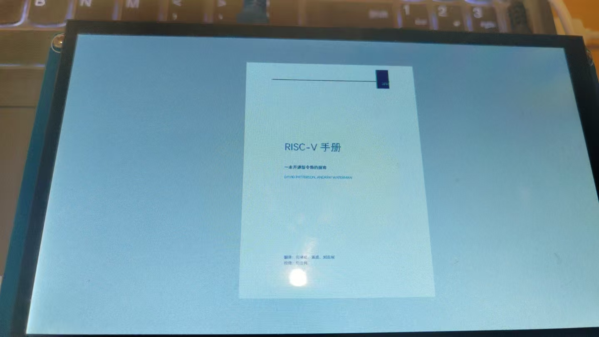

# IMX6ULL 最新方案移植教程中间间系列3——交叉编译MuPDF以开发PDF阅读器

## 前言

​	笔者的QT大项目的真正的白月光就是我的一个CCPDFView，这个项目就是用来在上位机上阅读PDF用的。

> [Charliechen114514/CCPDF_View: This is the repo for CCPDF_View, a PDF Reader contains Tesseract OCR](https://github.com/Charliechen114514/CCPDF_View)

​	这一次笔者想要部署到板子上的时候，发现QPdf组件实际上依赖很重的WebEngine，这个我们的板子肯定跑不起来，必须更换更加轻量的方案，因此，笔者的目光就瞄准到了MuPDF上，这个是一个使用C写的一个PDF组件，当然，只提供最基础的组件，肯定没有像QPDF那样强大。因此，我们实际上还需要自己写桥接器，桥接器的书写笔者后面成功了单开一个应用层的系列博客专门分享我的开发，但是现在笔者还在焦头烂额的移植新内核驱动，所以还需要一小段时间。

## 如何编译MuPDF

​	MuPDF的Release项目地址在：[MuPDF Releases](https://www.mupdf.com/releases)，你也可以去找github，但是如果你只克隆一层，我负责任的告诉你，少东西，我干过了这个事情。全量下载，1G大小，考验你的网速，而且很多控件无法用上，所以直接在Release上下载人家给你裁剪好的，省事。

​	MuPDF的编译需要我们更改，我们拉到Makerules文件的尽头，添加上这些信息。

```
ifeq "$(OS)" "imx6ull-cross"
build_prefix += imx6ull-cross/
CC = arm-linux-gnueabihf-gcc
CXX = arm-linux-gnueabihf-g++
AR = arm-linux-gnueabihf-ar
STRIP = arm-linux-gnueabihf-strip
HAVE_GLUT=no
HAVE_X11=no
HAVE_OBJCOPY=no
HAVE_LIBCRYPTO=no
HAVE_TESSERACT=no
HAVE_JS=no
USE_SYSTEM_FREETYPE=no
USE_SYSTEM_HARFBUZZ=no
CFLAGS += -O3 -mcpu=cortex-a7 -mfloat-abi=hard -mfpu=neon-vfpv4 -ffast-math -fsingle-precision-constant
CXXFLAGS += $(CFLAGS)
LDFLAGS += -static
CROSSCOMPILE=yes
endif
```

​	这段 Makefile 中的内容是用于配置交叉编译环境的判断逻辑。如果变量 `OS` 的值是 `"imx6ull-cross"`，那么就会启用针对 i.MX6ULL 平台的交叉编译设置。具体来说，它将构建输出目录前缀设为 `imx6ull-cross/`，使用 `arm-linux-gnueabihf-` 前缀的工具链作为编译器、链接器、打包工具等，并禁用某些与桌面平台相关的功能如 GLUT、X11、Tesseract 和 JavaScript。同时，还配置了一组针对 Cortex-A7 架构的优化选项，例如开启硬浮点支持、NEON 指令集和更高效的数学计算选项。链接选项指定为静态链接，表明编译目标是为嵌入式系统生成一个独立的、无依赖的可执行文件。

​	非常好，我们下一步就是编译，让他跑起来，我感到困惑的是，明明我在配置中指定禁用了，但是还是试图干libssl那里，后来我发现再一次明显的指定之后，这就又没事了。

​	对了，需要先这样做（看Makerules交叉编译的注释）

```
make generate -j4
```

```
make OS=imx6ull-cross build=release HAVE_LIBCRYPTO=no -j4
```

​	我们之后就把得到的库和mutools拷贝到根文件系统下。（如果你想mirror一个上位机环境，也很简单，改一下使用的编译器和上位机架构信息就完事了）

​	笔者写了一个简单的测试：

```
// test_pdf.c
#include "mupdf/fitz.h"

int main(int argc, char **argv)
{
    fz_context *ctx = fz_new_context(NULL, NULL, FZ_STORE_UNLIMITED);
    if (!ctx) return 1;

    fz_register_document_handlers(ctx);
    fz_document *doc = fz_open_document(ctx, argv[1]);
    int page_count = fz_count_pages(ctx, doc);
    printf("This PDF has %d pages.\n", page_count);
    fz_drop_document(ctx, doc);
    fz_drop_context(ctx);
    return 0;
}
```

```
arm-linux-gnueabihf-gcc -o test_pdf test_pdf.c -Iinclude -Lbuild/release -lmupdf -lmupdfthird -lm
```

​	能够编译通过，就意味着我们成功了。我在开发板上执行

```
/home/charliechen/mupdf # ./test_pdf RISC-V-Reader-Chinese-v2p12017.pdf 
This PDF has 164 pages.
```

​	和

```
mutool draw -o test.png RISC-V-Reader-Chinese-v2p12017.pdf 1
```

​	都能拿到我期待的结果。


## 最简单的Qt桥接测试：

​	笔者编写了一个简单的Qt工程，具体的含义等到我专门学习MuPDF我们再慢慢聊。这里笔者直接给出我的配置。

​	第一步就是编写我们的CMakeLists,这个事情简单，笔者是编译了完全相仿的一套配置给上位机方便我们的调试。不然的话，远程GDB属于是有点折磨人。

```
cmake_minimum_required(VERSION 3.19)
project(mupdftest LANGUAGES CXX)

find_package(Qt6 6.5 REQUIRED COMPONENTS Core Widgets)

qt_standard_project_setup()

# 判断编译器路径是否为交叉编译器
get_filename_component(COMPILER_NAME ${CMAKE_CXX_COMPILER} NAME)

if(COMPILER_NAME MATCHES "arm.*-g\\+\\+")
    # i.MX6ULL 交叉编译
    message(STATUS "Detected cross compiler: ${COMPILER_NAME}")
    set(MUPDF_INCLUDE_DIR /home/charliechen/imx6ull/mupdf_res/include)
    set(MUPDF_LIB_DIR /home/charliechen/imx6ull/mupdf_res)
else()
    # 桌面 GCC 编译
    message(STATUS "Detected desktop compiler: ${COMPILER_NAME}")
    set(MUPDF_INCLUDE_DIR /home/charliechen/imx6ull/mupdfdebug/include)
    set(MUPDF_LIB_DIR /home/charliechen/imx6ull/mupdfdebug)
endif()

include_directories(${MUPDF_INCLUDE_DIR})

add_library(mupdf STATIC IMPORTED)
set_target_properties(mupdf PROPERTIES
    IMPORTED_LOCATION ${MUPDF_LIB_DIR}/libmupdf.a
)

add_library(mupdf-third STATIC IMPORTED)
set_target_properties(mupdf-third PROPERTIES
    IMPORTED_LOCATION ${MUPDF_LIB_DIR}/libmupdf-third.a
)

qt_add_executable(mupdftest
    WIN32 MACOSX_BUNDLE
    main.cpp
    mainwindow.cpp
    mainwindow.h
    mainwindow.ui
)

target_link_libraries(mupdftest
    PRIVATE
        Qt::Core
        Qt::Widgets
        mupdf
        mupdf-third
        m		# 我们的mupdf要求连接libm库，这个你有gcc就OK，随身带着的
)

include(GNUInstallDirs)

install(TARGETS mupdftest
    BUNDLE  DESTINATION .
    RUNTIME DESTINATION ${CMAKE_INSTALL_BINDIR}
    LIBRARY DESTINATION ${CMAKE_INSTALL_LIBDIR}
)

qt_generate_deploy_app_script(
    TARGET mupdftest
    OUTPUT_SCRIPT deploy_script
    NO_UNSUPPORTED_PLATFORM_ERROR
)
install(SCRIPT ${deploy_script})
```

```
MainWindow::MainWindow(QWidget *parent)
    : QMainWindow(parent)
{
    // 打开文件对话框选择 PDF 文件
    QString filename = QFileDialog::getOpenFileName(
        this,
        "选择 PDF 文件",
        "/home/charliechen",         // 初始路径
        "PDF 文件 (*.pdf)");

    if (filename.isEmpty()) {
        qDebug() << "未选择任何文件";
        return;
    }

    fz_context *ctx = fz_new_context(nullptr, nullptr, FZ_STORE_DEFAULT);
    fz_register_document_handlers(ctx);

    fz_document *doc = fz_open_document(ctx, filename.toUtf8().data());
    if (!doc) {
        qDebug() << "无法打开 PDF 文件";
        return;
    }

    fz_page *page = fz_load_page(ctx, doc, 0);
    fz_rect bounds = fz_bound_page(ctx, page);
    fz_matrix ctm = fz_scale(1.0f, 1.0f);
    fz_irect bbox = fz_round_rect(fz_transform_rect(bounds, ctm));

    fz_pixmap *pix = fz_new_pixmap_with_bbox(ctx, fz_device_rgb(ctx), bbox, nullptr, 0);
    fz_clear_pixmap_with_value(ctx, pix, 255);

    fz_device *dev = fz_new_draw_device(ctx, ctm, pix);
    fz_run_page(ctx, page, dev, ctm, nullptr);
    fz_close_device(ctx, dev);
    fz_drop_device(ctx, dev);

    int w = fz_pixmap_width(ctx, pix);
    int h = fz_pixmap_height(ctx, pix);
    unsigned char *samples = fz_pixmap_samples(ctx, pix);

    QImage img(samples, w, h, pix->stride, QImage::Format_RGB888);
    img = img.copy();  // 拷贝图像数据以避免指针失效

    QLabel *label = new QLabel(this);
    label->setPixmap(QPixmap::fromImage(img).scaled(this->size(), Qt::KeepAspectRatio, Qt::SmoothTransformation));
    label->setAlignment(Qt::AlignCenter);
    setCentralWidget(label);

    fz_drop_pixmap(ctx, pix);
    fz_drop_page(ctx, page);
    fz_drop_document(ctx, doc);
    fz_drop_context(ctx);
}


MainWindow::~MainWindow()
{
    // delete ui;
}

```

​	这个我们就可以选择PDF而且显示出来他的第一页，效果如下：

