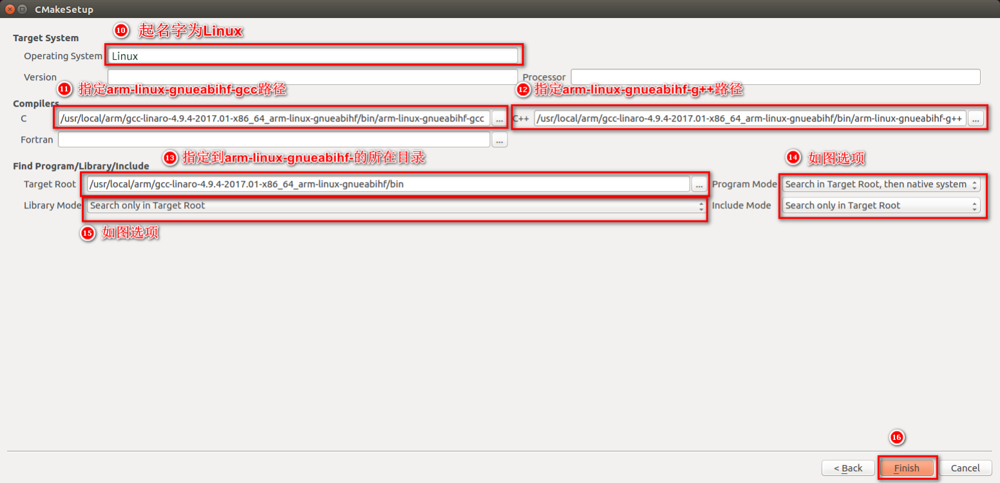

# IMX6ULL 最新方案移植教程中间间系列6——移植opencv4.12.0 + 第三方模块 + WITH_QT搭配

​	嗯很，我打赌我肯定是第一个公开移植opencv4.12.0到IMX6ULL的！实际上这个工作非常的简单。你需要做的事情是：

## Step1：下载opencv和opencv_contrib的源码

```
git clone https://github.com/opencv/opencv
git clone https://github.com/opencv/opencv_contrib
```

​	下载结束之后，使用cmake-gui来配置，我们先自己手动的在opencv目录下建立一个build目录，我们的源码在opencv（所以在gui界面中要配置opencv项目根路径，构建的位置选择根路径下的build文件夹），configure呢，只需要做的事情是



​	这里的填写呢，根正点的是一样的，当然如果是包管理下载的编译器，指向`/usr/${COMPILER_PREFIX}`的路径即可，看看下面有没有编译器依赖的库就完事了。

​	之后点击configure，**配置的时候记得挂代理**，**否则就不要参与编译第三方模块！不然的话东西下不下来**，挂不下代理的，类比配置我自己写的上位机配置教程：[OpenCV4.9.0 + 扩展 + WITH_QT（Qt6）模块编译教程（Windows）_opencv4.9 qt-CSDN博客](https://blog.csdn.net/charlie114514191/article/details/135922310)

​	配置完事了之后，你需要做的事情比较多——第一点，你需要编译过ARM平台运行的QT程序，如果没有编译过，看我的教程：

> [IMX6ULL 2025年最新部署方案2 在 Ubuntu24.04 上编译通过Qt5.12.9且部署到 IMX6ULL正点原子开发板上-CSDN博客](https://blog.csdn.net/charlie114514191/article/details/147258403)
>
> [(也许是全网首发！) IMX6ULL 2025年最新部署方案3在Ubuntu24.04上编译通过Qt6.8.3且部署到IMX6ULL正点原子开发板上-CSDN博客](https://blog.csdn.net/charlie114514191/article/details/147259376)

​	之后，你需要做的事情是添加一个变量：CMAKE_PREFIX_PATH，在CMake-gui界面中有一个Add Entry，设置指向你的Qt6_DIR。这样的话，CMake就知道去哪里找你的Qt6了，指向你自己的lib/cmake就行，不知道在哪里的，看我示范：

```
sudo find / -name "Qt6*.cmake" # 找Qt6的
sudo find / -name "Qt5*.cmake" # 找Qt5的
```

​	比如说

```
/home/charliechen/imx6ull/qt_compile/qt-6/qt_res/lib/cmake/Qt6MultimediaTestLibPrivate/Qt6MultimediaTestLibPrivateConfigVersionImpl.cmake
/home/charliechen/imx6ull/qt_compile/qt-6/qt_res/lib/cmake/Qt6HostInfo/Qt6HostInfoConfig.cmake
```

​	这个时候直接设置路径名称是/home/charliechen/imx6ull/qt_compile/qt-6/qt_res/lib/cmake/。当然注意类型是PATH。

​	下一步就是设置我们的OPENCV_EXTRA_MODULE_PATH到我们的opencv_contrib上，注意最终填写的路径是path/to/opencv_contrib/modules文件夹，人家是直接进入项目根目录的modules里面拿文件编译的。

​	之后设置INSTALL_PREFIX到你指定的位置，比如说看我博客的朋友都知道是/home/charliechen/imx6ull/opencv_res咯！设定好之后，你可以设置其他的参数，注意关心你的输出日志不应该有任何错误！直到**我们的页面没有红色标记的选项**之后，你就可以生成Makefile脚本了，**不然的话，中间编译一定会报错！**

​	然后你啥也不用干，进入build就是等待一会的编译：`make -j$(nproc)`和`make install`中间不用加任何一点别的东西。完事了opencv也就编译完了。如法炮制的，我们为了调试，也编译一个使用x86_64版本的。这样的话就完美了。

## Qt测试程序

​	一样跟MuPDF的，我们编写Qt的CMakelists：

```cmake
cmake_minimum_required(VERSION 3.19)
project(opencvtest LANGUAGES CXX)

find_package(Qt6 6.5 REQUIRED COMPONENTS Core)

if(CMAKE_CXX_COMPILER MATCHES "arm.*-g\\+\\+")
    message(STATUS "Target: IMX6ULL")
    set(OpenCV_DIR "/home/charliechen/imx6ull/opencv_arm_res/lib/cmake/opencv4")
else()
    message(STATUS "Target: Ubuntu")
    set(OpenCV_DIR "/home/charliechen/imx6ull/opencv_res/lib/cmake/opencv4")
endif()

find_package(OpenCV REQUIRED)

qt_standard_project_setup()

qt_add_executable(opencvtest
    main.cpp
)

message(${OpenCV_LIBS})

target_link_libraries(opencvtest
    PRIVATE
        Qt::Core
        ${OpenCV_LIBS}
)

include(GNUInstallDirs)

install(TARGETS opencvtest
    BUNDLE  DESTINATION .
    RUNTIME DESTINATION ${CMAKE_INSTALL_BINDIR}
    LIBRARY DESTINATION ${CMAKE_INSTALL_LIBDIR}
)

qt_generate_deploy_app_script(
    TARGET opencvtest
    OUTPUT_SCRIPT deploy_script
    NO_UNSUPPORTED_PLATFORM_ERROR
)
install(SCRIPT ${deploy_script})
target_include_directories(opencvtest PRIVATE ${OpenCV_INCLUDE_DIRS})
```

​	测试主程序：

```c++
#include <QCoreApplication>
#include <QDebug>
#include <opencv2/opencv.hpp>

int main(int argc, char *argv[])
{
    cv::Mat img(240, 320, CV_8UC3, cv::Scalar(255, 0, 0));  // 蓝底
    cv::putText(img, "Hello IMX6ULL", cv::Point(20, 120),
                cv::FONT_HERSHEY_SIMPLEX, 0.6, cv::Scalar(0, 255, 0), 2); // 绿字

    if (cv::imwrite("output.jpg", img)) {
        qDebug() << "Image saved as output.jpg";
    } else {
        qWarning() << "Failed to save image";
    }
    cv::imshow("Output Image", img);
    cv::waitKey(0);
    return 0;
}
```

​	之后编译后，把该拷贝的库拷贝，测试程序放到一个目录下后。

​	一个运行就能得到：


​	完结撒花！