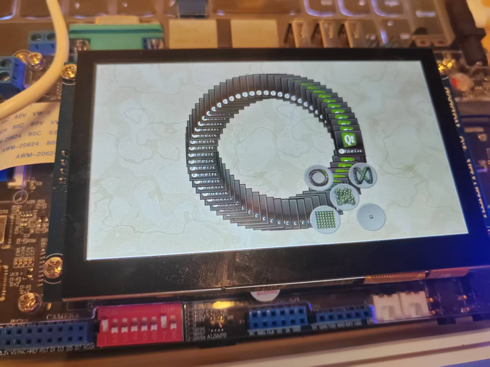
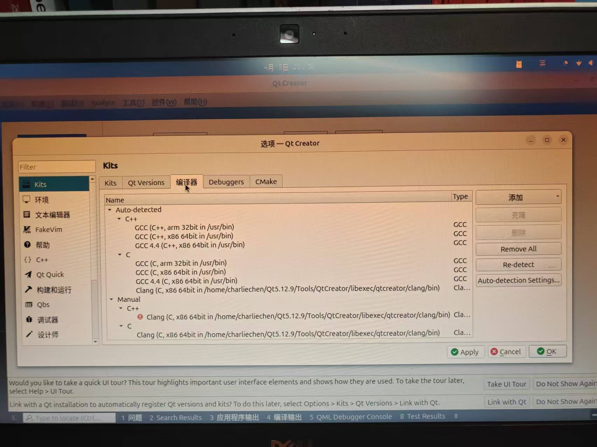
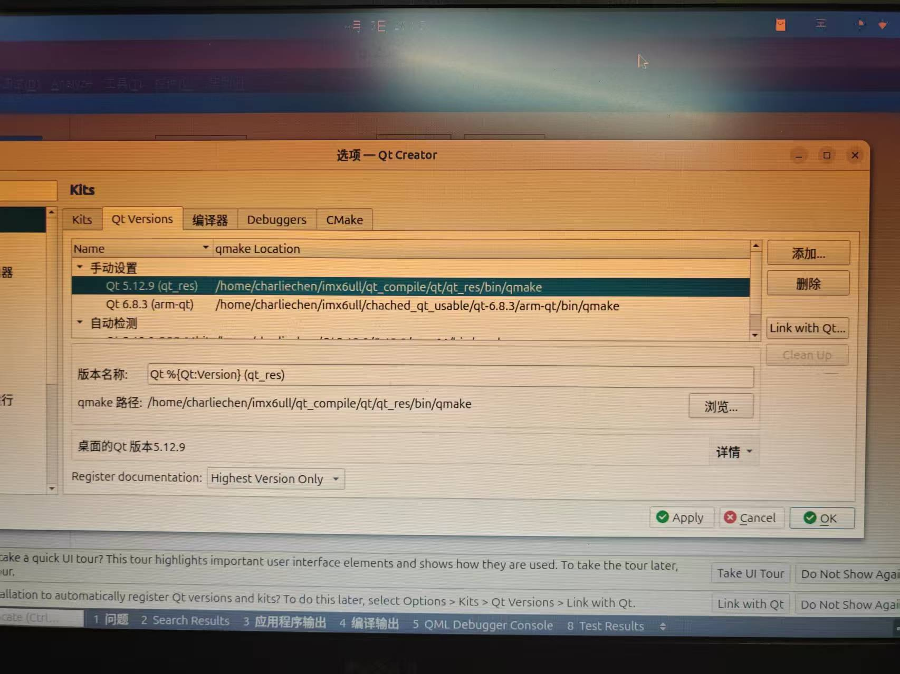
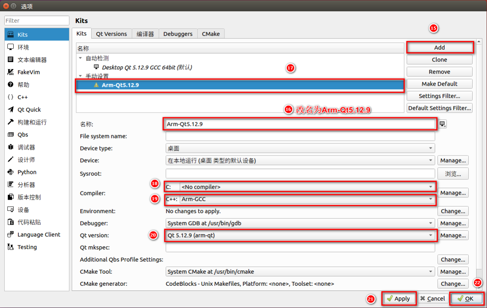
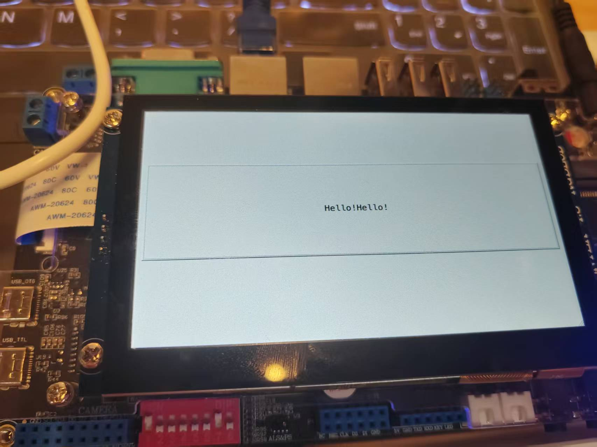
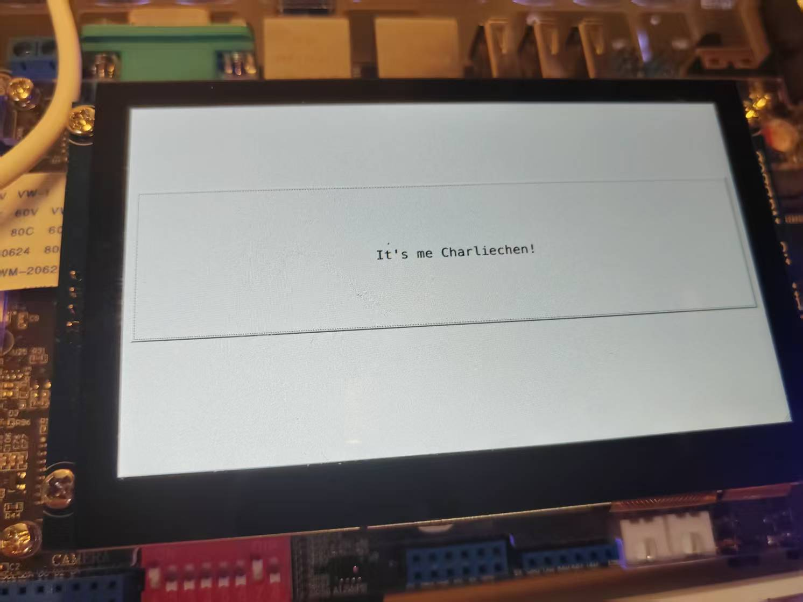

# IMX6ULL2025年最新部署方案2:在Ubuntu24.04上编译通过Qt5.12.9且部署到IMX6ULL正点原子开发板上

## 前言

​	本篇方案部署是笔者这几天除了打蓝桥杯以外，笔者在研究的东西，现在写道这里的时候，笔者已经成功的在Ubuntu24.04上，使用默认最新的交叉编译器和上位机编译器（均为gcc13.3）移植成功了Qt5.12.9，跑通了Qt的官方样例程序和自己写的Qt样例程序。

​	本篇教程希望达成如下的期望：

- 在自己的运行现代发行版的上位机上成功编译出可以运行在32位ARM平台（以IMX6ULL为例子）Qt5.12.9的基本运行库
- 部署自己的使用统一Qt版本的Qt基础开发环境，争取做到上位机和下位机可以通过点击鼠标切换kit无缝切换编译目标平台

​	笔者的最终运行环境为如下的配置

- 下位机：搭载了4.3寸RGB屏幕的IMX6ULL的正点原子Alpha开发板，板间系统的基础环境为笔者编写基础教程的运行环境：Uboot2024.4版本+Linux6.12.3内核+1.36版本的Rootfs，如果你没有做好这个也是无所谓的，作为上层框架的Qt一般而言不会关心于此，但是你必须保证你的板子上的C++运行库环境版本跟你编译Qt的交叉编译器的版本**完全一致！（小有差距也无所谓，但是太大不行，ABI差异过大会导致未定义的符号或者GLibc的Version决议失败拒绝链接库）**
- 上位机：笔者是一台物理运行Ubuntu24.04操作系统的电脑，上面的编译器环境为arm-linux-gnueabihf-gcc，版本是13.3，其本地gcc也是相同版本的13.3，这个关系没那么大，主要是为了辅助编译qt的。笔者建议，编译主机还是要好一些，笔者的小主机只有四个核，编译qt编译了小一天才完事。（为什么不用虚拟机呢...嗯，我不喜欢，就这样简单，而且到时候你NFS测试包是卡的离谱的，不敢想象沟通一次翻倍的开销）

​	需要注意的是，Qt5的优化实际上并不好，因此，使用NFS挂载+疯狂的渲染很容易导致卡顿，所以，如果您追求性能，请参考笔者关于移植Qt6.8.3的文章。笔者认为这个应该算是一份比较成功的移植的。

## 开始我们的旅程

### 编译tslib

​	tslib是负责了我们跟LCD驱动屏幕底层的触碰的交互。这个库的地址在

```
https://github.com/libts/tslib
```

​	笔者直接下载了最新的ts1.23，请你解压后，进入这个目录：

```
➜  pwd
/home/charliechen/imx6ull/qt_compile/tslib
➜  ls
acinclude.m4     ChangeLog       config.h       configure     etc         m4           NEWS       stamp-h1  tslib.pc.in
aclocal.m4       cmake           config.h.in    configure.ac  INSTALL     Makefile     plugins    tests
arm-linux.cache  CMakeLists.txt  config.log     COPYING       install-sh  Makefile.am  README     THANKS
AUTHORS          compile         config.status  depcomp       libtool     Makefile.in  README.md  tools
autogen.sh       config.guess    config.sub     doc           ltmain.sh   missing      src        tslib.pc
```

​	笔者打算将我们所有的构建成果单独放到一个build文件夹下，比如说我们的

```
/home/charliechen/imx6ull/qt_compile/tslib_res
```

​	我们所以在项目的根目录下写下我们的参数

```
./configure --host=arm-linux-gnueabihf ac_cv_func_malloc_0_nonnull=yes --cache-file=arm-linux. 
cache -prefix=/home/charliechen/imx6ull/qt_compile/tslib_res
```

​	笔者说一下这些参数在作什么：

> `./configure` 是标准的 GNU 配置脚本入口，表示开始配置当前源代码包的编译环境。
>
> `--host=arm-linux-gnueabihf` 告诉配置系统目标平台是 ARM 架构的 Linux 系统，并且使用的是硬浮点 ABI，这表明这是一个交叉编译过程，不是为本机编译。
>
> `ac_cv_func_malloc_0_nonnull=yes` 是直接向配置脚本声明某个自动检测变量的值，这里指定 `malloc(0)` 不会返回空指针，用于跳过自动检查，避免误判影响构建。
>
> `--cache-file=arm-linux.cache` 告诉配置系统使用并保存中间检测结果到名为 `arm-linux.cache` 的缓存文件中，下次配置可以加快速度或保持一致性。
>
> `-prefix=/home/charliechen/imx6ull/qt_compile/tslib_res` 是安装路径的指定，表示 `make install` 后会把生成的头文件、库文件等内容安装到该目录，供后续使用，比如被 Qt 检测到并链接进去。
>
> 这条配置命令主要用于准备好为 i.MX6ULL 平台编译 tslib 的环境，供 Qt 编译阶段使用。

​	大概如此，配置结束后

```
make && make install
```

​	一气呵成，很快我们的项目就能编译和下载结束

​	我们的/home/charliechen/imx6ull/qt_compile/tslib_res就是我们之后让Qt跟我们交互的一个重要的根基，请各位朋友注意，这个文件夹下的所有内容，我们稍后就要准备打包放到我们的根文件系统里去了

### 编译Qt

​	编译比较古老的Qt，实际上在现代的上位机上非常困难，首先，人家编写的代码就是按照比较古老的GCC头文件和一些跟操作系统紧耦合的头文件的符号进行代码编写的，现在一些内核和编译器的头文件变化不小，因此，我们有时候不得不采取一些很难看的做法（笔者不得不去修改一个编译器的头文件的宏定义问题，注意，千万不要再你的开发中这样干！很不稳定！）

​	我们首先第一件事情就是拿到我们的Qt源码，当然，笔者选取的就是按照标题所示的那样的——使用的是Qt5.12.9经典版本的编译。

```
# 下载源码
wget https://download.qt.io/archive/qt/5.12/5.12.9/single/qt-everywhere-src-5.12.9.tar.xz
# 等待下载结束后解压
tar -xf qt-everywhere-src-5.12.9.tar.xz
cd qt-everywhere-src-5.12.9.tar.xz
```

​	首先需要注意的是——新版本的Gcc对我们的边界常量移动到了一个新的header叫做limits，因此，你需要做的是，包括但是不限于这些地方的代码上，在文件的开头部分添加一下头文件`#include <limits>`

```
qtbase/src/corelib/global/qendian.h
qtbase/src/corelib/tools/qbytearraymatcher.h
```

​	还有一部分源文件，但是遗憾的是，这里笔者忘记那些需要做更改了，日志记录不到位，笔者对此深深感到歉意

```
qtbase/src/tools/moc/generator.cpp
... // 后面笔者记得还会在编译的时候出现一到两次
```

​	还有需要修订的是：

```
vim /usr/arm-linux-gnueabihf/include/features-time64.h
```

​	直接添加这个定义，否则会出现`_TIMES_BITS`和`_FILE_OFFSET_BITS`不协调的问题，注意，如果你有比更改编译器头文件更好的办法，一定要采用！！！不要冒险！

```
#ifndef _FILE_OFFSET_BITS 
#define _FILE_OFFSET_BITS 64
#endif
```

​	编译结束后，也请把东西改回来，不然的话会干扰其他程序。

​	我们需要做的事情是，开始配置一下我们的Qt的基本情况。我们使用的是arm-linux-gnueabihf-系列的编译器，因此，需要稍微的修改qtbase/

```
vim qtbase/mkspecs/linux-arm-gnueabi-g++/qmake.conf 
```

```
#
# qmake configuration for building with arm-linux-gnueabi-g++
#


MAKEFILE_GENERATOR      = UNIX
CONFIG                 += incremental
QMAKE_INCREMENTAL_STYLE = sublib

# 我们添加参数: 
# 设置我们的基础对接的图形库是linuxfb，也就是说，直接读写linux对LCD原生的frame buffer从而操作我们的QT库的显示
QT_QPA_DEFAULT_PLATFORM = linuxfb
# 我们需要对C编译器的参数设置添加以下参数
# 包括但是不限于指定使用Cortex-A7架构, ARMv7特化汇编和硬件FPU配置等一系列参数
QMAKE_CFLAGS += -O2 -march=armv7-a -mtune=cortex-a7 -mfpu=neon -mfloat-abi=hard -D_FILE_OFFSET_BITS=64 -D_TIME_BITS=64
# 对于C++编译器也是如法炮制
QMAKE_CXXFLAGS += -O2 -march=armv7-a -mtune=cortex-a7 -mfpu=neon -mfloat-abi=hard -D_FILE_OFFSET_BITS=64 -D_TIME_BITS=64

include(../common/linux.conf)
include(../common/gcc-base-unix.conf)
include(../common/g++-unix.conf)

# modifications to g++.conf
# 注意，下面使用的编译套件都加上hf尾缀，之前是arm-linux-gnueabi-
QMAKE_CC                = arm-linux-gnueabihf-gcc
QMAKE_CXX               = arm-linux-gnueabihf-g++
QMAKE_LINK              = arm-linux-gnueabihf-g++
QMAKE_LINK_SHLIB        = arm-linux-gnueabihf-g++

# modifications to linux.conf
QMAKE_AR                = arm-linux-gnueabihf-ar cqs
QMAKE_OBJCOPY           = arm-linux-gnueabihf-objcopy
QMAKE_NM                = arm-linux-gnueabihf-nm -P
QMAKE_STRIP             = arm-linux-gnueabihf-strip
load(qt_config)
```

​	我们下一步就是export我们的TSLib的参数位置，现在我们的tslib使用的是pkgconfig来公布自己提供的依赖，因此

```
export PKG_CONFIG_PATH=~/imx6ull/qt_compile/tslib_res/lib/pkgconfig:$PKG_CONFIG_PATH
```

​	这里的pkgconfig指向你自己的tslib编译结果的pkgconfig，他一般在`${prefix}/lib/`下！（prefix是你自己指定的安装的位置）

​	下一步就是配置Qt的编译参数，需要注意的是，Qt6的用户，这个方法不是很管用，configure的这样写的配置是有问题的，现在configure是make的前端，之后是cmake的前端，直接抄的参数是不认的！

```
./configure -prefix /home/charliechen/imx6ull/qt_compile/qt/qt_res \
-opensource \
-confirm-license \
-release \
-strip \
-shared \
-xplatform linux-arm-gnueabi-g++ \
-optimized-qmake \
-c++std c++11 \
--rpath=no \
-pch \
-skip qt3d \
-skip qtactiveqt \
-skip qtandroidextras \
-skip qtcanvas3d \
-skip qtconnectivity \
-skip qtdatavis3d \
-skip qtdoc \
-skip qtgamepad \
-skip qtlocation \
-skip qtmacextras \
-skip qtnetworkauth \
-skip qtpurchasing \
-skip qtremoteobjects \
-skip qtscript \
-skip qtscxml \
-skip qtsensors \
-skip qtspeech \
-skip qtsvg \
-skip qttools \
-skip qttranslations \
-skip qtwayland \
-skip qtwebengine \
-skip qtwebview \
-skip qtwinextras \
-skip qtx11extras \
-skip qtxmlpatterns \
-make libs \
-make examples \
-nomake tools -nomake tests \
-gui \
-widgets \
-dbus-runtime \
--glib=no \
--iconv=no \
--pcre=qt \
--zlib=qt \
-no-openssl \
--freetype=qt \
--harfbuzz=qt \
-no-opengl \
-linuxfb \
--xcb=no \
-tslib \
--libpng=qt \
--libjpeg=qt \
--sqlite=qt \
-plugin-sql-sqlite \
-I/home/charliechen/imx6ull/qt_compile/tslib_res/include \
-L/home/charliechen/imx6ull/qt_compile/tslib_res/lib \
-recheck-all
```

​	笔者一一说明我们的参数都在干什么：

> `./configure -prefix /home/charliechen/imx6ull/qt_compile/qt/qt_res` 指定 Qt 安装后的前缀路径，即最终构建完成后 `make install` 时会把所有内容安装到这个目录中。
>
> `-opensource` 表示采用开源许可证编译 Qt，通常是 LGPL 版本。
>
> `-confirm-license` 自动确认 Qt 的开源许可证，无需在配置过程中交互确认。
>
> `-release` 设置构建为发布版，而非调试版，优化性能并减少体积。
>
> `-strip` 表示在安装时会去除二进制文件中的符号信息，进一步减小体积。
>
> `-shared` 表示构建为共享库（动态库），而不是静态库。
>
> `-xplatform linux-arm-gnueabi-g++` 告诉 Qt 使用指定的交叉编译平台配置，选择对应的工具链进行编译。
>
> `-optimized-qmake` 表示使用优化编译方式来构建 `qmake` 工具，提升其运行效率。
>
> `-c++std c++11` 指定使用 C++11 标准来构建整个 Qt 框架和相关应用。
>
> `--rpath=no` 禁止在构建后的二进制中嵌入 rpath 信息，避免运行时链接问题。
>
> `-pch` 启用预编译头文件以提高编译速度，特别是在大型模块中。
>
> `-skip qt3d` 到 `-skip qtxmlpatterns` 一系列参数告诉构建系统跳过这些不需要的模块，从而减少编译时间和目标体积。
>
> `-make libs` 表示构建核心 Qt 库，而不是只生成工具或示例。
>
> `-make examples` 同时也编译 Qt 的示例程序，以便测试环境或用作参考。
>
> `-nomake tools -nomake tests` 告诉系统不要编译 Qt 自带的开发工具（如 `qmake` 之外的调试器）和测试套件，减少编译负担。
>
> `-gui` 启用 Qt GUI 模块，这是图形界面构建的基础。
>
> `-widgets` 启用 QWidget 支持，是传统 Qt 应用构建界面的主要方式。
>
> `-dbus-runtime` 允许 Qt 使用系统运行时的 D-Bus 实现，而不是静态链接或强制依赖。
>
> `--glib=no` 表示不使用 Glib 事件循环库，减少对 GNOME 生态的依赖。
>
> `--iconv=no` 表示不使用外部 iconv 库，避免额外的字符编码依赖。
>
> `--pcre=qt` 使用 Qt 自带的 PCRE 正则表达式库，避免系统依赖。
>
> `--zlib=qt` 使用 Qt 自带的 zlib 实现，用于处理压缩数据，也减少外部依赖。
>
> `-no-openssl` 表示不启用 OpenSSL 支持，这意味着 QtNetwork 不支持 HTTPS 等加密传输。
>
> `--freetype=qt` 使用 Qt 自带的 FreeType 库来渲染字体，保证平台独立性。
>
> `--harfbuzz=qt` 启用 Qt 内置的 HarfBuzz 排版引擎以支持高级文字渲染，避免外部链接。
>
> `-no-opengl` 禁用 OpenGL 支持，适合没有 GPU 或图形加速的嵌入式平台，如 i.MX6ULL。
>
> `-linuxfb` 设置默认使用 Linux framebuffer（/dev/fb0）作为图形输出接口。
>
> `--xcb=no` 禁用 X11（XCB）支持，因为目标平台不使用图形服务器。
>
> `-tslib` 启用对 tslib（触摸屏输入库）的支持，适配嵌入式触摸屏硬件。
>
> `--libpng=qt` 表示使用 Qt 内置的 libpng 处理 PNG 图像，减少依赖。
>
> `--libjpeg=qt` 同理，启用 Qt 自带的 libjpeg 支持，用于 JPEG 图像处理。
>
> `--sqlite=qt` 表示构建时使用 Qt 附带的 SQLite 引擎，不依赖系统提供的版本。
>
> `-plugin-sql-sqlite` 显式启用 SQLite 的 SQL 插件，以便 Qt 应用可以通过 SQL 接口访问 SQLite 数据库。
>
> `-I/home/charliechen/imx6ull/qt_compile/tslib_res/include` 将 tslib 的头文件目录添加到 Qt 的编译器搜索路径中，确保能找到对应的函数定义。
>
> `-L/home/charliechen/imx6ull/qt_compile/tslib_res/lib` 将 tslib 的库文件路径添加到链接器搜索路径中，确保链接时能找到对应库。
>
> `-recheck-all` 表示强制重新检查所有配置项和依赖，适用于修改配置后重新运行时确保信息更新。

​	你可以根据你自己的需求进行配置和裁剪。编译后，就可以

```
gmake -j(nproc)
```

​	中间会出现一个这样的错误，就是没有time这个结构体，笔者的更改类似与：

```
#ifndef input_event_sec
#define input_event_sec __sec
#define input_event_usec __usec
#endif
```

​	这样我们进行替换：`m_timeStamp = data->input_event_sec + data->input_event_usec / 1000000.0;`

​	现在就OK了

​	qevdevkeyboardhandler.cpp还会报错，是ledWidget设计到了我们的这部分代码

```
::gettimeofday(&led_ie.time, 0);
```

​	改成这样！

```
struct timeval tv;
::gettimeofday(&tv, 0);
led_ie.input_event_sec = tv.tv_sec;
led_ie.input_event_usec = tv.tv_usec;
```

​	换成这样就好了！之后我们修正好了错误之后，就可以继续编译了。

```
gmake install
```

​	结束下载之后呢，我们就可以整个打包，放置到我们的根文件系统里。

### 放置进入我们的根文件系统

​	我们把打包的tslib_res和qt_res都打包放到外面的根文件夹系统下，其中我把qt_res改成了arm-qt，笔者也是放置到了我们的/usr/lib下：

```
arm-qt                tslib	... # 还有其他无关的笔者移植的文件，这里跟我们的构建半毛钱关系没有，笔者不展示
```

### 如果你没有触控芯片驱动

​	对于正点原子的板子，历程源码中是有触控芯片的驱动的，我的板子是4.3RGB。你需要首先做好RGB屏幕驱动的移植和触控芯片的移植，对于触控，你需要做的是修改一下设备树（按照正点原子的即可，对于Linux6.12.3用的设备树还是在那些地方上加，没有变动）和编译对应芯片的驱动即可，**在我们使用qt之前，触控芯片的驱动必须加载好，不然没有办法交互的！**

>  提示，你可以先行运行一下在开发板上ts_test，看看自己的驱动有没有问题，能不能正常的进行触摸

### 修改我们的/etc/profile，加载一些预定义的变量

```
➜  cat profile 

# TSLib
export TSLIB_ROOT=/usr/lib/tslib 
export TSLIB_CONSOLEDEVICE=none 
export TSLIB_FBDEVICE=/dev/fb0 
export TSLIB_TSDEVICE=/dev/input/event1 # 注意，要指向你自己的触控屏监听事件，最简单的检测办法就是挂载和卸载自己的lcd触摸驱动看看哪一个event消失了，再不济，cat /proc/bus/input/devices看看哪一个是自己的触摸屏
export TSLIB_CONFFILE=$TSLIB_ROOT/etc/ts.conf 
export TSLIB_PLUGINDIR=$TSLIB_ROOT/lib/ts 
export TSLIB_CALIBFILE=/etc/pointercal 
export LD_PRELOAD=$TSLIB_ROOT/lib/libts.so 

# Qt
export QT_ROOT=/usr/lib/arm-qt 
export QT_QPA_GENERIC_PLUGINS=tslib:/dev/input/event1 
export QT_QPA_FONTDIR=/usr/share/fonts 
export QT_QPA_PLATFORM_PLUGIN_PATH=$QT_ROOT/plugins 
export QT_QPA_PLATFORM=linuxfb:tty=/dev/fb0 
export QT_PLUGIN_PATH=$QT_ROOT/plugins 
export LD_LIBRARY_PATH=$QT_ROOT/lib:$QT_ROOT/plugins/platforms 
export QML2_IMPORT_PATH=$QT_ROOT/qml 
export QT_QPA_FB_TSLIB=1 
export QT_QPA_FONTDIR=/usr/share/fonts

# load neccessary modules
insmod /lib/modules/gt9147.ko	# 笔者的触控芯片驱动，直接使用正点原子编译的即可
```

TSLib 部分首先设置了环境变量来告知 tslib 使用的资源位置，其中 `TSLIB_ROOT=/usr/lib/tslib` 是 tslib 安装的根目录，其下应包含配置文件、插件、库等资源。`TSLIB_CONSOLEDEVICE=none` 禁用 tslib 对控制台设备的交互，适合在纯 framebuffer 环境下使用。`TSLIB_FBDEVICE=/dev/fb0` 和 `TSLIB_TSDEVICE=/dev/input/event1` 分别指定 framebuffer 和触摸输入设备，通常 event1 是电容屏的输入节点。`TSLIB_CONFFILE` 指定配置文件路径，通常位于 `$TSLIB_ROOT/etc/ts.conf`，其中定义了滤波器和插件顺序。`TSLIB_PLUGINDIR` 告知 tslib 插件的存放路径，插件负责不同类型触摸屏的处理方式。`TSLIB_CALIBFILE=/etc/pointercal` 是 tslib 保存校准数据的位置，校准后生成的 pointercal 文件将在启动时被读取。`LD_PRELOAD=$TSLIB_ROOT/lib/libts.so` 表示在运行 Qt 应用时强制优先加载 tslib 的共享库，使得其对触摸事件的处理生效，即便 Qt 没有编译进对 tslib 的显式支持。

Qt 部分的环境变量用于告知 Qt 运行时如何加载平台插件和配置触摸输入。`QT_ROOT=/usr/lib/arm-qt` 是 Qt 安装路径，其中应包含 bin、lib、plugins、qml 等子目录。`QT_QPA_GENERIC_PLUGINS=tslib:/dev/input/event1` 告知 Qt 加载 tslib 插件并绑定到指定输入设备，以便进行触摸事件解析。`QT_QPA_FONTDIR=/usr/share/fonts` 两次定义确保 Qt 能找到系统字体，否则中文或部分图形界面组件可能无法正常显示。`QT_QPA_PLATFORM_PLUGIN_PATH` 和 `QT_PLUGIN_PATH` 都指向 Qt 插件路径，确保 Qt 能加载 `linuxfb` 和其他必要插件。`QT_QPA_PLATFORM=linuxfb:tty=/dev/fb0` 显式指定 Qt 使用 framebuffer 作为绘图平台，并绑定到 `/dev/fb0`，适用于无 X11/Wayland 的嵌入式平台。`LD_LIBRARY_PATH` 扩展了动态库搜索路径，包含 Qt 库目录和平台插件目录，确保应用运行时能找到所需 `.so` 文件。`QML2_IMPORT_PATH` 设置 QML 模块查找路径，若使用 QML 组件时可自动找到对应资源。`QT_QPA_FB_TSLIB=1` 是 Qt 特有环境变量，启用对 tslib 的自动集成，使 Qt GUI 输入能被 tslib 接管。

最后 `insmod /lib/modules/gt9147.ko` 是加载电容触摸屏控制芯片 GT9147 的内核模块，这个模块提供 `/dev/input/event1` 节点，是 tslib 的输入源，通常正点原子的驱动即可兼容使用，只需保证内核版本匹配即可。

### 搬运字体

​	笔者对中文字体没啥需求，因此，直接复制我们Ubuntu的/usr/share/fonts/ttf下的文件即可。

### 运行样例程序



​	OK，至少我们的Qt程序跑起来是没问题的。

## 建立Qt的运行环境

​	我们仍然需要在上位机上下载我们的Qt5.12.9的运行环境。这里笔者直接说一下大致的步骤

```
wget http://download.qt.io/archive/qt/5.12/5.12.9/qt-opensource-linux-x64-5.12.9.run
```

​	然后修改一下qt-opensource-linux-x64-5.12.9.run的权限让他运行起来。笔者建议下载一个qt附带的GCC环境，当然这个看个人。

​	我们需要手动的添加kit，Qt的Version信息和编译器信息







​	之后愉快的写程序，选择交叉套件编译和下载就好了！



