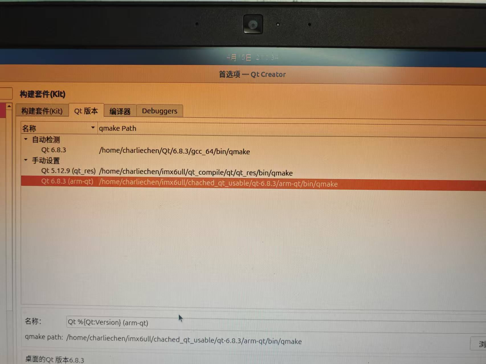
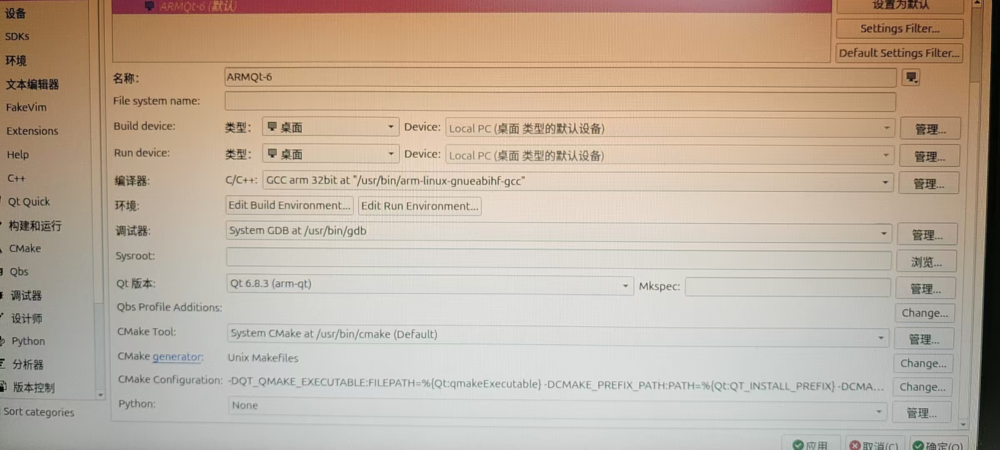
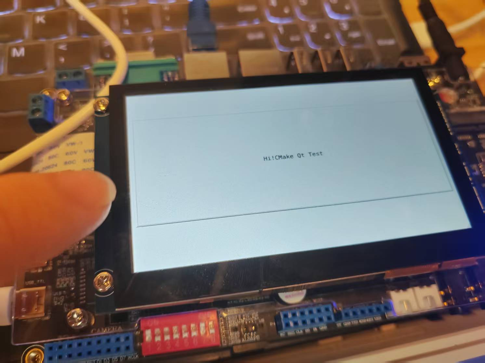
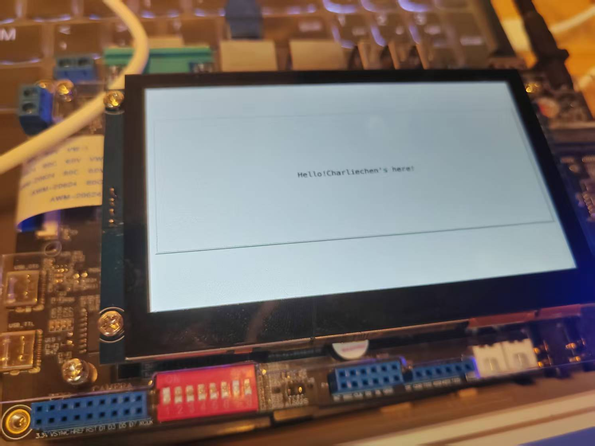

# IMX6ULL2025年最新部署方案3在Ubuntu24.04上编译通过Qt6.8.3且部署到IMX6ULL正点原子开发板上

## 前言

​	笔者需要先说的是，我们的Qt6现在已经全面的转向使用CMake进行构建了。因此，我们Qt本身，也转向了使用CMake构建，下面，笔者简单说一下，我们的正点原子如何移植Qt6.8.3。

​	本篇教程希望达成如下的期望：

- 在自己的运行现代发行版的上位机上成功编译出可以运行在32位ARM平台（以IMX6ULL为例子）Qt5.12.9的基本运行库
- 部署自己的使用统一Qt版本的Qt基础开发环境，争取做到上位机和下位机可以通过点击鼠标切换kit无缝切换编译目标平台

​	笔者的最终运行环境为如下的配置

- 下位机：搭载了4.3寸RGB屏幕的IMX6ULL的正点原子Alpha开发板，板间系统的基础环境为笔者编写基础教程的运行环境：Uboot2024.4版本+Linux6.12.3内核+1.36版本的Rootfs，如果你没有做好这个也是无所谓的，作为上层框架的Qt一般而言不会关心于此，但是你必须保证你的板子上的C++运行库环境版本跟你编译Qt的交叉编译器的版本**完全一致！（小有差距也无所谓，但是太大不行，ABI差异过大会导致未定义的符号或者GLibc的Version决议失败拒绝链接库）**
- 上位机：笔者是一台物理运行Ubuntu24.04操作系统的电脑，上面的编译器环境为arm-linux-gnueabihf-gcc，版本是13.3，其本地gcc也是相同版本的13.3，这个关系没那么大，主要是为了辅助编译qt的。笔者建议，编译主机还是要好一些，笔者的小主机只有四个核，编译qt编译了小一天才完事。

​	需要说明的是，因为这个是笔者自己琢磨的，没有任何参考，陪伴我的只有Qt Cross Compile文档和NXP移植自己原生QT的一些配置，因此显然不是最好的。这个，需要你自己根据自己的需求进行推演和设置参数。废话少说我们开始！

## TSLib触控屏的编译

tslib是负责了我们跟LCD驱动屏幕底层的触碰的交互。这个库的地址在

```
https://github.com/libts/tslib
```

​	笔者直接下载了最新的ts1.23，请你解压后，进入这个目录：

```
➜  pwd
/home/charliechen/imx6ull/qt_compile/tslib
➜  ls
acinclude.m4     ChangeLog       config.h       configure     etc         m4           NEWS       stamp-h1  tslib.pc.in
aclocal.m4       cmake           config.h.in    configure.ac  INSTALL     Makefile     plugins    tests
arm-linux.cache  CMakeLists.txt  config.log     COPYING       install-sh  Makefile.am  README     THANKS
AUTHORS          compile         config.status  depcomp       libtool     Makefile.in  README.md  tools
autogen.sh       config.guess    config.sub     doc           ltmain.sh   missing      src        tslib.pc
```

​	笔者打算将我们所有的构建成果单独放到一个build文件夹下，比如说我们的

```
/home/charliechen/imx6ull/qt_compile/tslib_res
```

​	我们所以在项目的根目录下写下我们的参数

```
./configure --host=arm-linux-gnueabihf ac_cv_func_malloc_0_nonnull=yes --cache-file=arm-linux. 
cache -prefix=/home/charliechen/imx6ull/qt_compile/tslib_res
```

​	笔者说一下这些参数在作什么：

> `./configure` 是标准的 GNU 配置脚本入口，表示开始配置当前源代码包的编译环境。
>
> `--host=arm-linux-gnueabihf` 告诉配置系统目标平台是 ARM 架构的 Linux 系统，并且使用的是硬浮点 ABI，这表明这是一个交叉编译过程，不是为本机编译。
>
> `ac_cv_func_malloc_0_nonnull=yes` 是直接向配置脚本声明某个自动检测变量的值，这里指定 `malloc(0)` 不会返回空指针，用于跳过自动检查，避免误判影响构建。
>
> `--cache-file=arm-linux.cache` 告诉配置系统使用并保存中间检测结果到名为 `arm-linux.cache` 的缓存文件中，下次配置可以加快速度或保持一致性。
>
> `-prefix=/home/charliechen/imx6ull/qt_compile/tslib_res` 是安装路径的指定，表示 `make install` 后会把生成的头文件、库文件等内容安装到该目录，供后续使用，比如被 Qt 检测到并链接进去。
>
> 这条配置命令主要用于准备好为 i.MX6ULL 平台编译 tslib 的环境，供 Qt 编译阶段使用。

​	大概如此，配置结束后

```
make && make install
```

​	一气呵成，很快我们的项目就能编译和下载结束

​	我们的/home/charliechen/imx6ull/qt_compile/tslib_res就是我们之后让Qt跟我们交互的一个重要的根基，请各位朋友注意，这个文件夹下的所有内容，我们稍后就要准备打包放到我们的根文件系统里去了

## 上位机Qt环境部署

​	是的，我们的新Qt编译部署，需要上位机有相同的环境，注意，这里的Qt版本必须一一**对应，一个小数点都不能差！一！个！都！不！行！**比如说，我们这里需要编译的是Qt6.8.3的代码，那就必须下载Qt6.8.3的上位机的Qt环境

​	关于这个，额外的扩展跟你下位机打算部署的完全一致即可，没啥其他需求。下载结束后，注意，一个路径是你需要记住的，这就是我们的Qt的工具链的位置，也就是我们后面提到的Qt Host Path了，一般而言，他在：

```
Qt的安装目录/Qt的版本号/下载的编译器套件/
```

​	举个例子，笔者是安装在了home目录下，然后是6.8.3，下载的编译器套件是gcc_64，因此：

```
➜  pwd
/home/charliechen/Qt/6.8.3/gcc_64
➜  ls
bin  include  libexec    mkspecs  phrasebooks  qml   translations
doc  lib      metatypes  modules  plugins      sbom
```

​	总而言之，看到这个就对了！

## 编译Qt

​	这个最艰难，笔者被搞了一整天。好在我们现在使用的是现代Qt，只需要我们配置正确了，啥也不用改代码，直接梭哈编译就好了。

### 第0件事情：选好自己的build地点，之后这个文件夹就不可以改动了，改动一点，就会出现之后写工程无法编译的毛病！除非你重新编译你的代码！

### 第0.5件事情就是下载Qt6.8.3的源码，这里就不直接给出链接了，downloadqt.io网站上自己找

### 然后是我们的第一件事情：复制一份device配置进行修改

​	我们的第一件事情，是复制一份自己的device配置进行识别，我们的板子是IMX6ULL的，修改的基准参考在`qtbase/mkspecs/devices`下的linux-imx6-g++，为什么是它呢？因为这个配置就是给我们的板子的！但是不能直接使用，因为我们打算使用原生的linux framebuffer，因此需要做这些更改：

1. 拷贝一份linux-imx6-g++文件夹，到一个自己的`qtbase/mkspecs/devices/linux-my-g++`下，这个linux-my-g++随意，后面的参数随之更改即可。修改里面的qmake.conf文件为：

```c
include(../common/linux_device_pre.conf)

MAKEFILE_GENERATOR      = UNIX
CONFIG                 += incremental
QMAKE_INCREMENTAL_STYLE = sublib

# 添加QT_QPA_DEFAULT_PLATFORM，制定为linuxfb
QT_QPA_DEFAULT_PLATFORM = linuxfb

    # 设置我们的cmake编译的flags
QMAKE_CFLAGS           += -O2 -march=armv7-a -mtune=cortex-a7 -mfpu=neon -mfloat-abi=hard
QMAKE_CXXFLAGS         += -O2 -march=armv7-a -mtune=cortex-a7 -mfpu=neon -mfloat-abi=hard

QMAKE_LIBS_EGL         =
QMAKE_LIBS_OPENGL_ES2  =
QMAKE_LIBS_OPENVG      =

DISTRO_OPTS += hard-float

# 这个我们会在toolchains.cmake中在设置一次
# 工具链设置（视具体情况可放到 .cmake 文件或 toolchain 文件里）
QMAKE_CC                = arm-linux-gnueabihf-gcc
QMAKE_CXX               = arm-linux-gnueabihf-g++
QMAKE_LINK              = arm-linux-gnueabihf-g++
QMAKE_LINK_SHLIB        = arm-linux-gnueabihf-g++
QMAKE_AR                = arm-linux-gnueabihf-ar cqs
QMAKE_OBJCOPY           = arm-linux-gnueabihf-objcopy
QMAKE_NM                = arm-linux-gnueabihf-nm -P
QMAKE_STRIP             = arm-linux-gnueabihf-strip

include(../common/linux_arm_device_post.conf)

load(qt_config)
```

​	到这里就很OK了。我们下一步，就是编写toolchains.cmake

```
cmake_minimum_required(VERSION 3.18)
include_guard(GLOBAL)

# 设置交叉编译的目标平台和架构
set(CMAKE_SYSTEM_NAME Linux)
set(CMAKE_SYSTEM_PROCESSOR arm)

# 设置目标的 sysroot 目录
set(TARGET_SYSROOT /)  # 请根据你的实际路径修改

# 设置交叉编译工具链路径
set(CROSS_COMPILER /usr/bin/arm-linux-gnueabihf-) # 笔者的交叉编译器的路径位置的前缀

set(CMAKE_SYSROOT ${TARGET_SYSROOT})

# 设置交叉编译器
set(CMAKE_C_COMPILER ${CROSS_COMPILER}gcc)	# 由此设置GCC和G++
set(CMAKE_CXX_COMPILER ${CROSS_COMPILER}g++)	# 由此设置GCC和G++

# 设置架构
set(CMAKE_LIBRARY_ARCHITECTURE arm-linux-gnueabihf)

# 配置编译器和链接器标志
set(CMAKE_C_FLAGS "${CMAKE_C_FLAGS} -O2 -march=armv7-a -mtune=cortex-a7 -mfpu=neon -mfloat-abi=hard -fPIC")
set(CMAKE_CXX_FLAGS "${CMAKE_C_FLAGS}")

# 库路径
set(CMAKE_C_FLAGS "${CMAKE_C_FLAGS} -fPIC -Wl,-rpath-link,${CMAKE_SYSROOT}/lib/${CMAKE_LIBRARY_ARCHITECTURE} -L${CMAKE_SYSROOT}/lib -L${CMAKE_SYSROOT}/usr/lib")
set(CMAKE_CXX_FLAGS "${CMAKE_CXX_FLAGS} -fPIC -Wl,-rpath-link,${CMAKE_SYSROOT}/lib/${CMAKE_LIBRARY_ARCHITECTURE} -L${CMAKE_SYSROOT}/lib -L${CMAKE_SYSROOT}/usr/lib")

# 包路径
set(ENV{PKG_CONFIG_PATH} ${TARGET_SYSROOT}/usr/lib/pkgconfig:${TARGET_SYSROOT}/usr/lib/${CMAKE_LIBRARY_ARCHITECTURE}/pkgconfig)
set(ENV{PKG_CONFIG_LIBDIR} ${TARGET_SYSROOT}/usr/lib/pkgconfig:${TARGET_SYSROOT}/usr/lib/${CMAKE_LIBRARY_ARCHITECTURE}/pkgconfig)
set(ENV{PKG_CONFIG_SYSROOT_DIR} ${CMAKE_SYSROOT})

# 设置 Qt 编译器标志
# 这些就是给我们的板子的
set(QT_COMPILER_FLAGS "-march=armv7-a -mfpu=neon -mfloat-abi=hard")
set(QT_COMPILER_FLAGS_RELEASE "-O2 -pipe")
set(QT_LINKER_FLAGS "-Wl,-O1 -Wl,--hash-style=gnu -Wl,--as-needed -Wl,-fuse-ld=gold")

# 设置 CMake 的查找路径
set(CMAKE_FIND_ROOT_PATH_MODE_PROGRAM NEVER)
set(CMAKE_FIND_ROOT_PATH_MODE_LIBRARY ONLY)
set(CMAKE_FIND_ROOT_PATH_MODE_INCLUDE ONLY)
set(CMAKE_FIND_ROOT_PATH_MODE_PACKAGE ONLY)

include(CMakeInitializeConfigs)

# 设置每个配置的初始化标志
function(cmake_initialize_per_config_variable _PREFIX _DOCSTRING)
    if (_PREFIX MATCHES "CMAKE_(C|CXX|ASM)_FLAGS")
        set(CMAKE_${CMAKE_MATCH_1}_FLAGS_INIT "${QT_COMPILER_FLAGS}")
        
        foreach (config DEBUG RELEASE MINSIZEREL RELWITHDEBINFO)
            if (DEFINED QT_COMPILER_FLAGS_${config})
                set(CMAKE_${CMAKE_MATCH_1}_FLAGS_${config}_INIT "${QT_COMPILER_FLAGS_${config}}")
            endif()
        endforeach()
    endif()

    if (_PREFIX MATCHES "CMAKE_(SHARED|MODULE|EXE)_LINKER_FLAGS")
        foreach (config SHARED MODULE EXE)
            set(CMAKE_${config}_LINKER_FLAGS_INIT "${QT_LINKER_FLAGS}")
        endforeach()
    endif()

    _cmake_initialize_per_config_variable(${ARGV})
endfunction()

```

> `cmake_minimum_required(VERSION 3.18)` 这一行声明了本项目要求 CMake 的最低版本是 3.18，确保在使用过程中不会出现版本过低导致的不兼容问题。`include_guard(GLOBAL)` 用于防止同一个 CMake 文件被多次包含造成重复定义，它在整个 CMake 生命周期中只会生效一次。`set(CMAKE_SYSTEM_NAME Linux)` 表示本项目要为 Linux 系统进行交叉编译。`set(CMAKE_SYSTEM_PROCESSOR arm)` 则说明目标处理器是 ARM 架构。`set(TARGET_SYSROOT /)` 指定了目标系统的根文件系统路径，也就是交叉编译时的 sysroot，实际使用时需要替换为你自己的 sysroot 路径。
>
> `set(CROSS_COMPILER /usr/bin/arm-linux-gnueabihf-)` 这行定义了交叉编译工具链的前缀，后续编译器设置会在此基础上添加 `gcc` 和 `g++` 来定位工具。`set(CMAKE_SYSROOT ${TARGET_SYSROOT})` 告诉 CMake 使用我们定义的 sysroot 作为交叉编译时的根目录。`set(CMAKE_C_COMPILER ${CROSS_COMPILER}gcc)` 和 `set(CMAKE_CXX_COMPILER ${CROSS_COMPILER}g++)` 分别设置了 C 和 C++ 的交叉编译器路径。`set(CMAKE_LIBRARY_ARCHITECTURE arm-linux-gnueabihf)` 指明了库文件所对应的架构，使得 CMake 能正确地查找库路径。`set(CMAKE_C_FLAGS "...")` 设置了 C 编译器的编译选项，包括优化等级、架构、浮点支持、位置无关代码等。`set(CMAKE_CXX_FLAGS "${CMAKE_C_FLAGS}")` 则直接将 C 编译选项应用到 C++，保持一致性。
>
> 随后又为 `CMAKE_C_FLAGS` 和 `CMAKE_CXX_FLAGS` 添加了库路径相关的参数，如 rpath-link 和 `-L`，确保链接时能找到目标系统的库。通过设置 `ENV{PKG_CONFIG_PATH}`、`ENV{PKG_CONFIG_LIBDIR}` 和 `ENV{PKG_CONFIG_SYSROOT_DIR}`，明确指定 `pkg-config` 工具查找 `.pc` 文件的路径和 sysroot，从而让 CMake 能正确识别依赖库的位置。`set(QT_COMPILER_FLAGS "...")` 是定义给 Qt 项目使用的基本编译参数，包括架构、浮点设置等，`set(QT_COMPILER_FLAGS_RELEASE "-O2 -pipe")` 是 Release 模式下额外加入的优化参数，`set(QT_LINKER_FLAGS "...")` 则配置链接器参数，优化链接方式并指定使用 gold 链接器。接下来的四个 `set(CMAKE_FIND_ROOT_PATH_MODE_...)` 设置了 CMake 在交叉编译时的查找策略，分别控制是否查找主机系统下的程序、库、头文件和包，设置为 ONLY 或 NEVER 表示仅查找 sysroot 或不查找。`include(CMakeInitializeConfigs)` 是引入内置模块，用于初始化各个编译配置。`function(cmake_initialize_per_config_variable _PREFIX _DOCSTRING)` 是一个函数，用来为不同的构建配置（如 Debug、Release）初始化编译器和链接器参数。如果变量前缀匹配编译器标志，就按配置分别设置初始化值；如果前缀匹配链接器标志，就将 Qt 链接器标志赋值给共享库、模块和可执行程序的链接器标志；最后 `_cmake_initialize_per_config_variable(${ARGV})` 保持函数的默认行为不变，只是在执行前加入了自定义设置。这个 CMake 文件整体作用就是为 Qt 项目在 ARM Linux 上进行交叉编译构建一个完整的编译环境配置。

​	需要注意的是，笔者发现后续的cmake似乎不会生效skip参数，仍然会全部编译，因此，一个快捷的办法就是直接删除子项目的源代码，笔者直接将我们的Qt源代码精简成这样

```
init-repository.bat  qtgrpc            qtserialport
_clang-format    init-repository.pl   qthttpserver      qtshadertools
cmake            LICENSES             qtimageformats    qtwebchannel
CMakeLists.txt   qt5compat            qtlanguageserver  qtwebsockets
coin             qtbase               qtlottie          README.md
configure        qtcharts             qtmqtt            README.md.template
configure.bat    qtcoap               qtmultimedia      tests
configure.json   qtdeclarative        qtpositioning
CONTRIBUTING.md  qtgraphs             qtserialbus
```

​	这些是笔者留下来的。当然你先要编译什么，就留下什么，但是为了完成正点原子的实验，这些都是必须留下来的

​	下面，我们就准备编写cmake的构建语句了

```
cmake .. \
  -DCMAKE_BUILD_TYPE=Release \	
  -DQT_HOST_PATH=/home/charliechen/Qt/6.8.3/gcc_64 \	# 这个就是笔者说的host path，制定好！
  -DCMAKE_TOOLCHAIN_FILE=/home/charliechen/imx6ull/qt_compile/qt-6/toolchains.cmake \
  -DCMAKE_INSTALL_PREFIX=/home/charliechen/imx6ull/qt_compile/qt-6/qt_res \	# 安装的位置，必须慎重选择
  -DQT_QMAKE_TARGET_MKSPEC=devices/linux-my-g++ \	# 指定自己的mkspec交叉环境套件
  -DQT_NO_OPENGL=ON \
  -DOPENGL_INCLUDE_DIR=IGNORE_ME -DOPENGL_gl_LIBRARY=IGNORE_ME \
  -DCMAKE_EXE_LINKER_FLAGS="-L/home/charliechen/imx6ull/qt_compile/tslib_res/lib" \
  -DQT_FEATURE_opengl=OFF \
  -DQT_QPA_DEFAULT_PLATFORM=linuxfb \
  -DQT_FEATURE_xcb=OFF \
  -DQT_FEATURE_xlib=OFF \
  -DFEATURE_qtwebengine_build=OFF \
  -DQT_BUILD_TESTS=OFF \
  -DQT_BUILD_EXAMPLES=OFF \
  -DCMAKE_C_FLAGS="-I/home/charliechen/imx6ull/qt_compile/tslib_res/include -L/home/charliechen/imx6ull/qt_compile/tslib_res/lib" \
  -DCMAKE_CXX_FLAGS="-I/home/charliechen/imx6ull/qt_compile/tslib_res/include -L/home/charliechen/imx6ull/qt_compile/tslib_res/lib" \
  -DQT_BUILD_SUBMODULE_qt3d=OFF \
  -DQT_BUILD_SUBMODULE_qtactiveqt=OFF \
  -DQT_BUILD_SUBMODULE_qtandroidextras=OFF \
  -DQT_BUILD_SUBMODULE_qtcanvas3d=OFF \
  -DQT_BUILD_SUBMODULE_qtconnectivity=OFF \
  -DQT_BUILD_SUBMODULE_qtdatavis3d=OFF \
  -DQT_BUILD_SUBMODULE_qtdoc=OFF \
  -DQT_BUILD_SUBMODULE_qtgamepad=OFF \
  -DQT_BUILD_SUBMODULE_qtlocation=OFF \
  -DQT_BUILD_SUBMODULE_qtmacextras=OFF \
  -DQT_BUILD_SUBMODULE_qtnetworkauth=OFF \
  -DQT_BUILD_SUBMODULE_qtpurchasing=OFF \
  -DQT_BUILD_SUBMODULE_qtremoteobjects=OFF \
  -DQT_BUILD_SUBMODULE_qtscript=OFF \
  -DQT_BUILD_SUBMODULE_qtscxml=OFF \
  -DQT_BUILD_SUBMODULE_qtsensors=OFF \
  -DQT_BUILD_SUBMODULE_qtspeech=OFF \
  -DQT_BUILD_SUBMODULE_qtsvg=OFF \
  -DQT_BUILD_SUBMODULE_qttools=OFF \
  -DQT_BUILD_SUBMODULE_qttranslations=OFF \
  -DQT_BUILD_SUBMODULE_qtwayland=OFF \
  -DQT_BUILD_SUBMODULE_qtwebengine=OFF \
  -DQT_BUILD_SUBMODULE_qtwebview=OFF \
  -DQT_BUILD_SUBMODULE_qtwinextras=OFF \
  -DQT_BUILD_SUBMODULE_qtx11extras=OFF \
  -DQT_BUILD_SUBMODULE_qtxmlpatterns=OFF \
```

​	这个文本我们保存成auto.sh，然后赋予权限chmod 755 auto.sh，这样的话方便我们进行cmake语句的调整。下面我解释一下这些CMake语句在作什么：

​	`cmake ..` 表示在上级目录中执行 CMake 配置；`-DCMAKE_BUILD_TYPE=Release` 设置构建类型为 Release，启用编译器优化；`-DQT_HOST_PATH=...` 指定 Qt 的宿主构建路径，告诉 CMake 使用该目录中的工具和信息完成交叉配置；`-DCMAKE_TOOLCHAIN_FILE=...` 指定使用前面写好的 toolchain 文件作为交叉编译工具链定义；`-DCMAKE_INSTALL_PREFIX=...` 设置构建完成后安装的目标路径；`-DQT_QMAKE_TARGET_MKSPEC=devices/linux-my-g++` 告诉 Qt 使用特定的 mkspec 文件作为目标平台编译配置；`-DQT_NO_OPENGL=ON` 表示完全禁用 Qt 的 OpenGL 支持；`-DOPENGL_INCLUDE_DIR=IGNORE_ME -DOPENGL_gl_LIBRARY=IGNORE_ME` 是为了绕过 Qt 对 OpenGL 库的自动探测机制，强制使其无效；`-DCMAKE_EXE_LINKER_FLAGS=...` 设置链接器选项，显式加入 tslib 的库路径；`-DQT_FEATURE_opengl=OFF` 是 Qt 6 新式的功能控制方式，也用于关闭 OpenGL；`-DQT_QPA_DEFAULT_PLATFORM=linuxfb` 设置默认 QPA 平台为 linuxfb，避免使用需要 X11 的默认设置；`-DQT_FEATURE_xcb=OFF` 和 `-DQT_FEATURE_xlib=OFF` 明确关闭对 X11 依赖；`-DFEATURE_qtwebengine_build=OFF` 关闭体积庞大的 QtWebEngine 构建；`-DQT_BUILD_TESTS=OFF` 和 `-DQT_BUILD_EXAMPLES=OFF` 分别关闭构建测试和示例，进一步加快编译过程；`-DCMAKE_C_FLAGS=...` 和 `-DCMAKE_CXX_FLAGS=...` 明确加入 tslib 的头文件与库文件路径，用于编译器阶段正确找到 tslib 支持。

​	后面连续的 `-DQT_BUILD_SUBMODULE_...=OFF` 是用来关闭不需要的 Qt 模块，例如 Qt3D、ActiveQt、AndroidExtras、Location、WebEngine 等，目的是最小化构建体积，提升构建速度并减少对系统资源和依赖库的要求。整体来看，这个构建配置适用于资源受限、显示系统简单的嵌入式环境，配合 tslib 做触摸输入，linuxfb 做显示输出，是典型的无窗口系统、无 OpenGL、无 X11 的纯帧缓冲 Qt 嵌入式配置方案。

​	现在，我们准备点火，`mkdir build && cd build`，然后把自己写的auto.sh脚本拷到build文件夹内，单走一个./auto.sh，注意，你需要观察cmake脚本的输出配置中的gcc和g++使用的是**`arm-linux-gnueabihf-gcc`**和**`arm-linux-gnueabihf-g++`**，**凡是出现`Check for working CXX compiler: /usr/bin/c++ - skipped`和`-- Check for working C compiler: /usr/bin/cc - skipped`打回去重新配置！不然的话你幸幸苦苦搞半天最后出来的是X86平台的，太郁闷了！**

​	之后，保证自己的CMake可以正常的generate出来makefile之后，你就可以全速的编译了。然后make install下载即可。

### 放置进入我们的根文件系统

​	我们把打包的tslib_res和qt_res都打包放到外面的根文件夹系统下，其中我把qt_res改成了arm-qt，笔者也是放置到了我们的/usr/lib下：

```
arm-qt                tslib	... # 还有其他无关的笔者移植的文件，这里跟我们的构建半毛钱关系没有，笔者不展示
```

### 如果你没有触控芯片驱动

​	对于正点原子的板子，历程源码中是有触控芯片的驱动的，我的板子是4.3RGB。你需要首先做好RGB屏幕驱动的移植和触控芯片的移植，对于触控，你需要做的是修改一下设备树（按照正点原子的即可，对于Linux6.12.3用的设备树还是在那些地方上加，没有变动）和编译对应芯片的驱动即可，**在我们使用qt之前，触控芯片的驱动必须加载好，不然没有办法交互的！**

>  提示，你可以先行运行一下在开发板上ts_test，看看自己的驱动有没有问题，能不能正常的进行触摸

### 修改我们的/etc/profile，加载一些预定义的变量

```
➜  cat profile 

# TSLib
export TSLIB_ROOT=/usr/lib/tslib 
export TSLIB_CONSOLEDEVICE=none 
export TSLIB_FBDEVICE=/dev/fb0 
export TSLIB_TSDEVICE=/dev/input/event1 # 注意，要指向你自己的触控屏监听事件，最简单的检测办法就是挂载和卸载自己的lcd触摸驱动看看哪一个event消失了，再不济，cat /proc/bus/input/devices看看哪一个是自己的触摸屏
export TSLIB_CONFFILE=$TSLIB_ROOT/etc/ts.conf 
export TSLIB_PLUGINDIR=$TSLIB_ROOT/lib/ts 
export TSLIB_CALIBFILE=/etc/pointercal 
export LD_PRELOAD=$TSLIB_ROOT/lib/libts.so 

# Qt
export QT_ROOT=/usr/lib/arm-qt 
export QT_QPA_GENERIC_PLUGINS=tslib:/dev/input/event1 
export QT_QPA_FONTDIR=/usr/share/fonts 
export QT_QPA_PLATFORM_PLUGIN_PATH=$QT_ROOT/plugins 
export QT_QPA_PLATFORM=linuxfb:tty=/dev/fb0 
export QT_PLUGIN_PATH=$QT_ROOT/plugins 
export LD_LIBRARY_PATH=$QT_ROOT/lib:$QT_ROOT/plugins/platforms 
export QML2_IMPORT_PATH=$QT_ROOT/qml 
export QT_QPA_FB_TSLIB=1 
export QT_QPA_FONTDIR=/usr/share/fonts

# load neccessary modules
insmod /lib/modules/gt9147.ko	# 笔者的触控芯片驱动，直接使用正点原子编译的即可
```

TSLib 部分首先设置了环境变量来告知 tslib 使用的资源位置，其中 `TSLIB_ROOT=/usr/lib/tslib` 是 tslib 安装的根目录，其下应包含配置文件、插件、库等资源。`TSLIB_CONSOLEDEVICE=none` 禁用 tslib 对控制台设备的交互，适合在纯 framebuffer 环境下使用。`TSLIB_FBDEVICE=/dev/fb0` 和 `TSLIB_TSDEVICE=/dev/input/event1` 分别指定 framebuffer 和触摸输入设备，通常 event1 是电容屏的输入节点。`TSLIB_CONFFILE` 指定配置文件路径，通常位于 `$TSLIB_ROOT/etc/ts.conf`，其中定义了滤波器和插件顺序。`TSLIB_PLUGINDIR` 告知 tslib 插件的存放路径，插件负责不同类型触摸屏的处理方式。`TSLIB_CALIBFILE=/etc/pointercal` 是 tslib 保存校准数据的位置，校准后生成的 pointercal 文件将在启动时被读取。`LD_PRELOAD=$TSLIB_ROOT/lib/libts.so` 表示在运行 Qt 应用时强制优先加载 tslib 的共享库，使得其对触摸事件的处理生效，即便 Qt 没有编译进对 tslib 的显式支持。

Qt 部分的环境变量用于告知 Qt 运行时如何加载平台插件和配置触摸输入。`QT_ROOT=/usr/lib/arm-qt` 是 Qt 安装路径，其中应包含 bin、lib、plugins、qml 等子目录。`QT_QPA_GENERIC_PLUGINS=tslib:/dev/input/event1` 告知 Qt 加载 tslib 插件并绑定到指定输入设备，以便进行触摸事件解析。`QT_QPA_FONTDIR=/usr/share/fonts` 两次定义确保 Qt 能找到系统字体，否则中文或部分图形界面组件可能无法正常显示。`QT_QPA_PLATFORM_PLUGIN_PATH` 和 `QT_PLUGIN_PATH` 都指向 Qt 插件路径，确保 Qt 能加载 `linuxfb` 和其他必要插件。`QT_QPA_PLATFORM=linuxfb:tty=/dev/fb0` 显式指定 Qt 使用 framebuffer 作为绘图平台，并绑定到 `/dev/fb0`，适用于无 X11/Wayland 的嵌入式平台。`LD_LIBRARY_PATH` 扩展了动态库搜索路径，包含 Qt 库目录和平台插件目录，确保应用运行时能找到所需 `.so` 文件。`QML2_IMPORT_PATH` 设置 QML 模块查找路径，若使用 QML 组件时可自动找到对应资源。`QT_QPA_FB_TSLIB=1` 是 Qt 特有环境变量，启用对 tslib 的自动集成，使 Qt GUI 输入能被 tslib 接管。

最后 `insmod /lib/modules/gt9147.ko` 是加载电容触摸屏控制芯片 GT9147 的内核模块，这个模块提供 `/dev/input/event1` 节点，是 tslib 的输入源，通常正点原子的驱动即可兼容使用，只需保证内核版本匹配即可。

### 搬运字体

​	笔者对中文字体没啥需求，因此，直接复制我们Ubuntu的/usr/share/fonts/ttf下的文件即可。

## 部署我们的上位机开发

​	跟Qt5类似，我们需要注意的是，安装目录非常重要，必须保留，一个少不了，不然的话Qt找不到安装信息死活不给编译（缺少生成内容），因此，你需要做的是打开QtCreator，一样，

​	先设置Qt的版本信息，注意，必须指向qmake文件。



​	我们设置一个新的Kits为：



​	这里需要注意的是，笔者没有配置gdb，因为这个是需要远程调试的，笔者仍然决定是上位机先写好在上位机上运行后，放到板子上再跑，不然的话太麻烦了。

​	现在我们随意的写一点工程，编译一下，然后把编译得到的可执行文件复制到开发板上，这个时候，我们就能高高兴兴的得到我们的运行结果了！

​	笔者随意写的demo:





​	成功的朋友就会发现，Qt6远比我们的Qt5丝滑！这就是Qt6的优化！