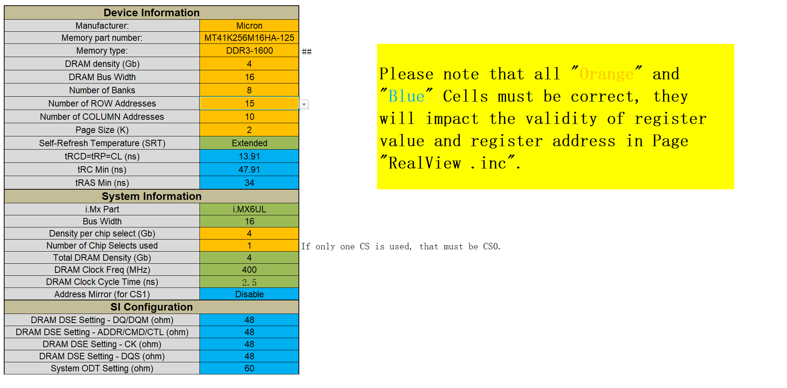
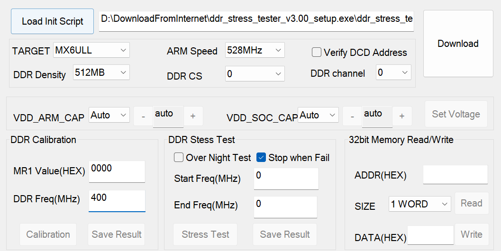
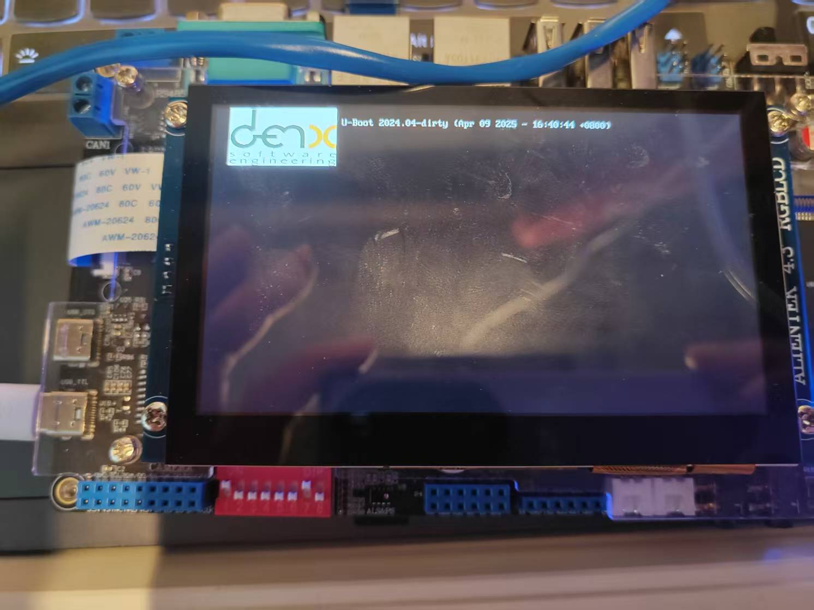
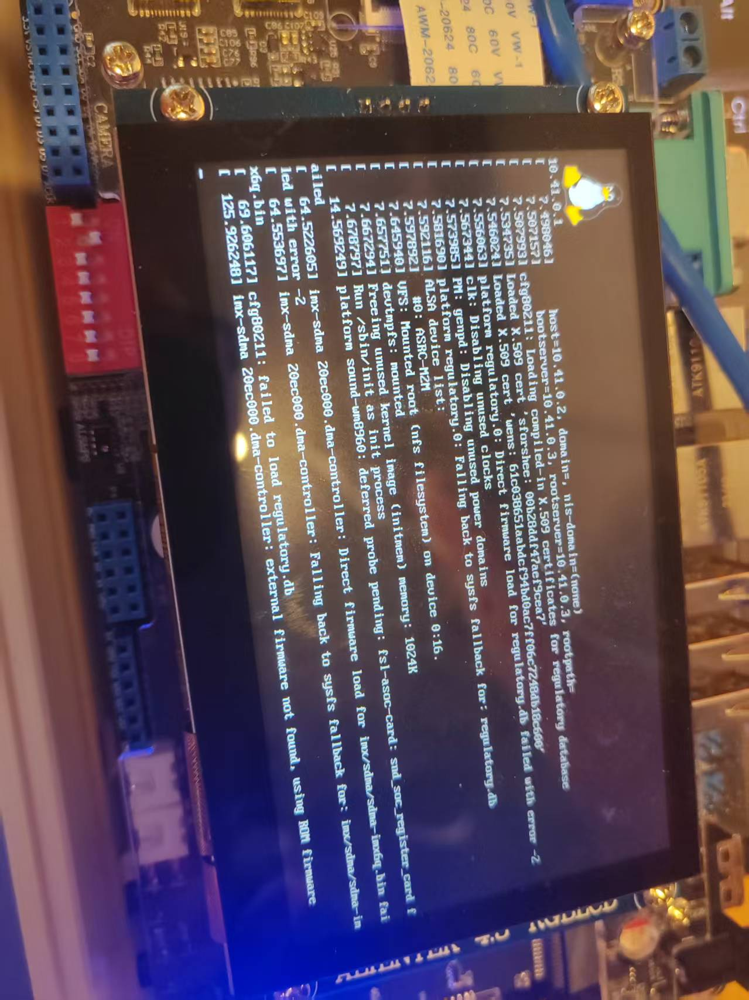
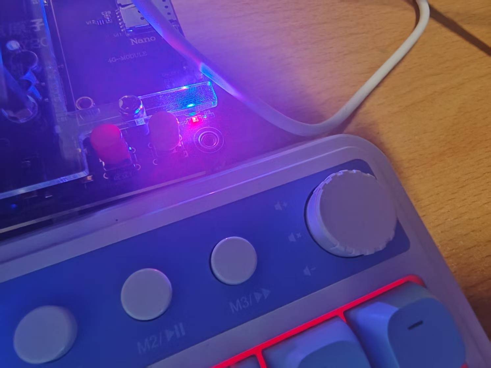

# 正点原子Alpha IMX6ULL开发板2025年最新部署方案：基于Ubuntu24.04平台开发，部署最新的UBoot/Linux和BusyBox Rootfs部署指南

## 前言

​	笔者实在绷不住比较旧的方案了，广义流行的方案是使用2016年发布的Uboot来引导Linux4.1.15，配合2018年发布的BusyBox。但是兄弟们，今年已经2025年了，还在用老登东西学习，学不到什么太多的，比如说，现代UBoot已经跟随潮流，将使用源码的硬件描述的传统风格转向了使用Device Tree设备树方案的硬件信息描述了。Linux的内核也发生了不少新的特性，非常值得我们去进行探索。因此，笔者花费了非常长的时间（一天基本没吃没喝高强度部署），探索出了如下的解决方案：

> UBoot：[nxp-imx/uboot-imx: i.MX U-Boot](https://github.com/nxp-imx/uboot-imx)的2024年4月份公布的分支：If_v2024.04分支
>
> Linux：[nxp-imx/linux-imx: i.MX Linux kernel](https://github.com/nxp-imx/linux-imx)：If_6.12.y分支，实际测试的时候笔者发现版本号是6.12.3
>
> Rootfs: 笔者使用的是busybox，版本号1.36.0，当然你可以选择最新的，但是众所周知，BusyBox的bugs非常多，对于各位若是使用的现代内核（6.8+），请不要选择版本过低的BusyBox，至少，1.32以下的不行，会出现一大堆未定义错误，因为他们不少引用了过时的符号：https://www.busybox.net/downloads/busybox-1.36.0.tar.bz2

​	笔者需要说明的是，我们的流程是这样的，按照我们的板子的时序，是按照`UBoot -> Linux -> (NFS mounted) Rootfs`的顺序，这里面的桥接非常多，当然，笔者也会穿插如果你决定妥协方案（部分新部分旧的事情）的时候，如何做对应的修改。

​	笔者的操作平台分成了三个部分——

- 我的UBuntu实际物理机（是的，我就没用虚拟机，我是物理笔记本上刷了Arch和Ubuntu双系统，这里笔者默认的是UBuntu，我后面会仔细的说明为什么是Ubuntu）。

- Windows：实际上是笔者习惯了Windows的XShell和方便的XFTP，板子的串口也是介入了Windows，当然看官朋友没必要整的如此的复杂，但是你需要注意的是——Windows是必须的！我们中间有一个必须的步骤是校验DDR3，辅助我们的UBoot启动的，没有这一步，UBoot肯定启动不起来。所以看我的朋友如果没有Windows，请：
  - Windows最小虚拟机就行了，那个DDR_Tester是最小完整可以运行的（Wine没试过，想试一下的朋友自行）
  - 自行寻找DDR校验方案，这里笔者就没有进行了
- 板载IMX6ULL的正点原子Alpha2.4版本的开发板，其中，内存的方案是EMMC512MB的，最接近的配置是imx6ull-14x14-evk-emmc型号，也是后面笔者魔改的基准。笔者的板子的LCD是800x480尺寸的LCD，其他的参数笔者会尽量给出。


# 从0开始配置UBoot

​	地址给出在这里，请你看清楚，笔者使用到是If_v2024.04分支，很快就要有If_v2025.04分支了，发生了任何的变化笔者都无法预知，所以你可以衡量后下载你的目标版本

```
git clone https://github.com/nxp-imx/uboot-imx.git
```

​	截至到2025年4月9日，我们的默认分支还是If_v2024.04，但看到这篇博客的你不一定了，可能需要显著的切换分支，所以请你留意！

## diffs

​	首先要说的是，UBoot因为相当于上位机中的Grub引导，实际上，UBoot在我们的项目中不应该占据太大的比例，但是你需要注意的是

- 第一，也是最重要的是——现代UBoot转向使用设备树描述硬件信息，因此，你实际上不得不再修改UBoot支持的板机信息的同时，修改设备树的源码，添加上我们支持的设备的信息。
- 第二，uboot的shell中已经移除了nfs指令了，毕竟，大伙都是用更加专门的tftp协议来传递文件。我在查询的时候发现存在说法（请原谅笔者没有考证，我找不到网址了）最后是可以在menuconfig中重新开启。但是这个笔者并不清晰，所以笔者的结论是——移除了nfs指令了，传递文件就是用tftp。

​	我们进入克隆好的仓库之后，就可以开始大展身手了。

## 第零步——对于新手，你需要知道每一个文件夹在做什么

​	下面的内容，一部分是你初次拿到uboot源码的时候所没有的，因为这个表格说明的是编译后的文件的一些信息。

| 名称                | 用途说明                                               |
| ------------------- | ------------------------------------------------------ |
| api                 | 提供供外部模块调用的公共API接口定义与实现              |
| arch                | 与架构相关的代码，如ARM、x86等，包含启动代码、头文件等 |
| board               | 各种开发板相关的配置与初始化代码                       |
| boot                | 启动加载相关的功能代码，例如启动映像加载器             |
| cmd                 | 实现U-Boot命令行接口支持的各类命令                     |
| common              | U-Boot核心功能的通用代码                               |
| config.mk           | 编译过程的配置文件之一，定义变量和规则                 |
| configs             | 针对不同开发板的默认配置文件目录                       |
| disk                | 与磁盘驱动及分区处理相关的模块                         |
| doc                 | 文档目录，包含U-Boot的使用、开发文档与说明             |
| drivers             | 设备驱动目录，包含各种硬件设备支持代码                 |
| dts                 | 设备树源文件目录，用于描述硬件资源                     |
| env                 | 环境变量处理模块，负责U-Boot环境配置的保存与恢复       |
| examples            | 提供示例代码和参考实现                                 |
| fs                  | 文件系统支持模块，如FAT、EXT4等                        |
| generated_defconfig | 由配置生成的默认配置文件                               |
| include             | 各类头文件目录，供全局使用                             |
| Kbuild              | 控制构建系统行为的文件之一                             |
| Kconfig             | 配置项定义文件，供menuconfig等工具使用                 |
| lib                 | 提供常用函数的通用库模块                               |
| MAINTAINERS         | 维护者信息，标明各模块负责人                           |
| Makefile            | 项目的主构建脚本，定义整体编译规则                     |
| net                 | 网络协议栈支持代码，如以太网驱动、TCP/IP协议等         |
| post                | 电源自检（POST）相关代码                               |
| README              | 项目总览与基础说明文档                                 |
| scripts             | 编译或配置过程中调用的脚本集合                         |
| spl                 | Secondary Program Loader，最小引导加载器代码           |
| System.map          | 映像中各符号与地址的映射表                             |
| test                | 各类测试代码与测试框架                                 |
| tools               | 工具代码，如镜像制作、打包工具等                       |
| u-boot              | 编译生成的主U-Boot ELF可执行文件                       |
| u-boot.bin          | 编译生成的U-Boot二进制镜像                             |
| u-boot.cfg          | 编译生成的配置选项摘要文件                             |
| u-boot.dtb          | 编译生成的设备树二进制文件                             |
| u-boot-dtb.bin      | 将设备树与U-Boot合并的镜像文件                         |
| u-boot-dtb.cfgout   | 设备树合并后的配置摘要                                 |
| u-boot-dtb.imx      | 针对i.MX平台生成的U-Boot镜像文件                       |
| u-boot-dtb.imx.log  | 生成上述镜像时的日志输出                               |
| u-boot.lds          | U-Boot链接脚本，定义内存布局                           |
| u-boot.map          | 编译后符号映射文件                                     |
| u-boot-nodtb.bin    | 不包含设备树的纯U-Boot镜像                             |
| u-boot.srec         | SREC格式的U-Boot映像，用于某些烧录工具                 |
| u-boot.sym          | 含调试符号的U-Boot符号表                               |

​	我们会跟一部分代码打上交道，比较重点的就是我们的config文件夹，board文件夹，drivers文件夹，arch/arm/dts文件夹，分别对应的是我们的板级配置信息，板级信息，驱动信息和设备树（驱动信息描述）信息。

## 第一步——预编译最接近您的板子信息的uboot

​	请各位朋友们注意，我们需要选择最接近我们的型号的，原生的样板进行编译，确保我们最大体的思路仍然是正确的，不然的话，就会出现各种问题。

​	上面笔者介绍自己的开发环境的时候已经说过，笔者的环境最接近的是mx6ull_14x14_evk_emmc_defconfig，这个就是我们的板级配置，因此，我们先点火！

```
make ARCH=arm CROSS_COMPILE=arm-unknown-linux-gnueabihf- distclean
make ARCH=arm CROSS_COMPILE=arm-unknown-linux-gnueabihf- mx6ull_14x14_evk_emmc_defconfig
make ARCH=arm CROSS_COMPILE=arm-unknown-linux-gnueabihf- -j16
```

​	生成出来的文件这些是我们需要知道的。

- u-boot.bin 是 U-Boot 的主要可执行文件。
- u-boot.dtb 是描述硬件信息的设备树文件。
- u-boot-dtb.bin 是包含了 U-Boot 和设备树的合并二进制文件。
- u-boot-dtb.imx 是为 NXP i.MX 系列处理器生成的特定格式的启动镜像，包含了头部IVT DCD信息

​	这里，如果您

- 使用的是Linux的UUU工具，需要下载的是u-boot-dtb.imx文件，如果是正点原子的imxdownload，请下载u-boot-dtb.bin，注意！千万不要搞错了！不是u-boot.bin！！！
- 使用的是MFG-TOOLS in Windows的朋友，请自己

​	先上板子试一下，看看能不能启动起来，不过，默认正点原子的板子的朋友，网卡和LCD肯定是工作失败的，这一点简直是毋庸置疑。

## 第二步：我们的起点，CV一份自己的板级配置

​	对于UBoot，我们的板级配置在今天，只需要做的修改只有一处：瞄准自己的设备树配置路径。因为我们现在需要使用设备树来描述我们的外设信息了

​	我们拷贝一份我们刚刚跑起来的板级配置，刚刚我们就说过了，configs文件夹下存放我们的板级信息，我们拷贝一份：

```
cd configs	# 进入板级配置信息文件夹
cp mx6ull_14x14_evk_emmc_defconfig mx6ull_charliechen_emmc_defconfig
```

​	对于设备树描述的uboot，我们需要改一个地方。

```
➜  cat mx6ull_14x14_evk_emmc_defconfig | head -n 20
CONFIG_ARM=y
CONFIG_ARCH_MX6=y
CONFIG_SYS_MALLOC_LEN=0x1000000
CONFIG_NR_DRAM_BANKS=1
CONFIG_SYS_MEMTEST_START=0x80000000
CONFIG_SYS_MEMTEST_END=0x88000000
CONFIG_ENV_SIZE=0x2000
CONFIG_ENV_OFFSET=0xE0000
CONFIG_MX6ULL=y
CONFIG_TARGET_MX6ULL_14X14_EVK=y
# CONFIG_LDO_BYPASS_CHECK is not set
CONFIG_SYS_I2C_MXC_I2C1=y
CONFIG_SYS_I2C_MXC_I2C2=y
CONFIG_DM_GPIO=y
# >>>>>>>>>>>>>>>>>>>>>>>>>>>>>>>>>>>>>>>>>>>>>
#
#	你需要更改的是这个地方，也就是默认的设备树信息
CONFIG_DEFAULT_DEVICE_TREE="imx6ull-14x14-evk-emmc"
#	
#
# <<<<<<<<<<<<<<<<<<<<<<<<<<<<<<<<<<<<<<<<<<<<<
CONFIG_SUPPORT_RAW_INITRD=y
CONFIG_USE_BOOTCOMMAND=y
CONFIG_BOOTCOMMAND="run findfdt;mmc dev ${mmcdev};mmc dev ${mmcdev}; if mmc rescan; then if run loadbootscript; then run bootscript; else if run loadimage; then run mmcboot; else run netboot; fi; fi; else run netboot; fi"
CONFIG_BOOTDELAY=3
...
```

​	改成什么呢？

```
➜  cat mx6ull_charliechen_emmc_defconfig | head -n 20
CONFIG_ARM=y
CONFIG_ARCH_MX6=y
CONFIG_SYS_MALLOC_LEN=0x1000000
CONFIG_NR_DRAM_BANKS=1
CONFIG_SYS_MEMTEST_START=0x80000000
CONFIG_SYS_MEMTEST_END=0x88000000
CONFIG_ENV_SIZE=0x2000
CONFIG_ENV_OFFSET=0xE0000
CONFIG_MX6ULL=y
CONFIG_TARGET_MX6ULL_14X14_EVK=y
# CONFIG_LDO_BYPASS_CHECK is not set
CONFIG_SYS_I2C_MXC_I2C1=y
CONFIG_SYS_I2C_MXC_I2C2=y
CONFIG_DM_GPIO=y
# >>>>>>>>>>>>>>>>>>>>>>>>>>>>>>>>>>>>>>>>>>>>>
#
#	你需要更改的是这个地方，也就是默认的设备树信息
CONFIG_DEFAULT_DEVICE_TREE="imx6ull-charliechen"
#	
#
# <<<<<<<<<<<<<<<<<<<<<<<<<<<<<<<<<<<<<<<<<<<<<
CONFIG_SUPPORT_RAW_INITRD=y
CONFIG_USE_BOOTCOMMAND=y
CONFIG_BOOTCOMMAND="run findfdt;mmc dev ${mmcdev};mmc dev ${mmcdev}; if mmc rescan; then if run loadbootscript; then run bootscript; else if run loadimage; then run mmcboot; else run netboot; fi; fi; else run netboot; fi"
CONFIG_BOOTDELAY=3
# CONFIG_CONSOLE_MUX is not set

```

​	请你注意，这个imx6ull-charliechen就会被作为一个prefix，用来被Makefile引用构成一个完整的设备树文件名称：

```
$(CONFIG_DEFAULT_DEVICE_TREE).dts
```

​	因此我们后面的时候，修改的设备树的文件名称，也必须是`$(CONFIG_DEFAULT_DEVICE_TREE).dts`，以我的为例子，那显然就是`imx6ull-charliechen.dts`文件了。

## 第三步，复制一份板级信息

​	这一点，跟正点原子的差别并不大。我们的参考的最接近的板级信息文件夹被放在了`board/freescale/mx6ullevk`下了，我们观察一下这个文件夹的结构

| 名称                | 用途说明                                                     |
| ------------------- | ------------------------------------------------------------ |
| imximage.cfg        | i.MX 平台启动镜像的配置文件，定义启动头参数、加载地址等信息  |
| imximage_lpddr2.cfg | 为使用 LPDDR2 内存的 i.MX 平台提供的专用镜像配置文件         |
| Kconfig             | 为该目录添加构建配置选项，供配置工具（如menuconfig）使用     |
| MAINTAINERS         | 指定该平台或模块的维护人员及联系信息                         |
| Makefile            | 构建当前平台或模块的编译规则与依赖关系                       |
| mx6ullevk.c         | 针对NXP i.MX6ULL EVK开发板的初始化代码，包括时钟、引脚复用、内存配置等 |
| plugin.S            | 启动前加载的小型汇编插件，通常用于设置初始状态或添加认证代码 |

​	我们需要修改哪些内容呢，答案是C文件，Makefile，MAINTAINERS，Kconfig，imximage.cfg，这个事情跟我们的正点原子的教程看起来简直一摸一样。但笔者愿意在这里再罗嗦一次，因为还是有所不同了。

​	我们第一件事情就是拷贝整个`board/freescale/mx6ullevk`，并且将拷贝的文件夹名称改成mx6ull_charliechen_emmc，注意的是，整个文件夹所处的位置是`board/freescale/mx6ull_charliechen_emmc`下。

#### 3.1 修改我们的.c文件

​	其实这个算花功夫，我们这里实际上是添加自己的开发板，请看：

```
 int checkboard(void)
 {
	if (is_mx6ul_9x9_evk())
		 puts("Board: MX6UL 9x9 EVK\n");
	else if(is_cpu_type(MXC_CPU_MX6ULZ))
		 puts("Board: MX6UL 14x14 EVK\n");
	else 
		puts("Board: IMX6ULL Charliechen EMMC");
	return 0;
 }
```

​	这个更改参考的是[正点原子imx6ull开发板移植新版本U-boot(uboot2022.04，有设备树)_imx6ull移植最新uboot-CSDN博客](https://blog.csdn.net/weixin_44587424/article/details/141469866)，相当于是增加了一部分的逻辑，你可以直接改成`puts("Board: IMX6ULL Charliechen EMMC");`这无所谓。

​	改完之后，文件重命名为mx6ull_charliechen_emmc.c，这个文件的名称在Makefile中还会使用到！

#### 3.2 修订Makefile

​	我们看看我们的Makefile，我们这一次修改的Makefile是在`board/freescale/mx6ull_charliechen_emmc`的！，你需要更改的就是obj-y的内容，这里，更改的名称就是`{.c文件名称}.o`，如下所示

```
# (C) Copyright 2015 Freescale Semiconductor, Inc.
#
# SPDX-License-Identifier:	GPL-2.0+
#

obj-y  := mx6ull_charliechen_emmc.o

extra-$(CONFIG_USE_PLUGIN) :=  plugin.bin
$(obj)/plugin.bin: $(obj)/plugin.o
	$(OBJCOPY) -O binary --gap-fill 0xff $< $@
```

​	这个时候，我们的Makefile就会打包我们的.c板级文件，从而完成uboot对我们板子信息的收集。

#### MAINTAINERS的修改

​	我们参考的板级信息这样写的，

```
MX6ULLEVK BOARD
M:	Peng Fan <peng.fan@nxp.com>
S:	Maintained
F:	board/freescale/mx6ullevk/
F:	include/configs/mx6ullevk.h
F:	configs/mx6ull_14x14_evk_defconfig
F:	configs/mx6ull_14x14_evk_plugin_defconfig
F:	configs/mx6ulz_14x14_evk_defconfig
```

​	我们修改一下就好了

```
MX6ULLEVK BOARD
M:	Peng Fan <peng.fan@nxp.com>
S:	Maintained
F:	board/freescale/mx6ull_charliechen_emmc/
F:	include/configs/mx6ull_charliechen_emmc.h
F:	configs/mx6ull_charliechen_emmc_defconfig
F:	configs/mx6ull_14x14_evk_plugin_defconfig
F:	configs/mx6ulz_14x14_evk_defconfig
```

​	这个无所谓的，只是说明我们的维护信息，改上更加完备，正规的开发这里必须要改

#### 修订KConfig文件

​	我们参考的内容的Kconfig这样写的：

```
if TARGET_MX6ULL_14X14_EVK || TARGET_MX6ULL_9X9_EVK

config SYS_BOARD
	default "mx6ullevk"

config SYS_VENDOR
	default "freescale"

config SYS_CONFIG_NAME
	default "mx6ullevk"

config IMX_CONFIG
	default "board/freescale/mx6ullevk/imximage.cfg"

config TEXT_BASE
	default 0x87800000
endif
```

​	我们的构建会使用这个玩意，所以请各位注意。修改的时候，还是按照如下的参考进行：

##### **`if TARGET_MX6ULL_CHARLIECHEN_EMMC`**

​	这是条件语句，只有在配置项 `TARGET_MX6ULL_CHARLIECHEN_EMMC` 被启用时（例如 `.config` 中 `CONFIG_TARGET_MX6ULL_CHARLIECHEN_EMMC=y`），下面的 `config` 才会生效。这个宏是通过 `configs/` 下的 defconfig 文件指定的，这个事情，是我们在稍后的make xxx_defconfig的时候，自动配置的，所以一定要记得改。改成我们的defconfig的前缀的名称。你看，笔者的板级配置信息（放在了configs文件夹下的）是mx6ull_charliechen_emmc_defconfig文件，我们的Makefile会萃取得到mx6ull_charliechen_emmc，这就是我们的if，注意要全部转大写！

##### **`config SYS_BOARD`**

说明当前平台的板级代码目录名，U-Boot会使用它去找 `board/$(VENDOR)/$(BOARD)/` 目录。依据：对应 `board/freescale/mx6ull_charliechen_emmc/` 目录的存在。修改方式：如果你创建了新目录 `board/freescale/myboard/`，这里就改成 `"myboard"`。这里跟下面的**`config SYS_VENDOR`**都是匹配的

##### **`config SYS_VENDOR`**

指定厂商名，在U-Boot中用于构建路径，例如 `board/$(SYS_VENDOR)/$(SYS_BOARD)`。依据：你创建的目录结构中的厂商名，例如 `freescale`、`nxp`、`mycompany` 等。修改方式：只要你把代码目录改成 `board/mycompany/...`，这里就应同步为 `"mycompany"`。当然，我们显然是freescale（哦对了，这是因为这个板子最先是freescale飞思卡尔公司维护的，后来被nxp收购了，但是这个板子还得是freescale的请注意！）

##### **`config SYS_CONFIG_NAME`**

这是 `include/configs/` 下的配置头文件名（不加 `.h`），编译时U-Boot会引用 `include/configs/mx6ull_charliechen_emmc.h`。如果你换成了 `include/configs/myboard.h`，这里就要改成 `"myboard"`。比如这里笔者就要换成mx6ull_charliechen_emmc

##### **`config TEXT_BASE`**

表示U-Boot镜像的加载地址（通常是链接地址），用于链接脚本 `u-boot.lds` 中的 `TEXT_BASE` 宏。直接参考笔者下面给的模板即可

```
if TARGET_MX6ULL_CHARLIECHEN_EMMC

config SYS_BOARD
	default "mx6ull_charliechen_emmc"

config SYS_VENDOR
	default "freescale"

config SYS_CONFIG_NAME
	default "mx6ull_charliechen_emmc"
	
config TEXT_BASE
	default 0x87800000
	
endi
```

​	这个KConfig文件也是在我们自己的`board/freescale/mx6ull_charliechen_emmc`下。

#### 修订image.cfg文件

#### 修改PLUGIN指向自己的板级文件夹

​	这个算镜像的插件机制，需要我们修改的，就是PLUGIN指向的.bin的位置。

```
#ifdef CONFIG_USE_PLUGIN
/*PLUGIN    plugin-binary-file    IRAM_FREE_START_ADDR*/
PLUGIN	board/freescale/board/freescale/mx6ull_charliechen_emmc/plugin.bin 0x00907000
#else
```

​	但是下面这个，请大伙必须做，不然一定启动不起来。

##### 校验DDR

​	校验DDR是必要的，不然我们的UBoot会在检查DDR的内容的时候无法通过，你需要先下载的是DDR TOOLS

> DDR Tools的网址在这里，拉到中间偏上的地方
>
> [i.MX 6/7 DDR Stress Test Tool - NXP Community](https://community.nxp.com/t5/i-MX-Processors-Knowledge-Base/i-MX-6-7-DDR-Stress-Test-Tool/ta-p/1108221)
>
> 我找了10来分钟，这里直接把连接给出来吧！https://community.nxp.com/pwmxy87654/attachments/pwmxy87654/imx-processors%40tkb/1501/3/ddr_stress_tester_v3.00_setup.exe.zip
>
> 还需要下载的是Register Aids，不然的话我们稍后会不知道填写什么内容。
>
> [i.MX6UL/ULL/ULZ DRAM Register Programming Aids - NXP Community](https://community.nxp.com/t5/i-MX-Processors-Knowledge-Base/i-MX6UL-ULL-ULZ-DRAM-Register-Programming-Aids/ta-p/1124015)

​	现在，我们打开下载的表格文件，切换到第二个表格



​	请你注意，**上面的参数如果你是使用正点原子的EMMC512MB开发板**，对于**橙色和蓝色框处**的部分，**一个字都不要差的抄下来**，不然DDR校验过不去，到时候很麻烦会。**对于其他大小的NAND开发板或者是EMMC开发板，自行参考其他教程！！！搜索IMX6ULL的DDR校验即可**

​	全部搞完之后，你需要做的就是复制第三个表格的内容，创建一个随意的.inc文件，放进去，我是myinc.inc文件，选择困难了用我这个

```
//=============================================================================			
//init script for i.MX6UL DDR3			
//=============================================================================			
// Revision History			
// v01			
//=============================================================================			
			
wait = on			
//=============================================================================			
// Disable	WDOG		
//=============================================================================			

省略一大堆内容...
			
setmem /32	0x021b001c =	0x00000000	// MMDC0_MDSCR, clear this register (especially the configuration bit as initialization is complete)
```

​	下一步就是配置DDR测试的参数了，笔者使用的是512MB的EMMC，因此，这里的参数长这样，这个参考的是博客：

> [NXP（I.MX6uLL）DDR3实验——DDR3初始化、校准、超频测试_i.mx6 ddr stress test tool-CSDN博客](https://blog.csdn.net/zhuguanlin121/article/details/121409923)

​	各位可以前往参考：

> Target是MX6ULL，处理器的速度是528MHz，取消勾选校验DCD地址，DDR大小512，DDR的频率是400MHz



​	之后，把你的板子的OTG接口插上，让板子构成USB的从机，然后点击Calibraton按钮，稍微泡杯茶走一回，你就能拿到结果了

```
   Write leveling calibration
   MMDC_MPWLDECTRL0 ch0 (0x021b080c) = 0x00000000
   MMDC_MPWLDECTRL1 ch0 (0x021b0810) = 0x001F001F

   Read DQS Gating calibration
   MPDGCTRL0 PHY0 (0x021b083c) = 0x01380134
   MPDGCTRL1 PHY0 (0x021b0840) = 0x00000000

   Read calibration
   MPRDDLCTL PHY0 (0x021b0848) = 0x40402E34

   Write calibration
   MPWRDLCTL PHY0 (0x021b0850) = 0x4040362E
```

​	这是笔者校验的结果，**不要直接抄，每一个板子是略有不同的！不然uboot会无法启动！（笔者的血与泪）**，拿到这个信息之后（笔者非常建议你保存一下，我们会用到的），打开我们的image.cfg文件，**在这个文件中搜索地址**，你看，你搜索地址0x021b080c就会给你定位到这个地方，你看这里就跟默认的不一样，改成0x00000000

```
DATA 4 0x021B080C 0x00000004
```

​	之后如法炮制的修改剩下5个寄存器的值后，我们最后需要做的是修改设备树的一些文件，让我们的UBoot启动起来

## 第四步，修正设备树

​	因为从现在开始，UBoot采用的是设备树了，跟Linux一样，所有的设备树全部放到了我们的arch/arm/dts文件夹下了。

#### 4.0 开始我们的分析

​	分析一下，我们当时旧的配置是魔改了我们的`arch/arm/dts/imx6ull-14x14-evk-emmc.dts`（当时是Linux的），这里我们看看这个文件下有啥

```c
#include "imx6ull-14x14-evk.dts"

&usdhc2 {
	pinctrl-names = "default", "state_100mhz", "state_200mhz";
	pinctrl-0 = <&pinctrl_usdhc2_8bit>;
	pinctrl-1 = <&pinctrl_usdhc2_8bit_100mhz>;
	pinctrl-2 = <&pinctrl_usdhc2_8bit_200mhz>;
	bus-width = <8>;
	non-removable;
	status = "okay";
};
```

​	嗯，信息被收拢到`"imx6ull-14x14-evk.dts"`文件去了

```
/dts-v1/;

#include "imx6ull.dtsi"
#include "imx6ul-14x14-evk.dtsi"
#include "imx6ul-14x14-evk-u-boot.dtsi"
...
```

​	我们的依赖就这样层层的递进，但中规中矩，实际上需要修改的东西还是那些，笔者是拷贝了imx6ul-14x14-evk.dtsi文件和imx6ul-14x14-evk.dts文件，这个重新作为我们新板子的根基。

```
cp imx6ul-14x14-evk.dtsi imx6ull-charliechen.dtsi
cp imx6ul-14x14-evk.dts imx6ull-charliechen.dts
```

​	因为我们现在用的新东西，打开我们的imx6ull-charliechen.dts，然后把原先的include第二行的#include "imx6ul-14x14-evk.dtsi"改成我们自己的就好了（笑）

```
#include "imx6ull.dtsi"
#include "imx6ull-charliechen.dtsi"
#include "imx6ul-14x14-evk-u-boot.dtsi"
```

​	爆改启动！

#### 4.1 修订EMMC节点信息

​	第一件事情，我们这个板子是基于imx6ul-14x14-evk-emmc的，需要额外的补充节点，在我们的`arch/arm/dts/imx6ull-14x14-evk-emmc.dts`下偷过来&usdhc2的节点信息。

```
// SPDX-License-Identifier: (GPL-2.0 OR MIT)
//
// Copyright (C) 2016 Freescale Semiconductor, Inc.

/dts-v1/;

#include "imx6ull.dtsi"
#include "imx6ull-charliechen.dtsi"
#include "imx6ul-14x14-evk-u-boot.dtsi"

/ {
	model = "i.MX6 ULL 14x14 EVK Board";
	compatible = "fsl,imx6ull-14x14-evk", "fsl,imx6ull";
};

&clks {
	assigned-clocks = <&clks IMX6UL_CLK_PLL3_PFD2>,
			  <&clks IMX6UL_CLK_PLL4_AUDIO_DIV>;
	assigned-clock-rates = <320000000>, <786432000>;
};

&csi {
	status = "okay";
};

&ov5640 {
	status = "okay";
};

&usdhc2 {
	pinctrl-names = "default", "state_100mhz", "state_200mhz";
	pinctrl-0 = <&pinctrl_usdhc2_8bit>;
	pinctrl-1 = <&pinctrl_usdhc2_8bit_100mhz>;
	pinctrl-2 = <&pinctrl_usdhc2_8bit_200mhz>;
	bus-width = <8>;
	non-removable;
	status = "okay";
};

/delete-node/ &sim2;
```

​	改完之后就是这样，现在，你可以开始将uboot烧录到自己的板子上了，笔者建议是SD卡。

```
Core:  79 devices, 22 uclasses, devicetree: separate
MMC:   FSL_SDHC: 0, FSL_SDHC: 1
Loading Environment from MMC... OK
[*]-Video Link 0 (800 x 480)
	[0] lcdif@21c8000, video
In:    serial
Out:   serial
Err:   serial
switch to partitions #0, OK
mmc0 is current device
flash target is MMC:0
Net:   eth1: ethernet@20b4000 [PRIME]Get shared mii bus on ethernet@2188000

Error: ethernet@2188000 No valid MAC address found.

Fastboot: Normal
Normal Boot
Hit any key to stop autoboot:  0 
=> 
=> 
=> 

```

​	呀呼！庆祝一下吧，我们启动是成功了！但是你会发现，嗯，网卡和LCD都罢工了，这就是我们下面工作的意义——修正LCD驱动和网卡驱动（其他不用修，跳板的东西修LCD和）

#### 4.2 修订LCD驱动

​	查看LCD驱动，翻阅正点原子手册，他是使用了lcdif这个节点信息描述的。

​	我们先修订LCD驱动的打开部分，回到我们的板级文件夹的

```
 static int setup_lcd(void)
 {
	 enable_lcdif_clock(LCDIF1_BASE_ADDR, 1);
 
	 imx_iomux_v3_setup_multiple_pads(lcd_pads, ARRAY_SIZE(lcd_pads));
 
	 /* Reset the LCD */
	 gpio_request(IMX_GPIO_NR(5, 9), "lcd reset");
	 gpio_direction_output(IMX_GPIO_NR(5, 9) , 0);
	 udelay(500);
	 gpio_direction_output(IMX_GPIO_NR(5, 9) , 1);
 
	 /* Set Brightness to high */
	 gpio_request(IMX_GPIO_NR(1, 8), "backlight");
	 gpio_direction_output(IMX_GPIO_NR(1, 8) , 1);
 
	 return 0;
 }
```

​	我们的LCD是没有开关的，可以对`/* Reset the LCD */`的代码块进行注释

```c
 static int setup_lcd(void)
 {
	 enable_lcdif_clock(LCDIF1_BASE_ADDR, 1);
 
	 imx_iomux_v3_setup_multiple_pads(lcd_pads, ARRAY_SIZE(lcd_pads));
 
	 /* Reset the LCD */
	//  gpio_request(IMX_GPIO_NR(5, 9), "lcd reset");
	//  gpio_direction_output(IMX_GPIO_NR(5, 9) , 0);
	//  udelay(500);
	//  gpio_direction_output(IMX_GPIO_NR(5, 9) , 1);
 
	 /* Set Brightness to high */
	 gpio_request(IMX_GPIO_NR(1, 8), "backlight");
	 gpio_direction_output(IMX_GPIO_NR(1, 8) , 1);
 
	 return 0;
 }
```

​	但笔者这里没这样做，事实证明并不影响。看自己心情吧！下一步比较重要，我们需要修改LCD设备的参数信息。在我们的`arch/arm/dts/imx6ull-charliechen.dtsi`下吗，一个搜索lcdif就能抓到

```
&lcdif {
	pinctrl-names = "default";
	pinctrl-0 = <&pinctrl_lcdif_dat
		     &pinctrl_lcdif_ctrl>;
	display = <&display0>;
	status = "okay";
	...
};
```

​	你需要修改成这样

```
&lcdif {
	pinctrl-names = "default";
	pinctrl-0 = <&pinctrl_lcdif_dat
		     &pinctrl_lcdif_ctrl>;
	display = <&display0>;
	status = "okay";

	display0: display@0 {
		bits-per-pixel = <24>;		// 改成24
		bus-width = <24>;			// 改成24

		display-timings {
			native-mode = <&timing0>;

			timing0: timing0 {
				clock-frequency = <51200000>;	// 我们的LCD时钟是51.2MHz的
				hactive = <800>;				// 长800
				vactive = <480>;				// 宽480
				hfront-porch = <210>;
				hback-porch = <46>;
				hsync-len = <1>;
				vback-porch = <23>;
				vfront-porch = <22>;
				vsync-len = <1>;
				hsync-active = <0>;
				vsync-active = <0>;
				de-active = <1>;
				pixelclk-active = <0>;
			};
		};
	};
};
```

- `pinctrl-names = "default";` 指定默认的引脚控制方案，表示使用默认引脚配置。
- `pinctrl-0 = <&pinctrl_lcdif_dat &pinctrl_lcdif_ctrl>;` 引用了两个引脚控制节点，分别负责 LCD 的数据线和控制线（如 VSYNC、HSYNC）配置。
- `display = <&display0>;` 将主显示设备绑定到下面定义的 `display0` 子节点。
- `status = "okay";` 表示启用该设备节点。

接下来是 `display0: display@0` 节点，定义了一个 LCD 显示设备的参数：

- `bits-per-pixel = <24>;` 设置每像素的位数为 24，对应 RGB888，每个颜色通道 8 位。
- `bus-width = <24>;` 设置 LCD 数据总线的宽度为 24 位，即使用 RGB 所有通道并行传输。

接着是 `display-timings` 块，设置显示屏的时序参数：

- `native-mode = <&timing0>;` 指定默认的显示模式使用 `timing0`。
- `timing0` 定义了一组特定的显示时序，适配 800x480 分辨率和 51.2MHz 像素时钟的屏幕。具体参数如下：
  - `clock-frequency = <51200000>;` 设置像素时钟频率为 51.2MHz。
  - `hactive = <800>; vactive = <480>;` 设置水平和垂直有效像素，即屏幕分辨率为 800×480。
  - `hfront-porch = <210>; hback-porch = <46>; hsync-len = <1>;` 设置水平同步时序。
  - `vfront-porch = <22>; vback-porch = <23>; vsync-len = <1>;` 设置垂直同步时序。
  - `hsync-active = <0>; vsync-active = <0>;` 指定 HSYNC 和 VSYNC 为低电平有效。
  - `de-active = <1>;` 设置数据使能（DE）信号为高电平有效。
  - `pixelclk-active = <0>;` 表示像素时钟在下降沿采样像素。

这些参数需要结合正点原子使用的LCD型号，找手册看参数。如果实在找不到，笔者的鸣谢reference中有LCD参数设置，或者，你可以直接杀去看正点原子LCD驱动移植的资料

> [正点原子imx6ull-mini-Linux驱动之Linux LCD 驱动实验（19）_imx6ull lcd帧率改变-CSDN博客](https://blog.csdn.net/NEWEVA__zzera22/article/details/140897796)

​	还需要我们修改一下LCD的数据控制引脚的电平信息，这个实际上可改可不改，看你，但是Linux下请一定要改,uboot存活时间短无所谓

```
	pinctrl_lcdif_dat: lcdifdatgrp {
		fsl,pins = <
			MX6UL_PAD_LCD_DATA00__LCDIF_DATA00  0x49
			MX6UL_PAD_LCD_DATA01__LCDIF_DATA01  0x49
			MX6UL_PAD_LCD_DATA02__LCDIF_DATA02  0x49
			MX6UL_PAD_LCD_DATA03__LCDIF_DATA03  0x49
			MX6UL_PAD_LCD_DATA04__LCDIF_DATA04  0x49
			MX6UL_PAD_LCD_DATA05__LCDIF_DATA05  0x49
			MX6UL_PAD_LCD_DATA06__LCDIF_DATA06  0x49
			MX6UL_PAD_LCD_DATA07__LCDIF_DATA07  0x49
			MX6UL_PAD_LCD_DATA08__LCDIF_DATA08  0x49
			MX6UL_PAD_LCD_DATA09__LCDIF_DATA09  0x49
			MX6UL_PAD_LCD_DATA10__LCDIF_DATA10  0x49
			MX6UL_PAD_LCD_DATA11__LCDIF_DATA11  0x49
			MX6UL_PAD_LCD_DATA12__LCDIF_DATA12  0x49
			MX6UL_PAD_LCD_DATA13__LCDIF_DATA13  0x49
			MX6UL_PAD_LCD_DATA14__LCDIF_DATA14  0x49
			MX6UL_PAD_LCD_DATA15__LCDIF_DATA15  0x49
			MX6UL_PAD_LCD_DATA16__LCDIF_DATA16  0x49
			MX6UL_PAD_LCD_DATA17__LCDIF_DATA17  0x49
			MX6UL_PAD_LCD_DATA18__LCDIF_DATA18  0x49
			MX6UL_PAD_LCD_DATA19__LCDIF_DATA19  0x49
			MX6UL_PAD_LCD_DATA20__LCDIF_DATA20  0x49
			MX6UL_PAD_LCD_DATA21__LCDIF_DATA21  0x49
			MX6UL_PAD_LCD_DATA22__LCDIF_DATA22  0x49
			MX6UL_PAD_LCD_DATA23__LCDIF_DATA23  0x49
		>;
	};
```

#### 4.3 修订网卡驱动

​	我们下面来修改网卡的驱动。当然，我们主要解决的还是SPI4的引脚和我们的网卡复位驱动打架的问题。因此，结合我们的原理图（如果你的板子跟我的一致，看结论就好）就会发现，冲突的引脚是`MX6UL_PAD_SNVS_TAMPER7__GPIO5_IO07`和`MX6UL_PAD_SNVS_TAMPER8__GPIO5_IO08`，我们的板子上这里用给了网卡驱动了，因此，我们需要做的是

​	首先搜索这两个引脚，在我们的arch/arm/dts/imx6ull-charliechen.dtsi中只有：

```
	pinctrl_spi4: spi4grp {
		fsl,pins = <
			MX6UL_PAD_BOOT_MODE0__GPIO5_IO10	0x70a1
			MX6UL_PAD_BOOT_MODE1__GPIO5_IO11	0x70a1
			/* MX6UL_PAD_SNVS_TAMPER7__GPIO5_IO07	0x70a1
			MX6UL_PAD_SNVS_TAMPER8__GPIO5_IO08	0x80000000 */
		>;
	};
```

​	我们给下面的两个控制引脚注释掉。然后，我们在IO矩阵复位设备节点上，添加复位的控制组：

```
	pinctrl_enet1_reset: enet1resetgrp {
		fsl,pins = <
			MX6UL_PAD_SNVS_TAMPER7__GPIO5_IO07		0x10B0
		>;
	};

	pinctrl_enet2_reset: enet2resetgrp {
		fsl,pins = <
			MX6UL_PAD_SNVS_TAMPER8__GPIO5_IO08		0x10B0
		>;
	};
```

​	你需要注意的是，因为我们现在NXP的板子中MX6UL和MX6ULL的配置合并，这里一定要写笔者这个，不然的话就会找不到符号出错！Linux的配置也是一样的。（这一点跟我们的6.6有不一样了）

​	以及，我们需要取消任何对`MX6UL_PAD_SNVS_TAMPER7__GPIO5_IO07`和`MX6UL_PAD_SNVS_TAMPER8__GPIO5_IO08`引脚的印用，这里隶属于我们的设备树的信息，对于笔者这个版本的UBoot。你需要修改的是注释掉我们的`cs-gpios`和`cs-gpios`两行，

```
	spi-4 {
		compatible = "spi-gpio";
		pinctrl-names = "default";
		pinctrl-0 = <&pinctrl_spi4>;
		status = "okay";
		gpio-sck = <&gpio5 11 0>;
		gpio-mosi = <&gpio5 10 0>;
		/* cs-gpios = <&gpio5 7 GPIO_ACTIVE_LOW>; */
		num-chipselects = <1>;
		#address-cells = <1>;
		#size-cells = <0>;

		gpio_spi: gpio@0 {
			compatible = "fairchild,74hc595";
			gpio-controller;
			#gpio-cells = <2>;
			reg = <0>;
			registers-number = <1>;
			registers-default = /bits/ 8 <0x57>;
			spi-max-frequency = <100000>;
			/* enable-gpios = <&gpio5 8 GPIO_ACTIVE_LOW>; */
		};
	};
```

​	然后在我们的网卡上添加复位的信息

```
&fec1 {
	pinctrl-names = "default";
	pinctrl-0 = <&pinctrl_enet1
				 &pinctrl_enet1_reset>;	// 添加复位控制引脚
	phy-mode = "rmii";
	phy-handle = <&ethphy0>;
	// 添加这些 -----------------------------------------
	phy-reset-gpios = <&gpio5 7 GPIO_ACTIVE_LOW>;
	phy-reset-duration = <200>;
	phy-reset-post-delay = <200>;
	// 到这里 -----------------------------------------
	phy-supply = <&reg_peri_3v3>;
	status = "okay";
};

&fec2 {
	pinctrl-names = "default";
	pinctrl-0 = <&pinctrl_enet2
				 &pinctrl_enet2_reset>;	// 添加复位控制引脚
	phy-mode = "rmii";
	phy-handle = <&ethphy1>;
	phy-supply = <&reg_peri_3v3>;
	// 添加这些 -----------------------------------------
	phy-reset-gpios = <&gpio5 8 GPIO_ACTIVE_LOW>;
	phy-reset-duration = <200>;
	phy-reset-post-delay = <200>;
	// 到这里 -----------------------------------------
	status = "okay";
	...
```

​	主要添加的就是添加复位控制信息，phy-reset-gpios信息，phy-reset-duration信息和phy-reset-post-delay信息，如上所示

​	现在，我们重新编译uboot，上号！

​	启动uboot时，系统会提示ethernet地址没有设置，这是网口的地址。这个error是不影响使用的，u-boot仍然能正常运行，只要设置好参数eth1addr就可以正常运行了。（注意，这个是新的UBoot的区别，不是ethraddr!）

```
setenv eth0addr b8:ae:1d:01:00:00	# MAC地址随意，不要在以太网里撞车就行
```

​	设置一下，如果你的网卡工作正常，他会先reset网卡，成功后就会设置好了

​	剩下的事情就是设置板子的本机IP，服务器（我的Ubuntu上位机）对于使用网线连接的以太网分配IP和我们的网关。

```
setenv ipaddr			本机IP
setenv gatewayip		网关IP
setenv serverip			Ubuntu上位机/虚拟机IP
saveenv
```

​	关于设置的讲究，我需要说明的是——你需要在你的ubuntu/其他发行版观察被分配的上位机IP，然后对应的设置网关和板子的IP。举个例子，我看到我的UBuntu在我的以太网局域网中被分配到了10.41.0.3，其中子网掩码是255.255.255.0，说明IP地址的最后8位给了其他设备，我们假设我们想给我们的板子分配10.41.0.2，这个时候，我们首先

```
➜  ping 10.41.0.2
PING 10.41.0.2 (10.41.0.2) 56(84) bytes of data.
# 很久是没有回应的
```

​	这个IP就是可以被分配给板子的

```
setenv ipaddr		10.41.0.2
setenv gatewayip	10.41.0.1	# 我习惯给1
setenv serverip		10.41.0.3
```

​	我们现在开始测试一下网卡能否正常的手发包

```
=> ping 10.41.0.3		# 
Using ethernet@20b4000 device
host 10.41.0.3 is alive
```

​	对了，笔者说过了，UBoot是不支持回应ICMP回显报文的，所以在你设置好了之后

```
➜  ping 10.41.0.2
PING 10.41.0.2 (10.41.0.2) 56(84) bytes of data.
From 10.41.0.3 icmp_seq=1 Destination Host Unreachable
From 10.41.0.3 icmp_seq=2 Destination Host Unreachable
From 10.41.0.3 icmp_seq=3 Destination Host Unreachable
```

​	UBoot完结撒花！给我们的小板子来一个合照！



# 从0开始配置6.12.3Linux                     

## 补充（如果你是打算新uboot引导旧内核）

​	新uboot无法直接启动旧的nxp-linux内核：

```
Modify /soc/aips-bus@02200000/epdc@0228c000 disabled
node to update the SoC serial number is not found.
ERROR: system-specific fdt fixup failed: FDT_ERR_NOTFOUND
 - must RESET the board to recover.

FDT creation failed!
resetting ...

```

​	我们定位问题，最后可以找到的是

```
	if (IS_ENABLED(CONFIG_OF_SYSTEM_SETUP)) {
		fdt_ret = ft_system_setup(blob, gd->bd);
		if (fdt_ret) {
			printf("ERROR: system-specific fdt fixup failed: %s\n",
			       fdt_strerror(fdt_ret));
			goto err;
		}
	}
```

​	锁定ft_system_setup，在我们的`arch/arm/mach-imx/mx6/module_fuse.c`中，需要修改的是——

```
// int nodeoff = fdt_node_offset_by_compatible(blob, -1, "fsl,imx28-dcp");
int nodeoff = fdt_node_offset_by_compatible(blob, -1, "fsl,imx6sl-dcp");
```

​	你需要重新编译一下uboot，这是因为适配的新内核上名称不再是imx6sl-dcp而是imx28-dcp，自然没法找到，之后你可以使用正点的旧内核和旧设备树启动。


## 前言

​	这里也是最激动人心的部分，我们准备好摆脱老旧的4.1.15了！现在我们需要做的，就是泡上一杯茶，笔者是去上了一个小时的课回来下好的。

​	这里给出我们的地址。

> [nxp-imx/linux-imx: i.MX Linux kernel](https://github.com/nxp-imx/linux-imx)：If_6.12.y分支，截止至2025年的4月10号，还是这个分支

## 第一步：跟UBoot一样的思路——先试一下

​	我们仍然按照UBoot类似的思路来编译我们的Linux！UBoot就相当于跳板，在我们敲好了bootz指令之后，UBoot就会把PC指向我们的Linux，一去不复返尔！

```
make ARCH=arm CROSS_COMPILE=arm-linux-gnueabihf- distclean 
make ARCH=arm CROSS_COMPILE=arm-linux-gnueabihf- imx_v7_defconfig 
make ARCH=arm CROSS_COMPILE=arm-linux-gnueabihf- all -j16
```

​	我们的配置是imx_v7_defconfig，这个是我们默认的配置，对于老内核的朋友应该知道，使用的是imx_v7_mfg_defconfig，这里nxp把他删掉了，我们使用imx_v7_defconfig 作为平替。

​	下一步就是上板子，不用烧录到SD卡。我们转向使用tftp来完成文件的传输。

## 第1.5步（新来的朋友看这个）配置TFTP服务器和NFS服务器

​	如果你是在UBuntu24.04或者是任何新的现代内核开发这个板子，你可以看看这个，一些创新的朋友可能已经做好了，笔者这里建议你直接跳过去。

​	tftp服务器是我们后面要拿来传递Linux zImage和dtb设备树二进制文件的，nfs是我们准备使用的网络文件系统挂载我们的跟文件系统的，不然难以调试。所以，我们需要做的就是部署TFTP服务器和NFS服务器，关于这个事情：

### NFS搭建

​	这就是好消息，新版本的UBoot和Linux全部支持现代NFS，完全可以直接梭哈。对于ubuntu而言

```
sudo apt-get install nfs-kernel-server rpcbind 
```

​	我们需要修改的是nfs的export配置文件：

```
sudo vim /etc/exports
```

​	添加的是——

```c
/home/charliechen/imx6ull/nfs *(rw,sync,no_root_squash,no_subtree_check)
```

​	必须是绝对路径，因为我们的跨设备文件系统访问的时候，资源没法解析`~`是啥意思。笔者将我们的nfs暴露跟文件系统放在了`/home/charliechen/imx6ull/nfs`下，你自己设置一个地方，然后填写你设置的路径即可。这个路径就是我们的nfs可见的文件夹范围的位置了！

​	注意的是，新版本的NFS上，需要这是的权限是rw,sync,no_root_squash,no_subtree_check，不然我们的最小根文件系统会给你放送init资源文件没有权限送你两个kernel_panic！

​	之后请重启我们的nfs服务，然后你可以使用exportfs指令看看你设置的对不对

```
/home/charliechen/imx6ull/nfs
		<world>(sync,wdelay,hide,no_subtree_check,sec=sys,rw,secure,no_root_squash,no_all_squash)
```

### TFTP搭建

​	如法炮制，各位需要在自己的发行版部署tftp服务器

> [IMX6ULL驱动开发uboot篇02_imx6ull uboot-CSDN博客](https://blog.csdn.net/charlie114514191/article/details/146080009)

​	笔者在这里记录了如何搭建，各位看官看看即可！

## 测试内核文件传递

​	我们把编译好的内核和设备树文件放置到我们的TFTP文件夹的根目录下，然后测试一下能不能用，设备树的文件名称我暂时改成了imx6ull-14x14-charliechen-emmc.dtb：

```
=> tftp 80800000 zImage
Using ethernet@20b4000 device
TFTP from server 10.41.0.3; our IP address is 10.41.0.2
Filename 'zImage'.
Load address: 0x80800000
Loading: #################################################################
	 #################################################################
	 #################################################################
	 #################################################################
	 #################################################################
	 #################################################################
	 #################################################################
	 #################################################################
	 #################################################################
	 #################################################################
	 ############
	 2.2 MiB/s
```

​	非常好，这是能用的，我们下一步就是直接杀过去写一下我们的测试启动命令行

```
setenv bootcmd "tftp 80800000 zImage; tftp 83000000 imx6ull-14x14-charliechen-emmc.dtb;bootz 80800000 - 83000000"
```

​	当然，你会发现启动不起来！因为我们根本还没设置跟文件系统，但是先不着急，我们需要先修复网卡和LCD驱动等信息。我们马上开始

## 修复Linux的设备驱动信息

​	我们的根基在arch/arm/boot/dts/nxp/imx/imx6ul-14x14-evk.dtsi，仍然是你需要注意的是，你需要做的事情是稍微拷贝两份文件：

```
cp arch/arm/boot/dts/nxp/imx/imx6ull-14x14-evk.dts arch/arm/boot/dts/nxp/imx/imx6ull-14x14-charliechen-emmc.dts 
cp arch/arm/boot/dts/nxp/imx/imx6ul-14x14-evk.dtsi arch/arm/boot/dts/nxp/imx/imx6ull-14x14-charliechen-emmc.dtsi
```

​	然后仍然记得在dts文件中修正一下我们的include

```
#include "imx6ull.dtsi"
#include "imx6ull-14x14-charliechen-emmc.dtsi"
```

### 第一步，添加EMMC节点信息

​	跟uboot一摸一样，从arch/arm/boot/dts/nxp/imx/imx6ull-14x14-evk-emmc.dts中拷贝一份出来，接到我们的arch/arm/boot/dts/nxp/imx/imx6ull-14x14-charliechen-emmc.dts上

```
// SPDX-License-Identifier: (GPL-2.0 OR MIT)
//
// Copyright (C) 2016 Freescale Semiconductor, Inc.

/dts-v1/;

#include "imx6ull.dtsi"
#include "imx6ul-14x14-evk.dtsi"

/ {
	model = "Freescale i.MX6 ULL 14x14 EVK Board";
	compatible = "fsl,imx6ull-14x14-evk", "fsl,imx6ull";
};

&clks {
	assigned-clocks = <&clks IMX6UL_CLK_PLL3_PFD2>,
			  <&clks IMX6UL_CLK_PLL4_AUDIO_DIV>;
	assigned-clock-rates = <320000000>, <786432000>;
};

&csi {
	status = "okay";
};

&ov5640 {
	status = "okay";
};

&usdhc2 {
	pinctrl-names = "default", "state_100mhz", "state_200mhz";
	pinctrl-0 = <&pinctrl_usdhc2_8bit>;
	pinctrl-1 = <&pinctrl_usdhc2_8bit_100mhz>;
	pinctrl-2 = <&pinctrl_usdhc2_8bit_200mhz>;
	bus-width = <8>;
	non-removable;
	status = "okay";
};

/delete-node/ &sim2;
```

### 第二步，修订LCD驱动

```
&lcdif {
	assigned-clocks = <&clks IMX6UL_CLK_LCDIF_PRE_SEL>;
	assigned-clock-parents = <&clks IMX6UL_CLK_PLL5_VIDEO_DIV>;
	pinctrl-names = "default";
	pinctrl-0 = <&pinctrl_lcdif_dat
		     &pinctrl_lcdif_ctrl>;
	display = <&display0>;
	status = "okay";

	display0: display@0 {
		bits-per-pixel = <24>;
		bus-width = <24>;

		display-timings {
			native-mode = <&timing0>;

			timing0: timing0 {
				clock-frequency = <51200000>;
				hactive = <800>;
				vactive = <480>;
				hfront-porch = <210>;
				hback-porch = <46>;
				hsync-len = <1>;
				vback-porch = <23>;
				vfront-porch = <22>;
				vsync-len = <1>;
				hsync-active = <0>;
				vsync-active = <0>;
				de-active = <1>;
				pixelclk-active = <0>;
			};
		};
	};
};
```

​	没有新鲜的东西，参数仍然是写自己的LCD参数，前面说过了

### 第三步：修订网络驱动

​	一样，在控制组这个地方注释我们的`MX6UL_PAD_SNVS_TAMPER7__GPIO5_IO07`和`MX6UL_PAD_SNVS_TAMPER8__GPIO5_IO08`

```
	pinctrl_spi4: spi4grp {
		fsl,pins = <
			MX6UL_PAD_BOOT_MODE0__GPIO5_IO10	0x70a1
			MX6UL_PAD_BOOT_MODE1__GPIO5_IO11	0x70a1
			/* MX6UL_PAD_SNVS_TAMPER7__GPIO5_IO07	0x70a1
			MX6UL_PAD_SNVS_TAMPER8__GPIO5_IO08	0x80000000 */
		>;
	};
```

​	然后也是删掉所有使用到了这两个引脚的地方：

```
pi-4 {
		compatible = "spi-gpio";
		pinctrl-names = "default";
		pinctrl-0 = <&pinctrl_spi4>;
		status = "okay";
		sck-gpios = <&gpio5 11 0>;
		mosi-gpios = <&gpio5 10 0>;
		/* cs-gpios = <&gpio5 7 GPIO_ACTIVE_LOW>; */
		num-chipselects = <1>;
		#address-cells = <1>;
		#size-cells = <0>;

		gpio_spi: gpio@0 {
			compatible = "fairchild,74hc595";
			gpio-controller;
			#gpio-cells = <2>;
			reg = <0>;
			registers-number = <1>;
			registers-default = /bits/ 8 <0x57>;
			spi-max-frequency = <100000>;
			/* enable-gpios = <&gpio5 8 GPIO_ACTIVE_LOW>; */
		};
```

​	然后在iomux矩阵中添加控制引脚

```
&iomuxc {	
	// ...
	pinctrl_enet1_reset: enet1resetgrp {
		fsl,pins = <
			MX6UL_PAD_SNVS_TAMPER7__GPIO5_IO07		0x10B0
		>;
	};

	pinctrl_enet2_reset: enet2resetgrp {
		fsl,pins = <
			MX6UL_PAD_SNVS_TAMPER8__GPIO5_IO08		0x10B0
		>;
	};
}
```

​	修订一下我们的fec1和fec2

```
&fec1 {
	pinctrl-names = "default";
	pinctrl-0 = <&pinctrl_enet1
				 &pinctrl_enet1_reset>;
	phy-mode = "rmii";
	phy-reset-gpios = <&gpio5 7 GPIO_ACTIVE_LOW>;
	phy-reset-duration = <200>;
	phy-handle = <&ethphy0>;
	phy-supply = <&reg_peri_3v3>;
	status = "okay";
};

&fec2 {
	pinctrl-names = "default";
	pinctrl-0 = <&pinctrl_enet2
				 &pinctrl_enet2_reset>;
	phy-mode = "rmii";
	phy-reset-gpios = <&gpio5 8 GPIO_ACTIVE_LOW>;
	phy-reset-duration = <200>;
	phy-handle = <&ethphy1>;
	phy-supply = <&reg_peri_3v3>;
	status = "okay";

	mdio {
	...
```

​	是的！跟你起来搞UBoot的流程是完全一致的！我们下一步，就是尝试启动。

如果你有条件，**可以向EMMC中先烧写一个完整的系统（使用MFG-TOOLS先烧写默认的正点原子系统给EMMC上）**，然后做的事情是将你的bootargs改成向EMMC分区启动

```
setenv bootargs "console=ttymxc0,115200 root=/dev/mmcblk1p2 rootwait rw"
```

这个的意思是使用ttymxc0作为串口输出日志，根文件系统在EMMC中。然后系统起来了之后，测试能不能跑通就是了：

```
~ # ping 10.41.0.3
PING 10.41.0.3 (10.41.0.3): 56 data bytes
64 bytes from 10.41.0.3: seq=0 ttl=64 time=1.622 ms
64 bytes from 10.41.0.3: seq=1 ttl=64 time=1.756 ms
64 bytes from 10.41.0.3: seq=2 ttl=64 time=1.772 ms
64 bytes from 10.41.0.3: seq=3 ttl=64 time=1.772 ms
64 bytes from 10.41.0.3: seq=4 ttl=64 time=1.701 ms
64 bytes from 10.41.0.3: seq=5 ttl=64 time=1.711 ms
64 bytes from 10.41.0.3: seq=6 ttl=64 time=1.886 ms
```

网卡工作正常！你可以去掉我们的`console=ttymxc0,115200`，让日志输出在LCD上，看看别不别扭，笔者的如下：



​	日志肯定长的不一样，我这个是已经挂载了文件系统的（哦对了，我启动的那个开关选错了，记得调成SD卡的模式）

## 移植我们的Rootfs

### 编译和下载Rootfs

​	很好！到这一步，离我们结束已经非常非常的接近了！我们需要移植一个rootfs，然后使用NFS进行我们的挂载。

​	第一步就是下载1.36.0的busybox，记得解压放到一个位置上。

> BusyBox的源码地址：[Index of /downloads](https://www.busybox.net/downloads/)
>
> BusyBox1.36.0的下载地址：https://www.busybox.net/downloads/busybox-1.36.0.tar.bz2

​	解压之后呢，我们进入目录，第一件事情是使用默认配置先：

```
make  ARCH=arm CROSS_COMPILE=arm-linux-gnueabihf- defconfig
```

​	下一步是使用我们的menuconfig进行一定的微调

```
make  ARCH=arm CROSS_COMPILE=arm-linux-gnueabihf- menuconfig
```

​	做如下的更改：

> 这个部分的内容是跟我们的Rootfs编译一回事，这里可以参考笔者的博客：[IMX6ULL驱动开发Linux篇02——移植Rootfs_vfs: mounted root (nfs filesystem) on device 0:15.-CSDN博客](https://blog.csdn.net/charlie114514191/article/details/146129194)
>
> - 保证`Settings->Build static binary (no shared libs)`是取消勾选的
> - 保证`Settings->vi-style line editing commands`勾选，当然你不喜欢我没意见（不是
> - 取消勾选`Linux Module Utilities->Simplified modutils `，我们省点事。
> - 检查`mdev`是否启动了，这里需要检查所有的子项

上面的部分改完了之后呢，我们就可以开始编译了：

```
make  ARCH=arm CROSS_COMPILE=arm-linux-gnueabihf- -j12
```

这一步开始，我们需要下载到一个目录了，还记得我们的NFS目录嘛，需要放到这个下面，笔者是设置了在了NFS根目录下的rootfs下`/home/charliechen/imx6ull/nfs/rootfs`下去了。下载的时候，自然也需要指向这个地方

```
make  ARCH=arm CROSS_COMPILE=arm-linux-gnueabihf- CONFIG_PREFIX=/home/charliechen/imx6ull/nfs/rootfs install
```

​	现在，你可以尝试启动了！

### NFS测试挂载

​	这个地方问题最多，这里需要注意的是，我们需要修改一下bootargs

```
setenv bootargs "console=ttymxc0,115200 root=/dev/nfs nfsroot=10.41.0.3:/home/charliechen/imx6ull/nfs/rootfs,vers=3,proto=tcp rw ip=10.41.0.2:10.41.0.3:10.41.0.1:255.255.255.0::eth0:off"
```

​	bootargs是我们的启动的内核参数，我们全依靠这个玩意告诉我们的内核如何启动。下面我列一下参数如何构成：

​	笔者直接请我们的AI代劳了：

> Deepseek如是说：
>
> **`console=ttymxc0,115200`**
>
> - **含义**：设置内核控制台（console）的输出设备。
> - **参数解析**：
>   - `ttymxc0`：指定串口设备名，`ttymxc0` 是 i.MX6ULL 处理器的第一个串口（UART1）。
>   - `115200`：串口的波特率（数据传输速率），单位是 bps（比特每秒）。
> - **作用**：内核启动信息将通过串口 `ttymxc0` 输出，波特率为 115200，方便调试。
>
> ------
>
> **2. `root=/dev/nfs`**
>
> - **含义**：指定根文件系统（rootfs）的挂载方式。
> - **参数解析**：
>   - `/dev/nfs`：表示根文件系统将通过 NFS（网络文件系统）挂载，而不是本地存储（如 eMMC、SD 卡等）。
> - **作用**：系统启动时会从 NFS 服务器加载根文件系统。
>
> ------
>
> **3. `nfsroot=10.41.0.3:/home/charliechen/imx6ull/nfs/rootfs,vers=3,proto=tcp`**
>
> - **含义**：配置 NFS 根文件系统的具体参数。
> - **参数解析**：
>   - `10.41.0.3`：NFS 服务器的 IP 地址。
>   - `/home/charliechen/imx6ull/nfs/rootfs`：NFS 服务器上共享的根文件系统路径。
>   - `vers=3`：指定 NFS 协议版本为 NFSv3（兼容性较好）。
>   - `proto=tcp`：使用 TCP 协议传输数据（比 UDP 更可靠）。
> - **作用**：告诉内核从 `10.41.0.3` 的指定路径挂载 NFS 根文件系统，使用 NFSv3 和 TCP 协议。
>
> ------
>
> **4. `rw`**
>
> - **含义**：挂载根文件系统为可读写（read-write）。
> - **作用**：默认情况下，NFS 挂载可能是只读（`ro`），这里显式指定为可读写。
>
> ------
>
> **5. `ip=10.41.0.2:10.41.0.3:10.41.0.1:255.255.255.0::eth0:off`**
>
> - **含义**：配置网络接口的 IP 地址和相关参数。
> - **参数解析**（格式为 `ip=<client-ip>:<server-ip>:<gateway-ip>:<netmask>:<hostname>:<device>:<autoconf>`）：
>   - `10.41.0.2`：开发板（客户端）的 IP 地址。
>   - `10.41.0.3`：NFS 服务器的 IP 地址。
>   - `10.41.0.1`：网关（Gateway）的 IP 地址。
>   - `255.255.255.0`：子网掩码（Netmask）。
>   - ``（空）：主机名（Hostname），未设置。
>   - `eth0`：使用的网络接口（如以太网）。
>   - `off`：禁用自动配置（如 DHCP）。
> - **作用**：静态配置网络，避免依赖 DHCP。

​	好，我们总结一下：

> `Documentation/filesystems/nfs/nfsroot.txt`下是有告诉你如何如何使用nfs挂载的，笔者这里整理一下：
>
> ```
> root=/dev/nfs nfsroot=[服务器IP]:[根文件系统路径],[NFS 选项] ip=[客户端IP]:[服务器IP]:[网关IP]:[子网掩码]:[主机名]:[设备]:[自动配置]:[DNS0]:[DNS1]
> ```
>
> - 服务器 IP 地址是存放根文件系统的主机 IP，例如 我的就是Ubuntu嘛！192.168.137.10，麻烦自己在ubuntu主机上ifconfig一下
> - 根文件系统的存放路径例，笔者的是 /home/charliechen/linux/nfs/rootfs。
> - NFS 选项一般不设置，但是这里我们强调使用proto=tcp rw，表达使用TCP协议来完成挂载
> - 客户端 IP 地址是[开发板](https://so.csdn.net/so/search?q=开发板&spm=1001.2101.3001.7020)的 IP，需与服务器同一网段，且未被占用，我选择了 192.168.137.4，这个IP有没有效，很简单，跑到主机上ping一下，**要求是没有人应答，说明没有人占用这个IP，这个IP就可以被分配到板子上**。
> - 网关地址，参考我咋搞uboot的，这里沿用 192.168.137.1。
> - 子网掩码例如 255.255.255.0。
> - 主机名一般不设置，可留空。
> - 设备名是网卡名称，例如 eth0、eth1。本例中使用 ENET2，对应 eth0。
> - 自动配置一般设为 off。
> - DNS 服务器 IP 一般不使用，可留空。

​	单走一个boot!不出意外的话，你的板子应当是启动成功了！

```
[    7.038479] VFS: Mounted root (nfs filesystem) on device 0:16.
[    7.046515] devtmpfs: mounted
[    7.052536] Freeing unused kernel image (initmem) memory: 1024K
[    7.059361] Run /sbin/init as init process

// 上面和下面会有一些报错，这个是我们需要移植的东西
```

​	现在，我们准备完善我们的rootfs了！

### 完善我们的rootfs

#### 征订我们的更加完善的根文件系统

​	我们创建到保证这些文件夹是都存在的：

```
bin  dev  etc  lib  linuxrc  mnt  proc  root  sbin  sys  tmp  usr
```

#### 补充rcS文件和fstab文件

​	先补充我们的fstab文件放到我们的etc目录下

```
#<file system>  <mount point>   <type>  <options>   <dump>  <pass>proc            /proc           proc    defaults    0       0tmpfs           /tmp            tmpfs   defaults    0       0sysfs           /sys            sysfs   defaults    0       0	
```

​	第一行是注释行，以井号开头，说明了后续各行中每个字段的含义。proc文件系统被挂载到/proc目录，这是一种特殊的虚拟文件系统，它不占用磁盘空间，而是作为内核与用户空间交互的接口，提供运行中进程和系统状态的信息。使用proc文件系统类型和defaults挂载选项，表示采用内核预设的默认参数，最后的两个零分别表示dump工具不需要备份这个文件系统，且系统启动时不进行fsck检查。

​	tmpfs文件系统挂载到/tmp目录，这是一种基于内存的临时文件系统，用于存储临时文件，能够显著提高访问速度但不会持久化存储。同样使用defaults挂载选项，表示使用默认的挂载参数如读写权限和大小限制，后面的两个零含义与proc文件系统相同。sysfs文件系统挂载到/sys目录，这是另一个虚拟文件系统，它向用户空间导出内核数据结构及其属性和链接，对于设备管理和系统配置至关重要。它也采用defaults挂载选项，并且不需要备份和启动检查。这些挂载配置在系统启动时由mount命令自动处理，确保了操作系统核心功能的正常运行

​	我们需要一份rcS文件放到`/etc/init.d`下，这里放下笔者的配置

```
PATH=/sbin:/bin:/user/sbin:/usr/bin:$PATH
LD_LIBRARY_PATH=$LD_LIBRARY_PATH:/lib:/usr/lib
export LD_LIBRARY_PATH
mount -a
mkdir -p /dev/pts
mount -t devpts devpts /dev/pts
mdev -s
```

上面的脚本中，我们第一件事情就是设置了PATH变量

- `PATH` 决定了系统在哪些目录中查找可执行文件。
- 这里将 `/sbin`、`/bin`、`/user/sbin`、`/usr/bin` 添加到 `PATH`，并保留原有的 `$PATH`。

- 这样设置确保系统可以找到基本的命令（如 `mount`、`mkdir` 等）。

第二件事情就是设置了动态库的搜索路径

- `LD_LIBRARY_PATH` 用于指定运行时动态链接器（`ld.so`）查找共享库（`.so` 文件）的路径。
- 这里将 `/lib` 和 `/usr/lib` 添加到 `LD_LIBRARY_PATH`，并保留原有的值。这个事情确保了我们稍后可以运行最基础的动态库程序
- 完事了之后，我们还需要导出到全局，使变量对子进程（如后续启动的程序）可见。不导出的话后续启动的进程可能无法继承该变量，导致找不到动态库。

第三个事情：挂载 `/etc/fstab` 文件中定义的所有文件系统。保所有必要的文件系统（如 `/proc`、`/sys`、`/tmp` 等）已挂载。

第四个事情那就是建立起来类似mdev的子系统：

- `-t devpts`：指定文件系统类型为 `devpts`（伪终端文件系统）。`devpts /dev/pts`：将 `devpts` 设备挂载到 `/dev/pts` 目录。`devpts` 用于支持终端设备（如 `ssh`、`telnet` 等会话）。不挂载会导致无法创建新的伪终端（如 `pts/0`、`pts/1`）。

现在我们的mdev开始工作！`mdev -s`的作用如此：`-s` 选项表示从 `/sys` 读取设备信息，并在 `/dev` 下生成对应的设备节点。

- 动态创建设备节点（如 `/dev/ttyS0`、`/dev/mmcblk0` 等）。
- 不执行会导致设备（如串口、SD 卡）无法访问。

#### 创建inittab文件

```
::sysinit:/etc/init.d/rcS
console::askfirst:-/bin/sh
::restart:/sbin/init
::ctrlaltdel:/sbin/reboot
::shutdown:/bin/umount -a -r
::shutdown:/sbin/swapoff -a
```

第一行的 `::sysinit:/etc/init.d/rcS` 指定了系统初始化阶段执行的脚本路径，该脚本通常负责基础环境搭建，如挂载 proc 和 sysfs 文件系统、设置主机名以及启动基础服务。紧接着的 `console::askfirst:-/bin/sh` 配置了控制台交互行为，其中 askfirst 动作会在控制台显示登录提示，等待用户按下回车键后启动指定的 `/bin/sh` shell，开头的减号表示这是一个登录 shell，会读取相应用户的 profile 配置。对于系统异常处理，`::restart:/sbin/init` 定义了系统重启时重新执行 init 进程的路径，确保系统能够重新初始化。而 `::ctrlaltdel:/sbin/reboot` 则捕获了 Ctrl+Alt+Del 组合键的触发事件，直接执行 reboot 命令强制重启系统，这在传统系统中用于紧急恢复。最后两行 `::shutdown:/bin/umount -a -r` 和 `::shutdown:/sbin/swapoff -a` 分别处理系统关闭流程：前者尝试卸载所有文件系统（`-a`），若失败则设为只读（`-r`）以防止数据损坏，后者则禁用所有交换分区以确保内存数据完整。这些配置共同构成了一个典型的轻量级 Linux 系统的生命周期管理框架，尤其适用于嵌入式或资源受限的环境。

#### 移植libc的一些库，保证最基本的程序可以运行在我们的板子上

​	下面我们就是移植libc了！笔者的gcc版本是GCC13.3，也是笔者编译内核和uboot的新gcc，我们直接做一件事情即可：

​	拷贝我们在gcc的.a文件和.so文件直接杀到我们的lib和usr/lib文件当中即可！

```
cp *.a* *.so* /usr/arm-linux-gnueabihf/lib/ 自己的rootfs/lib -d
cp *.a* *.so* /usr/arm-linux-gnueabihf/lib/ 自己的rootfs/usr/lib -d
```

​	这样就足够了目前

```
~ # du -sh /lib
27.2M	/lib
```

## 测试

### 测试用户态程序

​	编写基本的hello world：

```
#include <stdio.h>
#include <stdlib.h>
int main()
{
	while(1)
	{
		printf("Hello, world!\n");
		sleep(1);
	}
}
```

​	使用移植的gcc进行编译后运行

```
/home/charliechen/test1 # ./hello
Hello, world!
Hello, world!
Hello, world!
Hello, world!
Hello, world!
Hello, world!
Hello, world!
^C # Ctrl C退出
```

### 测试驱动与搭建基本开发环境

​	先创建一个节点：

```
mknod /dev/ccled c 114 0
```

​	然后下一步，我们准备搭建环境。

​	我们写一个简单的Makefile

```
KDIR := /home/charliechen/imx6ull/linux-imx
CURRENTDIR := $(shell pwd)
RTFS_MODULE_TEST_PATH := ~/imx6ull/nfs/rootfs/module_test/
MODULE_NAME := led


obj-m := $(MODULE_NAME).o

.PHONY: char_dev clean application all

char_dev:
	make ARCH=arm CROSS_COMPILE=arm-linux-gnueabihf- -C $(KDIR) M=$(CURRENTDIR) modules

application:
	arm-linux-gnueabihf-gcc chrdev_application.c -o chrdev_application

all:
	make char_dev;make application

clean:
	make ARCH=arm CROSS_COMPILE=arm-linux-gnueabihf- -C $(KDIR) M=$(CURRENTDIR) clean
	rm -f chrdev_application

upload:
	cp chrdev_application $(RTFS_MODULE_TEST_PATH)
	cp $(MODULE_NAME).ko $(RTFS_MODULE_TEST_PATH)
```

​	几个基本的点：

> /home/charliechen/imx6ull/linux-imx指向了我们的构建内核的路径，这里需要替换成你自己的
>
> ~/imx6ull/nfs/rootfs/module_test/指向了我们打算部署测试模块的文件夹，自行更改即可

​	剩下的Makefile内容参考笔者的教程部分，这里不再赘述。

​	几个测试文件：用户态文件测试：

```c
#include <sys/types.h>
#include <sys/stat.h>
#include <fcntl.h>
#include <stdio.h>
#include <string.h>

#define ISSUE_BUFFER_N      (40)

static void display_help(const char* app_name)
{
    fprintf(stderr, 
        "do: %s <dev_file> <operations>\n"
        "op: read : read the data from char dev\n"
        "op: write: write the data to char dev:\n"
        "   open: turn on the led\n"
        "   close: turn off the led\n", app_name);
}

int main(int argc, char* argv[])
{
    int check = 0;
    if(argc < 3){
        display_help(argv[0]);
        return -1;
    }

    char* filename = argv[1];

    check = open(filename, O_RDWR);
    if(check < 0){
        fprintf(stderr, "Hey, Error in open filename: %s!\n", filename);
        return -1;
    }
    
    int result = 0;

    if(!strcmp(argv[2], "read")){
        // process reading issue
        printf("user process the read issue\n");
        char buffer[ISSUE_BUFFER_N];
        result = read(check, buffer, ISSUE_BUFFER_N);
        if(result < 0){
            fprintf(stderr, "Hey, Error in read! filename: %s!\n", filename);
            goto close_issue;   
        }
        printf("user receive from driver: %s\n", buffer);
        // done!
    }else if(!strcmp(argv[2], "write")){
        // process the write
        printf("args: %d\n", argc);
        if(argc != 4){
            display_help(argv[0]);
            goto close_issue;
        }

        printf("user process the write issue: %s\n", argv[3]);
        result = write(check, argv[3], strlen(argv[3]));
        if(result < 0){
            fprintf(stderr, "Hey, Error in write! filename: %s!\n", filename);
            goto close_issue; 
        }    
    }else{
        fprintf(stderr, "Unknown options!\n");
        display_help(argv[0]);
        goto close_issue;
    }

close_issue:
    result = close(check);
    if(result < 0){
        fprintf(stderr, "Hey, Error in close device! filename: %s!\n", filename);
        return -1;        
    }        

    return 0;
}
```

​	驱动测试文件

```c
#include <linux/module.h>
#include <linux/kernel.h>
#include <linux/fs.h>
#include <linux/uaccess.h>	
#include <asm/io.h>
#include <linux/types.h>

MODULE_LICENSE("GPL");
MODULE_AUTHOR("charliechen<charliechen114514@demo.com>");


#define LED_MAJOR_DEV_N         (114)
#define LED_DEV_NAME            ("charlies_led")

/* 
    LED Physical Address 
        See the manual
*/
#define CCM_CCGR1_BASE          (0x020C406C)
#define GPIO1_IOLED_BASE        (0x020E0068)
#define GPIO1_IOPAD_BASE        (0x020E02F4)
#define GPIO1_IODR_BASE         (0x0209C000)
#define GPIO1_GDIR_BASE         (0x0209C004)

/* mappings of the io phe*/
static void* __iomem LED_CCGR1;
static void* __iomem LEDBASE;
static void* __iomem LEDPAD_BASE;
static void* __iomem LEDDR_BASE;
static void* __iomem LEDGDIR_BASE;

/* operations cached */
static char operations_cached[20];


static void __led_turn_on(void)
{
    u32 val = 0;
    val = readl(LEDDR_BASE);
    val &= ~(1 << 3);
    writel(val, LEDDR_BASE);
}

static void __led_turn_off(void)
{
    u32 val = 0;
    val = readl(LEDDR_BASE);
    val |= (1 << 3);
    writel(val, LEDDR_BASE);
}

static u8 __fetch_led_status(void)
{
    u32 val = 0;
    val = readl(LEDDR_BASE);
    return !(val & (1 << 3));
}

// static void __led_switch_impl(u8 op)
// {
//     op ? __led_turn_on() : __led_turn_off();
// }

static void __enable_led_mappings(void)
{
    int val = 0;
    pr_info("Ready to mappings the registers...\n");
    LED_CCGR1 = ioremap(CCM_CCGR1_BASE, 4);
    LEDBASE = ioremap(GPIO1_IOLED_BASE, 4);
    LEDPAD_BASE = ioremap(GPIO1_IOPAD_BASE, 4);
    LEDDR_BASE = ioremap(GPIO1_IODR_BASE, 4);
    LEDGDIR_BASE = ioremap(GPIO1_GDIR_BASE, 4);
    pr_info("mappings the registers done!\n");

    pr_info("LED_CCGR1     ioremap to: %p\n", LED_CCGR1);
    pr_info("LEDBASE       ioremap to: %p\n", LEDBASE);
    pr_info("LEDPAD_BASE   ioremap to: %p\n", LEDPAD_BASE);
    pr_info("LEDDR_BASE    ioremap to: %p\n", LEDDR_BASE);
    pr_info("LEDGDIR_BASE  ioremap to: %p\n", LEDGDIR_BASE);

    pr_info("initialize the led registers\n");
    
    val = readl(LED_CCGR1);
    // clear the bits
    val &= ~(3 << 26);
    val |= (3 << 26);
    writel(val, LED_CCGR1);

    writel(0x5, LEDBASE);
    writel(0x10B0, LEDPAD_BASE);

    val = readl(LEDGDIR_BASE);
    val |= 1 << 3;
    writel(val, LEDGDIR_BASE);

    pr_info("operations of led is accessable!\n");
}

static void __disable_led_mappings(void)
{
    __led_turn_off();
    pr_info("set the led turning off...\n");
    pr_info("set the led turning off done!\n");
    pr_info("Ready to unmappings the registers...\n");    
    iounmap(LED_CCGR1);
    iounmap(LEDBASE);
    iounmap(LEDPAD_BASE);
    iounmap(LEDDR_BASE);
    iounmap(LEDGDIR_BASE);
    pr_info("unmappings the registers done\n");
}


static int led_open(struct inode* inode, struct file* filp)
{
    pr_info("\nled device is opened!\n");
    return 0;
}

static int led_close(struct inode* inode, struct file* filp)
{
    pr_info("\nled device is released!\n");
    return 0;
}

static ssize_t led_read(struct file* filp, char* buffer, 
                        size_t count, loff_t* ppos)
{
    const char* status = "opened";
    int ret = 0;
    pr_info("\nled device is reading!\n");
    if(!__fetch_led_status()){
        status = "closed";
    } 
    ret = copy_to_user(buffer, status, strlen(status));
    if(ret < 0)
    {
        pr_warn("Copy to the user failed\n");
        return -EFAULT;
    }
    return 0;
}                        

static ssize_t led_write(struct file* filp,const char* buffer, 
    size_t count, loff_t* ppos)
{
    int check = 0;
    pr_info("\nled device is ready writing!\n");
    check = copy_from_user(operations_cached, buffer, count);
    if(check < 0){
        pr_warn("Can not copy from user!\n");
        return -EFAULT;
    }

    if(!strcmp(operations_cached, "open")){
        __led_turn_on();
    }else if(!strcmp(operations_cached, "close")){
        __led_turn_off();
    }else{
        pr_warn("Can not find the indications operations!\n"
                "check the business: %s", operations_cached);
    }
    return 0;
}   

static struct file_operations led_ops = {
    .owner = THIS_MODULE,
    .read = led_read,
    .write = led_write,
    .open = led_open,
    .release = led_close
};

static int __init led_init(void)
{
    int result = 0;
    pr_info("LED Device is setting up\n");
    result = register_chrdev(LED_MAJOR_DEV_N, LED_DEV_NAME, &led_ops);
    if(result < 0){
        pr_warn("can not register the device!\n");
        return -EIO;
    }
    __enable_led_mappings();
    return 0;
}

static void __exit led_exit(void)
{
    unregister_chrdev(LED_MAJOR_DEV_N, LED_DEV_NAME);
    __disable_led_mappings();
    pr_info("LED Device is unhooked!\n");
}


module_init(led_init);
module_exit(led_exit);
```

​	下一步我们测试一下。

```
make all
make upload
```

```
/module_test # ls
chrdev_application  led.ko
```

​	很好，我们测试一下：

```
/module_test # insmod led.ko 
[ 1683.934802] LED Device is setting up
[ 1683.938458] Ready to mappings the registers...
[ 1683.943556] mappings the registers done!
[ 1683.947758] LED_CCGR1     ioremap to: 0bf83989
[ 1683.952650] LEDBASE       ioremap to: 139b7e53
[ 1683.957123] LEDPAD_BASE   ioremap to: 6242cd54
[ 1683.961632] LEDDR_BASE    ioremap to: c30aeb8d
[ 1683.966090] LEDGDIR_BASE  ioremap to: d8d7e76e
[ 1683.970642] initialize the led registers
[ 1683.974581] operations of led is accessable!
/module_test # ./chrdev_application /dev/ccled read
[ 1692.833090] 
[ 1692.833090] led device is opened!
user process the read issue[ 1692.838451] 
[ 1692.838451] led device is reading!

user receive from driver: closed@[ 1692.846531] 
[ 1692.846531] led device is released!

/module_test # ./chrdev_application /dev/ccled write open
[ 1697.176211] 
[ 1697.176211] led device is opened!
args: 4
user process the write is[ 1697.182000] 
[ 1697.182000] led device is ready writing!
sue: open
[ 1697.190256] 
[ 1697.190256] led device is released!
/module_test # ./chrdev_application /dev/ccled write close
[ 1700.050094] 
[ 1700.050094] led device is opened!
args: 4
user process the write is[ 1700.056790] 
[ 1700.056790] led device is ready writing!
sue: close
[ 1700.065277] 
[ 1700.065277] led device is released!
/module_test # rmmod led.ko 
[ 1703.280996] set the led turning off...
[ 1703.284808] set the led turning off done!
[ 1703.288831] Ready to unmappings the registers...
[ 1703.293992] unmappings the registers done
[ 1703.298254] LED Device is unhooked!
```

​	日志比较混乱，这是因为printf和pr_info相互争夺串口资源导致的，我们后面做日志level分离即可！

​	完结撒花！！！！



# Much Thanks To The Reference

​	笔者非常感谢这些开源分享的朋友，没有他们，我没办法做到这里！

> UBoot参考的方案：[正点原子imx6ull开发板移植新版本U-boot(uboot2022.04，有设备树)_imx6ull移植最新uboot-CSDN博客](https://blog.csdn.net/weixin_44587424/article/details/141469866)
>
> DDR校验方案：[NXP（I.MX6uLL）DDR3实验——DDR3初始化、校准、超频测试_i.mx6 ddr stress test tool-CSDN博客](https://blog.csdn.net/zhuguanlin121/article/details/121409923)
>
> LCD参数设置说明：[正点原子imx6ull-mini-Linux驱动之Linux LCD 驱动实验（19）_imx6ull lcd帧率改变-CSDN博客](https://blog.csdn.net/NEWEVA__zzera22/article/details/140897796)
>
> 正点原子的教程
>
> [笔者自己的IMX6ULL学习系列教程](https://blog.csdn.net/charlie114514191/category_12904054.html)