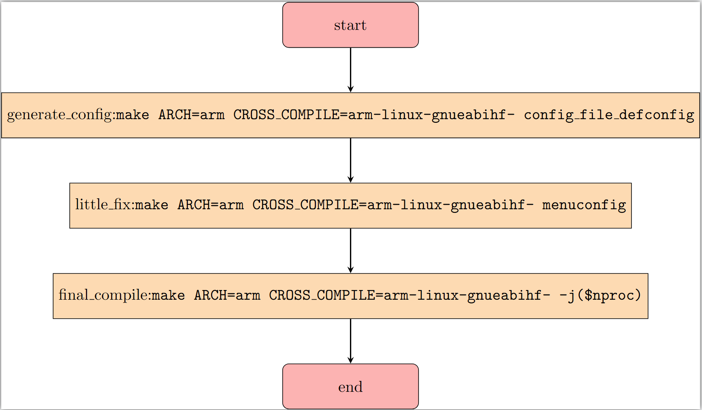
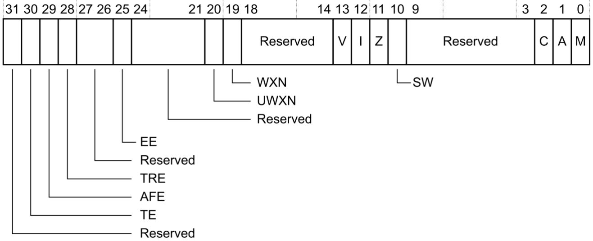
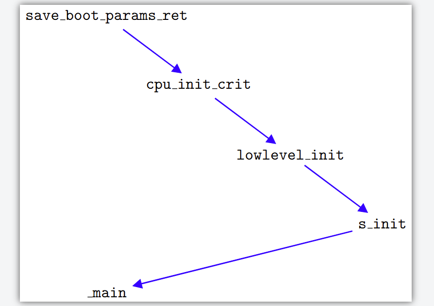
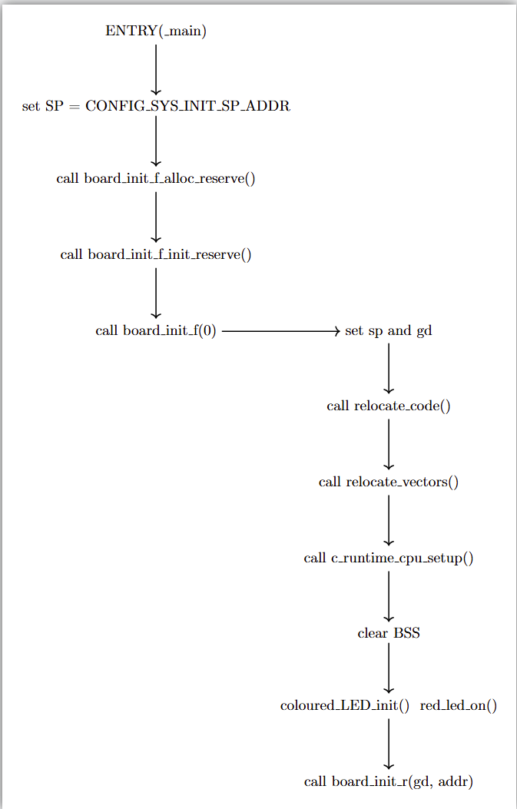
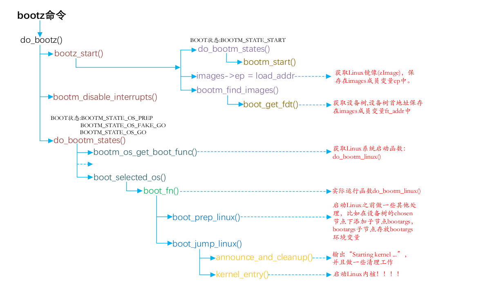

# IMX6ULL学习整理篇——UBoot的一些基础知识

## 先说编译流程



​	大部分而言，当我们拿到源码的时候，一般都是——先使用make来生成一份针对我们目标开发板的配置。举个例子，正点原子针对他们的开发板（EMMC作为类似于我们电脑的硬盘，DDR类似我们电脑的内存），使用的就是他们自己配置的mx6ull_14x14_ddr512_emmc_defconfig文件。也就是说，开始编译uboot之前，必须告诉uboot我们准备部署uboot的板子上。

```
make ARCH=arm CROSS_COMPILE=arm-linux-gnueabihf- mx6ull_14x14_ddr512_emmc_defconfig 
```

> 有一个最绝的偷懒办法：直接把我们环境变量的定义，也就是ARCH和CROSS_COMPILE的定义直接扔进Makefile，但是中间有一段很长的判断ARCH和CROSS_COMPILE的Make逻辑。所以放到这个片段的下面去，至于具体放到哪一行，参考其他人的博客自行分析，每一个人使用的UBoot版本不一样，不要生搬硬套

​	生成的就是一个.config文件，这个文件就是我们的uboot编译生成相关文件的一个重要参考。

​	随后，如果我们有微调（比如说改一下UBoot使用的NFS协议）可以使用`make ARCH=arm CROSS_COMPILE=arm-linux-gnueabihf- menuconfig`来做微调。这表明我们还需要更加细致的调整。

​	往往最后，就是进行全速的编译。根据你的情况，可以使用指令`make ARCH=arm CROSS_COMPILE=arm-linux-gnueabihf- -j($nproc)`或者是明确的线程数把这个事情办了。

​	如果你听不懂，我再举一个例子——我自己有一份配置文件，放在了`configs/`下，名称是`mx6ull_charliechen_emmc_defconfig`（这个文件需要自己改出来，咋改？问客服，厂商找他们要uboot的配置文件，或者自己画的板子就自己看着按照使用的原厂商的样例板的配置文件自己魔改）

> 需要注意的是——我们的名称命名最好是按照：板子的芯片名称——我们自己的产品型号——使用的内存芯片种类——使用的固化存储种类——其他特化要点来进行命名，不是规范，而是为了让自己的配置区分开来，不给自己埋坑。关于如何魔改，笔者有一份自己写的参考：[IMX6ULL驱动开发uboot篇03：UBoot移植_正点原子imxull uboot网卡功能-CSDN博客](https://blog.csdn.net/charlie114514191/article/details/146100288)

​	下一步，就是编译生成.config文件，我这个时候就会输入

```
make ARCH=arm CROSS_COMPILE=arm-linux-gnueabihf- mx6ull_charliechen_emmc_defconfig
```

​	基本格式就是——`make $(BOARD_DEFCONFIG_NAME)`。等待生成好了config文件之后，如果还有调整，我建议使用GUI（也就是使用menuconfig进行配置）而不是进config文件硬改，下一次生成的时候你的config文件就会全部丢失，不如进GUI中好好配置一轮，相关文件会辅助存储。

​	最后一步就是校验我们的UBoot编译能否通过。

```
make ARCH=arm CROSS_COMPILE=arm-linux-gnueabihf- -j($nproc)
```

​	这个就跟我们的板子没有关系了。

## 硬核：说一说UBoot启动流程

​	为什么要说这个呢？咱们最好还是理解一下UBoot启动发生了啥比较好。一个经典的问题就是使用高版本编译器编译低版本的UBoot部署到板子上，一个ping会data abort，这个问题就是非内存对齐访问造成的，通读启动源码就知道如何解决——关闭地址对齐检查就好了！

​	我们先看uboot.lds文件，**任何对诸如“什么地址上放了什么的问题，都要来这里查看，我们的链接器就是按照这个作为模板进行各个段的分排的”**。

```c
OUTPUT_FORMAT("elf32-littlearm", "elf32-littlearm", "elf32-littlearm")
OUTPUT_ARCH(arm)
ENTRY(_start)
SECTIONS
{
 . = 0x00000000;
 . = ALIGN(4);
 .text :
 {
  *(.__image_copy_start)
  *(.vectors)
  arch/arm/cpu/armv7/start.o (.text*)
  *(.text*)
 }
 . = ALIGN(4);
 .rodata : { *(SORT_BY_ALIGNMENT(SORT_BY_NAME(.rodata*))) }
 . = ALIGN(4);
 .data : {
  *(.data*)
 }
 . = ALIGN(4);
 . = .;
 . = ALIGN(4);
 .u_boot_list : {
  KEEP(*(SORT(.u_boot_list*)));
 }
 . = ALIGN(4);
 .image_copy_end :
 {
  *(.__image_copy_end)
 }
 .rel_dyn_start :
 {
  *(.__rel_dyn_start)
 }
 .rel.dyn : {
  *(.rel*)
 }
 .rel_dyn_end :
 {
  *(.__rel_dyn_end)
 }
 .end :
 {
  *(.__end)
 }
 _image_binary_end = .;
 . = ALIGN(4096);
 .mmutable : {
  *(.mmutable)
 }
 .bss_start __rel_dyn_start (OVERLAY) : {
  KEEP(*(.__bss_start));
  __bss_base = .;
 }
 .bss __bss_base (OVERLAY) : {
  *(.bss*)
   . = ALIGN(4);
   __bss_limit = .;
 }
 .bss_end __bss_limit (OVERLAY) : {
  KEEP(*(.__bss_end));
 }
 .dynsym _image_binary_end : { *(.dynsym) }
 .dynbss : { *(.dynbss) }
 .dynstr : { *(.dynstr*) }
 .dynamic : { *(.dynamic*) }
 .plt : { *(.plt*) }
 .interp : { *(.interp*) }
 .gnu.hash : { *(.gnu.hash) }
 .gnu : { *(.gnu*) }
 .ARM.exidx : { *(.ARM.exidx*) }
 .gnu.linkonce.armexidx : { *(.gnu.linkonce.armexidx.*) }
}
```

​	请注意，每个人出来的结果可能会有所区别，这里笔者只是在针对我自己生成的结果进行说明！

#### `OUTPUT_FORMAT("elf32-littlearm", "elf32-littlearm", "elf32-littlearm")`和`OUTPUT_ARCH(arm)`

​	放在这里，这个就是我们的lds脚本文件的第一行，这说明了我们链接产生的uboot.bin二进制文件是一个ELF格式的，面向ARM架构的（特别的，是AArch32架构的）小端格式的文件。我们在这里校验一下我们的配置是不是架构正确的。当然，更具体的话还是要看下面。

#### `ENTRY(_start)`和`.text`, `.data`段的排布

​	我们实际上已经找到了我们想要的。`_start`就是我们程序的入口，但是先不着急，我们看完我们的lds先。`.text`段是代码段，起始地址为`0x00000000`。（注意，这里的地址是存放进EMMC/SD卡等硬存中的一个offset，就跟我们的MBR放到硬盘的第一个扇区一个道理）它首先插入`.__image_copy_start`符号，通常用于标记镜像复制的起始位置，然后包含中断向量表（`*(.vectors)`）和启动代码（`arch/arm/cpu/armv7/start.o (.text*)`），最后包含所有目标文件的代码段（`*(.text*)`）。`.rodata`段包含只读数据，按名称和对齐方式排序。`.data`段包含已初始化的全局和静态变量。

#### 余下部分的说明

`.u_boot_list`段用于包含U-Boot特定的符号列表，使用`KEEP`确保这些符号不会被优化掉。`.image_copy_end`段标记镜像复制的结束位置。`.rel_dyn_start`和`.rel_dyn_end`段用于动态重定位的起始和结束位置，而`.rel.dyn`段则包含动态重定位信息。`.end`段标记程序的结束位置，`_image_binary_end`定义符号表示二进制镜像的结束地址。

`.mmutable`段包含内存管理表（MMU table）。`.bss`段包含未初始化的全局和静态变量，`__bss_start`和`__bss_end`用于标记BSS段的起始和结束位置。

此外，还有一些其他段，如`.dynsym`、`.dynbss`、`.dynstr`、`.dynamic`、`.plt`、`.interp`、`.gnu.hash`、`.gnu`、`.ARM.exidx`等，用于处理动态链接、异常处理和其他特定功能。

这个就属于ELF链接的知识了，跟我们的UBoot关系并不大。笔者放到这里是因为阐述完全。

## 准备点火——从_start开始说起

​	_start是GNU工具链默认的入口，我们这里定义了这样的入口。就在下面

```asm
_start:

#ifdef CONFIG_SYS_DV_NOR_BOOT_CFG
	.word	CONFIG_SYS_DV_NOR_BOOT_CFG
#endif

	b	reset
	ldr	pc, _undefined_instruction
	ldr	pc, _software_interrupt
	ldr	pc, _prefetch_abort
	ldr	pc, _data_abort
	ldr	pc, _not_used
	ldr	pc, _irq
	ldr	pc, _fiq
```

​	啊哈，看起来很简单，我们的PC一次上电就会将我们的PC指针指向_start标签，在这里，我们放上了一个reset指令`b reset`，所以程序实际上一下就跳到了重启reset的逻辑了。

​	但是你是否知道，那既然都跳走了，后面的加载PC寄存器（程序计数器）到这些label是在做啥呢？这不没有意义嘛？

#### 继续感兴趣我提出的问题的朋友请看：

​	正点原子这里讲的非常快！但是我相信大家肯定有这样的一个疑问。那就是——你的PC程序计数器都跑走了，那你后面的这些`ldr	pc, _undefined_instruction`等指令执行了有啥用呢？答案是——这段代码是**异常向量表**（Exception Vector Table），它的作用是为处理器定义在发生异常时应该跳转到的地址。虽然`b reset`是系统启动时执行的第一条指令，但后面的代码（如`ldr pc, _undefined_instruction`等）并不是在启动时顺序执行的，而是由处理器在特定异常发生时自动跳转执行的。

​	我们都知道：ARM架构的异常向量表的地址都是写好的。比如说，笔者之前分析的Cortex-M4架构的ARM架构的启动流程的时候就说过——这些向量表就被放到了固定的0x00000000地址上，虽然这些地址实际上会被映射走到别的地方（各种手段），但是实际上PC就是会被定到0x00000000，我们稍后就会看到，实际上我们的中断向量表在物理地址0x87800000上

​	这些异常向量表的位置是固定的，而且会根据异常类型自动跳转到特定的地址（例如，未定义指令异常会跳转到`0x00000004`，IRQ会跳转到`0x00000018`等）。这下，我们就必须意识到——这些地址上必须存放正确的跳转指令（如`ldr pc, _undefined_instruction`），否则处理器在发生异常时无法正确处理。

​	这样我们就把UBoot如何处理ARM-CPU的异常机制搞明白了——

- 当处理器发生异常时，硬件会自动将程序计数器（PC）设置为异常向量表中的对应地址，然后从该地址开始执行。
- 例如，如果发生未定义指令异常，处理器会跳转到`0x00000004`，执行`ldr pc, _undefined_instruction`，从而跳转到`_undefined_instruction`标签处定义的异常处理程序。

​	所以后面的代码就是老老实实放上中断向量表而已。就这样简单。第一个就是复位向量，也就是我们的ARM-CPU总是执行的是第一条复位向量的指令。也就是跳到reset上。

## 到我们的reset上

​	我们很快就跳到了reset上了，这个，在我们的架构特化的start.S上

```asm
	.globl	reset
	.globl	save_boot_params_ret

reset:
	/* Allow the board to save important registers */
	b	save_boot_params
save_boot_params_ret:
	/*
	 * disable interrupts (FIQ and IRQ), also set the cpu to SVC32 mode,
	 * except if in HYP mode already
	 */
	mrs	r0, cpsr
	and	r1, r0, #0x1f		@ mask mode bits
	teq	r1, #0x1a		@ test for HYP mode
	bicne	r0, r0, #0x1f		@ clear all mode bits
	orrne	r0, r0, #0x13		@ set SVC mode
	orr	r0, r0, #0xc0		@ disable FIQ and IRQ
	msr	cpsr,r0

/*
 * Setup vector:
 * (OMAP4 spl TEXT_BASE is not 32 byte aligned.
 * Continue to use ROM code vector only in OMAP4 spl)
 */
#if !(defined(CONFIG_OMAP44XX) && defined(CONFIG_SPL_BUILD))
	/* Set V=0 in CP15 SCTLR register - for VBAR to point to vector */
	mrc	p15, 0, r0, c1, c0, 0	@ Read CP15 SCTLR Register
	bic	r0, #CR_V		@ V = 0
	mcr	p15, 0, r0, c1, c0, 0	@ Write CP15 SCTLR Register

	/* Set vector address in CP15 VBAR register */
	ldr	r0, =_start
	mcr	p15, 0, r0, c12, c0, 0	@Set VBAR
#endif

	/* the mask ROM code should have PLL and others stable */
#ifndef CONFIG_SKIP_LOWLEVEL_INIT
	bl	cpu_init_cp15
	bl	cpu_init_crit
#endif

	bl	_main
```

​	上面的这个代码非常长，我一个个慢慢说。

#### 保存可能的寄存器（ARMv7 CPU为空）

我们的CPU跳到reset上，说明我们的异常向量表被布置好了，准备执行芯片的下一次初始化和基本片上外设的初始化。对于ARMv7的CPU，save_boot_params是空的，并不需要保存重要的寄存器，所以实际上就是顺序执行（笔者记得左工有过疑问：那为什么不直接写呢？笔者的看法是——这个地方只会执行一次，且其他的启动文件都有一定的启动前保存处理，这里更加像是给自己留退路——在未来的时候可能这个地方会发生改变，需要我们加一部分代码（比如说保存寄存器等），这就很好打补丁了，一行符号不用改照样跑新片子）

#### 通过操作CPSR寄存器设置ARM CPU处理器的状态

```asm
save_boot_params_ret:
	/*
	 * disable interrupts (FIQ and IRQ), also set the cpu to SVC32 mode,
	 * except if in HYP mode already
	 */
	mrs	r0, cpsr
	and	r1, r0, #0x1f		@ mask mode bits
	teq	r1, #0x1a		@ test for HYP mode
	bicne	r0, r0, #0x1f		@ clear all mode bits
	orrne	r0, r0, #0x13		@ set SVC mode
	orr	r0, r0, #0xc0		@ disable FIQ and IRQ
	msr	cpsr,r0
```

​	mrs和msr指令用来加载和写入敏感寄存器的值，这里我们就是读取CPSR寄存器准备好修改处理器的状态

> **MRS 指令:** 对状态寄存器`CPSR`和`SPSR`进行读操作。通过读`CPSR`可以获得当前处理器的工作状态。读`SPSR`寄存器可以获得进入异常前的处理器状态（因为只有异常模式下有`SPSR`寄存器）。
> **MSR指令:** 对状态寄存器`CPSR`和`SPSR`进行写操作。与`MRS`配合使用，可以实现对`CPSR`或`SPSR`寄存器的读、写和修改操作，可以切换处理器模式、或者允许、禁止IRQ/FIQ中断等。

​	我们读取结束了CPSR寄存器的状态，下一步干啥呢？嗯？`and	r1, r0, #0x1f`这是做啥？我们来看看我们的CPSR的位图

##### CPSR寄存器的位图

| 位域范围 | 名称             | 描述                                                         |
| :------- | :--------------- | :----------------------------------------------------------- |
| 31       | **N** (Negative) | 负标志位。如果结果为负，则置1；否则置0。                     |
| 30       | **Z** (Zero)     | 零标志位。如果结果为零，则置1；否则置0。                     |
| 29       | **C** (Carry)    | 进位标志位。如果结果有进位或借位，则置1；否则置0。           |
| 28       | **V** (Overflow) | 溢出标志位。如果结果有溢出，则置1；否则置0。                 |
| 27:24    | **IT[1:0]**      | If-Then 执行状态位（用于Thumb指令集的条件执行）。            |
| 23:20    | **J**            | Jazelle 状态位（用于支持Java字节码执行）。                   |
| 19:16    | **GE[3:0]**      | 大于或等于标志位（用于SIMD指令）。                           |
| 15:10    | **IT[7:2]**      | If-Then 执行状态位（扩展部分，用于Thumb指令集的条件执行）。  |
| 9        | **E**            | 字节序控制位。0表示小端模式，1表示大端模式。                 |
| 8        | **A**            | 异步中止屏蔽位。1表示屏蔽异步中止异常。                      |
| 7        | **I**            | IRQ 中断屏蔽位。1表示屏蔽IRQ中断。                           |
| 6        | **F**            | FIQ 中断屏蔽位。1表示屏蔽FIQ中断。                           |
| 5        | **T**            | 状态位。0表示ARM指令集，1表示Thumb指令集。                   |
| 4:0      | **M[4:0]**       | 模式位。定义当前处理器模式（如用户模式、IRQ模式、FIQ模式等）。 |

​	这样看，事情就很简单了，我们就是萃取一下当前处理器模式（必须承认，注释真的好用）

| 模式位值 | 模式名称   | 描述                                                       |
| :------- | :--------- | :--------------------------------------------------------- |
| 0b10000  | User       | 用户模式（普通程序执行模式）。                             |
| 0b10001  | FIQ        | 快速中断模式（用于处理FIQ中断）。                          |
| 0b10010  | IRQ        | 普通中断模式（用于处理IRQ中断）。                          |
| 0b10011  | Supervisor | 管理模式（用于操作系统内核）。                             |
| 0b10111  | Abort      | 中止模式（用于处理内存访问异常）。                         |
| 0b11011  | Undefined  | 未定义模式（用于处理未定义指令异常）。                     |
| 0b11111  | System     | 系统模式（特权模式，与用户模式共享寄存器）。               |
| 0b11010  | Hypervisor | 虚拟模式（这个是特有的，就可理解为芯片可以跑多个操作系统） |

​	现在，我们准备开始测试处理器的状态。我们拿取CPSR寄存器的处理器模式（与上0x1f拿到前五位），测试一下是不是0x1a，也就是11010.一般我们肯定不是。所以，后面的bicne和orrne就不会执行，这两个汇编语句是要看flags的，显然当相等的时候teq就不会去设置表达EQUAL的flags，自然不执行。很好，一般不是，那就是执行。我们设置我们的处理器模式为0x13，也就是Supervisor模式。最后两行的代码中，我们`orr	r0, r0, #0xc0`，也就是对或上0b11000000，给IRQ和FIQ位拉1，表达屏蔽了。最后回写状态寄存器。处理器的模式就分析完了。

#### 重定位我们的向量表基地址

> `arch/arm/include/asm/system.h`

```
#define CR_V	(1 << 13)	/* Vectors relocated to 0xffff0000	*/
```

```c
	/* Set V=0 in CP15 SCTLR register - for VBAR to point to vector */
	mrc	p15, 0, r0, c1, c0, 0	@ Read CP15 SCTLR Register
	bic	r0, #CR_V		@ V = 0	// #define CR_V (1 << 13) /* Vectors relocated to 0xffff0000 */ 
	mcr	p15, 0, r0, c1, c0, 0	@ Write CP15 SCTLR Register

	/* Set vector address in CP15 VBAR register */
	ldr	r0, =_start
	mcr	p15, 0, r0, c12, c0, 0	@Set VBAR
```



​	所以，这里就是准备重定位我们的向量表，当然，具体的关于CP15寄存器的部分请参考笔者给出的Reference中对CP15写处理器的设置，我们点到为之。

​	我们下一步就是加载我们的r0 寄存器的值为`_start`，`_start` 就是整个uboot 的入口地址，其值为0X87800000，相当于 uboot 的起始地址，因此0x87800000 也是向量表的起始地址。 这样，我们就实现了中断向量表的重定位。

​	现在映射就得到了改变了！

```
bl	cpu_init_cp15
```

​	这是初始化CP15，这里不是我们分析的重点。

#### 初始化底层片上外设

```
	bl	cpu_init_crit
```

​	到这里，我们准备初始化底层外设

```c
/*************************************************************************
 *
 * CPU_init_critical registers
 *
 * setup important registers
 * setup memory timing
 *
 *************************************************************************/
ENTRY(cpu_init_crit)
	/*
	 * Jump to board specific initialization...
	 * The Mask ROM will have already initialized
	 * basic memory. Go here to bump up clock rate and handle
	 * wake up conditions.
	 */
	b	lowlevel_init		@ go setup pll,mux,memory
ENDPROC(cpu_init_crit)
    
...
    
#include <asm-offsets.h>
#include <config.h>
#include <linux/linkage.h>

ENTRY(lowlevel_init)
	/*
	 * Setup a temporary stack. Global data is not available yet.
	 */
	ldr	sp, =CONFIG_SYS_INIT_SP_ADDR
	bic	sp, sp, #7 /* 8-byte alignment for ABI compliance */
#ifdef CONFIG_SPL_DM
	mov	r9, #0
#else
	/*
	 * Set up global data for boards that still need it. This will be
	 * removed soon.
	 */
#ifdef CONFIG_SPL_BUILD
	ldr	r9, =gdata
#else
	sub	sp, sp, #GD_SIZE
	bic	sp, sp, #7
	mov	r9, sp
#endif
#endif
	/*
	 * Save the old lr(passed in ip) and the current lr to stack
	 */
	push	{ip, lr}

	/*
	 * Call the very early init function. This should do only the
	 * absolute bare minimum to get started. It should not:
	 *
	 * - set up DRAM
	 * - use global_data
	 * - clear BSS
	 * - try to start a console
	 *
	 * For boards with SPL this should be empty since SPL can do all of
	 * this init in the SPL board_init_f() function which is called
	 * immediately after this.
	 */
	bl	s_init
	pop	{ip, pc}
ENDPROC(lowlevel_init)

```

​	所以，我们实际上就是初始化底层的代码，`CONFIG_SYS_INIT_SP_ADDR`是一个特化于板子的设置。这个就要准备翻文件了，最后我们可以看到，对于IMX6ULL。也就是初始化的RAM在0x00900000，大小是128KB

```
CONFIG_SYS_INIT_RAM_ADDR = IRAM_BASE_ADDR = 0x00900000。 
CONFIG_SYS_INIT_RAM_SIZE = 0x00020000 =128KB。 
#define CONFIG_SYS_INIT_SP_OFFSET \
	(CONFIG_SYS_INIT_RAM_SIZE - GENERATED_GBL_DATA_SIZE)
#define CONFIG_SYS_INIT_SP_ADDR \
	(CONFIG_SYS_INIT_RAM_ADDR + CONFIG_SYS_INIT_SP_OFFSET)
```

​	递归查询，可以算到：

```
CONFIG_SYS_INIT_SP_OFFSET = 0x00020000 – 256 = 0x1FF00。 
CONFIG_SYS_INIT_SP_ADDR = 0x00900000 + 0X1FF00 = 0X0091FF00，
```

```
          +---------------------------+ 0x00900000
          |                           |
          |                           |
          |      128KB (0x20000)      |
          |                           |
          |                           |
          +---------------------------+ 0x0091FF00 (执行结束ldr	sp, =CONFIG_SYS_INIT_SP_ADDR sp在这里)
          |       256B Stack Space     |
          +---------------------------+ 0x0091FFFF

          CONFIG_SYS_INIT_SP_ADDR (SP)
```

​	我们现在看看，实际上我们的栈图就是这个样子的。同时，ARMv7我们默认开启了对齐检查，所以还需要做对齐处理。

```asm
	sub	sp, sp, #GD_SIZE
	bic	sp, sp, #7
	mov	r9, sp
```

​	下面我们又要哀叹了，这里继续做了一个SP压栈。

​	在我们的lib/asm-offsets.c下，存在一个定义：

```
DEFINE(GD_SIZE, sizeof(struct global_data));
```

​	VSCode的Microsoft Intellisense告诉我们，这个大小是248个字节大小。（注意，因为一些宏的问题导致不准确）这里实际上就是准备给我们的全局数据留位置。下一步就是进行C特化的初始化：

> arch/arm/cpu/armv7/mx6/soc.c

```c
void s_init(void)
{
	struct anatop_regs *anatop = (struct anatop_regs *)ANATOP_BASE_ADDR;
	struct mxc_ccm_reg *ccm = (struct mxc_ccm_reg *)CCM_BASE_ADDR;
	u32 mask480;
	u32 mask528;
	u32 reg, periph1, periph2;

	if (is_cpu_type(MXC_CPU_MX6SX) || is_cpu_type(MXC_CPU_MX6UL) ||
	    is_cpu_type(MXC_CPU_MX6ULL) || is_cpu_type(MXC_CPU_MX6SLL))
		return;
...
```

​	好消息在于，我们的CPU是MXC_CPU_MX6ULL，完全不用看下面的代码，直接跳调，现在我们实际上做完了底层初始化的工作。现在我们看看我们的伟业：



## _main函数

​	先不说，直接仍上来源码

```asm
/*
 *  crt0 - C-runtime startup Code for ARM U-Boot
 *
 *  Copyright (c) 2012  Albert ARIBAUD <albert.u.boot@aribaud.net>
 *
 * SPDX-License-Identifier:	GPL-2.0+
 */

#include <config.h>
#include <asm-offsets.h>
#include <linux/linkage.h>
#ifdef CONFIG_CPU_V7M
#include <asm/armv7m.h>
#endif

// notice: 笔者这里对原文进行了翻译
/*
* 此文件处理 U-Boot 启动中与目标无关的阶段，其中需要 C 运行时环境。其入口点
* 是 _main，并从目标的 start.S 文件分支进入。
*
* _main 执行顺序为：
*
* 1. 设置用于调用 board_init_f() 的初始环境。
* 此环境仅提供堆栈和存储 GD（“全局数据”）结构的位置，两者均位于一些随时可用的 RAM（SRAM、锁定缓存……）中。在此上下文中，变量全局数据（无论是否初始化（BSS））均不可用；只有常量初始化数据可用。在调用 board_init_f() 之前，GD 应归零。
*
* 2. 调用 board_init_f()。此函数为从系统 RAM（DRAM、DDR……）执行硬件做准备。由于系统 RAM 可能尚未可用，board_init_f() 必须使用当前 GD 来存储必须传递到后续阶段的任何数据。这些数据包括重定位目标、未来堆栈和未来 GD 位置。 *
* 3. 设置中间环境，其中堆栈和 GD 是 board_init_f() 在系统 RAM 中分配的，但 BSS 和初始化的非 const 数据仍然不可用。
*
* 4a.对于 U-Boot 本身（不是 SPL），调用 relocate_code()。此函数将 U-Boot 从其当前位置重新定位到 board_init_f() 计算的重定位目标。
*
* 4b.对于 SPL，board_init_f() 只是返回（到 crt0）。SPL 中没有代码重定位。
*
* 5. 设置最终环境以调用 board_init_r()。此环境具有 BSS（初始化为 0）、初始化的非 const 数据（初始化为其预期值）和系统 RAM 中的堆栈（对于 SPL，将堆栈和 GD 移入 RAM 是可选的 - 请参阅 CONFIG_SPL_STACK_R）。 GD 保留了 board_init_f() 设置的值。
*
* 6. 对于 U-Boot 本身（不是 SPL），某些 CPU 此时还需要完成一些与内存相关的工作，因此请调用 c_runtime_cpu_setup。
*
* 7. 分支到 board_init_r()。
*
* For more information see 'Board Initialisation Flow in README.
*/

/*
 * entry point of crt0 sequence
 */

ENTRY(_main)

/*
 * Set up initial C runtime environment and call board_init_f(0).
 */

#if defined(CONFIG_SPL_BUILD) && defined(CONFIG_SPL_STACK)
	ldr	sp, =(CONFIG_SPL_STACK)
#else
	ldr	sp, =(CONFIG_SYS_INIT_SP_ADDR)
#endif
#if defined(CONFIG_CPU_V7M)	/* v7M forbids using SP as BIC destination */
	mov	r3, sp
	bic	r3, r3, #7
	mov	sp, r3
#else
	bic	sp, sp, #7	/* 8-byte alignment for ABI compliance */
#endif
	mov	r0, sp
	bl	board_init_f_alloc_reserve
	mov	sp, r0
	/* set up gd here, outside any C code */
	mov	r9, r0
	bl	board_init_f_init_reserve

	mov	r0, #0
	bl	board_init_f

#if ! defined(CONFIG_SPL_BUILD)

/*
 * Set up intermediate environment (new sp and gd) and call
 * relocate_code(addr_moni). Trick here is that we'll return
 * 'here' but relocated.
 */

	ldr	sp, [r9, #GD_START_ADDR_SP]	/* sp = gd->start_addr_sp */
#if defined(CONFIG_CPU_V7M)	/* v7M forbids using SP as BIC destination */
	mov	r3, sp
	bic	r3, r3, #7
	mov	sp, r3
#else
	bic	sp, sp, #7	/* 8-byte alignment for ABI compliance */
#endif
	ldr	r9, [r9, #GD_BD]		/* r9 = gd->bd */
	sub	r9, r9, #GD_SIZE		/* new GD is below bd */

	adr	lr, here
	ldr	r0, [r9, #GD_RELOC_OFF]		/* r0 = gd->reloc_off */
	add	lr, lr, r0
#if defined(CONFIG_CPU_V7M)
	orr	lr, #1				/* As required by Thumb-only */
#endif
	ldr	r0, [r9, #GD_RELOCADDR]		/* r0 = gd->relocaddr */
	b	relocate_code
here:
/*
 * now relocate vectors
 */

	bl	relocate_vectors

/* Set up final (full) environment */

	bl	c_runtime_cpu_setup	/* we still call old routine here */
#endif
#if !defined(CONFIG_SPL_BUILD) || defined(CONFIG_SPL_FRAMEWORK)
# ifdef CONFIG_SPL_BUILD
	/* Use a DRAM stack for the rest of SPL, if requested */
	bl	spl_relocate_stack_gd
	cmp	r0, #0
	movne	sp, r0
	movne	r9, r0
# endif
	ldr	r0, =__bss_start	/* this is auto-relocated! */

#ifdef CONFIG_USE_ARCH_MEMSET
	ldr	r3, =__bss_end		/* this is auto-relocated! */
	mov	r1, #0x00000000		/* prepare zero to clear BSS */

	subs	r2, r3, r0		/* r2 = memset len */
	bl	memset
#else
	ldr	r1, =__bss_end		/* this is auto-relocated! */
	mov	r2, #0x00000000		/* prepare zero to clear BSS */

clbss_l:cmp	r0, r1			/* while not at end of BSS */
#if defined(CONFIG_CPU_V7M)
	itt	lo
#endif
	strlo	r2, [r0]		/* clear 32-bit BSS word */
	addlo	r0, r0, #4		/* move to next */
	blo	clbss_l
#endif

#if ! defined(CONFIG_SPL_BUILD)
	bl coloured_LED_init
	bl red_led_on
#endif
	/* call board_init_r(gd_t *id, ulong dest_addr) */
	mov     r0, r9                  /* gd_t */
	ldr	r1, [r9, #GD_RELOCADDR]	/* dest_addr */
	/* call board_init_r */
#if defined(CONFIG_SYS_THUMB_BUILD)
	ldr	lr, =board_init_r	/* this is auto-relocated! */
	bx	lr
#else
	ldr	pc, =board_init_r	/* this is auto-relocated! */
#endif
	/* we should not return here. */
#endif

ENDPROC(_main)
```

​	好在我们的注释贴心的告诉了我们到底发生了什么。我们根据平台，化简掉复杂的ifdef语句,现在我们分析的代码变得好看多了：

```c
ENTRY(_main)

/* 设置初始栈指针 */
ldr	sp, =(CONFIG_SYS_INIT_SP_ADDR)
bic	sp, sp, #7           /* 栈按 8 字节对齐 */
mov	r0, sp

/* 分配并初始化 global data 区域 */
bl	board_init_f_alloc_reserve
mov	sp, r0
mov	r9, r0               /* 设置 gd 指针 */
bl	board_init_f_init_reserve

/* 调用 board_init_f(0)，进行 early init */
mov	r0, #0
bl	board_init_f

/* 设置中间环境：新栈和新 gd，准备重定位 */
ldr	sp, [r9, #GD_START_ADDR_SP]
bic	sp, sp, #7
ldr	r9, [r9, #GD_BD]
sub	r9, r9, #GD_SIZE

/* 计算跳转地址 = 当前地址 + reloc_off */
adr	lr, here
ldr	r0, [r9, #GD_RELOC_OFF]
add	lr, lr, r0

ldr	r0, [r9, #GD_RELOCADDR]
b	relocate_code

here:
/* 重定位向量表 */
bl	relocate_vectors

/* 设置最终 CPU 运行环境 */
bl	c_runtime_cpu_setup

/* 清除 BSS 段 */
ldr	r0, =__bss_start
ldr	r1, =__bss_end
mov	r2, #0x00000000

clbss_l:
cmp	r0, r1
strlo	r2, [r0]
addlo	r0, r0, #4
blo	clbss_l

/* 初始化 LED（可选调试用途） */
bl	coloured_LED_init
bl	red_led_on

/* 跳转到 board_init_r，进入主系统 */
mov	r0, r9
ldr	r1, [r9, #GD_RELOCADDR]
ldr	pc, =board_init_r

/* 应当不会返回 */
ENDPROC(_main)
```



#### 为调用board_init_f准备环境

​	我们设置好栈指针，准备提供C语言的运行时环境，那就是重新的设置我们的栈指针为CONFIG_SYS_INIT_SP_ADDR，且做了对齐处理，放到R0寄存器中作为board_init_f_alloc_reserve的第一个参数调用起来。

```c
/*
 * Allocate reserved space for use as 'globals' from 'top' address and
 * return 'bottom' address of allocated space
 *
 * Notes:
 *
 * Actual reservation cannot be done from within this function as
 * it requires altering the C stack pointer, so this will be done by
 * the caller upon return from this function.
 *
 * IMPORTANT:
 *
 * Alignment constraints may differ for each 'chunk' allocated. For now:
 *
 * - GD is aligned down on a 16-byte boundary
 *
 *  - the early malloc arena is not aligned, therefore it follows the stack
 *   alignment constraint of the architecture for which we are bulding.
 *
 *  - GD is allocated last, so that the return value of this functions is
 *   both the bottom of the reserved area and the address of GD, should
 *   the calling context need it.
 */

ulong board_init_f_alloc_reserve(ulong top)
{
	/* Reserve early malloc arena */
#if defined(CONFIG_SYS_MALLOC_F)
	top -= CONFIG_SYS_MALLOC_F_LEN;
#endif
	/* LAST : reserve GD (rounded up to a multiple of 16 bytes) */
	top = rounddown(top-sizeof(struct global_data), 16);

	return top;
}

```

​	代码实际上看着很简单：就是给我们的Malloc和全局结构体gd做初始化准备。Malloc我们知道，堆区分配嘛！这里就是提供堆区的资源，也就是我们让栈指针偏移给定的Malloc静态内存池大小和做一次全局变量结构体的预留，而且，做一次富裕的对齐，大概长这样

```
+----------------------------+0X00900000
| 			                |
|                            |
|                            |
| 				 		   |top (0X20000, 128KB)
+----------------------------+ 0X0091FA00  
|       global_data          |
|    (地址16字节对齐)         |
+----------------------------+ 0X0091FB00
| 		                    |
|                            |
|     early malloc           | 0x400
| (CONFIG_SYS_MALLOC_F_LEN)  |
|                            |
+----------------------------+ 0X0091FF00 
|                            |
| 	                         |256B
|                            |
+----------------------------+0X0091FF00 SP (CONFIG_SYS_INIT_SP_ADDR)
|						   |
+----------------------------+0X0091FFFF
```

​	回到我们的问题上，我们需要知道的是gd在之前就被预留了，所以下一步我们做的事情就是初始化我们预留的接口global_data

```c
/*
 * Initialize reserved space (which has been safely allocated on the C
 * stack from the C runtime environment handling code).
 *
 * Notes:
 *
 * Actual reservation was done by the caller; the locations from base
 * to base+size-1 (where 'size' is the value returned by the allocation
 * function above) can be accessed freely without risk of corrupting the
 * C runtime environment.
 *
 * IMPORTANT:
 *
 * Upon return from the allocation function above, on some architectures
 * the caller will set gd to the lowest reserved location. Therefore, in
 * this initialization function, the global data MUST be placed at base.
 *
 * ALSO IMPORTANT:
 *
 * On some architectures, gd will already be good when entering this
 * function. On others, it will only be good once arch_setup_gd() returns.
 * Therefore, global data accesses must be done:
 *
 * - through gd_ptr if before the call to arch_setup_gd();
 *
 * - through gd once arch_setup_gd() has been called.
 *
 * Do not use 'gd->' until arch_setup_gd() has been called!
 *
 * IMPORTANT TOO:
 *
 * Initialization for each "chunk" (GD, early malloc arena...) ends with
 * an incrementation line of the form 'base += <some size>'. The last of
 * these incrementations seems useless, as base will not be used any
 * more after this incrementation; but if/when a new "chunk" is appended,
 * this increment will be essential as it will give base right value for
 * this new chunk (which will have to end with its own incrementation
 * statement). Besides, the compiler's optimizer will silently detect
 * and remove the last base incrementation, therefore leaving that last
 * (seemingly useless) incrementation causes no code increase.
 */

void board_init_f_init_reserve(ulong base)
{
	struct global_data *gd_ptr;
#ifndef _USE_MEMCPY
	int *ptr;
#endif

	/*
	 * clear GD entirely and set it up.
	 * Use gd_ptr, as gd may not be properly set yet.
	 */

	gd_ptr = (struct global_data *)base;
	/* zero the area */
#ifdef _USE_MEMCPY
	memset(gd_ptr, '\0', sizeof(*gd));
#else
	for (ptr = (int *)gd_ptr; ptr < (int *)(gd_ptr + 1); )
		*ptr++ = 0;
#endif
	/* set GD unless architecture did it already */
#if !defined(CONFIG_ARM)
	arch_setup_gd(gd_ptr);
#endif
	/* next alloc will be higher by one GD plus 16-byte alignment */
	base += roundup(sizeof(struct global_data), 16);

	/*
	 * record early malloc arena start.
	 * Use gd as it is now properly set for all architectures.
	 */

#if defined(CONFIG_SYS_MALLOC_F)
	/* go down one 'early malloc arena' */
	gd->malloc_base = base;
	/* next alloc will be higher by one 'early malloc arena' size */
	base += CONFIG_SYS_MALLOC_F_LEN;
#endif
}
```

​	我们清空了gd预留的空间，注意，就是清理了gd的空间，ARM和x86的启动不走arch_setup_gd，随后就是调整了一下我们的全局数据，指向初始化时分配部分的地址。

​	到现在我们马上就准备调用board_init_f函数了。

### board_init_f函数准备第一阶段的初始化

```c
void board_init_f(ulong boot_flags)
{
#ifdef CONFIG_SYS_GENERIC_GLOBAL_DATA
	/*
	 * For some archtectures, global data is initialized and used before
	 * calling this function. The data should be preserved. For others,
	 * CONFIG_SYS_GENERIC_GLOBAL_DATA should be defined and use the stack
	 * here to host global data until relocation.
	 */
	gd_t data;

	gd = &data;

	/*
	 * Clear global data before it is accessed at debug print
	 * in initcall_run_list. Otherwise the debug print probably
	 * get the wrong vaule of gd->have_console.
	 */
	zero_global_data();
#endif

	gd->flags = boot_flags;
	gd->have_console = 0;

	if (initcall_run_list(init_sequence_f))
		hang();

#if !defined(CONFIG_ARM) && !defined(CONFIG_SANDBOX) && \
		!defined(CONFIG_EFI_APP)
	/* NOTREACHED - jump_to_copy() does not return */
	hang();
#endif
}
```

​	这里，我们实际上就是调用一系列的基本外设的初始化

```
static init_fnc_t init_sequence_f[] = {
    setup_mon_len,
	initf_malloc, 
	initf_console_record,
    arch_cpu_init,        /* basic arch cpu dependent setup */
    initf_dm,
    arch_cpu_init_dm,
    mark_bootstage,       /* need timer, go after init dm */
    board_early_init_f,
    timer_init,           /* initialize timer */
    board_postclk_init, 
    get_clocks,
    env_init,			/* initialize environment */ 
    init_baud_rate,       /* initialize baudrate settings */
    serial_init,          /* serial communications setup */
    console_init_f,       /* stage 1 init of console */
    display_options,      /* say that we are here */
    display_text_info,    /* show debugging info if required */
    print_cpuinfo,        /* display cpu info (and speed) */
    announce_dram_init,
    dram_init,            /* configure available RAM banks */
    post_init_f,
    testdram,             /* test RAM if needed */
    INIT_FUNC_WATCHDOG_RESET
    INIT_FUNC_WATCHDOG_RESET 
    setup_dest_addr,
    reserve_round_4k,
    reserve_mmu,
    reserve_trace,
    reserve_uboot, 
    reserve_malloc,
    reserve_board,
    setup_machine,
    reserve_global_data,
    reserve_fdt,
    reserve_arch,
    reserve_stacks,
    setup_dram_config,
    show_dram_config,
    display_new_sp, 
    INIT_FUNC_WATCHDOG_RESET 
	reloc_fdt, 
    setup_reloc,
    NULL,
};

```

`setup_mon_len` 函数用于设置 `gd` 中的 `mon_len` 成员变量，它的值是从 `_start` 到 `__bss_end` 的距离，也就是整个U-Boot镜像代码的长度。在 I.MX6ULL 的实际地址中，这个长度计算为 0x878A8E74 减去 0x87800000，等于 0xA8E74，表示当前镜像占用的总内存大小。

`initf_malloc` 函数会初始化 `gd` 中与动态内存分配（malloc）相关的变量，主要是设置 `malloc_limit` 为 `CONFIG_SYS_MALLOC_F_LEN` 的值，这个值通常是 0x400，表示在早期阶段可用的内存池大小是 1KB。

`initf_console_record` 函数只有在定义了 `CONFIG_CONSOLE_RECORD` 宏的情况下才会真正执行初始化逻辑，默认会调用 `console_record_init`，但在 I.MX6ULL 的U-Boot中并未启用该功能，因此此函数直接返回。

`arch_cpu_init` 函数用于执行架构相关的基本CPU初始化工作，它通常用于设置时钟、总线等依赖于具体平台的配置，是必须执行的底层初始化步骤。

`initf_dm` 是初始化驱动模型相关的函数，它会为设备模型搭建必要的结构，在后续设备绑定过程中起基础作用。

`arch_cpu_init_dm` 函数虽然在初始化序列中列出，但在 I.MX6ULL 平台上未实现，因此不会执行任何操作。

`mark_bootstage` 是启动过程的时间标记函数，用于记录启动过程中各个阶段的时间点，以便调试或优化启动速度。

`board_early_init_f` 是板级早期初始化函数，I.MX6ULL 平台上主要用于设置串口相关的 IO 管脚配置，确保串口早期就能正常工作。

`timer_init` 函数用于初始化内核定时器。Cortex-A7 处理器内置一个通用定时器（Generic Timer），这个定时器在整个 U-Boot 中负责提供系统时间，与 Cortex-M 内核中的 Systick 定时器功能类似。

`board_postclk_init` 函数主要用于配置 SOC 相关电压，例如设置 VDDSOC 电压，确保系统时钟和供电处于安全范围内。

`get_clocks` 函数用于获取系统中的关键时钟值，在 I.MX6ULL 中主要是获取与 SD 卡相关的 sdhc_clk 时钟，用于后续 SD 卡驱动初始化。

`env_init` 函数用于初始化环境变量系统，它会设置 `gd->env_addr` 等变量，用于确定环境变量的存储地址。

`init_baud_rate` 用于根据环境变量中的 `baudrate` 值初始化串口波特率，并设置 `gd->baudrate`。

`serial_init` 会执行串口控制器的初始化过程，使串口具备收发数据的能力。

`console_init_f` 用于标记控制台已经初始化完成，并将之前缓存在内存中的输出信息通过串口输出。

`display_options` 通过串口输出一些版本信息、构建信息等，用于识别当前使用的 U-Boot 镜像配置。

`display_text_info` 用于显示一些调试信息，如果启用了DEBUG宏，会打印代码段地址范围（text_base 到 bss_end）等。

`print_cpuinfo` 用于串口输出当前处理器的信息，包括型号、核心数、频率等。

`show_board_info` 会调用 `checkboard` 函数，通过串口输出开发板的相关信息，例如型号、制造商标识等。

`INIT_FUNC_WATCHDOG_INIT` 和 `INIT_FUNC_WATCHDOG_RESET` 是看门狗初始化和复位相关函数，但在 I.MX6ULL 中为空函数，未执行任何实际操作。

`init_func_i2c` 用于初始化 I2C 控制器，并通过串口输出初始化结果。I2C 是 U-Boot 中用于挂接传感器或EEPROM等外设的重要通信接口。

`announce_dram_init` 是一个简单的输出函数，只在串口上输出“DRAM:”字样，提示后续将进行内存检测或配置。

`dram_init` 实际上并不会对 DDR 进行初始化，而是设置 `gd->ram_size`，用于标识可用内存的大小。比如正点原子的 I.MX6ULL 开发板的 EMMC 核心板默认配置为 512MB。

`post_init_f` 是一个通用的后期初始化函数，在这里用于记录某些时间点或状态，设置 `gd->post_init_f_time`。

`testdram` 是一个形式上存在的内存测试函数，默认是空函数。

`setup_dest_addr` 用于计算并设置内存中的重要地址，例如 `gd->ram_size`、`gd->ram_top` 和 `gd->relocaddr`，这些值在后续搬移U-Boot代码或初始化堆栈时会用到。

```
+--------------------------------------------+
| 0xA0000000                                  |
| reserve_round_4k = 0                        |
+--------------------------------------------+
| 0xA0000000                                  |
| reserve_mmu = 0x4000 (64KB aligned)         |
+--------------------------------------------+
| 0x9FFF0000                                  |
| reserve_trace = 0 (64KB aligned)           |
+--------------------------------------------+
| 0x9FFF0000                                  |
| reserve_uboot = 0x3EF4 (4KB aligned)        |
| gd->relocaddr                               |
+--------------------------------------------+
| 0x9FF47000                                  |
|                                            |
| ...                                        |
|                                            |
+--------------------------------------------+
| 0x9EF44E90                                  |
| gd->start_addr_sp                           |
| 16-byte aligned reserve_stacks             |
+--------------------------------------------+
| 0x9EF44EB8                                  |
| reserve_global_data = 248B                 |
| gd (gd_t)                                   |
+--------------------------------------------+
| 0x9EF44FB0                                  |
| reserve_board = 80B                        |
| bd                                          |
+--------------------------------------------+
| 0x9EF45000                                  |
|                                            |
| ...                                        |
|                                            |
+--------------------------------------------+
| reserve_malloc = 16MB + 8KB                 |
+--------------------------------------------+
| 0x20000000 (512MB DRAM top)                 |
+--------------------------------------------+

```

​	总而言之，最后我们的内存视图长上面这个样子

### 准备重定位我们的代码拷贝

​	这部分不用深究。

化简后的代码如下：

```
ENTRY(relocate_code)
    ldr     r1, =__image_copy_start   // 源地址起始
    subs    r4, r0, r1                // 计算偏移量
    beq     relocate_done             // 如果偏移量为0，跳过重定位
    ldr     r2, =__image_copy_end     // 源地址结束

copy_loop:
    ldmia   r1!, {r10-r11}            // 读取源地址数据
    stmia   r0!, {r10-r11}            // 写入目标地址
    cmp     r1, r2                    // 判断是否拷贝完成
    blo     copy_loop

    ldr     r2, =__rel_dyn_start      // 动态重定位表起始
    ldr     r3, =__rel_dyn_end        // 动态重定位表结束
fixloop:
    ldmia   r2!, {r0-r1}              // 读取重定位项
    and     r1, r1, #0xff             // 取低8位，检查类型
    cmp     r1, #23                   // RELATIVE 类型？
    bne     fixnext

    add     r0, r0, r4                // 调整地址
    ldr     r1, [r0]
    add     r1, r1, r4
    str     r1, [r0]
fixnext:
    cmp     r2, r3
    blo     fixloop

relocate_done:
    bx      lr                        // 返回
ENDPROC(relocate_code)
```

分析如下：
	 这个函数的作用是将 U-Boot 代码从加载地址拷贝到目标地址，并进行动态重定位。首先，`ldr r1, =__image_copy_start` 加载代码起始地址，`subs r4, r0, r1` 计算目标地址与原始地址的偏移量。`beq relocate_done` 用于判断是否需要重定位，如果偏移量为 0，则直接跳过。然后，`ldr r2, =__image_copy_end` 读取代码的结束地址，进入 `copy_loop`，通过 `ldmia/stmia` 指令逐步拷贝代码。

​	拷贝完成后，进入 `fixloop` 处理重定位。`ldr r2, =__rel_dyn_start` 取得重定位表的起始地址，`ldr r3, =__rel_dyn_end` 取得结束地址。遍历 `fixloop` 读取重定位表项，并判断是否为 `R_ARM_RELATIVE` 类型（23）。如果是，则对目标地址进行修正，使其适应新的加载位置。

### 中断向量表的再一次重定位

​	我们再一次变迁我们的中断向量表，笔者直接给出来化简的逻辑：我们的IMX6uLL标记中断向量表是依靠VBAR寄存器的

```
ENTRY(relocate_vectors)
    ldr     r0, [r9, #GD_RELOCADDR]     // r0 = gd->relocaddr
    mcr     p15, 0, r0, c12, c0, 0      // 设置 VBAR 为新的异常向量地址
    bx      lr                          // 返回
ENDPROC(relocate_vectors)
```

​	实际上就是偏移到了uboot的首地址，也就是指向了我们的87800000大头的位置。

### 最后的初始化——board_init_r

​	board_init_r在common/board_init_r.c文件中，这是后续的初始化部分。奥你知道的，肯定又要执行一系列的函数了，笔者化简的放在这里

去掉行号后的代码如下：

```
init_fnc_t init_sequence_r[] = {
    initr_trace,
    initr_reloc,
    initr_caches,
    initr_reloc_global_data,
    initr_barrier,
    initr_malloc,
    initr_console_record,
    bootstage_relocate,
    initr_bootstage,
    board_init,              /* Setup chipselects */
    stdio_init_tables,
    initr_serial,
    initr_announce,
    INIT_FUNC_WATCHDOG_RESET,
    INIT_FUNC_WATCHDOG_RESET,
    INIT_FUNC_WATCHDOG_RESET,
    power_init_board,
    initr_flash,
    INIT_FUNC_WATCHDOG_RESET,
    initr_nand,
    initr_mmc,
    initr_env,
    INIT_FUNC_WATCHDOG_RESET,
    initr_secondary_cpu,
    INIT_FUNC_WATCHDOG_RESET,
    stdio_add_devices,
    initr_jumptable,
    console_init_r,          /* fully init console as a device */
    INIT_FUNC_WATCHDOG_RESET,
    interrupt_init,
    initr_enable_interrupts,
    initr_ethaddr,
    board_late_init,
    INIT_FUNC_WATCHDOG_RESET,
    INIT_FUNC_WATCHDOG_RESET,
    INIT_FUNC_WATCHDOG_RESET,
    initr_net,
    INIT_FUNC_WATCHDOG_RESET,
    run_main_loop,
};
```

每个函数作用说明如下：

- `initr_trace`：设置函数调用路径追踪。
- `initr_reloc`：处理 U-Boot 自身的重定位。
- `initr_caches`：开启 CPU 的 L1 cache。
- `initr_reloc_global_data`：重定位全局数据（`gd` 结构）。
- `initr_barrier`：执行内存屏障，确保内存操作顺序。
- `initr_malloc`：初始化动态内存分配器（`malloc` 区）。
- `initr_console_record`：初始化 early console 的记录缓存。
- `bootstage_relocate`：重定位 bootstage 结构（用于启动阶段时间记录）。
- `initr_bootstage`：初始化 bootstage（记录启动时间点）。
- `board_init`：板级初始化，如设置芯片片选等。
- `stdio_init_tables`：初始化标准输入输出设备表。
- `initr_serial`：初始化串口。
- `initr_announce`：输出 U-Boot 启动标识信息。
- `INIT_FUNC_WATCHDOG_RESET`：重置看门狗，防止系统误复位（此宏重复多次，插入不同阶段）。
- `power_init_board`：初始化板级电源管理。
- `initr_flash`：初始化 NOR/NAND Flash。
- `initr_nand`：初始化 NAND Flash 控制器。
- `initr_mmc`：初始化 eMMC / SD 卡接口。
- `initr_env`：加载 U-Boot 环境变量。
- `initr_secondary_cpu`：初始化辅助 CPU（如 Cortex-M 或 SMP 第二核）。
- `stdio_add_devices`：注册所有标准输入输出设备。
- `initr_jumptable`：初始化跳转表（用于系统调用）。
- `console_init_r`：完成控制台设备初始化，控制台正式工作。
- `interrupt_init`：初始化中断控制器。
- `initr_enable_interrupts`：开启中断响应。
- `initr_ethaddr`：从环境变量读取以太网地址。
- `board_late_init`：板级延迟初始化（比如配置外设）。
- `initr_net`：初始化网络子系统。
- `run_main_loop`：进入 U-Boot 主循环（shell/自动启动等功能）。

很好到最后呢，我们就一去不复返，前往的就是我们的run_main_loop了

## 主函数循环，我们进入了U-Boot

```c
static int run_main_loop(void)
{
	/* main_loop() can return to retry autoboot, if so just run it again */
	for (;;)
		main_loop();
	return 0;
}
```

​	也就是循环的执行我们的main_loop函数。

```c
/* We come here after U-Boot is initialised and ready to process commands */
void main_loop(void)
{
	const char *s;

	bootstage_mark_name(BOOTSTAGE_ID_MAIN_LOOP, "main_loop");

#ifdef CONFIG_VERSION_VARIABLE
	setenv("ver", version_string);  /* set version variable */
#endif /* CONFIG_VERSION_VARIABLE */

	cli_init();

	run_preboot_environment_command();

#if defined(CONFIG_UPDATE_TFTP)
	update_tftp(0UL, NULL, NULL);
#endif /* CONFIG_UPDATE_TFTP */

	s = bootdelay_process();
	if (cli_process_fdt(&s))
		cli_secure_boot_cmd(s);

	autoboot_command(s);

	cli_loop();
}
```

### 打印出启动进度和现实uboot的签名

bootstage_mark_name 函数，打印出启动进度，随后还会显示uboot的相关签名。这个我们略过去

### bootdelay_process读取启动的内容

​	实际上就是读取bootdelay 和 bootcmd 环境变量的内容

```c
const char *bootdelay_process(void)
{
    char *s;
    int bootdelay;
#ifdef CONFIG_BOOTCOUNT_LIMIT
    unsigned long bootcount = 0;
    unsigned long bootlimit = 0;
#endif /* CONFIG_BOOTCOUNT_LIMIT */
```

- 声明了指向字符的指针 `s` 和整数变量 `bootdelay`。
- 如果定义了 `CONFIG_BOOTCOUNT_LIMIT`，则声明无符号长整型变量 `bootcount` 和 `bootlimit`，用于记录启动次数和启动限制。

```c
#ifdef CONFIG_BOOTCOUNT_LIMIT
    bootcount = bootcount_load();
    bootcount++;
    bootcount_store(bootcount);
    setenv_ulong("bootcount", bootcount);
    bootlimit = getenv_ulong("bootlimit", 10, 0);
#endif /* CONFIG_BOOTCOUNT_LIMIT */
```

- 如果定义了 `CONFIG_BOOTCOUNT_LIMIT`：
  - 调用 `bootcount_load()` 函数加载当前启动次数。
  - 将启动次数加一。
  - 调用 `bootcount_store(bootcount)` 函数保存更新后的启动次数。
  - 使用 `setenv_ulong("bootcount", bootcount)` 将启动次数设置为环境变量 `bootcount`。
  - 使用 `getenv_ulong("bootlimit", 10, 0)` 获取环境变量 `bootlimit` 的值，表示允许的最大启动次数。

```c
    s = getenv("bootdelay");
    bootdelay = s ? (int)simple_strtol(s, NULL, 10) : CONFIG_BOOTDELAY;
```

- 获取环境变量 `bootdelay` 的值，赋给指针 `s`。
- 如果 `s` 不为空，则将其转换为整数赋给 `bootdelay`；否则，使用默认值 `CONFIG_BOOTDELAY`。

```c
#if !defined(CONFIG_FSL_FASTBOOT) && defined(is_boot_from_usb)
    if (is_boot_from_usb()) {
        disconnect_from_pc();
        printf("Boot from USB for mfgtools\n");
        bootdelay = 0;
        set_default_env("Use default environment for mfgtools\n");
    } else {
        printf("Normal Boot\n");
    }
#endif
```

- 如果未定义 `CONFIG_FSL_FASTBOOT`且定义了`is_boot_from_usb`
  - 如果通过 USB 启动：
    - 调用 `disconnect_from_pc()` 函数断开与主机的连接。
    - 打印信息 "Boot from USB for mfgtools"。
    - 将 `bootdelay` 设为 0，表示不延迟启动。
    - 调用 `set_default_env("Use default environment for mfgtools\n")` 设置默认环境变量。
  - 否则，打印 "Normal Boot"。

```c
#ifdef CONFIG_OF_CONTROL
    bootdelay = fdtdec_get_config_int(gd->fdt_blob, "bootdelay", bootdelay);
#endif
```

- 如果定义了` CONFIG_OF_CONTROL`
  - 调用 `fdtdec_get_config_int(gd->fdt_blob, "bootdelay", bootdelay)` 从设备树中获取 `bootdelay` 配置，如果获取成功，则更新 `bootdelay` 的值。

```c
    debug("### main_loop entered: bootdelay=%d\n\n", bootdelay);
```

- 使用 `debug` 函数输出调试信息，显示进入主循环时的 `bootdelay` 值。

```c
#if defined(CONFIG_MENU_SHOW)
    bootdelay = menu_show(bootdelay);
#endif
```

- 如果定义了 `CONFIG_MENU_SHOW`
  - 调用 `menu_show(bootdelay)` 显示启动菜单，并可能修改 `bootdelay` 的值。

```c
    bootretry_init_cmd_timeout();
```

- 初始化命令超时重试机制。

```c
#ifdef CONFIG_POST
    if (gd->flags & GD_FLG_POSTFAIL) {
        s = getenv("failbootcmd");
    } else
#endif /* CONFIG_POST */
#ifdef CONFIG_BOOTCOUNT_LIMIT
    if (bootlimit && (bootcount > bootlimit)) {
        printf("Warning: Bootlimit (%u) exceeded. Using altbootcmd.\n",
               (unsigned)bootlimit);
        s = getenv("altbootcmd");
    } else
#endif /* CONFIG_BOOTCOUNT_LIMIT */
        s = getenv("bootcmd");
```

- 根据不同情况设置启动命令：

  - 如果定义了 `CONFIG_POST` 且全局数据标志 `gd->flags` 包含 `GD_FLG_POSTFAIL`，表示上一次上电自检失败，则获取环境变量 `failbootcmd` 的值赋给 `s`。

  - 否则，如果定义了 `CONFIG_BOOTCOUNT_LIMIT`且设置了 `bootlimit`

    ，并且当前启动次数超过了限制：

    - 打印警告信息，提示启动次数超过限制，将使用备用启动命令。
    - 获取环境变量 `altbootcmd` 的值赋给 `s`。

  - 否则，获取环境变量 `bootcmd` 的值赋给 `s`。

```c
#if !defined(CONFIG_FSL_FASTBOOT) && defined(is_boot_from_usb)
    if (is_boot_from_usb()) {
        s = getenv("bootcmd_mfg");
        printf("Run bootcmd_mfg: %s\n", s);
    }
#endif
```

- 如果未定义 `CONFIG_FSL_FASTBOOT`且定义了 `is_boot_from_usb`：
  - 如果通过 USB 启动：
    - 获取环境变量 `bootcmd_mfg` 的值赋给 `s`

最后一点

```c
process_fdt_options(gd->fdt_blob);
stored_bootdelay = bootdelay;
```

**`process_fdt_options(gd->fdt_blob);`**处理设备树（Device Tree）中的启动选项。设备树是一种数据结构，用于描述硬件信息，以便操作系统在启动时能够识别和配置硬件资源。

### AutoBoot尝试自动启动

```
void autoboot_command(const char *s) 
{ 
  if (stored_bootdelay != -1 && s && !abortboot(stored_bootdelay)) { 
      run_command_list(s, -1, 0); 
  } 
} 
```

​	ye就是说——只有我们打算延时且存在自动boot的命令行的时候，以及用户没有打算推出去自动启动的情况下，我们就需要自动boot。也就是hit any key to stop boot。

​	abortboot也是复杂的雅痞，实际上最后转发到的是`abortboot_normal` 函数，这用于在启动过程中处理自动引导倒计时，并监听用户的中断输入。其主要功能是在设定的 `bootdelay` 时间内等待用户输入，若用户在此期间按下任意键，则中断自动引导流程；否则，倒计时结束后继续执行默认的引导命令。

1. **初始化变量**：
   - `abort`：用于标识是否中断自动引导，初始值为 0，表示未中断。
   - `ts`：用于记录定时器的时间戳，以便计算时间间隔。
2. **提示用户**：
   - 如果 `bootdelay` 大于或等于 0，输出提示信息，告知用户在指定时间内按任意键可中断自动引导。
3. **检查是否有按键输入**：
   - 如果 bootdelay大于或等于 0，且检测到有按键输入（tstc()返回真），则：
     - 将 `abort` 设置为 1，表示中断自动引导。
     - 将 `bootdelay` 设置为 0，结束倒计时。
     - 读取并丢弃用户的输入字符（`getc()`），防止影响后续处理。
4. **倒计时循环**：
   - 在 bootdelay大于 0 且未检测到按键输入的情况下，进入循环：
     - 将 `bootdelay` 减 1。
     - 记录当前时间戳 `ts`。
     - 进入内部循环，每次循环等待 10 毫秒（udelay(10000)）：
       - 如果检测到按键输入，设置 `abort` 为 1，结束倒计时，并读取并丢弃用户输入。
       - 如果未检测到按键输入，继续等待。
     - 如果检测到按键输入或倒计时结束，跳出内部循环。
     - 输出当前剩余的 `bootdelay` 时间。
5. **结束处理**：
   - 输出换行符。
   - 返回 `abort` 的值。如果在倒计时期间检测到按键输入，`abort` 为 1；否则，为 0。

## bootz启动我们的Linux

 	我们最后，实际上就会准备启动我们的Linux。启动 Linux 内核的时候都会用到一个重要的全局变量，也就是images变量。

```c
/*
 * Legacy and FIT format headers used by do_bootm() and do_bootm_<os>()
 * routines.
 * Author: So I removed the 
 */
typedef struct bootm_headers {
	image_header_t	*legacy_hdr_os;		/* image header pointer */
	image_header_t	legacy_hdr_os_copy;	/* header copy */
	ulong		legacy_hdr_valid;

    // 笔者这里删掉了bootm相关的代码，不干扰我们的分析
    
#ifndef USE_HOSTCC
	image_info_t	os;		/* os image info */
	ulong		ep;		/* entry point of OS */

	ulong		rd_start, rd_end;/* ramdisk start/end */

	char		*ft_addr;	/* flat dev tree address */
	ulong		ft_len;		/* length of flat device tree */

	ulong		initrd_start;
	ulong		initrd_end;
	ulong		cmdline_start;
	ulong		cmdline_end;
	bd_t		*kbd;
#endif

	int		verify;		/* getenv("verify")[0] != 'n' */

#define	BOOTM_STATE_START	(0x00000001)
#define	BOOTM_STATE_FINDOS	(0x00000002)
#define	BOOTM_STATE_FINDOTHER	(0x00000004)
#define	BOOTM_STATE_LOADOS	(0x00000008)
#define	BOOTM_STATE_RAMDISK	(0x00000010)
#define	BOOTM_STATE_FDT		(0x00000020)
#define	BOOTM_STATE_OS_CMDLINE	(0x00000040)
#define	BOOTM_STATE_OS_BD_T	(0x00000080)
#define	BOOTM_STATE_OS_PREP	(0x00000100)
#define	BOOTM_STATE_OS_FAKE_GO	(0x00000200)	/* 'Almost' run the OS */
#define	BOOTM_STATE_OS_GO	(0x00000400)
	int		state;

#ifdef CONFIG_LMB
	struct lmb	lmb;		/* for memory mgmt */
#endif
} bootm_headers_t;
```

​	这里都是啥先不急着分析。我们的启动是bootz

### do_bootz: bootz命令的hook函数

​	当我们指令了bootz后，uboot的shell分析就会引导程序流到do_bootz函数上

```c
int do_bootz(cmd_tbl_t *cmdtp, int flag, int argc, char * const argv[])
{
	int ret;

	/* Consume 'bootz' */
	argc--; argv++;

	if (bootz_start(cmdtp, flag, argc, argv, &images))
		return 1;

	/*
	 * We are doing the BOOTM_STATE_LOADOS state ourselves, so must
	 * disable interrupts ourselves
	 */
	bootm_disable_interrupts();

	images.os.os = IH_OS_LINUX;
	ret = do_bootm_states(cmdtp, flag, argc, argv,
			      BOOTM_STATE_OS_PREP | BOOTM_STATE_OS_FAKE_GO |
			      BOOTM_STATE_OS_GO,
			      &images, 1);

	return ret;
}
```

​	依次来看调用了bootz_start和do_bootm_states

#### bootz_start

```c
/*
 * zImage booting support
 */
static int bootz_start(cmd_tbl_t *cmdtp, int flag, int argc,
			char * const argv[], bootm_headers_t *images)
{
	int ret;
	ulong zi_start, zi_end;

	ret = do_bootm_states(cmdtp, flag, argc, argv, BOOTM_STATE_START,
			      images, 1);

	/* Setup Linux kernel zImage entry point */
	if (!argc) {
		images->ep = load_addr;
		debug("*  kernel: default image load address = 0x%08lx\n",
				load_addr);
	} else {
		images->ep = simple_strtoul(argv[0], NULL, 16);
		debug("*  kernel: cmdline image address = 0x%08lx\n",
			images->ep);
	}

	ret = bootz_setup(images->ep, &zi_start, &zi_end);
	if (ret != 0)
		return 1;

	lmb_reserve(&images->lmb, images->ep, zi_end - zi_start);

	/*
	 * Handle the BOOTM_STATE_FINDOTHER state ourselves as we do not
	 * have a header that provide this informaiton.
	 */
	if (bootm_find_images(flag, argc, argv))
		return 1;

#ifdef CONFIG_SECURE_BOOT
	extern uint32_t authenticate_image(
			uint32_t ddr_start, uint32_t image_size);
	if (authenticate_image(images->ep, zi_end - zi_start) == 0) {
		printf("Authenticate zImage Fail, Please check\n");
		return 1;
	}
#endif
	return 0;
}
```

​	我们开始尝试bootz： 

​	首先，调用 `do_bootm_states` 函数，传入当前命令表、标志、参数数量、参数值、引导状态（设置为 `BOOTM_STATE_START`）、镜像头信息结构体，以及一个标志值 1。该函数负责处理引导过程的不同阶段，并更新镜像头信息。接下来，通过判断 `argc` 的值来确定内核镜像的入口地址。如果未提供参数，则使用默认的加载地址 `load_addr`，并通过 `debug` 输出该地址。如果提供了参数，则将第一个参数转换为无符号长整型，作为内核镜像的入口地址，并输出该地址。

​	调用 `bootz_setup` 函数，传入内核镜像的入口地址，获取压缩镜像的起始和结束地址。如果该函数返回非零值，表示设置失败，直接返回 1。接下来，使用 `lmb_reserve` 函数，在内存块管理器中预留出内核镜像所需的内存区域。

​	调用 `bootm_find_images` 函数，处理引导镜像的查找工作。如果该函数返回非零值，表示查找失败，返回 1。最后，如果启用了安全引导功能（`CONFIG_SECURE_BOOT`），则调用 `authenticate_image` 函数，对内核镜像进行认证。如果认证失败，输出错误信息并返回 1。

##### bootz_setup

```c
struct zimage_header {
	uint32_t	code[9];
	uint32_t	zi_magic;
	uint32_t	zi_start;
	uint32_t	zi_end;
};

#define	LINUX_ARM_ZIMAGE_MAGIC	0x016f2818

int bootz_setup(ulong image, ulong *start, ulong *end)
{
	struct zimage_header *zi;

	zi = (struct zimage_header *)map_sysmem(image, 0);
	if (zi->zi_magic != LINUX_ARM_ZIMAGE_MAGIC) {
		puts("Bad Linux ARM zImage magic!\n");
		return 1;
	}

	*start = zi->zi_start;
	*end = zi->zi_end;

	printf("Kernel image @ %#08lx [ %#08lx - %#08lx ]\n", image, *start,
	      *end);

	return 0;
}

```

​	奥，这个我们看出来，就是找到我们指引了部分，然后看一看魔数对不对，仅此而已。

##### bootm_find_images

```c
int bootm_find_images(int flag, int argc, char * const argv[])
{
	int ret;

	/* find ramdisk */
	ret = boot_get_ramdisk(argc, argv, &images, IH_INITRD_ARCH,
			       &images.rd_start, &images.rd_end);
	if (ret) {
		puts("Ramdisk image is corrupt or invalid\n");
		return 1;
	}

#if defined(CONFIG_OF_LIBFDT)
	/* find flattened device tree */
	ret = boot_get_fdt(flag, argc, argv, IH_ARCH_DEFAULT, &images,
			   &images.ft_addr, &images.ft_len);
	if (ret) {
		puts("Could not find a valid device tree\n");
		return 1;
	}
	set_working_fdt_addr((ulong)images.ft_addr);
#endif

#if defined(CONFIG_FIT)
	/* find all of the loadables */
	ret = boot_get_loadable(argc, argv, &images, IH_ARCH_DEFAULT,
			       NULL, NULL);
	if (ret) {
		printf("Loadable(s) is corrupt or invalid\n");
		return 1;
	}
#endif

	return 0;
}
```

​	这部分代码是我们查找设备树(dtb)文件。注意CONFIG_FIT没有被定义，我们也不适用磁盘（咱们是EMMC/NAND，所以实际上磁盘查找没效果）

#### do_bootm_states

```c
/**
 * Execute selected states of the bootm command.
 *
 * Note the arguments to this state must be the first argument, Any 'bootm'
 * or sub-command arguments must have already been taken.
 *
 * Note that if states contains more than one flag it MUST contain
 * BOOTM_STATE_START, since this handles and consumes the command line args.
 *
 * Also note that aside from boot_os_fn functions and bootm_load_os no other
 * functions we store the return value of in 'ret' may use a negative return
 * value, without special handling.
 *
 * @param cmdtp		Pointer to bootm command table entry
 * @param flag		Command flags (CMD_FLAG_...)
 * @param argc		Number of subcommand arguments (0 = no arguments)
 * @param argv		Arguments
 * @param states	Mask containing states to run (BOOTM_STATE_...)
 * @param images	Image header information
 * @param boot_progress 1 to show boot progress, 0 to not do this
 * @return 0 if ok, something else on error. Some errors will cause this
 *	function to perform a reboot! If states contains BOOTM_STATE_OS_GO
 *	then the intent is to boot an OS, so this function will not return
 *	unless the image type is standalone.
 */
int do_bootm_states(cmd_tbl_t *cmdtp, int flag, int argc, char * const argv[],
		    int states, bootm_headers_t *images, int boot_progress)
{
	boot_os_fn *boot_fn;
	ulong iflag = 0;
	int ret = 0, need_boot_fn;

	images->state |= states;

	/*
	 * Work through the states and see how far we get. We stop on
	 * any error.
	 */
	if (states & BOOTM_STATE_START)
		ret = bootm_start(cmdtp, flag, argc, argv);

	if (!ret && (states & BOOTM_STATE_FINDOS))
		ret = bootm_find_os(cmdtp, flag, argc, argv);

	if (!ret && (states & BOOTM_STATE_FINDOTHER)) {
		ret = bootm_find_other(cmdtp, flag, argc, argv);
		argc = 0;	/* consume the args */
	}

	/* Load the OS */
	if (!ret && (states & BOOTM_STATE_LOADOS)) {
		ulong load_end;

		iflag = bootm_disable_interrupts();
		ret = bootm_load_os(images, &load_end, 0);
		if (ret == 0)
			lmb_reserve(&images->lmb, images->os.load,
				    (load_end - images->os.load));
		else if (ret && ret != BOOTM_ERR_OVERLAP)
			goto err;
		else if (ret == BOOTM_ERR_OVERLAP)
			ret = 0;
#if defined(CONFIG_SILENT_CONSOLE) && !defined(CONFIG_SILENT_U_BOOT_ONLY)
		if (images->os.os == IH_OS_LINUX)
			fixup_silent_linux();
#endif
	}

	/* Relocate the ramdisk */
#ifdef CONFIG_SYS_BOOT_RAMDISK_HIGH
	if (!ret && (states & BOOTM_STATE_RAMDISK)) {
		ulong rd_len = images->rd_end - images->rd_start;

		ret = boot_ramdisk_high(&images->lmb, images->rd_start,
			rd_len, &images->initrd_start, &images->initrd_end);
		if (!ret) {
			setenv_hex("initrd_start", images->initrd_start);
			setenv_hex("initrd_end", images->initrd_end);
		}
	}
#endif
#if defined(CONFIG_OF_LIBFDT) && defined(CONFIG_LMB)
	if (!ret && (states & BOOTM_STATE_FDT)) {
		boot_fdt_add_mem_rsv_regions(&images->lmb, images->ft_addr);
		ret = boot_relocate_fdt(&images->lmb, &images->ft_addr,
					&images->ft_len);
	}
#endif

	/* From now on, we need the OS boot function */
	if (ret)
		return ret;
	boot_fn = bootm_os_get_boot_func(images->os.os);
	need_boot_fn = states & (BOOTM_STATE_OS_CMDLINE |
			BOOTM_STATE_OS_BD_T | BOOTM_STATE_OS_PREP |
			BOOTM_STATE_OS_FAKE_GO | BOOTM_STATE_OS_GO);
	if (boot_fn == NULL && need_boot_fn) {
		if (iflag)
			enable_interrupts();
		printf("ERROR: booting os '%s' (%d) is not supported\n",
		       genimg_get_os_name(images->os.os), images->os.os);
		bootstage_error(BOOTSTAGE_ID_CHECK_BOOT_OS);
		return 1;
	}

	/* Call various other states that are not generally used */
	if (!ret && (states & BOOTM_STATE_OS_CMDLINE))
		ret = boot_fn(BOOTM_STATE_OS_CMDLINE, argc, argv, images);
	if (!ret && (states & BOOTM_STATE_OS_BD_T))
		ret = boot_fn(BOOTM_STATE_OS_BD_T, argc, argv, images);
	if (!ret && (states & BOOTM_STATE_OS_PREP))
		ret = boot_fn(BOOTM_STATE_OS_PREP, argc, argv, images);

#ifdef CONFIG_TRACE
	/* Pretend to run the OS, then run a user command */
	if (!ret && (states & BOOTM_STATE_OS_FAKE_GO)) {
		char *cmd_list = getenv("fakegocmd");

		ret = boot_selected_os(argc, argv, BOOTM_STATE_OS_FAKE_GO,
				images, boot_fn);
		if (!ret && cmd_list)
			ret = run_command_list(cmd_list, -1, flag);
	}
#endif

	/* Check for unsupported subcommand. */
	if (ret) {
		puts("subcommand not supported\n");
		return ret;
	}

	/* Now run the OS! We hope this doesn't return */
	if (!ret && (states & BOOTM_STATE_OS_GO))
		ret = boot_selected_os(argc, argv, BOOTM_STATE_OS_GO,
				images, boot_fn);

	/* Deal with any fallout */
err:
	if (iflag)
		enable_interrupts();

	if (ret == BOOTM_ERR_UNIMPLEMENTED)
		bootstage_error(BOOTSTAGE_ID_DECOMP_UNIMPL);
	else if (ret == BOOTM_ERR_RESET)
		do_reset(cmdtp, flag, argc, argv);

	return ret;
}
```

`do_bootm_states` 函数处理启动过程中的不同状态。该函数执行特定的启动命令，根据传入的状态执行相关操作。

首先，函数定义了一个名为 `boot_fn` 的指针，指向一个函数，之后通过 `iflag` 变量来存储是否禁用中断的标志，`ret` 用来存储返回值，`need_boot_fn` 是一个标志，用来判断是否需要调用操作系统的启动函数。接着，函数会逐个检查并执行传入的启动状态（`states`），在每一个状态下调用对应的启动函数。

第一个状态是 `BOOTM_STATE_START`，此时会调用 `bootm_start` 函数来开始启动过程。接下来，函数会检查 `BOOTM_STATE_FINDOS`，如果这个标志被设置，会调用 `bootm_find_os` 来寻找操作系统。如果还没有发生错误并且设置了 `BOOTM_STATE_FINDOTHER`，则会调用 `bootm_find_other` 来寻找其他镜像，同时消费掉命令行参数。接着，函数会检查是否需要加载操作系统镜像（`BOOTM_STATE_LOADOS`），如果需要，调用 `bootm_load_os` 来加载操作系统。

如果加载操作系统成功，使用 `lmb_reserve` 函数来保留相应的内存区域。如果出现内存重叠错误，但错误代码是 `BOOTM_ERR_OVERLAP`，则忽略这个错误。之后，如果定义了 `CONFIG_SILENT_CONSOLE`，会修复 Linux 启动时的静默控制台设置。如果设置了 `BOOTM_STATE_RAMDISK`，并且定义了 `CONFIG_SYS_BOOT_RAMDISK_HIGH`，会尝试加载高地址的 RAM 磁盘。如果需要，还会处理设备树的相关操作，调用 `boot_fdt_add_mem_rsv_regions` 来保留内存区域，之后调用 `boot_relocate_fdt` 来移动设备树。如果所有加载和处理都成功，函数会根据 `BOOTM_STATE_OS_*` 状态判断是否需要调用操作系统启动函数。

如果需要，会调用 `bootm_os_get_boot_func` 获取适当的操作系统启动函数，并执行这些函数来启动操作系统。如果启动过程中出现问题，返回错误码，必要时会执行 `do_reset` 函数进行复位操作。最终，函数会处理并返回启动状态的结果。我们现在就处在这个阶段，而且设置了BOOTM_STATE_OS_GO，所以下一步就是准备分析bootm_os_get_boot_func

##### bootm_os_get_boot_func

```
boot_os_fn *bootm_os_get_boot_func(int os)
{
	return boot_os[os];
}
```

​	很简单，就是返回我们启动的——这里你查表，就会发现我们启动的是Linux。所以结束。这里我们就要调用do_bootm_linux函数来启动Linux

## 最后一击：do_bootm_linux

```c
int do_bootm_linux(int flag, int argc, char *argv[], bootm_headers_t *images)
{
	/* No need for those on ARC */
	if ((flag & BOOTM_STATE_OS_BD_T) || (flag & BOOTM_STATE_OS_CMDLINE))
		return -1;

	if (flag & BOOTM_STATE_OS_PREP) {
		boot_prep_linux(images);
		return 0;
	}

	if (flag & (BOOTM_STATE_OS_GO | BOOTM_STATE_OS_FAKE_GO)) {
		boot_jump_linux(images, flag);
		return 0;
	}

	boot_prep_linux(images);
	boot_jump_linux(images, flag);
	return 0;
}
```

​	坚持一下，马上就要结束了，我们之前设置了BOOTM_STATE_OS_GO。所以实际上就是boot_jump_linux，然后不复返

#### boot_jump_linux

```c
/* Subcommand: GO */
static void boot_jump_linux(bootm_headers_t *images, int flag)
{
	unsigned long machid = gd->bd->bi_arch_number;
	char *s;
	void (*kernel_entry)(int zero, int arch, uint params);
	unsigned long r2;
	int fake = (flag & BOOTM_STATE_OS_FAKE_GO);

	kernel_entry = (void (*)(int, int, uint))images->ep;

	s = getenv("machid");
	if (s) {
		if (strict_strtoul(s, 16, &machid) < 0) {
			debug("strict_strtoul failed!\n");
			return;
		}
		printf("Using machid 0x%lx from environment\n", machid);
	}

	debug("## Transferring control to Linux (at address %08lx)" \
		"...\n", (ulong) kernel_entry);
	bootstage_mark(BOOTSTAGE_ID_RUN_OS);
	announce_and_cleanup(fake);

	if (IMAGE_ENABLE_OF_LIBFDT && images->ft_len)
		r2 = (unsigned long)images->ft_addr;
	else
		r2 = gd->bd->bi_boot_params;

	if (!fake) {
			kernel_entry(0, machid, r2);
	}
#endif
}

```

​	笔者化简了一下逻辑，去除了ARM64代码和其他一些特化芯片的代码。变量 `machid` 用于保存机器 ID，如果系统不使用设备树，U-Boot 就会把这个机器 ID 传给 Linux 内核。Linux 会在自身维护的机器 ID 列表中查找是否支持这个 ID，若支持就会启动系统；但如果系统采用设备树，机器 ID 将不再有效，Linux 会根据设备树中的 "compatible" 属性判断是否支持当前平台。

函数 `kernel_entry` 是最终进入 Linux 内核的入口，具备三个参数：第一个参数为零，第二个参数为机器 ID，第三个参数是用于传递启动参数的地址，这个地址可以是 ATAGS，也可以是设备树的起始地址（DTB）。这个函数并不是 U-Boot 定义的，而是 Linux 内核镜像自身的入口点，U-Boot 中的 `images->ep` 保存的就是这个入口地址。

在真正跳转进入内核之前，U-Boot 会调用 `announce_and_cleanup` 函数来打印启动提示信息，例如 "Starting kernel ..."，同时进行一些启动前的清理工作。这些操作由 `cleanup_before_linux` 函数完成，确保内存和外设状态不会对接下来的 Linux 造成影响。

设置寄存器 r2 是因为 Linux 启动入口是用汇编写的，参数是通过寄存器 r0、r1 和 r2 传入的，分别代表第一个、第二个和第三个参数。对于 U-Boot 来说，如果使用设备树，就把 `images->ft_addr`（设备树起始地址）赋给 r2，如果不使用设备树，就把 bootargs 等参数首地址赋给 r2。

最后一步，U-Boot 调用 `kernel_entry` 跳入 Linux 内核的执行流程，控制权正式交给 Linux，U-Boot 的使命就到此结束，不再返回。整个启动过程至此完成。



# Reference

> [协处理器CP15介绍—MCR/MRC指令(6) - 诺谦 - 博客园](https://www.cnblogs.com/lifexy/p/7203786.html)
>
> 正点原子编写的Linux驱动开发文档：[i.MX6ULL Linux阿尔法开发板 — 正点原子资料下载中心 1.0.0 文档](http://47.111.11.73/docs/boards/arm-linux/zdyz-i.mx6ull.html)