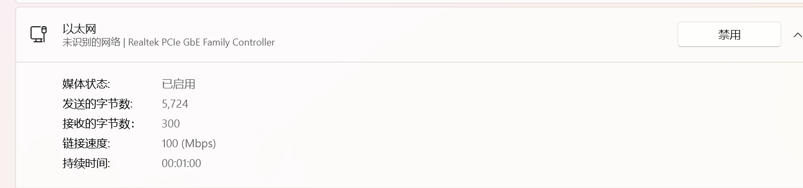

# IMX6ULL驱动开发uboot篇02

## 网络操作

​	在开始之前，我需要说明一下如何设置我们的开发板这样才能Ping通。笔者之前的博客是针对一台上位机Linux的操作，这里说一下虚拟机咋搞

​	注意，这里说的是——开发板连接到电脑上，网络环境只有真实的Windows接入到笔者的校园网上。是准备把开发板介入到路由器的朋友请参考其他人的博客

#### 第零步：先将网线跟电脑接好，打开串口连接到开发板上，然后上电，让UBoot停下来

#### 第一步：查看我们的网线构成的虚拟子网是哪一个

​	一个办法，跑到网络适配器那里，你插拔网线，注意每一个有线网的状态如何。比如说，笔者插拔网线，发现下面这个会从“未连接的网络”跟“未识别的网络”中来回变化。那说明就是这个了。



​	下一步，去看看ip：

```
Ethernet adapter 以太网:
   Connection-specific DNS Suffix  . :
   Link-local IPv6 Address . . . . . : fe80::c5ef:6ad6:813f:6ca%7
   IPv4 Address. . . . . . . . . . . : 192.168.137.1
   Subnet Mask . . . . . . . . . . . : 255.255.255.0
   Default Gateway . . . . . . . . . :
```

​	可以看到，我们的Windows在这个网线构成的子网中被分派了192.168.137.1，网关没有设置，这个无所谓。

#### 第二步：我们必须把虚拟机的网卡模式从NAT改成桥接，因为我们要跟真实的开发板同处于一个子网

​	笔者这里详细展开说明VMWare NAT/桥接的区别了，大概就是：NAT办法讲虚拟机及其虚拟的设备组成一个虚拟的子网，我们主机/开发板没办法直接跟虚拟机对话，必须走虚拟机的NAT表转换才能访问虚拟机本身。这样的话，我们实际上没法直接板子ping到Ubuntu上。所以必须要改。

​	把我们的虚拟机设置改成这个，这个就是上面的网线组成虚拟子网的名称。


​	下一步就是修改Ubuntu的IP了，注意，这个子网是不具备IP分配功能的，为了简便期间，我们就直接给我们的Ubuntu一个静态IP。


​	比如说，笔者在Windows上就查询到笔者的Windows在这个子网中被分配到了IP：192.168.137.1，那么，我们这里就随意填写一个192.168.137.10. 当然不是真的随意，正确的做法是先ping一下这个ip有没有被占用，如果没有回应，就说明设备可以在这里占用这个ip。至于网关，按照默认的规矩，我们写192.168.137.1，Netmask子网掩码那就是255.255.255.0，要跟网线给出的设置一致最好。说明这个网线最大支持搜索254个设备。（1是gateway，255是广播，所以之后的开发板不要设置成这两个）。

​	点击保存后，我们看一下网卡的IP有没有被设置成功：

```
charliechen@ubuntu:~$ ip addr
1: lo: <LOOPBACK,UP,LOWER_UP> mtu 65536 qdisc noqueue state UNKNOWN group default qlen 1000
    link/loopback 00:00:00:00:00:00 brd 00:00:00:00:00:00
    inet 127.0.0.1/8 scope host lo
       valid_lft forever preferred_lft forever
    inet6 ::1/128 scope host 
       valid_lft forever preferred_lft forever
2: ens33: <BROADCAST,MULTICAST,UP,LOWER_UP> mtu 1500 qdisc pfifo_fast state UP group default qlen 1000
    link/ether 00:0c:29:74:eb:32 brd ff:ff:ff:ff:ff:ff
    inet 192.168.137.10/24 brd 192.168.137.255 scope global ens33
       valid_lft forever preferred_lft forever
    inet6 fe80::6e1d:7cee:2940:cb3d/64 scope link 
       valid_lft forever preferred_lft forever
```

​	我们尝试ping一下Windows主机。虽然实际上我们的Windows主机本身充当了网关：

```
charliechen@ubuntu:~$ ping 192.168.137.1 -c 4
PING 192.168.137.1 (192.168.137.1) 56(84) bytes of data.
64 bytes from 192.168.137.1: icmp_seq=1 ttl=128 time=0.363 ms
64 bytes from 192.168.137.1: icmp_seq=2 ttl=128 time=0.525 ms
64 bytes from 192.168.137.1: icmp_seq=3 ttl=128 time=0.431 ms
64 bytes from 192.168.137.1: icmp_seq=4 ttl=128 time=0.452 ms

--- 192.168.137.1 ping statistics ---
4 packets transmitted, 4 received, 0% packet loss, time 3075ms
rtt min/avg/max/mdev = 0.363/0.442/0.525/0.063 ms
```

​	在Windows上，我们测试一下能不能ping通Ubuntu：

```
➜  ping 192.168.137.10

Pinging 192.168.137.10 with 32 bytes of data:
Reply from 192.168.137.10: bytes=32 time<1ms TTL=64
Reply from 192.168.137.10: bytes=32 time<1ms TTL=64
Reply from 192.168.137.10: bytes=32 time<1ms TTL=64
Reply from 192.168.137.10: bytes=32 time<1ms TTL=64

Ping statistics for 192.168.137.10:
    Packets: Sent = 4, Received = 4, Lost = 0 (0% loss),
Approximate round trip times in milli-seconds:
    Minimum = 0ms, Maximum = 0ms, Average = 0ms
```

​	非常好！

#### 第三步：设置板子的IP，网关， MAC地址和子网掩码

​	注意，网关和子网掩码要求必须跟我们的网线是完全一致的。MAC地址呢，实际上只要求子网内唯一即可。这里我们顺用正点原子给出的MAC地址就好了

```
setenv ethaddr b8:ae:1d:01:00:00 
```

​	需要保证的是这个MAC地址是子网唯一的。

```
=> setenv gatewayip 192.168.137.1
=> setenv netmask 255.255.255.0
```

​	不要照抄，看自己的网线！

```
=> setenv ipaddr 192.168.137.4
```

​	这个就是设置我们板子的IP了。注意的是，我们需要保证我们的板子跟我们的子网内，看一下我们设置的gatewayip和netmask，所以能修改的就是最后一个数字，且不可以是1， 255，Windows占用的IP和Ubuntu虚拟机占用的IP。这里笔者就随意的给了个4。

​	**需要提醒的是——不要试图其他主机去ping我们的板子，你ping不到的，我们的uboot不会处理，也没有必要处理ICMP请求包，所以，他就是只能够单向的作为发起请求的一方。笔者不知道这一点，折腾了半个小时**

​	很好，现在我们试一下ping不ping的通：

```
=> ping 192.168.137.1            
Using FEC1 device
host 192.168.137.1 is alive
=> ping 192.168.137.10
Using FEC1 device
host 192.168.137.10 is alive
```

​	OK，现在我们可以做实验了。

## uboot对NFS的支持

​	**笔者又要说明的是——如果你使用的是高版本的Ubuntu，或者内核版本大于6.2的情况下，正点原子使用的UBoot是不支持NFSv2的，需要做修改，24.04的版本更是直接废掉了NFS，只允许TFTP，所以，如果你是Ubuntu24.04用户，就直接看tftp即可**

​	uboot的NFS指令非常的直白，就是nfs

```
=> ? nfs
nfs - boot image via network using NFS protocol

Usage:
nfs [loadAddress] [[hostIPaddr:]bootfilename]
```

​	下面我们尝试传送一个zImage玩玩先。

> 还没有配置nfs的朋友需要先在Ubuntu上配置一下nfs，设置好nfs的操作共享目录之后，把我们的zImage或者啥文件拷贝到那个文件夹下，笔者是直接拿了正点编译好的zImage过来

​	虽说默认的，我们的uboot的上传默认地址就是0x80800000，但是这不太明晰，我们一般会写出来我们要放到那个地方。其次就是我们的被传送文件的路径，格式是:`IP:AbsPath`，必须是绝对路径，`~`是针对用户而言的，uboot肯定不知道你这个~是啥意思。

```
=> nfs 0x80800000 192.168.137.10:/home/charliechen/linux/nfs/zImage
Using FEC1 device
File transfer via NFS from server 192.168.137.10; our IP address is 192.168.137.4; sending through gateway 192.168.137.1
Filename '/home/charliechen/linux/nfs/zImage'.
Load address: 0x80800000
Loading: #################################################################
	 #################################################################
	 #################################################################
	...
	 ##########################
done
Bytes transferred = 6785480 (6789c8 hex)
```

​	出于严谨，我们对比一下到底是不是发生了传送：

```
=> md.b 80800000 100
80800000: 00 00 a0 e1 00 00 a0 e1 00 00 a0 e1 00 00 a0 e1    ................
80800010: 00 00 a0 e1 00 00 a0 e1 00 00 a0 e1 00 00 a0 e1    ................
80800020: 03 00 00 ea 18 28 6f 01 00 00 00 00 c8 89 67 00    .....(o.......g.
80800030: 01 02 03 04 00 90 0f e1 e8 04 00 eb 01 70 a0 e1    .............p..
80800040: 02 80 a0 e1 00 20 0f e1 03 00 12 e3 01 00 00 1a    ..... ..........
80800050: 17 00 a0 e3 56 34 12 ef 00 00 0f e1 1a 00 20 e2    ....V4........ .
80800060: 1f 00 10 e3 1f 00 c0 e3 d3 00 80 e3 04 00 00 1a    ................
80800070: 01 0c 80 e3 0c e0 8f e2 00 f0 6f e1 0e f3 2e e1    ..........o.....
80800080: 6e 00 60 e1 00 f0 21 e1 09 f0 6f e1 00 00 00 00    n.`...!...o.....
80800090: 00 00 00 00 00 00 00 00 00 00 00 00 00 00 00 00    ................
808000a0: 0f 40 a0 e1 3e 43 04 e2 02 49 84 e2 0f 00 a0 e1    .@..>C...I......
808000b0: 04 00 50 e1 ac 01 9f 35 0f 00 80 30 00 00 54 31    ..P....5...0..T1
808000c0: 01 40 84 33 6d 00 00 2b 5e 0f 8f e2 4e 1c 90 e8    .@.3m..+^...N...
808000d0: 1c d0 90 e5 01 00 40 e0 00 60 86 e0 00 a0 8a e0    ......@..`......
808000e0: 00 90 da e5 01 e0 da e5 0e 94 89 e1 02 e0 da e5    ................
808000f0: 03 a0 da e5 0e 98 89 e1 0a 9c 89 e1 00 d0 8d e0    ................
```


​	嗯，一眼扫过去没毛病。

## tftp指令

​	我们还要做的一个事情就是搭建tftp环境，这个是所有版本的ubuntu协议都可以用的。这里简单的说一下如何搭建tftp服务。

​	上面我们刚刚切换到的桥接模式要改回来可以上网的NAT，然后可能需要重启一下ubuntu，我没重启，发现可以直接上网，当然如果发现上不了网，重启一下ip addr看看ip有没有恢复

```
sudo apt-get install tftp-hpa tftpd-hpa 
sudo apt-get install xinetd
```

​	下一步就是建立一个tftp文件夹，笔者建立在了:`/home/charliechen/linux/tftp`，然后需要

- 创建一个配置文件：`sudo gedit /etc/xinetd.d/tftp`，然后需要将自己的server_args指向的文件夹改成自己打算设置成的tftp协议文件夹

```
# /etc/xinetd.d/tftp 
server tftp 
{ 
	socket_type = dgram 
	protocol = udp 
	wait = yes 
	user = root 
	server = /usr/sbin/in.tftpd 
	server_args = -s /home/charliechen/linux/tftp/ 
	disable = no 
	per_source = 11 
	cps = 100 2 
	flags = IPv4 
} 
```

​	然后记得重启，看看配置是否成功，ubuntu service指令中

```
sudo service tftpd-hpa start
sudo service tftpd-hpa status
```

​	查看一下服务的状态是一个很好的习惯，不要开了就拍拍屁股走人了。

​	`/etc/default/tftpd-hpa`这个文件是已经存在的，我们改一下TFTP_DIRECTORY就好了，还是指向我们的tftp文件夹。

```
# /etc/default/tftpd-hpa

TFTP_USERNAME="tftp"
TFTP_DIRECTORY="/home/charliechen/linux/tftp"
TFTP_ADDRESS=":69"
TFTP_OPTIONS="-l -c -s"
```

​	老样子，我们把我们的`/home/charliechen/linux/tftp`的权限改成777（之前不信邪，发现就是这个管用，不然死活permission denied，看来有时间必须好好理解一下tftp协议了）

```
=> tftp 80800000 zImage          
Using FEC1 device
TFTP from server 192.168.137.10; our IP address is 192.168.137.4
Filename 'zImage'.
Load address: 0x80800000
Loading: #################################################################
	 #################################################################
	 #################################################################
	 #################################################################
	 #################################################################
	 #################################################################
	 #################################################################
	 ########
	 2.2 MiB/s
done
Bytes transferred = 6785480 (6789c8 hex)

```

​	注意，这个协议比较简单，uboot会操作主机直接到我们设置的serverip指向的设备，查找其tftp根目录下的文件下载过来

```
-rw-rw-r-- 1 charliechen charliechen 6785480 Mar  6 04:21 zImage
```

​	这个协议下面的文件只需要保证可读即可。所以没必要拉满权限，但是tftp文件夹是需要的。

## Boot系列指令

### bootz

​	要启动Linux，需要先将 Linux 镜像文件拷贝到 DRAM 中，如果使用到设备树的话也需要将设备树拷贝到 DRAM 中。可以从 EMMC 或者NAND 等存储设备中将Linux 镜像和设备树文 件拷贝到 DRAM，也可以通过 nfs 或者 tftp 将 Linux 镜像文件和设备树文件下载到 DRAM 中

```
Usage:
bootz [addr [initrd[:size]] [fdt]]
    - boot Linux zImage stored in memory
```

​	比如说，我们可以尝试启动一下：

```
tftp 80800000 zImage
tftp 83000000 imx6ull-14x14-emmc-7-800x480-c.dtb
bootz 80800000 - 83000000
```

​	可以看到我们可以启动成功板子的，但是可惜的是没有根文件系统，无法完全启动。

### boot

​	boot 命令也是用来启动Linux 系统的，只是 boot 会读取环境变量 bootcmd 来启动 Linux 系 统，bootcmd 是一个很重要的环境变量！其名字分为“boot”和“cmd”，也就是“引导”和“命 令”，说明这个环境变量保存着引导命令，其实就是启动的命令集合，具体的引导命令内是可以修改的。

​	换而言之，我们的boot就相当于一个启动集合指令。这里就不再赘述了，直接给出来一个模板，一看就懂：

```
setenv bootcmd 'tftp 80800000 zImage; tftp 83000000 imx6ull-14x14-emmc-7-800x480-c.dtb; bootz 80800000 - 83000000'
saveenv
boot
```

